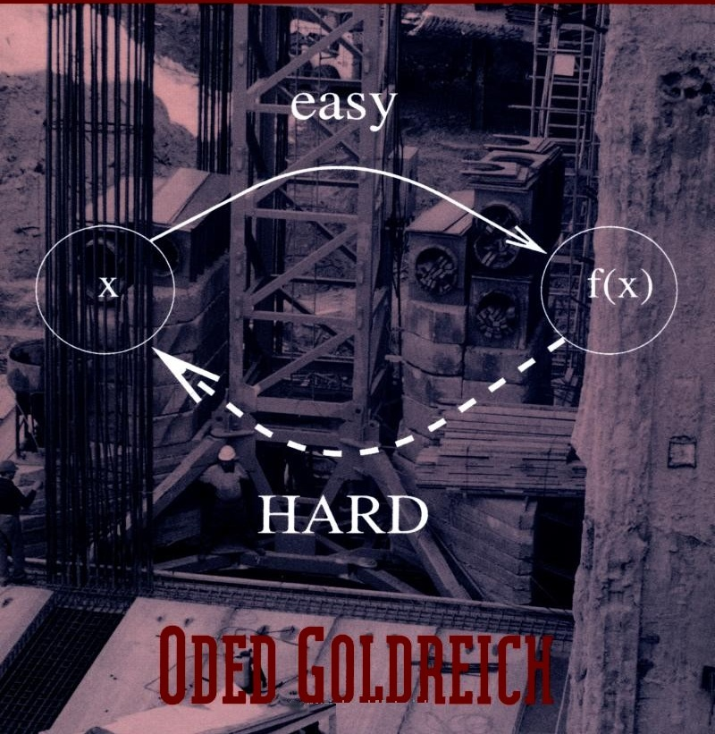

# Foundations of Cryptography: Basic Tools

### Foundations of Cryptography

Cryptography is concerned with the conceptualization, definition, and construction of computing systems that address security concerns. The design of cryptographic systems must be based on firm foundations. This book presents a rigorous and systematic treatment of the foundational issues: defining cryptographic tasks and solving new cryptographic problems using existing tools. It focuses on the basic mathematical tools: computational difficulty (one-way functions), pseudorandomness, and zero-knowledge proofs. The emphasis is on the clarification of fundamental concepts and on demonstrating the feasibility of solving cryptographic problems rather than on describing ad hoc approaches.

The book is suitable for use in a graduate course on cryptography and as a reference book for experts. The author assumes basic familiarity with the design and analysis of algorithms; some knowledge of complexity theory and probability is also useful.

Oded Goldreich is Professor of Computer Science at the Weizmann Institute of Science and incumbent of the Meyer W. Weisgal Professorial Chair. An active researcher, he has written numerous papers on cryptography and is widely considered to be one of the world experts in the area. He is an editor of Journal of Cryptology and SIAM Journal on Computing and the author of Modern Cryptography, Probabilistic Proofs and Pseudorandomness, published in 1999 by Springer-Verlag.

## Foundations of Cryptography: Basic Tools

Oded Goldreich

Weizmann Institute of Science

PUBLISHED BY THE PRESS SYNDICATE OF THE UNIVERSITY OF CAMBRIDGE The Pitt Building, Trumpington Street, Cambridge, United Kingdom

CAMBRIDGE UNIVERSITY PRESS

The Edinburgh Building, Cambridge CB2 2RU, UK

40 West 20th Street, New York, NY 10011-4211, USA

477 Williamstown Road, Port Melbourne, VIC 3207, Australia

Ruiz de Alarcón 13, 28014 Madrid, Spain

Dock House, The Waterfront, Cape Town 8001, South Africa

http://www.cambridge.org

© Oded Goldreich 2004

First published in printed format 2001

ISBN 978-0-511-54689-1 OCeISBN

ISBN 0-521-79172-3 hardback

First published 2001

Reprinted with corrections 2003

