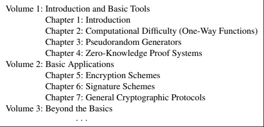

# Preface

It is possible to build a cabin with no foundations, but not a lasting building.

Eng. Isidor Goldreich (1906–1995)

Cryptography is concerned with the construction of schemes that should be able to withstand any abuse. Such schemes are constructed so as to maintain a desired functionality, even under malicious attempts aimed at making them deviate from their prescribed functionality.

The design of cryptographic schemes is a very difficult task. One cannot rely on intuitions regarding the typical state of the environment in which a system will operate. For sure, an adversary attacking the system will try to manipulate the environment into untypical states. Nor can one be content with countermeasures designed to withstand specific attacks, because the adversary (who will act after the design of the system has been completed) will try to attack the schemes in ways that typically will be different from the ones the designer envisioned. Although the validity of the foregoing assertions seems self-evident, still some people hope that, in practice, ignoring these tautologies will not result in actual damage. Experience shows that such hopes are rarely met; cryptographic schemes based on make-believe are broken, typically sooner rather than later.

In view of the foregoing, we believe that it makes little sense to make assumptions regarding the specific strategy that an adversary may use. The only assumptions that can be justified refer to the computational abilities of the adversary. Furthermore, it is our opinion that the design of cryptographic systems has to be based on firm foundations, whereas ad hoc approaches and heuristics are a very dangerous way to go. A heuristic may make sense when the designer has a very good idea about the environment in which a scheme is to operate, but a cryptographic scheme will have to operate in a maliciously selected environment that typically will transcend the designer's view.

This book is aimed at presenting firm foundations for cryptography. The foundations of cryptography are the paradigms, approaches, and techniques used to conceptualize, define, and provide solutions to natural “security concerns.” We shall present some of these paradigms, approaches, and techniques, as well as some of the fundamental results obtained by using them. Our emphasis is on the clarification of fundamental concepts and on demonstrating the feasibility of solving several central cryptographic problems.

Solving a cryptographic problem (or addressing a security concern) is a two-stage process consisting of a definitional stage and a constructive stage. First, in the definitional stage, the functionality underlying the natural concern must be identified and an adequate cryptographic problem must be defined. Trying to list all undesired situations is infeasible and prone to error. Instead, one should define the functionality in terms of operation in an imaginary ideal model and then require a candidate solution to emulate this operation in the real, clearly defined model (which will specify the adversary's abilities). Once the definitional stage is completed, one proceeds to construct a system that will satisfy the definition. Such a construction may use some simpler tools, and its security is to be proved relying on the features of these tools. (In practice, of course, such a scheme also may need to satisfy some specific efficiency requirements.)

This book focuses on several archetypical cryptographic problems (e.g., encryption and signature schemes) and on several central tools (e.g., computational difficulty, pseudorandomness, and zero-knowledge proofs). For each of these problems (resp., tools), we start by presenting the natural concern underlying it (resp., its intuitive objective), then define the problem (resp., tool), and finally demonstrate that the problem can be solved (resp., the tool can be constructed). In the last step, our focus is on demonstrating the feasibility of solving the problem, not on providing a practical solution. As a secondary concern, we typically discuss the level of practicality (or impracticality) of the given (or known) solution.

## Computational Difficulty

The specific constructs mentioned earlier (as well as most constructs in this area) can exist only if some sort of computational hardness (i.e., difficulty) exists. Specifically, all these problems and tools require (either explicitly or implicitly) the ability to generate instances of hard problems. Such ability is captured in the definition of one-way functions (see further discussion in Section 2.1). Thus, one-way functions are the very minimum needed for doing most sorts of cryptography. As we shall see, they actually suffice for doing much of cryptography (and the rest can be done by augmentations and extensions of the assumption that one-way functions exist).

Our current state of understanding of efficient computation does not allow us to prove that one-way functions exist. In particular, the existence of one-way functions implies that $ \mathcal{NP} $ is not contained in $ \mathcal{BPP} \supseteq \mathcal{P} $ (not even “on the average”), which would resolve the most famous open problem of computer science. Thus, we have no choice (at this stage of history) but to assume that one-way functions exist. As justification for this assumption we can only offer the combined beliefs of hundreds (or thousands) of researchers. Furthermore, these beliefs concern a simply stated assumption, and their validity is supported by several widely believed conjectures that are central to some fields (e.g., the conjecture that factoring integers is difficult is central to computational number theory).

As we need assumptions anyhow, why not just assume what we want, that is, the existence of a solution to some natural cryptographic problem? Well, first we need to know what we want: As stated earlier, we must first clarify what exactly we do want; that is, we must go through the typically complex definitional stage. But once this stage is completed, can we just assume that the definition derived can be met? Not really: The mere fact that a definition has been derived does not mean that it can be met, and one can easily define objects that cannot exist (without this fact being obvious in the definition). The way to demonstrate that a definition is viable (and so the intuitive security concern can be satisfied at all) is to construct a solution based on a better-understood assumption (i.e., one that is more common and widely believed). For example, looking at the definition of zero-knowledge proofs, it is not a priori clear that such proofs exist at all (in a non-trivial sense). The non-triviality of the notion was first demonstrated by presenting a zero-knowledge proof system for statements regarding Quadratic Residuosity that are believed to be difficult to verify (without extra information). Furthermore, contrary to prior belief, it was later shown that the existence of one-way functions implies that any $ \mathcal{N}\mathcal{P} $-statement can be proved in zero-knowledge. Thus, facts that were not at all known to hold (and were even believed to be false) were shown to hold by reduction to widely believed assumptions (without which most of modern cryptography would collapse anyhow). To summarize, not all assumptions are equal, and so reducing a complex, new, and doubtful assumption to a widely believed simple (or even merely simpler) assumption is of great value. Furthermore, reducing the solution of a new task to the assumed security of a well-known primitive task typically means providing a construction that, using the known primitive, will solve the new task. This means that we not only know (or assume) that the new task is solvable but also have a solution based on a primitive that, being well known, typically has several candidate implementations.

## Structure and Prerequisites

Our aim is to present the basic concepts, techniques, and results in cryptography. As stated earlier, our emphasis is on the clarification of fundamental concepts and the relationships among them. This is done in a way independent of the particularities of some popular number-theoretic examples. These particular examples played a central role in the development of the field and still offer the most practical implementations of all cryptographic primitives, but this does not mean that the presentation has to be linked to them. On the contrary, we believe that concepts are best clarified when presented at an abstract level, decoupled from specific implementations. Thus, the most relevant background for this book is provided by basic knowledge of algorithms (including randomized ones), computability, and elementary probability theory. Background on (computational) number theory, which is required for specific implementations of certain constructs, is not really required here (yet a short appendix presenting the most relevant facts is included in this volume so as to support the few examples of implementations presented here).

Organization of the work. This work is organized into three parts (see Figure 0.1), to be presented in three volumes: Basic Tools, Basic Applications, and Beyond the Basics. This first volume contains an introductory chapter as well as the first part

Figure 0.1: Organization of the work.

(basic tools). It provides chapters on computational difficulty (one-way functions), pseudorandomness, and zero-knowledge proofs. These basic tools will be used for the basic applications in the second volume, which will consist of encryption, signatures, and general cryptographic protocols.

The partition of the work into three volumes is a logical one. Furthermore, it offers the advantage of publishing the first part without waiting for the completion of the other parts. Similarly, we hope to complete the second volume within a couple of years and publish it without waiting for the third volume.

Organization of this first volume. This first volume consists of an introductory chapter (Chapter 1), followed by chapters on computational difficulty (one-way functions), pseudorandomness, and zero-knowledge proofs (Chapters 2–4, respectively). Also included are two appendixes, one of them providing a brief summary of Volume 2. Figure 0.2 depicts the high-level structure of this first volume.

Historical notes, suggestions for further reading, some open problems, and some exercises are provided at the end of each chapter. The exercises are mostly designed to assist and test one's basic understanding of the main text, not to test or inspire creativity. The open problems are fairly well known; still, we recommend that one check their current status (e.g., at our updated-notices web site).

Web site for notices regarding this book. We intend to maintain a web site listing corrections of various types. The location of the site is

http://www.wisdom.weizmann.ac.il/~oded/foc-book.html

## Using This Book

The book is intended to serve as both a textbook and a reference text. That is, it is aimed at serving both the beginner and the expert. In order to achieve that goal, the presentation of the basic material is very detailed, so as to allow a typical undergraduate in computer science to follow it. An advanced student (and certainly an expert) will find the pace in these parts far too slow. However, an attempt has been made to allow the latter reader to easily skip details that are obvious to him or her. In particular, proofs typically are presented in a modular way. We start with a high-level sketch of the main ideas and

<table border=1 style='margin: auto; word-wrap: break-word;'><tr><td style='text-align: center; word-wrap: break-word;'>Chapter 1: Introduction</td></tr><tr><td style='text-align: center; word-wrap: break-word;'>Main topics covered by the book (Sec. 1.1)</td></tr><tr><td style='text-align: center; word-wrap: break-word;'>Background on probability and computation (Sec. 1.2 and 1.3)</td></tr><tr><td style='text-align: center; word-wrap: break-word;'>Motivation to the rigorous treatment (Sec. 1.4)</td></tr><tr><td style='text-align: center; word-wrap: break-word;'>Chapter 2: Computational Difficulty (One-Way Functions)</td></tr><tr><td style='text-align: center; word-wrap: break-word;'>Motivation and definitions (Sec. 2.1 and 2.2)</td></tr><tr><td style='text-align: center; word-wrap: break-word;'>One-way functions: weak implies strong (Sec. 2.3)</td></tr><tr><td style='text-align: center; word-wrap: break-word;'>Variants (Sec. 2.4) and advanced material (Sec. 2.6)</td></tr><tr><td style='text-align: center; word-wrap: break-word;'>Hard-core predicates (Sec. 2.5)</td></tr><tr><td style='text-align: center; word-wrap: break-word;'>Chapter 3: Pseudorandom Generators</td></tr><tr><td style='text-align: center; word-wrap: break-word;'>Motivation and definitions (Sec. 3.1–3.3)</td></tr><tr><td style='text-align: center; word-wrap: break-word;'>Constructions based on one-way permutations (Sec. 3.4)</td></tr><tr><td style='text-align: center; word-wrap: break-word;'>Pseudorandom functions (Sec. 3.6)</td></tr><tr><td style='text-align: center; word-wrap: break-word;'>Advanced material (Sec. 3.5 and 3.7)</td></tr><tr><td style='text-align: center; word-wrap: break-word;'>Chapter 4: Zero-Knowledge Proofs</td></tr><tr><td style='text-align: center; word-wrap: break-word;'>Motivation and definitions (Sec. 4.1–4.3)</td></tr><tr><td style='text-align: center; word-wrap: break-word;'>Zero-knowledge proofs for $ \mathcal{NP} $ (Sec. 4.4)</td></tr><tr><td style='text-align: center; word-wrap: break-word;'>Advanced material (Sec. 4.5–4.11)</td></tr><tr><td style='text-align: center; word-wrap: break-word;'>Appendix A: Background in Computational Number Theory</td></tr><tr><td style='text-align: center; word-wrap: break-word;'>Appendix B: Brief Outline of Volume 2</td></tr><tr><td style='text-align: center; word-wrap: break-word;'>Bibliography and Index</td></tr></table>

Figure 0.2: Rough organization of this volume.

only later pass to the technical details. The transition from high-level description to lower-level details is typically indicated by phrases such as “details follow.”

In a few places, we provide straightforward but tedious details in indented paragraphs such as this one. In some other (even fewer) places, such paragraphs provide technical proofs of claims that are of marginal relevance to the topic of the book.

More advanced material typically is presented at a faster pace and with fewer details. Thus, we hope that the attempt to satisfy a wide range of readers will not harm any of them.

Teaching. The material presented in this book is, on one hand, way beyond what one may want to cover in a semester course, and on the other hand it falls very short of what one may want to know about cryptography in general. To assist these conflicting needs, we make a distinction between basic and advanced material and provide suggestions for further reading (in the last section of each chapter). In particular, those sections marked by an asterisk are intended for advanced reading.

Volumes 1 and 2 of this work are intended to provide all the material needed for a course on the foundations of cryptography. For a one-semester course, the instructor definitely will need to skip all advanced material (marked by asterisks) and perhaps even some basic material; see the suggestions in Figure 0.3. This should allow, depending on the class, coverage of the basic material at a reasonable level (i.e., all material marked as “main” and some of the “optional”). Volumes 1 and 2 can also serve as a textbook for a two-semester course. Either way, this first volume covers only the first half of the material for such a course. The second half will be covered in Volume 2. Meanwhile,

<table border=1 style='margin: auto; word-wrap: break-word;'><tr><td style='text-align: center; word-wrap: break-word;'>Each lecture consists of one hour. Lectures 1–15 are covered by this first volume. Lectures 16–28 will be covered by the second volume.</td></tr><tr><td style='text-align: center; word-wrap: break-word;'>Lecture 1: Introduction, background, etc.
(depending on class)</td></tr><tr><td style='text-align: center; word-wrap: break-word;'>Lectures 2–5: Computational Difficulty (One-Way Functions)
Main: Definition (Sec. 2.2), Hard-core predicates (Sec. 2.5)
Optional: Weak implies strong (Sec. 2.3), and Sec. 2.4.2–2.4.4</td></tr><tr><td style='text-align: center; word-wrap: break-word;'>Lectures 6–10: Pseudorandom Generators
Main: Definitional issues and a construction (Sec. 3.2–3.4)
Optional: Pseudorandom functions (Sec. 3.6)</td></tr><tr><td style='text-align: center; word-wrap: break-word;'>Lectures 11–15: Zero-Knowledge Proofs
Main: Some definitions and a construction (Sec. 4.2.1, 4.3.1, 4.4.1–4.4.3)
Optional: Sec. 4.2.2, 4.3.2, 4.3.3, 4.3.4, 4.4.4</td></tr><tr><td style='text-align: center; word-wrap: break-word;'>Lectures 16–20: Encryption Schemes
Definitions and a construction (consult Appendix B.1.1–B.1.2)
(See also fragments of a draft for the encryption chapter [99])</td></tr><tr><td style='text-align: center; word-wrap: break-word;'>Lectures 21–24: Signature Schemes
Definition and a construction (consult Appendix B.2)
(See also fragments of a draft for the signatures chapter [100])</td></tr><tr><td style='text-align: center; word-wrap: break-word;'>Lectures 25–28: General Cryptographic Protocols
The definitional approach and a general construction (sketches).
(Consult Appendix B.3; see also [98])</td></tr></table>

Figure 0.3: Plan for one-semester course on the foundations of cryptography.

we suggest the use of other sources for the second half. A brief summary of Volume 2 and recommendations for alternative sources are given in Appendix B. (In addition, fragments and/or preliminary drafts for the three chapters of Volume 2 are available from earlier texts, [99], [100], and [98], respectively.)

A course based solely on the material in this first volume is indeed possible, but such a course cannot be considered a stand-alone course in cryptography because this volume does not consider at all the basic tasks of encryption and signatures.

Practice. The aim of this work is to provide sound theoretical foundations for cryptography. As argued earlier, such foundations are necessary for any sound practice of cryptography. Indeed, sound practice requires more than theoretical foundations, whereas this work makes no attempt to provide anything beyond the latter. However, given sound foundations, one can learn and evaluate various practical suggestions that appear elsewhere (e.g., [158]). On the other hand, the absence of sound foundations will result in inability to critically evaluate practical suggestions, which in turn will lead to unsound decisions. Nothing could be more harmful to the design of schemes that need to withstand adversarial attacks than misconceptions about such attacks.

Relationship to another book by the author. A frequently asked question concerns the relationship of this work to my text Modern Cryptography, Probabilistic Proofs and Pseudorandomness [97]. That text consists of three brief introductions to the related topics in the title. Specifically, in Chapter 1 it provides a brief (i.e., 30-page) summary of this work. The other two chapters of Modern Cryptography, Probabilistic Proofs and Pseudorandomness [97] provide a wider perspective on two topics mentioned in this volume (i.e., probabilistic proofs and pseudorandomness). Further comments on the latter aspect are provided in the relevant chapters of this volume.

