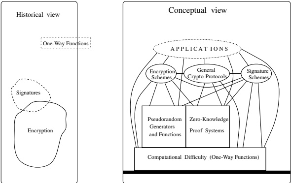

# Introduction

In this chapter we briefly discuss the goals of cryptography (Section 1.1). In particular, we discuss the basic problems of secure encryption, digital signatures, and fault-tolerant protocols. These problems lead to the notions of pseudorandom generators and zero-knowledge proofs, which are discussed as well.

Our approach to cryptography is based on computational complexity. Hence, this introductory chapter also contains a section presenting the computational models used throughout the book (Section 1.3). Likewise, this chapter contains a section presenting some elementary background from probability theory that is used extensively in the book (Section 1.2).

Finally, we motivate the rigorous approach employed throughout this book and discuss some of its aspects (Section 1.4).

Teaching Tip. Parts of Section 1.4 may be more suitable for the last lecture (i.e., as part of the concluding remarks) than for the first one (i.e., as part of the introductory remarks). This refers specifically to Sections 1.4.2 and 1.4.3.

## 1.1. Cryptography: Main Topics

Historically, the term “cryptography” has been associated with the problem of designing and analyzing encryption schemes (i.e., schemes that provide secret communication over insecure communication media). However, since the 1970s, problems such as constructing unforgeable digital signatures and designing fault-tolerant protocols have also been considered as falling within the domain of cryptography. In fact, cryptography can be viewed as concerned with the design of any system that needs to withstand malicious attempts to abuse it. Furthermore, cryptography as redefined here makes essential use of some tools that need to be treated in a book on the subject. Notable examples include one-way functions, pseudorandom generators, and zero-knowledge proofs. In this section we briefly discuss these terms.

We start by mentioning that much of the content of this book relies on the assumption that one-way functions exist. The definition of one-way functions captures the sort of computational difficulty that is inherent to our entire approach to cryptography, an approach that attempts to capitalize on the computational limitations of any real-life adversary. Thus, if nothing is difficult, then this approach fails. However, if, as is widely believed, not only do hard problems exist but also instances of them can be efficiently generated, then these hard problems can be “put to work.” Thus, “algorithmically bad news” (by which hard computational problems exist) implies good news for cryptography. Chapter 2 is devoted to the definition and manipulation of computational difficulty in the form of one-way functions.

### 1.1.1. Encryption Schemes

The problem of providing secret communication over insecure media is the most traditional and basic problem of cryptography. The setting consists of two parties communicating over a channel that possibly may be tapped by an adversary, called the wire-tapper. The parties wish to exchange information with each other, but keep the wire-tapper as ignorant as possible regarding the content of this information. Loosely speaking, an encryption scheme is a protocol allowing these parties to communicate secretly with each other. Typically, the encryption scheme consists of a pair of algorithms. One algorithm, called encryption, is applied by the sender (i.e., the party sending a message), while the other algorithm, called decryption, is applied by the receiver. Hence, in order to send a message, the sender first applies the encryption algorithm to the message and sends the result, called the ciphertext, over the channel. Upon receiving a ciphertext, the other party (i.e., the receiver) applies the decryption algorithm to it and retrieves the original message (called the plaintext).

In order for this scheme to provide secret communication, the communicating parties (at least the receiver) must know something that is not known to the wire-tapper. (Otherwise, the wire-tapper could decrypt the ciphertext exactly as done by the receiver.) This extra knowledge may take the form of the decryption algorithm itself or some parameters and/or auxiliary inputs used by the decryption algorithm. We call this extra knowledge the decryption key. Note that, without loss of generality, we can assume that the decryption algorithm is known to the wire-tapper and that the decryption algorithm needs two inputs: a ciphertext and a decryption key. We stress that the existence of a secret key, not known to the wire-tapper, is merely a necessary condition for secret communication.

Evaluating the “security” of an encryption scheme is a very tricky business. A preliminary task is to understand what “security” is (i.e., to properly define what is meant by this intuitive term). Two approaches to defining security are known. The first (“classic”) approach is information-theoretic. It is concerned with the “information” about the plaintext that is “present” in the ciphertext. Loosely speaking, if the ciphertext contains information about the plaintext, then the encryption scheme is considered insecure. It has been shown that such a high (i.e., “perfect”) level of security can be achieved only if the key in use is at least as long as the total length of the messages sent via the encryption scheme. The fact that the key has to be longer than the information exchanged using it is indeed a drastic limitation on the applicability of such encryption schemes. This is especially true when huge amounts of information need to be secretly communicated.

The second (“modern”) approach, as followed in this book, is based on computational complexity. This approach is based on the fact that it does not matter whether or not the ciphertext contains information about the plaintext, but rather whether or not this information can be efficiently extracted. In other words, instead of asking whether or not it is possible for the wire-tapper to extract specific information, we ask whether or not it is feasible for the wire-tapper to extract this information. It turns out that the new (i.e., “computational-complexity”) approach offers security even if the key is much shorter than the total length of the messages sent via the encryption scheme. For example, one can use “pseudorandom generators” (discussed later) that expand short keys into much longer “pseudo-keys,” so that the latter are as secure as “real keys” of comparable length.

In addition, the computational-complexity approach allows the introduction of concepts and primitives that cannot exist under the information-theoretic approach. A typical example is the concept of public-key encryption schemes. Note that in the preceding discussion we concentrated on the decryption algorithm and its key. It can be shown that the encryption algorithm must get, in addition to the message, an auxiliary input that depends on the decryption key. This auxiliary input is called the encryption key. Traditional encryption schemes, and in particular all the encryption schemes used over the millennia preceding the 1980s, operate with an encryption key equal to the decryption key. Hence, the wire-tapper in these schemes must be ignorant of the encryption key, and consequently the key-distribution problem arises (i.e., how two parties wishing to communicate over an insecure channel can agree on a secret encryption/decryption key). $ ^{1} $ The computational-complexity approach allows the introduction of encryption schemes in which the encryption key can be known to the wire-tapper without compromising the security of the scheme. Clearly, the decryption key in such schemes is different from the encryption key, and furthermore it is infeasible to compute the decryption key from the encryption key. Such encryption schemes, called public-key schemes, have the advantage of trivially resolving the key-distribution problem, because the encryption key can be publicized.

In Chapter 5, which will appear in the second volume of this work and will be devoted to encryption schemes, we shall discuss private-key and public-key encryption schemes. Much attention is devoted to defining the security of encryption schemes. Finally, constructions of secure encryption schemes based on various intractability assumptions are presented. Some of the constructions presented are based on pseudorandom generators, which are discussed in Chapter 3. Other constructions use specific one-way functions such as the RSA function and/or the operation of squaring modulo a composite number.

### 1.1.2. Pseudorandom Generators

It turns out that pseudorandom generators play a central role in the construction of encryption schemes (and related schemes). In particular, pseudorandom generators yield simple constructions of private-key encryption schemes, and this observation is often used in practice (usually implicitly).

Although the term “pseudorandom generators” is commonly used in practice, both in the context of cryptography and in the much wider context of probabilistic procedures, it is seldom associated with a precise meaning. We believe that using a term without clearly stating what it means is dangerous in general and particularly so in a tricky business such as cryptography. Hence, a precise treatment of pseudorandom generators is central to cryptography.

Loosely speaking, a pseudorandom generator is a deterministic algorithm that expands short random seeds into much longer bit sequences that appear to be “random” (although they are not). In other words, although the output of a pseudorandom generator is not really random, it is infeasible to tell the difference. It turns out that pseudorandomness and computational difficulty are linked in an even more fundamental manner, as pseudorandom generators can be constructed based on various intractability assumptions. Furthermore, the main result in this area asserts that pseudorandom generators exist if and only if one-way functions exist.

Chapter 3, devoted to pseudorandom generators, starts with a treatment of the concept of computational indistinguishability. Pseudorandom generators are defined next and are constructed using special types of one-way functions (defined in Chapter 2). Pseudorandom functions are defined and constructed as well. The latter offer a host of additional applications.

### 1.1.3. Digital Signatures

A notion that did not exist in the pre-computerized world is that of a “digital signature.” The need to discuss digital signatures arose with the introduction of computer communication in the business environment in which parties need to commit themselves to proposals and/or declarations they make. Discussions of “unforgeable signatures” also took place in previous centuries, but the objects of discussion were handwritten signatures, not digital ones, and the discussion was not perceived as related to cryptography.

Relations between encryption and signature methods became possible with the “digitalization” of both and the introduction of the computational-complexity approach to security. Loosely speaking, a scheme for unforgeable signatures requires

- that each user be able to efficiently generate his or her own signature on documents of his or her choice.

- that each user be able to efficiently verify whether or not a given string is a signature of another (specific) user on a specific document, and

- that no one be able to efficiently produce the signatures of other users to documents that those users did not sign.

We stress that the formulation of unforgeable digital signatures also provides a clear statement of the essential ingredients of handwritten signatures. Indeed, the ingredients are each person's ability to sign for himself or herself, a universally agreed verification procedure, and the belief (or assertion) that it is infeasible (or at least difficult) to forge signatures in a manner that could pass the verification procedure. It is difficult to state to what extent handwritten signatures meet these requirements. In contrast, our discussion of digital signatures will supply precise statements concerning the extent to which digital signatures meet the foregoing requirements. Furthermore, schemes for unforgeable digital signatures can be constructed using the same computational assumptions as used in the construction of (private-key) encryption schemes.

In Chapter 6, which will appear in the second volume of this work and will be devoted to signature schemes, much attention will be focused on defining the security (i.e., unforgeability) of these schemes. Next, constructions of unforgeable signature schemes based on various intractability assumptions will be presented. In addition, we shall treat the related problem of message authentication.

#### Message Authentication

Message authentication is a task related to the setting considered for encryption schemes (i.e., communication over an insecure channel). This time, we consider the case of an active adversary who is monitoring the channel and may alter the messages sent on it. The parties communicating through this insecure channel wish to authenticate the messages they send so that the intended recipient can tell an original message (sent by the sender) from a modified one (i.e., modified by the adversary). Loosely speaking, a scheme for message authentication requires

- that each of the communicating parties be able to efficiently generate an authentication tag for any message of his or her choice.

- that each of the communicating parties be able to efficiently verify whether or not a given string is an authentication tag for a given message, and

- that no external adversary (i.e., a party other than the communicating parties) be able to efficiently produce authentication tags to messages not sent by the communicating parties.

In some sense, “message authentication” is similar to a digital signature. The difference between the two is that in the setting of message authentication it is not required that third parties (who may be dishonest) be able to verify the validity of authentication tags produced by the designated users, whereas in the setting of signature schemes it is required that such third parties be able to verify the validity of signatures produced by other users. Hence, digital signatures provide a solution to the message-authentication problem. On the other hand, a message-authentication scheme does not necessarily constitute a digital-signature scheme.

#### Signatures Widen the Scope of Cryptography

Considering the problem of digital signatures as belonging to cryptography widens the scope of this area from the specific secret-communication problem to a variety of problems concerned with limiting the “gain” that can be achieved by “dishonest” behavior of parties (who are either internal or external to the system). Specifically:

- In the secret-communication problem (solved by use of encryption schemes), one wishes to reduce, as much as possible, the information that a potential wire-tapper can extract from the communication between two designated users. In this case, the designated system consists of the two communicating parties, and the wire-tapper is considered as an external ("dishonest") party.

- In the message-authentication problem, one aims at prohibiting any (external) wiretapper from modifying the communication between two (designated) users.

In the signature problem, one aims at providing all users of a system a way of making self-binding statements and of ensuring that one user cannot make statements that would bind another user. In this case, the designated system consists of the set of all users, and a potential forger is considered as an internal yet dishonest user.

Hence, in the wide sense, cryptography is concerned with any problem in which one wishes to limit the effects of dishonest users. A general treatment of such problems is captured by the treatment of “fault-tolerant” (or cryptographic) protocols.

## 1.1.4. Fault-Tolerant Protocols and Zero-Knowledge Proofs

A discussion of signature schemes naturally leads to a discussion of cryptographic protocols, because it is a natural concern to ask under what circumstances one party should provide its signature to another party. In particular, problems like mutual simultaneous commitment (e.g., contract signing) arise naturally. Another type of problem, motivated by the use of computer communication in the business environment, consists of “secure implementation” of protocols (e.g., implementing secret and incorruptible voting).

#### Simultaneity Problems

A typical example of a simultaneity problem is that of simultaneous exchange of secrets, of which contract signing is a special case. The setting for a simultaneous exchange of secrets consists of two parties, each holding a “secret.” The goal is to execute a protocol such that if both parties follow it correctly, then at termination each will hold its counterpart’s secret, and in any case (even if one party cheats) the first party will hold the second party’s secret if and only if the second party holds the first party’s secret. Perfectly simultaneous exchange of secrets can be achieved only if we assume the existence of third parties that are trusted to some extent. In fact, simultaneous exchange of secrets can easily be achieved using the active participation of a trusted third party: Each party sends its secret to the trusted third party (using a secure channel). The third party, on receiving both secrets, sends the first party’s secret to the second party and the second party’s secret to the first party. There are two problems with this solution:

1. The solution requires the active participation of an “external” party in all cases (i.e., also in case both parties are honest). We note that other solutions requiring milder forms of participation of external parties do exist.

2. The solution requires the existence of a totally trusted third entity. In some applications, such an entity does not exist. Nevertheless, in the sequel we shall discuss the problem of implementing a trusted third party by a set of users with an honest majority (even if the identity of the honest users is not known).

#### Secure Implementation of Functionalities and Trusted Parties

A different type of protocol problem is concerned with the secure implementation of functionalities. To be more specific, we discuss the problem of evaluating a function of local inputs each of which is held by a different user. An illustrative and motivating example is voting, in which the function is majority, and the local input held by user A is a single bit representing the vote of user A (e.g., “pro” or “con”). Loosely speaking, a protocol for securely evaluating a specific function must satisfy the following:

- Privacy: No party can “gain information” on the input of other parties, beyond what is deduced from the value of the function.

- Robustness: No party can “influence” the value of the function, beyond the influence exerted by selecting its own input.

It is sometimes required that these conditions hold with respect to “small” (e.g., minority) coalitions of parties (instead of single parties).

Clearly, if one of the users is known to be totally trustworthy, then there exists a simple solution to the problem of secure evaluation of any function. Each user simply sends its input to the trusted party (using a secure channel), who, upon receiving all inputs, computes the function, sends the outcome to all users, and erases all intermediate computations (including the inputs received) from its memory. Certainly, it is unrealistic to assume that a party can be trusted to such an extent (e.g., that it will voluntarily erase what it has “learned”). Nevertheless, the problem of implementing secure function evaluation reduces to the problem of implementing a trusted party. It turns out that a trusted party can be implemented by a set of users with an honest majority (even if the identity of the honest users is not known). This is indeed a major result in this field, and much of Chapter 7, which will appear in the second volume of this work, will be devoted to formulating and proving it (as well as variants of it).

#### Zero-Knowledge as a Paradigm

A major tool in the construction of cryptographic protocols is the concept of zero-knowledge proof systems and the fact that zero-knowledge proof systems exist for all languages in $ \mathcal{NP} $ (provided that one-way functions exist). Loosely speaking, a zero-knowledge proof yields nothing but the validity of the assertion. Zero-knowledge proofs provide a tool for “forcing” parties to follow a given protocol properly.

To illustrate the role of zero-knowledge proofs, consider a setting in which a party, called Alice, upon receiving an encrypted message from Bob, is to send Carol the least significant bit of the message. Clearly, if Alice sends only the (least significant) bit (of the message), then there is no way for Carol to know Alice did not cheat. Alice could prove that she did not cheat by revealing to Carol the entire message as well as its decryption key, but that would yield information far beyond what had been required. A much better idea is to let Alice augment the bit she sends Carol with a zero-knowledge proof that this bit is indeed the least significant bit of the message. We stress that the foregoing statement is of the “ $ \mathcal{NP} $ type” (since the proof specified earlier can be efficiently verified), and therefore the existence of zero-knowledge proofs for $ \mathcal{NP} $-statements implies that the foregoing statement can be proved without revealing anything beyond its validity.

The focus of Chapter 4, devoted to zero-knowledge proofs, is on the foregoing result (i.e., the construction of zero-knowledge proofs for any $ \mathcal{NP} $-statement). In addition, we shall consider numerous variants and aspects of the notion of zero-knowledge proofs and their effects on the applicability of this notion.

## 1.2. Some Background from Probability Theory

Probability plays a central role in cryptography. In particular, probability is essential in order to allow a discussion of information or lack of information (i.e., secrecy). We assume that the reader is familiar with the basic notions of probability theory. In this section, we merely present the probabilistic notations that are used throughout this book and three useful probabilistic inequalities.

### 1.2.1. Notational Conventions

Throughout this entire book we shall refer to only discrete probability distributions. Typically, the probability space consists of the set of all strings of a certain length $\ell$, taken with uniform probability distribution. That is, the sample space is the set of all $\ell$-bit-long strings, and each such string is assigned probability measure $2^{-\ell}$. Traditionally, functions from the sample space to the reals are called random variables. Abusing standard terminology, we allow ourselves to use the term random variable also when referring to functions mapping the sample space into the set of binary strings. We often do not specify the probability space, but rather talk directly about random variables. For example, we may say that $X$ is a random variable assigned values in the set of all strings, so that $\Pr[X=00]=\frac{1}{4}$ and $\Pr[X=111]=\frac{3}{4}$. (Such a random variable can be defined over the sample space $\{0,1\}^2$, so that $X(11)=00$ and $X(00)=X(01)=X(10)=111$.) In most cases the probability space consists of all strings of a particular length. Typically, these strings represent random choices made by some randomized process (see next section), and the random variable is the output of the process.

How to Read Probabilistic Statements. All our probabilistic statements refer to functions of random variables that are defined beforehand. Typically, we shall write $ \Pr[f(X) = 1] $, where X is a random variable defined beforehand (and f is a function). An important convention is that all occurrences of a given symbol in a probabilistic statement refer to the same (unique) random variable. Hence, if $ B(\cdot, \cdot) $ is a Boolean expression depending on two variables and X is a random variable, then $ \Pr[B(X, X)] $ denotes the probability that $ B(x, x) $ holds when x is chosen with probability $ \Pr[X = x] $.

Namely,

 $$ \mathsf{Pr}[B(X,X)]=\sum_{x}\mathsf{Pr}[X=x]\cdot\chi(B(x,x)) $$ 

where $ \chi $ is an indicator function, so that $ \chi(B) = 1 $ if event $ B $ holds, and equals zero otherwise. For example, for every random variable $ X $, we have $ \Pr[X = X] = 1 $. We stress that if one wishes to discuss the probability that $ B(x, y) $ holds when $ x $ and $ y $ are chosen independently with the same probability distribution, then one needs to define two independent random variables, both with the same probability distribution. Hence, if $ X $ and $ Y $ are two independent random variables, then $ \Pr[B(X, Y)] $ denotes the probability that $ B(x, y) $ holds when the pair $ (x, y) $ is chosen with probability $ \Pr[X = x] \cdot \Pr[Y = y] $. Namely,

 $$ \mathrm{Pr}[B(X,Y)]=\sum_{x,y}\mathrm{Pr}[X=x]\cdot\mathrm{Pr}[Y=y]\cdot\chi(B(x,y)) $$ 

For example, for every two independent random variables, X and Y, we have $ \Pr[X = Y] = 1 $ only if both X and Y are trivial (i.e., assign the entire probability mass to a single string).

Typical Random Variables. Throughout this entire book, $U_n$ denotes a random variable uniformly distributed over the set of strings of length $n$. Namely, $\text{Pr}[U_n = \alpha] \text{ equals } 2^{-n}$ if $\alpha \in \{0,1\}^n$, and equals zero otherwise. In addition, we shall occasionally use random variables (arbitrarily) distributed over $\{0,1\}^n$ or $\{0,1\}^{\ell(n)}$ for some function $l: \mathbb{N} \to \mathbb{N}$. Such random variables are typically denoted by $X_n$, $Y_n$, $Z_n$, etc. We stress that in some cases $X_n$ is distributed over $\{0,1\}^n$, whereas in others it is distributed over $\{0,1\}^{\ell(n)}$, for some function $l(\cdot)$, which is typically a polynomial. Another type of random variable, the output of a randomized algorithm on a fixed input, is discussed in Section 1.3.

### 1.2.2. Three Inequalities

The following probabilistic inequalities will be very useful in the course of this book. All inequalities refer to random variables that are assigned real values. The most basic inequality is the Markov inequality, which asserts that for random variables with bounded maximum or minimum values, some relation must exist between the deviation of a value from the expectation of the random variable and the probability that the random variable is assigned this value. Specifically, letting $ \mathbb{E}(X) \overset{\operatorname{def}}{=} \sum_v \Pr[X = v] \cdot v $ denote the expectation of the random variable $ X $, we have the following:

Markov Inequality: Let X be a non-negative random variable and v a real number. Then

 $$ \Pr[X\geq v]\leq\frac{\mathsf{E}(X)}{v} $$ 

Equivalently, $ \Pr[X \geq r \cdot \mathrm{E}(X)] \leq \frac{1}{r} $.

Proof:

 $$ \begin{aligned}\mathsf{E}(X)&=\sum_{x}\mathsf{Pr}[X=x]\cdot x\\&\geq\sum_{x<v}\mathsf{Pr}[X=x]\cdot0+\sum_{x\geq v}\mathsf{Pr}[X=x]\cdot v\\&=\mathsf{Pr}[X\geq v]\cdot v\end{aligned} $$ 

The claim follows. $\blacksquare$

The Markov inequality is typically used in cases in which one knows very little about the distribution of the random variable; it suffices to know its expectation and at least one bound on the range of its values. See Exercise 1.

Using Markov’s inequality, one gets a “possibly stronger” bound for the deviation of a random variable from its expectation. This bound, called Chebyshev’s inequality, is useful provided one has additional knowledge concerning the random variable (specifically, a good upper bound on its variance). For a random variable X of finite expectation, we denote by $ \mathrm{Var}(X) \overset{\mathrm{def}}{=} \mathbb{E}[(X - \mathbb{E}(X))^2] $ the variance of X and observe that $ \mathrm{Var}(X) = \mathbb{E}(X^2) - \mathbb{E}(X)^2 $.

Chebyshev's Inequality: Let X be a random variable, and $ \delta > 0 $. Then

 $$ \Pr[|X-\mathsf{E}(X)|\geq\delta]\leq\frac{\mathsf{Var}(X)}{\delta^{2}} $$ 

Proof: We define a random variable $ Y \stackrel{\text{def}}{=} (X - \operatorname{E}(X))^2 $ and apply the Markov inequality. We get

 $$ \begin{aligned}\Pr[|X-\mathsf{E}(X)|\geq\delta]&=\Pr[(X-\mathsf{E}(X))^{2}\geq\delta^{2}]\\&\leq\frac{\mathsf{E}[(X-\mathsf{E}(X))^{2}]}{\delta^{2}}\end{aligned} $$ 

and the claim follows. $\blacksquare$

Chebyshev's inequality is particularly useful for analysis of the error probability of approximation via repeated sampling. It suffices to assume that the samples are picked in a pairwise-independent manner.

Corollary (Pairwise-Independent Sampling): Let $ X_1, X_2, \ldots, X_n $ be pairwise-independent random variables with the same expectation, denoted $ \mu $, and the same variance, denoted $ \sigma^2 $. Then, for every $ \varepsilon > 0 $,

 $$ \Pr\left[\left|\frac{\sum_{i=1}^{n} X_{i}}{n}-\mu\right|\geq\varepsilon\right]\leq\frac{\sigma^{2}}{\varepsilon^{2}n} $$ 

The $X_i$’s are called pairwise-independent if for every $i \neq j$ and all $a$ and $b$, it holds that $\Pr[X_i = a \land X_j = b]$ equals $\Pr[X_i = a] \cdot \Pr[X_j = b]$.

Proof: Define the random variables $ \overline{X}_i \stackrel{\text{def}}{=} X_i - \mathsf{E}(X_i) $. Note that the $ \overline{X}_i $'s are pairwise-independent and each has zero expectation. Applying Chebyshev's inequality to the random variable defined by the sum $ \sum_{i=1}^{n} \frac{X_i}{n} $, and using the linearity of the expectation operator, we get

 $$ \begin{aligned}\Pr\left[\left|\sum_{i=1}^{n}\frac{X_{i}}{n}-\mu\right|\geq\varepsilon\right]&\leq\frac{\mathrm{Var}\left[\sum_{i=1}^{n}\frac{X_{i}}{n}\right]}{\varepsilon^{2}}\\&=\frac{\mathsf{E}\left[\left(\sum_{i=1}^{n}\overline{X}_{i}\right)^{2}\right]}{\varepsilon^{2}\cdot n^{2}}\end{aligned} $$ 

Now (again using the linearity of E)

 $$ \mathsf{E}\left[\left(\sum_{i=1}^{n}\overline{X}_{i}\right)^{2}\right]=\sum_{i=1}^{n}\mathsf{E}\big[\overline{X}_{i}^{2}\big]+\sum_{1\leq i\neq j\leq n}\mathsf{E}[\overline{X}_{i}\overline{X}_{j}] $$ 

By the pairwise independence of the $ \overline{X}_i $'s, we get $ \mathrm{E}[\overline{X}_i \overline{X}_j] = \mathrm{E}[\overline{X}_i] \cdot \mathrm{E}[\overline{X}_j] $, and using $ \mathrm{E}[\overline{X}_i] = 0 $, we get

 $$ \mathsf{E}\left[\left(\sum_{i=1}^{n}\overline{X}_{i}\right)^{2}\right]=n\cdot\sigma^{2} $$ 

The corollary follows.

Using pairwise-independent sampling, the error probability in the approximation is decreasing linearly with the number of sample points. Using totally independent sampling points, the error probability in the approximation can be shown to decrease exponentially with the number of sample points. (The random variables $ X_1, X_2, \ldots, X_n $ are said to be totally independent if for every sequence $ a_1, a_2, \ldots, a_n $ it holds that $ \Pr[\wedge_{i=1}^n X_i = a_i] $ equals $ \prod_{i=1}^n \Pr[X_i = a_i] $.) Probability bounds supporting the foregoing statement are given next. The first bound, commonly referred to as the Chernoff bound, concerns 0-1 random variables (i.e., random variables that are assigned values of either 0 or 1).

Chernoff Bound: Let $p \leq \frac{1}{2}$, and let $X_1, X_2, \ldots, X_n$ be independent 0-1 random variables, so that $\Pr[X_i = 1] = p$ for each $i$. Then for all $\varepsilon, 0 < \varepsilon \leq p(1 - p)$, we have

 $$ \Pr\left[\left|\frac{\sum_{i=1}^{n} X_{i}}{n}-p\right|>\varepsilon\right]<2\cdot e^{-\frac{\varepsilon^{2}}{2p(1-p)}\cdot n} $$ 

We shall usually apply the bound with a constant $ p \approx \frac{1}{2} $. In this case, $ n $ independent samples give an approximation that deviates by $ \varepsilon $ from the expectation with probability $ \delta $ that is exponentially decreasing with $ \varepsilon^2 n $. Such an approximation is called an $ (\varepsilon, \delta) $-approximation and can be achieved using $ n = O(\varepsilon^{-2} \cdot \log(1/\delta)) $ sample points. It is important to remember that the sufficient number of sample points is polynomially related to $ \varepsilon^{-1} $ and logarithmically related to $ \delta^{-1} $. So using $ \text{poly}(n) $ many samples, the error probability (i.e., $ \delta $) can be made negligible (as a function in n), but the accuracy of the estimation (i.e., $ \varepsilon $) can be bounded above only by any fixed polynomial fraction (but cannot be made negligible). $ ^{2} $ We stress that the dependence of the number of samples on $ \varepsilon $ is not better than in the case of pairwise-independent sampling; the advantage of totally independent samples lies only in the dependence of the number of samples on $ \delta $.

A more general bound, useful for approximation of the expectation of a general random variable (not necessarily 0-1), is given as follows:

Hoefding Inequality: $ ^{3} $ Let $ X_{1}, X_{2}, \ldots, X_{n} $ be n independent random variables with the same probability distribution, each ranging over the (real) interval $ [a, b] $, and let $ \mu $ denote the expected value of each of these variables. Then, for every $ \varepsilon > 0 $,

 $$ \Pr\left[\left|\frac{\sum_{i=1}^{n} X_{i}}{n}-\mu\right|>\varepsilon\right]<2\cdot e^{-\frac{2\varepsilon^{2}}{(b-a)^{2}}\cdot n} $$ 

The Hoefding inequality is useful for estimating the average value of a function defined over a large set of values, especially when the desired error probability needs to be negligible. It can be applied provided we can efficiently sample the set and have a bound on the possible values (of the function). See Exercise 2.

## 1.3. The Computational Model

Our approach to cryptography is heavily based on computational complexity. Thus, some background on computational complexity is required for our discussion of cryptography. In this section, we briefly recall the definitions of the complexity classes $\mathcal{P}$, $\mathcal{NP}$, $\mathcal{BPP}$, and “non-uniform $\mathcal{P}$” (i.e., $\mathcal{P}$/poly) and the concept of oracle machines. In addition, we discuss the types of intractability assumptions used throughout the rest of this book.

### 1.3.1. $ \mathcal{P}, \mathcal{NP} $, and $ \mathcal{NP} $-Completeness

A conservative approach to computing devices associates efficient computations with the complexity class $ \mathcal{P} $. Jumping ahead, we note that the approach taken in this book is a more liberal one in that it allows the computing devices to be randomized.

Definition 1.3.1 (Complexity Class $ \mathcal{P} $): A language $ L $ is recognizable in (deterministic) polynomial time if there exists a deterministic Turing machine $ M $ and a polynomial $ p(\cdot) $ such that

- on input a string x, machine M halts after at most $ p(|x|) $ steps, and

- $ M(x) = 1 $ if and only if $ x \in L $.

P is the class of languages that can be recognized in (deterministic) polynomial time.

Likewise, the complexity class $ \mathcal{NP} $ is associated with computational problems having solutions that, once given, can be efficiently tested for validity. It is customary to define $ \mathcal{NP} $ as the class of languages that can be recognized by a non-deterministic polynomial-time Turing machine. A more fundamental formulation of $ \mathcal{NP} $ is given by the following equivalent definition.

Definition 1.3.2 (Complexity Class $\mathcal{NP}$): A language $L$ is in $\mathcal{NP}$ if there exists a Boolean relation $R_L \subseteq \{0, 1\}^* \times \{0, 1\}^*$ and a polynomial $p(\cdot)$ such that $R_L$ can be recognized in (deterministic) polynomial time, and $x \in L$ if and only if there exists a $y$ such that $|y| \leq p(|x|)$ and $(x, y) \in R_L$. Such a $y$ is called a witness for membership of $x \in L$.

Thus, $ \mathcal{N}\mathcal{P} $ consists of the set of languages for which there exist short proofs of membership that can be efficiently verified. It is widely believed that $ \mathcal{P} \neq \mathcal{N}\mathcal{P} $, and resolution of this issue is certainly the most intriguing open problem in computer science. If indeed $ \mathcal{P} \neq \mathcal{N}\mathcal{P} $, then there exists a language $ L \in \mathcal{N}\mathcal{P} $ such that every algorithm recognizing $ L $ will have a super-polynomial running time in the worst case. Certainly, all $ \mathcal{N}\mathcal{P} $-complete languages (defined next) will have super-polynomial-time complexity in the worst case.

Definition 1.3.3 (N$\mathcal{P}$-Completeness): A language is $\mathcal{N}\mathcal{P}$-complete if it is in $\mathcal{N}\mathcal{P}$ and every language in $\mathcal{N}\mathcal{P}$ is polynomially reducible to it. A language $L$ is polynomially reducible to a language $L'$ if there exists a polynomial-time-computable function $f$ such that $x \in L$ if and only if $f(x) \in L'$.

Among the languages known to be $ \mathcal{NP} $-complete are Satisfiability (of propositional formulae), Graph Colorability, and Graph Hamiltonianicity.

### 1.3.2. Probabilistic Polynomial Time

Randomized algorithms play a central role in cryptography. They are needed in order to allow the legitimate parties to generate secrets and are therefore allowed also to the adversaries. The reader is assumed to be familiar and comfortable with such algorithms.

#### 1.3.2.1. Randomized Algorithms: An Example

To demonstrate the notion of a randomized algorithm, we present a simple randomized algorithm for deciding whether or not a given (undirected) graph is connected (i.e., there is a path between each pair of vertices in the graph). We comment that the following algorithm is interesting because it uses significantly less space than the standard (BFS or DFS-based) deterministic algorithms.

Testing whether or not a graph is connected is easily reduced to testing connectivity between any given pair of vertices. $ ^{4} $ Thus, we focus on the task of determining whether or not two given vertices are connected in a given graph.

Algorithm. On input a graph $ G = (V, E) $ and two vertices, s and t, we take a random walk of length $ O(|V| \cdot |E|) $, starting at vertex s, and test at each step whether or not vertex t is encountered. If vertex t is ever encountered, then the algorithm will accept; otherwise, it will reject. By a random walk we mean that at each step we uniformly select one of the edges incident at the current vertex and traverse this edge to the other endpoint.

Analysis. Clearly, if $s$ is not connected to $t$ in the graph $G$, then the probability that the foregoing algorithm will accept will be zero. The harder part of the analysis is to prove that if $s$ is connected to $t$ in the graph $G$, then the algorithm will accept with probability at least $\frac{2}{3}$. (The proof is deferred to Exercise 3.) Thus, either way, the algorithm will err with probability at most $\frac{1}{3}$. The error probability can be further reduced by invoking the algorithm several times (using fresh random choices in each try).

#### 1.3.2.2. Randomized Algorithms: Two Points of View

Randomized algorithms (machines) can be viewed in two equivalent ways. One way of viewing randomized algorithms is to allow the algorithm to make random moves (i.e., “toss coins”). Formally, this can be modeled by a Turing machine in which the transition function maps pairs of the form ( $ \langle\mathrm{state}\rangle $, $ \langle\mathrm{symbol}\rangle $) to two possible triples of the form ( $ \langle\mathrm{state}\rangle $, $ \langle\mathrm{symbol}\rangle $, $ \langle\mathrm{direction}\rangle $). The next step for such a machine is determined by a random choice of one of these triples. Namely, to make a step, the machine chooses at random (with probability $ \frac{1}{2} $ for each possibility) either the first triple or the second one and then acts accordingly. These random choices are called the internal coin tosses of the machine. The output of a probabilistic machine M on input x is not a string but rather a random variable that assumes strings as possible values. This random variable, denoted $ M(x) $, is induced by the internal coin tosses of M. By $ \mathrm{Pr}[M(x)=y] $ we mean the probability that machine M on input x will output y. The probability space is that of all possible outcomes for the internal coin tosses taken with uniform probability distribution. $ ^{5} $ Because we consider only polynomial-time machines, we can assume, without loss of generality, that the number of coin tosses made by M on input x is independent of their outcome and is denoted by $ t_{M}(x) $. We denote by $ M_{r}(x) $ the output of M on input x when r is the outcome of its internal coin tosses. Then $ \mathrm{Pr}[M(x)=y] $ is merely the fraction of $ r \in \{0, 1\}^{t_M(x)} $ for which $ M_r(x) = y $. Namely,

 $$ \Pr[M(x)=y]=\frac{\left|\left\{r\in\{0,1\}^{t_{M}(x)}:M_{r}(x)=y\right\}\right|}{2^{t_{M}(x)}} $$ 

The second way of looking at randomized algorithms is to view the outcome of the internal coin tosses of the machine as an auxiliary input. Namely, we consider deterministic machines with two inputs. The first input plays the role of the “real input” (i.e., x) of the first approach, while the second input plays the role of a possible outcome for a sequence of internal coin tosses. Thus, the notation $ M(x, r) $ corresponds to the notation $ M_r(x) $ used earlier. In the second approach, we consider the probability distribution of $ M(x, r) $ for any fixed x and a uniformly chosen $ r \in \{0, 1\}^{I_M(x)} $. Pictorially, here the coin tosses are not “internal” but rather are supplied to the machine by an “external” coin-tossing device.

Before continuing, let it be noted that we should not confuse the fictitious model of “non-deterministic” machines with the model of probabilistic machines. The former is an unrealistic model that is useful for talking about search problems whose solutions can be efficiently verified (e.g., the definition of $ \mathcal{NP} $), whereas the latter is a realistic model of computation.

Throughout this entire book, unless otherwise stated, a probabilistic polynomial-time Turing machine means a probabilistic machine that always (i.e., independently of the outcome of its internal coin tosses) halts after a polynomial (in the length of the input) number of steps. It follows that the number of coin tosses for a probabilistic polynomial-time machine $M$ is bounded by a polynomial, denoted $T_M$, in its input length. Finally, without loss of generality, we assume that on input $x$ the machine always makes $T_M(|x|)$ coin tosses.

#### 1.3.2.3. Associating “Efficient” Computations with BPP

The basic thesis underlying our discussion is the association of “efficient” computations with probabilistic polynomial-time computations. That is, we shall consider as efficient only randomized algorithms (i.e., probabilistic Turing machines) for which the running time is bounded by a polynomial in the length of the input.

Thesis: Efficient computations correspond to computations that can be carried out by probabilistic polynomial-time Turing machines.

A complexity class capturing these computations is the class, denoted $ \mathcal{BPP} $, of languages recognizable (with high probability) by probabilistic polynomial-time Turing machines. The probability refers to the event in which the machine makes the correct verdict on string x.

Definition 1.3.4 (Bounded-Probability Polynomial Time, $ \mathcal{BPP} $): We say that L is recognized by the probabilistic polynomial-time Turing machine M if

- for every $ x \in L $ it holds that $ \Pr[M(x) = 1] \geq \frac{2}{3} $, and

- for every $ x \notin L $ it holds that $ \Pr[M(x) = 0] \geq \frac{2}{3} $.

BPP is the class of languages that can be recognized by a probabilistic polynomial-time Turing machine (i.e., randomized algorithm).

The phrase “bounded-probability” indicates that the success probability is bounded away from $ \frac{1}{2} $. In fact, in Definition 1.3.4, replacing the constant $ \frac{2}{3} $ by any other constant greater than $ \frac{1}{2} $ will not change the class defined; see Exercise 4. Likewise, the constant $ \frac{2}{3} $ can be replaced by $ 1 - 2^{-|x|} $ and the class will remain invariant; see Exercise 5. We conclude that languages in $ \mathcal{B}\mathcal{P}\mathcal{P} $ can be recognized by probabilistic polynomial-time algorithms with a negligible error probability. We use negligible to describe any function that decreases faster than the reciprocal of any polynomial:

#### Negligible Functions

Definition 1.3.5 (Negligible): We call a function $ \mu : \mathbb{N} \to \mathbb{R} $ negligible if for every positive polynomial $ p(\cdot) $ there exists an $ N $ such that for all $ n > N $,

 $$ \mu(n)<\frac{1}{p(n)} $$ 

For example, the functions $ 2^{-\sqrt{n}} $ and $ n^{-\log_2 n} $ are negligible (as functions in $ n $). Negligible functions stay that way when multiplied by any fixed polynomial. Namely, for every negligible function $ \mu $ and any polynomial $ p $, the function $ \mu'(n) \stackrel{\text{def}}{=} p(n) \cdot \mu(n) $ is negligible. It follows that an event that occurs with negligible probability would be highly unlikely to occur even if we repeated the experiment polynomially many times.

Convention. In Definition 1.3.5 we used the phrase “there exists an $N$ such that for all $n > N$.” In the future we shall use the shorter and less tedious phrase “for all sufficiently large $n$.” This makes one quantifier (i.e., the $\exists N$) implicit, and that is particularly beneficial in statements that contain several (more essential) quantifiers.

### 1.3.3. Non-Uniform Polynomial Time

A stronger (and actually unrealistic) model of efficient computation is that of non-uniform polynomial time. This model will be used only in the negative way, namely, for saying that even such machines cannot do something (specifically, even if the adversary employs such a machine, it cannot cause harm).

A non-uniform polynomial-time “machine” is a pair $ (M, \overline{a}) $, where $ M $ is a two-input polynomial-time Turing machine and $ \overline{a} = a_1, a_2, \ldots $ is an infinite sequence of strings such that $ |a_n| = \text{poly}(n) $. $ ^{6} $ For every $ x $, we consider the computation of machine $ M $ on the input pair $ (x, a_{|x|}) $. Intuitively, $ a_n $ can be thought of as extra “advice” supplied from the “outside” (together with the input $ x \in \{0, 1\}^n $). We stress that machine $ M $ gets the same advice (i.e., $a_{n}$) on all inputs of the same length (i.e., $n$). Intuitively, the advice $a_{n}$ may be useful in some cases (i.e., for some computations on inputs of length $n$), but it is unlikely to encode enough information to be useful for all $2^{n}$ possible inputs.

Another way of looking at non-uniform polynomial-time “machines” is to consider an infinite sequence of Turing machines, $ M_1, M_2, \ldots $, such that both the length of the description of $ M_n $ and its running time on inputs of length $ n $ are bounded by polynomials in $ n $ (fixed for the entire sequence). Machine $ M_n $ is used only on inputs of length $ n $. Note the correspondence between the two ways of looking at non-uniform polynomial time. The pair $ (M, (a_1, a_2, \ldots)) $ (of the first definition) gives rise to an infinite sequence of machines $ M_{a_1}, M_{a_2}, \ldots $, where $ M_{a_{|x|}}(x) \overset{\text{def}}{=} M(x, a_{|x|}) $. On the other hand, a sequence $ M_1, M_2, \ldots $ (as in the second definition) gives rise to a pair $ (U, (\langle M_1 \rangle, \langle M_2 \rangle, \ldots)) $, where $ U $ is the universal Turing machine and $ \langle M_n \rangle $ is the description of machine $ M_n $ (i.e., $ U(x, \langle M_{|x|} \rangle) = M_{|x|}(x) $).

In the first sentence of this Section 1.3.3, non-uniform polynomial time was referred to as a stronger model than probabilistic polynomial time. That statement is valid in many contexts (e.g., language recognition, as seen later in Theorem 1.3.7). In particular, it will be valid in all contexts we discuss in this book. So we have the following informal “meta-theorem”:

Meta-theorem: Whatever can be achieved by probabilistic polynomial-time machines can be achieved by non-uniform polynomial-time “machines.”

The meta-theorem clearly is wrong if we think of the task of tossing coins. So the meta-theorem should not be understood literally. It is merely an indication of real theorems that can be proved in reasonable cases. Let us consider, for example, the context of language recognition.

Definition 1.3.6: The complexity class non-uniform polynomial time (denoted $ \mathcal{P} $/poly) is the class of languages $ L $ that can be recognized by a non-uniform sequence of polynomial time “machines.” Namely, $ L \in \mathcal{P} $/poly if there exists an infinite sequence of machines $ M_1, M_2, \ldots $ satisfying the following:

1. There exists a polynomial $ p(\cdot) $ such that for every n, the description of machine $ M_n $ has length bounded above by $ p(n) $.

2. There exists a polynomial $ q(\cdot) $ such that for every n, the running time of machine $ M_n $ on each input of length n is bounded above by $ q(n) $.

3. For every $n$ and every $x \in \{0, 1\}^{n}$, machine $M_{n}$ will accept $x$ if and only if $x \in L$.

Note that the non-uniformity is implicit in the absence of a requirement concerning the construction of the machines in the sequence. It is required only that these machines exist. In contrast, if we augment Definition 1.3.6 by requiring the existence of a polynomial-time algorithm that on input $ 1^n $ (n presented in unary) outputs the description of $ M_n $, then we get a cumbersome way of defining $ \mathcal{P} $. On the other hand, it is obvious that $ \mathcal{P} \subseteq \mathcal{P}/\text{poly} $ (in fact, strict containment can be proved by considering non-recursive unary languages). Furthermore:

Theorem 1.3.7: $ \mathcal{B}\mathcal{P}\mathcal{P} \subseteq \mathcal{P}/\text{poly} $.

Proof: Let $M$ be a probabilistic polynomial-time Turing machine recognizing $L \in \mathcal{BP}\mathcal{P}$. Let $\chi_L(x) \stackrel{\text{def}}{=} 1$ if $x \in L$, and $\chi_L(x) \stackrel{\text{def}}{=} 0$ otherwise. Then, for every $x \in \{0, 1\}^*$,

 $$ \Pr[M(x)=\chi_{L}(x)]\geq\frac{2}{3} $$ 

Assume, without loss of generality, that on each input of length $n$, machine $M$ uses the same number, denoted $m = \text{poly}(n)$, of coin tosses. Let $x \in \{0, 1\}^n$. Clearly, we can find for each $x \in \{0, 1\}^n$ a sequence of coin tosses $r \in \{0, 1\}^m$ such that $M_r(x) = \chi_L(x)$ (in fact, most sequences $r$ have this property). But can one sequence $r \in \{0, 1\}^m$ fit all $x \in \{0, 1\}^n$? Probably not. (Provide an example!) Nevertheless, we can find a sequence $r \in \{0, 1\}^n$ that fits $\frac{2}{3}$ of all the $x$'s of length $n$. This is done by an averaging argument (which asserts that if $\frac{2}{3}$ of the $r$'s are good for each $x$, then there is an $r$ that is good for at least $\frac{2}{3}$ of the $x$'s). However, this does not give us an $r$ that is good for all $x \in \{0, 1\}^n$. To get such an $r$, we have to apply the preceding argument on a machine $M'$ with exponentially vanishing error probability. Such a machine is guaranteed by Exercise 5. Namely, for every $x \in \{0, 1\}^*$,

 $$ \Pr[M^{\prime}(x)=\chi_{L}(x)]>1-2^{-|x|} $$ 

Applying the averaging argument, now we conclude that there exists an $ r \in \{0, 1\}^m $, denoted $ r_n $, that is good for more than a $ 1 - 2^{-n} $ fraction of the $ x $’s in $ \{0, 1\}^n $. It follows that $ r_n $ is good for all the $ 2^n $ inputs of length $ n $. Machine $ M' $ (viewed as a deterministic two-input machine), together with the infinite sequence $ r_1, r_2, \ldots $ constructed as before, demonstrates that $ L $ is in $ \mathcal{P} $/poly. $\blacksquare$

Non-Uniform Circuit Families. A more convenient way of viewing non-uniform polynomial time, which is actually the way used in this book, is via (non-uniform) families of polynomial-size Boolean circuits. A Boolean circuit is a directed acyclic graph with internal nodes marked by elements of $ \{\land, \lor, \neg\} $. Nodes with no in-going edges are called input nodes, and nodes with no out-going edges are called output nodes. A node marked $ \neg $ can have only one child. Computation in the circuit begins with placing input bits on the input nodes (one bit per node) and proceeds as follows. If the children of a node (of in-degree $ d $) marked $ \land $ have values $ v_1, v_2, \ldots, v_d $, then the node gets the value $ \wedge_{i=1}^d v_i $. Similarly for nodes marked $ \lor $ and $ \neg $. The output of the circuit is read from its output nodes. The size of a circuit is the number of its edges. A polynomial-size circuit family is an infinite sequence of Boolean circuits $ C_1, C_2, \ldots $ such that for every $ n $, the circuit $ C_n $ has $ n $ input nodes and size $ p(n) $, where $ p(\cdot) $ is a polynomial (fixed for the entire family).

The computation of a Turing machine $ M $ on inputs of length $ n $ can be simulated by a single circuit (with $ n $ input nodes) having size $ O((|\langle M \rangle| + n + t(n))^2) $, where $ t(n) $ is a bound on the running time of $ M $ on inputs of length $ n $. Thus, a non-uniform sequence of polynomial-time machines can be simulated by a non-uniform family of polynomial-size circuits. The converse is also true, because machines with polynomial description lengths can incorporate polynomial-size circuits and simulate their computations in polynomial time. The thing that is nice about the circuit formulation is that there is no need to repeat the polynomiality requirement twice (once for size and once for time) as in the first formulation.

Convention. For the sake of simplicity, we often take the liberty of considering circuit families $ \{C_n\}_{n\in\mathbb{N}} $, where each $ C_n $ has $ \text{poly}(n) $ input bits rather than $ n $.

### 1.3.4. Intractability Assumptions

We shall consider as intractable those tasks that cannot be performed by probabilistic polynomial-time machines. However, the adversarial tasks in which we shall be interested (“breaking an encryption scheme,” “forging signatures,” etc.) can be performed by non-deterministic polynomial-time machines (because the solutions, once found, can be easily tested for validity). Thus, the computational approach to cryptography (and, in particular, most of the material in this book) is interesting only if $ \mathcal{NP} $ is not contained in $ \mathcal{BPP} $ (which certainly implies $ \mathcal{P} \neq \mathcal{NP} $.) $ ^{7} $ We use the phrase “not interesting” (rather than “not valid”) because all our statements will be of the form “if $ \langle \text{intractability assumption}\rangle $ then $ \langle \text{useful consequence}\rangle $,” Such a statement remains valid even if $ \mathcal{P} = \mathcal{NP} $ (or if just $ \langle \text{intractability assumption}\rangle $, which is never weaker than $ \mathcal{P} \neq \mathcal{NP} $, is wrong); but in such a case the implication is of little interest (because everything is implied by a fallacy).

In most places where we state that “if $ \langle\text{intractability assumption}\rangle $ then $ \langle\text{useful consequence}\rangle $”, it will be the case that $ \langle\text{useful consequence}\rangle $ either implies $ \langle\text{intractability assumption}\rangle $ or implies some weaker form of it, which in turn implies $ \mathcal{NP} \setminus \mathcal{BPP} \neq \emptyset $. Thus, in light of the current state of knowledge in complexity theory, we cannot hope to assert $ \langle\text{useful consequence}\rangle $ without any intractability assumption.

In a few cases, an assumption concerning the limitations of probabilistic polynomial-time machines shall not suffice, and we shall use instead an assumption concerning the limitations of non-uniform polynomial-time machines. Such an assumption is of course stronger. But also the consequences in such a case will be stronger, since they will also be phrased in terms of non-uniform complexity. However, because all our proofs are obtained by reductions, an implication stated in terms of probabilistic polynomial time is stronger (than one stated in terms of non-uniform polynomial time) and will be preferred unless it is either not known or too complicated. This is the case because a probabilistic polynomial-time reduction (proving implication in its probabilistic formalization) always implies a non-uniform polynomial-time reduction (proving the statement in its non-uniform formalization), but the converse is not always true. $ ^{8} $

Finally, we mention that intractability assumptions concerning worst-case complexity (e.g., $ \mathcal{P} \neq \mathcal{NP} $) will not suffice, because we shall not be satisfied with their corresponding consequences. Cryptographic schemes that are guaranteed to be hard to break only in the worst case are useless. A cryptographic scheme must be unbreakable in “most cases” (i.e., “typical cases”), which implies that it will be hard to break on the average. It follows that because we are not able to prove that “worst-case intractability” implies analogous “intractability for the average case” (such a result would be considered a breakthrough in complexity theory), our intractability assumption must concern average-case complexity.

### 1.3.5. Oracle Machines

The original utility of oracle machines in complexity theory was to capture notions of reducibility. In this book (mainly in Chapters 5 and 6) we use oracle machines mainly for a different purpose altogether – to model an adversary that may use a cryptosystem in the course of its attempt to break the system. Other uses of oracle machines are discussed in Sections 3.6 and 4.7.

Loosely speaking, an oracle machine is a machine that is augmented so that it can ask questions to the outside. We consider the case in which these questions (called queries) are answered consistently by some function $ f: \{0,1\}^* \to \{0,1\}^* $, called the oracle. That is, if the machine makes a query $ q $, then the answer it obtains is $ f(q) $. In such a case, we say that the oracle machine is given access to the oracle $ f $.

Definition 1.3.8 (Oracle Machines): A (deterministic/probabilistic) oracle machine is a (deterministic/probabilistic) Turing machine with an additional tape, called the oracle tape, and two special states, called oracle invocation and oracle appeared. The computation of the deterministic oracle machine M on input x and with access to the oracle $ f: \{0,1\}^\ast \to \{0,1\}^\ast $ is defined by the successive-configuration relation. For configurations with states different from oracle invocation, the next configuration is defined as usual. Let $ \gamma $ be a configuration in which the state is oracle invocation and the content of the oracle tape is q. Then the configuration following $ \gamma $ is identical to $ \gamma $, except that the state is oracle appeared, and the content of the oracle tape is $ f(q) $. The string q is called M's query, and $ f(q) $ is called the oracle reply. The computation of a probabilistic oracle machine is defined analogously. The output distribution of the oracle machine M, on input x and with access to the oracle f, is denoted $ M^f(x) $.

We stress that the running time of an oracle machine is the number of steps made during its computation and that the oracle's reply to each query is obtained in a single step.

## 1.4. Motivation to the Rigorous Treatment

In this section we address three related issues:

1. the mere need for a rigorous treatment of the field.

2. the practical meaning and/or consequences of the rigorous treatment, and

3. the “conservative” tendencies of the treatment.

Parts of this section (corresponding to Items 2 and 3) are likely to become more clear after reading any of the following chapters.

### 1.4.1. The Need for a Rigorous Treatment

If the truth of a proposition does not follow from the fact that it is self-evident to us, then its self-evidence in no way justifies our belief in its truth. Ludwig Wittgenstein, Tractatus logico-philosophicus (1921)

Cryptography is concerned with the construction of schemes that will be robust against malicious attempts to make these schemes deviate from their prescribed functionality. Given a desired functionality, a cryptographer should design a scheme that not only will satisfy the desired functionality under “normal operation” but also will maintain that functionality in face of adversarial attempts that will be devised after the cryptographer has completed the design. The fact that an adversary will devise its attack after the scheme has been specified makes the design of such schemes very hard. In particular, the adversary will try to take actions other than the ones the designer has envisioned. Thus, the evaluation of cryptographic schemes must take account of a practically infinite set of adversarial strategies. It is useless to make assumptions regarding the specific strategy that an adversary may use. The only assumptions that can be justified will concern the computational abilities of the adversary. To summarize, an evaluation of a cryptographic scheme is a study of an infinite set of potential strategies (which are not explicitly given). Such a highly complex study cannot be carried out properly without great care (i.e., rigor).

The design of cryptographic systems must be based on firm foundations, whereas ad hoc approaches and heuristics are a very dangerous way to go. Although always inferior to a rigorously analyzed solution, a heuristic may make sense when the designer has a very good idea about the environment in which a scheme is to operate. Yet a cryptographic scheme has to operate in a maliciously selected environment that typically will transcend the designer's view. Under such circumstances, heuristics make little sense (if at all).

In addition to these straightforward considerations, we wish to stress two additional aspects.

On Trusting Unsound Intuitions. We believe that one of the roles of science is to formulate, examine, and refine our intuition about reality. A rigorous formulation is required in order to allow a careful examination that may lead either to verification and justification of our intuition or to its rejection as false (or as something that is true only in certain cases or only under certain refinements). There are many cases in which our initial intuition turns out to be correct, as well as many cases in which our initial intuition turns out to be wrong. The more we understand the discipline, the better our intuition becomes.

At this stage in history, it would be very presumptuous to claim that we have good intuition about the nature of efficient computation. In particular, we do not even know the answers to such basic questions as whether or not $ \mathcal{P} $ is strictly contained in $ \mathcal{NP} $, let alone have an understanding of what makes one computational problem hard while a seemingly related problem is easy. Consequently, we should be extremely careful when making assertions about what can or cannot be efficiently computed. Unfortunately, making assertions about what can or cannot be efficiently computed is exactly what cryptography is all about. Worse yet, many of the problems of cryptography have much more complex and cumbersome descriptions than are usually encountered in complexity theory. To summarize, cryptography deals with very complex computational notions and currently must do so without having a good understanding of much simpler computational notions. Hence, our current intuitions about cryptography must be considered highly unsound until they can be formalized and examined carefully. In other words, the general need to formalize and examine intuition becomes even more acute in a highly sensitive field such as cryptography that is intimately concerned with questions we hardly understand.

The Track Record. Cryptography, as a discipline, is well motivated. Consequently, cryptographic issues are being discussed by many researchers, engineers, and laypersons. Unfortunately, most such discussions are carried out without precise definitions of the subject matter. Instead, it is implicitly assumed that the basic concepts of cryptography (e.g., secure encryption) are self-evident (because they are so natural) and that there is no need to present adequate definitions. The fallacy of that assumption is demonstrated by the abundance of papers (not to mention private discussions) that derive and/or jump to wrong conclusions concerning security. In most cases these wrong conclusions can be traced back to implicit misconceptions regarding security that could not have escaped the eyes of the authors if they had been made explicit. We avoid listing all such cases here for several obvious reasons. Nevertheless, we shall mention one well-known example.

Around 1979, Ron Rivest claimed that no signature scheme that was “proven secure assuming the intractability of factoring” could resist a “chosen message attack.” His argument was based on an implicit (and unjustified) assumption concerning the nature of a “proof of security (which assumes the intractability of factoring).” Consequently, for several years it was believed that one had to choose between having a signature scheme “proven to be unforgeable under the intractability of factoring” and having a signature scheme that could resist a “chosen message attack.” However, in 1984, Goldwasser, Micali, and Rivest pointed out the fallacy on which Rivest’s 1979 argument had been based and furthermore presented signature schemes that could resist a “chosen message attack,” under general assumptions. In particular, the intractability of factoring suffices to prove that there exists a signature scheme that can resist “forgery,” even under a “chosen message attack.”

To summarize, the basic concepts of cryptography are indeed very natural, but they are not self-evident nor well understood. Hence, we do not yet understand these concepts well enough to be able to discuss them correctly without using precise definitions and rigorously justifying every statement made.

### 1.4.2. Practical Consequences of the Rigorous Treatment

As customary in complexity theory, our treatment is presented in terms of asymptotic analysis of algorithms. (Actually, it would be more precise to use the term “functional analysis of running time.”) This makes the treatment less cumbersome, but it is not essential to the underlying ideas. In particular, the definitional approach taken in this book (e.g., the definitions of one-way functions, pseudorandom generators, zero-knowledge proofs, secure encryption schemes, unforgeable signature schemes, and secure protocols) is based on general paradigms that remain valid in any reasonable computational model. In particular, the definitions, although stated in an “abstract manner,” lend themselves to concrete interpolations. The same holds with respect to the results that typically relate several such definitions. To clarify the foregoing, we shall consider, as an example, the statement of a generic result as presented in this book.

A typical result presented in this book relates two computational problems. The first problem is a simple computational problem that is assumed to be intractable (e.g., intractability of factoring), whereas the second problem consists of “breaking” a specific implementation of a useful cryptographic primitive (e.g., a specific encryption scheme). The abstract statement may assert that if integer factoring cannot be performed in polynomial time, then the encryption scheme is secure in the sense that it cannot be “broken” in polynomial time. Typically, the statement is proved by a fixed polynomial-time reduction of integer factorization to the problem of breaking the encryption scheme. Hence, what is actually being proved is that if one can break the scheme in time $ T(n) $, where n is the security parameter (e.g., key length), then one can factor integers of length m in time $ T'(m) = f(m, T(g(m))) $, where f and g are fixed polynomials that are at least implicit in the proof. In order to determine the practicality of the result, one should first determine these polynomials (f and g). For most of the basic results presented in this book, these polynomials are reasonably small, in the sense that differentiating a scheme with a reasonable security parameter and making reasonable intractability assumptions (e.g., regarding factoring) will yield a scheme that it is infeasible to break in practice. (In the exceptional cases, we say so explicitly and view these results as merely claims of the plausibility of relating the two notions.) We actually distinguish three types of results:

1. Plausibility results: Here we refer to results that are aimed either at establishing a connection between two notions or at providing a generic way of solving a class of problems.

A result of the first type says that, in principle, X (e.g., a specific tool) can be used in order to construct Y (e.g., a useful utility), but the specific construction provided in the proof may be impractical. Still, such a result may be useful in practice because it suggests that one may be able to use specific implementations of X in order to provide a practical construction of Y. At the very least, such a result can be viewed as a challenge to the researchers to either provide a practical construction of Y using X or explain why a practical construction cannot be provided.

A result of the second type says that any task that belongs to some class C is solvable, but the generic construction provided in the proof may be impractical. Still, this is a very valuable piece of information: If we have a specific problem that falls into the foregoing class, then we know that the problem is solvable in principle. However, if we need to construct a real system, then we probably should construct a solution from scratch (rather than employing the preceding generic result).

To summarize, in both cases a plausibility result provides very useful information (even if it does not yield a practical solution). Furthermore, it is often the case that some tools developed toward proving a plausibility result may be useful in solving the specific problem at hand. This is typically the case for the next type of results.

2. Introduction of paradigms and techniques that may be applicable in practice: Here we refer to results that are aimed at introducing a new notion, model, tool, or technique. Such results (e.g., techniques) typically are applicable in practice, either as presented in the original work or, after further refinements, or at least as an inspiration.

3. Presentation of schemes that are suitable for practical applications.

Typically, it is quite easy to determine to which of the foregoing categories a specific result belongs. Unfortunately, the classification is not always stated in the original paper; however, typically it is evident from the construction. We stress that all results of which we are aware (in particular, all results mentioned in this book) come with an explicit construction. Furthermore, the security of the resulting construction is explicitly related to the complexity of certain intractable tasks. Contrary to some uninformed beliefs, for each of these results there is an explicit translation of concrete intractability assumptions (on which the scheme is based) into lower bounds on the amount of work required to violate the security of the resulting scheme. $ ^{9} $ We stress that this translation can be invoked for any value of the security parameter. Doing so will determine whether a specific construction is adequate for a specific application under specific reasonable intractability assumptions. In many cases the answer is in the affirmative, but in general this does depend on the specific construction, as well as on the specific value of the security parameter and on what it is reasonable to assume for this value (of the security parameter).

### 1.4.3. The Tendency to Be Conservative

When reaching the chapters in which cryptographic primitives are defined, the reader may notice that we are unrealistically “conservative” in our definitions of security. In other words, we are unrealistically liberal in our definition of insecurity. Technically speaking, this tendency raises no problems, because our primitives that are secure in a very strong sense certainly are also secure in the (more restricted) reasonable sense. Furthermore, we are able to implement such (strongly secure) primitives using

Figure 1.1: Cryptography: two points of view.

reasonable intractability assumptions, and in most cases we can show that such assumptions are necessary even for much weaker (and, in fact, less than minimal) notions of security. Yet the reader may wonder why we choose to present definitions that seem stronger than what is required in practice.

The reason for our tendency to be conservative when defining security is that it is extremely difficult to capture what is exactly required in a specific practical application. Furthermore, each practical application has different requirements, and it is undesirable to redesign the system for each new application. Thus, we actually need to address the security concerns of all future applications (which are unknown to us), not merely the security concerns of some known applications. It seems impossible to cover whatever can be required in all applications (or even in some wide set of applications) without taking our conservative approach. $ ^{10} $ In the sequel, we shall see how our conservative approach leads to definitions of security that can cover all possible practical applications.

## 1.5. Miscellaneous

In Figure 1.1 we confront the “historical view” of cryptography (i.e., the view of the field in the mid-1970s) with the approach advocated in this text.

### 1.5.1. Historical Notes

Work done during the 1980s plays a dominant role in our exposition. That work, in turn, had been tremendously influenced by previous work, but those early influences are not stated explicitly in the historical notes to subsequent chapters. In this section we shall trace some of those influences. Generally speaking, those influences took the form of setting intuitive goals, providing basic techniques, and suggesting potential solutions that later served as a basis for constructive criticism (leading to robust approaches).

Classic Cryptography. Answering the fundamental question of classic cryptography in a gloomy way (i.e., it is impossible to design a code that cannot be broken), Shannon [200] also suggested a modification to the question: Rather than asking whether or not it is possible to break a code, one should ask whether or not it is feasible to break it. A code should be considered good if it cannot be broken by an investment of work that is in reasonable proportion to the work required of the legal parties using the code. Indeed, this is the approach followed by modern cryptography.

New Directions in Cryptography. The prospect for commercial applications was the trigger for the beginning of civil investigations of encryption schemes. The DES block-cipher [168], designed in the early 1970s, has adopted the new paradigm: It is clearly possible, but supposedly infeasible, to break it. Following the challenge of constructing and analyzing new (private-key) encryption schemes came new questions, such as how to exchange keys over an insecure channel [159]. New concepts were invented: digital signatures (cf., Diffie and Hellman [63] and Rabin [186]), public-key cryptosystems [63], and one-way functions [63]. First implementations of these concepts were suggested by Merkle and Hellman [163], Rivest, Shamir, and Adleman [191], and Rabin [187].

Cryptography was explicitly related to complexity theory in the late 1970s [39, 73, 147]: It was understood that problems related to breaking a 1-1 cryptographic mapping could not be $ \mathcal{NP} $-complete and, more important, that $ \mathcal{NP} $-hardness of the breaking task was poor evidence for cryptographic security. Techniques such as “ $ n $-out-of-2n verification” [186] and secret sharing [196] were introduced (and indeed were used extensively in subsequent research).

At the Dawn of a New Era. Early investigations of cryptographic protocols revealed the inadequacy of imprecise notions of security, as well as the subtleties involved in designing cryptographic protocols. In particular, problems such as coin tossing over the telephone [31], exchange of secrets [30], and oblivious transfer [188] (cf. [70]) were formulated. Doubts (raised by Lipton) concerning the security of the mental-poker protocol of [199] led to the current notion of secure encryption, due to Goldwasser and Micali [123], and to concepts such as computational indistinguishability [123, 210]. Doubts (raised by Fischer) concerning the oblivious-transfer protocol of [188] led to the concept of zero-knowledge (suggested by Goldwasser, Micali, and Rackoff [124], with early versions dating to March 1982).

A formal approach to the security of cryptographic protocols was suggested in [65]. That approach actually identified a subclass of insecure protocols (i.e., those that could be broken via a syntactically restricted type of attack). Furthermore, it turned out that it was much too difficult to test whether or not a given protocol was secure [69]. Recall that, in contrast, our current approach is to construct secure protocols (along with their proofs of security) and that this approach is complete (in the sense that it allows us to solve any solvable problem).

### 1.5.2. Suggestions for Further Reading

The background material concerning probability theory and computational complexity provided in Sections 1.2 and 1.3, respectively, should suffice for the purposes of this book. Still, a reader feeling uncomfortable with any of these areas may want to consult some standard textbooks on probability theory (e.g., [79]) and computational complexity (e.g., [86; 202]). The reader may also benefit from familiarity with randomized computation [167; 97, app. B].

Computational problems in number theory have provided popular candidates for one-way functions (and related intractability assumptions). However, because this book focuses on concepts, rather than on specific implementation of such concepts, those popular candidates will not play a major role in the exposition. Consequently, background in computational number theory is not really necessary for this book. Still, a brief description of relevant facts appears in Appendix A herein, and the interested reader is referred to other text (e.g., [10]).

This book focuses on the basic concepts, definitions, and results in cryptography. As argued earlier, these are of key importance for sound practice. However, practice needs much more than a sound theoretical framework, whereas this book makes no attempt to provide anything beyond the latter. For helpful suggestions concerning practice (i.e., applied cryptography), the reader may critically consult other texts (e.g., [158]).

Our treatment is presented in terms of asymptotic analysis of algorithms. Furthermore, for simplicity, we state results in terms of robustness against polynomial-time adversaries, rather than discussing general time-bounded adversaries. However, as explained in Section 1.4, none of these conventions is essential, and the results could be stated in general terms, as done in Section 2.6 and elsewhere (e.g., [155]). Our choice to present results in terms of robustness against polynomial-time adversaries makes the statement of the results somewhat less cumbersome, because it avoids stating the exact complexity of the reduction by which security is proved. This suffices for stating plausibility results, which is indeed our main objective in this book, but when using schemes in practice one needs to know the exact complexity of the reduction (for that will determine the actual security of the concrete scheme). We stress that typically it is easy to determine the complexity of the reductions presented in this book, and in some cases we also include comments referring to this aspect. We mention that the alternative choice, of presenting results in terms of robustness against general time-bounded adversaries, is taken in Luby's book [155].

### 1.5.3. Open Problems

As mentioned earlier (and further formalized in the next chapter), most of the content of this book relies on the existence of one-way functions. Currently, we assume the existence of such functions; it is to be hoped that the new century will witness a proof of this widely believed assumption/conjecture. We mention that the existence of one-way functions implies that $ \mathcal{NP} $ is not contained in $ \mathcal{BPP} $, and thus would establish that $ \mathcal{NP} \neq \mathcal{P} $ (which is the most famous open problem in computer science).

We mention that $ \mathcal{NP} \neq \mathcal{P} $ is not known to imply any practical consequences. For the latter, it would be required that hard instances not only exist but also occur quite frequently (with respect to some easy-to-sample distribution). For further discussion, see Chapter 2.

### 1.5.4. Exercises

Exercise 1: Applications of Markov's inequality:

1. Let $X$ be a random variable such that $\mathrm{E}(X) = \mu$ and $X \leq 2\mu$. Give an upper bound on $\mathrm{Pr}[X \leq \frac{\mu}{2}]$.

2. Let $ 0 < \varepsilon $ and $ \delta < 1 $, and let $ Y $ be a random variable ranging in the interval $ [0,1] $ such that $ E(Y) = \delta + \varepsilon $. Give a lower bound on $ \Pr[Y \geq \delta + \frac{\varepsilon}{2}] $.

Guideline: In both cases, one can define auxiliary random variables and apply Markov's inequality. However, it is easier simply to apply directly the reasoning underlying the proof of Markov's inequality.

Exercise 2: Applications of Chernoff/Hoefding bounds: Let $ f: \{0,1\}^* \to [0,1] $ be a polynomial-time-computable function, and let $ F(n) $ denote the average value of $ f $ over $ \{0,1\}^n $. Namely,

 $$ F(n)\stackrel{\mathrm{def}}{=}\frac{\sum_{x\in\{0,1\}^{n}}f(x)}{2^{n}} $$ 

Let $p(\cdot)$ be a polynomial. Present a probabilistic polynomial-time algorithm that on input $1^n$ will output an estimate to $F(n)$, denoted $A(n)$, such that

 $$ \Pr\left[\mid F(n)-A(n)\mid>\frac{1}{p(n)}\right]<2^{-n} $$ 

Guideline: The algorithm selects at random polynomially many (how many?) sample points $ s_i \in \{0, 1\}^n $. These points are selected independently and with uniform probability distribution. (Why?) The algorithm outputs the average value taken over this sample. Analyze the performance of the algorithm using the Hoefding inequality. (Hint: Define random variables $ X_i $ such that $ X_i = f(s_i) $.)

Exercise 3: Analysis of the graph-connectivity algorithm: Regarding the algorithm presented in Section 1.3.2.1, show that if s is connected to t in the graph G, then, with probability at least $ \frac{2}{3} $, vertex t will be encountered in a random walk starting at s.

Guideline: Consider the connected component of vertex $s$, denoted $G' = (V', E')$. For any edge $(u, v)$ in $E',$ let $T_{u,v}$ be a random variable representing the number of steps taken in a random walk starting at $u$ until $v$ is first encountered. First, prove that $E[T_{u,v}] \leq 2|E'|$. (Hint: Consider the "frequency" with which this edge is traversed in a certain direction during an infinite random walk, and note that this frequency is independent of the identity of the edge and the direction.) Next, letting cover $(G')$ be the expected number of steps in a random walk starting at $s$ and ending when the last of the vertices of $V'$ is encountered, prove that cover $(G') \leq 4 \cdot |V'| \cdot |E'|$. (Hint: consider a cyclic tour $C$ going through all vertices of $G',$ and show that cover $(G') \leq \sum_{(u, v) \in C} E[T_{u,v}].$) Conclude by applying Markov's inequality.

Exercise 4: Equivalent definition of $ \mathcal{BPP} $. Part 1: Prove that Definition 1.3.4 is robust when $ \frac{2}{3} $ is replaced by $ \frac{1}{2} + \frac{1}{p(|x|)} $ for every positive polynomial $ p(\cdot) $. Namely, show that $ L \in \mathcal{BPP} $ if there exists a polynomial $ p(\cdot) $ and a probabilistic polynomial-time machine M such that

- for every $ x \in L $ it holds that $ \Pr[M(x)=1] \geq \frac{1}{2} + \frac{1}{p(|x|)} $, and

- for every $ x \notin L $ it holds that $ \Pr[M(x)=0] \geq \frac{1}{2} + \frac{1}{p(|x|)} $.

Guideline: Given a probabilistic polynomial-time machine $M$ satisfying the foregoing condition, construct a probabilistic polynomial-time machine $M'$ as follows. On input $x$, machine $M'$ runs $O(p(|x|)^2)$ many copies of $M$, on the same input $x$, and rules by majority. Use Chebyshev's inequality (see Section 1.2) to show that $M'$ is correct with probability at least $\frac{2}{3}$.

Exercise 5: Equivalent definition of $ \mathcal{BPP} $. Part 2: Prove that Definition 1.3.4 is robust when $ \frac{2}{3} $ is replaced by $ 1 - 2^{-p(|x|)} $ for every positive polynomial $ p(\cdot) $. Namely, show that for every $ L \in \mathcal{BP} $ and every polynomial $ p(\cdot) $, there exists a probabilistic polynomial-time machine $ M $ such that

- for every $ x \in L $ it holds that $ \Pr[M(x)=1] \geq 1 - 2^{-p(|x|)} $, and

- for every $ x \notin L $ it holds that $ \Pr[M(x)=0] \geq 1 - 2^{-p(|x|)} $.

Guideline: Similar to Exercise 4, except that you have to use a stronger probabilistic inequality (namely, Chernoff bound; see Section 1.2).

