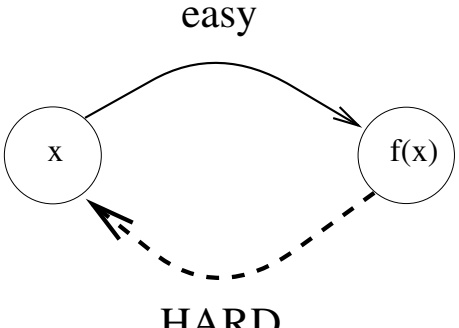
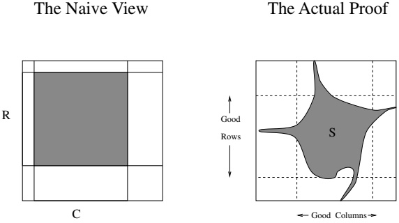
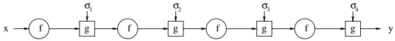

# Computational Difficulty

In this chapter we define and study one-way functions. One-way functions capture our notion of “useful” computational difficulty and serve as a basis for most of the results presented in this book. Loosely speaking, a one-way function is a function that is easy to evaluate but hard to invert (in an average-case sense). (See the illustration in Figure 2.1.) In particular, we define strong and weak one-way functions and prove that the existence of weak one-way functions implies the existence of strong ones. The proof provides a good example of a reducibility argument, which is a strong type of “reduction” used to establish most of the results in the area. Furthermore, the proof provides a simple example of a case where a computational statement is much harder to prove than its “information-theoretic analogue.”

In addition, we define hard-core predicates and prove that every one-way function has a hard-core predicate. Hard-core predicates will play an important role in almost all subsequent chapters (the chapter on signature scheme being the exception).

Organization. In Section 2.1 we motivate the definition of one-way functions by arguing informally that it is implicit in various natural cryptographic primitives. The basic definitions are given in Section 2.2, and in Section 2.3 we show that weak one-way functions can be used to construct strong ones. A more efficient construction (for certain restricted cases) is postponed to Section 2.6. In Section 2.4 we view one-way functions as uniform collections of finite functions and consider various additional properties that such collections may have. In Section 2.5 we define hard-core predicates and show how to construct them from one-way functions.

Teaching Tip. As stated earlier, the proof that the existence of weak one-way functions implies the existence of strong ones (see Section 2.3) is instructive for the rest of the material. Thus, if you choose to skip this proof, do incorporate a discussion of the reducibility argument in the first place you use it (e.g., when showing how to construct hard-core predicates from one-way functions).

Figure 2.1: One-way functions: an illustration.

## 2.1. One-Way Functions: Motivation

As stated in the introductory chapter, modern cryptography is based on a gap between efficient algorithms provided for the legitimate users and the computational infeasibility of abusing or breaking these algorithms (via illegitimate adversarial actions). To illustrate this gap, we concentrate on the cryptographic task of secure data communication, namely, encryption schemes.

In secure encryption schemes, the legitimate users should be able to easily decipher the messages using some private information available to them, yet an adversary (not having this private information) should not be able to decrypt the ciphertext efficiently (i.e., in probabilistic polynomial time).$ ^{1} $ On the other hand, a non-deterministic machine can quickly decrypt the ciphertext (e.g., by guessing the private information). Hence, the existence of secure encryption schemes implies that there are tasks (e.g., “breaking” encryption schemes) that can be performed by non-deterministic polynomial-time machines, yet cannot be performed by deterministic (or even randomized) polynomial-time machines. In other words, a necessary condition for the existence of secure encryption schemes is that $ \mathcal{NP} $ not be contained in $ \mathcal{BPP} $ (and thus $ \mathcal{P} \neq \mathcal{NP} $).

Although $ \mathcal{P} \neq \mathcal{NP} $ is a necessary condition for modern cryptography, it is not a sufficient one. Suppose that the breaking of some encryption scheme is $ \mathcal{NP} $-complete. Then, $ \mathcal{P} \neq \mathcal{NP} $ implies that this encryption scheme is hard to break in the worst case, but it does not rule out the possibility that the encryption scheme is easy to break almost always. In fact, one can construct “encryption schemes” for which the breaking problem is $ \mathcal{NP} $-complete and yet there exists an efficient breaking algorithm that succeeds 99% of the time. Hence, worst-case hardness is a poor measure of security. Security requires hardness in most cases, or at least “average-case hardness.” A necessary condition for the existence of secure encryption schemes is thus the existence of languages in $ \mathcal{NP} $.

that are hard on the average. We mention that it is not known whether or not $ \mathcal{P} \neq \mathcal{N}\mathcal{P} $ implies the existence of languages in $ \mathcal{N}\mathcal{P} $ that are hard on the average.

Furthermore, the mere existence of problems (in $ \mathcal{NP} $) that are hard on the average does not suffice either. In order to be able to use such hard-on-the-average problems, we must be able to generate hard instances together with auxiliary information that will enable us to solve these instances fast. Otherwise, these hard instances will be hard also for the legitimate users, and consequently the legitimate users will gain no computational advantage over the adversary. Hence, the existence of secure encryption schemes implies the existence of an efficient way (i.e., probabilistic polynomial-time algorithm) to generate instances with corresponding auxiliary input such that

1. it is easy to solve these instances given the auxiliary input, but

2. it is hard, on the average, to solve these instances when not given the auxiliary input.

The foregoing requirement is reflected in the definition of one-way functions (as presented in the next section). Loosely speaking, a one-way function is a function that is easy to compute but hard (on the average) to invert. Thus, one-way functions capture the hardness of reversing the process of generating instances (and obtaining the auxiliary input from the instance alone), which is responsible for the discrepancy between the preceding two items. (For further discussion of this relationship, see Exercise 1.)

In assuming that one-way functions exist, we are postulating the existence of efficient processes (i.e., the computation of the function in the forward direction) that are hard to reverse. Note that such processes of daily life are known to us in abundance (e.g., the lighting of a match). The assumption that one-way functions exist is thus a complexity-theoretic analogue of daily experience.

## 2.2. One-Way Functions: Definitions

In this section, we present several definitions of one-way functions. The first version, hereafter referred to as a strong one-way function (or just one-way function), is the most popular one. We also present weak one-way functions, non-uniformly one-way functions, and plausible candidates for such functions.

### 2.2.1. Strong One-Way Functions

Loosely speaking, a one-way function is a function that is easy to compute but hard to invert. The first condition is quite clear: Saying that a function $ f $ is easy to compute means that there exists a polynomial-time algorithm that on input $ x $ outputs $ f(x) $. The second condition requires more elaboration. What we mean by saying that a function $ f $ is hard to invert is that every probabilistic polynomial-time algorithm trying, on input $ y $, to find an inverse of $ y $ under $ f $ may succeed only with negligible (in $|y|$) probability, where the probability is taken over the choices of $ y $ (as discussed later). A sequence $ \{s_n\}_{n\in\mathbb{N}} $ (resp., a function $ \mu : \mathbb{N} \to \mathbb{R} $) is called negligible in $ n $ if for every positive polynomial $ p(\cdot) $ and all sufficiently large $ n $’s, it holds that $ s_n < \frac{1}{p(n)} $ (resp., $ \mu(n) < \frac{1}{p(n)} $). Further discussion follows the definition.

Definition 2.2.1 (Strong One-Way Functions): A function $ f: \{0, 1\}^* \to \{0, 1\}^* $ is called (strongly) one-way if the following two conditions hold:

1. Easy to compute: There exists a (deterministic) polynomial-time algorithm A such that on input x algorithm A outputs $ f(x) $ (i.e., $ A(x) = f(x) $).

2. Hard to invert: For every probabilistic polynomial-time algorithm $ A' $, every positive polynomial $ p(\cdot) $, and all sufficiently large n's,

 $$ \Pr[A^{\prime}(f(U_{n}),1^{n})\in f^{-1}(f(U_{n}))]<\frac{1}{p(n)} $$ 

Recall that $U_n$ denotes a random variable uniformly distributed over $\{0,1\}^n$. Hence, the probability in the second condition is taken over all the possible values assigned to $U_n$ and all possible internal coin tosses of $A'$, with uniform probability distribution. Note that $A'$ is not required to output a specific pre-image of $f(x)$; any pre-image (i.e., element in the set $f^{-1}(f(x))$) will do. (Indeed, in case $f$ is 1-1, the string $x$ is the only pre-image of $f(x)$ under $f$; but in general there may be other pre-images.)

The Auxiliary Input $1^n$. In addition to an input in the range of $f$, the inverting algorithm $A'$ is also given the length of the desired output (in unary notation). The main reason for this convention is to rule out the possibility that a function will be considered one-way merely because it drastically shrinks its input, and so the inverting algorithm just does not have enough time to print the desired output (i.e., the corresponding pre-image). Consider, for example, the function $f_{\text{len}}$ defined by $f_{\text{len}}(x) = y$ such that $y$ is the binary representation of the length of $x$ (i.e., $f_{\text{len}}(x) = |x|$). Since $|f_{\text{len}}(x)| = \log_2 |x|$ no algorithm can invert $f_{\text{len}}$ on $y$ in time polynomial in $|y|$; yet there exists an obvious algorithm that inverts $f_{\text{len}}$ on $y = f_{\text{len}}(x)$ in time polynomial in $|x|$ (e.g., by $|x| \mapsto 0^{|x|}$). In general, the auxiliary input $1^{|x|}$ provided in conjunction with the input $f(x)$, allows the inverting algorithm to run in time polynomial in the total length of the main input and the desired output. Note that in the special case of length-preserving functions (i.e., $|f(x)| = |x|$ for all $x$'s), this auxiliary input is redundant. More generally, the auxiliary input is redundant if, given only $f(x)$, one can generate $1^{|x|}$ in time polynomial in $|x|$. (See Exercise 4 and Section 2.2.3.2.)

#### Further Discussion

Hardness to invert is interpreted (by the foregoing definition) as an upper bound on the success probability of efficient inverting algorithms. The probability is measured with respect to both the random choices of the inverting algorithm and the distribution of the (main) input to this algorithm (i.e., $ f(x) $). The input distribution to the inverting algorithm is obtained by applying $ f $ to a uniformly selected $ x \in \{0, 1\}^n $. If $ f $ induces a permutation on $ \{0, 1\}^n $, then the input to the inverting algorithm is uniformly distributed over $ \{0, 1\}^n $. However, in the general case where $ f $ is not necessarily a one-to-one function, the input distribution to the inverting algorithm may differ substantially from the uniform one. In any case, it is required that the success probability, defined over the aforementioned probability space, be negligible (as a function of the length of $ x $). To further clarify the condition placed on the success probability, we consider two trivial algorithms.

Random-Guess Algorithm $ A_1 $. On input $ (y, 1^n) $, algorithm $ A_1 $ uniformly selects and outputs a string of length $ n $. We note that the success probability of $ A_1 $ equals the collision probability of the random variable $ f(U_n) $ (i.e., $ \sum_y \Pr[f(U_n) = y]^2 $). That is, letting $ U_n' $ denote a random variable uniformly distributed over $ \{0, 1\}^n $ independently of $ U_n $, we have

 $$ \begin{aligned}\Pr[A_{1}(f(U_{n}),1^{n})\in f^{-1}(f(U_{n}))]&=\Pr[f(U_{n}^{\prime})=f(U_{n})]\\&=\sum_{y}\Pr[f(U_{n})=y]^{2}\geq2^{-n}\end{aligned} $$ 

where the inequality is due to the fact that, for non-negative $x_i$'s summing to 1, the sum $\sum_i x_i^2$ is minimized when all $x_i$'s are equal. Thus, the last inequality becomes an equality if and only if $f$ is a 1-1 function. Consequently:

1. For any function $f$, the success probability of the trivial algorithm $A_{1}$ is strictly positive. Thus, one cannot require that any efficient algorithm will always fail to invert $f$.

2. For any 1-1 function $f$, the success probability of $A_{1}$ in inverting $f$ is negligible. Of course, this does not indicate that $f$ is one-way (but rather that $A_{1}$ is trivial).

3. If $f$ is one-way, then the collision probability of the random variable $f(U_{n})$ is negligible. This follows from the fact that $A_{1}$ falls within the scope of the definition, and its success probability equals the collision probability.

Fixed-Output Algorithm $A_2$. Another trivial algorithm, denoted $A_2$, is one that computes a function that is constant on all inputs of the same length (e.g., $A_2(y, 1^n) = 0^n$). For every function $f$, we have

 $$ \begin{aligned}\Pr[A_{2}(f(U_{n}),1^{n})\in f^{-1}(f(U_{n}))]&=\Pr[f(0^{n})=f(U_{n})]\\&=\frac{|f^{-1}(f(0^{n}))|}{2^{n}}\geq2^{-n}\end{aligned} $$ 

with equality holding in case $ f(0^n) $ has a single pre-image (i.e., $ 0^n $ itself) under $ f $. Again we observe analogous facts:

1. For any function f, the success probability of the trivial algorithm $ A_{2} $ is strictly positive.

2. For any 1-1 function $f$, the success probability of $A_{2}$ in inverting $f$ is negligible.

3. If $f$ is one-way, then the fraction of $x$'s in $\{0,1\}^n$ that are mapped by $f$ to $f(0^n)$ is negligible.

Obviously, Definition 2.2.1 considers all probabilistic polynomial-time algorithms, not merely the trivial ones discussed earlier. In some sense this definition asserts that for one-way functions, no probabilistic polynomial-time algorithm can “significantly” outperform these trivial algorithms.

#### Negligible Probability

A few words concerning the notion of negligible probability are in order. The foregoing definition and discussion consider the success probability of an algorithm to be negligible if, as a function of the input length, the success probability is bounded above by every polynomial fraction. It follows that repeating the algorithm polynomially (in the input length) many times yields a new algorithm that also has negligible success probability. In other words, events that occur with negligible (in $n$) probability remain negligible even if the experiment is repeated for polynomially (in $n$) many times. Hence, defining a negligible success rate as “occurring with probability smaller than any polynomial fraction” is naturally coupled with defining feasible computation as “computed within polynomial time.”

A “strong negation” of the notion of a negligible fraction/probability is the notion of a noticeable fraction/probability. We say that a function $ \nu : \mathbb{N} \to \mathbb{R} $ is noticeable if there exists a polynomial $ p(\cdot) $ such that for all sufficiently large $ n $'s, it holds that $ \mu(n) > \frac{1}{p(n)} $. We stress that functions may be neither negligible nor noticeable.

### 2.2.2. Weak One-Way Functions

One-way functions, as defined earlier, are one-way in a very strong sense. Namely, any efficient inverting algorithm has negligible success in inverting them. A much weaker definition, presented next, requires only that all efficient inverting algorithms fail with some noticeable probability.

Definition 2.2.2 (Weak One-Way Functions): A function $ f : \{0, 1\}^* \to \{0, 1\}^* $ is called weakly one-way if the following two conditions hold:

1. Easy to compute: As in the definition of a strong one-way function.

2. Slightly hard to invert: There exists a polynomial $ p(\cdot) $ such that for every probabilistic polynomial-time algorithm $ A' $ and all sufficiently large n's,

 $$ \Pr[A^{\prime}(f(U_{n}),1^{n})\notin f^{-1}(f(U_{n}))]>\frac{1}{p(n)} $$ 

We call the reader's attention to the order of quantifiers: There exists a single polynomial $ p(\cdot) $ such that $ 1/p(n) $ lower-bounds the failure probability of all probabilistic polynomial-time algorithms trying to invert f on $ f(U_n) $.

Weak one-way functions fail to provide the kind of hardness alluded to in the earlier motivational discussions. Still, as we shall see later, they can be converted into strong one-way functions, which in turn do provide such hardness.

### 2.2.3. Two Useful Length Conventions

In the sequel it will be convenient to use the following two conventions regarding the lengths of the pre-images and images of one-way functions. In the current section we justify the use of these conventions.

#### 2.2.3.1. Functions Defined Only for Some Lengths

In many cases it is more convenient to consider one-way functions with domains partial to the set of all strings. In particular, this facilitates the introduction of some structure in the domain of the function. A particularly important case, used throughout the rest of this section, is that of functions with domain $ \cup_{n\in\mathbb{N}}\{0,1\}^{l(n)} $, where $ l(\cdot) $ is some polynomial. We provide a more general treatment of this case.

Let $ I \subseteq \mathbb{N} $, and denote by $ s_I(n) $ the successor of $ n $ with respect to $ I $; namely, $ s_I(n) $ is the smallest integer that is both greater than $ n $ and in the set $ I $ (i.e., $ s_I(n) \stackrel{\text{def}}{=} \min\{i \in I : i > n\} $). A set $ I \subseteq \mathbb{N} $ is called polynomial-time-enumerable if there exists an algorithm that on input $ n $ halts within $ \text{poly}(n) $ steps and outputs $ 1^{s_I(n)} $. (The unary output forces $ s_I $ to be polynomially bounded; i.e., $ s_I(n) \leq \text{poly}(n) $.) Let $ I $ be a polynomial-time-enumerable set and $ f $ be a function with domain $ \cup_{n \in I} \{0, 1\}^n $. We call $ f $ strongly (resp., weakly) one-way on lengths in $ I $ if $ f $ is polynomial-time-computable and is hard to invert over $ n $’s in $ I $. For example, the hardness condition for functions that are strongly one-way on lengths in $ I $ is stated as follows: For every probabilistic polynomial-time algorithm $ A' $, every positive polynomial $ p(\cdot) $, and all sufficiently large n's in I,

 $$ \Pr[A^{\prime}(f(U_{n}),1^{n})\in f^{-1}(f(U_{n}))]<\frac{1}{p(n)} $$ 

Ordinary one-way functions, as defined in previous subsections, can be viewed as being one-way on lengths in N.

One-way functions on lengths in any polynomial-time-enumerable set can be easily transformed into ordinary one-way functions (i.e., defined over all of $\{0,1\}^*$). In particular, for any function $f$ with domain $\cup_{n\in I}\{0,1\}^n$, we can construct a function $g:\{0,1\}^* \to \{0,1\}$ by letting

 $$ g(x)\stackrel{def}{=}f(x^{\prime}) $$ 

where $ x' $ is the longest prefix of $ x $ with length in $ I $. In case the function $ f $ is length-preserving (i.e., $ |f(x)| = |x| $ for all $ x $), we can preserve this property by modifying the construction to obtain a length-preserving function $ g' : \{0, 1\}^* \to \{0, 1\}^* $ such that

 $$ g^{\prime}(x)\stackrel{def}{=}f(x^{\prime})x^{\prime \prime} $$ 

where $ x = x'x'' $, and $ x' $ is the longest prefix of x with length in I.

Proposition 2.2.3: Let I be a polynomial-time-enumerable set, and let f be strongly (resp., weakly) one-way on lengths in I. Then g and $ g' $ (as defined in Eq. (2.1) and Eq. (2.2), respectively) are strongly (resp., weakly) one-way (in the ordinary sense).

Although the validity of the foregoing proposition is very appealing, we urge the reader not to skip the following proof. The proof, which is indeed quite simple, uses (for the first time in this book) an argument that is used extensively in the sequel. The argument used to prove the hardness-to-invert property of the function $g$ (resp., $g^{\prime}$) proceeds by assuming, toward the contradiction, that g (resp., g') can be efficiently inverted with unallowable success probability. Contradiction is derived by deducing that f can be efficiently inverted with unallowable success probability. In other words, inverting f is “reduced” to inverting g (resp., g'). The term “reduction” is used here in a stronger-than-standard sense. Here a reduction needs to preserve the success probability of the algorithms. This kind of argument is called a reducibility argument.

Proof: We first prove that $g$ and $g'$ can be computed in polynomial time. To this end we use the fact that $I$ is a polynomial-time-enumerable set, which implies that we can decide membership in $I$ in polynomial time (e.g., by observing that $m \in I$ if and only if $s_I(m-1) = m$). It follows that on input $x$ one can find in polynomial time the largest $m \leq |x|$ that satisfies $m \in I$. Computing $g(x)$ amounts to finding this $m$ and applying the function $f$ to the $m$-bit prefix of $x$. Similarly for $g'$.

We next prove that $g$ maintains the hardness-to-invert property of $f$. A similar proof establishes the hardness-to-invert property of $g'$. For the sake of brevity, we present here only the proof for the case that $f$ is strongly one-way. The proof for the case that $f$ is weakly one-way is analogous.

The proof proceeds by contradiction. We assume, contrary to the claim (of the proposition), that there exists an efficient algorithm that inverts $g$ with success probability that is not negligible. We use this inverting algorithm (for $g$) to construct an efficient algorithm that inverts $f$ with success probability that is not negligible, hence deriving a contradiction (to the hypothesis of the proposition). In other words, we show that inverting $f$ (with unallowable success probability) is efficiently reducible to inverting $g$ (with unallowable success probability) and hence conclude that the latter is not feasible. The reduction is based on the observation that inverting $g$ on images of arbitrary lengths yields inverting $g$ also on images of lengths in $I$, and that on such lengths $g$ collides with $f$.

Intuitively, any algorithm inverting $g$ can be used to invert $f$ as follows. On input $(y, 1^n)$, where $y$ is supposedly in the image of $f(U_n) = g(U_m)$ for any $m \in \{n, \ldots, s_I(n) - 1\}$, we can invoke the $g$-inverter on input $(y, 1^m)$ and output the longest prefix with length in $I$ of the string that the $g$-inverter returns (e.g., if the $g$-inverter returns an $m$-bit-long string, then we output its $n$-bit-long prefix). Thus, our success probability in inverting $f$ on $f(U_n)$ equals the success probability of the $g$-inverter on $g(U_m)$. The question is which $m \in \{n, \ldots, s_I(n) - 1\}$ we should use, and the answer is to try them all (capitalizing on the fact that $s_I(n) = \text{poly}(n)$). Note that the integers are partitioned to intervals of the form $[n, \ldots, s_I(n) - 1]$, each associated with a single $n \in I$. Thus, the success probability of any $g$-inverter on infinitely many lengths $m \in \mathbb{N}$ translates to the success probability of our $f$-inverter on infinitely many lengths $n \in I$. Details follow.

Given an algorithm $ B' $ for inverting $ g $, we construct an algorithm $ A' $ for inverting $ f $ such that $ A' $ has complexity and success probability related to those for $ B' $. (For simplicity, we shall assume that $ B'(y, 1^m) \in \{0, 1\}^m $ holds for all $ y \in \{0, 1\}^* $ and $ m \in \mathbb{N} $; this assumption is immaterial, and later we comment about this aspect in two footnotes.) Algorithm $ A' $ uses algorithm $ B' $ as a subroutine and proceeds as follows. On input y and $ 1^n $ (supposedly y is in the range of $ f(U_n) $, and $ n \in I $), algorithm $ A' $ proceeds as follows:

1. It computes $ s_I(n) $ and sets $ k \stackrel{\text{def}}{=} s_I(n) - n - 1 \geq 0 $. (Thus, for every $ i = 1, \ldots, k $, we have $ n + i \notin I $.)

2. For $ i = 0, 1, \ldots, k $, algorithm $ A' $ invokes algorithm $ B' $ on input $ (y, 1^{n+i}) $, obtaining $ z_i \leftarrow B'(y, 1^{n+i}) $; if $ g(z_i) = y $, then $ A' $ outputs the n-bit-long prefix $ ^{2} $ of $ z_i $.

Note that for all $ x' \in \{0, 1\}^n $ and $ |x''| \leq k $, we have $ g(x' x'') = f(x') $, and so if $ g(x' x'') = y $, then $ f(x') = y $, which establishes the correctness of the output of $ A' $. Using $ s_I(n) = \text{poly}(n) $ and the fact that $ s_I(n) $ is computable in polynomial time, it follows that if $ B' $ is a probabilistic polynomial-time algorithm, then so is $ A' $. We next analyze the success probability of $ A' $ (showing that if $ B' $ inverts g with unallowable success probability, then $ A' $ inverts f with unallowable success probability).

Suppose that $ B' $ inverts g on $ (g(U_m), 1^m) $ with probability $ \varepsilon(m) $. Then there exists an $ n $ such that $ m \in \{n, \ldots, \text{poly}(n)\} $ and such that $ A'(f(U_n), 1^n) $ invokes $ B' $ on input $ (f(U_n), 1^m) = (g(U_m), 1^m) $. It follows that $ A'(f(U_n), 1^n) $ inverts $ f $ with probability at least $ \varepsilon(m) = \varepsilon(\text{poly}(n)) $. Thus, $ A'(f(U_n), 1^n) $ inherits the success of $ B'(g(U_m), 1^m) $. A tedious analysis (which can be skipped) follows. $ ^3 $

Suppose, contrary to our claim, that $g$ is not strongly one-way, and let $B'$ be an algorithm demonstrating this contradiction hypothesis. Namely, there exists a polynomial $p(\cdot)$ such that for infinitely many $m$'s the probability that $B'$ inverts $g$ on $g(U_m)$ is at least $\frac{1}{p(m)}$. Let us denote the set of these $m$'s by $M$. Define a function $\ell_I : \mathbb{N} \to I$ such that $\ell_I(m)$ is the largest lower bound of $m$ in $I$ is both (i.e., $\ell_I(m) \stackrel{\mathrm{def}}{=} \max\{i \in I : i \leq m\}$.) Clearly, $m \geq \ell_I(m)$ and $m \leq s_I(\ell_I(m)) - 1$ for every $m$. The following two claims relate the success probability of algorithm $A'$ with that of algorithm $B'$.

Claim 2.2.3.1: Let m be an integer and $ n = \ell_I(m) $. Then

 $$ \mathsf{Pr}[A^{\prime}(f(U_{n}),1^{n})\in f^{-1}(f(U_{n}))]\geq\mathsf{Pr}[B^{\prime}(g(U_{m}),1^{m})\in g^{-1}(g(U_{m}))] $$ 

(Namely, the success probability of algorithm $ A' $ on $ f(U_{\ell_I(m)}) $ is bounded below by the success probability of algorithm $ B' $ on $ g(U_m) $.)

Proof: By construction of $A',$ on input $(f(x'), 1^n)$, where $x' \in \{0, 1\}^n$, algorithm $A'$ obtains the value $B'(f(x'), 1^t)$ for every $t \in \{n, \ldots, s_I(n) - 1\}$. In particular, since $m \geq n$ and $m \leq s_I(\ell_I(m)) - 1 = s_I(n) - 1$, it follows that algorithm $A'$ obtains the value $B'(f(x'), 1^m)$. By definition of $g$, for all $x'' \in \{0, 1\}^{m-n}$, it holds that $f(x') = g(x'x'')$. The claim follows. $\square$

Claim 2.2.3.2: There exists a polynomial $ q(\cdot) $ such that $ m < q(\ell_I(m)) $ for all $ m $'s.

 $ ^2 $Here we use the assumption $ z_i \in \{0, 1\}^{n+i} $, which implies that $ n $ is the largest integer that both is in $ I $ and is at most $ n+i $. In general, $ A' $ outputs the longest prefix $ x' $ of $ z_i $ satisfying $ |x'| \in I $. Note that it holds that $ f(x') = g(z_i) = y $.

 $ ^{3} $The reader can verify that the following analysis does not refer to the length of the output of $ B' $ and so does not depend on the simplifying assumption made earlier.

Proof: Let $q$ be a polynomial (as guaranteed by the polynomial-time enumerability of $I$) such that $s_{I}(n) < q(n)$. Then, for every $m$, we have $m < s_{I}(\ell_{I}(m)) < q(\ell_{I}(m))$. $\Box$

By Claim 2.2.3.2, the set $ S \overset{\text{def}}{=} \{\ell_I(m) : m \in M\} $ is infinite (as, otherwise, for $ u $ upper-bounding the elements in $ S $ we get $ m < q(\ell_I(m)) \leq q(u) $ for every $ m \in M $, which contradicts the hypothesis that $ M $ is infinite). Using Claim 2.2.3.1, it follows that for every $ n = \ell_I(m) \in S $, the probability that $ A' $ inverts $ f $ on $ f(U_n) $ is at least

 $$ \frac{1}{p(m)}>\frac{1}{p(q(\ell_{I}(m)))}=\frac{1}{p(q(n))}=\frac{1}{\mathrm{poly}(n)} $$ 

where the inequality is due to Claim 2.2.3.2. It follows that f is not strongly one-way, in contradiction to the proposition's hypothesis. $\blacksquare$

#### 2.2.3.2. Length-Regular and Length-Preserving Functions

A second useful convention regarding one-way functions is to assume that the function $ f $ is length-regular in the sense that for every $ x, y \in \{0, 1\}^* $, if $ |x| = |y| $, then $ |f(x)| = |f(y)| $. We point out that the transformation presented earlier (i.e., both Eq. (2.1) and Eq. (2.2)) preserves length regularity. A special case of length regularity, preserved by Eq. (2.2), is that of length-preserving functions.

Definition 2.2.4 (Length-Preserving Functions): A function $f$ is length-preserving if for every $x \in \{0,1\}^*$ it holds that $|f(x)| = |x|$.

Given a strongly (resp., weakly) one-way function $f$, we can construct a strongly (resp., weakly) one-way function $f''$ that is length-preserving, as follows. Let $p$ be a polynomial bounding the length expansion of $f(\mathrm{i.e.},|f(x)|\leq p(|x|))$. Such a polynomial must exist because $f$ is polynomial-time-computable. We first construct a length-regular function $f'$ by defining

 $$ f^{\prime}(x)\stackrel{\mathrm{def}}{=}f(x)10^{p(|x|)-|f(x)|} $$ 

(We use a padding of the form $ 10^* $ in order to facilitate the parsing of $ f'(x) $ into $ f(x) $ and the “leftover” padding.) Next, we define $ f'' $ only on strings of length $ p(n) + 1 $, for $ n \in \mathbb{N} $, by letting

 $$ f^{\prime \prime}(x^{\prime}x^{\prime \prime})\stackrel{\mathrm{def}}{=}f^{\prime}(x^{\prime}),\text{ where }|x^{\prime}x^{\prime \prime}|=p(|x^{\prime}|)+1 $$ 

Clearly, $ f'' $ is length-preserving.

Proposition 2.2.5: If f is a strongly (resp., weakly) one-way function, then so are $ f' $ and $ f'' $ (as defined in Eq. (2.3) and Eq. (2.4), respectively).

Proof Sketch: It is quite easy to see that both $f'$ and $f''$ are polynomial-time-computable. Using “reducibility arguments” analogous to the one used in the preceding proof, we can establish the hardness-to-invert of both $f'$ and $f''$. For example, given an algorithm $B'$ for inverting $f'$, we construct an algorithm $A'$ for inverting $f$ as follows. On input $y$ and $1^n$ (supposedly $y$ is in the range of $f(U_n)$), algorithm $A'$ halts with output $B'(y10^{p(n)-|y|}, 1^n)$. $\blacksquare$

On Dropping the Auxiliary Input $ 1^{|x|} $. The reader can easily verify that if f is length-preserving, then it is redundant to provide the inverting algorithm with the auxiliary input $ 1^{|x|} $ (in addition to f(x)). The same holds if f is length-regular and does not shrink its input by more than a polynomial amount (i.e., there exists a polynomial $ p(\cdot) $ such that $ p(|f(x)|) \geq |x| $ for all x). In the sequel, we shall deal only with one-way functions that are length-regular and do not shrink their input by more than a polynomial amount. Furthermore, we shall mostly deal with length-preserving functions. In all these cases, we can assume, without loss of generality, that the inverting algorithm is given only $ f(x) $ as input.

On 1-1 One-Way Functions. If $f$ is 1-1, then so is $f'$ (as defined in Eq. (2.3)), but not $f''$ (as defined in Eq. (2.4)). Thus, when given a 1-1 one-way function, we can assume without loss of generality that it is length-regular, but we cannot assume that it is length-preserving. Furthermore, the assumption that 1-1 one-way functions exist seems stronger than the assumption that arbitrary (and hence length-preserving) one-way functions exist. For further discussion, see Section 2.4.

### 2.2.4. Candidates for One-Way Functions

Following are several candidates for one-way functions. Clearly, it is not known whether or not these functions are indeed one-way. These are only conjectures supported by extensive research that thus far has failed to produce an efficient inverting algorithm (one having noticeable success probability).

#### 2.2.4.1. Integer Factorization

In spite of the extensive research directed toward the construction of feasible integer-factoring algorithms, the best algorithms known for factoring integers have sub-exponential running times. Hence it is reasonable to believe that the function $ f_{mult} $ that partitions its input string into two parts and returns the (binary representation of the) integer resulting by multiplying (the integers represented by) these parts is one-way. Namely, let

 $$ f_{mult}(x,y)=x\cdot y $$ 

where $ |x| = |y| $, and $ x \cdot y $ denotes (the string representing) the integer resulting by multiplying the integers (represented by the strings) $ x $ and $ y $. Clearly, $ f_{\text{mult}} $ can be computed in polynomial time. Assuming the intractability of factoring (e.g., that given the product of two uniformly chosen $ n $-bit-long primes, it is infeasible to find the prime factors), and using the density-of-primes theorem (which guarantees that at least $ \frac{N}{\log_2 N} $ of the integers smaller than $ N $ are primes), it follows that $ f_{\text{mult}} $ is at least weakly one-way. (For further discussion, see Exercise 8.) Other popular functions related to integer factorization (e.g., the RSA function) are discussed in Section 2.4.3.

#### 2.2.4.2. Decoding of Random Linear Codes

One of the most outstanding open problems in the area of error-correcting codes is that of presenting efficient decoding algorithms for random linear codes. Of particular interest are random linear codes with constant information rates that can correct a constant fraction of errors. An $(n, k, d)$ linear code is a $k$-by-$n$ binary matrix in which the vector sum $(\mathrm{mod} 2)$ of any non-empty subset of rows results in a vector with at least $d$ entries of 1 (one-entries). (A $k$-bit-long message is encoded by multiplying it by the $k$-by-$n$ matrix, and the resulting $n$-bit-long vector has a unique pre-image even when flipping up to $\frac{d}{2}$ of its entries.) The Gilbert-Varshamov bound for linear codes guarantees the existence of such a code provided that $\frac{k}{n} < 1 - H_2(\frac{d}{n})$, where $H_2(p) \stackrel{\mathrm{def}}{=} -p \log_2 p - (1 - p) \log_2 (1 - p)$ if $p < \frac{1}{2}$ and $H_2(p) \stackrel{\mathrm{def}}{=} 1$ otherwise (i.e., $H_2(\cdot)$ is a modification of the binary entropy function). Similarly, if for some $\varepsilon > 0$ it holds that $\frac{k}{n} < 1 - H_2(\frac{(1+\varepsilon)d}{n})$, then almost all $k$-by-$n$ binary matrices will constitute $(n, k, d)$ linear codes. Consider three constants $\kappa, \delta, \varepsilon > 0$ satisfying $\kappa < 1 - H_2((1+\varepsilon)\delta)$. The function $f_{\mathrm{code}}$ seems a plausible candidate for a one-way function:

 $$ f_{code}(C,x,i)\stackrel{def}{=}(C,xC+e(i)) $$ 

where $C$ is a $\kappa n$-by-$n$ binary matrix, $x$ is a $\kappa n$-dimensional binary vector, $i$ is the index of an $n$-dimensional binary vector having at most $\frac{\delta n}{2}$ one-entries within a corresponding enumeration of such vectors (the vector itself is denoted $e(i)$), and the arithmetic is in the $n$-dimensional binary vector space. Clearly, $f_{\mathrm{code}}$ is polynomial-time-computable, provided we use an efficient enumeration of vectors. An efficient algorithm for inverting $f_{\mathrm{code}}$ would yield an efficient algorithm for decoding a non-negligible fraction of the constant-rate linear codes (which would constitute an earth-shaking result in coding theory).

#### 2.2.4.3. The Subset-Sum Problem

Consider the function $ f_{ssum} $ defined as follows:

 $$ f_{ssum}(x_{1},\ \ldots,\ x_{n},I)=\left(x_{1},\ \ldots,\ x_{n},\sum_{i\in I}x_{i}\right) $$ 

where $ |x_1| = \cdots = |x_n| = n $, and $ I \subseteq \{1, 2, \ldots, n\} $. Clearly, $ f_{\text{ssum}} $ is polynomial-time-computable. The fact that the subset-sum problem is $ \mathcal{N}\mathcal{P} $-complete cannot serve as evidence to the one-wayness of $ f_{\text{ssum}} $. On the other hand, the fact that the subset-sum problem is easy for special cases (such as having “hidden structure” and/or “low density”) does not rule out this proposal. The conjecture that $ f_{\text{ssum}} $ is one-way is based on the failure of known algorithms to handle random “high-density” instances (i.e., instances in which the length of the elements approximately equals their number, as in the definition of $ f_{\text{ssum}} $).

### 2.2.5. Non-Uniformly One-Way Functions

In the foregoing two definitions of one-way functions the inverting algorithm is a probabilistic polynomial-time algorithm. Stronger versions of both definitions require that the functions cannot be inverted even by non-uniform families of polynomial-size circuits. We stress that the easy-to-compute condition is still stated in terms of uniform algorithms. For example, the following is a non-uniform version of the definition of strong (length-preserving) one-way functions.

Definition 2.2.6 (Non-Uniformly Strong One-Way Functions): A function $ f : \{0, 1\}^* \to \{0, 1\}^* $ is called non-uniformly one-way if the following two conditions hold:

1. Easy to compute: There exists a polynomial-time algorithm A such that on input x algorithm A outputs $ f(x) $.

2. Hard to invert: For every (even non-uniform) family of polynomial-size circuits $ \{C_n\}_{n\in\mathbb{N}} $, every positive polynomial $ p(\cdot) $, and all sufficiently large $ n $'s,

 $$ \Pr[C_{n}(f(U_{n}))\in f^{-1}(f(U_{n}))]<\frac{1}{p(n)} $$ 

The probability in the second condition is taken only over all the possible values of $ U_{n} $. We note that any non-uniformly one-way function is one-way (i.e., in the uniform sense).

Proposition 2.2.7: If f is non-uniformly one-way, then it is one-way. That is, if f satisfies Definition 2.2.6, then it also satisfies Definition 2.2.1.

Proof: We convert any (uniform) probabilistic polynomial-time inverting algorithm into a non-uniform family of polynomial-size circuits, without decreasing the success probability. This is in accordance with our meta-theorem (see Section 1.3.3). Details follow.

Let $A'$ be a probabilistic polynomial-time (inverting) algorithm. Let $r_{n}$ denote a sequence of coin tosses for $A'$ maximizing the success probability of $A'$ (averaged over input $f(U_n)$). Namely, $r_{n}$ satisfies

 $$ \Pr[A_{r_{n}}^{\prime}(f(U_{n}))\in f^{-1}(f(U_{n}))]\geq\Pr[A^{\prime}(f(U_{n}))\in f^{-1}(f(U_{n}))] $$ 

where the first probability is taken only over all possible values of $U_n$, and the second probability is also over all possible coin tosses for $A'.$ (Recall that $A'_r(y)$ denotes the output of algorithm $A'$ on input $y$ and internal coin tosses $r$). The desired circuit $C_n$ incorporates the code of algorithm $A'$ and the sequence $r_n$ (which is of length polynomial in $n$). $\blacksquare$

We note that, typically, averaging arguments (of the form applied earlier) allow us to convert probabilistic polynomial-time algorithms into non-uniform polynomial-size circuits. Thus, in general, non-uniform notions of security (i.e., robustness against non-uniform polynomial-size circuits) imply uniform notions of security (i.e., robustness against probabilistic polynomial-time algorithms). The converse is not necessarily true. In particular, it is possible that one-way functions exist (in the uniform sense) and yet there are no non-uniformly one-way functions. However, this situation (i.e., that one-way functions exist only in the uniform sense) seems unlikely, and it is widely believed that non-uniformly one-way functions exist. In fact, all candidates mentioned in the preceding subsection are believed to be non-uniformly one-way functions.

## 2.3. Weak One-Way Functions Imply Strong Ones

We first remark that not every weak one-way function is necessarily a strong one. Consider, for example, a one-way function $ f $ (which, without loss of generality, is length-preserving). Modify $ f $ into a function $ g $ so that $ g(p, x) = (p, f(x)) $ if $ p $ starts with $ \log_2 |x| $ zeros, and $ g(p, x) = (p, x) $ otherwise, where (in both cases) $ |p| = |x| \cdot 4 $. We claim that $ g $ is a weak one-way function but not a strong one. Clearly, $ g $ cannot be a strong one-way function (because for all but a $ \frac{1}{n} $ fraction of the strings of length $ 2n $ the function $ g $ coincides with the identity function). To prove that $ g $ is weakly one-way, we use a “reducibility argument.”

Proposition 2.3.1: Let f be a one-way function (even in the weak sense). Then g, constructed earlier, is a weakly one-way function.

Proof: Intuitively, inverting g on inputs on which it does not coincide with the identity transformation is related to inverting f. Thus, if g is inverted, on inputs of length $2n$, with probability that is noticeably greater than $1 - \frac{1}{n}$, then g must be inverted with noticeable probability on inputs to which g applies f. Therefore, if g is not weakly one-way, then neither is f. The full, straightforward but tedious proof follows.

Given a probabilistic polynomial-time algorithm $ B' $ for inverting $ g $, we construct a probabilistic polynomial-time algorithm $ A' $ that inverts $ f $ with “related” success probability. Following is the description of algorithm $ A' $. On input $ y $, algorithm $ A' $ sets $ n \stackrel{\text{def}}{=} |y| $ and $ l \stackrel{\text{def}}{=} \log_2 n $, selects $ p' $ uniformly in $ \{0, 1\}^{n-l} $, computes $ z \stackrel{\text{def}}{=} B'(0^l p', y) $, and halts with output of the $ n $-bit suffix of $ z $. Let $ S_{2n} $ denote the sets of all $ 2n $-bit-long strings that start with $ \log_2 n $ zeros (i.e., $ S_{2n} \stackrel{\text{def}}{=} \{0^{\log_2 n} \alpha : \alpha \in \{0, 1\}^{2n-\log_2 n}\} $). Then, by construction of $ A' $ and $ g $, we have

 $$ \begin{aligned}\Pr&[A^{\prime}(f(U_{n}))\in f^{-1}(f(U_{n}))]\\&\geq\Pr[B^{\prime}(0^{l}U_{n-l},f(U_{n}))\in(0^{l}U_{n-l},f^{-1}(f(U_{n})))]\\&=\Pr[B^{\prime}(g(U_{2n}))\in g^{-1}(g(U_{2n}))\mid U_{2n}\in S_{2n}]\\&\geq\frac{\Pr[B^{\prime}(g(U_{2n}))\in g^{-1}(g(U_{2n}))]-\Pr[U_{2n}\notin S_{2n}]}{\Pr[U_{2n}\in S_{2n}]}\\&=n\cdot\left(\Pr[B^{\prime}(g(U_{2n}))\in g^{-1}(g(U_{2n}))]-\left(1-\frac{1}{n}\right)\right)\\&=1-n\cdot(1-\Pr[B^{\prime}(g(U_{2n}))\in g^{-1}(g(U_{2n}))])\end{aligned} $$ 

 $ ^{4} $Throughout the text, we treat $ \log_2 |x| $ as if it were an integer. A precise argument can be derived by replacing $ \log_2 |x| $ with $ \lfloor \log_2 |x| \rfloor $ and some minor adjustments.

(For the second inequality, we used $ \Pr[A|B] = \frac{\Pr[A\cap B]}{\Pr[B]} $ and $ \Pr[A\cap B] \geq \Pr[A] - \Pr[\neg B] $.) It should not come as a surprise that the above expression is meaningful only in case $ \Pr[B'(g(U_{2n})) \in g^{-1}(g(U_{2n}))] > 1 - \frac{1}{n} $.

It follows that for every polynomial $p(\cdot)$ and every integer $n$, if $B'$ inverts $g$ on $g(U_{2n})$ with probability greater than $1 - \frac{1}{p(2n)}$, then $A'$ inverts $f$ on $f(U_{n})$ with probability greater than $1 - \frac{n}{p(2n)}$. Hence, if $g$ is not weakly one-way (i.e., for every polynomial $p(\cdot)$ there exist infinitely many $m$'s such that $g$ can be inverted on $g(U_{m})$ with probability $\geq 1 - 1/p(m)$), then also $f$ is not weakly one-way (i.e., for every polynomial $q(\cdot)$ there exist infinitely many $n$'s such that $f$ can be inverted on $f(U_{n})$ with probability $\geq 1 - 1/q(n)$, where $q(n) = p(2n)/n)$. This contradicts our hypothesis (that $f$ is weakly one-way).

To summarize, given a probabilistic polynomial-time algorithm that inverts $g$ on $g(U_{2n})$ with success probability $1 - \frac{1}{n} + \alpha(n)$, we obtain a probabilistic polynomial-time algorithm that inverts $f$ on $f(U_n)$ with success probability $n \cdot \alpha(n)$. Thus, since $f$ is (weakly) one-way, $n \cdot \alpha(n) < 1 - (1/q(n))$ must hold for some polynomial $q$, and so $g$ must be weakly one-way (since each probabilistic polynomial-time algorithm trying to invert $g$ on $g(U_{2n})$ must fail with probability at least $\frac{1}{n} - \alpha(n) > \frac{1}{n \cdot q(n)}$).

We have just shown that unless no one-way functions exist, there exist weak one-way functions that are not strong ones. This rules out the possibility that all one-way functions are strong ones. Fortunately, we can also rule out the possibility that all one-way functions are (only) weak ones. In particular, the existence of weak one-way functions implies the existence of strong ones.

Theorem 2.3.2: Weak one-way functions exist if and only if strong one-way functions exist.

We strongly recommend that the reader not skip the proof (given in Section 2.3.1), since we believe that the proof is very instructive to the rest of this book. Furthermore, the proof demonstrates that amplification of computational difficulty is much more involved than amplification of an analogous probabilistic event. Both aspects are further discussed in Section 2.3.3. An illustration of the proof in the context of a "toy" example is provided in Section 2.3.2. (It is possible to read Section 2.3.2 before Section 2.3.1; in fact, most readers may prefer to do so.)

### 2.3.1. Proof of Theorem 2.3.2

Let $f$ be a weak one-way function, and let $p$ be the polynomial guaranteed by the definition of a weak one-way function. Namely, every probabilistic polynomial-time algorithm fails to invert $f$ on $f(U_n)$ with probability at least $\frac{1}{p(n)}$. We assume, for simplicity, that $f$ is length-preserving (i.e. $|f(x)| = |x|$ for all $x$'s). This assumption, which is not really essential, is justified by Proposition 2.2.5. We define a function $g$ as follows:

 $$ g\left(x_{1},\cdots,x_{t(n)}\right)\stackrel{\mathrm{def}}{=}f(x_{1}),\cdots,f\left(x_{t(n)}\right) $$ 

where $ |x_1| = \cdots = |x_{t(n)}| = n $ and $ t(n) \stackrel{\text{def}}{=} n \cdot p(n) $. Namely, the $ n^2 p(n) $-bit-long input of g is partitioned into $ t(n) $ blocks, each of length n, and f is applied to each block.

Clearly, $g$ can be computed in polynomial time (by an algorithm that breaks the input into blocks and applies $f$ to each block). Furthermore, it is easy to see that inverting $g$ on $g(x_1, \ldots, x_{t(n)})$ requires finding a pre-image to each $f(x_i)$. One may be tempted to deduce that it is also clear that $g$ is a strongly one-way function. A naive argument might proceed by assuming implicitly (with no justification) that the inverting algorithm worked separately on each $f(x_i)$. If that were indeed the case, then the probability that an inverting algorithm could successfully invert all $f(x_i)$ would be at most $(1 - \frac{1}{p(n)})^{n \cdot p(n)} < 2^{-n}$ (which is negligible also as a function of $n^2 p(n)$). However, the assumption that an algorithm trying to invert $g$ works independently on each $f(x_i)$ cannot be justified. Hence, a more complex argument is required.

Following is an outline of our proof. The proof that $g$ is strongly one-way proceeds by a contradiction argument. We assume, on the contrary, that $g$ is not strongly one-way; namely, we assume that there exists a polynomial-time algorithm that inverts $g$ with probability that is not negligible. We derive a contradiction by presenting a polynomial-time algorithm that, for infinitely many $n$'s, inverts $f$ on $f(U_n)$ with probability greater than $1 - \frac{1}{p(n)}$ (in contradiction to our hypothesis). The inverting algorithm for $f$ uses the inverting algorithm for $g$ as a subroutine (without assuming anything about the manner in which the latter algorithm operates). (We stress that we do not assume that the $g$-inverter works in a particular way, but rather use any $g$-inverter to construct, in a generic way, an $f$-inverter.) Details follow.

Suppose that $g$ is not strongly one-way. By definition, it follows that there exists a probabilistic polynomial-time algorithm $B'$ and a polynomial $q(\cdot)$ such that for infinitely many $m$'s,

 $$ \Pr[B^{\prime}(g(U_{m}))\in g^{-1}(g(U_{m}))]>\frac{1}{q(m)} $$ 

Let us denote by $ M' $ the infinite set of integers for which this holds. Let $ N' $ denote the infinite set of $ n $'s for which $ n^2 \cdot p(n) \in M' $ (note that all $ m $'s considered are of the form $ n^2 \cdot p(n) $, for some integer $ n $).

Using $B'$, we now present a probabilistic polynomial-time algorithm $A'$ for inverting $f$. On input $y$ (supposedly in the range of $f$), algorithm $A'$ proceeds by applying the following probabilistic procedure, denoted $I$, on input $y$ for $a(|y|)$ times, where $a(\cdot)$ is a polynomial that depends on the polynomials $p$ and $q$ (specifically, we set $a(n) \overset{\text{def}}{=} 2n^2 \cdot p(n) \cdot q(n^2 p(n))$).

#### Procedure I

Input: y (denote $ n \stackrel{\text{def}}{=} |y| $).

For i = 1 to $ t(n) $ do begin

1. Select uniformly and independently a sequence of strings $ x_1, \ldots, x_{t(n)} \in \{0, 1\}^n $.

2. Compute $ (z_1, \ldots, z_{t(n)}) \leftarrow B'(f(x_1), \ldots, f(x_{i-1}), y, f(x_{i+1}), \ldots, f(x_{t(n)})) $. (Note that y is placed in the ith position instead of $ f(x_i) $.)

3. If $ f(z_i) = y $, then halt and output $ z_i $.

(This is considered a success).

end

Using Eq. (2.6), we now present a lower bound on the success probability of algorithm $ A' $. To this end we define a set, denoted $ S_n $, that contains all n-bit strings on which the procedure I succeeds with non-negligible probability (specifically, greater than $ \frac{n}{a(n)} $). (The probability is taken only over the coin tosses of procedure I.) Namely,

 $$ S_{n}\stackrel{\mathrm{def}}{=}\left\{x:\Pr[I(f(x))\in f^{-1}(f(x))]>\frac{n}{a(n)}\right\} $$ 

In the next two claims we shall show that $ S_n $ contains all but at most a $ \frac{1}{2p(n)} $ fraction of the strings of length $ n \in N' $ and that for each string $ x \in S_n $ the algorithm $ A' $ inverts $ f $ on $ f(x) $ with probability exponentially close to 1. It will follow that $ A' $ inverts $ f $ on $ f(U_n) $, for $ n \in N' $, with probability greater than $ 1 - \frac{1}{p(n)} $, in contradiction to our hypothesis.

Claim 2.3.2.1: For every $ x \in S_n $,

 $$ \Pr[A^{\prime}(f(x))\in f^{-1}(f(x))]>1-\frac{1}{2^{n}} $$ 

Proof: By definition of the set $ S_n $, the procedure $ I $ inverts $ f(x) $ with probability at least $ \frac{n}{a(n)} $. Algorithm $ A' $ merely repeats $ I $ for $ a(n) $ times, and hence

 $$ \Pr[A^{\prime}(f(x))\notin f^{-1}(f(x))]<\left(1-\frac{n}{a(n)}\right)^{a(n)}<\frac{1}{2^{n}} $$ 

The claim follows. $\blacksquare$

Claim 2.3.2.2: For every $ n \in N' $,

 $$ |S_{n}|>\left(1-\frac{1}{2p(n)}\right)\cdot2^{n} $$ 

Proof: We assume, to the contrary, that $ |S_n| \leq (1 - \frac{1}{2p(n)}) \cdot 2^n $. We shall reach a contradiction to Eq. (2.6) (i.e., our hypothesis concerning the success probability of $ B' $). Recall that by this hypothesis (for $ n \in N' $),

 $$ s(n)\stackrel{\mathrm{def}}{=}\Pr\big[B^{\prime}\big(g\big(U_{n^{2}p(n)}\big)\big)\in g^{-1}\big(g\big(U_{n^{2}p(n)}\big)\big)\big]>\frac{1}{q(n^{2}p(n))} $$ 

Let $ U_n^{(1)}, \ldots, U_n^{(n \cdot p(n))} $ denote the $ n $-bit-long blocks in the random variable $ U_{n^2 p(n)} $ (i.e., these $ U_n^{(i)} $'s are independent random variables each uniformly distributed in $ \{0, 1\}^n $). We partition the event considered in Eq. (2.7) into two disjoint events corresponding to whether or not one of the $ U_n^{(i)} $'s resides out of $ S_n $. Intuitively, $ B' $ cannot perform well in such a case, since this case corresponds to the success probability of $I$ on pre-images out of $S_n$. On the other hand, the probability that all $U_n^{(i)}$'s reside in $S_n$ is small. Specifically, we define

 $$ s_{1}(n)\stackrel{\mathrm{def}}{=}\Pr\left[B^{\prime}\left(g\left(U_{n^{2}p(n)}\right)\right)\in g^{-1}\left(g\left(U_{n^{2}p(n)}\right)\right)\land\left(\exists i\text{ s.t. }U_{n}^{(i)}\notin S_{n}\right)\right] $$ 

and

 $$ s_{2}(n)\stackrel{\mathrm{def}}{=}\Pr\left[B^{\prime}\left(g\left(U_{n^{2}p(n)}\right)\right)\in g^{-1}\left(g\left(U_{n^{2}p(n)}\right)\right)\land\left(\forall i:U_{n}^{(i)}\in S_{n}\right)\right] $$ 

Clearly, $s(n) = s_{1}(n) + s_{2}(n)$ (as the events considered in the $s_{i}$'s are disjoint). We derive a contradiction to the lower bound on $s(n)$ (given in Eq. (2.7)) by presenting upper bounds for both $s_{1}(n)$ and $s_{2}(n)$ (which sum up to less).

First, we present an upper bound on $s_1(n)$. The key observation is that algorithm $I$ inverts $f$ on input $f(x)$ with probability that is related to the success of $B'$ to invert $g$ on a sequence of random $f$-images containing $f(x)$. Specifically, for every $x \in \{0, 1\}^n$ and every $1 \leq i \leq n \cdot p(n)$, the probability that $I$ inverts $f$ on $f(x)$ is greater than or equal to the probability that $B'$ inverts $g$ on $g(U_{n^2p(n)})$ conditioned on $U_n^{(i)} = x$ (since any success of $B'$ to invert $g$ means that $f$ was inverted on the $i$th block, and thus contributes to the success probability of $I$). It follows that, for every $x \in \{0, 1\}^n$ and every $1 \leq i \leq n \cdot p(n)$,

 $$ \begin{align*}\Pr&[I(f(x))\in f^{-1}(f(x))]\\&\geq\Pr\big[B^{\prime}\big(g\big(U_{n^{2}p(n)}\big)\big)\in g^{-1}\big(g\big(U_{n^{2}p(n)}\big)\big)\bigm|U_{n}^{(i)}=x\big]\end{align*} $$ 

Since for $ x \notin S_n $ the left-hand side (l.h.s.) cannot be large, we shall show that (the r.h.s. and so) $ s_1(n) $ cannot be large. Specifically, using Eq. (2.8), it follows that

 $$ \begin{aligned}s_{1}(n)&=\Pr\big[\exists i s.t.B^{\prime}\big(g\big(U_{n^{2}p(n)}\big)\big)\in g^{-1}\big(g\big(U_{n^{2}p(n)}\big)\big)\land U_{n}^{(i)}\not\in S_{n}\big]\\&\leq\sum_{i=1}^{n\cdot p(n)}\Pr\big[B^{\prime}\big(g\big(U_{n^{2}p(n)}\big)\big)\in g^{-1}\big(g\big(U_{n^{2}p(n)}\big)\big)\land U_{n}^{(i)}\not\in S_{n}\big]\\&\leq\sum_{i=1}^{n\cdot p(n)}\sum_{x\notin S_{n}}\Pr\big[B^{\prime}\big(g\big(U_{n^{2}p(n)}\big)\big)\in g^{-1}\big(g\big(U_{n^{2}p(n)}\big)\big)\land U_{n}^{(i)}=x\big]\\&=\sum_{i=1}^{n\cdot p(n)}\sum_{x\notin S_{n}}\Pr\big[U_{n}^{(i)}=x\big]\cdot\Pr\big[B^{\prime}\big(g\big(U_{n^{2}p(n)}\big)\big)\in g^{-1}\big(g\big(U_{n^{2}p(n)}\big)\big)\big|U_{n}^{(i)}=x\big]\\&\leq\sum_{i=1}^{n\cdot p(n)}\max_{x\notin S_{n}}\big\{\Pr\big[B^{\prime}\big(g\big(U_{n^{2}p(n)}\big)\big)\in g^{-1}\big(g\big(U_{n^{2}p(n)}\big)\big)\big|U_{n}^{(i)}=x\big]\big\}\\&\leq\sum_{i=1}^{n\cdot p(n)}\max_{x\notin S_{n}}\{\Pr[I(f(x))\in f^{-1}(f(x))]\}\\&\leq n\cdot p(n)\cdot\frac{n}{a(n)}=\frac{n^{2}\cdot p(n)}{a(n)}\end{aligned} $$ 

(The last inequality uses the definition of $ S_{n} $, and the one before it uses Eq. (2.8).)

We now present an upper bound on $ s_2(n) $. Recall that by the contradiction hypothesis, $ |S_n| \leq (1 - \frac{1}{2p(n)}) \cdot 2^n $. It follows that

 $$ \begin{align*}s_{2}(n)&\leq\Pr\big[\forall i:U_{n}^{(i)}\in S_{n}\big]\\&\leq\left(1-\frac{1}{2p(n)}\right)^{n\cdot p(n)}\\&<\frac{1}{2^{n/2}}<\frac{n^{2}\cdot p(n)}{a(n)}\end{align*} $$ 

(The last inequality holds for sufficiently large n.)

Combining the upper bounds on the $s_i$’s, we have $s_1(n) + s_2(n) < \frac{2n^2 \cdot p(n)}{a(n)} = \frac{1}{q(n^2 p(n))}$, where equality is by the definition of $a(n)$. Yet, on the other hand, $s_1(n) + s_2(n) = s(n) > \frac{1}{q(n^2 p(n))}$, where the inequality is due to Eq. (2.7). Contradiction is reached, and the claim follows. $\square$

Combining Claims 2.3.2.1 and 2.3.2.2, we obtain

 $$ \begin{aligned}\Pr[A^{\prime}&(f(U_{n}))\in f^{-1}(f(U_{n}))]\\ &\geq\Pr[A^{\prime}(f(U_{n}))\in f^{-1}(f(U_{n}))\land U_{n}\in S_{n}]\\ &=\Pr[U_{n}\in S_{n}]\cdot\Pr[A^{\prime}(f(U_{n}))\in f^{-1}(f(U_{n}))\mid U_{n}\in S_{n}]\\ &\geq\left(1-\frac{1}{2p(n)}\right)\cdot\left(1-2^{-n}\right)>1-\frac{1}{p(n)}\end{aligned} $$ 

It follows that there exists a probabilistic polynomial-time algorithm (i.e., $ A' $) that inverts f on $ f(U_n) $, for $ n \in N' $, with probability greater than $ 1 - \frac{1}{p(n)} $. This conclusion, which follows from the hypothesis that g is not strongly one-way (i.e., Eq. (2.6)), stands in contradiction to the hypothesis that every probabilistic polynomial-time algorithm fails to invert f with probability at least $ \frac{1}{p(n)} $, and the theorem follows. $ \blacksquare $

### 2.3.2. Illustration by a Toy Example

Let us try to further clarify the algorithmic ideas underlying the proof of Theorem 2.3.2. To do so, consider the following quantitative notion of weak one-way functions. We say that (a polynomial-time-computable) $f$ is $\rho$-one-way if for all probabilistic polynomial-time algorithms $A'$, for all but finitely many $n$'s, the probability that on input $f(U_n)$ algorithm $A'$ fails to find a pre-image under $f$ is at least $\rho(n)$. (Each weak one-way function is $(1/p)$-one-way for some polynomial $p$, whereas strong one-way functions are $(1-\mu(\cdot))$-one-way, where $\mu$ is a negligible function.)

Proposition 2.3.3 (Toy Example): Suppose that $f$ is $\frac{1}{3}$-one-way, and let $g(x_1, x_2) \stackrel{\mathrm{def}}{=} (f(x_1), f(x_2))$. Then $g$ is 0.55-one-way (where $0.55 < 1 - (\frac{2}{3})^2$).

Proof Outline: Suppose, toward the contradiction, that there exists a polynomial-time algorithm $ A' $ that inverts $ g(U_{2n}) $ with success probability greater than

Figure 2.2: The naive view versus the actual proof of Proposition 2.3.3.

1 - 0.55 = 0.45, for infinitely many $n$'s. Consider any such $n$, and let $N \stackrel{\mathrm{def}}{=} 2^n$. Assume for simplicity that $A'$ is deterministic. Consider an $N$-by-$N$ matrix with entries corresponding to pairs $(x_1, x_2) \in \{0, 1\}^n \times \{0, 1\}^n$ such that entry $(x_1, x_2)$ is marked 1 if $A'$ successfully inverts $g$ on input $g(x_1, x_2) = (f(x_1), f(x_2))$ and is marked zero otherwise. Our contradiction hypothesis is that the fraction of 1-entries in the matrix is greater than 45%.

The naive (unjustified) assumption is that $ A' $ operates separately on each element of the pair $ (f(x_1), f(x_2)) $. If that were the case, then the success region of $ A' $ would have been a generalized rectangle $ R \times C \subseteq \{0, 1\}^n \times \{0, 1\}^n $ (i.e., corresponding to all pairs $ (x_1, x_2) $ such that $ x_1 \in R $ and $ x_2 \in C $ for some sets $ R \subseteq \{0, 1\}^n $ and $ C \subseteq \{0, 1\}^n $). Using the hypothesis that $ f $ is $ \frac{1}{3} $-one-way, we have $ |R|, |C| \leq \frac{2}{3} \cdot N $, and so $ \frac{|R \times C|}{N^2} \leq \frac{4}{9} < 0.45 $, in contradiction to our hypothesis regarding $ A' $.

However, as stated earlier, the naive assumption cannot be justified, and so a more complex argument is required. In general, the success region of $ A' $, denoted $ S $, may be an arbitrary subset of $ \{0, 1\}^n \times \{0, 1\}^n $ satisfying $ |S| > 0.45 \cdot N^2 $ (by the contradiction hypothesis). Let us call a row $ x_1 $ (resp., column $ x_2 $) good if it contains at least 0.1% of 1-entries; otherwise it is called bad. (See Figure 2.2.) The main algorithmic part of the proof is establishing the following claim.

#### Claim 2.3.3.1: The fraction of good rows (resp., columns) is at most 66.8%.

Once this claim is proved, all that is left is straightforward combinatorics (i.e., counting). That is, we upper-bound the size of $S$ by counting separately the number of 1-entries in the intersection of good rows and good columns and the 1-entries in bad rows and bad columns: By Claim 2.3.3.1, there are at most $(0.668N)^2$ entries in the intersection of good rows and good columns, and by definition the number of 1-entries in each bad row (resp., bad column) is at most $0.001N$. Thus, $|S| \leq (0.668N)^2 + 2 \cdot N \cdot 0.001N < 0.449 \cdot N^2$, in contradiction to our hypothesis (i.e., $|S| > 0.45 \cdot N^2$).

Proof of Claim 2.3.3.1: Suppose, toward the contradiction, that the fraction of good rows is greater than 66.8% (the argument for columns is analogous). Then, to reach a contradiction, we construct an algorithm for inverting $f$ as follows. On input $y$, the algorithm repeats the following steps 10,000 times:

1. Select $ x_{2} $ uniformly in $ \{0,1\}^{n} $.

2. Invoke $ A' $ on input $ (y, f(x_2)) $, and obtain its output $ (x', x'') $.

3. If $ f(x^{\prime}) = y $, then halt with output $ x^{\prime} $.

Clearly, this algorithm works in polynomial time, and it is left to analyze its success in inverting $f$. For every good $x_1$, the probability that the algorithm fails to invert $f$ on input $y = f(x_1)$ is at most $(1 - 0.001)^{10,000} < 0.001$. Thus, the probability that the algorithm succeeds in inverting $f$ on input $f(U_n)$ is at least $0.668 \cdot 0.999 > \frac{2}{3}$, in contradiction to the hypothesis that $f$ is $\frac{1}{3}$-one-way. $\square$

### 2.3.3. Discussion

#### 2.3.3.1. Reducibility Arguments: A Digest

Let us recall the structure of the proof of Theorem 2.3.2. Given a weak one-way function $f$, we first constructed a polynomial-time-computable function $g$. This was done with the intention of later proving that $g$ is strongly one-way. To prove that $g$ is strongly one-way, we used a reducibility argument. The argument transforms efficient algorithms that supposedly contradict the strong one-wayness of $g$ into efficient algorithms that contradict the hypothesis that $f$ is weakly one-way. Hence $g$ must be strongly one-way. We stress that our algorithmic transformation, which is in fact a randomized Cook reduction,$^{5}$ makes no implicit or explicit assumptions about the structure of the prospective algorithms for inverting $g$. Assumptions such as the “natural” assumption that the inverter of $g$ works independently on each block cannot be justified (at least not at our current state of understanding of the nature of efficient computations).

We use the term reducibility argument, rather than just saying a reduction, so as to emphasize that we do not refer here to standard (worst-case-complexity) reductions. Let us clarify the distinction: In both cases we refer to reducing the task of solving one problem to the task of solving another problem; that is, we use a procedure solving the second task in order to construct a procedure that solves the first task. However, in standard reductions one assumes that the second task has a perfect procedure solving it on all instances (i.e., on the worst case) and constructs such a procedure for the first task. Thus, the reduction may invoke the given procedure (for the second task) on very “non-typical” instances. This cannot be done in our reducibility arguments. Here, we are given a procedure that solves the second task with certain probability with respect to a certain distribution. Thus, in employing a reducibility argument, we cannot invoke this procedure on any instance. Instead, we must consider the probability distribution, on instances of the second task, induced by our reduction. In many cases the latter distribution equals the distribution to which the hypothesis (regarding solvability of the second task) refers, but other cases can be handled too (e.g., these distributions may be “sufficiently close” for the specific purpose). In any case, a careful analysis of the distribution induced by the reducibility argument is due.

#### 2.3.3.2. The Information-Theoretic Analogue

Theorem 2.3.2 has a natural information-theoretic (or “probabilistic”) analogue that asserts that repeating an experiment that has a noticeable failure probability sufficiently many times will yield some failure with very high probability. The reader is probably convinced at this stage that the proof of Theorem 2.3.2 is much more complex than the proof of the information-theoretic analogue. In the information-theoretic context, the repeated events are independent by definition, whereas in our computational context no such independence (which corresponds to the naive argument given at the beginning of the proof of Theorem 2.3.2) can be guaranteed. Another indication of the difference between the two settings follows. In the information-theoretic setting, the probability that none of the failure events will occur decreases exponentially with the number of repetitions. In contrast, in the computational setting we can reach only an unspecified negligible bound on the inverting probabilities of polynomial-time algorithms. Furthermore, it may be the case that g constructed in the proof of Theorem 2.3.2 can be efficiently inverted on $ g(U_{n^2p(n)}) $ with success probability that is sub-exponentially decreasing (e.g., with probability $ 2^{-(\log_2 n)^3} $), whereas the analogous information-theoretic bound is exponentially decreasing (i.e., $ e^{-n} $).

#### 2.3.3.3. Weak One-Way Functions Versus Strong Ones: A Summary

By Theorem 2.3.2, whenever we assume the existence of one-way functions, there is no need to specify whether we refer to weak or strong ones. That is, as far as the mere existence of one-way function goes, the notions of weak and strong one-way functions are equivalent. However, as far as efficiency considerations are concerned, the two notions are not really equivalent, since the above transformation of weak one-way functions into strong ones is not practical. An alternative transformation, which is much more efficient, does exist for the case of one-way permutations and other specific classes of one-way functions. The interested reader is referred to Section 2.6.

## 2.4. One-Way Functions: Variations

In this section we discuss several issues concerning one-way functions. In the first subsection we present a function that is (strongly) one-way, provided that one-way functions exist. The construction of this function is of strict abstract interest. In contrast, the issues discussed in the other subsections are of practical importance. First, we present an alternative formulation of one-way functions. This formulation is better suited for describing many natural candidates for one-way functions, and indeed we use it in order to describe some popular candidates for one-way functions. Next, we use this formulation to present one-way functions with additional properties; specifically, we consider (one-way) trapdoor permutations and claw-free function pairs. We remark that these additional properties are used in several constructions presented in other chapters of this book (e.g., trapdoor permutations are used in the construction of public-key encryption schemes, whereas claw-free permutations are used in the construction of collision-free hashing). We conclude this section with remarks concerning the “art” of proposing candidates for one-way functions.

### 2.4.1.* Universal One-Way Function

Using the notion of a universal machine and the result of the preceding section, it is possible to prove the existence of a universal one-way function; that is, we present a (fixed) function that is one-way, provided that one-way functions exist.

Proposition 2.4.1: There exists a polynomial-time-computable function that is (strongly) one-way if and only if one-way functions exist.

Proof Sketch: A key observation is that there exist one-way functions if and only if there exist one-way functions that can be evaluated by a quadratic-time algorithm. (The choice of the specific time bound is immaterial; what is important is that such a specific time bound exists.) This statement is proved using a padding argument. Details follow.

Let $f$ be an arbitrary one-way function, and let $p(\cdot)$ be a polynomial bounding the time complexity of an algorithm for computing $f$. Define $g(x'x'') \stackrel{\text{def}}{=} f(x')x''$, where $|x'x''| = p(|x'|)$. An algorithm computing $g$ first parses the input into $x'$ and $x''$ so that $|x'x''| = p(|x'|)$ and then applies $f$ to $x$. The parsing and the other overhead operations can be implemented in quadratic time (in $|x'x''|$), whereas computing $f(x')$ is done within time $p(|x'|) = |x'x''|$ (which is linear in the input length). Hence, $g$ can be computed (by a Turing machine) in quadratic time. The reader can verify that $g$ is one-way using a “reducibility argument” (analogous to the one used in the proof of Proposition 2.2.5).

We now present a (universal one-way) function, denoted $ f_{uni} $:

 $$ f_{uni}(desc(M),x)\stackrel{def}{=}(desc(M),M(x)) $$ 

where $ \text{desc}(M) $ is a description of Turing machine $ M $, and $ M(x) $ is defined as the output of $ M $ on input $ x $ if $ M $ runs at most quadratic time on $ x $, and $ M(x) $ is defined as $ x $ otherwise. (Without loss of generality, we can view any string as the description of some Turing machine.) Clearly, $ f_{\text{uni}} $ can be computed in polynomial time by a universal machine that uses a step counter. To show that $ f_{\text{uni}} $ is weakly one-way (provided that one-way functions exist at all), we use a “reducibility argument.”

Assuming that one-way functions exist, and using the foregoing observation, it follows that there exists a one-way function $g$ that is computed in quadratic time. Let $M_{g}$ be the quadratic-time machine computing $g$. Clearly, an (efficient)

algorithm inverting $ f_{\mathrm{uni}} $ on inputs of the form $ f_{\mathrm{uni}}(\mathrm{desc}(M_g), U_n) $ with probability $ p(n) $ can be easily modified into an (efficient) algorithm inverting g on inputs of the form $ g(U_n) $ with probability $ p(n) $. As in the proof of Proposition 2.3.1, it follows that an algorithm inverting $ f_{\mathrm{uni}} $ with probability at least $ 1 - \varepsilon(n) $ on strings of length $ |\mathrm{desc}(M_g)| + n $ yields an algorithm inverting g with probability at least $ 1 - 2^{|\mathrm{desc}(M_g)|} \cdot \varepsilon(n) $ on strings of length n. (We stress that $ |\mathrm{desc}(M_g)| $ is a constant, depending only on $ g $.) Hence, if $ f_{\mathrm{uni}} $ is not weakly one-way (i.e., the function $ \varepsilon $ is not noticeable), then also g cannot be (weakly) one-way (i.e., also $ 2^{|\mathrm{desc}(M_g)|} \cdot \varepsilon $ is not noticeable).

Using Theorem 2.3.2 (to transform the weak one-way function $ f_{uni} $ into a strong one), the proposition follows. $ \blacksquare $

Discussion. The observation by which it suffices to consider one-way functions that can be evaluated within a specific time bound is crucial to the construction of $ f_{uni} $, the reason being that it is not possible to construct a polynomial-time machine that is universal for the class of all polynomial-time machines (i.e., a polynomial-time machine that can “simulate” all polynomial-time machines). It is, however, possible to construct, for every polynomial $ p(\cdot) $, a polynomial-time machine that is universal for the class of machines with running time bounded by $ p(\cdot) $.

The impracticality of the construction of $f_{\mathrm{uni}}$ stems from the fact that $f_{\mathrm{uni}}$ is likely to be hard to invert only on huge input lengths (i.e., lengths allowing the encoding of non-trivial algorithms as required for the evaluation of one-way functions). Furthermore, to obtain a strongly one-way function from $f_{\mathrm{uni}}$, we need to apply the latter on a sequence of more than $2^L$ inputs, each of length $L + n$, where $L$ is a lower bound on the length of the encoding of potential one-way functions, and $n$ is our actual security parameter.

Still, Proposition 2.4.1 says that, in principle, the question of whether or not one-way functions exist “reduces” to the question of whether or not a specific function is one-way.

### 2.4.2. One-Way Functions as Collections

The formulation of one-way functions used thus far is suitable for an abstract discussion. However, for describing many natural candidates for one-way functions, the following formulation (although being more cumbersome) is more serviceable. Instead of viewing one-way functions as functions operating on an infinite domain (i.e., {0, 1}*), we consider infinite collections of functions each operating on a finite domain. The functions in the collection share a single evaluating algorithm that when given as input a succinct representation of a function and an element in its domain returns the value of the specified function at the given point. The formulation of a collection of functions is also useful for the presentation of trapdoor permutations and claw-free functions (see Sections 2.4.4 and 2.4.5, respectively). We start with the following definition.

Definition 2.4.2 (Collection of Functions): A collection of functions consists of an infinite set of indices, denoted $ \bar{I} $, and a corresponding set of finite functions, denoted $\{f_i\}_{i\in\bar{I}}$. That is, for each $i\in\bar{I}$, the domain of the function $f_i$, denoted $D_i$, is a finite set.

Typically, the set of indices $ \bar{I} $ will be a “dense” subset of the set of all strings; that is, the fraction of $ n $-bit-long strings in $ \bar{I} $ will be noticeable (i.e., $ |\bar{I} \cap \{0, 1\}^n| \geq 2^n/\text{poly}(n) $).

We shall be interested only in collections of functions that can be used in cryptographic applications. As hinted earlier, a necessary condition for using a collection of functions is the existence of an efficient function-evaluating algorithm (denoted $F$) that on input $i \in \overline{I}$ and $x \in D_i$ returns $f_i(x)$. Yet this condition by itself does not suffice. We need to be able to (randomly) select an index specifying a function over a sufficiently large domain, as well as to be able to (randomly) select an element of the domain (when given the domain's index). The sampling property of the index set is captured by an efficient algorithm (denoted $I$) that on input an integer $n$ (presented in unary) randomly selects a poly$(n)$-bit-long index specifying a function and its associated domain. (As usual, unary presentation is used so as to conform with the standard association of efficient algorithms with those running in times polynomial in the lengths of their inputs.) The sampling property of the domains is captured by an efficient algorithm (denoted $D$) that on input an index $i$ randomly selects an element in $D_i$. The one-way property of the collection is captured by requiring that every efficient algorithm, when given an index of a function and an element in its range, fails to invert the function, except with negligible probability. The probability is taken over the distribution induced by the sampling algorithms $I$ and $D$. All the preceding is captured by the following definition.

Definition 2.4.3 (Collection of One-Way Functions): A collection of functions $ \{f_i : D_i \to \{0, 1\}^*\}_{i \in \bar{I}} $ is called strongly (resp., weakly) one-way if there exist three probabilistic polynomial-time algorithms $ I, D $, and $ F $ such that the following two conditions hold:

1. Easy to sample and compute: The output distribution of algorithm $ I $ on input $ 1^n $ is a random variable assigned values in the set $ \bar{I} \cap \{0, 1\}^n $. The output distribution of algorithm $ D $ on input $ i \in \bar{I} $ is a random variable assigned values in $ D_i $. On input $ i \in \bar{I} $ and $ x \in D_i $, algorithm $ F $ always outputs $ f_i(x) $.

(Thus, $D_i \subseteq \cup_{m \leq \text{poly}(|i|)} \{0, 1\}^m$. Without loss of generality, we can assume that $D_i \subseteq \{0, 1\}^{\text{poly}(|i|)}$. Also without loss of generality, we can assume that algorithm $F$ is deterministic.)

2. Hard to invert (version for strongly one-way): For every probabilistic polynomial-time algorithm $ A' $, every positive polynomial $ p(\cdot) $, and all sufficiently large n's,

 $$ \Pr[A^{\prime}(I_{n},f_{I_{n}}(X_{n}))\in f_{I_{n}}^{-1}(f_{I_{n}}(X_{n}))]<\frac{1}{p(n)} $$ 

where $ I_{n} $ is a random variable describing the output distribution of algorithm I on input $ 1^{n} $, and $ X_{n} $ is a random variable describing the output of algorithm D on input (random variable) $ I_{n} $.

(The version for weakly one-way collections is analogous.)

We stress that the output of algorithm $I$ on input $1^n$ is not necessarily distributed uniformly over $\bar{I} \cap \{0, 1\}^n$. Furthermore, it is not even required that $I(1^n)$ not be entirely concentrated on one single string. Likewise, the output of algorithm $D$ on input $i$ is not necessarily distributed uniformly over $D_i$. Yet the hardness-to-invert condition implies that $D(i)$ cannot be mainly concentrated on polynomially many (in $|i|$) strings. We stress that the collection is hard to invert with respect to the distribution induced by the algorithms $I$ and $D$ (in addition to depending, as usual, on the mapping induced by the function itself).

We can describe a collection of one-way functions by indicating the corresponding triplet of algorithms. Hence, we can say that a triplet of probabilistic polynomial-time algorithms $ (I, D, F) $ constitutes a collection of one-way functions if there exists a collection of functions for which these algorithms satisfy the foregoing two conditions.

Clearly, any collection of one-way functions can be represented as a one-way function, and vice versa (see Exercise 18), yet each formulation has its own advantages. In the sequel, we shall use the formulation of a collection of one-way functions in order to present popular candidates for one-way functions.

Relaxations. To allow a less cumbersome presentation of natural candidates for one-way collections (of functions), we relax Definition 2.4.3 in two ways. First, we allow the index-sampling algorithm to output, on input $ 1^n $, indices of length $ p(n) $ rather than $ n $, where $ p(\cdot) $ is some polynomial. Second, we allow all algorithms to fail with negligible probability. Most important, we allow the index sampler $ I $ to output strings not in $ \bar{I} $ so long as the probability that $ I(1^n) \notin \bar{I} \cap \{0, 1\}^{p(n)} $ is a negligible function in $ n $. (The same relaxations can be used when discussing trapdoor permutations and claw-free functions.)

Additional Properties: Efficiently Recognizable Indices and Domains. Several additional properties that hold for some candidate collections for one-way functions will be explicitly discussed in subsequent subsections. Here we mention two (useful) additional properties that hold in some candidate collections for one-way functions. The properties are (1) having an efficiently recognizable set of indices and (2) having efficiently recognizable collection of domains; that is, we refer to the existence of an efficient algorithm for deciding membership in $ \bar{I} $ and the existence of an efficient algorithm that given $ i \in \bar{I} $ and x can determine whether or not $ x \in D_i $. Note that for the non-relaxed Definition 2.4.3, the coins used to generate $ i \in \bar{I} $ (resp., $ x \in D_i $) constitute a certificate (i.e., an $ \mathcal{N}\mathcal{P} $-witness) for the corresponding claim; yet this certificate that $ i \in \bar{I} $ (resp., $ x \in D_i $) may assist in inverting the function $ f_i $ (resp., always yielding the pre-image x).

### 2.4.3. Examples of One-Way Collections

In this section we present several popular collections of one-way functions (e.g., RSA and discrete exponentiation) based on computational number theory. $ ^{6} $ In the exposition that follows, we assume some knowledge of elementary number theory and some familiarity with simple number-theoretic algorithms. Further discussion of the relevant number theoretic material is presented in Appendix A.

#### 2.4.3.1. The RSA Function

The RSA collection of functions has an index set consisting of pairs $ (N, e) $, where $ N $ is a product of two $ (\frac{1}{2} \cdot \log_2 N) $-bit primes, denoted $ P $ and $ Q $, and $ e $ is an integer smaller than $ N $ and relatively prime to $ (P - 1) \cdot (Q - 1) $. The function of index $ (N, e) $ has domain $ \{1, \ldots, N\} $ and maps the domain element $ x $ to $ x^e \bmod N $. Using the fact that $ e $ is relatively prime to $ (P - 1) \cdot (Q - 1) $, it can be shown that the function is in fact a permutation over its domain. Hence, the RSA collection is a collection of permutations.

We first substantiate the fact that the RSA collection satisfies the first condition for the definition of a one-way collection (i.e., that it is easy to sample and compute). To this end, we present the triplet of algorithms $ (I_{\mathrm{RSA}}, D_{\mathrm{RSA}}, F_{\mathrm{RSA}}) $.

On input $1^n$, algorithm $I_{\mathrm{RSA}}$ selects uniformly two primes, $P$ and $Q$, such that $2^{n-1} \leq P < Q < 2^n$, and an integer $e$ such that $e$ is relatively prime to $(P-1) \cdot (Q-1)$. (Specifically, $e$ is uniformly selected among the admissible possibilities.) Algorithm $I_{\mathrm{RSA}}$ terminates with output $(N, e)$, where $N = P \cdot Q$. For an efficient implementation of $I_{\mathrm{RSA}}$, we need a probabilistic polynomial-time algorithm for generating uniformly (or almost uniformly) distributed primes. For more details concerning the uniform generation of primes, see Appendix A.

As for algorithm $ D_{RSA} $, on input $ (N, e) $ it selects (almost) uniformly an element in the set $ D_{N,e} \stackrel{\text{def}}{=} \{1, \ldots, N\} $. (The exponentially vanishing deviation is due to the fact that we implement an N-way selection via a sequence of unbiased coin tosses.) The output of $ F_{RSA} $, on input $ ((N, e), x) $, is

 $$ RSA_{N,e}(x)\stackrel{def}{=}x^{e}\bmod N $$ 

It is not known whether or not factoring $N$ can be reduced to inverting $\mathrm{RSA}_{N,e}$, and in fact this is a well-known open problem. We remark that the best algorithms known for inverting $\mathrm{RSA}_{N,e}$ proceed by (explicitly or implicitly) factoring $N$. In any case, it is widely believed that the RSA collection is hard to invert.

In the foregoing description, $D_{N,e}$ corresponds to the additive group mod $N$ (and hence will contain $N$ elements). Alternatively, the domain $D_{N,e}$ can be restricted to the elements of the multiplicative group modulo $N$ (and hence will contain $(P-1)\cdot(Q-1)\approx N-2\sqrt{N}\approx N$ elements). A modified domain sampler may work by selecting an element in $\{1,\ldots,N\}$ and discarding the unlikely cases in which the selected element is not relatively prime to $N$. The function $RSA_{N,e}$ defined earlier induces a permutation on the multiplicative group modulo $N$. The resulting collection is as hard to invert as the original one. (A proof of this statement is left as an exercise to the reader.) The question of which formulation to prefer seems to be a matter of personal taste.

#### 2.4.3.2. The Rabin Function

The Rabin collection of functions is defined analogously to the RSA collection, except that the function is squaring modulo $N$ (instead of raising to the $e$th power $\mod N$). Namely,

 $$ \mathrm{Rabin}_{N}(x)\stackrel{\mathrm{def}}{=}x^{2}\bmod N $$ 

This function, however, does not induce a permutation on the multiplicative group modulo N, but is rather a 4-to-1 mapping on this group.

It can be shown that extracting square roots modulo $N$ is computationally equivalent to factoring $N$ (i.e., the two tasks are reducible to one another via probabilistic polynomial-time reductions). For details, see Exercise 21. Hence, squaring modulo a composite is a collection of one-way functions if and only if factoring is intractable. We remind the reader that it is generally believed that integer factorization is intractable, and this holds also for the special case in which the integer is a product of two primes of the same length.$ ^{8} $

#### 2.4.3.3. The Factoring Permutations

For a special subclass of the integers, known by the name of *Blum integers*, the function $ \text{Rabin}_N(\cdot) $ defined earlier induces a permutation on the quadratic residues modulo $ N $. We say that $ r $ is a quadratic residue mod $ N $ if there exists an integer $ x $ such that $ r \equiv x^2 \pmod{N} $. We denote by $ Q_N $ the set of quadratic residues in the multiplicative group mod $ N $. For purposes of this paragraph, we say that $ N $ is a Blum integer if it is the product of two primes, each congruent to 3 mod 4. It can be shown that when $ N $ is a Blum integer, each element in $ Q_N $ has a unique square root that is also in $ Q_N $, and it follows that in this case the function $ \text{Rabin}_N(\cdot) $ induces a permutation over $ Q_N $. This leads to the introduction of the collection $ \text{SQR} \overset{\text{def}}{=} (I_{\text{BI}}, D_{\text{QR}}, F_{\text{SQR}}) $ of permutations. On input $ 1^n $, algorithm $ I_{\text{BI}} $ selects uniformly two primes, $ P $ and $ Q $, such that $ 2^{n-1} \leq P < Q < 2^n $ and $ P \equiv Q \equiv 3 \pmod{4} $, and outputs $ N = P \cdot Q $. On input $ N $, algorithm $ D_{\text{QR}} $ uniformly selects an element of $ Q_N $ by uniformly selecting an element of the multiplicative group modulo $ N $ and squaring it mod $ N $. Algorithm $ F_{\text{SQR}} $ is defined exactly as in the Rabin collection. The resulting collection is one-way, provided that factoring is intractable.

#### 2.4.3.4. Discrete Logarithms

Another computational number-theoretic problem that is widely believed to be intractable is that of extracting discrete logarithms in a finite field (and, in particular, of prime cardinality). The DLP collection of functions, which borrows its name (and its conjectured one-wayness) from the discrete-logarithm problem, is defined by the triplet of algorithms $ (I_{\mathrm{DLP}}, D_{\mathrm{DLP}}, F_{\mathrm{DLP}}) $.

On input $1^n$, algorithm $I_{\mathrm{DLP}}$ selects uniformly a prime $P$, such that $2^{n-1} \leq P < 2^n$, and a primitive element $G$ in the multiplicative group modulo $P$ (i.e., a generator of this cyclic group), and outputs $ (P, G) $. There exists a probabilistic polynomial-time algorithm for uniformly generating primes, together with the prime factorization of $ P - 1 $, where P is the prime generated (see Appendix A). Alternatively, one can uniformly generate a prime P of the form $ 2Q + 1 $, where Q is also a prime. (In the latter case, however, one has to assume the intractability of DLP with respect to such primes. We remark that such primes are commonly believed to be the hardest for DLP.) Using the factorization of P - 1, we can find a primitive element by selecting an element of the group at random and checking whether or not it has order P - 1 (by raising the candidate to powers that non-trivially divide P - 1, and comparing the result to 1).

Regarding algorithm $ D_{DLP} $, on input $ (P, G) $ it selects uniformly a residue modulo P - 1. Algorithm $ F_{DLP} $, on input $ ((P, G), x) $, outputs

 $$ \mathrm{DLP}_{P,G}(x)\stackrel{\mathrm{def}}{=}G^{x}\bmod P $$ 

Hence, inverting $ \mathrm{DLP}_{P,G} $ amounts to extracting the discrete logarithm (to base G) modulo P. For every $ (P, G) $ of the foregoing form, the function $ \mathrm{DLP}_{P,G} $ induces a 1- and onto mapping from the additive group mod $ P - 1 $ to the multiplicative group mod P. Hence, $ \mathrm{DLP}_{P,G} $ induces a permutation on the set $ \{1, \ldots, P - 1\} $.

Exponentiation in other groups is also a reasonable candidate for a one-way function, provided that the discrete-logarithm problem for the group is believed to be hard. For example, it is believed that the logarithm problem is hard in the group of points on an elliptic curve.

### 2.4.4. Trapdoor One-Way Permutations

We shall define trapdoor (one-way) permutations and review a popular candidate (i.e., the RSA).

#### 2.4.4.1. Definitions

The formulation of collections of one-way functions is convenient as a starting point to the definition of trapdoor permutations. Loosely speaking, these are collections of one-way permutations, $ \{f_i\} $, with the extra property that $ f_i $ is efficiently inverted once it is given as auxiliary input a “trapdoor” for the index i. The trapdoor for index i, denoted by $ t(i) $, cannot be efficiently computed from i, yet one can efficiently generate corresponding pairs $ (i, t(i)) $.

Definition 2.4.4 (Collection of Trapdoor Permutations): Let $ I : 1^* \to \{0, 1\}^* \times \{0, 1\}^* $ be a probabilistic algorithm, and let $ I_1(1^n) $ denote the first element of the pair output by $ I(1^n) $. A triple of algorithms, $ (I, D, F) $, is called a collection of strong (resp., weak) trapdoor permutations if the following two conditions hold:

1. The algorithms induce a collection of one-way permutations: The triple $ (I_{1}, D, F) $ constitutes a collection of strong (resp., weak) one-way permutations.

(Recall that, in particular, $ F(i, x) = f_i(x) $.)

2. Easy to invert with trapdoor: There exists a (deterministic) polynomial-time algorithm, denoted $ F^{-1} $, such that for every $ (i,t) $ in the range of I and for every $ x \in D_i $, it holds that $ F^{-1}(t, f_i(x)) = x $.

A useful relaxation of these conditions is to require that they be satisfied with overwhelmingly high probability. Namely, the index-generating algorithm $ I $ is allowed to output, with negligible probability, pairs $ (i, t) $ for which either $ f_i $ is not a permutation or $ F^{-1}(t, f_i(x)) = x $ does not hold for all $ x \in D_i $. On the other hand, one typically requires that the domain-sampling algorithm (i.e., $ D $) produce an almost uniform distribution on the corresponding domain. Putting all these modifications together, we obtain the following version, which is incomparable to Definition 2.4.4. We take the opportunity to present a slightly different formulation, as well as to introduce a non-uniformly one-way version.

Definition 2.4.5 (Collection of Trapdoor Permutations, Revisited): Let $ \bar{I} \subseteq \{0, 1\}^* $ and $ \bar{I}_n \stackrel{\text{def}}{=} \bar{I} \cap \{0, 1\}^n $. A collection of permutations with indices in $ \bar{I} $ is a set $ \{f_i : D_i \to D_i\}_{i \in \bar{I}} $ such that each $ f_i $ is 1-1 on the corresponding $ D_i $. Such a collection is called a trapdoor permutation if there exist four probabilistic polynomial-time algorithms $ I, D, F $, and $ F^{-1} $ such that the following five conditions hold:

1. Index and trapdoor selection: For every n,

 $$ \Pr[I(1^{n})\in\bar{I}_{n}\times\{0,1\}^{*}]>1-2^{-n} $$ 

2. Selection in domain: For every $ n \in \mathbb{N} $ and $ i \in \bar{I}_n $,

(a) $ \Pr[D(i) \in D_i] > 1 - 2^{-n} $.

(b) Conditioned on $D(i) \in D_i$, the output is uniformly distributed in $D_i$. That is, for every $x \in D_i$,

 $$ \Pr[D(i)=x\mid D(i)\in D_{i}]=\frac{1}{|D_{i}|} $$ 

Thus, $ D_i \subseteq \cup_{m \leq \mathrm{poly}(|i|)} \{0, 1\}^m $. Without loss of generality, $ D_i \subseteq \{0, 1\}^{\mathrm{poly}(|i|)} $.

3. Efficient evaluation: For every $ n \in \mathbb{N} $, $ i \in \bar{I}_n $, and $ x \in D_i $,

 $$ \Pr[F(i,x)=f_{i}(x)]>1-2^{-n} $$ 

4. Hard to invert: Let $ I_n $ be a random variable describing the distribution of the first element in the output of $ I(1^n) $, and $ X_n \stackrel{\text{def}}{=} D(I_n) $. We consider two versions:

Standard/uniform-complexity version: For every probabilistic polynomial-time algorithm $ A' $, every positive polynomial $ p(\cdot) $, and all sufficiently large n's,

 $$ \Pr[A^{\prime}(I_{n},f_{I_{n}}(X_{n}))=X_{n}]<\frac{1}{p(n)} $$ 

Non-uniform-complexity version: For every family of polynomial-size circuits $ \{C_n\}_{n\in\mathbb{N}} $, every positive polynomial $ p(\cdot) $, and all sufficiently large $ n $'s,

 $$ \Pr[C_{n}(I_{n},f_{I_{n}}(X_{n}))=X_{n}]<\frac{1}{p(n)} $$ 

5. Inverting with trapdoor: For every $ n \in \mathbb{N} $, any pair $ (i, t) $ in the range of $ I(1^n) $ such that $ i \in \overline{I}_n $, and every $ x \in D_i $,

 $$ \Pr[F^{-1}(t,f_{i}(x))=x]>1-2^{-n} $$ 

We comment that an exponentially vanishing measure of indices for which any of Items 2, 3, and 5 does not hold can be omitted from $ \bar{I} $ (and accounted for by the error allowed in Item 1). Items 3 and 5 can be relaxed by taking the probabilities also over all possible $ x \in D_i $ with uniform distribution.

#### 2.4.4.2. The RSA (and Factoring) Trapdoor

The RSA collection presented earlier can be easily modified to have the trapdoor property. To this end, algorithm $ I_{RSA} $ should be modified so that it outputs both the index $ (N, e) $ and the trapdoor $ (N, d) $, where $ d $ is the multiplicative inverse of $ e $ modulo $ (P-1)\cdot(Q-1) $ (note that $ e $ has such inverse because it has been chosen to be relatively prime to $ (P-1)\cdot(Q-1) $). The inverting algorithm $ F_{RSA}^{-1} $ is identical to the algorithm $ F_{RSA} $ (i.e., $ F_{RSA}^{-1}((N,d),y)=y^{d}\bmod N $). The reader can easily verify that

 $$ \begin{array}{c} F_{RSA}^{-1} ((N,d), F_{RSA}\left((N,e),x\right))~=~x^{ed}\bmod N\end{array} $$ 

indeed equals $x$, for every $x$ in the multiplicative group modulo $N$. In fact, one can show that $x^{ed} \equiv x \pmod{N}$ for every $x$ (even in case $x$ is not relatively prime to $N$).

The Rabin collection presented earlier can be easily modified in a similar manner, enabling one to efficiently compute all four square roots of a given quadratic residue (mod N). The trapdoor in this case is the prime factorization of N. The square roots mod N can be computed by extracting a square root modulo each of the prime factors of N and combining the results using the Chinese Remainder Theorem. Efficient algorithms for extracting square roots modulo a given prime are known (see Appendix A). Furthermore, in case the prime P is congruent to 3 mod 4, the square roots of x mod P can be computed by raising x to the power $ \frac{P+1}{4} $ (while reducing the intermediate results mod P). Furthermore, in case N is a Blum integer, the collection SQR, presented earlier, forms a collection of trapdoor permutations (provided, of course, that factoring is hard).

### 2.4.5.* Claw-Free Functions

The formulation of collections of one-way functions is also a convenient starting point for the definition of a collection of claw-free pairs of functions.

#### 2.4.5.1. The Definition

Loosely speaking, a claw-free collection consists of a set of pairs of functions that are easy to evaluate, that have the same range for both members of each pair, and yet for which it is infeasible to find a range element together with a pre-image of it under each of these functions.

Definition 2.4.6 (Claw-Free Collection): A collection of pairs of functions consists of an infinite set of indices, denoted $ \overline{I} $, two finite sets $ D_i^0 $ and $ D_i^1 $ for each $ i \in \overline{I} $, and two functions $ f_i^0 $ and $ f_i^1 $ defined over $ D_i^0 $ and $ D_i^1 $, respectively. Such a collection is called *claw-free* if there exist three probabilistic polynomial-time algorithms I, D, and F such that the following conditions hold:

1. Easy to sample and compute: The random variable $ I(1^n) $ is assigned values in the set $ \bar{I} \cap \{0, 1\}^n $. For each $ i \in \bar{I} $ and $ \sigma \in \{0, 1\} $, the random variable $ D(\sigma, i) $ is distributed over $ D_i^\sigma $, and $ F(\sigma, i, x) = f_i^\sigma(x) $ for each $ x \in D_i^\sigma $.

2. Identical range distribution: For every i in the index set $ \bar{I} $, the random variables $ f_{i}^{0}(D(0, i)) $ and $ f_{i}^{1}(D(1, i)) $ are identically distributed.

3. Hard to form claws: A pair $(x, y)$ satisfying $f_i^0(x) = f_i^1(y)$ is called a claw for index $i$. Let $C_i$ denote the set of claws for index $i$. It is required that for every probabilistic polynomial-time algorithm $A$, every positive polynomial $p(\cdot)$, and all sufficiently large $n$'s,

 $$ \Pr[A^{\prime}(I_{n})\in C_{I_{n}}]<\frac{1}{p(n)} $$ 

where $ I_{n} $ is a random variable describing the output distribution of algorithm I on input $ 1^{n} $.

The first requirement in Definition 2.4.6 is analogous to what appears in Definition 2.4.3. The other two requirements in Definition 2.4.6 are conflicting in nature. On one hand, it is required that claws do exist (to say the least), whereas on the other hand it is required that claws cannot be efficiently found. Clearly, a claw-free collection of functions yields a collection of strong one-way functions (see Exercise 22). A case of special interest arises when the two domains are identical (i.e., $ D_i \overset{\text{def}}{=} D_i^0 = D_i^1 $), the random variable $ D(\sigma, i) $ is uniformly distributed over $ D_i $, and the functions $ f_i^0 $ and $ f_i^1 $ are permutations over $ D_i $. Such a collection is called a collection of claw-free pairs of permutations.

Again, a useful relaxation of the conditions of Definition 2.4.6 is obtained by allowing the algorithms (i.e., $I$, $D$, and $F$) to fail with negligible probability. An additional property that a (claw-free) collection may (or may not) have is an efficiently recognizable index set (i.e., a probabilistic polynomial-time algorithm for determining whether or not a given string is in $\bar{I}$).

#### 2.4.5.2. The DLP Claw-Free Collection

We now seek to show that claw-free collections do exist under specific reasonable intractability assumptions. We start by presenting such a collection under the assumption that the discrete-logarithm problem (DLP) for fields of prime cardinality is intractable.

Following is the description of a collection of claw-free pairs of permutations (based on the foregoing assumption). The index set consists of triples, $ (P, G, Z) $, where $ P $ is a prime, $ G $ is a primitive element mod $ P $, and $ Z $ is an element in the field (of residues mod $ P $). The index-sampling algorithm selects $ P $ and $ G $ as in the DLP collection presented in Section 2.4.3, and $ Z $ is selected uniformly among the residues mod $ P $. The domain is the same for both functions with index $ (P, G, Z) $ and equals the set $ \{1, \ldots, P - 1\} $.

and the domain-sampling algorithm selects uniformly from this set. As for the functions themselves, we set

 $$ f_{P,G,Z}^{\sigma}(x)\stackrel{\mathrm{def}}{=}Z^{\sigma}\cdot G^{x}\bmod P $$ 

The reader can easily verify that both functions are permutations over $\{1, \ldots, P - 1\}$. In fact, the function $f_{P,G,Z}^{0}$ coincides with the function $\mathrm{DLP}_{P,G}$ presented in Section 2.4.3. Furthermore, the ability to form a claw for the index $(P, G, Z)$ yields the ability to find the discrete logarithm of $Z \bmod P$ to base $G$ (since $G^{x} \equiv Z \cdot G^{y}$ (mod $P$) yields $G^{x-y} \equiv Z$ (mod $P$)). Thus, the ability to form claws for a non-negligible fraction of the index set translates to the ability to invert the DLP collection presented in Section 2.4.3. Put in other words, if the DLP collection is one-way, then the collection of pairs of permutations defined in Eq. (2.13) is claw-free.

The foregoing collection does not have the additional property of having an efficiently recognizable index set, because it is not known how to efficiently recognize primitive elements modulo a prime. This can be remedied by making a slightly stronger assumption concerning the intractability of DLP. Specifically, we assume that DLP is intractable even if one is given the factorization of the size of the multiplicative group (i.e., the factorization of $ P - 1 $) as additional input. Such an assumption allows one to add the factorization of $ P - 1 $ into the description of the index. This makes the index set efficiently recognizable (since one can test whether or not $ G $ is a primitive element by raising it to powers of the form $ (P - 1)/Q $, where $ Q $ is a prime factor of $ P - 1 $). If DLP is hard also for primes of the form $ 2Q + 1 $, where $ Q $ is also a prime, life is even easier: To test whether or not $ G $ is a primitive element mod $ P $, one simply computes $ G^2 \bmod P $ and $ G^{(P-1)/2} \bmod P $ and checks whether or not both of them are different from 1.

#### 2.4.5.3. Claw-Free Collections Based on Factoring

We now show that a claw-free collection (of functions) does exist under the assumption that integer factorization is infeasible. In the following description, we use the structural properties of Blum integers (i.e., products of two primes both congruent to 3 mod 4), which are further discussed in Appendix A. In particular, for a Blum integer N, it holds that

- the Jacobi symbol of -1 mod N equals 1, and

- half of the square roots of each quadratic residue have Jacobi symbol 1.

Let $ J_{N}^{+1} $ (resp., $ J_{N}^{-1} $) denote the set of residues in the multiplicative group modulo N with Jacobi symbol +1 (resp., -1).

The index set of the collection consists of all Blum integers that are composed of two primes of the same length. The index-selecting algorithm, on input $1^n$, uniformly selects such an integer by uniformly selecting two ($n$-bit) primes, each congruent to 3 mod 4, and outputting their product, denoted $N$. Both functions of index $N$, denoted $f_N^0$ and $f_N^1$, consist of squaring modulo $N$, but their corresponding domains are disjoint. The domain of function $f_N^\sigma$ equals the set $J_{N}^{(-1)^\sigma}$. The domain-sampling algorithm, denoted $D$, uniformly selects an element of the corresponding domain in the natural manner. Specifically, on input $(\sigma, N)$, algorithm $D$ uniformly selects polynomially many residues mod $N$ and outputs the first residue with Jacobi symbol $(-1)^\sigma$.

The reader can easily verify that both $ f_N^0(D(0, N)) $ and $ f_N^1(D(1, N)) $ are uniformly distributed over the set of quadratic residues mod $ N $. The difficulty of forming claws follows from the fact that a claw yields two residues, $ x \in J_N^{+1} $ and $ y \in J_N^{-1} $, such that their squares modulo $ N $ are equal (i.e., $ x^2 \equiv y^2 \pmod{N} $). Since $ -1 \in J_N^{+1} $ (and the latter is a multiplicative subgroup), it follows that $ y \not\equiv x \pmod{N} $, and so the greatest common divisor (g.c.d.) of $ y \pm x $ and $ N $ yields a factorization of $ N $.

The foregoing collection consists of pairs of functions that are 2-to-1 (and are defined over disjoint domains). To obtain a collection of claw-free permutations, we slightly modify the collection as follows. The index set consists of Blum integers that are the products of two primes $ P $ and $ Q $ of the same length, so that $ P \equiv 3 $ (mod 8) and $ Q \equiv 7 $ (mod 8). For such composites, neither 2 nor -2 is a quadratic residue modulo $ N = P \cdot Q $ (and in fact $ \pm 2 \in J_N^{-1} $). Consider the functions $ f_N^0 $ and $ f_N^1 $ defined over the set, denoted $ Q_N $, of quadratic residues modulo $ N $:

 $$ f_{N}^{\sigma}(x)\stackrel{\mathrm{def}}{=}4^{\sigma}\cdot x^{2}\bmod N $$ 

Clearly, both $f_N^0$ and $f_N^1$ are permutations over $Q_N$. The difficulty of forming claws follows from the fact that a claw yields two quadratic residues, $x$ and $y$, so that $x^2 \equiv 4y^2 \pmod{N}$. Thus, $(x/y)^2 \equiv 4 \pmod{N}$, and so $(2 - (x/y)) \cdot (2 + (x/y)) \equiv 0$ (mod $N$). Since $\pm 2 \notin Q_N$ (and the latter is a multiplicative subgroup), it follows that $(x/y) \not\equiv \pm 2 \pmod{N}$, and so the g.c.d. of $(2 \pm x \cdot y^{-1} \mod N)$ and $N$ yields the factorization of $N$.

The foregoing collections are not known to possess the additional property of having an efficiently recognizable index set. In particular, it is not even known how to efficiently distinguish products of two primes from products of more than two primes.

### 2.4.6.* On Proposing Candidates

Although we do believe that one-way functions exist, their mere existence does not suffice for practical applications. Typically, an application that is based on one-way functions requires the specification of a concrete (candidate one-way) function. $ ^{9} $ Hence, the problem of proposing reasonable candidates for one-way functions is of great practical importance. Everyone understands that such a reasonable candidate (for a one-way function) should have a very efficient algorithm for evaluating the function. In case the “function” is presented as a collection of one-way functions, the domain sampler and function-evaluation algorithm should be very efficient (whereas for index sampling, “moderate efficiency” may suffice). However, people seem less careful about seriously considering the difficulty of inverting the candidates that they propose. We stress that the candidate has to be difficult to invert on “the average” and not only in the worst case, and “the average” is taken with respect to the instance-distribution determined by the candidate function. Furthermore, “hardness on the average” (unlike worst-case analysis) is extremely sensitive to the instance-distribution. Hence, one has to be extremely careful in deducing average-case complexity with respect to one distribution from the average-case complexity with respect to another distribution. The short history of the field contains several cases in which this point has been ignored, and consequently bad suggestions have been made.

Consider, for example, the following (bad) suggestion to base one-way functions on the conjectured difficulty of the Graph Isomorphism problem. Let $ F_{\mathrm{GI}}(G,\pi)=(G,\pi G) $, where $ G $ is an undirected graph, $ \pi $ is a permutation on its vertex set, and $ \pi G $ denotes the graph resulting by renaming the vertices of $ G $ using $ \pi $ (i.e., $ (\pi(u),\pi(v)) $ is an edge in $ \pi G $ if and only if $ (u,v) $ is an edge in $ G $). Although it is indeed believed that Graph Isomorphism cannot be solved in polynomial time, it is easy to see that $ F_{\mathrm{GI}} $ is easy to invert in most instances (e.g., use vertex-degree statistics to determine the isomorphism). That is, the conjectured worst-case hardness does not imply an average-case hardness for the uniform distribution. Furthermore, even if the problem is hard on the average with respect to some distribution, one has to specify this distribution and propose an efficient algorithm for sampling according to it.

## 2.5. Hard-Core Predicates

Loosely speaking, saying that a function $f$ is one-way implies that given $y$, it is infeasible to find a pre-image of $y$ under $f$. This does not mean that it is infeasible to find some partial information about the pre-image of $y$ under $f$. Specifically, it may be easy to retrieve half of the bits of the pre-image (e.g., given a one-way function $f$, consider the function $g$ defined by $g(x, r) \overset{\text{def}}{=} (f(x), r)$ for every $|x| = |r|$). The fact that one-way functions do not necessarily hide partial information about their pre-images limits their “direct applicability” to tasks such as secure encryption. Fortunately, assuming the existence of one-way functions, it is possible to construct one-way functions that hide specific partial information about their pre-images (which is easy to compute from the pre-image itself). This partial information can be considered as a “hard-core” of the difficulty of inverting $f$.

### 2.5.1. Definition

Loosely speaking, a polynomial-time predicate $b$ is called a hard-core of a function $f$ if every efficient algorithm, given $f(x)$, can guess $b(x)$ with success probability that is only negligibly better than one-half.

Definition 2.5.1 (Hard-Core Predicate): A polynomial-time-computable predicate $b: \{0, 1\}^* \to \{0, 1\}$ is called a $\text{hard-core}$ of a function $f$ if for every probabilistic polynomial-time algorithm $A^\prime$, every positive polynomial $p(\cdot)$, and all sufficiently large $n$'s,

 $$ \Pr[A^{\prime}(f(U_{n}))=b(U_{n})]<\frac{1}{2}+\frac{1}{p(n)} $$ 

Note that for every $b: \{0,1\}^* \to \{0,1\}$ and $f: \{0,1\}^* \to \{0,1\}$ there exist obvious algorithms that guess $b(U_n)$ from $f(U_n)$ with success probability at least one-half (e.g., the algorithm that, obliviously of its input, outputs a uniformly chosen bit). Also, if $b$ is a hard-core predicate (for any function), then $b(U_n)$ must be almost unbiased (i.e., $|\Pr[b(U_n)=0] - \Pr[b(U_n)=1]|$ must be a negligible function in $n$).

Since $b$ itself is polynomial-time-computable, the failure of efficient algorithms to approximate $b(x)$ from $f(x)$ (with success probability non-negligibly higher than one-half) must be due either to an information loss of $f$ (i.e., $f$ not being one-to-one) or to the difficulty of inverting $f$. For example, the predicate $b(\sigma\alpha) = \sigma$ is a hard-core of the function $f(\sigma\alpha) \stackrel{\text{def}}{=} 0\alpha$, where $\sigma \in \{0, 1\}$ and $\alpha \in \{0, 1\}^*$. Hence, in this case the fact that $b$ is a hard-core of the function $f$ is due to the fact that $f$ loses information (specifically, the first bit $\sigma$). On the other hand, in case $f$ loses no information (i.e., $f$ is one-to-one), hard-cores for $f$ exist only if $f$ is one-way (see Exercise 25). We shall be interested in the case where the hardness of approximating $b(x)$ from $f(x)$ is due to computational reasons and not to information-theoretic ones (i.e., information loss).

Hard-core predicates for collections of one-way functions are defined in an analogous way. Typically, the predicate may depend on the index of the function, and both algorithms (i.e., the one for evaluating it, as well as the one for predicting it based on the function value) are also given this index. That is, a polynomial-time algorithm $ B : \{0, 1\}^* \times \{0, 1\}^* \to \{0, 1\} $ is called a hard-core of the one-way collection $ (I, D, F) $ if for every probabilistic polynomial-time algorithm $ A' $, every positive polynomial $ p(\cdot) $, and all sufficiently large $ n's $,

 $$ \Pr[A^{\prime}(I_{n},f_{I_{n}}(X_{n}))=B(I_{n},X_{n})]<\frac{1}{2}+\frac{1}{p(n)} $$ 

where $ I_{n} \stackrel{\mathrm{def}}{=} I(1^{n}) $ and $ X_{n} \stackrel{\mathrm{def}}{=} D(I_{n}) $.

Some Natural Candidates. Simple hard-core predicates are known for the RSA, Rabin, and DLP collections (presented in Section 2.4.3), provided that the corresponding collections are one-way. Specifically, the least significant bit is a hard-core for the RSA collection, provided that the RSA collection is one-way. Namely, assuming that the RSA collection is one-way, it is infeasible to guess (with success probability significantly greater than $ \frac{1}{2} $) the least significant bit of $ x $ from $ \mathrm{RSA}_{N,e}(x) = x^{e} \bmod N $. Similarly, assuming the intractability of integer factorization, it is infeasible to guess the least significant bit of $ x \in Q_{N} $ from $ \mathrm{Rabin}_{N}(x) = x^{2} \bmod N $, where $ N $ is a Blum integer (and $ Q_{N} $ denotes the set of quadratic residues modulo $ N $). Finally, assuming that the DLP collection is one-way, it is infeasible to guess whether or not $ x < \frac{p}{2} $ when given $ \mathrm{DLP}_{P,G}(x) = G^{x} \bmod P $. In the next subsection we present a general result of this type.

### 2.5.2. Hard-Core Predicates for Any One-Way Function

Actually, the title is inaccurate: We are going to present hard-core predicates only for (strong) one-way functions of a special form. However, every (strong) one-way function can be easily transformed into a function of the required form, with no substantial loss in either “security” or “efficiency.”

Theorem 2.5.2: Let $f$ be an arbitrary strong one-way function, and let $g$ be defined by $g(x, r) \triangleq \left(f(x), r\right)$, where $|x| = |r|$. Let $b(x, r)$ denote the inner product $\bmod 2$ of the binary vectors $x$ and $r$. Then the predicate $b$ is a hard-core of the function $g$.

In other words, the theorem states that if $f$ is strongly one-way, then it is infeasible to guess the exclusive-OR (XOR) of a random subset of the bits of $x$ when given $f(x)$ and the subset itself. We stress that the theorem requires that $f$ be strongly one-way and that the conclusion is false if $f$ is only weakly one-way (see Exercise 25). Clearly, $g$ is also strongly one-way. We point out that $g$ maintains other properties of $f$, such as being length-preserving and being one-to-one. Furthermore, an analogous statement holds for collections of one-way functions with/without trapdoor, etc.

The rest of this section is devoted to proving Theorem 2.5.2. Again we use a reducibility argument: Here, inverting the function $f$ is reduced to guessing $b(x, r)$ from $(f(x), r)$. Hence, we assume (for contradiction) the existence of an efficient algorithm guessing the inner product with an advantage that is non-negligible, and we derive an algorithm that inverts $f$ with related (i.e., non-negligible) success probability. This contradicts the hypothesis that $f$ is a one-way function.

We start with some preliminary observations and a motivating discussion and then turn to the main part of the actual proof. We conclude with more efficient implementations of the reducibility argument that assert “higher levels of security.”

#### 2.5.2.1. Preliminaries

Let $G$ be a (probabilistic polynomial-time) algorithm that on input $f(x)$ and $r$ tries to guess the inner product (mod 2) of $x$ and $r$. Denote by $\varepsilon_{G}(n)$ the (overall) advantage of algorithm $G$ in guessing $b(x, r)$ from $f(x)$ and $r$, where $x$ and $r$ are uniformly chosen in $\{0, 1\}^{n}$. Namely,

 $$ \varepsilon_{G}(n)\stackrel{\mathrm{def}}{=}\Pr[G(f(X_{n}),R_{n})=b(X_{n},R_{n})]-\frac{1}{2} $$ 

where here and in the sequel $X_n$ and $R_n$ denote two independent random variables, each uniformly distributed over $\{0, 1\}^n$. Assuming, to the contrary, that $b$ is not a hard-core of $g$ means that there exists an efficient algorithm $G$, a polynomial $p(\cdot)$, and an infinite set $N$ such that for every $n \in N$, it holds that $\varepsilon_G(n) > \frac{1}{p(n)}$. We restrict our attention to this algorithm $G$ and to $n$'s in this set $N$. In the sequel, we shorthand $\varepsilon_G$ by $\varepsilon$.

Our first observation is that on at least an $ \frac{\varepsilon(n)}{2} $ fraction of the $ x $'s of length n, algorithm G has at least an $ \frac{\varepsilon(n)}{2} $ advantage in guessing $ b(x, R_n) $ from $ f(x) $ and $ R_n $. Namely:

Claim 2.5.2.1: There exists a set $ S_n \subseteq \{0, 1\}^n $ of cardinality at least $ \frac{\varepsilon(n)}{2} \cdot 2^n $ such that for every $ x \in S_n $, it holds that

 $$ s(x)\stackrel{\mathrm{def}}{=}\Pr[G(f(x),R_{n})=b(x,R_{n})]\geq\frac{1}{2}+\frac{\varepsilon(n)}{2} $$ 

Here the probability is taken over all possible values of $ R_{n} $ and all internal coin tosses of algorithm G, whereas x is fixed.

Proof: The claim follows by an averaging argument. Namely, write $ \mathrm{E}(s(X_n)) = \frac{1}{2} + \varepsilon(n) $, and apply Markov's inequality. $ \square $

In the sequel, we restrict our attention to $ x $’s in $ S_n $. We shall show an efficient algorithm that on every input $ y $, with $ y = f(x) $ and $ x \in S_n $, finds $ x $ with very high probability. Contradiction to the (strong) one-wayness of $ f $ will follow by recalling that $ \Pr[U_n \in S_n] \geq \frac{\varepsilon(n)}{2} $.

We start with a motivating discussion. The inverting algorithm that uses algorithm G as subroutine will be formally described and analyzed later.

#### 2.5.2.2. A Motivating Discussion

Consider a fixed $x \in S_n$. By definition, $s(x) \geq \frac{1}{2} + \frac{\varepsilon(n)}{2} > \frac{1}{2} + \frac{1}{2p(n)}$, Suppose, for a moment, that $s(x) > \frac{3}{4} + \frac{1}{2p(n)}$. Of course there is no reason to believe that such is the case; we are just doing a mental experiment. Still, in this case (i.e., of $s(x) > \frac{3}{4} + \frac{1}{poly(|x|)}$), retrieving $x$ from $f(x)$ is quite easy. To retrieve the $i$th bit of $x$, denoted $x_i$, we randomly select $r \in \{0, 1\}^n$ and compute $G(f(x), r)$ and $G(f(x), r \oplus e^i)$, where $e^i$ is an $n$-dimensional binary vector with 1 in the $i$th component, and 0 in all the others, and $v \oplus u$ denotes the addition $mod 2$ of the binary vectors $v$ and $u$. (The process is actually repeated polynomially many times, using independent random choices of such $r$'s, and $x_i$ is determined by a majority vote.)

If both $ G(f(x), r) = b(x, r) $ and $ G(f(x), r \oplus e^i) = b(x, r \oplus e^i) $, then

 $$ \begin{aligned}G(f(x),r)\oplus G(f(x),r\oplus e^{i})&=b(x,r)\oplus b(x,r\oplus e^{i})\\&=b(x,e^{i})\\&=x_{i}\\ \end{aligned} $$ 

where the second equality uses

 $$ b(x,r)\oplus b(x,s)\equiv\sum_{i=1}^{n}x_{i}r_{i}+\sum_{i=1}^{n}x_{i}s_{i}\equiv\sum_{i=1}^{n}x_{i}(r_{i}+s_{i})\equiv b(x,r\oplus s) $$ 

The probability that both $G(f(x), r) = b(x, r)$ and $G(f(x), r \oplus e^i) = b(x, r \oplus e^i)$ hold, for a random $r$, is at least $1 - 2 \cdot (\tfrac{1}{4} - \tfrac{1}{\text{poly}(|x|)}) > \tfrac{1}{2} + \tfrac{1}{\text{poly}(|x|})$. Hence, repeating the foregoing procedure sufficiently many times and ruling by majority, we retrieve $x_i$ with very high probability. Similarly, we can retrieve all the bits of $x$ and hence invert $f$ on $f(x)$. However, the entire analysis was conducted under (the unjustifiable) assumption that $s(x) > \tfrac{3}{4} + \tfrac{1}{2p(|x|})$, whereas we know only that $s(x) > \tfrac{1}{2} + \tfrac{1}{2p(|x|})$.

The problem with the foregoing procedure is that it doubles the original error probability of algorithm G on inputs of the form $ (f(x), \cdot) $. Under the unrealistic assumption that G's average error on such inputs is non-negligibly smaller than $ \frac{1}{4} $, the error-doubling phenomenon raises no problems. However, in general (and even in the special case where $ G $'s error is exactly $ \frac{1}{4} $, the foregoing procedure is unlikely to invert $ f $. Note that the average error probability of $ G $ (which is averaged over all possible inputs of the form $ (f(x), \cdot) $) cannot be decreased by repeating $ G $ several times (e.g., $ G $ may always answer correctly on $ \frac{3}{4} $ of the inputs and always err on the remaining $ \frac{1}{4} $). What is required is an alternative way of using the algorithm $ G $, a way that does not double the original error probability of $ G $. The key idea is to generate the $ r $'s in a way that requires applying algorithm $ G $ only once per each $ r $ (and $ i $), instead of twice. Specifically, we shall use algorithm $ G $ to obtain a “guess” for $ b(x, r \oplus e^i) $ and obtain $ b(x, r) $ in a different way. The good news is that the error probability is no longer doubled, since we use $ G $ only to get a “guess” of $ b(x, r \oplus e^i) $. The bad news is that we still need to know $ b(x, r) $, and it is not clear how we can know $ b(x, r) $ without applying $ G $. The answer is that we can guess $ b(x, r) $ by ourselves. This is fine if we need to guess $ b(x, r) $ for only one $ r $ (or logarithmically in $ |x| $ many $ r $'s), but the problem is that we need to know (and hence guess) the values of $ b(x, r) $ for polynomially many $ r $'s. An obvious way of guessing these $ b(x, r) $'s yields an exponentially vanishing success probability. Instead, we generate these polynomially many $ r $'s such that, on one hand, they are “sufficiently random,” whereas, on the other hand, we can guess all the $ b(x, r) $'s with noticeable success probability. Specifically, generating the $ r $'s in a particular pairwise-independent manner will satisfy both (seemingly contradictory) requirements. We stress that in case we are successful (in our guesses for all the $ b(x, r) $'s), we can retrieve x with high probability. Hence, we retrieve x with noticeable probability.

A word about the way in which the pairwise-independent $r$'s are generated (and the corresponding $b(x, r)'$s are guessed) is indeed in order. To generate $m = \text{poly}(n)$ many $r$'s, we uniformly (and independently) select $l \overset{\text{def}}{=} \log_2(m + 1)$ strings in $\{0, 1\}^n$. Let us denote these strings by $s^1, \ldots, s^l$. We then guess $b(x, s^1)$ through $b(x, s^l)$. Let us denote these guesses, which are uniformly (and independently) chosen in $\{0, 1\}$, by $\sigma^1$ through $\sigma^l$. Hence, the probability that all our guesses for the $b(x, s^i)$'s are correct is $2^{-l} = \frac{1}{\text{poly}(n)}$. The different $r$'s correspond to the different non-empty subsets of $\{1, 2, \ldots, l\}$. Specifically, we let $r^J \overset{\text{def}}{=} \oplus_{j \in J} s^j$. The reader can easily verify that the $r^J$'s are pairwise independent, and each is uniformly distributed in $\{0, 1\}^n$. The key observation is that

 $$ b(x,r^{J})=b(x,\oplus_{j\in J}s^{j})=\oplus_{j\in J}b(x,s^{j}) $$ 

Hence, our guess for the $ b(x, r^J) $'s is $ \oplus_{j \in J} \sigma^j $, and with noticeable probability all our guesses are correct.

#### 2.5.2.3. Back to the Actual Proof

Following is a formal description of the inverting algorithm, denoted A. We assume, for simplicity, that $f$ is length-preserving (yet this assumption is not essential). On input $y$ (supposedly in the range of $f$), algorithm $A$ sets $n \stackrel{\mathrm{def}}{=} |y|$ and $l \stackrel{\mathrm{def}}{=} \lceil \log_2(2n \cdot p(n)^2 + 1) \rceil$, where $p(\cdot)$ is the polynomial guaranteed earlier (i.e., $\varepsilon(n) > \frac{1}{p(n)}$ for the infinitely many $n$'s in $N$). Algorithm $A$ proceeds as follows:

1. It uniformly and independently selects $ s^1, \ldots, s^l \in \{0, 1\}^n $ and $ \sigma^1, \ldots, \sigma^l \in \{0, 1\} $.

2. For every non-empty set $ J \subseteq \{1, 2, \ldots, l\} $, it computes a string $ r^J \leftarrow \oplus_{j \in J} s^j $ and a bit $ \rho^J \leftarrow \oplus_{j \in J} \sigma^j $.

3. For every $ i \in \{1, \ldots, n\} $ and every non-empty $ J \subseteq \{1, \ldots, l\} $, it computes

 $$ z_{i}^{J}\leftarrow\rho^{J}\oplus G(y,r^{J}\oplus e^{i}). $$ 

4. For every $ i \in \{1, \ldots, n\} $, it sets $ z_i $ to be the majority of the $ z_i^J $ values.

5. It outputs $ z = z_1 \cdots z_n $.

Remark: An Alternative Implementation. In an alternative implementation of these ideas, the inverting algorithm tries all possible values for $ \sigma^1, \ldots, \sigma^l $, computes a string $ z $ for each of these $ 2^l $ possibilities, and outputs only one of the resulting $ z $'s, with an obvious preference for a string $ z $ satisfying $ f(z) = y $. For later reference, this alternative algorithm is denoted $ A' $. (See further discussion in the next subsection.)

Following is a detailed analysis of the success probability of algorithm $ A $ on inputs of the form $ f(x) $, for $ x \in S_n $, where $ n \in N $. One key observation, which is extensively used, is that for $ x, \alpha, \beta \in \{0, 1\}^n $, it holds that

 $$ b(x,\alpha\oplus\beta)=b(x,\alpha)\oplus b(x,\beta) $$ 

It follows that $ b(x, r^J) = b(x, \oplus_{j \in J} s^j) = \oplus_{j \in J} b(x, s^j) $. The main part of the analysis is showing that in case the $ \sigma^j $'s are correct (i.e., $ \sigma^j = b(x, s^j) $ for all $ j \in \{1, \ldots, l\} $), with constant probability, $ z_i = x_i $ for all $ i \in \{1, \ldots, n\} $. This is proved by bounding from below the probability that the majority of the $ z_i^J $'s equal $ x_i $, where $ z_i^J = b(x, r^J) \oplus G(f(x), r^J \oplus e^i) $ (due to the hypothesis that $ \sigma^j = b(x, s^j) $ for all $ j \in \{1, \ldots, l\} $).

Claim 2.5.2.2: For every $ x \in S_n $ and every $ 1 \leq i \leq n $,

 $$ \Pr\left[\left|\left\{J:b(x,r^{J})\oplus G(f(x),r^{J}\oplus e^{i})=x_{i}\right\}\right|>\frac{1}{2}\cdot(2^{l}-1)\right]>1-\frac{1}{2n} $$ 

where $ r^J \stackrel{\text{def}}{=} \oplus_{j \in J} s^j $ and the $ s^j $'s are independently and uniformly chosen in $ \{0, 1\}^n $.

Proof: For every $J$, define a 0-1 random variable $\zeta^J$ such that $\zeta^J$ equals 1 if and only if $b(x, r^J) \oplus G(f(x), r^J \oplus e^i) = x_i$. Since $b(x, r^J) \oplus b(x, r^J \oplus e^i) = x_i$, it follows that $\zeta^J = 1$ if and only if $G(f(x), r^J \oplus e^i) = b(x, r^J \oplus e^i)$.

The reader can easily verify that each $ r^J $ is uniformly distributed in $ \{0, 1\}^n $, and the same holds for each $ r^J \oplus e^i $. It follows that each $ \zeta^J $ equals 1 with probability $ s(x) $, which by $ x \in S_n $ is at least $ \frac{1}{2} + \frac{1}{2p(n)} $. We show that the $ \zeta^J $'s are pairwise independent by showing that the $ r^J $'s are pairwise independent. For every $ J \neq K $, without loss of generality, there exist $ j \in J $ and $ k \in K - J $. Hence, for every $ \alpha, \beta \in \{0, 1\}^n $, we have

 $$ \begin{aligned}\Pr[\boldsymbol{r}^{K}=\boldsymbol{\beta}\mid\boldsymbol{r}^{J}=\boldsymbol{\alpha}]&=\Pr[\boldsymbol{s}^{k}=\boldsymbol{\beta}\mid\boldsymbol{s}^{j}=\boldsymbol{\alpha}]\\&=\Pr[\boldsymbol{s}^{k}=\boldsymbol{\beta}]\\&=\Pr[\boldsymbol{r}^{K}=\boldsymbol{\beta}]\end{aligned} $$ 

and pairwise independence of the $ r^J $'s follows. Let $ m \stackrel{\text{def}}{=} 2^l - 1 $, and let $ \zeta $ represent a generic $ \zeta^J $ (which are all identically distributed). Using Chebyshev's inequality (and $ m \geq 2n \cdot p(n)^2 $), we get

 $$ \begin{aligned}\Pr\left[\sum_{J}\zeta^{J}\leq\frac{1}{2}\cdot m\right]&\leq\Pr\left[\left|\sum_{J}\zeta^{J}-\left(\frac{1}{2}+\frac{1}{2p(n)}\right)\cdot m\right|\geq\frac{1}{2p(n)}\cdot m\right]\\&\leq\frac{m\cdot Var[\zeta]}{\left(\frac{1}{2p(n)}\cdot m\right)^{2}}\\&=\frac{Var[\zeta]}{\left(\frac{1}{2p(n)}\right)^{2}\cdot(2n\cdot p(n)^{2})}\\&<\frac{\frac{1}{4}}{\left(\frac{1}{2p(n)}\right)^{2}\cdot(2n\cdot p(n)^{2})}\\&=\frac{1}{2n}\end{aligned} $$ 

The claim follows. $\blacksquare$

Recall that if $\sigma^j = b(x, s^j)$ for all $j$'s, then $\rho^J = \oplus_{j \in J} \sigma^j = \oplus_{j \in J} b(x, s^j) = b(x, r^J)$ for all non-empty $J$'s. In this case, with probability at least $\frac{1}{2}$, the string $z$ output by algorithm $A$ equals $x$. However, the first event (i.e., $\sigma^j = b(x, s^j)$ for all $j$'s) happens with probability $2^{-l} = \frac{1}{2n \cdot p(n)^2 + 1}$ independently of the events analyzed in Claim 2.5.2.2. Hence, in case $x \in S_n$, algorithm $A$ inverts $f$ on $f(x)$ with probability at least $\frac{1}{2} \cdot 2^{-l} = \frac{1}{4n \cdot p(|x|)^2 + 2}$ (whereas the alternative algorithm $A'$ succeeds with probability at least $\frac{1}{2}$). Recalling that (by Claim 2.5.2.1) $|S_n| > \frac{1}{2p(n)} \cdot 2^n$, we conclude that for every $n \in N$, algorithm $A$ inverts $f$ on $f(U_n)$ with probability at least $\frac{1}{8n \cdot p(n)^3 + 4 \cdot p(n)}$ . Noting that $A$ is polynomial-time (i.e., it merely invokes $G$ for $2n \cdot p(n)^2 = \text{poly}(n)$ times, in addition to making a polynomial amount of other computations), a contradiction to our hypothesis that $f$ is strongly one-way follows. $\blacksquare$

#### 2.5.2.4.* More Efficient Reductions

The preceding proof actually establishes the following:

Proposition 2.5.3: Let $G$ be a probabilistic algorithm with running time $t_G$:

$\mathbb{N} \to \mathbb{N}$ and advantage $\varepsilon_G : \mathbb{N} \to [0,1]$ in guessing $b$ (see Eq. (2.15)). Then there exists an algorithm $A$ that runs in time $O(n^2/\varepsilon_G(n)^2) \cdot t_G(n)$ such that

 $$ \Pr[A(f(U_{n}))=U_{n}]\;\geq\;\frac{\varepsilon_{G}(n)}{2}\cdot\frac{\varepsilon_{G}(n)^{2}}{4n} $$ 

The alternative implementation, $ A' $, mentioned earlier (i.e., trying all possible values of the $ \sigma^j $'s rather than guessing one of them), runs in time $ O(n^3/\varepsilon_G(n)^4) \cdot t_G(n) $ and satisfies

 $$ \Pr[A^{\prime}(f(U_{n}))=U_{n}]\geq\frac{\varepsilon_{G}(n)}{2}\cdot\frac{1}{2} $$ 

Below, we provide a more efficient implementation of $ A' $. Combining it with a more refined averaging argument than the one used in Claim 2.5.2.1, we obtain the following:

Proposition 2.5.4: Let $G, t_G : \mathbb{N} \to \mathbb{N}$, and $\varepsilon_G : \mathbb{N} \to [0, 1]$ be as before, and define $\ell(n) \stackrel{\text{def}}{=} \log_2(1/\varepsilon_G(n))$. Then there exists an algorithm $A''$ that runs in expected time $O(n^2 \cdot \ell(n)^3) \cdot t_G(n)$ and satisfies

 $$ \begin{array}{c} Pr[A''(f(U_n))=U_n]~=~\Omega(\varepsilon_G(n)^2)\end{array} $$ 

Thus, the time-versus-success ratio of $ A'' $ is $ \text{poly}(n)/\varepsilon_G(n)^2 $, which (in some sense) is optimal up to a poly(n) factor; see Exercise 30.

Proof Sketch: Let $ \varepsilon(n) \stackrel{\text{def}}{=} \varepsilon_G(n) $, and $ \ell \stackrel{\text{def}}{=} \log_2(1/\varepsilon(n)) $. Recall that $ \mathbb{E}[s(X_n)] = 0.5 + \varepsilon(n) $, where $ s(x) \stackrel{\text{def}}{=} \Pr[G(f(x), R_n) = b(x, R_n)] $ (as in Claim 2.5.2.1). We first replace Claim 2.5.2.1 by a more refined analysis.

Claim 2.5.4.1: There exists an $ i \in \{1, \ldots, \ell\} $ and a set $ S_n \subseteq \{0, 1\}^n $ of cardinality at least $ (2^{i-1} \cdot \varepsilon(n)) \cdot 2^n $ such that for every $ x \in S_n $, it holds that

 $$ s(x)=\Pr[G(f(x),R_{n})=b(x,R_{n})]\;\geq\;\frac{1}{2}+\frac{1}{2^{i+1}\cdot\ell} $$ 

Proof: Let $ A_i \overset{\text{def}}{=} \{x : s(x) \geq \tfrac{1}{2} + \tfrac{1}{2^{i+1}\ell}\} $. For any non-empty set $ S \subseteq \{0, 1\}^n $, we let $ a(S) \overset{\text{def}}{=} \max_{x \in S} \{s(x) - 0.5\} $, and $ a(\emptyset) \overset{\text{def}}{=} 0 $. Assuming, to the contrary, that the claim does not hold (i.e., $ |A_i| < (2^{i-1} \cdot \varepsilon(n)) \cdot 2^n $ for $ i = 1, \ldots, \ell $), we get

 $$ \begin{aligned}\mathsf{E}[s(X_{n})-0.5]&\leq\mathsf{Pr}[X_{n}\in A_{1}]\cdot a(A_{1})\\&\quad+\sum_{i=2}^{\ell}\mathsf{Pr}[X_{n}\in(A_{i}\setminus A_{i-1})]\cdot a(A_{i}\setminus A_{i-1})\\&\quad+\mathsf{Pr}[X_{n}\in(\{0,1\}^{n}\setminus A_{\ell})]\cdot a(\{0,1\}^{n}\setminus A_{\ell})\\&<\varepsilon(n)\cdot\frac{1}{2}+\sum_{i=2}^{\ell}(2^{i-1}\cdot\varepsilon(n))\cdot\frac{1}{2^{i}\ell}+1\cdot\frac{1}{2^{\ell+1}\ell}\\&=\frac{\varepsilon(n)}{2}+(\ell-1)\cdot\frac{\varepsilon(n)}{2\ell}+\frac{2^{-\ell}}{2\ell}=\varepsilon(n)\end{aligned} $$ 

which contradicts $ \operatorname{E}[s(X_n) - 0.5] = \varepsilon(n) $. $ \Box $

Fixing any $i$ that satisfies Claim 2.5.4.1, we let $\varepsilon \overset{\text{def}}{=} 2^{-i-1}/\ell$ and consider the corresponding set $S_n \overset{\text{def}}{=}\{x : s(x) \geq 0.5 + \varepsilon\}$. By suitable setting of parameters, we obtain that for every $x \in S_n$, algorithm $A'$ runs in time $O(n^3/\varepsilon^4) \cdot t_G(n)$ and retrieves $x$ from $f(x)$ with probability at least $\frac{1}{2}$. Our next goal is to provide a more efficient implementation of $ A' $, specifically, one running in time $ O(n^2/\varepsilon^2) $. $ (t_G(n) + \log(n/\varepsilon)) $.

The modified algorithm $ A' $ is given input $ y = f(x) $ and a parameter $ \varepsilon $ and sets $ l = \log((n/\varepsilon^2) + 1) $. In the actual description (presented later), it will be more convenient to use arithmetic of reals instead of Boolean. Hence, we denote $ b'(x, r) = (-1)^{b(x, r)} $ and $ G'(y, r) = (-1)^{G(y, r)} $. The verification of the following facts is left as an exercise:

Fact 1: For every $x$, it holds that $\operatorname{E}[b'(x, U_n) \cdot G'(f(x), U_n + e^i)] = s'(x) \cdot (-1)^{x_i}$, where $s'(x) \stackrel{\text{def}}{=} 2 \cdot (s(x) - \frac{1}{2})$. (Note that for $x \in S_n$, we have $s'(x) \geq 2\varepsilon$.)

Fact 2: Let $ R $ be a uniformly chosen $ l $-by- $ n $ Boolean matrix. Then for every $ v \neq u \in \{0, 1\}^l \setminus \{0\}^l $, it holds that $ vR $ and $ uR $ are pairwise independent and uniformly distributed in $ \{0, 1\}^n $.

Fact 3: For every $ x \in \{0, 1\}^n $ and $ v \in \{0, 1\}^l $, it holds that $ b'(x, vR) = b'(xR^T, v) $.

Using these facts, we obtain the following:

Claim 2.5.4.2: For any $ x \in S_n $ and a uniformly chosen $ l $-by- $ n $ Boolean matrix $ R $, there exists $ \sigma \in \{0, 1\}^l $ such that, with probability at least $ \frac{1}{2} $, for every $ 1 \leq i \leq n $, the sign of $ \sum_{v \in \{0,1\}^l} b'(\sigma, v) \cdot G'(f(x), vR + e^i) $ equals the sign of $ (-1)^{x_i} $.

Proof: Let $\sigma = x R^T$. Combining the foregoing facts, for every $v \in \{0, 1\}^l \setminus \{0\}^l$, we have $\operatorname{E}[b'(x R^T, v) \cdot G'(f(x), vR + e^i)] = s'(x) \cdot (-1)^{x_i}$. Thus, for every such $v$, it holds that $\operatorname{Pr}[b'(x R^T, v) \cdot G'(f(x), vR + e^i) = (-1)^{x_i}] = \frac{1 + s'(x)}{2} = s(x)$. Using Fact 2, $l = \log((2n/\varepsilon^2) + 1)$, and Chebyshev's inequality, the claim follows. $\square$

A last piece of notation: Let $B$ be a $2^l$-by-$2^l$ matrix, with the $(\sigma, v)$ entry being $b'(\sigma, v)$, and let $\bar{g}^i$ be a $2^l$-dimensional vector, with the $v$th entry equal to $G'(f(x), vR + e^i)$. Thus, the $\sigma$th entry in the vector $B\bar{g}^i$ equals $\sum_{v\in\{0,1\}^l} b'(\sigma, v) \cdot G'(f(x), vR + e^i)$.

Efficient implementation of algorithm $ A' $: On input $ y = f(x) $ and a parameter $ \varepsilon $, the inverting algorithm $ A' $ sets $ l = \log((n/\varepsilon^2) + 1) $ and proceeds as follows:

1. For $ i = 1, \ldots, n $, it computes the $ 2^l $-dimensional vector $ \bar{g}^i $ (as defined earlier).

2. For $ i = 1, \ldots, n $, it computes $ \bar{z}_i \leftarrow B\bar{g}^i $.

Let $ Z $ be a $ 2^l $-by- $ n $ real matrix in which the $ i $th column equals $ \bar{z}_i $.

Let $ Z' $ be a $ 2^l $-by- $ n $ Boolean matrix representing the signs of the elements in $ Z $:

Specifically, the $ (i, j) $th entry of $ Z' $ equals 1 if and only if the $ (i, j) $th entry of $ Z $ is negative.

3. Scanning all rows of $ Z' $, it outputs the first row z so that $ f(z) = y $.

By Claim 2.5.4.2, for $ x \in S_n $, with probability at least $ \frac{1}{2} $, the foregoing algorithm retrieves $ x $ from $ y = f(x) $. The running time of the algorithm is dominated by

Steps 1 and 2, which can be implemented in time $ n \cdot 2^l \cdot O(t_G(n)) = O((n/\varepsilon)^2 \cdot t_G(n)) $ and $ n \cdot O(l \cdot 2^l) = O((n/\varepsilon)^2 \cdot \log(n/\varepsilon)) $, respectively. $ ^{10} $

Finally, we define algorithm $ A'' $. On input $ y = f(x) $, the algorithm selects $ j \in \{1, \ldots, \ell\} $ with probability $ 2^{-2j+1} $ (and halts with no output otherwise). It invokes the preceding implementation of algorithm $ A' $ on input $ y $ with parameter $ \varepsilon \stackrel{\text{def}}{=} 2^{-j-1}/\ell $ and returns whatever $ A' $ does. The expected running time of $ A'' $ is

 $$ \sum_{j=1}^{\ell}2^{-2j+1}\cdot O\left(\frac{n^{2}}{(2^{-j-1}/\ell)^{2}}\right)\cdot(t_{G}(n)+\log(n\cdot2^{j+1}\ell))=O(n^{2}\cdot\ell^{3})\cdot t_{G}(n) $$ 

(assuming $t_G(n) = \Omega(\ell \log n)$). Letting $i \leq \ell$ be an index satisfying Claim 2.5.4.1 (and letting $S_n$ be the corresponding set), we consider the case in which $j$ (selected by $A''$) is greater than or equal to $i$. By Claim 2.5.4.2, in such a case, and for $x \in S_n$, algorithm $A'$ inverts $f$ on $f(x)$ with probability at least $\frac{1}{2}$. Using $i \leq \ell$ ($\leq \log_2(1/\varepsilon(n))$), we get

 $$ \begin{align*}\Pr[A^{\prime \prime}(f(U_{n}))=U_{n}]&\geq\Pr[U_{n}\in S_{n}]\cdot\Pr[j\geq i]\cdot\frac{1}{2}\\&\geq2^{i-1}\varepsilon(n)\cdot2^{-2i+1}\cdot\frac{1}{2}\\&\geq\varepsilon(n)\cdot2^{-\ell}\cdot\frac{1}{2}=\frac{\varepsilon(n)^{2}}{2}\end{align*} $$ 

The proposition follows. $\blacksquare$

Comment. Using an additional trick, $ ^{11} $ one can save a factor of $ \Theta(n) $ in the running time, resulting in an expected running time of $ O(n \cdot \log^3(1/\varepsilon_G(n)) \cdot t_G(n)) $.

 $ ^{10} $Using the special structure of matrix $ B $, one can show that given a vector $ \vec{w} $, the product $ B\vec{w} $ can be computed in time $ O(l \cdot 2^l) $. Hint: $ B $ (known as the Sylvester matrix) can be written recursively as

 $$ S_{k}=\left(\begin{array}{c}S_{k-1}S_{k-1}\\ S_{k-1}\overline{S_{k-1}}\end{array}\right) $$ 

where $ S_{0}=+1 $ and $ \bar{M} $ means flipping the +1 entries of M to -1 and vice versa. So

 $$ \left(\begin{array}{c}S_{k-1}S_{k-1}\\ S_{k-1}\overline{S_{k-1}}\end{array}\right)\left[\begin{array}{c}w^{\prime}\\ w^{\prime\prime}\end{array}\right]=\left[\begin{array}{c}S_{k-1}w^{\prime}+S_{k-1}w^{\prime\prime}\\ S_{k-1}w^{\prime}-S_{k-1}w^{\prime\prime}\end{array}\right] $$ 

Thus, letting $ T(k) $ denote the time used in multiplying $ S_k $ by a $ 2^k $-dimensional vector, we have $ T(k) = 2 \cdot T(k - 1) + O(2^k) $, which solves to $ T(k) = O(k2^k) $.

 $ ^{11} $We further modify algorithm $ A' $ by setting $ 2^l = O(1/\varepsilon^2) $ (rather than $ 2^l = O(n/\varepsilon^2) $). Under the new setting, with constant probability, we recover correctly a constant fraction of the bits of $ x $ (rather than all of them). If $ x $ were a codeword under an asymptotically good error-correcting code (cf. [138]), this would suffice. To avoid this assumption, we modify algorithm $ A' $ so that it tries to recover certain XORs of bits of $ x $ (rather than individual bits of $ x $). Specifically, we use an asymptotically good linear code (i.e., having constant rate, correcting a constant fraction of errors, and having efficient decoding algorithm). Thus, the modified $ A' $ recovers correctly a constant fraction of the bits in the encoding of $ x $ under such a code, and using the decoding algorithm it recovers $ x $.

### 2.5.3.* Hard-Core Functions

We have just seen that every one-way function can be easily modified to have a hardcore predicate. In other words, the result establishes one bit of information about the pre-image that is hard to approximate from the value of the function. A stronger result may say that several bits of information about the pre-image are hard to approximate. For example, we may want to say that a specific pair of bits is hard to approximate, in the sense that it is infeasible to guess this pair with probability non-negligibly larger than $ \frac{1}{4} $. Actually, in general, we take a slightly different approach and require that the true value of these bits be hard to distinguish from a random value. That is, a polynomial-time function h is called a hard-core of a function f if no efficient algorithm can distinguish $ (f(x), h(x)) $ from $ (f(x), r) $, where r is a random string of length $ |h(x)| $. For further discussion of the notion of efficient distinguishability, the reader is referred to Section 3.2. We assume for simplicity that h is length-regular (see next).

Definition 2.5.5 (Hard-Core Function): Let $ h: \{0,1\}^* \to \{0,1\}^* $ be a polynomial-time-computable function satisfying $ |h(x)| = |h(y)| $ for all $ |x| = |y| $, and let $ l(n) \stackrel{\text{def}}{=} |h(1^n)| $. The function $ h $ is called a *hard-core* of a function $ f $ if for every probabilistic polynomial-time algorithm $ D' $, every positive polynomial $ p(\cdot) $, and all sufficiently large $ n $'s,

 $$ \left|\Pr[D^{\prime}(f(X_{n}),h(X_{n}))=1]-\Pr\left[D^{\prime}\left(f(X_{n}),R_{l(n)}\right)=1\right]\right|<\frac{1}{p(n)} $$ 

where $ X_n $ and $ R_{l(n)} $ are two independent random variables, the first uniformly distributed over $ \{0, 1\}^n $ and the second uniformly distributed over $ \{0, 1\}^{l(n)} $.

For $ l \equiv 1 $, Definition 2.5.5 is equivalent to Definition 2.5.1; see the discussion following Lemma 2.5.8. See also Exercise 31.

Simple hard-core functions with logarithmic lengths (i.e., $ l(n) = O(\log n) $) are known for the RSA, Rabin, and DLP collections, provided that the corresponding collections are one-way. For example, the function that outputs logarithmically many least significant bits is a hard-core function for the RSA collection, provided that the RSA collection is one-way. Namely, assuming that the RSA collection is one-way, it is infeasible to distinguish, given $ \text{RSA}_{N,e}(x) = x^e \mod N $, the $ O(\log |N|) $ least significant bits of $ x $ from a uniformly distributed $ O(\log |N|) $-bit-long string. (Similar statements hold for the Rabin and DLP collections.) A general result of this type follows.

Theorem 2.5.6: Let $f$ be an arbitrary strong one-way function, and let $g_2$ be defined by $g_2(x, s) \overset{\text{def}}{=} (f(x), s)$, where $|s| = 2|x|$.$^{12}$ Let $b_i(x, s)$ denote the inner product $\bmod 2$ of the binary vectors $x$ and $(s_{i+1}, \ldots, s_{i+n})$, where $s = (s_1, \ldots, s_{2n})$. Then, for any constant $c > 0$, the function $h(x, s) \overset{\text{def}}{=} b_1(x, s) \cdots b_{l(|x|)}(x, s)$ is a hard-core of the function $g_2$, where $l(n) \overset{\text{def}}{=} \min\{n, \lceil c \log_2 n \rceil\}$.

 $ ^{12} $In fact, we can use $ |s|=|x|+l(|x|)-1 $, where $ l(n)=O(\log n) $. In the current description, $ s_1 $ and $ s_{n+l(n)+1}, \ldots, s_{2n} $ are not used. However, the current formulation makes it unnecessary to specify l when defining $ g_2 $.

The proof of the theorem follows by combining a proposition that capitalizes on the structure of the specific function $ h $ and a general lemma concerning hard-core functions. Loosely speaking, the proposition “reduces” the problem of approximating $ b(x, r) $ given $ g(x, r) $ to the problem of approximating the XOR of any non-empty set of the bits of $ h(x, s) $ given $ g_2(x, s) $, where $ b $ and $ g $ are the hard-core and the one-way function presented in the preceding subsection. Since we know that the predicate $ b(x, r) $ cannot be approximated from $ g(x, r) $, we conclude that no XOR of the bits of $ h(x, s) $ can be approximated from $ g_2(x, s) $. The general lemma implies that for every “logarithmically shrinking” function $ h' $ (i.e., $ h' $ satisfying $ |h'(x)| = O(\log |x|) $), the function $ h' $ is a hard-core of a function $ f' $ if and only if the XOR of any non-empty subset of the bits of $ h' $ cannot be approximated from the value of $ f' $. Following are the formal statements and proofs of both claims.

Proposition 2.5.7: Let $f$, $g_2$, $l$, and the $b_i$'s be as in Theorem 2.5.6. Let $\{I_n \subseteq \{1, 2, \ldots, l(n)\}\}_{n \in \mathbb{N}}$ be an arbitrary sequence of non-empty sets, and let $b_{I_{|x|}}(x, s) \overset{\text{def}}{=} \oplus_{i \in I_{|x|}} b_i(x, s)$. Then for every probabilistic polynomial-time algorithm $A$, every positive polynomial $p(\cdot)$, and all sufficiently large $n$'s,

 $$ \Pr[A^{\prime}(I_{n},g_{2}(U_{3n}))=b_{I_{n}}(U_{3n})]<\frac{1}{2}+\frac{1}{p(n)} $$ 

where $ U_{3n} $ is a random variable uniformly distributed over $ \{0,1\}^{3n} $.

Proof: The proof is by a reducibility argument. Let $X_n$, $R_n$, and $S_{2n}$ be independent random variables uniformly distributed over $\{0, 1\}^n$, $\{0, 1\}^n$, and $\{0, 1\}^{2n}$, respectively. We show that the problem of approximating $b(X_n, R_n)$ given $(f(X_n), R_n)$ is reducible to the problem of approximating $b_{I_n}(X_n, S_{2n})$ given $(f(X_n), S_{2n})$. The underlying observation is that for every $|s| = 2 \cdot |x|$ and every $I \subseteq \{1, \ldots, l(n)\}$,

 $$ b_{I}(x,s)=\oplus_{i\in I}b_{i}(x,s)=b(x,\oplus_{i\in I}\mathrm{sub}_{i}(s)) $$ 

where $ \mathrm{sub}_i(s_1, \ldots, s_{2n}) = (s_{i+1}, \ldots, s_{i+n}) $. Furthermore, the reader can verify that for every non-empty $ I \subseteq \{1, \ldots, l(n)\} $, the random variable $ \oplus_{i \in I} \mathrm{sub}_i(S_{2n}) $ is uniformly distributed over $ \{0, 1\}^n $, and that given a string $ r \in \{0, 1\}^n $ and such a set $ I $, one can efficiently select a string uniformly in the set $ \{s : \oplus_{i \in I} \mathrm{sub}_i(s) = r\} $. Verification of both claims is left as an exercise. $ ^{13} $

Now assume, to the contrary, that there exists an efficient algorithm $ A' $, a polynomial $ p(\cdot) $, and an infinite sequence of sets (i.e., $ I_n $'s) and $ n $'s such that

 $$ \Pr[A^{\prime}(I_{n},g_{2}(U_{3n}))=b_{I_{n}}(U_{3n})]\geq\frac{1}{2}+\frac{1}{p(n)} $$ 

 $ ^{13} $Given any non-empty $ I $ and any $ r = r_1 \cdots r_n \in \{0, 1\}^n $, consider the following procedure, where $ k $ is the largest element in $ I $. First, uniformly select $ s_1, \ldots, s_k $, $ s_{k+n+1}, \ldots, s_{2n} \in \{0, 1\} $. Next, going from $ i = 1 $ to $ i = n $, determine $ s_{k+i} $ so that $ \oplus_{j \in I} s_{i+j} = r_i $ (i.e., $ s_{k+i} \leftarrow r_i \oplus (\oplus_{j \in I \setminus \{k\}} s_{j+i}) $), where the relevant $ s_{i+j} $'s are already determined, since $ j < k $. This process determines a string $ s_1 \cdots s_{2n} $ uniformly among $ 2^n $ strings $ s $ that satisfy $ \oplus_{i \in I} \text{sub}_i(s) = r $. Since there are $ 2^n $ possible $ r $'s, both claims follow.

We first observe that for $n$'s satisfying the foregoing inequality we can easily find a set $I$ satisfying

 $$ p_{I}\stackrel{\mathrm{def}}{=}\Pr[A^{\prime}(I,g_{2}(U_{3n}))=b_{I}(U_{3n})]\geq\frac{1}{2}+\frac{1}{2p(n)} $$ 

Specifically, we can try all possible $I$'s and estimate $p_I$ for each of them (via random experiments), picking an $I$ for which the estimate is highest. (Note that using poly$(n)$ many experiments, we can approximate each of the possible $2^{l(n)}-1=\text{poly}(n)$ different $p_I$'s up to an additive deviation of $1/4p(n)$ and error probability of $2^{-n}$.)

We now present an algorithm for approximating $ b(x, r) $ from $ y \overset{\text{def}}{=} f(x) $ and $ r $. On input $ y $ and $ r $, the algorithm first finds a set $ I $ as described earlier (this stage depends only on $ n \overset{\text{def}}{=} |x| $, which equals $ |r| $). Once $ I $ is found, the algorithm uniformly selects a string $ s $ such that $ \oplus_{i \in I} \text{sub}_i(s) = r $ and returns $ A'(I, (y, s)) $.

Note that for uniformly distributed $ r \in \{0, 1\}^n $, the string $ s $ selected by our algorithm is uniformly distributed in $ \{0, 1\}^{2n} $ and $ b(x, r) = b_I(x, s) $. Evaluation of the success probability of this algorithm is left as an exercise. $\blacksquare$

The following lemma provides a generic transformation of algorithms distinguishing between $(f(X_n), h(X_n))$ and $(f(X_n), R_{l(n)})$ to algorithms that, given $f(X_n)$ and a random non-empty subset $I$ of $\{1, \ldots, l(n)\}$, predict the XOR of the bits of $X_n$ at locations $I$.

Lemma 2.5.8 (Computational XOR Lemma): Let $f$ and $h$ be arbitrary length-regular functions, and let $l(n) \stackrel{\text{def}}{=} |h(1^n)|$. Let $D$ be any algorithm, and denote

 $$ p\stackrel{\mathrm{def}}{=}\Pr\left[D(f(X_{n}),h(X_{n}))=1\right]\text{ and }q\stackrel{\mathrm{def}}{=}\Pr\left[D\big(f(X_{n}),R_{l(n)}\big)=1\right] $$ 

where $ X_n $ and $ R_{l(n)} $ are independent random variables uniformly distributed over $ \{0,1\}^n $ and $ \{0,1\}^{l(n)} $, respectively. We consider a specific algorithm, denoted $ G \overset{\text{def}}{=} G_D $, that uses $ D $ as a subroutine. Specifically, on input $ \mathrm{y} $ and $ S \subseteq \{1, \ldots, l(n)\} $ (and $ l(n) $), algorithm $ G $ selects $ r = r_1 \cdots r_{l(n)} $ uniformly in $ \{0,1\}^{l(n)} $ and outputs $ D(\mathrm{y}, r) \oplus 1 \oplus (\oplus_{i \in S} r_i) $. Then,

 $$ \begin{array}{r}{\mathsf{Pr}[G(f(X_{n}),I_{l},l(n))=\oplus_{i\in I_{l}}(h_{i}(X_{n}))]=\frac{1}{2}+\frac{p-q}{2^{l(n)}-1}}\end{array} $$ 

where $ I_l $ is a randomly chosen non-empty subset of $ \{1, \ldots, l(n)\} $, and $ h_i(x) $ denotes the $ i $th bit of $ h(x) $.

It follows that for logarithmically shrinking $h^{\prime}$s, the existence of an efficient algorithm that distinguishes (with a gap that is not negligible in $n$) the random variables $(f(X_{n}), h(X_{n}))$ and $(f(X_{n}), R_{l(n)})$ implies the existence of an efficient algorithm that approximates the XOR of a random non-empty subset of the bits of $h(X_{n})$ from the value of $f(X_{n})$ with an advantage that is not negligible. On the other hand, it is clear that any efficient algorithm that approximates an XOR of a random non-empty subset of the bits of $h$ from the value of $f$ can be easily modified to distinguish $(f(X_n), h(X_n))$ from $(f(X_n), R_{l(n)})$. Hence, for logarithmically shrinking $h$'s, the function $h$ is a hard-core of a function $f$ if and only if the XOR of any non-empty subset of the bits of $h$ cannot be approximated from the value of $f$.

Proof: All that is required is to evaluate the success probability of algorithm $G$ (as a function of $p - q$). We start by fixing an $x \in \{0,1\}^n$ and evaluating $\Pr[G(f(x), I_l, l) = \oplus_{i \in I_l}(h_i(x))]$, where $I_l$ is a uniformly chosen non-empty subset of $\{1, \ldots, l\}$ and $l \stackrel{\text{def}}{=} l(n)$. The rest is an easy averaging (over the $x$'s).

Let $\mathcal{C}$ denote the set (or class) of all non-empty subsets of $\{1, \ldots, l\}$. Define, for every $S \in \mathcal{C}$, a relation $\equiv_S$ such that $y \equiv_S z$ if and only if $\oplus_{i \in S} y_i = \oplus_{i \in S} z_i$, where $y = y_1 \cdots y_l$ and $z = z_1 \cdots z_l$. Note that for every $S \in \mathcal{C}$ and $z \in \{0, 1\}^l$, the relation $y \equiv_S z$ holds for exactly $2^{l-1}$ of the $y$'s. Recall that by definition of $G$, on input $(f(x), S, l)$ and random choice $r = r_1 \cdots r_l \in \{0, 1\}^l$, algorithm $G$ outputs $D(f(x), r) \oplus 1 \oplus (\oplus_{i \in S} r_i)$. The latter equals $\oplus_{i \in S}(h_i(x))$ if and only if one of the following two disjoint events occurs:

event 1: $ D(f(x), r) = 1 $ and $ r \equiv_S h(x) $.

event 2: $ D(f(x), r) = 0 $ and $ r \not\equiv_S h(x) $.

By the preceding discussion and elementary manipulations, we get

 $$ \begin{aligned}s(x)&\stackrel{\mathrm{def}}{=}\Pr[G(f(x),I_{l},l)=\oplus_{i\in I_{l}}(h_{i}(x))]\\&=\frac{1}{|\mathcal{C}|}\cdot\sum_{S\in\mathcal{C}}\Pr[G(f(x),S,l)=\oplus_{i\in S}(h_{i}(x))]\\&=\frac{1}{|\mathcal{C}|}\cdot\sum_{S\in\mathcal{C}}(\Pr[\mathrm{event}1]+\Pr[\mathrm{event}2])\\&=\frac{1}{2\cdot|\mathcal{C}|}\cdot\sum_{S\in\mathcal{C}}(\Pr[\Delta(R_{l})=1|R_{l}\equiv_{S} h(x)]+\Pr[\Delta(R_{l})=0|R_{l}\not\equiv_{S} h(x)])\end{aligned} $$ 

where $ R_l $ is uniformly distributed over $ \{0, 1\}^l $ (representing the random choice of algorithm $ G $), and $ \Delta(r) $ is shorthand for the random variable $ D(f(x), r) $. The rest of the analysis is straightforward but tedious and can be skipped with little loss.

 $$ \begin{aligned}s(x)&=\frac{1}{2}+\frac{1}{2|\mathcal{C}|}\cdot\sum_{S\in\mathcal{C}}(\Pr[\Delta(R_{l})=1\mid R_{l}\equiv_{S} h(x)]-\Pr[\Delta(R_{l})\\&=1\mid R_{l}\not\equiv_{S} h(x)])\\&=\frac{1}{2}+\frac{1}{2|\mathcal{C}|}\cdot\frac{1}{2^{l-1}}\cdot\left(\sum_{S\in\mathcal{C}}\sum_{r\equiv_{S} h(x)}\Pr[\Delta(r)=1]-\sum_{S\in\mathcal{C}}\sum_{r\not\equiv_{S} h(x)}\Pr[\Delta(r)=1]\right)\\&=\frac{1}{2}+\frac{1}{2^{l}\cdot|\mathcal{C}|}\cdot\left(\sum_{r}\sum_{S\in\mathrm{EQ}(r,h(x))}\Pr[\Delta(r)=1]\right.\\&\left.\quad-\sum_{r}\sum_{S\in\mathrm{NE}(r,h(x))}\Pr[\Delta(r)=1]\right)\\ \end{aligned} $$ 

where $ \mathrm{EQ}(r, z) \stackrel{\mathrm{def}}{=} \{S \in \mathcal{C} : r \equiv_S z\} $ and $ \mathrm{NE}(r, z) \stackrel{\mathrm{def}}{=} \{S \in \mathcal{C} : r \not\equiv_S z\} $. Observe that for every $ r \neq z $, it holds that $ |\mathrm{NE}(r, z)| = 2^{l-1} $ (and $ |\mathrm{EQ}(r, z)| = 2^{l-1} - 1 $). On the other hand, $ \mathrm{EQ}(z, z) = \mathcal{C} $ (and $ \mathrm{NE}(z, z) = \emptyset $) holds for every $ z $. Hence, we get

 $$ \begin{align*}s(x)&=\frac{1}{2}+\frac{1}{2^{l}|\mathcal{C}|}\sum_{r\neq h(x)}((2^{l-1}-1)\cdot\Pr[\Delta(r)=1]-2^{l-1}\cdot\Pr[\Delta(r)=1])\\&\quad+\frac{1}{2^{l}|\mathcal{C}|}\cdot|\mathcal{C}|\cdot\Pr[\Delta(h(x))=1]\\&=\frac{1}{2}-\frac{1}{2^{l}|\mathcal{C}|}\sum_{r\neq h(x)}\Pr[\Delta(r)=1]+\left(\frac{1}{|\mathcal{C}|}-\frac{1}{2^{l}|\mathcal{C}|}\right)\cdot\Pr[\Delta(h(x))=1]\end{align*} $$ 

where the last equality uses $ |\mathcal{C}| = 2^l - 1 $ (i.e., $ \frac{1}{2^l} = \frac{1}{|\mathcal{C}|} - \frac{1}{2^l |\mathcal{C}|} $). Rearranging the terms and substituting for $ \Delta $, we get

 $$ \begin{align*}s(x)&=\frac{1}{2}+\frac{1}{|\mathcal{C}|}\cdot\Pr[\Delta(h(x))=1]-\frac{1}{2^{l}|\mathcal{C}|}\sum_{r}\Pr[\Delta(r)=1]\\&=\frac{1}{2}+\frac{1}{|\mathcal{C}|}\cdot(\Pr[D(f(x),h(x))=1]-\Pr[D(f(x),R_{l})=1])\end{align*} $$ 

Finally, taking the expectation over the x's, we get

 $$ \begin{align*}\mathsf{E}[s(X_{n})]&=\frac{1}{2}+\frac{1}{|\mathcal{C}|}\cdot(\mathsf{Pr}[D(f(X_{n}),h(X_{n}))=1]-\mathsf{Pr}[D(f(X_{n}),R_{l})=1])\\&=\frac{1}{2}+\frac{1}{2^{l}-1}\cdot(p-q)\end{align*} $$ 

and the lemma follows. $\blacksquare$

## 2.6.* Efficient Amplification of One-Way Functions

The amplification of weak one-way functions into strong ones, presented in Theorem 2.3.2, has no practical value. Recall that this amplification transforms a function $ f $ that is hard to invert on a noticeable fraction (i.e., $ \frac{1}{p(n)} $) of the strings of length $ n $ into a function $ g $ that is hard to invert on all but a negligible fraction of the strings of length $ n^2 p(n) $. Specifically, it is shown that an algorithm running in time $ T(n) $ that inverts $ g $ on a $ \varepsilon(n) $ fraction of the strings of length $ n^2 p(n) $ yields an algorithm running in time poly $ (p(n), n, \frac{1}{\varepsilon(n)}) \cdot T(n) $ that inverts $ f $ on a $ 1 - \frac{1}{p(n)} $ fraction of the strings of length $ n $. Hence, if $ f $ is hard to invert in practice on $ 1\% $ of the strings of length 1000, then all we can say is that $ g $ is hard to invert in practice on almost all strings of length 100,000,000. In contrast, an efficient amplification of one-way functions, as given later, should relate the difficulty of inverting the (weak one-way) function $ f $ on strings of length $ n $ to the difficulty of inverting the (strong one-way) function $ g $ on the strings of length $ O(n) $, rather than relating it to the difficulty of inverting the function $ g $ on the strings of length poly $ (n) $. Consequently, we may get assertions such as this: If $ f $ is hard to invert in practice on 1% of the strings of length 1000, then $ g $ is hard to invert in practice on almost all strings of length 5000. The following definition is natural for a general discussion of amplification of one-way functions.

Definition 2.6.1 (Quantitative One-Wayness): Let $ T : \mathbb{N} \to \mathbb{N} $ and $ \varepsilon : \mathbb{N} \to \mathbb{R} $ be polynomial-time-computable functions. A polynomial-time-computable function $ f : \{0, 1\}^* \to \{0, 1\}^* $ is called $ \varepsilon(\cdot) $-one-way with respect to time $ T(\cdot) $ if for every algorithm $ A' $, with running time bounded by $ T(\cdot) $ and all sufficiently large $ n $'s,

 $$ \Pr[A^{\prime}(f(U_{n}))\notin f^{-1}(f(U_{n}))]>\varepsilon(n) $$ 

Using this terminology, we review what we already know about amplification of one-way functions. A function $f$ is weakly one-way if there exists a polynomial $p(\cdot)$ such that $f$ is $\frac{1}{p(\cdot)}$-one-way with respect to polynomial time.$^{14}$ A function $f$ is strongly one-way if for every polynomial $q(\cdot)$, the function $f$ is $(1-\frac{1}{q(\cdot)})$-one-way with respect to polynomial time. (The identity function is only 0-one-way with respect to linear time, whereas no function is $(1-\exp(\cdot))$-one-way with respect to linear time.$^{15}$) The amplification result of Theorem 2.3.2 can be generalized and restated as follows: If there exist a polynomial $p$ and a (polynomial-time-computable) function $f$ that is $\frac{1}{p(\cdot)}$-one-way with respect to time $T(\cdot)$, then there exists a (polynomial-time-computable) function $g$ that is strongly one-way with respect to time $T'(\cdot)$, where $T'(n^{2} \cdot p(n)) = T(n)$, or, in other words, $T'(n) = T(n^{\varepsilon})$ for some $\varepsilon > 0$ satisfying $(n^{2} \cdot p(n))^{\varepsilon} \leq n$. In contrast, an efficient amplification of one-way functions, as given later, should state that the foregoing holds with respect to $T'(O(n)) = T(n)$ (in other words, $T'(n) = T(\varepsilon \cdot n)$ for some $\varepsilon > 0$). Such a result can be obtained for regular one-way functions. A function $f$ is called regular if there exists a polynomial-time-computable function $m: \mathbb{N} \to \mathbb{N}$ and a polynomial $p(\cdot)$ such that for every $y$ in the range of $f$, the number of pre-images (of length $n$) of $y$ under $f$ is between $\frac{m(n)}{p(n)}$ and $m(n) \cdot p(n)$. In this book we review the result only for one-way permutations (i.e., length-preserving 1-1 functions).

Theorem 2.6.2 (Efficient Amplification of One-Way Permutations): Let $p(\cdot)$ be a polynomial, and $T: \mathbb{N} \to \mathbb{N}$ be a function. Suppose that $f$ is a polynomial-time-computable permutation that is $\frac{1}{p(\cdot)}$-one-way with respect to time $T(\cdot)$. Then there exists a constant $\gamma > 1$, a polynomial $q$, and a polynomial-time-computable permutation $F$ such that for every polynomial-time-computable function $\epsilon: \mathbb{N} \to [0,1]$, the function $F$ is $(1 - \epsilon(\cdot))$-one-way with respect to time $T_{\epsilon}'(\cdot)$, where $T_{\epsilon}'(\gamma \cdot n) \stackrel{\text{def}}{=} \frac{\epsilon(n)^2}{q(n)} \cdot T(n)$.

The constant $ \gamma $ depends only on the polynomial $ p(\cdot) $.

### 2.6.1. The Construction

The key to the amplification of a one-way permutation $f$ is to apply $f$ on many different arguments. In the proof of Theorem 2.3.2, $f$ is applied to unrelated arguments (which are disjoint parts of the input). This makes the proof relatively easy, but also makes the construction very inefficient. Instead, in the construction presented in the proof of the current theorem, we apply the one-way permutation $f$ to related arguments. The first idea that comes to mind is to apply $f$ iteratively many times, each time to the value resulting from the previous application. This will not help if easy instances for the inverting algorithm continue to be mapped, by $f$, to themselves. We cannot just hope that this will not happen. So the second idea is to use randomization between successive applications of $f$. It is important that we use only a small amount of randomization, since the “randomization” will be encoded into the argument of the constructed function. The randomization between successive applications of $f$ takes the form of a random step on an expander graph. Hence a few words about these graphs and random walks on them are in order.

A graph $G = (V, E)$ is called an $(n, d, c)$-expander if it has $n$ vertices (i.e., $|V| = n$), every vertex in $V$ has degree $d$ (i.e., $G$ is $d$-regular), and $G$ has the following expansion property (with expansion factor $c > 0$): For every subset $S \subset V$, if $|S| \leq \frac{n}{2}$, then $|N(S)| \geq (1 + c) \cdot |S|$, where $N(S)$ denotes the set of neighbors of vertices in $S$ (i.e., $N(S) \stackrel{\text{def}}{=} \{u \in V : \exists v \in S \text{ s.t. } (u, v) \in E\}$).$^{16}$ By explicitly constructed $(d, c)$-expanders we mean a family of graphs $\{G_n\}_{n \in \mathbb{N}}$ such that each $G_n$ is a $(2^n, d, c)$-expander and such that there exists a polynomial-time algorithm that on input a description of a vertex in an expander outputs the list of its neighbors, where vertices in $G_n$ are represented by binary strings of length $n$. We stress that the constants $d \in \mathbb{N}$ and $c > 0$, as well as the algorithm, are fixed for all graphs in the family. Such expander families do exist. By a random walk on a graph we mean the sequence of vertices visited by starting at a uniformly chosen vertex and randomly selecting at each step one of the neighboring vertices of the current vertex, with uniform probability distribution. The expanding property implies (via a non-trivial proof) that the vertices along random walks on an expander have surprisingly strong “random properties.” In particular, for every subset of constant density within the vertex set and every $l$, the probability that no vertex along an $O(l)$-step-long random walk will hit the subset is at most $2^{-l}$ (i.e., as would have been the case if we had chosen $O(l)$ vertices independently), where the constant in the $O$-notation depends only on the expansion factor of the graph.

We remind the reader that we are interested in successively applying the permutation $f$, while interleaving randomization steps between successive applications. Hence, before applying permutation $f$ to the result of the previous application, we take one random step on an expander. Namely, we associate the domain of the given

Figure 2.3: The essence of Construction 2.6.3.

one-way permutation with the vertex set of the expander. Our construction alternately applies the given one-way permutation $f$ and randomly moves from the vertex just reached to one of its neighbors. A key observation is that the composition of an expander with any permutation on its vertices yields an expander (with the same expansion properties). Combining the properties of random walks on expanders and a “reducibility” argument, the following construction is used to amplify the one-wayness of the given permutation in an efficient manner. (We warn that Theorem 2.6.2 is not proved by direct application of the following construction; see Section 2.6.2.)

Construction 2.6.3: Let $\{G_n\}_{n\in\mathbb{N}}$ be a family of $d$-regular graphs, so that $G_n$ has vertex set $\{0,1\}^n$ and self-loops at every vertex. Consider a labeling of the edges incident to each vertex (using the labels 1,2,...,d). Define $g_l(x)$ to be the vertex reachable from vertex $x$ by following the edge labeled l. Let $f:\{0,1\}^*\to\{0,1\}^*$ be a 1-1 length-preserving function, and let $\lambda$ denote the empty sequence (over $\{1,2,...,d\}$). Then for every $k\geq0$, $x\in\{0,1\}^n$ and $\sigma_1,\sigma_2,\ldots,\sigma_k\in\{1,2,\ldots,d\}$, define $F(x,\lambda)=x$ and

 $$ F(x,\sigma_{1}\sigma_{2}\cdots\sigma_{k})=\sigma_{1},F(g_{\sigma_{1}}(f(x)),\sigma_{2},\ldots,\sigma_{k}) $$ 

That is,

 $$ F(x,\sigma_{1}\sigma_{2}\cdots\sigma_{k})=\sigma_{1},\sigma_{2},\ldots,\sigma_{k},y $$

where

 $$ y=g_{\sigma_{k}}(f(\cdots(g_{\sigma_{2}}(f(g_{\sigma_{1}}(f(x)))))\cdots)) $$ 

For every $ k : \mathbb{N} \to \mathbb{N} $, define $ F_k(\alpha) \overset{\text{def}}{=} F(x, \sigma_1, \ldots, \sigma_t) $, where $ \alpha $ is parsed into $ (x, \sigma_1, \ldots, \sigma_t) $, so that $ t = k(|x|) $ and $ \sigma_i \in \{1, 2, \ldots, d\} $.

Clearly, $ F_k $ is 1-1 and length-preserving. The process in which y is obtained from x is depicted in Figure 2.3 (for k = 4): A circle marked f denotes application of the one-way permutation f, whereas a box marked g denotes taking a step on the expander (in the direction specified by the auxiliary input $ \sigma_i $).

### 2.6.2. Analysis

The “hardness-amplification” property of Construction 2.6.3 is stated in the following proposition.

Proposition 2.6.4: Let $\{G_n\}$, $f : \{0, 1\}^* \to \{0, 1\}^*$, $k : \mathbb{N} \to \mathbb{N}$, and $F_k$ be as in Construction 2.6.3. Let $d \in \mathbb{N}$, $c > 0$, and $\ell$ be constants, and let $\alpha : \mathbb{N} \to \mathbb{R}$ and $T : \mathbb{N} \to \mathbb{N}$ be functions such that the following conditions hold:

1. The family of graphs $ \{G_n\}_{n\in\mathbb{N}} $ is an explicitly constructed family of $ (d, c) $-expanders.

2. The permutation $f$ is polynomial-time-computable as well as $\alpha'(\cdot)$-one-way with respect to time $T: \mathbb{N} \to \mathbb{N}$, where $\alpha'(n) = \alpha(n) + 2^{-n}$.

3. The function $ \alpha : \mathbb{N} \to \mathbb{R} $ is polynomial-time-computable.

4. $ \ell \geq \frac{4+c^{2}}{c^{2}} \cdot d $.

Then the permutation $F_k$ is polynomial-time-computable, and for every polynomial-time-computable $\varepsilon: \mathbb{N} \to \mathbb{R}$, the permutation $F_k$ is $( (1 - \varepsilon(\cdot)) \beta(\cdot))$-one-way with respect to time $T': \mathbb{N} \to \mathbb{N}$, where

 $$ \beta(n+k(n)\cdot\log_{2}d)\stackrel{\mathrm{def}}{=}1-\left(1-\frac{\alpha(n)}{2}\right)^{k(n)/\ell} $$ 

 $$ T^{\prime}(n+k(n)\cdot\log_{2}d)\stackrel{\mathrm{def}}{=}\frac{(\varepsilon(n)\cdot\alpha(n))^{2}}{O(n+k(n))^{3}}\cdot T(n) $$ 

For $ k(n) = 3\ell \cdot n $ and $ \alpha(n) = 1/\text{poly}(n) $, we get $ \beta(O(n)) = 1 - (1 - 0.5 \cdot \alpha(n))^{3n} $ and $ T'(O(n)) = \text{poly}(\varepsilon(n)/n) \cdot T(n) $. In particular, for $ \alpha(n) = o(1/n) $ we have $ \beta(O(n)) \approx 1.5n \cdot \alpha(n) $, for $ \alpha(n) \leq 1/2n $ we have $ \beta(O(n)) > 1.02n \cdot \alpha(n) $, and for constant $ \alpha $ we have $ \beta(O(n)) > 1 - 2^{-\Omega(n)} $.

Proof of Theorem 2.6.2: Theorem 2.6.2 follows by applying Proposition 2.6.4 $ \delta + 1 $ times, where $ \delta $ is the degree of the polynomial $ p(\cdot) $ (specified in the hypothesis that $ f $ is $ \frac{1}{p(\cdot)} $-one-way). In all applications of the proposition, we use $ k(n) \stackrel{\text{def}}{=} 3\ell n $. In the first $ \delta $ applications we use $ \varepsilon(n) = 0.01 $. For $ i \leq \delta $, the function resulting from the $ i $th application of the proposition is $ \frac{1}{2n^{\delta-i}} $-one-way. In particular, after $ \delta $ applications, the resulting function is $ \frac{1}{2} $-one-way. (It seems that the notion of $ \frac{1}{2} $-one-wayness is worthy of special attention and deserves a name such as mostly one-way.) In the last (i.e., $ \delta + 1 $) application we use $ \varepsilon(n) = \epsilon(n) $. The function resulting from the last (i.e., $ \delta + 1 $) application of the proposition satisfies the statement of Theorem 2.6.2. $\blacksquare$

Overview of the Proof of Proposition 2.6.4. The proposition itself is proved by combining two different types of arguments, the main parts of which are stated in Lemmata 2.6.5 and 2.6.6, below. Lemma 2.6.5 is a purely combinatorial lemma regarding the behavior of random walks on expander graphs. Lemma 2.6.6 presupposes such behavior (of random walks on the graphs $ \{G_{f,n}\} $, defined below) and uses it in order to establish Proposition 2.6.4. The proof of Lemma 2.6.6 is by a reducibility argument, which generalizes the proof of Theorem 2.3.2. We start with the combinatorics.

The Combinatorics. First note that we are not interested in random walks on $G_n$, but rather in random walks on the graph $G_{f,n} \overset{\text{def}}{=} (\{0,1\}^n, E_{f,n})$ obtained from $G_n = (\{0,1\}^n, E_n)$ by letting $E_{f,n} \overset{\text{def}}{=} \{(u,v): (f(u), v) \in E_n\}$. The first observation is that $G_{f,n}$ preserves the expansion property of $G_n$, since $f$ is a permutation over $\{0,1\}^n$.

(In general, for any graph $G = (V, E)$, if $f: V \to V$ is 1-1, then $G_f = (V, E_f)$, defined analogously, preserves the expansion property of $G$.$^{17}$) The next combinatorial step consists of showing that, for $c$ and $d$ as in the proposition, the ratio of the two largest eigenvalues (in absolute value) of the adjacency matrix of each $G_n$ is bounded away from 1. That is, for some $\rho < 1$ and all $n$, this eigenvalue ratio for $G_n$ is at most $\rho$. (This is shown using the known relation between the expansion constant of a regular graph and the eigenvalue ratio of its adjacency matrix; specifically, $\rho \leq 1 - \frac{c^2}{(4+c^2)d^2}$.) The next observation is that in the graph $G_{f,n}^{\ell} = (\{0, 1\}^n, P_\ell)$ obtained from $G_{f,n}$ by letting $P_\ell$ equal the set of $\ell$-edge-long paths in $G_{f,n}$, the eigenvalue ratio is at most $\rho^\ell$. By the hypothesis regarding $\ell$ and the bound on $\rho$, it follows that $\rho^\ell < \frac{1}{2}$. The main combinatorial step is captured by the following lemma.$^{18}$

Lemma 2.6.5 (Random Walk Lemma): Let $G$ be a regular graph having an adjacency matrix for which the ratio of the absolute values of the first and second eigenvalues is smaller than $\frac{1}{2}$. Let $S$ be a subset of measure $\mu$ of the graph's vertices. Then a random walk of length $t$ on $G$ will hit $S$ with probability at least $1 - (1 - 0.5 \cdot \mu)^{t}$.

Proof Idea: Because it is of little relevance to the topic of this book, we provide only a rough idea of what is involved in this proof. The proof refers to the stochastic matrix obtained from the adjacency matrix of G by division with G's degree, and it views probability distributions over the graph's vertex set as linear combinations of the (orthogonal) eigenvectors of this matrix. The ratio of eigenvalues in the new matrix is as in the adjacency matrix of G. Furthermore, the largest eigenvalue is 1, and the eigenvector associated with it is the uniform distribution.

Going step-by-step along the random walk, we bound from above the probability mass assigned to random walks that do not pass through the set S. At each step, the component of the current distribution that is in the direction of the first eigenvector loses a factor $ \mu $ of its weight (where this loss is due to the fraction of the paths that enter S in the current step). Using the bound on the second eigenvalue, it can be shown that in each step the $ L_{2} $-norm of the other components is decreased by a factor of 2 (so that the residual distribution is “pushed” toward the direction of the first eigenvector). Intuitively, the event passing through the set S acts as a sieve on the residual distribution, but this sieve is effective only when the residual distribution is close to uniform, which is being preserved by the next random step on the expander.

 $ ^{17} $That is, we let $ E_f \stackrel{\text{def}}{=} \{(u, v) : (f(u), v) \in E\} $ and denote $ N(S) \stackrel{\text{def}}{=} \{v \in V : \exists u \in S \text{ s.t. } (u, v) \in E\} $ and $ N_f(S) \stackrel{\text{def}}{=} \{v \in V : \exists u \in S \text{ s.t. } (u, v) \in E_f\} $. Then $ N_f(S) = \{v \in V : \exists f(u) \in f(S) \text{ s.t. } (f(u), v) \in E\} = N(f(S)) $, where $ f(S) \stackrel{\text{def}}{=} \{f(u) : u \in S\} $. Using the 1-1 property of $ f $, we have $ |f(S)| = |S| $, and the claim follows (i.e., if $ G $ has expansion factor $ c $, then so does $ G_f $).

 $ ^{18} $Below, a random walk of length t means a sequence of t vertices generated as follows. First, a start vertex is selected uniformly in the vertex set. For $ i = 2, \ldots, t $, the $ i $th vertex is selected uniformly among the neighbors of the $ i - 1 $ vertex. We stress that if a vertex has a self-loop, then it is considered a neighbor of itself.

Next we provide a (sketch of a) formal analysis that closely follows the foregoing intuition. Unfortunately, this simple analysis only establishes a weaker bound than the one claimed. This weaker bound does not suffice for our purposes, since it is meaningful only for $\mu \geq \frac{1}{4}$ (whereas we also need to relate to much smaller values of $\mu$, specifically, $1/\mu$, being poly-logarithmic in the size of the graph).

Proof sketch for a weaker bound: Let us denote by $M$ the stochastic matrix representing a random step on the graph $G = (V, E)$, and let $\rho$ denote a bound on the absolute value of the second largest eigenvalue of $M$ (where the largest eigenvalue is 1). Let $P$ be a 0-1 “sieving matrix” that has 1-entries only on its diagonal and furthermore only in entries $(i, i)$ that correspond to $i \notin S$. We represent (residual) probability distributions, over $V$, by vectors. For such a vector $\vec{v}$, the vector $M\vec{v}$ represents the distribution obtained from the distribution $\vec{v}$ by taking one random step on the graph $G$, and $P\vec{v}$ is the (residual) distribution obtained from $\vec{v}$ by setting to zero all entries that correspond to vertices in $S$. We represent the uniform distribution over $V$ by the vector $\vec{\pi}$ (in which each entry equals $1/|V|$) and observe that $M\vec{\pi} = \vec{\pi}$ (since the uniform distribution is the eigenvector associated with the eigenvalue 1).

One key observation is that the probability that a random $t$-step walk does not pass through $S$ equals the sum of the elements of the (non-negative) vector $(PM)^{t-1}P\vec{\pi} = (PM)^{t}\vec{\pi}$. Since the vector $(PM)^{t}\vec{\pi}$ is non-negative, we can evaluate its $L_1$-norm instead, which in turn is bounded from above by $\sqrt{|V|} \cdot \|(PM)^{t}\vec{\pi}\|$, where $\|\cdot\|$ denotes the Euclidean norm (i.e., $L_2$-norm). Later, we shall prove that for every vector $\vec{z}$ it holds that $\|PM\vec{z}\| \leq ((1-\mu) + \rho^2)^{1/2} \cdot \|\vec{z}\|$, and we obtain

 $$ \|(P M)^{t}\vec{\pi}\|\;\leq\;\big((1-\mu)+\rho^{2}\big)^{t/2}\cdot\|\vec{\pi}\|\;=\;\big((1-\mu)+\rho^{2}\big)^{t/2}\cdot\sqrt{|V|\cdot\frac{1}{|V|^{2}}} $$ 

It follows that the probability that a random $t$-step walk does not pass through $S$ is at most $\left((1 - \mu) + \rho^2\right)^{t/2}$, which for $\mu \geq 2\rho^2$ (e.g., $\mu \geq 1/2$ and $\rho \leq 1/2$) yields an upper bound of $(1 - 0.5 \cdot \mu)^{t/2}$.

In order to prove that $ \|PM\vec{z}\| \leq ((1-\mu) + \rho^2)^{1/2} \cdot \|\vec{z}\| $, we write $ \vec{z} = \vec{z}_1 + \vec{z}_2 $ such that $ \vec{z}_1 $ is the component of $ \vec{z} $ that is in the direction of the first eigenvector (i.e., $ \vec{\pi} $), and $ \vec{z}_2 $ is the component that is orthogonal to it. Using $ M\vec{\pi} = \vec{\pi} $, $ \|P\vec{\pi}\| = \sqrt{1-\mu} \cdot \|\vec{\pi}\| $, $ \|M\vec{z}_2\| \leq \rho \cdot \|\vec{z}_2\| $, and $ \|P\vec{v}\| \leq \|\vec{v}\| $ (for every $ \vec{v} $), we have

 $$ \begin{aligned}\|PM(\vec{z}_{1}+\vec{z}_{2})\|&\leq\|PM\vec{z}_{1}\|+\|PM\vec{z}_{2}\|\\&\leq\sqrt{1-\mu}\cdot\|\vec{z}_{1}\|+\rho\cdot\|\vec{z}_{2}\|\\&\leq\sqrt{(1-\mu)+\rho^{2}}\cdot\sqrt{\|\vec{z}_{1}\|^{2}+\|\vec{z}_{2}\|^{2}}\\&=\left((1-\mu)+\rho^{2}\right)^{1/2}\cdot\|\vec{z}_{1}+\vec{z}_{2}\|\end{aligned} $$ 

where the last inequality uses the Cauchy-Schwarz inequality (i.e., $ \sum_i a_i \cdot b_i \leq \left( \sum_i a_i^2 \right)^{1/2} \cdot \left( \sum_i b_i^2 \right)^{1/2} $), and the last equality uses the fact that $ \overrightarrow{z}_1 $ and $ \overrightarrow{z}_2 $ are orthogonal.

We comment that the lower bound claimed in the lemma can be generalized to $ 1 - (1 - \mu + \mu \cdot \rho)^t $, where $ \rho $ is an upper bound on the eigenvalue ratio. $ \blacksquare $

The Algorithms. The second lemma (stated next) is analogous to the essence of the proof of Theorem 2.3.2 (i.e., the simple amplification). However, there are two key differences between the two proofs:

1. In the proof of Theorem 2.3.2, we used a trivial combinatorial statement regarding the number of $k$-sequences over $\{0, 1\}^n$ that each has an element in some set $S$ (i.e., the probability that such a uniformly chosen $k$-sequence has no element in the set $S$ is $(1 - 2^{-n} \cdot |S|)^k$). Here we use a generic hypothesis regarding the relationship between the density of $S$ and the fraction of $k$-sequences of a certain type that pass through it. That is, here we consider only $k$-sequences that result from a $k$-step walk on a fixed regular graph.

2. More importantly, the proof of Theorem 2.3.2 refers to inverting the original function f on a sequence of (independently distributed) instances, whereas here we refer to inverting successive applications of $f$ (interleaved with $g_{\sigma}$-moves) on a single instance (and the sequence in question is the one of intermediate results).

Thus the proof that follows is more complex than the proof of Theorem 2.3.2. The following lemma will be used, with $ \beta(n + k(n)\log_2 d) = 1 - (1 - 0.5 \cdot \alpha(n))^{k(n)/\ell} $, as provided by the earlier combinatorial argument.

Lemma 2.6.6 (Reducibility Lemma): Let $d$, $\{G_n = (\{0, 1\}^n, E_n)\}$, $f : \{0, 1\}^* \to \{0, 1\}^*$, $k : \mathbb{N} \to \mathbb{N}$, and $F_k$ be as in Construction 2.6.3.

Let $ G_{f,n} \stackrel{\text{def}}{=}(\{0,1\}^n, E_{f,n}) $, where $ E_{f,n} \stackrel{\text{def}}{=}\{(u,v): (f(u), v) \in E_n\} $.

- Let $ \alpha, \alpha' $, $ \beta : \mathbb{N} \to [0, 1] $, and $ k : \mathbb{N} \to \mathbb{N} $ be such that $ \beta(n + k(n)\log_2 d) > \alpha(n) $ and $ \alpha'(n) \geq \alpha(n) + 2^{-n} $.

Suppose that $ G_{f,n} $ satisfies the following random-path property:

For every measure- $ \alpha(n) $ subset S of $ G_{f,n} $'s nodes, at least a fraction $ \beta(n+k(n)\cdot\log_{2}d) $ of the paths of length $ k(n) $ will pass through a node in S.

Suppose that $f$ is $\alpha'(\cdot)$-one-way with respect to time $T(\cdot)$. Then for every polynomial-time-computable $\varepsilon:\mathbb{N}\to\mathbb{R}$, the function $F_k$ is $(1-\varepsilon(\cdot))\beta(\cdot)$-one-way with respect to time $T':\mathbb{N}\to\mathbb{N}$, where $T'(n+k(n)\log_2d)\stackrel{\text{def}}{=} \frac{\varepsilon(n)^2\alpha(n)^2}{O(n+k(n))^3}\cdot T(n)$.

Note that the lemma is of no interest in case $ \beta(n + k(n) \log_2 d) \leq \alpha(n) $.

Proof Sketch: The proof, as suggested by the name of the lemma, is by a reducibility argument. This argument is similar in flavor to the one used in the proof of Theorem 2.3.2. Assume, to the contradiction, that for $ m \stackrel{\text{def}}{=} n + k(n) \log_2 d $, the permutation $ F_k $ can be inverted on $ F_k(U_m) $ in time $ T'(\cdot) $ with success probability at least

 $$ 1-(1-\varepsilon(m))\cdot\beta(m)=1-\beta(m)+\varepsilon(m)\beta(m) $$ 

Modify the inverting algorithm so that it inverts $ F_k $ with overwhelming probability on a $ 1 - \beta(m) + \varepsilon'(m) $ fraction of the inputs of length $ m $, where $ \varepsilon'(m) = \varepsilon(m)\beta(m)/2 $. (This can be done by first observing that the inverting algorithm must invert at least a $ 1 - \beta(m) + \varepsilon'(m) $ fraction of the inputs with probability at least $ \varepsilon'(m) $ and then increasing its success on such inputs by $ m/\varepsilon'(m) $ independent tries.) Denote the resulting algorithm, which has running time $ (2m \cdot T'(m))/(\varepsilon(m)\beta(m)) $, by A. Note that inputs to A correspond to $ k(n) $-long paths on the graph $ G_n $. Consider the set, denoted $ I_n $, of paths $ (x, p) $ such that $ A $ inverts $ F_k(x, p) $ with overwhelming probability (e.g., probability at least $ 1 - 2^{-n} $).

In the sequel, we use the shorthand $ k \stackrel{\text{def}}{=} k(n) $, $ m \stackrel{\text{def}}{=} n + k \log_2 d $, $ \varepsilon \stackrel{\text{def}}{=}\varepsilon(m) $, $ \varepsilon' \stackrel{\text{def}}{=}\varepsilon'(m) $, $ \beta \stackrel{\text{def}}{=}\beta(m) $, $ \alpha \stackrel{\text{def}}{=}\alpha(n) $, and $ I \stackrel{\text{def}}{=} I_n $. Recall that $ |I| \geq (1 - \beta + \varepsilon') \cdot 2^m $. Let $ P_v $ be the set of all $ k $-long paths that pass through $ v $, and let $ I_v $ be the subset of $ I $ containing paths that pass through $ v $ (i.e., $ I_v = I \cap P_v $). Define $ v $ as good if $ |I_v| / |P_v| \geq \varepsilon'/k $ (and bad otherwise). Intuitively, a vertex $ v $ is called good if at least a $ \varepsilon'/k $ fraction of the paths going through it can be inverted by $ A $. Let $ I' = I \setminus \cup_{v \text{ bad}} I $; namely, $ I' $ contains all “invertible” paths that pass solely through good nodes. Clearly, we have the following:

Claim 2.6.6.1: The density of $ I' $ in the set of all paths is greater than $ 1 - \beta $.

Proof: Denote by $ \mu(S) = |S|/|P| $ the density of the set S in the set of all paths. Then

 $$ \begin{aligned}\mu(I^{\prime})&=\mu(I)-\mu(\cup_{v bad}I_{v})\\&\geq(1-\beta+\varepsilon^{\prime})-\sum_{v bad}\mu(I_{v})\\&>1-\beta+\varepsilon^{\prime}-\sum_{v}\frac{\varepsilon^{\prime}}{k}\cdot\mu(P_{v})\\&\geq1-\beta\end{aligned} $$ 

where the last inequality is due to the fact that each path in $P$ contributes to at most $k$ of the $P_v$'s. $\Box$

Using the random-path property, we have the following:

Claim 2.6.6.2: The density of good nodes is greater than $ 1 - \alpha $.

Proof: Otherwise, let $S$ be the set of bad nodes, and suppose that $|S| \geq \alpha \cdot 2^n$. By the random-path property, since $S$ has measure (at least) $\alpha$, the fraction of paths that pass through vertices of $S$ is at least $\beta$. That is, the fraction of paths that pass through a bad vertex is at least $\beta$. But $I'$ does not contain paths that pass through bad vertices, and so $I'$ can contain at most a $1 - \beta$ fraction of all paths, in contradiction to Claim 2.6.6.1. $\square$

The following algorithm for inverting $f$ is quite natural. The algorithm uses as subroutine an algorithm, denoted $A$, for inverting $F_k$. Inverting $f$ on $y$ is done by placing $y$ on a random point along a randomly selected path $\bar{p}$, taking a walk from y according to the suffix of $ \bar{p} $, and asking A for the pre-image of the resulting pair under $ F_{k} $.

Algorithm for inverting $ f $: On input y, repeat $ \frac{2nk}{\varepsilon\beta} $ times:

1. Select randomly $ i \in \{1, 2, \ldots, k\} $ and $ \sigma_1, \sigma_2, \ldots, \sigma_k \in \{1, 2, \ldots, d\} $.

2. Compute $ y' = F(g_{\sigma_i}(y), \sigma_{i+1} \ldots \sigma_k) $.

3. Invoke A to obtain $ x' \leftarrow A(\sigma_1 \sigma_2 \cdots \sigma_k, y') $.

4. Compute $ x = F(x', \sigma_1 \ldots \sigma_{i-1}) $.

5. If $ f(x) = y $, then halt and output x.

Analysis of the inverting algorithm (for a good $x$): Since $x$ is good, a random path going through it (selected as before) corresponds to an “invertible path” with probability at least $\varepsilon'/k = \varepsilon\beta/2k$. If such a good path is selected, then we obtain the inverse of $f(x)$ with overwhelming probability. The algorithm for inverting $f$ repeats the process sufficiently many times to guarantee overwhelming probability of selecting an “invertible path.”

By Claim 2.6.6.2, the good $x$'s constitute at least a $1 - \alpha$ fraction of all $n$-bit strings. Thus, the success probability of our inverting algorithm on input $f(U_n)$ is at least

 $$ (1-\alpha(n))\cdot(1-2^{-n})~>~1-\alpha(n)-2^{-n}~\geq~1-\alpha^{\prime}(n) $$ 

The running time of our inverting algorithm is

 $$ \frac{2n k(n)}{\varepsilon(m)\beta(m)}\cdot\frac{2m\cdot T^{\prime}(m)}{\varepsilon(m)\beta(m)}\;=\;\frac{4n m k(n)}{\varepsilon(m)^{2}\beta(m)^{2}}\cdot T^{\prime}(m)\;\leq\;T(n) $$ 

where the last inequality uses $ \beta(m) \geq \alpha(n) $. Hence, the existence of an algorithm inverting $ F_k $ in time $ T'(\cdot) $ with probability at least $ 1 - (1 - \varepsilon(\cdot)) \beta(\cdot) $ implies the existence of an algorithm inverting $ f $ in time $ T(\cdot) $ with probability at least $ 1 - \alpha'(\cdot) $. The latter constitutes a contradiction to the hypothesis of the lemma, and hence the lemma follows. $ \blacksquare $

Finishing the Proof of Proposition 2.6.4. When Lemma 2.6.5 is applied to the graph $ G_{f,n}^{\ell} $, it follows that, for every set $ S \subseteq V $ of measure $ \alpha(n) $, a random walk of length $ t $ on $ G_{f,n}^{\ell} $ hits $ S $ with probability at least $ 1 - (1 - 0.5 \cdot \alpha(n))^{\ell} $. Recall that edges in $ G_{f,n}^{\ell} $ represent $ \ell $-edge paths in $ G_{f,n} $, and so the vertices visited in a $ k $-step walk on $ G_{f,n} $ are a subset of those visited in a corresponding $ (k/\ell) $-step walk on $ G_{f,n}^{\ell} $. It follows that a random walk of length $ k(n) $ on $ G_{f,n} $ hits $ S $ with probability at least $ 1 - (1 - 0.5 \cdot \alpha(n))^{k(n)/\ell} $. Applying Lemma 2.6.6, with $ \alpha^{\prime}(n) = \alpha(n) + 2^{-n} $ and $ \beta(n + k(n) \cdot \log_2 d) = 1 - (1 - 0.5 \cdot \alpha(n))^{k(n)/\ell} $, we conclude that if $ f $ is $ \alpha^{\prime}(n) $-one-way with respect to time $ T(\cdot) $, then $ F_k $ is $ ((1 - \varepsilon(\cdot))\beta(\cdot)) $-one-way with respect to time $ T^{\prime}(\cdot) $, where $ \beta $ and $ T^{\prime} $ are as in Proposition 2.6.4. This completes the proof.

An Alternative Analysis. Our analysis of Construction 2.6.3 is conducted using the eigenvalue ratio of expander graphs, rather than their natural combinatorial definition (in terms of expansion properties). Because the transformation between the two formulations is not tight, we lose by stating our results in terms of expansion properties. Hence, for a tighter analysis, we replace Condition 1 of Proposition 2.6.4 by the requirement that for some $ \rho < 1 $, each graph in the explicitly constructible family $ \{G_n\} $ has an eigenvalue ratio of at most $ \rho $, and we replace Condition 4 by $ \ell \geq \max(1, |\log_\rho(1/2)|) $. The modified proposition is proved as the original one, except that here we observe that the eigenvalue ratio of $ \{G_{f,n}\} $ is smaller than or equal to the eigenvalue ratio of $ \{G_n\}.^{19} $ The modified proposition allows to use an explicitly constructible family $ \{G_n\} $ having degree 18 and eigenvalue ratio below $ \frac{1}{2} $, which in turn allows us to set $ \ell = 1 $. Thus, for $ k(n) = 3n $ and every polynomial-time-computable $ \varepsilon : \mathbb{N} \to \mathbb{R} $, the permutation $ F_k $ is $ ((1 - \varepsilon(\cdot))\beta(\cdot)) $-one-way with respect to time $ T' : \mathbb{N} \to \mathbb{N} $, where

 $$ \beta(15n)\approx1-\left(1-\frac{\alpha(n)}{2}\right)^{3n} $$ 

 $$ T^{\prime}(15n)\approx\frac{(\varepsilon(n)\cdot\alpha(n))^{2}}{O(n)^{3}}\cdot T(n). $$ 

In particular, for $\alpha(n) \leq 1/2n$ we have $\beta(15n) > 1.02n \cdot \alpha(n)$, whereas for constant $\alpha$ we have $\beta(15n) > 1 - 2^{-\Omega(n)}$. Regarding the example mentioned at the beginning of this section, using $n = 1000$ and $k \approx 960$ it follows that if $f$ is hard to invert in practice on $1\%$ of the strings of length $1000$, then $F_k$ is hard to invert in practice on $99\%$ of the strings of length $5000$.

## 2.7. Miscellaneous

We stress that the aforementioned relationships among the various forms of one-way functions are the only ones that are known to hold. Specifically:

- Weak one-way functions (resp., permutations (resp., with trapdoor)) can be transformed into strong one-way functions (resp., permutations (resp., with trapdoor)). The other direction is trivial.

- Non-uniform hardness implies uniform hardness, but not the other way around.

- Trapdoor permutations are special cases of one-way permutations, which in turn are special cases of one-way functions. We do not know if it is possible to transform arbitrary one-way functions into one-way permutations or the latter into trapdoor permutations. $ ^{20} $

Evidence to the contrary has been presented ([140] and [133], respectively, where it is shown that “black-box” reductions are unlikely to provide such transformations).

- Collections of claw-free function (resp., permutation) pairs yield collections of one-way functions (resp., permutations), but the other direction is not known.

### 2.7.1. Historical Notes

The notions of a one-way function and a trapdoor permutation originate from the seminal paper of Diffie and Hellman [63]. Weak one-way functions were introduced by Yao [210]. The RSA function was introduced by Rivest, Shamir, and Adleman [191], whereas squaring modulo a composite was suggested and studied by Rabin [187]. Other authors have suggested basing one-way functions on the believed intractability of decoding random linear codes [29, 108] and on the subset-sum problem [132].

The equivalence of the existence of weak and strong one-way functions (i.e., Theorem 2.3.2) is implicit in Yao's work [210], with the first proof appearing in [91]. The efficient amplification of one-way functions presented in Section 2.6 is taken from Goldreich et al. [104], which in turn uses a technical tool originating in [4] (see also [55, 135]). The existence of universal one-way functions is stated in Levin's work [150].

The concept of hard-core predicates originates from the work of Blum and Micali [36]. They also proved that a particular predicate constitutes a hard-core for the “DLP function” (i.e., exponentiation in a finite field), provided that the latter function is one-way. Consequently, Yao showed how to transform any one-way function into a hard-core predicate (i.e., the result is not stated in [210], but is rather due to oral presentations of that work). A proof first appeared in Levin's work [150] (see details in [114]). However, Yao's construction, which is analogous to the construction used in the proof of Theorem 2.3.2, is of little practical value.

The fact that the inner product mod 2 is a hard-core for any one-way function (of the form $ g(x, r) = (f(x), r) $) was proved by Goldreich and Levin [110]. The proof presented in this book, which follows ideas originating in [5], was discovered independently by Leonid Levin and Charles Rackoff. The improvement captured by Proposition 2.5.4 is due to Levin [151].

Theorem 2.5.6 (hard-core functions of logarithmically many bits based on any one-way function) is also due to [110]. The Computational XOR Lemma (Lemma 2.5.8) is due to [208], but the proof presented here is due to Leonid Levin. (An alternative construction of hard-core functions is presented in [117].)

Hard-core predicates (and functions) for specific collections of permutations have been suggested [36, 141, 5, 208]. Specifically, Alexi et al. [5] proved that the intractability of factoring yields hard-core predicates for permutations induced by squaring modulo a composite number. A simpler and tighter proof has subsequently been found [82].

### 2.7.2. Suggestions for Further Reading

Our exposition of the RSA and Rabin functions is quite sparse in details. In particular, the computational problems of generating uniformly distributed “certified primes” and of “primality checking” deserve much more attention. A probabilistic polynomial-time algorithm for generating uniformly distributed primes together with corresponding certificates of primality has been presented by Bach [9]. The certificate produced by this algorithm for a prime $ P $ consists of the prime factorization of $ P - 1 $, together with certificates for primality of these factors. This recursive form of certificates for primality originates in Pratt’s proof [184] that the set of primes is in $ \mathcal{NP} $. However, the foregoing procedure is not very practical. Instead, when using the RSA (or Rabin) function in practice, one is likely to prefer an algorithm that generates integers at random and checks them for primality using fast primality checkers, such as the algorithms presented in [203, 185]. One should note, however, that these algorithms do not produce certificates for primality and that with some (small) parameterized probability they may assert that a composite number is a prime. Probabilistic polynomial-time algorithms (yet not practical ones) that, given a prime, produce a certificate for primality have been presented [121, 1].

The common belief that the RSA, Rabin, and DLP functions are one-way is based on the failure of researchers to come up with probabilistic polynomial-time algorithms for factoring and discrete logarithms. (It is debatable whether this record of failure should be traced back a couple of centuries or “only” a few decades.) For a survey of the best algorithms known for the factoring and discrete-logarithm problems, the reader is directed to Odlyzko’s surveys ([178] and [179], respectively).

The subset-sum problem is known to be easy in two special cases. One case is that in which the input sequence is constructed based on a simple “hidden sequence.” For example, Merkle and Hellman [163] suggested the construction of an instance of the subset-sum problem based on a “hidden super-increasing sequence” as follows. Let $ s_1, \ldots, s_n $, $ s_{n+1} \stackrel{\text{def}}{=} M $ be a sequence satisfying $ s_i > \sum_{j=1}^{i-1} s_j $, for $ i = 2, \ldots, n+1 $. Such a sequence is called super-increasing. For $ w $ relatively prime to $ M $, consider the instance of the subset-sum problem consisting of $ (x_1, \ldots, x_n) $ and $ \sum_{i \in I} x_i $, where $ x_i \stackrel{\text{def}}{=} w \cdot s_i \bmod M $ and $ I \subseteq \{1, \ldots, n\} $. Clearly, knowledge of both $ w $ and $ M $ allows one to easily solve the subset-sum problem for the foregoing instance (e.g., simply retrieve the super-increasing sequence and iteratively determine if $ i \in I $ for $ i = n, n-1, \ldots, 1 $). The hope was that when $ w $ and $ M $ were not given, solving the subset-sum problem would be hard (even for instances generated based on a super-increasing sequence). (That would have led to a trapdoor one-way function.) Unfortunately, that hope was not realized. Shamir presented an efficient algorithm for solving the subset-sum problem for instances with a hidden super-increasing sequence [197]. Another case for which the subset-sum problem is known to be easy is the case of low-density instances. In these instances, the lengths of the elements in binary representations are considerably larger than the numbers of elements (i.e., $ |x_1| = \cdots = |x_n| = (1 + \varepsilon)n $ for some constant $ \varepsilon > 0 $). For further details, consult the work of Lagarias and Odlyzko [145] and the later survey of Brickell and Odlyzko [43].

Two computational problems that are seemingly related to the subset-sum problem are the decoding of random linear codes and the finding of closest vectors in integer lattices. In all three cases the problem is to find a linear combination of given elements such that the sum equals or is close to a target value. However, the similarity is superficial, because the arithmetic is different in the three cases. In the case of the subset sum, we refer to addition over integers; in the case of linear codes, we have addition in vector spaces over a finite field (typically of two elements); and in the case of integer lattices, the addition is of real vectors (or of rational or integer vectors). We mention that the decoding of random linear codes is a long-standing open problem in coding theory [207]. Regarding the complexity of lattice problems, there seems to be a huge gap between the theoretical upper bounds [148] and the performance in practice [195].

We refer the reader to a fascinating result by Ajtai [3] (cf. [101]): If certain computational problems regarding integer lattices are hard in the worst case, then one-way functions exist. This result is unique in translating possible worst-case hardness into average-case hardness.

In view of the general efficient transformation of one-way functions to hard-core predicates presented in Section 2.5, we did not present proofs that certain natural predicates are hard-cores for specific popular candidates for one-way functions. Details on hard-core predicates for the RSA and Rabin functions are available [82; cf. 5], as are details on hard-core predicates for various "DLP functions" [141; cf. 36].

Tradition attributes to Yao a proof of the existence of hard-core predicates based on any one-way function. The alleged proof proceeds in two steps. First, one proves the existence of a mild form of a hard-core predicate; specifically, given a one-way function $f$, one constructs a one-way function $f'$ and a polynomial-time-computable predicate $b'$ such that any probabilistic polynomial-time predictor given $f'(U_n)$ fails to guess $b'(U_n)$ with probability at least $1/2n$ (e.g., let $f'(x, i) = (f(x), i)$ and $b'(x, i)$ be the $i$th bit of $x$). The second step, which is the main one and is called Yao's XOR Lemma, is to prove that taking many independent copies of such a “mild hard-core predicate” and XORing them together will yield a hard-core predicate. That is, for $t = |w_1|^2 = \cdots = |w_t|^2$, we let $b''(w_1, \ldots, w_t) = \oplus_{i=1}^t b'(w_i)$ and $f''(w_1, \ldots, w_t) = (f'(w_1), \ldots, f'(w_t))$ and prove that $b''$ is a hard-core of $f'$. Yao's XOR Lemma has found other applications in complexity theory [114, 134].

The theory of average-case complexity, initiated by Levin [149], is somewhat related to the notion of one-way functions. Surveys of this theory are available [24, 96]. Loosely speaking, the difference is that in our context hard (on the average) instances can easily be solved by the (efficient) “generator” of those instances, whereas in Levin’s work the instances are hard (on the average) to solve even for the “generator.” However, the notion of average-case reducibility introduced by Levin is also relevant in our context.

Further details about expander graphs and random walks on them are available from [6, 167]. In particular, Lemma 2.6.5 is a special case of Kahale's Corollary 6.1 [139]. Explicit constructions of expander graphs have been published [85, 154], as has the specific construction mentioned at the end of Section 2.6 [154].

### 2.7.3. Open Problems

As discussed in Section 2.1, $ \mathcal{NP} \setminus \mathcal{BPP} \neq \emptyset $ is a necessary condition for the existence of one-way functions. However, $ \mathcal{NP} \setminus \mathcal{BPP} \neq \emptyset $ is not known to imply any practical consequences (i.e., it may be that hard instances exist but occur very rarely with respect to any simple distribution). Any progress in showing that $ \mathcal{NP} \setminus \mathcal{BPP} \neq \emptyset $ implies some form of average-case hardness, and that the latter implies the existence of one-way functions would be of great interest.

Turning to relatively less ambitious goals, we mention two open problems that pertain to extending the results of the type presented in this chapter. We believe that a resolution for either of these problems will require the discovery of new important paradigms. Firstly, in a continuation of the efficient amplification of one-way permutations (presented in Section 2.6), we seek an analogous transformation that can be applied to arbitrary (weak) one-way functions. Currently, we know of such transformations only for special types of functions (e.g., regular ones [104]). We believe that providing an efficient amplification of arbitrary one-way functions is a very important open problem. It may also be instrumental for more efficient constructions of pseudorandom generators based on arbitrary one-way functions (see Section 3.5).

An open problem of more acute practical importance is to try to present hard-core functions of larger range for the RSA and Rabin functions. Specifically, assuming that squaring mod N is one-way, is the function that returns the first half of x a hard-core of squaring mod N? Some support for an affirmative answer has been provided [130]. An affirmative answer would allow us to construct extremely efficient pseudorandom generators and public-key encryption schemes based on the conjectured intractability of the factoring problem.

### 2.7.4. Exercises

Exercise 1: Closing the gap between the motivating discussion and the definition of one-way functions: We say that a function $ h: \{0, 1\}^* \to \{0, 1\}^* $ is hard on the average but easy with auxiliary input if there exists a probabilistic polynomial-time algorithm G such that

1. there exists a polynomial-time algorithm A such that $ A(x, y) = h(x) $ for every $ (x, y) $ in the range of G (i.e., for every $ (x, y) $ such that $ (x, y) $ is a possible output of $ G(1^n) $ for some input $ 1^n$), and

2. for every probabilistic polynomial-time algorithm $ A' $ every positive polynomial $ p(\cdot) $, and all sufficiently large $ n $'s,

 $$ \Pr[A^{\prime}(X_{n})=h(X_{n})]<\frac{1}{p(n)} $$ 

where $(X_{n}, Y_{n}) \stackrel{\text{def}}{=} G(1^{n})$ is a random variable assigned the output of $G$.

Prove that if there exist functions that are “hard on the average but easy with auxiliary input,” then one-way functions exist.

Guideline: Define a function mapping the coins used by G to its first output.

Exercise 2: One-way functions and the $ \mathcal{P} $-versus- $ \mathcal{NP} $ question (Part 1): Prove that the existence of one-way functions implies $ \mathcal{P} \neq \mathcal{NP} $.

Guideline: For any polynomial-time-computable function $ f $, define a set $ L_f \in \mathcal{N}P $ such that if $ L_f \in \mathcal{P} $, then there exists a polynomial-time algorithm for inverting $ f $.

Exercise 3: One-way functions and the $ \mathcal{P} $-versus- $ \mathcal{N}\mathcal{P} $ question (Part 2): Assuming that $ \mathcal{P} \neq \mathcal{N}\mathcal{P} $, construct a function $ f $ such that the following three claims hold:

1. Function f is polynomial-time-computable.

2. There is no polynomial-time algorithm that always inverts $ f $ (i.e., successfully inverts $ f $ on every $ y $ in the range of $ f $).

3. Function f is not one-way. Furthermore, there exists a polynomial-time algorithm that inverts f with exponentially small failure probability, where the probability space is (as usual) uniform over all possible choices of input (i.e., $ f(x) $) and the internal coin tosses for the algorithm.

Guideline: Consider the function $ f_{\text{sat}} $ defined so that $ f_{\text{sat}}(\phi, \tau) = (\phi, 1) $ if $ \tau $ is a satisfying assignment to propositional formulae $ \phi $, and $ f_{\text{sat}}(\phi, \tau) = (\phi, 0) $ otherwise. Modify this function so that it is easy to invert in most instances, yet inverting $ f_{\text{sat}} $ is reducible to inverting its modification. (Hint: The modified function $ f' $ coincides with $ f_{\text{sat}} $ on a negligible fraction of the domain of $ f' $ and is easy to invert on the rest of the domain.)

Exercise 4: Suppose that $f$ is a one-way function and that for some function $\ell: \mathbb{N} \to \mathbb{N}$ the following conditions hold:

1. $ |f(x)| = \ell(|x|) $ for all $ x's $;

2. $ \ell(n) = \ell(m) $ only if $ n = m $ (i.e., $ \ell $ is 1-1);

3. $ \ell(n) \geq n $ for all $ n^{\prime}s $.

Show that given $f(x)$, one can generate $1^{|x|}$, in time polynomial in $|x|$.

Guideline: The foregoing conditions guarantee that $ |x| \leq |f(x)| $ and that $ |x| $ is uniquely determined by $ |f(x)| = |f(1^{|x|})| $.

Exercise 5: Let $f$ be a strongly one-way function. Prove that for every probabilistic polynomial-time algorithm $A$ and for every positive polynomial $p(\cdot)$, the set

 $$ B_{A,p}{\stackrel{\mathrm{def}}{=}}\left\{x\colon\Pr\left[A(f(x))\;\in\;f^{-1}(f(x))\right]\geq\frac{1}{p(|x|)}\right\} $$ 

has negligible density in the set of all strings (i.e., for every polynomial $ q(\cdot) $ and all sufficiently large $ n $, it holds that $ \frac{|B_{A,p}\cap\{0,1\}^n|}{2^n} < \frac{1}{q(n)} $).

Exercise 6: Another definition of non-uniformly one-way functions: Consider the definition resulting from Definition 2.2.6 by allowing the circuits to be probabilistic (i.e., have an auxiliary input that is uniformly selected). Prove that the resulting new definition is equivalent to the original one.

Exercise 7: Addition is easily reversible: We associate bit strings with positive integers in some natural manner (e.g., the $n$-bit-long string $\sigma_{n-1}\cdots\sigma_0$ is associated with the integer $2^n + \sum_{i=0}^{n-1} \sigma_i \cdot 2^i$):

1. Define $ f_{\text{add}} : \{0, 1\}^* \to \{0, 1\}^* $ such that $ f_{\text{add}}(xy) = x + y $, where $ |x| = |y| $. Prove that $ f_{\text{add}} $ is not a one-way function (not even in the weak sense).

2. Redefine $ f_{\text{add}} : \{0, 1\}^* \to \{0, 1\}^* $ such that $ f_{\text{add}}(xy) = \text{prime}(x) + \text{prime}(y) $, where $ |x| = |y| $ and $ \text{prime}(z) $ is the smallest prime that is larger than $ z $. Prove that $ f_{\text{add}} $ is not a one-way function.

As a warm-up, prove that $ f_{\mathrm{XOR}}(xy) = x \oplus y $, where $ |x| = |y| $, is not one-way.

Guideline (Part 2): Do not try to capitalize on the possibility that prime(N) is too large (e.g., larger than $ N+\text{poly}(\log N) $). It is unlikely that such a (number-theoretic) result can be proved. Furthermore, it is generally believed that there exists a constant c such that for all integer $ N \geq 2 $, it holds that prime($N$) $< N + (\log_2 N)^c$. Hence. Hence, it is likely that $ f_{\text{add}} $ is polynomial-time-computable. The point is that it can be shown to be easily invertible.

Exercise 8: One-way functions based on hardness of factoring: Throughout this exercise, assume that it is infeasible to factor composite numbers that are the products of two primes of polynomially related lengths. That is, for every probabilistic polynomial-time algorithm A, for every positive polynomial p, for all sufficiently large n's, and for every $ \sqrt{n} < m < n^2 $,

 $$ \Pr[A(P_{m}\cdot Q_{n})=P_{m}]<\frac{1}{p(n)} $$ 

where $ P_{m} $ and $ Q_{n} $ are uniformly and independently distributed primes of length m and n, respectively. (Recall the density-of-primes theorem, which guarantees that at least a 1/n fraction of the n-bit integers are primes [7].)

1. Let $ f_{\text{mult}}(x, y) = x \cdot y $, where $ |x| = |y| $.

(a) (Easy) Prove that $ f_{mult} $ is weakly one-way.

(b) (Hard) Prove that $ f_{mult} $ is strongly one-way.

Guideline: Use the fact that, with overwhelmingly high probability, when uniformly selecting an $n$-bit-long integer and considering the product of all its prime factors that are smaller than $2^{\sqrt{n}}$, this product is smaller than $2^{n/3}$. Next, argue that if $f_{\text{mult}}$ can be inverted with non-negligible probability, then with non-negligible probability this happens when each of the two parts of the pre-image has a prime factor of size at least $2^{\sqrt{n}}$. At this point, a reducibility argument can be applied. (The number-theoretic fact used earlier can be proved by relying on known results regarding the distribution of smooth numbers; see [47] for the latter.)

2. Let $ f_{\text{mmult}}(x_1, \ldots, x_{n^2}) = \prod_{i=1}^{n^2} x_i $, where $ |x_i| = n $ for all $ i $'s. Prove that $ f_{\text{mmult}} $ is strongly one-way.

Guideline: Show how to use an algorithm that inverts $ f_{mmult} $ with non-negligible probability in order to factor the products of two n-bit primes. Remember the need to feed the former algorithm with a distribution as in the hypothesis (or sufficiently close to it).

Exercise 9 (suggested by Bao Feng): Refute the following conjecture: For every (length-preserving) one-way function $ f $, the function $ f'(x) \stackrel{\text{def}}{=} f(x) \oplus x $ is also one-way.

Guideline: Let $g$ be a (length-preserving) one-way function, and consider $f$ defined on pairs of strings of the same length, so that $f(y, z) \overset{\text{def}}{=} (g(y) \oplus z, z)$.

Exercise 10: Prove that one-way functions cannot have polynomial-size ranges. Namely, prove that if $f$ is (even weakly) one-way, then for every polynomial $p(\cdot)$ and all sufficiently large $n$'s, it holds that $|\{f(x): x \in \{0,1\}^n\}| > p(n)$.

Guideline: Suppose that $ |\{f(x):x \in \{0,1\}^n\}| \leq p(n) $. To invert $ f $ on $ y = f(U_n) $, with success probability $ 1/p(n) $, it suffices to select uniformly $ r \in \{0,1\}^n $ and hope that $ f(r) = y $. To invert $ f $ on $ y = f(U_n) $ with success probability $ 1 - \varepsilon(n) $, we select uniformly many such $ r_i $'s, with the hope that $ y $ is “heavy” and that all “heavy” $ f $-images are hit by some $ f(r_i) $. (Extra hint: $ y' $ is heavy if $ \Pr[f(U_n) = y'] \geq \frac{\varepsilon(n)}{2p(n)}. $)

Exercise 11: Prove that length-preserving one-way functions cannot have polynomially bounded cycles. Namely, for every function $f$, define $\text{cyc}_f(x)$ to be the smallest positive integer $i$ such that $f^i(x) = x$, where $f^{j+1}(x) = f(f^j(x))$ and $f^0(x) = x$. Prove that if $f$ is (even weakly) one-way, then for every polynomial $p(\cdot)$ and all sufficiently large $n$'s, the expected value of $\text{cyc}_f(U_n)$ is greater than $p(n)$, where $U_n$ is a random variable uniformly distributed over $\{0,1\}^n$.

Guideline: Note that if $ \mathrm{E}[\mathrm{cyc}_f(U_n)] > p(n) $, then for every polynomial q, it holds that $ \Pr[cyc_{f}(U_{n}) > q(n) \cdot p(n)] < 1/q(n) $. Why is the length-preserving condition needed?

Exercise 12: Assuming the existence of one-way functions (resp., permutations), construct one-way functions (resp., permutations) in which there are no sub-exponential cycles. That is, let $ \text{cyc}_f(x) $ be defined as in Exercise 11; then the constructed $ f $ should satisfy $ \text{cyc}_f(x) \geq 2^{|x|/2} $ for all $ x $'s.

Guideline: Given a one-way function (resp., permutation) $ f' $, construct $ f(x', x'') \stackrel{\text{def}}{=} (f'(x'), h(x')) $ for some suitable $ h $ and $ |x'| = |x''| $. What is a suitable $ h $?

Exercise 13: One-way function with a “fixed point”: Prove that if one-way functions exist, then there exists a one-way function $ f $ such that $ f(0^n) = 0^n $ for every $ n $. Do the same for one-way permutations.

Guideline: The first part is trivial. For the second part, using any one-way permutation $ f' $, let $ f(x, y) = (f'(x), y) $ if $ y \in \{0, 1\}^{|x|} \setminus \{0\}^{|x|} $, and $ f(x, 0^{|x|}) = (x, 0^{|x|}) $ otherwise.

Exercise 14: Let $\{(a_n, b_n) : n \in \mathbb{N}\}$ be recognizable in (deterministic) polynomial time, where $a_n, b_n \in \{0, 1\}^n$. Prove that if one-way functions exist, then there exists a one-way function $f$ such that $f(a_n) = b_n$ for every $n$. Do the same for one-way permutations.

Guideline: The first part is trivial. For the second part, consider any one-way permutation $ f' $, and suppose $ f'(a_n) \neq b_n $. Construct a one-way permutation $ f $ as required by switching two values of $ f' $.

Exercise 15: On the improbability of strengthening Theorem 2.3.2 (Part 1): Suppose that the definition of a weak one-way function is further weakened so that it is required that every probabilistic polynomial-time algorithm fails to invert the function with noticeable probability. That is, the order of quantifiers in Definition 2.2.2 is reversed (we now have "for every algorithm there exists a polynomial" rather than "there exists a polynomial such that for every algorithm"). Demonstrate the difficulty of extending the proof of Theorem 2.3.2 to this case.

Guideline: Suppose that there exists a family of algorithms, one per each polynomial $ p(\cdot) $, such that an algorithm with time bound $ p(n) $ fails to invert the function with probability $ 1/p(n) $. Demonstrate the plausibility of such a family.

Exercise 16: On the improbability of strengthening Theorem 2.3.2 (Part 2) (due to Steven Rudich): Suppose that the definition of a strong one-way function is further strengthened such that it is required that every probabilistic polynomial-time algorithm fails to invert the function with some specified negligible probability (e.g., $ 2^{-\sqrt{n}} $). Demonstrate the difficulty of extending the proof of Theorem 2.3.2 to this case.

Guideline: Suppose that we construct the strong one-way function $g$ as in the original proof. Further suppose that there exists an inverting algorithm $A$ that inverts the function $g$ on $g(U_n)$ with probability $\varepsilon(n)$. Show that any inverting algorithm for the weakly one-way function $f$ that uses algorithm $A$ as a black box must invoke it at least $\frac{1}{\text{poly}(n) \cdot \varepsilon(n)}$ times.

Exercise 17: Advanced topic: distributionally one-way functions [131]: We say that a polynomial-time-computable function $ f: \{0,1\}^*\to\{0,1\}^* $ is distributionally one-way if there exists a positive polynomial $ p $ such that for every probabilistic polynomial-time algorithm $ A $ and all sufficiently large $ n $'s, the statistical difference between $ (U_n, f(U_n)) $ and $ (A(1^n, f(U_n)), f(U_n)) $ is greater than $ 1/p(n) $. (That is, the inverting task is to provide a uniformly distributed pre-image rather than an arbitrary one, and failure is measured in terms of the deviation of $ A $'s output from this distribution.)

1. Prove that if f is weakly one-way (as in Definition 2.2.2), then it is distributionally one-way.

2. Prove that if there exist distributionally one-way functions, then there exist one-way functions.

Guideline (Part 2): Use hashing ideas as in Section 3.5. Specifically, given a distributionally one-way function $ f $, consider the function $ F(x, i, h) = (f(x), h_i(x), i, h) $, where $ x \in \{0, 1\}^n $, $ i \in \{1, \ldots, n\} $, $ h \colon \{0, 1\}^n \to \{0, 1\}^n $ is a hashing function, and $ h_i(x) $ denotes the $ i $-bit-long prefix of $ h(x) $. Prove that $ F $ is weakly one-way.

Guideline (Part 2, extra help): Suppose, to the contrary, that $F$ can be inverted on at least a $1 - \varepsilon(n) > 1 - (2n)^{-1}$ fraction of the inputs $(x, i, h)$, where $|x| = n$. Then for any $\ell: \mathbb{N} \to \mathbb{N}$, the function $F$ can be inverted on at least a $1 - n\varepsilon(n)$ fraction of the inputs $(x, \lfloor \log_{2} | f^{-1}(f(x))| \rfloor + \ell(n), h)$. Given $y = f(x)$, we generate a random pre-image of $y$ under $f$ as follows. First, for $\ell(n) = O(\log n)$, we find an $i$ such that $i = \lfloor \log_{2} | f^{-1}(f(x))| \rfloor + \ell(n) \pm O(1)$. (This is done by trying to invert $F$ on $(y, i, r, h)$, where $h$ and $r \in \{0, 1\}^i$ are uniformly chosen, and choosing $i$ if a pre-image is found with probability approximately $2^{-\ell(n)}$.) Next, using this $i$, we output a pre-image of $(y, i, r, h)$ under $F$, where (again) $h$ and $r \in \{0, 1\}^i$ are uniformly chosen. (In case inversion fails, we try again.) Show that the output distribution of this algorithm deviates from the desired distribution by at most $O(2^{\ell(n)} + 2^{2\ell(n) + 2\log_2 n} \cdot \varepsilon(n))$, and so the claim follows.

Exercise 18: One-way functions and collections of one-way functions:

1. Given any collection of one-way functions $ (I, D, F) $, represent it as a single one-way function.

2. Given any one-way function $ f $, represent it as a collection of one-way functions. (Remark: This direction is quite trivial.)

Exercise 19: A convention for collections of one-way functions: Show that without loss of generality, algorithms I and D of a collection (of one-way functions) can be modified so that each of them uses a number of coins that exactly equals the input length.

Guideline: Apply padding.

Exercise 20: Justification for a convention concerning one-way collections: Show that giving the index of the function to the inverting algorithm is essential for a meaningful definition of a collection of one-way functions.

Guideline: Consider a collection $\{f_i : \{0, 1\}^{|i|} \to \{0, 1\}^{|i|}\}$, where $f_i(x) = x \oplus i$.

Exercise 21: Rabin's collection and factoring: Show that the Rabin collection is one-way if and only if the factoring of integers that are the products of two primes of equal binary expansions is intractable in a strong sense (i.e., every efficient algorithm succeeds with negligible probability).

Guideline: See Appendix A.

Exercise 22: Claw-free collections imply one-way functions: Let $ (I, D, F) $ be a claw-free collection of functions (see Section 2.4.5). Prove that for every $ \sigma \in \{0,1\} $, the triplet $ (I, D, F_\sigma) $, where $ F_\sigma(i, x) \stackrel{\text{def}}{=} F(\sigma, i, x) $, is a collection of strong one-way functions. Repeat the exercise, replacing the word “functions” with “permutations.”

Exercise 23: More on the inadequacy of graph isomorphism as a basis for one-way functions: In continuation of the discussion in Section 2.4.6, consider another suggestion to base one-way functions on the conjectured difficulty of the Graph Isomorphism problem. This time we present a collection of functions defined by the algorithmic triplet $ (I_{\mathrm{GI}}, D_{\mathrm{GI}}, F_{\mathrm{GI}}) $. On input $ 1^n $, algorithm $ I_{\mathrm{GI}} $ selects uniformly a $ d(n) $-regular graph on $ n $ vertices (i.e., each of the $ n $ vertices in the graph has degree $ d(n) $). On input a graph on $ n $ vertices, algorithm $ D_{\mathrm{GI}} $ randomly selects a permutation in the symmetric group of $ n $ elements (i.e., the set of permutations of $ n $ elements). On input an $ (n $-vertex) graph $ G $ and an $ (n $-element) permutation $ \pi $, algorithm $ F_{\mathrm{GI}} $ returns $ f_G(\pi) \overset{\text{def}}{=} \pi G $.

1. Present a polynomial-time implementation of $ I_{GI} $.

2. In light of the known algorithms for the Graph Isomorphism problem, which values of $ d(n) $ should definitely be avoided?

3. Using a known algorithm, prove that the foregoing collection does not have a one-way property, no matter which function $ d(\cdot) $ one uses.

Guideline: A search of the relevant literature is indeed required for Items 2 and 3. Specifically, for certain values of $d(n)$, there exists a polynomial-time algorithm for deciding isomorphism. Furthermore, for proving 3, it suffices to have an algorithm that runs fast on randomly selected pairs of $d$-regular graphs.

Exercise 24: Assuming the existence of one-way functions, prove that there exists a one-way function $ f $ such that no single bit of the pre-image constitutes a hard-core predicate.

Guideline: Given a one-way function $f$, construct a function $g$ such that $g(x, I) \stackrel{\text{def}}{=} (f(x_I), x_I, I)$, where $I \subseteq \{1, 2, \ldots, |x|\}$, and $x_S$ denotes the string resulting by taking only the bits of $x$ with positions in the set $S$ (i.e., $x_{\{I_1, \ldots, I_S\}} \stackrel{\text{def}}{=} x_{I_1} \cdots x_{I_S}$, where $x = x_1 \cdots x_{|x|}$). How well can you predict each bit? To obtain more “dramatic” predictability, consider $g(x, I_1, \ldots, I_t) \stackrel{\text{def}}{=} (f(x_{\cup_{j=1}^{t} I_j}), x_{\cup_{j=1}^{t} I_j}, I_1, \ldots, I_t)$. What value of $t$ (as a function of $|x|$) should be used?

Exercise 25: A hard-core predicate for a 1-1 function implies that the function is one-way: Let f be a 1-1 function (you may assume for simplicity that it is length-preserving), and suppose that b is a hard-core for f.

1. Prove that if f is polynomial-time-computable, then it is strongly one-way.

2. Prove that (regardless of whether or not $f$ is polynomial-time-computable) the function $f$ must be at least “weakly hard to invert”; that is, for some positive polynomial $p$, every probabilistic polynomial-time algorithm $A$ must satisfy $\Pr[A(f(U_n)) \neq U_n] > 1/p(n)$ for all sufficiently large $n$’s. Furthermore, prove that for every positive polynomial $p$, every probabilistic polynomial-time algorithm $A$ must satisfy $\Pr[A(f(U_n)) = U_n] < \frac{1}{2} + \frac{1}{p(n)}$ for all sufficiently large $n$’s.

Guideline: Use the inverting algorithm for predicting the hard-core. Distinguish the case in which you can check that the inverting algorithm is correct (i.e., in Item 1) from the case in which you cannot do so (i.e., in Item 2).

Exercise 26: An unbiased hard-core predicate (suggested by Erez Petrank): Assuming the existence of one-way functions, prove the existence of hard-core predicates (for such functions) that are unbiased (i.e., the predicate $b$ satisfies $\Pr[b(U_n) = 1] = \frac{1}{2}$).

Guideline: Slightly modify the predicate defined in Theorem 2.5.2 (i.e., you need to modify it only on all-zero $x$). Alternatively, convert any hard-core $b$ for a function $f$ into $b'(x, \sigma) = \sigma \oplus b(x)$ for $f'(x, \sigma) = (f(x), \sigma)$.

Exercise 27: Universal hard-core predicate: A polynomial-time-computable predicate $ b: \{0,1\}^* \to \{0,1\} $ is called a universal hard-core predicate if for every one-way function $ f $, the predicate $ b $ is a hard-core of $ f $. Note that the predicate presented in Theorem 2.5.2 is “almost universal” (i.e., for every one-way function $ f $, that predicate is a hard-core of $ f'(x,r) = (f(x),r) $, where $ |x| = |r| $). Prove that there exists no universal hard-core predicate.

Guideline: Let $b$ be a candidate universal hard-core predicate, and let $f$ be an arbitrary one-way function. Then define the (one-way) function $f'(x) = (f(x), b(x))$.

Exercise 28: Theorem 2.5.2, an alternative perspective (suggested by Russell Impagliazzo, Madhu Sudan, and Luca Trevisan): The hard-core predicate of Theorem 2.5.2 can be viewed as $ b(x, i) $ equaling the $ i $th bit in the Hadamard code of $ x $, where the Hadamard code is the most redundant (non-repeating) linear code (i.e., a string $ x \in \{0, 1\}^n $ is mapped to the values obtained from all possible $ 2^n $ linear combinations of its bits). Let $ H(x) $ denote the codeword associated with $ x $ by the Hadamard code. The argument presented in the proof of Theorem 2.5.2 actually provides a “list-decoding” algorithm for the Hadamard code. Specifically, given oracle access to the bits of a string $ y \in \{0, 1\}^{2^n} $ and a parameter $ \varepsilon > 0 $, we recover, within $ \text{poly}(n/\varepsilon) $ time, all strings $ x \in \{0, 1\}^n $ such that $ H(x) $ and $ y $ differ on at most $ \left(\frac{1}{2} - \varepsilon\right) \cdot 2^n $ locations.

1. Verify the foregoing claim, that is, that a "list-decoding" algorithm (for the Hadamard code) with the stated features is implicit in the proof of Theorem 2.5.2.

2. Let $C$ be an error-correcting code mapping $n$-bit strings to $\ell(n)$-bit strings. What requirements should $C$ satisfy so that $b(x, i)$, defined as the $i$th bit in $C(x)$, would constitute a hard-core predicate of $f'(x, i) = (f(x), i)$ for every one-way function $f$.

Guideline: Note that we should support any $ \varepsilon $ of the form $ 1/\text{poly}(n) $, and remember that $ b $ has to be polynomial-time-computable. Also note that $ |i| = \text{poly}(|x|) $. Why?

3. Using a list-decoding algorithm for Reed-Solomon codes [203], present such a hardcore predicate. Specifically, you should be able to have $ |i| = \ell(|x|) $ for any “nice” superlogarithmic function $ \ell: \mathbb{N} \to \mathbb{N} $ (e.g., $ \ell(n) = (\log_2 n)^2 $ will do).

Exercise 29: In contrast to the last item of Exercise 28, prove that if $ b(x, y) $ is a hard-core for every one-way function of the form $ f'(x, y) = (f(x), y) $, then $ |y| $ must be greater than the logarithm of $ |x| $.

Guideline: Extend the argument of Exercise 27 using the fact that if $ |y| = O(\log|x|) $, then $ y = 0^{|y|} $ occurs with probability 1/poly( $ |x| $).

Exercise 30: Abstracting the proof of Theorem 2.5.2: Suppose you are given oracle access to an arbitrary predicate $ P_x : \{0, 1\}^{|x|} \to \{0, 1\} $ satisfying

 $$ \Pr[P_{x}(U_{|x|})=b(x,U_{|x|})]\geq\frac{1}{2}+\varepsilon $$ 

1. Present a probabilistic oracle machine that runs for $ \text{poly}(|x|)/\varepsilon^2 $ steps and, given oracle access to any such $ P_x $, outputs a list of strings that with probability at least $ \frac{1}{2} $ contains $ x $.

with probability at least $ \frac{1}{2} $ contains $ x $. Prove that $ M $ must make $ \min(2^{\Omega(n)}, \Omega(n/\varepsilon^2)) $ steps.

**Guideline (Part 1):** Let $ n = |x| $, and assume that $ \varepsilon \geq 2^{-n} $. Implicit in the proof of Theorem 2.5.2 is a machine that runs for $ \text{poly}(n)/\varepsilon^2 $ steps and outputs a single string that with probability at least $ \varepsilon^2/\text{poly}(n) $ equals $ x $. This yields a machine running in time $ \text{poly}(n)/\varepsilon^4 $ and outputting a list as desired. A machine running in time $ \text{poly}(n)/\varepsilon^2 $ and outputting a list as desired is implicit in the proof of Proposition 2.5.4.

Guideline (Part 2): Consider a probabilistic oracle (or process) defined as follows. First, x is selected uniformly in $\{0,1\}^{n}$ and fixed for the rest of the process. Next, each time a query $q$ is made (regardless of whether it is made for the first time or not), the oracle answers $b(x,q)$ with probability $\frac{1}{2}+\varepsilon$, and answers $1-b(x,q)$ otherwise. Show that the amount of information about $x$ obtained by each query is $O(\varepsilon^{2})$. On the other hand, a list of $\ell$ strings containing $x$ has at least $n-\log_{2}\ell$ bits of information about $x$. Use the obvious fact that the length of the list output by $M$ and the number of queries that $M$ makes are both bounded above by the running time of $M$.

Exercise 31: An alternative definition of hard-core functions: Let $ h: \{0, 1\}^* \to \{0, 1\}^* $ and $ I: \mathbb{N} \to \mathbb{N} $ satisfy $ |h(x)| = I(|x|) $ for all $ x \in \{0, 1\}^* $. We say that $ h $ is hard to approximate from $ f $ if for every probabilistic polynomial-time algorithm $ A $, every positive polynomial $ p $, and all sufficiently large $ n $'s, it holds that

 $$ \Pr[A(f(X_{n}))=h(X_{n})]<2^{-I(n)}+\frac{1}{p(n)} $$ 

where $X_{n}$ is uniformly distributed over $\{0,1\}^{n}$.

1. Prove that for $ I: \mathbb{N} \to \mathbb{N} $ satisfying $ I(n) = O(\log n) $ and a polynomial-time-computable $ h: \{0, 1\}^* \to \{0, 1\}^* $, the function $ h $ is a hard-core of $ f $ if and only if $ h $ is hard to approximate from $ f $.

2. Show that one direction in Part 1 does not hold in general (i.e., for super-logarithmically growing I).

Comment: This exercise is related to Section 3.3.5.

Guideline (mainly for Part 1): Assuming that there exists an algorithm A that violates Eq. (2.16), construct an algorithm $ D' $ as in Definition 2.5.5 such that $ D'(y, \alpha) = 1 $ if and only if $ A(y) = \alpha $. Show that the distinguishing gap of $ D' $ is at least $ s(\eta) - 2^{-l(\eta)} $, where $ s(\cdot) $ represents the success probability of A. On the other hand, assuming that there exists an algorithm $ D' $ violating the condition in Definition 2.5.5, construct an algorithm A that violates Eq. (2.16). Specifically, suppose, without loss of generality, that $ \Pr[D'(f(X_n), h(X_n)) = 1] = \Pr[D'(f(X_n), R_{l(\eta)}) = 1] + \varepsilon(\eta) $, where $ \varepsilon(\eta) > \frac{1}{p(\eta)} $. Then, on input $ y $, algorithm A uniformly selects $ r \in \{0, 1\}^{l(\eta)} $ and $ r' \in (\{0, 1\}^{l(\eta)} \setminus \{r\}) $, invokes $ D' $, and outputs r if $ D'(y, r) = 1 $, and $ r' $ otherwise. Show that the success probability of $ D' $ is at least $ \frac{\varepsilon(\eta)}{2^{l(\eta)} - 1} $.

