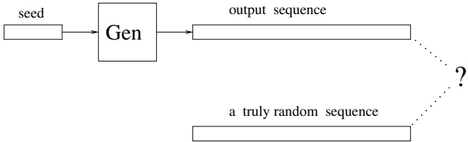
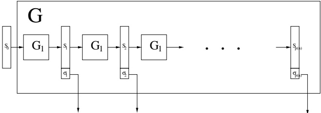
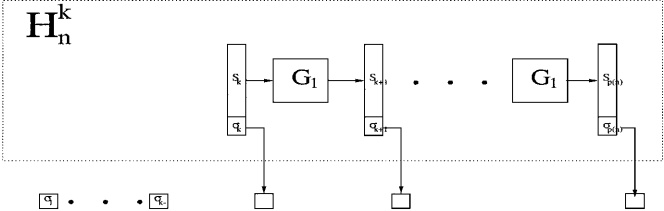
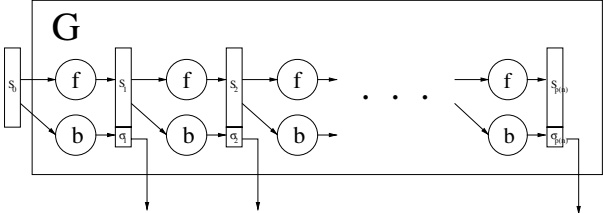
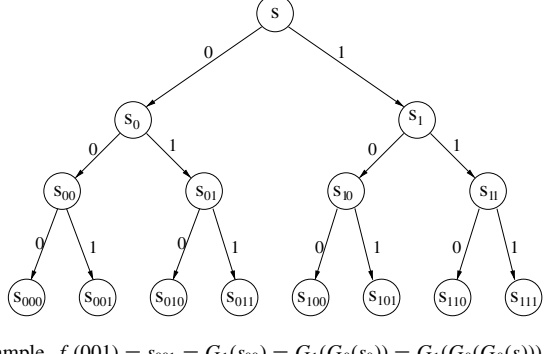
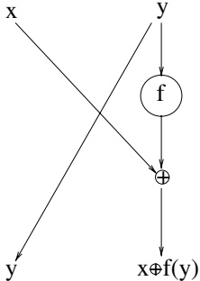

# Pseudorandom Generators

In this chapter we discuss pseudorandom generators. Loosely speaking, these are efficient deterministic programs that expand short, randomly selected seeds into much longer “pseudorandom” bit sequences (see illustration in Figure 3.1). Pseudorandom sequences are defined as computationally indistinguishable from truly random sequences by efficient algorithms. Hence the notion of computational indistinguishability (i.e., indistinguishability by efficient procedures) plays a pivotal role in our discussion. Furthermore, the notion of computational indistinguishability plays a key role also in subsequent chapters, in particular in the discussions of secure encryption, zero-knowledge proofs, and cryptographic protocols.

The theory of pseudorandomness is also applied to functions, resulting in the notion of pseudorandom functions, which is a useful tool for many cryptographic applications.

In addition to definitions of pseudorandom distributions, pseudorandom generators, and pseudorandom functions, this chapter contains constructions of pseudorandom generators (and pseudorandom functions) based on various types of one-way functions. In particular, very simple and efficient pseudorandom generators are constructed based on the existence of one-way permutations. We highlight the hybrid technique, which plays a central role in many of the proofs. (For the first use and further discussion of this technique, see Section 3.2.3.)

Organization. Basic discussions, definitions, and constructions of pseudorandom generators appear in Sections 3.1–3.4: We start with a motivating discussion (Section 3.1), proceed with a general definition of computational indistinguishability (Section 3.2), next present and discuss definitions of pseudorandom generators (Section 3.3), and finally present some simple constructions (Section 3.4). More general constructions are discussed in Section 3.5. Pseudorandom functions are defined and constructed (based on any pseudorandom generator) in Section 3.6. Pseudorandom permutations are discussed in Section 3.7.

Teaching Tip. The hybrid technique, first used to show that computational indistinguishability is preserved under multiple samples (Section 3.2.3), plays an important role.

Figure 3.1: Pseudorandom generators: an illustration.

role in many of the proofs that refer to computational indistinguishability. Thus, in case you choose to skip this specific proof, do incorporate a discussion of the hybrid technique in the first place you use it.

## 3.1. Motivating Discussion

The nature of randomness has puzzled thinkers for centuries. We believe that the notion of computation, and in particular that of efficient computation, provides a good basis for understanding the nature of randomness.

### 3.1.1. Computational Approaches to Randomness

One computational approach to randomness was initiated by Solomonov and Kolmogorov in the early 1960s (and rediscovered by Chaitin in the early 1970s). This approach is “ontological” in nature. Loosely speaking, a string $s$ is considered Kolmogorov-random if its length (i.e., $|s|$) equals the length of the shortest program producing $s$. This shortest program can be considered the “simplest” “explanation” for the phenomenon described by the string $s$. Hence the string $s$ is considered Kolmogorov-random if it does not possess a “simple” explanation (i.e., an explanation that is substantially shorter than $|s|$). We stress that one cannot determine whether or not a given string is Kolmogorov-random (and, more generally, Kolmogorov complexity is a function that cannot be computed). Furthermore, this approach seems to have no application to the issue of “pseudorandom generators.”

An alternative computational approach to randomness is presented in the rest of this chapter. This approach was initiated in the early 1980s. In contrast to the approach of Kolmogorov, this new approach is behavioristic in nature. Instead of considering the “explanation” for a phenomenon, we consider the phenomenon’s effect on the environment. Loosely speaking, a string is considered pseudorandom if no efficient observer can distinguish it from a uniformly chosen string of the same length. The underlying postulate is that objects that cannot be differentiated by efficient procedures are considered equivalent, although they may be very different in nature (e.g., can have fundamentally different (Kolmogorov) complexities). Furthermore, the new approach naturally leads to the concept of a pseudorandom generator, which is a fundamental concept with lots of practical applications (particularly in the field of cryptography).

### 3.1.2. A Rigorous Approach to Pseudorandom Generators

The approach to pseudorandom generators presented in this book stands in contrast to the heuristic approach that is still common in discussions concerning “pseudorandom generators” that are being used in real computers. The heuristic approach considers “pseudorandom generators” as programs that produce bit sequences that can “pass” some specific statistical tests. The choices of statistical tests to which these programs are subjected are quite arbitrary and lack any systematic foundation. Furthermore, it is possible to construct efficient statistical tests that will foil the “pseudorandom generators” commonly used in practice (and in particular will distinguish their output from a uniformly chosen string of equal length). Consequently, before using a “pseudorandom generator” in a new application that requires “random” sequences, extensive tests have to be conducted in order to determine whether or not the behavior of the application when using the “pseudorandom generator” will be the same as its behavior when using a “true source of randomness.” Any modification of the application will require a new comparison of the “pseudorandom generator” against the “random source,” because the non-randomness of the “pseudorandom generator” may adversely affect the modified application (even if it did not affect the original application). Things become even worse with respect to cryptographic applications, because in such cases an application is fully determined only after the adversary is fixed. That is, one cannot test the effect of the “pseudorandom generator” on the performance of a yet-unspecified adversary, and it is unreasonable to assume that the adversary is going to employ a specific strategy known to the designer. Thus, using such a “pseudorandom generator” for cryptographic purposes is highly risky.

In contrast, the concept of pseudorandom generators presented herein is a robust one: By definition, these pseudorandom generators produce sequences that look random to any efficient observer. It follows that the output of a pseudorandom generator can be used instead of “random sequences” in any efficient application requiring such (i.e., “random”) sequences. In particular, no efficient adversary can capitalize on the replacement of “truly random sequences” by pseudorandom ones.

## 3.2. Computational Indistinguishability

As stated earlier, the concept of computational indistinguishability is the basis for our definition of pseudorandomness. Thus, we start with a general definition and discussion of this fundamental concept.

The concept of efficient computation leads naturally to a new kind of equivalence between objects: Objects are considered to be computationally equivalent if they cannot be differentiated by any efficient procedure. We note that considering indistinguishable objects as equivalent is one of the basic paradigms of both science and real-life.

situations. Hence, we believe that the notion of computational indistinguishability is a very natural one.

### 3.2.1. Definition

The notion of computational indistinguishability is formulated in a way that is standard in the field of computational complexity: by considering objects as infinite sequences of strings. Hence, the sequences $\{x_n\}_{n\in N}$ and $\{y_n\}_{n\in N}$ are said to be computationally indistinguishable if no efficient procedure can tell them apart. In other words, no efficient algorithm $D$ can accept infinitely many $x_n$'s while rejecting their $y$ counterparts (i.e., for every efficient algorithm $D$ and all sufficiently large $n$'s, it holds that $D$ accepts $x_n$ iff $D$ accepts $y_n$). Objects that are computationally indistinguishable in this sense can be considered equivalent as far as any practical purpose is concerned (because practical purposes are captured by efficient algorithms, and they cannot distinguish these objects).

The foregoing discussion extends naturally to the probabilistic setting. Furthermore, as we shall see, this extension yields very useful consequences. Loosely speaking, two distributions are called computationally indistinguishable if no efficient algorithm can tell them apart. Given an efficient algorithm D, we consider the probability that D accepts (e.g., outputs 1 on input) a string taken from the first distribution. Likewise, we consider the probability that D accepts a string taken from the second distribution. If these two probabilities are close, we say that D does not distinguish the two distributions. Again, the formulation of this discussion is with respect to two infinite sequences of distributions (rather than with respect to two fixed distributions). Such sequences are called probability ensembles.

Definition 3.2.1 (Probability Ensemble): Let $ I $ be a countable index set. An ensemble indexed by $ I $ is a sequence of random variables indexed by $ I $. Namely, any $ X = \{X_i\}_{i \in I} $, where each $ X_i $ is a random variable, is an ensemble indexed by $ I $.

We shall use either $\mathbb{N}$ or a subset of $\{0, 1\}$ as the index set. Typically in our applications, an ensemble of the form $X = \{X_n\}_{n \in \mathbb{N}}$ has each $X_n$ ranging over strings of length $\mathrm{poly}(n)$, whereas an ensemble of the form $X = \{X_w\}_{w \in \{0,1\}^*}$ will have each $X_w$ ranging over strings of length $\mathrm{poly}(|w|)$. In the rest of this chapter we shall deal with ensembles indexed by $\mathbb{N}$, whereas in other chapters (e.g., in the definition of secure encryption and zero-knowledge) we shall deal with ensembles indexed by strings. To avoid confusion, we shall present variants of the definition of computational indistinguishability for each of these two cases. The two formulations can be unified if one associates the natural numbers with their unary representations (i.e., associate $\mathbb{N}$ and $\{1^n: n \in \mathbb{N}\}$).

#### Definition 3.2.2 (Polynomial-Time Indistinguishability):

1. Variant for ensembles indexed by $\mathbb{N}$: Two ensembles, $X \overset{\text{def}}{=} \{X_n\}_{n \in \mathbb{N}}$ and $Y \overset{\text{def}}{=} \{Y_n\}_{n \in \mathbb{N}}$, are indistinguishable in polynomial time if for every probabilistic polynomial-time algorithm $D$, every positive polynomial $p(\cdot)$, and all sufficiently large n's,

 $$ |\Pr[D(X_{n},1^{n})=1]-\Pr[D(Y_{n},1^{n})=1]|<\frac{1}{p(n)} $$ 

2. Variant for ensembles indexed by a set of strings $ S $: Two ensembles, $ X \overset{\text{def}}{=} \{X_w\}_{w \in S} $ and $ Y \overset{\text{def}}{=} \{Y_w\}_{w \in S} $, are indistinguishable in polynomial time if for every probabilistic polynomial-time algorithm $ D $, every positive polynomial $ p(\cdot) $, and all sufficiently long $ w \in S $,

 $$ |\Pr[D(X_{w},w)=1]-\Pr[D(Y_{w},w)=1]|<\frac{1}{p(|w|)} $$ 

We often say computational indistinguishability instead of indistinguishability in polynomial time.

The probabilities in the foregoing definition are taken over the corresponding random variables $ X_i $ (or $ Y_i $) and the internal coin tosses of algorithm $ D $ (which is allowed to be a probabilistic algorithm). The second variant of this definition will play a key role in subsequent chapters, and further discussion of it is postponed to those places. In the rest of this chapter, we refer to only the first variant of the foregoing definition. The string $ 1^n $ is given as auxiliary input to algorithm $ D $ in order to make the first variant consistent with the second one. We comment that in typical cases, the length of $ X_n $ (resp., $ Y_n $) and $ n $ are polynomially related (i.e., $ |X_n| < \text{poly}(n) $ and $ n < \text{poly}(|X_n|) $) and furthermore can be computed one from the other in $ \text{poly}(n) $ time. In such cases, giving $ 1^n $ as auxiliary input is redundant. Indeed, throughout this chapter we typically omit this auxiliary input and assume that $ n $ can be efficiently determined from $ X_n $.

The following mental experiment may be instructive. For each $\alpha \in \{0,1\}^*$, consider the probability, hereafter denoted $d(\alpha)$, that algorithm $D$ outputs 1 on input $\alpha$. Consider the expectation of $d$ taken over each of the two ensembles: That is, let $d_X(n) = \mathbb{E}[d(X_n)]$ and $d_Y(n) = \mathbb{E}[d(Y_n)]$. Then $X$ and $Y$ are said to be indistinguishable by $D$ if the difference (function) $\delta(n) \overset{\text{def}}{=} |d_X(n) - d_Y(n)|$ is negligible in $n$. Recall that a function $\mu : \mathbb{N} \to [0,1]$ is called negligible if for every positive polynomial $p$ and all sufficiently large $n$'s, $\mu(n) < 1/p(n)$.

A couple of examples may help to clarify the definition. Consider an algorithm $ D_1 $ that, obliviously of the input, flips a (0–1-valued) coin and outputs its outcome. Clearly, on every input, algorithm $ D_1 $ outputs 1 with probability exactly $ \frac{1}{2} $ and hence does not distinguish any pair of ensembles. Next, consider an algorithm $ D_2 $ that outputs 1 if and only if the input string contains more zeros than ones. Because $ D_2 $ can be implemented in polynomial time, it follows that if X and Y are polynomial-time-indistinguishable, then the difference $ |\text{Pr}[\text{wt}(X_n) < \frac{n}{2}] - \text{Pr}[\text{wt}(Y_n) < \frac{n}{2}]| $ is negligible (in $ n $), where $ \text{wt}(\alpha) $ denotes the number of ones in the string $ \alpha $. Similarly, polynomial-time-indistinguishable ensembles must exhibit the same “profile” (up to negligible error) with respect to any “string statistics” that can be computed in polynomial time. However, it is not required that polynomial-time-indistinguishable ensembles have similar “profiles” with respect to quantities that cannot be computed in polynomial time (e.g., Kolmogorov complexity, or the function presented immediately after Proposition 3.2.3).

### 3.2.2. Relation to Statistical Closeness

Computational indistinguishability is a coarsening of a traditional notion from probability theory. We call two ensembles $ X \overset{\text{def}}{=} \{X_n\}_{n \in \mathbb{N}} $ and $ Y \overset{\text{def}}{=} \{Y_n\}_{n \in \mathbb{N}} $ statistically close if their statistical difference is negligible, where the statistical difference (also known as variation distance) between $ X $ and $ Y $ is defined as the function

 $$ \Delta(n)\stackrel{\mathrm{def}}{=}\frac{1}{2}\cdot\sum_{\alpha}|\Pr[X_{n}=\alpha]-\Pr[Y_{n}=\alpha]| $$

Clearly, if the ensembles X and Y are statistically close, then they are also polynomial-time-indistinguishable (see Exercise 6). The converse, however, is not true. In particular:

Proposition 3.2.3: There exists an ensemble $ X = \{X_n\}_{n \in \mathbb{N}} $ such that $ X $ is not statistically close to the uniform ensemble $ U \overset{\text{def}}{=} \{U_n\}_{n \in \mathbb{N}} $, and yet $ X $ and $ U $ are polynomial-time-indistinguishable. Furthermore, $ X_n $ assigns all its probability mass to at most $ 2^{n/2} $ strings (of length $ n $).

Recall that $U_n$ is uniformly distributed over strings of length $n$. Although $X$ and $U$ are polynomial-time-indistinguishable, one can define a function $f:\{0,1\}^* \to \{0,1\}$ such that $f$ has average 1 over $X$ while having average almost 0 over $U$ (e.g., $f(x)=1$ if and only if $\Pr[X=x]>0$). Hence, $X$ and $U$ have different “profiles” with respect to the function $f$, yet it is (necessarily) impossible to compute $f$ in polynomial time.

Proof: We claim that for all sufficiently large $n$, there exists a random variable $X_n$, distributed over some set of at most $2^{n/2}$ strings (each of length $n$), such that for every circuit $C_n$ of size (i.e., number of gates) $2^{n/8}$, it holds that

 $$ \left|\Pr[C_{n}(U_{n})=1]-\Pr[C_{n}(X_{n})=1]\right|<2^{-n/8} $$ 

The proposition follows from this claim, because polynomial-time-distinguishers (even probabilistic ones; see Exercise 10 (Part 1)) yield polynomial-size circuits with at least as large a distinguishing gap.

The foregoing claim is proved using a probabilistic argument. That is, we actually show that most distributions of a certain class can “fool” all circuits of size $ 2^{n/8} $. Specifically, we show that if we select uniformly a multi-set of $ 2^{n/2} $ strings in $ \{0, 1\}^{n} $ and let $ X_{n} $ be uniform over this multi-set, then Eq. (3.2) holds with overwhelmingly high probability (over the choices of the multi-set).

Let $C_n$ be some fixed circuit with $n$ inputs, and let $p_n \overset{\text{def}}{=} \Pr[C_n(U_n)=1]$. We select, independently and uniformly, $2^{n/2}$ strings, denoted $s_1, \ldots, s_{2^{n/2}}$, in $\{0,1\}^n$. We define random variables $\zeta_i$'s such that $\zeta_i = C_n(s_i)$; that is, these random variables depend on the random choices of the corresponding $s_i$'s. Using the Chernoff bound, we get that

 $$ \Pr\Biggl[\Biggl|p_{n}-\frac{1}{2^{n/2}}\cdot\sum_{i=1}^{2^{n/2}}\zeta_{i}\Biggr|\geq2^{-n/8}\Biggr]\leq2e^{-2\cdot2^{n/2}\cdot(2^{-n/8})^{2}}<2^{-2^{n/4}} $$ 

Because there are at most $ 2^{2^{n/4}} $ different circuits of size (number of gates) $ 2^{n/8} $, it follows that there exists a sequence $ s_1, \ldots, s_{2^{n/2}} \in \{0, 1\}^n $ such that for every circuit $ C_n $ of size $ 2^{n/8} $ it holds that

 $$ \left|\Pr[C_{n}(U_{n})=1]-\frac{\sum_{i=1}^{2^{n/2}}C_{n}(s_{i})}{2^{n/2}}\right|<2^{-n/8} $$ 

Fixing such a sequence of $ s_i $'s, and letting $ X_n $ be distributed uniformly over the elements in the sequence, the claim follows. $ \blacksquare $

High-Level Comment. Proposition 3.2.3 presents a pair of ensembles that are computationally indistinguishable, although they are statistically far apart. One of the two ensembles is not constructible in polynomial time (see Definition 3.2.5). Interestingly, a pair of polynomial-time-constructible ensembles that are both computationally indistinguishable and have a noticeable statistical difference can exist only if pseudorandom generators exist. Jumping ahead, we note that this necessary condition is also sufficient. (The latter observation follows from the fact that pseudorandom generators give rise to a polynomial-time-constructible ensemble that is computationally indistinguishable from the uniform ensemble and yet statistically far from it.)

Low-Level Comment. A closer examination of the foregoing proof reveals that all but a negligible fraction of the sequences of length $ 2^{n/2} $ can be used to define the random variable $ X_n $. Specifically, the second inequality in Eq. (3.3) is a gross overestimate, and an upper bound of $ 2^{-2\Omega(n)} \cdot 2^{-2^{n/4}} $ actually holds. Observing that most sequences contain no repetitions, we can fix such a sequence. Consequently, $ X_n $ will be uniform over the $ 2^{n/2} $ distinct elements of the sequence.

### 3.2.3. Indistinguishability by Repeated Experiments

By Definition 3.2.2, two ensembles are considered computationally indistinguishable if no efficient procedure can tell them apart based on a single sample. We now show that for “efficiently constructible” ensembles, computational indistinguishability (based on a single sample) implies computational indistinguishability based on multiple samples. We start by presenting definitions of “indistinguishability by multiple samples” and “efficiently constructible ensembles.”

Definition 3.2.4 (Indistinguishability by Repeated Sampling): Two ensembles, $ X \stackrel{\text{def}}{=} \{X_n\}_{n \in \mathbb{N}} $ and $ Y \stackrel{\text{def}}{=} \{Y_n\}_{n \in \mathbb{N}} $, are indistinguishable by polynomial-time sampling if for every probabilistic polynomial-time algorithm $ D $, every two positive polynomials $ m(\cdot) $ and $ p(\cdot) $, and all sufficiently large $ n $'s,

 $$ \left|\Pr\left[D\left(X_{n}^{(1)},\ldots,X_{n}^{(m(n))}\right)=1\right]-\Pr\left[D\left(Y_{n}^{(1)},\ldots,Y_{n}^{(m(n))}\right)=1\right]\right|<\frac{1}{p(n)} $$ 

where $ X_{n}^{(1)} $ through $ X_{n}^{(m(n))} $ and $ Y_{n}^{(1)} $ through $ Y_{n}^{(m(n))} $ are independent random variables, with each $ X_{n}^{(i)} $ identical to $ X_{n} $ and each $ Y_{n}^{(i)} $ identical to $ Y_{n} $.

Definition 3.2.5 (Efficiently Constructible Ensembles): An ensemble $ X \triangleq \{X_n\}_{n \in \mathbb{N}} $ is said to be polynomial-time-constructible if there exists a probabilistic polynomial-time algorithm $ S $ such that for every $ n $, the random variables $ S(1^n) $ and $ X_n $ are identically distributed.

Theorem 3.2.6: Let $ X \overset{\text{def}}{=}\{X_n\}_{n\in\mathbb{N}} $ and $ Y \overset{\text{def}}{=}\{Y_n\}_{n\in\mathbb{N}} $ be two polynomial-time-constructible ensembles, and suppose that X and Y are indistinguishable in polynomial time (as in Definition 3.2.2). Then X and Y are indistinguishable by polynomial-time sampling (as in Definition 3.2.4).

An alternative formulation of Theorem 3.2.6 proceeds as follows. For every ensemble $ Z \overset{\text{def}}{=} \{Z_n\}_{n \in \mathbb{N}} $ and every polynomial $ m(\cdot) $, define the $ m(\cdot) $-product of $ Z $ as the ensemble $ \{(Z_n^{(1)}, \ldots, Z_n^{(m(n))})\}_{n \in \mathbb{N}} $, where the $ Z_n^{(i)} $'s are independent copies of $ Z_n $. Theorem 3.2.6 asserts that if the ensembles $ X $ and $ Y $ are polynomial-time-indistinguishable and each is polynomial-time-constructible, then for every polynomial $ m(\cdot) $ the $ m(\cdot) $-product of $ X $ and the $ m(\cdot) $-product of $ Y $ are polynomial-time-indistinguishable.

The information-theoretic analogue of the foregoing theorem is quite obvious: If two ensembles are statistically close, then their polynomial-products are statistically close (see Exercise 7). Adapting the proof to the computational setting requires, as usual, a reducibility argument. This argument uses, for the first time in this book, the hybrid technique. The hybrid technique plays a central role in demonstrating the computational indistinguishability of complex ensembles, constructed on the basis of simpler (computationally indistinguishable) ensembles. Subsequent applications of the hybrid technique will involve more technicalities. Hence the reader is urged not to skip the following proof.

Proof: The proof is by a reducibility argument. We show that the existence of an efficient algorithm that distinguishes the ensembles X and Y using several samples implies the existence of an efficient algorithm that distinguishes the ensembles X and Y using a single sample. The implication is proved using the following argument, which will later be called a “hybrid argument.”

Suppose, to the contrary, that there is a probabilistic polynomial-time algorithm $ D $, as well as polynomials $ m(\cdot) $ and $ p(\cdot) $, such that for infinitely many $ n^{\prime} $s it holds that

 $$ \begin{align*}\Delta(n)&\stackrel{\mathrm{def}}{=}\big|\Pr\big[D\big(X_{n}^{(1)},\ldots,X_{n}^{(m)}\big)=1\big]-\Pr\big[D\big(Y_{n}^{(1)},\ldots,Y_{n}^{(m)}\big)=1\big]\big|\\&>\frac{1}{p(n)}\end{align*} $$ 

where $ m \stackrel{\text{def}}{=} m(n) $, and the $ X_n^{(i)} $'s and $ Y_n^{(i)} $'s are as in Definition 3.2.4. In the sequel, we shall derive a contradiction by presenting a probabilistic polynomial-time algorithm $ D' $ that distinguishes the ensembles X and Y (in the sense of Definition 3.2.2).

For every $k$, with $0 \leq k \leq m$, we define the hybrid random variable $H_n^k$ as a $(m\text{-long})$ sequence consisting of $k$ independent copies of $X_n$ followed by $m-k$ independent copies of $ Y_{n} $. Namely,

 $$ H_{n}^{k}\stackrel{\mathrm{def}}{=}\left(X_{n}^{(1)},\ldots,X_{n}^{(k)},Y_{n}^{(k+1)},\ldots,Y_{n}^{(m)}\right) $$ 

where $X_{n}^{(1)}$ through $X_{n}^{(k)}$ and $Y_{n}^{(k+1)}$ through $Y_{n}^{(m)}$ are independent random variables, with each $X_{n}^{(i)}$ identical to $X_{n}$ and each $Y_{n}^{(i)}$ identical to $Y_{n}$. Clearly, $H_{n}^{m}=(X_{n}^{(1)},\ldots,X_{n}^{(m)})$, whereas $H_{n}^{0}=(Y_{n}^{(1)},\ldots,Y_{n}^{(m)})$.

By our hypothesis, algorithm $ D $ can distinguish the extreme hybrids (i.e., $ H_n^0 $ and $ H_n^m $). Because the total number of hybrids is polynomial in $ n $, a non-negligible gap between (the “accepting” probability of $ D $ on) the extreme hybrids translates into a non-negligible gap between (the “accepting” probability of $ D $ on) a pair of neighboring hybrids. It follows that $ D $, although not “designed to work on general hybrids,” can distinguish a pair of neighboring hybrids. The punch line is that algorithm $ D $ can be easily modified into an algorithm $ D' $ that distinguishes $ X $ and $ Y $. Details follow.

We construct an algorithm $ D' $ that uses algorithm D as a subroutine. On input $ \alpha $ (supposedly in the range of either $ X_n $ or $ Y_n $), algorithm $ D' $ proceeds as follows. Algorithm $ D' $ first selects k uniformly in the set $ \{0, 1, \ldots, m-1\} $. Using the efficient sampling algorithm for the ensemble X, algorithm $ D' $ generates k independent samples of $ X_n $. These samples are denoted $ x^1, \ldots, x^k $. Likewise, using the efficient sampling algorithm for the ensemble Y, algorithm $ D' $ generates $ m-k-1 $ independent samples of $ Y_n $, denoted $ y^{k+2}, \ldots, y^m $. Finally, algorithm $ D' $ invokes algorithm D and halts with output $ D(x^1, \ldots, x^k, \alpha, y^{k+2}, \ldots, y^m) $.

Clearly, $ D' $ can be implemented in probabilistic polynomial time. It is also easy to verify the following claims.

Claim 3.2.6.1:

 $$ \Pr[D^{\prime}(X_{n})=1]=\frac{1}{m}\sum_{k=0}^{m-1}\Pr\big[D\big(H_{n}^{k+1}\big)=1\big] $$ 

and

 $$ \Pr[D^{\prime}(Y_{n})=1]=\frac{1}{m}\sum_{k=0}^{m-1}\Pr\big[D\big(H_{n}^{k}\big)=1\big] $$ 

Proof: By construction of algorithm $ D' $, we have

 $$ D^{\prime}(\alpha)=D\left(X_{n}^{(1)},\cdots,X_{n}^{(k)},\alpha,Y_{n}^{(k+2)},\cdots,Y_{n}^{(m)}\right) $$ 

where $k$ is uniformly distributed in $\{0, 1, \ldots, m-1\}$. Using the definition of the hybrids $H_n^k$, the claim follows. $\square$

Claim 3.2.6.2: For $ \Delta(n) $ as in Eq. (3.4),

 $$ |\Pr[D^{\prime}(X_{n})=1]-\Pr[D^{\prime}(Y_{n})=1]|=\frac{\Delta(n)}{m(n)} $$ 

Proof: Using Claim 3.2.6.1 for the first equality, we get

 $$ \begin{align*}|\Pr[D^{\prime}(X_{n})=1]-\Pr[D^{\prime}(Y_{n})=1]|&=\frac{1}{m}\cdot\left|\sum_{k=0}^{m-1}\Pr\big[D\big(H_{n}^{k+1}\big)=1\big]-\Pr\big[D\big(H_{n}^{k}\big)=1\big]\right|\\&=\frac{1}{m}\cdot\big|\Pr\big[D\big(H_{n}^{m}\big)=1\big]-\Pr\big[D\big(H_{n}^{0}\big)=1\big]\big|\\&=\frac{\Delta(n)}{m}\end{align*} $$ 

where the last equality follows by recalling that $ H_n^m = (X_n^{(1)}, \ldots, X_n^{(m)}) $ and $ H_n^0 = (Y_n^{(1)}, \ldots, Y_n^{(m)}) $ and using the definition of $ \Delta(n) $. $ \square $

Since by our hypothesis $\Delta(n) > \frac{1}{p(n)}$ for infinitely many $n$'s, it follows that the probabilistic polynomial-time algorithm $D'$ distinguishes $X$ and $Y$ in contradiction to the hypothesis of the theorem. Hence, the theorem follows.

#### The Hybrid Technique: A Digest

It is worthwhile to give some thought to the hybrid technique (used for the first time in the preceding proof). The hybrid technique constitutes a special type of a “reducibility argument” in which the computational indistinguishability of complex ensembles is proved using the computational indistinguishability of basic ensembles. The actual reduction is in the other direction: Efficiently distinguishing the basic ensembles is reduced to efficiently distinguishing the complex ensembles, and hybrid distributions are used in the reduction in an essential way. The following properties of the construction of the hybrids play an important role in the argument:

1. Extreme hybrids collide with the complex ensembles: This property is essential because what we want to prove (i.e., indistinguishability of the complex ensembles) relates to the complex ensembles.

2. Neighboring hybrids are easily related to the basic ensembles: This property is essential because what we know (i.e., indistinguishability of the basic ensembles) relates to the basic ensembles. We need to be able to translate our knowledge (i.e., computational indistinguishability) of the basic ensembles to knowledge (i.e., computational indistinguishability) of any pair of neighboring hybrids. Typically it is required to efficiently transform strings in the range of a basic distribution into strings in the range of a hybrid, so that the transformation maps the first basic distribution to one hybrid and the second basic distribution to the neighboring hybrid. (In the proof of Theorem 3.2.6, the hypothesis that both X and Y are polynomial-time-constructible is instrumental for such an efficient transformation.)

3. The number of hybrids is small (i.e., polynomial): This property is essential in order to deduce the computational indistinguishability of extreme hybrids from the computational indistinguishability of each pair of neighboring hybrids. Typically, the provable “distinguishability gap” is inversely proportional to the number of hybrids.

We remark that during the course of a hybrid argument a distinguishing algorithm referring to the complex ensembles is being analyzed and even executed on arbitrary hybrids. The reader may be annoyed by the fact that the algorithm “was not designed to work on such hybrids” (but rather only on the extreme hybrids). However, an algorithm is an algorithm: Once it exists, we can apply it to any input of our choice and analyze its performance on arbitrary input distributions.

Advanced Comment on the Non-triviality of Theorem 3.2.6: Additional indication of the non-triviality of Theorem 3.2.6 is provided by the fact that the conclusion may fail in case the individual ensembles are not both efficiently constructible. Indeed, the hypothesis that both ensembles are efficiently constructible plays a central role in the proof of Theorem 3.2.6. Contrast this fact with the fact that an information-theoretic analogue of Theorem 3.2.6 asserts that for any two ensembles, statistical closeness implies statistical closeness of multiple samples.

### 3.2.4.* Indistinguishability by Circuits

A stronger notion of computational indistinguishability is the notion of computational indistinguishability by non-uniform families of polynomial-size circuits. This notion will be used in subsequent chapters.

#### Definition 3.2.7 (Indistinguishability by Polynomial-Size Circuits):

1. Variant for ensembles indexed by $ \mathbb{N} $: Two ensembles, $ X \overset{\text{def}}{=} \{X_n\}_{n\in\mathbb{N}} $ and $ Y \overset{\text{def}}{=} \{Y_n\}_{n\in\mathbb{N}} $, are indistinguishable by polynomial-size circuits if for every family $ \{C_n\}_{n\in\mathbb{N}} $ of polynomial-size circuits, every positive polynomial $ p(\cdot) $, and all sufficiently large $ n $'s,

 $$ |\Pr[C_{n}(X_{n})=1]-\Pr[C_{n}(Y_{n})=1]|<\frac{1}{p(n)} $$ 

2. Variant for ensembles indexed by a set of strings $ S $: Two ensembles, $ X \overset{\text{def}}{=} \{X_w\}_{w \in S} $ and $ Y \overset{\text{def}}{=} \{Y_w\}_{w \in S} $, are indistinguishable by polynomial-size circuits if for every family $ \{C_n\}_{n \in \mathbb{N}} $ of polynomial-size circuits, every positive polynomial $ p(\cdot) $, and all sufficiently long $ w $'s,

 $$ \left|\Pr\left[C_{|w|}(X_{w})=1\right]-\Pr\left[C_{|w|}(Y_{w})=1\right]\right|<\frac{1}{p(|w|)} $$ 

We comment that the variant for ensembles indexed by S is equivalent to the following (seemingly stronger) condition: For every polynomial $ s(\cdot) $, every collection $ \{C_w\}_{w \in S} $ of circuits such that $ C_w $ has size at most $ s(|w|) $, every positive polynomial $ p(\cdot) $, and all sufficiently long $ w $'s,

 $$ |\Pr[C_{w}(X_{w})=1]-\Pr[C_{w}(Y_{w})=1]|<\frac{1}{p(|w|)} $$ 

We show that the second requirement is not stronger than the requirement in the definition: That is, we show that if the second requirement is not satisfied, then neither is the first. Suppose that for some polynomials $s$ and $p$ there exist infinitely many $w$’s violating Eq. (3.5). Then there exists an infinite set $N$ such that for every $n \in N$, there exists a string $w_n \in \{0,1\}^n$ violating Eq. (3.5). Letting $C'_n \overset{\text{def}}{=} C_{w_n}$, we obtain a contradiction to the requirement of the definition.

We note that allowing probabilistic circuits in the preceding definition does not increase its power (see Exercise 8). Consequently, in accordance with our meta-theorem (see Section 1.3.3), indistinguishability by polynomial-size circuits (as per Definition 3.2.7) implies indistinguishability by probabilistic polynomial-time machines (as per Definition 3.2.2); see Exercise 10. The converse is false (see Exercise 10). Finally, we note that indistinguishability by polynomial-size circuits is preserved under repeated experiments, even if both ensembles are not efficiently constructable (see Exercise 9).

### 3.2.5. Pseudorandom Ensembles

One special, yet important, case of computationally indistinguishable pairs of ensembles is the case in which one of the ensembles is uniform. Ensembles that are computationally indistinguishable from a uniform ensemble are called pseudorandom. Recall that $ U_m $ denotes a random variable uniformly distributed over the set of strings of length $ m $. The ensemble $ \{U_n\}_{n\in\mathbb{N}} $ is called the standard uniform ensemble. Yet, it will also be convenient to call uniform those ensembles of the form $ \{U_{l(n)}\}_{n\in\mathbb{N}} $, where $ l : \mathbb{N} \to \mathbb{N} $.

Definition 3.2.8 (Pseudorandom Ensembles): The ensemble $ X = \{X_n\}_{n \in \mathbb{N}} $ is called pseudorandom if there exists a uniform ensemble $ U = \{U_{l(n)}\}_{n \in \mathbb{N}} $ such that $ X $ and $ U $ are indistinguishable in polynomial time.

We stress that $ |X_n| $ is not necessarily $ n $ (whereas $ |U_m| = m $). In fact, for polynomial-time-computable $ l: \mathbb{N} \to \mathbb{N} $ and $ X = \{X_n\}_{n \in \mathbb{N}} $ as in Definition 3.2.8, with very high probability, $ |X_n| $ equals $ l(n) $.

In the foregoing definition, as well as in the rest of this book, pseudorandomness is shorthand for pseudorandomness with respect to polynomial time.

## 3.3. Definitions of Pseudorandom Generators

A pseudorandom ensemble, as defined here, can be used instead of a uniform ensemble in any efficient application, with, at most, negligible degradation in performance (otherwise the efficient application can be transformed into an efficient distinguisher of the supposedly pseudorandom ensemble from the uniform one). Such a replacement is useful only if we can generate pseudorandom ensembles at a lower cost than that required to generate the corresponding uniform ensemble. The cost of generating an ensemble has several aspects. Standard cost considerations include the time and space complexities. However, in the context of randomized algorithms, and in particular in the context of generating probability ensembles, a major cost consideration is the quantity and quality of the random source used by the algorithm. In particular, in many applications (and especially in cryptography) it is desirable to generate pseudorandom ensembles using as little true randomness as possible. This leads to the definition of a pseudorandom generator.

### 3.3.1. Standard Definition of Pseudorandom Generators

Definition 3.3.1 (Pseudorandom Generator, Standard Definition): A pseudorandom generator is a deterministic polynomial-time algorithm G satisfying the following two conditions:

1. Expansion: There exists a function $ l : \mathbb{N} \to \mathbb{N} $ such that $ l(n) > n $ for all $ n \in \mathbb{N} $, and $ |G(s)| = l(|s|) $ for all $ s \in \{0, 1\}^{*} $.

2. Pseudorandomness: The ensemble $ \{G(U_n)\}_{n \in \mathbb{N}} $ is pseudorandom.

The function $l$ is called the expansion factor of $G$.

The input $s$ to the generator is called its seed. The expansion condition requires that the algorithm $G$ map $n$-bit-long seeds into $l(n)$-bit-long strings, with $l(n) > n$. The pseudorandomness condition requires that the output distribution induced by applying algorithm $G$ to a uniformly chosen seed be polynomial-time-indistinguishable from a uniform distribution, although it is not statistically close to uniform. Specifically, using Exercise 5 (for the first equality), we can bound the statistical difference between $G(U_n)$ and $U_{l(n)}$ as follows:

 $$ \begin{aligned}\frac{1}{2}\cdot\sum_{x}\left|\Pr\left[U_{l(n)}=x\right]-\Pr[G(U_{n})=x]\right|&=\max_{S}\left\{\Pr\left[U_{l(n)}\in S\right]-\Pr[G(U_{n})\in S]\right\}\\&\geq\Pr\left[U_{l(n)}\not\in\{G(s):s\in\{0,1\}^{n}\}\right]\\&\geq\left(2^{l(n)}-2^{n}\right)\cdot2^{-l(n)}\\&=1-2^{-(l(n)-n)}\geq\frac{1}{2}\end{aligned} $$ 

where the last inequality uses $ l(n) \geq n + 1 $. Note that for $ l(n) \geq 2n $, the statistical difference is at least $ 1 - 2^{-n} $.

The foregoing definition is quite permissive regarding the expansion factor $l: \mathbb{N} \to \mathbb{N}$. It asserts only that $l(n) \geq n + 1$ and $l(n) \leq \text{poly}(n)$. (It also follows that $l(n)$ is computed in time polynomial in $n$; e.g., by computing $|G(1^n)|$.) Clearly, a pseudorandom generator with expansion factor $l(n) = n + 1$ is of little value in practice, since it offers no significant saving in coin tosses. Fortunately, as shown in the next subsection, even pseudorandom generators with such a small expansion factor can be used to construct pseudorandom generators with any polynomial expansion factor. Hence, for every two expansion factors $l_1: \mathbb{N} \to \mathbb{N}$ and $l_2: \mathbb{N} \to \mathbb{N}$ that can be computed in $\text{poly}(n)$ time, there exists a pseudorandom generator with expansion factor $l_1$ if and only if there exists a pseudorandom generator with expansion factor $l_2$. This statement is proved by using any pseudorandom generator with expansion factor $l_1(n) \stackrel{\text{def}}{=} n + 1$ to construct, for every polynomial $p(\cdot)$, a pseudorandom generator with expansion factor $p(n)$. Note that a pseudorandom generator with expansion factor $ l_1(n) \stackrel{\text{def}}{=} n + 1 $ can be derived from any pseudorandom generator.

Each pseudorandom generator, as defined earlier, will have a predetermined expansion function. In Section 3.3.3 we shall consider “variable-output pseudorandom generators” that, given a random seed, will produce an infinite sequence of bits such that every polynomially long prefix of it will be pseudorandom.

### 3.3.2. Increasing the Expansion Factor

Given a pseudorandom generator $ G_{1} $ with expansion factor $ l_{1}(n) = n + 1 $, we construct a pseudorandom generator G with arbitrary polynomial expansion factor as follows.

Construction 3.3.2: Let $G_1$ be a deterministic polynomial-time algorithm mapping strings of length $n$ into strings of length $n+1$, and let $p(\cdot)$ be a polynomial. Define $G(s) = \sigma_1 \cdots \sigma_{p(|s|)}$, where $s_0 \overset{\text{def}}{=} s$, the bit $\sigma_i$ is the first bit of $G_1(s_{i-1})$, and $s_i$ is the $|s|$-bit-long suffix of $G_1(s_{i-1})$ for every $1 \leq i \leq p(|s|)$. That is, on input $s$, algorithm $G$ proceeds as follows:

Let $s_{0}=s$ and $n=|s|$.
For $i = 1$ to $p(n)$, do
$\sigma_{i}s_{i}\leftarrow G_{1}(s_{i-1})$, where $\sigma_{i}\in\{0,1\}$ and $|s_{i}|=|s_{i-1}|$.
Output $\sigma_{1}\sigma_{2}\cdots\sigma_{p(|s|)}$

The construction is depicted in Figure 3.2: On input $s$, algorithm $G$ applies $G_1$ for $p(|s|)$ times, each time on a new seed. Applying $G_1$ to the current seed yields a new seed (for the next iteration) as well as one extra bit (which is being output immediately). The seed in the first iteration is $s$ itself. The seed in the $i$th iteration is the $|s|$-bit-long suffix of the string obtained from $G_1$ in the previous iteration. Algorithm $G$ outputs the concatenation of the “extra bits” obtained in the $p(|s|)$ iterations. Clearly, $G$ is polynomial-time-computable and expands inputs of length $n$ into output strings of length $p(n)$.

Figure 3.2: Construction 3.3.2, as operating on seed $ s_{0} \in \{0, 1\}^{n} $.

Theorem 3.3.3: Let $G_{1}$, $p(\cdot)$, and $G$ be as in Construction 3.3.2 such that $p(n) > n$. If $G_{1}$ is a pseudorandom generator, then so is $G$.

Intuitively, the pseudorandomness of $G$ follows from that of $G_1$ by replacing each application of $G_1$ by a random process that on input a uniformly distributed $n$-bit-long string will output a uniformly distributed $(n+1)$-bit-long string. Loosely speaking, the indistinguishability of a single application of the random process from a single application of $G_1$ implies that polynomially many applications of the random process are indistinguishable from polynomially many applications of $G_1$. The actual proof uses the hybrid technique.

Proof: Suppose, to the contrary, that $G$ is not a pseudorandom generator. It follows that the ensembles $\{G(U_n)\}_{n\in\mathbb{N}}$ and $\{U_{p(n)}\}_{n\in\mathbb{N}}$ are not polynomial-time-indistinguishable. We shall show that it follows that the ensembles $\{G_1(U_n)\}_{n\in\mathbb{N}}$ and $\{U_{n+1}\}_{n\in\mathbb{N}}$ are not polynomial-time-indistinguishable, in contradiction to the hypothesis that $G_1$ is a pseudorandom generator with expansion factor $l_1(n) = n + 1$. The implication is proved using the hybrid technique.

For every $k$, with $0 \leq k \leq p(n)$, we define a hybrid $H_n^k$ to be the concatenation of a uniformly chosen $k$-bit-long string and the $(p(n) - k)$-bit-long prefix of $G(U_n)$. Denoting by $\text{pref}_j(\alpha)$ the $j$-bit-long prefix of the strings $\alpha$, where $j \leq |\alpha|$, and by $x \cdot y$ the concatenation of the strings $x$ and $y$, we have

 $$ \begin{array}{r}{H_{n}^{k}\stackrel{\mathrm{def}}{=}U_{k}^{(1)}\cdot\mathbf{p r e f}_{p(n)-k}\big(G\big(U_{n}^{(2)}\big)\big)}\end{array} $$ 

where $ U_k^{(1)} $ and $ U_n^{(2)} $ are independent random variables (the first uniformly distributed over $ \{0,1\}^k $, and the second uniformly distributed over $ \{0,1\}^n $).

A different way of viewing the hybrid $ H_n^k $ is depicted in Figure 3.3: Starting with Construction 3.3.2, we pick $ s_k $ uniformly in $ \{0, 1\}^n $ and $ \sigma_1 \cdots \sigma_k $ uniformly in $ \{0, 1\}^k $, and for $ i = k + 1, \ldots, p(n) $ we obtain $ \sigma_i s_i = G_1(s_{i-1}) $ as in the construction.

At this point it is clear that $ H_n^0 $ equals $ G(U_n) $, whereas $ H_n^{p(n)} $ equals $ U_{p(n)} $. It follows that if an algorithm $ D $ can distinguish the extreme hybrids, then $ D $ can also distinguish two neighboring hybrids (since the total number of hybrids is polynomial in $ n $, and a non-negligible gap between the extreme hybrids translates into a non-negligible gap between some neighboring hybrids). The punch line

Figure 3.3: Hybrid $ H_{n}^{k} $ as a modification of Construction 3.3.2

is that, using the structure of neighboring hybrids, algorithm $D$ can be easily modified to distinguish the ensembles $\{G_1(U_n)\}_{n\in\mathbb{N}}$ and $\{U_{n+1}\}_{n\in\mathbb{N}}$.

The core of the argument is the way in which the distinguishability of neighboring hybrids relates to the distinguishability of $ G_1(U_n) $ from $ U_{n+1} $. As stated, this relation stems from the structure of neighboring hybrids. Let us take a closer look at the hybrids $ H_n^k $ and $ H_n^{k+1} $ for some $ 0 \leq k \leq p(n) - 1 $. Another piece of notation is useful: We let $ \text{suff}_j(\alpha) $ denote the $ j $-bit-long suffix of the string $ \alpha $, where $ j \leq |\alpha| $. First observe (see justification later) that for every $ x \in \{0, 1\}^n $,

 $$ \mathbf{pref}_{j+1}(G(x))=\mathbf{pref}_{1}(G_{1}(x))\cdot\mathbf{pref}_{j}(G(\mathbf{suff}_{n}(G_{1}(x)))) $$ 

 $$ \begin{aligned}H_{n}^{k}&=U_{k}^{(1)}\cdot\mathbf{pref}_{(p(n)-k-1)+1}\big(G\big(U_{n}^{(2)}\big)\big)\\&\equiv U_{k}^{(1)}\cdot\mathbf{pref}_{1}\big(G_{1}\big(U_{n}^{(2)}\big)\big)\cdot\mathbf{pref}_{p(n)-k-1}\big(G\big(\mathbf{suff}_{n}\big(G_{1}\big(U_{n}^{(2)}\big)\big)\big)\big)\\H_{n}^{k+1}&=U_{k+1}^{(1)}\cdot\mathbf{pref}_{p(n)-(k+1)}\big(G\big(U_{n}^{(2)}\big)\big)\\&\equiv U_{k}^{(1)}\cdot\mathbf{pref}_{1}\big(U_{n+1}^{(3)}\big)\cdot\mathbf{pref}_{p(n)-k-1}\big(G\big(\mathbf{suff}_{n}\big(U_{n+1}^{(3)}\big)\big)\big)\end{aligned} $$ 

Thus, the ability to distinguish $ H_n^k $ and $ H_n^{k+1} $ translates to the ability to distinguish $ G_1(U_n^{(2)}) $ from $ U_{n+1}^{(3)} $: On input $ \alpha \in \{0, 1\}^{n+1} $, we uniformly select $ r \in \{0, 1\}^k $ and apply the “hybrid distinguisher” to $ r \cdot \text{pref}_1(\alpha) \cdot \text{pref}_{p(n)-k-1}(G(\text{suff}_n(\alpha))) $. Details follow.

First let us restate and further justify the equalities stated previously. We start with notation capturing the operator mentioned a few lines earlier. For every $ k \in \{0, 1, \ldots, p(n) - 1\} $ and $ \alpha \in \{0, 1\}^{n+1} $, let

 $$ \begin{array}{r}{f_{p(n)-k}(\alpha)\overset{\mathrm{def}}{=}\mathbf{p r e f}_{1}(\alpha)\cdot\mathbf{p r e f}_{p(n)-k-1}(G(\mathbf{s u f f}_{n}(\alpha)))\in\{0,1\}^{p(n)-k}}\end{array} $$ 

Claim 3.3.3.1 ( $ G_1(U_n) $ and $ U_{n+1} $ versus $ H_n^k $ and $ H_n^{k+1} $):

1. $ H_n^k $ is distributed identically to $ U_k^{(1)} \cdot f_{p(n)-k}(G_1(U_n^{(2)})) $.

2. $ H_{n}^{k+1} $ is distributed identically to $ U_{k}^{(1)} \cdot f_{p(n)-k}(U_{n+1}^{(3)}) $.

Proof: Consider any $x \in \{0,1\}^n$, and let $\sigma = \mathrm{pref}_1(G_1(x))$ and $y = \mathrm{suff}_n(G_1(x))$ (i.e., $\sigma y = G_1(x)$). Then, by construction of $G$, we have $G(x) = \sigma \cdot \mathrm{pref}_{p(n)-1}(G(y))$. This justifies Eq. (3.7); that is, $\mathrm{pref}_{j+1}(G(x)) = \mathrm{pref}_1(G_1(x)) \cdot \mathrm{pref}_j(G(\mathrm{suff}_n(G_1(x)))))$ for every $j \geq 0$. We now establish the two parts of the claim:

1. Combining the definition of $ H_{n}^{k} $ and Eq. (3.7), we have

 $$ \begin{aligned}H_{n}^{k}&=U_{k}^{(1)}\cdot\mathbf{p r e f}_{(p(n)-k-1)+1}\big(G\big(U_{n}^{(2)}\big)\big)\\&=U_{k}^{(1)}\cdot\mathbf{p r e f}_{1}\big(G_{1}\big(U_{n}^{(2)}\big)\big)\cdot\mathbf{p r e f}_{p(n)-k-1}\big(G\big(\mathbf{s u f f}_{n}\big(G_{1}\big(U_{n}^{(2)}\big)\big)\big)\big)\\&=U_{k}^{(1)}\cdot f_{p(n)-k}\big(G_{1}\big(U_{n}^{(2)}\big)\big)\\ \end{aligned} $$ 

which establishes the first part.

2. For the second part, combining the definition of $ H_{n}^{k+1} $ and Eq. (3.7), we have

 $$ \begin{aligned}H_{n}^{k+1}&=U_{k+1}^{(1)}\cdot\mathbf{pref}_{p(n)-(k+1)}\big(G\big(U_{n}^{(2)}\big)\big)\\&\equiv U_{k}^{(1)}\cdot U_{1}^{(3)}\cdot\mathbf{pref}_{p(n)-k-1}\big(G\big(\mathbf{suff}_{n}\big(U_{n+1}^{(3)}\big)\big)\big)\\&\equiv U_{k}^{(1)}\cdot\mathbf{pref}_{1}\big(U_{n+1}^{(3)}\big)\cdot\mathbf{pref}_{p(n)-k-1}\big(G\big(\mathbf{suff}_{n}\big(U_{n+1}^{(3)}\big)\big)\big)\\&=U_{k}^{(1)}\cdot f_{p(n)-k}\big(U_{n+1}^{(3)}\big)\\ \end{aligned} $$ 

Thus, both parts are established. $\blacksquare$

Hence, distinguishing $G_{1}(U_{n})$ from $U_{n+1}$ is reduced to distinguishing the neighboring hybrids (i.e., $H_{n}^{k}$ and $H_{n}^{k+1}$) by applying $f_{p(n)-k}$ to the input, padding the outcome (in the front) by a uniformly chosen string of length $k$, and applying the hybrid-distinguisher to the resulting string. Further details follow.

We assume, contrary to the theorem, that $G$ is not a pseudorandom generator. Suppose that $D$ is a probabilistic polynomial-time algorithm such that for some polynomial $q(\cdot)$ and for infinitely many $n$'s, it holds that

 $$ \Delta(n)\stackrel{\mathrm{def}}{=}\left|\Pr[D(G(U_{n}))=1]-\Pr\left[D\left(U_{p(n)}\right)=1\right]\right|>\frac{1}{q(n)} $$

We derive a contradiction by constructing a probabilistic polynomial-time algorithm $ D' $ that distinguishes $ G_{1}(U_{n}) $ from $ U_{n+1} $.

Algorithm $D'$ uses algorithm $D$ as a subroutine. On input $\alpha \in \{0,1\}^{n+1}$, algorithm $D'$ operates as follows. First, $D'$ selects an integer $k$ uniformly in the set $\{0,1,\ldots,p(n)-1\}$, next it selects $\beta$ uniformly in $\{0,1\}^{k}$, and finally it halts with output $D(\beta\cdot f_{p(n)-k}(\alpha))$, where $f_{p(n)-k}$ is as defined in Eq. (3.8).

Clearly, $D'$ can be implemented in probabilistic polynomial time (in particular, $f_{p(n)-k}$ is implemented by combining the algorithm for computing $G$ with trivial string operations). It is left to analyze the performance of $D'$ on each of the distributions $G_{1}(U_{n})$ and $U_{n+1}$.

Claim 3.3.3.2:

 $$ \Pr[D^{\prime}(G_{1}(U_{n}))=1]=\frac{1}{p(n)}\sum_{k=0}^{p(n)-1}\Pr\big[D\big(H_{n}^{k}\big)=1\big] $$ 

and

 $$ \Pr[D^{\prime}(U_{n+1})=1]=\frac{1}{p(n)}\sum_{k=0}^{p(n)-1}\Pr\big[D\big(H_{n}^{k+1}\big)=1\big] $$ 

Proof: By construction of $ D' $, we get, for every $ \alpha \in \{0, 1\}^{n+1} $,

 $$ \Pr[D^{\prime}(\alpha)=1]=\frac{1}{p(n)}\sum_{k=0}^{p(n)-1}\Pr\big[D\big(U_{k}\cdot f_{p(n)-k}(\alpha)\big)=1\big] $$ 

Using Claim 3.3.3.1, our claim follows. $\blacksquare$

Let $ d^k(n) $ denote the probability that $ D $ outputs 1 on input taken from the hybrid $ H_n^k $ (i.e., $ d^k(n) \overset{\text{def}}{=} \Pr[D(H_n^k)=1] $). Recall that $ H_n^0 $ equals $ G(U_n) $, whereas $ H_n^{p(n)} $ equals $ U_{p(n)} $. Hence, $ d^0(n) = \Pr[D(G(U_n))=1] $, $ d^{p(n)}(n) = \Pr[D(U_{p(n)})=1] $, and $ \Delta(n) = |d^0(n) - d^{p(n)}(n)| $. Combining these facts with Claim 3.3.3.2, we get

 $$ \begin{aligned}&|\Pr[D^{\prime}(G_{1}(U_{n}))=1]-\Pr[D^{\prime}(U_{n+1})=1]|\\ &=\frac{1}{p(n)}\cdot\left|\left(\sum_{k=0}^{p(n)-1}d^{k}(n)\right)-\left(\sum_{k=0}^{p(n)-1}d^{k+1}(n)\right)\right|\\ &=\frac{\left|d^{0}(n)-d^{p(n)}(n)\right|}{p(n)}\\ &=\frac{\Delta(n)}{p(n)}\\ \end{aligned} $$ 

Recall that by our (contradiction) hypothesis, $ \Delta(n) > \frac{1}{q(n)} $ for infinitely many $ n $'s.

Contradiction to the pseudorandomness of $ G_1 $ follows. $ \blacksquare $

### 3.3.3.* Variable-Output Pseudorandom Generators

Pseudorandom generators, as defined earlier (i.e., in Definition 3.3.1), provide a predetermined amount of expansion. That is, once the generator is fixed and the seed is fixed, the length of the pseudorandom sequence that the generator provides is also determined. A more flexible definition, provided next, allows one to produce a pseudorandom sequence “on the fly.” That is, for any fixed seed, an infinite sequence is being defined such that the following two conditions hold:

1. One can produce any prefix of this sequence in time polynomial in the seed and the length of the prefix.

2. For a uniformly chosen n-bit-long seed, any $\mathrm{poly}(n)$-bit prefix of corresponding output sequence is pseudorandom.

In other words:

Definition 3.3.4 (Variable-Output Pseudorandom Generator): A variable-output pseudorandom generator is a deterministic polynomial-time algorithm G satisfying the following two conditions:

1. Variable output: For all $ s \in \{0,1\}^* $ and $ t \in \mathbb{N} $, it holds that $ |G(s,1^t)| = t $ and $ G(s,1^t) $ is a prefix of $ G(s,1^{t+1}) $.

2. Pseudorandomness: For every polynomial $ p $, the ensemble $ \{G(U_n, 1^{p(n)})\}_{n \in \mathbb{N}} $ is pseudorandom.

By a minor modification of Construction 3.3.2, we have the following:

Theorem 3.3.5: If pseudorandom generators exist, then there exists a variable-output pseudorandom generator.

In a similar manner, one can modify all constructions presented in Section 3.4 to obtain variable-output pseudorandom generators. In fact, in all constructions one can maintain a hidden state that allows production of the next bit in the sequence in time polynomial in the length of the seed, regardless of the number of bits generated thus far. This leads to the notion of an on-line generator, as defined and studied in Exercise 21.

### 3.3.4. The Applicability of Pseudorandom Generators

Pseudorandom generators have the remarkable property of being efficient “amplifiers/expanders of randomness.” Using very little randomness (in the form of a randomly chosen seed) they produce very long sequences that look random with respect to any efficient observer. Hence, the output of a pseudorandom generator can be used instead of a “truly random sequence” in any efficient application requiring such (i.e., “random”) sequences, the reason being that such an application can be viewed as a distinguisher. In other words, if some efficient algorithm suffers non-negligible degradation in performance when replacing the random sequences it uses by a pseudorandom sequence, then this algorithm can be easily modified into a distinguisher that will contradict the pseudorandomness of the latter sequences.

The generality of the notion of a pseudorandom generator is of great importance in practice. Once we are guaranteed that an algorithm is a pseudorandom generator, we can use it in every efficient application requiring “random sequences,” without testing the performance of the generator in the specific new application.

The benefits of pseudorandom generators in cryptography are innumerable (and only the most important ones will be presented in the subsequent chapters). The reason that pseudorandom generators are so useful in cryptography is that the implementation of all cryptographic tasks requires a lot of “high-quality randomness.” Thus the process of producing, exchanging, and sharing large amounts of “high-quality random bits” at low cost is of primary importance. Pseudorandom generators allow us to produce (resp., exchange and/or share) poly(n) pseudorandom bits at the cost of producing (resp., exchanging and/or sharing) only n random bits!

### 3.3.5. Pseudorandomness and Unpredictability

A key property of pseudorandom sequences that is used to justify the use of such sequences in some cryptographic applications is the unpredictability of a sequence. Loosely speaking, a sequence is unpredictable if no efficient algorithm, given a prefix of the sequence, can guess its next bit with a non-negligible advantage over $ \frac{1}{2} $. Namely:

Definition 3.3.6 (Unpredictability): An ensemble $ \{X_n\}_{n\in\mathbb{N}} $ is called unpredictable in polynomial time if for every probabilistic polynomial-time algorithm A, every positive polynomial $ p(\cdot) $, and all sufficiently large n's,

 $$ \Pr\big[A\big(1^{|X_{n}|},X_{n}\big)=\mathsf{next}_{A}(X_{n})\big]<\frac{1}{2}+\frac{1}{p(n)} $$

where $ \text{next}_A(x) $ returns the $ i + 1 $ bit of x if on input $ (1^{|x|}, x) $ algorithm A reads only i < |x| of the bits of x, and returns a uniformly chosen bit otherwise (i.e., in case A reads the entire string x).

The role of the input $ 1^{|x|} $ given with x is to allow the algorithm to determine the length of x (and operate in time polynomial in that length) before reading x. In case A reads all of x, it must guess a perfectly random bit and certainly cannot succeed with probability higher than $ \frac{1}{2} $. (Alternatively, one may disallow A to read all its input; see Exercise 20.) The interesting case is, of course, when A chooses not to read the entire input, but rather tries to guess the $ i+1 $ bit of x based on the first i bits of x. An ensemble is called unpredictable in polynomial time if no probabilistic polynomial-time algorithm can succeed in the latter task with probability non-negligibly higher than $ \frac{1}{2} $.

Intuitively, pseudorandom ensembles are unpredictable in polynomial time (since so are all uniform ensembles). It turns out that the converse holds as well. Namely, only pseudorandom ensembles are unpredictable in polynomial time.

Theorem 3.3.7 (Pseudorandomness versus Unpredictability): An ensemble $ \{X_n\}_{n\in\mathbb{N}} $ is pseudorandom if and only if it is unpredictable in polynomial time.

Proof for the “Only-if” Direction: The proof that pseudorandomness implies unpredictability indeed follows the intuition mentioned earlier. Because the ensemble $ X \stackrel{\text{def}}{=} \{X_n\}_{n \in \mathbb{N}} $ is pseudorandom, it is polynomial-time-indistinguishable from some uniform ensemble. Clearly, the uniform ensemble is unpredictable in polynomial time; in fact, it is unpredictable regardless of the time bounds imposed on the predicting algorithm. Thus, the ensemble X must also be polynomial-time-unpredictable, or else we could distinguish the ensemble X from the uniform ensemble in polynomial time (in contradiction to the hypothesis). Details follow.

For simplicity (and without loss of generality), suppose that the ensemble $ X = \{X_n\}_{n \in \mathbb{N}} $ satisfies $ |X_n| = n $ and thus is polynomial-time-indistinguishable from the standard uniform ensemble $ \{U_n\}_{n \in \mathbb{N}} $. Suppose, toward the contradiction, that $ \{X_n\}_{n \in \mathbb{N}} $ is predictable in polynomial time by an algorithm $ A $; that is, for some polynomial $ p $ and infinitely many $ n $'s,

 $$ \Pr[A(1^{n},X_{n})=\operatorname{next}_{A}(X_{n})]\geq\frac{1}{2}+\frac{1}{p(n)} $$ 

Then A can be easily transformed into a distinguisher, denoted $D$, operating as follows. On input $y$, the distinguisher invokes $A$ on input $(1^{|y|}, y)$ and records the number of bits that $A$ has actually read, as well as $A$'s prediction for the next bit. In case the prediction is correct, $D$ outputs 1, and otherwise it outputs 0. Clearly,

 $$ \begin{aligned}\Pr[D(X_{n})=1]&=\Pr[A(1^{n},X_{n})=\operatorname{next}_{A}(X_{n})]\\&\geq\frac{1}{2}+\frac{1}{p(n)}\end{aligned} $$ 

whereas

 $$ \begin{aligned}\Pr[D(U_{n})=1]&=\Pr[A(1^{n},U_{n})=\mathsf{next}_{A}(U_{n})]\\&\leq\frac{1}{2}\end{aligned} $$ 

Thus, $ \Pr[D(X_n)=1] - \Pr[D(U_n)=1] \geq 1/p(n) $, and we reach a contradiction to the hypothesis that $ \{X_n\}_{n\in\mathbb{N}} $ is pseudorandom. The “only-if” direction follows. $\blacksquare$

Proof for the “Opposite” Direction: The proof for the opposite direction (i.e., unpredictability implies pseudorandomness) is more complex. In fact, the intuition in this case is less clear. One motivation is provided by the information-theoretic analogue: The only sequence of 0-1 random variables that cannot be predicted (when discarding computational issues) is the one in which the random variables are independent and uniformly distributed over {0, 1}. In the current case, the computational analogue again holds, but proving it is (again) more complex. The proof combines the use of the hybrid technique and a special case of the very statement being proved. Loosely speaking, the special case refers to two ensembles $ Y \overset{\text{def}}{=} \{Y_n\}_{n \in \mathbb{N}} $ and $ Y' \overset{\text{def}}{=} \{Y'_n\}_{n \in \mathbb{N}} $, where $ Y'_n $ is derived from $ Y_n $ by omitting the last bit of $ Y_n $. The claim is that if $ Y' $ is pseudorandom and $ Y $ is unpredictable in polynomial time, then $ Y $ is pseudorandom. By this claim, if the $ i $-bit-long prefix of $ X_n $ is pseudorandom and the $ (i+1) $-bit-long prefix of $ X_n $ is polynomial-time unpredictable, then the latter is also pseudorandom. We next work this intuition into a rigorous proof.

Suppose, toward the contradiction, that $ X = \{X_n\}_{n \in \mathbb{N}} $ is not pseudorandom. Again, for simplicity (and without loss of generality), we assume that $ |X_n| = n $. Thus there exists a probabilistic polynomial-time algorithm $ D $ that distinguishes $ X $ from the standard uniform ensemble $ \{U_n\}_{n \in \mathbb{N}} $; that is, for some polynomial $ p $ and infinitely many $ n $'s,

 $$ |\Pr[D(X_{n})=1]-\Pr[D(U_{n})=1]|\geq\frac{1}{p(n)} $$ 

Assume, without loss of generality, that for infinitely many $ n^{\prime} $s,

 $$ \Pr[D(X_{n})=1]-\Pr[D(U_{n})=1]\geq\frac{1}{p(n)} $$ 

Justification for the dropping of absolute value: Let $S$ be the infinite set of $n$'s for which Eq. (3.9) holds. Then $S$ must contain either an infinite subset of $n$'s for which $\Pr[D(X_n)=1] - \Pr[D(U_n)=1]$ is positive or an infinite subset for which it is negative. Without loss of generality, we assume that the former holds. Otherwise, we modify $D$ by flipping its output.

For each $n$ satisfying Eq. (3.10), we define $n+1$ hybrids. The $i$th hybrid ($i=0,1,\ldots,n$), denoted $H_{n}^{i}$, consists of the $i$-bit-long prefix of $X_{n}$ followed by the $(n-i)$-bit-long suffix of $U_{n}$. The foregoing hypothesis implies that there exists a pair of neighboring hybrids that are polynomial-time-distinguishablenguishable. Actually, this holds, on the average, for a “random” pair of neighboring hybrids:

Claim 3.3.7.1: For each n satisfying Eq. (3.10),

 $$ \frac{1}{n}\cdot\sum_{i=0}^{n-1}\left(\Pr\left[D\left(H_{n}^{i+1}\right)=1\right]-\Pr\left[D\left(H_{n}^{i}\right)=1\right]\right)\geq\frac{1}{p(n)\cdot n} $$ 

Proof: The proof is immediate by Eq. (3.10) and the definition of the hybrids. In particular, we use the fact that $ H_n^n \equiv X_n $ and $ H_n^0 \equiv U_n $. $ \square $

Claim 3.3.7.1 suggests a natural algorithm for predicting the next bit of $\{X_n\}_{n\in\mathbb{N}}$. The algorithm, denoted $A$, selects $i$ uniformly in $\{0,1,\ldots,n-1\}$, reads $i$ bits from $X_n$, and invokes $D$ on the $n$-bit string that results by concatenating these $i$ bits with $n-i$ uniformly chosen bits. If $D$ responds with 1, then $A$'s prediction is set to the value of the first among these $n-i$ random bits; otherwise it is set to the complementary value. The reasoning is as follows. If the first among the $n-i$ random bits happens to equal the $i+1$ bit of $X_n$, then $A$ is invoked on input distributed identically to $H_n^{i+1}$. On the other hand, if the first among the $n-i$ random bits happens to equal the complementary value (of the $i+1$ bit of $X_n$), then $A$ is invoked on input distributed identically to a distribution $Z$ that is even more clearly distinguishable from $H_n^{i+1}$ than is $H_n^i$ (i.e., $H_n^i$ equals $Z$ with probability $\frac{1}{2}$, and $H_n^{i+1}$ otherwise). Details follow.

We start with a more precise description of algorithm A. On input $ 1^{n} $ and $ x = x_{1} \cdots x_{n} $, algorithm A proceeds as follows:

1. Select i uniformly in $ \{0, 1, \ldots, n-1\} $.

2. Select $ r_{i+1}, \ldots, r_n $ independently and uniformly in $ \{0, 1\} $.

3. If $ D(x_1 \cdots x_i r_{i+1} \cdots r_n) = 1 $, then output $ r_{i+1} $, and otherwise output $ 1 - r_{i+1} $.

Claim 3.3.7.2: For each n satisfying Eq. (3.10),

 $$ \Pr[A(1^{n},X_{n})=\mathsf{next}_{A}(X_{n})]\geq\frac{1}{2}+\frac{1}{p(n)\cdot n} $$ 

Proof: Let us denote by $ X^j $ the $ j $th bit of $ X_n $, and by $ R^{i+1}, \ldots, R^n $ a sequence of $ n-i $ independent random variables each uniformly distributed over $ \{0,1\} $. Using the definition of $ A $ and the fact that $ \Pr[X^{i+1} = R^{i+1}] = \frac{1}{2} $, we have

 $$ \begin{aligned}s_{A}(n)&\stackrel{def}{=}\Pr[A(1^{n},X_{n})=next_{A}(X_{n})]\\&=\frac{1}{n}\cdot\sum_{i=0}^{n-1}(\Pr[D(X^{1}\cdots X^{i}R^{i+1}\cdots R^{n})=1\&R^{i+1}=X^{i+1}]\\&\quad+\Pr[D(X^{1}\cdots X^{i}R^{i+1}\cdots R^{n})=0\&1-R^{i+1}=X^{i+1}])\\&=\frac{1}{2n}\cdot\sum_{i=0}^{n-1}(\Pr[D(X^{1}\cdots X^{i}X^{i+1}R^{i+2}\cdots R^{n})=1]\\&\quad+1-\Pr[D(X^{1}\cdots X^{i}\overline{X}^{i+1}R^{i+2}\cdots R^{n})=1])\end{aligned} $$ 

where $ \overline{X}^{i+1} \stackrel{\text{def}}{=} 1 - X^{i+1} $. Using the fact that $ H_n^i $ is distributed identically to the distribution obtained by taking $ H_n^{i+1} = X^1 \cdots X^i X^{i+1} R^{i+2} \cdots R^n $ with probability $ \frac{1}{2} $, and $ Z \stackrel{\text{def}}{=} X^1 \cdots X^i \overline{X}^{i+1} R^{i+2} \cdots R^n $ otherwise, we obtain

 $$ \Pr\big[D\big(H_{n}^{i}\big)=1\big]=\frac{\Pr\big[D\big(H_{n}^{i+1}\big)=1\big]+\Pr[D(Z)=1]}{2} $$ 

which implies $ \Pr[D(Z)=1]=2\Pr[D(H_n^i)=1]-\Pr[D(H_n^{i+1})=1] $. Thus, using Claim 3.3.7.1 in the last step, we get

 $$ \begin{aligned}s_{A}(n)&=\frac{1}{2}+\frac{1}{2n}\cdot\sum_{i=0}^{n-1}\left(\Pr\left[D\left(H_{n}^{i+1}\right)=1\right]-\Pr[D(Z)=1]\right)\\&=\frac{1}{2}+\frac{1}{2n}\cdot\sum_{i=0}^{n-1}\left(\Pr\left[D\left(H_{n}^{i+1}\right)=1\right]\right.\\&\quad\left.-\left(2\Pr\left[D\left(H_{n}^{i}\right)=1\right]-\Pr\left[D\left(H_{n}^{i+1}\right)=1\right]\right)\right)\\&=\frac{1}{2}+\frac{1}{n}\cdot\sum_{i=0}^{n-1}\left(\Pr\left[D\left(H_{n}^{i+1}\right)=1\right]-\Pr\left[D\left(H_{n}^{i}\right)=1\right]\right)\\&\geq\frac{1}{2}+\frac{1}{p(n)\cdot n}\\ \end{aligned} $$ 

and the claim follows. $\blacksquare$

Because $A$ is a probabilistic polynomial-time algorithm, Claim 3.3.7.2 contradicts the hypothesis that $\{X_n\}_{n\in\mathbb{N}}$ is polynomial-time-unpredictable, and so the opposite direction of the theorem also follows. $\blacksquare$

Comment. Unfolding the argument for the “opposite direction,” we note that all the hybrids considered in it are in fact polynomial-time-indistinguishable, and hence they are all pseudorandom. The argument actually shows that if the $i$-bit prefix of $H_n^{i+1}$ is pseudorandom and the $(i+1)$-bit prefix of $H_n^{i+1}$ is unpredictable (which is the same as saying that $H_n^{i+1}$ is unpredictable), then the $(i+1)$-bit prefix of $H_n^{i+1}$ is pseudorandom. This coincides with the motivating discussion presented at the beginning of the proof for the “opposite direction.”

### 3.3.6. Pseudorandom Generators Imply One-Way Functions

Up to this point we have avoided the question of whether or not pseudorandom generators exist at all. Before saying anything positive, we remark that a necessary condition to the existence of pseudorandom generators is the existence of one-way function. Jumping ahead, we mention that this necessary condition is also sufficient: Hence, pseudorandom generators exist if and only if one-way functions exist. At this point we shall prove only that the existence of pseudorandom generators implies the existence of one-way function. Namely:

Proposition 3.3.8: Let $G$ be a pseudorandom generator with expansion factor $l(n) = 2n$. Then the function $f: \{0,1\}^* \to \{0,1\}^*$ defined by letting $f(x,y) \stackrel{\text{def}}{=} G(x)$, for every $|x|=|y|$ is a strongly one-way function.

Proof: Clearly, $f$ is polynomial-time-computable. It is left to show that each probabilistic polynomial-time algorithm can invert $f$ with only negligible success probability. We use a reducibility argument. Suppose, on the contrary, that $A$ is a probabilistic polynomial-time algorithm that for infinitely many $n$'s inverts $f$ on $f(U_{2n})$ with success probability at least $\frac{1}{\mathrm{poly}(n)}$. We shall construct a probabilistic polynomial-time algorithm $D$ that distinguishes $U_{2n}$ and $G(U_{n})$ on these $n$'s, reaching a contradiction.

The distinguisher $D$ uses the inverting algorithm $A$ as a subroutine. On input $\alpha \in \{0,1\}^*$, algorithm $D$ uses $A$ in order to try to get a pre-image of $\alpha$ under $f$. Algorithm $D$ then checks whether or not the string it obtained from $A$ is indeed a pre-image and halts outputting 1 in case it is (otherwise it outputs 0). Namely, algorithm $D$ computes $\beta \leftarrow A(\alpha)$ and outputs 1 if $f(\beta) = \alpha$, and 0 otherwise (i.e., $D(\alpha) = 1$ iff $f(A(\alpha)) = \alpha$).

By our hypothesis, for some polynomial $ p(\cdot) $ and infinitely many $ n^{\prime} $s,

 $$ \Pr[f(A(f(U_{2n})))=f(U_{2n})]>\frac{1}{p(n)} $$ 

By $f$'s construction, the random variable $f(U_{2n})$ equals $G(U_n)$, and therefore $\Pr[D(G(U_n))=1]=\Pr[f(A(G(U_n)))=G(U_n)]>\frac{1}{p(n)}$. On the other hand, by $f$'s construction, at most $2^n$ different $2n$-bit-long strings (i.e., those in the support of $G(U_n)$) have pre-images under $f$. Hence, $\Pr[D(U_{2n})=1]=\Pr[f(A(U_{2n}))=U_{2n}] \leq 2^{-n}$. It follows that for infinitely many $n$'s,

 $$ \Pr[D(G(U_{n}))=1]-\Pr[D(U_{2n})=1]>\frac{1}{p(n)}-\frac{1}{2^{n}}>\frac{1}{2p(n)} $$ 

which contradicts the pseudorandomness of G.

## 3.4. Constructions Based on One-Way Permutations

In this section we present constructions of pseudorandom generators based on one-way permutations. The first construction has a more abstract flavor, as it uses a single length-preserving 1-1 one-way function (i.e., a single one-way permutation). The second construction utilizes the same underlying ideas to present pseudorandom generators based on collections of one-way permutations.

### 3.4.1. Construction Based on a Single Permutation

We provide two alternative presentations of the same pseudorandom generator. In the first presentation, we provide a pseudorandom generator expanding $n$-bit-long seeds into $(n+1)$-bit-long strings, which combined with Construction 3.3.2 yields a pseudorandom generator expanding $n$-bit-long seeds into $p(n)$-bit-long strings for every polynomial $p$. The alternative construction is obtained by unfolding this combination. The resulting construction is appealing per se, and more importantly it serves as a good warm-up for the construction of pseudorandom generators based on collections of one-way permutations (presented in Section 3.4.2).

#### 3.4.1.1. The Preferred Presentation

By Theorem 3.3.3 (in Section 3.3.2), it suffices to present a pseudorandom generator expanding $n$-bit-long seeds into $(n+1)$-bit-long strings. Assuming that one-way permutations (i.e., 1-1 length-preserving functions) exist, such pseudorandom generators can be constructed easily. We remind the reader that the existence of a one-way permutation implies the existence of a one-way permutation with a corresponding hard-core predicate (see Theorem 2.5.2). Thus, it suffices to prove the following, where $x \cdot y$ denotes the concatenation of the strings $x$ and $y$.

Theorem 3.4.1: Let $f$ be a length-preserving 1-1 (strongly one-way) function, and let $b$ be a hard-core predicate for $f$. Then the algorithm $G$, defined by $G(s) \stackrel{\text{def}}{=} f(s) \cdot b(s)$, is a pseudorandom generator.

Clearly, $G$ is polynomial-time-computable, and $|G(s)| = |f(s)| + |b(s)| = |s| + 1$. Intuitively, the ensemble $\{f(U_n) \cdot b(U_n)\}_{n \in \mathbb{N}}$ is pseudorandom, because otherwise $b(U_n)$ could be efficiently predicted from $f(U_n)$ (in contradiction to the hypothesis). The proof merely formalizes this intuition.

Actually, we present two alternative proofs. The first proof invokes Theorem 3.3.7 (which asserts that polynomial-time unpredictability implies pseudorandomness) and thus is confined to show that the ensemble $ \{G(U_n)\}_{n\in\mathbb{N}} $ is unpredictable in polynomial time. The second proof directly establishes the pseudorandomness of the ensemble $ \{G(U_n)\}_{n\in\mathbb{N}} $, but does so by using one of the ideas that appeared in the proof of Theorem 3.3.7.

First Proof of Theorem 3.4.1: By Theorem 3.3.7 (specifically, the fact that polynomial-time unpredictability implies pseudorandomness), it suffices to show that the ensemble $ \{G(U_n) = f(U_n) \cdot b(U_n)\}_{n \in \mathbb{N}} $ is unpredictable in polynomial time.

Because $f$ is 1-1 and length-preserving, the random variable $f(U_n)$ is uniformly distributed in $\{0,1\}^n$. Thus, none of the first $n$ bits in $f(U_n) \cdot b(U_n)$ can be predicted better than with probability $\frac{1}{2}$, regardless of computation time (since these bits are independently and uniformly distributed in $\{0,1\}$). What can be predicted (and actually determined) in exponential time is the $n+1$ bit of $f(U_n) \cdot b(U_n)$ (i.e., the bit $b(U_n)$). However, by the hypothesis that $b$ is a hard-core of $f$, this bit (i.e., $b(U_n)$) cannot be predicted from the $n$-bit prefix (i.e., $f(U_n)$) in polynomial time. A more rigorous argument follows.

We use a reducibility argument. Suppose, contrary to our claim, that there exists an efficient algorithm $ A $ that on input $ (1^{n+1}, G(U_n)) $ reads a prefix of $ G(U_n) $ and predicts the next bit, denoted next_A(G(U_n)), with probability that is non-negligibly higher than $ \frac{1}{2} $. That is, for some positive polynomial p and infinitely many n's,

 $$ \Pr[A(1^{n+1},G(U_{n}))=\mathtt{next}_{A}(G(U_{n}))]>\frac{1}{2}+\frac{1}{p(n)} $$

We first claim that, without loss of generality, algorithm A always tries to guess the last (i.e., $ n + 1 $) bit of $ G(U_n) $. This is justified by observing that the success probability for any algorithm in guessing any other bit of $ G(U_n) $ is bounded above by $ \frac{1}{2} $. On the other hand, a success probability of $ \frac{1}{2} $ in guessing any bit (and in particular the last bit of $ G(U_n) $) can be easily achieved by a random unbiased coin toss.

Rigorous justification of the preceding claim: Given an algorithm $ A $ as before, we consider a modified algorithm $ A' $ that operates as follows. On input $ (1^{n+1}, \alpha) $, where $ \alpha \in \{0, 1\}^{n+1} $, algorithm $ A' $ emulates the execution of $ A $, while always reading the first $ n $ bits of $ \alpha $ and never reading the last bit of $ \alpha $. In the course of the emulation, exactly one of the following three cases will arise:

1. In case A tries to predict one of the first n bits of $ \alpha $, algorithm $ A' $ outputs a uniformly selected bit.

2. In case A tries to predict the last bit of $ \alpha $, algorithm $ A' $ outputs the prediction obtained from A.

3. In case $A$ tries to read all bits of $\alpha$, algorithm $A'$ outputs a uniformly selected bit. (We stress that $A'$ never reads the last bit of $\alpha$.)

Note that the success probability for $A$ in Cases 1 and 3 is at most $\frac{1}{2}$ (and is exactly $\frac{1}{2}$ if $A$ outputs a bit). The actions taken by $A'$ in these cases guarantee success probability of $\frac{1}{2}$ (in guessing the last bit of $\alpha$). Thus, the success probability for $A'$ is no less than that for $A$. (In the rest of the argument, we identify $A'$ with $A$)

Next, we use algorithm A to predict $ b(U_n) $ from $ f(U_n) $. Recall that $ G(x) = f(x) \cdot b(x) $, where $ x \in \{0, 1\}^n $. Thus, by the foregoing claim, on input $ (1^{n+1}, f(x) \cdot b(x)) $, algorithm A always tries to guess $ b(x) $ after reading $ f(x) $ (and without ever reading $ b(x) $). Thus, A is actually predicting $ b(U_n) $ from $ f(U_n) $. Again, a minor modification is required in order to make the last statement rigorous: We consider an algorithm $ A'' $ that on input $ y = f(x) $, where $ x \in \{0, 1\}^n $, invokes A on input $ (1^{n+1}, y0) $ and outputs whatever A does. Because A never reads the last bit of its input, its actions are independent of the value of that bit (i.e., $ A(1^{n+1}, y0) \equiv A(1^{n+1}, y1) $). Combining this fact with the fact that A always tries to predict the last bit of its input (and thus next $ _A(y \cdot \sigma) = \sigma $), we get

 $$ \begin{aligned}\Pr[A^{\prime \prime}(f(U_{n}))=b(U_{n})]&=\Pr[A(1^{n+1},f(U_{n})\cdot0)=b(U_{n})]\\&=\Pr[A(1^{n+1},f(U_{n})\cdot b(U_{n}))=b(U_{n})]\\&=\Pr[A(1^{n+1},f(U_{n})\cdot b(U_{n}))=\mathsf{next}_{A}(f(U_{n})\cdot b(U_{n}))]\end{aligned} $$ 

Combining this with Eq. (3.11), we obtain $ \Pr[A''(f(U_n)) = b(U_n)] \geq \frac{1}{2} + \frac{1}{p(n)} $ for infinitely many $ n $'s, in contradiction to the hypothesis that $ b $ is a hard-core of $ f $. The theorem follows. $\blacksquare$

Second Proof of Theorem 3.4.1: Recall that $ G(U_n) = f(U_n) \cdot b(U_n) $ and that our goal is to prove that the ensembles $ \{G(U_n)\}_{n \in \mathbb{N}} $ and $ \{U_{n+1}\}_{n \in \mathbb{N}} $ are polynomial-time-indistinguishable. We first note that the $ n $-bit-long prefix of $ f(U_n) \cdot b(U_n) $ is uniformly distributed in $ \{0, 1\}^n $. Thus, letting $ \overline{b}(x) \overset{\text{def}}{=} 1 - b(x) $, all that we need to prove is that the ensembles $ E^{(1)} \overset{\text{def}}{=} \{f(U_n) \cdot b(U_n)\}_{n \in \mathbb{N}} $ and $ E^{(2)} \overset{\text{def}}{=} \{f(U_n) \cdot \overline{b}(U_n)\}_{n \in \mathbb{N}} $ are polynomial-time-indistinguishable (since $ \{U_{n+1}\}_{n \in \mathbb{N}} $ is distributed identically to the ensemble obtained by taking $ E^{(1)} $ with probability $ \frac{1}{2} $, and $ E^{(2)} $ otherwise).

Further justification of the foregoing claim: First, note that $ E^{(1)} $ is identical to $ \{G(U_n)\}_{n\in\mathbb{N}} $. Next note that $ \{U_{n+1}\}_{n\in\mathbb{N}} $ is distributed identically to the ensemble $ \{f(U_n) \cdot U_1\}_{n\in\mathbb{N}} $, where $ U_n $ and $ U_1 $ are independently random variables. Thinking of $ U_1 $ as being uniformly distributed in $ \{b(U_n), \overline{b}(U_n)\} $, we observe that $ f(U_n) \cdot U_1 $ is distributed identically to the distribution obtained by taking $ E_n^{(1)} \stackrel{\text{def}}{=} f(U_n) \cdot b(U_n) $ with probability $ \frac{1}{2} $, and $ E_n^{(2)} \stackrel{\text{def}}{=} f(U_n) \cdot \overline{b}(U_n) $ otherwise. Thus, for every algorithm $ D $,

 $$ \begin{align*}\Pr[D(U_{n+1})=1]&=\Pr[D(f(U_{n})\cdot U_{1})=1]\\&=\frac{1}{2}\cdot\Pr\Big[D\Big(E_{n}^{(1)}\Big)=1\Big]+\frac{1}{2}\cdot\Pr\Big[D\Big(E_{n}^{(2)}\Big)=1\Big]\end{align*} $$ 

It follows that

 $$ \begin{aligned}&\Pr[D(G(U_{n}))=1]-\Pr[D(U_{n+1})=1]\\&\quad=\Pr\Big[D\big(E_{n}^{(1)}\big)=1\Big]-\left(\frac{1}{2}\cdot\Pr\big[D\big(E_{n}^{(1)}\big)=1\big]+\frac{1}{2}\cdot\Pr\big[D\big(E_{n}^{(2)}\big)=1\big]\right)\\&\quad=\frac{1}{2}\cdot\left(\Pr\big[D\big(E_{n}^{(1)}\big)=1\big]-\Pr\big[D\big(E_{n}^{(2)}\big)=1\big]\right)\end{aligned} $$ 

Thus, in order to show that an algorithm $ D $ does not distinguish the ensembles $ \{G(U_n)\}_{n \in \mathbb{N}} $ and $ \{U_{n+1}\}_{n \in \mathbb{N}} $, it suffices to show that $ D $ does not distinguish the ensembles $ E^{(1)} $ and $ E^{(2)} $.

We now prove that the ensembles $ E^{(1)} = \{f(U_n) \cdot b(U_n)\}_{n \in \mathbb{N}} $ and $ E^{(2)} = \{f(U_n) \cdot \overline{b}(U_n)\}_{n \in \mathbb{N}} $ are polynomial-time-indistinguishable. We do so by simplifying the argument presented in the proof of Theorem 3.3.7. That is, using any algorithm (denoted D) that distinguishes $ E^{(1)} $ and $ E^{(2)} $, we construct a predictor (denoted A) of $ b(U_n) $ based on $ f(U_n) $. We assume, to the contradiction and without loss of generality, that for some polynomial p and infinitely many n's,

 $$ \Pr[D(f(U_{n})\cdot b(U_{n}))=1]-\Pr[D(f(U_{n})\cdot\overline{b}(U_{n}))=1]>\frac{1}{p(n)} $$ 

Using $D$ as a subroutine, we construct an algorithm $A$ as follows. On input of $y = f(x)$, algorithm $A$ proceeds as follows:

1. Select $ \sigma $ uniformly in $ \{0,1\} $.

2. If $ D(y \cdot \sigma) = 1 $, then output $ \sigma $, and otherwise output $ 1 - \sigma $.

Then, letting $ U_{1} $ be independent of $ U_{n} $ (where $ U_{1} $ represents the choice of $ \sigma $ in Step 1 of algorithm A), we have

 $$ \begin{aligned}&Pr[A(f(U_{n}))=b(U_{n})]\\ &=\Pr[D(f(U_{n})\cdot U_{1})=1\&U_{1}=b(U_{n})]\\ &\quad+\Pr[D(f(U_{n})\cdot U_{1})=0\&1-U_{1}=b(U_{n})]\\ &=\Pr[D(f(U_{n})\cdot b(U_{n}))=1\&U_{1}=b(U_{n})]\\ &\quad+\Pr[D(f(U_{n})\cdot\overline{b}(U_{n}))=0\&U_{1}=\overline{b}(U_{n})]\\ &=\frac{1}{2}\cdot\Pr[D(f(U_{n})\cdot b(U_{n}))=1]+\frac{1}{2}\cdot(1-\Pr[D(f(U_{n})\cdot\overline{b}(U_{n}))=1])\\ &=\frac{1}{2}+\frac{1}{2}\cdot(\Pr[D(f(U_{n})\cdot b(U_{n}))=1]-\Pr[D(f(U_{n})\cdot\overline{b}(U_{n}))=1])\\ &>\frac{1}{2}+\frac{1}{2p(n)}\\ \end{aligned} $$ 

where the inequality is due to Eq. (3.12.) But this contradicts the theorem's hypothesis by which $b$ is a hard-core of $f$. $\blacksquare$

#### 3.4.1.2. An Alternative Presentation

Combining Theorems 3.3.3 and 3.4.1, we obtain, for any polynomial stretch function p, a pseudorandom generator stretching n-bit-long seeds into $ p(n) $-bit-long pseudorandom sequences. Unfolding this combination we get the following construction:

Construction 3.4.2: Let $ f : \{0, 1\}^* \to \{0, 1\}^* $ be a 1-1 length-preserving and polynomial-time-computable function. Let $ b : \{0, 1\}^* \to \{0, 1\} $ be a polynomial-time-computable predicate, and let $ p(\cdot) $ be an arbitrary polynomial satisfying $ p(n) > n $. Define $ G(s) = \sigma_1 \cdots \sigma_{p(|s|)} $, where $ s_0 \overset{\text{def}}{=} s $, and for every $ 1 \leq j \leq p(|s|) $ it holds that $ \sigma_j = b(s_{j-1}) $ and $ s_j = f(s_{j-1}) $. That is,

 $$ Let\;s_{0}=s\;and\;n=|s|. $$ 

 $$ For~j=1~to~p(n),do $$ 

 $$ \sigma_{j}\leftarrow b(s_{j-1}) \text{ and } s_{j}\leftarrow f(s_{j-1}). $$

 $$ Output\ \sigma_{1}\sigma_{2}\cdots\sigma_{p(n)}. $$ 

The construction is depicted in Figure 3.4. Note that $\sigma_j$ is easily computed from $s_{j-1}$, but if $b$ is a hard-core of $f$, then $\sigma_j = b(s_{j-1})$ is “hard to approximate” from $s_j = f(s_{j-1})$. The pseudorandomness property of algorithm $G$ depends on the fact that $G$ does not output the intermediate $s_j$’s. (By examining the following proof, the reader can easily verify that outputting the last element, namely, $s_{p(n)}$, does not hurt the pseudorandomness property; cf. Proposition 3.4.6.)

Figure 3.4: Construction 3.4.2, as operating on seed $ s_0 \in \{0, 1\}^n $.

Proposition 3.4.3: Let f, b, and G be as in Construction 3.4.2. If b is a hard-core of f, then G is a pseudorandom generator.

Proof: Consider the generator $G'$ obtained by reversing the order of the bits in the output of $G$. That is, if $G(s) = \sigma_1 \sigma_2 \cdots \sigma_{p(|s|)}$, then $G'(s) = \sigma_{p(|s|)} \cdots \sigma_2 \sigma_1$. We first observe that the ensemble $\{G(U_n)\}_{n \in \mathbb{N}}$ is pseudorandom if and only if the ensemble $\{G'(U_n)\}_{n \in \mathbb{N}}$ is pseudorandom. Using Theorem 3.3.7, it suffices to show that the ensemble $\{G'(U_n)\}_{n \in \mathbb{N}}$ is unpredictable in polynomial time. This is shown by generalizing the argument used in the first proof of Theorem 3.4.1. Toward this goal, it is instructive to notice that

 $$ G^{\prime}(s)=b\left(f^{p(|s|)-1}(s)\right)\cdot b\left(f^{p(|s|)-2}(s)\right)\cdots b(s) $$ 

where $ f^0(s) = s $ and $ f^{i+1}(s) = f^i(f(s)) $. That is, the $ j $th bit in $ G'(s) $, which equals the $ p(|s|) - j + 1 $ bit in $ G(s) $, equals $ b(f^{p(|s|)-j}(s)) $.

Intuitively, the proof of unpredictability proceeds as follows. Suppose, toward the contradiction, that for some $j < t \stackrel{\text{def}}{=} p(n)$, given the $j$-bit-long prefix of $G'(U_n)$, an algorithm $A'$ can predict the $j+1$ bit of $G'(U_n)$. That is, given $b(f^{t-1}(s)) \cdots b(f^{t-j}(s))$, algorithm $A'$ predicts $b(f^{t-(j+1)}(s))$, where $s$ is uniformly distributed in $\{0,1\}^n$. Then for $x$ uniformly distributed in $\{0,1\}^n$, given $y = f(x)$, one can predict $b(x)$ by invoking $A'$ on input $b(f^{j-1}(y)) \cdots b(y) = b(f^{j-1}(f(x))) \cdots b(f(x))$ which in turn is polynomial-time-computable from $y = f(x)$. In the analysis, we use the hypothesis that $f$ induces a permutation over $\{0,1\}^n$, and we associate $x$ with $f^{t-(j+1)}(s)$. Details follow.

Suppose, toward the contradiction, that there exists a probabilistic polynomial-time algorithm $ A' $ and a polynomial $ p' $ such that for infinitely many n's,

 $$ \Pr\bigl[A^{\prime}\bigl(1^{p(n)},G^{\prime}(U_{n})\bigr)=\mathtt{next}_{A^{\prime}}(G^{\prime}(U_{n}))\bigr]>\frac{1}{2}+\frac{1}{p^{\prime}(n)} $$

Then we derive a contradiction by constructing an algorithm $ A'' $ that, given $ f(U_n) $, predicts $ b(U_n) $ with probability that is non-negligibly higher than $ \frac{1}{2} $. Algorithm $ A'' $ operates as follows, on input $ y \in \{0, 1\}^n $, where $ t \stackrel{\text{def}}{=} p(n) $:

1. Uniformly select $ j \in \{0, \ldots, t-1\} $.

2. Compute $ \alpha \leftarrow b(f^{j-1}(y)) \cdots b(y) $. (Note that $ |\alpha| = j $.)

3. Uniformly select $ \beta \in \{0, 1\}^{t-j} $.

4. Invoke $ A' $ on input $ (1^t, \alpha\beta) $ and record the following values:

(a) in variable $\ell$, the length of the prefix of $\alpha\beta$ read by $A^{\prime}$,

(b) in variable $ \tau $, the output of $ A' $.

5. If $ \ell = j $, then halt with output $ \tau $.

6. Otherwise (i.e., $ \ell \neq j $), output a uniformly selected bit.

Clearly, $ A'' $ is implementable in probabilistic polynomial time. We now analyze the success probability of $ A'' $ in predicting $ b(U_n) $ when given $ f(U_n) $. A key observation is that on input $ f(U_n) $, for each possible value assigned to j in Step 1 the value of $ \alpha $ (as determined in Step 2 of $ A'' $) is distributed identically to the j-bit-long prefix of the distribution $ G'(U_n) $. This is due to the fact that f induces a permutation over $ \{0, 1\}^n $, and so $ b(f^{j-1}(U_n)) \cdots b(U_n) $ is distributed identically to $ b(f^{t-1}(U_n)) \cdots b(f^{t-j}(U_n)) $. We use the following notations and observations:

- Let $ R_j $ be a randomized process that, given $ y $, outputs $ b(f^{j-1}(y)) \cdots b(y) \cdot r $, where $ r $ is uniformly distributed in $ \{0, 1\}^{t-j} $.

Note that on input $y$, after selecting $j$ in Step 1, algorithm $A''$ invokes $A'$ on input $(1^t, R_j(y))$. By the foregoing ("key") observation, the $j$-bit-long prefix of $R_j(f(U_n))$ is distributed identically to the $j$-bit-long prefix of $G'(U_n)$. Also note that $b(f^{j-1}(f(U_n)))\cdots b(f(U_n))\cdot b(U_n)$ is distributed identically to the $(j+1)$-bit-long prefix of $G'(U_n)$ and that the former is obtained by concatenating the $j$-bit-long prefix of $R_j(f(U_n))$ with $b(U_n)$.

- Let $ L_{A'}(\gamma) $ be a random variable representing the length of the prefix of $ \gamma \in \{0, 1\}^t $ read by $ A' $ on input $ (1^t, \gamma) $.

Note that the behavior of $A'$ on input $(1^t, \gamma)$ depends only on the $L_{A'}(\gamma)$ first bits of $\gamma$ (and is independent of the $t - L_{A'}(\gamma)$ last bits of $\gamma$). On the other hand, next$_{A'}(\gamma)$ equals the $L_{A'}(\gamma) + 1$ bit of $\gamma$.

- Let $J$ be a random variable representing the random choice made in Step 1, and let $U_{1}$ represent the random choice made in Step 6. Recall that $U_{1}$ is uniformly distributed in $\{0,1\}$, independently of anything else.

Note that if $ L_{A'}(\gamma) = J $, then $ A'' $ outputs the value $ A'(1^t, \gamma) $, and otherwise $ A'' $ outputs $ U_1 $.

Using all the foregoing, we get

 $$ \begin{aligned}\Pr&[A^{\prime \prime}(f(U_{n}))=b(U_{n})]\\&=\Pr[A^{\prime}(1^{t},R_{J}(f(U_{n})))=b(U_{n})\&L_{A^{\prime}}(R_{J}(f(U_{n})))=J]\\&\quad+\Pr[U_{1}=b(U_{n})\&L_{A^{\prime}}(R_{J}(f(U_{n})))\neq J]\\&=\Pr[A^{\prime}(1^{t},G^{\prime}(U_{n}))=\operatorname{next}_{A^{\prime}}(G^{\prime}(U_{n}))\&J=L_{A^{\prime}}(G^{\prime}(U_{n}))]\\&\quad+\Pr[J\neq L_{A^{\prime}}(G^{\prime}(U_{n}))]\cdot\frac{1}{2}\end{aligned} $$ 

where we use the fact that when $ L_{A'}(R_{J}(f(U_{n}))) = J $, the behavior of $ A' $ depends only on the J-bit-long prefix of $ R_{J}(f(U_{n})) $, which in turn is distributed identically to the J-bit-long prefix of $ G'(U_{n}) $. Next, we use the following additional observations:

- The event $ A'(1^t, G'(U_n)) = \text{next}_{A'}(G'(U_n)) $ is independent of J. Thus,

 $$ \begin{aligned}&\Pr[A^{\prime}(1^{t},G^{\prime}(U_{n}))=\mathrm{next}_{A^{\prime}}(G^{\prime}(U_{n}))\&\;J=L_{A^{\prime}}(G^{\prime}(U_{n}))]\\ &\quad=\Pr[J=L_{A^{\prime}}(G^{\prime}(U_{n}))]\cdot\Pr[A^{\prime}(1^{t},G^{\prime}(U_{n}))=\mathrm{next}_{A^{\prime}}(G^{\prime}(U_{n}))]\\ \end{aligned} $$ 

- We can assume, without loss of generality, that $ A' $ never reads its entire input (because the success probability of an arbitrary $ A' $ can be easily met by a modified $ A' $ that does not read its last input bit; see Exercise 20). It follows that $ L_{A'}(G'(U_n)) \in \{0, \ldots, t-1\} $, and so $ \Pr[J = L_{A'}(G'(U_n))] = \frac{1}{t} $.

Combining all the preceding with Eq. (3.13) (and $ t = p(n) $), we get

 $$ \begin{align*}\Pr[A^{\prime \prime}(f(U_{n}))=b(U_{n})]&=\frac{1}{t}\cdot\Pr[A^{\prime}(1^{t},G^{\prime}(U_{n}))=\mathsf{next}_{A^{\prime}}(G^{\prime}(U_{n}))]+\frac{t-1}{t}\cdot\frac{1}{2}\\&\geq\frac{1}{p(n)}\cdot\left(\frac{1}{2}+\frac{1}{p^{\prime}(n)}\right)+\left(1-\frac{1}{p(n)}\right)\cdot\frac{1}{2}\\&=\frac{1}{2}+\frac{1}{p(n)\cdot p^{\prime}(n)}\end{align*} $$ 

for infinitely many $n$'s, in contradiction to the hypothesis that $b$ is a hard-core of $f$. $\blacksquare$

### 3.4.2. Construction Based on Collections of Permutations

We now apply the ideas underlying Construction 3.4.2 in order to present constructions of pseudorandom generators based on collections of one-way permutations. The following generic construction is readily instantiated using popular candidate collections of one-way permutations; see details following the abstract presentation.

#### 3.4.2.1. An Abstract Presentation

Let $(I, D, F)$ be a triplet of algorithms defining a collection of one-way permutations (see Section 2.4.2) such that $D(i)$ is uniformly distributed over the domain of $f_i$ for every $i$ in the range of $I$. Let $q$ be a polynomial bounding the number of coins used by algorithms $I$ and $D$ (as a function of the input length).$^{1}$ For $r \in \{0, 1\}^{q(n)}$, let us denote by $I(1^n, r) \in \{0, 1\}^n$ the output of algorithm $I$ on input $1^n$ and coin tosses $r$. Likewise, $D(i, s)$ denotes the output of algorithm $D$ on input $i$ and coin tosses $s \in \{0, 1\}^{q(n)}$. We remind the reader that Theorem 2.5.2 (existence of hard-core predicates) applies also to collections of one-way permutations.

Construction 3.4.4: Let $ (I, D, F) $ be a triplet of algorithms defining a collection of one-way permutations, and let $ B $ be a hard-core predicate for this collection. Let $ p(\cdot) $ be an arbitrary polynomial. For $ n \in \mathbb{N} $ and $ r, s \in \{0, 1\}^{q(n)} $, define $ G(r, s) = $

$$\sigma_{1}\cdots\sigma_{p(n)},\mathrm{where}\ i\stackrel{\mathrm{def}}{=}I(1^{n},r),s_{0}\stackrel{\mathrm{def}}{=}D(i,s),\mathrm{and}\ for\ \mathrm{every}\ 1\leq j\leq p(|s|)\ \mathrm{it}\ \mathrm{holds}$$

$$that\ \sigma_{j}=B(i,s_{j-1})\mathrm{and}\ s_{j}=f_{i}(s_{j-1}).\mathrm{That}\ \mathrm{is},\ \mathrm{on}\ \mathrm{input}\ \mathrm{a}\ \mathrm{seed}\ (r,s)\in\{0,1\}^{q(n)}\times\{0,1\}^{q(n)},\mathrm{algorithm}\ G\ \mathrm{operates}\ \mathrm{as}\ \mathrm{follows},\mathrm{where}\ F(i,x)=f_{i}(x):$$

 $$ \begin{aligned}&Set\ i\leftarrow I(1^{n},r)\ and\ s_{0}\leftarrow D(i,s).\\&For\ j=1\ to\ p(n),\ do\\&\sigma_{j}\leftarrow B(i,s_{j-1})\ and\ s_{j}\leftarrow F(i,s_{j-1}).\\&Output\ \sigma_{1}\sigma_{2}\cdots\sigma_{p(n)}.\end{aligned} $$ 

On input seed $ (r, s) $, algorithm $ G $ first uses $ r $ to determine a permutation $ f_i $ over $ D_i $ (i.e., $ i \leftarrow I(1^n, r) $). Second, algorithm $ G $ uses $ s $ to determine a “starting point” $ s_0 $ uniformly distributed in $ D_{i} $. The essential part of algorithm $ G $ is the repeated application of the function $ f_i $ to the starting point $ s_0 $ and the outputting of a hard-core predicate for each resulting element. This part mimics Construction 3.4.2, while replacing the single permutation $ f $ with the permutation $ f_i $ determined earlier. The expansion property of algorithm $ G $ depends on the choice of the polynomial $ p(\cdot) $. Namely, the polynomial $ p(\cdot) $ should be larger than twice the polynomial $ q(\cdot) $.

Theorem 3.4.5: Let $ (I, D, F) $, $ B, q(\cdot) $, $ p(\cdot) $, and G be as in Construction 3.4.4, and suppose that $ p(n) > 2q(n) $ for all n's. Further suppose that for every i in the range of algorithm I, the random variable $ D(i) $ is uniformly distributed over the set $ D_i $. Then G is a pseudorandom generator.

Theorem 3.4.5 is an immediate corollary of the following proposition.

Proposition 3.4.6: Let n and t be integers. For every i in the range of $ I(1^n) $ and every x in $ D_i $, define

 $$ G_{i}^{t}(x)=B(i,x)\cdot B(i,f_{i}(x))\cdot\cdot\cdot B\left(i,f_{i}^{t-1}(x)\right) $$ 

where $ f_i^0(x) = x $ and $ f_i^{j+1}(x) = f_i^j(f_i(x)) $ for any $ j \geq 0 $. Let $ (I, D, F) $ and $ B $ be as in Theorem 3.4.5, with $ I_n $ a random variable representing $ I(1^n) $ and $ X_n = D(I_n) $ a random variable uniformly distributed in $ D_{I_n} $. Then for every polynomial $ p(\cdot) $, the ensembles

 $$ \left\{\left(I_{n},G_{I_{n}}^{p(n)}(X_{n}),f_{I_{n}}^{p(n)}(X_{n})\right)\right\}_{n\in\mathbb{N}}\quad\text{ and }\quad\left\{\left(I_{n},U_{p(n)},f_{I_{n}}^{p(n)}(X_{n})\right)\right\}_{n\in\mathbb{N}} $$

are polynomial-time-indistinguishable.

Hence the distinguishing algorithm gets, in addition to the $p(n)$-bit-long sequence to be examined, the index $i$ chosen by $G$ (in the first step of $G$'s computation) and the last domain element (i.e., $f_i^{p(n)}(X_n)$) computed by $G$. Even with this extra information it is infeasible to distinguish $G_{I_n}^{p(n)}(X_n) \equiv G(U_{2q(n)})$ from $U_{p(n)}$. We note that providing the distinguishing algorithm with $f_i^{p(n)}(X_n)$ only makes the proposition stronger and that this stronger form is not required for proving Theorem 3.4.5. However, the stronger form will be used in Chapter 5.

Proof Outline: The proof is analogous to the proof of Proposition 3.4.3. Specifically, we let $ \tilde{G}_i^t(x) = B(i, f_i^{t-1}(x)) \cdots B(i, x) $ (the reverse of $ G_i^t(x) $) and prove that even when given $ I_n $ and $ f_n^{p(n)}(X_n) $ as auxiliary inputs, the sequence $ \tilde{G}_n^{p(n)}(X_n) $ is unpredictable in polynomial time. This is done by a reducibility argument: An algorithm predicting the next bit of $ \tilde{G}_n^{p(n)}(X_n) $, given also $ I_n $ and $ f_n^{p(n)}(X_n) $, is used to construct an algorithm for predicting $ B(I_n, X_n) $ from $ I_n $ and $ f_n(X_n) $, which contradicts the hypothesis by which $ B $ is a hard-core predicate for the collection $ (I, D, F) $. The extra hypothesis by which $ D(i) $ is uniformly distributed over $ D_i $ is used in order to establish that the distributions $ D(i) $ and $ f_i^j(D(i)) $ are identical $ ^2 $ for every $ j < t $. The reader should be able to complete the argument. $ \blacksquare $

Generalization. Proposition 3.4.6 and Theorem 3.4.5 remain valid even if one relaxes the condition concerning the distribution of $D(i)$ and requires only that $D(i)$ be statistically close (as a function in $|i|$) to the uniform distribution over $D_i$. Similarly, one can relax the condition regarding $I$ so that the foregoing holds for all but a negligible measure of the $i$'s generated by $I(1^n)$ (rather than for all such $i$'s).

#### 3.4.2.2. Concrete Instantiations

As an immediate application of Construction 3.4.4, we derive pseudorandom generators based on either of the following assumptions:

- The intractability of the discrete-logarithm problem: Specifically, we assume that the DLP collection, as presented in Section 2.4.3, is one-way. The generator is based on the fact that, under the foregoing assumption, the following problem is intractable: Given a prime $ P $, a primitive element $ G $ in the multiplicative group mod $ P $, and an element $ Y $ in this group, guess whether or not there exists $ 0 \leq x \leq P/2 $ such that $ Y \equiv G^x \mod P $. In other words, the latter predicate, denoted $ B_P $, constitutes a hard-core for the DLP collection.

The generator uses the seed in order to select a prime $P$, a primitive element $G$ in the multiplicative group $P$, and an element $Y$ of the group. It outputs the sequence

 $$ B_{P}(Y),B_{P}(G^{Y}\bmod P),B_{P}\bigl(G^{G^{Y}\bmod P}\bmod P\bigr),\ldots $$ 

That is, the function being iterated is $ Z \mapsto G^Z \bmod P $.

- The difficulty of inverting RSA: Specifically, we assume that the RSA collection, as presented in Section 2.4.3, is one-way. The generator is based on the fact that under this assumption, the least significant bit (denoted lsb) constitutes a hard-core for the RSA collection.

The generator uses the seed in order to select a pair of primes $ (P, Q) $, an integer $ e $ relatively prime to $ \phi(N) = (P - 1) \cdot (Q - 1) $, and an element $ X $ in the multiplicative group mod $ N \overset{\text{def}}{=} P \cdot Q $. It outputs the sequence

 $$ \mathrm{lsb}(X),\mathrm{lsb}(X^{e}\bmod N),\mathrm{lsb}\bigl(X^{e^{2}\bmod\phi(N)}\bmod N\bigr),\mathrm{lsb}\bigl(X^{e^{3}\bmod\phi(N)}\bmod N\bigr),\ldots $$

That is, the function being iterated is $ Z \mapsto Z^e \bmod N $.

- The intractability of factoring Blum integers: Specifically, we assume that given a product of two large primes, each congruent to 3 (mod 4), it is infeasible to retrieve these primes. The generator is based on the fact that (under this assumption) the least significant bit constitutes a hard-core predicate for the modular squaring function. We also use the fact that for such moduli (called Blum integers), modular squaring induces a permutation over the quadratic residues.

The generator uses the seed in order to select a pair of primes $(P, Q)$, each congruent to $3 \pmod{4}$, and an element $X$ in the multiplicative group $\mod N \stackrel{\mathrm{def}}{=} P \cdot Q$. It outputs the sequence

 $$ \mathrm{lsb}(X),\mathrm{lsb}(X^{2}\bmod N),\mathrm{lsb}\bigl(X^{2^{2}\bmod\phi(N)}\bmod N\bigr),\mathrm{lsb}\bigl(X^{2^{3}\bmod\phi(N)}\bmod N\bigr),\ldots $$

That is, the function being iterated is $ Z \mapsto Z^2 \mod N $.

All these suggestions rely on a randomized algorithm for selecting random primes. Thus, regarding the random bits such an algorithm uses, the fewer the better. Obvious algorithms for generating $n$-bit-long random primes utilize $O(n^{3})$ random bits (see Appendix A). We comment that there are procedures that are more randomness-efficient for generating an $n$-bit-long prime, utilizing only $O(n)$ random bits.

### 3.4.3.* Using Hard-Core Functions Rather than Predicates

Construction 3.4.2 (resp., Construction 3.4.4) can be easily generalized to one-way permutations (resp., collections of one-way permutations) having hard-core functions, rather than hard-core predicates. The advantage in such constructions is that the number of bits output by the generator per each application of the one-way permutation is larger (i.e., greater than 1). We assume familiarity with Section 2.5.3, where hard-core functions are defined. Next, we present only the generalization of Construction 3.4.4.

Construction 3.4.7: Let $(I, D, F)$ be as in Construction 3.4.4, and suppose that $H$ is a corresponding hard-core function. Let $p(\cdot)$ be an arbitrary polynomial. For $n \in \mathbb{N}$ and $r, s \in \{0, 1\}^{q(n)}$, define $G(r, s) = \alpha_1 \cdots \alpha_{p(n)}$, where $i \stackrel{\mathrm{def}}{=} I(1^n, r)$, $s_0 \stackrel{\mathrm{def}}{=} D(i, s)$, and for every $1 \leq j \leq p(|s|)$ it holds that $\alpha_j = H(i, s_{j-1})$ and $s_j = f_i(s_{j-1})$.

For a hard-core function $H$, we denote by $\ell_{H}(n)$ the logarithm to base 2 of the size of the range of $H(i,\cdot)$ for $i$ produced by $I(1^{n})$. Any hard-core predicate can be viewed as a hard-core function $H$ with $\ell_{H}(n)=1$. Recall that any one-way function can be modified to have a hard-core function $H$ with $\ell_{H}(n)=O(\log n)$ (see Theorem 2.5.6). Also, assuming that the RSA collection is one-way, the $O(\log n)$ least significant bits constitute a hard-core function (with $\ell_{H}(n)=O(\log n)$). The same holds for the Rabin collection.

Theorem 3.4.8: Let $ (I, D, F) $, $ H $, $ q(\cdot) $, $ p(\cdot) $, and G be as in Construction 3.4.7, and suppose that $ p(n) \cdot \ell_H(n) > 2q(n) $ for all $ n $'s. Further suppose that for every $ i $ in the range of algorithm $ I $, the random variable $ D(i) $ is uniformly distributed over the set $ D_i $. Then $ G $ is a pseudorandom generator.

The proof, which is via a natural generalization of the proof of Theorem 3.4.5, is omitted. Again, the theorem holds even if the distinguishing algorithm gets, in addition to the $ p(n) \cdot \ell_H(n) $-bit-long sequence to be examined, the index $ i $ chosen by $ G $ (in the first step of $ G $'s computation) and the last domain element (i.e., $ f_i^{p(n)}(s_0) $) computed by $ G $. Even with this extra information it is infeasible to distinguish between $ G(U_{2q(n)}) $ and $ U_{p(n)\cdot\ell_H(n)} $.

The generator of Construction 3.4.7 outputs $ \ell_H(n) $ bits per each application of the one-way collection, where $ H $ is the corresponding hard-core function. Thus, if one could prove the existence of a hard-core function $ H $ with $ \ell_H(n) = \Omega(n) $ for the Rabin collection, then a very efficient pseudorandom generator would follow (producing $ \Omega(n) $ bits per each modular squaring with respect to an $ n $-bit modulus).

## 3.5.* Constructions Based on One-Way Functions

It is known that one-way functions exist if and only if pseudorandom generators exist. However, the currently known construction, which transforms arbitrary one-way functions into pseudorandom generators, is impractical. Furthermore, the proof that this construction indeed yields pseudorandom generators is very complex and unsuitable for a book of this nature. Instead, we confine ourselves to a presentation of some of the ideas underlying this construction, as well as some partial results. (We believe that these ideas may be useful elsewhere.)

### 3.5.1. Using 1-1 One-Way Functions

Recall that if $f$ is a 1-1 length-preserving one-way function and $b$ is a corresponding hard-core predicate, then $G(s) \overset{\text{def}}{=} f(s) \cdot b(s)$ constitutes a pseudorandom generator, where $x \cdot y$ denotes the concatenation of the strings $x$ and $y$. Let us relax the condition imposed on $f$ and assume that $f$ is a 1-1 one-way function (but is not necessarily length-preserving). Without loss of generality, we can assume that there exists a polynomial $p(\cdot)$ such that $|f(x)| = p(|x|)$ for all $x$'s. In case $f$ is not length-preserving, it follows that $p(n) > n$. At first glance, one might think that we could only benefit in such a case, because $f$ by itself has an expanding property. But on second thought, one should realize that the benefit is not clear, because the expanded strings may not “look random.” In particular, it may be the case that the first bit of $f(x)$ is zero for all $x$'s. Furthermore, it may be the case that the first $|f(x)| - |x|$ bits of $f(x)$ are all zero for all $x$'s. In general, $f(U_n)$ may be easy to distinguish from $U_{p(n)}$ (otherwise $f$ itself would constitute a pseudorandom generator). Hence, in the general case, we need to get rid of the expansion property of $f$ because it is not accompanied by a “pseudorandom” property. In general, we need to shrink $f(U_n)$ back to a length of approximately $n$ so that the shrunk result will induce a uniform distribution. The question is how to efficiently carry out this shrinking process.

Suppose that there exists an efficiently computable function $h$ such that $f_{h}(x) \stackrel{\text{def}}{=} h(f(x))$ is length-preserving and 1-1. In such a case we can let $G(s) \stackrel{\text{def}}{=} h(f(s)) \cdot b(s)$, where $b$ is a hard-core predicate for $f$, and get a pseudorandom generator. The pseudorandomness of $G$ follows from the observation that if $b$ is a hard-core for $f$, it is also a hard-core for $f_{h}$ (since an algorithm guessing $b(x)$ from $h(f(x))$ can be easily modified so that it guesses $b(x)$ from $f(x)$, by applying $h$ first). The problem is that we “know nothing about the structure” of $f$ and hence are not guaranteed that such an $h$ exists. An important observation is that a uniformly selected “hashing” function will have approximately the desired properties. Hence, hashing functions play a central role in the construction, and consequently we need to discuss these functions first.

#### 3.5.1.1. Hashing Functions

Let $ S_n^m $ be a set of strings representing functions mapping $ n $-bit strings to $ m $-bit strings. For simplicity we assume that $ S_n^m = \{0, 1\}^{l(n,m)} $ for some function $ l $. In the sequel, we freely associate the strings in $ S_n^m $ with the functions that they represent. Let $ H_n^m $ be a random variable uniformly distributed over the set $ S_n^m $. We call $ S_n^m $ a hashing family (or a family of hashing functions) if it satisfies the following three conditions:

1. $ S_n^m $ is a pairwise-independent family of mappings: For every $ x \neq y \in \{0, 1\}^n $, the random variables $ H_n^m(x) $ and $ H_n^m(y) $ are independent and uniformly distributed in $ \{0, 1\}^m $.

2. $ S_n^m $ has succinct representation: $ S_n^m = \{0, 1\}^{\text{poly}(n,m)} $.

3. $ S_n^m $ can be efficiently evaluated: There exists a polynomial-time algorithm that on input a representation of a function $ h $ (in $ S_n^m $) and a string $ x \in \{0, 1\}^n $ returns $ h(x) $.

We stress that hashing families as defined here carry no hardness requirement and exist independently of any intractability assumption. $ ^{3} $ One widely used hashing family is the set of affine transformations mapping $ n $-dimensional binary vectors to $ m $-dimensional ones (i.e., transformations effected by multiplying the $ n $-dimensional vector by an $ n $-by- $ m $ binary matrix and adding an $ m $-dimensional vector to the result). A hashing family with more succinct representation is obtained by considering only the transformations effected by Toeplitz matrices (i.e., matrices that are invariant along the diagonals). For further details, see Exercise 22.

The following lemma concerning hashing functions is central to our analysis (as well as to many applications of hashing functions in complexity theory). Loosely speaking, the lemma asserts that if a random variable $ X_n $ does not assign too much probability mass to any single string, then most $ h' $s in a hashing family will have $ h(X_n) $ distributed almost uniformly. Specifically, when using a hashing family $ S_n^m $, as earlier, we shall consider only random variables $ X_n $ satisfying $ \Pr[X_n = x] \ll 2^{-m} $, for every $ x \in \{0, 1\}^n $.

Lemma 3.5.1: Let $m < n$ be integers, $S_n^m$ be a hashing family, and $b$ and $\delta$ be two reals such that $m \leq b \leq n$ and $\delta \geq 2^{-\frac{b-m}{2}}$. Suppose that $X_n$ is a random variable distributed over $\{0, 1\}^n$ such that for every $x$, it holds that $\Pr[X_n = x] \leq 2^{-b}$. Then for every $\alpha \in \{0, 1\}^m$ and for all but at most $a\,2^{-(b-m)}\delta^{-2}$ fraction of the $h$'s in $S_n^m$, it holds that

 $$ \Pr[h(X_{n})=\alpha]\in(1\pm\delta)\cdot2^{-m} $$ 

The average value of $ \Pr[h(X_n)=\alpha] $, when averaging over all $ h' $s, equals $ 2^{-m} $. Hence the lemma upper-bounds the fraction of $ h' $s that deviate from the average value. Specifically, a function $ h $ not satisfying $ \Pr[h(X_n)=\alpha] \in (1 \pm \delta) \cdot 2^{-m} $ is called bad (for $ \alpha $ and the random variable $ X_n $). The lemma asserts that the fraction of bad functions is at most $ 2^{-(b-m)}\delta^{-2} $. Typically we shall use $ \delta \stackrel{\text{def}}{=} 2^{-\frac{b-m}{3}} \ll 1 $ (making the deviation from average equal the fraction of bad $ h' $s). Another useful choice is $ \delta \geq 1 $ (which yields an even smaller fraction of bad $ h' $s, yet here non-badness implies only that $ \Pr[h(X_n)=\alpha] \leq (1+\delta) \cdot 2^{-m} $, since $ \Pr[h(X_n)=\alpha] \geq 0 $ always holds).

Proof: Fix an arbitrary random variable $ X_n $ satisfying the conditions of the lemma and an arbitrary $ \alpha \in \{0, 1\}^m $. Denote $ w_x \overset{\text{def}}{=} \Pr[X_n = x] $. For every $ h $, we have

 $$ \mathrm{Pr}[h(X_{n})=\alpha]=\sum_{x}w_{x}\zeta_{x}(h) $$ 

where $\zeta_x(h)$ equals 1 if $h(x) = \alpha$, and 0 otherwise. Hence, we are interested in the probability, taken over all possible choices of $h$, that $|2^{-m} - \sum_x w_x \zeta_x(h)| > \delta 2^{-m}$. Looking at the $\zeta_x$'s as random variables defined over the random variable $H_n^m$, it is left to show that

 $$ \Pr\Biggl[\Biggl|2^{-m}-\sum_{x}w_{x}\zeta_{x}\Biggr|>\delta\cdot2^{-m}\Biggr]<\frac{2^{-(b-m)}}{\delta^{2}} $$ 

This is proved by applying Chebyshev's inequality, using the following facts:

1. The $ \zeta_x $'s are pairwise independent, and $ \mathrm{Var}(\zeta_x) < 2^{-m} $ (since $ \zeta_x = 1 $ with probability $ 2^{-m} $, and $ \zeta_x = 0 $ otherwise).

2. $ w_x \leq 2^{-b} $ (by the hypothesis), and $ \sum_x w_x = 1 $.

Namely,

 $$ \begin{aligned}\Pr\left[\left|2^{-m}-\sum_{x}w_{x}\zeta_{x}\right|>\delta\cdot2^{-m}\right]&\leq\frac{\operatorname{Var}\left[\sum_{x}w_{x}\zeta_{x}\right]}{(\delta\cdot2^{-m})^{2}}\\&=\frac{\sum_{x}w_{x}^{2}\cdot\operatorname{Var}(\zeta_{x})}{\delta^{2}\cdot2^{-2m}}\\&<\frac{2^{-m}2^{-b}}{\delta^{2}\cdot2^{-2m}}\end{aligned} $$ 

The lemma follows. $\blacksquare$

#### 3.5.1.2. The Basic Construction

Using any 1-1 one-way function and any hashing family, we can take a major step toward constructing a pseudorandom generator.

Construction 3.5.2: Let $ f: \{0, 1\}^* \to \{0, 1\}^* $ be a function satisfying $ |f(x)| = p(|x|) $ for some polynomial $ p(\cdot) $ and all $ x $'s. For any integer function $ l: \mathbb{N} \to \mathbb{N} $, let $ g: \{0, 1\}^* \to \{0, 1\}^* $ be a function satisfying $ |g(x)| = l(|x|) + 1 $, and let $ S_{p(n)}^{n-l(n)} $ be a hashing family. For every $ x \in \{0, 1\}^n $ and $ h \in S_{p(n)}^{n-l(n)} $, define

 $$ G(x,h)\stackrel{def}{=}(h(f(x)),h,g(x)) $$ 

Clearly, $ |G(x, h)| = (|x| - l(|x|)) + |h| + (l(|x|) + 1) = |x| + |h| + 1 $. Thus, $ G $ satisfies the expanding requirement. The next proposition provides an upper bound on the distinguishability between the output of $ G $ and a uniform ensemble (alas, this upper bound is negligible only if $ l: \mathbb{N} \to \mathbb{N} $ is super-logarithmic).

Proposition 3.5.3: Let $f$, $l$, $g$, and $G$ be as before. Suppose that $f$ is 1-1 and that $g$ is a hard-core function of $f$. Then for every probabilistic polynomial-time algorithm $A$, every positive polynomial $p(\cdot)$, and all sufficiently large $n$'s,

 $$ |\Pr[A(G(U_{n},U_{k}))=1]-\Pr[A(U_{n+k+1})=1]|<2\cdot2^{-\frac{l(n)}{3}}+\frac{1}{p(n)} $$ 

where k is the length of the representation of the hashing functions in $ S_{p(n)}^{n-l(n)} $.

Recall that by Exercises 22 and 23 we can use $ k = O(n) $. In particular, the foregoing proposition holds for functions $ l(\cdot) $ of the form $ l(n) \overset{\text{def}}{=} c \log_2 n $, where $ c > 0 $ is a constant. For such functions $ l $, every one-way function (can be easily modified into a function that) has a hard-core $ g $ as required in the proposition's hypothesis (see Section 2.5.3). Hence, we get very close to constructing a pseudorandom generator (see later).

Proof Sketch: Let $ H_{p(n)}^{n-l(n)} $ denote a random variable uniformly distributed over $ S_{p(n)}^{n-l(n)} $. We first note that

 $$ \begin{align*}G(U_{n+k})&\equiv\left(H^{n-l(n)}_{p(n)}(f(U_{n})),H^{n-l(n)}_{p(n)},g(U_{n})\right)\\U_{n+k+1}&\equiv\left(U_{n-l(n)},H^{n-l(n)}_{p(n)},U_{l(n)+1}\right)\end{align*} $$ 

We consider the hybrid distribution $ (H_{p(n)}^{n-l(n)}(f(U_{n})), H_{p(n)}^{n-l(n)}, U_{l(n)+1}) $. The proposition is a direct consequence of the following two claims.

Claim 3.5.3.1: The ensembles

 $$ \begin{array}{c} \left\{\left(H_{p(n)}^{n-l(n)}(f(U_{n})),\:H_{p(n)}^{n-l(n)},\:g(U_{n})\right)\right\}_{n\in\mathbb{N}} \end{array} $$

and

 $$ \left\{\left(H_{p(n)}^{n-l(n)}(f(U_{n})),~H_{p(n)}^{n-l(n)}~,~U_{l(n)+1}\right)\right\}_{n\in\mathbb{N}} $$ 

are polynomial-time-indistinguishable.

Proof Idea: Use a reducibility argument. If the claim does not hold, then contradiction of the hypothesis that $g$ is a hard-core of $f$ is derived. Specifically, given an algorithm $D$ that violates the claim, we construct an algorithm $D'$ that, on input $(y, z)$, uniformly selects $h \in S_{p(n)}^{n-l(n)}$ and outputs $D(h(y), h, z)$. Then $D'$ distinguishes between $\{(f(U_n), g(U_n))\}_{n\in\mathbb{N}}$ and $\{(f(U_n), U_{l(n)+1})\}_{n\in\mathbb{N}}$.

Claim 3.5.3.2: The statistical difference between the random variables

 $$ \left(H_{p(n)}^{n-l(n)}(f(U_{n})),H_{p(n)}^{n-l(n)},U_{l(n)+1}\right) $$ 

and

 $$ \left(U_{n-l(n)},H_{p(n)}^{n-l(n)},U_{l(n)+1}\right) $$ 

is bounded by $ 2 \cdot 2^{-l(n)/3} $.

Proof Idea: Use the hypothesis that $ S_{p(n)}^{n-l(n)} $ is a hashing family, and apply Lemma 3.5.1. Specifically, use $ \delta = 2^{-l(n)/3} $, note that $ \Pr[f(U_n) = y] \leq 2^{-n} $ for every $ y $, and count separately the contributions of bad and non-bad $ h' $s to the statistical difference between $ (H_{p(n)}^{n-l(n)}(f(U_n)), H_{p(n)}^{n-l(n)}) $ and $ (U_{n-l(n)}, H_{p(n)}^{n-l(n)}) $. $ \Box $

Because the statistical difference is a bound on the ability of algorithms to distinguish, the proposition follows. $\blacksquare$

Extension. Proposition 3.5.3 can be extended to the case in which the function $f$ is polynomial-to-1 (instead of 1-to-1). Specifically, let $f$ satisfy $|f^{-1}(f(x))| < q(|x|)$ for some polynomial $q(\cdot)$ and all sufficiently long $x$'s. The modified proposition asserts that for every probabilistic polynomial-time algorithm $A$, every polynomial $p(\cdot)$, and all sufficiently large $n$'s,

 $$ |\Pr[A(G(U_{n},U_{k}))=1]-\Pr[A(U_{n+k+1})=1]|<2\cdot2^{-\frac{l(n)-\log_{2}q(n)}{3}}+\frac{1}{p(n)} $$ 

where k is as in Proposition 3.5.3.

#### 3.5.1.3. Obtaining Pseudorandom Generators

With Proposition 3.5.3 proved, we consider the possibility of applying it in order to construct pseudorandom generators. We stress that applying Proposition 3.5.3 with length function $ l(\cdot) $ requires having a hard-core function g for f, with $ |g(x)| = l(|x|) + 1 $. By Theorem 2.5.6 (in Section 2.5.3), such hard-core functions exist essentially for all one-way functions, provided that $ l(\cdot) $ is logarithmic. (Actually, Theorem 2.5.6 asserts that such hard-cores exist for a modification of any one-way function, where the modified function preserves the 1-1 property of the original function.) Hence, combining

Theorem 2.5.6 and Proposition 3.5.3 and using a logarithmic length function, we get very close to constructing a pseudorandom generator. In particular, for every polynomial $ p(\cdot) $, using $ l(n) \stackrel{\text{def}}{=} 3 \log_2 p(n) $, we can construct a deterministic polynomial-time algorithm expanding $ O(n) $-bit-long seeds into $ (O(n) + 1) $-bit-long strings such that no polynomial-time algorithm can distinguish the output strings from uniformly chosen ones with probability greater than $ \frac{1}{p(n)} $ (except for finitely many $ n $’s). Yet this does not imply that the output is pseudorandom (i.e., that the distinguishing gap is smaller than any polynomial fraction). An additional idea is needed (because we cannot use $ l(\cdot) $ larger than any logarithmic function). In the sequel, we shall present two alternative ways of obtaining a pseudorandom generator from Construction 3.5.2.

The First Alternative. As a prelude to the actual construction, we use Construction 3.3.2 (in Section 3.3.2) in order to increase the expansion factors for the algorithms arising from Construction 3.5.2. In particular, for every $ i \in \mathbb{N} $, we construct a deterministic polynomial-time algorithm, denoted $ G_i $, expanding $ n $-bit-long seeds into $ n^3 $-bit-long strings such that no polynomial-time algorithm can distinguish the output strings from uniformly chosen ones with probability greater than $ \frac{1}{n^2} $ (except for finitely many $ n $’s). Denote these algorithms by $ G_1, G_2, \ldots $. We now construct a pseudorandom generator $ G $ by letting

 $$ G(s)\stackrel{\mathrm{def}}{=}G_{1}(s_{1})\oplus G_{2}(s_{2})\oplus\cdot\cdot\cdot\oplus G_{m(|s|)}\bigl(s_{m(|s|)}\bigr) $$ 

where $\oplus$ denotes bit-by-bit XOR of strings, $s_1s_2\cdots s_{m(|s|)}=s$, $|s_i|=\frac{|s|}{m(|s|)}\pm1$, and $m(n)\stackrel{\text{def}}{=}\sqrt[3]{n}$. $ ^{4} $ Clearly, $|G(s)|\approx(\frac{|s|}{m(|s|)})^{3}=|s|^{2}$. The pseudorandomness of $G$ follows by a reducibility argument. Specifically, if for some $i$ and infinitely many $n$'s, some polynomial-time algorithm can distinguish $G(U_n)$ from $U_{n^2}$ with probability greater than $\frac{1}{n^{2i/3}}$, then we can distinguish $G_i(U_{n/m(n)})$ from $U_{(n/m(n))^3}$ (in polynomial time) with probability greater than $\frac{1}{n^{2i/3}}=\frac{1}{(n/m(n))^i}$, in contradiction to the hypothesis regarding $G_i$.

The Second Alternative. Here we apply Construction 3.5.2 to the function $ \overline{f} $ defined by

 $$ \overline{f}(x_{1},\cdots,x_{n})\stackrel{def}{=}f(x_{1})\cdots f(x_{n}) $$ 

where $ |x_1| = \cdots = |x_n| = n $. The benefit in applying Construction 3.5.2 to the function $ \overline{f} $ is that we can use $ l(n^2) \stackrel{\text{def}}{=} n - 1 $, and hence Proposition 3.5.3 indicates that $ G $ is a pseudorandom generator. All that is left is to show that $ \overline{f} $ has a hard-core function that maps $ n^2 $-bit strings into $ n $-bit strings. Assuming that $ b $ is a hard-core predicate of the function $ f $, we can construct such a hard-core function for $ \overline{f} $. Specifically:

Construction 3.5.4: Let $ f:\{0,1\}^{*}\to\{0,1\}^{*} $ and $ b:\{0,1\}^{*}\to\{0,1\} $. Define

 $$ \begin{aligned}\overline{f}(x_{1},\cdots,x_{n})&\stackrel{def}{=}f(x_{1})\cdots f(x_{n})\\\overline{g}(x_{1},\cdots,x_{n})&\stackrel{def}{=}b(x_{1})\cdots b(x_{n})\end{aligned} $$ 

where $ |x_1| = \cdots = |x_n| = n $.

 $ ^{4} $The choice of the function $ m : \mathbb{N} \to \mathbb{N} $ is rather arbitrary; any unbounded function $ m : \mathbb{N} \to \mathbb{N} $ satisfying $ m(n) < n^{2/3} $ will do.

Proposition 3.5.5: Let f and b be as in Construction 3.5.4. If b is a hard-core predicate of f, then $ \overline{g} $ is a hard-core function of $ \overline{f} $.

Proof Idea: Use the hybrid technique. The $ i $th hybrid is

 $$ \left(f\left(U_{n}^{(1)}\right),\cdots,f\left(U_{n}^{(n)}\right),b\left(U_{n}^{(1)}\right),\cdots,b\left(U_{n}^{(i)}\right),U_{1}^{(i+1)},\cdots,U_{1}^{(n)}\right) $$ 

Indeed, the $n$th hybrid equals $(\overline{f}(U_{n^2}), \overline{g}(U_{n^2}))$, whereas the $0$th hybrid equals $(\overline{f}(U_{n^2}), U_n)$. Next, show how to transform an algorithm that distinguishes neighboring hybrids into one predicting $b(U_n)$ from $f(U_n)$. Specifically, this transformation is analogous to a construction used in the proof of the “opposite direction” for Theorem 3.3.7 and in the second proof of Theorem 3.4.1. $\blacksquare$

Conclusion. Using either of the preceding two alternatives, we get the following:

Theorem 3.5.6: If there exist 1-1 one-way functions, then pseudorandom generators exist as well.

The entire argument can be extended to the case in which the function $f$ is polynomial-to-1 (instead of 1-to-1). Specifically, let $f$ satisfy $|f^{-1}f(x)| < q(|x|)$ for some polynomial $q(\cdot)$ and all sufficiently long $x$'s. We claim that if $f$ is one-way, then (either of the preceding alternatives yields that) pseudorandom generators exist. Proving the latter statement using the first alternative is quite straightforward, given the extension of Proposition 3.5.3 (stated at the end of Section 3.5.1.2). For proving the statement using the second alternative, apply Construction 3.5.2 to the function $\overline{f}$, with $l(n^2) \overset{\text{def}}{=} n-1+n\cdot\log_2 q(n)$. This requires showing that $\overline{f}$ has a hard-core function that maps $n^2$-bit strings into $(n\cdot(1+\log_2 q(n)))$-bit strings. Assuming that $g$ is a hard-core function of the function $f$, with $|g(x)| = 1+\log_2 q(|x|)$, we can construct such a hard-core function for $\overline{f}$. Specifically,

 $$ \overline{g}(x_{1},\cdots,x_{n})\stackrel{\mathrm{def}}{=}g(x_{1})\cdots g(x_{n}) $$ 

where $ |x_1| = \cdots = |x_n| = n $.

### 3.5.2. Using Regular One-Way Functions

The validity of Proposition 3.5.3 relies heavily on the fact that if $f$ is 1-1, then $f(U_n)$ maintains the “entropy” of $U_n$ in a strong sense (i.e., $\Pr[f(U_n) = \alpha] \leq 2^{-n}$ for every $\alpha$). In this case, it is possible to shrink $f(U_n)$ (to $n - l(n)$ bits) and get almost uniform distribution over $\{0, 1\}^{n-l(n)}$. As stressed earlier, the condition can be relaxed to requiring that $f$ be polynomial-to-1 (instead of 1-to-1). In such a case, only logarithmic loss of “entropy” occurs, and such a loss can be compensated by an appropriate increase in the range of the hard-core function. We stress that hard-core functions of logarithmic length (i.e., satisfying $|g(x)| = O(\log |x|)$) can be constructed for any one-way function. However, in general, the function $f$ may not be polynomial-to-1, and in particular it can map exponentially many pre-images to the same image. If that is the case, then applying $f$ to $U_n$ will yield a great loss in “entropy” that cannot be compensated by using the foregoing methods. For example, if $f(x, y) \overset{\text{def}}{=} f'(x) 0^{|y|}$ for $|x| = |y|$, then $\Pr[f(U_n) = \alpha] \geq 2^{-|\alpha|/2}$ for some $\alpha$’s. In this case, achieving uniform distribution from $f(U_n)$ requires shrinking it to length approximately $n/2$. In general, we cannot compensate for these lost bits (using the foregoing methods), because $f$ may not have a hard-core with such a huge range (i.e., a hard-core $g$ satisfying $|g(\alpha)| > |\alpha|/2$). Hence, in this case, a new idea is needed and indeed is presented next.

The idea is that in case $f$ maps different pre-images into the same image $y$, we can augment $y$ by the index of the pre-image in the set $f^{-1}(y)$, without damaging the hardness-to-invert of $f$. Namely, we define $F(x) \triangleq f(x) \cdot \mathrm{idx}_f(x)$, where $\mathrm{idx}_f(x)$ denotes the index (say by lexicographic order) of $x$ in the set $\{x' : f(x') = f(x)\}$. We claim that inverting $F$ is not substantially easier than inverting $f$. This claim can be proved by a reducibility argument. Given an algorithm for inverting $F$, we can invert $f$ as follows. On input $y$ (supposedly in the range of $f(U_n)$), we first select $m$ uniformly in $\{1, \ldots, n\}$, next select $i$ uniformly in $\{1, \ldots, 2^m\}$, and finally try to invert $F$ on $(y, i)$. When analyzing this algorithm, consider the case $i = \lceil \log_2 |f^{-1}(y)| \rceil$.

The suggested function $F$ does preserve the hardness-to-invert of $f$. The problem is that $F$ does not preserve the easy-to-compute property of $f$. In particular, for general $f$, it is not clear how to compute $\mathrm{idx}_f(x)$; the best we can say is that this task can be performed in exponential time (and polynomial space). Again, hashing functions come to the rescue. Suppose, for example, that $f$ is $2^m$-to-1 on strings of length $n$. Then we can let $\mathrm{idx}_f(x) = (H_n^m, H_n^m(x))$, obtaining “probabilistic indexing” of the set of pre-images. We stress that applying this idea requires having a good estimate for the size of the set of pre-images (of a given image). That is, given $x$, it should be easy to compute $|f^{-1}(f(x))|$. A simple case where such an estimate is handy is the case of regular functions.

Definition 3.5.7 (Regular Functions): A function $ f: \{0, 1\}^* \to \{0, 1\}^* $ is called regular if there exists an integer function $ m: \mathbb{N} \to \mathbb{N} $ such that for all sufficiently long $ x \in \{0, 1\}^* $, it holds that

 $$ |\{y:f(x)=f(y)\land|x|=|y|\}|=2^{m(|x|)} $$ 

For simplicity, the reader can further assume that there exists an algorithm that on input $n$ computes $m(n)$ in $\mathrm{poly}(n)$ time. As we shall see at the end of this subsection, one can do without this assumption. For the sake of simplicity (of notation), we assume in the sequel that if $f(x) = f(y)$, then $|x| = |y|$.

Construction 3.5.8: Let $ f: \{0, 1\}^* \to \{0, 1\}^* $ be a regular function, with $ m(|x|) = \log_2 |f^{-1}(f(x))| $ for some integer function $ m(\cdot) $. Let $ l: \mathbb{N} \to \mathbb{N} $ be an integer function, and $ S_n^{m(n)-l(n)} $ a hashing family. For every $ x \in \{0, 1\}^n $ and $ h \in S_n^{m(n)-l(n)} $, define

 $$ F(x,h)\stackrel{def}{=}(f(x),h(x),h) $$ 

If $f$ can be computed in polynomial time and $m(n)$ can be computed from $n$ in $\mathrm{poly}(n)$ time, then $F$ can be computed in polynomial time. We now show that if $f$ is a regular one-way function, then $F$ is “hard to invert.” Furthermore, if $l(\cdot)$ is logarithmic, then $F$ is “almost 1-1.”

Proposition 3.5.9: Let $f$, $m$, $l$, and $F$ be as in Construction 3.5.8. Suppose that there exists an algorithm that on input $n$ computes $m(n)$ in $\mathrm{poly}(n)$ time. Then:

1. F is “almost” 1-1:

 $$ \Pr\big[\big|F^{-1}F\big(U_{n},H_{n}^{m(n)-l(n)}\big)\big|>2^{l(n)+1}\big]<O\left(n\cdot2^{-l(n)/4}\right) $$ 

(Recall that $ H_{n}^{k} $ denotes a random variable uniformly distributed over $ S_{n}^{k} $.)

2. $F$ “preserves” the one-wayness of $f$:

If f is strongly (resp., weakly) one-way, then so is F.

Proof Sketch: Part 1 is proved by applying Lemma 3.5.1, using the hypothesis that $ S_n^{m(n)-l(n)} $ is a hashing family. Specifically, Lemma 3.5.1 implies that for every $ \alpha $ and all but a $ 2^{-l(n)} $ fraction of $ h \in S_n^{m(n)-l(n)} $, it holds that $ \Pr[h(U_n) = \alpha] \leq 2^{-m(n)+l(n)+1} $. Thus, for every $ \alpha $, it holds that $ \Pr[|F^{-1}(\alpha, H_n^{m(n)-l(n)})| > 2^{l(n)+1}] < 2^{-l(n)} $. Letting $ B \stackrel{\text{def}}{=} \{(\alpha, h) : |F^{-1}(\alpha, h)| > 2^{l(n)+1}\} $, we have $ \Pr[(U_{m(n)-l(n)}, H_n^{m(n)-l(n)}) \in B] < 2^{-l(n)} $. Using Claim 3.5.9.1 (given later), it follows that $ \Pr[(H_n^{m(n)-l(n)}(U_n), H_n^{m(n)-l(n)}) \in B] < O(m(n) \cdot 2^{-l(n)})^{1/4} $, as required in Part 1.

Part 2 is proved using a reducibility argument. Assuming, to the contradiction, that there exists an efficient algorithm $ A $ that inverts $ F $ with unallowable success probability, we construct an efficient algorithm $ A' $ that inverts $ f $ with unallowable success probability (reaching contradiction). For the sake of concreteness, we consider the case in which $ f $ is strongly one-way and assume, to the contradiction, that algorithm $ A $ inverts $ F $ on $ F(U_n, H_n^{m(n)-l(n)}) $ with success probability $ \varepsilon(n) $, such that $ \varepsilon(n) > \frac{1}{\mathrm{poly}(n)} $ for infinitely many $ n $'s. Following is a description of $ A' $.

On input $y$ (supposedly in the range of $f(U_n)$), algorithm $A'$ selects uniformly $h \in S_n^{m(n)-l(n)}$ and $\alpha \in \{0,1\}^{m(n)-l(n)}$ and initiates $A$ on input $(y,\alpha,h)$. Algorithm $A'$ sets $x$ to be the $n$-bit-long prefix of $A(y,\alpha,h)$ and outputs $x$.

Clearly, algorithm $ A' $ runs in polynomial time. We now evaluate the success probability of $ A' $. For every possible input y to algorithm $ A' $, we consider a random variable $ X_n $ uniformly distributed in $ f^{-1}(y) $ (i.e., $ \Pr[X_n = \alpha] = 2^{-m(n)} $ if $ \alpha \in f^{-1}(y) $, and $ \Pr[X_n = \alpha] = 0 $ otherwise). Let $ \delta(y) $ denote the success probability of algorithm A on input (y, $ H_n^k(X_n) $, $ H_n^k $), where $ n \stackrel{\text{def}}{=} |y| $ and $ k \stackrel{\text{def}}{=} m(n) - l(n) $. That is,

 $$ \delta(y)\stackrel{\mathrm{def}}{=}\Pr\big[A\big(y,H_{n}^{k}(X_{n}),H_{n}^{k}\big)\in F^{-1}\big(y,H_{n}^{k}(X_{n}),H_{n}^{k}\big)\big] $$ 

By the contradiction hypothesis (and the definition of $ \delta(y) $), it holds that $ \mathsf{E}[\delta(f(U_n))] = \varepsilon(n) $, and $ \mathsf{Pr}[\delta(f(U_n)) > \frac{\varepsilon(n)}{2}] > \frac{\varepsilon(n)}{2} $ follows. We fix an arbitrary $ y \in \{0, 1\}^n $ such that $ \delta(y) > \frac{\varepsilon(n)}{2} $. We prove the following technical claim.

Claim 3.5.9.1: Let $ k \leq n $ be natural numbers, and let $ X_n \in \{0, 1\}^n $ be a random variable satisfying $ \Pr[X_n = x] \leq 2^{-k} $ for all $ x \in \{0, 1\}^n $. Suppose that $ B $ is a set of pairs, and

 $$ \begin{array}{r}{\delta\overset{def}{=}\mathsf{Pr}\left[\left(H_{n}^{k}(X_{n}),H_{n}^{k}\right)\in B\right]}\end{array} $$

Then

 $$ \Pr\big[\big(U_{k},H_{n}^{k}\big)\in B\big]>\frac{\delta^{4}}{O(k)} $$ 

Using the definition of $ A' $ and applying Claim 3.5.9.1 to Eq. (3.14), it follows that the probability that $ A' $ inverts f on y equals

 $$ \Pr\big[A\big(y,U_{k},H_{n}^{k}\big)\in F^{-1}\big(y,U_{k},H_{n}^{k}\big)\big]>\frac{\delta(y)^{4}}{O(k)}>\frac{\delta(y)^{4}}{O(n)} $$ 

Thus,

 $$ \begin{aligned}\Pr&[A^{\prime}(f(U_{n}))\in f^{-1}(f(U_{n}))]\\ &\geq\Pr\Biggl[\delta(f(U_{n}))>\frac{\varepsilon(n)}{2}\Biggr]\cdot\Pr\Biggl[A^{\prime}(f(U_{n}))\in f^{-1}(f(U_{n}))\Biggr|\delta(f(U_{n}))>\frac{\varepsilon(n)}{2}\Biggr]\\ &>\frac{\varepsilon(n)}{2}\cdot\frac{(\varepsilon(n)/2)^{4}}{O(n)}\end{aligned} $$ 

We reach a contradiction (to the hypothesis that $f$ is strongly one-way), and the proposition follows.$^{5}$ All that is left is to prove Claim 3.5.9.1. The proof, which follows, is rather technical. $\blacksquare$

We stress that the fact that $ m(n) $ can be computed from n does not play an essential role in the reducibility argument (as it is possible to try all possible values of $ m(n) $).

Claim 3.5.9.1 is of interest for its own sake. However, its proof provides no significant insights and can be skipped without significant damage (especially by readers who are more interested in cryptography than in “probabilistic analysis”).

Proof of Claim 3.5.9.1: We first use Lemma 3.5.1 to show that only a “tiny” fraction of the hashing functions in $ S_n^k $ can map a “large” probability mass into “small” subsets. Once this is done, the claim is proved by dismissing those few bad functions and relating the two probabilities, appearing in the statement of the claim, conditioned on the function not being bad. Details follow.

We begin by bounding the fraction of the hashing functions that map a “large” probability mass into “small” subsets. We say that a function $ h \in S_n^k $ is $ (T, \Psi) $-expanding if there exists a set $ R \subset \{0, 1\}^k $ of cardinality $ \Psi \cdot 2^k $ such that $ \Pr[h(X_n) \in R] \geq (T + 1) \cdot \Psi $.

 $ ^5 $ In case $ f $ is weakly one-way, the argument is slightly modified. Specifically, suppose that for some positive polynomial, any probabilistic polynomial-time algorithm that tries to invert $ f $ on $ f(U_n) $ fails with probability at least $ 1/p(n) $. We claim that any probabilistic polynomial-time algorithm that tries to invert $ F $ on $ F(U_n, H_n^k) $ fails with probability at least $ 1/4p(n) $. Suppose, toward the contradiction, that there exists a probabilistic polynomial-time algorithm that inverts $ F $ on $ F(U_n, H_n^k) $ with probability at least $ 1 - \varepsilon(n) $, where $ \varepsilon(n) \leq 1/4p(n) $. Then, for $ \delta(c) $, as before, it holds that $ \mathbb{E}[\delta(f(U_n))] = 1 - \varepsilon(n) $, and $ \Pr[\delta(f(U_n)) \geq 1 - 2p(n)\varepsilon(n)] \geq 1 - \frac{1}{2p(n)} $ follows. Using $ \varepsilon(n) \leq 1/4p(n) $, we infer that for at least a $ 1 - \frac{1}{2p(n)} $ fraction of the $ n $-bit-long strings $ x $, it holds that $ \delta(f(x)) \geq \frac{1}{2} $. Applying Claim 3.5.9.1, it follows that (for these $ x $'s) the probability that $ A' $ inverts $ f $ on $ f(x) $ is $ \Omega(1/n) $. Considering an algorithm that iterates $ A' $ for $ O(n^2) $ times, we obtain a probabilistic polynomial-time algorithm that inverts $ f $ on $ f(U_n) $ with success probability at least $ (1 - \frac{1}{2p(n)})\cdot(1 - 2^{-n}) > 1 - \frac{1}{p(n)} $, in contradiction to our hypothesis concerning $ f $.

That is, $h$ maps to some small set (of density $\Psi$) a probability mass $T + 1$ times the density of the set (i.e., $h$ maps a relatively large probability mass to this set). Our first goal is to prove that for some constant $c > 0$, at most $\frac{\delta}{4}$ of the $h$'s are $(\frac{c \cdot k}{\delta^2}, \frac{\delta^3}{3c \cdot k})$-expanding. In other words, only $\frac{\delta}{4}$ of the functions map to some set of density $\frac{\delta^3}{3c \cdot k}$ a probability mass of more than $(\frac{c \cdot k}{\delta^2} + 1) \cdot \frac{\delta^3}{3c \cdot k} \approx \frac{\delta}{3}$.

We start with a related question. We say that $\alpha \in \{0, 1\}^k$ is $t$-overweighted by the function $h$ if $\Pr[h(X_n) = \alpha] \geq (t+1) \cdot 2^{-k}$. A function $h \in S_n^k$ is called $(t, \rho)$-overweighting if there exists a set $R \subset \{0, 1\}^k$ of cardinality $\rho 2^k$ such that each $\alpha \in R$ is $t$-overweighted by $h$. (Clearly, if $h$ is $(t, \rho)$-overweighting, then it is also $(t, \rho)$-expanding, but the converse is not necessarily true.) We first show that at most a $\frac{1}{t^2 \rho}$ fraction of the $h$'s are $(t, \rho)$-overweighting. The proof is in two steps:

1. Recall that $ \Pr[X_n = x] \leq 2^{-k} $ for every $ x $. Using Lemma 3.5.1, it follows that each $ \alpha \in \{0, 1\}^k $ is $ t $-overweighted by at most a $ t^{-2} $ fraction of the $ h $'s.

2. Consider a bipartite graph having $(t, \rho)$-overweighting functions on one side and $k$-bit-long strings on the other side such that $(h, \alpha) \in S_n^k \times \{0, 1\}^k$ is an edge in this graph if and only if $\alpha$ is $t$-overweighted by $h$. In this graph, each of the $(t, \rho)$-overweighting functions has degree at least $\rho \cdot 2^k$, whereas each image $\alpha$ has degree at most $t^{-2} \cdot |S_n^k|$. Thus, the number of $(t, \rho)$-overweighting functions is at most $\frac{2^k \cdot (t^{-2} \cdot |S_n^k|)}{\rho \cdot 2^k} = \frac{1}{t^2} \rho \cdot |S_n^k|$.

We now relate the expansion and overweighting properties, showing that upper bounds on the number of overweighting functions yield upper bounds on the number of expanding functions (which is the non-trivial direction). Specifically, we prove the following:

Subclaim: For $ T \geq 4 $, if $ h $ is $ (T, \Psi) $-expanding, then there exists an integer $ i \in \{1, \ldots, k + 2\} $ such that $ h $ is $ (T \cdot 2^{i-3}, \frac{\Psi}{k \cdot 2^{i+1}}) $-overweighting.

The subclaim is proved as follows: Let $R$ be a set of cardinality $\Psi \cdot 2^k$ such that $\Pr[h(X_n) \in R] \geq (T+1) \cdot \Psi$. For $i = 1, \ldots, k+3$, let $R_i \subseteq R$ denote the subset of points in $R$ that are $(2^{i-3} \cdot T)$-overweighted by $h$. (Indeed, $R_{k+3} = \emptyset$.) Suppose, contrary to the claim, that $|R_i| < \frac{\Psi}{k \cdot 2^{i+1}} \cdot 2^k$ for every $i \in \{1, \ldots, k+2\}$. Then for $T \geq 4$ and $k \geq 1$,

 $$ \begin{align*}\Pr[h(X_{n})\in R]&=\Pr[h(X_{n})\in(R\setminus R_{1})]+\Pr\left[h(X_{n})\in\bigcup_{i=1}^{k+2}(R_{i}\setminus R_{i+1})\right]\\&\leq\left(\frac{T}{4}+1\right)\cdot\Psi+\sum_{i=1}^{k+2}\left(2^{(i+1)-3}\cdot T+1\right)\cdot\frac{|R_{i}\setminus R_{i+1}|}{2^{k}}\\&<\left(\frac{T}{4}+1\right)\cdot\Psi+\sum_{i=1}^{k+2}(2^{i-2}\cdot T+1)\cdot\frac{\Psi}{k\cdot2^{i+1}}\\&\leq(T+1)\cdot\Psi\end{align*} $$ 

which contradicts the hypothesis regarding R.

Using this subclaim (for any $ T \geq 4 $ and $ \Psi > 0 $), the fraction of the $ h $'s that are $ (T, \Psi) $-expanding is bounded above by

 $$ \sum_{i=1}^{k}\frac{1}{(T\cdot2^{i-3})^{2}\cdot\frac{\Psi}{k\cdot2^{i+1}}}<\frac{128k}{T^{2}\cdot\Psi} $$ 

where the $i$th term in the sum is an upper bound on the fraction of the $h$'s that are $(T \cdot 2^{i-3}, \frac{\Psi}{k \cdot 2^{i+1}})$-overweighting. For $c = 1536$, setting $T = \frac{ck}{\delta^2}$ and $\Psi = \frac{\delta^3}{3ck}$, we conclude that at most a $\frac{128k}{(ck/\delta^2)^2 \cdot (\delta^3/3ck)} = \frac{\delta}{4}$ fraction of the $h$'s are $(\frac{ck}{\delta^2}, \frac{\delta^3}{3ck})$-expanding.

Having established an upper bound on suitably expanding functions, we now turn to the actual claim. Specifically, we call $h$ honest if it is not $(\frac{1536k}{\delta^2}, \frac{\delta^3}{4608k})$-expanding. There are two important facts about honest functions:

Fact 1: All but at most a $ \frac{\delta}{4} $ fraction of the $ h $'s are honest.

Fact 2: If $h$ is honest and $\Pr[h(X_n) \in R] \geq \frac{\delta}{2}$, then $\Pr[U_k \in R] \geq \frac{\delta^3}{4608k}$. (Suppose that $h$ is honest and $\Pr[U_k \in R] \leq \frac{\delta^3}{4608k}$ holds. Then $\Pr[h(X_n) \in R] < (\frac{1536k}{\delta^2} + 1) \cdot \frac{\delta^3}{4608k} = \frac{\delta}{3} + \frac{\delta^3}{4608k} < \frac{\delta}{2}$.)

Concentrating on the honest $h$'s, we now evaluate the probability that $(\alpha, h)$ hits $B$ when $\alpha$ is uniformly chosen. We call $h$ good if $\Pr[(h(X_n), h) \in B] \geq \frac{\delta}{2}$. Using the Markov inequality (and the definition of $\delta$), we get the following:

Fact 3: The probability that $ H_{n}^{k} $ is good is at least $ \frac{\delta}{2} $.

Denote by P (for “perfect”) the set of h's that are both good and honest. Combining Facts 1 and 3, we have the following:

Fact 4: $ \Pr[H_n^k \in P] \geq \frac{\delta}{2} - \frac{\delta}{4} = \frac{\delta}{4} $.

Let $ B_h \overset{\text{def}}{=} \{\alpha : (\alpha, h) \in B\} $. Clearly, for every $ h \in P $ we have $ \Pr[h(X_n) \in B_h] \geq \frac{\delta}{2} $ (since $ h $ is good), and $ \Pr[U_k \in B_h] \geq \frac{\delta^3}{4608k} $ (since $ h $ is honest and the hypothesis of Fact 2 applies to $ B_h $). Thus:

Fact 5: For every $ h \in P $, it holds that $ \Pr[(U_k, h) \in B] \geq \frac{\delta^3}{4608k} $.

Combining Facts 4 and 5, we have

 $$ \begin{align*}\Pr\big[\big(U_{k},H^{k}_{n}\big)\in B\big]&\geq\Pr\big[\big(U_{k},H^{k}_{n}\big)\in B\mid H^{k}_{n}\in P\big]\cdot\Pr\big[H^{k}_{n}\in P\big]\\&\geq\frac{\delta^{3}}{4608k}\cdot\frac{\delta}{4}\end{align*} $$ 

and the claim follows. $\blacksquare$

#### Applying Proposition 3.5.9

It is possible to apply Construction 3.5.2 to the function resulting from Construction 3.5.8 and have the statement of Proposition 3.5.3 still hold, with minor modifications. Specifically, the modified bound (analogous to Proposition 3.5.3) is $ 2^{-\Omega(l(n))} + \frac{1}{p(n)} $ (instead of $ 2 \cdot 2^{-\frac{l(n)}{3}} + \frac{1}{p(n)} $) for every positive polynomial p. The argument leading to Theorem 3.5.6 remains valid as well. Furthermore, we can even waive the requirement that $ m(n) $ can be computed (since we can construct functions $ F_m $ for every possible value of $ m(n) $). Finally, we note that the entire argument holds even if the definition of regular functions is relaxed as follows.

Definition 3.5.10 (Regular Functions, Revised Definition): A function $ f\colon\{0,1\}^{*}\to\{0,1\}^{*} $ is called regular if there exists an integer function $ m' $:

 $ \mathbb{N} \to \mathbb{N} $ and a polynomial $ q(\cdot) $ such that for all sufficiently long $ x \in \{0, 1\}^* $, it holds that

 $$ 2^{m^{\prime}(|x|)}\leq|\{y:f(x)=f(y)\}|\leq q(|x|)\cdot2^{m^{\prime}(|x|)} $$ 

When using these (relaxed) regular functions in Construction 3.5.8, set $ m(n) \stackrel{\text{def}}{=} m'(n) $. The resulting function $ F $ will have a slightly weaker “almost” 1-1 property. Namely,

 $$ \Pr\big[\big|F^{-1}\big(F\big(U_{n},H_{n}^{m(n)-l(n)}\big)\big)\big|>q(n)\cdot2^{l(n)+1}\big]<2^{-\Omega(l(n))} $$ 

The application of Construction 3.5.2 will be modified accordingly. We get the following:

Theorem 3.5.11: If there exist regular one-way functions, then pseudorandom generators exist as well.

### 3.5.3. Going Beyond Regular One-Way Functions

The proof of Proposition 3.5.9 relies heavily on the fact that the one-way function $ f $ is regular (at least in the weak sense). Alternatively, Construction 3.5.8 needs to be modified so that different hashing families are associated with different $ x \in \{0, 1\}^n $. Furthermore, the argument leading to Theorem 3.5.6 cannot be repeated unless it is easy to compute the cardinality of set $ f^{-1}(f(x)) $ given $ x $. Note that this time we cannot construct functions $ F_m $ for every possible value of $ \lceil \log_2 |f^{-1}(y)| \rceil $, because none of the functions may satisfy the statement of Proposition 3.5.9. Again, a new idea is needed.

A key observation is that although the value of $ \log_2 |f^{-1}(f(x))| $ may vary for different $ x \in \{0, 1\}^n $, the value $ m(n) \overset{\text{def}}{=} \mathbb{E}(\log_2 |f^{-1}(f(U_n))|) $ is unique. Furthermore, the function $ \overline{f} $ defined by

 $$ \overline{f}(x_{1},\cdots,x_{n^{2}})\stackrel{\mathrm{def}}{=}f(x_{1}),\cdots,f(x_{n^{2}}) $$ 

where $ |x_1| = \cdots = |x_{n^2}| = n $, has the property that all but a negligible fraction of the domain resides in pre-image sets, with the logarithm of their cardinality not deviating too much from the expected value. Specifically, let $ \overline{m}(n^3) \stackrel{\text{def}}{=} \mathbb{E}(\log_2 |\overline{f}^{-1}(\overline{f}(U_{n^3}))|) $. Clearly, $ \overline{m}(n^3) = n^2 \cdot m(n) $. Using the Chernoff bound, we get

 $$ \Pr[|\overline{m}(n^{3})-\log_{2}|\overline{f}^{-1}(\overline{f}(U_{n^{3}}))||>n^{2}]<2^{-n} $$ 

Suppose we apply Construction 3.5.8 to $\overline{f}$, setting $l(n^3) \stackrel{\mathrm{def}}{=} n^2$. Denote the resulting function by $\overline{F}$. Suppose we apply Construction 3.5.2 to $\overline{F}$, this time setting $l(n^3) \stackrel{\mathrm{def}}{=} 2n^2 - 1$. Using the ideas presented in the proofs of Propositions 3.5.3 and 3.5.9, we can show that if the function mapping $n^3$ bits to $l(n^3) + 1$ bits used in Construction 3.5.2 is a hard-core of $\overline{F}$, then the resulting algorithm constitutes a pseudorandom generator. Yet, we are left with the problem of constructing a huge hard-core function $\overline{G}$ for the function $\overline{F}$. Specifically, $|\overline{G}(x)|$ has to equal $2|x|^{\frac{1}{2}}$ for all $x$'s. A natural idea is to define $\overline{G}$ analogously to the way $\overline{g}$ is defined in Construction 3.5.4. Unfortunately, we do not know how to prove the validity of this construction (when applied to $\overline{F}$), and a much more complicated construction is required. This construction does use all the foregoing ideas in conjunction with additional ideas not presented here. The proof of the validity of this construction is even more complex and is not suitable for a book of this nature. Thus we merely state the result obtained.

Theorem 3.5.12: If there exist one-way functions, then pseudorandom generators exist as well.

We conclude by mentioning that a non-uniform complexity analogue of Theorem 3.5.12 holds, and in fact is considerably easier to establish:

Theorem 3.5.13: Suppose there exist non-uniformly one-way functions (as per Definition 2.2.6). Then there exist pseudorandom generators. Furthermore, the output ensemble of these generators is indistinguishable from the uniform ensemble by polynomial-size circuits (as per Definition 3.2.7).

## 3.6. Pseudorandom Functions

In this section we present definitions and constructions for pseudorandom functions (using any pseudorandom generator as a building block). Pseudorandom functions will be instrumental for some constructions to be presented in Chapters 5 and 6 of Volume 2.

Motivation. Recall that pseudorandom generators enable us to generate, exchange, and share a large number of pseudorandom values at the cost of a much smaller number of random bits. Specifically, poly(n) pseudorandom bits can be generated, exchanged, and shared at the cost of n (uniformly chosen bits). Because any efficient application uses only a polynomial number of random values, providing access to polynomially many pseudorandom entries might seem sufficient for any such application. But that conclusion is too hasty, because it assumes implicitly that these entries (i.e., the addresses to be accessed) are fixed beforehand. In some natural applications, one may need to access addresses that are determined “dynamically” by the application. For example, we may want to assign random values to (poly(n)-many) n-bit-long strings, produced throughout the application, so that these values can be retrieved at a later time. Using pseudorandom generators, that task can be achieved at the cost of generating n random bits and storing poly(n)-many values. The challenge, met in this section, is to carry out that task at the cost of generating only n random bits and storing only n bits. The key to the solution is the notion of pseudorandom functions. Intuitively, a pseudorandom function shared by a group of users gives them a function that appears random to adversaries (outside of the group).

### 3.6.1. Definitions

Loosely speaking, pseudorandom functions are functions that cannot be distinguished from truly random functions by any efficient procedure that can get the values of the functions at arguments of its choice. Hence, the distinguishing procedure may query the function being examined at various points, depending possibly on previous answers obtained, and yet cannot tell whether the answers were supplied by a function taken from the pseudorandom ensemble (of functions) or by one from the uniform ensemble (of functions). Indeed, to formalize the notion of pseudorandom functions, we need to consider ensembles of functions. For the sake of simplicity, we shall consider ensembles of length-preserving functions, and in the following the reader is encouraged to further simplify the discussion by setting $ \ell(n) = n $. Generalizations are discussed in Section 3.6.4.

Definition 3.6.1 (Function Ensembles): Let $ \ell : \mathbb{N} \to \mathbb{N} $ (e.g., $ \ell(n) = n $). An $ \ell $-bit function ensemble is a sequence $ F = \{F_n\}_{n \in \mathbb{N}} $ of random variables such that the random variable $ F_n $ assumes values in the set of functions mapping $ \ell(n) $-bit-long strings to $ \ell(n) $-bit-long strings. The uniform $ \ell $-bit function ensemble, denoted $ H = \{H_n\}_{n \in \mathbb{N}} $, has $ H_n $ uniformly distributed over the set of all functions mapping $ \ell(n) $-bit-long strings to $ \ell(n) $-bit-long strings.

To formalize the notion of pseudorandom functions, we use (probabilistic polynomial-time) oracle machines (see Section 1.3.5). We stress that our use of the term “oracle machine” is almost identical to the standard usage. One minor deviation is that the oracle machines we consider have a length-preserving function as oracle, rather than a Boolean function (as is more standard in complexity theory). Furthermore, we assume that on input $ 1^n $, the oracle machine makes queries of only length $ \ell(n) $. These conventions are not really essential (they merely simplify the exposition a little). We let $ M^f $ denote the execution of the oracle machine M when given access to the oracle f.

Definition 3.6.2 (Pseudorandom Function Ensembles): An $ \ell $-bit function ensemble $ F = \{F_n\}_{n \in \mathbb{N}} $ is called pseudorandom if for every probabilistic polynomial-time oracle machine $ M $, every polynomial $ p(\cdot) $, and all sufficiently large $ n $'s,

 $$ \left|\Pr\left[M^{F_{n}}(1^{n})=1\right]-\Pr\left[M^{H_{n}}(1^{n})=1\right]\right|<\frac{1}{p(n)} $$ 

where $ H = \{H_n\}_{n \in \mathbb{N}} $ is the uniform $ \ell $-bit function ensemble.

Using techniques similar to those presented in the proof of Proposition 3.2.3 (in Section 3.2.2), we can demonstrate the existence of pseudorandom function ensembles that are not statistically close to the uniform one. However, to be of practical use, we require that the pseudorandom functions can be efficiently computed. That is, functions in the ensemble should have succinct representations that support both selecting them and evaluating them. These aspects are captured by the following definition, in which I is an algorithm selecting representations of functions (which are associated to the functions themselves by the mapping $ \phi $).

Definition 3.6.3 (Efficiently Computable Function Ensembles): An $ \ell $-bit function ensemble $ F = \{F_n\}_{n \in \mathbb{N}} $ is called *efficiently computable* if the following two conditions hold:

1. Efficient indexing: There exists a probabilistic polynomial-time algorithm I and a mapping from strings to functions, $\phi$, such that $\phi(I(1^n))$ and $F_n$ are identically distributed.

We denote by $ f_i $ the function assigned to the string $ i $ (i.e., $ f_i \overset{\text{def}}{=} \phi(i) $).

2. Efficient evaluation: There exists a polynomial-time algorithm V such that $ V(i, x) = f_i(x) $ for every $ i $ in the range of $ I(1^n) $ and $ x \in \{0, 1\}^{\ell(n)} $.

In particular, functions in an efficiently computable function ensemble have relatively succinct representations (i.e., of polynomial (in $n$) rather than exponential (in $n$) length). It follows that efficiently computable function ensembles can have only exponentially many functions (out of the double-exponentially many possible functions, assuming $\ell(n) = n$).

Another point worth stressing is that efficiently computable pseudorandom functions can be efficiently evaluated at given points provided that the function description is given as well. However, if the function (or its description) is not known, then the value of the function at a given point cannot be approximated, even in a very liberal sense and even if the values of the function at other points are given.

Terminology. In the rest of this book we consider only efficiently computable pseudo-random function ensembles. Hence, whenever we talk of pseudorandom functions, we actually mean functions chosen at random from an efficiently computable pseudorandom function ensemble.

Observe that, without loss of generality, the sequence of coin tosses used by the indexing algorithm in Definition 3.6.3 can serve as the function's description. Combining this observation with Definition 3.6.2, we obtain the following alternative definition of efficiently computable pseudorandom functions:

Definition 3.6.4 (Efficiently Computable Pseudorandom Function Ensembles, Alternative Formulation): An efficiently computable pseudorandom function ensemble (pseudorandom function) is a set of finite functions

 $$ \left\{f_{s}:\{0,1\}^{\ell(|s|)}\to\{0,1\}^{\ell(|s|)}\right\}_{s\in\{0,1\}^{*}} $$ 

where $ \ell : \mathbb{N} \to \mathbb{N} $ and the following two conditions hold:

1. Efficient evaluation: There exists a polynomial-time algorithm that on input $ s $ and $ x \in \{0, 1\}^{\ell(|s|)} $ returns $ f_s(x) $.

2. Pseudorandomness: The function ensemble $ F = \{F_n\}_{n \in \mathbb{N}} $, defined so that $ F_n $ is uniformly distributed over the multi-set $ \{f_s\}_{s \in \{0,1\}^n} $, is pseudorandom.

We comment that more general notions of pseudorandom functions can be defined and constructed analogously; see Section 3.6.4.

### 3.6.2. Construction

Using any pseudorandom generator, we can construct a pseudorandom function ensemble (for $ \ell(n) = n $) that is efficiently computable.

Construction 3.6.5: Let $G$ be a deterministic algorithm that expands inputs of length $n$ into strings of length $2n$. We denote by $G_0(s)$ the $|s|$-bit-long prefix of $G(s)$, and by $G_1(s)$ the $|s|$-bit-long suffix of $G(s)$ (i.e., $G(s) = G_0(s)G_1(s)$). For every $s \in \{0,1\}^n$, we define a function $f_s:\{0,1\}^n \to \{0,1\}^n$ such that for every $\sigma_1, \ldots, \sigma_n \in \{0,1\}$,

 $$ f_{s}(\sigma_{1}\sigma_{2}\cdots\sigma_{n})\stackrel{\mathrm{def}}{=}G_{\sigma_{n}}\big(\cdots\big(G_{\sigma_{2}}\big(G_{\sigma_{1}}(s)\big)\big)\cdots\big) $$ 

That is, on input s and $ x = \sigma_1 \sigma_2 \cdots \sigma_n $, the value $ f_s(x) $ is computed as follows:

 $$ \begin{aligned}&Let y=s.\\&For i=1to n,do\\&\quad y\leftarrow G_{\sigma_{i}}(y).\\&Output y.\end{aligned} $$ 

Let $ F_n $ be a random variable defined by uniformly selecting $ s \in \{0, 1\}^n $ and setting $ F_n = f_s $. Finally, let $ F = \{F_n\}_{n \in \mathbb{N}} $ be our function ensemble.

Pictorially (see Figure 3.5), the function $ f_s $ is defined by n-step walks down a full binary tree of depth n having labels at the vertices. The root of the tree, hereafter referred to as the level-0 vertex of the tree, is labeled by the string s. If an internal vertex is labeled r, then its left child is labeled $ G_0(r) $, whereas its right child is labeled $ G_1(r) $. We let $s_{\lambda}=s$ and $s_{\alpha\sigma}=G_{\sigma}(s_{\alpha})$. The value of $f_{s}(\sigma_{1}\sigma_{2}\cdots\sigma_{n})=s_{\sigma_{1}\sigma_{2}\cdots\sigma_{n}}$ is obtained at the leaf reachable from the root (labeled s) by following the path $\sigma_{1}\sigma_{2}\cdots\sigma_{n}$.

Figure 3.5: Construction 3.6.5, for n=3

 $ f_{s}(x) $ is the string residing in the leaf reachable from the root by a path corresponding to the string x. The random variable $ F_{n} $ is assigned labeled trees corresponding to all possible $ 2^{n} $ labelings of the root, with uniform probability distribution.

A function operating on n-bit strings in the ensemble just constructed can be specified by n bits. Hence, selecting, exchanging, and storing such a function can be implemented at the cost of selecting, exchanging, and storing a single n-bit string.

Theorem 3.6.6: Let G and F be as in Construction 3.6.5, and suppose that G is a pseudorandom generator. Then F is an efficiently computable ensemble of pseudorandom functions.

Combining Theorems 3.5.12 and 3.6.6, we immediately get the following:

Corollary 3.6.7: If there exist one-way functions, then pseudorandom functions exist as well.

Also, combining Theorem 3.6.6 with the observation that for $ \ell(n) > \log_2 n $, any pseudorandom function (as in Definition 3.6.4) gives rise to a pseudorandom generator (see Exercise 28), we obtain the following:

Corollary 3.6.8: Pseudorandom functions (for super-logarithmic $ \ell $) exist if and only if pseudorandom generators exist.

Proof of Theorem 3.6.6: Clearly, the ensemble $F$ is efficiently computable. To prove that $F$ is pseudorandom, we use the hybrid technique. The $k$th hybrid will be assigned a function that results from uniformly selecting labels for the vertices of the $k$th (highest) level of the tree and computing the labels for lower levels as in Construction 3.6.5. The 0 hybrid will correspond to the random variable $F_{n}$ (since a uniformly chosen label is assigned to the root), whereas the $n$ hybrid will correspond to the uniform random variable $H_{n}$ (since a uniformly chosen label is assigned to each leaf). It will be shown that an efficient oracle machine distinguishing neighboring hybrids can be transformed into an algorithm that distinguishes polynomially many samples of $G(U_{n})$ from polynomially many samples of $U_{2n}$. Using Theorem 3.2.6, we derive a contradiction to the hypothesis (that $G$ is a pseudorandom generator). Details follows.

For every $k$, with $0 \leq k \leq n$, we define a hybrid distribution $H_n^k$, assigned as values functions $f:\{0,1\}^n \to \{0,1\}^n$, as follows. For every $s_1, s_2, \ldots, s_{2k} \in \{0,1\}^n$, we define a function $f_{s_1,\ldots,s_{2^k}}:\{0,1\}^n \to \{0,1\}^n$ such that

 $$ \begin{array}{r}{f_{s_{1},\ldots,s_{2^{k}}}(\sigma_{1}\sigma_{2}\cdots\sigma_{n})\stackrel{\mathrm{def}}{=}G_{\sigma_{n}}\big(\cdots\big(G_{\sigma_{k+2}}\big(G_{\sigma_{k+1}}\big(s_{\mathrm{idx}(\sigma_{k}\cdots\sigma_{1})}\big)\big)\big)\cdots\big)}\end{array} $$

where $\mathrm{idx}(\alpha)$ is the index of $\alpha$ in the standard lexicographic order of binary strings of length $|\alpha|$. Namely, $f_{s_1,\ldots,s_{2k}}(x)$ is computed by first using the $k$-bit-long prefix of $x$ to determine one of the $s_j$'s and then using the $(n-k)$-bit-long suffix of $x$ to determine which of the functions $G_0$ and $G_1$ to apply at each of the remaining stages (of Construction 3.6.5). The random variable $ H_n^k $ is uniformly distributed over the $ (2^n)^2 $ possible functions (corresponding to all possible choices of $ s_1, s_2, \ldots, s_{2^k} \in \{0, 1\}^n $). Namely,

 $$ H_{n}^{k}\stackrel{\mathrm{def}}{=}f_{U_{n}^{(1)},\ldots,U_{n}^{(2^{k})}} $$ 

where $ U_n^{(j)} $'s are independent random variables, each uniformly distributed over $ \{0, 1\}^n $.

At this point it is clear that $ H_{n}^{0} $ is identical with $ F_{n} $, whereas $ H_{n}^{n} $ is identical to $ H_{n} $. Again, as is usual in the hybrid technique, the ability to distinguish the extreme hybrids yields the ability to distinguish a pair of neighboring hybrids. This ability is further transformed so that contradiction to the pseudorandomness of G is reached. Further details follow.

We assume, in contradiction to the theorem, that the function ensemble $F$ is not pseudorandom. It follows that there exists a probabilistic polynomial-time oracle machine $M$ and a polynomial $p(\cdot)$ such that for infinitely many $n$'s,

 $$ \Delta(n)\stackrel{\mathrm{def}}{=}\left|\Pr\left[M^{F_{n}}(1^{n})=1\right]-\Pr\left[M^{H_{n}}(1^{n})=1\right]\right|>\frac{1}{p(n)} $$ 

Let $ t(\cdot) $ be a polynomial bounding the running time of $ M(1^n) $ (such a polynomial exists because $ M $ is a polynomial-time machine). It follows that on input $ 1^n $, the oracle machine $ M $ makes at most $ t(n) $ queries (since the number of queries is clearly bounded by the running time). Using the machine $ M $, we construct an algorithm $ D $ that distinguishes the $ t(\cdot) $-product of the ensemble $ \{G(U_n)\}_{n\in\mathbb{N}} $ from the $ t(\cdot) $-product of the ensemble $ \{U_{2n}\}_{n\in\mathbb{N}} $ as follows.

Algorithm D: On input $\alpha_1, \ldots, \alpha_t \in \{0, 1\}^{2n}$ (with $t = t(n)$), algorithm $D$ proceeds as follows. First, $D$ selects uniformly $k \in \{0, 1, \ldots, n-1\}$. This random choice, hereafter called the checkpoint, is the only random choice made by $D$ itself. Next, algorithm $D$ invokes the oracle machine $M$ (on input $1^n$) and answers $M$'s queries as follows. The first query of machine $M$, denoted $q_1$, is answered by

 $$ G_{\sigma_{n}}\big(\cdots\big(G_{\sigma_{k+2}}\big(P_{\sigma_{k+1}}(\alpha_{1})\big)\big)\cdots\big) $$ 

where $ q_1 = \sigma_1 \cdots \sigma_n $, $\alpha_1$ is the first input string and $P_0(\alpha)$ (resp., $ P_1(\alpha) $) denotes the $ n $-bit prefix of $ \alpha $ (resp., the $ n $-bit suffix of $ \alpha $). In addition, algorithm $ D $ records this query (i.e., $ q_1 $). Each subsequent query is answered by first checking to see if its $ k $-bit-long prefix equals the $ k $-bit-long prefix of a previous query. In case the $ k $-bit-long prefix of the current query, denoted $ q_i $, is different from the $ k $-bit-long prefixes of all previous queries, we associate this prefix with a new input string (i.e., $ \alpha_i $). Namely, we answer query $ q_i $ by

 $$ G_{\sigma_{n}}\big(\cdots\big(G_{\sigma_{k+2}}\big(P_{\sigma_{k+1}}(\alpha_{i})\big)\big)\cdots\big) $$ 

where $ q_i = \sigma_1 \cdots \sigma_n $. In addition, algorithm D records the current query (i.e., $ q_i $). The other possibility is that the k-bit-long prefix of the $ i $th query equals the k-bit-long prefix of some previous query. Let j be the smallest integer such that the k-bit-long prefix of the $ i $th query equals the k-bit-long prefix of the $ j $th query.

(by hypothesis, $j < i$). Then we record the current query (i.e., $q_i$), but answer it using the string associated with query $q_j$ (i.e., the input string $\alpha_j$). Namely, we answer query $q_i$ by

 $$ G_{\sigma_{n}}\big(\cdots\big(G_{\sigma_{k+2}}\big(P_{\sigma_{k+1}}(\alpha_{j})\big)\big)\cdots\big) $$ 

where $ q_i = \sigma_1 \cdots \sigma_n $. Finally, when machine $ M $ halts, algorithm $ D $ halts as well and outputs the same output as $ M $.

Pictorially, algorithm $D$ answers the first query by first placing the two halves of $\alpha_1$ in the corresponding children of the tree's vertex reached by following the path from the root corresponding to $\sigma_1 \cdots \sigma_k$. The labels of all vertices in the subtree corresponding to $\sigma_1 \cdots \sigma_k$ are determined by the labels of these two children (as in the construction of $F$). Subsequent queries are answered by following the corresponding paths from the root. In case the path does not pass through a $(k+1)$-level vertex that already has a label, we assign this vertex and its sibling a new string (taken from the input). For the sake of simplicity, in case the path of the $i$th query requires a new string, we use the $i$th input string (rather than the first input string not used thus far). In case the path of a new query passes through a $(k+1)$-level vertex that has already been labeled, we use this label to compute the labels of subsequent vertices along this path (and in particular the label of the leaf). We stress that the algorithm does not compute the labels of all vertices in a subtree corresponding to $\sigma_1 \cdots \sigma_k$ (although these labels are determined by the label of the vertex corresponding to $\sigma_1 \cdots \sigma_k$), but rather computes only the labels of vertices along the paths corresponding to the queries.

Clearly, algorithm D can be implemented in polynomial time. It is left to evaluate its performance. The key observation is the correspondence between D's actions on checkpoint k and the hybrids k and $ k+1 $:

- When the inputs are taken from the $t(n)$-product of $U_{2n}$ (and algorithm $D$ chooses $k$ as the checkpoint), the invoked machine $M$ behaves exactly as on the $k+1$ hybrid. This is so because $D$ places halves of truly random $2n$-bit-long strings at level $k+1$ (which is the same as placing truly random $n$-bit-long strings at level $k+1$).

- On the other hand, when the inputs are taken from the $ t(n) $-product of $ G(U_n) $ (and algorithm D chooses k as the checkpoint), then M behaves exactly as on the kth hybrid. Indeed, D does not place the (unknown to it) corresponding seeds (generating these pseudorandom strings) at level k; but putting the two halves of the pseudorandom strings at level $ k + 1 $ has exactly the same effect.

Thus:

Claim 3.6.6.1: Let $n$ be an integer, and $t \triangleq t(n)$. Let $K$ be a random variable describing the random choice of checkpoint by algorithm $D$ (on input $a$ $t$-long sequence of $2n$-bit-long strings). Then for every $k \in \{0, 1, \ldots, n-1\}$,

 $$ \begin{align*}\Pr\big[D\big(G\big(U_{n}^{(1)}\big),\ldots,G\big(U_{n}^{(t)}\big)\big)=1\big|\;K=k\big]&=\Pr\big[M^{H_{n}^{k}}(1^{n})=1\big]\\\Pr\big[D\big(U_{2n}^{(1)},\ldots,U_{2n}^{(t)}\big)=1\big|\;K=k\big]&=\Pr\big[M^{H_{n}^{k+1}}(1^{n})=1\big]\end{align*} $$ 

where the $ U_n^{(i)} $'s and $ U_{2n}^{(j)} $'s are independent random variables uniformly distributed over $ \{0, 1\}^n $ and $ \{0, 1\}^{2n} $, respectively.

Claim 3.6.6.1 is quite obvious; yet a rigorous proof is more complex than one might realize at first glance, the reason being that $ M $'s queries may depend on previous answers it has received, and hence the correspondence between the inputs of $ D $ and possible values assigned to the hybrids is less obvious than it seems. To illustrate the difficulty, consider an $ N $-bit string that is selected by a pair of interactive processes that proceed in $ N $ iterations. At each iteration, the first process chooses a new location (i.e., an unused $ i \in \{1, \ldots, N\} $) based on the entire history of the interaction, and the second process sets the value of this bit (i.e., the $ i $th bit) by flipping an unbiased coin. It is intuitively clear that the resulting string is uniformly distributed; still, a proof is required (since randomized processes are subtle entities that often lead to mistakes). In our setting, the situation is slightly more involved. The process of determining the string is terminated after $ T < N $ iterations, and statements are made regarding the resulting string that is only partially determined. Consequently, the situation is slightly confusing, and we feel that a detailed argument is required. However, the argument provides no additional insights and can be skipped without significant damage (especially by readers who are more interested in cryptography than in “probabilistic analysis”).

Proof of Claim 3.6.6.1: We start by sketching a proof of the claim for the extremely simple case in which $M$'s queries are the first $t$ strings (of length $n$) in lexicographic order. Let us further assume, for simplicity, that on input $\alpha_{1}, \ldots, \alpha_{t}$, algorithm $D$ happens to choose checkpoint $k$ such that $t = 2^{k+1}$. In this case the oracle machine $M$ is invoked on input $1^n$ and access to the function $f_{s_1,\ldots,s_{2^{k+1}}}$, where $s_{2j-1+\sigma} = P_\sigma(\alpha_j)$ for every $j \leq 2^k$ and $\sigma \in \{0, 1\}$. Thus, if the inputs to $D$ are uniformly selected in $\{0, 1\}^{2n}$, then $M$ is invoked with access to the $k+1$ hybrid random variable (since in this case the $s_j$'s are independent and uniformly distributed in $\{0, 1\}^{n}$). On the other hand, if the inputs to $D$ are distributed as $G(U_n)$, then $M$ is invoked with access to the $k$th hybrid random variable (since in this case $f_{s_1,\ldots,s_{2^{k+1}}} = f_{r_1,\ldots,r_k}$, where $r_j$'s are seeds corresponding to the $\alpha_j$'s).

For the general case, we consider an alternative way of defining the random variable $ H_n^m $ for every $ 0 \leq m \leq n $. This alternative way is somewhat similar to the way in which $ D $ answers the queries of the oracle machine $ M $. (We use the symbol $ m $ instead of $ k $, since $ m $ does not necessarily equal the checkpoint (denoted $ k $) chosen by algorithm $ D $.) This way of defining $ H_n^m $ consists of the interleaving of two random processes, which together first select at random a function $ g: \{0, 1\}^m \to \{0, 1\}^n $ that is later used to determine a function $ f: \{0, 1\}^n \to \{0, 1\}^n $. The first random process, denoted $ \rho $, is an arbitrary process (“given to us from the outside”) that specifies points in the domain of $ g $. (The process $ \rho $ corresponds to the queries of $ M $, whereas the second process corresponds to the way $ D $ answers these queries.) The second process, denoted $ \psi $, assigns uniformly selected $ n $-bit-long strings to every new point specified by $ \rho $, thus defining the value of $ g $ at this point. We stress that in case $ \rho $ specifies an old point (i.e., a point for which $ g $ is already defined), then the second process does nothing (i.e., the value of $ g $ at this point is left unchanged). The process $ \rho $ may depend on the history of the two processes and in particular on the values chosen for the previous points. When $ \rho $ terminates, the second process (i.e., $ \psi $) selects random values for the remaining undefined points (in case such exist). We stress that the second process (i.e., $ \psi $) is fixed for all possible choices of a (“first”) process $ \rho $. The rest of this paragraph gives a detailed description of the interleaving of the two random processes (and can be skipped). We consider a randomized process $\rho$ mapping sequences of $n$-bit strings (representing the history) to single $m$-bit strings. We stress that $\rho$ is not necessarily memoryless (and hence may “remember” its previous random choices). Namely, for every fixed sequence $v_1, \ldots, v_i \in \{0, 1\}^n$, the random variable $\rho(v_1, \ldots, v_i)$ is (arbitrarily) distributed over $\{0, 1\}^m \cup \{\bot\}$, where $\bot$ is a special symbol denoting termination. A “random” function $g \colon \{0, 1\}^m \to \{0, 1\}^n$ is defined by iterating the process $\rho$ with the random process $\psi$ defined next. Process $\psi$ starts with $g$ that is undefined on every point in its domain. At the $i$th iteration, $\psi$ lets $p_i = \rho(v_1, \ldots, v_{i-1})$ and, assuming $p_i \neq \bot$, sets $v_i \stackrel{\text{def}}{=} v_j$ if $p_i = p_j$ for some $j < i$, and lets $v_i$ be uniformly distributed in $\{0, 1\}^n$ otherwise. In the latter case (i.e., $p_i$ is new, and hence $g$ is not yet defined on $p_i$), $\psi$ sets $g(p_i) \stackrel{\text{def}}{=} v_i$ (in fact, $g(p_i) = g(p_j) = v_j = v_i$ also in case $p_i = p_j$ for some $j < i$). When $\rho$ terminates (i.e., $\rho(v_1, \ldots, v_T) = \bot$ for some $T$), process $\psi$ completes the function $g$ (if necessary) by choosing independently and uniformly in $\{0, 1\}^n$ values for the points at which $g$ is still undefined. (Alternatively, we can augment the process $\rho$ so that it terminates only after specifying all possible $m$-bit strings.)

Once a function $ g:\{0,1\}^m \to \{0,1\}^n $ is totally defined, we define a function $ f^g:\{0,1\}^n \to \{0,1\}^n $ by

 $$ f^{g}(\sigma_{1}\sigma_{2}\cdots\sigma_{n})\stackrel{\mathrm{def}}{=}G_{\sigma_{n}}\big(\cdots\big(G_{\sigma_{m+2}}\big(G_{\sigma_{m+1}}(g(\sigma_{m}\cdots\sigma_{1}))\big)\big)\cdots\big) $$ 

The reader can easily verify that $f^{g}$ equals $f_{g(0^{m}),\ldots,g(1^{m})}$ (as defined in the hybrid construction earlier). Also, one can easily verify that the preceding random process (i.e., the interleaving of $\psi$ with any $\rho$) yields a function $g$ that is uniformly distributed over the set of all possible functions mapping $m$-bit strings to $n$-bit strings. It follows that the previously described random process yields a result (i.e., a function) that is distributed identically to the random variable $H_{n}^{m}$.

Suppose now that the checkpoint chosen by $D$ equals $k$ and that $D$'s inputs are independently and uniformly selected in $\{0, 1\}^{2n}$. In this case the way in which $D$ answers $M$'s queries can be viewed as placing independently and uniformly selected $n$-bit strings as the labels of the $(k+1)$-level vertices. It follows that the way in which $D$ answers $M$'s queries corresponds to the previously described process with $m = k+1$ (with $M$ playing the role of $\rho$ and $D$ playing the role of $\psi$). Hence, in this case, $M$ is invoked with access to the $k+1$ hybrid random variable.

Suppose, on the other hand, that (again the checkpoint chosen by $D$ equals $k$ and that) $D$'s inputs are independently selected so that each is distributed identically to $G(U_n)$. In this case the way in which $D$ answers $M$'s queries can be viewed as placing independently and uniformly selected $n$-bit strings as the labels of the $k$-level vertices. It follows that the way in which $D$ answers $M$'s queries corresponds to the previously described process with $m = k$. Hence, in this case $M$ is invoked with access to the $k$th hybrid random variable. $\square$

Combining Claim 3.6.6.1 and $ \Delta(n) = \Pr[M^{H_n^0}(1^n) = 1] - \Pr[M^{H_n^n}(1^n) = 1] $, it follows that

 $$ \begin{align*}\Pr&\big[D\big(G\big(U_{n}^{(1)}\big),\ldots,G\big(U_{n}^{(t)}\big)\big)=1\big]-\Pr\big[D\big(U_{2n}^{(1)},\ldots,U_{2n}^{(t)}\big)=1\big]\\&=\left(\frac{1}{n}\sum_{k=0}^{n-1}\Pr\big[M^{H_{n}^{k}}(1^{n})=1\big]\right)-\left(\frac{1}{n}\sum_{k=0}^{n-1}\Pr\big[M^{H_{n}^{k+1}}(1^{n})=1\big]\right)\\&=\frac{\Delta(n)}{n}\end{align*} $$ 

which, by the contradiction hypothesis, is greater than $ \frac{1}{n\cdot p(n)} $ for infinitely many $ n $'s. So it follows that $ D $ (which is a probabilistic polynomial-time algorithm) distinguishes polynomially many samples of $ G(U_n) $ from polynomially many samples of $ U_{2n} $. Using Theorem 3.2.6, we derive a contradiction to the hypothesis (of the current theorem) that $ G $ is a pseudorandom generator, and the current theorem follows. $ \blacksquare $

### 3.6.3. Applications: A General Methodology

Sharing a pseudorandom function allows parties to determine random-looking values depending on their current views of the environment (which need not be known a priori). To appreciate the potential of this tool, one should realize that sharing a pseudorandom function is essentially as good as being able to agree, on the fly, on the association of random values to (on-line) given values, where the latter are taken from a huge set of possible values. We stress that this agreement is achieved without communication and synchronization: Whenever some party needs to associate a random value to a given value $ v \in \{0, 1\}^n $, it will associate to $ v $ the same random value $ r_v \in \{0, 1\}^n $.

As an illustrative example, consider the problem of identifying friend or foe, in which members of a club sharing some secret wish to be able to identify one another as belonging to the club. A possible solution is for the club members to share a secret function, defined over a huge domain, and prove their membership in the club by answering a random challenge presented to them, with the value of the secret function evaluated at the challenge. We claim that using a pseudorandom function in the role of the secret function guarantees that it will be infeasible for an adversary to pass as a member, even after conducting polynomially many interactions with members in which the adversary may ask them to reply to challenges of its choice. To prove this claim, consider what happens when the secret function is a truly random one. (We stress that this is merely a mental experiment, since it is infeasible to share such a huge random object.) In such a case, the random function's values at new points (corresponding to new challenges that the adversary should answer) are uncorrelated to its values at any other points (corresponding to answers the adversary has obtained by challenging legitimate members). Thus, the adversary will fail in such an imaginary situation. It follows that the adversary must also fail in the actual situation (in which the secret function is selected from a pseudorandom ensemble), or else we derive a distinguisher of pseudorandom functions from truly random ones.

In general, the following two-step methodology is useful in many cases:

1. Design your scheme assuming that all legitimate users share a random function, $ f: \{0, 1\}^n \to \{0, 1\}^n $. (The adversaries may be able to obtain, from the legitimate users, the values of $ f $ on arguments of their choice, but will not have direct access to $ f $ itself. $ ^6 $) This step culminates in proving the security of the scheme, assuming that $ f $ is indeed uniformly chosen among all possible such functions, while ignoring the question of how such an $ f $ can be selected and handled.

2. Construct a real scheme by replacing the random function by a pseudorandom function. Namely, the legitimate users will share a random/secret seed specifying such a pseudorandom function, whereas the adversaries will not know the seed. As before, the adversaries can, at most, obtain (from the legitimate users) the values of the function at arguments of their choice. Finally, conclude that the real scheme (as presented here) is secure (since otherwise one could distinguish a pseudorandom function from a truly random one).

We stress that this methodology can be applied only if the legitimate users can share random/secret information not known to the adversary (e.g., as is the case in private-key encryption schemes). $ ^{7} $

### 3.6.4.* Generalizations

We present generalizations of the notion of a pseudorandom function, first to the case where the function is not length-preserving, and then to the case where the function is defined over the set of all strings. These generalizations offer greater flexibility in using pseudorandom functions in applications.

#### 3.6.4.1. Functions That Are Not Length-Preserving

Departing from Definition 3.6.4, we present the following generalization of the notion of a pseudorandom function ensemble.

Definition 3.6.9 (Pseudorandom Function Ensembles, Generalization): Let $ d, r : \mathbb{N} \to \mathbb{N} $. We say that

 $$ \left\{f_{s}:\{0,1\}^{d(|s|)}\to\{0,1\}^{r(|s|)}\right\}_{s\in\{0,1\}^{*}} $$ 

is an efficiently computable generalized pseudorandom function ensemble (generalized pseudorandom function) if the following two conditions hold:

1. Efficient evaluation: There exists a polynomial-time algorithm that on input $ s $ and $ x \in \{0, 1\}^{d(|s|)} $ returns $ f_s(x) $.

2. Pseudorandomness: For every probabilistic polynomial-time oracle machine M, every polynomial $ p(\cdot) $, and all sufficiently large n's,

 $$ \left|\Pr\left[M^{F_{n}}(1^{n})=1\right]-\Pr\left[M^{H_{n}}(1^{n})=1\right]\right|<\frac{1}{p(n)} $$ 

where $ F_n $ is a random variable uniformly distributed over the multi-set $ \{f_s\}_{s\in\{0,1\}^n} $, and $ H_n $ is uniformly distributed among all functions mapping $ d(n) $-bit-long strings to $ r(n) $-bit-long strings.

 $ ^{7} $In contrast, the Random Oracle Methodology refers to a situation in which the adversary is also given the description of the function, which replaces the random oracle to which it has direct access (as discussed in footnote 6). We warn that, in contrast to the methodology presented here, the Random Oracle Methodology is a heuristic. See further discussion in Section 3.8.2.

Clearly, $ r : \mathbb{N} \to \mathbb{N} $ must be upper-bounded by a polynomial. Definition 3.6.4 is obtained as a special case (of Definition 3.6.9) by letting the functions $ d $ and $ r $ equal the function $ \ell $. Similarly to Construction 3.6.5, for any $ d $, $ r : \mathbb{N} \to \mathbb{N} $, where $ r(n) $ is computable in $ \text{poly}(n) $ time from $ n $, we can construct general pseudorandom functions using any pseudorandom generator. Specifically:

Construction 3.6.10: Let $G$, $G_0$, and $G_1$ be as in Construction 3.6.5. Let $d$, $r : \mathbb{N} \to \mathbb{N}$, and let $G'$ be a deterministic algorithm mapping $n$-bit-long inputs into $r(n)$-bit outputs. Then for every $s \in \{0,1\}^n$, we define a function $f_s : \{0,1\}^{d(n)} \to \{0,1\}^{r(n)}$ such that for every $\sigma_1, \ldots, \sigma_{d(n)} \in \{0,1\}$,

 $$ f_{s}\left(\sigma_{1}\sigma_{2}\cdots\sigma_{d(n)}\right)\stackrel{\mathrm{def}}{=}G^{\prime}\left(G_{\sigma_{d(n)}}\left(\cdots\left(G_{\sigma_{2}}\left(G_{\sigma_{1}}(s)\right)\right)\cdots\right)\right) $$ 

Construction 3.6.5 is regained from Construction 3.6.10 by letting $ d(n) = r(n) = n $ and using the identity function in the role of $ G' $. By extending the proof of Theorem 3.6.6, we obtain the following:

Theorem 3.6.11: Let $G$, $G'$, and the $f_s$'s be as in Construction 3.6.10, and suppose that $G$ is a pseudorandom generator. Further suppose that $G'$ is polynomial-time-computable and that the ensemble $\{G'(U_n)\}_{n\in\mathbb{N}}$ is pseudorandom,$^8$ as defined in Definition 3.2.8. Then $\{f_s\}_{s\in\{0,1\}^*}$ is an efficiently computable ensemble of generalized pseudorandom functions.

Proof: In case $G'$ is the identity transformation (and $r(n) = n$), the proof is almost identical to the proof of Theorem 3.6.6. To deal with the general case, we use a hybrid argument. Specifically, we use a single intermediate hybrid (i.e., a single hybrid of the function ensemble $\{f_s\}$ and a truly random function): For every $n$, we consider the (random) function $g: \{0, 1\}^{d(n)} \to \{0, 1\}^{r(n)}$ defined by letting $g(x) = G'(h'(x))$, where $h'$ is uniformly selected among all functions mapping $d(n)$-bit-long strings to $n$-bit strings. The theorem follows by showing that this hybrid ensemble is indistinguishable from both the uniform function ensemble and the function ensemble of Construction 3.6.10.

In the following, we denote by $ H_n $ (resp., $ H_n' $) a random variable uniformly distributed over the set of all functions mapping $ d(n) $-bit-long strings to $ r(n) $-bit-long (resp., $ n $-bit-long) strings. Recall that the hybrid distribution, denoted $ G' \circ H_n' $, is obtained by functional composition of the fixed function $ G' $ and the random function distribution $ H_n' $. As usual, $ F_n $ denotes a random variable uniformly distributed over the multi-set $ \{f_s\}_{s \in \{0,1\}^n} $.

Claim 3.6.11.1: For every probabilistic polynomial-time oracle machine $ M $, every polynomial $ p(\cdot) $, and all sufficiently large $ n $'s,

 $$ \left|\Pr\left[M^{G^{\prime}\circ H_{n}^{\prime}}(1^{n})=1\right]-\Pr\left[M^{H_{n}}(1^{n})=1\right]\right|<\frac{1}{p(n)} $$ 

 $ ^{8} $In case $ r(n) > n $ (for all $ n $'s), what we require is that $ G' $ be a pseudorandom generator. But otherwise this cannot be required, since $ G' $ is not expanding. Still, the other features of a pseudorandom generator (i.e., efficient computability and pseudorandomness of the output) are always required here.

Proof Sketch: Intuitively, oracle access to $G' \circ H_n'$ is equivalent to being given multiple independent samples from the distribution $G'(U_n)$, whereas oracle access to $H_n$ is equivalent to being given multiple independent samples from the distribution $U_{r(n)}$. Using the pseudorandomness of $\{G'(U_n)\}_{n \in \mathbb{N}}$, the claim follows.

In the actual proof, we transform the oracle machine $ M $ into an ordinary machine $ M' $ that gets a sequence of samples and emulates an execution of $ M $ while using its input sequence in order to emulate some related oracle for $ M $. Specifically, on input $ \alpha_1, \ldots, \alpha_T $, machine $ M' $ invokes $ M $, and answers its $ i $th distinct query with $ \alpha_i $. (Without loss of generality, we can assume that $ M $ never issues the same query twice.)

1. Indeed, on input a sequence of samples from distribution $ G'(U_n) $, machine $ M' $ emulates an execution of $ M^{G' \circ H'_n}(1^n) $.

(The key observation is that the responses of oracle $ G' \circ H_{n}' $ to a sequence $ q_{1}, \ldots, q_{t} $ of distinct queries are $ G'(s_{q_{1}}), \ldots, G'(s_{q_{t}}) $, where the $ s_{q_{i}}' $s are uniformly and independently distributed in $ \{0, 1\}^{n} $.)

2. On the other hand, on input a sequence of samples from distribution $ U_{r(n)} $, machine $ M' $ emulates an execution of $ M^{H_n}(1^n) $.

(The key observation is that the responses of oracle $ H_n $ to a sequence $ q_1, \ldots, q_t $ of distinct queries are uniformly and independently distributed in $ \{0, 1\}^{r(n)}. $)

Thus, if $ M $ violates the statement of the claim, then $ M' $ violates the pseudo-randomness of $ \{G'(U_n)\}_{n \in \mathbb{N}} $, in contradiction to the theorem's hypothesis. $ \square $

Claim 3.6.11.2: For every probabilistic polynomial-time oracle machine $ M $, every polynomial $ p(\cdot) $, and all sufficiently large $ n $'s,

 $$ \left|\Pr\left[M^{G^{\prime}\circ H_{n}^{\prime}}(1^{n})=1\right]-\Pr\left[M^{F_{n}}(1^{n})=1\right]\right|<\frac{1}{p(n)} $$ 

Proof Sketch: Any function $ f_s $ (as defined in Construction 3.6.10) can be written as $ f_s(x) = G'(f_s'(x)) $, where $ f'_s $ is defined by

 $$ f_{s}^{\prime}\left(\sigma_{1}\sigma_{2}\cdots\sigma_{d(n)}\right)\stackrel{\mathrm{def}}{=}G_{\sigma_{d(n)}}\big(\cdots\big(G_{\sigma_{2}}\big(G_{\sigma_{1}}(s)\big)\big)\cdots\big) $$ 

We have already established that $\{f_s'\}$ is a generalized pseudorandom function ensemble (i.e., $f_s'$ corresponds to the case where $G'$ is the identity), and so by incorporating $G'$ in the distinguisher, the claim follows.

In the actual proof, we transform the oracle machine $ M $ into an oracle machine $ M' $ that emulates $ M $ while using its own oracle in order to emulate some related oracle for $ M $. Specifically, when $ M $ issues a query $ q $, machine $ M' $ forwards $ q $ to its own oracle, applies $ G' $ to the answer that it receives, and forwards the result to $ M $.

1. Indeed, when given oracle access to $ h' $, machine $ M' $ emulates an execution of $ M^{G' \circ h'}(1^n) $ (the reason being that, in this case, $ M' $ responds to query $ q $ (made by

M) with $ G'(h'(q)) = (G' \circ h')(q)) $. Thus, when given oracle access to $ H_n' $, machine $ M' $ emulates an execution of $ M^{G' \circ H'_n}(1^n) $.

2. On the other hand, when given oracle access to $ f_s' $, machine $ M' $ emulates an execution of $ M^{f_s}(1^n) $ (the reason being that, in this case, $ M' $ responds to query $ q $ (made by $ M $) with $ G'(f_s'(q)) = f_s(q) $). Thus, for uniformly selected $ s \in \{0, 1\}^n $, when given oracle access to $ f_s' $, machine $ M' $ emulates an execution of $ M^{F_n}(1^n) $.

Thus, if $M$ violates the statement of the claim, then $M'$ violates the pseudorandomness of $\{f_s^\prime\}$, which contradicts what we have already established. $\blacksquare$

Combining Claims 3.6.11.1 and 3.6.11.2, the theorem follows.

Comment. One major component of the proof of Theorem 3.6.11 is proving the following proposition:

Let $\{f_s': \{0,1\}^d(|s|) \to \{0,1\}^{|s|}\}_{s\in\{0,1\}^*}$ be a generalized pseudorandom function ensemble, and let $G'$ be as in the theorem's hypothesis. Then the generalized function ensemble $\{f_s: \{0,1\}^{d(|s|)} \to \{0,1\}^{r(|s|)}\}_{s\in\{0,1\}^*}$, defined by $f_s(x) \overset{\text{def}}{=} G'(f_s'(x))$, is pseudorandom.

The proof of Claim 3.6.11.2 actually establishes this proposition and then applies it to $ \{f_s^{\prime}\}_{s\in\{0,1\}^*} \text{ as defined in Eq. (3.16)} $.

#### 3.6.4.2. Functions Defined on All Strings

Thus far we have considered only function ensembles in which each function is finite (i.e., maps a finite domain to a finite range). Using such functions requires a priori knowledge of an upper bound on the length of the inputs to which the function is to be applied. (Shorter inputs can always be encoded as inputs of some longer and predetermined length.) However, it is preferable not to require such a priori knowledge of the upper bound (e.g., since such a requirement may rule out some applications). It is thus useful to have a more flexible notion of a pseudorandom-function ensemble, allowing application of individual functions to inputs of varying lengths not known a priori. Such ensembles are defined and constructed next.

#### Definition 3.6.12 (Pseudorandom Function Ensembles with Unbounded Inputs):

Let $ r : \mathbb{N} \to \mathbb{N} $. We say that

 $$ \{f_{s}:\{0,1\}^{*}\to\{0,1\}^{r(|s|)}\}_{s\in\{0,1\}^{*}} $$

is an efficiently computable unbounded-input pseudorandom function ensemble (unbounded-input pseudorandom function) if the following two conditions hold:

1. Efficient evaluation: There exists a polynomial-time algorithm that on input $ s $ and $ x \in \{0, 1\}^* $ returns $ f_s(x) $.

2. Pseudorandomness: For every probabilistic polynomial-time oracle machine M, every polynomial $ p(\cdot) $, and all sufficiently large n's,

 $$ \left|\Pr\left[M^{F_{n}}(1^{n})=1\right]-\Pr\left[M^{H_{n}}(1^{n})=1\right]\right|<\frac{1}{p(n)} $$ 

where $ F_n $ is a random variable uniformly distributed over the multi-set $ \{f_s\}_{s\in\{0,1\}^n} $, and $ H_n $ is uniformly distributed $ ^9 $ among all functions mapping arbitrary long strings to $ r(n) $-bit-long strings.

A few comments regarding Definition 3.6.12 are in order. First, note that the fact that the length of the input to $ f_s $ is not known a priori raises no problems in Item 1, since the running time of the evaluating algorithm may depend (polynomially) on the length of the input to $ f_s $. Regarding Item 2, because M has a-priori-bounded (polynomial) running time, that upper-bounds the length of the queries made to the oracle. The latter fact resolves a technical problem that arises in the earlier definition (see footnote 9). In typical applications, one uses $ r(n) = n $ (or $ r(n) $ that is polynomially related to n). Another special case of interest is the case where $ r \equiv 1 $, that is, the case of pseudorandom Boolean functions.

Similarly to Constructions 3.6.5 and 3.6.10, for any $ r : \mathbb{N} \to \mathbb{N} $ such that $ r(n) $ is computable in $ \text{poly}(n) $ time from $ n $, we can construct unbounded-input pseudorandom functions using any pseudorandom generator. Specifically:

Construction 3.6.13: Let $G$ be a deterministic algorithm expanding inputs of length $n$ into strings of length $2n + r(n)$. We denote by $G_0(s)$ the $|s|$-bit-long prefix of $G(s)$, by $G_1(s)$ the next $|s|$ bits in $G(s)$, and by $G_2(s)$ the $r(|s|)$-bit-long suffix of $G(s)$ (i.e., $G(s) = G_0(s)G_1(s)G_2(s)$). Then for every $s \in \{0,1\}^n$, we define a function $f_s: \{0,1\}^* \to \{0,1\}^{r(n)}$ such that for every non-negative integer $d$ and every $\sigma_1, \ldots, \sigma_d \in \{0,1\}$,

 $$ f_{s}(\sigma_{1}\sigma_{2}\cdots\sigma_{d})\stackrel{\mathrm{def}}{=}G_{2}\big(G_{\sigma_{d}}\big(\cdots\big(G_{\sigma_{2}}\big(G_{\sigma_{1}}(s)\big)\big)\cdots\big)\big) $$ 

Pictorially, the function $f_s$ is defined by walks down an infinite ternary tree having labels at the vertices. Internal vertices have $|s|$-bit-long labels, and leaves have $r(|s|)$-bit-long labels. The root of the tree, hereafter referred to as the level-0 vertex of the tree, is labeled by the string $s$. If an internal vertex is labeled $s^{\prime}$, then its leftmost child is labeled $G_0(s^{\prime})$, its middle child is labeled $G_1(s^{\prime})$, and its rightmost child is labeled $G_2(s^{\prime})$. The first two children of each internal vertex are internal vertices, whereas the rightmost child of an internal vertex is a leaf. The value of $f_s(\sigma_1 \cdots \sigma_d)$ is the string residing in the leaf reachable from the root by “following the path $\sigma_1, \ldots, \sigma_d$, 2,” when the root is labeled by $s$. Again, by extending the proof of Theorem 3.6.6, we obtain the following:

Theorem 3.6.14: Let $G$ and the $f_s$'s be as in Construction 3.6.13, and suppose that $G$ is a pseudorandom generator. Then $\{f_s\}_{s\in\{0,1\}^*}$ is an efficiently computable ensemble of unbounded-input pseudorandom functions.

Proof Sketch: We follow the proof method of Theorem 3.6.6. That is, we use the hybrid technique, where the $ k $th hybrid will be assigned a function that results from uniformly selecting labels for the vertices of the highest $ k + 1 $ levels of the tree, and computing the labels for lower levels as in Construction 3.6.13. Specifically, the $ k $th hybrid is defined as equal to the function $ f_{s_1, \ldots, s_k} : \{0, 1\}^* \to \{0, 1\}^{r(n)} $, defined next, where $ s_1, \ldots, s_{3^k} \in \{0, 1\}^{2n + r(n)} $ are uniformly and independently distributed.

 $$ \begin{aligned}&f_{s_{1},\ldots,s_{3^{k}}}(\sigma_{1}\sigma_{2}\cdots\sigma_{d})\\&\stackrel{def}{=}\left\{\begin{array}{ll}P_{2}\big(s_{idx(2^{k-d}\cdot\sigma_{d}\cdots\sigma_{1})}\big)&\text{if } d\leq k\\G_{2}\big(G_{\sigma_{d}}\big(\cdots\big(G_{\sigma_{k+2}}\big(G_{\sigma_{k+1}}\big(s_{idx(\sigma_{k}\cdots\sigma_{1})}\big)\big)\big)\cdots\big) & \text{otherwise}\end{array}\right\}\\ \end{aligned} $$ 

where $\mathrm{idx}(\alpha)$ is the index of $\alpha$ in the standard lexicographic order of ternary strings of length $|\alpha|$, and $P_2(\beta)$ is the $r(n)$-bit-long suffix of $\beta$.

Note that (unlike the proof of Theorem 3.6.6) for every $n$ there are infinitely many hybrids, because here $k$ can be any non-negative integer (rather than $k \in \{0, 1, \ldots, n\}$ as in the proof of Theorem 3.6.6). Still, because we consider an (arbitrary) probabilistic polynomial-time distinguisher denoted $M$, there exists a polynomial $d$ such that on input $1^n$ the oracle machine $M$ makes only queries of length at most $d(n) - 1$. Thus, giving $M$ oracle access to the $d(n)$ hybrid is equivalent to giving $M$ oracle access to the uniform random variable $H_n$ (where $H_n$ is as in Definition 3.6.12), because a uniformly chosen label is assigned to each $i$-level leaf for $i \leq d(n)$. On the other hand, the 0 hybrid corresponds to the random variable $F_n$ (where $F_n$ is as in Definition 3.6.12), because a uniformly chosen label is assigned to the root. Thus, if $M$ can distinguish $\{F_n\}$ from $\{H_n\}$, then it can distinguish a (random) pair of neighboring hybrids (i.e., the $k-1$ and $k$ hybrids, where $k$ is uniformly selected in $\{1, \ldots, d(n)\}$). As in the proof of Theorem 3.6.6, the latter assertion can be shown to violate the pseudorandomness of $G$. Specifically, we can distinguish multiple independent samples taken from the distribution $U_{2n+r(n)}$ and multiple independent samples taken from the distribution $G(U_n)$: Given a sequence of $(2n+r(n))$-bit-long strings, we use these strings in order to label vertices in the highest $k+1$ levels of the tree (by breaking each string into three parts and using those parts as labels for the three children of some $(i-1)$-level node, for $i \leq k$). In case the strings are taken from $U_{2n+r(n)}$, we emulate the $k$ hybrid, whereas in case the strings are taken from $G(U_n)$, we emulate the $k-1$ hybrid. The theorem follows. $\square$

Comment. Unbounded-input (and generalized) pseudorandom functions can be constructed directly from (ordinary) pseudorandom functions; see Section 3.8.2.

## 3.7.* Pseudorandom Permutations

In this section we present definitions and constructions for pseudorandom permutations. Clearly, pseudorandom permutations (over huge domains) can be used instead of pseudorandom functions in any efficient application, yet pseudorandom permutations offer the extra advantage of having unique pre-images. This extra advantage can sometimes be useful, but less than what one might expect (e.g., it is not used in the rest of this book, not even in the chapter on encryption schemes, for reasons explained there).

We show how to construct pseudorandom permutations using pseudorandom functions as building blocks, in a manner identical to the high-level structure of the DES. Hence, the proof presented in this section can be viewed as supporting the DES's methodology of converting “random-looking” functions into “random-looking” permutations. $ ^{10} $

### 3.7.1. Definitions

We start with the definition of pseudorandom permutations. Loosely speaking, a pseudorandom ensemble of permutations is defined analogously to a pseudorandom ensemble of functions. Namely:

Definition 3.7.1 (Permutation Ensembles): A permutation ensemble is a sequence $ P = \{P_n\}_{n \in \mathbb{N}} $ of random variables such that the random variable $ P_n $ assumes values in the set of permutations mapping $ n $-bit-long strings to $ n $-bit-long strings. The uniform permutation ensemble, denoted $ K = \{K_n\}_{n \in \mathbb{N}} $, has $ K_n $ uniformly distributed over the set of all permutations mapping $ n $-bit-long strings to $ n $-bit-long strings.

Every permutation ensemble is a function ensemble. Hence the definition of an efficiently computable permutation ensemble is obvious (i.e., it is derived from the definition of an efficiently computable function ensemble). Pseudorandom permutations are defined as computationally indistinguishable from the uniform permutation ensemble.

Definition 3.7.2 (Pseudorandom Permutation Ensembles): A permutation ensemble $ P = \{P_n\}_{n \in \mathbb{N}} $ is called pseudorandom if for every probabilistic polynomial-time oracle machine $ M $, every polynomial $ p(\cdot) $, and all sufficiently large $ n $'s,

 $$ \left|\Pr\left[M^{P_{n}}(1^{n})=1\right]-\Pr\left[M^{K_{n}}(1^{n})=1\right]\right|<\frac{1}{p(n)} $$ 

where $ K = \{K_n\}_{n \in \mathbb{N}} $ is the uniform permutation ensemble.

The fact that $P$ is a pseudorandom permutation ensemble, rather than just a pseudorandom function ensemble, cannot be detected in $\mathrm{poly}(n)$ time by an observer given oracle access to $ P_{n} $. This fact stems from the observation that the uniform permutation ensemble is polynomial-time-indistinguishable from the uniform function ensemble. Namely:

Proposition 3.7.3: The uniform permutation ensemble (i.e., $ K = \{K_n\}_{n \in \mathbb{N}} $) constitutes a pseudorandom function ensemble.

Proof Sketch: Recall that $\{H_n\}_{n\in\mathbb{N}}$ denotes the uniform function ensemble. The probability that when given access to oracle $H_n$ a machine will detect a collision in the oracle function is bounded by $t^2\cdot2^{-n}$, where $t$ denotes the number of queries made by the machine. Conditioned on not finding such a collision, the answers of $H_n$ are indistinguishable from those of $K_n$. Finally, using the fact that a polynomial-time machine can ask at most polynomially many queries, the proposition follows.

Hence, the use of pseudorandom permutations instead of pseudorandom functions has reasons beyond the question of whether or not a computationally restricted observer can detect the difference. Typically, the reason is that one wants to be guaranteed of the uniqueness of pre-images. A natural strengthening of this requirement is that given the description of the permutation, the (unique) pre-image can be efficiently found.

Definition 3.7.4 (Efficiently Computable and Invertible Permutation Ensembles): A permutation ensemble $ P = \{P_n\}_{n \in \mathbb{N}} $ is called efficiently computable and invertible if the following three conditions hold:

1. Efficient indexing: There exists a probabilistic polynomial-time algorithm I and a mapping from strings to permutation, $ \phi $, such that $ \phi(I(1^n)) $ and $ P_n $ are identically distributed.

2. Efficient evaluation: There exists a probabilistic polynomial-time algorithm V such that $ V(i, x) = f_i(x) $, where (as in Definition 3.6.3) $ f_i \stackrel{\text{def}}{=} \phi(i) $.

3. Efficient inversion: There exists a probabilistic polynomial-time algorithm N such that $ N(i, x) = f_{i}^{-1}(x) $ (i.e., $ f_{i}(N(i, x)) = x $).

Items 1 and 2 are guaranteed by the definition of an efficiently computable permutation ensemble. The additional requirement is stated in Item 3. In some settings it makes sense to augment the definition of a pseudorandom ensemble by requiring that the ensemble cannot be distinguished from the uniform one even when the observer gets access to two oracles: one for the permutation and the other for its inverse. Thus, we consider augmented oracle machines that can make queries to two oracles; the two-oracle model can be emulated by the standard (single) oracle model by combining the two oracles $ f_1 $ and $ f_2 $ into one oracle f defined by $ f(i, q) = f_i(q) $.

Definition 3.7.5 (Strong Pseudorandom Permutations): A permutation ensemble $ P = \{P_n\}_{n \in \mathbb{N}} $ is called strongly pseudorandom if for every probabilistic polynomial-time oracle machine M, every polynomial $ p(\cdot) $, and all sufficiently large n's,

 $$ \left|\Pr\left[M^{P_{n},P_{n}^{-1}}(1^{n})=1\right]-\Pr\left[M^{K_{n},K_{n}^{-1}}(1^{n})=1\right]\right|<\frac{1}{p(n)} $$ 

where $ M^{f,g} $ denotes the execution of machine M when given access to the oracles f and g.

### 3.7.2. Construction

The construction of pseudorandom permutations uses pseudorandom functions as building blocks, in a manner identical to the high-level structure of the DES (see Figure 3.6). Namely:

Construction 3.7.6: Let $ f: \{0, 1\}^n \to \{0, 1\}^n $. For every $ x $, $ y \in \{0, 1\}^n $, we define

 $$ \mathrm{DES}_{f}(x,y)\stackrel{\mathrm{def}}{=}(y,x\oplus f(y)) $$ 

where $ x \oplus y $ denotes the bit-by-bit XOR of the binary strings x and y. Likewise, for $ f_1, \ldots, f_t: \{0, 1\}^n \to \{0, 1\}^n $, we define

 $$ \operatorname{DES}_{f_{t},\ldots,f_{1}}(x,y)\stackrel{\mathrm{def}}{=}\operatorname{DES}_{f_{t},\ldots,f_{2}}(\operatorname{DES}_{f_{1}}(x,y)) $$ 

For every function ensemble $ F = \{F_n\}_{n \in \mathbb{N}} $ and every function $ t: \mathbb{N} \to \mathbb{N} $, we define the function ensemble $ \{\text{DES}_{F_n}^{t(n)}\}_{n \in \mathbb{N}} $ by letting $ \text{DES}_{F_n}^{t(n)} \overset{\text{def}}{=} \text{DES}_{F_n^{(t)},...,F_n^{(1)}} $, where $ t = t(n) $ and the $ F_n^{(i)} $'s are independent copies of the random variable $ F_n $.

Theorem 3.7.7: Let $ F_n $, $ t(\cdot) $, and $ \text{DES}_{F_n}^{t(n)} $ be as in Construction 3.7.6. Suppose that $ \{F_n\}_{n\in\mathbb{N}} $ is efficiently computable and that on input $ n $ one can compute $ t(n) $ in $ \text{poly}(n) $ time. Then for every polynomial-time-computable function $ t(\cdot) $, the ensemble $ \{\text{DES}_{F_n}^{t(n)}\}_{n\in\mathbb{N}} $ is an efficiently computable and invertible permutation

Figure 3.6: The high-level structure of the DES.

ensemble. Furthermore, if $ F = \{F_n\}_{n \in \mathbb{N}} $ is a pseudorandom function ensemble, then the ensemble $ \{\text{DES}_{F_n}^3\}_{n \in \mathbb{N}} $ is pseudorandom and the ensemble $ \{\text{DES}_{F_n}^4\}_{n \in \mathbb{N}} $ is strongly pseudorandom.

Clearly, the ensemble $\{\mathrm{DES}_{F_n}^{t(n)}\}_{n\in\mathbb{N}}$ is efficiently computable. The fact that it is a permutation ensemble, and furthermore one with an efficient inverting algorithm, follows from the observation that $\mathrm{DES}_{zero,f,zero}$ is the inverse of $\mathrm{DES}_f$, where $zero(z) \overset{\mathrm{def}}{=} 0^{|z|}$ for all $z\in\{0,1\}^n$. That is, for every $x,y\in\{0,1\}^n$, $\mathrm{DES}_{zero}(x,y)=(y,x)$, and

 $$ \begin{aligned}\operatorname{DES}_{zero,f,zero}(\operatorname{DES}_{f}(x,y))&=\operatorname{DES}_{zero,f,zero}(y,x\oplus f(y))\\&=\operatorname{DES}_{zero,f}(x\oplus f(y),y)\\&=\operatorname{DES}_{zero}(y,(x\oplus f(y))\oplus f(y))\\&=(x,y)\end{aligned} $$ 

To prove the pseudorandomness of $\{\text{DES}_{F_n}^3\}_{n\in\mathbb{N}}$ (resp., strong pseudorandomness of $\{\text{DES}_{F_n}^4\}_{n\in\mathbb{N}}$) it suffices to prove the pseudorandomness of $\{\text{DES}_{H_n}^3\}_{n\in\mathbb{N}}$ (resp., strong pseudorandomness of $\{\text{DES}_{H_n}^4\}_{n\in\mathbb{N}}$). The reason is that if, say, $\{\text{DES}_{H_n}^3\}_{n\in\mathbb{N}}$ is pseudo-random, while $\{\text{DES}_{F_n}^3\}_{n\in\mathbb{N}}$ is not, then one can derive a contradiction to the pseudo-randomness of the function ensemble $F$ (i.e., distinguish $F$ from the uniform function ensemble $H$; see Exercise 35). Hence, Theorem 3.7.7 follows from Proposition 3.7.8.

Proposition 3.7.8: $\{\text{DES}_{H_n}^3\}_{n \in \mathbb{N}}$ is pseudorandom, whereas $\{\text{DES}_{H_n}^4\}_{n \in \mathbb{N}}$ is strongly pseudorandom.

Proof Sketch: We start by proving that $\{\mathrm{DES}_{H_n}^3\}_{n\in\mathbb{N}}$ is pseudorandom. Let $P_{2n}\stackrel{\mathrm{def}}{=}\{\mathrm{DES}_{H_n}^3\}_{n\in\mathbb{N}}$, and let $K_{2n}$ be the random variable uniformly distributed over all possible permutations acting on $\{0,1\}^{2n}$. We prove that for every oracle machine $M$ that on input $1^n$ asks at most $m$ queries, it holds that

 $$ \left|\Pr\left[M^{P_{2n}}(1^{n})=1\right]-\Pr\left[M^{K_{2n}}(1^{n})=1\right]\right|\leq\frac{2m^{2}}{2^{n}} $$ 

Let $ q_i = (L_i^0, R_i^0) $, with $ |L_i^0| = |R_i^0| = n $, be a random variable representing the $ i $th query of $ M $ when given access to oracle $ P_{2n} $. Recall that $ P_{2n} = \text{DES}_{H_n^{(3)}, H_n^{(2)}, H_n^{(1)}} $, where the $ H_n^{(j)} $'s are three independent random variables, each uniformly distributed over the functions acting on $ \{0, 1\}^n $. Let $ R_i^{k+1} \overset{\text{def}}{=} L_i^k \oplus H_n^{(k+1)}(R_i^k) $ and $ L_i^{k+1} \overset{\text{def}}{=} R_i^k $ for $ k = 0, 1, 2 $. That is,

 $$ \left(L_{i}^{k+1},R_{i}^{k+1}\right)=\left(R_{i}^{k},L_{i}^{k}\oplus H_{n}^{(k+1)}\big(R_{i}^{k}\big)\right) $$ 

We assume, without loss of generality, that $M$ never asks the same query twice. We define a random variable $\zeta_m$ representing the event that there exist $i < j \leq m$ and $k \in \{1,2\}$ such that $R_i^k = R_j^k$ (namely, on input $1^n$ and access to oracle $P_{2n}$, two of the $m$ first queries of $M$ satisfy the relation $R_i^k = R_j^k$). We use the following two claims.

Claim 3.7.8.1: For every $ m \geq 1 $, conditioned on $ \neg \zeta_m $, the $ R_i^3 $'s are uniformly and independently distributed over $ \{0, 1\}^n $, and the $ L_i^3 $'s are uniformly distributed over the $ n $-bit strings not assigned to previous $ L_j^3 $'s. Namely, for every $ \alpha_1, \ldots, \alpha_m \in \{0, 1\}^n $,

 $$ \Pr\bigl[\land_{i=1}^{m}\bigl(R_{i}^{3}=\alpha_{i}\bigr)\bigm|\neg\zeta_{m}\bigr]=\biggl(\frac{1}{2^{n}}\biggr)^{m} $$ 

whereas for every distinct $ \beta_1, \ldots, \beta_m \in \{0, 1\}^n $,

 $$ \Pr\left[\land_{i=1}^{m}\left(L_{i}^{3}=\beta_{i}\right)\mid\neg\zeta_{m}\right]=\prod_{i=1}^{m}\frac{1}{2^{n}-i+1} $$ 

Proof Idea: Eq. (3.18) follows from the observation that the $ R_i^3 $'s are determined by applying the random function $ H_n^{(3)} $ to different arguments (i.e., the $ R_i^2 $'s), where the distinctness of the $ R_i^2 $'s is implied by $ \neg\zeta_m $. Similarly, the $ L_i^3 = R_i^2 $'s are determined by applying the random function $ H_n^{(2)} $ to different arguments (i.e., the $ R_i^1 $'s), and $ \neg\zeta_m $ also conditions the results (i.e., the $ R_i^2 $'s) to be different. Thus, Eq. (3.19) also holds. $ \square $

Claim 3.7.8.2: For every $ m \geq 1 $,

 $$ \Pr[\zeta_{m+1}\mid\neg\zeta_{m}]\leq\frac{2m}{2^{n}} $$ 

Proof Idea: Fixing any $ i \leq m $, we consider the probability that $ R_{m+1}^1 = R_i^1 $. There are two cases:

1. If $ R_i^0 = R_{m+1}^0 $, then certainly (since $ (L_i^0, R_i^0) \neq (L_{m+1}^0, R_{m+1}^0) $) we have

 $$ R_{i}^{1}=L_{i}^{0}\oplus H_{n}^{(1)}\big(R_{i}^{0}\big)=L_{i}^{0}\oplus H_{n}^{(1)}\big(R_{m+1}^{0}\big)\neq L_{m+1}^{0}\oplus H_{n}^{(1)}\big(R_{m+1}^{0}\big)=R_{m+1}^{1} $$ 

2. On the other hand, if $ R_{i}^{0} \neq R_{m+1}^{0} $, then

 $$ \begin{array}{r}{\mathsf{Pr}\left[R_{i}^{1}=R_{m+1}^{1}\right]=\mathsf{Pr}\left[H_{n}^{(1)}\big(R_{i}^{0}\big)\oplus H_{n}^{(1)}\big(R_{m+1}^{0}\big)=L_{i}^{0}\oplus L_{m+1}^{0}\right]=2^{-n}}\end{array} $$

where the last equality holds because the random function $ H_{n}^{(1)} $ is applied to different arguments (i.e., $ R_{i}^{0} $ and $ R_{m+1}^{0} $).

Thus, in both cases, $ \Pr[R_i^1 = R_{m+1}^1] \leq 2^{-n} $. In similarity to the foregoing Case 2, conditioned on $ R_i^1 \neq R_{m+1}^1 $, we have

 $$ \begin{array}{r}{\mathsf{Pr}\left[R_{i}^{2}=R_{m+1}^{2}\right]=\mathsf{Pr}\left[H_{n}^{(2)}\big(R_{i}^{1}\big)\oplus H_{n}^{(2)}\big(R_{m+1}^{1}\big)=R_{i}^{0}\oplus R_{m+1}^{0}\right]=2^{-n}}\end{array} $$

Thus, for every $ i \leq m $,

 $$ \begin{align*}\Pr\big[R_{i}^{1}=R_{m+1}^{1}\lor R_{i}^{2}=R_{m+1}^{2}\big]&\leq\Pr\big[R_{i}^{1}=R_{m+1}^{1}\big]+\Pr\big[R_{i}^{2}=R_{m+1}^{2}\big|\;R_{i}^{1}\neq R_{m+1}^{1}\big]\\&\leq2\cdot2^{-n}\end{align*} $$ 

and the claim follows. $\blacksquare$

Using $ \Pr[\zeta_m] \leq \Pr[\zeta_{m-1}] + \Pr[\zeta_m \mid \neg\zeta_{m-1}] $ and Claim 3.7.8.2, it follows, by induction on $ m $, that $ \Pr[\zeta_m] < \frac{m^2}{2^n} $. By Claim 3.7.8.1, conditioned on $ \neg\zeta_m $, the answers of $P_{2n}$ have left halves that are uniformly chosen among all $n$-bit strings not appearing as left halves in previous answers, whereas the right halves are uniformly distributed among all $n$-bit strings. On the other hand, the answers of $K_{2n}$ are uniformly distributed among all $2n$-bit strings not appearing as previous answers. Hence, the statistical difference between the distributions of answers in the two cases (i.e., answers by $P_{2n}$ or by $K_{2n}$) is bounded above by $\frac{m^2}{2^n} + \binom{m}{2} \cdot 2^{-n} < \frac{2m^2}{2^n}$, and Eq. (3.17) follows.

The proof that $\{\mathrm{DES}_{H_n}^4\}_{n\in\mathbb{N}}$ is strongly pseudorandom is more complex, yet uses essentially the same ideas.$ ^{11} $ In particular, the event corresponding to $\zeta_m$ is the disjunction of four types of events. Events of the first type are of the form $R_i^k = R_j^k$ for $k \in \{2, 3\}$, where $q_i = (L_i^0, R_i^0)$ and $q_j = (L_j^0, R_j^0)$ are queries of the forward direction. Similarly, events of the second type are of the form $R_i^k = R_j^k$ for $k \in \{2, 1\}$, where $q_i = (L_i^4, R_i^4)$ and $q_j = (L_j^4, R_j^4)$ are queries of the backward direction. Events of the third type are of the form $R_i^k = R_j^k$ for $k \in \{2, 3\}$, where $q_i = (L_i^0, R_i^0)$ is of the forward direction, $q_j = (L_j^4, R_j^4)$ is of the backward direction, and $j < i$. Similarly, events of the fourth type are of the form $R_i^k = R_j^k$ for $k \in \{2, 1\}$, where $q_i = (L_i^4, R_i^4)$ is of the backward direction, $q_j = (L_j^0, R_j^0)$ is of the forward direction, and $j < i$. As before, one bounds the probability of event $\zeta_m$ and bounds the statistical distance between answers by $K_{2n}$ and answers by $\{\mathrm{DES}_{H_n}^4\}_{n\in\mathbb{N}}$ given that $\zeta_m$ is false. $\blacksquare$

## 3.8. Miscellaneous

### 3.8.1. Historical Notes

The notion of computationally indistinguishable ensembles was first presented by Goldwasser and Micali (in the context of encryption schemes) [123]. In the general setting, the notion first appeared in Yao's work, which was also the origin of the definition of pseudorandomness [210]. Yao also observed that pseudorandom ensembles could be very far from uniform, yet our proof of Proposition 3.2.3 is taken from [107].

Pseudorandom generators were introduced by Blum and Micali [36], who defined such generators as producing sequences that are unpredictable. Blum and Micali proved that such pseudorandom generators do exist assuming the intractability of the discrete-logarithm problem. Furthermore, they presented a general paradigm for constructing pseudorandom generators that has been used explicitly or implicitly in all subsequent developments. Other suggestions for pseudorandom generators by Goldwasser et al. [126] and Blum et al. [32] soon followed. Consequently, Yao proved that the existence of any one-way permutation implies the existence of pseudorandom generators [210]. Yao was the first to define pseudorandom generators as producing sequences that are computationally indistinguishable from uniform sequences. He also proved that this definition of pseudorandom generators is equivalent to the definition of Blum and Micali [36].

Generalizations of Yao’s result, by which one-way permutations imply pseudorandom generators, were published by Levin [150] and by Goldreich, Krawczyk, and Luby [108], culminating with the result of Håstad, Impagliazzo, Levin, and Luby [129] asserting that pseudorandom generators exist if and only if one-way functions exist. The constructions presented in Section 3.5 follow those ideas [108, 129]. These constructions make extensive use of universal$_2$ hashing functions, which were introduced by Carter and Wegman [49] and were first used in complexity theory by Sipser [201].

Simple pseudorandom generators based on specific intractability assumptions are presented in [36, 32, 5, 208, 141]. In particular, [5] presents pseudorandom generators based on the intractability of factoring, whereas [141] presents pseudorandom generators based on the intractability of various discrete-logarithm problems (see Section 2.4.3.4). In both cases, the main technical step is the construction of hardcore predicates for the corresponding collections of one-way permutations.

Pseudorandom functions were introduced and investigated by Goldreich, Goldwasser, and Micali [102]. In particular, the construction of pseudorandom functions based on pseudorandom generators is taken from [102]. First applications of pseudorandom functions were given in [103, 89, 90], and the list of applications has been rapidly growing since.

Pseudorandom permutations were defined and constructed by Luby and Rackoff [156], and our presentation follows their work.

The hybrid method originated from the work of Goldwasser and Micali [123]. The terminology was suggested by Leonid Levin.

### 3.8.2. Suggestions for Further Reading

A wider perspective on pseudorandomness is offered by Goldreich [97]. It surveys various notions of pseudorandom generators, viewing the one discussed in this chapter as an archetypical instantiation of a general paradigm. The general paradigm amounts to considering as pseudorandom those distributions that cannot be distinguished from the uniform distribution by certain types of resource-bounded distinguishers. The complexity of the generator itself, as well as its stretch function, can vary as well (rather than being polynomial-time and polynomially bounded, respectively, as here). Starting with the general paradigm, Chapter 3 of [97] surveys the archetypical case of pseudorandom generators (considered here), as well as generators withstanding space-bounded distinguishers, the de-randomization of complexity classes such as $ BPP $, and various special-purpose generators. (Readers interested in Kolmogorov complexity are referred elsewhere [152].)

Proposition 3.2.3 presents a pair of ensembles that are computationally indistinguishable, although they are statistically far apart. This is shown without making any intractability assumptions, but one of the two ensembles is not constructible in polynomial time. This situation is unavoidable, because the existence of a pair of polynomial-time-constructible ensembles having such properties (i.e., being computationally indistinguishable and yet statistically far apart) implies the existence of one-way functions [93]. Other abstract results regarding the notion of computational indistinguishability appear in [111, 119].

Combining Theorem 2.5.6 and Construction 3.4.7, we obtain a generic (black-box) construction of a pseudorandom generator based on any one-way permutation that outputs a logarithmic number of bits per each application of the one-way permutation. Elsewhere [88] it is shown that as far as generic (black-box) constructions go, this is the best performance (i.e., number of output bits per an application of the one-way permutation) that one can expect.

Section 3.5 falls short of presenting the construction of Håstad et al. [129], not to mention proving its validity. Unfortunately, the proof of this fundamental theorem, asserting that pseudorandom generators exist if one-way functions exist, is too complicated to fit into this book. The interested reader is thus referred to the original paper [129].

Alternative constructions of pseudorandom functions were given in [172]. Constructions of unbounded-input (and generalized) pseudorandom functions based on (ordinary) pseudorandom functions are discussed in [14].

An alternative presentation of the construction of pseudorandom permutations (based on pseudorandom functions) can be found in [173]. That alternative distills the real structure of the proof and provides related results.

Pseudorandom generators and functions have many applications to cryptography; some of them will be presented in Volume 2 of this book (e.g., signatures and encryption).

Using Sources of Imperfect Randomness. Pseudorandom generators and functions enable us to expand randomness (or pseudorandomness), but they do not allow us to "generate randomness (or pseudorandomness) deterministically." In fact, we cannot expect to have an efficient deterministic program that generates pseudorandom objects (because the very same program may be employed by the distinguisher). In order to employ a pseudorandom generator (or function), we need to start with a random seed, and the question is where to obtain it. The answer is that this random seed (or something that appears so) can be obtained by sampling some physical phenomena. Indeed, such samples may not be uniformly distributed over the set of strings (of a specific length), yet if they contain enough entropy, then almost perfect randomness can be (efficiently) extracted from them. Methods for such randomness extraction will be discussed in the third volume of this book.

The Random Oracle Methodology. In contrast to the methodology discussed in Section 3.6.3, the Random Oracle Model refers to a setting in which the adversary has direct access to a random oracle (that is later "implemented" by a function, the description of which is given also to the adversary). The Random Oracle Methodology [80, 21] consists of first designing an ideal system in which all parties (including the adversary) have oracle access to a truly random function, and then replacing the random oracle by a "good cryptographic hashing function," providing all parties (including the adversary) the succinct description of this function. Recall that, in contrast, the methodology of Section 3.6.3 refers to a situation in which the adversary does not have direct oracle access to the random function and does not obtain the description of the pseudorandom function used in the latter implementation. We warn that, in contrast to the methodology presented in Section 3.6.3, the Random Oracle Methodology is heuristic. In particular, there exist encryption and signature schemes that are secure in the Random Oracle Model, but do not have any secure implementation by a function ensemble [46].

### 3.8.3. Open Problems

Although Håstad et al. [129] showed how to construct pseudorandom generators given any one-way function, their construction is not practical, the reason being that the “quality” of the generator on seeds of length $n$ is related to the hardness of inverting the given function on inputs of length less than $\sqrt[4]{n}$. We believe that presenting an efficient transformation of arbitrary one-way functions to pseudorandom generators is one of the most important open problems in this area and that doing so may require the discovery of new important paradigms.

An open problem of more acute practical importance is to present even more efficient pseudorandom generators based on the intractability of specific computational problems like integer factorization. For further details, see Sections 3.4.3 and 2.7.3.

### 3.8.4. Exercises

Exercise 1: Computational indistinguishability, trivial variations: Prove that the following trivial variations on Definition 3.2.2 are equivalent to it. In all versions we consider the ensembles $ X \overset{\text{def}}{=} \{X_n\}_{n \in \mathbb{N}} $ and $ Y \overset{\text{def}}{=} \{Y_n\}_{n \in \mathbb{N}} $.

1. Ensembles X and Y are indistinguishable$_1$ in polynomial time if for every probabilistic polynomial-time algorithm D, every positive polynomial $p(\cdot)$, and all sufficiently large $n$'s,

 $$ |\Pr[D(X_{n},1^{n})=1]-\Pr[D(Y_{n},1^{n})=1]|\leq\frac{1}{p(n)} $$ 

That is, the strict inequality is replaced by $ \leq $.

2. Ensembles X and Y are indistinguishable$_2$ in polynomial time if for every probabilistic polynomial-time algorithm D, every positive polynomial $ p(\cdot) $, and all sufficiently large n's,

 $$ \Pr[D(X_{n},1^{n})=1]-\Pr[D(Y_{n},1^{n})=1]<\frac{1}{p(n)} $$ 

That is, the absolute value is dropped.

3. Suppose that $ |X_n| = |Y_n| = n $. Ensembles X and Y are indistinguishable3 in polynomial time if for every probabilistic polynomial-time algorithm D, every positive polynomial $ p(\cdot) $, and all sufficiently large $ n $'s,

 $$ |\Pr[D(X_{n})=1]-\Pr[D(Y_{n})=1]|<\frac{1}{p(n)} $$

That is, the auxiliary input $ 1^{n} $ is omitted.

Exercise 2: Computational indistinguishability is preserved by efficient algorithms: Let $ \{X_n\}_{n\in\mathbb{N}} $ and $ \{Y_n\}_{n\in\mathbb{N}} $ be two ensembles that are polynomial-time-indistinguishable.

1. For any probabilistic polynomial-time algorithm $ A $, prove that the ensembles $ \{A(X_n)\}_{n \in \mathbb{N}} $ and $ \{A(Y_n)\}_{n \in \mathbb{N}} $ are polynomial-time-indistinguishable.

2. Show that if $A$ is not polynomial-time, then $\{A(X_n)\}_{n\in\mathbb{N}}$ and $\{A(Y_n)\}_{n\in\mathbb{N}}$ are not necessarily polynomial-time-indistinguishable.

Exercise 3: Statistical closeness is preserved by any function: Let $\{X_n\}_{n\in\mathbb{N}}$ and $\{Y_n\}_{n\in\mathbb{N}}$ be two ensembles that are statistically close, and let $f\colon\{0,1\}^* \to \{0,1\}^*$ be a function. Prove that the ensembles $\{f(X_n)\}_{n\in\mathbb{N}}$ and $\{f(Y_n)\}_{n\in\mathbb{N}}$ are statistically close.

Exercise 4: Prove that for every $ L \in \mathcal{B}\mathcal{P}\mathcal{P} $ and every pair of polynomial-time-indistinguishable ensembles $ \{X_n\}_{n \in \mathbb{N}} $ and $ \{Y_n\}_{n \in \mathbb{N}} $, it holds that the function

 $$ \Delta_{L}(n)\stackrel{\mathrm{def}}{=}|\Pr[X_{n}\in L]-\Pr[Y_{n}\in L]| $$ 

is negligible in n.

It is tempting to think that the converse holds as well, but we do not know whether or not it does; note that $\{X_n\}$ and $\{Y_n\}$ can be distinguished by a probabilistic algorithm, but not by a deterministic one. In such a case, which language should we define? For example, suppose that $A$ is a probabilistic polynomial-time algorithm, and let $L \overset{\text{def}}{=} \{x : \Pr[A(x) = 1] \geq \frac{1}{2}\}$. Then $L$ is not necessarily in $\mathcal{BP}\mathcal{P}$. (Exercise 5 shows that in the non-computational setting both the foregoing and its converse are true.)

Exercise 5: An equivalent formulation of statistical closeness: Prove that two ensembles, $ \{X_n\}_{n\in\mathbb{N}} $ and $ \{Y_n\}_{n\in\mathbb{N}} $, are statistically close if and only if for every set $ S\subseteq\{0,1\}^* $,

 $$ \Delta_{S}\left(n\right)\stackrel{\mathrm{def}}{=}\left|\Pr\left[X_{n}\in\mathrm{S}\right]-\Pr\left[Y_{n}\in\mathrm{S}\right]\right| $$ 

is negligible in n.

Guideline: Show that the statistical difference between $ X_n $ and $ Y_n $, as defined in Eq. (3.1), equals $ \max_S\{\Delta_S(n)\} $.

Exercise 6: Statistical closeness implies computational indistinguishability: Prove that if two ensembles are statistically close, then they are polynomial-time-indistinguishable.

Guideline: Use the result of Exercise 5, and define for every function $ f: \{0,1\}^* \to \{0,1\} $ a set $ S_f \overset{\text{def}}{=} \{x: f(x)=1\} $.

Exercise 7: An information-theoretic analogue of Theorem 3.2.6: Prove that if two ensembles are statistically close, then their polynomial products must be statistically close.

Guideline: Show that the statistical difference between the m-products of two distributions is bounded by m times the distance between the individual distributions.

Exercise 8: Computational indistinguishability by circuits, probabilism versus determinism: Let $\{X_n\}_{n\in\mathbb{N}}$ and $\{Y_n\}_{n\in\mathbb{N}}$ be two ensembles, and let $C\stackrel{\text{def}}{=}\{C_n\}_{n\in\mathbb{N}}$ be a family of probabilistic polynomial-size circuits. Prove that there exists a family of (deterministic)

polynomial-size circuits $ D \stackrel{\text{def}}{=} \{D_n\}_{n \in \mathbb{N}} $ such that for every $ n $,

 $$ \Delta_{D}(n)\geq\Delta_{C}(n) $$ 

where

 $$ \Delta_{D}(n)\stackrel{\mathrm{def}}{=}|\Pr[D_{n}(X_{n})=1]-\Pr[D_{n}(Y_{n})=1]| $$ 

 $$ \Delta_{C}(n)\stackrel{\mathrm{def}}{=}|\Pr[C_{n}(X_{n})=1]-\Pr[C_{n}(Y_{n})=1]| $$

Exercise 9: Computational indistinguishability by circuits, single sample versus several samples: Prove that $ X = \{X_n\}_{n \in \mathbb{N}} $ and $ Y = \{Y_n\}_{n \in \mathbb{N}} $ are indistinguishable by polynomial-size circuits (as per Definition 3.2.7) if and only if their $ m(\cdot) $-products are indistinguishable by polynomial-size circuits, for every polynomial $ m(\cdot) $. We stress that X and Y need not be polynomial-time-constructible.

Guideline: A “good choice” of $ x^1, \ldots, x^k $ and $ y^{k+2}, \ldots, y^m $ can be “hard-wired” into the circuit.

Exercise 10: Computational indistinguishability, circuits versus algorithms:

1. (Easy) Suppose that the ensembles $ X = \{X_n\}_{n \in \mathbb{N}} $ and $ Y = \{Y_n\}_{n \in \mathbb{N}} $ are indistinguishable by polynomial-size circuits. Prove that they are computationally indistinguishable (by probabilistic polynomial-time algorithms).

Guideline: Use Exercise 8.

2. (Hard) Show that there exist ensembles that are computationally indistinguishable (by probabilistic polynomial-time algorithms), but are distinguishable by polynomial-size circuits.

Guideline (Part 2): Given any function $ f: \{0, 1\}^* \to [0, 1] $, prove the existence of an ensemble $ X = \{X_n\}_{n \in \mathbb{N}} $ such that each $ X_n $ has support of size at most 2 and yet $ \Pr[f(X_n) = 1] = \Pr[f(U_n) = 1] $, where $ U_n $ is uniformly distributed over $ \{0, 1\}^n $. Generalize the argument so that given $ t $ such functions, $ f_1, \ldots, f_t : \{0, 1\}^* \to [0, 1] $, each $ X_n $ has support of size at most $ t + 1 $ and yet $ \Pr[f_i(X_n) = 1] = \Pr[f_i(U_n) = 1] $ for each $ i = 1, \ldots, t $. (Extra hint: Consider the $ t $-dimensional vectors $ (f_1(x), \ldots, f_t(x)) $ for each $ x \in \{0, 1\}^n $ and think of convex hulls.) A standard diagonalization argument will finish the job. (In case you did not get it, consult [111].)

Exercise 11: Prove that the existence of a pair of polynomial-time-constructible ensembles that are computationally indistinguishable and are not statistically close implies the existence of one-way functions.

Guideline: We seek a simpler proof than one presented earlier [93], where it was proved that the hypothesis implies the existence of pseudorandom generators. Still, the main idea of that proof should be applied: Taking sufficiently many independent copies of each ensemble, construct two computationally indistinguishable ensembles that are “almost disjoint” (i.e., have statistical difference at least $ 1 - 2^{-n} $). Next, assuming for a moment that the ensembles are disjoint (i.e., have statistical difference 1), prove the conclusion of this exercise (by using a variant of the proof of Proposition 3.3.8). Finally, deal with the general case by using an analogous argument in order to show that the hypothesis implies the existence of a “distributionally one-way function” as in Exercise 17 of Chapter 2.

Exercise 12: Prove that pseudorandom generators do not assign noticeable probability mass to any string. That is, if $G$ is a pseudorandom generator, then for every positive polynomial $p$ and all sufficiently large $n$ and $\alpha$, $\Pr[G(U_n) = \alpha] < 1/p(n)$.

Exercise 13: Do pseudorandom generators induce 1-1 mappings? That is, if $G$ is a pseudorandom generator, is it the case that the mapping $G: \{0,1\}^{n} \to \{0,1\}^{l(n)}$ is 1-1?

1. Show that if pseudorandom generators exist, then there exist pseudorandom generators G such that the mapping $ G: \{0,1\}^n \to \{0,1\}^{l(n)} $ is not 1-1.

2. Show that if one-way permutations exist, then there exist pseudorandom generators G such that the mapping $ G: \{0,1\}^n \to \{0,1\}^{l(n)} $ is 1-1.

Exercise 14: Let $G$ be a pseudorandom generator, and let $h$ be a polynomial-time-computable permutation (over strings of the same length). Prove that $G'$ and $G''$ defined by $G'(s) \overset{\text{def}}{=} h(G(s))$ and $G''(s) \overset{\text{def}}{=} G(h(s))$ are both pseudorandom generators.

Exercise 15: Suppose that G is a pseudorandom generator, and consider the following modifications to it:

1. $ G'(s) \stackrel{\text{def}}{=} 0^{|G(s)|} $ if the number of 1's in $ s $ is exactly $ |s|/2 $, and $ G'(s) \stackrel{\text{def}}{=} G(s) $ otherwise.

2. $ G''(s) \stackrel{\text{def}}{=} 0^{|G(s)|} $ if the number of 1's in $ s $ is exactly $ |s|/3 $, and $ G''(s) \stackrel{\text{def}}{=} G(s) $ otherwise.

Which of these is a pseudorandom generator?

Exercise 16: Analogously to Exercise 9 in Chapter 2, refute the following conjecture: For every pseudorandom generator $ G $, the function $ G'(s) \overset{\text{def}}{=} G(s) \oplus s0^{|G(s)|-|s|} $ is also a pseudorandom generator.

Guideline: Let $g$ be a pseudorandom generator, and consider $G$ defined on pairs of strings of the same length such that $G(r, s) = (r, g(s))$.

Exercise 17: A more general definition of a pseudorandom generator: The following definition deviates from the standard one by refraining from the length-regular requirement regarding the generator (i.e., it is not required that $ |G(x)| = |G(y)| $ for all $ |x| = |y| $). A general pseudorandom generator is a deterministic polynomial-time algorithm G satisfying the following two conditions:

Expansion: For every $ s \in \{0, 1\}^{*} $, it holds that $ |G(s)| > |s| $.

Pseudorandomness (as in Definition 3.3.1): The ensemble $ \{G(U_n)\}_{n \in \mathbb{N}} $ is pseudo-random.

Prove the following statements:

1. If there exists a general pseudorandom generator, then there exists a standard one.

2. Let $G$ be a general pseudorandom generator, and let $I: \mathbb{N} \to \mathbb{N}$ be such that $\{G(U_n)\}_{n \in \mathbb{N}}$ is polynomial-time-indistinguishable from $\{U_{I(n)}\}_{n \in \mathbb{N}}$.

(a) Prove that $I(n) > n$ holds for all but finitely many $n$'s.

(b) Prove that the probability that $ G(U_n) $ has length not equal to $ I(n) $ is negligible (in n).

Guideline (Part 2b): The difficult case is when $ l(n) $ is not computable in poly(n) time from $ n $ (otherwise, one can simply compare the length of the tested string to $ l(n) $). In the general case, first prove that there exists a function $I' : \mathbb{N} \to \mathbb{N}$ such that the probability that $|G(U_n)| \neq I'(n)$ is negligible (in $n$). (Hint: Otherwise, one could distinguish polynomial products of $G(U_n)$ from polynomial products of $U_{I(n)}$.) Next prove that $I'(n) = I(n)$ by considering a distinguisher that on input $1^n$ and a string to be tested, $\alpha$, first samples $G(U_n)$ and compares its length to $|\alpha|$.

Exercise 18: Consider a modification of Construction 3.3.2, where $ s_i\sigma_i = G_1(s_{i-1}) $ is used instead of $ \sigma_i s_i = G_1(s_{i-1}) $. Provide a simple proof that the resulting algorithm is also pseudorandom.

Guideline: Do not modify the proof of Theorem 3.3.3, but rather modify $ G_{1} $ itself.

Exercise 19: Alternative construction of pseudorandom generator with large expansion factor: Let $ G_1 $ be a pseudorandom generator with expansion factor $ l(n) = n+1 $, and let $ p(\cdot) $ be a polynomial. Define $ G(s) $ to be the result of applying $ G_1 $ iteratively $ p(|s|) $ times on $ s $ (i.e., $ G(s) \overset{\text{def}}{=} G_1^{p(|s|)}(s) $, where $ G_1^0(s) \overset{\text{def}}{=} s $ and $ G_1^{i+1} \overset{\text{def}}{=} G_1(G_1^i(s)) $).

Prove that G is a pseudorandom generator.

What are the advantages of using Construction 3.3.2?

Exercise 20: An alternative definition of unpredictable ensembles: Consider a modification to Definition 3.3.6 in which the quantification is over only (probabilistic polynomial-time) algorithms that never read the entire input. That is, in every execution of such an algorithm A, on input $ (1^{|x|}, x) $, algorithm A reads at most $ |x| - 1 $ bits of x. Prove that the modified definition is equivalent to the original one.

Guideline: Since the scope of the modified definition is smaller than the scope of the original one, we need only show how to convert an arbitrary probabilistic polynomial-time algorithm A into one that never reads the entire input and still has at least the same success probability in predicting the next bit. This can be done by emulating A without ever reading the last input bit, so that whenever A tries to read the last input bit, we halt with a uniformly selected output bit. (Otherwise, we faithfully emulate A.) Note that in case A reads its last input bit, its output-prediction bit is correct with probability $ \frac{1}{2} $ (by the fictitious definition of next $ _{A} $ in this case; see Definition 3.3.6). This success probability is met by our modified algorithm that outputs a uniformly selected bit as a guess of the last input bit.

Exercise 21: On-line pseudorandom generator: Recall that variable-output pseudorandom generators (see Section 3.3.3) are deterministic polynomial-time programs that when given a random seed will produce an infinite sequence of bits such that every polynomially long prefix of it will be pseudorandom. On-line pseudorandom generators are a special case of variable-output pseudorandom generators in which a hidden state is maintained and updated so as to allow generation of the next output bit in time polynomial in the length of the seed, regardless of the number of bits generated thus far. On-line pseudorandom generators are defined through their next-step function that maps the current state of the generator to a pair consisting of an output bit and a next state. That is, a polynomial-time algorithm $g$ mapping $n$-bit-long strings to $(n+1)$-bit-long strings is called a next-step function of an on-line pseudorandom generator if for every polynomial $p$ the ensemble $\{\tilde{G}_n^p\}_{n\in\mathbb{N}}$ is pseudorandom, where $\tilde{G}_n^p$ is defined by the following random process:

Uniformly select $ s_0 \in \{0, 1\}^n $.

For $ i = 1 $ to $ p(n) $, do $ \sigma_i \cdot s_i \leftarrow g(s_{i-1}) $, where $ \sigma_i \in \{0, 1\} $ (and $ s_i \in \{0, 1\}^n $).

Output $ \sigma_1\sigma_2\cdots\sigma_{p(n)}. $

That is, $ s_{0} $ is the initial (random) state of the on-line pseudorandom generator, and $ s_{i} $ is its state after outputting i bits. (Indeed, the definition of this ensemble is similar to Construction 3.3.2.)

1. Prove that if $G$ is an ordinary pseudorandom generator with expansion function $\ell(n) = n + 1$, then it also constitutes a next-step function of an on-line pseudorandom generator.

Guideline: Use the similarity mentioned earlier.

2. Show that the converse does not necessarily hold; that is, if $g$ is the next-step function of an on-line pseudorandom generator, then it is not necessarily a pseudorandom generator.

Guideline: Given a next-step function $g'$, consider the next-step function $g(s \cdot r) = g'(s) \cdot 0^{|r|}$ for (say) $|r| = |s|$.

3. Still, show that given any (next-step function g of an) on-line pseudorandom generator, one can easily construct a pseudorandom generator.

Guideline: Just activate the on-line generator enough times.

This definition of (a next-step function of) an on-line pseudorandom generator guarantees that the current state of the generator does not grow in size/length with the number of bits generated. We next consider a somewhat relaxed definition that allows moderate growth in the size/length of the current state. For example, consider a relaxed definition of an on-line pseudorandom generator that allows (polynomial-time-computable) next-step functions $ g $ that map $ m $-bit-long strings to $ (m + O(1)) $-bit-long strings. (The distribution considered is again defined by selecting $ s_0 $ uniformly in $ \{0, 1\}^n $, letting $ \sigma_i \cdot s_i = g(s_{i-1}) $, where $ \sigma_i \in \{0, 1\} $, and outputting $ \sigma_1 \sigma_2 \cdots \sigma_p(n) $; however, here $ |s_{p(n)}| \neq |s_0| $, unless $ |g(s)| = |s| + 1 $ as before.)

- Show that using the relaxed definition of an on-line pseudorandom generator does not guarantee that each next output bit will be generated in time polynomial in the length of the seed (i.e., regardless of the number of bits generated thus far).

- Show that the foregoing Item 3 still holds.

- Let $g$ be the next-step function of a relaxed on-line pseudorandom generator, and let $T_g(m)$ denote the complexity of computing $g$ on inputs of length $m$. Provide an upper bound on the complexity of producing $t(n)$ bits out of an $n$-bit seed in the relaxed on-line pseudorandom generator based on $g$. Compare this bound to the one obtained for a non-relaxed on-line pseudorandom generator.

- How much can we allow the current state to grow at each step so as to maintain polynomial-time operation when outputting polynomially many bits?

Exercise 22: Constructions of hashing families: We associate $ \ell $-dimensional binary vectors with $ \ell $-bit-long strings.

1. Consider the set $ S_n^m $ of functions mapping $ n $-bit-long strings into $ m $-bit strings. A function $ h_{A,b} $ in $ S_n^m $ is represented by a pair $ (A, b) $, where $ A $ is an $ n $-by- $ m $ binary matrix and $ b $ is an $ m $-dimensional binary vector. The $ n $-dimensional binary vector $ x $ is mapped by the function $ h_{A,b} $ to the $ m $-dimensional binary vector resulting from multiplying $ x $ by $ A $ and adding the vector $ b $ to the resulting vector (i.e., $ h_{A,b}(x) = xA + b $). Prove that $ S_n^m $ so defined constitutes a hashing family (as defined in Section 3.5.1.1).

2. Repeat Item 1 when the n-by-m matrices are restricted to be Toeplitz matrices. An n-by-m Toeplitz matrix $ T = \{T_{i,j}\} $ satisfies $ T_{i,j} = T_{i+1,j+1} $ for all i, j.

Note that binary n-by-m Toeplitz matrices can be represented by strings of length $ n + m - 1 $, whereas representing arbitrary n-by-m binary matrices requires strings of length $ n \cdot m $.

Guideline: For every $ x \neq x' $ in $ \{0, 1\}^n $ and every $ v, v'\in\{0, 1\}^m $, show that the number of functions $ h \in S_n^m $ that satisfy $ h(x) = v $ and $ h(x') = v' $ is independent of $ v $ and $ v' $. For example, in Part 1, each such function is associated with a pair $ (A, b) $, and we consider the pairs satisfying the system of equations $ xA + b = v $ and $ x'A + b = v' $ (or, equivalently, $ xA + b = v $ and $ (x - x')A = v - v' $), where $ x, x', v $, and $ v' $ are fixed and the entries of $ A $ and $ b $ are the unknowns.

Exercise 23: Another construction of hashing families: Here we use an efficiently manipulated representation of the finite field $ \mathrm{GF}(2^n) $. This requires an irreducible polynomial of degree $ n $ over the two-element field $ \mathrm{GF}(2) $. For specific values of $ n $, a good representation exists: Specifically, for $ n = 2 \cdot 3^e $ (with $ e $ integer), the polynomial $ x^n + x^{n/2} + 1 $ is irreducible over $ \mathrm{GF}(2) $ [153, Thm. 1.1.28].

For $ m \leq n $, consider the set $ S_n^m $ of functions mapping $ n $-bit-long strings into $ m $-bit strings as follows. A function $ h_{a,b} $ in $ S_n^m $ is represented by two elements $ a, b \in \mathrm{GF}(2^n) $, and for every $ x \in \mathrm{GF}(2^n) $, the value of $ h_{a,b}(x) $ equals the $ m $-bit prefix in an $ n $-bit representation of $ ax + b $, where the arithmetic is of the field $ \mathrm{GF}(2^n) $.

1. Prove that $ S_n^m $ so defined constitutes a hashing family.

2. Prove that all but an exponentially vanishing fraction of the functions in $ S_n^m $ are regular (i.e., $ 2^{n-m}\text{-to-}1 $).

Guideline: For Part 1, use the fact that for every $ x \neq x' $ and every $ v, v' \in \mathrm{GF}(2^n) $, there exists a single pair $ (a, b) $ such that $ ax + b = v $ and $ ax' + b = v' $. For Part 2, use the fact that for every $ a \neq 0 $ and $ b $, the mapping $ x \mapsto ax + b $ is 1-1.

Exercise 24: Another hashing lemma: Let $m, n, S_n^m, b, X_n$, and $\delta$ be as in Lemma 3.5.1. Prove that for every set $S \subseteq \{0,1\}^m$ and for all but at most a $2^{-(b-m+\log_2|S|)} \cdot \delta^{-2}$ fraction of the $h$'s in $S_n^m$, it holds that

 $$ \Pr\left[h(X_{n})\in\mathcal{S}\right]\in(1\pm\delta)\cdot\frac{|S|}{2^{m}} $$ 

Guideline: Follow the proof of Lemma 3.5.1, defining $ \zeta_x(h) = 1 $ if $ h(x) \in S $, and 0 otherwise.

Exercise 25: Yet another hashing lemma: Let $m$, $n$, and $S_n^m$ be as before, and let $B \subseteq \{0,1\}^n$ and $S \subseteq \{0,1\}^m$ be sets. Prove that for all but at most a $\frac{2^m}{|B|\cdot|S|} \cdot \delta^{-2}$ fraction of the $h$'s in $S_n^m$, it holds that

 $$ \left|\left\{x\in B:h(x)\in S\right\}\right|\in(1\pm\delta)\cdot\frac{\left|S\right|}{2^{m}}\cdot\left|B\right| $$ 

Guideline: Define a random variable $ X_{n} $ that is uniformly distributed over B.

Exercise 26: Failure of an alternative construction of pseudorandom functions: Consider a construction of a function ensemble where the functions in $ F_{n} $ are defined as follows. For every $ s \in \{0, 1\}^{n} $, the function $ f_{s} $ is defined such that

 $$ f_{s}(x)\stackrel{def}{=}G_{\sigma_{n}}\big(\cdots\big(G_{\sigma_{2}}\big(G_{\sigma_{1}}(x)\big)\big)\cdots\big) $$ 

where $ s = \sigma_1 \cdots \sigma_n $ and $ G_\sigma $ is as in Construction 3.6.5. Namely, the roles of $ x $ and $ s $ in Construction 3.6.5 are switched (i.e., the root of the tree is labeled by $ x $, and the value of $ f_s $ on $ x $ is obtained by following the path corresponding to the index $ s $). Prove that the resulting function ensemble is not necessarily pseudorandom (even if $ G $ is a pseudorandom generator).

Guideline: Show, first, that if pseudorandom generators exist, then there exists a pseudorandom generator $ G $ satisfying $ G(0^n) = 0^{2n} $.

Exercise 27: Pseudorandom generators with direct access: A direct-access pseudorandom generator is a deterministic polynomial-time algorithm G for which no probabilistic polynomial-time oracle machine can distinguish the following two cases:

1. New queries of the oracle machine are answered by independent flips of an unbiased coin. (Repeating the same query twice yields the same answer.)

2. First, a random “seed” s of length n is uniformly chosen. Next, each query q is answered by $ G(s, q) $.

The bit $ G(s, i) $ can be thought of as the $ i $th bit in a bit sequence corresponding to the seed $ s $, where $ i $ is represented in binary.

- Prove that the existence of (ordinary) pseudorandom generators implies the existence of pseudorandom generators with direct access.

Guideline: A pseudorandom generator with direct access is essentially a pseudorandom function ensemble.

- Show that modifying this definition, so that only unary queries are allowed, will yield an alternative definition of a relaxed on-line pseudorandom generator (as defined in Exercise 21).

Guideline: Given a next-step function $ g $ of a relaxed on-line pseudorandom generator, we obtain a generator $ G $ supporting “direct access” to a polynomially long sequence by letting $ G(s, 1^i) $ be the $ i $th bit produced by the relaxed on-line generator on initial state $ s $. Conversely, given such a “unary direct-access” machine $ G $, we obtain a next-step function $ g $ by letting $ g(s, 1^i) = (G(s, 1^{i+1}), (s, 1^{i+1})) $. (That is, the $ i $th state is $ (s, 1^i) $, where $ s \equiv (s, \lambda) $ is the initial state.)

- Evaluate the advantage of direct-access pseudorandom generators over on-line pseudorandom generators even in settings requiring direct access only to bits of a polynomially long pseudorandom sequence.

Exercise 28: Consider pseudorandom function ensembles as defined in Definition 3.6.4, with respect to a length function $ \ell: \mathbb{N} \to \mathbb{N} $.

1. Show that for $ \ell(n) > \log_2 n $, any such pseudorandom function gives rise to a pseudorandom generator. In fact, it suffices to have $ \ell(n)^{\ell(n)} > n $.

2. For $ \ell(n)^{\ell(n)} \leq n $, present a construction of a pseudorandom function ensembles with length $ \ell: \mathbb{N} \to \mathbb{N} $, without relying on any assumptions.

Exercise 29: Let $\{f_s': \{0,1\}^d(|s|) \to \{0,1\}^{|s|}\}_{s\in\{0,1\}^*}$ be a generalized pseudorandom function ensemble, and suppose that $G'$ is polynomial-time-computable and that the ensemble $ \{G'(U_n)\}_{n\in\mathbb{N}} $ is pseudorandom, as defined in Definition 3.2.8. (If $ G' $ is a pseudorandom generator, then it satisfies both conditions, but the converse is not true.)

Prove that the generalized function ensemble $ \{f_s:\{0,1\}^d(|s|)\to\{0,1\}^r(|s|)\}_{s\in\{0,1\}^{*}} $, defined by $ f_s(x)\stackrel{\text{def}}{=}G'(f'_s(x)) $, is pseudorandom.

Guideline: See proof of Theorem 3.6.11.

Exercise 30: Speeding up pseudorandom function constructions (suggested by Leonid Levin): For some $ d, r : \mathbb{N} \to \mathbb{N} $, consider a generalized pseudorandom function ensemble

 $$ {F}\overset{\mathrm{def}}{=}\left\{{f}_{s}\colon\{0,1\}^{d(|s|)}\to\{0,1\}^{r(|s|)}\right\}_{\substack{s\in\{0,1\}^{*}}} $$ 

as in Definition 3.6.9. Let $ Primes_m $ denote the set of primes in the interval $ (2^{m-1}, 2^m) $. For any $ d' : \mathbb{N} \to \mathbb{N} $, consider a new function ensemble,

 $$ {F}^{\prime}\stackrel{\mathrm{def}}{=}\{{f}_{s,p}^{\prime}:\{0,1\}^{d^{\prime}(|s|)}\longrightarrow\{0,1\}^{r(|s|)}\}_{s\in\{0,1\}^{*},p\in\mathrm{Primes}_{d(|s|)}} $$

such that $ f_{s,p}^{\prime}(x) \stackrel{\text{def}}{=} f_{s}(x \bmod p) $, where $ \{0, 1\}^{d^{\prime}(|s|)} $ and $ \{0, 1\}^{d(|s|)} $ are associated with $ \{0, \ldots, 2^{d^{\prime}(|s|)} - 1\} $ and $ \{0, \ldots, 2^{d(|s|)} - 1\} $, respectively.

The point is that the functions in $F'$ are computable in time related to the time-complexity of $F$. Whenever $d'(n) \gg d(n)$ (e.g., $d'(n) = n^2$ and $d(n) = \log_n^2 n$), this yields a speedup in the time-complexity of $F'$ (when compared with Construction 3.6.10).

1. Prove that if $d(n) = \omega(\log n)$, then $F'$ is pseudorandom.

2. Show that, on the other hand, if $ d(n) = O(\log n) $ (and $ d'(n) > d(n) $), then $ F' $ is not pseudorandom.

Note that, in general, the “pseudorandomness” of $ F' $ (as quantified with respect to the running time sufficient to see evidence that $ F' $ is not random) depends on $ d: \mathbb{N} \to \mathbb{N} $. Specifically, evidence that $ F' $ is not random can be found in time exponential in $ d $.

Guideline (Part 2): Going over all possible $p$'s, try to gather evidence that the target function indeed uses reduction modulo $p$. (Hint: For fixed $p$, any two distinct $x$, $y \in \{0, 1\}^{d'(|s|)}$ such that $x \equiv y \pmod{p}$ yield such evidence.)

Guideline (Part 1): Consider applying the foregoing construction to the uniform function ensemble $ H $, rather than to the pseudorandom ensemble $ F $. The main issue is to show that the resulting ensemble $ H' $ is pseudorandom. ( $ F' $ is indistinguishable from $ H' $, or else we can distinguish F from H.)

Guideline (Part 1, extra hints): We refer to the function ensemble $ H' = \{H_n\}_{n \in \mathbb{N}} $, where $ H'_n $ is defined by uniformly selecting a function $ h: \{0, 1\}^{d(n)} \to \{0, 1\}^{r(n)} $ and $ p \in \text{Prime}_{d(n)} $ and letting $ H'_n = h'_p $ such that $ h'_p(x) = h(x \bmod p) $. If the distinct queries $ x_1, \ldots, x_t \in \{0, 1\}^{d'(n)} $ have distinct residues $ mod p $, then the answers obtained from $ h'_p $ are independently and uniformly distributed in $ \{0, 1\}^{r(n)} $. Thus, essentially, we need to lower-bound the probability of the former event for a uniformly selected $ p \in \text{Prime}_{d(n)} $. We upper-bound the probability of the complementary event (i.e., $ \exists i \neq j\ \text{s.t.}\ x_i \equiv x_j \pmod{p} $). For distinct $ x, y \in \{0, 1\}^{d'(n)} $, it holds that $ x \equiv y \pmod{p} $ iff $ p $ divides $ x - y $. At this stage the argument is simplified by the fact that $ p $ is prime: $ ^{12} $ The probability that a uniformly chosen $d(n)$-bit-long prime divides a $d'(n)$-bit-long integer is at most $\frac{d'(n)/d(n)}{|\mathrm{Prime}_{d(n)}|}$, which is $\Theta(d'(n)\cdot2^{-d(n)})$.

Exercise 31: An alternative construction for Exercise 30: Let $F$ and let $d'$ be as in Exercise 30, and let $S_{d'(n)}^{d(n)}$ be a hashing family (as defined in Section 3.5.1.1). For every $s \in \{0,1\}^*$ and $h \in S_{d'(|s|)}^{d(|s|)}$, define $f'_{s,h}$ such that $f'_{s,h}(x) = f_s(h(x))$, and let

 $$ \begin{array}{r}{F^{\prime}\stackrel{\mathrm{def}}{=}\left\{f_{s,h}^{\prime}:\{0,1\}^{d^{\prime}(|s|)}\to\{0,1\}^{r(|s|)}\right\}_{s\in\{0,1\}^{*},h\in\mathcal{S}_{d^{\prime}(|s|)}^{d(|s|)}}}\end{array} $$ 

(This construction requires longer seeds than the one in Exercise 30; however, one can use much smaller families of functions that approximate the desired features.)

1. Prove that if $ d(n) = \omega(\log n) $, then $ F' $ is pseudorandom.

2. On the other hand, show that if $ d(n) = O(\log n) $ and $ r(n) > d(n) $, then $ F' $ is not pseudo-random.

Guideline (Part 2): For any distinct $ x, y \in \{0, 1\}^{d'(n)} $ and a uniformly selected function mapping $ d'(n) $-bit-long strings to $ r(n) $-bit-long string, the probability that $ x $ and $ y $ are mapped to the same image is $ 2^{-r(n)} $. However, the probability that $ x $ and $ y $ are mapped to the same image under a uniformly selected $ f'_{s,h} $ is lower-bounded by $ \Pr[h(x) = h(y)] = 2^{-d(n)} $.

Exercise 32: An alternative definition of pseudorandom functions: For the sake of simplicity, this exercise is stated in terms of ensembles of Boolean functions (analogously to Definition 3.6.9, with $ d(n) = n $ and $ r(n) = 1 $). That is, we consider a Boolean-function ensemble $ \{f_s : \{0, 1\}^{|s|} \to \{0, 1\}\}_{s \in \{0, 1\}^*} $, and let $ F_n $ be uniformly distributed over the multi-set $ \{f_s\}_{s \in \{0, 1\}^n} $. We say that the function ensemble $ \{F_n\}_{n \in \mathbb{N}} $ is unpredictable if for every probabilistic polynomial-time oracle machine $ M $, for every polynomial $ p(\cdot) $, and for all sufficiently large $ n $'s,

 $$ \Pr\bigl[\mathbf{corr}^{F_{n}}\bigl(M^{F_{n}}(1^{n})\bigr)\bigr]<\frac{1}{2}+\frac{1}{p(n)} $$ 

where $ M^{F_n}(1^n) $ assumes values of the form $ (x, \sigma) \in \{0, 1\}^n \times \{0, 1\} $ such that $ x $ is not a query appearing in the computation $ M^{F_n}(1^n) $, and $ \text{corr}^f(x, \sigma) $ is defined as the predicate “ $ f(x) = \sigma $”. Intuitively, after getting the values of $ f $ on points of its choice, the machine $ M $ outputs a new point (i.e., $ x $) along with a guess (i.e., $ \sigma $) for the value of $ f $ on this point. The value of $ \text{corr}^f(x, \sigma) $ represents whether or not $ M $ is correct in its guess.

Assuming that $ F = \{F_n\}_{n \in \mathbb{N}} $ is efficiently computable, prove that $ F $ is pseudorandom if and only if $ F $ is unpredictable.

Guideline: The proof is analogous to the proof of Theorem 3.3.7

Exercise 33: A mistaken “alternative” definition of pseudorandom functions: Again, we consider ensembles of Boolean functions, as in Exercise 32. Consider the following definition of weak unpredictability of function ensembles. The predicting oracle machine $ M $ is given a uniformly chosen $ x \in \{0, 1\}^n $ as input and should output a guess for $ f(x) $, after querying the oracle $ f $ on polynomially many other (than $ x $) points of its choice. We require that for every probabilistic polynomial-time oracle machine $ M $ that does not query the oracle on its own input, for every polynomial $ p(\cdot) $, and for all sufficiently large $ n $'s,

 $$ \Pr\big[M^{F_{n}}(U_{n})=F_{n}(U_{n})\big]<\frac{1}{2}+\frac{1}{p(n)} $$ 

That is, unlike the formulation of Exercise 32, the predicting machine cannot select the point for which it has to predict the value of the function (but rather this point is random and is given as input).

1. Show that any pseudorandom function ensemble is weakly unpredictable.

2. Assuming that pseudorandom function ensembles exist, show that there exists a function ensemble that is weakly unpredictable, although it is not pseudorandom.

ensemble that is weakly unpredictable, although it is not pseudorandom. This exercise contradicts a flawed claim (which appeared in earlier versions of this manuscript). The flaw was pointed out by Omer Reingold.

Guideline: For Part 1, show that unpredictability, as defined in Exercise 32, implies weak unpredictability. Alternatively, provide a direct proof (as in Exercise 32). For Part 2, modify a pseudorandom function ensemble so that each $f$ in the range of $F_n$ satisfies $f(0^n) = 0$.

Exercise 34: An unsuccessful attempt to strengthen the notion of weak unpredictability of function ensembles so that it is equivalent to pseudorandomness of functions: In continuation of Exercise 33, suppose that we strengthen the requirement by allowing the input x to be chosen from any polynomial-time-constructible ensemble. Namely, here we say that a function ensemble $ F = \{F_n\}_{n \in \mathbb{N}} $ is weakly2 unpredictable if for every probabilistic polynomial-time oracle machine M that does not query the oracle on its own input, for every polynomial-time-constructible ensemble $ \{X_n\}_{n \in \mathbb{N}} $, where $ X_n $ ranges over $ \{0, 1\}^n $, for every polynomial $ p(\cdot) $, and for all sufficiently large $ n $'s,

 $$ \Pr\big[M^{F_{n}}(X_{n})=F_{n}(X_{n})\big]<\frac{1}{2}+\frac{1}{p(n)} $$ 

Again, show that this definition is a necessary but insufficient condition for pseudorandom function ensembles.

Guideline: Modify the function ensemble so that each $f$ in the range of $F_n$ satisfies $f(f(a^1), f(a^2), \ldots, f(a^n)) = 0$, where $a^1, \ldots, a^n \in \{0, 1\}^n$ are some easy-to-compute strings (e.g., $a^i = 0^{i-1}10^{n-i}$).

Exercise 35: Let $ t : \mathbb{N} \to \mathbb{N} $ be such that on input $ n $, one can compute $ t(n) $ in $ \text{poly}(n) $ time. Let $ \{F_n\}_{n \in \mathbb{N}} $ and $ \{H_n\}_{n \in \mathbb{N}} $ be two function ensembles that are indistinguishable by any probabilistic polynomial-time oracle machine. Prove that the permutation ensembles $ \{\text{DES}_{F_n}^{t(n)}\}_{n \in \mathbb{N}} $ and $ \{\text{DES}_{H_n}^{t(n)}\}_{n \in \mathbb{N}} $ (defined as in Section 3.7.2) are indistinguishable by any probabilistic polynomial-time oracle machine. Furthermore, this holds even when the oracle machine is given access both to the permutation and to its inverse (as in Definition 3.7.5).

Guideline: Use a hybrid argument to bridge between the $ t(n) $ independent copies of $ F_n $ and the $ t(n) $ independent copies of $ H_n $. The $ i $th hybrid is $ \text{DES}_{F_n^{(t(n))},...,F_n^{(i+1)},H_n^{(i)},...,H_n^{(1)}} $. Note that oracle access to the permutation $ \text{DES}_{F_n^{(t(n))},...,F_n^{(i+2)},g,H_n^{(i)},...,H_n^{(1)}} $ (as well as to its inverse) can be emulated by using oracle access to the function $ g $.

Exercise 36: Let $ F_n $ and $ \text{DES}_{F_n} $ be as in Construction 3.7.6. Prove that regardless of the choice of the ensemble $ F = \{F_n\}_{n \in \mathbb{N}} $, the ensemble $ \text{DES}_{F_n}^2 $ is not pseudorandom.

Guideline: Start by showing that the ensemble $ \text{DES}_{F_n}^1 $ is not pseudorandom (a single query suffices here). Use two related queries in order to distinguish $ \text{DES}_{F_n}^2 $ from a random permutation.

Exercise 37 (Suggested by Luca Trevisan): Assuming the existence of pseudorandom function ensembles, prove that there exists a pseudorandom permutation ensemble that is not strongly pseudorandom.

Guideline: First construct a pseudorandom permutation ensemble with seed length smaller than or equal to the logarithm of domain size. Next modify it so that the seed is mapped to a fixed point (e.g., the all-zero string) and so that the modified ensemble remains one of permutations.

Exercise 38: In similarity to Exercise 36, prove that the ensemble $ \text{DES}_{F_n}^3 $ is not strongly pseudorandom.

Guideline: This requires more thought and probably more than a couple of queries. You should definitely use queries to both oracles.

