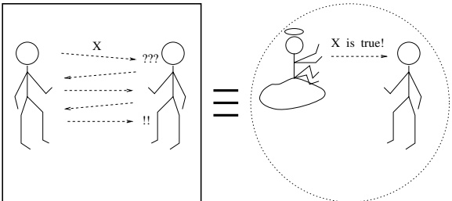
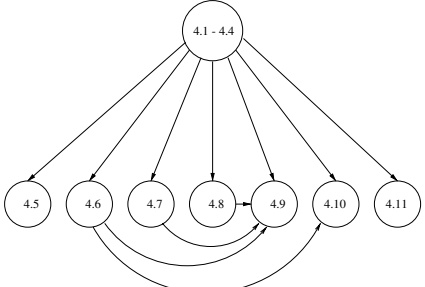

# Zero-Knowledge Proof Systems

In this chapter we discuss zero-knowledge (ZK) proof systems. Loosely speaking, such proof systems have the remarkable property of being convincing and yielding nothing (beyond the validity of the assertion). In other words, receiving a zero-knowledge proof that an assertion holds is equivalent to being told by a trusted party that the assertion holds (see illustration in Figure 4.1). The main result presented in this chapter is a method for constructing zero-knowledge proof systems for every language in $\mathcal{NP}$. This method can be implemented using any bit-commitment scheme, which in turn can be implemented using any pseudorandom generator. The importance of this method stems from its generality, which is the key to its many applications. Specifically, almost all statements one may wish to prove in practice can be encoded as claims concerning membership in languages in $\mathcal{NP}$. In addition, we discuss more advanced aspects of the concept of zero-knowledge and their effects on the applicability of this concept.

Organization. The basic material is presented in Sections 4.1 through 4.4. In particular, we start with motivation (Section 4.1), next we define and exemplify the notions of interactive proofs (Section 4.2) and of zero-knowledge (Section 4.3), and finally

Figure 4.1: Zero-knowledge proofs: an illustration.

<table border=1 style='margin: auto; word-wrap: break-word;'><tr><td style='text-align: center; word-wrap: break-word;'>Section 4.5:</td><td style='text-align: center; word-wrap: break-word;'>Negative results</td></tr><tr><td style='text-align: center; word-wrap: break-word;'>Section 4.6:</td><td style='text-align: center; word-wrap: break-word;'>Witness indistinguishability and witness hiding</td></tr><tr><td style='text-align: center; word-wrap: break-word;'>Section 4.7:</td><td style='text-align: center; word-wrap: break-word;'>Proofs of knowledge</td></tr><tr><td style='text-align: center; word-wrap: break-word;'>Section 4.8:</td><td style='text-align: center; word-wrap: break-word;'>Computationally sound proofs (arguments)</td></tr><tr><td style='text-align: center; word-wrap: break-word;'>Section 4.9:</td><td style='text-align: center; word-wrap: break-word;'>Constant-round zero-knowledge systems</td></tr><tr><td style='text-align: center; word-wrap: break-word;'>Section 4.10:</td><td style='text-align: center; word-wrap: break-word;'>Non-interactive zero-knowledge proofs</td></tr><tr><td style='text-align: center; word-wrap: break-word;'>Section 4.11:</td><td style='text-align: center; word-wrap: break-word;'>Multi-prover zero-knowledge proofs</td></tr></table>

Figure 4.2: The advanced sections of this chapter.

we present a zero-knowledge proof system for every language in $ \mathcal{NP} $ (Section 4.4). Sections dedicated to advanced topics follow (see Figure 4.2). Unless stated differently (in the following list and in Figure 4.3), each of these advanced sections can be read independently of the others.

- In Section 4.5 we present some negative results regarding zero-knowledge proofs. These results demonstrate the “optimality” of the results in Section 4.4 and motivate the variants presented in Sections 4.6 and 4.8.

In Section 4.6 we present a major relaxation of zero-knowledge and prove that it is closed under parallel composition (which is not the case, in general, for zero-knowledge). Here we refer to a notion called witness indistinguishability, which is related to witness hiding (also defined and discussed).

- In Section 4.7 we define and discuss (zero-knowledge) proofs of knowledge.

- In Section 4.8 we discuss a relaxation of interactive proofs, termed computationally sound proofs (or arguments).

In Section 4.9 we present two constructions of constant-round zero-knowledge systems. The first is an interactive proof system, whereas the second is an argument system. Section 4.8.2 (discussing perfectly hiding commitment schemes) is a prerequisite for the first construction, whereas Sections 4.8, 4.7, and 4.6 constitute a prerequisite for the second.

Figure 4.3: The dependence structure of this chapter.

In Section 4.10 we discuss non-interactive zero-knowledge proofs. The notion of witness indistinguishability (defined in Section 4.6) is a prerequisite for the results presented in Section 4.10.3.1.

- In Section 4.11 we discuss multi-prover proof systems.

We conclude, as usual, with a miscellaneous section (Section 4.12).

Teaching Tip. The interactive proof system for Graph Non-Isomorphism (presented in Section 4.2) and the zero-knowledge proof of Graph Isomorphism (presented in Section 4.3) are merely illustrative examples. Thus, one should avoid analyzing those examples in detail.

## 4.1. Zero-Knowledge Proofs: Motivation

An archetypical cryptographic problem consists of providing mutually distrustful parties with a means of disclosing (predetermined) “pieces of information.” It refers to settings in which parties possess secrets, and they wish to reveal parts of these secrets. The secrets are fully or partially determined by some publicly known information, and so it makes sense to talk about revealing the correct value of the secret. The question is how to allow verification of newly revealed parts of the secret without disclosing other parts of the secret. To clarify the issue, let us consider a specific example.

Suppose that all users in a system keep backups of their entire file systems, encrypted using their secret keys, in publicly accessible storage media. Suppose that at some point, one user, called Alice, wishes to reveal to another user, called Bob, the cleartext of some record in one of her files (which appears in her backup). A trivial “solution” is for Alice simply to send the (cleartext) record to Bob. The problem with this “solution” is that Bob has no way of verifying that Alice has really sent him the true record (as appearing encrypted in her public backup), rather than just sending him an arbitrary record. Alice could prove that she sent the correct record simply by revealing to Bob her secret key. However, doing so would reveal to Bob the contents of all her files, which is certainly something that Alice does not want. The question is whether or not Alice can convince Bob that she has indeed revealed the correct record without yielding any additional “knowledge.”

An analogous problem can be phrased formally as follows. Let $f$ be a one-way permutation and $b$ a hard-core predicate with respect to $f$. Suppose that one party, $A$, has a string $x$, whereas another party, denoted $B$, has only $f(x)$. Furthermore, suppose that $A$ wishes to reveal $b(x)$ to party $B$, without yielding any further information. The trivial “solution” is to let $A$ send $b(x)$ to $B$, but, as explained earlier, $B$ will have no way of verifying that $A$ has really sent the correct bit (and not its complement). Party $A$ could indeed prove that it has sent the correct bit (i.e., $b(x)$) by sending $x$ as well, but revealing $x$ to $B$ would be much more than what $A$ originally had in mind. Again, the question is whether or not $A$ can convince $B$ that it has indeed revealed the correct bit (i.e., $b(x)$), without yielding any additional “knowledge.”

In general, the question is whether or not it is possible to prove a statement without yielding anything beyond its validity. Such proofs, whenever they exist, are called zero-knowledge, and they play a central role in the construction of “cryptographic” protocols.

Loosely speaking, zero-knowledge proofs are proofs that yield nothing (i.e., “no knowledge”) beyond the validity of the assertion. In the rest of this introductory section, we discuss the notion of a “proof” and a possible meaning of the phrase “yield nothing (i.e., no knowledge) beyond something.”

### 4.1.1. The Notion of a Proof

A proof is whatever convinces me.

Shimon Even, answering a student's question in his graph-algorithms class (1978)

We discuss the notion of a proof with the intention of uncovering some of its underlying aspects.

#### 4.1.1.1. A Static Object versus an Interactive Process

Traditionally in mathematics, a “proof” is a fixed sequence consisting of statements that either are self-evident or are derived from previous statements via self-evident rules. Actually, it is more accurate to replace the phrase “self-evident” with the phrase “commonly agreed.” In fact, in the formal study of proofs (i.e., logic), the commonly agreed statements are called axioms, whereas the commonly agreed rules are referred to as derivation rules. We wish to stress two properties of mathematical proofs:

1. Proofs are viewed as fixed objects.

2. Proofs are considered at least as fundamental as their consequences (i.e., the theorems).

However, in other areas of human activity, the notion of a “proof” has a much wider interpretation. In particular, a proof is not a fixed object, but rather a process by which the validity of an assertion is established. For example, withstanding cross-examination in court can yield what can be considered a proof in law, and failure to provide an adequate answer to a rival's claim is considered a proof in philosophical, political, and sometimes even technical discussions. In addition, in many real-life situations, proofs are considered secondary (in importance) to their consequences.

To summarize, in “canonical” mathematics, proofs have a static nature (e.g., they are “written”), whereas in real-life situations proofs have a dynamic nature (i.e., they are established via an interaction). A dynamic interpretation of the notion of a proof is more appropriate to our setting, in which proofs are used as tools (i.e., sub-protocols) inside “cryptographic” protocols. Furthermore, a dynamic interpretation (at least in a weak sense) is essential to the non-triviality of the notion of a zero-knowledge proof.

#### 4.1.1.2. Prover and Verifier

The notion of a prover is implicit in all discussions of proofs, be it in mathematics or in real-life situations: The prover is the (sometimes hidden or transcendental) entity providing the proof. In contrast, the notion of a verifier tends to be more explicit in such discussions, which typically emphasize the verification process, or in other words the role of the verifier. Both in mathematics and in real-life situations, proofs are defined in terms of the verification procedure. The verification procedure is considered to be relatively simple, and the burden is placed on the party/person supplying the proof (i.e., the prover).

The asymmetry between the complexity of the verification task and the complexity of the theorem-proving task is captured by the complexity class $ \mathcal{N}\mathcal{P} $, which can be viewed as a class of proof systems. Each language $ L \in \mathcal{N}\mathcal{P} $ has an efficient verification procedure for proofs of statements of the form “$x \in L$.” Recall that each $ L \in \mathcal{N}\mathcal{P} $ is characterized by a polynomial-time-recognizable relation $ R_L $ such that

 $$ L=\left\{x:\exists y s.t.(x,y)\in R_{L}\right\} $$ 

and $(x, y) \in R_L$ only if $|y| \leq \mathrm{poly}(|x|)$. Hence, the verification procedure for membership claims of the form “$x \in L$” consists of applying the (polynomial-time) algorithm for recognizing $R_L$ to the claim (encoded by) $x$ and a prospective proof, denoted $y$. Any $y$ satisfying $(x, y) \in R_L$ is considered a proof of membership of $x \in L$. Thus, correct statements (i.e., $x \in L$) and only these have proofs in this proof system. Note that the verification procedure is “easy” (i.e., polynomial-time), whereas coming up with proofs may be “difficult” (if indeed $\mathcal{NP}$ is not contained in $\mathcal{BPP}$).

It is worthwhile to note the “distrustful attitude” toward the prover that underlies any proof system. If the verifier trusts the prover, then no proof is needed. Hence, whenever discussing a proof system, one considers a setting in which the verifier is not trusting the prover and furthermore is skeptical of anything the prover says.

#### 4.1.1.3. Completeness and Soundness

Two fundamental properties of a proof system (i.e., a verification procedure) are its soundness (or validity) and completeness. The soundness property asserts that the verification procedure cannot be “tricked” into accepting false statements. In other words, soundness captures the verifier’s ability to protect itself from being convinced of false statements (no matter what the prover does in order to fool the verifier). On the other hand, completeness captures the ability of some prover to convince the verifier of true statements (belonging to some predetermined set of true statements). Note that both properties are essential to the very notion of a proof system.

We remark here that not every set of true statements has a “reasonable” proof system in which each of those statements can be proved (while no false statement can be “proved”). This fundamental fact is given precise meaning in results such as Gödel’s Incompleteness Theorem and Turing’s theorem regarding the undecidability of the Halting Problem. We stress that in this chapter we confine ourselves to the class of sets (of valid statements) that do have “efficient proof systems.” In fact, Section 4.2 is devoted to discussing and formulating the concept of “efficient proof systems.” Jumping ahead, we hint that the efficiency of a proof system will be associated with the efficiency of its verification procedure.

### 4.1.2. Gaining Knowledge

Recall that we have motivated zero-knowledge proofs as proofs by which the verifier gains “no knowledge” (beyond the validity of the assertion). The reader may rightfully wonder what knowledge is and what a gain in knowledge is. When discussing zero-knowledge proofs, we avoid the first question (which is quite complex) and treat the second question directly. Namely, without presenting a definition of knowledge, we present a generic case in which it is certainly justified to say that no knowledge is gained. Fortunately, this approach seems to suffice as far as cryptography is concerned.

To motivate the definition of zero-knowledge, consider a conversation between two parties, Alice and Bob. Assume first that this conversation is unidirectional; specifically, Alice only talks, and Bob only listens. Clearly, we can say that Alice gains no knowledge from the conversation. On the other hand, Bob may or may not gain knowledge from the conversation (depending on what Alice says). For example, if all that Alice says is “1 + 1 = 2,” then clearly Bob gains no knowledge from the conversation, because he already knows that fact. If, on the other hand, Alice reveals to Bob a proof that $ \mathcal{P} \neq \mathcal{N}\mathcal{P} $, then he certainly gains knowledge from the conversation.

To give a better flavor of the definition, we now consider a conversation between Alice and Bob in which Bob asks Alice questions about a large graph (that is known to both of them). Consider first the case in which Bob asks Alice whether or not the graph $ ^1 $ is Eulerian. Clearly, Bob gains no knowledge from Alice's answer, because he could easily have determined the answer by himself (by running a linear-time decision procedure $ ^2 $). On the other hand, if Bob asks Alice whether or not the graph is Hamiltonian, and Alice (somehow) answers this question, then we cannot say that Bob has gained no knowledge (because we do not know of an efficient procedure by which Bob could have determined the answer by himself, and assuming $ \mathcal{P} \neq \mathcal{NP} $, no such efficient procedure exists). Hence, we say that Bob has gained knowledge from the interaction if his computational ability, concerning the publicly known graph, has increased (i.e., if after the interaction he can easily compute something that he could not have efficiently computed before the interaction). On the other hand, if whatever Bob can efficiently compute about the graph after interacting with Alice he can also efficiently compute by himself (from the graph), then we say that Bob has gained no knowledge from the interaction. That is, Bob gains knowledge only if he receives the result of a computation that is infeasible for him. The question of how Alice could conduct this infeasible computation (e.g., answer Bob's question of whether or not the graph is Hamiltonian) has been ignored thus far. Jumping ahead, we remark that Alice may be a mere abstraction or may be in possession of additional hints that enable her to efficiently conduct computations that are otherwise infeasible (and in particular are infeasible for Bob, who does not have these hints).

#### Knowledge versus Information

We wish to stress that knowledge (as discussed here) is very different from information (in the sense of information theory). Two major aspects of the difference are as follows:

1. Knowledge is related to computational difficulty, whereas information is not. In the foregoing examples, there is a difference between the knowledge revealed in the case in which Alice answers questions of the form "Is the graph Eulerian?" and the case in which she answers questions of the form "Is the graph Hamiltonian?" From an information-theory point of view there is no difference between the two cases (i.e., in each case the answer is determined by the question, and so Bob gets no information).

2. Knowledge relates mainly to publicly known objects, whereas information relates mainly to objects on which only partial information is publicly known. Consider the case in which Alice answers each question by flipping an unbiased coin and telling Bob the outcome. From an information-theoretic point of view, Bob gets from Alice information concerning an event. However, we say that Bob gains no knowledge from Alice, because he could toss coins by himself.

## 4.2. Interactive Proof Systems

In this section we introduce the notion of an interactive proof system and present a non-trivial example of such a system (specifically to claims of the form “the following two graphs are not isomorphic”). The presentation is directed toward the introduction of zero-knowledge interactive proofs. Interactive proof systems are interesting for their own sake and have important complexity-theoretic applications. $ ^{3} $

### 4.2.1. Definition

The definition of an interactive proof system refers explicitly to the two computational tasks related to a proof system: “producing” a proof and verifying the validity of a proof. These tasks are performed by two different parties, called the prover and the verifier, which interact with one another. In some cases, the interaction may be very simple and, in particular, unidirectional (i.e., the prover sends a text, called the proof, to the verifier). In general, the interaction may be more complex and may take the form of the verifier interrogating the prover. We start by defining such an interrogation process.

#### 4.2.1.1. Interaction

Interaction between two parties is defined in the natural manner. The only point worth noting is that the interaction is parameterized by a common input (given to both parties). In the context of interactive proof systems, the common input represents the statement to be proved. We first define the notion of an interactive machine and next the notion of interaction between two such machines. The reader may skip to Section 4.2.1.2, which introduces some important conventions (regarding interactive machines), with little loss (if any).

#### Definition 4.2.1 (An Interactive Machine):

- An interactive Turing machine (ITM) is a (deterministic) multi-tape Turing machine. The tapes are a read-only input tape, a read-only random tape, a read-and-write work tape, a write-only output tape, a pair of communication tapes, and a read-and-write switch tape consisting of a single cell. One communication tape is read-only, and the other is write-only.

Each ITM is associated a single bit $ \sigma \in \{0, 1\} $, called its identity. An ITM is said to be active, in a configuration, if the content of its switch tape equals the machine's identity. Otherwise the machine is said to be idle. While being idle, the state of the machine, the locations of its heads on the various tapes, and the contents of the writable tapes of the ITM are not modified.

- The content of the input tape is called input, the content of the random tape is called random input, and the content of the output tape at termination is called output. The content written on the write-only communication tape during a (time) period in which the machine is active is called the message sent at that period. Likewise, the content read from the read-only communication tape during an active period is called the message received (at that period).

(Without loss of generality, the machine movements on both communication tapes are in only one direction, e.g., from left to right.)

This definition, taken by itself, seems quite non-intuitive. In particular, one may say that once being idle, the machine will never become active again. One may also wonder as to what is the point of distinguishing the read-only communication tape from the input tape (and respectively distinguishing the write-only communication tape from the output tape). The point is that we are never going to consider a single interactive machine, but rather a pair of machines combined together such that some of their tapes coincide. Intuitively, the messages sent by one interactive machine are received by a second machine that shares its communication tapes (so that the read-only communication tape of one machine coincides with the write-only tape of the other machine). The active machine may become idle by changing the content of the shared switch tape, and when it does so, the other machine (having opposite identity) will become active. The computation of such a pair of machines consists of the machines alternately sending messages to one another, based on their initial (common) input, their (distinct) random inputs, and the messages each machine has received thus far.

#### Definition 4.2.2 (Joint Computation of Two ITMs):

Two interactive machines are said to be linked if they have opposite identities, their input tapes coincide, their switch tapes coincide, and the read-only communication tape of one machine coincides with the write-only communication tape of the other machine, and vice versa. We stress that the other tapes of both machines (i.e., the random tape, the work tape, and the output tape) are distinct.

- The joint computation of a linked pair of ITMs, on a common input x, is a sequence of pairs representing the local configurations of both machines. That is, each pair consists of two strings, each representing the local configuration of one of the machines. In each such pair of local configurations, one machine (not necessarily the same one) is active, while the other machine is idle. The first pair in the sequence consists of initial configurations corresponding to the common input x, with the content of the switch tape set to zero.

- If one machine halts while the switch tape still holds its identity, then we say that both machines have halted. The outputs of both machines are determined at that time.

At this point, the reader may object to this definition, saying that the individual machines are deprived of individual local inputs (whereas they are given individual and unshared random tapes). This restriction is removed in Section 4.2.4, and in fact allowing individual local inputs (in addition to the common shared input) is quite important (at least as far as practical purposes are concerned). Yet, for a first presentation of interactive proofs, as well as for demonstrating the power of this concept, we prefer the foregoing simpler definition. On the other hand, the convention of individual random tapes is essential to the power of interactive proofs (see Exercise 4).

#### 4.2.1.2. Conventions Regarding Interactive Machines

Typically, we consider executions in which the content of the random tape of each machine is uniformly and independently chosen (among all infinite bit sequences). The convention of having an infinite sequence of internal coin tosses should not bother the reader, because during a finite computation only a finite prefix is read (and matters). The content of each of these random tapes can be viewed as internal coin tosses of the corresponding machine (as in the definition of ordinary probabilistic machines presented in Chapter 1). Hence, interactive machines are in fact probabilistic.

Notation. Let $A$ and $B$ be a linked pair of ITMs, and suppose that all possible interactions of $A$ and $B$ on each common input terminate in a finite number of steps. We denote by $\langle A, B \rangle(x)$ the random variable representing the (local) output of $B$ when interacting with machine $A$ on common input $x$, when the random input to each machine is uniformly and independently chosen. (Indeed, this definition is asymmetric, since it considers only $B$'s output.)

Another important convention is to consider the time-complexity of an interactive machine as a function of only its input's length.

Definition 4.2.3 (The Complexity of an Interactive Machine): We say that an interactive machine A has time-complexity $ t : \mathbb{N} \to \mathbb{N} $ if for every interactive machine B and every string x, it holds that when interacting with machine B, on common input x, machine A always (i.e., regardless of the content of its random tape and $ B $'s random tape) halts within $ t(|x|) $ steps. In particular, we say that A is polynomial-time if there exists a polynomial $ p $ such that A has time-complexity $ p $.

We stress that the time-complexity, so defined, is independent of the content of the messages that machine A receives. In other words, it is an upper bound that holds for all possible incoming messages (as well as all internal coin tosses). In particular, an interactive machine with time-complexity $ t(\cdot) $ may read, on input x, only a prefix of total length $ t(|x|) $ of the messages sent to it.

#### 4.2.1.3. Proof Systems

In general, proof systems are defined in terms of the verification procedure (which can be viewed as one entity, called the verifier). A “proof” for a specific claim is always considered as coming from the outside (which can be viewed as another entity, called the prover). The verification procedure itself does not generate “proofs,” but merely verifies their validity. Interactive proof systems are intended to capture whatever can be efficiently verified via interaction with the outside. In general, the interaction with the outside can be very complex and may consist of many message exchanges, as long as the total time spent by the verifier is polynomial (in the common input).

Our choice to consider probabilistic polynomial-time verifiers is justified by the association of efficient procedures with probabilistic polynomial-time algorithms. Furthermore, the verifier's verdict of whether to accept or reject the claim is probabilistic, and a bounded error probability is allowed. (Jumping ahead, we mention that the error can be decreased to be negligible by repeating the verification procedure sufficiently many times.)

Loosely speaking, we require that the prover be able to convince the verifier of the validity of true statements, while nobody can fool the verifier into believing false statements. Both conditions are given a probabilistic interpretation: It is required that the verifier accept valid statements with “high” probability, whereas the probability that it will accept a false statement is “low” (regardless of the machine with which the verifier interacts). In the following definition, the verifier’s output is interpreted as its decision on whether to accept or reject the common input. Output 1 is interpreted as “accept,” whereas output 0 is interpreted as “reject.”

Definition 4.2.4 (Interactive Proof System): A pair of interactive machines $ (P, V) $ is called an interactive proof system for a language L if machine V is polynomial-time and the following two conditions hold:

- Completeness: For every $ x \in L $,

 $$ \Pr[\langle P,V\rangle(x)=1]\geq\frac{2}{3} $$ 

- Soundness: For every $ x \notin L $ and every interactive machine $ B $,

 $$ \Pr[\langle B,V\rangle(x)=1]\leq\frac{1}{3} $$ 

Some remarks are in order. We first stress that the soundness condition refers to all potential “provers,” whereas the completeness condition refers only to the prescribed prover P. Second, the verifier is required to be a (probabilistic) polynomial-time machine, but no resource bounds are placed on the computing power of the prover (in either completeness or soundness conditions). Third, as in the case of $ \mathcal{BPP} $, the error probability in the foregoing definition can be made exponentially small by repeating the interaction (polynomially) many times.

Every language in $\mathcal{N}\mathcal{P}$ has an interactive proof system. Specifically, let $L \in \mathcal{N}\mathcal{P}$, and let $R_L$ be a witness relation associated with the language $L$ (i.e., $R_L$ is recognizable in polynomial time, and $L$ equals the set $\{x : \exists y \text{ s.t. } |y| = \text{poly}(|x|) \land (x, y) \in R_L\}$.) Then an interactive proof for the language $L$ consists of a prover that on input $x \in L$ sends a witness $y$ (as before), and a verifier that upon receiving $y$ (on common input $x$) outputs 1 if $|y| = \text{poly}(|x|)$ and $(x, y) \in R_L$ (and outputs 0 otherwise). Clearly, when interacting with the prescribed prover, this verifier will always accept inputs in the language. On the other hand, no matter what a cheating “prover” does, this verifier will never accept inputs not in the language. We point out that in this specific proof system, both parties are deterministic (i.e., make no use of their random tapes). It is easy to see that only languages in $\mathcal{N}\mathcal{P}$ have interactive proof systems in which both parties are deterministic (see Exercise 2).

In other words, $ \mathcal{NP} $ can be viewed as a class of interactive proof systems in which the interaction is unidirectional (i.e., from the prover to the verifier) and the verifier is deterministic (and never errs). In general interactive proofs, both restrictions are waived: The interaction is bidirectional, and the verifier is probabilistic (and may err, with some small probability). Both bidirectional interaction and randomization seem essential to the power of interactive proof systems (see Exercise 2).

Definition 4.2.5 (The Class $ \mathcal{IP} $): The class $ \mathcal{IP} $ consists of all languages having interactive proof systems.

By the foregoing discussion, $ \mathcal{NP} \subseteq IP $. Because languages in $ \mathcal{BPP} $ can be viewed as each having a verifier that decides on membership without any interaction, it follows that $ \mathcal{BPP} \cup \mathcal{NP} \subseteq IP $. We remind the reader that it is not known whether or not $ \mathcal{BPP} \subseteq \mathcal{NP} $.

We next show that the definition of the class $ \mathcal{IP} $ remains invariant if we replace the (constant) bounds in the completeness and soundness conditions with two functions $ \mathbf{c}, \mathbf{s} : \mathbb{N} \to [0, 1] $ satisfying $ \mathbf{c}(n) < 1 - 2^{-\text{poly}(n)} $, $ \mathbf{s}(n) > 2^{-\text{poly}(n)} $, and $ \mathbf{c}(n) > \mathbf{s}(n) + \frac{1}{\text{poly}(n)} $. Namely, we consider the following generalization of Definition 4.2.4.

Definition 4.2.6 (Generalized Interactive Proof): Let $\mathbf{c}, \mathbf{s} : \mathbb{N} \to \mathbb{R}$ be functions satisfying $\mathbf{c}(n) > \mathbf{s}(n) + \frac{1}{p(n)}$ for some polynomial $p(\cdot)$. An interactive pair $(P, V)$ is called a (generalized) interactive proof system for the language $L$, with completeness bound $\mathbf{c}(\cdot)$ and soundness bound $\mathbf{s}(\cdot)$, if

(modified) completeness: for every $ x \in L $,

 $$ \Pr\left[\langle P,V\rangle(x)=1\right]\geq\mathfrak{c}(|x|) $$ 

(modified) soundness: for every $ x \notin L $ and every interactive machine $ B $,

 $$ \Pr\left[\langle B,V\rangle(x)=1\right]\leq\mathbf{s}(|x|) $$ 

The function $ \mathbf{g}(\cdot) $ defined as $ \mathbf{g}(n) \stackrel{\text{def}}{=} \mathbf{c}(n) - \mathbf{s}(n) $ is called the acceptance gap of $ (P, V) $, and the function $ \mathbf{e}(\cdot) $, defined as $ \mathbf{e}(n) \stackrel{\operatorname{def}}{=} \max\{1 - \mathbf{c}(n), \mathbf{s}(n)\} $, is called the error probability of $ (P, V) $. In particular, $ \mathbf{s} $ is the soundness error of $ (P, V) $, and $ 1 - \mathbf{c} $ is its completeness error.

We stress that c is a lower bound, whereas s is an upper bound.

Proposition 4.2.7: The following three conditions are equivalent:

1. $ L \in \mathcal{IP} $. Namely, there exists an interactive proof system, with completeness bound $ \frac{2}{3} $ and soundness bound $ \frac{1}{3} $, for the language $ L $.

2. L has very strong interactive proof systems: For every polynomial $p(\cdot)$, there exists an interactive proof system for the language $L$, with error probability bounded above by $2^{-p(\cdot)}$

3. L has a very weak interactive proof: There exists a polynomial $p(\cdot)$ and a generalized interactive proof system for the language $L$, with acceptance gap bounded below by $1/p(\cdot)$. Furthermore, completeness and soundness bounds for this system, namely, the values $\mathbf{c}(n)$ and $\mathbf{s}(n)$, can be computed in time polynomial in $n$.

Clearly, either of the first two items implies the third one (including the requirement for efficiently computable bounds). The ability to efficiently compute completeness and soundness bounds is used in proving the opposite (non-trivial) direction. The proof is left as an exercise (i.e., Exercise 1).

### 4.2.2. An Example (Graph Non-Isomorphism in $ \mathcal{IP} $)

All examples of interactive proof systems presented thus far have been degenerate (e.g., the interaction, if any, has been unidirectional). We now present an example of a non-degenerate interactive proof system. Furthermore, we present an interactive proof system for a language not known to be in $ \mathcal{BPP} \cup \mathcal{NP} $. Specifically, the language is the set of pairs of non-isomorphic graphs, denoted $ GNI $. The idea underlying this proof system is presented through the following story:

Petra von Kant claims that Goldstar $ ^{4} $ beer in large bottles tastes different than Goldstar beer in small bottles. Virgil does not believe her. To prove her claim, Petra and Virgil repeat the following process a number of times sufficient to convince Virgil beyond reasonable doubt.

Virgil selects at random either a large bottle or a small one and pours some beer into a tasting glass, without Petra seeing which bottle he uses. Virgil then hands Petra the glass and asks her to tell which of the bottles he has used.

If Petra never errs in her answers, then Virgil is convinced of the validity of her claim. (In fact, he should be convinced even if she answers correctly with probability substantially larger than 50%, because if the beer tastes the same regardless of the bottle, then there would be no way for Petra to guess correctly with probability higher than 50% which bottle was used.)

We now get back to the formal exposition. Let us first define the language in focus: Two graphs, $ ^5 $ $ G_1 = (V_1, E_1) $ and $ G_2 = (V_2, E_2) $, are called isomorphic if there exists a 1-1 and onto mapping, $ \pi $, from the vertex set $ V_1 $ to the vertex set $ V_2 $ such that $ (u, v) \in E_1 $ if and only if $ (\pi(v), \pi(u)) \in E_2 $. The mapping $ \pi $, if it exists, is called an isomorphism between the graphs. The set of pairs of non-isomorphic graphs is denoted by GNI.

#### Construction 4.2.8 (An Interactive Proof System for Graph Non-Isomorphism):

Common input: A pair of two graphs, $ G_1 = (V_1, E_1) $ and $ G_2 = (V_2, E_2) $. Suppose, without loss of generality, that $ V_1 = \{1, 2, \ldots, |V_1|\} $, and similarly for $ V_2 $.

- Verifier's first step (V1): The verifier selects at random one of the two input graphs and sends to the prover a random isomorphic copy of this graph. Namely, the verifier selects uniformly $ \sigma \in \{1, 2\} $ and a random permutation $ \pi $ from the set of permutations over the vertex set $ V_\sigma $. The verifier constructs a graph with vertex set $ V_\sigma $ and edge set

 $$ F\stackrel{\mathrm{def}}{=}\{(\pi(u),\pi(v)):(u,v)\in E_{\sigma}\} $$ 

and sends $ (V_{\sigma}, F) $ to the prover.

- Motivating remark: If the input graphs are non-isomorphic, as the prover claims, then the prover should be able to distinguish (not necessarily by an efficient procedure) isomorphic copies of one graph from isomorphic copies of the other graph. However, if the input graphs are isomorphic, then a random isomorphic copy of one graph will be distributed identically to a random isomorphic copy of the other graph.

- Prover’s first step (P1): Upon receiving a graph $ G' = (V', E') $ from the verifier, the prover finds $ \tau \in \{1, 2\} $ such that the graph $ G' $ is isomorphic to the input graph $ G_\tau $. (If both $ \tau = 1 $ and $ r = 2 $ satisfy the condition, then $ \tau $ is selected arbitrarily. In case no $ \tau \in \{1, 2\} $ satisfies the condition, $ \tau $ is set to 0.) The prover sends $ \tau $ to the verifier.

- Verifier's second step (V2): If the message $ \tau $ received from the prover equals $ \sigma $ (chosen in Step V1), then the verifier outputs 1 (i.e., accepts the common input). Otherwise the verifier outputs 0 (i.e., rejects the common input).

This verifier program is easily implemented in probabilistic polynomial time. We do not know of a probabilistic polynomial-time implementation of the prover's program, but this is not required. We shall now show that the foregoing pair of interactive machines constitutes an interactive proof system (in the general sense) for the language GNI (Graph Non-Isomorphism).

Proposition 4.2.9: The language GNI is in the class IP. Furthermore, the programs specified in Construction 4.2.8 constitute a generalized interactive proof system for GNI, with completeness bound 1 and soundness bound $ \frac{1}{2} $. Namely:

1. If $G_1$ and $G_2$ are not isomorphic (i.e., $(G_1, G_2) \in GNI$), then the verifier always accepts (when interacting with the prover).

2. If $ G_1 $ and $ G_2 $ are isomorphic (i.e., $ (G_1, G_2) \notin GNI $), then no matter with what machine the verifier interacts, it rejects the input with probability at least $ \frac{1}{2} $.

Proof: Clearly, if $G_{1}$ and $G_{2}$ are not isomorphic, then no graph can be isomorphic to both $G_{1}$ and $G_{2}$. It follows that there exists a unique $\tau$ such that the graph $G'$ (received by the prover in Step P1) is isomorphic to the input graph $G_{\tau}$. Hence, $\tau$ found by the prover in Step P1 always equals $\sigma$ chosen in Step V1. Part 1 follows.

On the other hand, if $ G_1 $ and $ G_2 $ are isomorphic, then the graph $ G' $ is isomorphic to both input graphs. Furthermore, we shall show that in this case the graph $ G' $ yields no information about $ \sigma $, and consequently no machine can (on input $ G_1 $, $ G_2 $ and $ G' $) set $ \tau $ such that it will equal $ \sigma $ with probability greater than $ \frac{1}{2} $. Details follow.

Let $\pi$ be a permutation on the vertex set of a graph $G = (V, E)$. We denote by $\pi(G)$ the graph with vertex set $V$ and edge set $\{(\pi(u), \pi(v)) : (u, v) \in E\}$. Let $\xi$ be a random variable uniformly distributed over $\{1, 2\}$, and let $\Pi$ be a random variable uniformly distributed over the set of permutations on $V$. We stress that these two random variables are independent. We are interested in the distribution of the random variable $\Pi(G_\xi)$. We are going to show that although $\Pi(G_\xi)$ is determined by the random variables $\Pi$ and $\xi$, the random variables $\xi$ and $\Pi(G_\xi)$ are statistically independent. In fact, we show the following:

Claim 4.2.9.1: If the graphs $ G_1 $ and $ G_2 $ are isomorphic, then for every graph $ G' $ that is isomorphic to $ G_1 $ (and $ G_2 $), it holds that

 $$ \Pr[\xi=1\mid\Pi(G_{\xi})=G^{\prime}]=\Pr[\xi=2\mid\Pi(G_{\xi})=G^{\prime}]=\frac{1}{2} $$ 

Proof: We first claim that the sets $S_{1} \overset{\text{def}}{=}\{\pi:\pi(G_{1})=G^{\prime}\}$ and $S_{2} \overset{\text{def}}{=}\{\pi:\pi(G_{2})=G^{\prime}\}$ are of the same cardinality. This follows from the observation that there is a 1-1 and onto correspondence between the set $S_{1}$ and the set $S_{2}$ (the correspondence is given by the isomorphism between the graphs $G_{1}$ and $G_{2}$). Hence,

 $$ \begin{aligned}\Pr[\Pi(G_{\xi})=G^{\prime}\mid\xi=1]&=\Pr[\Pi(G_{1})=G^{\prime}]\\&=\Pr[\Pi\in S_{1}]\\&=\Pr[\Pi\in S_{2}]\\&=\Pr[\Pi(G_{\xi})=G^{\prime}|\xi=2]\end{aligned} $$ 

Using Bayes' rule, the claim follows. $\blacksquare$

Intuitively, Claim 4.2.9.1 says that for every pair $(G_1, G_2)$ of isomorphic graphs, the random variable $\Pi(G_\xi)$ yields no information on $\xi$, and so no prover can fool the verifier into accepting with probability greater than $\frac{1}{2}$. Specifically, we let $R$ be an arbitrary randomized process (representing a possible cheating-prover strategy that depends on $(G_1, G_2)$) that given the verifier's message in Step V1 tries to guess the value of $ \xi $. Then, $ R(\Pi(G_{\xi})) = \xi $ represents the event in which the verifier accepts, and we have

 $$ \mathsf{Pr}[R(\Pi(G_{\xi}))=\xi]=\sum_{G^{\prime}}\mathsf{Pr}[\Pi(G_{\xi})=G^{\prime}]\cdot\mathsf{Pr}[R(G^{\prime})=\xi\mid\Pi(G_{\xi})=G^{\prime}] $$ 

Using Claim 4.2.9.1 for the third equality, we have (for any $ G' $ in the support of $ \Pi(G_\xi) $):

 $$ \begin{aligned}\Pr[R(G^{\prime})=\xi\mid\Pi(G_{\xi})=G^{\prime}]&=\sum_{v}\Pr[R(G^{\prime})=v\&\xi=v\mid\Pi(G_{\xi})=G^{\prime}]\\&=\sum_{v}\Pr[R(G^{\prime})=v]\cdot\Pr[\xi=v\mid\Pi(G_{\xi})=G^{\prime}]\\&=\sum_{v\in\{1,2\}}\Pr[R(G^{\prime})=v]\cdot\Pr[\xi=v]\\&=\frac{\Pr[R(G^{\prime})\in\{1,2\}]}{2}\\&\leq\frac{1}{2}\end{aligned} $$ 

with equality in case $R$ always outputs an element in the set $\{1, 2\}$. Part 2 of the proposition follows. $\blacksquare$

Remarks Concerning Construction 4.2.8. In the proof system of Construction 4.2.8, the verifier always accepts inputs in the language (i.e., the completeness error equals zero). The fact that $ GNI \in \mathcal{IP} $, whereas it is not known whether or not $ GNI \in \mathcal{NP} $, is an indication of the power of interaction and randomness in the context of theorem-proving. Finally, we note that it is essential that the prover not know the outcome of the verifier's internal coin tosses. For a wider perspective on these issues, see the following advanced subsection.

### 4.2.3.* The Structure of the Class IP

In continuation to the foregoing remarks, we briefly discuss several aspects regarding the “proving power” of interactive proof systems.

1. The completeness and soundness bounds: All interactive proof systems presented in this book happen to have perfect completeness; that is, the verifier always accepts inputs IN the language (i.e., the completeness error equals zero). In fact, one can transform any interactive proof system into an interactive proof system (for the same language) in which the verifier always accepts inputs in the language.

On the other hand, as shown in Exercise 5, only languages in $ \mathcal{NP} $ have interactive proof systems in which the verifier always rejects inputs NOT IN the language (i.e., having soundness error equal to zero).

2. The privacy of the verifier's coins: Arthur-Merlin proofs (a.k.a. public-coin proof systems) are a special case of interactive proofs, where the verifier must send the outcome of any coin it tosses (and thus need not send any other information). As stated earlier, the proof system of Construction 4.2.8 is not of the public-coin type. Yet one can transform any interactive proof system into a public-coin interactive proof system (for the same language), while preserving perfect completeness.

3. Which languages have interactive proof systems? (We have ignored this natural question until now.) It turns out that every language in PSPACE has an interactive proof system. In fact,

#### IP equals PSPACE

We comment that $\mathcal{P}SPACE$ is believed to be much larger than $\mathcal{N}\mathcal{P}$; in particular, $\mathrm{co}\mathcal{N}\mathcal{P}\subseteq\mathcal{P}SPACE$, whereas it is commonly believed that $\mathrm{co}\mathcal{N}\mathcal{P}\neq\mathcal{N}\mathcal{P}$. Also, because $\mathcal{P}SPACE$ is closed under complementation, so is $\mathcal{I}\mathcal{P}$.

4. Constant-round interactive proofs: Construction 4.2.8 constitutes a constant-round protocol (i.e., a constant number of messages are sent). In contrast, in the generic interactive proof system for $\mathcal{P}SPACE$, the number of communication rounds is polynomially related to the input length. We comment that $\text{co}\mathcal{N}\mathcal{P}$ is believed NOT to have constant-round interactive proofs.

We mention that any language having a constant-round interactive proof system also has a public-coin interactive proof system in which only two messages are sent: The latter consists of a random challenge from the verifier that is answered by the prover. In general, for any function $ r : \mathbb{N} \to \mathbb{N} $, any $ 2r $-round proof system can be transformed into an $ r $-round proof system (for the same language).

### 4.2.4. Augmentation of the Model

For purposes that will become more clear in Sections 4.3 and 4.4, we augment the basic definition of an interactive proof system by allowing each of the parties to have a private input (in addition to the common input). Loosely speaking, these inputs are used to capture additional information available to each of the parties. Specifically, when using interactive proof systems as sub-protocols inside larger protocols, the private inputs are associated with the local configurations of the machines before entering the sub-protocol. In particular, the private input of the prover may contain information that enables an efficient implementation of the prover's task.

#### Definition 4.2.10 (Interactive Proof Systems, Revisited):

1. An interactive machine is defined as in Definition 4.2.1, except that the machine has an additional read-only tape called the auxiliary-input tape. The content of this tape is called auxiliary input.

2. The complexity of such an interactive machine is still measured as a function of the (common) input length. Namely, the interactive machine A has time-complexity $ t: \mathbb{N} \to \mathbb{N} $ if for every interactive machine B and every string x, it holds that when interacting with machine B, on common input x, machine A always (i.e., regardless of the content of its random tape and its auxiliary-input tape, as well as the content of B's tapes) halts within $ t(|x|) $ steps.

3. We denote by $ \langle A(y), B(z) \rangle(x) $ the random variable representing the (local) output of B when interacting with machine A on common input x, when the random input to each machine is uniformly and independently chosen, and A (resp., B) has auxiliary input y (resp., z).

4. A pair of interactive machines (P, V) is called an interactive proof system for a language L if machine V is polynomial-time and the following two conditions hold:

Completeness: For every $ x \in L $, there exists a string y such that for every $ z \in \{0,1\}^{*} $,

 $$ \Pr\left[\langle P(y),V(z)\rangle(x)=1\right]\geq\frac{2}{3} $$ 

- Soundness: For every $ x \notin L $, every interactive machine $ B $, and every $ y, z \in \{0, 1\}^* $,

 $$ \Pr\left[\langle B(y),V(z)\rangle(x)=1\right]\leq\frac{1}{3} $$ 

We stress that when saying that an interactive machine is polynomial-time, we mean that its running time is polynomial in the length of the common input. Consequently, it is not guaranteed that such a machine has enough time to read its entire auxiliary input.

Teaching Tip. The augmented model of interactive proofs is first used in this book in Section 4.3.3, where the notion of zero-knowledge is extended to account for a priori information that the verifier may have. One may thus prefer to present Definition 4.2.10 after presenting the basic definitions of zero-knowledge, that is, postpone Definition 4.2.10 to Section 4.3.3. (However, conceptually speaking, Definition 4.2.10 does belong to the current section.)

## 4.3. Zero-Knowledge Proofs: Definitions

In this section we introduce the notion of a zero-knowledge interactive proof system and present a non-trivial example of such a system (specifically, to claims of the form "the following two graphs are isomorphic").

### 4.3.1. Perfect and Computational Zero-Knowledge

Loosely speaking, we say that an interactive proof system $ (P, V) $ for a language L is zero-knowledge if whatever can be efficiently computed after interacting with P on input $ x \in L $ can also be efficiently computed from x (without any interaction). We stress that this holds with respect to any efficient way of interacting with P, not necessarily the way defined by the verifier program V. Actually, zero-knowledge is a property of the prescribed prover P. It captures P's robustness against attempts to gain knowledge by interacting with it. A straightforward way of capturing the informal discussion follows.

Let $ (P, V) $ be an interactive proof system for some language $ L $. We say that $ (P, V) $, or actually $ P $, is perfect zero-knowledge if for every probabilistic polynomial-time interactive machine $ V^* $ there exists an (ordinary) probabilistic polynomial-time algorithm $ M^* $ such that for every $ x \in L $ the following two random variables are identically distributed:

$\langle P, V^{*}\rangle(x)$ (i.e., the output of the interactive machine $V^{*}$ after interacting with the interactive machine $P$ on common input $x$)

 $ M^{*}(x) $ (i.e., the output of machine $ M^{*} $ on input x)

Machine $ M^{*} $ is called a simulator for the interaction of $ V^{*} $ with P.

We stress that we require that for every $ V^* $ interacting with P, not merely for V, there exists a (“perfect”) simulator $ M^* $. This simulator, although not having access to the interactive machine P, is able to simulate the interaction of $ V^* $ with P. The fact that such simulators exist means that $ V^* $ does not gain any knowledge from P (since the same output could be generated without any access to P).

#### The Simulation Paradigm

The foregoing discussion follows a general definitional paradigm that is also used in other chapters of this book (specifically, in Volume 2). The simulation paradigm postulates that whatever a party can do by itself cannot be considered a gain from interaction with the outside. The validity of this paradigm is evident, provided we bear in mind that by “doing” we mean “efficiently doing” something (and more so if the complexity of “doing it alone” is tightly related to the complexity of “doing it after interaction with the outside”). $ ^{6} $ Admittedly, failure to provide a simulation of an interaction with the outside does NOT necessarily mean that this interaction results in some “real gain” (in some intuitive sense). Yet what matters is that any “real gain” can NOT occur whenever we are able to present a simulation. In summary, the approach underlying the simulation paradigm may be overly cautious, but it is certainly valid. (Furthermore, to say the least, it seems much harder to provide a robust definition of “real gain.”)

Trivial Cases. Note that every language in $ \mathcal{B}\mathcal{P}\mathcal{P} $ has a perfect zero-knowledge proof system in which the prover does nothing (and the verifier checks by itself whether to accept or reject the common input). To demonstrate the zero-knowledge property of this “dummy prover,” one can present for every verifier $ V^{*} $ a simulator $ M^{*} $ that is essentially identical to $ V^{*} $ (except that the communication tapes of $ V^{*} $, which are never used, are considered as ordinary work tapes of $ M^{*} $).

#### 4.3.1.1. Perfect Zero-Knowledge

Unfortunately, the preceding formulation of (perfect) zero-knowledge is slightly too strict (at least as far as we know). $ ^{7} $ We relax the formulation by allowing the simulator to fail, with bounded probability, to produce an interaction.

Definition 4.3.1 (Perfect Zero-Knowledge): Let $ (P, V) $ be an interactive proof system for some language $ L $. We say that $ (P, V) $ is perfect zero-knowledge if for every probabilistic polynomial-time interactive machine $ V^{*} $ there exists a probabilistic polynomial-time algorithm $ M^{*} $ such that for every $ x \in L $ the following two conditions hold:

1. With probability at most $ \frac{1}{2} $, on input $ x $, machine $ M^* $ outputs a special symbol denoted $ \perp $ (i.e., $ \Pr[M^*(x) = \perp] \leq \frac{1}{2} $).

2. Let $ m^*(x) $ be a random variable describing the distribution of $ M^*(x) $ conditioned on $ M^*(x) \neq \bot $ (i.e., $ \Pr[m^*(x) = \alpha] = \Pr[M^*(x) = \alpha \mid M^*(x) \neq \bot] $ for every $ \alpha \in \{0, 1\}^* $). Then the following random variables are identically distributed:

$\langle P, V^{*}\rangle(x)$ (i.e., the output of the interactive machine $V^{*}$ after interacting with the interactive machine $P$ on common input $x$)

 $ m^*(x) $ (i.e., the output of machine $ M^* $ on input x, conditioned on not being $ \perp $)

Machine $ M^{*} $ is called a perfect simulator for the interaction of $ V^{*} $ with P.

Condition 1 can be replaced by a stronger condition requiring that $ M^* $ output the special symbol (i.e., $ \perp $) only with negligible probability. For example, one can require that (on input $ x $) machine $ M^* $ will output $ \perp $ with probability bounded above by $ 2^{-p(|x|)} $, for any polynomial $ p(\cdot) $; see Exercise 6. Consequently, the statistical difference between the random variables $ \langle P, V^* \rangle(x) $ and $ M^*(x) $ can be made negligible (in $ |x| $); see Exercise 8. Hence, whatever the verifier efficiently computes after interacting with the prover can be efficiently computed (with only an extremely small error) by the simulator (and hence by the verifier himself).

#### 4.3.1.2. Computational Zero-Knowledge

Following the spirit of Chapter 3, we observe that for practical purposes there is no need to be able to “perfectly simulate” the output of $ V^* $ after it interacts with $ P $. Instead, it suffices to generate a probability distribution that is computationally indistinguishable from the output of $ V^* $ after it interacts with $ P $. The relaxation is consistent with our original requirement that “whatever can be efficiently computed after interacting with $ P $ on input $ x \in L $ can also be efficiently computed from $ x $ (without any interaction),” the reason being that we consider computationally indistinguishable ensembles as being the same. Before presenting the relaxed definition of general zero-knowledge, we recall the definition of computationally indistinguishable ensembles (see Item 2 in Definition 3.2.2). Here we consider ensembles indexed by strings from a language $ L $. We say that the ensembles $ \{R_x\}_{x \in L} $ and $ \{S_x\}_{x \in L} $ are computationally indistinguishable if for every probabilistic polynomial-time algorithm $ D $, for every polynomial $ p(\cdot) $, and for all sufficiently long $ x \in L $, it holds that

 $$ |\Pr[D(x,R_{x})=1]-\Pr[D(x,S_{x})=1]|<\frac{1}{p(|x|)} $$ 

Definition 4.3.2 (Computational Zero-Knowledge): Let $ (P, V) $ be an interactive proof system for some language $ L $. We say that $ (P, V) $ is computational zero-knowledge (or just zero-knowledge) if for every probabilistic polynomial-time interactive machine $ V^{*} $ there exists a probabilistic polynomial-time algorithm $ M^{*} $ such that the following two ensembles are computationally indistinguishable:

- $ \{\langle P, V^* \rangle(x)\}_{x \in L} $ (i.e., the output of the interactive machine $ V^* $ after it interacts with the interactive machine P on common input x)

$\{M^*(x)\}_{x\in L}$ (i.e., the output of machine M* on input x)

Machine $ M^{*} $ is called a simulator for the interaction of $ V^{*} $ with P.

The reader can easily verify (see Exercise 9) that allowing the simulator to output the special symbol $ \perp $ (with probability bounded above by, say, $ \frac{1}{2} $) and considering the conditional output distribution (as done in Definition 4.3.1) does not add to the power of Definition 4.3.2.

The Scope of Zero-Knowledge. We stress that both definitions of zero-knowledge apply to interactive proof systems in the general sense (i.e., having any noticeable gap between the acceptance probabilities for inputs inside and outside the language). In fact, the definitions of zero-knowledge apply to any pair of interactive machines (actually to each interactive machine): Namely, we can say that the interactive machine A is zero-knowledge on L if whatever can be efficiently computed after the interaction with A on common input $ x \in L $ can also be efficiently computed from x itself.

#### 4.3.1.3. An Alternative Formulation of Zero-Knowledge

An alternative formulation of zero-knowledge considers the verifier's view of the interaction with the prover, rather than only the output of the verifier after such an interaction. By the “verifier’s view of the interaction” we mean the entire sequence of the local configurations of the verifier during an interaction (execution) with the prover. Clearly, it suffices to consider only the content of the random tape of the verifier and the sequence of messages that the verifier has received from the prover during the execution (since the entire sequence of local configurations and the final output are determined by those objects).

Definition 4.3.3 (Zero-Knowledge, Alternative Formulation): Let $(P, V)$, $L$, and $V^*$ be as in Definition 4.3.2. We denote by $\text{view}_{V^*}^P(x)$ a random variable describing the content of the random tape of $V^*$ and the messages $V^*$ receives from $P$ during a joint computation on common input $x$. We say that $(P, V)$ is $\text{zero-knowledge}$ if for every probabilistic polynomial-time interactive machine $V^*$ there exists a probabilistic polynomial-time algorithm $M^*$ such that the ensembles $\{\text{view}_{V^*}^P(x)\}_{x\in L}$ and $\{M^*(x)\}_{x\in L}$ are computationally indistinguishable.

A few remarks are in order. First, note that Definition 4.3.3 is obtained from Definition 4.3.2 by replacing $ \langle P, V^* \rangle(x) $ with $ \operatorname{view}_{V^*}^P(x) $. The simulator $ M^* $ used in

Definition 4.3.3 is related to but not equal to the simulator used in Definition 4.3.2 (yet this fact is not reflected in the text of those definitions). Clearly, $ \langle P, V^{*}\rangle(x) $ can be computed in (deterministic) polynomial time from $ \operatorname{view}_{V^*}(x) $ for each $ V^{*} $. Although that is not always true for the opposite direction, Definition 4.3.3 is equivalent to Definition 4.3.2 (by virtue of the universal quantification on the $ V^{*} $'s; see Exercise 10). The latter fact justifies the use of Definition 4.3.3, which is more convenient to work with, although it seems less natural than Definition 4.3.2. An analogous alternative formulation of perfect zero-knowledge can be obtained from Definition 4.3.1 and is clearly equivalent to it.

#### 4.3.1.4.* Almost-Perfect (Statistical) Zero-Knowledge

A less drastic (than computational zero-knowledge) relaxation of the notion of perfect zero-knowledge is the following:

Definition 4.3.4 (Almost-Perfect (Statistical) Zero-Knowledge): Let $(P, V)$ be an interactive proof system for some language $L$. We say that $(P, V)$ is almost-perfect zero-knowledge (or statistical zero-knowledge) if for every probabilistic polynomial-time interactive machine $V^{*}$ there exists a probabilistic polynomial-time algorithm $M^{*}$ such that the following two ensembles are statistically close as functions of $|x|$:

- $ \{\langle P, V^* \rangle(x)\}_{x \in L} $ (i.e., the output of the interactive machine $ V^* $ after it interacts with the interactive machine P on common input x)

$\{M^*(x)\}_{x\in L}$ (i.e., the output of machine M* on input x).

That is, the statistical difference between $ \langle P, V^{*} \rangle(x) $ and $ M^{*}(x) $ is negligible in terms of $ |x| $.

As in the case of computational zero-knowledge, allowing the simulator to output the symbol $ \bot $ (with probability bounded above by, say, $ \frac{1}{2} $) and considering the conditional output distribution (as done in Definition 4.3.1) does not add to the power of Definition 4.3.4; see Exercise 8. It is also easy to show that perfect zero-knowledge implies almost-perfect zero-knowledge, which in turn implies computational zero-knowledge.

The three definitions (i.e., perfect, almost-perfect, and computational zero-knowledge) correspond to a natural three-stage hierarchy of interpretations of the notion of “close” pairs of probability ensembles. (In all three cases, the pairs of ensembles being postulated as being close are $ \{\langle P, V^* \rangle(x)\}_{x \in L} $ and $ \{M^*(x)\}_{x \in L} $.)

1. The most stringent interpretation of closeness is the requirement that the two ensembles be identically distributed. This is the requirement in the case of perfect zero-knowledge.

2. A slightly more relaxed interpretation of closeness is that the two ensembles be statistically indistinguishable (or statistically close). This is the requirement in the case of almost-perfect (or statistical) zero-knowledge.

3. A much more relaxed interpretation of closeness, which suffices for all practical purposes, is that the two ensembles be computationally indistinguishable. This is the requirement in the case of computational zero-knowledge.

#### 4.3.1.5.* Complexity Classes Based on Zero-Knowledge

The various definitions of zero-knowledge give rise to natural complexity classes:

Definition 4.3.5 (Class of Languages Having Zero-Knowledge Proofs): We denote by $ \mathcal{ZK} $ (also $ \mathcal{CZK} $) the class of languages having (computational) zero-knowledge interactive proof systems. Likewise, $ \mathcal{PZK} $ (resp., $ \mathcal{SZK} $) denotes the class of languages having perfect (resp., statistical) zero-knowledge interactive proof systems.

Clearly,

 $$ \mathcal{B}\mathcal{P}\mathcal{P}\subseteq\mathcal{P}\mathcal{Z}\mathcal{K}\subseteq\mathcal{S}\mathcal{Z}\mathcal{K}\subseteq\mathcal{C}\mathcal{Z}\mathcal{K}\subseteq\mathcal{I}\mathcal{P} $$ 

Assuming the existence of (non-uniformly) one-way functions, the last inclusion is an equality (i.e., $ \mathcal{CZK} = \mathcal{IP} $); see Proposition 4.4.5 and Theorems 3.5.12 and 4.4.12. On the other hand, we believe that the first and third inclusions are strict (as equalities in either case contradict widely believed complexity assumptions). Thus, our belief is that

 $$ \mathcal{B}\mathcal{P}\mathcal{P}\subset\mathcal{P}\mathcal{Z}\mathcal{K}\subseteq\mathcal{S}\mathcal{Z}\mathcal{K}\subset\mathcal{C}\mathcal{Z}\mathcal{K}=\mathcal{I}\mathcal{P} $$ 

The relationship of $ \mathcal{P}\mathcal{Z}\mathcal{K} $ to $ \mathcal{S}\mathcal{Z}\mathcal{K} $ remains an open problem (with no evidence either way).

#### 4.3.1.6.* Expected Polynomial-Time Simulators

The formulation of perfect zero-knowledge presented in Definition 4.3.1 is different from the definition used in some early publications in the literature. The original definition requires that the simulator always output a legal transcript (which has to be distributed identically to the real interaction), yet it allows the simulator to run in expected polynomial time rather than in strictly polynomial time. We stress that the expectation is taken over the coin tosses of the simulator (whereas the input to the simulator is fixed). This yields the following:

Definition 4.3.6 (Perfect Zero-Knowledge, Liberal Formulation): We say that $ (P, V) $ is perfect zero-knowledge in the liberal sense if for every probabilistic polynomial-time interactive machine $ V^* $ there exists an expected polynomial-time algorithm $ M^* $ such that for every $ x \in L $ the random variables $ \langle P, V^* \rangle(x) $ and $ M^*(x) $ are identically distributed.

We stress that by probabilistic polynomial time we mean a strict bound on the running time in all possible executions, whereas by expected polynomial time we allow non-polynomial-time executions but require that the running time be “polynomial on the average.” Clearly, Definition 4.3.1 implies Definition 4.3.6 (see Exercise 7). Interestingly, there exist interactive proofs that are perfect zero-knowledge with respect to the liberal definition but are not known to be perfect zero-knowledge with respect to Definition 4.3.1. We point out that the naive way of transforming an expected probabilistic polynomial-time algorithm to one that runs in strict polynomial time is not suitable for the current context. $ ^{8} $

We prefer to adopt Definition 4.3.1, rather than Definition 4.3.6, because we want to avoid the notion of expected polynomial time. The main reason for our desire to avoid the latter notion is that the correspondence between average polynomial time and efficient computations is more controversial than the widely accepted association of strict polynomial time with efficient computations. Furthermore, the notion of expected polynomial time is more subtle than one realizes at first glance: The naive interpretation of expected polynomial time is having an average running time that is bounded by a polynomial in the input length. This definition of expected polynomial time is unsatisfactory because it is not closed under reductions and is (too) machine-dependent. Both aggravating phenomena follow from the fact that a function can have an average (say over $\{0, 1\}^n$) that is bounded by a polynomial (in $n$) and yet squaring the function will yield a function that is not bounded by a polynomial (in $n$). For example, the function $f(x) \stackrel{\text{def}}{=} 2^{|x|}$ if $x \in \{0\}^*$, and $f(x) \stackrel{\text{def}}{=} |x|^2$ otherwise, satisfies $\mathbb{E}[f(U_n)] < n^2 + 1$, but $\mathbb{E}[f(U_n)^2] > 2^n$.

Hence, a better interpretation of expected polynomial time is having a running time that is bounded by a polynomial in a function that has an average linear growth rate. That is, using the naive definition of linear on the average, we say that $f$ is polynomial on the average if there exist a polynomial $p$ and a linear-on-the-average function $\ell$ such that $f(x) \leq p(\ell(x))$ for all sufficiently long $x$'s. Note that if $f$ is polynomial on the average, then so is $f^2$.

An analogous discussion applies to computational zero-knowledge. More specifically, Definition 4.3.2 requires that the simulator work in polynomial time, whereas a more liberal notion would allow it to work in expected polynomial time.

We comment that for the sake of elegance it is customary to modify the definitions that allow expected polynomial-time simulators by requiring that such simulators also exist for the interaction of expected polynomial-time verifiers with the prover.

#### 4.3.1.7.* Honest-Verifier Zero-Knowledge

We briefly discuss a weak notion of zero-knowledge. The notion, called honest-verifier zero-knowledge, requires simulatability of the view of only the prescribed (or honest) verifier, rather than simulatability of the view of any possible (probabilistic polynomial-time) verifier. Although this notion does not suffice for typical cryptographic applications, it is interesting for at least a couple of reasons: First, this weak notion of zero-knowledge is highly non-trivial and fascinating by itself. Second, public-coin protocols that are zero-knowledge with respect to the honest verifier can be transformed into similar protocols that are zero-knowledge in general. We stress that in the current context (of the single prescribed verifier) the formulations of output simulatability (as in Definition 4.3.2) and view simulatability (as in Definition 4.3.3) are NOT equivalent, and it is important to use the latter. $ ^{9} $

Definition 4.3.7 (Zero-Knowledge with Respect to an Honest Verifier): Let $ (P, V) $, $ L $, and $ \text{view}_{V}^{P}(x) $ be as in Definition 4.3.3. We say that $ (P, V) $ is honest-verifier zero-knowledge if there exists a probabilistic polynomial-time algorithm $ M $ such that the ensembles $ \{\text{view}_V^P(x)\}_{x \in L} $ and $ \{M(x)\}_{x \in L} $ are computationally indistinguishable.

The preceding definition refers to computational zero-knowledge and is a restriction of Definition 4.3.3. Versions for perfect and statistical zero-knowledge are defined analogously.

### 4.3.2. An Example (Graph Isomorphism in $ \mathcal{P}\mathcal{Z}\mathcal{K} $)

As mentioned earlier, every language in BPP has a trivial (i.e., degenerate) zero-knowledge proof system. We now present an example of a non-degenerate zero-knowledge proof system. Furthermore, we present a zero-knowledge proof system for a language not known to be in BPP. Specifically, the language is the set of pairs of isomorphic graphs, denoted GI (see definition in Section 4.2). Again, the idea underlying this proof system is presented through a story:

In this story, Petra von Kant claims that there is a footpath between the north gate and the south gate of her labyrinth (i.e., a path going inside the labyrinth). Virgil does not believe her. Petra is willing to prove her claim to Virgil, but does not want to provide him any additional knowledge (and, in particular, not to assist him to find an inside path from the north gate to the south gate). To prove her claim, Petra and Virgil repeat the following process a number of times sufficient to convince Virgil beyond reasonable doubt.

Petra miraculously transports Virgil to a random place in her labyrinth. Then Virgil asks to be shown the way to either the north gate or the south gate. His choice is supposed to be random, but he may try to cheat. Petra then chooses a (sufficiently long) random walk from their current location to the desired destination and guides Virgil along that walk.

Clearly, if the labyrinth has a path as claimed (and Petra knows her way in the labyrinth), then Virgil will be convinced of the validity of her claim. If, on the other hand, the labyrinth has no such path, then at each iteration, with probability at least 50%, Virgil will detect that Petra is lying. Finally, Virgil will gain no knowledge from the guided tour, the reason being that he can simulate a guided tour by himself, as follows: First, he selects north or south (as he does in the real guided tour) and goes to the suitable gate (from outside the labyrinth). Next, he takes a random walk from the gate to inside the labyrinth while unrolling a spool of thread behind him, and finally he traces the thread back to the gate. (A sufficiently long random walk whose length equals the length of the tour guided by Petra will guarantee that Virgil will visit a random place in the labyrinth, and the way back will look like a random walk from the location at the end of his thread to the chosen gate.)

We now get back to the formal exposition.

#### Construction 4.3.8 (A Perfect Zero-Knowledge Proof for Graph Isomorphism):

Common input: A pair of two graphs, $ G_1 = (V_1, E_1) $ and $ G_2 = (V_2, E_2) $. Let $ \phi $ be an isomorphism between the input graphs; namely, $ \phi $ is a 1-1 and onto mapping of the vertex set $ V_1 $ to the vertex set $ V_2 $ such that $ (u, v) \in E_1 $ if and only if $ (\phi(v), \phi(u)) \in E_2 $.

- Prover's first step (P1): The prover selects a random isomorphic copy of $ G_{2} $ and sends it to the verifier. Namely, the prover selects at random, with uniform probability distribution, a permutation $ \pi $ from the set of permutations over the vertex set $ V_{2} $ and constructs a graph with vertex set $ V_{2} $ and edge set

 $$ F\stackrel{\mathrm{def}}{=}\{(\pi(u),\pi(v)):(u,v)\in E_{2}\} $$ 

The prover sends $ (V_{2}, F) $ to the verifier.

- Motivating remark: If the input graphs are isomorphic, as the prover claims, then the graph sent in Step P1 is isomorphic to both input graphs. However, if the input graphs are not isomorphic, then no graph can be isomorphic to both of them.

- Verifier’s first step (V1): Upon receiving a graph $ G' = (V', E') $ from the prover, the verifier asks the prover to show an isomorphism between $ G' $ and one of the input graphs, chosen at random by the verifier. Namely, the verifier uniformly selects $ \sigma \in \{1, 2\} $ and sends it to the prover (who is supposed to answer with an isomorphism between $ G_\sigma $ and $ G' $).

- Prover's second step (P2): If the message $ \sigma $ received from the verifier equals 2, then the prover sends $ \pi $ to the verifier. Otherwise (i.e., $ \sigma \neq 2 $), the prover sends $ \pi \circ \phi $ (i.e., the composition of $ \pi $ on $ \phi $, defined as $ \pi \circ \phi(v) \overset{\text{def}}{=} \pi(\phi(v)) $) to the verifier. (Remark: The prover treats any $ \sigma \neq 2 $ as $ \sigma = 1 $.)

- Verifier's second step (V2): If the message, denoted $ \psi $, received from the prover is an isomorphism between $ G_{\sigma} $ and $ G' $, then the verifier outputs 1; otherwise it outputs 0.

Let us denote the prover's program by $P_{GI}$.

The verifier program just presented is easily implemented in probabilistic polynomial time. In case the prover is given an isomorphism between the input graphs as auxiliary input, the prover's program can also be implemented in probabilistic polynomial time. We now show that this pair of interactive machines constitutes a zero-knowledge interactive proof system (in the general sense) for the language GI (Graph Isomorphism).

Proposition 4.3.9: The language GI has a perfect zero-knowledge interactive proof system. Furthermore, the programs specified in Construction 4.3.8 satisfy the following:

1. If $G_1$ and $G_2$ are isomorphic (i.e., $(G_1, G_2) \in GI$), then the verifier always accepts (when interacting with $P_{GI}$).

2. If $ G_1 $ and $ G_2 $ are not isomorphic (i.e., $ (G_1, G_2) \notin GI $), then no matter with which machine the verifier interacts, it will reject the input with probability at least $ \frac{1}{2} $.

3. The prover (i.e., $ P_{GI} $) is perfect zero-knowledge. Namely, for every probabilistic polynomial-time interactive machine $ V^* $, there exists a probabilistic polynomial-time algorithm $ M^* $ outputting $ \perp $ with probability at most $ \frac{1}{2} $, so that for every $ x \triangleq (G_1, G_2) \in GI $, the following two random variables are identically distributed:

- $ \operatorname{view}_{V^{*}}^{P_{GI}}(x) $ (i.e., the view of $ V^{*} $ after interacting with $ P_{GI} $, on common input x)

 $ m^*(x) $ (i.e., the output of machine $ M^* $, on input x, conditioned on not being $ \bot $).

A zero-knowledge interactive proof system for GI with error probability $ 2^{-k} $ (only in the soundness condition) can be derived by executing the foregoing protocol, sequentially, k times. We stress that in each repetition of the protocol, both the (prescribed) prover and verifier must use “fresh” coin tosses that are independent of the coin tosses used in prior repetitions of the protocol. For further discussion, see Section 4.3.4. We remark that k parallel executions will also decrease the error in the soundness condition to $ 2^{-k} $, but the resulting interactive proof is not known to be zero-knowledge in the case in which k grows faster than logarithmic in the input length. In fact, we believe that such an interactive proof is not zero-knowledge. For further discussion, see Section 4.5.

We stress that it is not known whether or not $ GI \in \mathcal{BPP} $. Hence, Proposition 4.3.9 asserts the existence of a perfect zero-knowledge proof for a language not known to be in $ \mathcal{BPP} $.

Proof: We first show that these programs indeed constitute a (general) interactive proof system for $GI$. Clearly, if the input graphs $G_1$ and $G_2$ are isomorphic, then the graph $G'$ constructed in Step P1 will be isomorphic to both of them. Hence, if each party follows its prescribed program, then the verifier will always accept (i.e., output 1). Part 1 follows. On the other hand, if $G_1$ and $G_2$ are not isomorphic, then no graph can be isomorphic to both $G_1$ and $G_2$. It follows that no matter how the (possibly cheating) prover constructs $G'$, there exists $\sigma \in \{1, 2\}$ such that $G'$ and $G_\sigma$ are not isomorphic. Hence, if the verifier follows its program, then it will reject (i.e., output 0) with probability at least $\frac{1}{2}$. Part 2 follows.

It remains to show that $ P_{GI} $ is indeed perfect zero-knowledge on GI. This is indeed the difficult part of the entire proof. It is easy to simulate the output of the verifier specified in Construction 4.3.8 (since its output is identically 1 for inputs in the language GI). Also, it is not hard to simulate the output of a verifier that follows the program specified in Construction 4.3.8, except that at termination it will output the entire transcript of its interaction with $ P_{G1} $ (see Exercise 12). The difficult part is to simulate the output of an efficient verifier that deviates arbitrarily from the specified program.

We shall use here the alternative formulation of (perfect) zero-knowledge and show how to simulate $ V^{*} $'s view of the interaction with $ P_{GI} $ for every probabilistic polynomial-time interactive machine $ V^{*} $. As mentioned earlier, it is not hard to simulate the verifier's view of the interaction with $ P_{GI} $ when the verifier follows the specified program. However, we need to simulate the view of the verifier in the general case (in which it uses an arbitrary polynomial-time interactive program). Following is an overview of our simulation (i.e., of our construction of a simulator $ M^{*} $ for each $ V^{*} $).

The simulator $M^{*}$ incorporates the code of the interactive program $V^{*}$. On input $(G_{1}, G_{2})$, the simulator $M^{*}$ first selects at random one of the input graphs (i.e., either $G_{1}$ or $G_{2}$) and generates a random isomorphic copy, denoted $G^{\prime\prime}$, of this input graph. In doing so, the simulator behaves differently from $P_{GI}$, but the graph generated (i.e., $G^{\prime\prime}$) is distributed identically to the message sent in Step P1 of the interactive proof. Say that the simulator has generated $G^{\prime\prime}$ by randomly permuting $G_{1}$. Now, if $V^{*}$ asks to see the isomorphism between $G_{1}$ and $G^{\prime\prime}$, then the simulator can indeed answer correctly, and in doing so it completes a simulation of the verifier's view of the interaction with $P_{G1}$. However, if $V^{*}$ asks to see the isomorphism between $G_{2}$ and $G^{\prime\prime}$, then the simulator (which, unlike $P_{G1}$, does not “know” $\phi$) has no way to answer correctly, and we let it halt with output $\bot$. We stress that the simulator “has no way of knowing” whether $V^{*}$ will ask to see an isomorphism to $G_{1}$ or to $G_{2}$. The point is that the simulator can try one of the possibilities at random, and if it is lucky (which happens with probability exactly $\frac{1}{2}$), then it can output a distribution that will be identical to the view of $V^{*}$ when interacting with $P_{GI}$ (on common input $(G_{1}, G_{2}$)). A key fact (see Claim 4.3.9.1, following) is that the distribution of $G^{\prime\prime}$ is stochastically independent of the simulator's choice of which of the two input graphs to use, and so $V^{*}$ cannot affect the probability that the simulator will be lucky. A detailed description of the simulator follows.

Simulator $ M^{*} $. On input $ x \stackrel{\text{def}}{=} (G_1, G_2) $, simulator $ M^{*} $ proceeds as follows:

1. Setting the random tape of $ V^* $: Let $ q(\cdot) $ denote a polynomial bounding the running time of $ V^* $. The simulator $ M^* $ starts by uniformly selecting a string $ r \in \{0, 1\}^{q(|x|)} $ to be used as the content of the random tape of $ V^* $. (Alternatively, one could produce coins for $ V^* $ “on the fly,” that is, during Step 3, which follows.)

2. Simulating the prover's first step (P1): The simulator $ M^* $ selects at random, with uniform probability distribution, a “bit” $ \tau \in \{1, 2\} $ and a permutation $ \psi $ from the set of permutations over the vertex set $ V_\tau $. It then constructs a graph with vertex set $ V_\tau $ and edge set

 $$ F\stackrel{\mathrm{def}}{=}\left\{\left(\psi(u),\psi(v)\right):(u,v)\in E_{\tau}\right\}, $$ 

and sets $ G'' \stackrel{\text{def}}{=} (V_\tau, F) $.

3. Simulating the verifier's first step (V1): The simulator $ M^* $ initiates an execution of $ V^* $ by placing x on $ V^* $'s common-input tape, placing r (selected in Step 1) on $ V^* $'s random tape, and placing $ G'' $ (constructed in Step 2) on $ V^* $'s incoming-message tape. After executing a polynomial number of steps of $ V^* $, the simulator can read the outgoing message of $ V^* $, denoted $ \sigma $. To simplify the rest of the description, we normalize $ \sigma $ by setting $ \sigma = 1 $ if $ \sigma \neq 2 $ (and leave $ \sigma $ unchanged if $ \sigma = 2 $).

4. Simulating the prover's second step (P2): If $ \sigma = \tau $, then the simulator halts with output $ (x, r, G'', \psi) $.

5. Failure of the simulation: Otherwise (i.e., $ \sigma \neq \tau $), the simulator halts with output $ \perp $.

Using the hypothesis that $ V^* $ is polynomial-time, it follows that so is the simulator $ M^* $. It is left to show that $ M^* $ outputs $ \perp $ with probability at most $ \frac{1}{2} $ and that, conditioned on not outputting $ \perp $, the simulator's output is distributed as the verifier's view in a “real interaction with $ P_{GI} $.” The following claim is the key to the proof of both claims.

Claim 4.3.9.1: Suppose that the graphs $ G_1 $ and $ G_2 $ are isomorphic. Let $ \xi $ be a random variable uniformly distributed in $ \{1, 2\} $, and let $ \Pi $ be a random variable uniformly distributed over the set of permutations over $ V_\xi $. Then for every graph $ G $ that is isomorphic to $ G_1 $ (and $ G_2 $), it holds that

 $$ \Pr[\xi=1\mid\Pi(G_{\xi})=G^{\prime \prime}]=\Pr[\xi=2\mid\Pi(G_{\xi})=G^{\prime \prime}]=\frac{1}{2} $$ 

where, as in Claim 4.2.9.1, $\pi(G)$ denotes the graph obtained from the graph $G$ by relabeling its nodes using the permutation $\pi$.

Claim 4.3.9.1 is identical to Claim 4.2.9.1 (used to demonstrate that Construction 4.2.8 constitutes an interactive proof for $ GNI $). $ ^{10} $ As in the rest of the proof of Proposition 4.2.9, it follows that any random process with output in $ \{1, 2\} $, given $ \Pi(G_\xi) $, outputs $ \xi $ with probability exactly $ \frac{1}{2} $. Hence, given $ G'' $ (constructed by the simulator in Step 2), the verifier’s program yields (normalized) $ \sigma $, so that $ \sigma \neq \tau $ with probability exactly $ \frac{1}{2} $. We conclude that the simulator outputs $ \perp $ with probability $ \frac{1}{2} $. It remains to prove that, conditioned on not outputting $ \perp $, the simulator’s output is identical to “$V^{*}$'s view of real interactions.” Namely:

Claim 4.3.9.2: Let $ x = (G_1, G_2) \in GI $. Then for every string $ r $, graph $ H $, and permutation $ \psi $, it holds that

 $$ \Pr[\operatorname{view}_{V^{*}}^{P_{GI}}(x)=(x,r,H,\psi)]=\Pr[M^{*}(x)=(x,r,H,\psi)\mid M^{*}(x)\neq\bot] $$ 

Proof: Let $ m^*(x) $ describe $ M^*(x) $ conditioned on its not being $ \bot $. We first observe that both $ m^*(x) $ and $ \operatorname{view}_{V^*}^{P_{GI}}(x) $ are distributed over quadruples of the form $ (x, r, \cdot, \cdot) $, with uniformly distributed $ r \in \{0, 1\}^{q(|x|)} $. Let $ \nu(x, r) $ be a random variable describing the last two elements of $ \operatorname{view}_{V^*}^{P_{GI}}(x) $ conditioned on the second element equaling $ r $. Similarly, let $ \mu(x, r) $ describe the last two elements of $ m^*(x) $ (conditioned on the second element equaling $ r $). We need to show that $ \nu(x, r) $ and $\mu(x,r)$ are identically distributed for every $x$ and $r$. Observe that once $r$ is fixed, the message sent by $V^{*}$, on common input $x$, random tape $r$, and incoming message $H$, is uniquely defined. Let us denote this message by $v^{*}(x,r,H)$. We show that both $\nu(x,r)$ and $\mu(x,r)$ are uniformly distributed over the set

 $$ C_{x,r}\stackrel{\mathrm{def}}{=}\left\{(H,\psi):H=\psi\left(G_{v^{*}(x,r,H)}\right)\right\} $$ 

where (again) $\psi(G)$ denotes the graph obtained from $G$ by relabeling the vertices using the permutation $\psi$ (i.e., if $G = (V, E)$, then $\psi(G) = (V, F)$, so that $(u, v) \in E$ iff $(\psi(u), \psi(v)) \in F$). The proof of this statement is rather tedious and is unrelated to the subjects of this book (and hence can be skipped with no damage).

The proof is slightly non-trivial because it relates (at least implicitly) to the automorphism group of the graph $G_2$ (i.e., the set of permutations $\pi$ for which $\pi(G_2)$ is identical with $G_2$, not just isomorphic to $G_2$). For simplicity, consider first the special case in which the automorphism group of $G_2$ consists of merely the identity permutation (i.e., $G_2 = \pi(G_2)$ if and only if $\pi$ is the identity permutation). In this case, $(H, \psi) \in C_{x,r}$ if and only if $H$ is isomorphic to (both $G_1$ and $G_2$ and $\psi$ is the (unique) isomorphism between $H$ and $G_{v^*(x,r,H)}$. Hence, $C_{x,r}$ contains exactly $|V_2|$ pairs, each containing a different graph $H$ as the first element. In the general case, $(H, \psi) \in C_{x,r}$ if and only if $H$ is isomorphic to (both $G_1$ and $G_2$ and $\psi$ is an isomorphism between $H$ and $G_{v^*(x,r,H)}$. We stress that $v^*(x,r,H)$ is the same in all pairs containing $H$. Let $aut(G_2)$ denote the size of the automorphism group of $G_2$. Then each $H$ (isomorphic to $G_2$) appears in exactly $aut(G_2)$ pairs of $C_{x,r}$, and each such pair contains a different isomorphism between $H$ and $G_{v^*(x,r,H)}$. The number of different $H$'s that are isomorphic to $G_2$ is $|V_2| / \text{aut}(G_2)$, and so $|C_{x,r}| = |V_2|$ also in the general case.

we first consider the random variable $ \mu(x, r) $ (describing the suffix of $ m^*(x) $). Recall that $ \mu(x, r) $ is defined by the following two-step random process. In the first step, one selects uniformly a pair $ (\tau, \psi) $, over the set of pairs $ \{1, 2\} \times \text{permutation} $, and sets $ H = \psi(G_\tau) $. In the second step, one outputs (i.e., sets $ \mu(x, r) $ to) $ (\psi(G_\tau), \psi) $ if $ v^*(x, r, H) = \tau $ (and ignores the $ (\tau, \psi) $ pair otherwise). Hence, each graph $ H $ (isomorphic to $ G_2 $) is generated, at the first step, by exactly $ \text{aut}(G_2) $ different (1, $ \cdot $) pairs (i.e., the pairs (1, $ \psi $) satisfying $ H = \psi(G_1) $) and by exactly $ \text{aut}(G_2) $ different (2, $ \cdot $) pairs (i.e., the pairs (2, $ \psi $) satisfying $ H = \psi(G_2) $). All these $ 2 \cdot \text{aut}(G_2) $ pairs yield the same graph $ H $ and hence lead to the same value of $ v^*(x, r, H) $. It follows that out of the $ 2 \cdot \text{aut}(G_2) $ pairs of the form $ (\tau, \psi) $ that yield the graph $ H = \psi(G_\tau) $, only the $ \text{aut}(G_2) $ pairs satisfying $ \tau = v^*(x, r, H) $ lead to an output. Hence, for each $ H $ (that is isomorphic to $ G_2 $), the probability that $ \mu(x, r) = (H, \cdot) $ equals $ \text{aut}(G_2)/|V_2|! $. Furthermore, for each $ H $ (that is isomorphic to $ G_\tau $).

 $$ \Pr[\mu(x,r)=(H,\psi)]=\left\{\begin{array}{cl}\frac{1}{|V_{2}|!}&\text{if}\quad H=\psi\left(G_{v^{*}(x,r,H)}\right)\\ 0&\text{otherwise}\end{array}\right. $$ 

Hence $\mu(x,r)$ is uniformly distributed over $C_{x,r}$.

We now consider the random variable $ \nu(x, r) $ (describing the suffix of the verifier's view in a “real interaction” with the prover). Recall that $ \nu(x, r) $ is defined by selecting uniformly a permutation $ \pi $ (over the set $ V_2 $) and setting $ \nu(x, r) = (\pi(G_2), \pi) $ if $ v^*(x, r, \pi(G_2)) = 2 $, and $ \nu(x, r) = (\pi(G_2), \pi \circ \phi) $ otherwise, where $ \phi $ is the isomorphism between $ G_1 $ and $ G_2 $. Clearly, for each $ H $ (that is isomorphic to $ G_2 $), the probability that $ \nu(x, r) = (H, \cdot) $ equals $ \text{aut}(G_2)/(|V_2|!) $. Furthermore, for each $ H $ (that is isomorphic to $ G_{2} $),

 $$ \Pr[\nu(x,r)=(H,\psi)]=\left\{\begin{matrix}{\frac{1}{|V_{2}|!}}&{\text{if}\quad\psi=\pi\circ\phi^{2-v^{*}(x,r,H)}}\\ {0}&{\text{otherwise}}\\ \end{matrix}\right. $$ 

Observing that $ H = \psi(G_{v^*(x,r,H)}) $ if and only if $ \psi = \pi \circ \phi^{2-v^*(x,r,H)} $, we conclude that $ \mu(x, r) $ and $ \nu(x, r) $ are identically distributed.

The claim follows. $\blacksquare$

This completes the proof of Part 3 of the proposition.

### 4.3.3. Zero-Knowledge with Respect to Auxiliary Inputs

The definitions of zero-knowledge presented earlier fall short of what is required in practical applications, and consequently a minor modification should be used. We recall that these definitions guarantee that whatever can be efficiently computed after interaction with the prover on any common input can be efficiently computed from the input itself. However, in typical applications (e.g., when an interactive proof is used as a sub-protocol inside a larger protocol) the verifier interacting with the prover on common input x may have some additional a priori information, encoded by a string z, that may assist it in its attempts to "extract knowledge" from the prover. This danger may become even more acute in the likely case in which z is related to x. (For example, consider the protocol of Construction 4.3.8 and the case where the verifier has a priori information concerning an isomorphism between the input graphs.) What is typically required is that whatever can be efficiently computed from x and z after interaction with the prover on any common input x can be efficiently computed from x and z (without any interaction with the prover). This requirement is formulated next using the augmented notion of interactive proofs presented in Definition 4.2.10.

Definition 4.3.10 (Zero-Knowledge, Revisited): Let $ (P, V) $ be an interactive proof for a language $ L $ (as in Definition 4.2.10). Denote by $ P_L(x) $ the set of strings $ y $ satisfying the completeness condition with respect to $ x \in L $ (i.e., $ \Pr[\langle P(y), V(z)\rangle(x) = 1] \geq \frac{2}{3} $ for every $ z \in \{0, 1\}^* $). We say that $ (P, V) $ is zero-knowledge with respect to auxiliary input (or is auxiliary-input zero-knowledge) if for every probabilistic polynomial-time interactive machine $ V^* $ there exists a probabilistic algorithm $ M^* $, running in time polynomial in the length of its first input, such that the following two ensembles are computationally indistinguishable (when the distinguishing gap is considered as a function of $ |x| $):

- $ \{\langle P(y_x), V^*(z)\rangle(x)\}_{x\in L,z\in\{0,1\}^*} $ for arbitrary $ y_x\in P_L(x) $

$$\left\{M^*(x,z)\right\}_{x\in L,z\in\{0,1\}^{*}}$$

Namely, for every probabilistic algorithm $ D $ with running time polynomial in the length of the first input, for every polynomial $ p(\cdot) $, and for all sufficiently long $ x \in L $, all $ y \in P_L(x) $, and $ z \in \{0, 1\}^* $, it holds that

 $$ |\Pr[D(x,z,\langle P(y),V^{*}(z)\rangle(x))=1]-\Pr[D(x,z,M^{*}(x,z))=1]|<\frac{1}{p(|x|)} $$ 

In this definition, $y$ represents a priori information to the prover, whereas $z$ represents a priori information to the verifier. Both $y$ and $z$ may depend on the common input $x$; for example, if $y$ facilitates the proving task, then $y$ must depend on $x$ (e.g., in case $y$ is an $\mathcal{N}\mathcal{P}$-witness for $x \in L \in \mathcal{N}\mathcal{P}$). We stress that the local inputs (i.e., $y$ and $z$) may not be known, even in part, to the other party. We also stress that the auxiliary input $z$ (but not $y$) is also given to the distinguishing algorithm (which can be thought of as an extension of the verifier).

Recall that by Definition 4.2.10, saying that the interactive machine $ V^{*} $ is probabilistic polynomial-time means that its running time is bounded by a polynomial in the length of the common input. Hence, the verifier program, the simulator, and the distinguishing algorithm all run in time polynomial in the length of x (and not in time polynomial in the total length of all their inputs). This convention is essential in many respects (unless one explicitly bounds the length of the auxiliary input by a polynomial in the length of x; see Exercise 11). For example, having allowed the distinguishing algorithm to run in time proportional to the length of the auxiliary input would have collapsed computational zero-knowledge to perfect zero-knowledge (e.g., by considering verifiers that run in time polynomial in the common input, yet have huge auxiliary inputs of length exponential in the common input).

Definition 4.3.10 refers to computational zero-knowledge. A formulation of perfect zero-knowledge with respect to auxiliary input is straightforward. We remark that the perfect zero-knowledge proof for Graph Isomorphism, presented in Construction 4.3.8, is in fact perfect zero-knowledge with respect to auxiliary input. This fact follows easily by a minor augmentation to the simulator constructed in the proof of Proposition 4.3.9 (i.e., when invoking the verifier, the simulator should provide it the auxiliary input that is given to the simulator). In general, a demonstration of zero-knowledge can be extended to yield zero-knowledge with respect to auxiliary input whenever the simulator used in the original demonstration works by invoking the verifier's program as a black box (see Definition 4.5.10 in Section 4.5.4). All simulators presented in this book have this property.

#### Advanced Comment: Implicit Non-Uniformity in Definition 4.3.10

The non-uniform nature of Definition 4.3.10 is captured by the fact that the distinguisher gets an auxiliary input. It is true that this auxiliary input is also given to both the verifier program and the simulator; however, if the auxiliary input is sufficiently long, then only the distinguisher can make use of its suffix (since the distinguisher may be determined after the polynomial-time bound of the simulator is fixed). It follows that the simulator guaranteed in Definition 4.3.10 produces output that is indistinguishable from the real interactions also by non-uniform polynomial-size circuits (see Definition 3.2.7). Namely, for every (even non-uniform) polynomial-size circuit family $ \{C_n\}_{n\in\mathbb{N}} $, every polynomial $ p(\cdot) $, all sufficiently large $ n $'s, all $ x\in L\cap\{0,1\}^n $, all $ y\in P_L(x) $, and $ z\in\{0,1\}^* $,

 $$ |\Pr[C_{n}(x,z,\langle P(y),V^{*}(z)\rangle(x))=1]-\Pr[C_{n}(x,z,M^{*}(x,z))=1]|<\frac{1}{p(|x|)} $$ 

Following is a sketch of the proof of this claim. We assume, to the contrary, that there exists a polynomial-size circuit family $\{C_n\}_{n\in\mathbb{N}}$ such that for infinitely many $n$'s there exist triples $(x, y, z)$ for which $C_n$ has a non-negligible distinguishing gap. We derive a contradiction by incorporating the description of $C_n$ together with the auxiliary input $z$ into a longer auxiliary input, denoted $z'$. This is done in such a way that both $V^*$ and $M^*$ have insufficient time to reach the description of $C_n$. For example, let $q(\cdot)$ be a polynomial bounding the running times of both $V^*$ and $M^*$. Assume, without loss of generality, that $|z| \leq q(n)$ (or else the rest of $z$, which is unreadable by both $V^*$ and $M^*$, can be ignored). Then we let $z'$ be the string that results by padding $z$ with blanks to a total length of $q(n)$ and appending the description of the circuit $C_n$ at its end (i.e., $z$ is a prefix of $z'$). Clearly, $M^*(x, z') = M^*(x, z)$ and $\langle P(y), V^*(z') \rangle(x) = \langle P(y), V^*(z) \rangle(x)$. On the other hand, by using a universal circuit-evaluating algorithm, we get a probabilistic polynomial-time algorithm $D$ such that $D(x, z', \alpha) = C_n(x, z, \alpha)$, and contradiction (to the hypothesis that $M^*$ produces output that is probabilistic polynomial-time-indistinguishable from the output of $(P, V^*)$) follows.

We mention that Definition 4.3.2 itself has some non-uniform flavor, since it requires indistinguishability for all but finitely many $ x $'s. In contrast, a fully uniform analogue of the definition would require only that it be infeasible to find $ x $'s on which the simulation would fail (with respect to some probabilistic polynomial-time distinguisher). That is, a fully uniform definition of zero-knowledge requires only that it be infeasible to find $ x $'s on which a verifier can gain knowledge (and not that such instances do not exist at all). See further discussion in Section 4.4.2.4.

#### Advanced Comment: Why Not Go for a Fully Non-Uniform Formulation?

An oversimplified version of Definition 4.3.10 allows the verifier to be modeled by a (non-uniform) family of (polynomial-size) circuits, and allows the same for the simulator. The non-uniform circuits are supposed to account for auxiliary inputs, and so these are typically omitted from such an oversimplified version. For example, one may require the following:

For every polynomial-size circuit family $\{V_n\}_{n\in\mathbb{N}}$ (representing a possible verifier strategy machine) there exists a polynomial-size circuit family $\{M_n\}_{n\in\mathbb{N}}$ (representing a simulator) such that the ensembles $\{\langle P, V_{|x|}\rangle(x)\}_{x\in L}$ and $\{M_{|x|}(x)\}_{x\in L}$ are indistinguishable by polynomial-size circuits.

However, the impression that non-uniform circuits account for auxiliary inputs is wrong, and in general we find such oversimplified versions unsatisfactory. First, these versions do not guarantee an “effective” transformation of verifiers to simulators. Indeed, such a transformation is not required in Definition 4.3.10 either, but there the objects (i.e., machines) are of fixed size, whereas here we deal with infinite objects (i.e., circuit families). Thus, the level of “security” offered by the oversimplified definition is unsatisfactory. Second, the oversimplified version does not guarantee a relation between the size of the non-uniform part of the verifier and the corresponding part of the simulator, whereas in Definition 4.3.10 the only non-uniform part is the auxiliary input, which remains unchanged. Both issues arise when trying to prove a sequential-composition theorem for a non-constant number of iterations of zero-knowledge proof systems. Finally, we note that the oversimplified version does not imply the basic version (i.e., Definition 4.3.2); consider, for example, a prover that on common input x sends some hard-to-compute poly(|x|)-bit-long string that depends only on |x| (e.g., the prime-factorization of all integers in the interval $ [2^{|x|} + 1, \ldots, 2^{|x|} + |x|^3] $).

### 4.3.4. Sequential Composition of Zero-Knowledge Proofs

An intuitive requirement that a definition of zero-knowledge proofs must satisfy is that zero-knowledge proofs should be closed under sequential composition. Namely, if we execute one zero-knowledge proof after another, then the composed execution must be zero-knowledge. The same should remain valid even if we execute polynomially many proofs one after the other. Indeed, as will be shown shortly, the revised definition of zero-knowledge (i.e., Definition 4.3.10) satisfies this requirement. Interestingly, zero-knowledge proofs as defined in Definition 4.3.2 are not closed under sequential composition, and this fact is indeed another indication of the necessity of augmenting this definition (as done in Definition 4.3.10).

In addition to its conceptual importance, the sequential-composition lemma is an important tool in the design of zero-knowledge proof systems. Typically, such a proof system consists of many repetitions of an atomic zero-knowledge proof. Loosely speaking, the atomic proof provides some (but not much) statistical evidence for the validity of the claim. By repeating the atomic proof sufficiently many times, the confidence in the validity of the claim is increased. More precisely, the atomic proof offers a gap between the acceptance probabilities for strings in the language and strings outside the language. For example, in Construction 4.3.8, pairs of isomorphic graphs (i.e., inputs in GI) are accepted with probability 1, whereas pairs of non-isomorphic graphs (i.e., inputs not in GI) are accepted with probability at most $ \frac{1}{2} $. By repeating the atomic proof, the gap between the two probabilities is further increased. For example, repeating the proof of Construction 4.3.8 k times will yield a new interactive proof in which inputs in GI are still accepted with probability 1, whereas inputs not in GI are accepted with probability at most $ 2^{-k} $. The sequential-composition lemma guarantees that if the atomic-proof system is zero-knowledge, then so is the proof system resulting from repeating the atomic proof polynomially many times.

Before we state the sequential-composition lemma, we remind the reader that the zero-knowledge property of an interactive proof is actually a property of the prover. Also, the prover is required to be zero-knowledge only on inputs in the language. Finally, we stress that when talking about zero-knowledge with respect to auxiliary input, we refer to all possible auxiliary inputs for the verifier.

Lemma 4.3.11 (Sequential-Composition Lemma): Let P be an interactive machine (i.e., a prover) that is zero-knowledge with respect to auxiliary input on some language L. Suppose that the last message sent by P, on input x, bears a special end-of-proof symbol. Let $ Q(\cdot) $ be a polynomial, and let $ P_Q $ be an interactive machine that, on common input x, proceeds in $ Q(|x|) $ phases, each of them consisting of running P on common input x. (We stress that in case P is probabilistic, the interactive machine $ P_Q $ uses independent coin tosses for each of the $Q(|x|)$ phases.) Then $P_{Q}$ is zero-knowledge (with respect to auxiliary input) on $L$. Furthermore, if $P$ is perfect zero-knowledge (with respect to auxiliary input), then so is $P_{Q}$.

The convention concerning the end-of-proof symbol is introduced for technical purposes (and is redundant in all known proof systems, and furthermore whenever the number of messages sent during the execution is easily computed from the common input). Clearly, every machine P can be easily modified so that its last message will bear an appropriate symbol (as assumed earlier), and doing so will preserve the zero-knowledge properties of P (as well as the completeness and soundness conditions).

The lemma ignores other aspects of repeating an interactive proof several times, specifically, the effect on the gap between the acceptance probabilities for inputs inside and outside of the language. The latter aspect of repeating an interactive proof system is discussed in Section 4.2.1.3 (see also Exercise 1).

Proof: Let $ V^* $ be an arbitrary probabilistic polynomial-time interactive machine interacting with the composed prover $ P_Q $. Our task is to construct a (polynomial-time) simulator $ M^* $ that will simulate the real interactions of $ V^* $ with $ P_Q $. Following is a very high level description of the simulation. The key idea is to simulate the real interaction on common input x in $ Q(|x|) $ phases corresponding to the phases of the operation of $ P_Q $. Each phase of the operation of $ P_Q $ is simulated using the simulator guaranteed for the atomic prover $ P $. The information accumulated by the verifier in each phase is passed to the next phase using the auxiliary input.

(In the following exposition, we ignore the auxiliary input to the prover. This merely simplifies our notation. That is, instead of writing $P(y)$ and $P_Q(y)$, where $y$ is the prover's auxiliary input, we write $P$ and $P_Q$.)

The first step in carrying out this plan is to partition the execution of an arbitrary interactive machine $ V^* $ into phases. The partition may not exist in the code of the program $ V^* $, and yet it can be imposed on the executions of this program. This is done using the phase structure of the prescribed prover $ P_Q $, which in turn is induced by the end-of-proof symbols. Hence, we claim that no matter how $ V^* $ operates, the interaction of $ V^* $ with $ P_Q $ on common input $ x $ can be captured by $ Q(|x|) $ successive interactions of a related machine, denoted $ V^{**} $, with $ P $. Namely:

Claim 4.3.11.1: There exists a probabilistic polynomial-time $ V^{**} $ such that for every common input x and auxiliary input z, it holds that

 $$ \langle P_{Q},V^{*}(z)\rangle(x)=Z^{(Q(|x|))} $$ 

where $ Z^{(0)} \stackrel{\text{def}}{=} z $ and

 $$ \begin{array}{r l}{Z^{(i+1)}\overset{\mathrm{def}}{=}\big\langle P,V^{**}\big(Z^{(i)}\big)\big\rangle(x)}&{{}\text{for}\;i=0,\ldots,Q(|x|)-1}\end{array} $$ 

Namely, $ Z^{(Q(|x|))} $ is a random variable describing the output of $ V^{**} $ after $ Q(|x|) $ successive interactions with P, on common input x, where the auxiliary input of $ V^{**} $ in the $ i+1 $ interaction equals the output of $ V^{**} $ after the $ i $th interaction (i.e., $ Z^{(i)} $).

Proof: Intuitively, $ V^{**} $ captures the functionality of $ V^{*} $ during each single phase. By the functionality of $ V^{*} $ during a phase we mean the way $ V^{*} $ transforms the content of its work tapes at the beginning of the phase to their content at the end of the phase, as well as the way $ V^{*} $ determines the messages it sends during this phase. Indeed, this transformation depends on the messages received during the current phase. We stress that we can effect this transformation without “reverse-engineering” (the code of) $ V^{*} $, but rather by emulating its execution while monitoring all its tapes. Details follow.

In order to facilitate this process, we first modify $ V^* $ so that all its “essential” activities refer only to its work tapes. Machine $ V^* $ can be slightly modified so that it starts its execution by reading the common input, the random input, and the auxiliary input into special regions in its work tape and never accesses the aforementioned read-only tapes again. Likewise, $ V^* $ is modified so that it starts each active period $ ^{11} $ (see Definition 4.2.2) by reading the current incoming message from the communication tape to a special region in the work tape (and never accesses the incoming-message tape again during this period). Actually, this description should be modified so that $ V^* $ copies only a polynomially long (in the common input) prefix of each of these tapes, the polynomial being the one bounding the running time of (the original) $ V^* $.

(Formally speaking, given an arbitrary $ V^* $, we construct a machine $ W^* $ that emulates $ V^* $ in a way that satisfies the foregoing conditions; that is, $ W^* $ will satisfy these conditions even if $ V^* $ does not. Machine $ W^* $ will have several extra work tapes that will be designated as the common-input, random-input, auxiliary-input, and incoming-communication tapes of $ V^* $. Machine $ W^* $ will start by copying its own common input, random input, and auxiliary input to the corresponding designated tapes. Likewise, $ W^* $ will start each active period by copying the current incoming message from its own communication tape to the corresponding designated tape (i.e., the incoming-communication tape of $ V^* $). After completing these copying activities, $ W^* $ just emulates the execution of $ V^* $. Clearly, $ W^* $ satisfies the requirements postulated. Thus, formally speaking, whenever we later refer to $ V^* $, we mean $ W^* $.

Consider an interaction of $ V^*(z) $ with $ P_Q $, on common input $ x $. By the foregoing modification, the interaction consists of $ Q(|x|) $ phases, so that, except in the first phase, machine $ V^* $ never accesses its common-input, random-input, and auxiliary-input tapes. (In the first phase, machine $ V^* $ starts by copying the content of these tapes into its work tapes and never accesses the former tapes again.) Likewise, when executing the current phase, machine $ V^* $ does not try to read messages of previous phases from its incoming-communication tape (yet it may read these “old” messages from storage in its work tapes). Considering the content of the work tapes of $ V^* $ at the end of each of the $ Q(|x|) $ phases (of interaction with $ P_Q $) naturally leads us to the construction of $ V^{**} $.

We are now finally ready present the construction of $ V^{**} $: On common input x and auxiliary input $ z' $, machine $ V^{**} $ starts by copying $ z' $ into the work tape of V*. Next, machine V** emulates a single phase of the interaction of V* with P_Q (on input x), starting with the foregoing contents of the work tape of V*(instead of starting with an empty work tape). The emulated machine V* regards the communication tapes of machine V** as its own communication tapes. When V* completes the interaction in the current phase, machine V** terminates by outputting the current contents of the work tape of V*. Thus, when z' equals a possible content of the work tape of V* after $i \geq 1$ phases, the emulated V* behaves as in the i + 1 phase, and the output of V** is distributed as the content of the work tape of V* after i + 1 phases. Actually, the foregoing description should be slightly modified to deal with the first phase in the interaction with P_Q (i.e., the case i = 0 ignored earlier). Specifically, V** copies z' into the work tape of V* only if z' encodes the content of the work tape of V* (we assume, without loss of generality, that the content of the work tape of V* is encoded differently from the encoding of an auxiliary input for V*). In case z' encodes an auxiliary input to V*, machine V** invokes V* on an empty work tape, and V* regards the readable tapes of V** (i.e., common-input tape, random-input tape, and auxiliary-input tape) as its own. Observe that $ Z^{(1)} \overset{\text{def}}{=}\langle P, V^{**}(z)\rangle(x) $ describes the content of the work tape of V* after the first phase (in the interaction with P_Q on common input x and auxiliary input z). Likewise, for every i = 2, $ \ldots $, Q(|x|), the random variable $ Z^{(i)} \overset{\text{def}}{=}\langle P, V^{**}(Z^{(i-1)})\rangle(x) $ describes the content of the work tape of V* after i phases. The claim follows. $ \square $

Because $ V^{**} $ is a polynomial-time interactive machine (with auxiliary input) interacting with $ P $, it follows by the lemma's hypothesis that there exists a probabilistic machine that simulates these interactions in time polynomial in the length of the first input. Let $ M^{**} $ denote this simulator. $ ^{12} $ Then for every probabilistic polynomial-time (in $ x $) algorithm $ D $, every polynomial $ p(\cdot) $, all sufficiently long $ x \in L $, and all $ z \in \{0,1\}^{*} $, we have

 $$ |\Pr[D(x,z,\langle P,V^{**}(z)\rangle(x))=1]-\Pr[D(x,z,M^{**}(x,z))=1]|<\frac{1}{p(|x|)} $$ 

We are now ready to present the construction of a simulator $M^{*}$ that simulates the “real” output of $V^{*}$ after interaction with $P_{Q}$. We can assume, without loss of generality, that the output of $V^{*}$ equals the content of its work tapes at the end of the interaction (since the output of $V^{*}$ is probabilistic polynomial-time-computable from the content of its work tapes at that time). Machine $M^{*}$ uses the simulator $M^{**}$ (as a black box).

The simulator $ M^* $: On input $ (x, z) $, machine $ M^* $ sets $ z^{(0)} = z $ and proceeds in $ Q(|x|) $ phases. In the $ i $th phase, machine $ M^* $ computes $ z^{(i)} $ by running machine

 $ M^{**} $ on input $ (x, z^{(i-1)}) $. After $ Q(|x|) $ phases are completed, machine $ M^* $ stops outputting $ z^{(Q(|x|))} $.

Clearly, machine $ M^{*} $, as constructed here, runs in time polynomial in its first input. It is left to show that machine $ M^{*} $ indeed produces output that is computationally indistinguishable from the output of $ V^{*} $ (after interacting with $ P_{Q} $). Namely:

Claim 4.3.11.2: For every probabilistic algorithm $ D $ with running time polynomial in its first input, every polynomial $ p(\cdot) $, all sufficiently long $ x \in L $, and all $ z \in \{0, 1\}^* $, we have

 $$ |\Pr[D(x,z,\langle P_{Q},V^{*}(z)\rangle(x))=1]-\Pr[D(x,z,M^{*}(x,z))=1]|<\frac{1}{p(|x|)} $$ 

Furthermore, if $P$ is perfect zero-knowledge, then $\langle P_Q, V^*(z) \rangle(x)$ and $M^*(x, z)$ are identically distributed.

Proof sketch: We use a hybrid argument (see Chapter 3). In particular, we define the following $ Q(|x|) + 1 $ hybrids. The $ i $th hybrid, $ 0 \leq i \leq Q(|x|) $, corresponds to the following random process. We first let $ V^{**} $ interact with $ P $ for $ i $ phases, starting with common input $ x $ and auxiliary input $ z $, and denote by $ Z^{(i)} $ the output of $ V^{**} $ after the $ i $th phase. We next repeatedly iterate $ M^{**} $ for the remaining $ Q(|x|) - i $ phases. In both cases, we use the output of the previous phase as auxiliary input to the new phase. Formally, the hybrid $ H^{(i)} $ is defined as follows:

 $$ H^{(i)}(x,z)\stackrel{\mathrm{def}}{=}M_{Q(|x|)-i}^{**}\big(x,Z^{(i)}\big) $$ 

where the $ Z^{(j)} $'s are as defined in Claim 4.3.11.1, and where

 $$ \begin{array}{r l}{M_{0}^{**}(x,z^{\prime}})\stackrel{\mathrm{def}}{=}z^{\prime}}}&{\text{and}\quad M_{k}^{**}(x,z^{\prime}})\stackrel{\mathrm{def}}{=}M_{k-1}^{**}(x,M^{**}(x,z^{\prime}}))}\\ &{\quad\text{for}\;k=1,\ldots,Q(|x|)-i}\end{array} $$ 

By Claim 4.3.11.1, the $ Q(|x|) $ hybrid (i.e., $ H^{(Q(|x|))}(x,z)=Z^{(Q(|x|))} $) equals $ \langle P_{Q},V^{*}(z)\rangle(x) $. On the other hand, recalling the construction of $ M^{*} $, we see that the zero hybrid (i.e., $ H^{(0)}(x,z)=M_{Q(|x|)}^{**}(x,z) $) equals $ M^{*}(x,z) $. Hence, all that is required to complete the proof is to show that all pairs of two adjacent hybrids are computationally indistinguishable (as this will imply that the extreme hybrids, $ H^{(Q(|x|))} $ and $ H^{(0)} $, are also indistinguishable). To this end, we rewrite the i and i-1 hybrids as follows:

 $$ \begin{align*}H^{(i)}(x,z)&=M_{Q(|x|)-i}^{**}\big(x,Z^{(i)}\big)\\&=M_{Q(|x|)-i}^{**}\big(x,\big\langle P,V^{**}\big(Z^{(i-1)}\big)\big\rangle(x)\big)\\H^{(i-1)}(x,z)&=M_{Q(|x|)-(i-1)}^{**}\big(x,Z^{(i-1)}\big)\\&=M_{Q(|x|)-i}^{**}\big(x,M^{**}\big(x,Z^{(i-1)}\big)\big)\end{align*} $$ 

where $ Z^{(i-1)} $ is as defined in Claim 4.3.11.1.

Using an averaging argument, it follows that if an algorithm $D$ distinguishes the hybrids $H^{(i)}(x, z)$ and $H^{(i-1)}(x, z)$, then there exists a $z'$ (in the support of $Z^{(i-1)}$) such that algorithm $D$ distinguishes the random variables $M_{Q(|x|)-i}^{**}(x, \langle P, V^{**}(z')\rangle(x))$ and $M_{Q(|x|)-i}^{**}(x, M^{**}(x, z'))$ at least as well. (In all cases, $D$ is also given $x$ and $z$). Using algorithms $M^{**}$ and $D$, we get a new algorithm $D'$, with running time polynomially related to the former algorithms, that distinguishes the random variables $(x, z, i, z', \langle P, V^{**}(z')\rangle(x))$ and $(x, z, i, z', M^{**}(x, z'))$ at least as well. Specifically, on input $(x, (z, i, z'), \alpha)$ (where $\alpha$ is taken either from $\langle P, V^{**}(z')\rangle(x)$ or from $M^{**}(x, z')$), algorithm $D'$ invokes $D$ on input $(x, z, M_{Q(|x|)-i}^{**}(x, \alpha))$ and outputs whatever $D$ does. Clearly,

 $$ \begin{align*}&\left|\Pr[D^{\prime}(x,(z,i,z^{\prime}),\langle P,V^{**}(z^{\prime})\rangle(x))=1]-\Pr[D^{\prime}(x,(z,i,z^{\prime}),M^{**}(x,z^{\prime}))=1]\right|\\&\quad\geq\left|\Pr[D(x,z,H^{(i)}(x,z))=1]-\Pr[D(x,z,H^{(i-1)}(x,z))=1]\right|\end{align*} $$ 

Note that $ D' $ uses additional input $ (x, z, i, z') $, whereas it distinguishes $ \langle P, V^{**}(z') \rangle(x) $ from $ M^{**}(x, z') $. This does not fit the definition of a distinguisher for (auxiliary-input) zero-knowledge, as the latter is to be given only $ (x, z') $, and the string to be distinguished. In other words, we have actually constructed a non-uniform $ D' = D'_{i,z} $ that, depending on $ i $ and $ z $, distinguishes $ \langle P, V^{**}(z') \rangle(x) $ from $ M^{**}(x, z') $. Still, in the case of perfect zero-knowledge, letting $ D $ be an arbitrary function (rather than an efficient algorithm), this suffices for contradicting the hypothesis that $ M^{**} $ perfectly simulates $ (P, V^{**}) $. For the case of computational zero-knowledge, we use the fact that the definition of auxiliary-input zero-knowledge implies robustness against non-uniform (polynomial-size) distinguishers, and we note that $ D'_{i,z} $ falls into this category (provided that $ D $ also does). Thus, in both cases, contradiction (to the hypothesis that $ M^{**} $ simulates $ (P, V^{**}) $) follows. $ \square $

Further details concerning the proof of Claim 4.3.11.2: At this stage (assuming the reader has gone through Chapter 3), the reader should be able to transform the foregoing proof sketch into a detailed proof. The main thing that is missing is the detail concerning the way in which an algorithm contradicting the hypothesis that $ M^{**} $ is a simulator for $ (P, V^{**}) $ is derived from an algorithm contradicting the statement of Claim 4.3.11.2. These details are presented next.

We assume, to the contradiction, that there exists a probabilistic polynomial-time algorithm $ D $ and a polynomial $ p(\cdot) $ such that for infinitely many $ x \in L $, there exists $ z \in \{0, 1\}^* $ such that

 $$ |\Pr[D(x,z,\langle P_{Q},V^{*}(z)\rangle(x))=1]-\Pr[D(x,z,M^{*}(x,z))=1]|>\frac{1}{p(|x|)} $$ 

It follows that for every such x and z, there exists an $ i \in \{1, \ldots, Q(|x|)\} $ such that

 $$ \left|\Pr\left[D\left(x,z,H^{(i)}(x,z)\right)=1\right]-\Pr\left[D\left(x,z,H^{(i-1)}(x,z)\right)=1\right]\right|>\frac{1}{Q(|x|)\cdot p(|x|)} $$ 

where the hybrid $ H^{(j)} $'s are as defined earlier. Denote $ \varepsilon(n) \stackrel{\text{def}}{=} 1/(Q(n) \cdot p(n)) $. Combining, as before, the definitions of the $ i $ and $ i - 1 $ hybrids with an averaging argument, it follows that for each such $ x $, $ z $, and $ i $, there exists a $ z' $ such that

 $$ \begin{align*}&\left|\Pr\left[D\big(x,z,M_{Q(|x|)-i}^{**}(x,\langle P,V^{**}(z^{\prime})\rangle(x))\big)=1\right]\right.\\&\left.\quad-\Pr\left[D\big(x,z,M_{Q(|x|)-i}^{**}(x,M^{**}(x,z^{\prime}))\big)=1\right]\right|>\varepsilon(|x|)\end{align*} $$ 

This almost leads to the desired contradiction. Namely, the random variables $ (x, z', \langle P, V^{**}(z') \rangle(x)) $ and $ (x, z', M^{**}(x, z')) $ can be distinguished using the algorithms $ D $ and $ M^{**} $, provided we “know” i and z. But how do we get to “know” i and z? The problem is resolved using the fact, pointed out earlier, that the output of $ M^{**} $ should be indistinguishable from the interactions of $ V^{**} $ with P even with respect to non-uniform polynomial-size circuits. Thus, in order to derive a contradiction, it suffices to construct a non-uniform distinguisher that incorporates i and z in its description. Alternatively, we can incorporate i and z in a new auxiliary input, denoted $ z'' $, so that $ z' $ is a prefix of $ z'' $, but $ z'' $ looks the same as $ z' $ to both $ V^* $ and $ M^* $. Next we shall follow the latter alternative.

Let $T$ denote a polynomial upper bound on the time-complexity of both $V^*$ and $M^*$. Note that for every $z'$, determined for a pair $(x, z)$, as before, it must hold that $|z'| \leq T(|x|)$ (since $z'$ is a possible record of a partial computation of $M^*(x, z)$). Let $z'' = (z' \flat^{T(|x|) - |z'|}, i, z)$, where $i$ and $z$ are as before (and $\flat$ denotes the blank symbol of the work tape). We construct a probabilistic polynomial-time algorithm $D'$ that distinguishes $(x, z'', \langle P, V^{**}(z'')\rangle(x))$ and $(x, z'', M^{**}(x, z''))$ for the aforementioned $(x, z, i, z')$-tuples. On input $(x, z'', \alpha)$ (where $\alpha$ supposedly is in either $\langle P, V^{**}(z'')\rangle(x) = \langle P, V^{**}(z')\rangle(x)$ or $M^{**}(x, z'') = M^{**}(x, z')$), algorithm $D'$ first extracts $i$ and $z$ from $z''$. Next, it uses $M^{**}$ to compute $\beta = M_{Q(|x|) - i}^{**}(x, \alpha)$. Finally, $D'$ halts with output $D'(x, z, \beta)$. Using the fact that $V^{**}$ and $M^{**}$ cannot distinguish the auxiliary inputs $z'$ and $z''$, we have

 $$ \begin{aligned}&|\Pr[D^{\prime}(x,z^{\prime \prime},\langle P,V^{**}(z^{\prime \prime})\rangle(x))=1]-\Pr[D^{\prime}(x,z^{\prime \prime},M^{**}(x,z^{\prime \prime}))=1]|\\&\quad=|\Pr[D^{\prime}(x,z^{\prime \prime},\langle P,V^{**}(z^{\prime})\rangle(x))=1]-\Pr[D^{\prime}(x,z^{\prime \prime},M^{**}(x,z^{\prime}))=1]|\\&\quad=\left|\Pr\left[D\big(x,z,M_{Q(|x|)-i}(x,\langle P,V^{**}(z^{\prime})\rangle(x))\big)=1\right]\right.\\&\quad\left.-\Pr\left[D\big(x,z,M_{Q(|x|)-i}(x,M^{**}(x,z^{\prime}))\big)=1\right]\right|\\&\quad>\varepsilon(|x|)\end{aligned} $$ 

Contradiction (to the hypothesis that $ M^{**} $ is a simulator for $ (P, V^{**}) $) follows. $\blacksquare$

The lemma follows.

#### And What About Parallel Composition?

Unfortunately, we cannot prove that zero-knowledge (even with respect to auxiliary input) is preserved under parallel composition. Furthermore, there exist (auxiliary-input) zero-knowledge proofs that when played twice in parallel do yield knowledge (to a “cheating verifier”). For further details, see Section 4.5.4.

The fact that zero-knowledge is not preserved under parallel composition of protocols is indeed bad news. One might even say that this fact is a conceptually annoying phenomenon. We disagree with that assessment. Our feeling is that the behavior of protocols and “games” under parallel composition is, in general (i.e., not only in the context of zero-knowledge), a much more complex issue than their behavior under sequential composition: in fact, in several other cases (e.g., computationally sound proofs, proofs of knowledge, and multi-prover proof systems; see Sections 4.8, 4.7, and 4.11, respectively), parallel composition lags behind sequential composition. Furthermore, the only advantage of parallel composition over sequential composition is in efficiency. Hence, we do not consider the non-closure under parallel composition to be a fundamental weakness of the formulation of zero-knowledge. Yet the “non-closure” of zero-knowledge motivates the search for alternative (related) notions that are preserved under parallel composition. (Such notions may be either weaker or stronger than the formulation of zero-knowledge.) For further details, the reader is referred to Sections 4.9 and 4.6.

## 4.4. Zero-Knowledge Proofs for $ \mathcal{N}\mathcal{P} $

This section presents the main thrust of this chapter, namely, a method for constructing zero-knowledge proofs for every language in $ \mathcal{NP} $. The importance of this method stems from its generality, which is the key to its many applications. Specifically, almost all statements one might wish to prove in practice can be encoded as claims concerning membership in languages in $ \mathcal{NP} $. In particular, the construction of zero-knowledge proofs for such statements provides a tool for “forcing” parties to properly execute any given protocol.

The method for constructing zero-knowledge proofs for $ \mathcal{NP} $ languages makes essential use of the concept of bit commitment. Hence, we start with a presentation of the latter concept. (A reader who wishes to have more of the flavor of this application of commitment schemes before studying them is encouraged to read Section 4.4.2.1 first.)

### 4.4.1. Commitment Schemes

Commitment schemes are basic ingredients in many cryptographic protocols. They are used to enable a party to commit itself to a value while keeping it secret. In a later stage the commitment is “opened,” and it is guaranteed that the “opening” can yield only a single value determined in the committing phase. Commitment schemes are the digital analogues of non-transparent sealed envelopes. By putting a note in such an envelope, a party commits itself to the content of the note while keeping the content secret.

#### 4.4.1.1. Definition

Loosely speaking, a commitment scheme is an efficient two-phase two-party protocol through which one party, called the sender, can commit itself to a value such that the following two conflicting requirements are satisfied.

1. Secrecy (or hiding): At the end of the first phase, the other party, called the receiver, does not gain any knowledge of the sender's value. This requirement has to be satisfied even if the receiver tries to cheat.

2. Unambiguity (or binding): Given the transcript of the interaction in the first phase, there exists at most one value that the receiver can later (i.e., in the second phase) accept as a legal “opening” of the commitment. This requirement has to be satisfied even if the sender tries to cheat.

In addition, one should require that the protocol be viable, in the sense that if both parties follow it, then at the end of the second phase the receiver gets the value committed to by the sender. The first phase is called the commit phase, and the second phase is called the reveal phase. We are requiring that the commit phase yield no knowledge (at least no knowledge of the sender's value) to the receiver, whereas the commit phase does "bind" the sender to a unique value (in the sense that in the reveal phase the receiver can accept only this value). We stress that the protocol is efficient in the sense that the predetermined programs of both parties can be implemented in probabilistic polynomial time. Without loss of generality, the reveal phase may consist of merely letting the sender send, to the receiver, the original value and the sequence of random coin tosses that it has used during the commit phase. The receiver will accept the value if and only if the supplied information matches its transcript of the interaction in the commit phase. The latter convention leads to the following definition (which refers explicitly only to the commit phase).

Definition 4.4.1 (Bit-Commitment Scheme): A bit-commitment scheme is a pair of probabilistic polynomial-time interactive machines, denoted $ (S, R) $ (for sender and receiver), satisfying the following:

- Input specification: The common input is an integer n presented in unary (serving as the security parameter).

The private input to the sender is a bit, denoted v.

- Secrecy (or hiding): The receiver (even when deviating arbitrarily from the protocol) cannot distinguish a commitment to 0 from a commitment to 1. Namely, for every probabilistic polynomial-time machine $ R^* $ interacting with S, the probability ensembles describing the output of $ R^* $ in the two cases, namely $ \{\langle S(0), R^*\rangle(1^n)\}_{n\in\mathbb{N}} $ and $ \{\langle S(1), R^*\rangle(1^n)\}_{n\in\mathbb{N}} $, are computationally indistinguishable.

- Unambiguity (or binding): Preliminaries to the requirement:

1. A receiver's view of an interaction with the sender, denoted $ (r, \overline{m}) $, consists of the random coins used by the receiver (r) and the sequence of messages received from the sender ( $ \overline{m} $).

2. Let $ \sigma \in \{0, 1\} $. We say that a receiver's view (of such interaction), $ (r, \overline{m}) $, is a possible $ \sigma $-commitment if there exists a string $ s $ such that $ \overline{m} $ describes the messages received by $ R $ when $ R $ uses local coins $ r $ and interacts with machine $ S $ that uses local coins $ s $ and has input $ (\sigma, 1^n) $.

(Using the notation of Definition 4.3.3, we say that $(r,\overline{m})$ is a possible $\sigma$-commitment if $(r,\overline{m})=\mathrm{view}_{R(1^{n},r)}^{S(\sigma,1^{n},s)}$.)

3. We say that the receiver's view $ (r, \overline{m}) $ is ambiguous if it is both a possible 0-commitment and a possible 1-commitment.

The unambiguity requirement asserts that for all but a negligible fraction of the coin tosses of the receiver there exists no sequence of messages (from the sender) that together with these coin tosses forms an ambiguous receiver view. Namely, for all but a negligible fraction of the $ r \in \{0, 1\}^{\text{poly}(n)} $ there is no $ \overline{m} $ such that $ (r, \overline{m}) $ is ambiguous.

The secrecy requirement is a computational one. On the other hand, the unambiguity requirement has an information-theoretic flavor (i.e., it does not refer to computational powers) and is sometimes referred to as perfect (or absolute). Thus, a commitment scheme as in Definition 4.4.1 is sometimes referred to as computationally hiding and perfectly binding. A dual definition, requiring information-theoretic secrecy and computational infeasibility of creating ambiguities, is presented in Section 4.8.2. (The latter is referred to as perfectly hiding and computationally binding.)

Canonical Reveal Phase. The secrecy requirement refers explicitly to the situation at the end of the commit phase. On the other hand, we stress that the unambiguity requirement implicitly assumes that the reveal phase takes the following form:

1. The sender sends to the receiver its initial private input v and the random coins s it has used in the commit phase.

2. The receiver verifies that v and s (together with the coins (r) used by R in the commit phase) indeed yield the messages that R has received in the commit phase. Verification is done in polynomial time (by running the programs S and R).

Note that the viability requirement (i.e., asserting that if both parties follow the protocol, then at the end of the reveal phase the receiver gets v) is implicitly satisfied by this convention.

#### 4.4.1.2. Construction Based on Any One-Way Permutation

Some public-key encryption scheme can be used as a commitment scheme. This can be done by having the sender generate a pair of keys and use the public key together with the encryption of a value as its commitment to the value. In order to satisfy the unambiguity requirement, the underlying public-key scheme needs to satisfy additional requirements (i.e., the set of legitimate public keys should be efficiently recognizable, and an encryption relative to legitimate public keys should have a unique decryption). In any case, public-key encryption schemes have additional properties not required of commitment schemes, and their existence seems to require stronger intractability assumptions. (Thus, we consider the aforementioned approach to be “conceptually wrong.”) An alternative construction, presented next, uses any one-way permutation. Specifically, we use a one-way permutation, denoted $ f $, and a hard-core predicate for it, denoted b (see Section 2.5). In fact, we can use any 1-1 one-way function.

Construction 4.4.2 (Simple Bit Commitment): Let $ f : \{0, 1\}^* \to \{0, 1\}^* $ be a function, and let $ b : \{0, 1\}^* \to \{0, 1\} $ be a predicate.

1. Commit phase: To commit to value $ v \in \{0, 1\} $ (using security parameter $ n $), the sender uniformly selects $ s \in \{0, 1\}^n $ and sends the pair $ (f(s), b(s) \oplus v) $ to the receiver.

2. (Canonical) reveal phase: In the reveal phase, the sender reveals the bit $ v $ and the string $ s $ used in the commit phase. The receiver accepts the value $ v $ if $ f(s) = \alpha $ and $ b(s) \oplus v = \sigma $, where $ (\alpha, \sigma) $ is the receiver's view of the commit phase.

Proposition 4.4.3: Let $ f : \{0, 1\}^* \to \{0, 1\}^* $ be a 1-1 one-way function, and let $ b : \{0, 1\}^* \to \{0, 1\} $ be a hard-core predicate of $ f $. Then the protocol presented in Construction 4.4.2 constitutes a bit-commitment scheme.

Proof: The secrecy requirement follows directly from the fact that $b$ is a hardcore of $f$. The unambiguity requirement follows from the 1-1 property of $f$. In fact, there exists no ambiguous receiver view. Namely, for each possible receiver view $(\alpha, \sigma)$, there is a unique $s \in \{0, 1\}^{|\alpha|}$ such that $f(s) = \alpha$, and hence a unique $v \in \{0, 1\}$ such that $b(s) \oplus v = \sigma$. $\blacksquare$

#### 4.4.1.3. Construction Based on Any One-Way Function

We now present a construction of a bit-commitment scheme that is based on the weakest assumption possible: the existence of one-way functions. Proving that the assumption is indeed minimal is left as an exercise (i.e., Exercise 13). On the other hand, by the results in Chapter 3 (specifically, Theorems 3.3.3 and 3.5.12), the existence of one-way functions implies the existence of pseudorandom generators expanding n-bit strings into 3n-bit strings. We shall use such a pseudorandom generator in the construction presented next.

We start by motivating the construction. Let $G$ be a pseudorandom generator satisfying $|G(s)| = 3 \cdot |s|$. Assume that $G$ has the property that the sets $\{G(s) : s \in \{0, 1\}^n\}$ and $\{G(s) \oplus 1^{3n} : s \in \{0, 1\}^n\}$ are disjoint, where $\alpha \oplus \beta$ denotes the bit-by-bit XOR of the strings $\alpha$ and $\beta$. Then the sender can commit itself to the bit $v$ by uniformly selecting $s \in \{0, 1\}^n$ and sending the message $G(s) \oplus v^{3n}$ ($v^k$ denotes the all-$v$ k-bit-long string). Unfortunately, the foregoing assumption cannot be justified in general, and a slightly more complex variant is required. The key observation is that for most strings $r \in \{0, 1\}^{3n}$ the sets $\{G(s) : s \in \{0, 1\}^n\}$ and $\{G(s) \oplus r : s \in \{0, 1\}^n\}$ are disjoint. Such a string $r$ is called good. This observation suggests the following protocol: The receiver uniformly selects $r \in \{0, 1\}^{3n}$, hoping that it is good, and sends $r$ to the sender. Having received $r$, the sender commits to the bit $v$ by uniformly selecting $s \in \{0, 1\}^n$ and sending the message $G(s)$ if $v = 0$, and $G(s) \oplus r$ otherwise.

Construction 4.4.4 (Bit Commitment under General Assumptions): Let $ G : \{0, 1\}^* \to \{0, 1\}^* \text{ be a function such that } |G(s)| = 3 \cdot |s|\text{ for all } s \in \{0, 1\}^* $.

1. Commit phase:

- To receive a commitment to a bit (using security parameter $ n $), the receiver uniformly selects $ r \in \{0, 1\}^{3n} $ and sends it to the sender.

Upon receiving the message $ r $ (from the receiver), the sender commits to value $ v \in \{0, 1\} $ by uniformly selecting $ s \in \{0, 1\}^n $ and sending $ G(s) $ if $ v = 0 $, and $ G(s) \oplus r $ otherwise.

2. (Canonical) reveal phase: In the reveal phase, the sender reveals the string s used in the commit phase. The receiver accepts the value 0 if $ G(s) = \alpha $ and accepts the value 1 if $ G(s) \oplus r = \alpha $, where $ (r, \alpha) $ is the receiver's view of the commit phase.

Such a definition of the (canonical) reveal phase allows the receiver to accept both values, but we shall show that that happens very rarely (if at all).

Proposition 4.4.5: If G is a pseudorandom generator, then the protocol presented in Construction 4.4.4 constitutes a bit-commitment scheme.

Proof: The secrecy requirement follows the fact that $G$ is a pseudorandom generator. Specifically, let $U_k$ denote the random variable uniformly distributed on strings of length $k$. Then for every $r \in \{0,1\}^{3n}$, the random variables $U_{3n}$ and $U_{3n} \oplus r$ are identically distributed. Hence, if it is feasible to find an $r \in \{0,1\}^{3n}$ such that $G(U_n)$ and $G(U_n) \oplus r$ are computationally distinguishable, then either $U_{3n}$ and $G(U_n)$ are computationally distinguishable or $U_{3n} \oplus r$ and $G(U_n) \oplus r$ are computationally distinguishable. In either case, contradiction to the pseudo-randomness of $G$ follows.

We now turn to the unambiguity requirement. Following the motivating discussion, we call $ r \in \{0, 1\}^{3n} $ good if the sets $ \{G(s) : s \in \{0, 1\}^n\} $ and $ \{G(s) \oplus r : s \in \{0, 1\}^n\} $ are disjoint. We say that $ r \in \{0, 1\}^{3n} $ yields a collision between the seeds $ s_1 $ and $ s_2 $ if $ G(s_1) = G(s_2) \oplus r $. Clearly, $ r $ is good if it does not yield a collision between any pair of seeds. On the other hand, there is at most one string $ r $ that yields a collision between a given pair of seeds $ (s_1, s_2) $; that is, $ r = G(s_1) \oplus G(s_2) $. Because there are at most $ (2^n) < 2^{2n} $ possible pairs of seeds, fewer than $ 2^{2n} $ strings will yield collisions between pairs of seeds, and so all the other 3n-bit-long strings are good. It follows that with probability at least $ 1 - 2^{2n-3n} $ the receiver selects a good string, in which case its view $ (r, \alpha) $ is unambiguous (since if $ r $ is good and $ G(s_1) = \alpha $ holds for some $ s_1 $, then $ G(s_2) \neq \alpha \oplus r $ must hold for all $ s_2 $'s). The unambiguity requirement follows. $\blacksquare$

#### 4.4.1.4. Extensions

The definition and the constructions of bit-commitment schemes are easily extended to general commitment schemes, enabling the sender to commit to a string rather than to a single bit. Actually, for the purposes of the rest of this section, we need a commitment scheme by which one can commit to a ternary value. Extending the definition and the constructions to deal with this special case is even more straightforward.

In the rest of this section we shall need commitment schemes with a seemingly stronger secrecy requirement than defined earlier. Specifically, instead of requiring secrecy with respect to all polynomial-time machines, we require secrecy with respect to all (not necessarily uniform) families of polynomial-size circuits. Assuming the existence of non-uniformly one-way functions (see Definition 2.2.6 in Section 2.2), commitment schemes with non-uniform secrecy can be constructed, using the same construction as in the uniform case. Thus, we have the following:

Theorem 4.4.6: Suppose there exist non-uniformly one-way functions (as in Definition 2.2.6). Then there exists a bit-commitment scheme (as in Definition 4.4.1) for which the secrecy condition also holds with respect to polynomial-size circuits.

### 4.4.2. Zero-Knowledge Proof of Graph Coloring

Presenting a zero-knowledge proof system for one $ \mathcal{NP} $-complete language implies the existence of a zero-knowledge proof system for every language in $ \mathcal{NP} $. This intuitively appealing statement does require a proof, which we postpone to a later stage. In the current section we present a zero-knowledge proof system for one $ \mathcal{NP} $-complete language, specifically Graph 3-Colorability. This choice is indeed arbitrary.

The language Graph 3-Coloring, denoted G3C, consists of all simple (finite) graphs (i.e., no parallel edges or self-loops)$^{13}$ that can be vertex-colored using three colors such that no two adjacent vertices are given the same color. Formally, a graph $G = (V, E)$ is 3-colorable if there exists a mapping $\phi: V \to \{1, 2, 3\}$ such that $\phi(u) \neq \phi(v)$ for every $(u, v) \in E$.

#### 4.4.2.1. Motivating Discussion

The idea underlying the zero-knowledge proof system for G3C is to break the proof of the claim that a graph is 3-colorable into polynomially many pieces arranged in templates so that each template by itself will yield no knowledge and yet all the templates put together will guarantee the validity of the main claim. Suppose that the prover generates such pieces of information, places each of them in a separate sealed and non-transparent envelope, and allows the verifier to open and inspect the pieces participating in one of the templates. Then certainly the verifier gains no knowledge in the process, yet its confidence in the validity of the claim (that the graph is 3-colorable) increases. A concrete implementation of this abstract idea follows.

To prove that the graph $G = (V, E)$ is 3-colorable, the prover generates a random 3-coloring of the graph, denoted $\phi$ (actually a random relabeling of a fixed coloring will do). The color of each single vertex constitutes a piece of information concerning the 3-coloring. The set of templates corresponds to the set of edges (i.e., each pair $(\phi(u), \phi(v))$, where $(u, v) \in E$, constitutes a template to the claim that $G$ is 3-colorable). Each single template (being merely a random pair of distinct elements in $\{1, 2, 3\}$) will yield no knowledge. However, if all the templates are OK (i.e., each contains a pair of distinct elements in $\{1, 2, 3\}$), then the graph must be 3-colorable. Consequently, graphs that are not 3-colorable must contain at least one bad template and hence will be rejected with noticeable probability. Following is an abstract description of the resulting zero-knowledge interactive proof system for G3C.

Common input: A simple graph $ G = (V, E) $.

- Prover's first step: Let $\psi$ be a 3-coloring of $G$. The prover selects a random permutation $\pi$ over $\{1, 2, 3\}$ and sets $\phi(v) \overset{\text{def}}{=} \pi(\psi(v))$ for each $v \in V$. Hence, the prover forms a random relabeling of the 3-coloring $\psi$. The prover sends the verifier a sequence of $|V|$ locked and non-transparent boxes such that the $v$th box contains the value $\phi(v)$.

- Verifier's first step: The verifier uniformly selects an edge $ (u, v) \in E $ and sends it to the prover.

- Motivating remark: The verifier asks to inspect the colors of vertices u and v.

- Prover's second step: The prover sends to the verifier the keys to boxes u and v.

- Verifier's second step: The verifier opens boxes u and v and accepts if and only if they contain two different elements in $ \{1, 2, 3\} $.

Clearly, if the input graph is 3-colorable, then the prover can cause the verifier to always accept. On the other hand, if the input graph is not 3-colorable, then any content placed in the boxes must be invalid on at least one edge, and consequently the verifier will reject with probability at least $ 1/|E| $. Hence, the foregoing protocol exhibits a noticeable gap in the acceptance probabilities between the case of inputs in G3C and the case of inputs not in G3C. The zero-knowledge property follows easily in this abstract setting, because one can simulate the real interaction by placing a random pair of different colors in the boxes indicated by the verifier. We stress that this simple argument will not be possible in the digital implementation, because the boxes are not totally unaffected by their contents (but rather are affected, yet in an indistinguishable manner). Finally, we remark that confidence in the validity of the claim (that the input graph is 3-colorable) can be increased by sequentially applying the foregoing proof sufficiently many times. (In fact, if the boxes are perfect, as assumed, then one can also use parallel repetitions; however, the boxes are not perfect in the digital implementation presented next.)

#### 4.4.2.2. The Interactive Proof

We now turn to the digital implementation of the abstract protocol. In this implementation the boxes are implemented by a commitment scheme. Namely, for each box, we invoke an independent execution of the commitment scheme. This will enable us to execute the reveal phase for only some of the commitments, a property that is crucial to our scheme. For simplicity of exposition, we use the simple commitment scheme presented in Construction 4.4.2 (or, more generally, any one-way-interaction commitment scheme). We denote by $ C_s(\sigma) $ the commitment of the sender, using coins s, to the (ternary) value $ \sigma $.

#### Construction 4.4.7 (A Zero-Knowledge Proof for Graph 3-Coloring):

Common input: A simple (3-colorable) graph $ G = (V, E) $. Let $ n \stackrel{\text{def}}{=} |V| $ and $ V = \{1, \ldots, n\} $.

- Auxiliary input to the prover: A 3-coloring of G, denoted $ \psi $.

- Prover’s first step (P1): The prover selects a random permutation $ \pi $ over $ \{1, 2, 3\} $ and sets $ \phi(v) \overset{\text{def}}{=} \pi(\psi(v)) $ for each $ v \in V $. The prover uses the commitment scheme to commit itself to the color of each of the vertices. Namely, the prover uniformly and independently selects $ s_1, \ldots, s_n \in \{0, 1\}^n $, computes $ c_i = C_{s_i}(\phi(i)) $ for each $ i \in V $, and sends $ c_1, \ldots, c_n $ to the verifier.

- Verifier's first step (V1): The verifier uniformly selects an edge $ (u, v) \in E $ and sends it to the prover.

- Prover's second step (P2): Without loss of generality, we can assume that the message received from the verifier is an edge, denoted $ (u, v) $. (Otherwise, the prover sets $ (u, v) $ to be some predetermined edge of G.) The prover uses the (canonical) reveal phase of the commitment scheme in order to reveal the colors of vertices u and v to the verifier. Namely, the prover sends $ (s_u, \phi(u)) $ and $ (s_v, \phi(v)) $ to the verifier.

- Verifier’s second step (V2): The verifier checks whether or not the values corresponding to commitments $ u $ and $ v $ were revealed correctly and whether or not these values are different. Namely, upon receiving $ (s, \sigma) $ and $ (s', \tau) $, the verifier checks whether or not $ c_u = C_s(\sigma) $, $ c_v = C_{s'}(\tau) $, and $ \sigma \neq \tau $ (and both $ \sigma $ and $ \tau $ are in $ \{1, 2, 3\} $). If all conditions hold, then the verifier accepts. Otherwise it rejects.

Let us denote this prover's program by $ P_{G3C} $.

We stress that the program of the verifier and that of the prover can be implemented in probabilistic polynomial time. In the case of the prover’s program, this property is made possible by use of the auxiliary input to the prover. As we shall later see, the foregoing protocol constitutes a weak interactive proof for G3C. As usual, the confidence can be increased (i.e., the error probability can be decreased) by sufficiently many successive applications. However, the mere existence of an interactive proof for G3C is obvious (since $ G3C \in \mathcal{NP} $). The punch line is that this protocol is zero-knowledge (also with respect to auxiliary input). Using the sequential-composition-lemma (Lemma 4.3.11), it follows that polynomially many sequential applications of this protocol will preserve the zero-knowledge property.

Proposition 4.4.8: Suppose that the commitment scheme used in Construction 4.4.7 satisfies the (non-uniform) secrecy and the unambiguity requirements. Then Construction 4.4.7 constitutes an auxiliary-input zero-knowledge (generalized) interactive proof for G3C.

For further discussion of Construction 4.4.7, see Section 4.4.2.4.

#### 4.4.2.3. The Simulator: Proof of Proposition 4.4.8

We first prove that Construction 4.4.7 constitutes a weak interactive proof for G3C. Assume first that the input graph is indeed 3-colorable. Then if the prover follows the specified program, the verifier will always accept (i.e., accept with probability 1). On the other hand, if the input graph is not 3-colorable, then no matter what the prover does, the $n$ commitments sent in Step P1 cannot correspond to a 3-coloring of the graph (since such coloring does not exist). We stress that the unique correspondence of commitments to values is guaranteed by the unambiguity property of the commitment scheme. It follows that there must exist an edge $(u, v) \in E$ such that $c_u$ and $c_v$, sent in Step P1, are not commitments to two different elements of $\{1, 2, 3\}$. Hence, no matter how the prover behaves, the verifier will reject with probability at least $1/|E|$. Therefore, there is a noticeable (in the input length) gap between the acceptance probabilities in the case in which the input is in G3C and in the case in which it is not.

We shall now show that $ P_{G3C} $, the prover program specified in Construction 4.4.7, is indeed zero-knowledge for G3C. The claim is proved without reference to auxiliary-input (to the verifier), but an extension of the argument to auxiliary-input zero-knowledge is straightforward. Again, we use the alternative formulation of zero-knowledge (i.e., Definition 4.3.3) and show how to simulate $ V^{*} $'s view of the interaction with $ P_{G3C} $ for every probabilistic polynomial-time interactive machine $ V^{*} $. As in the case of the Graph Isomorphism proof system (i.e., Construction 4.3.8), it is easy to simulate the verifier's view of the interaction with $ P_{G3C} $, provided that the verifier follows the specified program. However, we need to simulate the view of the verifier in the general case (in which the verifier uses an arbitrary polynomial-time interactive program). Following is an overview of our simulation (i.e., of our construction of a simulator $ M^{*} $ for an arbitrary $ V^{*} $).

The simulator $ M^* $ incorporates the code of the interactive program $ V^* $. On input a graph $ G = (V, E) $, the simulator $ M^* $ (not having access to a 3-coloring of $ G $) first uniformly and independently selects $ n $ values $ e_1, \ldots, e_n \in \{1, 2, 3\} $ and constructs a commitment to each of them. (These $ e_i $'s constitute a “pseudo-coloring” of the graph in which the endpoints of each edge will be colored differently with probability $ \frac{2}{3} $.) In doing so, the simulator behaves very differently from $ P_{G3C} $, but nevertheless the sequence of commitments thus generated is computationally indistinguishable from the sequence of commitments to a valid 3-coloring sent by $ P_{G3C} $ in Step P1. If $ V^* $, when given the commitments generated by the simulator, asks to inspect an edge $ (u, v) $ such that $ e_u \neq e_v $, then the simulator can indeed answer correctly, and in doing so it completes a simulation of the verifier’s view of the interaction with $ P_{G3C} $. However, if $ V^* $ asks to inspect an edge $ (u, v) $ such that $ e_u = e_v $, then the simulator has no way to answer correctly, and we let it halt with output $ \bot $. We stress that we do not assume that the simulator “knows” a priori which edge the verifier $ V^* $ will ask to inspect. The validity of the simulator stems from a different source. If the verifier’s request were oblivious of the prover’s commitment, then with probability $ \frac{2}{3} $ the verifier would have asked to inspect an edge that was properly colored. Using the secrecy property of the commitment scheme, it follows that the verifier’s request is “almost oblivious” of the values in the commitments. The zero-knowledge claim follows (yet, with some effort). Further details follow. We start with a detailed description of the simulator.

Simulator $ M^{*} $. On input a graph $ G = (V, E) $, where $ n = |V| $, the simulator $ M^{*} $ proceeds as follows:

1. Setting the random tape of $ V^* $: Let $ q(\cdot) $ denote a polynomial bounding the running time of $ V^* $. The simulator $ M^* $ starts by uniformly selecting a string $ r \in \{0, 1\}^{q(n)} $ to be used as the content of the local random tape of $ V^* $.

2. Simulating the prover's first step (P1): The simulator $ M^* $ uniformly and independently selects $ n $ values $ e_1, \ldots, e_n \in \{1, 2, 3\} $ and $ n $ random strings $ s_1, \ldots, s_n \in \{0, 1\}^n $ to be used for committing to these values. The simulator computes, for each $ i \in V $, a commitment $ d_i = C_{s_i}(e_i) $.

3. Simulating the verifier's first step (V1): The simulator $ M^* $ initiates an execution of $ V^* $ by placing $ G $ on $ V^* $’s common-input tape, placing $ r $ (selected in Step 1) on $ V^* $’s local random tape, and placing the sequence $ (d_1, \ldots, d_n) $ (constructed in Step 2) on $ V^* $’s incoming-message tape. After executing a polynomial number of steps of $ V^* $, the simulator can read the outgoing message of $ V^* $, denoted $ m $. Again, we assume without loss of generality that $ m \in E $ and let $ (u, v) = m $. (Actually, $ m \not\in E $ is treated as in Step P2 of $ P_{G3C} $; namely, $ (u, v) $ is set to be some predetermined edge of $ G $.)

4. Simulating the prover's second step (P2): If $ e_u \neq e_v $, then the simulator halts with output $ (G, r, (d_1, \ldots, d_n), (s_u, e_u, s_v, e_v)) $.

5. Failure of the simulation: Otherwise (i.e., $ e_u = e_v $), the simulator halts with output $ \bot $.

Using the hypothesis that $ V^* $ is polynomial-time, it follows that so is the simulator $ M^* $. It is left to show that $ M^* $ outputs $ \perp $ with probability at most $ \frac{1}{2} $ and that, conditioned on not outputting $ \perp $, the simulator's output is computationally indistinguishable from the verifier's view in a “real interaction with $ P_{G3C} $”. The proposition will follow by running the simulator $ n $ times and outputting the first output different from $ \perp $. We now turn to proving the two claims.

Claim 4.4.8.1: For every sufficiently large graph $ G = (V, E) $, the probability that $ M^*(G) = \bot $ is bounded above by $ \frac{1}{2} $.

(Actually, a stronger claim can be proved: For every polynomial $p$ and all sufficiently large graphs $G = (V, E)$, the probability that $M^*(G) = \perp$ is bounded above by $\frac{1}{3} + \frac{1}{p(|V|)}$.)

Proof: Let us denote by $p_{u,v}(G, r, (e_1, \ldots, e_n))$ the probability, taken over all the choices of $s_1, \ldots, s_n \in \{0, 1\}^n$, that $V^*$, on input $G$, random coins $r$, and prover message $(C_{s_1}(e_1), \ldots, C_{s_n}(e_n))$, replies with the message $(u, v)$. We assume, for simplicity, that $V^*$ always answers with an edge of $G$ (since otherwise its message is treated as if it were an edge of $G$). We first claim that for every sufficiently large graph $G = (V, E)$, every $r \in \{0, 1\}^{q(n)}$, every edge $(u, v) \in E$, and every two sequences $\alpha, \beta \in \{1, 2, 3\}^n$, it holds that

 $$ |p_{u,v}(G,r,\alpha)-p_{u,v}(G,r,\beta)|\leq\frac{1}{2|E|} $$ 

Actually, we can prove the following sub-claim.

Request Obliviousness Sub-Claim: For every polynomial $ p(\cdot) $, every sufficiently large graph $ G = (V, E) $, every $ r \in \{0, 1\}^{q(n)} $, every edge $ (u, v) \in E $, and every two sequences $ \alpha, \beta \in \{1, 2, 3\}^n $, it holds that

 $$ |p_{u,v}(G,r,\alpha)-p_{u,v}(G,r,\beta)|\leq\frac{1}{p(n)} $$ 

The Request Obliviousness Sub-Claim is proved using the non-uniform secrecy of the commitment scheme. The reader should be able to fill out the details of such a proof at this stage. (Nevertheless, a proof of the sub-claim follows.)

Proof of the Request Obliviousness Sub-Claim: Assume, on the contrary, that there exists a polynomial $ p(\cdot) $ and an infinite sequence of integers such that for each integer $ n $ (in the sequence) there exists an $ n $-vertex graph $ G_n = (V_n, E_n) $, a string $ r_n \in \{0, 1\}^{q(n)} $, an edge $ (u_n, v_n) \in E_n $, and two sequences $ \alpha_n, \beta_n \in \{1, 2, 3\}^n $ such that

 $$ \left|p_{u_{n},v_{n}}(G_{n},r_{n},\alpha_{n})-p_{u_{n},v_{n}}(G_{n},r_{n},\beta_{n})\right|>\frac{1}{p(n)} $$ 

We construct a circuit family $\{A_n\}$ by letting $A_n$ incorporate the interactive machine $V^*$, the graph $G_n$, and $r_n$, $u_n$, $v_n$, $\alpha_n$, $\beta_n$, all being as in the contradiction hypothesis. On input $y$ (supposedly a sequence of commitments to either $\alpha_n$ or $\beta_n$), circuit $A_n$ runs $V^*$ (on input $G_n$, coins $r_n$, and prover's message $y$) and outputs 1 if and only if $V^*$ replies with $(u_n, v_n)$. Clearly, $\{A_n\}$ is a (non-uniform) family of polynomial-size circuits. The key observation is that $A_n$ distinguishes commitments to $\alpha_n$ from commitments to $\beta_n$, since

 $$ \Pr\left[A_{n}\left(C_{U_{n}^{(1)}}(e_{1}),\ldots,C_{U_{n}^{(n)}}(e_{n})\right)=1\right]=p_{u_{n},v_{n}}(G_{n},r_{n},(e_{1},\ldots,e_{n})) $$ 

where the $ U_n^{(i)} $'s denote, as usual, independent random variables uniformly distributed over $ \{0, 1\}^n $. Contradiction to the (non-uniform) secrecy of the commitment scheme follows by a standard hybrid argument (which relates the indistinguishability of sequences of commitments to the indistinguishability of single commitments).

Returning to the proof of Claim 4.4.8.1, we now use this sub-claim to upper-bound the probability that the simulator outputs $ \bot $. The intuition is simple: Because the requests of $ V^* $ are almost oblivious of the values to which the simulator has committed itself, it is unlikely that $ V^* $ will request to inspect an illegally colored edge more often than it would if it had made the request without looking at the commitment. Thus, $ V^* $ asks to inspect an illegally colored edge with probability approximately $ \frac{1}{3} $, and so $ \Pr[M^*(G) = \bot] \approx \frac{1}{3} $. A more rigorous (but straightforward) analysis follows.

Let $ M_r^*(G) $ denote the output of machine $ M^* $ on input $ G $, conditioned on the event that it chooses the string $ r $ in Step 1. We remind the reader that $ M_r^*(G) = \bot $ only in the case in which the verifier, on input $ G $, random tape $ r $, and a commitment to some pseudo-coloring $ (e_1, \ldots, e_n) $, asks to inspect an edge $ (u, v) $ that is illegally colored (i.e., $ e_u = e_v $). Let $ E_{(e_1, \ldots, e_n)} $ denote the set of edges $ (u, v) \in E $ that are illegally colored (i.e., satisfy $ e_u = e_v $) with respect to $ (e_1, \ldots, e_n) $. Then, fixing an arbitrary $ r $ and considering all possible choices of $ \overline{e} = (e_1, \ldots, e_n) \in \{1, 2, 3\}^n $, we have

 $$ \mathrm{Pr}[M_{r}^{*}(G)=\perp]=\sum_{\overline{e}\in\{1,2,3\}^{n}}\frac{1}{3^{n}}\cdot\sum_{(u,v)\in E_{\overline{e}}}p_{u,v}(G,r,\overline{e}) $$ 

(Recall that $ p_{u,v}(G, r, \overline{e}) $ denotes the probability that the verifier will ask to inspect $ (u, v) $ when given a sequence of random commitments to the values $ \overline{e} $.) Define $ B_{u,v} $ to be the set of $ n $-tuples $ (e_1, \ldots, e_n) \in \{1, 2, 3\}^n $ satisfying $ e_u = e_v $. Clearly, $ |B_{u,v}| = 3^{n-1} $, and

 $$ \begin{align*}\{(\overline{e},(u,v)):\overline{e}\in\{1,2,3\}^{n}&\&(u,v)\in E_{\overline{e}}\}=\{(\overline{e},(u,v)):\overline{e}\in\{1,2,3\}^{n}&\&e_{u}=e_{v}\}\\&=\{(\overline{e},(u,v)):(u,v)\in E\&\overline{e}\in B_{u,v}\}\end{align*} $$ 

By straightforward calculation we get

 $$ \begin{align*}\Pr[M_{r}^{*}(G)=\perp]&=\frac{1}{3^{n}}\cdot\sum_{\overline{e}\in\{1,2,3\}^{n}}\sum_{(u,v)\in E_{\overline{e}}}p_{u,v}(G,r,\overline{e})\\&=\frac{1}{3^{n}}\cdot\sum_{(u,v)\in E}\sum_{\overline{e}\in B_{u,v}}p_{u,v}(G,r,\overline{e})\\&\leq\frac{1}{3^{n}}\cdot\sum_{(u,v)\in E}|B_{u,v}|\cdot\left(p_{u,v}(G,r,(1,\ldots,1))+\frac{1}{2|E|}\right)\\&=\frac{1}{6}+\frac{1}{3}\cdot\sum_{(u,v)\in E}p_{u,v}(G,r,(1,\ldots,1))\\&=\frac{1}{6}+\frac{1}{3}\end{align*} $$ 

where the inequality is due to Eq. (4.2). The claim follows. $\blacksquare$

For simplicity, we assume in the sequel that on common input $ G \in G3C $ the prover gets the lexicographically first 3-coloring of $ G $ as auxiliary input. This enables us to omit the auxiliary input to $ P_{G3C} $ (which is now implicit in the common input) from the notation. The argument is easily extended to the general case where $ P_{G3C} $ gets an arbitrary 3-coloring of $ G $ as auxiliary input.

Claim 4.4.8.2: The ensemble consisting of the output of $ M^* $ on input $ G = (V, E) \in G3C $, conditioned on it not being $ \bot $, is computationally indistinguishable from the ensemble $ \{\text{view}_{V^*}^{P_{G3C}}(G)\}_{G \in G3C} $. Namely, for every probabilistic polynomial-time algorithm $ A $, every polynomial $ p(\cdot) $, and all sufficiently large graphs $ G = (V, E) $,

 $$ \bigl|\Pr[A(M^{*}(G))=1\mid M^{*}(G)\neq\bot]-\Pr\bigl[A\bigl(\mathrm{view}_{V^{*}}^{P_{G3C}}(G)\bigr)=1\bigr]\bigr|<\frac{1}{p(|V|)} $$ 

We stress that these ensembles are very different (i.e., the statistical distance between them is very close to the maximum possible), and yet they are computationally indistinguishable. Actually, we can prove that these ensembles are indistinguishable also by (non-uniform) families of polynomial-size circuits. At first glance it seems that Claim 4.4.8.2 follows easily from the secrecy property of the commitment scheme. Indeed, Claim 4.4.8.2 is proved using the secrecy property of the commitment scheme, but the proof is more complex than one might anticipate at first glance. The difficulty lies in the fact that the foregoing ensembles consist not only of commitments to values but also of openings of some of the values. Furthermore, the choice of which commitments are to be opened depends on the entire sequence of commitments. (We take advantage of the fact that the number of such openings is a constant.)

Proof: Let $ m^*(G) $ denote the distribution of $ M^*(G) $ conditioned on $ M^*(G) \neq \bot $. For any algorithm $ A $, we denote the distinguishing gap of $ A $, regarding the ensembles in the claim, by $ \varepsilon_A(G) $; that is,

 $$ \varepsilon_{A}(G)\stackrel{\mathrm{def}}{=}\left|\Pr[A(m^{*}(G))=1]-\Pr\left[A\left(\mathrm{view}_{V^{*}}^{P_{G3C}}(G)\right)=1\right]\right| $$ 

Our goal is to prove that for every probabilistic polynomial-time algorithm $ A $, the value of $ \varepsilon_A(G) $ is negligible as a function of the number of vertices in $ G $. Recall that for $ G = (V, E) $ both $ m^*(G) $ and $ \operatorname{view}_{V^*}^{P_{G3C}}(G) $ are sequences of the form $ (r, (\alpha_1, \ldots, \alpha_{|V|}), (u, v), (s_u, \sigma_u, s_v, \sigma_v)) $, where $ r \in \{0, 1\}^{q(|V|)} $, $ (u, v) \in E $, $ \sigma_u \neq \sigma_v \in \{1, 2, 3\} $, $ \alpha_u = C_{s_u}(\sigma_u) $, and $ \alpha_v = C_{s_v}(\sigma_v) $. In both cases, the pair $ (u, v) $ is called the verifier's request.

Given a graph $ G = (V, E) $, we define for each edge $ (u, v) \in E $ two random variables describing, respectively, the output of $ M^* $ and the view of $ V^* $ in a real interaction in the case in which the verifier's request equals $ (u, v) $. Specifically:

$\mu_{u,v}(G)$ describes $M^{*}(G)$ (equivalently, $m^{*}(G)$) conditioned on $M^{*}(G)$ (equivalently, $m^{*}(G)$) having the verifier's request equal to $(u, v)$.

- $ \nu_{u,v}(G) $ describes $ \operatorname{view}_{V^{*}}^{P_{G3C}}(G) $ conditioned on $ \operatorname{view}_{V^{*}}^{P_{G3C}}(G) $ having the verifier's request equal to $ (u, v) $.

Let $ p_{u,v}(G) $ denote the probability that $ m^*(G) $ has the verifier's request equal to $ (u, v) $. Similarly, let $ q_{u,v}(G) $ denote the probability that $ \text{view}_{V^{*}}^{P_{G3C}}(G) $ has the verifier's request equal to $ (u, v) $.

Assume, contrary to the claim, that the ensembles mentioned in the claim are computationally distinguishable. Then one of the following cases must occur.

Case 1: There is a non-negligible difference between the probabilistic profile of the request of $ V^* $ when interacting with $ P_{G3C} $ and that of the verifier's request in the output represented by $ m^*(G) $. Formally, there exists a polynomial $ p(\cdot) $ and an infinite sequence of integers such that for each integer $ n $ (in the sequence) there exists an $ n $-vertex graph $ G_n = (V_n, E_n) $ and an edge $ (u_n, v_n) \in E_n $ such that

 $$ \left|p_{u_{n},v_{n}}(G_{n})-q_{u_{n},v_{n}}(G_{n})\right|>\frac{1}{p(n)} $$ 

Otherwise, for every polynomial $ p' $, all but finitely many $ G $'s, and all edges $ (u, v) $ in such $ G = (V, E) $, it holds that

 $$ |p_{u,v}(G)-q_{u,v}(G)|\leq\frac{1}{p^{\prime}(|V|)} $$ 

Case 2: An algorithm distinguishing the foregoing ensembles also does so conditioned on $ V^{*} $ making a particular request. Furthermore, this request occurs with non-negligible probability that is about the same for both ensembles. Formally, there exists a probabilistic polynomial-time algorithm A, a polynomial $ p(\cdot) $, and an infinite sequence of integers such that for each integer $n$ (in the sequence) there exists an $n$-vertex graph $G_n = (V_n, E_n)$ and an edge $(u_n, v_n) \in E_n$ such that the following conditions hold:

 $$ \bullet \quad q_{u_{n},v_{n}}(G_{n})>\tfrac{1}{p(n)} $$ 

 $$ \bullet \quad |p_{u_{n},v_{n}}(G_{n})-q_{u_{n},v_{n}}(G_{n})|<\tfrac{1}{3\cdot p(n)^{2}} $$ 

 $$ \bullet \quad |\Pr[A(\mu_{u_{n},v_{n}}(G_{n}))=1]-\Pr[A(v_{u_{n},v_{n}}(G_{n}))=1]|>\frac{1}{p(n)} $$ 

The fact that if Case 1 does not hold, then Case 2 does hold follows by breaking the probability space according to the edge being revealed. The obvious details follow:

Consider an algorithm $A$ that distinguishes the simulator's output from the real interaction for infinitely many graphs $G = (V, E)$, where the distinguishing gap is a reciprocal of a polynomial in the size of $G$; i.e., $\varepsilon_A(G) > 1/\text{poly}(|V|)$. Let $\text{req}_{u,v}(\alpha)$ denote the event that in transcript $\alpha$, the verifier's request equals $(u, v)$. Then there must be an edge $(u, v)$ in $G$ such that

 $$ \begin{aligned}&\left|\Pr[A(m^{*}(G))=1\&\operatorname{req}_{u,v}(m^{*}(G))]\right.\\&\left.-\Pr\big[A\big(\operatorname{view}_{V^{*}}^{P_{G3C}}(G)\big)=1\&\operatorname{req}_{u,v}\big(\operatorname{view}_{V^{*}}^{P_{G3C}}(G)\big)\big]\big|\geq\frac{\varepsilon_{A}(G)}{|E|}\right.\end{aligned} $$ 

Note that

 $$ p_{u,v}(G)=\Pr[\operatorname{req}_{u,v}(m^{*}(G))] $$ 

 $$ q_{u,v}(G)=\Pr\left[\mathrm{req}_{u,v}\left(\mathrm{view}_{V^{*}}^{P_{G3C}}(G)\right)\right] $$ 

 $$ \Pr[A(\mu_{u,v}(G))=1]=\Pr[A(m^{*}(G))=1|\operatorname{req}_{u,v}(m^{*}(G))] $$ 

 $$ \Pr[A(\nu_{u,v}(G))=1]=\Pr\big[A\big(\operatorname{view}_{V^{*}}^{P_{G3C}}(G)\big)=1\big|\operatorname{req}_{u,v}\big(\operatorname{view}_{V^{*}}^{P_{G3C}}(G)\big)\big] $$ 

Thus, omitting G from some of the notations, we have

 $$ |p_{u,v}\cdot\mathrm{Pr}[A(\mu_{u,v}(G))=1]-q_{u,v}\cdot\mathrm{Pr}[A(\nu_{u,v}(G))=1]|\geq\frac{\varepsilon_{A}(G)}{|E|} $$ 

Setting $p(|V|)\stackrel{\mathrm{def}}{=}\frac{2|E|}{\varepsilon_{A}(G)}$ (i.e., so that $\frac{\varepsilon_{A}(G)}{|E|}=\frac{2}{p(|V|)}$) and using Eq. (4.4) (with $p'=3p^2$), we get $|p_{u,v}-q_{u,v}|<\frac{1}{3p(|V|)^2}$ and

 $$ |q_{u,v}\cdot\mathsf{Pr}[A(\mu_{u,v}(G))=1]-q_{u,v}\cdot\mathsf{Pr}[A(\nu_{u,v}(G))=1]|>\frac{1}{p(|V|)} $$ 

for all but finitely many of these $G$'s. Thus, both $q_{u,v} > 1/p(|V|)$ and

 $$ |\Pr[A(\mu_{u,v}(G))=1]-\Pr[A(\nu_{u,v}(G))=1]|>1/p(|V|) $$ 

follow.

Case 1 can immediately be discarded because it leads easily to contradiction (to the non-uniform secrecy of the commitment scheme): The idea is to use the Request Obliviousness Sub-Claim appearing in the proof of Claim 4.4.8.1. Details are omitted. We are thus left with Case 2.

We are now going to show that Case 2 also leads to contradiction. To this end we shall construct a circuit family that will distinguish commitments to different sequences of values. Interestingly, neither of these sequences will equal the sequence of commitments generated either by the prover or by the simulator. Following is an overview of the construction. The $ n $th circuit gets a sequence of $ 3n $ commitments and produces from it a sequence of $ n $ commitments (part of which is a subsequence of the input). When the input sequence to the circuit is taken from one distribution, the circuit generates a subsequence corresponding to the sequence of commitments generated by the prover. Likewise, when the input sequence (to the circuit) is taken from the other distribution, the circuit will generate a subsequence corresponding to the sequence of commitments generated by the simulator. We stress that the circuit does so without knowing from which distribution the input is taken. After generating an $ n $-long sequence, the circuit feeds it to $ V^* $, and depending on $ V^* $'s behavior the circuit may feed part of the sequence to algorithm A (mentioned in Case 2). Following is a detailed description of the circuit family.

Let us denote by $ \psi_n $ the (lexicographically first) 3-coloring of $ G_n = (V_n, E_n) $ used by the prover, where $ V_n = \{1, \ldots, n\} $. We construct a circuit family, denoted $ \{A_n\} $, by letting $ A_n $ incorporate the interactive machine $ V^* $, the “distinguishing” algorithm $ A $, the graph $ G_n $, the 3-coloring $ \psi_n $, and the edge $ (u_n, v_n) $, all being as guaranteed in Case 2. The input to circuit $ A_n $ will be a sequence of commitments to $ 3n $ values, each in $ \{1, 2, 3\} $. The circuit will distinguish commitments to a uniformly chosen $ 3n $-long sequence from commitments to the fixed sequence $ 1^n 2^n 3^n $ (i.e., the sequence consisting of $ n $ 1-values, followed by $ n $ 2-values, followed by $ n $ 3-values). Following is a description of the operation of $ A_n $. In this description, for $ e \in \{1, 2, 3\} $, we denote by $ C(e) $ the random variable obtained by uniformly selecting $ s \in \{0, 1\}^n $ and outputting $ C_s(e) $. We extend this notation to sequences over $ \{1, 2, 3\} $ (i.e., $ C(e_1, \ldots, e_t) = C(e_1), \ldots, C(e_t) $, where independent randomization is used in each commitment).

Operation of $ A_n $: On input $ y = (y_1, \ldots, y_{3n}) $ (where each $ y_i $ supposedly is a commitment to an element of $ \{1, 2, 3\} $), the circuit $ A_n $ proceeds as follows:

 $ A_n $ first selects uniformly a permutation $ \pi $ over $ \{1,2,3\} $ and computes $ \phi(i) = \pi(\psi_n(i)) $ for each $ i \in V_n $.

Note that $ (\phi(u_n), \phi(v_n)) $ is uniformly distributed among the six possible pairs of distinct elements of $ \{1, 2, 3\} $.

- For each $ i \in V_n \setminus \{u_n, v_n\} $, the circuit sets $ c_i = y_{\phi(i) \cdot n - n + i} $ (i.e., $ c_i = y_i $ if $ \phi(i) = 1 $, $ c_i = y_{n+i} $ if $ \phi(i) = 2 $, and $ c_i = y_{2n+i} $ if $ \phi(i) = 3 $).

Note that each $y_{j}$ is used at most once and that $2n+2$ of the $y_{j}$'s are not used at all.

- The circuit uniformly selects $ s_{u_n} $, $ s_{v_n} \in \{0, 1\}^n $ and sets $ c_{u_n} = C_{s_{u_n}}(\phi(u_n)) $ and $ c_{v_n} = C_{s_{v_n}}(\phi(v_n)) $.

In case $y$ is taken from the distribution $C(1^n2^n3^n)$, the sequence $c_1,\ldots,c_n$ just formed is distributed exactly as the sequence of commitments sent by the prover in Step P1. On the other hand, suppose that $y$ is uniformly distributed among all possible commitments to all possible $3n$-long sequences (i.e., $y$ is formed by uniformly selecting $\alpha\in\{1,2,3\}^{3n}$ and outputting $C(\alpha)$). Then the sequence $c_1,\ldots,c_n$ just formed is distributed exactly as the sequence of commitments formed by the simulator in Step 2, conditioned on vertices $ u_{n} $ and $ v_{n} $ being assigned different colors.

- The circuit initiates an execution of $ V^* $ by placing $ G_n $ on $ V^* $’s common-input tape, placing a uniformly selected $ r \in \{0, 1\}^{q(n)} $ on $ V^* $’s local random tape, and placing the sequence $ (c_1, \ldots, c_n) $ on $ V^* $’s incoming-message tape. The circuit reads the outgoing message of $ V^* $, denoted $ m $.

- If $ m \neq (u_n, v_n) $, then the circuit outputs 0.

- Otherwise (i.e., $ m = (u_n, v_n) $), the circuit invokes algorithm A and outputs

 $$ \boldsymbol{A}\left(G_{n},r,(c_{1},\cdots,c_{n}),\left(s_{u_{n}},\phi(u_{n}),s_{v_{n}},\phi(v_{n})\right)\right) $$ 

Clearly, the size of $ A_n $ is polynomial in $ n $. We now evaluate the distinguishing ability of $ A_n $. Let us first consider the probability that circuit $ A_n $ will output 1 on input a random commitment to the sequence $ 1^n 2^n 3^n $. The reader can easily verify that the sequence $ (c_1, \ldots, c_n) $ constructed by circuit $ A_n $ is distributed identically to the sequence sent by the prover in Step P1. Hence, recalling some of the notations introduced earlier, we get

 $$ \Pr[A_{n}(C(1^{n}2^{n}3^{n}))=1]=q_{u_{n},v_{n}}(G_{n})\cdot\Pr\big[A\big(\nu_{u_{n},v_{n}}(G_{n})\big)=1\big] $$ 

On the other hand, we consider the probability that circuit $ A_n $ will output 1 on input a random commitment to a uniformly chosen 3n-long sequence over $ \{1, 2, 3\} $. The reader can easily verify that the sequence $ (c_1, \ldots, c_n) $ constructed by circuit $ A_n $ is distributed identically to the sequence $ (d_1, \ldots, d_n) $ generated by the simulator in Step 2, conditioned on $ e_{u_n} \neq e_{v_n} $. (Recall that $ d_i = C(e_i) $.) Letting $ T_{3n} $ denote a random variable uniformly distributed over $ \{1, 2, 3\}^{3n} $, we get

 $$ \begin{array}{r}{\operatorname*{Pr}[A_{n}(C(T_{3n}))=1]=p_{u_{n},v_{n}}^{\prime}}(G_{n})\cdot\operatorname*{Pr}\left[A\left(\mu_{u_{n},v_{n}}(G_{n})\right)=1\right]}\end{array} $$ 

where $ p'_{u_n,v_n}(G_n) $ denotes the probability that in Step 3 of the simulation the verifier will answer with $ (u_n, v_n) $, conditioned on $ e_{u_n} \neq e_{v_n} $. Using the fact that the proof of Claim 4.4.8.1 actually establishes that $ |\Pr[M^*(G_n) \neq \perp] - \frac{2}{3}| $ is negligible in $ n $, it follows that $ |p'_{u_n,v_n}(G_n) - p_{u_n,v_n}(G_n)| < \frac{1}{3\cdot p(n)^2} $ for all but at most finitely many $ G_n $'s.

Justification for the last assertion: Note that $ p'_{u_n,v_n}(G_n) $ and $ p_{u_n,v_n}(G_n) $ refer to the same event (i.e., $ V^{*} $'s request equals $ (u_n, v_n) $), but under a different conditional space (i.e., either $ e_{u_n} \neq e_{v_n} $ or $ M^*(G_n) \neq \bot $). In fact, it is instructive to consider in both cases the event that $ V^{*} $'s request equals $ (u_n, v_n) $ and $ e_{u_n} \neq e_{v_n} $. Denoting the latter event by X, we have $ ^{14} $

 $ ^{14} $For further justification of the following equations, let $ X' $ denote the event that $ V^{*} $'s request equals $ (u_n, v_n) $, and observe that X is the conjunction of $ X' $ and $ e_{u_n} \neq e_{v_n} $. Then:

- By definition, $ p_{u_n,v_n}'(G_n) = \Pr[X' | e_{u_n} \neq e_{v_n}] $, which equals $ \Pr[X' \& e_{u_n} \neq e_{v_n}] / \Pr[e_{u_n} \neq e_{v_n}] = $ $ \Pr[X] / \Pr[e_{u_n} \neq e_{v_n}] $.

- By definition, $ p_{u_n,v_n}(G_n) = \Pr[X'|M^*(G_n) \neq \perp] $. Note that the conjunction of $ M^*(G_n) \neq \perp $ and $ X' $ implies $ e_{u_n} \neq e_{v_n} $, and so the former conjunction implies X. On the other hand, X implies $ M^*(G_n) \neq \perp $. It follows that $ \Pr[M^*(G_n) \neq \perp] \cdot \Pr[X'|M^*(G_n) \neq \perp] = \Pr[X' \& M^*(G_n) \neq \perp] = \Pr[X \& M^*(G_n) \neq \perp] = \Pr[X] $. We conclude that $ p_{u_n,v_n}(G_n) = \Pr[X]/\Pr[M^*(G_n) \neq \perp] $.

 $$ \begin{array}{l l}{\bullet}&{p_{u_{n},v_{n}}^{\prime}(G_{n})=\Pr[X|e_{u_{n}}\neq e_{v_{n}}]=\Pr[X]/\Pr[e_{u_{n}}\neq e_{v_{n}}]}\\ {\bullet}&{p_{u_{n},v_{n}}(G_{n})=\Pr[X|M^{*}(G_{n})\neq\bot]=\Pr[X]/\Pr[M^{*}(G_{n})\neq\bot]}\\ \end{array} $$ 

Using $ \Pr[e_{u_n} \neq e_{v_n}] = \frac{2}{3} \approx \Pr[M^*(G_n) \neq \bot] $, where $ \approx $ denotes equality up to a negligible (in $ n $) quantity, it follows that $ |p'_{u_n,v_n}(G_n) - p_{u_n,v_n}(G_n)| $ is negligible (in $ n $).

Using the conditions of case 2, and omitting $ G_{n} $ from the notation, it follows that

 $$ \left|p_{u_{n},v_{n}}^{\prime}}-q_{u_{n},v_{n}}\right|\leq\left|p_{u_{n},v_{n}}^{\prime}}-p_{u_{n},v_{n}}\right|+\left|p_{u_{n},v_{n}}-q_{u_{n},v_{n}}\right|<\frac{2}{3\cdot p(n)^{2}} $$ 

Combining the foregoing, we get

 $$ \begin{aligned}&|\Pr[A_{n}(C(1^{n}2^{n}3^{n}))=1]-\Pr[A_{n}(C(T_{3n}))=1]|\\ &\quad=\left|q_{u_{n},v_{n}}\cdot\Pr\big[A\big(\nu_{u_{n},v_{n}}\big)=1\big]-p_{u_{n},v_{n}}^{\prime}}\cdot\Pr\big[A\big(\mu_{u_{n},v_{n}}\big)=1\big]\right|\\ &\quad\geq q_{u_{n},v_{n}}\cdot\left|\Pr\big[A\big(\nu_{u_{n},v_{n}}\big)=1\big]-\Pr\big[A\big(\mu_{u_{n},v_{n}}\big)=1\big]\right|-\left|p_{u_{n},v_{n}}^{\prime}}-q_{u_{n},v_{n}}\right|\\ &\quad>\frac{1}{p(n)}\cdot\frac{1}{p(n)}-\frac{2}{3\cdot p(n)^{2}}=\frac{1}{3\cdot p(n)^{2}}\end{aligned} $$ 

Hence, the circuit family $\{A_n\}$ distinguishes commitments to $\{1^n 2^n 3^n\}$ from commitments to $\{T_{3n}\}$. Combining an averaging argument with a hybrid argument, we conclude that there exists a polynomial-size circuit family that distinguishes commitments. This contradicts the non-uniform secrecy of the commitment scheme.

Having reached contradiction in both cases, Claim 4.4.8.2 follows. $\blacksquare$

Combining Claims 4.4.8.1 and 4.4.8.2 (and using Exercise 9), the zero-knowledge property of $ P_{G3C} $ follows. This completes the proof of the proposition.

#### 4.4.2.4. Concluding Remarks

Construction 4.4.7 has been presented using a unidirectional commitment scheme. A fundamental property of such schemes is that their secrecy is preserved in case (polynomial) many instances are invoked simultaneously. The proof of Proposition 4.4.8 indeed took advantage on this property. We remark that Construction 4.4.4 also possesses this simultaneous secrecy property (although it is not unidirectional), and hence the proof of Proposition 4.4.8 can be carried out if the commitment scheme used is the one of Construction 4.4.4 (see Exercise 15). We recall that this latter construction constitutes a commitment scheme if and only if such schemes exist at all (since Construction 4.4.4 is based on any one-way function, and the existence of one-way functions is implied by the existence of commitment schemes).

Proposition 4.4.8 assumes the existence of a non-uniformly secure commitment scheme. The proof of the proposition makes essential use of the non-uniform security by incorporating instances in which the zero-knowledge property fails into circuits that contradict the security hypothesis. We stress that the sequence of “bad” instances is not necessarily constructible by efficient (uniform) machines. In other words, the zero-knowledge requirement has some non-uniform flavor. A uniform analogue of zero-knowledge would require only that it be infeasible to find instances in which a verifier gains knowledge (and not that such instances do not exist at all). Using a uniformly secure commitment scheme, Construction 4.4.7 can be shown to be uniformly zero-knowledge.

By itself, Construction 4.4.7 has little practical value, since it offers a very moderate acceptance gap (between inputs from inside and outside of the language). Yet, repeating the protocol, on common input $ G = (V, E) $, for $ k \cdot |E| $ times (and letting the verifier accept only if all iterations are acceptance) will yield an interactive proof for G3C with error probability bounded by $ e^{-k} $, where $ e \approx 2.718 $ is the natural-logarithm base. Namely, on common input $ G \in G3C $, the verifier always accepts, whereas on common input $ G \notin G3C $, the verifier accepts with probability bounded above by $ e^{-k} $ (no matter what the prover does). We stress that by virtue of the sequential-composition lemma (Lemma 4.3.11), if these iterations are performed sequentially, then the resulting (strong) interactive proof is zero-knowledge as well. Setting $ k $ to be any super-logarithmic function of $ |G| $ (e.g., $ k = |G| $), the error probability of the resulting interactive proof is negligible. We remark that it is unlikely that the interactive proof that results by performing these $ k \cdot |E| $ iterations in parallel is zero-knowledge; see Section 4.5.4.

An important property of Construction 4.4.7 is that the prescribed prover (i.e., $ P_{G3C} $) can be implemented in probabilistic polynomial time, provided that it is given as auxiliary input a 3-coloring of the common-input graph. As we shall see, this property is essential for application of Construction 4.4.7 to the design of cryptographic protocols.

As mentioned earlier, the choice of G3C as a “bootstrapping” $ \mathcal{NP} $-complete language is totally arbitrary. It is quite easy to design analogous zero-knowledge proofs for other popular $ \mathcal{NP} $-complete languages using the underlying ideas presented in Section 4.4.2.1 (i.e., the motivating discussion).

### 4.4.3. The General Result and Some Applications

The theoretical and practical importance of a zero-knowledge proof for Graph 3-Coloring (e.g., Construction 4.4.7) follows from the fact that it can be applied to prove, in zero-knowledge, any statement having a short proof that can be efficiently verified. More precisely, a zero-knowledge proof system for a specific $ \mathcal{N}\mathcal{P} $-complete language (e.g., Construction 4.4.7) can be used to present zero-knowledge proof systems for every language in $ \mathcal{N}\mathcal{P} $.

Before presenting zero-knowledge proof systems for every language in $ \mathcal{NP} $, let us recall some conventions and facts concerning $ \mathcal{NP} $. We first recall that every language $ L \in \mathcal{NP} $ is characterized by a binary relation $ R $ satisfying the following properties:

- There exists a polynomial $ p(\cdot) $ such that for every $ (x, y) \in R $, it holds that $ |y| \leq p(|x|) $.

- There exists a polynomial-time algorithm for deciding membership in R.

- $ L = \{x : \exists w \text{ s.t. } (x, w) \in R\} $.

(Such a w is called a witness for the membership of $ x \in L $.)

Actually, each language in $\mathcal{NP}$ can be characterized by infinitely many such relations. Yet for each $L \in \mathcal{NP}$, we fix and consider one characterizing relation, denoted $R_L$. Because $G3C$ is $\mathcal{NP}$-complete, we know that $L$ is polynomial-time-reducible (i.e., Karp-reducible) to G3C. Namely, there exists a polynomial-time-computable function $f$ such that $x \in L$ if and only if $f(x) \in G3C$. Last, we observe that the standard reduction of $L$ to G3C, denoted $f_L$, has the following additional property:

- There exists a polynomial-time-computable function, denoted $ g_L $, such that for every $ (x, w) \in R_L $, it holds that $ g_L(x, w) $ is a 3-coloring of $ f_L(x) $.

We stress that this additional property is not required by the standard definition of a Karp reduction. Yet it can be easily verified (see Exercise 16) that the standard reduction $ f_L $ (i.e., the composition of the generic reduction of $ L $ to $ SAT $, the standard reductions of $ SAT $ to $ 3SAT $, and the standard reduction of $ 3SAT $ to $ G3C $) does have such a corresponding $ g_L $. Using these conventions, we are ready to “reduce” the construction of zero-knowledge proofs for $ \mathcal{NP} $ to a zero-knowledge proof system for $ G3C $.

#### Construction 4.4.9 (A Zero-Knowledge Proof for a Language $ L \in \mathcal{N}P $):

Common input: A string x (supposedly in L).

Auxiliary input to the prover: $ A $ witness, $ w $, for the membership of $ x \in L $ ( $ i.e. $, a string $ w $ such that $ (x, w) \in R_L $).

- Local pre-computation: Each party computes $ G \overset{\text{def}}{=} f_L(x) $. The prover computes $ \psi \overset{\text{def}}{=} g_L(x, w) $.

- Invoking a zero-knowledge proof for G3C: The parties invoke a zero-knowledge proof on common input G. The prover enters this proof with auxiliary input $ \psi $.

Clearly, if the prescribed prover in the G3C proof system can be implemented in probabilistic polynomial time when given an $ \mathcal{NP} $-witness (i.e., a 3-coloring) as auxiliary input, then the same holds for the prover in Construction 4.4.9.

Proposition 4.4.10: Suppose that the sub-protocol used in the last step of Construction 4.4.9 is indeed an auxiliary-input zero-knowledge proof for G3C. Then Construction 4.4.9 constitutes an auxiliary-input zero-knowledge proof for L.

Proof: The fact that Construction 4.4.9 constitutes an interactive proof for $L$ is immediate from the validity of the reduction (and the fact that it uses an interactive proof for $G3C$). At first glance it seems that the zero-knowledge property of Construction 4.4.9 follows just as easily. There is, however, a minor issue that one should not ignore: The verifier in the zero-knowledge proof for $G3C$ invoked in Construction 4.4.9 possesses not only the common-input graph $G$ but also the original common input $x$ that reduces to $G$. This extra information might have helped this verifier to extract knowledge in the $G3C$ interactive proof if it were not the case that this proof system is also zero-knowledge with respect to the auxiliary input. Details follow.

Suppose we need to simulate the interaction of a machine $ V^{*} $ with the prover of Construction 4.4.9, on common input x. Without loss of generality, we can assume that machine $ V^{*} $ invokes an interactive machine $ V^{**} $ that interacts with the prover of the G3C interactive proof, on common input $G = f_L(x)$, and has auxiliary input $x$. Using the hypothesis that the G3C interactive proof is auxiliary-input zero-knowledge, it follows that there exists a simulator $M^{**}$ that on input $(G, x)$ simulates the interaction of $V^{**}$ with the G3C prover (on common input $G$ and the verifier's auxiliary input $x$). Hence the simulator for Construction 4.4.9, denoted $M^{*}$, operates as follows: On input $x$, the simulator $M^{*}$ computes $G \overset{\text{def}}{=} f_L(x)$ and outputs $M^{**}(G, x)$. The proposition follows. $\blacksquare$

An alternative way of resolving the minor difficulty addressed earlier is to observe that the function $ f_{L} $ (i.e., the one induced by the standard reductions) can be inverted in polynomial time (see Exercise 17). In any case, we immediately get the following:

Theorem 4.4.11: Suppose that there exists a commitment scheme satisfying the (non-uniform) secrecy and unambiguity requirements. Then every language in NP has an auxiliary-input zero-knowledge proof system. Furthermore, the prescribed prover in this system can be implemented in probabilistic polynomial time provided it gets the corresponding NP-witness as auxiliary input.

We remind the reader that the condition of the theorem is satisfied if (and only if) there exist (non-uniformly) one-way functions: See Theorem 3.5.12 (asserting that one-way functions imply pseudorandom generators), Proposition 4.4.5 (asserting that pseudorandom generators imply commitment schemes), and Exercise 13 (asserting that commitment schemes imply one-way functions).

#### Applications: An Example

A typical application of Theorem 4.4.11 is to enable one party to prove some property of its secret without revealing the secret. For concreteness, consider a party, denoted S, that makes a commitment to another party, denoted R. Suppose that at a later stage, party S is willing to reveal partial information about the committed value but is not willing to reveal all of it. For example, party S may want to reveal a single bit indicating whether or not the committed value is larger than some value specified by R. If party S sends only this bit, party R cannot know if the bit sent is indeed the correct one. Using a zero-knowledge proof allows S to convince R of the correctness of the revealed bit without yielding any additional knowledge. The existence of such a zero-knowledge proof follows from Theorem 4.4.11 and the fact that the statement to be proved is of $ \mathcal{NP} $ type (and that S knows the corresponding $ \mathcal{NP} $-witness).

A reader who is not fully convinced of the validity of the foregoing claims (i.e., regarding the applicability of Theorem 4.4.11) may want to formalize the story as follows: Let $v$ denote the value to which $S$ commits, let $s$ denote the randomness it uses in the commitment phase, and let $c \stackrel{\text{def}}{=} C_{s}(v)$ be the resulting commitment (relative to the commitment scheme $C$). Suppose that $S$ wants to prove to $R$ that $c$ is a commitment to a value greater than $u$. So what $S$ wants to prove (in zero-knowledge) is that there exist $v$ and $s$ such that $c = C_{s}(v)$ and $v > u$, where $c$ and $u$ are known to $R$. Indeed, this is an $\mathcal{NP}$-type statement, and $S$ knows the corresponding $\mathcal{NP}$-witness (i.e., $(v, s)$), since it has picked $v$ and $s$ by itself.

Formally, we define a language

 $$ L\stackrel{\mathrm{def}}{=}\left\{(c,u):\exists v,s s.t.c=C_{s}(v)\text{ and } v>u\right\} $$ 

Clearly, the language $ L $ is in $ \mathcal{N}\mathcal{P} $, and the $ \mathcal{N}\mathcal{P} $-witness for $ (c, u) \in L $ is a pair $ (v, s) $, as shown. Hence, Theorem 4.4.11 can be applied.

Additional examples are presented in Exercise 18. Other applications will appear in Volume 2.

We stress that because it is a general (and in some sense generic) result, the construction underlying Theorem 4.4.11 cannot be expected to provide a practical solution (especially in simple cases). Theorem 4.4.11 should be viewed as a plausibility argument: It asserts that there is a wide class of cryptographic problems (that amount to proving the consistency of a secret-dependent action with respect to some public information) that are solvable in principle. Thus, when faced with such a problem in practice, one can infer that a solution does exist. This is merely a first step, to be followed by the search for a practical solution.

#### Zero-Knowledge for Any Language in IP

Interestingly, the result of Theorem 4.4.11 can be extended “to the maximum,” in the sense that under the same conditions every language having an interactive proof system also has a zero-knowledge interactive proof system. Namely:

Theorem 4.4.12: Suppose that there exists a commitment scheme satisfying the (non-uniform) secrecy and unambiguity requirements. Then every language in IP has a zero-knowledge proof system.

We believe that this extension (of Theorem 4.4.11 to Theorem 4.4.12) does not have much practical significance. Theorem 4.4.12 is proved by first converting the interactive proof for $L$ into a public-coin interactive proof with perfect completeness (see Section 4.2.3). In the latter proof system, the verifier is supposed to send random strings (regardless of the prover's previous messages) and decide whether or not to accept by applying some polynomial-time predicate to the full transcript of the communication. Thus, we can modify this proof system by letting the new prover send commitments to the messages sent by the original (public-coin-system) prover, rather than sending these messages in the clear. Once this “encrypted” interaction is completed, the prover proves in zero-knowledge that the original verifier would have accepted the hidden transcript (this is an $\mathcal{N}\mathcal{P}$ statement). Thus, Theorem 4.4.12 is proved by applying Theorem 4.4.11.

### 4.4.4. Second-Level Considerations

When presenting zero-knowledge proof systems for every language in $\mathcal{NP}$, we made no attempt to present the most efficient construction possible. Our main concern was to present a proof that is as simple to explain as possible. However, once we know that zero-knowledge proofs for $\mathcal{NP}$ exist, it is natural to ask how efficient they can be. More importantly, we introduce and discuss a more refined measure of the “actual security” of a zero-knowledge proof, called knowledge tightness.

In order to establish common ground for comparing zero-knowledge proofs, we have to specify a desired measure of error probability for these proofs. An instructive choice, used in the sequel, is to consider the complexity of zero-knowledge proofs with error probability $ 2^{-k} $, where k is a parameter that may depend on the length of the common input. Another issue to bear in mind when comparing zero-knowledge proofs concerns the assumptions under which they are valid. Throughout this entire subsection we stick to the assumption used thus far (i.e., the existence of one-way functions).

#### 4.4.4.1. Standard Efficiency Measures

Natural and standard efficiency measures to be considered are as follows:

- The communication complexity of the proof. The most important communication measure is the round complexity (i.e., the number of message exchanges). The total number of bits exchanged in the interaction is also an important consideration.

- The computational complexity of the proof (specifically, the number of elementary steps taken by each of the parties).

Communication complexity seems more important than computational complexity as long as the trade-off between them is “reasonable.”

To demonstrate these measures, we consider the zero-knowledge proof for $G3C$ presented in Construction 4.4.7. Recall that this proof system has a very moderate acceptance gap, specifically $1/|E|$, on common input graph $G = (V, E)$. Thus, Construction 4.4.7 has to be applied sequentially $k \cdot |E|$ times in order to result in a zero-knowledge proof with error probability $e^{-k}$, where $e \approx 2.718$ is the natural-logarithm base. Hence, the round complexity of the resulting zero-knowledge proof is $O(k \cdot |E|)$, the bit complexity is $O(k \cdot |E| \cdot |V|^{2})$, and the computational complexity is $O(k \cdot |E| \cdot poly(|V|))$, where the polynomial poly($\cdot$) depends on the commitment scheme in use.

Much more efficient zero-knowledge proof systems can be custom-made for specific languages in $ \mathcal{NP} $. Furthermore, even if one adopts the approach of reducing the construction of zero-knowledge proof systems for $ \mathcal{NP} $ languages to the construction of a zero-knowledge proof system for a single $ \mathcal{NP} $-complete language, efficiency improvements can be achieved. For example, using Exercise 20, one can present zero-knowledge proofs for the Hamiltonian-cycle problem (again with error $ 2^{-k} $) having round complexity $ O(k) $, bit complexity $ O(k \cdot |V|^{2+\varepsilon}) $, and computational complexity $ O(k \cdot |V|^{2 + O(\varepsilon)}) $, where $ \varepsilon > 0 $ is a constant depending on the desired security of the commitment scheme (in Construction 4.4.7 and in Exercise 20 we chose $ \varepsilon = 1 $). Note that complexities depending on the instance size are affected by reductions among problems, and hence a fair comparison is obtained by considering the complexities for the generic problem (i.e., Bounded Halting).

The round complexity of a protocol is a very important efficiency consideration, and it is desirable to reduce it as much as possible. In particular, it is desirable to have zero-knowledge proofs with constant numbers of rounds and negligible error probability. This goal is pursued in Section 4.9.

#### 4.4.4.2. Knowledge Tightness

The foregoing efficiency measures are generic in the sense that they are applicable to any protocol (independent of whether or not it is zero-knowledge). Because security and efficiency often are convertible from one to the other (especially in this context), one should consider refined measures of efficiency only in conjunction with a refined measure of security.

In contrast to the generic (efficiency) measures, we consider a (security) measure specific to zero-knowledge, called knowledge tightness. Intuitively, knowledge tightness is a refinement of zero-knowledge that is aimed at measuring the “actual security” of the proof system, namely, how much harder the verifier needs to work, when not interacting with the prover, in order to compute something that it can compute after interacting with the prover. Thus, knowledge tightness is the ratio between the (expected) running time of the simulator and the running time of the verifier in the real interaction simulated by the simulator. Note that the simulators presented thus far, as well as all known simulators, operate by repeated random trials, and hence an instructive measure of tightness should consider their expected running times (assuming they never err, i.e., never output the special $ \perp $ symbol), rather than the worst case. (Alternatively, one can consider the running time of a simulator that outputs $ \perp $ with probability at most $ \frac{1}{2} $.)

Definition 4.4.13 (Knowledge Tightness): Let $ t : \mathbb{N} \to \mathbb{N} $ be a function. We say that a zero-knowledge proof for language $ L $ has knowledge tightness $ t(\cdot) $ if there exists a polynomial $ p(\cdot) $ such that for every probabilistic polynomial-time verifier $ V^* $ there exists a simulator $ M^* $ (as in Definition 4.3.2) such that for all sufficiently long $ x \in L $ we have

 $$ \frac{\mathrm{Time}_{M^{*}}(x)-p(|x|)}{\mathrm{Time}_{V^{*}}(x)}\leq t(|x|) $$ 

where $ \text{Time}_{M^{*}}(x) $ denotes the expected running time of $ M^{*} $ on input x, and $ \text{Time}_{V^{*}}(x) $ denotes the running time of $ V^{*} $ on common input x.

We assume a model of computation that allows one machine to emulate another machine at the cost of only the running time of the latter machine. The purpose of polynomial $ p(\cdot) $ in the foregoing definition is to take care of generic overhead created by the simulation (this is important only in case the verifier $ V^{*} $ is extremely fast). We remark that the definition of zero-knowledge does not guarantee that the knowledge tightness is polynomial. Yet all known zero-knowledge proofs, and, more generally, all zero-knowledge properties demonstrated using a single simulator with black-box access to $ V^{*} $, have polynomial knowledge tightness. In particular, Construction 4.3.8 (like the construction in Exercise 20) has knowledge tightness 2, whereas Construction 4.4.7 has knowledge tightness approximately $ \frac{3}{2} $. We believe that knowledge tightness is a very important efficiency consideration and that it is desirable to have it be a constant.

We comment that the notion of knowledge tightness is also instructive in reconciling statements like the following:

1. Executing Construction 4.4.7 $ O(\log n) $ times in parallel, where n is the number of vertices in the graph, results in a zero-knowledge proof system.

2. Executing Construction 4.4.7 more than $ O(\log n) $ times (say $ O((\log n)\cdot(\log \log n)) $ times) in parallel is not known to result in a zero-knowledge proof system. (Furthermore, it is unlikely that the resulting proof system can be shown to be zero-knowledge; see Section 4.5.4.2.)

The gap between these conflicting statements seems less dramatic once one realizes that executing Construction 4.4.7 $ k(n) = O(\log n) $ times in parallel results in a zero-knowledge proof system of knowledge tightness approximately $ (3/2)^{k(n)} $. (See Exercise 19.)

## 4.5.* Negative Results

In this section we review some negative results concerning zero-knowledge. These results indicate that some of the shortcomings of the results and constructions presented in previous sections are unavoidable. Most importantly, Theorem 4.4.11 asserts the existence of (computational) zero-knowledge interactive proof systems for $ \mathcal{NP} $, assuming that one-way functions exist. Three questions arise naturally:

1. Unconditional results: Can one prove the existence of (computational) zero-knowledge proof systems for $ \mathcal{NP} $ without making any assumptions?

2. Perfect zero-knowledge: Can one present perfect zero-knowledge proof systems for $ \mathcal{NP} $ even under some reasonable assumptions?

3. The role of randomness and interaction: For example, can one present error-free zero-knowledge proof systems for $ \mathcal{NP} $?

The answers to all these questions seem to be negative.

Another important question concerning zero-knowledge proofs is their preservation under parallel composition. We shall show that, in general, zero-knowledge is not preserved under parallel composition (i.e., there exists a pair of zero-knowledge protocols that when executed in parallel will leak knowledge, in a strong sense). Furthermore, we shall consider some natural proof systems, obtained via parallel composition of zero-knowledge proofs (e.g., the one of Construction 4.4.7), and indicate that it is unlikely that the resulting composed proofs can be proved to be zero-knowledge.

Organization. We start by reviewing some results regarding the essential roles of both randomness and interaction in Theorem 4.4.11 (i.e., the existence of zero-knowledge proofs for $ \mathcal{N}\mathcal{P} $). For these results we also present the relatively simple proof ideas (see Section 4.5.1). Next, in Section 4.5.2, we claim that the existence of zero-knowledge proofs for $ \mathcal{N}\mathcal{P} $ implies some form of average-case one-way hardness, and so the assumption in Theorem 4.4.11 cannot be totally eliminated. In Section 4.5.3 we consider perfect zero-knowledge proof systems, and in Section 4.5.4, the composition of zero-knowledge protocols.

Jumping ahead, we mention that all the results presented in this section, except Theorem 4.5.8 (i.e., the limitation of perfect zero-knowledge proofs), apply also to zero-knowledge arguments as defined and discussed in Section 4.8.

### 4.5.1. On the Importance of Interaction and Randomness

We call a proof system trivial if it is a proof system for a language in BPP. Because languages in BPP can be decided by the verifier without any interaction with the prover, such proof systems are of no use (at least as far as cryptography is concerned).

On the Triviality of Unidirectional Zero-Knowledge Proofs. A unidirectional proof system is one in which a single message is sent (i.e., from the prover to the verifier). We show that such proof systems, which constitute a special class of interactive proofs that includes $ \mathcal{NP} $-type proofs as special cases, are too restricted to allow non-trivial zero-knowledge proofs.

Theorem 4.5.1: Suppose that $L$ has a unidirectional zero-knowledge proof system. Then $L \in \mathcal{B} \mathcal{P} \mathcal{P}$.

Proof Idea: Given a simulator $M$ for the view of the honest verifier in this system (as guaranteed by Definition 4.3.3), we construct a decision procedure for $L$. On input $x$, we invoke $M(x)$ and obtain $(w, r)$, where $w$ supposedly is a message sent by the prover and $r \in \{0, 1\}^{\ell}$ supposedly is the random tape of the verifier. We uniformly select $r' \in \{0, 1\}^{\ell}$ and decide as the true verifier would have decided upon receiving the message $w$ and using $r'$ as the content of its random tape. The hypothesis that $M$ is a good simulator is used in the analysis of the case $x \in L$, whereas the soundness of the proof system (and the fact that $r'$ is selected independently of $w$) is used for the case $x \not\in L$. $\blacksquare$

On the Essential Role of the Verifier's Randomness. We next show that randomization on the verifier's part is necessary for the non-triviality of zero-knowledge proof systems. It follows that a non-zero error probability is essential to the non-triviality of zero-knowledge proof systems, because otherwise the verifier could always set its random tape to be all zeros. (In fact, we can directly prove that a non-zero soundness error is essential to the non-triviality of zero-knowledge proof systems and derive Theorem 4.5.2 as a special case. $ ^{15} $)

Theorem 4.5.2: Suppose that $L$ has a zero-knowledge proof system in which the verifier program is deterministic. Then $L \in \mathcal{B} \mathcal{P} \mathcal{P}$.

 $ ^{15} $Again, given a simulator $ M $ for the view of the honest verifier in this system, we construct a decision procedure for $ L $. On input $ x $, we invoke $ M(x) $ and accept if and only if the output corresponds to a transcript that the honest verifier would have accepted. The hypothesis that $ M $ is a good simulator is used in the analysis of the case $ x \in L $, whereas the perfect soundness of the proof system is used for the case $ x \notin L $. Theorem 4.5.2 follows because deterministic verifiers necessarily have zero soundness error.

Proof Idea: Because the verifier is deterministic, the prover can fully determine each of its future messages. Thus the proof system can be converted into an equivalent one in which the prover simply sends to the verifier the full transcript of an execution in the original proof system. Observe that the completeness, soundness, and zero-knowledge properties of the original proof system are preserved and that the resulting proof system is unidirectional. We conclude by applying Theorem 4.5.1.

On the Essential Role of the Prover's Randomness. Finally, we show that randomization on the prover's part is also necessary for the non-triviality of zero-knowledge proof systems.

Theorem 4.5.3: Suppose that $L$ has an auxiliary-input zero-knowledge proof system in which the prover program is deterministic. Then $L \in \mathcal{BPP}$.

Note that the hypothesis (i.e., the type of zero-knowledge requirement) is stronger here. (Computationally unbounded deterministic provers may suffice for the non-triviality of the bare definition of zero-knowledge (i.e., Definition 4.3.2).)

Proof Idea: Suppose, without loss of generality, that the verifier is the party sending the first message in this proof system. We consider a cheating verifier that given an auxiliary input $ z_1, \ldots, z_t $ sends $ z_i $ as its $ i $th message. The remaining messages of this verifier are determined arbitrarily. We first observe that because the prover is deterministic, in a real interaction the first $ i \leq t $ responses of the prover are determined by $ z_1, \ldots, z_i $. Thus, that must be essentially the case in the simulation. We construct a decision procedure for $ L $ by emulating the interaction of the prescribed prover with the prescribed verifier on common input equal to the input to the procedure, denoted $ x $. Toward this end, we uniformly select and fix a random tape, denoted $ r $, for the verifier. The emulation proceeds in iterations corresponding to the prover's messages. To obtain the prover's next message, we first determine the next verifier message (by running the program of the prescribed verifier on input $ x $, coins $ r $, and incoming messages as recorded thus far). Next, we invoke the simulator on input $ (x, (z_1, \ldots, z_i)) $, where $ z_1, \ldots, z_i $ are the verifier's messages determined thus far, and so we obtain and record the prover's $ i $th message. Our final decision is determined by the verifier's decision.

### 4.5.2. Limitations of Unconditional Results

Recall that Theorem 4.4.12 asserts the existence of zero-knowledge proofs for all languages in IP, provided that non-uniformly one-way functions exist. In this subsection we consider the question of whether or not this sufficient condition is also necessary. The following results seem to provide some (yet, weak) indication in that direction. Specifically, the existence of zero-knowledge proof systems for languages outside of BPP implies (very weak) forms of one-wayness. In a dual way, the existence of zero-knowledge proof systems for languages that are hard to approximate (in some average-case sense) implies the existence of one-way functions (but not of non-uniformly one-way functions). In the rest of this subsection we merely provide precise statements of these results.

Non-Triviality of ZK Implies Weak Forms of One-Wayness. By the non-triviality of zero-knowledge we mean the existence of zero-knowledge proof systems for languages outside of $ BPP $ (as the latter have trivial zero-knowledge systems in which the prover does nothing). Let us clarify what we mean by “weak forms of one-wayness.” Our starting point is the definition of a collection of one-way functions (i.e., Definition 2.4.3). Recall that these are collections of functions, indexed by some $ \overline{I} \subseteq \{0, 1\}^{*} $, that are easy to sample and evaluate but typically hard to invert. That is, a typical function $ f_i $ (for $ i \in \overline{I} $) is hard to invert on a typical image. Here we require only that there exist functions in the collection that are hard to invert on a typical image.

Definition 4.5.4 (Collection of Functions with One-Way Instances): A collection of functions $ \{f_i : D_i \to \{0, 1\}^*\}_{i \in \overline{I}} $ is said to have one-way instances if there exist three probabilistic polynomial-time algorithms $ I, D $, and $ F $ such that the following two conditions hold:

1. Easy to sample and compute: As in Definition 2.4.3.

2. Some functions are hard to invert: For every probabilistic polynomial-time algorithm $ A' $, every polynomial $ p(\cdot) $, and infinitely many $ i \in \overline{I} $,

 $$ \Pr\left[A^{\prime}(i,\;f_{i}(X_{i}))\in f_{i}^{-1}(f_{i}(X_{i}))\right]<\frac{1}{p(|i|)} $$ 

where $ X_{i}=D(i) $.

Actually, because the hardness condition does not refer to the distribution induced by $I$, we can omit $I$ from the definition and refer only to the index set $\overline{I}$. Such a collection contains infinitely many functions that are hard to invert, but there may be no efficient way of selecting such a function (and thus the collection is of no real value). Still, we stress that the hardness condition has an average-case flavor; each of these infinitely many functions is hard to invert in a strong probabilistic sense, not merely in the worst case.

Theorem 4.5.5: If there exist zero-knowledge proofs for languages outside of BPP, then there exist collections of functions with one-way instances.

We remark that the mere assumption that $ \mathcal{BPP} \subset IP $ is not known to imply any form of (average) one-wayness. Even the existence of a language in $ \mathcal{NP} $ that is not in $ \mathcal{BPP} $ does not imply any form of average-case hardness; it merely implies the existence of a function that is easy to compute but hard to invert in the worst case (see Section 2.1).

ZK for “Hard” Languages Yields One-Way Functions. Our notion of hard languages is the following:

Definition 4.5.6: We say that a language $L$ is hard to approximate if there exists a probabilistic polynomial-time algorithm $S$ such that for every probabilistic polynomial-time algorithm $A$, every polynomial $p(\cdot)$, and all sufficiently large $n$'s,

 $$ \Pr[A(X_{n})=\chi_{L}(X_{n})]<\frac{1}{2}+\frac{1}{p(n)} $$ 

where $ X_n \stackrel{\text{def}}{=} S(1^n) $, and $ \chi_L $ is the characteristic function of the language $ L $ (i.e., $ \chi_L(x) = 1 $ if $ x \in L $, and $ \chi_L(x) = 0 $ otherwise).

For example, if $f$ is a one-way permutation and $b$ is a hard-core predicate for $f$, then the language $L_f \overset{\text{def}}{=}$ $\{x \in \{0, 1\}^* : b(f^{-1}(x)) = 1\} \in \mathcal{N} \mathcal{P}$ is hard to approximate (under the uniform distribution).

Theorem 4.5.7: If there exist zero-knowledge proofs for languages that are hard to approximate, then there exist one-way functions.

We stress that the mere existence of languages that are hard to approximate is not known to imply the existence of one-way functions (see Section 2.1).

### 4.5.3. Limitations of Statistical ZK Proofs

A theorem bounding the class of languages possessing perfect zero-knowledge proof systems follows. In fact, the bound refers even to statistical (i.e., almost-perfect) zero-knowledge proof systems (see Section 4.3.1.4). We start with some background. By $ \mathcal{AM} $ we denote the class of languages having interactive proofs that proceed as follows. First the verifier sends a random string to the prover, next the prover answers with some string, and finally the verifier decides whether to accept or reject based on a deterministic computation (depending on the common input and the two strings). It is believed that $ \text{co}\mathcal{NP} $ is not contained in $ \mathcal{AM} $ (or, equivalently, $ \mathcal{NP} $ is not contained in $ \text{co}\mathcal{AM} $). Additional support for this belief is provided by the fact that $ \text{co}\mathcal{NP} \subseteq \mathcal{AM} $ implies the collapse of the Polynomial-Time Hierarchy. In any case, the result we wish to mention is the following:

Theorem 4.5.8: If there exists a statistical (almost-perfect) zero-knowledge proof system for a language $ L $, then $ L \in \text{co}\mathcal{AM} $. (In fact, $ L \in \text{co}\mathcal{AM} \cap \mathcal{AM} $.)

The theorem remains valid under several relaxations of statistical zero-knowledge (e.g., allowing the simulator to run in expected polynomial-time). Hence, if some $ \mathcal{NP} $-complete language has a statistical zero-knowledge proof system, then $ \text{co}\mathcal{NP} \subseteq \mathcal{AM} $, which is unlikely.

We stress that Theorem 4.5.8 does not apply to perfect (or statistical) zero-knowledge arguments, defined and discussed in Section 4.8. Hence, there is no conflict between Theorem 4.5.8 and the fact that under some reasonable complexity assumptions, perfect zero-knowledge arguments do exist for every language in $ \mathcal{NP} $.

### 4.5.4. Zero-Knowledge and Parallel Composition

We present two negative results regarding parallel composition of zero-knowledge protocols. These results are very different in terms of their conceptual standing: The first result asserts the failure (in general) of the parallel-composition conjecture (i.e., the conjecture that running any two zero-knowledge protocols in parallel will result in a zero-knowledge protocol), but says nothing about specific natural candidates. The second result refers to a class of interactive proofs that contains several interesting and natural examples, and it asserts that the members of this class cannot be proved zero-knowledge using a general paradigm (known by the name “black-box simulation”). The relation of the second result to this subsection follows from the fact that some of the members in this class are obtained by parallel composition of natural zero-knowledge proofs. We mention that it is hard to conceive an alternative way of demonstrating the zero-knowledge property of protocols (other than by providing a black-box simulator).

We stress that by “parallel composition” we mean playing several copies of the protocol in parallel, where the prescribed (honest) parties execute each copy independently of the other copies. Specifically, if a party is required to toss coins in a certain round, then it will toss independent coins for each of the copies.

#### 4.5.4.1. Failure of the Parallel-Composition Conjecture

As a warning about trusting unsound intuitions, we mention that for several years (following the introduction of zero-knowledge proofs) some researchers insisted that the following must be true:

Parallel-Composition Conjecture: Let $P_{1}$ and $P_{2}$ be two zero-knowledge provers. Then the prover that results from running both of them in parallel is also zero-knowledge.

However, the parallel-composition conjecture is simply wrong.

Proposition 4.5.9: There exist two provers, $ P_1 $ and $ P_2 $, such that each is zero-knowledge, and yet the prover that results from running both of them in parallel yields knowledge (e.g., a cheating verifier can extract from this prover a solution to a problem that is not solvable in polynomial time). Furthermore, the foregoing holds even if the zero-knowledge property of each of the $ P_i $'s can be demonstrated with a simulator that uses the verifier as a black box (as in Definition 4.5.10).

Proof Idea: Consider a prover, denoted $P_{1}$, that sends “knowledge” to the verifier if and only if the verifier can answer some randomly chosen hard question (i.e., we stress that the question is chosen by $P_{1}$). Answers to such hard questions look pseudorandom, yet $ P_{1} $ (which is not computationally bounded) can verify their correctness. Now consider a second (computationally unbounded) prover, denoted $ P_{2} $, that answers these hard questions. Each of these provers (by itself) is zero-knowledge: $ P_{1} $ is zero-knowledge because it is unlikely that any probabilistic polynomial-time verifier can answer its questions, whereas $ P_{2} $ is zero-knowledge because its answers can be simulated by random strings. Yet, once they are played in parallel, a cheating verifier can answer the question of $ P_{1} $ by sending it to $ P_{2} $ and using the answer obtained from $ P_{2} $ to gain knowledge from $ P_{1} $. To turn this idea into a proof we need to construct a hard problem with the previously postulated properties. $\blacksquare$

The foregoing proposition refutes the parallel-composition conjecture by means of exponential-time provers. Assuming the existence of one-way functions, the parallel-composition conjecture can also be refuted for probabilistic polynomial-time provers (with auxiliary inputs). For example, consider the following two provers $ P_1 $ and $ P_2 $, which make use of proofs of knowledge (see Section 4.7). Let $ C $ be a bit-commitment scheme (which we know to exist provided that one-way functions exist). On common input $ C(1^n, \sigma) $, where $ \sigma \in \{0, 1\} $, prover $ P_1 $ proves to the verifier, in zero-knowledge, that it knows $ \sigma $. (To this end the prover is given as auxiliary input the coins used in the commitment.) In contrast, on common input $ C(1^n, \sigma) $, prover $ P_2 $ asks the verifier to prove that it knows $ \sigma $, and if $ P_2 $ is convinced, then it sends $ \sigma $ to the verifier. This verifier employs the same proof-of-knowledge system used by the prover $ P_1 $. Clearly, each prover is zero-knowledge, and yet their parallel composition is not.

Similarly, using stronger intractability assumptions, one can also refute the parallel-composition conjecture with respect to almost-perfect zero-knowledge (rather than with respect to computational zero-knowledge). (Here we let the provers use a perfect zero-knowledge, computationally sound proof of knowledge; see Section 4.8.)

#### 4.5.4.2. Problems Occurring with “Natural” Candidates

By definition, to show that a prover is zero-knowledge, one has to present, for each prospective verifier $ V^{*} $, a corresponding simulator $ M^{*} $ (which simulates the interaction of $ V^{*} $ with the prover). However, all known demonstrations of zero-knowledge proceed by presenting one “universal” simulator that uses any prospective verifier $ V^{*} $ as a black box. In fact, these demonstrations use as a black box (or oracle) the next-message function determined by the verifier program (i.e., $ V^{*} $), its auxiliary input, and its random input. (This property of the simulators is implicit in our constructions of the simulators in previous sections.) We remark that it is hard to conceive an alternative way of demonstrating the zero-knowledge property (because a non-black-box usage of a verifier seems to require some “reverse engineering” of its code). This difficulty is greatly amplified in the context of auxiliary-input zero-knowledge.

#### Definition 4.5.10 (Black-Box Zero-Knowledge):

- Next-message function: Let B be an interactive Turing machine, and let x, z, and r be strings representing a common input, an auxiliary input, and a random

input, respectively. Consider the function $ B_{x,z,r}(\cdot) $ describing the messages sent by machine B such that $ B_{x,z,r}(\overline{m}) $ denotes the message sent by B on common input x, auxiliary input z, random input r, and sequence of incoming messages $ \overline{m} $. For simplicity, we assume that the output of B appears as its last message.

- Black-box simulator: We say that a probabilistic polynomial-time oracle machine $ M $ is a black-box simulator for the prover $ P $ and the language $ L $ if for every polynomial-time interactive machine $ B $, every probabilistic polynomial-time oracle machine $ D $, every polynomial $ p(\cdot) $, all sufficiently large $ x \in L $, and every $ z $, $ r \in \{0,1\}^* $,

 $$ \left|\Pr\left[D^{B_{x,z,r}}(\langle P,B_{r}(z)\rangle(x))=1\right]-\Pr\left[D^{B_{x,z,r}}\big(M^{B_{x,z,r}}(x)\big)=1\right]\right|<\frac{1}{p(|x|)} $$ 

where $ B_{r}(z) $ denotes the interaction of machine B with auxiliary input z and random input r.

- We say that P is black-box zero-knowledge if it has a black-box simulator.

Essentially, the definition says that a black-box simulator mimics the interaction of prover $P$ with any polynomial-time verifier $B$ relative to any auxiliary input (i.e., $z$) that $B$ may get and any random input (i.e., $r$) that $B$ may choose. The simulator does so (efficiently) merely by using oracle calls to $B_{x,z,r}$ (which specifies the next message that $B$ sends on input $x$, auxiliary input $z$, and random input $r$). The simulation is indistinguishable from the true interaction even if the distinguishing algorithm (i.e., $D$) is given access to the oracle $B_{x,z,r}$. An equivalent formulation is presented in Exercise 21. Clearly, if $P$ is black-box zero-knowledge, then it is zero-knowledge with respect to auxiliary input (and has polynomially bounded knowledge tightness, see Definition 4.4.13).

Theorem 4.5.11: Suppose that $(P, V)$ is an interactive proof system with negligible error probability for the language $L$. Further suppose that $(P, V)$ has the following properties:

- Constant round: There exists an integer k such that for every $ x \in L $, on input x the prover P sends at most k messages.

Public coins: The messages sent by the verifier V are predetermined consecutive segments of its random tape.

- Black-box zero-knowledge: The prover P has a black-box simulator (over the language L).

Then $L \in \mathcal{BP}\mathcal{P}$.

The theorem also holds for computationally sound zero-knowledge proof systems defined and discussed in Section 4.8.

We remark that both Construction 4.3.8 (zero-knowledge proof for Graph Isomorphism) and Construction 4.4.7 (zero-knowledge proof for Graph Colorability) are constant-round, use public coins, and are black-box zero-knowledge (for the corresponding language). However, they do not have negligible error probability. Yet, repeating each of these constructions polynomially many times in parallel yields an interactive proof, with negligible error probability, for the corresponding language. $ ^{16} $ Clearly the resulting proof systems are constant-round and use public coins. Hence, unless the corresponding languages are in $ \mathcal{BPP} $, these resulting proof systems are not black-box zero-knowledge.

Theorem 4.5.11 is sometimes interpreted as pointing to an inherent limitation of interactive proofs with public coins (also known as Arthur-Merlin games). Such proofs cannot be both round-efficient (i.e., have constant number of rounds and negligible error) and black-box zero-knowledge (unless they are trivially so, i.e., the language is in $ \mathcal{BPP} $). In other words, when constructing round-efficient zero-knowledge proof systems (for languages not in $ \mathcal{BPP} $), one should use “private coins” (i.e., let the verifier send messages depending upon, but not revealing, its coin tosses). This is indeed the approach taken in Section 4.9.

## 4.6.* Witness Indistinguishability and Hiding

In light of the non-closure of zero-knowledge under parallel composition (see Section 4.5.4), alternative “privacy” criteria that are preserved under parallel composition are of practical and theoretical importance. Two notions, called witness indistinguishability and witness hiding, that refer to the “privacy” of interactive proof systems (of languages in $ \mathcal{N}\mathcal{P} $) are presented in this section. Both notions seem weaker than zero-knowledge, yet they suffice for some specific applications.

We remark that witness indistinguishability and witness hiding, like zero-knowledge, are properties of the prover (and, more generally, of any interactive machine).

### 4.6.1. Definitions

In this section we confine ourselves to proof systems for languages in $\mathcal{N}\mathcal{P}$. Recall that a witness relation for a language $L \in \mathcal{N}\mathcal{P}$ is a binary relation $R_L$ that is polynomially bounded (i.e., $(x, y) \in R_L$ implies $|y| \leq \mathrm{poly}(|x|)$), is polynomial-time-recognizable and characterizes $L$ by

 $$ L=\left\{x:\exists y s.t. (x,y)\in R_L\right\} $$ 

For $ x \in L $, any $ y $ satisfying $ (x, y) \in R_L $ is called a witness (for the membership $ x \in L $). We let $ R_L(x) $ denote the set of witnesses for the membership $ x \in L $; that is, $ R_L(x) \overset{\text{def}}{=} \{y : (x, y) \in R_L\} $.

#### 4.6.1.1. Witness Indistinguishability

Loosely speaking, an interactive proof for a language $L \in \mathcal{NP}$ is witness-independent (resp., witness-indistinguishable) if the verifier's view of the interaction with the prover is statistically independent (resp., “computationally independent”) of the auxiliary input of the prover. Actually, we shall specialize the requirement to the case in which the auxiliary input constitutes an $\mathcal{NP}$-witness to the common input; namely, for a witness relation $R_L$ of the language $L \in \mathcal{NP}$, we consider only interactions on common input $x \in L$, where the prover is given an auxiliary input in $R_L(x)$. By saying that the view is computationally independent of the witness, we mean that for every two choices of auxiliary inputs, the resulting views are computationally indistinguishable. Analogously to the discussion in Section 4.3, we obtain equivalent definitions by considering the verifier's view of the interaction with the prover or the verifier's output after such an interaction. In the actual definition, we adopt the latter (i.e., “output”) formulation and use the notation of Definition 4.3.10.

Definition 4.6.1 (Witness Indistinguishability/Independence): Let $(P, V), L \in \mathcal{N} \mathcal{P}$ and $V^*$ be as in Definition 4.3.10, and let $R_L$ be a fixed witness relation for the language $L$. We say that $(P, V)$ is witness-indistinguishable for $R_L$ if for every probabilistic polynomial-time interactive machine $V^*$ and every two sequences $W^1 = \{w_x^1\}_{x \in L}$ and $W^2 = \{w_x^2\}_{x \in L}$, such that $w_x^1, w_x^2 \in R_L(x)$, the following two ensembles are computationally indistinguishable:

 $$ \bullet \quad \{\langle P(w_{x}^{1}),V^{*}(z)\rangle(x)\}_{x\in L,z\in\{0,1\}^{*}} $$ 

 $$ \bullet \quad \{\langle P(w_{x}^{2}),V^{*}(z)\rangle(x)\}_{x\in L,z\in\{0,1\}^{*}} $$ 

Namely, for every probabilistic polynomial-time algorithm $ D $, every polynomial $ p(\cdot) $, all sufficiently long $ x \in L $, and all $ z \in \{0, 1\}^* $, it holds that

 $$ \begin{align*}&\left|\Pr\left[D\big(x,z,\big\langle P\big(w_{x}^{1}\big),V^{*}(z)\big\rangle(x)\big)=1\right]\right.\\&\left.\quad-\Pr\big[D\big(x,z,\big\langle P\big(w_{x}^{2}\big),V^{*}(z)\big\rangle(x)\big)=1\big]\big|<\frac{1}{p(|x|)}.\right.\end{align*} $$ 

We say that $(P, V)$ is witness-independent for $R_L$ if the foregoing ensembles are identically distributed. Namely, for every $x \in L$, every $w_x^1, w_x^2 \in R_L(x)$, and $z \in \{0, 1\}^*$, the random variables $\langle P(w_x^1), V^*(z) \rangle(x)$ and $\langle P(w_x^2), V^*(z) \rangle(x)$ are identically distributed.

In particular, z may equal $ (w_{x}^{1}, w_{x}^{2}) $. A few additional comments are in order:

- Proof systems in which the prover ignores its auxiliary input are (trivially) witness-independent. In particular, exponential-time provers can afford to ignore their auxiliary input (without any decrease in the probability that they will convince the verifier) and so can be trivially witness-independent. Yet probabilistic polynomial-time provers cannot afford to ignore their auxiliary input (since otherwise they become useless). Hence, for probabilistic polynomial-time provers (for languages outside $ \mathcal{B}\mathcal{P}\mathcal{P} $), the witness-indistinguishability requirement may be non-trivial.

- Any zero-knowledge proof system for a language in $\mathcal{NP}$ is witness-indistinguishable (since the distribution corresponding to each witness can be approximated by the same simulator; see details later). Likewise, perfect zero-knowledge proofs are witness-independent.

- On the other hand, witness indistinguishability does NOT imply zero-knowledge. In particular, any proof system for a language having unique witnesses is trivially witness-indistinguishable, but may not be zero-knowledge. For example, for a one-way permutation $ f $, consider the (“unnatural”) witness relation $ \{(f(w), w) : w \in \{0, 1\}^*\} $, characterizing the set of all strings, and a prover that on common input $ f(w) $ and auxiliary input $ w $ sends $ w $ to the verifier.

- It is relatively easy to see that witness indistinguishability and witness independence are preserved under sequential composition. In the next subsection, we show that they are also preserved under parallel composition.

An Augmented Notion. An augmented notion of witness indistinguishability requires that whenever the common inputs to the proof system are computationally indistinguishable, so are the corresponding views of the verifier. That is, we augment Definition 4.6.1 as follows:

Definition 4.6.2 (Strong Witness Indistinguishability): Let $(P, V)$ and all other notation be as in Definition 4.6.1. We say that $(P, V)$ is strongly witness-indistinguishable for $R_L$ if for every probabilistic polynomial-time interactive machine $V^*$ and for every two probability ensembles $\{(X_n^1, Y_n^1, Z_n^1)\}_{n\in\mathbb{N}}$ and $\{(X_n^2, Y_n^2, Z_n^2)\}_{n\in\mathbb{N}}$, such that each $(X_n^i, Y_n^i, Z_n^i)$ ranges over $(R_L \times \{0,1\}^*)\cap(\{0,1\}^n \times \{0,1\}^* \times \{0,1\}^*)$, the following holds:

If $ \{(X_n^1, Z_n^1)\}_{n \in \mathbb{N}} $ and $ \{(X_n^2, Z_n^2)\}_{n \in \mathbb{N}} $ are computationally indistinguishable, then so are $ \{\langle P(Y_n^1), V^*(Z_n^1) \rangle (X_n^1)\}_{n \in \mathbb{N}} $ and $ \{\langle P(Y_n^2), V^*(Z_n^2) \rangle (X_n^2)\}_{n \in \mathbb{N}} $.

We stress that $ \{(X_{n}^{1}, Y_{n}^{1}, Z_{n}^{1})\}_{n\in\mathbb{N}} $ and $ \{(X_{n}^{2}, Y_{n}^{2}, Z_{n}^{2})\}_{n\in\mathbb{N}} $ are not required to be computationally indistinguishable; such a requirement would trivialize the definition at least as far as probabilistic polynomial-time provers are concerned. Definition 4.6.1 can be obtained from Definition 4.6.2 by considering the special case in which $ X_{n}^{1} $ and $ X_{n}^{2} $ are identically distributed (and observing that no computational requirement was placed on the $ \{(X_{n}^{i}, Y_{n}^{i}, Z_{n}^{i})\}_{n\in\mathbb{N}} $'s). On the other hand, assuming that one-way permutations exist, witness indistinguishability does not imply strong witness indistinguishability (see Exercise 25). Still, one can easily show that any zero-knowledge proof system for a language in $ \mathcal{N}\mathcal{P} $ is strongly witness-indistinguishable.

Proposition 4.6.3: Let $ (P, V) $ be an auxiliary-input zero-knowledge proof system for a language $ L \in \mathcal{N}P $. Then $ (P, V) $ is strongly witness-indistinguishable.

Proof Idea: Using the simulator $M^*$, guaranteed for $V^*$, we obtain that $E^i \triangleq \{\langle P(Y_n^i), V^*(Z_n^i) \rangle (X_n^i)\}_{n \in \mathbb{N}}$ and $S^i \triangleq \{M^*(X_n^i, Z_n^i)\}_{n \in \mathbb{N}}$ are computationally indistinguishable for both $i$'s. Thus, if $E^1$ and $E^2$ are not computationally indistinguishable, then $ S^1 $ and $ S^2 $ are not computationally indistinguishable. Incorporating $ M^* $ into the distinguisher, it follows that $ \{(X_n^1, Z_n^1)\}_{n\in\mathbb{N}} $ and $ \{(X_n^2, Z_n^2)\}_{n\in\mathbb{N}} $ are not computationally indistinguishable either. $\blacksquare$

#### 4.6.1.2. Witness-Hiding

We now turn to the notion of witness-hiding. Intuitively, a proof system for a language in $ \mathcal{NP} $ is witness-hiding if after interacting with the prover it is still infeasible for the verifier to find an $ \mathcal{NP} $-witness for the common input. Clearly, such a requirement can hold only if it is infeasible to find witnesses from scratch. Because each $ \mathcal{NP} $ language has instances for which witness-finding is easy, we must consider the task of witness-finding for specially selected hard instances. This leads to the following definitions.

Definition 4.6.4 (Distribution of Hard Instances): Let $ L \in \mathcal{N}\mathcal{P} $, and let $ R_L $ be a witness relation for $ L $. Let $ X \overset{\text{def}}{=} \{X_n\}_{n \in \mathbb{N}} $ be a probability ensemble such that $ X_n $ ranges over $ L \cap \{0,1\}^n $. We say that $ X $ is hard for $ R_L $ if for every probabilistic polynomial-time (witness-finding) algorithm $ F $, every polynomial $ p(\cdot) $, all sufficiently large $ n $'s, and all $ z \in \{0,1\}^{\text{poly}(n)} $,

 $$ \Pr[F(X_{n},z)\in R_{L}(X_{n})]<\frac{1}{p(n)} $$ 

For example, if $f$ is a (length-preserving and non-uniformly) one-way function, then the probability ensemble $\{f(U_n)\}_{n\in\mathbb{N}}$ is hard for the witness relation $\{(f(w), w): w\in\{0,1\}^*\}$, where $U_n$ is uniform over $\{0,1\}^n$.

Definition 4.6.5 (Witness-Hiding): Let $(P, V)$, $L \in \mathcal{N} \mathcal{P}$, and $R_L$ be as in the foregoing definitions. Let $X = \{X_n\}_{n \in \mathbb{N}}$ be a hard-instance ensemble for $R_L$. We say that $(P, V)$ is witness-hiding for the relation $R_L$ under the instance ensemble $X$ if for every probabilistic polynomial-time machine $V^*$, every polynomial $p(\cdot)$, all sufficiently large $n$'s, and all $z \in \{0, 1\}^*$,

 $$ \Pr[\langle P(Y_{n}),V^{*}(z)\rangle(X_{n})\in R_{L}(X_{n})]<\frac{1}{p(n)} $$ 

where $ Y_{n} $ is arbitrarily distributed over $ R_{L}(X_{n}) $.

We remark that the relationship between the two privacy criteria (i.e., witness indistinguishability and witness-hiding) is not obvious. Yet zero-knowledge proofs (for $ \mathcal{NP} $) are also witness-hiding (for any corresponding witness relation and any hard distribution). We mention a couple of extensions of Definition 4.6.5:

1. One can say that $(P, V)$ is universally witness-hiding for $R_L$ if the proof system $(P, V)$ is witness-hiding for $R_L$ under every ensemble of hard instances for $R_L$. (Alternatively, one can require only that $(P, V)$ be witness-hiding for $R_L$ under every efficiently constructible$^{17}$ ensemble of hard instances for $R_L$.)

2. Variants of the foregoing definitions, in which the auxiliary input $z$ is replaced by a distribution $Z_n$ that may depend on $X_n$, are of interest too. Here we consider ensembles $\{\left(X_n, Z_n\right)\}_{n\in\mathbb{N}}$, where $X_n$ ranges over $L\cap\{0,1\}^n$. Such an ensemble is hard for $R_L$ if for every probabilistic polynomial-time algorithm $F$, the probability that $F(X_n, Z_n)\in R_L(X_n)$ is negligible. The system $(P,V)$ is witness-hiding for $R_L$ under $\left\{\left(X_n, Z_n\right)\right\}_{n\in\mathbb{N}}$ if for every probabilistic polynomial-time verifier $V^*$, the probability that $\langle P(Y_n), V^*(Z_n) \rangle(X_n)\in R_L(X_n)$ is negligible.

### 4.6.2. Parallel Composition

In contrast to zero-knowledge proof systems, witness-indistinguishable proofs offer some robustness under parallel composition. Specifically, parallel composition of witness-indistinguishable proof systems results in a witness-indistinguishable system, provided that the original prover is probabilistic polynomial-time.

Lemma 4.6.6 (Parallel-Composition Lemma for Witness Indistinguishability): Let $ L \in \mathcal{N}P $ and $ R_L $ be as in Definition 4.6.1, and suppose that $ P $ is probabilistic polynomial-time and $ (P, V) $ is witness-indistinguishable (resp., witness-independent) for $ R_L $. Let $ Q(\cdot) $ be a polynomial, and let $ P_Q $ denote a program that on common input $ x_1, \ldots, x_{Q(n)} \in \{0, 1\}^n $ and auxiliary input $ w_1, \ldots, w_{Q(n)} \in \{0, 1\}^* $ invokes $ P $ in parallel $ Q(n) $ times, so that in the $ i $th copy $ P $ is invoked on common input $ x_i $ and auxiliary input $ w_i $. Then $ P_Q $ is witness-indistinguishable (resp., witness-independent) for

 $$ R_{L}^{Q}\stackrel{\mathrm{def}}{=}\{(\overline{{x}},\overline{{w}}):\forall i,(x_{i},w_{i})\in R_{L}\} $$ 

where $ \overline{x} = (x_1, \ldots, x_m) $ and $ \overline{w} = (w_1, \ldots, w_m) $, so that $ m = Q(n) $ and $ |x_i| = n $ for each i.

Proof Sketch: Both the computational and information-theoretic versions follow by a hybrid argument. We concentrate on the computational version. To avoid cumbersome notation, we consider a generic $n$ for which the claim of the lemma fails. (By contradiction, there must be infinitely many such $n$'s, and a precise argument will actually handle all these $n$'s together.) Namely, suppose that by using a verifier program $V_Q^*$ it is feasible to distinguish the witnesses $\overline{w}^1 = (w_1^1, \ldots, w_m^1)$ and $\overline{w}^2 = (w_1^2, \ldots, w_m^2)$ used by $P_Q$ in an interaction on common input $\overline{x} \in L^m$. Then for some $i$, the program $V_Q^*$ also distinguishes the hybrid witnesses $\overline{h}^{(i)} = (w_1^1, \ldots, w_i^1, w_{i+1}^2, \ldots, w_m^2)$ and $\overline{h}^{(i+1)} = (w_1^1, \ldots, w_{i+1}^1, w_{i+2}^2, \ldots, w_m^2)$. Rewrite $\overline{h}^{(i)} = (w_1, \ldots, w_i, w_{i+1}^2, w_{i+2}^2, \ldots, w_m)$ and $\overline{h}^{(i+1)} = (w_1, \ldots, w_i, w_{i+1}^1, w_{i+2}^2, \ldots, w_m)$, where $w_j = w_j^1$ if $j \leq i$, and $w_j = w_j^2$ if $j \geq i + 2$. We derive a contradiction by constructing a verifier $V^*$ that distinguishes (the witnesses used by $P$ in) interactions with the original prover $P$. Details follow.

The program $ V^{*} $ incorporates the programs P and $ V_{Q}^{*} $ and proceeds by interacting with the actual prover P and simulating m-1 other interactions with (a copy of program) P. The real interaction with P is viewed as the $ i+1 $ copy in an interaction of $V_Q^*$ (with $P_Q$), whereas the simulated interactions are associated with the other copies. Specifically, in addition to the common input $x$, machine $V^*$ gets the appropriate $i$ and the sequences $\overline{x}$ and $(w_1, \ldots, w_i, w_{i+2}, \ldots, w_m)$ as part of its auxiliary input. For each $j \neq i + 1$, machine $V^*$ will use $x_j$ as common input and $w_j$ as auxiliary input to the $j$th copy of $P$. Machine $V^*$ invokes $V_Q^*$ on common input $\overline{x}$ and provides it an interface to a virtual interaction with $P_Q$. The $i + 1$ component of a message $\overline{\alpha} = (\alpha_1, \ldots, \alpha_m)$ sent by $V_Q^*$ is forwarded to the prover $P$, and all other components are kept for the simulation of the other copies. When $P$ answers with a message $\beta$, machine $V^*$ computes the answers for the other copies of $P$ (by feeding the program $P$ the corresponding auxiliary input and the corresponding sequence of incoming messages). It follows that $V^*$ can distinguish the case in which $P$ uses the witness $w_{i+1}^1$ from the case in which $P$ uses $w_{i+1}^2$.

This proof easily extends to the case in which several proof systems are executed concurrently in a totally asynchronous manner (i.e., sequential and parallel executions being two special cases). $ ^{18} $ The proof also extends to strong witness indistinguishability. Thus we have the following:

Lemma 4.6.7 (Parallel Composition for Strong Witness Indistinguishability): Let $ L \in \mathcal{N} \mathcal{P} $, $ R_L $, $ (P, V) $, $ Q $, $ R_L^Q $, and $ P_Q $ be as in Lemma 4.6.6. Then if $ P $ is strongly witness-indistinguishable (for $ R_L $), then so is $ P_Q $ (for $ R_L^Q $).

### 4.6.3. Constructions

In this section we present constructions of witness-indistinguishable and witness-hiding proof systems.

#### 4.6.3.1. Constructions of Witness-Indistinguishable Proofs

Using the parallel-composition lemma (Lemma 4.6.7) and the observation that zero-knowledge proofs are (strongly) witness-indistinguishable, we derive the following:

Theorem 4.6.8: Assuming the existence of (non-uniformly) one-way functions, every language in $\mathcal{NP}$ has a constant-round (strongly) witness-indistinguishable proof system with negligible error probability. In fact, the error probability can be made exponentially small.

We remark that no such result is known for zero-knowledge proof systems. Namely, the known proof systems for $ \mathcal{NP} $ variously

- are not constant-round (e.g., Construction 4.4.9), or

- have noticeable error probability (e.g., Construction 4.4.7), or

- require stronger intractability assumptions (see Section 4.9.1), or

- are only computationally sound (see Section 4.9.2).

#### 4.6.3.2. Constructions of Witness-Hiding Proofs

Witness-indistinguishable proof systems are not necessarily witness-hiding. For example, any language with unique witnesses has a proof system that yields the unique witness (and so may fail to be witness-hiding), yet this proof system is trivially witness-independent. On the other hand, for some relations, witness-indistinguishability implies witness-hiding, provided that the prover is probabilistic polynomial-time. For example:

Proposition 4.6.9: Let $ \{(f_i^0, f_i^1) : i \in \overline{I}\} $ be a collection of (non-uniform) claw-free functions, and let

 $$ R\stackrel{\mathrm{def}}{=}\left\{(x,w):w=(\sigma,r)\land x=(i,x^{\prime})\land x^{\prime}=f_{i}^{\sigma}(r)\right\} $$ 

Suppose that $P$ is a probabilistic polynomial-time interactive machine that is witness-indistinguishable for $R$. Then $P$ is also witness-hiding for $R$ under the distribution generated by setting $i = I(1^n)$ and $x' = f_i^0(D(0, i))$, where $I$ and $D$ are as in Definition 2.4.6.

By a collection of non-uniform claw-free functions we mean that even non-uniform families of circuits $\{C_n\}$ fail to form claws on input distribution $I(1^n)$, except with negligible probability. We remark that the foregoing proposition does not relate to the purpose of interacting with $P$ (e.g., whether $P$ is proving membership in a language, knowledge of a witness, and so on).

Proof Idea: The proposition is proved by contradiction. Suppose that some probabilistic polynomial-time interactive machine $ V^* $ finds witnesses after interacting with $ P $. By the witness indistinguishability of $ P $, it follows that $ V^* $ is performing equally well regardless of whether the witness used by $ P $ is of the form $ (0, \cdot) $ or is of the form $ (1, \cdot) $. Combining the programs $ V^* $ and $ P $ with the algorithm $ D $, we derive a claw-forming algorithm (and hence a contradiction). Specifically, the claw-forming algorithm, on input $ i \in \overline{I} $, uniformly selects $ \sigma \in \{0, 1\} $, randomly generates $ r = D(\sigma, i) $, computes $ x = (i, f_i^\sigma(r)) $, and emulates an interaction of $ V^* $ with $ P $ on common input $ x $ and auxiliary input $ (\sigma, r) $ to $ P $. By the witness indistinguishability of $ P $, the output of $ V^* $ is computationally independent of the value of $ \sigma $. Therefore, if on common input $ x $, machine $ V^* $ outputs a witness $ w \in R(x) $, then, with probability approximately $ \frac{1}{2} $, we have $ w = (1 - \sigma, r') $, and a claw is formed (since $ f_i^\sigma(r) = f_i^{1-\sigma}(r') $). Finally, observe that we need to analyze the performance of the claw-forming algorithm on input distribution $ I(1^n) $, and in this case the common input in the emulation of $ (P, V^*) $ is distributed as in the hypothesis of the proposition. $\blacksquare$

Furthermore, every $ \mathcal{NP} $-relation can be “slightly modified” so that, for the modified relation, witness indistinguishability implies witness hiding. Given a relation $ R $, the modified relation, denoted $ R_{2} $, is defined by

 $$ R_{2}\stackrel{\mathrm{def}}{=}\{((x_{1},x_{2}),w):|x_{1}|=|x_{2}|\land\exists i\ \text{s.t.}\ (x_{i},w)\in R\} $$ 

Namely, $w$ is a witness under $R_{2}$ for the instance $(x_{1}, x_{2})$ if and only if $w$ is a witness under $R$ for either $x_{1}$ or $x_{2}$.

Proposition 4.6.10: Let R and $ R_{2} $ be as before, and let P be a probabilistic polynomial-time interactive machine that is witness-indistinguishable for $ R_{2} $. Then P is witness-hiding for $ R_{2} $ under every distribution of pairs of hard instances induced by an efficient algorithm that randomly selects pairs in R. That is:

Let $S$ be a probabilistic polynomial-time algorithm that on input $1^n$ outputs $(x, w) \in R$, so that $|x| = n$ and $X_n$ denotes the distribution induced on the first element in the output of $S(1^n)$. Suppose that $\{X_n\}_{n \in \mathbb{N}}$ is an ensemble of hard instances for $R$. Then $P$ is witness-hiding under the ensemble $\{(X_n^{(1)}, X_n^{(2)})\}_{n \in \mathbb{N}}$, where $X_n^{(1)}$ and $X_n^{(2)}$ denote two independent copies of $X_n$.

Proof Idea: Let $S$ and $\{X_n\}_{n\in\mathbb{N}}$ be in the hypothesis. Suppose that some interactive machine $V^*$ finds witnesses, with non-negligible probability (under the foregoing distribution), after interacting with $P$. By the witness indistinguishability of $P$ it follows that $V^*$ is performing equally well regardless of whether the witness $w$ used by $P$ on common input $(x_1, x_2)$ satisfies $(x_1, w) \in R$ or $(x_2, w) \in R$. Combining the programs $V^*$ and $P$ with the algorithm $S$, we derive an algorithm, denoted $F^*$, that finds witnesses for $R$ (under the distribution $X_n$): On input $x \in L$, algorithm $F^*$ generates at random $(x', w') = S(1^{|x|})$ and sets $\overline{x} = (x, x')$ with probability $\frac{1}{2}$, and $\overline{x} = (x', x)$ otherwise. Algorithm $F^*$ emulates an interaction of $V^*$ with $P$ on common input $\overline{x}$ and auxiliary input $w'$ to $P$, and when $V^*$ outputs a witness $w$, algorithm $F^*$ checks whether or not $(x, w) \in R$. By the witness indistinguishability of $P$, the verifier cannot tell the case in which $P$ uses a witness to the first element of $\overline{x}$ from the case in which it uses a witness to the second. Also, by construction of $F^*$, if the input to $F^*$ is distributed as $X_n$, then the proof system is emulated on common input $(X_n^{(1)}, X_n^{(2)})$, where $X_n^{(1)}$ and $X_n^{(2)}$ denote two independent copies of $X_n$. Thus, by the foregoing hypothesis, $V^*$ finds a witness for $x$ with non-negligible probability (taken over the distribution of $x$ and the random choices of $F^*$). It follows that $\{X_n\}_{n\in\mathbb{N}}$ is not hard for $R$.

### 4.6.4. Applications

Applications of the notions presented in this section are scattered in various places in this book. In particular, strong witness-indistinguishable proof systems are used in the construction of constant-round zero-knowledge arguments for $\mathcal{NP}$ (see Section 4.9.2), witness-independent proof systems are used in the zero-knowledge proof for Graph Non-Isomorphism (see Section 4.7.4.3), and witness-hiding proof systems are used for the efficient identification scheme based on factoring (in Section 4.7.5).

## 4.7.* Proofs of Knowledge

This section addresses the concept of “proofs of knowledge.” Loosely speaking, these are proofs in which the prover asserts “knowledge” of some object (e.g., a 3-coloring of a graph) and not merely its existence (e.g., the existence of a 3-coloring of the graph, which in turn implies that the graph is in the language G3C). But what is meant by saying that a machine knows something? Indeed, the main thrust of this section is to address this question. Before doing so, we point out that “proofs of knowledge,” and in particular zero-knowledge “proofs of knowledge,” have many applications to the design of cryptographic schemes and cryptographic protocols. Some of these applications are discussed in Section 4.7.4. Of special interest is the application to identification schemes, which is discussed in Section 4.7.5. Finally, in Section 4.7.6 we introduce the notion of strong proofs of knowledge.

### 4.7.1. Definition

#### 4.7.1.1. A Motivating Discussion

What does it mean to say that a MACHINE knows something? Any standard dictionary suggests several meanings for the verb to know, and most meanings are phrased with reference to awareness, a notion that is certainly inapplicable in our context. We must look for a behavioristic interpretation of the verb to know. Indeed, it is reasonable to link knowledge with ability to do something, be it (at the least) the ability to write down whatever one knows. Hence, we shall say that a machine knows a string $ \alpha $ if it can output the string $ \alpha $. But this seems total nonsense: A machine has a well-defined output – either the output equals $ \alpha $ or it does not. So what can be meant by saying that a machine can do something? Loosely speaking, it means that the machine can be easily modified so that it will do whatever is claimed. More precisely, it means that there exists an efficient machine that, using the original machine as a black box, outputs whatever is claimed.

So much for defining the “knowledge of machines.” Yet, whatever a machine knows or does not know is “its own business.” What can be of interest and reference to the outside is the question of what can be deduced about the knowledge of a machine after interacting with it. Hence, we are interested in proofs of knowledge (rather than in mere knowledge).

For the sake of simplicity, let us consider a concrete question: How can a machine prove that it knows a 3-coloring of a graph? An obvious way is simply to send the 3-coloring to the verifier. Yet we claim that applying Construction 4.4.7 (i.e., the zero-knowledge proof system for $ G3C $) sufficiently many times results in an alternative way of proving knowledge of a 3-coloring of the graph.

Loosely speaking, we say that an interactive machine V constitutes a verifier for knowledge of 3-coloring if the probability that the verifier is convinced by a machine P to accept the graph G is inversely proportional to the difficulty of extracting a 3-coloring of G when using machine P as a black box. Namely, the extraction of the 3-coloring is done by an oracle machine, called an extractor, that is given access to a function specifying the behavior of $P$ (i.e., the messages it sends in response to particular messages it may receive). We require that the (expected) running time of the extractor, on input $G$ and with access to an oracle specifying $P$'s messages, be inversely related (by a factor polynomial in $|G|$) to the probability that $P$ convinces $V$ to accept $G$. In case $P$ always convinces $V$ to accept $G$, the extractor runs in expected polynomial time. The same holds in case $P$ convinces $V$ to accept with noticeable probability. (We stress that the latter special cases do not suffice for a satisfactory definition; see advanced comment in Section 4.7.1.4.)

#### 4.7.1.2. Technical Preliminaries

Let $ R \subseteq \{0, 1\}^* \times \{0, 1\}^* $ be a binary relation. Then $ R(x) \overset{\text{def}}{=}\{s : (x, s) \in R\} $ and $ L_R \overset{\text{def}}{=} \{x : \exists s.s.t. (x, s) \in R\} $. If $ (x, s) \in R $, then we call $ s $ a solution for $ x $. We say that $ R $ is polynomially bounded if there exists a polynomial $ p $ such that $ |s| \leq p(|x|) $ for all $ (x, s) \in R $. We say that $ R $ is an $ \mathcal{N}\mathcal{P} $-relation if $ R $ is polynomially bounded and, in addition, there exists a polynomial-time algorithm for deciding membership in $ R $ (indeed, it follows that $ L_R \in \mathcal{N}\mathcal{P} $). In the sequel, we confine ourselves to polynomially bounded relations. In fact, all the applications presented in this book refer to $ \mathcal{N}\mathcal{P} $-relations.

We wish to be able to consider in a uniform manner all potential provers, without making distinctions based on their running time, internal structure, and so forth. Yet we observe that these interactive machines can be given auxiliary input that will enable them to "know" and to prove more. Likewise, they may have the good fortune to select a random input that will be more enabling than another. Hence, statements concerning the knowledge of the prover refer not only to the prover's program but also to the specific auxiliary and random inputs it receives. Therefore, we fix an interactive machine as well as all the inputs (i.e., the common input, the auxiliary input, and the random input) to this machine. For such a prover + inputs template, we consider both the acceptance probability (of the verifier) when interacting with this template and the use of this template as an oracle to a "knowledge extractor." This motivates the following definition.

Definition 4.7.1 (Message-Specification Function): Denote by $ P_{x,y,r}(\overline{m}) $ the message sent by machine P on common input x, auxiliary input y, and random input r, after receiving messages $ \overline{m} $. The function $ P_{x,y,r} $ is called the message-specification function of machine P with common input x, auxiliary input y, and random input r.

An oracle machine with access to the function $ P_{x,y,r} $ will represent the knowledge of machine P on common input x, auxiliary input y, and random input r. This oracle machine, called the knowledge extractor, will try to find a solution to $ x $ (i.e., an $ s \in R(x) $). The running time of the extractor will be required to be inversely related to the corresponding acceptance probability (of the verifier when interacting with P on common input x and when P has auxiliary input y and random input r.)

#### 4.7.1.3. Knowledge Verifiers

Now that all the machinery is ready, we present the definition of a system for proofs of knowledge. Actually, the definition is a generalization (to be motivated by the subsequent applications) in which we allow an error parameter specified by the function $ \kappa $. At first reading, one can set the function $ \kappa $ to be identically zero.

Definition 4.7.2 (System for Proofs of Knowledge): Let $ R $ be a binary relation and $ \kappa : \mathbb{N} \to [0, 1] $. We say that an interactive function $ V $ is a knowledge verifier for the relation $ R $ with knowledge error $ \kappa $ if the following two conditions hold:

- Non-triviality: There exists an interactive machine $ P $ such that for every $ (x, y) \in R $ all possible interactions of $ V $ with $ P $ on common input $ x $ and auxiliary input $ y $ are accepting.

- Validity (with error $ \kappa $): There exists a polynomial $ q(\cdot) $ and a probabilistic oracle machine $ K $ such that for every interactive function $ P $, every $ x \in L_R $, and every $ y $, $ r \in \{0,1\}^* $, machine $ K $ satisfies the following condition:

Denote by $p(x, y, r)$ the probability that the interactive machine $V$ accepts, on input $x$, when interacting with the prover specified by $P_{x,y, r}$. If $p(x, y, r) > \kappa(|x|)$, then, on input $x$ and with access to oracle $P_{x,y, r}$, machine $K$ outputs a solution $s \in R(x)$ within an expected number of steps bounded by

 $$ \frac{q(\left|x\right|)}{p(x,y,r)-\kappa(\left|x\right|)} $$ 

The oracle machine K is called a universal knowledge extractor.

When $ \kappa(\cdot) $ is identically zero, we simply say that V is a knowledge verifier for the relation R. An interactive pair $ (P, V) $ such that V is a knowledge verifier for a relation R and P is a machine satisfying the non-triviality condition (with respect to V and R) is called a system for proofs of knowledge for the relation R.

An alternative formulation of the validity condition follows. It postulates the existence of a probabilistic oracle machine $ K $ (as before). However, instead of requiring $ K^{P_{x,y,r}}(x) $ to always output a solution within an expected time inversely proportional to $ p(x, y, r) - \kappa(|x|) $, the alternative requires $ K^{P_{x,y,r}}(x) $ to run in expected polynomial time and output a solution with probability at least $ p(x, y, r) - \kappa(|x|) $. In fact, we can further relax the alternative formulation by requiring that a solution be output with probability at least $ (p(x, y, r) - \kappa(|x|))/\text{poly}(|x|) $.

Definition 4.7.3 (Validity with Error $ \kappa $, Alternative Formulation): Let $ V $, $ P_{x,y,r} $ (with $ x \in L_R $), and $ p(x, y, r) $ be as in Definition 4.7.2. We say that $ V $ satisfies the alternative validity condition with error $ \kappa $ if there exists a probabilistic oracle machine $ K $ and a positive polynomial $ q $ such that on input $ x $ and with access to oracle $ P_{x,y,r} $, machine $ K $ runs in expected polynomial time and outputs a solution $ s \in R(x) $ with probability at least $ (p(x, y, r) - \kappa(|x|)) / q(|x|) $.

The two formulations of validity are equivalent in the case of $ \mathcal{NP} $-relations. The idea underlying the equivalence is that, in the current context, success probability and expected running time can be converted from one to the other.

Proposition 4.7.4: Let $R$ be an $\mathcal{NP}$-relation, and let $V$ be an interactive machine. Referring to this relation $R$, machine $V$ satisfies (with error $\kappa$) the validity condition of Definition 4.7.2 if and only if $V$ satisfies (with error $\kappa$) the alternative validity condition of Definition 4.7.3.

Proof Sketch: Suppose that $V$ satisfies the alternative formulation (with error $\kappa$), and let $K$ be an adequate extractor and $q$ an adequate polynomial. Using the hypothesis that $R$ is an $\mathcal{NP}$-relation, it follows that when invoking $K$ we can determine whether or not $K$ has succeeded. Thus, we can iteratively invoke $K$ until it succeeds. If $K$ succeeds with probability $s(x, y, r) \geq (p(x, y, r) - \kappa(|x|))/q(|x|)$, then the expected number of invocations is $1/s(x, y, r)$, which is as required in Definition 4.7.2.

Suppose that $V$ satisfies (with error $\kappa$) the validity requirement of Definition 4.7.2, and let $K$ be an adequate extractor and $q$ an adequate polynomial (such that $K$ runs in expected time $q(|x|)/(p(x,y,r)-\kappa(|x|))$). Let $p$ be a polynomial bounding the length of solutions for $R$ (i.e., $(x,s)\in R$ implies $|s|\leq p(|x|)).$ Then we proceed with up to $p(|x|)$ iterations: In the $i$th iteration, we emulate the computation of $K^{p_{x,y,r}}(x)$ with time bound $2^{i+1}\cdot q(|x|)$. In case the current iteration yields a solution, we halt outputting this solution. Otherwise, with probability $\frac{1}{2}$, we continue to the next iteration (and with probability $\frac{1}{2}$ we halt with a special failure symbol). In case the last iteration is completed without obtaining a solution, we simply find a solution by exhaustive search (using time $2^{p(|x|)}$ poly(|x|)). Observe that the $i$th iteration is executed with probability at most $2^{-(i-1)}$, and so our expected running time is at most

 $$ \begin{array}{r l r}{\lefteqn{\displaystyle\sum_{i=1}^{p(|x|)}2^{-(i-1)}\cdot(2^{i+1}\cdot q(|x|))+2^{-p(|x|)}\cdot\left(2^{p(|x|)}\cdot\mathrm{poly}(|x|)\right)}}\\ &{}&{=4\cdot p(|x|)\cdot q(|x|)+\mathrm{poly}(|x|)}\end{array} $$ 

To evaluate the success probability of the new extractor, note that the probability that $K^{P_{x,y,r}}(x)$ will run for more than twice its expected running time (i.e., twice $q(|x|)/(p(x,y,r)-\kappa(|x|)))$ is less than $\frac{1}{2}$. Also observe that in iteration $i \stackrel{\mathrm{def}}{=} -\log_{2}(p(x,y,r)-\kappa(|x|))$ we emulate these many steps (i.e., $2q(|x|)/(p(x,y,r)-\kappa(|x|))$ steps). Thus, the probability that we can extract a solution in one of the first $i$ iterations is at least $\frac{1}{2} \cdot 2^{-(i-1)} = p(x,y,r) - \kappa(|x|)$, as required in the alternative formulation. $\blacksquare$

Comment. The proof of Proposition 4.7.4 actually establishes that the formulation of Definition 4.7.2 implies the formulation of Definition 4.7.3 with $ q \equiv 1 $. Thus, the formulation of Definition 4.7.3 with $ q \equiv 1 $ is equivalent to its general formulation (i.e., with an arbitrary polynomial q). We shall use this fact in the proofs of Propositions 4.7.5 and 4.7.6.

#### 4.7.1.4. Discussion

In view of Proposition 4.7.4, we can freely use either of the two formulations of validity. The formulation of Definition 4.7.2 typically is more convenient when analyzing the effect of a proof of knowledge as a sub-protocol, whereas the formulation of Definition 4.7.3 typically is more convenient when demonstrating that a given system is a proof of knowledge. We mention that variants of Proposition 4.7.4 also hold when $R$ is not an $\mathcal{N}\mathcal{P}$-relation (see Exercise 29).

A Reflection. The notion of a proof of knowledge (and, more so, the notion of a knowledge extractor used in formalizing it) is related to the simulation paradigm. This relation is evident in applications in which the knowledge verifier takes some action $ \mathcal{A} $ after being convinced that the knowledge prover knows $ \mathcal{K} $, where action $ \mathcal{A} $ is such that it causes no harm to the knowledge verifier if the knowledge prover indeed knows $ \mathcal{K} $. Following the simulation paradigm, our definition asserts that if action $ \mathcal{A} $ is taken after the verifier becomes convinced that the prover knows $ \mathcal{K} $, then no harm is caused, since in some sense we can simulate a situation in which the prover actually knows $ \mathcal{K} $. Indeed, using the knowledge extractor, we can simulate the prover's view of the entire interaction (i.e., the proof process and the action taken afterward by the convinced verifier): In case the prover fails, action $ \mathcal{A} $ is not taken, and so the entire interaction is easy to simulate. In case the prover succeeds in convincing the verifier, we extract the relevant knowledge $ \mathcal{K} $ and reach a situation in which action $ \mathcal{A} $ causes no harm (i.e., $ \mathcal{A} $ can be simulated based on $ \mathcal{K} $).

About Soundness. In the foregoing definitions, we imposed no requirements regarding what happens when the knowledge verifier for $R$ is invoked on common input not in $L_R$. The natural requirement is that on input $x \notin L_R$ the verifier will accept with probability at most $\kappa(|x|)$. This holds in many natural cases, but not in the conclusion of Proposition 4.7.6. See further comments in Sections 4.7.3–4.7.6.

An Advanced Comment. A key feature of both formulations of validity is that they handle all possible values of $ p(x, y, r) $ in a “uniform” fashion. This is crucial to most applications (e.g., see Section 4.7.4) in which a proof of knowledge is used as a subprotocol (rather than as the end protocol). Typically, in the former applications (i.e., using a proof of knowledge as a sub-protocol), the knowledge error function is required to be negligible (or even zero). In such cases, we need to deal with all possible values of $ p(x, y, r) $ that are not negligible, but we do not know a priori the value of $ p(x, y, r) $. We warn that the fact that $ p(x, y, r) $ is not negligible (as a function of $ |x| $) does not mean that it is noticeable (as a function of $ |x| $). $ ^{19} $

 $ ^{19} $Recall that a function $ \mu : \mathbb{N} \to \mathbb{R} $ is negligible if for every positive polynomial $ p $ and all sufficiently large $ n $'s, it holds that $ \mu(n) < 1/p(n) $, whereas a function $ \nu : \mathbb{N} \to \mathbb{R} $ is noticeable if there exists a polynomial $ p $ such that for all sufficiently large $ n $'s, it holds that $ \nu(n) > 1/p(n) $. A function $ f : \mathbb{N} \to \mathbb{R} $ may be neither negligible nor noticeable: For example, consider the function $ f $, defined by $ f(n) \overset{\text{def}}{=} 2^{-n} $ if $ n $ is odd, and $ f(n) \overset{\text{def}}{=} n^{-2} $ otherwise.

### 4.7.2. Reducing the Knowledge Error

The knowledge error can be reduced by sequential repetitions of the proof system. Specifically, the error drops exponentially with the number of repetitions.

Proposition 4.7.5: Let $R$ be a polynomially bounded relation, and let $t : \mathbb{N} \to \mathbb{N}$ be a polynomially bounded function. Suppose that $(P, V)$ is a system for proof of knowledge for the relation $R$ with knowledge error $\kappa$. Then the proof system that results by repeating $(P, V)$ sequentially $t(|x|)$ times on common input $x$ is a system for proof of knowledge for the relation $R$ with knowledge error $\kappa'(n) \stackrel{\text{def}}{=} \kappa(n)^{t(n)}$

Proof Sketch: Let $(P', V')$ denote the protocol obtained by $t$ sequential repetitions of $(P, V)$, as in the proposition. To analyze the validity property of $V$, we use the formulation of Definition 4.7.3. Given an extractor $K_1$ for the basic system, we construct an extractor $K$ for the composed system $(P', V')$ as follows. On input $x$, machine $K$ uniformly selects $i \in \{1, \ldots, t(|x|)\}$, emulates the first $i-1$ iterations of the basic proof system $(P, V)$, and invokes $K_1$ with oracle access to the residual prover determined by the transcript of these $i-1$ iterations. That is, given oracle access to a prover strategy for the composed proof system, we first use it to emulate the first $i-1$ iterations in $(P', V')$, resulting in a transcript $\alpha$. We then define a prover strategy for the basic proof system by considering the way in which the composed-system prover behaves in the $i$th iteration given that $\alpha$ is the transcript of the first $i-1$ iterations. Using this (basic-system) prover strategy as oracle, we invoke $K_1$ in an attempt to extract a solution to $x$.

It is left to analyze the success probability of extractor $K$ for fixed $x \in L_R$ and $y$ and $r$ as before. Let $t \stackrel{\text{def}}{=} t(|x|)$, $\kappa \stackrel{\text{def}}{=} \kappa(|x|)$, and $\delta \stackrel{\text{def}}{=} p(x, y, r) - \kappa^t$. (We shall omit this fixed $(x, y, r)$ also from the following notations.) Our aim is to show that $K$ extracts a solution for $x$ with probability at least $\delta/\mathrm{poly}(|x|)$. Toward this goal, let us denote by $a_{i-1}$ the probability that the verifier accepts in each of the first $i-1$ iterations of the composed proof system. For every possible transcript $\alpha$ of the first $i-1$ iterations, we denote by $p'(\alpha)$ the probability that the verifier accepts in the $i$th iteration when $\alpha$ describes the transcript of the first $i-1$ iterations. Note that if $K$ tries to extract a solution after emulating $i-1$ iterations resulting in transcript $\alpha$, then its success probability is at least $p'(\alpha) - \kappa$. Let $c_i$ be the expected value of $p'(\alpha)$ when $\alpha$ is selected at random among all $(i-1)$-iteration transcripts in which the verifier accepts. Then $a_i = a_{i-1} \cdot c_i$, and the probability that $K$ extracts a solution after emulating $i-1$ iterations is at least $a_{i-1} \cdot (c_i - \kappa)$.

Claim: Either $ c_1 - \kappa \geq \delta/t $ or there exists an $ i \geq 2 $ such that $ a_{i-1} \cdot (c_i - \kappa) > \delta/t $.

In both cases we have established an adequate lower bound on the success probability of $K$; that is, $K$ succeeds with probability at least $\delta/t^{2}$, where an extra factor of $t$ is to account for the probability that $K$ will select a good $i$.

Proof: Observe that if $ a_1 = c_1 < \kappa + (\delta/t) $, then there must exist an $ i \geq 2 $ such that $ a_{i-1} < \kappa^{i-1} + ((i-1)\delta/t) $ and $ a_i \geq \kappa^i + (i\delta/t) $, since $ a_t = \kappa^t + \delta $. Using this i, we have

 $$ \begin{align*}a_{i-1}\cdot(c_{i}-\kappa)&=a_{i}-a_{i-1}\cdot\kappa\\&>\left(\kappa^{i}+\frac{i\delta}{t}\right)-\left(\kappa^{i}+\frac{(i-1)\delta}{t}\right)\\&=\frac{\delta}{t}\end{align*} $$ 

The claim follows, and so does the proposition. $\blacksquare$

What About Parallel Composition? As usual (see Section 4.3.4), the effect of parallel composition is more complex than the effect of sequential composition. Consequently, a result analogous to Proposition 4.7.5 is not known to hold in general. Still, parallel execution of some popular zero-knowledge proofs of knowledge can be shown to reduce the knowledge error exponentially in the number of repetitions; see Exercise 27.

Getting Rid of Tiny Error. For $\mathcal{NP}$-relations, whenever the knowledge error is smaller than the probability of finding a solution by a random guess, one can set the knowledge error to zero.

Proposition 4.7.6: Let $R$ be an $\mathcal{N}\mathcal{P}$-relation, and let $q(\cdot)$ be a polynomial such that $(x, y) \in R$ implies $|y| \leq q(|x|)$. Suppose that $(P, V)$ is a system for proofs of knowledge for the relation $R$, with knowledge error $\kappa(n) \stackrel{\text{def}}{=} 2^{-q(n)}$. Then $(P, V)$ is a system for proofs of knowledge for the relation $R$ (with zero knowledge error).

Proof Sketch: Again, we use the formulation of Definition 4.7.3. Given a knowledge extractor $K$ substantiating the hypothesis, we construct a new knowledge extractor that first invokes $K$, and in case $K$ fails, it uniformly selects $a(x|y)$-bit-long string and outputs it if and only if it is a valid solution for $x$. Let $p(x, y, r)$ be as in Definitions 4.7.2 and 4.7.3, and let $s(x, y, r) \geq p(x, y, r) - \kappa(|x|)$ denote the success probability of $K^{P_{x,y,r}}(x)$. Then the new knowledge extractor succeeds with probability at least

 $$ s^{\prime}(x,y,r)\stackrel{\mathrm{def}}{=}s(x,y,r)+(1-s(x,y,r))\cdot2^{-q(|x|)} $$ 

The reader can easily verify that $s'(x, y, r) \geq p(x, y, r)/2$ (by separately considering the cases $p(x, y, r) \geq 2 \cdot \kappa(|x|)$ and $p(x, y, r) \leq 2 \cdot \kappa(|x|)$), and the proposition follows. $\blacksquare$

### 4.7.3. Zero-Knowledge Proofs of Knowledge for $ \mathcal{NP} $

The zero-knowledge proof systems for Graph Isomorphism (i.e., Construction 4.3.8) and for Graph 3-Coloring (i.e., Construction 4.4.7) are in fact proofs of knowledge (with some knowledge error) for the corresponding languages. Specifically, Construction 4.3.8 is a proof of knowledge of an isomorphism with knowledge error $ \frac{1}{2} $, whereas

Construction 4.4.7 (when applied on common input $ G = (V, E) $) is a proof of knowledge of a 3-coloring with knowledge error $ 1 - \frac{1}{|E|} $; see Exercise 26. By iterating each construction sufficiently many times, we can get the knowledge error to be exponentially small (see Proposition 4.7.5). In fact, using Proposition 4.7.6, we get proofs of knowledge with zero error. In particular, we have the following:

Theorem 4.7.7: Assuming the existence of (non-uniformly) one-way functions, every $ \mathcal{NP} $-relation has a zero-knowledge system for proofs of knowledge. Furthermore, inputs not in the corresponding language are accepted by the verifier with exponentially vanishing probability.

### 4.7.4. Applications

We briefly review some of the applications of (zero-knowledge) proofs of knowledge. Typically, zero-knowledge proofs of knowledge are used for “mutual disclosure” of the same information. Suppose that Alice and Bob both claim that they know something (e.g., a 3-coloring of a common-input graph), but each is doubtful of the other’s claim. Employing a zero-knowledge proof of knowledge in both directions is indeed a (conceptually) simple solution to the problem of convincing each other of their knowledge.

Before describing the applications, let us briefly comment on how their security is proved. Typically, a zero-knowledge proof of knowledge is used as a sub-protocol, and rejecting in this sub-protocol means that the verifying party detects cheating. The proof of security for the high-level protocol is by a simulation argument that utilizes the knowledge extractor, but invokes it only in case the verifying party does not detect cheating. Our definition of (the validity condition of) proofs of knowledge guarantees that the simulation will run in expected polynomial time, regardless of the (a priori unknown) probability that the verifying party will accept.

In all applications, the proof of knowledge employed has negligible soundness error (i.e., inputs not in the corresponding language are accepted by the verifier with negligible probability).

#### 4.7.4.1. Non-Oblivious Commitment Schemes

When using a commitment scheme, the receiver is guaranteed that after the commit phase the sender is committed to at most one value (in the sense that it can later “reveal” only this value). Yet the receiver is not guaranteed that the sender “knows” to what value the sender is committed. Such a guarantee can be useful in many settings and can be obtained by using a proof of knowledge. For more details, see Section 4.9.2.

#### 4.7.4.2. Protecting against Chosen Message Attacks

An obvious way of protecting against chosen message attacks on a (public-key) encryption scheme is to augment the ciphertext by a zero-knowledge proof of knowledge of the cleartext. Thus, the benefit (to the adversary) of a chosen message attack is essentially eliminated. However, one should note that the resulting encryption scheme employs bidirectional communication between the sender and the receiver (of the encrypted message). (Definitions and alternative constructions of encryption schemes secure against chosen message attacks will be presented in Chapter 5 of Volume 2.)

#### 4.7.4.3. A Zero-Knowledge Proof System for GNI

The interactive proof of Graph Non-Isomorphism (GNI) presented in Construction 4.2.8 is not zero-knowledge (unless $ GNI \in \mathcal{B} \mathcal{P} \mathcal{P} $). A cheating verifier can construct an arbitrary graph $ H $ and learn whether or not $ H $ is isomorphic to the first input graph by sending $ H $ as a query to the prover. There is an even more appealing refutation of the claim that Construction 4.2.8 is auxiliary-input zero-knowledge (e.g., the verifier can check whether or not its auxiliary input is isomorphic to one of the common-input graphs). We observe, however, that Construction 4.2.8 “would have been zero-knowledge” if the verifier had always known the answers to its queries (as is the case for an honest verifier). Thus, we can modify Construction 4.2.8 to obtain a zero-knowledge proof for $ GNI $ by having the verifier prove to the prover that he (i.e., the verifier) knows the answer to his query graph (i.e., that he knows an isomorphism to the appropriate input graph), and the prover answers the query only if she is convinced of this claim. Certainly, the verifier’s proof of knowledge should not yield the answer (otherwise the prover could use that information in order to cheat, thus foiling the soundness requirement). If the verifier’s proof of knowledge is perfect zero-knowledge, then certainly it does not yield the answer. In fact, it suffices that the verifier’s proof of knowledge is witness-independent (as defined in Section 4.6).

### 4.7.5. Proofs of Identity (Identification Schemes)

Identification schemes are useful in large distributed systems in which the users are not acquainted with one another. In such distributed systems, one wishes to allow users to authenticate themselves to other users. This goal is achieved by identification schemes, defined next. In the sequel, we shall also see that identification schemes are intimately related to proofs of knowledge. We hint that a person's identity can be linked to his ability to do something and in particular to his ability to prove knowledge of some sort.

#### 4.7.5.1. Definition

Loosely speaking, an identification scheme consists of a public file containing records for each user and an identification protocol. Each (public) record consists of the name (or identity) of a user and auxiliary identification information to be used when invoking the identification protocol (as discussed later). The public file is established and maintained by a trusted party that vouches for the authenticity of the records (i.e., that each record has been submitted by the user whose name is specified in it). All users can read the public file at all times. Alternatively, the trusted party can supply each user with a signed copy of its public record. Suppose, now, that Alice wishes to prove to Bob that it is indeed she who is communicating with him. To this end, Alice invokes the identification protocol, with the (public-file) record corresponding to her name as a parameter. Bob verifies that the parameter in use indeed matches Alice's public record.

and proceeds by executing his role in the protocol. It is required that Alice always be able to convince Bob (that she is indeed Alice), whereas nobody else can fool Bob into believing that she/he is Alice. Furthermore, Carol should not be able to impersonate Alice even after receiving polynomially many proofs of identity from Alice.

The identification information is generated by Alice using a randomized algorithm. Clearly, if the identification information is to be of any use, then Alice must keep secret the random coins she used to generate her record. Furthermore, Alice must use these stored coins during the execution of the identification protocol, but this must be done in a way that will not allow anyone else to impersonate her later.

Conventions. In the following definition, we adopt the formalism and notations of interactive machines with auxiliary input (presented in Definition 4.2.10). We recall that when $M$ is an interactive machine, we denote by $M(y)$ the machine that results by fixing $y$ to be the auxiliary input of machine $M$. In the following definition, $n$ is the security parameter, and we assume with little loss of generality that the names (i.e., identities) of the users are encoded by strings of length $n$. If $A$ is a probabilistic algorithm and $x, r \in \{0,1\}^*$, then $A_r(x)$ denotes the output of algorithm $A$ on input $x$ and random coins $r$.

Motivation. Algorithm I in the following definition corresponds to the procedure used to generate identification information, and $ (P, V) $ corresponds to the identification protocol itself. The interactive machines $ B' $ and $ B'' $ represent two components of the adversary behavior (i.e., interacting with the user in order to extract its secrets and later trying to impersonate it). On a first reading, the reader can ignore algorithm $ B' $ and the random variable $ T_n $ (in the security condition). Doing so, however, yields a weaker condition that typically is unsatisfactory.

Definition 4.7.8 (Identification Scheme): An identification scheme consists of a pair $ (I, \Pi) $, where $ I $ is a probabilistic polynomial-time algorithm and $ \Pi = (P, V) $ is a pair of probabilistic polynomial-time interactive machines satisfying the following conditions:

Viability: For every $ n \in \mathbb{N} $, every $ \alpha \in \{0, 1\}^n $, and every $ s \in \{0, 1\}^{\mathrm{poly}(n)} $,

 $$ \Pr\left[\langle P(s),V\rangle(\alpha,I_{s}(\alpha))=1\right]=1 $$ 

- Security: For every pair of probabilistic polynomial-time interactive machines $ B' $ and $ B'' $, every polynomial $ p(\cdot) $, all sufficiently large $ n \in \mathbb{N} $, every $ \alpha \in \{0, 1\}^n $, and every $ z $,

 $$ \Pr\bigl[\langle B^{\prime \prime}(z,T_{n}),V\rangle\bigl(\alpha,I_{S_{n}}(\alpha)\bigr)=1\bigr]<\frac{1}{p(n)} $$ 

where $ S_n $ is a random variable uniformly distributed over $ \{0, 1\}^{\text{poly}(n)} $ and $ T_n $ is a random variable describing the output of $ B'(z) $ after interacting with $ P(S_n) $, on common input $ (\alpha, I_{S_n}(\alpha)) $, for polynomially many times.

Algorithm I is called the information-generating algorithm, and the pair $ (P, V) $ is called the identification protocol.

Hence, to use the identification scheme, a user, say Alice, whose identity is encoded by the string $ \alpha $, should first uniformly select a secret string $ s $, compute $ i \stackrel{\text{def}}{=} I_s(\alpha) $, ask the trusted third party to place the record $ (\alpha, i) $ in the public file, and store the string $ s $ in a safe place. The viability condition asserts that Alice can convince Bob of her identity by executing the identification protocol: Alice invokes the program $ P $ using the stored string $ s $ as auxiliary input, and Bob uses the program $ V $ and makes sure that the common input is the public record containing $ \alpha $ (which is in the public file). Ignoring for a moment the algorithm $ B' $ and the random variable $ T_n $, the security condition implies that it is infeasible for a party to impersonate Alice if all that this party has is the public record of Alice and some unrelated auxiliary information (represented by the auxiliary input $ z $). However, such a security condition may not suffice in many applications, since a user wishing to impersonate Alice may ask her first to prove her identity to him/her. The (full) security condition asserts that even if Alice has proved her identity to Carol many times in the past, still it is infeasible for Carol to impersonate Alice. We stress that Carol cannot impersonate Alice to Bob provided that she cannot interact concurrently with both Alice and Bob. In case this condition does not hold, nothing is guaranteed (and indeed Carol can easily impersonate Alice by referring Bob's questions to Alice and answering as Alice does).

#### 4.7.5.2. Identification Schemes and Proofs of Knowledge

A natural way to determine a person's identity is to ask him/her to supply a proof of knowledge of a fact that the person is supposed to know. Let us consider a specific (but in fact quite generic) example.

Construction 4.7.9 (Identification Scheme Based on a One-Way Function): Let $f$ be a function. On input an identity $\alpha \in \{0,1\}^{n}$, the information-generating algorithm uniformly selects a string $s \in \{0,1\}^{n}$ and outputs $f(s)$. (The pair $(\alpha, f(s))$ is the public record for the user named $\alpha$.) The identification protocol consists of a proof of knowledge of the inverse of the second element in the public record. Namely, in order to prove its identity, user $\alpha$ proves that it knows a string $s$ such that $f(s)=r$, where $(\alpha,r)$ is a record in the public file. (The proof of knowledge in use is allowed to have negligible knowledge error.)

Proposition 4.7.10: If f is a one-way function and the proof of knowledge in use is zero-knowledge, then Construction 4.7.9 constitutes an identification scheme.

Hence, identification schemes exist if one-way functions exist. Practical identification schemes can be constructed based on specific intractability assumptions. For example, assuming the intractability of factoring, the so-called Fiat-Shamir identification scheme, which is actually a proof of knowledge of a modular square root, follows.

Construction 4.7.11 (The Fiat-Shamir Identification Scheme, Basic Version): On input an identity $ \alpha \in \{0, 1\}^n $, the information-generating algorithm uniformly selects a composite number $ N $ that is the product of two $ n $-bit-long primes and a residue $ s \bmod N $, and it outputs the pair $ (N, s^2 \bmod N) $. (The pair $ (\alpha, (N, s^2 \bmod N)) $ is the public record for user $\alpha$.)

The identification protocol consists of a proof of knowledge of the corresponding modular square root. Namely, in order to prove its identity, user $\alpha$ proves that it knows a modular square root of $r \overset{\text{def}}{=} s^{2} \bmod N$, where $(\alpha, (r, N))$ is a record in the public file. (Again, negligible knowledge error is allowed.)

The proof of knowledge of modular square roots is analogous to the proof system for Graph Isomorphism presented in Construction 4.3.8. Namely, in order to prove knowledge of a square root of $ r \equiv s^2 \pmod{N} $, the prover repeats the following steps sufficiently many times:

Construction 4.7.12 (Atomic Proof of Knowledge of Modular Square Root): This refers to the common input $ (r, N) $, where the prescribed prover has auxiliary input s such that $ r \equiv s^{2} \pmod{N} $:

- The prover randomly selects a residue g modulo N and sends $ h \overset{\text{def}}{=} g^2 \bmod N $ to the verifier.

The verifier uniformly selects $ \sigma \in \{0, 1\} $ and sends it to the prover.

- Motivation: In case $ \sigma = 0 $, the verifier asks for a square root of $ h \mod N $, whereas in case $ \sigma = 1 $ the verifier asks for a square root of $ h \cdot r \mod N $. In the sequel, we assume, without loss of generality, that $ \sigma \in \{0, 1\} $.

The prover replies with $ a \stackrel{\text{def}}{=} g \cdot s^{\sigma} \mod N $.

The verifier accepts if and only if the messages h and a sent by the prover satisfy $ a^2 \equiv h \cdot r^\sigma \mod N $.

When Construction 4.7.12 is repeated k times, either sequentially or in parallel, the resulting protocol constitutes a proof of knowledge of a modular square root, with knowledge error $ 2^{-k} $ (see Exercise 27). In case these repetitions are conducted sequentially, the resulting protocol is zero-knowledge. Yet, for use in Construction 4.7.11, it suffices that the proof of knowledge be witness-hiding under the relevant distribution (see Definition 4.6.5), even when polynomially many executions take place concurrently (in an asynchronous manner). Hence the resulting identification scheme has constant-round complexity. We remark that for identification purposes it suffices to perform Construction 4.7.12 super-logarithmically many times. Furthermore, fewer repetitions can also be of value: When applying Construction 4.7.12 for $ k = O(\log n) $ times and using the resulting protocol in Construction 4.7.11, we get a scheme (for identification) in which impersonation can occur with probability at most $ 2^{-k} $.

#### 4.7.5.3. Identification Schemes and Proofs of Ability

As hinted earlier, a proof of knowledge of a string (i.e., the ability to output the string) is a special case of a proof of ability to do something. It turns out that identification schemes can also be based on the more general concept of proofs of ability. We avoid defining this concept and confine ourself to two “natural” examples of using a proof of ability as a basis for identification.

It is everyday practice to identify people by their ability to produce their signatures. This practice can be carried into the digital setting. Specifically, the public record of Alice consists of her name and the verification key corresponding to her secret signing key in a predetermined signature scheme. The identification protocol consists of Alice signing a random message chosen by the verifier.

A second popular means of identification consists of identifying people by their ability to answer personal questions correctly. A digital analogue of this common practice follows. We use pseudorandom functions (see Section 3.6) and zero-knowledge proofs (of membership in a language). The public record of Alice consists of her name and a “commitment” to a randomly selected pseudorandom function (e.g., either via a string-commitment to the index of the function or via a pair consisting of a random domain element and the value of the function at that point). The identification protocol consists of Alice returning the value of the function at a random location chosen by the verifier and supplying a zero-knowledge proof that the value returned indeed matches the function appearing in the public record. We remark that the digital implementation offers more security than the everyday practice. In the everyday setting, the verifier is given the list of all possible question-and-answer pairs and is trusted not to try to impersonate the user. Here we have replaced the possession of the correct answers with a zero-knowledge proof that the answer is correct.

### 4.7.6. Strong Proofs of Knowledge

Definitions 4.7.2 and 4.7.3 rely in a fundamental way on the notion of expected running time. Specifically, these definitions refer to the expected running time of the knowledge extractor. For reasons discussed in Section 4.3.1.6, we prefer to avoid the notion of expected running time whenever possible. Thus, we consider next a more stringent definition in which the knowledge extractor is required to run in strict polynomial time, rather than in expected time inversely proportional to the acceptance probability (as in Definition 4.7.2). (We also take the opportunity to postulate, in the definition, that instances not in $ L_{R} $ are accepted with negligible probability; this is done by extending the scope of the validity condition also to $ x $'s not in $ L_{R} $.)

#### 4.7.6.1. Definition

Definition 4.7.13 (System of Strong Proofs of Knowledge): Let R be a binary relation. We say that an interactive function V is a strong knowledge verifier for the relation R if the following two conditions hold:

- Non-triviality: As in Definition 4.7.2.

- Strong validity: There exists a negligible function $ \mu : \mathbb{N} \to [0, 1] $ and a probabilistic (strict) polynomial-time oracle machine $ K $ such that for every interactive function $ P $ and every $ x, y, r \in \{0, 1\}^* $, machine $ K $ satisfies the following condition:

Let $p(x, y, r)$ and $P_{x,y,r}$ be as in Definition 4.7.2. If $p(x, y, r) > \mu(|x|)$, then on input $x$ and access to oracle $P_{x,y,r}$, machine $K$ outputs a solution $s \in R(x)$ with probability at least $1 - \mu(|x|)$.

The oracle machine K is called a strong knowledge extractor.

An interactive pair $(P, V)$ such that $V$ is a strong knowledge verifier for a relation $R$, and $P$ is a machine satisfying the non-triviality condition (with respect to $V$ and $R$), is called a system for strong proofs of knowledge for the relation $R$.

Our choice of using $\mu$ (rather than a different negligible function $\mu'$) as an upper bound on the failure probability of the extractor (in the strong validity requirement) is immaterial. Furthermore, for $\mathcal{NP}$-relations, requiring the existence of an extractor that succeeds with noticeable probability is equivalent to requiring the existence of an extractor that fails with exponentially vanishing probability. (That is, in the case of $\mathcal{NP}$-relations, the failure probability can be decreased by successive applications of the extractor.) This strong validity requirement is stronger than the validity (with error $\mu$) requirement of Definition 4.7.2, in two ways:

1. The extractor in Definition 4.7.13 runs in (strict) polynomial time, regardless of the value of $ p(x, y, r) $, whereas the extractor in Definition 4.7.2 runs in expected time $ \text{poly}(n)/(p(x, y, r) - \mu(|x|)) $. Note, however, that the extractor in Definition 4.7.13 is allowed to fail with probability at most $ \mu(|x|) $, whereas the extractor in Definition 4.7.2 can never fail.

2. The strong validity requirement implies that $ x \notin L_R $ is accepted by the verifier with probability at most $ \mu(|x|) $, whereas this is not required in Definition 4.7.2. This soundness condition is natural in the context of the current definition that, unlike Definition 4.7.2, always allows for non-zero (but negligible) error probability.

#### 4.7.6.2. An Example: Strong (ZK) Proof of Knowledge of Isomorphism

Sequentially repeating the (zero-knowledge) proof systems for Graph Isomorphism (i.e., Construction 4.3.8) sufficiently many times yields a strong proof of knowledge of isomorphism. The key observation is that each application of the basic proof system (i.e., Construction 4.3.8) results in one of two possible situations, depending on whether the verifier asks to see an isomorphism to the first or second graph. If the prover answers correctly in both cases, then we can retrieve an isomorphism between the input graphs (by composing the isomorphisms provided in the two cases). If the prover fails in both cases, then the verifier will reject regardless of what the prover does from that point on. Specifically, the preceding discussion suggests the following construction of a strong knowledge extractor (where we refer to repeating the basic proof systems n times and set $ \mu(n) = 2^{-n} $).

Strong Knowledge Extractor for Graph Isomorphism. On input $ (G_1, G_2) $ and access to the prover-strategy oracle $ P^* $, we proceed in $ n $ iterations, starting with $ i = 1 $. Initially, $ T $ (the transcript thus far) is empty.

1. Obtain the intermediate graph $ G' $ from the prover strategy (i.e., $ G' = P^*(T) $).

2. Extract the prover's answers to both possible verifier moves. That is, for $j = 1, 2$, let $\psi_j \leftarrow P^*(T, j)$. We say that $\psi_j$ is correct if it is an isomorphism between $G_j$ and $G'$.

3. If both $ \psi_j $'s are correct, then $ \phi \leftarrow \psi_2^{-1} \psi_1 $ is an isomorphism between $ G_1 $ and $ G_2 $. In this case we output $ \phi $ and halt.

4. In case $ \psi_j $ is correct for a single $ j $, and $ i < n $, we let $ T \leftarrow (T, j) $ and proceed to the next iteration (i.e., $ i \leftarrow i + 1 $). Otherwise, we halt, with no output.

It can be easily verified that if this extractor halts with no output in any iteration $ i < n $, then the verifier (in the real interaction) accepts with probability zero. Similarly, if the extractor halts with no output in iteration $ n $, then the verifier (in the real interaction) accepts with probability at most $ 2^{-n} $. Thus, whenever $ p((G_1, G_2), \cdot, \cdot) > 2^{-n} $, the extractor succeeds in recovering an isomorphism between the two input graphs.

#### 4.7.6.3. Strong (ZK) Proofs of Knowledge for $ \mathcal{NP} $-Relations

A similar argument can be applied to some zero-knowledge proof systems for $\mathcal{NP}$. In particular, consider $n$ sequential repetitions of the following basic (zero-knowledge) proof system for the Hamiltonian-cycle (HC) problem. We consider directed graphs (and the existence of directed Hamiltonian cycles).

#### Construction 4.7.14 (Basic Proof System for HC):

Common input: a directed graph $ G = (V, E) $, with $ n \stackrel{\text{def}}{=} |V| $.

- Auxiliary input to prover: a directed Hamiltonian cycle, $ C \subset E $, in G.

- Prover's first step (P1): The prover selects a random permutation $ \pi $ of the vertices $ V $ and commits to the entries of the adjacency matrix of the resulting permuted graph. That is, it sends an $ n $-by- $ n $ matrix of commitments such that the $ (\pi(i), \pi(j)) $ entry is a commitment to 1 if $ (i, j) \in E $ and is a commitment to 0 otherwise.

- Verifier's first step (V1): The verifier uniformly selects $ \sigma \in \{0, 1\} $ and sends it to the prover.

- Motivation: $ \sigma = 0 $ means that the verifier asks to check that the matrix of commitments is a legitimate one, whereas $ \sigma = 1 $ means that the verifier asks to reveal a Hamiltonian cycle in the permuted graph.

- Prover's second step (P2): If $ \sigma = 0 $, then the prover sends $ \pi $ to the verifier along with the revealing (i.e., pre-images) of all commitments. Otherwise, the prover reveals to the verifier only the commitments to entries $ (\pi(i), \pi(j)) $, with $ (i, j) \in C $.

- Verifier's second step (V2): If $\sigma = 0$, then the verifier checks that the revealed graph is indeed isomorphic, via $\pi$, to $G$. Otherwise, the verifier simply checks that all revealed values are 1 and that the corresponding entries form a simple $n$-cycle. (Of course, in both cases, the verifier checks that the revealed values do fit the commitments.) The verifier accepts if and only if the corresponding condition holds.

We claim that the protocol resulting from sequentially repeating Construction 4.7.14 n times is a (zero-knowledge) strong proof of knowledge of a Hamiltonian cycle; see Exercises 20 and 30. Because a Hamiltonian cycle is $ \mathcal{NP} $-complete, we get such proof systems for any language in $ \mathcal{NP} $. We mention that the known zero-knowledge strong proofs of knowledge for $ \mathcal{NP} $-complete languages are all costly in terms of the round-complexity. Still, we have the following:

Theorem 4.7.15: Assuming the existence of (non-uniformly) one-way functions, every $ \mathcal{NP} $-relation has a zero-knowledge system for strong proofs of knowledge.

## 4.8.* Computationally Sound Proofs (Arguments)

In this section we consider a relaxation of the notion of an interactive proof system. Specifically, we relax the soundness condition of interactive proof systems. Instead of requiring that it be impossible to fool the verifier into accepting false statements (with probability greater than some bound), we require only that it be infeasible to do so. We call such protocols computationally sound proof systems (or arguments). The advantage of computationally sound proof systems is that perfect zero-knowledge computationally sound proof systems can be constructed, under some reasonable complexity assumptions, for all languages in $ \mathcal{NP} $. Recall that perfect zero-knowledge proof systems are unlikely to exist for all languages in $ \mathcal{NP} $ (see Section 4.5). Also recall that computational zero-knowledge proof systems do exist for all languages in $ \mathcal{NP} $, provided that one-way functions exist. Hence, the previously quoted positive results exhibit some kind of a trade-off between the soundness and zero-knowledge properties of the zero-knowledge protocols of $ \mathcal{NP} $. (We remark, however, that the perfect zero-knowledge computationally sound proofs for $ \mathcal{NP} $ are constructed under stronger complexity-theoretic assumptions than are the ones used for the computational zero-knowledge proofs. It is indeed an interesting research project to try to construct perfect zero-knowledge computationally sound proofs for $ \mathcal{NP} $ under weaker assumptions, in particular, assuming only the existence of one-way functions.)

We mention that it seems that computationally sound proof systems can be much more efficient than ordinary proof systems. Specifically, under some plausible complexity assumptions, extremely efficient computationally sound proof systems (i.e., requiring only poly-logarithmic communication and randomness) exist for any language in $ \mathcal{NP} $. An analogous result cannot hold for ordinary proof systems unless $ \mathcal{NP} $ is contained in deterministic quasi-polynomial time (i.e., $ \mathcal{NP} \subseteq \text{Dtime}(2^{\text{polylog}}) $).

### 4.8.1. Definition

The definition of computationally sound proof systems follows naturally from the foregoing discussion. The only issue to consider is that merely replacing the soundness condition of Definition 4.2.4 with a computational-soundness condition leads to an unnatural definition, since the computational power of the prover in the completeness condition (in Definition 4.2.4) is not restricted. Hence, it is natural to restrict the prover in both (the completeness and soundness) conditions to be an efficient one. It is crucial to interpret “efficient” as being probabilistic polynomial-time given auxiliary input (otherwise, only languages in BPP will have such proof systems). Hence, our starting point is Definition 4.2.10 (rather than Definition 4.2.4).

Definition 4.8.1 (Computationally Sound Proof System (Arguments)): A pair of interactive machines $ (P, V) $ is called a computationally sound proof system.

(or an argument) for a language L if both machines are polynomial-time (with auxiliary inputs) and the following two conditions hold:

- Completeness: For every $ x \in L $, there exists a string y such that for every string z,

 $$ \Pr\left[\langle P(y),V(z)\rangle(x)=1\right]\geq\frac{2}{3} $$ 

- Computational soundness: For every polynomial-time interactive machine $B$, and for all sufficiently long $x \notin L$ and every $y$ and $z$,

 $$ \Pr\left[\langle B(y),V(z)\rangle(x)=1\right]\leq\frac{1}{3} $$ 

As usual, the error probability (in both the completeness and soundness conditions) can be reduced (from $ \frac{1}{3} $) down to as much as $ 2^{-\mathrm{poly}(|x|)} $ by sequentially repeating the protocol sufficiently many times; see Exercise 31. We mention that parallel repetitions may fail to reduce the (computational) soundness error in some cases.

### 4.8.2. Perfectly Hiding Commitment Schemes

The thrust of the current section is toward a method for constructing perfect zero-knowledge arguments for every language in $ \mathcal{NP} $. This method makes essential use of the concept of a commitment scheme with a perfect (or “information-theoretic”) secrecy property. Hence, we start with an exposition of such perfectly hiding commitment schemes. We remark that such schemes may also be useful in other settings (e.g., other settings in which the receiver of the commitment is computationally unbounded; see, for example, Section 4.9.1).

The difference between commitment schemes (as defined in Section 4.4.1) and perfectly hiding commitment schemes (defined later) consists in a switch in the scope of the secrecy and unambiguity requirements: In commitment schemes (see Definition 4.4.1), the secrecy requirement is computational (i.e., refers only to probabilistic polynomial-time adversaries), whereas the unambiguity requirement is information-theoretic (and makes no reference to the computational power of the adversary). On the other hand, in perfectly hiding commitment schemes (as defined later), the secrecy requirement is information-theoretic, whereas the unambiguity requirement is computational (i.e., refers only to probabilistic polynomial-time adversaries).

Comments about Terminology. From this point on, we explicitly mention the “perfect” feature of a commitment scheme to which we refer. That is, a commitment scheme as in Definition 4.4.1 will be referred to as perfectly binding, whereas a commitment scheme as in Definition 4.8.2 (presented later) will be referred to as perfectly hiding. Consequently, when we talk of a commitment scheme without specifying any “perfect” feature, it may be that the scheme is only computationally hiding and computationally binding. We remark that it is impossible to have a commitment scheme that is both perfectly hiding and perfectly binding (see Exercise 32).

We stress that the terminology just suggested is inconsistent with the exposition in Section 4.4 (in which schemes such as in Definition 4.4.1 were referred to as “commitment schemes,” without the extra qualification of “perfectly binding”). $ ^{20} $ Furthermore, the terminology just suggested is inconsistent with significant parts of the literature, in which a variety of terms can be found. $ ^{21} $

#### 4.8.2.1. Definition

Loosely speaking, a perfectly hiding commitment scheme is an efficient two-phase two-party protocol through which the sender can commit itself to a value such that the following two conflicting requirements are satisfied:

1. (Perfect) secrecy (or hiding): At the end of the commit phase, the receiver does not gain any information about the sender's value.

2. Unambiguity (or binding): It is infeasible for the sender to interact with the receiver, so the commit phase is successfully terminated, and yet later it is feasible for the sender to perform the reveal phase in two different ways, leading the receiver to accept (as legal “openings”) two different values.

Using conventions analogous to those in Section 4.4.1, we state the following definition. Again, S and R are the specified strategies of the commitment's sender and receiver, respectively.

Definition 4.8.2 (Perfectly Hiding Bit-Commitment Scheme): A perfectly hiding bit-commitment scheme is a pair of probabilistic polynomial-time interactive machines, denoted $ (S, R) $, satisfying the following:

- Input specification: The common input is an integer n presented in unary (serving as the security parameter). The private input to the sender is a bit denoted v.

- Secrecy (hiding): For every probabilistic (not necessarily polynomial-time) machine $ R^* $ interacting with S, the random variables describing the output of $ R^* $ in the two cases, namely $ \langle S(0), R^*(1^n) \rangle \text{ and } \langle S(1), R^*(1^n) \rangle $ are identically distributed.

- Unambiguity (binding): Preliminaries: For simplicity, $ v \in \{0, 1\} $ and $ n \in \mathbb{N} $ are implicit in all notations. Fix any probabilistic polynomial-time algorithm $ F^* $ and any polynomial $ p(\cdot) $.

1. As in Definition 4.4.1, a receiver's view of an interaction with the sender, denoted $ (r, \overline{m}) $, consists of the random coins used by the receiver (i.e., r) and the sequence of messages received from the sender (i.e., $ \overline{m} $). A sender's view of the same interaction, denoted $ (s, \tilde{m}) $, consists of the random coins used by the sender (i.e., s) and the sequence of messages received from the receiver (i.e., $ \tilde{m} $). A joint view of the interaction is a pair consisting of corresponding receiver and sender views of the same interaction.

2. Let $ \sigma \in \{0, 1\} $. We say that a joint view (of an interaction), $ (r, \overline{m}), (s, \tilde{m}) $, has a feasible $ \sigma $-opening (with respect to $ F^* $ and $ p(\cdot) $) if on input $ (\overline{m}, (s, \tilde{m}), \sigma) $, algorithm $ F^* $ outputs, with probability at least $ 1/p(n) $, a string $ s' $ such that $ \overline{m} $ describes the messages received by R when R uses local coins $ r $ and interacts with machine S that uses local coins $ s' $ and input $ (\sigma, 1^n) $.

(Remark: We stress that $s'$ may, but need not, equal $s$. The output of algorithm $F^*$ has to satisfy a relation that depends on only part of the input (i.e., the receiver's view $(r, \overline{m})$); the sender's view (i.e., $(s, \tilde{m})$) is supplied to algorithm $F^*$ as additional help.)

3. We say that a joint view is ambiguous with respect to $ F^* $ and $ p(\cdot) $ if it has both a feasible 0-opening and a feasible 1-opening (with respect to $ F^* $ and $ p(\cdot) $).

The unambiguity (or binding) requirement asserts that for all but a negligible fraction of the coin tosses of the receiver it is infeasible for the sender to interact with the receiver, so that the resulting joint view is ambiguous with respect to some probabilistic polynomial-time algorithm $ F^{*} $ and some positive polynomial $ p(\cdot) $. Namely, for every probabilistic polynomial-time interactive machine $ S^{*} $, probabilistic polynomial-time algorithm $ F^{*} $, positive polynomials $ p(\cdot) $ and $ q(\cdot) $, and all sufficiently large n, the probability that the joint view of the interaction between R and $ S^{*} $, on common input $ 1^{n} $, is ambiguous, with respect to $ F^{*} $ and $ p(\cdot) $, is smaller than $ 1/q(n) $.

In the formulation of the unambiguity requirement, $ S^{*} $ describes the (cheating) sender strategy in the commit phase, whereas $ F^{*} $ describes its strategy in the reveal phase. Hence, it is justified (and in fact necessary) to pass the sender's view of the interaction (between $ S^{*} $ and R) to algorithm $ F^{*} $. The unambiguity requirement asserts that any efficient strategy $ S^{*} $ will fail to yield a joint view of interaction that can later be (efficiently) opened in two different ways supporting two different values. As usual, events occurring with negligible probability are ignored.

One can consider a relaxation of the secrecy condition in which the probability ensembles $ \{\langle S(0), R^{*}\rangle(1^n)\}_{n\in\mathbb{N}} $ and $ \{\langle S(1), R^{*}\rangle(1^n)\}_{n\in\mathbb{N}} $ are required to be statistically close, rather than identically distributed. We choose not to do so because the currently known constructions achieve the more stringent condition. Furthermore, use of the weaker notion of a perfectly hiding commitment scheme (in Section 4.8.3) yields almost-perfect zero-knowledge arguments rather than perfect zero-knowledge ones.

As in Definition 4.4.1, the secrecy requirement refers explicitly to the situation at the end of the commit phase, whereas the unambiguity requirement implicitly assumes that the reveal phase takes the following canonical form:

1. The sender sends to the receiver its initial private input, v, and the random coins, s, it has used in the commit phase.

2. The receiver verifies that v and s (together with the coins (i.e., r) used by R in the commit phase) indeed yield the messages that R has received in the commit phase. Verification is done in polynomial time (by running the programs S and R).

#### 4.8.2.2. Construction Based on One-Way Permutations

Perfectly hiding commitment schemes can be constructed using any one-way permutation. The known scheme, however, involves a linear (in the security parameter) number of rounds. Hence, it can be used for the purposes of the current section, but not for the construction in Section 4.9.1.

Construction 4.8.3 (A Perfectly Hiding Bit Commitment): Let $f$ be a permutation, and let $b(x, y)$ denote the inner product $\bmod 2$ of $x$ and $y$ (i.e., $b(x, y) = \sum_{i=1}^{n} x_i y_i \bmod 2$, where $x = x_1 \cdots x_n \in \{0, 1\}^n$ and $y = y_1 \cdots y_n \in \{0, 1\}^n)$.

1. Commit phase (using security parameter n):

(a) (Local computations): The receiver randomly selects $n-1$ linearly independent vectors $r^1, \ldots, r^{n-1} \in \{0, 1\}^n$. The sender uniformly selects $s \in \{0, 1\}^n$ and computes $y = f(s)$.

(Thus far, no message has been exchanged between the parties.)

(b) (Iterative hashing): The parties proceed in $n-1$ rounds. In the $i$ round ($i=1,\ldots,n-1$), the receiver sends $r^i$ to the sender, which replies by computing and sending $c^i\stackrel{\text{def}}{=}b(y,r^i)$.

(c) (The “actual” commitment): At this point there are exactly two solutions to the system of equations $ \{b(y, r^i) = c^i : 1 \leq i \leq n - 1\} $. (Both parties can easily determine both solutions.)

The sender sets $ \pi = 1 $ if y is the lexicographically first solution (of the two), and $ \pi = 0 $ otherwise.

- To commit to a value $ v \in \{0, 1\} $, the sender sends $ c^n \stackrel{\text{def}}{=} \pi \oplus v $ to the receiver.

2. Canonical reveal phase: In the reveal phase, the sender reveals v along with the string s randomly selected by it in the commit phase. The receiver accepts the value v if the following two conditions hold, where $ ((r^1, \ldots, r^{n-1}), (c^1, \ldots, c^n)) $ denote the receiver's view of the commit phase:

- $ b(f(s), r^i) = c^i $, for all $ 1 \leq i \leq n - 1 $.

- If there exists $ y' < f(s) $ (resp., $ y' > f(s) $) such that $ b(y', r^i) = c^i $ for all $ 1 \leq i \leq n - 1 $, then $ v = c^n $ (resp., $ v = c^n \oplus 1 $) must hold.

That is, the receiver solves the linear system $\{b(y^j, r^i) = c^i\}_{i=1}^{n-1}$, obtaining solutions $y^1 < y^2$, so that $b(y^j, r^i) = c^i$ for $j = 1, 2$ and $i = 1, \ldots, n-1$. Next, it checks whether or not $f(s) \in \{y^1, y^2\}$ (if the answer is negative, it rejects immediately) and sets $\pi$ accordingly (i.e., so that $f(s) = y^\pi$). It accepts the value $v$ if and only if $v \equiv c^n + \pi \pmod{2}$.

Proposition 4.8.4: Suppose that f is a one-way permutation. Then the protocol presented in Construction 4.8.3 constitutes a perfectly hiding bit-commitment scheme.

It is quite easy to see that Construction 4.8.3 satisfies the secrecy condition. The proof that the unambiguity requirement is satisfied is quite complex and is omitted. The intuition underlying the proof is that it is infeasible to play the iterative hashing so as to reach a situation in which one can invert $f$ on both the resulting solutions $y^{1}$ and $y^{2}$. (We mention that this reasoning fails if one replaces the iterative hashing by an ordinary one; see Exercise 33.)

#### 4.8.2.3. Construction Based on Claw-Free Collections

A perfectly hiding commitment scheme of constant number of rounds can be constructed using a seemingly stronger intractability assumption, specifically, the existence of claw-free collections (see Section 2.4.5). This assumption implies the existence of one-way functions, but it is not known if the converse is true. Nevertheless, claw-free collections can be constructed under widely believed assumptions such as the intractability of factoring and DLP. Actually, the construction of perfectly hiding commitment schemes, presented next, uses a claw-free collection with an additional property; specifically, it is assumed that the set of indices of the collection (i.e., the range of algorithm I) can be efficiently recognized (i.e., is in $ \mathcal{BPP} $). Such a collection exists under the assumption that DLP is intractable (see Section 2.4.5).

Construction 4.8.5 (A Constant-Round Perfectly Hiding Bit Commitment): Let $ (I, D, F) $ be a triplet of probabilistic polynomial-time algorithms. (Think of $ I $ as the index generating algorithm of a claw-free collection $ (f_i^0, f_i^1) : i \in \overline{I} $ and $ S $ and $ F $ as the corresponding sampling and evaluating algorithms.)

1. Commit phase: To receive a commitment to a bit (using security parameter $ n $), the receiver randomly generates $ i = I(1^n) $ and sends it to the sender. To commit to value $ v \in \{0, 1\} $ (upon receiving the message i from the receiver), the sender checks to see if indeed i is in the range of $ I(1^n) $, and if so the sender randomly generates $ s = D(v, i) $, computes $ c = F(v, i, s) $, and sends c to the receiver. (In case i is not in the range of $ I(1^n) $, the sender aborts the protocol, announcing that the receiver is cheating.)

2. (Almost-canonical) reveal phase: In the reveal phase, it suffices for the sender to reveal the string s generated by it in the commit phase. The receiver accepts the value v if $ F(v, i, s) = c $, where $ (i, c) $ is the receiver's (partial) view of the commit phase.

Proposition 4.8.6: Let $ (I, D, F) $ be a claw-free collection with a probabilistic polynomial-time-recognizable set of indices. Then the protocol presented in Construction 4.8.5 constitutes a perfectly hiding bit-commitment scheme.

Proof Sketch: The secrecy requirement follows directly from Property 2 of a claw-free collection (as in Definition 2.4.6) combined with the test $ i \in I(1^n) $ conducted by the sender. The unambiguity requirement follows from Property 3 of a claw-free collection (Definition 2.4.6), using a standard reducibility argument. (Note that $ F(0, i, s_0) = F(1, i, s_1) $ means that $ (s_0, s_1) $ constitute a claw for the permutation pair $ (f_i^0, f_i^1) $.) $\blacksquare$

The rationale for having the sender check to see if the index $i$ indeed belongs to the legitimate index set $\overline{I}$ is that only permutation pairs $(f_i^0, f_i^1)$ with $i \in \overline{I}$ are guaranteed to have identical range distributions. Thus, it actually is not necessary for the sender to check whether or not $i \in \overline{I}$; it suffices for it to check (or be otherwise convinced) that the permutation pair $(f_i^0, f_i^1)$ satisfies the requirement of identical range distributions. Consider, for example, the factoring claw-free collection (presented in Section 2.4.5). This collection is not known to have an efficiently recognizable index set. Still, having sent an index $N$, the receiver can prove in zero-knowledge to the sender that the permutation pair $(f_N^0, f_N^1)$ satisfies the requirement of identical range distributions. What is actually being proved is that half of the square roots of each quadratic residue mod $N$ have Jacobi symbol $1$ (relative to $N$). A (perfect) zero-knowledge proof system for this claim does exist (without assuming anything). In fact, it suffices to use a witness-independent proof system, and such a system having a constant number of rounds does exist (again, without assuming anything). Hence, the factoring claw-free collection can be used to construct a constant-round perfectly hiding commitment scheme, and thus such commitment schemes also exist under the assumption that the factoring of Blum integers is intractable.

#### 4.8.2.4. Non-Uniform Computational Unambiguity

Actually, for the applications to proof/argument systems, both the one following and the one in Section 4.9.1, we need commitment schemes with perfect secrecy and non-uniform computational unambiguity. (The reason for this need is analogous to one discussed in the case of the zero-knowledge proof for $ \mathcal{NP} $ presented in Section 4.4.) By non-uniform computational unambiguity we mean that the unambiguity condition should also hold for (non-uniform) families of polynomial-size circuits. We stress that the foregoing constructions of perfect commitment schemes possess the non-uniform computational unambiguity, provided that the underlying intractability assumption also holds with respect to non-uniform polynomial-size circuits (e.g., the one-way permutation is hard to invert even by such circuits, and the claw-free collections also foil non-uniform polynomial-size claw-forming circuits).

In order to prevent the terminology from becoming too cumbersome, we omit the attribute “non-uniform” when referring to the perfectly hiding commitment schemes in the description of the two applications mentioned earlier.

#### 4.8.2.5. Commitment Schemes with A Posteriori Secrecy

We conclude the discussion of perfectly hiding commitment schemes by introducing a relaxation of the secrecy requirement. The resulting scheme cannot be used for the purposes of the current section, yet it is useful in different settings discussed later. The advantage of the relaxation is that it allows us to construct such (constant-round perfectly hiding) commitment schemes using any claw-free collection, thus waiving the additional requirement that the index set be efficiently recognizable.

Loosely speaking, we relax the secrecy requirement of perfectly hiding commitment schemes by requiring that it hold only when the receiver follows its prescribed program (denoted R). This seems strange, because we do not really want to assume that the real receiver follows the prescribed program (but rather protect against arbitrary behavior). The point is that a real receiver may disclose its commit-phase coin tosses at a later stage, say even after the reveal phase, and by doing so prove a posteriori that (at least in some weak sense) it was following the prescribed program. Actually, the receiver proves only that it has behaved in a manner that is consistent with its program.

Definition 4.8.7 (Commitment Scheme with Perfect A Posteriori Secrecy): A bit-commitment scheme with perfect a posteriori secrecy is defined as in Definition 4.8.2, except that the secrecy requirement is replaced by the following a posteriori secrecy requirement: For every string $ r \in \{0,1\}^{\mathrm{poly}(n)} $, it holds that $ \langle S(0), R_r \rangle(1^n) $ and $ \langle S(1), R_r \rangle(1^n) $ are statistically close, where $ R_r $ denotes the execution of the interactive machine $ R $ when using internal coin tosses $ r $.

Proposition 4.8.8: Let $ (I, D, F) $ be a claw-free collection. Consider a modification of Construction 4.8.5 in which the sender's check of whether or not i is in the range of $ I(1^n) $ is omitted (from the commit phase). Then the resulting protocol constitutes a bit-commitment scheme with perfect a posteriori secrecy.

We stress that in contrast to Proposition 4.8.6, here the claw-free collection need not have an efficiently recognizable index set. Hence, we had to omit the sender's check. Yet the receiver can later prove that the message it sent during the commit phase (i.e., $ i $) is indeed a valid index simply by disclosing the random coins it used in order to generate i (using algorithm I).

Proof Sketch: The a posteriori secrecy requirement follows directly from Property 2 of a claw-free collection (combined with the fact that i is indeed a valid index, since it is generated by invoking I). The unambiguity requirement follows as in Proposition 4.8.6.

A typical application of a commitment scheme with perfect a posteriori secrecy is presented in Section 4.9.1. In that setting the commitment scheme is used inside an interactive proof, with the verifier playing the role of the sender (and the prover playing the role of the receiver). If the verifier a posteriori learns that the prover has been cheating, then the verifier rejects the input. Hence, no damage is caused, in this case, by the fact that the secrecy of the verifier's commitments may have been breached.

### 4.8.3. Perfect Zero-Knowledge Arguments for $ \mathcal{NP} $

Having a perfectly hiding commitment scheme at our disposal, we can construct perfect zero-knowledge arguments for $ \mathcal{NP} $ by modifying the construction of (computational) zero-knowledge proofs (for $ \mathcal{NP} $) in a totally syntactic manner. We recall that in these proof systems (e.g., Construction 4.4.7 for Graph 3-Colorability) the prover uses a perfectly binding commitment scheme in order to commit itself to many values, some of which it later reveals upon the verifier's request. All that is needed is to replace the perfectly binding commitment scheme used by the prover with a perfectly hiding commitment scheme. We claim that the resulting protocol is a perfect zero-knowledge argument (i.e., computationally sound proof) for the original language.

Proposition 4.8.9: Consider a modification of Construction 4.4.7 such that the commitment scheme used by the prover is replaced by a perfectly hiding commitment scheme. Then the resulting protocol is a perfect zero-knowledge weak argument for Graph 3-Colorability.

By a weak argument we mean a protocol in which the gap between the completeness and the computational-soundness conditions is noticeable. In our case, the verifier always accepts inputs in G3C, whereas no efficient prover can fool him into accepting graphs $ G = (V, E) $ not in G3C with probability that is non-negligibly greater than $ 1 - \frac{1}{|E|} $. Specifically, we shall show that no efficient prover can fool him into accepting graphs $ G = (V, E) $ not in G3C with probability greater than $ 1 - \frac{1}{|E|} $. Recall that by (sequentially) repeating this protocol polynomially many times the (computational-soundness) error probability can be made negligible.

Proof Sketch: We start by proving that the resulting protocol is perfect zero-knowledge for G3C. We use the same simulator as in the proof of Proposition 4.4.8. However, this time analyzing the properties of the simulator is much easier and yields stronger results, the reason being that here the prover's commitment is perfectly hiding, whereas there it is only computationally hiding. Thus, here the prover's commitments are distributed independently of the committed values, and consequently the verifier acts in total oblivion of the values. It follows that the simulator outputs a transcript with probability exactly $ \frac{2}{3} $, and for similar reasons this transcript is distributed identically to the real interaction. The perfect zero-knowledge property follows.

The completeness condition is obvious, as in the proof of Proposition 4.4.8. It is left to prove that the protocol satisfies the (weak) computational-soundness requirement. This is indeed the more subtle part of the current proof (in contrast to the proof of Proposition 4.4.8, in which proving soundness is quite easy). The reason is that here the prover's commitment is only computationally binding, whereas there it is perfectly binding. Thus, here we use a reducibility argument to show that a prover's ability to cheat, with too high a probability, on inputs not in G3C translates to an algorithm contradicting the unambiguity of the commitment scheme. Details follow.

We assume, to the contradiction, that there exists a (polynomial-time) cheating prover $ P^* $ and an infinite sequence of integers such that for each integer $ n $ in this sequence, there exist graphs $ G_n = (V_n, E_n) \notin G3C $ and a string $ y_n $ such that $ P^*(y_n) $ leads the verifier to accept $ G_n $ with probability greater than $ 1 - \frac{1}{2|E_n|} $. Let $ k \stackrel{\text{def}}{=} |V_n| $. Let $ c_1, \ldots, c_k $ be the sequence of commitments (to the vertex colors) sent by the prover in Step P1. Recall that in the next step, the verifier sends a uniformly chosen edge (of $ E_n $), and the prover must answer by revealing different colors for its endpoint; otherwise the verifier rejects. A straightforward calculation shows that because $ G_n $ is not 3-colorable there must exist a vertex for which the prover is able to reveal at least two different colors. Hence, we can construct a polynomial-size circuit incorporating $ P^* $, $ G_n $, and $ y_n $ that violates the (non-uniform) unambiguity condition. Contradiction to the hypothesis of the proposition follows, and this completes the proof. $\blacksquare$

Combining Propositions 4.8.4 and 4.8.9, we get the following:

Corollary 4.8.10: If non-uniformly one-way permutations exist, then every language in $ \mathcal{NP} $ has a perfect zero-knowledge argument.

#### ZK Proofs versus Perfect ZK Arguments: Which to Prefer?

Propositions 4.4.8 and 4.8.9 exhibit a kind of trade-off between the strength of the soundness and zero-knowledge properties. The protocol of Proposition 4.4.8 offers computational zero-knowledge and “perfect” soundness, whereas the protocol of Proposition 4.8.9 offers perfect zero-knowledge and only computational soundness. We remark that the two results are not obtained under the same assumptions: The conclusion of Proposition 4.4.8 is valid as long as one-way functions exist, whereas the conclusion of Proposition 4.8.9 seems to require a (probably) stronger assumption. Yet one may ask which of the two protocols we should prefer, assuming that they are both valid (i.e., assuming that the underlying complexity assumptions hold). The answer depends on the setting (i.e., application) in which the protocol is to be used. In particular, one should consider the following issues:

- The relative importance attributed to soundness and zero-knowledge in the specific application. In case of clear priority for one of the two properties, a choice should be made accordingly.

The computational resources of the various users in the application. One of the users may be known to be in possession of much more substantial computing resources, and it may be desirable to require that he/she not be able to cheat, not even in an information-theoretic sense.

The soundness requirement refers only to the duration of the execution, whereas in many applications the zero-knowledge property may be of concern for a long time afterward. If that is the case, then perfect zero-knowledge arguments do offer a clear advantage (over zero-knowledge proofs).

### 4.8.4. Arguments of Poly-Logarithmic Efficiency

A dramatic improvement in the efficiency of zero-knowledge arguments for $\mathcal{NP}$ can be obtained by combining the idea of an authentication tree with results regarding probabilistically checkable proofs (PCPs). In particular, assuming the existence of very strong collision-free hashing functions, one can construct a computationally sound (zero-knowledge) proof for any language in $\mathcal{NP}$, using only poly-logarithmic amounts of communication and randomness. The interesting point in that statement is the mere existence of such extremely efficient arguments, let alone their zero-knowledge property. Hence, we confine ourselves to describing the ideas involved in constructing such arguments and do not address the issue of making them zero-knowledge. (We stress that the argument system presented next is not zero-knowledge, unless $ \mathcal{NP} \subseteq \mathcal{BPP} $.)

By the so-called PCP theorem, every $\mathcal{N}\mathcal{P}$ language $L$ can be reduced to $3SAT$, so that non-members of $L$ are mapped into $3CNF$ formulae for which every truth assignment satisfies at most a $1 - \varepsilon$ fraction of the clauses, where $\varepsilon > 0$ is a universal constant. Let us denote this reduction by $f$. Now, in order to prove that $x \in L$, it suffices to prove that the formula $f(x)$ is satisfiable. This can be done by supplying a satisfying assignment for $f(x)$. The interesting point is that the verifier need not check that all clauses of $f(x)$ are satisfied by the given assignment. Instead, it can uniformly select only poly-logarithmically many clauses and check that the assignment satisfies all of them. If $x \in L$ (and the prover supplies a satisfying assignment to $f(x)$), then the verifier will always accept. But if $x \notin L$, then no assignment will satisfy more than a $1 - \varepsilon$ fraction of the clauses, and consequently a uniformly chosen clause will not be satisfied with probability at least $\varepsilon$. Hence, checking super-logarithmically many clauses will do.

The preceding paragraph shows that the randomness complexity can be made poly-logarithmic and that the verifier need only inspect a poly-logarithmic number of randomly selected values. Specifically, the prover commits to each of the values of the variables in the formula $ f(x) $ but is asked to reveal only a few of them. To obtain (total) poly-logarithmic communication complexity, we use a special commitment scheme that allows us to commit to a string of length n such that the commitment phase takes poly-logarithmic communication and individual bits of this string can be revealed (and verified as correct) at poly-logarithmic communication cost. For constructing such a commitment scheme, we use a collision-free hashing function. The function maps strings of some length to strings of half that length, so that it is “hard” to find two strings that are mapped by the function to the same image. (The following description is slightly inaccurate. What we need is a family of hashing functions such that no small non-uniform circuit, given the description of a function in the family, can form collisions with respect to it.)

Let $n$ denote the length of the input string to which the sender wishes to commit itself, and let $k$ be a parameter (which is later set to be poly-logarithmic in $n$). Denote by $H$ a collision-free hashing function mapping strings of length $2k$ into strings of length $k$. The sender partitions its input string into $m \stackrel{\text{def}}{=} \frac{n}{k}$ consecutive blocks, each of length $k$. Next, the sender constructs a binary tree of depth $\log_2 m$, placing the $m$ blocks in the corresponding leaves of the tree. In each internal node, the sender places the hashing value obtained by applying the function $H$ to the content of the children of this node. The only message sent in the commit phase is the content of the root (sent by the sender to the receiver). By doing so, unless the sender can form collisions under $H$, the sender has “committed” itself to some $n$-bit-long string. When the receiver wishes to get the value of a specific bit in the string, the sender reveals to the receiver the contents of both children of each node along the path from the root to the corresponding leaf. The receiver checks that the values supplied for each node (along the path) match the value obtained by applying $H$ to the values supplied for its two children.

The protocol for arguing that $ x \in L $ consists of the prover committing itself to a satisfying assignment for $ f(x) $ using the foregoing scheme and the verifier checking individual clauses by asking the prover to reveal the values assigned to the variables in these clauses. The protocol can be shown to be computationally sound provided that it is infeasible to find a distinct pair $ \alpha $, $ \beta \in \{0, 1\}^{2k} $ such that $ H(\alpha) = H(\beta) $. Specifically, we need to assume that forming collisions under $ H $ is not possible in sub-exponential time, namely, that for some $ \delta > 0 $ forming collisions with probability greater than $ 2^{-k^\delta} $ must take at least $ 2^{k^\delta} $ time. In such a case, we set $ k = (\log n)^{1+\frac{1}{\delta}} $ and get a computationally sound proof of communication complexity $ O(\frac{\log n}{o(1)} \cdot (\log m) \cdot k) = \text{polylog}(n) $. (Weaker lower bounds for the collision-forming task may yield meaningful results by an appropriate setting of the parameter $ k $; for example, the standard assumption that claws cannot be formed in polynomial time allows us to set $ k = n^\varepsilon $, for any constant $ \varepsilon > 0 $, and obtain communication complexity of $ n^{\varepsilon + o(1)} $.) We stress that collisions can always be formed in time $ 2^{2k} $, and hence the entire approach fails if the prover is not computationally bounded (and consequently we cannot get (perfectly sound) proof systems this way). Furthermore, one can show that only languages in $ \text{Dtime}(2^{\text{polylog}}) $ have proof systems with poly-logarithmic communication and randomness complexities.

## 4.9.* Constant-Round Zero-Knowledge Proofs

In this section we consider the problem of constructing constant-round zero-knowledge proof systems with negligible error probability for all languages in $ \mathcal{NP} $. To make the rest of the discussion less cumbersome, we define a proof system to be round-efficient if it is both constant-round and has negligible error probability. We stress that none of the zero-knowledge proof systems for $ \mathcal{NP} $ presented and discussed thus far have been round-efficient (i.e., they either had non-constant numbers of rounds or had non-negligible error probability).

We present two approaches to the construction of round-efficient zero-knowledge proofs for $ \mathcal{NP} $:

1. basing the construction of round-efficient zero-knowledge proof systems on constant-round perfectly hiding commitment schemes (as defined in Section 4.8.2)

2. constructing (round-efficient zero-knowledge) computationally sound proof systems (as defined in Section 4.8) instead of (round-efficient zero-knowledge) proof systems

The advantage of the second approach is that round-efficient zero-knowledge computationally sound proof systems for $ \mathcal{NP} $ can be constructed using any one-way function, whereas it is not known if round-efficient zero-knowledge proof systems for $ \mathcal{NP} $ can be constructed under the same general assumption. In particular, we know how to construct constant-round perfectly hiding commitment schemes only by using seemingly stronger assumptions (e.g., the existence of claw-free permutations).

The two approaches have a fundamental idea in common. We start with an abstract exposition of this common idea. Recall that the basic zero-knowledge proof for Graph 3-Colorability, presented in Construction 4.4.7, consists of a constant number of rounds. However, this proof system has a non-negligible error probability (in fact, the error probability is very close to 1). In Section 4.4 it was suggested that the error probability be reduced to a negligible value by sequentially applying the proof system sufficiently many times. The problem is that this yields a proof system with a non-constant number of rounds. A natural suggestion is to perform the repetitions of the basic proof in parallel, instead of sequentially. The problem with this “solution” is that it is not known if the resulting proof system is zero-knowledge. Furthermore, it is known that it is not possible to present, as done in the proof of Proposition 4.4.8, a single simulator that uses any possible verifier as a black box (see Section 4.5.4). The source of trouble is that when playing many copies of Construction 4.4.7 in parallel, a cheating verifier can select the edge to be inspected (i.e., Step V1) in each copy, depending on the commitments sent in all copies (i.e., in Step P1). Such behavior of the verifier defeats a simulator analogous to the one presented in the proof of Proposition 4.4.8.

One way to overcome this difficulty is to “switch” the order of Steps P1 and V1. But switching the order of these steps enables the prover to cheat (by sending commitments in which only the “query edges” are colored correctly). Hence, a more refined approach is required. The verifier starts by committing itself to one edge query per each copy (of Construction 4.4.7), then the prover commits itself to the coloring in each copy, and only then does the verifier reveal its queries, after which the rest of the proof proceeds as before. The commitment scheme used by the verifier should prevent the prover from predicting the sequence of edges committed to by the verifier. This is the point where the two approaches differ.

1. The first approach uses a perfectly hiding commitment scheme. The problem with this approach is that such (constant-round) schemes are known to exist only under seemingly stronger assumptions than merely the existence of one-way functions. Yet such schemes do exist under assumptions such as the intractability of factoring integers or the intractability of the discrete-logarithm problem.

2. The second approach bounds the computational resources of prospective cheating provers. Consequently, it suffices to utilize, “against” these provers (as commitment receivers), commitment schemes with computational security. We remark that this approach uses (for the commitments by the prover) a commitment scheme with an extra property. Yet such schemes can be constructed using any one-way function.

Caveat. Both approaches lead to protocols that are zero-knowledge in a liberal sense (i.e., using expected polynomial-time simulators as defined in Section 4.3.1.6). It is not known if these protocols (or other round-efficient protocols for $ \mathcal{NP} $) can be shown to be zero-knowledge in the strict sense (i.e., using strict probabilistic polynomial-time simulators).

### 4.9.1. Using Commitment Schemes with Perfect Secrecy

For the sake of clarity, let us start by presenting a detailed description of the constant-round interactive proof (for Graph 3-Colorability, G3C) sketched earlier. This interactive proof employs two different commitment schemes. The first scheme is the simple (perfectly binding) commitment scheme presented in Construction 4.4.2. We denote by $ C_s(\sigma) $ the commitment of the sender, using coins s, to the (ternary) value

$\sigma \in \{1, 2, 3\}$. The second commitment scheme is a perfectly hiding commitment scheme (see Section 4.8.2). For simplicity, we assume that this scheme has a commit phase in which the receiver sends one message to the sender, which then replies with a single message (e.g., Construction 4.8.5). Let us denote by $P_{m,s}(\alpha)$ the (perfectly hiding) commitment of the sender to the string $\alpha$, upon receiving message $m$ (from the receiver) and when using coins $s$.

#### Construction 4.9.1 (A Round-Efficient Zero-Knowledge Proof for G3C):

Common input: $ A $ simple (3-colorable) graph $ G = (V, E) $. Let $ n \stackrel{\text{def}}{=} |V| $, $ t \stackrel{\text{def}}{=} n \cdot |E| $, and $ V = \{1, \ldots, n\} $.

- Auxiliary input to the prover: A 3-coloring of G, denoted $ \psi $.

- Prover's preliminary step (P0): The prover invokes the commit phase of the perfectly hiding commitment scheme, which results in sending to the verifier a message m.

- Verifier’s preliminary step (V0): The verifier uniformly and independently selects a sequence of $t$ edges, $\overline{E} \overset{\text{def}}{=} ((u_1, v_1), \ldots, (u_t, v_t)) \in E^t$, and sends the prover a random commitment to these edges. Namely, the verifier uniformly selects $\overline{s} \in \{0, 1\}^{\text{poly}(n)}$ and sends $P_{m,\overline{s}}(\overline{E})$ to the prover.

- Motivating remark: At this point the verifier is committed (in a computational sense) to a sequence of t edges. Because this commitment is of perfect secrecy, the prover obtains no information about the edge sequence.

- Prover's step (P1): The prover uniformly and independently selects $t$ permutations, $\pi_1, \ldots, \pi_t$, over $\{1,2,3\}$ and sets $\phi_j(v) \stackrel{\mathrm{def}}{=} \pi_j(\psi(v))$ for each $v \in V$ and $1 \leq j \leq t$. The prover uses the (perfectly binding, computationally hiding) commitment scheme to commit itself to colors of each of the vertices according to each 3-coloring. Namely, the prover uniformly and independently selects $s_{1,1}, \ldots, s_{n,t} \in \{0,1\}^n$, computes $c_{i,j} = C_{s_{i,j}}(\phi_j(i))$ for each $i \in V$ and $1 \leq j \leq t$, and sends $c_{1,1}, \ldots, c_{n,t}$ to the verifier.

- Verifier's step (V1): The verifier performs the (canonical) reveal phase of its commitment, yielding the sequence $ \overline{E} = ((u_1, v_1), \ldots, (u_t, v_t)) $. Namely, the verifier sends $ (\overline{s}, \overline{E}) $ to the prover.

- Motivating remark: At this point the entire commitment of the verifier is revealed. The verifier now expects to receive, for each j, the colors assigned by the jth coloring to vertices $ u_j $ and $ v_j $ (the endpoints of the jth edge in the sequence $ \overline{E} $).

- Prover's step (P2): The prover checks that the message just received from the verifier is indeed a valid revealing of the commitment made by the verifier at Step V0. Otherwise the prover halts immediately. Let us denote the sequence of t edges, just revealed, by $ (u_1, v_1), \ldots, (u_t, v_t) $. The prover uses the (canonical) reveal phase of the perfectly binding commitment scheme in order to reveal to the verifier, for each j, the jth coloring of vertices $ u_j $ and $ v_j $. Namely, the prover sends to the verifier the sequence of quadruples

 $$ (s_{u_{1},1},\phi_{1}(u_{1}),s_{v_{1},1},\phi_{1}(v_{1})),\ldots,(s_{u_{t},t},\phi_{t}(u_{t}),s_{v_{t},t},\phi_{t}(v_{t})) $$ 

- Verifier's step (V2): The verifier checks whether or not, for each j, the values in the jth quadruple constitute a correct revealing of the commitments $ c_{u_j,j} $ and $ c_{v_j,j} $ and whether or not the corresponding values are different. Namely, upon receiving

 $ (s_1, \sigma_1, s'_1, \tau_1) $ through $ (s_t, \sigma_t, s'_t, \tau_t) $, the verifier checks whether or not for each j it holds that $ c_{u_j,j} = C_{s_j}(\sigma_j) $, $ c_{v_j,j} = C_{s'_j}(\tau_j) $, and $ \sigma_j \neq \tau_j $ (and both $ \sigma_j $ and $ \tau_j $ are in $ \{1, 2, 3\} $). If all conditions hold, then the verifier accepts. Otherwise it rejects.

We first assert that Construction 4.9.1 is indeed an interactive proof for G3C. Clearly, the verifier always accepts a common-input in G3C. Suppose that the common input graph, $ G = (V, E) $, is not in G3C. Using the perfect-binding feature of the prover's commitment, we can refer to the values committed to in Step P1 and say that each of the “committed colorings” sent by the prover in Step P1 contains at least one illegally colored edge. Using the perfect secrecy of the commitments sent by the verifier in Step V0, we deduce that at Step P1 the prover has “no idea” which edges the verifier asks to see (i.e., as far as the information available to the prover is concerned, all possibilities are equally likely). Hence, although the prover sends the “coloring commitment” after receiving the “edge commitment,” the probability that all the “committed edges” have legally “committed coloring” is at most

 $$ \left(1-\frac{1}{|E|}\right)^{t}\approx e^{-n}<2^{-n} $$ 

The (Basic) Simulation Strategy. We now proceed to show that Construction 4.9.1 is indeed zero-knowledge (in the liberal sense allowing expected polynomial-time simulators). For every probabilistic polynomial-time interactive machine $ V^{*} $, we introduce an expected polynomial-time simulator, denoted $ M^{*} $, that uses $ V^{*} $ as a black box. The simulator starts by selecting and fixing a random tape r for $ V^{*} $ and by emulating the prover's preliminary Step P0, producing a message m. Given the input graph G, the random tape r, and the preliminary (prover) message m, the commitment message of the verifier $ V^{*} $ is determined. Hence, $ M^{*} $ invokes $ V^{*} $ on input G, random tape r, and message m and gets the corresponding commitment message, denoted CM. The simulator proceeds in two steps.

S1. Extracting the query edges: $ M^{*} $ generates a sequence of $ n \cdot t $ random commitments to dummy values (e.g., all values equal 1) and feeds it to $ V^{*} $. In case $ V^{*} $ replies by revealing correctly a sequence of t edges, denoted $ (u_1, v_1), \ldots, (u_t, v_t) $, the simulator records these edges and proceeds to the next step. In case the reply of $ V^{*} $ is not a valid revealing of the commitment message $ CM $, the simulator halts outputting the current view of $ V^{*} $ (e.g., $ G, r, m $, and the commitments to dummy values).

S2. Generating an interaction that satisfies the query edges (an oversimplified exposition): Let $(u_1, v_1), \ldots, (u_t, v_t)$ denote the sequence of edges recorded in Step S1. Machine $M^*$ generates a sequence of $n \cdot t$ commitments, $c_{1,1}, \ldots, c_{n,t}$, such that for each $j = 1, \ldots, t$ it holds that $c_{u_j,j}$ and $c_{v_j,j}$ are random commitments to two different random values in $\{1, 2, 3\}$, and all the other $c_{i,j}$'s are random commitments to dummy values (e.g., all values equal 1). The underlying values are called pseudocolorings. The simulator feeds this sequence of commitments to $V^*$. If $V^*$ replies by revealing correctly the (previously recorded) sequence of edges, then $M^*$ can complete the simulation of a “real” interaction of $V^*$ (by revealing the colors of the endpoints of these recorded edges). Otherwise, the entire Step S2 is repeated (until success is achieved).

For the sake of simplicity, we ignore the preliminary message m in the rest of the analysis. Furthermore, in the rest of the analysis we ignore the possibility that when invoked in Steps S1 and S2 the verifier reveals two different edge commitments. Loosely speaking, this is justified by the fact that during an expected polynomial-time computation, such an event can occur with only negligible probability (since otherwise it contradicts the computational unambiguity of the commitment scheme used by the verifier).

The Running Time of the Oversimplified Simulator. To illustrate the behavior of the simulator, assume that the program $ V^{*} $ always correctly reveals the commitment made in Step V0. In such a case, the simulator will find out the query edges in Step S1, and using them in Step S2 it will simulate the interaction of $ V^{*} $ with the real prover. Using ideas such as in Section 4.4 one can show that the simulation is computationally indistinguishable from the real interaction. Note that in this case Step S2 of the simulator is performed only once.

Consider now a more complex case in which on each possible sequence of internal coin tosses $r$, program $V^*$ correctly reveals the commitment made in Step V0 only with probability $\frac{1}{3}$. The probability in this statement is taken over all possible commitments generated to the dummy values (in the simulator Step S1). We first observe that the probability that $V^*$ correctly reveals the commitment made in Step V0, after receiving a random commitment to a sequence of pseudo-colorings (generated by the simulator in Step S2), is approximately $\frac{1}{3}$ (otherwise we derive a contradiction to the computational secrecy of the commitment scheme used by the prover). Hence the simulator reaches Step S2 with probability $\frac{1}{3}$, and each execution of Step S2 is completed successfully with probability $p \approx \frac{1}{3}$. It follows that the expected number of times that Step S2 is executed is $\frac{1}{3} \cdot \frac{1}{p} \approx 1$.

Let us now consider the general case. Let $ q(G, r) $ denote the probability that on input graph $ G $ and random tape $ r $, after receiving random commitments to dummy values (generated in Step S1), program $ V^* $ correctly reveals the commitment made in Step V0. Likewise, we denote by $ p(G, r) $ the probability that (on input graph $ G $ and random tape $ r $) after receiving a random commitment to a sequence of pseudocolorings (generated by the simulator in Step S2), program $ V^* $ correctly reveals the commitment made in Step V0. As before, the difference between $ q(G, r) $ and $ p(G, r) $ is negligible (in terms of the size of the graph $ G) $; otherwise one derives a contradiction to the computational secrecy of the prover's commitment scheme. We conclude that the simulator reaches Step S2 with probability $ q \overset{\text{def}}{=} q(G, r) $, and each execution of Step S2 is completed successfully with probability $ p \overset{\text{def}}{=} p(G, r) $. It follows that the expected number of times that Step S2 is executed is $ q \cdot \frac{1}{p} $. Now, here is the bad news: We cannot guarantee that $ \frac{q}{p} $ is approximately 1 or is even bounded by a polynomial in the input size (e.g., let $ p = 2^{-n} $ and $ q = 2^{-n/2} $, then the difference between them is negligible, and yet $ \frac{q}{p} $ is not bounded by $ \text{poly}(n) $). This is why the foregoing description of the simulator is oversimplified and a modification is indeed required.

The Modified Simulator. We make the simulator expected polynomial-time by modifying Step S2 as follows. We add an intermediate Step S1.5, to be performed only if the simulator does not halt in Step S1. The purpose of Step S1.5 is to provide a good estimate of $ q(G, r) $. The estimate is computed by repeating Step S1 until a fixed (polynomial-in- $ |G| $) number of correct $ V^* $ revelations is reached (i.e., the estimate will be the ratio of the number of successes divided by the number of trials). By fixing a sufficiently large polynomial, we can guarantee that with overwhelmingly high probability (i.e., $ 1 - 2^{-\text{poly}(|G|)} $) the estimate is within a constant factor of $ q(G, r) $. It is easily verified that the estimate can be computed within expected time $ \text{poly}(|G|)/q(G, r) $. Step S2 of the simulator is modified by adding a bound on the number of times it is performed, and if none of these executions yields a correct $ V^* $ revelation, then the simulator outputs a special empty interaction. Specifically, Step S2 will be performed at most $ \text{poly}(|G|)/\tilde{q} $ times, where $ \tilde{q} $ is the estimate for $ q(G, r) $ computed in Step S1.5. It follows that the modified simulator has an expected running time bounded by $ q(G, r) \cdot \frac{\text{poly}(|G|)}{q(G, r)} = \text{poly}(|G|) $.

It is left to analyze the output distribution of the modified simulator. We confine ourselves to reducing this analysis to the analysis of the output of the original simulator by bounding the probability that the modified simulator outputs a special empty interaction. This probability equals

 $$ \Delta(G,r)\stackrel{\mathrm{def}}{=}q(G,r)\cdot(1-p(G,r))^{\mathrm{poly}(|G|)/q(G,r)} $$ 

We claim that $\Delta(G, r)$ is a negligible function of $|G|$. Assume, to the contrary, that there exists a polynomial $P(\cdot)$, an infinite sequence of graphs $\{G_n\}$, and an infinite sequence of random tapes $\{r_n\}$ such that $\Delta(G_n, r_n) > 1/P(n)$. It follows that for each such $n$, we have $q(G_n, r_n) > 1/P(n)$. We consider two cases.

Case 1: For infinitely many $n$'s, it holds that $p(G_n, r_n) \geq q(G_n, r_n)/2$. In such a case we get, for these $n$'s,

 $$ \begin{align*}\Delta(G_{n},r_{n})&\leq(1-p(G_{n},r_{n}))^{\mathrm{poly}(|G_{n}|)/q(G_{n},r_{n})}\\&\leq\left(1-\frac{q(G_{n},r_{n})}{2}\right)^{\mathrm{poly}(|G_{n}|)/q(G_{n},r_{n})}\\&<2^{-\mathrm{poly}(|G_{n}|)/2}\end{align*} $$ 

which contradicts our hypothesis that $ \Delta(G_n, r_n) > 1/\text{poly}(n) $.

Case 2: For infinitely many $n$'s, it holds that $p(G_n, r_n) < q(G_n, r_n)/2$. It follows that for these $n$'s, we have $|q(G_n, r_n) - p(G_n, r_n)| > \frac{q(G_n, r_n)}{2} > \frac{1}{2P(n)}$, which leads to contradiction of the computational secrecy of the commitment scheme (used by the prover).

Hence, contradiction follows in both cases.

Conclusion. We remark that one can modify Construction 4.9.1 so that weaker forms of perfect commitment schemes can be used. We refer specifically to commitment schemes with perfect a posteriori secrecy (see Section 4.8.2). In such schemes the secrecy is established only a posteriori by the receiver disclosing the coin tosses it used in the commit phase. In our case, the prover plays the role of the receiver, and the verifier plays the role of the sender. It suffices to establish the secrecy property a posteriori, because if secrecy is not established, then the verifier will reject. In such a case no harm has been done, because the secrecy of the perfect commitment scheme is used only to establish the soundness of the interactive proof. Thus, using Proposition 4.8.8, we obtain the following:

Corollary 4.9.2: If non-uniformly claw-free collections exist, then every language in $ \mathcal{N}\mathcal{P} $ has a round-efficient zero-knowledge proof system.

### 4.9.2. Bounding the Power of Cheating Provers

Construction 4.9.1 yields round-efficient zero-knowledge proof systems for $\mathcal{NP}$, under the assumption that claw-free collections exist. Using the seemingly more general assumption that one-way functions exist, we can modify Construction 4.9.1 so as to obtain zero-knowledge computationally sound proof systems. In the modified protocol, we let the verifier use a commitment scheme with computational secrecy, instead of the commitment scheme with perfect secrecy used in Construction 4.9.1. (Hence, both users commit to their messages using a perfectly binding commitment scheme, which offers only computational secrecy.) Furthermore, the commitment scheme used by the prover must have the extra property that it is infeasible to construct a commitment without “knowing” to what value it commits. Such a commitment scheme is called non-oblivious. We start by defining and constructing non-oblivious commitment schemes.

#### 4.9.2.1. Non-Oblivious Commitment Schemes

The non-obliviousness of a commitment scheme is intimately related to the definition of proof of knowledge (see Section 4.7).

Definition 4.9.3 (Non-Oblivious Commitment Schemes): Let $ (S, R) $ be a (perfectly binding) commitment scheme as in Definition 4.4.1. We say that the commitment scheme is non-oblivious if the prescribed receiver R constitutes a knowledge verifier that is always convinced by S for the relation

 $$ \left\{\left((1^{n},r,\overline{m}),(\sigma,s)\right):\ \overline{m}=view\limits_{R(1^{n},r)}^{S(\sigma,1^{n},s)}\right\} $$ 

where, as in Definition 4.4.1, $ \text{view}_{R(1^n,r)}^{S(\sigma,1^n,s)} $ denotes the messages received by the interactive machine R, on input $ 1^n $ and local coins r, when interacting with machine S (which has input $ (\sigma, 1^n) $ and uses coins s).

It follows that the receiver's prescribed program, $ R $, may accept or reject at the end of the commit phase and that this decision is supposed to reflect the sender's ability to later come up with a legal opening of the commitment (i.e., successfully complete the reveal phase). We stress that non-obliviousness relates mainly to cheating senders, because the prescribed sender has no difficulty in later successfully completing the reveal phase (and in fact, during the commit phase, S always convinces the receiver of this ability). Hence, any sender program (not merely the prescribed S) that makes the receiver accept can be modified so that at the end of the commit phase it (locally) outputs information enabling the reveal phase (i.e., $ \sigma $ and s). The modified sender runs in expected time that is inversely proportional to the probability that the commit phase is completed successfully.

We remark that in an ordinary commitment scheme, at the end of the commit phase, the receiver does not necessarily “know” whether or not the sender can later successfully conduct the reveal phase. For example, a cheating sender in Construction 4.4.2 can (undetectedly) perform the commit phase without having the ability to later successfully perform the reveal phase (e.g., the sender may simply send a uniformly chosen string). It is guaranteed only that if the sender follows the prescribed program, then the sender can always succeed in the reveal phase. Furthermore, with respect to the scheme presented in Construction 4.4.4, a cheating sender can (undetectedly) perform the commit phase in a way that yields a receiver view that does not have any corresponding legal opening (and hence the reveal phase is doomed to fail); see Exercise 14. Nevertheless, one can prove the following:

Theorem 4.9.4: If one-way functions exist, then there exist non-oblivious commitment schemes with a constant number of communication rounds. Furthermore, the commitment scheme also preserves the secrecy property when applied (polynomially) many times in parallel.

The simultaneous secrecy of many copies is crucial to the application in Section 4.9.2.2.

Proof Idea: Recall that (ordinary perfectly binding) commitment schemes can be constructed assuming the existence of one-way functions (see Proposition 4.4.5 and Theorem 3.5.12). Combining such an ordinary commitment scheme with a zero-knowledge proof of knowledge of information allowing a proper decommitment, we get a non-oblivious commitment scheme. (We remark that such proofs do exist under the same assumptions; see Section 4.7.) However, the resulting commitment scheme has an unbounded number of rounds (due to the round complexity of the zero-knowledge proof), whereas we need a bounded-round scheme. We seem to have reached a vicious circle, yet there is a way out: We can use constant-round strong witness-indistinguishable proofs of knowledge, instead of the zero-knowledge proofs (of knowledge). Such proofs do exist under the same assumptions; see Section 4.6 and Exercise 28. The resulting commitment scheme has the additional property that when applied (polynomially) many times in parallel, the secrecy property holds simultaneously in all copies. This fact follows from the parallel-composition lemma for (strong) witness-indistinguishable proofs (see Section 4.6). $\blacksquare$

#### 4.9.2.2. Modifying Construction 4.9.1

Recall that we are referring to a modification of Construction 4.9.1 in which the verifier uses a perfectly binding commitment scheme (with computational secrecy), instead of the commitment scheme with perfect secrecy used in Construction 4.9.1. In addition, the commitment scheme used by the prover is non-oblivious.

We adopt the analysis of the first approach (i.e., of Section 4.9.1) to suit our current needs. We start with the claim that the modified protocol is a computationally sound proof for G3C. Verifying that the modified protocol satisfies the completeness condition is easy, as usual. We remark that the modified protocol does not satisfy the (usual) soundness condition (e.g., a “prover” of exponential computing power can break the verifier’s commitment and generate pseudo-colorings that will later fool the verifier into accepting). Nevertheless, one can show that the modified protocol does satisfy the computational-soundness condition (of Definition 4.8.1). Namely, we show that for every polynomial $ p(\cdot) $, for every polynomial-time interactive machine $ B $, for all sufficiently large graphs $ G \notin G3C $, and for every y and z,

 $$ \Pr\left[\langle B(y),V_{G3C}(z)\rangle(x)=1\right]\leq\frac{1}{p(|x|)} $$ 

where $ V_{G3C} $ is the verifier program in the modified protocol.

Using the information-theoretic unambiguity of the commitment scheme employed by the prover, we can talk of a unique color assignment that is induced by the prover's commitments. Using the fact that this commitment scheme is non-oblivious, it follows that the prover can be modified so that in Step P1 it will also output (on its private output tape) the values to which it commits itself at this step. Using this output and relying on the computational secrecy of the verifier's commitment scheme, it follows that the color assignment generated by the prover is almost independent of the verifier's commitment. Hence, the probability that the prover can fool the verifier into accepting an input not in the language is at most negligibly greater than what it would have been if the verifier had asked random queries after the prover made its (color) commitments. The computational soundness of the (modified) protocol follows. (We remark that we do not know if the protocol is computationally sound in the case in which the prover uses a commitment scheme that is not guaranteed to be non-oblivious. $ ^{22} $)

Showing that the (modified) protocol is zero-knowledge is even easier than it was in the first approach (i.e., in Section 4.9.1). The reason is that when demonstrating zero-knowledge of such protocols, we use the secrecy of the prover's commitment scheme and the unambiguity of the verifier's commitment scheme. Hence, only these properties of the commitment schemes are relevant to the zero-knowledge property of the protocols. Yet the current (modified) protocol uses commitment schemes with relevant properties that are not weaker than the ones of the corresponding commitment schemes used in Construction 4.9.1. Specifically, the prover's commitment scheme in the modified protocol possesses computational secrecy, just like the prover's commitment scheme in Construction 4.9.1. We stress that this commitment, like the simpler commitment used for the prover in Construction 4.9.1, has the simultaneous-secrecy (of many copies) property. Furthermore, the verifier's commitment scheme in the modified protocol possesses "information-theoretic" unambiguity, whereas the verifier's commitment scheme in Construction 4.9.1 is merely computationally unambiguous. Thus, using Theorem 4.9.4, we have the following:

Corollary 4.9.5: If non-uniformly one-way functions exist, then every language in $ \mathcal{NP} $ has a round-efficient zero-knowledge argument.

#### 4.9.2.3. An Alternative Construction

An alternative way of deriving Corollary 4.9.5 is by modifying Construction 4.4.7 so as to allow easy simulation, and in particular, robustness under parallel composition. A key ingredient in this modification is the notion of commitment schemes with a “trapdoor property.” Loosely speaking, the commit phase of such schemes consists of a receiver message followed by a sender message, so that given the receiver’s private coins one can efficiently generate strings that are computationally indistinguishable from the sender’s message and yet later open these strings so as to reveal any value. Note that this does not contradict the computational-binding property, since the latter refers to cheating senders (that do not know the receiver’s private coins). We refrain from presenting a formal definition and merely sketch how such schemes can be constructed and used.

Constructing a Trapdoor Commitment Scheme Using Any One-Way Function. Let $f$ be a one-way function, and let $R_f \stackrel{\text{def}}{=} \{(f(w), w) : w \in \{0,1\}^*\}$ be an $\mathcal{N}\mathcal{P}$-relation (corresponding to the $\mathcal{N}\mathcal{P}$-set Range$(f)$). On security parameter $n$, the receiver selects uniformly $r \in \{0,1\}^n$ and reduces the instance $f(r) \in \text{Range}(f)$ to an instance of the Hamiltonian-cycle (HC) problem, using the standard reduction. The resulting graph is sent to the sender that (not knowing a Hamiltonian cycle is in it) is asked to execute Step P1 in Construction 4.7.14 so that it can respond to a Step-V1 message that equals its input bit (to which it wishes to commit). That is, to commit to the bit $0$, the sender sends a matrix of commitments to the entries in the adjacency matrix of a random isomorphic copy of the graph, whereas to commit to the bit $1$, the sender sends a matrix of commitments to the entries in the adjacency matrix of a random (simple) $n$-cycle. Hence, the sender behaves analogously to the simulator of Construction 4.7.14. That is repeated, in parallel, for $n$ times, resulting in a constant-round commitment scheme that is computationally hiding (by virtue of the prover's commitments in Step P1 of Construction 4.7.14) and computationally binding (since otherwise the sender recovers r and so inverts f on input $ f(r) $). In contrast, knowledge of r allows one to execute the prover's strategy for Step P1 of Construction 4.7.14 and later open the commitment either way. (Note that the standard reduction of Range(f) to HC is augmented by a polynomial-time computable and invertible mapping of pre-images under f to Hamiltonian cycles in the corresponding reduced graphs.)

Using the Trapdoor Commitment Scheme. One way of using the foregoing scheme toward our goals is to use it for the prover's commitment in (Step P1 of) Construction 4.4.7. To this end, we augment the trapdoor commitment scheme so that before the sender sends its actual commitment (i.e., the message corresponding to Step P1 of Construction 4.7.14) we let the receiver prove that it knows a (corresponding) trapdoor (i.e., a sequence of coins that yields the graph it has sent to the sender). This proof of knowledge need only be witness-hiding, and so it can be carried out in a constant number of rounds. The simulator for the foregoing modification of Construction 4.4.7 first uses the corresponding knowledge extractor (to obtain the trapdoor for the prover's commitments) and then takes advantage of the trapdoor feature to generate false commitments that it can later open any way it needs to (so as to answer the verifier's requests).

## 4.10.* Non-Interactive Zero-Knowledge Proofs

In this section we consider non-interactive zero-knowledge proof systems. The model consists of three entities: a prover, a verifier, and a uniformly selected sequence of bits (which can be thought of as being selected by a trusted third party). Both verifier and prover can read the random sequence, and each can toss additional coins. The interaction consists of a single message sent from the prover to the verifier, who then is left with the decision (whether to accept or not). Non-interactive zero-knowledge proof systems have various applications (e.g., to encryption schemes secure against chosen message attacks and to signature schemes).

We start with basic definitions and constructions allowing us to prove a single assertion of a priori bounded length. Next we extend the treatment to proof systems in which many assertions of various lengths can be proved, as long as the total length of all assertions is a polynomial in a security parameter but the polynomial is not a priori known. Jumping ahead, we note that, unlike the basic treatment, the extended treatment allows us to prove assertions of total length much greater than the length of the trusted random string. The relation between the total length of the provable assertions and the length of the trusted random string is analogous to the relation between the total length of messages that can be encrypted (resp., documents that can be signed) and the length of the encryption key (resp., signing key). We stress, however, that even handling the basic case is very challenging in the current context (of non-interactive zero-knowledge proofs).

### 4.10.1. Basic Definitions

The model of non-interactive proofs seems closer in spirit to the model of $\mathcal{NP}$-proofs than to general interactive proofs. In a sense, the $\mathcal{NP}$-proof model is extended by allowing the prover and verifier to refer to a common random string, as well as toss coins by themselves. Otherwise, as in the case of $\mathcal{NP}$-proofs, the interaction is minimal (i.e., unidirectional: from the prover to the verifier). Thus, in the definition that follows, both the prover and verifier are ordinary probabilistic machines that, in addition to the common input, also get a uniformly distributed (common) reference string. We stress that, in addition to the common input and common reference string, both the prover and verifier can toss coins and get auxiliary inputs. However, for the sake of simplicity, we present a definition for the case in which none of these machines gets an auxiliary input (yet they both can toss additional coins). The verifier also gets as input the output produced by the prover.

Definition 4.10.1 (Non-Interactive Proof System): A pair of probabilistic machines $(P, V)$ is called a non-interactive proof system for a language $L$ if $V$ is polynomial-time and the following two conditions hold:

- Completeness: For every $ x \in L $,

 $$ \Pr\left[V(x,R,P(x,R))=1\right]\geq\frac{2}{3} $$ 

where R is a random variable uniformly distributed in $ \{0, 1\}^{\text{poly}(|x|)} $.

- Soundness: For every $ x \notin L $ and every algorithm B,

 $$ \Pr\left[V(x,R,B(x,R))=1\right]\leq\frac{1}{3} $$ 

where R is a random variable uniformly distributed in $ \{0, 1\}^{\text{poly}(|x|)} $.

The uniformly chosen string R is called the common reference string.

As usual, the error probability in both conditions can be reduced (from $ \frac{1}{3} $) down to $ 2^{-\mathrm{poly}(|x|)} $ by repeating the process sufficiently many times (using a sequence of many independently chosen reference strings). In stating the soundness condition, we have deviated from the standard formulation that allows $ x \notin L $ to be adversarially selected after $ R $ is fixed; the latter “adaptive” formulation of soundness is used in Section 4.10.3.2, and it is easy to transform a system satisfying the foregoing (“non-adaptive”) soundness condition into one satisfying the adaptive soundness condition (see Section 4.10.3.2).

Every language in $ \mathcal{NP} $ has a non-interactive proof system (in which no randomness is used). However, this $ \mathcal{NP} $-proof system is unlikely to be zero-knowledge (see Definition 4.10.2).

The definition of zero-knowledge for the non-interactive model is simplified by the fact that because the verifier cannot affect the prover's actions it suffices to consider the simulatability of the view of a single verifier (i.e., the prescribed one). Actually, we can avoid considering the verifier at all (since its view can be generated from the common reference string and the message sent by the prover).

Definition 4.10.2 (Non-Interactive Zero-Knowledge): A non-interactive proof system $ (P, V) $ for a language $ L $ is zero-knowledge if there exists a polynomial $ p $ and a probabilistic polynomial-time algorithm $ M $ such that the ensembles $ \{(x, U_{p(|x)|)}, P(x, U_{p(|x|)})\}_{x \in L} $ and $ \{M(x)\}_{x \in L} $ are computationally indistinguishable, where $ U_m $ is a random variable uniformly distributed over $ \{0, 1\}^m $.

This definition, too, is “non-adaptive” (i.e., the common input cannot depend on the common reference string). An adaptive formulation of zero-knowledge is presented and discussed in Section 4.10.3.2.

Non-Interactive Zero-Knowledge versus Constant-Round Zero-Knowledge. We stress that the non-interactive zero-knowledge model postulates the existence of a uniformly selected reference string available to both prover and verifier. A natural suggestion is to replace this postulate with a two-party protocol for generating a uniformly distributed string of specified length. Such a protocol should be resilient to adversarial behavior by each of the two parties: The output should be uniformly distributed even if one of the parties deviates from the protocol (using any probabilistic polynomial-time strategy). Furthermore, it seems that such a protocol should have a strong simulatability feature, allowing the generation of a random-execution transcript for every given outcome. Specifically, in order to obtain a constant-round zero-knowledge proof system from a non-interactive zero-knowledge proof, one seems to need a constant-round (strongly simulatable) protocol for generating uniformly distributed strings. Such a protocol can be constructed using perfectly hiding commitment schemes. In combination with the results that follow, one can derive an alternative construction of a round-efficient zero-knowledge proof for $ \mathcal{NP} $.

### 4.10.2. Constructions

A fictitious abstraction that nevertheless is very helpful for the design of non-interactive zero-knowledge proof systems is the hidden-bits model. In this model the common reference string is uniformly selected as before, but only the prover can see all of it. The “proof” that the prover sends to the verifier consists of two parts; a “certificate” and the specification of some bit positions in the common reference string. The verifier can inspect only the bits of the common reference string residing in the locations that have been specified by the prover. Certainly, in addition, the verifier inspects the common input and the “certificate.”

Definition 4.10.3 (Proof Systems in the Hidden-Bits Model): A pair of probabilistic machines $ (P, V) $ is called a hidden-bits proof system for L if V is polynomial-time and the following two conditions hold:

- Completeness: For every $ x \in L $,

 $$ \Pr\left[V(x,R_{I},I,\pi)=1\right]\geq\frac{2}{3} $$ 

where $(I,\pi)\stackrel{\text{def}}{=}P(x,R)$, $R$ is a random variable uniformly distributed in $\{0,1\}^{\mathrm{poly}(|x|)}$, and $R_I$ is the sub-string of $R$ at positions $I\subseteq\{1,2,\ldots,\mathrm{poly}(|x|)\}$. That is, $R_I=r_{i_1}\cdots r_{i_t}$, where $R=r_1\cdots r_t$ and $I=(i_1,\ldots,i_t)$.

- Soundness: For every $ x \notin L $ and every algorithm B,

 $$ \Pr\left[V(x,R_{I},I,\pi)=1\right]\leq\frac{1}{3} $$ 

where $ (I,\pi)\stackrel{\text{def}}{=}B(x,R) $, $ R $ is a random variable uniformly distributed in $ \{0,1\}^{\text{poly}(|x|)} $, and $ R_I $ is the sub-string of $ R $ at positions $ I\subseteq\{1,2,\ldots,\text{poly}(|x|)\} $.

In both cases, $I$ is called the set of revealed bits and $\pi$ is called the certificate. Zero-knowledge is defined as before, with the exception that we need to simulate $(x, R_I, P(x, R)) = (x, R_I, I, \pi)$ rather than $(x, R, P(x, R))$.

As stated earlier, we do not suggest the hidden-bits model as a realistic model. The importance of the model stems from two facts. First, it is a “clean” model that facilitates the design of proof systems (in it); second, proof systems in the hidden-bits model can be easily transformed into non-interactive proof systems (i.e., the realistic model). The transformation (which utilizes a one-way permutation $f$ with hard-core $b$) follows.

Construction 4.10.4 (From Hidden-Bits Proof Systems to Non-Interactive Ones): Let $ (P, V) $ be a hidden-bits proof system for $ L $, and suppose that $ f : \{0, 1\}^* \to \{0, 1\}^* $ and $ b : \{0, 1\}^* \to \{0, 1\} $ are polynomial-time-computable. Furthermore, let $ m = \text{poly}(n) $ denote the length of the common reference string for common inputs of length $ n $, and suppose that $ f $ is 1-1 and length-preserving. Following is a specification of a non-interactive system $ (P', V') $:

Common input: $ x \in \{0, 1\}^n $.

Common reference string: $ s = (s_1, \ldots, s_m) $, where each $ s_i $ is in $ \{0, 1\}^n $.

- Prover (denoted $ P' $):

1. computes $ r_i = b(f^{-1}(s_i)) $ for $ i = 1, 2, \ldots, m $,

2. invokes P to obtain $ (I, \pi) = P(x, r_1 \cdots r_m) $,

3. outputs $ (I,\pi,p_I) $, where $ p_I \stackrel{\mathrm{def}}{=} (f^{-1}(s_{i_1})\cdots f^{-1}(s_{i_t})) $ for $ I=(i_1,\ldots,i_t) $.

- Verifier (denoted $ V' $): Given the prover's output $ (I, \pi, (p_1 \cdots p_t)) $, the verifier

1. checks that $ s_{i_j} = f(p_j) $ for each $ i_j \in I $ (in case a mismatch is found, $ V' $ halts and rejects),

2. computes $ r_i = b(p_i) $, for $ i = 1, \ldots, t $, lets $ r = r_1, \ldots, r_t $,

3. invokes V on $(x, r, I, \pi)$ and accepts if and only if $V$ accepts.

Proposition 4.10.5: Let $ (P, V) $, $ L $, $ f $, $ b $, and $ (P', V') $ be as in Construction 4.10.4. Then $ (P', V') $ is a non-interactive proof system for $ L $, provided that $ \operatorname{Pr}[b(U_n) = 1] = \frac{1}{2} $. Furthermore, if $ P $ is zero-knowledge and $ b $ is a hard-core of $ f $, then $ P' $ is zero-knowledge too.

We remark that $ P' $ is not perfect zero-knowledge even in case P is. Also, $ P' $ cannot be implemented in polynomial-time (even with the help of auxiliary inputs) even if P is (see the following Remark 4.10.6).

Proof Sketch: To see that $(P', V')$ is a non-interactive proof system for $L$, we note that uniformly chosen $s_i \in \{0,1\}^n$ induce uniformly distributed bits $r_i \in \{0,1\}$. This follows from $r_i = b(f^{-1}(s_i))$, the fact that $f$ is 1-1, and the fact that $b(f^{-1}(U_n)) \equiv b(U_n)$ is unbiased. (Note that in case $b$ is a hard-core of $f$, it is almost unbiased (i.e., $\Pr[b(U_n) = 1] = \frac{1}{2} \pm \mu(n)$, where $\mu$ is a negligible function). Thus, saying that $b$ is a hard-core for $f$ essentially suffices.)

To see that $P'$ is zero-knowledge, note that we can convert an efficient simulator for $P$ into an efficient simulator for $P'$. Specifically, for each revealed bit of value $\sigma$, we uniformly select a string $r \in \{0, 1\}^n$ such that $b(r) = \sigma$ and put $f(r)$ in the corresponding position in the common reference string. For each unrevealed bit, we uniformly select a string $s \in \{0, 1\}^n$ and put it in the corresponding position in the common reference string. The output of the $P'$ simulator consists of the common reference string generated as before, all the $r$'s generated by the $P'$ simulator for bits revealed by the $P$ simulator, and the output of the $P$ simulator. Using the fact that $b$ is a hard-core of $f$, it follows that the output of the $P'$ simulator is computationally indistinguishable from the verifier's view (when receiving a proof from $P$). $\blacksquare$

Remark 4.10.6 (Efficient Implementation of $ P' $): As stated earlier, in general, $ P' $ cannot be efficiently implemented given black-box access to P. What is needed is the ability (of $ P' $) to invert f. On the other hand, for $ P' $ to be zero-knowledge, f must be one-way. The obvious solution is to use a family of trapdoor permutations and let the prover know the trapdoor. Furthermore, the family should have the property that its members can be efficiently recognized (i.e., given a description of a function, one can efficiently decide whether or not it is in the family). In other words, $ P' $ starts by selecting a permutation f over $ \{0,1\}^{n} $ such that it knows its trapdoor and proceeds as in Construction 4.10.4, except that it also appends the description of f to the “proof.” The verifier acts as in Construction 4.10.4 with respect to the function f specified in the proof. In addition, it checks to see that f is indeed in the family. Both the completeness and the zero-knowledge conditions follow exactly as in the proof of Proposition 4.10.5. For the soundness condition, we need to consider all possible members of the family (without loss of generality, there are at most $ 2^{n} $ such permutations). For each such permutation, the argument is as before, and our claim thus follows by a counting argument (as applied in Section 4.10.3.2). $ ^{23} $ The construction can be extended to arbitrary trapdoor permutations; details omitted.

We now turn to the construction of proof systems in the Hidden-Bits model. Specifically, we are going to construct a proof system for the Hamiltonian-Cycle (HC) problem that is $ \mathcal{NP} $-complete (and thus get proof systems for any language in $ \mathcal{NP} $). We consider directed graphs (and the existence of directed Hamiltonian cycles). Next, we present a basic zero-knowledge system in which Hamiltonian graphs are accepted with probability 1, whereas non-Hamiltonian graphs on $n$ vertices are rejected with probability $\Omega(n^{-3/2})$. (This system builds on the one presented in Construction 4.7.14.)

#### Construction 4.10.7 (A Hidden-Bits System for HC):

Common input: A directed graph $ G = (V, E) $, with $ n \stackrel{\text{def}}{=} |V| $.

Common reference string: Viewed as an $ n^{3} $-by- $ n^{3} $ Boolean matrix M, with each entry being 1 with probability $ n^{-5} $.

This is implemented by breaking the common reference string into blocks of length $ 5 \log_2 n $ and setting a matrix entry to 1 if and only if the corresponding block is all 1's.

- Definitions: A permutation matrix is a matrix in which each row (resp., column) contains a single entry of value 1. A Hamiltonian matrix is a permutation matrix that corresponds to a simple directed cycle going through all rows and columns. (That is, the corresponding directed graph consists of a single Hamiltonian cycle.)

An $n^3$-by-$n^3$ matrix $M$ is called useful if it contains a generalized $n$-by-$n$ Hamiltonian sub-matrix and all other $n^6-n^2$ entries in $M$ are 0. That is, a useful $n^3$-by-$n^3$ matrix contains exactly $n$ 1-entries that form a simple $n$-cycle, $\{\phi_1(i), \phi_2((i \bmod n) + 1) : i = 1, \ldots, n\}$, where $\phi_1$ and $\phi_2$ are 1-1 mappings of $\{1, \ldots, n\}$ to $\{1, \ldots, n^3\}$.

- Prover: Let C be a Hamiltonian cycle in G, in case such exists. The prover examines the matrix M and acts according to the following two cases:

Case 1: M is useful. Let H denote its Hamiltonian n-by-n sub-matrix and $ C_{H} $ the corresponding Hamiltonian cycle in H.

- The prover reveals all $ (n^{6}-n^{2}) $ entries in M that are not in H.

- The prover finds a 1-1 mapping, $ \pi_1 $, of V to the rows of H and a 1-1 mapping, $ \pi_2 $, of V to the columns of H, so that the edges of C are mapped to the 1-entries of H.

(Directed pairs of vertices of $G$, being edges or not, are mapped in the natural manner; that is, $(u, v)$ is mapped to the matrix entry $(\pi_1(u), \pi_2(v))$. The mapping pair $(\pi_1, \pi_2)$ is required to be an “isomorphism” of $C$ to $C_{H}$. $ ^{24} $ Actually, we should specify one isomorphism among the $n$ possible ones.)

The prover reveals the $ (n^{2}-|E|) $ entries corresponding to non-edges of G.

(The correspondence is by the preceding mappings. That is, entry $ (\pi_1(u), \pi_2(v)) $ is revealed if and only if $ (u, v) \in V \times V \setminus E $.)

 $ ^{24} $The minor technicality that prevents us from freely using the term “isomorphism” is that H is not a graph.

- The prover outputs the mapping pair $ (\pi_{1}, \pi_{2}) $ (as a certificate).

In total, $ n^{6}-|E| $ entries are revealed, all being 0-entries, and the certificate is $ (\pi_{1},\pi_{2}) $.

Case 2: M is not useful. In this case the prover reveals all entries of M.

(No certificate is provided in this case.)

- Verifier: Given the revealed entries and possibly a certificate, the verifier acts according to the following two cases:

Case 1: The prover has not revealed all entries in $ M $. Let $ (\pi_1, \pi_2) $ be the certificate sent/output by the prover. The verifier checks that all entries in $ M $ that do not have pre-images under $ (\pi_1, \pi_2) $ in $ E $ are revealed and are indeed zero. That is, the verifier accepts if all matrix entries, except for the entries in $ \{(\pi_1(u), \pi_2(v)) : (u, v) \in E\} $, are revealed and all revealed bits are 0.

Case 2: The prover has revealed all of M. In this case the verifier accepts if and only if M is not useful.

The following fact is instrumental for the analysis of Construction 4.10.7.

Fact 4.10.8: Pr[M is useful] = $ \Omega(n^{-3/2}) $.

Proof Sketch: The expected number of 1-entries in $M$ equals $(n^3)^2 \cdot n^{-5} = n$. Furthermore, with probability $\Theta(1/\sqrt{n})$ the matrix $M$ contains exactly $n$ entries of value 1. Considering any row of $M$, observe that with probability at most $\binom{n^3}{2} \cdot (n^{-5})^2 < n^{-4}$ this row contains more than a single 1-entry. Thus, with probability at least $1 - 2n^3 \cdot n^{-4} = 1 - O(n^{-1})$ the rows and columns of $M$ each contain at most a single 1-entry. Combining these two facts, it follows that with probability $\Omega(1/\sqrt{n})$ the matrix $M$ contains an $n$-by-$n$ permutation sub-matrix and all the other entries of $M$ are 0. Now observe that there are $n!\quad(n$-by$-n)$ permutation matrices, and $(n-1)!$ of them are Hamiltonian matrices. Thus, conditioned on $M$ containing an $n$-by-$n$ permutation sub-matrix (and zeros elsewhere), with probability $1/n$ the matrix $M$ is useful. $\blacksquare$

Proposition 4.10.9: There exists a (perfect) zero-knowledge Hidden-Bits proof system for Graph Hamiltonicity. Furthermore, the prover can be implemented by a polynomial-time machine that gets a Hamiltonian cycle as auxiliary input.

Proof Sketch: We start by demonstrating a noticeable gap in the acceptance probability for the verifier of Construction 4.10.7. (This gap can be amplified, to meet the requirements, by a polynomial number of repetitions.) First, we claim that if G is Hamiltonian and the prover follows the program, then the verifier accepts, no matter which matrix M appears as the common reference string. The claim follows easily by observing that in Case 1 the mapping pair maps the Hamiltonian cycle of G to the Hamiltonian cycle of H, and because the latter contains the only 1-entries in $M$, all non-edges of $G$ are mapped to 0-entries of $M$. (In Case 2 the claim is trivial.) We remark that the prover's actions can be implemented in polynomial time when given a Hamiltonian cycle of $G$ as auxiliary input. Specifically, all that the prover needs to do is to check if $M$ is useful and to find an isomorphism between two given $n$-vertex cycles.

Next, suppose that $G$ is non-Hamiltonian. By Fact 4.10.8, with probability at least $\Omega(n^{-3/2})$, the matrix $M$ is useful. Fixing any useful matrix $M$, we show that the verifier rejects $G$, no matter what the prover does. Clearly, if the prover behaves as in Case 2, then the verifier rejects (since $M$ is useful). Thus we focus on the case in which the prover outputs a pair of matchings $(\pi_1,\pi_2)$ (as in Case 1). Let $H$ denote the (unique) $n$-by-$n$ Hamiltonian sub-matrix of $M$, and consider the following sub-cases:

1. $ \pi_1(V) \times \pi_2(V) $ does not equal $ H $. Because the prover must reveal all entries not in the sub-matrix $ \pi_1(V) \times \pi_2(V) $, it follows that it must reveal some row or column of $ H $. But such a row or column must contain a 1-entry, and so the verifier will reject.

2. Otherwise, $ \pi_{1}(V) \times \pi_{2}(V) = H $. Also, each non-edge of G must be mapped to a 0-entry of H (or else the verifier will reject). It follows that the pre-image of each 1-entry in H must be an edge in G, which implies that G has a Hamiltonian cycle (in contradiction to our hypothesis).

We conclude that in case $G$ is non-Hamiltonian, it is rejected with probability $\Omega(n^{-3/2})$.

Finally, we show that the prover is zero-knowledge. This is done by constructing a simulator that, on input a graph $ G $, randomly selects an $ n^3 $-by- $ n^3 $ matrix, denoted $ M $, with distribution as in the common reference string (i.e., each entry being 1 with probability $ n^{-5} $). If $ M $ is not useful, then the simulator outputs $ (G, M, \{1, \ldots, n^3\}^2) $ (i.e., all bits are revealed, with values as in $ M $, and no certificate is given). Otherwise, ignoring this (useful) $ M $, the simulator uniformly selects a pair of 1-1 mappings $ (\pi_1, \pi_2) $ such that $ \pi_i : V \to \{1, \ldots, n^3\} $ for $ i = 1, 2 $. The simulator outputs $ (G, 0^{n^6-|E|}, I, (\pi_1, \pi_2)) $, where $ I \triangleq \{1, \ldots, n^3\}^2 \setminus \{(\pi_1(u), \pi_2(v)) : (u, v) \in E\} $. The reader can easily verify that the output distribution of the simulator is identical to the distribution seen by the verifier. $\blacksquare$

Using Propositions 4.10.9 and 4.10.5 and Remark 4.10.6, we conclude the following:

Theorem 4.10.10: Assuming the existence of one-way permutations,$^{25}$ each language in $\mathcal{NP}$ has a zero-knowledge non-interactive proof system. Furthermore, assuming the existence of families of trapdoor permutations, each language in $\mathcal{NP}$ has a zero-knowledge non-interactive proof system in which the prover can be implemented by a probabilistic polynomial-time machine that gets an $ \mathcal{NP} $-witness as auxiliary input.

### 4.10.3. Extensions

We present the two extensions mentioned at the beginning of this section: First we consider proof systems that preserve zero-knowledge when applied polynomially many times (with the same common reference string), and later we consider proof systems that preserve security when the assertions (i.e., common inputs) are adversarially selected after the common reference string has been fixed.

#### 4.10.3.1. Proving Many Assertions of Varying Lengths

The definitions presented in Section 4.10.1 are restricted in two ways. First, they consider the proving of only one assertion relative to the common reference string, and furthermore the common reference string is allowed to be longer than the assertion (though polynomial in length of the assertion). A stronger definition, provided next, allows the proving of poly$(n)$ assertions, each of poly$(n)$ length, using the same $n$-bit-long common reference string.

We first note that it suffices to treat the case in which the number of assertions is unbounded but the length of each assertion is a priori bounded. Specifically, for any $ \varepsilon > 0 $, it suffices to consider the case where $ \text{poly}(n) $ assertions, each of length $ n^\varepsilon $, need to be proved relative to the same $ n $-bit-long common reference string. The reason for this is that we can reduce, in a “zero-knowledge manner,” any $ \mathcal{NP} $-assertion of length $ \text{poly}(n) $ into a sequence of $ \text{poly}(n) $ $ \mathcal{NP} $-assertions, each of length $ n^\varepsilon $: For example, first we reduce the original ( $ \text{poly}(n) $-bit-long) $ \mathcal{NP} $-assertion to an assertion regarding the 3-colorability of a $ \text{poly}(n) $-vertex graph. Next, we use a commitment scheme with commitments of length $ n^\varepsilon/2 $ in order to commit to the coloring of each vertex. Finally, for each edge, we (invoke the proof system to) prove that the corresponding two commitments are to two different values in $ \{1, 2, 3\} $. Note that each such assertion is of an $ \mathcal{NP} $ type and refers to a pair of $ n^\varepsilon/2 $-bit-long strings.

We now turn to the actual definitions. First we note that nothing needs to be changed regarding the definition of non-interactive proof systems (Definition 4.10.1). We still require the ability to be convinced by valid assertions, as well as “protection” from false assertions. Alas, a minor technical difference is that whereas in Definition 4.10.1 we denoted by $n$ the length of the assertion and considered a common reference string of length $\text{poly}(n)$, here we let $n$ denote the length of the common reference string used for assertions of length $n^{\varepsilon}$. We call $\varepsilon$ the fundamental constant of the proof system. In contrast, the definition of zero-knowledge has to be extended to handle an (a priori) unbounded sequence of proofs. (Recall that $U_n$ denotes a random variable, uniformly distributed over $\{0, 1\}^n$.)

Definition 4.10.11 (Non-Interactive Zero-Knowledge, Unbounded Version): A non-interactive proof system $ (P, V) $, with fundamental constant $ \varepsilon $, for a language L is unboundedly zero-knowledge if for every polynomial p there exists a probabilistic polynomial-time algorithm M such that the following two ensembles are computationally indistinguishable:

 $$ 1.\ \{((x_{1},\ldots,x_{p(n)}),U_{n},(P(x_{1},U_{n}),\ldots,P(x_{p(n)},U_{n})))\}_{x_{1},\ldots,x_{p(n)}\in L_{n^{\varepsilon}}} $$ 

2. $ \{M(x_1, \ldots, x_{p(n)})\}_{x_1, \ldots, x_{p(n)} \in L_{n^\varepsilon}} $ where $ L_\ell \stackrel{\mathrm{def}}{=} L \cap \{0, 1\}^\ell $.

We comment that the non-interactive proof systems presented earlier (e.g., Construction 4.10.4) are not unboundedly zero-knowledge; see Exercise 34.

We now turn to the construction of unboundedly zero-knowledge (non-interactive) proof systems. The underlying idea is to facilitate the simulation by potentially proving a fictitious assertion regarding a portion of the common reference string. The assertion that will be potentially proved (about this portion) will have the following properties:

1. The assertion holds for a negligible fraction of the strings of the same length. Thus, adding this potential ability does not significantly affect the soundness condition.

2. Strings satisfying the assertion are computationally indistinguishable from uniformly distributed strings of the same length. Thus, it will be acceptable for the simulator to use such strings, rather than uniformly chosen ones (used in the real proof system).

3. The decision problem for the assertion is in $ \mathcal{NP} $. This will allow a reduction to an $ \mathcal{NP} $-complete problem.

An immediate assertion, concerning strings, that comes to mind is being produced by a pseudorandom generator. This yields the following construction, where G denotes such a generator.

Construction 4.10.12 (An Unboundedly Zero-Knowledge Non-Interactive Proof System): Let $ G : \{0, 1\}^{\ell} \to \{0, 1\}^{2\ell} $, let $ L_1 $ be an $ \mathcal{N}\mathcal{P} $-complete language, let $ L $ be an arbitrary $ \mathcal{N}\mathcal{P} $ language, and consider the following $ \mathcal{N}\mathcal{P} $ language:

 $$ L_{2}\stackrel{\mathrm{def}}{=}\left\{(x,p):x\in L\bigvee\exists w^{\prime}\in\{0,1\}^{|x|}\mathrm{s.t.}\right.G(w^{\prime})=p\} $$ 

Consider a standard reduction of $L_2$ to $L_1$, and let $q$ be a polynomial such that $3\ell$-bit-long instances of $L_2$ are mapped to $q(\ell)$-bit-long instances of $L_1$. Let $(P, V)$ be an ordinary non-interactive proof system for $L_1$, and suppose that for some polynomial $q'$ the system $(P, V)$ uses a common reference string of length $q'(\ell)$ for assertions of length $q(\ell)$. Suppose that $P$ takes as auxiliary input an $\mathcal{NP}$-witness for membership in $L_1$, and let $n = q'(\ell) + 2\ell$. Following is a specification of a non-interactive proof system for $L \in \mathcal{NP}$:

Common input: $ x \in \{0, 1\}^{\ell} $.

Common reference string: $ r = (p, s) $, where $ p \in \{0, 1\}^{2\ell} $ and $ s \in \{0, 1\}^{n-2\ell} $.

Prover:

1. Using a standard reduction of $L_2$ to $L_1$, the prover reduces $(x, p) \in \{0, 1\}^{\ell+2\ell}$ to $y \in \{0, 1\}^{q(\ell)}$. In addition, when given an $\mathcal{N} \mathcal{P}$-witness $u$ for $x \in L$, the prover reduces$^{26}$ $u$ to a witness, denoted $w$, for $y \in L_1$.

2. The prover invokes P on common input y, auxiliary input w, and common reference string s, obtaining output $ \pi $, which it outputs/sends.

- Verifier:

1. Reduces $(x, p)$ to $y$ using the same standard reduction of $L_{2}$ to $L_{1}$.

2. Invokes V on common input y, common reference string s, and prover's output $ \pi $, and decides as V does.

Note that the reduction maps $(\ell + 2\ell)$-bit-long instances of $L_2$ to instances of $L_1$ having length $q(\ell)$. Recall that by the hypothesis, the proof system $(P, V)$ handles $L_1$ instances of length $q(\ell)$ by using a reference string of length $q'(\ell) = n - 2\ell$, which exactly matches the length of $s$. Let $\varepsilon > 0$ be a constant satisfying $n^\varepsilon \leq \ell$ (i.e., $(2\ell + q'(\ell))^\varepsilon \leq \ell$). Then we have the following:

Proposition 4.10.13: Let $(P,V)$ be as before, and let $G$ be a pseudorandom generator. Furthermore, suppose that $P$ is zero-knowledge and that when given an $\mathcal{NP}$-witness as auxiliary input, it can be implemented in probabilistic polynomial time. Then Construction 4.10.12 constitutes an unboundedly zero-knowledge non-interactive proof system for $L$, with fundamental constant $\varepsilon$. Furthermore, the prover can be implemented by a probabilistic polynomial-time machine that gets an $\mathcal{NP}$-witness as auxiliary input.

Proof Sketch: The completeness and efficiency claims for the new prover follow immediately from the hypotheses concerning $(P, V)$. The soundness condition follows by observing that the probability that $p$ is in the range of $G$ is at most $2^{-\ell}$ (and relying on the soundness of $(P, V)$). To prove the zero-knowledge property, we construct a simulator as follows. The simulator uniformly selects $u' \in \{0, 1\}^\ell$ and $s \in \{0, 1\}^{n-2\ell}$, sets $p = G(u')$, and handles each instance $x \in \{0, 1\}^\ell$ in a sequence of $L$ instances as follows: The simulator emulates the prover's program (on input $x$), except that it uses $u'$ as the $\mathcal{N}\mathcal{P}$-witness for $(x, p) \in L_2$. Namely, the simulator reduces $(x, p) \in L_2$ to $y' \in L_1$, along with reducing the $\mathcal{N}\mathcal{P}$-witness $u'$ to a witness $w'$ (for $y'$). Next, the simulator invokes $P$ on common input $y'$, auxiliary input $w',$ and common reference string $s$. Thus, when given a sequence of instances $\overline{x} = (x_1, \ldots, x_t)$, the simulator outputs $(\overline{x}, (p, s), P_w'(y'_1, s), \ldots, P_w'(y'_t, s))$, where $y_i$ is the result of applying the reduction to $(x_i, p)$. Note that the efficiency of the simulator relies on the efficient implementation of $P$ (and on the efficiency of $G$). To prove that the simulator's output is computationally indistinguishable from the verifier's view, we combine the following two observations (which also rely on the efficient implementation of $ P $):

1. The distributions of the common reference string are indeed very different in the two cases (i.e., real execution versus simulator's output). Yet, by the pseudorandomness of G, this difference is computationally indistinguishable. Thus, the verifier's view in real execution is computationally indistinguishable from its view in the case in which the common reference string is selected exactly as in the simulation (but the prover acts as in Construction 4.10.12).

2. The zero-knowledge property of $P$ implies that $P$ is witness-indistinguishable (as defined in Section 4.6). Thus, one cannot distinguish the case in which $P$ uses a witness for $x \in L$ (as in Construction 4.10.12) from the case in which $P$ uses as witness a seed for the pseudorandom sequence $p$ (as done by the simulator). The same holds when repeating the proving process polynomially many times.

In other words, the zero-knowledge claim is proved by using a hybrid argument, where the (single) intermediate hybrid corresponds to executing the prover strategy (as is) on a pseudorandom reference string as produced by the simulator (rather than on a truly random reference string). These two observations establish that this intermediate hybrid is computationally indistinguishable from both of the extreme hybrids (which are the ensembles we wish to relate). $\blacksquare$

Using Theorem 4.10.10 and Proposition 4.10.13, we obtain the following:

Theorem 4.10.14: Assuming the existence of families of trapdoor permutations, $ ^{27} $ each language in $ \mathcal{NP} $ has an unboundedly zero-knowledge non-interactive proof system. Furthermore, the prover can be implemented by a probabilistic polynomial-time machine that gets an $ \mathcal{NP} $-witness as auxiliary input.

#### 4.10.3.2. Adaptive Zero-Knowledge

As mentioned in Section 4.10.1, the definitions used thus far are non-adaptive. This refers to both the soundness and the zero-knowledge conditions. (The same applies also to the completeness condition; but because all commonly used schemes have perfect completeness, $ ^{28} $ this issue is of little interest). In the adaptive analogies, the common input is adversarially selected after the common reference string is fixed. The formulation of adaptive soundness is straightforward, and we call the reader's attention to the formulation of adaptive zero-knowledge.

Definition 4.10.15 (Non-Interactive Zero-Knowledge Proofs, Adaptive Version): Let $ (P, V) $ be a non-interactive proof system for a language $ L $ (i.e., as in Definition 4.10.1).

- Adaptive soundness: We say that $ (P, V) $ is adaptively sound if for every $ n $ and every pair of functions $ \Xi : \{0, 1\}^{\mathrm{poly}(n)} \to (\{0, 1\}^n \setminus L) $ and $ \Pi : \{0, 1\}^{\mathrm{poly}(n)} \to \{0, 1\}^{\mathrm{poly}(n)} $,

 $$ \Pr\left[V(\Xi(R),R,\Pi(R))=1\right]\leq\frac{1}{3} $$ 

where R is a random variable uniformly distributed in $ \{0, 1\}^{\text{poly}(n)} $.

- Adaptive zero-knowledge: We say that $ (P, V) $ is adaptively zero-knowledge if there exist two probabilistic polynomial-time algorithms $ M_1 $ and $ M_2 $ such that for every function $ \Xi: \{0, 1\}^{\text{poly}(n)} \to (\{0, 1\}^n \cap L) $ the ensembles $ \{(R_n, \Xi(R_n), P(\Xi(R_n), R_n))\}_{n \in \mathbb{N}} $, and $ \{M^\Xi(1^n)\}_{n \in \mathbb{N}} $ are computationally indistinguishable, where $ R_n $ is a random variable uniformly distributed in $ \{0, 1\}^{\text{poly}(n)} $, and $ M^\Xi(1^n) $ denotes the output of the following randomized process:

 $$ 1.(r,s)\leftarrow M_{1}(1^{n}) $$ 

2. $ x \leftarrow \Xi(r) $

3. $ \pi \leftarrow M_2(x, s) $

4. Output $ (r, x, \pi) $ (That is, $M_{1}$ generates a pair $(r, s)$ consisting of a supposedly common reference string $r$ and auxiliary information $s$ to be used by $M_{2}$. The latter, given an adaptively selected input $x$ and the auxiliary information $s$, generates an alleged proof $\pi$. We stress that $x$ can depend on $r$, but not on $s$.)

As usual, the error probability (in the adaptive-soundness condition) can be reduced (from $ \frac{1}{3} $) down to $ 2^{-\text{poly}(|x|)} $. Also, any non-interactive proof system (i.e., of non-adaptive soundness) can be transformed into a system that is adaptively sound by merely reducing the error probability and applying the union bound; that is, for every $ \Xi : \{0, 1\}^{\text{poly}(n)} \to (\{0, 1\}^n \setminus L) $ and $ \Pi : \{0, 1\}^{\text{poly}(n)} \to \{0, 1\}^{\text{poly}(n)} $, we have

 $$ \begin{align*}\Pr\left[V(\Xi(R),R,\Pi(R))=1\right]&\leq\sum_{x\in\{0,1\}^{n}\backslash L}\Pr\left[V(x,R,\Pi(R))=1\right]\\&\leq2^{n}\cdot\max_{x\in\{0,1\}^{n}\backslash L}\left\{\Pr\left[V(x,R,\Pi(R))=1\right]\right\}\end{align*} $$ 

In contrast to the foregoing trivial transformation (from non-adaptive to adaptive soundness), we do not know of a simple transformation of non-interactive zero-knowledge proofs into ones that are adaptively zero-knowledge. Fortunately, however, the exposition in Section 4.10.2 extends to the adaptive setting. (The key idea is that the reference string in these proof systems can be generated obliviously of the common input.$ ^{29} $) We obtain the following:

Theorem 4.10.16: Assuming the existence of one-way permutations, $ ^{30} $ each language in NP has a non-interactive proof system that is adaptively zero-knowledge. Furthermore, assuming the existence of families of trapdoor permutations, the prover strategy in such a proof system can be implemented by a probabilistic polynomial-time machine that gets an $ \mathcal{NP} $-witness as auxiliary input.

The “furthermore” statement extends to a model that allows the adaptive selection of polynomially many assertions (i.e., a model that combines the two extensions discussed in this subsection).

## 4.11.* Multi-Prover Zero-Knowledge Proofs

In this section we consider an extension of the notion of an interactive proof system. Specifically, we consider the interaction of a verifier with more than one prover (say, two provers). The provers can share an a-priori-selected strategy, but it is assumed that they cannot interact with each other during the time period in which they interact with the verifier. Intuitively, the provers can coordinate their strategies prior to, but not during, their interrogation by the verifier. Indeed, the multi-prover model is reminiscent of the common police procedure of isolating suspected collaborators and interrogating each of them separately. We discuss one realistic (digital) setting in which this model is applicable.

The notion of a multi-prover interactive proof plays a fundamental role in complexity theory. That aspect is not addressed here. In the current section we merely address the zero-knowledge aspects of multi-party interactive proofs. Most importantly, the multi-prover model enables the construction of (perfect) zero-knowledge proof systems for $ \mathcal{NP} $, independent of any complexity-theoretic assumptions.

### 4.11.1. Definitions

For the sake of simplicity, we consider the two-prover model. We remark that the use of more provers would not offer any essential advantages (and specifically, none that would interest us in this section). Loosely speaking, a two-prover interactive proof system is a three-party protocol in which two parties are provers and the additional party is a verifier. The only interaction allowed in this model is between the verifier and each of the provers individually. In particular, a prover does not “know” the content of the messages sent by the verifier to the other prover. The provers do, however, share a random-input tape that is (as in the one-prover case) “beyond the reach” of the verifier. The two-prover setting is a special case of the two-partner model described next.

#### 4.11.1.1. The Two-Partner Model

The two-partner model consists of two partners interacting with a third party, called the solitary. The two partners can agree on their strategies beforehand, and in particular they can agree on a common uniformly chosen string. Yet once the interaction with the solitary begins, the partners can no longer exchange information. The following definition of such an interaction extends Definitions 4.2.1 and 4.2.2.

Definition 4.11.1 (Two-Partner Model): The two-partner model consists of three interactive machines, two called partners and the third called the solitary, that are linked and interact as hereby specified:

- The input tapes of all three parties coincide, and their content is called the common input.

- The random tapes of the two partners coincide and are called the partners' random tape. (The solitary has a separate random tape.)

- The solitary has two pairs of communication tapes and two switch tapes, instead of a single pair of communication tapes and a single switch tape (as in Definition 4.2.1).

- The two partners have the same identity, and the solitary has an opposite identity (see Definitions 4.2.1 and 4.2.2).

- The first (resp., second) switch tape of the solitary coincides with the switch tape of the first (resp., second) partner, and the first (resp., second) read-only communication tape of the solitary coincides with the write-only communication tape of the first (resp., second) partner, and vice versa.

- The joint computation of the three parties, on a common input x, is a sequence of triplets. Each triplet consists of the local configurations of the three machines. The behavior of each partner-solitary pair is as in the definition of the joint computation of a pair of interactive machines.

We denote by $ \langle P_1, P_2, S \rangle(x) $ the output of the solitary S after interacting with the partners $ P_1 $ and $ P_2 $, on common input x.

#### 4.11.1.2. Two-Prover Interactive Proofs

A two-prover interactive proof system is now defined analogously to the one-prover case (see Definitions 4.2.4 and 4.2.6).

Definition 4.11.2 (Two-Prover Interactive Proof System): A triplet of interactive machines $(P_1, P_2, V)$ in the two-partner model is called a proof system for a language $L$ if the machine $V$ (called verifier) is probabilistic polynomial-time and the following two conditions hold:

- Completeness: For every $ x \in L $,

 $$ \Pr\left[\langle P_{1},P_{2},V\rangle(x)=1\right]\geq\frac{2}{3} $$ 

- Soundness: For every $ x \notin L $ and every pair of partners $ (B_{1}, B_{2}) $,

 $$ \Pr\left[\langle B_{1},B_{2},V\rangle(x)=1\right]\leq\frac{1}{3} $$ 

As usual, the error probability in both conditions can be reduced (from $ \frac{1}{3} $) down to $ 2^{-\mathrm{poly}(|x|)} $ by sequentially repeating the protocol sufficiently many times. Error reduction via parallel repetitions is problematic (in general) in this context; see the suggestions for further reading at the end of the chapter.

The notion of zero-knowledge (for multi-prover systems) remains exactly as in the one-prover case. Actually, we make the definition of perfect zero-knowledge more strict by requiring that the simulator never fail (i.e., never outputs the special symbol $ \bot $). $ ^{31} $ Namely:

Definition 4.11.3: We say that a (two-prover) proof system $(P_1, P_2, V)$ for a language $L$ is perfect zero-knowledge if for every probabilistic polynomial-time interactive machine $V^*$ there exists a probabilistic polynomial-time algorithm $M^*$ such that for every $x \in L$ the random variables $\langle P_1, P_2, V^* \rangle(x)$ and $M^*(x)$ are identically distributed.

Extension to the auxiliary-input (zero-knowledge) model is straightforward.

### 4.11.2. Two-Sender Commitment Schemes

The thrust of the current section is toward a method for constructing perfect zero-knowledge two-prover proof systems for every language in $\mathcal{NP}$. This method makes essential use of a commitment scheme for two senders and one receiver that possesses information-theoretic secrecy and unambiguity properties (i.e., is perfectly hiding and perfectly binding). We stress that it is impossible to achieve information-theoretic secrecy and unambiguity properties simultaneously in the single-sender model.

#### 4.11.2.1. A Definition

Loosely speaking, a two-sender commitment scheme is an efficient two-phase protocol for the two-partner model through which the partners, called senders, can commit themselves to a value such that the following two conflicting requirements are satisfied:

1. Secrecy: At the end of the commit phase, the solitary, called the receiver, does not gain any information about the senders' value.

2. Unambiguity: Suppose that the commit phase is successfully completed. Then if later the senders can perform the reveal phase such that the receiver accepts the value 0 with probability p, then they cannot perform the reveal phase such that the receiver accepts the value 1 with probability substantially greater than 1 - p. We stress that no interaction is allowed between the senders throughout the entire commit and reveal process. (We comment that for every p the senders can always conduct the commit phase such that they can later reveal the value 0 with probability p and the value 1 with probability 1 - p. See Exercise 35.)

Instead of presenting a general definition, we restrict our attention to the special case of two-sender commitment schemes in which only the first sender (and the receiver) takes part in the commit phase, whereas only the second sender takes part in the (canonical) reveal phase. Furthermore, we assume, without loss of generality, that in the reveal phase the second sender sends the content of the joint random tape (used by the first sender in the commit phase) to the receiver. We stress again that the two senders cannot exchange information between themselves throughout the entire commit and reveal process; thus, in particular, the second sender does not know the messages sent by the receiver to the first sender during the commit phase.

Definition 4.11.4 (Two-Sender Bit Commitment): A two-sender bit-commitment scheme is a triplet of probabilistic polynomial-time interactive machines, denoted $ (S_{1}, S_{2}, R) $, for the two-partner model satisfying the following:

- Input specification: The common input is an integer n presented in unary, called the security parameter. The two partners, called the senders, have an auxiliary private input $ v \in \{0, 1\} $.

- Secrecy: The 0-commitment and the 1-commitment are identically distributed. Namely, for every probabilistic (not necessarily polynomial-time) machine $ R^{*} $ interacting with the first sender (i.e., $ S_1 $), the random variables $ \langle S_1(0), R^{*}\rangle(1^n) $ and $ \langle S_1(1), R^{*}\rangle(1^n) $ are identically distributed.

- Unambiguity: Preliminaries: For simplicity, $ v \in \{0, 1\} $ and $ n \in \mathbb{N} $ are implicit in all notations.

1. As in Definition 4.4.1, a receiver's view of an interaction with the (first) sender, denoted $ (r, \overline{m}) $, consists of the random coins used by the receiver, denoted r, and the sequence of messages received from the (first) sender, denoted $ \overline{m} $.

2. Let $ \sigma \in \{0, 1\} $. We say that the string $ s $ is a possible $ \sigma $-opening of the receiver's view $ (r, \overline{m}) $ if $ \overline{m} $ describes the messages received by $ R $ when $ R $ uses local coins $ r $ and interacts with machine $ S_1 $, which uses local coins $ s $ and input $ (\sigma, 1^n) $.

3. Let $ S_1^* $ be an arbitrary program for the first sender. Let $ p $ be a real and $ \sigma \in \{0, 1\} $. We say that $ p $ is an upper bound on the probability of a $ \sigma $-opening of the receiver's view of the interaction with $ S_1^* $ if for every random variable $ X $ (representing the string sent by the second sender in the reveal phase), which is statistically independent of the receiver's coin tosses, the probability that $ X $ is a possible $ \sigma $-opening of the receiver's view of an interaction with $ S_1^* $ is at most $ p $. That is,

 $$ \begin{array}{l}\operatorname{Pr}[X~is~a~\sigma-opening~of~\langle S_{1}^{*},R\rangle(1^{n})]~\leq~p\end{array} $$ 

(The probability is taken over the coin tosses of the receiver, the strategy $ S_{1}^{*} $, and the random variable X.)

4. Let $ S_1^* $ be as before, and for each $ \sigma \in \{0,1\} $ let $ p_\sigma $ be an upper bound on the probability of a $ \sigma $-opening of the receiver's view of the interaction with $ S_1^* $. We say that the receiver's view of the interaction with $ S_1^* $ is unambiguous if $ p_0 + p_1 \leq 1 + 2^{-n} $.

The unambiguity requirement asserts that for every program for the first sender $ S_1^* $ the receiver's interaction with $ S_1^* $ is unambiguous.

In the formulation of the unambiguity requirement, the random variables X represent possible strategies of the second sender. Such a strategy may depend on the random input that is shared by the two senders, but is independent of the receiver's random coins (since information on these coins, if any, is only sent to the first sender). The strategies employed by the two senders determine, for each possible coin-tossing of the receiver, a pair of probabilities corresponding to their success in a 0-opening and a 1-opening. (In fact, bounds on these probabilities are determined merely by the strategy of the first sender.) The unambiguity condition asserts that the average of these pairs, taken over all possible receiver's coin tosses, is a pair that sums up to at most $ 1 + 2^{-n} $. Intuitively, this means that the senders cannot do more harm than deciding at random whether to commit to 0 or to 1. Both the secrecy and unambiguity requirements are information-theoretic (in the sense that no computational restrictions are placed on the adversarial strategies). We stress that we have implicitly assumed that the reveal phase takes the following canonical form:

1. The second sender sends to the receiver the initial private input v and the random coins s used by the first sender in the commit phase.

2. The receiver verifies that v and s (together with the private coins (i.e., r) used by R in the commit phase) indeed yield the messages that R has received in the commit phase. Verification is done in polynomial time (by running the programs $ S_{1} $ and R).

Consider the pairs $(p_0, p_1)$ assigned to each strategy $S_1^*$ in the unambiguity condition of Definition 4.11.4. We note that the highest possible value of $p_0 + p_1$ is attainable by deterministic strategies for both senders.$^{32}$ Thus, it suffices to consider an arbitrary deterministic strategy $S_1^*$ for the first sender and fixed $\sigma$-openings, denoted $s^\sigma$, for $\sigma \in \{0, 1\}$. The unambiguity condition thus says that for every such $S_1^{*}$, $s^0$, and $s^1$,

 $$ \sum_{\sigma\in\{0,1\}}\operatorname*{Pr}[s^{\sigma}\text{ is a }\sigma\text{-opening of }\langle S_{1}^{*},R\rangle(1^{n})]\leq1+2^{-n} $$ 

In fact, for the construction presented next, we shall establish a stronger condition:

Strong unambiguity condition: For every deterministic strategy $ S_1^* $ and every pair of strings $ (s^0, s^1) $,

 $$ \begin{array}{r}{\operatorname*{Pr}[\forall\sigma\in\{0,1\},s^{\sigma}\text{ is }\sigma\text{-opening of }\langle S_{1}^{*},R\rangle(1^{n})]\leq2^{-n}}\end{array} $$ 

(Clearly, if the unambiguity condition is violated, then so is the strong unambiguity condition.)

#### 4.11.2.2. A Construction

By the foregoing conventions, it suffices to explicitly describe the commit phase (in which only the first sender takes part).

 $ ^{32} $We use an averaging argument. First note that for every (probabilistic) $ S_{1}^{*} $ and $ \sigma $ there exists a string $ s^{\sigma} $ maximizing the probability that any fixed string is a $ \sigma $-opening of $ \langle S_{1}^{*}, R\rangle(1^{n}) $. Thus, the probability that $ s^{\sigma} $ is a $ \sigma $-opening of $ \langle S_{1}^{*}, R\rangle(1^{n}) $ is an upper bound on the probability that X (as in the definition) is a $ \sigma $-opening of $ \langle S_{1}^{*}, R\rangle(1^{n}) $. Similarly, fixing such a pair $ (s^{0}, s^{1}) $, we view $ S_{1}^{*} $ as a distribution over deterministic strategies for the first sender and consider the sum of the two probabilities assigned to each such strategy $ S_{1}^{**} $. Thus, there exists a deterministic strategy $ S_{1}^{**} $ for which this sum is at least as large as the sum associated with $ S_{1}^{*} $.

#### Construction 4.11.5 (A Two-Sender Bit Commitment):

- Preliminaries: Let $\pi_0$ and $\pi_1$ denote two fixed permutations over $\{0, 1, 2\}$ such that $\pi_0$ is the identity permutation and $\pi_1$ is a permutation consisting of a single transposition, say $(1, 2)$. Namely, $\pi_1(1) = 2$, $\pi_1(2) = 1$, and $\pi_1(0) = 0$.

Common input: The security parameter n (in unary).

- Sender's input: $ \sigma \in \{0, 1\} $.

- A convention: Suppose that the content of the senders' random tape encodes a uniformly selected $ \overline{s} = s_1 \cdots s_n \in \{0, 1, 2\}^n $.

- Commit phase:

1. The receiver uniformly selects $ \overline{r} = r_1 \cdots r_n \in \{0, 1\}^n $ and sends $ \overline{r} $ to the first sender.

2. For each $i$, the first sender computes $c_i \overset{\text{def}}{=} \pi_{r_i}(s_i) + \sigma \bmod 3$ and sends $c_1 \cdots c_n$ to the receiver.

We remark that the second sender could have opened the commitment either way if it had known $ \overline{r} $ (sent by the receiver to the first sender). The point is that the second sender does not know $ \overline{r} $, and this fact drastically limits its ability to cheat.

Proposition 4.11.6: Construction 4.11.5 constitutes a two-sender bit-commitment scheme.

Proof: The security property follows by observing that for every choice of $ \overline{r} \in \{0, 1\}^n $ the message sent by the first sender is uniformly distributed over $ \{0, 1, 2\}^n $.

The (strong) unambiguity property is proved by contradiction. As a motivation, we first consider the execution of the preceding protocol, with $n$ equal to 1, and show that it is impossible for the two senders always to be able to open the commitments both ways. Consider any pair, $(s^0, s^1)$, such that $s^0$ is a possible 0-opening and $s^1$ is a possible 1-opening, both with respect to the receiver’s view. We stress that these $s^{\sigma}$’s must match all possible receiver’s views (or else the opening does not always succeed). It follows that for each $r \in \{0, 1\}$ both $\pi_r(s^0)$ and $\pi_r(s^1) + 1 \mod 3$ must fit the message received by the receiver (in the commit phase) in response to message $r$ sent by it. Hence, $\pi_r(s^0) \equiv \pi_r(s^1) + 1 \pmod{3}$ holds for each $r \in \{0, 1\}$. Contradiction follows because no two $s^0, s^1 \in \{0, 1, 2\}$ can satisfy both $\pi_0(s^0) \equiv \pi_0(s^1) + 1 \pmod{3}$, and $\pi_1(s^0) \equiv \pi_1(s^1) + 1 \pmod{3}$, the reason being that the first equality implies $s^0 \equiv s^1 + 1 \pmod{3}$, which combined with the second equality yields $\pi_1(s^1 + 1 \mod 3) \equiv \pi_1(s^1) + 1 \pmod{3}$, whereas for every $s \in \{0, 1, 2\}$ it holds that $\pi_1(s + 1 \mod 3) \not\equiv \pi_1(s) + 1 \pmod{3}$.

We now turn to the actual proof of the strong unambiguity property. The arbitrary (deterministic) strategy of the first sender is captured by a function, denoted $f$, mapping $n$-bit-long strings into sequences in $\{0, 1, 2\}^{n}$. Thus, the receiver's view, when using coin sequence $\bar{r} = r_1 \cdots r_n \in \{0, 1\}^n$, consists of $(\bar{r}, f(\bar{r}))$. Let $\bar{s}^0$ and $\bar{s}^1$ denote arbitrary opening attempts (i.e., 0-opening and 1-opening, respectively) of the second sender. Without loss of generality, we can assume that both $\overline{s}^0$ and $\overline{s}^1$ are in $\{0, 1, 2\}^n$ and let $\overline{s}^\sigma = s_1^\sigma \cdots s_n^\sigma$ (with $s_j^\sigma \in \{0, 1, 2\}$). The strong unambiguity property asserts that for a uniformly selected $\overline{r} \in \{0, 1\}^n$ the probability that $\overline{s}^0$ and $\overline{s}^1$ are 0-opening and 1-opening, respectively, of the receiver's view $(\overline{r}, f(\overline{r}))$ is at most $2^{-n}$.

Let us denote by $ R^\sigma $ the set of all strings $ \overline{r} \in \{0, 1\}^n $ for which the sequence $ \overline{s}^\sigma $ is a possible $ \sigma $-opening of the receiver's view $ (\overline{r}, f(\overline{r})) $. Namely,

 $$ R^{\sigma}=\left\{\overline{r}:\ (\forall i)\ f_{i}(\overline{r})\equiv\pi_{r_{i}}(s_{i}^{\sigma})+\sigma\pmod{3}\right\} $$ 

where $ \overline{r} = r_1 \cdots r_n $, and $ f(\overline{r}) = f_1(\overline{r}) \cdots f_n(\overline{r}) $. Then the strong unambiguity property asserts that $ |R^0 \cap R^1| \leq 2^{-n} \cdot |\{0, 1\}^n| $. That is:

Claim 4.11.6.1: $ |R^0 \cap R^1| \leq 1 $.

Proof: Suppose, on the contrary, that $\overline{\alpha}, \overline{\beta} \in R^0 \cap R^1$ (and $\overline{\alpha} \neq \overline{\beta}$). Then there exists an $i$ such that $\alpha_i \neq \beta_i$ and, without loss of generality, $\alpha_i = 0$ (and $\beta_i = 1$). By the definition of $R^\sigma$ it follows that

 $$ \begin{aligned}&f_{i}(\overline{\alpha})\equiv\pi_{0}\big(s_{i}^{0}\big)\pmod{3}\\&f_{i}(\overline{\alpha})\equiv\pi_{0}\big(s_{i}^{1}\big)+1\pmod{3}\\&f_{i}(\overline{\beta})\equiv\pi_{1}\big(s_{i}^{0}\big)\pmod{3}\\&f_{i}(\overline{\beta})\equiv\pi_{1}\big(s_{i}^{1}\big)+1\pmod{3}\\ \end{aligned} $$ 

Contradiction follows as in the motivating discussion. That is, using the first two equations and the fact that $ \pi_0 $ is the identity, we have $ s_i^1 + 1 \equiv s_i^0 \pmod{3} $, and combining this with the last two equations, we have

 $$ \pi_{1}(s_{i}^{1}+1)=\pi_{1}(s_{i}^{0})\equiv\pi_{1}(s_{i}^{1})+1\pmod{3} $$ 

in contradiction to the (readily verified) fact that $ \pi_1(s + 1 \mod 3) \not\equiv \pi_1(s) + 1 \pmod{3}$ for every $ s \in \{0, 1, 2\} $. $ \square $

This completes the proof of the proposition. $\blacksquare$

Remark 4.11.7 (Parallel Executions). The proof extends to the case in which many instances of the protocol are executed in parallel. In particular, by $ t $ parallel executions of Construction 4.11.5, we obtain a two-sender commitment scheme for $ t $-bit-long strings. Note that we are content in asserting that the probability that the verifier's view has two conflicting openings is at most $ 2^{-n} $ (or even $ t \cdot 2^{-n} $), rather than seeking error reduction (i.e., a probability bound of $ 2^{-t \cdot n} $).

### 4.11.3. Perfect Zero-Knowledge for $ \mathcal{NP} $

Two-prover perfect zero-knowledge proof systems for any language in $ \mathcal{NP} $ follow easily by modifying Construction 4.4.7. The modification consists of replacing the bit-commitment scheme used in Construction 4.4.7 with the two-sender bit-commitment scheme of Construction 4.11.5. Specifically, the modified proof system for Graph Coloring proceeds as follows.

#### Two-Prover Atomic Proof of Graph Coloring

1. The first prover uses the prover's random tape to determine a permutation of the coloring. In order to commit to each of the resulting colors, the first prover invokes (the commit phase of) a two-sender bit commitment, setting the security parameter to be the number of vertices in the graph. (The first prover plays the role of the first sender, whereas the verifier plays the role of the receiver.)

2. The verifier uniformly selects an edge and sends it to the second prover. In response, the second prover reveals the colors of the endpoints of the required edge by sending the portions of the prover's random tape used in the corresponding instance of the commit phase.

As usual, one can see that the provers can always convince the verifier of valid claims (i.e., the completeness condition holds). Using the unambiguity property of the twosender commitment scheme (and ignoring the $ 2^{-n} $ deviation from the “perfect case”), we can think of the first prover as selecting at random, with arbitrary probability distribution, a color assignment to the vertices of the graph. We stress that this claim holds although many instances of the commit protocol are performed concurrently (see Remark 4.11.7). If the graph is not 3-colored, then each of the possible color assignments chosen by the first prover is illegal, and a weak soundness property follows. Yet, by executing this protocol polynomially many times, even in parallel, we derive a protocol satisfying the soundness requirement. We stress that the fact that parallelism is effective here (as means for decreasing error probability) follows from the unambiguity property of the two-sender commitment scheme and not from a general “parallel-composition lemma” (which is highly non-trivial in the two-prover setting).

We now turn to the zero-knowledge aspects of this protocol. It turns out that this part is much easier to handle than in all previous cases we have seen. In the construction of the simulator, we take advantage on the fact that the simulator is playing the role of both provers (and hence the unambiguity of the commitment scheme does not apply). Specifically, the simulator, playing the role of both senders, can easily open each commitment any way it wants. (Here we take advantage of the specific structure of the commitment scheme of Construction 4.11.5.) Details follow.

#### Simulation of the Atomic Proof of Graph Coloring

1. The simulator generates random “commitments to nothing.” Namely, the simulator invokes the verifier and answers the verifier’s messages that belong to the commit phase by a sequence of uniformly chosen strings over $ \{0, 1, 2\} $.

2. Upon receiving the query-edge $ (u, v) $ from the verifier, the simulator uniformly selects two different colors, $ \phi_u $ and $ \phi_v $, and opens the corresponding commitments so as to reveal these values. The simulator has no difficulty in doing so, because, unlike the second prover, it knows the messages sent by the verifier in the commit phase. Specifically, given the receiver's view of the commit phase, $ (r_1 \cdots r_n, c_1 \cdots c_n) $, a 0-opening (resp.,

1-opening) is computed by setting $ s_i = \pi_{r_i}^{-1}(c_i) $ (resp., $ s_i = \pi_{r_i}^{-1}(c_i - 1) $) for all $ i $. Note that the receiver's view of the commit phase equals the messages exchanged by the verifier and the first prover, and these were generated in Step 1.

Note that the simulator’s messages are distributed identically to the provers’ messages in the real interaction. (The only difference is in the way these messages are generated: In the real interaction, the $ s_i $'s are selected uniformly in $ \{1, 2, 3\} $ and (together with the $ r_i $'s and the randomly permuted coloring) determine the $ c_i $'s, whereas in the simulation the $ c_i $'s are selected uniformly in $ \{1, 2, 3\} $ and (together with the $ r_i $'s and a random pair in $ \{1, 2, 3\} $) determine the revealed $ s_i $'s.)

We remark that the entire argument extends easily to the case in which polynomially many instances of the protocol are performed concurrently. Thus, we obtain the following:

Theorem 4.11.8: Every language in $ \mathcal{NP} $ has a perfect zero-knowledge two-prover proof system. Furthermore, this proof system has the following additional properties:

Communication is conducted in a single round: The verifier sends a single message to each of the two provers, which in turn responds with a single message.

The soundness error is exponentially vanishing.

- The strategies of the two provers can be implemented by probabilistic polynomial-time machines that get an $ \mathcal{NP} $-witness as auxiliary input.

Efficiency Improvement. A dramatic improvement in the efficiency of two-prover (perfect) zero-knowledge proofs for $\mathcal{NP}$ can be obtained by relying on results regarding probabilistically checkable proofs (PCPs). In particular, such proof systems, with negligible error probability, can be implemented in probabilistic polynomial time, so that the total number of bits exchanged in the interaction is poly-logarithmic.

### 4.11.4. Applications

Multi-prover interactive proofs are useful only in settings in which the “proving entity” can be “split” into two (or more) parts and its parts kept ignorant of one another during the proving process. In such cases, we get perfect zero-knowledge proofs without having to rely on complexity-theoretic assumptions. In other words, general (widely believed) intractability assumptions are replaced by physical assumptions concerning the specific setting in which the proving process takes place.

One natural application is to the problem of identification and specifically the identification of a user at some station. In Section 4.7 we discuss how to reduce identification to a zero-knowledge proof of knowledge (for some $ \mathcal{NP} $-relation). Here we suggest supplying each user with two smart-cards, implementing the two provers in a two-prover zero-knowledge proof of knowledge. These two smart-cards have to be inserted in two different slots of the station, and this should guarantee that the smart-cards cannot communicate with one another. The station will play the role of the verifier in the zero-knowledge proof of knowledge. This way, the station is perfectly protected against impersonation, whereas the users are perfectly protected against pirate stations.

that may try to extract knowledge from the smart-cards (so as to enable impersonation by their own agents).

## 4.12. Miscellaneous

### 4.12.1. Historical Notes

Interactive proof systems were introduced by Goldwasser, Micali, and Rackoff [124]. $ ^{33} $ A restricted form of interactive proof, known by the name Arthur-Merlin game (or public-coin proof), was introduced in [8] and shown in [128] to be equivalent to general interactive proofs. The interactive proof for Graph Non-Isomorphism is due to Goldreich, Micali, and Wigderson [112]. The amazing theorem-proving power of interactive proofs was subsequently demonstrated in [157, 198], showing interactive proofs for coNP and (more generally) for $ \mathcal{PSPACE} $, respectively.

The concept of zero-knowledge was introduced by Goldwasser, Micali, and Rackoff in the very same paper [124]. That paper also contained a perfect zero-knowledge proof for Quadratic Non-Residuosity. The perfect zero-knowledge proof system for Graph Isomorphism is due to Goldreich, Micali, and Wigderson [112].

The zero-knowledge proof systems for all languages in $ \mathcal{NP} $, using any (non-uniform secure) commitment scheme, are also due to Goldreich, Micali, and Wigderson [112]. $ ^{34} $ (Zero-knowledge proof systems for all languages in $ \mathcal{IP} $ have been presented in [136] and [25].)

The cryptographic applications of zero-knowledge proofs were the very motivation for their introduction in [124]. Zero-knowledge proofs were applied to solve cryptographic problems in [81] and [54]. However, many more applications became possible once it was shown how to construct zero-knowledge proof systems for every language in $ \mathcal{N}\mathcal{P} $. In particular, general methodologies for the construction of cryptographic protocols have appeared in [112, 113].

The construction of commitment schemes based on one-way permutations can be traced to [31]. The construction of commitment scheme based on pseudorandom generators is due to Naor [170].

#### Credits for the Advanced Sections

Negative Results. The results demonstrating the necessity of randomness and interaction for zero-knowledge proofs are from [115]. The results providing upper bounds on the complexity of languages with almost-perfect zero-knowledge proofs (i.e., Theorem 4.5.8) are from [83] and [2]. The results indicating that one-way functions are necessary for non-trivial zero-knowledge are from [181]. The negative results concerning parallel composition of zero-knowledge proof systems (i.e., Proposition 4.5.9 and Theorem 4.5.11) are from [106].

Witness Indistinguishability. The notions of witness indistinguishability and witness-hiding, were introduced and developed by Feige and Shamir [78]. Section 4.6 is based on their work.

Proofs of Knowledge. The concept of proofs of knowledge originates from the paper of Goldwasser, Micali, and Rackoff [124]. Early attempts to provide a definition of that concept appear in [75] and [205]; however, those definitions were not fully satisfactory. The issue of defining proofs of knowledge has been extensively investigated by Bellare and Goldreich [17], and we follow their suggestions. The application of zero-knowledge proofs of knowledge to identification schemes was discovered by Feige, Fiat, and Shamir [80, 75]. The Fiat-Shamir identification scheme [80] is based on the zero-knowledge proof for Quadratic Residuosity of Goldwasser, Micali, and Rackoff [124].

Computationally Sound Proof Systems (Arguments). Computationally sound proof systems (i.e., arguments) $ ^{35} $ were introduced by Brassard, Chaum, and Crépeau [40]. Their paper also presents perfect zero-knowledge arguments for $ \mathcal{NP} $ based on the intractability of factoring. Naor et al. [171] showed how to construct perfect zero-knowledge arguments for $ \mathcal{NP} $ based on any one-way permutation, and Construction 4.8.3 is taken from their paper. The poly-logarithmic-communication argument system for $ \mathcal{NP} $ (of Section 4.8.4) is due to Kilian [143].

Constant-Round Zero-Knowledge Protocols. The round-efficient zero-knowledge proof systems for $\mathcal{NP}$, based on any claw-free collection, is taken from [105]. The round-efficient zero-knowledge arguments for $\mathcal{NP}$, based on any one-way function, is due to [77], yet our presentation (which uses some of their ideas) is different. (The alternative construction outlined in Section 4.9.2.3 is much more similar to the construction in [77].)

Non-Interactive Zero-Knowledge Proofs. Non-interactive zero-knowledge proof systems were introduced by Blum, Feldman, and Micali [34]. The constructions presented in Section 4.10 are due to Feige, Lapidot, and Shamir [76]. For further detail on Remark 4.10.6, see [23].

Multi-Prover Zero-Knowledge Proofs. Multi-prover interactive proofs were introduced by Ben-Or, Goldwasser, Kilian, and Wigderson [26]. Their paper also presents a perfect zero-knowledge two-prover proof system for $ \mathcal{NP} $. The perfect zero-knowledge two-prover proof for $ \mathcal{NP} $ presented in Section 4.11 follows their ideas; however, we explicitly state the properties of the two-sender commitment scheme in use. Consequently, we observe that (sufficiently many) parallel repetitions of this specific proof system will decrease the error probability to a negligible one. $ ^{36} $ (The efficiency improvement, briefly mentioned at the end of Section 4.11.3, is due to [66].)

We mention that multi-prover interactive proof systems are related to probabilistically checkable proof (PCP) systems. The complexity-theoretic aspects of these proof systems have been the focus of much interest. The interested reader is referred to Sections 2.4 and 2.5.2 of [97] (and to the references therein).

### 4.12.2. Suggestions for Further Reading

A wider perspective on probabilistic proof systems is offered by Goldreich [97]: In particular, Chapter 2 of [97] contains further details on interactive proof systems, an introduction to probabilistically checkable proof (PCP) systems and discussions of other types of probabilistic proof systems. The exposition focuses on the basic definitions and results concerning such systems and emphasizes both the similarities and differences between the various types of probabilistic proofs. Specifically, like zero-knowledge proof systems, all probabilistic proof systems share a common (untraditional) feature: They carry a probability of error. Yet this probability is explicitly bounded and can be reduced by successive applications of the proof system. The gain in allowing this untraditional relaxation is substantial, as demonstrated by three well-known results regarding interactive proofs, zero-knowledge proofs, and probabilistic checkable proofs: In each of these cases, allowing a bounded probability of error makes the system much more powerful and useful than the traditional (errorless) counterparts.

Since their introduction a decade and a half ago, zero-knowledge proofs have been the focus of much research. We refrain from offering a comprehensive list of suggestions for further reading. Instead, we merely point out some works that address obvious gaps in the current chapter.

- A uniform-complexity treatment of zero-knowledge is provided in [94]. In particular, it is shown how to use (uniformly) one-way functions to construct interactive proof systems for $ \mathcal{NP} $ such that it is infeasible to find instances in which the prover leaks knowledge.

- Statistical (a.k.a almost-perfect) zero-knowledge proofs offer absolute levels of security for both the prover and the verifier; that is, both the zero-knowledge and soundness conditions are satisfied in a strong probabilistic sense rather than in a computational one. The class of problems possessing statistical zero-knowledge proofs, denoted $ \mathcal{S}\mathcal{Z}\mathcal{K} $, is quite intriguing (e.g., it contains some hard problems [124, 109], has complete problems [194, 118, 120], and is closed under complementation [180, 194, 118]). The interested reader is directed to Vadhan's thesis [206].

We mention that some of the techniques developed toward studying $ \mathcal{S}\mathcal{Z}\mathcal{K} $ are also applicable in the context of ordinary (computational) zero-knowledge proofs (e.g., the transformation from public-coin proof systems that are zero-knowledge with respect to an honest verifier to similar systems that are zero-knowledge in general [118]).

- In Section 4.5 we discussed the problematics of parallel repetition in the context of zero-knowledge. As mentioned there, parallel repetition is also problematic in the context of computationally sound proofs [19] and in the context of multi-prover proofs [74, 190].

- In continuation of Section 4.9, we mention that round-efficient perfect zero-knowledge arguments for $ \mathcal{NP} $, based on the intractability of the discrete-logarithm problem, have been published [42].

- In continuation of Section 4.10, we mention that a much more efficient construction of non-interactive proof systems for $ \mathcal{NP} $, based on the same assumptions as [76], has appeared in [144]. Further strengthening of non-interactive zero-knowledge have been suggested in [193].

The paper by Goldwasser, Micali, and Rackoff [124] also contains a suggestion for a general measure of “knowledge” revealed by a prover. For further details on this measure, which is called knowledge complexity, see [116] (and the references therein). (Indeed, knowledge-complexity zero coincides with zero-knowledge.)

Finally, we mention recent research taking place regarding the preservation of zero-knowledge in settings such as concurrent asynchronous executions [68, 189, 60] and resettable executions [47]. It would be unwise to attempt to summarize those research efforts at the current stage.

### 4.12.3. Open Problems

Our formulation of zero-knowledge (e.g., perfect zero-knowledge as defined in Definition 4.3.1) is different from the standard definition used in the literature (e.g., Definition 4.3.6). The standard definition refers to expected polynomial-time machines rather than to strictly (probabilistic) polynomial-time machines. Clearly, Definition 4.3.1 implies Definition 4.3.6 (see Exercise 7), but it is unknown whether or not the converse holds. In particular, the known constant-round zero-knowledge protocols for $\mathcal{NP}$ are known to be zero-knowledge only when allowing expected polynomial-time simulators. This state of affairs is quite annoying, and resolving it will be of theoretical and practical importance.

Whereas zero-knowledge proofs for $\mathcal{NP}$ can be constructed based on any (nonuniformly) one-way function (which is the most general assumption used in this book), some other results mentioned earlier require stronger assumptions. Specifically, it would be nice to construct constant-round zero-knowledge proofs, perfect zero-knowledge arguments, and non-interactive zero-knowledge proofs for $\mathcal{NP}$ based on weaker assumptions than the ones currently used.

### 4.12.4. Exercises

The exercises in this first batch are intended for coverage of the basic material (i.e., Sections 4.1–4.4).

Exercise 1: Decreasing the error probability in interactive proof systems: Prove Proposition 4.2.7.

Guideline: Execute the weaker interactive proof sufficiently many times, using independently chosen coin tosses for each execution, and rule by comparing the number of accepting executions to an appropriate threshold. Observe that the bounds on completeness and soundness need to be efficiently computable. Be careful when demonstrating the soundness of the resulting verifier (i.e., do not assume that the cheating prover executes each copy independently of the other copies). We note that the statement remains valid regardless of whether these repetitions are executed sequentially or “in parallel,” but demonstrating that the soundness condition is satisfied is much easier in the sequential case.

Exercise 2: The role of randomization in interactive proofs, Part 1: Prove that if $L$ has an interactive proof system in which the verifier is deterministic, then $L \in \mathcal{NP}$.

Guideline: Note that if the verifier is deterministic, then the entire interaction between the prover and the verifier can be determined by the prover.

Exercise 3: The role of randomization in interactive proofs, Part 2: Prove that if $L$ has an interactive proof system, then it has one in which the prover is deterministic. Furthermore, prove that for every (probabilistic) interactive machine $V$, there exists a deterministic interactive machine $P$ such that for every $x$, the probability $\Pr[\langle P, V \rangle(x) = 1]$ equals the supremum of $\Pr[\langle B, V \rangle(x) = 1]$ taken over all interactive machines $B$.

Guideline: For each possible prefix of interaction, the prover can determine a message that maximizes the accepting probability of the verifier V.

Exercise 4: The role of randomization in interactive proofs, Part 3: Consider the following (bad) modification to the definition of a pair of linked interactive machines (and interactive proofs). By this modification, also the random tapes of the prover and verifier coincide (i.e., intuitively, both use the same sequence of coin tosses that is known to both of them). We call such proof systems shared-randomness interactive proofs. Show that only languages in $ \mathcal{M}\mathcal{A} $ have a shared-randomness interactive proof system, where a language $ L $ is in $ \mathcal{M}\mathcal{A} $ if there exists a language $ R_L $ in $ \mathcal{B}\mathcal{P}\mathcal{P} $ and a polynomial $ p $ such that $ x \in L $ if and only if there exists $ y \in \{0,1\}^{p(|x|)} $ such that $ (x, y) \in R_L $.

Guideline: First convert a shared-randomness interactive proof system into an interactive proof system (of the original kind) in which the verifier reveals all its coin tosses up-front. Next, use reasoning as in Exercise 2.

Show that $ MA $ actually equals the class of languages having shared-randomness interactive proof systems.

Exercise 5: The role of error in interactive proofs: Prove that if $L$ has an interactive proof system in which the verifier never (not even with negligible probability) accepts a string not in the language $L$, then $L \in \mathcal{NP}$.

Guideline: Define a relation $ R_L $ such that $ (x, y) \in R_L $ if $ y $ is a full transcript of an interaction leading the verifier to accept the input $ x $. We stress that $ y $ contains the verifier's coin tosses and all the messages received from the prover.

Exercise 6: Simulator error in perfect zero-knowledge simulators, Part 1: Consider a modification of Definition 4.3.1 in which condition 1 is replaced by requiring that for some function $ \beta(\cdot) $, $ \Pr[M^*(x) = \perp] < \beta(|x|) $. Assume that $ \beta(\cdot) $ is polynomial time-computable. Show that the following hold:

1. If for some polynomial $ p_1(\cdot) $ and all sufficiently large $ n's $, $ \beta(n) < 1 - (1/p_1(n)) $, then the modified definition is equivalent to the original one.

2. If for some polynomial $ p_2(\cdot) $ and all sufficiently large $ n's $, $ \beta(n) > 2^{-p_2(n)} $, then the modified definition is equivalent to the original one.

Justify the bounds placed on the function $ \beta(\cdot) $.

Guideline: Invoke the simulator sufficiently many times.

Exercise 7: Simulator error in perfect zero-knowledge simulators, Part 2: Prove that Definition 4.3.1 implies Definition 4.3.6.

Exercise 8: Perfect versus almost-perfect zero-knowledge: Prove that every perfect zero-knowledge system is also almost-perfect zero-knowledge. (That is, prove that Definition 4.3.1 implies Definition 4.3.4.)

Guideline: Using Item 2 of Exercise 6, note that the statistical difference between $ M^*(x) $ and $ m^*(x) $ (i.e., “$M^*(x)$ conditioned that it not be $ \perp $”) is negligible.

Exercise 9: Simulator error in computational zero-knowledge simulators: Consider an alternative to Definition 4.3.2 by which the simulator is allowed to output the symbol $ \bot $ (with probability bounded above by, say, $ \frac{1}{2} $) and its output distribution is considered conditioned on it not being $ \bot $ (as done in Definition 4.3.1). Prove that this alternative definition is equivalent to the original one (i.e., to Definition 4.3.2).

Exercise 10: An alternative formulation of zero-knowledge, simulating the interaction: Prove the equivalence of Definitions 4.3.2 and 4.3.3.

Guideline: To show that Definition 4.3.3 implies Definition 4.3.2, observe that the output of every interactive machine can be easily computed from its view of the interaction. To show that Definition 4.3.2 implies Definition 4.3.3, show that for every probabilistic polynomial-time $ V^* $ there exists a probabilistic polynomial-time $ V^{**} $ such that $ \text{view}_V^P(x) = \langle P, V^{**} \rangle(x) $.

Exercise 11: Prove that Definition 4.3.10 is equivalent to a version where the auxiliary input to the verifier is explicitly bounded in length. That is, the alternative zero-knowledge clause reads as follows: for every polynomial $ \ell $ and for every probabilistic polynomial-time interactive machine $ V^{*} $ there exists a probabilistic polynomial-time algorithm $ M^{*} $ such that the following two ensembles are computationally indistinguishable:

 $$ \{\langle P(y_{x}),V^{*}(z)\rangle(x)\}_{x\in L,z\in\{0,1\}^{\ell(|x|)}} $$ 

- $ \{M^*(x, z)\}_{x \in L, z \in \{0,1\}^{\ell(|x|)}} $ where $ y_{x} $ is as in Definition 4.3.10.

Note that it is immaterial here whether the running time of $ M^* $ (as well as the distinguishing gap) is considered as a function of $ |x| $ or as a function of $ |(x, z)| $.

Exercise 12: Present a simple probabilistic polynomial-time algorithm that simulates the view of the interaction of the verifier described in Construction 4.3.8 with the prover defined there. The simulator, on input $ x \in G $, should have output that is distributed identically to $ \operatorname{view}_{V_{GI}}^{P_{GI}}(x) $.

Exercise 13: Prove that the existence of bit-commitment schemes implies the existence of one-way functions.

Guideline: Following the notation of Definition 4.4.1, consider the mapping of $(v, s, r)$ to the receiver's view $(r, \overline{m})$. Observe that by the unambiguity requirement, range elements are very unlikely to have inverses with both possible values of $v$. The mapping is polynomial-time computable, and any algorithm that inverts it with success probability that is not negligible can be used to contradict the secrecy requirement.

Exercise 14: Considering the commitment scheme of Construction 4.4.4, suggest a cheating sender that induces a receiver's view (of the commit phase) that is unlikely to have any possible opening and still is computationally indistinguishable from the receiver's view in interactions with the prescribed sender. That is, present a probabilistic polynomial-time interactive machine $ S^{*} $ such that the following two conditions hold:

1. With overwhelmingly high probability, $ \langle S^*(0), R \rangle(1^n) $ is neither a possible 0-commitment nor a possible 1-commitment.

2. The ensembles $ \langle S^*(0), R \rangle(1^n) $ and $ \langle S(0), R \rangle(1^n) $ are computationally indistinguishable.

Guideline: The sender simply replies with a uniformly chosen string.

Exercise 15: Using Construction 4.4.4 as a commitment scheme in Construction 4.4.7: Prove that when the commitment scheme of Construction 4.4.4 is used in the G3C protocol, then the resulting scheme remains zero-knowledge. Consider the modifications required to prove Claim 4.4.8.2.

Exercise 16: Strong reductions: Let $ L_1 $ and $ L_2 $ be two languages in $ \mathcal{NP} $, and let $ R_1 $ and $ R_2 $ be binary relations characterizing $ L_1 $ and $ L_2 $, respectively. We say that the relation $ R_1 $ is Levin-reducible $ ^{37} $ to the relation $ R_2 $ if there exist two polynomial-time-computable functions f and g such that the following two conditions hold:

Standard requirement: $ x \in L_1 $ if and only if $ f(x) \in L_2 $.

Additional requirement. For every $ (x, w) \in R_1 $, it holds that $ (f(x), g(x, w)) \in R_2 $.

Prove the following statements:

1. Let $ L \in \mathcal{N} \mathcal{P} $, and let $ R_L $ be the generic relation characterizing $ L $ (i.e., fix a non-deterministic machine $ M_L $, and let $ (x, w) \in R_L $ if $ w $ is an accepting computation of $ M_L $ on input $ x $). Let $ R_{SAT} $ be the standard relation characterizing SAT (i.e., $ (x, w) \in R_{SAT} $ if $ w $ is a truth assignment satisfying the CNF formula $ x $). Prove that $ R_L $ is Levin-reducible to $ R_{SAT} $.

2. Let $ R_{SAT} $ be as before, and let $ R_{3SAT} $ be defined analogously for 3SAT. Prove that $ R_{SAT} $ is Levin-reducible to $ R_{3SAT} $.

3. Let $ R_{3SAT} $ be as before, and let $ R_{G3C} $ be the standard relation characterizing G3C (i.e., $ (x, w) \in R_{G3C} $ if $ w $ is a 3-coloring of the graph $ x $). Prove that $ R_{3SAT} $ is Levin-reducible to $ R_{G3C} $.

4. Levin reductions are transitive.

 $ ^{37} $We name this reduction after Levin because it was he who, upon discovering (independently of Cook and Karp) the existence of $ \mathcal{N}\mathcal{P} $-complete problems, used a stronger definition of a reduction that implies the one here. We assume that the reader is familiar with standard reductions among languages such as Bounded Halting, SAT, and 3SAT (as in [86]).

Exercise 17: Prove the existence of a Karp reduction of any $ \mathcal{NP} $ language $ L $ to SAT that when considered as a function can be inverted in polynomial time. Same for the reduction of SAT to 3SAT and the reduction of 3SAT to G3C. (In fact, the standard Karp reductions have this property.)

Exercise 18: Applications of Theorem 4.4.11: This exercise assumes a basic familiarity with the notions of a public-key encryption scheme and a signature scheme. Assuming the existence of non-uniformly one-way functions, present solutions to the following cryptographic problems:

1. Suppose that party S sends, over a public channel, encrypted data to several parties, $ R_{1}, \ldots, R_{t} $. Specifically, the data sent to $ R_{i} $ are encrypted using the public encryption key of party $ R_{i} $. We assume that all parties have access to the ciphertexts sent over the public channel. Suppose that S wants to prove to some other party that it has sent the same data to all $ R_{i} $'s, but it wants to do so without revealing the data.

2. Referring to the same communication setting, consider a party R that has received data encrypted using its own public encryption key. Suppose that these data consist of two parts, and party R wishes to reveal to someone the first part of the data but not the second. Further suppose that the other party wants a proof that R has indeed revealed the correct content of the first part of the data.

3. Suppose that party S wishes to send party R a signature to a publicly known document such that only R receives the signature, but everyone else can verify that such a signature was indeed sent by S. (We assume, again, that all parties share a public channel.)

Exercise 19: On knowledge tightness: Prove that the protocol resulting from executing Construction 4.4.7 for $ k(n) = O(\log n) $ times in parallel is zero-knowledge. Furthermore, prove that it has knowledge tightness $ (3/2)^{k(n)} $ (approximately).

Exercise 20: More efficient zero-knowledge proofs for $ \mathcal{NP} $: Consider the basic proof system for the Hamiltonian-cycle problem (HC) presented in Construction 4.7.14.

1. Evaluate its acceptance probabilities (i.e., completeness and soundness bounds).

2. Provide a sketch of the proof of the zero-knowledge property (i.e., describe the simulator). Specifically, present a simulator that establishes knowledge tightness of approximately 2. If you are really serious, provide a full proof of the zero-knowledge property.

Exercises for the Advanced Sections. The rest of the exercises refer to the material in the advanced sections (i.e., Sections 4.5–4.11).

Exercise 21: An alternative formulation of black-box zero-knowledge: Here we say that a probabilistic polynomial-time oracle machine $ M $ is a black-box simulator for the prover $ P $ and the language $ L $ if for every (not necessarily uniform) polynomial-size circuit family $ \{B_n\}_{n \in \mathbb{N}} $, the ensembles $ \{\langle P, B_x \rangle(x)\}_{x \in L} $ and $ \{M^{B_x}(x)\}_{x \in L} $ are indistinguishable by (non-uniform) polynomial-size circuits. Namely, for every polynomial-size circuit family $ \{D_n\}_{n \in \mathbb{N}} $, every polynomial $ p(\cdot) $, all sufficiently large $ n $, and $ x \in \{0,1\}^n \cap L $,

 $$ \left|\Pr[D_{n}(\langle P,B_{n}\rangle(x))=1]-\Pr[D_{n}\big(M^{B_{n}}(x)\big)=1]\right|<\frac{1}{p(n)} $$ 

Prove that the current formulation is equivalent to the one presented in Definition 4.5.10.

Exercise 22: Prove that the protocol presented in Construction 4.4.7 is indeed a black-box zero-knowledge proof system for G3C.

Guideline: Use the formulation presented in Exercise 21.

Exercise 23: Prove that black-box zero-knowledge is preserved under sequential composition. (Note that this does not follow merely from the fact that auxiliary-input zero-knowledge is preserved under sequential composition.)

Guideline: Adapt the proof of Lemma 4.3.11.

Exercise 24: Refuting another parallel-composition conjecture: Prove that there exists a zero-knowledge prover P such that the prover resulting from running two copies of P in parallel yields knowledge (e.g., a cheating verifier can extract from this prover a solution to a problem that is not solvable in polynomial time).

Guideline: Let $ P_{1} $ and $ P_{2} $ be as in Proposition 4.5.9, and consider the prover P that randomly selects which of the two programs to execute. Alternatively, the choice can be determined by the verifier.

Exercise 25: Assuming that one-way permutations exist, present a witness-indistinguishable proof system (with a probabilistic polynomial-time prover) that is NOT strongly witness-indistinguishable.

Guideline: Consider a one-way permutation $f$, a hard-core predicate $b$ of $f$, and the witness relation $\{(f(w),w):w\in\{0,1\}^*\}$. Consider a prover that on input $f(w)$ (and auxiliary input $w$) sends $w$ to the verifier, and consider the ensembles $\{X_n^0\}_{n\in\mathbb{N}}$ and $\{X_n^1\}_{n\in\mathbb{N}}$, where $X_n^i$ is uniform on $\{f(w):w\in\{0,1\}^n\&\;b(w)=i\}$.

Exercise 26: Some basic zero-knowledge proofs of knowledge:

1. Show that Construction 4.3.8 is a proof of knowledge of an isomorphism with knowledge error $ \frac{1}{2} $.

2. Show that Construction 4.4.7 (when applied on common input $ G = (V, E) $) is a proof of knowledge of a 3-coloring with knowledge error $ 1 - \frac{1}{|E|} $. See also Part 1 of Exercise 28.

Guideline: Observe that in these cases, if the verifier accepts with probability greater than the knowledge error, then it accepts with probability 1. Also observe that the number of possible verifier messages in these proof systems is polynomial in the common input. Thus, the extractor can emulate executions of these systems with all possible verifier messages.

Exercise 27: Parallel repetitions of some basic proofs of knowledge: Let $ k: \mathbb{N} \to \mathbb{N} $ be polynomially bounded. Consider the proof systems resulting by executing each of the basic systems mentioned in Exercise 26 for $ k $ times in parallel.

1. Show that the $k$ parallel execution of Construction 4.3.8 constitutes a proof of knowledge of an isomorphism with knowledge error $2^{-k(\cdot)}$ (Analogously for Construction 4.7.12.)

2. Show that the $k$ parallel execution of Construction 4.4.7 provides a proof of knowledge of a 3-coloring with knowledge error $(1 - (1/|E|))^{-k(|G|)}$.

Note that we make no claim regarding zero-knowledge.

See also Part 2 of Exercise 28.

Guideline: For Part 1, note that any two different transcripts in which the verifier accepts will yield an isomorphism. In Part 2 this simple observation fails. Still, observe that |E| accepting transcripts that differ in any fixed copy of the basic system do yield a 3-coloring.

Exercise 28: More efficient zero-knowledge proofs of knowledge for $ \mathcal{NP} $: As in Exercise 20, consider the basic proof system for the Hamiltonian-cycle problem (HC) presented in Construction 4.7.14.

1. Prove that the basic proof system is a proof of knowledge of a Hamiltonian cycle with knowledge error $ \frac{1}{2} $.

2. Prove that the proof system that results from iterating the basic system k times is a proof of knowledge of a Hamiltonian cycle with knowledge error $ 2^{-k} $. Consider both sequential and parallel repetitions.

Exercise 29: More on the equivalence of Definitions 4.7.2 and 4.7.3: Suppose that $R$ is polynomially bounded and that the extractor in Definition 4.7.3 outputs either a valid solution or a special failure symbol. Referring to this relation $R$, show that $V$ satisfies the validity-with-error $\kappa$ condition of Definition 4.7.2 if and only if $V$ satisfies the alternative validity-with-error $\kappa$ condition of (the modified) Definition 4.7.3.

Guideline: Follow the outline of the proof of Proposition 4.7.4, noting that all references to the hypothesis that $R$ is an $\mathcal{N}\mathcal{P}$-relation can be replaced by the hypothesis that the extractor in Definition 4.7.3 outputs either a valid solution or a special failure symbol. In particular, in the second direction, omit the exhaustive search that takes place with probability $2^{-\text{poly}(|x|)}$, and use the fact that $p(x, y, r) > \kappa(|x|)$ implies $p(x, y, r) \geq \kappa(|x|) + 2^{-\text{poly}(|x|)}$.

Exercise 30: Zero-knowledge strong proofs of knowledge for $ \mathcal{NP} $: Consider again the basic proof system for the Hamiltonian-cycle problem (HC) presented in Construction 4.7.14. Prove that the proof system that results from sequentially iterating the basic system sufficiently many times is a strong proof of knowledge of a Hamiltonian cycle. (Recall that it is indeed zero-knowledge.)

Exercise 31: Error reduction in computationally sound proofs: Given a computationally sound proof (with error probability $ \frac{1}{3} $) for a language $ L $, construct a computationally sound proof with negligible error probability (for $ L $).

Guideline: Use sequential repetitions. In fact, the error probability can be made exponentially vanishing. Parallel repetitions may fail to reduce computational soundness in some cases (see [19]).

Exercise 32: Commitment schemes, an impossibility result: Prove that there exists no two-party protocol that simultaneously satisfies the perfect secrecy requirement of Definition 4.8.2 and the (information-theoretic) unambiguity requirement of Definition 4.4.1.

Exercise 33: Failure of ordinary hashing in Construction 4.8.3: Show that in Construction 4.8.3, replacing the iterative hashing by an ordinary one results in a scheme that is NOT binding (not even in a computational sense). That is, using the notation of Construction 4.8.3, consider replacement of the iterative hashing step with the following step (where b and the $ r^{i} $'s are as in Construction 4.8.3):

(Ordinary hashing): The receiver sends the message $ (r^1, \ldots, r^{n-1}) $ to the sender, which replies with the message $ (c^1, \ldots, c^{n-1}) $, where $ c^i \stackrel{\text{def}}{=} b(y, r^i) $, for $ i = 1, \ldots, n-1 $.

That is, the prescribed sender computes the $ c^{i} $'s as in Construction 4.8.3, but a cheating sender can determine all $ c^{i} $'s based on all $ r^{i} $'s (rather than determine each $ c^{i} $ based only on $ (r^{1}, \ldots, r^{i}) $).

Present an efficient strategy that allows the sender to violate the unambiguity condition.

**Guideline:** Given any one-way permutation $ f' $, first construct a one-way permutation $ f $ satisfying $ f(0^{|x'|}, x') = (0^{|x'|}, x') $ and $ f(x', 0^{|x'|}) = (x', 0^{|x'|}) $ for every $ x' $. (Hint: First obtain a one-way permutation $ f'' $ that satisfies $ f''(0^n) = 0^n $ for all $ n $'s, $ ^{38} $ and then let $ f(0^{|x''|}, x'') \stackrel{\text{def}}{=} (0^{|x''|}, x''), f(x', 0^{|x'|}) \stackrel{\text{def}}{=} (x', 0^{|x'|}) $, and $ f(x', x'') \stackrel{\text{def}}{=} (f''(x'), f''(x')) $ for $ x', x'' \in \{0, 1\}^{|x'|} \setminus \{0\}^{|x'|} $.)

Assuming that the modified protocol is executed with $f$ as constructed here, consider a cheating sender that upon receiving the message $(r^1, \ldots, r^{n-1})$ finds $y^1 \in \{0, 1\}^{n/2}\{0\}^{n/2}$, $y^2 \in \{0\}^{n/2}\{0, 1\}^{n/2}$, and $\overline{c} = (c^1, \ldots, c^{n-1})$ such that the following conditions hold:

1. $ c^j = b(y^j, r^i) $ for $ i = 1, \ldots, n - 1 $ and $ j = 1, 2 $

2. $ b(y^j, r^n) \equiv j \pmod{2} $ for $ j = 1, 2 $ (where $ r^n $ is the unique vector independent of $ r^1, \ldots, r^{n-1} $).

Note that f is invariant under such $ y^{j} $'s, and thus they can serve as valid decommitments.

Finally, prove that such a solution $y^1$, $y^2$, $\overline{c}$ always exists and can be found by solving a linear system. (Hint: Consider the linear system $b(x^10^{n/2}, r^i) = b(0^{n/2}x^2, r^i)$ for $i = 1, \ldots, n-1$ and $b(x^10^{n/2}, r^n) \equiv b(0^{n/2}x^2, r^n) + 1(\text{mod } 2)$. Extra hint: Things may become more clear when writing the conditions in matrix form.)

Exercise 34: Non-interactive zero-knowledge, bounded versus unbounded: Show that Construction 4.10.4 is not unboundedly zero-knowledge unless $ \mathcal{NP} \subseteq BPP $.

Guideline: Consider invoking this proof system twice: first on a graph consisting of a simple cycle and then on a graph for which a Hamiltonian cycle is to be found.

Exercise 35: Regarding the definition of a two-sender commitment scheme (Definition 4.11.4), show that for every $p$ there exist senders' strategies such that each resulting receiver view can be 0-opened with probability $p$ and 1-opened with probability $1 - p$.

Guideline: Use the perfect-secrecy requirement and the fact that you can present computationally unbounded senders' strategies.

