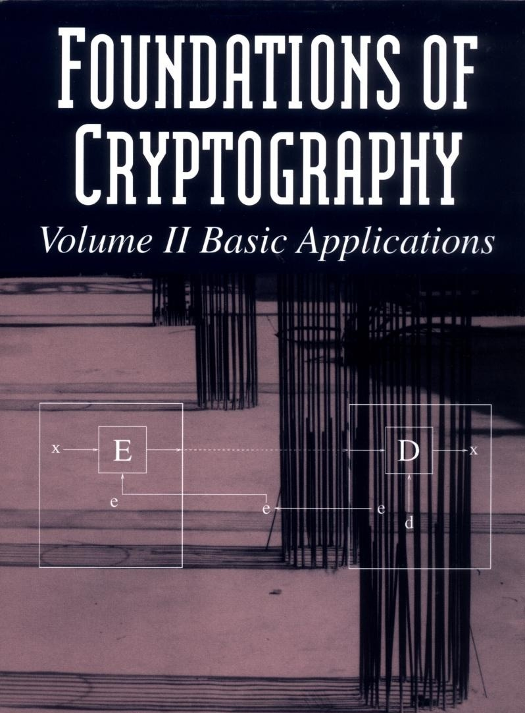

# Foundations of Cryptography

Oded Goldreich

Cryptography is concerned with the conceptualization, definition, and construction of computing systems that address security concerns. The design of cryptographic systems must be based on firm foundations. Foundations of Cryptography presents a rigorous and systematic treatment of foundational issues: defining cryptographic tasks and solving new cryptographic problems using existing tools. The emphasis is on the clarification of fundamental concepts and on demonstrating the feasibility of solving several central cryptographic problems, as opposed to describing ad hoc approaches.

This second volume contains a rigorous treatment of three basic applications: encryption, signatures, and general cryptographic protocols. It builds on the previous volume, which provides a treatment of one-way functions, pseudorandomness, and zero-knowledge proofs. It is suitable for use in a graduate course on cryptography and as a reference book for experts. The author assumes basic familiarity with the design and analysis of algorithms; some knowledge of complexity theory and probability is also useful.

Oded Goldreich is Professor of Computer Science at the Weizmann Institute of Science and incumbent of the Meyer W. Weisgal Professorial Chair. An active researcher, he has written numerous papers on cryptography and is widely considered to be one of the world experts in the area. He is an editor of Journal of Cryptology and SIAM Journal on Computing and the author of Modern Cryptography, Probabilistic Proofs and Pseudorandomness.

## Foundations of Cryptography II: Basic Applications

Oded Goldreich

Weizmann Institute of Science

Cambridge University Press Cambridge, New York, Melbourne, Madrid, Cape Town, Singapore, São Paulo, Delhi

Cambridge University Press

The Edinburgh Building, Cambridge CB2 8RU, UK

Published in the United States of America by Cambridge University Press, New York

www.cambridge.org

Information on this title: www.cambridge.org/9780521119917

© Oded Goldreich 2004

This publication is in copyright. Subject to statutory exception and to the provisions of relevant collective licensing agreements, no reproduction of any part may take place without the written permission of Cambridge University Press.

First published 2004

This digitally printed version 2009

A catalogue record for this publication is available from the British Library

ISBN 978-0-521-83084-3 hardback

ISBN 978-0-521-11991-7 paperback

