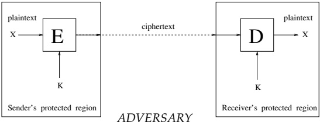
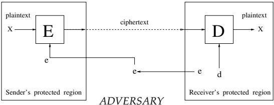

# Encryption Schemes

Up to the 1970s, Cryptography was understood as the art of building encryption schemes, that is, the art of constructing schemes allowing secret data exchange over insecure channels. Since the 1970s, other tasks (e.g., signature schemes) have been recognized as falling within the domain of Cryptography (and even being at least as central to Cryptography). Yet the construction of encryption schemes remains, and is likely to remain, a central enterprise of Cryptography.

In this chapter we review the well-known notions of private-key and public-key encryption schemes. More importantly, we define what is meant by saying that such schemes are secure. This definitional treatment is a cornerstone of the entire area, and much of this chapter is devoted to various aspects of it. We also present several constructions of secure (private-key and public-key) encryption schemes. It turns out that using randomness during the encryption process (i.e., not only at the key-generation phase) is essential to security.

Organization. Our main treatment (i.e., Sections 5.1–5.3) refers to security under “passive” (eavesdropping) attacks. In contrast, in Section 5.4, we discuss notions of security under active attacks, culminating in robustness against chosen ciphertext attacks. Additional issues are discussed in Section 5.5.

Teaching Tip. We suggest to focus on the basic definitional treatment (i.e., Sections 5.1 and 5.2.1–5.2.4) and on the feasibility of satisfying these definitions (as demonstrated by the simplest constructions provided in Sections 5.3.3 and 5.3.4.1). The overview to security under active attacks (i.e., Section 5.4.1) is also recommended. We assume that the reader is familiar with the material in previous chapters (and specifically with Sections 2.2, 2.4, 2.5, 3.2–3.4, and 3.6). This familiarity is important not only because we use some of the notions and results presented in these sections but also because we use similar proof techniques (and do so while assuming that this is not the reader's first encounter with these techniques).

## 5.1. The Basic Setting

Loosely speaking, encryption schemes are supposed to enable private exchange of information between parties that communicate over an insecure channel. Thus, the basic setting consists of a sender, a receiver, and an insecure channel that may be tapped by an adversary. The goal is to allow the sender to transfer information to the receiver, over the insecure channel, without letting the adversary figure out this information. Thus, we distinguish between the actual (secret) information that the receiver wishes to transmit and the message(s) sent over the insecure communication channel. The former is called the plaintext, whereas the latter is called the ciphertext. Clearly, the ciphertext must differ from the plaintext or else the adversary can easily obtain the plaintext by tapping the channel. Thus, the sender must transform the plaintext into a corresponding ciphertext such that the receiver can retrieve the plaintext from the ciphertext, but the adversary cannot do so. Clearly, something must distinguish the receiver (who is able to retrieve the plaintext from the corresponding ciphertext) from the adversary (who cannot do so). Specifically, the receiver knows something that the adversary does not know. This thing is called a key.

An encryption scheme consists of a method of transforming plaintexts into cipher-texts and vice versa, using adequate keys. These keys are essential to the ability to effect these transformations. Formally, these transformations are performed by corresponding algorithms: an encryption algorithm that transforms a given plaintext and an adequate (encryption) key into a corresponding ciphertext, and a decryption algorithm that given the ciphertext and an adequate (decryption) key recovers the original plaintext. Actually, we need to consider a third algorithm, namely, a probabilistic algorithm used to generate keys (i.e., a key-generation algorithm). This algorithm must be probabilistic (or else, by invoking it, the adversary obtains the very same key used by the receiver). We stress that the encryption scheme itself (i.e., the aforementioned three algorithms) may be known to the adversary, and the scheme's security relies on the hypothesis that the adversary does not know the actual keys in use. $ ^{1} $

In accordance with these principles, an encryption scheme consists of three algorithms. These algorithms are public (i.e., known to all parties). The two obvious algorithms are the encryption algorithm, which transforms plaintexts into ciphertexts, and the decryption algorithm, which transforms ciphertexts into plaintexts. By these principles, it is clear that the decryption algorithm must employ a key that is known to the receiver but is not known to the adversary. This key is generated using a third algorithm, called the key-generator. Furthermore, it is not hard to see that the encryption process must also depend on the key (or else messages sent to one party can be read by a different party who is also a potential receiver). Thus, the key-generation algorithm is used to produce a pair of (related) keys, one for encryption and one for decryption. The encryption algorithm, given an encryption-key and a plaintext, produces a ciphertext that, when fed to the decryption algorithm, together with the corresponding

The key K is known to both receiver and sender, but is unknown to the adversary. For example, the receiver may generate K at random and pass it to the sender via a perfectly-private secondary channel (not shown here).

Figure 5.1: Private-key encryption schemes: an illustration.

decryption-key, yields the original plaintext. We stress that knowledge of the decryption-key is essential for the latter transformation.

### 5.1.1. Private-Key Versus Public-Key Schemes

A fundamental distinction between encryption schemes refers to the relation between the aforementioned pair of keys (i.e., the encryption-key and the decryption-key). The simpler (and older) notion assumes that the encryption-key equals the decryption-key. Such schemes are called private-key (or symmetric).

Private-Key Encryption Schemes. To use a private-key scheme, the legitimate parties must first agree on the secret key. This can be done by having one party generate the key at random and send it to the other party using a (secondary) channel that (unlike the main channel) is assumed to be secure (i.e., it cannot be tapped by the adversary). A crucial point is that the key is generated independently of the plaintext, and so it can be generated and exchanged prior to the plaintext even being determined. Assuming that the legitimate parties have agreed on a (secret) key, they can secretly communicate by using this key (see illustration in Figure 5.1): The sender encrypts the desired plaintext using this key, and the receiver recovers the plaintext from the corresponding ciphertext (by using the same key). Thus, private-key encryption is a way of extending a private channel over time: If the parties can use a private channel today (e.g., they are currently in the same physical location) but not tomorrow, then they can use the private channel today to exchange a secret key that they may use tomorrow for secret communication.

A simple example of a private-key encryption scheme is the one-time pad. The secret key is merely a uniformly chosen sequence of $n$ bits, and an $n$-bit long ciphertext is produced by XORing the plaintext, bit-by-bit, with the key. The plaintext is recovered from the ciphertext in the same way. Clearly, the one-time pad provides

The key-pair $ (e,d) $ is generated by the receiver, who posts the encryption-key e on a public media, while keeping the decryption-key d secret.

Figure 5.2: Public-key encryption schemes: an illustration.

absolute security. However, its usage of the key is inefficient; or, put in other words, it requires keys of length comparable to the total length (or information contents) of the data being communicated. By contrast, the rest of this chapter will focus on encryption schemes in which n-bit long keys allow for the secure communication of data having an a priori unbounded (albeit polynomial in n) length. In particular, n-bit long keys allow for significantly more than n bits of information to be communicated securely.

Public-Key Encryption Schemes. A new type of encryption schemes emerged in the 1970s. In these so-called public-key (or asymmetric) encryption schemes, the decryption-key differs from the encryption-key. Furthermore, it is infeasible to find the decryption-key, given the encryption-key. These schemes enable secure communication without the use of a secure channel. Instead, each party applies the key-generation algorithm to produce a pair of keys. The party (denoted $P$) keeps the decryption-key, denoted $d_P$, secret and publishes the encryption-key, denoted $e_P$. Now, any party can send $P$ private messages by encrypting them using the encryption-key $e_P$. Party $P$ can decrypt these messages by using the decryption-key $d_P$, but nobody else can do so. (See illustration in Figure 5.2.)

### 5.1.2. The Syntax of Encryption Schemes

We start by defining the basic mechanism of encryption schemes. This definition says nothing about the security of the scheme (which is the subject of the next section).

Definition 5.1.1 (encryption scheme): An encryption scheme is a triple, $ (G, E, D) $ of probabilistic polynomial-time algorithms satisfying the following two conditions:

1. On input 1 $ ^{n} $, algorithm G (called the key-generator) outputs a pair of bit strings.

2. For every pair $ (e, d) $ in the range of $ G(1^n) $, and for every $ \alpha \in \{0, 1\}^* $, algorithms E (encryption) and $ D $ (decryption) satisfy

 $$ \Pr[D(d,E(e,\alpha))=\alpha]=1 $$ 

where the probability is taken over the internal coin tosses of algorithms E and D.

The integer $n$ serves as the security parameter of the scheme. Each $(e,d)$ in the range of $G(1^n)$ constitutes a pair of corresponding encryption/decryption keys. The string $E(e,\alpha)$ is the encryption of the plaintext $\alpha\in\{0,1\}^*$ using the encryption-key $e$, whereas $D(d,\beta)$ is the decryption of the ciphertext $\beta$ using the decryption-key $d$.

We stress that Definition 5.1.1 says nothing about security, and so trivial (insecure) algorithms may satisfy it (e.g., $ E(e, \alpha) \overset{\text{def}}{=} \alpha $ and $ D(d, \beta) \overset{\text{def}}{=} \beta $). Furthermore, Definition 5.1.1 does not distinguish private-key encryption schemes from public-key ones. The difference between the two types is introduced in the security definitions: In a public-key scheme the “breaking algorithm” gets the encryption-key (i.e., e) as an additional input (and thus $ e \neq d $ follows), while in private-key schemes e is not given to the “breaking algorithm” (and thus, one may assume, without loss of generality, that e = d).

We stress that this definition requires the scheme to operate for every plaintext, and specifically for plaintext of length exceeding the length of the encryption-key. (This rules out the information theoretic secure “one-time pad” scheme mentioned earlier.)

Notation. In the rest of this text, we write $ E_e(\alpha) $ instead of $ E(e, \alpha) $ and $ D_d(\beta) $ instead of $ D(d, \beta) $. Sometimes, when there is little risk of confusion, we drop these subscripts. Also, we let $ G_1(1^n) $ (resp., $ G_2(1^n) $) denote the first (resp., second) element in the pair $ G(1^n) $. That is, $ G(1^n) = (G_1(1^n), G_2(1^n)) $. Without loss of generality, we may assume that $ |G_1(1^n)| $ and $ |G_2(1^n)| $ are polynomially related to $ n $, and that each of these integers can be efficiently computed from the other. (In fact, we may even assume that $ |G_1(1^n)| = |G_2(1^n)| = n $; see Exercise 6.)

Comments. Definition 5.1.1 may be relaxed in several ways without significantly harming its usefulness. For example, we may relax Condition (2) and allow a negligible decryption error (e.g., $ \Pr[D_d(E_e(\alpha)) \neq \alpha] < 2^{-n} $). Alternatively, one may postulate that Condition (2) holds for all but a negligible measure of the key-pairs generated by $ G(1^n) $. At least one of these relaxations is essential for some suggestions of (public-key) encryption schemes.

Another relaxation consists of restricting the domain of possible plaintexts (and ciphertexts). For example, one may restrict Condition (2) to $ \alpha $'s of length $ \ell(n) $, where $ \ell: \mathbb{N} \to \mathbb{N} $ is some fixed function. Given a scheme of the latter type (with plaintext length $ \ell $), we may construct a scheme as in Definition 5.1.1 by breaking plaintexts into blocks of length $ \ell(n) $ and applying the restricted scheme separately to each block. (Note that security of the resulting scheme requires that the security of the length-restricted scheme be preserved under multiple encryptions with the same key.) For more details see Sections 5.2.4 and 5.3.2.

## 5.2. Definitions of Security

In this section we present two fundamental definitions of security and prove their equivalence. The first definition, called semantic security, is the most natural one. Semantic security is a computational-complexity analogue of Shannon's definition of perfect privacy (which requires that the ciphertext yield no information regarding the plaintext). Loosely speaking, an encryption scheme is semantically secure if it is infeasible to learn anything about the plaintext from the ciphertext (i.e., impossibility is replaced by infeasibility). The second definition has a more technical flavor. It interprets security as the infeasibility of distinguishing between encryptions of a given pair of messages. This definition is useful in demonstrating the security of a proposed encryption scheme and for the analysis of cryptographic protocols that utilize an encryption scheme.

We stress that the definitions presented in Section 5.2.1 go far beyond saying that it is infeasible to recover the plaintext from the ciphertext. The latter statement is indeed a minimal requirement for a secure encryption scheme, but we claim that it is far too weak a requirement. For example, one should certainly not use an encryption scheme that leaks the first part of the plaintext (even if it is infeasible to recover the entire plaintext from the ciphertext). In general, an encryption scheme is typically used in applications where even obtaining partial information on the plaintext may endanger the security of the application. The question of which partial information endangers the security of a specific application is typically hard (if not impossible) to answer. Furthermore, we wish to design application-independent encryption schemes, and when doing so it is the case that each piece of partial information may endanger some application. Thus, we require that it be infeasible to obtain any information about the plaintext from the ciphertext. Moreover, in most applications the plaintext may not be uniformly distributed, and some a priori information regarding it may be available to the adversary. We thus require that the secrecy of all partial information be preserved also in such a case. That is, given any a priori information on the plaintext, it is infeasible to obtain any (new) information about the plaintext from the ciphertext (beyond what is feasible to obtain from the a priori information on the plaintext). The definition of semantic security postulates all of this.

Security of Multiple Plaintexts. Continuing the preceding discussion, the definitions are presented first in terms of the security of a single encrypted plaintext. However, in many cases, it is desirable to encrypt many plaintexts using the same encryption-key, and security needs to be preserved in these cases, too. Adequate definitions and discussions are deferred to Section 5.2.4.

A Technical Comment: Non-Uniform Complexity Formulation. To simplify the exposition, we define security in terms of non-uniform complexity (see Section 1.3.3 of Volume 1). Namely, in the security definitions we expand the domain of efficient adversaries (and algorithms) to include (explicitly or implicitly) non-uniform polynomial-size circuits, rather than only probabilistic polynomial-time machines. Likewise, we make no computational restriction regarding the probability distribution from which messages are taken, nor regarding the a priori information available on these messages. We note that employing such a non-uniform complexity formulation (rather than a uniform one) may only strengthen the definitions, yet it does weaken the implications proven between the definitions because these (simpler) proofs make free usage of non-uniformity. A uniform-complexity treatment is provided in Section 5.2.5.

### 5.2.1. Semantic Security

A good disguise should not reveal the person's height.

Shafi Goldwasser and Silvio Micali, 1982

Loosely speaking, semantic security means that nothing can be gained by looking at a ciphertext. Following the simulation paradigm, this means that whatever can be efficiently learned from the ciphertext can also be efficiently learned from scratch (or from nothing).

#### 5.2.1.1. The Actual Definitions

To be somewhat more accurate, semantic security means that whatever can be efficiently computed from the ciphertext can be efficiently computed when given only the length of the plaintext. Note that this formulation does not rule out the possibility that the length of the plaintext can be inferred from the ciphertext. Indeed, some information about the length of the plaintext must be revealed by the ciphertext (see Exercise 4). We stress that other than information about the length of the plaintext, the ciphertext is required to yield nothing about the plaintext.

In the actual definitions, we consider only information regarding the plaintext (rather than information regarding the ciphertext and/or the encryption-key) that can be obtained from the ciphertext. Furthermore, we restrict our attention to functions (rather than randomized processes) applied to the plaintext. We do so because of the intuitive appeal of this special case, and are comfortable doing so because this special case implies the general one (see Exercise 13). We augment this formulation by requiring that the infeasibility of obtaining information about the plaintext remain valid even in the presence of other auxiliary partial information about the same plaintext. Namely, whatever can be efficiently computed from the ciphertext and additional partial information about the plaintext can be efficiently computed given only the length of the plaintext and the same partial information. In the definition that follows, the information regarding the plaintext that the adversary tries to obtain is represented by the function $ f $, whereas the a priori partial information about the plaintext is represented by the function $ h $. The infeasibility of obtaining information about the plaintext is required to hold for any distribution of plaintexts, represented by the probability ensemble $ \{X_n\}_{n\in\mathbb{N}} $.

Security holds only for plaintexts of length polynomial in the security parameter. This is captured in the following definitions by the restriction $ |X_n| \leq \text{poly}(n) $, where “poly” represents an arbitrary (unspecified) polynomial. Note that we cannot hope to provide computational security for plaintexts of unbounded length or for plaintexts of length that is exponential in the security parameter (see Exercise 3). Likewise, we restrict the functions $ f $ and $ h $ to be polynomially-bounded, that is, $ |f(z)| $, $ |h(z)| \leq \text{poly}(|z|) $.

The difference between private-key and public-key encryption schemes is manifested in the definition of security. In the latter case, the adversary (which is trying to obtain information on the plaintext) is given the encryption-key, whereas in the former case it is not. Thus, the difference between these schemes amounts to a difference in the adversary model (considered in the definition of security). We start by presenting the definition for private-key encryption schemes.

Definition 5.2.1 (semantic security – private-key): An encryption scheme, $ (G, E, D) $, is semantically secure (in the private-key model) if for every probabilistic polynomial-time algorithm $ A $ there exists a probabilistic polynomial-time algorithm $ A' $ such that for every probability ensemble $ \{X_n\}_{n \in \mathbb{N}} $, with $ |X_n| \leq \text{poly}(n) $, every pair of polynomially bounded functions $ f, h : \{0, 1\}^* \to \{0, 1\}^* $, every positive polynomial $ p $ and all sufficiently large $ n $.

 $$ \begin{aligned}\Pr&\left[A(1^{n},E_{G_{1}(1^{n})}(X_{n}),1^{|X_{n}|},h(1^{n},X_{n}))=f(1^{n},X_{n})\right]\\&<\Pr\left[A^{\prime}(1^{n},1^{|X_{n}|},h(1^{n},X_{n}))=f(1^{n},X_{n})\right]+\frac{1}{p(n)}\end{aligned} $$ 

(The probability in these terms is taken over $ X_{n} $ as well as over the internal coin tosses of either algorithms G, E, and A or algorithm $ A' $.)

We stress that all the occurrences of $ X_n $ in each of the probabilistic expressions refer to the same random variable (see the general convention stated in Section 1.2.1 in Volume 1). The security parameter $ 1^n $ is given to both algorithms (as well as to the functions $ h $ and $ f $) for technical reasons. $ ^2 $ The function $ h $ provides both algorithms with partial information regarding the plaintext $ X_n $. Furthermore, $ h $ also makes the definition implicitly non-uniform; see further discussion in Section 5.2.1.2. In addition, both algorithms get the length of $ X_n $. These algorithms then try to guess the value $ f(1^n, X_n) $; namely, they try to infer information about the plaintext $ X_n $. Loosely speaking, in a semantically secure encryption scheme the ciphertext does not help in this inference task. That is, the success probability of any efficient algorithm (i.e., algorithm $ A $) that is given the ciphertext can be matched, up to a negligible fraction, by the success probability of an efficient algorithm (i.e., algorithm $ A' $) that is not given the ciphertext at all.

Definition 5.2.1 refers to private-key encryption schemes. To derive a definition of security for public-key encryption schemes, the encryption-key (i.e., $ G_1(1^n) $) should be given to the adversary as an additional input.

Definition 5.2.2 (semantic security – public-key): An encryption scheme, $ (G, E, D) $, is semantically secure (in the public-key model) if for every probabilistic polynomial-time algorithm $ A $, there exists a probabilistic polynomial-time algorithm $ A' $ such that for every $ \{X_n\}_{n\in\mathbb{N}} $, $ f $, $ h $, $ p $, and $ n $ as in Definition 5.2.1

 $$ \begin{align*}\Pr&\left[A(1^{n},G_{1}(1^{n}),E_{G_{1}(1^{n})}(X_{n}),1^{|X_{n}|},h(1^{n},X_{n}))=f(1^{n},X_{n})\right]\\&<\Pr\left[A^{\prime}(1^{n},1^{|X_{n}|},h(1^{n},X_{n}))=f(1^{n},X_{n})\right]+\frac{1}{p(n)}\end{align*} $$ 

Recall that (by our conventions) both occurrences of $ G_1(1^n) $, in the first probabilistic expression, refer to the same random variable. We comment that it is pointless to give the random encryption-key (i.e., $ G_1(1^n) $) to algorithm $ A' $ (because the task as well as the main inputs of $ A' $ are unrelated to the encryption-key, and anyhow $ A' $ could generate a random encryption-key by itself).

Terminology. For sake of simplicity, we refer to an encryption scheme that is semantically secure in the private-key (resp., public-key) model as a semantically secure private-key (resp., public-key) encryption scheme.

The reader may note that a semantically secure public-key encryption scheme cannot employ a deterministic encryption algorithm; that is, $ E_e(x) $ must be a random variable rather than a fixed string. This is more evident with respect to the equivalent Definition 5.2.4. See further discussion following Definition 5.2.4.

#### 5.2.1.2. Further Discussion of Some Definitional Choices

We discuss several secondary issues regarding Definitions 5.2.1 and 5.2.2. The interested reader is also referred to Exercises 16, 17, and 19, which present additional variants of the definition of semantic security.

Implicit Non-Uniformity of the Definitions. The fact that $h$ is not required to be computable makes these definitions non-uniform. This is the case because both algorithms are given $h(1^n, X_n)$ as auxiliary input, and the latter may account for arbitrary (polynomially bounded) advice. For example, letting $h(1^n, \cdot) = a_n \in \{0, 1\}^{\text{poly}(n)}$ means that both algorithms are supplied with (non-uniform) advice (as in one of the common formulations of non-uniform polynomial-time; see Section 1.3.3). In general, the function $h$ can code both information regarding its main input and non-uniform advice depending on the security parameter (i.e., $h(1^n, x) = (h'(x), a_n)$). We comment that these definitions are equivalent to allowing $A$ and $A'$ to be related families of non-uniform circuits, where by related we mean that the circuits in the family $A' = \{A_n'\}_{n \in \mathbb{N}}$ can be efficiently computed from the corresponding circuits in the family $A = \{A_n\}_{n \in \mathbb{N}}$. For further discussion, see Exercise 9.

Lack of Computational Restrictions Regarding the Function $f$. We do not even require that the function $f$ be computable. This seems strange at first glance because (unlike the situation with respect to the function $h$, which codes a priori information given to the algorithms) the algorithms are asked to guess the value of $f$ (at a plaintext implicit in the ciphertext given only to $A$). However, as we shall see in the sequel (see also Exercise 13), the actual technical content of semantic security is that the probability ensembles $\{(1^n, E(X_n), 1^{|X_n|}, h(1^n, X_n))\}_n$ and $\{(1^n, E(1^{|X_n|}), 1^{|X_n|}, h(1^n, X_n))\}_n$ are computationally indistinguishable (and so whatever $A$ can compute can also be computed by $A$). Note that the latter statement does not refer to the function $f$, which explains why we need not make any restriction regarding $f$.

Other Modifications of No Impact. Actually, inclusion of a priori information regarding the plaintext (represented by the function $h$) does not affect the definition of semantic security: Definition 5.2.1 remains intact if we restrict $h$ to only depend on the security parameter (and so only provide plaintext-oblivious non-uniform advice). (This can be shown in various ways; e.g., see Exercise 14.1.) Also, the function $f$ can be restricted to be a Boolean function having polynomial-size circuits, and the random variable $X_n$ may be restricted to be very “dull” (e.g., have only two strings in its support): See proof of Theorem 5.2.5. On the other hand, Definition 5.2.1 implies stronger forms discussed in Exercises 13, 17 and 18.

### 5.2.2. Indistinguishability of Encryptions

A good disguise should not allow a mother to distinguish her own children. Shafi Goldwasser and Silvio Micali, 1982

The following technical interpretation of security states that it is infeasible to distinguish the encryptions of two plaintexts (of the same length). That is, such ciphertexts are computationally indistinguishable as defined in Definition 3.2.7. Again, we start with the private-key variant.

Definition 5.2.3 (indistinguishability of encryptions – private-key): An encryption scheme, $ (G, E, D) $, has indistinguishable encryptions (in the private-key model) if for every polynomial-size circuit family $ \{C_n\} $, every positive polynomial $ p $, all sufficiently large $ n $, and every $ x, y \in \{0, 1\}^{\text{poly}(n)} $ (i.e., $ |x| = |y| $),

 $$ \mid\mathsf{Pr}\left[C_{n}(E_{G_{1}(1^{n})}(x))=1\right]-\mathsf{Pr}\left[C_{n}(E_{G_{1}(1^{n})}(y))=1\right]\mid<\frac{1}{p(n)} $$ 

The probability in these terms is taken over the internal coin tosses of algorithms G and E.

Note that the potential plaintexts to be distinguished can be incorporated into the circuit $ C_{n} $. Thus, the circuit models both the adversary's strategy and its a priori information: See Exercise 11.

Again, the security definition for public-key encryption schemes is derived by adding the encryption-key (i.e., $ G_1(1^n) $) as an additional input to the potential distinguisher.

Definition 5.2.4 (indistinguishability of encryptions – public-key): An encryption scheme, $ (G, E, D) $, has indistinguishable encryptions (in the public-key model) if for every polynomial-size circuit family $ \{C_n\} $, and every p, n, x, and y as in Definition 5.2.3

 $$ \mid\Pr\left[C_{n}(G_{1}(1^{n}),E_{G_{1}(1^{n})}(x))=1\right]-\Pr\left[C_{n}(G_{1}(1^{n}),E_{G_{1}(1^{n})}(y))=1\right]\mid<\frac{1}{p(n)} $$ 

Terminology. We refer to an encryption scheme that has indistinguishable encryptions in the private-key (resp., public-key) model as a ciphertext-indistinguishable private-key (resp., public-key) encryption scheme.

Failure of Deterministic Encryption Algorithms. A ciphertext-indistinguishable public-key encryption scheme cannot employ a deterministic encryption algorithm (i.e., $ E_e(x) $ cannot be a fixed string). The reason is that for a public-key encryption scheme with a deterministic encryption algorithm E, given an encryption-key e and a pair of candidate plaintexts $ (x, y) $, one can easily distinguish $ E_e(x) $ from $ E_e(y) $ (by merely applying $ E_e $ to x and comparing the result to the given ciphertext). In contrast, in case the encryption algorithm itself is randomized, the same plaintext can be encrypted in many exponentially different ways, under the same encryption-key. Furthermore, the probability that applying $ E_e $ twice to the same message (while using independent randomization in $ E_e $) results in the same ciphertext may be exponentially vanishing. (Indeed, as shown in Section 5.3.4, public-key encryption schemes having indistinguishable encryptions can be constructed based on any trapdoor permutation, and these schemes employ randomized encryption algorithms.)

### 5.2.3. Equivalence of the Security Definitions

The following theorem is stated and proven for private-key encryption schemes. A similar result holds for public-key encryption schemes (see Exercise 12).

Theorem 5.2.5 (equivalence of definitions – private-key): A private-key encryption scheme is semantically secure if and only if it has indistinguishable encryptions.

Let $ (G, E, D) $ be an encryption scheme. We formulate a proposition for each of the two directions of this theorem. Each proposition is in fact stronger than the corresponding direction stated in Theorem 5.2.5. The more useful direction is stated first: It asserts that the technical interpretation of security, in terms of ciphertext-indistinguishability, implies the natural notion of semantic security. Thus, the following proposition yields a methodology for designing semantically secure encryption schemes: Design and prove your scheme to be ciphertext-indistinguishable, and conclude (by applying the proposition) that it is semantically secure. The opposite direction (of Theorem 5.2.5) establishes the “completeness” of the latter methodology, and more generally asserts that requiring an encryption scheme to be ciphertext-indistinguishable does not rule out schemes that are semantically secure.

Proposition 5.2.6 (useful direction: “indistinguishability” implies “security”): Suppose that $(G, E, D)$ is a ciphertext-indistinguishable private-key encryption scheme. Then $(G, E, D)$ is semantically secure. Furthermore, Definition 5.2.1 is satisfied by using $A' = M^A$, where $M$ is a fixed oracle machine; that is, there exists a single $M$ such that for every $A$ letting $A' = M^A$ will do.

Proposition 5.2.7 (opposite direction: “security” implies “indistinguishability”): Suppose that $ (G, E, D) $ is a semantically secure private-key encryption scheme. Then $ (G, E, D) $ has indistinguishable encryptions. Furthermore, the conclusion holds even if the definition of semantic security is restricted to the special case satisfying the following four conditions:

1. The random variable $ X_{n} $ is uniformly distributed over a set containing two strings;

2. The value of h depends only on the length of its input or alternatively $ h(1^n, x) = h'(n) $, for some $ h' $;

3. The function f is Boolean and is computable by a family of (possibly non-uniform) polynomial-size circuits;

4. The algorithm A is deterministic.

In addition, no computational restrictions are placed on algorithm $ A' $ (i.e., $ A' $ can be any function), and moreover $ A' $ may depend on $ \{X_n\}_{n \in \mathbb{N}} $, $ h $, $ f $, and $ A $.

Observe that the four itemized conditions limit the scope of the four universal quantifiers in Definition 5.2.1, whereas the last sentence removes a restriction on the existential quantifier (i.e., removes the complexity bound on $ A' $) and reverses the order of quantifiers allowing the existential quantifier to depend on all universal quantifiers (rather than only on the last one). Thus, each of these modifications makes the resulting definition potentially weaker. Still, combining Propositions 5.2.7 and 5.2.6, it follows that a weak version of Definition 5.2.1 implies (an even stronger version than) the one stated in Definition 5.2.1.

#### 5.2.3.1. Proof of Proposition 5.2.6

Suppose that $(G, E, D)$ has indistinguishable encryptions. We will show that $(G, E, D)$ is semantically secure by constructing, for every probabilistic polynomial-time algorithm $A$, a probabilistic polynomial-time algorithm $A'$ such that the condition in Definition 5.2.1 holds. That is, for every $\{X_n\}_{n\in\mathbb{N}}$, $f$ and $h$, algorithm $A'$ guesses $f(1^n, X_n)$ from $(1^n, 1^{|X_n|}, h(1^n, X_n))$ essentially as well as $A$ guesses $f(1^n, X_n)$ from $E(X_n)$ and $(1^n, 1^{|X_n|}, h(1^n, X_n))$. Our construction of $A'$ consists of merely invoking $A$ on input $(1^n, E(1^{|X_n|}), 1^{|X_n|}, h(1^n, X_n))$, and returning whatever $A$ does. That is, $A'$ invokes $A$ with a dummy encryption rather than with an encryption of $X_n$ (which $A$ expects to get, but $A'$ does not have). Intuitively, the indistinguishability of encryptions implies that $A$ behaves nearly as well when invoked by $A'$ (and given a dummy encryption) as when given the encryption of $X_n$, and this establishes that $A'$ is adequate with respect to $A$. The main issue in materializing this plan is to show that the specific formulation of indistinguishability of encryptions indeed supports the implication (i.e., implies that

A guesses $ f(1^n, X_n) $ essentially as well when given a dummy encryption as when given the encryption of $ X_n $. Details follow.

The construction of $A':$ Let $A$ be an algorithm that tries to infer partial information (i.e., the value $f(1^n, X_n)$) from the encryption of the plaintext $X_n$ (when also given $1^n$, $1^{|X_n|}$ and a priori information $h(1^n, X_n)$). Intuitively, on input $E(\alpha)$ and ($1^n, 1^{|\alpha|}$, $h(1^n, \alpha)$), algorithm $A$ tries to guess $f(1^n, \alpha)$. We construct a new algorithm, $A'$, that performs essentially as well without getting the input $E(\alpha)$. The new algorithm consists of invoking $A$ on input $E_{G_1(1^n)}(1^{|\alpha|})$ and ($1^n, 1^{|\alpha|}$, $h(1^n, \alpha)$), and outputting whatever $A$ does. That is, on input ($1^n, 1^{|\alpha|}$, $h(1^n, \alpha)$), algorithm $A'$ proceeds as follows:

1. $ A' $ invokes the key-generator $ G $ (on input $ 1^n $), and obtains an encryption-key $ e \leftarrow G_1(1^n) $.

2. $ A' $ invokes the encryption algorithm with key $ e $ and (“dummy”) plaintext $ 1^{|\alpha|} $, obtaining a ciphertext $ \beta \leftarrow E_e(1^{|\alpha|}) $.

3. $ A' $ invokes A on input $ (1^n, \beta, 1^{|\alpha|}, h(1^n, \alpha)) $, and outputs whatever A does.

Observe that $ A' $ is described in terms of an oracle machine that makes a single oracle call to (any given) $ A $, in addition to invoking the fixed algorithms $ G $ and $ E $. Furthermore, the construction of $ A' $ depends neither on the functions $ h $ and $ f $ nor on the distribution of plaintexts to be encrypted (represented by the probability ensembles $ \{X_n\}_{n\in\mathbb{N}} $). Thus, $ A' $ is probabilistic polynomial-time whenever $ A $ is probabilistic polynomial-time (and regardless of the complexity of $ h $, $ f $, and $ \{X_n\}_{n\in\mathbb{N}} $).

Indistinguishability of encryptions will be used to prove that $ A' $ performs essentially as well as A. Specifically, the proof will use a reducibility argument.

Claim 5.2.6.1: Let $ A' $ be as in the preceding construction. Then, for every $ \{X_n\}_{n\in\mathbb{N}} $, $ f $, $ h $, and $ p $ as in Definition 5.2.1, and all sufficiently large $ n $'s

 $$ \begin{aligned}&\Pr\left[A(1^{n},E_{G_{1}(1^{n})}(X_{n}),1^{|X_{n}|},h(1^{n},X_{n}))=f(1^{n},X_{n})\right]\\&<\Pr\left[A^{\prime}(1^{n},1^{|X_{n}|},h(1^{n},X_{n}))=f(1^{n},X_{n})\right]+\frac{1}{p(n)}\end{aligned} $$ 

Proof: To simplify the notations, let us incorporate $ 1^{|\alpha|} $ into $ h_n(\alpha) \overset{\text{def}}{=} h(1^n, \alpha) $ and let $ f_n(\alpha) \overset{\text{def}}{=} f(1^n, \alpha) $. Also, we omit $ 1^n $ from the inputs given to $ A $, shorthanding $ A(1^n, c, v) $ by $ A(c, v) $. Using the definition of $ A' $, we rewrite the claim as asserting

 $$ \begin{aligned}&\Pr\left[A(E_{G_{1}(1^{n})}(X_{n}),h_{n}(X_{n}))=f_{n}(X_{n})\right]\\&<\Pr\left[A(E_{G_{1}(1^{n})}(1^{|X_{n}|}),h_{n}(X_{n}))=f_{n}(X_{n})\right]+\frac{1}{p(n)}\end{aligned} $$ 

Intuitively, Eq. (5.1) follows from the indistinguishability of encryptions. Otherwise, by fixing a violating value of $ X_n $ and hardwiring the corresponding values of $ h_n(X_n) $ and $ f_n(X_n) $, we get a small circuit that distinguishes an encryption of this value of $ X_n $ from an encryption of $ 1^{|X_n|} $. Details follow.

Assume toward the contradiction that for some polynomial $p$ and infinitely many $n$'s Eq. (5.1) is violated. Then, for each such $n$, we have $\mathsf{E}[\Delta_n(X_n)] > 1/p(n)$, where

 $$ \Delta_{n}(x)\stackrel{\mathrm{def}}{=}\left|\Pr\left[A(E_{G_{1}(1^{n})}(x),h_{n}(x))=f_{n}(x)\right]-\Pr\left[A(E_{G_{1}(1^{n})}(1^{|x|}),h_{n}(x))=f_{n}(x)\right]\right| $$ 

We use an averaging argument to single out a string $x_n$ in the support of $X_n$ such that $\Delta_n(x_n) \geq \mathbb{E}[\Delta_n(X_n)]$: That is, let $x_n \in \{0,1\}^{\mathrm{poly}(n)}$ be a string for which the value of $\Delta_n(\cdot)$ is maximum, and so $\Delta_n(x_n) > 1/p(n)$. Using this $x_n$, we introduce a circuit $C_n$, which incorporates the fixed values $f_n(x_n)$ and $h_n(x_n)$, and distinguishes the encryption of $x_n$ from the encryption of $1^{|x_n|}$. The circuit $C_n$ operates as follows. On input $\beta = E(\alpha)$, the circuit $C_n$ invokes $A(\beta, h_n(x_n))$ and outputs 1 if and only if $A$ outputs the value $f_n(x_n)$. Otherwise, $C_n$ outputs 0.

This circuit is indeed of polynomial size because it merely incorporates strings of polynomial length (i.e., $ f_n(x_n) $ and $ h_n(x_n) $) and emulates a polynomial-time computation (i.e., that of $ A $). (Note that the circuit family $ \{C_n\} $ is indeed non-uniform since its definition is based on a non-uniform selection of $ x_n $'s as well as on a hardwiring of (possibly uncomputable) corresponding strings $ h_n(x_n) $ and $ f_n(x_n) $.) Clearly,

 $$ \Pr\left[C_{n}(E_{G_{1}(1^{n})}(\alpha))=1\right]=\Pr\left[A(E_{G_{1}(1^{n})}(\alpha),h_{n}(x_{n}))=f_{n}(x_{n})\right] $$ 

Combining Eq. (5.2) with the definition of $ \Delta_{n}(x_{n}) $, we get

 $$ \begin{aligned}\left|\Pr\left[C_{n}(E_{G_{1}(1^{n})}(x_{n}))=1\right]-\Pr\left[C_{n}(E_{G_{1}(1^{n})}(1^{|x_{n}|}))=1\right]\right|&=\Delta_{n}(x_{n})\\ &>\frac{1}{p(n)}\end{aligned} $$ 

This contradicts our hypothesis that $E$ has indistinguishable encryptions, and the claim follows. $\blacksquare$

We have just shown that $ A' $ performs essentially as well as A, and so Proposition 5.2.6 follows.

Comments. The fact that we deal with a non-uniform model of computation allows the preceding proof to proceed regardless of the complexity of $f$ and $h$. All that our definition of $C_n$ requires is the hardwiring of the values of $f$ and $h$ on a single string, and this can be done regardless of the complexity of $f$ and $h$ (provided that $|f_n(x_n)|, |h_n(x_n)| \leq \text{poly}(n)$).

When proving the public-key analogue of Proposition 5.2.6, algorithm $ A' $ is defined exactly as in the present proof, but its analysis is slightly different: The distinguishing circuit, considered in the analysis of the performance of $ A' $, obtains the encryption-key as part of its input and passes it to algorithm A (upon invoking the latter).

#### 5.2.3.2. Proof of Proposition 5.2.7

Intuitively, indistinguishability of encryption (i.e., of the encryptions of $ x_n $ and $ y_n $) is a special case of semantic security in which $ f $ indicates one of the plaintexts and $ h $ does not distinguish them (i.e., $ f(1^n, z) = 1 $ iff $ z = x_n $ and $ h(1^n, x_n) = h(1^n, y_n) $). The only issue to be addressed by the actual proof is that semantic security refers to uniform (probabilistic polynomial-time) adversaries, whereas indistinguishability of encryption refers to non-uniform polynomial-size circuits. This gap is bridged by using the function $h$ to provide the algorithms in the semantic-security formulation with adequate non-uniform advice (which may be used by the machine in the indistinguishability of encryption formulation).

The actual proof is by a reducibility argument. We show that if $(G, E, D)$ has distinguishable encryptions, then it is not semantically secure (not even in the restricted sense mentioned in the furthermore-clause of the proposition). Toward this end, we assume that there exists a (positive) polynomial $p$ and a polynomial-size circuit family $\{C_n\}$, such that for infinitely many $n$'s there exists $x_n, y_n \in \{0, 1\}^{\text{poly}(n)}$ so that

 $$ \mid\Pr\left[C_{n}(E_{G_{1}(1^{n})}(x_{n}))=1\right]-\Pr\left[C_{n}(E_{G_{1}(1^{n})}(y_{n}))=1\right]\mid>\frac{1}{p(n)} $$ 

Using these sequences of $C_n$'s, $x_n$'s and $y_n$'s, we define $\{X_n\}_{n\in\mathbb{N}}$, $f$ and $h$ (referred to in Definition 5.2.1) as follows:

- The probability ensemble $ \{X_n\}_{n\in\mathbb{N}} $ is defined such that $ X_n $ is uniformly distributed over $ \{x_n, y_n\} $.

- The (Boolean) function $f$ is defined such that $f(1^n, x_n) = 1$ and $f(1^n, y_n) = 0$, for every $n$. Note that $f(1^n, X_n) = 1$ with probability $1/2$ and equals 0 otherwise.

- The function $h$ is defined such that $h(1^n, X_n)$ equals the description of the circuit $C_n$. Note that $h(1^n, X_n) = C_n$ with probability 1, and thus $h(1^n, X_n)$ reveals no information on the value of $X_n$.

Note that $X_n$, $f$, and $h$ satisfy the restrictions stated in the furthermore-clause of the proposition. Intuitively, Eq. (5.3) implies violation of semantic security with respect to the $X_n, h$, and $f$. Indeed, we will present a (deterministic) polynomial-time algorithm $A$ that, given $C_n = h(1^n, X_n)$, guesses the value of $f(1^n, X_n)$ from the encryption of $X_n$, and does so with probability non-negligibly greater than $1/2$. This violates (even the restricted form of) semantic security, because no algorithm, regardless of its complexity, can guess $f(1^n, X_n)$ with probability greater than $1/2$ when only given $1^{|X_n|}$ (because given the constant values $1^{|X_n|}$ and $h(1^n, X_n)$, the value of $f(1^n, X_n)$ is uniformly distributed over $\{0, 1\}$. Details follow.

Let us assume, without loss of generality, that for infinitely many n's

 $$ \mathsf{Pr}\left[C_{n}(E_{G_{1}(1^{n})}(x_{n}))=1\right] > \mathsf{Pr}\left[C_{n}(E_{G_{1}(1^{n})}(y_{n}))=1\right]+\frac{1}{p(n)} $$ 

Claim 5.2.7.1: There exists a (deterministic) polynomial-time algorithm $ A $ such that for infinitely many $ n $'s

 $$ \Pr\left[A(1^{n},E_{G_{1}(1^{n})}(X_{n}),1^{|X_{n}|},h(1^{n},X_{n}))=f(1^{n},X_{n})\right]>\frac{1}{2}+\frac{1}{2p(n)} $$ 

Proof: The desired algorithm $ A $ merely uses $ C_n = h(1^n, X_n) $ to distinguish $ E(x_n) $ from $ E(y_n) $, and thus given $ E(X_n) $ it produces a guess for the value of $ f(1^n, X_n) $. Specifically, on input $ \beta = E(\alpha) $ (where $ \alpha $ is in the support of $ X_n $) and $ (1^n, 1^{|\alpha|}, h(1^n, \alpha)) $, algorithm $ A $ recovering $ C_n = h(1^n, \alpha) $, invokes $ C_n $ on input $ \beta $, and outputs 1 if $ C_n $ outputs 1 (otherwise, $ A $ outputs 0). $ ^3 $

It is left to analyze the success probability of $A$. Letting $m = |x_n| = |y_n|$, $h_n(\alpha) \stackrel{\text{def}}{=} h(1^n, \alpha)$ and $f_n(\alpha) \stackrel{\text{def}}{=} f(1^n, \alpha)$, we have

 $$ \begin{aligned}\Pr&\left[A(1^{n},E_{G_{1}(1^{n})}(X_{n}),1^{|X_{n}|},h_{n}(X_{n}))=f_{n}(X_{n})\right]\\&=\frac{1}{2}\cdot\Pr\left[A(1^{n},E_{G_{1}(1^{n})}(X_{n}),1^{|X_{n}|},h_{n}(X_{n}))=f_{n}(X_{n})\mid X_{n}=x_{n}\right]\\&\quad+\frac{1}{2}\cdot\Pr\left[A(1^{n},E_{G_{1}(1^{n})}(X_{n}),1^{|X_{n}|},h_{n}(X_{n}))=f_{n}(X_{n})\mid X_{n}=y_{n}\right]\\&=\frac{1}{2}\cdot\Pr\left[A(1^{n},E_{G_{1}(1^{n})}(x_{n}),1^{|x_{n}|},C_{n})=1\right]\\&\quad+\frac{1}{2}\cdot\Pr\left[A(1^{n},E_{G_{1}(1^{n})}(y_{n}),1^{|y_{n}|},C_{n})=0\right]\\&=\frac{1}{2}\cdot\left(\Pr\left[C_{n}(E_{G_{1}(1^{n})}(x_{n}))=1\right]+1-\Pr\left[C_{n}(E_{G_{1}(1^{n})}(y_{n}))=1\right]\right)\\&>\frac{1}{2}+\frac{1}{2p(n)}\end{aligned} $$ 

where the inequality is due to Eq. (5.4). $ \Box $

In contrast, as aforementioned, no algorithm (regardless of its complexity) can guess $ f(1^n, X_n) $ with success probability above $ 1/2 $, when given only $ 1^{|X_n|} $ and $ h(1^n, X_n) $. That is, we have the following:

Fact 5.2.7.2: For every n and every algorithm $ A' $

 $$ \Pr\left[A^{\prime}(1^{n},1^{|X_{n}|},h(1^{n},X_{n}))=f(1^{n},X_{n})\right]\leq\frac{1}{2} $$ 

Proof: Just observe that the output of $A'$, on its constant input values $1^n$, $1^{|X_n|}$ and $h(1^n, X_n)$, is stochastically independent of the random variable $f(1^n, X_n)$, which in turn is uniformly distributed in $\{0, 1\}$. Eq. (5.5) follows (and equality holds in case $A'$ always outputs a value in $\{0, 1\}$). $\square$

Combining Claim 5.2.7.1 and Fact 5.2.7.2, we reach a contradiction to the hypothesis that the scheme is semantically secure (even in the restricted sense mentioned in the furthermore-clause of the proposition). Thus, the proposition follows.

Comment. When proving the public-key analogue of Proposition 5.2.7, algorithm A is defined as in the current proof except that it passes the encryption-key, given to it as part of its input, to the circuit $ C_{n} $. The rest of the proof remains intact.

### 5.2.4. Multiple Messages

Definitions 5.2.1–5.2.4 only refer to the security of an encryption scheme that is used to encrypt a single plaintext (per generated key). Since the plaintext may be longer than the key, these definitions are already non-trivial, and an encryption scheme satisfying them (even in the private-key model) implies the existence of one-way functions (see Exercise 2). Still, in many cases, it is desirable to encrypt many plaintexts using the same encryption-key. Loosely speaking, an encryption scheme is secure in the multiple-message setting if analogous definitions (to Definitions 5.2.1–5.2.4) also hold when plaintexts are encrypted using the same encryption-key.

We show that in the public-key model, security in the single-message setting (discussed earlier) implies security in the multiple-message setting (defined in Section 5.2.4.1). We stress that this is not necessarily true for the private-key model.

#### 5.2.4.1. Definitions

For a sequence of strings $ \overline{x} = (x^{(1)}, ..., x^{(t)}) $, we let $ \overline{E}_e(\overline{x}) $ denote the sequence of the $ t $ results that are obtained by applying the randomized process $ E_e $ to the $ t $ strings $ x^{(1)}, ..., x^{(t)} $, respectively. That is, $ \overline{E}_e(\overline{x}) = (E_e(x^{(1)}), ..., E_e(x^{(t)})) $. We stress that in each of these $ t $ invocations, the randomized process $ E_e $ utilizes independently chosen random coins. For the sake of simplicity, we consider the encryption of (polynomially) many plaintexts of the same (polynomial) length (rather than the encryption of plaintexts of various lengths as discussed in Exercise 20). The number of plaintexts as well as their total length (in unary) are given to all algorithms either implicitly or explicitly. $ ^4 $

Definition 5.2.8 (semantic security – multiple messages):

For private-key: An encryption scheme, $ (G, E, D) $, is semantically secure for multiple messages in the private-key model if for every probabilistic polynomial-time algorithm $ A $, there exists a probabilistic polynomial-time algorithm $ A' $ such that for every probability ensemble $ \{\overline{X}_n = (X_n^{(1)}, ..., X_n^{(t_n)})\}_{n \in \mathbb{N}} $, with $ |X_n^{(1)}| = \cdots = |X_n^{(t_n)}| \leq \text{poly}(n) $ and $ t(n) \leq \text{poly}(n) $, every pair of polynomially bounded functions $ f, h: \{0, 1\}^* \to \{0, 1\}^* $, every positive polynomial $ p $ and all sufficiently large $ n $

 $$ \begin{aligned}&\Pr\Big[A(1^{n},\overline{E}_{G_{1}(1^{n})}(\overline{X}_{n}),1^{|\overline{X}_{n}|},h(1^{n},\overline{X}_{n}))=f(1^{n},\overline{X}_{n})\Big]\\&<\Pr\Big[A^{\prime}(1^{n},t(n),1^{|\overline{X}_{n}|},h(1^{n},\overline{X}_{n}))=f(1^{n},\overline{X}_{n})\Big]+\frac{1}{p(n)}\end{aligned} $$ 

For public-key: An encryption scheme, $ (G, E, D) $, is semantically secure for multiple messages in the public-key model if for $ A, A', t, \{\overline{X}_n\}_{n \in \mathbb{N}} $, $ f, h, p $, and $ n $, as in the private-key case, it holds that

 $$ \begin{aligned}\Pr&\left[A(1^{n},G_{1}(1^{n}),\overline{E}_{G_{1}(1^{n})}(\overline{X}_{n}),1^{|\overline{X}_{n}|},h(1^{n},\overline{X}_{n}))=f(1^{n},\overline{X}_{n})\right]\\&<\Pr\left[A^{\prime}(1^{n},t(n),1^{|\overline{X}_{n}|},h(1^{n},\overline{X}_{n}))=f(1^{n},\overline{X}_{n})\right]+\frac{1}{p(n)}\end{aligned} $$ 

(The probability in these terms is taken over $ \overline{X}_{n} $ as well as over the internal coin tosses of the relevant algorithms.)

We stress that the elements of $ \overline{X}_{n} $ are not necessarily independent; they may depend on one another. Note that this definition also covers the case where the adversary obtains some of the plaintexts themselves. In this case it is still infeasible for him/her to obtain information about the missing plaintexts (see Exercise 22).

Definition 5.2.9 (indistinguishability of encryptions – multiple messages):

For private-key: An encryption scheme, $(G, E, D)$, has indistinguishable encryptions for multiple messages in the private-key model if for every polynomial-size circuit family $\{C_n\}$, every positive polynomial $p$, all sufficiently large $n$, and every $x_1, ..., x_{t(n)}, y_1, ..., y_{t(n)} \in \{0, 1\}^{\text{poly}(n)}$, with $t(n) \leq \text{poly}(n)$, it holds that

 $$ \mid\mathsf{Pr}\left[C_{n}(\overline{E}_{G_{1}(1^{n})}(\bar{x}))=1\right]-\mathsf{Pr}\left[C_{n}(\overline{E}_{G_{1}(1^{n})}(\bar{y}))=1\right]\mid<\frac{1}{p(n)} $$ 

where $ \bar{x} = (x_1, \ldots, x_{t(n)}) $ and $ \bar{y} = (y_1, \ldots, y_{t(n)}) $.

For public-key: An encryption scheme, $(G, E, D)$, has indistinguishable encryptions for multiple messages in the public-key model if for $t$, $\{C_n\}$, $p$, $n$, and $x_1$, ..., $x_{t(n)}, y_1$, ..., $y_{t(n)}$ as in the private-key case

 $$ \mid\mathsf{Pr}\left[C_{n}(G_{1}(1^{n}),\overline{E}_{G_{1}(1^{n})}(\bar{x}))=1\right]-\mathsf{Pr}\left[C_{n}(G_{1}(1^{n}),\overline{E}_{G_{1}(1^{n})}(\bar{y}))=1\right]\mid<\frac{1}{p(n)} $$ 

The equivalence of Definitions 5.2.8 and 5.2.9 can be established analogously to the proof of Theorem 5.2.5.

Theorem 5.2.10 (equivalence of definitions—multiple messages): A private-key (resp., public-key) encryption scheme is semantically secure for multiple messages if and only if it has indistinguishable encryptions for multiple messages.

Thus, proving that single-message security implies multiple-message security for one definition of security yields the same for the other. We may thus concentrate on the ciphertext-indistinguishability definitions.

#### 5.2.4.2. The Effect on the Public-Key Model

We first consider public-key encryption schemes.

Theorem 5.2.11 (single-message security implies multiple-message security): A public-key encryption scheme has indistinguishable encryptions for multiple messages (i.e., satisfies Definition 5.2.9 in the public-key model) if and only if it has indistinguishable encryptions for a single message (i.e., satisfies Definition 5.2.4).

Proof: Clearly, multiple-message security implies single-message security as a special case. The other direction follows by adapting the proof of Theorem 3.2.6 to the current setting.

Suppose, toward the contradiction, that there exist a polynomial $t$, a polynomial-size circuit family $\{C_n\}$, and a polynomial $p$, such that for infinitely many $n$'s, there exists $x_1, ..., x_{t(n)}, y_1, ..., y_{t(n)} \in \{0, 1\}^{\text{poly}(n)}$ so that

 $$ \left|\Pr\left[C_{n}(G_{1}(1^{n}),\overline{E}_{G_{1}(1^{n})}(\bar{x}))=1\right]-\Pr\left[C_{n}(G_{1}(1^{n}),\overline{E}_{G_{1}(1^{n})}(\bar{y}))=1\right]\right|>\frac{1}{p(n)} $$ 

where $ \bar{x} = (x_1, ..., x_{t(n)}) $ and $ \bar{y} = (y_1, ..., y_{t(n)}) $. Let us consider such a generic n and the corresponding sequences $ x_1, ..., x_{t(n)} $ and $ y_1, ..., y_{t(n)} $. We use a hybrid argument. Specifically, define

 $$ \bar{h}^{(i)}\stackrel{\mathrm{def}}{=}(x_{1},...,x_{i},y_{i+1},...,y_{t(n)}) $$ 

 $$ \text{and}\quad H_{n}^{(i)}\stackrel{\mathrm{def}}{=}(G_{1}(1^{n}),\overline{{E}}_{G_{1}(1^{n})}(\overline{{h}}^{(i)})) $$ 

Since $ H_n^{(0)} = (G_1(1^n), \overline{E}_{G_1(1^n)}(\bar{y})) $ and $ H_n^{(t(n))} = (G_1(1^n), \overline{E}_{G_1(1^n)}(\bar{x})) $, it follows that there exists an $ i \in \{0, ..., t(n) - 1\} $ so that

 $$ \left|\Pr\left[C_{n}(H_{n}^{(i)})=1\right]-\Pr\left[C_{n}(H_{n}^{(i+1)})=1\right]\right|>\frac{1}{t(n)\cdot p(n)} $$ 

We show that Eq. (5.6) yields a polynomial-size circuit that distinguishes the encryption of $ x_{i+1} $ from the encryption of $ y_{i+1} $, and thus derive a contradiction to security in the single-message setting. Specifically, we construct a circuit $ D_n $ that incorporates the circuit $ C_n $ as well as the index i and the strings $ x_1, ..., x_{i+1}, y_{i+1}, ..., y_{t(n)} $. On input an encryption-key e and (corresponding) ciphertext $ \beta $, the circuit $ D_n $ operates as follows:

- For every $j \leq i$, the circuit $D_n$ generates an encryption of $x_j$ using the encryption-key $e$. Similarly, for every $j \geq i + 2$, the circuit $D_n$ generates an encryption of $y_j$ using the encryption-key $e$.

Let us denote the resulting ciphertexts by $ \beta_1, ..., \beta_i, \beta_{i+2}, ..., \beta_{t(n)} $. That is, $ \beta_j \leftarrow E_e(x_j) $ for $ j \leq i $ and $ \beta_j \leftarrow E_e(y_j) $ for $ j \geq i + 2 $.

- Finally, $D_n$ invokes $C_n$ on input the encryption-key $e$ and the sequence of ciphertexts $\beta_1, ..., \beta_i, \beta, \beta_{i+2}, ..., \beta_{t(n)}$ and outputs whatever $C_n$ does.

We stress that the construction of $ D_{n} $ relies in an essential way on the fact that the encryption-key is given to $ D_{n} $ as input.

We now turn to the analysis of the circuit $ D_n $. Suppose that $ \beta $ is a (random) encryption of $ x_{i+1} $ with (random) key $ e $; that is, $ \beta = E_e(x_{i+1}) $. Then, $ D_n(e, \beta) \equiv C_n(e, E_e(\bar{h}^{(i+1)})) = C_n(H_n^{(i+1)}) $, where $ X \equiv Y $ means that the random variables $ X $ and $ Y $ are identically distributed. Similarly, for $ \beta = E_e(y_{i+1}) $, we have $ D_n(e, \beta) \equiv $

 $ C_n(e, E_e(\bar{h}^{(i)})) = C_n(H_n^{(i)}) $. Thus, by Eq. (5.6), we have

 $$ \begin{aligned}&|\Pr\left[D_{n}(G_{1}(1^{n}),E_{G_{1}(1^{n})}(y_{i+1}))=1\right]\\&\quad-\Pr\left[D_{n}(G_{1}(1^{n}),E_{G_{1}(1^{n})}(x_{i+1}))=1\right]|>\frac{1}{t(n)\cdot p(n)}\end{aligned} $$ 

in contradiction to our hypothesis that $(G, E, D)$ is a ciphertext-indistinguishable public-key encryption scheme (in the single-message sense). The theorem follows.

Discussion. The fact that we are in the public-key model is essential to this proof. It allows the circuit $ D_{n} $ to form encryptions relative to the same encryption-key used in the ciphertext given to it. In fact, as previously stated (and proven next), the analogous result does not hold in the private-key model.

#### 5.2.4.3. The Effect on the Private-Key Model

In contrast to Theorem 5.2.11, in the private-key model, ciphertext-indistinguishability for a single message does not necessarily imply ciphertext-indistinguishability for multiple messages.

Proposition 5.2.12: Suppose that there exist pseudorandom generators (robust against polynomial-size circuits). Then, there exists a private-key encryption scheme that satisfies Definition 5.2.3 but does not satisfy Definition 5.2.9.

Proof: We start with the construction of the desired private-key encryption scheme. The encryption/decryption key for security parameter $n$ is a uniformly distributed $n$-bit long string, denoted $s$. To encrypt a plaintext, $x$, the encryption algorithm uses the key $s$ as a seed for a (variable-output) pseudorandom generator, denoted $g$, that stretches seeds of length $n$ into sequences of length $|x|$. The ciphertext is obtained by a bit-by-bit exclusive-or of $x$ and $g(s)$. Decryption is done in an analogous manner.

We first show that this encryption scheme satisfies Definition 5.2.3. Intuitively, this follows from the hypothesis that $g$ is a pseudorandom generator and the fact that $x \oplus U_{|x|}$ is uniformly distributed over $\{0, 1\}^{|x|}$. Specifically, suppose toward the contradiction that for some polynomial-size circuit family $\{C_n\}$, a polynomial $p$, and infinitely many $n$'s

 $$ |\operatorname*{Pr}[C_{n}(x\oplus g(U_{n}))=1]-\operatorname*{Pr}[C_{n}(y\oplus g(U_{n}))=1]|>\frac{1}{p(n)} $$ 

where $ U_n $ is uniformly distributed over $ \{0, 1\}^n $ and $ |x| = |y| = m = \text{poly}(n) $. On the other hand,

 $$ \mathsf{Pr}[C_{n}(x\oplus U_{m})=1]=\mathsf{Pr}[C_{n}(y\oplus U_{m})=1] $$ 

Thus, without loss of generality

 $$ \mid\Pr[C_{n}(x\oplus g(U_{n}))=1]-\Pr[C_{n}(x\oplus U_{m})=1]\mid>\frac{1}{2\cdot p(n)} $$ 

Incorporating x into the circuit $ C_{n} $, we obtain a circuit that distinguishes $ U_{m} $ from $ g(U_{n}) $, in contradiction to our hypothesis (regarding the pseudorandomness of g).

Next, we observe that this encryption scheme does not satisfy Definition 5.2.9. Specifically, given the ciphertexts of two plaintexts, one may easily retrieve the exclusive-or of the corresponding plaintexts. That is,

 $$ E_{s}(x_{1})\oplus E_{s}(x_{2})=(x_{1}\oplus g(s))\oplus(x_{2}\oplus g(s))=x_{1}\oplus x_{2} $$ 

This clearly violates Definition 5.2.8 (e.g., consider $ f(x_1, x_2) = x_1 \oplus x_2 $) as well as Definition 5.2.9 (e.g., consider any $ \tilde{x} = (x_1, x_2) $ and $ \tilde{y} = (y_1, y_2) $ such that $ x_1 \oplus x_2 \neq y_1 \oplus y_2 $). Viewed in a different way, note that any plaintext-ciphertext pair yields a corresponding prefix of the pseudorandom sequence, and knowledge of this prefix violates the security of additional plaintexts. That is, given the encryption of a known plaintext $ x_1 $ along with the encryption of an unknown plaintext $ x_2 $, we can retrieve $ x_2 $. $^{5}$ $\blacksquare$

Discussion. The single-message security of the scheme used in the proof of Proposition 5.2.12 was proven by considering an ideal version of the scheme in which the pseudorandom sequence is replaced by a truly random sequence. The latter scheme is secure in an information-theoretic sense, and the security of the actual scheme followed by the indistinguishability of the two sequences. As we show in Section 5.3.1, this construction can be modified to yield a private-key “stream-cipher” that is secure for multiple message encryptions. All that is needed in order to obtain multiple-message security is to make sure that (as opposed to this construction) the same portion of the pseudorandom sequence is never used twice.

An Alternative Proof of Proposition 5.2.12. Given an arbitrary private-key encryption scheme $ (G, E, D) $, consider the following private-key encryption scheme $ (G', E', D') $:

- $ G'(1^n) = ((k, r), (k, r)) $, where $ (k, k) \leftarrow G(1^n) $ and $ r $ is uniformly selected in $ \{0, 1\}^{|k|} $;

- $ E_{(k,r)}'(x) = (E_k(x), k \oplus r) $ with probability $ 1/2 $ and $ E_{(k,r)}'(x) = (E_k(x), r) $ otherwise;

- and $ D_{(k,r)}'(y,z) = D_{k}(y) $.

If $ (G, E, D) $ is secure, then so is $ (G', E', D') $ (with respect to a single message); however, $ (G', E', D') $ is not secure with respect to two messages. For further discussion see Exercise 21.

### 5.2.5.* A Uniform-Complexity Treatment

As stated at the beginning of this section, the non-uniform complexity formulation was adopted in this chapter for the sake of simplicity. In contrast, in this subsection, we outline an alternative definitional treatment of security based on a uniform (rather than a non-uniform) complexity formulation. We stress that by uniform or non-uniform complexity treatment of cryptographic primitives, we refer merely to the modeling of the adversary. The honest (legitimate) parties are always modeled by uniform complexity classes (most commonly probabilistic polynomial-time).

The notion of efficiently constructable probability ensembles, defined in Section 3.2.3 of Volume 1, is central to the uniform-complexity treatment. Recall that an ensemble, $ X = \{X_n\}_{n \in \mathbb{N}} $, is said to be polynomial-time constructable if there exists a probabilistic polynomial-time algorithm $ S $ so that for every $ n $, the random variables $ S(1^n) $ and $ X_n $ are identically distributed.

#### 5.2.5.1. The Definitions

We present only the definitions of security for multiple messages; the single-message variant can be easily obtained by setting the polynomial $ t $ (in Definitions 5.2.13 and 5.2.14) to be identically 1. Likewise, we present the public-key version, and the private-key analogue can be obtained by omitting $ G_1(1^n) $ from the inputs to the various algorithms.

The uniformity of the following definitions is reflected in the complexity of the inputs given to the algorithms. Specifically, the plaintexts are taken from polynomial-time constructable ensembles and so are the auxiliary inputs given to the algorithms. For example, in the following definition we require the ensemble $ \{\overline{X}_n\} $ to be polynomial-time constructable and the function $ h $ to be polynomial-time computable.

Definition 5.2.13 (semantic security – uniform-complexity version): An encryption scheme, $ (G, E, D) $, is uniformly semantically secure in the public-key model if for every two polynomials $ t, \ell $, and every probabilistic polynomial-time algorithm $ A $ there exists a probabilistic polynomial-time algorithm $ A' $ such that for every polynomial-time constructable ensemble $ \{\overline{X}_n = (X_n^{(1)}, ..., X_n^{(t(n))})\}_{n \in \mathbb{N}} $, with $ |X_n^{(i)}| = \ell(n) $, every polynomial-time computable $ h: \{0, 1\}^* \to \{0, 1\}^* $, every $ f: \{0, 1\}^* \to \{0, 1\}^* $, every positive polynomial $ p $, and all sufficiently large $ n $’s

 $$ \begin{aligned}\Pr&\Big[A(1^{n},G_{1}(1^{n}),\overline{E}_{G_{1}(1^{n})}(\overline{X}_{n}),1^{|\overline{X}_{n}|},h(1^{n},\overline{X}_{n}))=f(1^{n},\overline{X}_{n})\Big]\\&<\Pr\Big[A^{\prime}(1^{n},t(n),1^{|\overline{X}_{n}|},h(1^{n},\overline{X}_{n}))=f(1^{n},\overline{X}_{n})\Big]+\frac{1}{p(n)}\end{aligned} $$ 

where $ \overline{E}_e(\overline{x}) \stackrel{\text{def}}{=} (E_e(x^{(1)}), ..., E_e(x^{(t(n))})) $, for $ \overline{x} = (x^{(1)}, ..., x^{(t(n))}) \in \{0, 1\}^{t(n) \cdot \ell(n)} $, is as in Definition 5.2.8.

Again, we stress that $ \overline{X}_{n} $ is a sequence of random variables, which may depend on one another. Note that Definition 5.2.13 is seemingly weaker than the corresponding non-uniform definition (i.e., Definition 5.2.8). We stress that even here (i.e., in the uniform-complexity setting) no computational limitations are placed on the function $ f $.

Definition 5.2.14 (indistinguishability of encryptions – uniform-complexity version): An encryption scheme, $ (G, E, D) $, has uniformly indistinguishable encryptions in the public-key model if for every two polynomials $ t, \ell $, every probabilistic polynomial-time algorithm $ D' $, every polynomial-time constructible ensemble $ \overline{T} \stackrel{\text{def}}{=} \{\overline{T}_n = \overline{X}_n \overline{Y}_n Z_n\}_{n \in \mathbb{N}} $, with $ \overline{X}_n = (X_n^{(1)}, ..., X_n^{(t(n))}) $, $ \overline{Y}_n = (Y_n^{(1)}, ..., Y_n^{(t(n))}) $, and $ |X_n^{(i)}| = |Y_n^{(i)}| = \ell(n) $, it holds that

 $$ \begin{aligned}&|\Pr\left[D^{\prime}(1^{n},Z_{n},G_{1}(1^{n}),\overline{E}_{G_{1}(1^{n})}(\overline{X}_{n}))=1\right]\\&\quad-\Pr\left[D^{\prime}(1^{n},Z_{n},G_{1}(1^{n}),\overline{E}_{G_{1}(1^{n})}(\overline{Y}_{n}))=1\right]|\ <\frac{1}{p(n)}\end{aligned} $$ 

for every positive polynomial $p$ and all sufficiently large $n$'s. (The probability in these terms is taken over $\overline{T}_{n} = \overline{X}_{n} \overline{Y}_{n} Z_{n}$ as well as over the internal coin tosses of the relevant algorithms.)

The random variable $ Z_n $ represented a priori information about the plaintexts for which encryptions should be distinguished. A special case of interest is when $ Z_n = \overline{X}_n \overline{Y}_n $. Uniformity is captured in the requirement that $ D' $ be a probabilistic polynomial-time algorithm (rather than a family of polynomial-size circuits) and that the ensemble $ \{\overline{T}_n = \overline{X}_n \overline{Y}_n Z_n\}_{n \in \mathbb{N}} $ be polynomial-time constructible. Recall that in the non-uniform case (i.e., Definition 5.2.9), the random variable $ Z_n $ can be incorporated in the distinguishing circuit $ C_n $ (and thus be eliminated). $ ^6 $ Thus, Definition 5.2.14 is seemingly weaker than the corresponding non-uniform definition (i.e., Definition 5.2.9).

#### 5.2.5.2. Equivalence of the Multiple-Message Definitions

We prove the equivalence of the uniform-complexity definitions (presented earlier) for (multiple-message) security.

Theorem 5.2.15 (equivalence of definitions – uniform treatment): A public-key encryption scheme satisfies Definition 5.2.13 if and only if it satisfies Definition 5.2.14. Furthermore, this holds even if Definition 5.2.14 is restricted to the special case where $ Z_{n} = \overline{X}_{n} \overline{Y}_{n} $. Similarly, the equivalence holds even if Definition 5.2.13 is restricted to the special case where f is polynomial-time computable.

An analogous result holds for the private-key model. The important direction of the theorem holds also for the single-message version (this is quite obvious from the following proof). In the other direction, we seem to use the multiple-message version (of semantic security) in an essential way. An alternative treatment is provided in Exercise 23.

Proof Sketch: Again, we start with the more important direction (i.e., “indistinguishability” implies semantic security). Specifically, assuming that $(G, E, D)$ has indistinguishable encryptions in the uniform sense, even merely in the special case where $Z_n = \overline{X}_n \overline{Y}_n$, we show that it is semantically secure in the uniform sense. Our construction of algorithm $A'$ is analogous to the construction used in the non-uniform treatment. Specifically, on input $(1^n, t(n), 1^{|\overline{\alpha}|}, h(1^n, \overline{\alpha}))$, algorithm $A'$ generates a random encryption of a dummy sequence of plaintexts (i.e., $1^{|\overline{\alpha}|}$), feeds it to $A$, and outputs whatever $A$ does.$^7$ That is,

 $$ A^{\prime}(1^{n},t(n),1^{|\overline{{\alpha}}|},u)=A(1^{n},G_{1}(1^{n}),\overline{{E}}_{G_{1}(1^{n})}(1^{|\overline{{\alpha}}|}),1^{|\overline{{\alpha}}|},u) $$ 

As in the non-uniform case, the analysis of algorithm $ A' $ reduces to the following claim.

Claim 5.2.15.1: For every two polynomials $ t $ and $ \ell $, every polynomial-time constructable ensemble $ \{\overline{X}_n\}_{n\in\mathbb{N}} $, with $ \overline{X}_n = (X_n^{(1)}, ..., X_n^{(t(n))}) $ and $ |X_n^{(i)}| = \ell(n) $, every polynomial-time computable $ h $, every positive polynomial $ p $, and all sufficiently large $ n $'s

 $$ \begin{aligned}&\Pr\Big[A(1^{n},G_{1}(1^{n}),\overline{E}_{G_{1}(1^{n})}(\overline{X}_{n}),1^{|\overline{X}_{n}|},h(1^{n},\overline{X}_{n}))=f(1^{n},\overline{X}_{n})\Big]\\ &\quad<\Pr\Big[A(1^{n},G_{1}(1^{n}),\overline{E}_{G_{1}(1^{n})}(1^{|\overline{X}_{n}|}),1^{|\overline{X}_{n}|},h(1^{n},\overline{X}_{n}))=f(1^{n},\overline{X}_{n})\Big]+\frac{1}{p(n)}\\ \end{aligned} $$ 

Proof Sketch: Analogously to the non-uniform case, assuming toward the contradiction that the claim does not hold yields an algorithm that distinguishes encryptions of $ \overline{X}_n $ from encryptions of $ \overline{Y}_n = 1^{|\overline{X}_n|} $, when getting auxiliary information $ Z_n = \overline{X}_n \overline{Y}_n = \overline{X}_n 1^{|\overline{X}_n|} $. Thus, we derive a contradiction to Definition 5.2.14 (even under the special case postulated in the theorem).

We note that the auxiliary information that is given to the distinguishing algorithm replaces the hardwiring of auxiliary information that was used in the non-uniform case (and is not possible in the uniform-complexity model). Specifically, rather than using a hardwired value of $h$ (at some non-uniformly fixed sequence), the distinguishing algorithm will use the auxiliary information $Z_n = \overline{X}_n \, 1^{|\overline{X}_n|}$ in order to compute $h_n(\overline{X}_n) \stackrel{\text{def}}{=} (1^n, 1^{|\overline{X}_n|}, h(1^n, \overline{X}_n))$, which it will pass to $A$. Indeed, we rely on the hypothesis that $h$ is efficiently computable.

The actual proof is quite simple in case the function $f$ is also polynomial-time computable (which is not the case in general). In this special case, on input $(1^n, e, z, \overline{E}_e(\overline{\alpha}))$, where $z = (\overline{x}, 1^{|\overline{x}|})$ and $\overline{\alpha} \in \{\overline{x}, 1^{|\overline{x}|}\}$ for $\overline{x} \leftarrow \overline{X}_n$, the distinguishing algorithm computes $u = h(1^n, \overline{x})$ and $v = f(1^n, \overline{x})$, invokes $A$, and outputs 1 if and only if $A(1^n, e, \overline{E}_e(\overline{\alpha}), 1^{|\overline{x}|}, u) = v$.

(Tedious comment: In case $ \overline{\alpha} = 1^{|\overline{x}|} $, we actually mean that $ \overline{\alpha} $ is a sequence of $ t(n) $ strings of the form $ 1^{\ell(n)} $, where $ t $ and $ \ell $ are as in $ \overline{x} = (x^{(1)}, ..., x^{(t(n))}) \in (\{0, 1\}^{\ell(n)})^{t(n)} $.)

The proof becomes more involved in the case where $f$ is not polynomial-time computable.$^{8}$ Again, the solution is in realizing that indistinguishability of encryption postulates a similar output profile (of $A$) in both cases, where the two cases correspond to whether $A$ is given an encryption of $\overline{x}$ or an encryption of $1^{\overline{x}}$ (for $\overline{x} \leftarrow \overline{X}_n$). In particular, no value can occur as the output of $A$ in one case with nonnegligibly higher probability than in the other case. To clarify the point, for every fixed $\overline{x}$, we define $\Delta_{n,v}(\overline{x})$ to be the difference between $\Pr[A(G_1(1^n), \overline{E}_{G_1(1^n)}(\overline{x}), h_n(\overline{x})) = v]$ and $\Pr[A(G_1(1^n), \overline{E}_{G_1(1^n)}(1^{|\overline{x}|}), h_n(\overline{x})) = v]$, where $h_n(\overline{x}) \stackrel{\text{def}}{=} (1^n, 1^{|\overline{x}|}, h(1^n, \overline{x}))$ and the probability space is over the internal coin tosses of algorithms $G, E$, and $A$. Taking the expectation over $\overline{X}_n$, the contradiction hypothesis means that $\mathbb{E}[\Delta_{n,f(1^n,\overline{X}_n)}(\overline{X}_n)] > 1/p(n)$, and so with probability at least $1/2p(n)$ over the choice of $\overline{x} \leftarrow \overline{X}_n$ we have $\Delta_{n,f(1^n,\overline{x})}(\overline{x}) > 1/2p(n)$. The problem is that, given $\overline{x}$ (and $1^n$), we cannot even approximate $\Delta_{n,f(1^n,\overline{x})}(\overline{x})$, because we do not have the value $f(1^n, \overline{x})$ (and we cannot compute it). Instead, we let $\Delta_n(\overline{x}) \stackrel{\text{def}}{=} \max_{v \in \{0,1\}^{\text{poly}(n)}} \{\Delta_{n,v}(\overline{x})\}$, and observe that $\mathbb{E}[\Delta_n(\overline{X}_n)] \geq \mathbb{E}[\Delta_{n,f(1^n,\overline{X}_n)}(\overline{X}_n)] > 1/p(n)$. Furthermore, given $(1^n, \overline{x})$, we can (efficiently) approximate $\Delta_n(\overline{x})$ as well as find a value $v$ such that $\Delta_{n,v}(\overline{x}) > \Delta_n(\overline{x}) - (1/2p(n))$, with probability at least $1 - 2^{-n}$.

On approximating $\Delta_n(\overline{x})$ and finding an adequate $v$: Let $q(n)$ be a bound on the length of $f(1^n, \overline{x})$. Our goal is to approximate $\Delta_n(\overline{x})$, which is the maximum of $\Delta_{n,v}(\overline{x})$ taken over all $v \in \{0, 1\}^{q(n)}$, as well as find a value $v$ for which $\Delta_{n,v}(\overline{x})$ is close to $\Delta_n(\overline{x})$. For each fixed $v$, it is easy to approximate $\Delta_{n,v}(\overline{x})$, but we cannot afford to separately compute each of these approximations. Yet we can efficiently compute an implicit representation of all the $2^{q(n)}$ approximations, where all but polynomially many of the $\Delta_{n,v}(\overline{x})$'s will be approximated by zero. This is possible because the $\Delta_{n,v}(\overline{x})$'s are the differences between corresponding two sequences of positive numbers (where each sequence has a sum equal to one). Specifically, we obtain $m \equiv O((n + q(n)) \cdot p(n)^2)$ outputs of $A(G_1(1^n), \overline{E}_{G_1(1^n)}(\overline{x}), h_n(\overline{x}))$ and $m$ outputs of $A(G_1(1^n), \overline{E}_{G_1(1^n)}(1^{|\overline{x}|}), h_n(\overline{x}))$, where in each of the invocations we use new coin tosses for algorithms $A, G$, and $E$. For each $v$, the quantity $\Delta_{n,v}(\overline{x})$ is approximated by the difference between the fraction of times that $v$ occurs as output in the first case and the fraction of times it occurs as output in the second case. Indeed, at most, $2m$ values may occur as outputs, and for all other $v$'s the quantity $\Delta_{n,v}(\overline{x})$ is implicitly approximated by zero. Let us denote by $\widetilde{\Delta}_{n,v}(\overline{x})$ the approximation computed (explicitly or implicitly) for $\Delta_{n,v}(\overline{x})$. Note that for every fixed $v$, the probability that $|\Delta_{n,v}(\overline{x}) - \widetilde{\Delta}_{n,v}(\overline{x})| > 1/4p(n)$ is at most $2^{-(n+q(n))}$; hence, with probability at least $1 - 2^{-n}, |\Delta_{n,v}(\overline{x}) - \widetilde{\Delta}_{n,v}(\overline{x})| \leq 1/4p(n)$ holds for all $v$'s. Having computed all these approximations, we just select a string $\tilde{v}$ for which the approximated quantity $\widetilde{\Delta}_{n,v}(\overline{x})$ is the largest. To analyze the quality of our selection, let us denote by $ v_n $ a string $ s $ that maximizes $ \Delta_{n,s}(\overline{x}) $ (i.e., $ \Delta_{n,v_n}(\overline{x}) = \Delta_n(\overline{x}) $). Then, with probability at least $ 1 - 2^{-n} $, the string $ \tilde{v} $ satisfies

 $$ \begin{aligned}\Delta_{n,\tilde{v}}(\overline{x})&\geq\widetilde{\Delta}_{n,\tilde{v}}(\overline{x})-(1/4p(n))\\&\geq\widetilde{\Delta}_{n,v_{n}}(\overline{x})-(1/4p(n))\\&\geq\Delta_{n,v_{n}}(\overline{x})-(1/4p(n))-(1/4p(n))\end{aligned} $$ 

where the first and last inequalities are due to the quality of our approximations, and the second inequality is due to the fact that $ \tilde{v} $ maximizes $ \widetilde{\Delta}_{n,\cdot}(\overline{x}) $. Thus, $ \Delta_{n,\tilde{v}}(\overline{x}) \geq \Delta_{n}(\overline{x}) - (1/2p(n)) $.

Thus, on input $(1^n, e, z, \overline{E}_e(\overline{\alpha}))$, where $z = (\overline{x}, 1^{|\overline{x}|})$, the distinguisher, denoted $D$, operates in two stages.

1. In the first stage, $D'$ ignores the ciphertext $\overline{E}_e(\overline{\alpha})$. Using $z$, algorithm $D'$ recovers $\overline{x}$, and computes $u = h_n(\overline{x}) \stackrel{\text{def}}{=} (1^n, 1^{|\overline{x}|}, h(1^n, \overline{x}))$. Using $\overline{x}$ and $u$, algorithm $D'$ estimates $\Delta_n(\overline{x})$, and finds a value $v$ as noted. That is, with probability at least $1 - 2^{-n}$, it holds that $\Delta_{n,v}(\overline{x}) > \Delta_n(\overline{x}) - (1/2p(n))$.

2. In the second stage (using $u$ and $v$, as determined in the first stage), algorithm $D'$ invokes $A$, and outputs 1 if and only if $A(e, \overline{E}_e(\overline{\alpha}), u) = v$.

Let $ V_n(\overline{x}) $ be the value found in the first stage of algorithm $ A $ (i.e., obliviously of the ciphertext $ \overline{E}_e(\overline{\alpha}) $). The reader can easily verify that

 $$ \begin{aligned}&\left|\Pr\left[D^{\prime}(1^{n},G_{1}(1^{n}),Z_{n},\overline{E}_{G_{1}(1^{n})}(\overline{X}_{n}))=1\right]\right.\\&\quad\left.-\Pr\left[D^{\prime}(1^{n},G_{1}(1^{n}),Z_{n},\overline{E}_{G_{1}(1^{n})}(1^{\overline{X}_{n}}))=1\right]\right|\\&=\mathsf{E}\left[\Delta_{n,V_{n}(\overline{X}_{n})}(\overline{X}_{n})\right]\\&\geq\left(1-2^{-n}\right)\cdot\mathsf{E}\left[\Delta_{n}(\overline{X}_{n})-\frac{1}{2p(n)}\right]-2^{-n}\\&>\mathsf{E}\left[\Delta_{n}(\overline{X}_{n})\right]-\frac{2}{3p(n)}>\frac{1}{3p(n)}\end{aligned} $$ 

where the first inequality is due to the quality of the first stage (and the $2^{-n}$ factors account for the probability that the value found in that stage is bad). Thus, we have derived a probabilistic polynomial-time algorithm (i.e., $D^{\prime}$) that distinguishes encryptions of $\overline{X}_{n}$ from encryptions of $\overline{Y}_{n} = 1^{|\overline{X}_{n}|}$, when getting auxiliary information $Z_{n} = \overline{X}_{n}1^{|\overline{X}_{n}|}$. By hypothesis, $\{\overline{X}_{n}\}$ is polynomial-time constructible, and it follows that so is $\{\overline{X}_{n} \overline{Y}_{n} Z_{n}\}$. Thus, we derive contradiction to Definition 5.2.14 (even under the special case postulated in the theorem), and the claim follows. $\square$

Having established the important direction, we now turn to the opposite one. That is, we assume that $ (G, E, D) $ is (uniformly) semantically secure and prove that it has (uniformly) indistinguishable encryptions. Again, the proof is by contradiction. However, the proof is more complex than in the non-uniform case, because here “distinguishable encryptions” means distinguishing between two plaintext-distributions (rather than between two fixed sequences of plaintexts), when also given a possibly related auxiliary input $ Z_{n} $. Thus, it seems that we need to incorporate $ Z_{n} $ into the input given to the (semantic-security) adversary, and the only way to do so seems to be by letting $ Z_{n} $ be part of the a priori information given to that adversary (i.e., letting $ h(\text{plaintext}) = Z_{n} $). Indeed, this will be part of the construction presented next.

Suppose, without loss of generality, that there exists a probabilistic polynomial-time algorithm $ D' $, a polynomial-time constructible ensemble $ \overline{T} \stackrel{\text{def}}{=} \{\overline{T}_n = \overline{X}_n \overline{Y}_n Z_n\}_{n \in \mathbb{N}} $ (as in Definition 5.2.14), a positive polynomial $ p $, and infinitely many $ n $'s such that

 $$ \begin{aligned}\Pr&\left[D^{\prime}(Z_{n},G_{1}(1^{n}),\overline{E}_{G_{1}(1^{n})}(\overline{X}_{n}))=1\right]\\&>\quad\Pr\left[D^{\prime}(Z_{n},G_{1}(1^{n}),\overline{E}_{G_{1}(1^{n})}(\overline{Y}_{n}))=1\right]+\frac{1}{p(n)}\end{aligned} $$ 

Let $t(n)$ and $\ell(n)$ be such that $\overline{X}_n$ (resp., $\overline{Y}_n$) consists of $t(n)$ strings, each of length $\ell(n)$. Suppose, without loss of generality, that $|Z_n| = m(n) \cdot \ell(n)$, and parse $Z_n$ into $\overline{Z}_n = (Z_n^{(1)}, ..., Z_n^{(m(n))}) \in (\{0, 1\}^{\ell(n)})^{m(n)}$ such that $Z_n = Z_n^{(1)} \cdots Z_n^{(m(n))}$. We define an auxiliary polynomial-time constructable ensemble $\overline{Q} \overset{\text{def}}{=}\{\overline{Q}_n\}_{n \in \mathbb{N}}$ such that

 $$ \overline{Q}_{n}=\left\{\begin{array}{l}0^{\ell(n)}\overline{Z}_{n}\overline{X}_{n}\overline{Y}_{n}\text{ with probability }\frac{1}{2}\\1^{\ell(n)}\overline{Z}_{n}\overline{Y}_{n}\overline{X}_{n}\text{ with probability }\frac{1}{2}\end{array}\right. $$ 

That is, $ \overline{Q}_n $ is a sequence of $ 1 + m(n) + 2t(n) $ strings, each of length $ \ell(n) $, that contains $ \overline{Z}_n \overline{X}_n \overline{Y}_n $ in addition to a bit (encoded in the $ \ell(n) $-bit long prefix) indicating whether or not the order of $ \overline{X}_n $ and $ \overline{Y}_n $ is switched. We define the function $ f $ to be equal to this “switch”-indicator bit, and the function $ h $ to provide all information in $ \overline{Q}_n $ except this switch bit. That is, we define $ f $ and $ h $ as follows:

- We define $ f(1^n, \overline{q}) \stackrel{\text{def}}{=} f_n(\overline{q}) $, where $ f_n $ returns the first bit of its input; that is, $ f_n(\sigma^{\ell(n)} z \alpha \beta) = \sigma $, for $ (z, \alpha, \beta) \in (\{0, 1\}^{l(n)})^{m(n)+2t(n)} $.

- We define $ h(1^n, \overline{q}) \overset{\text{def}}{=} h_n(\overline{q}) $, where $ h_n $ reorders the suffix of its input according to the first bit; that is, $ h_n(0^{\ell(n)} z \alpha \beta) = z \alpha \beta $ and $ h_n(1^{\ell(n)} z \alpha \beta) = z \beta \alpha $. Thus, $ h(1^n, \overline{Q}_n) = \overline{Z}_n \overline{X}_n \overline{Y}_n $, where $ \overline{Z}_n \overline{X}_n \overline{Y}_n $ is determined by $ \overline{T}_n = \overline{X}_n \overline{Y}_n Z_n $ (and is independent of the switch-case chosen in Eq. (5.8)).

We stress that both h and f are polynomial-time computable.

We will show that the distinguishing algorithm $ D' $ (which distinguishes $ \overline{E}(\overline{X}_n) $ from $ \overline{E}(\overline{Y}_n) $, when also given $ Z_n \equiv \overline{Z}_n $) can be transformed into a polynomial-time algorithm $ A $ that guesses the value of $ f(1^n, \overline{Q}_n) $, from the encryption of $ \overline{Q}_n $ (and the value of $ h(1^n, \overline{Q}_n) $), and does so with probability non-negligibly greater than 1/2. This violates semantic security, since no algorithm (regardless of its running time) can guess $ f(1^n, \overline{Q}_n) $ with probability greater than 1/2 when only given $ h(1^n, \overline{Q}_n) $ and $ 1^{|\overline{Q}_n|} $ (because, conditioned on the value of $ h(1^n, \overline{Q}_n) $ (and $ 1^{|\overline{Q}_n|} $), the value of $ f(1^n, \overline{Q}_n) $ is uniformly distributed over $ \{0, 1\} $).

On input $(e, E_e(\overline{\alpha}), 1^{|\alpha|}, h(1^n, \overline{\alpha}))$, where $\overline{\alpha} = \sigma^{\ell(n)} \overline{z} \overline{u} \overline{v} \in (\{0, 1\}^{l(n)})^{1+m(n)+2t(n)}$ equals either $(0^{\ell(n)}, \overline{z}, \overline{x}, \overline{y})$ or $(1^{\ell(n)}, \overline{z}, \overline{y}, \overline{x})$, algorithm $A$ proceeds in two stages:

1. In the first stage, algorithm $ A $ ignores the ciphertext $ \overline{E}_e(\overline{\alpha}) $. It first extracts $ \overline{x} $, $ \overline{y} $ and $ z \equiv \overline{z} $ out of $ h(1^n, \overline{\alpha}) = \overline{z} \overline{x} \overline{y} $, and approximates $ \Delta_n(z, \overline{x}, \overline{y}) $, which is defined to equal

 $$ \mathsf{Pr}\left[D^{\prime}(z,G_{1}(1^{n}),\overline{E}_{G_{1}(1^{n})}(\overline{x}))=1\right]-\mathsf{Pr}\left[D^{\prime}(z,G_{1}(1^{n}),\overline{E}_{G_{1}(1^{n})}(\overline{y}))=1\right] $$ 

Specifically, using $O(n \cdot p(n)^2)$ samples, algorithm $A$ obtains an approximation, denoted $\widetilde{\Delta}_n(z, \overline{x}, \overline{y})$, such that $|\Delta_n(z, \overline{x}, \overline{y}) - \widetilde{\Delta}_n(z, \overline{x}, \overline{y})| < 1/3p(n)$ with probability at least $1 - 2^{-n}$.

Algorithm $A$ sets $\xi = 1$ if $\widetilde{\Delta}_n(z, \overline{x}, \overline{y}) > 1/3p(n)$, sets $\xi = -1$ if $\widetilde{\Delta}_n(z, \overline{x}, \overline{y}) < -1/3p(n)$, and sets $\xi = 0$ otherwise (i.e., $|\widetilde{\Delta}_n(z, \overline{x}, \overline{y})| \leq 1/3p(n)$). Intuitively, $\xi$ indicates the sign of $\widetilde{\Delta}_n(z, \overline{x}, \overline{y})$, provided that the absolute value of the latter is large enough, and is set to zero otherwise. In other words, with overwhelmingly high probability, $\xi$ indicates whether the value of $\mathrm{Pr}[D'(z, \cdot, \overline{E}(\overline{x}))=1]$ is significantly greater, smaller, or about the same as $\mathrm{Pr}[D'(z, \cdot, \overline{E}(\overline{y}))=1]$.

In case $ \xi = 0 $, algorithm $ A $ halts with an arbitrary reasonable guess (say a randomly selected bit). (We stress that all this is done obliviously of the ciphertext $ \overline{E}_e(\overline{\alpha}) $, which is only used next.)

2. In the second stage, algorithm $ A $ extracts the last block of ciphertexts (i.e., $ \overline{E}_e(\overline{v}) $) out of $ \overline{E}_e(\overline{\alpha}) = \overline{E}_e(\sigma^{\ell(n)}\overline{z}\overline{u}\overline{v}) $, and invokes $ D' $ on input $ (z, e, \overline{E}_e(\overline{v})) $, where $ z $ is as extracted in the first stage. Using the value of $ \xi $ as determined in the first stage, algorithm $ A $ decides (i.e., determines its output bit) as follows:

- In case $ \xi = 1 $, algorithm A outputs 1 if and only if the output of $ D' $

- In case $ \xi = -1 $, algorithm A outputs 0 if and only if the output of $ D' $ is 1.

That is, $ \xi = 1 $ (resp., $ \xi = -1 $) indicates that $ D' $ is more (resp., less) likely to output 1 when given the encryption of $ \overline{x} $ than when given the encryption of $ \overline{y} $.

Claim 5.2.15.2: Let $p$, $\overline{Q}_n$, $h$, $f$, and $A$ be as in Eq. (5.8) and the text that follows it.

 $$ \Pr\left[A(G_{1}(1^{n}),\overline{E}_{G_{1}(1^{n})}(\overline{Q}_{n}),h(1^{n},\overline{Q}_{n}))=f(1^{n},\overline{Q}_{n})\right]>\frac{1}{2}+\frac{1}{7\cdot p(n)} $$ 

Proof Sketch: We focus on the case in which the approximation of $\Delta_n(z, \overline{x}, \overline{y})$ computed by (the first stage of) $A$ is within $1/3p(n)$ of the correct value. Thus, in case $\xi \neq 0$, the sign of $\xi$ agrees with the sign of $\Delta_n(z, \overline{x}, \overline{y})$. It follows that for every possible $(z, \overline{x}, \overline{y})$ such that $\xi = 1$ (it holds that $\Delta_n(z, \overline{x}, \overline{y}) > 0$ and) the following holds:

 $$ \begin{aligned}\Pr&\left[A(G_{1}(1^{n}),\overline{E}_{G_{1}(1^{n})}(\overline{Q}_{n}),h(1^{n},\overline{Q}_{n}))=f(1^{n},\overline{Q}_{n})\mid(Z_{n},\overline{X}_{n},\overline{Y}_{n})=(z,\overline{x},\overline{y})\right]\\&=\frac{1}{2}\cdot\Pr\left[A(G_{1}(1^{n}),\overline{E}_{G_{1}(1^{n})}(0^{\ell(n)},z,\overline{x},\overline{y}),h_{n}(0^{\ell(n)},z,\overline{x},\overline{y}))=0\right]\\&\quad+\frac{1}{2}\cdot\Pr\left[A(G_{1}(1^{n}),\overline{E}_{G_{1}(1^{n})}(1^{\ell(n)},z,\overline{y},\overline{x}),h_{n}(1^{\ell(n)},z,\overline{y},\overline{x}))=1\right]\\&=\frac{1}{2}\cdot\Pr\left[D^{\prime}(z,G_{1}(1^{n}),\overline{E}_{G_{1}(1^{n})}(\overline{y}))=0\right]\\&\quad+\frac{1}{2}\cdot\Pr\left[D^{\prime}(z,G_{1}(1^{n}),\overline{E}_{G_{1}(1^{n})}(\overline{x}))=1\right]\\&=\frac{1}{2}\cdot(1+\Delta_{n}(z,\overline{x},\overline{y}))\end{aligned} $$ 

Similarly, for every possible $ (z, \overline{x}, \overline{y}) $ such that $ \xi = -1 $ (it holds that $ \Delta_n(z, \overline{x}, \overline{y}) < 0 $ and) the following holds:

 $$ \begin{align*}&\Pr\left[A(G_{1}(1^{n}),\overline{E}_{G_{1}(1^{n})}(\overline{Q}_{n}),h(1^{n},\overline{Q}_{n}))=f(1^{n},\overline{Q}_{n})\mid(Z_{n},\overline{X}_{n},\overline{Y}_{n})=(z,\overline{x},\overline{y})\right]\\&=\frac{1}{2}\cdot(1-\Delta_{n}(z,\overline{x},\overline{y}))\end{align*} $$ 

Thus, in both cases where $ \xi \neq 0 $, algorithm A succeeds with probability

 $$ \frac{1+\xi\cdot\Delta_{n}(z,\overline{x},\overline{y})}{2}=\frac{1+|\Delta_{n}(z,\overline{x},\overline{y})|}{2} $$ 

and in case $ \xi = 0 $ it succeeds with probability $ 1/2 $, which is (artificially) lower-bounded by $ (1 + |\Delta_n(z, \overline{x}, \overline{y})| - (2/3p(n)))/2 $ (because $ |\Delta_n(z, \overline{x}, \overline{y})| \leq 2/3p(n) $ for $ \xi = 0 $). $ ^9 $ Thus, ignoring the negligible probability that the approximation deviated from the correct value by more than $ 1/3p(n) $, the overall success probability of algorithm $ A $ is

 $$ \begin{aligned}\mathsf{E}\left[\frac{1+|\Delta_{n}(Z_{n},\overline{X}_{n},\overline{Y}_{n})|-(2/3p(n))}{2}\right]&\geq\frac{1+\mathsf{E}[\Delta_{n}(Z_{n},\overline{X}_{n},\overline{Y}_{n})]-(2/3p(n))}{2}\\ &>\frac{1+(1/p(n))-(2/3p(n))}{2}=\frac{1}{2}+\frac{1}{6p(n)}\end{aligned} $$ 

where the last inequality follows by the contradiction hypothesis (i.e., that $ \mathbb{E}[\Delta_n(Z_n, \overline{X}_n, \overline{Y}_n)] > \frac{1}{p(n)} $). The claim follows (because the negligible probability ignored in the last [displayed] inequality is certainly upper-bounded by $ (1/6p(n)) - (1/7p(n)) $). $ \square $

This completes the proof of the opposite direction.

Discussion. The proof of the first (i.e., important) direction holds also in the single-message setting. In general, for any function $ t $, in order to prove that semantic security holds with respect to $ t $-long sequences of ciphertexts, we just use the hypothesis that $ t $-long message-sequences have indistinguishable encryptions. In contrast, the proof of the second (i.e., opposite) direction makes an essential use of the multiple-message setting. In particular, in order to prove that $ t $-long message-sequences have indistinguishable encryptions, we use the hypothesis that semantic security holds with respect to $ (1 + m + 2t) $-long sequences of ciphertexts, where m depends on the length of the auxiliary input in the claim of ciphertext-indistinguishability. Thus, even if we only want to establish ciphertext-indistinguishability in the single-message setting, we do so by using semantic security in the multiple-message setting. Furthermore, we use the fact that given a sequence of ciphertexts, we can extract a certain subsequence of ciphertexts.

#### 5.2.5.3. Single-Message Versus Multiple-Message Definitions

As in the non-uniform case, for the public-key model, single-message security implies multiple-message security. Again, this implication does not hold in the private-key model. The proofs of both statements are analogous to the proofs provided in the non-uniform case. Specifically:

1. For the public-key model, single-message uniform-indistinguishability of encryptions implies multiple-message uniform-indistinguishability of encryptions, which in turn implies multiple-message uniform-semantic security.

In the proof of this result, we use the fact that all hybrids are polynomial-time constructible, and that we may select a random pair of neighboring hybrids (as in the proof of Theorem 3.2.6). We also use the fact that an ensemble of triplets, $ \{\overline{T}_n = \overline{X}_n \overline{Y}_n Z_n'\}_{n \in \mathbb{N}} $, with $ \overline{X}_n = (X_n^{(1)}, ..., X_n^{(t(n))}) $, $ \overline{Y}_n = (Y_n^{(1)}, ..., Y_n^{(t(n))}) $, as in Definition 5.2.14, induces an ensemble of triplets, $ \{T_n = X_n Y_n Z_n\}_{n \in \mathbb{N}} $, for the case $ t = 1 $. Specifically, we shall use $ X_n = X_n^{(i)} $, $ Y_n = Y_n^{(i)} $, and $ Z_n = (\overline{X}_n, \overline{Y}_n, Z_n', i) $, where $ i $ is uniformly distributed in $ \{1, ..., t(n)\} $.

2. For the private-key model, single-message uniform-indistinguishability of encryptions does not imply multiple-message uniform-indistinguishability of encryptions. The proof is exactly as in the non-uniform case.

#### 5.2.5.4. The Gain of a Uniform Treatment

Suppose that one is content with the uniform-complexity level of security, which is what we advocate in the following paragraph. Then the gain in using the uniform-complexity treatment is that a uniform-complexity level of security can be obtained using only uniform-complexity assumptions (rather than non-uniform-complexity assumptions). Specifically, the results presented in Section 5.3 are based on non-uniform assumptions such as the existence of functions that cannot be inverted by polynomial-size circuits (rather than by probabilistic polynomial-time algorithms). These non-uniform assumptions are used in order to satisfy the non-uniform definitions presented in Sections 5.2.1 and 5.2.2. Using any of these constructions, while making the analogous uniform assumptions, yields encryption schemes with the analogous uniform-complexity security. (We stress that this is no coincidence, but is rather an artifact of these constructions being proven secure via a uniform reducibility argument.)

However, something is lost when relying on these (seemingly weaker) uniform-complexity assumptions. Namely, the security we obtain is only against the (seemingly weaker) uniform adversaries. We believe that this loss in security is immaterial. In particular, schemes secure against probabilistic polynomial-time adversaries can be used in any setting consisting of probabilistic polynomial-time machines with inputs generated by probabilistic polynomial-time procedures. We believe that the cryptographic setting is such a case. That is, we believe that the world should be modeled as a probabilistic polynomial-time procedure; namely, each object in the world was generated at some point by a uniform and efficient procedure (possibly depending on previously existing objects), rather than handed down from heaven (where it might have been selected non-uniformly or using non-recursive procedures).

#### 5.2.5.5. An Alternative Treatment

An alternative uniform-complexity treatment of security (in the current passive setting) can be derived from the treatment of security under chosen plaintext attacks (presented in Section 5.4.3). Specifically, the definitions presented in Section 5.4.3.1 should be modified as follows:

- Replace the input pair $ (e, z) $, which is given to the attacker's first part (i.e., $ A_1 $), by $ 1^n $. That is, eliminate the (non-uniform) auxiliary input z, and omit the encryption-key e (also in the public-key version).

- Remove the encryption oracle (i.e., $ E_{e} $) from the definitions; that is, model the attacker by an ordinary (probabilistic polynomial-time) algorithm, rather than by an oracle machine.

Consequently, the definition of semantic security (Definition 5.4.8) can be simplified by using $ A'_1 = A_1 $ and omitting Condition 2 (which refers to the distributions produced by $ A_1 $ and $ A'_1 $). Doing so requires a minor change in the first part of the proof of Theorem 5.4.11 (i.e., letting $ A'_2 $ rather than $ A'_1 $ generate a random encryption-key).

In the resulting definitions, the first part of the attacker is confined to an oblivious selection of a challenge template (i.e., the challenge template is selected independently of the encryption-key), whereas the second part of the attacker is given an adequate challenge (and nothing else). In the case of semantic security, this means that the adversary first selects the “application” that consists of the plaintext distribution, the partial information function $ h $, and the desired information function f. These three objects are represented by circuits. Next, a plaintext x is selected according to the specified distribution, and the adversary is given a corresponding ciphertext (i.e., $ E_e(x) $), as well as the corresponding partial information $ h(x) $.

## 5.3. Constructions of Secure Encryption Schemes

In this section we present constructions of secure private-key and public-key encryption schemes. Here and throughout this section security means semantic security in the multiple-message setting. Recall that this is equivalent to ciphertext-indistinguishability (in the multiple-message setting). Also recall that for public-key schemes it suffices to prove ciphertext-indistinguishability in the single-message setting. Following are the main results of this section:

- Using any (non-uniformly robust) pseudorandom function, one can construct secure private-key encryption schemes. Recall that the former can be constructed using any (non-uniformly strong) one-way function.

- Using any (non-uniform strong) trapdoor one-way permutation, one can construct secure public-key encryption schemes.

In addition, we review some popular suggestions for private-key and public-key encryption schemes.

Probabilistic Encryption. Before starting, we recall that a secure public-key encryption scheme must employ a probabilistic (i.e., randomized) encryption algorithm. Otherwise, given the encryption-key as (additional) input, it is easy to distinguish the encryption of the all-zero message from the encryption of the all-ones message. The same holds for private-key encryption schemes when considering the multi-message setting. $ ^{10} $ For example, using a deterministic (private-key) encryption algorithm allows the adversary to distinguish two encryptions of the same message from the encryptions of a pair of different messages. Thus, the common practice of using pseudorandom permutations as “block-ciphers” (see definition in Section 5.3.2) is not secure (again, one can distinguish two encryptions of the same message from encryptions of two different messages). This explains the linkage between our security definitions and randomized (aka probabilistic) encryption schemes. Indeed, all our encryption schemes will employ randomized encryption algorithms. $ ^{11} $

### 5.3.1.* Stream-Ciphers

It is common practice to use “pseudorandom generators” as a basis for private-key stream-ciphers (see definition in Section 5.3.1.1). Specifically, the pseudorandom generator is used to produce a stream of bits that are XORed with the corresponding plaintext bits to yield corresponding ciphertext bits. That is, the generated pseudorandom sequence (which is determined by the a priori shared key) is used as a “one-time pad” instead of a truly random sequence, with the advantage that the generated sequence may be much longer than the key (whereas this is not possible for a truly random sequence). This common practice is indeed sound, provided one actually uses pseudorandom generators (as defined in Section 3.3 of Volume 1), rather than programs that are called “pseudorandom generators” but actually produce sequences that are easy to predict (such as the linear congruential generator or some modifications of it that output a constant fraction of the bits of each resulting number).

As we shall see, by using any pseudorandom generator one may obtain a secure private-key stream-cipher that allows for the encryption of a stream of plaintext bits. We note that such a stream-cipher does not conform to our formulation of an encryption scheme (i.e., as in Definition 5.1.1), because in order to encrypt several messages one is required to maintain a counter (to prevent reusing parts of the pseudorandom “one-time pad”). In other words, we obtain a secure encryption scheme with a variable state that is modified after the encryption of each message. We stress that constructions of secure and stateless encryption schemes (i.e., conforming with Definition 5.1.1) are known and are presented in Sections 5.3.3 and 5.3.4. The traditional interest in stream-ciphers is due to efficiency considerations. We discuss this issue at the end of Section 5.3.3. But before doing so, let us formalize the discussion.

#### 5.3.1.1. Definitions

We start by extending the simple mechanism of encryption schemes (as presented in Definition 5.1.1). The key-generation algorithm remains unchanged, but both the encryption and decryption algorithm take an additional input and emit an additional output, corresponding to their state before and after the operation. The length of the state is not allowed to grow by too much during each application of the encryption algorithm (see Item 3 in Definition 5.3.1), or else the efficiency of the entire “repeated encryption” process cannot be guaranteed. For the sake of simplicity, we incorporate the key in the state of the corresponding algorithm. Thus, the initial state of each of the algorithms is set to equal its corresponding key. Furthermore, one may think of the intermediate states as updated values of the corresponding key. For clarity, the reader may consider the special case in which the state contains the initial key, the number of times the scheme was invoked (or the total number of bits in such invocations), and auxiliary information that allows a speedup of the computation of the next ciphertext (or plaintext).

For simplicity, we assume that the decryption algorithm (i.e., $D$) is deterministic (otherwise formulating the reconstruction condition would be more complex). Intuitively, the main part of the reconstruction condition (i.e., Item 2 in Definition 5.3.1) is that the (proper) iterative encryption–decryption process recovers the original plaintexts. The additional requirement in Item 2 is that the state of the decryption algorithm is updated correctly so long as it is fed with strings of length equal to the length of the valid ciphertexts. The reason for this additional requirement is discussed following Definition 5.3.1. We comment that in traditional stream-ciphers, the plaintexts (and ciphertexts) are individual bits or blocks of a fixed number of bits (i.e., $|\alpha^{(i)}| = |\beta^{(i)}| = \ell$ for all $i$’s).

Definition 5.3.1 (state-based cipher – the mechanism): A state-based encryption scheme is a triple, $ (G, E, D) $, of probabilistic polynomial-time algorithms satisfying the following three conditions:

1. On input $1^{n}$, algorithm G outputs a pair of bit strings.

2. For every pair $(e^{(0)}, d^{(0)})$ in the range of $G(1^n)$, and every sequence of plaintexts $\alpha^{(i)}$'s, the following holds: If $(e^{(i)}, \beta^{(i)}) \leftarrow E(e^{(i-1)}, \alpha^{(i)})$ and $(d^{(i)}, \gamma^{(i)}) \leftarrow D(d^{(i-1)}, \beta^{(i)})$, for $i = 1, 2, \ldots$, then $\gamma^{(i)} = \alpha^{(i)}$ for every $i$. Furthermore, for every $i$ and every $\beta \in \{0, 1\}^{|\beta^{(i)}|}$, it holds that $D(d^{(i-1)}, \beta) = (d^{(i)}, \cdot)$. That is, $d^{(i)}$ is actually determined by $d^{(i-1)}$ and $|\beta^{(i)}|$.$^{12}$

3. There exists a polynomial $p$ such that for every pair $(e^{(0)}, d^{(0)})$ in the range of $G(1^n)$, and every sequence of $\alpha^{(i)}$'s and $e^{(i)}$'s as in Item 2, it holds that $|e^{(i)}| \leq |e^{(i-1)}| + |\alpha^{(i)}| \cdot p(n)$. Similarly for the $d^{(i)}$'s.

That is, as in Definition 5.1.1, the encryption–decryption process operates properly (i.e., the decrypted message equals the plaintext), provided that the corresponding algorithms get the corresponding keys (or states). Note that in Definition 5.3.1, the keys are modified by the encryption–decryption process, and so correct decryption requires holding the correctly updated decryption-key. We stress that the furthermore-clause in Item 2 guarantees that the decryption-key is correctly updated so long as the decryption process is fed with strings of the correct lengths (but not necessarily with the correct ciphertexts). This extra requirement implies that given the initial decryption-key and the current ciphertext, as well as the lengths of all previous ciphertexts (which may be actually incorporated in the current ciphertext), one may recover the current plaintext. This fact is interesting for two reasons:

A theoretical reason: It implies that without loss of generality (albeit with possible loss in efficiency), the decryption algorithm may be stateless. Furthermore, without loss of generality (again, with possible loss in efficiency), the state of the encryption algorithm may consist of the initial encryption-key and the lengths of the plaintexts encrypted so far.

A practical reason: It allows for recovery from the loss of some of the ciphertexts. That is, assuming that all ciphertexts have the same (known) length (which is typically the case in the relevant applications), if the receiver knows (or is given) the total number of ciphertexts sent so far, then it can recover the current plaintext from the current ciphertext, even if some of the previous ciphertexts were lost. See the special provision in Construction 5.3.3.

We comment that in Construction 5.3.3, it holds that $ |e^{(i)}| \leq |e^{(0)}| + \log_2 \sum_{j=1}^i |\alpha^{(j)}| $, which is much stronger than the requirement in Item 3 (of Definition 5.3.1).

We stress that Definition 5.3.1 refers to the encryption of multiple messages (and meaningfully extends Definition 5.1.1 only when considering the encryption of multiple messages). However, Definition 5.3.1 by itself does not explain why one should encrypt the $ i $th message using the updated encryption-key $ e^{(i-1)} $, rather than reusing the initial encryption-key $ e^{(0)} $ in all encryptions (where decryption is done by reusing the initial decryption-key $ d^{(0)} $). Indeed, the reason for updating these keys is provided by the following security definition that refers to the encryption of multiple messages, and holds only in case the encryption-keys in use are properly updated (in the multiple-message encryption process). Here we present only the semantic security definition for private-key schemes.

Definition 5.3.2 (semantic security – state-based cipher): For a state-based encryption scheme, $ (G, E, D) $, and any $ \overline{x} = (x^{(1)}, ..., x^{(t)}) $, we let $ \overline{E}_e(\overline{x}) = (y^{(1)}, ..., y^{(t)}) $ be the result of the following t-step (possibly random) process, where $ e^{(0)} \overset{\text{def}}{=} e $. For $ i = 1, ..., t $, we let $ (e^{(i)}, y^{(i)}) \leftarrow E(e^{(i-1)}, x^{(i)}) $, where each of the $ t $ invocations $ E $ utilizes independently chosen random coins. The scheme $ (G, E, D) $ is semantically secure in the state-based private-key model if for every polynomial $ t $ and every probabilistic polynomial-time algorithm $ A $ there exists a probabilistic polynomial-time algorithm $ A' $ such that for every $ \{\overline{X}_n = (X_n^{(1)}, ..., X_n^{(t(n))})\}_{n \in \mathbb{N}} $, $ f $, $ h $, $ p $, and $ n $ as in Definition 5.2.8, it holds that

 $$ \begin{aligned}\Pr&\Big[A(1^{n},\overline{E}_{G_{1}(1^{n})}(\overline{X}_{n}),1^{|\overline{X}_{n}|},h(1^{n},\overline{X}_{n}))=f(1^{n},\overline{X}_{n})\Big]\\&<\Pr\Big[A^{\prime}(1^{n},t(n),1^{|\overline{X}_{n}|},h(1^{n},\overline{X}_{n}))=f(1^{n},\overline{X}_{n})\Big]+\frac{1}{p(n)}\end{aligned} $$ 

Note that Definition 5.3.2 (only) differs from Definition 5.2.8 in the preamble defining the random variable $ \overline{E}_{e}(\overline{x}) $, which mandates that the encryption-key $ e^{(i-1)} $ is used in the $ i $th encryption. Furthermore, Definition 5.3.2 guarantees nothing regarding an encryption process in which the plaintext sequence $ x^{(1)}, ..., x^{(t)} $ is encrypted by $ E(e, x^{(1)}), E(e, x^{(2)}), ..., E(e, x^{(t)}) $ (i.e., the initial encryption-key $ e $ itself is used in all encryptions, as in Definition 5.2.8).

#### 5.3.1.2. A Sound Version of a Common Practice

Using any (on-line) pseudorandom generator, one can easily construct a secure state-based private-key encryption scheme. Recall that on-line pseudorandom generators are a special case of variable-output pseudorandom generators (see Section 3.3.3), in which a hidden state is maintained and updated so as to allow generation of the next output bit in time polynomial in the length of the initial seed, regardless of the number of bits generated so far. Specifically, the next (hidden) state and output bit are produced by applying a (polynomial-time computable) function $ g: \{0, 1\}^n \to \{0, 1\}^{n+1} $ to the current state (i.e., $ s'\sigma \leftarrow g(s) $, where $ s $ is the current state, $ s' $ is the next state and $ \sigma $ is the next output bit). The suggested state-based private-key encryption scheme will be initialized with a key equal to the seed of such a generator, and will maintain and update a state allowing it to quickly produce the next output bit of the generator. The stream of plaintext bits will be encrypted by XORing these bits with the corresponding output bits of the generator.

Construction 5.3.3 (how to construct stream-ciphers [i.e., state-based private-key encryption schemes]): Let $g$ be a polynomial-time computable function such that $|g(s)| = |s| + 1$ for all $s \in \{0, 1\}^*$.

Key-generation and initial state: On input $ 1^n $, uniformly select $ s \in \{0, 1\}^n $, and output the key-pair $ (s, s) $. The initial state of each algorithm is set to $ (s, 0, s) $.

(We maintain the initial key s and a step-counter in order to allow recovery from loss of ciphertexts.)

Encrypting the next plaintext bit $ x $ with state $ (s, t, s') $: Let $ s'' \sigma = g(s') $, where $ |s''| = |s'| $ and $ \sigma \in \{0, 1\} $. Output the ciphertext bit $ x \oplus \sigma $, and set the new state to $ (s, t + 1, s'') $.

Decrypting the ciphertext bit $ y $ with state $ (s, t, s') $: Let $ s'' \sigma = g(s') $, where $ |s''| = |s'| $ and $ \sigma \in \{0, 1\} $. Output the plaintext bit $ y \oplus \sigma $, and set the new state to $ (s, t + 1, s'') $.

Special recovery procedure: When notified that some ciphertext bits may have been lost and that the current ciphertext bit has index $ t' $, the decryption procedure first recovers the correct current state, denoted $ s_t' $, to be used in decryption instead of $ s' $. This can be done by computing $ s_i \sigma_i = g(s_{i-1}) $, for $ i = 1, ..., t' $, where $ s_0 \stackrel{\text{def}}{=} s $. $^{13}$

Note that both the encryption and decryption algorithms are deterministic, and that the state after encryption of $t$ bits has length $2n + \log_2 t < 3n$ (for $t < 2^n$).

Recall that $g$ (as in Construction 5.3.3) is called a next-step function of an online pseudorandom generator if for every polynomial $p$ the ensemble $\{G_n^p\}_{n\in\mathbb{N}}$ is pseudorandom (with respect to polynomial-size circuits), where $G_n^p$ is defined by the following random process:

Uniformly select $ s_0 \in \{0, 1\}^n $;

 $$ \text{For } i=1 \text{ to } p(n), \text{ let } s_{i}\sigma_{i}\leftarrow g(s_{i-1}), \text{ where } \sigma_{i}\in\{0,1\} \text{ (and } s_{i}\in\{0,1\}^{n}\text{)}; $$

Output $ \sigma_1\sigma_2\cdots\sigma_{p(n)}. $

Also recall that if $g$ is itself a pseudorandom generator, then it constitutes a next-step function of an on-line pseudorandom generator (see Exercise 21 of Chapter 3). We have:

Proposition 5.3.4: Suppose that g is a next-step function of an on-line pseudorandom generator. Then Construction 5.3.3 constitutes a secure state-based private-key encryption scheme.

Proof Idea: Consider an ideal version of Construction 5.3.3 in which a truly random sequence is used instead of the output produced by the on-line pseudorandom generator defined by g. The ideal version coincides with the traditional one-time pad, and thus is perfectly secure. The security of the actual Construction 5.3.3 follows by the pseudorandomness of the on-line generator.

### 5.3.2. Preliminaries: Block-Ciphers

Many encryption schemes are conveniently presented by first constructing a restricted type of encryption scheme that we call a block-cipher. $ ^{14} $ In contrast to encryption schemes (as defined in Definition 5.1.1), block-ciphers (as defined in Definition 5.3.5) are only required to operate on plaintexts of a specific length (which is a function of the security parameter). As we shall see, given a secure block-cipher, we can easily construct a (general) secure encryption scheme.

#### 5.3.2.1. Definitions

We start by considering the syntax (cf. Definition 5.1.1).

Definition 5.3.5 (block-cipher): A block-cipher is a triple, $ (G, E, D) $, of probabilistic polynomial-time algorithms satisfying the following two conditions:

1. On input $1^{n}$, algorithm G outputs a pair of bit strings.

2. There exists a polynomially bounded function $ \ell : \mathbb{N} \to \mathbb{N} $, called the block length, so that for every pair $ (e, d) $ in the range of $ G(1^n) $, and for each $ \alpha \in \{0, 1\}^{\ell(n)} $, algorithms $ E $ and $ D $ satisfy

 $$ \mathsf{Pr}[D_{d}(E_{e}(\alpha))=\alpha]=1 $$ 

Typically, we use either $\ell(n) = \Theta(n)$ or $\ell(n) = 1$. Analogously to Definition 5.1.1, this definition does not distinguish private-key encryption schemes from public-key ones. The difference between the two types is captured in the security definitions, which are essentially as before, with the modification that we only consider plaintexts of length $\ell(n)$. For example, the analogue of Definition 5.2.8 (for private-key schemes) reads:

Definition 5.3.6 (semantic security – private-key block-ciphers): $ A $ block-cipher, $ (G, E, D) $, with block length $ \ell $ is semantically secure (in the private-key model) if for every probabilistic polynomial-time algorithm $ A $ there exists a probabilistic polynomial-time algorithm $ A' $ such that for every ensemble $ \{\overline{X}_n = (X_n^{(1)}, ..., X_n^{(t(n))})\}_{n \in \mathbb{N}} $, with $ |X_n^{(1)}| = \cdots = |X_n^{(t(n))}| = \ell(n) $ and $ t(n) \leq \text{poly}(n) $, every pair of polynomially bounded functions $ f, h $, every positive polynomial $ p $, and all sufficiently large $ n $, it holds that

 $$ \begin{aligned}&\Pr\Big[A(1^{n},\overline{E}_{G_{1}(1^{n})}(\overline{X}_{n}),1^{|\overline{X}_{n}|},h(1^{n},\overline{X}_{n}))=f(1^{n},\overline{X}_{n})\Big]\\&<\Pr\Big[A^{\prime}(1^{n},t(n),1^{|\overline{X}_{n}|},h(1^{n},\overline{X}_{n}))=f(1^{n},\overline{X}_{n})\Big]+\frac{1}{p(n)}\end{aligned} $$ 

where $ \overline{E}_{e}(x^{(1)}, ..., x^{(t)}) = (E_{e}(x^{(1)}), ..., E_{e}(x^{(t)})) $, as in Definition 5.2.8.

Note that, in case $\ell$ is polynomial-time computable, we can omit the auxiliary input $1^{|X_{n}|}=1^{t(n)\cdot\ell(n)}$, because it can be reconstructed from the security parameter $n$ and the value $t(n)$.

#### 5.3.2.2. Transforming Block-Ciphers into General Encryption Schemes

There are obvious ways of transforming a block-cipher into a general encryption scheme. The basic idea is to break the plaintexts (for the resulting scheme) into blocks and encode each block separately by using the block-cipher. Thus, the security of the block-cipher (in the multiple-message settings) implies the security of the resulting encryption scheme. The only technicality we need to deal with is how to encrypt plaintexts of length that is not an integer multiple of the block-length (i.e., of $ \ell(n) $). This is easily resolved by padding the last block (while indicating the end of the actual plaintext). $ ^{15} $

Construction 5.3.7 (from block-ciphers to general encryption schemes): Let $ (G, E, D) $ be a block-cipher with block length function $ \ell $. We construct an encryption scheme, $ (G', E', D') $, as follows. The key-generation algorithm, $ G' $, is identical to G. To encrypt a message $ \alpha $ (with encryption-key $ e $ generated under security parameter $ n $), we break it into consecutive blocks of length $ \ell(n) $, while possibly augmenting the last block. Let $ \alpha_1, ..., \alpha_t $ be the resulting blocks. Then

 $$ E_{e}^{\prime}(\alpha)\stackrel{\mathrm{def}}{=}(|\alpha|,E_{e}(\alpha_{1}),...,E_{e}(\alpha_{t})) $$ 

To decrypt the ciphertext $(m, \beta_1, ..., \beta_t)$ (with decryption-key $d$), we let $\alpha_i = D_d(\beta_i)$ for $i = 1, ..., t$, and let the plaintext be the $m$-bit long prefix of the concatenated string $\alpha_1 \cdots \alpha_t$.

This construction yields ciphertexts that reveal the exact length of the plaintext. Recall that this is not prohibited by the definitions of security, and that we cannot hope to totally hide the plaintext length. However, we can easily construct encryption schemes that hide some information about the length of the plaintext; see examples in Exercise 5. Also, note that the above construction applies even to the special case where $ \ell $ is identically 1.

Proposition 5.3.8: Let $(G, E, D)$ and $(G', E', D')$ be as in Construction 5.3.7. Suppose that the former is a secure private-key$^{16}$ (resp., public-key) block-cipher. Then the latter is a secure private-key (resp., public-key) encryption scheme.

Proof Sketch: The proof is by a reducibility argument. Assuming toward the contradiction that the encryption scheme $ (G', E', D') $ is not secure, we conclude that neither is $ (G, E, D) $, contradicting our hypothesis. Specifically, we rely on the fact that in both schemes, security means security in the multiple-message setting. Note that in case the security of $ (G', E', D') $ is violated via $ t(n) $ messages of length $ L(n) $, the security of $ (G, E, D) $ is violated via $ t(n) \cdot \lceil L(n)/\ell(n) \rceil $ messages of length $ \ell(n) $. Also, the argument may utilize any of the two notions of security (i.e., semantic security or ciphertext-indistinguishability). $ \blacksquare $

### 5.3.3. Private-Key Encryption Schemes

Secure private-key encryption schemes can be easily constructed using any efficiently computable pseudorandom function ensemble (see Section 3.6). Specifically, we present a block-cipher with block length $ \ell(n) = n $. The key-generation algorithm consists of selecting a seed, denoted $s$, for such a function, denoted $f_s$. To encrypt a message $x \in \{0, 1\}^n$ (using key $s$), the encryption algorithm uniformly selects a string $r \in \{0, 1\}^n$ and produces the ciphertext $(r, x \oplus f_s(r))$. To decrypt the ciphertext $(r, y)$ (using key $s$), the decryption algorithm just computes $y \oplus f_s(r)$. Formally, we have:

Construction 5.3.9 (a private-key block-cipher based on pseudorandom functions): Let $ F = \{F_n\} $ be an efficiently computable function ensemble and let $ I $ and $ V $ be the algorithms associated with it. That is, $ I(1^n) $ selects a function with distribution $ F_n $ and $ V(s, x) $ returns $ f_s(x) $, where $ f_s $ is the function associated with the string $ s $. We define a private-key block-cipher, $ (G, E, D) $, with block length $ \ell(n) = n $ as follows:

Key-generation: $ G(1^n) = (k, k) $, where $ k \leftarrow I(1^n) $.

Encrypting plaintext $ x \in \{0, 1\}^n $ (using the key $ k $): $ E_k(x) = (r, V(k, r) \oplus x) $, where $ r $ is uniformly chosen in $ \{0, 1\}^n $.

Decrypting ciphertext $ (r, y) $ (using the key $ k $): $ D_k(r, y) = V(k, r) \oplus y $.

Clearly, for every $k$ (in the range of $I(1^n)$) and $x \in \{0, 1\}^n$,

 $$ D_{k}(E_{k}(x))=D_{k}(U_{n},f_{k}(U_{n})\oplus x)=f_{k}(U_{n})\oplus(f_{k}(U_{n})\oplus x)=x $$ 

We assume that $F$ is pseudorandom with respect to polynomial-size circuits, meaning that no polynomial-size circuit having “oracle gates” can distinguish the case in which the answers are provided by a random function from the case in which the answers are provided by a function in $F$. Alternatively, one may consider probabilistic polynomial-time oracle machines that obtain a non-uniform polynomial-like long auxiliary input. That is, for every probabilistic polynomial-time oracle machine $M$, for every pair of positive polynomials $p$ and $q$, and for all sufficiently large $n$'s and all $z \in \{0, 1\}^{p(n)}$

 $$ \mid\Pr\left[M^{\phi}(z)=1\right]-\Pr\left[M^{f_{I(1^{n})}}(z)=1\right]\mid<\frac{1}{q(n)} $$ 

where $ \phi $ is a uniformly selected function mapping $ \{0, 1\}^{n} $ to $ \{0, 1\}^{n} $.

Analogously to Corollary 3.6.7, such (non-uniformly strong) pseudorandom functions can be constructed using any non-uniformly strong one-way function.

Proposition 5.3.10: Let $F$ and $(G, E, D)$ be as in Construction 5.3.9, and suppose that $F$ is pseudorandom with respect to polynomial-size circuits. Then $(G, E, D)$ is secure.

The proof of Proposition 5.3.10 follows. Combining Propositions 5.3.8 and 5.3.10 (with a non-uniform version of Corollary 3.6.7), we obtain:

Theorem 5.3.11: If there exist (non-uniformly strong) one-way functions, then there exist secure private-key encryption schemes.

The converse holds too; see Exercise 2.

Proof of Proposition 5.3.10: The proof consists of two steps (suggested as a general methodology in Section 3.6):

1. Prove that an idealized version of the scheme, in which one uses a uniformly selected function $ \phi: \{0, 1\}^n \to \{0, 1\}^n $, rather than the pseudorandom function $ f_s $, is secure (in the sense of ciphertext-indistinguishability).

2. Conclude that the real scheme (as presented in Construction 5.3.9) is secure (because otherwise one could distinguish a pseudorandom function from a truly random one).

Specifically, in the ideal version, the messages $ x^{(1)}, ..., x^{(t)} $ are encrypted by $ (r^{(1)}, \phi(r^{(1)}) \oplus x^{(1)}), ..., (r^{(t)}, \phi(r^{(t)}) \oplus x^{(t)}) $, where the $ r^{(j)} $'s are independently and uniformly selected, and $ \phi $ is a random function. Thus, with probability greater than $ 1 - t^2 \cdot 2^{-n} $, the $ r^{(j)} $'s are all distinct, and so the values $ \phi(r^{(j)}) \oplus x^{(j)} $ are independently and uniformly distributed, regardless of the $ x^{(j)} $'s. It follows that the ideal version is ciphertext-indistinguishable; that is, for any $ x^{(1)}, ..., x^{(t)} $ and $ y^{(1)}, ..., y^{(t)} $, the statistical difference between the distributions $ (U_n^{(1)}, \phi(U_n^{(1)}) \oplus x^{(1)}), ..., (U_n^{(t)}, \phi(U_n^{(t)}) \oplus x^{(t)}) $ and $ (U_n^{(1)}, \phi(U_n^{(1)}) \oplus y^{(1)}), ..., (U_n^{(t)}, \phi(U_n^{(t)}) \oplus y^{(t)}) $ is at most $ t^2 \cdot 2^{-n} $.

Now, if the actual scheme is not ciphertext-indistinguishable, then for some sequence of $ r^{(j)} $'s and $ v^{(j)} $'s, a polynomial-size circuit can distinguish the $ \phi(r^{(j)})\oplus v^{(j)} $'s from the $ f_s(r^{(j)})\oplus v^{(j)} $'s, where $ \phi $ is random and $ f_s $ is pseudorandom. $ ^{17} $ But this contradicts the hypothesis that polynomial-size circuits cannot distinguish between the two cases.

Discussion. Note that we could have gotten rid of the randomization if we had allowed the encryption algorithm to be history dependent (as discussed in Section 5.3.1). Specifically, in such a case, we could have used a counter in the role of r. Furthermore, if the encryption scheme is used for FIFO communication between the parties and both can maintain the counter-value, then there is no need for the sender to send the counter-value. However, in the latter case, Construction 5.3.3 is preferable (because the adequate pseudorandom generator may be more efficient than a pseudorandom function as used in Construction 5.3.9). We note that in case the encryption scheme is not used for FIFO communication and one may need to decrypt messages with arbitrary varying counter-values, it is typically better to use Construction 5.3.9. Furthermore, in many cases it may be preferable to select a value (i.e., r) at random, rather than rely on a counter that must be stored in a reliable manner between applications (of the encryption algorithm).

The ciphertexts produced by Construction 5.3.9 are longer than the corresponding plaintexts. This is unavoidable in the case of secure (history-independent) encryption schemes (see Exercise 25). In particular, the common practice of using pseudorandom permutations as block-ciphers $ ^{18} $ is not secure (e.g., one can distinguish two encryptions of the same message from encryptions of two different messages).

Recall that by combining Constructions 5.3.7 and 5.3.9 (and referring to Propositions 5.3.8 and 5.3.10), we obtain a (full-fledged) private-key encryption scheme. A more efficient scheme is obtained by a direct combination of the ideas underlying both constructions:

Construction 5.3.12 (a private-key encryption scheme based on pseudorandom functions): Let $F = \{F_n\}$ be as in Construction 5.3.9 (that is, $F = \{F_n\}$ is an efficiently computable function ensemble) and $I$ and $V$ be the selection and evaluation algorithms associated with it (e.g., $V(s, x) = f_s(x)$). We define a private-key encryption scheme, $(G, E, D)$, as follows:

Key-generation: $ G(1^n) = (k, k) $, where $ k \leftarrow I(1^n) $.

Encrypting plaintext $ \alpha \in \{0, 1\}^* $ (using the key $ k $): Break $ \alpha $ into consecutive blocks of length $ n $, while possibly augmenting the last block. Let $ \alpha_1, ..., \alpha_t $ be the resulting blocks. Associate $ \{0, 1\}^n $ with the set of integer residues modulo $ 2^n $, select uniformly $ r \in \{0, 1\}^n $, and compute $ r_i = r + i \bmod 2^n $, for $ i = 1, ..., t $. Finally, form the ciphertext $ (r, |\alpha|, V(k, r_1) \oplus \alpha_1, ..., V(k, r_t) \oplus \alpha_t) $. That is,

 $$ E_{k}(x)=(r,|\alpha|,f_{k}(r+1\bmod2^{n})\oplus\alpha_{1},...,f_{k}(r+t\bmod2^{n})\oplus\alpha_{t}) $$

Decrypting ciphertext $(r, m, y_1, ..., y_t)$ (using the key $k$): For $i = 1, ..., t$, compute $\alpha_i = V(k, (r + i \mod 2^n)) \oplus y_i$, and output the $m$-bit long prefix of $\alpha_1 \cdots \alpha_t$. That is, $D_k(r, m, y_1, ..., y_t)$ is the $m$-bit long prefix of

 $$ \begin{align*}(V(k,(r+1\bmod2^{n}))\oplus y_{1})\cdots(V(k,(r+t\bmod2^{n}))\oplus y_{t})\\=(f_{k}(r+1\bmod2^{n})\oplus y_{1})\cdots(f_{k}(r+t\bmod2^{n})\oplus y_{t})\end{align*} $$ 

Clearly, Construction 5.3.12 constitutes a secure private-key encryption scheme (provided that F is pseudorandom with respect to polynomial-size circuits). See Exercise 26.

### 5.3.4. Public-Key Encryption Schemes

As mentioned earlier, randomization during the encryption process can be avoided in private-key encryption schemes that employ a varying state (not allowed in our basic Definition 5.1.1). In the case of public-key encryption schemes, randomization during the encryption process is essential (even if the encryption scheme employs a varying state). Thus, the randomized encryption paradigm plays an even more pivotal role in the construction of public-key encryption schemes. To demonstrate this paradigm, we start with a very simple (and quite wasteful) construction. But before doing so, we recall the notion of trapdoor permutations.

Trapdoor permutations. All our constructions employ a collection of trapdoor permutations, as in Definition 2.4.5. Recall that such a collection, $ \{p_\alpha\}_{\alpha} $, comes with four probabilistic polynomial-time algorithms, denoted here by I, S, F, and B (for index, sample, forward, and backward), such that the following (syntactic) conditions hold:

1. On input $1^n$, algorithm $I$ selects a random $n$-bit long index $\alpha$ of a permutation $p_\alpha$, along with a corresponding trapdoor $\tau$;

2. On input $ \alpha $, algorithm S samples the domain of $ p_{\alpha} $, returning a random element in it;

3. For $x$ in the domain of $p_\alpha$, given $\alpha$ and $x$, algorithm $F$ returns $p_\alpha(x)$ (i.e., $F(\alpha, x) = p_\alpha(x)$);

4. For y in the range of $ p_{\alpha} $, if $ (\alpha, \tau) $ is a possible output of $ I(1^n) $, then given $ \tau $ and y, algorithm B returns $ p_{\alpha}^{-1}(y) $ (i.e., $ B(\tau, y) = p_{\alpha}^{-1}(y) $).

The hardness condition refers to the difficulty of inverting $ p_{\alpha} $ on a random element of its range, when given only the range-element and $ \alpha $. That is, let $ I_1(1^n) $ denote the first element in the output of $ I(1^n) $ (i.e., the index); then for every polynomial-size circuit family $ \{C_n\} $, every polynomial $ p $ and all sufficiently large $ n $'s

 $$ \mathsf{Pr}[C_{n}(I_{1}(1^{n}),p_{I_{1}(1^{n})}(S(I_{1}(1^{n}))))=S(I_{1}(1^{n}))] < \frac{1}{p(n)} $$ 

Namely, $C_n$ fails to invert $p_\alpha$ on $p_\alpha(x)$, where $\alpha$ and $x$ are selected by $I$ and $S$ as in the previous paragraph. Recall that the collection can be easily modified to have a hard-core predicate (see Theorem 2.5.2). For simplicity, we continue to refer to the collection as $\{p_\alpha\}$, and let $b$ denote the corresponding hard-core predicate.

#### 5.3.4.1. Simple Schemes

We are now ready to present a very simple (alas quite wasteful) construction of a secure public-key encryption scheme. Actually, we present a block-cipher with block-length $ \ell \equiv 1 $.

Construction 5.3.13 (a simple public-key block-cipher scheme): Let $ \{p_{\alpha}\} $, I, S, F, B, and b be as in the paragraph entitled “trapdoor permutations.”

Key-generation: The key-generation algorithm consists of selecting at random a permutation $ p_{\alpha} $ together with a trapdoor $ \tau $ for it: The permutation (or rather its description) serves as the public-key, whereas the trapdoor serves as the private-key. That is, $ G(1^{n}) = I(1^{n}) $, which means that the index-trapdoor pair generated by I is associated with the key-pair of G.

Encryption: To encrypt a bit $\sigma$, using the encryption-key $\alpha$, the encryption algorithm randomly selects an element, $r$, in the domain of $p_\alpha$, and produces the ciphertext $(p_\alpha(r), \sigma \oplus b(r))$. That is, $E_\alpha(\sigma) = (F(\alpha, r), \sigma \oplus b(r))$, where $r \leftarrow S(\alpha)$.

Decryption: To decrypt the ciphertext $(y, \varsigma)$, using the decryption-key $\tau$, the decryption algorithm just computes $\varsigma \oplus b(p_{\alpha}^{-1}(y))$, where the inverse is computed using the trapdoor $\tau$ of $p_{\alpha}$. That is, $D_{\tau}(y, \varsigma) = \varsigma \oplus b(B(\tau, y))$.

Clearly, for every possible $(\alpha, \tau)$ output of $G$ and for every $\sigma \in \{0, 1\}$, it holds that

 $$ \begin{aligned}D_{\tau}(E_{\alpha}(\sigma))&=D_{\tau}(F(\alpha,S(\alpha)),\sigma\oplus b(S(\alpha)))\\&=(\sigma\oplus b(S(\alpha)))\oplus b(B(\tau,F(\alpha,S(\alpha))))\\&=\sigma\oplus b(S(\alpha))\oplus b(p_{\alpha}^{-1}(p_{\alpha}(S(\alpha))))\\&=\sigma\oplus b(S(\alpha))\oplus b(S(\alpha))=\sigma\\ \end{aligned} $$ 

The security of this public-key encryption scheme follows from the (non-uniform) one-way feature of the collection $ \{p_{\alpha}\} $ (or rather from the hypothesis that b is a corresponding hard-core predicate).

Proposition 5.3.14: Suppose that $b$ is a (non-uniformly strong) hard-core of the collection $\{p_\alpha\}$. Then Construction 5.3.13 constitutes a secure public-key block-cipher (with block-length $\ell \equiv 1$).

Proof: Recall that by the equivalence theorems (i.e., Theorems 5.2.5 and 5.2.11), it suffices to show single-message ciphertext-indistinguishability. Furthermore, by the fact that here there are only two plaintexts (i.e., 0 and 1), it suffices to show that one cannot distinguish the encryptions of these two plaintexts. That is, all we need to prove is that, given the encryption-key $ \alpha $, it is infeasible to distinguish $ E_\alpha(0) = (p_\alpha(r), b(r)) $ from $ E_\alpha(1) = (p_\alpha(r), 1 \oplus b(r)) $, where $ r \leftarrow S(\alpha) $. But this is easily implied by the hypothesis that b is a hard-core of the collection $ \{p_\alpha\} $. Details follow.

Recall that by saying that $b$ is a hard-core of $\{p_\alpha\}$, we mean that for every polynomial-size circuit family $\{C_n\}$, every polynomial $p$ and all sufficiently large $n$'s

 $$ \mathsf{Pr}[C_{n}(I_{1}(1^{n}),p_{I_{1}(1^{n})}(S(I_{1}(1^{n}))))=b(S(I_{1}(1^{n})))] < \frac{1}{2}+\frac{1}{p(n)} $$ 

However, analogously to the second proof of Theorem 3.4.1, it can be shown that this implies that for every polynomial-size circuit family $ \{C_n\} $, every polynomial $ p' $, and all sufficiently large $ n $’s

 $$ |\mathsf{Pr}[C_{n}^{\prime}(\alpha,p_{\alpha}(r),b(r))=1]-\mathsf{Pr}[C_{n}^{\prime}(\alpha,p_{\alpha}(r),1\oplus b(r))=1]|<\frac{1}{p^{\prime}(n)} $$ 

where $ \alpha \leftarrow I_1(1^n) $ and $ r \leftarrow S(\alpha) $. Thus, $ (\alpha, E_\alpha(0)) $ is computationally indistinguishable from $ (\alpha, E_\alpha(1)) $, and the proposition follows. $ \blacksquare $

Using Propositions 5.3.8 and 5.3.14, and recalling that Theorem 2.5.2 applies also to collections of one-way permutations and to the non-uniform setting, we obtain:

Theorem 5.3.15: If there exist collections of (non-uniformly hard) trapdoor permutations, then there exist secure public-key encryption schemes.

A generalization. As admitted earlier, Construction 5.3.13 is quite wasteful. Specifically, it is wasteful in bandwidth, which is defined to be the relationship between the length of the plaintext and the length of the ciphertext. In Construction 5.3.13, the relationship between these lengths equals the security parameter (i.e., the length of description of individual elements in the domain of the permutation). However, the idea underlying Construction 5.3.13 can yield efficient public-key schemes, provided we use trapdoor permutations having hard-core functions with large range (see Section 2.5.3). To demonstrate the point, we use the following assumption relating to the RSA collection of trapdoor permutations (cf. Subsections 2.4.3 and 2.4.4).

Large Hard-Core Conjecture for RSA: The first $ n/2 $ least-significant bits of the argument constitute a (non-uniformly strong) hard-core function of the RSA function when applied with n-bit long moduli.

We stress that the conjecture is not known to follow from the assumption that the RSA collection is (non-uniformly) hard to invert. What is known to hold under the latter assumption is only that the first $ O(\log n) $ least-significant bits of the argument constitute a (non-uniformly strong) hard-core function of RSA (with n-bit long moduli). Still, if the large hard-core conjecture holds, then one obtains a secure public-key encryption scheme with efficiency comparable to that of “plain RSA” (see the following discussion). Furthermore, this scheme is related (but not identical) to the common practice of randomly padding messages (using padding equal in length to the message) before encrypting them (by applying the RSA function). $ ^{19} $ That is, we consider the following scheme:

Construction 5.3.16 (Randomized RSA – a public-key block-cipher scheme): This scheme employs the RSA collection of trapdoor permutations (cf. Subsections 2.4.3 and 2.4.4). The following description is, however, self-contained.

Key-generation: The key-generation algorithm consists of selecting at random two n-bit primes, $P$ and $Q$, setting $N = P \cdot Q$, selecting at random a pair $(e, d)$ such that $e \cdot d \equiv 1 \pmod{(P-1)\cdot(Q-1)}$, and outputting the pair $\left((N, e), (N, d)\right)$, where $(N, e)$ is the encryption-key and $(N, d)$ is the decryption-key. That is, $\left((N, e), (N, d)\right) \leftarrow G(1^n)$, where $N, e$, and $d$ are as specified here.

(Note that N is 2n-bits long.)

Encryption: To encrypt an n-bit string $ \sigma $ (using the encryption-key $ (N, e) $), the encryption algorithm randomly selects an element $ r \in \{0, ..., N-1\} $, and produces the ciphertext $ (r^e \bmod N, \sigma \oplus \text{LSB}(r)) $, where $ \text{LSB}(r) $ denotes the n least-significant bits of $ r $. That is, $ E_{(N,e)}(\sigma) = (r^e \bmod N, \sigma \oplus \text{LSB}(r)) $.

Decryption: To decrypt the ciphertext $(y, \varsigma) \in \{0, ..., N-1\} \times \{0, 1\}^n$ (using the decryption-key $(N, d)$), the decryption algorithm just computes $\varsigma \oplus \text{LSB}(y^d \bmod N)$, where $\text{LSB}(\cdot)$ is as in the Encryption procedure. That is, $D_{(N,d)}(y, \varsigma) = \varsigma \oplus \text{LSB}(y^d \bmod N)$.

The bandwidth of this scheme is much better than in Construction 5.3.13: A plaintext of length $n$ is encrypted via a ciphertext of length $2n + n = 3n$. Furthermore, Randomized RSA is almost as efficient as “plain RSA” (or the RSA function itself).

To see that Randomized RSA satisfies the syntactic requirements of an encryption scheme, consider any possible output of $ G(1^n) $, denoted $ ((N, e), (N, d)) $, and any $ \sigma \in \{0, 1\}^n $. Then, for any $ r \in \{0, ..., N-1\} $, it holds that

 $$ \begin{aligned}D_{(N,d)}(E_{(N,e)}(\sigma))&=D_{(N,d)}((r^{e}\bmod N),\sigma\oplus\mathrm{LSB}(r))\\&=(\sigma\oplus\mathrm{LSB}(r))\oplus\mathrm{LSB}((r^{e}\bmod N)^{d}\bmod N)\\&=\sigma\oplus\mathrm{LSB}(r)\oplus\mathrm{LSB}(r^{ed}\bmod N)=\sigma\\ \end{aligned} $$ 

where the last equality is due to $ r^{ed} \equiv r \pmod{N} $. The security of Randomized RSA (as a public-key encryption scheme) follows from the large hard-core conjecture for RSA, analogously to the proof of Proposition 5.3.14.

Proposition 5.3.17: Suppose that the large hard-core conjecture for RSA does hold. Then Construction 5.3.16 constitutes a secure public-key block-cipher (with block-length $ \ell(n) = n $).

Proof Sketch: Recall that by the equivalence theorems (i.e., Theorems 5.2.5 and 5.2.11), it suffices to show single-message ciphertext-indistinguishability. Considering any two strings $ x $ and $ y $, we need to show that $ ((N, e), r^e \bmod N, x \oplus \text{LSB}(r)) $ and $ ((N, e), r^e \bmod N, y \oplus \text{LSB}(r)) $ are indistinguishable, where $ N $, $ e $ and $ r $ are selected at random as in the construction. It suffices to show that for every fixed $ x $, the distributions $ ((N, e), r^e \bmod N, x \oplus \text{LSB}(r)) $ and $ ((N, e), r^e \bmod N, x \oplus s) $ are indistinguishable, where $ s \in \{0, 1\}^n $ is uniformly distributed, independently of anything else. The latter claim follows from the hypothesis that the $ n $ least-significant bits are a hard-core function for RSA with moduli of length $ 2n $. $ \blacksquare $

Discussion. We wish to stress that encrypting messages by merely applying the RSA function to them (without randomization) yields an insecure encryption scheme. Unfortunately, this procedure (previously referred to as "plain RSA") is quite common in practice. The fact that plain RSA is definitely insecure is a special case of the fact that any public-key encryption scheme that employs a deterministic encryption algorithm is insecure. We warn that the fact that in such deterministic encryption schemes one can distinguish encryptions of two specific messages (e.g., the all-zero message and the all-one message) is not "merely of theoretical concern"; it may seriously endanger some applications! In contrast, Randomized RSA (as defined in Construction 5.3.16) may be secure, provided a quite reasonable conjecture (i.e., the large hard-core conjecture for RSA) holds. We comment that the more common practice of applying the RSA function to a randomly padded version of the plaintext is secure if and only if a seemingly stronger (and yet reasonable) assumption holds; see footnote 19. Thus, the latter practice is far superior to using the RSA function directly (i.e., without randomization): The randomized version is likely to be secure, whereas the non-randomized (or plain) version is definitely insecure.

We note that Construction 5.3.16 (or, alternatively, Construction 5.3.13) generalizes to any collection of trapdoor permutations having a corresponding large hard-core function. Suppose that $ \{p_\alpha\} $ is such a collection, and $ h $ (or rather $ \{h_\alpha\} $) is a corresponding hard-core function (resp., a corresponding collection of hard-core functions), such that any element in the domain of $p_\alpha$ is mapped by $h$ (or $h_\alpha$) to an $\ell(|\alpha|)$-bit long string. Then we can encrypt an $\ell(|\alpha|)$-bit long plaintext, $x$, by $(p_\alpha(r), h(r) \oplus x)$ (resp., $(p_\alpha(r), h_\alpha(r) \oplus x)$), where $r \leftarrow S(\alpha)$ (as in Construction 5.3.13). This yields a secure public-key encryption scheme with bandwidth related to the ratio of $\ell(|\alpha|)$ over the length of the description of an individual element in the domain of $p_\alpha$.

#### 5.3.4.2. An Alternative Scheme

An alternative construction of a public-key encryption scheme is presented in Construction 5.3.18. Rather than encrypting each plaintext bit (or block of bits) by an independently selected element in the domain of the trapdoor permutation (as done in Construction 5.3.13), we select only one such element (for the entire plaintext) and generate from it additional bits, one per each bit of the plaintext. These additional bits are determined by successive applications of the trapdoor permutation, and only the last result is included in the ciphertext. In a sense, the construction of this encryption scheme augments the construction of a pseudorandom generator based on one-way permutations (i.e., Construction 3.4.4).

Construction 5.3.18 (a public-key encryption scheme): Let $\{p_\alpha\}$, $I$, $S$, $F$, $B$, and $b$ be as in Construction 5.3.13. We use the notation $p_\alpha^{i+1}(x) = p_\alpha(p_\alpha^i(x))$ and $p_\alpha^{-(i+1)}(x) = p_\alpha^{-1}(p_\alpha^{-i}(x))$.

Key-generation: The key-generation algorithm consists of selecting at random a permutation $p_{\alpha}$ together with a trapdoor, exactly as in Construction 5.3.13. That is, $G(1^{n}) = I(1^{n})$, which means that the index-trapdoor pair generated by $I$ is associated with the key-pair of $G$.

Encryption: To encrypt a string $ \sigma $, using the encryption-key $ \alpha $, the encryption algorithm randomly selects an element, $ r $, in the domain of $ p_\alpha $ and produces the ciphertext $ (p_\alpha^{|\sigma|}(r), \sigma \oplus G_{\alpha}^{(|\sigma|)}(r)) $, where

 $$ G_{\alpha}^{(\ell)}(r)\stackrel{\mathrm{def}}{=}b(r)\cdot b(p_{\alpha}(r))\cdot\cdot\cdot b(p_{\alpha}^{\ell-1}(r)) $$ 

That is, $ E_{\alpha}(\sigma) = (p_{\alpha}^{|\sigma|}(S(\alpha)), \sigma \oplus G_{\alpha}^{(|\sigma|)}(S(\alpha))). $

Decryption: To decrypt the ciphertext $(y, \varsigma)$, using the decryption-key $\tau$, the decryption algorithm just computes $\varsigma \oplus G_{\alpha}^{(\vert\varsigma\vert)}(p_{\alpha}^{-\vert\varsigma\vert}(y))$, where the inverse is computed using the trapdoor $\tau$ of $p_{\alpha}$. That is, $D_{\tau}(y, \varsigma) = \varsigma \oplus G_{\alpha}^{(\vert\varsigma\vert)}(p_{\alpha}^{-\vert\varsigma\vert}(y)).$

We stress that this encryption scheme is a full-fledged one (rather than a block-cipher). Its bandwidth tends to 1 with the length of the plaintext; that is, a plaintext of length $ \ell = \text{poly}(n) $ is encrypted via a ciphertext of length $ m + \ell $, where $ m $ denotes the length of the description of individual elements in the domain of $ p_\alpha $. Clearly, for every possible $ (\alpha, \tau) $ output of $ G $ (and $ r \leftarrow S(\alpha) $), it holds that

 $$ \begin{align*}D_{\tau}(E_{\alpha}(\sigma))&=D_{\tau}(p_{\alpha}^{|\sigma|}(r),\sigma\oplus G_{\alpha}^{(|\sigma|)}(r))\\&=(\sigma\oplus G_{\alpha}^{(|\sigma|)}(r))\oplus G_{\alpha}^{(|\sigma|)}(p_{\alpha}^{-|\sigma\oplus G_{\alpha}^{(|\sigma|)}(r)|}(p_{\alpha}^{|\sigma|}(r)))\\&=\sigma\oplus G_{\alpha}^{(|\sigma|)}(r)\oplus G_{\alpha}^{(|\sigma|)}(r)=\sigma\end{align*} $$ 

The security of this public-key encryption scheme follows from the (non-uniform) one-way feature of the collection $ \{p_{\alpha}\} $, but here we restrict the sampling algorithm S to produce almost uniform distribution over the domain (so that this distribution is preserved under successive applications of $ p_{\alpha} $).

Proposition 5.3.19: Suppose that $b$ is a (non-uniformly strong) hard-core of the trap-door collection $\{p_\alpha\}$. Furthermore, suppose that this trapdoor collection utilizes a domain sampling algorithm $S$ so that the statistical difference between $S(\alpha)$ and the uniform distribution over the domain of $p_\alpha$ is negligible in terms of $|\alpha|$. Then Construction 5.3.18 constitutes a secure public-key encryption scheme.

Proof: Again, we prove single-message ciphertext-indistinguishability. It suffices to show that for every $\sigma$, the distributions $(\alpha, p_{\alpha}^{|\sigma|}(S(\alpha)), \sigma \oplus G_{\alpha}^{(|\sigma|)}(S(\alpha)))$ and $(\alpha, p_{\alpha}^{|\sigma|}(S(\alpha)), \sigma \oplus s)$ are indistinguishable, where $s \in \{0, 1\}^{|\sigma|}$ is uniformly distributed, independently of anything else. The latter claim holds by a minor extension to Proposition 3.4.6: This proposition refers to the case where $S(\alpha)$ is uniform over the domain of $p_{\alpha}$, but can be extended to the case in which there is a negligible statistical difference between the distributions.

Details: We need to prove that for every polynomial $\ell$ and every sequence of pairs $(\sigma_n', \sigma_n'') \in \{0,1\}^{\ell(n)} \times \{0,1\}^{\ell(n)}$, the distributions $D_n' \stackrel{\mathrm{def}}{=} (\alpha, p_\alpha^{\ell(n)}(S(\alpha)), \sigma_n' \oplus G_\alpha^{(\ell(n))}(S(\alpha)))$ and $D_n'' \stackrel{\mathrm{def}}{=} (\alpha, p_\alpha^{\ell(n)}(S(\alpha)), \sigma_n'' \oplus G_\alpha^{(\ell(n))}(S(\alpha)))$ are indistinguishable, where $\alpha \leftarrow I_1(1^n)$. We prove this in two steps:

1. We first prove that for every sequence of $ \sigma_n $'s, the distributions $ D_n \overset{\text{def}}{=} (\alpha, p_\alpha^{\ell(n)}(S(\alpha)), \sigma_n \oplus G_\alpha^{(\ell(n))}(S(\alpha))) $ and $ R_n \overset{\text{def}}{=} (\alpha, p_\alpha^{\ell(n)}(S(\alpha)), \sigma_n \oplus U_{\ell(n)}) $ are indistinguishable, where $ U_{\ell(n)} $ denotes a random variable uniformly distributed over $ \{0, 1\}^{\ell(n)} $ and $ \alpha \leftarrow I_1(1^n) $.

Suppose first that $S(\alpha)$ is uniform over the domain of $p_\alpha$. Then the indistinguishability of $\{D_n\}_{n\in\mathbb{N}}$ and $\{R_n\}_{n\in\mathbb{N}}$ follows directly from Proposition 3.4.6 (as adapted to circuits): The adapted form refers to the indistinguishability of $(\alpha, p_\alpha^{\ell(n)}(S(\alpha)), G_\alpha^{(\ell(n))}(S(\alpha)))$ and $(\alpha, p_\alpha^{\ell(n)}(S(\alpha)), U_{\ell(n)})$, and yields the desired claim by noting that $\sigma_n$ can be incorporated in the prospective distinguisher. The extension (to the case that $S(\alpha)$ has negligible statistical difference to the uniform distribution over the domain of $p_\alpha$) is straightforward.

2. Applying the previous item to $D'_n$ and $R'_n \stackrel{\mathrm{def}}{=} (\alpha, p_\alpha^{\ell(n)}(S(\alpha)), \sigma'_n \oplus U_{\ell(n)})$, we conclude that $\{D'_n\}_{n \in \mathbb{N}}$ and $\{R'_n\}_{n \in \mathbb{N}}$ are indistinguishable. Similarly, $\{D''_n\}_{n \in \mathbb{N}}$ and $\{R_n^{\prime\prime}\}_{n \in \mathbb{N}}$, where $R_n^{\prime\prime} \stackrel{\mathrm{def}}{=} (\alpha, p_\alpha^{\ell(n)}(S(\alpha)), \sigma_n'' \oplus U_{\ell(n)})$, are indistinguishable. Furthermore, $\{R'_n\}_{n \in \mathbb{N}}$ and $\{R_n^{\prime\prime}\}_{n \in \mathbb{N}}$ are identically distributed. Thus, $\{D'_n\}_{n \in \mathbb{N}}$ and $\{D_n^{\prime\prime}\}_{n \in \mathbb{N}}$ are indistinguishable.

The proposition follows.

An instantiation. Assuming that factoring Blum Integers (i.e., products of two primes each congruent to 3 (mod 4)) is hard, one may use the modular squaring function (which induces a permutation over the quadratic residues modulo the product of these integers) in the role of the trapdoor permutation used in Construction 5.3.18. This yields a secure public-key encryption scheme with efficiency comparable to that of plain RSA (see further discussion later in this section).

Construction 5.3.20 (the Blum-Goldwasser Public-Key Encryption Scheme): Consult Appendix A in Volume 1 for the relevant number-theoretic background, and note that for $ P \equiv 3 $ (mod 4) the number $ (P + 1)/4 $ is an integer. For simplicity, we present a block-cipher with arbitrary block-length $ \ell(n) \leq \text{poly}(n) $; a full-fledged encryption scheme can be derived by an easy modification (see Exercise 27).

Key-generation: The key-generation algorithm consists of selecting at random two n-bit primes, $P$ and $Q$, each congruent to $3 \mod 4$, and outputting the pair $(N, (P, Q))$ where $N = P \cdot Q$.

Actually, for sake of efficiency, the key-generator also computes

 $$ d_{P}=((P+1)/4)^{\ell(n)}\bmod P-1\quad(in\{0,...,P-2\}) $$ 

 $$ d_{Q}=((Q+1)/4)^{\ell(n)}\bmod Q-1\quad(in\{0,...,Q-2\}) $$ 

 $$ c_{P}=Q\cdot(Q^{-1}\bmod P)\quad(in\{0,...,N-Q\}) $$ 

 $$ c_{Q}=P\cdot(P^{-1}\bmod Q)\quad(in\{0,...,N-P\}) $$ 

It outputs the pair $(N,T)$, where $N$ serves as the encryption-key and $T=(P,Q,N,c_{P},d_{P},c_{Q},d_{Q})$ serves as decryption-key.

Encryption: To encrypt the message $ \sigma \in \{0, 1\}^{\ell(n)} $, using the encryption-key $ N $:

1. Uniformly select $ s_0 \in \{1, ..., N\} $.

(Note that if $\mathrm{GCD}(s_{0}, N) = 1$, then $s_{0}^{2} \bmod N$ is a uniformly distributed quadratic residue modulo $N$.)

2. For $ i = 1, \ldots, \ell(n) + 1 $, compute $ s_i \leftarrow s_{i-1}^2 \mod N $ and $ b_i = \text{lsb}(s_i) $, where $ \text{lsb}(s) $ is the least-significant bit of $ s $.

The ciphertext is $ (s_{\ell(n)+1}, \varsigma) $, where $ \varsigma = \sigma \oplus b_1 b_2 \cdots b_{\ell(n)} $.

Decryption: To decrypt the ciphertext $(r, \varsigma)$ using the decryption-key $T = (P, Q, N, c_P, d_P, c_Q, d_Q)$, one first retrieves $s_1$ and then computes the $b_i$'s as in the Encryption procedure. Instead of successively extracting modular square roots $\ell(n)$ times, we extract the $2^{\ell(n)}$-th root, which can be done as efficiently as extracting a single square root. Extracting the $2^{\ell(n)}$-th root modulo $N$ is done by extracting the corresponding root modulo $P$ and modulo $Q$ (by raising to power $d_P$ modulo $P$ and $d_Q$ modulo $Q$, respectively) and combining the results via the Chinese Remainder Theorem:

1. Let $ s' \leftarrow r^{d_P} \bmod P $, and $ s'' \leftarrow r^{d_Q} \bmod Q $.

2. Let $ s_1 \leftarrow c_P \cdot s' + c_Q \cdot s'' \mod N $.

3. For $ i = 1, ..., \ell(n) $, compute $ b_i = \text{lsb}(s_i) $ and $ s_{i+1} \leftarrow s_i^2 \bmod N $.

The plaintext is $ \varsigma \oplus b_1 b_2 \cdots b_{\ell(n)} $.

Again, one can easily verify that this construction constitutes an encryption scheme: The main fact to verify is that the value of $ s_1 $ as reconstructed in the decryption stage equals the value used in the encryption stage. This follows by combining the Chinese Remainder Theorem with the fact that for every quadratic residue $ s \bmod N $, it holds that $ s \equiv (s^{2^{\ell(n)}} \bmod N)^{d_P} \pmod P $ and $ s \equiv (s^{2^{\ell(n)}} \bmod N)^{d_Q} \pmod Q $.

Details: Recall that for a prime $ P \equiv 3 $ ( $ \mod 4 $), and every quadratic residue $ r $, we have $ r^{(P+1)/2} \equiv r \pmod{P} $. Thus, for every quadratic residue $ s $ (modulo $ N $) and every $ \ell $, we have

 $$ \begin{aligned}(s^{2^{\ell}}\bmod N)^{d_{P}}&\equiv\left(s^{2^{\ell}}\bmod N\right)^{((P+1)/4)^{\ell}}\pmod P\\&\equiv s^{((P+1)/2)^{\ell}}\pmod P\\&\equiv s\pmod P\end{aligned} $$ 

Similarly, $ (s^{2^t} \bmod N)^{d_Q} \equiv s \pmod{Q} $. Finally, observing that $ c_P $ and $ c_Q $ are as in the Chinese Remainder Theorem, $ ^{20} $ we conclude that $ s_1 $ as recovered in Step 2 of the decryption process equals $ s_1 $ as first computed in Step 2 of the encryption process.

Encryption amounts to $\ell(n)+1$ modular multiplications, whereas decryption amounts to $\ell(n)+2$ such multiplications and 2 modular exponentiations (relative to half-sized moduli). Counting modular exponentiations with respect to $n$-bit moduli as $O(n)$ (i.e., at least $n$, typically $1.5n$, and at most $2n$) modular multiplications (with respect to $n$-bit moduli), we conclude that the entire encryption–decryption process requires work comparable to $2\ell(n)+3n$ modular multiplications. For comparison to (Randomized) RSA, note that encrypting/decrypting $\ell(n)$-bit messages (in Randomized RSA) amounts to $\lceil\ell(n)/n\rceil$ modular exponentiations, and so the total work is comparable to $2\cdot(\ell(n)/n)\cdot1.5n=3\ell(n)$ modular multiplications (for general exponent $e$, or $\ell(n)/n\cdot(2+1.5n)\approx1.5\ell(n)$ modular multiplications in case $e=3$).

The security of the Blum-Goldwasser scheme (i.e., Construction 5.3.20) follows immediately from Proposition 5.3.19 and the fact that the least-significant bit (i.e., lsb) is a hard-core for the modular squaring function. Recalling that inverting the latter is computationally equivalent to factoring, we get:

Corollary 5.3.21: Suppose that factoring is infeasible in the sense that for every polynomial-size circuit $ \{C_n\} $, every positive polynomial p, and all sufficiently large $ n $’s

 $$ \Pr[C_{n}(P_{n}\cdot Q_{n})=P_{n}] < \frac{1}{p(n)} $$ 

where $ P_{n} $ and $ Q_{n} $ are uniformly distributed n-bit long primes. Then Construction 5.3.20 constitutes a secure public-key encryption scheme.

Thus, the conjectured infeasibility of factoring (which is a necessary condition for security of RSA) yields a secure public-key encryption scheme with efficiency comparable to that of (plain or Randomized) RSA. In contrast, recall that plain RSA itself is not secure (as it employs a deterministic encryption algorithm), whereas Randomized RSA (i.e., Construction 5.3.16) is not known to be secure under a standard assumption such as intractability of factoring (or even of inverting the RSA function). $ ^{21} $

## 5.4.* Beyond Eavesdropping Security

Our treatment so far has referred only to a “passive” attack in which the adversary merely eavesdrops on the line over which ciphertexts are being sent. Stronger types of attacks, culminating in the so-called Chosen Ciphertext Attack, may be possible in various applications. Specifically, in some settings it is feasible for the adversary to make the sender encrypt a message of the adversary's choice, and in some settings the adversary may even make the receiver decrypt a ciphertext of the adversary's choice. This gives rise to chosen plaintext attacks and to chosen ciphertext attacks, respectively, which are not covered by the security definitions considered in previous sections. Thus, our main goal in this section is to provide a treatment of such types of “active” attacks.

In addition, we also discuss the related notion of non-malleable encryption schemes (see Section 5.4.5).

### 5.4.1. Overview

We start with an overview of the type of attacks and results considered in the current (rather long) section.

#### 5.4.1.1. Types of Attacks

The following mini-taxonomy of attacks is certainly not exhaustive.

Passive attacks. We first reconsider passive attacks as referred to in the definitions given in previous sections. In the case of public-key schemes we distinguish two subcases:

1. A key-oblivious, passive attack, as captured in the aforementioned definitions. By “key-obliviousness” we refer to the postulation that the choice of plaintext does not depend on the public-key.

2. A key-dependent, passive attack, in which the choice of plaintext may depend on the public-key.

(In Definition 5.2.2, the choice of plaintext means the random variable $ X_n $, whereas in Definition 5.2.4, it means the pair $ (x_n, y_n) $. In both these definitions, the choice of the plaintext is key-oblivious.)

Chosen Plaintext Attacks. Here the attacker may obtain encryptions of plaintexts of its choice (under the key being attacked). Indeed, such an attack does not add power in the case of public-key schemes.

Chosen Ciphertext Attacks. Here the attacker may obtain decryptions of ciphertexts of its choice (under the key being attacked). That is, the attacker is given oracle access to the decryption function corresponding to the decryption-key in use. We distinguish two types of such attacks.

1. In an a priori chosen ciphertext attack, the attacker is given access to the decryption oracle only prior to being presented with the ciphertext that it should attack (i.e., the ciphertext for which it has to learn partial information). That is, the attack consists of two stages: In the first stage, the attacker is given the above oracle access, and in the second stage, the oracle is removed and the attacker is given a “test ciphertext” (i.e., a test of successful learning).

2. In an a posteriori chosen ciphertext attack, after being given the test ciphertext, the decryption oracle is not removed, but rather the adversary's access to this oracle is restricted in the natural way (i.e., the adversary is allowed to query the oracle on any ciphertext except for the test ciphertext).

In both cases, the adversary may make queries that do not correspond to a legitimate ciphertext, and the answer will be accordingly (i.e., a special “failure” symbol). Furthermore, in both cases the adversary may effect the selection of the test ciphertext (by specifying a distribution from which the corresponding plaintext is to be drawn).

Formal definitions of all these types of attacks are given in the following subsections (i.e., in Sections 5.4.2, 5.4.3, and 5.4.4, respectively). In addition, in Section 5.4.5, we consider the related notion of malleability, that is, attacks aimed at generating encryptions of plaintexts related to the secret plaintext, rather than gaining information about the latter.

#### 5.4.1.2. Constructions

As in the basic case (i.e., Section 5.3), actively secure private-key encryption schemes can be constructed based on the existence of one-way functions, whereas actively secure public-key encryption schemes are based on the existence of (enhanced) trapdoor permutations. In both cases, withstanding a posteriori chosen ciphertext attacks is harder than withstanding a priori chosen ciphertext attacks. We will present the following results.

For Private-Key Schemes. In Section 5.4.4.3, we show that the private-key encryption scheme based on pseudorandom functions (i.e., Construction 5.3.9) is secure also under a priori chosen ciphertext attacks, but is not secure under an a posteriori chosen ciphertext attack. We also show how to transform any passively secure private-key encryption scheme into a scheme secure under (a posteriori) chosen ciphertext attacks by using a message-authentication scheme on top of the basic encryption. Thus, the latter construction relies on message-authentication schemes as defined in Section 6.1. We mention that message-authentication schemes can be constructed using pseudorandom functions; see Section 6.3.

For Public-Key Schemes. Assuming the existence of enhanced trapdoor permutations (see Section C.1 in Appendix C), we will present constructions of public-key encryption schemes that are secure against (a priori and a posteriori) chosen ciphertext attacks. The constructions utilize various forms of non-interactive zero-knowledge proofs (see Section 4.10 in Volume 1), which can be constructed under the former assumption. We warn that these constructions, which are presented in Section 5.4.4.4, are rather complex.

As a corollary to the relation between these strong notions of security and non-malleable encryption schemes, we will conclude that the schemes withstanding a posteriori chosen ciphertext attacks are non-malleable. For details, see Section 5.4.5.

#### 5.4.1.3. Methodological Comments

As hinted, we do not cover all possible intermediate types of attacks but, rather, focus on some natural ones. For example, we only consider key-dependent attacks on public-key encryption schemes (but not on private-key schemes).

The attacks are presented in increasing order of strength; hence, resilience against such attacks yields increasingly stronger notions of security. $ ^{22} $ This fact may be best verified when considering the indistinguishability variants of these security definitions.

A uniform-complexity treatment seems more appealing in the current section (i.e., more than in the previous sections). However, for the sake of consistency with the basic definitions (i.e., the previous sections of this chapter), we use non-uniform formulations of the various definitions. In fact, our treatment of the active attacks (i.e., in Sections 5.4.3 and 5.4.4) only uses non-uniformity in referring to (non-uniform) auxiliary inputs, and so non-uniformity can be easily eliminated in that case (i.e., by just eliminating these auxiliary inputs from all the definitions). (In Section 5.4.2 we refer to non-uniform families of [polynomial-size] circuits, but also in this case, all results extend to the uniform-complexity setting [because all the reductions are actually uniform].)

As mentioned, non-interactive zero-knowledge proofs play a central role in the construction of public-key encryption schemes that are secure under chosen ciphertext attacks. Thus, we will assume that the reader is fairly comfortable with the notion of zero-knowledge proofs. Furthermore, although we recall the relevant definition of non-interactive zero-knowledge, which will serve as our starting point toward stronger notions, we recommend that the more basic definitions (and results) regarding non-interactive zero-knowledge proofs (as presented in Section 4.10) be studied first. In our constructions of encryption schemes that are secure under a posteriori chosen ciphertext attacks, we will use some results from Chapter 6. In the case of private-key encryption schemes (treated in Section 5.4.4.3), we will use a message-authentication scheme, but do so in a self-contained way. In the case of public-key encryption schemes (treated in Section 5.4.4.4), we will use signature schemes (having an extra property) in order to construct a certain non-interactive zero-knowledge proof, which we use for the construction of the encryption scheme. At that point we will refer to a specific result proved in Chapter 6.

### 5.4.2. Key-Dependent Passive Attacks

The following discussion, as well as the entire subsection, refers only to public-key encryption schemes. For sake of simplicity, we present the single-message definitions of security. We note that, as in the basic case (for public-key encryption schemes), the single-message definitions of security are equivalent to the multiple-message ones.

In Definitions 5.2.2 and 5.2.4, the plaintext distribution (or pair) is fixed obliviously of the encryption-key. This suffices for the natural case in which the (high-level) application (using the encryption scheme) is oblivious of the encryption-key. $ ^{23} $ However, in some settings, the adversary may have partial control on the application. Furthermore, in the public-key case, the adversary knows the encryption-key in use, and so (if it may partially control the application then) it may be able to cause the application to invoke the encryption scheme on plaintexts that are related to the encryption-key in use. Thus, for such settings, we need stronger definitions of security that postulate that partial information about the plaintext remains secret even if the plaintext does depend on the encryption-key in use. Note that here we merely consider the dependence of the “test” plaintext (i.e., the one for which the adversary wishes to obtain partial information) on the encryption-key, and ignore the fact that the foregoing motivation also suggests that the adversary can obtain the encryptions of additional plaintexts chosen by it (as discussed in Section 5.4.3). However, it is easy to see that (in the public-key setting discussed here) these additional encryptions are of no use because the adversary can generate them by itself (see Section 5.4.3).

#### 5.4.2.1. Definitions

Recall that we seek a definition that guarantees that partial information about the plaintext remains secret even if the plaintext does depend on the encryption-key in use. That is, we seek a strengthening of semantic security (as defined in Definition 5.2.2) in which one allows the plaintext distribution ensemble (denoted $ \{X_n\}_{n \in \mathbb{N}} $ in Definition 5.2.2) to depend on the encryption-key in use (i.e., for encryption-key $ e $, we consider the distribution $ X_e $ over $ \{0, 1\}^{poly(|e|)} $). Furthermore, we also allow the partial information functions (denoted $ f $ and $ h $ in Definition 5.2.2) to depend on the encryption-key in use (i.e., for encryption-key $ e $, we consider the functions $ f_e $ and $ h_e $). In the actual definition it is important to restrict the scope of the functions $\{h_e\}_{e}$ and the distributions $\{X_e\}_{e}$ so that their dependency on $e$ is polynomial-time computable (see Exercise 28). This yields the definition presented in Exercise 29, which is equivalent to the following formulation.$^{24}$

Definition 5.4.1 (semantic security under key-dependent passive attacks): The sequence $\{(f_e, h_e, X_e)\}_{e \in \{0,1\}^*}$ is admissible for the current definition if

1. The functions $ f_e : \{0, 1\}^* \to \{0, 1\}^* $ are polynomially bounded; that is, there exists a polynomial $ \ell $ such that $ |f_e(x)| \leq \ell(|x| + |e|) $.

2. There exists a non-uniform family of polynomial-size (h-evaluation) circuits $ \{H_n\}_{n\in\mathbb{N}} $ such that for every $ e $ in the range of $ G_1(1^n) $ and every $ x $ in the support of $ X_e $, it holds that $ H_n(e,x)=h_e(x) $.

3. There exists a non-uniform family of (probabilistic) polynomial-size (sampling) circuits $ \{S_n\}_{n\in\mathbb{N}} $ such that for every $ e $ in the range of $ G_1(1^n) $ and for some $ m = \text{poly}(|e|) $, the random variables $ S_n(e, U_m) $ and $ X_e $ are identically distributed. $ ^{25} $

An encryption scheme, $ (G, E, D) $, is semantically secure under key-dependent passive attacks if for every probabilistic polynomial-time algorithm $ A $, there exists a probabilistic polynomial-time algorithm $ A' $ such that for every admissible sequence $ \{(f_e, h_e, X_e)\}_{e \in \{0,1\}^*} $, every positive polynomial $ p $, and all sufficiently large $ n $ it holds that

 $$ \begin{aligned}\Pr&\left[A(e,E_{e}(X_{e}),1^{|X_{e}|},h_{e}(X_{e}))=f_{e}(X_{e})\right]\\&<\Pr\left[A^{\prime}(e,1^{|X_{e}|},h_{e}(X_{e}))=f_{e}(X_{e})\right]+\frac{1}{p(n)}\end{aligned} $$ 

where $(e,d)\gets G(1^{n})$, and the probability is taken over the internal coin tosses of algorithms $G$, $E$, $A$, and $A^{\prime}$, as well as over $X_{e}$.

We stress that the performance of $ A' $ is measured against the same distribution of triplets $ (f_e, h_e, X_e) $ (i.e., $ e \leftarrow G_1(1^n) $) as the one considered for algorithm A. Unlike in other versions of the definition of semantic security, here it is important to let $ A' $ have the encryption-key $ e $ because the task (i.e., the evaluation of $ f_e(X_e) $) as well as its main input (i.e., the value $ h_e(X_e) $) are related to $ e $. (Indeed, if $ e $ were not given to $ A' $, then no encryption scheme $ (G, E, D) $ could have satisfied the revised Definition 5.4.1: Considering $ h_e(x) = x \oplus e $ (for $ |x| = |e| $) and $ f_e(x) = x $, note that it is easy for $ A $ to compute $ x $ from $ e $ and $ h_e(x) $, which are explicit in $ (e, E_e(x), 1^{|x|}, h_e(x)) $, whereas no $ A' $ can compute $ x $ from $ (1^n, 1^{|x|}, h_e(x)) $.)

Using Exercise 14.2, one may verify that Definition 5.2.2 is a special case of Definition 5.4.1. An analogous modification (or generalization) of Definition 5.2.4 yields the following:

Definition 5.4.2 (indistinguishability of encryptions under key-dependent passive attacks): The sequence $\{(x_e, y_e)\}_{e \in \{0,1\}^*}$ is admissible for the current definition if there exists a non-uniform family of polynomial-size circuits $\{P_n\}_{n \in \mathbb{N}}$ that maps each encryption-key $e \in \{0, 1\}^*$ to the corresponding pair of (equal-length) strings $(x_e, y_e)$. That is, for every $ e $ in the range of $ G_1(1^n) $, it holds that $ P_n(e) = (x_e, y_e) $. An encryption scheme, $ (G, E, D) $, has indistinguishable encryptions under key-dependent passive attacks if for every non-uniform family of polynomial-size circuits $ \{C_n\} $, every admissible sequence $ \{(x_e, y_e)\}_{e \in \{0,1\}^*} $, every positive polynomial $ p $, and all sufficiently large $ n $ it holds that

 $$ \mid\Pr\left[C_{n}(e,E_{e}(x_{e}))=1\right]-\Pr\left[C_{n}(e,E_{e}(y_{e}))=1\right]\mid<\frac{1}{p(n)} $$ 

where $ (e,d)\leftarrow G(1^{n}) $, and the probability is taken over the internal coin tosses of algorithms G and E.

As in the basic case (i.e., Section 5.2), the two definitions are equivalent.

Theorem 5.4.3 (equivalence of definitions for key-dependent passive attacks): A public-key encryption scheme (G, E, D) is semantically secure under key-dependent passive attacks if and only if it has indistinguishable encryptions under key-dependent passive attacks.

Proof Sketch: In order to show that indistinguishability of encryptions implies semantic security, we follow the proof of Proposition 5.2.6. Specifically, $ A' $ is constructed and analyzed almost as before, with the exception that $ A' $ gets and uses the encryption-key $ e $ (rather than letting it generate a random encryption-key by itself). $ ^{26} $ That is, we let $ A'(e, 1^{|x|}, h_e(x)) = A(e, E_e(1^{|x|}), 1^{|x|}, h_e(x)) $, and show that for all (deterministic) polynomial-size circuit families $ \{S_n\}_{n\in\mathbb{N}} $ and $ \{H_n\}_{n\in\mathbb{N}} $ it holds that

 $$ \begin{aligned}&\Pr\Big[A(e,E_{e}(S_{n}^{\prime}(e)),1^{|S_{n}^{\prime}(e)|},H_{n}(e,S_{n}^{\prime}(e)))=f_{e}(S_{n}^{\prime}(e))\Big]\\ &<\Pr\Big[A(e,E_{e}(1^{|S_{n}^{\prime}(e)|}),1^{|S_{n}^{\prime}(e)|},H_{n}(e,S_{n}^{\prime}(e)))=f_{e}(S_{n}^{\prime}(e))\Big]+\frac{1}{\mathrm{poly}(n)}\\ \end{aligned} $$ 

where $ e \leftarrow G_1(1^n) $ and $ \mu: \mathbb{N} \to [0,1] $ is a negligible function. Once established, Eq. (5.11) implies that $ (G, E, D) $ satisfies Definition 5.4.1.

On how Eq. (5.11) implies Definition 5.4.1: The issue is that Eq. (5.11) refers to deterministic plaintext-selecting circuits (i.e., the $ S_n $'s), whereas Definition 5.4.1 refers to probabilistic plaintext-sampling circuits (i.e., the $ S_n $'s). This small gap can be bridged by fixing a sequence of coins for the latter probabilistic (sampling) circuits. Specifically, starting with any admissible (for Definition 5.4.1) sequence $ \{(f_e, h_e, X_e)\}_{e \in \{0,1\}^*} $, where $ H_n(e, x) = h_e(x) $ and $ X_e \equiv S_n(e, U_{\text{poly}(n)}) $, we consider some sequence of coins $ r_n $ (for $ S_n $) that maximizes the gap between $ \text{Pr}[A(e, E_e(x_e), 1^{|x_e|}, H_n(e, x_e)) = f_e(x_e)] $ and $ \text{Pr}[A'(e, 1^{|x_e|}, H_n(e, x_e)) = f_e(x_e)] $.

where $e$ is random and $x_e = S_n(e, r_n)$. Recalling that $A'(e, 1^\ell, \gamma) = A(e, E_e(1^\ell), 1^\ell, \gamma)$ and incorporating the sequence of $r_n$'s in $A$, we obtain a contradiction to Eq. (5.11) (i.e., by letting $S_n'(e) = S_n(e, r_n) = x_e$).

Assuming (to the contrary of the above claim) that Eq. (5.11) does not hold, we obtain a sequence of admissible pairs $ \{(x_e, y_e)\}_{e\in\{0,1\}^*} $ for Definition 5.4.2 such that their encryptions can be distinguished (in contradiction to our hypothesis). Specifically, we set $ x_e \stackrel{\text{def}}{=} S_n'(e) $ and $ y_e \stackrel{\text{def}}{=} 1^{|x_e|} $, and let $ C_n'(e, \alpha) \stackrel{\text{def}}{=} A(e, \alpha, 1^{|x_e|}, H_n(e, x_e)) $. Thus, we obtain a (poly(n)-size) circuit $ C_n' $ such that for some positive polynomial p and infinitely many $ n $'s

 $$ \left|\mathsf{Pr}[C_{n}^{\prime}(e,E_{e}(x_{e}))=f_{e}(x_{e})]-\mathsf{Pr}[C_{n}^{\prime}(e,E_{e}(y_{e}))=f_{e}(x_{e})]\right|>\frac{1}{p(n)} $$ 

where $e$ is distributed according to $G_1(1^n)$. Using an idea as in the proof of Theorem 5.2.15, we derive a (poly$(n)$-size) circuit $C_n$ that distinguishes $(e, E_e(x_e))$ from $(e, E_e(y_e))$, where $e \leftarrow G_1(1^n)$, in contradiction to our hypothesis.

Details: We refer to the proof of Claim 5.2.15.1 (contained in the proof of Theorem 5.2.15). Recall that the idea was to proceed in two stages. First, using only $ e $ (which also yields $ x_e $ and $ y_e $), we find an arbitrary value $ v $ such that $ \left|\operatorname{Pr}[C_n'(e, E_e(x_e))=v] - \operatorname{Pr}[C_n'(e, E_e(y_e))=v]\right| $ is large. In the second stage, we use this value $ v $ in order to distinguish the case in which we are given an encryption of $ x_e $ from the case in which we are given an encryption of $ y_e $. (We comment if $ (e, x) \mapsto f_e(x) $ were computable by a poly(n)-size circuit, then converting $ C_n' $ into a distinguisher $ C_n $ would have been much easier; we further comment that as a corollary to the current proof, one can conclude that the restricted form is equivalent to the general one.)

This concludes the proof that indistinguishability of encryptions (as per Definition 5.4.2) implies semantic security (as per Definition 5.4.1), and we now turn to the opposite direction.

Suppose that $ (G, E, D) $ does not have indistinguishable encryptions, and consider an admissible sequence $\{(x_e, y_e)\}_{e \in \{0,1\}^*}$ that witnesses this failure. Following the proof of Proposition 5.2.7, we define a probability ensemble $\{X_e\}_{e \in \{0,1\}^*}$ and function ensembles $\{h_e\}_{e \in \{0,1\}^*}$ and $\{f_e\}_{e \in \{0,1\}^*}$ in an analogous manner:

- The distribution $X_{e}$ is uniformly distributed over $\{x_{e}, y_{e}\}$.

- The function $ f_{e} $ satisfies $ f_{e}(x_{e})=1 $ and $ f_{e}(y_{e})=0 $.

- The function $ h_e $ is defined such that $ h_e(X_e) $ equals the description of the circuit $ C_n $ that distinguishes $ (e, E_e(x_e)) $ from $ (e, E_e(y_e)) $, where $ e \leftarrow G_1(1^n) $ (and $ (x_e, y_e) = P_n(e) $).

Using the admissibility of the sequence $\{(x_e, y_e)\}_e$ (for Definition 5.4.2), it follows that $\{(f_e, h_e, X_e)\}_e$ is admissible for Definition 5.4.1. Using the same algorithm $A$ as in the proof of Proposition 5.2.7 (i.e., $A(e, \beta, C_n) = C_n(e, \beta)$, where $\beta$ is a ciphertext and $C_n = h_e(X_e)$), and using the same analysis, we derive a contradiction to the hypothesis that $(G, E, D)$ satisfies Definition 5.4.1.

Details: Without loss of generality, suppose that

 $$ \mathsf{Pr}\left[C_{n}(e,E_{e}(x_{e}))=1\right]>\mathsf{Pr}\left[C_{n}(e,E_{e}(y_{e}))=1\right]+\frac{1}{p(n)} $$ 

for $ e \leftarrow G_1(1^n) $. Then, as shown in Claim 5.2.7.1,

 $$ \mathsf{Pr}\left[A(e,E_{e}(X_{e}),h_{e}(X_{e}))=f_{e}(X_{e})\right]>\frac{1}{2}+\frac{1}{2p(n)} $$ 

On the other hand, as shown in Fact 5.2.7.2, for every algorithm $ A' $

 $$ \mathsf{Pr}\left[A^{\prime}(e,1^{|X_{e}|},h_{e}(X_{e}))=f_{e}(X_{e})\right]\leq\frac{1}{2} $$ 

because $(e, 1^{|X_{e}|}, h_{e}(X_{e}))$ contains no information about the value of $f_{e}(X_{e})$ (which is uniformly distributed in $\{0, 1\}$). This violates Definition 5.4.1, and so our initial contradiction hypothesis (i.e., that one can distinguish encryptions under $(G, E, D)$) must be false.

The theorem follows.

Multiple-Message Security. Definitions 5.4.1 and 5.4.2 can be easily generalized to handle the encryption of many messages (as in Section 5.2.4), yielding again two equivalent definitions. Since we are in the public-key setting, one can show (analogously to Theorem 5.2.11) that the single-message definitions of security are equivalent to the multiple-message ones (i.e., by showing that Definition 5.4.2 implies its multiple-message generalization). One important observation is that admissibility for the multiple-message definition enables one to carry out a hybrid argument (as in the proof of Theorem 5.2.11). For details, see Exercise 31. The bottom-line is that we can freely use any of the four security definitions for key-dependent passive attacks, and security under that definition implies security under any of the other definitions.

#### 5.4.2.2. Constructions

All the results presented in Section 5.3.4 extend to security under key-dependent passive attacks. That is, for each of the constructions presented in Section 5.3.4, the same assumption used to prove security under key-oblivious passive attacks actually suffices for proving security under key-dependent passive attacks. Before demonstrating this fact, we comment that (in general) security under key-oblivious passive attacks does not necessarily imply security under key-dependent passive attacks; see Exercise 32.

Initial observations. We start by observing that Construction 5.3.7 (i.e., the transformation of block-ciphers to general encryption schemes) maintains its security in our context. That is:

Proposition 5.4.4: (extension of Proposition 5.3.8): Let $(G, E, D)$ and $(G', E', D')$ be as in Construction 5.3.7; that is, let $(G', E', D')$ be the full-fledged encryption constructed based on the block-cipher $(G, E, D)$. Then if $(G, E, D)$ is secure under key-dependent passive attacks, then so is $(G', E', D')$.

Proof Idea: As in the proof of Proposition 5.3.8, we merely observe that multiple-message security of $ (G', E', D') $ is equivalent to multiple-message security of $ (G, E, D) $. $ \blacksquare $

We next observe that Construction 5.3.13 (a block-cipher with block-length $ \ell = 1 $) maintains its security also under a key-dependent passive attack. This is a special case of the following observation:

Proposition 5.4.5: Let $(G, E, D)$ be a block-cipher with logarithmically bounded block-length (i.e., $\ell(n) = O(\log n)$). If $(G, E, D)$ is secure under key-oblivious passive attacks, then it is also secure under key-dependent passive attacks.

Proof Sketch: Here we use the definition of ciphertext-indistinguishability in the single-message setting. The key observation is that the set of possible messages is relatively small, and so selecting a message in a key-dependent manner does not give much advantage over selecting a message at random (i.e., obliviously of the key).

Consider an arbitrary admissible (for Definition 5.4.2) set of pairs, $ \{(x_e, y_e)\}_{e\in\{0,1\}^*} $, where $ |x_e| = |y_e| = O(\log|e|) $, and a circuit family $ \{C_n\} $ that tries to distinguish $ (e, E_e(x_e)) $ from $ (e, E_e(y_e)) $. We shall show that $ \{C_n\} $ necessarily fails by relating its distinguishing gap to the distinguishing gap of a key-oblivious attack (represented in the next paragraph by the $ C_n^{x,y} $’s).

Let $\{P_n\}_{n\in\mathbb{N}}$ be the circuit family producing the aforementioned admissible set (i.e., $P_n(e) = (x_e, y_e)$). Fixing some $n\in\mathbb{N}$ and an arbitrary $(x,y)\in\{0,1\}^* \times \{0,1\}^*$, we consider a circuit $C_n^{x,y}$ (depending on the circuits $C_n$ and $P_n$ and the pair $(x,y)$) that, on input $(e,\alpha)$, operates as follows:

1. Using the hard-wired circuit $ P_n $ and the input (key) $ e $, the circuit $ C_n^{x,y} $ checks whether $ (x_e, y_e) $ equals the hard-wired pair $ (x, y) $ (i.e., $ C_n^{x,y} $ checks whether $ P_n(e) = (x, y) $). In case the check fails, $ C_n^{x,y} $ outputs an arbitrary value (e.g., 1) obliviously of the ciphertext $ \alpha $.

2. Otherwise (i.e., $ P_n(e) = (x, y) $), the circuit $ C_n^{x,y} $ invokes $ C_n $ on its own input and answers accordingly (i.e., outputs $ C_n(e, \alpha) $).

Since $(G, E, D)$ is secure under key-oblivious passive attacks, it follows that (for every $(x, y) \in \{0, 1\}^m \times \{0, 1\}^m$, where $m \leq \text{poly}(n)$) the circuit $C_n^{x,y}$ cannot distinguish the case $\alpha = E_e(x)$ from the case $\alpha = E_e(y)$. Thus, for some negligible function $\mu: \mathbb{N} \to [0,1]$ and every pair $(x, y) \in \{0, 1\}^m \times \{0, 1\}^m$, the following holds:

 $$ \begin{aligned}\mu(n)&>\left|\Pr_{e}[C_{n}^{x,y}(e,E_{e}(x))=1]-\Pr_{e}[C_{n}^{x,y}(e,E_{e}(y))=1]\right|\\&=\left|\Pr_{e}\left[\begin{array}{c}C_{n}(e,E_{e}(x_{e}))=1\\\wedge(x_{e},y_{e})=(x,y)\end{array}\right]-\Pr_{e}\left[\begin{array}{c}C_{n}(e,E_{e}(y_{e}))=1\\\wedge(x_{e},y_{e})=(x,y)\end{array}\right]\right|\end{aligned} $$ 

where $ e \leftarrow G_1(1^n) $, and equality holds because in case $ (x_e, y_e) \neq (x, y) $, the output of $ C_n^{x,y}(e, \alpha) $ is independent of $ \alpha $ (and so in this case $ C_n^{x,y}(e, E_e(x)) = C_n^{x,y}(e, E_e(y)) $). Since this holds for any pair $ (x, y) \in \{0, 1\}^m \times \{0, 1\}^m $, and since $ |x_e| = |y_e| = \ell(n) $, it follows that

 $$ \begin{aligned}&|\mathsf{Pr}_{e}[C_{n}(e,E_{e}(x_{e}))=1]-\mathsf{Pr}_{e}[C_{n}(e,E_{e}(y_{e}))=1]|\\&\leq\sum_{|x|=|y|=\ell(n)}\left|\mathsf{Pr}_{e}\left[\begin{array}{l}C_{n}(e,E_{e}(x_{e}))=1\\ \land(x_{e},y_{e})=(x,y)\end{array}\right]-\mathsf{Pr}_{e}\left[\begin{array}{l}C_{n}(e,E_{e}(y_{e}))=1\\ \land(x_{e},y_{e})=(x,y)\end{array}\right]\right|\\&<2^{2\ell(n)}\cdot\mu(n)\end{aligned} $$ 

and the proposition follows (because $ \ell(n) = O(\log n) $). $\blacksquare$

A Feasibility Result. Combining Theorem 5.3.15 with Propositions 5.4.4 and 5.4.5, we obtain a feasibility result:

Theorem 5.4.6: If there exist collections of (non-uniformly hard) trapdoor permutations, then there exist public-key encryption schemes that are secure under key-dependent passive attacks.

More Efficient Schemes. In order to obtain more efficient schemes, we directly analyze the efficient constructions presented in Section 5.3.4. For example, extending the proof of Proposition 5.3.19, we obtain:

Proposition 5.4.7: Suppose that $b$ is a (non-uniformly strong) hard-core of the trapdoor collection $\{p_\alpha\}$. Furthermore, suppose that this trapdoor collection utilizes a domain sampling algorithm $S$ so that the statistical difference between $S(\alpha)$ and the uniform distribution over the domain of $p_\alpha$ is negligible in terms of $|\alpha|$. Then Construction 5.3.18 constitutes a public-key encryption scheme that is secure under key-dependent passive attacks.

Proof Sketch: Again, we prove single-message ciphertext-indistinguishability. We rely heavily on the admissibility condition. In analogy to the proof of Proposition 5.3.19, it suffices to show that for every polynomial-size circuit family $\{C_n\}$, the distributions $(\alpha, p_\alpha^\ell(S(\alpha)), C_n(\alpha) \oplus G_\alpha^{(\ell)}(S(\alpha)))$ and $(\alpha, p_\alpha^\ell(S(\alpha)), C_n(\alpha) \oplus U_\ell)$ are indistinguishable, for a randomly generated (encryption-key) $\alpha$, where $\ell = |C_n(\alpha)|$ and $U_\ell$ is uniformly distributed (independently of anything else).$^{27}$ Incorporating $\{C_n\}$ in the potential distinguisher, it suffices to show that the distributions $(\alpha, p_\alpha^\ell(S(\alpha)), G_\alpha^{(\ell)}(S(\alpha)))$ and $(\alpha, p_\alpha^\ell(S(\alpha)), U_\ell)$ are indistinguishable. The latter claim follows as in the proof of Proposition 5.3.19 (i.e., by a minor extension to Proposition 3.4.6). The proposition follows.

### 5.4.3. Chosen Plaintext Attack

So far, we have discussed only passive attacks (in two variants: key-oblivious versus key-dependent, discussed in Section 5.2 and 5.4.2, respectively). Turning to active attacks, we start with mild active attacks in which the adversary may obtain (from some legitimate user) ciphertexts corresponding to plaintexts of the adversary's choice. Such attacks will be called chosen plaintext attacks, and they characterize the adversary's abilities in some applications. For example, in some settings, the adversary may (directly or indirectly) control the encrypting module (but not the decrypting module).

Intuitively, a chosen plaintext attack poses additional threat in the case of private-key encryption schemes (see Exercise 33), but not in the case of public-key encryption schemes. In fact, we will show that in the case of public-key encryption schemes, a chosen plaintext attack can be emulated by a passive key-dependent attack.

#### 5.4.3.1. Definitions

We start by rigorously formulating the framework of chosen plaintext attacks. Intuitively, such attacks proceed in four stages corresponding to the generation of a key (by a legitimate party), the adversary's requests (answered by the legitimate party) to encrypt plaintexts under this key, the generation of a challenge ciphertext (under this key and according to a template specified by the adversary), and additional requests to encrypt plaintexts (under the same key). That is, a chosen plaintext attack proceeds as follows:

1. Key generation: A key-pair $(e, d) \leftarrow G(1^n)$ is generated (by a legitimate party). In the public-key setting the adversary is given $(1^n, e)$, whereas in the private-key setting the adversary is only given $1^n$. Actually, assuming (without loss of generality) that $|e| = n$, we may replace $(1^n, e)$ by $e$ in the former case.

2. Encryption requests: Based on the information obtained so far, the adversary may request (the legitimate party) to encrypt plaintexts of its (i.e., the adversary's) choice. A request to encrypt the plaintext x is answered with a value taken from the distribution $ E_{e}(x) $, where e is as determined in Step 1. After making several such requests, the adversary moves to the next stage.

3. Challenge generation: Based on the information obtained so far, the adversary specifies a challenge template and is given an actual challenge.

When defining semantic security, the challenge template is a triplet of circuits $ (S_m, h_m, f_m) $, where $ S_m $ specifies a distribution of $ m $-bit long plaintexts (and $ h_m $, $ f_m : \{0, 1\}^m \to \{0, 1\}^* $), and the actual challenge is a pair $ (E_e(x), h_m(x)) $ where $ x $ is distributed according to $ S_m(U_{\text{poly}(n)}) $. When defining indistinguishability of encryptions, the challenge template is merely a pair of equal-length strings, and the actual challenge is an encryption of one of these two strings.

4. Additional encryption requests: Based on the information obtained so far, the adversary may request the encryptions of additional plaintexts of its choice. These requests are handled as in Step 2. After making several such requests, the adversary produces an output and halts.

In the actual definition, the adversary's strategy will be decoupled into two parts corresponding to its actions before and after the generation of the actual challenge. Each part will be represented by a (probabilistic polynomial-time) oracle machine, where the oracle is an “encryption oracle” (with respect to the key generated in Step 1). The first part, denoted $ A_{1} $, represents the adversary's behavior during Step 2. It is given a security parameter (and possibly an encryption-key), and its output is a pair $ (\tau, \sigma) $, where $ \tau $ is the template generated in the beginning of Step 3 and $ \sigma $ is state information passed to the second part of the adversary. The second part of the adversary, denoted $ A_{2} $, represents the adversary's behavior during Step 4. It is given the state $ \sigma $ (of the first part), as well as the actual challenge (generated in Step 3), and produces the actual output of the adversary.

In accordance with the use of non-uniform formulations, we let each of the two oracle machines have a (non-uniform) auxiliary input. In fact, it suffices to provide only the first machine with such a (non-uniform) auxiliary input, because it can pass auxiliary input to the second machine in the state information $ \sigma $. (Similarly, in the case of public-key schemes, it suffices to provide only the first machine with the encryption-key.) We comment that we provide these machines with probabilistic oracles; that is, in response to a plaintext query x, the oracle $ E_e $ returns a random ciphertext $ E_e(x) $ (i.e., the result of a probabilistic process applied to e and x). Thus, in the case of public-key schemes, the four-step attack process can be written as follows:

 $$ (e,d)\leftarrow G(1^{n}) $$ 

 $$ (\tau,\sigma)\leftarrow A_{1}^{E_{e}}(e,z) $$ 

 $ c \stackrel{\mathrm{def}}{=} \text{an actual challenge generated according to the template} \tau $

 $$ output\leftarrow A_{2}^{E_{e}}(\sigma,c) $$ 

where z denotes (non-uniform) auxiliary input given to the adversary. In the case of private-key schemes, the adversary (i.e., $ A_1 $) is given $ 1^n $ instead of e.

Semantic Security. Instantiating this framework to derive a definition of semantic security amounts to specifying the challenge generation and to postulating that the success probability in such an attack should be met by a corresponding benign process. As hinted in the preceding discussion, the challenge generation consists of the adversary specifying a triplet of circuits, denoted $ (S_m, h_m, f_m) $, and being presented with an encryption of $ x \leftarrow S_m(U_{\text{poly}(n)}) \in \{0, 1\}^m $ along with the partial information $ h_m(x) $. The adversary's goal is to guess $ f_m(x) $, and semantic security amounts to saying that the adversary's success probability can be matched by a corresponding algorithm that is only given $ h_m(x) $ and $ 1^{|x|} = 1^m $. Like the adversary, the corresponding algorithm is decoupled into two parts; the first is in charge of outputting a challenge template, and the second is in charge of solving the challenge (without being given a ciphertext), where state information is passed from the first part to the second part. It is important to require that the challenge template produced by the corresponding algorithm be distributed exactly as the challenge template produced by the adversary. (See further discussion following Definition 5.4.8.)

#### Definition 5.4.8 (semantic security under chosen plaintext attacks):

For public-key schemes: A public-key encryption scheme, $ (G, E, D) $, is said to be semantically secure under chosen plaintext attacks if for every pair of probabilistic polynomial-time oracle machines, $ A_{1} $ and $ A_{2} $, there exists a pair of probabilistic polynomial-time algorithms, $ A_{1}^{\prime} $ and $ A_{2}^{\prime} $, such that the following two conditions hold:

1. For every positive polynomial $ p $, and all sufficiently large $ n $ and $ z \in \{0, 1\}^{poly(n)} $

 $$ \begin{aligned}\Pr\left[\begin{array}{ll}v=f_{m}(x)&\text{where}\\&(e,d)\gets G(1^{n})\\&((S_{m},h_{m},f_{m}),\sigma)\gets A_{1}^{E_{e}}(e,z)\\&c\gets(E_{e}(x),h_{m}(x)),\text{ where }x\gets S_{m}(U_{\text{poly}(n)})\\&v\gets A_{2}^{E_{e}}(\sigma,c)\end{array}\right]\end{aligned} $$ 

 $$ <Pr\left[\begin{array}{ll}v=f_{m}(x)&\text{where}\\ &&((S_{m},h_{m},f_{m}),\sigma)\leftarrow A_{1}^{\prime}(1^{n},z)\\ &&x\leftarrow S_{m}(U_{poly(n)})\\ &&v\leftarrow A_{2}^{\prime}(\sigma,1^{|x|},h_{m}(x))\end{array}\right]+\frac{1}{p(n)} $$ 

Recall that $(S_m, h_m, f_m)$ is a triplet of circuits produced as in Step 3 of the foregoing description, and that $x$ is a sample from the distribution induced by $S_m$.

2. For every $n$ and $z$, the first elements (i.e., the $(S_m, h_m, f_m)$ part) in the random variables $A'_1(1^n, z)$ and $A_1^{E_{G_1(1^n)}}(G_1(1^n), z)$ are identically distributed.

For private-key schemes: The definition is identical except that algorithm $ A_{1} $ gets the security parameter $ 1^{n} $ instead of the encryption-key e.

Note that as in almost all other definitions of semantic security (with the exception of Definition 5.4.1), algorithm $ A' $ does not get a (random) encryption-key as input (but may rather generate one by itself). $ ^{28} $ Since the challenge template is not fixed (or determined by e) but, rather, is chosen by A and $ A' $ themselves, it is very important to require that in both cases, the challenge template be distributed identically (or approximately so): There is no point in relating the success probability of A and $ A' $, unless these probabilities refer to same distribution of problems (i.e., challenge templates). $ ^{29} $ (The issue arises also in Definition 5.4.1 where it was resolved by forcing $ A' $ to refer to the challenge template determined by the public-key $ e $.) $ ^{30} $

Definition 5.4.8 implies Definition 5.4.1, but this may not be evident from the definitions themselves (most importantly, because here $ f_{m} $ is computationally bounded whereas in Definition 5.4.1 the function is computationally unbounded). Still, the validity of the claim follows easily from the equivalence of the two definitions to the corresponding notions of indistinguishability of encryptions (and the fact that the implication is evident for the latter formulations).

Indistinguishability of Encryptions. Deriving the corresponding definition of indistinguishability of encryptions (from the previous framework) is considerably simpler. Here, the challenge generation consists of the adversary specifying two equal-length strings and the adversary being presented with the encryption of one of them. The adversary's goal is to distinguish the two possible cases.

Definition 5.4.9 (indistinguishability of encryptions under chosen plaintext attacks):

For public-key schemes: $ A $ public-key encryption scheme, $ (G, E, D) $, is said to have indistinguishable encryptions under chosen plaintext attacks if for every pair of probabilistic polynomial-time oracle machines, $ A_1 $ and $ A_2 $, for every positive polynomial $ p $, and for all sufficiently large $ n $ and $ z \in \{0, 1\}^{\text{poly}(n)} $ it holds that

 $$ |p_{n,z}^{(1)}-p_{n,z}^{(2)}|<\frac{1}{p(n)} $$ 

where

 $$ p_{n,z}^{(i)}\stackrel{\mathrm{def}}{=}\mathsf{Pr}\left[\begin{array}{l}v=1\text{ where }\\ (e,d)\leftarrow G(1^{n})\\ ((x^{(1)},x^{(2)}),\sigma)\leftarrow A_{1}^{E_{e}}(e,z)\\ c\leftarrow E_{e}(x^{(i)})\\ v\leftarrow A_{2}^{E_{e}}(\sigma,c)\end{array}\right] $$ 

 $$ where\ |x^{(1)}|=|x^{(2)}|. $$

For private-key schemes: The definition is identical except that $ A_{1} $ gets the security parameter $ 1^{n} $ instead of the encryption-key e.

Clearly, Definition 5.4.9 implies Definition 5.4.2 as a special case. Furthermore, for public-key schemes, the two definitions are equivalent (see Proposition 5.4.10), whereas for private-key schemes, Definition 5.4.9 is strictly stronger (see Exercise 33).

Proposition 5.4.10: Let $ (G, E, D) $ be a public-key encryption scheme that has indistinguishable encryptions under key-dependent passive attacks. Then $ (G, E, D) $ has indistinguishable encryptions under chosen plaintext attack.

Proof Sketch: The key observation is that in the public-key model, a chosen plaintext attack can be emulated by a passive key-dependent attack. Specifically, the (passive) attacker can emulate access to an encryption oracle by itself (by using the encryption-key given to it). Thus, we obtain an attacker as in Definition 5.4.9, with the important exception that it never makes oracle calls (but rather emulates $ E_{e} $ by itself). In other words, we have an attacker as in Definition 5.4.2, with the minor exception that it is a probabilistic polynomial-time machine with auxiliary input z (rather than being a polynomial-size circuit) and that it distinguishes a pair of plaintext distributions rather than a pair of (fixed) plaintexts (which depend on the encryption-key). However, fixing the best-possible coins for this attacker (and incorporating them as well as z in an adequate circuit), we obtain an attacker exactly as in Definition 5.4.2 such that its distinguishing gap is at least as large as the one of the (initial) chosen plaintext attacker. (For details, see Exercise 30.) $\blacksquare$

Equivalence of Semantic Security and Ciphertext-Indistinguishability. As in previous cases, we show that the two formulations of (chosen plaintext attack) security (i.e., semantic security and indistinguishability of encryptions) are in fact equivalent.

Theorem 5.4.11 (equivalence of definitions for chosen plaintext attacks): A public-key (resp., private-key) encryption scheme (G, E, D) is semantically secure under chosen plaintext attacks if and only if it has indistinguishable encryptions under chosen plaintext attacks.

Proof Sketch: In order to show that indistinguishability of encryptions implies semantic security, we follow again the ideas underlying the proof of Proposition 5.2.6. Specifically, for both the private-key and public-key cases, $ A_{1}^{\prime} $ and $ A_{2}^{\prime} $ are constructed as follows:

1. $ A_{1}^{\prime}(1^{n}, z) \stackrel{\text{def}}{=} (\tau, \sigma^{\prime}) $, where $ (\tau, \sigma^{\prime}) $ is generated as follows: First, $A'_1$ generates an instance of the encryption scheme; that is, $A'_1$ lets $(e, d) \leftarrow G(1^n)$. Next, $A'_1$ invokes $A_1$, while emulating the oracle $E_e$, and sets $(\tau, \sigma) \leftarrow A_1^{E_e}(1^n, z)$. Finally, $A'_1$ sets $\sigma' \stackrel{\text{def}}{=} (e, \sigma)$.

We warn that the generation of the key-pair by $ A_{1}^{\prime} $ should not be confused with the generation of the key-pair in the probabilistic experiment referring to the combined algorithm $ A = (A_{1}, A_{2}) $. In particular, the generated encryption-key $ e $ allows $ A_{1}^{\prime} $ to emulate the encryption oracle $ E_{e} $ (also in the private-key case). Furthermore, $ A_{1}^{\prime} $ outputs the encryption-key $ e $ as part of the state passed by it to $ A_{2}^{\prime} $, whereas $ A_{1} $ does not necessarily do so (and, in fact, cannot do so in the case of the private-key model). This will allow $ A_{2}^{\prime} $, too, to emulate the encryption oracle $ E_{e} $.

2. $ A_2'((e, \sigma), 1^m, \gamma) \stackrel{\mathrm{def}}{=} A_2^{E_e}(\sigma, (E_e(1^m), \gamma)) $, where typically $ \gamma = h_m(x) $ and $ m = |x| $.

Since $ A'_1 $ merely emulates the generation of a key-pair and the actions of $ A_1 $ with respect to such a pair, the equal distribution condition (i.e., Item 2 in Definition 5.4.8) holds. Using the (corresponding) indistinguishability of encryption hypothesis, we show that (even in the presence of an encryption oracle $ E_e $) the distributions $ (\sigma, (E_e(x), h(x))) $ and $ (\sigma, (E_e(1^{|x|}), h(x))) $ are indistinguishable, where $ (e, d) \leftarrow G(1^n) $, $ ((S, h, f), \sigma) \leftarrow A_1^{E_e}(y, z) $ (with $ y = e $ or $ y = 1^n $ depending on the model), and $ x \leftarrow S(U_{\text{poly}(n)}) $.

Details: Suppose that given ((S, h, f), $ \sigma $) generated by $ A_1^{E_e}(y, z) $ and oracle access to $ E_e $, where $ e \leftarrow G_1(1^n) $, one can distinguish $ (\sigma, (E_e(x), h(x))) $ and $ (\sigma, (E_e(1^{|x|}), h(x))) $, where $ x \leftarrow S(U_{\text{poly}(n)}) $. Then we obtain a distinguisher as in Definition 5.4.9 as follows. The first part of the distinguisher invokes $ A_1 $ (while answering its oracle queries by forwarding these queries to its own $ E_e $ oracle), and obtains $((S, h, f), \sigma) \leftarrow A_1^{E_e}(y, z) $. It sets $ x^{(1)} \leftarrow S(U_{\text{poly}(n)}) $ and $ x^{(2)} = 1^{|x^{(1)}|} $, and outputs $ ((x^{(1)}, x^{(2)}), (\sigma, h(x^{(1)}))) $. That is, $ (x^{(1)}, x^{(2)}) $ is the challenge template, and it is answered with $ E_e(x^{(i)}) $, where i is either 1 or 2. The second part of the new distinguisher gets as input a challenge ciphertext $ \alpha \leftarrow E_e(x^{(i)}) $ and the state generated by the first part $ (\sigma, h(x^{(1)})) $, and invokes the distinguisher of the contradiction hypothesis with input $ (\sigma, (\alpha, h(x^{(1)}))) $, while answering its oracle queries by forwarding these queries to its own $ E_e $ oracle. Thus, the new distinguisher violates the condition in Definition 5.4.9, in contradiction to the hypothesis that $ (G, E, D) $ has indistinguishable encryptions.

It follows that indistinguishability of encryptions (as per Definition 5.4.9) implies semantic security (as per Definition 5.4.8). (Here, this implication is easier to prove than in previous cases because the function $f$ is computable via a circuit that is generated as part of the challenge template [and, without loss of generality, is part of $\sigma$].)

We now turn to the opposite direction. Suppose that $ (G, E, D) $ does not have indistinguishable encryptions, and consider the pairs $ (x^{(1)}, x^{(2)}) $ produced as a challenge template by the distinguishing adversary. Following the ideas of the proof of Proposition 5.2.7, we let the semantic-security adversary generate a corresponding challenge template $ (S, h, f) $ such that

- The circuit S samples uniformly in $ \{x^{(1)}, x^{(2)}\} $.

- The function $f$ satisfies $f(x^{(1)}) = 1$ and $f(x^{(2)}) = 0$.

- The function $h$ is defined arbitrarily subject to $h(x^{(1)}) = h(x^{(2)})$.

Note that here we do not need to use $h$ for passing non-uniform information (e.g., a description of the distinguisher). Instead, non-uniform information (i.e., the auxiliary input $z$ to the distinguisher) is passed explicitly by other means (i.e., as the auxiliary input to the semantic-security adversary).

We stress that when the semantic-security adversary invokes the distinguishing adversary, the former uses its own oracle to answer the queries made by the latter. (Likewise, the former passes its auxiliary input z to the latter.) The reader may easily verify that the semantic-security adversary has a noticeable advantage in guessing $ f(S(U_{\mathrm{poly}(n)})) $ (by using the distinguishing gap between $ E_e(x^{(1)}) $ and $ E_e(x^{(2)}) $), whereas no algorithm that only gets $ h(S(U_{\mathrm{poly}(n)})) $ can have any advantage in such a guess. We derive a contradiction to the hypothesis that $ (G, E, D) $ satisfies Definition 5.4.8, and the theorem follows. $ \blacksquare $

Multiple-Message Security. Definitions 5.4.8 and 5.4.9 can be easily generalized to handle challenges in which multiple plaintexts are encrypted. As in previous cases, the corresponding (multiple-plaintext) definitions are equivalent. Furthermore, the multiple-plaintext definitions are equivalent to the single-plaintext definition, both for public-key and private-key schemes. We stress the equivalence for private-key schemes (which does not hold for the basic definitions presented in Section 5.1; see Proposition 5.2.12). To see the equivalence, it is best to consider the notion of indistinguishability of encryptions. In this case, the argument used in the proof of Theorem 5.2.11 (i.e., the public-key case) can be applied here by using the encryption oracle in order to produce the ciphertexts needed for the hybrid argument (rather than by generating these ciphertexts using knowledge of the encryption-key, which is only possible in the public-key setting).

#### 5.4.3.2. Constructions

In view of Proposition 5.4.10 (and Theorem 5.4.11), we focus on private-key encryption schemes (because a public-key encryption scheme is secure under chosen plaintext attacks if and only if it is secure under passive key-dependent attacks). All the results presented in Section 5.3.3 extend to security under chosen plaintext attacks. Specifically, we prove that Constructions 5.3.9 and 5.3.12 remain secure also under a chosen plaintext attack.

Proposition 5.4.12: Let F and $(G, E, D)$ be as in Construction 5.3.9, and suppose that F is pseudorandom with respect to polynomial-size circuits. Then the private-key encryption scheme $(G, E, D)$ is secure under chosen plaintext attacks. The same holds with respect to Construction 5.3.12.

Proof Sketch: We focus on Construction 5.3.9 and follow the technique underlying the proof of Proposition 5.3.10. That is, we consider an idealized version of the scheme, in which one uses a uniformly selected function $ \phi: \{0, 1\}^{n} \to \{0, 1\}^{n} $, rather than the pseudorandom function $ f_s $. Essentially, all that the adversary obtains by encryption queries in the ideal version is pairs $ (r, \phi(r)) $, where the $ r $’s are uniformly and independently distributed in $ \{0, 1\}^{n} $. As to the challenge itself, the plaintext is “masked” by the value of $ \phi $ at another uniformly and independently distributed element in $ \{0, 1\}^{n} $. Thus, unless the latter element happens to equal one of the $ r $’s used by the encryption oracle (which happens with negligible probability), the challenge plaintext is perfectly masked. Thus, the ideal version is secure under a chosen plaintext attack, and the same holds for the real scheme (since otherwise one derives a contradiction to the hypothesis that $ F $ is pseudorandom). $\blacksquare$

Summary. Private-key and public-key encryption schemes that are secure under chosen plaintext attacks exist if and only if corresponding schemes that are secure under passive (key-dependent) attacks exist. $ ^{31} $

### 5.4.4. Chosen Ciphertext Attack

We now turn to stronger forms of active attacks in which the adversary may obtain (from some legitimate user) plaintexts corresponding to ciphertexts of its choice. We consider two types of such attacks, called chosen ciphertext attacks: In the milder type, called a priori chosen ciphertext attacks, such decryption requests can be made only before the challenge ciphertext (for which the adversary should gain knowledge) is presented. In the stronger type, called a posteriori chosen ciphertext attacks, such decryption requests can also be made after the challenge ciphertext is presented, so long as one does not request a decryption of this very (challenge) ciphertext.

Both types of attacks address security threats in realistic applications: In some settings, the adversary may experiment with the decryption module, before the actual ciphertext in which it is interested is sent. Such a setting corresponds to an a priori chosen ciphertext attack. In other settings, one may invoke the decryption module on inputs of one's choice at any time, but all these invocations are recorded, and real damage is caused only by knowledge gained with respect to a ciphertext for which a decryption request was not recorded. In such a setting, protection against a posteriori chosen ciphertext attacks is adequate. Furthermore, in both cases, decryption requests can also be made with respect to strings that are not valid ciphertexts, in which case the decryption module returns a special error symbol.

Typically, in settings in which a mild or strong form of a chosen ciphertext attack is possible, a chosen plaintext attack is possible, too. Thus, we actually consider combined attacks in which the adversary may ask for encryption and decryption of strings of its choice. Indeed (analogously to Proposition 5.4.10), in the case of public-key schemes (but not in the case of private-key schemes), the combined attack is equivalent to a “pure” chosen ciphertext attack.

Organization. We start by providing security definitions for the two types of attacks discussed here. In Section 5.4.4.2, we further extend the definitional treatment of security (and derive a seemingly stronger notion that is in fact equivalent to the notions in Section 5.4.4.1). In Section 5.4.4.3 (resp., Section 5.4.4.4) we discuss the construction of private-key (resp., public-key) encryption schemes that are secure under chosen ciphertext attacks.

#### 5.4.4.1. Definitions for Two Types of Attacks

Following Section 5.4.3.1 and bearing in mind that we wish to define two types of chosen ciphertext attacks (i.e., a priori and a posteriori ones), we first formulate the framework of chosen ciphertext attacks. As in the case of chosen plaintext attacks, we consider attacks that proceed in four stages corresponding to the generation of a pair of keys (by a legitimate party), the adversary's requests (answered by the legitimate party) to encrypt and/or decrypt strings under the corresponding key, the generation of a challenge ciphertext (under this key and according to a template specified by the adversary), and additional requests to encrypt and/or decrypt strings. That is, a chosen ciphertext attack proceeds as follows:

1. Key generation: A key-pair $ (e, d) \leftarrow G(1^n) $ is generated (by a legitimate party). In the public-key setting the adversary is given $ e $, whereas in the private-key setting the adversary is only given $ 1^n $.

2. Encryption and decryption requests: Based on the information obtained so far, the adversary may request (the legitimate party) to encrypt and/or decrypt strings of its (i.e., the adversary's) choice. A request to encrypt the plaintext x is answered with a value taken from the distribution $ E_e(x) $, where e is as determined in Step 1. A request to decrypt a valid (with respect to $ E_e $) ciphertext y is answered with the value $ D_d(y) $, where d is as determined in Step 1. A request to decrypt a string y that is not a valid ciphertext (with respect to $ E_{e} $) is answered with a special error symbol. After making several such requests, the adversary moves to the next stage.

3. Challenge generation: Based on the information obtained so far, the adversary specifies a challenge template and is given an actual challenge. This is done as in the corresponding step in the framework of chosen plaintext attacks.

4. Additional encryption and decryption requests: Based on the information obtained so far, the adversary may request the encryptions of additional plaintexts of its choice. In addition, in the case of an a posteriori chosen ciphertext attack (but not in the case of an a priori chosen ciphertext attack), the adversary may make additional decryption requests with the only (natural) restriction that it not be allowed to ask for a decryption of the challenge ciphertext. All requests are handled as in Step 2. After making several such requests, the adversary produces an output and halts.

In the actual definition, as in the case of chosen plaintext attacks, the adversary's strategy will be decoupled into two parts corresponding to its actions before and after the generation of the actual challenge. Each part will be represented by a (probabilistic polynomial-time) two-oracle machine, where the first oracle is an “encryption oracle” and the second is a “decryption oracle” (both with respect to the corresponding key generated in Step 1). As in the case of chosen plaintext attacks, the two parts are denoted $ A_{1} $ and $ A_{2} $, and $ A_{1} $ passes state information (denoted $ \sigma $) to $ A_{2} $. Again, in accordance with the use of non-uniform formulations, we provide $ A_{1} $ with a (non-uniform) auxiliary input. Thus, in the case of (a posteriori chosen ciphertext attacks on) public-key schemes, the four-step attack process can be written as follows:

 $$ (e,d)\leftarrow G(1^{n}) $$ 

 $$ (\tau,\sigma)\leftarrow A_{1}^{E_{e},D_{d}}(e,z) $$ 

 $ c \stackrel{\mathrm{def}}{=} \text{an actual challenge generated according to the template} \tau $

 $$ output\leftarrow A_{2}^{E_{e},D_{d}}(\sigma,c) $$ 

where $ A_{2} $ is not allowed to make a query regarding the ciphertext in c, and z denotes the (non-uniform) auxiliary input given to the adversary. In the case of private-key schemes, the adversary (i.e., $ A_{1} $) is given $ 1^{n} $ instead of e. In the case of a priori chosen ciphertext attacks, $ A_{2} $ is not allowed to query $ D_{d} $ (or, equivalently, $ A_{2} $ is only given oracle access to the oracle $ E_{e} $).

Semantic Security. As in the case of chosen plaintext attacks, a definition of semantic security is derived by an adequate specification of the challenge generation and the meaning of success. As before, the challenge generation consists of the adversary specifying a triplet of circuits, denoted $ (S, h, f) $, and being presented with an encryption of $ x \leftarrow S(U_{\mathrm{poly}(n)}) $ along with the partial information $ h(x) $. The adversary's goal is to guess $ f(x) $, and semantic security amounts to saying that the adversary's success probability can be matched by a corresponding algorithm that is only given $ h(x) $ and $ 1^{|x|} $. Again, the corresponding algorithm is decoupled into two parts; the first is in charge of outputting a challenge template, and the second is in charge of solving the challenge, where state information is passed from the first part to the second part. Furthermore, it is again important to require that the challenge template produced by the corresponding algorithm be distributed exactly as the challenge template produced by the adversary.

#### Definition 5.4.13 (Semantic Security under Chosen Ciphertext Attacks):

For public-key schemes: A public-key encryption scheme, $ (G, E, D) $, is said to be semantically secure under a priori chosen ciphertext attacks if for every pair of probabilistic polynomial-time oracle machines, $ A_1 $ and $ A_2 $, there exists a pair of probabilistic polynomial-time algorithms, $ A'_1 $ and $ A'_2 $, such that the following two conditions hold:

1. For every positive polynomial $p$, and all sufficiently large $n$ and $z \in \{0, 1\}^{\mathrm{poly}(n)}$ it holds that

 $$ \begin{aligned}\Pr&\left[\begin{array}{l}v=f(x)\text{where}\\ (e,d)\leftarrow G(1^{n})\\ ((S,h,f),\sigma)\leftarrow A_{1}^{E_{e},D_{d}}(e,z)\\ c\leftarrow(E_{e}(x),h(x)),\text{ where }x\leftarrow S(U_{\mathrm{poly}(n)})\\ v\leftarrow A_{2}^{E_{e}}(\sigma,c)\end{array}\right]\\<\Pr&\left[\begin{array}{l}v=f(x)\text{where}\\ ((S,h,f),\sigma)\leftarrow A_{1}^{\prime}(1^{n},z)\\ x\leftarrow S(U_{\mathrm{poly}(n)})\\ v\leftarrow A_{2}^{\prime}(\sigma,1^{|x|},h(x))\end{array}\right]+\frac{1}{p(n)}\end{aligned} $$ 

2. For every $n$ and $z$, the first element (i.e., the $(S,h,f)$ part) in the random variables $A_{1}^{\prime}(1^{n},z)$ and $A_{1}^{E_{G_{1}(1^{n})},D_{G_{2}(1^{n})}}(G_{1}(1^{n}),z)$ are identically distributed.

Semantic security under a posteriori chosen ciphertext attacks is defined analogously, except that $ A_{2} $ is given oracle access to both $ E_{e} $ and $ D_{d} $ with the restriction that when given the challenge $ c = (c', c'') $, machine $ A_{2} $ is not allowed to make the query $ c' $ to the oracle $ D_{d} $.

For private-key schemes: The definition is identical except that algorithm $ A_{1} $ gets the security parameter $ 1^{n} $ instead of the encryption-key e.

Clearly, the a posteriori version of Definition 5.4.13 implies its a priori version, which in turn implies Definition 5.4.8. Furthermore, these implications are strict (see Exercises 36 and 35, respectively).

Indistinguishability of Encryptions. As in the case of chosen plaintext attacks, deriving the corresponding definition of indistinguishability of encryptions (from the previous framework) is considerably simpler: The challenge generation consists of the adversary specifying two equal-length strings, and the adversary is presented with the encryption of one of them.

Definition 5.4.14 (indistinguishability of encryptions under chosen ciphertext attacks):

For public-key schemes: $ A $ public-key encryption scheme, $ (G, E, D) $, is said to have indistinguishable encryptions under a priori chosen ciphertext attacks if for every pair of probabilistic polynomial-time oracle machines, $ A_1 $ and $ A_2 $, for every positive polynomial $ p $, and for all sufficiently large $ n $ and $ z \in \{0, 1\}^{\text{poly}(n)} $ it holds that

 $$ |p_{n,z}^{(1)}-p_{n,z}^{(2)}|<\frac{1}{p(n)} $$ 

where

 $$ p_{n,z}^{(i)}\stackrel{\mathrm{def}}{=}\mathsf{Pr}\left[\begin{array}{l}v=1\text{ where }\\ (e,d)\leftarrow G(1^{n})\\ ((x^{(1)},x^{(2)}),\sigma)\leftarrow A_{1}^{E_{e},D_{d}}(e,z)\\ c\leftarrow E_{e}(x^{(i)})\\ v\leftarrow A_{2}^{E_{e}}(\sigma,c)\end{array}\right] $$ 

 $$ where\ |x^{(1)}|=|x^{(2)}|. $$

Indistinguishability of encryptions under a posteriori chosen ciphertext attacks is defined analogously, except that $ A_{2} $ is given oracle access to both $ E_{e} $ and $ D_{d} $ with the restriction that when given the challenge c, machine $ A_{2} $ is not allowed to make the query c to the oracle $ D_{d} $.

For private-key schemes: The definition is identical, except that $ A_{1} $ gets the security parameter $ 1^{n} $ instead of the encryption-key e.

Clearly, the a posteriori version of Definition 5.4.14 implies its a priori version, which in turn implies Definition 5.4.9 as a special case. Again, these implications are strict (see again Exercises 36 and 35, respectively).

Terminology. We use CCA as a shorthand for chosen ciphertext attack.

Equivalence of Semantic Security and Ciphertext-Indistinguishability. Again, we show that the two formulations of security (i.e., semantic security and indistinguishability of encryptions) are in fact equivalent.

Theorem 5.4.15 (equivalence of definitions for CCA): A public-key (resp., private-key) encryption scheme (G, E, D) is semantically secure under a priori CCA if and only if it has indistinguishable encryptions under a priori CCA. An analogous claim holds for a posteriori CCA.

Proof Sketch: We adapt the proof of Theorem 5.4.11 to the current setting. The adaptation is straightforward, and we focus on the case of a posteriori CCA security (while commenting on the case of a priori CCA security).

In order to show that indistinguishability of encryptions implies semantic security, given an adversary $ (A_1, A_2) $ we construct the following matching algorithm $ A'_1, A'_2 $:

1. $ A'_1(1^n, z) \stackrel{\text{def}}{=} (\tau, \sigma') $, where $ (\tau, \sigma') $ is generated as follows: First, $ A'_{1} $ generates an instance of the encryption scheme; that is, $ A'_{1} $ lets $ (e, d) \leftarrow G(1^{n}) $. Next, $ A'_{1} $ invokes $ A_{1} $, while emulating the oracles $ E_{e} $ and $ D_{d} $, and sets $ (\tau, \sigma) \leftarrow A_{1}^{E_{e}, D_{d}}(1^{n}, z) $. Finally, $ A'_{1} $ sets $ \sigma' \stackrel{\text{def}}{=} ((e, d), \sigma) $. (In the case of a-priori CCA security, we may set $ \sigma' \stackrel{\text{def}}{=} (e, \sigma) $, as in the proof of Theorem 5.4.11.)

We comment that the generated key-pair $ (e, d) $, allows $ A'_1 $ to emulate the encryption and decryption oracles $ E_e $ and $ D_d $.

2. $ A_2'(((e,d),\sigma),1^m,\gamma) \stackrel{\text{def}}{=} A_2^{E_e,D_d}(\sigma,(E_e(1^m),\gamma)) $, where typically $ \gamma=h(x) $ and $ m=|x| $. (In the case of a priori CCA security, we may set $ A_2'((e,\sigma),1^m,\gamma) \stackrel{\text{def}}{=} A_2^{E_e}(\sigma,(E_e(1^m),\gamma)) $, as in the proof of Theorem 5.4.11.)

Again, since $ A'_1 $ merely emulates the generation of a key-pair and the actions of $ A_1 $ with respect to such a pair, the equal distribution condition (i.e., Item 2 in Definition 5.4.13) holds. Using the (corresponding) indistinguishability of encryption hypothesis, we show that (even in the presence of the encryption oracle $ E_e $ and a restricted decryption oracle $ D_d $) the distributions $ (\sigma, (E_e(x), h(x))) $ and $ (\sigma, (E_e(1^{|x|}), h(x))) $ are indistinguishable, where $ (e, d) \leftarrow G(1^n) $, $ ((S, h, f), \sigma) \leftarrow A_1^{E_e}(y, z) $ (with $ y = e $ or $ y = 1^n $ depending on the model), and $ x \leftarrow S(U_{\text{poly}(n)}) $. The main thing to notice is that the oracle queries made by a possible distinguisher of these distributions can be handled by a distinguisher of encryptions (as in Definition 5.4.14), by passing these queries to its own oracles. It follows that indistinguishability of encryptions (as per Definition 5.4.14) implies semantic security (as per Definition 5.4.13).

We now turn to the opposite direction. Here, the construction of a challenge template (as per Definition 5.4.13) is exactly as the corresponding construction in the proof of Theorem 5.4.11. Again, the thing to notice is that the oracle queries made by a possible distinguisher of encryptions (as in Definition 5.4.14) can be handled by the semantic-security adversary, by passing these queries to its own oracles. We derive a contradiction to the hypothesis that $ (G, E, D) $ satisfies Definition 5.4.13, and the theorem follows. $ \blacksquare $

Multiple-Message Security. Definitions 5.4.13 and 5.4.14 can be easily generalized to handle challenges in which multiple plaintexts are encrypted. We stress that in the case of a posteriori CCA, the adversary is not allowed to make a decryption query that equals any of the challenge ciphertexts. As in previous cases, the corresponding (multiple-plaintext) definitions are equivalent. Furthermore, as in the case of chosen plaintext attacks, the multiple-plaintext definitions are equivalent to the single-plaintext definitions (both for public-key and private-key schemes). We stress that this notion of multiple-message CCA security refers to a single challenge-generation step in which a sequence of messages (rather than a single message) can be specified. A more general notion of multiple-message CCA security allows multiple challenge-generation steps that may be interleaved with the query steps. This notion generalizes the notion of chosen ciphertext attacks and is discussed next (i.e., in Subsection 5.4.4.2). Actually, we will focus on this generalization when applied to a posteriori chosen ciphertext attacks, although a similar generalization can be applied to a priori chosen ciphertext attacks (and in fact also to chosen plaintext attacks).

#### 5.4.4.2. A Third Equivalent Definition of a posteriori CCA Security

In continuation of the last paragraph, we consider general attacks during which several challenge templates may be produced (at arbitrary times and possibly interleaved with encryption and decryption queries). $ ^{32} $ Each of these challenge templates will be answered similarly to the way such templates were answered previously (i.e., by selecting a plaintext from the specified distribution and providing its encryption together with the specified partial information). Unlike in Section 5.4.4.1, we will even allow attacks that make decryption queries regarding ciphertexts obtained as (part of) the answer to previous challenge templates. After such an attack, the adversary will try to obtain information about the unrevealed plaintexts, and security holds if its success probability can be met by a corresponding benign adversary that does not see the ciphertexts. Indeed, the discussion requires clarification and careful formulation, provided next.

We start with a description of the actual attacks. It will be convenient to change the formalism and consider the generation of challenge templates as challenge queries that are answered by a special oracle called the tester, and denoted $ T_{e,r} $, where $ e $ is an encryption-key and $ r $ is a random string of adequate length. On query a challenge template of the form $ (S, h) $, where $ S $ is a sampling circuit and $ h $ is (an evaluation circuit for) a function, the (randomized) oracle $ T_{e,r} $ returns the pair $ (E_e(x), h(x)) $, where $ x = S(r) $. (Indeed, we may assume without loss of generality that for all queries $ (S, h) $, it holds that $ S $ is a sampling circuit that generates strings of length that fits $ h $'s input.) We stress that $ r $ is not known to the adversary, and that this formalism supports the generation of dependent challenges as well as of independent ones. $ ^{33} $ A multiple-challenge CCA is allowed queries to $ T_{e,r} $, as well as unrestricted queries to both $ E_e $ and the corresponding $ D_d $, including decryption queries referring to previously obtained challenge ciphertexts. It terminates by outputting a function $ f $ and a value $ v $, hoping that $ f(x^1, ..., x^t) = v $, where $ x^i = S^i(r) $ and $ (S^i, h^i) $ is the $ i $-th challenge query made by the adversary. Note that the description of $ f $ (in terms of an evaluation circuit) may encode various information gathered by the adversary during its attack (e.g., it may even encode its entire computation transcript). $ ^{34} $

We now turn to describe the benign adversary (which does not see the ciphertexts). Such an adversary is given oracle access to a corresponding oracle, $T_r$, that behaves as follows. On query a challenge template of the form $(S, h)$, the oracle returns $h(x)$, where $x = S(r)$. (Again, $r$ is not known to the adversary.) Like the real adversary, the benign adversary also terminates by outputting a function $f$ and a value $v$, hoping that $f(x^1, ..., x^t) = v$, where $x^i = S^i(r)$ and $(S^i, h^i)$ is the $i$-th challenge query made by the adversary.

Security amounts to asserting that the effect of any efficient multiple-challenge CCA can be simulated by an efficient benign adversary that does not see the ciphertexts. As in Definition 5.4.13, the simulation has to satisfy two conditions: First, the probability that $ f(x^1, ..., x^t) = v $ in the CCA must be met by the probability that a corresponding event holds in the benign model (where the adversary does not see ciphertexts). Second, the challenge queries, as well as the function $ f $, should be distributed similarly in the two models. Actually, the second condition should be modified in order to account for the case that the real CCA adversary makes a decryption query that refers to a ciphertext that is contained in the answer given to a previous challenge query, denoted $ (S, h) $. Note that such a decryption query (i.e., $ E_e(S(r)) $) reveals $ S(r) $ to the attacker, and that this has nothing to do with the security of the encryption scheme. Thus, it is only fair to also allow the benign adversary (which sees no ciphertexts) to make the corresponding query, which is equivalent to the challenge query $ (S, id) $, where $ id $ is the identity function. (Indeed, the answer will be $ id(S(r)) = S(r) $.)

In order to obtain the actual definition, we need to define the trace of the execution of these two types of adversaries. For a multiple-challenge CCA adversary, denoted A, the trace is defined as the sequence of challenge queries made during the attack, augmented by fictitious challenge queries such that the (fictitious challenge) query (S, id) is included if and only if the adversary made a decryption query $c$ such that $(c, \cdot)$ is the answer given to a previous challenge query of the form $(S, \cdot)$. (This convention is justified by the fact that the answer ( $ E_e(S(r)) $, id( $ S(r) $)) to the fictitious challenge query (S, id) is efficiently computable from the answer $ S(r) $ to the decryption query $ c = E_e(S(r)) $.) $ ^{35} $ In fact, for simplicity, we will assume in the following definition that A (or rather a minor modification of A) actually makes these fictitious challenge queries. For the benign adversary, denoted B, the trace is defined as the sequence of challenge queries made during the attack.

#### Definition 5.4.16 (multiple-challenge CCA security):

For public-key schemes: A public-key encryption scheme, $ (G, E, D) $, is said to be secure under multiple-challenge-chosen ciphertext attacks if for every probabilistic polynomial-time oracle machine A there exists a probabilistic polynomial-time oracle machine B such that the following two conditions hold:

1. For every positive polynomial $ p $, and all sufficiently large $ n $ and $ z \in \{0, 1\}^{\mathrm{poly}(n)} $ it holds that

 $$ \begin{aligned}\Pr&\left[\begin{array}{l}v=f(x^{1},...,x^{t})\text{ where }(e,d)\leftarrow G(1^{n})\text{ and }r\leftarrow U_{\mathrm{poly}(n)}\text{ and }(f,v)\leftarrow A^{E_{e},D_{d},T_{e,r}}(e,z)\\x^{i}\leftarrow S^{i}(r),\text{ for }i=1,...,t.\end{array}\right]\\&<\Pr\left[\begin{array}{l}v=f(x^{1},...,x^{t})\text{ where }\\r\leftarrow U_{\mathrm{poly}(n)}\text{ and }(f,v)\leftarrow B^{T_{r}}(1^{n},z)\\x^{i}\leftarrow S^{i}(r),\text{ for }i=1,...,t.\end{array}\right]+\frac{1}{p(n)}\end{aligned} $$

where t is the number of challenge queries made by A (resp., B), and $ S^{i} $ is the first part of the i-th challenge query made by A (resp., B) to $ T_{e,r} $ (resp., to $ T_{r} $).

2. The following two probability ensembles, indexed by $ n \in \mathbb{N} $ and $ z \in \{0, 1\}^{\text{poly}(n)} $, are computationally indistinguishable:

(a) The trace of $ A^{E_{G_1(1^n)}, D_{G_2(1^n)}, T_{G_1(1^n), U_{\text{poly}(n)}}}(G_1(1^n), z) $ augmented by the first element of its output pair (i.e., the function $ f $).

(b) The trace of $ B^{I_{U_{\mathrm{poly}}(n)}}(1^{n},z) $ augmented by the first element of its output pair.

That is, in both cases, we refer to the corresponding sequence

 $$ ((S^{1},h^{1}),...,(S^{t},h^{t}),f) $$ 

where $ (S^{i}, h^{i}) $ denotes the i-th challenge query.

For private-key schemes: The definition is identical, except that machine A gets the security parameter $ 1^{n} $ instead of the encryption-key e.

To get more comfortable with Definition 5.4.16, consider the special case in which the real CCA adversary does not make decryption queries to ciphertexts obtained as part of answers to challenge queries. (In the proof of Theorem 5.4.17, such adversaries will be called canonical and will be showed to be as powerful as the general ones.) The trace of such adversaries equals the sequence of actual challenge queries made during the attack (without any fictitious challenge queries), which simplifies the meaning of Condition 2. Furthermore, the special case in which such an adversary makes a single challenge query is very similar to Definition 5.4.13, with the exception that here Condition 2 allows computational indistinguishability (rather than requiring identical distributions). Still, this very restricted case (of Definition 5.4.16) does imply security under a posteriori CCA (see Exercise 37). More importantly, the following holds:

Theorem 5.4.17 (a posteriori CCA implies Definition 5.4.16): Let $ (G, E, D) $ be a public-key (resp., private-key) encryption scheme that is secure under a posteriori CCA. Then $ (G, E, D) $ is secure under multiple-challenge CCA.

Proof Sketch: As a bridge between the multiple-challenge CCA and the corresponding benign adversary that does not see the ciphertext, we consider canonical adversaries that can perfectly simulate any multiple-challenge CCA without making decryption queries to ciphertexts obtained as part of answers to challenge queries. Instead, these canonical adversaries make corresponding queries of the form $ (S, \mathrm{id}) $, where $ \mathrm{id} $ is the identity function and $ (S, \cdot) $ is the challenge-query that was answered with the said ciphertext. Specifically, suppose that a multiple-challenge CCA has made the challenge query $ (S, h) $, which was answered by $ (c, v) $ where $ c = E_e(x), v = h(x) $ and $ x = S(r) $, and at a later stage makes the decryption query $ c $, which is to be answered by $ D_d(c) = x $. Then, the corresponding canonical adversary makes the challenge query $ (S, h) $ as the original adversary, receiving the same pair $ (c, v) $, but later (instead of making the decryption query $ c $) the canonical adversary makes the challenge query $ (S, \mathrm{id}) $, which is answered by $ \mathrm{id}(S(r)) = x = D_d(c) $. Note that the trace of the corresponding canonical adversary is identical to the trace of the original CCA adversary (and the same holds with respect to their outputs).

Thus, given an a posteriori CCA-secure encryption scheme, it suffices to establish Definition 5.4.16 when the quantification is restricted to canonical adversaries $ A $. Indeed, as in previous cases, we construct a benign adversary $ B $ in the natural manner: On input $ (1^n, z) $, machine $ B $ generates $ (e, d) \leftarrow G(1^n) $, and invokes $ A $ on input $ (y, z) $, where $ y = e $ if we are in the public-key case and $ y = 1^n $ otherwise. Next, $ B $ emulates all oracles expected by $ A $, while using its own oracle $ T_r $. Specifically, the oracles $ E_e $ and $ D_d $ are perfectly emulated by using the corresponding keys (known to $ B $), and the oracle $ T_{e,r} $ is (imperfectly) emulated using the oracle $ T_r $; that is, the query $ (S, h) $ is forwarded to $ T_r $, and the answer $ h(S(r)) $ is augmented with $ E_e(1^m) $, where $ m $ is the number of output bits in $ S $. Note that the latter emulation (i.e., the answer $ (E_e(1^{|S(r)|}), h(S(r))) $ is imperfect since the answer of $ T_{e,r} $ would have been $ (E_e(S(r)), h(S(r))) $, yet (as we shall show) $ A $ cannot tell the difference.

In order to show that $B$ satisfies both conditions of Definition 5.4.16 (with respect to this $A$), we will show that the following two ensembles are computationally indistinguishable:

1. The global view in a real attack of A on $ (G, E, D) $. That is, we consider the output of the following experiment:

(a) $ (e, d) \leftarrow G(1^n) $ and $ r \leftarrow U_{\text{poly}(n)} $.

(b) $(f, v) \leftarrow A^{E_e, D_d, T_{e,r}}(y, z)$, where $y = e$ if we are in the public-key case and $y = 1^n$ otherwise. Furthermore, we let $( (S^1, h^1), \ldots, (S^t, h^t) )$ denote the trace of the execution $A^{E_e, D_d, T_{e,r}}(y, z)$.

(c) The output is $ ((S^{1}, h^{1}), \ldots, (S^{t}, h^{t})), (f, v), r $.

2. The global view in an attack emulated by $B$. That is, we consider the output of an experiment as in Item 1, except that $A^{E_e,D_d,T_{e,r}}(y,z)$ is replaced by $A^{E_e,D_d,T'_{e,r}}(y,z)$, where on query $(S,h)$ the oracle $T'_{e,r}$ replies with $(E_e(1^{|S(r)|}),h(S(r)))$ rather than with $(E_e(S(r)),h(S(r)))$.

Note that computational indistinguishability of these ensembles immediately implies Condition 2 of Definition 5.4.16, whereas Condition 1 also follows because using r, we can determine whether or not $f(S^{1}(r), \ldots, S^{t}(r)) = v$ holds (for $(f, v)$ and $S^{1}$, ..., $S^{t}$ that appear in the ensemble's output). Also note that these ensembles may be computationally indistinguishable only in the case where $A$ is canonical (which we have assumed to be the case).$^{36}$

The computational indistinguishability of these two ensembles is proven using a hybrid argument, which in turn relies on the hypothesis that $(G, E, D)$ has indistinguishable encryptions under a posteriori CCAs. Specifically, we introduce $t + 1$ mental experiments that are hybrids of the two ensembles (which we wish to relate). Each of these mental experiments is given oracle access to $E_e$ and $D_d$, where $(e, d) \leftarrow G(1^n)$ is selected from the outside. The $i$-th hybrid experiment uses these two oracles (in addition to $y$, which equals $e$ in the public-key case and $1^n$ otherwise) in order to emulate an execution of $A^{E_e, D_d, \Pi_{e,r}^i}(y, z)$, where $r$ is selected by the experiment itself and $\Pi_{e,r}^i$ is a hybrid of $T_{e,r}$ and $T_{e,r}'$. Specifically, $\Pi_{e,r}^i$ is a history-dependent process that answers like $T_{e,r}$ on the first $i$ queries and like $T_{e,r}'$ on the rest. Thus, for $i = 0, ..., t$, we define the $i$-th hybrid experiment as a process that, given $y$ (which equals $e$ or $1^n$) and oracle access to $E_e$ and $D_d$, where $(e, d) \leftarrow G(1^n)$, behaves as follows:

1. The process selects $ r \leftarrow U_{\text{poly}(n)} $.

2. The process emulates an execution of $ A^{E_e,D_d, \Pi_{e,r}^i}(y, z) $, where $ y = e $ if we are in the public-key case and $ y = 1^n $ otherwise, by using the oracles $ E_e $ and $ D_d $. Specifically, the answers of $ \Pi_{e,r}^i $ are emulated using the knowledge of $ r $ and oracle access to $ E_e $: the $ j $-th query to $ \Pi_{e,r}^i $, denoted $ (S^j, h^j) $, is answered by $ (E_e(S^j(r)), h^j(S^j(r))) $ if $ j \leq i $ and is answered by $ (E_e(1^{|S^j(r)|}), h^j(S^j(r))) $ otherwise. (The process answers $ A $'s queries to $ E_e $ and $ D_d $ by forwarding them to its own corresponding oracles.)

3. As before, $ (f, v) $ denotes the output of $ A^{E_e, D_d, \Pi_{e,r}^t}(y, z) $, and $ ((S^1, h^1), \ldots, (S^t, h^t)) $ denotes its trace. The process outputs $ ((S^1, h^1), \ldots, (S^t, h^t)) $, $ (f, v) $, $ r $.

We stress that since $A$ is canonical, none of the $D_d$-queries equals a ciphertext obtained as part of the answer of a $\Pi_{e,r}^i$-query.

Clearly, the distribution of the 0-hybrid is identical to the distribution of the global view in an attack emulated by $B$, whereas the distribution of the $t$-hybrid is identical to the distribution of the global view in a real attack by $A$. On the other hand, distinguishing the $i$-hybrid from the $(i+1)$-hybrid yields a successful a posteriori CCA (in the sense of distinguishing encryptions). That is, assuming that one can distinguish the $i$-hybrid from the $(i+1)$-hybrid, we construct an a posteriori CCA adversary (as per Definition 5.4.14).

as follows. For $(e,d)\gets G(1^n)$, given $y=e$ if we are in the public-key case and $y=1^n$ otherwise, the attacker (having oracle access to $E_e$ and $D_d$) behaves as follows:

1. The attacker selects $ r \leftarrow U_{\text{poly}(n)} $.

2. The attacker emulates an execution of $ A^{E_e,D_d, \Pi_{e,r}^j}(y, z) $, where $ j \in \{i, i+1\} $ (is unknown to the attacker), as follows. The queries to $ E_e $ and $ D_d $ are answered by using the corresponding oracles available to the attacker, and the issue is answering the queries to $ \Pi_{e,r}^j $. The first $ i $ queries to $ \Pi_{e,r}^j $ are answered as in both $ \Pi_{e,r}^i $ and $ \Pi_{e,r}^{i+1} $ (i.e., query $ (S, h) $ is answered by $ (E_e(S(r)), h(S(r))) $), and the last $ t - (i+1) $ queries are also answered as in both $ \Pi_{e,r}^i $ and $ \Pi_{e,r}^{i+1} $ (i.e., by $ (E_e(1^{|S(r)|}), h(S(r))) $), this time). The $ i+1^st $ query, denoted $ (S^{i+1}, h^{i+1}) $, is answered by producing the challenge template $ (S^{i+1}(r), 1^{|S^{i+1}(r)|}) $, which is answered by the challenge ciphertext $ c $ (where $ c \in \{E_e(S^{i+1}(r)), E_e(1^{|S^{i+1}(r)|})\} $), and replying with $ (c, h^{i+1}(S^{i+1}(r))) $.

Note that if $c = E_e(S^{i+1}(r))$, then we emulate $\Pi_{e,r}^{i+1}$, whereas if $c = E_e(1^{|S^{i+1}(r)|})$ then we emulate $\Pi_{e,r}^i$.

3. Again, $ (f, v) $ denotes the output of $ A^{E_e, D_d, \Pi_{e,r}^t}(y, z) $, and $ ((S^1, h^1), ..., (S^t, h^t)) $ denotes its trace. The attacker feeds $ ((S^1, h^1), ..., (S^t, h^t)) $, $ (f, v) $, $ r $ to the hybrid distinguisher (which we have assumed to exist toward the contradiction), and outputs whatever the latter does.

This is an a posteriori CCA as in Definition 5.4.14: It produces a single challenge (i.e., the pair of plaintexts $ (S^{i+1}(r), 1^{|S^{i+1}(r)|}) $), and distinguishes the case that it is given the ciphertext $ c = E_e(S^{i+1}(r)) $ from the case that it is given the ciphertext $ c = E_e(1^{|S^{i+1}(r)|}) $, without querying $ D_d $ on the challenge ciphertext $ c $. The last assertion follows by the hypothesis that $ A $ is canonical, and so none of the $ D_d $-queries that $ A $ makes equals the ciphertext $ c $ obtained as (part of) the answer to the $ i + 1^{st} \Pi_{e,r}^j $-query. Thus, distinguishing the $ i + 1^{st} $ and $ i $-th hybrids implies distinguishing encryptions under an a posteriori CCA, which contradicts our hypothesis regarding $ (G, E, D) $. The theorem follows. $\blacksquare$

Further Generalization. Recall that we have allowed arbitrary challenge queries of the form $ (S, h) $ that were answered by $ (E_e(S(r))) $, $ h(S(r)) $. Instead, we may allow queries of the form $ (S, h) $ that are answered by $ (E_e(S(r))) $, $ h(r) $; that is, h is applied to r itself rather than to $ S(r) $. Actually, given the “independence” of h from S, one could have replaced the challenge queries by two types of queries: partial-information (on r) queries that correspond to the h's (and are answered by h(r)), and encrypted partial-information queries that correspond to the S's (and are answered by $ E_e(S(r)) $). As shown in Exercise 38, all these forms are in fact equivalent.

#### 5.4.4.3. Constructing CCA-Secure Private-Key Schemes

In this section we present simple constructions of CCA-secure private-key encryption schemes. We start with a priori CCA, and next turn to a posteriori CCA.

Security under a-priori CCA. All the results presented in Section 5.3.3 extend to security under a priori chosen ciphertext attacks. Specifically, we prove that Constructions 5.3.9 and 5.3.12 remain secure also under an a priori CCA.

Proposition 5.4.18: Let F and $ (G, E, D) $ be as in Construction 5.3.9, and suppose that F is pseudorandom with respect to polynomial-size circuits. Then the private-key encryption scheme $ (G, E, D) $ is secure under a priori chosen ciphertext attacks. The same holds with respect to Construction 5.3.12.

Proof Sketch: As in the proof of 5.4.12, we focus on Construction 5.3.9, and consider an idealized version of the scheme in which one uses a uniformly selected function $ \phi: \{0, 1\}^n \to \{0, 1\}^n $ (rather than the pseudorandom function $ f_s $). Again, all that the adversary obtains by encryption queries in the ideal version is pairs $ (r, \phi(r)) $, where the $ r $’s are uniformly and independently distributed in $ \{0, 1\}^n $. Similarly, decryption queries provide the adversary with pairs $ (r, \phi(r)) $, but here the $ r $’s are selected by the adversary. Still in an a priori CCA, all decryption queries are made before the challenge is presented, and so these $ r $’s are selected (by the adversary) independent of the challenge. Turning to the challenge itself, we observe that the plaintext is “masked” by the value of $ \phi $ at another uniformly and independently distributed element in $ \{0, 1\}^n $, denoted $ r_C $. We stress that $ r_C $ is independent of all $ r $’s selected in decryption queries (because these occur before $ r_C $ is selected), as well as being independent of all $ r $’s selected by the encryption oracle (regardless of whether these queries are made prior or subsequently to the challenge). Now, unless $ r_C $ happens to equal one of the $ r $’s that appear in the pairs $ (r, \phi(r)) $ obtained by the adversary (which happens with negligible probability), the challenge plaintext is perfectly masked. Thus, the ideal version is secure under an a priori CCA. The same holds for the real scheme, because pseudorandom functions are indistinguishable from truly random ones (even by machines that adaptively query the function at arguments of their choice). $ \blacksquare $

Security under a posteriori CCA. Unfortunately, Constructions 5.3.9 and 5.3.12 are not secure under a posteriori chosen ciphertext attacks: Given a challenge ciphertext $ (r, x \oplus f_s(r)) $, the adversary may obtain $ f_s(r) $ by making the query $ (r, y') $, for any $ y' \neq x \oplus f_s(r) $. This query is allowed and is answered with $ x' $ such that $ y' = x' \oplus f_s(r) $. Thus, the adversary may recover the challenge plaintext $ x $ from the challenge ciphertext $ (r, y) $, where $ y \stackrel{\text{def}}{=} x \oplus f_s(r) $, by computing $ y \oplus (y' \oplus x') $. Thus, we should look for new private-key encryption schemes if we want to obtain one that is secure under a posteriori CCA. Actually, we show how to transform any private-key encryption scheme that is secure under chosen plaintext attack (CPA) into one that is secure under a posteriori CCA.

The idea underlying our transformation (of CPA-secure schemes into CCA-secure ones) is to eliminate the adversary's gain from chosen ciphertext attacks by making it infeasible to produce a legitimate ciphertext (other than the ones given explicitly to the adversary). Thus, an a posteriori CCA adversary can be emulated by a chosen plaintext attack (CPA) adversary, while almost preserving the success probability.

The question is indeed how to make it infeasible for the (a posteriori CCA) adversary to produce a legitimate ciphertext (other than the ones explicitly given to it). One answer is to use “Message Authentication Codes” (MACs) as defined in Section 6.1. $ ^{37} $ That is, we augment each ciphertext with a corresponding authentication tag (which is “hard to forge”), and consider an augmented ciphertext to be valid only if it consists of a valid (string,tag)-pair. For the sake of self-containment (and concreteness), we will use a specific implementation of such MACs via pseudorandom functions. Incorporating this MAC in Construction 5.3.9, we obtain the following:

Construction 5.4.19 (a private-key block-cipher secure against a-posteriori CCA): As in Construction 5.3.9, let $ F = \{F_n\} $ be an efficiently computable function ensemble and let $ I $ be the function-selection algorithm associated with it; i.e., $ I(1^n) $ selects a function $ f_s $ with distribution $ F_n $. We define a private-key block-cipher, $ (G, E, D) $, with block-length $ \ell(n) = n $ as follows:

Key-generation: $ G(1^n) = ((k, k'), (k, k')) $, where $ k $ and $ k' $ are generated by two independent invocations of $ I(1^n) $.

Encrypting plaintext $x \in \{0, 1\}^{n}$ (using the key $ (k, k') $):

 $$ E_{k,k^{\prime}}(x)=((r,f_{k}(r)\oplus x),f_{k^{\prime}}(r,f_{k}(r)\oplus x)), $$ 

where $r$ is uniformly chosen in $\{0, 1\}^n$.

Decrypting ciphertext $(r, y)$ (using the key $(k, k')$): $D_{k, k'}((r, y), t) = f_k(r) \oplus y$ if $f_{k'}(r, y) = t$ and $D_{k, k'}((r, y), t) = \perp$ otherwise.

Proposition 5.4.20: Let $F$ and $(G, E, D)$ be as in Construction 5.4.19, and suppose that $F$ is pseudorandom with respect to polynomial-size circuits. Then the private-key encryption scheme $(G, E, D)$ is secure under a posteriori chosen ciphertext attacks.

Proof Sketch: Following the motivation preceding the construction, we emulate any a posteriori CCA adversary by a CPA adversary. Specifically, we need to show how to answer decryption queries made by the CCA adversary. Let us denote such a generic query by $ ((r, y), t) $, and consider the following three cases:

1. If $ ((r, y), t) $ equals the answer given to some (previous) encryption query x, then we answer the current query with x.

Clearly, the answer we give is always correct.

2. If $ ((r, y), t) $ equals the challenge ciphertext, then this query is not allowed.

3. Otherwise, we answer that $ ((r, y), t) $ is not a valid ciphertext.

We need to show that our answer is indeed correct. Recall that in this case, $ ((r, y), t) $ neither appeared before as an answer to an encryption query nor equals the challenge ciphertext. Since for every $ (r, y) $ there is a unique $ t' $ such that $ ((r, y), t') $ is a valid ciphertext, the case hypothesis implies that one of the following sub-cases must occur:

Case 1: Some $ ((r, y), t') $, with $ t' \neq t $, has appeared before either as an answer to an encryption query or as the challenge ciphertext. In this case, $ ((r, y), t) $ is definitely not a valid ciphertext, because $ ((r, y), t') $ is the unique valid ciphertext of the form $ ((r, y), \cdot) $.

Case 2: No triple of the form $ ((r, y), \cdot) $ has appear before (as such an answer to an encryption query or as the challenge ciphertext). In this sub-case, the ciphertext is valid if and only if $ t = f_k(r, y) $. That is, in order to produce such a valid ciphertext, the adversary must guess the value of $ f_k' $ at $ (r, y) $, when only seeing the value of $ f_k' $ at other arguments. By the pseudorandomness of the function $ f_k' $, the adversary may succeed in such a guess only with negligible probability, and hence our answer is wrong only with negligible probability.

Finally, note that the CPA-security of Construction 5.3.9 (see Proposition 5.4.12) implies the CPA-security of Construction 5.4.19. The proposition follows. $\blacksquare$

An Alternative Proof of Proposition 5.4.20. Augmenting the proof of Proposition 5.4.18, we (need to) consider here also decryption queries made after the challenge ciphertext, denoted $ ((r_C, y_C), t_C) $, is presented. Let us denote such a generic decryption query by $ ((r, y), t) $. We consider four cases, ignoring the unlikely case that some encryption query is answered by a pair of the form $ ((r_C, \cdot), \cdot) $:

1. If $r \neq r_{C}$ then the query ((r, y), t) can be treated as in the proof of Proposition 5.4.18, because it reveals nothing on $f_{k}(r_{C})$. Indeed, such a query is not more dangerous than a query made during an a priori CCA attack.

2. If $r = r_C$ and $y \neq y_C$ then, except with negligible probability, the query ((r, y), t) is not a valid ciphertext, because it is infeasible to guess the value of $f_k'(r, y)$ (which is the only value of $t'$ such that ((r, y), $t'$) is valid). Thus, such queries (which are almost always answered by $\perp$) can be ignored.

3. If $ (r, y) = (r_C, y_C) $ and $ t \neq t_C $ then (surely) the query $ ((r, y), t) $ is not a valid ciphertext, and can be ignored (as in the previous case).

4. If $ (r, y, t) = (r_C, y_C, t_C) $ then the query $ ((r, y), t) $ is not allowed.

The proposition follows.

The same construction and analysis can be applied to Construction 5.3.12. Combining Proposition 5.4.20 with Corollary 3.6.7, we get:

Theorem 5.4.21: If there exist (non-uniformly hard) one-way functions, then there exist private-key encryption schemes that are secure under a posteriori chosen ciphertext attacks.

#### 5.4.4.4. Constructing CCA-Secure Public-Key Schemes

In this section we present fairly complicated constructions of CCA-secure public-key encryption schemes. Again, we start by considering a priori CCA, and then augment the constructions in order to handle a posteriori CCA. Specifically, we will show how to transform any public-key encryption scheme that is secure in the passive (key-dependent) sense into one that is secure under a posteriori CCA. As in the case of private-key schemes, the idea underlying the transformation is to eliminate the adversary's gain from chosen ciphertext attacks.

Recall that in the case of private-key schemes, the adversary's gain from a CCA was eliminated by making it infeasible (for the adversary) to produce legitimate ciphertexts (other than those explicitly given to it). However, in the context of public-key schemes, the adversary can easily generate legitimate ciphertexts (by applying the keyed encryption algorithm to any plaintext of its choice). Thus, in the current context, the adversary's gain from a CCA is eliminated by making it infeasible (for the adversary) to produce legitimate ciphertexts without “knowing” the corresponding plaintext. This, in turn, will be achieved by augmenting the plaintext with a non-interactive zero-knowledge “proof of knowledge” of the corresponding plaintext.

NIZK: Preliminaries. Strong forms of Non-Interactive Zero-Knowledge (NIZK) proofs will play a key role in our transformation, and we will assume that the reader is familiar with the main notions and results that are presented in Section 4.10. Since the notion of a proof-of-knowledge is quite complex in general (cf. Section 4.7), and more so in the non-interactive (zero-knowledge) context (let alone that we will need strengthenings of it), we will not make explicit use of this notion (i.e., of proof-of-knowledge). Instead, we will use non-interactive (zero-knowledge) proofs of membership (NIZK) as defined in Section 4.10. In fact, our starting point is the definition of adaptive NIZK systems (i.e., Definition 4.10.15), when extended to handle assertions of a priori unbounded length (as discussed at the beginning of Section 4.10.3.1). We focus on proof systems in which the prover is implemented by a probabilistic polynomial-time algorithm that is given a suitable auxiliary-input (e.g., an NP-witness). For the sake of clarity, let us reproduce the resulting definition.

Definition 5.4.22 (adaptive NIZK): An adaptive non-interactive zero-knowledge proof system (adaptive NIZK) for a language $ L \in \mathcal{NP} $, with an NP-relation $ R_L $, consists of a pair of probabilistic polynomial-time algorithms, denoted $ (P, V) $, that satisfy the following:

- Syntax: Both machines are given the same uniformly selected reference string $ r \in \{0, 1\}^m $ along with an actual input $ x \in \{0, 1\}^* $ such that $ |x| = \text{poly}(m) $ and an auxiliary input. Specifically, on input $ r $, $ x $ and $ w $ (supposedly, $ (x, w) \in R_L $), the prover $ P $ outputs an alleged proof $ \pi \leftarrow P(x, w, r) $; whereas on input $ r $, $ x $ and $ \pi $, the verifier $ V $ decides according to $ V(x, r, \pi) \in \{0, 1\} $.

- Completeness: For every $ (x, w) \in R_L $ with $ |x| = \text{poly}(m) $, the probability that $ V $ does not accept the input $ x $ (based on the proof $ P(x, w, U_m) $ and the reference string $ U_m $) is negligible; that is, $ \Pr[V(x, U_m, P(x, w, U_m)) \neq 1] $ is negligible. (Typically, the error probability here is zero, in which case we say that the proof has perfect completeness.)

- Adaptive Soundness: For every $ \Xi: \{0,1\}^m \to (\{0,1\}^{\text{poly}(m)} \setminus L) $ and every $ \Pi $: $ \{0,1\}^m \to \{0,1\}^{\text{poly}(m)} $, the probability that $ V $ accepts the input $ \Xi(U_m) $ (based on the proof $ \Pi(U_m) $ and the reference string $ U_m $) is negligible; that is, $ \text{Pr}[V(\Xi(U_m), U_m, \Pi(U_m)) = 1] $ is negligible.

- Adaptive Zero-Knowledge: There exist two probabilistic polynomial-time algorithms, $ S_1 $ and $ S_2 $, such that for every pair of functions $ \Xi: \{0, 1\}^m \to (\{0, 1\}^{\text{poly}(m)} \cap L) $ and $ W: \{0, 1\}^m \to \{0, 1\}^{\text{poly}(m)} $ such that $ \Xi $ and $ W $ are both implementable by polynomial-size circuits and $ (\Xi(r), W(r)) \in R_L $ ( $ \forall r \in \{0, 1\}^m $), the ensembles $ \{(U_m, \Xi(U_m), P(\Xi(U_m), W(U_m), U_m))\}_{m \in \mathbb{N}} $ and $ \{S^\Xi(1^m)\}_{m \in \mathbb{N}} $ are computationally indistinguishable (by non-uniform families of polynomial-size circuits), where $ S^\Xi(1^m) $ denotes the output of the following randomized process:

 $$ 1.(r,s)\leftarrow S_{1}(1^{m}); $$ 

2. $ x \leftarrow \Xi(r) $;

3. $ \pi \leftarrow S_2(x, s); $

4. Output $ (r, x, \pi) $.

Indeed, S is a two-stage simulator that first produces (obliviously of the actual input) an alleged reference string r (along with the auxiliary information s), $ ^{38} $ and then, given an actual input (which may depend on r), simulates the actual proof.

Note that it is important that in the zero-knowledge condition, the function $ \Xi $ is required to be implementable by polynomial-size circuits (because otherwise only languages in $ \mathcal{BPP} $ can have such proof systems; see Exercise 39). In the rest of this subsection, whenever we refer to an adaptive NIZK, we mean this definition. Actually, we may relax the adaptive soundness condition so that it only applies to functions $ \Xi $ and $ \Pi $ that are implementable by polynomial-size circuits. That is, computational soundness will actually suffice for the rest of this subsection.

Additional Conventions. Note that (analogously to Proposition 5.4.10) in the case of public-key schemes, the combined chosen plaintext and ciphertext attack (as in Definitions 5.4.13 and 5.4.14) is equivalent to a “pure” chosen ciphertext attack. Thus, in this subsection we consider only attacks of the latter type. Another technical point is that in our construction we can use any public-key encryption scheme that is secure in the passive (key-dependent) sense, provided that for all but a negligible measure of the key-pairs that it generates, there is no decryption error. For simplicity of presentation, we will assume that the basic encryption scheme has no decryption error at all (i.e., on all key-pairs).

The General Framework. The following schema (for constructing CCA-secure public-key encryption schemes) uses a passively secure public-key encryption scheme, denoted $ (G, E, D) $, and an adaptive NIZK, denoted $ (P, V) $, for a related NP-set.

Construction 5.4.23 (CCA-security construction framework): Let $ E_e(x, s) $ denote the ciphertext produced by E when given the encryption-key $ e $, the plaintext $ x $, and the coins $ s $; that is, $ E_e(x) \leftarrow E_e(x, s) $, where $ s $ is selected uniformly among the set of poly(|e|, |x|)-long bit strings. We use an adaptive NIZK ( $ P $, $ V $) for the language $ L_R $ defined by the following NP-relation:

 $$ R\stackrel{\mathrm{def}}{=}\{((e_{1},e_{2},y_{1},y_{2}),(x,s_{1},s_{2})):y_{1}=E_{e_{1}}(x,s_{1})\&\ y_{2}=E_{e_{2}}(x,s_{2})\} $$ 

That is, $(e_1, e_2, y_1, y_2) \in L_R$ if $y_1$ and $y_2$ are encryptions of the same plaintext, produced using the encryption-keys $e_1$ and $e_2$, respectively.

Key-generation: $ G'(1^n) \stackrel{\text{def}}{=} ((e_1, e_2, r), (d_1, d_2, r)) $, where $ (e_1, d_1) $ and $ (e_2, d_2) $ are selected at random by invoking $ G(1^n) $ twice, and $ r $ is uniformly distributed in $ \{0, 1\}^n $.

Encrypting plaintext $ x \in \{0, 1\}^{*} $ (using the key $ \overline{e} = (e_1, e_2, r) $):

 $ E'_e(x) \stackrel{\text{def}}{=} (y_1, y_2, \pi) $, where $ s_1, s_2 $ are uniformly selected poly $ (n) $-long bit strings,

 $$ y_{1}=E_{e_{1}}(x,s_{1}),y_{2}=E_{e_{2}}(x,s_{2}),\text{ and }\pi\leftarrow P((e_{1},e_{2},y_{1},y_{2}),(x,s_{1},s_{2}),r). $$ 

Decrypting ciphertext $(y_1, y_2, \pi)$ (using the key $\overline{d} = (d_1, d_2, r)$):

If $V((e_{1}, e_{2}, y_{1}, y_{2}), r, \pi) = 1$, then return $D_{d_{1}}(y_{1})$ or else return an error symbol indicating that the ciphertext is not valid.

Indeed, our choice to decrypt according to $y_{1}$ (in case $\pi$ is a valid proof) is immaterial, and we could as well decrypt according to $y_{2}$. Another alternative could be to decrypt according to both $y_{1}$ and $y_{2}$ and return a result only if both outcomes are identical (and $\pi$ is a valid proof). We stress that, here as well as in the following analysis, we rely on the hypothesis that decryption is error-free, which implies that $D_{d}(E_{e}(x)) = x$ for every $(e,d)$ in the range of $G$. Thus, $D_{d_{1}}(y_{1}) = D_{d_{2}}(y_{2})$, for any $(e_{1},e_{2},y_{1},y_{2}) \in L_{R}$, where the $(e_{i},d_{i})$'s are in the range of $G$.

Clearly, Construction 5.4.23 constitutes a public-key encryption scheme; that is, $ D_{d}^{\prime}(E_{e}^{\prime}(x)) = x $, provided that the NIZK proof generated during the encryption stage was accepted during the decryption stage. Indeed, if the NIZK system enjoys perfect completeness (which is typically the case), then the decryption error is zero. By the zero-knowledge property, the passive security of the original encryption scheme $ (G, E, D) $ is preserved by Construction 5.4.23. Intuitively, creating a valid ciphertext seems to imply “knowledge” of the corresponding plaintext, but this appealing claim should be examined with more care (and in fact is not always valid). Furthermore, as stated previously, our actual proof will not refer to the notion of “knowledge.” Instead, the actual proof will proceed by showing how a chosen ciphertext attack on Construction 5.4.23 can be transformed into a (key-dependent) passive attack on $ (G, E, D) $. In fact, we will need to augment the notion of (adaptive) NIZK in order to present such a transformation. We will do so in two steps. The first augmentation will be used to deal with a priori CCA, and further augmentation will be used to deal with a posteriori CCA.

**Step I: a-priori CCA.**

Let us start by considering an a priori CCA. Given such an adversary A, we construct a passive adversary B that attacks $ (G, E, D) $ by emulating the attack of A on Construction 5.4.23. One important observation is that the latter encryption scheme uses two keys of the original scheme. Thus, given an encryption-key of the original scheme, B generates another encryption-key (while storing the corresponding decryption-key) and invokes A, giving it the pair of encryption-keys (along with a reference string to be generated as discussed in the next paragraph). When A makes a decryption query, B may answer the query by using the stored decryption-key (generated by B before). This works provided that the query ciphertext contains a pair of ciphertexts of the same plaintext according to the two keys, which is the reason we augmented the ciphertext pairs by a proof of consistency. Thus, actually, B should examine the latter proof and act analogously to the decryption process of Construction 5.4.23.

The next problem arises when A asks to be given a challenge. Algorithm B forwards the request as its own challenge template, but the challenge given to B is a single ciphertext of the original scheme, and so B needs to augment it into something that looks like a ciphertext of Construction 5.4.23. Here is where we rely on the zero-knowledge property of the proof of consistency (for producing the required proof that relates to a plaintext we do not know), but in order to do so, the reference string needs to be generated by the simulator (rather than be uniformly distributed). But this leads to the following problem: When referring (in the previous paragraph) to the soundness of the proofs of consistency, we assumed that the reference string is uniformly distributed (since soundness was stated for that case), and it is not clear whether soundness holds when the reference string is generated by the simulator (who must use a different $ ^{39} $ distribution). This issue is addressed by the notion of (weak) simulationsoundness.

Defining and Constructing Adaptive NIZKs with a Weak Simulation-Soundness Property. This discussion leads to the following definition:

Definition 5.4.24 (weak simulation-soundness): Let $(P, V)$ be an adaptive NIZK for a language $L$, and $(S_1, S_2)$ be a corresponding two-stage simulator. We say that weak simulation-soundness holds if for all polynomial-size implementable functions $\Xi$ and $\Pi$, it holds that

 $$ \Pr\left[\Xi(r)\not\in L\text{ and }V(\Xi(r),r,\Pi(r))=1,\text{ where }(r,s)\leftarrow S_{1}(1^{n})\right]<\mu(n) $$ 

where $ \mu: \mathbb{N} \to [0,1] $ is a negligible function.

Note that the computational limitation on $\Pi$ is essential to the viability of the definition (see Exercise 40). It is tempting to conjecture that every adaptive NIZK (or rather its simulator) satisfies weak simulation-soundness; however, this is not true (for further discussion see Exercise 41). Nevertheless, adaptive NIZK (for $\mathcal{N}P$) with a simulator satisfying weak simulation-soundness can be constructed given any adaptive NIZK (for $ \mathcal{NP} $).

Construction 5.4.25 (from adaptive NIZK to weak simulation-soundness): Let $(P, V)$ be an adaptive NIZK for some language $L$, and let $(S_1, S_2)$ be the corresponding two-stage simulator. We construct the following adaptive NIZK that works with reference string $((r_1^0, r_1^1), ..., (r_n^0, r_n^1))$, where $r_i^\sigma \in \{0, 1\}^n$.

Prover $P':$ On common input $x$ and auxiliary-input $w$ (s.t., $(x, w) \in R_L)$, (and reference string $((r_1^0, r_1^1), ..., (r_n^0, r_n^1))$), uniformly select $b_1$, ..., $b_n \in \{0, 1\}$, compute $\pi_i \leftarrow P(x, w, r_i^{b_i})$ for $i = 1, ..., n$, and output $\overline{\pi} \overset{\text{def}}{=} (b_1, ..., b_n, \pi_1, ..., \pi_n)$.

Verifier $V':$ On common input $x$ (and reference string $((r_1^0, r_1^1), ..., (r_n^0, r_n^1))$), given an alleged proof $\overline{\pi} = (b_1, ..., b_n, \pi_1, ..., \pi_n)$, accept if and only if $V(x, r_i^{b_i}, \pi_i) = 1$ for each $i \in \{1, ..., n\}$.

Simulator’s first stage $ S'_1 $: On input $ 1^n $, select uniformly $ c_1, ..., c_n \in \{0, 1\} $, generate $ (r_i^{c_i}, s_i) \leftarrow S_1(1^n) $ for $ i = 1, ..., n $, select uniformly $ r_1^{1-c_1}, ..., r_n^{1-c_n} \in \{0, 1\}^n $, and output $ (\overline{r}, \overline{s}) $, where $ \overline{r} \stackrel{\text{def}}{=} ((r_1^0, r_1^1), ..., (r_n^0, r_n^1)) $ and $ \overline{s} \stackrel{\text{def}}{=} (c_1, ..., c_n, s_1, ..., s_n) $.

Simulator's second stage $ S_2' $: On input $ (\bar{s}, x) $, where $ \bar{s} = (c_1, ..., c_n, s_1, ..., s_n) $, compute $ \pi_i \leftarrow S_2(x, s_i) $ for $ i = 1, ..., n $, and output $ (c_1, ..., c_n, \pi_1, ..., \pi_n) $.

It is easy to see that Construction 5.4.25 preserves the adaptive NIZK features of $ (P, V, S_{1}, S_{2}) $. Furthermore, as will be shown, Construction 5.4.25 is weak simulation-sound.

Proposition 5.4.26: Construction 5.4.25 is an adaptive NIZK for L, and weak simulation-soundness holds with respect to the prescribed simulator.

Proof Sketch: Completeness and soundness follow by the corresponding properties of $(P, V)$. To see that the simulation is indistinguishable from the real execution of $(P', V')$, note that the two probability ensembles differ in two aspects: First, the simulation uses $r_i^{c_i}$'s generated by $S_1(1^n)$, whereas in the real execution, the $r_i^{c_i}$'s are uniformly distributed; and second, the simulation uses simulated proofs produced by $S_2(x, s_i)$, rather than real proofs produced by $P(x, w, r_i^{b_i})$. Still, the indistinguishability of the output of the original simulator from the real execution of $(P, V)$ can be used to prove that the current ensembles are indistinguishable, too. Specifically, we consider a hybrid distribution in which all $r_i^{b'}$'s are generated by $S_1(1^n)$ but the individual proofs (i.e., $\pi_i$'s) are produced by $P(x, w, r_i^{b_i})$. Using the fact that indistinguishability (by small circuits) is preserved under repeated sampling, we show that this hybrid ensemble is indistinguishable from each of the two original ensembles (i.e., the real execution of $(P', V')$ and the simulation by $(S_1', S_2')$).

To establish the weak simulation-soundness property, we consider an arbitrary cheating prover $ C = (\Xi, \Pi) $ that is implementable by a family of small circuits. We say that $ C(\overline{r}) = (\Xi(\overline{r}), \Pi(\overline{r})) $ succeeds if it holds that $ \Xi(\overline{r}) \notin L $ and $ V'(\Xi(\overline{r}), \overline{r}, \Pi(\overline{r})) = 1 $. We are interested in the probability that $ C(\overline{r}) $ succeeds when $ (\overline{r}, \overline{s}) \leftarrow S'_1(1^n) $. Recall that $\overline{s} = (c_1, ..., c_n, s_1, ..., s_n)$, where the $c_i$'s are selected uniformly in $\{0, 1\}$, whereas $\Pi(\overline{r})$ has the form $(b_1, ..., b_n, \pi_1, ..., \pi_n)$. Let us denote the latter sequence of $b_i$'s by $B(\overline{r})$; that is, $\Pi(\overline{r}) = (B(\overline{r}), \Pi'(\overline{r}))$. We distinguish two cases according to whether or not $B(\overline{r}) = \overline{c} \stackrel{\text{def}}{=} (c_1, ..., c_n)$:

 $$ \begin{aligned}&\Pr[C(\overline{r})=(\Xi(\overline{r}),(B(\overline{r}),\Pi^{\prime}(\overline{r}))) succeeds,when(\overline{r},\overline{s})\leftarrow S_{1}^{\prime}(1^{n})]\\ &=\Pr[C(\overline{r}) succeeds and B(\overline{r})=\overline{c},when(\overline{r},(\overline{c},\overline{s}^{\prime}))\leftarrow S_{1}^{\prime}(1^{n})]\\ &\quad+\Pr[C(\overline{r}) succeeds and B(\overline{r})\neq\overline{c},when(\overline{r},(\overline{c},\overline{s}^{\prime}))\leftarrow S_{1}^{\prime}(1^{n})]\\ \end{aligned} $$ 

Eq. (5.13), which corresponds to the first case, must be negligible because the corresponding probability that refers to a uniformly selected reference string (as appearing in the real proof) is negligible, and the indistinguishability of a simulated reference string from a uniformly distributed one was established previously.

Details: For a uniformly distributed reference string $ \overline{r} $, we have $ \Pr[B(\overline{r})=\overline{c}] = 2^{-n} $ by information-theoretic considerations (i.e., $ \overline{r} $ is statistically independent of $ \overline{c} $). On the other hand, for a simulated reference string $ \overline{r} $ and a corresponding $ \overline{c} $, the quantity $ q \stackrel{\text{def}}{=} \Pr[B(\overline{r})=\overline{c}] $ is lower-bounded by Eq. (5.13). The quality of the simulator's output (established in the first paragraph of the proof) implies that the simulated reference string is computationally indistinguishable from a uniformly distributed reference string, which in turn implies that $ q - 2^{-n} $ is negligible. It follows that Eq. (5.13) is negligible.

Eq. (5.14) must be negligible because in this case, at least one of the alleged proofs (to a false assertion) is with respect to a uniformly distributed reference string.

Details: By the case hypothesis (i.e., $B(\overline{r}) \neq \overline{c})$, there exists an $i$ such that the $i$-th bit of $B(\overline{r})$ is different from $c_i$ (i.e., $b_i \neq c_i$). Thus, the $i$-th alleged proof (i.e., $\pi_i$) is with respect to a uniformly distributed reference string, that is, with respect to $r_i^{b_i} = r_i^{1-c_i}$, where $r_i^{1-c_i}$ is selected uniformly in $\{0, 1\}^n$. By the (adaptive) soundness of $(P, V)$, this proof for a false assertion can be valid only with negligible probability, which in turn implies that Eq. (5.14) is negligible.

Having established that both Eq. (5.13) and Eq. (5.14) are negligible, the proposition follows. $\blacksquare$

Using Adaptive NIZKs with Weak Simulation-Soundness. Following the foregoing motivating discussion, we show that if the adaptive NIZK used in Construction 5.4.23 has the weak simulation-soundness property, then the resulting encryption scheme $ (G', E', D') $ is secure under a priori CCA.

Theorem 5.4.27: Suppose that the adaptive NIZK (P, V) used in Construction 5.4.23 has the weak simulation-soundness property and that the public-key encryption scheme (G, E, D) is passively secure in the key-dependent sense. Further suppose that the probability that $ G(1^n) $ produces a pair (e, d) such that $ \Pr[D_d(E_e(x)) = x] < 1 $, for some $ x \in \{0, 1\}^{\text{poly}(n)} $, is negligible. Then Construction 5.4.23 constitutes a public-key encryption scheme that is secure under a priori CCA.

Combining the above with Theorem 4.10.16 and Proposition 5.4.26, it follows that public-key encryption schemes that are secure under a priori CCA exist, provided that enhanced $ ^{40} $ trapdoor permutations exists.

Proof Sketch: Assuming toward the contradiction that the scheme $(G', E', D')$ is not secure under a priori CCA, we show that the scheme $(G, E, D)$ is not secure under a (key-dependent) passive attack. Specifically, we refer to the definitions of security in the sense of indistinguishability of encryptions (as in Definitions 5.4.14 and 5.4.2, respectively). To streamline the proof, we reformulate Definition 5.4.2, incorporating both circuits (i.e., the one selecting message pairs and the one trying to distinguish their encryptions) into one circuit and allow this circuit to be probabilistic. (Certainly, this model of a key-dependent passive attack is equivalent to the one in Definition 5.4.2.)

Let $ (A'_1, A'_2) $ be an a priori CCA adversary attacking the scheme $ (G', E', D') $ (as per Definition 5.4.14), and $ (S_1, S_2) $ be the two-stage simulator for $ (P, V) $. We construct a (key-dependent) passive adversary $ A $ (attacking $ (G, E, D) $) that, given an encryption-key $ e $ (in the range of $ G_1(1^n) $), behaves as follows:

1. Initialization: $A$ generates $(e_1, d_1) \leftarrow G(1^n), (r, s) \leftarrow S_1(1^n)$, and sets $\overline{e} = (e_1, e, r)$. (We assume that $(e, d) \leftarrow G(1^n)$, and let $(e_2, d_2) \stackrel{\text{def}}{=} (e, d)$, so $\overline{e} = (e_1, e_2, r)$.)

2. Emulation of $ A'_1^{D_{\overline{d}}}(\overline{e}) $: $ A $ invokes $ A'_1 $ on input $ \overline{e} $, and answers its (decryption) queries as follows. When asked to decrypt the alleged ciphertext $ (q_1, q_2, q_3) $, adversary $ A $ checks if $ q_3 $ is a valid proof of consistency of $ q_1 $ and $ q_2 $ (with respect to the reference string $ r $). If the proof is valid, then $ A $ answers with $ D_{d_1}(q_1) $ or else $ A $ returns the error symbol.

(Note that the emulation of the oracle $ D_{\overline{d}} $ by A is perfect, although A only knows part of the corresponding decryption-key $ \overline{d} $. Also note that A emulates $ A'_{1} $ on an input and oracle access that are computationally indistinguishable from the input and oracle access given to $ A'_{1} $ in a real attack.)

3. Using $ A_2' $ for the final decision: Let $ ((x^{(1)}, x^{(2)}), \sigma) $ denote the challenge template output by $ A_1' $. Then, $ A $ outputs $ (x^{(1)}, x^{(2)}) $ as its own challenge pair. Next, given a ciphertext $ y = E_e(x) $, where $ x \in \{x^{(1)}, x^{(2)}\} $, adversary $ A $ forms a corresponding (almost certainly illegal) ciphertext under $ E' $, denoted $ (y_1, y, \pi) $, by letting $ y_1 \leftarrow E_{e_1}(0^{|x^{(1)}|}) $ and $ \pi \leftarrow S_2(s, (e_1, e, y_1, y)) $. Finally, $ A $ invokes $ A_2' $ on input $ (\sigma, (y_1, y, \pi)) $, and outputs whatever the latter does. Recall that here (in the case of a priori CCA), $ A_2' $ is an ordinary machine (rather than an oracle machine).

(Note that $ A $ emulates $ A'_2 $ on an input that is computationally indistinguishable from the input given to $ A'_2 $ in a real attack. In particular, $ A $ typically invokes $ A'_2 $ with an illegal ciphertext, whereas in a real attack, $ A'_2 $ is always given a legal ciphertext.)

In order to analyze the performance of $A$, we introduce the following hybrid process, denoted $H$, as a mental experiment. The hybrid process behaves as $A$, with the only exception that (in Step 3) $y_1 \leftarrow E_{e_1}(x)$ (rather than $y_1 \leftarrow E_{e_1}(0^{|x|})$). Thus, unlike $A$, the hybrid process invokes $ A_2' $ with a legal ciphertext. (The question of how the hybrid process “knows” or gets this $ y_1 $ is out of place; we merely define a mental experiment.) Let $ p_A^{(j)} = p_A^{(j)}(n) $ (resp., $ p_H^{(j)} = p_H^{(j)}(n) $) denote the probability that $ A $ (resp., the hybrid process $ H $) outputs 1 when $ x = x^{(j)} $, where the probability is taken over the choices of $ (e, d) \leftarrow G(1^n) $ and the internal coin tosses of $ A $ (resp., $ H $).

Claim 5.4.27.1: For both $j$'s, the absolute difference between $p_{A}^{(j)}(n)$ and $p_{H}^{(j)}(n)$ is a negligible function in $n$.

Proof: Define an auxiliary hybrid process that behaves as the hybrid process, except that when emulating $ D_{\overline{d}} $, the auxiliary process answers according to $ D_{d_2} $ (rather than according to $ D_{d_1} $). (Again, this is a mental experiment.) Let $ p_{HH}^{(j)} $ denote the probability that this auxiliary process outputs 1 when $ x = x^{(j)} $. Similarly, define another mental experiment that behaves as A, except that when emulating $ D_{\overline{d}} $, this process answers according to $ D_{d_2} $ (rather than according to $ D_{d_1} $), and let $ p_{AA}^{(j)} $ denote the probability that the latter process outputs 1 when $ x = x^{(j)} $. We stress that in Step 3, the latter mental experiment behaves exactly like A; the only aspect in which this mental experiment differs from A is in its decryption operations at Step 2. The various processes are tabulated next.

<table border=1 style='margin: auto; word-wrap: break-word;'><tr><td style='text-align: center; word-wrap: break-word;'></td><td style='text-align: center; word-wrap: break-word;'>answers dec-queries</td><td style='text-align: center; word-wrap: break-word;'>the challenge ciphertext for $ A&#x27; $</td><td style='text-align: center; word-wrap: break-word;'>nature of process</td></tr><tr><td style='text-align: center; word-wrap: break-word;'>A</td><td style='text-align: center; word-wrap: break-word;'>by using $ D_{d_1} $</td><td style='text-align: center; word-wrap: break-word;'>$ (E_{e_1}(0^{|x|}), E_e(x), \cdot) $</td><td style='text-align: center; word-wrap: break-word;'>a real (passive) attack on $ (G, E, D) $ (w.r.t. key e)</td></tr><tr><td style='text-align: center; word-wrap: break-word;'>H</td><td style='text-align: center; word-wrap: break-word;'>by using $ D_{d_1} $</td><td style='text-align: center; word-wrap: break-word;'>$ (E_{e_1}(x), E_e(x), \cdot) $</td><td style='text-align: center; word-wrap: break-word;'>a mental experiment</td></tr><tr><td style='text-align: center; word-wrap: break-word;'>HH</td><td style='text-align: center; word-wrap: break-word;'>by using $ D_{d_2} $</td><td style='text-align: center; word-wrap: break-word;'>$ (E_{e_1}(x), E_e(x), \cdot) $</td><td style='text-align: center; word-wrap: break-word;'>a mental experiment</td></tr><tr><td style='text-align: center; word-wrap: break-word;'>AA</td><td style='text-align: center; word-wrap: break-word;'>by using $ D_{d_2} $</td><td style='text-align: center; word-wrap: break-word;'>$ (E_{e_1}(0^{|x|}), E_e(x), \cdot) $</td><td style='text-align: center; word-wrap: break-word;'>a mental experiment</td></tr></table>

We establish the following facts regarding these processes:

Fact 1. For both $j$'s, the absolute difference between $p_{H}^{(j)}$ and $p_{HH}^{(j)}$ is negligible.

The reason is that the two processes differ only in the way they answer the decryption queries: In the first process the decryption is according to $ D_{d_1} $, and in the second it is according to $ D_{d_2} $. However, by weak simulation-soundness, it is infeasible to produce triples $ (q_1, q_2, q_3) $ such that $ (e_1, e, q_1, q_2) \notin L_R $ and yet $ q_3 $ is a valid proof (with respect to $ r $, for the false assertion that $ (e_1, e, q_1, q_2) $ is in $ L_R $). Thus, except with negligible probability, either $ D_{d_1}(q_1) = D_{d_2}(q_2) $ or $ q_3 $ is not valid, and so it does not matter whether one decrypts according to $ D_{d_1} $ or to $ D_{d_2} $. $^{41}$

Fact 2. Similarly, for both $j$'s, the absolute difference between $p_{A}^{(j)}$ and $p_{AA}^{(j)}$ is negligible.

Fact 3. Finally, for both $j$'s, the absolute difference between $p_{HH}^{(j)}$ and $p_{AA}^{(j)}$ is negligible.

The reason is that the experiments $AA$ and $HH$ differ only in the input $(\sigma,(y_1,y,\pi))$ that they feed to $A'_2$; whereas $AA$ forms $y_1\leftarrow E_{e_1}(0^{|x|})$ (and $\pi\leftarrow S_2(s,(e_1,e,y_1,y))$), the process $HH$ forms $y_1\leftarrow E_{e_1}(x)$ (and $\pi\leftarrow S_2(s,(e_1,e,y_1,y))$). However, $A'_2$ cannot distinguish the two cases because this would have violated the security of $E_{e_1}$.

That is, to establish Fact 3, we construct a passive attack, denoted $B$, that behaves similarly to $A$ except that it switches its reference to the two basic keys (i.e., the first two components of the encryption-key $\overline{e}$) and acts very differently in Step 3 (e.g., $B$ produces a different challenge template). Specifically, given an attacked encryption-key $e$, adversary $B$ generates $(e_2, d_2) \leftarrow G(1^n)$, sets $\overline{e} = (e, e_2, \cdot)$, and emulates $A_1'^{D_{\overline{d}}}(\overline{e})$ using the decryption-key $d_2$ to answer queries. For a fixed $j$, when obtaining (from $A_1'$) the challenge template $((x^{(1)}, x^{(2)}), \sigma)$, adversary $B$ produces the challenge template $((x^{(j)}, x^{(j)}), \sigma)$, and invokes $A_2'$ on input $(\sigma, (y, y_2, \pi))$, where $y = E_e(x)$ ($x \in \{x^{(1)}, x^{(2)}\}$) is the challenge ciphertext given to $B$, and $B$ computes $y_2 \leftarrow E_{e_2}(x^{(j)})$ and $\pi \leftarrow S_2(s, (e, e_2, y, y_2))$. (Finally, $B$ outputs the output obtained from $A_2$.) Note that when given the challenge ciphertext $E_e(x^{(j)})$, the adversary $B$ effectively behaves as experiment $HH$ (for the same $j$), whereas when given $E_e(0^{|x^{(j)}|})$, it effectively behaves as experiment $AA$ (for the same $j$). Thus, if $p_{HH}^{(j)}$ and $p_{AA}^{(j)}$ differ in a non-negligible manner, then $B$ violates the passive security of the encryption scheme $(G, E, D)$.

Combining these three facts, the current claim follows. $\blacksquare$

Let us denote by $ p_{\mathrm{cca}}^{(j)}(n) $ the probability that the CCA adversary $ (A'_1, A'_2) $ outputs 1 when given a ciphertext corresponding to the $ j^{\mathrm{th}} $ plaintext in its challenge template (see Definitions 5.4.14). Recall that by the contradiction hypothesis, $ |p_{\mathrm{cca}}^{(1)}(n) - p_{\mathrm{cca}}^{(2)}(n)| $ is not negligible.

Claim 5.4.27.2: For both $j$'s, the absolute difference between $p_{\mathrm{cca}}^{(j)}(n)$ and $p_{H}^{(j)}(n)$ is a negligible function in $n$.

Proof: The only difference between the output in a real attack of $ (A'_1, A'_2) $ and the output of the hybrid process is that in the hybrid process, a “simulated reference string” and a “simulated proof” are used instead of a uniformly distributed reference string and a real NIZK proof. However, this difference is indistinguishable. $ ^{42} $ $\blacksquare$

Combining Claims 5.4.27.1 and 5.4.27.2, we obtain that for some negligible function $ \mu $ it holds that

 $$ \begin{aligned}\left|p_{A}^{(1)}(n)-p_{A}^{(2)}(n)\right|&>\left|p_{H}^{(1)}(n)-p_{H}^{(2)}(n)\right|-\mu(n)\\&>\left|p_{\mathrm{cca}}^{(1)}(n)-p_{\mathrm{cca}}^{(2)}(n)\right|-2\mu(n)\end{aligned} $$ 

We conclude that (the passive attack) $ A $ violates the passive security of $ (G, E, D) $. This contradicts the hypothesis (regarding $ (G, E, D) $), and so the theorem follows. $\blacksquare$

**Step II: a-posteriori CCA.**

In order to use Construction 5.4.23 in the context of a posteriori CCA security, we need to further strengthen the NIZK proof in use. The reason is that in an a posteriori CCA, the adversary may try to generate proofs of false claims (as part of the ciphertext queries in the second stage) after being given a (single) simulated proof (as part of the challenge ciphertext). Specifically, when trying to extend the proof of Theorem 5.4.27, we need to argue that, given a simulated proof (to either a false or a true statement), it is infeasible to generate a proof to a false statement (so long as one does not just copy the given simulated proof [in case it is to a false statement]). The notion of weak simulation-soundness does not suffice to bound the probability of success in such attempts, because the former notion refers to what one can do when only given the simulated reference string (without a corresponding simulated proof). The following definition addresses the situation in which one is given a single simulated proof (along with the simulated reference string). (We comment that a more general notion that refers to a situation in which one is given many simulated proofs is not necessary for the current application.)

Definition 5.4.28 (1-proof simulation-soundness): Let $(P, V)$ be an adaptive NIZK for a language $L$, and $(S_1, S_2)$ be a corresponding two-stage simulator. We say that 1-proof simulation-soundness holds if for every triplet of polynomial-size circuit families $(\Xi^1, \Xi^2, \Pi^2)$, the probability of the following event is negligible:

The event: For $r$ and $(x^1, \pi^1, x^2, \pi^2)$ generated as described next, the following three conditions hold: $x^2 \notin L$, $(x^2, \pi^2) \neq (x^1, \pi^1)$, and $V(x^2, r, \pi^2) = 1$.

The generation process: First $ (r, s) \leftarrow S_1(1^n) $, then $ x^1 \leftarrow \Xi^1(r) $, next $ \pi^1 \leftarrow S_2(s, x^1) $, and finally $ (x^2, \pi^2) \leftarrow (\Xi^2(r, \pi^1), \Pi^2(r, \pi^1)) $.

That is, the adversary is represented by three circuits, and the process considered is as follows. Given a simulated reference string $ r $, the adversary selects an input $ x^1 $, gets a corresponding simulated proof $ \pi^1 $, and tries to form a (valid with respect to $ r $) proof $ \pi^2 $ for some no-instance $ x^2 $. Note that $ x^1 $ is not required to be a YES-instance. In case $ x^2 = x^1 $, we consider only $ \pi^2 \neq \pi^1 $ (and in case $ x^2 \neq x^1 $, we also consider $ \pi^2 = \pi^1 $). Definition 5.4.28 requires that the success probability of any such feasible adversary be negligible. Note that weak simulation-soundness is obtained as a special case of Definition 5.4.28 (by setting $ \Xi(r) = \Xi^2(r, \lambda) $ and $ \Pi(r) = \Pi^2(r, \lambda) $, where $ \lambda $ denotes the empty string).

Theorem 5.4.29: Suppose that the adaptive NIZK (P, V) used in Construction 5.4.23 has the 1-proof simulation-soundness property and that the encryption scheme (G, E, D) is as in Theorem 5.4.27. Then Construction 5.4.23 constitutes a public-key encryption scheme that is secure under a posteriori CCA.

Proof Sketch: The proof follows the structure of the proof of Theorem 5.4.27. Specifically, given an a posteriori CCA adversary $ (A'_1, A'_2) $ (attacking $ (G', E', D') $), we first construct a passive adversary $ A $ (attacking $ (G, E, D) $). The construction is as in the proof of Theorem 5.4.27, with the exception that in Step 3 we need to emulate the decryption oracle (for $ A'_2 $). This emulation is performed exactly as the one performed in Step 2 (for $ A'_1 $). Next, we analyze this passive adversary as in the proof of Theorem 5.4.27, while referring to an $ A'_2 $ that may make decryption queries. $ ^{43} $ The analysis of the handling of these (additional) queries relies on the 1-proof simulation-soundness property.

In particular, when proving a claim analogous to Claim 5.4.27.1, we have to establish two facts (corresponding to Facts 1 and 2) that refer to the difference in the process's output when decrypting according to $ D_{d_1} $ and $ D_{d_2} $, respectively. Both facts follow from the fact (established next) that, except with negligible probability, neither $ A'_1 $ nor $ A'_2 $ can produce a query $ (q_1, q_2, q_3) $ such that $ q_3 $ is a valid proof that $ q_1 $ and $ q_2 $ are consistent and yet $ D_{d_1}(q_1) \neq D_{d_2}(q_2) $. (We stress that in the current context we refer also to $ A'_2 $, which may try to produce such a query based on the challenge ciphertext given to it.)

Fact 5.4.29.1: The probability that $ A'_1 $ produces a query $ (q_1, q_2, q_3) $ such that $ q_3 $ is a valid proof (with respect to reference string $ r $) that (supposedly) there exists $ x, s_1, s_2 $ such that $ q_i = E_{e_i}(x, s_i) $ (for $ i = 1, 2 $), and yet $ D_{d_1}(q_1) \neq D_{d_2}(q_2) $ is negligible. The same holds for $ A'_2 $ so long as the query is different from the challenge ciphertext given to it. This holds regardless of whether the challenge ciphertext (given to $ A'_2 $) is produced as in $ A $ (i.e., $ y_1 = E_{e_1}(0^m) $) or as in the hybrid process $ H $ (i.e., $ y_1 = E_{e_1}(x) $).

Proof: Recall that one of our hypotheses is that the encryption $(G, E, D)$ is error-free (except for a negligible measure of the key-pairs). Thus, the current fact refers to a situation that either $A'_1$ or $A'_2$ produces a valid proof for a false statement. The first part (i.e., referring to $A'_1$) follows from the weak simulation-soundness of the NIZK, which in turn follows from its 1-proof simulation-soundness property. We focus on the second part, which refers to $A'_2$.

Let $(y_1, y_2, \pi)$ denote the challenge ciphertext given to $A'_2$; that is, $y_2 = y$ is the challenge ciphertext given to $A(e)$ (or to $H(e)$), which augments it with $y_1$ and $\pi \leftarrow S_2(s, (e_1, e_2, y_1, y_2))$. Recall that $(r, s) \leftarrow S_1(1^n)$ and that $e_2 = e$. Suppose that $A'_2$ produces a query $(q_1, q_2, q_3)$ as in the claim; that is, $(q_1, q_2, q_3) \neq (y_1, y_2, \pi)$, the encryptions $q_1$ and $q_2$ are not consistent (with respect to $e_1$ and $e_2$, respectively), and yet $V((e_1, e_2, q_1, q_2), r, q_3) = 1$. Specifically, it holds that $x^2 \stackrel{\text{def}}{=} (e_1, e_2, q_1, q_2) \not\in L_R$, where $L_R$ is as in Construction 5.4.23 (see Eq. (5.12)), and yet $V(x^2, r, q_3) = 1$ (i.e., $\pi^2 \stackrel{\text{def}}{=} q_3$ is a valid proof of the false statement regarding $x^2$). Since $(y_1, y_2, \pi)$ is produced by letting $\pi \leftarrow S_2(s, (e_1, e_2, y_1, y_2))$, it follows that $\pi^1 \stackrel{\text{def}}{=} \pi$ is a simulated proof (with respect to the reference string $r$) for the alleged membership of $x^1 \stackrel{\text{def}}{=} (e_1, e_2, y_1, y_2)$ in $L_R$, where $(r, s) \leftarrow S_1(1^n)$. Furthermore, given such a proof (along with the reference string $r$), $A'_2$ produces a query $(q_1, q_2, q_3)$ that yields a pair $(x^2, \pi^2)$, where $\pi^2 = q_3$, such that $x^2 = (e_1, e_2, q_1, q_2) \not\in L_R$ and yet $V(x^2, r, \pi^2) = 1$ and $(x^2, \pi^2) \neq (x^1, \pi^1)$. Thus, using $A'_1$ and $A'_2$ (along with $(G, E, D)$), we obtain circuits $\Xi^1$, $\Xi^2$, $\Pi^2$ that violate the hypothesis that $(S_1, S_2)$ is 1-proof simulation-sound.

Details: On input a (simulated) reference string $ r $, the circuit $ \Xi^{1} $ selects $ (e_{1}, d_{1}) $ and $ (e_{2}, d_{2}) $ in the range of $ G(1^{n}) $, and emulates the execution of $ A_{1}^{\prime D_{\overline{d}}}(\overline{e}) $, where $ \overline{e} = (e_{1}, e_{2}, r) $ and $ \overline{d} = (d_{1}, d_{2}, r) $. (Indeed, we fix the best possible choice of

 $ (e_1, d_1) $ and $ (e_2, d_2) $, rather than selecting both at random, and emulate the oracle $ D_{\overline{d}} $ using $ \overline{d} $ that is known to the circuit.) When $ A_1' $ outputs a challenge template, $ \Xi^1 $ emulates the selection of the challenge x, sets $ y_1 \leftarrow E_{e_1}(0^{|x|}) $ (or $ y_1 \leftarrow E_{e_1}(x) $ when we argue about the hybrid process $ H $), $ y_2 \leftarrow E_{e_2}(x) $, and outputs $ x^1 \stackrel{\text{def}}{=} (e_1, e_2, y_1, y_2) $. (Again, we may fix the best choice of $ x_1, y_1 $, and $ y_2 $, rather than generating them at random.) The challenge ciphertext is formed by augmenting $ y_1, y_2 $ with $ \pi^1 \leftarrow S_2(s, x^1) $, where $ s $ is the auxiliary information generated by $ S(1^n) $ (i.e., $ (r, s) \leftarrow S(1^n) $). Next, we describe the circuits $ \Xi^2 $ and $ \Pi^2 $, which obtain $ x^1 = (e_1, e_2, y_1, y_2) $ (as produced by $ \Xi^1 $) along with a simulated proof $ \pi^1 = S_2(s, x^1) $. On input a reference string $ r $ and $ x^1 $, $ \pi^1 $ (as just discussed), these circuits emulate $ A_2^{\prime D_{\overline{d}}}(\sigma, (y_1, y_2, \pi^1)) $, where $ \sigma $ is the state information generated by $ A_1' $. For some $ i $ (fixed as the best choice), we consider the $ i $-th decryption query made during the emulation (i.e., we emulate the answers to previous queries by emulating $ D_{\overline{d}} $). Denoting this (i.e., $ i $-th) query by $ (q_1, q_2, q_3) $, the circuit $ \Xi^2 $ outputs $ x^2 \stackrel{\text{def}}{=} (e_1, e_2, q_1, q_2) $ and $ \Pi^2 $ outputs $ \pi^2 \stackrel{\text{def}}{=} q_3 $. Since $ (q_1, q_2, q_3) \neq (y_1, y_2, \pi^1) $, it follows that $ (x^2, \pi^2) = ((e_1, e_2, q_1, q_2), \pi^2) \neq ((e_1, e_2, y_1, y_2), \pi^1) = (x^1, \pi^1) $. The event stated in the claim refers to the case that $ x^2 \notin L_R $ and yet $ \pi^2 $ is accepted as a proof (with respect to the reference string $ r $). But this event and the current process are exactly as in the definition of 1-proof simulation soundness. We stress that the argument applies to the process defined by the actual attack, as well as to the process defined by the hybrid $ H $. In the first case $ x^1 \notin L_R $, whereas in the second case $ x^1 \in L_R $, but 1-proof simulation soundness applies to both cases.

It follows that a query $ (q_1, q_2, q_3) $ as in the claim can be produced only with negligible probability. $ \square $

Fact 5.4.29.1 implies (an adequate extension of) the first two facts in the proof of a claim analogous to Claim 5.4.27.1. The third fact in that proof, as well as the proof of the analogue of Claim 5.4.27.2, do not refer to the soundness of the NIZK-proofs, and are established here exactly as in the proof of Theorem 5.4.27. The current theorem follows. $\blacksquare$

Constructing Adaptive NIZK with 1-Proof Simulation-Soundness Property. We construct the desired NIZK by using a standard (adaptive) NIZK proof, a weak form of a signature scheme, and a specific commitment scheme. Since all ingredients can be implemented using enhanced trapdoor permutations (see Definition C.1.1 in Appendix C), we obtain:

Theorem 5.4.30: If there exist collections of (non-uniformly hard) enhanced trap-door permutations, then every language in $ \mathcal{N}\mathcal{P} $ has an adaptive NIZK with 1-proof simulation-soundness property.

Proof Sketch: Let $ L \in \mathcal{N} \mathcal{P} $. We construct a suitable NIZK for $ L $ using the following three ingredients:

1. An adaptive Non-Interactive Witness-Indistinguishable (NIWI) proof, denoted $ (P^{\mathrm{WI}}, V^{\mathrm{WI}}) $, for a suitable language in $ \mathcal{N}\mathcal{P} $. We stress that we mean a proof system that operates with a reference string of length n and can be applied to prove (adaptively chosen) statements of length $ \text{poly}(n) $, where the adaptivity refers both to the soundness and witness-indistinguishability requirements.

As shown in Section 4.10.3.2, $ ^{44} $ the existence of enhanced trapdoor permutations implies that every language in $ \mathcal{NP} $ has an adaptive NIZK that operates with a reference string of length n and can be applied to prove statements of length poly(n). Indeed, in analogy to discussions in Section 4.6, any NIZK is a NIWI.

2. A super-secure one-time signature scheme, denoted $ (G^{\mathrm{OT}}, S^{\mathrm{OT}}, V^{\mathrm{OT}}) $. Specifically, one-time security (see Section 6.4.1) means that we consider only attacks in which the adversary may obtain a signature to a single document of its choice (rather than signatures to polynomially many documents of its choice). On the other hand, super-security (see Section 6.5.2) means that the adversary should fail to produce a valid document-signature that is different from the query-answer pair that appeared in the attack. (We stress that unlike in ordinary security, the adversary is deemed successful even if it produces a different signature to the same document for which it has obtained a signature during the attack.)

By Theorem 6.5.2, super-secure one-time signature schemes can be constructed on the basis of any one-way function. (If we were willing to assume the existence of collision-free hashing functions, then we could have used instead the easier-to-establish Theorem 6.5.1.)

3. A perfectly-binding commitment scheme, denoted $C$, as defined in Section 4.4.1, with the following two additional properties: The first additional property is that the commitment strings are pseudorandom; that is, the ensembles $\{C(x)\}_{x\in\{0,1\}^{*}}$ and $\{U_{|C(x)|}\}_{x\in\{0,1\}^{*}}$ are computationally indistinguishable. The second property is that the support of $C(U_n)$ is a negligible portion of $\{0,1\}^{|C(U_n)|}$.

Using any collection of one-way permutations (e.g., the one in the hypothesis), we may obtain the desired commitment scheme. Specifically, Construction 4.4.2 constitutes a commitment scheme that satisfies the pseudorandomness property (but not the “negligible portion” property). To obtain the additional “negligible portion” property, we merely let $ C(x) $ equal a pair of two independent commitments to $ x $ (and it follows that the support of $ C(U_n) $ is at most a $ 2^n \cdot (2^{-n})^2 = 2^{-n} $ fraction of $ \{0, 1\}^{|C(U_n)|} $). $ ^{45} $ We denote by $ C(x, r) $ the commitment to value $ x $ produced using coins $ r $; that is, $ C(x) = C(x, r) $, where $ r $ is uniformly chosen in $ \{0, 1\}^{\ell(|x|)} $, for some polynomial $ \ell $.

Given these ingredients, we construct an adaptive (1-proof simulation-sound) NIZK for $L$ (with witness relation $R$) as follows. The NIZK proof uses a reference string of the form $\bar{r} = (r_1, r_2)$, where $n \stackrel{\text{def}}{=} |r_2|$ and $m \stackrel{\text{def}}{=} |r_1| = \text{poly}(n)$. (The length of $r_1$ is set to equal the length of $C(v)$, where $(s, v) \leftarrow G^{\text{OT}}(1^n)$.)

Prover $P$: On common input $x \in \{0,1\}^{\mathrm{poly}(n)}$ and auxiliary-input $w$ (and reference string $\bar{r}=(r_1,r_2)$), where supposedly $(x,w)\in R$, the prover behaves as follows:

 $$ 1.\ (s,v)\leftarrow G^{\mathrm{OT}}(1^{n}) $$

2. Computes a pre-proof $p \leftarrow P^{\mathrm{WI}}((x, r_1, v), w, r_2)$, where $(P^{\mathrm{WI}}, V^{\mathrm{WI}})$ is a proof system (using $r_2$ as reference string) for the following NP-language $L':$

 $$ L^{\prime}\stackrel{\mathrm{def}}{=}\{(x,y,v):(x\in L)\lor(\exists w^{\prime}\;y=C(v,w^{\prime}))\} $$ 

The corresponding NP-relation is

 $$ R^{\prime}\stackrel{\mathrm{def}}{=}\{((x,y,v),w^{\prime}):((x,w^{\prime})\in R)\lor(y=C(v,w^{\prime}))\} $$ 

Note that $P$ indeed feeds $P^{\mathrm{WI}}$ with an adequate NP-witness (i.e., $((x, r_1, v), w) \in R'$ since $(x, w) \in R$). The first part of the reference string of $P$ is part of the statement fed to $P^{\mathrm{WI}}$, whereas the second part of $P$'s reference string serves as a reference string for $P^{\mathrm{WI}}$. The behavior of $V$ (with respect to $V^{\mathrm{WI}}$) will be analogous.

3. The prover computes a signature $ \sigma $ to $ (x, p) $ relative to the signing-key $ s $ (generated in Step 1). That is, $ P $ computes $ \sigma \leftarrow S_s^{\text{OT}}(x, p) $.

The prover outputs the triplet $ (v, p, \sigma) $

Verifier $V$: On common input $x$ and an alleged proof $(v, p, \sigma)$ (and reference string $\bar{r} = (r_1, r_2)$), the verifier accepts if and only if the following two conditions hold:

1. $ \sigma $ is a valid signature, with respect to the verification-key $ v $, of the pair $ (x, p) $. That is, $ V_{v}^{\mathrm{OT}}((x, p), \sigma) = 1 $.

2. $p$ is a valid proof, with respect to the reference string $r_2$, of the statement $(x, r_1, v) \in L'$. That is, $V^{\mathrm{WI}}((x, r_1, v), r_2, p) = 1$.

Simulator's first stage $ S_1 $: On input $ 1^{m+n} $ (from which $ S_1 $ determines n and m), the first stage produces a reference string and auxiliary information as follows:

1. Like the real prover, $ S_1(1^{m+n}) $ starts by generating a key-pair for the one-time signature scheme; that is, $ (s, v) \leftarrow G^{\mathrm{OT}}(1^n) $.

2. Unlike in the real setting, $S_1(1^{m+n})$ selects $s_1$ uniformly in $\{0, 1\}^{\ell(|v|)}$, and sets $r_1 = C(v, s_1)$. (Note that in the real setting, $r_1$ is uniformly distributed independently of $v$, and thus in the real setting, $r_1$ is unlikely to be in the support of $C$, let alone in that of $C(v)$.)

3. Like in the real setting, $ S_1(1^{m+n}) $ selects $ r_2 $ uniformly in $ \{0, 1\}^n $.

 $ S_1(1^{m+n}) $ outputs the pair $ (\overline{r}, \overline{s}) $, where $ \overline{r} = (r_1, r_2) $ is a simulated reference string and $ \overline{s} = (v, s, s_1, r_2) $ is auxiliary information to be passed to $ S_2 $.

Simulator's second stage $S_{2}$: On input a statement $x$ and auxiliary input $\bar{s} = (v, s, s_{1}, r_{2})$ (as generated by $S_{1}$), $S_{2}$ proceeds as follows:

1. Using (the NP-witness) $ s_1 $, the simulator computes a pre-proof $ p \leftarrow P^{\mathrm{WI}}((x, C(v, s_1), v), s_1, r_2) $. Note that indeed, $ ((x, C(v, s_1), v), s_1) \in R' $.

2. Using (the signing-key) $s$, the simulator computes a signature $\sigma$ to $(x, p)$ relative to $s$, where $p$ is as computed in the first step. That is, $\sigma \leftarrow S_s^{\mathrm{OT}}(x, p)$.

 $ S_2(\overline{s}, x) $ outputs $ (v, p, \sigma) $ as a simulated proof (with respect to $ \overline{r} $) for membership of $ x $ in $ L $.

As we will show in Claim 5.4.30.2, the above (two-stage) simulator produces output that is indistinguishable from the output of the real execution. Intuitively, the first stage of the simulator enables cheating by entities (such as the second stage of the simulator) that can produce signatures with respect to the verification-key committed to in the string $ r_1 $ (which is part of the reference string generated by $ S_1 $). This allows the simulation (which gets the signing-key) to cheat, but does not allow cheating by an adversary that sees only the verification-key as well as a single valid signature (which are both part of the single proof given to the adversary in the definition of 1-proof simulation-soundness). We now turn to the actual proof of these properties.

Claim 5.4.30.1: (P, V) satisfies completeness and adaptive soundness.

Proof: Completeness follows by combining the syntactic properties of the one-time signature scheme, the completeness property of the proof system ( $ P^{\mathrm{WI}} $, $ V^{\mathrm{WI}} $), and the definition of $ R' $. Adaptive soundness follows by combining the (adaptive) soundness of ( $ P^{\mathrm{WI}} $, $ V^{\mathrm{WI}} $) with the fact that $ r_1 $ is unlikely to be a commitment to any string. Specifically, using the additional property by which $ C(G_2^{\mathrm{OT}}(1^n)) $ covers a negligible portion of $ \{0, 1\}^m $, it follows that for a uniformly selected $ r_1 \in \{0, 1\}^m $, there exist no $ v $ such that $ r_1 $ is in the support of $ C(v) $. Thus, except with negligible probability (over the random choice of $ r_1 $), if $ (x, r_1, v) \in L' $ holds for some $ v $, then $ x \in L $. On the other hand, using the (adaptive) soundness of ( $ P^{\mathrm{WI}} $, $ V^{\mathrm{WI}} $), except with negligible probability (over the random choice of $ r_2 $), the existence of a valid proof ( $ v, p, \sigma $) for some $ x \in \{0, 1\}^{\mathrm{poly}(n)} $ implies that $ (x, r_1, v) \in L' $. Thus, for a uniformly distributed reference string $ \overline{r} = (r_1, r_2) \in \{0, 1\}^{m+n} $, except with negligible probability, there exists no $ x \in \{0, 1\}^{\mathrm{poly}(n)} \setminus L $ and $ \pi $ such that $ V(x, \overline{r}, \pi) = 1 $. The claim follows. $ \square $

Claim 5.4.30.2 (adaptive zero-knowledge): For every efficient way of selecting inputs $ \Xi $, the output produced by the two-stage simulator $ (S_1, S_2) $ is indistinguishable from the one produced by $ P $. That is, the ensembles $ \{S^{\Xi}(1^{m+n})\} $ and $ R^{\Xi,W} \stackrel{\text{def}}{=} \{(U_{m+n}, \Xi(U_{m+n}), P(\Xi(U_{m+n}), W(U_{m+n}), U_{m+n}))\} $ are computationally indistinguishable, where $ S^{\Xi} $ is defined as in Definition 5.4.22.

Proof: Consider a hybrid distribution $ H^{\Xi}(1^{m+n}) $, in which everything except the pre-proof is produced as by $ S^{\Xi}(1^{m+n}) $, and the pre-proof is computed as by the real prover. That is, $ (\overline{r}, \overline{s}) \leftarrow S_1(1^{m+n}) $ (where $ \overline{r} = (r_1, r_2) $ and $ \overline{s} = (v, s, s_1, r_2) $) is produced as by $ S^{\Xi} $, but then for $ (x, w) = (\Xi(\overline{r}), W(\overline{r})) $, the pre-proof is computed using the witness $ w $; that is, $ p \leftarrow P^{\mathrm{WI}}((x, r_1, v), w, r_2) $, rather than $ p \leftarrow P^{\mathrm{WI}}((x, r_1, v), s_1, r_2) $. The final proof $ \pi = (v, p, \sigma) $ is obtained (as in both cases) by letting $ \sigma \leftarrow S_s^{\mathrm{OT}}(x, p) $. We now relate the hybrid ensemble to each of the two ensembles referred to in the claim.

1. By the (adaptive) witness-indistinguishability of $ P^{\mathrm{WI}} $, the ensembles $ H^{\Xi} $ and $ S^{\Xi} $ are computationally indistinguishable. (Recall that these ensembles differ only in the way the pre-proof is produced; specifically, they differ only in the NP-witness used by $ P^{\mathrm{WI}} $ to prove the very same claim.)

2. By the pseudorandomness of the commitments produced for any fixed value, $ H^{\Xi} $ and $ R^{\Xi,W} $ are computationally indistinguishable. (Recall that these ensembles differ only in the way the first part of the reference string (i.e., $ r_1 $) is produced.)

The claim follows. $\blacksquare$

Claim 5.4.30.3 (1-proof simulation-soundness): For every triplet of polynomial-size circuit families ( $ \Xi^1 $, $ \Xi^2 $, $ \Pi^2 $), consider the following process: First ( $ \overline{r} $, $ \overline{s} $) $ \leftarrow $ $ S_1(1^{m+n}) $, then $ x^1 \leftarrow \Xi^1(\overline{r}) $, next $ \pi^1 \leftarrow S_2(\overline{s}, x^1) $, and finally ( $ x^2, \pi^2 $) $ \leftarrow $ ( $ \Xi^2(\overline{r}, \pi^1) $, $ \Pi^2(\overline{r}, \pi^1) $). Then, the probability that the following three conditions hold simultaneously is negligible: (1) $ x^2 \notin L $, (2) $ (x^2, \pi^2) \neq (x^1, \pi^1) $, and (3) $ V(x^2, \overline{r}, \pi^2) = 1 $.

Proof: Recall that $\bar{r} = (r_1, r_2)$ and $\bar{s} = (v, s, s_1, r_2)$, where $(s, v) \leftarrow G^{\mathrm{OT}}(1^n)$ and $r_1 = C(v, s_1)$ for a uniformly chosen $s_1 \in \{0, 1\}^{\ell(|v|)}$ (and $r_2$ is selected uniformly in $\{0, 1\}^n$). Also recall that $\pi^1 = (v^1, p^1, \sigma^1)$, where $v^1 = v$, $p^1 \leftarrow P^{\mathrm{WI}}((x, C(v, s_1), v), s_1, r_2)$ and $\sigma^1 \leftarrow S_s^{\mathrm{OT}}(x^1, p^1)$. Let us denote $(v^2, p^2, \sigma^2) \stackrel{\mathrm{def}}{=} \pi^2$. We need to upper-bound the following:

 $$ \begin{aligned}&\Pr\left[(x^{2}\notin L)\land((x^{2},\pi^{2})\neq(x^{1},\pi^{1}))\land(V(x^{2},\overline{r},\pi^{2})=1)\right]\\ &=\Pr\left[\begin{array}{l}(x^{2}\notin L)\land((x^{2},\pi^{2})\neq(x^{1},\pi^{1}))\\\land(V_{v^{2}}^{\mathrm{OT}}((x^{2},p^{2}),\sigma^{2})=1)\\\land(V^{\mathrm{WI}}((x^{2},r_{1},v^{2}),r_{2},p^{2})=1)\end{array}\right]\\ \end{aligned} $$ 

where the equality is due to the definition of V. We consider two cases (in which the event in Eq. (5.17) may hold):

 $ v^2 = v^1 $: In this case, either $ (x^2, p^2) \neq (x^1, p^1) $ or $ \sigma^2 \neq \sigma^1 $ must hold (because otherwise $ (x^2, \pi^2) = (x^2, (v^2, p^2, \sigma^2)) = (x^1, (v^1, p^1, \sigma^1)) = (x^1, \pi^1) $ follows). But this means that $ (\Xi^2, \Pi^2) $, given a single valid signature $ \sigma^1 $ (to the document $ (x^1, p^1) $) with respect to a randomly generated verification-key $ v = v^1 = v^2 $, is able to produce a valid document-signature pair $ ((x^2, p^2), \sigma^2) $ (with respect to the same verification-key) such that $ ((x^2, p^2), \sigma^2) \neq ((x^1, p^1), \sigma^1) $, in contradiction to the super-security of the one-time signature scheme.

Details: It suffices to upper-bound

 $$ \Pr\left[\begin{array}{l}(v^{2}=v^{1})\land((x^{2},\pi^{2})\neq(x^{1},\pi^{1}))\\ \land(V_{v^{2}}^{\mathrm{OT}}((x^{2},p^{2}),\sigma^{2})=1)\end{array}\right] $$ 

As explained in the previous paragraph, the first two conditions in Eq. (5.18) imply that $ ((x^2, p^2), \sigma^2) \neq ((x^1, p^1), \sigma^1) $. Using $ (S_1, S_2) $ and $ (\Xi^1, \Xi^2, \Pi^2) $, we derive an attacker, $ A $, that violates the super-security of the (one-time) signature scheme. The attacker just emulates the process described in the claim's hypothesis, except that it obtains $ v $ as input (rather than generating the pair $ (s, v) $)

by invoking $G^{\mathrm{OT}}$ and uses oracle access to $S_s^{\mathrm{OT}}$ (rather than $s$ itself) in order to produce the signature $\sigma^1$. Specifically, on input $v$, the attacker $A$ first selects $s_1 \in \{0, 1\}^{\ell}$ and $r_2 \in \{0, 1\}^n$ uniformly, sets $r_1 = C(v, s_1)$ and $\bar{r} = (r_1, r_2)$, and obtains $x^1 \leftarrow \Xi^1(\bar{r})$. Next, $A$ computes $p^1 \leftarrow P^{\mathrm{WI}}((x^1, r_1, v), s_1, r_2)$ and queries $S_s^{\mathrm{OT}}$ on $(x^1, p^1)$, obtaining the answer $\sigma^1 \leftarrow S_s^{\mathrm{OT}}(x^1, p^1)$ and setting $\pi^1 = (v, p^1, \sigma^1)$. (Indeed, $\pi^1$ so produced is the same as $S_2(\bar{s}, x^1)$, where $\bar{s} = (v, s, s_1, r_2)$, although $A$ does not know $s$; the argument relies on the fact that $S_2(\bar{s}, x^1)$ can be implemented without knowledge of $s$ and while making a single query to the signing oracle $S_s^{\mathrm{OT}}$.) Finally, $A$ sets $(x^2, \pi^2) \leftarrow (\Xi^2(\bar{r}, \pi^1), \Pi^2(\bar{r}, \pi^1))$, and outputs $((x^2, p^2), \sigma^2)$, where $\pi^2 = (v^2, p^2, \sigma^2)$. Note that $A$ queries its signing oracle only once. (Recall that $A$ queries $S_s^{\mathrm{OT}}$ on $(x^1, p^1)$, obtains the answer $\sigma^1$, and produces the output pair $((x^2, p^2), \sigma^2)$.) On the other hand, the probability that $A$ produces a valid document-signature pair (with respect to the verification-key $v$) that is different from the (single) query-answer pair it makes equals Eq. (5.18). Thus, the super-security of the one-time signature scheme implies that Eq. (5.18) is negligible.

 $ v^2 \neq v^1 $: Since $ r_1 = C(v^1, s_1) $, it follows (by the perfect binding property of $ C $) that $ r_1 $ is not in the support of $ C(v^2) $ (i.e., for every $ w', r_1 \neq C(v^2, w') $). Thus, if $ x^2 \notin L $, then $ (x^2, r_1, v^2) \notin L' $. Now, by the adaptive soundness of $ (P^{\mathrm{WI}}, V^{\mathrm{WI}}) $ and the fact that $ r_2 $ was selected uniformly in $ \{0, 1\}^n $, it follows that, except with negligible probability, $ p^2 $ is not a valid proof (with respect to the reference string $ r_2 $) of the false statement “ $ (x^2, r_1, v^2) \in L' $”.

Details: It suffices to upper-bound

 $$ \begin{array}{r}{\mathsf{Pr}\left[\begin{array}{l}{(v^{2}\neq v^{1})\;\land\;(x^{2}\notin L)}\\ {\land(V^{\mathrm{WI}}((x^{2},r_{1},v^{2}),r_{2},p^{2})=1)}\end{array}\right]}\end{array} $$ 

As explained in the previous paragraph, the first two conditions in Eq. (5.19) imply $ (x^2, r_1, v^2) \notin L' $. The key observation is that $ r_2 $ (generated by $ S_1 $) is uniformly distributed in $ \{0, 1\}^n $, and thus the adaptive soundness of the NIWI system applies. We conclude that Eq. (5.19) is upper-bounded by the (negligible) soundness error of the NIWI system, and the claim follows also in this case.

Combining both cases, the claim follows. $\blacksquare$

Combining Claims 5.4.30.1–5.4.30.3, the current theorem follows.

Conclusion. Combining Theorems 5.4.6, 5.4.30 and 5.4.29, we get:

Theorem 5.4.31: If there exist collections of (non-uniformly hard) enhanced trapdoor permutations, then there exist public-key encryption schemes that are secure under a posteriori chosen ciphertext attacks.

(See Section C.1 in Appendix C for a discussion of the notion of enhanced trapdoor permutations.)

### 5.4.5. Non-Malleable Encryption Schemes

So far, our treatment has referred to an adversary that, when given a ciphertext, tries to gain explicit information about the plaintext. A less explicit gain, captured by the so-called notion of malleability, is the ability to generate an encryption of a related plaintext (possibly without learning anything about the original plaintext). Loosely speaking, an encryption scheme is called non-malleable if, given a ciphertext, it is infeasible (for an adversary) to produce a (different) valid ciphertext for a related plaintext. For example, given a ciphertext of a plaintext of the form 1x, for an unknown x, it should be infeasible to produce a ciphertext to the plaintext 0x.

Non-malleability may relate to any of the types of attacks considered earlier (e.g., passive attacks, chosen ciphertext attacks, etc). Thus, we have a “matrix” of adversaries, with one dimension (parameter) being the type of attack and the second being its purpose. So far, we have discussed the first dimension (i.e., the type of the attack) when focusing on a particular purpose (i.e., of violating the secrecy of the plaintext). We now turn to the second dimension (i.e., the purpose of the attack) and consider also the purpose of malleability. That is, we make a distinction between the following two notions (or purposes of attack):

1. Standard security: the infeasibility of obtaining information regarding the plaintext. As defined in Section 5.2, such information is captured by a function of the bare plaintext, $ ^{46} $ and it may not depend on the encryption-key (or decryption-key).

2. In contrast, the notion of non-malleability refers to the generating of a string depending on both the plaintext and the current encryption-key. Specifically, one requires that it be infeasible for an adversary, given a ciphertext, to produce a valid ciphertext (under the same encryption-key) for a related plaintext.

We shall show that with the exception of passive attacks on private-key schemes, non-malleability always implies security against attempts to obtain information on the plaintext. We shall also show that security and non-malleability are equivalent under a posteriori chosen ciphertext attack. Thus, the results of the previous sections imply that non-malleable (under a posteriori chosen ciphertext attack) encryption schemes can be constructed based on the same assumptions used to construct passively secure encryption schemes.

#### 5.4.5.1. Definitions

For the sake of brevity, we present only a couple of definitions. Specifically, focusing on the public-key model, we consider only the simplest and strongest types of attacks; that is, we first consider (key-oblivious) passive attacks, and then we turn to chosen ciphertext attacks. The definitions refer to an adversary that is given a ciphertext and tries to generate a (different) ciphertext to a plaintext related to the original one. That is, given $ E_e(x) $, the adversary tries to output $ E_e(y) $ such that $ (x, y) \in R $ with respect to some (efficiently recognizable) $ ^{47} $ relation R. Loosely speaking, the adversary’s success probability in such an attempt is compared to the success probability of generating such $ E_e(y) $ when given e but not $ E_e(x) $. In fact, we prefer an equivalent formulation in which the latter algorithm is required to output the plaintext y itself. $ ^{48} $ As in the case of semantic security, we strengthen the definition by considering all possible partial information functions h.

Definition 5.4.32 (passive non-malleability): A public-key encryption scheme (G, E, D) is said to be non-malleable under passive attacks if for every probabilistic polynomial-time algorithm $ A $ there exists a probabilistic polynomial-time algorithm $ A' $ such that for every ensemble $ \{X_n\}_{n \in \mathbb{N}} $, with $ |X_n| = \text{poly}(n) $, every polynomially bounded $ h: \{0, 1\}^* \to \{0, 1\}^* $, every polynomially bounded relation $ R $ that is recognizable by a (non-uniform) family of polynomial-size circuits, every positive polynomial $ p $, and all sufficiently large $ n $, it holds that

 $$ \begin{aligned}\Pr\left[\begin{array}{l}(x,y)\in R\text{ where }\\ (e,d)\leftarrow G(1^{n})\text{ and }x\leftarrow X_{n}\\ c\leftarrow E_{e}(x)\text{ and }c^{\prime}\leftarrow A(e,c,1^{|x|},h(x))\\ y\leftarrow D_{d}(c^{\prime})\text{ if }c^{\prime}\neq c\text{ and }y\leftarrow0^{|x|}\text{ otherwise}\end{array}\right]\end{aligned} $$ 

 $$ <Pr\left[\begin{array}{l}(x,y)\in R\text{ where }\\ x\leftarrow X_{n}\\ y\leftarrow A^{\prime}(1^{n},1^{|x|},h(x))\end{array}\right]+\frac{1}{p(n)} $$ 

We stress that the definition effectively prevents the adversary $A$ from just outputting the ciphertext given to it (because in this case, its output is treated as if it were $E_e(0^{|x|})$). This provision is important because otherwise no encryption scheme could have satisfied the definition (see Exercise 42). A more subtle issue, which was hand-waved in the definition, is how to handle the case in which $A$ produces an illegal ciphertext (i.e., is $y$ defined in such a case to be a standard string [e.g., $1^{|d|}$] or a special error symbol).$^{49}$ The rest of our text holds under both conventions. Note that $A'$ can certainly produce plaintexts, but its information regarding $X_n$ is restricted to $h(X_n)$ (and $1^{|X_n|}$). Thus, if when given $h(X_n)$ and $1^{|X_n|}$ it is infeasible to generate $y$ such that $(X_n, y) \in R$, then $A'$ as in Definition 5.4.32 may produce such a $y$ only with negligible probability. Consequently, Definition 5.4.32 implies that in this case, given $E_e(X_n)$ (and $e, h(X_n), 1^{|X_n|}$), it is infeasible to produce $E_e(y)$ such that $(X_n, y) \in R$.

Definition 5.4.32 cannot be satisfied by encryption schemes in which one can modify bits in the ciphertext without changing the corresponding plaintext (i.e., consider the identity relation). We stress that such encryption schemes may be semantically secure under passive attacks (e.g., given a semantically secure encryption scheme (G, E, D), consider $ E'_e(x) = E_e(x)\sigma $, for randomly chosen $ \sigma \in \{0, 1\} $). However, such encryption schemes may not be (semantically) secure under a posteriori CCA.

Turning to the definition of non-malleability under chosen ciphertext attacks, we adopt the definitional framework of Section 5.4.4.1. Specifically, analogous to Definition 5.4.13, the challenge template produced by $ A_1 $ (and $ A'_1 $) is a triplet of circuits representing a distribution $ S $ (represented by a sampling circuit), a function $ h $ (represented by an evaluation circuit), and a relation $ R $ (represented by a membership recognition circuit). The goal of $ A_2 $ (and $ A'_2 $) will be to produce a ciphertext of a plaintext that is $ R $-related to the challenge plaintext $ S(U_{\text{poly}(n)}) $.

Definition 5.4.33 (non-malleability under chosen ciphertext attacks): A public-key encryption scheme is said to be non-malleable under a priori chosen ciphertext attacks if for every pair of probabilistic polynomial-time oracle machines, $ A_1 $ and $ A_2 $, there exists a pair of probabilistic polynomial-time algorithms, $ A'_1 $ and $ A'_2 $, such that the following two conditions hold:

1. For every positive polynomial $ p $ and all sufficiently large $ n $ and $ z \in \{0, 1\}^{\mathrm{poly}(n)} $:

 $$ \begin{aligned}\Pr&\left[\begin{array}{l}(x,y)\in R\text{ where }\\&(e,d)\gets G(1^{n})\\&((S,h,R),\sigma)\gets A_{1}^{E_{e},D_{d}}(e,z)\\&(c,v)\gets(E_{e}(x),h(x)),\text{ where }x\gets S(U_{poly(n)})\\&c^{\prime}\gets A_{2}^{E_{e}}(\sigma,c,v)\\&y\gets D_{d}(c^{\prime})\text{ if }c^{\prime}\neq c\text{ and }y\gets0^{|x|}\text{ otherwise.}\end{array}\right]\\&<Pr\left[\begin{array}{l}(x,y)\in R\text{ where }\\&((S,h,R),\sigma)\gets A_{1}^{\prime}(1^{n},z)\\&x\gets S(U_{poly(n)})\\&y\gets A_{2}^{\prime}(\sigma,1^{|x|},h(x))\end{array}\right]+\frac{1}{p(n)}\end{aligned} $$ 

2. For every $n$ and $z$, the first element (i.e., the $(S, h, R)$ part) in the random variables $A_1'(1^n, z)$ and $A_1^{E_{G_1(1^n)}}(G_1(1^n), z)$ are identically distributed.

Non-malleability under a posteriori chosen ciphertext attacks is defined analogously, except that $ A_{2} $ is given oracle access to both $ E_{e} $ and $ D_{d} $, with the restriction that when given the challenge $ (c, v) $, machine $ A_{2} $ is not allowed to make the query c to the oracle $ D_{d} $.

We comment that the definitional treatment can be extended to multiple-message non-malleability, but we refrain from doing so here. $ ^{50} $

#### 5.4.5.2. Relation to Semantic Security

With the exception of passive attacks on private-key schemes, for each type of attack considered in this chapter (and for both private-key and public-key schemes), non-malleability under this type of attack implies semantic security under the same type. For example, we show the following:

Proposition 5.4.34: Let $ (G, E, D) $ be a public-key encryption scheme that is non-malleable under passive attacks (resp., under a posteriori chosen ciphertext attacks). Then, $ (G, E, D) $ is semantically secure under passive attacks (resp., under a posteriori chosen ciphertext attacks).

Proof Sketch: For clarity, the reader may consider the case of passive attacks, but the same argument holds also for a posteriori chosen ciphertext attacks. Furthermore, the argument only relies on the hypothesis that $ (G, E, D) $ is “non-malleable with respect to a single (simple) relation.” $ ^{51} $

Suppose (toward the contradiction) that $ (G, E, D) $ is not semantically secure (under the relevant type of attack). Using the equivalence to indistinguishability of encryptions, it follows that under such attacks, one can distinguish encryption to $ x_n $ from encryption to $ y_n $. Consider the relation $ R = \{(x, \bar{x}): x \in \{0, 1\}^* $, where $ \bar{x} $ is the complement of $ x $, and the uniform distribution $ Z_n $ on $ \{x_n, y_n\} $. We construct an algorithm that, given a ciphertext (as well as an encryption-key $ e $), runs the said distinguisher and produces $ E_e(\bar{x}_n) $ in case the distinguisher “votes” for $ x_n $ (and produces $ E_e(\bar{y}_n) $ otherwise). Indeed, given $ E_e(Z_n) $, our algorithm outputs $ E_e(\bar{Z}_n) $ (and thus “hits” $ R $) with probability that is non-negligibly higher than 1/2. This performance cannot be met by any algorithm that is not given $ E_e(Z_n) $. Thus, we derive a contradiction to the hypothesis that $ (G, E, D) $ is non-malleable. $\blacksquare$

We stress that this argument relies only on the fact that in the public-key model, we can produce the encryption of any string, since we are explicitly given the encryption-key. In fact, it suffices to have access to an encryption oracle, and thus the argument extends also to active attacks in the private-key model (in which the attacker is allowed encryption queries). On the other hand, under most types of attacks considered here, non-malleability is strictly stronger than semantic security. Still, in the special case of a posteriori chosen ciphertext attacks, the two notions are equivalent. Specifically, we prove that in the case of a posteriori CCA, semantic security implies non-malleability.

Proposition 5.4.35: Let $ (G, E, D) $ be a public-key encryption scheme that is semantically secure under a posteriori chosen ciphertext attacks. Then, $ (G, E, D) $ is non-malleable under a posteriori chosen ciphertext attacks. The same holds for private-key encryption schemes.

Proof Sketch: Suppose toward the contradiction that $ (G, E, D) $ is not non-malleable under a posteriori chosen ciphertext attacks, and let $ A = (A_1, A_2) $ be an adversary demonstrating this. We construct a semantic-security (a posteriori CCA) adversary

 $ B = (B_1, B_2) $ that emulates $ A $ (while using its own oracles) and produces its own output by querying its own decryption oracle on the ciphertext output by $ A $, which is assumed (without loss of generality) to be different from the challenge ciphertext given to $ A $. The key point is that $ B $ can make this extra query because it is an a posteriori CCA adversary, and thus the difference between outputting a ciphertext and outputting the corresponding plaintext disappears. Intuitively, $ B $ violates semantic security (with respect to relations and a posteriori CCA, as can be defined analogously to Exercise 16). Details follow.

Given an encryption-key $e$, algorithm $B_1$ invokes $A_1(e)$, while answering $A_1$'s queries by querying its own oracles, and obtains the challenge template $(S, h, R)$ (and state $\sigma$), which it outputs as its own challenge template. Algorithm $B_2$ is given a ciphertext $c$ (along with the adequate auxiliary information) and invokes $A_2$ on the very same input, while answering $A_2$'s queries by querying its own oracles. When $A_2$ halts with output $c' \neq c$, algorithm $B_2$ forwards $c'$ to its decryption oracle and outputs the answer. Thus, for every relation $R$, the plaintext output by $B$ "hits" the relation $R$ with the same probability that the decryption of $A$'s output "hits" $R$. We have to show that this hitting probability cannot be met by a corresponding benign algorithm that does not get the ciphertext; but this follows from the hypothesis regarding $A$ (and the fact that in both cases, the corresponding benign algorithm [i.e., $A'$ or $B'$] outputs a plaintext [rather than a ciphertext]). Finally, we have to establish, analogously to Exercise 16, that semantic security with respect to relations holds (in our current context of chosen ciphertext attacks) if and only if semantic security (with respect to functions) holds. The latter claim follows as in Exercise 16 by relying on the fact that in the current context, the relevant relations have polynomial-size circuits. (A similar argument holds for private-key schemes.) $\blacksquare$

Conclusion. Combining Theorem 5.4.31 and Proposition 5.4.35 we get:

Theorem 5.4.36: If there exist collections of (non-uniformly hard) enhanced trapdoor permutations, then there exist public-key encryption schemes that are non-malleable under a posteriori chosen ciphertext attacks.

Analogously, using Theorem 5.4.21, we get:

Theorem 5.4.37: If there exist (non-uniformly hard) one-way functions, then there exist private-key encryption schemes that are non-malleable under a posteriori chosen ciphertext attacks.

## 5.5. Miscellaneous

### 5.5.1. On Using Encryption Schemes

Once defined and constructed, encryption schemes may be (and actually are) used as building blocks toward various goals that are different from the original motivation.

Still, the original motivation (i.e., secret communication of information) is of great importance, and in this section we discuss several issues regarding the use of encryption schemes toward achieving this goal.

Using Private-Key Schemes: The Key-Exchange Problem. As discussed in Section 5.1.1, using a private-key encryption scheme requires the communicating parties to share a secret key. This key can be generated by one party and secretly communicated to the other party by an alternative (expensive) secure channel. Often, a preferable solution consists of employing a key-exchange (or rather key-generation) protocol, which is executed over the standard (insecure) communication channel. An important distinction refers to the question of whether the insecure communication channel, connecting the legitimate parties, is tapped by a passive adversary or may even be subject to active attacks in which an adversary may modify the messages sent over the channel (and even delete and insert such messages). Protocols that are secure against passive (resp., active) adversaries are often referred to by the term authenticated key-exchange (resp., unauthenticated key-exchange), because in the passive case, one refers to the messages received over the channel as being authentic (rather than possibly modified by the adversary).

A simple (generic) authenticated key-exchange protocol consists of using a public-key encryption scheme in order to secretly communicate a key (for the private-key encryption scheme, which is used in the actual communication). $ ^{52} $ Specifically, one party generates a random instance of a public-key encryption scheme, sends the encryption-key to the other party, which generates a random key (for the private-key encryption scheme), and sends an encryption (using the received encryption-key) of the newly generated key to the first party. A famous alternative is the so-called Diffie-Hellman Key-Exchange [75]: For a (large) prime $ P $ and primitive element $ g $, which are universal or generated on the fly (by one party that openly communicates them to the other), the first (resp., second) party uniformly selects $ x \in \mathbb{Z}_P $ (resp., $ y \in \mathbb{Z}_P $) and sends $ g^x \bmod P $ (resp., $ g^y \bmod P $) to the other party, and both parties use $ g^{xy} \bmod P $ as their common key, relying on the fact that $ g^{xy} \equiv (g^x \bmod P)^y \equiv (g^y \bmod P)^x $ (mod $ P $). (The security of this protocol relies on the assumption that given a prime $ P $, a primitive element $ g $, and the triplet $ (P, g, (g^x \bmod P), (g^y \bmod P), (g^z \bmod P)) $, it is infeasible to decide whether or not $ z \equiv xy $ (mod $ P - 1 $), for $ x, y, z \in \mathbb{Z}_P $.) The construction of unauthenticated key-exchange protocols is far more complex, and the interested reader is referred to [29, 30, 15].

Using State-Dependent Private-Key Schemes. In many communication settings, it is reasonable to assume that the encryption device may maintain (and modify) a state (e.g., a counter). In such a case, the stream-ciphers discussed in Section 5.3.1 become relevant. Furthermore, using a stream-cipher is particularly appealing in applications where decryption is performed in the same order as encryption (e.g., in FIFO communication). In such applications, the stream-cipher of Construction 5.3.3 is preferable to the (pseudorandom function-based) encryption scheme of Construction 5.3.9 for a couple of reasons. First, applying an on-line pseudorandom generator is likely to be more efficient than applying a pseudorandom function. Second, for an $ \ell $-bit long counter (or random value), Construction 5.3.3 allows for securely encrypting $ 2^{\ell} $ messages (or bits), whereas Construction 5.3.9 definitely becomes insecure when $ \sqrt{2^{\ell}} $ messages (or bits) are encrypted. For small values of $ \ell $ (e.g., $ \ell = 64 $), this difference is crucial.

Using Public-Key Schemes: Public-Key Infrastructure. As in the case of private-key schemes, an important distinction refers to the question of whether the insecure communication channel between the legitimate parties is tapped by a passive adversary or may even be subject to active attacks. In typical applications of public-key encryption schemes, the parties communicate through a communication network (and not via a point-to-point channel), in which case active attacks are very realistic (e.g., it is easy to send mail over the Internet pretending to be somebody else). Thus, the standard use of public-key encryption schemes in real-life communication requires a mechanism for providing the sender with the receiver's authentic encryption-key (rather than trusting an "unauthenticated" incoming message to specify an encryption-key). In small systems, one may assume that each user holds a local record of the encryption-keys of all other users. However, this is not realistic in large-scale systems, and so the sender must obtain the relevant encryption-key on the fly in a "reliable" way (i.e., typically, certified by some trusted authority). In most theoretical work, one assumes that the encryption-keys are posted and can be retrieved from a public-file that is maintained by a trusted party (which makes sure that each user can post only encryption-keys bearing its own identity). Alternatively, such a trusted party may provide each user with a (signed) certificate stating the authenticity of the user's encryption-key. In practice, maintaining such a public-file (and/or handling such certificates) is a major problem, and mechanisms that implement this abstraction are typically referred to by the generic term "public-key infrastructure" (PKI). For a discussion of the practical problems regarding PKI deployment see, e.g., [149, Chap. 13].

### 5.5.2. On Information-Theoretic Security

In contrast to the bulk of our treatment, which focuses on computationally bounded adversaries, in this section we consider computationally unbounded adversaries. We stress that also in this case, the length (and number) of the plaintexts is bounded. The resulting notion of security is the one suggested by Shannon: A (private-key or public-key) encryption scheme is called perfectly secure (or information-theoretically secure) if the ciphertext yields no information regarding the plaintext. That is, perfect-security is derived from Definitions 5.2.1 and 5.2.2 by allowing computationally unbounded algorithms (in the roles of A and $ A' $).

It is easy to see that no public-key encryption scheme may be perfectly secure: A computationally unbounded adversary that is given an encryption-key can find a corresponding decryption-key, which allows it to decrypt any ciphertext.

In contrast, restricted types of private-key encryption schemes may be perfectly secure. Specifically, the traditional “one-time pad” yields such a (private-key) scheme, which can be used to securely communicate an a priori bounded number of bits. Furthermore, multiple messages may be handled provided that their total length is a priori bounded and that we use a state (as in Construction 5.3.3). We stress that this state-based private-key perfectly secure encryption scheme uses a key of length equal to the total length of plaintexts to be encrypted. Indeed, the key must be at least that long (to allow perfect-security), and a state is essential for allowing several plaintexts to be securely encrypted.

Partial Information Models. Note that in the case of private-key encryption schemes, the limitations of perfect-security hold only if the adversary has full information of the communication over the channel. On the other hand, perfectly secure private channels can be implemented on top of channels to which the adversary has limited access. We mention three types of channels of the latter type, which have received a lot of attention.

The bounded-storage model, where the adversary can freely tap the communication channel(s) but is restricted in the amount of data it can store (cf., [148, 48, 187]). $ ^{53} $

- The noisy channel model (which generalizes the wiretap channel of [189]), where both the communication between the legitimate parties and the tapping channel of the adversary are subjected to noise (cf., [148, 69] and the references therein).

- Quantum channels, where an adversary is (supposedly) prevented from obtaining full information by the (currently believed) laws of quantum mechanics (cf., [45] and the references therein).

Following are the author's subjective opinions regarding these models (as a possible basis for actual secure communication). The bounded-storage model is very appealing, because it clearly states its reasonable assumptions regarding the abilities of the adversary. In contrast, making absolute assumptions about the noise level at any point in time seems (overly) optimistic, and thus not adequate in the context of cryptography. Basing cryptography on quantum mechanics sounds like a very appealing idea, but attempts to implement this idea have often stumbled over unjustified hidden assumptions (which are to be expected, given the confusing nature of quantum mechanics and the discrepancy between its scientific culture and cryptography).

### 5.5.3. On Some Popular Schemes

The reader may note that we have avoided the presentation of several popular encryption schemes. We regret to say that most of these schemes are proposed without any reference to a satisfactory notion of security. $ ^{54} $ Thus, it is not surprising that we have nothing to say about the contents of such proposals. In contrast, we highlight a few things that we have said about other popular schemes and common practices:

- The common practice of using “pseudorandom generators” as a basis for private-key stream-ciphers (i.e., Construction 5.3.3) is sound, provided that one actually uses pseudorandom generators (rather than programs that are called “pseudorandom generators” but actually produce sequences that are easy to predict). $ ^{55} $

- Whereas the plain RSA public-key encryption scheme (which employs a deterministic encryption algorithm) is not secure, the randomized RSA encryption scheme (i.e., Construction 5.3.16) is secure, provided that the large hard-core conjecture holds (see Section 5.3.4.1). Some support for the latter (clearly stated) conjecture may be derived from the fact that a related function (i.e., much fewer least-significant bits) constitutes a hard-core of the RSA.

We comment that the common practice of randomly padding messages before encrypting them (by applying the RSA function) is secure under a seemingly stronger conjecture; see footnote 19 (in Section 5.3.4.1).

- Assuming the intractability of factoring, there exists a secure public-key encryption scheme with efficiency comparable to that of plain RSA: We refer to the Blum-Goldwasser public-key encryption scheme (i.e., Construction 5.3.20).

Finally, we warn that encryption schemes proved to be secure in the random oracle model are not necessarily secure (in the standard sense). For further discussion of the Random Oracle Methodology, we refer the reader to Section 6.6.3.

### 5.5.4. Historical Notes

The notion of private-key encryption scheme seems almost as ancient as the alphabet itself. Furthermore, it seems that the development of encryption methods went along with the development of communication media. As the amounts of communication grew, more efficient and sophisticated encryption methods were required. Computational complexity considerations were explicitly introduced into the arena by Shannon [185]: In his seminal work, Shannon considered the classical setting where no computational considerations are present. He showed that in this information-theoretic setting, secure communication of information is possible only so long as its entropy is lower than the entropy of the key. He thus concluded that if one wishes to have an encryption scheme that is capable of handling messages with total entropy exceeding the length of the key, then one must settle for a computational relaxation of the secrecy condition. That is, rather than requiring that the ciphertext yield no information on the plaintext, one has to settle for the requirement that such information cannot be efficiently computed from the ciphertext. The latter requirement indeed coincides with the definition of semantic security.

The notion of a public-key encryption scheme was introduced by Diffie and Hellman [75]. The first concrete candidates were suggested by Rivest, Shamir, and

Adleman [176] and by Merkle and Hellman [154]. The abstract notion, as well as the concrete candidate implementations (especially the RSA scheme of [176]), have been the driving force behind the theoretical study of encryption schemes. However, the aforementioned pioneering works did not provide a definition of security. Such satisfactory definitions were provided (only a few years later) by Goldwasser and Micali [123]. The two definitions presented in Section 5.2 originate in [123], where it was shown that ciphertext-indistinguishability implies semantic security. The converse direction is due to [156].

Regarding the seminal paper of Goldwasser and Micali [123], a few additional comments are in place. Arguably, this paper is the basis of the entire rigorous approach to cryptography (presented in the current work): It introduced general notions such as computational indistinguishability, definitional approaches such as the simulation paradigm, and techniques such as the hybrid argument. Its title (“Probabilistic Encryption”) is due to the authors’ realization that public-key encryption schemes in which the encryption algorithm is deterministic cannot be secure in the sense defined in their paper. Indeed, this led the authors to (explicitly) introduce and justify the paradigm of “randomizing the plaintext” as part of the encryption process. Technically speaking, the paper only presents security definitions for public-key encryption schemes, and furthermore, some of these definitions are syntactically different from the ones we have presented here (yet all these definitions are equivalent). Finally, the term “ciphertext-indistinguishability” used here replaces the (generic) term “polynomial-security” used in [123]. Many of our modifications (to the definitions in [123]) are due to Goldreich [104], which is also the main source of our uniform-complexity treatment. $ ^{56} $

The first construction of a secure public-key encryption scheme based on a simple complexity assumption was given by Goldwasser and Micali [123]. $ ^{57} $ Specifically, they constructed a public-key encryption scheme assuming that deciding Quadratic Residiosity modulo composite numbers is intractable. The condition was weakened by Yao [190], who showed that any trapdoor permutation will do. The efficient public-key encryption scheme of Construction 5.3.20 is due to Blum and Goldwasser [41]. The security is based on the fact that the least-significant bit of the modular squaring function is a hard-core predicate, provided that factoring is intractable, a result mostly due to [1].

For decades, it has been common practice to use “pseudorandom generators” in the design of stream-ciphers. As pointed out by Blum and Micali [42], this practice is sound provided that one uses pseudorandom generators (as defined in Chapter 3 of this work). The construction of private-key encryption schemes based on pseudorandom functions is due to [111].

We comment that it is indeed peculiar that the rigorous study of (the security of) private-key encryption schemes has lagged behind the corresponding study of public-key encryption schemes. This historical fact may be explained by the very thing that makes it peculiar; that is, private-key encryption schemes are less complex than public-key ones, and hence, the problematics of their security (when applied to popular candidates) is less obvious. In particular, the need for a rigorous study of (the security of) public-key encryption schemes arose from observations regarding some of their concrete applications (e.g., doubts raised by Lipton concerning the security of the “mental poker” protocol of [184], which used “plain RSA” as an encryption scheme). In contrast, the need for a rigorous study of (the security of) private-key encryption schemes arose later and by analogy to the public-key case.

**Credits for the Advanced Section (i.e., Section 5.4).**

Definitional Issues. The original definitional treatment of Goldwasser and Micali [123] actually refers to key-dependent passive attacks (rather than to key-oblivious passive attacks). Chosen ciphertext attacks (of the a priori and a posteriori type) were first considered in [164] (and [174], respectively). However, these papers focused on the formulation in terms of indistinguishability of encryptions, and formulations in terms of semantic security have not appeared before. Section 5.4.4.2 is based on [116]. The study of the non-malleability of the encryption schemes was initiated by Dolev, Dwork, and Naor [77].

Constructions. The framework for constructing public-key encryption schemes that withstand Chosen Ciphertext Attacks (i.e., Construction 5.4.23) is due to Naor and Yung [164], who used it to construct public-key schemes that withstand a priori CCA (under suitable assumptions). This framework was applied to the setting of a posteriori CCA by Sahai [179, 180], who followed and improved the ideas of Dolev, Dwork, and Naor [77] (which were the first to construct public-key schemes that withstand a posteriori CCA and prove Theorem 5.4.31). Our presentation of the proof of Theorem 5.4.31 follows subsequent simplification due to [142]. The key role of non-interactive zero-knowledge proofs in this context was suggested by Blum, Feldman, and Micali [40]. The fact that security and non-malleability are equivalent under a posteriori chosen ciphertext attack was proven in [77, 16].

### 5.5.5. Suggestions for Further Reading

For discussion of Non-Malleable Cryptography, which actually transcends the domain of encryption, see [77]. Specifically, we wish to highlight the notion of non-malleable commitment schemes, which is arguably the most appealing instantiation of the “non-malleability paradigm”: It is infeasible for a party that is given a non-malleable commitment to produce a commitment to a related string. Note that ability to produce related commitments may endanger some applications (see, e.g., [115]), even if this ability is not decoupled from the ability to properly decommit (to the produced commitment) once a decommitment to the original commitment is obtained.

Recall that there is a gap between the assumptions currently required for the construction of private-key and public-key encryption schemes: Whereas the former can be constructed based on any one-way functions, the latter seem to require a trapdoor permutation (or, actually, a “trapdoor predicate” [123]). A partial explanation to this gap was provided by Impagliazzo and Rudich, who showed that generic (black-box) constructions of public-key encryption schemes cannot rely on one-way functions [133] (or even on one-way permutations [135]). This may explain the gap in our current state of knowledge, but it does not indicate that this gap is inherent; that is, it is possible that non-black-box constructions of public-key encryption schemes based on one-way functions do exist. Indeed, Barak’s recent demonstrations of the power of non-block-box proofs of security [5, 6] are a good lesson.

For a detailed discussion of the relationship among the various notions of secure private-key and public-key encryption schemes, the reader is referred to [136] and [16], respectively.

### 5.5.6. Open Problems

Secure public-key encryption schemes exist if there exist collections of (non-uniformly hard) trapdoor permutations (cf. Theorem 5.3.15). It is not known whether the converse holds (although secure public-key encryption schemes easily imply one-way functions). Note that trapdoor permutations differ from general one-way functions in both the 1-to-1 and trapdoor properties, and the former property should not be discarded (see [23]).

Randomized RSA (i.e., Construction 5.3.16) is commonly believed to be a secure public-key encryption scheme. It would be of great practical importance to gain additional support for this belief. As shown in Proposition 5.3.17, the security of Randomized RSA follows from the Large Hard-Core Conjecture for RSA, but the latter is not known to follow from a more standard assumption, such as that RSA is hard to invert. This is indeed the third place in the current work where we suggest the establishment of the latter implication as an important open problem.

The constructions of public-key encryption schemes (secure against chosen ciphertext attacks) that are presented in Section 5.4 should be considered plausibility results (which also offer some useful construction paradigms). Presenting “reasonably-efficient” public-key encryption schemes that are secure against (a posteriori) chosen ciphertext attacks, under general widely believed assumptions, is an important open problem. $ ^{58} $

### 5.5.7. Exercises

Exercise 1: Secure encryption schemes imply secure communication protocols: A secure communication protocol is a two-party protocol that allows the parties to communicate in secrecy (i.e., as in Definition 5.2.1). We stress that the sender enters such a protocol with input that equals the message to be delivered, and the receiver enters with no input (or with input that equals the security parameter).

1. Show that any secure public-key encryption scheme yields a (two-message) secure communication protocol.

2. Define secure communication protocol with initial set-up, and show that any secure private-key encryption scheme yields such a (one-message) protocol. (Here, the communicating parties obtain an [equal] auxiliary input that is generated at random according to some pre-determined process.)

Advanced: Show that a secure communication protocol (even with initial set-up but with a priori unbounded messages) implies the existence of one-way functions.

Guideline (advanced part): See guideline for Exercise 2.

Exercise 2: Secure encryption schemes imply one-way functions [132]: Show that the existence of a secure private-key encryption scheme (i.e., as in Definition 5.2.1) implies the existence of one-way functions.

Guideline: Recall that, by Exercise 11 of Chapter 3 in Volume 1, it suffices to prove that the former implies the existence of a pair of polynomial-time constructible probability ensembles that are statistically far apart and still are computationally indistinguishable. To prove the existence of such ensembles, consider the encryption of $ (n+1) $-bit plaintexts relative to a random $ n $-bit long key, denoted $ K_n $. Specifically, let the first ensemble be $ \{(U_{n+1}, E(U_{n+1}))\}_{n\in\mathbb{N}} $, where $ E(x) = E_{K_n}(x) $, and the second ensemble be $ \{(U_{n+1}^{(1)}, E(U_{n+1}^{(2)}))\}_{n\in\mathbb{N}} $, where $ U_{n+1}^{(1)} $ and $ U_{n+1}^{(2)} $ are independently distributed. It is easy to show that these ensembles are computationally indistinguishable and are both polynomial-time constructible. The more interesting part is to show that these ensembles are statistically far apart. Note that the correct decryption condition implies that $ (K_n, E_{K_n}(U_{n+1})) $ contains $ n+1 - o(1) $ bits of information about $ U_{n+1} $. On the other hand, if these ensembles are statistically close, then $ E_{K_n}(U_{n+1}) $ contains $ o(1) $ bits of information about $ U_{n+1} $. Contradiction follows, because $ K_n $ may contain at most $ n $ bits of information.

Exercise 3: Encryption schemes with unbounded-length plaintexts: Suppose that the definition of semantic security is modified so that no bound is placed on the length of plaintexts. Prove that in such a case there exists no semantically secure encryption scheme.

Guideline: A plaintext of length exponential in the security parameter allows the adversary, which runs in time polynomial in its input, to find the decryption-key by exhaustive search. In the case of public-key schemes, we merely search for a choice of coins that make the key-generator algorithm output a key-pair with an encryption-key that fits the one given to us. In the case of private-key schemes, we assume that we are given all but the first bit of the plaintext (i.e., we refer to $ h(1^n, \sigma x) = x $ where $ \sigma \in \{0, 1\} $), and search for an adequate key as well as the value of $ \sigma $.

Exercise 4: Encryption schemes must leak information about the length of the plaintext: Suppose that the definition of semantic security is modified so that the algorithms are not given the length of the plaintext. Prove that in such a case there exists no semantically secure encryption scheme.

Guideline: First show that for some polynomial $p$, $|E(1^n)| < p(n)$ (always holds), whereas for some $x \in \{0, 1\}^{p(n)}$ it must hold that $\Pr[|E(x)| < p(n)] < 1/2$.

Exercise 5: Hiding partial information about the length of the plaintext: Using an arbitrary secure encryption scheme, construct a correspondingly secure encryption scheme that hides the exact length of the plaintext. In particular, construct an encryption scheme that reveals only the following function $ h' $ of the length of the plaintext:

1. $ h'(m) = \lceil m/n \rceil \cdot n $, where $ n $ is the security parameter.

2. $ h'(m) = 2^{\lceil \log_2 m \rceil} $.

(Hint: Just use an adequate padding convention, making sure that it always allows correct decryption.)

Exercise 6: Length parameters: Assuming the existence of a secure public-key (resp., private-key) encryption scheme, prove the existence of such a scheme in which the length of the keys equal the security parameter. Furthermore, show that (without loss of generality) the length of ciphertexts may be a fixed polynomial in the length of the plaintext and the security parameter.

Exercise 7: On the distribution of public-keys: Let $ (G, E, D) $ be a secure public-key encryption scheme. Prove that for every positive polynomial $ p $, and all sufficiently large $ n $, it holds that $ \max_e\{\Pr[G_1(1^n)=e]\} < 1/p(n) $.

Guideline: Show that for any encryption-key $ e $ in the range of $ G_1(1^n) $, one can find a corresponding decryption-key in expected time $ 1/\Pr[G_1(1^n)=e] $.

Exercise 8: Deterministic encryption schemes: Prove that a semantically secure public-key encryption scheme must employ a probabilistic encryption algorithm.

Guideline: For any public-key encryption scheme having a deterministic encryption algorithm, given the encryption-key, one can distinguish the encryptions of two candidate plaintexts by computing the unique ciphertext corresponding to each of them.

Exercise 9: An alternative formulation of Definition 5.2.1: Prove that the following definition, in which we use non-uniform families of polynomial-size circuits (rather than probabilistic polynomial-time algorithms) is equivalent to Definition 5.2.1.

There exists a probabilistic polynomial-time transformation $ T $ such that for every polynomial-size circuit family $ \{C_n\}_{n\in\mathbb{N}} $, and for every $ \{X_n\}_{n\in\mathbb{N}} $, $ f, h : \{0,1\}^* \to \{0,1\}^*, p $ and $ n $ as in Definition 5.2.1

 $$ \begin{aligned}&\Pr\left[C_{n}(E_{G_{1}(1^{n})}(X_{n}),1^{|X_{n}|},h(1^{n},X_{n}))=f(1^{n},X_{n})\right]\\&<\Pr\left[C_{n}^{\prime}(1^{|X_{n}|},h(1^{n},X_{n}))=f(1^{n},X_{n})\right]+\frac{1}{p(n)}\end{aligned} $$ 

where $ C'_n \leftarrow T(C_n) $ and the probability is also taken over the internal coin tosses of $ T $.

Formulate and show an analogous result for public-key encryption.

Guideline: The alternative view of non-uniformity, discussed in Section 1.3 of Volume 1, is useful here. That is, we can view a circuit family as a sequence of advices given to a universal machine. Thus, the alternative formulation of the definition states that advices for a machine that gets the ciphertext can be efficiently transformed into advices for a machine that does not get the ciphertext. However, we can incorporate the (probabilistic) transformation program into the second universal algorithm (which then become probabilistic). Consequently, the advices are identical for both machines (and can be incorporated in the auxiliary input $ h(1^n, X_n) $ used in Definition 5.2.1). Viewed this way, the alternative formulation is equivalent to asserting that for some (universal) deterministic polynomial-time algorithm $ U $, there exists a probabilistic polynomial-time algorithm $ U' $ such that for every $ \{X_n\}_{n\in\mathbb{N}} $, $ f, h : \{0, 1\}^* \to \{0, 1\}^* $, $ p $, and $ n $ as in Definition 5.2.1

 $$ \begin{aligned}&\Pr\left[U(1^{n},E_{G_{1}(1^{n})}(X_{n}),1^{|X_{n}|},h(1^{n},X_{n}))=f(1^{n},X_{n})\right]\\ &<\Pr\left[U^{\prime}(1^{n},1^{|X_{n}|},h(1^{n},X_{n}))=f(1^{n},X_{n})\right]+\frac{1}{p(n)}\\ \end{aligned} $$ 

Still, a gap remains between Definition 5.2.1 and this definition: The last refers only to one possible deterministic algorithm $U$, whereas Definition 5.2.1 refers to all probabilistic polynomial-time algorithms. To close the gap, we first observe that (by Propositions 5.2.7 and 5.2.6), Definition 5.2.1 is equivalent to a form in which one only quantifies over deterministic polynomial-time algorithms $A$. We conclude by observing that one can code any algorithm $A$ (and polynomial time-bound) referred to by Definition 5.2.1 in the auxiliary input (i.e., $h(1^n, X_n)$) given to $U$.

Exercise 10: In continuation of Exercise 9, consider a definition in which the transformation $ T $ (of the circuit family $ \{C_n\}_{n\in\mathbb{N}} $ to the circuit family $ \{C_n'\}_{n\in\mathbb{N}} $) is not even required to be computable. $^{59}$ Clearly, the new definition is not stronger than the one in Exercise 9. Show that the two definitions are in fact equivalent.

Guideline: Use the furthermore-clause of Proposition 5.2.7 to show that the new definition implies indistinguishability of encryptions, and conclude by applying Proposition 5.2.6 and invoking Exercise 9.

Exercise 11: An alternative formulation of Definition 5.2.3: Prove that Definition 5.2.3 remains unchanged when supplying the circuit with auxiliary input. That is, an encryption scheme satisfies the modified Definition 5.2.3 if and only if for every polynomial-size circuit family $\{C_n\}$, every positive polynomial $p$, all sufficiently large $n$, and every $x, y \in \{0,1\}^{\mathrm{poly}(n)}$ (i.e., $|x| = |y|$) and $z \in \{0,1\}^{\mathrm{poly}(n)}$,

 $$ |\mathsf{Pr}\left[C_{n}(z,E_{G_{1}(1^{n})}(x))=1\right]-\mathsf{Pr}\left[C_{n}(z,E_{G_{1}(1^{n})}(y))=1\right]|<{\frac{1}{p(n)}} $$ 

(Hint: Incorporate z in the circuit $ C_{n} $.)

Exercise 12: Equivalence of the security definitions in the public-key model: Prove that a public-key encryption scheme is semantically secure if and only if it has indistinguishable encryptions.

Exercise 13: The technical contents of semantic security: The following explains the lack of computational requirements regarding the function $f$, in Definition 5.2.1. Prove that an encryption scheme, $(G, E, D)$, is (semantically) secure (in the private-key model) if and only if the following holds: There exists a probabilistic polynomial-time algorithm $ A'' $ such that for every $ \{X_n\}_{n\in\mathbb{N}} $ and $ h $ as in Definition 5.2.1, the following two ensembles are computationally indistinguishable:

 $$ 1.\ \{E_{G_{1}(1^{n})}(X_{n}),\;1^{|X_{n}|},\;h(1^{n},X_{n})\}_{n\in\mathbb{N}}. $$ 

 $$ 2.\ \{A^{\prime \prime}(1^{n},1^{|X_{n}|},h(1^{n},X_{n}))\}_{n\in\mathbb{N}}. $$ 

Formulate and prove an analogous claim for the public-key model.

Guideline: We care mainly about the fact that the latter formulation implies semantic security. The other direction can be proven analogously to the proof of Proposition 5.2.7.

Exercise 14: Equivalent formulations of semantic security:

1. Prove that Definition 5.2.1 remains unchanged if we restrict the function $ h $ to depend only on the length of its input or, alternatively, $ h(1^n, x) = h'(n) $ for some $ h' : \mathbb{N} \to \{0,1\}^* $.

2. Prove that Definition 5.2.1 remains unchanged if we may restrict the function $h$ and the probability ensemble $\{X_n\}_{n\in\mathbb{N}}$ such that they are computable (resp., sampleable) by polynomial-size circuits.

Guideline (Part 1): Prove that this special case (i.e., obtained by the restriction on $h$) is equivalent to the general one. This follows by combining Propositions 5.2.7 and 5.2.6. Alternatively, this follows by considering all possible probability ensembles $\{X_n'\}_{n\in\mathbb{N}}$ obtained from $\{X_n\}_{n\in\mathbb{N}}$ by conditioning that $h(1^n, X_n) = a_n$ (for every possible sequence of $a_n$'s).

Guideline (Part 2): The claim regarding $h$ follows from Part 1. To establish the claim regarding $X_{n}$, observe that (by Propositions 5.2.7 and 5.2.6) we may consider the case in which $X_{n}$ ranges over two strings.

Exercise 15: A variant on Exercises 13 and 14.1: Prove that an encryption scheme, $ (G, E, D) $, is (semantically) secure (in the private-key model) if and only if the following holds: For every probabilistic polynomial-time algorithm $ A $ there exists a probabilistic polynomial-time algorithm $ A' $ such that for every ensemble $ \{X_n\}_{n\in\mathbb{N}} $, with $ |X_n| = \text{poly}(n) $, and polynomially-bounded $ h' $, the following two ensembles are computationally indistinguishable.

 $$ 1.\ \{A(1^{n},E_{G_{1}(1^{n})}(X_{n}),1^{|X_{n}|},h^{\prime}(1^{n}))\}_{n\in\mathbb{N}}. $$ 

2. $ \{A'(1^n, 1^{|X_n|}, h'(1^n))\}_{n \in \mathbb{N}} $.

An equivalent form is obtained by replacing $ h'(1^n) $ with a poly $ (n) $-bit long string $ v_n $. Formulate and prove an analogous claim for the public-key model.

Guideline: Again, we care mainly about the fact that this variant implies semantic security. The easiest proof of this direction is by applying Propositions 5.2.7 and 5.2.6. A more interesting proof is obtained by using Exercise 13: Indeed, the current formulation is a special case of the formulation in Exercise 13, and so we need to prove that it implies the general case. The latter is proven by observing that otherwise – using an averaging argument – we derive a contradiction in one of the residual probability spaces defined by conditioning on $ h(1^n, X_n) $ (i.e., $ (X_n|h(1^n, X_n) = v) $ for some $ v $).

Exercise 16: Semantic security with respect to relations: The formulation of semantic security in Definition 5.2.1 refers to computing a function (i.e., $f$) of the plaintext. Here we present a (related) definition that refers to finding strings that are in a certain relation to the plaintext. Note that, unlike in Definition 5.2.1, here we consider only efficiently recognizable relations. Specifically, we require the following: For every probabilistic polynomial-time algorithm $ A $ there exists a probabilistic polynomial-time algorithm $ A' $ such that for every ensemble $ \{X_n\}_{n\in\mathbb{N}} $, with $ |X_n| = \text{poly}(n) $, every polynomially bounded function $ h $, every polynomially bounded relation $ R $ that is recognizable by a (non-uniform) family of polynomial-size circuits, every positive polynomial $ p $, and all sufficiently large $ n $.

 $$ \begin{aligned}&\Pr\left[(X_{n},A(1^{n},E_{G_{1}(1^{n})}(X_{n}),1^{|X_{n}|},h(1^{n},X_{n})))\in R\right]\\ &<\Pr\left[(X_{n},A^{\prime}(1^{n},1^{|X_{n}|},h(1^{n},X_{n})))\in R\right]+\frac{1}{p(n)}\\ \end{aligned} $$ 

1. Prove that this definition is in fact equivalent to the standard definition of semantic security.

2. Show that if the computational restriction on the relation R is removed, then no encryption scheme can satisfy the resulting definition.

Formulate and prove analogous claims for the public-key model.

Guideline (for Part 1): Show that the new definition is equivalent to indistinguishability of encryptions. Specifically, follow the proofs of Propositions 5.2.6 and 5.2.7, using the circuits guaranteed for R in the first proof, and noting that the second proof holds intact.

Guideline (for Part 2): Consider the relation $ R = \{(x, E_e(x)) : |x| = 2|e|\} $, and the distribution $ X_n = U_{2n} $. (Note that if the encryption scheme is semantically secure, then this $ R $ is not recognizable by small circuits.)

Exercise 17: Semantic security with a randomized h: The following syntactic strengthening of semantic security is important in some applications. Its essence is in considering information related to the plaintext, in the form of a related random variable, rather than partial information about the plaintext (in the form of a function of it). Prove that an encryption scheme, $ (G, E, D) $, is (semantically) secure (in the private-key model) if and only if the following holds: For every probabilistic polynomial-time algorithm $ A $ there exists a probabilistic polynomial-time algorithm $ A' $ such that for every $ \{(X_n, Z_n)\}_{n \in \mathbb{N}} $, with $ |(X_n, Z_n)| = \text{poly}(n) $, where $ Z_n $ may depend arbitrarily on $ X_n $, and $ f $, $ p $, and $ n $ as in Definition 5.2.1

 $$ \begin{aligned}&\Pr\left[A(1^{n},E_{G_{1}(1^{n})}(X_{n}),1^{|X_{n}|},Z_{n})=f(1^{n},X_{n})\right]\\&<\Pr\left[A^{\prime}(1^{n},1^{|X_{n}|},Z_{n})=f(1^{n},X_{n})\right]+\frac{1}{p(n)}\end{aligned} $$ 

That is, the auxiliary input $ h(1^n, X_n) $ of Definition 5.2.1 is replaced by the random variable $ Z_n $. Formulate and prove an analogous claim for the public-key model.

Guideline: Definition 5.2.1 is clearly a special case of the latter formulation. On the other hand, the proof of Proposition 5.2.6 extends easily to this (seemingly stronger) formulation of semantic security.

Exercise 18: Semantic Security with respect to Oracles (suggested by Boaz Barak): Consider an extended definition of semantic security in which, in addition to the regular inputs, the algorithms have oracle access to a function $ H_{1^{n},x} : \{0,1\}^{*} \to \{0,1\}^{*} $ (instead of being given the value $ h(1^{n},x) $). The $ H_{1^{n},x} $'s have to be restricted to have polynomial (in $ n + |x| $) size circuits. That is, an encryption scheme, $ (G,E,D) $, is extended-semantically secure (in the private-key model) if the following holds: For every probabilistic polynomial-time algorithm $ A $ there exists a probabilistic polynomial-time algorithm $ B $ such that for every ensemble $ \{X_n\}_{n\in\mathbb{N}} $, with $ |X_n| = \text{poly}(n) $, every polynomially bounded function $ f $, every family of polynomial-sized circuits $ \{H_{1^n,x}\}_{n\in\mathbb{N},x\in\{0,1\}^*} $, every positive polynomial $ p $, and all sufficiently large $ n $

 $$ \begin{aligned}&\mathsf{Pr}\left[A^{H_{1^{n}},X_{n}}(1^{n},E_{G_{1}(1^{n})}(X_{n}),1^{|X_{n}|})=f(1^{n},X_{n})\right]\\&<\mathsf{Pr}\left[B^{H_{1^{n}},X_{n}}(1^{n},1^{|X_{n}|})=f(1^{n},X_{n})\right]+\frac{1}{p(n)}\end{aligned} $$ 

The definition of public-key security is analogous.

1. Show that if $ (G, E, D) $ has indistinguishable encryptions, then it is extended-semantically secure.

2. Show that if no restrictions are placed on the $ H_{1^n,x} $'s, then no scheme can be extended-semantically secure (in this unrestricted sense).

Guideline (for Part 1): The proof is almost identical to the proof of Proposition 5.2.6: The algorithm $B$ forms an encryption of $1^{|X_{n}|}$, and invokes $A$ on it. Indistinguishability of encryptions is used in order to establish that $B^{H_{1^{n}},X_{n}}(1^{n},1^{|X_{n}|})$ performs essentially as well as $A^{H_{1^{n}},X_{n}}(1^{n},1^{|X_{n}|},E(X_{n}))$. Otherwise, we obtain a distinguisher of $E(x_{n})$ from $E(1^{|x_{n}|})$, for some infinite sequence of $x_{n}$'s. In particular, the oracle $H_{1^{n},x_{n}}$ (being implementable by a small circuit) can be incorporated into a distinguisher.

Guideline (for Part 2): In such a case, $ H_{1^n,x} $ may be defined such that, when queried about a ciphertext, it reveals the decryption-key in use. $^{60}$ Such an oracle allows $ A $ (which is given a ciphertext) to recover the corresponding plaintext, but does not help $ A' $ (which is only given $ 1^n $, $ 1^{|X_n|} $) to find any information about the value of $ X_n $.

Exercise 19: Another equivalent definition of security: The following exercise is interesting mainly for historical reasons. In the definition of semantic security appearing in [123], the term $ \max_{u,v}\{\Pr[f(1^n, X_n) = v|h(1^n, X_n) = u]\} $ appears instead of the term $ \Pr[A'(1^n, 1^{|X_n|}, h(1^n, X_n)) = f(1^n, X_n)] $. That is, it is required that the following holds: For every probabilistic polynomial-time algorithm $ A $, every ensemble $ \{X_n\}_{n\in\mathbb{N}} $, with $ |X_n|=\text{poly}(n) $, every pair of polynomially bounded functions $ f, h:\{0,1\}^* \to \{0,1\}^* $, every positive polynomial $ p $, and all sufficiently large $ n $

 $$ \begin{aligned}\Pr&\left[A(1^{n},E_{G_{1}(1^{n})}(X_{n}),1^{|X_{n}|},h(1^{n},X_{n}))=f(1^{n},X_{n})\right]\\&<\max_{u,v}\left\{\Pr\left[f(1^{n},X_{n})=v|h(1^{n},X_{n})=u\right]\right\}+\frac{1}{p(n)}\end{aligned} $$ 

Prove that this formulation is in fact equivalent to Definition 5.2.1.

Guideline: First, note that this definition is implied by Definition 5.2.1 (because $ \max_{u,v}\{\Pr[f(1^n, X_n) = v|h(1^n, X_n) = u)] \geq \Pr[A'(1^n, 1^{|X_n|}, h(1^n, X_n)) = f(1^n, X_n)] $), for every algorithm $ A' $). Next note that in the special case, in which $ X_n $ satisfies $ \Pr[f(1^n, X_n) = 0|h(1^n, X_n) = u] = \Pr[f(1^n, X_n) = 1|h(1^n, X_n) = u] = \frac{1}{2} $, for all $ u $'s, the previous terms are equal (because $ A' $ can easily achieve success probability 1/2 by simply always outputting 1). Finally, combining Propositions 5.2.7 and 5.2.6, infer that it suffices to consider only the latter special case.

Exercise 20: Multiple messages of varying lengths: In continuation of Section 5.2.4, generalize the treatment to the encryption of multiple messages of varying lengths. That is, provide adequate definitions and analogous results.

**Guideline:** For example, a generalization of the first item of Definition 5.2.8 postulates that for every probabilistic polynomial-time algorithm $ A $, there exists a probabilistic polynomial-time algorithm $ A' $ such that for every ensemble $ \{\overline{X}_n = (X_n^{(1)}, \ldots, X_n^{(t(n))})\}_{n \in \mathbb{N}} $, with $ t(n) \leq \text{poly}(n) $ and $ |X_n^{(i)}| \leq \text{poly}(n) $, every pair of polynomial-y bounded functions $ f, h : \{0, 1\}^* \to \{0, 1\}^* $, every positive polynomial $ p $, and all sufficiently large $ n $

 $$ \begin{aligned}\Pr&\left[A(1^{n},\overline{E}_{G_{1}(1^{n})}(\overline{X}_{n}),(1^{|X_{n}^{(1)}|},...,1^{|X_{n}^{(t(n))}|}),h(1^{n},\overline{X}_{n}))=f(1^{n},\overline{X}_{n})\right]\\&<\Pr\left[A^{\prime}(1^{n},(1^{|X_{n}^{(1)}|},...,1^{|X_{n}^{(t(n))}|}),h(1^{n},\overline{X}_{n}))=f(1^{n},\overline{X}_{n})\right]+\frac{1}{p(n)}\end{aligned} $$ 

Exercise 21: Private-key encryption secure with respect to exactly $ t $ messages. In continuation of Proposition 5.2.12, show that if secure private-key encryption schemes exist, then for every $ t $ there are such schemes that are secure with respect to the encryption of $ t $ messages but not with respect to the encryption of $ t+1 $ messages.

Guideline: Given an arbitrary private-key encryption scheme $ (G, E, D) $, consider the following private-key encryption scheme $ (G', E', D') $:

 $ G'(1^n) = (\overline{k}, \overline{k}),\ \text{where}\ \overline{k} = (k_0, k_1, ..., k_t) $ such that $ (k_0, k_0) \leftarrow G(1^n) $ and $ k_1, ..., k_t $ are uniformly and independently selected in $ \{0, 1\}^n $ (without loss of generality, $ n = |k_0| $);

 $ E_{(k_0,k_1,\ldots,k_t)}'(x) = (E_{k_0}(x), r, \sum_{i=0}^{t} k_i r^i) $, where $ r $ is uniformly selected in $ \{0, 1\}^n $, and the arithmetic is of the field $ GF(2^n) $;

- and $ D_{(k_0,k_1,\ldots,k_t)}^{\prime}(y,r,v) = D_{k_0}(y) $.

Essentially, the original scheme is augmented with a $ (t+1) $-out-of-2 $ ^{n} $ secret sharing scheme (see Definition 7.5.34), such that a share of the original key is revealed by each encryption.

Exercise 22: Known plaintext attacks: Loosely speaking, in a known plaintext attack on a private-key (resp., public-key) encryption scheme, the adversary is given some plaintext/ciphertext pairs in addition to some extra ciphertexts (without corresponding plaintexts). Semantic security in this setting means that whatever can be efficiently computed about the missing plaintexts can also be efficiently computed given only the length of these plaintexts.

1. Provide formal definitions of security under known plaintext attacks, treating both the private-key and public-key models and referring to both the single-message and multiple-message settings.

2. Prove that any secure public-key encryption scheme is also secure in the presence of known plaintext attacks.

3. Prove that any private-key encryption scheme that is secure in the multiple-message setting is also secure in the presence of known plaintext attacks.

Guideline (for Part 3): Consider a function $ h $ in the multiple-message setting that reveals some of the plaintexts.

Exercise 23: A variant on the uniform-complexity treatment (suggested by Johan Hästad): The original motivation for the following variant of semantic security was to allow equivalence to indistinguishability of encryptions also in the single-message case. Intuitively, the definition asserts that whatever can be efficiently inferred from the encryption of one piece of partial information and a second piece of partial information can be efficiently inferred only from the latter. (This should be contrasted with Definition 5.2.13, in which the encryption is applied to the entire information.) That is, as a variant of Definition 5.2.13, we say that an encryption scheme, $ (G, E, D) $, is uniformly semantically secure in the public-key model if for every probabilistic polynomial-time algorithm $ A $ there exists a probabilistic polynomial-time algorithm $ A' $ such that for every polynomial $ \ell $, every polynomial-time computable functions $ h_1, h_2 : \{0, 1\}^* \to \{0, 1\}^* $, every $ f : \{0, 1\}^* \to \{0, 1\}^* $, every positive polynomial $ p $, and all sufficiently large $ n $'s

 $$ \begin{aligned}\Pr&\left[A(1^{n},G_{1}(1^{n}),E_{G_{1}(1^{n})}(h_{1}(U_{\ell(n)})),1^{|h_{1}(U_{\ell(n)})|},h_{2}(U_{\ell(n)}))=f(U_{\ell(n)})\right]\\&<\Pr\left[A^{\prime}(1^{n},1^{|h_{1}(U_{\ell(n)})|},h_{2}(U_{\ell(n)}))=f(U_{\ell(n)})\right]+\frac{1}{p(n)}\end{aligned} $$ 

where, for simplicity of notation, we have omitted the argument $ 1^{n} $ from all functions.

Show that this definition is equivalent to the single-message version of Definition 5.2.14 (i.e., its restriction to the case of $ t \equiv 1 $). Show that the non-uniform variant of this definition (i.e., allowing $ h_1 $ and $ h_2 $ to be any polynomially bounded functions) is equivalent to Definition 5.2.1. (Provide two alternative proofs to the latter statement, with and without invoking Theorem 5.2.5.)

Exercise 24: Alternative formulation of state-based ciphers: For $ E = (E', E'') $ and $ D = (D', D'') $, consider the following reformulation of Item 2 of Definition 5.3.1: For every pair $ (e^{(0)}, d^{(0)}) $ in the range of $ G(1^n) $, every sequence of plaintexts $ \alpha^{(i)} $'s, and every $ i $, it holds that $ D'(d^{(i-1)}, E'(e^{(i-1)}, \alpha^{(i)})) = \alpha^{(i)} $, where $ e^{(j)} = E''(e^{(j-1)}, 1^{|\alpha^{(j)}|}) $ and $ d^{(j)} = D''(d^{(j-1)}, 1^{|E'(e^{(j-1)}, 1^{|\alpha^{(j)}|})|}) $ for $ j = 1, ..., i - 1 $. Prove the equivalence of the two formulations.

Exercise 25: On the standard notion of block-cipher: A standard block-cipher is a triple, $ (G, E, D) $, of probabilistic polynomial-time algorithms that satisfies Definition 5.3.5 as well as $ |E_e(\alpha)| = \ell(n) $ for every pair $ (e, d) $ in the range of $ G(1^n) $ and every $ \alpha \in \{0, 1\}^{\ell(n)} $.

1. Prove that a standard block-cipher cannot be semantically secure (in the multiple-message private-key model). Furthermore, show that any semantically secure encryption scheme must employ ciphertexts that are longer than the corresponding plaintexts.

2. Present a state-based version of the definition of a (secure) standard (private-key) block-cipher, and note that Construction 5.3.3 satisfies it.

Guideline (for Part 1): Consider the encryption of a pair of two identical messages versus the encryption of a pair of two different messages, and use the fact that $ E_e $ must be a permutation of $ \{0,1\}^{\ell(n)} $. Extend the argument to any encryption scheme in which plaintexts of length $ \ell(n) $ are encrypted by ciphertexts of length $ \ell(n) + O(\log n) $, observing that in this case most plaintexts have only poly(n)-many ciphertexts under $ E_e $.

Exercise 26: A secure private-key encryption scheme: Assuming that F is pseudo-random with respect to polynomial-size circuits, prove that Construction 5.3.12 constitutes a secure private-key encryption scheme.

Guideline: Adapt the proof of Proposition 5.3.10. When referring to the security of $ t = \text{poly}(n) $ messages, each of length $ \ell = \text{poly}(n) $, the adaptation requires bounding the probability that for $ t $ uniformly selected $ r^{(j)} $’s there exists $ j_1, j_2 \in \{1, ..., t\} $ and $ i_1, i_2 \in \{1, ..., \ell/n\} $ such that $ r^{(j_1)} + i_1 \equiv r^{(j_2)} + i_2 \pmod{2^n} $.

Exercise 27: The Blum-Goldwasser public-key encryption scheme was presented in Construction 5.3.20 as a block-cipher (with arbitrary block-length). Provide an alternative presentation of this scheme as a full-fledged encryption scheme (rather than a block-cipher), and prove its security (under the factoring assumption).

Guideline: In the alternative presentation, the values of $d_{P}$ and $d_{Q}$ cannot be determined at key-generation time, but are rather computed by the decryption process. (This means that decryption requires two additional modular exponentiations.)

Exercise 28: On the importance of restricting the ensembles $ \{h_e\}_{e\in\{0,1\}^*} \text{ and } \{X_e\}_{e\in\{0,1\}^*} $ in Definition 5.4.1:

1. Show that if one allows arbitrary function ensembles $\{h_e\}_{e \in \{0,1\}^*}$ in Definition 5.4.1, then no encryption scheme can satisfy it.

2. Show that if one allows arbitrary probability ensembles $\{X_e\}_{e\in\{0,1\}^*}$ in Definition 5.4.1, then no encryption scheme can satisfy it, even if one uses only a single function $h$ that is polynomial-time computable.

Guideline: For Part 1, consider the functions $h_e(x) = d$, where $d$ is a decryption-key corresponding to the encryption-key $e$. For Part 2, consider the random variable $X_e = (d, U_{|e|})$, where $d$ is as before, and the function $h(x', x'') = x'$.

Exercise 29: An alternative formulation of Definition 5.4.1: Show that the following formulation of the definition of admissible ensembles $ \{h_e\}_{e} $ and $ \{X_e\}_{e} $ is equivalent to the one in Definition 5.4.1:

There is a non-uniform family of polynomial-size circuits $\{T_n\}$ that transform encryption-keys (i.e., $e$ in $G_1(1^n)$) into circuits that compute the corresponding functions (i.e., $h_e$). That is, on input $e \leftarrow G_1(1^n)$, the circuit $T_n$ outputs a circuit $C_e$ such that $C_e(x) = h_e(x)$ holds for all strings of adequate length (i.e., $\leq \text{poly}(|e|)$).

There is a non-uniform family of polynomial-size circuits $\{T_n\}$ that transform encryption-keys (i.e., $e$ in $G_1(1^n)$) into circuits that sample the corresponding distributions (i.e., $X_e$). That is, on input $e \leftarrow G_1(1^n)$, the circuit $T_n$ outputs a circuit $S_e$ such that $S_e(U_m)$ is distributed identically to $X_e$, where $U_m$ denotes the uniform distribution over the set of strings of length $m = m(e)$.

Note that this formulation is in greater agreement with the motivating discussion preceding Definition 5.4.1. The formulation in Definition 5.4.1 was preferred because of its relative simplicity.

Guideline: Consider, for example, the condition regarding $\{h_e\}$. The formulation in Definition 5.4.1 is shown to imply the one in this exercise by considering the circuit family $\{T_n\}$ such that on input $e$ (in the range of $G_1(1^n)$), the circuit $T_n$ outputs the circuit $C_e(\cdot) \stackrel{\text{def}}{=} H_n(e, \cdot)$, where $H_n$ is the circuit guaranteed by Definition 5.4.1. That is, $T_n$ has the description of $H_n$ hard-wired, and outputs the description of the circuit obtained from $H_n$ by fixing its first input to be $e$. On the other hand, given a circuit family $\{T_n\}$ that transforms $e \mapsto C_e$ as here, we obtain a circuit $H_n$ as required in the formulation of Definition 5.4.1 as follows. The circuit $H_n$ has $T_n$ hard wired, and so, on input $(e, x)$, the circuit $H_n$ first reconstructs the circuit $C_e \leftarrow T_n(e)$, and then emulates the computation of the value $C_e(x)$.

Exercise 30: Alternative formulations of Definitions 5.4.1 and 5.4.2: Following the framework of Section 5.4.3, present alternative definitions of security for key-dependent passive attacks (by replacing the oracle machines $ A_{1} $ and $ A_{2} $ in Definitions 5.4.8 and 5.4.9 with ordinary machines). Show that these definitions are equivalent to Definitions 5.4.1 and 5.4.2.

Guideline: For example, show how to derive circuits $ P_{n} $ and $ C_{n} $ (as in Definition 5.4.2) from the machines $ A_{1} $, $ A_{2} $ and the auxiliary input z (of Definition 5.4.9).

Exercise 31: Multiple-message security in the context of key-dependent passive attacks on public-key schemes: Formulate multiple-message generalizations of Definitions 5.4.1 and 5.4.2, and prove that both are equivalent (in the public-key model) to the single-message definitions.

Guideline: Note that admissibility for the multiple-message generalization of Definition 5.4.2 means that, given an encryption-key $ e $, one can compute (via a polynomial-size circuit that depends only on $ |e| $) a corresponding pair of sequences $ ((x_e^{(1)}, ..., x_e^{(t(|e|))}), (y_e^{(1)}, ..., y_e^{(t(|e|))})) $. Thus, ability to distinguish corresponding sequences of encryptions yields ability to distinguish, for some $ i $, the encryption of $ x_e^{(i)} $ from the encryption of $ y_e^{(i)} $, where the latter distinguisher generates the corresponding x-y hybrid (by using the circuit guaranteed by the admissibility condition and the input encryption-key $ e $), and invokes the former distinguisher on the resulting sequence of encryptions.

Exercise 32: Key-oblivious versus key-dependent passive attacks: Assuming the existence of secure public-key encryption schemes, show that there exists one that satisfies the basic definition (i.e., as in Definition 5.2.2) but is insecure under key-dependent passive attacks (i.e., as in Definition 5.4.1).

**Guideline:** Given a scheme $ (G, E, D) $, define $ (G, E', D') $ such that $ E'_e(x) = (1, E_e(x)) $ if $ x \neq e $ and $ E'_e(x) = (0, x) $ otherwise (i.e., for $ x = e $). Using Exercise 7 (which establishes that each encryption-key is generated with negligible probability), show that $ (G, E', D') $ satisfies Definition 5.2.2. Alternatively, use $ G'(1^n) = ((r, G_1(1^n)), G_2(1^n)) $, where $ r $ is uniformly distributed in $ \{0, 1\}^n $, which immediately implies that each encryption-key is generated with negligible probability.

Exercise 33: Passive attacks versus Chosen Plaintext Attacks: Assuming the existence of secure private-key encryption schemes, show that there exists one that is secure in the standard (multi-message) sense (i.e., as in Definition 5.2.8) but is insecure under a chosen plaintext attack (i.e., as in Definition 5.4.8).

Guideline: Given a scheme $ (G, E, D) $, define $ (G', E', D') $ such that

1. $ G'(1^n) = ((k, r), (k, r)) $, where $ (k, k) \leftarrow G(1^n) $ and $ r $ is selected uniformly in $ \{0, 1\}^n $.

2. $ E_{(k,r)}'(x) = (1, r, E_k(x)) $ if $ x \neq r $ and $ E_{(k,r)}'(x) = (0, k, x) $ otherwise (i.e., for $ x = r $).

Show that $ (G', E', D') $ is secure in the standard sense, and present a (simple but very “harmful”) chosen plaintext attack on it.

Exercise 34: Alternative formulations of semantic security for CPA and CCA: Consider an alternative form of Definition 5.4.8 (resp., Definition 5.4.13) in which $ A'_1(1^n, z) $ is replaced by $ A_1^{E_e}(e, z) $ (resp., $ A_1^{E_e, D_d}(e, z) $), where $ (e, d) \leftarrow G(1^n) $ and Condition 2 is omitted. Show that the current form is equivalent to the one presented in the main text.

Guideline: The alternative forms presented here restrict the choice of $ A'_{1} $ (to a canonical one), and thus the corresponding definitions are at least as strong as the ones in the main text. However, since Theorem 5.4.11 (resp., Theorem 5.4.15) is established using the canonical $ A'_{1} $, it follows that the current definitions are actually equivalent to the ones in the main text. We comment that we consider the formulation in the main text to be more natural, alas more cumbersome.

Exercise 35: Chosen Plaintext Attacks versus Chosen Ciphertext Attacks: Assuming the existence of private-key (resp., public-key) encryption schemes that are secure under a chosen plaintext attack, show that there exists one that is secure in the former sense but is not secure under a chosen ciphertext attack (not even in the a priori sense).

Guideline: Given a scheme $ (G, E, D) $, define $ (G', E', D') $ such that $ G' = G $ and

1. $ E_{e}^{\prime}(x)=(1,E_{e}(x)) $ with probability $ 1-2^{-|e|} $ and $ E_{e}^{\prime}(x)=(0,x) $ otherwise.

2. $ D_{d}^{\prime}(1,y)=D_{d}(y) $ and $ D_{d}^{\prime}(0,y)=(d,y) $.

Recall that decryption is allowed to fail with negligible probability, and note that the construction is adequate for both public-key and private-key schemes. Alternatively, to obtain error-free decryption, define $ E'_e(x) = (1, E_e(x)), D'_d(1, y) = D_d(y) $ and

 $ D'_d(0, y) = (d, y) $. In the case of private-key schemes, we may define $ E'_k(k) = (0, 1^{|k|}) $ and $ E'_k(x) = (1, E_k(x)) $ for $ x \neq k $.

Exercise 36: Chosen Ciphertext Attacks: a priori versus a posteriori: Assuming the existence of private-key (resp., public-key) encryption schemes that are secure under an a priori chosen plaintext attack, show that there exists one that is secure in the former sense but is not secure under an a posteriori chosen ciphertext attack.

Guideline: Given a scheme $ (G, E, D) $, define $ (G', E', D') $ such that $ G' = G $ and

1. $ E'_e(x) \stackrel{\text{def}}{=} (b, E_e(x)) $, where $ b $ is uniformly selected in $ \{0, 1\} $.

2. $ D'_d(b, y) \stackrel{\mathrm{def}}{=} D_d(y) $.

Exercise 37: Multiple-challenge CCA security implies a posteriori CCA security. Show that Definition 5.4.16 implies security under a posteriori CCA.

Guideline: It is tempting to claim that Definition 5.4.13 is a special case of Definition 5.4.16 (obtained when allowing only one challenge query). However, things are not so simple: In Definition 5.4.13 the challenges are required to be identically distributed (in the two cases), whereas in Definition 5.4.16 only computational indistinguishability is required. Instead, we suggest showing that Definition 5.4.14 (which is equivalent to Definition 5.4.13) is implied by the (very) restricted case of Definition 5.4.16 discussed following the definition (i.e., a canonical adversary that makes a single challenge query). $ ^{61} $

Exercise 38: Equivalent forms of multiple-challenge CCA security:

1. Consider a modification of Definition 5.4.16 in which challenge queries of the form $(S, h)$ are answered by $(E_e(S(r)), h(r))$, rather than by $(E_e(S(r)), h(S(r)))$. Prove that the original definition is equivalent to the modified one.

2. Consider a modification of Definition 5.4.16 in which the challenge queries of the form $(S, h)$ are replaced by two types of queries: partial-information queries of the form (leak, $h$) that are answered by $h(r)$, and partial-encryption queries of the form (enc, $S$) that are answered by $E_e(S(r))$. Prove that the original definition is equivalent to the modified one.

Guideline: Show how the modified model of Part 1 can emulate the original model (that's easy), and how the original model can emulate the modified model of Part 1 (e.g., replace the query $ (S, h) $ by the pair of queries $ (S, 0) $ and $ (id, h) $). Next relate the models in Parts 1 and 2.

Exercise 39: On the computational restriction on the choice of input in the definition of adaptive NIZK: Show that if Definition 5.4.22 is strengthened by waiving the computational bounds on $ \Xi $, then only trivial NIZKs (i.e., languages in $ \mathcal{B}PP $) can satisfy it.

Guideline: Show that allowing a computationally unbounded $ \Xi $ forces the simulator to generate a reference string that is statistically close to the uniform distribution. Thus, soundness implies weak simulation-soundness in the strong sense of Exercise 40 (i.e., with respect to a computationally unbounded $ \Pi $ as in Definition 5.4.22), and by applying Exercise 40 we are done.

Exercise 40: Weak simulation-soundness can hold only with respect to computationally bounded cheating provers. Show that if Definition 5.4.24 is strengthened by waiving the computational bounds on $ \Pi $, then only trivial NIZKs (i.e., for languages in $ \mathcal{B}P\mathcal{P} $) can satisfy it.

Guideline: Show that otherwise the two-stage simulation procedure, $ S = (S_1, S_2) $, can be used to distinguish inputs in the language $ L $ from inputs outside the language, because in the first case it produces a valid proof whereas in the second case it cannot do so. The latter fact is proved by showing that if $ S_2 $ (which also gets an auxiliary input $ s $ produced by $ S_1 $ along with the reference string) produces a valid proof for some $ x \notin L $, then a computationally unbounded prover may do the same by first generating $ s $ according to the conditional distribution induced by the reference string (and then invoking $ S_2 $).

Exercise 41: Does weak simulation-soundness hold for all adaptive NIZKs?

1. Detect the flaw in the following argument toward an affirmative answer: If weak simulation-soundness does not hold, then we can distinguish a uniformly selected reference string (for which soundness holds) from a reference string generated by $ S_{1} $ (for which soundness does not hold).

2. Assuming the existence of one-way permutations (and adaptive NIZKs), show an adaptive NIZK with a suitable simulator such that weak simulation-soundness does not hold.

3. (Suggested by Boaz Barak and Yehuda Lindell): Consider languages containing pairs $(\alpha, x)$ such that one can generate $\alpha$'s along with suitable trapdoors $t(\alpha)$'s that allow for determining whether or not inputs of the form $(\alpha, \cdot)$ are in the language. For such languages, define a weaker notion of simulation-soundness that refers to the setting in which a random $\alpha$ is generated and then one attempts to produce valid proofs for a no-instance of the form $(\alpha, \cdot)$ with respect to a reference-string generated by $S_{1}$. (The weaker notion asserts that in this setting it is infeasible to produce a valid proof for such a no-instance.) Provide a clear definition, prove that it is satisfied by any adaptive NIZK for the corresponding language, and show that this definition suffices for proving Theorem 5.4.27.

Guideline (Part 1): The existence of an efficient $C = (\Xi, \Pi)$ that violates weak simulation-soundness only means that for a reference string generated by $S_1$, the cheating $\Pi$ generates a valid proof for a no-instance selected by $\Xi$. When $C$ is given a uniformly selected reference string, it either may fail to produce a valid proof or may produce a valid proof for a yes-instance. However, we cannot necessarily distinguish no-instances from yes-instances (see, for example, Part 2). This gap is eliminated in Part 3.

Guideline (Part 2): Given a one-way permutation $f$ with a corresponding hard-core predicate $b$, consider the pseudorandom generator $G(s) \overset{\text{def}}{=} (G'(s), f^{2|s|}(s))$, where $G'(s) \overset{\text{def}}{=} (b(s)b(f(s)) \cdots b(f^{2|s|-1}(s)))$ (see proof of Proposition 5.3.19). Let $L$ denote the set of strings that are not images of $G$, and note that $L$ is in $\mathcal{N}\mathcal{P}$ (because $L = \{(\alpha, \beta) : \exists s \text{ s.t. } \beta = f^{2|s|}(s) \land \alpha \neq G'(s)\}$). Given any adaptive NIZK for $L$, denoted $(P, V)$, consider the modification $(P', V')$ such that $P'(x, w, (r_1, r_2)) = P(x, w, r_1)$ and $V'(x, (r_1, r_2), \pi) = 1$ if either $V(x, \pi, r_1) = 1$ or $x = r_2$. The modified simulator is derived by $S_1'(1^n) \overset{\text{def}}{=} ((r_1, r_2), s)$, where $(r_1, s) \leftarrow S_1(1^n)$ and $r_2 \leftarrow G(U_n)$ (and $S_2'(x, s) \overset{\text{def}}{=} S_2(x, s)$). Verify that the modified algorithms satisfy the definition of an adaptive NIZK, and note that weak simulation-soundness is easily violated by $\Xi(r_1, r_2) = r_2 \notin L$ (and any $\Pi$).

Exercise 42: On defining non-malleability: Show that when defining non-malleability (i.e., in Definitions 5.4.32 and 5.4.33), it is essential to prevent A from outputting the ciphertext that is given to it.

Guideline: Consider the identity relation, a constant function $h$, and let $X_n$ be uniform over $\{0, 1\}^n$. Note that $A$ gets $(e, E_e(X_n), 1^n)$, whereas $A'$ only gets $1^n$.

