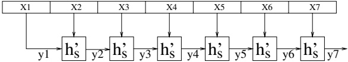
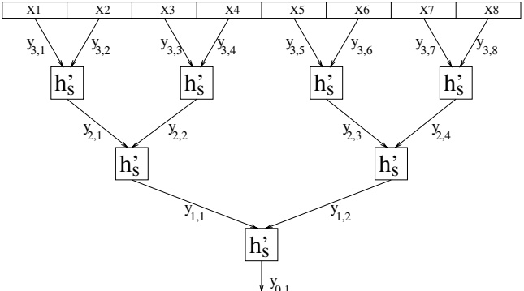
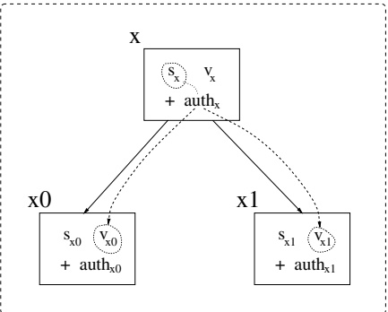
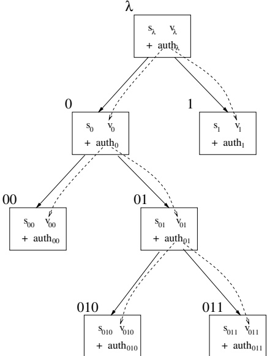

# Digital Signatures and Message Authentication

Message authentication and (digital) signatures were the first tasks that joined encryption to form modern cryptography. Both message authentication and digital signatures are concerned with the “authenticity” of data, and the difference between them is analogous to the difference between private-key and public-key encryption schemes.

In this chapter, we define message authentication and digital signatures, and the security notions associated with them. We show how to construct message-authentication schemes using pseudorandom functions, and how to construct signature schemes using one-way permutations. We stress that the latter construction employs arbitrary one-way permutations, which do not necessarily have a trapdoor.

Organization. The basic definitions are presented in Section 6.1. Constructions of message-authentication schemes and signature schemes are presented in Sections 6.3 and 6.4, respectively. Toward presenting these constructions, we discuss restricted types of message authentication and signature schemes, which are of independent interest, such as length-restricted schemes (see Section 6.2) and one-time signature schemes (see Section 6.4.1). Additional issues are discussed in Sections 6.5 and 6.6.

Teaching Tip. In contrast to the case of encryption schemes (cf. Chapter 5), the definitional treatment of signatures (and message authentication) is quite simple. The treatment of length-restricted schemes (see Section 6.2) plays an important role in the construction of standard schemes, and thus we strongly recommend highlighting this treatment. We suggest focusing on the presentation of the simplest construction of message-authentication schemes (provided in Section 6.3.1) and on the (not-so-simple) construction of signature schemes that is provided in Sections 6.4.1 and 6.4.2. As in Chapter 5, we assume that the reader is familiar with the material in Chapters 2 and 3 of Volume 1 (and specifically with Sections 2.2, 2.4, and 3.6). This familiarity is important not only because we use some of the notions and results presented in these sections but also because we use similar proof techniques (and do so while assuming that this is not the reader's first encounter with these techniques).

## 6.1. The Setting and Definitional Issues

Both signature schemes and message-authentication schemes are methods for “validating” data, that is, verifying that the data was approved by a certain party (or set of parties). The difference between signature schemes and message-authentication schemes is that “signatures” should be “universally verifiable,” whereas “authentication tags” are only required to be verifiable by parties that are also able to generate them. It is customary to discuss each of these two types of schemes separately, and we start by providing a brief overview of such a nature. We then turn to our actual treatment, which applies to both types of schemes in a unified manner.

### 6.1.1. The Two Types of Schemes: A Brief Overview

The need to discuss “digital signatures” has arisen with the introduction of computer communication to the business environment (in which parties need to commit themselves to proposals and/or declarations that they make). Discussions of “unforgeable signatures” also took place in previous centuries, but the objects of discussion were handwritten signatures (and not digital ones), and the discussion was not perceived as related to “cryptography.” Loosely speaking, a scheme for unforgeable signatures should satisfy the following:

Each user can efficiently produce his/her own signature on documents of his/her choice;

- every user can efficiently verify whether a given string is a signature of another (specific) user on a specific document; but

- it is infeasible to produce signatures of other users to documents that they did not sign.

We note that the formulation of unforgeable digital signatures also provides a clear statement of the essential ingredients of handwritten signatures. The ingredients are each person's ability to sign for him/herself, a universally agreed-upon verification procedure, and the belief (or assertion) that it is infeasible (or at least hard) to forge signatures in a manner that passes the verification procedure. It is not clear to what extent handwritten signatures do meet these requirements. In contrast, our treatment of digital-signature schemes provides precise statements concerning the extent to which digital signatures meet these requirements. Furthermore, unforgeable digital signature schemes can be constructed based on the existence of one-way functions.

Message authentication is a task related to the setting considered for encryption schemes; that is, communication over an insecure channel. This time, we consider an active adversary that is monitoring the channel and may alter the messages sent on it. The parties communicating through this insecure channel wish to authenticate the messages they send so that their counterpart can tell an original message (sent by the sender) from a modified one (i.e., modified by the adversary). Loosely speaking, a scheme for message authentication should satisfy the following:

Each of the communicating parties can efficiently produce an authentication tag to any message of his/her choice; each of the communicating parties can efficiently verify whether a given string is an authentication tag of a given message; but

- it is infeasible for an external adversary (i.e., a party other than the communicating parties) to produce authentication tags to messages not sent by the communicating parties.

Note that in contrast to the specification of signature schemes, we do not require universal verification: Only the designated receiver is required to be able to verify the authentication tags. Furthermore, we do not require that the receiver be unable to produce authentication tags by itself (i.e., we only require that external parties not be able to do so). Thus, message-authentication schemes cannot convince a third party that the sender has indeed sent the information (rather than the receiver having generated it by itself). In contrast, signatures can be used to convince third parties. In fact, a signature to a document is typically sent to a second party so that in the future, this party may (by merely presenting the signed document) convince third parties that the document was indeed generated (or sent or approved) by the signer.

### 6.1.2. Introduction to the Unified Treatment

Loosely speaking, message-authentication and signature schemes are supposed to enable reliable transmission of data between parties. That is, the basic setting consists of a sender and a receiver, where the receiver may be either predetermined or determined only after the data was sent. Loosely speaking, the receiver wishes to be guaranteed that the data received was actually sent by the sender, rather than modified (or even concocted) by somebody else (i.e., an adversary). The receiver may be a party that shares an explicit (unreliable) point-to-point communication line with the sender; this is indeed the typical setting in which message authentication is employed. However, in other cases (typically when signature schemes are employed), the receiver may be any party that obtains the data in the future and wishes to verify that it was indeed sent by the declared sender. In both cases, the reliability (or authenticity) of the data is established by an authentication process that consists of two main procedures:

1. A signing procedure that is employed by the alleged sender in order to produce signatures to data of its choice.

2. A verification procedure that is employed by the receiver in order to determine the authenticity of the data using the provided signature.

As in case of encryption schemes, the authentication process presupposes also a third procedure called key-generation that allows the sender to generate a signing-key (to be used in the signing procedure), along with a verification-key (to be used in the verification procedure). The key-generation procedure is typically invoked by the sender, and the possession of the signing-key constitutes the sender's advantage over the adversary (see analogous discussion in Chapter 5). That is, without the signing-key, it is infeasible to generate valid signatures (with respect to the corresponding verification-key). Furthermore, even after receiving signatures to messages of its choice, an adversary (lacking the signing-key) cannot generate a valid signature to any other message.

As previously stated, the ability to produce valid signatures is linked to the knowledge of the signing-key. Loosely speaking, “security” (or “unforgeability”) means the infeasibility of producing valid signatures without knowledge of the signing-key, where validity means passing verification with respect to the corresponding verification-key. The difference between message-authentication and signature schemes amounts to the question of whether “security” also holds when the verification-key is publicly known: In the case of message-authentication schemes, the verification-key is assumed to be kept secret (and so these schemes are of the “private-key” type), whereas in the case of signature schemes, the verification-key may be made public (and so these schemes are of the “public-key” type). Thus, the difference between message-authentication and signature schemes is captured by the security definition, and effects the possible applications of these schemes.

From the point of view of their functionality, the difference between message-authentication and signature schemes arises from the difference in the settings for which they are intended, which amounts to a difference in the identity of the receiver and in the level of trust that the sender has in the receiver. Typically, message-authentication schemes are employed in cases where the receiver is predetermined (at the time of message transmission) and is fully trusted by the sender, whereas signature schemes allow verification of the authenticity of the data by anybody (which is certainly not trusted by the sender). In other words, signature schemes allow for universal verification, whereas message-authentication schemes may only allow predetermined parties to verify the authenticity of the data. Thus, in signature schemes the verification-key must be known to anybody, and in particular is known to the adversary. In contrast, in message-authentication schemes, the verification-key is only given to a set of predetermined receivers that are all trusted not to abuse this knowledge; that is, in such schemes it is postulated that the verification-key is not (a priori) known to the adversary. (See Figure 6.1.)

Summary and Terminology. Message-authentication and signature schemes differ in the question of whether the verification-key is “private” (i.e., a secret unknown to the adversary) or “public” (i.e., known to everybody and in particular known to the adversary). Thus, in a sense, these are private-key and public-key versions of a task that

<table border=1 style='margin: auto; word-wrap: break-word;'><tr><td style='text-align: center; word-wrap: break-word;'>Type</td><td style='text-align: center; word-wrap: break-word;'>Verification-key known</td><td style='text-align: center; word-wrap: break-word;'>Verification possible</td></tr><tr><td style='text-align: center; word-wrap: break-word;'>Message auth. schemes</td><td style='text-align: center; word-wrap: break-word;'>to the designated (trusted) receiver(s) only</td><td style='text-align: center; word-wrap: break-word;'>for the designated (trusted) receiver(s) only</td></tr><tr><td style='text-align: center; word-wrap: break-word;'>Signature schemes</td><td style='text-align: center; word-wrap: break-word;'>to everybody (including the adversary)</td><td style='text-align: center; word-wrap: break-word;'>for anybody (including the adversary)</td></tr></table>

Figure 6.1: Message-authentication versus signature schemes.

lacks a good name (since both authentication and signatures are already taken by one of the two versions). Still, seeking a uniform terminology, we shall sometimes refer to message-authentication schemes (also known as Message Authentication Codes [MAC]) as to private-key signature schemes. Analogously, we shall sometimes refer to signature schemes as to public-key signature schemes.

### 6.1.3. Basic Mechanism

We start by defining the basic mechanism of message-authentication and signature schemes. Recall that this basic mechanism will support both the private-key and public-key versions, and the difference between the two versions will only be reflected in the definition of security. Indeed, the definition of the basic mechanism says nothing about the security of the scheme (which is the subject of the next section), and thus is the same for both the private-key and public-key versions. In both cases, the scheme consists of three efficient algorithms: key generation, signing (or authenticating), and verification. The basic requirement is that signatures that are produced by the signing algorithm be accepted as valid by the verification algorithm, when fed a verification-key corresponding to the signing-key used by the signing algorithm.

Definition 6.1.1 (signature scheme): A signature scheme is a triple, $ (G, S, V) $, of probabilistic polynomial-time algorithms satisfying the following two conditions:

1. On input $1^{n}$, algorithm $G$ (called the key-generator) outputs a pair of bit strings.

2. For every pair $(s, v)$ in the range of $G(1^n)$, and for every $\alpha \in \{0, 1\}^*$, algorithms $S$ (signing) and $V$ (verification) satisfy

 $$ \Pr[V(v,\alpha,S(s,\alpha))=1]=1 $$ 

where the probability is taken over the internal coin tosses of algorithms S and V.

The integer n serves as the security parameter of the scheme. Each $ (s, v) $ in the range of $ G(1^{n}) $ constitutes a pair of corresponding signing/verification keys.

We sometimes call $S(s,\alpha)$ a signature to the document $\alpha$ produced using the signing-key $s$. Likewise, when $V(v,\alpha,\beta)=1$, we say that $\beta$ is a valid signature to $\alpha$ with respect to the verification-key $v$. (Indeed, at this point, we may assume that algorithm $V$ is deterministic, but see subsequent comments.) This definition asserts that any signature to $\alpha$ produced using the signing-key $s$ is a valid signature to $\alpha$ with respect to the corresponding verification-key $v$. Note that there may be valid signatures (with respect to $v$) that are not produced by the signing process (using the corresponding $s$).

We stress that Definition 6.1.1 says nothing about security, and so trivial (i.e., insecure) triples of algorithms may satisfy it (e.g., $ S(s, \alpha) \overset{\text{def}}{=} 0 $ and $ V(v, \alpha, \beta) \overset{\text{def}}{=} 1 $, for all s, v, $ \alpha $ and $ \beta $). Furthermore, Definition 6.1.1 does not distinguish private-key signature schemes from public-key ones. The difference between the two types is introduced in the security definitions: In a public-key scheme, the “adversary” gets the verification-key (i.e., v) as an additional input (and thus $ v \neq s $ follows), whereas in private-key schemes, v is not given to the “adversary” (and thus one may assume, without loss of generality, that v = s).

Notation. In the rest of this work, we shall write $S_{s}(\alpha)$ instead of $S(s,\alpha)$ and $V_{v}(\alpha,\beta)$ instead of $V(v,\alpha,\beta)$. Also, we let $G_{1}(1^{n})$ (resp., $G_{2}(1^{n})$) denote the first (resp., second) element in the pair $G(1^{n})$. That is, $G(1^{n})=(G_{1}(1^{n}),G_{2}(1^{n}))$. Without loss of generality, we may assume that $|G_{1}(1^{n})|$ and $|G_{2}(1^{n})|$ are polynomially related to $n$, and that each of these integers can be efficiently computed from the other.

**Comments: A Few Relaxations.**

Definition 6.1.1 may be relaxed in several ways without significantly harming its usefulness. For example, we may relax Condition (2) and allow a negligible verification error (e.g., $ \Pr[V_v(\alpha, S_s(\alpha)) \neq 1] < 2^{-n} $). Alternatively, one may postulate that Condition (2) holds for all but a negligible measure of the key-pairs generated by $ G(1^n) $. At least one of these relaxations is essential for many suggestions of (public-key) signature schemes.

Especially in the case where we adopt the first relaxation of Condition (2), it makes sense to consider also randomized verification algorithms. However, all natural signature schemes happen to employ a deterministic verification algorithm (see Exercise 1). Still, in the case of probabilistic verification algorithms, we may define $\beta$ as a valid signature of $\alpha$ (with respect to $v$) if $\Pr[V_v(\alpha, \beta) = 1] \geq 1/2$. The threshold 1/2 used here is quite arbitrary, and the definition is essentially robust under the replacement of 1/2 by either $1/\mathrm{poly}(n)$ or $1 - 2^{-\mathrm{poly}(n)}$. $ ^{1} $ Alternatively, we may view $\beta$ as a “fractionally valid” signature of $\alpha$ with respect to $v$ (i.e., valid with probability $\Pr[V_v(\alpha, \beta) = 1]$).

Another relaxation of Definition 6.1.1 consists of restricting the domain of possible documents. However, unlike the situation with respect to encryption schemes, such a restriction is non-trivial in the current context, and is discussed at length in Section 6.2.

### 6.1.4. Attacks and Security

Loosely speaking, secure signature schemes should prevent an adversary from generating valid signatures to “unauthentic” documents (i.e., documents that were not approved by the legitimate signer). Thus, the potential adversary is “active” at least in the mild sense that it attempts to “generate” something new and different from all that it holds (rather than to “extract” information that is implicit in something that is given to it). $ ^{2} $

Furthermore, the typical applications of signature schemes are to setting in which the adversary may obtain from the legitimate signer valid signatures to some documents of the adversary's choice. For this reason, the basic definition of security of signature schemes refers to such “chosen message attacks” (to be discussed and defined next). (Indeed, the situation here is different from the case of encryption schemes, where the basic definition refers to a “passive” adversary that only wire-taps a communication line, in encrypted form, over this line.)

We shall consider a very strong definition of security (against “chosen message attacks”). That is, we consider very powerful attacks on the signature scheme, as well as a very liberal notion of breaking it. Specifically, during the course of the attack, the attacker is allowed to obtain signatures to any document of its choice. One may argue that in many applications, such a general attack is not possible (because, in these applications, documents to be signed must have a specific format). Yet our view is that it is impossible to define a general (i.e., application-independent) notion of admissible documents, and thus a general/robust definition of an attack seems to have to be formulated as suggested here. (Note that at worst, our approach is overly cautious.) Likewise, the attacker is said to be successful if it can produce a valid signature to any document for which it has not asked for a signature during its attack. Again, this defines the ability to form signatures to possibly “nonsensical” documents as a breaking of the scheme. Yet, again, we see no way to have a general (i.e., application-independent) notion of “meaningful” documents (so that only forging signatures to them will be considered a breaking of the scheme). This discussion leads to the following (slightly informal) formulation:

- A chosen message attack is a process that can obtain signatures to strings of its choice, relative to some fixed signing-key that is generated by $ G $. We distinguish two cases:

The private-key case: Here the attacker is given $ 1^n $ as input, and the signatures are produced relative to $ s $, where $ (s, v) \leftarrow G(1^n) $.

The public-key case: Here the attacker is given $ v $ as input, and the signatures are produced relative to $ s $, where $ (s, v) \leftarrow G(1^n) $.

- Such an attack is said to succeed (in existential forgery) if it outputs a valid signature to a string for which it has not requested a signature during the attack. That is, the attack is successful if it outputs a pair $(\alpha, \beta)$ such that $V_v(\alpha, \beta) = 1$ (where $v$ is as in the previous item) and $\alpha$ is different from all strings for which a signature has been required during the attack.

- A signature scheme is secure (or unforgeable) if every feasible chosen message attack succeeds with at most negligible probability.

Formally, a chosen message attack is modeled by a probabilistic polynomial-time oracle machine that is given oracle access to a “keyed signing process” (i.e., the signing algorithm combined with a signing-key). Depending on the version (i.e., public-key or not), the attacker may get the corresponding verification-key as input. We stress that this is the only difference between the two cases (i.e., private-key and public-key), which are spelled out in Definition 6.1.2. We refer the reader to the clarifying discussion that follows Definition 6.1.2; in fact, some readers may prefer to read that discussion first.

Definition 6.1.2 (unforgeable signatures): For a probabilistic oracle machine, $M$, we denote by $Q_M^O(x)$ the set of queries made by $M$ on input $x$ and access to oracle $O$. As usual, $M^O(x)$ denotes the output of the corresponding computation. We stress that $Q_M^O(x)$ and $M^O(x)$ are dependent random variables that represents two aspects of the same probabilistic computation.

The private-key case: A private-key signature scheme is secure if for every probabilistic polynomial-time oracle machine M, every positive polynomial p, and all sufficiently large n, it holds that

 $$ \Pr\left[\begin{array}{l}V_{v}(\alpha,\beta)=1\&\alpha\notin Q_{M}^{S_{s}}(1^{n})\\ \text{where}(s,v)\leftarrow G(1^{n})\text{and}(\alpha,\beta)\leftarrow M^{S_{s}}(1^{n})\end{array}\right]<\frac{1}{p(n)} $$ 

where the probability is taken over the coin tosses of algorithms G, S, and V, as well as over the coin tosses of machine M.

The public-key case: A public-key signature scheme is secure if for every probabilistic polynomial-time oracle machine M, every positive polynomial p, and all sufficiently large n, it holds that

 $$ \Pr\left[\begin{array}{l}V_{v}(\alpha,\beta)=1\&\alpha\notin Q_{M}^{S_{s}}(v)\\ \text{where}(s,v)\leftarrow G(1^{n})\text{and}(\alpha,\beta)\leftarrow M^{S_{s}}(v)\end{array}\right]<\frac{1}{p(n)} $$ 

where the probability is taken over the coin tosses of algorithms G, S, and V, as well as over the coin tosses of machine M.

The definition refers to the following experiment. First a pair of keys, $ (s, v) $, is generated by invoking $ G(1^n) $, and is fixed for the rest of the discussion. Next, an attacker is invoked on input $ 1^n $ or $ v $, depending on whether we are in the private-key or public-key case. In both cases, the attacker is given oracle access to $ S_s $, where the latter may be a probabilistic oracle rather than a standard deterministic one (e.g., if queried twice for the same value, then the probabilistic signing-oracle may answer in different ways). Finally, the attacker outputs a pair of strings $ (\alpha, \beta) $. The attacker is deemed successful if and only if the following two conditions hold:

1. The string $ \alpha $ is different from all queries (i.e., requests for signatures) made by the attacker; that is, the first string in the output pair $ (\alpha, \beta) = M^{S_s}(x) $ is different from any string in $ Q_M^{S_s}(x) $, where $ x = 1^n $ or $ x = v $, depending on whether we are in the private-key or public-key case.

We stress that both $ M^{S_s}(x) $ and $ Q_{M}^{S_s}(x) $ are random variables that are defined based on the same random execution of M (on input x and oracle access to $ S_s $).

2. The pair $(\alpha, \beta)$ corresponds to a valid document-signature pair relative to the verification key $v$. In case $V$ is deterministic (which is typically the case) this means that

 $ V_v(\alpha, \beta) = 1 $. The same applies also in case $ V $ is probabilistic, and when viewing $ V_v(\alpha, \beta) = 1 $ as a random variable. (Alternatively, in the latter case, a condition such as $ \Pr[V_v(\alpha, \beta) = 1] \geq 1/2 $ may replace the condition $ V_v(\alpha, \beta) = 1 $.)

### 6.1.5.* Variants

Clearly, any signature scheme that is secure in the public-key model is also secure in the private-key model. The converse is not true: Consider, for example, the private-key scheme presented in Construction 6.3.1 (as well as any other “natural” message-authentication scheme). Following are a few other comments regarding the definitions.

#### 6.1.5.1. Augmenting the Attack with a Verification Oracle

It is natural to augment Definition 6.1.2 by providing the adversary with unlimited access to the corresponding verification-oracle $ V_v $. We stress that (in this augmented definition) the documents that (only) appear in the verification queries are not added to the set $ Q_M^{S_s} $; that is, the output $ (\alpha, \beta) $ is considered a successful forgery even if the adversary made a verification-query of the form $ (\alpha, \cdot) $, but provided (as in Definition 6.1.2) that the adversary did not make the signing-query $ \alpha $ (and that $ V_v(\alpha, \beta) = 1 $).

Indeed, in the public-key case, the verification-oracle adds no power to the adversary, because the adversary (which is given the verification-key) can emulate the verification-oracle by itself. Furthermore, typically, also in the private-key model, the verification-oracle does not add much power. Specifically, we have:

Proposition 6.1.3 (cases in which security extends to the augmented model):

1. Any secure public-key signature scheme is secure also under attacks that utilize a verification-oracle (in addition to the signing-oracle).

2. Any secure private-key signature scheme that has unique valid signatures (as defined next) is secure also under attacks that utilize a verification-oracle (in addition to the signing-oracle).

A signature scheme $(G, S, V)$ is said to have unique valid signatures if for every verification-key $v$ and document $\alpha$, there exists a unique $\beta$ such that $V_v(\alpha, \beta) = 1$ (or, such that $\Pr[V_v(\alpha, \beta) = 1] > 1/poly(|v|)$). As discussed in Section 6.5.1 (see also Exercises 1 and 2), any secure private-key signature scheme can be transformed into one having a deterministic verification algorithm and unique valid signatures. In fact, all private-key signature schemes presented in Section 6.3 have unique valid signatures. We comment that the unique signature property is essential for the validity of Part 2; see Exercise 3.

Proof Sketch: As stated previously, Part 1 is obvious (because a standard adversary can emulate the verification-oracle by using the verification-key given to it). We prove Part 2 by showing that also in that case, a standard adversary can emulate the verification-oracle. However, in this case, the emulation is less obvious, because the standard adversary cannot test the validity of signatures by itself. Still, considering an arbitrary combined attack on such a private-key signature scheme, we emulate the verification-queries (in the standard model) as follows:

- For a verification-query $(\alpha, \beta)$, if $\alpha$ equals a previous signing-query, then we can emulate the answer by ourselves. Specifically, if the signing-query $\alpha$ was answered with $\beta$, then we answer the verification-query positively; otherwise we answer it negatively. The correctness of the emulation follows from the hypothesis that this signature scheme has unique valid signatures.

- Otherwise (i.e., for a verification-query $(\alpha, \beta)$ such that $\alpha$ does not equal any previous signing-query), we may choose to either halt and output $(\alpha, \beta)$ as a candidate forgery (gambling on $V_v(\alpha, \beta) = 1$) or continue and emulate a negative answer by ourselves (gambling on $V_v(\alpha, \beta) = 0$). Specifically, for every such verification-query, we may choose the first possibility with probability $1/t(n)$ and the second possibility otherwise, where $t(n)$ is a bound on the number of verification-queries performed by the original augmented attack (which we emulate). It can be shown that the success probability of the resulting standard adversary is at least a $1/t(n)$ fraction of the success probability of the given adversary. For details see Exercise 3.

Thus, insecurity in the augmented model implies insecurity in the original model, and the proposition follows. $\blacksquare$

#### 6.1.5.2. Inessential Generalities

The definitions presented here (specifically, Definition 6.1.1) were aimed at generality and flexibility. We comment that several levels of freedom can be eliminated without loss of generality (but with some loss of convenience). Firstly, as in the case of encryption schemes, one may modify the key-generation algorithm so that on input $ 1^{n} $ it outputs a pair of n-bit long keys. Two more fundamental restrictions, which actually do not affect the existence of secure schemes, follow.

Randomization in the Signing Process. In contrast to the situation with respect to encryption schemes (see Sections 5.2 and 5.3), randomization is not essential to the actual signing and verifying processes (but is, as usual, essential to key-generation). That is, without loss of generality (but with possible loss in efficiency), the signing algorithm may be deterministic, and in all of the schemes we present (in the current chapter), the verification algorithm is deterministic. For further discussion, see Exercise 1.

Canonical Verification in the Private-Key Version. As hinted earlier, in the private-key case, we may just identify the signing and verification keys (i.e., $ k \stackrel{\text{def}}{=} s = v $). Furthermore (following the comment about deterministic signing), without loss of generality, verification may amount to comparing the alleged signature to one produced by the verification algorithm itself (which may just produce signatures exactly as the signing algorithm). That is, for a deterministic signing process $ S_k $, we may let $ V_k(\alpha, \beta) \stackrel{\text{def}}{=} 1 $ if and only if $ \beta = S_k(\alpha) $. For details, see Exercise 2.

#### 6.1.5.3. Weaker Notions of Security and Some Popular Schemes

Weaker notions of security have been considered in the literature. The various notions refer to two parameters: (1) the type of attack, and (2) when the adversary is considered to be successful. Indeed, Definition 6.1.2 refers to the most severe type of attacks (i.e., unrestricted chosen message attacks) and to the most liberal notion of success (i.e., the ability to produce a valid signature to any new message). For further discussion, the interested reader is referred to Section 6.6.3. In particular, we note that plain RSA, as well as plain versions of Rabin's scheme and the DSS, are not secure under Definition 6.1.2. However, these schemes satisfy weaker notions of security, provided that some (standard) intractability assumptions hold. Furthermore, variants of these signature schemes (in which the function is not applied directly to the document itself) may be secure (under Definition 6.1.2).

## 6.2. Length-Restricted Signature Scheme

Restricted types of (public-key and private-key) signature schemes play an important role in our exposition. The first restriction we consider is the restriction of signature schemes to (apply only to) documents of a certain predetermined length. We call the resulting schemes length-restricted. The effect of the length-restriction is more dramatic here (in the context of signature schemes) than it is in the context of encryption schemes; this can be appreciated by comparing (the length of) Section 6.2.2 to (the length of) Section 5.3.2.2. Nevertheless, as we shall show (see Theorem 6.2.2), if the length restriction is not too low, then the full power of signature schemes can be regained; that is, length-restricted signature schemes yield full-fledged ones.

### 6.2.1. Definition

The essence of the length-restriction is that security is guaranteed only with respect to documents of the predetermined length. Note that the question of what is the result of invoking the signature algorithm on a document of improper length is immaterial. What is important is that an attacker (of a length-restricted scheme) is deemed successful only if it produces a signature to a (different) document of proper length. Still, for the sake of concreteness (and simplicity of subsequent treatment), we define the basic mechanism only for documents of proper length.

Definition 6.2.1 (signature scheme for fixed-length documents): Let $ \ell: \mathbb{N} \to \mathbb{N} $. An $ \ell $-restricted signature scheme is a triple, $ (G, S, V) $, of probabilistic polynomial-time algorithms satisfying the following two conditions:

1. As in Definition 6.1.1, on input $1^{n}$, algorithm G outputs a pair of bit strings.

2. Analogously to Definition 6.1.1, for every $ n $ and every pair $ (s, v) $ in the range of $ G(1^n) $ and for every $ \alpha \in \{0, 1\}^{\ell(n)} $, algorithms $ S $ and $ V $ satisfy $ \Pr[V_v(\alpha, S_s(\alpha))=1] = 1 $.

Such a scheme is called \textbf{secure} (in the private-key or public-key model) if the (corresponding) requirements of Definition 6.1.2 hold when restricted to attackers that only make queries of length $ \ell(n) $ and output a pair $ (\alpha, \beta) $ with $ |\alpha| = \ell(n) $.

We stress that the essential modification is presented in the security condition. The latter considers an adversary to be successful only in case it forges a signature to a (different) document $ \alpha $ of the proper length (i.e., $ |\alpha| = \ell(n) $).

### 6.2.2. The Power of Length-Restricted Signature Schemes

We comment that $\ell$-restricted private-key signature schemes for $\ell(n) = O(\log n)$ are trivial (since the signing and verification keys may contain a table look-up associating a secret with each of the $2^{\ell(n)} = \text{poly}(n)$ possible documents).$^{3}$ In contrast, this triviality does not hold for public-key signature schemes. (For details on both claims, see Exercise 5.) On the other hand, in both (private-key and public-key) cases, $\ell$-restricted signature schemes for any super-logarithmic $\ell$ (e.g., $\ell(n) = n$ or even $\ell(n) = \log_2 n$) are as powerful as ordinary signature schemes:

Theorem 6.2.2: Suppose that $\ell$ is a super-logarithmically growing function. Then, given an $\ell$-restricted signature scheme that is secure in the private-key (resp., public-key) model, one can construct a full-fledged signature scheme that is secure in the same model.

Results of this flavor can be established in two different ways, corresponding to two methods of converting an $\ell$-restricted signature scheme into a full-fledged one. Both methods are applicable both to private-key and public-key signature schemes. The first method (presented in Section 6.2.2.1) consists of parsing the original document into blocks (with adequate “linkage” between blocks), and applying the $\ell$-restricted scheme to each block. The second method (presented in Section 6.2.2.2) consists of hashing the document into an $\ell(n)$-bit long value (via an adequate hashing scheme), and applying the restricted scheme to the resulting value. Thus, the second method requires an additional assumption (i.e., the existence of “collision-free” hashing), and so Theorem 6.2.2 (as stated) is actually proved using the first method. The second method is presented because it offers other benefits; in particular, it yields signatures of fixed length (i.e., the signature-length only depends on the key-length) and uses a single invocation of the restricted scheme. The latter feature will play an important role in subsequent sections (e.g., in Sections 6.3.1.2 and 6.4.1.3).

#### 6.2.2.1. Signing (Augmented) Blocks

In this subsection we present a simple method for constructing general signature schemes out of length-restricted ones, and in doing so we establish Theorem 6.2.2.

Loosely speaking, the method consists of parsing the original document into blocks (with adequate “linkage” between blocks), and applying the length-restricted scheme to each (augmented) block.

Let $\ell$ and $(G, S, V)$ be as in Theorem 6.2.2. We construct a general signature scheme, $(G', S', V')$, with $G' = G$, by viewing documents as sequences of strings, each of length $\ell'(n) = \ell(n)/O(1)$. That is, we associate $\alpha = \alpha_1 \cdots \alpha_t$ with the sequence $(\alpha_1, ..., \alpha_t)$, where each $\alpha_i$ has length $\ell'(n)$. (At this point, the reader may think of $\ell'(n) = \ell(n)$, but actually we will use $\ell'(n) = \ell(n)/4$ in order to make room for some auxiliary information.)

To motivate the actual construction, we consider first the following simpler schemes all aimed at producing secure signatures for arbitrary (documents viewed as) sequences of $ \ell'(n) $-bit long strings. The simplest scheme consists of just signing each of the strings in the sequence. That is, the signature to the sequence $ (\alpha_1, ..., \alpha_r) $, is a sequence of $ \beta_i $’s, each being a signature (with respect to the length-restricted scheme) to the corresponding $ \alpha_i $. This will not do, because an adversary, given the (single) signature $ (\beta_1, \beta_2) $ to the sequence $ (\alpha_1, \alpha_2) $ with $ \alpha_1 \neq \alpha_2 $, can present $ (\beta_2, \beta_1) $ as a valid signature to $ (\alpha_2, \alpha_1) \neq (\alpha_1, \alpha_2) $. So how about foiling this forgery by preventing a reordering of the “atomic” signatures (i.e., the $ \beta_i $’s); that is, how about signing the sequence $ (\alpha_1, ..., \alpha_r) $ by applying the restricted scheme to each pair $ (i, \alpha_i) $, rather than to $ \alpha_i $ itself? This will not do either, because an adversary, given a signature to the sequence $ (\alpha_1, \alpha_2, \alpha_3) $, can easily present a signature to the sequence $ (\alpha_1, \alpha_2) $. So we also need to include in each $ \ell(n) $-bit string the total number of $ \alpha_i $’s in the sequence. But even this is not enough, because given signatures to the sequences $ (\alpha_1, \alpha_2) $ and $ (\alpha'_1, \alpha'_2) $, with $ \alpha_1 \neq \alpha'_1 $ and $ \alpha_2 \neq \alpha'_2 $, an adversary can easily generate a signature to $ (\alpha_1, \alpha'_2) $. Thus, we have to prevent the forming of new sequences of “basic signatures” by combining elements from different signature sequences. This can be done by associating (say, at random) an identifier with each sequence and incorporating this identifier in each $ \ell(n) $-bit string to which the basic (restricted) signature scheme is applied. This discussion yields the signature scheme presented next, where a signature to a message $ (\alpha_1, ..., \alpha_r) $ consists of a sequence of (basic) signatures to statements of the (effective) form “the string $ \alpha_i $ is the $i$-th block, out of $t$ blocks, in a message associated with identifier r.”

Construction 6.2.3 (signing augmented blocks): Let $\ell$ and $(G, S, V)$ be as in Theorem 6.2.2. We construct a general signature scheme, $(G', S', V')$, with $G' = G$, by considering documents as sequences of strings. We construct $S'$ and $V'$ as follows, using $G' = G$ and $\ell'(n) = \ell(n)/4$:

Signing with $ S' $: On input a signing-key $ s $ (in the range of $ G_1(1^n) $) and a document $ \alpha \in \{0, 1\}^* $, algorithm $ S' $ first parses $ \alpha $ into a sequence of blocks $ (\alpha_1, ..., \alpha_t) $, such that $ \alpha $ is uniquely reconstructed from the $ \alpha_i $’s and each $ \alpha_i $ is an $ \ell'(n) $-bit long string. $ ^4 $

Next, $ S' $ uniformly selects $ r \in \{0, 1\}^{\ell'(n)} $. For $ i = 1, ..., t $, algorithm $ S' $ computes

 $$ \beta_{i}\leftarrow S_{s}(r,t,i,\alpha_{i}) $$ 

where $i$ and $t$ are represented as $\ell'(n)$-bit long strings. That is, $\beta_i$ is essentially a signature to the statement “$\alpha_i$ is the $i$-th block, out of $t$ blocks, in a sequence associated with identifier $r$.” Finally, $S'$ outputs as signature the sequence

 $$ (r,t,\beta_{1},....,\beta_{t}) $$ 

Verification with $ V' $: On input a verifying-key $ v $ (in the range of $ G_2(1^n) $), a document $ \alpha \in \{0,1\}^* $, and a sequence $ (r,t,\beta_1,..., \beta_t) $, algorithm $ V' $ first parses $ \alpha $ into $ \alpha_1,..., \alpha_{t'} $, using the same parsing rule as used by $ S' $. Algorithm $ V' $ accepts if and only if the following two conditions hold:

1. $ t' = t $, where $ t' $ is obtained in the parsing of $ \alpha $ and $ t $ is part of the alleged signature.

2. For $ i = 1, ..., t $, it holds that $ V_v((r, t, i, \alpha_i), \beta_i) = 1 $, where $ \alpha_i $ is obtained in the parsing of $ \alpha $ and the rest are as in the corresponding parts of the alleged signature.

Clearly, the triplet $ (G', S', V') $ satisfies Definition 6.1.1. We need to show that is also inherits the security of $ (G, S, V) $. That is:

Proposition 6.2.4: Suppose that $(G, S, V)$ is an $\ell$-restricted signature scheme that is secure in the private-key (resp., public-key) model. Then $(G', S', V')$, as defined in Construction 6.2.3, is a full-fledged signature scheme that is secure in the private-key (resp., public-key) model.

Theorem 6.2.2 follows immediately from Proposition 6.2.4.

Proof: Intuitively, ignoring the unlikely case that two messages signed by $S_{s}^{\prime}$ were assigned the same random identifier, a forged signature with respect to $(G^{\prime}, S^{\prime}, V^{\prime})$ must contain some $S_{s}$-signature that was not contained in any of the $S_{s}^{\prime}$-signatures (provided in the attack). Thus, forgery with respect to $(G^{\prime}, S^{\prime}, V^{\prime})$ yields forgery with respect to $(G, S, V)$. Indeed, the proof is by a reducibility argument, and it holds for both the private-key and the public-key models.

Given an adversary $ A' $ attacking the complex scheme $ (G', S', V') $, we construct an adversary $ A $ that attacks the $ \ell $-restricted scheme, $ (G, S, V) $. In particular, $ A $ invokes $ A' $ with input identical to its own input (which is the security parameter or the verification-key, depending on the model), and uses its own oracle in order to emulate the oracle $ S_s' $ for $ A' $. This can be done in a straightforward manner; that is, algorithm $ A $ will act as $ S_s' $ does by using the oracle $ S_s $. Specifically, $ A $ parses each query $ \alpha' $ of $ A' $ into a corresponding sequence $ (\alpha'_1, ..., \alpha'_r) $, uniformly selects an identifier $ r' $, and obtains $ S_s $-signatures to $ (r', t', j, \alpha'_j) $, for $ j = 1, ..., t' $. When $ A' $ outputs a document-signature pair relative to the complex scheme $ (G', S', V') $, algorithm $ A $ tries to use this pair in order to form a document-signature pair relative to the $ \ell $-restricted scheme, $ (G, S, V) $.

We stress that from the point of view of adversary $ A' $, the distribution of keys and oracle answers that A provides it with is exactly as in a real attack on $ (G', S', V') $.

This is a crucial point, because we use the fact that events that occur in a real attack of $ A' $ on $ (G', S', V') $ occur with the same probability in the emulation of $ (G', S', V') $ by A.

Assume that with (non-negligible) probability $ \varepsilon'(n) $, the (probabilistic polynomial-time) algorithm $ A' $ succeeds in existentially forging relative to the complex scheme $ (G', S', V') $. We consider the following cases regarding the forging event:

1. The identifier supplied in the forged signature is different from all the random identifiers supplied (by $A$) as part of the signatures given to $A'$. In this case, each $\ell$-restricted signature supplied as part of the forged (complex) signature yields existential forgery relative to the $\ell$-restricted scheme.

Formally, let $ \alpha^{(1)}, \ldots, \alpha^{(m)} $ be the sequence of queries made by $ A' $, and let $ (r^{(1)}, t^{(1)}, \overline{\beta}^{(1)}), \ldots, (r^{(m)}, t^{(m)}, \overline{\beta}^{(m)}) $ be the corresponding (complex) signatures supplied to $ A' $ by $ A $ (using $ S_s $ to form the $ \overline{\beta}^{(i)} $ s). It follows that each $ \overline{\beta}^{(i)} $ consists of a sequence of $ S_s $-signatures to $ \ell(n) $-bit strings starting with $ r^{(i)} \in \{0, 1\}^{\ell(n)/4} $, and that the oracle $ S_s $ was invoked (by $ A $) only on strings of this form. Let $ (\alpha, (r, t, \beta_1, \ldots, \beta_t)) $ be the output of $ A' $, where $ \alpha $ is parsed as $ (\alpha_1, \ldots, \alpha_t) $, and suppose that applying $ V_v' $ to the output of $ A' $ yields 1 (i.e., the output is a valid document-signature pair for the complex scheme). The case hypothesis states that $ r \neq r^{(i)} $, for all $ i $'s. It follows that each of the $ \beta_j $'s is an $ S_s $-signature to a string starting with $ r \in \{0, 1\}^{\ell(n)/4} $, and thus different from all queries made to the oracle $ S_s $. Thus, each pair $ (r, t, i, \alpha_i, \beta_i) $ is a valid document-signature pair (because $ V_v'(\alpha, (r, t, \beta_1, \ldots, \beta_t)) = 1 $ implies $ V_v((r, t, i, \alpha_i), \beta_i) = 1 $), with a document different from all queries made to $ S_s $. This yields a successful forgery with respect to the $ \ell $-restricted scheme.

2. The identifier supplied in the forged signature equals the random identifier supplied (by $A$) as part of exactly one of the signatures given to $A'$. In this case, existential forgery relative to the $\ell$-restricted scheme is obtained by considering the relation between the output of $A'$ and the single supplied signature having the same identifier.

As in the previous case, let $ \alpha^{(1)}, ..., \alpha^{(m)} $ be the sequence of queries made by $ A' $, and let $ (r^{(1)}, t^{(1)}, \overline{\beta}^{(1)}), ..., (r^{(m)}, t^{(m)}, \overline{\beta}^{(m)}) $ be the corresponding (complex) signatures supplied to $ A' $ by A. Let $ (\alpha, (r, t, \beta_1, ..., \beta_t)) $ be the output of $ A' $, where $ \alpha $ is parsed as $ (\alpha_1, ..., \alpha_t) $, and suppose that $ \alpha \neq \alpha^{(i)} $ for all $ i $'s and that $ V'_v(\alpha, (r, t, \beta_1, ..., \beta_t)) = 1 $. The hypothesis of the current case is that there exists a unique $ i $ so that $ r = r^{(i)} $. We consider two subcases regarding the relation between $ t $ and $ t^{(i)} $:

 $ t \neq t^{(i)} $. In this subcase, each $ \ell $-restricted signature supplied as part of the forged (complex) signature yields existential forgery relative to the $ \ell $-restricted scheme. The argument is analogous to the one employed in the previous case. Specifically, here each of the $ \beta_j $'s is an $ S_s $-signature to a string starting with $ (r, t) $, and thus different from all queries made to the oracle $ S_s $ (because these queries either start with $ r^{(i)} $ $ \neq r $ or start with $ (r^{(i)}, t^{(i)}) $ $ \neq (r, t) $). Thus, each pair $ ((r, t, j, \alpha_j), \beta_j) $ is a valid document-signature pair with a document different from all queries made to $ S_s $.

 $ t = t^{(i)} $. In this subcase, we use the hypothesis $ \alpha \neq \alpha^{(i)} $, which (combined with $ t = t^{(i)} $) implies that there exists a $ j $ such that $ \alpha_j \neq \alpha_j^{(i)} $, where $ \alpha_j^{(i)} $ is the $ j^{th} $

block in the parsing of $ \alpha^{(i)} $. For this $ j $, the string $ \beta_j $ (supplied as part of the forged complex-signature) yields existential forgery relative to the $ \ell $-restricted scheme. Specifically, we have $ V_v((r,t,j,\alpha_j),\beta_j)=1 $, whereas $ (r,t,j,\alpha_j) $ is different from each query $ (r^{(i)},t^{(i)},j',\alpha_{j'}^{(i)}) $ made by $ A $ to $ S_s $.

Justification for $(r,t,j,\alpha_j)\neq(r^{(i')},t^{(i')},j',\alpha_{j'}^{(i')})$: In case $i' \neq i$, it must hold that $r^{(i')}\neq r$ (by the [Case 2] hypothesis regarding the uniqueness of $i$ s.t. $r^{(i)}=r$). Otherwise (i.e., in case $i'=i$), either $j' \neq j$ or $\alpha_{j'}^{(i)}=\alpha_j^{(i)}\neq\alpha_j$, where the inequality is due to the hypothesis regarding $j$.

Thus, $ ((r, t, j, \alpha_j), \beta_j) $ is a valid document-signature pair with a document different from all queries made to $ S_s $.

3. The identifier supplied in the forged signature equals the random identifiers supplied (by $A$) as part of at least two signatures given to $A'$. In particular, it follows that two signatures given to $A$ use the same random identifier. The probability that this event occurs is at most

 $$ \binom{m}{2}\cdot2^{-\ell^{\prime}(n)}<m^{2}\cdot2^{-\ell(n)/4} $$ 

However, $m = \text{poly}(n)$ (since $A'$ runs in polynomial-time), and $2^{-\ell(n)/4}$ is negligible (since $\ell$ is super-logarithmic). So this case occurs with negligible probability and may be ignored.

Note that $A$ can easily determine which of the cases occurs and act accordingly.$^5$ Thus, assuming that $A'$ forges relative to the complex scheme with non-negligible probability $\varepsilon'(n)$, it follows that $A$ forges relative to the length-restricted scheme with nonnegligible probability $\varepsilon(n) \geq \varepsilon'(n) - \text{poly}(n) \cdot 2^{-\ell(n)/4}$, in contradiction to the proposition's hypothesis. $\blacksquare$

Comment. We call the reader's attention to the essential role of the hypothesis that $\ell$ is super-logarithmic in the proof of Proposition 6.2.4. Indeed, Construction 6.2.3 is insecure in case $\ell(n) = O(\log n)$. The reason is that by asking for polynomially many signatures, the adversary may obtain two $S_s^{\prime}$-signatures that use the same (random) identifier. Furthermore, with some care, these signatures yield existential forgery (see Exercise 6).

#### 6.2.2.2. Signing a Hash Value

In this subsection, we present an alternative method for constructing general signature schemes out of length-restricted ones. Loosely speaking, the method consists of hashing the document into a short (fixed-length) string (via an adequate hashing scheme), and applying the length-restricted signature scheme to the resulting hash-value. This two-stage process is referred to as the hash and sign paradigm.

Let $\ell$ and $(G, S, V)$ be as in Theorem 6.2.2. The second method of constructing a general signature scheme out of $(G, S, V)$ consists of first hashing the document into an $\ell(n)$-bit long value and then applying the $\ell$-restricted scheme to the hashed value. Thus, in addition to an $\ell$-restricted scheme, this method employs an adequate hashing scheme. In particular, one way of implementing this method is based on “collision-free hashing” (defined next). An alternative implementation, based on “universal one-way hashing,” is deferred to Section 6.4.3.

Collision-Free Hashing Functions. Loosely speaking, a collision-free hashing scheme (aka a collision-resistant hashing scheme) consists of a collection of functions $ \{h_s : \{0, 1\}^* \to \{0, 1\}^{|s|}\}_{s \in \{0, 1\}^*} $ such that given $ s $ and $ x $ it is easy to compute $ h_s(x) $, but given a random $ s $ it is hard to find $ x \neq x' $ such that $ h_s(x) = h_s(x') $.

Definition 6.2.5 (collision-free hashing functions): Let $ \ell : \mathbb{N} \to \mathbb{N} $. A collection of functions $ \{h_s : \{0, 1\}^* \to \{0, 1\}^{\ell(|s|)}\}_{s \in \{0, 1\}^*} $ is called collision-free hashing if there exists a probabilistic polynomial-time algorithm $ I $ such that the following holds:

1. (admissible indexing – technical): $ ^6 $ For some polynomial $ p $, all sufficiently large $ n $’s, and every $ s $ in the range of $ I(1^n) $, it holds that $ n \leq p(|s|) $. Furthermore, $ n $ can be computed in polynomial-time from $ s $.

2. (efficient evaluation): There exists a polynomial-time algorithm that, given s and x, returns $ h_{s}(x) $.

3. (hard-to-form collisions): We say that the pair $(x, x')$ forms a collision under the function $h$ if $h(x) = h(x')$ but $x \neq x'$. We require that every probabilistic polynomial-time algorithm, given $I(1^n)$ as input, outputs a collision under $h_{I(1^n)}$ with negligible probability. That is, for every probabilistic polynomial-time algorithm $A$, every positive polynomial $p$, and all sufficiently large $n$'s,

 $$ \Pr\left[A(I(1^{n}))\text{ is a collision under }h_{I(1^{n})}\right]<\frac{1}{p(n)} $$

where the probability is taken over the internal coin tosses of algorithms I and A.

The function $\ell$ is called the range specifier of the collection.

Note that the range specifier must be super-logarithmic (or else one may easily find a collision by selecting $ 2^{\ell(n)} + 1 $ different pre-images and computing their image under the function). In Section 6.2.3, we show how to construct collision-free hashing functions using claw-free collections. But first, we show how to use the former in order to convert a length-restricted signature scheme into a full-fledged one.

Construction 6.2.6 (hash and sign): Let $\ell$ and $(G, S, V)$ be as in Theorem 6.2.2, and let $\{h_r : \{0, 1\}^* \to \{0, 1\}^{\ell(|r|)}\}_{r \in \{0, 1\}^*}$ be as in Definition 6.2.5. We construct a general signature scheme, $(G', S', V')$, as follows:

Key-generation with $ G' $: On input $ 1^n $, algorithm $ G' $ first invokes G to obtain $ (s, v) \leftarrow G(1^n) $. Next, it invokes I, the indexing algorithm of the collision-free hashing collection, to obtain $ r \leftarrow I(1^n) $. Finally, $ G' $ outputs the pair $ ((r, s), (r, v)) $, where $ (r, s) $ serves as a signing-key and $ (r, v) $ serves as a verification-key.

Signing with $ S' $: On input a signing-key $ (r, s) $ (in the range of $ G'_1(1^n) $) and a document $ \alpha \in \{0, 1\}^* $, algorithm $ S' $ invokes S once to produce and output $ S_s(h_r(\alpha)) $.

Verification with $V':$ On input a verifying-key $(r, v)$ (in the range of $G_2'(1^n)$), a document $\alpha \in \{0,1\}^*$, and an alleged signature $\beta$, algorithm $V'$ invokes $V$ and outputs $V_v(h_r(\alpha), \beta)$.

Note that the resulting signature scheme applies the original one once (per each invocation of the resulting scheme). We stress that the length of resulting signatures only depend on the length of the signing-key and is independent of the document being signed; that is, $ |S_{r,s}'(\alpha)| = |S_s(h_r(\alpha))| $, which in turn is bounded by $ \text{poly}(|s|, \ell(|r|)) $.

Proposition 6.2.7: Suppose that $ (G, S, V) $ is an $ \ell $-restricted signature scheme that is secure in the private-key (resp., public-key) model. Suppose that $ \{h_r : \{0, 1\}^* \to \{0, 1\}^{\ell(|r|)}\}_{r \in \{0, 1\}^*} $ is indeed a collision-free hashing collection. Then $ (G', S', V') $, as defined in Construction 6.2.6, is a full-fledged signature scheme that is secure in the private-key (resp., public-key) model.

Proof: Intuitively, the security of $(G', S', V')$ follows from the security of $(G, S, V)$ and the collision-freeness property of the collection $\{h_r\}$. Specifically, forgery relative to $(G', S', V')$ can be obtained either by a forged $S$-signature to a hash-value different from all hash-values that appeared in the attack or by forming a collision under the hash function. The actual proof is by a reducibility argument. Given an adversary $A'$ attacking the complex scheme $(G', S', V')$, we construct an adversary $A$ that attacks the $\ell$-restricted scheme, $(G, S, V)$, as well as an algorithm $B$ forming collisions under the hashing collection $\{h_r\}$. Both $A$ and $B$ will have running time related to that of $A'$. We show if $A'$ is successful with non-negligible probability, then the same holds for either $A$ or $B$. Thus, in either case, we reach a contradiction. We start with the description of algorithm $A$, which is designed to attack the $\ell$-restricted scheme $(G, S, V)$. We stress that almost the same description applies in both the private-key and public-key case.

On input $x$, which equals the security parameter $1^n$ in the private-key case and a verification-key $v$ otherwise (i.e., in the public-key case), the adversary $A$ operates as follows. First, $A$ uses $I$ (the indexing algorithm of the collision-free hashing collection) to obtain $r \leftarrow I(1^n)$, exactly as done in the second step of $G'$. Next, $A$ invokes $A'$ (on input $1^n$ or $(r, v)$, depending on the case) and uses $r$ as well as its own oracle $S_s$ in order to emulate the oracle $S_{r,s}'$ for $A'$. The emulation is done in a straightforward manner; that is, algorithm $A$ will act as $S_{r,s}'$ does by using the oracle $S_s$ (i.e., to answer query $q$, algorithm $A$ makes the query $h_r(q)$). When $A'$ outputs a document-signature pair relative to the complex scheme $(G', S', V')$, algorithm $A$ tries to use this pair in order to form a document-signature pair relative to the $\ell$-restricted scheme, $(G, S, V)$. That is, if $A'$ outputs the document-signature pair $(\alpha, \beta)$, then $A$ will output the document-signature pair $(h_r(\alpha), \beta)$.

As in the proof of Proposition 6.2.4, we stress that the distribution of keys and oracle answers that $A$ provides $A'$ is exactly as in a real attack of $A'$ on $(G', S', V')$. This is a crucial point, because we use the fact that events that occur in a real attack of $A'$ on $(G', S', V')$ occur with the same probability in the emulation of $(G', S', V')$ by $A$.

Assume that with (non-negligible) probability $ \varepsilon'(n) $, the (probabilistic polynomial-time) algorithm $ A' $ succeeds in existentially forging relative to the complex scheme $ (G', S', V') $. We consider the following two cases regarding the forging event, letting $ (\alpha^{(i)}, \beta^{(i)}) $ denote the i-th query and answer pair made by $ A' $, and $ (\alpha, \beta) $ denote the forged document-signature pair that $ A' $ outputs (in case of success):

Case 1: $ h_r(\alpha) \neq h_r(\alpha^{(i)}) $ for all $ i $’s. (That is, the hash-value used in the forged signature is different from all hash-values used in the queries to $ S_s $.) In this case, the pair $ (h_r(\alpha), \beta) $ constitutes a success in existential forgery relative to the $ \ell $-restricted scheme.

Case 2: $ h_r(\alpha) = h_r(\alpha^{(i)}) $ for some $ i $. (That is, the hash-value used in the forged signature equals the hash-value used in the $ i $-th query to $ S_s $, although $ \alpha \neq \alpha^{(i)} $.) In this case, the pair $ (\alpha, \alpha^{(i)}) $ forms a collision under $ h_r $ (and we do not obtain success in existential forgery relative to the $ \ell $-restricted scheme).

Thus, if Case 1 occurs with probability at least $ \varepsilon'(n)/2 $, then $ A $ succeeds in its attack on $ (G, S, V) $ with probability at least $ \varepsilon'(n)/2 $, which contradicts the security of the $ \ell $-restricted scheme $ (G, S, V) $. On the other hand, if Case 2 occurs with probability at least $ \varepsilon'(n)/2 $, then we derive a contradiction to the collision-freeness of the hashing collection $ \{h_r : \{0, 1\}^* \to \{0, 1\}^{\ell(|r|)}\}_{r \in \{0, 1\}^*} $. Details (regarding the second case) follow.

We construct an algorithm, denoted $B$, that given $r \leftarrow I(1^n)$, attempts to form collisions under $h_r$ as follows. On input $r$, algorithm $B$ generates $(s, v) \leftarrow G(1^n)$ and emulates the attack of $A$ on this instance of the $\ell$-restricted scheme, with the exception that $B$ does not invoke algorithm $I$ to obtain an index of a hash function but rather uses the index $r$ (given to it as input). Recall that $A$, in turn, emulates an attack of $A'$ on the signing-oracle $S_{r,s}^{\prime}$, and that $A$ answers the query $q^{\prime}$ made by $A^{\prime}$ by forwarding the query $q = h_r(q^{\prime})$ to $S_s$. Thus, $B$ actually emulates the attack of $A^{\prime}$ (on the signing-oracle $S_{r,s}^{\prime}$) and does so in a straightforward manner; that is, to answer query $q^{\prime}$ made by $A^{\prime}$, algorithm $B$ first obtains $q = h_r(q^{\prime})$ (using its knowledge of $r$) and then answers with $S_s(q)$ (using its knowledge of $s$). Finally, when $A^{\prime}$ outputs a forged document-signature pair, algorithm $B$ checks whether Case 2 occurs (i.e., whether $h_r(\alpha) = h_r(\alpha^{(i)})$ holds for some $i$), in which case it obtains (and outputs) a collision under $h_r$. (Note that in the public-key case, $B$ invokes $A^{\prime}$ on input $(r, v)$, whereas in the private-key case, $B$ invokes $A^{\prime}$ on input $1^n$. Thus, in the private-key case, $B$ actually does not use $r$ but rather only uses an oracle access to $h_r$.)

We stress that from the point of view of the emulated adversary A, the execution is distributed exactly as in its attack on $ (G, S, V) $. Thus, since we assumed that the second case occurs with probability at least $ \varepsilon'(n)/2 $ in a real attack, it follows that $ B $ succeeds in forming a collision under $ h_{I(1^n)} $ with probability at least $ \varepsilon'(n)/2 $. This contradicts the collision-freeness of the hashing functions, and the proposition follows.

Comment. For the private-key case, the proof of Proposition 6.2.7 actually established a stronger claim than stated. Specifically, the proof holds even for a weaker definition of collision-free hashing in which the adversary is not given a description of the hashing function, but can rather obtain its value at any pre-image of its choice. This observation is further pursued in Section 6.3.1.3.

On Using the Hash-and-Sign Paradigm in Practice. The hash-and-sign paradigm, underlying Construction 6.2.6, is often used in practice. Specifically, a document is signed using a two-stage process: First, the document is hashed into a (relatively) short bit string, and next, a basic signature scheme is applied to the resulting string. One appealing feature of this process is that the length of resulting signatures only depends on the length of the signing-key (and is independent of the document being signed). We stress that this process yields a secure signature scheme only if the hashing scheme is collision-free (as defined previously). In Section 6.2.3, we present several constructions of collision-free hashing functions (based on general assumptions). Alternatively, one may indeed postulate that certain off-the-shelf products (such as MD5 or SHA) are collision-free, but such assumptions need to be seriously examined (and indeed may turn out false). $ ^{7} $ We stress that using a hashing scheme, in the two-stage (hash-and-sign) process, without seriously evaluating whether or not it is collision-free is a very dangerous practice.

We comment that a variant on the hash-and-sign paradigm will be presented in Construction 6.4.30. The two variants are compared in Section 6.4.3.4.

### 6.2.3.* Constructing Collision-Free Hashing Functions

In view of the relevance of collision-free hashing to signature schemes, we now take a small detour from the main topic and consider the construction of collision-free hashing. Most importantly, we show how to construct collision-free hashing functions using a claw-free collection of permutations. In addition, we show two different construction types that use a restricted type of collision-free hashing in order to obtain full-fledged collision-free hashing.

#### 6.2.3.1. A Construction Based on Claw-Free Permutations

In this subsection, we show how to construct collision-free hashing functions using a claw-free collection of permutations as defined in Section 2.4.5 of Volume 1. Recall that such a collection consists of pairs of permutations, $ (f_s^0, f_s^1) $, such that both $ f_s^\sigma $’s are permutations over a set $ D_{s} $, augmented with a probabilistic polynomial-time index selection algorithm I such that the following conditions hold:

1. The domain is easy to sample: There exists a probabilistic polynomial-time algorithm that, given s, outputs a string uniformly distributed over $ D_{s} $.

2. The permutations are easy to evaluate: There exists a polynomial-time algorithm that, given $ s $, $ \sigma $ and $ x \in D_s $, outputs $ f_s^\sigma(x) $.

3. It is hard to form claws: Every probabilistic polynomial-time algorithm, given $ s \leftarrow I(1^n) $, outputs a pair $ (x, y) $ such that $ f_s^0(x) = f_s^1(y) $ with at most negligible probability. That is, a pair $ (x, y) $ satisfying $ f_s^0(x) = f_s^1(y) $ is called a claw for index $ s $. (We stress that $ x = y $ may hold.) Then, it is required that for every probabilistic polynomial-time algorithm, $ A' $, every positive polynomial $ p(\cdot) $, and all sufficiently large $ n $’s

 $$ \Pr\left[A^{\prime}(I(1^{n}))\in C_{I(1^{n})}\right]<\frac{1}{p(n)} $$ 

where $ C_{s} $ denote the set of claws for index s.

Note that since $ f_s^0 $ and $ f_s^1 $ are permutations over the same set, many claws do exist (i.e., $ |C_s| = |D_s| $). However, the third condition postulates that for $ s $ generated by $ I(1^n) $, such claws are hard to find. We may assume, without loss of generality, that for some $ \ell : \mathbb{N} \to \mathbb{N} $ and all $ s $'s, it holds that $ D_s \subseteq \{0, 1\}^{\ell(|s|)} $. Indeed, $ \ell $ must be polynomially bounded. For simplicity, we assume that $ I(1^n) \in \{0, 1\}^n $. Recall that such collections of permutation pairs can be constructed based on the standard DLP or factoring intractability assumptions (see Section 2.4.5).

Construction 6.2.8 (collision-free hashing based on claw-free permutations pairs): Given an index selecting algorithm $ I $ for a collection of permutation pairs $ \{(f_s^0, f_s^1)\}_s $ as in the foregoing discussion, we construct a collection of hashing functions $ \{h_{(s,r)} : \{0, 1\}^* \to \{0, 1\}^{|r|}\}_{(s,r) \in \{0,1\} \times \{0,1\}^*} $ as follows:

Index selection algorithm: On input $ 1^n $, we first invoke $ I $ to obtain $ s \leftarrow I(1^n) $, and next use the domain sampler to obtain a string $ r $ that is uniformly distributed in $ D_s $. We output the index $ (s, r) \in \{0, 1\}^n \times \{0, 1\}^{\ell(n)} $, which corresponds to the hashing function

 $$ h_{(s,r)}(x)\stackrel{\mathrm{def}}{=}f_{s}^{y_{1}}f_{s}^{y_{2}}\cdot\cdot\cdot f_{s}^{y_{t}}(r) $$ 

where $ y_1 \cdots y_t $ is a prefix-free encoding of $ x $; that is, for any $ x \neq x' $ the coding of $ x $ is not a prefix of the coding of $ x' $. For example, we may code $ x_1x_2 \cdots x_m $ by $ x_1x_1x_2x_2 \cdots x_mx_m $01.

Evaluation algorithm: Given an index $(s,r)$ and a string $x$, we compute $h_{(s,r)}(x)$ in a straightforward manner. That is, first we compute the prefix-free encoding of $x$, denoted $y_1\cdots y_t$. Next, we use the evaluation algorithm of the claw-free collection to compute $f_s^{y_1}f_s^{y_2}\cdots f_s^{y_t}(r)$, which is the desired output.

Actually, as will become evident from the proof of Proposition 6.2.9, as far as Construction 6.2.8 is concerned, the definition of claw-free permutations can be relaxed: We do not need an algorithm that, given an index $s$, generates a uniformly distributed element in $D_{s}$; any efficient algorithm that generates elements in $D_{s}$ will do (regardless of the distribution induced on $D_{s}$, and in particular, even if the algorithm always outputs the same element in $D_{s}$).

Proposition 6.2.9: Suppose that the collection of permutation pairs $ \{(f_s^0, f_s^1)\}_s $, together with the index-selecting algorithm $ I $, constitutes a claw-free collection. Then, the function ensemble $ \{h_{(s,r)} : \{0, 1\}^* \to \{0, 1\}^{|r|}\}_{(s,r) \in \{0, 1\}^* \times \{0, 1\}^*} $ as defined in Construction 6.2.8 constitutes a collision-free hashing with a range specifying function $ \ell' $ satisfying $ \ell'(n + \ell(n)) = \ell(n) $.

Proof: Intuitively, forming collisions under $ h_{(s,r)} $ means finding two different sequences of functions from $ \{f_s^0, f_s^1\} $ that (when applied to $ r $) yield the same image (e.g., $ f_s^1 \circ f_s^0 \circ f_s^0(r) = f_s^1 \circ f_s^1(r) \circ f_s^1(r) $). Since these two sequences cannot be a prefix of one another, it must be that somewhere along the process (of applying these $ f_s^{\sigma's} $), the application of two different functions yields the same image (i.e., a claw).

The proof is by a reducibility argument. Given an algorithm $ A' $ that on input $ (s, r) $ forms a collision under $ h_{(s,r)} $, we construct an algorithm $ A $ that on input $ s $ forms a claw for index $ s $. On input $ s $ (supposedly generated by $ I(1^n) $), algorithm $ A $ selects $ r $ (uniformly) in $ D_s $, and invokes algorithm $ A' $ on input $ (s, r) $. Suppose that $ A' $ outputs a pair $ (x, x') $ so that $ h_{(s,r)}(x) = h_{(s,r)}(x') $ but $ x \neq x' $. Without loss of generality, $ ^8 $ assume that the coding of $ x $ equals $ y_1 \cdots y_{i-1}0z_{i+1} \cdots z_t $, and that the coding of $ x' $ equals $ y_1 \cdots y_{i-1}1z_{i+1}' \cdots z_{t}' $. By the definition of $ h_{(s,r)} $, it follows that

 $$ f_{s}^{y_{1}}\cdots f_{s}^{y_{i-1}}f_{s}^{0}f_{s}^{z_{i+1}}\cdots f_{s}^{z_{t}}(r)=f_{s}^{y_{1}}\cdots f_{s}^{y_{i-1}}f_{s}^{1}f_{s}^{z_{i+1}^{\prime}}\cdots f_{s}^{z_{t}^{\prime}}(r) $$ 

Since each of the $f_{s}^{\sigma}$'s is 1-1, Eq. (6.1) implies that

 $$ f_{s}^{0}f_{s}^{z_{i+1}}\cdots f_{s}^{z_{t}}(r)=f_{s}^{1}f_{s}^{z_{i+1}^{\prime}}\cdots f_{s}^{z_{t}^{\prime}}(r) $$

Computing $ w \stackrel{\text{def}}{=} f_s^{z_{i+1}} \cdots f_s^{z_t}(r) $ and $ w' \stackrel{\text{def}}{=} f_s^{z_{i+1}'} \cdots f_s^{z_{t}'}(r) $, algorithm $ A $ obtains a pair $ (w, w') $ such that $ f_s^0(w) = f_s^1(w') $. Thus, algorithm $ A $ forms claws for index $ I(1^n) $ with probability that is lower-bounded by the probability that $ A' $ forms a collision under $ h_{I'(1^n)} $, where $ I' $ is the index-selection algorithm as defined in Construction 6.2.8. Using the hypothesis that the collection of pairs (together with $ I $) is claw-free, the proposition follows. $ \blacksquare $

#### 6.2.3.2. Collision-Free Hashing via Block-Chaining

In this subsection, we show how a restricted type of Collision-Free Hashing (CFH) can be used to obtain full-fledged collision-free hashing (CFH). Specifically, we refer to the following restriction of Definition 6.2.5:

Definition 6.2.10 (length-restricted collision-free hashing functions): Let $ \ell', \ell : \mathbb{N} \to \mathbb{N} $. A collection of functions $ \{h_s : \{0, 1\}^{\ell'(|s|)} \to \{0, 1\}^{\ell(|s|)}\}_{s \in \{0, 1\}^*} $ is called $ \ell' $-restricted collision-free hashing if there exists a probabilistic polynomial-time algorithm $ I $ such that the following holds:

1. (admissible indexing – technical): As in Definition 6.2.5.

2. (efficient evaluation): There exists a polynomial-time algorithm that, given $ s $ and $ x \in \{0, 1\}^{\ell'(|s|)} $, returns $ h_s(x) $.

3. (hard-to-form collisions): As in Definition 6.2.5, we say that the pair $ (x, x') $ forms a collision under the function $ h $ if $ h(x) = h(x') $ but $ x \neq x' $. We require that every probabilistic polynomial-time algorithm, given $ I(1^n) $ as input, outputs a pair in $ \{0, 1\}^{\ell'(|s|)} \times \{0, 1\}^{\ell'(|s|)} $ that forms a collision under $ h_{I(1^n)} $ with negligible probability. That is, for every probabilistic polynomial-time algorithm $ A $, every positive polynomial $ p $, and all sufficiently large $ n $'s,

 $$ \Pr\left[A(I(1^{n}))\in\{0,1\}^{2\cdot\ell^{\prime}(|I(1^{n})|)}\text{ is a collision under }h_{I(1^{n})}\right]<\frac{1}{p(n)} $$

where the probability is taken over the internal coin tosses of algorithms I and A.

Indeed, we focus on the case $ \ell'(n) = \text{poly}(n) $, or else the hardness condition holds vacuously (since no polynomial-time algorithm can print a pair of strings of super-polynomial length). On the other hand, we only care about the case $ \ell'(n) > \ell(n) $ (otherwise the functions may be 1-1). Finally, recall that $ \ell $ must be super-logarithmic. Following is a simple construction of full-fledged collision-free hashing based on any $ 2\ell $-restricted collision-free hashing (see also Figure 6.2).

Construction 6.2.11 (from $2\ell$-restricted CFH to full-fledged CFH): Let $\{h_s^': \{0,1\}^{2\ell(|s|)} \to \{0,1\}^{\ell(|s|)}\}_{s\in\{0,1\}^*}$ be a collection of functions. Consider the collection $\{h_s: \{0,1\}^* \to \{0,1\}^{2\ell(|s|)}\}_{s\in\{0,1\}^*}$, where $h_s(x)$ is defined by the following process, which we call block-chaining:

1. Break $ x $ into $ t \stackrel{\text{def}}{=} \lceil |x| / \ell(|s|) \rceil $ consecutive blocks, while possibly padding the last block with $ 0's $, such that each block has length $ \ell(|s|) $. Denote these $ \ell(|s|) $-bit long blocks by $ x_1 $, ..., $ x_t $. That is, $ x_1 \cdots x_t = x 0^{t \cdot \ell(|s|)-|x|} $.

Figure 6.2: Collision-free hashing via block-chaining (for t = 7).

For the sake of uniformity, in case $ |x| \leq \ell(|s|) $, we let $ t = 2 $ and $ x_1x_2 = x0^{2\ell(|s|)-|x|} $. On the other hand, we may assume that $ |x| < 2^{\ell(|s|)} $, and so $ |x| $ can be represented by an $ \ell(|s|) $-bit long string. $ ^9 $

2. Let $ y_1 \stackrel{\text{def}}{=} x_1 $. For $ i = 2, ..., t $, compute $ y_i = h'_s(y_{i-1}x_i) $.

3. Set $ h_{s}(x) $ to equal $ (y_{t}, |x|) $.

An interesting property of Construction 6.2.11 is that it allows for computing the hash-value of an input string while processing the input in an on-line fashion; that is, the implementation of the hashing process may process the input x in a block-by-block manner, while storing only the current block and a small amount of state information (i.e., the current $ y_i $ and the number of blocks encountered so far). This property is important in applications in which one wishes to hash a long stream of input bits.

Proposition 6.2.12: Let $ \{h'_s : \{0, 1\}^{2\ell(|s|)} \to \{0, 1\}^{\ell(|s|)}\}_{s \in \{0, 1\}^*} $ and $ \{h_s : \{0, 1\}^* \to \{0, 1\}^{2\ell(|s|)}\}_{s \in \{0, 1\}^*} $ be as in Construction 6.2.11, and suppose that the former is a collection of $ 2\ell $-restricted collision-free hashing functions. Then the latter constitutes a (full-fledged) collection of collision-free hashing functions.

Proof: Recall that forming a collision under $h_s$ means finding $x \neq x'$ such that $h_s(x) = h_s(x')$. By the definition of $h_s$, this means that $(y_t, |x|) = h_s(x) = h_s(x') = (y'_t, |x'|)$, where $t, t'$ and $y_t, y'_t$ are determined by $h_s(x)$ and $h_s(x')$. In particular, it follows that $|x| = |x'|$ and so $t = t'$ (where, except when $|x| \leq \ell(|s|)$, it holds that $t = \lceil |x|/\ell(|s|) \rceil = \lceil |x'|/\ell(|s|)\rceil = t'$). Recall that $y_t = y'_t$ and consider two cases:

Case 1: If $(y_{t-1}, x_t) \neq (y'_{t-1}, x'_t)$, then we obtain a collision under $h'_s$ (since $h'_s(y_{t-1}x_t) = y_t = y'_t = h'_s(y'_{t-1}x'_t)$), and derive a contradiction to its collision-free hypothesis.

Case 2: Otherwise $(y_{t-1}, x_t) = (y'_{t-1}, x'_t)$, and we consider the two corresponding cases with respect to the relation of $(y_{t-2}, x_{t-1})$ to $(y'_{t-2}, x'_{t-1})$; that is, we further consider whether or not $(y_{t-2}, x_{t-1})$ equals $(y'_{t-2}, x'_{t-1})$.

Eventually, since $ x \neq x' $, we get to a situation in which $ y_i = y'_i $ and $ (y_{i-1}, x_i) \neq (y'_{i-1}, x'_i) $, which is handled as in the first case.

We now provide a formal implementation of this intuitive argument. Suppose toward the contradiction that there exists a probabilistic polynomial-time algorithm $A$ that on input $s$ forms a collision under $h_{s}$ (with certain probability). Then, we construct an algorithm that will, with similar probability, succeed to form a suitable (i.e., length-restricted) collision under $h'_{s}$. Algorithm $A'(s)$ operates as follows:

1. $ A'(s) $ invokes $ A(s) $ and obtains $ (x, x') \leftarrow A(s) $.

If either $ h_s(x) \neq h_s(x') $ or $ x = x' $, then $ A $ failed, and $ A' $ halts without output. In the sequel, we assume that $ h_s(x) = h_s(x') $ and $ x \neq x' $.

2. $ A'(s) $ computes $ t, x_1, ..., x_t $ and $ y_1, ..., y_t $ (resp., $ t', x'_1, ..., x'_t $ and $ y'_1, ..., y'_t $) as in Construction 6.2.11. Next, $ A'(s) $ finds an $ i \in \{2, ..., t\} $ such that $ y_i = y'_i $ and $ (y_{i-1}, x_i) \neq (y'_{i-1}, x'_i) $, and outputs the pair $ (y_{i-1}x_i, y'_{i-1}x'_i) $. (We will show next that such an $ i $ indeed exists.)

Note that (since $h_s(x) = h_s(x')$) it holds that $t = t'$ and $y_t = y'_t$. On the other hand, $(x_1, ..., x_t) \neq (x'_1, ..., x'_t)$. As argued in the motivating discussion, it follows that there exists an $i \in \{2, ..., t\}$ such that $y_i = y'_i$ and $(y_{i-1}, x_i) \neq (y'_{i-1}, x'_i)$.

On the existence of a suitable $i$ (more details): Suppose, toward the contradiction that, for every $i \in \{2, ..., t\}$, it holds that either $y_i \neq y'_i$ or $(y_{i-1}, x_i) = (y'_{i-1}, x'_i)$. Using the hypothesis $y_t = y'_t$, it follows (by descending induction on $j$) that $(y_{j-1}, x_j) = (y'_{j-1}, x'_j)$, for $j = t, ..., 2$. Using $y_1 = x_1$ and $y'_1 = x'_1$, it follows that $x_j = x'_j$ for every $j = 1, ..., t$, which contradicts the hypothesis $(x_1, ..., x_t) \neq (x'_1, ..., x'_t)$.

Clearly, the output pair $(y_{i-1}x_i, y_{i-1}'x_i')$ constitutes a collision under $h_s'$ (because $h_s'(y_{i-1}x_i) = y_i = y'_i = h_s'(y'_{i-1}x'_i)$, whereas $y_{i-1}x_i \neq y'_{i-1}x'_i$).

Thus, whenever $ A(s) $ forms a collision under $ h_s $, it holds that $ A'(s) $ outputs a pair of $ 2\ell(|s|) $-bit long strings that form a collision under $ h'_s $. The proposition follows.

Variants on Construction 6.2.11. The said construction can be generalized to use any (non-trivial) length-restricted collision-free hashing. That is, for any $ \ell' > \ell $, let $ \{h_s' : \{0, 1\}^{\ell'(|s|)} \to \{0, 1\}^{\ell(|s|)}\}_{s \in \{0, 1\}^*} $ be a collection of $ \ell' $-restricted collision-free hashing functions, and consider a parsing of the input string $ x $ into a sequence $ x_1, ..., x_t $ of $ (\ell'(|s|) - \ell(|s|)) $-bit long blocks. Then we get a full-fledged collision-free hashing family $ \{h_s : \{0, 1\}^* \to \{0, 1\}^{2\ell(|s|)}\} $ by letting $ h_s(x) = (y_t, |x|) $, where $ y_t = h_s'(y_{1-1}x_i) $ for $ i = 2, ..., t $. (Construction 6.2.11 is obtained as a special case, for $ \ell'(n) = 2\ell(n) $.) In case $ \ell'(n) - \ell(n) = \omega(\log n) $, we obtain another variant by letting $ h_s(x) = h_s'(y_t, |x|) $ (rather than $ h_s(x) = (y_t, |x|) $), where $ y_t $ is as in Construction 6.2.11. The latter variant is quite popular. In establishing its security, when considering a collision $ h_s(x) = h_s(x') $, we distinguish the case $ (y_t, |x|) = (y'_t, |x'|) $ (which is handled as in the proof of Proposition 6.2.12) from the case $ (y_t, |x|) \neq (y'_t, |x'|) $ (which yields an immediate collision under $ h'_s $).

#### 6.2.3.3. Collision-Free Hashing via Tree-Hashing

Using $ 2\ell $-restricted collision-free hashing functions, we now present an alternative construction of (full-fledged) collision-free hashing functions. The alternative construction will have the extra property of supporting verification of a bit in the input (with respect to the hash-value) within complexity that is independent of the length of the input.

Construction 6.2.13 (from $ 2\ell $-restricted CFH to full-fledged CFH – an alternative construction (see also Figure 6.3)): Let $ \{h'_s : \{0,1\}^{2\ell(|s|)} \to \{0,1\}^{\ell(|s|)}\}_{s\in\{0,1\}^*} $ be a

Figure 6.3: Collision-free hashing via tree-chaining (for t = 8).

collection of functions. Consider the collection $\{h_s : \{0, 1\}^* \to \{0, 1\}^{2\ell(|s|)}\}_{s \in \{0, 1\}^*}$, where $h_s(x)$ is defined by the following process, called tree-hashing:

1. Break $ x $ into $ t \stackrel{\text{def}}{=} 2^{\lceil \log_2(|x|/\ell(|s|)) \rceil} $ consecutive blocks, while possibly adding dummy 0-blocks and padding the last block with 0's, such that each block has length $ \ell(|s|) $. Denote these $ \ell(|s|) $-bit long blocks by $ x_1, ..., x_t $. That is, $ x_1 \cdots x_t = x0^{t\cdot\ell(|s|)-|x|} $.

Let $ d = \log_2 t $, and note that d is a positive integer.

Again, for the sake of uniformity, in case $ |x| \leq \ell(|s|) $, we let $ t = 2 $ and $ x_1x_2 = x0^{2\ell(|s|)-|x|} $. On the other hand, again, we assume that $ |x| < 2^{\ell(|s|)} $, and so $ |x| $ can be represented by an $ \ell(|s|) $-bit long string.

2. For $ i = 1, ..., t $, let $ y_{d,i} \stackrel{\text{def}}{=} x_{i} $.

3. For $j = d-1, ..., 1$, 0 and $i = 1, ..., 2^j$, compute $y_{j,i} = h'_s(y_{j+1,2i-1}y_{j+1,2i})$.

4. Set $ h_{s}(x) $ to equal $ (y_{0,1}, |x|) $.

That is, hashing is performed by placing the $ \ell(|s|) $-bit long blocks of x at the leaves of a binary tree of depth d, and computing the values of internal nodes by applying $ h'_s $ to the values associated with the two children (of the node). The final hash-value consists of the value associated with the root (i.e., the only level-0 node) and the length of x.

Proposition 6.2.14: Let $\{h'_s : \{0, 1\}^{2\ell(|s|)} \to \{0, 1\}^{\ell(|s|)}\}_{s \in \{0, 1\}^*}$ and $\{h_s : \{0, 1\}^* \to \{0, 1\}^{2\ell(|s|)}\}_{s \in \{0, 1\}^*}$ be as in Construction 6.2.13, and suppose that the former is a collection of $2\ell$-restricted collision-free hashing functions. Then the latter constitutes a (full-fledged) collection of collision-free hashing functions.

Proof Sketch: Recall that forming a collision under $h_s$ means finding $x \neq x'$ such that $h_s(x) = h_s(x')$. By the definition of $h_s$, this means that $(y_{0,1}, |x|) = h_s(x) = h_s(x') = (y'_{0,1}, |x'|)$, where $(t, d)$ and $y_{0,1}$ (resp., $(t', d')$ and $y'_{0,1}$) are determined by $h_s(x)$ (resp., $h_s(x')$). In particular, it follows that $|x| = |x'|$ and so $d = d'$ (because $2^d = t = t' =$

 $ 2^{d'} $. Recall that $ y_{0,1} = y'_{0,1} $, and let us state this fact by saying that for $ j = 0 $ and for every $ i \in \{1, ..., 2^j\} $, it holds that $ y_{j,i} = y'_{j,i} $. Starting with $ j = 0 $, we consider two cases (for level $ j + 1 $ in the tree):

Case 1: If for some $ i \in \{1, ..., 2^{j+1}\} $ it holds that $ y_{j+1,i} \neq y'_{j+1,i} $, then we obtain a collision under $ h'_s $, and derive a contradiction to its collision-free hypothesis. Specifically, the collision is obtained because $ z \stackrel{\text{def}}{=} y_{j+1,2\lceil i/2\rceil-1} y_{j+1,2\lceil i/2\rceil} $ is different from $ z' \stackrel{\text{def}}{=} y'_{j+1,2\lceil i/2\rceil-1} y'_{j+1,2\lceil i/2\rceil} $, whereas $ h'_s(z) = y_{j,\lceil i/2\rceil} = y'_{j,\lceil i/2\rceil} = h'_s(z') $.

Case 2: Otherwise for every $ i \in \{1, ..., 2^{j+1}\} $, it holds that $ y_{j+1,i} = y'_{j+1,i} $. In this case, we consider the next level.

Eventually, since $x \neq x',$ we get to a situation in which for some $j \in \{1, ..., d-1\}$ and some $i \in \{1, ..., 2^{j+1}\}$, it holds that $z \stackrel{\text{def}}{=} y_{j+1,2\lceil i/2\rceil-1} y_{j+1,2\lceil i/2\rceil}$ is different from $z' \stackrel{\text{def}}{=} y_{j+1,2\lceil i/2\rceil-1} y_{j+1,2\lceil i/2\rceil}$, whereas $h_{s}'(z) = y_{j,\lceil i/2\rceil} = y_{j,\lceil i/2\rceil}' = h_{s}'(z')$. This situation is handled as in the first case.

The actual argument proceeds as in the proof of Proposition 6.2.12.

A Local Verification Property. Construction 6.2.13 has the extra property of supporting efficient verification of bits in $x$ with respect to the hash-value. That is, suppose that for a randomly selected $h_s$, one party holds $x$ and the other party holds $h_s(x)$. Then, for every $i$, the first party may provide a short (efficiently verifiable) certificate that $x_i$ is indeed the $i$-th block of $x$. The certificate consists of the sequence of pairs $(y_{d,2\lceil i/2\rceil-1}, y_{d,2\lceil i/2\rceil}), \ldots, (y_{1,2\lceil i/2^{d}\rceil-1}, y_{1,2\lceil i/2^{d}\rceil})$, where $d$ and the $y_{j,k}$'s are computed as in Construction 6.2.13 (and $(y_{0,1}, |x|) = h_s(x)$). The certificate is verified by checking whether or not $y_{j-1, \lceil i/2^{d-j+1}\rceil} = h_s'(y_{j,2\lceil i/2^{d-j+1}\rceil-1}y_{j,2\lceil i/2^{d-j+1}\rceil})$, for every $j \in \{1, ..., d\}$. Note that if the first party can present two different values for the $i$-th block of $x$ along with corresponding certificates, then it can also form collisions under $h_s$. Construction 6.2.13 and its local-verification property were already used in this work (i.e., in the construction of highly-efficient argument systems, presented in Section 4.8.4 of Volume 1). Jumping ahead, we note the similarity between the local-verification property of Construction 6.2.13 and the authentication-tree of Section 6.4.2.2.

## 6.3. Constructions of Message-Authentication Schemes

In this section, we present several constructions of secure message-authentication schemes (referred to earlier as secure private-key signature schemes). Here, we sometimes refer to such a scheme by the popular abbreviation MAC (which actually abbreviates the more traditional term of a Message Authentication Code).

### 6.3.1. Applying a Pseudorandom Function to the Document

A scheme for message authentication can be obtained by applying a pseudorandom function (specified by the key) to the message (which one wishes to authenticate). The simplest implementation of this idea is presented in Section 6.3.1.1, whereas more sophisticated implementations are presented in Sections 6.3.1.2 and 6.3.1.3.

#### 6.3.1.1. A Simple Construction and a Plausibility Result

Message-authentication schemes can be easily constructed using pseudorandom functions (as defined in Section 3.6 of Volume 1). Specifically, by Theorem 6.2.2, it suffices to construct an $ \ell $-restricted message-authentication scheme for any superlogarithmically growing $ \ell $. Indeed, this is our starting point.

Construction 6.3.1 (an $\ell$-restricted MAC based on pseudorandom functions): Let $\ell$ be a super-logarithmically growing function, and $\{f_s : \{0, 1\}^{\ell(|s|)} \to \{0, 1\}^{\ell(|s|)}\}_{s\in\{0,1\}^*}$ be as in Definition 3.6.4. We construct an $\ell$-restricted message-authentication scheme, $(G, S, V)$, as follows:

Key-generation with $G$: On input $1^n$, we uniformly select $s \in \{0, 1\}^n$, and output the key-pair $(s, s)$. (Indeed, the verification-key equals the signing-key.)

Signing with S: On input a signing-key $ s \in \{0, 1\}^n $ and an $ \ell(n) $-bit string $ \alpha $, we compute and output $ f_s(\alpha) $ as a signature of $ \alpha $.

Verification with $V$: On input a verification-key $s \in \{0,1\}^n$, an $\ell(n)$-bit string $\alpha$, and an alleged signature $\beta$, we accept if and only if $\beta = f_s(\alpha)$.

Indeed, signing amounts to applying $ f_s $ to the given document string, and verification amounts to comparing a given value to the result of applying $ f_s $ to the document. Analogous constructions can be presented by using the generalized notions of pseudorandom functions defined in Definitions 3.6.9 and 3.6.12 (see further comments in the following subsections). In particular, using a pseudorandom function ensemble of the form $ \{f_s : \{0, 1\}^* \to \{0, 1\}^{|s|}\}_{s\in\{0,1\}^*} $, we obtain a general message-authentication scheme (rather than a length-restricted one). In the following proof, we only demonstrate the security of the $ \ell $-restricted message-authentication scheme of Construction 6.3.1. (The security of the general message-authentication scheme can be established analogously; see Exercise 8.)

Proposition 6.3.2: Suppose that $\{f_s : \{0, 1\}^{\ell(|s|)} \to \{0, 1\}^{\ell(|s|)}\}_{s\in\{0,1\}^*}$ is a pseudorandom function, and that $\ell$ is a super-logarithmically growing function. Then Construction 6.3.1 constitutes a secure $\ell$-restricted message-authentication scheme.

Proof: The proof follows the general methodology suggested in Section 3.6.3. Specifically, we consider the security of an ideal scheme in which the pseudorandom function is replaced by a truly random function (mapping $ \ell(n) $-bit long strings to $ \ell(n) $-bit long strings). Clearly, an adversary that obtains the values of this random function at arguments of its choice cannot predict its value at a new point with probability greater than $ 2^{-\ell(n)} $. Thus, an adversary attacking the ideal scheme may succeed in existential forgery with at most negligible probability. The same must hold for any efficient adversary that attacks the actual scheme, because otherwise such an adversary yields a violation of the pseudorandomness of $\{f_s : \{0, 1\}^{\ell(|s|)} \to \{0, 1\}^{\ell(|s|)}\}_{s \in \{0, 1\}^*}$. Details follow.

The actual proof is by a reducibility argument. Given a probabilistic polynomial-time $A$ attacking the scheme $(G, S, V)$, we consider what happens when $A$ attacks an ideal scheme in which a random function is used instead of a pseudorandom one. That is, we refer to two experiments:

1. Machine $ A $ attacks the actual scheme: On input $ 1^n $, machine $ A $ is given oracle access to (the signing process) $ f_s : \{0, 1\}^{\ell(n)} \to \{0, 1\}^{\ell(n)} $, where $ s $ is uniformly selected in $ \{0, 1\}^n $. After making some queries of its choice, $ A $ outputs a pair $ (\alpha, \beta) $, where $ \alpha $ is different from all its queries. Machine $ A $ is deemed successful if and only if $ \beta = f_s(\alpha) $.

2. Machine $A$ attacks the ideal scheme: On input $1^n$, machine $A$ is given oracle access to a function $\phi: \{0, 1\}^{\ell(n)} \to \{0, 1\}^{\ell(n)}$, uniformly selected among all such possible functions. After making some queries of its choice, $A$ outputs a pair $(\alpha, \beta)$, where $\alpha$ is different from all its queries. Again, $A$ is deemed successful if and only if $\beta = \phi(\alpha)$.

Clearly, $ A $'s success probability in this experiment is at most $ 2^{-\ell(n)} $, which is a negligible function (since $ \ell $ is super-logarithmic).

Assuming that $A$’s success probability in the actual attack is non-negligible, we derive a contradiction to the pseudorandomness of the function ensemble $\{f_s\}$. Specifically, we consider a distinguisher $D$ that, on input $1^n$ and oracle access to a function $f: \{0, 1\}^{\ell(n)} \to \{0, 1\}^{\ell(n)}$, behaves as follows: First $D$ emulates the actions of $A$, while answering $A$’s queries using its oracle $f$. When $A$ outputs a pair $(\alpha, \beta)$, the distinguisher makes one additional oracle query to $f$ and outputs 1 if and only if $f(\alpha) = \beta$.

Note that when $f$ is selected uniformly among all possible $\{0, 1\}^{\ell(n)} \to \{0, 1\}^{\ell(n)}$ functions, $D$ emulates an attack of $A$ on the ideal scheme, and thus outputs 1 with negligible probability (as explained in the beginning of the proof). On the other hand, if $f$ is uniformly selected in $\{f_s\}_{s \in \{0, 1\}^n}$, then $D$ emulates an attack of $A$ on the actual scheme, and thus (due to the contradiction hypothesis) outputs 1 with non-negligible probability. We reach a contradiction to the pseudorandomness of $\{f_s\}_{s \in \{0, 1\}^n}$. The proposition follows. $\blacksquare$

A Plausibility Result. Combining Theorem 6.2.2, Proposition 6.3.2, and Corollary 3.6.7, it follows that the existence of one-way functions implies the existence of message-authentication schemes. The converse also holds; see Exercise 7. Thus, we have:

Theorem 6.3.3: Secure message-authentication schemes exist if and only if one-way functions exist.

In contrast to the feasibility result stated in Theorem 6.3.3, we now present alternative ways of using pseudorandom functions to obtain secure message-authentication schemes (MACs). These alternatives yield more efficient schemes, where efficiency is measured in terms of the length of the signatures and the time it takes to produce and verify them.

#### 6.3.1.2.* Using the Hash-and-Sign Paradigm

Theorem 6.3.3 was proved by combining the length-restricted MAC of Construction 6.3.1 with the simple but wasteful idea of providing signatures (authentication tags) for each block of the document (i.e., Construction 6.2.3). In particular, the signature produced this way is longer than the document. Instead, here we suggest using the second method of converting length-restricted MACs into full-fledged ones; that is, the hash-and-sign method of Construction 6.2.6. This will yield signatures of a fixed length (i.e., independent of the length of the document). Combining the hash-and-sign method with a length-restricted MAC of Construction 6.3.1 (which is based on pseudorandom functions), we obtain the following construction:

Construction 6.3.4 (hash and sign using pseudorandom functions): Let $\{f_s: \{0, 1\}^{|s|} \to \{0, 1\}^{|s|}\}_{s \in \{0, 1\}^*}$ be a pseudorandom function ensemble and $\{h_r: \{0, 1\}^* \to \{0, 1\}^{|r|}\}_{r \in \{0, 1\}^*}$ be a collection of collision-free hashing functions. Furthermore, for simplicity we assume that, when invoked on input $1^n$, the indexing algorithm $I$ of the collision-free hashing collection outputs an $n$-bit long index. The general message-authentication scheme, $(G, S, V)$, is as follows:

Key-generation with $G$: On input $1^n$, algorithm $G$ selects uniformly $s \in \{0,1\}^n$, and invokes the indexing algorithm $I$ to obtain $r \leftarrow I(1^n)$. The key-pair output by $G$ is $\left((r,s),(r,s)\right)$.

Signing with S: On input a signing-key $ (r, s) $ in the range of $ G_1(1^n) $ and a document $ \alpha \in \{0, 1\}^* $, algorithm S outputs the signature/tag $ f_s(h_r(\alpha)) $.

Verification with $V$: On input a verification-key $(r, s)$ in the range of $G_2(1^n)$, a document $\alpha \in \{0,1\}^*$, and an alleged signature $\beta$, algorithm outputs $1$ if and only if $f_s(h_r(\alpha)) = \beta$.

Combining Propositions 6.2.7 and 6.3.2, it follows that Construction 6.3.4 constitutes a secure message-authentication scheme (MAC), provided that the ingredients are as postulated. In particular, this means that Construction 6.3.4 yields a secure MAC, provided that collision-free hashing functions exist (and are used in Construction 6.3.4). While this result uses a seemingly stronger assumption than the existence of one-way functions (used to establish the Theorem 6.3.3), it yields more efficient MACs, both in terms of signature length (as discussed previously) and authentication time (to be discussed next).

Construction 6.3.4 yields faster signing and verification algorithms than the construction resulting from combining Constructions 6.2.3 and 6.3.1, provided that hashing a long string is less time-consuming than applying a pseudorandom function to it (or to all its blocks). The latter assumption is consistent with the current state of the art regarding the implementation of both primitives. Further speed improvements are discussed in Section 6.3.1.3.

An Alternative Presentation. Construction 6.3.4 was analyzed by invoking the hash-and-sign paradigm (i.e., Proposition 6.2.7), while referring to the fixed-length MAC arising from the pseudorandom function ensemble $ \{f_s : \{0, 1\}^{|s|} \to \{0, 1\}^{|s|}\}_{s \in \{0, 1\}^*} $. An alternative analysis may proceed by first establishing that $ \{g_{s,r} = f_s \circ h_r\}_{s \in \{0, 1\}^*, r \leftarrow I(1^{|s|})} $ is a generalized pseudorandom function (as per Definition 3.6.12), and next observing that any such ensemble yields a full-fledged MAC (see Exercise 8).

#### 6.3.1.3.* A Variation on the Hash-and-Sign Paradigm (or Using Non-Cryptographic Hashing Plus Hiding)

Construction 6.3.4 combines the use of a collision-free hashing function with the application of a pseudorandom function. Here we take another step toward speeding-up message authentication by showing that the collision-free hashing can be replaced with ordinary (i.e., non-cryptographic) hashing, provided that a pseudorandom function (rather than a generic MAC) is applied to the result. Consequently, we also reduce the intractability assumptions used in the analysis of the construction. Before getting into details, let us explain why we can use non-cryptographic hashing and why this may lead to reduced intractability assumptions and to efficiency improvements.

- Since we are in the private-key setting, the adversary does not get the description of the hash function used in the hash-and-sign process. Furthermore, applying the pseudorandom function to the hash-value hides it from the adversary. Thus, when trying to form collisions under the hash function, the adversary is in “total darkness” and may only rely on the collision probability of the hashing function (as defined next). (Recall that in case the adversary fails to form a collision, it must succeed in forging with respect to the length-restricted scheme if it wishes to forge with respect to the full-fledged scheme.)

- Using an ordinary hashing instead of a collision-free hash function means that the only intractability assumption used is the existence of pseudorandom functions (or, equivalently, of one-way functions).

The reason that applying an ordinary hashing, rather than a collision-free hash function, may yield an efficiency improvement is that the former is likely to be more efficient than the latter. This is to be expected, given that ordinary hashing needs only satisfy a weak (probabilistic) condition, whereas collision-free hashing refers to a more complicated (intractability) condition. $ ^{10} $

By ordinary hashing we mean function ensembles as defined in Section 3.5.1.1 of Volume 1. For starters, recall that these are collections of functions mapping $ \ell(n) $-bit strings to $ m(n) $-bit strings. These collections are associated with a set of strings, denoted $ S_{\ell(n)}^{m(n)} $, and we may assume that $ S_{\ell(n)}^{m(n)} \equiv \{0, 1\}^n $. Specifically, we call $ \{S_{\ell(n)}^{m(n)}\}_{n \in \mathbb{N}} $ a hashing ensemble if it satisfies the following three conditions:

1. Succinctness: $ n = \text{poly}(\ell(n), m(n)) $.

2. Efficient evaluation: There exists a polynomial-time algorithm that, on input a representation of a function, $ h $ (in $ S_{\ell(n)}^{m(n)} $), and a string $ x \in \{0, 1\}^{\ell(n)} $, returns $ h(x) $.

3. Pairwise independence: For every $ x \neq y \in \{0, 1\}^{\ell(n)} $, if $ h $ is uniformly selected in $ S_{\ell(n)}^{m(n)} $, then $ h(x) $ and $ h(y) $ are independent and uniformly distributed in $ \{0, 1\}^{m(n)} $. That is, for every $ \alpha, \beta \in \{0, 1\}^{m(n)} $,

 $$ \begin{array}{r l r}{\mathsf{Pr}_{h}[h(x)=\alpha\;\land\;h(y)=\beta]}&{=}&{2^{-2m(n)}}\end{array} $$

In fact, for the current application, we can replace the third condition by the following weaker condition, parameterized by a function $ \text{cp}:\mathbb{N}\to[0,1] $ (s.t. $ \text{cp}(n)\geq 2^{-m(n)} $): For every $ x\neq y\in\{0,1\}^{\ell(n)} $,

 $$ \begin{array}{r l r}{\mathsf{Pr}_{h}[h(x)=h(y)]}&{\leq}&{\mathsf{c p}(n)}\end{array} $$

Indeed, the pairwise independence condition implies that Eq. (6.3) is satisfied with $ \mathrm{cp}(n) = 2^{-m(n)} $. Note that Eq. (6.3) asserts that the collision probability of $ S_{\ell(n)}^{m(n)} $ is at most $ \mathrm{cp}(n) $, where the collision probability refers to the probability that $ h(x) = h(y) $ when $ h $ is uniformly selected in $ S_{\ell(n)}^{m(n)} $ and $ x \neq y \in \{0, 1\}^{\ell(n)} $ are arbitrary fixed strings.

Hashing ensembles with $n \leq \ell(n) + m(n)$ and $\text{cp}(n) = 2^{-m(n)}$ can be constructed (for a variety of functions $\ell, m: \mathbb{N} \to \mathbb{N}$, e.g., $\ell(n) = 2n/3$ and $m(n) = n/3$); see Exercise 22. Using such ensembles, we first present a construction of length-restricted message-authentication schemes (and later show how to generalize the construction to obtain full-fledged message-authentication schemes).

Construction 6.3.5 (Construction 6.3.4, revisited – length-restricted version): Let $\{h_r : \{0, 1\}^{\ell(|r|)} \to \{0, 1\}^{m(|r|)}\}_{r \in \{0, 1\}^*}$ and $\{f_s : \{0, 1\}^{m(|s|)} \to \{0, 1\}^{m(|s|)}\}_{s \in \{0, 1\}^*}$ be efficiently computable function ensembles. We construct the following $\ell$-restricted scheme, $(G, S, V)$:

Key-generation with $G$: On input $1^n$, algorithm $G$ selects independently and uniformly $r$, $s \in \{0, 1\}^n$. The key-pair output by $G$ is $((r, s), (r, s))$.

Signing with S: On input a signing-key $ (r, s) $ in the range of $ G_1(1^n) $ and a document $ \alpha \in \{0, 1\}^{\ell(n)} $, algorithm S outputs the signature/tag $ f_s(h_r(\alpha)) $.

Verification with $V$: On input a verifying-key $(r, s)$ in the range of $G_2(1^n)$, a document $\alpha \in \{0,1\}^{\ell(n)}$, and an alleged signature $\beta$, algorithm outputs $1$ if and only if $f_s(h_r(\alpha)) = \beta$.

Note that a generalization of Construction 6.3.5 in which the pseudorandom function is replaced by an arbitrary (length-restricted) secure message-authentication scheme may be insecure; see Exercise 9.

Proposition 6.3.6: Suppose that $\{f_s : \{0, 1\}^{m(|s|)} \to \{0, 1\}^{m(|s|)}\}_{s \in \{0, 1\}^*}$ is a pseudorandom function, and that the collision probability of the collection $\{h_r : \{0, 1\}^{\ell(|r|)} \to \{0, 1\}^{m(|r|)}\}_{r \in \{0,1\}^*}$ is a negligible function of $ |r| $. Then Construction 6.3.5 constitutes a secure $ \ell $-restricted message-authentication scheme.

In particular, the second hypothesis requires that $ 2^{-m(n)} $ be a negligible function in $ n $. By the previous discussion, adequate collections of hashing functions (i.e., with collision probability $ 2^{-m(n)} $) exist for $ \ell(n) = 2n/3 $ (and $ m(n) = n/3 $). We comment that, under the hypothesis of Proposition 6.3.6, the collection $ \{g_{s,r} = f_s \circ h_r\}_{|s|=|r|} $ constitutes a pseudorandom function ensemble. This is implicitly shown in the following proof, and is related to Exercise 31 in Chapter 3.

Proof Sketch: As in the proof of Proposition 6.3.2, we first consider the security of an ideal scheme in which the pseudorandom function is replaced by a truly random function (mapping $m(n)$-bit long strings to $m(n)$-bit long strings). Consider any (probabilistic polynomial-time) adversary attacking the ideal scheme. Such an adversary may obtain the signatures to polynomially many $\ell(n)$-bit long strings of its choice. However, except with negligible probability, these strings are hashed to different $m(n)$-bit long strings, which in turn are mapped by the random function to totally independent and uniformly distributed $m(n)$-bit long strings. Furthermore, except with negligible probability, the $\ell(n)$-bit long string $\alpha$ contained in the adversary's (alleged message-signature) output pair is hashed to an $m(n)$-bit long string that is different from all the previous hash-values, and so the single valid signature corresponding to $\alpha$ is a uniformly distributed $m(n)$-bit long string that is independent of all previously seen signatures.

On the distribution of signatures in the ideal scheme: Suppose that the hashing collection $\{h_r : \{0, 1\}^{\ell(|r|)} \to \{0, 1\}^{m(|r|)}\}_{r \in \{0, 1\}^n}$ has collision probability $\text{cp}(n)$, and $\phi : \{0, 1\}^{m(n)} \to \{0, 1\}^{m(n)}$ is a random function. Then, we claim that an adversary that obtains signatures to $t(n) - 1$ strings of its choice succeeds in forging a signature to a new string with probability at most $t(n)^2 \cdot \text{cp}(n) + 2^{-m(n)}$, regardless of its computational powers. The claim is proved by showing that, except with probability at most $t(n)^2 \cdot \text{cp}(n)$, the $t(n)$ strings selected by the adversary are mapped by $h_r$ to distinct values. The latter claim is proved by induction on the number of selected strings, denoted $i$, where the base case (i.e., $i = 1$) holds vacuously. Let $s_1, ..., s_i$ denote the strings selected so far, and suppose that with probability at least $1 - i^2 \cdot \text{cp}(n)$, the $i$ hash-values $h_r(s_j)$'s are distinct. The adversary only sees the corresponding $\phi(h_r(s_j))$'s, which are uniformly and independently distributed (in a way independent of the values of the $h_r(s_j)$'s). Thus, loosely speaking, the adversary's selection of the next string, denoted $s_{i+1}$, is independent of the values of the $h_r(s_j)$'s, and so a collision of $h_r(s_{i+1})$ with one of the previous $h_r(s_j)$'s occurs with probability at most $i \cdot \text{cp}(n)$. The induction step follows (since $1 - i^2 \cdot \text{cp}(n) - i \cdot \text{cp}(n) > 1 - (i + 1)^2 \cdot \text{cp}(n)$).

It follows that any adversary attacking the ideal scheme may succeed in existential forgery with at most negligible probability (provided it makes at most polynomially many queries). The same must hold for any efficient adversary that attacks the actual scheme, since otherwise such an adversary yields a violation of the pseudorandomness of $ \{f_s : \{0, 1\}^{m(|s|)} \to \{0, 1\}^{m(|s|)}\}_{s \in \{0, 1\}^*} $. The exact implementation of this argument follows the details given in the proof of Proposition 6.3.2. $ \blacksquare $

Obtaining Full-Fledged MACs. Construction 6.3.5 can be generalized to obtain full-fledged MACs by using generalized hashing families that map arbitrary strings (rather than fixed-length ones) to fixed-length strings. Specifically, for $ \ell: \mathbb{N} \to \mathbb{N} $ and cp: $ \mathbb{N} \to [0,1] $, we call $ \{h_r: \{0,1\}^* \to \{0,1\}^{m(|r|)}\}_{n \in \mathbb{N}} $ a generalized hashing ensemble with a $ (\ell, cp) $-collision property if it satisfies the following two conditions:

1. Efficient evaluation: There exists a polynomial-time algorithm that, on input $ r $ (representing the function $ h_r $) and a string $ x \in \{0, 1\}^* $, returns $ h_r(x) $.

2. Collision probability: $^{11}$ For every $ n \in \mathbb{N} $ and $ x \neq y $ such that $ |x|, |y| \leq \ell(n) $, the probability that $ h_r(x) = h_r(y) $ when $ r $ is uniformly selected in $ \{0, 1\}^n $ is at most $ \text{cp}(n) $.

For our construction of a full-fledged MAC, we need a generalized hashing ensemble with an $(\ell, \text{cp})$-collision property for some super-polynomial $\ell(n)$ and negligible $\text{cp}(n)$ (e.g., $\ell(n) = 1/\text{cp}(n) = 2^{n^\varepsilon}$ for some constant $\varepsilon > 0$). The existence of such ensembles will be discussed after the proof of Proposition 6.3.7.

Proposition 6.3.7 (Construction 6.3.4, revisited – full-fledged version): Suppose that $\{f_s : \{0, 1\}^{m(|s|)} \to \{0, 1\}^{m(|s|)}\}_{s \in \{0, 1\}^*}$ is a pseudorandom function ensemble. For some super-polynomial $\ell : \mathbb{N} \to \mathbb{N}$ and negligible $\text{cp} : \mathbb{N} \to [0, 1]$, suppose that $\{h_r : \{0, 1\}^* \to \{0, 1\}^{m(|r|)}\}_{r \in \{0, 1\}^*}$ is a generalized hashing ensemble with an $(\ell, \text{cp})$-collision property. Then $(G, S, V)$ as in Construction 6.3.4 constitutes a secure MAC. That is, we refer to the following scheme:

Key-generation with $G$: On input $1^n$, algorithm $G$ selects independently and uniformly $r$, $s \in \{0, 1\}^n$, and outputs $(r, s), (r, s)$.

Signing with S: On input a signing-key $ (r, s) $ and a document $ \alpha \in \{0, 1\}^* $, algorithm S outputs the signature/tag $ f_s(h_r(\alpha)) $.

Verification with $V$: On input a verifying-key $(r, s)$, a document $\alpha \in \{0, 1\}^*$, and an alleged signature $\beta$, algorithm outputs 1 if and only if $f_s(h_r(\alpha)) = \beta$.

Proof Sketch: The proof is identical to the proof of Proposition 6.3.6, except that here the (polynomial-time) adversary attacking the scheme may query for the signatures of strings of various lengths. Still, all these queries (as well as the final output) are of polynomial length and thus shorter than $\ell(n)$. Thus, the $(\ell, \mathrm{cp})$-collision property implies that, except with negligible probability, all these queries (as well as the relevant part of the output) are hashed to different values.

On Constructing Adequate Hashing Ensembles. For some $\varepsilon > 0$ and $f(n) = 2^{n^{\varepsilon}}$, generalized hashing ensembles with a $(f, 1/f)$-collision property can be constructed in several ways. One such way is by applying a tree-hashing scheme as in Construction 6.2.13; see Exercise 23. For further details about constructions of generalized hashing ensembles, see Section 6.6.5. Combining any of these constructions with Proposition 6.3.7, we get:

Theorem 6.3.8: Assuming the existence of one-way functions, there exist message-authentication schemes with fixed-length signatures; that is, signatures of length that depends on the length of the signing-key but not on the length of the document.

An Alternative Presentation. The proofs of Propositions 6.3.6 and 6.3.7 actually establish that $\{g_{s,r} = f_s \circ h_r\}_{s \in \{0,1\}^*, r \in \{0,1\}^{|s|}}$ is a generalized pseudorandom function (as per Definition 3.6.12). For further discussion of this aspect, see Section C.2 in Appendix C. Hence, the actual claim of these propositions (i.e., the security of the constructed MAC) can be derived from the fact that any generalized pseudorandom function yields a full-fledged MAC (see Exercise 8).

### 6.3.2.* More on Hash-and-Hide and State-Based MACs

The basic idea underlying Construction 6.3.5 (as well as Proposition 6.3.7) is to combine a “weak tagging scheme” with an adequate “hiding scheme.” Specifically, the weak tagging scheme should be secure against forgery provided that the adversary does not have access to the scheme’s outcome, and the hiding scheme implements the latter provision in a setting in which the actual adversary does obtain the value of the MAC. In Construction 6.3.5 (and in Proposition 6.3.7), the tagging scheme was implemented by ordinary hashing and hiding was obtained by applying a pseudorandom function to the string that one wishes to hide. $ ^{12} $

One more natural “hiding scheme” (which can also be implemented using pseudorandom functions) is obtained by using certain private-key encryption schemes. For example, we may use Construction 5.3.9 (in which the plaintext x is encrypted/hidden by the pair $(u, x \oplus f_s(u))$, where $u$ is uniformly selected), instead of hiding $x$ by the value $f_s(x)$ (as in Construction 6.3.5 and Proposition 6.3.7). The resulting MAC is as follows:

Key-generation: On input $1^n$, we select independently and uniformly $r$, $s \in \{0,1\}^n$, where $r$ specifies a hashing$^{13}$ function $h_r : \{0,1\}^* \to \{0,1\}^{m(|r|)}$ and $s$ specifies a pseudorandom function $f_s : \{0,1\}^{m(|s|)} \to \{0,1\}^{m(|s|)}$. We output the key-pair $((\mathbf{r},s),(\mathbf{r},s))$.

Signing: On input a signing-key $ (r, s) $ and a document $ \alpha \in \{0, 1\}^* $, we uniformly select $ u \in \{0, 1\}^{m(|s|)} $, and output the signature/tag $ (u, h_r(\alpha) \oplus f_s(u)) $.

Verification: On input a verifying-key $ (r, s) $, a document $ \alpha \in \{0, 1\}^* $, and an alleged signature $ (u, v) $, we output 1 if and only if $ v = h_r(\alpha) \oplus f_s(u) $.

Alternative implementations of the same underlying idea are more popular, especially in the context of state-based MACs. We start by defining state-based MACs, and then show how to construct them based on the hash-and-hide (or rather tag-and-hide) paradigm.

#### 6.3.2.1. The Definition of State-Based MACs

As in the case of stream-ciphers discussed in Section 5.3.1, we extend the mechanism of message-authentication schemes (MACs) by allowing the signing and verification processes to maintain and update a state. Formally, both the signing and the verification algorithms take an additional input and emit an additional output, corresponding to their state before and after the operation. The length of the state is not allowed to grow by too much during each application of the algorithm (see Condition 3 in Definition 6.3.9), or else efficiency of the entire “repeated signing” process cannot be guaranteed. For the sake of simplicity, we incorporate the key in the state of the corresponding algorithm. Thus, the initial state of each of the algorithms is set to equal its corresponding key. Furthermore, one may think of the intermediate states as of updated values of the corresponding key.

In the following definition, we follow conventions similar to those used in defining state-based ciphers (i.e., Definition 5.3.1). Specifically, for simplicity, we assume that the verification algorithm (i.e., V) is deterministic (otherwise the formulation would be more complex). Intuitively, the main part of the verification condition (i.e., Condition 2) is that the (proper) iterative signing-verifying process always accepts. The additional requirement in Condition 2 is that the state of the verification algorithm be updated correctly as long as it is fed with strings of length equal to the length of the valid document-signature pairs. The importance of this condition was discussed in Section 5.3.1 and is further discussed following Definition 6.3.9.

Definition 6.3.9 (state-based MAC – the mechanism): A state-based message-authentication scheme is a triple, $ (G, S, V) $, of probabilistic polynomial-time algorithms satisfying the following three conditions:

1. On input $1^{n}$, algorithm G outputs a pair of bit strings.

2. For every pair $(s^{(0)}, v^{(0)})$ in the range of $G(1^n)$, and every sequence of $\alpha^{(i)}$, the following holds: If $(s^{(i)}, \beta^{(i)})\leftarrow S(s^{(i-1)}, \alpha^{(i)})$ and $(v^{(i)}, \gamma^{(i)})\leftarrow V(v^{(i-1)}, \alpha^{(i)}, \beta^{(i)})$ for $i = 1, 2, \ldots$, then $\gamma^{(i)}=1$ for every $i$.

Furthermore, for every $i$ and every $(\alpha,\beta)\in\{0,1\}^{|\alpha^{(i)}|}\times\{0,1\}^{|\beta^{(i)}|}$, it holds that $V(v^{(i-1)},\alpha,\beta)=(v^{(i)},\cdot)$. That is, $v^{(i)}$ is actually determined by $v^{(i-1)}$ and $(\left|\alpha^{(i)}\right|,\left|\beta^{(i)}\right|)$. $ ^{14} $

3. There exists a polynomial $p$ such that for every pair $(s^{(0)}, v^{(0)})$ in the range of $G(1^n)$, and every sequence of $\alpha^{(i)}$'s and $s^{(i)}$'s as in Condition 2, it holds that $|s^{(i)}| \leq |s^{(i-1)}| + |\alpha^{(i)}| \cdot p(n)$. Similarly for the $v^{(i)}$'s.

That is, as in Definition 6.1.1, the signing-verification process operates properly provided that the corresponding algorithms get the corresponding keys (states). Note that in Definition 6.3.9, the keys are modified by the signing-verification process, and so correct verification requires holding the correctly updated verification-key. We stress that the furthermore-clause in Condition 2 guarantees that the verification-key is correctly updated as long as the verification process is fed with strings of the correct lengths (but not necessarily with the correct document-signature pairs). This extra requirement implies that, given the initial verification-key and the current document-signature pair, as well as the lengths of all previous pairs (which may be actually incorporated in the current signature), one may correctly decide whether or not the current document-signature pair is valid. As in the case of state-based ciphers (cf. Section 5.3.1), this fact is interesting for two reasons:

A theoretical reason: It implies that without loss of generality (alas, with possible loss in efficiency), the verification algorithm may be stateless. Furthermore, without loss of generality (alas, with possible loss in efficiency), the state of the signing algorithm may consist of the initial signing-key and the lengths of the messages signed so far. (We assume here that the length of the signature is determined by the length of the message and the length of the signing-key.)

A practical reason: It allows for recovery from the loss of some of the message-signature pairs. That is, assuming that all messages have the same length (which is typically the case in MAC applications), if the receiver knows (or is given) the total number of messages sent so far, then it can verify the authenticity of the current message-signature pair, even if some of the previous message-signature pairs were lost.

We stress that Definition 6.3.9 refers to the signing of multiple messages (and is meaningless when considering the signing of a single message). However, Definition 6.3.9 (by itself) does not explain why one should sign the i-th message using the updated signing-key $ s^{(i-1)} $, rather than by reusing the initial signing-key $ s^{(0)} $ (where all corresponding verifications are done by reusing the initial verification-key $ v^{(0)} $). Indeed, the reason for updating these keys is provided by the following security definition that refers to the signing of multiple messages, and holds only in case the signing-keys in use are properly updated (in the multiple-message authentication process).

#### Definition 6.3.10 (security of state-based MACs):

- A chosen message attack on a state-based MAC, $ (G, S, V) $, is an interactive process that is initiated with $ (s^{(0)}, v^{(0)}) \leftarrow G(1^n) $, and proceeds as follows: In the $ i $-th iteration, based on the information gathered so far, the attacker selects a string $ \alpha^{(i)} $, and obtains $ \beta^{(i)} $, where $ (s^{(i)}, \beta^{(i)}) \leftarrow S(s^{(i-1)}, \alpha^{(i)}) $.

Such an attack is said to succeed if it outputs a valid signature to a string for which it has not requested a signature during the attack. That is, the attack is successful if it outputs a pair $ (\alpha, \beta) $ such that $ \alpha $ is different from all signature-queries made during the attack, and $ V(v^{(i-1)},\alpha,\beta)=(\cdot,1) $ holds for some intermediate state (verification-key) $ v^{(i-1)} $ (as in Definition 6.3.9). $ ^{15} $

- A state-based MAC is secure if every probabilistic polynomial-time chosen message attack as in the first item succeeds with at most negligible probability.

Note that Definition 6.3.10 (only) differs from Definition 6.1.2 in the way that the signatures $ \beta^{(i)} $'s are produced (i.e., using the updated signing-key $ s^{(i-1)} $, rather than the initial signing-key $ s^{(0)} $). Furthermore, Definition 6.3.10 guarantees nothing regarding a signing process in which the signature to the $ i $-th message is obtained by invoking $ S(s^{(0)}, \cdot) $ (as in Definition 6.1.2).

#### 6.3.2.2. State-Based Hash-and-Hide MACs

We are now ready to present alternative implementations of the hash-and-hide paradigm. Recall that in Section 6.3.1.3, the document was hashed (by using an adequate hashing function), and the resulting hash-value was (authenticated and) hidden by applying a pseudorandom function to it. In the current subsection, hiding will be obtained in a more natural (and typically more efficient) way, that is, by XORing the hash-value with a new portion of a (pseudorandom) one-time pad. Indeed, the state is used in order to keep track of what part of the (one-time) pad was already used (and should not be used again). Furthermore, to obtain improved efficiency, we let the state encode information that allows fast generation of the next portion of the (pseudorandom) one-time pad. This is obtained using an (on-line) pseudorandom generator (see Sections 3.3.3 and 5.3.1).

Recall that on-line pseudorandom generators are a special case of variable-output pseudorandom generators (see Section 3.3.3), in which a hidden state is maintained and updated so as to allow generation of the next output bit in time polynomial in the length of the initial seed, regardless of the number of bits generated so far. Specifically, the next (hidden) state and output bit are produced by applying a (polynomial-time computable) function $ g\colon\{0,1\}^{n}\to\{0,1\}^{n+1} $ to the current state (i.e., $ (s',\sigma)\leftarrow g(s) $, where $ s $ is the current state, $ s' $ is the next state and $ \sigma $ is the next output bit). Analogously to Construction 5.3.3, the suggested state-based MAC will use an on-line pseudorandom generator in order to generate the required pseudorandom one-time pad, and the latter will be used to hide (and authenticate) the hash-value (obtained by hashing the original document).

Construction 6.3.11 (a state-based MAC): Let $ g: \{0, 1\}^* \to \{0, 1\}^* $ such that $ |g(s)| = |s| + 1 $, for every $ s \in \{0, 1\}^* $. Let $ \{h_r : \{0, 1\}^* \to \{0, 1\}^{m(|r|)}\}_{r \in \{0, 1\}^*} $ be a family of functions having an efficient evaluation algorithm.

Key-generation and initial state: Uniformly select $ s, r \in \{0, 1\}^n $, and output the key-pair $ ((s, r), (s, r)) $. The initial state of each algorithm is set to $ (s, r, 0, s) $.

(We maintain the initial key $ (s, r) $ and a step-counter in order to allow recovery from loss of message-signature pairs.)

Signing message $\alpha$ with state $(s, r, t, s')$: Let $s_0 \stackrel{\text{def}}{=} s'$. For $i = 1, ..., m(n)$, compute $s_i \sigma_i = g(s_{i-1})$, where $|s_i| = n$ and $\sigma_i \in \{0, 1\}$. Output the signature $h_r(\alpha) \oplus \sigma_1 \cdots \sigma_{m(n)}$, and set the new state to $(s, r, t + m(n), s_{m(n)})$.

Verification of the pair $(\alpha, \beta)$ with respect to the state $(s, r, t, s')$: Compute $\sigma_1 \cdots \sigma_{m(n)}$ and $s_{m(n)}$ as in the signing process; that is, for $i = 1, ..., m(n)$, compute $s_i \sigma_i = g(s_{i-1})$, where $s_0 \overset{\text{def}}{=} s'$. Set the new state to $(s, r, t + m(n), s_{m(n)})$, and accept if and only if $\beta = h_r(\alpha) \oplus \sigma_1 \cdots \sigma_{m(n)}$.

Special recovery procedure: When notified that some message-signature pairs may have been lost and that the current message-signature pair has index $ t' $, one first recovers the correct current state, which as in the ordinary verification (of the previous paragraph) will be denoted $ s_0 $. This is done by setting $ s_{-t'} \stackrel{\text{def}}{=} s $ and computing $ s_{i-t'} \sigma_{i-t'} = g(s_{i-t'-1}) $, for $ i = 1, ..., t' $. Indeed, recovery of $ s_0 $ is required only if $ t' \neq t.^{16} $

Note that both the signing and verification algorithms are deterministic, and that the state after authentication of $ t $ messages has length $ 3n + \log_2(t \cdot m(n)) < 4n $, provided that $ t < 2^n / m(n) $.

We now turn to the analysis of the security of Construction 6.3.11. The hashing property of the collection of $h_r$'s should be slightly stronger than the one used in Section 6.3.1.3. Specifically, rather than a bound on the collision probability (i.e., the probability that $h_r(x) = h_r(y)$ for any relevant fixed $x$, $y$ and a random $r$), we need a bound on the probability that $h_r(x) \oplus h_r(y)$ equals any fixed string (again, for any relevant fixed $x$, $y$ and a random $r$). This property is commonly referred to by the name Almost-Xor-Universal (AXU). That is, $\{h_r : \{0, 1\}^* \to \{0, 1\}^{m(|r|)}\}_{r \in \{0, 1\}^*}$ is called an $(\ell, \varepsilon)$-AXU family if for every $n \in \mathbb{N}$, every $x \neq y$ such that $|x|, |y| \leq \ell(n)$, and every $z$, it holds that

 $$ \begin{array}{l l}{\operatorname*{P r}[h_{U_{n}}(x)\oplus h_{U_{n}}(y)=z]}&{\leq\quad\varepsilon(n)}\end{array} $$ 

References to constructions of such families are provided in Section 6.6.5.

Proposition 6.3.12: Suppose that $g$ is a pseudorandom generator,$^{17}$ and that $\{h_r\}$ is a $(\ell, \varepsilon)$-AXU family, for some super-polynomial $\ell$ and negligible $\varepsilon$. Then Construction 6.3.11 constitutes a secure state-based MAC. Furthermore, security holds even with respect to the stronger notion discussed in footnote 15.

Proof Sketch: By Exercise 21 of Chapter 3, if $g$ is a pseudorandom generator, then for every polynomial $p$ the ensemble $\{G_n^p\}_{n\in\mathbb{N}}$ is pseudorandom, where $G_n^p$ is defined by the following random process:

Uniformly select $ s_0 \in \{0, 1\}^n $;

 $$ \mathrm{For}\;i=1\;\mathrm{to}\;p(n),\;\mathrm{let}\;s_{i}\sigma_{i}\leftarrow g(s_{i-1}),\;\mathrm{where}\;\sigma_{i}\in\{0,1\}\;(\mathrm{and}\;s_{i}\in\{0,1\}^{n}); $$

Output $ \sigma_1\sigma_2 \cdots \sigma_{p(n)}. $

Recall that, in such a case, we said that g is a next-step function of an on-line pseudorandom generator.

As in previous cases, it suffices to establish the security of an ideal scheme in which the sequence of $m(n)$-bit long blocks produced by iterating the next-step function g is replaced by a truly random sequence of $m(n)$-bit long blocks. In the ideal scheme, all that the adversary may obtain via a chosen message attack is a sequence of $ m(n) $-bit long blocks, which is uniformly distributed among all such possible sequences. Note that each of the signatures obtained during the attack, as well as the forged signature, refers to a single block in this sequence (e.g., the i-th obtained signature refers to the i-th block). We consider two types of forgery attempts:

1. In case the adversary tries to forge a signature referring to an unused (during the attack) block, it may succeed with probability at most $ 2^{-m(n)} $, because we may think of this block as being chosen after the adversary makes its forgery attempt. Note that $ 2^{-m(n)} $ is negligible, because $ \varepsilon(n) \geq 2^{-m(n)} $ must hold (i.e., $ 2^{-m(n)} $ lower-bounds the collision probability).

2. The more interesting case is when the adversary tries to forge a signature referring to a block, say the $i$-th one, that was used (to answer the $i$-th query) during the attack. Denote the $j$-th query by $\alpha^{(j)}$, the (random) $j$-th block by $b^{(j)}$, and the forged document by $\alpha$. Then, at the time of outputting the forgery attempt $(\alpha, \beta)$, the adversary only knows the sequence of $b^{(j)} \oplus h_r(\alpha^{(j)})'s$ (as well as the $\alpha^{(j)}'s$ that were chosen by it), but this yields no information on $r$ (because the $b^{(j)}'s$ are random and unknown to the adversary). Note that the adversary succeeds if and only if $b^{(i)} \oplus h_r(\alpha) = \beta$, where $\beta^{(i)} \overset{\text{def}}{=} b^{(i)} \oplus h_r(\alpha^{(i)})$ is known to it. Thus, the adversary succeeds if and only if $h_r(\alpha^{(i)}) \oplus h_r(\alpha) = \beta^{(i)} \oplus \beta$, where $\alpha^{(i)}, \beta^{(i)}, \alpha, \beta$ are known to the adversary and $r$ is uniformly distributed.

Further clarification: Considering the distribution of $r$ conditioned on partial transcripts of the attack (i.e., the sequence of queries and answers), we claim that at any time, $r$ is uniformly distributed in $\{0, 1\}^n$. The claim holds because, for each possible value of $r$, the answers to the different queries are all uniformly distributed (because they are XORed with random $b^{(j)}$ s). Thus, $r$ is uniformly distributed also conditioned on the transcript at the time that the adversary outputs its forgery attack, which in turn is successful if and only if $b^{(i)} \oplus h_r(\alpha) = \beta$ holds, where $b^{(i)} = h_r(\alpha^{(i)}) \oplus \beta^{(i)}$ and $\alpha^{(i)}, \beta^{(i)}, \alpha$, $\beta$ are fixed by this transcript. Thus, a successful forgery implies $h_r(\alpha^{(i)}) \oplus h_r(\alpha) = \beta^{(i)} \oplus \beta$, for fixed $\alpha^{(i)}, \beta^{(i)}, \alpha$, $\beta$ and uniformly distributed $r$.

Hence, by the AXU property, the probability that the adversary succeeds is at most $ \varepsilon(n) $.

The security of the real scheme follows (or else one could have distinguished the sequence produced by iterating the next-step function g from a truly random sequence).

Construction 6.3.11 Versus the Constructions of Section 6.3.1.3: Recall that all these schemes are based on the hash-and-hide paradigm. The difference between the schemes is that in Section 6.3.1.3, a pseudorandom function is applied to the hash-value (i.e., the signature to $ \alpha $ is $ f_s(h_r(\alpha)) $), whereas in Construction 6.3.11, the hash-value is XORed with a pseudorandom value (i.e., we may view the signature as consisting of $ (c, h_r(\alpha) \oplus f_s(c)) $, where $ c $ is a counter value and $ f_s(c) $ is the $ c $-th block produced by iterating the next-step function $ g $ starting with the initial seed $ s $). We note two advantages of the state-based MAC over the MACs presented in Section 6.3.1.3: First, applying an on-line pseudorandom generator is likely to be more efficient than applying a pseudorandom function. Second, a counter allows for securely authenticating more messages than can be securely authenticated by applying a pseudorandom function to the hashed value. Specifically, the use of an $m$-bit long counter allows for securely authenticating $ 2^m $ messages, whereas using an $ m $-bit long hash-value suffers from the “birthday effect” (i.e., collisions are likely to occur when $ \sqrt{2^m} $ messages are authenticated). Indeed, these advantages are relevant only in applications in which using state-based MACs is possible, and are most advantageous in applications where verification is performed in the same order as signing (e.g., in FIFO communication). In the latter case, Construction 6.3.11 offers another advantage: “replay protection” (as discussed in footnote 15).

## 6.4. Constructions of Signature Schemes

In this section, we present several constructions of secure public-key signature schemes. In the sequel, we refer to such schemes as signature schemes, which is indeed the traditional term.

Two central paradigms in the construction of signature schemes are the “refreshing” of the “effective” signing-key (see Section 6.4.2.1), and the usage of an “authentication-tree” (see Section 6.4.2.2). In addition, the “hash-and-sign paradigm” (employed also in the construction of message-authentication schemes) plays an even more crucial role in the following presentation. In addition, we use the notion of a one-time signature scheme (see Section 6.4.1).

The current section is organized as follows. In Section 6.4.1 we define and construct various types of one-time signature schemes. The hash-and-sign paradigm plays a crucial role in one of these constructions, which in turn is essential for Section 6.4.2. In Section 6.4.2 we show how to use one-time signature schemes to construct general signature schemes. This construction utilizes the “refreshing paradigm” (as applied to one-time signature schemes) and an authentication-tree. Thus, assuming the existence of collision-free hashing, we obtain (general) signature schemes.

In Section 6.4.3, wishing to relax the conditions under which signature schemes can be constructed, we define universal one-way hashing functions, and show how to use them instead of collision-free hashing (in the aforementioned constructions and, in particular, within a modified hash-and-sign paradigm). Indeed, the gain in using universal one-way hashing (rather than collision-free hashing) is that the former can be constructed based on any one-way function (whereas this is not known for collision-free hashing). Thus, we obtain:

Theorem 6.4.1: Secure signature schemes exist if and only if one-way functions exist.

The difficult direction is to show that the existence of one-way functions implies the existence of signature schemes. For the opposite direction, see Exercise 7.

### 6.4.1. One-Time Signature Schemes

In this section we define and construct various types of one-time signature schemes. Specifically, we first define one-time signature schemes, next define a length-restricted version of this notion (analogous to Definition 6.2.1), then present a simple construction of the latter, and finally show how such a construction, combined with collision-free hashing, yields a general one-time signature scheme.

#### 6.4.1.1. Definitions

Loosely speaking, one-time signature schemes are signature schemes for which the security requirement is restricted to attacks in which the adversary asks for at most one string to be signed. That is, the mechanics of one-time signature schemes is as of ordinary signature schemes (see Definition 6.1.1), but the security requirement is relaxed as follows:

- A chosen one-message attack is a process that can obtain a signature to at most one string of its choice. That is, the attacker is given v as input, and obtains a signature relative to s, where $ (s, v) \leftarrow G(1^n) $ for an adequate n.

(Note that in this section, we focus on public-key signature schemes and thus present only the definition for this case.)

Such an attack is said to succeed (in existential forgery) if it outputs a valid signature to a string for which it has not requested a signature during the attack.

(Indeed, the notion of success is exactly as in Definition 6.1.2.)

- A one-time signature scheme is secure (or unforgeable) if every feasible chosen one-message attack succeeds with at most negligible probability.

Moving to the formal definition, we again model a chosen message attack as a probabilistic oracle machine; however, since here we care only about one-message attacks, we consider only oracle machines that make at most one query. Let $ M $ be such a machine. As before, we denote by $ Q_M^O(x) $ the set of queries made by $ M $ on input $ x $ and access to oracle $ O $, and let $ M^O(x) $ denote the output of the corresponding computation. Note that here $ |Q_M^O(x)| \leq 1 $ (i.e., $ M $ may make either no queries or a single query).

Definition 6.4.2 (security for one-time signature schemes): A one-time signature scheme is secure if for every probabilistic polynomial-time oracle machine M that makes at most one query, every positive polynomial p, and all sufficiently large n, it holds that

 $$ \Pr\left[\begin{array}{l}V_{v}(\alpha,\beta)=1\&\alpha\notin Q_{M}^{S_{s}}(1^{n})\\ \text{where}(s,v)\leftarrow G(1^{n})\text{and}(\alpha,\beta)\leftarrow M^{S_{s}}(v)\end{array}\right]<\frac{1}{p(n)} $$ 

where the probability is taken over the coin tosses of algorithms G, S, and V, as well as over the coin tosses of machine M.

We now define a length-restricted version of one-time signature schemes. The definition is indeed analogous to Definition 6.2.1:

Definition 6.4.3 (length-restricted one-time signature schemes): Let $ \ell: \mathbb{N} \to \mathbb{N} $. An $ \ell $-restricted one-time signature scheme is a triple, $ (G, S, V) $, of probabilistic polynomial-time algorithms satisfying the mechanics of Definition 6.2.1. That is, it satisfies the following two conditions:

1. As in Definition 6.1.1, on input $1^{n}$, algorithm G outputs a pair of bit strings.

2. Analogously to Definition 6.1.1, for every $n$ and every pair $(s, v)$ in the range of $G(1^n)$, and for every $\alpha \in \{0, 1\}^{\ell(n)}$, algorithms $S$ and $V$ satisfy $\Pr[V_v(\alpha, S_s(\alpha))=1]=1$.

Such a scheme is called \textbf{secure} (in the one-time model) if the requirement of Definition 6.4.2 holds when restricted to attackers that only make queries of length $ \ell(n) $ and output a pair $ (\alpha, \beta) $ with $ |\alpha| = \ell(n) $. That is, we consider only attackers that make at most one query, with the requirements that this query be of length $ \ell(n) $ and that the output $ (\alpha, \beta) $ satisfies $ |\alpha| = \ell(n) $.

Note that even the existence of secure 1-restricted one-time signature schemes implies the existence of one-way functions, see Exercise 13.

#### 6.4.1.2. Constructing Length-Restricted One-Time Signature Schemes

We now present a simple construction of length-restricted one-time signature schemes. The construction works for any length-restriction function $\ell$, but the keys will have length greater than $\ell$. The latter fact limits the applicability of such schemes and will be removed in the next subsection. But first, we construct $\ell$-restricted one-time signature schemes that are based on any one-way function $f$. Loosely speaking, the verification-key will consist of $\ell$ pairs of images (of $f$), and a signature will consist of $\ell$ pre-images (under $f$) corresponding to $\ell$ out of these $2\ell$ images, where the selection of images is determined by the corresponding bits of the message. We may assume for simplicity that $f$ is length-preserving.

Construction 6.4.4 (an $\ell$-restricted one-time signature scheme): Let $\ell: \mathbb{N} \to \mathbb{N}$ be polynomially bounded and polynomial-time computable, and $f: \{0, 1\}^* \to \{0, 1\}^*$ be polynomial-time computable and length-preserving. We construct an $ \ell $-restricted one-time signature scheme, $ (G, S, V) $, as follows:

Key-generation with $G$: On input $1^n$, we uniformly select $s_1^0, s_1^1, ..., s_{\ell(n)}^0, s_{\ell(n)}^1 \in \{0,1\}^n$, and compute $v_i^j = f(s_i^j)$, for $i = 1, ..., \ell(n)$ and $j = 0,1$. We let $s = ((s_1^0, s_1^1), ..., (s_{\ell(n)}^0, s_{\ell(n)}^1))$, and $v = ((v_1^0, v_1^1), ..., (v_{\ell(n)}^0, v_{\ell(n)}^1))$, and output the key-pair $(s, v)$.

(Note that $ |s| = |v| = 2 \cdot \ell(n) \cdot n $.)

Signing with S: On input a signing-key $ s = ((s_1^0, s_1^1), ..., (s_{\ell(n)}^0, s_{\ell(n)}^1)) $ and an $ \ell(n) $-bit string $ \alpha = \sigma_1 \cdots \sigma_{\ell(n)} $, we output $ (s_1^{\sigma_1}, ..., s_{\ell(n)}^{\sigma_{\ell(n)}}) $ as a signature of $ \alpha $.

Verification with $V$: On input a verification-key $v = ((v_1^0, v_1^1), ..., (v_{\ell(n)}^0, v_{\ell(n)}^1))$, an $\ell(n)$-bit string $\alpha = \sigma_1 \cdots \sigma_{\ell(n)}$, and an alleged signature $\beta = (\beta_1, ..., \beta_{\ell(n)})$, we accept if and only if $v_i^{\sigma_i} = f(\beta_i)$, for $i = 1, ..., \ell(n)$.

Proposition 6.4.5: If f is a one-way function, then Construction 6.4.4 constitutes a secure $ \ell $-restricted one-time signature scheme.

Note that Construction 6.4.4 does not constitute a (general) $\ell$-restricted signature scheme: An attacker that obtains signatures to two strings (e.g., to the strings $0^{\ell(n)}$ and $1^{\ell(n)}$), can present a valid signature to any $\ell(n)$-bit long string (and thus totally break the system). However, here we consider only attackers that may ask for at most one string (of their choice) to be signed. As a corollary to Proposition 6.4.5, we obtain:

Corollary 6.4.6: If there exist one-way functions, then for every polynomially bounded and polynomial-time computable $ \ell: \mathbb{N} \to \mathbb{N} $, there exist secure $ \ell $-restricted one-time signature schemes.

Proof of Proposition 6.4.5: Intuitively, forging a signature (after seeing at most one signature to a different message) requires inverting $f$ on some random image (corresponding to a bit location on which the two $\ell(n)$-bit long messages differ). The actual proof is by a reducibility argument. Given an adversary $A$ attacking the scheme $(G, S, V)$, while making at most one query, we construct an algorithm $A'$ for inverting $f$.

As a warm-up, let us first deal with the case in which $A$ makes no queries at all. In this case, on input $y$ (supposedly in the range of $f$), algorithm $A'$ proceeds as follows. First $A'$ selects uniformly and independently a position $p$ in $\{1, ..., \ell(n)\}$, a bit $b$, and a sequence of $(2\ell(n))$ many $n$-bit long strings $s_1^0, s_1^1, ..., s_{\ell(n)}^0$, $s_{\ell(n)}^1$. (Actually, $s_p^b$ is not used and needs not be selected.) For every $i \in \{1, ..., \ell(n)\} \setminus \{p\}$, and every $j \in \{0, 1\}$, algorithm $A'$ computes $v_i^j = f(s_i^j)$. Algorithm $A'$ also computes $v_{p}^{1-b} = f(s_p^{1-b})$, and sets $v_p^b = y$ and $v = ((v_1^0, v_1^1), ..., (v_{\ell(n)}^0, v_{\ell(n)}^1))$. Note that if $y = f(x)$, for a uniformly distributed $x \in \{0, 1\}^n$, then for each possible choice of $p$ and $b$, the sequence $v$ is distributed identically to the public-key generated by $G(1^n)$. Next, $A'$ invokes $A$ on input $v$, hoping that $A$ will forge a signature, denoted $\beta = \tau_1 \cdots \tau_{\ell(n)}$, to a message $\alpha = \sigma_1 \cdots \sigma_{\ell(n)}$ so that $\sigma_p = b$. If this event occurs, $A'$ obtains a pre-image of $y$ under f, because the validity of the signature implies that $ f(\tau_p) = v_p^{\sigma_p} = v_p^b = y $. Observe that conditioned on the value of v and the internal coin tosses of A, the value b is uniformly distributed in $ \{0, 1\} $. Thus, $ A' $ inverts f with probability $ \varepsilon(n)/2 $, where $ \varepsilon(n) $ denotes the probability that A succeeds in forgery.

We turn back to the actual case in which $A$ may make a single query. Without loss of generality, we assume that $A$ always makes a single query; see Exercise 11. In this case, on input $y$ (supposedly in the range of $f$), algorithm $A'$ selects $p$, $b$ and the $s_i^j$s, and forms the $v_i^j$s and $v$ exactly as in the previous warm-up discussion. Recall that if $y = f(x)$, for a uniformly distributed $x \in \{0, 1\}^n$, then for each possible choice of $p$ and $b$, the sequence $v$ is distributed identically to the public-key generated by $G(1^n)$. Also note that for each $v_i^j$ other than $v_p^b = y$, algorithm $A'$ holds a random pre-image (of $v_i^j$) under $f$. Next, $A'$ invokes $A$ on input $v$, and tries to answer its query, denoted $\alpha = \sigma_1 \cdots \sigma_{\ell(n)}$. We consider two cases regarding this query:

1. If $ \sigma_{p} = b $, then $ A' $ cannot supply the desired signature because it lacks a pre-image of $ s_{p}^{b} = y $ under f. Thus, in this case $ A' $ aborts. However, this case occurs with probability $ \frac{1}{2} $, independently of the actions of A (because v yields no information on either p or b).

(That is, conditioned on the value of v and the internal coin tosses of A, this case occurs with probability $ \frac{1}{2} $.) $ ^{18} $

2. If $\sigma_p = 1 - b$, then $A'$ can supply the desired signature because it holds all the relevant $s_i^j$'s (i.e., random pre-images of the relevant $v_i^j$'s under $f$). In particular, $A'$ holds both $s_i^j$'s, for $i \neq p$, as well as $s_p^{1-b}$. Thus, $A'$ answers with $(s_1^{\sigma_1}, ..., s_{\ell(n)}^{\sigma_{\ell(n)}})$.

Note that conditioned on the value of $v$, on the internal coin tosses of $A$, and on the second case occurring, $p$ is uniformly distributed in $\{1, ..., \ell(n)\}$. When the second case occurs, $A$ obtains a signature to $\alpha$, and this signature is distributed exactly as in a real attack. We stress that since $A$ asks at most one query, no additional query will be asked by $A$. Also note that, in this case (i.e., $\sigma_p = 1 - b$), algorithm $A$ outputs a forged message-signature pair, denoted $(\alpha', \beta'),$ with probability exactly as in a real attack.

We now turn to the analysis of $ A' $, and consider first the emulated attack of $ A $. Recall that $ \alpha = \sigma_1 \cdots \sigma_{\ell(n)} $ denotes the (single) query $ ^{19} $ made by $ A $, and let $ \alpha' = \sigma_1' \cdots \sigma_{\ell(n)}' $ and $ \beta' = s_1' \cdots s_{\ell(n)}' $, where $ (\alpha', \beta') $ is the forged message-signature pair output by $ A $. By our hypothesis (that this is a forgery-success event), it follows that $ \alpha' \neq \alpha $ and that $ f(s_i') = v_i^{\sigma_i'} $ for all $ i $'s. Now, considering the emulation of $ A $ by $ A' $, recall that (under all these conditions) $ p $ is uniformly distributed in $ \{1, ..., \ell(n)\} $. Hence, with probability $ \frac{|\{i: \sigma_i' \neq \sigma_i\}|}{\ell(n)} \geq \frac{1}{\ell(n)} $, it holds that $ \sigma_p' \neq \sigma_p $, and in that case, $ A' $ obtains a pre-image of $ y $ under $ f $ (since $ s_p' $ satisfies $ f(s_p') = v_p^{\sigma_p'} $, which in turn equals $ v_{p}^{1-\sigma_p} = v_p^b = y $).

To summarize, assuming that $A$ succeeds in a single-message attack on $(G, S, V)$ with probability $\varepsilon(n)$, algorithm $A'$ inverts $f$ on a random image (i.e., on $f(U_n)$) with probability

 $$ \varepsilon(n)\cdot\frac{1}{2}\cdot\frac{|\{i:\sigma_{i}^{\prime}\neq\sigma_{i}\}|}{\ell(n)}\geq\frac{\varepsilon(n)}{2\ell(n)} $$ 

Thus, if $A$ is a probabilistic polynomial-time chosen one-message attack that forges signatures with non-negligible probability, then $A'$ is a probabilistic polynomial-time algorithm that inverts $f$ with non-negligible probability (in violation of the hypothesis that $f$ is a one-way function). The proposition follows.

#### 6.4.1.3. From Length-Restricted Schemes to General Ones

Using the hash-and-sign paradigm (i.e., Construction 6.2.6), we transform length-restricted one-time signature schemes into one-time signature schemes. That is, we use collision-free hashing and apply Construction 6.2.6, except that here $ (G, S, V) $ is an $ \ell $-restricted one-time signature scheme, rather than an $ \ell $-restricted (general) signature scheme. Analogously to Proposition 6.2.7, we obtain:

Proposition 6.4.7: Suppose that $ (G, S, V) $ is a secure $ \ell $-restricted one-time signature scheme, and that $ \{h_r : \{0, 1\}^* \to \{0, 1\}^{\ell(|r|)}\}_{r \in \{0, 1\}^*} $ is a collision-free hashing collection. Then $ (G', S', V') $, as defined in Construction 6.2.6, is a secure one-time signature scheme.

Proof: The proof is identical to the proof of Proposition 6.2.7; we merely notice that if the adversary $ A' $, attacking $ (G', S', V') $, makes at most one query, then the same holds for the adversary A that we construct (in that proof) to attack $ (G, S, V) $. In general, the adversary A constructed in the proof of Proposition 6.2.7 makes a single query per each query of the adversary $ A' $. $ \blacksquare $

Combining Proposition 6.4.7, Corollary 6.4.6, and the fact that collision-free hashing collections, imply one-way functions (see Exercise 14), we obtain:

Corollary 6.4.8: If there exist collision-free hashing collections, then there exist secure one-time signature schemes. Furthermore, the length of the resulting signatures depends only on the length of the signing-key.

Comments. We stress that when using Construction 6.2.6, signing each document under the (general) scheme $ (G', S', V') $ only requires signing a single string under the $ \ell $-restricted scheme $ (G, S, V) $. This is in contrast to Construction 6.2.3, in which signing a document under the (general) scheme $ (G', S', V') $ requires signing many strings under the $ \ell $-restricted scheme $ (G, S, V) $, where the number of such strings depends (linearly) on the length of the original document.

Construction 6.2.6 calls for the use of collision-free hashing. The latter can be constructed using any claw-free permutation collection (see Proposition 6.2.9); however, it is not known whether collision-free hashing can be constructed based on any one-way function. Wishing to construct signature schemes based on any one-way function, we later avoid (in Section 6.4.3) the use of collision-free hashing. Instead, we use “universal one-way hashing functions” (to be defined), and present a variant of Construction 6.2.6 that uses these functions, rather than collision-free ones.

### 6.4.2. From One-Time Signature Schemes to General Ones

In this section we show how to construct general signature schemes using one-time signature schemes. That is, we shall prove:

Theorem 6.4.9: If there exist secure one-time signature schemes, then secure (general) signature schemes exist as well.

Actually, we can use length-restricted one-time signature schemes, provided that the length of the strings being signed is at least twice the length of the verification-key. Unfortunately, Construction 6.4.4 does not satisfy this condition. Nevertheless, Corollary 6.4.8 does provide one-time signature schemes. Thus, combining Theorem 6.4.9 and Corollary 6.4.8, we obtain:

Corollary 6.4.10: If there exist collision-free hashing collections, then there exist secure signature schemes.

Note that Corollary 6.4.10 asserts the existence of secure (public-key) signature schemes, based on an assumption that does not mention trapdoors. We stress this point because of the contrast to the situation with respect to public-key encryption schemes, where a trapdoor property seems necessary for the construction of secure schemes.

#### 6.4.2.1. The Refreshing Paradigm

The so-called “refreshing paradigm” plays a central role in the proof of Theorem 6.4.9. Loosely speaking, the refreshing paradigm suggests reducing the dangers of a chosen message attack on the signature scheme by using “fresh” instances of the scheme for signing each new document. Of course, these fresh instances should be authenticated by the original instance (corresponding to the verification-key that is publicly known), but such an authentication refers to a string selected by the legitimate signer, rather than by the adversary.

Example. To demonstrate the refreshing paradigm, consider a basic signature scheme $ (G, S, V) $ used as follows. Suppose that the user $ U $ has generated a key-pair, $ (s, v) \leftarrow G(1^n) $, and has placed the verification-key $ v $ on a public-file. When a party asks $ U $ to sign some document $ \alpha $, the user $ U $ generates a new (fresh) key-pair, $ (s', v') \leftarrow G(1^n) $, signs $ v' $ using the original signing-key $ s $, signs $ \alpha $ using the new (fresh) signing-key $ s' $, and presents $(S_s(v'), v', S_{s'}(\alpha))$ as a signature to $ \alpha $. An alleged signature, $ (\beta_1, v', \beta_2) $, is verified by checking whether both $ V_v(v', \beta_1) = 1 $ and $ V_v'(\alpha, \beta_2) = 1 $ hold. Intuitively, the gain in terms of security is that a full-fledged chosen message attack cannot be launched on $(G, S, V)$. All that an attacker may obtain (via a chosen message attack on the new scheme) is signatures, relative to the original signing-key $s$, to randomly chosen strings (taken from the distribution $G_2(1^n)$), as well as additional signatures each relative to a random and independently chosen signing-key.

We refrain from analyzing the features of the signature scheme presented in this example. Instead, as a warm-up to the actual construction used in the next section (in order to establish Theorem 6.4.9), we present and analyze a similar construction (which is, in some sense, a hybrid of the two constructions). The reader may skip this warm-up, and proceed directly to Section 6.4.2.2.

Construction 6.4.11 (a warm-up): Let $ (G, S, V) $ be a signature scheme and $ (G', S', V') $ be a one-time signature scheme. Consider a signature scheme, $ (G'', S'', V'') $, with $ G'' = G $, as follows:

Signing with $ S'' $: On input a signing-key $ s $ (in the range of $ G_1''(1^n) $) and a document $ \alpha \in \{0,1\}^* $, first invoke $ G' $ to obtain $ (s', v') \leftarrow G'(1^n) $. Next, invoke $ S $ to obtain $ \beta_1 \leftarrow S_s(v') $, and $ S' $ to obtain $ \beta_2 \leftarrow S_{s'}(\alpha) $. The final output is $ (\beta_1, v', \beta_2) $.

Verification with $V''$: On input a verifying-key $v$, a document $\alpha \in \{0,1\}^*$, and an alleged signature $\beta = (\beta_1, v', \beta_2)$, we output $1$ if and only if both $V_v(v', \beta_1) = 1$ and $V'_{v'}(\alpha, \beta_2) = 1$.

Construction 6.4.11 differs from the previous example only in that a one-time signature scheme is used to generate the “second signature” (rather than using the same ordinary signature scheme). The use of a one-time signature scheme is natural here, because it is unlikely that the same signing-key s' will be selected in two invocations of $S''$.

Proposition 6.4.12: Suppose that $(G, S, V)$ is a secure signature scheme, and that $(G', S', V')$ is a secure one-time signature scheme. Then $(G'', S'', V'')$, as defined in Construction 6.4.11, is a secure signature scheme.

We comment that the proposition holds even if $ (G, S, V) $ is secure only against attackers that select queries according to the distribution $ G_2'(1^n) $. Furthermore, $ (G, S, V) $ need only be $ \ell $-restricted, for some suitable function $ \ell : \mathbb{N} \to \mathbb{N} $.

Proof Sketch: Consider an adversary $ A'' $ attacking the scheme $ (G'', S'', V'') $. We may ignore the case in which two queries of $ A'' $ are answered by triplets containing the same one-time verification-key $ v' $ (because if this event occurs with non-negligible probability, then the one-time scheme $ (G', S', V') $ cannot be secure). We consider two cases regarding the relation of the one-time verification-keys included in the signatures provided by $ S'_s $ and the one-time verification-key included in the signature forged by $ A'' $.

1. In case, for some $i$, the one-time verification-key $v'$ contained in the forged message equals the one-time verification-key $v^{(i)}$ contained in the answer to the $i$-th query, we derive violation to the security of the one-time scheme $(G', S', V')$.

Specifically, consider an adversary $ A' $ that on input a verification-key $ v' $ for the one-time scheme $ (G', S', V') $, generates $ (s, v) \leftarrow G(1^n) $ at random, selects $ i $ at random (among polynomially many possibilities), invokes $ A'' $ on input $ v $, and answers its queries as follows. The $ i $-th query of $ A'' $, denoted $ \alpha^{(i)} $, is answered by making the only query to $ S'_s $, obtaining $ \beta' = S'_s(\alpha^{(i)}) $, and returning $ (S_s(v'), v', \beta') $ to $ A'' $. (Note that $ A' $ holds $ s $). Each other query of $ A'' $, denoted $ \alpha^{(j)} $, is answered by invoking $ G' $ to obtain $ (s^{(j)}, v^{(j)}) \leftarrow G'(1^n) $, and returning $ (S_s(v^{(j)}), v^{(j)}, S_{s^{(j)}}'(\alpha^{(j)})) $ to $ A'' $. If $ A'' $ answers with a forged signature and $ v' $ is the verification-key contained in it, then $ A' $ obtains a forged signature relative to the one-time scheme $ (G', S', V') $ (i.e., a signature to a message different from $ \alpha^{(i)} $), which is valid with respect to the verification-key $ v' $. Furthermore, conditioned on the case hypothesis and a forgery event, the second event (i.e., $ v' $ is the verification-key contained in the forged signature) occurs with probability $ 1/\text{poly}(n) $. Note that, indeed, $ A' $ makes at most one query to $ S'_s $, and that the distribution seen by $ A'' $ is exactly as in an actual attack on $ (G', S', V'') $.

2. In case, for all $i$, the one-time verification-key $v'$ contained in the forged message is different from the one-time verification-key $v^{(i)}$ contained in the answer to the $i$-th query, we derive violation to the security of the scheme $(G, S, V)$.

Specifically, consider an adversary $A$ that on input a verification-key $v$ for the scheme $(G, S, V)$, invokes $A''$ on input $v$, and answers its queries as follows. To answer the $j$-th query of $A''$, denoted $\alpha^{(j)}$, algorithm $A$ invokes $G'$ to obtain $(s^{(j)}, v^{(j)}) \leftarrow G'(1^n)$, queries $S_s$ for a signature to $v^{(j)}$, and returns $(S_s(v^{(j)}), v^{(j)}, S'_{s(j)}(\alpha^{(j)})))$ to $A'$. When $A''$ answers with a forged signature and $v' \not\in \{v^{(j)} : j = 1, ..., \text{poly}(n)\}$ is the one-time verification-key contained in it, $A$ obtains a forged signature relative to the scheme $(G, S, V)$ (i.e., a signature to a string $v'$ different from all $v^{(j)}$'s, which is valid with respect to the verification-key $v$). (Note again that the distribution seen by $A''$ is exactly as in an actual attack on $(G'', S'', V''')$.)$^{20}$

Thus, in both cases we derive a contradiction to some hypothesis, and the proposition follows. $\blacksquare$

#### 6.4.2.2. Authentication-Trees

The refreshing paradigm by itself (i.e., as employed in Construction 6.4.11) does not seem to suffice for establishing Theorem 6.4.9. Recall that our aim is to construct a general signature scheme based on a one-time signature scheme. The refreshing paradigm suggests using a fresh instance of a one-time signature scheme in order to sign the actual document; however, whenever we do so (as in Construction 6.4.11), we must authenticate this fresh instance relative to the single verification-key that is public. A straightforward implementation of this scheme (as presented in Construction 6.4.11) calls for many signatures to be signed relative to the single verification-key that is public, and so a one-time signature scheme cannot be used (for this purpose). Instead, a more sophisticated method of authentication is called for.

The (verification-key of a) node labeled x authenticates (the verification-keys of) its children, labeled x0 and x1, respectively. The authentication is via a one-time signature of the text $ v_{x0}v_{x1} $ using the signing-key $ s_x $, and it is verifiable with respect to the verification-key $ v_x $.

Figure 6.4: Authentication-trees: the basic authentication step.

Let us try to sketch the basic idea underlying the new authentication method. The idea is to use the public verification-key (of a one-time signature scheme) in order to authenticate several (e.g., two) fresh instances (of the one-time signature scheme), use each of these instances to authenticate several fresh instances, and so on. We obtain a tree of fresh instances of the one-time signature, where each internal node authenticates its children. We can now use the leaves of this tree in order to sign actual documents, where each leaf is used at most once. Thus, a signature to an actual document consists of (1) a one-time signature to this document authenticated with respect to the verification-key associated with some leaf, and (2) a sequence of one-time verification-keys associated with the nodes along the path from the root to this leaf, where each such verification-key is authenticated with respect to the verification-key of its parent (see Figures 6.4 and 6.5). We stress that each instance of the one-time signature scheme is used to sign at most one string (i.e., several verification-keys if the instance resides in an internal node, and an actual document if the instance resides in a leaf).

This description may leave the reader wondering how one actually signs (and verifies signatures) using the process outlined here. We start with a description that does not fit our definition of a signature scheme, because it requires the signer to keep a record of its actions during all previous invocations of the signing process. $ ^{21} $ We refer to such a scheme as memory dependent, and define this notion first.

Figure 6.5: An authentication path for nodes 010 and 011.

Definition 6.4.13 (memory-dependent signature schemes):

Mechanics: Item 1 of Definition 6.1.1 stays as it is, and the initial state (of the signing algorithm) is defined to equal the output of the key-generator. Item 2 is modified such that the signing algorithm is given a state, denoted $ \gamma $, as auxiliary input and returns a modified state, denoted $ \delta $, as auxiliary output. It is required that for every pair $ (s, v) $ in the range of $ G(1^n) $, and for every $ \alpha $, $ \gamma \in \{0, 1\}^* $, if $ (\beta, \delta) \leftarrow S_s(\alpha, \gamma) $, then $ V_v(\alpha, \beta) = 1 $ and $ |\delta| \leq |\gamma| + |\alpha| \cdot \text{poly}(n) $.

(That is, the verification algorithm accepts the signature $ \beta $ and the state does not grow by too much.)

Security: The notion of a chosen message attack is modified so that the oracle $S_s$ now maintains a state that it updates in the natural manner; that is, when in state $\gamma$ and faced with query $\alpha$, the oracle sets $(\beta, \delta) \leftarrow S_s(\alpha, \gamma)$, returns $\beta$, and updates its state to $\delta$. The notions of success and security are defined as in Definition 6.1.2, except that they now refer to the modified notion of an attack.

The definition of memory-dependent signature schemes (i.e., Definition 6.4.13) is related to the definition of state-based MACs (i.e., Definition 6.3.10). However, there are two differences between these two definitions: First, Definition 6.4.13 refers to (public-key) signature schemes, whereas Definition 6.3.10 refers to MACs. Second, in Definition 6.4.13, only the signing algorithm is state-based (or memory-dependent), whereas in Definition 6.3.10 also the verification algorithm is state-based. The latter difference reflects the difference in the applications envisioned for both types of schemes. (Typically, MACs are intended for communication between a predetermined set of “mutually synchronized” parties, whereas signature schemes are intended for production of signatures that may be universally verifiable at any time.)

We note that memory-dependent signature schemes may suffice in many applications of signature schemes. Still, it is preferable to have memoryless (i.e., ordinary) signature schemes. In the following, we use any one-time signature schemes to construct a memory-dependent signature scheme. The memory requirement will be removed in the next section, so as to obtain a (memoryless) signature scheme (as in Definition 6.1.1).

The memory-dependent signature scheme presented (in Construction 6.4.14) maintains a binary tree of depth $n$, associating to each node an instance of a one-time signature scheme. Each node in the tree is labeled by a binary string, denoted $\sigma_1 \cdots \sigma_i$ for some $i \in \{0, 1, ..., n\}$, and is associated with a (signing and verification) key-pair, denoted $(s_{\sigma_1 \cdots \sigma_i}, v_{\sigma_1 \cdots \sigma_i})$. The root of the tree is labeled by the empty string, $\lambda$, and the verification-key $v_\lambda$ associated with it is used as the verification-key of the entire (memory-dependent) signature scheme. The children of an internal node labeled $\sigma_1 \cdots \sigma_i$ are labeled $\sigma_1 \cdots \sigma_i0$ and $\sigma_1 \cdots \sigma_i1$, and their verification-keys (i.e., $v_{\sigma_1 \cdots \sigma_i0}$ and $v_{\sigma_1 \cdots \sigma_i1}$) are authenticated with respect to the verification-key $v_{\sigma_1 \cdots \sigma_i}$. With the exception of the (one-time) instance associated with the root of the tree, all the other instances are generated (when needed) on the fly, and are stored in memory (along with their authentication with respect to their parents). A new document is signed by allocating a new leaf, authenticating the actual document with respect to the verification-key associated with this leaf, and authenticating each relevant verification-key with respect to the verification-key associated with its parent. The relevant key-pairs (as well as their authentication with respect to their parents) are generated on the fly, unless they are already stored in memory (which means that they were generated in the course of signing a previous document). Thus, the verification-key associated with the relevant leaf is authenticated with respect to the verification-key associated with its parent, which in turn is authenticated with respect to the verification-key associated with its own parent, and so on up to the authentication (of the verification-keys of the root's children) with respect to the verification-key associated with the root. The latter sequence of authentications (of each node's verification-key with respect to the verification-key of its parent) is called an authentication path (see Figure 6.5). We stress that the (one-time) instance associated with each node is used to authenticate at most one string. A formal description of this memory-dependent signature scheme follows:

Construction 6.4.14 (a memory-dependent signature scheme): Let $ (G, S, V) $ be a one-time signature scheme. Consider the following memory-dependent signature scheme, $ (G', S', V') $, with $ G' = G $. On security parameter n, the scheme uses a full binary tree of depth n. Each of the nodes in this tree is labeled by a binary string so that the root is labeled by the empty string, denoted $ \lambda $, and the left (resp., right) child of a node labeled by x is labeled by x0 (resp., x1). Here we refer to the current state of the signing process as to a record.

Initiating the scheme: To initiate the scheme, on security parameter $n$, we invoke $G(1^n)$ and let $(s, v) \leftarrow G(1^n)$. We record $(s, v)$ as the key-pair associated with the root, and output $v$ as the (public) verification-key.

In the rest of the description, we denote by $ (s_x, v_x) $ the key-pair associated with the node labeled $ x $; thus, $ (s_\lambda, v_\lambda) = (s, v) $.

Signing with $ S' $ using the current record: Recall that the current record contains the signing-key $ s = s_{\lambda} $, which is used to produce $ auth_{\lambda} $ (defined in the sequel).

To sign a new document, denoted $ \alpha $, we first allocate an unused leaf. Let $ \sigma_1 \cdots \sigma_n $ be the label of this leaf. For example, we may keep a counter of the number of documents signed, and determine $ \sigma_1 \cdots \sigma_n $ according to the counter value (e.g., if the counter value is c, then we use the c-th string in lexicographic order). $ ^{22} $

Next, for every $i = 1, ..., n$ and every $\tau \in \{0, 1\}$, we try to retrieve from our record the key-pair associated with the node labeled $\sigma_1 \cdots \sigma_{i-1}\tau$. In case such a pair is not found, we generate it by invoking $G(1^n)$ and store it (i.e., add it to our record) for future use; that is, we let $(s_{\sigma_1 \cdots \sigma_{i-1}\tau}, v_{\sigma_1 \cdots \sigma_{i-1}\tau}) \leftarrow G(1^n)$.

Next, for every $i = 1, ..., n$, we try to retrieve from our record a signature to the string $v_{\sigma_1\cdots\sigma_{i-1}0} v_{\sigma_1\cdots\sigma_{i-1}1}$ relative to the signing-key $s_{\sigma_1\cdots\sigma_{i-1}}$. In case such a signature is not found, we generate it by invoking $S_{s_{\sigma_1\cdots\sigma_{i-1}}}$, and store it for future use; that is, we obtain $S_{s_{\sigma_1\cdots\sigma_{i-1}}}(v_{\sigma_1\cdots\sigma_{i-1}0} v_{\sigma_1\cdots\sigma_{i-1}1})$. (The ability to retrieve this signature from memory, for repeated use, is the most important place in which we rely on the memory dependence of our signature scheme.)$^{23}$ We let

 $$ \mathrm{auth}_{\sigma_{1}\cdots\sigma_{i-1}}\stackrel{\mathrm{def}}{=}\left(v_{\sigma_{1}\cdots\sigma_{i-1}0}, v_{\sigma_{1}\cdots\sigma_{i-1}1}, S_{s_{\sigma_{1}\cdots\sigma_{i-1}}}(v_{\sigma_{1}\cdots\sigma_{i-1}0}v_{\sigma_{1}\cdots\sigma_{i-1}1})\right) $$

(Intuitively, via auth$_{\sigma_1\cdots\sigma_{i-1}}$, the node labeled $\sigma_{1}\cdots\sigma_{i-1}$ authenticates the verification-keys associated with its children.)

Finally, we sign $ \alpha $ by invoking $ S_{s_{\sigma_1\cdots\sigma_n}} $, and output

 $$ (\sigma_{1}\cdots\sigma_{n},\mathrm{auth}_{\lambda},\mathrm{auth}_{\sigma_{1}},...,\mathrm{auth}_{\sigma_{1}\cdots\sigma_{n-1}},S_{s_{\sigma_{1}\cdots\sigma_{n}}}(\alpha)) $$

Verification with $ V' $: On input a verification-key v, a document $ \alpha $, and an alleged signature $ \beta $, we accept if and only if the following conditions hold:

1. $ \beta $ has the form

 $$ (\sigma_{1}\cdots\sigma_{n},(v_{0,0},v_{0,1},\beta_{0}),(v_{1,0},v_{1,1},\beta_{1}),...,(v_{n-1,0},v_{n-1,1},\beta_{n-1}),\beta_{n}) $$ 

where the $ \sigma_{i} $'s are bits and all other symbols represent strings.

(Jumping ahead, we mention that $ v_{i,\tau} $ is supposed to equal $ v_{\sigma_1\cdots\sigma_i\tau} $; that is, the verification-key associated by the signing process with the node labeled $ \sigma_1\cdots\sigma_i\tau $. In particular, $ v_{i-1,\sigma_i} $ is supposed to equal $ v_{\sigma_1\cdots\sigma_i} $.)

2. $ V_{v}(v_{0,0}v_{0,1},\beta_{0})=1 $

(That is, the public-key (i.e., v) authenticates the two strings $ v_{0,0} $ and $ v_{0,1} $ claimed to correspond to the instances of the one-time signature scheme associated with the nodes labeled 0 and 1, respectively.)

3. For $ i = 1, \ldots, n - 1 $, it holds that $ V_{v_{i-1,\sigma_i}}(v_{i,0}v_{i,1}, \beta_i) = 1 $.

(That is, the verification-key $ v_{i-1,\sigma_i} $, which is already believed to be authentic and supposedly corresponds to the instance of the one-time signature scheme associated with the node labeled $ \sigma_1\cdots\sigma_i $, authenticates the two strings $ v_{i,0} $ and $ v_{i,1} $ that are supposed to correspond to the instances of the one-time signature scheme associated with the nodes labeled $ \sigma_1\cdots\sigma_i $ and $ \sigma_1\cdots\sigma_i $, respectively.)

 $$ V_{v_{n-1,\sigma_{n}}}(\alpha,\beta_{n})=1 $$ 

(That is, the verification-key $v_{n-1,\sigma_{n}}$, which is already believed to be authentic, authenticates the actual document $\alpha$.)

Regarding the verification algorithm, note that Conditions 2 and 3 establish that $ v_{i,\sigma_{i+1}} $ is authentic (i.e., equals $ v_{\sigma_1\cdots\sigma_i\sigma_{i+1}} $). That is, $ v = v_\lambda $ authenticates $ v_{\sigma_1} $, which authenticates $ v_{\sigma_1\sigma_2} $, and so on up-to $ v_{\sigma_1\cdots\sigma_k} $. The fact that the $ v_{i,\overline{\sigma}_{i+1}} $'s are also proven to be authentic (i.e., equal to the $ v_{\sigma_1\cdots\sigma_i\overline{\sigma}_{i+1}} $'s, where $ \overline{\sigma} = 1 - \sigma $) is not really useful (when signing a message using the leaf associated with $ \sigma_1 \cdots \sigma_n $). This excess is merely an artifact of the need to use $ s_{\sigma_1\cdots\sigma_i} $ only once during the entire operation of the memory-dependent signature scheme: In the currently (constructed) $ S_s' $-signature, we may not care about the authenticity of some $ v_{\sigma_1\cdots\sigma_i\overline{\sigma}_{i+1}} $, but we may care about it in some other $ S_s' $-signatures. For example, if we use the leaf labeled $ 0^n $ to sign the first document and the leaf labeled $ 0^{n-1} $ to sign the second, then in the first $ S_s' $-signature we care only about the authenticity of $ v_{0^n} $, whereas in the second $ S_s' $-signature we care about the authenticity of $ v_{0^{n-1}} $.

Proposition 6.4.15: If $ (G, S, V) $ is a secure one-time signature scheme, then Construction 6.4.14 constitutes a secure memory-dependent signature scheme.

Proof: Recall that a $ S'_{s} $-signature to a document $ \alpha $ has the form

 $$ (\sigma_{1}\cdots\sigma_{n},\mathrm{auth}_{\lambda},\mathrm{auth}_{\sigma_{1}},...,\mathrm{auth}_{\sigma_{1}\cdots\sigma_{n-1}},S_{s_{\sigma_{1}\cdots\sigma_{n}}}(\alpha)) $$

where the auth $ _{x} $'s, $ v_{x} $'s, and $ s_{x} $'s satisfy

 $$ auth_{x}=\left(v_{x0},v_{x1},S_{s_{x}}(v_{x0}v_{x1})\right) $$ 

(See Figure 6.4.) In this case, we say that this $ S'_{s} $-signature uses the leaf labeled $ \sigma_1 \cdots \sigma_n $. For every $ i = 1, ..., n $, we call the sequence (auth $ _{\lambda} $, auth $ _{\sigma_1} $, ..., auth $ _{\sigma_{1} \cdots \sigma_{i-1}} $)

an authentication path for $v_{\sigma_1\cdots\sigma_i}$; see Figure 6.5. (Note that this sequence is also an authentication path for $v_{\sigma_1\cdots\sigma_{i-1}}\overline{\sigma}_i$, where $\overline{\sigma} = 1 - \sigma$.) Thus, a valid $S_s'$-signature to a document $\alpha$ consists of an $n$-bit string $\sigma_1\cdots\sigma_n$, authentication paths for each $v_{\sigma_1\cdots\sigma_i}$ ($i = 1, ..., n$), and a signature to $\alpha$ with respect to the one-time scheme ($G$, $S$, $V$) using the signing-key $s_{\sigma_1\cdots\sigma_n}$.

Intuitively, forging an $S'_s$-signature requires either using only verification-keys supplied by the signer (i.e., supplied by $S'_s$ as part of an answer to a query) or producing an authentication path for a verification-key that is different from all verification-keys supplied by the signer. In both cases, we reach a contradiction to the security of the one-time signature scheme $(G, S, V)$. Specifically, in the first case, the forged $S'_s$-signature contains a one-time signature that is valid with respect to the one-time verification-key associated by the signing process with a leaf labeled $\sigma_1 \cdots \sigma_n$, because by the case's hypothesis, the forged signature utilizes only verification-keys supplied by the signer. This yields forgery with respect to the instance of the one-time signature scheme associated with the leaf labeled $\sigma_1 \cdots \sigma_n$ (because the document that is $S'_s$-signed by the forger must be different from all $S'_s$-signed documents, and thus the forged document is different from all strings to which a one-time signature associated with a leaf was applied).$^{24}$ We now turn to the second case (i.e., forgery with respect to $(G', S', V')$ is obtained by producing an authentication path for a verification-key that is different from all verification-keys supplied by the signer). As in the first case, we denote by $\sigma_1 \cdots \sigma_n$ the label of the leaf used for the (forged) signature. Let $i \in \{0, ..., n-1\}$ be the largest integer such that the signature produced by the forger refers to the verification-key $v_{\sigma_1 \cdots \sigma_i}$ (as supplied by the signer), rather than to a different value (claimed by the forger to be the verification-key associated with the node labeled $\sigma_1 \cdots \sigma_i$). (Note that $i = 0$ corresponds to the forger not even using $v_{\sigma_1}$, whereas $i < n$ by the case hypothesis.) For this $i$, the triple auth$_{sigma_1 \cdots \sigma_i} = (v'_{i,0}, v'_{i,1}, \beta'_i)$ that is contained in the $S'_s$-signature produced by the forger contains a one-time signature (i.e., $\beta'_i$) that is valid with respect to the one-time verification-key associated by the signing process with the node labeled $\sigma_1 \cdots \sigma_i$ (where $v_\lambda$ is always used by the signing process). Furthermore, by maximality of $i$, the latter signature is to a string (i.e., $v'_{i,0} v'_{i,1}$) that is different from the string to which the $S'_s$-signer has applied $S_{s_{\sigma_1 \cdots \sigma_i}}$ (i.e., $v'_{i,1} \sigma_{i+1} \neq v_{\sigma_1 \cdots \sigma_{i+1}}$). This yields forgery with respect to the instance of the one-time signature scheme associated with the node labeled $\sigma_1 \cdots \sigma_i$.

The actual proof is by a reducibility argument. Given an adversary $ A' $ attacking the complex scheme $ (G', S', V') $, we construct an adversary $ A $ that attacks the one-time signature scheme, $ (G, S, V) $. In particular, the adversary $ A $ will use its (one-time) oracle access to $ S_s $ in order to emulate the memory-dependent signing oracle for $ A' $. We stress that the adversary $ A $ may make at most one query to its $ S_s $-oracle. Following is a detailed description of the adversary $ A $. Since we care only about probabilistic polynomial-time adversaries, we may assume that $ A' $ makes at most $ t = \text{poly}(n) $ many queries, where $ n $ is the security parameter.

The Construction of Adversary A: Suppose that $ (s, v) $ is in the range of $ G(1^n) $. On input v and one-query oracle access to $ S_s $, adversary A proceeds as follows:

1. Initial choice: $ A $ uniformly selects $ j \in \{1, ..., (2n + 1) \cdot t\} $.

(The integer $j$ specifies an instance of $(G, S, V)$ generated during the emulated attack of $A'$ on $(G', S', V')$. This instance will be attacked by $A$. Note that since $2n + 1$ instances of $(G, S, V)$ are referred to in each signature relative to $(G', S', V')$, the quantity $(2n + 1) \cdot t$ upper-bounds the total number of instances of $(G, S, V)$ that appear during the entire attack of $A'$. This upper bound is not tight.)

2. Invoking $ A': $ If j = 1, then A sets $ v_{\lambda} = v $ and invokes $ A' $ on input v. In this case A does not know $ s_{\lambda} $, which is defined to equal s, yet A can obtain a single signature relative to the signing-key s by making a (single) query to its own oracle (i.e., the oracle $ S_s $).

Otherwise (i.e., $j>1$), machine $A$ invokes $G$, obtains $(s',v') \leftarrow G(1^n)$, sets $(s_\lambda, v_\lambda) = (s',v'),$ and invokes $A'$ on input $v'$. We stress that in this case $A$ knows $s_\lambda$.

Indeed, in both cases, $A'$ is invoked on input $v_\lambda$. Also, in both cases, the one-time instance associated with the root (i.e., the node labeled $\lambda$) is called the first instance.

3. Emulating the memory-dependent signing oracle for $ A' $: The emulation is analogous to the operation of the signing procedure as specified in Construction 6.4.14. The only exception refers to the j-th instance of $ (G, S, V) $ that occurs in the memory-dependent signing process. Here, A uses the verification key v, and if an $ S_{s} $-signature needs to be produced, then A queries $ S_{s} $ for it. We stress that at most one signature need ever be produced with respect to each instance of $ (G, S, V) $ that occurs in the memory-dependent signing process, and therefore $ S_{s} $ is queried at most once. Details follow.

Machine A maintains a record of all key-pairs and one-time signatures it has generated and/or obtained from $ S_{s} $. When A is asked to supply a signature to a new document, denoted $ \alpha $, it proceeds as follows:

(a) A allocates a new leaf-label, denoted $ \sigma_1 \cdots \sigma_n $, exactly as done by the signing process.

(b) For every $i = 1, ..., n$ and every $\tau \in \{0, 1\}$, machine $A$ tries to retrieve from its record the one-time instance associated with the node labeled $\sigma_1 \cdots \sigma_{i-1} \tau$. If such an instance does not exist in the record (i.e., the one-time instance associated with the node labeled $\sigma_1 \cdots \sigma_{i-1} \tau$ did not appear so far), then $A$ distinguishes two cases:

i. If the record so far contains exactly $j - 1$ one-time instances (i.e., the current instance is the $j$-th one to be encountered), then $A$ sets $v_{\sigma_1\cdots\sigma_{i-1}\tau} \leftarrow v$, and adds it to its record. In this case, $A$ does not know $s_{\sigma_1\cdots\sigma_{i-1}\tau}$, which is defined to equal $s$, yet $A$ can obtain a single signature relative to $s$ by making a (single) query to its own oracle (i.e., the oracle $S_s$).

From this point on, the one-time instance associated with the node labeled $ \sigma_1 \cdots \sigma_{i-1}\tau $ will be called the $ j $-th instance.

ii. Otherwise (i.e., the current instance is not the $j$-th one to be encountered), $A$ acts as the signing process: It invokes $G(1^n)$, obtains $(s_{\sigma_1\cdots\sigma_{i-1}\tau}, v_{\sigma_1\cdots\sigma_{i-1}\tau}) \leftarrow G(1^n)$, and adds it to the record. (Note that in this case, $A$ knows $s_{\sigma_1\cdots\sigma_{i-1}\tau}$ and can generate by itself signatures relative to it.)

The one-time instance just generated is given the next serial number. That is, the one-time instance associated with the node labeled $ \sigma_1 \cdots \sigma_{i-1}\tau $ will be called the $ k $-th instance if the current record (i.e., after the generation of the one-time key-pair associated with the node labeled $ \sigma_1 \cdots \sigma_{i-1}\tau $) contains exactly $ k $ instances.

(c) For every $i = 1, ..., n$, machine $A$ tries to retrieve from its record a (one-time) signature to the string $v_{\sigma_1\cdots\sigma_{i-1}0} v_{\sigma_1\cdots\sigma_{i-1}1}$, relative to the signing-key $s_{\sigma_1\cdots\sigma_{i-1}}$. If such a signature does not exist in the record then $A$ distinguishes two cases:

i. If the one-time signature instance associated with the node labeled $ \sigma_1 \cdots \sigma_{i-1} $ is the $ j $-th such instance, then $ A $ obtains the one-time signature $ S_{s_{\sigma_1 \cdots \sigma_{i-1}}}(v_{\sigma_1 \cdots \sigma_{i-1}0} v_{\sigma_1 \cdots \sigma_{i-1}1}) $ by querying $ S_s $, and adds this signature to the record.

Note that by the previous steps (i.e., Step 3(b)i as well as Step 2), $s$ is identified with $s_{\sigma_1\cdots\sigma_{i-1}}$, and that the instance associated with a node labeled $\sigma_1\cdots\sigma_{i-1}$ is only used to produce a single signature; that is, to the string $v_{\sigma_1\cdots\sigma_{i-1}0}$ $v_{\sigma_1\cdots\sigma_{i-1}1}$. Thus, in this case, $A$ queries $S_s$ at most once.

We stress that this makes crucial use of the fact that, for every $\tau$, the verification-key associated with the node labeled $\sigma_1 \cdots \sigma_{i-1} \tau$ is identical in all executions of the current step. This fact guarantees that $A$ only needs a single signature relative to the instance associated with a node labeled $\sigma_1 \cdots \sigma_{i-1}$, and thus queries $S_s$ at most once (and retrieves this signature from memory if it ever needs this signature again).

ii. Otherwise (i.e., the one-time signature instance associated with the node labeled $ \sigma_1 \cdots \sigma_{i-1} $ is not the $ j $-th such instance), $ A $ acts as the signing process: It invokes $ S_{s_{\sigma_1\cdots\sigma_{i-1}}} $, obtains the one-time signature $ S_{s_{\sigma_1\cdots\sigma_{i-1}}} (v_{\sigma_1 \cdots \sigma_{i-1}} 0 \, v_{\sigma_1 \cdots \sigma_{i-1} 1}) $, and adds it to the record. (Note that in this case, $ A $ knows $ s_{\sigma_1\cdots\sigma_{i-1}} $ and can generate by itself signatures relative to it.)

Thus, in both cases, $A$ obtains $\text{auth}_{\sigma_1\cdots\sigma_{i-1}} = (v_{\sigma_1\cdots\sigma_{i-1}0}, v_{\sigma_1\cdots\sigma_{i-1}1}, \beta_{i-1})$, where $\beta_{i-1} = S_{s_{\sigma_1\cdots\sigma_{i-1}}}(v_{\sigma_1\cdots\sigma_{i-1}0} v_{\sigma_1\cdots\sigma_{i-1}1})$.

(d) Machine $ A $ now obtains a one-time signature of $ \alpha $ relative to $ S_{s_{\sigma_1\cdots\sigma_n}} $. (Since a new leaf is allocated for each query made by $ A' $, we need to generate at most one signature relative to the one-time instance $ S_{s_{\sigma_1\cdots\sigma_n}} $ associated with the leaf $ \sigma_1 \cdots \sigma_n $.) This is done analogously to the previous step (i.e., Step 3c). Specifically:

i. If the one-time signature instance associated with the (leaf) node labeled $ \sigma_1 \cdots \sigma_n $ is the $ j $-th instance, then $ A $ obtains the one-time signature $ S_{s_{\sigma_1\cdots\sigma_n}}(\alpha) $ by querying $ S_s $.

Note that in this case, $s$ is identified with $s_{\sigma_1\cdots\sigma_n}$, and that an instance associated with a leaf is only used to produce a single signature. Thus, also in this case (which is disjoint of Case 3(c)i), $A$ queries $S_s$ at most once.

ii. Otherwise (i.e., the one-time signature instance associated with the node labeled $ \sigma_1 \cdots \sigma_n $ is not the $ j $-th instance), $ A $ acts as the signing process: It invokes $ S_{s_{\sigma_1\cdots\sigma_n}} $ and obtains the one-time signature $ S_{s_{\sigma_1\cdots\sigma_n}}(\alpha) $. (Again, in this case $ A $ knows $ s_{\sigma_1\cdots\sigma_n} $ and can generate by itself signatures relative to it.) Thus, in both cases, $ A $ obtains $ \beta_n = S_{s_{\sigma_1\cdots\sigma_n}}(\alpha) $.

(e) Finally, $A$ answers the query $\alpha$ with

 $$ (\sigma_{1}\cdots\sigma_{n},\mathrm{auth}_{\lambda},\mathrm{auth}_{\sigma_{1}},...,\mathrm{auth}_{\sigma_{1}\cdots\sigma_{n-1}},\beta_{n}) $$

4. Using the output of $ A' $: When $ A' $ halts with output $ (\alpha', \beta') $, machine A checks whether this is a valid document-signature pair with respect to $ V'_{v_\lambda} $ and whether the document $ \alpha' $ did not appear as a query of $ A' $. If both conditions hold, then $ A $ tries to obtain forgery with respect to $ S_s $. To explain how this is done, we need to take a closer look at the valid document-signature pair, $ (\alpha', \beta') $, output by $ A' $. Specifically, suppose that $ \beta' $ has the form

 $$ (\sigma_{1}^{\prime}\cdots\sigma_{n}^{\prime},(v_{0,0}^{\prime},v_{0,1}^{\prime},\beta_{0}^{\prime}),(v_{1,0}^{\prime},v_{1,1}^{\prime},\beta_{1}^{\prime}),\ldots,(v_{n-1,0}^{\prime},v_{n-1,1}^{\prime},\beta_{n-1}^{\prime}),\beta_{n}^{\prime}) $$ 

and that the various components satisfy all conditions stated in the verification procedure. (In particular, the sequence $ (v'_{0,0}, v'_{0,1}, \beta'_{0}) $, ..., $ (v'_{n-1,0}, v'_{n-1,1}, \beta'_{n-1}) $ is the authentication path (for $ v'_{n-1, \sigma_n'} $) output by $ A' $.) Recall that strings of the form $ v'_{k,\tau} $ denote the verification-keys included in the output of $ A' $, whereas strings of the form $ v_x $ denote the verification-keys (as used in the answers given to $ A' $ by A and) as recorded by A.

Let $i$ be maximal such that the sequence of key-pairs $(v_{0,0}^{\prime}, v_{0,1}^{\prime})$, ..., $(v_{i-1,0}^{\prime}, v_{i-1,1}^{\prime})$ appears in some authentication path supplied to $A^{\prime}$ (by $A$).$^{25}$ Note that $i \in \{0, ..., n\}$, where $i = 0$ means that $(v_{0,0}^{\prime}, v_{0,1}^{\prime})$ differs from $(v_0, v_1)$, and $i = n$ means that the sequence $((\,v_{0,0}^{\prime}, v_{0,1}^{\prime}), \ldots, (\,v_{n-1,0}^{\prime}, v_{n-1,1}^{\prime}))$ equals the sequence $((\,v_0, v_1), \ldots, (\,v_{\sigma_1^j \cdots \sigma_{n-1}^j 0}, v_{\sigma_1^j \cdots \sigma_{n-1}^j 1}))$. In general, the sequence $((\,v_{0,0}^{\prime}, v_{0,1}^{\prime}), \ldots, (\,v_{i-1,0}^{\prime}, v_{i-1,1}^{\prime}))$ equals the sequence $((\,v_0, v_1), \ldots, (\,v_{\sigma_1^j \cdots \sigma_{i-1}^j 0}, v_{\sigma_1^j \cdots \sigma_{i-1}^j 1}))$. In particular, for $i \geq 1$, it holds that $v_{i-1, \sigma_i^j}^{\prime} = v_{\sigma_1^j \cdots \sigma_i^j}$, whereas for $i = 0$ we shall only

 $ ^{25} $ That is, $ i $ is such that for some $ \beta_0, ..., \beta_{i-1} $ (which may but need not equal $ \beta'_0, ..., \beta'_{i-1} $), the sequence $ (v'_{0,0}, v'_{0,1}, \beta_0), ..., (v'_{i-1,0}, v'_{i-1,1}, \beta_{i-1}) $ is a prefix of some authentication path (for some $ v_{\sigma'_0 \cdots \sigma'_i \sigma_{i+1}^{\prime} \cdots \sigma_n} $) supplied to $ A' $ by $ A $. We stress that here we only care about whether or not some $ v'_{k, \tau} $’s equal the corresponding verification-keys supplied by $ A $, and ignore the question of whether (in case of equality) the verification-keys were authenticated using the very same (one-time) signature. We mention that things will be different in the analogous part of the proof of Theorem 6.5.2 (which refers to super-security).

refer to $ v_{\lambda} $ (which is the verification-key attacked by $ A' $). In both cases, the output of $ A' $ contains a one-time signature relative to $ v_{\sigma_{1}^{\prime}\cdots\sigma_{i}^{\prime}} $, and this signature is to a string different from the (possibly) only one to which a signature was supplied to $ A' $ by $ A $. Specifically, as in the motivating discussion (in the beginning of the proof), we distinguish the cases i = n and i < n:

(a) In case $i = n$, the output of $A'$ contains the (one-time) signature $\beta_n'$ that satisfies $V_{v_{\sigma'_1\cdots\sigma'_n}}(\alpha', \beta_n') = 1$. Furthermore, $\alpha'$ is different from the (possibly) only document to which $S_{s_{\sigma'_1\cdots\sigma'_n}}$ was applied during the emulation of the $S'$-signer by $A$, since by our hypothesis the document $\alpha'$ did not appear as a query of $A'.$ (Recall that by the construction of $A$, instances of the one-time signature scheme associated with leaves are only applied to the queries of $A'.$)

(b) In case $i < n$, the output of $A'$ contains the (one-time) signature $\beta'_i$ that satisfies $V_{v_{\sigma'_1\cdots\sigma'_i}}(v'_{i,0}v'_{i,1},\beta'_i)=1$. Furthermore, $v'_{i,0}v'_{i,1}$ is different from $v_{\sigma'_1\cdots\sigma'_i 0}v_{\sigma'_1\cdots\sigma'_i 1}$, which is the (possibly) only string to which $S_{s_{\sigma'_1\cdots\sigma'_i}}$ was applied during the emulation of the $S'$-signer by $A$, where the last assertion is due to the maximality of $i$ (and the construction of $A$).

Thus, in both cases, $A$ obtains from $A'$ a valid (one-time) signature relative to the (one-time) instance associated with the node labeled $\sigma'_1 \cdots \sigma'_i$. Furthermore, in both cases, this (one-time) signature is to a string that did not appear in the record of $A$. The question is whether the instance associated with the node labeled $\sigma'_1 \cdots \sigma'_i$ is the $j$-th instance, for which $A$ set $v = v_{\sigma'_1 \cdots \sigma'_i}$. In case the answer is yes, $A$ obtains forgery with respect to the (one-time) verification-key $v$ (which it attacks).

In view of this discussion, $A$ acts as follows. It determines $i$ as in the beginning of the current step (i.e., Step 4), and checks whether $v = v_{\sigma_1' \cdots \sigma_i'}$ (or, almost equivalently, whether the $j$-th instance is the one associated with the node labeled $\sigma_1' \cdots \sigma_i'$). In case $i = n$, machine $A$ outputs the string-signature pair $(\alpha', \beta_n')$; otherwise (i.e., $i < n$) it outputs the string-signature pair $(v_{i,0}^{\prime} v_{i,1}^{\prime}, \beta_i')$.

This completes the (admittingly long) description of adversary $ A $. We repeat again some obvious observations regarding this construction. Firstly, $ A $ makes at most one query to its (one-time) signing oracle $ S_s $. Secondly, assuming that $ A' $ is probabilistic polynomial-time, so is $ A $. Thus, all that remains is to relate the success probability of $ A $ (when attacking a random instance of $ (G, S, V) $) to the success probability of $ A' $ (when attacking a random instance of $ (G', S', V') $). As usual, the main observation is that the view of $ A' $, during the emulation of the memory-dependent signing process (by $ A $), is identically distributed to its view in an actual attack on $ (G', S', V') $. Furthermore, this holds conditioned on any possible fixed value of $ j $ (selected in the first step of $ A $). It follows that if $ A' $ succeeds in forging signatures in an actual attack on $ (G', S', V') $ with probability $ \varepsilon'(n) $, then $ A $ succeeds in forging signatures with respect to $ (G, S, V) $ with probability at least $ \frac{\varepsilon'(n)}{(2n+1) \cdot t} $, where the $ (2n+1) \cdot t $ factor is due to the probability that the choice of $ j $ is a good one (i.e., so that the $ j $-th instance is the one associated with the node labeled $ \sigma_1^j \cdots \sigma_i^j $, where $ \sigma_1^j \cdots \sigma_n^j $ and $ i $ are as defined in Step 4 of $ A $’s construction).

We conclude that if $ (G', S', V') $ can be broken by a probabilistic polynomial-time chosen message attack with non-negligible probability, then $ (G, S, V) $ can be broken by a probabilistic polynomial-time single-message attack with non-negligible probability, in contradiction to the proposition's hypothesis. The proposition follows.

#### 6.4.2.3. The Actual Construction

In this section, we remove the memory dependency of Construction 6.4.14 and obtain an ordinary (rather than memory-dependent) signature scheme. Toward this end, we use pseudorandom functions (as defined in Definition 3.6.4). The basic idea is that the record maintained in Construction 6.4.14 can be determined (on the fly) by an application of a pseudorandom function to certain strings. For example, instead of generating and storing an instance of a (one-time) signature scheme for each node that we encounter, we can determine the randomness for the (corresponding invocation of the) key-generation algorithm as a function of the label of that node. Thus, there is no need to store the key-pair generated, because if we ever need it again, then regenerating it (in the very same way) will yield exactly the same result. The same idea applies also to the generation of (one-time) signatures. In fact, the construction is simplified, because we need not check whether or not we are generating an object for the first time.

For simplicity, let us assume that on security parameter $n$, both the key-generation and signing algorithms (of the one-time signature scheme $(G, S, V)$) use exactly $n$ internal coin tosses. (This assumption can be justified by using pseudorandom generators, which exist anyhow under the assumptions used here.) For $r \in \{0, 1\}^n$, we denote by $G(1^n, r)$ the output of $G$ on input $1^n$ and internal coin-tosses $r$. Likewise, for $r \in \{0, 1\}^n$, we denote by $S_s(\alpha, r)$ the output of $S$, on input a signing-key $s$ and a document $\alpha$, when using internal coin-tosses $r$. For simplicity, we shall actually be using generalized pseudorandom functions as in Definition 3.6.12 (rather than pseudorandom functions as defined in Definition 3.6.4).$^{26}$ Furthermore, for simplicity, we shall consider applications of such pseudorandom functions to sequences of characters containing $\{0, 1\}$, as well as a few additional special characters.

Construction 6.4.16 (Removing the memory requirement from Construction 6.4.14): Let $ (G, S, V) $ be a one-time signature scheme, and $ \{f_r : \{0, 1\}^* \to \{0, 1\}^{|r|}\}_{r \in \{0, 1\}^*} $ be a generalized pseudorandom function ensemble as in Definition 3.6.12. Consider the following signature scheme, $ (G', S', V') $, which refers to a full binary tree of depth $ n $ as in Construction 6.4.14:

Key-generation algorithm $ G': $ On input $ 1^n $, algorithm $ G' $ obtains $ (s, v) \leftarrow G(1^n) $ and selects uniformly $ r \in \{0, 1\}^n $. Algorithm $ G' $ outputs the pair $ ((r, s), v) $, where $ (r, s) $ is the signing-key and $ v $ is the verification-key. $ ^{27} $

Signing algorithm $ S' $: On input a signing-key $ (r, s) $ (in the range of $ G'_1(1^n) $) and a document $ \alpha $, the algorithm proceeds as follows:

1. It selects uniformly $ \sigma_1 \cdots \sigma_n \in \{0, 1\}^n $.

(Algorithm $ S' $ will use the leaf labeled $ \sigma_1 \cdots \sigma_n \in \{0, 1\}^n $ to sign the current document. Indeed, with exponentially vanishing probability, the same leaf may be used to sign two different documents, and this will lead to forgery [but only with negligible probability].)

(Alternatively, to obtain a deterministic signing algorithm, one may set $ \sigma_1 \cdots \sigma_n \leftarrow f_r(\text{select-leaf}, \alpha) $, where $ \text{select-leaf} $ is a special character.) $ ^{28} $

2. Next, for every $ i = 1, \ldots, n $ and every $ \tau \in \{0, 1\} $, the algorithm invokes G and sets

 $$ (s_{\sigma_{1}\cdots\sigma_{i-1}\tau},v_{\sigma_{1}\cdots\sigma_{i-1}\tau})\leftarrow G(1^{n},f_{r}(\text{key-gen},\sigma_{1}\cdots\sigma_{i-1}\tau)) $$

where key-gen is a special character: $ ^{29} $

3. For every $ i = 1, ..., n $, the algorithm invokes $ S_{s_{\sigma_1\cdots\sigma_{i-1}}} $ and sets

 $$ \begin{aligned}\mathrm{auth}_{\sigma_{1}\cdots\sigma_{i-1}}\stackrel{\mathrm{def}}{=}\big(v_{\sigma_{1}\cdots\sigma_{i-1}0},v_{\sigma_{1}\cdots\sigma_{i-1}1},\\S_{s_{\sigma_{1}\cdots\sigma_{i-1}}}(v_{\sigma_{1}\cdots\sigma_{i-1}0}v_{\sigma_{1}\cdots\sigma_{i-1}1},f_{r}(\mathbf{sign},\sigma_{1}\cdots\sigma_{i-1}))\big)\end{aligned} $$ 

where sign is a special character: $ ^{30} $

4. Finally, the algorithm invokes $ S_{S_{\sigma_1\cdots\sigma_n}} $ and outputs $ ^{31} $

 $$ (\sigma_{1}\cdots\sigma_{n},\mathrm{auth}_{\lambda},\mathrm{auth}_{\sigma_{1}},...,\mathrm{auth}_{\sigma_{1}\cdots\sigma_{n-1}},S_{s_{\sigma_{1}\cdots\sigma_{n}}}(\alpha,f_{r}(\mathrm{sign},\sigma_{1}\cdots\sigma_{n}))) $$

Verification algorithm $ V' $: On input a verification-key v, a document $ \alpha $, and an alleged signature $ \beta $, algorithm $ V' $ behaves exactly as in Construction 6.4.14. Specifically, assuming that $ \beta $ has the form

 $$ (\sigma_{1}\cdots\sigma_{n},(v_{0,0},v_{0,1},\beta_{0}),(v_{1,0},v_{1,1},\beta_{1}),...,(v_{n-1,0},v_{n-1,1},\beta_{n-1}),\beta_{n}) $$ 

algorithm V' accepts if and only if the following three conditions hold:

 $ V_v(v_{0,0}v_{0,1}, \beta_0) = 1 $

- For $ i = 1, ..., n - 1 $, it holds that $ V_{v_{i-1},\sigma_i}(v_{i,0}v_{i,1}, \beta_i) = 1 $.

 $ V_{v_{n-1,\sigma_n}}(\alpha, \beta_n) = 1. $

Proposition 6.4.17: If $ (G, S, V) $ is a secure one-time signature scheme and $ \{f_r : \{0, 1\}^* \to \{0, 1\}^{|r|}\}_{r \in \{0, 1\}^*} $ is a generalized pseudorandom function ensemble, then Construction 6.4.16 constitutes a secure (general) signature scheme.

Proof: Following the general methodology suggested in Section 3.6.3, we consider an ideal version of Construction 6.4.16 in which a truly random function is used (rather than a pseudorandom one). The ideal version is almost identical to Construction 6.4.14, with the only difference being the way in which $\sigma_1 \cdots \sigma_n$ is selected. Specifically, applying a truly random function to determine (one-time) key-pairs and (one-time) signatures is equivalent to generating these keys and signatures at random (on the fly) and reusing the stored values whenever necessary. Regarding the way in which $\sigma_1 \cdots \sigma_n$ is selected, observe that the proof of Proposition 6.4.15 is oblivious of this way, except for the assumption that the same leaf is never used to sign two different documents. However, the probability that the same leaf is used twice by the (memoryless) signing algorithm, when serving polynomially many signing requests, is exponentially vanishing and thus can be ignored in our analysis. We conclude that the ideal scheme (in which a truly random function is used instead of $f_r$) is secure. It follows that also the actual signature scheme (as in Construction 6.4.16) is secure, or else one can efficiently distinguish a pseudorandom function from a truly random one (which is impossible). Details follow.

Assume toward the contradiction that there exists a probabilistic polynomial-time adversary $ A' $ that succeeds in forging signatures with respect to $ (G', S', V') $ with non-negligible probability, but succeeds only with negligible probability when attacking the ideal scheme. We construct a distinguisher $ D $ that on input $ 1^n $ and oracle access to $ f : \{0, 1\}^* \to \{0, 1\}^n $ behaves as follows. Machine $ D $ generates $ ((r', s), v) \leftarrow G'(1^n) $ and invokes $ A' $ on input $ v $. Machine $ D $ answers the queries of $ A' $ by running the signing process, using the signing-key $ (r', s) $, with the exception that it replaces the values $ f_{r'}(x) $ by $ f(x) $. That is, whenever the signing process calls for the computation of the value of the function $ f_{r'} $ on some string $ x $, machine $ D $ queries its oracle (i.e., $ f) $ on the string $ x $, and uses the response $ f(x) $ instead of $ f_{r'}(x) $. When $ A' $ outputs an alleged signature to a new document, machine $ M $ evaluates whether or not the signature is valid (with respect to $ V_v $) and outputs 1 if and only if $ A' $ has indeed succeeded (i.e., the signature is valid). Observe that if $ D $ is given oracle access to a truly random function, then the emulated $ A' $ attacks the ideal scheme, whereas if $ D $ is given oracle access to a pseudorandom function $ f_r $, then the emulated $ A' $ attacks the real scheme. It follows that $ D $ distinguishes the two cases, in contradiction to the pseudorandomness of the ensemble $ \{f_r\} $. $ \blacksquare $

#### 6.4.2.4. Conclusions and Comments

Theorem 6.4.9 follows by combining Proposition 6.4.17 with the fact that the existence of secure one-time signature schemes implies the existence of one-way functions (see Exercise 13), which in turn implies the existence of (generalized) pseudorandom functions. Recall that by combining Theorem 6.4.9 and Corollary 6.4.8, we obtain Corollary 6.4.10, which states that the existence of collision-free hashing collections implies the existence of secure signature schemes. Furthermore, the length of the resulting signatures depends only on the length of the signing-key.

We comment that Constructions 6.4.14 and 6.4.16 can be generalized as follows. Rather than using a (depth $n$) full binary tree, one can use any tree that has a super-polynomial (in $n$) number of leaves, provided that one can enumerate the leaves (resp., uniformly select a leaf) and generate the path from the root to a given leaf. We consider a few possibilities:

- For any $ d : \mathbb{N} \to \mathbb{N} $ bounded by a polynomial in $ n $ (e.g., $ d \equiv 2 $ or $ d(n) = n $ are indeed “extreme” cases), we may consider a full $ d(n) $-ary tree of depth $ e(n) $ so that $ d(n)^{e(n)} $ is greater than any polynomial in $ n $. The choice of parameters in Constructions 6.4.14 and 6.4.16 (i.e., $ d \equiv 2 $ and $ e(n) = n $) is probably the simplest one.

Natural complexity measures for a signature scheme include the length of signatures and the signing and verification times. In a generalized construction, the length of the signatures is linear in $ d(n) \cdot e(n) $, and the number of applications of the underlying one-time signature scheme (per each general signature) is linear in $ e(n) $, where in internal nodes the one-time signature scheme is applied to a string of length linear in $ d(n) $. Assuming that the complexity of one-time signatures is linear in the document length, all complexity measures are linear in $ d(n) \cdot e(n) $, and so $ d \equiv 2 $ is the best generic choice. However, this assumption may not hold when some specific one-time signatures are used. For example, the complexity of producing a signature to an $ \ell $-bit long string in a one-time signature scheme may be of the form $ p(n) + p'(n) \cdot \ell $, where $ p'(n) \ll p(n) $. In such (special) cases, one may prefer to use a larger $ d: \mathbb{N} \to \mathbb{N} $ (see Section 6.6.5).

For the memory-dependent construction, it may be preferable to use unbalanced trees (i.e., having leaves at various levels). The advantage is that if one utilizes first the leaves closer to the root, then one can obtain a saving on the cost of signing the first documents.

For example, consider using a ternary tree of super-logarithmic depth (i.e., $ d \equiv 3 $ and $ e(n) = \omega(\log n) $), in which each internal node of level $ i \in \{0, 1, ..., e(n) - 2\} $ has two children that are internal nodes and a single child that is a leaf (and the internal nodes of level $ e(n) - 1 $ have only leaves as children). Thus, for $ i \geq 1 $, there are $ 3^{i-1} $ leaves at level i. If we use all leaves of level $ i $ before using any leaf of level $ i + 1 $, then the length of the $ j $-th signature in this scheme is linear in $ \log_3 j $ (and so is the number of applications of the underlying one-time signature scheme).

When actually applying these constructions, one should observe that in variants of Construction 6.4.14, the size of the tree determines the number of documents that can be signed, whereas in variants of Construction 6.4.16, the tree size has an even more drastic effect on the number of documents that can be signed. $ ^{32} $ In some cases, a hybrid of Constructions 6.4.14 and 6.4.16 may be preferable: We refer to a memory-dependent scheme in which leaves are assigned as in Construction 6.4.14 (i.e., according to a counter), but the rest of the operation is done as in Construction 6.4.16 (i.e., the one-time instances are regenerated on the fly, rather than being recorded and retrieved from memory). In some applications, the introduction of a document-counter may be tolerated, and the gain is the ability to use a smaller tree (i.e., of size merely greater than the number of documents that should be ever signed).

More generally, we wish to stress that each of the following ingredients of the previous constructions is useful in a variety of related and unrelated settings. We refer specifically to the refreshing paradigm, the authentication-tree construction, and the notion (and constructions) of one-time signatures. For example:

- It is common practice to authenticate messages sent during a “communication session” via a (fresh) session-key that is typically authenticated by a master-key. One of the reasons for this practice is the prevention of a chosen message attack on the (more valuable) master-key. (Other reasons include allowing the use of a faster (alas, less secure) authentication scheme for the actual communication and introducing independence between sessions.)

- Observe the analogy between the tree-hashing (of Construction 6.2.13) and the authentication-tree (of Construction 6.4.14). Despite the many differences, in both cases the value of each internal node authenticates the values of its children. Thus, the value of the root may be used to authenticate a very large number of values (associated with the leaves). Furthermore, the value associated with each leaf can be verified within complexity that is linear in the depth of the tree.

- Recall the application of one-time signatures to the construction of CCA-secure public-key encryption schemes (see the proof of Theorem 5.4.30).

### 6.4.3.* Universal One-Way Hash Functions and Using Them

So far, we have established that the existence of collision-free hashing collections implies the existence of secure signature schemes (cf. Corollary 6.4.10). We seek to weaken the assumption under which secure signature schemes can be constructed, and bear in mind that the existence of one-way functions is certainly a necessary condition (cf., for example, Exercise 13). In view of Theorem 6.4.9, we may focus on constructing secure one-time signature schemes. Furthermore, recall that secure length-restricted one-time signature schemes can be constructed based on any one-way function (cf. Corollary 6.4.6). Thus, the only bottleneck we face (with respect to the assumption used) is the transformation of length-restricted one-time signature schemes into (general) one-time signature schemes. For the latter transformation, we have used a specific incarnation of the “hash-and-sign paradigm” (i.e., Proposition 6.4.7, which refers to Construction 6.2.6). This incarnation utilizes collision-free hashing, and our goal is to replace it by a variant (of Construction 6.2.6) that uses a seemingly weaker notion called Universal One-Way Hash Functions.

#### 6.4.3.1. Definition

A collection of universal one-way hash functions is defined analogously to a collection of collision-free hash functions. The only difference is that the hardness (to form collisions) requirement is relaxed. Recall that in the case of (a collection of) collision-free hash functions, it was required that, given the function's description, it is hard to form an arbitrary collision under the function. In the case of (a collection of) universal one-way hash functions, we only require that, given the function's description $h$ and a pre-image $x_0$, it is hard to find an $x \neq x_0$ so that $h(x) = h(x_0)$. We refer to this requirement as to hardness to form designated collisions.

Our formulation of the hardness to form designated collisions is actually seemingly stronger. Rather than being supplied with a (random) pre-image $ x_0 $, the collision-forming algorithm is allowed to select $ x_0 $ by itself, but must do so before being presented with the function's description. That is, the attack of the collision-forming algorithm proceeds in three stages: First the algorithm selects a pre-image $ x_0 $, next it is given a description of a randomly selected function $ h $, and finally it is required to output $ x \neq x_0 $ such that $ h(x) = h(x_0) $. We stress that the third stage in the attack is also given the random coins used for producing the initial pre-image (at the first stage). This yields the following definition, where the first stage is captured by a deterministic polynomial-time algorithm $ A_0 $ (which maps a sequence of coin tosses, denoted $ U_{(n)} $, to a pre-image of the function), and the third stage is captured by algorithm $ A $ (which is given the very same coins $ U_{q(n)} $ as well as the function's description).

Definition 6.4.18 (universal one-way hash functions – UOWHF): Let $ \ell : \mathbb{N} \to \mathbb{N} $. A collection of functions $ \{h_s : \{0, 1\}^* \to \{0, 1\}^{\ell(|s|)}\}_{s \in \{0, 1\}^*} $ is called universal one-way hashing (UOWHF) if there exists a probabilistic polynomial-time algorithm $ I $ so that the following holds:

1. (admissible indexing – technical):$^{33}$ For some polynomial $p$, all sufficiently large $n$'s, and every $s$ in the range of $I(1^n)$, it holds that $n \leq p(|s|)$. Furthermore, $n$ can be computed in polynomial-time from $s$.

2. (efficient evaluation): There exists a polynomial-time algorithm that, given s and x, returns $ h_{s}(x) $.

3. (hard-to-form designated collisions): For every polynomial $q$, every deterministic polynomial-time algorithm $A_{0}$, every probabilistic polynomial-time algorithm $A$, every positive polynomial $p$, and all sufficiently large $n$'s

 $$ \Pr\left[\begin{array}{l}h_{I(1^{n})}(A(I(1^{n}),U_{q(n)}))=h_{I(1^{n})}(A_{0}(U_{q(n)}))\\ \text{and}A(I(1^{n}),U_{q(n)})\neq A_{0}(U_{q(n)})\end{array}\right]<\frac{1}{p(n)} $$ 

where the probability is taken over $ U_{q(n)} $ and the internal coin tosses of algorithms I and A.

The function $\ell$ is called the range specifier of the collection.

We stress that the hardness to form designated collisions condition refers to the following three-stage process: First, using a uniformly distributed $ r \in \{0, 1\}^{q(n)} $, the (initial) adversary generates a pre-image $ x_0 = A_0(r) $; next, a function $ h $ is selected (by invoking $ I(1^n) $); and, finally, the (residual) adversary $ A $ is given $ h $ (as well as $ r $ used at the first stage) and tries to find a pre-image $ x \neq x_0 $ such that $ h(x) = h(x_0) $. Indeed, Eq. (6.7) refers to the probability that $ x \stackrel{\text{def}}{=} A(h, r) \neq x_0 $ and yet $ h(x) = h(x_0) $.

Note that the range specifier (i.e., $ \ell $) must be super-logarithmic (or else, given $ s $ and $ x_0 \leftarrow U_n $, one is too likely to find an $ x \neq x_0 $ such that $ h_s(x) = h_s(x_0) $, by uniformly selecting $ x $ in $ \{0, 1\}^n $). Also note that any UOWHF collection yields a collection of one-way functions (see Exercise 19). Finally, note that any collision-free hashing is universally one-way hashing, but the converse is false (see Exercise 20). Furthermore, it is not known whether collision-free hashing can be constructed based on any one-way functions (in contrast to Theorem 6.4.29, to follow).

#### 6.4.3.2. Constructions

We construct UOWHF collections in several steps, starting with a related but restricted notion, and relaxing the restriction gradually (until we reach the unrestricted notion of UOWHF collections). The aforementioned restriction refers to the length of the arguments to the function. Most importantly, the hardness (to form designated collisions) requirement will refer only to an argument of this length. That is, we refer to the following technical definition:

Definition 6.4.19 ((d, r)-UOWHFs): Let $ d, r : \mathbb{N} \to \mathbb{N} $. A collection of functions $ \{h_s : \{0, 1\}^{d(|s|)} \to \{0, 1\}^{r(|s|)}\}_{s \in \{0,1\}^*} $ is called $ (d, r) $-UOWHF if there exists a probabilistic polynomial-time algorithm $ I $ so that the following holds:

1. For all sufficiently large $n$'s and every $s$ in the range of $I(1^n)$, it holds that $|s| = n$.$^{34}$

2. There exists a polynomial-time algorithm that, given $ s $ and $ x \in \{0, 1\}^{d(|s|)} $, returns $ h_s(x) $.

3. For every polynomial $q$, every deterministic polynomial-time algorithm $A_0$ mapping $q(n)$-bit long strings to $d(|s|)$-bit long strings, every probabilistic polynomial-time algorithm $A$, every positive polynomial $p$, and all sufficiently large $n$'s, Eq. (6.7) holds.

Of course, we care only about $(d, r)$-UOWHF for functions $d, r : \mathbb{N} \to \mathbb{N}$ satisfying $d(n) > r(n)$. (The case $d(n) \leq r(n)$ is trivial since collisions can be avoided altogether, say, by the identity map.) The “minimal” non-trivial case is when $d(n) = r(n) + 1$. Indeed, this is our starting point. Furthermore, the construction of such a minimal $(d, d - 1)$-UOWHF (undertaken in the following first step) is the most interesting step to be taken on our entire way toward the construction of full-fledged UOWHF. We start with an overview of the steps taken along the way.

Step I: Constructing $(d, d-1)$-UOWHFs: This construction utilizes a one-way permutation $f$ and a family of hashing functions mapping $n$-bit long strings to $(n-1)$-bit long strings. A generic function in the constructed collection is obtained by composing a hashing function with $f$; that is, the resulting function is $h \circ f : \{0, 1\}^n \to \{0, 1\}^{n-1}$, where $h : \{0, 1\}^n \to \{0, 1\}^{n-1}$ is a hashing function. Hence, the constructed functions shrink their input by a single bit.

Intuitively, a random hashing function $h$ maps the $f$-images in a random manner, whereas the pre-images under $h \circ f$ are the $f$-inverses of the pre-images under $h$. Thus, seeking to invert $f$ on $y$, we may select $x_0 \in \{0, 1\}^n$ and $h$ at random such that $h(f(x_0)) = h(y)$, and seek a collision with the designated pre-image $x_0$ under $h \circ f$. It follows that the ability to form designated collisions can be translated to inverting $f$ on a random image. Transforming this intuition into an actual proof is the most technically challenging part of the current section.

Step II: Constructing $(d', d'/2)$-UOWHFs: Here we merely compose random functions taken from collections as constructed in Step I. Successively applying $d'/2$ such functions, we map the $d'$-bit long pre-image to a $d'/2$-bit long image.

Intuitively, the ability to form designated collisions with respect to the constructed collection yields such an ability with respect to (one of) the original collections. (In the actual argument, we rely on the fact that the definition of $(d, d-1)$-UOWHF refers also to adversaries that get the random coins used for producing the designated pre-image, and not merely the designated preimage itself.)

Step III: In this step, we construct (length-unrestricted) quasi-UOWHFs that shrink their input by a factor of two. These functions are constructed by applying a (single) random function taken from a collection as constructed in Step II to each block of $ d' $ consecutive bits of the pre-image. (Clearly, a collision of the entire sequence of blocks yields collisions at some block.)

Step IV: Obtaining full-fledged UOWHFs: This construction is analogous to the one used in Step II. We merely compose random functions taken from a collection as constructed in Step III. Successively applying $ t $ such functions, we essentially map $ 2^t $ $ n $-bit long pre-images to $ n $-bit long images.

Detailed descriptions of these four steps follow:

Step I: Constructing $(d, d-1)$-UOWHFs. We show how to construct length-restricted UOWHFs that shrink their input by a single bit. Our construction can be carried out using any one-way permutation. In addition, we use a family of hashing functions, $S_n^{n-1}$, as defined in Section 3.5.1.1. Recall that a function selected uniformly in $S_n^{n-1}$ maps $\{0, 1\}^{n}$ to $\{0, 1\}^{n-1}$ in a pairwise independent manner, that the functions in $S_n^{n-1}$ are easy to evaluate, and that for some polynomial $p$ it holds that $\log_2|S_n^{n-1}| = p(n)$.

Construction 6.4.20 (a (d, d-1)-UOWHF): Let $f: \{0,1\}^* \to \{0,1\}^*$ be a $1$-I and length-preserving function, and let $S_n^{n-1}$ be a family of hashing functions such that $\log_2 |S_n^{n-1}| = p(n)$, for some polynomial $p$. (Specifically, suppose that $\log_2 |S_n^{n-1}| \in \{3n-2,2n\}$, as in Exercises 22.2 and 23 of Chapter 3.) Then, for every $s \in S_n^{n-1} \equiv \{0,1\}^{p(n)}$ and every $x \in \{0,1\}^n$, we define $h_s'(x) \stackrel{\text{def}}{=} h_s(f(x))$.

Tedious details: In case $ |s| \notin \{p(n) : n \in \mathbb{N}\} $, we define $ h'_s \overset{\text{def}}{=} h'_{s'} $ where $ s' $ is the longest prefix of $ s $ satisfying $ |s'| \in \{p(n) : n \in \mathbb{N}\} $. We refer to an index selection algorithm that, on input $ 1^m $, uniformly selects $ s \in \{0, 1\}^m $.

That is, $ h'_s : \{0, 1\}^{d(|s|)} \to \{0, 1\}^{d(|s|)-1} $, where $ d(m) $ is the largest integer $ n $ satisfying $ p(n) \leq m $. Note that $ d $ is monotonically non-decreasing, and that for 1-1 $ p $'s, the corresponding $ d $ is onto (i.e., $ d(p(n)) = n $ for every $ n $).

The following analysis uses, in an essential way, an additional property of the aforementioned families of hashing functions; specifically, we assume that given two pre-image-image pairs, it is easy to uniformly generate a hashing function (in the family) that is consistent with these two mapping conditions. Furthermore, to facilitate the analysis, we use a specific family of hashing functions, presented in Exercise 23 of Chapter 3: Functions in $ S_n^{n-1} $ are described by a pair of elements of the finite field $ \mathrm{GF}(2^n) $ so that the pair $ (a, b) $ describes the function $ h_{a,b} $ that maps $ x \in \mathrm{GF}(2^n) $ to the $ (n-1) $-bit prefix of the $ n $-bit representation of $ ax + b $, where the arithmetic is of the field $ \mathrm{GF}(2^n) $. This specific family satisfies all the additional properties required in the next proposition (see Exercise 24).

Proposition 6.4.21: Suppose that $f$ is a one-way permutation, and that $S_n^{n-1}$ is a family of hashing functions (as defined in Section 3.5.1.1) such that $\log_2|S_n^{n-1}| = 2n$. Furthermore, suppose that $S_n^{n-1}$ satisfies the following two conditions:

C1 All but a negligible fraction of the functions in $ S_{n}^{n-1} $ are 2-to-1.

C2 There exists a probabilistic polynomial-time algorithm that, given $ y_1, y_2 \in \{0, 1\}^n $ and $ z_1, z_2 \in \{0, 1\}^{n-1} $, outputs a uniformly distributed element of $ \{s \in S_n^{n-1} : h_s(y_i) = z_i \forall i \in \{1, 2\}\} $.

Then $\{h'_s\}_{s\in\{0,1\}^*}$ as in Construction 6.4.20 is $a$ ($d$, $d-1$) - UOWHF, for $d(m) = \lfloor m/2 \rfloor$.

Proof Sketch: Intuitively, forming designated collisions under $ h'_s \equiv h_s \circ f $ yields the ability to invert $ f $ on a random $ y $, because the collisions are due to $ h_s $, which may be selected such that $ h_s(y) = h_s(f(x_0)) $ for any given $ y $ and $ x_0 $. We stress that typically there are only two pre-images of $ h'_s(x_0) $ under $ h'_s $, one being $ x_0 $ itself (which is given to the collision-finder) and the other being $ f^{-1}(y) $. Thus, the ability to form a designated collision with $ x_0 $ yields an ability to invert $ f $ on a random $ y $, by selecting a random $ s $ such that $ h_s(y) = h'_s(x_0) $, and forming a designated collision under $ h'_s $. More precisely, suppose we wish to invert $ f $ on a random image $ y $. Then we may invoke a collision-finder, which first outputs some $ x_0 $, supply it with a random $ s $ satisfying $ h_s(y) = h'_s(x_0) $, and hope that it forms a collision (i.e., finds a different pre-image $ x $ satisfying $ h'_s(x) = h'_s(x_0) $). Indeed, typically, the different pre-image must be $ f^{-1}(y) $, which means that whenever the collision-finder succeeds, we also succeed (i.e., invert $ f $ on $ y $). Details follow.

Evidently, the proof is by a reducibility argument. Suppose that we are given a probabilistic polynomial-time algorithm $ A' $ that forms designated collisions under $ \{h_s\} $, with respect to pre-images produced by a deterministic polynomial-time algorithm $ A'_0 $, which maps $ p(n) $-bit strings to n-bit strings. Then, we construct an algorithm $ A $ that inverts $ f $. On input $ y = f(x) $, where $ n = |y| = |x| $, algorithm $ A $ proceeds as follows:

(1) Select $ r_0 $ uniformly in $ \{0, 1\}^{p(n)} $, and compute $ x_0 = A'_0(r_0) $ and $ y_0 = f(x_0) $.

(2) Select $s$ uniformly in $\{s \in S_n^{n-1} : h_s(y_0) = h_s(y)\}$.

(Recall that $y$ is the input to $A$, and $y_{0}$ is generated by $A$ at Step (1).)

(3) Invoke $ A' $ on input $ (s, r_0) $, and output whatever $ A' $ does.

By Condition C2, Step (2) can be implemented in probabilistic polynomial-time.

Turning to the analysis of algorithm $A$, we consider the behavior of $A$ on input $y = f(x)$ for a uniformly distributed $x \in \{0, 1\}^n$, which implies that $y$ is uniformly distributed over $\{0, 1\}^n$. We first observe that for every fixed $r_0$ selected in Step (1), if $y$ is uniformly distributed in $\{0, 1\}^n$, then $s$ as determined in Step (2) is almost uniformly distributed in $S_n^{n-1}$.

On the distribution of $s$ as selected in Step (2): Fixing $r_0 \in \{0,1\}^{q(n)}$ means that $y_0 = f(A'_0(r_0)) \in \{0,1\}^n$ is fixed. Using the pairwise independence property of $S_n^{n-1}$, it follows that for each $y \in \{0,1\}^n \setminus \{y_0\}$, the cardinality of $S_y \stackrel{\text{def}}{=} \{s \in S_n^{n-1} : h_s(y_0) = h_s(y)\}$ equals $|S_n^{n-1}|/2^{n-1}$. Furthermore, in case $h_s$ is 2-to-1, the string $s$ resides in exactly two $S_y$'s (one being $S_{y_0}$). Recalling that all but a negligible fraction of the $h_s$'s are 2-to-1 (i.e., Condition C1), it follows that each such function is selected with probability $2 \cdot 2^{-n} \cdot (|S_n^{n-1}|/2^{n-1})^{-1} = |S_n^{n-1}|^{-1}$. Other functions (i.e., non-2-to-1 functions) are selected with negligible probability.

By the construction of $A$ (which ignores $y$ in Step (1)), the probability that $f(x_0) = y$ is negligible (but we could have taken advantage of this case, too, by augmenting Step (1) such that if $y_0 = y$, then $A$ halts with output $x_0$). Note that in case $f(x_0) \neq y$ and $h_s$ is 2-to-1, if $A'$ returns $x'$ such that $x' \neq x_0$ and $h'_s(x') = h'_s(x_0)$, then it holds that $f(x') = y$.

Justifying the last claim: Let $ v \stackrel{\text{def}}{=} h_s(y) $ and suppose that $ h_s $ is 2-to-1. Then, by Step (2) and $ f(x_0) \neq y $, it holds that $ x = f^{-1}(y) $ and $ x_0 $ are the two pre-images of $ v = h'_s(x) = h'_s(x_0) $ under $ h'_s $, where $ h'_s = h_s \circ f $ is 2-to-1 because $ f $ is 1-to-1 and $ h_s $ is 2-to-1. Since $ x' \neq x_0 $ is also a pre-image of $ v $ under $ h'_s $, it follows that $ x' = x $.

We conclude that if $A'$ forms designated collisions with probability $\varepsilon'(n)$, then $A$ inverts $f$ with probability $\varepsilon'(n) - \mu(n)$, where $\mu$ is a negligible function (accounting for the negligible probability that $h_s$ is not 2-to-1). (Indeed, we rely on the fact that $s$ as selected in Step (2) is distributed almost uniformly, and furthermore that each 2-to-1 function appears with exactly the right probability.) The proposition follows. $\blacksquare$

Step II: Constructing $(d', d'/2)$-UOWHFs. We now take the second step on our way, and use any $(d, d-1)$-UOWHF in order to construct a $(d', d'/2)$-UOWHF. That is, we construct length-restricted UOWHFs that shrink their input by a factor of 2. The construction is obtained by composing a sequence of different functions taken from different $(d, d-1)$-UOWHFs. That is, each function in the sequence shrinks the input by one bit, and the composition of $d'/2$ functions shrinks the initial $d'$-bit long input by a factor of 2. For simplicity, we assume that the function $ d : \mathbb{N} \to \mathbb{N} $ is onto and monotonically non-decreasing. In such a case we denote by $ d^{-1}(m) $ the smallest natural number $ n $ satisfying $ d(n) = m $ (and so $ d^{-1}(d(n)) \leq n $).

Construction 6.4.22 (a (d', d'/2)-UOWHF): Let $\{h_s : \{0, 1\}^{d(|s|)} \to \{0, 1\}^{d(|s|)-1}\}_{s \in \{0,1\}^*}$, where $d : \mathbb{N} \to \mathbb{N}$ is onto and non-decreasing. Then, for every $\overline{s} = (s_1, ..., s_{\lceil d(n)/2\rceil})$, where each $s_i \in \{0, 1\}^{d^{-1}(d(n)+1-i)}$, and every $x \in \{0, 1\}^{d(n)}$, we define

 $$ h^{\prime}_{s_{1},\ldots,s_{\lceil d(n)/2\rceil}}(x)\stackrel{\mathrm{def}}{=}h_{s_{\lceil d(n)/2\rceil}}(\cdots h_{s_{2}}(h_{s_{1}}(x))\cdots) $$ 

That is, letting $ x_0 \stackrel{\text{def}}{=} x $, and $ x_i \leftarrow h_{s_i}(x_{i-1}) $ for $ i = 1, ..., \lceil d(n)/2 \rceil $, we set $ h_{\overline{s}}'(x_0) = x_{\lceil d(n)/2 \rceil} $. (Note that $ d(|s_i|) = d(n) + 1 - i $ and $ |x_i| = d(n) + 1 - i $ indeed hold.)

Tedious details: We refer to an index selection algorithm that, on input $1^m$, determines the largest integer $n$ such that $m \geq m'$ $\stackrel{\text{def}}{=} \sum_{i=1}^{\lceil d(n)/2 \rceil} d^{-1}(d(n) + 1 - i)$, uniformly selects $s_1, ..., s_{\lceil d(n)/2 \rceil}$ such that $s_i \in \{0, 1\}^{d^{-1}(d(n)+1-i)}$, and $s_0 \in \{0, 1\}^{m-m'}$, and lets $h'_{s_0, s_1, ..., s_{\lceil d(n)/2 \rceil}} \stackrel{\text{def}}{=} h'_{s_1, ..., s_{\lceil d(n)/2 \rceil}}$.

That is, for $m = |\overline{s}|$, we have $h_{\overline{s}}': \{0, 1\}^{d(n)} \to \{0, 1\}^{d(n)/2}$, where $n$ is the largest integer such that $m \geq \sum_{i=1}^{\lceil d(n)/2 \rceil} d^{-1}(d(n) + 1 - i)$. Thus, $d'(m) = d(n)$, where $n$ is the length of the index in the $(d, d-1)$ - UOWHF; that is, we have $h_{\overline{s}}': \{0, 1\}^{d'(|\overline{s}|)} \to \{0, 1\}^{\lceil d'(|\overline{s}|)/2\rceil}$, with $d'(|\overline{s}|) = d(n)$. Note that $d(n) = \Theta(n)$ (as in Construction 6.4.20), it holds that $d'(O(n^2)) \geq d(n)$ and $d'(m) = \Omega(\sqrt{m})$ follows. More generally, if for some polynomial $p$ it holds that $p(d(n)) \geq n \geq d(n)$ (for all $n$'s), then for some polynomial $p'$ it holds that $p'(d'(m)) \geq m \geq d'(m)$ (for all $m$'s), because $d'(d(n) \cdot n) \geq d(n)$. We call such a function sufficiently growing; that is, $d: \mathbb{N} \to \mathbb{N}$ is sufficiently growing if there exists a polynomial $p$ so that for every $n$ it holds that $p(d(n)) \geq n$. (E.g., for every fixed $\varepsilon$, $\varepsilon' > 0$, the function $d(n) = \varepsilon'n^\varepsilon$ is sufficiently growing.)

Proposition 6.4.23: Suppose that $\{h_s\}_{s\in\{0,1\}^*}$ is a $(d,d-1)$-UOWHF, where $d:\mathbb{N}\to\mathbb{N}$ is onto, non-decreasing, and sufficiently growing. Then, for some sufficiently growing function $d':\mathbb{N}\to\mathbb{N}$, Construction 6.4.22 is a $(d',\lceil d'/2\rceil)$-UOWHF.

Proof Sketch: Intuitively, a designated collision under $ h'_{s_1,\ldots,s_{d/2}} $ yields a designated collision under one of the $ h_{s_i} $'s. That is, let $ x_0 \stackrel{\text{def}}{=} x $ and $ x_i \leftarrow h_{s_i}(x_{i-1}) $ for $ i = 1, ..., \lceil d(n)/2 \rceil $. Then if given $ x $ and $ \bar{s} = (s_1, ..., s_{d/2}) $, one can find an $ x' \neq x $ such that $ h'_{\overline{s}}(x) = h'_{\overline{s}}(x') $; then there exists an $ i $ so that $ x_{i-1} \neq x'_{i-1} $ and $ x_i = h_{s_i}(x_{i-1}) = h_{s_i}(x'_{i-1}) = x'_i $, where the $ x'_j $s are defined analogously to the $ x_j $s. Thus, we obtain a designated collision under $ h_{s_i} $. We stress that because $ h'_{\overline{s}} $ does not shrink its input too much, the length of $ s_i $ is polynomially related to the length of $ \bar{s} $ (and thus, forming collisions with respect to $ h_{s_i} $ by using the collision-finder for $ h'_{s} $ yields a contradiction).

The actual proof uses the hypothesis that it is hard to form designated collisions when one is also given the coins used in the generation of the pre-image (and not merely the pre-image itself). In particular, we construct an algorithm that forms designated collisions under one of the $h_{s_{i}}$'s, when given not only $x_{i-1}$ but also $x_{0}$ (which actually yields $ x_{i-1} $). The following details are quite tedious and merely provide an implementation of this idea.

As stated, the proof is by a reducibility argument. We are given a probabilistic polynomial-time algorithm $ A' $ that forms designated collisions under $ \{h_{\bar{s}}'\} $, with respect to pre-images produced by a deterministic polynomial-time algorithm $ A_0' $ that maps $ p'(n) $-bit strings to $ n $-bit strings. We construct algorithms $ A_0 $ and $ A $ such that $ A $ forms designated collisions under $ \{h_s\} $ with respect to pre-images produced by algorithm $ A_0 $, which maps $ p(n) $-bit strings to $ n $-bit strings, for a suitable polynomial $ p $. (Specifically, $ p: \mathbb{N} \to \mathbb{N} $ is 1-1 and $ p(n) \geq p'(d^{-1}(2d(n))) + n + n \cdot d^{-1}(2d(n)) $, where the factor of 2 appearing in the expression is due to the shrinking factor of $ h_{\bar{s}}' $.)

We start with the description of $A_0$, that is, the algorithm that generates pre-images of $\{h_s\}$. Intuitively, $A_0$ selects a random $j$, uses $A'_0$ to obtain a pre-image $x_0$ of $\{h^{\prime}_s\}$, generates random $s_0$, ..., $s_{j-1}$, and outputs a pre-image $x_{j-1}$ of $\{h_{s_j}\}$, computed by $x_i = h_{s_i}(x_{i-1})$ for $i = 1, ..., j-1$. (Algorithm $A$ will be given $x_{j-1}$ (or rather the coins used to generate $x_{j-1}$) and a random $h_{s_j}$ and will try to form a collision with $x_{j-1}$ under $h_{s_j}$.)

Detailed description of $A_0$: Recall that $p'$ is a polynomial, $d(n) \leq n$ and $d^{-1}(n) = \text{poly}(n)$. Let $p(n) \stackrel{\text{def}}{=} n + n \cdot q(n) + p'(q(n))$, where $q(n) \stackrel{\text{def}}{=} d^{-1}(2d(n))$. On input $r \in \{0, 1\}^{p(n)}$, algorithm $A_0$ proceeds as follows:

(1) Write $ r = r_1 r_2 r_3 $ such that $ |r_1| = n $, $ |r_2| = n \cdot q(n) $, and $ |r_3| = p'(q(n)) $.

Using $r_{1}$, determine $m$ in $\{n+1,...,n \cdot q(n)\}$ and $j \in \{1,...,q(n)\}$ such that both $m$ and $j$ are almost uniformly distributed in the corresponding sets.

(2) Compute the largest integer $ n' $ such that $ m \leq \sum_{i=1}^{\lceil d(n')/2 \rceil} d^{-1}(d(n') + 1 - i) $.

(3) If $ d^{-1}(d(n^{\prime}) + 1 - j) \neq n $, then output the $ d(n) $-bit long suffix of $ r_3 $.

(4) Otherwise (i.e., $ n = d^{-1}(d(n') + 1 - j) $, which is the case we care about), do:

(4.1) Let $ s_{0}s_{1} \cdots s_{i-1} $ be a prefix of $ r_{2} $ such that

 $$ |s_{0}|=m-\sum_{i=1}^{\lceil d(n^{\prime})/2\rceil}d^{-1}(d(n^{\prime})+1-i), $$ 

and $ |s_i| = d^{-1}(d(n') + 1 - i) $, for $ i = 1, ..., j - 1 $.

(4.2) Let $ x_0 \leftarrow A'_0(r') $, where $ r' $ is the $ p'(d^{-1}(d(n'))) $-bit long suffix of $ r_3 $.

(Comment: $ x_0 \in \{0, 1\}^{d(n')} $)

(4.3) For $ i = 1, \ldots, j - 1 $, compute $ x_i \leftarrow h_{s_i}(x_{i-1}) $.

Output $ x_{j-1} \in \{0, 1\}^{d(n)} $.

(Note that $ d(n) = d(n') - (j - 1) $.)

As stated previously, we only care about the case in which Step (4) is applied. This case occurs with noticeable probability, and the description of the following algorithm $ A $ refers to it.

Algorithm $A$ will be given $x_{j-1}$ as produced by $A_0$ (along with, or actually only, the coins used in its generation), as well as a random $h_{s_j}$, and will try to form a collision with $x_{j-1}$ under $h_{s_j}$. On input $s \in \{0, 1\}^n$ (viewed as $s_j$) and the coins given to $A_0$, algorithm $A$ operates as follows. First, $A$ selects $j$ and $s_0$, $s_1$, ..., $s_{j-1}$ exactly as $A_0$ does (which is the reason that $A$ needs the coins used by $A_0$). Next, $A$ tries to obtain a collision under $h_s$ by invoking $A'(r', s')$, where $r'$ is the sequence of coins that $A_0$ handed to $A'_0$ and

 $ s' = (s_0, s_1, ..., s_{j-1}, s, s_{j+1}, ..., s_{d(n)/2}) $, where $ s_{j+1}, ..., s_{d(n)/2} $ are uniformly selected by $ A $. Finally, $ A $ outputs $ h_{s_{j-1}}(\cdots(h_{s_1}(A'(r', s'))\cdots) $.

Detailed description of $ A $: On input $ s \in \{0, 1\}^n $ and $ r \in \{0, 1\}^{p(n)} $, algorithm $ A $ proceeds as follows.

(1-2) Using $r$, determine $m, j$, and $n'$ exactly as done by $A_0$.

(3) If $d^{-1}(d(n') + 1 - j) \neq n$, then abort.

(4) Otherwise (i.e., $n = d^{-1}(d(n') + 1 - j)$), do:

(4.1) Determine $s_0$, $s_1$, ..., $s_{j-1}$ and $r'$ exactly as $A_0$ does (at its Step (4)).

(4.2) Uniformly select $s_{j+1}$, ..., $s_{\lceil d(n')/2\rceil}$ such that $s_i \in \{0, 1\}^{d^{-1}(d(n') + 1 - i)}$, and set $s' = (s_0, s_1, ..., s_{j-1}, s, s_{j+1}, ..., s_{\lceil d(n')/2\rceil})$.

(4.3) Invoke $A'$ on input $(s', r')$, and obtain $x_0' \leftarrow A'(s', r')$.

(Comment: $x_0' \in \{0, 1\}^{d(n')}$.)

(4.4) For $i = 1, ..., j - 1$, compute $x_i' \leftarrow h_{s_i}(x_{i-1}')$.

Output $x_{j-1}' \in \{0, 1\}^{d(n)}$ .

Clearly, if algorithms $ A' $ and $ A'_0 $ run in polynomial-time, then so do $ A $ and $ A_0 $ (and if $ p' $ is a polynomial then so is $ p $). We now lower-bound the probability that $ A $ succeeds in forming designated collisions under $ \{h_s\} $, with respect to pre-images produced by $ A_0 $. We start from the contradiction hypothesis by which the corresponding probability for $ A' $ (with respect to $ A'_0 $) is non-negligible.

Let us denote by $ \varepsilon'(m) $ the success probability of $ A' $ on uniformly distributed input $ (s', r') \in \{0, 1\}^{m} \times \{0, 1\}^{p'(m)} $. Let $ n' $ be the largest integer so that $ m \leq \sum_{i=1}^{\lceil d(n')/2 \rceil} d^{-1}(d(n') + 1 - i) $. Then, there exists a $ j \in \{1, ..., d(n')\} $ such that, with probability at least $ \varepsilon'(m)/d'(n') $, on input $ (s', r') $, where $ s' = s_0, s_1, ..., s_{\lceil d(n')/2 \rceil} $ is as in Construction 6.4.22, $ A' $ outputs an $ x' \neq x \stackrel{\text{def}}{=} A'_0(r') $ such that $ h_{s_{j-1}}(\cdots(h_{s_1}(x'))\cdots) \neq h_{s_{j-1}}(\cdots(h_{s_1}(x)) \cdots) $ and $ h_{s_j}(\cdots(h_{s_1}(x')) \cdots) = h_{s_j}(\cdots(h_{s_1}(x)) \cdots) $. Fixing these $ m, j $, and $ n' $, let $ n = d^{-1}(d(n') + 1 - j) $, and consider what happens when $ A $ is invoked on uniformly distributed $ (s, r) \in \{0, 1\}^n \times \{0, 1\}^{p(n)} $. With probability at least $ \delta(n) \stackrel{\text{def}}{=} 1/(nq(n))^2 $ over the possible $ r's $, the values of $ m $ and $ j $ are determined to equal the aforementioned desired values. Conditioned on this case, $ A' $ is invoked on uniformly distributed input $ (s', r') \in \{0, 1\}^m \times \{0, 1\}^{p'(m)} $, and so a collision at the $ j $-th hashing function occurs with probability at least $ \varepsilon'(m)/d'(n') $. Note that $ m = \text{poly}(n) $, $ \delta(n) \geq 1/\text{poly}(n) $ and $ d'(n') = \text{poly}(n) $. This implies that $ A $ succeeds with probability at least $ \varepsilon(n) \stackrel{\text{def}}{=} \delta(n) \cdot \frac{\varepsilon'(m)}{d'(n')} = \frac{\varepsilon'(\text{poly}(n))}{\text{poly}(n)} $, with respect to pre-images produced by $ A_0 $. Thus, if $ \varepsilon' $ is non-negligible, then so is $ \varepsilon $, and the proposition follows.

Step III: Constructing (Length-Unrestricted) Quasi-UOWHFs That Shrink Their Input by a Factor of Two. The third step on our way consists of using any $ (d, d/2) $-UOWHF in order to construct “quasi UOWHFs” that are applicable to any input length but shrink each input to half its length (rather than to a fixed length that only depends on the function description). The resulting construct does not fit Definition 6.4.19, because the function’s output length depends on the function’s input length, yet the function can be applied to any input length (rather than only to a single length determined by the function's description). Thus, the resulting construct yields a $(d',\,d'/2)$-UOWHF for any polynomially bounded function $d'$ (e.g., $d'(n)=n^{2}$), whereas in Construction 6.4.22, the function $d'$ is fixed and satisfies $d'(n)\ll n$. The construction itself amounts to parsing the input into blocks and applying the same function (taken from a $(d,\,d/2)$-UOWHF) to each block.

Construction 6.4.24 (a (d', d'/2)-UOWHF for any d'): Let $ \{h_s : \{0, 1\}^{d(|s|)} \to \{0, 1\}^{\lfloor d(|s|)/2\rfloor}\}_{s \in \{0, 1\}^*} $, where $ d : \mathbb{N} \to \mathbb{N} $ is onto and non-decreasing. Then, for every $ s \in \{0, 1\}^n $ and every $ x \in \{0, 1\}^* $, we define

 $$ h_{s}^{\prime}(x)\stackrel{\mathrm{def}}{=}h_{s}(x_{1})\cdots h_{s}(x_{t}10^{d(n)-|x_{t}|-1}) $$ 

where $ x = x_1 \cdots x_t $, $ 0 \leq |x_t| < d(n) $ and $ |x_i| = d(n) $ for $ i = 1, ..., t - 1 $. The index-selection algorithm of $ \{h'_s\} $ is identical to the one of $ \{h_s\} $.

Clearly, $ |h'_s(x)| = \lceil(|x| + 1)/d(n)\rceil \cdot \lfloor d(n)/2\rfloor $, which is approximately $ |x|/2 $ (provided $ |x| \geq d(n) $). Furthermore, Construction 6.4.24 satisfies Conditions 1 and 2 of Definition 6.4.18, provided that $ \{h_s\} $ satisfies the corresponding conditions of Definition 6.4.19. We thus focus on the hardness to form designated collisions (i.e., Condition 3).

Proposition 6.4.25: Suppose that $\{h_s\}_{s\in\{0,1\}^*}$ is a $(d,d/2)$-UOWHF, where $d:\mathbb{N}\to\mathbb{N}$ is onto, non-decreasing, and sufficiently growing. Then Construction 6.4.24 satisfies Condition 3 of Definition 6.4.18.

Proof Sketch: Intuitively, a designated collision under $ h'_s $ yields a designated collision under $ h_s $. That is, consider the parsing of each string into blocks of length $ d(n) $, as in Construction 6.4.24. Now if, given $ x = x_1 \cdots x_t $ and s, one can find an $ x' = x'_1 \cdots x'_t \neq x $ such that $ h'_s(x) = h'_s(x') $, then $ t' = t $ and there exists an i such that $ x_i \neq x'_i $ and $ h_s(x_i) = h_s(x'_i) $. Details follow.

The actual proof is by a reducibility argument. Given a probabilistic polynomial-time algorithm $ A' $ that forms designated collisions under $ \{h_s\} $, with respect to pre-images produced by a polynomial-time algorithm $ A'_0 $, we construct algorithms $ A_0 $ and $ A $ such that $ A $ forms designated collisions under $ \{h_s\} $ with respect to pre-images produced by algorithm $ A_0 $. Specifically, algorithm $ A_0 $ invokes $ A'_0 $ and uses extra randomness (supplied in its input) to uniformly select one of the $ d(n) $-bit long blocks in the standard parsing of the output of $ A'_0 $. That is, the random-tape used by algorithm $ A_0 $ has the form $ (r', i) $, and $ A_0 $ outputs the $ i $-th block in the parsing of the string $ A'_0(r') $. Algorithm $ A $ is derived analogously. That is, given $ s \in \{0, 1\}^n $ and the coins $ r = (r', i) $ used by $ A_0 $, algorithm $ A $ invokes $ A' $ on input $ s $ and $ r' $, obtains the output $ x' $, and outputs the $ i $-th block in the standard parsing of $ x' $.

Note that whenever we have a collision under $ h'_s $ (i.e., a pair $ x \neq x' $ such that $ h'_s(x) = h'_s(x') $), we obtain at least one collision under the corresponding $ h_s $ (i.e., for some $ i $, the $ i $-th blocks of $ x $ and $ x' $ differ, and yet both blocks are mapped by $ h_s $ to the same image). Thus, if algorithm $ A' $ succeeds (in forming designated collisions with respect to $ \{h'_s\} $)

with probability $ \varepsilon'(n) $, then algorithm $ A $ succeeds (in forming designated collisions with respect to $ \{h_s\} $) with probability at least $ \varepsilon'(n)/t(n) $, where $ t(n) $ is a bound on the running time of $ A' $ (which also upper-bounds the length of the output of $ A' $, and so $ 1/t(n) $ is a lower bound on the probability that the colliding strings differ at a certain uniformly selected block). The proposition follows. $ \blacksquare $

Step IV: Obtaining Full-Fledged UOWHFs. The last step on our way consists of using any quasi-UOWHFs as constructed (in Step III) to obtain full-fledged UOWHFs. That is, we use quasi-UOWHFs that are applicable to any input length but shrink each input to half its length (rather than to a fixed length that only depends on the function description). The resulting construct is a UOWHF (as defined in Definition 6.4.18). The construction is obtained by composing a sequence of different functions (each taken from the same quasi-UOWHF); that is, the following construction is analogous to Construction 6.4.22.

Construction 6.4.26 (a UOWHF): Let $\{h_s : \{0, 1\}^* \to \{0, 1\}^*\}_{s \in \{0, 1\}^*}$, such that $|h_s(x)| = |x|/2$, for every $x \in \{0, 1\}^{2i \cdot |s|}$ where $i \in \mathbb{N}$. Then, for every $s_1, \ldots, s_n \in \{0, 1\}^n$ and every $t \in \mathbb{N}$ and $x \in \{0, 1\}^{2t \cdot n}$, we define

 $$ h'_{s_{1},\ldots,s_{n}}(x)\stackrel{\mathrm{def}}{=}(t,h_{s_{t}}(\cdots h_{s_{2}}(h_{s_{1}}(x))\cdots)) $$

That is, we let $ x_0 \stackrel{\text{def}}{=} x $, and $ x_i \leftarrow h_{s_i}(x_{i-1}) $, for $ i = 1, ..., t $.

Tedious details: Strings of lengths that are not of the form $ 2^t \cdot n $ are padded into strings of such form in a standard manner. We refer to an index-selection algorithm that, on input $ 1^m $, determines $ n = \lfloor \sqrt{m} \rfloor $, uniformly selects $ s_1, ..., s_n \in \{0, 1\}^n $ and $ s_0 \in \{0, 1\}^{m-n^2} $, and lets $ h'_{s_0, s_1, ..., s_n} \stackrel{\text{def}}{=} h'_{s_1, ..., s_n} $.

Observe that $ h'_{s_0,s_1,\ldots,s_n}(x) = h'_{s_0,s_1,\ldots,s_n}(x') $ implies that both equal the pair $ (t, h_{s_t}(\cdots h_{s_2}(h_{s_1}(x))\cdots)) $, where $ t = \lceil \log_2(|x|/n) \rceil = \lceil \log_2(|x'|/n) \rceil $. Note that $ h'_{s_0,s_1,\ldots,s_n} : \{0,1\}^* \to \{0,1\}^{n+\log_2 n} $, and that $ m = |s_0, s_1, \ldots, s_n| < (n+1)^2 $.

Proposition 6.4.27: Suppose that $\{h_s\}_{s\in\{0,1\}^*}$ satisfies the conditions of Definition 6.4.18, except that it maps arbitrary input strings to outputs having half the length (rather than a length determined by $|s|$). Then Construction 6.4.26 constitutes a collection of UOWHFs.

The proof of Proposition 6.4.27 is omitted because it is almost identical to the proof of Proposition 6.4.23.

Conclusion. Combining the previous four steps, we obtain a construction of (full-fledged) UOWHFs (based on any one-way permutation). That is, combining Propositions 6.4.21, 6.4.23, 6.4.25, and 6.4.27, we obtain: $ ^{35} $

Theorem 6.4.28: If one-way permutations exist, then universal one-way hash functions exist.

Note that the only barrier toward constructing UOWHFs based on arbitrary one-way functions is Proposition 6.4.21, which refers to one-way permutations. Thus, if we wish to construct UOWHF based on any one-way function, then we need to present an alternative construction of a $(d, d-1)$-UOWHF (i.e., an alternative to Construction 6.4.20, which fails in case $f$ is 2-to-1).$^{36}$ Such a construction is actually known, and so the following result is known to hold (but its proof is too complex to fit in this work):

Theorem 6.4.29: Universal one-way hash functions exist if and only if one-way functions exist.

We stress that the difficult direction is the one referred to earlier (i.e., from one-way functions to UOWHF collections). For the much easier (converse) direction, see Exercise 19.

#### 6.4.3.3. One-Time Signature Schemes Based on UOWHF

Using universal one-way hash functions, we present an alternative construction of one-time signature schemes based on length-restricted one-time signature schemes. Specifically, we replace the hash-and-sign paradigm (i.e., Construction 6.2.6) in which collision-free hashing functions were used by the following variant (i.e., Construction 6.4.30) in which universal one-way hash functions are used instead. The difference between the two constructions is that here, the (description of the) hashing function is not a part of the signing and verification keys, but is rather selected on the fly by the signing algorithm (and appears as part of the signature). Furthermore, the description of the hash function is being authenticated (by the signer) together with the hash value. It follows that the forging adversary, which is unable to break the length-restricted one-time signature scheme, must form a designated collision (rather than an arbitrary one). However, the latter is infeasible, too (by virtue of the UOWHF collection in use). We comment that the same (new) construction is applicable to length-restricted signature schemes (rather than to one-time ones): We stress that in the latter case, a new hashing function is selected at random each time the signing algorithm is applied. In fact, we present the more general construction.

Construction 6.4.30 (the Hash-and-Sign Paradigm, Revisited): Let $\ell$, $\ell' : \mathbb{N} \to \mathbb{N}$ such that $\ell(n) = \ell'(n) + n$. Let $(G, S, V)$ be an $\ell$-restricted signature scheme as in Definition 6.2.1, and $\{h_r : \{0, 1\}^* \to \{0, 1\}^{\ell'(|r|)}\}_{r \in \{0, 1\}^*}$ be a collection of functions with an indexing algorithm $I$ (as in Definition 6.4.18). We construct a general signature scheme,

 $ (G', S', V') $, with $ G' $ identical to G, as follows:

Signing with $ S'' $: On input a signing-key $ s $ (in the range of $ G'_1(1^n) $) and a document $ \alpha \in \{0, 1\}^* $, algorithm $ S' $ proceeds in two steps:

1. Algorithm $ S' $ invokes I to obtain $ \beta_{1} \leftarrow I(1^{n}) $.

2. Algorithm $ S' $ invokes S to produce $ \beta_2 \leftarrow S_s(\beta_1, h_{\beta_1}(\alpha)) $.

Algorithm S' outputs the signature $ (\beta_{1}, \beta_{2}) $.

Verification with $V':$ On input a verifying-key $v$, a document $\alpha \in \{0, 1\}^*$, and an alleged signature $(\beta_1, \beta_2)$, algorithm $V'$ invokes $V$, and outputs $V_v((\beta_1, h_{\beta_1}(\alpha)), \beta_2)$. Recall that secure $\ell$-restricted one-time signature schemes exist for any polynomial $\ell$, provided that one-way functions exist. Thus, the fact that Construction 6.4.30 requires $\ell(n) > n$ is not a problem. In applying Construction 6.4.30, one should first choose a family of UOWHFs $\{h_r : \{0, 1\}^* \to \{0, 1\}^{\ell'(|r|)}\}_{r \in \{0, 1\}^*}$, then determine $\ell(n) = \ell'(n) + n$, and use a corresponding secure $\ell$-restricted one-time signature scheme.

Let us pause to compare Construction 6.2.6 with Construction 6.4.30. Recall that in Construction 6.2.6, the function description $ \beta_1 \leftarrow I(1^n) $ is produced (and fixed as part of both keys) by the key-generation algorithm. Thus, the function description $ \beta_1 $ is trivially authenticated (i.e., by merely being part of the verification-key). Consequently, in Construction 6.2.6, the $ S' $-signature (of $ \alpha $) equals $ S_s(h_{\beta_1}(\alpha)) $. In contrast, in Construction 6.4.30 a fresh new (function description) $ \beta_1 $ is selected per each signature, and thus $ \beta_1 $ needs to be authenticated. Hence, the $ S' $-signature equals the pair $ (\beta_1, S_s(\beta_1, h_{\beta_1}(\alpha))) $. Since we want to be able to use (length-restricted) one-time signatures, we let the signing algorithm authenticate both $ \beta_1 $ and $ h_{\beta_1}(\alpha) $ via a single signature. (Alternatively, we could have used two instances of the one-time signature scheme $ (G, S, V) $, one for signing the function description $ \beta_1 $ and the other for signing the hash value $ h_{\beta_1}(\alpha) $.)

Proposition 6.4.31: Suppose that $ (G, S, V) $ is a secure $ \ell $-restricted signature scheme and that $ \{h_r : \{0, 1\}^* \to \{0, 1\}^{\ell(|r|)-|r|}\}_{r \in \{0, 1\}^*} $ is a collection of UOWHFs. Then $ (G', S', V') $, as defined in Construction 6.4.30, is a secure (full-fledged) signature scheme. Furthermore, if $ (G, S, V) $ is only a secure $ \ell $-restricted one-time signature scheme, then $ (G', S', V') $ is a secure one-time signature scheme.

Proof Sketch: The proof follows the underlying principles of the proof of Proposition 6.2.7. That is, forgery with respect to $ (G', S', V') $ yields either forgery with respect to $ (G, S, V) $ or a collision under the hash function, where in the latter case, a designated collision is formed (in contradiction to the hypothesis regarding the UOWHF). For the furthermore-part, the observation underlying the proof of Proposition 6.4.7 still holds (i.e., the number of queries made by the forger constructed for $ (G, S, V) $ equals the number of queries made by the forger assumed (toward the contradiction) for $ (G', S', V') $). Details follow.

Given an adversary $ A' $ attacking the complex scheme $ (G', S', V') $, we construct an adversary $ A $ that attacks the $ \ell $-restricted scheme, $ (G, S, V) $. The adversary $ A $ uses $ I $ (the indexing algorithm of the UOWHF collection) and its oracle $ S_s $ in order to emulate the oracle $ S'_s $ for $ A' $. This is done in a straightforward manner; that is, algorithm $ A $ emulates $ S'_s $ by using the oracle $ S_s $ (exactly as $ S'_s $ actually does). Specifically, to answer a query

$q$, algorithm $A$ generates $a_1 \leftarrow I(1^n)$, forwards $(a_1, h_{a_1}(q))$ to its own oracle (i.e., $S_s$), and answers with $(a_1, a_2)$, where $a_2 = S_s(a_1, h_{a_1}(q))$. (We stress that $A$ issues a single $S_s$-query per each $S_s'$-query made by $A'$.) When $A'$ outputs a document-signature pair relative to the complex scheme $(G', S', V')$, algorithm $A$ tries to use this pair in order to form a document-signature pair relative to the $\ell$-restricted scheme, $(G, S, V)$. That is, if $A'$ outputs the document-signature pair $(\alpha, \beta)$, where $\beta = (\beta_1, \beta_2)$, then $A$ will output the document-signature pair $(\alpha_2, \beta_2)$, where $\alpha_2 \stackrel{\text{def}}{=} (\beta_1, h_{\beta_1}(\alpha))$.

Assume that with (non-negligible) probability $ \varepsilon'(n) $, the (probabilistic polynomial-time) algorithm $ A' $ succeeds in existentially forging relative to the complex scheme $ (G', S', V') $. Let $ (\alpha^{(i)}, \beta^{(i)}) $ denote the $ i $-th query and answer pair made by $ A' $, and let $ (\alpha, \beta) $ be the forged document-signature pair that $ A' $ outputs (in case of success), where $ \beta^{(i)} = (\beta_1^{(i)}, \beta_2^{(i)}) $ and $ \beta = (\beta_1, \beta_2) $. We consider the following two cases regarding the forging event:

Case 1: $(\beta_1, h_{\beta_1}(\alpha)) \neq (\beta_1^{(i)}, h_{\beta_1^{(i)}}(\alpha^{(i)}))$ for all $i$'s. (That is, the $S_s$-signed value in the forged signature (i.e., the value $(\beta_1, h_{\beta_1}(\alpha))$) is different from all queries made to $S_s$). In this case, the document-signature pair $((\beta_1, h_{\beta_1}(\alpha)), \beta_2)$ constitutes a success in existential forgery relative to the $\ell$-restricted scheme (G, S, V).

Case 2: $(\beta_{1}, h_{\beta_{1}}(\alpha)) = (\beta_{1}^{(i)}, h_{\beta_{1}^{(i)}}(\alpha^{(i)}))$ for some $i$. (That is, the $S_s$-signed value used in the forged signature equals the $i$-th query made to $S_s$, although $\alpha \neq \alpha^{(i)}$). Thus, $\beta_{1} = \beta_{1}^{(i)}$ and $h_{\beta_{1}}(\alpha) = h_{\beta_{1}^{(i)}}(\alpha^{(i)})$, although $\alpha \neq \alpha^{(i)}$. In this case, the pair $(\alpha, \alpha^{(i)})$ forms a designated collision under $h_{\beta^{(i)}}$ (and we do not obtain success in existential forgery relative to the $\ell$-restricted scheme). We stress that $A'$ selects $\alpha^{(i)}$ before it is given the description of the function $h_{\beta_{1}^{(i)}}$, and thus its ability to later produce $\alpha \neq \alpha^{(i)}$ such that $h_{\beta_{1}}(\alpha) = h_{\beta_{1}^{(i)}}(\alpha^{(i)})$ yields a violation of the UOWHF property.

Thus, if Case 1 occurs with probability at least $ \varepsilon'(n)/2 $, then $ A $ succeeds in its attack on $ (G, S, V) $ with probability at least $ \varepsilon'(n)/2 $, which contradicts the security of the $ \ell $-restricted scheme $ (G, S, V) $. On the other hand, if Case 2 occurs with probability at least $ \varepsilon'(n)/2 $, then we derive a contradiction to the difficulty of forming designated collisions with respect to $ \{h_r\} $. Details regarding Case 2 follow.

We start with a sketch of the construction of an algorithm that attempts to form designated collisions under a randomly selected hash function. Loosely speaking, we construct an algorithm $ B' $ that tries to form designated collisions by emulating the attack of $ A' $ on a random instance of $ (G', S', V') $ that $ B' $ selects by itself. Thus, $ B' $ can easily answer any signing-query referred to it by $ A' $, but in one of these queries (the index of which is selected at random by $ B' $), algorithm $ B' $ will use a hash function given to it from the outside (rather than generating such a function at random by itself). In case $ A' $ forges a signature while using this specific function-value pair (as in Case 2), algorithm $ B' $ obtains and outputs a designated collision.

We now turn to the actual construction of algorithm $ B' $ (which attempts to form designated collisions under a randomly selected hash function). Recall that such an algorithm operates in three stages (see discussion in Section 6.4.3.1): First the algorithm selects a pre-image $ x_0 $, next it is given a description of a function h, and finally it is required to output $ x \neq x_0 $ such that $ h(x) = h(x_0) $. We stress that the third stage in the attack is also given the random coins used for producing the pre-image $ x_0 $ (at the first stage). Now, on input $ 1^n $, algorithm $ B' $ proceeds in three stages:

Stage 1: Algorithm $ B' $ selects uniformly $ i \in \{1, ..., t(n)\} $, where $ t(n) $ bounds the running time of $ A'(G_1'(1^n)) $ (and thus the number of queries it makes). Next, $ B' $ selects $ (s, v) \leftarrow G'(1^n) $ and emulates the attack of $ A'(v) $ on $ S_s' $, while answering the queries of $ S_s' $ as follows. All queries except the i-th one are emulated in the straightforward manner (i.e., by executing the program of $ S_s' $ as stated). That is, for $ j \neq i $, the j-th query, denoted $ \alpha^{(j)} $, is answered by producing $ \beta_1^{(j)} \leftarrow I(1^n) $, computing $ \beta_2^{(j)} \leftarrow S_s(\beta_1^{(j)}, h_{\beta_1^{(j)}}(\alpha^{(j)})) $ (using the knowledge of $ s $), and answering with the pair $ (\beta_1^{(j)}, \beta_2^{(j)}) $. The i-th query of $ A' $, denoted $ \alpha^{(i)} $, will be used as the designated pre-image. Once $ \alpha^{(i)} $ is issued (by $ A' $), algorithm $ B' $ completes its first stage (without answering this query), and the rest of the emulation of $ A' $ will be conducted by the third stage of $ B' $.

Stage 2: At this point (i.e., after $ B' $ has selected the designated pre-image $ \alpha^{(i)} $), $ B' $ obtains a description of a random hashing function $ h_r $ (thus completing its second operation stage). That is, this stage consists of $ B' $ being given $ r \leftarrow I(1^n) $.

Stage 3: Next, algorithm $ B' $ answers the i-th query (i.e., $ \alpha^{(i)} $) by applying $ S_s $ to the pair $ (r, h_r(\alpha^{(i)})) $. Subsequent queries are emulated in the straightforward manner (as in Stage 1). When $ A' $ halts, $ B' $ checks whether $ A' $ has output a valid document-signature pair $ (\alpha, \beta) $ as in Case 2 (i.e., $ \beta_1 = \beta_1^{(j)} $ and $ h_{\beta_1}(\alpha) = h_{\beta_1^{(j)}}(\alpha^{(j)}) $) for some j), and whether the collision formed is indeed on the i-th query (i.e., j = i, which means that $ h_r(\alpha) = h_r(\alpha^{(i)})) $). When this happens, $ B' $ outputs $ \alpha $ (which is different than $ \alpha^{(i)} $), and in doing so it has succeeded in forming a designated collision (with $ \alpha^{(i)} $ under $ h_r $).

Now, if Case 2 occurs with probability at least $ \frac{\varepsilon'(n)}{2} $ (and $ A' $ makes at most $ t(n) $ queries), then $ B' $ has succeeded in forming a designated collision with probability at least $ \frac{1}{t(n)} \cdot \frac{\varepsilon'(n)}{2} $, because the actions of $ A' $ are independent of the random value of i. This contradicts the hypothesis that $ \{h_r\} $ is UOWHF.

As mentioned earlier, the furthermore-part of the proposition follows by observing that if the forging algorithm $ A' $ makes at most one query, then the same holds for the algorithm $ A $ constructed in the beginning of the proof. Thus, if $ (G', S', V') $ can be broken via a single-message attack, then either $ (G, S, V) $ can be broken via a single-message attack or one can form designated collisions (with respect to $ \{h_r\} $). In both cases, we reach a contradiction.

Conclusion. Combining the furthermore-part of Proposition 6.4.31, Corollary 6.4.6, and the fact that UOWHF collections imply one-way functions (see Exercise 19), we obtain:

Theorem 6.4.32: If there exist universal one-way hash functions, then secure one-time signature schemes exist, too.

#### 6.4.3.4. Conclusions and Comments

Combining Theorems 6.4.28, 6.4.32, and 6.4.9, we obtain:

Corollary 6.4.33: If one-way permutations exist, then there exist secure signature schemes.

Like Corollary 6.4.10, Corollary 6.4.33 asserts the existence of secure (public-key) signature schemes, based on an assumption that does not mention trapdoors. Furthermore, the assumption made in Corollary 6.4.33 seems weaker than the one made in Corollary 6.4.10. We can further weaken the assumption by using Theorem 6.4.29 (which was stated without a proof), rather than Theorem 6.4.28. Specifically, combining Theorems 6.4.29, 6.4.32, and 6.4.9, we establish Theorem 6.4.1. That is, secure signature schemes exist if and only if one-way functions exist. Furthermore, as in the case of MACs (see Theorem 6.3.8), the resulting signature schemes have signatures of fixed length.

Comment: The Hash-and-Sign Paradigm, Revisited. We wish to highlight the revised version of the hash-and-sign paradigm that underlies Construction 6.4.30. Similar to the original instantiation of the hash-and-sign paradigm (i.e., Construction 6.2.6), Construction 6.4.30 is useful in practice. We warn that using the latter construction requires verifying that $\{h_r\}$ is a UOWHF (rather than collision-free). The advantage of Construction 6.4.30 over Construction 6.2.6 is that the former relies on a seemingly weaker construct; that is, hardness of forming designated collisions (as in UOWHF) is a seemingly weaker condition than hardness of forming any collision (as in collision-free hashing). On the other hand, Construction 6.2.6 is simpler and more efficient (e.g., one need not generate a new hashing function per each signature).

## 6.5.* Some Additional Properties

We briefly discuss several properties of interest that some signature schemes enjoy. We first discuss properties that seem unrelated to the original purpose of signature schemes but are useful toward utilizing a signature scheme as a building block toward constructing other primitives (e.g., see Section 5.4.4.4). These (related) properties are having unique valid signatures and being super-secure, where the latter term indicates the infeasibility of finding a different signature even to a document for which a signature was obtained during the attack. We next turn to properties that offer some advantages in the originally intended applications of signature schemes. Specifically, we consider properties that allow for speeding-up the response-time in some settings (see Sections 6.5.3 and 6.5.4), and a property supporting legitimate revoking of forged signatures (see Section 6.5.5).

### 6.5.1. Unique Signatures

Loosely speaking, we say that a signature scheme $ (G, S, V) $ (either a private-key or a public-key one) has unique signatures if for every possible verification-key v and every document $ \alpha $ there is a unique $ \beta $ such that $ V_v(\alpha, \beta) = 1 $.

Note that this property is related, but not equivalent, to the question of whether or not the signing algorithm is deterministic (which is considered in Exercise 1). Indeed, if the signing algorithm is deterministic, then for every key pair $(s, v)$ and document $\alpha$, the result of applying $S_s$ to $\alpha$ is unique (and indeed $V_v(\alpha, S_s(\alpha)) = 1$). Still, this does not mean that there is no other $\beta$ (which is never produced by applying $S_s$ to $\alpha$) such that $V_v(\alpha, \beta) = 1$. On the other hand, the unique signature property may hold even in case the signing algorithm is randomized, but (as mentioned earlier) this randomization can be eliminated anyhow.

Can Secure Signature Schemes Have Unique Signatures? The answer is definitely affirmative, and in fact we have seen several such schemes in the previous sections. Specifically, all private-key signature schemes presented in Section 6.3 have unique signatures. Furthermore, every secure private-key signature scheme can be transformed into one having unique signatures (e.g., by combining deterministic signing as in Exercise 1 with canonical verification as in Exercise 2). Turning to public-key signature schemes, we observe that if the one-way function $ f $ used in Construction 6.4.4 is 1-1, then the resulting secure length-restricted one-time (public-key) signature scheme has unique signatures (because each f-image has a unique pre-image). In addition, Construction 6.2.6 (i.e., the basic hash-and-sign paradigm) preserves the unique signature property. Let us summarize all these observations:

#### Theorem 6.5.1 (Secure Schemes with Unique Signatures):

1. Assuming the existence of one-way functions, there exist secure message authentication schemes having the unique signature property.

2. Assuming the existence of 1-1 one-way functions, there exist secure length-restricted one-time (public-key) signature schemes having the unique signature property.

3. Assuming the existence of 1-1 one-way functions and collision-free hashing collections, there exist secure one-time (public-key) signature schemes having the unique signature property.

In addition, it is known that secure (full-fledged) signature schemes having the unique signature property can be constructed based on a mild variant on the standard RSA assumption (see reference in Section 6.6.5). Still, this leaves open the question of whether or not secure signature schemes having the unique signature property exist if and only if secure signature schemes exist.

### 6.5.2. Super-Secure Signature Schemes

In case the signature scheme does not possess the unique signature property, it makes sense to ask whether, given a message-signature pair, it is feasible to produce a different signature to the same message. More generally, we may ask whether it is feasible for a chosen message attack to produce a different signature to any of the messages to which it has obtained signatures. Such ability may be of concern in some applications (but, indeed, not in the most natural applications). Combining the new concern with the standard notion of security, we derive the following notion, which we call super-security.

A signature scheme is called super-secure if it is infeasible for a chosen message attack to produce a valid message-signature pair that is different from all query-answer pairs obtained during the attack, regardless of whether or not the message used in the new pair equals one of the previous queries. (Recall that ordinary security only requires the infeasibility of producing a valid message-signature pair such that the message part is different from all queries made during the attack.)

Do Super-Secure Signature Schemes Exist? Indeed, every secure signature scheme that has unique signatures is super-secure, but the question is whether super-security may hold for a signature scheme that does not possess the unique signature property. We answer this question affirmatively.

Theorem 6.5.2 (super-secure signature schemes): Assuming the existence of one-way functions, there exist super-secure (public-key) signature schemes.

In other words, super-secure signature schemes exist if and only if secure signature schemes exist. We comment that the signature scheme constructed in the following proof does not have the unique signature property.

Proof: Starting from (Part 2 of) Theorem 6.5.1, we can use any 1-1 one-way function to obtain super-secure length-restricted one-time signature schemes. However, wishing to use arbitrary one-way functions, we will first show that universal one-way hashing functions can be used (instead of 1-1 one-way functions) in order to obtain super-secure length-restricted one-time signature schemes. Next, we will show that super-security is preserved by two transformations presented in Section 6.4: specifically, the transformation of length-restricted one-time signature schemes into one-time signature schemes (i.e., Construction 6.4.30), and the transformation of the latter to (full-fledged) signature schemes (i.e., Construction 6.4.16). Applying these transformations (to the first scheme), we obtain the desired super-secure signature scheme. Recall that Construction 6.4.30 also uses universal one-way hashing functions, but the latter can be constructed using any one-way function (cf. Theorem 6.4.29). $ ^{37} $

Claim 6.5.2.1: If there exist universal one-way hashing functions, then for every polynomially-bounded $ \ell: \mathbb{N} \to \mathbb{N} $, there exist super-secure $ \ell $-restricted one-time signature schemes.

Proof Sketch: We modify Construction 6.4.4 by using universal one-way hashing functions (UOWHFs) instead of one-way functions. Specifically, for each pre-image placed in the signing-key, we select at random and independently a UOWHF, and place its description both in the signing- and verification-keys. That is, on input $ 1^n $, we uniformly select $ s_1^0, s_1^1, ..., s_{\ell(n)}^0, s_{\ell(n)}^1 \in \{0, 1\}^n $ and UOWHFs $ h_1^0, h_1^1, ..., h_{\ell(n)}^0, h_{\ell(n)}^1 $, and compute $ v_i^j = h_i^j(s_i^j) $, for $ i = 1, ..., \ell(n) $ and $ j = 0, 1 $. We let $ \overline{s} = ((s_1^0, s_1^1), ..., (s_{\ell(n)}^0, s_{\ell(n)}^1)) $,

$$\overline{h}=((h_{1}^{0},h_{1}^{1}),...,(h_{\ell(n)}^{0},h_{\ell(n)}^{1}))\text{, and }v=((v_{1}^{0},v_{1}^{1}),...,(v_{\ell(n)}^{0},v_{\ell(n)}^{1}))\text{, and output the key-pair }(s,v)=((\overline{h},\overline{s}),(\overline{h},\overline{v}))\text{ (or, actually, we may set }(s,v)=(\overline{s},(\overline{h},\overline{v}))). \text{Signing and verification are modified accordingly; that is, the sequence }(\beta_{1},...,\beta_{\ell})\text{ is accepted as a valid signature of the string }\sigma_{1}\cdots\sigma_{\ell}\text{ (with respect to the verification-key }v)\text{ if and only if }h_{i}^{\sigma}(\beta_{i})=v_{i}^{\sigma}\text{ for every }i\text{. In order to show that the resulting scheme is supersecure under a chosen one-message attack, we adapt the proof of Proposition 6.4.5. Specifically, fixing such an attacker }A\text{ , we consider the event in which }A\text{ violated the super-security of the scheme. There are two cases to consider:}$$

1. The valid signature formed by A is to the same document for which A has obtained a different signature (via its single query). In this case, for at least one of the UOWHFs contained in the verification-key, we obtain a pre-image (of the image also contained in the verification-key) that is different from the one contained in the signing-key. Adapting the construction presented in the proof of Proposition 6.4.5, we derive (in this case) an ability to form designated collisions (in contradiction to the UOWHF property). We stress that the pre-images contained in the signing-key are selected independently of the description of the UOWHFs (because both are selected independently by the key-generation process). In fact, we obtain a designated collision for a uniformly selected pre-image.

2. The valid signature formed by $A$ is to a document that is different from the one for which $A$ has obtained a signature (via its single query). In this case, the proof of Proposition 6.4.5 yields the ability to invert a randomly selected UOWHF (on a randomly selected image), which contradicts the UOWHF property (as shown in Exercise 19).

Thus, in both cases we derive a contradiction, and the claim follows. $\blacksquare$

Claim 6.5.2.2: When applying the revised hash-and-sign construction (i.e., Construction 6.4.30) to a super-secure length-restricted signature scheme, the result is a super-secure signature scheme. In case the length-restricted scheme is only super-secure under a chosen one-message attack, the same holds for the resulting (length-unrestricted) scheme.

Proof Sketch: We follow the proof of Proposition 6.4.31, and use the same construction of a forger for the length-restricted scheme (based on the forger for the complex scheme). Furthermore, we consider the two forgery cases analyzed in the proof of Proposition 6.4.31: $ ^{38} $

Case 1: $ (\beta_1, h_{\beta_1}(\alpha)) \neq (\beta_1^{(i)}, h_{\beta_1^{(i)}}(\alpha^{(i)})) $ for all $ i $'s. In this case, the analysis is exactly as in the original proof. Note that it does not matter whether or not $ \alpha \neq \alpha^{(i)} $, since in both subcases we obtain a valid signature for a new string with respect to the length-restricted signature scheme. Thus, in this case, we derive a violation of the (ordinary) security of the length-restricted scheme.

Case 2: $(\beta_{1}, h_{\beta_{1}}(\alpha)) = (\beta_{1}^{(i)}, h_{\beta_{1}^{(i)}}(\alpha^{(i)}))$ for some $i$. The case $\alpha \neq \alpha^{(i)}$ was handled in the original proof (by showing that it yields a designated collision [under $h_{\beta_{1}^{(i)}}$, which is supposedly a UOWHF]), so here we only handle the case $\alpha = \alpha^{(i})$. Now, suppose that super-security of the complex scheme was violated; that is, $(\beta_{1}, \beta_{2}) \neq (\beta_{1}^{(i)}, \beta_{2}^{(i)})$. Then, by the case hypothesis (which implies $\beta_{1} = \beta_{1}^{(i)}$), it must be that $\beta_{2} \neq \beta_{2}^{(i})$. This means that we derive a violation of the super-security of the length-restricted scheme, because $\beta_{2}$ is a different valid $S_{s}$-signature of $(\beta_{1}, h_{\beta_{1}}(\alpha)) = (\beta_{1}^{(i)}, h_{\beta_{1}^{(i)}}(\alpha^{(i)}))$.

Actually, we have to consider all $i$'s for which $(\beta_1, h_{\beta_1}(\alpha)) = (\beta_1^{(i)}, h_{\beta_1^{(i)}}(\alpha^{(i)}))$ holds, and observe that violation of super-security for the complex scheme means that $\beta_2$ must be different from each of the corresponding $\beta_2^{(i)}$'s. Alternatively, we may first prove that with overwhelmingly high probability, all $\beta_1^{(i)}$'s must be distinct.

Thus, in both cases we reach a contradiction to the super-security of the length-restricted signature scheme, which establishes our claim that the resulting (complex) signature scheme must be super-secure. We stress that, as in Proposition 6.4.31, this proof establishes that super-security for one-time attacks is preserved, too (because the constructed forger makes a single query per each query made by the original forger). $ \Box $

Claim 6.5.2.3: Construction 6.4.16, when applied to super-secure one-time signature schemes, yields super-secure signature schemes.

Proof Sketch: We follow the proof of Proposition 6.4.17, which actually means following the proof of Proposition 6.4.15. Specifically, we use almost the same construction of a forger for the one-time scheme $ (G, S, V) $ (based on the forger for the complex scheme $ (G', S', V') $). The only difference is in the last step (i.e., the use of the output), where we consider two forgery cases that are related (but not equal) to the forgery cases analyzed in the proof of Proposition 6.4.15: $ ^{39} $

1. The first case is when the forged signature for the complex scheme $ (G', S', V') $ contains an authentication path (for a leaf) that equals some authentication path provided by the signing-oracle (as part of the answer to some oracle-query of the attacker). In this case, the (one-time) verification-key associated with this leaf must be authentic (i.e., equal to the one used by the signing-oracle), and we derive violation of the super-security of the instance of $ (G, S, V) $ associated with it. We consider two subcases (regarding the actual document authenticated via this leaf):

(a) The first subcase is when no oracle-answer has used the instance associated with this leaf for signing an actual document. (This may happen if the instance associated with the sibling of this leaf was used for signing an actual document.) In this subcase, as in the proof of Proposition 6.4.15, we obtain (ordinary) forgery with respect to the instance of $ (G, S, V) $ associated with the leaf (without making any query to that instance of the one-time scheme).

(b) Otherwise (i.e., the instance associated with this leaf was used for signing an actual document), the forged document-signature pair differs from the query-answer pair that used the same leaf. The difference is either in the actual document or in the part of the complex-signature that corresponds to the one-time signature produced at the leaf (because, by the case hypothesis, the authentication paths are identical). In both subcases this yields violation of the super-security of the instance of $ (G, S, V) $ associated with that leaf. Specifically, in the first sub-subcase, we obtain a one-time signature to a different document (i.e., violation of ordinary security), whereas in the second sub-subcase, we obtain a different one-time signature to the same document (i.e., only a violation of super-security). We stress that in both subcases, the violating signature is obtained after making a single query to the instance of $ (G, S, V) $ associated with that leaf.

2. We now turn to the second case (i.e., forgery with respect to $ (G', S', V') $ is obtained by producing an authentication path different from all paths supplied by the signing-oracle). In this case, we obtain violation of the (one-time) super-security of the scheme $ (G, S, V) $ associated with one of the internal nodes (specifically the first node on which the relevant paths differ). The argument is similar (but not identical) to the one given in the proof of Proposition 6.4.15. Specifically, we consider the maximal prefix of the authentication path provided by the forger that equals a corresponding prefix of an authentication path provided by the signing-oracle (as part of its answer). The extension of this path in the complex-signature provided by the forger either uses a different pair of (one-time) verification-keys or uses a different (one-time) signature to the same pair. In the first subcase, we obtain a one-time signature to a different document (i.e., violation of ordinary security), whereas in the second subcase, we obtain a different one-time signature to the same document (i.e., only a violation of super-security). We stress that in both subcases, the violating signature is obtained after making a single query to the instance of $ (G, S, V) $ associated with that internal node.

Thus, in both cases we reach a contradiction to the super-security of the one-time signature scheme, which establishes our claim that the general signature scheme must be super-secure. $\blacksquare$

Combining the three claims (and recalling that universal one-way hashing functions can be constructed using any one-way function [cf. Theorem 6.4.29]), the theorem follows.

### 6.5.3. Off-Line/On-Line Signing

Loosely speaking, we say that a signature scheme $ (G, S, V) $ (either a private-key or a public-key one) has an off-line/on-line signing process if signatures are produced in two steps, where the first step is independent of the actual message to be signed. That is, the computation of $ S_s(\alpha) $ can be decoupled into two steps, performed by randomized algorithms that are denoted $ S^{\text{off}} $ and $ S^{\text{on}} $, respectively, such that $ S_s(\alpha) \leftarrow S_s^{\text{on}}(\alpha, S^{\text{off}}(s)) $. Thus, one may prepare (or precompute) $ S^{\text{off}}(s) $ before the document is known (i.e., “off-line”), and produce the actual signature (on-line) once the document $ \alpha $ is presented (by invoking algorithm $ S^{\text{on}} $ on input $ (\alpha, S^{\text{off}}(s)) $). This yields improvement in on-line response-time to signing requests, provided that $ S^{\text{on}} $ is significantly faster than $ S $ itself. This improvement is worthwhile in many natural settings in which on-line response-time is more important than off-line processing time.

We stress that $ S^{\text{off}} $ must be randomized (because, otherwise, $ S^{\text{off}}(s) $ can be incorporated in the signing-key). Indeed, one may view algorithm $ S^{\text{off}} $ as an augmentation of the key-generation algorithm that produces random extensions of the signing-key on the fly (i.e., after the verification-key has already been determined). We stress that algorithm $ S^{\text{off}} $ is invoked once per each document to be signed, but this invocation can take place at any time (and even before the document to be signed is even determined). (In contrast, it may be insecure to reuse the result obtained from $ S^{\text{off}} $ for two different signatures.)

Can Secure Signature Schemes Employ Meaningful Off-Line/On-Line Signing Algorithms? Of course, any algorithm can be vacuously decoupled into two steps, but we are only interested in meaningful decouplings in which the off-line step takes most of the computational load. It is interesting to note that schemes based on the refreshing paradigm (cf. Section 6.4.2.1) lend themselves to such a decoupling. Specifically, in Construction 6.4.16, only the last step in the signing process depends on the actual document (and needs to be performed on-line). Furthermore, this last step amounts to applying the signing algorithm of a one-time signature scheme, which is typically much faster than all the other steps (which can be performed off-line). $ ^{40} $

### 6.5.4. Incremental Signatures

Loosely speaking, we say that a signature scheme $ (G, S, V) $ (either a private-key or a public-key one) has an incremental signing process if the signing process can be sped-up when given a valid signature to a (textually) related document. The actual definition refers to a set of text-editing operations such as delete word and insert word (where more powerful operations like cutting a document into two parts and pasting two documents may be supported, too). Specifically, we require that given a signing-key, a document-signature pair $ (\alpha, \beta) $, and a sequence of edit operations (i.e., specifying the operation type and its location), one may modify $ \beta $ into a valid signature $ \beta' $ for the modified document $ \alpha' $ in time proportional to the number of edit operations (rather than proportional to $ |\alpha'| $). Indeed, here time is measured in a direct-access model of computation. Of course, the time saved on the “signing side” should not come at the expense of a significant increase in verification time. In particular, verification time should depend only on the length of the final document (and not on the number of edit operations). $ ^{41} $

An incremental signing process is beneficial in settings where one needs to sign many textually related documents (e.g., in simple contracts, much of the text is almost identical and the few edit changes refer to the party's specific details, as well as to specific clauses that may be modified from their standard form in order to meet the party's specific needs). In some cases, the privacy of the edit sequence may be of concern; that is, one may require that the final signature be distributed in a way that only depends on the final document (rather than depending also on documents that "contributed" signatures to the process of generating the final signature).

Can Secure Signature Schemes Employ a Meaningful Incremental Signing Process? Here, meaningful refers to the set of supported text-modification operations. The answer is affirmative, and furthermore, these schemes may even protect the privacy of the edit sequence. In the following, we refer to edit operations that delete/insert fix-length bit-strings called blocks from/to a document (as well as to the cut-and-paste operations mentioned previously).

Theorem 6.5.3 (secure schemes with incremental signing process):

1. Assuming the existence of one-way functions, there exist secure message-authentication schemes having an incremental signing process that supports block deletion and insertion. Furthermore, the scheme uses a fixed-length authentication tag.

2. Assuming the existence of one-way functions, there exist secure (private-key and public-key) signature schemes having an incremental signing process that supports block deletion and insertion as well as cut and paste.

Furthermore, in both parts, the resulting schemes protect the privacy of the edit sequence.

Part 1 is proved by using a variant of an efficient message-authentication scheme that is related to the schemes presented in Section 6.3.1. Part 2 is proved by using an arbitrary secure (private-key or public-key) signature scheme that produces $n$-bit long signatures to $O(n)$-bit long strings, where $n$ is the security parameter. (Indeed, the scheme need only be secure in the $O(n)$-restricted sense.) The document is stored in the leaves of a 2-3 tree, and the signature essentially consists of the tags of all internal nodes, where each internal node is tagged by applying the basic signature scheme to the tags of its children.

One important observation is that a 2–3 tree supports the said operations while incurring only a logarithmic (in its size) cost; that is, by modifying only the links of logarithmically many nodes in the tree. Thus, only the tags of these nodes and their ancestors in the tree need to be modified in order to form the correspondingly modified signature. (Privacy of the edit sequence is obtained by randomizing the standard modification procedure for 2–3 trees.) By analogy to Construction 6.2.13 (and Proposition 6.2.14), the incremental signature scheme is secure.

### 6.5.5. Fail-Stop Signatures

Loosely speaking, a fail-stop signature scheme is a signature scheme augmented by a (non-interactive) proof system that allows the legitimate signer to prove to anybody that a particular (document,signature)-pair was not generated by him/her. Actually, key-generation involves interaction with an administrating entity (which publicizes the resulting verification-keys), rather than just having the user publicize his/her verification-key. In addition, we allow memory-dependent signing procedures (as in Definition 6.4.13). $ ^{42} $ The system guarantees the following four properties, where the first two properties are the standard ones:

1. Proper operation: In case the user is honest, the signatures produced by it will pass the verification procedure (with respect to the corresponding verification-key).

2. Infeasibility of forgery: In case the user is honest, forgery is infeasible in the standard sense. That is, every feasible chosen message attack may succeed (in generating a valid signature to a new message) only with negligible probability.

3. Revocation of forged signatures: In case the user is honest and forgery is committed, the user can prove that indeed forgery has been committed. That is, for every chosen message attack (even a computationally unbounded one) $ ^{43} $ that produces a valid signature to a new message, except for with negligible probability, the user can efficiently convince anyone (which knows the verification-key) that this valid signature was forged (i.e., produced by somebody else).

4. Infeasibility of revoking unforged signatures: It is infeasible for a user to create a valid signature and later convince someone that this signature was forged (i.e., produced by somebody else). Indeed, it is possible (but not feasible) for a user to cheat here.

Furthermore, Property 3 (i.e., revocation of forged signatures) holds also in case the administrating entity participates in the forgery and even if it behaves improperly at the key-generation stage. (In contrast, the other items hold only if the administrating entity behaves properly during the key-generation stage.)

To summarize, fail-stop signature schemes allow proving that forgery has occurred, and so offer an information-theoretic security guarantee to the potential signers (yet the guarantee to potential signature recipients is only a computational one). $ ^{44} $ In contrast, when following the standard semantics of signature schemes, the potential signers have only a computational security guarantee, and the signature recipients have an absolute guarantee: Whenever the verification algorithm accepts a signature, it is by definition an unrevocable one.

Do Secure Fail-Stop Signature Schemes Exist? Assuming the intractability of either the Discrete Logarithm Problem or of integer factorization, the answer is affirmative. Indeed, in fail-stop signature schemes, each document must have super-polynomially many possible valid signatures (with respect to the publicly known verification-key), but only a negligible fraction of these will be (properly) produced by the legitimate signer (who knows a corresponding signing-key, which is not uniquely determined by the verification-key). Furthermore, any strategy (even an infeasible one) is unlikely to generate signatures corresponding to the actual signing-key. On the other hand, it is infeasible given one signing-key to produce valid signatures (i.e., with respect to the verification-key) that do not correspond to the proper signing with this signing-key.

## 6.6. Miscellaneous

### 6.6.1. On Using Signature Schemes

Once defined and constructed, signature schemes may be (and are actually) used as building blocks toward various goals that are different from the original motivation. Still, the original motivation (i.e., reliable communication of information) is of great importance, and in this subsection we discuss several issues regarding the use of signature schemes toward achieving it. The discussion is analogous to a similar discussion conducted in Section 5.5.1, but the analogous issues discussed here are even more severe.

Using Private-Key Schemes: The Key-Exchange Problem. As discussed in Section 6.1, using a private-key signature scheme (i.e., a message-authentication scheme) requires the communicating parties to share a secret key. This key can be generated by one party and secretly communicated to the other party by an alternative (expensive) secure and reliable channel. Often, a preferable solution consists of employing a key-exchange (or rather key-generation) protocol, which is executed over the standard (unreliable) communication channel. We stress that here (unlike in Section 5.5.1) we must consider active adversaries. Consequently, the focus should be on key-exchange protocols that are secure against active adversaries and are called unauthenticated key-exchange protocols (because the messages received over the channel are not necessarily authentic). Such protocols are too complex to be treated in this section, and the interested reader is referred to [29, 30, 15].

Using State-Dependent Message-Authentication Schemes. In many communication settings, it is reasonable to assume that the authentication device may maintain (and modify) a state (e.g., a counter or a clock). Furthermore, in many applications, a changing state (e.g., a clock) must be employed anyhow in order to prevent replay of old messages (i.e., each message is authenticated along with its transmission time). In such cases, state-dependent schemes as discussed in Section 6.3.2 may be preferable. (See further discussion in Section 6.3.2 and analogous discussion in Section 5.5.1.)

Using Signature Schemes: Public-Key Infrastructure. The standard use of (public-key) signature schemes in real-life applications requires a mechanism for providing the verifiers with the signer's authentic verification-key. In small systems, one may assume that each user holds a local record of the verification-keys of all other users. However, this is not realistic in large-scale systems, and so the verifier must obtain the relevant verification-key on the fly in a "reliable" way (i.e., typically, certified by some trusted authority). In most theoretical work, one assumes that the verification-keys are posted and can be retrieved from a public-file that is maintained by a trusted party (which makes sure that each user can post only verification-keys bearing its own identity). Alternatively, such a trusted party may provide each user with a (signed) certificate stating the authenticity of the user's verification-key. In practice, maintaining such a public-file (and/or handling such certificates) is a major problem, and mechanisms that implement these abstractions are typically referred to by the generic term "public-key infrastructure" (PKI). For a discussion of the practical problems regarding PKI deployment, see, e.g., [149, Chap. 13].

### 6.6.2. On Information-Theoretic Security

In contrast to the bulk of our treatment, which focuses on computationally bounded adversaries, in this section we consider computationally unbounded adversaries. Specifically, we consider computationally unbounded chosen message attacks, but do bound (as usual, by an unknown polynomial) the total number of bits in the signing-queries made by such attackers. We call a (private-key or public-key) signature scheme perfectly secure (or information-theoretically secure) if even such computationally unbounded attackers may succeed (in forgery) only with negligible probability.

It is easy to see that no (public-key) signature scheme may be perfectly secure, not even in a length-restricted one-time sense. The reason is that a computationally unbounded adversary that is given a verification-key can find (without making any queries) a corresponding signing-key, which allows it to forge signatures to any message of its choice.

In contrast, restricted types of message-authentication schemes (i.e., private-key signature schemes) may be perfectly secure. Specifically, given any polynomial bound on the total number of messages to be authenticated, one may construct a corresponding state-based perfectly secure message-authentication scheme. In fact, a variant of Construction 6.3.11 will do, where a truly random one-time pad is used instead of the pseudorandom sequence generated using the next-step function $ g $. Indeed, this one-time pad will be part of the key, which in turn must be longer than the total number of messages to be authenticated. We comment that the use of a state is essential for allowing several messages to be authenticated (in a perfectly secure manner). (Proofs of both statements can be derived following the ideas underlying Exercise 7.)

### 6.6.3. On Some Popular Schemes

The reader may note that we have avoided the presentation of several popular signature schemes (i.e., public-key ones). Some of these schemes (e.g., RSA [176] and DSS [160]) seem to satisfy some weak notions of security (i.e., a notion weaker than Definition 6.1.2). Variants of these schemes can be proven to be secure in the random oracle model, provided some standard intractability assumptions hold (cf., e.g., [31]). For reasons to be outlined, we choose not to present these results here.

On Using Weaker Definitions. We distinguish between weak definitions that make clear reference to the abilities of the adversary (e.g., one-message attacks, length-restricted message attacks) and weak notions that make hidden and unspecified assumptions regarding what may be beneficial to the adversary (e.g., “forgery of signatures for meaningful documents”). In our opinion, the fact that the hidden assumptions often “feel right” makes them even more dangerous, because it means that they are never seriously considered (and not even formulated). For example, it is often claimed that existential forgery (see Section 6.1.4) is “merely of theoretical concern,” but these claims are never supported by any evidence or by a specification of the types of forgery that are of “real practical concern.” Furthermore, it has been demonstrated that this “merely theoretical” issue yields a real security breach in some important practical applications. Still, weak definitions of security may be useful (i.e., suffice for some applications), provided that they are clearly stated and that one realizes their limitations (and, in particular, their “non-generality”). However, since the current work focuses on generally applicable definitions, we choose not to discuss such weaker notions of security and not to present schemes that can be evaluated only with respect to these weaker notions. $ ^{45} $ The interested reader is referred to [125] for a comprehensive treatment of various (weaker) notions of security (which refer to various types of attacks and success events).

On the Random Oracle Methodology. The Random Oracle Methodology [92, 28] consists of two steps: First, one design an ideal system in which all parties (including the adversary) have oracle access to a truly random function, and proves this ideal system to be secure (in which case, one says that the system is secure in the random oracle model). Next, one replaces the random oracle with a “good cryptographic hashing function,” providing all parties (including the adversary) with the succinct description of this function, and hopes that the resulting (actual) scheme is secure. $ ^{46} $ We warn that this hope has no sound justification. Furthermore, there exist encryption and signature schemes that are secure in the Random Oracle Model, but replacing the random function (used in them) by any function ensemble yields a totally insecure scheme (cf., [54]).

### 6.6.4. Historical Notes

As in the case of encryption schemes, the rigorous study of the security of private-key signature schemes (i.e., message-authentication schemes) has lagged behind the corresponding study of public-key signature schemes. The current section is organized accordingly.

#### 6.6.4.1. Signature Schemes

The notion of a (public-key) signature scheme was introduced by Diffie and Hellman [75], who also suggested implementing it using trapdoor permutations. Concrete implementations were suggested by Rivest, Shamir, and Adleman [176] and by Rabin [171]. However, definitions of security for signature schemes were presented only a few years afterward. Still, the abstract notion of a signature scheme as well as the concrete candidate implementations have served as the basis for the development of the theory presented in the current chapter.

A first rigorous treatment of security notions for signature schemes was suggested by Goldwasser, Micali, and Yao [127], but their definition is weaker than the one followed in our text. (Specifically, the adversary's queries in the definition of [127] are determined non-adaptively and obliviously of the public-key.) Assuming the intractability of factoring, they also presented a signature scheme that is secure under their definition. We mention that the security definition of [127] considers existential forgery, and is thus stronger than security notions considered before [127].

A comprehensive treatment of security notions for signature schemes, which culminates in the notion used in our text, was presented by Goldwasser, Micali, and Rivest [125]. Assuming the intractability of factoring, they also presented a signature scheme that is secure (in the sense of Definition 6.1.2). This was the first time that a signature scheme was proven secure under a simple intractability assumption such as the intractability of factoring. Their proof has refuted a folklore (attributed to Ron Rivest) by which no such “constructive proof” may exist (because the mere existence of such a proof was believed to yield a forging procedure). $ ^{47} $ Whereas the (two) schemes of [127] were inherently memory-dependent, the scheme of [125] has a “memoryless” variant (cf. [100] and [125]).

Following Goldwasser, Micali, and Rivest [125], research has focused on constructing secure signature schemes under weaker assumptions. In fact, as noted in [125], their construction of secure signature schemes can be carried out using any collection of claw-free, trapdoor permutation pairs. The claw-free requirement was removed in [26], whereas the seemingly more fundamental trapdoor requirement was removed by Naor and Yung [163]. Finally, Rompel showed that one may use arbitrary one-way functions rather than one-way permutations [178], and thus established Theorem 6.4.1. The progress briefly summarized here was enabled by the use of many important ideas and paradigms; some of them were introduced in that body of work and some were “only” revisited and properly formalized. Specifically, we refer to the introduction of the refreshing paradigm in [125], the use of authentication trees (cf., [151, 152], and [125]), the use of the hash-and-sign paradigm (rigorously analyzed in [70]), the introduction of Universal One-Way Hash Functions (and the adaptation of the hash-and-sign paradigm to them) in [163], and the use of one-time signature schemes (cf., [170]).

We comment that our presentation of the construction of signature schemes is different from the one given in any of these cited papers. Specifically, the main part of Section 6.4 (i.e., Sections 6.4.1 and 6.4.2) is based on a variant of the signature scheme of [163], in which collision-free hashing (cf. [70]) is used instead of universal one-way hashing (cf. [163]).

#### 6.6.4.2. Message-Authentication Schemes

Message authentication schemes were first discussed in the information-theoretic setting, where a one-time pad was used. Such schemes were first suggested in [99], and further developed in [188]. The one-time pad can be implemented by a pseudorandom function (or an on-line pseudorandom generator), yielding only computational security, as we have done in Section 6.3.2. Specifically, Construction 6.3.11 is based on [139, 140]. In contrast, in Section 6.3.1 we have followed a different paradigm that amounts to applying a pseudorandom function to the message (or its hashed value), rather than using a pseudorandom function (or an on-line pseudorandom generator) to implement a one-time pad. This alternative paradigm is due to [111], and is followed in works such as [25, 22, 13]. Indeed, following this paradigm, one may focus on constructing generalized pseudorandom function ensembles (as in Definition 3.6.12), based on ordinary pseudorandom functions (as in Definition 3.6.4). See comments on alternative presentations at the end of Sections 6.3.1.2 and 6.3.1.3, as well as in Section C.2 of Appendix C.

#### 6.6.4.3. Additional Topics

Collision-free hashing was first defined in [70]. Construction 6.2.8 is also due to [70], with underlying principles that can be traced to [125]. Construction 6.2.11 is due to [71]. Construction 6.2.13 is due to [153].

Unique signatures and super-security have been used in several works, but they were not treated explicitly before. The notion of off-line/on-line signature schemes was introduced (and first instantiated) in [85]. The notion of incremental cryptographic schemes (and, in particular, incremental signature schemes) was introduced and instantiated in [18, 19]. In particular, the incremental MAC of [19] (i.e., Part 1 of Theorem 6.5.3) builds on the message-authentication scheme of [22], and the incremental signature scheme that protects the privacy of the edit sequence is due to [158] (building upon [19]). Fail-stop signatures were defined and constructed in [167].

### 6.6.5. Suggestions for Further Reading

As mentioned, the work of Goldwasser, Micali, and Rivest contains a comprehensive treatment of security notions for signature schemes [125]. Their treatment refers to two parameters: (1) the type of attack, and (2) the type of forgery that is deemed successful. The most severe type of attack allows the adversary to adaptively select the documents to be signed (as in Definition 6.1.2). The most liberal notion of forgery refers to producing a signature to any document for which a signature was not obtained during the attack (again, as in Definition 6.1.2). Thus, the notion of security presented in Definition 6.1.2 is the strongest among the notions discussed in [125]. Still, in some applications, weaker notions of security may suffice. We stress that one may still benefit from the definitional part of [125], but the constructive part of [125] should be ignored because it is superseded by later work (on which our presentation is based).

Pfitzmann's book [168] contains a comprehensive discussion of many aspects involved in the integration of signature schemes in real-life systems. In addition, her book surveys variants and augmentations of the notion of signature schemes, viewing the one treated in the current book as “ordinary.” The focus is on fail-stop signature schemes [168, Chap. 7–11], but much attention is given to the presentation of a general framework [168, Chap. 5] and to a review of other “non-ordinary” schemes [168, Secs. 2.7 and 6.1].

As hinted in Section 6.6.4.2, our treatment of the construction of message-authentication schemes is merely the tip of the iceberg. The interested reader is referred to [186, 139, 140, 35] for details on the “one-time pad” approach, and to [25, 22, 13, 14, 20, 2] for alternative approaches. Constructions and discussion of AXU hashing functions (which are stronger than generalized hashing functions) can be found in [139, 140].

The constructions of universal one-way hash functions presented in Section 6.4.3 use any one-way permutation, and do so in a generic way. The number of applications of the one-way permutation in these constructions is linearly related to the difference between the number of input and output bits in the hash function. In [98], it is shown that as far as generic (black-box) constructions go, this is essentially the best performance that one can hope for.

In continuation of the discussion in Section 6.4.2.4 (regarding the construction of signature schemes based on authentication trees), we refer the reader to [81, 67], in which specific implementations (of a generalization) of Constructions 6.4.14 and 6.4.16 are presented. Specifically, these works utilize an authentication-tree of large degree (rather than binary trees as in Section 6.4.2.2).

In continuation of the discussion in Section 6.5.1, we mention that signature schemes having unique signatures are related (but not equivalent) to verifiable pseudorandom functions (as defined and constructed in [155]). In particular, the construction in [155] does yield signature schemes having unique signatures, and thus the latter exist under a quite standard assumption (regarding RSA). We comment that signature schemes having unique signatures are stronger than invariant signature schemes (as defined in [128] and studied in [21, 128]).

### 6.6.6. Open Problems

The known construction of signature schemes from arbitrary one-way functions [178] is merely a feasibility result. It is indeed an important open problem to provide an alternative construction that may be practical and still utilize an arbitrary one-way function. We believe that providing such a construction may require the discovery of important new paradigms.

### 6.6.7. Exercises

Exercise 1: Deterministic signing and verification algorithms:

1. Using a pseudorandom function ensemble, show how to transform any (private-key or public-key) signature scheme into one employing a deterministic signing algorithm.

2. Using a pseudorandom function ensemble, show how to transform any message-authentication scheme into one employing deterministic signing and verification algorithms.

3. Verify that all signature schemes presented in the current chapter employ a deterministic verification algorithm.

4. (By Boaz Barak:) Show that any length-restricted signature scheme can be easily transformed into one employing a deterministic verification algorithm.

Guideline (for Part 1): Augment the signing-key with a description of a pseudo-random function, and apply this function to the string to be signed in order to extract the randomness used by the original signing algorithm.

Guideline (for Part 2): Analogous to Part 1. (Highlight your use of the private-key hypothesis.) Alternatively, see Exercise 2.

Guideline (for Part 4): First transform the signature scheme into one in which all valid signatures are of a length that is bounded by a polynomial in the security parameter (and the length of the messages). Let $ \ell(n) $ denote the length of the documents and $ m(n) $ denote the length of the corresponding signatures. Next, amplify the verification algorithm such that its error probability is smaller than $ 2^{-(\ell(n)+m(n)+n)} $. Finally, incorporate the coin tosses of the verification algorithm in the verification-key, making the former deterministic.

Exercise 2: Canonical verification in the private-key version: Show that, without loss of generality, the verification algorithm of a private-key signature scheme may consist of comparing the alleged signature to one produced by the verification algorithm itself; that is, the verification algorithm uses a verification-key that equals the signing-key and produces signatures exactly as the signing algorithm.

Why does this claim fail with respect to public-key schemes?

Guideline: Use Part 1 of Exercise 1, and conclude that on a fixed input, the signing algorithm always produces the same output. Use the fact that (by Exercise 7.3) the existence of message-authentication schemes implies the existence of pseudorandom functions, which are used in Part 1 of Exercise 1.

Exercise 3: Augmented attacks in the private-key case: In continuation of the discussion in Section 6.1.5.1, consider the definition of an augmented attack (on a private-key signature scheme) in which the adversary is allowed verification-queries.

1. Show that in case the private-key signature scheme has unique valid signatures, it is secure against augmented attacks if and only if it is secure against ordinary attacks (as in Definition 6.1.2).

2. Assuming the existence of secure private-key signature schemes (as in Definition 6.1.2), present such a secure scheme that is insecure under augmented attacks.

Guideline (Part 1): Analyze the emulation outlined in the proof of Proposition 6.1.3. Specifically, ignoring the redundant verification-queries (for which the answer is determined by previous answers), consider the probability that the emulation has gambled correctly on all the verification-queries up to (and including) the first such query that should be answered affirmatively.

Guideline (Part 2): Given any secure MAC, $ (G, S, V) $, assume without loss of generality that in the key-pairs output by $ G $, the verification-key equals the signing-key. Consider the scheme $ (G', S', V') $ (with $ G' = G $), where $ S_s'(\alpha) = (S_s(\alpha), 0) $, $ V'_v(\alpha, (\beta, 0)) = V_v(\alpha, \beta) $, and $ V'_v(\alpha, (\beta, i, \sigma)) = 1 $ if both $ V_v(\alpha, \beta) = 1 $ and the $ i $-th bit of $ v $ is $ \sigma $. Prove that $ (G', S', V) $ is secure under ordinary attacks, and present an augmented attack that totally breaks it (i.e., obtains the signing-key $ s = v $).

Exercise 4: The signature may reveal the document: Both for private-key and public-key signature schemes, show that if such secure schemes exist, then there exist secure signature schemes in which any valid signature to a message allows for efficient recovery of the entire message.

Exercise 5: On the triviality of some length-restricted signature schemes:

1. Show that for logarithmically bounded $ \ell $, secure $ \ell $-restricted private-key signature schemes (i.e., message-authentication schemes) can be trivially constructed (without relying on any assumption).

2. In contrast, show that the existence of a secure $ \ell $-restricted public-key signature scheme, even for $ \ell \equiv 1 $, implies the existence of one-way functions.

Guideline (Part 1): On input $1^n$, the key-generator uniformly selects $s \in \{0, 1\}^{2^{\ell(n)}\cdot n}$, and outputs the key pair $(s, s)$. View $s = s_1 \cdots s_{2^{\ell(n)}}$, where each $s_i$ is an $n$-bit long string, and consider any fixed ordering of the $2^{\ell(n)}$ strings of length $\ell(n)$. The signature to $\alpha \in \{0, 1\}^{\ell(n)}$ is defined as $s_i$, where $i$ is the index of $\alpha$ in the latter ordering.

Guideline (Part 2): Let $ (G, S, V) $ be a 1-restricted public-key signature scheme. Define $ f(1^n, r) = v $ if, on input $ 1^n $ and coins $ r $, algorithm $ G $ generates a key-pair of the form $ (\cdot, v) $. Assuming that algorithm $ A $ inverts $ f $ with probability $ \varepsilon(n) $, we construct a forger that attacks $ (G, S, V) $ as follows. On input a verification key $ v $, the forger invokes $ A $ on input $ v $. With probability $ \varepsilon(n) $, the forger obtains $ r $ such that $ f(1^n, r) = v $. In such a case, the forger obtains a matching signing-key $ s $ (i.e., $ (s, v) $ is output by $ G(1^n) $ on coins $ r $), and so can produce valid signatures to any string of its choice.

Exercise 6: Failure of Construction 6.2.3 in case $ \ell(n) = O(\log n) $: Show that if Construction 6.2.3 is used with a logarithmically bounded $ \ell $, then the resulting scheme is insecure.

Guideline: Note that by asking for polynomially many signatures, the adversary may obtain two $ S_s' $-signatures that use the same (random) identifier. Specifically, consider making the queries $ \alpha\alpha $, for all possible $ \alpha \in \{0,1\}^{\ell(n)} $, and note that if $ \alpha\alpha $ and $ \alpha'\alpha' $ are $ S_s' $-signed using the same identifier, then we can derive a valid $ S_s' $-signature to $ \alpha\alpha' $.

Exercise 7: Secure MACs imply one-way functions: Prove that the existence of secure message-authentication schemes implies the existence of one-way functions. Specifically, let $ (G, S, V) $ be as in the hypothesis.

1. To simplify the following two items, show that, without loss of generality, $ G(1^n) $ uses n coins and outputs a signing-key of length n.

2. Assume first that $S$ is a deterministic signing algorithm. Prove that $f(r, \alpha_1, ..., \alpha_m) \stackrel{\text{def}}{=} (S_s(\alpha_1), ..., S_s(\alpha_m), \alpha_1, ..., \alpha_m)$ is a one-way function, where $s = G_1(r)$ is the signing-key generated with coins $r$, all $\alpha_i$'s are of length $n = |r|$, and $m = \Theta(n)$.

3. Extend the proof to handle randomized signing algorithms, thus establishing the main result.

Guideline (Parts 2 and 3): Note that with high probability (over the choice of the $ \alpha_i $’s), the $ m $ signatures (i.e., $ S_s(\alpha_i) $’s) determine a set $ R $ such that for every $ r' \in R $, it holds that $ S_{G_1(r')}(\alpha) = S_s(\alpha) $ for most $ \alpha \in \{0, 1\}^n $. (Note that $ G_1(r') $ does not necessarily equal $ s $). Show that this implies that the ability to invert $ f $ yields the ability to forge (under a chosen message attack). (Hint: Use $ m $ random signing-queries to produce a random image of $ f $, and use the obtained pre-image under $ f $, which contains an adequate signing-key, to forge a signature to a new random message.) The extension to randomized signing is obtained by augmenting the pre-image of the one-way function with the coins used by the $ m $ invocations of the signing algorithm.

Exercise 8: General pseudorandom functions yield general secure MACs: Using a pseudorandom function ensemble of the form $ \{f_s : \{0, 1\}^* \to \{0, 1\}^{|s|}\}_{s \in \{0, 1\}^*} $, construct a general secure message-authentication scheme (rather than a length-restricted one).

Guideline: The construction is identical to Construction 6.3.1, except that here we use a general pseudorandom function ensemble rather than the one used there. The proof of security is analogous to the proof of Proposition 6.3.2.

Exercise 9: Consider a generalization of Construction 6.3.5 in which the pseudo-random function is replaced by an arbitrary secure MAC such that on input a signing-key $ (r, s) $, a document $ \alpha \in \{0, 1\}^{\ell(n)} $ is signed by applying the MAC (with signing-key $ s $) to $ h_r(\alpha) $. Show that, for some secure MAC and some collections of hash functions with negligible collision probability, the suggested scheme is insecure.

Guideline: Use the fact that the MAC may reveal the first part of its argument, whereas the hashing function may yield an output value in which the second part is fixed. Furthermore, it may be easy to infer the hashing function from sufficiently many input-output pairs, and it may be easy to find a random pre-image of a given hash function on a given image. Present constructions that satisfy all these conditions, and show how combining them yields the desired result.

Exercise 10: Easily obtaining pseudorandom functions from certain MACs (advanced exercise, based on [162]): Let $(G, S, V)$ be a secure message-authentication scheme, and suppose that $S$ is deterministic. Furthermore, suppose that $|G_1(1^n)| = n$ and that for every $s, x \in \{0, 1\}^n$ it holds that $|S_s(x)| = \ell(n) \overset{\text{def}}{=} |S_s(1^n)|$. Consider the Boolean function ensemble $\{f_{s_1, s_2}: \{0, 1\}^{|s_1|} \to \{0, 1\}\}_{s_1, s_2}$, where $s_1$ is selected according to $G_1(1^n)$ and $s_2 \in \{0, 1\}^{\ell(n)}$ is uniformly distributed, such that $f_{s_1, s_2}(\alpha)$ is defined to equal the inner product $\operatorname{mod} 2$ of $S_{s_1}(\alpha)$ and $s_2$. Prove that this function ensemble is pseudorandom (as defined in Definition 3.6.9 for the case $d(n) = \ell(n)$ and $r(n) = 1$).

Guideline: Consider hybrid experiments such that in the $i$-th hybrid the first $i$ queries are answered by a truly random Boolean function and the rest of the queries are answered by a uniformly distributed $f_{s_1,s_2}$. (Note that it seems important to use this non-standard order of random versus pseudorandom answers.) Show that distinguishability of the $i$-th and $i+1$st hybrids implies that a probabilistic polynomial-time oracle machine can have a non-negligible advantage in the following game. In the game, the machine is first asked to select $\alpha$; next $f_{s_1,s_2}$ is uniformly selected, and the machine is given $s_2$ as well as oracle access to $S_{s_1}$ (but is not allowed the query $\alpha$) and is asked to guess $f_{s_1,s_2}(\alpha)$ (or, equivalently, to distinguish $f_{s_1,s_2}(\alpha)$ from a truly random bit).$^{48}$ At this point, one may apply the proof of Theorem 2.5.2, and deduce that the said oracle machine can be modified to construct $ S_{s_1}(\alpha) $ with non-negligible probability (when given oracle access to $ S_{s_1} $ but not being allowed the query $ \alpha $), in contradiction to the security of the MAC.

Exercise 11: Prove that without loss of generality, one can always assume that a chosen message attack makes at least one query. (This holds for general signature schemes as well as for length-restricted and/or one-time ones.)

Guideline: Given an adversary $ A' $ that outputs a message-signature pair $ (\alpha', \beta') $ without making any query, modify it such that it makes an arbitrary query $ \alpha \in \{0, 1\}^{|\alpha'|} \setminus \{\alpha'\} $ just before producing that output.

Exercise 12: On perfectly secure one-time message-authentication (MAC) schemes: By perfect (or information-theoretic) security we mean that even computationally unbounded chosen message attacks may succeed (in forgery) only with negligible probability.

Define perfect (or information-theoretic) security for one-time MACs and length-restricted one-time MACs. (Be sure to bound the length of documents (e.g., by some super-polynomial function) also in the unrestricted case; see Part 3 of the current exercise, as well as Exercise 21.)

Prove the following, without relying on any (intractability) assumptions (which are useless anyhow in the information-theoretic context):

1. For any polynomially bounded and polynomial-time computable function $ \ell $: $ \mathbb{N} \to \mathbb{N} $, perfectly secure $ \ell $-restricted one-time MACs can be trivially constructed.

2. Using a suitable AXU family of hashing functions, present a construction of a perfectly secure one-time MAC. Furthermore, present such a MAC in which the authentication-tags have fixed length (i.e., depending on the length of the key but not on the length of the message being authenticated).

3. Show that any perfectly secure one-time MAC that utilizes fixed-length authentication-tags and a deterministic signing algorithm yields a generalized hashing ensemble with negligible collision probability. Specifically, for any polynomial $p$, this ensemble has a $(p, 1/p)$-collision property.

Guideline: For Part 1, combine the ideas underlying Exercise 5.1 and Construction 6.4.4. For Part 2, use the ideas underlying Construction 6.3.11 and the proof of Proposition 6.3.12. For Part 3, given a MAC as in the claim, consider the functions $ h_s(x) \stackrel{\text{def}}{=} S_s(x) $, where $ s $ is selected as in the key-generation algorithm.

Exercise 13: Secure one-time (public-key) signatures imply one-way functions: In contrast to Exercise 12, prove that the existence of secure one-time signature schemes implies the existence of one-way functions. Furthermore, prove that this holds even for 1-restricted signature schemes that are secure (only) under attacks that make no signing-queries.

Guideline: See guideline for Item 2 in Exercise 5.

Exercise 14: Prove that the existence of collision-free hashing collections implies the existence of one-way functions.

Guideline: Given a collision-free hashing collection, $\{h_r: \{0, 1\}^*\to \{0, 1\}^{\ell(|r|)}\}_{r\in\{0,1\}^*}$, consider the function $f(r, x)=(r, h_r(x))$, where (say) $|x|=\ell(|r|)+|r|$. Prove that $f$ is a one-way function, by assuming toward the contradiction that $f$ can be efficiently inverted with non-negligible probability, and deriving an efficient algorithm that forms collisions on random $h_r$'s. Given $r$, form a collision under the function $h_r$, by uniformly selecting $x\in\{0,1\}^{\ell(|r|)+|r|}$, and feeding the inverting algorithm with input $(r, h_r(x))$. Observe that with non-negligible probability, a pre-image is obtained, and that only with exponentially vanishing probability this pre-image is $(r, x)$ itself. Thus, with non-negligible probability, we obtain a pre-image $(r, x') \neq (r, x)$ such that $h_r(x')=h_r(x)$.

Exercise 15: Modify Construction 6.2.8 so as to allow the computation of the hash-value of an input string while processing the input in an on-line fashion; that is, the implementation of the hashing process should process the input x in a bit-by-bit manner, while storing only the current bit and a small amount of state information (i.e., the number of bits encountered so far and an element of $ D_s $).

Guideline: All that is needed is to redefine $ h_{(s,r)}(x) \overset{\text{def}}{=} f_s^{y_t} f_s^{y_{t-1}} \cdots f_s^{y_1}(r) $, where $ y_1 \cdots y_t $ is a suffix-free encoding of $ x $; that is, for any $ x \neq x' $, the coding of $ x $ is not a suffix of the coding of $ x' $.

Exercise 16: Secure MACs that hide the message: In contrast to Exercise 4, show that if secure message-authentication schemes exist, then there exist such schemes in which it is infeasible (for a party not knowing the key) to extract from the signature any partial information about the message (except for the message length). (Indeed, privacy of the message is formulated as the definition of semantic security of encryption schemes; see Chapter 5.)

Guideline: Combine a message-authentication scheme with an adequate private-key encryption scheme. Refer to such issues as the type of security required of the encryption scheme and why the hypothesis yields the existence of the ingredients used in the construction.

Exercise 17: In continuation of Exercise 16, show that if there exist collision-free hashing functions, then there exist message-authentication schemes in which it is infeasible (for a party not knowing the key) to extract from the signature any partial information about the message including the message length. How come we can hide the message length in this context, whereas we cannot do this in the context of encryption schemes?

Guideline: Combine a message-authentication scheme having fixed-length signatures with an adequate private-key encryption scheme. Again, refer to issues as in Exercise 16.

Exercise 18: Alternative formulation of state-based MACs (by Boaz Barak): For $S = (S', S'')$ and $V = (V', V'')$, consider the following reformulation of Item 2 of Definition 6.3.9: For every pair $(s^{(0)}, v^{(0)})$ in the range of $G(1^n)$, every sequence of messages $\alpha^{(i)}$'s, and every $i$, it holds that $V'(v^{(i-1)}, \alpha^{(i)}, S'(s^{(i-1)}, \alpha^{(i)})) = 1$, where $s^{(j)} = S''(s^{(j-1)}, 1^{|\alpha^{(j)}|})$ and $v^{(j)} = V''(v^{(j-1)}, 1^{|\alpha^{(j)}|}, 1^{|S'(s^{(j-1)}, 1^{|\alpha^{(j)}|})|})$ for $j = 1, ..., i - 1$. Prove the equivalence of the two formulations.

Exercise 19: Prove that the existence of collections of UOWHF implies the existence of one-way functions. Furthermore, show that uniformly chosen functions in any collection of UOWHFs are hard to invert (in the sense of Definition 2.4.3).

Guideline: Note that the guidelines provided in Exercise 14 can be modified to fit the current context. Specifically, the suggested collision-forming algorithm is given uniformly distributed r and x, and invokes the inverter on input $ (r, h_r(x)) $, hoping to obtain a designated collision with x under $ h_r $. Note that the furthermore-clause is implicit in the proof.

Exercise 20: Assuming the existence of one-way functions, show that there exists a collection of universal one-way hashing functions that is not collision-free.

**Guideline:** Given a collection of universal one-way hashing functions, $\{f_s : \{0, 1\}^* \to \{0, 1\}^{|s|}\}$, consider the collection $F' = \{f_s' : \{0, 1\}^* \to \{0, 1\}^{|s|}\}$ defined so that $f_s'(x) = (0, f_s(x))$ if the $|s|$-bit long prefix of $x$ is different from $s$, and $f_s'(sx') = (1, s)$ otherwise. Clearly, $F'$ is not collision-free. Show that $F'$ is a collection of universal one-way hashing functions.

Exercise 21: Show that for every finite family of functions $H$, there exists $x \neq y$ such that $h(x) = h(y)$ for every $h \in H$. Furthermore, show that for $H = \{h : \{0, 1\}^* \to \{0, 1\}^m\}$, this holds even for $|x|$, $|y| \leq m \cdot |H|$.

Guideline: Consider the mapping $ x \mapsto (h_1(x), ..., h_t(x)) $, where $ H = \{h_i\}_{i=1}^t $. Since the number of possible images is at most $ (2^m)^t $, we get a collision as soon as we consider more than $ 2^{mt} $ pre-images.

Exercise 22: Constructions of Hashing Families with Bounded Collision Probability: In continuation of Exercise 22.2 in Chapter 3, consider the set of functions $ S_{\ell}^{m} $ associated with $ \ell $-by-m Toeplitz matrix; that is, $ h_{T}(x) = Tx $, where $ T = (T_{i,j}) $ is a Toeplitz matrix (i.e., $ T_{i,j} = T_{i+1,j+1} $ for all i, j). Show that this family has collision probability $ 2^{-m} $. (Note that each $ \ell $-by-m Toeplitz matrix is specified using $ \ell + m - 1 $ bits.)

Guideline: Note that we have eliminated the shifting vector b used in Exercise 22.2 of Chapter 3, but this does not affect the relevant analysis.

Exercise 23: Constructions of Generalized Hashing Families with Bounded Collision Property: (See definition in Section 6.3.1.3.)

1. Using a variant of the tree-hashing scheme of Construction 6.2.13, construct a generalized hashing ensemble with a $ (f, 1/f) $-collision property, where $ f(n) = 2^{\sqrt{n}/2} $. (Hint: Use a different hashing function at each level of the tree.)

2. (By Hugo Krawczyk): Show that the tree-hashing scheme of Construction 6.2.13, where the same hashing function is used in all levels of the tree, fails in the current context. That is, there exists a hashing ensemble $ \{h_r : \{0, 1\}^{2m(|r|)} \to \{0, 1\}^{m(|r|)}\}_r $ with negligible collision probability, such that applying Construction 6.2.13 to it (even with depth two) yields an ensemble with high collision probability.

3. As in Part 2, show that the block-chaining method of Construction 6.2.11 fails in the current context (even for three blocks).

Guideline (Part 1): Let $\{h_r : \{0, 1\}^{2m(|r|)} \to \{0, 1\}^{m(|r|)}\}_r$ be a hashing ensemble with collision probability $\mathbf{cp}$. Recall that such ensembles with $m(n) = n/3$ and $\mathbf{cp}(n) = 2^{-m(n)}$ can be constructed (see Exercise 22). Then, consider the function ensemble $\{h_{r_1, \ldots, r_{m(n)}} : \{0, 1\}^* \to \{0, 1\}^{2m(n)}\}_{n \in \mathbb{N}}$, where all $r_i$'s are of length $n$, such that $h_{r_1, \ldots, r_{m(n)}}(x)$ is defined as follows:

1. As in Construction 6.2.13, break $ x $ into $ t \stackrel{\text{def}}{=} 2^{\lceil \log_2(|x|/m(n)) \rceil} $ consecutive blocks, denoted $ x_1, ..., x_t $, and let $ d = \log_2 t $.

2. Let $i = 1, \ldots, t$, and let $y_{d,i} \stackrel{\text{def}}{=} x_i$. For $j = d - 1, \ldots, 1$, $0$ and $i = 1, \ldots, 2^j$, let $y_{j,i} = h_{r_j}(y_{j+1,2i-1}y_{j+1,2i})$. The hash value equals $(y_{0,1}, |x|)$.

The above functions have description length $N \stackrel{\text{def}}{=} m(n) \cdot n$ and map strings of length at most $2^{m(n)}$ to strings of length $2m(n)$. It is easy to bound the collision probability (for strings of equal length) by the probability of collision occurring in each of the levels of the tree. In fact, for $x_1 \cdots x_t \neq x'_1 \cdots x'_t$ such that $x_i \neq x'_i$, it suffices to bound the sum of the probabilities that $y_{j,\lceil i/2^{d-j}\rceil} = y'_{j,\lceil i/2^{d-j}\rceil}$ holds (given that $y_{j+1,\lceil i/2^{d-j+1}\rceil} \neq y'_{j+1,\lceil i/2^{d-j+1}\rceil}$) for $j = d-1, ..., 1$, 0. Thus, this generalized hashing ensemble has a $(\ell, \epsilon)$-collision property, where $\ell(N) = 2^{m(n)}$ and $\epsilon(N) = m(n) \cdot \text{cp}(n)$. We stress that the collision probability of the tree-hashing scheme grows linearly with the depth of the tree (rather than linearly with its size). Recalling that we may use $m(n) = n/3$ and $\text{cp}(n) = 2^{-m(n)}$, we obtain (using $N = n^2/3 = 3m(n)^2$) $\ell(N) = 2^{(N/3)^{1/2}} > 2^{(N/4)^{1/2}}$ and $\epsilon(N) < (N/\ell(N)) < 2^{-(N/4)^{1/2}}$ (as desired).

Guideline (Part 2): Given a hashing family as in the hypothesis, modify it into $ \{h'_{r,s} : \{0, 1\}^{2m} \to \{0, 1\}^{m}\}_{r,s} $, where $ s \in \{0, 1\}^{m} $, such that $ h'_{r,s}(0^{2m}) = s $, $ h'_{r,s}(sv) = 0^{m} $ for all $ v \in \{0, 1\}^{m} $, and $ h'_{r,s}(w) = h_{r}(w) $ for each other $ w \in \{0, 1\}^{2m} $. Note that the new family maintains the collision probability of the original one up to an additive term of $ O(2^{-m}) $. On the other hand, for every $ w \in \{0, 1\}^{2m} $, it holds that $ \mathrm{TreeHash}_{r,s}(0^{2m}w)=h'_{r,s}(h'_{r,s}(0^{2m})h'_{r,s}(w))=h'_{r,s}(s v)=0^{m} $, where $ v=h'_{r,s}(w) $.

Guideline (Part 3): For $ h'_{r,s} $ as in Part 2 and every $ v \in \{0,1\}^m $, it holds that $ \text{ChainHash}_{r,s}(0^{2m}v) = h'_{r,s}(h'_{r,s}(0^{2m})v) = h'_{r,s}(sv) = 0^m $.

Exercise 24: On the additional properties required in Proposition 6.4.21: In continuation of Exercise 23 of Chapter 3, show that the function family $ S_n^{n-1} $ presented there satisfies the following two properties:

1. All but a negligible fraction of the functions in $ S_{n}^{n-1} $ are 2-to-1.

2. There exists a probabilistic polynomial-time algorithm that, given $ y_1, y_2 \in \{0, 1\}^n $ and $ z_1, z_2 \in \{0, 1\}^{n-1} $, outputs a uniformly distributed element of $ \{s \in S_n^{n-1} : h_s(y_i) = z_i \forall i \in \{1, 2\}\} $.

Guideline: Recall that each function in $S_n^{n-1}$ is described by a pair of elements of the finite field $\mathrm{GF}(2^n)$, where the pair $(a,b)$ describes the function $h_{a,b}$ that maps $x \in \mathrm{GF}(2^n)$ to the $(n-1)$-bit prefix of the $n$-bit representation of $ax + b$, where the arithmetic is of the field $\mathrm{GF}(2^n)$. The first condition follows by observing that the function $h_{a,b}$ is 2-to-1 if and only if $a \neq 0$. The second condition follows by observing that $h_{a,b}(y_i) = z_i$ if and only if $ay_i + b = v_i$ for some $v_i$ that is a single-bit extension of $z_i$. Thus, generating a pair $(a,b)$, such that $h_{a,b}(y_i) = z_i$ for both $i$'s, amounts to selecting random single-bit extensions $v_i$'s, and (assuming $y_1 \neq y_2$) solving the system $\{ay_i + b = v_i\}_{i=1,2}$ (for the variables $a$ and $b$).

Exercise 25: Fail-stop signatures require a memory-dependent signing process: In continuation of Section 6.5.5, prove that a secure fail-stop signature scheme must employ a memory-dependent signing process (as in Definition 6.4.13).

Guideline: Suppose toward the contradiction that there exists a secure memoryless fail-stop signature scheme. For every signing-key $ s \in \{0, 1\}^n $, consider the randomized process $ P_s $ in which one first selects uniformly $ x \in \{0, 1\}^n $, produces a (random) signature $ y \leftarrow S_s(x) $, and outputs the pair $ (x, y) $. Show that, given polynomially many samples of $ P_s $, one can find (in exponential time) a string $ s' \in \{0, 1\}^n $ such that with probability at least 0.99, the statistical distance between $ P_s $ and $ P_s' $ is at most 0.01. Thus, a computationally unbounded adversary making polynomially many signing queries can find a signing-key that typically produces the same signatures as the true signer. It follows that either these signatures cannot be revoked or that the user may also revoke its own signatures.

