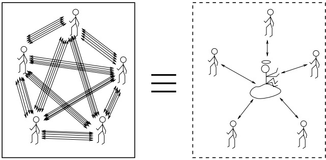
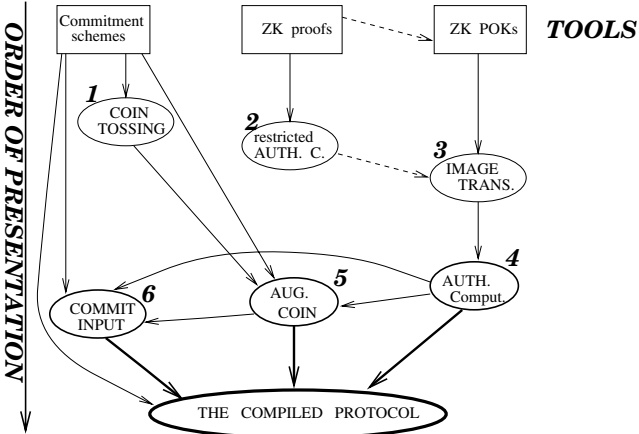
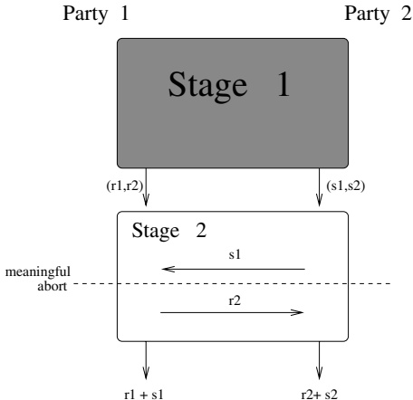

# General Cryptographic Protocols

The design of secure protocols that implement arbitrarily desired functionalities is a major part of modern cryptography. Taking the opposite perspective, the design of any cryptographic scheme may be viewed as the design of a secure protocol for implementing a suitable functionality. Still, we believe that it makes sense to differentiate between basic cryptographic primitives (which involve little interaction) like encryption and signature schemes, on the one hand, and general cryptographic protocols, on the other hand.

In this chapter we consider general results concerning secure multi-party computations, where the two-party case is an important special case. In a nutshell, these results assert that one can construct protocols for securely computing any desirable multi-party functionality (see the following terminology). Indeed, what is striking about these results is their generality, and we believe that the wonder is not diminished by the (various alternative) conditions under which these results hold.

Our focus on the general study of secure multi-party computation (rather than on protocols for solving specific problems) is natural in the context of the theoretical treatment of the subject matter. We wish to highlight the importance of this general study to practice. Firstly, this study clarifies fundamental issues regarding security in a multi-party environment. Secondly, it draws the lines between what is possible in principle and what is not. Thirdly, it develops general techniques for designing secure protocols. And last, sometimes it may even yield schemes (or modules) that may be incorporated in practical systems. Thus, we believe that the current chapter is both of theoretical and practical importance.

Terminology. The notion of a (multi-party) functionality is central to the current chapter. By an m-ary functionality we mean a random process that maps m inputs to m outputs, where functions mapping m inputs to m outputs are a special case (also referred to as deterministic functionalities). Thus, functionalities are randomized extensions of ordinary functions. One may think of a functionality $F$ as being a probability distribution over (corresponding) functions (i.e., $F$ equals the function $f^{(i)}$ with probability $p_i$). Alternatively, we think of $F(x_1, \ldots, x_m)$ as selecting at random a string $r$, and outputting $ F'(r, x_1, ..., x_m) $, where $ F' $ is a function mapping $ m + 1 $ inputs to m outputs.

Teaching Tip. The contents of the current chapter are quite complex. We suggest covering in class only the overview section (i.e., Section 7.1), and consider the rest of this chapter to be advanced material. Furthermore, we assume that the reader is familiar with the material in all the previous chapters. This familiarity is important, not only because we use some of the notions and results presented in these chapters but also because we use similar proof techniques (and do so while assuming that this is not the reader's first encounter with these techniques).

Organization. In addition to the overview section (i.e., Section 7.1), the current chapter consists of two main parts:

The first part (i.e., Sections 7.2–7.4) consists of a detailed treatment of general secure two-party protocols. Our ultimate goal in this part is to design two-party protocols that withstand any feasible adversarial behavior. We proceed in two steps. First, we consider a benign type of adversary, called semi-honest, and construct protocols that are secure with respect to such an adversary (cf. Section 7.3). Next, we show how to force parties to behave in a semi-honest manner (cf. Section 7.4). That is, we show how to transform any protocol, secure in the semi-honest model, into a protocol that is secure against any feasible adversarial behavior. But before presenting these constructions, we present the relevant definitions (cf. Section 7.2).

The second part (i.e., Sections 7.5 and 7.6) deals with general secure multi-party protocols. Specifically, in Section 7.5 we extend the treatment presented in the first part to multi-party protocols, whereas in Section 7.6 we consider the “private channel model” and present alternative constructions for it.

Although it is possible to skip some of the earlier sections of this chapter before reading a later section, we recommend not doing so. In particular, we recommend reading the overview section (i.e., Section 7.1) before reading any later section.

## 7.1. Overview

A general framework for casting (m-party) cryptographic (protocol) problems consists of specifying a random process that maps m inputs to m outputs. The inputs to the process are to be thought of as local inputs of m parties, and the m outputs are their corresponding (desired) local outputs. The random process describes the desired functionality. That is, if the m parties were to trust each other (or trust some external party), then they could each send their local input to the trusted party, who would compute the outcome of the process and send to each party the corresponding output. A pivotal question in the area of cryptographic protocols is the extent to which this (imaginary) trusted party can be “emulated” by the mutually distrustful parties themselves. (See illustration in Figure 7.1.)

Figure 7.1: Secure protocols emulate a trusted party: an illustration.

The results mentioned previously and surveyed later describe a variety of models in which such an “emulation” is possible. The models vary by the underlying assumptions regarding the communication channels, the numerous parameters relating to the extent of adversarial behavior, and the desired level of emulation of the trusted party (i.e., level of “security”). We stress that unless stated differently, the two-party case is an important special case of the treatment of the multi-party setting (i.e., we consider any $ m \geq 2 $).

### 7.1.1. The Definitional Approach and Some Models

Before describing the abovementioned results, we further discuss the notion of “emulating a trusted party,” which underlies the definitional approach to secure multi-party computation. The approach can be traced back to the definition of zero-knowledge (see Section 4.3 of Volume 1), and even to the definition of semantic security (see Section 5.2.1). The underlying paradigm (called the simulation paradigm) is that a scheme is secure if whatever a feasible adversary can obtain after attacking it is also feasible attainable in an “ideal setting.” In the case of zero-knowledge, this amounts to saying that whatever a (feasible) verifier can obtain after interacting with the prover on a prescribed valid assertion can be (feasibly) computed from the assertion itself. In the case of multi-party computation, we compare the effect of adversaries that participate in the execution of the actual protocol to the effect of adversaries that participate in an imaginary execution of a trivial (ideal) protocol for computing the desired functionality with the help of a trusted party. If whatever adversaries can feasibly obtain in the former real setting can also be feasibly obtained in the latter ideal setting, then the protocol “emulates the ideal setting” (i.e., “emulates a trusted party”), and so is deemed secure. This means that properties that are satisfied in the ideal setting are also satisfied by a secure protocol that is executed in the real setting. For example, security typically implies the preservation of the privacy of the parties’ local inputs (beyond whatever is revealed by the local outputs provided to the adversary), and the correctness of the honest parties' local outputs (i.e., their consistency with the functionality).

The approach outlined here can be applied in a variety of models, and is used to define the goals of security in these models. $ ^{1} $ We first discuss some of the parameters used in defining various models, and next demonstrate the application of this approach to a couple of important cases (cf. Sections 7.1.1.2 and 7.1.1.3).

#### 7.1.1.1. Some Parameters Used in Defining Security Models

The following parameters are described in terms of the actual (or real) computation. In some cases, the corresponding definition of security is obtained by some restrictions or provisions applied to the ideal model. In all cases, the desired notion of security is defined by requiring that for any adequate adversary in the real model, there exists a corresponding adversary in the corresponding ideal model that obtains essentially the same impact on the computation of the functionality (as the real-model adversary).

- Set-up assumptions: Unless differently stated, we make no set-up assumptions (except for the obvious assumption that all parties have copies of the protocol's program). However, in some cases it is assumed that each party knows some information (e.g., a verification-key) corresponding to each of the other parties (or, one may assume the existence of a public-key infrastructure). Another assumption, made more rarely, is that all parties have access to some common (trusted) random string.

- The communication channels: Here we refer to issues like the privacy and reliability of data sent over the channels, as well as to the availability and the communication features of the channels.

The standard assumption in the area is that the adversary can tap all communication channels (between honest parties); that is, the channels per se do not provide privacy (i.e., privacy of the data sent over them). In contrast, one may postulate that the adversary cannot obtain messages sent between honest parties, yielding the so-called private-channel model. This postulate may be justified in some settings. Furthermore, it may be viewed as a useful abstraction that provides a clean model for study and development of secure protocols. In this respect, it is important to mention that in a variety of settings of the other parameters, the private-channel model can be emulated by ordinary (i.e., "tapped" point-to-point) channels.

The standard assumption in the area is that the adversary cannot omit, modify, duplicate, or generate messages sent over the communication channels (between honest parties); that is, the channels are postulated to be reliable (in the sense that they guarantee the authenticity of the data sent over them). Furthermore, one may postulate the existence of a broadcast channel. Again, these assumptions can be justified in some settings and emulated in others.

Most work in the area assumes that communication is synchronous and that point-to-point channels exist between every pair of processors. However, one may also consider asynchronous communication and arbitrary networks of point-to-point channels.

- Computational limitations: Typically, we consider computationally bounded adversaries (e.g., probabilistic polynomial-time adversaries). However, the private-channel model also allows for (meaningful) consideration of computationally unbounded adversaries.

We stress that, also in the latter case, security should be defined by requiring that for every real adversary, whatever the adversary can compute after participating in the execution of the actual protocol be computable within comparable time (e.g., in polynomially related time) by an imaginary adversary participating in an imaginary execution of the trivial ideal protocol (for computing the desired functionality with the help of a trusted party). Thus, results in the computationally unbounded–adversary model trivially imply results for computationally bounded adversaries.

- Restricted adversarial behavior: The most general type of an adversary considered in the literature is one that may corrupt parties to the protocol while the execution goes on, and decide which parties to corrupt based on partial information it has gathered so far. A somewhat more restricted model, which seems adequate in many settings, postulates that the set of dishonest parties is fixed (arbitrarily) before the execution starts (but this set is, of course, not known to the honest parties). The latter model is called non-adaptive as opposed to the adaptive adversary mentioned first.

An orthogonal parameter of restriction refers to whether a dishonest party takes active steps to disrupt the execution of the protocol (i.e., sends messages that differ from those specified by the protocol), or merely gathers information (which it may later share with the other dishonest parties). The latter adversary has been given a variety of names, such as semi-honest, passive, and honest-but-curious. This restricted model may be justified in certain settings, and certainly provides a useful methodological locus (cf. Section 7.1.3). In the following, we refer to the adversary of the unrestricted model as active; another commonly used name is malicious.

- Restricted notions of security: One example is the willingness to tolerate “unfair” protocols in which the execution can be suspended (at any time) by a dishonest party, provided that it is detected doing so. We stress that in case the execution is suspended, the dishonest party does not obtain more information than it could have obtained if the execution were not suspended. What may happen is that some honest parties will not obtain their desired outputs (although other parties did obtain their corresponding outputs), but will rather detect that the execution was suspended. We will say that this restricted notion of security allows abort (or allows premature suspension of the execution).

- Upper bounds on the number of dishonest parties: In some models, secure multi-party computation is possible only if a strict majority of the parties are honest. $ ^{2} $ Sometimes even a special majority (e.g., 2/3) is required. General “resilient adversary structures” have been considered, too (i.e., security is guaranteed in the case that the set of dishonest parties equals one of the sets specified in a predetermined family of sets).

- Mobile adversary: In most works, once a party is said to be dishonest it remains so throughout the execution. More generally, one may consider transient adversarial behavior (e.g., an adversary seizes control of some site and later withdraws from it). This model, which will not be further discussed in this work, allows for the construction of protocols that remain secure, even in case the adversary may seize control of all sites during the execution (but never control concurrently, say, more than 10 percent of the sites). We comment that schemes secure in this model were later termed “proactive.”

In the rest of this chapter we will consider a few specific settings of these parameters. Specifically, we will focus on non-adaptive, active, and computationally bounded adversaries, and will not assume the existence of private channels. In Section 7.1.1.2 we consider this setting while restricting the dishonest parties to a strict minority, whereas in Section 7.1.1.3 we consider a restricted notion of security for two-party protocols that allows “unfair suspension” of execution (or “allows abort”).

#### 7.1.1.2. Example: Multi-Party Protocols with Honest Majority

We consider a non-adaptive, active, computationally bounded adversary, and do not assume the existence of private channels. Our aim is to define multi-party protocols that remain secure provided that the honest parties are in the majority. (The reason for requiring an honest majority will be discussed at the end of this subsection.) For more details about this model, see Section 7.5.1.

Consider any multi-party protocol. We first observe that each party may change its local input before even entering the execution of the protocol. Furthermore, this is also unavoidable when the parties utilize a trusted party. Consequently, such an effect of the adversary on the real execution (i.e., modification of its own input prior to entering the actual execution) is not considered a breach of security. In general, whatever cannot be avoided (even) when the parties utilize a trusted party is not considered a breach of security. We wish secure protocols (in the real model) to suffer only from whatever is also unavoidable when the parties utilize a trusted party. Thus, the basic paradigm underlying the definitions of secure multi-party computations amounts to saying that the only situations that may occur in the real execution of a secure protocol are those that can also occur in a corresponding ideal model (where the parties may employ a trusted party). In other words, the “effective malfunctioning” of parties in secure protocols is restricted to what is postulated in the corresponding ideal model.

When defining secure multi-party protocols (with honest majority), we need to pinpoint what cannot be avoided in the ideal model (i.e., when the parties utilize a trusted party). This is easy, because the ideal model is very simple. Since we are interested in executions in which the majority of parties are honest, we consider an ideal model in which any minority group (of the parties) may collude as follows:

1. Firstly, the dishonest minority parties share their original inputs and decide together on replaced inputs to be sent to the trusted party. (The other parties send their respective original inputs to the trusted party. We stress that the communication between the honest parties and the trusted party is not seen by the dishonest colluding minority parties.)

2. Upon receiving inputs from all parties, the trusted party determines the corresponding outputs and sends them to the corresponding parties.

3. Upon receiving the “output message” from the trusted party, each honest party outputs it locally, whereas the dishonest colluding minority parties may determine their outputs based on all they know (i.e., their initial inputs and their received outputs).

Note that such behavior of the minority group is unavoidable in any execution of any protocol (even in the presence of trusted parties). This is the reason that the ideal model was so defined. Now, a secure multi-party computation with honest majority is required to emulate this ideal model. That is, the effect of any feasible adversary that controls a minority of the parties in a real execution of the actual protocol can be essentially simulated by a (different) feasible adversary that controls the same parties in the ideal model.

Definition 7.1.1 (secure protocols – a sketch): Let f be an m-ary functionality and $ \Pi $ be an m-party protocol operating in the real model.

- For a real-model adversary $ A $, controlling some minority of the parties (and tapping all communication channels), and an $ m $-sequence $ \overline{x} $, we denote by $ \text{REAL}_{\Pi,A}(\overline{x}) $ the sequence of $ m $ outputs resulting from the execution of $ \Pi $ on input $ \overline{x} $ under attack of the adversary $ A $.

- For an ideal-model adversary $ A' $, controlling some minority of the parties, and an m-sequence $ \overline{x} $, we denote by $ \text{IDEAL}_{f,A'}(\overline{x}) $ the sequence of m outputs resulting from the ideal process described previously, on input $ \overline{x} $ under attack of the adversary $ A' $.

We say that $\Pi$ securely implements $f$ with honest majority if for every feasible real-model adversary $A$, controlling some minority of the parties, there exists a feasible ideal-model adversary $A',$ controlling the same parties, so that the probability ensembles $\{\text{REAL}_{\Pi,A}(\overline{x})\}_{\overline{x}}$ and $\{\text{IDEAL}_{f,A'}(\overline{x})\}_{\overline{x}}$ are computationally indistinguishable (as in Part 2 of Definition 3.2.7 in Volume 1).

Thus, security means that the effect of each minority group in a real execution of a secure protocol is “essentially restricted” to replacing its own local inputs (independently of the local inputs of the majority parties) before the protocol starts, and replacing its own local outputs (depending only on its local inputs and outputs) after the protocol terminates. (We stress that in the real execution, the minority parties do obtain additional pieces of information; yet in a secure protocol they gain nothing from these additional pieces of information.)

The fact that Definition 7.1.1 refers to a model without private channels is reflected in the set of possible ensembles $ \{\text{REAL}_{\Pi,A}(\overline{x})\}_{\overline{x}} $ that is determined by the (sketchy) definition of the real-model adversary (which is allowed to tap all the communication channels). When defining security in the private-channel model, the real-model adversary is not allowed to tap channels between honest parties, which in turn restricts the set of possible ensembles $ \{\text{REAL}_{\Pi,A}(\overline{x})\}_{\overline{x}} $. Thus, the difference between the two models is only reflected in the definition of the real-model adversary. On the other hand, when we wish to define security with respect to passive adversaries, both the scope of the real-model adversaries and the scope of the ideal-model adversaries change. In the real-model execution, all parties follow the protocol, but the adversary may alter the output of the dishonest parties arbitrarily, depending on all their intermediate internal states (during the execution). In the corresponding ideal-model, the adversary is not allowed to modify the inputs of dishonest parties (in Step 1), but is allowed to modify their outputs (in Step 3).

We comment that a definition analogous to Definition 7.1.1 can also be presented in case the dishonest parties are not in the minority. In fact, such a definition seems more natural, but the problem is that such a definition cannot be satisfied. That is, most natural functionalities do not have a protocol for computing them securely in case at least half of the parties are dishonest and employ an adequate (active) adversarial strategy. This follows from an impossibility result regarding two-party computation, which essentially asserts that there is no way to prevent a party from prematurely suspending the execution. On the other hand, secure multi-party computation with dishonest majority is possible if (and only if) premature suspension of the execution is not considered a breach of security.

#### 7.1.1.3. Another Example: Two-Party Protocols Allowing Abort

In light of the last paragraph, we now consider multi-party computations in which premature suspension of the execution is not considered a breach of security. For concreteness, we focus here on the special case of two-party computations. $ ^{3} $ For more details about this model, see Section 7.2.3.

Intuitively, in any two-party protocol, each party may suspend the execution at any point in time, and furthermore, it may do so as soon as it learns the desired output. Thus, in case the output of each parties depends on both inputs, it is always possible for one of the parties to obtain the desired output while preventing the other party from fully determining its own output. The same phenomenon occurs even in case the two parties just wish to generate a common random value. Thus, when considering active adversaries in the two-party setting, we do not consider such premature suspension of the execution a breach of security. Consequently, we consider an ideal model where each of the two parties may “shut down” the trusted (third) party at any point in time. In particular, this may happen after the trusted party has supplied the outcome of the computation to one party but before it has supplied it to the second. That is, an execution in the ideal model proceeds as follows:

1. Each party sends its input to the trusted party, where the dishonest party may replace its input or send no input at all (which may be viewed as aborting).

2. Upon receiving inputs from both parties, the trusted party determines the corresponding outputs and sends the first output to the first party.

3. In case the first party is dishonest, it may instruct the trusted party to halt; otherwise it always instructs the trusted party to proceed. If instructed to proceed, the trusted party sends the second output to the second party.

4. Upon receiving the output message from the trusted party, the honest party outputs it locally, whereas the dishonest party may determine its output based on all it knows (i.e., its initial input and its received output).

A secure two-party computation allowing abort is required to emulate this ideal model. That is, as in Definition 7.1.1, security is defined by requiring that for every feasible real-model adversary $ A $, there exists a feasible ideal-model adversary $ A' $, controlling the same party, so that the probability ensembles representing the corresponding (real and ideal) executions are computationally indistinguishable. This means that each party's “effective malfunctioning” in a secure protocol is restricted to supplying an initial input of its choice and aborting the computation at any point in time. (Needless to say, the choice of the initial input of each party may not depend on the input of the other party.)

We mention that an alternative way of dealing with the problem of premature suspension of execution (i.e., abort) is to restrict attention to single-output functionalities, that is, functionalities in which only one party is supposed to obtain an output. The definition of secure computation of such functionalities can be identical to Definition 7.1.1, with the exception that no restriction is made on the set of dishonest parties (and, in particular, one may consider a single dishonest party in the case of two-party protocols). For further details, see Section 7.2.3.2.

### 7.1.2. Some Known Results

We briefly mention some of the models for which general secure multi-party computation is known to be attainable; that is, models in which one can construct secure multi-party protocols for computing any desired functionality.

#### 7.1.2.1. The Main Results Presented in This Chapter

We start with results that refer to secure two-party protocols, as well as to secure multi-party protocols in the standard model (where the adversary may tap the communication lines).

Theorem 7.1.2 (the main feasibility results – a sketch): Assuming the existence of enhanced trapdoor permutations (as in Definition C.1.1 in Appendix C), general secure multi-party computation is possible in the following three models:

1. Passive adversary, for any number of dishonest parties.

2. Active adversary that may control only a strict minority of the parties.

3. Active adversary, controlling any number of bad parties, provided that suspension of execution is not considered a violation of security.

In all these cases, the adversary is computationally bounded and non-adaptive. On the other hand, the adversary may tap the communication lines between honest parties (i.e., we do not assume the existence of private channels). The results for active adversaries assume a broadcast channel.

Recall that a broadcast channel can be implemented (while tolerating any number of bad parties) using a signature scheme and assuming a public-key infrastructure (i.e., each party knows the verification-key corresponding to each of the other parties). $ ^{4} $

Most of the current chapter will be devoted to proving Theorem 7.1.2. In Sections 7.3 and 7.4 we prove Theorem 7.1.2 for the special case of two parties: In that case, Part 2 is not relevant, Part 1 is proved in Section 7.3, and Part 3 is proved in Section 7.4. The general case (i.e., of multi-party computation) is treated in Section 7.5.

#### 7.1.2.2. Other Results

We next list some other models in which general secure multi-party computation is attainable:

- Making no computational assumptions and allowing computationally unbounded adversaries, but assuming the existence of private channels, general secure multi-party computation is possible in the following models:

1. Passive adversary that may control only a (strict) minority of the parties.

2. Active adversary that may control only less than one third of the parties. (Fault-tolerance can be increased to a regular minority if a broadcast channel exists.)

In both cases the adversary may be adaptive. For details, see Sections 7.6 and 7.7.1.2.

- General secure multi-party computation is possible against an active, adaptive, and mobile adversary that may control a small constant fraction of the parties at any point in time. This result makes no computational assumptions, allows computationally unbounded adversaries, but assumes the existence of private channels.

- Assuming the intractability of inverting RSA (or of the DLP), general secure multi-party computation is possible in a model allowing an adaptive and active computationally bounded adversary that may control only less than one third of the parties. We stress that this result does not assume the existence of private channels.

Results for asynchronous communication and arbitrary networks of point-to-point channels are also known. For further details, see Section 7.7.5.

#### 7.1.2.3. An Extension and Efficiency Considerations

Secure Reactive Computation. All the aforementioned results extend (easily) to a reactive model of computation in which each party interacts with a high-level process (or application). The high-level process adaptively supplies each party with a sequence of inputs, one at a time, and expects to receive corresponding outputs from the parties. That is, a reactive system goes through (a possibly unbounded number of) iterations of the following type:

- Parties are given inputs for the current iteration.

- Depending on the current inputs, the parties are supposed to compute outputs for the current iteration. That is, the outputs in iteration j are determined by the inputs of the j-th iteration.

A more general formulation allows the outputs of each iteration to depend also on a global state, which is possibly updated at each iteration. The global state may include all inputs and outputs of previous iterations, and may only be partially known to individual parties. (In a secure reactive computation, such a global state may be maintained by all parties in a “secret sharing” manner.) For further discussion, see Section 7.7.1.3.

Efficiency considerations. One important efficiency measure regarding protocols is the number of communication rounds in their execution. The results mentioned earlier were originally obtained using protocols that use an unbounded number of rounds. In some cases, subsequent works obtained secure constant-round protocols. Other important efficiency considerations include the total number of bits sent in the execution of a protocol and the local computation time. The communication and computation complexities of the aforementioned protocols are related to the computational complexity of the desired functionalities, but alternative relations (e.g., referring to the communication complexity of the latter) may be possible.

### 7.1.3. Construction Paradigms

We briefly sketch three paradigms used in the construction of secure multi-party protocols. We focus on the construction of secure protocols for the model of computationally bounded and non-adaptive adversaries. These constructions proceed in two steps: First, a secure protocol is presented for the model of passive adversaries (for any number of dishonest parties), and next, such a protocol is “compiled” into a protocol that is secure in one of the two models of active adversaries (i.e., either in a model allowing the adversary to control only a minority of the parties or in a model in which premature suspension of the execution is not considered a violation of security).

Recall that in the model of passive adversaries, all parties follow the prescribed protocol, but at termination, the adversary may alter the output of the dishonest parties depending on all their intermediate internal states (during the execution). In the following, we refer to protocols that are secure in the model of passive (resp., general or active) adversaries by the term passively secure (resp., actively secure).

#### 7.1.3.1. From Passively Secure Protocols to Actively Secure Ones

We show how to transform any passively secure protocol into a corresponding actively secure protocol. The communication model in both protocols consists of a single broadcast channel. Note that the messages of the original (passively secure) protocol may be assumed to be sent over a broadcast channel, because the adversary may see them anyhow (by tapping the point-to-point channels). As for the resulting actively secure protocol, the broadcast channel it uses can be implemented via an (authenticated) Byzantine Agreement protocol (cf. Section 7.5.3.2), thus providing an emulation of this model on the standard point-to-point model (in which a broadcast channel does not exist). We mention that authenticated Byzantine Agreement is typically implemented using a signature scheme (and assuming that each party knows the verification-key corresponding to each of the other parties).

Turning to the transformation itself, the main idea is to use zero-knowledge proofs in order to force parties to behave in a way that is consistent with the (passively secure) protocol. Actually, we need to confine each party to a unique consistent behavior (i.e., according to some fixed local input and a sequence of coin tosses), and to guarantee that a party cannot fix its input (and/or its coins) in a way that depends on the inputs of honest parties. Thus, some preliminary steps have to be taken before the step-by-step emulation of the original protocol can take place. Specifically, the compiled protocol (which, like the original protocol, is executed over a broadcast channel) proceeds as follows:

1. Prior to the emulation of the original protocol, each party commits to its input (using a commitment scheme). In addition, using a zero-knowledge proof-of-knowledge (cf. Section 4.7 of Volume 1), each party also proves that it knows its own input, that is, that it can properly decommit to the commitment it sent. (These zero-knowledge proofs-of-knowledge are conducted sequentially to prevent dishonest parties from setting their inputs in a way that depends on inputs of honest parties.)

2. Next, all parties jointly generate a sequence of random bits for each party such that only this party knows the outcome of the random sequence generated for it, but everybody gets a commitment to this outcome. These sequences will be used as the random-inputs (i.e., sequence of coin tosses) for the original protocol. Each bit in the random-sequence generated for Party X is determined as the exclusive-or of the outcomes of instances of an (augmented) coin-tossing protocol that Party X plays with each of the other parties.

3. In addition, when compiling (the passively secure protocol to an actively secure protocol) for the model that allows the adversary to control only a minority of the parties, each party shares its input and random-input with all other parties using a Verifiable Secret Sharing protocol (cf. Section 7.5.5). This will guarantee that if some party prematurely suspends the execution, then all the parties can together reconstruct all its secrets and carry on the execution while playing its role.

4. After all these steps have been completed, we turn to the main step in which the new protocol emulates the original one. In each step, each party augments the message determined by the original protocol with a zero-knowledge proof that asserts that the message was indeed computed correctly. Recall that the next message (as determined by the original protocol) is a function of the sender's own input, its random-input, and the messages it has received so far (where the latter are known to everybody because they were sent over a broadcast channel). Furthermore, the sender's input is determined by its commitment (as sent in Step 1), and its random-input is similarly determined (in Step 2). Thus, the next message (as determined by the original protocol) is a function of publicly known strings (i.e., the said commitments as well as the other messages sent over the broadcast channel). Moreover, the assertion that the next message was indeed computed correctly is an NP-assertion, and the sender knows a corresponding NP-witness (i.e., its own input and random-input, as well as the corresponding decommitment information). Thus, the sender can prove (to each of the other parties) in zero-knowledge that the message it is sending was indeed computed according to the original protocol.

A detailed description is provided in Section 7.4 (see also Section 7.5.4).

#### 7.1.3.2. Passively Secure Computation with “Scrambled Circuits”

The following technique refers mainly to two-party computation. Suppose that two parties, each having a private input, wish to obtain the value of a predetermined two-argument function evaluated at their corresponding inputs, that is, we consider only functionalities of the form $ (x, y) \mapsto (f(x, y), f(x, y)) $. Further suppose that the two parties hold a circuit that computes the value of the function on inputs of the adequate length. The idea is to have one party construct a “scrambled” form of the circuit so that the other party can propagate encrypted values through the “scrambled gates” and obtain the output in the clear (while all intermediate values remain secret). Note that the roles of the two parties are not symmetric, and recall that we are describing a protocol that is secure (only) with respect to passive adversaries. An implementation of this idea proceeds as follows:

- Constructing a “scrambled” circuit: The first party constructs a scrambled form of the original circuit. The scrambled circuit consists of pairs of encrypted secrets that correspond to the wires of the original circuit and gadgets that correspond to the gates of the original circuit. The secrets associated with the wires entering a gate are used (in the gadget that corresponds to this gate) as keys in the encryption of the secrets associated with the wire exiting this gate. Furthermore, there is a random correspondence between each pair of secrets and the Boolean values (of the corresponding wire). That is, wire $w$ is assigned a pair of secrets, denoted $(s_{w}^{\prime}, s_{w}^{\prime\prime})$, and there is a random 1-1 mapping, denoted $v_{w}$, between this pair and the pair of Boolean values (i.e., $\{\nu_{w}(s_{w}^{\prime}), \nu_{w}(s_{w}^{\prime\prime})\} = \{0,1\}$).

Each gadget is constructed such that knowledge of a secret that corresponds to each wire entering the corresponding gate (in the circuit) yields a secret corresponding to the wire that exits this gate. Furthermore, the reconstruction of secrets using each gadget respects the functionality of the corresponding gate. For example, if one knows the secret that corresponds to the 1-value of one entry-wire and the secret that corresponds to the 0-value of the other entry-wire, and the gate is an or-gate, then one obtains the secret that corresponds to the 1-value of the exit-wire.

Specifically, each gadget consists of four templates that are presented in a random order, where each template corresponds to one of the four possible values of the two entry-wires. A template may be merely a double encryption of the secret that corresponds to the appropriate output value, where the double encryption uses as keys the two secrets that correspond to the input values. That is, suppose a gate computing $ f : \{0, 1\}^2 \to \{0, 1\} $ has input wires $ w_1 $ and $ w_2 $, and output wire $ w_3 $. Then, each of the four templates of this gate has the form $ E_{s_{w_1}}(E_{s_{w_2}}(s_{w_3})) $, where $ f(\nu_{w_1}(s_{w_1}), \nu_{w_2}(s_{w_2})) = \nu_{w_3}(s_{w_3}) $.

- Sending the “scrambled” circuit: The first party sends the scrambled circuit to the second party. In addition, the first party sends to the second party the secrets that correspond to its own (i.e., the first party’s) input bits (but not the values of these bits). The first party also reveals the correspondence between the pair of secrets associated with each output (i.e., circuit-output wire) and the Boolean values. $ ^{5} $ We stress that the random correspondence between the pair of secrets associated with each other wire and the Boolean values is kept secret (by the first party).

- Oblivious Transfer of adequate secrets: Next, the first party uses a (1-out-of-2) Oblivious Transfer protocol in order to hand the second party the secrets corresponding to the second party's input bits (without the first party learning anything about these bits).

Loosely speaking, a 1-out-of-k Oblivious Transfer is a protocol enabling one party to obtain one of k secrets held by another party, without the second party learning which secret was obtained by the first party. That is, we refer to the two-party functionality

 $$ (i,(s_{1},...,s_{k}))\mapsto(s_{i},\lambda) $$ 

where $ \lambda $ denotes the empty string.

- Locally evaluating the “scrambled” circuit: Finally, the second party “evaluates” the scrambled circuit gate-by-gate, starting from the top (circuit-input) gates (for which it knows one secret per each wire) and ending at the bottom (circuit-output) gates (for which, by construction, the correspondence of secrets to values is known). Thus, the second party obtains the output value of the circuit (but nothing else), and sends it to the first party.

For further details, see Section 7.7.5.

#### 7.1.3.3. Passively Secure Computation with Shares

For any $ m \geq 2 $, suppose that $ m $ parties, each having a private input, wish to obtain the value of a predetermined $ m $-argument function evaluated at their sequence of inputs. Further suppose that the parties hold a circuit that computes the value of the function on inputs of the adequate length, and that the circuit contains only AND- and NOT-gates. Again, the idea is to propagate information from the top (circuit-input) gates to the bottom (circuit-output) gates, but this time the information is different, and the propagation is done jointly by all parties. The idea is to share the value of each wire in the circuit such that all shares yield the value, whereas lacking even one of the shares keeps the value totally undetermined. That is, we use a simple secret-sharing scheme such that a bit $ b $ is shared by a random sequence of $ m $ bits that sum up to $ b $ mod 2. First, each party shares each of its input bits with all parties (by sending each party a random value and setting its own share accordingly). $ ^6 $ Next, all parties jointly scan the circuit from its input wires to the output wires, processing each gate as follows:

- When encountering a gate, the parties already hold shares of the values of the wires entering the gate, and their aim is to obtain shares of the value of the wire exiting the gate.

For a NOT-gate, propagating shares through the gate is easy: The first party just flips the value of its share, and all other parties maintain their shares.

For an AND-gate, propagating shares through the gate requires a secure (i.e., passively secure) multi-party protocol. Since an AND-gate corresponds to multiplication modulo 2, the parties need to securely compute the following randomized functionality (in which the $ x_i $'s denote shares of one entry-wire, the $ y_i $'s denote shares of the second entry-wire, the $ z_i $'s denote shares of the exit-wire, and the shares indexed by i belong to Party i):

 $$ ((x_{1},y_{1}),...,(x_{m},y_{m}))\mapsto(z_{1},...,z_{m}) $$ 

where

 $$ \sum_{i=1}^{m}z_{i}=\sum_{i=1}^{m}x_{i}\cdot\sum_{i=1}^{m}y_{i} $$ 

That is, the $ z_{i} $'s are random subject to Eq. (7.3).

At the end, each party holds a share of each output wire. The desired output is obtained by letting each party send its share of each output wire to all parties. Thus, securely evaluating the entire (arbitrary) circuit “reduces” to securely conducting a specific (very simple) multi-party computation. But things get even simpler: the key observation is that

 $$ \left(\sum_{i=1}^{m}x_{i}\right)\cdot\left(\sum_{i=1}^{m}y_{i}\right)=\sum_{i=1}^{m}x_{i}y_{i}+\sum_{1\leq i<j\leq m}\left(x_{i}y_{j}+x_{j}y_{i}\right) $$ 

Thus, the m-ary functionality of Eq. (7.2) and Eq. (7.3) can be computed as follows (where all arithmetic operations are mod 2):

1. Each Party $ i $ locally computes $ z_{i,i} \stackrel{\text{def}}{=} x_i y_i $.

2. Next, each pair of parties (i.e., Parties $i$ and $j$) securely compute random shares of $x_{i}y_{j} + x_{j}y_{i}$. That is, Parties $i$ and $j$ (holding $(x_{i}, y_{i})$ and $(x_{j}, y_{j})$, respectively), need to securely compute the randomized two-party functionality $((x_{i}, y_{i}), (x_{j}, y_{j})) \mapsto (z_{i,j}, z_{j,i})$, where the $z$'s are random subject to $z_{i,j} + z_{j,i} = x_{i}y_{j} + y_{i}x_{j}$. The latter (simple) two-party computation can be securely implemented using (a 1-out-of-4) Oblivious Transfer. Specifically, Party $i$ uniformly selects $z_{i,j} \in \{0,1\}$, and defines its four secrets as follows:

<table border=1 style='margin: auto; word-wrap: break-word;'><tr><td style='text-align: center; word-wrap: break-word;'>Index of the secret</td><td style='text-align: center; word-wrap: break-word;'>Corresponding value of $ (x_j, y_j) $</td><td style='text-align: center; word-wrap: break-word;'>Value of the secret (output of Party j)</td></tr><tr><td style='text-align: center; word-wrap: break-word;'>1</td><td style='text-align: center; word-wrap: break-word;'>$ (0, 0) $</td><td style='text-align: center; word-wrap: break-word;'>$ z_{i,j} $</td></tr><tr><td style='text-align: center; word-wrap: break-word;'>2</td><td style='text-align: center; word-wrap: break-word;'>$ (0, 1) $</td><td style='text-align: center; word-wrap: break-word;'>$ z_{i,j} + x_i $</td></tr><tr><td style='text-align: center; word-wrap: break-word;'>3</td><td style='text-align: center; word-wrap: break-word;'>$ (1, 0) $</td><td style='text-align: center; word-wrap: break-word;'>$ z_{i,j} + y_i $</td></tr><tr><td style='text-align: center; word-wrap: break-word;'>4</td><td style='text-align: center; word-wrap: break-word;'>$ (1, 1) $</td><td style='text-align: center; word-wrap: break-word;'>$ z_{i,j} + x_i + y_i $</td></tr></table>

Party j sets its input to $ 2x_{j} + y_{j} + 1 $, and obtains the secret $ z_{i,j} + x_{i}y_{j} + y_{i}x_{j} $.

(Indeed, for “small” $B$, any two-party functionality $f: A \times B \to \{\lambda\} \times \{0, 1\}$ can be securely implemented by a single invocation of a 1-out-of-$\left|B\right|$ Oblivious Transfer, where the first party defines its $\left|B\right|$ secrets in correspondence to the $\left|B\right|$ possible values of the input to the second party.)

3. Finally, for every $ i = 1, \ldots, m $, the sum $ \sum_{j=1}^{m} z_{i,j} $ yields the desired share of Party i.

A detailed description is provided in Section 7.3 (see also Section 7.5.2).

A related construction. We mention that an analogous construction has been subsequently used in the private-channel model and withstands computationally unbounded active (resp., passive) adversaries that control less than one third (resp., a minority) of the parties. The basic idea is to use a more sophisticated secret-sharing scheme, specifically, via low-degree polynomials. That is, the Boolean circuit is viewed as an arithmetic circuit over a finite field having more than $m$ elements, and a secret element $s$ in the field is shared by selecting uniformly a polynomial of degree $d = \lfloor (m-1)/3 \rfloor$ (resp., degree $d = \lfloor (m-1)/2 \rfloor$) having a free-term equal to $s$, and handing each party the value of this polynomial evaluated at a different (fixed) point (e.g., party $i$ is given the value at point $i$). Addition is emulated by (local) pointwise addition of the (secret-sharing) polynomials representing the two inputs (using the fact that for polynomials p and q, and any field element e [and in particular e = 0, 1, ..., m], it holds that $ p(e) + q(e) = (p + q)(e) $). The emulation of multiplication is more involved and requires interaction (because the product of polynomials yields a polynomial of higher degree, and thus the polynomial representing the output cannot be the product of the polynomials representing the two inputs). Indeed, the aim of the interaction is to turn the shares of the product polynomial into shares of a degree d polynomial that has the same free-term as the product polynomial (which is of degree 2d). This can be done using the fact that the coefficients of a polynomial are a linear combination of its values at sufficiently many arguments (and the other way around), and the fact that one can privately compute any linear combination (of secret values). For further details, see Section 7.6.

## 7.2.* The Two-Party Case: Definitions

In this section we define security for two models of adversaries for two-party protocols. In both models, the adversary is non-adaptive and computationally bounded (i.e., restricted to probabilistic polynomial-time with [non-uniform] auxiliary inputs). In the first model, presented in Section 7.2.2, we consider a restricted adversary called semihonest, whereas the general case of malicious adversary is considered in Section 7.2.3. In addition to being of independent interest, the semi-honest model will play a major role in the construction of protocols for the malicious model (see Sections 7.3 and 7.4).

### 7.2.1. The Syntactic Framework

A two-party protocol problem is cast by specifying a random process that maps pairs of inputs (one input per each party) to pairs of outputs (one per each party). We refer to such a process as the desired functionality, denoted $ f : \{0, 1\}^* \times \{0, 1\}^* \to \{0, 1\}^* \times \{0, 1\}^* $. That is, for every pair of inputs $ (x, y) $, the desired output pair is a random variable, $ f(x, y) $, ranging over pairs of strings. The first party, holding input $ x $, wishes to obtain the first element in $ f(x, y) $; whereas the second party, holding input $ y $, wishes to obtain the second element in $ f(x, y) $. A few interesting special cases are highlighted next:

- Symmetric deterministic functionalities: This is the simplest general case often considered in the literature. In this case, for some predetermined function, $g$, both parties wish to obtain the value of $g$ evaluated at the input pair. That is, the functionality they wish to (securely) compute is $f(x, y) \stackrel{\text{def}}{=} (g(x, y), g(x, y))$. For example, they may be interested in determining whether their local inputs are equal (i.e., $g(x, y) = 1$ iff $x = y$) or whether their local inputs viewed as sets are disjoint (i.e., $g(x, y) = 1$ iff for every $i$ either $x_i = 0$ or $y_i = 0$).

- Input-oblivious randomized functionalities: Whereas input-oblivious deterministic functionalities are trivial, some input-oblivious randomized functionalities are very interesting. Suppose, for example, that the two parties wish to toss a fair coin (i.e.,

such that no party can “influence the outcome” by itself). This task can be cast by requiring that for every input pair $ (x, y) $, the output pair $ f(x, y) $ is uniformly distributed over $ \{(0, 0), (1, 1)\} $.

- Asymmetric functionalities: The general case of asymmetric functionalities is captured by functionalities of the form $ f(x, y) \stackrel{\text{def}}{=} (f'(x, y), \lambda) $, where $ f' : \{0, 1\}^* \times \{0, 1\}^* \to \{0, 1\} $ is a randomized process and $ \lambda $ denotes the empty string. A special case of interest is when one party wishes to obtain some predetermined partial information regarding the secret input of the other party, where the latter secret is verifiable with respect to the input of the first party. This task is captured by a functionality $ f $ such that $ f(x, y) \stackrel{\text{def}}{=} (R(y), \lambda) $ if $ V(x, y) = 1 $ and $ f(x, y) \stackrel{\text{def}}{=} (\bot, \lambda) $ otherwise, where $ R $ represents the partial information to be revealed and $ V $ represents the verification procedure. $ ^7 $

We stress that whenever we consider a protocol for securely computing $f$, it is implicitly assumed that the protocol correctly computes $f$ when both parties follow the prescribed program. That is, the joint output distribution of the protocol, played by honest parties, on input pair $(x, y)$, equals the distribution of $f(x, y)$.

Notation. We let $\lambda$ denote the empty string and $\perp$ denote a special error symbol. That is, whereas $\lambda \in \{0,1\}^*$ (and $|\lambda|=0)$, we postulate that $\perp \notin \{0,1\}^*$ (and is thus distinguishable from any string in $\{0,1\}^*$).

#### 7.2.1.1. Simplifying Conventions

To simplify the exposition, we make the following three assumptions:

1. The protocol problem has to be solved only for inputs of the same length (i.e., $ |x| = |y| $).

2. The functionality is computable in time polynomial in the length of the inputs.

3. Security is measured in terms of the length of the inputs.

As discussed next, these conventions (or assumptions) can be greatly relaxed, yet each represents an essential issue that must be addressed.

We start with the first convention (or assumption). Observe that making no restriction on the relationship among the lengths of the two inputs disallows the existence of secure protocols for computing any “non-degenerate” functionality. The reason is that the program of each party (in a protocol for computing the desired functionality) must either depend only on the length of the party’s input or obtain information on the counterpart’s input length. In case information of the latter type is not implied by the output value, a secure protocol “cannot afford” to give it away. $ ^8 $ By using adequate padding, any “natural” functionality can be cast as one satisfying the equal-length convention. $ ^{9} $

We now turn to the second convention. Certainly, the total running time of a secure two-party protocol for computing the functionality cannot be smaller than the time required to compute the functionality (in the ordinary sense). Arguing as in the case of input lengths, one can see that we need an a priori bound on the complexity of the functionality. A more general approach would be to let such a bound be given explicitly to both parties as an auxiliary input. In such a case, the protocol can be required to run for a time that is bounded by a fixed polynomial in this auxiliary parameter (i.e., the time-complexity bound of $ f $). Assuming that a good upper bound of the complexity of $ f $ is time-constructible, and using standard padding techniques, we can reduce this general case to the special case discussed previously: That is, given a general functionality, $ g $, and a time-bound $ t : \mathbb{N} \to \mathbb{N} $, we introduce the functionality

 $$ f((x,1^{i}),(y,1^{j}))\stackrel{def}{=}\left\{\begin{aligned}&g(x,y)if i=j=t(|x|)=t(|y|)\\ &(\bot,\bot)otherwise\end{aligned}\right. $$ 

where $ \perp $ is a special error symbol. Now, the problem of securely computing g reduces to the problem of securely computing f, which in turn is polynomial-time computable.

Finally, we turn to the third convention. Indeed, a more general convention would be to have an explicit security parameter that determines the security of the protocol. This general alternative is essential for allowing “secure” computation of finite functionalities (i.e., functionalities defined on finite input domains). We may accommodate the general convention using the special case, postulated previously, as follows. Suppose that we want to compute the functionality $f$, on input pair $(x, y)$ with security (polynomial in) the parameter $s$. Then we introduce the functionality

 $$ f^{\prime}((x,1^{s}),(y,1^{s}))\stackrel{\mathrm{def}}{=}f(x,y), $$ 

and consider secure protocols for computing $ f' $. Indeed, this reduction corresponds to the realistic setting where the parties first agree on the desired level of security, and only then proceed to compute the function (using this level of security).

Partial functionalities. The first convention postulates that we are actually not considering mapping from the set of all pairs of bit strings, but rather mappings from a certain (general) set of pairs of strings (i.e., $\cup_{n\in\mathbb{N}}\{0,1\}^n\times\{0,1\}^n$). Taking this convention one step further, one may consider functionalities that are defined only over a set $R\subseteq\cup_{n\in\mathbb{N}}\{0,1\}^n\times\{0,1\}^n$. Clearly, securely computing such a functionality $f'$ can be reduced to computing any of its extensions to $\cup_{n\in\mathbb{N}}\{0,1\}^n\times\{0,1\}^n$ (e.g., computing $f$ such that $f(x,y)\stackrel{\mathrm{def}}{=}f'(x,y)$ for $(x,y)\in R$ and $f(x,y)\stackrel{\mathrm{def}}{=}(\bot,\bot)$ otherwise). With one exception (to be discussed explicitly), our exposition only refers to functionalities that are defined over the set of all pairs of strings of equal length.

An alternative set of conventions. An alternative way of addressing all three concerns discussed previously is to introduce an explicit security parameter, denoted $n$, and consider the following sequence of functionalities $\langle f^n \rangle_{n \in \mathbb{N}}$. Each $f^n$ is defined over the set of all pairs of bit strings, but typically one considers only the value of $f^n$ on strings of poly$(n)$ length. In particular, for a functionality $f$ as in our main conventions, one may consider $f^n(x, y) \stackrel{\text{def}}{=} f(x, y)$ if $|x| = |y| = n$ and $f^n(x, y) \stackrel{\text{def}}{=} (\perp, \perp)$ otherwise. When following the alternative convention, one typically postulates that there exists a poly$(n)$-time algorithm for computing $f^n$ (for a generic $n$), and security is also evaluated with respect to the parameter $n$. We stress that in this case, the protocol's running time and its security guarantee are only related to the parameter $n$, and are independent of the length of the input.$^{10}$

#### 7.2.1.2. Computational Indistinguishability: Conventions and Notation

As in Definition 7.1.1, we will often talk of the computational indistinguishability of probability ensembles indexed by strings (as in Part 2 of Definition 3.2.7). Whenever we do so, we refer to computational indistinguishability by (non-uniform) families of polynomial-size circuits. That is, we say that the ensembles, $ X \overset{\text{def}}{=} \{X_w\}_{w \in S} $ and $ Y \overset{\text{def}}{=} \{Y_w\}_{w \in S} $, are computationally indistinguishable, denoted $ X \overset{c}{=} Y $, if the following holds:

For every polynomial-size circuit family, $ \{C_n\}_{n\in\mathbb{N}} $, every positive polynomial $ p(\cdot) $, every sufficiently large $ n $, and every $ w\in S\cap\{0,1\}^n $,

 $$ |\mathsf{Pr}\left[C_{n}(X_{w})=1\right]-\mathsf{Pr}\left[C_{n}(Y_{w})=1\right]|<{\frac{1}{p(n)}} $$ 

Note that an infinite sequence of $w$'s may be incorporated in the family; hence, the definition is not strengthened by providing the circuit $C_n$ with $w$ as an additional input.$^{11}$

Recall that computational indistinguishability is a relaxation of statistical indistinguishability, where here, the ensembles $ X \overset{\text{def}}{=} \{X_w\}_{w \in S} $ and $ Y \overset{\text{def}}{=} \{Y_w\}_{w \in S} $ are statistically indistinguishable, denoted $ X \overset{s}{=} Y $, if for every positive polynomial $ p(\cdot) $, every sufficiently large $ n $ and every $ w \in S \cap \{0,1\}^n $,

 $$ \sum_{\alpha\in\{0,1\}^{*}}|\Pr[X_{w}=\alpha]-\Pr[Y_{w}=\alpha]|<\frac{1}{p(n)} $$ 

In case the differences are all equal to zero, we say that the ensembles are identically distributed (and denote this by $ X \equiv Y $).

#### 7.2.1.3. Representation of Parties' Strategies

In Chapter 4, the parties' strategies for executing a given protocol (e.g., a proof system) were represented by interactive Turing machines. In this chapter, we prefer an equivalent formulation, which is less formal and less cumbersome. Specifically, the parties' strategies are presented as functions mapping the party's current view of the interactive execution to the next message to be sent. Recall that the party's view consists of its initial input, an auxiliary initial input (which is relevant only for modeling adversarial strategies), its random-tape, and the sequence of messages it has received so far. A strategy will be called feasible if it is implementable in probabilistic polynomial-time (i.e., the function associated with it is computable in polynomial-time).

As in Chapter 4, it is typically important to allow the adversaries to obtain (non-uniformly generated) auxiliary inputs (cf. Section 4.3.3). Recall that auxiliary inputs play a key role in guaranteeing that zero-knowledge is closed under sequential composition (see Section 4.3.4). Similarly, auxiliary inputs to the adversaries will play a key role in composition theorems for secure protocols, which are pivotal to our exposition and very important in general. Nevertheless, for the sake of simplicity, we often omit the auxiliary inputs from our notations and discussions (especially in places where they do not play an “active” role).

Recall that considering auxiliary inputs (as well as ordinary inputs) without introducing any restrictions (other than on their length) means that we are actually presenting a treatment in terms of non-uniform complexity. Thus, all our assumptions will refer to non-uniform complexity.

### 7.2.2. The Semi-Honest Model

Loosely speaking, a semi-honest party is one who follows the protocol properly with the exception that it keeps a record of all its intermediate computations. Actually, it suffices to keep the internal coin tosses and all messages received from the other party. In particular, a semi-honest party tosses fair coins (as instructed by its program) and sends messages according to its specified program (i.e., as a function of its input, outcome of coin tosses, and incoming messages). Note that a semi-honest party corresponds to the “honest verifier” in the definitions of zero-knowledge (cf. Section 4.3.1.7).

In addition to the methodological role of semi-honest parties in our exposition, they do constitute a model of independent interest. In particular, deviation from the specified program, which may be invoked inside a complex software application, is more difficult than merely recording the contents of some communication registers. Furthermore, records of these registers may be available through some standard activities of the operating system. Thus, whereas general malicious behavior may be infeasible for many users, semi-honest behavior may be feasible for them (and one cannot assume that they just behave in a totally honest way). Consequently, in many settings, one may assume that although the users may wish to cheat, they actually behave in a semi-honest way. (We mention that the “augmented semi-honest” model, introduced in Section 7.4.4.1, may be more appealing and adequate for more settings.)

In the following, we present two equivalent formulations of security in the semihonest model. The first formulation capitalizes on the simplicity of the current model and defines security in it by a straightforward extension of the definition of zero-knowledge. The second formulation applies the general methodology outlined in Section 7.1.1. Indeed, both formulations follow the simulation paradigm, but the first does so by extending the definition of zero-knowledge, whereas the second does so by de-generating the general “real-vs.-ideal” methodology.

#### 7.2.2.1. The Simple Formulation of Privacy

Loosely speaking, a protocol privately computes f if whatever can be obtained from a party's view of a (semi-honest) execution could be essentially obtained from the input and output available to that party. This extends the formulation of (honest-verifier) zero-knowledge by providing the simulator also with the (proper) output. The essence of the definition is captured by the simpler special case of deterministic functionalities, highlighted in the first item.

Definition 7.2.1 (privacy with respect to semi-honest behavior): Let $f: \{0,1\}^* \times \{0,1\}^* \to \{0,1\}^* \times \{0,1\}^*$ be a functionality, and $f_1(x,y)$ (resp., $f_2(x,y)$) denote the first (resp., second) element of $f(x,y)$. Let $\Pi$ be a two-party protocol for computing $f$.$^{12}$ The view of the first (resp., second) party during an execution of $\Pi$ on $(x,y)$, denoted $\mathrm{VIEW}_{1}^{\Pi}(x,y)$ (resp., $\mathrm{VIEW}_{2}^{\Pi}(x,y)$), is $(x,r,m_1,...,m_t)$ (resp., $(y,r,m_1,...,m_t)$), where $r$ represents the outcome of the first (resp., second) party's internal coin tosses, and $m_i$ represents the $i$-th message it has received. The output of the first (resp., second) party after an execution of $\Pi$ on $(x,y)$, denoted $\mathrm{OUTPUT}_{1}^{\Pi}(x,y)$ (resp., $\mathrm{OUTPUT}_{2}^{\Pi}(x,y)$), is implicit in the party's own view of the execution, and $\mathrm{OUTPUT}^{\Pi}(x,y) = (\mathrm{OUTPUT}_{1}^{\Pi}(x,y), \mathrm{OUTPUT}_{2}^{\Pi}(x,y))$.

- (deterministic case) For a deterministic functionality $ f $, we say that $ \Pi $ privately computes $ f $ if there exist probabilistic polynomial-time algorithms, denoted $ S_1 $ and $ S_2 $, such that

 $$ \{S_{1}(x,f_{1}(x,y))\}_{x,y\in\{0,1\}^{*}}\stackrel{\mathrm{c}}{=}\{\mathrm{VIEW}_{1}^{\Pi}(x,y)\}_{x,y\in\{0,1\}^{*}} $$ 

 $$ \{S_{2}(y,f_{2}(x,y))\}_{x,y\in\{0,1\}^{*}}\stackrel{\mathrm{c}}{=}\{\mathrm{VIEW}_{2}^{\Pi}(x,y)\}_{x,y\in\{0,1\}^{*}} $$ 

where $ |x| = |y| $. (Recall that $ \overset{\mathrm{c}}{=} $ denotes computational indistinguishability by (non-uniform) families of polynomial-size circuits.)

- (general case) We say that $ \Pi $ privately computes f if there exist probabilistic polynomial-time algorithms, denoted $ S_{1} $ and $ S_{2} $, such that

 $$ \{(S_{1}(x,\;f_{1}(x,\;y)),\;f(x,\;y))\}_{x,y}\stackrel{\mathrm{c}}{=}\{(\mathrm{VIEW}_{1}^{\Pi}(x,\;y),\;\mathrm{OUTPUT}^{\Pi}(x,\;y))\}_{x,y} $$ 

 $$ \{(S_{2}(y,f_{2}(x,y)),f(x,y))\}_{x,y}\stackrel{\mathrm{c}}{=}\{(\mathrm{VIEW}_{2}^{\Pi}(x,y),\mathrm{OUTPUT}^{\Pi}(x,y))\}_{x,y} $$ 

We stress that $ \mathrm{VIEW}_{1}^{\Pi}(x,y) $, $ \mathrm{VIEW}_{2}^{\Pi}(x,y) $, $ \mathrm{OUTPUT}_{1}^{\Pi}(x,y) $, and $ \mathrm{OUTPUT}_{2}^{\Pi}(x,y) $ are related random variables, defined as a function of the same random execution. In particular, $ \mathrm{OUTPUT}_{i}^{\Pi}(x,y) $ is fully determined by $ \mathrm{VIEW}_{i}^{\Pi}(x,y) $.

Consider first the deterministic case: Eq. (7.7) (resp., Eq. (7.8)) asserts that the view of the first (resp., second) party, on each possible pair of inputs, can be efficiently simulated based solely on its own input and output. Thus, all that this party learns from the full transcript of the proper execution is effectively implied by its own output from this execution (and its own input to it). In other words, all that the party learns from the (semi-honest) execution is essentially implied by the output itself. Next, note that the formulation for the deterministic case coincides with the general formulation as applied to deterministic functionalities (because, in any protocol $ \Pi $ that computes a deterministic functionality $ f $, it must hold that $ \text{OUTPUT}^{\Pi}(x, y) = f(x, y) $, for each pair of inputs $ (x, y) $). $ ^{13} $

In contrast to the deterministic case, augmenting the view of the semi-honest party by the output of the other party is essential when randomized functionalities are concerned. Note that in this case, for any protocol $ \Pi $ that computes a randomized functionality $ f $, it does not necessarily hold that $ \text{OUTPUT}^{\Pi}(x, y) = f(x, y) $, because each of the two objects is a random variable. Indeed, these two random variables must be identically (or similarly) distributed, but this does not suffice for asserting, for example, that Eq. (7.7) implies Eq. (7.9). Two disturbing counterexamples follow:

1. Consider the functionality $(1^n, 1^n) \mapsto (r, \lambda)$, where $r$ is uniformly distributed in $\{0, 1\}^n$, and a protocol in which Party 1 uniformly selects $r \in \{0, 1\}^n$, sends it to Party 2, and outputs $r$. Clearly, this protocol computes the said functionality; alas, intuitively we should not consider this computation private (because Party 2 learns the output of Party 1 although Party 2 is not supposed to learn anything about that output). However, a simulator $S_2(1^n)$ that outputs a uniformly chosen $r \in \{0, 1\}^n$ satisfies Eq. (7.8) (but does not satisfy Eq. (7.10)).

The point is that Eq. (7.9) and Eq. (7.10) refer to the relation between a party's output and the other party's view in the same execution of the protocol, and require that this relation be maintained in the simulation. As is vividly demonstrated in the aforementioned example, this relation is at the heart of the notion of security: We should simulate a view (of the semi-honest party) that fits the actual output of the honest party, and not merely simulate a view that fits the distribution of the possible output of the honest party.

2. Furthermore, Eq. (7.9) and Eq. (7.10) require that the party's simulated view fit its actual output (which is given to the simulator). To demonstrate the issue at hand, consider the foregoing functionality, and a protocol in which Party 1 uniformly selects $ s \in \{0, 1\}^n $, and outputs $ r \leftarrow F(s) $, where $ F $ is a one-way permutation. Again, this protocol computes the previous functionality, but it is not clear whether or not we may consider this computation private (because Party 1 learns the pre-image of its own output under $ F $, something it could not have obtained if a trusted party were to give it the output). Note that a simulator $ S_1(1^n, r) $ that uniformly selects $ s \in \{0, 1\}^n $ and outputs $ (s, F(s)) $ satisfies Eq. (7.7) (but does not satisfy Eq. (7.9)).

We comment that the current issue is less acute than the first one (i.e., the one raised in Item 1). Indeed, consider the following alternative to both Eq. (7.7) and Eq. (7.9):

 $$ \{(S_{1}(x,\;f_{1}(x,\;y)),\;f_{2}(x,\;y))\}_{x,y}\stackrel{\mathrm{c}}{=}\{(\mathrm{VIEW}_{1}^{\Pi}(x,\;y),\;\mathrm{OUTPUT}_{2}^{\Pi}(x,\;y))\}_{x,y} $$ 

Note that Eq. (7.11) addresses the problem raised in Item 1, but not the problem raised in the current item. But is the current problem a real one? Note that the only difference between Eq. (7.9) and Eq. (7.11) is that the former forces the simulated view to fit the output given to the simulator, whereas this is not guaranteed in Eq. (7.11). Indeed, in Eq. (7.11) the view simulated for Party 1 may not fit the output given to the simulator, but the simulated view does fit the output given to the honest Party 2. Is the former fact of real importance or is it the case that all that matters is the relation of the simulated view to the honest party's view? We are not sure, but (following a general principle) when in doubt, we prefer to be more careful and adopt the more stringent definition. Furthermore, the stronger definition simplifies the proof of the Composition Theorem for the semi-honest model (i.e., Theorem 7.3.3).

What about Auxiliary Inputs? Auxiliary inputs are implicit in Definition 7.2.1. They are represented by the fact that the definition asks for computational indistinguishability by non-uniform families of polynomial-size circuits (rather than computational indistinguishability by probabilistic polynomial-time algorithms). In other words, indistinguishability also holds with respect to probabilistic polynomial-time machines that obtain (non-uniform) auxiliary inputs.

Private Computation of Partial Functionalities. For functionalities that are defined only for inputs pairs in some set $ R \subset \{0,1\}^* \times \{0,1\}^* $ (see Section 7.2.1.1), private computation is defined as in Definition 7.2.1, except that the ensembles are indexed by pairs in $ R $.

#### 7.2.2.2. The Alternative Formulation

It is instructive to recast the previous definition in terms of the general (“real-vs.-ideal”) framework discussed in Section 7.1.1 (and used extensively in the case of arbitrary malicious behavior). In this framework, one first considers an ideal model in which the (two) parties are joined by a (third) trusted party, and the computation is performed via this trusted party. Next, one considers the real model in which a real (two-party) protocol is executed (and there exist no trusted third parties). A protocol in the real model is said to be secure with respect to certain adversarial behavior if the possible real executions with such an adversary can be “simulated” in the corresponding ideal model. The notion of simulation used here is different from the one used in Section 7.2.2.1: The simulation is not of the view of one party via a traditional algorithm, but rather a simulation of the joint view of both parties by the execution of an ideal-model protocol.

According to the general methodology (framework), we should first specify the ideal-model protocol. In the case of semi-honest adversaries, the ideal model consists of each party sending its input to the trusted party (via a secure private channel), and the third party computing the corresponding output pair and sending each output to the corresponding party. The only adversarial behavior allowed here is for one of the parties to determine its own output based on its input and the output it has received (from the trusted party). $ ^{14} $ This adversarial behavior represents the attempt to learn something from the party's view of a proper execution (which, in the ideal model, consists only of its local input and output). The other (i.e., honest) party merely outputs the output that it has received (from the trusted party).

Next, we turn to the real model. Here, there is a real two-party protocol and the adversarial behavior is restricted to be semi-honest. That is, the protocol is executed properly, but one party may produce its output based on (an arbitrary polynomial-time computation applied to) its view of the execution (as defined earlier). We stress that the only adversarial behavior allowed here is for one of the parties to determine its own output based on its entire view of the proper execution of the protocol.

Finally, we define security in the semi-honest model. A secure protocol for the real (semi-honest) model is such that for every feasible semi-honest behavior of one of the parties, we can simulate the joint outcome (of their real computation) by an execution in the ideal model (where also one party is semi-honest and the other is honest). Actually, we need to augment the definition to account for a priori information available to semi-honest parties before the protocol starts. This is done by supplying these parties with auxiliary inputs.

Note that in both (ideal and real) models, the (semi-honest) adversarial behavior takes place only after the proper execution of the corresponding protocol. Thus, in the ideal model, this behavior is captured by a computation applied to the local input–output pair, whereas in the real model, this behavior is captured by a computation applied to the party's local view (of the execution).

Definition 7.2.2 (security in the semi-honest model): Let $f: \{0,1\}^* \times \{0,1\}^* \to \{0,1\}^* \times \{0,1\}^*$ be a functionality, where $f_1(x,y)$ (resp., $f_2(x,y)$) denotes the first (resp., second) element of $f(x,y)$, and let $\Pi$ be a two-party protocol for computing $f$.

Let $ \overline{B} = (B_1, B_2) $ be a pair of probabilistic polynomial-time algorithms representing parties' strategies for the ideal model. Such a pair is admissible (in the ideal model) if for at least one $ B_i $ we have $ B_i(u, v, z) = v $, where $ u $ denotes the party's local input, $ v $ its local output, and $ z $ its auxiliary input. The joint execution of $ f $ under $ \overline{B} $ in the ideal model on input pair $ (x, y) $ and auxiliary input $ z $, denoted $ \text{IDEAL}_{f, \overline{B}(z)}(x, y) $, is defined as $ (f(x, y), B_1(x, f_1(x, y), z), B_2(y, f_2(x, y), z)) $.

(That is, if $B_{i}$ is honest, then it just outputs the value $f_{i}(x, y)$ obtained from the trusted party, which is implicit in this definition. Thus, our peculiar choice to feed both parties with the same auxiliary input is immaterial, because the honest party ignores its auxiliary input.)

Let $ \overline{A} = (A_1, A_2) $ be a pair of probabilistic polynomial-time algorithms representing parties' strategies for the real model. Such a pair is admissible (in the real model) if for at least one $ i \in \{1, 2\} $ we have $ A_i $ (view, aux) = out for every view and aux, where out is the output implicit in view. The joint execution of $ \Pi $ under $ \overline{A} $ in the real model on input pair $ (x, y) $ and auxiliary input $ z $, denoted $ \text{REAL}_{\Pi, \overline{A}(z)}(x, y) $, is defined as ( $ Output^{\Pi}(x, y) $, $ A_1(View^{\Pi}(x, y), z) $, $ A_2(View^{\Pi}(x, y), z) $), where $ Output^{\Pi}(x, y) $ and the $ View^{\Pi}(x, y) $ refer to the same execution and are defined as in Definition 7.2.1.

(Again, if $A_{i}$ is honest, then it just outputs the value $f_{i}(x, y)$ obtained from the execution of $\Pi$, and we may feed both parties with the same auxiliary input.)

Protocol $ \Pi $ is said to securely compute f in the semi-honest model (secure with respect to f and semi-honest behavior) if for every probabilistic polynomial-time pair of algorithms $ \overline{A} = (A_1, A_2) $ that is admissible for the real model, there exists a probabilistic polynomial-time pair of algorithms $ \overline{B} = (B_1, B_2) $ that is admissible for the ideal model such that

 $$ \left\{\mathrm{IDEAL}_{f,\overline{{B}}(z)}(x,y)\right\}_{x,y,z}\stackrel{\mathrm{c}}{=}\left\{\mathrm{REAL}_{\Pi,\overline{{A}}(z)}(x,y)\right\}_{x,y,z} $$ 

where $x, y, z \in \{0, 1\}^*$ such that $|x| = |y|$ and $|z| = \mathrm{poly}(|x|)$.

Observe that the definition of the joint execution in the real model prohibits both parties (honest and semi-honest) from deviating from the strategies specified by $ \Pi $. The difference between honest and semi-honest parties is merely in their actions on the corresponding local views of the execution: An honest party outputs only the output part of the view (as specified by $ \Pi $), whereas a semi-honest party may output an arbitrary (feasibly computable) function of the view. Note that including the output $ f(x, y) $ (resp., $ \text{OUTPUT}^{\Pi}(x, y) $) in $ \text{IDEAL}_{f,\overline{\mathcal{B}}(z)}(x, y) $ (resp., in $ \text{REAL}_{\Pi,\overline{\mathcal{A}}(z)}(x, y) $) is meaningful only in the case of a randomized functionality $ f $, and is done in order to match the formulation in Definition 7.2.1. We stress that the issue is the inclusion of the output of the dishonest party (see Item 2 in the discussion that follows Definition 7.2.1).

We comment that, as will become clear in the proof of Proposition 7.2.3, omitting the auxiliary input does not weaken Definition 7.2.2. Intuitively, since the adversary is passive, the only affect of the auxiliary input is that it appears as part of the adversary's view. However, since Eq. (7.12) refers to the non-uniform formulation of computational indistinguishability, augmenting the ensembles by auxiliary inputs has no affect.

#### 7.2.2.3. Equivalence of the Two Formulations

It is not hard to see that Definitions 7.2.1 and 7.2.2 are equivalent. That is,

Proposition 7.2.3: Let $ \Pi $ be a protocol for computing f. Then, $ \Pi $ privately computes f if and only if $ \Pi $ securely computes f in the semi-honest model.

Proof Sketch: We first show that Definition 7.2.2 implies Definition 7.2.1. Suppose that $ \Pi $ securely computes f in the semi-honest model (i.e., satisfies Definition 7.2.2).

Without loss of generality, we show how to simulate the first party's view. Toward this end, we define the following admissible pair $ \overline{A} = (A_1, A_2) $ for the real model: $ A_1 $ is merely the identity transformation (i.e., it outputs the view given to it), whereas $ A_2 $ (which represents an honest strategy for Party 2) produces an output as determined by the view given to it. We stress that we consider an adversary $ A_1 $ that does not get an auxiliary input (or alternatively ignores it). Furthermore, the adversary merely outputs the view given to it (and leaves the possible processing of this view to the potential distinguisher). Let $ \overline{B} = (B_1, B_2) $ be the ideal-model adversary guaranteed by Definition 7.2.2. We claim that (using) $ B_1 $ (in the role of $ S_1 $) satisfies Eq. (7.9), rather than only Eq. (7.7). Loosely speaking, the claim holds because Definition 7.2.2 guarantees that the relation between the view of Party 1 and the outputs of both parties in a real execution is preserved in the ideal model. Specifically, since $ A_1 $ is a passive adversary (and $ \Pi $ computes $ f $), the output of Party 1 in a real execution equals the value that is determined in the view (of Party 1), which in turn fits the functionality. Now, Definition 7.2.2 implies that the same relation between the (simulated) view of Party 1 and the outputs must hold in the ideal model. It follows that using $ B_1 $ in role of $ S_1 $ guarantees that the simulated view fits the output given to the simulator (as well as the output not given to it).

We now show that Definition 7.2.1 implies Definition 7.2.2. Suppose that $ \Pi $ privately computes $ f $, and let $ S_1 $ and $ S_2 $ be as guaranteed in Definition 7.2.1. Let $ \overline{A} = (A_1, A_2) $ be an admissible pair for the real-model adversaries. Without loss of generality, we assume that $ A_2 $ merely maps the view (of the second party) to the corresponding output (i.e., $ f_2(x, y) $); that is, Party 2 is honest (and Party 1 is semi-honest). Then, we define an ideal-model pair $ \overline{B} = (B_1, B_2) $ such that $ B_1(x, v, z) \stackrel{\text{def}}{=} A_1(S_1(x, v), z) $ and $ B_2(y, v, z) \stackrel{\text{def}}{=} v $. (Note that $ \overline{B} $ is indeed admissible with respect to the ideal model.) The following holds (for any infinite sequence of $ (x, y, z) $s):

 $$ \begin{aligned}\mathrm{REAL}_{\Pi,\overline{\mathcal{A}}(z)}(x,y)&=(\mathrm{OUTPUT}^{\Pi}(x,y),A_{1}(\mathrm{VIEW}_{1}^{\Pi}(x,y),z),A_{2}(\mathrm{VIEW}_{2}^{\Pi}(x,y),z))\\&=(\mathrm{OUTPUT}^{\Pi}(x,y),A_{1}(\mathrm{VIEW}_{1}^{\Pi}(x,y),z),\mathrm{OUTPUT}_{2}^{\Pi}(x,y))\\&\stackrel{\mathrm{c}}{\equiv}(f(x,y),A_{1}(S_{1}(x,f_{1}(x,y)),z),f_{2}(x,y))\\&=(f(x,y),B_{1}(x,f_{1}(x,y),z),B_{2}(y,f_{2}(x,y),z))\\&=\mathrm{IDEAL}_{f,\overline{\mathcal{B}}(z)}(x,y)\\ \end{aligned} $$ 

where the computational indistinguishability (i.e., $ \equiv $) is due to the guarantee regarding $ S_1 $ (in its general form); that is, Eq. (7.9). Indeed, the latter only guarantees ( $ VIEW_1^{\Pi}(x, y) $, $ OUTPUT^{\Pi}(x, y) $) $ \equiv $ $ (S_1(x, f_1(x, y)), f(x, y)) $, but by incorporating $ A_1 $ and $ z $ in the potential distinguisher, the soft-equality follows. $ \blacksquare $

Conclusion. This proof demonstrates that the alternative formulation of Definition 7.2.2 is merely a cumbersome form of the simpler Definition 7.2.1. We stress that the reason we have presented the cumbersome form is the fact that it follows the general framework of definitions of security that is used for the malicious adversarial behavior. In the rest of this chapter, whenever we deal with the semi-honest model (for two-party computation), we will use Definition 7.2.1. Furthermore, since much of the text focuses on deterministic functionalities, we will be able to use the simpler case of Definition 7.2.1.

### 7.2.3. The Malicious Model

We now turn to consider arbitrary feasible deviation from the specified program of a two-party protocol. A few preliminary comments are in place. Firstly, there is no way to force parties to participate in the protocol. That is, a possible malicious behavior may consist of not starting the execution at all, or, more generally, suspending (or aborting) the execution at any desired point in time. In particular, a party can abort at the first moment when it obtains the desired result of the computed functionality. We stress that our model of communication does not allow conditioning of the receipt of a message by one party on the concurrent sending of a proper message by this party. Thus, no two-party protocol can prevent one of the parties from aborting when obtaining the desired result and before its counterpart also obtains the desired result. In other words, it can be shown that perfect fairness – in the sense of both parties obtaining the outcome of the computation concurrently – is not achievable in a two-party computation. We thus give up on such fairness altogether. (We comment that partial fairness is achievable; see Section 7.7.1.1.)

Secondly, observe that when considering malicious adversaries, it is not clear what their input to the protocol is. That is, a malicious party can enter the protocol with arbitrary input, which may not equal its “true” local input. There is no way for a protocol to tell the “true” local input from the one claimed by a party (or, in other words, to prevent a malicious party from modifying its input). (We stress that these phenomena did not occur in the semi-honest model, for the obvious reason that parties were postulated not to deviate from the protocol.)

In view of this discussion, there are three things we cannot hope to avoid (no matter what protocol we use):

1. Parties refusing to participate in the protocol (when the protocol is first invoked).

2. Parties substituting their local input (and entering the protocol with an input other than the one provided to them).

3. Parties aborting the protocol prematurely (e.g., before sending their last message).

Thus, we shall consider a two-party protocol to be secure if the adversary's behavior in it is essentially restricted to these three actions. Following the real-vs.-ideal methodology (of Section 7.1.1), this means that we should define an ideal model that corresponds to these possible actions, and define security such that the execution of a secure protocol in the real model can be simulated by the ideal model.

#### 7.2.3.1. The Actual Definition

We start with a straightforward implementation of the previous discussion. An alternative approach, which is simpler but partial, is presented in Section 7.2.3.2. (Specifically, the alternative approach is directly applicable only to single-output functionalities, in which case the complications introduced by aborting do not arise. The interested reader may proceed directly to Section 7.2.3.2, which is mostly self-contained.)

The Ideal Model. We first translate the previous discussion into a definition of an ideal model. That is, we will allow in the ideal model whatever cannot possibly be prevented in any real execution. An alternative way of looking at things is that we assume that the two parties have at their disposal a trusted third party, but even such a party cannot prevent certain malicious behavior. Specifically, we allow a malicious party in the ideal model to refuse to participate in the protocol or to substitute its local input. (Clearly, neither can be prevented by a trusted third party.) In addition, we postulate that the first party has the option of “stopping” the trusted party just after obtaining its part of the output, and before the trusted party sends the other output part to the second party. Such an option is not given to the second party. $ ^{15} $ Thus, an execution in the ideal model proceeds as follows (where all actions of both the honest and the malicious parties must be feasible to implement):

Inputs: Each party obtains an input, denoted u.

Sending inputs to the trusted party: An honest party always sends u to the trusted party.

A malicious party may, depending on u (as well as on an auxiliary input and its coin tosses), either abort or send some $ u' \in \{0, 1\}^{|u|} $ to the trusted party. $ ^{16} $

The trusted party answers the first party: In case it has obtained an input pair, $ (x, y) $, the trusted party (for computing f) first replies to the first party with $ f_1(x, y) $. Otherwise (i.e., in case it receives only one input), the trusted party replies to both parties with a special symbol, denoted $ \bot $.

The trusted party answers the second party: In case the first party is malicious, it may, depending on its input and the trusted party's answer, decide to stop the trusted party. In this case, the trusted party sends $\perp$ to the second party. Otherwise (i.e., if not stopped), the trusted party sends $ f_2(x, y) $ to the second party.

Outputs: An honest party always outputs the message it has obtained from the trusted party. A malicious party may output an arbitrary (polynomial-time computable) function of its initial input (auxiliary input and random-tape) and the message it has obtained from the trusted party.

In fact, without loss of generality, we may assume that both parties send inputs to the trusted party (rather than allowing the malicious party not to enter the protocol). This assumption can be justified by letting the trusted party use some default value (or a special abort symbol) in case it does not get an input from one of the parties.$^{17}$ Thus, the ideal model (computation) is captured by the following definition, where the algorithms $ B_1 $ and $ B_2 $ represent all possible actions in the model.$^{18}$ In particular, $ B_1(x, z, r) $ (resp., $ B_2(v, z, r) $) represents the input handed to the trusted party by Party 1 (resp., Party 2) having local input $ x $ (resp., $ y $) and auxiliary input $ z $ and using random-tape $ r $. Indeed, if Party 1 (resp., Party 2) is honest, then $ B_1(x, z, r) = x $ (resp., $ B_2(y, z, r) = y $). Likewise, $ B_1(x, z, r, v) = \bot $ represents a decision of Party 1 to stop the trusted party, on input $ x $ (auxiliary input $ z $ and random-tape $ r $), after receiving the (output) value $ v $ from the trusted party. In this case, $ B_1(x, z, r, v, \bot) $ represents the party's local output. Otherwise (i.e., $ B_1(x, z, r, v) \neq \bot $), we let $ B_1(x, z, r, v) $ itself represent the party's local output. The local output of Party 2 is always represented by $ B_2(y, z, r, v) $, where $ y $ is the party's local input ( $ z $ is the auxiliary input, $ r $ is the random-tape) and $ v $ is the value received from the trusted party. Indeed, if Party 1 (resp., Party 2) is honest, then $ B_1(x, z, r, v) = v $ (resp., $ B_2(y, z, r, v) = v $).

Definition 7.2.4 (malicious adversaries, the ideal model): Let $f: \{0, 1\}^* \times \{0, 1\}^* \to \{0, 1\}^* \times \{0, 1\}^*$ be a functionality, where $f_1(x, y)$ (resp., $f_2(x, y)$) denotes the first (resp., second) element of $f(x, y)$. Let $\overline{B} = (B_1, B_2)$ be a pair of probabilistic polynomial-time algorithms representing strategies in the ideal model. Such a pair is admissible (in the ideal malicious model) if for at least one $i \in \{1, 2\}$, called honest, we have $B_i(u, z, r) = u$ and $B_i(u, z, r, v) = v$, for every possible value of $u, z, r$, and $v$. Furthermore, $|B_i(u, z, r)| = |u|$ must hold for both $i$'s. The joint execution of $f$ under $\overline{B}$ in the ideal model (on input pair $(x, y)$ and auxiliary input $z$), denoted $\text{IDEAL}_{f, \overline{B}(z)}(x, y)$, is defined by uniformly selecting a random-tape $r$ for the adversary, and letting $\text{IDEAL}_{f, \overline{B}(z)}(x, y) \stackrel{\text{def}}{=} \Upsilon(x, y, z, r)$, where $\Upsilon(x, y, z, r)$ is defined as follows:

- In case Party 1 is honest, $ \Upsilon(x, y, z, r) $ equals

 $$ (f_{1}(x,y^{\prime}),\;B_{2}(y,z,r,\;f_{2}(x,\;y^{\prime}))),\;\text{ where }\;y^{\prime}\stackrel{\mathrm{def}}{=}B_{2}(y,z,r). $$ 

- In case Party 2 is honest, $ \Upsilon(x, y, z, r) $ equals

 $$ (B_{1}(x,z,r,f_{1}(x^{\prime},y),\bot),\bot)\quad if B_{1}(x,z,r,f_{1}(x^{\prime},y))=\bot $$ 

 $$ (B_{1}(x,z,r,f_{1}(x^{\prime},y)),f_{2}(x^{\prime},y))\mathrm{\quad otherwise} $$ 

where, in both cases, $ x' \stackrel{\mathrm{def}}{=} B_1(x, z, r) $.

Eq. (7.14) and Eq. (7.15) refer to the case in which Party 2 is honest (and Party 1 may be malicious). Specifically, Eq. (7.14) represents the sub-case where Party 1 invokes the trusted party with a possibly substituted input, denoted $ B_1(x, z, r) $, and aborts while stopping the trusted party right after obtaining the output, $ f_1(B_1(x, z, r), y) $. In this sub-case, Party 2 obtains no output (from the trusted party). Eq. (7.15) represents the sub-case where Party 1 invokes the trusted party with a possibly substituted input, and allows the trusted party to answer Party 2. In this sub-case, Party 2 obtains and outputs $ f_2(B_1(x, z, r), y) $. In both sub-cases, the trusted party computes $ f(B_1(x, z, r), y) $, and Party 1 outputs a string that depends on both x, z, r and $ f_1(B_1(x, z, r), y) $. Likewise, Eq. (7.13) represents possible malicious behavior of Party 2; however, in accordance with the previous discussion, the trusted party first supplies output to Party 1, and so Party 2 does not have a “real” aborting option (analogous to Eq. (7.14)).

Execution in the Real Model. We next consider the real model in which a real (two-party) protocol is executed (and there exist no trusted third parties). In this case, a malicious party may follow an arbitrary feasible strategy, that is, any strategy implementable by a probabilistic polynomial-time algorithm (which gets an auxiliary input). In particular, the malicious party may abort the execution at any point in time, and when this happens prematurely, the other party is left with no output. In analogy to the ideal case, we use algorithms to define strategies in a protocol, where these strategies (or algorithms implementing them) map partial execution histories to the next message.

Definition 7.2.5 (malicious adversaries, the real model): Let $f$ be as in Definition 7.2.4, and $\Pi$ be a two-party protocol for computing $f$. Let $\overline{A} = (A_1, A_2)$ be a pair of probabilistic polynomial-time algorithms representing strategies in the real model. Such a pair is admissible (with respect to $\Pi$) (for the real malicious model) if at least one $A_i$ coincides with the strategy specified by $\Pi$. (In particular, this $A_i$ ignores the auxiliary input.) The joint execution of $\Pi$ under $\overline{A}$ in the real model (on input pair $(x, y)$ and auxiliary input $z$), denoted $\text{REAL}_{\Pi, \overline{A}(z)}(x, y)$, is defined as the output pair resulting from the interaction between $A_1(x, z)$ and $A_2(y, z)$. (Recall that the honest $A_i$ ignores the auxiliary input $z$, and so our peculiar choice of providing both $A_i$'s with the same $z$ is immaterial.)

In some places (in Section 7.4), we will assume that the algorithms representing the real-model adversaries (i.e., the algorithm $ A_i $ that does not follow $ \Pi $) are deterministic. This is justified by observing that one may just (consider and) fix the “best” possible choice of coins for a randomized adversary and incorporate this choice in the auxiliary input of a deterministic adversary (cf. Section 1.3.3 of Volume 1).

Security as Emulation of Real Execution in the Ideal Model. Having defined the ideal and real models, we obtain the corresponding definition of security. Loosely speaking, the definition asserts that a secure two-party protocol (in the real model) emulates the ideal model (in which a trusted party exists). This is formulated by saying that admissible adversaries in the ideal model are able to simulate (in the ideal model) the execution of a secure real-model protocol under any admissible adversaries.

Definition 7.2.6 (security in the malicious model): Let $f$ and $\Pi$ be as in Definition 7.2.5. Protocol $\Pi$ is said to securely compute $f$ (in the malicious model) if for every probabilistic polynomial-time pair of algorithms $\overline{A} = (A_1, A_2)$ that is admissible for the real model (of Definition 7.2.5), there exists a probabilistic polynomial-time pair of algorithms $\overline{B} = (B_1, B_2)$ that is admissible for the ideal model (of Definition 7.2.4) such that

 $$ \{\mathrm{IDEAL}_{f,\overline{B}(z)}(x,y)\}_{x,y,z}\stackrel{\mathrm{c}}{=}\{\mathrm{REAL}_{\Pi,\overline{A}(z)}(x,y)\}_{x,y,z} $$ 

where $ x, y, z \in \{0, 1\}^* $ such that $ |x| = |y| $ and $ |z| = \text{poly}(|x|) $. (Recall that $ \overset{c}{\equiv} $ denotes computational indistinguishability by (non-uniform) families of polynomial-size circuits.) When the context is clear, we sometimes refer to $ \Pi $ as a \textit{secure} implementation of $ f $.

One important property that Definition 7.2.6 implies is privacy with respect to malicious adversaries. That is, all that an adversary can learn by participating in the protocol, while using an arbitrary (feasible) strategy, can be essentially inferred from the corresponding output alone. Another property that is implied by Definition 7.2.6 is correctness, which means that the output of the honest party must be consistent with an input pair in which the element corresponding to the honest party equals the party's actual input. Furthermore, the element corresponding to the adversary must be chosen independently of the honest party's input. We stress that both properties are easily implied by Definition 7.2.6, but the latter is not implied by combining the two properties. For further discussion, see Exercise 3.

We wish to highlight another property that is implied by Definition 7.2.6: Loosely speaking, this definition implies that at the end of the (real) execution of a secure protocol, each party “knows” the value of the corresponding input for which the output is obtained. $ ^{19} $ That is, when a malicious Party 1 obtains the output v, it knows an $ x' $ (which does not necessarily equal to its initial local input x) such that $ v = f_1(x', y) $ for some y (i.e., the local input of the honest Party 2). This “knowledge” is implied by the equivalence to the ideal model, in which the party explicitly hands the (possibly modified) input to the trusted party. For example, say Party 1 uses the malicious strategy $ A_1 $. Then the output values (in $ \text{REAL}_{\Pi, \overline{A}}(x, y) $) correspond to the input pair $ (B_1(x), y) $, where $ B_1 $ is the ideal-model adversary derived from the real-model adversarial strategy $ A_1 $.

We comment that although Definition 7.2.6 does not talk about transforming admissible $ \overline{A} $'s to admissible $ \overline{B} $'s, we will often use such phrases. Furthermore, although the definition does not even guarantee that such a transformation is effective (i.e., computable), the transformations used in this work are all polynomial-time computable. Moreover, these transformations consist of generic programs for $ B_i $ that use subroutine (or oracle) calls to the corresponding $ A_{i} $. Consequently, we sometimes describe these transformations without referring to the auxiliary input, and the description can be completed by having $ B_{i} $ pass its auxiliary input to $ A_{i} $ (in each of its invocations).

Further Discussion. As explained earlier, it is unavoidable that one party can abort the real execution after it (fully) learns its output but before the other party (fully) learns its own output. However, the convention by which this ability is designated to Party 1 (rather than to Party 2) is quite arbitrary. More general conventions (and corresponding definitions of security) may be more appealing, but the current one seems simplest and suffices for the rest of our exposition. $ ^{20} $ An unrelated issue is that unlike in the treatment of the semi-honest model (cf. Definitions 7.2.1 and 7.2.2), we did not explicitly include the output $ f(x, y) $ (resp., $ \text{OUTPUT}^{\Pi}(x, y) $) in $ \text{IDEAL}_{f,\overline{\mathcal{B}}(z)}(x, y) $ (resp., in $ \text{REAL}_{\Pi,\overline{\mathcal{A}}(z)}(x, y) $). Note that such an augmentation would not make much sense in the current (malicious) context. Furthermore, recall that this issue is meaningful only in the case of a randomized functionality $ f $, and that its concrete motivation was to simplify the proof of the composition theorem for the semi-honest model (which is irrelevant here). Finally, referring to a third unrelated issue, we comment that the definitional treatment can be extended to partial functionalities.

Remark 7.2.7 (security for partial functionalities): For functionalities that are defined only for input pairs in some set $ R \subset \{0, 1\}^* \times \{0, 1\}^* $ (see Section 7.2.1.1), security is defined as in Definition 7.2.6 with the following two exceptions:

1. When defining the ideal model, the adversary is allowed to modify its input arbitrarily as long as the modified input pair is in R.

2. The ensembles considered are indexed by triplets $ (x, y, z) $ that satisfy $ (x, y) \in R $ as well as $ |x| = |y| $ and $ |z| = \text{poly}(|x|) $.

#### 7.2.3.2. An Alternative Approach

A simpler definition of security may be used in the special case of single-output functionalities (i.e., functionalities in which only one party obtains an output). Assume, without loss of generality, that only the first party obtains an output (from the functionality $f)$; that is, $f(x, y) = (f_1(x, y), \lambda)$.$^{21}$ In this case, we need not be concerned with what happens after the first party obtains its output (because the second party has no output), and thus the complications arising from the issue of aborting the execution can be eliminated. Consequently, computation in the ideal model takes the following form:

Inputs: Each party obtains an input, denoted u.

Sending inputs to the trusted party: An honest party always sends $ u $ to the trusted party. A malicious party may, depending on $ u $ (as well as on an auxiliary input and its coin tosses), either abort or send some $ u' \in \{0, 1\}^{|u|} $ to the trusted party. However, without loss of generality, aborting at this stage may be treated as supplying the trusted party with a special symbol.

The answer of the trusted party: Upon obtaining an input pair, $ (x, y) $, the trusted party (for computing $ f $) replies to the first party with $ f_1(x, y) $. Without loss of generality, the trusted party only answers the first party, because the second party has no output (or, alternatively, should always output $ \lambda $).

Outputs: An honest party always outputs the message it has obtained from the trusted party. A malicious party may output an arbitrary (polynomial-time computable) function of its initial input (auxiliary input and its coin tosses) and the message it has obtained from the trusted party.

Thus, the ideal model (computation) is captured by the following definition, where the algorithms $B_1$ and $B_2$ represent all possible actions in the model. In particular, $B_1(x, z, r)$ (resp., $B_2(y, z, r)$) represents the input handed to the trusted party by Party 1 (resp., Party 2) having local input $x$ (resp., $y$), auxiliary input $z$, and random-tape $r$. Indeed, if Party 1 (resp., Party 2) is honest, then $B_1(x, z, r) = x$ (resp., $B_2(y, z, r) = y$). Likewise, $B_1(x, z, r, v)$ represents the output of Party 1, when having local input $x$ (auxiliary input $z$ and random-tape $r$) and receiving the value $v$ from the trusted party, whereas the output of Party 2 is represented by $B_2(y, z, r, \lambda)$. Indeed, if Party 1 (resp., Party 2) is honest, then $B_1(x, z, r, v) = v$ (resp., $B_2(y, z, r, \lambda) = \lambda$).

Definition 7.2.8 (the ideal model): Let $ f: \{0, 1\}^* \times \{0, 1\}^* \to \{0, 1\}^* \times \{\lambda\} $ be a single-output functionality such that $ f(x, y) = (f_1(x, y), \lambda) $. Let $ \overline{B} = (B_1, B_2) $ be a pair of probabilistic polynomial-time algorithms representing strategies in the ideal model. Such a pair is admissible (in the ideal malicious model) if for at least one $ i \in \{1, 2\} $, called honest, we have $ B_i(u, z, r) = u $ and $ B_i(u, z, r, v) = v $ for all possible $ u, z, r $, and $ v $. Furthermore, $ |B_i(u, z, r)| = |u| $ must hold for both $ i $'s. The joint execution of $ f $ under $ \overline{B} $ in the ideal model (on input pair $ (x, y) $ and auxiliary input $ z $), denoted $ \text{IDEAL}_{f, \overline{B}(z)}(x, y) $, is defined by uniformly selecting a random-tape $ r $ for the adversary, and letting $ \text{IDEAL}_{f, \overline{B}(z)}(x, y) \stackrel{\text{def}}{=} \Upsilon(x, y, z, r) $, where

 $$ \Upsilon(x,y,z,r)\stackrel{\mathrm{def}}{=}\left(B_{1}(x,z,r,f_{1}(B_{1}(x,z,r),B_{2}(y,z,r))),B_{2}(y,z,r,\lambda)\right) $$ 

That is, $ \mathrm{IDEAL}_{f,\overline{B}(z)}(x,y)\stackrel{\mathrm{def}}{=}(B_1(x,z,r,v),B_2(y,z,r,\lambda)) $, where $ v\leftarrow f_1(B_1(x,z,r),B_2(y,z,r)) $ and $ r $ is uniformly distributed among the set of strings of adequate length. $ ^{22} $

We next consider the real model in which a real (two-party) protocol is executed (and there exist no trusted third parties). In this case, a malicious party may follow an arbitrary feasible strategy, that is, any strategy implementable by a probabilistic polynomial-time algorithm. The definition is identical to Definition 7.2.5, and is reproduced here (for the reader's convenience).

Definition 7.2.9 (the real model): Let $f$ be as in Definition 7.2.8, and $\Pi$ be a two-party protocol for computing $f$. Let $\bar{A} = (A_1, A_2)$ be a pair of probabilistic polynomial-time algorithms representing strategies in the real model. Such a pair is admissible (with respect to $\Pi$) (for the real malicious model) if at least one $A_i$ coincides with the strategy specified by $\Pi$. The joint execution of $\Pi$ under $\overline{A}$ in the real model (on input pair $(x, y)$ and auxiliary input $z)$, denoted $\text{REAL}_{\Pi, \overline{A}(z)}(x, y)$, is defined as the output pair resulting from the interaction between $A_1(x, z)$ and $A_2(y, z)$. (Note that the honest $A_i$ ignores the auxiliary input $z$.)

Having defined the ideal and real models, we obtain the corresponding definition of security. Loosely speaking, the definition asserts that a secure two-party protocol (in the real model) emulates the ideal model (in which a trusted party exists). This is formulated by saying that admissible adversaries in the ideal model are able to simulate (in the ideal model) the execution of a secure real-model protocol under any admissible adversaries. The definition is analogous to Definition 7.2.6.

Definition 7.2.10 (security): Let $f$ and $\Pi$ be as in Definition 7.2.9. Protocol $\Pi$ is said to securely compute $f$ (in the malicious model) if for every probabilistic polynomial-time pair of algorithms $\overline{A} = (A_1, A_2)$ that is admissible for the real model (of Definition 7.2.9), there exists a probabilistic polynomial-time pair of algorithms $\overline{B} = (B_1, B_2)$ that is admissible for the ideal model (of Definition 7.2.8) such that

 $$ \{\mathrm{IDEAL}_{f,\overline{B}(z)}(x,y)\}_{x,y,z}\stackrel{\mathrm{c}}{=}\{\mathrm{REAL}_{\Pi,\overline{A}(z)}(x,y)\}_{x,y,z} $$ 

where $ x, y, z \in \{0, 1\}^{*} $ such that $ |x| = |y| $ and $ |z| = \mathrm{poly}(|x|) $.

Clearly, as far as single-output functionalities are concerned, Definitions 7.2.6 and 7.2.10 are equivalent (because in this case, the ideal-model definitions coincide). It is also clear from the previous discussions that the two definitions are not equivalent in general (i.e., with respect to two-output functionalities). Still, it is possible to securely implement any (two-output) functionality by using a protocol for securely computing a (related) single-output functionality. That is, the ability to construct secure protocols under Definition 7.2.10 yields the ability to construct secure protocols under Definition 7.2.6.

Proposition 7.2.11: Suppose that there exist one-way functions and that any single-output functionality can be securely computed as per Definition 7.2.10. Then any functionality can be securely computed as per Definition 7.2.6.

Proof Sketch: Suppose that the parties wish to securely compute the (two-output) functionality $ (x, y) \mapsto (f_1(x, y), f_2(x, y)) $. The first idea that comes to mind is to first let the parties (securely) compute the first output (i.e., by securely computing $ (x, y) \mapsto (f_1(x, y), \lambda) $) and next let them (securely) compute the second output (i.e., by securely computing $ (x, y) \mapsto (\lambda, f_2(x, y)) $). This solution is insecure, because a malicious party may enter different inputs in the two invocations (not to mention that the approach will fail for randomized functionalities even if both parties are honest). Instead, we are going to let the first party obtain its output as well as an (authenticated and) encrypted version of the second party's output, which it will send to the second party (which will be able to decrypt and verify the value). That is, we will use private-key encryption and authentication schemes, which exist under the first hypothesis, as follows. First, the second party generates an encryption/decryption-key, denoted $ e $, and a signing/verification-key, denoted $ s $. Next, the two parties securely compute the randomized functionality $ (x, (y, e, s)) \mapsto ((f_1(x, y), c, t), \lambda) $, where $ c $ is the ciphertext obtained by encrypting the plaintext $ v = f_2(x, y) $ under the encryption-key $ e $, and $ t $ is an authentication-tag of $ c $ under the signing-key $ s $. Finally, the first party sends $ (c, t) $ to the second party, which verifies that $ c $ is properly signed and (if so) recovers $ f_2(x, y) $ from it.

## 7.3.* Privately Computing (Two-Party) Functionalities

Recall that our ultimate goal is to design (two-party) protocols that withstand any feasible adversarial behavior. We proceed in two steps. In this section, we show how to construct protocols for privately computing any functionality, that is, protocols that are secure with respect to the semi-honest model. In Section 7.4, we will show how to compile these protocols into ones that are secure also in the malicious model.

Throughout the current section, we assume that the desired (two-party) functionality (along with the desired input length) is represented by a Boolean circuit. We show how to transform this circuit into a two-party protocol for evaluating the circuit on a given pair of local inputs. The transformation follows the outline provided in Section 7.1.3.3. $ ^{23} $

The circuit-evaluation protocol, to be presented in Section 7.3.4, scans the circuit from the input wires to the output wires, processing a single gate in each basic step. When entering each basic step, the parties hold shares of the values of the input wires of the gate, and when the step is completed, they hold shares of the output wire of the gate. The shares held by each party yield no information about the corresponding values, but combining the two shares of any value allows for reconstructing the value. Each basic step is performed without yielding any additional information; that is, the generation of shares for all wires (and in particular for the circuit's output wires) is performed in a private manner. Put in other words, we will show that privately evaluating the circuit “reduces” to privately evaluating single gates on values shared by both parties.

Our presentation is modular, where the modularity is supported by an appropriate notion of a reduction. Thus, we first define such notion, and show that indeed it is suitable to our goals; that is, combining a reduction of (the private computation of) g to (the private computation of) f and a protocol for privately computing f yields a protocol for privately computing g. Applying this notion of a reduction, we reduce the private computation of general functionalities to the private computation of deterministic functionalities, and thus focus on the latter.

We next consider, without loss of generality, the evaluation of Boolean circuits with AND and XOR gates of fan-in 2.$^{24}$ Actually, we find it more convenient to consider the corresponding arithmetic circuits over GF(2), where multiplication corresponds to AND and addition to XOR. A value v is shared by the two parties in the natural manner (i.e., the sum of the shares equals v mod 2). We show how to propagate shares of values through any given gate (operation). Propagation through an addition gate is trivial, and we concentrate on propagation through a multiplication gate. The generic case is that the first party holds $ (a_1, b_1) $ and the second party holds $ (a_2, b_2) $, where $ a_1 + a_2 $ is the value of one input wire and $ b_1 + b_2 $ is the value of the other input wire. What we want is to provide each party with a random share of the value of the output wire, that is, a share of the value $ (a_1 + a_2) \cdot (b_1 + b_2) $. In other words, we are interested in privately computing the following randomized functionality

 $$ ((a_{1},b_{1}),(a_{2},b_{2}))\mapsto(c_{1},c_{2}) $$ 

 $$ \mathrm{where}c_{1}+c_{2}=(a_{1}+a_{2})\cdot(b_{1}+b_{2}). $$ 

That is, $ (c_1, c_2) $ ought to be uniformly distributed among the pairs satisfying $ c_1 + c_2 = (a_1 + a_2) \cdot (b_1 + b_2) $. As shown in Section 7.3.3, this functionality can be privately computed by reduction to a variant of Oblivious Transfer (OT). This variant is defined in Section 7.3.2, where it is shown that this variant can be privately implemented assuming the existence of (enhanced) trapdoor one-way permutations. We stress that the specific functionalities mentioned here are relatively simple (e.g., they have a finite domain). Thus, Section 7.3.4 reduces the private computation of arbitrary (complex) functionalities to the construction of protocols for privately computing a specific simple functionality (e.g., the one of Eq. (7.17) and Eq. (7.18)).

The actual presentation proceeds bottom-up. We first define reductions between (two-party) protocol problems (in the semi-honest model). Next, we define and implement OT, and show how to use OT for privately computing a single multiplication gate. Finally, we show how to use the latter protocol to derive a protocol for privately evaluating the entire circuit.

Teaching Tip. Some readers may prefer to see a concrete protocol (and its privacy analysis) before coping with the abstract notion of a privacy reduction (and a corresponding composition theorem). We advise such readers to read Section 7.3.2 before reading Section 7.3.1.

### 7.3.1. Privacy Reductions and a Composition Theorem

It is time to define what we mean by saying that the private computation of one functionality reduces to the private computation of another functionality. Our definition is a natural extension of the standard notion of a reduction as used in the context of ordinary (i.e., one-party) computation. Recall that standard reductions are defined in terms of oracle machines. Thus, we need to consider two-party protocols with oracle access. Here, the oracle is invoked by both parties, each supplying it with one input (or query), and it responds with a pair of answers, one per each party. We stress that the answer-pair depends on the (entire) query-pair.

Definition 7.3.1 (protocols with oracle access): An oracle-aided protocol is an ordinary protocol augmented by pairs of oracle-tapes, one pair per each party, and oracle-call steps defined as follows. Each of the parties may send a special oracle request message, to the other party. Such a message is typically sent after this party writes a string, called its query, on its own write-only oracle-tape. In response, the other party also writes a string, called its query, on its own oracle-tape and responds to the requesting party with an oracle call message. At this point, the oracle is invoked and the result is that a string, not necessarily the same, is written by the oracle on the read-only oracle-tape of each party. This pair of strings is called the oracle answer.

We stress that the syntax of Definition 7.3.1 allows (only) sequential oracle calls (but not parallel ones). We call the reader's attention to the second item in Definition 7.3.2 that requires that the oracle-aided protocol privately compute the functionality, rather than merely computes it.

Definition 7.3.2 (privacy reductions):

An oracle-aided protocol is said to be using the oracle-functionality f if the oracle answers are according to f. That is, when the oracle is invoked, such that the requesting party writes the query $ q_1 $ and responding party writes the query $ q_2 $, the answer-pair is distributed as $ f(q_1, q_2) $, where the requesting party gets the first part (i.e., $ f_1(q_1, q_2) $). $ ^{25} $

We require that the length of each query be polynomially related to the length of the initial input. $ ^{26} $

An oracle-aided protocol using the oracle-functionality f is said to privately compute g if there exist polynomial-time algorithms, denoted $ S_1 $ and $ S_2 $, satisfying Eq. (7.9) and Eq. (7.10), respectively, where the corresponding views of the execution of the oracle-aided protocol are defined in the natural manner.

An oracle-aided protocol is said to privately reduce g to f if it privately computes g when using the oracle-functionality f. In such a case, we say that g is privately reducible to f.

We are now ready to state a composition theorem for the semi-honest model.

Theorem 7.3.3 (Composition Theorem for the semi-honest model): Suppose that g is privately reducible to f and that there exists a protocol for privately computing f. Then there exists a protocol for privately computing g.

Theorem 7.3.3 can be generalized to assert that if g is privately reducible to f, and f is privately reducible to e, then g is privately reducible to e. See Exercise 5.

Proof Sketch: Let $\Pi^{g|f}$ be an oracle-aided protocol that privately reduces $g$ to $f$, and let $\Pi^{f}$ be a protocol that privately computes $f$. We construct a protocol $\Pi$ for computing $g$ in the natural manner; that is, starting with $\Pi^{g|f}$, we replace each invocation of the oracle (i.e., of $f$) by an execution of the protocol $\Pi^{f}$. Clearly, $\Pi$ computes $g$. We need to show that $\Pi$ privately computes $g$.

For each $i = 1, 2$, let $S_i^{g|f}$ and $S_i^f$ be the corresponding simulators for the view of Party $i$ (i.e., in $\Pi^{g|f}$ and $\Pi^f$, respectively). We construct a simulator $S_i$, for the view of Party $i$ in $\Pi$, in the natural manner. That is, we first run $S_i^{g|f}$ and obtain the (simulated) view of Party $i$ in $\Pi^{g|f}$. This (simulated) view includes queries made by Party $i$ and corresponding answers. (Recall, we have only the part of Party $i$ in the query-answer pair.) Invoking $S_i^f$ on each such “partial query-answer,” we fill in the view of Party $i$ for each of these invocations of $\Pi^f$. (Note that we rely on the fact that the simulator $S_i^f$ outputs a view that fits the output given to it; see Item 2 in the discussion that follows Definition 7.2.1.)

A minor technicality: There is a minor inaccuracy in this description, which presupposes that Party $i$ is the party that plays the $i$-th party in $\Pi^f$ (i.e., Party 1 is the party in $\Pi^{g|f}$ that requests all oracle calls to $f$). But, in general, it may be that, in some invocations of $\Pi^f$, Party 2 plays the first party in $\Pi^f$ (i.e., Party 1 is the party in $\Pi^{g|f}$ that requests this particular oracle call). In this case, we should simulate the execution of $\Pi^f$ by using the simulator that simulates the view of the corresponding party in $\Pi^f$ (rather than the corresponding party in $\Pi$).

Advanced comment: Note that we capitalize on the fact that in the semi-honest model, the execution of the steps of $ \Pi^{g|f} $ (inside $ \Pi $) is independent of the actual executions of $ \Pi^f $ (and depends only on the outcomes of $ \Pi^f $). This fact allows us to first simulate a transcript of $ \Pi^{g|f} $, and next generate simulated transcripts of $ \Pi^f $. In contrast, in the malicious model, the adversary’s actions in $ \Pi^{g|f} $ may depend on the transcript of previous executions of $ \Pi^f $, and thus this simulation strategy will not work in the malicious model (and a more complex simulation strategy will be used).

It is left to show that $S_{i}$ indeed generates a distribution that (augmented by the value of $g$) is indistinguishable from the view of Party $i$ (augmented by the output of both parties) in actual executions of $\Pi$. Toward this end, we introduce a hybrid distribution, denoted $H_{i}$. This hybrid distribution represents the view of Party $i$ (and the output of both parties) in an execution of $ \Pi^{g|f} $ that is augmented by corresponding invocations of $ S_i^f $. That is, for each query-answer pair, $ (q, a) $, viewed by Party $ i $, we augment its view with $ S_i^f(q, a) $. In other words, $ H_i $ represents the execution of $ \Pi $, with the exception that the invocations of $ \Pi^f $ are replaced by simulated transcripts.

Comment: We stress that since $g$ may be a randomized functionality, we should establish that the protocol satisfies the general form of Definition 7.2.1, rather than its simplified form. That is, we consider the joint distribution consisting of the view of Party $i$ and the output of both parties (rather than merely the former). This fact merely makes the phrases more cumbersome, and the essence of the argument may be better captured by assuming that $g$ is deterministic and using the special (simpler) form of Definition 7.2.1. Likewise, in case $f$ is randomized, we have to rely on the general form of Definition 7.2.1 in order to show that the distributions represented by $H_{i}$ and $\Pi$ are computationally indistinguishable.

Using the guarantees regarding $ S_i^f $ (resp., $ S_i^{g|f} $), we show that the distributions corresponding to $ H_i $ and $ \Pi $ (resp., $ H_i $ and $ S_i $) are computationally indistinguishable. Specifically:

1. The distributions represented by $ H_i $ and $ \Pi $ are computationally indistinguishable: The reason is that these distributions differ only in that the invocations of $ \Pi^f $ in $ \Pi $ are replaced in $ H_i $ by $ S_i^f $-simulated transcripts. Thus, the hypothesis regarding $ S_i^f $ implies that the two distributions are computationally indistinguishable (where indistinguishability is measured with respect to the length of the queries, and holds also when measured with respect to the length of the initial inputs). $ ^{27} $ Specifically, one may consider hybrids of $ \Pi $ and $ H_i $ such that in the $ j $-th hybrid, the first $ j $ invocations of $ \Pi^f $ are real and the rest are simulated. Then distinguishability of neighboring hybrids contradicts the hypothesis regarding $ S_i^f $ (by incorporating a possible transcript of the rest of the execution into the distinguisher).

2. The distributions represented by $ H_i $ and $ S_i $ are computationally indistinguishable: The reason is that these distributions are obtained, respectively, from $ \Pi^{g|f} $ and $ S_i^{g|f} $, by augmenting the latter with invocations of $ S_i^f $. Thus, indistinguishability follows by the hypothesis regarding $ S_i^{g|f} $. Specifically, distinguishing $ H_i $ and $ S_i $ implies distinguishing $ \Pi^{g|f} $ and $ S_i^{g|f} $ (by incorporating the program $ S_i^f $ into the distinguisher).

The theorem follows.

Application: Reducing Private Computation of General Functionalities to Deterministic Ones. Given a general functionality $g$, we first write it in a way that makes the randomization explicit. That is, we let $g(r, (x, y))$ denote the value of $g(x, y)$ when using coin tosses $r \in \{0, 1\}^{\text{poly}(|x|)}$; that is, $g(x, y)$ is the randomized process consisting of uniformly selecting $r \in \{0, 1\}^{\text{poly}(|x|)}$, and deterministically computing $g(r, (x, y))$. Next, we privately reduce $g$ to a deterministic $f$, where $f$ is defined as follows:

 $$ f((x_{1},r_{1}),(x_{2},r_{2}))\stackrel{def}{=}g(r_{1}\oplus r_{2},(x_{1},x_{2})) $$ 

Applying Theorem 7.3.3 (while using a straightforward privacy reduction of $g$ to $f$), we conclude that the existence of a protocol for privately computing the deterministic functionality $f$ implies the existence of a protocol for privately computing the randomized functionality $g$. For sake of future reference, we explicitly state the privacy reduction of $g$ to $f$ (i.e., the oracle-aided protocol for $g$ given $f$).

Proposition 7.3.4 (privately reducing a randomized functionality to a deterministic one): Let g be a randomized functionality, and f be as defined in Eq. (7.19). Then the following oracle-aided protocol privately reduces g to f.

Inputs: Party i gets input $ x_i \in \{0, 1\}^n $.

Step 1: Party $ i $ uniformly selects $ r_i \in \{0, 1\}^{\text{poly}(|x_i|)} $.

Step 2 – Reduction: Party i invokes the oracle with query $ (x_{i}, r_{i}) $, and records the oracle response.

Outputs: Each party outputs the oracle's response.

We comment that this construction is also applicable in the case of malicious adversaries; see Section 7.4.2.

Proof: Clearly, this protocol, denoted $\Pi$, computes $g$. To show that $\Pi$ privately computes $g$, we need to present a simulator for each party view. The simulator for Party $i$, denoted $S_i$, is the obvious one. On input $(x_i, v_i)$, where $x_i$ is the local input to Party $i$ and $v_i$ is its local output, the simulator uniformly selects $r_i \in \{0, 1\}^m$, and outputs $(x_i, r_i, v_i)$, where $m = \text{poly}(|x_i|)$. The main observation underlying the analysis of this simulator is that for every fixed $x_1, x_2$ and $r \in \{0, 1\}^m$, we have $\overline{v} = g(r, (x_1, x_2))$ if and only if $\overline{v} = f((x_1, r_1), (x_2, r_2))$, for every pair $(r_1, r_2)$ satisfying $r_1 \oplus r_2 = r$. Now, let $\zeta_i$ be a random variable representing the random choice of Party $i$ in Step 1, and $\zeta_i'$ denote the corresponding choice made by the simulator $S_i$. Then, referring to the general form of Definition 7.2.1 (as we should, since $g$ is a randomized functionality), we show that for every fixed $x_1, x_2, r_i$ and $\overline{v} = (v_1, v_2)$, it holds that

 $$ \begin{aligned}\Pr\left[\operatorname{VIEW}_{i}^{\Pi}(x_{1},x_{2})=(x_{i},r_{i},v_{i})\atop\land\operatorname{OUTPUT}^{\Pi}(x_{1},x_{2})=(v_{1},v_{2})\right]&=\Pr[(\zeta_{i}=r_{i})\land(f((x_{1},\zeta_{1}),(x_{2},\zeta_{2}))=\overline{v})]\\ &=\Pr[\zeta_{i}=r_{i}]\cdot\frac{|\{r_{3-i}:f((x_{1},r_{1}),(x_{2},r_{2}))=\overline{v}\}|}{2^{m}}\\ &=2^{-m}\cdot\frac{|\{r:g(r,(x_{1},x_{2}))=\overline{v}\}|}{2^{m}}\\ &=\Pr[\zeta_{i}^{\prime}=r_{i}]\cdot\Pr[g(x_{1},x_{2})=\overline{v}]\\ &=\Pr[(\zeta_{i}^{\prime}=r_{i})\land(g(x_{1},x_{2})=\overline{v})]\\ &=\Pr\left[S_{i}(x_{i},g_{i}(x_{1},x_{2}))=(x_{i},r_{i},v_{i})\atop\land g(x_{1},x_{2})=(v_{1},v_{2})\right]\end{aligned} $$ 

where the equalities are justified as follows: the 1st by definition of $ \Pi $, the 2nd by independence of the $ \zeta_i $'s, the 3rd by definition of $ \zeta_i $ and $ f $, the 4th by definition of $ \zeta_i' $ and $ g $, the 5th by independence of $ \zeta_i' $ and $ g $, and the 6th by definition of $ S_i $. Thus, the simulated view (and output) is distributed identically to the view (and output) in a real execution. The claim (which only requires these ensembles to be computationally indistinguishable) follows. $\blacksquare$

### 7.3.2. The OT$_{1}^{k}$ Protocol: Definition and Construction

The (following version of the) Oblivious Transfer functionality is a main ingredient of our construction. Let $k$ be a fixed integer ($k = 4$ will do for our purpose), and let $\sigma_1, \sigma_2, \ldots, \sigma_k \in \{0, 1\}$ and $i \in \{1, \ldots, k\}$. Then, the (single-output) functionality 1-out-of-$k$ Oblivious Transfer, denoted $\mathrm{OT}_1^k$, is defined as

 $$ \mathrm{O T}_{1}^{k}((\sigma_{1},\sigma_{2},...,\sigma_{k}),i)\quad=\quad(\lambda,\sigma_{i}) $$ 

Indeed, 1-out-of-k Oblivious Transfer, is asymmetric. Traditionally, the first player, holding input $(\sigma_1, \sigma_2, ..., \sigma_k)$ is called the sender, whereas the second player, holding the input $i \in \{1, ..., k\}$ is called the receiver. Intuitively, the goal is to transfer the $i$-th bit to the receiver, without letting the receiver obtain knowledge of any other bit and without letting the sender obtain knowledge of the identity of the bit required by the receiver.

Using any enhanced trapdoor permutation, $\{f_\alpha : D_\alpha \to D_\alpha\}_{\alpha \in I}$, we present a protocol for privately computing $\mathrm{OT}_1^k$. The following description refers to the algorithms guaranteed by such a collection (see Definition 2.4.5 in Volume 1 and Definition C.1.1 in Appendix C) and to a hard-core predicate $b$ for such a collection (see Section 2.5 of Volume 1). We denote the sender (i.e., the first party) by $S$ and the receiver (i.e., the second party) by $R$. As discussed in Section 7.2.1, since we are dealing with a finite functionality, we want the security to be stated in terms of an auxiliary security parameter, $n$, presented to both parties in unary.

#### Construction 7.3.5 (Oblivious Transfer protocol for semi-honest model):

Inputs: The sender has input $(\sigma_1, \sigma_2, ..., \sigma_k) \in \{0, 1\}^k$, the receiver has input $i \in \{1, 2, ..., k\}$, and both parties have the auxiliary security parameter $1^n$.

Step S1: The sender uniformly selects an index-trapdoor pair, $(\alpha, t)$, by running the generation algorithm, $G$, on input $1^n$. That is, it uniformly selects a random-tape, $r$, for $G$ and sets $(\alpha, t) = G(1^n, r)$. It sends the index $\alpha$ to the receiver.

Step R1: The receiver uniformly and independently selects $ x_1, ..., x_k \in D_\alpha $, sets $ y_i = f_\alpha(x_i) $ and $ y_j = x_j $ for every $ j \neq i $, and sends $ (y_1, y_2, ..., y_k) $ to the sender. That is:

1. It uniformly and independently selects $x_1, ..., x_k \in D_\alpha$, by invoking the domain-sampling algorithm $k$ times, on input $\alpha$. Specifically, it selects random-tapes, $r_j$'s, for $D$ and sets $x_j = D(\alpha, r_j)$, for $j = 1, ..., k$.

2. Using the evaluation algorithm, the receiver sets $ y_{i}=f_{\alpha}(x_{i}) $.

3. For each $j \neq i$, the receiver sets $y_{j} = x_{j}$.

4. The receiver sends $ (y_{1}, y_{2}, \ldots, y_{k}) $ to the sender.

(Thus, the receiver knows $ f_{\alpha}^{-1}(y_i) = x_i $, but cannot predict $ b(f_{\alpha}^{-1}(y_j)) $ for any $ j \neq i $.)

Step S2: Upon receiving $(y_1, y_2, ..., y_k)$, using the inverting-with-trapdoor algorithm and the trapdoor $t$, the sender computes $z_j = f_{\alpha}^{-1}(y_j)$, for every $j \in \{1, ..., k\}$. It sends $(\sigma_1 \oplus b(z_1), \sigma_2 \oplus b(z_2), ..., \sigma_k \oplus b(z_k))$ to the receiver.

Step R2: Upon receiving $ (c_1, c_2, \ldots, c_k) $, the receiver locally outputs $ c_i \oplus b(x_i) $.

We first observe that this protocol correctly computes $ \mathrm{OT}_{1}^{k} $: This is the case since the receiver's local output (i.e., $ c_{i} \oplus b(x_{i}) $) satisfies

 $$ \begin{aligned}c_{i}\oplus b(x_{i})&=(\sigma_{i}\oplus b(z_{i}))\oplus b(x_{i})\\&=\sigma_{i}\oplus b(f_{\alpha}^{-1}(y_{i}))\oplus b(x_{i})\\&=\sigma_{i}\oplus b(f_{\alpha}^{-1}(f_{\alpha}(x_{i})))\oplus b(x_{i})\\&=\sigma_{i}\\ \end{aligned} $$ 

We show next that the protocol indeed privately computes $ \mathrm{OT}_{1}^{k} $. Intuitively, the sender gets no information from the execution because, for any possible value of $ i $, the sender sees the same distribution; specifically, a sequence of $ k $ uniformly and independently distributed elements of $ D_\alpha $. (Indeed, the key observation is that applying $ f_\alpha $ to a uniformly distributed element of $ D_\alpha $ yields a uniformly distributed element of $ D_\alpha $.) Intuitively, the receiver gains no computational knowledge from the execution since, for $ j \neq i $, the only data it has regarding $ \sigma_j $ is the triplet $ (\alpha, r_j, \sigma_j \oplus b(f_\alpha^{-1}(x_j))) $, where $ x_j = D(\alpha, r_j) $, from which it is infeasible to predict $ \sigma_j $ better than by a random guess. Specifically, we rely on the “enhanced one-way” hypothesis by which, given $ \alpha $ and $ r_j $, it is infeasible to find $ f_\alpha^{-1}(x_j) $ (or guess $ b(f_\alpha^{-1}(x_j)) $ better than at random). A formal argument is indeed due and given next.

Proposition 7.3.6: Suppose that $\{f_i: D_i \to D_i\}_{i \in I}$ constitutes a collection of enhanced trapdoor permutations (as in Definition C.1.1) and that $b$ constitutes a hard-core predicate for it. Then, Construction 7.3.5 constitutes a protocol for privately computing $\mathrm{OT}_1^k$ (in the semi-honest model).

We comment that the intractability assumption used in Proposition 7.3.6 will propagate to all subsequent results in the current and next section (i.e., Sections 7.3 and 7.4). In fact, the implementation of $ OT_1^k $ seems to be the bottleneck of the intractability assumptions used in these sections.

Proof Sketch: Note that since we are dealing with a deterministic functionality, we may use the special (simpler) form of Definition 7.2.1 (which only refers to each party's view). Thus, we will present a simulator for the view of each party. Recall that these simulators are given the local input (which also includes the security parameter) and the local output of the corresponding party. The following schematic depiction of the information flow in Construction 7.3.5 may be useful toward the constructions of these simulators:

<table border=1 style='margin: auto; word-wrap: break-word;'><tr><td style='text-align: center; word-wrap: break-word;'></td><td style='text-align: center; word-wrap: break-word;'>Sender (S)</td><td style='text-align: center; word-wrap: break-word;'>Receiver (R)</td></tr><tr><td style='text-align: center; word-wrap: break-word;'>input</td><td style='text-align: center; word-wrap: break-word;'>$ (\sigma_1, ..., \sigma_k) $</td><td style='text-align: center; word-wrap: break-word;'>i</td></tr><tr><td style='text-align: center; word-wrap: break-word;'>Step S1</td><td style='text-align: center; word-wrap: break-word;'>$ (\alpha, t) \leftarrow G(1^n) $</td><td style='text-align: center; word-wrap: break-word;'>$ \rightarrow \alpha \longrightarrow $</td></tr><tr><td style='text-align: center; word-wrap: break-word;'>Step R1</td><td rowspan="2">$ c_j = \sigma_j \oplus b(f_{\alpha}^{-1}(y_j)) $</td><td style='text-align: center; word-wrap: break-word;'>$ \leftarrow (y_1, ..., y_k) \longleftarrow $ generates $ y_j $'s (knows $ x_i = f_{\alpha}^{-1}(y_i) $)</td></tr><tr><td style='text-align: center; word-wrap: break-word;'>Step S2</td><td style='text-align: center; word-wrap: break-word;'>$ \rightarrow (c_1, ..., c_k) \longrightarrow $</td></tr><tr><td style='text-align: center; word-wrap: break-word;'>R2 (output)</td><td style='text-align: center; word-wrap: break-word;'>$ \lambda $</td><td style='text-align: center; word-wrap: break-word;'>$ c_i \oplus b(x_i) $</td></tr></table>

We start by presenting a simulator for the sender’s view. On input $(((\sigma_1, \ldots, \sigma_k), 1^n), \lambda)$, this simulator randomly selects $\alpha$ (as in Step S1) and generates uniformly and independently $y_1, \ldots, y_k \in D_\alpha$. That is, let $r$ denote the sequence of coins used to generate $\alpha$, and assume without loss of generality that the inverting-with-trapdoor algorithm is deterministic (which is typically the case anyhow). Then the simulator outputs $(((\sigma_1, \ldots, \sigma_k), 1^n), r, (y_1, \ldots, y_k))$, where the first element represents the party’s input, the second its random choices, and the third the (single) message that the party has received. Clearly, this output distribution is identical to the view of the sender in the real execution. (This holds because $f_\alpha$ is a permutation, and thus applying it to a uniformly distributed element of $D_\alpha$ yields a uniformly distributed element of $D_\alpha$.)

We now turn to the receiver. On input $ ((i, 1^n), \sigma_i) $, the simulator (of the receiver's view) proceeds as follows:

1. Emulating Step S1, the simulator uniformly selects an index-trapdoor pair, $ (\alpha, t) $, by running the generation algorithm on input $ 1^{n} $.

2. As in Step R1, it uniformly and independently selects $r_1$, ..., $r_k$ for the domain sampler $D$, and sets $x_j = D(\alpha, r_j)$ for $j = 1, ..., k$. Next, it sets $y_i = f_\alpha(x_i)$ and $y_j = x_j$, for each $j \neq i$.

3. It sets $ c_i = \sigma_i \oplus b(x_i) $, and uniformly selects $ c_j \in \{0, 1\} $, for each $ j \neq i $.

4. Finally, it outputs $ ((i, 1^n), (r_1, ..., r_k), (\alpha, (c_1, ..., c_k))) $, where the first element represents the party's input, the second its random choices, and the third element represents the two messages that the party has received.

Note that, except for the sequence of $c_j$'s, this output is distributed identically to the corresponding prefix of the receiver's view in the real execution. Furthermore, the said equality holds even if we include the bit $c_i$ (which equals $\sigma_i \oplus b(f_{\alpha}^{-1}(y_i)) = \sigma_i \oplus b(x_i)$ in the real execution as well as in the simulation). Thus, the two distributions differ only in the values of the other $c_j$'s: For $j \neq i$, in the simulation $c_j$ is uniform and independent of anything else, whereas in the real execution $c_j$ equals

 $ b(f_{\alpha}^{-1}(y_j)) = b(f_{\alpha}^{-1}(x_j)) $ (and hence depends on $ r_j $, which determines $ x_j $). However, it is impossible to distinguish the two cases, because $ x_j $ is uniformly distributed and the distinguisher is only given $ \alpha $ and $ r_j $ (but not the trapdoor to $ f_\alpha $). Here is where we use the hypothesis that b is a hard-core of an enhanced collection of trapdoor permutations (as in Definition C.1.1), rather than merely a standard collection of trapdoor permutations. $ \blacksquare $

Other Variants of Oblivious Transfer. A variety of different variants of the Oblivious Transfer functionality were considered in the literature, but most treatments refer to the (more challenging) problem of implementing these variants securely in the malicious model (rather than in the semi-honest model). We briefly mention two of these other variants:

1. Extensions of 1-out-of-k Oblivious Transfer to k secrets that are bit strings rather than single bits.

2. Oblivious Transfer of a single secret (denoted $ \sigma $) that is to be delivered with probability 1/2. That is, the randomized functionality that maps $ (\sigma, \lambda) $ to $ (\lambda, \sigma) $ with probability 1/2 and to $ (\lambda, \lambda) $ otherwise.

Privacy reductions among these variants can be easily constructed (see Exercise 6).

### 7.3.3. Privately Computing $ c_{1} + c_{2} = (a_{1} + a_{2}) \cdot (b_{1} + b_{2}) $

We now turn to the functionality defined in Eq. (7.17)–(7.18). Recall that this functionality is a randomized mapping $ ((a_1, b_1), (a_2, b_2)) \mapsto (c_1, c_2) $ satisfying $ c_1 + c_2 = (a_1 + a_2) \cdot (b_1 + b_2) $, where the arithmetic is in $ \mathrm{GF}(2) $. We reduce the private computation of this (finite) functionality to (the private computation of) $ \mathrm{OT}_1^4 $.

Construction 7.3.7 (privately reducing the functionality of Eq. (7.17)–(7.18) to $ OT_{1}^{4} $):

Inputs: Party i holds $ (a_i, b_i) \in \{0, 1\} \times \{0, 1\} $, for $ i = 1, 2 $.

Step 1: The first party uniformly selects $ c_1 \in \{0, 1\} $.

Step 2 – Reduction: The aim of this step is to privately compute the (residual) deterministic functionality $ ((a_1, b_1, c_1), (a_2, b_2)) \mapsto (\lambda, f_{a_2, b_2}(a_1, b_1, c_1)) $, where $ f_{a, b}(x, y, z) \overset{\text{def}}{=} z + (x + a) \cdot (y + b) $. The parties privately reduce the computation of this functionality to $ \mathrm{OT}_1^4 $. Specifically, Party 1 plays the sender and Party 2 plays the receiver. Using its input $ (a_1, b_1) $ and coin $ c_1 $, Party 1 sets the sender's input (in the $ \mathrm{OT}_1^4 $) to equal the 4-tuple

 $$ (f_{0,0}(a_{1},b_{1},c_{1}),f_{0,1}(a_{1},b_{1},c_{1}),f_{1,0}(a_{1},b_{1},c_{1}),f_{1,1}(a_{1},b_{1},c_{1})) $$ 

Using its input $ (a_2, b_2) $, Party 2 sets the receiver's input (in the $ \mathrm{OT}_1^4 $) to equal $ 1 + 2a_2 + b_2 \in \{1, 2, 3, 4\} $.

Thus, the receiver's output will be the $ (1 + 2a_2 + b_2)^{\mathrm{th}} $ element in Eq. (7.21), which in turn equals $ f_{a_2,b_2}(a_1,b_1,c_1) $. That is:

<table border=1 style='margin: auto; word-wrap: break-word;'><tr><td style='text-align: center; word-wrap: break-word;'>Input of Party 2 (i.e., $ (a_2, b_2) $)</td><td style='text-align: center; word-wrap: break-word;'>Receiver's input in $ \mathrm{OT}_{1}^{4} $ (i.e., $ 1 + 2a_2 + b_2 $)</td><td style='text-align: center; word-wrap: break-word;'>Receiver's output in $ \mathrm{OT}_{1}^{4} $ (i.e., $ f_{a_2, b_2}(a_1, b_1, c_1) $)</td></tr><tr><td style='text-align: center; word-wrap: break-word;'>(0, 0)</td><td style='text-align: center; word-wrap: break-word;'>1</td><td style='text-align: center; word-wrap: break-word;'>$ c_1 + a_1 b_1 $</td></tr><tr><td style='text-align: center; word-wrap: break-word;'>(0, 1)</td><td style='text-align: center; word-wrap: break-word;'>2</td><td style='text-align: center; word-wrap: break-word;'>$ c_1 + a_1 \cdot (b_1 + 1) $</td></tr><tr><td style='text-align: center; word-wrap: break-word;'>(1, 0)</td><td style='text-align: center; word-wrap: break-word;'>3</td><td style='text-align: center; word-wrap: break-word;'>$ c_1 + (a_1 + 1) \cdot b_1 $</td></tr><tr><td style='text-align: center; word-wrap: break-word;'>(1, 1)</td><td style='text-align: center; word-wrap: break-word;'>4</td><td style='text-align: center; word-wrap: break-word;'>$ c_1 + (a_1 + 1) \cdot (b_1 + 1) $</td></tr></table>

Recall that $ f_{a_2,b_2}(a_1,b_1,c_1)=c_1+(a_1+a_2)\cdot(b_1+b_2) $.

Outputs: Party 1 outputs $ c_1 $, whereas Party 2 outputs the result obtained from the $ \mathrm{OT}_1^4 $ invocation.

We first observe that the reduction is valid; that is, when Party $i$ enters with input $(a_i, b_i)$, the output of Party 2 equals $f_{a_2,b_2}(a_1, b_1, c_1) = c_1 + (a_1 + a_2) \cdot (b_1 + b_2)$, where $c_1$ is the output of Party 1. That is, the output pair is uniformly distributed among the pairs $(c_1, c_2)$ for which $c_1 + c_2 = (a_1 + a_2) \cdot (b_1 + b_2)$ holds. Thus, each of the local outputs (i.e., of either Party 1 or Party 2) is uniformly distributed, although the two local outputs are dependent on one another (as in Eq. (7.18)). It is also easy to see that the reduction is private. That is,

Proposition 7.3.8: Construction 7.3.7 privately reduces the computation of Eq. (7.17)–(7.18) to $ \mathrm{OT}_{1}^{4} $.

Proof Sketch: Simulators for the oracle-aided protocol of Construction 7.3.7 are easily constructed. Specifically, the simulator of the view of Party 1 has input $ ((a_1, b_1), c_1) $ (i.e., the input and output of Party 1), which is identical to the view of Party 1 in the corresponding execution (where $ c_1 $ serves as coins to Party 1). Thus, the simulation is trivial (i.e., by the identity transformation). The same also holds for the simulator of the view of Party 2: It gets input $ ((a_2, b_2), c_1 + (a_1 + a_2) \cdot (b_1 + b_2)) $ (i.e., the input and output of Party 2), which is identical to the view of Party 2 in the corresponding execution (where $ c_1 + (a_1 + a_2) \cdot (b_1 + b_2) $ serves as the oracle response to Party 2). Thus, again, the simulation is trivial. We conclude that the view of each party can be perfectly simulated (rather than just be simulated in a computationally indistinguishable manner). The same holds when we also account for the parties’ outputs (as required in the general form of Definition 7.2.1), and the proposition follows. $ ^{28} $ $\blacksquare$

On the Generic Nature of Construction 7.3.7. The idea underlying Step 2 of Construction 7.3.7 can be applied in order to reduce the computation of any deterministic functionality of the form $ (x, y) \mapsto (\lambda, f_y(x)) $ to 1-out-of-$2^{y}$ Oblivious Transfer. Indeed, this reduction is applicable only when $ y $ is short (i.e., the number of possible $ y $'s is at most polynomial in the security parameter). Specifically, consider the functions $f_y : \{0, 1\}^k \to \{0, 1\}$, for $y \in \{0, 1\}^\ell$ (when in Construction 7.3.7 $\ell = 2$ (and $k = 3$)). Then, privately computing $(x, y) \mapsto (\lambda, f_y(x))$ is reduced to 1-out-of-$2^{\ell}$ Oblivious Transfer by letting the first party play the sender with input set to the $2^\ell$-tuple $(f_{0^\ell}(x), ..., f_{1^\ell}(x))$ and the second party play the receiver with input set to the index of $y$ among the $\ell$-bit long strings.

### 7.3.4. The Circuit Evaluation Protocol

We now show that the computation of any deterministic functionality, which is represented by an arithmetic circuit over GF(2), is privately reducible to the functionality of Eq. (7.17)–(7.18). Recall that the latter functionality corresponds to a private computation of multiplication of inputs that are shared by the two parties. We thus refer to this functionality as the multiplication-gate emulation.

Our reduction follows the overview presented in the beginning of this section (i.e., Section 7.3). In particular, the sharing of a bit-value $v$ between the two parties means a uniformly distributed pair of bits $(v_1, v_2)$ such that $v = v_1 + v_2$, where the first party holds $v_1$ and the second holds $v_2$. Our aim is to propagate, via private computation, shares of the input-wires of the circuit to shares of all wires of the circuit, so that finally we obtain shares of the output-wires of the circuit.

Arithmetic circuits – the basics: Recall that an arithmetic circuit over GF(2) is a directed acyclic graph with internal vertices corresponding to gates, where internal vertices are vertices having both incoming and outgoing edges. Without loss of generality, we will consider two types of gates, called addition and multiplication. We will assume that each internal vertex has two incoming edges, called its input-wires, and several outgoing edges called its output-wires. Boolean values are propagated through such gates in the natural manner (i.e., each outgoing wire holds the sum or multiple of the values of the incoming wires of the gate). Vertices with no incoming edges are called sources, and vertices with no outgoing edges are called sinks. Without loss of generality, each source has a single outgoing edge, which is called an input-wire of the circuit, and each sink has a single incoming edge, which is called an output-wire of the circuit. When placing Boolean values on the input-wires of the circuit, the propagation of values through the gates determines values to all output-wires. The function from input values to output values defined this way is called the function computed by the circuit.

A tedious comment: For the sake of simplicity, we do not provide the circuit with constant values (i.e., 0 and 1). The constant 0 can be easily produced by adding any GF(2) value to itself, but omitting the constant 1 weakens the power of such circuits (because this constant is essential to the computation of non-monotone functions). However, the evaluation of any circuit that uses the constant 1 can be privately reduced to the evaluation of a corresponding circuit that does not use the constant $ 1 $. $ ^{29} $

We will consider an enumeration of all wires in the circuit. The input-wires of the circuit, $n$ per each party, will be numbered 1, 2,..., 2n so that, for $j = 1, ..., n$, the $j$-th input of party $i$ corresponds to the $(i-1)\cdot n + j$-th wire. The wires will be numbered so that the output-wires of each gate have a larger numbering than its input wires. The output-wires of the circuit are clearly the last ones. For the sake of simplicity we assume that each party obtains $n$ output bits, and that the output bits of the second party correspond to the last $n$ wires of the circuit.

Construction 7.3.9 (reducing the evaluation of any circuit to the emulation of a multiplication gate): For simplicity, we assume that the circuit is either fixed or can be determined in poly(n)-time as a function of n, which denotes the length of the input to each party. $ ^{30} $

Inputs: Party $ i $ holds the bit string $ x_i^1 \cdots x_i^n \in \{0, 1\}^n $, for $ i = 1, 2 $.

Step 1 – Sharing the Inputs: Each party (splits and) shares each of its input bits with the other party. That is, for every $ i = 1, 2 $ and $ j = 1, ..., n $, Party $ i $ uniformly selects a bit $ r_i^j $ and sends it to the other party as the other party's share of the input wire $ (i - 1) \cdot n + j $. Party $ i $ sets its own share of the $ (i - 1) \cdot n + j^{\text{th}} $ input wire to $ x_i^j + r_i^j $.

Step 2 – Circuit Emulation: Proceeding by the order of wires, the parties use their shares of the two input-wires to a gate in order to privately compute shares for the output-wire(s) of the gate. Suppose that the parties hold shares to the two input-wires of a gate; that is, Party 1 holds the shares $ a_1 $, $ b_1 $ and Party 2 holds the shares $ a_2 $, $ b_2 $, where $ a_1 $, $ a_2 $ are the shares of the first wire and $ b_1 $, $ b_2 $ are the shares of the second wire. We consider two cases. $ ^{31} $

Emulation of an addition gate: Party 1 just sets its share of the output-wire of the gate to be $ a_{1} + b_{1} $, and Party 2 sets its share of the output-wire to be $ a_{2} + b_{2} $.

Emulation of a multiplication gate: Shares of the output-wire of the gate are obtained by invoking the oracle for the functionality of Eq. (7.17)–(7.18), where Party 1 supplies the input (query part) $ (a_1, b_1) $, and Party 2 supplies $ (a_2, b_2) $. When the oracle responds, each party sets its share of the output-wire of the gate to equal its part of the oracle answer. Recall that, by Eq. (7.18), the two parts of the oracle answer sum up to $ (a_1 + b_1) \cdot (a_2 + b_2) $.

Step 3 – Recovering the Output Bits: Once the shares of the circuit-output wires are computed, each party sends its share of each such wire to the party with which the wire is associated. That is, the shares of the last n wires are sent by Party 1 to Party 2, whereas the shares of the preceding n wires are sent by Party 2 to Party 1. Each party recovers the corresponding output bits by adding up the two shares, that is, the share it had obtained in Step 2 and the share it has obtained in the current step.

Outputs: Each party locally outputs the bits recovered in Step 3.

For starters, let us verify that the output is indeed correct. This can be shown by induction on the wires of the circuits. The induction claim is that the shares of each wire sum up to the correct value of the wire. The base case of the induction are the input-wires of the circuits. Specifically, the $ (i-1)\cdot n+j $-th wire has value $ x_i^j $, and its shares are $ r_i^j $ and $ r_i^j+x_i^j $ (indeed, summing up to $ x_i^j $). For the induction step we consider the emulation of a gate. Suppose that the values of the input-wires (to the gate) are $ a $ and $ b $, and that their shares $ a_1 $, $ a_2 $ and $ b_1 $, $ b_2 $ indeed satisfy $ a_1+a_2=a $ and $ b_1+b_2=b $. In the case of an addition gate, the shares of the output-wire were set to be $ a_1+b_1 $ and $ a_2+b_2 $, indeed satisfying

 $$ (a_{1}+b_{1})+(a_{2}+b_{2})=(a_{1}+a_{2})+(b_{1}+b_{2})=a+b $$ 

In the case of a multiplication gate, the shares of the output-wire were set to be $ c_1 $ and $ c_2 $ such that $ c_1 + c_2 = (a_1 + a_2) \cdot (b_1 + b_2) $. Thus, $ c_1 + c_2 = a \cdot b $ as required.

Privacy of the Reduction. We now turn to show that Construction 7.3.9 indeed privately reduces the computation of a circuit to the multiplication-gate emulation. That is,

Proposition 7.3.10 (privately reducing circuit evaluation to multiplication-gate emulation): Construction 7.3.9 privately reduces the evaluation of arithmetic circuits over GF(2) to the functionality of Eq. (7.17)–(7.18).

Proof Sketch: Note that since we are dealing with a deterministic functionality, we may use the special (simpler) form of Definition 7.2.1 and only refer to simulating the view of each party. Recall that these simulators should produce the view of the party in an oracle-aided execution (i.e., an execution of Construction 7.3.9, which is an oracle-aided protocol). Without loss of generality, we present a simulator for the view of Party 1. This simulator gets the party's input $ x_1^1 $, ..., $ x_1^n $, as well as its output, denoted $ y^1 $, ..., $ y^n $. It operates as follows:

1. The simulator uniformly selects $ r_1^1, ..., r_1^n $ and $ r_2^1, ..., r_2^n $, as in Step 1. (The $ r_1^j $s will be used as the coins of Party 1, which are part of the view of the execution, whereas the $ r_2^j $s will be used as the message Party 1 receives at Step 1.) For each $ j \leq n $, the simulator sets $ x_1^j + r_1^j $ as the party's share of the value of the j-th wire. Similarly, for $ j \leq n $, the party's share of the $ n + j $-th wire is set to $ r_2^j $.

This completes the computation of the party's shares of all the $ 2n $ circuit-input wires.

2. The party's shares for all other wires are computed, iteratively gate by gate, as follows:

- The party's share of the output-wire of an addition gate is set to be the sum of the party's shares of the input-wires of the gate.

- The party's share of the output-wire of a multiplication gate is selected uniformly in $ \{0, 1\} $.

(The shares computed for output-wires of multiplication gates will be used as the answers obtained, by Party 1, from the oracle.)

3. For each wire corresponding to an output, denoted $ y^j $, that is available to Party 1, the simulator sets the value $ z^j $ to equal the sum of $ y^j $ and the party's share of that wire.

4. The simulator outputs

 $$ ((x_{1}^{1},...,x_{1}^{n}),(y^{1},...,y^{n}),(r_{1}^{1},...,r_{1}^{n}),V^{1},V^{2},V^{3}) $$ 

where $ V^1 = (r_2^1, ..., r_2^n) $ corresponds to the view of Party 1 in Step 1 of the protocol, the string $ V^2 $ equals the concatenation of the bits selected for the output-wires of multiplication gates (corresponding to the party's view of the oracle answers in Step 2 of a real execution), and $ V^3 = (z^1, ..., z^n) $ corresponds to the party's view in Step 3 (i.e., the messages it would have obtained from Party 2 in Step 3 of the execution).

We claim that the output of the simulation is distributed identically to the view of Party 1 in the execution of the oracle-aided protocol. The claim clearly holds with respect to the first four parts of the view; that is, the claim holds with respect to the party’s input (i.e., $ x_1^1 $, ..., $ x_1^n $), its output (i.e., $ y^1 $, ..., $ y^n $), its internal coin-tosses (i.e., $ r_1^1 $, ..., $ r_1^n $), and the message obtained from Party 2 in Step 1 (i.e., $ (r_2^1, ..., r_2^n) = V^1 $). Also, by definition of the functionality of Eq. (7.17)–(7.18), the oracle answers to each party are uniformly distributed independently of (the parts of) the party’s queries. Thus, this part of the view of Party 1 is uniformly distributed, identically to $ V^2 $. It follows that all shares held by Party 1 are set by the simulator to have exactly the same distribution as they have in a real execution. This holds, in particular, for the shares of the output wires held by Party 1. Finally, we observe that both in the real execution and in the simulation, adding the latter shares (i.e., the shares of the output wires held by Party 1) to the messages sent by Party 2 in Step 3 (resp., to $ V^3 $) yields the corresponding bits of the local output of Party 1. Thus, conditioned on the view so far, $ V^3 $ is distributed identically to the messages sent by Party 2 in Step 3. We conclude that the simulation is perfect (not only computationally indistinguishable), and so the proposition follows. $\blacksquare$

Conclusion. Combining Propositions 7.3.4, 7.3.10, and 7.3.8 with the transitivity of privacy reductions (see Exercise 5), we obtain:

Theorem 7.3.11: Any functionality is privately reducible to $ OT_{1}^{4} $.

Combining Theorem 7.3.11 and Proposition 7.3.6 with the Composition Theorem (Theorem 7.3.3), we obtain: $ ^{32} $

Theorem 7.3.12: Suppose that there exist collections of enhanced trapdoor permutations. Then any functionality can be privately computed (in the semi-honest model).

For the sake of future usage (in Section 7.4), we point out a property of the protocols underlying the proof of Theorem 7.3.12.

Definition 7.3.13 (canonical semi-honest protocols): A protocol $ \Pi $ for privately computing the functionality f is called canonical if it proceeds by executing the following two stages:

Stage 1: The parties privately compute the functionality $ (x, y) \mapsto ((r_1, r_2), (s_1, s_2)) $, where the $ r_i $’s and $ s_i $’s are uniformly distributed among all possibilities that satisfy $ (r_1 \oplus s_1, r_2 \oplus s_2) = f(x, y) $.

Stage 2: Party 2 sends $ s_1 $ to Party 1, which responds with $ r_2 $. Each party computes its own output; that is, Party i outputs $ r_i \oplus s_i $.

Indeed, the protocols underlying the proof of Theorem 7.3.12 are canonical. Hence,

Theorem 7.3.14: Suppose that there exist collections of enhanced trapdoor permutations. Then any functionality can be privately computed by a canonical protocol.

We present two alternative proofs of Theorem 7.3.14: The first proof depends on the structure of the protocols used in establishing Theorem 7.3.11, whereas the second proof is generic and uses an additional reduction.

First Proof of Theorem 7.3.14: Recall that the oracle-aided protocol claimed in Theorem 7.3.11 is obtained by composing the reduction in Proposition 7.3.4 with Constructions 7.3.9 and 7.3.7. The high-level structure of the resulting protocol is induced by the circuit-evaluation protocol (of Construction 7.3.9), which is clearly canonical (with Step 3 fitting Stage 2 in Definition 7.3.13). Indeed, it is important that in Step 3 exactly two messages are sent and that Party 1 sends the last message. The fact that the said oracle-aided protocol is canonical is also preserved when replacing the $ OT_1^4 $ oracle by an adequate sub-protocol. $\blacksquare$

Second Proof of Theorem 7.3.14: Using Theorem 7.3.12, we can first derive a protocol for privately computing the functionality of Stage 1 (in Definition 7.3.13). Augmenting this protocol by the trivial Stage 2, we derive a canonical protocol for privately computing the original functionality (i.e., f itself).

## 7.4.* Forcing (Two-Party) Semi-Honest Behavior

Our aim is to use Theorem 7.3.12 (or rather Theorem 7.3.14) in order to establish the main result of this chapter; that is,

Theorem 7.4.1 (main result for the two-party case): Suppose that there exist collections of enhanced trapdoor permutations. Then any two-party functionality can be securely computed (in the malicious model).

Theorem 7.4.1 will be established by compiling any protocol for the semi-honest model into an “equivalent” protocol for the malicious model. The current section is devoted to the construction of the said compiler, which was already outlined in Section 7.1.3.1. Loosely speaking, the compiler works by replacing the original instructions by macros that force each party to either effectively behave in a semi-honest manner (hence, the title of the current section) or be detected as cheating (in which case, the protocol aborts).

Teaching Tip. Some readers may prefer to see a concrete protocol (and its security analysis) before getting to the general protocol compiler (and coping with the abstractions used in its exposition). We advise such readers to read Section 7.4.3.1 before reading Sections 7.4.1 and 7.4.2.

### 7.4.1. The Protocol Compiler: Motivation and Overview

We are given a protocol for the semi-honest model. In this protocol, each party has a local input and uses a uniformly distributed local random-tape. Such a protocol may be used to privately compute some functionality (either a deterministic or a probabilistic one), but the compiler does not refer to this functionality. The compiler is supposed to produce an “equivalent protocol” for the malicious model. That is, any input—output behavior that a malicious adversary can induce by attacking the resulting protocol can also be induced by a semi-honest adversary that attacks the original protocol. To motivate the protocol compiler, let us start by considering what a malicious party may do (beyond whatever a semi-honest party can do).

1. A malicious party may enter the actual execution of the protocol with an input different from the one it is given (i.e., “substitute its input”). As discussed in Section 7.2.3, this is unavoidable. What we need to guarantee is that this substitution is done independently of the input of the other party, that is, that the substitution only depends on the original input.

Jumping ahead, we mention that the input-commitment phase of the compiled protocol is aimed at achieving this goal. The tools used here are commitment schemes (see Section 4.4.1) and strong zero-knowledge proofs-of-knowledge (see Section 4.7.6). Sequential executions of these proofs-of-knowledge guarantee the effective independence of the committed values.

2. A malicious party may enter the actual execution of the protocol with a random-tape that is not uniformly distributed. What we need to do is force the party to use a random-tape (for the emulated semi-honest protocol) that is uniformly distributed.

The coin-generation phase of the compiled protocol is aimed at achieving this goal. The tool used here is an augmented coin-tossing into the well protocol, which in turn uses tools as in Item 1.

3. A malicious party may try to send messages different from the ones specified by the original (semi-honest model) protocol. So we need to force the party to send messages as specified by its (already committed) local input and random-tape. The protocol-emulation phase of the compiled protocol is aimed at achieving this goal. The tool used here is zero-knowledge proof systems (for NP-statements). In fact, forcing parties to act consistently with some known information is the archetypical application of zero-knowledge proofs.

In accordance with this discussion, the protocols produced by the compiler consist of three phases.

Input-Commitment Phase: Each of the parties commits to its input by using a secure implementation of the input-commitment functionality (to be defined in Section 7.4.3.6). The latter functionality guarantees that the committing party actually knows the value to which it has committed, and that the secrecy of the committed value is preserved. It follows that each party commits to a value that is essentially independent of the value committed to by the other party. Furthermore, the input-commitment functionality provides the committer with the corresponding decommitment information (to be used in the protocol-emulation phase).

Coin-Generation Phase: The parties generate random-tapes for the emulation of the original protocol. Each party obtains the value of the random-tape to be held by it, whereas the other party obtains a commitment to this value. The party holding the value also obtains the corresponding decommitment information. All this is obtained by using a secure implementation of the (augmented) coin-tossing functionality (to be defined in Section 7.4.3.5). It follows that each party obtains a random-tape that is essentially random and independent of anything else.

Protocol Emulation Phase: The parties use a secure implementation of the authenticated-computation functionality (to be defined in Section 7.4.3.4) in order to emulate each step of the original protocol. Specifically, each message transmission in the original protocol is replaced by an invocation of the said sub-protocol (implementing this functionality), where the roles played by the parties and the inputs fed to the sub-protocol are as follows. The party that is supposed to send the message in the original protocol invokes the sub-protocol with an input that consists of its initial input (as committed in the first stage), its random-tape (as generated in the second stage), the decommitment information provided to it in the two corresponding stages, and the sequence of all incoming messages (of the original protocol as emulated so far). The input provided by the other party (i.e., the designated receiver) consists of the commitments it holds for the sender's input and random-tape (received in the first and second stage), as well as the sequence of all messages that it has previously sent.

to the sender. The functionality guarantees that either the corresponding (next-step) message is delivered or the designated receiver detects cheating.

In order to allow a modular presentation of the compiled protocols, we start by defining an adequate notion of reducibility (where here the oracle-aided protocol needs to be secure in the malicious model rather than in the semi-honest one). We next turn to constructing secure protocols for several basic functionalities, and use the latter to construct secure protocols for the three main functionalities mentioned here. Finally, we present and analyze the actual compiler.

### 7.4.2. Security Reductions and a Composition Theorem

Analogously to Section 7.3.1, we now define what we mean by saying that one functionality securely reduces to another functionality. We use the same definition of an oracle-aided protocol (i.e., Definition 7.3.1), but require such a protocol to be secure in the malicious model (rather than secure in the semi-honest model, as required in Definition 7.3.2). Recall that the basic syntax of an oracle-aided protocol allows sequential (but not parallel) oracle calls. For simplicity of our exposition, we require that the length of each oracle-query can be determined from the length of the initial input to the oracle-aided protocol.

Definition 7.4.2 (security reductions):

As in Definition 7.3.2, an oracle-aided protocol is said to be using the oracle-functionality f if the oracle answers are according to f. However, in accordance with the definition of the ideal model (for the invoked functionality), the oracle does not answer both parties concurrently, but rather answers first the real-model party that requested this specific oracle call (in the oracle-aided protocol). When receiving its part of the oracle answer, this party (i.e., the real-model party that requested the oracle call) instructs the oracle whether or not to respond to the other party.

We consider only protocols in which the length of each oracle-query is a polynomial-time computable function of the length of the initial input to the protocol. Furthermore, as in Definition 7.3.2, the length of each query must be polynomially related to the length of the initial input.

We consider executions of such a protocol by a pair of parties, with strategies represented by probabilistic polynomial-time algorithms $ A_1 $ and $ A_2 $, such that one of the parties follows the oracle-aided protocol. Such a pair is called admissible. Analogously to Definition 7.2.5, the joint execution of an oracle-aided protocol $ \Pi $ with oracle $ f $ under $ \overline{A} = (A_1, A_2) $ in the real model (on input pair $ (x, y) $ and auxiliary input $ z $), denoted $ \text{REAL}_{\Pi, \overline{A}(z)}^f(x, y) $, is defined as the output pair resulting from the interaction between $ A_1(x, z) $ and $ A_2(y, z) $, where oracle calls are answered using $ f $. We stress that here the real model corresponds to an execution of an oracle-aided protocol.

An oracle-aided protocol $ \Pi $ using the oracle-functionality f is said to securely compute g if a condition analogous to the one in Definition 7.2.6 holds. That is, the effect of any admissible real-model strategies as in the previous item can be simulated by admissible strategies for the ideal model, where the ideal model for computing g is exactly as in Definition 7.2.4.

More specifically, the oracle-aided protocol $\Pi$ (using oracle $f$) is said to securely compute $g$ (in the malicious model) if for every probabilistic polynomial-time pair $\overline{A} = (A_1, A_2)$ that is admissible for the real model of the oracle-aided computation, there exists a probabilistic polynomial-time pair $\overline{B} = (B_1, B_2)$ that is admissible for the ideal model (of Definition 7.2.4) such that

 $$ \begin{array}{r}{\{\mathrm{IDEAL}_{g,\overline{{B}}(z)}(x,y)\}_{x,y,z}\overset{\mathrm{c}}{=}\{\mathrm{REAL}_{\Pi,\overline{{A}}(z)}^{f}(x,y)\}_{x,y,z}}\end{array} $$ 

where $ x, y, z \in \{0, 1\}^* $ such that $ |x| = |y| $ and $ |z| = \text{poly}(|x|) $.

An oracle-aided protocol is said to securely reduce g to f if it securely computes g when using the oracle-functionality f. In such a case, we say that g is securely reducible to f.

We are now ready to state a composition theorem for the malicious model.

Theorem 7.4.3 (Composition Theorem for the malicious model): Suppose that g is securely reducible to f and that there exists a protocol for securely computing f. Then there exists a protocol for securely computing g.

Recall that the syntax of oracle-aided protocols disallows concurrent oracle calls, and thus Theorem 7.4.3 is actually a sequential composition theorem. As in the semihonest case, the Composition Theorem can be generalized to yield transitivity of secure reductions; that is, if g is securely reducible to f and f is securely reducible to e, then g is securely reducible to e (see Exercise 13).

As hinted in Section 7.3.1, the proof of Theorem 7.4.3 is significantly more complex than the proof of Theorem 7.3.3. This does not refer to the construction of the resulting protocol, but rather to establishing its security.

Proof Sketch: Analogously to the proof of Theorem 7.3.3, we are given an oracle-aided protocol, denoted $ \Pi^{g|f} $, that securely reduces g to f, and an ordinary protocol $ \Pi^f $ that securely computes f. Again, we construct a protocol $ \Pi $ for computing g in the natural manner; that is, starting with $ \Pi^{g|f} $, we replace each invocation of the oracle (i.e., of f) by an execution of the protocol $ \Pi^f $.

Clearly, $\Pi$ computes $g$, and we need to show that $\Pi$ securely computes $g$. Specifically, we should present a transformation of real-model adversaries for $\Pi$ into ideal-model adversaries for $g$. We have at our disposal two transformations of real-model adversaries (for $\Pi^{g|f}$ and for $\Pi^{f}$) into corresponding ideal-model adversaries (for $g$ and $f$, respectively). So the first thing we should do is derive, from the real-model adversaries of $\Pi$, real-model adversaries for $\Pi^{g|f}$ and for $\Pi^{f}$.

We assume, without loss of generality, that all real-model adversaries output their view of the execution. (Recall that any other output can be efficiently computed from the view, and that any adversary can be easily modified to output its view.)

Let $ \overline{A} = (A_1, A_2) $ be an admissible pair of real-model strategies of $ \Pi $. We first derive from it a pair of strategies $ \overline{A}' = (A'_1, A'_2) $ that represents the behavior of $ \overline{A} $ during (each of) the invocations of $ \Pi^f $. (We stress that we derive a single pair of real-model strategies that represents the behavior of the adversary during all the invocations of $ \Pi^f $.) $ ^{33} $ Since the honest $ A_i $ just behaves according to $ \Pi $, it follows that the induced $ A'_i $ just behaves according to $ \Pi^f $, which means that $ A_i $ is honest. Thus, we focus on the other (i.e., dishonest) $ A_i $. In this case, the derived $ A'_i $ is a real-model adversary of $ \Pi^f $ that gets as auxiliary input the history of the execution of $ \Pi $ up to the current invocation of $ \Pi^f $. Formally, $ A'_i $ takes two inputs, one representing (as usual) the history of the current execution of $ \Pi^f $, and the other (i.e., an auxiliary one) being the history of the execution of $ \Pi $ up to the current invocation of $ \Pi^f $. When $ A'_i $ completes (or aborts) the current execution of $ \Pi^f $, it outputs its view of that execution. Loosely speaking, we derive the corresponding ideal-model adversary for $ f $, denoted $ \overline{B}' = (B'_1, B'_2) $, by employing the guaranteed transformation. A few technical difficulties arise and are resolved as follows:

- Party $i$ (i.e., $A'_i$) is not necessarily the party that plays the $i$-th party in $\Pi^f$ (i.e., Party 1 is not necessarily the party in $\Pi^{g|f}$ that requests this particular oracle call to $f$). Furthermore, the identity of the party (in $\Pi^f$) played by $A'_i$ is not fixed, but is rather determined by the history of the execution of $\Pi$ (which is given to $A'_i$ as auxiliary input). In contrast, our definitions refer to adversaries that play a predetermined party. This technical discrepancy can be overcome by considering two versions of $A'_i$, denoted $A'_{i,1}$ and $A'_{i,2}$, such that $A'_{i,j}$ is used (instead of $A'_i$) in case Party $i$ is the party that plays the $j$-th party in $\Pi^f$. Indeed, $A'_{i,j}$ is always used to play the $j$-th party in $\Pi^f$.

- A minor problem is that $ A_i $ may have its own auxiliary input, in which case the resulting $ A'_i $ will have two auxiliary inputs (i.e., the first identical to the one of $ A_i $, and the second representing a partial execution transcript of $ \Pi $). Clearly, these two auxiliary inputs can be combined into a single auxiliary input. (This fact holds generically, but more so in this specific setting in which it is anyhow natural to incorporate the inputs to an adversary in its view of the execution transcript.)

- The last problem is that it is not clear what “initial input” should be given to the adversary $ A_{i}^{\prime} $ toward its current execution of $ \Pi^{f} $ (i.e., the input that is supposed to be used for computing $ f $). However, this problem (which is more confusing than real) has little impact on our argument, because what matters is the actual actions of $ A_{i}^{\prime} $ during the current execution of $ \Pi^{f} $, and these are determined based on its (actual) auxiliary input (which represent the history of the execution of $ \Pi $). Still, the initial inputs for the executions of $ \Pi^{f} $ have to be defined so that they can be passed to the ideal-model adversary that we derive from $ A_{i}^{\prime} $. We may almost set these initial inputs arbitrarily, except that (by our conventions regarding functionalities) we must

set them to strings of correct length (i.e., equal to the length of the other party's f-input). Here we use the hypothesis that this length can be determined from the length of the input to $ \Pi $ itself. $ ^{34} $

Thus, we have obtained an (admissible) ideal-adversary pair $ \overline{B}' = (B'_1, B'_2) $ corresponding to $ f $ such that

 $$ \begin{array}{r}{\{\mathrm{IDEAL}_{f,\overline{{B}}^{\prime}(z^{\prime})}(x^{\prime},y^{\prime})\}_{x^{\prime},y^{\prime},z^{\prime}}\overset{\mathrm{c}}{=}\{\mathrm{REAL}_{\Pi^{f},\overline{{A}}^{\prime}(z^{\prime})}(x^{\prime},y^{\prime})\}_{x^{\prime},y^{\prime},z^{\prime}}}\end{array} $$ 

We comment that when applying Eq. (7.22), we set the input of the honest party to equal the value on which the sub-protocol (or functionality) was invoked, and set the auxiliary input to equal the current execution transcript of the high-level protocol (as seen by the adversary). (As explained earlier, the setting of the primary input to the dishonest party is immaterial, because the latter determines its actions according to its auxiliary input.)

Our next step is to derive from $ \overline{A} = (A_1, A_2) $ a pair of strategies $ \overline{A}'' = (A_1'', A_2'') $ that represents the behavior of $ \overline{A} $ during the $ \Pi^{g|f} $-part of $ \Pi $. Again, the honest $ A_i $ induces a corresponding $ A_i'' $ that just behaves according to $ \Pi^{g|f} $. Turning to the dishonest $ A_i $, we derive $ A_i'' $ by replacing the (real) actions of $ A_i' $ that take place in $ A_i $ by simulated actions of the ideal-model $ B_i' $. That is, the adversary $ A_i'' $ runs machine $ A_i $ locally, while interacting with the actual other party of $ \Pi^{g|f} $, obtaining the messages that $ A_i $ would have sent in a real execution of $ \Pi $, and feeding $ A_i $ with messages that it expects to receive (i.e., messages that $ A_i $ would have received in a real execution of $ \Pi $). The handling of $ A_i $'s messages depends on whether they belong to the $ \Pi^{g|f} $-part or to one of the invocations of $ \Pi^f $. The key point is the handling of the latter messages.

Handling Messages of $ \Pi^{g|f} $: These messages are forwarded to/from the other party without change. That is, $ A_i'' $ uses $ A_i $ in order to determine the next message to be sent, and does so by feeding $ A_i $ with the history of the execution so far (which contains $ \Pi^{g|f} $-part messages that $ A_i $ has received before, as well as the $ \Pi^f $-parts that it has generated so far by itself). In particular, if $ A_i $ aborts, then so does $ A_i'' $.

Handling Messages of $ \Pi^f $: Upon entering a new invocation of $ \Pi^f $, the adversary $ A_i'' $ sets $ h_i $ to record the history of the execution of $ \Pi $ so far. Now, rather than executing $ \Pi^f $ using $ A_i'(h_i) $ (as $ A_i $ would have done), the adversary $ A_i'' $ invokes $ B_i'(h_i) $, where $ B_i' $ is the ideal-model adversary for $ f $ (derived from $ A_i' $, which in turn was derived from $ A_i $). Recall that $ B_i' $ sends no messages and makes a single oracle-query (which it views as sending a message to its imaginary trusted party). The real-model adversary $ A_i'' $ (for the oracle-aided protocol $ \Pi^{g|f} $) forwards this query to its own oracle (i.e., $f$), and feeds $B_{i}^{\prime}$ with the oracle answer. At some point $B_{i}^{\prime}$ terminates, and $A_{i}^{\prime\prime}$ uses its output to update the simulated history of the execution of $\Pi$. In particular, oracle-stopping events caused by $B_{i}^{\prime}(h_{i})$ (in case Party $i$ requested this specific oracle call) and $\bot$-answers of the oracle (in the other case) are handled in the straightforward manner.

On stopping the oracle and $ \bot $-answers: Suppose first that Party $ i $ has requested this specific oracle call. In this case, after receiving the oracle answer (which it views as the answer of its trusted party), the ideal-model adversary $ B_i' $ may stop its trusted party. If this happens, then machine $ A_i'' $ instructs its own oracle (i.e., $ f $) not to respond to the other party. Next, suppose that Party $ i $ is the party responding to this specific oracle call (rather than requesting it). In this case, it may happen that the oracle is stopped by the other party (i.e., the oracle is not allowed to answer Party $ i $). When notified of this event (i.e., receiving a $ \bot $-answer from its oracle), machine $ A_i'' $ feeds $ \bot $ as answer to $ B_i' $.

This completes the handling of the current invocation of $ \Pi^{f} $.

When $A_i$ halts with some output, $A_i''$ halts with the same output. Note that $\overline{A}'' = (A_1'',\,A_2'')$ is admissible as a real-model adversary for the oracle-aided protocol $\Pi^{g|f}$ (which computes $g$ with oracle to $f$). Thus, we can derive from $\overline{A}''$ a corresponding ideal-model adversary for $g$, denoted $\overline{B}'' = (B_1'',\,B_2''),$ by employing the second guaranteed transformation, such that

 $$ \begin{array}{r}{\{\mathrm{IDEAL}_{g,\overline{{B}}^{\prime\prime}(z)}(x,y)\}_{x,y,z}\overset{\mathrm{c}}{=}\{\mathrm{REAL}_{\Pi^{g|f},\overline{{A}}^{\prime\prime}(z)}^{f}(x,y)\}_{x,y,z}}\end{array} $$ 

Thus, given a real-model adversary $ \overline{A} $ for $ \Pi $, we have derived an ideal-model adversary $ \overline{B} \overset{\mathrm{def}}{=} \overline{B}'' $ for $ g $. It is left to show that indeed the following holds:

 $$ \{\mathrm{IDEAL}_{g,\overline{{B}}(z)}(x,y)\}_{x,y,z}\stackrel{\mathrm{c}}{=}\{\mathrm{REAL}_{\Pi,\overline{{A}}(z)}(x,y)\}_{x,y,z} $$ 

Note that the left-hand side of Eq. (7.24) equals the left-hand side of Eq. (7.23), so it suffices to show that their corresponding right-hand sides are computationally indistinguishable. But $ \text{REAL}_{\Pi, \overline{A}(z)}(x, y) $ differs from $ \text{REAL}_{\Pi^{g|f}, \overline{A}^{\prime\prime}(z)}(x, y) $ only in that the $ \Pi^{f} $- invocations in the former are replaced in the latter by ideal calls to $ f $. However, by Eq. (7.22), each $ \Pi^{f} $ invocation is computationally indistinguishable from an ideal call to $ f $, where computational indistinguishability holds also with respect to auxiliary inputs (which are used here to represent the execution transcript upto the point of the current invocation). Using a hybrid argument (corresponding to a gradual substitution of $ \Pi^{f} $-invocations by ideal calls to $ f $), one can show that $ \{\text{REAL}_{\Pi^{g|f}, \overline{A}^{\prime\prime}(z)}^{f}(x, y)\}_{x, y, z} $ and $ \{\text{REAL}_{\Pi, \overline{A}(z)}(x, y)\}_{x, y, z} $ are computationally indistinguishable. $ ^{35} $ This establishes Eq. (7.24), and the theorem follows. $ \blacksquare $

Security Reduction of General Functionalities to Deterministic Ones. The following reduction will not be used in our compiler, because the compiler refers to protocols (rather than functionalities), and we have already obtained protocols for privately computing general functionalities (by privately reducing them to deterministic ones). Still, we consider it of interest to state that the reduction presented in Proposition 7.3.4 is, in fact, secure in the malicious model.

Proposition 7.4.4 (securely reducing a randomized Functionality to a Deterministic One): Let g be a randomized functionality, f be as defined in Eq. (7.19), and $ \Pi $ be the oracle-aided protocol for g using the oracle f as presented in Proposition 7.3.4. Then $ \Pi $ securely computes g.

Proof Sketch: Suppose, without loss of generality, that Party 1 is malicious, and denote by $(x_1^r, r_1^r)$ the query it makes to $f$. Denoting by $x_i$ the initial input of Party $i$ (in $\Pi$), it follows that the oracle answer is $f((x_1^r, r_1^r), (x_2, r_2))$, where $r_2$ is uniformly distributed (because Party 2 is honest). Recalling that $f((x_1^r, r_1^r), (x_2, r_2)) = g(r_1^r \oplus r_2, (x_1^r, x_2))$, it follows that the oracle answer is distributed identically to $g(x_1^r, x_2)$. Furthermore, by the definition of $\Pi$, all that Party 1 gets is $f_1((x_1^r, r_1^r), (x_2, U_{|r_1^r|})) \equiv g_1(x_1^r, x_2)$. This is easily simulated by a corresponding ideal-model adversary that sets $x_1^r$ according to the real-model adversary, and sends $x_1^r$ to the trusted third party (which answers according to $g$).

Remark 7.4.5 (reductions to a set of functionalities): We extend the notion of security reductions to account for protocols that use several oracles rather than one. Specifically, $g$ is securely reducible to a set of functionalities $F = \{f^1, ..., f^t\}$ if there exists an oracle-aided protocol that securely computes $g$ when given oracles $f^1, ..., f^t$. Theorem 7.4.3 also extends to assert that if $g$ is securely reducible to $F$, and each functionality in $F$ can be securely computed, then so can $g$. We comment that the entire remark is a matter of semantics, because one can “pack” the set $F$ in one functionality $f$ (e.g., $f((i, x), (i, y)) \stackrel{\text{def}}{=} f^i(x, y)$).

### 7.4.3. The Compiler: Functionalities in Use

As stated in Section 7.4.1, the protocols produced by our compiler make extensive use of protocols that securely compute three functionalities that are the core of the three corresponding phases of the compiled protocols. In the current section, we explicitly define these functionalities and present protocols for securely computing them.

We start by considering three natural functionalities that are related to the functionalities used by the compiler. Specifically, we first consider the coin-tossing functionality (see Section 7.4.3.1), a restricted notion of the authenticated-computation functionality (Section 7.4.3.2), and an “unauthenticated-computation functionality” (called image transmission in Section 7.4.3.3). Next, using these three functionalities, we present secure protocols for a general notion of authenticated-computation functionality (see Section 7.4.3.4), for an augmented notion of coin-tossing (Section 7.4.3.5), and for the input-commitment functionality (Section 7.4.3.6). The latter three functionalities will be used directly in the compiled protocols (see Figure 7.2, where solid arrows indicate direct and essential use). We comment that although the material in Section 7.4.3.2 is not used directly in the rest of this work, it is instructive to the rest of the current section.

Figure 7.2: The functionalities used in the compiled protocol.

We comment that it is easy to present protocols for privately computing all the abovementioned functionalities (in the semi-honest model; see Exercise 11). Our aim, however, is to present (for later use in the compiler) protocols for securely computing these functionalities in the malicious model.

Basic Tools and Conventions Regarding Them. Let us recall some facts and notations regarding three tools that we will use:

- Commitment schemes (as defined in Definition 4.4.1). For the sake of simplicity, we will use a non-interactive commitment scheme (as in Construction 4.4.2). We assume, for simplicity, that on security parameter $ n $, the commitment scheme utilizes exactly $ n $ random bits. We denote by $ C_r(b) $ the commitment to the bit $ b $ using (security parameter $ n $ and) randomness $ r \in \{0,1\}^n $, and by $ C(b) $ the value of $ C_r(b) $ for a uniformly distributed $ r \in \{0,1\}^n $ (where $ n $ is understood from the context).

- Zero-knowledge proofs of NP-assertions. We rely on the fact (cf. Theorem 4.4.11) that there exist such proof systems in which the prover strategy can be implemented in probabilistic polynomial-time, when given an NP-witness as auxiliary input. We stress that by this we mean (zero-knowledge) proof systems with negligible soundness error. Furthermore, we rely on the fact that these proof systems have perfect completeness (i.e., the verifier accepts a valid statement with probability 1).

- Zero-knowledge proofs-of-knowledge of NP-witnesses. We will use the definition of a strong proof of knowledge (see Definition 4.7.13). We again rely on the analogous fact regarding the complexity of adequate prover strategies: That is, strong proofs-of-knowledge that are zero-knowledge exist for any NP-relation, and furthermore, the prover strategy can be implemented in probabilistic polynomial-time, when given an NP-witness as auxiliary input (see Construction 4.7.14).

All these tools are known to exist assuming the existence of one-way 1-1 functions. In fact, the 1-1 requirement can be avoided at the cost of using an interactive commitment scheme.

On the Adversaries Being Considered. For the sake of simplicity, in all the proofs of security presented in this section, we only refer to malicious (real-model) adversaries with no auxiliary input. Furthermore, we will assume that these malicious (real-model) adversaries are deterministic. As discussed in Section 7.2.3.1 (see text following Definition 7.2.5), the treatment of randomized adversaries (with auxiliary inputs) can be reduced to the treatment of deterministic adversaries with auxiliary inputs, and so the issue here is actually the fact that we ignore auxiliary inputs. However, in all cases, the extension of our treatment to malicious adversaries with auxiliary input is straightforward. Specifically, in all cases, we construct ideal-model adversaries by using the real-model adversaries as subroutines. This black-box usage easily supports the extension to adversaries with auxiliary inputs, because all that is needed is to pass the auxiliary-input (given to the ideal-model adversary) to the real-model adversary (which is invoked as a subroutine).

Comments Regarding the Following Exposition. All protocols are presented by specifying the behavior of honest parties, while keeping in mind that dishonest parties may deviate from the specified behavior. Thus, we may instruct one party to send a specific message that satisfies some property and next instructs the other party to check that the message received indeed satisfies this property. When transforming real-model adversaries to ideal-model adversaries, we sometimes allow the latter to halt before invoking the trusted party. As discussed in Section 7.2.3.1 (see text preceding Definition 7.2.4), this can be viewed as invoking the trusted party with a special abort symbol, where in this case, the latter responds to all parties with a special abort symbol.

#### 7.4.3.1. Coin-Tossing

We start our assembly of functionalities that are useful for the compiler by presenting and implementing a very natural functionality, which is of independent interest. Specifically, we refer to the coin-tossing functionality $ (1^n, 1^n) \mapsto (b, b) $, where $ b $ is uniformly distributed in $ \{0, 1\} $. This functionality allows a pair of distrustful parties to agree on a common random value. $ ^{36} $

Definition 7.4.6 (coin-tossing into the well, basic version): A coin-tossing-into-the-well protocol is a two-party protocol for securely computing (in the malicious model) the randomized functionality $ (1^n, 1^n) \mapsto (b, b) $, where $ b $ is uniformly distributed in $ \{0, 1\} $.

That is, in spite of malicious behavior by any one party, a non-aborting execution of a coin-tossing-into-the-well protocol ends with both parties holding the same uniformly distributed bit, b. Recall that our definition of security allows $ (b, \perp) $ to appear as output in case Party 1 aborts. (It would have been impossible to securely implement the coin-tossing functionality if the definition had not allowed this slackness; see Section 7.7.1.1.) The coin-tossing functionality will not be used directly in the compiled protocols, but it will be used to implement an augmented notion of coin-tossing (see Section 7.4.3.5), which in turn will be used directly in these protocols.

Construction 7.4.7 (a coin-tossing-into-the-well protocol): For every r, let $ C_r: \{0,1\} \to \{0,1\}^* $.

Inputs: Both parties get security parameter $ 1^{n} $.

Step C1: Party 1 uniformly selects $ \sigma \in \{0, 1\} $ and $ s \in \{0, 1\}^n $, and sends $ c \stackrel{\text{def}}{=} C_s(\sigma) $ to Party 2.

To simplify the exposition, we adopt the convention by which failure of Party 1 to send a message (i.e., aborting) is interpreted as an arbitrary bit string, say $ C_{0^{n}}(0) $.

Step C2: Party 2 uniformly selects $ \sigma' \in \{0, 1\} $, and sends $ \sigma' $ to Party 1.

Similarly, any possible response of Party 2, including abort, will be interpreted by Party 1 as a bit. $ ^{37} $

Step C3: Party 1 outputs the value $ \sigma \oplus \sigma' $, and sends $ (\sigma, s) $ to Party 2.

Step C4: Party 2 checks whether or not $ c = C_s(\sigma) $. It outputs $ \sigma \oplus \sigma' $ if $ c = C_s(\sigma) $ and halts with output $ \perp $ otherwise.

In contrast to Steps C1–C2, here any illegal answer is interpreted as abort.

Outputs: Party 1 always outputs $ b \stackrel{\text{def}}{=} \sigma \oplus \sigma' $, whereas Party 2 either outputs b or $ \bot $.

Intuitively, Steps C1–C2 may be viewed as “tossing a coin into the well.” At this point, the value of the coin is determined (essentially as a random value), but only one party knows (“can see”) this value. Clearly, if both parties are honest, then they both output the same uniformly chosen bit, recovered in Steps C3 and C4, respectively.

Proposition 7.4.8: Suppose that C is a bit commitment scheme. Then, Construction 7.4.7 constitutes a coin-tossing-into-the-well protocol.

Proof Sketch: We need to transform any admissible pair, $ (A_1, A_2) $, for the real model into a corresponding pair, $ (B_1, B_2) $, for the ideal model. We treat separately each of the two cases corresponding to the identity of the honest party. Recall that we may assume, for simplicity, that the adversary is deterministic (see discussion toward the end of the preamble of Section 7.4.3). Also, for simplicity, we omit the input $ 1^{n} $ in some places. The following schematic depiction of the information flow in Construction 7.4.7 may be useful toward the following analysis:

<table border=1 style='margin: auto; word-wrap: break-word;'><tr><td style='text-align: center; word-wrap: break-word;'></td><td style='text-align: center; word-wrap: break-word;'>Party 1</td><td style='text-align: center; word-wrap: break-word;'>Party 2</td></tr><tr><td rowspan="2">C1</td><td style='text-align: center; word-wrap: break-word;'>selects $ (\sigma, s) $</td><td style='text-align: center; word-wrap: break-word;'></td></tr><tr><td style='text-align: center; word-wrap: break-word;'>$ c \leftarrow C_s(\sigma) $ $ \longrightarrow $ c $ \longrightarrow $</td><td style='text-align: center; word-wrap: break-word;'></td></tr><tr><td rowspan="2">C2</td><td style='text-align: center; word-wrap: break-word;'></td><td style='text-align: center; word-wrap: break-word;'>selects $ \sigma' \in \{0, 1\} $</td></tr><tr><td style='text-align: center; word-wrap: break-word;'></td><td style='text-align: center; word-wrap: break-word;'> $ \sigma' $ $ \longleftarrow $</td></tr><tr><td rowspan="2">C3</td><td style='text-align: center; word-wrap: break-word;'>$ b \leftarrow \sigma \oplus \sigma' $</td><td style='text-align: center; word-wrap: break-word;'></td></tr><tr><td style='text-align: center; word-wrap: break-word;'></td><td style='text-align: center; word-wrap: break-word;'>$ \rightarrow (\sigma, s) \longrightarrow $</td></tr><tr><td rowspan="2">output</td><td style='text-align: center; word-wrap: break-word;'>b</td><td style='text-align: center; word-wrap: break-word;'>b or $ \perp $</td></tr><tr><td style='text-align: center; word-wrap: break-word;'></td><td style='text-align: center; word-wrap: break-word;'>(depending on whether $ c = C_s(\sigma) $)</td></tr></table>

We start with the case where the first party is honest. In this case, $ B_1 $ is determined (by the protocol), and we transform the real-model adversary $ A_2 $ into an ideal-model adversary $ B_2 $. Machine $ B_2 $ will run machine $ A_2 $ locally, obtaining the single message that $ A_2 $ would have sent in a real execution of the protocol (i.e., $ \sigma' \in \{0, 1\} $) and feeding $ A_2 $ with the messages that it expects to receive. Recall that $ A_2 $ expects to see the messages $ C_s(\sigma) $ and $ (\sigma, s) $ (and that $ B_2 $ gets input $ 1^n $).

1. $ B_{2} $ sends $ 1^{n} $ to the trusted party and obtains an answer (bit), denoted b, which is uniformly distributed. (Recall that b is also handed to Party 1.)

2. $ B_{2} $ tries to generate an execution view (of $ A_{2} $) ending with output b. This is done by repeating the following steps at most n times:

(a) $B_2$ uniformly selects $\sigma \in \{0, 1\}$ and $s \in \{0, 1\}^n$, and feeds $A_2$ with $c \stackrel{\text{def}}{=} C_s(\sigma)$. Recall that $A_2$ always responds with a bit, denoted $\sigma',$ which may depend on $c$ (i.e., $\sigma' \leftarrow A_2(c)$).

(b) If $ \sigma \oplus \sigma' = b $, then $ B_2 $ feeds $ A_2 $ with the execution view $ (c, (\sigma, s)) $, and outputs whatever $ A_2 $ does. Otherwise, it continues to the next iteration.

In case all n iterations were completed unsuccessfully (i.e., without output), $ B_{2} $ outputs a special failure symbol.

We need to show that for the coin-tossing functionality, denoted $f$, and for Construction 7.4.7, denoted $\Pi$, it holds that

 $$ \begin{array}{r}{\{\mathrm{IDEAL}_{f,\overline{{B}}}(1^{n},1^{n})\}_{n\in\mathbb{N}}\overset{\mathrm{c}}{=}\{\mathrm{REAL}_{\Pi,\overline{{A}}}(1^{n},1^{n})\}_{n\in\mathbb{N}}}\end{array} $$ 

In fact, we will show that the two ensembles are statistically indistinguishable. We start by showing that the probability that $B_2$ outputs failure is exponentially small. This is shown by proving that for every $b \in \{0,1\}$, each iteration of Step 2 succeeds with probability approximately $1/2$. Such an iteration succeeds if and only if $\sigma \oplus \sigma' = b$, that is, if $ A_2(C_s(\sigma)) = b \oplus \sigma $, where $ (\sigma, s) \in \{0, 1\} \times \{0, 1\}^n $ is uniformly chosen. We have

 $$ \begin{aligned}&\Pr_{\sigma,s}[A_{2}(C_{s}(\sigma))=b\oplus\sigma]\\ &=\frac{1}{2}\cdot\Pr[A_{2}(C(0))=b]+\frac{1}{2}\cdot\Pr[A_{2}(C(1))=b\oplus1]\\ &=\frac{1}{2}+\frac{1}{2}\cdot(\Pr[A_{2}(C(0))=b]-\Pr[A_{2}(C(1))=b])\\ \end{aligned} $$ 

Using the hypothesis that $C$ is a commitment scheme, the second term is a negligible function in $n$, and so our claim regarding the probability that $B_{2}$ outputs failure follows. Letting $\mu$ denote an appropriate negligible function, we state the following for future reference:

 $$ \mathsf{Pr}_{\sigma,s}[A_{2}(C_{s}(\sigma))=b\oplus\sigma]=\frac{1}{2}\pm\mu(n) $$ 

Next, we show that conditioned on $B_2$ not outputting failure, the distribution $\mathrm{IDEAL}_{f,\overline{B}}(1^n,1^n)$ is statistically indistinguishable from the distribution $\mathrm{REAL}_{\Pi,\overline{A}}(1^n,1^n)$. Both distributions have the form $(b,A_2(C_s(\sigma),(\sigma,s)))$, with $b=\sigma\oplus A_2(C_s(\sigma))$ and thus both are determined by the $(\sigma,s)$-pairs. In $\mathrm{REAL}_{\Pi,\overline{A}}(1^n,1^n)$, all $(\sigma,s)$-pairs are equally likely (i.e., each appears with probability $2^{-(n+1)}$); whereas (as proven next) in $\mathrm{IDEAL}_{f,\overline{B}}(1^n,1^n)$, each pair $(\sigma,s)$ appears with probability

 $$ \frac{1}{2}\cdot\frac{1}{\left|S_{\sigma\oplus A_{2}(C_{s}(\sigma))}\right|} $$ 

where $S_b \stackrel{\text{def}}{=}\{(x,y)\in\{0,1\} \times \{0,1\}^n: x \oplus A_2(C_y(x)) = b\}$ is the set of pairs that pass the condition in Step 2b (with respect to the value $b$ obtained in Step 1). To justify Eq. (7.26), observe that the pair $(\sigma,s)$ appears as output if and only if it is selected in Step 2a and the trusted party answers with $\sigma \oplus A_2(C_s(\sigma))$, where the latter event occurs with probability $1/2$. Furthermore, the successful pairs, selected in Step 2a and passing the condition in Step 2b, are uniformly distributed in $S_{\sigma \oplus A_2(C_s(\sigma))}$, which justifies Eq. (7.26). We next show that $|S_b| \approx 2^n$, for every $b \in\{0,1\}$ By Eq. (7.25), for every fixed $b \in\{0,1\}$ and uniformly distributed $(\sigma,s) \in\{0,1\} \times \{0,1\}^n$, the event $(\sigma,s) \in S_b$ (i.e., $\sigma \oplus A_2(C_s(\sigma)) = b$) occurs with probability that is negligibly close to $1/2$, and so $|S_b| = (1 \pm \mu(n)) \cdot \frac{1}{2} \cdot 2^{n+1}$, where $\mu$ is a negligible function. Thus, for every pair $(\sigma,s)$, it holds that $|S_{\sigma \oplus A_2(C_s(\sigma))}| \in\{|S_0|,|S_1|\}$ resides in the interval $(1 \pm \mu(n)) \cdot 2^n$. It follows that the value of Eq. (7.26) is $(1 \pm \mu(n)) \cdot 2^{-(n+1)}$, and so $\text{REAL}_{\Pi,\overline{A}}(1^n,1^n)$ and $\text{IDEAL}_{f,\overline{B}}(1^n,1^n)$ are statistically indistinguishable.

We now turn to the case where the second party is honest. In this case, $ B_2 $ is determined, and we transform $ A_1 $ into $ B_1 $ (for the ideal model). On input $ 1^n $, machine $ B_1 $ runs machine $ A_1 $ locally, obtaining the messages that $ A_1 $ would have sent in a real execution of the protocol and feeding $ A_1 $ with the single message (i.e., $ \sigma' \in \{0, 1\} $) that it expects to receive.

1. $ B_1 $ invokes $ A_1 $ (on input $ 1^n $). Recall that by our conventions, $ A_1 $ always sends a message in Step C1. Let us denote this message (which is supposedly a commitment using $ C $) by $ c $. Recall that $c$ may be in the range of $C(\sigma)$ for at most one $\sigma \in \{0, 1\}$.

2. Machine $B_{1}$ tries to obtain the answers of $A_{1}$ (in Step C3) to both possible messages that could be sent in Step C2:

(a) $ B_1 $ feeds $ A_1 $ with the (Step C2) message 0 and records the answer, which is either abort or $ (\sigma_0, s_0) $. The case in which $ c \neq C_{s_0}(\sigma_0) $ is treated as if $ A_1 $ has aborted.

(b) Rewinding $A_1$ to the beginning of Step C2, machine $B_1$ feeds $A_1$ with the message 1 and records the answer, which is either abort or $(\sigma_1, s_1)$. (Again, the case in which $c \neq C_{s_1}(\sigma_1)$ is treated as abort.)

If $A_1$ aborts in both cases, then machine $B_1$ aborts with output $A_1(1^n, \sigma')$, for a uniformly chosen $\sigma' \in \{0, 1\}$ (and does so without invoking the trusted party, which means that the honest Party 2 receives $\perp$ from the latter).$^{38}$ (In the following, we refer to this case as to Case 0.) Otherwise, $B_1$ proceeds as follows, distinguishing two cases: Case 1: $A_1$ answers properly (in the previous experiment) for a single 0-1 value, denoted $\sigma'$. In this case, we define $\sigma \stackrel{\text{def}}{=} \sigma_{\sigma'}$.

Case 2: $A_1$ answers properly for both values. In this case, the values $\sigma_0$ and $\sigma_1$ (defined in Step 1) must be identical, because $C_{s_0}(\sigma_0) = c = C_{s_1}(\sigma_1)$, whereas the ranges of $C(0)$ and $C(1)$ are disjoint. In this case, we define $\sigma \stackrel{\mathrm{def}}{=} \sigma_0 (= \sigma_1)$.

3. Machine $B_1$ sends $1^n$ to the trusted party, which responds with a uniformly selected value $b \in \{0, 1\}$. Recall that the trusted party has not responded to Party 2 yet, and that $B_1$ still has the option of stopping the trusted party before it responds to Party 2.

4. In Case 1, machine $B_1$ stops the trusted party if $b \neq \sigma \oplus \sigma'$ (where $\sigma'$ is as defined in Case 1), and otherwise allows it to send $b$ to Party 2 (in which case $b = \sigma \oplus \sigma'$ holds). In Case 2, machine $B_1$ sets $\sigma' = b \oplus \sigma$ and allows the trusted party to send $b$ to Party 2. Next, in both cases, $B_1$ feeds $\sigma'$ to $A_1$, which responds with the Step C3 message $(\sigma, s_{\sigma'})$. Note that if the trusted party sent $b$ to Party 2, then indeed $\sigma \oplus \sigma' = b$ holds (in both Case 1 and Case 2).

5. Finally, $B_{1}$ feeds $A_{1}$ with the execution view, $(1^{n}, \sigma^{\prime})$, and outputs whatever $A_{1}$ does.

We now show that $\mathrm{IDEAL}_{f,\overline{B}}(1^n,1^n)$ and $\mathrm{REAL}_{\Pi,\overline{A}}(1^n,1^n)$ are actually identically distributed. Consider first the case where $A_1$ (and so $B_1$) never aborts (i.e., Case 2). In this case, we have

 $$ \begin{aligned}IDEAL_{f,\overline{B}}(1^{n},1^{n})&=(A_{1}(1^{n},\sigma\oplus b),b)\\ REAL_{\Pi,\overline{A}}(1^{n},1^{n})&=(A_{1}(1^{n},\sigma^{\prime}),\sigma\oplus\sigma^{\prime})\end{aligned} $$ 

where $ \sigma' $ and b are uniformly distributed in $ \{0, 1\} $, and $ \sigma $ is determined by $ c = A_1(1^n) $ (i.e., $ \sigma = C^{-1}(c) $). Observe that $ \sigma' $ is distributed uniformly independently of $ \sigma $, and so

 $ \sigma \oplus \sigma' $ is uniformly distributed over $ \{0, 1\} $. We conclude that $ (A_1(1^n, \sigma \oplus b), b) $ and $ (A_1(1^n, \sigma \oplus (\sigma \oplus \sigma')), \sigma \oplus \sigma') $ are identically distributed.

Next, consider the case that $ B_1 $ always aborts (due to improper $ A_1 $ behavior in Step C3). In this case (i.e., the previous Case 0), $ B_1 $ aborts before invoking the trusted party, and so both ensembles are identical (i.e., both equal $ (A_1(1^n, \sigma'), \perp) $ for a random $ \sigma' $). Since $ A_1 $ is deterministic (see beginning of the proof), the only case left to consider is where $ A_1 $ responds properly (in Step C3) to a single value, denoted $ \sigma' $. In this case (i.e., Case 1), the real execution of $ \Pi $ is completed only if Party 2 sends $ \sigma' $ as its Step C2 message (which happens with probability $ 1/2 $), and is aborted otherwise. Similarly, in the ideal model, the execution is completed (without $ B_1 $ aborting) if the trusted party answers with $ b = \sigma \oplus \sigma' $ (which happens with probability $ 1/2 $). $ ^{39} $ In both models, the joint non-aborted execution equals $ (A_1(1^n, \sigma'), \sigma \oplus \sigma') $, whereas the joint aborted execution equals $ (A_1(1^n, \sigma' \oplus 1), \perp) $. $ \blacksquare $

#### 7.4.3.2. Authenticated Computation (Partial Version)

We continue our assembly of functionalities that are useful for the compiler by presenting and implementing another natural functionality, which is of independent interest. Specifically, we refer to the archetypical application of zero-knowledge proofs (cf. Section 4.4.3), which is to solve the following problem. For two predetermined (polynomial-time computable) functions, $f$ and $h$, a party holding a secret $\alpha$ should send the correct value of $f(\alpha)$ to the other party, which holds $h(\alpha)$, while not revealing anything else to the other party. That is, we are talking about securely computing the functionality $(\alpha, h(\alpha)) \mapsto (\lambda, f(\alpha))$, where typically $h$ is 1-1 (and so the value of its image uniquely determines its preimage).

We stress that the functionality described here has a partial domain; that is, it is not defined over all pairs of inputs (of equal length), but rather only for pairs of the form $(\alpha, h(\alpha))$. This restriction (i.e., definability over a partial domain) coincides with the standard archetypical application of zero-knowledge proofs and is easier to implement. However, this restriction does not suffice for a modular exposition of the compiled protocols (because composition of partial functionalities is more complex than the composition result captured by Theorem 7.4.3). Indeed, in Section 7.4.3.4 we waive the restriction (to the partial domain) and consider an extension of the authenticated computation functionality to arbitrary pairs of (equal-length) strings.

Definition 7.4.9 (authenticated computation, partial version): Let $ f: \{0,1\}^* \times \{0,1\}^* \to \{0,1\}^* $ and $ h: \{0,1\}^* \to \{0,1\}^* $ be polynomial-time computable. The h-authenticated f-computation functionality is defined by

 $$ (\alpha,h(\alpha))\mapsto(\lambda,f(\alpha)) $$ 

We assume, for simplicity, that $h$ is length preserving. Otherwise, the definition may be modified to consider the functionality $(\langle \alpha, 1^{|h(\alpha)|} \rangle, (h(\alpha), 1^{|\alpha|})) \mapsto (\lambda, f(\alpha))$. To facilitate the implementation, we assume that the function $h$ is one-to-one, as is the case in typical applications. This allows us to use (ordinary) zero-knowledge proofs, rather than strong (zero-knowledge) proofs-of-knowledge. The issue is further discussed in Section 7.4.3.3.

The functionality of Eq. (7.27) is implemented by having Party 1 send $f(\alpha)$ to Party 2, and then prove in zero-knowledge the correctness of the value sent (with respect to the common input $h(\alpha)$). Note that this statement is of the NP type and that Party 1 has the corresponding NP-witness. Actually, the following protocol is the archetypical application of zero-knowledge proof systems.

Construction 7.4.10 (authenticated computation protocol, partial version): Let L be the set of pairs $ (u, v) $ satisfying Eq. (7.28) to follow, and $ (P, V) $ be an interactive proof for L. Furthermore, suppose that P can be implemented in probabilistic polynomial-time when given an adequate auxiliary-input (i.e., an NP-witness for membership of the common input in L).

Inputs: Party 1 gets input $ \alpha \in \{0, 1\}^{*} $, and Party 2 gets input $ u = h(\alpha) $.

Step C1: Party 1 sends $ v \stackrel{\text{def}}{=} f(\alpha) $ to Party 2.

Step C2: The parties invoke the proof system (P, V) such that Party 1 plays the prover and Party 2 plays the verifier. The common input to the proof system is $ (u, v) $, the prover gets auxiliary input $ \alpha $, and its objective is to prove that

 $$ \exists x\ \mathrm{s.t.}\ (u=h(x))\land(v=f(x)) $$ 

(Each party locally determines the common input $ (u, v) $ according to its own view of the execution so far.) $ ^{40} $ In case the verifier rejects the proof, Party 2 halts with output $ \bot $ (otherwise the output will be $ v $).

(Any possible response – including abort – of Party 2 during the execution of this step will be interpreted by Party 1 as a canonical legitimate message.)

Outputs: In case Party 2 has not halted with output $ \perp $ (indicating improper behavior of Party 1), Party 2 sets its local output to v. (Party 1 has no output [or, alternatively, always outputs $ \lambda $].)

Observe that the specified strategies are indeed implementable in polynomial-time. In particular, in Step C2, Party 1 supplies the prover subroutine with the NP-witness $ \alpha $ such that Eq. (7.28) is satisfied with $ x = \alpha $. Also, using the perfect completeness condition of the proof system, it follows that if both parties are honest, then neither aborts and the output is as required.

Proposition 7.4.11: Suppose that the function h is one-to-one and that $ (P, V) $ is a zero-knowledge interactive proof (with negligible soundness error) for L. Then, Construction 7.4.10 securely computes (in the malicious model) the h-authenticated f-computation functionality of Eq. (7.27).

We stress that Proposition 7.4.11 refers to the security of a protocol for computing a partial functionality, as discussed in Remark 7.2.7. In the case of Eq. (7.27), this means that the ideal-model adversary is not allowed to “modify its input” (i.e., it must pass its initial input to the trusted party), because its initial input is the unique value that fits the other party’s input.

Proof Sketch: Again, we need to transform any admissible pair, $ (A_{1}, A_{2}) $, for the real model into a corresponding pair, $ (B_{1}, B_{2}) $, for the ideal model. We treat separately each of the two cases, corresponding to the identity of the honest party.

We start with the case where the first party is honest. In this case, $B_1$ is determined, and we transform (the real-model adversary) $A_2$ into (an ideal-model adversary) $B_2$, which uses $A_2$ as a subroutine. Recall that $B_2$ gets input $u = h(\alpha)$, where $\alpha$ is the input of the honest Party 1.

1. $ B_2 $ sends $ u $ to the trusted party and obtains the value $ v $, which equals $ f(\alpha) $ for $ \alpha $ handed by (the honest) Party 1 to the trusted party. Thus, indeed, $ B_2 $ does not modify its input and $ (u, v) \in L $. (Recall that Party 1 always obtains $ \lambda $ from the trusted party.)

2. $ B_2 $ invokes the simulator guaranteed for the zero-knowledge proof system $ (P, V) $, on input $ (u, v) $, using (the residual) $ A_2 $ as a possible malicious verifier. $ ^{41} $ Note that we are simulating the actions of the prescribed prover $ P $, which in the real protocol is played by the honest Party 1. Denote the obtained simulation transcript by $ S = S(u, v) $, where (indeed) $ A_2 $ is implicit in the notation.

3. Finally, $ B_{2} $ feeds $ A_{2} $ with the alleged execution view $ (v, S) $, and outputs whatever $ A_{2} $ does.

We need to show that for the functionality, denoted $ F $, of Eq. (7.27) and for Construction 7.4.10, denoted $ \Pi $, it holds that

 $$ \begin{array}{r}{\{\mathrm{IDEAL}_{F,\overline{{B}}}(\alpha,h(\alpha))\}_{\alpha\in\{0,1\}^{*}}\overset{\mathrm{c}}{=}\{\mathrm{REAL}_{\Pi,\overline{{A}}}(\alpha,h(\alpha))\}_{\alpha\in\{0,1\}^{*}}}\end{array} $$

Let $ R(\alpha) $ denote the verifier's view of the real interaction with P on common input $ (h(\alpha), f(\alpha)) $ and prover's auxiliary input $ \alpha $, where the verifier is played by $ A_2 $. Then,

 $$ \begin{aligned}\operatorname{REAL}_{\Pi,\overline{A}}(\alpha,h(\alpha))&=(\lambda,A_{2}(h(\alpha),f(\alpha),R(\alpha)))\\\operatorname{IDEAL}_{F,\overline{B}}(\alpha,h(\alpha))&=(\lambda,A_{2}(h(\alpha),f(\alpha),S(h(\alpha),f(\alpha))))\end{aligned} $$ 

However, by the standard formulation of zero-knowledge, it follows that $ \{R(\alpha)\}_{\alpha\in\{0,1\}^{*}} $ and $ \{S(h(\alpha), f(\alpha))\}_{\alpha\in\{0,1\}^{*}} $ are computationally indistinguishable (also when given $ \alpha $ as auxiliary input), and so Eq. (7.29) follows.

We now turn to the case where the second party is honest. In this case, $ B_2 $ is determined, and we transform (real-model) $ A_1 $ into (ideal-model) $ B_1 $, which uses $ A_1 $ as a subroutine. Recall that $ B_1 $ gets input $ \alpha \in \{0, 1\}^n $.

1. $ B_1 $ invokes $ A_1 $ on input $ \alpha $. As (implicit) in the protocol, any action of $ A_1 $ in Step C1 (including abort) is interpreted as sending a string. Let us denote by $ v $ the message sent by $ A_1 $ (i.e., $ v \leftarrow A_1(\alpha) $).

2. Intuitively, machine $B_1$ checks whether or not $v = f(\alpha)$, where $\alpha$ is as in Step 1 (i.e., the input to $B_1$). Actually, $B_1$ checks whether or not an honest verifier would have been convinced by (the residual) $A_1$ that $v = f(\alpha)$ holds, which is equivalent to being convinced that $(h(\alpha), v) \in L$. Specifically, $B_1$ emulates the execution of Step C2 (i.e., the execution of the proof system $(P, V)$ on common input $(h(\alpha), v)$), while using the strategy $A_1$ to determine the moves of the (possibly cheating) prover (and playing the honest verifier in a straightforward manner).$^{42}$

Recall that this proof system has negligible soundness error, and so if $ (h(\alpha), v) $ does not satisfy Eq. (7.28), this fact is detected with probability $ 1 - \mu(n) $, where $ \mu $ is some negligible function. If the verifier (played by $ B_1 $ itself) rejects, then machine $ B_1 $ aborts (without invoking the trusted party). $ ^{43} $ Otherwise, we proceed assuming that $ (h(\alpha), v) $ satisfies Eq. (7.28). Note that since $ h $ is 1-1 and Eq. (7.28) is satisfied, it must be the case that $ v = f(h^{-1}(h(\alpha))) = f(\alpha) $. $ ^{44} $

3. Assuming that machine $B_{1}$ has not aborted, it sends $\alpha$ to the trusted party and allows the latter to respond to Party 2. (The trusted party's response will be $f(\alpha) = v$. Again, note that, indeed, $B_{1}$ does not modify its input.)

4. Finally, $ B_{1} $ feeds $ A_{1} $ with the execution view, which consists of the prover's view of the emulation of Step C2 (produced in Step 2), and outputs whatever $ A_{1} $ does.

We now show that

 $$ \begin{array}{r}{\{\mathrm{IDEAL}_{F,\overline{{B}}}(\alpha,h(\alpha))\}_{\alpha\in\{0,1\}^{*}}\overset{\mathrm{c}}{=}\{\mathrm{REAL}_{\Pi,\overline{{A}}}(\alpha,h(\alpha))\}_{\alpha\in\{0,1\}^{*}}}\end{array} $$

Actually, we will show that these two ensembles are statistically indistinguishable, where the statistical difference is due to the case where the real adversary $ A_1 $ succeeds in convincing the verifier (played by the honest Party 2) that $ (u, v) $ satisfies Eq. (7.28), and yet this claim is false. By the soundness of the proof system, this event happens only with negligible probability. On the other hand, in case $ (u, v) $ satisfies Eq. (7.28), we show that $ \text{IDEAL}_{F,\overline{B}}(\alpha, h(\alpha)) $ and $ \text{REAL}_{\Pi,\overline{A}}(\alpha, h(\alpha)) $ are identically distributed. Details follow. One key observation is that the emulation of the proof system (with prover strategy $ A_1(\alpha) $) performed in Step 2 by $ B_1 $ is distributed identically to the real execution of the proof system that takes place in Step C2 of $ \Pi $.

Fixing any $\alpha$, recall that $v \stackrel{\text{def}}{=} A_1(\alpha)$ need not equal $f(\alpha)$, and that $u \stackrel{\text{def}}{=} h(\alpha)$ uniquely determines $\alpha$ (because $h$ is 1-1). We denote by $p$ the probability that $A_1(\alpha)$ (playing a possibly cheating prover) convinces the verifier (played in Step C2 by Party 2) that $(u, v)$ satisfies Eq. (7.28). (Since $A_1$ is deterministic, $v = A_1(\alpha)$ is fixed and the probability is only taken over the moves of Party 2.) We consider two cases corresponding to the relation between p and the soundness error-bound function $ \mu $ associated with the proof system $ (P, V) $.$^{45}$

1. Suppose $p > \mu(n)$. In this case, by the soundness condition, it must be the case that $A_1(\alpha) = v = f(\alpha)$, because in this case $(u, v)$ satisfies Eq. (7.28) and so $v = f(h^{-1}(u)) = f(h^{-1}(h(\alpha))) = f(\alpha)$. Thus, in both the real and the ideal model, with probability $p$, the joint execution view is non-aborting and equals $(A_1(\alpha, T), A_1(\alpha)) = (A_1(\alpha, T), f(\alpha))$, where $T$ represents the prover's view of the execution of Step C2 (on common input $(h(\alpha), f(\alpha))$, where the prover is played by $A_1(\alpha)$, and the verifier is honest). On the other hand, in both models, with probability $1 - p$, the joint execution is aborting and equals $(A_1(\alpha, T), \perp)$, where $T$ is as before (except that here it is a rejecting execution transcript). Thus, in this case, the distributions in Eq. (7.30) are identical.

We call the reader's attention to the reliance of our analysis on the fact that the emulation of the proof system (with prover $ A_{1}(\alpha) $) that is performed in Step 2 by $ B_{1} $ is distributed identically to the real execution of the proof system that takes place in Step C2 of $ \Pi $.

2. Suppose that $p \leq \mu(n)$. Again, in both models, aborting executions are identical and occur with probability $1 - p$. However, in this case, we have no handle on the non-aborting executions in the real model (because it is no longer guaranteed that $A_1(\alpha) = f(h^{-1}(u))$ holds in the real non-aborting execution, whereas in the ideal model it still holds that in non-aborting executions, Party 2 outputs $f(\alpha) = f(h^{-1}(u))$). But we do not care, because (in this case) these non-aborting executions occur with negligible probability (i.e., $p \leq \mu(n)$). Thus, in this case, the distribution ensembles in Eq. (7.30) are statistically indistinguishable.

The proposition follows. $\blacksquare$

We comment that this treatment can be extended to the case that $h$ is a randomized process, rather than a function (as long as the image of $h$ uniquely determines its pre-image). Details are omitted in view of the fact that a much more general treatment will be provided in Section 7.4.3.4.

#### 7.4.3.3. Image Transmission

We now consider the following functionality, called image transmission (or unauthenticated computation):

 $$ (\alpha,1^{|\alpha|})\mapsto(\lambda,f(\alpha)) $$ 

where (as in Section 7.4.3.2) the function $f$ is polynomial-time computable.$^{46}$ In contrast to Section 7.4.3.2, the value $f(\alpha)$ is not verifiable (with respect to a value $h(\alpha)$ that is known to the second party and uniquely determines $ \alpha $). In other words, the value output by Party 2 is only required to be an image of $ f $ (corresponding to a pre-image of a given length). Thus, at first glance, one may think that securely computing Eq. (7.31) should be easier than securely computing Eq. (7.27), especially in case $ f $ is onto (in which case any string is an $ f $-image). This impression is wrong, because securely computing Eq. (7.31) means emulating an ideal model in which Party 1 knows the string it sends to the trusted party. That is, in a secure protocol for Eq. (7.31), whenever Party 2 outputs some image (of $ f $), Party 1 must know a corresponding pre-image (under $ f $). $ ^{47} $ Still, proving knowledge of a pre-image (and doing so in zero-knowledge) is what a zero-knowledge proof-of-knowledge is all about. Actually, in order to avoid expected probabilistic polynomial-time adversaries, we use zero-knowledge strong-proof-of-knowledge (as defined and constructed in Section 4.7.6). We will show that Construction 7.4.10 can be easily adapted in order to yield a secure implementation of Eq. (7.31). Specifically, all that is needed is to use (in Step C2) a zero-knowledge strong-proof-of-knowledge (rather than an ordinary zero-knowledge proof), and set $ h $ to be a constant function.

Proposition 7.4.12: Suppose that $(P, V)$ is a zero-knowledge strong-proof-of-knowledge for the relation $R \overset{\mathrm{def}}{=} \{(v, w) : v = f(w)\}$, and let $h$ be a constant function. Then, Construction 7.4.10 securely computes (in the malicious model) the functionality of Eq. (7.31).

Proof Sketch: Recall that P is postulated to be implemented in probabilistic polynomial-time when given an adequate auxiliary-input (i.e., a pre-image under f of the common input). For clarity, we reproduce the modified protocol, omitting all mention of the (constant) function h.

Inputs: Party 1 gets input $ \alpha \in \{0, 1\}^{*} $, and Party 2 gets input $ 1^{|\alpha|} $.

Step C1: Party 1 sends $ v \stackrel{\text{def}}{=} f(\alpha) $ to Party 2.

Step C2: Analogously to Construction 7.4.10, the parties invoke the zero-knowledge strong-proof-of-knowledge (for $R$) such that Party 1 plays the prover and Party 2 plays the verifier. The common input to the proof system is $v$, the prover gets $\alpha$ as auxiliary input, and its objective is to prove that it knows $a$ w such that $(v, w) \in R$ (i.e., $v = f(w)$). In case the verifier rejects the proof, Party 2 halts with output $\perp$ (otherwise the output will be $v$).

Outputs: In case Party 2 did not output $ \perp $, it halts with output v. (Party 1 has no output.)

The analysis of this protocol, denoted $ \Pi $, follows the ideas underlying the proof of Proposition 7.4.11. The only significant modification is in the construction of ideal-model adversaries for Party 1.

Let us first justify why the treatment of the case in which Party 1 is honest is exactly as in the proof of Proposition 7.4.11. In this case, we can use exactly the same transformation of the real-model adversary $ A_2 $ into an ideal-model adversary $ B_2 $, because what this transformation does is essentially invoke the simulator associated with (the residual prover) $ A_2 $ on input the string $ v = f(\alpha) $ that it obtains from the trusted party. Furthermore, the adequateness of this transformation is established by only referring to the adequateness of the (zero-knowledge) simulator, which holds also here.

We now turn to the case where the second party is honest. In this case, $ B_2 $ is determined, and we transform (real-model) $ A_1 $ into (ideal-model) $ B_1 $, which uses $ A_1 $ as a subroutine. Recall that $ B_1 $ gets input $ \alpha \in \{0, 1\}^n $:

1. $ B_1 $ invokes $ A_1 $ on input $ \alpha $. As (implicit) in the protocol, any action of $ A_1 $ in Step C1 (including abort) is interpreted as sending a string. Let us denote by $ v $ the message sent by $ A_1 $ (i.e., $ v \leftarrow A_1(\alpha) $).

2. Machine $B_1$ tries to obtain a pre-image of $v$ under $f$. Toward this end, $B_1$ uses the (strong) knowledge-extractor associated with the proof system of Step C2. Specifically, providing the strong knowledge-extractor with oracle access to (the residual prover) $A_1(\alpha)$, machine $B_1$ tries to extract (from $A_1$) a string $w$ such that $f(w) = v$. In case the extractor succeeds, $B_1$ sets $\alpha' \stackrel{\text{def}}{=} w$. Otherwise, $B_1$ sets $\alpha' \stackrel{\text{def}}{=} \perp$.

3. Machine $B_{1}$ now emulates an execution of Step C2. Specifically, it lets $A_{1}(\alpha)$ play the prover and emulates by itself the (honest) verifier interacting with $A_{1}(\alpha)$ (i.e., $B_{1}$ behaves like $A_{2}$).

- In case the emulated verifier rejects, machine $ B_{1} $ aborts (without invoking the trusted party), and outputs whatever $ A_{1} $ does (when fed with this emulated proof transcript).

- Otherwise (i.e., the emulated verifier accepts), if $ \alpha' \neq \bot $, then $ B_1 $ sends $ \alpha' $ to the trusted party and allows it to respond to Party 2. (The response will be $ f(\alpha') $, which by Step 2 must equal $ v $.) In case $ \alpha' = \bot $, this sub-step will fail, and $ B_1 $ aborts as in the case that the emulated verifier rejects.

4. Finally, $ B_{1} $ feeds $ A_{1} $ with the execution view, which consists of the prover's view of the emulation of Step C2 (produced in Step 3), and outputs whatever $ A_{1} $ does.

Denoting the functionality of Eq. (7.31) by F, we now show that

 $$ \begin{array}{r}{\{\mathrm{IDEAL}_{F,\overline{{B}}}(\alpha,1^{|\alpha|})\}_{\alpha\in\{0,1\}^{*}}\overset{\mathrm{c}}{=}\{\mathrm{REAL}_{\Pi,\overline{{A}}}(\alpha,1^{|\alpha|})\}_{\alpha\in\{0,1\}^{*}}}\end{array} $$

Actually, we will show that these two ensembles are statistically indistinguishable, where the statistical difference is due to the case where the real-model adversary $ A_1 $ succeeds in convincing the knowledge-verifier (played by the honest $ A_2 $) that it knows a preimage of $ v $ under $ f $, and yet the knowledge-extractor failed to find such a preimage. By definition of strong knowledge-verifiers, such an event may occur only with negligible probability. Loosely speaking, ignoring the rare case in which extraction fails although the knowledge-verifier (played by $ A_2 $) is convinced, it can be shown that the distributions $ \text{IDEAL}_{f,\overline{B}}((\sigma, r), 1^n) $ and $ \text{REAL}_{\Pi,\overline{A}}((\sigma, r), 1^n) $ are identical. Details follow.

Fixing any $\alpha$, recall that $v \stackrel{\text{def}}{=} A_1(\alpha)$ need not be an image of $f$ (let alone that it may not equal $f(\alpha)$). We denote by $p$ the probability that $A_1(\alpha)$, playing a possibly cheating prover, convinces the knowledge-verifier (played in Step C2 by Party 2) that it knows a pre-image of $v$ under $f$. We consider two cases corresponding to the relation between $p$ and the error-bound function $\mu$ referred to in Definition 4.7.13:

1. Suppose that $p > \mu(n)$. In this case, by Definition 4.7.13, with probability at least $1 - \mu(n)$, machine $B_1$ has successfully extracted a pre-image $\alpha'$ (of $v = A_1(\alpha)$ under $f$). In the real model, with probability $p$, the joint execution ends up non-aborting. By the aforementioned extraction property, in the ideal model, a joint execution is non-aborting with probability $p \pm \mu(n)$ (actually, the probability is at least $p - \mu(n)$ and at most $p$). Thus, in both models, with probability $p \pm \mu(n)$, a joint execution is non-aborting and equals $(A_1(\alpha, T), A_1(\alpha)) = (A_1(\alpha, T), f(\alpha'))$, where $T$ represents the prover's view of an execution of Step C2 (on common input $f(\alpha') = v = A_1(\alpha)$, where the role of the prover is played by the residual strategy $A_1(\alpha)$ and the verifier is honest). On the other hand, in both models, with probability $1 - p \pm \mu(n)$, the joint execution is aborting and equals $(A_1(\alpha, T), \perp)$, where $T$ is as before (except that here it is a rejecting execution transcript). Thus, the statistical difference between the two models is due only to the difference in the probability of producing an aborting execution in the two models, which in turn is negligible.

We call the reader's attention to the reliance of our analysis on the fact that the emulation of the proof system (with prover $ A_1(\alpha) $) performed in Step 2 by $ B_1 $ is distributed identically to the real execution of the proof system that takes place in Step C2 of $ \Pi $.

2. Suppose that $ p \leq \mu(n) $. Again, in the real model the non-aborting probability is p, which in this case is negligible. Thus, we ignore these executions and focus on the aborting executions, which occur with probability at least $ 1 - p \geq 1 - \mu(n) $ in both models. Recalling that aborting executions are identically distributed in both models, we conclude that the statistical difference between the two models is at most $ \mu(n) $.

Thus, in both cases, the distribution ensembles in Eq. (7.32) are statistically indistinguishable. The proposition follows. $\blacksquare$

#### 7.4.3.4. Authenticated Computation, Revisited

We now generalize the image-transmission functionality to treat the case where Party 2 has some partial information of the input of Party 1. In the extreme case, the information available to Party 2 uniquely determines the input of Party 1 (although obtaining the latter from the former may be infeasible). Thus, in a sense, we revisit the authenticated computation functionality, which was considered in Section 7.4.3.2. The important aspect of the current treatment is that we consider a functionality that is defined on all pairs of (equal-length) strings, rather than a partial functionality (as treated in Section 7.4.3.2).

Definition 7.4.13 (authenticated computation, revisited): Let $ f : \{0, 1\}^* \times \{0, 1\}^* \to \{0, 1\}^* $ and $ h : \{0, 1\}^* \to \{0, 1\}^* $ be polynomial-time computable. The h-authenticated f-computation functionality is redefined by

 $$ (\alpha,\beta)\mapsto\left\{\begin{matrix}{(\lambda,f(\alpha))}&{\operatorname{if}\beta=h(\alpha)}\\ {(\lambda,(h(\alpha),f(\alpha)))}&{\operatorname{otherwise}}\\ \end{matrix}\right. $$ 

In the intended applications of the $h$-authenticated $f$-computation functionality, Party 2 is supposed to input $\beta = h(\alpha)$, and so the first case in Eq. (7.33) holds, provided that both parties are honest. Indeed, if Party 2 is honest, then either it gets the correct value of $f(\alpha)$ (i.e., which fits $h(\alpha)$ known to it) or it gets an indication that Party 1 is cheating. The specific form of the second case was designed to facilitate the implementation, while not causing any harm.$^{48}$ What matters is that the outputs in the two cases are different, and so Party 2 can tell whether or not it received the correct value of $f(\alpha)$. We stress that in the intended applications, Party 2 knows $h(\alpha)$ and is supposed to obtain $f(\alpha)$, and so it causes no harm to provide Party 2 with both of them (even in case Party 2 misbehaves and enters an input other than $h(\alpha)$).

We assume again, for simplicity, that $h$ is length preserving, which again can be “enforced” by considering $\alpha' = (\alpha, 1^{|\alpha|})$ and $h'(\alpha') = (h(\alpha), 1^{|\alpha|})$. However, we make no further assumptions concerning the function $h$, and thus Eq. (7.31) is essentially a special case (obtained by setting $h(\alpha) = 1^{|\alpha|}$).

The functionality of Eq. (7.33) is implemented by having Party 1 use the image-transmission functionality to send the pair $ (h(\alpha), f(\alpha)) $ to Party 2, which compares the first element to its own input and acts accordingly. That is, we use the following (oracle-aided) protocol:

Construction 7.4.14 (authenticated computation protocol, general version):

Inputs: Party 1 gets input $ \alpha \in \{0, 1\}^{*} $, and Party 2 gets input $ \beta \in \{0, 1\}^{|\alpha|} $.

Step C1: Party 1 uses the image-transmission functionality to send the pair $(u, v) \overset{\mathrm{def}}{=} (h(\alpha), f(\alpha))$ to Party 2. That is, the parties invoke the functionality of Eq. (7.31) with respect to the function $g(\alpha) \overset{\mathrm{def}}{=} (h(\alpha), f(\alpha))$, where Party 1 enters the input $\alpha$ and Party 2 is to obtain $g(\alpha)$.

Step C2: Assuming that Step C1 was not aborted by Party 1 and that Party 2 receives the pair $ (u, v) $ in Step C1, Party 2 outputs v if $ u = \beta $ and $ (u, v) $ otherwise.

Outputs: If not aborted (with output $ \perp $), Party 2 sets its local output as directed in Step C2. (Party 1 has no output.)

We stress that in the oracle invocation (of Step C1), Party i plays the i-th party (with respect to the oracle call). Recall that (unlike Party 2), Party 1 may abort and in particular do so during Step C1. Since Step C1 consists of an oracle invocation, aborting during Step C1 means instructing the oracle not to answer Party 2.

Proposition 7.4.15: Construction 7.4.14 securely reduces the h-authenticated f-computation functionality of Eq. (7.33) to the image-transmission functionality of Eq. (7.31).

Proof Sketch: We need to transform any admissible pair, $ (A_1, A_2) $, for the real oracle-aided model into a corresponding pair, $ (B_1, B_2) $, for the ideal model. We start by assuming that the first party is honest and by transforming the real-model adversary $ A_2 $ (for the oracle-aided execution) into a corresponding ideal-model adversary $ B_2 $. On input $ \beta $, the latter proceeds as follows:

1. Machine $B_2$ sends $\beta$ to the trusted party and obtains the answer, which equals $v \stackrel{\mathrm{def}}{=} f(\alpha)$ if $\beta = h(\alpha)$ and $(u, v) \stackrel{\mathrm{def}}{=} (h(\alpha), f(\alpha))$ otherwise, where $\alpha$ is the (unknown to $B_2$) input of Party $1.^{49}$ In the first case, $B_2$ sets $u \stackrel{\mathrm{def}}{=} \beta$, and so in both cases $(u, v) = (h(\alpha), f(\alpha))$.

2. Machine $B_{2}$ emulates the protocol, by feeding $A_{2}$ with $\beta$ and the pair $(u,v)$, which $A_{2}$ expects to get in Step C1, and outputting whatever the latter outputs (in Step C2).

Note that both the ideal execution under $(B_{1}, B_{2})$ and the real execution (in the oracle-aided model) under $(A_{1}, A_{2})$ yield the output pair $(\lambda, A_{2}(\beta, (h(\alpha), f(\alpha))))$. Thus, the ideal and real ensembles are identical.

We now turn to the case where the second party is honest and transform the real-model adversary $ A_{1} $ into a corresponding ideal-model adversary $ B_{1} $. On input $ \alpha $, the latter proceeds as follows:

1. Machine $B_1$ emulates Step C1 of the protocol, by obtaining from $A_1$ the input $\alpha' \leftarrow A_1(\alpha)$ (that $A_1$ wishes to transmit via Eq. (7.31)) and feeding $A_1$ with the expected answer $\lambda$.

2. If $A_1$ instructs the oracle not to answer Party 2, then $B_1$ halts without invoking the trusted party. Otherwise, $B_1$ sends $\alpha'$ to the trusted party and lets it answer Party 2. In both cases, $B_1$ halts with output equal to the corresponding output of $A_1$.

Note that if $ h(\alpha') = \beta $, where $ \beta $ is the (unknown to $ B_1 $) input of Party 2, then the trusted party answers Party 2 with $ f(\alpha') $, and otherwise it answers Party 2 with $ (h(\alpha') $, $ f(\alpha') $).

Note that both the ideal execution under $(B_1, B_2)$ and the real execution (in the oracle-aided model) under $(A_1, A_2)$ yield the output pair $(A_1(\alpha, \lambda, \perp), \perp)$ if $A_1(\alpha, \lambda) = \perp$ and $(A_1(\alpha, \lambda), F(A_1(\alpha), \beta))$ otherwise, where $F(\alpha', \beta)$ is as in Eq. (7.33); that is,

 $ F(\alpha', \beta) = f(\alpha') $ if $ h(\alpha') = \beta $ and $ F(\alpha', \beta) = (h(\alpha'), f(\alpha')) $ otherwise. Thus, also here the ideal and real ensembles are identical.

#### 7.4.3.5. Augmented Coin-Tossing

In this section, we generalize the coin-tossing functionality (of Section 7.4.3.1) in two ways. Firstly, we consider the generation of a random $ \ell(n) $-bit long string, rather than a single bit. Secondly, we provide the second party with a function of the coin-outcomes obtained by the first party, rather than providing it with the outcomes themselves. That is, for any positive polynomial $ \ell : \mathbb{N} \to \mathbb{N} $ and a polynomial-time computable function $ g $, we consider the randomized functionality

 $$ (1^{n},1^{n})\mapsto(r,g(r)),\text{ where } r \text{ is uniformly distributed in } \{0,1\}^{\ell(n)}. $$ 

Indeed, Definition 7.4.6 is a special case (obtained by setting $ \ell(n) \stackrel{\text{def}}{=} 1 $ and $ g(r) \stackrel{\text{def}}{=} r $). The augmented coin-tossing functionality (mentioned in Section 7.4.1) will be derived as a special case (see Proposition 7.4.19). But first we show that Eq. (7.34) can be securely reduced to the set of functionalities presented earlier (see discussion of this notion of a reduction in Remark 7.4.5). That is, we present an oracle-aided protocol that uses two of the latter functionalities (i.e., basic coin-tossing and general authenticated computation), as well as a commitment scheme $ C $. The protocol can be viewed as a “robust” version of Construction 7.4.7 (i.e., simple operations, such as sending a commitment to a value and tossing a coin, are replaced by corresponding functionalities that prevent various abuses).

Construction 7.4.16 (an oracle-aided protocol for Eq. (7.34)): For $ r_1, ..., r_\ell \in \{0, 1\}^n $ and $ \sigma_1, ..., \sigma_\ell \in \{0, 1\} $, we let $ \overline{C}_{r_1, ..., r_\ell} (\sigma_1, ..., \sigma_\ell) = (C_{r_1}(\sigma_1), ..., C_{r_\ell}(\sigma_\ell)) $.

Inputs: Both parties get security parameter $ 1^{n} $, and set $ \ell \stackrel{\mathrm{def}}{=} \ell(n) $.

Step C1: Party 1 uniformly selects $ \sigma_1, ..., \sigma_\ell \in \{0, 1\} $ and $ s_1, ..., s_\ell \in \{0, 1\}^n $, and lets $ r' = \sigma_1 \cdots \sigma_\ell $ and $ \bar{s} = s_1 \cdots s_\ell $.

Step C2: Party 1 uses the image-transmission functionality to send $ \overline{c} \stackrel{\text{def}}{=} \overline{C_{\overline{s}}}(r') $ to Party 2. Actually, since image-transmission functionality is a special case of the general authenticated-computation functionality, we use the latter. That is, Party 1 enters Eq. (7.33) with input $ (r', \overline{s}) $, Party 2 enters with input $ 1^{\ell+\ell\cdot n} $, and Party 2 is supposed to obtain $ f^{(c2)}(r', \overline{s}) \stackrel{\text{def}}{=} \overline{C_{\overline{s}}}(r') $.

Recall that, by definition, a party cannot abort the execution of an oracle call that was not initiated (requested) by it, and so Party 2 cannot abort Steps C2–C4. For simplicity, we assume that Party 1 does not abort Steps C2 and C3, but it may abort Step C4.

Step C3: The parties invoke the basic coin-tossing functionality $ \ell $ times to generate a common random string $ r'' \in \{0, 1\}^{\ell} $. That is, in the $ i $-th invocation of the functionality of Definition 7.4.6, the parties obtain the $ i $-th bit of $ r'' $.

Step C4: Party 1 sets $ r \stackrel{\text{def}}{=} r' \oplus r'' $, and uses the authenticated-computation functionality to send $ g(r) $ to Party 2. Specifically, Party 1 enters Eq. (7.33) with input $ (r', \overline{s}, r'') $,

Party 2 enters with input $(\overline{c}, r'')$, where $(\overline{c}, r'')$ is supposed to equal $h^{(c4)}(r', \overline{s}, r'') \stackrel{\mathrm{def}}{=} (\overline{C}_{\overline{s}}(r'), r''),$ and Party 2 is supposed to obtain $f^{(c4)}(r', \overline{s}, r'') \stackrel{\mathrm{def}}{=} g(r' \oplus r'').$ In case Party 1 aborts or Party 2 obtains an answer of a different format, which happens if the inputs to the functionality do not match, Party 2 halts with output $\perp$ (indicating that Party 1 misbehaved).

We comment that $ r = r^{\prime} \oplus r^{\prime\prime} $ is uniquely determined by $ \overline{c} $ and $ r^{\prime\prime} $.

Outputs: Party 1 outputs r, and Party 2 outputs the value determined in Step C4, which is either $ g(r) $ or $ \bot $.

We stress that, in all oracle calls, Party 1 is the party initiating (requesting) the call. We comment that more efficient alternatives to Construction 7.4.16 do exist; it is just that we find Construction 7.4.16 easiest to analyze.

Proposition 7.4.17: Let F be the set of functionalities defined in Definition 7.4.6 and Eq. (7.33), respectively. Then Construction 7.4.16 constitutes a security reduction from the generalized coin-tossing functionality of Eq. (7.34) to F.

Proof Sketch: We start by assuming that the first party is honest and by transforming the real-model adversary $ A_{2} $ (for the oracle-aided execution) into a corresponding ideal-model adversary $ B_{2} $. On input $ 1^{n} $, the latter proceeds as follows:

1. Machine $B_2$ emulates the local actions of the honest Party 1 in Step C1 of the protocol, by uniformly selecting $r' \in \{0,1\}^{\ell}$ and $\overline{s} \in \{0,1\}^{\ell \cdot n}$.

2. Machine $B_2$ emulates Step C2 of the protocol, by feeding $A_2$ with $\overline{c} \stackrel{\text{def}}{=} \overline{C}_{\overline{s}}(r')$. (Recall that by our convention, $A_2$ never aborts.)

3. Machine $B_2$ emulates Step C3 of the protocol, by uniformly selecting $r'' \in \{0,1\}^\ell$ and feeding $A_2$ with it.

4. Machine $B_2$ invokes the trusted party with input $1^n$ and obtains the answer $g(r)$, for a uniformly distributed $r\in\{0,1\}^\ell$ that is handed to Party $1.^{50}$ Next, machine $B_2$ obtains the input (or query) of $A_2$ to the functionality of Step C4. If this input (i.e., $A_2(\lambda,\overline{C}_{\overline{S}}(r'),r'')$, where $\lambda$ represents the Step 1 emulation of Step C1) does not equal the pair of values $(\overline{C}_{\overline{S}}(r'),r'')$ fed to $A_2$ in Steps 2–3, then $B_2$ halts with output $A_2(\lambda,\overline{c},r'',((\overline{c},r''),g(r)))$. Otherwise, $B_2$ halts with output $A_2(\lambda,\overline{c},r'',g(r))$.

Note that in both cases, the output of $B_2$ corresponds to the output of $A_2$ when fed with the corresponding emulation of Steps C1–C4. In particular, $B_2$ emulates Step C4 by feeding $A_2$ either with $g(r)$ or with $(h^{(C4)}(r', \overline{s}, r''), g(r))$, where the decision depends on whether or not $A_2(\lambda, \overline{C}_{\overline{S}}(r'), r'') = (\overline{C}_{\overline{S}}(r'), r'')$. (Recall that $(\overline{C}_{\overline{S}}(r'), r'') = h^{(C4)}(r', \overline{s}, r'').)$ Indeed, $B_2$ is cheating (in the emulation of Step C4), because $A_2$ expects to get either $f^{(C4)}(r', \overline{s}, r'') = g(r' \oplus r'')$ or $(h^{(C4)}(r', \overline{s}, r''), g(r' \oplus r''))$, but (as we shall see) this cheating is undetectable.

Let us first assume that the input entered by $ A_{2} $ to the functionality of Step C4 does fit its view of Steps C2 and C3, an event that occurs with equal probability in both models (because the emulation of Steps C2–C3 is perfect). In this case, the ideal-model execution under $(B_1, B_2)$ yields the pair $(r, A_2(\lambda, \overline{C}(r'), r'', g(r)))$, where $r', r'', r$ are uniformly and independently distributed. On the other hand, the real-model execution (in the oracle-aided model) under $(A_1, A_2)$ yields the pair $(r' \oplus r'', A_2(\lambda, \overline{C}(r'), r'', g(r' \oplus r'')))$, where $r'$ and $r''$ are as before, which (for $r = r' \oplus r''$) is distributed identically to $(r, A_2(\lambda, \overline{C}(r \oplus r''), r'', g(r)))$. However, due to the hiding property of $C$, the two ensembles are computationally indistinguishable. In case the input entered by $A_2$ to the functionality of Step C4 does not fit its view of Steps C2 and C3, the ideal-model execution under $(B_1, B_2)$ yields the pair $(r, A_2(\lambda, \overline{C}(r'), r'', ((\overline{C}(r'), r''), g(r)))))$, whereas the real-model execution under $(A_1, A_2)$ yields the pair $(r' \oplus r'', A_2(\lambda, \overline{C}(r'), r'', ((\overline{C}(r'), r''), g(r' \oplus r''))))$, which is distributed identically to $(r, A_2(\lambda, \overline{C}(r \oplus r''), r'', ((\overline{C}(r \oplus r''), r''), g(r)))))$. Again, the two ensembles are computationally indistinguishable.

We now turn to the case where the second party is honest and transform the real-model adversary $ A_{1} $ into a corresponding ideal-model adversary $ B_{1} $. On input $ 1^{n} $, the latter proceeds as follows:

1. Machine $B_1$ emulates Step C1 of the protocol, by obtaining $(r', \overline{s}) \leftarrow A_1(1^n)$, which is the query that $A_1$ will use in Step C2.

2. Machine $B_1$ emulates Step C2 by doing nothing.

Note that the real-model adversary $ A_{1} $ would have made the oracle query $ (r', \bar{s}) $ and would have obtained $ \lambda $ as an answer.

3. Machine $B_1$ invokes the trusted party (on input $1^n$) and obtains a uniformly distributed $r \in \{0, 1\}^\ell$. We stress that at this time, $B_1$ does not instruct the trusted party whether or not to answer Party 2. Machine $B_1$ emulates Step C3, by feeding $r'' \stackrel{\text{def}}{=} r \oplus r'$ to $A_1$.

4. Machine $B_1$ starts its emulation of Step C4, by checking whether or not the query that $A_1$ wishes to make (i.e., $A_1(1^n, \lambda, r'')$) fits the tuple $(r', \overline{s}, r'')$ in the sense that it yields the same value $(\overline{C}_S(r'), r'')$. That is, let $(q', \overline{q}, q'') \stackrel{\text{def}}{=} A_1(1^n, \lambda, r'')$. If $(\overline{C}_{\overline{q}}(q'), q'') = (\overline{C}_S(r'), r''),$ then $B_1$ instructs the trusted party to answer Party 2, or else $B_1$ instructs the trusted party to stop (without answering Party 2).$^{51}$ Finally, $B_1$ outputs whatever $A_1$ does (i.e., $A_1(1^n, \lambda, r''), \lambda$), where the four inputs of $A_1$ correspond to its view in each of the four steps).

Note that the output of Party 1 in both the real model (under the $A_i$'s) and the ideal model (under the $B_i$'s) equals $A_1(1^n, \lambda, r'', \lambda)$, where $r''$ is uniformly distributed (in both models). The issue is the correlation of this output to the output of Party 2, which is relevant only if Party 2 does have an output. Recall that Party 2 obtains an output (in both models) only if the corresponding Party 1 does not abort (or stops the trusted party). Furthermore, in both models, an output is obtained if and only if $(\overline{C}_{\overline{q}}(q'), q'') = (\overline{C}_{\overline{s}}(r'), r'')$ holds, where $(r', \overline{s}) \stackrel{\text{def}}{=} A_1(1^n)$, and $(q', \overline{q}, q'') \stackrel{\text{def}}{=} A_1(1^n, \lambda, r'')$. In particular, $(\overline{C}_{\overline{q}}(q'), q'') =$

 $ (\overline{C}_{\overline{s}}(r'), r'') $ implies that $ (q', q'') = (r', r'') $ and that the inputs entered in Step C4 do match (i.e., $ h^{(C4)}(q', \overline{q}, q'') = (\overline{C}_{\overline{s}}(r'), r'') $). This means that in the real model, the output of Party 2 is $ f^{(C4)}(q', \overline{q}, q'') = f^{(C4)}(r', \overline{s}, r'') = g(r' \oplus r'') $, whereas in the ideal model, it equals $ g(r) = g(r' \oplus r'') $. We conclude that the ideal model perfectly emulates the real model, and the proposition follows. $ \blacksquare $

An Important Special Case. An important special case of Eq. (7.34) is when $ g(r, s) = \overline{C}_s(r) $, where $ |s| = n \cdot |r| $. This special case will be called the augmented coin-tossing functionality.

Definition 7.4.18 (coin-tossing into the well, augmented): An augmented cointossing-into-the-well protocol is a two-party protocol for securely computing the following randomized functionality with respect to some fixed commitment scheme, C, and a positive polynomial $ \ell $:

 $$ (1^{n},1^{n})\mapsto((r,s),\overline{{C}}_{s}(r)) $$ 

where $ (r, s) $ is uniformly distributed in $ \{0, 1\}^{\ell(n)} \times \{0, 1\}^{\ell(n) \cdot n} $.

An augmented coin-tossing protocol is exactly what is needed for the implementation of the coin-generation phase of the compiler. In particular, the string s, included in the output of Party 1, allows it to (later) prove in zero-knowledge statements regarding the actual value, r, committed (to Party 2). This fact will be used in the protocol emulation phase of the compiler.

Proposition 7.4.19: Let F be as in Proposition 7.4.17, and suppose that C is a commitment scheme. Then Construction 7.4.16, when applied to $ g = \overline{C} $, constitutes a secure reduction of the augmented coin-tossing functionality Eq. (7.35) to the set of functionalities F.

#### 7.4.3.6. Input Commitment

The last component needed for the compiler is a functionality that captures what is required in the input-commitment phase of the compiler. Specifically, we want to force Party 1 to make a random commitment to an input of its choice, while knowing the committed value and the corresponding decommitment. Knowledge of the latter will allow the party to (later) prove in zero-knowledge statements regarding the actual committed value, and this fact will be used in the protocol-emulation phase of the compiler.

Let C be a commitment scheme, and let $ \overline{C} $ be defined as in Section 7.4.3.5. We consider the input commitment functionality

 $$ (x,1^{|x|})\mapsto(r,\overline{{C}}_{r}(x)),\text{ where } r \text{ is uniformly distributed in } \{0,1\}^{|x|^{2}} $$ 

Certainly, the naive protocol of just letting Party 1 send Party 2 a commitment to x does not constitute a secure implementation of Eq. (7.36): This naive suggestion does not guarantee that the output is in the range of the commitment scheme, let alone that it is a random commitment for which Party 1 knows a corresponding decommitment. Thus, the naive protocol must be augmented by mechanisms that address all these concerns. We show that Eq. (7.36) can be securely reduced to the set of functionalities presented in previous subsections.

Construction 7.4.20 (an oracle-aided protocol for Eq. (7.36)):

Inputs: Party 1 has input $ x \in \{0, 1\}^n $, whereas Party 2 gets input $ 1^n $.

Step C1: Party 1 selects uniformly $ r' \in \{0, 1\}^{n^2} $.

Step C2: Party 1 uses the image-transmission functionality to send $ c' \stackrel{\text{def}}{=} C_{r'}(x) $ to Party 2. Again, we actually use the authenticated-computation functionality, where Party 1 enters Eq. (7.33) with input $ (x, r') $, Party 2 inputs $ 1^{n+n^2} $, and Party 2 is supposed to obtain $ f^{(C2)}(x, r') \stackrel{\text{def}}{=} \overline{C}_{r'}(x) $. Thus, Steps C1–C2 yield an initial commitment to the input.

As in Construction 7.4.16, we recall that Party 2 cannot abort Steps C2–C4, and assume that Party 1 does not abort Steps C2 and C3.

Step C3: Generating coins for the final commitment. The parties use the augmented coin-tossing functionality to obtain the outputs $ (r, r'') $ and $ c'' \stackrel{\text{def}}{=} \overline{C}_{r''}(r) $, respectively, where $ r \in \{0, 1\}^{n^2} $ and $ r'' \in \{0, 1\}^{n^3} $ are uniformly and independently distributed. That is, Party 1 gets $ (r, r'') $, while Party 2 gets $ c'' $.

Step C4: Sending the final commitment. Party 1 uses the authenticated-computation functionality to send $ \overline{C}_r(x) $ to Party 2, where $ (x, r) $ is uniquely determined by $ (c', c'') $. Specifically, Party 1 enters Eq. (7.33) with input $ (x, r, r', r'') $, Party 2 enters with input $ (c', c'') $, where $ (c', c'') $ is supposed to equal $ h^{(C4)}(x, r, r', r'') \stackrel{\text{def}}{=} (\overline{C}_r'(x), \overline{C}_{r''}(r)) $, and Party 2 is supposed to obtain $ f^{(C4)}(x, r, r', r'') \stackrel{\text{def}}{=} \overline{C}_r(x) $.

In case Party 1 aborts or Party 2 obtains an answer of a different format, which happens if the inputs to the functionality do not match, Party 2 halts with output $ \perp $ (indicating that Party 1 misbehaved).

Outputs: Party 1 outputs r, and Party 2 outputs the value determined in Step C4, which is either $ \overline{C}_{r}(x) $ or $ \bot $.

Again, more efficient alternatives to Construction 7.4.20 do exist, but we prefer to analyze the one here.

Proposition 7.4.21: Construction 7.4.20 constitutes a security reduction from Eq. (7.36) to the set of two functionalities defined in Eq. (7.35) and Eq. (7.33), respectively.

Proof Sketch: We start by assuming that the first party is honest and by transforming the real-model adversary $ A_{2} $ (for the oracle-aided execution) into a corresponding ideal-model adversary $ B_{2} $. On input $ 1^{n} $, the latter proceeds as follows:

1. Machine $B_2$ emulates (the actions of the honest Party 1 in) Step C1 of the protocol, by uniformly selecting $r' \in \{0, 1\}^{n^2}$.

2. Machine $B_2$ emulates Step C2 of the protocol, by feeding $A_2$ with $c' \overset{\mathrm{def}}{=} \overline{C}_{r'} (0^n)$. (Clearly, $B_2$ is cheating, because $A_2$ is supposed to be fed with $\overline{C}(x)$, where $x$ is the (unknown to $B_2$) input of Party 1. However, $A_2$ cannot detect this cheating.)

3. Machine $B_2$ emulates Step C3 of the protocol, by uniformly selecting $s \in \{0,1\}^{n^2}$ and $r'' \in \{0,1\}^{n^3}$, and feeding $A_2$ with $c'' \stackrel{\text{def}}{=} \overline{C}_{r''}(s)$.

4. Machine $B_2$ invokes the trusted party with input $1^n$ and obtains the answer $\overline{C}_r(x)$, for a uniformly distributed $r \in \{0, 1\}^{n^2}$ that is handed to Party $1$.$^{52}$ Next, machine $B_2$ obtains the input (or query) of $A_2$ to the functionality of Step C4. If this input (i.e., $A_2(\lambda, c', c'')$) does not equal the pair of values $(c', c'') = (\overline{C}_{r'}(0^n), \overline{C}_{r''}(s))$ fed to $A_2$ in Steps 2–3, then $B_2$ halts with output $A_2(\lambda, c', c'', ((c', c''), \overline{C}_r(x)))$. Otherwise, $B_2$ halts with output $A_2(\lambda, c', c'', \overline{C}_r(x))$.

Note that in both cases, the output of $B_2$ corresponds to the output of $A_2$ when fed with the corresponding emulation of Steps C1–C4. In particular, $B_2$ emulates Step C4 by feeding $A_2$ with either $\overline{C}_r(x)$ or with $((\overline{C}(0^n), \overline{C}(s)), \overline{C}_r(x))$, where the decision depends on whether or not $A_2(\lambda, \overline{C}_{r'}(0^n), \overline{C}_{r''}(s)) = (\overline{C}_{r'}(0^n), \overline{C}_{r''}(s))$. (Recall that $(\overline{C}_{r'}(0^n), \overline{C}_{r''}(s)) = h^{(C4)}(0^n, s, r', r'')$.) Indeed, on top of cheating in the emulation of Step C2, machine $B_2$ cheats in the emulation of Step C4, firstly because the decision is supposed to depend on whether or not $A_2(\lambda, \overline{C}_{r'}(x), \overline{C}_{r''}(r)) = (\overline{C}_{r'}(x), \overline{C}_{r''}(r))$, where $(\overline{C}_{r'}(x), \overline{C}_{r''}(r)) = h^{(C4)}(x, r, r', r'')$, and secondly because $A_2$ expects to get either $\overline{C}_r(x) = f^{(C4)}(x, r, r', r'')$ or $((\overline{C}_{r'}(x), \overline{C}_{r''}(r)), \overline{C}_r(x)) = (h^{(C4)}(x, r, r', r''), f^{(C4)}(x, r, r', r'')).$ However, as we shall see, this cheating is undetectable.

Let us first assume that the input entered by $A_2$ to the functionality of Step C4 does fit its view of Steps C2 and C3. In this case, the ideal-model execution under $(B_1, B_2)$ yields the pair $(r, A_2(\lambda, \overline{C}(0^n), \overline{C}(s), \overline{C}_r(x)))$, where $r$ and $s$ are uniformly and independently distributed. On the other hand, the corresponding real-model execution (in the oracle-aided model) under $(A_1, A_2)$ yields the pair $(r, A_2(\lambda, \overline{C}(x), \overline{C}(r), \overline{C}_r(x)))$, where $r$ is as before. However, due to the hiding property of $C$, the two ensembles are computationally indistinguishable.$^{53}$ In case the input entered by $A_2$ to the functionality of Step C4 does not fit its view of Steps C2 and C3, the ideal-model execution under $(B_1, B_2)$ yields the pair $(r, A_2(\lambda, \overline{C}(0^n), \overline{C}(s), ((\overline{C}(0^n), \overline{C}(s)), \overline{C}_r(x))))$, whereas the corresponding real-model execution under $(A_1, A_2)$ yields the pair $(r, A_2(\lambda, \overline{C}(x), \overline{C}(r), ((\overline{C}(x), \overline{C}(r)), \overline{C}_r(x))))$. Again, the two ensembles are computationally indistinguishable. Since the two cases occur with almost the same probability in both models (because the decision depends on $A_2(\lambda, c', c'')$, where $(c', c'')$ is either $(\overline{C}(0^n), \overline{C}(s))$ or $(\overline{C}(x), \overline{C}(r))$), the outputs in the two models are indistinguishable.

We now turn to the case where the second party is honest and transform the real-model adversary $ A_{1} $ into a corresponding ideal-model adversary $ B_{1} $. On input x, the latter proceeds as follows:

1. Machine $B_1$ emulates Step C1 of the protocol, by obtaining $r'$ from $A_1(x)$. Actually, $B_1$ obtains $(x', r') \leftarrow A_1(x)$, which is the query that $A_1$ will use in Step C2.

2. Machine $B_1$ emulates Step C2 by doing nothing.

Note that the real-model adversary $A_{1}$ would have made the oracle query $(x', r')$ and would have obtained $\lambda$ as an answer.

3. Machine $B_1$ invokes the trusted party on input $x'$, and obtains a uniformly distributed $r \in \{0, 1\}^{n^2}$. We stress that at this time, $B_1$ does not instruct the trusted party whether or not to answer Party 2. Machine $B_1$ emulates Step C3, by uniformly selecting $r'' \in \{0, 1\}^{n^3}$ and feeding $(r, r'')$ to $A_1$.

4. Machine $B_1$ starts its emulation of Step C4, by checking whether or not the query that $A_1$ wishes to make (i.e., $A_1(x, \lambda, (r, r'))$) fits the tuple $(x', r, r', r'')$ in the sense that it yields the same value $(\overline{C}_{r'}(x'), \overline{C}_{r''}(r))$. That is, let $(q_1, q_2, s_1, s_2) \stackrel{\text{def}}{=} A_1(x, \lambda, (r, r'))$. If $(\overline{C}_{s_1}(q_1), \overline{C}_{s_2}(q_2)) = (\overline{C}_{r'}(x'), \overline{C}_{r''}(r))$ then $B_1$ instructs the trusted party to answer Party 2; otherwise $B_1$ instructs the trusted party to stop (without answering Party 2). Finally, $B_1$ outputs whatever $A_1$ does (i.e., $A_1(x, \lambda, (r, r')), \lambda$), where the four inputs of $A_1$ correspond to its view in each of the four steps).

Note that the output of Party 1 in both the real model (under the $A_i$’s) and the ideal model (under the $B_i$’s) equals $A_1(x, \lambda, (r, r''), \lambda)$, where $r \in \{0, 1\}^{n^2}$ and $r'' \in \{0, 1\}^{n^3}$ are uniformly and independently distributed (in both models). The issue is the correlation of this output to the output of Party 2, which is relevant only if Party 2 does have an output. Recall that Party 2 obtains an output (in both models) only if the corresponding Party 1 does not abort (or stops the trusted party). Furthermore, in both models, an output is obtained if and only if $(\overline{C}_{s_1}(q_1), \overline{C}_{s_2}(q_2)) = (\overline{C}_{r'}(x'), \overline{C}_{r''}(r))$, where $(x', r') = A_1(x)$ and $(q_1, q_2, s_1, s_2) = A_1(x, \lambda, (r, r'))$. In particular, $(\overline{C}_{s_1}(q_1), \overline{C}_{s_2}(q_2)) = (\overline{C}_{r'}(x'), \overline{C}_{r''}(r))$ implies that $(q_1, q_2) = (x', r)$ and that the inputs entered in Step C4 do match (i.e., $h^{(C4)}(q_1, q_2, s_1, s_2) = (\overline{C}_{r'}(x'), \overline{C}_{r''}(r))$), which means that in the real model, the output of Party 2 is $f^{(C4)}(q_1, q_2, s_1, s_2) = f^{(C4)}(x', r, s_1, s_2) = \overline{C}_r(x')$ (exactly as in the ideal model). We conclude that the ideal model perfectly emulates the real model, and the proposition follows. $\blacksquare$

#### 7.4.3.7. Summary

Combining Proposition 7.4.8 (resp., Proposition 7.4.12) with suitable results regarding the underlying primitives, we conclude that coin-tossing (resp., image transmission as in Eq. (7.31)) can be securely implemented based on any 1-1 one-way function. Combining Proposition 7.4.15 (resp., Proposition 7.4.19) [resp., Proposition 7.4.21] with the previous results, by using the Composition Theorem (i.e., Theorem 7.4.3 or Remark 7.4.5), we obtain secure implementations of the authenticated-computation functionality (resp., augmented coin-tossing) [resp., input-commitment functionality]. The 1-1 restriction can be waived by using a slightly more cumbersome construction that utilizes the commitment scheme of Construction 4.4.4 (instead of the simple scheme of Construction 4.4.2). We thus state the following for future reference:

Proposition 7.4.22: Assuming the existence of (non-uniformly strong) one-way functions, the following three functionalities can be securely computed:

1. The input-commitment functionality as defined in Eq. (7.36).

2. The augmented coin-tossing functionality as defined in Eq. (7.35).

3. The authenticated-computation functionality as defined in Eq. (7.33).

### 7.4.4. The Compiler Itself

We are now ready to present the compiler. Recall that we are given a protocol, $ \Pi $, for the semi-honest model, and we want to generate an equivalent protocol $ \Pi' $ for the malicious model. The meaning of the term “equivalent” will be clarified in Section 7.4.4.1. We start by compiling $ \Pi $ into an oracle-aided protocol $ \Pi' $ that uses the three functionalities referred to in Proposition 7.4.22.

We assume, without loss of generality, that on any input of length $n$, each party to $\Pi$ tosses $\ell(n) = \text{poly}(n)$ coins. Recall that $\overline{C}$ is a (non-interactive) (string) commitment scheme, derived from the bit commitment scheme $C$, and that $\overline{C}_r(v)$ denotes the commitment to value $v$ using the random-tape $r$.

Construction 7.4.23 (the compiled protocol, oracle-aided version): Given a protocol, $ \Pi $, for the semi-honest model, we consider the following oracle-aided protocol, $ \Pi' $, for the malicious model:

Inputs: Party 1 gets input $ x \in \{0, 1\}^n $ and Party 2 gets input $ y \in \{0, 1\}^n $.

Input-Commitment Phase: Each of the two parties commits to its input by using the input-commitment functionality of Eq. (7.36). Recall that Eq. (7.36) maps the input pair $(u, 1^n)$ to the output pair $(s, \overline{C}_s(u))$, where $s$ is uniformly distributed in $\{0, 1\}^{n^2}$. Thus, each of the parties obtains decommitment information that will allow it to perform its role in the protocol-emulation phase.

Specifically, we are talking about two invocations of Eq. (7.36). In the first invocation, Party 1 wishing to commit to x, plays the role of the first party in Eq. (7.36), and obtains a uniformly distributed $ \rho^1 \in \{0, 1\}^{n^2} $, whereas Party 2 (which plays the role of the second party in Eq. (7.36)) obtains $ \gamma^1 \stackrel{\text{def}}{=} \overline{C}_{\rho^1}(x) $. Likewise, in the second invocation, Party 2, wishing to commit to y, plays the role of the first party in Eq. (7.36), and obtains a uniformly distributed $ \rho^2 \in \{0, 1\}^{n^2} $, whereas Party 1 (which plays the role of the second party in Eq. (7.36)) obtains $ \gamma^2 \stackrel{\text{def}}{=} \overline{C}_{\rho^2}(y) $.

Coin-Generation Phase: Each of the parties generates a random-tape for the emulation of $ \Pi $, by invoking the augmented coin-tossing functionality of Eq. (7.35). Recall that this functionality maps the input pair $ (1^n, 1^n) $ to the output pair $ ((r, s), \overline{C}_s(r)) $, where $ (r, s) $ is uniformly distributed in $ \{0, 1\}^{\ell(n)} \times \{0, 1\}^{n \cdot \ell(n)} $. Thus, each party obtains the random-tape to be held by it, whereas the other party obtains a commitment to this value. The party holding the random-tape also obtains the randomization used in the corresponding commitment, which it will use in performing its role in the protocol-emulation phase.

Specifically, we are talking about two invocations of Eq. (7.35). In the first (resp., second) invocation, Party 1 (resp., Party 2) plays the role of the first party in Eq. (7.35), and obtains a uniformly distributed $ (r^1, \omega^1) \in \{0, 1\}^{\ell(n)} \times \{0, 1\}^{n \cdot \ell(n)} $ (resp., $ (r^2, \omega^2) \in \{0, 1\}^{\ell(n)} \times \{0, 1\}^{n \cdot \ell(n)} $), whereas Party 2 (resp., Party 1) which plays the other role, obtains $ \delta^1 \stackrel{\text{def}}{=} \overline{C}_{\omega^1}(r^1) $ (resp., $ \delta^2 \stackrel{\text{def}}{=} \overline{C}_{\omega^2}(r^2) $).

Protocol-Emulation Phase: The parties use the authenticated-computation functionality of Eq. (7.33) in order to emulate each step of protocol $ \Pi $. Recall that, for predetermined functions h and f, this functionality maps the input pair $ (\alpha, \beta) $ to the output pair $ (\lambda, f(\alpha)) $ if $ \beta = h(\alpha) $ and to $ (\lambda, (h(\alpha), f(\alpha))) $ otherwise, where the second case is treated as abort.

The party that is supposed to send a message plays the role of the first (i.e., initiating party in Eq. (7.33), and the party that is supposed to receive the message plays the role of the second party. Suppose that the current message in $ \Pi $ is to be sent by Party j, and let $ u \stackrel{\text{def}}{=} x $ if j = 1 and $ u \stackrel{\text{def}}{=} y $ otherwise. Then the functions h, f and the inputs $ \alpha $, $ \beta $, for the functionality of Eq. (7.33), are set as follows:

- The string $ \alpha $ is set to equal $ (\alpha_1, \alpha_2, \alpha_3) $, where $ \alpha_1 = (u, \rho^j) $ is the query and answer of Party $ j $ in the oracle call that it initiated in the input-commitment phase, $ \alpha_2 = (r^j, \omega^j) $ is the answer that Party $ j $ obtained in the oracle call that it initiated in the coin-generation phase, and $ \alpha_3 $ is the sequence of messages that Party $ j $ obtained so far in the emulation of $ \Pi $. The string $ \beta $ equals $ (\gamma^j, \delta^j, \alpha_3) $, where $ \gamma^j $ and $ \delta^j $ are the answers that the other party obtained in the same oracle calls in the first two phases (and $ \alpha_3 $ is as before).

In particular, $ u $ is the input to which Party $ j $ committed in the input-commitment phase, and $ r^j $ is the random-tape generated for it in the coin-generation phase. Together with $ \alpha_3 $, they determine the message that is to be sent by Party $ j $ in $ \Pi $. The auxiliary strings $ \rho^j $ and $ \omega^j $ will be used to authenticate $ u $ and $ r^j $, as reflected in the following definition of $ h $.

- The function $h$ is defined such that $h((v_1, s_1), (v_2, s_2), v_3)$ equals $(\overline{C}_{s_1}(v_1), \overline{C}_{s_2}(v_2), v_3)$. Indeed, it holds that $h(\alpha_1, \alpha_2, \alpha_3) = (\overline{C}_{\rho^j}(u), \overline{C}_{\omega^j}(r^j), \alpha_3) = \beta$.

- The function $f$ equals the computation that determines the message to be sent in $\Pi$. Note that this message is computable in polynomial-time from the party's input (denoted $u$ and being part of $\alpha_1$), its random-tape (denoted $r^j$ and being part of $\alpha_2$), and the messages it has received so far (i.e., $\alpha_3$). Indeed, it holds that $f(\alpha_1, \alpha_2, \alpha_3)$ is the message that Party $j$ should send in $\Pi$.

Recall that the party that plays the receiver in the current oracle call obtains either $f(\alpha)$ or $(h(\alpha), f(\alpha))$. It treats the second case as if the other party has aborted, which is also possible per se.

Aborting: In case any of the functionalities invoked in any of these phases terminates in an abort state, the party (or parties) obtaining this indication aborts the execution, and sets its output to $ \perp $. Otherwise, outputs are as follows.

Outputs: At the end of the emulation phase, each party holds the corresponding output of the party in protocol $ \Pi $. The party just locally outputs this value.

Clearly, in case both parties are honest, the input–output relation of $ \Pi' $ is identical to that of $ \Pi $. (We will show that essentially the same also holds in general.) We note that the transformation of $ \Pi $ to $ \Pi' $ can be implemented in polynomial-time. Finally, replacing the oracle calls by the sub-protocols provided in Proposition 7.4.22 yields a standard protocol for the malicious model.

#### 7.4.4.1. The Effect of the Compiler

As will be shown, given a protocol as constructed in the proof of Theorem 7.3.12, the compiler produces a protocol that securely computes the same functionality. Thus, for any functionality $ f $, the compiler transforms a specific protocol for privately computing $ f $ (in the semi-honest model) into a protocol for securely computing $ f $ (in the malicious model). This suffices to establish our main result (i.e., Theorem 7.4.1), yet it does not say what the compiler does when given an arbitrary protocol (i.e., one not constructed as in the proof of Theorem 7.3.12). In order to analyze the action of the compiler, in general, we introduce the following model that is a hybrid of the semi-honest and the malicious models. $ ^{54} $ We call this new model, which is of independent interest, the augmented semi-honest model.

Definition 7.4.24 (the augmented semi-honest model): Let $ \Pi $ be a two-party protocol. An augmented semi-honest behavior (with respect to $ \Pi $) is a (feasible) strategy that satisfies the following conditions:

Entering the execution: Depending on its initial input, denoted u, the party may abort before taking any step in the execution of $ \Pi $. Otherwise, again depending on u, it enters the execution with any input $ u' \in \{0, 1\}^{|u|} $ of its choice. From this point on, $ u' $ is fixed.

Proper selection of a random-tape: The party selects the random-tape to be used in $ \Pi $ uniformly among all strings of the length specified by $ \Pi $. That is, the selection of the random-tape is exactly as specified by $ \Pi $.

Proper message transmission or abort: In each step of $ \Pi $, depending on its view of the execution so far, the party may either abort or send a message as instructed by $ \Pi $. We stress that the message is computed as $ \Pi $ instructs based on input $ u' $, the selected random-tape, and all messages received so far.

Output: At the end of the interaction, the party produces an output depending on its entire view of the interaction. We stress that the view consists of the initial input u, the selected random-tape, and all messages received so far.

A pair of probabilistic polynomial-time strategies, $ \overline{C} = (C_1, C_2) $, is admissible with respect to $ \Pi $ in the augmented semi-honest model if one strategy implements $ \Pi $ and the other implements an augmented semi-honest behavior with respect to $ \Pi $.

The augmented semi-honest model extends the ordinary semi-honest model in allowing adversaries to modify their initial input and to abort the execution at an arbitrary time. The augmented semi-honest model is arguably more appealing than the semi-honest model because in many settings, input modification and aborting can also be performed at a high level, without modifying the prescribed program. In contrast, implementing an effective malicious adversary may require some insight into the original protocol, and it typically requires substitution of the program's code.

Intuitively, the compiler transforms any protocol $ \Pi $ into an (oracle-aided) protocol $ \Pi' $, such that executions of $ \Pi' $ in the malicious model correspond to executions of $ \Pi $ in the augmented semi-honest model. That is:

Proposition 7.4.25 (general analysis of the two-party compiler): Let $ \Pi' $ be the (oracle-aided) protocol produced by Construction 7.4.23 when given the protocol $ \Pi $, and let G denote the set of the three oracle functionalities that are used by protocol $ \Pi' $. Then, for every pair of probabilistic polynomial-time strategies $ \overline{A} = (A_1, A_2) $ that are admissible (with respect to $ \Pi' $) for the (real) malicious model (of Definition 7.4.2), $ ^{55} $ there exists a pair of probabilistic polynomial-time strategies $ \overline{B} = (B_1, B_2) $ that are admissible with respect to $ \Pi $ for the augmented semi-honest model (of Definition 7.4.24), such that

 $$ \{\mathtt{REAL}_{\Pi,\overline{{B}}(z)}(x,y)\}_{x,y,z}\overset{\mathtt{c}}{=}\{\mathtt{REAL}_{\Pi^{\prime},\overline{{A}}(z)}^{G}(x,y)\}_{x,y,z} $$ 

where $ x, y, z \in \{0, 1\}^* $ such that $ |x| = |y| $ and $ |z| = \text{poly}(|x|) $.

Proposition 7.4.25 will be applied to protocols as constructed in the proof of Theorem 7.3.12. Actually, we will apply Proposition 7.4.25 to Theorem 7.3.14 (which provides canonical protocols for privately computing any functionality). As we shall see (in Section 7.4.4.2), for these specific protocols, the augmented semi-honest model (of Definition 7.4.24) can be emulated by the ideal malicious model (of Definition 7.2.4). Thus, we obtain secure (oracle-aided) protocols (with oracle to G) for any functionality, because (schematically speaking) for every functionality $f$, there exist $\Pi$ and $\Pi'$ such that $\text{IDEAL}_{f,\text{malicious}}(x, y)$ equals $\text{REAL}_{\Pi,\text{aug}-\text{semi}-\text{honest}}(x, y)$, which in turn equals $\text{REAL}_{\Pi,\text{malicious}}^{G}(x, y)$. (Ordinary secure protocols are obtained by using secure implementations of the oracles in $G$ (which are provided by Proposition 7.4.22).) Thus, Theorem 7.4.1 is proven by combining the properties of the compiler, as stated in

Proposition 7.4.25, with the properties of specific protocols to be compiled by it. We start by establishing Proposition 7.4.25.

Proof Sketch: Given a pair of strategies, $ (A_1, A_2) $, which is admissible with respect to $ \Pi' $ for the real malicious model, we present a corresponding pair, $ (B_1, B_2) $, that is admissible with respect to $ \Pi $ for the augmented semi-honest model. In the current proof, the treatment of the two cases for the identity of the honest party is symmetric. Hence, we use a generic symbol for the said identity. (Alternatively, without loss of generality, one may assume that Party 1 is honest.)

We denote by $ \text{hon} $ the identity of the honest party and by $ \text{mal} $ the identity of the malicious party (i.e., $ \{\text{hon}, \text{mal}\} = \{1, 2\} $). Thus, $ B_{\text{hon}} $ is determined by $ \Pi $, and we transform (the malicious adversary) $ A_{\text{mal}} $ into (an augmented semi-honest adversary) $ B_{\text{mal}} $, which uses $ A_{\text{mal}} $ as a subroutine. In particular, machine $ B_{\text{mal}} $ will emulate all the oracles that are used in $ \Pi' $ (which is an oracle-aided protocol compiled out of the ordinary protocol $ \Pi $). On input $ u \in \{0, 1\}^n $, machine $ B_{\text{mal}} $ behaves as follows:

Entering the execution: Machine $ B_{mal} $ invokes $ A_{mal} $ on input u, and decides whether to enter the protocol, and if so, with what input. Toward this end, machine $ B_{mal} $ emulates the input-committing phase of $ \Pi' $, using $ A_{mal} $ (as subroutine). Machine $ B_{mal} $ obtains from $ A_{mal} $ the oracle-query that it makes to the input-committing functionality (initiated by it), and uses this query to determine the replaced input $ u' $ (to be used in the rest of the execution). It also provides $ A_{mal} $ with the oracle answers that $ A_{mal} $ expects to get. Details follow.

Recall that the input-committing phase consists of two invocations of the input-committing functionality, one by $ \text{Party}_{\text{hon}} $ and the other by $ \text{Party}_{\text{mal}} $. In each invocation, one party supplies an input and the other party gets a commitment to it (while the first party gets the corresponding commitment coins).

- In the invocation of the input-committing functionality in which Party$_{\text{hon}}$ commits to its input, machine $ B_{mal} $ generates a dummy commitment (supposedly to the input of Party$_{\text{hon}}$) and feeds it to $ A_{mal} $, which expects to get a commitment (as answer from the oracle). Specifically, $ B_{mal} $ uniformly selects $ \rho^{\text{hon}} \in \{0, 1\}^{n^2} $, and computes the commitment $ \gamma^{\text{hon}} \overset{\text{def}}{=} \overline{C}_{\rho^{\text{hon}}}(0^n) $, where $ 0^n $ is an arbitrary (dummy) value (which replaces the unknown input of Party$_{\text{hon}}$). Machine $ B_{mal} $ feeds $ A_{mal} $ with $ \gamma^{\text{hon}} $ (as if $ \gamma^{\text{hon}} $ were the oracle answer).

- In the invocation of the input-committing functionality in which $ \text{Party}_{\text{mal}} $ commits to its input, machine $ B_{\text{mal}} $ tries to obtain the committed value (provided by $ \text{Party}_{\text{mal}} $) and feeds $ A_{\text{mal}} $ with decommitment information (which it expects to get). Specifically, $ B_{\text{mal}} $ obtains the query, denoted $ u' $, that $ A_{\text{mal}} $ makes to the input-committing functionality, and feeds it with a uniformly selected $ \rho^{\text{mal}} \in \{0, 1\}^{n^2} $. We stress that $ B_{\text{mal}} $ will use this $ u' $ as its modified input in its (augmented semihonest) execution of $ \Pi $.

In case $ A_{mal} $ has aborted this oracle call, machine $ B_{mal} $ aborts (i.e., does not enter the execution of $ \Pi $).

In case $ B_{mal} $ did not abort, it enters protocol $ \Pi $ with input $ u' $. Note that this entire step is implemented in polynomial-time, and the resulting $ u' $ depends only on u (the initial input of $ B_{mal} $).

Selection of random-tape: $ B_{\text{mal}} $ selects its random-tape uniformly in $ \{0, 1\}^{\ell(n)} $ (as specified by $ \Pi $), and emulates the execution of the coin-generation phase of $ \Pi' $ ending with this outcome, so as to place $ A_{\text{mal}} $ in the appropriate state toward the protocol-emulation phase. To achieve the latter goal, machine $ B_{\text{mal}} $ supplies $ A_{\text{mal}} $ with the oracle answers that it expects to see. Again, we distinguish between the two oracle calls (to the augmented coin-tossing functionality) made during the coin-generation phase of $ \Pi' $:

- In the invocation of the augmented coin-tossing functionality in which $ \text{Party}_{\text{hon}} $ obtains the outcome of the coin-toss, machine $ B_{\text{mal}} $ generates a dummy commitment (supposedly to the random-tape of $ \text{Party}_{\text{hon}} $) and feeds it to $ A_{\text{mal}} $, which expects to get a commitment (as answer from the oracle). Specifically, $ B_{\text{mal}} $ uniformly selects $ \omega^{\text{hon}} \in \{0, 1\}^{n \cdot \ell(n)} $, and computes the commitment $ \delta^{\text{hon}} \stackrel{\text{def}}{=} \overline{C}_{\omega^{\text{hon}}}(0^{\ell(n)}) $, where $ 0^{\ell(n)} $ is an arbitrary (dummy) value (which replaces the unknown random-tape of $ \text{Party}_{\text{hon}} $). Machine $ B_{\text{mal}} $ feeds $ A_{\text{mal}} $ with $ \delta^{\text{hon}} $ (as if $ \delta^{\text{hon}} $ were the oracle answer).

- In the invocation of the augmented coin-tossing functionality in which $ \operatorname{Party}_{\text{mal}} $ obtains the outcome of the coin-toss, machine $ B_{\text{mal}} $ first selects uniformly $ r^{\text{mal}} \in \{0, 1\}^{\ell(n)} $ and $ \omega^{\text{mal}} \in \{0, 1\}^{n \cdot \ell(n)} $, and feeds $ A_{\text{mal}} $ with the pair $ (r^{\text{mal}}, \omega^{\text{mal}}) $. Machine $ B_{\text{mal}} $ will use $ r^{\text{mal}} $ as its random-tape in its (augmented semi-honest) execution of $ \Pi $. If $ A_{\text{mal}} $ aborts this oracle call, then $ B_{\text{mal}} $ aborts.

In case $B_{\mathrm{mal}}$ did not abort, it will use $r^{\mathrm{mal}}$ as its random-tape in the subsequent steps of protocol $\Pi$. Note that this entire step is implemented in polynomial-time, and that $r^{\mathrm{mal}}$ is selected uniformly in $\{0, 1\}^{\ell(n)}$ independent of anything else.

Subsequent steps – message transmission: Machine $ B_{mal} $ now enters the actual execution of $ \Pi $. It proceeds in this real execution along with emulating the corresponding oracle answers of the authenticated-computation functionality. In a message-transmission step by Party$_{\text{hon}}$ (in $ \Pi $), machine $ B_{mal} $ obtains from Party$_{\text{hon}}$ (in the real execution of $ \Pi $) a message, and emulates the answer given to Party$_{\text{mal}}$ by the authenticated-computation functionality. In a message-transmission step by Party$_{\text{mal}}$ in $ \Pi $, machine $ B_{mal} $ computes the message to be sent to Party$_{\text{hon}}$ (in $ \Pi $) as instructed by $ \Pi $, based on the input $ u' $ determined earlier, the random-tape $ r^{mal} $ selected earlier, and the messages obtained so far from Party$_{\text{hon}}$ (in $ \Pi $). It then checks if $ A_{mal} $ makes the correct oracle-query, in which case it sends Party$_{\text{hon}}$ the message just computed, and otherwise it aborts. Details follow:

- In a message-transmission step by $ \text{Party}_{\text{hon}} $ (in $ \Pi $), machine $ B_{\text{mal}} $ first obtains from $ \text{Party}_{\text{hon}} $ (in the real execution of $ \Pi $) a message, denoted msg. Next, machine $ B_{\text{mal}} $ obtains from $ A_{\text{mal}} $ the query that $ A_{\text{mal}} $ makes to the authenticated-computation functionality. Let us denote this query by $ \beta = (q_1, q_2, q_3) $. If $ (q_1, q_2) = (\gamma^{\text{hon}}, \delta^{\text{hon}}) $ and $ q_3 $ equals the sequence of messages sent so far (by $ B_{\text{mal}} $ to $ \text{Party}_{\text{hon}} $), then $ B_{\text{mal}} $ feeds $ A_{\text{mal}} $ with the received message msg. Otherwise, $ B_{\text{mal}} $ feeds $ A_{\text{mal}} $ with $ ((\gamma^{\text{hon}}, \delta^{\text{hon}}, \alpha_3), \text{msg}) $, where $ \alpha_3 $ is the sequence of

messages sent so far (by $B_{\mathrm{mal}}$ to $\mathrm{Party_{hon}}$). (The latter case means that $A_{\mathrm{mal}}$ is cheating, but $\mathrm{Party_{hon}}$ does not detect this fact (because it obtains no answer from the authenticated-computation functionality).)

- In a message-transmission step by $ \text{Party}_{\text{mal}} $ (in $ \Pi $), machine $ B_{\text{mal}} $ first computes the message, denoted msg, that it should send (according to $ \Pi $) on input $ u' $ (as determined earlier), random-tape $ r^{\text{mal}} $ (as recorded earlier), and the messages received so far (from $ \text{Party}_{\text{hon}} $ in execution of $ \Pi $). Next, machine $ B_{\text{mal}} $ obtains from $ A_{\text{mal}} $ the query that $ A_{\text{mal}} $ makes to the authenticated-computation functionality. Let us denote this query by $ ((u'',\rho''),(r'',\omega''),\alpha_3) $. If $ \overline{C}_{\rho''}(u'') = \overline{C}_{\rho^{\text{mal}}}(u') $, $ \overline{C}_{\omega''}(r'') = \overline{C}_{\omega^{\text{mal}}}(r^{\text{mal}}) $, and $ \alpha_3 $ equals the sequence of messages received so far (from $ \text{Party}_{\text{hon}} $), then $ B_{\text{mal}} $ sends the message msg to $ \text{Party}_{\text{hon}} $. Otherwise, $ B_{\text{mal}} $ aborts $ \Pi $. (The latter case means that $ A_{\text{mal}} $ is cheating in $ \Pi' $, and $ \text{Party}_{\text{hon}} $ detects this fact and treats it as if $ \text{Party}_{\text{mal}} $ has aborted in $ \Pi' $.)

Output: Machine $ B_{mal} $ just outputs, whatever machine $ A_{mal} $ outputs, given the execution history (in $ \Pi' $) emulated earlier.

Clearly, machine $ B_{mal} $ (as described) implements an augmented semi-honest behavior with respect to $ \Pi $. It is left to show that

 $$ \{\mathrm{REAL}_{\Pi^{\prime},\overline{A}(z)}^{G}(x,y)\}_{x,y,z}\stackrel{c}{=}\{\mathrm{REAL}_{\Pi,\overline{B}(z)}(x,y)\}_{x,y,z} $$ 

There is only one difference between the two ensembles referred to in Eq. (7.37): In the first distribution (i.e., $ \text{REAL}_{\Pi',\overline{A}(z)}^G(x,y) $), the commitments obtained by $ A_{\text{mal}} $ in the input-commitment and coin-generation phases are to the true input and true random-tape of $ \text{Party}_{\text{hon}} $. On the other hand, in the second distribution (i.e., $ \text{REAL}_{\Pi,\overline{B}(z)}(x, y) $), the emulated machine $ A_{\text{mal}} $ is given commitments to dummy values (and the actions of $ B_{\text{mal}} $ are determined accordingly). We stress that, other than this difference, $ B_{\text{mal}} $ perfectly emulates $ A_{\text{mal}} $. However, the difference is “undetectable” (i.e., computationally indistinguishable) due to the hiding property of the commitment scheme. $\blacksquare$

Composing the oracle-aided protocols produced by the compiler with secure implementations of these oracles (as provided by Proposition 7.4.22), and using the Composition Theorem and Proposition 7.4.25, we obtain:

Corollary 7.4.26 (compilation of two-party protocols): Assuming the existence of (non-uniformly strong) one-way functions, any two-party protocol $ \Pi $ can be efficiently transformed into a two-party protocol $ \Pi' $ such that the following holds. For every pair of probabilistic polynomial-time strategies $ \overline{A} = (A_1, A_2) $ that are admissible (with respect to $ \Pi' $) for the (real) malicious model (of Definition 7.2.5), there exists a pair of probabilistic polynomial-time strategies $ \overline{B} = (B_1, B_2) $ that are admissible with respect to $ \Pi $ for the augmented semi-honest model (of Definition 7.4.24), such that

 $$ \{\mathtt{REAL}_{\Pi,\overline{{B}}(z)}(x,y)\}_{x,y,z}\stackrel{\mathtt{c}}{=}\{\mathtt{REAL}_{\Pi^{\prime},\overline{{A}}(z)}(x,y)\}_{x,y,z} $$ 

where $ x, y, z \in \{0, 1\}^{*} $ such that $ |x| = |y| $ and $ |z| = \mathrm{poly}(|x|) $.

#### 7.4.4.2. Canonical Protocols and the Augmented Semi-Honest Model

Recall that a protocol for privately computing some functionality is guaranteed to be secure with respect to semi-honest behavior. Thus, a real semi-honest execution of this protocol can be emulated by an ideal semi-honest computation of the functionality. The question is what happens to such a protocol when it is run under the augmented semi-honest model. We now show that for canonical protocols (e.g., the protocols constructed in the proof of Theorem 7.3.12), a real augmented semi-honest execution of such a protocol can be emulated by an ideal malicious computation of the functionality. That is, these protocols have the salient property of allowing emulation of the (wider) class of real augmented semi-honest executions by the (wider) class of ideal malicious computations. Combined with Corollary 7.4.26, this fact means that if one applies the compiler to a canonical protocol $ \Pi $ that privately computes f, then the resulting protocol $ \Pi' $ securely computes f (because malicious executions of $ \Pi' $ can be emulated by augmented semi-honest executions of $ \Pi $, which in turn can be emulated by the ideal malicious model for f).

Recall that the augmented semi-honest model allows two things that go beyond the semi-honest model: (1) oblivious substitution of inputs, and (2) abort. The first type of behavior has a correspondence in the malicious ideal model, and so poses no problem. To account for the second type of behavior, we need to match an aborting execution in the augmented semi-honest model with an aborting execution in the ideal malicious model. Here is where the extra property of the specific protocols, constructed in the proof of Theorem 7.3.12, comes to help. Specifically, we refer to the fact that these protocols are canonical, which means that the output of each party is determined only after it receives the very last message (and no knowledge of the output is obtained before). Thus, aborting before this stage is essentially equivalent to not entering the execution at all, whereas aborting at the last stage is accounted for by the malicious ideal model.

Proposition 7.4.27 (on canonical protocols): Let $\Pi$ be a canonical protocol that privately computes the functionality $f$. Then, for every probabilistic polynomial-time pair $\overline{B} = (B_1, B_2)$ that is admissible for the (real) augmented semi-honest model (of Definition 7.4.24), there exists a probabilistic polynomial-time pair $\overline{C} = (C_1, C_2)$ that is admissible for the ideal malicious model (of Definition 7.2.4) such that

 $$ \{\mathrm{REAL}_{\Pi,\overline{B}(z)}(x,y)\}_{x,y,z}\stackrel{\mathrm{c}}{=}\{\mathrm{IDEAL}_{f,\overline{C}(z)}(x,y)\}_{x,y,z} $$ 

where $x, y, z \in \{0, 1\}^*$ such that $|x| = |y|$ and $|z| = \mathrm{poly}(|x|)$.

We comment that the statement of Proposition 7.4.27 implicitly introduces a notion of security in the augmented semi-honest model. Indeed, if the real-model adversary is allowed augmented semi-honest behavior, then it is natural to allow a corresponding behavior in the ideal model, which then coincides with the ideal malicious model. Viewed in these terms, Proposition 7.4.27 asserts that canonical protocols are secure in the augmented semi-honest model.

Proof Sketch: Recall that canonical protocols (cf. Definition 7.3.13) proceed in two stages, where the first stage yields no information at all (to any semi-honest party) and the second phase consists of the exchange of a single pair of messages (i.e., each party sends a single message). We use the fact that canonical protocols admit a two-stage simulation procedure (for the view of a semi-honest party). Such two-stage simulators act as follows:

Input to simulator: A pair $ (u, v) $, where u is the initial input of the semi-honest party and v the corresponding local output.

Simulation Stage 1: Based (only) on u, the simulator generates a transcript corresponding to the view of the semi-honest party in the first stage of the canonical protocol $ \Pi $.

Recall that this is a truncated execution of $ \Pi $, where the execution is truncated just before the very last message is received by the semi-honest party. We stress that this truncated view, denoted T, is produced without using v.

Simulation Stage 2: Based on T and v, the simulator produces a string corresponding to the last message received by the semi-honest party. The simulator then outputs the concatenation of T and this (last) message.

The reader may easily verify that any canonical protocol has two-stage simulators. Loosely speaking, a simulator as required in Stage 1 is implicit in the definition of a canonical protocol (cf. Definition 7.3.13), and the simulation of Stage 2 is trivial (because Stage 1 in a canonical protocol ends with the parties holding shares of the desired outputs, and Stage 2 consists of each party sending the share required by the other party).

Next, for any protocol having two-stage simulators, given a pair $(B_1, B_2)$ that is admissible with respect to $\Pi$ for the augmented semi-honest model, we construct a pair, $(C_1, C_2)$ that is admissible for the ideal malicious model. We distinguish two cases, corresponding to the identity of the honest party. The difference between these cases amounts to the possibility of (meaningfully) aborting the execution after receiving the last message (and just before sending the last message). This possibility exists for a dishonest Party 1 but not for a dishonest Party 2 (see Figure 7.3).

We start with the case where Party 1 is honest (and Party 2 is dishonest). In this case, $C_1$ is determined (by $\Pi$), and we need to transform the augmented semi-honest real adversary $B_2$ into a malicious ideal-model adversary $C_2$. The latter operates as follows, using the two-stage simulator, denoted $S_2$, provided for the view of Party 2 in semi-honest executions of $\Pi$ (which privately computes $f$). Recall that $C_2$ gets input $y \in \{0, 1\}^n$.

1. Machine $C_{2}$ first determines the input $y'$ to be sent to the trusted party, where $y'$ is determined according to the behavior of $B_{2}$ during the entire emulation of the (canonical) protocol $\Pi$. In addition, $C_{2}$ emulates the messages sent and received by

Figure 7.3: Schematic depiction of a canonical protocol.

 $ B_{2} $ during the first phase of $ \Pi $, and also determines the last message of $ B_{2} $ (i.e., its single Stage 2-message). This is done as follows:

(a) First, $C_2$ computes the substituted input with which (the augmented semi-honest adversary) $B_2$ enters $\Pi$. That is, $y' \leftarrow B_2(y)$. In case $B_2$ aborts, machine $C_2$ sets $y' = \perp$ (so as to conform with the [simplifying] convention that the ideal-model adversary always sends input to the trusted party).

(b) Next, $C_2$ invokes the first stage of the simulator $S_2$ in order to obtain the view of the execution of the first stage of $\Pi$ as seen by a semi-honest party having input $y'$. Denote this view by $T$, and note that $T$ includes $y'$. Machine $C_2$ extracts from $T$ the random-tape, denoted $r$, of Party 2. This random-tape will be fixed for the use of $B_2$.

(c) Using $T$, machine $C_2$ emulates the execution of $B_2$ on input $y'$ and random-tape $r$, up to the point where Party 2 is to receive the last message (in $\Pi$). We stress that this point is just after Party 2 has sent its last message. Thus, the last message of Party 2 (in $\Pi$) is determined at this step. To perform the emulation, $C_2$ feeds $B_2$ with input $y'$ and random-tape $r$, and iteratively feeds $B_2$ with the sequence of (incoming) messages as appearing in the corresponding locations in $T$. We stress that although $T$ is only the transcript of Stage 1 in $\Pi$, it determines all messages of Party 2 in $\Pi$ (including its single Stage 2 message).

Note that the augmented semi-honest strategy $ B_{2} $ may abort in such an execution, but in case it does not abort, the messages it sends fit the transcript T. Consequently, the view of (the augmented semi-honest adversary) $ B_{2} $ in an execution of the first stage of $ \Pi $ is emulated by a prefix of T (which in turn represents the simulated view of a semi-honest party on input $ y' $).

In case $B_{2}$ has aborted the execution (even just before sending the last message, which belongs to Stage 2), machine $C_{2}$ resets $y^{\prime}$ to $\perp$.

We stress that $y'$ is determined based only on $y$, and that $C_{2}$ never aborts.

2. Machine $C_{2}$ invokes the trusted party with input $y'$ and obtains a response, denoted $v$. (Since the trusted party answers Party 1 first, Party 2 does not have the option of stopping the trusted party before it answers Party 1. But this option is not needed because Party 2 cannot meaningfully abort $\Pi$ after receiving the last message in it. That is, if $B_{2}$ has not aborted so far, then it cannot (meaningfully) abort now, because it has already sent (or rather determined) its last message.)

3. Finally, $C_{2}$ determines its output as follows:

(a) $ C_{2} $ invokes the second stage of the simulator $ S_{2} $ in order to obtain the last message sent to Party 2. That is, $ C_{2} $ supplies the simulator with the first-stage transcript T and the output v, and obtains the last message, denoted msg.

(b) $ C_{2} $ now emulates the last step of $ B_{2} $ (i.e., its output computation) by supplying it with the message msg.

(Note that the last message of $ B_{2} $ was already determined in Step 1, and so the execution of $ C_{2} $ ends here.)

The output of $C_{2}$ is set to be the output of $B_{2}$, regardless if $B_{2}$ has aborted or completed the execution.

We need to show that

 $$ \{\mathrm{REAL}_{\Pi,\overline{B}(z)}(x,y)\}_{x,y,z}\stackrel{\mathrm{c}}{=}\{\mathrm{IDEAL}_{f,\overline{C}(z)}(x,y)\}_{x,y,z} $$ 

Abusing notation, we replace the final value of $ y' $ by $ B_{2}(y) $, and get:

 $$ \begin{aligned}\{\mathrm{REAL}_{\Pi,\overline{\mathcal{B}}}(x,y)\}_{x,y}&\equiv\{(\mathrm{OUTPUT}_{1}^{\Pi}(x,B_{2}(y)),B_{2}(\mathrm{VIEW}_{2}^{\Pi}(x,B_{2}(y))))\}_{x,y}\\&\overset{\mathrm{c}}{=}\{(f_{1}(x,B_{2}(y)),B_{2}(S_{2}(y,f_{2}(x,B_{2}(y))))))\}_{x,y}\\&\equiv\{(f_{1}(x,C_{2}(y)),C_{2}(y,f_{2}(x,C_{2}(y))))\}_{x,y}\\&\equiv\{\mathrm{IDEAL}_{f,\overline{\mathcal{C}}}(x,y)\}_{x,y}\end{aligned} $$ 

where $S_{2}(y, v)$ denotes the result of the two-stage simulation. Eq. (7.38) follows. We stress that the first stage of the simulator $S_{2}$ is used to determine the value of $y' = B_{2}(y)$, but unfortunately this fact is not explicit in our notation. An analogous comment holds with respect to the case treated next (where Party 1 is dishonest).

We now turn to the case where Party 2 is totally honest (and Party 1 possibly dishonest). In this case, $C_2$ is determined, and we need to transform the augmented semi-honest real adversary $B_1$ into a malicious ideal-model adversary $C_1$. The latter operates as follows, using the simulator, denoted $S_1$, provided for the view of Party 1. Recall that $C_1$ gets input $x \in \{0, 1\}^n$.

1. Machine $C_{1}$ first determines the input $x'$ to be sent to the trusted party, where $x'$ is determined according to the behavior of $B_{1}$ during Stage 1 of the (canonical)

protocol $ \Pi $. In addition, $ C_1 $ emulates the messages sent and received by $ B_1 $ during the first phase of $ \Pi $. This is done as in the previous transformation of $ B_2 $ to $ C_2 $, except that here, the last message of $ B_1 $ (i.e., its Stage 2 message) is still undetermined at this step (and can be determined only when given the last message of Party 2, which in turn is obtained only at Step 3).

2. Machine $ C_{1} $ invokes the trusted party with input $ x' $ and obtains a response, denoted v.

We stress that, unlike in the case where Party 2 is dishonest, Party 1 (i.e., $ C_{1} $) still has the option of stopping the trusted party before it answers Party 2.

3. Next, $C_{1}$ invokes the second stage of the simulator $S_{1}$ in order to obtain the last message sent (by Party 2) to Party 1. It supplies the simulator with the transcript of the first stage and the output $v$, and obtains the last message, denoted msg.

4. Machine $C_{1}$ now emulates the last step of $B_{1}$ by supplying it with the message msg. In case $B_{1}$ aborts, machine $C_{1}$ prevents the trusted party from answering Party 2 and aborts. Otherwise, machine $C_{1}$ allows the trusted party to answer Party 2. We stress that $C_{1}$ does not abort in any prior step.

The output of $C_{1}$ is set to be the output of $B_{1}$, regardless if $B_{1}$ has aborted or completed the execution.

We again need to show that Eq. (7.38) holds. The argument is analogous to the one applied for a dishonest Party 2. Suppose first, for simplicity, that machine $ B_{1} $ never aborts. In such a case, by definition of $ S_{1} $,

 $$ \begin{aligned}\{\mathrm{REAL}_{\Pi,\overline{\mathcal{B}}}(x,y)\}_{x,y}&\equiv\{(B_{1}(\mathrm{VIEW}^{\Pi}_{1}(B_{1}(x),y)),\mathrm{OUTPUT}^{\Pi}_{2}(B_{1}(x),y))\}_{x,y}\\&\stackrel{\mathrm{c}}{=}\{(B_{1}(S_{1}(B_{1}(x),f_{1}(B_{1}(x),y))),f_{2}(B_{1}(x),y))\}_{x,y}\\&\equiv\{(C_{1}(x,f_{1}(C_{1}(x),y)),f_{2}(C_{1}(x),y))\}_{x,y}\\&\equiv\{\mathrm{IDEAL}_{f,\overline{\mathcal{C}}}(x,y)\}_{x,y}\end{aligned} $$ 

Next, suppose that $ B_{1} $ always aborts after receiving the last message, and before sending its last message to Party 2. In this case, we have

 $$ \begin{aligned}\{\mathrm{REAL}_{\Pi,\overline{B}}(x,y)\}_{x,y}&\equiv\{(B_{1}(\mathrm{VIEW}^{\Pi}_{1}(B_{1}(x),y)),\bot)\}_{x,y}\\&\stackrel{c}{\equiv}\{(B_{1}(S_{1}(B_{1}(x),f_{1}(B_{1}(x),y))),\bot)\}_{x,y}\\&=\{(C_{1}(x,f_{1}(C_{1}(x),y),\bot),\bot)\}_{x,y}\\&\equiv\{\mathrm{IDEAL}_{f,\overline{C}}(x,y)\}_{x,y}\end{aligned} $$ 

In the general case, machine $B_1$ may abort in some executions and not abort in others. Whenever $B_1$ aborts, it does so before sending its last message (possibly just after receiving the last message). However, both the decision of whether or not to abort and the output at such a case are determined by $B_1$ based on its view of the execution so far. This view can be simulated by $S_1(B_1(x), f_1(B_1(x), y))$ which in turn is invoked by $C_1$ in two stages (in Steps 1 and 3, respectively). Thus, Eq. (7.38) holds in this case, too.

#### 7.4.4.3. Conclusion: Proof of Theorem 7.4.1

Essentially, Theorem 7.4.1 follows by combining the following three results: (1) Theorem 7.3.14 providing canonical protocols for privately computing any functionality, (2) the general analysis of the compiler (i.e., Corollary 7.4.26), and (3) the special properties of canonical protocols (i.e., Proposition 7.4.27). Specifically, let $f$ be an arbitrary functionality, $\Pi$ be a canonical protocol for privately computing $f$ (guaranteed by Theorem 7.3.14), and $\Pi'$ be the protocol compiled from $\Pi$ by Construction 7.4.23 (using secure implementations of the functionalities in $G$). Now, let $\overline{A}$ be admissible for the real malicious model (with respect to $\Pi'$), let $\overline{B}$ be the real-model adversary (which is admissible with respect to $\Pi$ in the augmented semi-honest model) derived by Corollary 7.4.26, and $\overline{C}$ be the ideal-model adversary (which is admissible for the malicious model) derived by Proposition 7.4.27. Then

 $$ \begin{aligned}\{\mathrm{REAL}_{\Pi^{\prime},\overline{A}(z)}(x,y)\}_{x,y,z}&\stackrel{c}{=}\{\mathrm{REAL}_{\Pi,\overline{B}(z)}(x,y)\}_{x,y,z}\\&\stackrel{c}{=}\{\mathrm{IDEAL}_{f,\overline{C}(z)}(x,y)\}_{x,y,z}\end{aligned} $$ 

Theorem 7.4.1 follows.

## 7.5.* Extension to the Multi-Party Case

In this section, we extend the treatment of general secure protocols from the two-party case to the multi-party case. Again, our ultimate goal is to design protocols that withstand any feasible adversarial behavior, and again we proceed in two steps. We first consider a benign type of adversary, called semi-honest, and construct protocols that are secure with respect to such an adversary. The definition of this type of adversary is very much the same as in the two-party case. Next, we turn to the case of general adversary behavior, but here (unlike in the two-party case) we consider two different models. The first model of malicious behavior mimics the treatment of adversaries in the two-party case; it allows the adversary to control even a majority of the parties, but it does not view the (unavoidable) early abort phenomena as a violation of security. In the second model of malicious behavior, we assume that the adversary can control only a strict minority of the parties. In this model, which would have been vacuous in the two-party case, the early abort phenomena can be effectively prevented. We show how to transform protocols secure in the semi-honest model into protocols secure in each of the two malicious-behavior models. As in the two-party case, this is done by forcing parties (in each of the latter models) to behave in an effectively semi-honest manner.

The constructions are obtained by suitable modifications of the constructions used in the two-party case. In fact, the construction of multi-party protocols for the semi-honest model is a minor modification of the construction used in the two-party case. The same holds for the compilation of protocols for the semi-honest model into protocols for the first malicious model. When compiling protocols for the semi-honest model into protocols for the second malicious model, we will use a new primitive, called

Verifiable Secret Sharing (VSS), in order to “effectively prevent” minority parties from aborting the protocol prematurely. Actually, we shall compile protocols secure in the first malicious model into protocols secure in the second malicious model.

Our treatment touches upon a variety of issues that were ignored (or are inapplicable) in the two-party case. These issues include the communication model (i.e., the type of communication channels), the consideration of an external adversary, and the way the latter selects dishonest parties (or corrupts parties). In particular, in some models (i.e., postulating private channels and a majority of honest participants), it is possible to obtain secure protocols without relying on any intractability assumptions: See Section 7.6.

Teaching Tip. We strongly recommend reading Sections 7.2–7.4 before reading the current section. In many places in the current section, motivating discussions and technical details are omitted, while relying on the fact that analogue elaboration has appeared in the treatment of the two-party case (i.e., in Sections 7.2–7.4).

### 7.5.1. Definitions

A multi-party protocol problem is cast by specifying a random process that maps sequences of inputs (one input per each party) to corresponding sequences of outputs. Let $m$ denote the number of parties. It will be convenient to think of $m$ as being fixed, yet one can certainly think of it as an additional parameter. An $m$-ary functionality, denoted $f: (\{0, 1\}^{*})^{m} \to (\{0, 1\}^{*})^{m}$, is thus a random process mapping sequences of the form $\overline{x} = (x_1, ..., x_m)$ into sequences of random variables, $f(\overline{x}) = (f_1(\overline{x}), ..., f_m(\overline{x}))$. The semantics is that for every $i$, the $i$-th party, initially holds an input $x_i$, and wishes to obtain the $i$-th element in $f(x_1, ..., x_m)$, denoted $f_i(x_1, ..., x_m)$. For example, consider deterministic functionalities for computing the maximum, average, or any other statistics of the individual values held by the parties (and see more examples in Exercises 14 and 15). The discussions and simplifying conventions made in Section 7.2.1 apply in the current context, too. Most importantly, we assume throughout this section that all parties hold inputs of equal length; that is, $|x_i| = |x_j|$.

Conventions Regarding the Number of Parties. For simplicity of exposition, we assume throughout our exposition that m is fixed. From time to time, we comment on what is needed in order to derive definitions (and constructions) for the case that m is a parameter. We comment that it is natural to discuss multi-party functionalities that are “uniform,” in the sense that there exist (uniform) algorithms for computing them for each value of m (and of course each m-sequence). One such functionality is the “universal functionality” that is given a description of a circuit, as well as a corresponding sequence of inputs. (For example, the circuit may be part of the input of each party, and in case these circuits are not identical, the value of the functionality is defined as a sequence of $ \bot $s.) Indeed, a universal functionality is natural to consider also in the two-party case, but here (in view of the extra parameter m) its appeal is enhanced.

#### 7.5.1.1. The Communication Model and External Adversaries

In the definitional treatment of the two-party case, we viewed one of the communicating parties as an adversary and considered its effect on the protocol's execution. This approach can be extended to the multi-party case, except that here, we may consider coalitions of dishonest parties and their effect on the execution. Alternatively, we may consider an (external) adversary that controls a subset of the parties that participate in the execution. A variety of issues that arise includes the size of this subset, the way it is selected (by the adversary), and the possible effect of the adversary on the communication channels.

The Number of Parties Controlled by the Adversary. In the two-party case, we have focused on the case in which the adversary is identified with one of the participants in the execution. Clearly, the case in which the adversary controls both participants is of no interest, but the case in which the adversary controls none of the participants may be of interest in case the adversary can wire-tap the communication line (as will be discussed). In the multi-party case, we will consider adversaries that control any number of participants. $ ^{56} $ (Of course, when defining security following the “ideal-vs.-real” paradigm, we should insist that the corresponding ideal adversary controls the same set of participants.)

The Selection of Parties Controlled by the Adversary. The notion of an external adversary naturally leads to the issue of how this adversary selects the set of parties that it controls. The basic (and simpler) model postulates that this set is determined before the execution starts (and is, of course, not known to the honest parties). This model is called non-adaptive as opposed to the adaptive model in which the adversary may select the set of parties that it controls adaptively, during the execution of the protocol and depending on information it has gathered so far. In this section, we only consider the non-adaptive model, and defer the treatment of the adaptive model to Section 7.7.1.2. We comment that the difference between the non-adaptive model and the adaptive model becomes crucial when the number of parties (i.e., m) is treated as a parameter, rather than being fixed.

The Communication Channels. Throughout this section, we assume a model of synchronous communication. It is natural to assume that the external adversary may tap all communication channels (i.e., specifically, the channels between honest parties). In such a case, even an adversary that controls none of the participants is of interest, because it may potentially gain information about the execution by wire-tapping. However, for the sake of simplicity, we sometimes prefer to present and use definitions that refer to the “private-channel model” (see also Section 7.6); that is, we sometimes presuppose that honest parties may communicate in secrecy (or, put differently, we sometimes assume that adversaries do not tap communication lines between honest parties). We comment that in the non-adaptive model, the issue of implementing the private-channel model over the “standard model” (i.e., providing secret communication) is well understood, and can be (easily) decoupled from the main treatment. Specifically, protocols secure in the private-channel model can be compiled to withstand wire-tapping adversaries (by using encryption schemes). Similarly, we assume that messages sent between honest parties arrive intact, whereas one may want to consider adversaries that may inject messages on the communication line between honest parties. Again, this can be counteracted by the use of well-understood paradigms, in this case, the use of signature schemes.

#### 7.5.1.2. The Semi-Honest Model

This model is defined exactly as in the two-party case (see Section 7.2.2.1). Recall that a semi-honest party is one who follows the protocol properly, with the exception that it keeps a record of all its intermediate computations. Loosely speaking, a multi-party protocol privately computes f if whatever a set (or a coalition) of semi-honest parties can obtain after participating in the protocol could be essentially obtained from the input and output of these very parties. Thus, the only difference between the current definition and the one used in the two-party case is that we consider the gain of a coalition (rather than of a single party) from participating in the protocol.

Definition 7.5.1 (privacy with respect to semi-honest behavior, without wire-tapping): Let $ f: (\{0, 1\}^{*})^{m} \to (\{0, 1\}^{*})^{m} $ be an m-ary functionality, where $ f_i(x_1, ..., x_m) $ denotes the $ i $-th element of $ f(x_1, ..., x_m) $. For $ I = \{i_1, ..., i_t\} \subseteq [m] \overset{\text{def}}{=} \{1, ..., m\} $, we let $ f_I(x_1, ..., x_m) $ denote the subsequence $ f_{i_1}(x_1, ..., x_m) $, ..., $ f_{i_t}(x_1, ..., x_m) $. Let $ \Pi $ be an m-party protocol for computing $ f $.$^{57}$ The view of the $ i $-th party during an execution of $ \Pi $ on $ \overline{x} = (x_1, ..., x_m) $, denoted $ \operatorname{VIEW}^{\Pi}_i(\overline{x}) $, is defined as in Definition 7.2.1, and for $ I = \{i_1, ..., i_t\} $, we let $ \operatorname{VIEW}^{\Pi}_I(\overline{x}) \overset{\text{def}}{=} (I, \operatorname{VIEW}_{i_1}^{\Pi}(\overline{x}), ..., \operatorname{VIEW}_{i_t}^{\Pi}(\overline{x})) $.

- (deterministic case) In case $f$ is a deterministic $m$-ary functionality, we say that $\Pi$ privately computes $f$ if there exists a probabilistic polynomial-time algorithm, denoted $S$, such that for every $I \subseteq [m]$, it holds that

 $$ \begin{array}{c}\{S(I,(x_{i_{1}},...,x_{i_{t}}),f_{I}(\overline{x}))\}_{\overline{x}\in(\{0,1\}^{*})^{m}}\ \stackrel{c}{=}\ \{\mathrm{VIEW}_{I}^{\Pi}(\overline{x})\}_{\overline{x}\in(\{0,1\}^{*})^{m}}\end{array} $$ 

- (general case) We say that $\Pi$ privately computes $f$ if there exists a probabilistic polynomial-time algorithm, denoted $S$, such that for every $I \subseteq [m]$, it holds that

 $$ \begin{aligned}&\{(S(I,(x_{i_{1}},...,x_{i_{t}}),f_{I}(\overline{x})),f(\overline{x}))\}_{\overline{x}\in(\{0,1\}^{*})^{m}}\\&\overset{\mathrm{c}}{=}\{(\mathrm{VIEW}_{I}^{\Pi}(\overline{x}),\mathrm{OUTPUT}^{\Pi}(\overline{x}))\}_{\overline{x}\in(\{0,1\}^{*})^{m}}\end{aligned} $$ 

where $ \mathrm{OUTPUT}^{\Pi}(\overline{x}) $ denotes the output sequence of all parties during the execution represented in $ \mathrm{VIEW}_{I}^{\Pi}(\overline{x}) $.

Eq. (7.40) asserts that the view of the parties in $I$ can be efficiently simulated based solely on their inputs and outputs. Note that $\mathrm{VIEW}^{\Pi}_{I}(\overline{x})$ includes only the local views of parties in $I$, and does not include the messages sent between pairs of honest parties. Thus, Definition 7.5.1 refers to the case in which the semi-honest parties do not (or cannot) wire-tap the channels between honest parties (and, hence, is labeled “without wire-tapping”), which is equivalent to assuming the existence of “private channels.” To deal with the case of wire-tapping, one just needs to augment $\mathrm{VIEW}^{\Pi}_{I}(\overline{x})$ with the transcript of the messages sent between all the pairs of honest parties. In this case, it is more natural to consider an external adversary that obtains the views of all parties in $I$, as well as all messages sent over all channels.

Definition 7.5.1 can be easily adapted to deal with a varying parameter $m$, by taking advantage of the current order of quantifiers (i.e., “there exists an algorithm $S$ such that for every $I$”).$^{58}$ We also note that the simulator can certainly handle the trivial cases in which either $I = [m]$ or $I = \emptyset$. (The case $I = [m]$ is always trivial, whereas the case $I = \emptyset$ is trivial only because here we consider the case of no wire-tapping.)

As in the two-party case, Definition 7.5.1 is equivalent to a definition that can be derived by following the real-vs.-ideal paradigm (analogously to the treatment in Section 7.2.2.2).

#### 7.5.1.3. The Two Malicious Models

We now turn to consider arbitrary feasible deviation of parties from a specified multi-party protocol. As mentioned earlier, one may consider two alternative models:

1. A model in which the number of parties that deviate from the protocol is arbitrary. The treatment of this case extends the treatment given in the two-party case. In particular, in this model, one cannot prevent malicious parties from aborting the protocol prematurely, and the definition of security has to account for this fact (if it is to have a chance of being met).

2. A model in which the number of parties that deviate from the protocol is strictly less than half the total number of parties. The definitional treatment of this case is simpler than the treatment given in the two-party case. In particular, one may – in some sense – (effectively) prevent malicious parties from aborting the protocol prematurely. $ ^{59} $ Consequently, the definition of security is “freed” from the need to account for early stopping, and thus is simpler.

We further assume (toward achieving a higher level of security) that malicious parties may communicate (without being detected by the honest parties), and may thus coordinate their malicious actions. Actually, it will be instructive to think of all malicious parties as being controlled by one (external) adversary. Our presentation follows the ideal-vs.-real emulation paradigm introduced and used in the previous sections. The difference between the two malicious models is reflected in a difference in the corresponding ideal models, which captures the different types of benign behaviors that a secure protocol is aimed at achieving. Another difference is in the number of malicious parties considered in each model.

The first malicious model. Following the discussion in Section 7.2.3, we conclude that three things cannot be avoided in the first malicious model:

1. Malicious parties may refuse to participate in the protocol (when the protocol is first invoked). Actually, as explained in Section 7.2.3, this behavior may be viewed as a special case of input substitution (as discussed in the next item).

2. Malicious parties may substitute their local inputs (and enter the protocol with inputs other than the ones provided to them from the outside).

3. Malicious parties may abort the protocol prematurely (e.g., before sending their last message).

Accordingly, the ideal model is derived by a straightforward generalization of Definition 7.2.4. In light of this similarity, we allow ourselves to be quite terse. To simplify the exposition, we assume that for every $I$, first the trusted party supplies the adversary with the $I$-part of the output (i.e., the value of $f_I$), and only next is it possibly allowed (at the adversary's discretion) to answer the other parties. Actually, as in the two-party case, the adversary has the ability to prevent the trusted party from answering all parties only in the case where it controls Party $1$.$^{60}$

Definition 7.5.2 (the ideal model – first malicious model): Let $ f: (\{0,1\}^{*})^{m} \to (\{0,1\}^{*})^{m} $ be an m-ary functionality. For $ I = \{i_1, ..., i_t\} \subseteq [m] \stackrel{\mathrm{def}}{=} \{1, ..., m\} $, let $ \overline{I} = [m] \setminus I $ and $ (x_1, ..., x_m)_I = (x_{i_1}, ..., x_{i_t}) $. A pair $ (I, B) $, where $ I \subseteq [m] $ and $ B $ is a probabilistic polynomial-time algorithm, represents an adversary in the ideal model. The joint execution of $ f $ under $ (I, B) $ in the ideal model (on input $ \overline{x} = (x_1, ..., x_m) $ and auxiliary input $ z $), denoted $ \mathrm{IDEAL}_{f,I,B(z)}^{(1)}(\overline{x}) $, is defined by uniformly selecting a random-tape for the adversary, and letting $ \mathrm{IDEAL}_{f,I,B(z)}^{(1)}(\overline{x}) \stackrel{\mathrm{def}}{=} \Upsilon(\overline{x}, I, z, r) $, where $ \Upsilon(\overline{x}, I, z, r) $ is defined as follows:

- In case Party 1 is honest (i.e., $ 1 \notin I $),

 $$ \Upsilon(\overline{{x}},I,z,r)\stackrel{\mathrm{def}}{=}(f_{\overline{{I}}}(\overline{{x}}^{\prime}),B(\overline{{x}}_{I},I,z,r,f_{I}(\overline{{x}}^{\prime}))), $$

where $ \overline{x}' \stackrel{\mathrm{def}}{=} (x'_1, ..., x'_m) $ such that $ x'_i = B(\overline{x}_I, I, z, r)_i $ for $ i \in I $ and $ x'_i = x_i $ otherwise.

- In case Party 1 is not honest (i.e., $ 1 \in I $), $ \Upsilon(\overline{x}, I, z, r) $ equals

 $$ (\perp^{|\overline{{I}}|},B(\overline{{x}}_{I},I,z,r,f_{I}(\overline{{x}}^{\prime}),\perp))\mathrm{~i f~}B(\overline{{x}}_{I},I,z,r,f_{I}(\overline{{x}}^{\prime}))=\perp $$ 

 $$ (f_{\overline{{I}}}(\overline{{x}}^{\prime}),B(\overline{{x}}_{I},I,z,r,f_{I}(\overline{{x}}^{\prime}))){\mathrm{~o t h e r w i s e}} $$ 

where, in both cases, $ \overline{x}' \stackrel{\text{def}}{=} (x_1', ..., x_m') $ such that $ x_i' = B(\overline{x}_I, I, z, r)_i $ for $ i \in I $ and $ x_i' = x_i $ otherwise.

In all cases, the trusted party is invoked with possibly substituted inputs, denoted $ \overline{x}' = (x_1', ..., x_m') $, where $ x_i' \neq x_i $ only if $ i \in I $. Eq. (7.42) represents the case where the trusted party is stopped right after supplying the adversary with the $ I $-part of the output (i.e., $ f_1(\overline{x}') $). This case is allowed only when $ 1 \in I $, and so Party 1 can always be “blamed” when this happens. $ ^{61} $ Equations (7.41) and (7.43) represent the cases where the trusted party is invoked with possibly substituted inputs, but is allowed to answer all parties. We stress that either all honest parties get their output or all are notified that the trusted party was stopped by the adversary. As usual, the definition of security is obtained by requiring that for every feasible adversary in the real model, there exists a corresponding adversary in the ideal model that achieves the same effect. Specifically, in the real model, the adversary may tap all communication lines and determine (adaptively) all the outgoing messages of all dishonest parties.

Definition 7.5.3 (Security in the first malicious model): Let f be as in Definition 7.5.2, and $ \Pi $ be an m-party protocol for computing f.

- The joint execution of $\Pi$ under $(I, A)$ in the real model (on input a sequence $\overline{x} = (x_1, \ldots, x_m)$ and auxiliary input $z$), denoted $\text{REAL}_{\Pi, I, A(z)}(\overline{x})$, is defined as the output sequence resulting from the interaction between the $m$ parties, where the messages of parties in $I$ are computed according to $A(\overline{x}_I, I, z)$ and the messages of parties in $\overline{I} \stackrel{\text{def}}{=} [m] \setminus I$ are computed according to $\Pi$.$^{62}$ Specifically, the messages of malicious parties (i.e., parties in $I$) are determined by the adversary $A$ based on the initial inputs of the parties in $I$, the auxiliary input $z$, and all messages sent so far by all parties (including messages received by the honest parties [i.e., parties in $\overline{I}$]).

- Protocol $ \Pi $ is said to securely compute $ f $ (in the first malicious model) if for every probabilistic polynomial-time algorithm $ A $ (representing a real-model adversary strategy), there exists a probabilistic polynomial-time algorithm $ B $ (representing an ideal-model adversary strategy), such that for every $ I \subseteq [m] $

 $$ \begin{array}{r}{\{\mathrm{IDEAL}_{f,I,B(z)}^{(1)}(\overline{x})\}_{\overline{x},z}\overset{\mathrm{c}}{=}\{\mathrm{REAL}_{\Pi,I,A(z)}(\overline{x})\}_{\overline{x},z}}\end{array} $$ 

When the context is clear, we sometimes refer to $ \Pi $ as an implementation of f.

We stress that the ideal-model adversary (i.e., $B$) controls exactly the same set of parties (i.e., $I$) as the real-model adversary (i.e., $A$). Definition 7.5.3 (as well as the following Definition 7.5.4) refers to an adversary that may wire-tap all communication channels. This is reflected in the definition of $\text{REAL}_{\Pi,I,A(z)}(\overline{x})$, which allows $A$ to determine its actions based on all messages communicated so far. (Thus, for $m=2$, Definition 7.5.3 is stronger than Definition 7.2.6, because [unlike the latter] the former also refers to the case $I = \emptyset$, which is non-trivial because it refers to an adversary that may wire-tap the communication channel.) In order to derive a definition for the private-channel model, one should modify the definition of $\mathrm{REAL}_{\Pi,I,A(z)}(\overline{x})$, such that $A$'s actions may depend only on the messages received by parties in $I$.

The Second Malicious Model. In the second model, where malicious parties are in a strict minority, the early-abort phenomena can be effectively prevented. Thus, in this case, there is no need to “tolerate” early-abort, and consequently our definition of security requires “proper termination” of executions. This is reflected in the definition of the ideal model, which actually becomes simpler. $ ^{63} $

Definition 7.5.4 (security in the second malicious model, assuming an honest majority): Let f and $ \Pi $ be as in Definition 7.5.3:

- The ideal-model adversary is defined as in Definition 7.5.2, except that the abort case captured by Eq. (7.42) is not allowed. The corresponding joint computation in the ideal model, under (I, B), is denoted by $ \text{IDEAL}_{f,I,B(z)}^{(2)}(\overline{x}) $.

The real-model adversary is defined exactly as in Definition 7.5.3. However, we will only consider the case where such adversary controls strictly less than m/2 parties.

- Protocol $ \Pi $ is said to \textit{securely compute } f (in the second malicious model) if for every probabilistic polynomial-time algorithm A (representing a real-model adversary strategy), there exists a probabilistic polynomial-time algorithm B (representing an ideal-model adversary strategy), such that for every $ I \subset [m] $ such that $ |I| < m/2 $, it holds that

 $$ \begin{array}{r}{\{\mathrm{IDEAL}_{f,I,B(z)}^{(2)}(\overline{x})\}_{\overline{x},z}\overset{\mathrm{c}}{=}\{\mathrm{REAL}_{\Pi,I,A(z)}(\overline{x})\}_{\overline{x},z}}\end{array} $$ 

When the context is clear, we sometimes refer to $ \Pi $ as an implementation of f.

We stress that in Definition 7.5.4, we consider only adversaries that control a strict minority of the parties.

Discussion. The two alternative malicious models give rise to two appealing and yet fundamentally incomparable notions of security. Put in other words, there is a tradeoff between the willingness to put up with early-abort (i.e., not consider it a breach of security) and requiring the protocol to be robust also against malicious coalitions controlling a majority of all parties. The question of which notion of security is preferable depends on the application (or on the setting). In some settings, one may prefer to be protected from malicious majorities, while giving up the guarantee that parties cannot abort the protocol prematurely (while being detected doing so). On the other hand, in settings in which a strict majority of the parties can be trusted to follow the protocol, one may obtain the benefit of effectively preventing parties to abort the protocol prematurely. We stress that all definitions are easily adapted to deal with a varying parameter m.

### 7.5.2. Security in the Semi-Honest Model

Our construction of private multi-party protocols (i.e., secure versus semi-honest behavior) for any given multi-argument functionality follows the presentation of the two-party case. For simplicity, we think of the number of parties m as being fixed. The reader may verify that the dependence of our constructions on m is at most polynomial.

Our protocol construction adapts the one used in the two-party case (see Section 7.3). That is, we consider a GF(2) circuit for evaluating the (deterministic) $m$-ary functionality $f$, and start by letting each party share its input bits with all other parties, such that the sum of all shares equals the input bit. Next, scanning the circuit from its input wires to its output wires, we propagate shares through the circuit gates, by using a suitable private computation. As in the two-party case, we focus on the propagation of shares through multiplication gates. That is, for Party $i$ holding bits $a_i$ and $b_i$, we wish to conduct a private computation such that this party ends up with a random bit $c_i$ and $(\sum_{i=1}^m a_i) \cdot (\sum_{i=1}^m b_i) = \sum_{i=1}^m c_i$ holds. More precisely, we are interested in privately computing the following randomized $m$-ary functionality:

 $$ ((a_{1},b_{1}),...,(a_{m},b_{m}))\mapsto(c_{1},...,c_{m}){\mathrm{~u n i f o r m l y~i n~}}\{0,1\}^{m} $$ 

 $$ \mathrm{subject~to}\quad\sum_{i=1}^{m}c_{i}=\sum_{i=1}^{m}a_{i}\cdot\sum_{i=1}^{m}b_{i}. $$ 

Thus, all that we need to do on top of Section 7.3 is to provide a private m-party computation of this functionality. This is done by privately reducing, for arbitrary m, the computation of Eq. (7.44)–(7.45) to the computation of the same functionality for the case m = 2, which in turn coincides with Eq. (7.17)–(7.18). But first we need to define an appropriate notion of a reduction. Indeed, the new notion of a reduction is merely a generalization of the notion presented in Section 7.3.1.

#### 7.5.2.1. A Composition Theorem

We wish to generalize the notion of privacy reduction presented in Section 7.3.1 (in the context of two-party [semi-honest] computation). Here, the reduction is an $m$-party protocol that may invoke a $k$-ary functionality in its oracle calls, where $k \leq m$. In case $k < m$, an oracle call also needs to specify the set of parties who are to provide the corresponding $k$ inputs. Actually, the oracle call needs to specify the order of these parties (i.e., which party should supply which input, etc.). (We note that the ordering of parties also needs to be specified in case $k = 2$, and indeed this was done implicitly in Section 7.3.1, where the convention was that the party who makes the oracle request is the one supplying the first input. In case $k > 2$, such a convention does not determine the correspondence between parties and roles, and thus in the following we use an explicit mechanism for defining the correspondence.)

Definition 7.5.5 (m-party protocols with k-ary oracle access): As in the two-party case, an oracle-aided protocol is an ordinary protocol augmented by a pair of oracle-tapes per each party, and oracle-call steps defined as follows. Each of the m parties may send a special oracle-request message to all other parties. The oracle-request message contains a sequence of k distinct parties, called the request sequence, that are to supply queries in the current oracle call. In response, each party specified in the request sequence writes a string, called its query, on its own write-only oracle-tape, and responds to the requesting party with an oracle-call message. At this point, the oracle is invoked and the result is that a string, not necessarily the same, is written by the oracle on the read-only oracle-tape of each of the k specified parties. This k-sequence of strings is called the oracle answer.

One may assume, without loss of generality, that the party who invokes the oracle is the one who plays the role of the first party in the reduction (i.e., the first element in the request sequence is always the identity of the party that requests the current oracle call).

#### Definition 7.5.6 (multi-party privacy reductions):

An m-party oracle-aided protocol is said to be using the k-ary oracle-functionality f if the oracle answers are according to f. That is, when the oracle is invoked with request sequence $ (i_1, ..., i_k) $, and the query sequence $ q_1, ..., q_k $ is supplied by parties $ i_1, ..., i_k $, the answer sequence is distributed as $ f(q_1, ..., q_k) $. Specifically, party $ i_j $ in the m-party protocol (the one which supplied $ q_j $), is the one which obtains the answer part $ f_j(q_1, ..., q_k) $. As in Definition 7.3.2, we require that the length of each query be polynomially related to the length of the initial input.

An m-party oracle-aided protocol using the k-ary oracle-functionality f is said to privately compute g if there exists a polynomial-time algorithm, denoted S, satisfying Eq. (7.40), where the corresponding views are defined in the natural manner.

- An m-party oracle-aided protocol is said to privately reduce the m-ary functionality g to the k-ary functionality f if it privately computes g when using the oracle-functionality f. In such a case, we say that g is privately reducible to f.

We are now ready to generalize Theorem 7.3.3:

Theorem 7.5.7 (Composition Theorem for the multi-party semi-honest model): Suppose that the m-ary functionality g is privately reducible to the k-ary functionality f, and that there exists a k-party protocol for privately computing f. Then there exists an m-party protocol for privately computing g.

As in the two-party case, the Composition Theorem can be generalized to yield transitivity of privacy reductions; that is, if g is privately reducible to f and f is privately reducible to e, then g is privately reducible to e.

Proof Sketch: The construction supporting the theorem is identical to the one used in the proof of Theorem 7.3.3: Let $ \Pi^{g|f} $ be an oracle-aided protocol that privately reduces g to f, and let $ \Pi^f $ be a protocol that privately computes f. Then, a protocol $ \Pi $ for computing $g$ is derived by starting with $\Pi^{g|f}$, and replacing each invocation of the oracle by an execution of $\Pi^{f}$. Clearly, $\Pi$ computes $g$. We need to show that it privately computes $g$ (as per Definition 7.5.1).

We consider an arbitrary (non-trivial) set $ I \subseteq [m] $ of semi-honest parties in the execution of $ \Pi $, where the trivial cases (i.e., $ I = \emptyset $ and $ I = [m] $) are treated (differently) in a straightforward manner. Note that for $ k < m $ (unlike the situation in the two-party case), the set $ I $ may induce different sets of semi-honest parties in the different executions of $ \Pi^f $ (replacing different invocations of the oracle). Still, our “uniform” definition of simulation (i.e., uniform over all possible sets of semi-honest parties) keeps us away from trouble. Specifically, let $ S^{g|f} $ and $ S^f $ be the simulators guaranteed for $ \Pi^{g|f} $ and $ \Pi^f $, respectively. We construct a simulation $ S $, for $ \Pi $, in the natural manner. On input $ (I, \overline{x}_I, f_I(\overline{x})) $, we first run $ S^{g|f}(I, \overline{x}_I, f_I(\overline{x})) $, and obtain the view of the semi-honest coalition $ I \neq \emptyset $ in $ \Pi^{g|f} $. This view includes the sequence of all oracle-call requests made during the execution, which in turn consists of the sequence of parties that supply query-parts in each such call. The view also contains the query-parts supplied by the parties in $ I $, as well as the corresponding answer-parts. For each such oracle call, we denote by $ J $ the subset of $ I $ that supplied query-parts in this call and invoke $ S^f $, providing it with the subset $ J $, as well as with the corresponding $ J $-parts of the queries and answers. Thus, we fill up the view of $ I $ in the current execution of $ \Pi^f $. (Recall that $ S^f $ can also handle the trivial cases in which either $ |J| = k $ or $ |J| = 0 $.)

It is left to show that $S$ indeed generates a distribution indistinguishable from the view of semi-honest parties in actual executions of $\Pi$. As in the proof of Theorem 7.3.3, this is done by introducing a hybrid distribution, denoted $H$. This hybrid distribution represents the view of the parties in $I$ (and output of all parties) in an execution of $\Pi^{g|f}$ that is augmented by corresponding invocations of $S^f$. In other words, $H$ represents the execution of $\Pi$, with the exception that the invocations of $\Pi^f$ are replaced by simulated transcripts. Using the guarantees regarding $S^f$ (resp., $S^{g|f}$), we show that the distributions corresponding to $H$ and $\Pi$ (resp., $H$ and $S$) are computationally indistinguishable. The theorem follows. $\blacksquare$

#### 7.5.2.2. Privately Computing $ \sum_{i} c_{i} = (\sum_{i} a_{i}) \cdot (\sum_{i} b_{i}) $

We now turn to the m-ary functionality defined in Eq. (7.44)–(7.45). Recall that the arithmetic is that of $ \mathrm{GF}(2) $, and so -1 = +1, and so forth. The key observation is that

 $$ \begin{align*}\left(\sum_{i=1}^{m}a_{i}\right)\cdot\left(\sum_{i=1}^{m}b_{i}\right)&=\sum_{i=1}^{m}a_{i}b_{i}+\sum_{1\leq i<j\leq m}\left(a_{i}b_{j}+a_{j}b_{i}\right)\tag{7.46}\\&=(1-(m-1))\cdot\sum_{i=1}^{m}a_{i}b_{i}+\sum_{1\leq i<j\leq m}(a_{i}+a_{j})\cdot(b_{i}+b_{j})\\&=m\cdot\sum_{i=1}^{m}a_{i}b_{i}+\sum_{1\leq i<j\leq m}(a_{i}+a_{j})\cdot(b_{i}+b_{j})\tag{7.47}\end{align*} $$ 

where the last equality relies on the specifics of GF(2). Now, looking at Eq. (7.47), we observe that each party, i, can compute (by itself) the term $ m \cdot a_i b_i $, whereas each 2-subset, $ \{i, j\} $, can privately compute shares to the term $ (a_i + a_j) \cdot (b_i + b_j) $ by invoking the two-party functionality of Eq. (7.17)–(7.18). This leads to the following construction:

Construction 7.5.8 (privately reducing the m-party computation of Eq. (7.44)–(7.45) to the two-party computation of Eq. (7.17)–(7.18)):

Inputs: Party i holds $ (a_i, b_i) \in \{0, 1\} \times \{0, 1\} $, for $ i = 1, ..., m $.

Step 1 – Reduction: Each pair of parties, $ (i, j) $, where $ i < j $, invokes the 2-ary functionality of Eq. (7.17)–(7.18). Party $ i $ provides the input pair, $ (a_i, b_i) $, whereas Party $ j $ provides $ (a_j, b_j) $. Let us denote the oracle response to Party $ i $ by $ c_i^{\{i,j\}} $, and the response to Party $ j $ by $ c_j^{\{i,j\}} $.

Step 2: Party $ i $ sets $ c_i = ma_i b_i + \sum_{j \neq i} c_i^{\{i,j\}} $.

Indeed, $ ma_{i}b_{i} = 0 $ if m is even and $ ma_{i}b_{i} = a_{i}b_{i} $ otherwise.

Outputs: Party i outputs $ c_{i} $.

We first observe that this reduction is valid; that is, the output of all parties indeed sum up to what they should. It is also easy to see that the reduction is private. That is,

Proposition 7.5.9: Construction 7.5.8 privately reduces the computation of the m-ary functionality given by Eq. (7.44)–(7.45) to the computation of the 2-ary functionality given by Eq. (7.17)–(7.18).

Proof Sketch: We construct a simulator, denoted S, for the view of the parties in the oracle-aided protocol, denoted $ \Pi $, of Construction 7.5.8. Given a set of semi-honest parties, $ I = \{i_1, ..., i_t\} $ (with $ t < m $), and a sequence of inputs $ (a_{i_1}, b_{i_1}) $, ..., $ (a_{i_t}, b_{i_t}) $ and outputs $ c_{i_1}, ..., c_{i_t} $, the simulator proceeds as follows:

1. For each pair, $ (i, j) \in I \times I $ where $ i < j $, the simulator uniformly selects $ c_i^{\{i,j\}} \in \{0, 1\} $ and sets $ c_j^{\{i,j\}} = c_i^{\{i,j\}} + (a_i + a_j) \cdot (b_i + b_j) $.

2. Let $ \bar{I} \stackrel{\text{def}}{=} [m] \setminus I $, and let $ \ell $ be the largest element in $ \bar{I} $. (Such an $ \ell \in [m] $ exists since $ |I| < m $).

(a) For each $ i \in I $ and each $ j \in \bar{I} \setminus \{\ell\} $, the simulator uniformly selects $ c_i^{\{i,j\}} \in \{0,1\} $.

(b) For each $ i \in I $, the simulator sets $ c_i^{\{i,\ell\}} = c_i + ma_i b_i + \sum_{j \notin \{i,\ell\}} c_i^{\{i,j\}} $, where the latter $ c_i^{\{i,j\}} $’s are as generated in Steps 1 and 2a.

3. The simulator outputs all $ c_i^{\{i,j\}} $'s generated here. That is, it outputs the sequence of $ c_i^{\{i,j\}} $'s corresponding to all $ i \in I $ and $ j \in [m] \setminus \{i\} $.

We claim that the output of the simulator is distributed identically to the view of the parties in I during the execution of the oracle-aided protocol. Furthermore, we claim that for every such $I$, every $\overline{x} = ((a_1, b_1), ..., (a_m, b_m))$, and every possible outcome $(c_1, ..., c_m)$ of the functionality $f$ of Eq. (7.44)–(7.45), it holds that the conditional distribution of $S(I, \overline{x}_I, f_I(\overline{x}))$ is distributed identically to the conditional distribution of $\mathrm{VIEW}_I^\Pi(\overline{x})$.

To prove this claim, we first note that $f(\overline{x})$ is uniformly distributed over the $m$-bit long sequences that sum up to $c \stackrel{\text{def}}{=} (\sum_i a_i) \cdot (\sum_i b_i)$. The same holds also for the outputs of the parties in protocol $\Pi$, because the sequence of the outputs of Parties 1, ..., $m-1$ is uniformly distributed over $\{0, 1\}^{m-1}$ (due to the contribution of $c_i^{\{i,m\}}$ to the output of Party $i$), whereas the sum of all $m$ outputs equals $c$. Turning to the conditional distributions (i.e., conditioning on $f(\overline{x}) = (c_1, ..., c_m) = \text{OUTPUT}^{\Pi}(\overline{x}))$, we show that the sequence of $c_i^{\{i,j\}}$'s (for $i \in I$) is distributed identically in both distributions (i.e., in the execution view and in the simulation). Specifically, in both cases, the sequence $(c_i^{\{i,j\}})_{i \in I, j \in [m]\setminus\{i\}}$ is uniformly distributed among the sequences satisfying $c_i^{\{i,j\}} + c_j^{\{i,j\}} = (a_i + a_j) \cdot (b_i + b_j)$ (for each $i \in I$ and $j \neq i$) and $\sum_{j \neq i} c_i^{\{i,j\}} = c_i + ma_i b_i$ (for each $i \in I$).

Details: Consider the distribution of the sub-sequence $(c_i^{\{i,j\}})_{i\in I,j\in[m]\setminus\{i,\ell\}}$, where $\ell\in\bar{I}$ is as in the preceding. In both cases, the conditioning (on $f(\overline{x})=(c_1,\ldots,c_m)=\text{OUTPUT}^{\Pi}(\overline{x}))$ does not affect this distribution, because the $c_i^{\{i,\ell\}}$'s are missing. Thus, in both cases, this sub-sequence is uniformly distributed among the sequences satisfying $c_i^{\{i,j\}}+c_j^{\{i,j\}}=(a_i+a_j)\cdot(b_i+b_j)$ (for each $i\neq j\in I$). Furthermore, in both cases, the $c_i^{\{i,\ell\}}$'s are set such that $\sum_{j\neq i}c_i^{\{i,j\}}=c_i+ma_i b_i$ holds.

The proposition follows. $\blacksquare$

#### 7.5.2.3. The Multi-Party Circuit-Evaluation Protocol

For sake of completeness, we explicitly present the m-party analogue of the protocol of Section 7.3.4. Specifically, we show that the computation of any deterministic functionality, which is expressed by an arithmetic circuit over GF(2), is privately reducible to the functionality of Eq. (7.44)–(7.45).

Our reduction follows the overview presented in the beginning of this section. In particular, the sharing of a bit-value $v$ between $m$ parties means a uniformly selected $m$-sequence of bits $(v_1, ..., v_m)$ satisfying $v = \sum_{i=1}^{m} v_i$, where the $i$-th party holds $v_i$. Our aim is to propagate, via private computation, shares of the input wires of the circuit to shares of all wires of the circuit, so that finally we obtain shares of the output-wires of the circuit.

We will consider an enumeration of all wires in the circuit. The input-wires of the circuit, $n$ per each party, will be numbered 1, 2, ..., $m \cdot n$ such that, for $j = 1, ..., n$, the $j$-th input of Party $i$ corresponds to the $(i-1) \cdot n + j^{\text{th}}$ wire. The wires will be numbered so that the output-wires of each gate have a larger numbering than its input wires. The output-wires of the circuit are the last ones. For the sake of simplicity, we assume that each party obtains $n$ output bits, and that the $j$-th output bit of the $i$-th party corresponds to wire $N - (m + 1 - i) \cdot n + j$, where $N$ denotes the size of the circuit.

Construction 7.5.10 (privately reducing any deterministic m-ary functionality to the functionality of Eq. (7.44)–(7.45), for any $ m \geq 2 $): For simplicity, we assume that the circuit is either fixed or can be determined in poly $ (n + m) $-time as a function of n and m, where n denotes the length of the input to each party.

Inputs: Party i holds the bit string $ x_i = x_i^1 \cdots x_i^n \in \{0, 1\}^n $, for $ i = 1, ..., m $.

Step 1 - Sharing the Inputs: Each party splits and shares each of its input bits with all other parties. That is, for every $ i = 1, ..., m $ and $ j = 1, ..., n $, and every $ k \neq i $, Party $ i $ uniformly selects a bit $ r_k^{(i-1)n+j} $ and sends it to Party $ k $ as the party's share of input-wire $ (i - 1) \cdot n + j $. Party $ i $ sets its own share of the $ (i - 1) \cdot n + j^{\text{th}} $ input wire to $ x_i^j + \sum_{k \neq i} r_k^{(i-1)n+j} $.

Step 2 – Circuit Emulation: Proceeding by the order of wires, the parties use their shares of the two input wires to a gate in order to privately compute the shares for the Output-wire of the gate. Suppose that the parties hold shares to the two input-wires of some gate; that is, for $ i = 1, ..., m $, Party i holds the shares $ a_i $, $ b_i $, where $ a_1, ..., a_m $ are the shares of the first wire and $ b_1, ..., b_m $ are the shares of the second wire. We consider two cases:

Emulation of an addition gate: Each party, i, just sets its share of the output-wire of the gate to be $ a_i + b_i $.

Emulation of a multiplication gate: Shares of the output-wire of the gate are obtained by invoking the oracle for the functionality of Eq. (7.44)–(7.45), where Party i supplies the input (query-part) $ (a_i, b_i) $. When the oracle responds, each party sets its share of the output-wire of the gate to equal its part of the oracle answer.

Step 3 – Recovering the Output Bits: Once the shares of the circuit-output wires are computed, each party sends its share of each such wire to the party with which the wire is associated. That is, for $ i = 1, ..., m $ and $ j = 1, ..., n $, each party sends its share of wire $ N - (m + 1 - i) \cdot n + j $ to Party i. Each party recovers the corresponding output bits by adding up the corresponding m shares; that is, it adds the share it had obtained in Step 2 to the $ m - 1 $ shares it has obtained in the current step.

Outputs: Each party locally outputs the bits recovered in Step 3.

As in the two-party case, one can easily verify that the output of the protocol is indeed correct. Specifically, by using induction on the wires of the circuits, one can show that the shares of each wire sum up to the correct value of the wire. Indeed, for $m = 2$, Construction 7.5.10 coincides with Construction 7.3.9. The privacy of Construction 7.5.10 is also shown by extending the analysis of the two-party case; that is, analogously to Proposition 7.3.10, one can show that Construction 7.5.10 privately reduces the computation of a circuit to the multiplication-gate emulation.

Proposition 7.5.11: Construction 7.5.10 privately reduces the evaluation of arithmetic circuits over GF(2), representing an m-ary deterministic functionality, to the functionality of Eq. (7.44)–(7.45).

Proof Sketch: Just follow the proof of Proposition 7.3.10, treating the parties in $I$ analogously to the way that Party 1 is treated there. In treating the output wires of parties in $I$ (i.e., Step 3 in the simulation), note that the shares of parties in $I$ and the known output value uniquely determine the shares received in Step 3 of the protocol only if $|I| = m - 1$ (as was the case in the proof of Proposition 7.3.10). Otherwise (i.e., for $|I| < m - 1$), the shares sent (in Step 3 of the protocol) by parties in $\bar{I}$ should be selected uniformly among all sequences that (together with the shares of parties in $I$) add up to the given output value.

#### 7.5.2.4. Conclusion: Private Computation of Any Functionality

As in Section 7.3, we may privately reduce the computation of a general (randomized) m-ary functionality, g, to the computation of the deterministic m-ary functionality, f, defined by

 $$ f((x_{1},r_{1}),...,(x_{m},r_{m}))\stackrel{\mathrm{def}}{=}g(\oplus_{i=1}^{m}r_{i},(x_{1},...,x_{m})) $$ 

where $ g(r, \overline{x}) $ denotes the value of $ g(\overline{x}) $ when using coin-tosses $ r \in \{0, 1\}^{poly(|\overline{x}|)} $ (i.e., $ g(\overline{x}) $ is the randomized process consisting of uniformly selecting $ r \in \{0, 1\}^{poly(|\overline{x}|)} $, and deterministically computing $ g(r, \overline{x}) $). Combining this fact with Propositions 7.5.11, 7.5.9, and 7.3.8 (and using the transitivity of privacy reductions), we obtain:

Theorem 7.5.12: Any m-ary functionality is privately reducible to $ OT_{1}^{4} $.

Combining Theorem 7.5.12 and Proposition 7.3.6 with the Composition Theorem (Theorem 7.5.7), we conclude that if enhanced trapdoor permutations exist, then any m-ary functionality is privately computable. As in the two-party case, we wish to highlight a useful property of the protocols underlying the latter fact. Indeed, we refer to a notion of canonical m-party computation that extends Definition 7.3.13.

Definition 7.5.13 (canonical semi-honest multi-party protocols): A protocol $ \Pi $ for privately computing the m-ary functionality f is called canonical if it proceeds by executing the following two stages:

Stage 1: The parties privately compute the functionality $ \overline{x} \mapsto ((r_1^1, ..., r_m^1), ..., (r_1^m, ..., r_m^m)) $, where the $ r_j^i $s are uniformly distributed among all possibilities that satisfy $ (\oplus_{i=1}^m r_1^i, ..., \oplus_{i=1}^m r_m^i) = f(\overline{x}) $.

Stage 2: For $ i = 2, ..., m $ and $ j \in [m] \setminus \{i\} $, Party $ i $ sends $ r_j^i $ to Party $ j $. Next, Party 1 sends $ r_j^1 $ to Party $ j $, for $ j = 2, ..., m $. Finally, each party computes its own output; that is, for $ j = 1, ..., m $, Party $ j $ outputs $ \oplus_{i=1}^{m} r_j^i $.

Indeed, the protocols underlying the proof of Theorem 7.5.12 are essentially canonical. $ ^{64} $ Hence,

Theorem 7.5.14: Suppose that there exist collections of enhanced trapdoor permutations. Then any functionality can be privately computed by a canonical protocol.

We comment that the said protocols happen to maintain their security even if the adversary can wire-tap all communication lines. This follows from the fact that privacy with respect to wire-tapping adversaries happens to hold for all privacy reductions presented in the current section, as well as for the protocols presented in Section 7.3.

### 7.5.3. The Malicious Models: Overview and Preliminaries

Our aim is to use Theorem 7.5.14 in order to establish the main result of this section; that is,

Theorem 7.5.15 (main result for the multi-party case): Suppose that there exist collections of enhanced trapdoor permutations. Then any m-ary functionality can be securely computed in each of the two malicious models, provided that a public-key infrastructure exists in the network. $ ^{65} $

The theorem will be established in two steps. First, we compile any protocol for the semi-honest model into an “equivalent” protocol for the first malicious model. This compiler is very similar to the one used in the two-party case. Next, we compile any protocol for the first malicious model into an “equivalent” protocol for the second malicious model. The heart of the second compiler is a primitive, which is alien to the two-party case, called Verifiable Secret Sharing (VSS). For simplicity, we again think of the number of parties m as being fixed. The reader may again verify that the dependence of our constructions on m is at most polynomial.

To simplify the exposition of the multi-party compilers, we describe them as producing protocols for a communication model consisting of a single broadcast channel (and no point-to-point links). In this model, in each communication round, only one (predetermined) party may send a message, and this message arrives at all parties. We stress that only this predetermined party may send a message in the said round (i.e., the message is “authenticated” in the sense that each other party can verify that, indeed, the message was sent by the designated sender). Such a broadcast channel can be implemented via an (authenticated) Byzantine Agreement protocol, thus providing an emulation of the broadcast model on the standard point-to-point model (in which a broadcast channel does not exist).

Recall that our goal is to transform protocols that are secure in the semi-honest point-to-point model into protocols that are secure in the two malicious broadcast models. Starting with (semi-honestly secure) protocols that operate in the point-to-point communication model, we first derive equivalent protocols for the broadcast channel model, and only next we apply the two compilers, where each compiler takes and produces protocols in the broadcast-channel model (which are secure with respect to a corresponding type of adversaries). Thus, the full sequence of transformations establishing Theorem 7.5.15 (based on Theorem 7.5.14) is as follows:

- We first use the pre-compiler (of Section 7.5.3.1) to transform a protocol $ \Pi_{0} $ that privately computes a functionality $ f $ in the (private-channel) point-to-point model into a protocol $ \Pi'_{0} $ that privately computes $ f $ in the broadcast model (where no private point-to-point channels exist).

Note that, since we refer to semi-honest behavior, we do not gain by having a broadcast channel, and we may only lose by the elimination of the private point-to-point channels (because this allows the adversary to obtain all messages sent). However, the protocols presented in Section 7.5.2 happen to be secure in the semi-honest broadcast model, $ ^{66} $ and so this pre-compiler is actually not needed (provided we start with these specific protocols, rather than with arbitrary semi-honestly secure protocols).

- Using the first compiler (of Section 7.5.4), we transform $ \Pi'_{0} $ (which is secure in the semi-honest model) into a protocol $ \Pi'_{1} $ that is secure in the first malicious model.

We stress that both $\Pi_{0}^{\prime}$ and $\Pi_{1}^{\prime}$ operate and are evaluated for security in a communication model consisting of a single broadcast channel. The same holds also for $\Pi_{2}^{\prime}$ mentioned next.

- Using the second compiler (of Section 7.5.5), we transform $ \Pi'_{1} $ (which is secure in the first malicious model) into a protocol $ \Pi'_{2} $ that is secure in the second malicious model.

- Finally, we use the post-compiler (of Section 7.5.3.2) to transform each of the protocols $\Pi_{1}^{\prime}$ and $\Pi_{2}^{\prime}$, which are secure in the first and second malicious models when communication is via a broadcast channel, into corresponding protocols, $\Pi_{1}$ and $\Pi_{2}$, for the standard point-to-point model. That is, $\Pi_{1}$ (resp., $\Pi_{2}$) securely computes $f$ in the first (resp., second) malicious model in which communication is via standard point-to-point channels.

We stress that security holds even if the adversary is allowed to wire-tap the (point-to-point) communication lines between honest parties.

We start by discussing the security definitions for the broadcast communication model and by presenting the aforementioned pre-compiler and the post-compiler. Once this is done, we turn to the real core of this section: the two compilers (which are applied to protocols that operate in the broadcast model).

Definitions. Indeed, security in the broadcast model was not defined so far. However, the three relevant definitions for the broadcast communication model are easily derived from the corresponding definitions given in Section 7.5.1, where a point-to-point communication model was used. Specifically, in defining security in the semi-honest model, one merely includes the entire transcript of the communication over the (single) broadcast channel in each party's view. Similarly, when defining security in the two malicious models, one merely notes that the “real execution model” (i.e., $ \text{REAL}_{\Pi,I,A} $) changes (since the protocol is now executed over a different communication media), whereas the “ideal model” (i.e., $ \text{IDEAL}_{f,I,B}^{(1)} $ or $ \text{IDEAL}_{f,I,B}^{(2)} $) remains intact.

#### 7.5.3.1. Pre-Compiler (Emulating Private Channels)

It is easy to (securely) emulate a set of (private) point-to-point communication channels over a (single) broadcast channel. All that one needs to do is use a secure public-key encryption scheme. Specifically, a protocol $ \Pi $ that operates in the (private) point-to-point communication model is emulated as follows. First, each party randomly generates a pair of encryption/decryption keys, posts the encryption-key on the broadcast channel, and keeps the decryption-key secret. Next, any party instructed (by $ \Pi $) to send a message, msg, to Party i encrypts msg using the encryption-key posted by Party i, and places the resulting ciphertext on the broadcast channel (indicating that it is intended for Party i). Party i recovers msg by using its decryption-key and proceeds as directed by $ \Pi $. Denote the resulting protocol by $ \Pi' $. In the following, we merely consider the effect of this transformation in the semi-honest model.

Proposition 7.5.16 (pre-compiler): Suppose that there exist collections of enhanced trapdoor permutations. Then any m-ary functionality is privately computable in the broadcast communication model. Furthermore, the protocol is canonical.

Proof Sketch: Let $f$ be an $m$-ary functionality, and $\Pi$ be a protocol (guaranteed by Theorem 7.5.14) for privately computing $f$ in the (private-channel) point-to-point communication model. Given a trapdoor permutation, we construct a secure public-key encryption scheme and use it to transform $\Pi$ into $\Pi'$ as described previously.

To simulate the view of parties in an execution of $ \Pi' $ (taking place in the broadcast communication model), we first simulate their view in an execution of $ \Pi $ (taking place in the point-to-point communication model). We then encrypt each message sent by a party that belongs to the semi-honest coalition, as this would be done in an execution of $ \Pi' $. Note that we know both the message and the corresponding encryption-key. We do the same for messages received by semi-honest parties. All that remains is to deal with messages, which we do not know, sent between two honest parties. Here, we merely place an encryption of an arbitrary message. This concludes the description of the “broadcast-model” simulator.

The analysis of the latter simulator combines the guarantee given for the “point-to-point simulator” and the guarantee that the encryption scheme is secure. That is, the ability to distinguish the output of the broadcast-model simulator from the execution view (in the broadcast model) yields either (1) the ability to distinguish the output of the “point-to-point” simulator from the execution view (in the point-to-point model) or (2) the ability to distinguish encryptions under the public-key encryption scheme being used. In both cases we reach contradiction to our hypothesis. $\blacksquare$

#### 7.5.3.2. Post-Compiler (Emulating a Broadcast Channel)

Here we go the other way around (i.e., from the broadcast model to the point-to-point model). We are given a protocol that securely computes (in one of the two malicious models) some functionality, where the protocol uses a broadcast channel. We wish to convert this protocol into an equivalent one that works in a point-to-point communication model. (Actually, we do not go all the way back, because we do not assume these point-to-point lines to provide private communication.) Thus, all we need to do is emulate a broadcast channel over a point-to-point network and do so in the presence of malicious parties, which reduces to solving the celebrated Byzantine Agreement problem. However, we have signature schemes at our disposal, and so we merely need to solve the much easier problem known as authenticated Byzantine Agreement. For the sake of self-containment, we define the problem and present a solution.

Authenticated Byzantine Agreement. We presuppose a synchronous point-to-point model of communication and a signature scheme infrastructure. That is, each party knows the verification-key of all other parties. Party 1 has an input bit, denoted $ \sigma $, and its objective is to let all honest parties agree on the value of this bit. In case Party 1 is honest, the other parties must agree on its actual input, but otherwise they may agree on any value (as long as they agree).

Construction 7.5.17 (Authenticated Byzantine Agreement): Let m denote the number of parties. We assume that the signature scheme in use has signature of length that depends only on the security parameter, and not on the length of the message to be signed. $ ^{67} $

Phase 1: Party 1 signs its input and sends the resulting input-signature pair to all parties. Party 1 may terminate at this point.

Definition: A message is called $ (v, i) $-authentic if it has the form $ (v, s_{p_1}, ..., s_{p_i}) $, where $ p_1 = 1 $, all $ p_j $’s are distinct, and for every $ j = 1, ..., i $, the string $ s_{p_j} $ is accepted as a signature to $ (v, s_{p_1}, ..., s_{p_{j-1}}) $ relative to the verification-key of party $ p_j $.

Observe that when Party 1 follows the protocol with input v, at Phase 1 it sends a $ (v, 1) $-authentic message to each party. For every $ i \geq 2 $, if $ (v, s_{p_1}, ..., s_{p_i}) $ is $ (v, i) $-authentic, then $ (v, s_{p_1}, ..., s_{p_{i-1}}) $ is $ (v, i-1) $-authentic.

Phase $i = 2, ..., m$: Each honest party (other than Party 1) inspects the messages it has received at Phase $i - 1$, and forwards signed versions of the $(\cdot, i-1)$-authentic messages that it has received. Specifically, for every $v \in \{0, 1\}$, if Party $j$ has received $a(v, i-1)$-authentic message $(v, s_{p_1}, ..., s_{p_{i-1}})$ such that all $p_k$'s are different from $j$, then it appends its signature to the message and sends the resulting $(v, i)$-authentic message to all parties.

We stress that for each value of v, Party j sends at most one $(v, i)$-authentic message to all parties. Actually, it may refrain from sending $(v, i)$-authentic messages if it has already sent $(v, i')$-authentic messages for some $i' < i$.

Termination: Each honest party (other than Party 1) evaluates the situation as follows:

1. If, for some $ i_0, i_1 \in [m] $ (which are not necessarily different), it has received both $ a(0, i_0) $-authentic message and $ a(1, i_1) $-authentic message, then it decides that Party 1 is malicious and outputs an error symbol, say $ \bot $.

2. If, for a single $ v \in \{0, 1\} $ and some i, it has received a $ (v, i) $-authentic message, then it outputs the value v.

3. If it has never received a $ (v, i) $-authentic message, for any $ v \in \{0, 1\} $ and $ i $, then it decides that Party 1 is malicious and outputs an error symbol, say $ \bot $.

We comment that in the Distributed Computing literature, an alternative presentation is preferred in which if a party detects cheating by Party 1 (i.e., in Cases 1 and 3), then the party outputs a default value, say 0, rather than the error symbol $ \perp $.

The protocol can be easily adapted to handle non-binary input values. For the sake of efficiency, one may instruct honest parties to forward at most two authentic messages that refer to different values (because this suffices to establish that Party 1 is malicious).

Proposition 7.5.18: Assuming that the signature scheme in use is unforgeable, Construction 7.5.17 satisfies the following two conditions:

1. It is infeasible to make any two honest parties output different values.

2. If Party 1 is honest, then it is infeasible to make any honest party output a value different from the input of Party 1.

The claim holds regardless of the number of dishonest parties and even if dishonest parties abort the execution.

In other words, Proposition 7.5.18 asserts that Construction 7.5.17 is essentially a secure implementation of the (“broadcast”) functionality $ (v, \lambda, ..., \lambda) \mapsto (v, v, ..., v) $. In particular, the case in which the honest parties output $ \perp $ can be accounted for by the abort of an ideal-model adversary playing Party 1. We note that security as used here is incomparable to security in either of the two malicious models. On the one hand, we do not provide security with respect to an external adversary that only taps the communication lines while not controlling any of the parties. That is, we do not provide secrecy with respect to an external adversary, and indeed, this feature is not required by the post-compiler (presented in the proof of Proposition 7.5.19). On the other hand, we do provide security in the (stronger) sense of the second malicious model but do so without limiting the number of dishonest parties. That is, for any number of dishonest parties, the protocol effectively prevents dishonest parties from aborting (because abort is treated as sending some illegal message). In particular, the case in which Party 1 does not even enter the execution is treated as the case in which it sent illegal messages.

Proof Sketch: Fixing any $j$ and $v$, suppose that in Phase $i-1$, Party $j$ receives a $(v, i-1)$-authentic message, and assume that $i$ is the smallest integer for which this happens. For this event to happen, it must be that $i \leq m$, because the message must contain $i-1$ signatures from different parties (other than Party $j$ itself).$^{68}$ In such a case, if Party $j$ is honest, then it will send an authentic $(v, i)$-message in Phase $i$ ($i \leq m$), and so all parties will receive an authentic $(v, i)$-message in Phase $i$. Thus, for every $v$, if an honest party sees a $(v, \cdot)$-authentic message, then so do all other honest parties, and Part 1 follows. Part 2 follows by observing that if Party 1 is honest and has input $v$, then all honest parties see a $(v, 1)$-authentic message. Furthermore, none can see a $(v', i)$-authentic message, for $v' \neq v$ and any $i$. $\blacksquare$

Proposition 7.5.19 (post-compiler): Suppose that one-way functions exist. Then any m-ary functionality that is securely computable in the first (resp., second) malicious broadcast model is also securely computable in the first (resp., second) malicious point-to-point model, provided that a public-key infrastructure exists in the network.

Proof Sketch: The idea is to replace any broadcast message sent in the original protocol by an execution of the Authenticated Byzantine Agreement (AuthBA) protocol. This idea needs to be carefully implemented because it is not clear that the security of AuthBA is preserved under multiple executions, and thus applying Proposition 7.5.18 per se will not do. The problem is that the adversary may use authenticated messages sent in one execution of the protocol in order to fool some parties in a different execution. This attack can be avoided in the current context by using identifiers (which can be assigned consistently by the higher-level protocol) for each of the executions of the AuthBA protocol. That is, authentic messages will be required to bear the distinct identifier of the corresponding AuthBA execution (and all signatures will be applied to that identifier as well). Thus, authentic messages of one AuthBA execution will not be authentic in any other AuthBA execution. It follows that the proof of Proposition 7.5.18 can be extended to our context, where sequential executions of AuthBA (with externally assigned distinct identifiers) take place.

The proof of security transforms any real-model adversary for the point-to-point protocol to a real-model adversary for the broadcast-channel protocol. In particular, the latter determines the messages posted on the broadcast channel exactly as an honest party determines the values delivered by the various executions of AuthBA. In the transformation, we assume that each instance of the AuthBA sub-protocol satisfies the conditions stated in Proposition 7.5.18 (i.e., it delivers the same value to all honest parties, and this value equals the one entered by the honest sender). In case the assumption does not hold, we derive a forger for the underlying signature scheme. $\blacksquare$

### 7.5.4. The First Compiler: Forcing Semi-Honest Behavior

We follow the basic structure of the compiler presented in Section 7.4 for the two-party case. Adapting that compiler to the multi-party setting merely requires generalizing the implementation of each of the three phases (of the compiled two-party protocols). Following is a high-level description of the multi-party protocols generated by the corresponding compiler. Recall that all communication, both in the input protocol as well as in the one resulting from the compilation, is conducted merely by posting messages on a single broadcast channel.

Input-commitment phase: Each of the parties commits to its input bits. This will be done using a multi-party version of the input-commitment functionality of Eq. (7.36).

Intuitively, malicious parties may (abort or) substitute their inputs during this phase, but they may do so depending only on the value of the inputs held by malicious parties.

Coin-generation phase: The parties generate random-tapes for each of the parties. These random-tapes are intended to serve as the coins of the corresponding parties in their emulation of the semi-honest protocol. Each party obtains the random-tape to be held by it, whereas the other parties obtain commitments to this value. This will be done using a multi-party version of the augmented coin-tossing functionality of Eq. (7.35).

Intuitively, malicious parties may abort during this phase, but otherwise they end up with a uniformly distributed random-tape.

Protocol emulation phase: The parties emulate the execution of the semi-honest protocol with respect to the inputs committed in the first phase and the random-tapes selected in the second phase. This will be done using a multi-party version of the authenticated-computation functionality of Eq. (7.33). The fact that the original protocol is executed over a broadcast channel is used here.

Intuitively, malicious parties may abort during this phase, but otherwise they end up sending messages as directed by the semi-honest protocol.

In order to implement these phases, we define natural generalizations of the input-commitment, coin-tossing, and authenticated-computation functionalities (of the two-party case), and present secure implementations of them in the current (first malicious) multi-party model. The original definitions and constructions are obtained by setting $m = 2$. We start again by defining an adequate notion of reducibility, which allows a modular presentation of the compiled protocols.

#### 7.5.4.1. Security Reductions and a Composition Theorem

Analogously to Section 7.5.2.1, we now define what we mean by saying that one functionality is securely reducible to another functionality. We use the same definition of an oracle-aided protocol (i.e., Definition 7.5.5), but require such a protocol to be secure in the first malicious model (rather than be secure in the semi-honest model). As in the two-party case, we require that the length of each oracle-query can be determined from the length of the initial input to the oracle-aided protocol.

Definition 7.5.20 (Security Reductions in the First Malicious Model):

As in Definition 7.5.6, an m-party oracle-aided protocol is said to be using the k-party oracle-functionality f if the oracle answers are according to f. However, in accordance with the definition of the (first) ideal model (for the invoked functionality), the oracle does not answer all parties concurrently, but rather answers first the real-model party that requested this specific oracle call (in the oracle-aided protocol). When receiving its part of the oracle answer, the party that requested the oracle call instructs the oracle whether or not to respond to the other parties.

We consider only protocols in which the length of each oracle-query is a polynomial-time computable function of the length of the initial input to the protocol. Furthermore, the length of each query must be polynomially related to the length of the initial input.

Analogously to Definition 7.5.3, the joint execution of an oracle-aided protocol $ \Pi $ with oracle $ f $ under $ (I, A) $ in the real model (on input sequence $ \overline{x} = (x_1, ..., x_m) $ and auxiliary input $ z $), denoted $ \text{REAL}_{\Pi, I, A(z)}^f(\overline{x}) $, is defined as the output sequence resulting from the interaction between the $ m $ parties, where the messages of parties in $ I $ are computed according to $ A(\overline{x}_I, z) $, the messages of parties not in $ I $ are computed according to $ \Pi $, and the oracle calls are answered according to $ f $.

- An oracle-aided protocol $ \Pi $, using the oracle-functionality $ f $, is said to securely compute $ g $ (in the first malicious model) if a condition analogous to the one in Definition 7.5.3 holds. That is, the effect of any efficient real-model adversary as in the previous item can be simulated by a corresponding ideal-model adversary, where the ideal model for computing $ g $ is exactly as in Definition 7.5.2.

More specifically, the oracle-aided protocol $\Pi$ (using oracle $f$) is said to securely compute $g$ (in the first malicious model) if for every probabilistic polynomial-time $A$, there exists a probabilistic polynomial-time $B$ such that for every $I \subseteq [m]$

 $$ \begin{array}{r}{\{\mathrm{IDEAL}_{g,I,B(z)}^{(1)}(\overline{x})\}_{\overline{x},z}\overset{\mathrm{c}}{=}\{\mathrm{REAL}_{\Pi,I,A(z)}^{f}(\overline{x})\}_{\overline{x},z}}\end{array} $$ 

- An oracle-aided protocol is said to securely reduce g to f (in the first malicious model) if it securely computes g (in the first malicious model) when using the oracle-functionality f. In such a case, we say that g is securely reducible to f.

Indeed, when it is clear from the context, we often omit the qualifier “in the first malicious model.”

We are now ready to state a composition theorem for the first multi-party malicious model.

Theorem 7.5.21 (Composition Theorem for the first multi-party malicious model): Suppose that the m-ary functionality g is securely reducible to the k-ary functionality f and that there exists a k-party protocol for securely computing f. Then there exists an m-party protocol for securely computing g.

Recall that the syntax of oracle-aided protocols disallows concurrent oracle calls, and thus Theorem 7.5.21 is actually a sequential composition theorem. As in the two-party case, the Composition Theorem can be generalized to yield transitivity of secure reductions and to account for reductions that use several oracles rather than one.

Proof Sketch: Analogously to the proof of previous composition theorems, we are given an oracle-aided protocol, denoted $ \Pi^{g|f} $, that securely reduces $ g $ to $ f $, and an ordinary protocol $ \Pi^f $ that securely computes $ f $. Again, we construct a protocol $ \Pi $ for computing $ g $ in the natural manner; that is, starting with $ \Pi^{g|f} $, we replace each invocation of the oracle (i.e., of $ f $) by an execution of the protocol $ \Pi^f $. Clearly, $ \Pi $ computes $ g $, and we need to show that $ \Pi $ securely computes $ g $. This is proven by merely generalizing the proof of Theorem 7.4.3 (i.e., the two-party case). The only point that is worthwhile stressing is that the real-model adversary for $ \Pi^f $, derived from the real-model adversary for $ \Pi $, is constructed obliviously of the set of parties $ I $ that the adversary controls. $ ^{69} $ As in the proof of Theorem 7.5.7, we determine the set of parties for every such invocation of $ \Pi^f $, and rely on the fact that security holds with respect to adversaries controlling any subset of the $ k $ parties participating in an execution of $ \Pi^f $. In particular, the security of an invocation of $ \Pi^f $ by parties $ P = \{p_1, ..., p_k\} $ holds also in case $ I \cap P = \emptyset $, where it means that a real-model adversary (which controls no party in $ P $) learns nothing by merely tapping the broadcast channel. $ ^{70} $ $\blacksquare$

#### 7.5.4.2. Secret Broadcast

In order to facilitate the implementation of some functionalities, we introduce the following secret-broadcast functionality:

 $$ (\alpha,1^{|\alpha|},...,1^{|\alpha|})\mapsto(\lambda,\alpha,...,\alpha) $$ 

At first glance, it seems that Eq. (7.49) is trivially implementable by Party 1 posting $ \alpha $ on the broadcast channel. This solution is “secure” as long as the (real-model) adversary controls a non-empty set of parties, but fails in case the adversary controls none of the parties and yet can tap the broadcast channel. That is, the trivial solution does not provide secrecy with respect to an external adversary (which taps the channel but controls none of the parties and thus is not supposed to learn the value sent by Party 1 to all other parties). Note that secrecy with respect to an external adversary also arises in a subtle way when we do not care about it a priori (e.g., see the proof of Theorem 7.5.21).

Proposition 7.5.22: Assuming the existence of trapdoor permutations, there exists a secure implementation of Eq. (7.49) in the first malicious model.

Proof Sketch: The first idea that comes to mind is to let each party generate a pair of keys for a public-key encryption scheme and broadcast the encryption-key, and then let Party 1 broadcast the encryption of its input under each of these encryption-keys. The problem with this protocol is that it is no longer guaranteed that all parties receive the same value. One solution is to let Party 1 provide zero-knowledge proofs (to each of the parties) that the posted ciphertexts are consistent (i.e., encrypt the same value), but the implementation of this solution is not straightforward (cf. Construction 7.5.24). An alternative solution, adopted here, is to use the encryption scheme in order to emulate a set of private (point-to-point) channels, as in Section 7.5.3.1, and run an authenticated Byzantine Agreement on this network. Since we have an ordinary broadcast channel at our disposal, we do not need to assume an initial set-up that corresponds to a public-key infrastructure, but can rather generate it on the fly. The resulting protocol is as follows:

1. Each party generates a pair of keys for a signature scheme and posts the verification-key on the broadcast channel. This establishes the public-key infrastructure as relied upon in Construction 7.5.17.

2. Each party generates a pair of keys for a public-key encryption scheme and posts the encryption-key on the broadcast channel. This effectively establishes a network of private (point-to-point) channels to be used in Step 3.

3. The parties invoke the authenticated Byzantine Agreement protocol of Construction 7.5.17 in order to let Party 1 broadcast its input to all other parties. All messages of this protocol are sent in encrypted form, where each message is encrypted using the encryption-key posted in Step 2 by the designated receiver.

Combining the ideas underlying the proofs of Propositions 7.5.16 and 7.5.18 (and considering two cases corresponding to whether I is empty or not), the current proposition follows. $\blacksquare$

#### 7.5.4.3. Multi-Party Authenticated Computation

We start our assembly of multi-party functionalities by presenting and implementing a multi-party generalization of the authenticated-computation functionality of Eq. (7.33).

Definition 7.5.23 (authenticated computation, multi-party version): Let $ f: \{0,1\}^* \times \{0,1\}^* \to \{0,1\}^* $ and $ h: \{0,1\}^* \to \{0,1\}^* $ be polynomial-time computable. The h-authenticated f-computation m-party functionality is defined by

 $$ (\alpha,\beta_{2},...,\beta_{m})\mapsto(\lambda,v_{2},...,v_{m}) $$ 

where $ v_i \stackrel{\text{def}}{=} f(\alpha) $ if $ \beta_i = h(\alpha) $ and $ v_i \stackrel{\text{def}}{=} (h(\alpha), f(\alpha)) $ otherwise, for each $ i $. $ ^{71} $

Note that the obvious reduction of Eq. (7.50) to the two-party case (i.e., to Eq. (7.33)) does not work (see Exercise 16). As in the two-party case, we will secure reduce Eq. (7.50) to an adequate multi-party generalization of the image-transmission functionality and provide a secure implementation of the latter. We start by implementing the adequate multi-party generalization of the image-transmission functionality, defined as follows:

 $$ (\alpha,1^{|\alpha|},...,1^{|\alpha|})\mapsto(\lambda,f(\alpha),...,f(\alpha)) $$ 

Indeed, Eq. (7.51) is essentially a special case of Eq. (7.50). We stress that in a secure implementation of Eq. (7.51), either all parties obtain the same f-image or they all obtain an indication that Party 1 has misbehaved. Thus, the honest parties must be in agreement regarding whether or not Party 1 has misbehaved, which makes the generalization of the two-party protocol less obvious than it may seem. In particular, the fact that we use a proof system of perfect completeness plays a central role in the analysis of the multi-party protocol. The same holds with respect to the fact that all messages are sent using (secret) broadcast (and so the honest parties agree on their value). Together, these two facts imply that any party can determine whether some other party has “justifiably rejected” some claim, and this ability enables the parties to reach agreement regarding whether or not Party 1 has misbehaved.

Construction 7.5.24 (image-transmission protocol, multi-party version): Let $ R \stackrel{\text{def}}{=} \{(v, w) : v = f(w)\} $. For simplicity, we assume that $ f $ is length-regular; that is, $ |f(x)| = |f(y)| $ for every $ |x| = |y| $.

Inputs: Party 1 gets input $ \alpha \in \{0, 1\}^{*} $, and each other party gets input $ 1^{n} $, where $ n = |\alpha| $.

Step C1: Party 1 secretly broadcasts $ v \overset{\text{def}}{=} f(\alpha) $. That is, Party 1 invokes Eq. (7.49) with input v, whereas each other party enters the input $ 1^{|f(1^n)|} $ and receives the output v.

Step C2: For $i = 2, ..., m$, Parties 1 and $i$ invoke a zero-knowledge strong-proof-of-knowledge system for $R$ such that Party 1 plays the prover and Party $i$ plays the verifier. The common input to the proof system is $v$, the prover gets $\alpha$ as auxiliary input, and its objective is to prove that it knows $a$ w such that $(v, w) \in R$ (i.e., $v = f(w)$). In case the verifier rejects the proof, Party $i$ sends the coins used by the verifier so that all other parties can be convinced of its justifiable rejection, where the latter corresponds to the view of the verifier in a rejecting interaction. All messages of the proof system are sent using the secret broadcast functionality.

Outputs: For i = 2, ..., m, if Party i sees some justifiable rejection, then it outputs $ \perp $; otherwise it outputs v. (Party 1 has no output.)

Agreement on whether or not Party 1 has misbehaved is reduced to the decision whether or not some verifier has justifiably rejected in Step C2, where the latter decision depends on information available to all parties. A key observation is that if Party 1 is honest, then no party can justifiably reject its proof in Step C2, because the proof system has perfect completeness (which means that there exists no random-tape that makes the verifier reject a claim by an honest prover). Note that Construction 7.5.24 is actually an oracle-aided protocol, using the secret broadcast oracle. Consequently, if the real-model adversary controls none of the parties, then it learns nothing (as opposed to what might have happened if we were to use an ordinary broadcast in Steps C1 or C2).

Proposition 7.5.25: Suppose that the proof system, $ (P, V) $, used in Step C2 is indeed a zero-knowledge strong-proof-of-knowledge for the relation R. Then Construction 7.5.24 securely reduces Eq. (7.51) to Eq. (7.49).

Proof Sketch: The proof extends the two-party case treated in Proposition 7.4.12. Here, we transform any real-model adversary $ A $ into a corresponding ideal-model adversary $ B $, where both get the set $ I $ as auxiliary input. The case $ I = \emptyset $ is handled by relying on the secret broadcast functionality (which implies that in this case, the real-model adversary, which refers to an oracle-aided protocol in which all messages are sent using Eq. (7.49), gets nothing). Otherwise, the operation of $ B $ depends on whether or not $ 1 \in I $, which corresponds to the cases handled in the two-party case.

As in the two-party case, when transforming real-model adversaries to ideal-model adversaries, we sometimes allow the latter to halt before invoking the trusted party. This can be viewed as invoking the trusted party with a special abort symbol, where in this case, the latter responds to all parties with a special abort symbol.

We start with the case where the first party is honest, which means here that $ 1 \notin I $. In this case, the input to $ B $ consists essentially of $ 1^n $, where $ n = |\alpha| $, and it operates as follows (assuming $ I \neq \emptyset $):

1. Acting on behalf of each party in $I$, the ideal-model adversary $B$ sends $1^{|\alpha|}$ to the trusted party and obtains the answer $v$, which equals $f(\alpha)$ for $\alpha$ handed (to the trusted party) by (the honest) Party 1. Thus, indeed, $(v, \alpha) \in R$. (Recall that Party 1 always obtains $\lambda$ from the trusted party, but the other parties in $\bar{I} = [m] \setminus I$ obtain $v$.)

2. For $i = 2, ..., m$, machine $B$ invokes the simulator guaranteed for the zero-knowledge proof system $(P, V)$, on input $v$, using (the residual) $A$ as a possible malicious verifier. Note that we are simulating the actions of the prescribed prover $P$, which in the real protocol is played by the honest Party 1. Once one simulation is finished, its transcript becomes part of the history fed to $A$ in subsequent simulations. Denote the obtained sequence of simulation transcripts by $S = S(v)$.

3. Finally, B feeds A with the alleged execution view $ (v, S) $ and outputs whatever A does.

The computational indistinguishability of the output of the real-model adversary under $ (A, I) $ and the output of the ideal-model adversary under $ (B, I) $ follows from the guaranteed quality of the zero-knowledge simulator. In addition, we need to consider the outputs of the honest parties (i.e., the parties in $ \overline{I} $), and specifically the outputs of parties in $ \overline{I} \setminus \{1\} $ (since Party 1 has no output). (Indeed, this is an issue only if $ \overline{I} \setminus \{1\} \neq \emptyset $, which is the reason that this issue did not arise in the two-party case.) In the ideal-model execution, each party in $ \overline{I} \setminus \{1\} $ outputs $ v = f(\alpha) $, and we have to prove that the same occurs in the real-model execution (when Party 1 is honest). This follows from the perfect completeness of $ (P, V) $, as discussed earlier.

We now turn to the case where the first party is dishonest (i.e., $ 1 \in I $). In this case, the input to $ B $ includes $ \alpha $, and it operates as follows (ignoring the easy case $ I = [m] $):

1. $B$ invokes $A$ on input $\alpha$, and obtains the Step C1 message, denoted $v$, that $A$ instructs Party 1 to send (i.e., $v = A(\alpha)$). As (implicit) in the protocol, any action of $A$ in Step C1 (including abort) is interpreted as sending a string.

2. $ B $ tries to obtain a pre-image of $ v $ under $ f $. Toward this end, $ B $ uses the (strong) knowledge-extractor associated with $ (P, V) $. Specifically, providing the strong knowledge-extractor with oracle access to (the residual prover) $ A(\alpha) $, machine $ B $ tries to extract (from $ A $) a string $ w $ such that $ f(w) = v $. This is done for each of the $ |\bar{I}| $ executions of the proof system in which the verifier is played by an honest party, while updating the history of $ A $ accordingly. $ ^{72} $ In case the extractor succeeds (in one of these $ |\bar{I}| $ attempts), machine $ B $ sets $ \alpha' \stackrel{\text{def}}{=} w $. Otherwise, $ B $ sets $ \alpha' \stackrel{\text{def}}{=} \bot $.

3. $B$ now emulates an execution of Step C2. Specifically, for each $i \in \bar{I}$, machine $B$ lets the adequate residual $A$ play the prover, and emulates by itself the (honest) verifier interacting with $A$ (i.e., $B$ behaves as an honest Party $i$). (The emulation of the proofs given to parties in $I$ is performed in the straightforward manner.) Next, $B$ decides whether or not to invoke the trusted party and let it respond to the honest parties. This decision is based on all the $m-1$ emulated proofs.

- In case any of the $m-1$ emulated verifiers rejects justifiably, machine $B$ aborts (without invoking the trusted party), and outputs whatever $A$ does (when fed with these emulated proof transcripts).

- Otherwise (i.e., no verifier rejects justifiably), we consider two sub-cases:

(a) If $ \alpha' \neq \perp $, then $ B $ sends $ \alpha' $ (on behalf of Party 1) to the trusted party and allows it to respond to the honest parties. (The response will be $ f(\alpha') $, which by Step 2 must equal $ v $.)

(b) Otherwise (i.e., $ \alpha' = \perp $, indicating that extraction has failed), B fails. (Note that this means that in Step 3 the verifier was convinced, while in Step 2 the extraction attempt has failed.)

4. Finally, B feeds A with the execution view, which contains the prover's view of the emulation of Step C2 (produced in Step 3), and outputs whatever A does.

As in the two-party case (see proof of Proposition 7.4.12), the real-model execution differs from the ideal-model execution only in case the real-model adversary $ A $ succeeds in convincing the knowledge-verifier (which is properly emulated for any $ i \in \bar{I} $) that it knows a pre-image of $ v $ under $ f $, and yet the knowledge-extractor failed to find such a pre-image. By definition of strong knowledge-verifiers, such an event may occur only with negligible probability.

Securely Reducing Authenticated Computation to Image Transmission. Analogously to the two-party case, we securely reduce Eq. (7.50) to Eq. (7.51).

Construction 7.5.26 (multi-party authenticated computation, oracle-aided protocol):

Inputs: Party 1 gets input $ \alpha \in \{0, 1\}^{*} $, and Party $ i \neq 1 $ gets input $ \beta_i \in \{0, 1\}^{|\alpha|} $.

Step C1: Party 1 uses the (multi-party) image-transmission functionality to send the pair $(u, v) \stackrel{\text{def}}{=} (h(\alpha), f(\alpha))$ to the other parties. That is, the parties invoke the functionality of Eq. (7.51), where Party 1 enters the input $\alpha$ and Party i is to obtain $g(\alpha) \stackrel{\text{def}}{=} (h(\alpha), f(\alpha))$.

Step C2: Assuming that Step C1 was not aborted by Party 1 and that Party i receives the pair $ (u, v) $ in Step C2, Party i outputs v if $ u = \beta_i $ and $ (u, v) $ otherwise.

Outputs: If not aborted (with output $ \perp $), Party i $ \neq $ 1 sets its local output as directed in Step C2. (Party 1 has no output.)

Extending the proof of Proposition 7.4.15 (to apply to Construction 7.5.26), and using Propositions 7.5.25 and 7.5.22, we obtain:

Proposition 7.5.27: Assuming the existence of trapdoor permutations, the h-authenticated f-computation m-party functionality of Eq. (7.50) can be securely implemented in the first malicious model.

Proof Sketch: We focus on the analysis of Construction 7.5.26, which extends the proof of Proposition 7.4.15. As in the proof of Proposition 7.5.25, when extending the proof of the two-party setting, the two cases (in the proof) correspond to whether or not Party 1 is honest (resp., $ 1 \notin I $ or $ 1 \in I $). Again, we discard the case $ I = \emptyset $, where here the justification is that the oracle-aided protocol does not use the broadcast channel at all (and so no information is available to the real-model adversary in this case). The case $ 1 \notin I \neq \emptyset $ is handled exactly as the case that Party 1 is honest in the proof of Proposition 7.4.15 (i.e., $ B $ sends the $ \beta_i $’s it holds to the trusted party, obtains $ h(\alpha) $ (either explicitly or implicitly) and $ f(\alpha) $, where $ \alpha $ is the input of Party 1, and uses $ (h(\alpha), f(\alpha)) $ to emulate the real execution). In case $ 1 \in I $, we need to extend the two-party treatment a little, because we also have to emulate the oracle answer given (in Step C1) to dishonest parties (different from Party 1, which gets no answer). However, this answer is determined by the query $ \alpha' $ made in Step C1 by Party 1, and indeed, we merely need to feed $ A $ with the corresponding oracle answer $ (h(\alpha'), f(\alpha')) $. The rest of the treatment is exactly as in the two-party case. The proposition follows. $ \blacksquare $

Comment: Pure Oracle-Aided Protocols. Note that Construction 7.5.26 makes no direct use of its communication channel, but is rather confined to the invocation of oracles and local computations. Such an oracle-aided protocol is called pure. Note that most oracle-aided protocols presented in Section 7.4 are pure. An important property of pure oracle-aided protocols is that an adversary that controls none of the parties and only wire-taps the communication channel gets no information, and so this case can be discarded (as done in the proof of Proposition 7.5.27). $ ^{73} $ In fact, Construction 7.5.24 is also a pure oracle-aided protocol (by virtue of its use of the secret broadcast functionality).

#### 7.5.4.4. Multi-Party Augmented Coin-Tossing

In this section, we generalize the augmented coin-tossing functionality (of Section 7.4.3.5) to the multi-party setting. More generally, for any positive polynomial $ \ell: \mathbb{N} \to \mathbb{N} $ and a polynomial-time computable function $ g $, we consider the randomized m-ary functionality

 $$ (1^{n},...,1^{n})\mapsto(r,g(r),...,g(r)), $$ 

where $r$ is uniformly distributed in $\{0, 1\}^{\ell(n)}$. We securely reduce Eq. (7.52) to the multi-party authenticated-computation functionality. We note that the following construction is different from the one used in the two-party case:

Construction 7.5.28 (an oracle-aided protocol for Eq. (7.52)): Let $C$ be a commitment scheme and $\overline{C}_{r_1,\ldots,r_\ell}(\sigma_1,\ldots,\sigma_\ell)=(C_{r_1}(\sigma_1),\ldots,C_{r_\ell}(\sigma_\ell))$ be as in Construction 7.4.16.

Inputs: Each party gets input $ 1^n $ and sets $ \ell \stackrel{\text{def}}{=} \ell(n) $.

Step C1: For $ i = 1, ..., m $, Party i uniformly selects $ r_i \in \{0, 1\}^{\ell} $ and $ s_i \in \{0, 1\}^{\ell \cdot n} $.

Step C2: For $i = 1, ..., m$, Party $i$ uses the image-transmission functionality to send $c_i \stackrel{\text{def}}{=} \overline{C}_{s_i}(r_i)$ to all parties. Actually, Party $i$ enters Eq. (7.50) with input $(r_i, s_i)$; each other party enters with input $1^{\ell+\ell\cdot n}$, which is supposed to equal $h^{(c2)}(r_i, s_i) \stackrel{\text{def}}{=} 1^{|r_i|+|s_i|}$, and is supposed to obtain $f^{(c2)}(r_i, s_i) \stackrel{\text{def}}{=} \overline{C}_{s_i}(r_i)$. Abusing notation, let us denote by $c_i$ the answer received by each party, where $c_i$ may equal $\perp$ in case Party $i$ has aborted the $i$-th oracle call. Thus, in Steps C1–C2, each party commits to a random string. Without loss of generality, we assume that no party aborts these steps (i.e., we treat abort as if it were some legitimate default action).

Step C3: For $i = 2, \ldots, m$ (but not for $i = 1$), Party $i$ uses the authenticated-computation functionality to send $r_i$ to all parties. That is, Party $i$ enters Eq. (7.50) with input $(r_i, s_i)$; each other party enters with input $c_i$, where $c_i$ is supposed to equal $h^{(c_3)}(r_i, s_i) \stackrel{\text{def}}{=} \overline{C}_{s_i}(r_i)$, and is supposed to obtain $f^{(c_3)}(r_i, s_i) \stackrel{\text{def}}{=} r_i$. If Party $i$ aborts the oracle call (that it has invoked) or some Party $j$ obtains an answer of a different format, which happens in case the inputs of these two parties do not match, then Party $j$ halts with output $\perp$. Otherwise, Party $j$ obtains $f^{(c_3)}(r_i, s_i) = r_i$ and sets $r_i^j = r_i$. (For simplicity, let $r_j^j \stackrel{\text{def}}{=} r_j$.)

Thus, in this step, each party (except Party 1), reveals the $ \ell $-bit long string to which it has committed in Step C2. The correctness of the revealed value is guaranteed by the definition of the authenticated-computation functionality, which is used here instead of the straightforward way of disclosing the decommitment information. It follows that for every $ j \in [m] $, if Party $ j $ is honest and did not halt, then $ r_i^j = r_i $ for every $ i \in [m] \setminus \{1\} $, where $ r_i $ is the value committed by Party $ i $ in Step C3.

Step C4: In case Party 1 did not halt (and so $ r_i^1 = r_i $ for every $ i \in [m] $), Party 1 uses the authenticated-computation functionality to send $ g(\oplus_{i=1}^m r_i^1) $ to all parties. Details follow: For $j = 1, ..., m$, Party $j$ sets $r^j \stackrel{\text{def}}{=} \oplus_{i=2}^m r_i^j$. Note that in case Party $j$ did not halt, it holds that $r_i^j = r_i$ (for every $i \in [m]$), and so $r^j = \oplus_{i=2}^m r_i = r^1$. Thus, $\oplus_{i=1}^m r_i^1 = r_1 \oplus r^1$.

Party 1 sets $ r \triangleq r_1 \oplus r^1 $ and uses the authenticated-computation functionality to send $ g(r) $ to all parties. Specifically, Party 1 enters Eq. (7.50) with input $ (r_1, s_1, r^1) $; each (other) Party $ j $ enters with input $ (c_1, r^j) $, where $ (c_1, r^j) $ is supposed to equal $ h^{(c_4)}(r_1, s_1, r^1) \triangleq (\overline{C}_{s_1}(r_1), r^1) $, and is supposed to obtain $ f^{(c_4)}(r_1, s_1, r^1) \triangleq g(r_1 \oplus r^1) $, which equals $ g(r) $. In case Party 1 aborts or Party $ j $ obtains an answer of a different format, which happens if the inputs to the functionality do not match, Party $ j $ halts with output $ \perp $ (indicating that Party 1 misbehaved).

Outputs: Unless halted in Step C3 (with output $ \perp $), Party 1 outputs r, and Party j $ \neq $ 1 outputs the value determined in Step C4, which is either g(r) or $ \perp $.

In case m = 2, Construction 7.5.28 yields an alternative protocol for Eq. (7.34), that is, a protocol that is fundamentally different from the one in Construction 7.4.16.

Proposition 7.5.29: Construction 7.5.28 securely reduces Eq. (7.52) to Eq. (7.50).

Proof Sketch:$^{74}$ We transform any real-model adversary $ A $ (for the oracle-aided execution) into a corresponding ideal-model adversary $ B $. The operation of $ B $ depends on whether or not Party 1 is honest (i.e., $ 1 \in \bar{I} $), and we ignore the trivial cases of $ I = \emptyset $ and $ I = [m] $. In case $ 1 \in \bar{I} $ (i.e., Party 1 is honest), machine $ B $ proceeds as follows:

1. Machine $B$ emulates the local actions of the honest parties in Step C1. In particular, it uniformly selects $(r_i, s_i)$ for each $i \in \bar{I}$ (including $i = 1$).

2. For every $i \in \overline{I}$, machine $B$ emulates the $i$-th sub-step of Step C2 by feeding $A$ with the corresponding $c_i = \overline{C}_{s_i}(r_i)$ (as if it were the answer of the $i$-th oracle call). For every $i \in I$, machine $B$ obtains the input $(r_i, s_i)$ that $A$ enters (on behalf of Party $i$) to the $i$-th oracle call of Step C2, and feeds $A$ with adequate emulations of the oracle answers (to other parties in $I$).

3. For every $ i \in \overline{I} \setminus \{1\} $, machine $ B $ emulates the $ i $-th sub-step of Step C3 by feeding $ A $ with a sequence in $ \{r_i, (c_i, r_i)\}^{|I|} $ that corresponds to whether or not each Party $ j \in I $ has entered the input $ c_i $ (defined in Step 2). For every $ i \in I $, machine $ B $ obtains the input $ (r_i', s'_i) $ that $ A $ enters (on behalf of Party $ i $) to the $ i $-th oracle call of Step C3, records whether or not $ \overline{C}_{s_i}(r_i) = \overline{C}_{s'_i}(r'_i) $, and feeds $ A $ with adequate emulations of the oracle answers.

For every $ i \in \overline{I} $, machine $ B $ sets $ r_i^1 = r_i $. For every $ i \in I $, machine $ B $ sets $ r_i^1 = r_i $ if $ \overline{C}_{s_i}(r_i) = \overline{C}_{s'_i}(r'_i) $ and aborts otherwise (while outputting whatever $ A $ outputs [when Party 1 halts in Step C3]). Note that for every $ i $, this setting of $ r_i^1 $ agrees with the setting of $ r_i^1 $ in the protocol. In particular, $ B $ aborts if and only if (the honest) Party 1 would have halted in the corresponding (emulated) execution of Step C3. $ ^{75} $

4. In case $B$ did not abort, it invokes the trusted party with input $1^n$ and obtains the answer $g(r)$, where $r$ is the uniformly distributed $\ell$-bit string handed to Party 1. Next, machine $B$ emulates Step C4 by feeding each dishonest party with either $g(r)$ or $((c_1, r^1), g(r))$, where $r^1 \overset{\text{def}}{=} \oplus_{i=2}^m r_i^1$. The choice is determined by whether or not (in Step C4) this party has entered the input $(c_1, r^1)$. (Note that we cheat in the emulation of the oracle answer in Step C4; specifically, we use $g(r)$ rather than $g(r_1 \oplus r^1)$.) Finally, machine $B$ outputs whatever $A$ does.

We stress that in this case (i.e., $ 1 \notin I $), machine $ B $ may possibly abort only before invoking the trusted party (which satisfies the security definition). Observe that the only difference between the ideal-model execution, under $ B $ and the real-model execution under $ A $ is that in the ideal-model execution, an independently and uniformly distributed $ r \in \{0, 1\}^{\ell} $ is used (in the emulation of Step C4), whereas in the real-model execution, $ r $ (as used in Step C4) is set to $ \oplus_{i=1}^{m} r_i^1 = r_1 \oplus r^1 $. That is, in the ideal-model, $ r_1 $ is independent of $ r $ and $ r^1 $, whereas in the real-model, $ r_1 = r \oplus r^1 $, where $ g(r) $ and $ r^1 = r^i $ (for every $ i $) are known to the adversary (and $ r $ appears in the joint-view). Thus, in addition to its possible effect on $ r $ (in the real model), the only (other) effect that $ r_1 $ has on the joint-view is that the latter contains $ c_1 = \overline{C}(r_1) $. In other words, (the joint-views in) the real model and the ideal model differ only in whether $ c_1 $ is a commitment to $ r \oplus r^1 $ or to a uniformly and independently distributed string, where $ r $ and $ r^1 $ are explicit in the joint-view. By the hiding property of $ C $, this difference is undetectable.

We now turn to the case that $ 1 \in I $ (i.e., Party 1 is dishonest). The treatment of this case differs in two main aspects. First, unlike in the previous case, here the real-model adversary (which controls Party 1) obtains all $ r_i $’s, and so we must guarantee that in the ideal-model execution, the trusted party’s answer (to Party 1) equals $ \oplus_{i=1}^m r_i $. Second, unlike in the previous case, here the real-model adversary may effectively abort Step C4 (i.e., abort after obtaining the outcome), but this is easy to handle using the ideal-model adversary’s ability to instruct the trusted party not to respond to the honest parties. Returning to the first issue, we present a different way of emulating the real-model execution. $ ^{76} $ Specifically, we will cheat in our emulation of the honest parties and use (in Step 1–2) commitments to the value $ 0^\ell $, rather than commitments to the corresponding $ r_i $’s, which will be determined only at the end of Step 2. Details follow:

1. Machine $B$ starts by invoking the trusted party and obtains a uniformly distributed $r \in \{0, 1\}^{\ell}$. At this time, $B$ does not decide whether or not to allow the trusted party to answer the honest parties.

In addition, $B$ emulates the local actions of the honest parties in Step C1 by uniformly selecting only the $s_i$'s, for each $i \in \bar{I}$.

2. For every $ i \in \bar{I} $, machine $ B $ emulates the $ i $-th sub-step of Step C2 by feeding $ A $ with $ c_i = \overline{C}_{s_i}(0^\ell) $. For every $ i \in I $, machine $ B $ obtains the input $ (r_i, s_i) $ that $ A $ enters (on behalf of Party $ i $) to the $ i $-th oracle call of Step C2. Finally, $ B $ uniformly selects all other $ r_i $'s (i.e., for $ i $'s in $ \bar{I} $) such that $ \oplus_{i=1}^m r_i = r $ holds; for example, for each $ i \in \bar{I} \setminus \{1\} $, select $ r_i \in \{0,1\}^\ell $ uniformly, and set $ r_1 = r \oplus (\oplus_{i=2}^m r_i) $.

3. For every $ i \in \bar{I} $, machine $ B $ emulates the $ i $-th sub-step of Step C3 by feeding $ A $ with a sequence in $ \{r_i, (c_i, r_i)\}^{|I|} $ that corresponds to whether or not each Party $ j \in I $ has entered the input $ c_i $. Note that the fact that $ c_i $ is unlikely to be a commitment to $ r_i $ is irrelevant here. The rest of this step (i.e., the determination of the $ r_i^1 $s) is as in the case that Party 1 is honest. In particular, we let $ B $ halt if some Party $ i \in I $ behaves improperly (i.e., invokes the corresponding oracle with input that does not fit $ c_i $ as recorded in the emulation of Step C2).

The next step is performed only in case $B$ did not abort. In this case, $r_i^1 = r_i$ holds for every $i = 2, ..., m$, and $r = r_1 \oplus (\oplus_{i=2}^m r_i^1)$ follows.

4. Next, machine $B$ emulates Step C4 and determines whether or not $A$ instructs Party 1 to abort its oracle call (in Step C4). The decision is based on whether or not the oracle query $(q_1, q_2, q_3)$ of Party 1 (in Step C4) matches the oracle query $(r_i, s_i)$ it made in Step C2 and the value of $\oplus_{i=2}^m r_i^1$ as determined in Step 3 (i.e., whether or not $\overline{C}_{q_2}(q_1)=\overline{C}_{s_i}(r_i)$ and $q_3=\oplus_{i=2}^m r_i^1$). If Party 1 aborts, then $B$ prevents the trusted party from answering the honest parties, and otherwise $B$ allows the trusted party to answer. (Indeed, in case the trusted party answers Party $i\neq 1$, the answer is $g(r)$). In addition, $B$ emulates the answers of the Step C4 oracle call to the dishonest parties (as in the case that Party 1 is honest). Finally, machine $B$ outputs whatever $A$ does.

Observe that the only difference between of the ideal-model execution under $B$ and the real-model execution under $A$ is that in the former, commitments to $0^\ell$ (rather than to the $r_i$'s, for $i \in \bar{I}$) are delivered in Step C2. However, by the hiding property of $C$, this difference is undetectable.

An Important Special Case. An important special case of Eq. (7.52) is the case that $ g(r, s) = \overline{C}_s(r) $, where $ |s| = n \cdot |r| $. This special case will be called the augmented $ (m\text{-party}) $ coin-tossing functionality. That is, for some fixed commitment scheme, $ C $, and a positive polynomial $ \ell $, we consider the m-ary functionality:

 $$ (1^{n},...,1^{n})\mapsto((r,s),\overline{{C}}_{s}(r),...,\overline{{C}}_{s}(r)) $$ 

where $ (r, s) $ is uniformly distributed in $ \{0, 1\}^{\ell(n)} \times \{0, 1\}^{\ell(n) \cdot n} $. Combining Propositions 7.5.27 and 7.5.29, we get:

Proposition 7.5.30: Assuming the existence of trapdoor permutations, the augmented coin-tossing functionality of Eq. (7.53) can be securely implemented in the first malicious model.

#### 7.5.4.5. Multi-Party Input Commitment

The last functionality needed for the first multi-party compiler is a multi-party generalization of the input-commitment functionality of Section 7.4.3.6. Specifically, for C and $ \overline{C} $ as in Section 7.5.4.4, we consider the m-party input-commitment functionality

 $$ (x,1^{|x|},...,1^{|x|})\mapsto(r,\overline{{C}}_{r}(x),...,\overline{{C}}_{r}(x)), $$ 

where $ r $ is uniformly distributed in $ \{0, 1\}^{|x|^2} $. By combining a straightforward generalization of Construction 7.4.20 with Propositions 7.5.27 and 7.5.30, we get:

Proposition 7.5.31: Assuming the existence of trapdoor permutations, the input commitment functionality of Eq. (7.54) can be securely implemented in the first malicious model.

Proof Sketch: Starting from Construction 7.4.20, we replace each oracle call to a two-party functionality by a call to the corresponding multi-party functionality. That is, in Step C2 Party 1 uses the image-transmission (or rather the authenticated-computation) functionality to send $ c' \stackrel{\text{def}}{=} \overline{C}_r'(x) $ to all other parties, in Step C3 an augmented co-tossing is used to provide Party 1 with a random pair $ (r, r'') $ whereas each other party gets $ c'' \stackrel{\text{def}}{=} \overline{C}_{r''}(r) $, and in Step C4 Party 1 uses the authenticated-computation functionality to send $ \overline{C}_r(x) $ to all other parties. Each of the other parties acts exactly as Party 2 acts in Construction 7.4.20.

The security of the resulting multi-party oracle-aided protocol is established as in the two-party case (treated in Proposition 7.4.21). As in the previous analysis of multi-party protocols that generalize two-party ones, the two cases here are according to whether or not Party 1 is honest (resp., $ 1 \notin I $ or $ 1 \in I $). Finally, composing the oracle-aided protocol with secure implementations of the adequate multi-party functionalities (as provided by Propositions 7.5.27 and 7.5.30), the proposition follows. $ \blacksquare $

#### 7.5.4.6. The Compiler Itself

We are now ready to present the first multi-party compiler. Given a multi-party protocol, $ \Pi $, for the semi-honest model, we want to generate an “equivalent” protocol $ \Pi' $ for the first malicious model. Recall that the given protocol operates in a communication model consisting of a single broadcast channel. The compiled protocol will operate in the same communication model. As in the two-party case, we first present an oracle-aided version of the compiled protocol (which will actually be a pure oracle-aided protocol, and thus the communication model is actually irrelevant for discussing the oracle-aided version of the compiled protocol). The compiled protocol is a generalization of the one presented in Construction 7.4.23 (for m = 2), and the reader is referred there for additional clarifications.

Construction 7.5.32 (The first multi-party compiler, oracle-aided version): Given an m-party protocol, $ \Pi $, for the semi-honest model (using a single broadcast channel), the compiler produces the following oracle-aided m-party protocol, denoted $ \Pi' $, for the first malicious model:

Inputs: Party i gets input $ x^i \in \{0, 1\}^n $.

Input-Commitment Phase: Each of the parties commits to its input by using the input-commitment functionality of Eq. (7.54). That is, for $ i = 1, ..., m $, Party $ i $ invokes Eq. (7.54), playing the role of the first party with input $ x^i $, and obtains the output $ \rho^i $, whereas each other party obtains $ \gamma^i \overset{\text{def}}{=} \overline{C}_{\rho^i}(x^i) $.

Coin-Generation Phase: The parties generate random-tapes for the emulation of $ \Pi $. Each party obtains the random-tape to be held by it, whereas each other party obtains a commitment to this value. This is done by invoking the augmented cointossing functionality of Eq. (7.53). That is, for $ i = 1, ..., m $, Party $ i $ invokes Eq. (7.53), playing the role of the first party, and obtains the output $ (r^i, \omega^i) $, whereas each other party obtains $ \delta^i \stackrel{\text{def}}{=} \overline{C}_{\omega^i}(r^i) $.

Protocol-Emulation Phase: The parties use the authenticated-computation functionality of Eq. (7.50) in order to emulate each step of protocol $ \Pi $. The party that is supposed to send (i.e., broadcast) a message plays the role of the first party in Eq. (7.50), and the other parties play the other roles. Suppose that the current message in $ \Pi $ is to be sent by Party j. Then the functions $ h $, f and the inputs $ \alpha $, $ \beta_2 $, ..., $ \beta_m $, for the functionality of Eq. (7.50), are set as follows (analogously to their setting in Construction 7.4.23):

- The string $\alpha$ is set to equal $(\alpha_1, \alpha_2, \alpha_3)$, where $\alpha_1 = (x^j, \rho^j)$ is the query and answer of Party $j$ in the oracle call that it initiated in the input-commitment phase, $\alpha_2 = (r^j, \omega^j)$ is the answer that Party $j$ obtained in the oracle call that it initiated in the coin-generation phase, and $\alpha_3$ is the sequence of messages that Party $j$ obtained so far in the emulation of $\Pi$. Each $\beta_i$ equals $\beta \stackrel{\text{def}}{=} (\gamma^j, \delta^j, \alpha_3)$, where $\gamma^j$ and $\delta^j$ are the answers that the other parties obtained in the same oracle calls in the first two phases (and $\alpha_3$ is as previously). Note that since $\Pi$ operates over a single broadcast channel, all parties receive exactly the same messages.

- The function $h$ is defined such that $h((v_1, s_1), (v_2, s_2), v_3)$ equals $(\overline{C}_{s_1}(v_1), \overline{C}_{s_2}(v_2), v_3)$. Indeed, it holds that $h(\alpha_1, \alpha_2, \alpha_3) = \beta$.

- The function $f$ equals the computation that determines the message to be sent in $\Pi$. Note that this message is computable in polynomial-time from the party's input (denoted $x^j$ and being part of $\alpha_1$), its random-tape (denoted $r^j$ and being part of $\alpha_2$), and the messages it has received so far (i.e., $\alpha_3$). Indeed, it holds that $f(\alpha_1, \alpha_2, \alpha_3)$ is the message that Party $j$ should send in $\Pi$.

Recall that each party that plays a receiver in the current oracle call obtains either $f(\alpha)$ or $(h(\alpha), f(\alpha))$. It treats the second case as if the sending party has aborted, which is also possible per se.

Aborting: In case any of the functionalities invoked in any of the above phases terminates in an abort state, the parties obtaining this indication abort the execution and set their output to $ \bot $. Otherwise, outputs are as follows.

Outputs: At the end of the emulation phase, each party holds the corresponding output of the party in protocol $ \Pi $. The party just locally outputs this value.

We note that both the compiler and the protocols produced by it are efficient, and that their dependence on m is polynomially bounded.

#### 7.5.4.7. Analysis of the Compiler

The effect of Construction 7.5.32 is analyzed analogously to the effect of Construction 7.4.23. In view of this similarity, we combine the two main steps (in the analysis) and state only the end result:

Theorem 7.5.33 (Restating half of Theorem 7.5.15): Suppose that there exist collections of enhanced trapdoor permutations. Then any m-ary functionality can be securely computed in the first malicious model (using only point-to-point communication lines), provided that a public-key infrastructure exists in the network. Furthermore, security holds even if the adversary can read all communication among honest parties.

Proof Sketch: We start by noting that the definition of the augmented semi-honest model (i.e., Definition 7.4.24) applies without any change to the multi-party context (also in case the communication is via a single broadcast channel). Recall that the augmented semi-honest model allows parties to enter the protocol with modified inputs (rather than the original ones) and abort the execution at any point in time. We stress that in the multi-party augmented semi-honest model, an adversary controls all non-honest parties and coordinates their input modifications and abort decisions. As in the two-party case, other than these non-proper actions, the non-honest parties follow the protocol (as in the semi-honest model).

The first significant part of the proof is showing that the compiler of Construction 7.5.32 transforms any protocol $ \Pi $ into a protocol $ \Pi' $ such that executions of $ \Pi' $ in the first malicious real model can be emulated by executions of $ \Pi $ in the augmented semi-honest model (over a single broadcast channel). This part is analogous to Proposition 7.4.25, and its proof is analogous to the proof presented in the two-party case. That is, we transform any real-model adversary $ (A, I) $ for $ \Pi' $ into a corresponding augmented semi-honest adversary, $ (B, I) $, for $ \Pi $. The construction of $ B $ out of $ A $ is analogous to the construction of $ B_{mal} $ out of $ A_{mal} $ (carried out in the proof of Proposition 7.4.25): Specifically, $ B $ modifies inputs according to the queries that $ A $ makes in the input-committing phase, uniformly selects random-tapes (in accordance with the coin-generation phase), and aborts in case the emulated machine does so. Thus, $ B $, which is an augmented semi-honest adversary, emulates the malicious adversary $ A $.

The second significant part of the proof is showing that canonical protocols (as provided by Theorem 7.5.14) have the property that their execution in the augmented semi-honest model can be emulated in the (first) malicious ideal model of Definition 7.5.2. This part is analogous to Proposition 7.4.27, and its proof is analogous to the proof presented in the two-party case.

Thus, given any $m$-ary functionality $f$, we first (use Theorem 7.5.14 to) obtain a canonical protocol $\Pi$ that privately computes $f$. (Actually, we use the version of $\Pi$ that operates over a single broadcast channel, as provided by the pre-compiler [i.e., Proposition 7.5.16].) Combining the two parts, we conclude that when feeding $\Pi$ to the compiler of Construction 7.5.32, the result is an oracle-aided protocol $\Pi'$ such that executions of $\Pi'$ in the (first) malicious real model can be emulated in the ideal model of Definition 7.5.2. Thus, $\Pi'$ securely computes $f$ in the first malicious model.

We are almost done, but there are two relatively minor issues to address. First, $ \Pi' $ is an oracle-aided protocol rather than an ordinary one. However, an ordinary protocol that securely computes $ f $ can be derived by using secure implementations of the oracles used by $ \Pi' $ (as provided by Propositions 7.5.27, 7.5.30, and 7.5.31). Second, $ \Pi' $ operates in the broadcast-channel communication model, whereas we claimed a protocol in the point-to-point communication model. This gap is bridged by using the post-compiler (i.e., Proposition 7.5.19). $ \blacksquare $

### 7.5.5. The Second Compiler: Effectively Preventing Abort

We now show how to transform any protocol for securely computing some functionality in the first malicious model into a protocol that securely computes the same functionality in the second malicious model. We stress that again, all communication, both in the input protocol as well as in the one resulting from the compilation, is conducted by posting messages on a single broadcast channel.

The current compiler has little to do with anything done in the two-party case. The only similarity is at a technical level; that is, in using a secure implementation of the authenticated-computation functionality. The main novelty is in the use of a new ingredient, called Verifiable Secret Sharing (VSS).

It is interesting to note that we use implementations of the authenticated-computation functionality (of Eq. (7.50)) and of VSS that are (“only”) secure in the first malicious model. It is what we add on top of these implementations that makes the resulting protocol secure in the second malicious model. Following is a high-level description of the multi-party protocols generated by the current compiler. Recall that the input to the compiler is a protocol secure in the first malicious model (and so the random-tape and actions mentioned here refer to this protocol). $ ^{77} $

The sharing phase: Each party shares its input and random-tape with all the parties such that any strict majority of parties can retrieve their value, whereas no minority group can obtain any knowledge of these values. This is done by using Verifiable Secret Sharing (VSS).

Intuitively, the malicious parties (which are in a strict minority) are effectively prevented from aborting the protocol by the following conventions:

- If a party aborts the execution prior to completion of the sharing phase, then the honest parties (which are in the majority) will set its input and random-tape to some default value and will carry out the execution ("on its behalf").

- If a party aborts the execution after the completion of the sharing phase, then the honest (majority) parties will reconstruct its input and random-tape and will carry out the execution (“on its behalf”). The ability of the majority parties to reconstruct the party’s input and random-tape relies on the properties of VSS.

The fact that communication is conducted over a broadcast channel, as well as the abovementioned conventions, guarantee that the (honest) majority parties will always be in consensus as to which parties have aborted (and what messages were sent).

Protocol-emulation phase: The parties emulate the execution of the original protocol with respect to the input and random-tapes shared in the first phase. This will be done using a secure (in the first malicious model) implementation of the authenticated-computation functionality of Eq. (7.50).

We start by defining and implementing the only new tool needed; that is, Verifiable Secret Sharing.

#### 7.5.5.1. Verifiable Secret Sharing

Loosely speaking, a Verifiable Secret Sharing scheme is (merely) a secure (in the first malicious model) implementation of a secret-sharing functionality. Thus, we first define the latter functionality.

Definition 7.5.34 (Secret-Sharing Schemes): Let $ t \leq m $ be positive integers. A $ t $-out-of-m Secret-Sharing Scheme is a pair of algorithms, $ G_{m,t} $ and $ R_{m,t} $, satisfying the following conditions: $ ^{78} $

Syntax: The share-generation algorithm, $ G_{m,t} $, is a probabilistic mapping of secret bits to m-sequences of shares; that is, for every $ \sigma \in \{0, 1\} $, the random variable $ G_{m,t}(\sigma) $ is distributed over $ \{0,1\}^m $. The recovering algorithm, $ R_{m,t} $, maps t-sequences of pairs in $ [m] \times \{0, 1\}^* $ into a single bit, where $ [m] \stackrel{\text{def}}{=} \{1, ..., m\} $.

The recovery condition: For any $\sigma \in \{0,1\}$, any sequence $(s_1,...,s_m)$ in the range of $G_{m,t}(\sigma)$, and any $t$-subset $\{i_1,...,i_t\} \subseteq [m]$, it holds that

 $$ R_{m,t}((i_{1},s_{i_{1}}),...,(i_{t},s_{i_{t}}))\;=\;\sigma $$ 

The secrecy condition: For any $(t-1)$-subset $I\subset[m]$, the distribution of the $I$-components of $G_{m,t}(\sigma)$ is independent of $\sigma$. That is, for any $I=\{i_1,...,i_{t-1}\}\subset[m]$, let $g_I(\sigma)$ be defined to equal $((i_1,s_{i_1}),...,(i_{t-1},s_{i_{t-1}}))$, where $(s_1,...,s_m)\leftarrow G_{m,t}(\sigma)$.

Then we require that for any such I, the random variables $ g_{I}(0) $ and $ g_{I}(1) $ are identically distributed.

Indeed, an $m$-out-of-$m$ secret-sharing scheme is implicit in the construction presented in Section 7.5.2: To share a bit $\sigma$, one just generates $m$ random bits that sum up to $\sigma$ (mod 2). Efficient $t$-out-of-$m$ secret-sharing schemes do exist for any value of $t \leq m$. The most popular one, which uses low-degree polynomials over finite fields, is presented next.

Construction 7.5.35 (Shamir’s t-out-of-m secret-sharing scheme): Find the smallest prime number, denoted p, that is bigger than m, and consider arithmetic over the finite field $ \mathrm{GF}(p) $.$^{79}$ The share-generating algorithm consists of uniformly selecting a degree $ t-1 $ polynomial over $ \mathrm{GF}(p) $ with free term equal to $ \sigma $, and setting the i-th share to be the value of this polynomial at i. The recovering algorithm consists of finding (by interpolation) the unique degree $ t-1 $ polynomial that fits the given values and outputting its free term.

Construction 7.5.35 is analyzed in Exercise 17. Getting back to our subject matter, we derive the basic definition of verifiable secret sharing.

Definition 7.5.36 (Verifiable Secret Sharing, basic version): A verifiable secret sharing (VSS) scheme with parameters $ (m, t) $ is an m-party protocol that implements (i.e., securely computes in the first malicious model) the share-generation functionality of some t-out-of-m secret-sharing scheme. That is, let $ G_{m,t} $ be a share-generation algorithm of some t-out-of-m secret-sharing scheme. Then the corresponding share-generation functionality that the VSS securely computes (in the first malicious model) is

 $$ ((\sigma,1^{n}),1^{n},...,1^{n})\;\mapsto\;G_{m,t}(\sigma) $$ 

Actually, it will be more convenient to use an augmented notion of Verifiable Secret Sharing. The augmentation provides each party with an auxiliary input that determines the secret $ \sigma $ (as in a commitment scheme), and allows Party 1 to later conduct authenticated computations relative to the auxiliary inputs given to the other parties. Furthermore, each party is provided with a certificate of the validity of its own share (relative to the auxiliary inputs given to the other parties). We seize the opportunity to generalize the definition, such that it refers to the sharing of strings (of a priori known length), rather than to the sharing of single bits. From this point on, when we say Verifiable Secret Sharing (or VSS), we mean the notion defined next (rather than the weaker form in Definition 7.5.36).

Definition 7.5.37 (Verifiable Secret Sharing, revised): Given a share-generation algorithm $ G_{m,t} $ of some t-out-of-m secret-sharing scheme, we extend it to handle

$n$-bit long strings; that is, $G_{m,t}(\sigma_1, ..., \sigma_n) \overset{\text{def}}{=} (s_1, ..., s_m)$, where $s_i = s_{i,1} \cdots s_{i,n}$ and $(s_{1,j}, ..., s_{m,j}) \leftarrow G_{m,t}(\sigma_j)$ for every $i = 1, ..., m$ and $j = 1, ..., n$. Suppose that $G_{m,t}(\alpha) \in (\{0, 1\}^{\ell(|\alpha|)})^m$, and let $C$ be a commitment scheme and $\overline{C}$ be as in Construction 7.5.28. Consider the corresponding (augmented) share-generation functionality

 $$ (\alpha,1^{|\alpha|},...,1^{|\alpha|})\mapsto((\overline{s},\overline{\rho}),(s_{2},\rho_{2},\overline{c}),...,(s_{m},\rho_{m},\overline{c})) $$ 

 $$ where\overline{s}\stackrel{def}{=}(s_{1},...,s_{m})\leftarrow G_{m,t}(\alpha), $$ 

 $$ \overline{{\rho}}\stackrel{\mathrm{def}}{=}(\rho_{1},...,\rho_{m})\in\{0,1\}^{m\cdot\ell(|\alpha|)^{2}} $$ 

 $$ \mathrm{i s~u n i f o r m l y~d i s t r i b u t e d}, $$ 

 $$ \text{ and }\;\overline{{c}}\stackrel{\mathrm{def}}{=}(\overline{{C}}_{\rho_{1}}(s_{1}),...,\overline{{C}}_{\rho_{m}}(s_{m})). $$ 

Then any m-party protocol that securely computes Eq. (7.56)–(7.59) in the first malicious model is called a verifiable secret sharing (VSS) scheme with parameters $ (m, t) $.

Observe that each party may demonstrate (to each other party) the validity of its “primary” share (i.e., the $ s_i $) with respect to the globally held $ \overline{c} $, by revealing the corresponding $ \rho_i $. We shall be particularly interested in VSS schemes with parameters $ (m, \lceil m/2 \rceil) $; that is, $ t = \lceil m/2 \rceil $. The reason for this focus is that we assume throughout this section that the malicious parties are in strict minority. Thus, by the secrecy requirement, setting $ t \geq m/2 $ guarantees that the (less than $ m/2 $) dishonest parties are not able to obtain any information about the secret from their shares. On the other hand, by the recovery requirement, setting $ t \leq \lceil m/2 \rceil $ guarantees that the (more than $ m/2 $) honest parties are able to efficiently recover the secret from their shares. Thus, in the sequel, whenever we mention VSS without specifying the parameters, we mean the VSS with parameters $ (m, \lceil m/2 \rceil) $, where $ m $ is understood from the context.

Clearly, by Theorem 7.5.33, verifiable secret sharing schemes exist, provided that enhanced trapdoor permutations exist. Actually, to establish the existence of VSS, we merely need to apply the first compiler to the straightforward protocol that privately computes Eq. (7.56)–(7.59); see Exercise 10. For the sake of subsequent reference, we state the latter result.

Proposition 7.5.38: Suppose that trapdoor permutations exist. Then for every $ t \leq m $, there exists a verifiable secret-sharing scheme with parameters $ (m, t) $.

Note that the assumption used in Proposition 7.5.38 is (merely) the one needed for the operation of the first compiler, which amounts to the assumption needed for implementing the functionalities used in Construction 7.5.32.

#### 7.5.5.2. The Compiler Itself

We are now ready to present the second compiler. Recall that we are given a multi-party protocol, $ \Pi $, that is secure in the first malicious model, and we want to generate an “equivalent” protocol $ \Pi' $ for the second malicious model. Also recall that both the given protocol and the one generated by the compiler operate in a communication model consisting of a single broadcast channel. Finally, we note that the generated protocol uses sub-protocols that are secure with respect to the first malicious model (and yet the entire protocol will be analyzed with respect to the second malicious model). $ ^{80} $

Construction 7.5.39 (The second multi-party compiler): Let $ t \triangleq \lceil m/2 \rceil $. Given an m-party protocol, $ \Pi $, for the first malicious model, the compiler produces the following m-party protocol, denoted $ \Pi' $, for the second malicious model.

Inputs: Party i gets input $ x^i \in \{0, 1\}^n $.

Random-Tape: Party $ i $ uniformly selects a random-tape, denoted $ r^i \in \{0, 1\}^{c(n)} $, for the emulation of $ \Pi $.

The Sharing Phase: Each party shares its input and random-tape with all the parties, using a Verifiable Secret Sharing scheme. That is, for $ i = 1, ..., m $, Party i invokes the VSS scheme playing the first party with input $ x^i r^i $, while the other parties play the roles of the other parties in Eq. (7.56)–(7.59) with input $ 1^{n+c(n)} $.

Regarding the $i$-th VSS invocation,$^{81}$ we denote the output that Party $i$ obtains by $(\overline{s}^{i}, \overline{\rho}^{i})$, and the outputs that each other Party $j$ obtains by $(s_{j}^{i}, \rho_{j}^{i}, \overline{c}^{i})$, where $\overline{s}^{i} = (s_{1}^{i}, ..., s_{m}^{i}) \leftarrow G_{m,t}(x^{i} r^{i})$, $\overline{\rho}^{i} = (\rho_{1}^{i}, ..., \rho_{m}^{i})$ is uniformly distributed, $\overline{c}^{i} = (c_{1}^{i}, ..., c_{m}^{i})$, and $c_{k}^{i} = \overline{C}_{\rho_{k}^{i}}(s_{k}^{i})$. Note that either all honest parties get the correct outcome or they all detect that Party $i$ is cheating and set their outcome to $\perp$.

Handling Abort: If Party i aborts the i-th VSS invocation, which means that all honest parties received the outcome $ \perp $, then the honest parties set its input and random-tape to some default value; that is, they set their record of the input and random-tape of Party i (which are otherwise unknown to them) to some default value. Note that by definition, the VSS scheme is secure in the first malicious model, and thus all honest parties agree on whether or not the VSS initiator (i.e., Party i) has aborted. $ ^{82} $

We stress that in case Party i aborts the i-th VSS invocation, its (default) input and random-tape become known to all parties. Since the entire execution takes place over a broadcast channel, each party can determine by itself what messages Party i should send in a corresponding execution of $ \Pi $. Thus, there is actually no need to send actual messages on behalf of Party i.

Protocol-Emulation Phase: The parties emulate the execution of protocol $ \Pi $ with respect to the input and random-tapes shared in the first phase. This will be done by using a secure (in the first malicious model) implementation of the authenticated-computation functionality of Eq. (7.50).

That is, Party i, which is supposed to send a message in $ \Pi $, plays the role of the first party in Eq. (7.50), and the other parties play the other roles. The inputs $ \alpha $, $ \beta_2 $, ..., $ \beta_m $ and the functions h, f, for the functionality of Eq. (7.50), are set as follows:

- The string $ \alpha = (\alpha_1, \alpha_2) $ is set such that $ \alpha_1 = (x^i r^i, \overline{s}^i, \overline{\rho}^i) $ and $ \alpha_2 $ equals the concatenation of all previous messages sent in the emulation of previous steps of $ \Pi $. Recall that $ (x^i r^i, (\overline{s}^i, \overline{\rho}^i)) $ is the input-output pair of Party $ i $ in the $ i $-th invocation of the VSS.

The string $ \beta_j $ equals $ \beta \stackrel{\text{def}}{=} (\overline{c}^i, \alpha_2) $, where $ \alpha_2 $ is as in previous item. Recall that $ \overline{c}^i $ is part of the output that each other party got in the i-th invocation of the VSS.

- The function $h$ is defined such that $h((z,(s_1,...,s_m),(r_1,...,r_m)),\gamma)=((\overline{C}_{r_1}(s_1),...,\overline{C}_{r_m}(s_m)),\gamma)$. Indeed, $h(\alpha_1,\alpha_2)=\beta$.

- The function $f$ is set to be the computation that determines the message to be sent in $\Pi$. Note that this message is computable in polynomial-time from the party's input (denoted $x^{i}$), its random-tape (denoted $r^{i}$), and the previous messages posted so far (i.e., $\alpha_{2}$).

As a result of the execution of the authenticated-computation sub-protocol, each party either gets an indication that Party i aborted or determines the message that Party i should have sent in a corresponding execution of $ \Pi $. By the definition of security in the first malicious model, all honest parties agree on whether or not Party i aborted, and in case it did not abort, they also agree on the message it sent.

Handling Abort: If a party aborts when playing the role of the first party in an invocation of Eq. (7.50) during the emulation phase, then the majority parties recover its (actual) input and random-tape, and carry out the execution on its behalf. Specifically, if Party j detects that Party i has aborted, then it broadcasts the pair $ (s_j^i, \rho_j^i) $ that it has obtained in the sharing phase, and each party uses the correctly decommitted shares (i.e., the $ s_j^i $’s) to reconstruct $ x^i r^i $.

We note that the completion of the sharing phase (and the definition of VSS) guarantee that the majority parties hold shares that yield the input and random-tape of any party. Furthermore, the correct shares are verifiable by each of the other parties, and so reconstruction of the initial secret is efficiently implementable whenever a majority of parties wishes to do so.

Outputs: At the end of the emulation phase, each party holds the corresponding output of the party in protocol $ \Pi $. The party just locally outputs this value.

Note that the VSS scheme is implicitly used as a commitment scheme for the value of $ x^i r^i $; that is, $ \overline{c}^i = (c_1^i, ..., c_m^i) $ serves as a commitment to the sequence of shares $ (s_1^i, ..., s_m^i) $, which in turn determine $ x^i r^i $. Actually, the main steps in the emulation phase only refer to this aspect of the VSS, whereas only the abort-handling procedure refers to the additional aspects (e.g., the fact that Party $ j $ holds the value of the share $ s_j^i $ that is determined by the commitment $ c_j^i $, as well as the corresponding decommitment information).

Comment. Applying the two (multi-party protocol) compilers one after the other is indeed wasteful. For example, we enforce proper emulation (via the authenticated-computation functionality) twice: first with respect to the semi-honest protocol, and next with respect to the protocol resulting from the first compiler. Indeed, more efficient protocols for the second malicious model could be derived by omitting the authenticated-computation protocols generated by the first compiler (and having the second compiler refer to the actions of the semi-honest protocol). Similarly, one can omit the input-commit phase in the first compiler. In general, feeding the second compiler with protocols that are secure in the first malicious model is an overkill; see further discussion subsequent to Proposition 7.5.42.

#### 7.5.5.3. Analysis of the Compiler

Our aim is to establish the following:

Theorem 7.5.40 (Restating the second half of Theorem 7.5.15): Suppose that there exist collections of enhanced trapdoor permutations. Then any m-ary functionality can be securely computed in the second malicious model (using only point-to-point communication lines), provided that a public-key infrastructure exists in the network. Furthermore, security holds even if the adversary can read all communication among honest parties.

As will be shown here, given a protocol as guaranteed by Theorem 7.5.33, the second compiler produces a protocol that securely computes (in the second malicious model) the same functionality. Thus, for any functionality $ f $, the compiler transforms protocols for securely computing $ f $ in the first malicious model into protocols for securely computing $ f $ in the second malicious model. This suffices to establish Theorem 7.5.40, yet it does not say what the compiler does when given an arbitrary protocol (i.e., one not provided by Theorem 7.5.33). In order to analyze the action of the second compiler, in general, we introduce the following model that is a hybrid of the semi-honest and the two malicious models. We call this new model the second-augmented semi-honest model. Unlike the (first) augmented semi-honest model (used in the analysis of the first compiler [see proof of Theorem 7.5.33]), the new model allows a dishonest party to select its random-tape arbitrarily, but does not allow it to abort.

Definition 7.5.41 (the second-augmented semi-honest model): Let $ \Pi $ be a multi-party protocol. A coordinated strategy for parties I is admissible as a second-augmented semi-honest behavior (with respect to $ \Pi $) if the following holds:

Entering the execution: Depending on their initial inputs and in coordination with each other, the parties in I may enter the execution of $ \Pi $ with any input of their choice.

Selection of random-tape: Depending on their inputs and in coordination with each other, the parties in I may arbitrarily select their random-tapes for the execution of $ \Pi $.

Here and in the previous step, the parties in I may employ randomized procedures, but the randomization in their procedures is not to be confused with the random-tapes for $ \Pi $ selected in the current step.

Proper message transmission: In each step of $ \Pi $, depending on its view so far, the designated (by $ \Pi $) party sends a message as instructed by $ \Pi $. We stress that the message is computed as $ \Pi $ instructs based on the party's (possibly modified) input, its (possibly non-uniformly selected) random-tape, and the messages received so far, where the input and random-tape are as set in the previous two steps.

Output: At the end of the interaction, the parties in I produce outputs depending on their entire view of the interaction. We stress that the view contains their initial inputs and all messages sent over all channels. $ ^{83} $

Intuitively, the compiler transforms any protocol $ \Pi $ into a protocol $ \Pi' $ so that executions of $ \Pi' $ in the second malicious model correspond to executions of $ \Pi $ in the second augmented semi-honest model. That is:

Proposition 7.5.42 (general analysis of the second multi-party compiler): Let $ \Pi' $ be the m-party protocol produced by the compiler of Construction 7.5.39, when given the protocol $ \Pi $. Then for every probabilistic polynomial-time adversary $ A $ for the second malicious model, there exists a probabilistic polynomial-time strategy $ B $ that is admissible (with respect to $ \Pi $) in the second-augmented semi-honest model (of Definition 7.5.41), such that for every $ I \subset [m] $ with $ |I| < m/2 $

 $$ \{\mathrm{REAL}_{\Pi,I,B(z)}(\overline{x})\}_{\overline{x},z}\stackrel{\mathrm{c}}{=}\{\mathrm{REAL}_{\Pi^{\prime},I,A(z)}(\overline{x})\}_{\overline{x},z} $$ 

Proposition 7.5.42 can be viewed as asserting that if $\Pi$ is secure in the second-augmented semi-honest model, then $\Pi'$ is secure in the second malicious model, where by the former term we mean that for every real-model adversary $B$ that is admissible (with respect to $\Pi$) in the second-augmented semi-honest model, there exists an ideal-model adversary $C$ as per Definition 7.5.4 such that $\{\text{IDEAL}_{f,I,C(z)}^{(2)}(\overline{x})\}_{x,z} \overset{\mathrm{c}}{=} \left\{ \text{REAL}_{\Pi,I,B(z)}(\overline{x})\right\}_{\overline{x},z}$ (for every $I$). Proposition 7.5.42 will be applied to protocols that securely compute a functionality in the first malicious model. As we shall see, for such protocols, the second augmented semi-honest model (of Definition 7.5.41) can be emulated by the second ideal malicious model (of Definition 7.5.4). Thus, Theorem 7.5.40 will follow. We start by establishing Proposition 7.5.42:

Proof Sketch: Given a real-model adversary $ A $ (for $ \Pi' $), we present a corresponding adversary $ B $ that is admissible with respect to $ \Pi $ for the second augmented semi-honest model. We stress two points. First, whereas $ A $ may abort some parties, the adversary $ B $ may not do so (as per Definition 7.5.41). Second, we may assume that the number of parties controlled by $ A $ (and thus by $ B $) is less than $ m/2 $ (because nothing is required otherwise).

Machine B will use A as well as the ideal-model adversaries derived (as per Definition 7.5.3) from the behavior of A in the various sub-protocols invoked by $ \Pi' $. We stress that these ideal-model adversaries are of the first malicious model. Furthermore, machine B will also emulate the behavior of the trusted party in these ideal-model emulations (without communicating with any trusted party; there is no trusted party in the augmented semi-honest model). Thus, the following description contains an implicit special-purpose composition theorem (in which sub-protocols that are secure in the first malicious model are used to implement the oracles of an oracle-aided protocol that is secure in the second malicious model):

Entering the execution and selecting a random-tape: B invokes A (on the very input supplied to it) and decides with what input and random-tape to enter the execution of $ \Pi $. Toward this end, machine B emulates the execution of the sharing phase of $ \Pi' $, using A (as subroutine). Machine B supplies A with the messages it expects to see, thus emulating the honest parties in $ \Pi' $, and obtains the messages sent by the parties in I (i.e., those controlled by A). We stress that this activity is internal to B and involves no real interaction (of B in $ \Pi $).

Specifically, $B$ emulates the executions of the VSS protocol in an attempt to obtain the values that the parties in $I$ share with all parties. The emulation of each such VSS-execution is done by using the ideal-model adversary derived from (the residual real-model malicious adversary) $A$. We stress that in accordance with the definition of VSS (i.e., security in the first malicious model), the ideal-model adversary derived from (the residual) $A$ is in the first malicious model and may abort some parties. Note that (by Definitions 7.5.3 and 7.5.2) this may happen only if the initiator of the VSS is dishonest. In case the execution initiated by some party aborts, its input and random-tape are set to the default value (as in the corresponding abort-handling procedure of $\Pi^{\prime}$). Details follow:

- In an execution of VSS initiated by an honest party (i.e., in which an honest party plays the role of the first party in VSS), machine $B$ obtains the corresponding augmented shares (available to $I$).$^{84}$ Machine $B$ will use an arbitrary value, say $0^{n+c(n)}$, as the first party's input for the current emulation of the VSS (because the real value is unknown to $B$). In emulating the VSS, machine $B$ will use the ideal-model adversary, denoted $A'$, that emulates the behavior of $A$ in this VSS (in $\Pi$), when given the history so far. We stress that since the initiating

party of the VSS is honest, this ideal-model adversary (i.e., $ A' $) cannot abort any party.

Invoking the ideal-model adversary $ A' $, and emulating both the honest (ideal-model) parties and the trusted party, machine $ B $ obtains the outputs of all parties (i.e., and in particular, the output of the initiating party). That is, machine $ B $ emulates the sharing of value $ 0^{n+c(n)} $ by the initiating party and emulates the response of the trusted oracle (i.e., by setting $ \overline{s} \leftarrow G_{m,t}(0^{n+c(n)}) $, uniformly selecting $ \overline{\rho} $ of adequate length, and computing the outputs as in Eq. (7.56)–(7.59)).

- In an execution of VSS initiated by a party in I (i.e., a dishonest party plays the role of the first party in VSS), machine B obtains the corresponding input and random-tape of the initiator, as well as the randomization used in the commitment to it. As before, machine B uses the derived ideal-model adversary, denoted $ A' $, to emulate the execution of the VSS. Recall that $ A' $ emulates the behavior of A in the corresponding execution of the VSS.

Suppose that we are currently emulating the instance of VSS initiated by Party $i$, where $i \in I$. Then $B$ invokes $A'$ on input $x^i r^i$ (i.e., the initial input and random-tape of Party $i$), and emulating both the honest (ideal-model) parties and the trusted party, machine $B$ obtains the outputs of all parties (including the “VSS-randomization” (i.e., $(\bar{s}^i, \bar{\rho}^i)$) handed to Party $i$ which is in $I$). A key point is that machine $B$ has obtained, while emulating the trusted party, the input handed by $A'$ to the trusted party. This value is recorded as the modified input and random-tape of Party $i$.

In case the emulated machine did not abort the initiator (i.e., Party i), machine B records the previous value, as well as the randomization used by B (as trusted party) in the execution of VSS. Otherwise (i.e., A aborts Party i in the invocation of VSS initiated by it), the input and random-tape of Party i are set to the default value (as in $ \Pi' $). In either case, B concatenates the emulation of the VSS to the history of the execution of A.

Thus, inputs and random-tapes are determined for all parties in I, depending only on their initial inputs. (All this is done before entering the actual execution of $ \Pi $). Furthermore, the view of machine A in the sharing phase of $ \Pi' $ has been emulated, and the VSS-randomizations (i.e., the pairs $ (\bar{s}^{i}, \bar{\rho}^{i}) $) used in the sharing of all values have been recorded by B. (Actually, it suffices to record the VSS-randomization handed to dishonest parties and the commitments made on behalf of honest ones; these will be used in the emulation of the message-transmission steps of $ \Pi' $, where the VSS-randomization will be used only in case the corresponding party aborts.)

Subsequent steps – message transmission: Machine B now enters the actual execution of $ \Pi $ (with inputs and random-tapes for I-parties as determined earlier). It proceeds in this real execution of $ \Pi $, along with emulating the corresponding executions of the authenticated computation of Eq. (7.50) (which are invoked in $ \Pi' $).

In a message-transmission step by an honest party in $ \Pi $, machine B obtains a message from this honest party (in the real execution of $ \Pi $) and emulates an execution of the authenticated-computation protocol resulting in this message as output. In a message-transmission step by a dishonest party in $ \Pi $, machine B computes the message to be sent as instructed by $ \Pi $, based on the input and random-tape determined in the previous stage and the messages obtained so far (in $ \Pi $). In addition, B emulates an execution of the authenticated-computation protocol resulting in this message as output. The emulation of each execution of the authenticated-computation protocol, which securely computes (in the first malicious model) the functionality Eq. (7.50), is done by using the malicious ideal-model adversary derived from A. The fact that in these emulations machine B also emulates the trusted party allows it to set the outcome of the authenticated-computation protocol to fit the message being delivered. We stress that the fact that a (dishonest) party may abort some parties in these emulations of $ \Pi' $ does not result in aborting the real execution of $ \Pi $ (and is merely reflected in the transcript of these emulations). Details follow:

- In a message-transmission step by an honest party in $ \Pi $, machine B first obtains from this party (in the real execution of $ \Pi $) a message, denoted msg. This completes all that is done in this step with respect to communication in $ \Pi $.

Next, machine B proceeds in emulating the corresponding message-transmission sub-protocol of $\Pi^{\prime}$. Firstly, machine B derives the ideal-model adversary, denoted $A^{\prime}$, which corresponds to the behavior of $A$ in the corresponding execution of the authenticated-computation sub-protocol (executed by protocol $\Pi^{\prime}$). Invoking the ideal-model adversary $A^{\prime}$, and emulating both the honest (ideal-model) parties and the trusted party, machine $B$ sets the trusted party's replies (to parties in $I$) to equal either msg or $(\beta, \text{msg})$, where $\beta$ is as in Construction 7.5.39.$^{85}$ The decision concerning which reply to deliver to each party in $I$ depends on the input that this party hands to the trusted party (or rather the input that $A^{\prime}$ hands on its behalf): If the party hands the correct value $\beta$, then it receives $\text{msg}$; otherwise it receives $(\beta, \text{msg})$.

Note that the emulation of the authenticated-computation sub-protocol is carried out so as to produce an output in $ \{msg, (\beta, msg)\}^{|I|} $, where $ msg $ does not necessarily fit the output of the authenticated-computation functionality of Eq. (7.50) on the corresponding dummy inputs. However, the machine $ A' $ used in the emulation cannot detect that we are cheating because the inputs that $ A' $ gets (i.e., commitments to dummy values) are computationally indistinguishable from the correct inputs (i.e., commitments to values that correspond to the unknown input and random-tape of the corresponding honest party).

Finally, $ B $ concatenates the emulation of the authenticated-computation sub-protocol to the history of the execution of $ A $. (Note that since the initiator of the authenticated-computation sub-protocol is honest, abort is not possible here, by definition of the first ideal model.)

- In a message-transmission step by a dishonest party in $ \Pi $, machine B first computes the message to be sent according to $ \Pi $. This message is computed based on the input and random-tape determined (and recorded) in the emulation of the sharing phase of $ \Pi' $ and the messages received so far (in the execution of $ \Pi $). Denote the resulting message by msg. Machine B completes the execution of this step in $ \Pi $ by posting msg on the broadcast channel.

Next, machine B proceeds in emulating the corresponding authenticated-computation sub-protocol of $\Pi^{\prime}$. Firstly, machine B derives the ideal-model adversary, denoted $A^{\prime}$. Invoking $A^{\prime}$ and emulating both the honest (ideal-model) parties and the trusted party, machine B produces an emulation of the corresponding execution of the authenticated-computation protocol. The input (for the transmitting party) used by $B$ in this emulation equals the value recorded in the emulation of (the corresponding VSS in) the sharing phase of $\Pi^{\prime}$.

Note that this emulation (of the corresponding authenticated-computation sub-protocol of $ \Pi' $) either produces the very same message msg (or a pair ( $ \beta $, msg) as above) or aborts the sender. In the latter case, we emulate the abort-handling procedure of $ \Pi' $, by using the corresponding VSS-randomization (as recorded in the sharing phase of $ \Pi' $). In both cases, B concatenates the emulation of the authenticated-computation protocol (and possibly also the abort-handling procedure) to the history of the execution of A.

Note that each message-transmission step is implemented in polynomial-time, and each message posted is computed exactly as instructed by $ \Pi $. (We stress again that the emulation of an aborting event in $ \Pi' $ does not result in aborting the execution of any party in $ \Pi $.)

Output: Machine B just outputs whatever machine A outputs given the execution history composed (or actually emulated) as in the previous steps.

Clearly, machine B (described here) implements a second-augmented semi-honest behavior with respect to $ \Pi $. It is left to show that

 $$ \{\mathrm{REAL}_{\Pi^{\prime},I,A}(\overline{x})\}_{\overline{x}}\stackrel{\mathrm{c}}{=}\{\mathrm{REAL}_{\Pi,I,B}(\overline{x})\}_{\overline{x}} $$ 

There are two differences between the two ensembles referred to in Eq. (7.60):

1. In the first distribution (i.e., $ \text{REAL}_{\Pi',(A,I)}(\overline{x}) $), secure (in the first malicious model) protocols implementing VSS and authenticated computation (of Eq. (7.56)–(7.59) and Eq. (7.50), respectively) are executed; whereas in the second distribution (i.e., $ \text{REAL}_{\Pi,(B,I)}(\overline{x}) $), these executions are emulated using the corresponding ideal-model adversaries.

2. The emulation of Eq. (7.50) in $ \text{REAL}_{\Pi,(B,I)}(\overline{x}) $ is performed with a potentially wrong input, specifically, with commitments to dummy values, rather than to the correct values.

However, these differences are computationally undetectable.

Proof of Theorem 7.5.40: Given an $m$-ary functionality $f$, let $\Pi$ be an $m$-party protocol, as guaranteed by Theorem 7.5.33, for securely computing $f$ in the first malicious model. (Actually, we merely need a protocol operating in the broadcast channel [rather than point-to-point] communication model.) We now apply the compiler of Construction 7.5.39 to $\Pi$ and derive a protocol $\Pi'$. By Proposition 7.5.42, for any efficient real-model adversary $A$ (for $\Pi'$), there exists an efficient admissible behavior (with respect to $\Pi$) in the second-augmented semi-honest model, denoted $B$, such that for every $I \subset [m]$ with $|I| < m/2$

 $$ \{\mathrm{REAL}_{\Pi^{\prime},I,A}(\overline{x})\}_{\overline{x}}\stackrel{\mathrm{c}}{=}\{\mathrm{REAL}_{\Pi,I,B}(\overline{x})\}_{\overline{x}} $$ 

One key observation is that $B$ constitutes a benign form of a real-model adversarial behavior with respect to $\Pi$ (which is certainly allowed by the first malicious model). Specifically, the malicious behavior of $B$ amounts to replacing inputs and random-tapes arbitrarily, and executing $\Pi$ with these replaced values and without aborting any party. Thus, by the security of $\Pi$ (in the first malicious model), the real-model adversary $B$ can be emulated by an ideal-model adversary $C$ that operates in the first ideal model (and so may potentially abort parties). However, since $B$ does not abort parties, then neither does $C$ (except with negligible probability). It follows that $C$ is essentially an admissible ideal-model adversary for the second malicious model, or, more accurately, $C$ behaves in a way that is statistically close to a second ideal-model adversary $C'$ (which behaves as $C$ except that it never aborts). Combining Eq. (7.61) with the latter observations, we obtain (for every $|I| < m/2$)

 $$ \begin{aligned}\{\mathrm{REAL}_{\Pi^{\prime},I,A}(\overline{x})\}_{\overline{x}}&\stackrel{c}{=}\{\mathrm{REAL}_{\Pi,I,B}(\overline{x})\}_{\overline{x}}\\&\stackrel{c}{=}\{\mathrm{IDEAL}_{f,I,C}^{(1)}(\overline{x})\}_{\overline{x}}\\&\stackrel{s}{=}\{\mathrm{IDEAL}_{f,I,C^{\prime}}^{(2)}(\overline{x})\}_{\overline{x}}\end{aligned} $$ 

We are almost done. The only problem is that $ \Pi' $ operates in the communication model of a single broadcast channel. As in the proof of Theorem 7.5.33, this problem is resolved by applying the post-compiler (i.e., Proposition 7.5.19). $ \blacksquare $

## 7.6.* Perfect Security in the Private Channel Model

In this section, we present an alternative treatment of general secure multi-party protocols. Specifically, we assume the existence of private channels between each pair of parties and present protocols that are “perfectly secure” (i.e., perfectly emulate a trusted party), and we do so without relying on any intractability assumptions. However, security holds only in case the honest parties are in a strict majority, and thus the current treatment is not meaningful for the two-party case. Let us summarize the Pros and Cons of the current treatment in comparison to the treatment offered in Section 7.5:

PROS: Abstracting away computational issues. In particular:

1. Making no intractability assumptions.

2. Emulating a trusted party in a perfect sense (rather than in a computationally indistinguishable sense), even with respect to computationally unbounded adversaries.

CONS: Limited applicability. In particular:

1. A strict majority of honest parties is required (even for withstanding semihonest adversaries). Thus, the current treatment is inapplicable to the two-party case.

2. Perfectly private channels are postulated to exist.

Again, our ultimate goal is to design protocols that withstand any feasible adversarial behavior, and again we proceed in two steps: first dealing with the semi-honest model and next with the malicious model. However, here, protocols for the malicious model are derived by extending the ideas that underlie the semi-honest protocols, rather than by compiling the latter.

### 7.6.1. Definitions

We consider both the semi-honest and the malicious models, where in both cases we refer to explicit bounds on the number of dishonest parties. Furthermore, in both cases, we consider a communication network consisting of point-to-point channels that cannot be wire-tapped by the adversary. Finally, in both models, we require the relevant probability ensembles to be statistically indistinguishable, rather than (only) computationally indistinguishable.

Security in the Semi-Honest Model. The following definition is derived from Definition 7.5.1 by restricting the number of dishonest parties and strengthening the indistinguishability requirement.

Definition 7.6.1 (t-privacy of m-party protocols): Let $f$ be an $m$-ary functionality, and $\Pi$ be an $m$-party protocol for computing $f$. As in Definition 7.5.1, we denote the joint-view of the parties in $I \subseteq [m]$ by $\mathrm{VIEW}^{\Pi}_{I}(\overline{x})$, and the corresponding output sequence of all parties by $\mathrm{OUTPUT}^{\Pi}(\overline{x})$. We say that $\Pi$ $t$-privately computes $f$ if there exists a probabilistic polynomial-time algorithm, denoted $S$, such that for every $I \subset [m]$ of cardinality at most $t$, it holds that

 $$ \begin{aligned}&\{(S(I,\overline{x}_{I},f_{I}(\overline{x})),f(\overline{x}))\}_{\overline{x}\in(\{0,1\}^{*})^{m}}\\&\overset{s}{=}\{(\mathrm{VIEW}_{I}^{\Pi}(\overline{x}),OUTPUT^{\Pi}(\overline{x}))\}_{\overline{x}\in(\{0,1\}^{*})^{m}}\\ \end{aligned} $$ 

where $ \overline{x}_{I} $ and $ f_{I} $ denote projections of the corresponding m-ary sequence on the coordinates in I. In case the ensembles in Eq. (7.62) are identically distributed, we say that the emulation is perfect.

We stress that Eq. (7.62) requires statistical indistinguishability, whereas the analogue requirement in Definition 7.5.1 is of computational indistinguishability. As in

Definition 7.5.1, the view of parties in I does not include messages sent among parties in $ \bar{I} \stackrel{\text{def}}{=} [m] \setminus I $.

Security in the Malicious Model. Analogously, the following definition is derived from Definition 7.5.4 by restricting the number of dishonest parties, disallowing wiretapping, and strengthening the indistinguishability requirement. Recall that Definition 7.5.4 refers to security in the second malicious model, which is reflected in the choice of the ideal model. We further strengthen the definition by allowing computationally unbounded real-model adversaries, and by requiring the corresponding ideal-model adversaries to be of “comparable complexity” (i.e., have polynomially related running time). Specifically, we say that algorithm $B$ has comparable complexity to algorithm $A$ if there exists a polynomial $p$ such that for every $y$, it holds that $\text{time}_B(y) \leq p(\text{time}_A(y))$, where $\text{time}_A(y)$ (resp., $\text{time}_B(y)$) denotes the number of steps taken by $A$ (resp., $B$) on input $y$.

Definition 7.6.2 (t-security of m-party protocols): Let $f$, $\Pi$, and $\mathrm{IDEAL}_{f,I,B(z)}^{(2)}(\overline{x})$ be exactly as in Definition 7.5.4. The real-model adversary is defined as in Definitions 7.5.3 and 7.5.4, except that here, the real-model adversary $A$ does not see messages sent among honest parties (i.e., parties in $\overline{I}$). We say that $\Pi$ $t$-securely computes $f$ if for every probabilistic algorithm $A$ (representing a real-model adversary strategy), there exists a probabilistic algorithm of comparable complexity $B$ (representing an ideal-model adversary strategy), such that for every $I \subset [m]$ of cardinality at most $t$, it holds that

 $$ \begin{array}{r}{\{\mathrm{IDEAL}_{f,I,B(z)}^{(2)}(\overline{x})\}_{\overline{x},z}\overset{\mathrm{s}}{=}\{\mathrm{REAL}_{\Pi,I,A(z)}(\overline{x})\}_{\overline{x},z}}\end{array} $$ 

In case the ensembles in Eq. (7.63) are identically distributed, we say that the emulation is perfect.

We stress that Eq. (7.63) requires statistical indistinguishability, whereas the analogue requirement in Definition 7.5.4 is of computational indistinguishability. More importantly, we make no computational restrictions regarding the real-model adversary, and require the corresponding ideal-model adversary to be of comparable complexity. The latter requirement is very important: It prevents obviously bad protocols (see Exercise 18), and it guarantees that Definition 7.6.2 is actually a strengthening of Definition 7.5.4 (see Exercise 19).

### 7.6.2. Security in the Semi-Honest Model

The following construction of $t$-private $m$-party protocols, for $t < m/2$, is a modification of the construction presented in Section 7.5.2 (which in turn generalized the construction presented in the two-party case [i.e., Section 7.3]). Recall that the core of these constructions is the privately computed propagation of $shares$ of bits through a circuit that represents the desired computation. In the previous cases (see Sections 7.3 and 7.5.2), we used a very simple $m$-out-of-$m$ secret-sharing scheme (i.e., a bit was shared by $m$ random bits that sum up to the value of the secret bit). Here, we use the more sophisticated $ (t+1) $-out-of-m secret-sharing scheme of Construction 7.5.35 (i.e., a bit is shared by the values of a random degree $ t $ polynomial with free term that equals the value of the secret bit). Thus, our focus is on propagating these types of shares through the circuit, and on doing so via a $ t $-private computation. Again, the heart of the construction is performing the propagation through a single multiplication gate.

Let us clarify this discussion by being more specific about the details. We fix some prime $ p > m $ and consider polynomials of degree $ t $ over $ \mathrm{GF}(p) $.$^{86}$ Recall that the value of such a polynomial at $ t + 1 $ arbitrary (known) points allows for recovery of the polynomial and specifically its free term. On the other hand, the value of a random (degree $ t $) polynomial at $ t $ arbitrary (known) points does not reveal information about the value of the free term of the polynomial. Thus, each party will share each of its input bits with all other parties, by uniformly selecting a random (degree $ t $) polynomial with free term equal to the value of this bit, and hand to Party $ i $ the value of this polynomial at point $ i $.

Suppose that the parties hold the shares of two GF(p) values and wish to derive shares of the sum of these values, where all arithmetic operations refer to GF(p). Then letting each party add the two shares it holds yields the desired shares. That is, suppose that the values u and v are shared using the (degree t) polynomials $ a(\cdot) $ and $ b(\cdot) $, such that $ u = a(0) $ and $ v = b(0) $, and Party i holds the shares $ a_i = a(i) $ and $ b_i = b(i) $. Then the $ a_i + b_i $s are shares of a polynomial $ c(\cdot) $ that has free term $ u + v $ (i.e., letting $ c(z) = a(z) + b(z) $, it holds that $ c(i) = a_i + b_i $ and $ c(0) = u + v $). Furthermore, the degree of $ c(\cdot) $ is at most t. Thus, we are able to propagate shares through an addition gate, and we do so in a totally private manner (because only local computations are used).

It is appealing to try to do the same in case of multiplication (rather than addition). Indeed, the entire argument goes through, except that the corresponding polynomial $ c $ may have a degree greater than $ t $ (but not more than $ 2t $). Thus, we need a more sophisticated way of propagating shares through multiplication gates. Using the same notations (as previously), we consider the following (randomized) process:

Construction 7.6.3 (t-private m-party protocol for propagating shares through a multiplication gate): Recall that $ t < m/2 $, and so $ 2t \leq m - 1 $.

Input: Party i enters with input $(a_i, b_i)$, where $a_i = a(i)$ and $b_i = b(i)$ for degree $t$ polynomials $a(\cdot)$ and $b(\cdot)$.

The protocol itself proceeds as follows:

1. For every $ i $, Party $ i $ (locally) computes $ c_i \leftarrow a_i \cdot b_i $.

Indeed, these $c_i$'s are the values of the polynomial $c(z) \stackrel{\mathrm{def}}{=} a(z) \cdot b(z)$ at the corresponding $i$'s, and $c(0) = u \cdot v$. However, $c$ may have degree $2t$ (rather than at most $t$).

2. For every $i$, Party $i$ shares $c_i$ with all other parties. That is, Party $i$ selects uniformly a polynomial $q_i$ of degree $t$ such that $q_i(0) = c_i$, and sends $q_i(j)$ to Party $j$, for every $j$.

Motivation: Extrapolation of the $ c_i $’s yields the value of $ c(0) = u \cdot v $. In the following we will let each party perform the corresponding operation on the shares it obtained. We will show that this will yield shares with the desired properties.

Recall that by the Extrapolation Theorem, there exist constants $ \gamma_1, ..., \gamma_m $ such that for every polynomial q of degree m - 1 it holds that

 $$ q(0)\;=\;\sum_{i=1}^{m}\gamma_{i}q(i) $$ 

(Specifically, $ \gamma_i = (-1)^{i+1} \cdot \binom{m}{i} $.)

3. For every $j$, Party $j$ (locally) computes $d_j \leftarrow \sum_{i=1}^m \gamma_i q_i(j)$, where $\gamma_1, ..., \gamma_m$ are the extrapolation constants satisfying Eq. (7.64), and $q_i(j)$ is the share that Party $j$ received from Party $i$ in Step 2.

Output: Party i exits with output $ d_{i} $.

It is quite clear that Construction 7.6.3 yields no information about $u$ and $v$ to any coalition of $t$ (or fewer) parties. The reason is that the only new information obtained by $t$ parties (i.e., $t$ shares of each of the other $c_i$'s) yields no information about the polynomials $a$ and $b$ (because it yields no information about these $c_i$'s). It is also clear that every sequence of $t$ of the $d_i$'s is uniformly distributed (because the values of the $q_i$'s at any $t$ points are uniformly distributed). What is less clear is that the $d_i$'s are indeed admissible shares of the desired value (i.e., $d_i = d(i)$ for some degree $t$ polynomial $d$ having free term $u \cdot v$). This fact will be established next.

Fact 7.6.4: Let the $d_i$'s be defined as in Construction 7.6.3, and $t < m/2$. Then there exists a degree $t$ polynomial, $d$, such that $d(0) = a(0) \cdot b(0)$ and $d(i) = d_i$ for $i = 1, ..., m$.

Proof: Consider the formal polynomial $ q(z) \overset{\mathrm{def}}{=} \sum_{i=1}^{m} \gamma_{i} q_{i}(z) $, where the $ q_{i} $'s are the polynomials selected at Step 2. Since each $ q_{i} $ has degree t, this holds also for q. For every $ j = 1, ..., m $, by Step 3, we have $ d_{j} = \sum_{i=1}^{m} \gamma_{i} q_{i}(j) = q(j) $, where the second equality is due to the definition of q. Finally, note that

 $$ \begin{aligned}q(0)&=\sum_{i=1}^{m}\gamma_{i}q_{i}(0)\\&=\sum_{i=1}^{m}\gamma_{i}c_{i}\\&=\sum_{i=1}^{m}\gamma_{i}\cdot a(i)\cdot b(i)\\&=a(0)\cdot b(0)\\ \end{aligned} $$ 

where the second equality is by Step 2, the third equality is by Step 1, and the last equality is by the Extrapolation Theorem (applied to the $ 2t \leq m - 1 $ degree polynomial $ a(z) \cdot b(z) $).

Conclusion. Using Fact 7.6.4, for $t < m/2$, one can show (see Exercise 23) that Construction 7.6.3 constitutes a $t$-private computation of the (partial) $m$-ary functionality

 $$ ((a(1),b(1)),...,(a(m),b(m)))\mapsto(r(1),...,r(m)) $$ 

where $a$ and $b$ are degree $t$ polynomials and $r$ is a uniformly distributed degree $t$ polynomial with free term equal to $a(0) \cdot b(0)$. By a straightforward adaptation of Construction 7.5.10 and its analysis, it follows that any $m$-ary functionality can be $t$-privately reduced to Eq. (7.65). Finally, by using a suitable Composition Theorem, we obtain:

Theorem 7.6.5: For $ t < m/2 $, any m-ary functionality is t-privately computable. Furthermore, the emulation is perfect.

In contrast, very few $m$-ary functionalities are $t$-privately computable for $t \geq m/2$. In particular, the only $m$-ary Boolean-valued functions that are $m/2$-privately computable are linear combinations of Boolean-valued functions of the individual inputs (i.e., $f(x_1, ..., x_m) = \sum_{i=1}^{m} c_i f^{(i)}(x_i) \bmod 2$).

### 7.6.3. Security in the Malicious Model

In order to deal with the malicious model, we replace Construction 7.6.3 with a more robust protocol that t-securely computes Eq. (7.65). In particular, the protocol should withstand a possible modification of t of the inputs (which, in particular, may not fit the domain of the functionality as partially defined earlier). This turns out to be possible, provided $ t < m/3 $, and so we get:

Theorem 7.6.6: For $ t < m/3 $, any m-ary functionality is t-securely computable. Furthermore, the emulation is perfect.

We briefly sketch the ideas that underlie the proof of Theorem 7.6.6. Let us first assume that $ t < m/4 $, and note that Steps 2–3 of Construction 7.6.3 constitute a t-private computation of the (partial) m-ary functionality

 $$ (c(1),...,c(m))\mapsto(r(1),...,r(m)) $$ 

where $c$ is a degree $2t$ polynomial and $r$ is a uniformly distributed degree $t$ polynomial with free term equal to $c(0)$. We wish to $t$-securely compute Eq. (7.66). Let us first consider the related task of $t$-securely computing $c(0)$. Construction 7.5.10 suggests that $c(0)$ can be computed by extrapolation of the $c(i)$'s, and that extrapolation is a linear function, which (as such) can be $t$-privately computed (see Exercise 20). However, when some parties are malicious, simple extrapolation will fail. What we need is a “robust extrapolation” procedure, which corresponds to error correction of Reed-Solomon codes, which in turn is a linear function of the given sequence.

Specifically, this task is to find the free term of the unique degree $2t$ polynomial (i.e., $c$) that fits at least $m-t$ of the inputs (i.e., the correct $c(i)$'s), and we can perform this task in a $t$-secure manner. (The desired polynomial is indeed unique, because otherwise we get two different degree $2t$ polynomials that agree on $m-2t \geq 2t+1$ of the inputs.) Finally, observe that the parties can $t$-securely generate shares of a random degree $t$ polynomial with free term equal to zero. Combining the two linear computations, one obtains the desired $t$-secure implementation of Eq. (7.66), provided that $t < m/4$.

In order to handle the case $ m/4 \leq t < m/3 $, we have to work directly with Eq. (7.65), rather than with Eq. (7.66); that is, we use the fact that the parties actually hold the shares of two degree $ t $ polynomials, rather than only the product of these shares (which corresponds to shares of a degree $ 2t $ polynomial).

## 7.7. Miscellaneous

### 7.7.1.* Three Deferred Issues

In this section, we briefly discuss three important issues that were avoided (for the sake of simplicity) in previous sections.

#### 7.7.1.1. Partial Fairness, or On Exchanging Secrets

As commented upon in Section 7.2.3, in general, no two-party protocol can guarantee perfect fairness; that is, it cannot be guaranteed that one party obtains its desired output if and only if the other party obtains its own desired output. Intuitively, an adversary may always abort at the first possible time at which it obtains its output, and this means that one of the parties may obtain the desired output while the other party does not quite get its own output. In fact, in the specific (two-party and multi-party) protocols that we have presented, this phenomenon occurs in an extreme sense; that is, Party 1 gets the output before any other party gains any knowledge regarding its own output. As we will show, the severity of this phenomenon can be reduced (but, as shown in [65], cannot be totally eliminated). That is, “partial fairness” (alas, not “perfect fairness”) may be achieved in some sense. In the rest of this section, we focus on two-party protocols, but similar treatment can be applied to multi-party protocols (lacking an honest majority).

A general framework for obtaining partial fairness consists of first computing shares of both desired outputs, and next gradually revealing pieces of these shares, such that a party reveals the next piece only if its counterpart has revealed the previous piece. The parties should be able to verify the correctness of the revealed pieces, which can be achieved by generating also commitments to these pieces (and asking the revealing party to also provide the corresponding decommitment information). Thus, for a functionality $f$, which without loss of generality satisfies $|f_1(x,y)|=|f_2(x,y)|$, we may proceed in two stages:

1. The parties securely compute shares of the desired outputs of f. Specifically, the parties securely compute the functionality

 $$ (x,y)\mapsto((v_{1}\oplus s_{1},s_{2},r_{1},c),(s_{1},v_{2}\oplus s_{2},r_{2},c)) $$ 

where $(v_1, v_2) \leftarrow f(x, y)$, the $s_i$’s are uniformly distributed in $\{0, 1\}^{|v_i|}$, and $c \leftarrow \overline{C}_{r_1 \oplus r_2}(v_1, v_2)$, for uniformly distributed $r_1, r_2 \in \{0, 1\}^{|v_1, v_2|^2}$. Note that at this stage, each individual party obtains no knowledge of the desired outputs, but together they hold (verifiable) secrets (i.e., the $v_i \oplus s_i$’s and $s_i$’s) that yield both outputs.

2. The parties gradually exchange the secrets that they hold. That is, Party 1 reveals pieces of $s_2$ in exchange for pieces of $s_1$ (revealed by Party 2), where one piece of $s_2$ is revealed per one piece of $s_1$. The pieces are revealed by using a secure computation of an adequate functionality. Suppose that Party $i$ is supposed to obtain the piece $\pi_i(s_i)$, where $\pi_i$ may be a (predetermined) Boolean function or a randomized process. Then the parties securely compute the functionality that maps (($a_1$, $a_2$, $\rho_1$, $\gamma_1$), ($b_1$, $b_2$, $\rho_2$, $\gamma_2$)) to $(\pi_1(b_1), \pi_2(a_2))$ if $\gamma_1 = \gamma_2 = \overline{C}_{\rho_1 \oplus \rho_2}(a_1 \oplus b_1, a_2 \oplus b_2)$ and to $(\lambda, \lambda)$ otherwise. Indeed, each party enters this secure computation with the input it has received in the first stage; that is, Party 1 (resp., Party 2) enters with input $(v_1 \oplus s_1, s_2, r_1, c)$ (resp., $(s_1, v_2 \oplus s_2, r_2, c)$).

The entire approach (and, in particular, the gradual exchange of secrets) depends on a satisfactory definition of a piece of a secret. Such a definition should satisfy two properties: (1) Given sufficiently many pieces of a secret, one should be able to recover the secret, whereas (2) getting yet another piece of the secret contributes little to the knowledge of the secret. We admit that we do not know of a definition (of a piece of a secret) that is “uncontroversially satisfactory”; still, some suggestions (for what these pieces of information may be) seem quite appealing. For example, consider the randomized process $ \pi $ that maps the $ n $-bit long secret $ \sigma_1 \cdots \sigma_n $ to the $ n $-bit long string $ \tau_1 \cdots \tau_n $, such that $ \tau_i = \sigma_i $ with probability $ \frac{1}{2} + \varepsilon $ and $ \tau_i = 1 - \sigma_i $ otherwise, for every $ i $, independently. $ ^{87} $ Then each piece carries $ O(n\varepsilon^2) $ bits of information, whereas after seeing $ t $ such pieces of the secret, one can guess it with success probability at least $ 1 - n \cdot \exp(-t\varepsilon^2) $, which for $ t = O(n/\varepsilon^2) $ means practically obtaining the secret. However, if Party 1 knows that $ s_1 \in \{0^n, 1^n\} $, whereas Party 2 only knows that $ s_2 \in \{0, 1\}^n $, then $ \pi(s_1) $ seems more meaningful to Party 1 than $ \pi(s_2) $ is to Party 2. Is it really so or is the proposed exchange actually fair? Note that things are even more complex (than they seem), because the uncertainty of the parties is actually not information-theoretic but rather computational.

#### 7.7.1.2. The Adaptive Model

The definitions presented in Section 7.5.1 referred to adversaries, called non-adaptive, that control a predetermined set of parties (which, of course, is not known to the honest parties). $ ^{88} $ In this section, we consider a stronger type of adversaries, called adaptive, that can select the parties that they control as the execution proceeds. To demonstrate the power of adaptive adversaries, consider an $ m $-party protocol in which Party 1 uniformly selects an $ m/3 $-subset $ J $ of the parties, publicizes $ J $, and shares its own input with the parties in $ J $ as a whole (i.e., it hands each Party $ j $ in $ J $ a random $ r_j $ such that $ \sum_{j \in J} r_j $ equals its own input). Treating $ m $ as a parameter, this protocol (for computing nothing) is secure with respect to Definition 7.5.4, essentially because for every set $ I $ of fewer than $ m/2 $ parties, it holds that the probability that a random $ m/3 $-subset $ J $ is contained in $ I $ is exponentially vanishing in $ m $. However, an adaptive adversary that selects the set of parties that it controls to equal the publicized set $ J $ obtains the input of Party 1 without controlling it (and, hence, demonstrates that the protocol is insecure with respect to adaptive adversaries).

In general, an adaptive adversary is one that can decide which parties to corrupt (i.e., seize control of) during the course of the execution of the protocol. Potentially, such an adaptive decision may be more beneficial to the adversary than an oblivious decision. Security in the adaptive model means that even an adaptive adversary cannot gain from the execution more than what is unavoidable (even in the presence of a trusted party).

To actually define security with respect to adaptive adversaries, we should first define an adequate ideal model, which corresponds to what is unavoidable when considering adaptive adversaries. The crucial point is that even in an ideal-model execution, the adversary may select the parties that it controls adaptively and based on the information it has gathered so far (i.e., the inputs of the parties controlled so far). $ ^{89} $ We stress that once the adversary seizes control of a party, it learns the party's initial input (and in the real model, it also learns its random-tape and the messages that this party has received so far).

When defining the result of such an ideal-model execution, we also include in it the set of parties that the adversary controls. The same is done when defining the result of the real-model execution. Consequently, when we require that the ideal-model execution can emulate the real-model execution, the executions must refer to the same (or computationally indistinguishable) sets of controlled parties. Actually, one should also consider the order in which the controlled parties are selected. To clarify this discussion, let us consider an extension of Definition 7.5.4 (i.e., the second malicious model) to the adaptive model.

Definition 7.7.1 (security in the malicious adaptive model, a sketch): Let $f$ and $\Pi$ be as in Section 7.5.1, and $t$ be a bound on the number of parties that the adversary is allowed to control (e.g., $t < m/2$).

- A t-adaptive ideal-model adversary is a randomized process that operates in up-to $ t + 1 $ steps, which are partitioned into two main phases. In each step of the first phase, based on the information available to it, the adversary decides whether to seize control of another party or to move to the second phase. In the first case, the adversary also determines the identity of the new party to be controlled and obtains its local input. In the second case, the adversary invokes the trusted party and supplies the trusted party with inputs of its choice corresponding to the parties that it currently controls. At this point, the other parties supply the trusted party with their original inputs, and the trusted party determines the corresponding outputs and provides each party with its corresponding output, where the adversary receives all the outputs of parties that it controls. $ ^{90} $

In each step of the second phase, based on the information available to it, the adversary decides whether or not to seize control of another party and if so also determines its identity. Consequently, the adversary receives the local input and output of this party. The joint computation in the ideal model, under an adaptive adversary, is defined as the concatenation of the outputs of the uncontrolled parties, the adversary's output, and the sequence of the parties on which the adversary gained control.

- A t-adaptive real-model adversary is a randomized strategy that corresponds to an attack on the actual execution of the protocol. Such an adversary may adaptively select up to t parties it wishes to control, obtain their current view of the execution (as per Definition 7.2.1), and determine their actions. The adversary may select some parties before the actual execution starts, some parties during the actual execution, and some after it has terminated, as long as the total number of selected parties is at most t. The joint computation in the real model, under an adaptive adversary, is defined as the concatenation of the outputs of the uncontrolled parties, the adversary's output, and the sequence of the parties on which the adversary gained control.

- Protocol $ \Pi $ for computing f is called t-adaptively secure if for every feasible t-adaptive real-model adversary A, there exists a feasible t-adaptive ideal-model adversary B, such that the joint computation in the real model under A is computationally indistinguishable from the joint computation in the ideal model under B.

We stress that in the real model, when the adversary seizes control of a party, it gets the party's view of the execution so far (where the party's view is as defined in Definition 7.2.1). In particular, the protocol's possible instructions to erase certain data does not affect the party's view, which always contains its input, its random-tape, and all messages it has received so far. A weaker notion of security postulates that when the adversary seizes control of a party, it only gets the current values of the party's local variables as determined by the protocol (in which case, the adversary does not obtain data that was explicitly erased by an instruction of the protocol). Our definitional choice is motivated by the fear that the past values of the party's local variables (i.e., the party's view as per Definition 7.2.1) may be available somewhere on its computing system; see analogous discussion in Section 7.2.2 (regarding the semi-honest model).

Theorem 7.7.2 (main results regarding adaptively secure protocols):

1. In the private channel model, any m-ary functionality can be computed in a $ \lfloor(m-1)/3\rfloor $-adaptively secure manner. Furthermore, as in Theorem 7.6.6, the emulation is perfect.

2. Assuming the intractability of inverting RSA (or of the DLP), any m-ary functionality can be computed in a $ \lfloor(m-1)/3\rfloor $-adaptively secure manner, even when the adversary can tap all communication lines.

Part 1 follows by extending the proof of Theorem 7.6.6, that is, by observing that the protocols used toward proving the latter result are in fact adaptively secure. Proving Part 2 is more problematic. In particular, a straightforward application of the pre-compiler described in Section 7.5.3.1 seems to fail. The source of trouble is that standard encryption schemes, which may be used to emulate private (point-to-point) channels over ordinary (point-to-point) channels, effectively “commit” to the single value that was sent (which is a problem because of messages sent between honest parties that are later corrupted by the adversary). Intuitively, the solution is to use non-standard encryption schemes (i.e., “non-committing” ones). The latter can be constructed using trapdoor permutations with certain additional properties.

#### 7.7.1.3. Reactive Systems

Our treatment so far has focused on functionalities that represent standard (multi-party) computations, mapping (sequences of) inputs to (sequences of) outputs. A more general treatment may refer to (multi-party) reactive systems that iteratively respond to inputs presented from the outside. Furthermore, the functionalities of these reactive systems may depend on a (global) state that they maintain and update. This global state may not be known to any individual party (but is rather the concatenation of the local states that the individual parties maintain and update). Thus, we view (multi-party) reactive systems as iterating the following steps (for an a priori unbounded number of times): $ ^{91} $

- Parties are given inputs for the current iteration; that is, in the $ j $-th iteration Party $ i $ is given input $ x_i^{(j)} $. In addition, there is a global state: The global state at the beginning of the $ j $-th iteration is denoted $ s^{(j)} $, where the initial global state is empty (i.e., $ s^{(1)} = \lambda $).

- Depending on the current inputs and the global state, the parties are supposed to compute outputs for the current iteration, as well as update the global state. That is,

the outputs in iteration $j$ are determined by the $x_i^{(j)}$'s, for all $i$'s, and $s^{(j)}$. The new global state, $s^{(j+1)}$, is determined similarly (i.e., also based on $x_i^{(j)}$'s and $s^{(j)}$).

As it is an abstraction, one may think of the global state as being held by a trusted party. In other words, reactive systems are captured by reactive functionalities in which the trusted party maintains a state and interacts with the actual parties in iterations. Indeed, in each iteration, the trusted party obtains an input from each party, responds (as directed by the reactive functionality) with corresponding outputs, depending also on its state, and updates its state. Note that the latter formulation fits a definition of an ideal model (for computing the reactive functionality), whereas a (real-model) reactive protocol must emulate this augmented notion of a trusted party. Thus, the reactive protocol should emulate the iterative computation of outputs while maintaining the state of the imaginary trusted party. Indeed, it is natural to have the real-model parties use a secret-sharing scheme in order to maintain the latter state (such that the state remains unknown to individual parties and even to a bounded number of dishonest parties). In fact, we need to use a verifiable secret-sharing scheme (see Section 7.5.5.1), because dishonest parties should be prevented from (illegally) modifying the (system's) state (except from the predetermined effect of the choice of their own inputs).

This discussion suggests that the secure implementation of reactive functionalities can be reduced to the secure implementation of ordinary (i.e., non-reactive) functionalities. For example, we refer to security in the second malicious model, as defined in Definition 7.5.4 (for ordinary functionalities). That is, we postulate that a majority of the parties are honest and require that the dishonest parties cannot (effectively) abort the execution. In such a case, we use a verifiable secret-sharing scheme in which only a majority of the pieces yield the secret. Once a verifiable secret-sharing scheme is fixed and the (system's) state is shared using it, the computation of each iteration of the reactive system can be cast as an ordinary functionality. The latter maps sequences of the form $ ((x_1, s_1), ..., (x_m, s_m)) $, where $ x_i $ denotes the current input of Party i and $ s_i $ denotes its share of the current state, to the sequence $ ((y_1, r_1), ..., (y_m, r_m)) $, where $ y_i $ denotes the next output of Party i and $ r_i $ denotes its share of the updated state.

We conclude that the results regarding secure computation of ordinary (i.e., non-reactive) computations can be extended to reactive systems (thus obtaining secure implementations of the latter).

### 7.7.2.* Concurrent Executions

A natural problem regarding cryptographic protocols is whether (or to what extent) they preserve their security when executed concurrently. The problems that arise with respect to the preservation of zero-knowledge (see Section C.5.1) are merely an indication to the type of problems that we may encounter. The lesson to be learned (even from that brief discussion) is that an adversary attacking several concurrent executions of the same protocol may be able to cause more harm than by attacking a single execution (or several sequential executions) of the same protocol.

#### 7.7.2.1. Definitions

One may say that a protocol is concurrently secure if whatever the adversary may obtain by invoking and controlling parties in real concurrent executions of the protocol is also obtainable by a corresponding adversary that controls corresponding parties making concurrent functionality calls to a trusted party (in a corresponding ideal model). More generally, one may consider concurrent executions of many sessions of several protocols, and say that a set of protocols is concurrently secure if whatever the adversary may obtain by invoking and controlling such real concurrent executions is also obtainable by a corresponding adversary that invokes and controls concurrent calls to a trusted party (in a corresponding ideal model). Consequently, a protocol is said to be secure with respect to concurrent compositions if adding this protocol to any set of concurrently secure protocols yields a set of concurrently secure protocols.

A much more appealing approach has been recently suggested by Canetti [51]. Loosely speaking, he suggests considering a protocol to be secure (hereafter referred to as environmentally secure) $ ^{92} $ only if it remains secure when executed within any (feasible) environment. The notion of an environment is a generalization of the notion of an auxiliary-input; in a sense, the environment is an auxiliary oracle (or rather a state-dependent oracle) that the adversary may access. In particular, the environment may represent other executions of various protocols that are taking place concurrently (to the execution that we consider). We stress that the environment is not supposed to assist the proper execution of the protocol (and, in fact, honest parties merely obtain their inputs from it and return their outputs to it). In contrast, potentially, the environment may assist the adversary in attacking the execution. Following the simulation paradigm, we say that a protocol is environmentally secure if any feasible real-model adversary attacking the protocol, with the assistance of any feasible environment, can be emulated by a corresponding ideal-model adversary that uses the same environment, while making similar queries to the environment. In the following formulation, the environment is implemented by a (non-uniform) family of polynomial-size circuits, and is also responsible for providing the parties with inputs and for trying to distinguish the real-model execution from the ideal-model execution.

Definition 7.7.3 (Environmentally Secure Protocols, a rough sketch): Let f be an m-ary functionality and $ \Pi $ be an m-party protocol, and consider the following real and ideal models:

As usual, a real-model adversary controls some of the parties in an execution of the protocol $ \Pi $. In addition to executing $ \Pi $, all parties can communicate with an arbitrary interactive process, which is called an environment. Honest parties only communicate with the environment before the execution starts and when it ends; they merely obtain their inputs from the environment and pass their outputs to it. In contrast, dishonest parties (controlled by the adversary) may communicate freely with the environment and do so concurrently with the entire execution of $ \Pi $.

An ideal-model adversary controls some of the parties in an ideal computation assisted by a trusted party that behaves according to the functionality f. In addition, all parties can communicate with an environment (as in the real model). Indeed, the dishonest parties may communicate extensively with the environment before and after their single communication with the trusted party, whereas the honest parties merely obtain their inputs from the environment and pass their outputs to it.

We say that $ \Pi $ is an environmentally secure protocol for computing $ f $ if for every probabilistic polynomial-time real-model adversary $ A $ there exists a probabilistic polynomial-time ideal-model adversary $ B $, such that for any subset $ I \subset [m] $ of adequate cardinality, $ ^{93} $ no family of polynomial-size circuits $ E = \{E_n\}_{n \in \mathbb{N}} $ can distinguish the case in which it interacts with parties in the real-model execution of $ \Pi $ under adversary $ (I, A) $ from the case in which it interacts with parties in the ideal-model computation of $ f $ under adversary $ (I, B) $. Schematically,

 $$ \begin{array}{r}{\left\{\mathrm{IDEAL}_{f,I,B(1^{n}),E_{n}}\right\}_{n\in\mathbb{N}}\overset{\mathrm{c}}{=}\left\{\mathrm{REAL}_{\Pi,I,A(1^{n}),E_{n}}\right\}_{n\in\mathbb{N}}}\end{array} $$ 

where $ \text{IDEAL}_{f,I,B(1^n),E_n} $ (resp., $ \text{REAL}_{\Pi,I,A(1^n),E_n} $) denotes the output of $ E_n $ after interacting with the ideal-model (resp., real-model) execution under $ (I, B) $ (resp., $ (I, A) $).

As hinted earlier, the environment may account for other executions of various protocols that are taking place concurrently with the main execution being considered. Definition 7.7.3 implies that such environments cannot distinguish the real execution from an ideal one. This means that anything that the real-model adversary gains from the execution of the protocol and any environment (representing other concurrent executions) can also be obtained by an adversary operating in the ideal model and having access to the same environment. Thus, each single execution of an environmentally secure protocol can be replaced by an ideal oracle call to the corresponding functionality, without affecting the other concurrent executions. Furthermore, one can simultaneously replace all these concurrent executions by ideal oracle calls and use a hybrid argument to show that the behavior is maintained. (One needs to use the fact that a single replacement does not affect the other concurrent executions, even in case some of the other executions are in the real model and the rest are in the ideal model.) It follows that environmentally secure protocols are secure with respect to concurrent compositions [51]. We wonder whether the reverse direction holds.

#### 7.7.2.2. Constructions

The main positive result currently known is that environmentally secure protocols for any functionality can be constructed for settings in which more than two-thirds of the active parties are honest (cf. [51]). This holds unconditionally for the private-channel model and under standard assumptions (e.g., allowing the construction of public-key encryption schemes) for the standard model (i.e., without private channel).

The immediate consequence of this result is that general environmentally secure multi-party computation is possible, provided that more than two-thirds of the parties are honest.

In contrast, general environmentally secure two-party computation is not possible (in the standard sense). $ ^{94} $ Still, one can salvage general environmentally secure two-party computation in the following reasonable model: Consider a network that contains servers that are willing to participate (as “holders,” possibly for a payment) in computations initiated by a set of (two or more) users. Now, suppose that two users wishing to conduct a secure computation can agree on a set of servers such that each user believes that more than two-thirds of the servers (in this set) are honest. Then, with the active participation of this set of servers, the two users can compute any functionality in an environmentally secure manner.

Another reasonable model where general environmentally secure two-party computation is possible is the shared random-string model [59]. In this model, all parties have access to a universal random string (of length related to the security parameter). We stress that the entity trusted to post this universal random string is not required to take part in any execution of any protocol, and that all executions of all protocols may use the same universal random string.

### 7.7.3. Concluding Remarks

In this chapter, we have presented a host of definitions of security for multi-party protocols (especially for the case of more than two parties). Furthermore, some of these definitions are incomparable to others (i.e., they neither imply the others nor are implied by them), and there seems to be no single definition that may be crowned as the central one.

For example, as stated in Section 7.5.1.3, the security definitions for the two malicious (multi-party) models (i.e., Definitions 7.5.3 and 7.5.4) are incomparable and there is no generic reason to prefer one over the other. Actually, one could formulate a natural definition that implies both Definitions 7.5.3 and 7.5.4. We refer to waiving the bound on the number of dishonest parties in Definition 7.5.4 (or, equivalently, eliminating the abort as an admissible option in the ideal model underlying Definition 7.5.3). That is, the resulting definition is free of the annoying restrictions (or provisions) that were introduced in each of the previous definitions. The “only” problem with the resulting definition is that it cannot be satisfied (in general), whereas each of the previous definitions could be satisfied. Thus, for the first time in this work, we have reached a situation in which a natural (and general) definition cannot be satisfied, and we are forced to choose between two weaker alternatives, where each of these alternatives carries fundamental disadvantages (beyond the fact that security holds only with respect to probabilistic polynomial-time adversaries).

In general, the current chapter carries a stronger flavor of compromise (i.e., recognizing inherent limitations and settling for a restricted meaningful goal) than previous chapters. In contrast to the impression given in other parts of this work, it is now obvious that we cannot get all that we may want. Instead, we should study the alternatives and go for the one that best suits our real needs.

Indeed, as stated in the preface, the fact that we can define a cryptographic goal does not mean that we can satisfy it as defined. In case we cannot satisfy the initial definition, we should search for acceptable relaxations that can be satisfied. These relaxations should be defined in a clear manner so that it would be obvious what they achieve and what they fail to achieve. Doing so will allow a sound choice of the relaxation to be used in a specific application. That is, the choice will have to be a circumstantial rather than a generic one. This seems to be a good point at which to end the current work.

A good compromise is one in which the most important interests of all parties are satisfied.

Adv. Klara Goldreich-Ingwer (1912–2004)

### 7.7.4. Historical Notes

The main results presented in this chapter (i.e., Theorems 7.4.1 and 7.5.15) are due to Yao [191] and to Goldreich, Micali, and Wigderson [117, 118], treating the two-party and multi-party cases, respectively. Unfortunately, the original papers do not provide a satisfactory presentation of these results. In particular, these papers lack adequate definitions of security (which were developed only later) and provide only rough sketches of the constructions and no proofs of their security. Still, the conference version of [117] provides a rough sketch of the compilation of protocols for the semihonest model into protocols for the malicious model, by using zero-knowledge proofs (which are the main focus of [117]) to “force” malicious parties to behave in a semihonest manner. Yao's work [191] presents a construction that can be used to derive two-party protocols for privately computing any desirable functionality, whereas the second paper of Goldreich et al. [118] presents a different construction for the multi-party case.

Our presentation reverses the chronological order (in which these results were discovered). Firstly, our treatment of the two-party case is derived, via some degeneration, from the treatment of the multi-party case (in [117, 118]). Secondly, we start by treating the semi-honest models and only later compile protocols for this model into protocols for the malicious models. We note that (following [118]) our presentation of the main protocols is essentially symmetric, whereas Yao's original protocol for the two-party case [191] is asymmetric (with respect to the two parties). The latter asymmetry has its own merits as demonstrated in [27, 165, 143].

In treating the semi-honest model, we follow the framework of Goldreich, Micali, and Wigderson [118], while adapting important simplifications due to [129] and [120]. In presenting the “semi-honest to malicious” compilers (or the paradigm of “forcing” semi-honest behavior), we follow the outline provided in [117, FOCS Version, Sec. 4] and [118, Sec. 5]. We comment that the original sources (i.e., [117, 118]) are very terse, and that full details were only provided in [107]. Our treatment differs from [107] in using a higher level of modularity, which is supported by composition theorems for the malicious models.

As stated earlier, a satisfactory definitional treatment of secure multi-party computation was provided after the presentation of the constructions of [117, 118, 191]. The basic approach was developed by Micali and Rogaway [157] and Beaver [10, 11], and reached maturity in Canetti's work [50], which provides a relatively simple, flexible, and comprehensive treatment of the (basic) definitions of secure multi-party computation. In particular, the composition theorems that we use are essentially taken from [50].

A variety of cryptographic tools is used in establishing the main results of this chapter. Firstly, we mention the prominent role of Oblivious Transfer in the protocols developed for the semi-honest model. $ ^{96} $ An Oblivious Transfer protocol was first suggested by Rabin [172], but our actual definition and implementation follow the ideas of Even, Goldreich, and Lempel [84] (as further developed in the proceedings version of [117]). Several ingredients play a major role in the compilation of protocols secure in the semi-honest model into generally secure protocols (for the malicious models). These include commitment schemes, zero-knowledge proofs-of-knowledge, verifiable secret sharing (introduced by Chor, Goldwasser, Micali, and Awerbuch [63]), and secure coin-flipping (introduced by Blum [37]).

The Private Channel Model. In contrast to the bulk of this chapter (as well as the bulk of the entire work), the private channel model (treated in Section 7.6) allows the presentation of results that do not rely on intractability assumptions. These results (e.g., Theorem 7.6.6) were obtained by Ben-Or, Goldwasser, and Wigderson [34] and Chaum, Crépeau, and Damgård [62]. These works were done after the results of Yao [191] and Goldreich, Micali, and Wigderson [117, 118] were known, with the explicit motivation of obtaining results that do not rely on intractability assumptions. Our presentation is based on [34] (cf. [97]). The essential role of the bound on the number of dishonest parties (even in the semi-honest model) was studied in [64] and subsequent works.

### 7.7.5. Suggestions for Further Reading

As hinted, Yao's alternative treatment of the two-party case offers some advantages over the treatment presented in Section 7.3. A sketch of Yao's construction is provided in Section 7.1.3.2. For more details, see [177].

The aforementioned results were originally obtained using protocols that use a polynomial number of rounds. In some cases, subsequent works obtained secure constant-round protocols (e.g., in the case of multi-party computations with honest majority [27], and in the case of two-party computations allowing abort [143]).

We have mentioned (e.g., in Section 7.7.1.1) the impossibility of obtaining fairness in secure computations without an honest majority. These statements are backed by the impossibility of implementing a fair two-party coin-toss, as proven in [65].

We have briefly discussed the notion of adaptive adversaries. A more detailed discussion of the definitions is provided in [50], which builds on [49]. For a proof of Theorem 7.7.2, the reader is referred to [49, 53]. For a study of adaptive versus non-adaptive security, the reader is referred to [52].

Our treatment of multi-party protocols assumes a synchronous network with point-to-point channels between every pair of parties. Results for asynchronous communication and arbitrary networks of point-to-point channels were presented in [33, 49] and [78], respectively.

General secure multi-party computation in a model of transient adversarial behavior was considered in [166]. In this model, the adversary may seize control of each party during the protocol's execution, but can never control more than (say) 10 percent of the parties at any point in time. We comment that schemes secure in this model were later termed “proactive” (cf., [57]).

Whenever we have restricted the adversary's control of parties, we have done so by bounding the cardinality of the set of controlled parties. It is quite natural to consider arbitrary restrictions on the set of controlled parties (i.e., that this set belongs to a family of sets against which security is guaranteed). The interested reader is referred to [131].

For further discussion of Byzantine Agreement, see any standard textbook on Distributed Computing (e.g., [3, 147]). We mention that whereas plain $m$-party Byzantine Agreement can tolerate at most $\lfloor(m-1)/3\rfloor$ malicious parties, Authenticated Byzantine Agreement can tolerate any number of malicious parties (see Construction 7.5.17, which follows [80]). The problems arising when composing Authenticated Byzantine Agreement are investigated in [144].

### 7.7.6. Open Problems

Recall that by Theorem 7.5.12, one can privately reduce any functionality to Oblivious Transfer. Furthermore, the compilation of protocols that are secure in the semi-honest model into protocols that are secure in the malicious models only requires one-way functions and private channels, whereas the latter can be emulated using secure communication protocols (e.g., secure public-key encryption schemes). Since Oblivious Transfer implies the existence of the latter (see Exercise 7), general secure computation is reducible to Oblivious Transfer. Thus, determining the complexity assumptions required for the implementation of Oblivious Transfer seems to be of key importance. In particular, we have shown that Oblivious Transfer can be implemented using enhanced trapdoor permutations (see Proposition 7.3.6). We wonder whether the enhanced requirement can be omitted (i.e., whether ordinary trapdoor permutations may suffice). $ ^{97} $ For further discussion of enhanced trapdoor permutations, see Section C.1 in Appendix C.

### 7.7.7. Exercises

Exercise 1: Oblivious sampling: Suppose that both parties hold a function (or circuit) that defines a distribution in the natural way and wish to obtain a sample from this distribution without letting any party learn the corresponding pre-image. Cast this problem as one of securely computing a corresponding functionality, treating differently the case in which the function (or circuit) is fixed and the case in which it is given as input to both parties. Consider also the case in which only the first party is to obtain the output.

Exercise 2: Oblivious signing: In continuation of Exercise 1, consider the case in which the distribution to be sampled is determined by the inputs of both parties. For example, consider the task of oblivious signing in which one party wishes to obtain the signature of the second party to some document without revealing the document to the signer (i.e., the document is the input of the first party, whereas the signing-key is the input of the second party).

Exercise 3: Privacy and Correctness: Referring to the discussion that follows Definition 7.2.6, consider the following definitions of (partial) privacy and correctness (with respect to malicious adversaries). Partial privacy is defined as a restriction of Definition 7.2.6 to the adversary's component of the random variables $ \text{REAL}_{\Pi, \overline{A}(z)}(x, y) $ and $ \text{IDEAL}_{f, \overline{B}(z)}(x, y) $, whereas partial correctness coincides with a restriction of Definition 7.2.6 to the honest party's component of these random variables.

1. Show that both properties are implied by Definition 7.2.6, but that even their combination does not imply Definition 7.2.6.

2. Why were both properties qualified by the term “partial”?

Guideline (Item 1): Note that computational indistinguishability of ensembles of pairs implies computational indistinguishability of the ensembles resulting by projection to each coordinate, but the converse does not necessarily hold.

Guideline (Item 2): This is related to the need to use the general formulation of Definition 7.2.1 for randomized functionalities; see the discussion that follows Definition 7.2.1.

Exercise 4: On the importance of the length convention: Show that if the equal-length convention is omitted from definitions like Definition 7.2.1 and 7.2.6, then they cannot be satisfied for many natural functionalities. That is, consider these definitions when the ensembles are indexed by the set of all pairs of strings, rather than by the set of pairs of equal-length strings.

Guideline: (Here, privacy and security refer to the notions obtained when omitting the equal-length convention.) Show that the functionality $ (x, y) \mapsto (f(x, y), f(x, y)) $, where $ f(x, y) \overset{\text{def}}{=} 1 $ if $ |x| = |y| $ and $ f(x, y) \overset{\text{def}}{=} 0 $ otherwise, cannot be privately computed. Show that $ (x, y) \mapsto (|y|, |x|) $ can be privately computed but that the simple protocol in which Party 1 sends $ |x| $ to Party 2 (and Party 2 sends $ |y| $ to Party 1) fails to securely compute it. Challenge: Try to show that the latter functionality cannot be securely computed.

Exercise 5: Transitivity of privacy reductions: Show that if $f$ is privately reducible to $f^{\prime}$, and $f^{\prime}$ is privately reducible to $f^{\prime\prime}$, then $f$ is privately reducible to $f^{\prime\prime}$. Note that Theorem 7.3.3 is obtained as a special case (e.g., by setting $f^{\prime\prime}$ to be the identity mapping).

Guideline: Generalize the proof of Theorem 7.3.3. Specifically, let $ \Pi^{f|f'} $ (resp., $ \Pi^{f'|f''} $) be an oracle-aided protocol for $ f $ (resp., $ f' $) using oracle $ f' $ (resp., $ f'' $). Composing these two protocols, obtain and analyze the oracle-aided protocol $ \Pi = \Pi^{f|f''} $.

Exercise 6: Variants of Oblivious Transfer: In continuation of Section 7.3.2, consider the following two variants of Oblivious Transfer.

1. For functions $ k, \ell: \mathbb{N} \to \mathbb{N} $, consider the extension of 1-out-of-k Oblivious Transfer to $ k(n) $ secrets each of length $ \ell(n) $, where $ n $ is the security parameter.

2. For a function $\ell: \mathbb{N} \to \mathbb{N}$, consider the Oblivious Transfer of a single $\ell(n)$-bit long secret (denoted $\sigma$) that is to be delivered with probability $1/2$; that is, the randomized functionality that maps $(\sigma, \lambda)$ to $(\lambda, \sigma)$ with probability $1/2$ and to $(\lambda, \lambda)$ otherwise.

Assuming that $k$ and $\ell$ are polynomially bounded and efficiently computable, present privacy reductions between all these variants. Specifically, show a privacy reduction of the extended 1-out-of-$k$ Oblivious Transfer to the original 1-out-of-2 Oblivious Transfer of bits, and between 1-out-of-2 Oblivious Transfer of $\ell$-bit long secrets and Oblivious Transfer of a single $\ell(n)$-bit long secret.

Guideline: Note that you are asked only to present oracle-aided protocols that are secure in the semi-honest model. The only non-obvious reduction is from 1-out-of-2 Oblivious Transfer to single-secret Oblivious Transfer (OT), presented next. The first party randomly selects $ r_1, r_2 \in \{0, 1\}^{\ell(n)} $, and the parties invoke OT twice where the first party inputs $ r_1 $ in the first time and $ r_2 $ in the second time. If the second party wishes to obtain the $ i $-th secret, for $ i \in \{1, 2\} $, then it says OK if and only if it has obtained $ r_i $ but not $ r_{3-i} $. Otherwise, the parties repeat the experiment. Once the second party says OK, the first party sends it the pair $ (\sigma_1 \oplus r_1, \sigma_2 \oplus r_2) $, where the $ \sigma_j $’s are the actual secrets.

Exercise 7: Oblivious Transfer implies secure communication protocols: A secure communication protocol is a two-party protocol that allows the parties to communicate in secrecy even when the communication line is tapped by an adversary (see Exercise 1 of Chapter 5). Show that any 1-out-of-2 Oblivious Transfer (with security with respect to the semi-honest model) implies the existence of a secure communication protocol. Recall that the latter implies the existence of one-way functions.

Guideline: To transmit a bit $ \sigma $, the sender invokes the 1-out-of-2 Oblivious Transfer with input $ (\sigma, 0) $, while the receiver sets its input to 1 and gets $ \sigma $ (i.e., the sender's first bit in the OT). Observe that “privacy with respect to the sender” implies that (the sender and thus also) the adversary cannot distinguish the case where the receiver enters 1 from the case where it enters 2. Likewise, “privacy with respect to the receiver” implies that, in the (fictitious) case where the receiver enters 2, the adversary (like the receiver) cannot tell whether the sender enters $ (0, 0) $ or $ (1, 0) $. Thus, also in the (real) case where the receiver enters 1, the adversary cannot tell whether the sender enters $ (0, 0) $ or $ (1, 0) $.

Exercise 8: Privately reducing OT to the functionality of Eq. (7.17)–(7.18): Show that 1-out-of-2 Oblivious Transfer can be privately reduced to the functionality of Eq. (7.17)–(7.18).

Guideline: Reduce 1-out-of-2 OT to $ ((s_1, s_2), (r_1, r_2)) \mapsto (\lambda, s_1 r_1 + s_2 r_2) $, and reduce the latter to Eq. (7.17)–(7.18).

Exercise 9: Alternative analysis of Construction 7.3.7: The said construction can be decoupled into two reductions. First, the functionality of Eq. (7.17)–(7.18) is reduced to the deterministic functionality $ ((a_1, b_1, c_1), (a_2, b_2)) \mapsto (\lambda, f_{a_2, b_2}(a_1, b_1, c_1)) $, where $ f_{a,b}(x, y, z) \overset{\text{def}}{=} z + (x + a) \cdot (y + b) $, and next the latter is reduced to $ \mathrm{OT}_1^4 $. Present each of these reductions and prove that each is a privacy reduction.

Guideline: When analyzing the second reduction, use the fact that it is used to compute a deterministic functionality and that thus, the simpler form of Definition 7.2.1 can be used.

Exercise 10: Some functionalities that are trivial to privately compute: Show that each of the following types of functionalities has a trivial protocol for privately computing it (i.e., using a single message):

1. Each deterministic functionality that only depends on the input of one party (i.e., $ (x, 1^{|x|}) \mapsto (f_1(x), f_2(x)) $ for arbitrary functions $ f_1 $ and $ f_2 $).

2. Each randomized functionality of the form $ (x, 1^{|x|}) \mapsto (g(x), f(x, g(x))) $, where $ g $ is any randomized process and $ f $ is a function.

Generalize these functionality types and their treatment to the multi-party case.

Exercise 11: In continuation of Exercise 10, show that all six functionalities introduced in Section 7.4.3 are trivial to compute in a private manner.

Guideline: Note that the restricted authenticated-computation functionality of Eq. (7.27) and the image-transmission functionality of Eq. (7.31) fit Item 1, whereas the basic and augmented coin-tossing functionalities, as well as the input-commitment functionality, fit Item 2. What about Eq. (7.33)?

Exercise 12: On the difficulty of implementing more natural versions of authenticated computation: Consider the functionality $(\alpha, \beta) \mapsto (\lambda, v)$, where $v = f(\alpha)$ if $\beta = h(\alpha)$ and $v = \lambda$ otherwise. We call this functionality the natural auth-comp.

1. Show that the equality functionality (i.e., $(\alpha, \beta) \mapsto (\chi, \chi)$, where $\chi = 1$ if $\beta = \alpha$ and $\chi = 0$ otherwise) is privately reducible to a special case of natural auth-comp.

2. Show that Oblivious Transfer is privately reducible to a special case of natural auth-comp. Conclude that there can be no trivial protocol for privately computing the latter (e.g., a protocol that privately computes natural auth-comp implies the existence of one-way functions).

Guideline (Part 2): Privately reduce the single-secret (bit) version of Oblivious Transfer to the special case of natural auth-comp in which $ h(\alpha) $ (resp., $ f(\alpha) $) equals the first (resp., second) bit of $ \alpha $. On input a secret bit $ \sigma $, Party 1 sets its oracle-query to $ 1\sigma $ and Party 2 sets its query to a uniformly selected bit (and so if the latter equals $ h(1\sigma) = 1 $, then Party 2 gets $ f(1\sigma) = \sigma $, and otherwise it gets $ \lambda $).

Exercise 13: Transitivity of security reductions: Show that if $f$ is securely reducible to $f^{\prime}$, and $f^{\prime}$ is securely reducible to $f^{\prime\prime}$, then $f$ is securely reducible to $f^{\prime\prime}$. Note that Theorem 7.4.3 is obtained as a special case (e.g., by setting $f^{\prime\prime}$ to be the identity mapping).

Guideline: See Exercise 5.

Exercise 14: Voting, Elections, and Lottery: Write a specification for some social procedure (e.g., voting, elections, or lottery), and cast it as a multi-party functionality. Note that allowing appeals and various forms of interaction requires a reactive functionality (see Section 7.7.1.3), which in turn can be reduced to a standard (non-reactive) functionality.

Exercise 15: Threshold Cryptography: Loosely speaking, Threshold Cryptography is concerned with allowing a set of parties to share the ability to perform certain (cryptographic) operations (cf. [74, 96]). For example, suppose that we wish $m$ parties to hold shares of a signing-key (with respect to some signature scheme), such that every $t$ of these parties (but not fewer) can generate signatures to documents of their choice. Cast this example as a multi-party functionality. (The same holds for other versions of Threshold Cryptography.)

Exercise 16: Failure of a simple protocol for multi-party authenticated computation: Consider the m-party oracle-aided protocol for computing Eq. (7.50) in which, for $i=2,\ldots,m$, Parties 1 and $i$ invoke Eq. (7.33), with Party 1 entering the input $\alpha$ and Party $i$ entering the input $\beta_{i}$. Show that this oracle-aided protocol does not constitute a secure implementation of Eq. (7.50).

Exercise 17: Analysis of Shamir's Secret-Sharing Scheme: Prove that Construction 7.5.35 satisfies the conditions of Definition 7.5.34.

Guideline: For every sequence $ (u_1, v_1), \ldots, (u_\ell, v_\ell) $, where the $ u_i $'s are distinct, consider the set of degree $ d \geq \ell - 1 $ polynomials $ q $ that satisfy $ q(u_i) = v_i $ for $ i = 1, ..., \ell $. Denoting the unknown coefficients of $q$ by $q_j$'s, observe that each equality $q(u_i) = v_i$ yields a linear equation for the $q_j$'s (i.e., $\sum_{j=0}^{d} u_i^j \cdot q_j = v_i$). Furthermore, the equations are linearly independent, and so the solution space has cardinality $p^{d+1-\ell}$. Indeed, it is important to consider these equations as referring to the variables $q_j$'s and the constants $u_i$'s, rather than the other way around.

Exercise 18: On the importance of comparable complexity in the definition of perfect security: Consider a modification of Definition 7.6.2 such that the ideal-model adversary is not required to be of comparable complexity to the real-model adversary. Present protocols that are deemed “secure” under the modified definition although they are insecure under the original definition (as well as under Definition 7.5.4).

Guideline: Consider any protocol for computing the functionality $ (x, 1^{|x|}, ..., 1^{|x|}) \mapsto (f(x), f(x), ..., f(x)) $, where $ f $ is a one-way permutation. Show that such a protocol, even the trivial (and bad) one in which Party 1 sends its input (in the clear) to everybody, is deemed “secure” under the modified definition. In particular, an ideal-model adversary that does not control (resp., controls) Party 1 can recover the input of Party 1 (resp., the substituted input of Party 1) in exponential time by inverting $ f $ on any party’s output.

Exercise 19: Perfect security implies ordinary security: Show that Definition 7.6.2 implies Definition 7.5.4.

Guideline: Observe that if $A$ is polynomial-time and $B$ has complexity comparable to $A$, then $B$ is polynomial-time.

Exercise 20: Private computation of linear functions: For any fixed $m$-by-$m$ matrix $M$, over a finite field, show that the $m$-ary functionality $\overline{x} \mapsto \overline{x}M$ can be $m$-privately computed (as per Definition 7.6.1).

Guideline: For starters, consider first the functionality $ (x_1, ..., x_m) \mapsto (\sum_{i=1}^m c_i x_i, 0, ..., 0) $, where the $ c_i $’s are fixed constants. Show that the following protocol is $ m $-private: First, each party shares its input with all other parties (by uniformly selecting shares that sum up to its input and sending a share to each party). Next, each party computes the linear combination of the shares it has received. Finally, each party sends the result to Party 1. Note that this computation would be $ t $-private if we were to use sharing via a degree $ t $ polynomial.

Exercise 21: Private generation of vectors in a linear subspace: For $M$ as in Exercise 20, show that the $m$-ary functionality $(\lambda, ..., \lambda) \mapsto \overline{r}$, such that $\overline{r}$ is a random $m$-ary vector satisfying $\overline{r}M = 0^m$ can be $m$-privately computed (as per Definition 7.6.1).

Guideline: Consider the generating matrix, denoted G, of the subspace defined by (the parity-check) matrix M. Suppose that G has rank k (i.e., G is a full-rank k-by-m matrix). Show that, without loss of generality, the k-by-k left submatrix of G equals the identity matrix. Privately reduce the generation task to the functionality of Exercise 20.

Exercise 22: Alternative presentation of t-private computation of Eq. (7.66):

1. In continuation of Exercises 20 and 21, given $ M_1 $ and $ M_2 $, consider the m-ary functionality $ \overline{x} \mapsto \overline{x} M_1 + \overline{r} $, such that $ \overline{r} $ is a random m-ary vector satisfying $ \overline{r} M_2 = 0^m $. Show that this functionality can be m-privately computed.

2. Show that the functionality of Eq. (7.66) is a special case of the class of functionalities considered in Item 1.

Guideline (Item 1): Note that privately computing each of the two terms of $ \overline{x}M_1 + \overline{r} $, separately, will not do. Instead, one has to combine the ideas underlying these constructions. Defining $ G $ as in Exercise 21, our aim is to privately compute $ \overline{x} \mapsto \overline{x}M_1 + \overline{s}G $, where $ \overline{s} $ is a uniformly distributed $ k $-element long sequence. Assuming, without loss of generality, that the $ k $-by- $ k $ left submatrix of $ G $ is of full rank, we can rewrite the functionality as $ \overline{x} \mapsto \overline{x}M' + \overline{s}G' $, where the $ k $-by- $ k $ left submatrix of $ G' $ is the identity matrix and the $ m $-by- $ k $ left submatrix of $ M' $ is the all-zero matrix. Recall that we know how to privately compute each of the two terms of $ \overline{x}M' + \overline{s}G' $, separately; but again this will not do. Instead, we combine these two computations so as not to yield information about the value of the individual terms. As a warm-up, consider privately computing the functionality $((x_1, y_1), ..., (x_m, y_m)) \mapsto (x_1, y_1, ..., x_m, y_m)M$, where $M$ is a fixed $2m$-by-$m$ matrix.

Guideline (Item 2): Show that the computation of the free term of the polynomial $c$ can be captured by an adequate $M_{1}$, whereas the generation of the values of a random degree $t$ polynomial with free-term equal to zero can be captured by an adequate $M_{2}$.

Exercise 23: Analysis of Construction 7.6.3: For $ t < m/2 $, show that Construction 7.6.3 constitutes a protocol that t-privately computes Eq. (7.65).

Guideline: Consider, without loss of generality, $I = \{1, ..., t\}$. The simulator is given an input sequence $( (a_1, b_1), ..., (a_t, b_t) )$ and an output sequence $(r_1, ..., r_t)$, and needs to emulate the messages that the parties in $I$ obtain at Step 2. This can be done by randomly selecting degree $t$ polynomials $q'_j$'s that are consistent with these sequences and letting the messages that Party $i$ obtain equal $q'_1(i)$, ..., $q'_m(i)$. Specifically, for $i = 1, ..., t$, the polynomial $q'_i$ is selected like $q_i$ (i.e., uniformly among the degree $t$ polynomials having free-term $a_i b_i$); for $i = t + 1, ..., m - 1$, the polynomial $q'_i$ is selected uniformly among all degree $t$ polynomials, and $q'_m$ is selected such that $\sum_{j=1}^m \gamma_j q'_j(i) = r_i$ holds for all $i \in [t]$.

