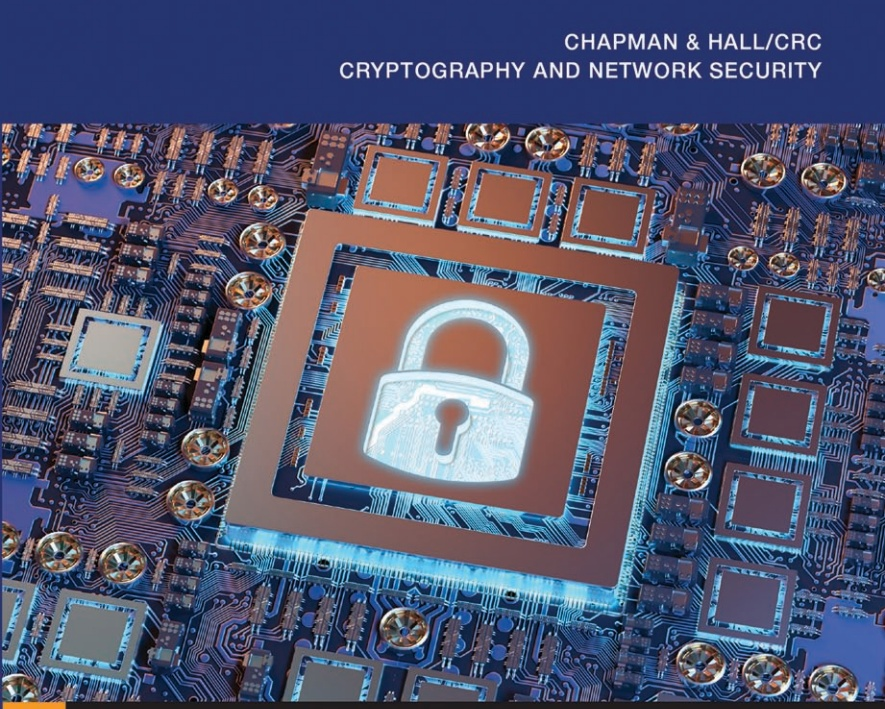

Jonathan Katz

Yehuda Lindell

# Introduction to Modern Cryptography Third Edition

Introduction to Modern Cryptography

Chapman & Hall/CRC Cryptography and Network Security Series

Introduction to Modern Cryptography Jonathan Katz and Yehuda Lindell

Series Editors: Douglas R. Stinson and Jonathan Katz

Secret History: The Story of Cryptology, Second Edition

Craig P. Bauer

Data Science for Mathematicians

Nathan Carter

Discrete Explorations

Craig P. Bauer

Cryptography: Theory and Practice, Fourth Edition

Douglas R. Stinson and Mary P. Paterson

Cryptology: Classical and Modern, Second Edition

Richard Klima and Neil Sigmon

Group Theoretic Cryptography

Maria Isabel Gonzalez Vasco and Rainer Steinwandt

Advances of DNA Computing in Cryptography

Suyel Namasudra and Ganesh Chandra Deka

Mathematical Foundations of Public Key Cryptography

Xiaoyun Wang, Guangwu Xu, Minggiang Wang, Xianmeng Meng

Guide to Pairing-Based Cryptography

Nadia El Mrabet and Marc Joye

https://www.crcpress.com/Chapman--HallCRC-Cryptography-and-Network-Security-Series/bookseries/CHCRYNETSEC

Introduction to Modern Cryptography Third Edition

Jonathan Katz and Yehuda Lindell

Third edition published 2021

by CRC Press

6000 Broken Sound Parkway NW, Suite 300, Boca Raton, FL 33487-2742

and by CRC Press

2 Park Square, Milton Park, Abingdon, Oxon, OX14 4RN

© 2021 Jonathan Katz and Yehuda Lindell

First edition published by Taylor and Francis 2007.
Second edition published by Taylor and Francis 2014.

CRC Press is an imprint of Taylor & Francis Group, LLC

The right of Jonathan Katz and Yehuda Lindell to be identified as authors of this work has been asserted by him/her/them in accordance with sections 77 and 78 of the Copyright, Designs and Patents Act 1988.

Reasonable efforts have been made to publish reliable data and information, but the author and publisher cannot assume responsibility for the validity of all materials or the consequences of their use. The authors and publishers have attempted to trace the copyright holders of all material reproduced in this publication and apologize to copyright holders if permission to publish in this form has not been obtained. If any copyright material has not been acknowledged please write and let us know so we may rectify in any future reprint.

Except as permitted under U.S. Copyright Law, no part of this book may be reprinted, reproduced, transmitted, or utilized in any form by any electronic, mechanical, or other means, now known or hereafter invented, including photocopying, microfilming, and recording, or in any information storage or retrieval system, without written permission from the publishers.

For permission to photocopy or use material electronically from this work, access www.copyright.com or contact the Copyright Clearance Center, Inc. (CCC), 222 Rosewood Drive, Danvers, MA 01923, 978-750-8400. For works that are not available on CCC please contact mpkbookspermissions@tandf.co.uk

Trademark notice: Product or corporate names may be trademarks or registered trademarks and are used only for identification and explanation without intent to infringe.

ISBN: 9780815354369 (hbk)

ISBN: 9781351133036 (ebk)

Typeset in Computer Modern font by KnowledgeWorks Global Ltd.

Visit the companion website/eResources: [insert CW/eResources URL]

To Jill, Abigail, and Rena

– JK

To Yael, Yehonatan, Itamar,

Orel, Shirel, and Noam

– YL

Taylor & Francis Group

http://taylorandfrancis.com

