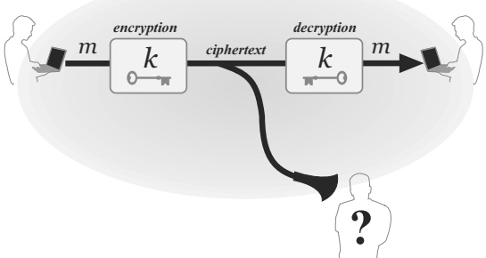
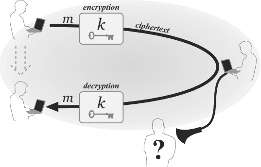
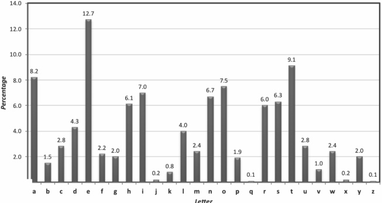

## Part I: Introduction and Classical Cryptography

# Chapter 1: Introduction

## 1.1 Cryptography and Modern Cryptography

The Concise Oxford English Dictionary (9th ed.) defines cryptography as “the art of writing or solving codes.” This is historically accurate, but does not capture the current breadth of the field or its modern scientific foundations. The definition focuses solely on the codes that have been used for centuries to enable secret communication. But cryptography nowadays encompasses much more than this: it deals with mechanisms for ensuring integrity, techniques for exchanging secret keys, protocols for authenticating users, electronic voting, cryptocurrency, and more. Without attempting to provide a complete characterization, we would say that modern cryptography involves the study of mathematical techniques for securing digital information, systems, and distributed computations against adversarial attacks.

The dictionary definition also refers to cryptography as an art. Until late in the 20th century cryptography was, indeed, largely an art. Constructing good codes, or breaking existing ones, relied on creativity and a developed sense of how codes work. There was little theory to rely on and, for a long time, no working definition of what constitutes a good code. Beginning in the 1970s and 1980s, this picture of cryptography radically changed. A rich theory began to emerge, enabling the rigorous study of cryptography as a science and a mathematical discipline. This perspective has, in turn, influenced how researchers think about the broader field of computer security.

Another very important difference between classical cryptography (say, before the 1980s) and modern cryptography relates to its adoption. Historically, the major consumers of cryptography were military organizations and governments. Today, cryptography is everywhere! If you have ever authenticated yourself by typing a password, purchased something by credit card over the Internet, or downloaded a verified update for your operating system, you have used cryptography. And, more and more, programmers with relatively little experience are being asked to “secure” the applications they write by incorporating cryptographic mechanisms.

In short, cryptography has gone from a heuristic set of techniques for ensuring secret communication for a few niche applications to a science that helps secure systems more generally for ordinary people around the world.

Goals of this book. Our goal is to make the basic principles of modern cryptography accessible to students of computer science, electrical engineering, or mathematics; to professionals who want to incorporate cryptography in systems or software they are developing; and to anyone with a basic level of mathematical maturity who is interested in understanding this fascinating field. After completing this book, the reader should appreciate the security guarantees common cryptographic primitives are intended to provide; be aware of standard (secure) constructions of such primitives; and be able to perform a basic evaluation of new schemes based on their proofs of security (or lack thereof) and the mathematical assumptions underlying those proofs. It is not our intention for readers to become experts—or to be able to design new cryptosystems—after finishing this book, but we have attempted to provide the terminology and foundational material needed for the interested reader to subsequently study the more advanced literature in this field.

This chapter. The focus of this book is the formal study of modern cryptography, but we begin in this chapter with a more informal discussion of “classical” cryptography. Besides allowing us to ease into the material, our treatment in this chapter will also serve to motivate the more rigorous approach we will be taking in the rest of the book. Our intention here is not to be exhaustive and, as such, this chapter should not be taken as a representative historical account. The reader interested in the history of cryptography is invited to consult the references at the end of this chapter.

## 1.2 The Setting of Private-Key Encryption

Classical cryptography was concerned with designing and using codes (or ciphers) that enable two parties to send messages while keeping those messages hidden from an eavesdropper who can monitor all communication between them. In modern parlance, codes are called encryption schemes and that is the terminology we will use here. Security of all classical encryption schemes relies on a secret—a key—shared by the communicating parties in advance and unknown to the eavesdropper. This scenario, in which the communicating parties share some secret information in advance, is known as the private-key (or shared-/secret-key) setting, and private-key encryption is one example of a cryptographic primitive used in this setting. Before describing some historical encryption schemes, we discuss private-key encryption more generally.

In the context of private-key encryption, two parties share a key and use that key when they want to communicate secretly. One party can send a message, or plaintext, to the other by using the shared key to encrypt (or “scramble”) the message and thus obtain a ciphertext that is transmitted to the receiver. The receiver uses the same key to decrypt (or “unscramble”) the ciphertext and recover the original message.

**FIGURE 1.1: One common use case for private-key cryptography (here, encryption): two parties share a key that they use to communicate securely.**

The same key is used to convert the plaintext into a ciphertext and back; that is why this setting is also known as the symmetric-key setting, where the symmetry lies in the fact that both parties hold the same key that is used for encryption and decryption. This is in contrast to asymmetric, or public-key, encryption (introduced in Chapter 11), where encryption and decryption use different keys.

As already noted, the goal of encryption is to keep the plaintext hidden from an eavesdropper who can monitor the communication channel and observe the ciphertext. We discuss this in more detail later in this chapter, and spend a great deal of time in Chapters 2, 3, and 5 formally defining this goal.

There are two canonical applications of private-key cryptography. In the first (cf. Figure 1.1), the two communication parties are separated in space, e.g., a worker in New York communicating with her colleague in California. These two users are assumed to have been able to securely share a key in advance of their communication. (Note that if one party simply sends the key to the other over the public communication channel, then the eavesdropper obtains the key also!) This could be accomplished, for example, by having the parties physically meet in a secure location to share a key before they separate; in the example just given, the co-workers might arrange to share a key when they are both in the New York office. In other cases, sharing a key securely is more difficult. For the next several chapters we simply assume that sharing a key is possible; we revisit this issue in Chapter 11.

The second widespread application of private-key cryptography involves the same party communicating with itself over time. (See Figure 1.2.) Consider, e.g., disk encryption, where a user encrypts some plaintext and stores the resulting ciphertext on his hard drive; the same user will return at a later point in time to decrypt the ciphertext and recover the original data. The hard drive here serves as the communication channel on which an attacker might eavesdrop if it can gain access to the hard drive and read its contents. "Sharing" the key is now trivial, though the user still needs a secure and reliable way to remember/store the key for use at a later point in time.

**FIGURE 1.2: Another common use case of private-key cryptography (again, encryption): a single user stores data securely over time.**

The syntax of encryption. Formally, a private-key encryption scheme is defined by specifying a message space $\mathcal{M}$ along with three algorithms: a procedure for generating keys (Gen), a procedure for encrypting (Enc), and a procedure for decrypting (Dec). The message space $\mathcal{M}$ defines the set of “legal” messages, i.e., those supported by the scheme. The algorithms of the scheme have the following functionality:

1. The key-generation algorithm Gen is a probabilistic algorithm that outputs a key $k$ chosen according to some distribution.
2. The encryption algorithm Enc takes as input a key $k$ and a message $m$ and outputs a ciphertext $c$. We denote by $\mathsf{Enc}_k(m)$ the encryption of the plaintext $m$ using the key $k$.
3. The decryption algorithm Dec takes as input a key $k$ and a ciphertext $c$ and outputs a plaintext $m$. We denote the decryption of the ciphertext $c$ using the key $k$ by $\mathsf{Dec}_k(c)$.

An encryption scheme must satisfy the following correctness requirement: for every key $k$ output by $\mathsf{Gen}$ and every message $m \in \mathcal{M}$, it holds that

$$
\mathsf{Dec}_{k}(\mathsf{Enc}_{k}(m))=m.
$$

In words: encrypting a message and then decrypting the resulting ciphertext using the same key yields the original message.

The set of all possible keys output by the key-generation algorithm is called the key space and is denoted by $\mathcal{K}$. Almost always, Gen simply chooses a key uniformly from the key space; in fact, one can assume without loss of generality that this is the case (see Exercise 2.1).

Reviewing our earlier discussion, an encryption scheme can be used by two parties who wish to communicate secretly as follows. First, Gen is run to obtain a key $k$ that the parties share. Later, when one party wants to send a plaintext $m$ to the other, she computes $c := \mathsf{Enc}_k(m)$ and sends the resulting ciphertext $c$ over the public channel to the other party.$^1$ Upon receiving $c$, the other party computes $m := \mathsf{Dec}_k(c)$ to recover the original plaintext.

> $^1$ We use ":=" to denote deterministic assignment, and assume for now that Enc is deterministic. A list of common notation can be found in the back of the book.

Keys and Kerckhoffs' principle. As should be clear from the above, if an eavesdropping adversary knows the algorithm Dec as well as the key $k$ shared by the two communicating parties, then that adversary will be able to decrypt any ciphertexts transmitted by those parties. It is for this reason that the communicating parties must share the key $k$ securely and keep $k$ completely hidden from everyone else. Perhaps they should keep the decryption algorithm Dec secret, also? For that matter, would it not be better for them to keep all the details of the encryption scheme secret?

Auguste Kerckhoffs [114, 115] argued the opposite in the late 19th century when elucidating several design principles for military ciphers. One of the most important of these, now known simply as Kerckhoffs' principle, was:

The cipher method must not be required to be secret, and it must be able to fall into the hands of the enemy without inconvenience.

That is, an encryption scheme should be designed to be secure even if an eavesdropper knows all the details of the scheme, so long as the attacker doesn't know the key being used. Stated differently, security should not rely on the encryption scheme being secret; instead, Kerckhoffs' principle demands that security rely solely on secrecy of the key.

There are three primary arguments in favor of Kerckhoffs' principle. The first is that it is significantly easier to maintain secrecy of a short key than to keep secret a (more complicated) encryption scheme. This is especially true when encryption is used widely. For example, consider the case where encryption is used for communication between all pairs of employees in some organization. Unless each pair of parties use their own, unique scheme, some parties will know the scheme being used by others. Moreover, information about the scheme might be leaked by one of those employees (say, after being fired), or obtained by an attacker using reverse engineering. In short, it is simply unrealistic to assume that the encryption scheme will remain secret.

Second, in case the honest parties' shared, secret information is ever exposed, it will be much easier for them to change the key than to replace the encryption scheme. (Consider updating a file versus installing a new program.) Moreover, it is relatively trivial to generate a new random secret, whereas it would be a huge undertaking to design a new encryption scheme.

Finally, prior to widespread deployment of an encryption scheme, there is a significant benefit to encouraging public review of that scheme in order to check for possible weaknesses. Going further, it is desirable to standardize encryption schemes so that (1) compatibility between different users is ensured and (2) the general public will use strong schemes that have undergone public scrutiny. Overall, perhaps counter-intuitively, it is advantageous to have broad, public dissemination of the full details of an encryption scheme—the exact opposite of keeping the scheme secret.

Nowadays Kerckhoffs' principle is understood as advocating that the entire cryptographic design process be made completely public, in stark contrast to the notion of “security by obscurity” that suggests keeping algorithms secret improves security. In fact, it is very dangerous to use a proprietary, “homebrewed” algorithm (i.e., a non-standardized algorithm designed in secret) since published designs undergo public peer review and are therefore likely to be stronger. Many years of experience have demonstrated that it is very difficult to construct good cryptographic schemes. Our confidence in the security of a scheme is much higher if it has been extensively studied by experts (beyond the designers of the scheme) and no flaws have been found. As simple and obvious as it may sound, the principle of open cryptographic design (i.e., Kerckhoffs' principle) has been ignored over and over again with disastrous results. Fortunately, today there are several secure, standardized, and widely available cryptosystems and no reason to use anything else.

## 1.3 Historical Ciphers and Their Cryptanalysis

In our study of “classical” cryptography we will examine some historical encryption schemes and show that they are insecure. Our main aims in presenting this material are (1) to highlight the weaknesses of heuristic approaches to cryptography, and thus motivate the modern, rigorous approach that will be taken in the rest of the book, and (2) to demonstrate that simple approaches to achieving secure encryption are unlikely to succeed. Along the way, we will present some central principles of cryptography inspired by the weaknesses of these historical schemes.

In this section, plaintext characters are written in lower case and ciphertext characters are written in UPPER CASE for clarity.

Caesar's cipher. One of the oldest recorded ciphers, known as Caesar's cipher, is described in De Vita Caesarum, Divus Iulius ("The Lives of the Caesars, the Deified Julius"), written in approximately 110 CE:

There are also letters of his to Cicero, as well as to his intimates on private affairs, and in the latter, if he had anything confidential to say, he wrote it in cipher, that is, by so changing the order of the letters of the alphabet, that not a word could be made out...

Julius Caesar encrypted by shifting the letters of the alphabet 3 places forward: a was replaced with D, b with E, and so on. At the very end of the alphabet, the letters wrap around and so z was replaced with C, y with B, and x with A. For example, encryption of the message begin the attack now, with spaces removed, gives:

    EHJLQWKHDWWDFNQRZ.

An immediate problem with this cipher is that the encryption method is fixed; there is no key. Thus, anyone learning how Caesar encrypted his messages would be able to decrypt effortlessly.

Interestingly, a variant of this cipher called ROT-13 (where the shift is 13 places instead of 3) is still used nowadays in various online forums. It is understood that this does not provide any cryptographic security; it is used merely to ensure that the text (say, a movie spoiler) is unintelligible unless the reader of a message makes the conscious decision to decrypt it.

The shift cipher and the sufficient key-space principle. The shift cipher can be viewed as a keyed variant of Caesar's cipher. $^2$ Specifically, in the shift cipher the key $k$ is a number between 0 and 25. To encrypt, letters are shifted as in Caesar's cipher, but now by $k$ places. Mapping this to the syntax of encryption described earlier, the message space consists of arbitrary length strings of English letters with punctuation, spaces, and numerals removed, and with no distinction between upper and lower case. Algorithm Gen outputs a uniform key $k \in \{0, \ldots, 25\}$; algorithm Enc takes a key $k$ and a plaintext and shifts each letter of the plaintext forward $k$ positions (wrapping around at the end of the alphabet); and algorithm Dec takes a key $k$ and a ciphertext and shifts every letter of the ciphertext backward $k$ positions.

> $^2$ In some books, "Caesar's cipher" and "shift cipher" are used interchangeably.

A more mathematical description is obtained by equating the English alphabet with the set $\{0, \ldots, 25\}$ (so $\mathbf{a} = 0$, $\mathbf{b} = 1$, etc.). The message space $\mathcal{M}$ is then any finite sequence of integers from this set. Encryption of the message $m = m_1 \cdots m_\ell$ (where $m_i \in \{0, \ldots, 25\}$) using key $k$ is given by

$$
\mathsf{Enc}_{k}(m_{1}\cdots m_{\ell})=c_{1}\cdots c_{\ell},\quad\mathrm{where~}c_{i}=[(m_{i}+k)\bmod 26].
$$

(The notation $[a \bmod N]$ denotes the remainder of a upon division by $N$, with ${0} \leq [a \bmod N] < N$. We refer to the process mapping $a$ to $[a \bmod N]$ as reduction modulo $N$; see also Chapter 9.) Decryption of a ciphertext $c = c_1 \cdots c_\ell$ using key $k$ is given by

$$
\mathsf{Dec}_{k}(c_{1}\cdots c_{\ell})=m_{1}\cdots m_{\ell},\quad\mathrm{where~}m_{i}=[(c_{i}-k)\bmod 26].
$$

Is the shift cipher secure? Before reading on, try to decrypt the following ciphertext that was generated using the shift cipher and a secret key $k$:

    OVDTHUFWVZZPISLRLFZHYLAOLYL.

Is it possible to recover the message without knowing $k$? Actually, it is trivial! The reason is that there are only 26 possible keys. So one can try to decrypt the ciphertext using every possible key and thereby obtain a list of 26 candidate plaintexts. The correct plaintext will certainly be on this list; moreover, if the ciphertext is “long enough” then the correct plaintext will likely be the only candidate on the list that “makes sense.” By scanning the list of candidates it is easy to recover the original plaintext. (This is not necessarily true, but will be true most of the time. Even when it is not, this attack narrows down the set of potential plaintexts to at most 26 possibilities.)

An attack that involves trying every possible key is called a brute-force or exhaustive-search attack. Clearly, for an encryption scheme to be secure it must not be vulnerable to such an attack.$^3$ This observation is known as the sufficient key-space principle:

> $^3$ Technically, this is only true if the message space is larger than the key space; we will return to this point in Chapter 2. Encryption schemes used in practice have this property.

Any secure encryption scheme must have a key space that is sufficiently large to make an exhaustive-search attack infeasible.

One can debate what amount of effort makes a task “infeasible,” and an exact determination of feasibility depends on both the resources of a potential attacker and the length of time for which the sender and receiver want to ensure secrecy of their communication. Nowadays, attackers can use supercomputers, thousands of cloud servers, or graphics processing units (GPUs) to speed up brute-force attacks. To protect against such attacks the key space must be very large—say, of size at least ${2}^{80}$, and even larger in many settings.

The sufficient key-space principle gives a necessary condition for security, but not a sufficient one. The next example demonstrates this.

The mono-alphabetic substitution cipher. In the shift cipher, the key defines a map from each letter of the (plaintext) alphabet to some letter of the (ciphertext) alphabet, where the map is a fixed shift determined by the key. In the mono-alphabetic substitution cipher the key also defines a map on the alphabet, but the map is now allowed to be arbitrary subject only to the constraint that it be one-to-one (so that decryption is possible). The key space thus consists of all bijections, or permutations, of the alphabet. So, for example, the key that defines the following permutation

a b c d e f g h i j k l m n o p q r s t u v w x y z
X E U A D N B K V M R O C Q F S Y H W G L Z I J P T

(in which a maps to X, etc.) would encrypt the message tellhimaboutme to GDOOKVCXEFLGCD. The name of this cipher comes from the fact that the key defines a (fixed) substitution for individual characters of the plaintext.

Assuming the English alphabet is being used, the key space is of size 26! = ${26} \cdot 25 \cdot 24 \cdots 2 \cdot 1$, or approximately ${2}^{88}$, and a brute-force attack is infeasible. This, however, does not mean the cipher is secure! In fact, as we will show next, it is easy to break this scheme even though it has a large key space.

Assume English-language text is being encrypted (i.e., the text is grammatically correct English writing, not just text written using characters of the English alphabet). The mono-alphabetic substitution cipher can then be attacked by utilizing statistical properties of the English language. (Of course, the same idea works for any language.) The attack relies on the facts that:

1. For any key, the mapping of each letter is fixed, and so if e is mapped to D, then every appearance of e in the plaintext will result in the appearance of D in the ciphertext.
2. The frequency distribution of individual letters in English-language text is known. (See Figure 1.3.) Of course, very short texts may deviate from this distribution, but even texts consisting of only a few sentences tend to have distributions that are very close to it.

**FIGURE 1.3: Average letter frequencies for English-language text.**

The attack works by tabulating the frequency distribution of characters in the ciphertext, i.e., recording that A appeared 12% of the time, B appeared 3% of the time, and so on. These frequencies are then compared to the known letter frequencies of normal English text. One can then guess parts of the mapping defined by the key based on the observed frequencies. For example, since $\mathbf{e}$ is the most frequent letter in English, one can guess that the most frequent character in the ciphertext corresponds to the plaintext character $\mathbf{e}$, and so on. Some of the guesses may be wrong, but enough of the guesses will be correct to enable relatively quick decryption (especially utilizing other knowledge of English, such as the fact that $\mathbf{q}$ is generally followed by $\mathbf{u}$, and that $\mathbf{h}$ is likely to appear between $\mathbf{t}$ and $\mathbf{e}$). We conclude that although the mono-alphabetic substitution cipher has a large key space, it is still insecure.

It should not be surprising that the mono-alphabetic substitution cipher can be quickly broken, since puzzles based on this cipher are common (and are solved by some people before their morning coffee!). We recommend that you try to decipher the following ciphertext—this should convince you how easy it is to carry out the attack. (Use Figure 1.3.)

    JGRMQOYGHMVBJWRWQFPWHGFFDQGFPFZRKBEEBJIZQQOCIBZKLFAFGQVFZFWWEOGWOPFGFHWOLPHLRLOLFDMFGQWBLWBWQOLKFWBYLBLYLFSFLJGRMQBOLWJVFPFWQVHQWFFPQOQVFPQOCFPOGFWFJIGFQVHLHLROQVFGWJVFPFOLFHGQVQVFILEOGQILHQFQGIQVVOSFAFGBWQVHQWIJVWJVFPFWHGFIWIHZZRQGBABHZQOCGFHX

An improved attack on the shift cipher. We can use letter-frequency tables to give an improved attack on the shift cipher. Our previous attack on the shift cipher required decrypting the ciphertext using each possible key, and then checking which key results in a plaintext that “makes sense.” A drawback of this approach is that it is somewhat difficult to automate, since it is difficult for a computer to check whether a given plaintext “makes sense.” (We do not claim that it would be impossible, as the attack could be automated using a dictionary of valid English words.) More importantly, there may be cases—we will see one later—where the plaintext characters follow the same distribution as English-language text even though the plaintext itself is not valid English, in which case checking for a plaintext that “makes sense” will not work.

We now describe an attack that does not suffer from these drawbacks. As before, associate the letters of the English alphabet with ${0}, \ldots, 25$. Let $p_i$, with ${0} \leq p_i \leq 1$, denote the frequency of the $i$th letter in normal English text (i.e., $p_0 = 0.082$ using Figure 1.3). Calculation using Figure 1.3 gives

$$
\sum_{i=0}^{25}p_{i}^{2}\approx 0.065. \tag{1.1}
$$

Now, say we are given some ciphertext and let $q_i$ denote the frequency of the $i$th letter of the alphabet in this ciphertext; i.e., $q_i$ is simply the number of occurrences of the $i$th letter of the alphabet in the ciphertext divided by the length of the ciphertext. If the key is $k$, then $p_i$ should be roughly equal to $q_{i+k}$ for all $i$ because the $i$th letter is mapped to the $(i+k)$th letter. (We use $i+k$ instead of the more cumbersome $[i+k \bmod 26]$.) Thus, if we compute

$$
I_{j}\stackrel{\mathrm{def}}{=}\sum_{i=0}^{25}p_{i}\cdot q_{i+j} \tag{1.2}
$$

for each value of $j \in \{0, \ldots, 25\}$, then we expect to find that $I_k \approx 0.065$ (where $k$ is the actual key), whereas $I_j$ for $j \neq k$ will be different from 0.065. This leads to a key-recovery attack that is easy to automate: compute $I_j$ for all $j$, and then output the value $k$ for which $I_k$ is closest to 0.065.

The Vigenère (poly-alphabetic shift) cipher. The statistical attack on the mono-alphabetic substitution cipher can be carried out because the key defines a fixed mapping that is applied letter-by-letter to the plaintext. Such an attack could be thwarted by using a poly-alphabetic substitution cipher where the key instead defines a mapping that is applied on blocks of plaintext characters. Here, for example, a key might map the 2-character block ab to DZ while mapping ac to TY; note that the plaintext character a does not get mapped to a fixed ciphertext character. Poly-alphabetic substitution ciphers "smooth out" the frequency distribution of characters in the ciphertext and make it harder to perform statistical analysis.

The Vigenère cipher, a poly-alphabetic shift cipher that is a special case of the above, can be viewed as applying different instances of the shift cipher to different parts of the plaintext. The key is now viewed as a string of letters; encryption is done by shifting each plaintext character by the amount indicated by the next character of the key, wrapping around in the key when necessary. (This degenerates to the shift cipher if the key has length 1.) For example, encryption of the message tellhimaboutme using the key cafe would work as follows:

| Plaintext:      | tellhimaboutme |
| --------------- | -------------- |
| Key (repeated): | cafecafecafeca |
| Ciphertext:     | VEQPJIREDOZXOE |

(The key need not be an English word.) This is exactly the same as encrypting the first, fifth, ninth, ... characters with the shift cipher and key c; the second, sixth, tenth, ... characters with key a; the third, seventh, ... characters with f; and the fourth, eighth, ... characters with e. Notice that in the above example l is mapped once to Q and once to P. Furthermore, the ciphertext character E is sometimes obtained from e and sometimes from a. Thus, the character frequencies of the ciphertext are “smoothed out,” as desired.

If the key is sufficiently long, cracking this cipher appears daunting. Indeed, it had been considered by many to be “unbreakable,” and although it was invented in the 16th century, a systematic attack on the scheme was only devised hundreds of years later.

Attacking the Vigenère cipher. A first observation in attacking the Vigenère cipher is that if the length of the key is known then attacking the cipher is relatively easy. Specifically, say the length of the key, also called the period, is $t$. Write the key $k$ as $k = k_1 \cdots k_t$ where each $k_i$ is a letter of the alphabet. An observed ciphertext $c = c_1 c_2 \cdots$ can be divided into $t$ parts where each part can be viewed as having been encrypted using the shift
cipher. Specifically, for all $j \in \{1, \ldots, t\}$ the ciphertext characters

$$
c_{j},c_{j+t},c_{j+2t},\ldots
$$

all resulted by shifting the corresponding characters of the plaintext by $k_j$ positions. We refer to the above sequence of characters as the jth stream. All that remains is to determine, for each of the $t$ streams, which of the 26 possible shifts was used. This is not as trivial as in the case of the shift cipher, because it is no longer possible to simply try different shifts in an attempt to determine when decryption of a stream “makes sense.” (Recall that a stream does not correspond to consecutive letters in the plaintext.) Furthermore, trying to guess the entire key $k$ at once would require a brute-force search through ${26}^t$ different possibilities, which is infeasible for large $t$. Nevertheless, we can still use letter-frequency analysis to analyze each stream independently. Namely, for each stream we tabulate the frequency of each ciphertext character and then check which of the 26 possible shifts yields the “right” probability distribution for that stream. Since this can be carried out independently for each stream (i.e., for each character of the key), this attack takes time ${26} \cdot t$ rather than time ${26}^t$.

A more principled, easier-to-automate approach is to apply the improved attack on the shift cipher (discussed earlier) to each stream. That attack did not rely on checking for a plaintext that “made sense,” but only relied on the underlying frequency distribution of characters in the plaintext.

Either of the above approaches gives a successful attack when the key length is known. What if the key length is unknown?

Note first that as long as the maximum length $T$ of the key is not too large, we can simply repeat the above attack $T$ times (once for each possible value $t \in \{1, \ldots, T\}$). This leads to at most $T$ different candidate plaintexts, among which the true plaintext will likely be easy to identify. So an unknown key length is not a serious obstacle.

There are also more efficient ways to determine the key length from an observed ciphertext. One is to use Kasiski's method, published in the mid-19th century. The first step here is to identify repeated patterns of length 2 or 3 in the ciphertext. These are likely the result of certain bigrams or trigrams that appear frequently in the plaintext. For example, consider the common word “the.” This word will be mapped to different ciphertext characters, depending on its position in the plaintext. However, if it appears twice in the same relative position, then it will be mapped to the same ciphertext characters. For a sufficiently long plaintext, there is thus a good chance that “the” will be mapped repeatedly to the same ciphertext characters.

Consider the following concrete example with the key beads (spaces have been added for clarity):

Plaintext: the man and the woman retrieved the letter from the post office
Key: beadsbeadsbeadsbeadsbeadsbeadsbeadsbeadsbeadsbeadsbeadsbeadsb
Ciphertext: ULE PSO ENG LII WREBR RHLSMEYWE XHH DFXTHJ GVOP LII PRKU SFIADI

The word the is mapped sometimes to ULE, sometimes to LII, and sometimes to XHH. However, it is mapped twice to LII, and in a long enough text it is likely that it would be mapped multiple times to each possibility. Kasiski's observation was that the distance between such repeated appearances (assuming they are not coincidental) is a multiple of the period. (In the above example, the period is 5 and the distance between the two appearances of LII is 30, which is 6 times the period.) Therefore, the greatest common divisor of the distances between repeated sequences (assuming they are not coincidental) will yield the key length $t$ or a multiple thereof.

An alternative approach, called the index of coincidence method, is more methodical and hence easier to automate. Recall that if the key length is $t$, then the ciphertext characters

$$
c_{1},c_{1+t},c_{1+2t},\ldots
$$

in the first stream all resulted from encryption using the same shift. This means that the frequencies of the characters in this sequence are expected to be identical to the character frequencies of standard English text in some shifted order. In more detail: let $q_i$ denote the observed frequency of the $i$th letter in this stream; this is simply the number of occurrences of the $i$th letter of the alphabet divided by the total number of letters in the stream. If the shift used here is $j$ (i.e., if the first character $k_1$ of the key is equal to $j$), then for all $i$ we expect $q_{i+j} \approx p_i$, where $p_i$ is the frequency of the $i$th letter of the alphabet in standard English text. (Once again, we use $q_{i+j}$ in place of $q_{[i+j \bmod 26]}$.) But this means that the sequence $q_0, \ldots, q_{25}$ is just the sequence $p_0, \ldots, p_{25}$ shifted $j$ places. As a consequence (cf. Equation (1.1)):

$$
\sum_{i=0}^{25}q_{i}^{2}\approx\sum_{i=0}^{25}p_{i}^{2}\approx 0.065.
$$

This leads to a nice way to determine the key length $t$. For $\tau = 1, 2, \ldots, T$, look at the sequence of ciphertext characters $c_1, c_{1+\tau}, c_{1+2\tau}, \ldots$ and tabulate $q_0, \ldots, q_{25}$ for this sequence. Then compute

$$
S_{\tau}\overset{\mathrm{def}}{=}\sum_{i=0}^{25}q_i^2. \tag{1.3}
$$

When $\tau = t$ we expect $S_\tau \approx 0.065$, as discussed above. On the other hand, if $\tau$ is not a multiple of $t$ we expect that all characters will occur with roughly equal probability in the sequence $c_1, c_{1+\tau}, c_{1+2\tau}, \ldots$, and so we expect $q_i \approx 1/26$ for all $i$. In this case we will obtain

$$
S_{\tau}\approx\sum_{i=0}^{25}\left(\frac{1}{26}\right)^{2}\approx 0.038.
$$

The smallest value of $\tau$ for which $S_{\tau} \approx 0.065$ is thus likely the key length. One can further validate a guess $\tau$ by carrying out a similar calculation using the second stream $c_{2}, c_{2+\tau}, c_{2+2\tau}, \ldots$, etc.

Ciphertext length and cryptanalytic attacks. The above attacks on the Vigenère cipher require a longer ciphertext than the attacks on previous schemes. For example, the index of coincidence method requires $c_1, c_{1+t}, c_{1+2t}$ (where $t$ is the actual key length) to be sufficiently long in order to ensure that the observed frequencies are close to what is expected; the ciphertext itself must then be roughly $t$ times larger. Similarly, the attack we showed on the mono-alphabetic substitution cipher requires a longer ciphertext than the attack on the shift cipher (which can work for encryptions of even a single word). This illustrates that a longer key can, in general, require the cryptanalyst to obtain more ciphertext in order to carry out an attack. (Indeed, the Vigenère cipher can be shown to be secure if the key is as long as what is being encrypted. We will see a related phenomenon in the next chapter.)

Conclusions. We have presented only a few historical ciphers. Beyond their historical interest, our aim in presenting them was to illustrate some important lessons. Perhaps the most important is that designing secure ciphers is hard. The Vigenère cipher remained unbroken for a long time. Far more complex schemes have also been used. But a complex scheme is not necessarily secure, and all historical schemes have been broken.

## 1.4 Principles of Modern Cryptography

As should be clear from the previous section, cryptography was historically more of an art than a science. Schemes were designed in a heuristic manner and evaluated based on their perceived complexity or cleverness. A scheme would be analyzed to see if any attacks could be found; if so, the scheme would be “patched” to thwart that attack, and the process repeated. Although there may have been agreement that some schemes were not secure (as evidenced by an especially damaging attack), there was no agreed-upon notion of what requirements a “secure” scheme should satisfy, and no way to give evidence that any specific scheme was secure.

Over the past several decades, cryptography has developed into more of a science. Schemes are now developed and analyzed in a more systematic manner, with the ultimate goal being to give a rigorous proof that a given construction is secure. In order to articulate such proofs, we first need formal definitions that pin down exactly what “secure” means; such definitions are useful and interesting in their own right. As it turns out, most cryptographic proofs rely on currently unproven assumptions about the algorithmic hardness of certain mathematical problems; any such assumptions must be made explicit and be stated precisely. An emphasis on definitions, assumptions, and proofs distinguishes modern cryptography from classical cryptography; we now discuss these three principles in greater detail.

### 1.4.1 Principle 1 – Formal Definitions

One of the key contributions of modern cryptography has been the recognition that formal definitions of security are essential for the proper design, study, evaluation, and usage of cryptographic primitives. Put bluntly:

If you don't understand what you want to achieve, how can you possibly know when (or if) you have achieved it?

Formal definitions provide such understanding by giving a clear description of what threats are in scope and what security guarantees are desired. As such, definitions can help guide the design of cryptographic schemes. Indeed, it is much better to formalize what is required before the design process begins, rather than to come up with a definition post facto once the design is complete. The latter approach risks having the design phase end when the designer's patience is exhausted (rather than when the goal has been met), or may result in a construction achieving more than is needed at the expense of efficiency.

Definitions also offer a way to evaluate and analyze constructions. With a definition in place, one can study a proposed scheme to see if it achieves the desired guarantees; in some cases, one can even prove a given construction secure (see Section 1.4.3) by showing that it meets the definition. On the flip side, definitions can be used to conclusively show that a given scheme is not secure, insofar as the scheme does not satisfy the definition. In particular, observe that the attacks in the previous section do not conclusively demonstrate that any of the schemes shown there is “insecure.” For example, the attack on the Vigenère cipher assumed that sufficiently long English text was being encrypted, but perhaps the Vigenère cipher is “secure” if short English text, or compressed text (which will have roughly uniform letter frequencies), is encrypted? It is hard to say without a formal definition in place.

Definitions enable a meaningful comparison of schemes. As we will see, there can be multiple (valid) ways to define security; the “right” one depends on the context in which a scheme is used. A scheme satisfying a weaker definition may be more efficient than another scheme satisfying a stronger definition; with precise definitions we can properly evaluate the trade-offs between the two schemes. Along the same lines, definitions enable secure usage of schemes. Consider deciding which encryption scheme to use for some larger application. A sound way to approach the problem is to first understand what notion of security is required for that application, and then find an encryption scheme satisfying that notion. A side benefit of this approach is modularity: a designer can “swap out” one encryption scheme and replace it with another (that also satisfies the necessary definition of security) without having to worry about affecting security of the overall application.

Writing a formal definition forces one to think about what is essential to the problem at hand and what properties are extraneous. Going through the process often reveals subtleties of the problem that were not obvious at first glance. We illustrate this next for the case of encryption.

An example: secure encryption. A common mistake is to think that formal definitions are not needed, or are trivial to come up with, because “everyone has an intuitive idea of what security means.” This is not the case. As an example, we consider the case of encryption. (The reader may want to pause here to think about how they would formally define what it means for an encryption scheme to be secure.) Although we postpone a formal definition of secure encryption to subsequent chapters, we describe here informally what such a definition should capture.

In general, a security definition has two components: a security guarantee (or, from the attacker's point of view, what constitutes a successful attack) and a threat model. The security guarantee defines what the scheme is intended to prevent the attacker from doing, while the threat model describes the power of the adversary, i.e., what actions the attacker is assumed able to carry out.

Let's start with the first of these. What should a secure encryption scheme guarantee? Here are some thoughts:

- It should be impossible for an attacker to recover the key. We have previously observed that if an attacker can determine the key shared by two parties using some scheme, then that scheme cannot be secure. However, it is easy to come up with schemes for which key recovery is impossible, yet the scheme is blatantly insecure. Consider, e.g., the scheme where $\mathsf{Enc}_k(m) = m$. The ciphertext leaks no information about the key (and so the key cannot be recovered if it is long enough) yet the message is sent in the clear! We thus see that inability to recover the key is necessary but not sufficient for security. This makes sense: the aim of encryption is to protect the message; secrecy of the key is a means for achieving this goal, but is not itself the objective.
- It should be impossible for an attacker to recover the plaintext from the ciphertext. This definition is better, but is still far from satisfactory. In particular, this definition would consider an encryption scheme secure if its ciphertexts revealed 90% of the plaintext, as long as 10% of the plaintext remained hard to figure out. This is clearly unacceptable in most common applications of encryption; for example, when encrypting a salary database, we would be justifiably upset if 90% of employees' salaries were revealed!
- It should be impossible for an attacker to recover any character of the plaintext from the ciphertext. This looks like a good definition, yet is still not sufficient. Going back to the example of encrypting a salary database, we would not consider an encryption scheme secure if it reveals whether an employee's salary is more than or less than \$100,000, even if it does not reveal any particular digit of that employee's salary. Similarly, we would not want an encryption scheme to reveal whether one particular employee makes more than another.

  Another issue is how to formalize what it means for an adversary to “recover a character of the plaintext.” What if an attacker correctly guesses, through sheer luck or external information, that the least significant digit of someone's salary is 0? Clearly that should not render an encryption scheme insecure, and so any viable definition must somehow rule out such behavior from qualifying as a successful attack.
- The "right" answer: regardless of any information an attacker already has, a ciphertext should leak no additional information about the underlying plaintext. This informal definition captures all the concerns outlined above. Note in particular that it does not try to define what information about the plaintext is “meaningful”; it simply requires that no information be leaked. This is important, as it means that a secure encryption scheme is suitable for all potential applications in which secrecy is required.

  What is missing here is a precise, mathematical formulation of the definition. How should we capture an attacker's prior knowledge about the plaintext? And what does it mean to (not) leak information? We will return to these questions in the next two chapters; see especially Definitions 2.3 and 3.12.

Now that we have fixed a security goal, it remains to specify a threat model. This specifies what “power” the attacker is assumed to have, but does not place any restrictions on the adversary’s strategy. This is an important distinction: we specify what we assume about the adversary’s abilities, but we do not assume anything about how it uses those abilities. It is impossible to foresee what strategies might be used in an attack, and history has proven that attempts to do so are doomed to failure.

There are several plausible options for the threat model in the context of encryption; standard ones, in order of increasing power of the attacker, are:

- Ciphertext-only attack: This is the most basic attack, where the adversary just observes a ciphertext (or multiple ciphertexts) and attempts to determine information about the underlying plaintext (or plaintexts). This is the threat model we have been implicitly assuming when discussing classical encryption schemes in the previous section.
- Known-plaintext attack: Here, the adversary is able to learn one or more plaintext/ciphertext pairs generated using some key. The aim of the adversary is then to deduce information about the underlying plaintext of some other ciphertext produced using the same key.

  All the classical encryption schemes we have seen are trivial to break using a known-plaintext attack; we leave a demonstration as an exercise.
- Chosen-plaintext attack: In this attack, the adversary can obtain plaintext/ciphertext pairs, as above, for plaintexts of its choice.
- Chosen-ciphertext attack: The final type of attack is one where the adversary is additionally able to obtain (some information about) the decryption of ciphertexts of its choice, e.g., whether the decryption of some ciphertext chosen by the attacker yields a valid English message. The adversary's aim, once again, is to learn information about the underlying plaintext of some other ciphertext (whose decryption the adversary is unable to obtain directly) generated using the same key.

Although the threat models are listed in order of increasing strength, none of them is inherently better than any other; the right one to use depends on the environment in which an encryption scheme is deployed.

The first two types of attack are the easiest to carry out. In a ciphertext-only attack, the only thing the adversary needs to do is eavesdrop on the communication channel over which encrypted messages are sent. In a known-plaintext attack it is assumed the adversary also obtains ciphertexts corresponding to known plaintexts. This is often easy to accomplish because not all encrypted messages are secret, at least not indefinitely. As a trivial example, two parties may always encrypt a “hello” message whenever they begin communicating. As a more complex example, encryption may be used to keep quarterly-earnings reports secret until their release date; in this case, anyone eavesdropping on the ciphertext will later obtain the corresponding plaintext.

In the latter two attacks the adversary is assumed to be able to obtain encryptions and/or decryptions of plaintexts/ciphertexts of its choice. This may at first seem strange, and we defer a more detailed discussion of these attacks, and their practicality, to Section 3.4.2 (for chosen-plaintext attacks) and Section 5.1 (for chosen-ciphertext attacks).

### 1.4.2 Principle 2 – Precise Assumptions

Most modern cryptographic constructions cannot be proven secure unconditionally; such proofs would require resolving questions in the theory of computational complexity that seem far from being answered today.$^4$ The result of this unfortunate state of affairs is that proofs of security typically rely on assumptions. Modern cryptography requires any such assumptions to be made explicit and mathematically precise. At the most basic level, this is because proofs of security require this. But there are other reasons as well:

> $^4$ In particular, most of cryptography requires the unproven assumption that $\mathsf{P} \neq \mathsf{NP}$.

1. Validation of assumptions: By their very nature, assumptions are statements that are not proven but are instead conjectured to be true. In order to strengthen our belief in some assumption, it is necessary to study it: The more the assumption is examined and tested without being refuted, the more confident we are that the assumption is true. Furthermore, study of an assumption can provide evidence of its validity by showing that it is implied by some other assumption that is also widely believed.

  If the assumption being relied upon is not precisely stated, it cannot be effectively studied and (potentially) refuted. Thus, a precondition to increasing our confidence in an assumption is having a precise statement of what exactly is being assumed.

2. Comparison of assumptions: Often in cryptography we are presented with two schemes that can both be proven to satisfy some definition, each based on a different assumption. Assuming all else is equal, which scheme should be preferred? If the assumption on which the first scheme is based is weaker than the assumption on which the second scheme is based (i.e., if the second assumption implies the first), then the first scheme is preferable since it may turn out that the second assumption is false while the first assumption is true. If the assumptions used by the two schemes are not comparable, then the general rule is to prefer the scheme that is based on the better-studied assumption in which there is presumably greater confidence.
3. Understanding the necessary assumptions: An encryption scheme may be based on some underlying building block. If some weaknesses are later found in the building block, how can we tell whether the encryption scheme is still secure? If the underlying assumptions regarding the building block are made clear as part of proving security of the scheme, then we need only check whether the required assumptions are affected by the new weaknesses that were found.

A question that sometimes arises is: rather than prove a scheme secure based on some other assumption, why not simply assume that the scheme itself is secure? In some cases—e.g., when the definition is simple and a scheme has successfully resisted attack for many years—this may be an acceptable approach. But this approach is not preferred, and is downright dangerous when a new construction is being introduced. The reasons above help explain why. First, an assumption that has been studied for several years is preferable to a new, arbitrary assumption that is introduced along with a new construction. Second, there is a general preference for “simpler” assumptions—i.e., an assumption about the hardness of a clean mathematical problem vs. an assumption that a complex scheme satisfies an elaborate security definition—since simpler assumptions are in general easier to understand and study. Another advantage of relying on “lower-level” assumptions (rather than just assuming a scheme is secure) is that these low-level assumptions can typically be used in other constructions. Finally, low-level assumptions enable modularity. Consider an encryption scheme whose security relies on some assumed property of one of its building blocks. If the underlying building block turns out not to satisfy the stated assumption, the encryption scheme can be instantiated using a different component that satisfies the necessary requirements.

### 1.4.3 Principle 3 – Proofs of Security

The two principles just described allow us to achieve our goal of providing rigorous proof that a construction satisfies a given definition under certain assumptions. Such proofs are especially important in the context of cryptography where there is an attacker who is actively trying to "break" some scheme. Proofs of security give an iron-clad guarantee—relative to the definition and assumptions—that no attacker will succeed; this is much better than taking an unprincipled or heuristic approach to the problem. Without a proof that no adversary with the specified resources can break some scheme, we are left only with our intuition that this is the case. Experience has shown that intuition in cryptography and computer security is disastrous. There are countless examples of unproven schemes that were broken, sometimes immediately and sometimes years after being developed.

#### Summary: Rigorous vs. Heuristic Approaches to Security

Reliance on definitions, assumptions, and proofs constitutes a rigorous approach to cryptography that is distinct from the informal approach of classical cryptography. Unfortunately, unprincipled, “off-the-cuff” solutions are still designed and deployed by those wishing to obtain a quick solution to a problem, or by those who are simply unknowledgeable. We hope this book will contribute to an awareness of the rigorous approach and its importance in developing provably secure schemes.

### 1.4.4 Provable Security and Real-World Security

Much of modern cryptography now rests on sound mathematical foundations. But this does not mean that the field is no longer partly an art as well. The rigorous approach leaves room for creativity in developing definitions suited to contemporary applications and environments, in proposing new mathematical assumptions and designing new primitives, and in constructing novel schemes and proving them secure. There will also always be the art of attacking deployed cryptosystems, even when they are proven secure. We expand on this point next.

The approach taken by modern cryptography has revolutionized the field, and helps provide confidence in the security of cryptographic schemes deployed in the real world. But it is important not to overstate what a proof of security implies. A proof of security is always relative to the definition being considered and the assumption(s) being used. If the security guarantee does not match what is needed, or the threat model does not capture the adversary's true abilities, then the proof may be irrelevant. Similarly, if the assumption that is relied upon turns out to be false, then the proof of security is meaningless.

The take-away point is that provable security of a scheme does not necessarily imply security of that scheme in the real world.$^5$ While some have viewed this as a drawback of provable security, we view this optimistically as illustrating the strength of the approach. To attack a provably secure scheme in the real world, the attacker is forced to focus attention on the definition (i.e., to explore how the idealized definition differs from the real-world requirements) or the underlying assumptions (i.e., to see whether they hold). In turn, it is the job of cryptographers to continually refine their definitions to more closely match the real world, and to investigate their assumptions to test their validity. Provable security does not end the age-old battle between attacker and defender, but it does provide a framework that helps shift the odds in the defender's favor.

> $^5$ Here we are not even considering the possibility of an incorrect implementation of the scheme. Poorly implemented cryptography is a serious problem in the real world, but this problem is largely outside the scope of this book.

## References and Additional Reading

In this chapter, we have studied just a few of the known historical ciphers. There are many others of both historical and mathematical interest, and we refer the reader to textbooks by Stinson [195] or Trappe and Washington [196] for further details. The important role cryptography has played throughout history is a fascinating subject covered in books by Kahn [106] and Singh [188].

Shannon [177] was the first to pursue a rigorous approach to cryptography based on precise definitions and mathematical proofs; we explore his work in the next chapter.

## Exercises

1.1 Decrypt the ciphertext provided at the end of the section on mono-alphabetic substitution ciphers.

1.2 Provide a formal definition of the Gen, Enc, and Dec algorithms for the mono-alphabetic substitution cipher.

1.3 Provide a formal definition of the Gen, Enc, and Dec algorithms for the Vigenère cipher. (Note: there are several plausible choices for Gen; choose one.)

1.4 Say you are given a ciphertext that corresponds to English-language text that was encrypted using either the shift cipher or the Vigenère cipher with period greater than 1. How could you tell which was the case?

1.5 Implement the attacks described in this chapter for the shift cipher and the Vigenère cipher.

1.6 The shift and Vigenère ciphers can also be defined on the 256-character alphabet consisting of all possible bytes (8-bit strings), and using XOR instead of modular addition.

(a) Provide a formal definition of both schemes in this case.

(b) Discuss how the attacks we have shown in this chapter can be modified to break these schemes.

1.7 The index of coincidence method relies on a known value for the sum of the squares of plaintext-letter frequencies (cf. Equation (1.1)). Why would it not work using the sum $\sum_i p_i$ itself?

1.8 Show that the shift, substitution, and Vigenère ciphers are all trivial to break using a chosen-plaintext attack. How much chosen plaintext is needed to recover the key for each of the ciphers?

1.9 Assume an attacker knows that a user's password is either abcd or bedg. Say the user encrypts his password using the shift cipher, and the attacker sees the resulting ciphertext. Show how the attacker can determine the user's password, or explain why this is not possible.

1.10 Repeat the previous exercise for the Vigenère cipher using period 2, using period 3, and using period 4.

1.11 The attack on the Vigenère cipher has two steps: (a) find the key length by identifying $\tau$ with $S_{\tau} \approx 0.065$ (cf. Equation (1.3)) and (b) for each character of the key, find $j$ maximizing $I_j$ (cf. Equation (1.2)), using $\{p_i\}$ corresponding to English text. What happens in each case if the underlying plaintext is in a language other than English?
