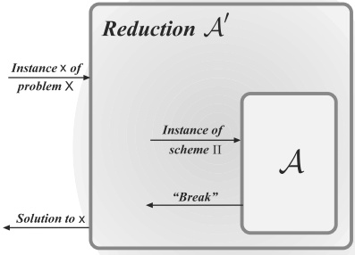
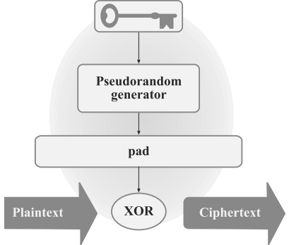
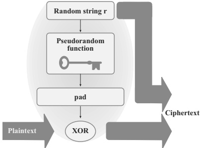
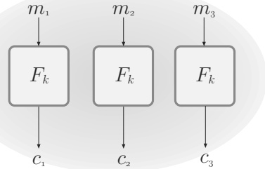
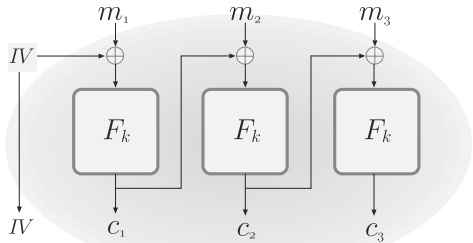
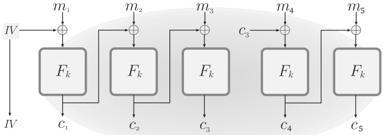
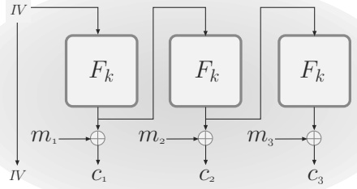
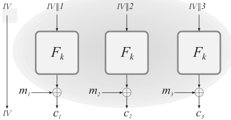

# Chapter 3: Private-Key Encryption

In the previous chapter we saw some fundamental limitations of perfect secrecy. In this chapter we begin our study of modern cryptography by introducing the weaker (but sufficient) notion of computational secrecy. We then show how this definition can be used to bypass the impossibility results shown previously for perfect secrecy and, in particular, how a short key (say, 128 bits long) can be used to encrypt many long messages (say, gigabytes in total).

Along the way we will study the fundamental notion of pseudorandomness, which captures the idea that something can “look” completely random even though it is not. This powerful concept underlies much of modern cryptography, and has applications and implications beyond the field as well.

## 3.1 Computational Security

In Chapter 2 we introduced the notion of perfect secrecy. While perfect secrecy is a worthwhile goal, it is also unnecessarily strong. Perfect secrecy requires that absolutely no information about an encrypted message is leaked, even to an eavesdropper with unlimited computational power. For all practical purposes, however, an encryption scheme would still be considered secure if it leaked information with some tiny probability to eavesdroppers with bounded computational power. For example, a scheme that leaks information with probability at most ${2}^{-60}$ to eavesdroppers investing up to 200 years of computational effort on the fastest available supercomputer (or cluster of computers) would be more than adequate for real-world applications. Computational security definitions take into account computational limits on an attacker, and allow for a small probability that security is violated, in contrast to notions (such as perfect secrecy) that are information-theoretic in nature. Computational security is now the de facto way in which security is defined for almost all cryptographic applications.

We stress that although we give up on obtaining perfect secrecy, this does not mean we do away with the rigorous mathematical approach we have been taking so far. Definitions and proofs are still essential; the only difference is that we now consider a weaker (but still meaningful) notion of security.

As discussed, computational security definitions incorporate two relaxations relative to information-theoretic notions of security:

1. Security is only guaranteed against *efficient* adversaries that run for some feasible amount of time. This means that given enough time (or sufficient computational resources) an attacker may be able to violate security. If we can make the resources required to break the scheme larger than those available to any realistic attacker, however, then for all practical purposes the scheme is unbreakable.

2. Adversaries can potentially succeed (i.e., security can potentially fail) with some very small probability. If we can make this probability sufficiently small, we need not worry about it.

(As we will see, both these relaxations are necessary in order to overcome the limitations of perfect secrecy shown in the last chapter.) To obtain a meaningful theory, we need to precisely define what we mean by the above relaxations. There are two general approaches for doing so: the concrete approach and the asymptotic approach. These are described next.

### 3.1.1 The Concrete Approach

The concrete approach to computational security quantifies the security of a cryptographic scheme by explicitly bounding the maximum success probability of a (randomized) adversary running for some specified amount of time or, more precisely, investing some specified amount of computational effort. Thus, a concrete definition of security takes the following form:

A scheme is $(t,\varepsilon)$-secure if any adversary running for time at most $t$ succeeds in breaking the scheme with probability at most $\varepsilon$.

(Of course, the above serves only as a general template, and for it to make sense we need to define exactly what it means to “break” the scheme in question.) As an example, one might have a scheme with the guarantee that no adversary running for at most 200 years using the fastest available supercomputer can succeed in breaking the scheme with probability better than ${2}^{-60}$. Or, it may be more convenient to measure running time in terms of CPU cycles, and to construct a scheme such that no adversary using at most ${2}^{80}$ cycles can break the scheme with probability better than ${2}^{-60}$.

It is instructive to get a feel for the large values of $t$ and the small values of $\varepsilon$ that are typical of modern cryptosystems.

**Example 3.1**

Modern private-key encryption schemes are generally assumed to give almost optimal security in the following sense: when the key has length $n$—and so the key space has size ${2}^n$—an adversary running for time $t$ (measured in, say,

CPU cycles) succeeds in breaking the scheme with probability at most $ct/2^n$ for some fixed constant $c$. (This simply corresponds to a brute-force search of the key space.)

Assuming $c = 1$ for simplicity, a key of length $n = 64$ provides adequate security against an adversary using a standard desktop computer. Indeed, on a 4 GHz processor with 16 cores that executes ${4} \times 10^9$ cycles per second per core, ${2}^{64}$ CPU cycles require ${2}^{64}/(4 \times 10^9 \times 16)$ seconds, or about 9 years. (The above numbers are for illustrative purposes only; in practice $c \neq 1$, and several other factors—including the time required for accessing memory—can significantly affect the performance of brute-force attacks.)

However, there is no reason to assume that an adversary is limited to a desktop computer, and powerful adversaries are able to carry out computations orders of magnitude faster. Today, the minimum recommended key length is $n = 128$. The difference between ${2}^{64}$ and ${2}^{128}$ is a multiplicative factor of ${2}^{64}$. To get a feeling for how big this is, note that according to physicists' estimates the number of seconds since the Big Bang is on the order of ${2}^{58}$.

If the probability that an attacker can successfully recover an encrypted message in one year is at most ${2}^{-60}$, then it is much more likely that the sender and receiver will both be hit by lightning in that time period than that the attacker will recover the message! Something that occurs with probability ${2}^{-60}$ each second is expected to occur roughly once every 10 billion years.

The concrete approach is important in practice, since concrete guarantees are what users of a cryptographic scheme are ultimately interested in. However, precise concrete guarantees are difficult to provide. Furthermore, one must be careful in interpreting concrete-security claims. For example, a claim that no adversary running for 5 years can break a given scheme with probability better than $\varepsilon$ begs the questions: what type of computing power (e.g., desktop PC, supercomputer, network of hundreds of computers) does this assume? Does this take into account expected future advances in computing power (which, by Moore's Law, roughly doubles every 18 months)? Does the estimate assume the use of “off-the-shelf” algorithms, or dedicated hardware optimized for the attack? Furthermore, such a guarantee says little about the success probability of an adversary running for 2 years (other than the fact that it can be at most $\varepsilon$) and says nothing about the success probability of an adversary running for 10 years.

### 3.1.2 The Asymptotic Approach

As partly noted above, there are some technical and theoretical difficulties in using the concrete-security approach. These issues must be dealt with in practice but when describing schemes abstractly (as we do in this book) it is convenient instead to use an asymptotic approach. This approach, rooted in complexity theory, introduces an integer-valued security parameter (denoted by $n$) that parameterizes both cryptographic schemes as well as all involved
parties (i.e., the honest parties as well as the attacker). When honest parties use a scheme (e.g., when they generate a key), they choose some value for the security parameter; for the purposes of this discussion, one can view the security parameter as corresponding to the length of the key. We also view the running time of the adversary, as well as its success probability, as functions of the security parameter rather than as fixed, concrete values. Then:

1. We equate “efficient adversaries” with randomized (i.e., probabilistic) algorithms running in time polynomial in $n$. This means there is some polynomial $p$ such that the adversary runs for time at most $p(n)$ when the security parameter is $n$. We also require—for real-world efficiency—that honest parties run in polynomial time, although we stress that the adversary may be much more powerful (and run much longer) than the honest parties.

2. We equate the notion of “small probabilities of success” with success probabilities smaller than any inverse polynomial in $n$. (See Definition 3.4.) Such probabilities are called negligible.

Let PPT stand for “probabilistic polynomial-time.” A definition of asymptotic security then takes the following general form:

A scheme is secure if any PPT adversary succeeds in breaking the scheme with at most negligible probability.

This notion of security is asymptotic since it depends on a scheme's behavior for sufficiently large values of $n$. The following example illustrates this.

**Example 3.2**

Say we have a scheme that is asymptotically secure. Then it may be the case that an adversary running for $n^3$ minutes can succeed in “breaking the scheme” with probability ${2}^{40}/{2}^n$ (which is a negligible function of $n$). When $n \leq 40$ this means that an adversary running for ${40}^3$ minutes (about 6 weeks) can break the scheme with probability 1, so such values of $n$ are not very useful. Even for $n = 50$ an adversary running for ${50}^3$ minutes (about 3 months) can break the scheme with probability roughly 1/1000, which may not be acceptable. On the other hand, when $n = 500$ an adversary running for 200 years breaks the scheme only with probability roughly ${2}^{-460}$.

As indicated by the previous example, we can view the security parameter as a mechanism that allows the honest parties to “tune” the security of a scheme to some desired level. (Increasing the security parameter also increases the time required to run the scheme, as well as the length of the key, so the honest parties will want to set the security parameter as small as possible subject to defending against the class of attacks they are concerned about.) Viewing the security parameter as the key length, this corresponds to the fact
that the time required for an exhaustive-search attack grows exponentially in the length of the key. The ability to “increase security” by increasing the security parameter has important practical ramifications, since it enables honest parties to defend against increases in computing power. The following example gives a sense of how this might play out in practice.

**Example 3.3**

Let us see the effect that the availability of faster computers might have on security in practice. Say we have a cryptographic scheme in which the honest parties run for ${10}^6 \cdot n^2$ cycles, and for which an adversary running for ${10}^8 \cdot n^4$ cycles can succeed in “breaking” the scheme with probability at most ${2}^{-n/2}$. (The numbers are intended to make calculations easier, and are not meant to correspond to any existing cryptographic scheme.)

Assume all parties are using 2 GHz computers and the honest parties set $n = 80$. Then the honest parties run for ${10}^6 \cdot 6400$ cycles, or 3.2 seconds, and an adversary running for ${10}^8 \cdot (80)^4$ cycles, or roughly 3 weeks, can break the scheme with probability only ${2}^{-40}$.

Say 8 GHz computers become available, and all parties upgrade. Honest parties can increase $n$ to 160 (which requires generating a fresh key) and maintain a running time of 3.2 seconds (i.e., ${10}^6 \cdot 160^2$ cycles at ${8} \cdot 10^9$ cycles/second). In contrast, the adversary now has to run for over 8 million seconds, or more than 13 weeks, to achieve a success probability of ${2}^{-80}$. The effect of a faster computer has been to make the adversary's job harder.

Even when using the asymptotic approach it is important to remember that when a cryptosystem is ultimately deployed a concrete security guarantee will be needed. (After all, some value of $n$ must be chosen, and it is important to understand what level of security is being provided.) As the above examples indicate, however, an asymptotic security claim can typically be translated into a concrete security bound for any desired value of $n$.

#### The Asymptotic Approach in Detail

We now discuss more formally the notions of “polynomial-time algorithms” and “negligible success probabilities.”

Efficient algorithms. A function $f$ from the natural numbers to the nonnegative real numbers is polynomially bounded (or simply polynomial) if there is a constant $c$ such that $f(n) < n^c$ for all $n$. An algorithm $A$ runs in polynomial time if there exists a polynomial $p$ such that, for every input $x \in \{0,1\}^*$, the computation of $A(x)$ terminates within at most $p(|x|)$ steps. (Here, $|x|$ denotes the length of the string $x$). As mentioned earlier, we equate efficient adversaries with those whose running time is polynomial in the security parameter $n$. When it is necessary to explicitly indicate this, we provide the security parameter in unary (i.e., the string ${1}^n$ consisting of $n$ ones) as input
to an algorithm. An algorithm may take other inputs besides the security parameter—for example, a message to be encrypted—and in that case we allow its running time to be polynomial in the total length of its inputs.

A technical advantage of working with polynomials is that they obey certain closure properties. In particular, if $p_1, p_2$ are two polynomials, then the function $p(n) = p_1(p_2(n))$ is also polynomial.

By default, we allow all algorithms to be probabilistic (i.e., randomized). Any such algorithm is assumed to have access to a sequence of unbiased, independent random bits. Equivalently, a randomized algorithm is given (in addition to its input) a uniformly distributed random tape of sufficient length whose bits it can use, as needed, throughout its execution.

We consider randomized algorithms by default for two reasons. First, randomness is essential to cryptography (e.g., in order to choose random keys and so on) and so honest parties must be probabilistic; given this, it is natural to allow adversaries to be probabilistic as well. Second, randomization is practical and—as far as we know—gives attackers additional power. Since our goal is to model all realistic attacks, we prefer a more liberal definition of efficient computation.

Negligible success probability. A negligible function is one that is asymptotically smaller than any inverse polynomial function. Formally:

DEFINITION 3.4 A function $f$ from the natural numbers to the nonnegative real numbers is negligible if for every polynomial $p$ there is an $N$ such that for all $n > N$ it holds that $f(n) < \frac{1}{p(n)}$.

The above is equivalently stated as follows: for every polynomial $p$ and all sufficiently large values of $n$ it holds that $f(n) < \frac{1}{p(n)}$. Or, in other words, for all constants $c$ there exists an $N$ such that for all $n > N$ it holds that $f(n) < n^{-c}$. We typically denote an arbitrary negligible function by $\mathsf{negl}$.

**Example 3.5**

The functions ${2}^{-n}, {2}^{-\sqrt{n}}$, and $n^{-\log n}$ are all negligible. However, they approach zero at very different rates. For example, we can look at the minimum value of $n$ for which each function is smaller than ${1}/n^5$:

1. Solving ${2}^{-n} \lt n^{-5}$ we get $n > 5\log n$. The smallest integer value of $n > 1$ for which this holds is $n = 23$.

2. Solving ${2}^{-\sqrt{n}} \lt n^{-5}$ we get $n > 25 \log^{2} n$. The smallest integer value of $n > 1$ for which this holds is $n \approx 3500$.

3. Solving $n^{-\log n} < n^{-5}$ we get $\log n > 5$. The smallest integer value of $n$ for which this holds is $n = 33$.

From the above you may have the impression that $n^{-\log n}$ is smaller than ${2}^{-\sqrt{n}}$. However, this is incorrect; for all $n > 65536$ it holds that ${2}^{-\sqrt{n}} \lt n^{-\log n}$. Nevertheless, this does show that for values of $n$ in the hundreds or thousands, an adversarial success probability of $n^{-\log n}$ is preferable to an adversarial success probability of ${2}^{-\sqrt{n}}$.

A technical advantage of working with negligible success probabilities is that they obey certain closure properties. The following is an easy exercise.

PROPOSITION 3.6 Let $\mathsf{negl}_1$ and $\mathsf{negl}_2$ be negligible functions. Then,

1. The function $\mathsf{negl}_{3}(n) = \mathsf{negl}_{1}(n) + \mathsf{negl}_{2}(n)$ is negligible.

2. For any polynomial $p$, the function $\mathsf{negl}_{4}(n) = p(n) \cdot \mathsf{negl}_{1}(n)$ is negligible.

The second part of the above proposition implies that if a certain event occurs with only negligible probability in some experiment, then the event occurs with negligible probability even if that experiment is repeated polynomially many times. (This relies on the union bound; see Proposition A.7.) For example, the probability that n fair coin flips all come up “heads” is ${2}^{-n}$, which is negligible. This means that even if we repeat the experiment of flipping n coins polynomially many times, the probability that even one of those experiments results in n heads is still negligible.

A corollary of the second part of the above proposition is that if a function $g$ is not negligible, then neither is the function $f(n) \overset{\mathrm{def}}{=} g(n)/p(n)$ for any polynomial $p$.

#### Asymptotic Security: A Summary

Any security definition consists of two components: a definition of what is considered a “break” of the scheme, and a specification of the power of the adversary. The power of the adversary can relate to many issues (e.g., in the case of encryption, whether we assume a ciphertext-only attack or a chosen-plaintext attack). However, when it comes to the computational power of the adversary, we will from now on model the adversary as efficient and thus only consider adversarial strategies that can be implemented in probabilistic polynomial time. (The only exceptions are Section 4.6, where we revisit information-theoretic security, and Chapter 14, where we consider quantum polynomial-time attackers.) Definitions will also be formulated so that a break that occurs with negligible probability is not considered significant. Thus, the general framework of any security definition will be:

A scheme is secure if for every probabilistic polynomial-time adversary $\mathcal{A}$ carrying out an attack (of some formally specified type), the probability that $\mathcal{A}$ succeeds in the attack (where success is also formally specified) is negligible.

Such a definition is asymptotic because it is possible that for small values of $n$ an adversary can succeed with high probability. In order to see this more clearly, we expand the term “negligible” in the above statement:

A scheme is secure if for every PPT adversary $\mathcal{A}$ carrying out an attack, and every polynomial $p$, there is an integer $N$ such that when $n > N$ the probability that $\mathcal{A}$ succeeds in the attack is less than $\frac{1}{p(n)}$.

Note that nothing is guaranteed for values $n \leq N$.

#### On the Choices Made in Defining Asymptotic Security

In defining the general notion of asymptotic security, we have made two choices: we have identified efficient adversarial strategies with the class of probabilistic polynomial-time algorithms, and have equated small chances of success with negligible probabilities. Both these choices are—to some extent—arbitrary, and one could build a perfectly reasonable theory by defining, say, efficient strategies as those running in time ${2}^{o(n)}$, or small success probabilities as those bounded by ${2}^{-n}$. Nevertheless, we briefly justify the choices we have made (which are the standard ones).

Those familiar with complexity theory or algorithms will recognize that the idea of equating efficient computation with (probabilistic) polynomial-time algorithms is not unique to cryptography. One advantage of using (probabilistic) polynomial time as our notion of efficiency is that this frees us from having to specify our model of computation precisely, since the extended Church-Turing thesis states that all “reasonable” models of computation are polynomially equivalent. $^{1}$ Thus, we need not specify whether we use Turing machines, boolean circuits, or random-access machines; we can present algorithms in high-level pseudocode and be confident that if our analysis shows that an algorithm runs in polynomial time, then any reasonable implementation of that algorithm will run in polynomial time.

Another advantage of (probabilistic) polynomial-time algorithms is that they satisfy desirable closure properties: in particular, an algorithm that does only polynomial computation and makes polynomially many calls to polynomial-time subroutines will itself run in polynomial time.

The most important feature of negligible probabilities is the closure property we have already seen in Proposition 3.6(2): a polynomial multiplied by a negligible function is still negligible. This means, in particular, that if a polynomial-time algorithm makes polynomially many calls to some subroutine that “fails” with negligible probability each time it is called, then the probability that any call to that subroutine fails is still negligible.

#### Necessity of the Relaxations

Computational secrecy introduces two relaxations of perfect secrecy: first, secrecy is guaranteed only against efficient adversaries; second, secrecy may "fail" with small probability. Both these relaxations are essential for achieving practical encryption schemes, and in particular for bypassing the negative results for perfectly secret encryption. We informally discuss why this is the case. Assume we have an encryption scheme where the size of the key space $\mathcal{K}$ is smaller than the size of the message space $\mathcal{M}$. (As shown in the previous chapter, this means the scheme cannot be perfectly secret.) Two attacks apply regardless of how the encryption scheme is constructed:

Given a ciphertext $c$, an adversary can decrypt $c$ using all keys $k \in \mathcal{K}$. This gives a list of all the messages to which $c$ can possibly correspond. Since this list cannot contain all of $\mathcal{M}$ (because $|\mathcal{K}| < |\mathcal{M}|$), this attack leaks some information about the message that was encrypted.

Moreover, say the adversary carries out a known-plaintext attack and learns that ciphertexts $c_1, \ldots, c_\ell$ correspond to the messages $m_1, \ldots, m_\ell$, respectively. The adversary can again try decrypting each of these ciphertexts with all possible keys until it finds a key $k$ for which $\mathsf{Dec}_k(c_i) = m_i$ for all $i$. Later, given a ciphertext $c$ that is the encryption of an unknown message $m$, it is almost surely the case that $\mathsf{Dec}_k(c) = m$.

Brute-force attacks like the above allow an adversary to “succeed” with probability $\approx 1$ in time $\mathcal{O}(|\mathcal{K}|)$.

- Consider again the case where the adversary learns that ciphertexts $c_1, \ldots, c_\ell$ correspond to messages $m_1, \ldots, m_\ell$. The adversary can guess a uniform key $k \in \mathcal{K}$ and check whether $\mathsf{Dec}_k(c_i) = m_i$ for all $i$. If so, then, as above, the attacker can use $k$ to decrypt anything subsequently encrypted by the honest parties.

Here the adversary runs in constant time and “succeeds” with nonzero probability ${1}/|\mathcal{K}|$.

Nevertheless, by setting $|\mathcal{K}|$ large enough we can hope to achieve meaningful secrecy against attackers running in time much less than $|\mathcal{K}|$ (so the attacker does not have sufficient time to carry out a brute-force attack), except possibly with small probability on the order of ${1}/|\mathcal{K}|$.

## 3.2 Defining Computationally Secure Encryption

Given the background of the previous section, we are ready to present a definition of computational security for private-key encryption. First, we redefine the syntax of private-key encryption; this will be largely the same as the syntax introduced in Chapter 2 except that we now explicitly take into account the security parameter $n$. We also make two other changes: we allow the decryption algorithm to output an error (e.g., in case it is presented with an invalid ciphertext), and let the message space be the set $\{0,1\}^{*}$ of all (finite-length) binary strings by default.

DEFINITION 3.7 A private-key encryption scheme consists of three probabilistic polynomial-time algorithms (Gen, Enc, Dec) such that:

1. The key-generation algorithm Gen takes as input ${1}^n$ (i.e., the security parameter written in unary) and outputs a key $k$; we write $k \leftarrow \mathsf{Gen}(1^n)$ (emphasizing that Gen is a randomized algorithm). We assume without loss of generality that any key $k$ output by $\mathsf{Gen}(1^n)$ satisfies $|k| \geq n$.

2. The encryption algorithm Enc takes as input a key $k$ and a plaintext message $m \in \{0,1\}^*$, and outputs a ciphertext $c$. Since Enc may be randomized, we write this as $c \leftarrow \mathsf{Enc}_k(m)$.

3. The decryption algorithm Dec takes as input a key $k$ and a ciphertext $c$, and outputs a message $m \in \{0,1\}^{*}$ or an error. We denote a generic error by the symbol $\perp$.

It is required that for every $n$, every key $k$ output by $\mathsf{Gen}(1^n)$, and every $m \in \{0,1\}^*$, it holds that $\mathsf{Dec}_k(\mathsf{Enc}_k(m)) = m$.

If $(\mathsf{Gen}, \mathsf{Enc}, \mathsf{Dec})$ is such that for $k$ output by $\mathsf{Gen}(1^n)$, algorithm $\mathsf{Enc}_k$ is only defined for messages $m \in \{0,1\}^{\ell(n)}$, then we say that $(\mathsf{Gen}, \mathsf{Enc}, \mathsf{Dec})$ is a fixed-length private-key encryption scheme for messages of length $\ell(n)$.

Almost always, $\mathsf{Gen}(1^n)$ simply outputs a uniform $n$-bit string as the key. When this is the case, we omit $\mathsf{Gen}$ and define a private-key encryption scheme to be a pair of algorithms ( $\mathsf{Enc}, \mathsf{Dec}$). Without significant loss of generality, we assume $\mathsf{Dec}$ is deterministic throughout this book, and so write $m := \mathsf{Dec}_k(c)$.

The above definition considers stateless schemes, in which each invocation of Enc is independent of all prior invocations (and similarly for Dec). Later in this chapter, we will discuss stateful schemes in which parties may maintain local state that is updated after each invocation of Enc and/or Dec. We assume encryption schemes are stateless (as in the above definition) unless explicitly noted otherwise.

### 3.2.1 The Basic Definition of Security (EAV-Security)

We begin by presenting the most basic notion of computational security for private-key encryption: security against a ciphertext-only attack where the adversary observes only a single ciphertext or, equivalently, security when a given key is used to encrypt just a single message. We consider stronger definitions of security later.

Motivating the definition. As we have already discussed, any definition of security consists of two distinct components: a threat model (i.e., a specification of the assumed power of the adversary) and a security goal (usually specified by describing what constitutes a “break” of the scheme). We begin our definitional treatment by considering the simplest threat model, where there is an eavesdropping adversary who observes the encryption of a single message. This is exactly the threat model we considered in the previous chapter. This only difference here is that, as explained in the previous section, we are now interested only in computationally bounded adversaries that are limited to running in polynomial time.

Although we have made two assumptions about the adversary's capabilities (namely, that it eavesdrops on one ciphertext, and that it runs in polynomial time), we make no assumptions whatsoever about the adversary's strategy in trying to decipher the ciphertext it observes. This is crucial for obtaining meaningful notions of security: the definition ensures protection against any computationally bounded eavesdropper, regardless of the algorithm it uses.

Correctly defining the security goal for encryption is not trivial, but we have already discussed this issue at length in Section 1.4.1 and in the previous chapter. We therefore just recall that the idea behind the definition is that the adversary should be unable to learn any partial information about the plaintext from the ciphertext. The definition of semantic security (cf. Section 3.2.2) exactly formalizes this notion, and was the first definition of computationally secure encryption to be proposed. Semantic security is complex and difficult to work with. Fortunately, there is an equivalent definition called indistinguishability that is much simpler.

The definition of indistinguishability is patterned on the alternative definition of perfect secrecy given as Definition 2.6. (This serves as further justification that the definition of indistinguishability is a good one.) Recall that Definition 2.6 considers an experiment $\mathsf{PrivK}_{\mathcal{A},\Pi}^{\mathsf{eav}}$ in which an adversary $\mathcal{A}$ outputs two messages $m_0$ and $m_1$, and is then given an encryption of one of those messages using a randomly generated key. The definition states that a scheme $\Pi$ is secure if no adversary $\mathcal{A}$ can determine which of the messages $m_0, m_1$ was encrypted with probability any different from ${1}/{2}$ (which is the probability that $\mathcal{A}$ is correct if it just makes a random guess).

Here, we keep the experiment $\mathsf{PrivK}_{\mathcal{A},\Pi}^{\mathsf{eav}}$ almost exactly the same (except for some technical differences discussed below), but introduce two important modifications in the definition itself:

1. We now consider only adversaries running in polynomial time, whereas Definition 2.6 considered even adversaries with unbounded running time.

2. We now concede that the adversary might determine the encrypted message with probability negligibly better than 1/2.

As discussed extensively in the previous section, the above relaxations constitute the core elements of computational security.

As for the other differences, the most prominent is that we now parameterize the experiment by a security parameter $n$. The running time of the adversary $\mathcal{A}$, as well as its success probability, are then both viewed as functions of $n$. We write $\mathsf{PrivK}_{\mathcal{A},\Pi}^{\mathsf{eav}}(n)$ to denote the experiment being run with security parameter $n$, and write

$$
\Pr[\mathsf{PrivK}_{\mathcal{A},\Pi}^{\mathsf{eav}}(n)=1]\tag{3.1}
$$

to denote the probability that the output of experiment $\mathsf{PrivK}_{\mathcal{A},\Pi}^{\mathsf{eav}}(n)$ is 1. Note that with $\mathcal{A}$, $\Pi$ fixed, the expression in Equation (3.1) is a function of $n$.

A second difference is that we now explicitly require the adversary to output two messages $m_0, m_1$ of equal length. (In Definition 2.6 this requirement is implicit if the message space $\mathcal{M}$ only contains messages of some fixed length, as is the case for the one-time pad encryption scheme.) This means that, by default, we do not require a secure encryption scheme to hide the length of the plaintext. We revisit this point at the end of this section; see also Exercises 3.2 and 3.3.

Indistinguishability in the presence of an eavesdropper. We now give the formal definition, beginning with the experiment outlined above. The experiment is defined for a private-key encryption scheme $\Pi = (\mathsf{Gen}, \mathsf{Enc}, \mathsf{Dec})$, an adversary $\mathcal{A}$, and a value $n$ for the security parameter:

The adversarial indistinguishability experiment PrivK_{A,Π}^{eav}(n):

1. The adversary $\mathcal{A}$ is given input ${1}^{n}$, and outputs a pair of messages $m_{0}, m_{1}$ with $|m_{0}| = |m_{1}|$.

2. A key $k$ is generated by running $\mathsf{Gen}(1^n)$, and a uniform bit $b \in \{0,1\}$ is chosen. Ciphertext $c \leftarrow \mathsf{Enc}_k(m_b)$ is computed and given to $\mathcal{A}$. We refer to $c$ as the challenge ciphertext.

3. $\mathcal{A}$ outputs a bit $b'$.

4. The output of the experiment is defined to be 1 if $b^{\prime} = b$, and 0 otherwise. If $\mathsf{PrivK}_{\mathcal{A},\Pi}^{\mathsf{eav}}(n) = 1$, we say that $\mathcal{A}$ succeeds.

There is no limitation on the lengths of $m_0$ and $m_1$, as long as they are the same. (Of course, if $\mathcal{A}$ runs in polynomial time, then $m_0$ and $m_1$ have length polynomial in $n$.) If $\Pi$ is a fixed-length scheme for messages of length $\ell(n)$, the above experiment is modified by requiring $m_0, m_1 \in \{0,1\}^{\ell(n)}$.

The fact that the adversary can only eavesdrop is implicit in the fact that the adversary is given only a (single) ciphertext, and does not have any further interaction with the sender or the receiver. (As we will see later, allowing additional interaction makes the adversary significantly stronger.)

The definition of indistinguishability states that an encryption scheme is secure if no PPT adversary $\mathcal{A}$ succeeds in guessing which message was encrypted in the above experiment with probability significantly better than random guessing (which is correct with probability ${1}/{2}$):

DEFINITION 3.8 A private-key encryption scheme $\Pi = (\mathsf{Gen}, \mathsf{Enc}, \mathsf{Dec})$ has indistinguishable encryptions in the presence of an eavesdropper, or is EAV-secure, if for all probabilistic polynomial-time adversaries $\mathcal{A}$ there is a negligible function $\mathsf{negl}$ such that, for all $n$,

$$\Pr\left[\mathsf{PrivK}_{\mathcal{A},\Pi}^{\mathsf{eav}}(n)=1\right]\leq\frac{1}{2}+\mathsf{negl}(n).$$

The probability above is taken over the randomness used by $\mathcal{A}$ and the randomness used in the experiment (for choosing the key and the bit $b$, as well as any randomness used by $\mathsf{Enc}$).

It should be clear that Definition 3.8 is weaker than Definition 2.6, which is equivalent to perfect secrecy. Thus, any perfectly secret encryption scheme is also EAV-secure. Our goal, therefore, is to show that there exist encryption schemes satisfying Definition 3.8 that can circumvent the limitations of perfect secrecy, and in particular for which the key is shorter than the message. (Note that this must be the case if the scheme can handle arbitrary length messages.) That is, we will show schemes that satisfy Definition 3.8 but cannot satisfy Definition 2.6.

An equivalent formulation. Definition 3.8 requires that no PPT adversary can determine which of two messages was encrypted with probability significantly better than 1/2. An equivalent formulation is that every PPT adversary behaves the same whether it observes an encryption of $m_0$ or of $m_1$. Since $\mathcal{A}$ outputs a bit, “behaving the same” means it outputs 1 with almost the same probability in each case. To formalize this, define $\mathsf{PrivK}_{\mathcal{A},\Pi}^{\mathsf{eav}}(n,b)$ as above except that the fixed bit $b \in \{0,1\}$ is used (rather than being chosen at random). Let $\text{out}_{\mathcal{A}}(\mathsf{PrivK}_{\mathcal{A},\Pi}^{\mathsf{eav}}(n,b))$ denote the output bit $b^{\prime}$ of $\mathcal{A}$ in this experiment. The following states that the output distribution of $\mathcal{A}$ is not significantly affected by whether it is running in experiment $\mathsf{PrivK}_{\mathcal{A},\Pi}^{\mathsf{eav}}(n,0)$ or experiment $\mathsf{PrivK}_{\mathcal{A},\Pi}^{\mathsf{eav}}(n,1)$.

DEFINITION 3.9 A private-key encryption scheme $\Pi = (\mathsf{Gen}, \mathsf{Enc}, \mathsf{Dec})$ has indistinguishable encryptions in the presence of an eavesdropper if for all PPT adversaries $\mathcal{A}$ there is a negligible function $\mathsf{negl}$ such that

$$\begin{array}{r l}&{\left|\Pr[\mathsf{out}_{\mathcal{A}}(\mathsf{PrivK}_{\mathcal{A},\Pi}^{\mathsf{eav}}(n,0))=1]-\Pr[\mathsf{out}_{\mathcal{A}}(\mathsf{PrivK}_{\mathcal{A},\Pi}^{\mathsf{eav}}(n,1))=1]\right|\leq\mathsf{negl}(n).}\end{array}$$

The fact that this is equivalent to Definition 3.8 is left as an exercise.

#### On Revealing the Plaintext Length

The default notion of secure encryption does not require the encryption scheme to hide the plaintext length and, in fact, all commonly used encryption schemes reveal the plaintext length (or a close approximation thereof). The main reason for this is that it is impossible to support arbitrary length messages while hiding all information about the plaintext length (cf. Exercise 3.2). In many cases this is inconsequential since the plaintext length is already public or is not sensitive. This is not always the case, however, and sometimes leaking the plaintext length is problematic. As examples:

- Simple numeric/text data: Say the encryption scheme being used reveals the plaintext length exactly. Then encrypted salary information would reveal whether someone makes a 5-figure or a 6-figure salary. Similarly, encryption of “yes”/“no” responses would leak the answer exactly.

- Auto-suggestions: Websites often include an “auto-complete” or “auto-suggestion” functionality by which the website suggests a list of potential words or phrases based on partial information the user has already typed. The size of this list can reveal information about the letters the user has typed so far. (For example, the number of auto-completions returned for “th” is far greater than the number for “zo.”)

- Database searches: Consider a user querying a database for all records matching some search term. The number of records returned can reveal a lot of information about what the user was searching for. This can be particularly damaging if the user is searching for medical information and the query reveals information about a disease the user has.

- Compressed data: If the plaintext is compressed before being encrypted, then information about the plaintext might be revealed even if only fixed-length plaintext is being encrypted. For example, a short compressed plaintext would indicate that the original (uncompressed) plaintext has a lot of redundancy. If an adversary can control a portion of what gets encrypted, this vulnerability can enable an adversary to learn additional information about the rest of the plaintext; it has been shown possible to use an attack of exactly this sort (called the CRIME attack) to reveal secret session cookies from encrypted HTTPS traffic.

When using encryption one should determine whether leaking the plaintext length is a concern and, if so, take steps to mitigate or prevent such leakage by padding all messages to some pre-determined length before encrypting them.

### 3.2.2 \*Semantic Security

We motivated the definition of secure encryption by saying that it implies the inability of an adversary to learn any partial information about the plaintext from the ciphertext. At first glance, however, Definition 3.8 looks very different. As we have mentioned, though, that definition is equivalent to a definition called semantic security that formalizes exactly the notion we want.

We build up to that definition by first introducing two weaker notions and showing that they are implied by EAV-security.

We begin by showing that EAV-security implies that ciphertexts leak no information about individual bits of the plaintext. Formally, we show that if an EAV-secure encryption scheme (Enc, Dec) (recall that if Gen is omitted, the key is a uniform n-bit string) is used to encrypt a uniform message $m \in \{0,1\}^{\ell}$, then for any i it is infeasible for an attacker given the ciphertext to guess the ith bit of m (here denoted by $m^i$) with probability much better than ${1}/{2}$.

THEOREM 3.10 Let $\Pi = (\mathsf{Enc}, \mathsf{Dec})$ be a fixed-length private-key encryption scheme for messages of length $\ell$ that is EAV-secure. Then for all PPT adversaries $\mathcal{A}$ and $i \in \{1, \ldots, \ell\}$, there is a negligible function $\mathsf{negl}$ such that

$$
\Pr\left[\mathcal{A}(1^{n},\mathsf{Enc}_{k}(m))=m^{i}\right]\leq\frac{1}{2}+\mathsf{negl}(n)\tag{3.2}
$$

where the probability is taken over uniform $m \in \{0,1\}^{\ell}$ and $k \in \{0,1\}^{n}$, the randomness of $\mathcal{A}$, and the randomness of $\mathsf{Enc}$.

PROOF The idea behind the proof of this theorem is that if it were possible to determine the $i$th bit of $m$ from $\mathsf{Enc}_k(m)$, then it would also be possible to distinguish between encryptions of messages $m_0$ and $m_1$ whose $i$th bits differ. We formalize this via a proof by reduction, in which we show how to use any efficient adversary $\mathcal{A}$ to construct an efficient adversary $\mathcal{A}^{\prime}$ such that if $\mathcal{A}$ violates Equation (3.2), then $\mathcal{A}^{\prime}$ violates EAV-security of $\Pi$. (See Section 3.3.2 for more discussion of proofs by reduction.) Since $\Pi$ is EAV-secure, this implies that no such $\mathcal{A}$ can exist.

Fix an arbitrary PPT adversary $\mathcal{A}$ and $i \in \{1, \ldots, \ell\}$. Let $I_0 \subset \{0,1\}^{\ell}$ be the set of all strings whose $i$th bit is 0, and let $I_1 \subset \{0,1\}^{\ell}$ be the set of all strings whose $i$th bit is 1. We have

$$\begin{aligned}&\Pr\left[\mathcal{A}(1^{n},\mathsf{Enc}_{k}(m))=m^{i}\right]\\ &=\frac{1}{2}\cdot\Pr_{m_{0}\leftarrow I_{0}}\left[\mathcal{A}(1^{n},\mathsf{Enc}_{k}(m_{0}))=0\right]+\frac{1}{2}\cdot\Pr_{m_{1}\leftarrow I_{1}}\left[\mathcal{A}(1^{n},\mathsf{Enc}_{k}(m_{1}))=1\right].\\ \end{aligned}$$

Construct the following eavesdropping adversary $\mathcal{A}^{\prime}$:

Adversary $\mathcal{A}^{\prime}(1^n)$:

1. Choose uniform $m_0 \in I_0$ and $m_1 \in I_1$. Output $m_0, m_1$.

2. Upon observing a ciphertext $c$, invoke $\mathcal{A}(1^n, c)$. If $\mathcal{A}$ outputs 0, output $b^{\prime} = 0$; otherwise, output $b^{\prime} = 1$.

Note that $\mathcal{A}^{\prime}$ runs in polynomial time since $\mathcal{A}$ does.

By the definition of experiment $\mathsf{PrivK}_{\mathcal{A}^{\prime},\Pi}^{\mathsf{eav}}(n)$, we have that $\mathcal{A}^{\prime}$ succeeds if and only if $\mathcal{A}$ outputs $b$ upon receiving $\mathsf{Enc}_k(m_b)$. So

$$\begin{aligned}&\Pr\left[\mathsf{PrivK}_{\mathcal{A}^{\prime},\Pi}^{\mathsf{eav}}(n)=1\right]\\ &=\Pr\left[\mathcal{A}(1^{n},\mathsf{Enc}_{k}(m_{b}))=b\right]\\ &=\frac{1}{2}\cdot\Pr_{m_{0}\leftarrow I_{0}}\left[\mathcal{A}(1^{n},\mathsf{Enc}_{k}(m_{0}))=0\right]+\frac{1}{2}\cdot\Pr_{m_{1}\leftarrow I_{1}}\left[\mathcal{A}(1^{n},\mathsf{Enc}_{k}(m_{1}))=1\right]\\ &=\Pr\left[\mathcal{A}(1^{n},\mathsf{Enc}_{k}(m))=m^{i}\right].\\ \end{aligned}$$

Since (Enc, Dec) is EAV-secure, there is a negligible function $\mathsf{negl}$ such that $\Pr\left[\mathsf{PrivK}_{\mathcal{A}^{\prime},\Pi}^{\mathsf{eav}}(n)=1\right]\leq\frac{1}{2}+\mathsf{negl}(n)$. We conclude that

$$\Pr\left[\mathcal{A}(1^{n},\mathsf{Enc}_{k}(m))=m^{i}\right]\leq\frac{1}{2}+\mathsf{negl}(n),$$

completing the proof.

We next argue that EAV-security implies that no PPT adversary can learn any function $f$ of the plaintext $m$ from the ciphertext, regardless of the distribution $\mathcal{D}$ of $m$. This requirement is not trivial to define formally, because it needs to distinguish information that the attacker knows about the message due to $\mathcal{D}$ from information the attacker learns about the message from the ciphertext. (For example, if $\mathcal{D}$ is only over messages for which $f$ evaluates to 1, then it is easy for an attacker to determine $f(m)$. But in this case the attacker is not learning $f(m)$ from the ciphertext.) This is taken into account in the definition by requiring that if there exists an adversary who, with some probability, correctly computes $f(m)$ when given $\mathsf{Enc}_k(m)$, then there exists an adversary that can correctly compute $f(m)$ with almost the same probability without being given the ciphertext at all (and knowing only the distribution $\mathcal{D}$ of $m$).

THEOREM 3.11 Let (Enc, Dec) be a fixed-length private-key encryption scheme for messages of length $\ell$ that is EAV-secure. Then for any PPT algorithm $\mathcal{A}$ there is a PPT algorithm $\mathcal{A}^{\prime}$ such that for any distribution $\mathcal{D}$ over $\{0,1\}^{\ell}$ and any function $f: \{0,1\}^{\ell} \to \{0,1\}$, there is a negligible function $\mathsf{negl}$ such that:

$$\begin{array}{r}{\left|\Pr\left[\mathcal{A}(1^{n},\mathsf{Enc}_{k}(m))=f(m)\right]-\Pr\left[\mathcal{A}^{\prime}(1^{n})=f(m)\right]\right|\leq\mathsf{negl}(n),}\end{array}$$

where the first probability is taken over choice of $m$ according to $\mathcal{D}$, uniform choice of $k \in \{0,1\}^{n}$, and the randomness of $\mathcal{A}$ and $\mathsf{Enc}$, and the second probability is taken over choice of $m$ according to $\mathcal{D}$ and the randomness of $\mathcal{A}^{\prime}$.

PROOF (Sketch) The fact that (Enc, Dec) is EAV-secure means that, for any $\mathcal{D}$, no PPT adversary can distinguish between $\mathsf{Enc}_k(m)$ for $m$ chosen according to $\mathcal{D}$, and $\mathsf{Enc}_k(1^\ell)$ (i.e., an encryption of the all-1 string). (We leave
a proof of this claim to the reader.) Consider now the probability that $\mathcal{A}$ successfully computes $f(m)$ given $\mathsf{Enc}_k(m)$. We claim that $\mathcal{A}$ should successfully compute $f(m)$ given $\mathsf{Enc}_k(1^\ell)$ with almost the same probability; otherwise, $\mathcal{A}$ could be used to distinguish between $\mathsf{Enc}_k(m)$ and $\mathsf{Enc}_{k}(1^\ell)$. The distinguisher is easily constructed: choose $m$ according to $\mathcal{D}$, and output $m_0 = m$, $m_1 = 1^\ell$. When given a ciphertext $c$ that is an encryption of either $m_0$ or $m_1$, invoke $\mathcal{A}(1^n, c)$ and output 0 if and only if $\mathcal{A}$ outputs $f(m)$. If $\mathcal{A}$ outputs $f(m)$ when given an encryption of $m$ with probability that is significantly different from the probability that it outputs $f(m)$ when given an encryption of ${1}^\ell$, then the described distinguisher violates Definition 3.9.

The above suggests the following algorithm $\mathcal{A}^{\prime}$ that does not receive an encryption of $m$, yet computes $f(m)$ almost as well as $\mathcal{A}$ does: $\mathcal{A}^{\prime}(1^n)$ chooses a uniform key $k \in \{0,1\}^n$, invokes $\mathcal{A}$ on $c \leftarrow \mathsf{Enc}_k(1^\ell)$, and outputs whatever $\mathcal{A}$ does. By the above, we have that $\mathcal{A}$ outputs $f(m)$ when run as a subroutine by $\mathcal{A}^{\prime}$ with almost the same probability as when it receives $\mathsf{Enc}_k(m)$. Thus, $\mathcal{A}^{\prime}$ fulfills the property required by the theorem.

Semantic security. The full definition of semantic security guarantees considerably more than what is considered in Theorem 3.11. The definition allows arbitrary (efficiently sampleable) distributions over messages, generated by some polynomial-time sampling algorithm Samp. The definition also takes into account arbitrary “external” information $h(m)$ about the message m that may be available to the adversary via other means (e.g., because the message is used for some other purpose as well). It also allows messages of varying lengths, although—as discussed at the end of the previous section—it assumes the message length is revealed.

DEFINITION 3.12 A private-key encryption scheme $(\mathsf{Enc}, \mathsf{Dec})$ is semantically secure in the presence of an eavesdropper if for every PPT algorithm $\mathcal{A}$ there exists a PPT algorithm $\mathcal{A}^{\prime}$ such that for any PPT algorithm $\mathsf{Samp}$ and polynomial-time computable functions $f$ and $h$, the following is negligible:

$$\left|\Pr[\mathcal{A}(1^n,\operatorname{Enc}_k(m),h(m))=f(m)]-\Pr[\mathcal{A}^{\prime}(1^n,|m|,h(m))=f(m)]\right|,$$

where the first probability is taken over $m$ output by $\mathsf{Samp}(1^n)$, uniform choice of $k \in \{0,1\}^n$, and the randomness of $\mathsf{Enc}$ and $\mathcal{A}$, and the second probability is taken over $m$ output by $\mathsf{Samp}(1^n)$ and the randomness of $\mathcal{A}^{\prime}$.

The adversary $\mathcal{A}$ is given the ciphertext $\mathsf{Enc}_{k}(m)$ as well as the external information $h(m)$, and attempts to guess the value of $f(m)$. Algorithm $\mathcal{A}^{\prime}$ also attempts to guess the value of $f(m)$, but is given only the length of $m$ and $h(m)$. The security requirement states that $\mathcal{A}^{\prime}$'s probability of correctly guessing $f(m)$ is about the same as that of $\mathcal{A}$. Intuitively, then, this means
that the ciphertext $\mathsf{Enc}_k(m)$ does not reveal any information about $f(m)$ except for $|m|$.

Definition 3.12 is a very strong and convincing formulation of the security guarantees that should be provided by an encryption scheme. Definition 3.8 is much easier to work with. Fortunately, the definitions are equivalent:

THEOREM 3.13 A private-key encryption scheme has indistinguishable encryptions in the presence of an eavesdropper (i.e., is EAV-secure) if and only if it is semantically secure in the presence of an eavesdropper.

Looking ahead, a similar equivalence to a “semantic security”-based definition is known for all the definitions we present in this chapter and Chapter 5. We can therefore use a simpler notion as our working definition, while being assured that it implies the strong guarantees of semantic security.

## 3.3 Constructing an EAV-Secure Encryption Scheme

Having defined what it means for an encryption scheme to be secure, the reader may expect us to turn immediately to constructions of secure encryption schemes. Before doing so, however, we need to introduce the notion of pseudorandom generators (PRGs), which are important building blocks for private-key encryption. This, in turn, will lead to a discussion of pseudorandomness, which plays a fundamental role in cryptography in general and private-key encryption in particular.

### 3.3.1 Pseudorandom Generators

A pseudorandom generator $G$ is an efficient, deterministic algorithm for transforming a short, uniform string (called a seed) into a longer, “uniform-looking” (or “pseudorandom”) output string. Stated differently, a pseudorandom generator uses a small amount of true randomness in order to generate a large amount of pseudorandomness. This is useful whenever a large number of random(-looking) bits are needed, since generating true random bits is often difficult and slow. (See the discussion at the beginning of Chapter 2.) Pseudorandom generators have been studied since at least the 1940s when they were used for running statistical simulations. In that context, researchers proposed various statistical tests that a pseudorandom generator should pass in order to be considered “good.” As a simple example, one could require that the first bit of the output of a pseudorandom generator should be equal to 1 with probability very close to 1/2 (where the probability is taken over uniform choice of the seed), since the first bit of a uniform string is equal to 1 with probability exactly 1/2. As another example, the parity of any fixed subset of the output bits should also be 1 with probability very close to 1/2. More complex statistical tests can also be considered.

This historical approach to determining the quality of some candidate pseudorandom generator is unsatisfying, as it is not clear when passing some set of statistical tests is sufficient to guarantee the soundness of using a candidate pseudorandom generator for some application. (In particular, there may be another statistical test that does successfully distinguish the output of the generator from true random bits.) The historical approach is even more problematic when using pseudorandom generators for cryptographic applications; there, security may be compromised if any attacker is able to distinguish the output of a pseudorandom generator from uniform, and we do not know in advance what strategy an attacker might use.

The above considerations motivated a cryptographic approach to defining pseudorandom generators in the 1980s. The basic realization was that a good pseudorandom generator should pass all (efficient) statistical tests. That is, for any efficient statistical test (or distinguisher) $D$, the probability that $D$ returns 1 when given the output of the pseudorandom generator should be close to the probability that $D$ returns 1 when given a uniform string of the same length. Informally, then, this means the output of a pseudorandom generator “looks like” a uniformly generated string to any efficient observer.

We begin by defining what it means for a distribution to be pseudorandom. Let $\mathsf{Dist}$ be a distribution on $\ell$-bit strings. (This means that $\mathsf{Dist}$ assigns some probability to every string in $\{0,1\}^{\ell}$; sampling from $\mathsf{Dist}$ means that we choose an $\ell$-bit string according to this probability distribution.) Informally, Dist is pseudorandom if the experiment in which a string is sampled from Dist is indistinguishable from the experiment in which a uniform string of length $\ell$ is sampled. (Strictly speaking, since we are in an asymptotic setting we need to speak of the pseudorandomness of a sequence of distributions $\mathsf{Dist} = \{\mathsf{Dist}_n\}$, where distribution $\mathsf{Dist}_n$ is used for security parameter $n$. We ignore this point in our current discussion.) More precisely, it should be infeasible for any polynomial-time algorithm to determine (better than guessing) whether it is given a string sampled according to Dist, or whether it is given a uniform $\ell$-bit string. This means that a pseudorandom string is just as good as a uniform string, as long as we consider only polynomial-time observers. We stress that it does not make sense to say that any fixed string is “pseudorandom,” in the same way that it is meaningless to refer to any fixed string as “uniform.” Rather, pseudorandomness is a property of a distribution on strings. (Nevertheless, we sometimes informally call a string output by a pseudorandom generator a “pseudorandom string” in the same way we might say that a string sampled according to the uniform distribution is a “uniform string.”) Just as indistinguishability is a computational relaxation of perfect secrecy, pseudorandomness is a computational relaxation of true randomness.

Let $G$ be an efficiently computable function that maps strings of length $n$ to outputs of length $\ell(n) > n$, and define $\mathsf{Dist}_n$ to be the distribution on $\ell(n)$
bit strings obtained by choosing a uniform $s \in \{0,1\}^n$ and outputting $G(s)$. Then $G$ is a pseudorandom generator if and only if the distribution $\mathsf{Dist}_n$ (technically, the sequence of distributions $\{\mathsf{Dist}_n\}$) is pseudorandom.

The formal definition. As discussed above, $G$ is a pseudorandom generator if no efficient distinguisher can detect whether it is given a string output by $G$ or a string chosen uniformly at random. As in Definition 3.9, this is formalized by requiring that every efficient algorithm outputs 1 with almost the same probability when given $G(s)$ (for uniform seed $s$) or a uniform string. (For an equivalent definition analogous to Definition 3.8, see Exercise 3.7.) We obtain a definition in the asymptotic setting by letting the security parameter $n$ determine the length of the seed, and insisting that $G$ be computable by an efficient algorithm. As a technicality, we also require that $G$'s output be longer than its input; otherwise, $G$ is not very useful or interesting.

DEFINITION 3.14 Let $G$ be a deterministic polynomial-time algorithm such that for any $n$ and any input $s \in \{0,1\}^n$, the result $G(s)$ is a string of length $\ell(n)$. $G$ is a pseudorandom generator if the following conditions hold:

1. (Expansion.) For every n it holds that $\ell(n) > n$.

2. (Pseudorandomness.) For any PPT algorithm $D$, there is a negligible function $\mathsf{negl}$ such that

$$\left|\Pr[D(G(s))=1]-\Pr[D(r)=1]\right|\leq\mathsf{negl}(n),$$

where the first probability is taken over uniform choice of $s \in \{0,1\}^n$ and the randomness of $D$, and the second probability is taken over uniform choice of $r \in \{0,1\}^{\ell(n)}$ and the randomness of $D$.

We call $\ell(n)$ the expansion factor of $G$.

We give an example of an insecure pseudorandom generator to gain familiarity with the definition.

**Example 3.15**

Define $G(s)$ to output $s$ followed by $\oplus_{i=1}^{n} s_{i}$ (i.e., the XOR of all the bits of $s$), so the expansion factor of $G$ is $\ell(n) = n + 1$. The output of $G$ can be distinguished easily from uniform. Consider the following efficient distinguisher $D$: on input a string $w$, output 1 if and only if the final bit of $w$ is equal to the XOR of all the preceding bits of $w$. Since this holds for all strings output by $G$, we have $\Pr[D(G(s)) = 1] = 1$. On the other hand, if $r$ is uniform, the final bit of $r$ is uniform and so $\Pr[D(r) = 1] = \frac{1}{2}$. The quantity $\left|\frac{1}{2} - 1\right|$ is constant, not negligible, and so $G$ is not a pseudorandom generator. (Note that $D$ is not always “correct,” since it sometimes outputs 1 even when given a uniform string. But $D$ is still a good distinguisher.)

Discussion. The distribution of the output of a pseudorandom generator $G$ is far from uniform. To see this, consider the case that $\ell(n) = 2n$ and so $G$ doubles the length of its input. Under the uniform distribution on $\{0,1\}^{2n}$, each of the ${2}^{2n}$ possible strings is chosen with probability exactly ${2}^{-2n}$. In contrast, consider the distribution of the output of $G$ when it is run on a uniform $n$-bit seed. The number of different strings in the range of $G$ is at most ${2}^n$. The fraction of strings of length ${2}n$ that are in the range of $G$ is thus at most ${2}^n/{2}^{2n} = {2}^{-n}$, and we see that the vast majority of strings of length ${2}n$ have probability 0 of being output by $G$.

This in particular means that it is trivial to distinguish between a random string and a pseudorandom string given an unlimited amount of time. Let $G$ be as above and consider the exponential-time distinguisher $D$ that works as follows: $D(w)$ outputs 1 if and only if there exists an $s \in \{0,1\}^n$ such that $G(s) = w$. (This computation is carried out in exponential time by exhaustively computing $G(s)$ for every $s \in \{0,1\}^n$. Recall that by Kerckhoffs' principle, the specification of $G$ is known to $D$.) Now, if $w$ were output by $G$, then $D$ outputs 1 with probability 1. In contrast, if $w$ is uniformly distributed in $\{0,1\}^{2n}$, then the probability that there exists an $s$ with $G(s) = w$ is at most ${2}^{-n}$, and so $D$ outputs 1 in this case with probability at most ${2}^{-n}$. So

$$\left|\Pr[D(r)=1]-\Pr[D(G(s))=1]\right|\geq1-2^{-n},$$

which is large. This is just another example of a brute-force attack, and does not contradict the pseudorandomness of $G$ since the attack is not efficient.

The seed and its length. The seed for a pseudorandom generator is analogous to the key used by an encryption scheme, and—just as in the case of a cryptographic key—the seed $s$ must be chosen uniformly and be kept secret from any adversary if we want $G(s)$ to look random. Another important point, evident from the above discussion of brute-force attacks, is that $s$ must be long enough so that it is not feasible to enumerate all possible seeds. In an asymptotic sense this is taken care of by setting the length of the seed equal to the security parameter, so exhaustive search over all possible seeds requires exponential time. In practice, the seed length $n$ must at least be large enough so that a brute-force attack running in time ${2}^n$ is infeasible.

On the existence of pseudorandom generators. Do pseudorandom generators exist? They certainly seem difficult to construct, and one may rightly ask whether any algorithm $G$ satisfies Definition 3.14. Although we do not know how to unconditionally prove the existence of pseudorandom generators, we have strong reasons to believe they exist for any (polynomial) expansion factor. For one, they can be constructed under the rather weak assumption that one-way functions exist (which is true if certain problems like factoring are hard); this is discussed in detail in Chapter 8. We also have several practical constructions of candidate pseudorandom generators called stream ciphers for which no efficient distinguishers are known; see Section 3.6.1 for details and Section 7.1 for concrete examples. In this chapter, we simply assume pseudorandom generators exist for any polynomial expansion factor, and explore how they can be used to build secure encryption schemes. Doing so in a sound way relies on the idea of proofs by reduction, which we describe next.

### 3.3.2 Proofs by Reduction

If we wish to prove that a given construction (e.g., encryption scheme) is computationally secure, then—unless the scheme is information-theoretically secure—we must rely on unproven assumptions. Our strategy will be to assume that some mathematical problem is hard, or that some low-level cryptographic primitive is secure, and then to prove that the given construction based on that problem/primitive is secure as long as our initial assumption is correct. In Section 1.4.2 we have already explained in great detail the advantages of this approach, so we do not repeat those arguments here.

A proof that some cryptographic construction $\Pi$ is secure as long as some underlying problem X is hard generally proceeds by presenting an explicit reduction showing how to transform any efficient adversary $\mathcal{A}$ that succeeds in “breaking” $\Pi$ into an efficient algorithm $\mathcal{A}^{\prime}$ that solves X. Since this is so important, we walk through a high-level outline of the steps of such a proof in detail. (We will see numerous concrete examples throughout the book, beginning with the proof of Theorem 3.16 in the next section.) We start with the assumption that some problem X cannot be solved (in some precisely defined sense) by any polynomial-time algorithm, except with negligible probability. We then want to prove that some cryptographic construction $\Pi$ is secure (again, in some sense that is precisely defined). A proof by reduction proceeds via the following steps (see also Figure 3.1):

1. Fix some efficient (i.e., probabilistic polynomial-time) adversary $\mathcal{A}$ attacking $\Pi$. Denote this adversary's success probability by $\varepsilon(n)$.

2. Construct an efficient algorithm $\mathcal{A}^{\prime}$ that attempts to solve problem X by using adversary $\mathcal{A}$ as a subroutine. An important point here is that $\mathcal{A}^{\prime}$ knows nothing about how $\mathcal{A}$ works; the only thing $\mathcal{A}^{\prime}$ knows is that $\mathcal{A}$ is expecting to attack $\Pi$. So, given some input instance x of problem X, our algorithm $\mathcal{A}^{\prime}$ will simulate for $\mathcal{A}$ an instance of $\Pi$ such that:

(a) As far as $\mathcal{A}$ can tell, it is interacting with $\Pi$. That is, the view of $\mathcal{A}$ when run as a subroutine by $\mathcal{A}^{\prime}$ should be distributed identically to (or at least close to) the view of $\mathcal{A}$ when it interacts with $\Pi$ itself.

(b) When $\mathcal{A}$ succeeds in “breaking” the instance of $\Pi$ that is being simulated by $\mathcal{A}^{\prime}$, this should allow $\mathcal{A}^{\prime}$ to solve the instance $x$ it was given, at least with inverse polynomial probability ${1}/p(n)$.

I.e., we attempt to reduce the problem of solving X to the problem of breaking $\Pi$.

**FIGURE 3.1: A high-level overview of a proof by reduction.**

3. Taken together, the above imply that $\mathcal{A}^{\prime}$ solves X with probability $\varepsilon(n)/p(n)$. Now, if $\varepsilon(n)$ is not negligible then neither is $\varepsilon(n)/p(n)$. Moreover, if $\mathcal{A}$ is efficient then we obtain an efficient algorithm $\mathcal{A}^{\prime}$ solving X with non-negligible probability, contradicting our initial assumption.

4. Given our assumption regarding X, we conclude that no efficient adversary $\mathcal{A}$ can succeed in breaking $\Pi$ with non-negligible probability. Stated differently, $\Pi$ is computationally secure.

As an illustration of the above idea, we show in the following section how to use a pseudorandom generator $G$ to construct an encryption scheme, and we prove the encryption scheme secure by showing that any attacker who can “break” the encryption scheme can be used to distinguish the output of $G$ from a uniform string. Under the assumption that $G$ is a pseudorandom generator, then, the encryption scheme is secure.

### 3.3.3 EAV-Security from a Pseudorandom Generator

A pseudorandom generator provides a natural way to construct a secure, fixed-length encryption scheme with a key shorter than the message. Recall that in the one-time pad (see Section 2.2), encryption is done by XORing a random pad with the message. The crucial insight is that we can use a pseudorandom pad instead. Rather than sharing this long, pseudorandom pad, however, the sender and receiver can instead share a uniform seed that is used to generate the pad when needed (see Figure 3.2); this seed will be shorter than the pad and hence shorter than the message. As for security, the intuition is that a pseudorandom string “looks random” to any polynomial-time adversary and so a computationally bounded eavesdropper cannot distinguish between a message encrypted using the one-time pad or a message encrypted using this “pseudo-” one-time pad encryption scheme.

**FIGURE 3.2: Encryption with a pseudorandom generator.**

The encryption scheme. Fix some message length $\ell(n)$ and let $G$ be a pseudorandom generator with expansion factor $\ell(n)$ (that is, $|G(s)| = \ell(|s|)$). Recall that an encryption scheme is defined by three algorithms: a key-generation algorithm $\mathsf{Gen}$, an encryption algorithm $\mathsf{Enc}$, and a decryption algorithm $\mathsf{Dec}$. The key-generation algorithm is the trivial one: $\mathsf{Gen}(1^n)$ simply outputs a uniform key $k \in \{0,1\}^n$. Encryption works by applying $G$ to the key (which serves as a seed) in order to obtain a pad that is then XORed with the plaintext. Decryption applies $G$ to the key and XORs the resulting pad with the ciphertext to recover the message. The scheme is described formally in Construction 3.17. In Section 3.6.2, we describe how stream ciphers are used to implement a variant of this scheme in practice.

**CONSTRUCTION 3.17**

Let $G$ be a pseudorandom generator with expansion factor $\ell(n)$. Define a fixed-length private-key encryption scheme for messages of length $\ell(n)$ as follows:

Gen: on input ${1}^n$, choose uniform $k \in \{0,1\}^n$ and output it as the key.

- Enc: on input a key $k \in \{0,1\}^n$ and a message $m \in \{0,1\}^{\ell(n)}$, output the ciphertext

$$c:=G(k)\oplus m.$$

- Dec: on input a key $k \in \{0,1\}^{n}$ and a ciphertext $c \in \{0,1\}^{\ell(n)}$, output the message $m := G(k) \oplus c$.

A private-key encryption scheme based on any pseudorandom generator.

THEOREM 3.16 If $G$ is a pseudorandom generator, then Construction 3.17 is an EAV-secure, fixed-length private-key encryption scheme for messages of length $\ell(n)$.

PROOF Let $\Pi$ denote Construction 3.17. We show that $\Pi$ satisfies Definition 3.8 (under the assumption that $G$ is a pseudorandom generator). Namely, we show that for any probabilistic polynomial-time adversary $\mathcal{A}$ there is a negligible function $\mathsf{negl}$ such that

$$
\Pr\left[\mathsf{PrivK}_{\mathcal{A},\Pi}^{\mathsf{eav}}(n)=1\right]\leq\frac{1}{2}+\mathsf{negl}(n).\tag{3.3}
$$

The intuition is that if $\Pi$ used a uniform pad in place of the pseudorandom pad $G(k)$, then the resulting scheme would be identical to the one-time pad encryption scheme and $\mathcal{A}$ would be unable to correctly guess which message was encrypted with probability any better than ${1}/{2}$. Thus, if Equation (3.3) does not hold then $\mathcal{A}$ must implicitly be distinguishing the output of $G$ from a random string. We make this explicit by showing a reduction; namely, by showing how to use $\mathcal{A}$ to construct an efficient distinguisher $D$, with the property that $D$'s ability to distinguish the output of $G$ from a uniform string is directly related to $\mathcal{A}$'s ability to determine which message was encrypted by $\Pi$. Security of $G$ then implies security of $\Pi$.

Let $\mathcal{A}$ be an arbitrary PPT adversary. We construct a distinguisher $D$ that takes a string $w$ as input, and whose goal is to determine whether $w$ was chosen uniformly (i.e., $w$ is a “random string”) or whether $w$ was generated by choosing a uniform $k$ and computing $w := G(k)$ (i.e., $w$ is a “pseudorandom string”). We construct $D$ so that it emulates the eavesdropping experiment for $\mathcal{A}$, as described below, and observes whether $\mathcal{A}$ succeeds or not. If $\mathcal{A}$ succeeds then $D$ guesses that $w$ must be a pseudorandom string, while if $\mathcal{A}$ does not succeed then $D$ guesses that $w$ is a random string. In detail:

Distinguisher $D$:

$D$ is given as input a string $w \in \{0,1\}^{\ell(n)}$. (We assume that $n$ can be determined from $\ell(n)$.)

1. Run $\mathcal{A}(1^n)$ to obtain a pair of messages $m_0, m_1 \in \{0,1\}^{\ell(n)}$.

2. Choose a uniform bit $b \in \{0,1\}$. Set $c := w \oplus m_b$

3. Give $c$ to $\mathcal{A}$ and obtain output $b^{\prime}$. Output 1 if $b^{\prime} = b$, and output 0 otherwise.

D clearly runs in polynomial time (assuming $\mathcal{A}$ does).

Before analyzing the behavior of $D$, we define a modified encryption scheme $\widetilde{\Pi} = (\widetilde{\mathsf{Gen}}, \widetilde{\mathsf{Enc}}, \widetilde{\mathsf{Dec}})$ that is exactly the one-time pad encryption scheme, except that we now incorporate a security parameter that determines the length of the message to be encrypted. That is, $\widetilde{\mathsf{Gen}}(1^n)$ outputs a uniform key $k$ of length $\ell(n)$, and the encryption of message $m \in \{0,1\}^{\ell(n)}$ using key

 $k \in \{0,1\}^{\ell(n)}$ is the ciphertext $c := k \oplus m$. (Decryption can be done as usual, but is inessential to what follows.) Perfect secrecy of the one-time pad implies

$$\Pr\left[\mathsf{PrivK}_{\mathcal{A},\widetilde{\Pi}}^{\mathsf{eav}}(n)=1\right]=\frac{1}{2}.$$

To analyze the behavior of $D$, the main observations are:

1. If $w$ is chosen uniformly from $\{0,1\}^{\ell(n)}$, then the view of $\mathcal{A}$ when run as a subroutine by $D$ is distributed identically to the view of $\mathcal{A}$ in experiment $\mathsf{PrivK}_{\mathcal{A},\widetilde{\Pi}}^{\mathsf{eav}}(n)$. This is because when $\mathcal{A}$ is run as a subroutine by $D(w)$ in this case, $\mathcal{A}$ is given a ciphertext $c = w\oplus m_b$ where $w\in\{0,1\}^{\ell(n)}$ is uniform. Since $D$ outputs 1 exactly when $\mathcal{A}$ succeeds in its eavesdropping experiment, we therefore have (using Equation (3.4))

$$\begin{array}{r l}&{\Pr_{w\leftarrow\{0,1\}^{\ell(n)}}[D(w)=1]=\Pr\left[\mathsf{PrivK}_{\mathcal{A},\widetilde{\Pi}}^{\mathsf{eav}}(n)=1\right]=\frac{1}{2}.} \tag{3.4}\end{array}$$

(The subscript on the first probability just makes explicit that $w$ is chosen uniformly from $\{0,1\}^{\ell(n)}$ there.)

2. If $w$ is instead generated by choosing uniform $k \in \{0,1\}^n$ and then setting $w := G(k)$, the view of $\mathcal{A}$ when run as a subroutine by $D$ is distributed identically to the view of $\mathcal{A}$ in experiment $\mathsf{PrivK}_{\mathcal{A},\Pi}^{\mathsf{eav}}(n)$. This is because $\mathcal{A}$, when run as a subroutine by $D$, is now given a ciphertext $c = w \oplus m_b$ where $w = G(k)$ for a uniform $k \in \{0,1\}^n$. Thus,

$$\begin{array}{r}{\Pr_{k\leftarrow\{0,1\}^{n}}\big[D\big(G(k)\big)=1\big]=\Pr\left[\mathsf{PrivK}_{\mathcal{A},\Pi}^{\mathsf{eav}}(n)=1\right].} \tag{3.5}\end{array}$$

Since $G$ is a pseudorandom generator (and since $D$ runs in polynomial time), we know there is a negligible function $\mathsf{negl}$ such that

$$
\left|\Pr_{k\leftarrow\{0,1\}^{n}}[D(G(k))=1]-\Pr_{w\leftarrow\{0,1\}^{\ell(n)}}[D(w)=1]\right|\leq\mathsf{negl}(n).\tag{3.6}
$$

Using Equations (3.5) and (3.6), we thus see that

$$\left|\Pr\left[\mathsf{PrivK}_{\mathcal{A},\Pi}^{\mathsf{eav}}(n)=1\right]-\frac{1}{2}\right|\leq\mathsf{negl}(n),$$

which implies $\Pr\left[\mathsf{PrivK}_{\mathcal{A},\Pi}^{\mathsf{eav}}(n)=1\right]\leq\tfrac{1}{2}+\mathsf{negl}(n)$. Since $\mathcal{A}$ was an arbitrary PPT adversary, this completes the proof that $\Pi$ is EAV-secure.

It is easy to get lost in the details of the proof and wonder whether anything has been gained as compared to the one-time pad; after all, the one-time pad also encrypts an $\ell$-bit message by XORing it with an $\ell$-bit string! The point of the construction, of course, is that the shared key $k$ can be much shorter than the $\ell$-bit string $G(k)$. In particular, using the above scheme it may be possible to securely encrypt a 1 Mb file using only a 128-bit key. By relying on computational secrecy we have thus circumvented the impossibility result of Theorem 2.11, which states that any perfectly secret encryption scheme must use a key at least as long as the message.

Reductions—a discussion. We do not prove unconditionally that Construction 3.17 is secure. Rather, we prove that it is secure under the assumption that $G$ is a pseudorandom generator. This approach of reducing the security of a higher-level construction to a lower-level primitive has a number of advantages (as discussed in Section 1.4.2). One of these advantages is that, in general, it is easier to design a lower-level primitive than a higher-level one; it is also easier, in general, to directly analyze an algorithm $G$ with respect to a lower-level definition than to analyze a more complex scheme $\Pi$ with respect to a higher-level definition. This does not mean that constructing a pseudorandom generator is “easy,” only that it is easier than constructing an encryption scheme from scratch. (In the present case the encryption scheme does nothing except XOR the output of a pseudorandom generator with the message and so this isn’t quite true. Soon, however, we will see more complex constructions and in those cases the ability to reduce the task to a simpler one is very useful.) Another advantage is that the construction can be instantiated with any pseudorandom generator $G$, providing some flexibility to the users of the scheme.

Concrete security. Although Theorem 3.16 and its proof are in an asymptotic setting, we can readily adapt the proof to bound the concrete security of the encryption scheme in terms of the concrete security of $G$. Fix some value of $n$ for the remainder of this discussion, and let $\Pi$ now denote Construction 3.17 using this value of $n$. Assume $G$ is $(t,\varepsilon)$-pseudorandom (for the given value of $n$), in the sense that for all distinguishers $D$ running in time at most $t$ we have

$$
\left|\Pr[D(G(s))=1]-\Pr[D(r)=1]\right|\leq\varepsilon.\tag{3.7}
$$

(Think of $t \approx 2^{80}$ CPU cycles and $\varepsilon \approx 2^{-60}$, though precise values are irrelevant for our discussion.) We claim that $\Pi$ is $(t-t^{\prime}, \varepsilon)$-secure for some (small) constant $t^{\prime},$ in the sense that for all $\mathcal{A}$ running in time at most $t-t^{\prime}$ we have

$$
\Pr\left[\mathsf{PrivK}_{\mathcal{A},\Pi}^{\mathsf{eav}}=1\right]\leq\frac{1}{2}+\varepsilon.\tag{3.8}
$$

(Note that the above are now fixed numbers, not functions of $n$, since we have fixed $n$ and are no longer in an asymptotic setting.) To see this, let $\mathcal{A}$ be an arbitrary adversary running in time at most $t - t^{\prime}$. Distinguisher $D$, as constructed in the proof of Theorem 3.16, has very little overhead besides running $\mathcal{A}$; setting $t^{\prime}$ appropriately ensures that $D$ runs in time at most $t$. Our assumption on the concrete security of $G$ then implies Equation (3.7); proceeding exactly as in the proof of Theorem 3.16, we obtain Equation (3.8).

## 3.4 Stronger Security Notions

Until now we have considered a relatively weak definition of security in which the adversary only passively eavesdrops on a single ciphertext sent between the honest parties. Here we consider stronger security notions.

### 3.4.1 Security for Multiple Encryptions

Definition 3.8 deals with the case where the communicating parties transmit a single ciphertext that is observed by an eavesdropper. It would be convenient, however, if the communicating parties could securely send multiple ciphertexts to each other—all generated using the same key—even if an eavesdropper might observe all of them. For such applications we need an encryption scheme secure for the encryption of multiple messages.

We begin with an appropriate definition of security for this setting. As in the case of Definition 3.8, we first introduce an appropriate experiment defined for any encryption scheme $\Pi$, adversary $\mathcal{A}$, and security parameter $n$:

The multiple-message eavesdropping experiment $\mathsf{PrivK}_{\mathcal{A},\Pi}^{\mathsf{mult}}(n)$:

1. The adversary $\mathcal{A}$ is given input ${1}^n$, and outputs a pair of equal-length lists of messages $\vec{M}_0 = (m_{0,1}, \ldots, m_{0,t})$ and $\vec{M}_1 = (m_{1,1}, \ldots, m_{1,t})$, with $|m_{0,i}| = |m_{1,i}|$ for all $i$.

2. A key $k$ is generated by running $\mathsf{Gen}(1^n)$, and a uniform bit $b \in \{0,1\}$ is chosen. For all $i$, the ciphertext $c_i \leftarrow \mathsf{Enc}_k(m_{b,i})$ is computed and the list $\vec{C} = (c_1, \ldots, c_t)$ is given to $\mathcal{A}$.

3. $\mathcal{A}$ outputs a bit $b'$.

4. The output of the experiment is defined to be 1 if $b^{\prime} = b$, and 0 otherwise.

The definition of security is the same as before, except that it now refers to the above experiment.

DEFINITION 3.18 A private-key encryption scheme $\Pi = (\mathsf{Gen}, \mathsf{Enc}, \mathsf{Dec})$ has indistinguishable multiple encryptions in the presence of an eavesdropper if for all probabilistic polynomial-time adversaries $\mathcal{A}$ there is a negligible function $\mathsf{negl}$ such that

$$\Pr\left[\mathsf{PrivK}_{\mathcal{A},\Pi}^{\mathsf{mult}}(n)=1\right]\leq\frac{1}{2}+\mathsf{negl}(n).$$

Any scheme that has indistinguishable multiple encryptions in the presence of an eavesdropper clearly also satisfies Definition 3.8, since experiment $\mathsf{PrivK}_{\mathcal{A},\Pi}^{\mathsf{eav}}(n)$ corresponds to the special case of $\mathsf{PrivK}_{\mathcal{A},\Pi}^{\mathsf{mult}}(n)$ where the adversary outputs two lists containing only a single message each. In fact, our new definition is strictly stronger than Definition 3.8, as the following shows.

PROPOSITION 3.19 There is a private-key encryption scheme that has indistinguishable encryptions in the presence of an eavesdropper, but not indistinguishable multiple encryptions in the presence of an eavesdropper.

PROOF We do not have to look far to find an example of an encryption scheme satisfying the proposition. The one-time pad is perfectly secret, and so also has indistinguishable encryptions in the presence of an eavesdropper. We show that it is not secure in the sense of Definition 3.18. (We have discussed this attack in Chapter 2 already; here, we merely analyze the attack with respect to Definition 3.18.)

Concretely, consider the following adversary $\mathcal{A}$ attacking the scheme $\Pi$ (in the sense defined by experiment $\mathsf{PrivK}_{\mathcal{A},\Pi}^{\mathsf{mult}}(n)$): $\mathcal{A}$ outputs $\vec{M}_0 = (0^\ell, 0^\ell)$ and $\vec{M}_1 = (0^\ell, 1^\ell)$. (The first contains the same message twice, while the second contains two different messages.) Let $\vec{C} = (c_1, c_2)$ be the list of ciphertexts that $\mathcal{A}$ receives. If $c_1 = c_2$, then $\mathcal{A}$ outputs $b^{\prime} = 0$; otherwise, $\mathcal{A}$ outputs $b^{\prime} = 1$.

We now analyze the probability that $b^{\prime} = b$. The crucial point is that the one-time pad is deterministic, so encrypting the same message twice (using the same key) yields the same ciphertext. Thus, if $b = 0$ then we must have $c_1 = c_2$ and $\mathcal{A}$ outputs 0 in this case. On the other hand, if $b = 1$ then a different message is encrypted each time; hence $c_1 \neq c_2$ and $\mathcal{A}$ outputs 1. We conclude that $\mathcal{A}$ correctly outputs $b^{\prime} = b$ with probability 1, and so the encryption scheme is not secure with respect to Definition 3.18.

Necessity of probabilistic encryption. The above might appear to show that Definition 3.18 is impossible to achieve using any encryption scheme. This is true as long as the encryption scheme is (stateless$^2$ and) deterministic, and so encrypting the same message multiple times using the same key always yields the same result. This is important enough to state as a theorem.

> $^2$ Theorem 3.20 refers only to encryption schemes satisfying the syntax of Definition 3.7. We will see in Section 3.6.2 that if an encryption scheme is stateful (something that is not covered by Definition 3.7), then it is possible to securely encrypt multiple messages even if encryption is deterministic.

THEOREM 3.20 If $\Pi$ is an encryption scheme in which $\mathsf{Enc}$ is a deterministic function of the key and the message, then $\Pi$ cannot have indistinguishable multiple encryptions in the presence of an eavesdropper.

This should not be interpreted to mean that Definition 3.18 is too strong. Indeed, leaking to an eavesdropper the fact that two encrypted messages are the same can be a significant security breach. (Consider, e.g., a scenario in which someone encrypts a series of yes/no answers!)

To construct a scheme secure for encrypting multiple messages, we must design a scheme in which encryption is randomized, so that when the same message is encrypted multiple times different ciphertexts can be produced. This may seem impossible since decryption must always be able to recover the message. However, we will soon see how to achieve it.

While achieving security for the encryption of multiple messages is important, we do not extensively consider Definition 3.18 itself but instead focus on the stronger definition that we introduce in the following section.

### 3.4.2 Chosen-Plaintext Attacks and CPA-Security

Chosen-plaintext attacks capture the ability of an adversary to exercise (partial) control over what the honest parties encrypt. Imagine a scenario in which two honest parties share a key $k$, and the attacker can influence those parties to encrypt messages $m_1, m_2, \ldots$ (using $k$) and send the resulting ciphertexts over a channel that the attacker can observe. At some later point in time, the attacker observes a ciphertext corresponding to some unknown message $m$ encrypted using the same key $k$; let us even assume that the attacker knows that $m$ is one of two possibilities $m_0, m_1$. Security against chosen-plaintext attacks means that even in this case the attacker cannot tell which of those two messages was encrypted with probability significantly better than random guessing. (For now we revert back to the case where the eavesdropper is given only a single encryption of an unknown message. Shortly, we will return to consideration of the multiple-message case.)

Chosen-plaintext attacks in the real world. Are chosen-plaintext attacks a realistic concern? For starters, note that chosen-plaintext attacks also encompass known-plaintext attacks—in which the attacker knows some of the messages being encrypted, even if it does not get to choose them—as a special case. Moreover, there are several real-world scenarios in which an adversary might have significant influence over what messages get encrypted. A simple example is given by an attacker typing on a terminal, which in turn encrypts everything the adversary types using a key (unknown to the attacker) shared with a remote server. Here the attacker exactly controls what gets encrypted, and the encryption scheme should still reveal nothing when it is used—with the same key—to encrypt data typed by another user.

Interestingly, chosen-plaintext attacks have also been used successfully as part of historical efforts to break military encryption schemes. For example, during World War II the British placed mines at certain locations, knowing that the Germans—when finding those mines—would encrypt the locations and send them back to headquarters. Those encrypted messages were used by cryptanalysts at Bletchley Park to break the German encryption scheme.

Another example is given by the famous story involving the Battle of Midway. In May 1942, US Navy cryptanalysts intercepted an encrypted message from the Japanese that they were able to partially decode. The result indicated that the Japanese were planning an attack on AF, where AF was a ciphertext fragment that the US was unable to decode. For other reasons, the US believed that Midway Island was the target. Unfortunately, their attempts to convince planners in Washington that this was the case were futile; the general belief was that Midway could not possibly be the target. The Navy cryptanalysts devised the following plan: They instructed US forces at Midway to send a fake message that their freshwater supplies were low. The Japanese intercepted this message and immediately sent an encrypted message to their superiors that "AF is low on water." The Navy cryptanalysts now had their proof that AF corresponded to Midway, and the US dispatched three aircraft carriers to that location. The result was that Midway was saved, and the Japanese incurred significant losses. This battle was a turning point in the war between the US and Japan in the Pacific.

The Navy cryptanalysts here carried out a chosen-plaintext attack, as they were able to influence the Japanese (albeit in a roundabout way) to encrypt the word “Midway.” If the Japanese encryption scheme had been secure against chosen-plaintext attacks, this strategy by the US cryptanalysts would not have worked (and history may have turned out very differently)!

CPA-security. In the formal definition we model chosen-plaintext attacks by giving the adversary $\mathcal{A}$ access to an encryption oracle, viewed as a “black box” that encrypts messages of $\mathcal{A}$’s choice using a key $k$ that is unknown to $\mathcal{A}$. That is, we imagine $\mathcal{A}$ has access to an “oracle” $\mathsf{Enc}_k(\cdot)$; when $\mathcal{A}$ queries this oracle by providing it with a message $m$ as input, the oracle returns a ciphertext $c \leftarrow \mathsf{Enc}_k(m)$ as the reply. (If $\mathsf{Enc}$ is randomized, the oracle uses fresh randomness each time it answers a query.) The adversary can interact with the encryption oracle adaptively, as many times as it likes.

Consider the following experiment defined for any encryption scheme $\Pi = (\mathsf{Gen}, \mathsf{Enc}, \mathsf{Dec})$, adversary $\mathcal{A}$, and value n for the security parameter:

The CPA indistinguishability experiment $\mathsf{PrivK}_{\mathcal{A},\Pi}^{\mathsf{cpa}}(n)$:

1. A key $k$ is generated by running $\mathsf{Gen}(1^{n})$.

2. The adversary $\mathcal{A}$ is given input ${1}^n$ and oracle access to $\mathsf{Enc}_k(\cdot)$ and outputs a pair of messages $m_0, m_1$ of the same length.

3. A uniform bit $b \in \{0,1\}$ is chosen, and then a ciphertext $c \leftarrow \mathsf{Enc}_k(m_b)$ is computed and given to $\mathcal{A}$.

4. The adversary $\mathcal{A}$ continues to have oracle access to $\mathsf{Enc}_k(\cdot)$, and outputs a bit $b^{\prime}$.

5. The output of the experiment is defined to be 1 if $b^{\prime} = b$, and 0 otherwise. In the former case, we say that $\mathcal{A}$ succeeds.

DEFINITION 3.21 A private-key encryption scheme $\Pi = (\mathsf{Gen}, \mathsf{Enc}, \mathsf{Dec})$ has indistinguishable encryptions under a chosen-plaintext attack, or is CPA-
secure, if for all probabilistic polynomial-time adversaries $\mathcal{A}$ there is a negligible function $\mathsf{negl}$ such that

$$\Pr\left[\mathsf{PrivK}_{\mathcal{A},\Pi}^{\mathsf{cpa}}(n)=1\right]\leq\frac{1}{2}+\mathsf{negl}(n),$$

where the probability is taken over the randomness used by $\mathcal{A}$, as well as the randomness used in the experiment.

CPA-security is nowadays the minimal notion of security an encryption scheme should satisfy, though it is becoming more common to require even stronger security notions that we will discuss in Chapter 5.

### 3.4.3 CPA-Security for Multiple Encryptions

Definition 3.21 can be extended to the case of multiple encryptions in the same way that Definition 3.8 is extended to give Definition 3.18, i.e., by using lists of plaintexts. Here, we take a different approach that is somewhat simpler and has the advantage of modeling attackers that can adaptively choose pairs of plaintexts to be encrypted. Specifically, we now give the attacker access to a “left-or-right” oracle $\mathsf{LR}_{k,b}$ that, on input a pair of equal-length messages $m_0, m_1$, computes the ciphertext $c \leftarrow \mathsf{Enc}_k(m_b)$ and returns $c$. That is, if $b = 0$ then the adversary always receives an encryption of the “left” plaintext, and if $b = 1$ then it always receives an encryption of the “right” plaintext. The bit $b$ is a uniform bit chosen at the beginning of the experiment, and as in previous definitions the goal of the attacker is to guess $b$.

Consider the following experiment defined for any encryption scheme $\Pi = (\mathsf{Gen}, \mathsf{Enc}, \mathsf{Dec})$, adversary $\mathcal{A}$, and value $n$ for the security parameter:

The LR-oracle experiment $\mathsf{PrivK}_{\mathcal{A},\Pi}^{\mathsf{LR-cpa}}(n)$:

1. A key $k$ is generated by running $\mathsf{Gen}(1^{n})$.

2. A uniform bit $b \in \{0,1\}$ is chosen.

3. The adversary $\mathcal{A}$ is given input ${1}^n$ and oracle access to $\mathsf{LR}_{k,b}(\cdot,\cdot)$, as defined above.

4. The adversary $\mathcal{A}$ outputs a bit $b^{\prime}$.

5. The output of the experiment is defined to be 1 if $b^{\prime} = b$, and 0 otherwise. In the former case, we say that $\mathcal{A}$ succeeds.

DEFINITION 3.22 Private-key encryption scheme $\Pi$ has indistinguishable multiple encryptions under a chosen-plaintext attack, or is CPA-secure for multiple encryptions, if for all probabilistic polynomial-time adversaries A there is a negligible function $\mathsf{negl}$ such that

$$\Pr\left[\mathsf{PrivK}_{\mathcal{A},\Pi}^{\mathsf{LR-cpa}}(n)=1\right]\leq\frac{1}{2}+\mathsf{negl}(n),$$

where the probability is taken over the randomness used by $\mathcal{A}$ and the randomness used in the experiment.

Note that an attacker given access to $\mathsf{LR}_{k,b}$ can simulate access to an encryption oracle: to obtain the encryption of a message $m$, the attacker simply queries $\mathsf{LR}_{k,b}(m, m)$. Given this observation, it is immediate that if $\Pi$ is CPA-secure for multiple encryptions then it is also CPA-secure. It should also be clear that if $\Pi$ is CPA-secure for multiple encryptions then it has indistinguishable multiple encryptions in the presence of an eavesdropper. In other words, Definition 3.22 is at least as strong as Definitions 3.18 and 3.21.

It turns out that CPA-security is equivalent to CPA-security for multiple encryptions. (This stands in contrast to the case of eavesdropping adversaries; cf. Proposition 3.19.) We state the following without proof; an analogous result in the public-key setting is proved in Section 12.2.2.

THEOREM 3.23 Any private-key encryption scheme that is CPA-secure is also CPA-secure for multiple encryptions.

Thus, it suffices to prove that a scheme is CPA-secure (for a single encryption), and we may then conclude that it is CPA-secure for multiple encryptions as well.

Fixed-length vs. arbitrary-length messages. An advantage of working with the notion of CPA-security for multiple messages (or, equivalently, CPA-security) is that it allows us to treat fixed-length encryption schemes without loss of generality. In particular, given any CPA-secure fixed-length encryption scheme $\Pi = (\mathsf{Gen}, \mathsf{Enc}, \mathsf{Dec})$, it is possible to construct a CPA-secure encryption scheme $\Pi^{\prime} = (\mathsf{Gen}^{\prime}, \mathsf{Enc}^{\prime}, \mathsf{Dec}^{\prime})$ for arbitrary-length messages quite easily. For simplicity, say $\Pi$ encrypts messages that are 1-bit long. Leave $\mathsf{Gen}^{\prime}$ the same as $\mathsf{Gen}$. Define $\mathsf{Enc}_k^{\prime}$ for any message $m$ (having some arbitrary length $\ell$) as $\mathsf{Enc}_k^{\prime}(m) = \mathsf{Enc}_{k}(m_1), \ldots, \mathsf{Enc}_{k}(m_\ell)$, where $m_i$ denotes the $i$th bit of $m$. Decryption is done in the natural way. It follows from Theorem 3.23 that if $\Pi$ is CPA-secure then so is $\Pi^{\prime}$.

There are more efficient ways to encrypt messages of arbitrary length than by adapting a fixed-length encryption scheme in this manner. We explore this further in Section 3.6.

## 3.5 Constructing a CPA-Secure Encryption Scheme

Before constructing encryption schemes secure against chosen-plaintext attacks, we first introduce the important notion of pseudorandom functions.

### 3.5.1 Pseudorandom Functions and Permutations

Pseudorandom functions (PRFs) generalize the notion of pseudorandom generators. Now, instead of considering “random-looking” strings we consider “random-looking” functions. As in our earlier discussion of pseudo-randomness, it does not make much sense to say that any fixed function $f: \{0,1\}^* \to \{0,1\}^*$ is pseudorandom (in the same way it makes little sense to say that any fixed function is random). Instead, we must consider the pseudorandomness of a distribution on functions. Such a distribution is induced naturally by considering keyed functions, defined next.

A keyed function $F: \{0,1\}^* \times \{0,1\}^* \to \{0,1\}^*$ is a two-input function, where the first input is called the key and typically denoted by $k$. We say $F$ is efficient if there is a polynomial-time algorithm that computes $F(k,x)$ given $k$ and $x$. (We will only be interested in efficient keyed functions.) The security parameter $n$ dictates the key length, input length, and output length. That is, we associate with $F$ three functions $\ell_{key}, \ell_{in}$, and $\ell_{out}$; for any key $k \in \{0,1\}^{\ell_{key}(n)}$, the function $F_k$ is only defined for inputs $x \in \{0,1\}^{\ell_{in}(n)}$, in which case $F_k(x) \in \{0,1\}^{\ell_{out}(n)}$. Unless stated otherwise, we assume for simplicity that $F$ is length preserving, meaning $\ell_{key}(n) = \ell_{in}(n) = \ell_{out}(n) = n$. (Note, however, that this is only to reduce notational clutter, and it is not uncommon to have pseudorandom functions that are not length preserving.) Let $\mathsf{Func}_n$ denote the set of all functions mapping $n$-bit strings to $n$-bit strings.

In typical usage a key $k \in \{0,1\}^n$ is chosen and fixed, and we are then interested in the single-input function $F_k : \{0,1\}^n \to \{0,1\}^n$ defined by $F_k(x) \stackrel{\mathrm{def}}{=} F(k,x)$ mapping $n$-bit input strings to $n$-bit output strings. A keyed function $F$ thus induces a distribution on functions in $\mathsf{Func}_n$, where the distribution is given by choosing a uniform key $k \in \{0,1\}^n$ and then considering the resulting single-input function $F_k$. We call $F$ pseudorandom if the function $F_k$ (for a uniform key $k$) is indistinguishable from a function chosen uniformly at random from the set $\mathsf{Func}_n$ of all functions having the same domain and range; that is, if no efficient adversary can distinguish—in a sense we more carefully define below—whether it is interacting with $F_k$ (for uniform $k$) or $f$ (where $f$ is chosen uniformly from $\mathsf{Func}_n$).

Since choosing a uniform function is less intuitive than choosing a uniform string, it is worth spending a bit more time on this idea. The set $\mathsf{Func}_n$ is finite, and selecting a uniform function mapping $n$-bit strings to $n$-bit strings simply means choosing a function uniformly from this set. How large is $\mathsf{Func}_n$? A function $f$ is specified by giving its value on each point in its domain. We can view any function (over a finite domain) as a large look-up table that stores $f(x)$ in the row of the table labeled by $x$. For $f \in \mathsf{Func}_n$, the look-up table for $f$ has ${2}^n$ rows (one for each string in the domain $\{0,1\}^n$), with each row containing an $n$-bit string (since the range of $f$ is $\{0,1\}^n$). Concatenating all the entries of this table, we see that any function in $\mathsf{Func}_n$ can be represented by a string of length ${2}^n \cdot n$. Moreover, this correspondence is one-to-one, as each string of length ${2}^n \cdot n$ (i.e., each table containing ${2}^n$ entries of length $n$).

defines a unique function in $\mathsf{Func}_n$. Thus, the size of $\mathsf{Func}_n$ is exactly the number of strings of length $n \cdot 2^n$, i.e., $|\mathsf{Func}_n| = 2^{n \cdot 2^n}$.

Viewing a function as a look-up table provides another useful way to think about selecting a uniform function $f \in \mathsf{Func}_n$: It is exactly equivalent to choosing each row in the look-up table of $f$ uniformly. This means, in particular, that the values $f(x)$ and $f(y)$, for any two inputs $x \neq y$, are uniform and independent. We can view this look-up table as being populated by uniform entries in advance, before $f$ is evaluated on any input, or we can view entries of the table as being chosen uniformly “on-the-fly,” as needed, whenever $f$ is evaluated on a new input on which it was never evaluated before.

A pseudorandom function is a keyed function $F$ such that $F_k$ (for uniform $k \in \{0,1\}^n$) is indistinguishable from $f$ (for uniform $f \in \mathsf{Func}_n$). The former is chosen from a distribution over (at most) ${2}^n$ distinct functions, whereas the latter is chosen from all ${2}^{n\cdot2^n}$ functions in $\mathsf{Func}_n$. Despite this, the “behavior” of those functions must look the same to any polynomial-time distinguisher.

A first attempt at formalizing the notion of a pseudorandom function would be to proceed as in Definition 3.14. That is, we could require that every polynomial-time distinguisher $D$ that receives a description of $F_k$ outputs 1 with “almost” the same probability as when it receives a description of a random function $f$. However, this definition is inappropriate since the description of a random function has exponential length (given by its look-up table of length $n \cdot 2^n$), while $D$ is limited to running in polynomial time. So, $D$ would not even have sufficient time to examine its entire input.

Instead, we allow $D$ to probe the input/output behavior of the function by giving $D$ access to an oracle $\mathcal{O}$ which is either equal to $F_k$ or $f$. The distinguisher $D$ may query its oracle at any point $x$, in response to which the oracle returns $\mathcal{O}(x)$. We treat the oracle as a black box in the same way as when we provided the adversary with oracle access to the encryption algorithm in the definition of a chosen-plaintext attack. Here, however, the oracle computes a deterministic function and so returns the same result if queried twice on the same input. $D$ may interact freely with its oracle, choosing its queries adaptively based on all previous outputs. Since $D$ runs in polynomial time, however, it can ask only polynomially many queries.

We now present the formal definition. (The definition assumes F is length preserving for simplicity.)

DEFINITION 3.24 An efficient, length preserving, keyed function $F : \{0,1\}^* \times \{0,1\}^* \to \{0,1\}^*$ is a pseudorandom function if for all probabilistic polynomial-time distinguishers $D$, there is a negligible function $\mathsf{negl}$ such that:

$$\left|\Pr[D^{F_{k}(\cdot)}(1^{n})=1]-\Pr[D^{f(\cdot)}(1^{n})=1]\right|\leq\mathsf{negl}(n),$$

where the first probability is taken over uniform choice of $k \in \{0,1\}^n$ and the randomness of $D$, and the second probability is taken over uniform choice of $f \in \mathsf{Func}_n$ and the randomness of $D$.

We stress that $D$ is not given the key $k$ (in the same way that $D$ is not given the seed when defining a pseudorandom generator). It is meaningless to require that $F_k$ “look random” if $k$ is known, since given $k$ it is trivial to distinguish an oracle for $F_k$ from an oracle for $f$. (All the distinguisher has to do is query the oracle at any point $x$ to obtain the answer $y$, and compare this to the result $y^{\prime} := F_k(x)$ that it computes itself using the known value $k$. An oracle for $F_k$ will return $y = y^{\prime}$, while an oracle for a random function will return $y = y^{\prime}$ only with probability ${2}^{-n}$.) This means that if $k$ is revealed, any claims about pseudorandomness no longer hold.

**Example 3.25**

We can gain familiarity with the definition by considering an insecure example. Define the keyed, length preserving function $F$ by $F(k,x) = k \oplus x$. For any input $x$, the value of $F_k(x)$ is uniformly distributed (when $k$ is uniform). Nevertheless, $F$ is not pseudorandom since its values on any two points are correlated. Consider the distinguisher $D$ that queries its oracle $\mathcal{O}$ on distinct points $x_1, x_2$ to obtain values $y_1 = \mathcal{O}(x_1)$ and $y_2 = \mathcal{O}(x_2)$, and outputs 1 if and only if $y_1 \oplus y_2 = x_1 \oplus x_2$. If $\mathcal{O} = F_k$, for any $k$, then $D$ outputs 1. On the other hand, if $\mathcal{O} = f$ for $f$ chosen uniformly from $\mathsf{Func}_n$, then

$$\Pr[f(x_{1})\oplus f(x_{2})=x_{1}\oplus x_{2}]=\Pr[f(x_{2})=x_{1}\oplus x_{2}\oplus f(x_{1})]=2^{-n},$$

since $f(x_2)$ is uniform and independent of $x_1, x_2$, and $f(x_1)$. We thus have $\Pr[D^{F_k(\cdot)}(1^n) = 1] = 1$ and $\Pr[D^{f(\cdot)}(1^n) = 1] = 2^{-n}$, and the difference between these two is not negligible.

Pseudorandom functions and pseudorandom generators. As one might expect, there is a close relationship between pseudorandom functions and pseudorandom generators. It is fairly easy to construct a pseudorandom generator $G$ from a pseudorandom function $F$ by simply evaluating $F$ on a series of distinct inputs; e.g., we can define $G(s) \overset{\mathrm{def}}{=} F_s(1)\|F_s(2)\|\cdots\|F_s(\ell)$ for any desired $\ell$ (where $\|\cdot\|$ denotes concatenation). If $F_s$ were replaced by a uniform function $f$, the output of $G$ would be uniform; when using $F$, the output is pseudorandom. You are asked to prove this formally in Exercise 3.16.

Considering the other direction, a pseudorandom generator $G$ immediately gives a pseudorandom function $F$ with small input length. Specifically, say $G$ has expansion factor $\ell(n) = n \cdot 2^{t(n)}$. We can define the keyed function $F: \{0,1\}^n \times \{0,1\}^{t(n)} \to \{0,1\}^n$ as follows: to compute $F_k(i)$, first compute $G(k)$ and interpret the result as a look-up table with ${2}^{t(n)}$ rows each containing $n$ bits; output the $i$th row. (We leave the proof that $F$ is pseudorandom to the reader.) Note, however, that $F$ is efficient only if $t(n) = \mathcal{O}(\log n)$. It is possible, though more difficult, to construct pseudorandom functions with large input length from pseudorandom generators; see Section 8.5. Since pseudorandom generators can be constructed based on certain mathematical problems conjectured to be hard, we conclude that pseudorandom functions

(for long inputs) can be constructed based on those same problems. The fact that pseudorandom functions can be based on hard mathematical problems represents one of the amazing contributions of modern cryptography.

#### Pseudorandom Permutations

Let $\mathsf{Perm}_n \subset \mathsf{Func}_n$ be the set of all permutations (i.e., bijections) on $\{0,1\}^n$. Viewing any $f \in \mathsf{Perm}_n$ as a look-up table as before, we now have the added constraint that the entries in any two distinct rows must be different. We have ${2}^n$ different choices for the entry in the first row of the table; once we fix that entry, we are left with only ${2}^n - 1$ choices for the second row, and so on. We thus see that the size of $\mathsf{Perm}_n$ is $(2^n)!$.

Let $F$ be a keyed function where, for the moment, $\ell_{key}$, $\ell_{in}$, and $\ell_{out}$ can be arbitrary. We call $F$ a keyed permutation if $\ell_{in} = \ell_{out}$, and furthermore for all $k \in \{0,1\}^{\ell_{key}(n)}$ the function $F_k : \{0,1\}^{\ell_{in}(n)} \to \{0,1\}^{\ell_{in}(n)}$ is one-to-one (i.e., $F_k$ is a permutation). We call $\ell_{in}$ the block length of $F$ in this case. A keyed permutation is efficient if there is a polynomial-time algorithm for computing $F_k(x)$ given $k$ and $x$, as well as a polynomial-time algorithm for computing $F_k^{-1}(y)$ given $k$ and $y$. That is, $F_k$ should be both efficiently computable and efficiently invertible given $k$. As before, unless stated otherwise we assume $F$ is length preserving for simplicity and so $\ell_{key}(n) = \ell_{in}(n) = n$.

The definition of what it means for an efficient, keyed permutation $F$ to be a pseudorandom permutation is exactly analogous to Definition 3.24, with the only difference being that now we require $F_k$ to be indistinguishable from a uniform permutation rather than a uniform function. That is, we require that no efficient algorithm can distinguish between access to $F_k$ (for uniform key $k$) and access to $f$ (for uniform $f \in \mathsf{Perm}_n$). We remark that whenever the block length is sufficiently long (as is usually the case in practice), a random permutation is indistinguishable from a random function with the same domain and range; thus, we can equally well define a pseudorandom permutation by requiring that no efficient algorithm can distinguish between access to $F_k$ (for uniform key $k$) and access to $f$ (for uniform $f \in \mathsf{Func}_n$). This is a consequence of the following proposition, proven formally in Appendix A.4.

PROPOSITION 3.26 If $F$ is a pseudorandom permutation for which $\ell_{in}(n) \geq n$, then $F$ is also a pseudorandom function.

While the above is true asymptotically, concrete security may be impacted when a pseudorandom permutation is viewed as a pseudorandom function.

Strong pseudorandom permutations. If $F$ is a keyed permutation then cryptographic schemes based on $F$ might require the honest parties to compute the inverse $F_k^{-1}$ in addition to computing $F_k$ itself. This potentially introduces new security concerns. In particular, it may now be necessary to impose the stronger requirement that $F_k$ be indistinguishable from a uniform
permutation even if the distinguisher is additionally given oracle access to the inverse of the permutation. If F has this property, we call it a strong pseudorandom permutation.

DEFINITION 3.27 Let $F : \{0,1\}^* \times \{0,1\}^* \to \{0,1\}^*$ be an efficient, length preserving, keyed permutation. F is a strong pseudorandom permutation if for all probabilistic polynomial-time distinguishers D, there exists a negligible function $\mathsf{negl}$ such that:

$$\begin{array}{r}\left|\Pr[D^{F_{k}(\cdot),F_{k}^{-1}(\cdot)}(1^{n})=1]-\Pr[D^{f(\cdot),f^{-1}(\cdot)}(1^{n})=1]\right|\leq\mathsf{negl}(n),\end{array}$$

where the first probability is taken over uniform choice of $k \in \{0,1\}^n$ and the randomness of $D$, and the second probability is taken over uniform choice of $f \in \mathsf{Perm}_n$ and the randomness of $D$.

Of course, any strong pseudorandom permutation is also a pseudorandom permutation. However, the converse is not true.

### 3.5.2 CPA-Security from a Pseudorandom Function

We focus here on constructing a CPA-secure fixed-length encryption scheme. By what we have said at the end of Section 3.4.3, this implies the existence of a CPA-secure encryption scheme for arbitrary-length messages. In Section 3.6 we will discuss more efficient ways of encrypting messages of arbitrary length.

A naive attempt at constructing an encryption scheme from a pseudorandom permutation is to define $\mathsf{Enc}_k(m) = F_k(m)$. Although we expect that this “reveals no information about $m$” (since, if $f$ is a uniform permutation, then $f(m)$ is a uniform $n$-bit string for any $m$), this method of encryption is deterministic and so cannot possibly be CPA-secure since encrypting the same plaintext twice will yield the same ciphertext.

Our CPA-secure construction uses randomized encryption. Specifically, we encrypt by applying a pseudorandom function to a random value $r \in \{0,1\}^n$ and XORing the output with the plaintext; the ciphertext includes both the result as well as $r$ (to enable the receiver to decrypt). See Figure 3.3 and Construction 3.28. Encryption can again be viewed as XORing a pseudorandom pad with the plaintext (just like in the “pseudo-” one-time pad), with the major difference being the fact that here a fresh pseudorandom pad—that depends on $r$—is used each time a message is encrypted. (The pseudorandom pad is only “fresh” if the pseudorandom function is applied to a “fresh” value $r$ on which it has never been evaluated before. The proof below shows that with overwhelming probability this is always the case.)

Note that for any key $k$, every message $m$ has ${2}^n$ corresponding ciphertexts. Nevertheless, the receiver is able to decrypt correctly. (Check for yourself that decryption always returns the correct result!) This scheme also has the property that the ciphertext is longer than the plaintext. This is the first encryption scheme we have seen that has either of these properties.

**FIGURE 3.3: Encryption with a pseudorandom function.**

Before turning to the proof that the above construction is CPA-secure, we highlight a common template that is used by most proofs of security (even outside the context of encryption) for constructions based on pseudorandom functions. The first step of such proofs is to consider a hypothetical version of the construction in which the pseudorandom function is replaced with a random function. It is then argued—using a proof by reduction—that this modification does not significantly affect the attacker's success probability. We are then left with analyzing a scheme that uses a completely random function. The rest of the proof typically relies on probabilistic analysis and does not rely on any computational assumptions. We will utilize this proof template several times in this and the next two chapters.

**CONSTRUCTION 3.28**

Let F be a pseudorandom function. Define a fixed-length, private-key encryption scheme for messages of length n as follows:

Gen: on input ${1}^n$, choose uniform $k \in \{0,1\}^n$ and output it.

- Enc: on input a key $k \in \{0,1\}^n$ and a message $m \in \{0,1\}^n$, choose uniform $r \in \{0,1\}^n$ and output the ciphertext

$$c:=\langle r,F_{k}(r)\oplus m\rangle.$$

- Dec: on input a key $k \in \{0,1\}^n$ and a ciphertext $c = \langle r,s \rangle$, output the message

$$m:=F_{k}(r)\oplus s.$$

A CPA-secure encryption scheme from any pseudorandom function.

THEOREM 3.29 If F is a pseudorandom function, then Construction 3.28 is a CPA-secure, fixed-length private-key encryption scheme for messages of length n.

PROOF Let $\widetilde{\Pi} = (\widetilde{\mathsf{Gen}}, \widetilde{\mathsf{Enc}}, \widetilde{\mathsf{Dec}})$ be an encryption scheme that is exactly the same as $\Pi = (\mathsf{Gen}, \mathsf{Enc}, \mathsf{Dec})$ from Construction 3.28, except that a truly random function $f$ is used in place of $F_k$. That is, $\widetilde{\mathsf{Gen}}(1^n)$ chooses a uniform function $f \in \mathsf{Func}_n$, and $\widetilde{\mathsf{Enc}}$ encrypts just like $\mathsf{Enc}$ except that $f$ is used instead of $F_k$. (This modified encryption scheme is not efficient. But we can still define it as a hypothetical encryption scheme for the sake of the proof.)

Fix an arbitrary PPT adversary $\mathcal{A}$, and let $q(n)$ be an upper bound on the number of queries that $\mathcal{A}(1^n)$ makes to its encryption oracle. (Note that $q$ must be upper-bounded by some polynomial.) As the first step of the proof, we show that there is a negligible function $\mathsf{negl}$ such that

$$
\left|\Pr\left[\mathsf{PrivK}_{\mathcal{A},\Pi}^{\mathsf{cpa}}(n)=1\right]-\Pr\left[\mathsf{PrivK}_{\mathcal{A},\widetilde{\Pi}}^{\mathsf{cpa}}(n)=1\right]\right|\leq\mathsf{negl}(n).\tag{3.9}
$$

We prove this by reduction. We use $\mathcal{A}$ to construct a distinguisher $D$ for the pseudorandom function $F$. The distinguisher $D$ is given oracle access to a function $\mathcal{O}$, and its goal is to determine whether $\mathcal{O}$ is “pseudorandom” (i.e., equal to $F_k$ for uniform $k \in \{0,1\}^n$) or “random” (i.e., equal to $f$ for uniform $f \in \mathsf{Func}_n$). To do this, $D$ simulates experiment $\mathsf{PrivK}^{cpa}$ for $\mathcal{A}$ in the manner described below, and observes whether $\mathcal{A}$ succeeds or not. If $\mathcal{A}$ succeeds then $D$ guesses that its oracle must be a pseudorandom function, whereas if $\mathcal{A}$ does not succeed then $D$ guesses that its oracle must be a random function. In detail:

Distinguisher D:

D is given input ${1}^n$ and access to an oracle $\mathcal{O}:\{0,1\}^n\to\{0,1\}^n$.

1. Run $\mathcal{A}(1^n)$. Whenever $\mathcal{A}$ queries its encryption oracle on a message $m \in \{0,1\}^n$, answer this query in the following way:

(a) Choose uniform $r \in \{0,1\}^{n}$

(b) Query $\mathcal{O}(r)$ and obtain response $y$.

(c) Return the ciphertext $\langle r, y \oplus m \rangle$ to $\mathcal{A}$.

2. When $\mathcal{A}$ outputs messages $m_0, m_1 \in \{0,1\}^n$, choose a uniform bit $b \in \{0,1\}$ and then:

(a) Choose uniform $r \in \{0,1\}^{n}$.

(b) Query $\mathcal{O}(r)$ and obtain response $y$.

(c) Return the challenge ciphertext $\langle r, y \oplus m_b \rangle$

3. Continue answering encryption-oracle queries of A as before until A outputs a bit $b^{\prime}$. Output 1 if $b^{\prime} = b$, and 0 otherwise.

D runs in polynomial time since A does. The key points are as follows:

1. If $D$'s oracle is a pseudorandom function, then the view of $\mathcal{A}$ when run as a subroutine by $D$ is distributed identically to the view of $\mathcal{A}$ in experiment $\mathsf{PrivK}_{\mathcal{A},\Pi}^{\mathsf{cpa}}(n)$. This is because, in this case, a uniform key $k$ is chosen and then every encryption is carried out by choosing a uniform $r$, computing $y := F_k(r)$, and setting the ciphertext equal to $\langle r, y \oplus m \rangle$, exactly as in Construction 3.28. Thus,

$$\begin{array}{r}{\Pr_{k\leftarrow\{0,1\}^{n}}\left[D^{F_{k}(\cdot)}(1^{n})=1\right]=\Pr\left[\mathsf{PrivK}_{\mathcal{A},\Pi}^{\mathsf{cpa}}(n)=1\right],} \tag{3.10}\end{array}$$

where we emphasize on the left-hand side that $k$ is chosen uniformly.

2. If $D$'s oracle is a random function, then the view of $\mathcal{A}$ when run as a subroutine by $D$ is distributed identically to the view of $\mathcal{A}$ in experiment $\mathsf{PrivK}_{\mathcal{A},\widetilde{\Pi}}^{\mathsf{cpa}}(n)$. This can be seen exactly as above, with the only difference being that a uniform function $f \in \mathsf{Func}_n$ is used instead of $F_k$. Thus,

$$\begin{array}{r}{\Pr_{f\leftarrow\mathsf{Func}_{n}}\left[D^{f(\cdot)}(1^{n})=1\right]=\Pr\left[\mathsf{PrivK}_{\mathcal{A},\widetilde{\Pi}}^{\mathsf{cpa}}(n)=1\right],} \tag{3.11}\end{array}$$

where $f$ is chosen uniformly from $\mathsf{Func}_{n}$ on the left-hand side.

By the assumption that F is a pseudorandom function (and since D is efficient), there exists a negligible function $\mathsf{negl}$ for which

$$\left|\Pr\left[D^{F_{k}(\cdot)}(1^{n})=1\right]-\Pr\left[D^{f(\cdot)}(1^{n})=1\right]\right|\leq\mathsf{negl}(n).$$

Combining the above with Equations (3.10) and (3.11) gives Equation (3.9). For the second part of the proof, we show that

$$
\Pr\left[\mathsf{PrivK}_{\mathcal{A},\widetilde{\Pi}}^{\mathsf{cpa}}(n)=1\right]\leq\frac{1}{2}+\frac{q(n)}{2^{n}}.\tag{3.12}
$$

(Recall that $q(n)$ is a bound on the number of encryption queries made by $\mathcal{A}$.) The above holds even if we place no computational restrictions on $\mathcal{A}$. To see this, observe that every time a message $m$ is encrypted in $\mathsf{PrivK}_{\mathcal{A},\widetilde{\Pi}}^{\mathsf{cpa}}(n)$ (either by the encryption oracle or when the challenge ciphertext is computed), a uniform $r \in \{0,1\}^{n}$ is chosen and the ciphertext is set equal to $\langle r, f(r) \oplus m \rangle$. Let $r^*$ denote the random string used when generating the challenge ciphertext $\langle r^*, f(r^*) \oplus m_b \rangle$. There are two possibilities:

1. The value $r^*$ is never used when answering any of $\mathcal{A}$'s encryption-oracle queries: In this case, $\mathcal{A}$ learns nothing about $f(r^*)$ from its interaction with the encryption oracle (since $f$ is a truly random function). This means that, from the perspective of $\mathcal{A}$, the value $f(r^*)$ that is XORed with $m_b$ is uniformly distributed and independent of the rest of the experiment, and so the probability that $\mathcal{A}$ outputs $b^{\prime} = b$ in this case is exactly ${1}/{2}$ (as in the case of the one-time pad).

2. The value $r^*$ is used when answering at least one of $\mathcal{A}$'s encryption-oracle queries: In this case, $\mathcal{A}$ may easily determine whether $m_0$ or $m_1$ was encrypted. This is so because if the encryption oracle ever returns a ciphertext $\langle r^*, s \rangle$ in response to a request to encrypt the message $m$, the adversary learns that $f(r^*) = s \oplus m$.

However, since $\mathcal{A}$ makes at most $q(n)$ queries to its encryption oracle (and thus at most $q(n)$ values of $r$ are used when answering $\mathcal{A}$'s encryption-oracle queries), and since $r^*$ is chosen uniformly from $\{0,1\}^{n}$, the probability of this event is at most $q(n)/2^{n}$.

Let $\mathsf{repeat}$ denote the event that $r^*$ is used by the encryption oracle when answering at least one of $\mathcal{A}$'s queries. As just discussed, the probability of repeat is at most $q(n)/2^n$, and the probability that $\mathcal{A}$ succeeds in $\mathsf{PrivK}_{\mathcal{A},\widetilde{\Pi}}^{\mathsf{cpa}}$ if repeat does not occur is exactly ${1}/{2}$. Therefore:

$$\begin{aligned}\Pr&[\mathsf{PrivK}_{\mathcal{A},\widetilde{\Pi}}^{\mathsf{cpa}}(n)=1]\\ &\quad=\Pr[\mathsf{PrivK}_{\mathcal{A},\widetilde{\Pi}}^{\mathsf{cpa}}(n)=1\land\mathsf{repeat}]+\Pr[\mathsf{PrivK}_{\mathcal{A},\widetilde{\Pi}}^{\mathsf{cpa}}(n)=1\land\overline{\mathsf{repeat}}]\\ &\quad\leq\Pr[\mathsf{repeat}]+\Pr[\mathsf{PrivK}_{\mathcal{A},\widetilde{\Pi}}^{\mathsf{cpa}}(n)=1\mid\overline{\mathsf{repeat}}]\leq\frac{q(n)}{2^{n}}+\frac{1}{2}.\end{aligned}$$

Combining the above with Equation (3.9), we see that there is a negligible function $\mathsf{negl}$ such that $\Pr[\mathsf{PrivK}_{\mathcal{A},\Pi}^{\mathsf{cpa}}(n) = 1] \leq \frac{1}{2} + \frac{q(n)}{2^n} + \mathsf{negl}(n)$. Since $q$ is polynomial, $\frac{q(n)}{2^n}$ is negligible. In addition, the sum of two negligible functions is negligible, and thus there exists a negligible function $\mathsf{negl}^{\prime}$ such that $\Pr[\mathsf{PrivK}_{\mathcal{A},\Pi}^{\mathsf{cpa}}(n) = 1] \leq \frac{1}{2} + \mathsf{negl}^{\prime}(n)$.

Concrete security. The above proof shows that

$$\Pr[\mathsf{PrivK}_{\mathcal{A},\Pi}^{\mathsf{cpa}}(n)=1]\leq\frac{1}{2}+\frac{q(n)}{2^{n}}+\mathsf{negl}(n)$$

for some negligible function $\mathsf{negl}$. The final term depends on the security of $F$ as a pseudorandom function; it is a bound on the distinguishing advantage of algorithm $D$ (which has roughly the same running time as the adversary $\mathcal{A}$). The term $q(n)/2^n$ represents a bound on the probability that the value $r^*$ used to encrypt the challenge ciphertext was used to encrypt some other message, and depends on the number of encryption-oracle queries the attacker makes.

## 3.6 Modes of Operation and Encryption in Practice

The encryption schemes described in Sections 3.3.3 and 3.5.2 (namely, Constructions 3.17 and 3.28) have a number of drawbacks that make them ill-suited for practical applications. For starters, Construction 3.17 is only EAV-secure. In addition, both constructions are defined only for the encryption of fixed-length messages. While Construction 3.28 could be used to encrypt arbitrary-length messages using the approach discussed at the end of Section 3.4.3, this would result in a scheme in which the ciphertext length is a constant multiple of the plaintext length, which is rather inefficient. In this section, we show how to overcome these drawbacks.

While we are dealing with practical considerations, we also begin to discuss how the underlying building blocks of secure encryption schemes—namely, pseudorandom generators and pseudorandom permutations—are instantiated in the real world using stream ciphers and block ciphers, respectively. Our goal here is mainly to introduce the appropriate terminology and syntax; we defer an in-depth discussion of how stream ciphers and block ciphers are designed, and some popular candidates for those primitives, to Chapter 7.

### 3.6.1 Stream Ciphers

A pseudorandom generator $G$ as in Definition 3.14 is rather inflexible since its output length is fixed. This makes $G$ a poor fit for adapting Construction 3.17 to handle arbitrary-length messages. Specifically, say $G$ has expansion factor $\ell$. We cannot easily use $G$ to encrypt messages of length $\ell^{\prime} > \ell$ using a single $n$-bit key. And, although we can encrypt messages of length $\ell^{\prime} < \ell$ by truncating the output of $G$, doing so is wasteful since it involves generating $\ell$ pseudorandom bits and then discarding $\ell - \ell^{\prime}$ of them.

Stream ciphers, used in practice to instantiate pseudorandom generators, provide greater flexibility. The output bits of a stream cipher are produced gradually and on demand, so that an application can request exactly as many pseudorandom bits as it needs. This extends their usefulness (since there is no upper bound on the number of bits that can be generated) and improves efficiency (since no extraneous pseudorandom bits are generated).

Formally, a stream cipher is a pair of deterministic algorithms (Init, Next) where:

- Init takes as input a seed $s$ and an optional initialization vector IV, and outputs some initial state st.

- Next takes as input a current state st and outputs a bit$^3$ y along with updated state st'.

> $^3$ In practice, Next might output a byte or even a larger number of random bits, rather than just outputting a single bit at a time. We assume it outputs a bit for simplicity here.

Starting from some initial state $\mathbf{st}_{0}$, we can generate any desired number of bits by repeatedly calling Next as many times as needed. As shorthand for this, we define an algorithm GetBits that takes as input an initial state $\mathbf{st}_{0}$
and a desired output length ${1}^{\ell}$ (specified in unary, since GetBits runs in time linear in $\ell$) and then does:

1. For $i = 1$ to $\ell$, compute $(y_i, \mathrm{st}_i) := \mathrm{Next}(\mathrm{st}_{i-1})$.

2. Return the $\ell$-bit string $y = y_1 \cdots y_\ell$ as well as the final state $st_\ell$.

We let $\mathsf{GetBits}_{1}$ be the algorithm that runs $\mathsf{GetBits}$ and only returns its initial output (namely, the $\ell$-bit string $y$).

A secure stream cipher without an $IV$ is just a pseudorandom generator with a more flexible interface. That is, we require that when we run $\mathsf{Init}$ on a uniform seed $s$ to obtain $\mathbf{st}_0$, and then generate any (polynomial) number of bits using $\mathsf{GetBits}_1$, the resulting output is pseudorandom. Formally, given a stream cipher $(\mathsf{Init}, \text{Next})$ and a parameter $\ell = \ell(n) > n$, we may define the deterministic function $G^\ell$ as

$$G^{\ell}(s)\overset{\operatorname{def}}{=}\mathsf{GetBits}_{1}(\mathsf{Init}(s),1^{\ell}).$$

Then the stream cipher is secure if $G^{\ell}$ is a pseudorandom generator for any polynomial $\ell$.

Security for a stream cipher that *does take an IV* can be defined in multiple ways. We define security in this case to be akin to that of a pseudorandom function. Specifically, here we consider the setting where a uniform seed s is chosen and then $\mathsf{Init}(s, \cdot)$ is run repeatedly using different values for the IV; the requirement is that running $\mathsf{GetBits}_1$ using the different initial states should produce output streams that appear *independently* uniform. Formally, given a stream cipher ( $\mathsf{Init}, \text{Next}$) (where $\mathsf{Init}$ takes an n-bit IV) and a parameter $\ell = \ell(n)$, we may define the keyed function $F^\ell : \{0,1\}^n \times \{0,1\}^n \to \{0,1\}^\ell$ as

$$F_{s}^{\ell}({I V})\overset{\operatorname{def}}{=}\mathsf{GetBits}_{1}(\mathsf{Init}(s,{I V}),1^{\ell}).$$

Then the stream cipher is secure if $F^{\ell}$ is a pseudorandom function for any polynomial $\ell$.

Practical stream ciphers typically do not support arbitrary values of $n$ (which determines the length of the seed and the $IV$), but instead work only for some fixed values of $n$. Concrete-security definitions are thus more appropriate than the asymptotic definitions given above.

Constructing stream ciphers from pseudorandom functions. A pseudorandom function F can be used to construct a stream cipher (Init, Next) that takes an IV. (This is very similar to the construction of pseudorandom generators from pseudorandom functions discussed briefly in Section 3.5.1.) The basic idea is to use the seed s for the stream cipher as a key for F, and to evaluate $F_s$ on a sequence of consecutive inputs starting from a value determined by IV. Concretely, if we set the length of the initialization vector to 3n/4, then the output of the stream cipher will be

$$F_{s}(I V\left|\right|\left<0\right>),F_{s}(I V\left|\right|\left<1\right>),\ldots$$

(see Construction 3.30), where $\langle i \rangle$ denotes the binary encoding of integer $i$ as an $n/4$-bit string. Informally, this will be secure (assuming $F$ is a pseudorandom function) as long as no more than ${2}^{n/4}$ output blocks are generated for any $IV$, since in that case $F_s$ is evaluated at distinct inputs when the stream cipher is used with different $IVs$.

**CONSTRUCTION 3.30**

Let F be a pseudorandom function. Define a stream cipher (Init, Next) as follows, where Init accepts a 3n/4-bit initialization vector and Next outputs n bits in each call:

- Init: on input $s \in \{0,1\}^n$ and $IV \in \{0,1\}^{3n/4}$, output $st = (s, IV, 0)$.

- Next: on input st = (s, IV, i), output y := $F_s(IV \parallel \langle i \rangle)$ and updated state st' = (s, IV, i+1).

A stream cipher from a pseudorandom function.

Although stream ciphers can be constructed from pseudorandom functions in this way, dedicated constructions of stream ciphers used in practice typically have better performance, especially in resource-constrained environments.

### 3.6.2 Stream-Cipher Modes of Operation

We discuss two modes of operation for encrypting arbitrary-length messages using a stream cipher (Init, Next): synchronized mode and unsynchronized mode.

Synchronized mode. Stream ciphers are often used to encrypt an online communication session between two parties. In that case, a fresh key $k$ is generated by the parties (e.g., using methods described in Chapter 11) and then that key is used to encrypt the messages sent during the session. Assuming that the communication between the parties is such that all messages arrive in order and no messages are lost (as is the case, e.g., when communicating over TCP), the two parties are synchronized and the following method can be used to encrypt a series of messages from a sender $S$ to a receiver $R$:

1. Both parties call $\mathsf{Init}(k)$ to obtain the same initial state $\mathbf{st}_{0}$.

2. Let $\mathbf{st}_S$ be the current state of $S$. If $S$ wants to encrypt a message $m$, it computes $(y, \mathbf{st}_S^{\prime}) := \mathsf{GetBits}(\mathbf{st}_S, 1^{|m|})$, sends $c := m \oplus y$ to the receiver, and updates its local state to $\mathbf{st}_S^{\prime}$.

3. Let $\mathbf{st}_R$ be the current state of $R$. When $R$ receives a ciphertext $c$ from the sender, it computes $(y, \mathbf{st}_R^{\prime}) := \mathsf{GetBits}(\mathbf{st}_R, 1^{|c|})$, outputs the message $m := c \oplus y$, and updates its own local state to $\mathbf{st}_R^{\prime}$.

In the above description, the same party always acts as a sender. But by sharing a second key the parties can support bidirectional communication.

Let $\ell$ denote the total combined length of all messages encrypted during the course of a session. Conceptually, synchronized mode encryption can be viewed as a counterpart to Construction 3.17 where (1) $\ell$ need not be fixed in advance, and (2) the entire “message” need not be encrypted at once.

The above is an example of stateful encryption where the sender and receiver are required to maintain state between the encryption/decryption of different messages. One can define an appropriate notion of CPA-security suitable for stateful encryption, and prove that the above scheme meets that definition if the underlying stream cipher is secure.

Observe that for synchronized mode, the stream cipher does not need to use an IV. Note also that there is no ciphertext expansion, since the total communication from the sender to the receiver is exactly equal to the total length of the messages being encrypted.

Unsynchronized mode. When a stream cipher does take an IV, it can be used to construct a stateless encryption scheme that is exactly analogous to Construction 3.28; see Construction 3.31. CPA-security of this scheme follows as in the proof of Theorem 3.29. We stress that the main advantage here is that the encryption scheme directly handles arbitrary-length messages.

**CONSTRUCTION 3.31**

Let (Init, Next) be a stream cipher that takes an n-bit IV. Define a private-key encryption scheme for arbitrary-length messages as follows:

- Gen: on input ${1}^n$, choose a uniform $k \in \{0,1\}^n$ and output it.
- Enc: on input a key $k \in \{0,1\}^n$ and a message $m \in \{0,1\}^*$, choose uniform $IV \in \{0,1\}^n$, and output the ciphertext $\langle IV, \mathsf{GetBits}_1(\mathsf{Init}(k, IV), 1^{|m|}) \oplus m \rangle$.
- Dec: on input a key $k \in \{0,1\}^n$ and a ciphertext $\langle IV, c \rangle$, output the message $m := \mathsf{GetBits}_1(\mathsf{Init}(k, IV), 1^{|c|}) \oplus c$.

Unsynchronized mode encryption from a stream cipher that takes an IV

### 3.6.3 Block Ciphers and Block-Cipher Modes of Operation

A block cipher is simply another name for a (strong) pseudorandom permutation. That is, a block cipher $F : \{0,1\}^n \times \{0,1\}^\ell \to \{0,1\}^\ell$ is a keyed function such that, for all $k$, the function $F_k$ defined by $F_k(x) \overset{\mathrm{def}}{=} F(k,x)$ is a bijection (i.e., a permutation). Recall that $n$ is the key length of $F$, and $\ell$ is its block length. The main distinction between block ciphers and pseudo-random permutations is that the former typically only support a specific set of key/block lengths, and in particular do not support arbitrary-length keys. For simplicity, we will assume in this section that $\ell = n$.

As shown earlier (cf. Construction 3.30), a block cipher can be used to construct a stream cipher that accepts an $IV$; this means we can use any block cipher $F$ to implement the stream-cipher modes of operation discussed in Section 3.6.2. Several other block-cipher modes of operation are also possible; here, we present four of the most common ones and discuss their security. In our discussion, we assume for simplicity that all messages $m$ being encrypted have length a multiple of $n$ (the block length of $F$), and write $m = m_1, m_2, \ldots, m_\ell$ where each $m_i \in \{0, 1\}^n$ represents a block of the plaintext. (Messages whose length is not a multiple of $n$ can be unambiguously padded to have length a multiple of $n$ by appending a 1 followed by sufficiently many 0s, and so this assumption is without much loss of generality.)

Electronic Code Book (ECB) mode. This is a naive mode of operation in which the ciphertext is obtained by direct application of the block cipher to each plaintext block. That is, $c := F_k(m_1), F_k(m_2), \ldots, F_k(m_\ell)$; see Figure 3.4. Decryption is done in the obvious way, using the fact that $F_k^{-1}$ is efficiently computable.

**FIGURE 3.4: Electronic Code Book (ECB) mode.**

ECB mode is deterministic and therefore cannot be CPA-secure. Worse, ECB-mode encryption is not even EAV-secure. This is because if a block is repeated in the plaintext, it will result in a repeating block in the ciphertext. Thus, for example, it is easy to distinguish the encryption of a plaintext that consists of two identical blocks from the encryption of a plaintext that consists of two different blocks. This is not just a theoretical problem. Consider encrypting an image in which small groups of pixels correspond to a plaintext block. Encrypting using ECB mode may reveal a significant amount of information about patterns in the image, something that should not happen when using a secure encryption scheme. (Figure 3.5 demonstrates this.) For these reasons, ECB mode should never be used.

**FIGURE 3.5: An illustration of the dangers of using ECB mode. The middle figure is an encryption of the image on the left using ECB mode; the figure on the right is an encryption of the same image using a secure mode. (Taken from http://en.wikipedia.org and derived from images created by Larry Ewing (lewing@isc.tamu.edu) using The GIMP.)**

Cipher Block Chaining (CBC) mode. To encrypt here, a uniform initialization vector $(IV)$ of length $n$ is first chosen as the initial ciphertext block. Then, ciphertext blocks are generated by applying the block cipher to the XOR of the current plaintext block and the previous ciphertext block. That is, set $c_0 := IV$ and then, for $i = 1$ to $\ell$, set $c_i := F_k(c_{i-1} \oplus m_i)$. The final ciphertext is $c_0, c_1, \ldots, c_\ell$. (See Figure 3.6.) Decryption of a ciphertext $c_0, \ldots, c_\ell$ is done by computing $m_i := F_k^{-1}(c_i) \oplus c_{i-1}$ for $i = 1, \ldots, \ell$. Note that the $IV$ is included in the ciphertext (and so the ciphertext is $n$ bits longer than the plaintext); this is crucial so decryption can be done.

CBC encryption is randomized, and it is possible to show:

THEOREM 3.32 If F is a pseudorandom permutation, then CBC mode is CPA-secure.

The main drawback of CBC mode is that encryption must be carried out sequentially because the previous ciphertext block $c_{i-1}$ is needed in order to process the next plaintext block $m_i$. Thus, if parallel processing is available, CBC-mode encryption may not be the most efficient choice.

**FIGURE 3.6: Cipher Block Chaining (CBC) mode.**

There is a stateful variant of CBC-mode encryption—called *chained CBC* mode—in which the last block of the previous ciphertext is used as the IV when encrypting the next message. This reduces the bandwidth, as a new IV need not be sent each time. See Figure 3.7, where an initial message $m_1, m_2, m_3$ is encrypted using a uniform IV, and then subsequently a second message $m_4, m_5$ is encrypted using the final ciphertext block of the previous ciphertext (i.e., $c_3$) as the IV. (In contrast, encryption using standard CBC mode would generate a fresh, random IV when encrypting the second message.) Chained CBC mode was used in SSL 3.0 and TLS 1.0.

**FIGURE 3.7: Chained CBC mode.**

It may appear that chained CBC mode is as secure as CBC mode, since the chained-CBC encryption of $m_1, m_2, m_3$ followed by encryption of $m_4, m_5$ yields the same ciphertext blocks as CBC-mode encryption of the (single) message $m_1, m_2, m_3, m_4, m_5$. Nevertheless, chained CBC mode is vulnerable to a chosen-plaintext attack. The basis of the attack is that the adversary knows in advance the “initialization vector” $c_3$ that will be used for the second encrypted message. We describe the attack informally, based on Figure 3.7. Assume the attacker knows that $m_1 \in \{m_1^0, m_1^1\}$, and observes the first ciphertext $IV, c_1, c_2, c_3$. The attacker then requests an encryption of a second message $m_4, m_5$ with $m_4 = IV \oplus m_1^0 \oplus c_3$, and observes a second ciphertext $c_4, c_5$. One can verify that $m_1 = m_1^0$ if and only if $c_4 = c_1$, and so the attacker learns $m_1$. This example serves as a warning against making any modifications to cryptographic schemes, even if those modifications seem benign.

Output Feedback (OFB) mode. The third mode we present can be viewed as an unsynchronized stream-cipher mode, where the stream cipher is constructed in a specific way from the underlying block cipher. We describe the mode directly. To encrypt a message $m$, first a uniform $IV \in \{0,1\}^n$ is chosen. Then, a pseudorandom stream is generated from IV in the following way:

**FIGURE 3.8: Output Feedback (OFB) mode.**

Define $y_0 := IV$, and set the $i$th block $y_i$ of the stream to be $y_i := F_k(y_{i-1})$. Each block of the plaintext is then encrypted by XORing it with the appropriate block of the stream; that is, $c_i := y_i \oplus m_i$. (See Figure 3.8.) As in CBC mode, the $IV$ is included as part of the ciphertext to enable decryption. However, in contrast to CBC mode, here it is not required that $F$ be invertible. (In fact, it need not even be a permutation.) Furthermore, as in stream-cipher modes of operation, here it is not necessary for the plaintext length to be a multiple of the block length $n$; instead, the generated stream can be truncated to exactly the plaintext length. Another advantage of OFB mode is that its stateful variant (in which the final value $y_\ell$ is used as the IV for encrypting the next message, and is not sent) is secure. This stateful variant is equivalent to a synchronized stream-cipher mode, with the stream cipher constructed from the block cipher in a specific way.

OFB mode can be shown to be CPA-secure if $F$ is a pseudorandom function. Although encryption must be carried out sequentially, this mode has the advantage relative to CBC mode that the bulk of the computation (namely, computation of the pseudorandom stream) can be done independently of the actual message to be encrypted. That is, it is possible to generate a pseudorandom stream ahead of time using preprocessing, after which encryption of the plaintext (once it is known) is incredibly fast.

Counter (CTR) mode. Counter mode can also be viewed as an unsynchronized stream-cipher mode, where the stream cipher is constructed from the block cipher in a way that is analogous to Construction 3.30. We give a self-contained description here. To encrypt a message with $\ell < 2^{n/4}$ blocks using CTR mode, a uniform $IV \in \{0,1\}^{3n/4}$ is first chosen. Then, a pseudorandom stream is generated by computing $y_i := F_k(IV \parallel \langle i\rangle)$ for $i = 1,2,\ldots$, where the counter $i$ is encoded as an $n/4$-bit string. (The lengths of the IV and the counter are somewhat arbitrary, as long as they sum to $n$. A longer IV leads to better concrete security—cf. the proof of Theorem 3.33—but reduces the maximum length of messages that can be encrypted.) The $i$th ciphertext block

**FIGURE 3.9: Counter (CTR) mode.**

is computed as $c_i := y_i \oplus m_i$. As in CBC and OFB modes, the IV is included as part of the ciphertext to enable decryption; see Figure 3.9. Note again that decryption does not require $F$ to be invertible, or even a permutation. As with OFB mode—another “stream-cipher” mode—the generated stream can be truncated to exactly the plaintext length, and preprocessing can be used to generate the pseudorandom stream before the message is known.

In contrast to all the secure modes discussed previously, CTR mode has the advantage that encryption and decryption can be fully parallelized, since all the blocks of the pseudorandom stream can be computed independently of each other. It is also possible to recover the $i$th block of the plaintext from the ciphertext using only a single evaluation of $F$. These features make CTR mode an attractive choice in practice.

We provide a proof that CTR mode is CPA-secure, since the proof of security in this case is relatively straightforward. We directly prove CPA-security for multiple encryptions (cf. Definition 3.22), rather than relying on Theorem 3.23, since the proof is equally simple and a direct proof yields a better concrete-security bound.

THEOREM 3.33 If F is a pseudorandom function, then CTR mode is CPA-secure for multiple encryptions.

PROOF We follow the same template as in the proof of Theorem 3.29: We first replace F with a random function and then analyze the resulting scheme.

Fix an arbitrary PPT adversary $\mathcal{A}$, and let $q(n)$ be a polynomial upper-bound on the number of queries made by $\mathcal{A}(1^n)$ to its left-or-right oracle. We assume for simplicity that the messages $\mathcal{A}$ submits to its oracle always contain fewer than ${2}^{n/4}$ blocks. (This must be true for large enough $n$ since $\mathcal{A}$ runs in polynomial time.) $\text{Let}~\Pi = (\mathsf{Gen}, \mathsf{Enc}, \mathsf{Dec})$ be the CTR-mode encryption scheme, and let $\widetilde{\Pi} = (\widetilde{\mathsf{Gen}}, \widetilde{\mathsf{Enc}}, \widetilde{\mathsf{Dec}})$ be the encryption scheme identical to $\Pi$ except that a random function is used in place of $F_k$. That is, $\widetilde{\mathsf{Gen}}(1^n)$ chooses a uniform function $f \in \mathsf{Func}_n$, and $\widetilde{\mathsf{Enc}}$ encrypts just like $\mathsf{Enc}$ except that $f$ is used instead of $F_k$. (Once again, neither $\widetilde{\mathsf{Gen}}$ nor $\widetilde{\mathsf{Enc}}$ is efficient but this does not matter for the purposes of defining an experiment involving $\widetilde{\Pi}$.)

As the first step of the proof, we claim that there is a negligible function $\mathsf{negl}$ such that

$$\begin{array}{r l}&{\left|\Pr\left[\mathsf{Priv}\mathsf{K}_{\mathcal{A},\Pi}^{\mathsf{LR-cpa}}(n)=1\right]-\Pr\left[\mathsf{Priv}\mathsf{K}_{\mathcal{A},\widetilde{\Pi}}^{\mathsf{LR-cpa}}(n)=1\right]\right|\leq\mathsf{negl}(n).} \tag{3.13}\end{array}$$

This is proved by reduction to the pseudorandomness of $F$ in a way similar to the analogous step in the proof of Theorem 3.29, and so we omit the details.

We next claim that

$$
\Pr\left[\mathsf{PrivK}_{\mathcal{A},\widetilde{\Pi}}^{\mathsf{LR-cpa}}(n)=1\right]\leq\frac{1}{2}+\frac{q(n)^{2}}{2^{3n/4+1}}.\tag{3.14}
$$

Combined with Equation (3.13) this means that

$$
\Pr\left[\mathsf{PrivK}_{\mathcal{A},\Pi}^{\mathsf{LR-cpa}}(n)=1\right]\leq\frac{1}{2}+\frac{q(n)^{2}}{2^{3n/4+1}}+\mathsf{negl}(n).\tag{3.15}
$$

Since $q$ is polynomial, $\frac{q(n)^{2}}{2^{3n/4+1}}$ is negligible and so this completes the proof.

To prove Equation (3.14), recall that a uniform $IV$ is chosen for each of $\mathcal{A}$'s queries to its left-or-right oracle. Let $IV_i$ be the $IV$ used to answer the $i$th oracle query. There are two possibilities:

1. Each IV is distinct, i.e., $IV_i \neq IV_j$ for all $i \neq j$: The key observation is that in this case all the inputs to the random function f, across the entire experiment, are distinct. (If all IVs chosen are distinct, then the inputs to f when answering different oracle queries must be distinct; inputs to f when answering any particular oracle query are distinct from each other because of the counter.) Thus, the outputs of all the invocations of $f$ are independent, uniform bit-strings. It follows that the ciphertexts returned by the left-or-right oracle are independent of the bit b determining which message is encrypted (by analogy with the one-time pad; see also the proof of Theorem 3.29). We conclude that the probability that $\mathcal{A}$ outputs $b^{\prime} = b$ in this case is exactly ${1}/{2}$.

2. Some IV is used more than once, i.e., $IV_i = IV_j$ for some $i \neq j$: In this case, $\mathcal{A}$ can easily determine whether b = 0 or b = 1. However, this event occurs with only negligible probability. Specifically, since $\mathcal{A}$ makes at most $q(n)$ queries to its oracle and each IV is chosen uniformly from $\{0,1\}^{3n/4}$, the probability of this event is at most $\frac{q(n)^2}{2^{3n/4+1}}$ (using Lemma A.15).

Let $\mathsf{repeat}$ denote the event that some $IV$ is used more than once. As just discussed, the probability that $\mathcal{A}$ succeeds in $\mathsf{PrivK}_{\mathcal{A},\widetilde{\Pi}}^{\mathsf{LR-cpa}}$ if $\mathsf{repeat}$ does not
occur is exactly 1/2, and $\Pr[\mathsf{repeat}] \leq \frac{q(n)^2}{2^{3n/4+1}}$. Therefore:

$$\begin{aligned}&\Pr[\mathsf{PrivK}_{\mathcal{A},\widetilde{\Pi}}^{\mathsf{LR-cpa}}(n)=1]\\ &=\Pr[\mathsf{PrivK}_{\mathcal{A},\widetilde{\Pi}}^{\mathsf{LR-cpa}}(n)=1\land\overline{\mathsf{repeat}}]+\Pr[\mathsf{PrivK}_{\mathcal{A},\widetilde{\Pi}}^{\mathsf{LR-cpa}}(n)=1\land\mathsf{repeat}]\\ &\leq\Pr[\mathsf{PrivK}_{\mathcal{A},\widetilde{\Pi}}^{\mathsf{LR-cpa}}(n)=1\mid\overline{\mathsf{repeat}}]+\Pr[\mathsf{repeat}]\leq\frac{1}{2}+\frac{q(n)^{2}}{2^{3n/4+1}},\end{aligned}$$

proving Equation (3.14).

#### Practical Considerations

We conclude this section with a brief discussion of some issues that arise in practice when using block-cipher modes of operation.

Block length and concrete security. CBC, OFB, and CTR modes all use a uniform IV. This has the effect of randomizing the encryption process, and ensures that (with high probability) the underlying block cipher is always evaluated on fresh (i.e., new) inputs. This is important because, as we have noted in the proofs of Theorem 3.29 and Theorem 3.33, if an input to the block cipher is repeated an adversary may learn information about a message.

The block length of a block cipher thus has a significant impact on the concrete security of encryption schemes based on that cipher. Consider, e.g., CTR mode, whose concrete security when using a block cipher $F$ with block length $n$ is given by Equation (3.15). Since the IV is a uniform string of length 3n/4, we expect an IV to repeat after encrypting $q(n) \approx 2^{3n/8}$ messages (cf. Lemma A.15). If $n$ is too short, then the resulting concrete-security bound will be too weak for practical applications. Concretely, if n = 64 then after encrypting $q = 2^{24} \approx 17,000,000$ messages a repeated IV is expected to occur. Although this may seem like a lot, encrypting that many messages using a single key is commonplace nowadays.

The security bound may be weak even when $n$ is large. For example, say $n = 128$ (which is the case for AES, a widely used block cipher we introduce in Chapter 7) and we want to use CTR mode while ensuring that an $IV$ repeats with probability at most ${2}^{-32}$. Solving $q^2/2^{3n/4+1} \leq 2^{-32}$ shows that we can safely encrypt only at most $q \approx 2^{32}$ messages.

We remark further that the proof of security for CTR mode given above assumes $F$ is a pseudorandom function, but in practice $F$ would be instantiated by a block cipher that is a pseudorandom permutation. Although every pseudorandom permutation $F$ (with sufficiently large block length $n$) is also a pseudorandom function (cf. Proposition 3.26), using a pseudorandom permutation incurs a concrete-security loss of roughly $b^{2}/2^{n}$ where $b$ denotes the number of invocations of $F$ overall—e.g., in the case of CTR mode, $b$ would be the total number of plaintext blocks encrypted. Thus, when $b$ is large (even if $q$ is small), the concrete security of CTR mode when using a block cipher may be unacceptably low.

IV misuse. In our description and discussion of the various (secure) modes, we have assumed a uniform IV of the appropriate length is chosen each time a message encrypted. What happens when this assumption fails, e.g., due to poor randomness generation or a mistaken implementation? The answer depends on the way the assumption fails, as well as the mode being used.

We first look at what happens if an IV repeats. For the “stream-cipher modes” (OFB and CTR), a repeated IV can be catastrophic: it implies that the entire pseudorandom stream (that is XORed with the plaintext) is repeated, which means that by XORing the two ciphertexts using the same IV the attacker learns the XOR of the underlying plaintexts (something we have seen previously is problematic). With CBC mode, however, one expects in practice that although some information is leaked when an IV repeats, the inputs to the block cipher in the two encryptions using the same IV will “diverge” after only a few plaintext blocks, and so the attacker will get no information about the plaintext blocks after that point.

Next, consider what happens if a scheme does not choose a uniform IV (even if we assume an IV never repeats); as an extreme case, imagine the IV is chosen in such a way that the attacker can predict it in advance—say, the IV is a monotonically increasing counter. CTR mode remains secure in this case, as the proof of security only requires that an IV never repeats. CBC mode, on the other hand, is no longer secure, as we have already discussed in the context of chained CBC mode.

One way to address potential IV misuse is to use nonce-based encryption, discussed in the following section.

Message tampering. In many texts, modes of operation are also compared based on how well they protect against adversarial modification of the ciphertext. We do not include such a comparison here because the issue of message integrity or message authentication must be dealt with separately from secrecy, and we do so in the next chapter. None of the above modes achieves message integrity in the sense we will define there.

With regard to the behavior of different modes in the presence of “benign” (i.e., non-adversarial) transmission errors, see Exercises 3.29 and 3.30. In general such errors can be addressed using standard non-cryptographic techniques (e.g., error correction or re-transmission).

### 3.6.4 \*Nonce-Based Encryption

We have so far considered one particular syntax for private-key encryption—namely, Definition 3.7. Here we look at an alternate way of formalizing private-key encryption that is useful in some contexts. Specifically, we consider the notion of `nonce-based` (private-key) `encryption`, where the encryption and decryption algorithms additionally accept a `nonce` as input. (A “nonce” refers to a value that is supposed to be used once, and never repeated.) The syntax of `nonce-based` encryption does not specify where the `nonce` comes from; in practice, the nonce is provided by some higher-level application that must ensure that the same nonce is never used to encrypt more than once—e.g., the nonce may be a counter, or the current time.

DEFINITION 3.34 A nonce-based (private-key) encryption scheme consists of probabilistic polynomial-time algorithms (Gen, Enc, Dec) such that:

1. Gen takes as input ${1}^n$ and outputs a key k with $|k| \geq n$.

2. Enc takes as input a key k, a nonce nonce $\in \{0,1\}^*$, and a message $m \in \{0,1\}^*$, and outputs a ciphertext c.

3. Dec takes as input a key $k$, a nonce nonce $\in \{0,1\}^*$, and a ciphertext $c$, and outputs a message $m \in \{0,1\}^*$ or $\perp$.

We require that for every $n$, every $k$ output by $\mathsf{Gen}(1^n)$, every $\text{nonce} \in \{0,1\}^*$, and every $m \in \{0,1\}^*$, it holds that $\mathsf{Dec}_k(\text{nonce}, \mathsf{Enc}_k(\text{nonce}, m)) = m$.

Some nonce-based encryption schemes only support nonces of a specific length; all the definitions we discuss can be adapted easily to that case.

Security for nonce-based encryption can be defined by suitably adapting any of the definitions we have seen before; for concreteness, we adapt the notion of CPA-security for multiple encryptions (Definition 3.22). The experiment we consider here is conceptually the same as the one considered in that earlier definition, and in particular we again provide the attacker with access to a “left-or-right” oracle that accepts two messages and encrypts either the “left” or “right” message. The difference here is that we also allow the attacker to specify the nonce used during encryption, subject to the constraint that the attacker may never repeat a nonce.

In the following experiment, the left-or-right oracle $\mathsf{LR}_{k,b}(\cdot,\cdot,\cdot)$ takes three inputs; $\mathsf{LR}_{k,b}(\mathsf{nonce}, m_0, m_1)$ computes $c \leftarrow \mathsf{Enc}_k(\mathsf{nonce}, m_b)$ and returns $c$. For any nonce-based encryption scheme $\Pi$, adversary $\mathcal{A}$, and security parameter $n$ we define the following experiment:

The nonce-based LR-oracle experiment $\mathsf{PrivK}_{\mathcal{A},\Pi}^{\mathsf{LR-ncpa}}(n)$:

1. A key $k$ is generated by running $\mathsf{Gen}(1^{n})$.

2. A uniform bit $b \in \{0,1\}$ is chosen.

3. The adversary $\mathcal{A}$ is given ${1}^n$ and oracle access to $\mathsf{LR}_{k,b}(\cdot,\cdot,\cdot)$. The adversary is not allowed to repeat the first input in any of its queries to the oracle.

4. The adversary A outputs a bit b'.

5. The output of the experiment is defined to be 1 if $b^{\prime} = b$, in which case we say that A succeeds.

The definition of security is the same as usual, except that it now refers to the above experiment.

DEFINITION 3.35 A nonce-based private-key encryption scheme $\Pi$ is CPA-secure for multiple encryptions if for all probabilistic polynomial-time adversaries A there is a negligible function $\mathsf{negl}$ such that

$$\Pr\left[\mathsf{PrivK}_{\mathcal{A},\Pi}^{\mathsf{LR-ncpa}}(n)=1\right]\leq\frac{1}{2}+\mathsf{negl}(n),$$

where the probability is taken over the randomness used by $\mathcal{A}$ and the randomness used in the experiment.

Because “CPA-security” and “CPA-security for multiple encryptions” are equivalent definitions (since an analogue of Theorem 3.23 can be shown for nonce-based encryption as well), we refer simply to CPA-security for brevity.

CPA-secure nonce-based encryption. It is easy to modify CTR mode to obtain a CPA-secure nonce-based encryption scheme: when encrypting, the IV is now set equal to the nonce that is provided as input, rather than being chosen uniformly. CPA-security can be shown exactly as in the proof of Theorem 3.33, using the fact that in this context repeat cannot occur (since the adversary is disallowed from repeating a nonce). Indeed, the concrete-security bound obtained here is better than what is obtained in the proof of Theorem 3.33 precisely because here repeat cannot occur. Of course, this is predicated on the assumption that the application using the encryption scheme ensures that nonces never repeat.

We see that a nonce-based encryption scheme can be CPA-secure even though it is deterministic. This does not contradict Theorem 3.20, since here we are considering an alternate syntax for encryption.

Advantages of nonce-based encryption. One may wonder what is gained by using nonce-based encryption, in particular since any nonce-based encryption scheme can be converted to a “standard” encryption scheme by simply choosing the nonce at random. There are several answers to this question.

First of all, CPA-secure nonce-based encryption is useful in settings where generating high-quality randomness is expensive or impossible. It may be much easier in such cases to use a counter as a nonce rather than to generate a nonce uniformly.

Somewhat similarly, there may be settings where using a short nonce is appropriate, e.g., when only very few messages will be encrypted. In such scenarios, choosing the nonce uniformly may result in a repeated nonce with probability that is unacceptably high.

Finally, we have already observed that tighter concrete-security bounds can sometimes be obtained by enforcing non-repeating nonces rather than by choosing a uniform nonce.

## References and Additional Reading

The modern computational approach to cryptography was initiated in a groundbreaking paper by Goldwasser and Micali [87]. That paper introduced the notion of semantic security, and showed how that goal could be achieved in the setting of public-key encryption (see Chapters 11 and 12). The paper also proposed the notion of indistinguishability (cf. Definition 3.8), and showed that it implies semantic security. The converse was shown later [142]. Goldreich's book [83] contains further discussion of semantic security.

Blum and Micali [41] introduced the notion of pseudorandom generators and proved their existence based on a specific, number-theoretic assumption. In the same work, they also pointed out the connection between pseudorandom generators and private-key encryption as in Construction 3.17. The definition of pseudorandom generators given by Blum and Micali is different from the definition we use in this book (Definition 3.14); the latter definition originates in the work of Yao [205], who showed equivalence of the two formulations. Yao also showed constructions of pseudorandom generators based on general assumptions; we explore this topic in Chapter 8.

Formal definitions of security against chosen-plaintext attacks were given by Luby [131] and Bellare et al. [17]. See the work of Katz and Yung [112] for other notions of security for private-key encryption.

Pseudorandom functions were defined and constructed by Goldreich et al. [85], and their application to encryption was demonstrated in subsequent work by the same authors [84]. Pseudorandom permutations and strong pseudorandom permutations were studied by Luby and Rackoff [132]. These ideas are covered in Chapter 8. Stream ciphers and block ciphers had been used for many years before they began to be studied in the theoretical sense initiated by the above works. Practical constructions of stream ciphers and block ciphers are studied in Chapter 7.

The ECB, CBC, and OFB modes of operation (as well as CFB, a mode of operation not covered here) were standardized along with the DES block cipher [148]. CTR mode was standardized by NIST in 2001. CBC and CTR modes were proven CPA-secure by Bellare et al. [17]. The attack on chained CBC was first described by Rogaway (unpublished), and was used to attack SSL/TLS in the so-called “BEAST attack” by Duong and Rizzo. Nonce-based encryption was first explicitly highlighted by Rogaway [172].

## Exercises

3.1 Prove Proposition 3.6.

3.2 Prove that Definition 3.8 cannot be satisfied if $\Pi$ can encrypt arbitrary-length messages and the adversary is not restricted to outputting equal-length messages in experiment $\mathsf{PrivK}_{\mathcal{A},\Pi}^{\mathsf{eav}}$.

Hint: Let $q(n)$ be a polynomial upper-bound on the length of the cipher-text when $\Pi$ is used to encrypt a single bit. Then consider an adversary who outputs $m_0 \in \{0,1\}$ and a uniform $m_1 \in \{0,1\}^{q(n)+2}$.

3.3 Say $\Pi = (\mathsf{Gen}, \mathsf{Enc}, \mathsf{Dec})$ is such that for $k \in \{0,1\}^n$, algorithm $\mathsf{Enc}_k$ is only defined for messages of length at most $\ell(n)$ (for some polynomial $\ell$). Construct a scheme satisfying Definition 3.8 even when the adversary is not restricted to outputting equal-length messages in $\mathrm{PrivK}_{\mathcal{A},\Pi}^{\mathrm{eav}}$

3.4 Prove the equivalence of Definition 3.8 and Definition 3.9.

3.5 Define $G(s) \stackrel{\mathrm{def}}{=} s\|s$ (where “\|” denotes concatenation). Describe and analyze an attack showing that $G$ is not a pseudorandom generator.

3.6 Let G be a pseudorandom generator. In each of the following cases, say whether $G^{\prime}$ is necessarily a pseudorandom generator. If yes, give a proof; if not, show a counterexample.

(a) Define $G^{\prime}(s) \stackrel{\mathrm{def}}{=} G(\bar{s})$, where $\bar{s}$ is the complement of s.

(b) Define $G^{\prime}(s) \stackrel{\mathrm{def}}{=} \overline{G(s)}.$

(c) Define $G^{\prime}(s) \stackrel{\mathrm{def}}{=} G(0^{|s|}\|s)$.

(d) Define $G^{\prime}(s) \stackrel{\mathrm{def}}{=} G(s) \parallel G(s+1)$.

3.7 Let $|G(s)| = \ell(|s|)$ for some $\ell$. Consider the following experiment:

The PRG indistinguishability experiment $\mathsf{PRG}_{\mathcal{A},G}(n)$:

(a) A uniform bit $b \in \{0,1\}$ is chosen. If $b = 0$ then choose a uniform $r \in \{0,1\}^{\ell(n)}$; if $b = 1$ then choose a uniform $s \in \{0,1\}^{n}$ and set $r := G(s)$.

(b) The adversary $\mathcal{A}$ is given $r$, and outputs a bit $b'$.

(c) The output of the experiment is defined to be 1 if $b^{\prime} = b$, and 0 otherwise.

Provide a definition of a pseudorandom generator based on this experiment, and prove that your definition is equivalent to Definition 3.14. (That is, show that $G$ satisfies your definition if and only if it satisfies Definition 3.14.)

3.8 Prove the converse of Theorem 3.16. Namely, show that if G is not a pseudorandom generator then Construction 3.17 does not have indistinguishable encryptions in the presence of an eavesdropper.

3.9 Consider a notion of indistinguishable encryption for multiple distinct messages, i.e., where a scheme need not hide whether the same message is encrypted twice.

(a) Modify Definition 3.18 to obtain a suitable definition of the above.

(b) Show that Construction 3.17 does not satisfy your definition.

(c) Give a construction of a deterministic (stateless) encryption scheme that satisfies your definition.

3.10 Prove unconditionally the existence of a pseudorandom function $F : \{0,1\}^* \times \{0,1\}^* \to \{0,1\}$ with $\ell_{key}(n) = n$ and $\ell_{in}(n) = \log n$.

Hint: Implement a uniform function with logarithmic input length.

3.11 Let $F$ be a length preserving pseudorandom function. For the following constructions of a keyed function $F^{\prime}: \{0,1\}^n \times \{0,1\}^{n-1} \to \{0,1\}^{2n}$, state whether $F^{\prime}$ is a pseudorandom function. If yes, prove it; if not, show an attack.

$$\mathrm{(a)}F^{\prime}_{k}(x)\stackrel{\mathrm{def}}{=}F_{k}(0\|x)\parallel F_{k}(0\|x).$$

(b) $F^{\prime}_k(x) \stackrel{\mathrm{def}}{=} F_k(0\|x)\|F_k(1\|x).$

$$\mathrm{(c)}F^{\prime}_{k}(x)\stackrel{\mathrm{def}}{=}F_{k}(0\|x)\parallel F_{k}(x\|0).$$

(d) $F^{\prime}_k(x) \stackrel{\mathrm{def}}{=} F_k(0\|x) \| F_k(x\|1).$

3.12 Assuming the existence of pseudorandom functions, prove that there is an encryption scheme that has indistinguishable multiple encryptions in the presence of an eavesdropper (i.e., satisfies Definition 3.18), but is not CPA-secure (i.e., does not satisfy Definition 3.21).

Hint: The scheme need not be “natural.” You will need to use the fact that in a chosen-plaintext attack the adversary can choose its queries to the encryption oracle adaptively.

3.13 Let $F$ be a keyed function and consider the following experiment:

**The PRF indistinguishability experiment $\mathsf{PRF}_{\mathcal{A},F}(n)$:**

(a) A uniform $b \in \{0,1\}$ is chosen. If $b = 0$, choose uniform $f \in \mathsf{Func}_n$; if $b = 1$, choose uniform $k \in \{0,1\}^n$.

(b) $\mathcal{A}$ is given ${1}^{n}$ as input. If $b = 0$ then $\mathcal{A}$ is given access to $f(\cdot)$. If $b = 1$ then $\mathcal{A}$ is given access to $F_{k}(\cdot)$.

(c) $\mathcal{A}$ outputs a bit $b'$.

(d) The output of the experiment is defined to be 1 if $b^{\prime} = b$, and 0 otherwise.

Define pseudorandom functions using this experiment, and prove that your definition is equivalent to Definition 3.24.

3.14 Define the keyed function $F$ as $F_k(x) \stackrel{\mathrm{def}}{=} k \& x$, where “&” denotes bitwise AND. Describe and analyze an attack showing that $F$ is not a pseudorandom function.

3.15 Consider the following keyed function $F$: For security parameter $n$, the key is an $n \times n$ boolean matrix $A$ and an $n$-bit boolean vector $b$. Define $F_{A,b} : \{0,1\}^{n} \to \{0,1\}^{n}$ by $F_{A,b}(x) \stackrel{\mathrm{def}}{=} Ax + b$, where all operations are done modulo 2. Show that $F$ is not a pseudorandom function.

3.16 Prove that if $F$ is a length preserving pseudorandom function, then $G(s) \overset{\mathrm{def}}{=} F_s(\langle 1 \rangle) \| F_s(\langle 2 \rangle) \| \cdots \| F_s(\langle \ell \rangle)$, where $\langle i \rangle$ is the $n$-bit encoding of $i$, is a pseudorandom generator with expansion factor $\ell \cdot n$.

3.17 Assume pseudorandom permutations exist. Show that there exists a keyed function $F$ that is a pseudorandom permutation but is not a strong pseudorandom permutation.

Hint: Construct $F$ such that $F_k(k) = 0^{|k|}$.

3.18 Define a notion of perfect secrecy against chosen-plaintext attacks by adapting Definition 3.21. Show that the definition cannot be achieved.

3.19 Let $F$ be a pseudorandom permutation, and define a fixed-length encryption scheme (Enc, Dec) as follows: On input a key $k \in \{0,1\}^n$ and message $m \in \{0,1\}^{n/2}$, algorithm $\mathsf{Enc}$ chooses a uniform string $r \in \{0,1\}^{n/2}$ and computes $c := F_k(r\|m)$.

Show how to decrypt, and prove that this scheme is CPA-secure for messages of length $n/2$.

3.20 Let $F$ be a length preserving pseudorandom function and $G$ be a pseudorandom generator with expansion factor $\ell(n) = n+1$. For each of the following encryption schemes, state whether the scheme is EAV-secure and whether it is CPA-secure. (In each case, the shared key is a uniform $k \in \{0,1\}^n$.) Explain your answer in each case.

(a) To encrypt $m \in \{0,1\}^{n+1}$, choose uniform $r \in \{0,1\}^n$ and output the ciphertext $\langle r, G(r) \oplus m \rangle$.

(b) To encrypt $m \in \{0,1\}^n$, output the ciphertext $m \oplus F_k(0^n)$.

(c) To encrypt $m \in \{0,1\}^{2n}$, parse $m$ as $m_1\|m_2$ with $|m_1| = |m_2|$, then choose uniform $r \in \{0,1\}^n$ and send $\langle r, m_1 \oplus F_k(r), m_2 \oplus F_k(r+1) \rangle$.

3.21 Let $\Pi$ denote Construction 3.28 instantiated with the keyed function from Example 3.25. Describe and analyze an attack showing that $\Pi$ is not CPA-secure.

3.22 Give a formal definition of CPA-security for stateful encryption, and prove that the synchronized stream-cipher mode of operation satisfies your definition if the underlying stream cipher is secure.

3.23 Prove that the unsynchronized stream-cipher mode of operation (Construction 3.31) is CPA-secure if the underlying stream cipher is secure.

3.24 Let $F$ be a pseudorandom function, and consider the following construction of a stream cipher accepting an $n$-bit initialization vector:

• $\mathsf{Init}(s, IV)$ outputs $\mathbf{st} = (s, IV)$.

- $\mathsf{Next}(s, IV)$ outputs $y := F_s(IV)$ and $\mathbf{st}^{\prime} = (s, IV + 1)$.

Show that this stream cipher is not secure.

3.25 Let $F$ be a pseudorandom permutation. Consider the mode of operation in which a uniform value $IV \in \{0,1\}^n$ is chosen, and the $i$th ciphertext block $c_i$ is computed as $c_i := F_k(IV + i + m_i)$, where addition is modulo ${2}^n$. Show that this scheme is not EAV-secure.

3.26 Say CBC-mode encryption is used with a block cipher having a 256-bit key and 128-bit block length to encrypt a 1024-bit message. What is the length of the resulting ciphertext?

3.27 Give the details of the proof by reduction of Equation (3.13).

3.28 For any function $g : \{0,1\}^n \to \{0,1\}^n$, define $g^{\$}(\cdot)$ to be a probabilistic oracle that, on input ${1}^n$, chooses uniform $r \in \{0,1\}^n$ and returns $\langle r, g(r) \rangle$. A keyed function $F$ is a weak pseudorandom function if for all PPT algorithms $D$, there exists a negligible function $\mathsf{negl}$ such that:

$$\left|\Pr[D^{F_{k}^{\$}(\cdot)}(1^{n})=1]-\Pr[D^{f^{\$}(\cdot)}(1^{n})=1]\right|\leq\mathsf{negl}(n),$$

where $k \in \{0,1\}^n$ and $f \in \mathsf{Func}_n$ are chosen uniformly.

(a) Prove that if $F$ is pseudorandom then it is weakly pseudorandom.

(b) Let $F^{\prime}$ be a pseudorandom function, and define

$$F_{k}(x)\stackrel{\mathrm{def}}{=}\begin{cases}F_{k}^{\prime}(x) & \text{if } x \text{ is even}\\ F_{k}^{\prime}(x+1) & \text{if } x \text{ is odd.}\end{cases}$$

Prove that F is weakly pseudorandom, but not pseudorandom.

(c) Is CTR-mode encryption using a weak pseudorandom function necessarily CPA-secure? Prove your answer.

(d) Prove that Construction 3.28 is CPA-secure if F is a weak pseudo-random function.

3.29 What is the effect of a single bit flip in the ciphertext when using the CBC, OFB, and CTR modes of operation?

3.30 What is the effect of a dropped ciphertext block (e.g., if the transmitted ciphertext $c_1, c_2, c_3, \ldots$ is received as $c_1, c_3, \ldots$) when using the CBC, OFB, and CTR modes of operation?

3.31 Consider a variant of CTR mode where a uniform $IV \in \{0,1\}^n$ is chosen and the $i$th ciphertext block is computed as $c_i := m_i \oplus F_k(IV + i)$. Prove that this variant is CPA-secure. What concrete-security bound do you obtain?

3.32 Show that the scheme from Exercise 3.31 is not secure as a nonce-based encryption scheme if the nonce is used as the IV.

3.33 Show that CBC mode is not secure as a nonce-based encryption scheme if the nonce is used as the IV.

