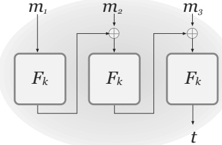
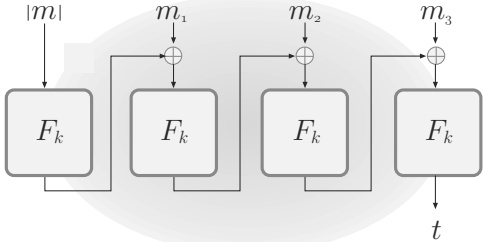

# Chapter 4: Message Authentication Codes

## 4.1 Message Integrity

### 4.1.1 Secrecy vs. Integrity

A basic goal of cryptography is to enable parties to communicate securely. But what does “secure communication” entail? In Chapter 3 we showed how it is possible to achieve secrecy; that is, we showed how encryption can be used to prevent a passive eavesdropper from learning anything about messages sent over an open channel. However, not all security concerns are related to secrecy, and not all adversaries are limited to passive eavesdropping. In many cases, it is of equal or greater importance to guarantee message integrity (or message authentication) against an active adversary who can inject messages on the channel or modify messages in transit. We consider two motivating examples corresponding to the settings of Figures 1.1 and 1.2, respectively.

Imagine first a user communicating with her bank over the Internet. When the bank receives a request to transfer \$1,000 from the user's account to the account of some other user X, the bank has to consider the following:

1. Is the request authentic? That is, did the user in question really issue this request, or was the request issued by an adversary (perhaps X itself) who is impersonating the legitimate user?

2. Assuming a transfer request was issued by the legitimate user, is the request received by the bank exactly the same as what was sent by that user? Or was, e.g., the transfer amount modified as the request was sent across the Internet?

Note that standard error-correction techniques do not suffice for the second concern. Error-correcting codes are only intended to detect and recover from “random” errors that affect a small portion of the transmission, but they do nothing to protect against a malicious adversary who can choose exactly where to introduce an arbitrary number of changes.

A very different scenario where the need for message integrity arises in practice is with regard to web cookies. The HTTP protocol used for web traffic is stateless, so when a client and server communicate in some session (e.g., when a user [client] shops at a merchant's [server's] website), any state generated as part of that session (e.g., the contents of the user's shopping cart) is often placed in a "cookie" that is stored by the user and included along with each message the user sends to the merchant. Assume the cookie stored by some user includes the items in the user's shopping cart along with a price for each item, as might be done if the merchant offers different prices to different users (reflecting discounts and promotions, or user-specific pricing). It would be undesirable for the user to be able to modify the cookie it stores so as to alter the prices of the items in its cart. The merchant thus needs a technique to ensure the integrity of the cookie that it stores at the user. Note that the contents of the cookie (namely, the items and their prices) are not secret and, in fact, must be known by the user. The problem here is purely one of integrity.

In general, one cannot assume the integrity of communication without taking specific measures to ensure it. Indeed, any unprotected online purchase order, online banking operation, email, or SMS message cannot, in general, be trusted to have originated from the claimed source and to have been unmodified in transit. Unfortunately, people are generally trusting and so information like the caller-ID or an email return address are taken to be “proofs of origin” in many cases, even though they are relatively easy to forge. This leaves the door open to potentially damaging attacks.

In this chapter we will show how to achieve message integrity by using cryptographic techniques to detect any spoofed messages or any tampering of messages sent over an unprotected communication channel. Note that we cannot hope to prevent message injection or message tampering altogether, as that can only be defended against at the physical level. Instead, what we will guarantee is that any such behavior will be detected by the honest parties.

### 4.1.2 Encryption vs. Message Authentication

Just as the goals of secrecy and message integrity are different, so are the techniques and tools for achieving them. Unfortunately, secrecy and integrity are often confused and unnecessarily intertwined, so let us be clear up front: encryption does not (in general) provide any integrity, and encryption should not be assumed to ensure message authentication unless it is specifically designed with that purpose in mind (something we will return to in Section 5.2).

One might mistakenly think that encryption solves the problem of message authentication. (In fact, this is a common error.) This is due to the fuzzy, and incorrect, reasoning that since a ciphertext completely hides the contents of the message, an adversary cannot possibly modify an encrypted message in any meaningful way. Despite its intuitive appeal, this reasoning is completely false. We illustrate this point by showing that all the encryption schemes we have seen thus far do not provide message integrity.

Encryption using stream ciphers. Consider encryption schemes in which the sender generates a pseudorandom pad based on a shared key (and possibly an IV) and then computes a ciphertext by XORing the resulting pad with a message, as in Constructions 3.17, 3.28, and 3.31 as well as OFB and CTR modes. Ciphertexts in this case are very easy to manipulate: flipping any bit in the ciphertext results in the same bit being flipped in the message that is recovered upon decryption. Thus, given a ciphertext $c$ that encrypts a (possibly unknown) message $m$, it is possible for an adversary to generate a modified ciphertext $c^{\prime}$ such that $m^{\prime} := \mathsf{Dec}_k(c^{\prime})$ is the same as $m$ but with a specific set of bits flipped. This simple attack can have severe consequences. As an example, consider the case of a user encrypting some dollar amount she wants to transfer from her bank account, where the amount is represented in binary. Flipping the least significant bit has the effect of changing this amount by 1, and flipping the 11th least significant bit changes the amount by more than 1,000! Interestingly, the adversary does not necessarily learn whether it is increasing or decreasing the initial amount, i.e., whether it is flipping a 0 to a 1 or vice versa. But if the adversary has some partial knowledge about the amount—say, that it is less than 1,000 to begin with—then the modifications it introduces can have a predictable effect.

We stress that this attack does not contradict the secrecy of the encryption scheme. In fact, the exact same attack applies to the one-time pad encryption scheme, showing that even perfect secrecy is not sufficient to ensure the most basic level of message integrity.

Encryption using block ciphers. The attack described above exploits the fact that flipping a single bit in a ciphertext keeps the underlying plaintext unchanged except for the corresponding bit (which is also flipped). One might hope that encryption schemes using block ciphers in a more sophisticated way would prevent such attacks since, for example, if decryption involves inverting a (strong) pseudorandom permutation $F$ on some portion $x$ of the ciphertext then $F_k^{-1}(x)$ and $F_k^{-1}(x^{\prime})$ will be completely uncorrelated if $x$ and $x^{\prime}$ differ in even a single bit. Nevertheless, single-bit modifications of a ciphertext can still cause partially predictable changes in the plaintext. For example, when using ECB mode, flipping a bit in the ith block of a ciphertext affects only the ith block of the plaintext—all other blocks remain unchanged. (Of course, ECB mode does not even guarantee the most basic notion of secrecy, but that is irrelevant for the present discussion.) Although the effect on the ith block of the plaintext may be impossible to predict, changing that one block (while leaving everything else unchanged) may represent a harmful attack. Moreover, the order of plaintext blocks can be changed (without garbling any block) by simply changing the order of the corresponding ciphertext blocks, and the message can be truncated by dropping ciphertext blocks.

For CBC mode, flipping the $j$th bit of the $IV$ changes only the $j$th bit of the first message block $m_1$ (since $m_1 := F_k^{-1}(c_1) \oplus IV^{\prime}$, where $IV^{\prime}$ is the modified $IV$); all other plaintext blocks remain unchanged. Therefore, the first block of a CBC-encrypted message can be modified arbitrarily. We will see in Section 5.1.1 that this simple attack can have disastrous consequences.

Finally, observe that all the encryption schemes we have seen thus far have the property that every string of a certain length is a valid ciphertext, and so corresponds to some valid message. It is therefore trivial for an adversary to “spoof” a message on behalf of one of the communicating parties—by sending an arbitrary string of the correct length—even if the adversary has no idea what the underlying message will be. In the context of message integrity, even an attack of this sort should be ruled out.

## 4.2 Message Authentication Codes (MACs) – Definitions

We have seen that, in general, encryption does not solve the problem of message integrity. Rather, an additional mechanism is needed that will enable the communicating parties to know whether or not a message was tampered with. The right tool for this task is a message authentication code (MAC).

The aim of a message authentication code is to prevent an adversary from modifying a message sent by one party to another, or from injecting a new message, without the receiver detecting that the message did not originate from the intended party. As in the case of encryption, this is only possible if the communicating parties have some secret information that the adversary does not know (otherwise nothing can prevent an adversary from impersonating the party sending the message). Here, we continue to consider the private-key setting where the communicating parties share a secret key.

As in the case of private-key encryption, there are two canonical application scenarios for MACs (cf. Section 1.2): ensuring integrity for two parties communicating with each other (as in our earlier example of a user communicating with her bank), or for one user communicating “with himself” over time (as in our earlier example involving web cookies, or a user protecting the contents of his hard drive).

### The Syntax of a Message Authentication Code

Before formally defining security of a message authentication code, we first define what a MAC is and how it is used. Two users who wish to communicate in an authenticated manner begin by generating and sharing a secret key $k$ in advance of their communication. When one party wants to send a message $m$ to the other, she computes a tag $t$ based on the message and the shared key, and sends the message $m$ along with $t$ to the other party. The tag is computed using a tag-generation algorithm $\mathsf{Mac}$; thus, rephrasing what we have just said, the sender of a message $m$ computes $t \leftarrow \mathsf{Mac}_k(m)$ and transmits $(m, t)$ to the receiver. Upon receiving $(m, t)$, the second party verifies whether $t$ is a valid tag on the message $m$ (with respect to the shared key) or not. This is done by running a verification algorithm Vrfy that takes as input the shared key as well as a message $m$ and a tag $t$, and indicates whether the given tag is valid. Formally:

DEFINITION 4.1 A message authentication code (or MAC) consists of three probabilistic polynomial-time algorithms (Gen, Mac, Vrfy) such that:

1. The key-generation algorithm Gen takes as input the security parameter ${1}^n$ and outputs a key $k$ with $|k| \geq n$.

2. The tag-generation algorithm Mac takes as input a key $k$ and a message $m \in \{0,1\}^*$, and outputs a tag $t$. Since this algorithm may be randomized, we write this as $t \leftarrow \mathsf{Mac}_k(m)$.

3. The deterministic verification algorithm Vrfy takes as input a key $k$, a message $m$, and a tag $t$. It outputs a bit $b$, with $b = 1$ meaning valid and $b = 0$ meaning invalid. We write this as $b := \mathsf{Vrfy}_k(m, t)$.

It is required that for every $n$, every key $k$ output by $\mathsf{Gen}(1^n)$, and every $m \in \{0,1\}^*$, it holds that $\mathsf{Vrfy}_k(m, \mathsf{Mac}_k(m)) = 1$.

If there is a function $\ell$ such that for every $k$ output by $\mathsf{Gen}(1^n)$, algorithm $\mathsf{Mac}_k$ is only defined for messages $m \in \{0,1\}^{\ell(n)}$, then we call the scheme a fixed-length MAC for messages of length $\ell(n)$.

As with private-key encryption, $\mathsf{Gen}(1^n)$ almost always simply chooses a uniform key $k \in \{0,1\}^n$, and we omit $\mathsf{Gen}$ in that case.

Canonical verification. For deterministic message authentication codes (i.e., where $\mathsf{Mac}$ is a deterministic algorithm), the canonical way to perform verification is simply to re-compute the tag and check for equality. In other words, $\mathsf{Vrfy}_k(m, t)$ first computes $\tilde{t} := \mathsf{Mac}_k(m)$ and then outputs 1 if and only if $\tilde{t} = t$. Even for deterministic MACs, though, it is useful to define a separate $\mathsf{Vrfy}$ algorithm to explicitly distinguish the semantics of authenticating a message to be sent vs. verifying authenticity of a message that was received.

### Security of Message Authentication Codes

We now define the default notion of security for message authentication codes. The intuitive idea behind the definition is that no efficient adversary should be able to generate a valid tag on any “new” message that was not previously sent (and authenticated) by one of the communicating parties.

As with any security definition, to formalize this notion we need to define both the adversary's power as well as what should be considered a “break” of a scheme. As usual, we consider only probabilistic polynomial-time adversaries $^{1}$

$^{1}$ See Section 4.6 for a discussion of information-theoretic message authentication, where no computational restrictions are placed on the adversary.

and so the real question is how we model the adversary's interaction with the communicating parties. In the setting of message authentication, an adversary observing the communication between the honest parties may be able to see all the messages sent by those parties along with their corresponding tags. The adversary may also be able to influence the content of those messages, whether directly or indirectly (if, e.g., external actions of the adversary affect the messages sent by the parties). This is true, for example, in the web cookie example from earlier, where the user's own actions influence the contents of the cookie being stored on his computer.

To model the above, we allow the adversary to request tags for any messages of its choice. Formally, we give the adversary access to a MAC oracle $\mathsf{Mac}_k(\cdot)$; the adversary can repeatedly submit any message $m$ of its choice to this oracle, and is given in return a tag $t \leftarrow \mathsf{Mac}_k(m)$. (For a fixed-length MAC, only messages of the correct length can be submitted.)

An attacker “breaks” the scheme if it succeeds in outputting a forgery, i.e., if it outputs a message $m$ along with a tag $t$ such that (1) $t$ is a valid tag on the message $m$ (i.e., $\mathsf{Vrfy}_{k}(m,t)=1$), and (2) the honest parties had not previously authenticated m (i.e., the adversary had not previously requested a tag on the message $m$ from its oracle). These conditions imply that if the adversary were to send $(m,t)$ to one of the honest parties, then that party would be mistakenly fooled into thinking that m originated from the other legitimate party (since $\mathsf{Vrfy}_{k}(m,t)=1$) even though it did not.

A MAC that cannot be broken in the above sense is said to be existentially unforgeable under an adaptive chosen-message attack. “Existentially unforgeable” refers to the fact that the adversary is unable to forge a valid tag on any message; this should hold even if the attacker can carry out an “adaptive chosen-message attack” by which it is able to obtain tags on arbitrary messages chosen adaptively during its attack.

The above discussion leads us to consider the following experiment for a message authentication code $\Pi = (\mathsf{Gen}, \mathsf{Mac}, \mathsf{Vrfy})$, an adversary $\mathcal{A}$, and security parameter $n$:

The message authentication experiment $\mathsf{Mac-forge}_{\mathcal{A},\Pi}(n)$:

1. A key $k$ is generated by running $\mathsf{Gen}(1^{n})$.

2. The adversary $\mathcal{A}$ is given input ${1}^n$ and oracle access to $\mathsf{Mac}_k(\cdot)$

The adversary eventually outputs $(m,t)$. Let $\mathcal{Q}$ denote the set of all queries that $\mathcal{A}$ submitted to its oracle.

3. $\mathcal{A}$ succeeds if and only if (1) $\mathsf{Vrfy}_{k}(m, t) = 1$ and (2) $m \notin \mathcal{Q}$. In that case the output of the experiment is defined to be 1.

A MAC is secure if no efficient adversary can succeed in the above experiment with non-negligible probability.

DEFINITION 4.2 A message authentication code $\Pi = (\mathsf{Gen}, \mathsf{Mac}, \mathsf{Vrfy})$ is existentially unforgeable under an adaptive chosen-message attack, or just secure, if for all probabilistic polynomial-time adversaries A, there is a negligible function $\mathsf{negl}$ such that:

$$\Pr[\mathsf{Mac-forge}_{\mathcal{A},\Pi}(n)=1]\leq\mathsf{negl}(n).$$

Is the definition too strong? The above definition is rather strong in two respects. First, the adversary is allowed to repeatedly request tags for any messages of its choice. Second, the adversary is considered to have “broken” the scheme if it can output a valid tag on any previously unauthenticated message. One might object that both these components of the definition are unrealistic and overly strong, as in “real-world” usage of a MAC the honest parties would only authenticate “meaningful” messages (over which the adversary might have only limited control), and a forgery would only be damaging if it involved forging a valid tag on a “meaningful” message. Why not tailor the definition to capture this?

The crucial point is that what constitutes a meaningful message is entirely application dependent. While some applications of a MAC may only ever authenticate English-language messages, other applications may authenticate spreadsheet files, others database entries, and others raw data. Protocols may also be designed where anything will be authenticated—in fact, certain user-authentication protocols do exactly this. By making the definition of security for MACs as strong as possible, we ensure that secure MACs are broadly applicable for a wide range of purposes, without having to worry about compatibility of the MAC with the semantics of specific applications.

Replay attacks. The above definition, and message authentication codes by themselves, offer no protection against replay attacks in which an attacker simply re-sends a previously authenticated message along with its (valid) tag. The fact that replay attacks are not accounted for in the definition does not mean they are not a serious security concern! Consider again the scenario where a user (say, Alice) sends a request to her bank to transfer \$1,000 from her account to some other user (say, Bob). In doing so, Alice can compute a tag and append it to her request so the bank knows the request is authentic. If the MAC is secure, Bob will be unable to intercept the request and change the amount to \$10,000 because this would involve forging a valid tag on a previously unauthenticated message. However, nothing prevents Bob from replaying Alice's message (along with its tag) ten times to the bank. If the bank accepts each of those messages, the net effect is still that \$10,000 will be transferred to Bob's account rather than the desired \$1,000.

Despite the real threat that replay attacks represent, a MAC by itself cannot protect against such attacks since verification is stateless (and so every time a valid pair $(m, t)$ is presented to the verification algorithm, it will always output 1). Instead, protection against replay attacks—if such protection is necessary in a given scenario—must be handled by some higher-level application. The reason the definition of a MAC is structured this way is, once again, because we are unwilling to assume any semantics for applications that use MACs; in particular, the decision as to whether or not a replayed message should be treated as “valid” may be application dependent.

Two common techniques for preventing replay attacks are to use sequence numbers (also known as counters) or time-stamps. The first approach requires the communicating users to maintain (synchronized) state, and can be problematic when users communicate over a lossy channel where messages are occasionally dropped (though this problem can be mitigated). In the second approach using time-stamps, the sender appends the current time $T$ (say, to the nearest millisecond) to the message before authenticating, and sends $T$ along with the message and the resulting tag $t$. When the receiver obtains $T, m, t$, it verifies that $t$ is a valid tag on $m\|T$ and that $T$ is within some acceptable clock skew of its own current time $T^{\prime}$. This method has its own drawbacks, including the need for the sender and receiver to maintain closely synchronized clocks, and the possibility that a replay attack can still take place if it is done quickly enough (specifically, within the acceptable time window). We will discuss replay attacks further (in a more general context) in Section 5.4.

Strong unforgeability. As defined, a secure MAC ensures that an adversary cannot generate a valid tag on a message that was never previously authenticated. But it does not rule out the possibility that an attacker might be able to generate a new, valid tag on a previously authenticated message. In other words, a secure MAC guarantees that an attacker who learns tags $t_1, \ldots$ on messages $m_1, \ldots$ will be unable to forge a valid tag $t$ on any message $m \notin \{m_1, \ldots\}$. However, it may be possible for that adversary to generate a different valid tag $t^{\prime}_i \neq t_i$ on some previously authenticated message $m_i$. In standard applications of MACs, this type of adversarial behavior is not a concern. Nevertheless, in some settings it is useful to consider a stronger definition of security for MACs where such behavior is ruled out.

To model this formally, we consider a modified experiment $\mathsf{Mac\text{-}sforge}$ that is defined in exactly the same way as $\mathsf{Mac\text{-}forge}$, except that now the set $\mathcal{Q}$ contains pairs of oracle queries and their associated responses. (That is, $(m,t) \in \mathcal{Q}$ if $\mathcal{A}$ queried $\mathsf{Mac}_k(m)$ and received in response the tag $t$.) The adversary $\mathcal{A}$ succeeds (and experiment Mac-sforge evaluates to 1) if and only if $\mathcal{A}$ outputs $(m,t)$ such that $\mathsf{Vrfy}_k(m,t) = 1$ and $(m,t) \notin \mathcal{Q}$.

DEFINITION 4.3 A message authentication code $\Pi = (\mathsf{Gen}, \mathsf{Mac}, \mathsf{Vrfy})$ is strongly secure if for all probabilistic polynomial-time adversaries $\mathcal{A}$, there is a negligible function $\mathsf{negl}$ such that:

$$\Pr[{\mathsf{Mac-sforge}}_{{\mathcal A},\Pi}(n)=1]\leq\mathsf{negl}(n).$$

It is not hard to see that if a secure MAC uses canonical verification then it is also strongly secure. This is important since many real-world MACs use canonical verification. We leave the proof of the following as an exercise.

PROPOSITION 4.4 Let $\Pi = (\mathsf{Gen}, \mathsf{Mac}, \mathsf{Vrfy})$ be a secure (deterministic) MAC that uses canonical verification. Then $\Pi$ is strongly secure.

Verification queries. Definitions 4.2 and 4.3 consider an adversary given access to a MAC oracle, which corresponds to a real-world adversary who can influence an honest sender to generate a tag for some message $m$. One could also consider an adversary who interacts with an honest receiver, sending $(m,t)$ to the receiver to learn whether $\mathsf{Vrfy}_k(m,t) = 1$. Such an adversary could be captured formally in the natural way by giving the adversary in the above definitions access to a verification oracle as well.

A definition that incorporates a verification oracle in this way is, perhaps, the "right" way to define security for message authentication codes. It turns out, however, that for MACs that use canonical verification it makes no difference: any such MAC that satisfies Definition 4.2 also satisfies the definitional variant in which verification queries are allowed. Moreover, any strongly secure MAC remains strongly secure even if verification queries are possible. In general, however, allowing verification queries can make a difference. Since most MACs covered in this book (as well as MACs used in practice) use canonical verification and/or are strongly secure, we use the traditional definitions that omit access to a verification oracle.

A potential timing attack. One issue not addressed by the above discussion of verification queries is the possibility of carrying out a timing attack on MAC verification. Here, we consider an adversary who can send message/tag pairs to the receiver—thus using the receiver as a verification oracle—and learn not only whether the receiver accepts or rejects, but also the time it takes for the receiver to make this decision. We show that if such an attack is possible then a natural implementation of MAC verification leads to an easily exploitable vulnerability. (In our usual cryptographic definitions of security, the attacker learns only the output of the oracles it has access to, but nothing else. The attack we describe here, which is an example of a side-channel attack, shows that certain real-world attacks are not captured by the usual definitions.)

Concretely, assume a MAC using canonical verification. To verify a tag t on a message m, the receiver computes $t^{\prime} := \mathsf{Mac}_k(m)$ and then compares $t^{\prime}$ to t, outputting 1 if and only if $t^{\prime}$ and t are equal. Assume this comparison is implemented using a standard routine (like $\text{strncmp}$ in C) that compares t and $t^{\prime}$ one byte at a time, and rejects as soon as the first unequal byte is encountered. The observation is that, when implemented in this way, the time to reject differs depending on the position of the first unequal byte.

It is possible to use this seemingly inconsequential information to forge a tag on any desired message $m$. Say the attacker knows the first $i$ bytes of the (unique) valid tag for $m$. (At the outset, $i = 0$).) The attacker can learn the next byte of the valid tag by sending $(m, t_0)$, ..., $(m, t_{255})$ to the receiver, where $t_j$ is the string with the first $i$ bytes set correctly, the $(i+1)$st byte equal to $j$ (in hexadecimal), and the remaining bytes set to $\mathtt{0x00}$. All these tags will likely be rejected (if not, then the attacker succeeds anyway); however, for exactly one of these tags the first $(i+1)$ bytes will be correct and rejection will take slightly longer than the rest. If $t_j$ is the tag that caused rejection to take the longest, the attacker learns that the $(i+1)$st byte of the valid tag is $j$. In this way, the attacker learns each byte of the valid tag using at most 256 queries to the verification oracle. For a 16-byte tag, this attack requires at most ${16} \cdot 256 = 4096$ verification queries to learn the entire tag.

One might wonder whether this attack is realistic, as it requires access to a verification oracle as well as the ability to measure the difference in time taken to compare i vs. $i+1$ bytes. In fact, such attacks have been carried out against real systems! As just one example, MACs were used to verify code updates in the Xbox 360, and the implementation of MAC verification took roughly 2.2 milliseconds to compare each byte. Attackers were able to exploit this and load pirated games onto the hardware.

Based on the above, we conclude that MAC verification should use time-independent string comparison that always compares all bytes.

## 4.3 Constructing Secure Message Authentication Codes

### 4.3.1 A Fixed-Length MAC

Pseudorandom functions are a natural tool for constructing secure message authentication codes. Intuitively, if the tag $t$ is obtained by applying a pseudorandom function to the message $m$, then forging a tag on a previously unauthenticated message requires the adversary to correctly guess the value of the pseudorandom function at a “new” input point. The probability of guessing the value of a random function on a new point is ${2}^{-n}$ (if the output length of the function is $n$). The probability of guessing such a value for a pseudorandom function can be only negligibly greater.

The above idea, shown in Construction 4.5, gives a secure fixed-length MAC for short messages. In Section 4.3.2, we show how to extend this to handle messages of arbitrary length. We explore more efficient constructions of MACs for arbitrary-length messages in Sections 4.4, 4.5, and 6.3.2.

THEOREM 4.6 If F is a pseudorandom function, then Construction 4.5 is a secure fixed-length MAC for messages of length n.

PROOF As in the analysis of previous schemes based on pseudorandom functions, we first replace the pseudorandom function with a truly random function and show that this has limited impact on an adversary's success probability. We then analyze the scheme when using a truly random function.

Let A be a probabilistic polynomial-time adversary. Consider the message

**CONSTRUCTION 4.5**

Let F be a (length preserving) pseudorandom function. Define a fixed-length MAC for messages of length n as follows:

- Mac: on input a key $k \in \{0,1\}^n$ and a message $m \in \{0,1\}^n$, output the tag $t := F_k(m)$.

- $\operatorname{Vrfy}$: on input a key $k \in \{0,1\}^n$, a message $m \in \{0,1\}^n$, and a tag $t \in \{0,1\}^n$, output 1 if and only if $t \overset{?}{=} F_k(m)$.

A fixed-length MAC from any pseudorandom function.

authentication code $\widetilde{\Pi} = (\mathsf{Gen}, \mathsf{Mac}, \mathsf{Vrfy})$ which is the same as $\Pi = (\mathsf{Mac}, \mathsf{Vrfy})$ in Construction 4.5 except that a truly random function $f$ is used instead of the pseudorandom function $F_k$. That is, $\widetilde{\mathsf{Gen}}(1^n)$ works by choosing a uniform function $f \in \mathsf{Func}_n$, and $\widetilde{\mathsf{Mac}}$ computes a tag just as $\mathsf{Mac}$ does except that $f$ is used instead of $F_k$.

We show that there is a negligible function $\mathsf{negl}$ such that

$$\begin{array}{r l}&{\left|\Pr[\mathsf{Mac-forge}_{\mathcal{A},\Pi}(n)=1]-\Pr[\mathsf{Mac-forge}_{\mathcal{A},\widetilde\Pi}(n)=1]\right|\leq\mathsf{negl}(n).}\end{array} \tag{4.1}$$

To prove this, we construct a polynomial-time distinguisher $D$ that is given oracle access to some function $\mathcal{O}$, and whose goal is to determine whether $\mathcal{O}$ is pseudorandom (i.e., equal to $F_k$ for uniform $k \in \{0,1\}^n$) or random (i.e., equal to $f$ for uniform $f \in \mathsf{Func}_n$). To do this, $D$ simulates the message authentication experiment for $\mathcal{A}$ and observes whether $\mathcal{A}$ succeeds in outputting a valid tag on a “new” message. If so, $D$ guesses that its oracle is a pseudo-random function; otherwise, $D$ guesses that its oracle is a random function. In detail:

**Distinguisher D:**

D is given input ${1}^n$ and access to an oracle $\mathcal{O} : \{0,1\}^n \to \{0,1\}^n$, and works as follows:

1. Run $\mathcal{A}(1^n)$. Whenever $\mathcal{A}$ queries its MAC oracle on a message $m$ (i.e., whenever $\mathcal{A}$ requests a tag on a message $m$), answer this query in the following way:

Query $\mathcal{O}$ with $m$ and obtain response $t$; return $t$ to $\mathcal{A}$.

2. When $\mathcal{A}$ outputs $(m,t)$ at the end of its execution, do:

(a) Query $\mathcal{O}$ with $m$ and obtain response $t^{\prime}$.

(b) If (1) $t^{\prime} = t$ and (2) $\mathcal{A}$ never queried its MAC oracle on $m$, then output 1; otherwise, output 0.

It is clear that D runs in polynomial time.

If $D$'s oracle is $F_k$ for a uniform $k$, then the view of $\mathcal{A}$ when run as a subroutine by $D$ is distributed identically to the view of $\mathcal{A}$ in experiment

$\mathsf{Mac-forge}_{\mathcal{A},\Pi}(n)$. Moreover, $D$ outputs 1 exactly when $\mathsf{Mac-forge}_{\mathcal{A},\Pi}(n) = 1$. Therefore

$$\Pr\left[D^{F_{k}(\cdot)}(1^{n})=1\right]=\Pr\left[\mathsf{Mac-forge}_{\mathcal{A},\Pi}(n)=1\right],$$

where $k \in \{0,1\}^n$ is chosen uniformly on the left-hand side above. If $D$'s oracle is a random function, then the view of $\mathcal{A}$ when run as a subroutine by $D$ is distributed identically to the view of $\mathcal{A}$ in experiment $\mathsf{Mac-forge}_{\mathcal{A},\widetilde{\Pi}}(n)$, and again $D$ outputs 1 exactly when $\mathsf{Mac-forge}_{\mathcal{A},\widetilde{\Pi}}(n) = 1$. Thus,

$$\Pr\left[D^{f(\cdot)}(1^{n})=1\right]=\Pr\left[\mathsf{Mac-forge}_{\mathcal{A},\widetilde{\Pi}}(n)=1\right],$$

where $f \in \mathsf{Func}_n$ is chosen uniformly. Since $F$ is a pseudorandom function and $D$ runs in polynomial time, there is a negligible function $\mathsf{negl}$ such that

$$\left|\Pr\left[D^{F_{k}(\cdot)}(1^{n})=1\right]-\Pr\left[D^{f(\cdot)}(1^{n})=1\right]\right|\leq\mathsf{negl}(n).$$

This implies Equation (4.1).

To complete the proof, we observe that

$$\Pr[\mathsf{Mac-forge}_{\mathcal{A},\widetilde{\Pi}}(n)=1]\leq2^{-n} \tag{4.2}$$

because for any message $m \notin \mathcal{Q}$ that $\mathcal{A}$ did not query to its MAC oracle, the tag $t^{\prime} = f(m)$ is uniformly distributed in $\{0,1\}^n$ from $\mathcal{A}$'s point of view (since the values of $f$ on all inputs are uniform and independent). Thus, the probability that $\mathcal{A}$ can correctly guess $t^{\prime}$ (for any $m \notin \mathcal{Q}$) is ${2}^{-n}$.

Equations (4.1) and (4.2) together show that

$$\begin{array}{r}{\Pr[\mathsf{Mac-forge}_{\mathcal{A},\Pi}(n)=1]\leq2^{-n}+\mathsf{negl}(n),}\end{array}$$

completing the proof of the theorem.

### 4.3.2 Domain Extension for MACs

Construction 4.5 is important in that it shows a general paradigm for constructing secure message authentication codes from pseudorandom functions. Unfortunately, the construction is only capable of handling fixed-length messages that are furthermore rather short. $^{2}$ These limitations are unacceptable in most real-world applications. We show here how a MAC handling arbitrary-length messages can be constructed from any fixed-length MAC for messages of length $n$. The construction we show is not very efficient and is unlikely to be used in practice; far more efficient constructions of secure MACs are known, as we will see later. We include the present construction for its simplicity and generality, and for pedagogical purposes.

$^{2}$ Given a pseudorandom function taking arbitrary-length inputs, Construction 4.5 would yield a secure MAC for messages of arbitrary length. Likewise, a pseudorandom function with a larger domain would yield a secure MAC for longer messages. However, existing practical pseudorandom functions (i.e., block ciphers) take short, fixed-length inputs.

Let $\Pi^{\prime} = (\mathsf{Mac}^{\prime}, \mathsf{Vrfy}^{\prime})$ be a secure fixed-length MAC for messages of length $n$. Before presenting the construction of a MAC for arbitrary-length messages based on $\Pi^{\prime}$, we rule out some simple ideas and describe some canonical attacks that must be prevented.

1. A natural first idea is to parse the message $m$ as a sequence of $n$-bit blocks $m_1, \ldots, m_d$ and authenticate each block separately, i.e., compute $t_i := \mathsf{Mac}_k^{\prime}(m_i)$ and output $\langle t_1, \ldots, t_d \rangle$ as the tag. This prevents an adversary from sending any previously unauthenticated block without being detected. However, it does not prevent a block re-ordering attack in which the attacker shuffles the order of blocks in an authenticated message. Specifically, if $\langle t_1, t_2 \rangle$ is a valid tag on the message $m_1, m_2$ (with $m_1 \neq m_2$), then an attacker can construct a valid tag $\langle t_2, t_1 \rangle$ on the (new) message $m_2, m_1$, something that is not allowed by Definition 4.2.

2. We can prevent the previous attack by authenticating a block index along with each block. That is, we now compute $t_i = \mathsf{Mac}_k^{\prime}(i\|m_i)$ for all $i$, and output $\langle t_1, \ldots, t_d \rangle$ as the tag. (Note that now $|m_i| < n$.) This does not prevent a truncation attack whereby an attacker simply drops blocks from the end of the message (and drops the corresponding blocks of the tag as well).

3. A truncation attack can be thwarted by additionally authenticating the message length along with each block. (Authenticating the message length as a separate block does not work. Do you see why?) That is, compute $t_i = \mathsf{Mac}_k^{\prime}(l||i||m_i)$ for all $i$, where $\ell$ denotes the length of the message in bits. (Once again, the block length $|m_i|$ will need to decrease.) This scheme is vulnerable to a “mix-and-match” attack where the adversary combines blocks from different messages. For example, if the adversary obtains tags $\langle t_1, \ldots, t_d \rangle$ and $\langle t^{\prime}_1, \ldots, t^{\prime}_d \rangle$ on messages $m = m_1, \ldots, m_d$ and $m^{\prime} = m^{\prime}_1, \ldots, m^{\prime}_d$, respectively, it can output the valid tag $\langle t_1, t^{\prime}_2, t_3, t^{\prime}_4, \ldots \rangle$ on the message $m_1, m^{\prime}_2, m_3, m^{\prime}_4, \ldots$.

We can prevent this last attack by also including a random “message identifier” in each block that prevents the attacker from combining blocks from different messages. This leads us to Construction 4.7. (The scheme only handles messages of length less than ${2}^{n/4}$, but this is an exponential bound.)

THEOREM 4.8 If $\Pi^{\prime}$ is a secure fixed-length MAC for messages of length n, then Construction 4.7 is a secure MAC (for arbitrary-length messages).

**CONSTRUCTION 4.7**

Let $\Pi^{\prime} = (\mathsf{Mac}^{\prime}, \mathsf{Vrfy}^{\prime})$ be a fixed-length MAC for messages of length n. Define a MAC as follows:

Mac: on input a key $k \in \{0,1\}^n$ and a message $m \in \{0,1\}^*$ of (nonzero) length $\ell < 2^{n/4}$, parse m as d blocks $m_1, \ldots, m_d$, each of length $n/4$. (The final block is padded with 0s if necessary.) Choose a uniform message identifier $r \in \{0,1\}^{n/4}$.

For $i = 1, \ldots, d$, compute $t_i \leftarrow \mathsf{Mac}_k^{\prime}(r\|\ell\|i\|m_i)$, where $i, \ell$ are encoded as strings of length $n/4$.$\dagger$ Output the tag $t := \langle r, t_1, \ldots, t_d \rangle$.

- $\mathsf{Vrfy}$: on input a key $k \in \{0,1\}^n$, a message $m \in \{0,1\}^*$ of nonzero length $\ell < 2^{n/4}$, and a tag $t = \langle r, t_1, \ldots, t_{d^{\prime}} \rangle$, parse $m$ as $d$ blocks $m_1, \ldots, m_d$, each of length $n/4$. (The final block is padded with 0s if necessary.) Output 1 if and only if $d^{\prime} = d$ and $\mathsf{Vrfy}^{\prime}_k(r\|\ell\|i\|m_i, t_i) = 1$ for ${1} \leq i \leq d$.

 $^{\dagger}$ Note that i and $\ell$ can be encoded using n/4 bits because i, $\ell < 2^{n/4}$.

A MAC for arbitrary-length messages from any fixed-length MAC.

PROOF The intuition is that since $\Pi^{\prime}$ is secure, an adversary cannot introduce a new block with a valid tag (with respect to $\Pi^{\prime}$). Furthermore, the extra information included in each block prevents the various attacks (dropping blocks, re-ordering blocks, etc.) sketched earlier. We prove security by showing that those attacks are the only ones possible.

Let $\Pi$ be the MAC given by Construction 4.7, and let $\mathcal{A}$ be a probabilistic polynomial-time adversary. We show that $\Pr[\operatorname{Mac-forge}_{\mathcal{A},\Pi}(n)=1]$ is negligible. We first introduce some notation that will be used in the proof. Let repeat denote the event that the same random identifier is used in two of the tags returned by the MAC oracle in experiment $\operatorname{Mac-forge}_{\mathcal{A},\Pi}(n)$. Denoting the final output of $\mathcal{A}$ by $(m,t=\langle r,t_1,\ldots\rangle)$, where $m$ has length $\ell$ and is parsed as $m=m_1,\ldots$, we let $\operatorname{NewBlock}$ be the event that at least one of the blocks $r\|\ell\|i\|m_i$ was never previously authenticated by $\operatorname{Mac}^{\prime}$ in the course of answering $\mathcal{A}$'s Mac queries. (Note that, by construction of $\Pi$, it is easy to tell exactly which blocks are authenticated by $\operatorname{Mac}_k^{\prime}$ when computing $\operatorname{Mac}_k(m)$.) Informally, $\operatorname{NewBlock}$ is the event that $\mathcal{A}$ tries to forge a valid tag on a block that was never authenticated by the underlying fixed-length MAC $\Pi$.

We have:

$$
\begin{aligned}
\Pr[Mac-forge_{\mathcal{A},\Pi}(n)=1]&=\Pr[Mac-forge_{\mathcal{A},\Pi}(n)=1\land repeat]\\
&\quad+\Pr[Mac-forge_{\mathcal{A},\Pi}(n)=1\land\overline{repeat}\land NewBlock]\\
&\quad+\Pr[Mac-forge_{\mathcal{A},\Pi}(n)=1\land\overline{repeat}\land\overline{NewBlock}]\\
&\leq\Pr[repeat]\\
&\quad+\Pr[Mac-forge_{\mathcal{A},\Pi}(n)=1\land NewBlock]\\
&\quad+\Pr[Mac-forge_{\mathcal{A},\Pi}(n)=1\land\overline{repeat}\land\overline{NewBlock}].
\end{aligned} \tag{4.3}
$$

We show that the first two terms of Equation (4.3) are negligible, and the final term is 0. This implies $\Pr[\mathsf{Mac-forge}_{\mathcal{A},\Pi}(n) = 1]$ is negligible, as desired.

To see that Pr[repeat] is negligible, let $q = q(n)$ be the number of MAC oracle queries made by A. To answer the ith oracle query of A, the oracle chooses $r_i$ uniformly from a set of size ${2}^{n/4}$. The probability of event repeat is exactly the probability that $r_i = r_j$ for some $i \neq j$. Applying Lemma A.15, we have Pr[repeat] $\leq q^2/2^{n/4}$. Since q is polynomial (because A is a PPT adversary), this value is negligible.

We next consider the final term in Equation (4.3). We argue that if $\mathsf{Mac-forge}_{\mathcal{A},\Pi}(n) = 1$, but repeat did not occur, then it must be the case that NewBlock occurred. In other words,

$$\begin{array}{r}{\Pr[\mathsf{Mac-forge}_{\mathcal{A},\Pi}(n)=1\land\overline{{\mathsf{repeat}}}\land\overline{{\mathsf{NewBlock}}}]=0.}\end{array}$$

This is, in some sense, the heart of the proof.

Again let $q = q(n)$ denote the number of MAC oracle queries made by $\mathcal{A}$, and let $r_i$ denote the random identifier used to answer the $i$th oracle query of $\mathcal{A}$. If $\mathsf{repeat}$ does not occur then the values $r_1, \ldots, r_q$ are distinct. Recall that $(m, t = \langle r, t_1, \ldots \rangle)$ is the output of $\mathcal{A}$. If $r \notin \{r_1, \ldots, r_q\}$, then $\mathsf{NewBlock}$ clearly occurs. If not, then $r = r_j$ for some unique $j$ (because $\mathsf{repeat}$ did not occur), and the blocks $r\|\ell\|1\|m_1, \ldots$ could then not possibly have been authenticated during the course of answering any $\mathsf{Mac}$ queries other than the $j$th such query. Let $m^{(j)}$ be the message that was used by $\mathcal{A}$ for its $j$th oracle query, and let $\ell_j$ be its length. There are two cases to consider:

Case 1: $\ell \neq \ell_j$. The blocks authenticated when answering the $j$th Mac query all have $\ell_j \neq \ell$ in the second position. So $r\|\ell\|1\|m_1$, in particular, was never authenticated in the course of answering the $j$th Mac query, and NewBlock occurs.

Case 2: $\ell = \ell_j$. If $\mathsf{Mac-forge}_{\mathcal{A},\Pi}(n) = 1$, then we must have $m \neq m^{(j)}$. Let $m^{(j)} = m_1^{(j)}, \ldots$ Since $m$ and $m^{(j)}$ have equal length, there must be at least one index $i$ for which $m_i \neq m_i^{(j)}$. The block $r\|\ell\|i\|m_i$ was then never authenticated in the course of answering the $j$th Mac query. (Because $i$ is included in the third position of the block, the block $r\|\ell\|i\|m_i$ could only possibly have been authenticated if $r\|\ell\|i\|m_i = r_j\|\ell_j\|i\|m_i^{(j)}$, but this is not true since $m_i \neq m_i^{(j)}$.)

To complete the proof of the theorem, we bound the second term on the right-hand side of Equation (4.3). Here we rely on the security of $\Pi^{\prime}$. We construct a PPT adversary $\mathcal{A}^{\prime}$ who attacks the fixed-length MAC $\Pi^{\prime}$ and succeeds in outputting a valid tag on a previously unauthenticated message with probability

$$\Pr[\mathsf{Mac-forge}_{\mathcal{A}^{\prime},\Pi^{\prime}}(n)=1]\geq\Pr[\mathsf{Mac-forge}_{\mathcal{A},\Pi}(n)=1\land\mathsf{NewBlock}]. \tag{4.4}$$

Security of $\Pi^{\prime}$ means that the left-hand side is negligible, implying that $\Pr[\mathrm{Mac-forge}_{\mathcal{A},\Pi}(n)=1\land\mathrm{NewBlock}]$ is negligible as well.

The construction of $\mathcal{A}^{\prime}$ is the obvious one and so we describe it briefly. $\mathcal{A}^{\prime}$ runs $\mathcal{A}$ as a subroutine, and answers the request by $\mathcal{A}$ for a tag on $m$ by choosing $r \leftarrow \{0,1\}^{n/4}$ itself, parsing $m$ appropriately, and making the necessary queries to its own MAC oracle $\mathsf{Mac}_k^{\prime}(\cdot)$. When $\mathcal{A}$ outputs $(m,t = \langle r,t_1,\ldots\rangle)$, then $\mathcal{A}^{\prime}$ checks whether $\mathsf{NewBlock}$ occurs. (This is easy to do since $\mathcal{A}^{\prime}$ can keep track of all the queries it makes to its own oracle.) If so, then $\mathcal{A}^{\prime}$ finds the first block $r\|\ell\|i\|m_i$ that was never previously authenticated by $\mathsf{Mac}^{\prime}$ and outputs $(r\|\ell\|i\|m_i,t_i)$. (If not, $\mathcal{A}^{\prime}$ outputs nothing.)

The view of $\mathcal{A}$ when run as a subroutine by $\mathcal{A}^{\prime}$ is distributed identically to the view of $\mathcal{A}$ in experiment $\mathsf{Mac-forge}_{\mathcal{A},\Pi}(n)$, and so the probabilities of events $\mathsf{Mac-forge}_{\mathcal{A},\Pi}(n) = 1$ and NewBlock do not change. If NewBlock occurs then $\mathcal{A}^{\prime}$ outputs a block $r\|\ell\|i\|m_i$ that was never previously authenticated by its own MAC oracle; if $\mathsf{Mac-forge}_{\mathcal{A},\Pi}(n) = 1$ then the tag on every block is valid (with respect to $\Pi^{\prime}$), and so in particular this is true for the block output by $\mathcal{A}^{\prime}$. This means that whenever $\mathsf{Mac-forge}_{\mathcal{A},\Pi}(n) = 1$ and NewBlock occur we have $\mathsf{Mac-forge}_{\mathcal{A},\Pi^{\prime}}(n) = 1$, proving Equation (4.4) and completing the proof of the theorem.

## 4.4 CBC-MAC

Theorems 4.6 and 4.8 show that it is possible to construct a secure message authentication code for arbitrary-length messages from a pseudorandom function with block length n. This demonstrates, in principle, that secure MACs can be constructed from block ciphers. Unfortunately, the resulting construction is extremely inefficient: to compute a tag on a message of length $dn$, the block cipher is evaluated 4d times, and the tag is more than 4dn bits long. Fortunately, far more efficient constructions are available. We begin by exploring one such construction that relies solely on block ciphers.

### 4.4.1 The Basic Construction

CBC-MAC was one of the first message authentication codes to be standardized. A basic version of CBC-MAC, secure when authenticating messages of any fixed length, is given as Construction 4.9. (See also Figure 4.1.) We caution that this basic scheme is not secure in the general case when messages of different lengths may be authenticated; see further discussion below.

THEOREM 4.10 Let $\ell$ be a polynomial. If $F$ is a pseudorandom function, then Construction 4.9 is a secure MAC for messages of length $\ell(n) \cdot n$.

**CONSTRUCTION 4.9**

Let $F$ be a pseudorandom function, and fix a length function $\ell(n) > 0$. The basic CBC-MAC construction is as follows:
- Mac: on input a key $k \in \{0,1\}^n$ and a message $m$ of length $\ell(n) \cdot n$, do the following (set $\ell = \ell(n)$ in what follows):
1. Parse $m$ as $m = m_1, \ldots, m_\ell$ where each $m_i$ is of length $n$.
2. Set $t_0 := 0^n$. Then, for $i = 1$ to $\ell$, set $t_i := F_k(t_{i-1} \oplus m_i)$.
Output $t_\ell$ as the tag.

- Vrfy: on input a key $k \in \{0,1\}^n$, a message $m$, and a tag $t$, do: If $m$ is not of length $\ell(n) \cdot n$ then output 0. Otherwise, output 1 if and only if $t \overset{?}{=} \mathsf{Mac}_k(m)$.

**Basic CBC-MAC (for fixed-length messages).**

The proof of Theorem 4.10 is fairly complex. In the following section we will prove a more general result from which the above theorem follows.

Although Construction 4.9 can be extended in the obvious way to handle messages of different lengths, the construction is only secure when the length of the messages being authenticated is fixed and agreed upon in advance by the sender and receiver. (See Exercise 4.13.) The advantage of this construction over Construction 4.5, which also gives a fixed-length MAC, is that basic CBC-MAC can authenticate longer messages. Compared to Construction 4.7, basic CBC-MAC is much more efficient, requiring only $d$ block-cipher evaluations for a message of length $dn$, and with a tag of length $n$.

CBC-MAC vs. CBC-mode encryption. Basic CBC-MAC is similar to the CBC mode of operation. There are, however, some important differences:

1. CBC-mode encryption uses a random IV and this is crucial for security. In contrast, CBC-MAC uses no IV (alternately, it can be viewed as using the fixed value $IV = 0^{n}$) and this is also crucial for security. Specifically, CBC-MAC using a random IV is not secure.

**FIGURE 4.1: Basic CBC-MAC (for fixed-length messages).**

2. In CBC-mode encryption all intermediate values $t_{i}$ (called $c_{i}$ in the case of CBC-mode encryption) are output by the encryption algorithm as part of the ciphertext, whereas in CBC-MAC only the final block is output as the tag. If CBC-MAC is modified to output all the $\{t_{i}\}$ obtained during the course of the computation then it is no longer secure.

In Exercise 4.14 you are asked to verify that the modifications of CBC-MAC discussed above are insecure. These examples illustrate the fact that harmless-looking modifications to cryptographic constructions can render them insecure. One should always implement a cryptographic construction exactly as specified and not introduce any variations (unless the variations themselves can be proven secure). Furthermore, it is essential to understand the details of an implementation being used. In many cases cryptographic libraries provide the programmer with a "CBC function," but do not distinguish between the use of this function for encryption or message authentication.

Secure CBC-MAC for arbitrary-length messages. We briefly describe two ways Construction 4.9 can be modified, in a provably secure manner, to handle arbitrary-length messages. (Here for simplicity we assume that all messages being authenticated have length a multiple of n, and that Vrfy rejects any message whose length is not a multiple of n. In the following section we treat the more general case where messages can have arbitrary length.)

1. Prepend the message $m$ with its length $|m|$ (encoded as an $n$-bit string), and then compute basic CBC-MAC on the result; see Figure 4.2. Security of this variant follows from the results proved in the next section.

Note that appending $|m|$ to the end of the message and then computing basic CBC-MAC is not secure.

**FIGURE 4.2: A version of CBC-MAC secure for authenticating arbitrary-length messages.**

2. Change the scheme so that key generation chooses two independent, uniform keys $k_1 \in \{0,1\}^n$ and $k_2 \in \{0,1\}^n$. Then to authenticate a message $m$, first compute the basic CBC-MAC of $m$ using $k_1$ and let $t$ be the result; output the tag $\hat{t} := F_{k_2}(t)$.

The second option has the advantage of not needing to know the message length in advance (i.e., when beginning to compute the tag). However, it has the drawback of using two keys for $F$. Note that, at the expense of two additional applications of $F$, it is possible to store a single key $k$ and then derive the keys $k_{1} := F_{k}(1)$ and $k_{2} := F_{k}(2)$ at the beginning of the computation. Despite this, in practice, the operation of initializing a block cipher with a new key is considered relatively expensive, and so this option is not always desirable.

### 4.4.2 \*Proof of Security

In this section we prove security of different variants of CBC-MAC. We begin by summarizing the results, and then give the details of the proof. The proof in this section is quite involved, and is intended for advanced readers.

Throughout this section, fix a keyed function $F$ that, for security parameter $n$, maps $n$-bit keys and $n$-bit inputs to $n$-bit outputs. We define a keyed function CBC that, for security parameter $n$, maps $n$-bit keys and inputs in $\left(\{0,1\}^{n}\right)^{+}$ (i.e., nonempty strings whose length is a multiple of $n$) to $n$-bit outputs. This function is defined as

$$\mathsf{CBC}_{k}(x_{1},\ldots,x_{\ell})\stackrel{\mathrm{def}}{=}F_{k}\left(F_{k}\left(\cdots F_{k}\left(F_{k}(x_{1})\oplus x_{2}\right)\oplus\cdots\right)\oplus x_{\ell}\right),$$

where $|x_1| = \cdots = |x_\ell| = n$. (We leave $\mathsf{CBC}_k$ undefined on the empty string.) Note that CBC is computed in the same way as basic CBC-MAC, although here we explicitly allow inputs of different lengths.

A set of strings $P \subset (\{0,1\}^n)^*$ is prefix-free if it does not contain the empty string, and no string $X \in P$ is a prefix of any other string $X^{\prime} \in P$. We show:

THEOREM 4.11 If F is a pseudorandom function, then CBC is a pseudorandom function as long as the set of inputs on which it is queried is prefix-free. Formally, for any PPT distinguisher D that queries its oracle on a prefix-free set of inputs, there is a negligible function $\mathsf{negl}$ such that

$$\begin{array}{r}\left|\Pr[D^{\mathsf{CBC}_{k}(\cdot)}(1^{n})=1]-\Pr[D^{f(\cdot)}(1^{n})=1]\right|\leq\mathsf{negl}(n),\end{array}$$

where $k$ is chosen uniformly from $\{0,1\}^{n}$ and $f$ is chosen uniformly from the set of functions mapping $(\{0,1\}^n)^*$ to $\{0,1\}^{n}$ (i.e., the value of $f$ at each input is uniform and independent of the values of $f$ at all other inputs).

Thus, we can convert a pseudorandom function $F$ for fixed-length inputs into a pseudorandom function CBC for arbitrary-length inputs (subject to a constraint on which inputs can be queried). To use this for message authentication, we adapt the idea of Construction 4.5 as follows: to authenticate a message $m$, first apply some encoding function $encode$ to obtain a string $encode(m) \in (\{0,1\}^n)^+$; then output the tag $\mathsf{CBC}_k(\mathsf{encode}(m))$. For this to be secure, the encoding needs to be $prefix$-free, namely, to have the property that for any distinct (allowed) messages $m_1, m_2$, the string $\mathsf{encode}(m_1)$ is not a prefix of $\mathsf{encode}(m_2)$. This implies that for any set of (allowed) messages $\{m_1, \ldots\}$, the set of encoded messages $\{encode(m_1), \ldots\}$ is prefix-free.

We now examine two concrete applications of this idea:

- Fix $\ell$, and let the set of allowed messages be $\{0,1\}^{\ell(n)\cdot n}$. Then we can take the trivial encoding *encode*($m$)=$m$, which is prefix-free since a string cannot be a prefix of a different string of the same length. This is exactly basic CBC-MAC, and what we have said above implies that basic CBC-MAC is secure for messages of any fixed length (cf. Theorem 4.10).

- One way of handling arbitrary-length messages (technically, messages of length less than ${2}^n$) is to encode a string $m \in \{0,1\}^*$ by prepending its length $|m|$ (encoded as an n-bit string), and then appending as many 0s as needed to make the length of the resulting string a multiple of $n$. (This is essentially what is shown in Figure 4.2.) This encoding is prefix-free, and we therefore obtain a secure MAC for arbitrary-length messages.

The rest of this section is devoted to a proof of Theorem 4.11. In proving the theorem, we analyze CBC when it is “keyed” with a random function $g$ rather than a random key $k$ for some underlying pseudorandom function $F$. That is, we consider the keyed function $CBC_{g}$ defined as

$$\mathsf{CBC}_{g}(x_{1},\ldots,x_{\ell})\stackrel{\mathrm{def}}{=}g\left(g\left(\cdots g(g(x_{1})\oplus x_{2}\right)\oplus\cdots\right)\oplus x_{\ell}$$

where, for security parameter $n$, the function $g$ maps $n$-bit inputs to $n$-bit outputs, and $|x_1| = \cdots = |x_\ell| = n$. Note that $\mathsf{CBC}_g$ as defined here is not efficient (since the representation of $g$ requires space exponential in $n$); nevertheless, it is still a well-defined, keyed function.

We show that if $g$ is chosen uniformly from $\mathsf{Func}_n$, then $\mathsf{CBC}_g$ is indistinguishable from a random function mapping $(\{0,1\}^n)^*$ to $n$-bit strings, as long as a prefix-free set of inputs is queried. More precisely:

THEOREM 4.12 Fix any $n \geq 1$. For any distinguisher $D$ that queries its oracle on a prefix-free set of $q$ inputs, where the longest such input contains $\ell$ blocks, it holds that:

$$\left|\Pr[D^{\mathsf{CBC}_{g}(\cdot)}(1^{n})=1]-\Pr[D^{f(\cdot)}(1^{n})=1]\right|\leq\frac{q^{2}\ell^{2}}{2^{n}},$$

where $g$ is chosen uniformly from $\mathsf{Func}_n$, and $f$ is chosen uniformly from the set of functions mapping $(\{0,1\}^n)$* to $\{0,1\}^n$.

(The theorem is unconditional, and does not impose any constraints on the running time of $D$. Thus we may take $D$ to be deterministic.) The above implies Theorem 4.11 using standard techniques that we have already seen. In particular, for any $D$ running in polynomial time $q(n)$ and $\ell(n)$ are polynomial and so $q(n)^{2}\ell(n)^{2}/2^{n}$ is negligible.

PROOF (of Theorem 4.12) Fix some $n \geq 1$. The proof proceeds in two steps: We first define a notion of smoothness and prove that CBC is smooth; we then show that smoothness implies the claim.

Let $P = \{X_1, \ldots, X_q\}$ be a prefix-free set of $q$ inputs, where each $X_i$ is in $(\{0,1\}^n)^*$ and the longest string in $P$ contains $\ell$ blocks (i.e., each $X_i \in P$ contains at most $\ell$ blocks of length $n$). Note that for any $t_1, \ldots, t_q \in \{0,1\}^n$ it holds that $\Pr[\forall i: f(X_i) = t_i] = 2^{-nq}$, where the probability is over uniform choice of the function $f$ from the set of functions mapping $(\{0,1\}^n)^*$ to $\{0,1\}^n$. We say that CBC is $(q, \ell, \delta)$-smooth if for every prefix-free set $P = \{X_1, \ldots, X_q\}$ as above and every $t_1, \ldots, t_q \in \{0,1\}^n$, it holds that

$$\Pr\left[\forall i:{\mathsf{CBC}}_{g}(X_{i})=t_{i}\right]\geq(1-\delta)\cdot2^{-n q},$$

where the probability is over uniform choice of $g \in \mathrm{Func}_{n}$.

In words, CBC is $(q,\ell,\delta)$-smooth if for every fixed set of input/output pairs $\{(X_i,t_i)\}$, where the $\{X_i\}$ form a prefix-free set and each contain at most $\ell$ blocks, the probability that $\mathsf{CBC}_g(X_i)=t_i$ for all $i$ (where $g$ is a random function from $\{0,1\}^n$ to $\{0,1\}^n$) is at least ${1}-\delta$ times the probability that $f(X_i)=t_i$ for all $i$ (where $f$ is a random function from $(\{0,1\}^n)^\ast$ to $\{0,1\}^n$).

CLAIM 4.13 CBC is $(q,\ell,\delta)$-smooth, for $\delta=q^{2}\ell^{2}/2^{n}$.

PROOF Fix $P$ as above. For $X \in P$, with $X = x_1, \ldots$ and $x_i \in \{0,1\}^n$, let $\mathcal{C}_g(X)$ denote the ordered list of inputs on which $g$ is evaluated during the computation of $\mathsf{CBC}_g(X)$; i.e., if $X \in (\{0,1\}^n)^m$ then

$$\mathcal{C}_{g}(X)\stackrel{\mathrm{def}}{=}\left(x_{1},~\mathsf{CBC}_{g}(x_{1})\oplus x_{2},~\ldots,~\mathsf{CBC}_{g}(x_{1},\ldots,x_{m-1})\oplus x_{m}\right).$$

For $X \in (\{0,1\}^n)^m$ and $X^{\prime} \in (\{0,1\}^n)^m$, with $\mathcal{C}_g(X) = (I_1, \ldots, I_m)$ and $\mathcal{C}_g(X^{\prime}) = (I^{\prime}_1, \ldots, I^{\prime}_m)$, say there is a non-trivial collision in $X$ if $I_i = I_j$ for some $i \neq j$, and say there is a non-trivial collision between $X$ and $X^{\prime}$ if $I_i = I^{\prime}_j$ but $(x_1, \ldots, x_i) \neq (x^{\prime}_1, \ldots, x^{\prime}_j)$. We say there is a non-trivial collision in $P$ if there is a non-trivial collision in some $X \in P$ or between some pair of strings $X, X^{\prime} \in P$. Let $\mathsf{Coll}$ be the event that there is a non-trivial collision in $P$.

We prove the claim in two steps. First, we show that conditioned on the event that $\mathsf{Coll}$ does not occur, the probability that $\mathsf{CBC}_g(X_i) = t_i$ for all $i$ is exactly ${2}^{-nq}$. Next, we show that $\Pr[\mathsf{Coll}] < \delta = q^2 \ell^2/2^n$.

Consider choosing a uniform $g$ by choosing, one-by-one, uniform values for the outputs of $g$ on different inputs. Determining whether there is a non-trivial collision between two strings $X, X^{\prime} \in P$ can be done by first choosing the values of $g(I_{1})$ and $g(I_{1}^{\prime})$ (if $I_{1}^{\prime} = I_{1}$, these values are the same), then choosing values for $g(I_{2})$ and $g(I_{2}^{\prime})$ (note that $I_{2} = g(I_{1}) \oplus x_{2}$ and $I_{2}^{\prime} = g(I_{1}^{\prime}) \oplus x_{2}^{\prime}$ are defined once $g(I_{1}), g(I_{1}^{\prime})$ have been fixed), and continuing in this way until we choose values for $g(I_{m-1})$ and $g(I_{m^{\prime}-1})$. Observe that the values of $g(I_{m}), g(I_{m^{\prime}})$ need not be chosen in order to determine whether there is a non-trivial collision between $X$ and $X^{\prime}$. Similarly, the value of $g(I_{m})$ need not be chosen in order to determine whether there is a non-trivial collision in $X$. Thus, it is possible to determine whether $\mathsf{Coll}$ occurs by choosing the values of $g$ on all but the final entries of each of $\mathcal{C}_{g}(X_{1}), \ldots, \mathcal{C}_{g}(X_{q})$.

Assume $\mathsf{Coll}$ has not occurred after fixing the values of $g$ on various inputs as described above. Consider the final entries in each of $\mathcal{C}_g(X_1), \ldots, \mathcal{C}_g(X_q)$. These entries are all distinct (this is immediate from the fact that $\mathsf{Coll}$ has not occurred), and we claim that the value of $g$ on each of those points has not yet been fixed. Indeed, the only way the value of $g$ could already be fixed on any of those points is if the final entry $I_m$ of some $\mathcal{C}_g(X)$ is equal to a non-final entry $I_j$ of some $\mathcal{C}_g(X^{\prime})$. But since $\mathsf{Coll}$ has not occurred, this can only happen if $X \neq X^{\prime}$ and $(x^{\prime}, \ldots, x_j^{\prime}) = (x_1, \ldots, x_m)$. But then $X$ would be a prefix of $X^{\prime}$, contradicting the assumption that $P$ is prefix-free.

Since $g$ is a random function, the above means that $\mathrm{CBC}_g(X_1), \ldots, \mathrm{CBC}_g(X_q)$ are uniform and independent of each other as well as all the other values of $g$ that have already been fixed. (This is because $\mathrm{CBC}_g(X_i)$ is the value of $g$ when evaluated at the final entry of $C_g(X_i)$, an input value which is different from all the other inputs at which $g$ has already been fixed.) Thus, for any $t_1, \ldots, t_q \in \{0,1\}^n$ we have:

$$\Pr\left[\forall i:{\mathsf{CBC}}_{g}(X_{i})=t_{i}\mid\overline{{\mathsf{Coll}}}\right]=2^{-n q}. \tag{4.5}$$

We next show that $\mathsf{Coll}$ occurs with high probability by upper-bounding $\Pr[\mathsf{Coll}]$. For distinct $X_i, X_j \in P$, let $\mathsf{Coll}_{i,j}$ be the event that there is a non-trivial collision in $X_i$ or in $X_j$, or a non-trivial collision between $X_i$ and $X_j$. We have $\mathsf{Coll} = \bigvee_{i,j} \mathsf{Coll}_{i,j}$ and so a union bound gives

$$\Pr[\mathsf{Coll}]\leq\sum_{i,j:i<j}\Pr[\mathsf{Coll}_{i,j}]<\frac{q^{2}}{2}\cdot\operatorname*{max}_{i<j}\left\{\Pr[\mathsf{Coll}_{i,j}]\right\}. \tag{4.6}$$

Fixing distinct $X = X_i$ and $X^{\prime} = X_j$ in $P$, we now bound $\max_{i < j} \{\Pr[\mathsf{Coll}_{i,j}]\}$. It is clear that the probability is maximized when $X$ and $X^{\prime}$ are both as long as possible, and thus we assume they are each $\ell$ blocks long. Let $X = (x_1, \ldots, x_\ell)$ and $X^{\prime} = (x^{\prime}_1, \ldots, x^{\prime}_\ell)$, and let $t$ be the largest integer such that $(x_1, \ldots, x_t) = (x^{\prime}_1, \ldots, x^{\prime}_t)$. (Note that $t < \ell$ or else $X = X^{\prime}$.) We assume $t > 0$, but the analysis below can be easily modified, giving the same result, if $t = 0$. We continue to let $I_1, I_2, \ldots$ (resp., $I^{\prime}_1, I^{\prime}_2, \ldots$) denote the inputs to $g$ during the course of computing $\mathsf{CBC}_g(X)$ (resp., $\mathsf{CBC}_g(X^{\prime}))$; note that $(I_1^{\prime}, \ldots, I_t^{\prime}) = (I_1, \ldots, I_t)$. Consider choosing $g$ by choosing uniform values for the outputs of $g$, one-by-one. We do this in ${2}\ell - t - 2$ steps as follows:

Steps 1 through $t-1$ (if $t>1$): In each step $i$, choose a uniform value for $g(I_i)$, thus defining $I_{i+1}$ and $I^{\prime}_{i+1}$ (which are equal).

Step t: Choose a uniform value for $g(I_t)$, thus defining $I_{t+1}$ and $I^{\prime}_{t+1}$.

Steps $t+1$ to $\ell-1$ (if $t<\ell-1$): Choose, in turn, uniform values for each of $g(I_{t+1})$, $g(I_{t+2})$, ..., $g(I_{\ell-1})$, thus defining $I_{t+2}$, $I_{t+3}$, ..., $I_{\ell}$.

Steps $\ell$ to ${2}\ell - t - 2$ (if $t < \ell - 1$): Choose, in turn, uniform values for each of $g(I^{\prime}_{t+1})$, $g(I^{\prime}_{t+2})$, ..., $g(I^{\prime}_{\ell-1})$, thus defining $I^{\prime}_{t+2}$, $I^{\prime}_{t+3}$, ..., $I^{\prime}_{\ell}$.

Let $\mathsf{Coll}(k)$ be the event that a non-trivial collision occurs by step $k$. Then

$$\begin{aligned}\Pr[\mathsf{Coll}_{i,j}]=&\Pr\big[\bigvee_{k}\mathsf{Coll}(k)\big]\\ \leq&\Pr[\mathsf{Coll}(1)]+\sum_{k=2}^{2\ell-t-2}\Pr[\mathsf{Coll}(k)|\overline{\mathsf{Coll}(k-1)}],\end{aligned} \tag{4.7}$$

using Proposition A.9. For $k < t$, we claim $\Pr[\mathsf{Coll}(k) \mid \overline{\mathsf{Coll}(k-1)}] = k/2^n$; indeed, if no non-trivial collision has occurred by step $k-1$, the value of $g(I_k)$ is chosen uniformly in step $k$; a non-trivial collision occurs only if it happens that $I_{k+1} = g(I_k) \oplus x_{k+1}$ is equal to one of $\{I_1, \ldots, I_k\}$ (which are all distinct, since $\mathsf{Coll}(k-1)$ has not occurred). By similar reasoning, we have $\Pr[\mathsf{Coll}(t) \mid \overline{\mathsf{Coll}(t-1)}] \leq 2t/2^n$ (here there are two values $I_{t+1}, I_{t+1}^{\prime}$, to consider; note that they cannot be equal to each other). Finally, arguing as before, for $k > t$ we have $\Pr[\mathsf{Coll}(k) \mid \overline{\mathsf{Coll}(k-1)}] = (k+1)/2^n$. Using Equation (4.7), we thus have

$$\begin{align*}\Pr[\mathsf{Coll}_{i,j}]&\leq2^{-n}\cdot\left(\sum_{k=1}^{t-1}k+2t+\sum_{k=t+1}^{2\ell-t-2}(k+1)\right)\\&=2^{-n}\cdot\sum_{k=2}^{2\ell-t-1}k<\ 2\ell^{2}\cdot2^{-n}.\end{align*}$$

From Equation (4.6) we get $\Pr[\mathsf{Coll}] < q^2\ell^2 \cdot 2^{-n} = \delta$. Finally, using Equation (4.5) we see that

$$\begin{align*}\Pr\left[\forall i:\mathsf{CBC}_{g}(X_{i})=t_{i}\right]&\geq\Pr\left[\forall i:\mathsf{CBC}_{g}(X_{i})=t_{i}\mid\overline{\mathsf{Coll}}\right]\cdot\Pr[\overline{\mathsf{Coll}}]\\&=2^{-nq}\cdot\Pr[\overline{\mathsf{Coll}}]\geq(1-\delta)\cdot2^{-nq},\end{align*}$$

as claimed.

We now show that smoothness implies the theorem. Assume without loss of generality that $D$ always makes $q$ (distinct) queries, each containing at most $\ell$ blocks. $D$ may choose its queries adaptively (i.e., depending on the answers to previous queries), but the set of $D$'s queries must be prefix-free.

For distinct $X_1, \ldots, X_q \in (\{0,1\}^n)^*$ and arbitrary $t_1, \ldots, t_q \in \{0,1\}^n$, define $\alpha(X_1, \ldots, X_q; t_1, \ldots, t_q)$ to be 1 if and only if $D$ outputs 1 when making queries $X_1, \ldots, X_q$ and getting responses $t_1, \ldots, t_q$. (If, say, $D$ does not make query $X_1$ as its first query, then $\alpha(X_1, \ldots; \ldots) = 0$.) Letting $\bar{X} = (X_1, \ldots, X_q)$ and $\bar{t} = (t_1, \ldots, t_q)$, we then have

$$\begin{align*}\Pr[D^{\mathsf{CBC}_{g}(\cdot)}(1^{n})=1]&=\sum_{\bar{X}\ \mathrm{prefix-free};\ \bar{t}}\alpha(\bar{X},\bar{t})\cdot\Pr[\forall i:\mathsf{CBC}_{g}(X_{i})=t_{i}]\\&\geq\sum_{\bar{X}\ \mathrm{prefix-free};\ \bar{t}}\alpha(\bar{X},\bar{t})\cdot(1-\delta)\cdot\Pr[\forall i:f(X_{i})=t_{i}]\\&=(1-\delta)\cdot\Pr[D^{f(\cdot)}(1^{n})=1]\end{align*}$$

where, above, $g$ is chosen uniformly from $\mathsf{Func}_n$, and $f$ is chosen uniformly from the set of functions mapping $(\{0,1\}^n)^*$ to $\{0,1\}^n$. This implies

$$\Pr[D^{f(\cdot)}(1^{n})=1]-\Pr[D^{\mathsf{CBC}_{g}(\cdot)}(1^{n})=1]\leq\delta\cdot\Pr[D^{f(\cdot)}(1^{n})=1]\leq\delta.$$

A symmetric argument for when D outputs 0 completes the proof.

## 4.5 GMAC and Poly1305

One drawback of CBC-MAC is that it requires a number of cryptographic operations (specifically, block-cipher evaluations) linear in the length of the message being authenticated. We show here two (related) constructions of secure MACs that can be much more efficient. These MACs have been adopted by several internet standards.

We present a general paradigm for building secure MACs in Section 4.5.1, and then look at two concrete instantiations of that paradigm—GMAC and Poly1305—in Section 4.5.2.

### 4.5.1 MACs from Difference-Universal Functions

In this section we show a general approach for constructing MACs based on a combinatorial object called a difference-universal function. The paradigm we describe here is inspired by a construction of an information-theoretic MAC that we show in Section 4.6.2; nevertheless, our treatment is self contained and does not directly rely on any results from that section.

Let $h$ be a keyed function that, for security parameter $n$, maps keys in $\mathcal{K}_n$ and inputs in $\mathcal{M}_n$ to outputs in $\mathcal{T}_n$. (We require also that $h$ is efficiently computable, and that elements in $\{\mathcal{K}_n\}, \{\mathcal{M}_n\}$, and $\{\mathcal{T}_n\}$ can be sampled efficiently, but for simplicity we omit this from the definition.) As usual, we write $h_k(m)$ instead of $h(k, m)$. We assume that $\mathcal{T}_n$ is a group for each $n$. (The reader unfamiliar with the notion of a group can refer to Section 9.1; in this section, nothing beyond the definition of a group is needed.) We now define what it means for $h$ to be difference universal.

DEFINITION 4.14 A keyed function $h$ as above is $\varepsilon(n)$-difference universal if for all $n$, any distinct $m, m^{\prime} \in \mathcal{M}_n$, and any $\Delta \in \mathcal{T}_n$ it holds that

$$\Pr\left[h_{k}(m)-h_{k}(m^{\prime})=\Delta\right]\leq\varepsilon(n),$$

where the probability is taken over uniform choice of $k \in \mathcal{K}_n$.

Note that we must have $\varepsilon(n) \geq 1/|\mathcal{T}_n|$. Difference-universal functions with $\varepsilon(n)$ negligible can be constructed without any assumptions. For now we simply assume their existence (though a simple example is given in Section 4.6.2), and defer further discussion to the next section.

In Construction 4.15 we show how to use a difference-universal function $h$ in conjunction with a pseudorandom function $F$ to construct a message authentication code. Roughly, the shared key consists of a key $k_h$ for $h$ as well as a key $k_F$ for $F$; a tag on a message $m \in \mathcal{M}_n$ is computed by choosing a uniform value $r \in \{0,1\}^n$ and masking $h_{k_h}(m)$ using $F_{k_F}(r)$. In the construction we assume for simplicity that for security parameter $n$ the keyed function $F$ maps $n$-bit keys and $n$-bit inputs to elements of $\mathcal{T}_n$.

Interestingly, this is the first (and only) example we will see of a randomized MAC. For this reason, we explicitly consider strong security.

THEOREM 4.16 Let $h$ be an $\varepsilon(n)$-difference-universal function for a negligible function $\varepsilon$, and let $F$ be a pseudorandom function. Then Construction 4.15 is a strongly secure MAC for messages in $\{\mathcal{M}_n\}$.

**CONSTRUCTION 4.15**

Let $h, F$ be as in the text. Define a MAC for messages in $\{\mathcal{M}_n\}$ as follows:

Gen: on input ${1}^n$, choose uniform $k_h \in \mathcal{K}_n$ and $k_F \in \{0,1\}^n$; output the key $(k_h, k_F)$.

- Mac: on input a key $(k_h, k_F)$ and a message $m \in \mathcal{M}_n$, choose a uniform $r \in \{0,1\}^n$ and output the tag $t := \langle r, h_{k_h}(m) + F_{k_F}(r) \rangle$.

- $\mathsf{Vrfy}$: on input a key $(k_h, k_F)$, a message $m \in \mathcal{M}_n$, and a tag $t = \langle r, s \rangle$, output 1 if and only if $s \overset{?}{=} h_{k_h}(m) + F_{k_F}(r)$.

A MAC based on a difference-universal function.

PROOF Let $\mathcal{A}$ be a PPT adversary, let $q = q(n)$ be a polynomial upper bound on the number of queries $\mathcal{A}$ makes to its Mac oracle, and let $\Pi$ denote Construction 4.15. As usual, we first define a scheme $\widetilde{\Pi}$ that is the same as $\Pi$ except that it uses a truly random function $f$ with the appropriate domain and range in place of $F_{k_F}$. As in previous proofs involving pseudorandom functions, one can show that there is a negligible function $\mathsf{negl}$ such that

$$\left|\Pr\left[\mathsf{Mac-sforge}_{\mathcal{A},\widetilde{\Pi}}(n)=1\right]-\Pr\left[\mathsf{Mac-sforge}_{\mathcal{A},\Pi}(n)=1\right]\right|\leq\mathsf{negl}(n).$$

In the remainder of the proof, we analyze $\widetilde{\Pi}$.

Let $\mathsf{repeat}$ denote the event that the same random value $r$ is used to answer two different oracle queries in $\mathsf{Mac\text{-}sforge}_{\mathcal{A},\widetilde{\Pi}}(n)$, and let $\mathsf{new\text{-}r}$ denote the event that $\mathcal{A}$ outputs $(m, \langle r, s \rangle)$ where $r$ was not used to answer any oracle query. We have

$$\begin{aligned}\Pr\left[\mathsf{Mac-sforge}_{\mathcal{A},\widetilde{\Pi}}(n)=1\right]\leq\Pr[\mathsf{repeat}]+\Pr\left[\mathsf{Mac-sforge}_{\mathcal{A},\widetilde{\Pi}}(n)=1\land\mathsf{new-r}\right]\\+\Pr\left[\mathsf{Mac-sforge}_{\mathcal{A},\widetilde{\Pi}}(n)=1\land\overline{\mathsf{repeat}}\land\overline{\mathsf{new-r}}\right].\end{aligned}$$

Bounding the first two terms of this sum is easy. Using Lemma A.15, we have $\Pr[\mathsf{repeat}] \leq q^2/2^{n+1}$. Next, observe that if $\mathcal{A}$ outputs $(m, \langle r, s \rangle)$ where $r$ was not used to answer any oracle query, then the value $f(r)$ is uniform in $\mathcal{T}_n$ and independent of $\mathcal{A}$'s view, and so the probability that $\langle r, s \rangle$ is a valid tag for $m$ (i.e., the probability that $s = h_{k_h}(m) + f(r)$) is ${1}/{|\mathcal{T}_n|} \leq \varepsilon(n)$. It follows that $\Pr[\mathsf{Mac-sforge}_{\mathcal{A},\widetilde{\Pi}}(n) = 1 \land \mathsf{new-r}] \leq \varepsilon(n)$.

To complete the proof, we show that

$$\Pr\left[\mathsf{Mac-sforge}_{\mathcal{A},\widetilde{\Pi}}(n)=1\land\overline{\mathsf{repeat}}\land\overline{\mathsf{new-r}}\right]\leq\varepsilon(n).$$

Here we rely on the fact that $h$ is $\varepsilon$-difference universal. Consider an execution of experiment $\mathsf{Mac\text{-}sforge}$ in which neither $\mathsf{repeat}$ nor $\mathsf{new\text{-}r}$ occurs. Let $m_1, \ldots, m_q$ be the messages queried by $\mathcal{A}$ to its oracle, let $\langle r_1, s_1 \rangle, \ldots, \langle r_q, s_q \rangle$ be the responses, and let $(m, \langle r, s \rangle)$ be the final output of $\mathcal{A}$. Since repeat did not occur the $\{r_i\}$ are distinct; since new-r did not occur we therefore have $r = r_i$ for some unique $i$. Moreover, we may assume $m \neq m_i$ as otherwise there is no way $\mathcal{A}$'s output can be a valid forgery.

The crucial observations are:

1. Since the $\{r_i\}$ are all distinct, the values $\{f(r_i)\}$ are all uniform and independent. Those values thus serve to perfectly hide any information about $k_h$ from $\mathcal{A}$ (by analogy with the one-time pad). Formally, this means that $k_h$ is independent of $A$'s view in experiment $\mathsf{Mac-sforge}_{\mathcal{A},\widetilde{\Pi}}(n)$.

2. $\mathcal{A}$'s output is a valid forgery if and only if $h_{k_h}(m) - h_{k_h}(m_i) = s - s_i$.

Letting $\Delta = s - s_i$, the above imply that

$$\begin{aligned}\Pr\left[\mathsf{Mac-sforge}_{\mathcal{A},\widetilde{\Pi}}(n)=1\land\overline{\mathsf{repeat}}\land\overline{\mathsf{new-r}}\right]&\leq\Pr_{k\leftarrow\mathcal{K}_{n}}[h_{k_{h}}(m)-h_{k_{h}}(m_{i})=\Delta]\\&\leq\varepsilon(n).\end{aligned}$$

Putting everything together, we conclude that

$$\begin{array}{r}{\Pr\left[\mathsf{Mac-sforge}_{\mathcal{A},\widetilde{\Pi}}(n)=1\right]\leq2\cdot\varepsilon(n)+\frac{q^{2}}{2^{n+1}},}\end{array}$$

completing the proof.

Nonce-based MACs. The only property of r used in the proof above is that r is unique across all tags (i.e., that repeat not occur). Thus, one can also prove security for Construction 4.15 in a nonce-based setting similar to what was formalized (for private-key encryption) in Section 3.6.4.

### 4.5.2 Instantiations

There is a clever and efficient way to instantiate the difference-universal function required by Construction 4.15 using polynomials over a finite field. (The reader unfamiliar with finite fields may consult Section A.5. The only results we require are that a finite field $\mathbb{F}_q$ containing $q$ elements exists for any prime power $q$, and that a nonzero polynomial of degree $\ell$ over a finite field has at most $\ell$ roots.) Different realizations of that approach are, in turn, used by the standardized schemes GMAC and Poly1305.

For simplicity of exposition in this section (and because it matches current standards) we omit the security parameter and focus on a concrete setting.

**An $\varepsilon$-difference-universal function.**

Fix a finite field $\mathbb{F}$. The idea is to let the key $k \in \mathcal{K}$ be a point in $\mathbb{F}$ and to view $m \in \mathcal{M}$ as a polynomial (of bounded degree) over $\mathbb{F}$; evaluating $h_k(m)$ then corresponds to evaluating $m$ at the point $k$.

Formally, fix a constant $\ell$ and let $\mathcal{M} = \mathbb{F}^{<\ell}$, i.e., $\mathcal{M}$ consists of vectors over $\mathbb{F}$ containing fewer than $\ell$ entries. For any $m = (m_1, \ldots, m_{\ell^{\prime}-1}) \in \mathcal{M}$, where $\ell^{\prime} \leq \ell$, let $m_{\ell^{\prime}} \in \mathbb{F}$ be an encoding of the length of $m$ (i.e., $\ell^{\prime} - 1$), and define the polynomial

$$m(X)\stackrel{\mathrm{def}}{=}m_{1}\cdot X^{\ell^{\prime}}+m_{2}\cdot X^{\ell^{\prime}-1}+\cdots+m_{\ell^{\prime}}\cdot X.$$

Finally, define the keyed function $h: \mathbb{F} \times \mathbb{F}^{<\ell} \to \mathbb{F}$ as

$$h_{k}(m)=m(k).$$

THEOREM 4.17 The function $h$ above is $\ell/|\mathbb{F}|$-difference universal.

PROOF Fix distinct $m, m^{\prime} \in \mathbb{F}^{<\ell}$ and $\Delta \in \mathbb{F}$. Define the polynomial

$$P(X)\stackrel{\mathrm{def}}{=}m(X)-m^{\prime}(X)-\Delta.$$

P is a nonzero polynomial of degree at most $\ell$. (If the lengths of $m$ and $m^{\prime}$ are equal then that fact that P is nonzero is immediate; otherwise, $m(X)$ and $m^{\prime}(X)$ differ in their coefficients of the linear term.) So

$$\Pr_{k\in\mathbb{F}}[h_{k}(m)-h_{k}(m^{\prime})=\Delta]=\Pr_{k\in\mathbb{F}}[P(k)=0]\leq\ell/|\mathbb{F}|,$$

where the final inequality is because $P$ has at most $\ell$ roots.

Efficiency. The function $h$ is extremely efficient in several respects. First, the key can be much shorter than the input. Second, $h$ can be evaluated quickly using Horner's rule. That is, to evaluate

$$m_{1}\cdot k^{\ell^{\prime}}+\cdots+m_{\ell^{\prime}}\cdot k$$

set $y_0 := 0$ and then, for $i = 1$ to $\ell^{\prime},$ set $y_i := (y_{i-1} + m_i) \cdot k$; output $y_{\ell^{\prime}}$. This requires only $\ell^{\prime} \leq \ell$ field multiplications and $O(1)$ memory, even if entries of $m$ arrive in a streaming fashion and the length of $m$ is not known in advance.

GMAC. The GMAC message authentication code is just $^{3}$ Construction 4.15 using a block cipher $F$ with a 128-bit block length and the polynomial-based difference-universal function just described over the field $\mathbb{F} = \mathbb{F}_{2^{128}}$ with ${2}^{128}$ elements. Field elements are 128-bit strings; addition corresponds to bit-wise XOR, and multiplication can be done very efficiently using hardware-level instructions available in many modern processors.

$^{3}$ The GMAC standard does not correspond exactly to the construction described here; in particular, it supports messages whose length is not a multiple of 128.

Poly1305. The Poly1305 message authentication code is $^{4}$ defined similarly, but uses the field $\mathbb{F} = \mathbb{F}_p = \{0, \ldots, p-1\}$ where the prime $p = 2^{130} - 5$ was chosen for efficient implementation. Field operations here correspond to addition and multiplication modulo $p$. Observe that now there is a mismatch between the output of $F$ (which is a 128-bit string) and the output of $h$ (which lies in the range $\{0, \ldots, p-1\}$); to address this, the final tag is computed as

$$\left\langle r,[h_{k_{h}}(m)+F_{k_{F}}(r)\bmod2^{128}]\right\rangle.$$

This small difference from Construction 4.15 can be accounted for in the security proof.

$^{4}$ Again, we are omitting some details from the actual standard.

Comparison to CBC-MAC. Besides the fact that MACs based on Construction 4.15 can be more efficient than CBC-MAC, such MACs can also obtain a better concrete-security bound. Specifically, consider a setting in which $q$ messages, each of length $\ell$, are authenticated, and treat the block cipher $F$ as a random function. The proof of security for CBC-MAC given in Section 4.4.2 guarantees that an attacker's probability of outputting a valid forgery is at most $q^2 \cdot \ell^2/2^n$, though this can be improved to $\mathcal{O}(q^2 \cdot \ell/2^n)$ for small $\ell$. In contrast, the security bounds obtained for the MACs described in this section show that an attacker's forgery probability is $\mathcal{O}((q^2 + \ell)/2^n)$, a significant improvement. Concretely, take $n = 128$, $q = 2^{40}$, and $\ell = 2^{20}$. CBC-MAC gives a security bound of approximately ${2}^{-8}$, whereas GMAC and Poly1305 have security bounds of approximately ${2}^{-48}$. The latter can be further improved in the nonce-based setting.

We remark further that in all cases the actual concrete-security bound includes a term that depends on an adversary's advantage in distinguishing the block cipher from a pseudorandom function. This term grows larger as the number of block-cipher evaluations increases. MACs based on Construction 4.15 have the advantage here as well in that they only evaluate the block cipher $q$ times, as opposed to $q \cdot \ell$ times for CBC-MAC.

## 4.6 \*Information-Theoretic MACs

Until now we have explored message authentication codes with computational security, i.e., where we assume bounds on the attacker's running time. But inspired by the results of Chapter 2, it is natural to ask whether message authentication in the presence of an unbounded adversary is possible. In this section, we show conditions under which information-theoretic (as opposed to computational) security is attainable.

A first observation is that it is impossible to achieve “perfect” security in this context. Namely, we cannot hope to have a message authentication code for which the probability that an adversary outputs a valid tag on a previously unauthenticated message is 0. The reason is that an adversary can simply guess a valid tag $t$ on any message, and this guess will be correct with probability (at least) ${1}/{|\mathcal{T}|}$ (where $\mathcal{T}$ denotes the space of possible tags). Similarly, an attacker can always guess the key and generate a tag that is correct with probability ${1}/{|\mathcal{K}|}$ (where $\mathcal{K}$ denotes the space of possible keys).

The above examples tell us what we can hope to achieve: a MAC where the probability of forgery is at most $\max\{1/|\mathcal{T}|,1/|\mathcal{K}|\}$, even for unbounded adversaries. We will see that this is achievable, but only under restrictions on how many messages are authenticated by the honest parties.

We first define information-theoretic security for message authentication codes. A starting point is to take experiment $\mathsf{Mac-forge}_{\mathcal{A},\Pi}(n)$ that is used to computationally secure MACs (cf. Definition 4.2), but drop the security parameter $n$ and require simply that $\Pr[\mathrm{Mac-forge}_{\mathcal{A},\Pi}=1]$ be “small” for all adversaries $\mathcal{A}$ (and not just adversaries running in polynomial time). As mentioned above (and as will be proved formally in Section 4.6.3), however, such a definition is impossible to achieve unless we place some bound on the number of messages authenticated by the honest parties. We look here at the most basic setting, where the honest parties authenticate just a single message. We refer to this as one-time message authentication. The following experiment modifies $\mathrm{Mac-forge}_{\mathcal{A},\Pi}(n)$ following the above discussion:

The one-time message authentication experiment $\mathsf{Mac-forge}_{\mathcal{A},\Pi}^{1-time}$:

1. A key k is generated by running Gen.

2. The adversary $\mathcal{A}$ outputs a message $m^{\prime}$, and is given in return a tag $t^{\prime} \leftarrow \mathsf{Mac}_k(m^{\prime})$.

3. A outputs $(m, t)$.

4. The output of the experiment is defined to be 1 if and only if $(1) \mathsf{Vrfy}_{k}(m,t)=1$ and $(2) m \neq m^{\prime}$.

DEFINITION 4.18 $\Pi = (\mathsf{Gen}, \mathsf{Mac}, \mathsf{Vrfy})$ is an $\varepsilon$-secure one-time MAC if for all (even unbounded) adversaries $\mathcal{A}$:

$$\Pr\left[\mathsf{Mac-forge}_{\mathcal{A},\Pi}^{1-time}=1\right]\leq\varepsilon.$$

### 4.6.1 One-Time MACs from Strongly Universal Functions

In this section we show how to construct a one-time MAC based on any strongly universal function. We then show a simple construction of the latter.

Let $h: \mathcal{K} \times \mathcal{M} \to \mathcal{T}$ be a keyed function whose first input is a key $k \in \mathcal{K}$ and whose second input is taken from some domain $\mathcal{M}$; the output is in some set $\mathcal{T}$. As usual, we write $h_k(m)$ instead of $h(k, m)$. Then $h$ is strongly universal (or pairwise independent) if for any two distinct inputs $m, m^{\prime}$ the values $h_k(m)$ and $h_k(m^{\prime})$ are uniformly and independently distributed in $\mathcal{T}$ when $k$ is a uniform key. This is equivalent to saying that the probability that $h_k(m), h_k(m^{\prime})$ take on any particular values $t, t^{\prime}$ is exactly ${1}/{|\mathcal{T}|^2}$. That is:

DEFINITION 4.19 $A$ function $h: \mathcal{K} \times \mathcal{M} \to \mathcal{T}$ is strongly universal if for all distinct $m, m^{\prime} \in \mathcal{M}$ and all (not necessarily distinct) $t, t^{\prime} \in \mathcal{T}$ it holds that

$$\Pr\left[h_{k}(m)=t\wedge h_{k}(m^{\prime})=t^{\prime}\right]=\frac{1}{|\mathcal{T}|^{2}},$$

where the probability is taken over uniform choice of $k \in \mathcal{K}$.

The above should motivate the construction of a one-time message authentication code from any strongly universal function $h$. The tag $t$ on a message $m$ is obtained by computing $h_k(m)$, where the key $k$ is uniform; see Construction 4.20. Intuitively, even after an adversary observes the tag $t^{\prime} = h_k(m^{\prime})$ for any message $m^{\prime}$, the correct tag $h_k(m)$ for any other message m is still uniformly distributed in $\mathcal{T}$ from the adversary's point of view. Thus, the adversary can do nothing more than blindly guess the tag, and this guess will be correct only with probability ${1}/{|\mathcal{T}|}$.

**CONSTRUCTION 4.20**

Let $h: \mathcal{K} \times \mathcal{M} \to \mathcal{T}$ be a strongly universal function. Define a MAC for messages in $\mathcal{M}$ as follows:

Gen: choose uniform $k \in \mathcal{K}$ and output it as the key.

- Mac: on input a key $k \in \mathcal{K}$ and a message $m \in \mathcal{M}$, output the tag $t := h_k(m)$.

- $\mathsf{Vrfy}$: on input a key $k \in \mathcal{K}$, a message $m \in \mathcal{M}$, and a tag $t \in \mathcal{T}$, output 1 if and only if $t \overset{?}{=} h_k(m)$. (If $m \notin \mathcal{M}$, then output 0.)

A one-time MAC from any strongly universal function.

The above construction can be viewed as analogous to Construction 4.5. This is because a strongly universal function $h$ behaves like a random function as long as it is evaluated at most twice.

THEOREM 4.21 Let $h : \mathcal{K} \times \mathcal{M} \to \mathcal{T}$ be a strongly universal function. Then Construction 4.20 is a ${1}/{|\mathcal{T}|}$-secure one-time MAC for messages in $\mathcal{M}$.

PROOF Let $\mathcal{A}$ be an adversary and let $\Pi$ denote Construction 4.20. Since $\mathcal{A}$ may be all-powerful, we may assume $\mathcal{A}$ is deterministic. So the message $m^{\prime}$ on which $\mathcal{A}$ requests a tag at the outset of the experiment is fixed. Furthermore, the pair $(m,t)$ that $\mathcal{A}$ outputs at the end of the experiment is a deterministic function of the tag $t^{\prime}$ on $m^{\prime}$ that $\mathcal{A}$ receives. We thus have

$$\begin{aligned}\Pr\left[\mathsf{Mac-forge}_{\mathcal{A},\Pi}^{1-time}=1\right]&=\sum_{t^{\prime}\in\mathcal{T}}\Pr\left[\mathsf{Mac-forge}_{\mathcal{A},\Pi}^{1-time}=1~\land~h_{k}(m^{\prime})=t^{\prime}\right]\\&=\sum_{\substack{t^{\prime}\in\mathcal{T}\\ (m,t):=\mathcal{A}(t^{\prime})}}\Pr\left[h_{k}(m)=t~\land~h_{k}(m^{\prime})=t^{\prime}\right]\\&=\sum_{\substack{t^{\prime}\in\mathcal{T}\\ (m,t):=\mathcal{A}(t^{\prime})}}\frac{1}{|\mathcal{T}|^{2}}~=~\frac{1}{|\mathcal{T}|}.\\ \end{aligned}$$

This proves the theorem.

It remains to construct a strongly universal function. We assume some basic knowledge about arithmetic modulo a prime number; readers may refer to Sections 9.1.1 and 9.1.2 for necessary background. (Alternatively, everything we say generalizes to an arbitrary finite field, and the interested reader may consult Section A.5.) Fix a prime $p$, and let $\mathbb{Z}_p \overset{\mathrm{def}}{=}\{0,\ldots,p-1\}$. We take as our message space $\mathcal{M}=\mathbb{Z}_p$; the space of possible tags will be $\mathcal{T}=\mathbb{Z}_p$. A key $(a,b)$ consists of a pair of elements from $\mathbb{Z}_p$; thus, $\mathcal{K}=\mathbb{Z}_p\times\mathbb{Z}_p$. Define $h$ as

$$h_{a,b}(m)\stackrel{\mathrm{def}}{=}[a\cdot m+b\bmod p],$$

where the notation $[X \bmod p]$ refers to the result of reducing $X$ modulo $p$.

THEOREM 4.22 For any prime $p$, the function $h$ defined above is strongly universal.

PROOF Fix any distinct $m, m^{\prime} \in \mathbb{Z}_p$ and any $t, t^{\prime} \in \mathbb{Z}_p$. For which keys $(a, b)$ does it hold that both $h_{a,b}(m) = t$ and $h_{a,b}(m^{\prime}) = t^{\prime}$? This holds only if

$$a\cdot m+b=t\bmod p\quad and\quad a\cdot m^{\prime}+b=t^{\prime}\bmod p.$$

We thus have two linear equations in the two unknowns $a,b$. These two equations are both satisfied exactly when $a = [(t - t^{\prime}) \cdot (m - m^{\prime})^{-1} \mod p]$ and $b = [t - a \cdot m \mod p]$; note that $[(m - m^{\prime})^{-1} \mod p]$ exists because $m \neq m^{\prime}$ and so $m - m^{\prime} \neq 0 \mod p$. Restated, this means that for any $m,m^{\prime},t,t^{\prime}$ as above there is a unique key $(a,b)$ with $h_{a,b}(m) = t$ and $h_{a,b}(m^{\prime}) = t^{\prime}$. We conclude that the probability (over uniform choice of the key) that $h_{a,b}(m) = t$ and $h_{a,b}(m^{\prime}) = t^{\prime}$ is exactly ${1}/{|\mathcal{K}|} = 1/|\mathcal{T}|^2$ as required.

Parameters of Construction 4.20. We briefly discuss the parameters of Construction 4.20 when instantiated with the strongly universal function described above. The construction is a ${1}/{|\mathcal{T}|}$-secure one-time MAC, so is optimal as far as the level of security achieved vs. the number of tags.

Let $\mathcal{M} = \mathbb{Z}_p$ be some message space for which we want to construct a one-time MAC. Construction 4.20 gives a ${1}/{|\mathcal{M}|}$-secure one-time MAC with keys that are (roughly) twice the message length. The reader may notice two problems here, at opposite ends of the spectrum: First, if $|\mathcal{M}|$ is small then a ${1}/{|\mathcal{M}|}$ probability of forgery may be unacceptably large. On the flip side, if $|\mathcal{M}|$ is large then a ${1}/{|\mathcal{M}|}$ probability of forgery may be overkill; one might be willing to accept a (somewhat) larger probability of forgery if that level of security can be achieved with shorter tags. The first problem (when $|\mathcal{M}|$ is small) is easy to deal with by simply embedding $\mathcal{M}$ into a larger message space $\mathcal{M}^{\prime}$ by, e.g., padding messages with 0s. The second problem can be addressed as well by using Construction 4.20 and then truncating the tag. We omit details, and refer instead to the references at the end of this chapter.

### 4.6.2 One-Time MACs from Difference-Universal Functions

Here we explore a second construction of one-time MACs. In contrast to the construction given in the previous section, this approach can have shorter keys and better computational efficiency. Perhaps more importantly, it can be adapted to give a computationally secure scheme (for authenticating polynomially many messages), as shown in Section 4.5.

We begin by defining a difference-universal function. (In contrast to Definition 4.14, here we give a concrete version of the definition.) We assume familiarity with the notion of a group (cf. Section 9.1), but in this section nothing beyond the definition of a group is needed.

DEFINITION 4.23 Let $\mathcal{T}$ be a group. $A$ function $h: \mathcal{K} \times \mathcal{M} \to \mathcal{T}$ is $\varepsilon$-difference universal if for all distinct $m, m^{\prime} \in \mathcal{M}$ and all $\Delta \in \mathcal{T}$ it holds that

$$\Pr\left[h_{k}(m)-h_{k}(m^{\prime})=\Delta\right]\leq\varepsilon,$$

where the probability is taken over uniform choice of $k \in \mathcal{K}$.

Being difference universal is weaker than being strongly universal; in particular, any $h : \mathcal{K} \times \mathcal{M} \to \mathcal{T}$ that is strongly universal is also ${1}/{|\mathcal{T}|}$-difference universal, but the converse is not true. To see this, fix a prime $p$, let $\mathcal{K} = \mathcal{M} = \mathcal{T} = \mathbb{Z}_p$, and define $h$ as

$$h_{k}(m)=[k\cdot m\bmod p].$$

It is easy to see that $h$ is not strongly universal (since $h_{k}(0) = 0$ for all $k$), but for any distinct $m, m^{\prime}$ and any $\Delta$ we have

$$\begin{align*}\Pr[h_{k}(m)-h_{k}(m^{\prime})=\Delta]&=\Pr[k\cdot(m-m^{\prime})=\Delta\bmod p]\\&=\Pr[k=\Delta\cdot(m-m^{\prime})^{-1}\bmod p]=1/p,\end{align*}$$

showing that $h$ is ${1}/{|\mathcal{T}|}$-difference universal. (In Section 4.5 we show a construction of an $\varepsilon$-difference-universal function with $|\mathcal{K}| \ll |\mathcal{M}|.)$

Construction 4.24 shows how a difference-universal function $h: \mathcal{K} \times \mathcal{M} \to \mathcal{T}$ can be used to construct a one-time MAC. The shared key now consists of both a key $k \in \mathcal{K}$ for $h$ as well as a uniform $r \in \mathcal{T}$ that will be used as a one-time pad. To authenticate a message $m \in \mathcal{M}$, the sender first computes $h_k(m)$ and then “masks” that value using $r$. (Note the similarity to Construction 4.15, which uses a block cipher to generate masks for polynomialally many messages.) As intuition for the security of this scheme, note that even after observing the tag $t^{\prime} = h_k(m^{\prime}) + r$ for a message $m^{\prime}$, an adversary learns nothing about $h_k(m^{\prime})$. Moreover, if the attacker outputs a tag $t$ on another message $m$, this is a successful forgery only if $t = h_k(m) + r$, i.e., if

$$t-t^{\prime}=h_{k}(m)-h_{k}(m^{\prime}).$$

**CONSTRUCTION 4.24**

Let $h : \mathcal{K} \times \mathcal{M} \to \mathcal{T}$ be a difference-universal function. Define a MAC for messages in $\mathcal{M}$ as follows:

Gen: choose uniform $k \in \mathcal{K}$ and $r \in \mathcal{T}$; output the key $(k, r)$.

Mac: on input a key $(k, r)$ and a message $m \in \mathcal{M}$, output the tag $t := h_k(m) + r$. (Addition here is done in the group $\mathcal{T}$.)

- Vrfy: on input a key $(k, r)$, a message $m \in \mathcal{M}$, and a tag $t \in \mathcal{T}$, output 1 if and only if $t \overset{?}{=} h_k(m) + r$.

A one-time MAC from any difference-universal function.

If $h$ is $\varepsilon$-difference universal then the probability of the above (taken over choice of $k$) is at most $\varepsilon$.

THEOREM 4.25 Let $h$ be an $\varepsilon$-difference-universal function. Then Construction 4.24 is an $\varepsilon$-secure one-time MAC for messages in $\mathcal{M}$.

PROOF Let $\Pi$ denote Construction 4.24. The proof is similar to that of Theorem 4.21. As in that proof, fix an adversary $\mathcal{A}$ and let $m^{\prime}$ be the message whose tag is requested by $\mathcal{A}$ at the outset of the experiment. The message/tag pair output by $\mathcal{A}$ is then a deterministic function of the tag $t^{\prime}$ on $m^{\prime}$. So

$$\Pr\left[\mathsf{Mac-forge}_{\mathcal{A},\Pi}^{1-\mathsf{time}}=1\right]=\sum_{\stackrel{t^{\prime}\in\mathcal{T}}{(m,t):=\mathcal{A}(t^{\prime})}}\Pr\left[h_{k}(m)+r=t\land h_{k}(m^{\prime})+r=t^{\prime}\right].$$

Now, for any $m \neq m^{\prime}$ and $t, t^{\prime}$ we have $h_k(m) + r = t$ and $h_k(m^{\prime}) + r = t^{\prime}$ if and only if $h_k(m) + r = t$ and $h_k(m) - h_k(m^{\prime}) = t - t^{\prime} \stackrel{\mathrm{def}}{=} \Delta$. Thus,

$$\begin{aligned}&\Pr\Big[h_{k}(m)+r=t\land h_{k}(m^{\prime})+r=t^{\prime}\Big]\\&=\Pr\Big[h_{k}(m)+r=t\land h_{k}(m)-h_{k}(m^{\prime})=\Delta\Big]\\&=\Pr\Big[r=t-h_{k}(m)\mid h_{k}(m)-h_{k}(m^{\prime})=\Delta\Big]\cdot\Pr\Big[h_{k}(m)-h_{k}(m^{\prime})=\Delta\Big]\\&=\left(\frac{1}{|\mathcal{T}|}\right)\cdot\varepsilon,\end{aligned}$$

using the facts that $h$ is $\varepsilon$-difference universal and that $r$ is uniform and independent of $k$. The theorem follows.

### 4.6.3 Limitations on Information-Theoretic MACs

Here we explore limitations on information-theoretic message authentication, showing that any $\varepsilon$-secure one-time MAC must have keys of length at least ${1}/{\varepsilon^2}$. An extension of the proof shows that any $\varepsilon$-secure $\ell$-time MAC (where security is defined by modifying Definition 4.19 to allow the attacker to request tags on $\ell$ messages) requires keys of length at least ${1}/{\varepsilon^{(\ell+1)}}$. A corollary is that no MAC can provide information-theoretic security for authenticating an unbounded number of messages.

In the following, we assume the message space contains at least two messages; if not, there is no point in communicating, let alone authenticating.

THEOREM 4.26 Let $\Pi = (\mathsf{Gen}, \mathsf{Mac}, \mathsf{Vrfy})$ be an $\varepsilon$-secure one-time MAC with key space $\mathcal{K}$. Then $|K| \geq \varepsilon^{-2}$.

PROOF Fix distinct messages $m_0, m_1$. The intuition is that there must be at least $\varepsilon^{-1}$ possibilities for the tag of $m_0$ (or else the adversary could guess it with probability better than $\varepsilon$); furthermore, even conditioned on the value of the tag for $m_0$, there must be $\varepsilon^{-1}$ possibilities for the tag of $m_1$ (or else the adversary could forge a tag on $m_1$ with probability better than $\varepsilon$). Since each key defines tags for $m_0$ and $m_1$, this means there must be at least $\varepsilon^{-1} \times \varepsilon^{-1} = \varepsilon^{-2}$ keys. We make this formal below.

Let $\mathcal{K}$ denote the key space (i.e., the set of all possible keys that can be output by Gen). For any possible tag $t_0$, let $\mathcal{K}(t_0)$ denote the set of keys for which $t_0$ is a valid tag on $m_0$; i.e.,

$$\mathcal{K}(t_{0})\overset{\operatorname{def}}{=}\{k\mid\mathsf{Vrfy}_{k}(m_{0},t_{0})=1\}.$$

For any $t_0$ we must have $|\mathcal{K}(t_0)| \leq \varepsilon \cdot |\mathcal{K}|$. Otherwise the adversary could simply output $(m_0, t_0)$ as its forgery; this would be a valid forgery with probability at least $|\mathcal{K}(t_0)|/|\mathcal{K}| > \varepsilon$, contradicting the claimed security.

Consider now the adversary $\mathcal{A}$ who requests a tag on $m_0$, receives in return a tag $t_0$, chooses a uniform key $k \in \mathcal{K}(t_0)$, and outputs $(m_1, \mathsf{Mac}_k(m_1))$ as its forgery. The probability that $\mathcal{A}$ outputs a valid forgery is at least

$$\begin{align*}\sum_{t_{0}}\Pr[\mathsf{Mac}_{k}(m_{0})=t_{0}]\cdot\frac{1}{|\mathcal{K}(t_{0})|}&\geq\sum_{t_{0}}\Pr[\mathsf{Mac}_{k}(m_{0})=t_{0}]\cdot\frac{1}{\varepsilon\cdot|\mathcal{K}|}\\&=\frac{1}{\varepsilon\cdot|\mathcal{K}|}.\end{align*}$$

By the claimed security of the scheme, the probability that the adversary can output a valid forgery is at most $\varepsilon$. Thus, we must have $|\mathcal{K}| \geq \varepsilon^{-2}$.

As a corollary, a ${2}^{-n}$-secure one-time MAC for which all keys have the same length must have keys of length at least $2n$.

## References and Additional Reading

The definition of security for message authentication codes was adapted by Bellare et al. [20] from the definition of security for digital signatures [88] (see Chapter 13). Later work of Bellare et al. [19] highlighted the importance of the definitional variant where verification queries are allowed.

The paradigm of using pseudorandom functions for message authentication (as in Construction 4.5) was introduced by Goldreich et al. [84]. Construction 4.7 is due to Goldreich [83].

CBC-MAC was standardized in the early 1980s [102, 11]. Basic CBC-MAC was proven secure (for authenticating fixed-length messages) by Bellare et al. [20]. Bernstein [30] gives a more direct proof that we have adapted in Section 4.4.2. An improved bound on the security of basic CBC-MAC, which also directly takes into account reliance on a pseudorandom permutation rather than a pseudorandom function, was given by Bellare et al. [23].

As noted in this chapter, basic CBC-MAC is insecure when used to authenticate messages of different lengths. One way to fix this is to prepend the length to the message. Alternate approaches were explored by Petrank and Rackoff [158], Black and Rogaway [36], and Iwata and Kurosawa [103]; these led to a new proposed standard called CMAC [191].

GMAC was introduced as part of the GCM authenticated encryption scheme by McGrew and Viega [136], based on work of Kohno et al. [119]. Poly1305 is due to Bernstein [31].

Information-theoretic MACs were first studied by Gilbert et al. [80]. Carter and Wegman [48, 203] introduced the notion of strongly universal functions, and noted their application to one-time message authentication. They also showed how to reduce the key length for this task by using an almost strongly universal function. Construction 4.24 is based on an idea of Wegman and Carter [203], though difference-universal functions were not introduced until several years later [120, 121]. (Note that difference-universal functions are called XOR-universal or almost $\Delta$-universal in the literature.) The reader interested in learning more about information-theoretic MACs is referred to the paper by Stinson [193], the survey by Simmons [187], or the first edition of Stinson's textbook [194, Chapter 10].

## Exercises

4.1 Consider an extension of the definition of secure message authentication where the adversary is provided with both a Mac and a Vrfy oracle.

(a) Provide a formal definition of security for this case.

(b) Assume $\Pi$ is a deterministic MAC using canonical verification that satisfies Definition 4.2. Prove that $\Pi$ also satisfies your definition from part (a).

4.2 Assume secure MACs exist. Give a construction of a MAC that is secure with respect to Definition 4.2 but that is not secure when the adversary is additionally given access to a Vrfy oracle (cf. the previous exercise).

4.3 Prove Proposition 4.4.

4.4 Assume secure MACs exist. Prove that there exists a MAC that is secure (Definition 4.2) but is not strongly secure (Definition 4.3).

4.5 Consider the following MAC for messages of length $\ell(n) = 2n - 2$ using a pseudorandom function $F$: On input a message $m_0\|m_1$ (with $|m_0| = |m_1| = n - 1$) and key $k \in \{0,1\}^n$, algorithm Mac outputs $t = F_k(0\|m_0)\|F_k(1\|m_1)$. Algorithm Vrfy is defined in the natural way. Is this MAC secure? Prove your answer.

4.6 Let $F$ be a pseudorandom function. Show that each of the following MACs is insecure, even if used to authenticate fixed-length messages. (In each case $\text{Gen outputs a uniform } k \in \{0,1\}^{n}$; we let $\langle i\rangle$ denote an $n/2$-bit encoding of the integer $i$.)

(a) To authenticate a message $m = m_1, \ldots, m_\ell$, where $m_i \in \{0,1\}^n$, compute $t := F_k(m_1) \oplus \cdots \oplus F_k(m_\ell)$.

(b) To authenticate a message $m = m_1, \ldots, m_\ell$, where $m_i \in \{0,1\}^{n/2}$, compute $t := F_k(\langle 1\rangle\|m_1) \oplus \cdots \oplus F_k(\langle \ell\rangle\|m_\ell)$.

(c) To authenticate a message $m = m_1, \ldots, m_\ell$, where $m_i \in \{0,1\}^{n/2}$, choose uniform $r \in \{0,1\}^n$, compute

$$t:=F_{k}(r)\oplus F_{k}(\langle1\rangle\|m_{1})\oplus\cdots\oplus F_{k}(\langle\ell\rangle\|m_{\ell}),$$

and let the tag be $\langle r,t\rangle$.

4.7 Let $F$ be a pseudorandom function. Show that the following MAC for messages of length ${2}n$ is insecure: $\mathsf{Gen}$ outputs a uniform $k \in \{0,1\}^n$. To authenticate a message $m_1\|m_2$ with $|m_1|=|m_2|=n$, compute the $\text{tag} F_k(m_1)\|F_k(F_k(m_2))$.

4.8 Given any deterministic MAC (Mac, Vrfy), we may view Mac as a keyed function. In both Constructions 4.5 and 4.9, Mac is a pseudorandom function. Give a construction of a secure, deterministic MAC in which Mac is not a pseudorandom function.

4.9 Is Construction 4.5 necessarily secure when instantiated using a weak pseudorandom function (cf. Exercise 3.28)? Explain.

4.10 Prove that Construction 4.7 is a secure MAC even when the adversary is additionally given access to a Vrfy oracle (cf. Exercise 4.1), assuming $\Pi^{\prime}$ is a secure MAC that uses canonical verification.

4.11 Prove that Construction 4.7 is strongly secure if $\Pi^{\prime}$ is strongly secure.

4.12 Prove that Construction 4.7 is secure if it is changed as follows: Set $t_i := F_k(r\|b\|i\|m_i)$ where $b$ is a single bit such that $b = 0$ in all blocks but the last one, and $b = 1$ in the last block. (Assume for simplicity that the length of any message being authenticated is always an integer multiple of $n/2 - 1$). What is the advantage of this modification?

4.13 We explore what happens when the basic CBC-MAC construction is used with messages of different lengths.

(a) Say the sender and receiver do not agree on the message length in advance (and so $\operatorname{Vrfy}_{k}(m,t)=1$ iff $t\stackrel{?}{=}\operatorname{Mac}_{k}(m)$, regardless of the length of $m$), but the sender is careful to only authenticate messages of length 2n. Show that an adversary can forge a valid tag on a message of length 4n.

(b) Say the receiver only accepts 3-block messages (so $\operatorname{Vrfy}_{k}(m,t)=1$ only if m has length 3n and $t\stackrel{?}{=} \operatorname{Mac}_{k}(m)$), but the sender authenticates messages of any length a multiple of n. Show that an adversary can forge a valid tag on a new message.

4.14 Prove that the following modifications of basic CBC-MAC do not yield a secure MAC (even for fixed-length messages):

(a) Mac outputs all blocks $t_1, \ldots, t_\ell$, rather than just $t_\ell$. (Verification only checks whether $t_\ell$ is correct.)

(b) A random initial block is used each time a message is authenticated. That is, change Construction 4.9 by choosing uniform $t_0 \in \{0,1\}^n$, computing $t_\ell$ as before, and then outputting the tag $\langle t_0,t_\ell\rangle$; verification is done in the natural way.

4.15 Show that appending the message length to the end of the message before applying basic CBC-MAC does not result in a secure MAC for arbitrary-length messages.

4.16 Define a version of CBC-MAC for messages of length at most $\ell \cdot 2^n$ as follows: given a message $m$, pad it with 0s so that it has length exactly $\ell \cdot 2^n$; apply basic CBC-MAC to the result. Is this secure?

4.17 Consider the following encoding that handles messages whose length is less than $n \cdot 2^n$: We encode a string $m \in \{0,1\}^*$ by first appending as many 0s as needed to make the length of the resulting string $\hat{m}$ a nonzero multiple of $n$. Then we prepend the number of blocks in $\hat{m}$

(equivalently, prepend the integer $|\hat{m}|/n$), encoded as an n-bit string. Show that this encoding is not prefix-free.

4.18 Prove that the encoding for arbitrary-length messages described in Section 4.4.2 is prefix-free.

4.19 Prove that the following modification of basic CBC-MAC gives a secure MAC for arbitrary-length messages if $F$ is a pseudorandom function. (Assume all messages have length a multiple of the block length.) $\mathsf{Mac}_k(m)$ first computes $k_\ell := F_k(\ell)$, where $\ell$ is the length of $m$. The tag is then computed using basic CBC-MAC with key $k_\ell$.

4.20 Let F be a keyed function that is a secure (deterministic) MAC for messages of length n. (Note that F need not be a pseudorandom function.) Show that basic CBC-MAC is not necessarily a secure MAC (even for fixed-length messages) when instantiated with F.

4.21 Assume the same nonce r is used to authenticate two different messages in GMAC or Poly1305. Show how to construct a forgery in that case, with high probability.

Hint: You may assume only single-block messages are authenticated.

4.22 Prove or disprove whether the following functions are $\ell/|\mathbb{F}|$-difference universal. In each case assume $\mathcal{K} = \mathbb{F}$ and $\mathcal{M} = \mathbb{F}^{<\ell}$, and for a message $m = (m_1, \ldots, m_{\ell^{\prime} - 1})$ let $m_{\ell^{\prime}} \in \mathbb{F}$ be an encoding of $\ell^{\prime} - 1$.

(a) $h_{k}^{\prime}(m) = m^{\prime}(k)$, where

$$m^{\prime}(X)\stackrel{\mathrm{def}}{=}m_{1}\cdot X^{\ell}+m_{2}\cdot X^{\ell-1}+\cdots+m_{\ell^{\prime}}\cdot X^{\ell-\ell^{\prime}+1}.$$

(b) $h_{k}^{\prime\prime}(m) = m^{\prime\prime}(k)$, where

$$m^{\prime \prime}(X)\stackrel{\mathrm{def}}{=}m_{1}\cdot X^{\ell^{\prime}-1}+m_{2}\cdot X^{\ell^{\prime}-2}+\cdots+m_{\ell^{\prime}}.$$

(c) $h_{k}^{\prime\prime\prime}(m) = m^{\prime\prime\prime}(k)$, where

$$m^{\prime\prime\prime}(X)\stackrel{\mathrm{def}}{=}m_{1}\cdot X+m_{2}\cdot X^{2}+\cdots+m_{\ell^{\prime}}\cdot X^{\ell^{\prime}}.$$

4.23 Show that the polynomial-based difference-universal function from Section 4.5.2 is not strongly universal.

4.24 Fix $\ell > 0$ and a prime $p$. Let $\mathcal{K} = \mathbb{Z}_{p}^{\ell+1}$, $\mathcal{M} = \mathbb{Z}_{p}^{\ell}$, and $\mathcal{T} = \mathbb{Z}_{p}$. Define $h: \mathcal{K} \times \mathcal{M} \to \mathcal{T}$ as

$$\begin{array}{r}{h_{k_{0},k_{1},\ldots,k_{\ell}}(m_{1},\ldots,m_{\ell})=\left[k_{0}+\sum_{i}k_{i}m_{i}\bmod p\right].}\end{array}$$

Prove that h is strongly universal.

4.25 Fix $\ell, n > 0$. Let $\mathcal{K} = \{0,1\}^{\ell \times n} \times \{0,1\}^{\ell}$ (interpreted as a boolean $\ell \times n$ matrix and an $\ell$-dimensional vector), let $\mathcal{M} = \{0,1\}^n$, and let $\mathcal{T} = \{0,1\}^{\ell}$. Define $h: \mathcal{K} \times \mathcal{M} \to \mathcal{T}$ as $h_{K,v}(m) = K \cdot m \oplus v$, where all operations are performed modulo 2. Prove that $h$ is strongly universal.

4.26 A Toeplitz matrix $K$ is a matrix in which $K_{i,j}=K_{i-1,j-1}$ when $i,j>1$; i.e., the values along any diagonal are equal. So an $\ell\times n$ Toeplitz matrix has the form

$$\left[\begin{matrix}{K_{n}}&{K_{n-1}}&{K_{n-2}}&{\cdots K_{1}}\\ {K_{n+1}}&{K_{n}}&{K_{n-1}}&{\cdots K_{2}}\\ {K_{n+2}}&{K_{n+1}}&{K_{n}}&{\cdots K_{3}}\\ {\vdots}&{\vdots}&{\vdots}&{\vdots}\\ {K_{n+\ell-1}K_{n+\ell-2}K_{n+\ell-3}\cdots K_{\ell}}\\ \end{matrix}\right].$$

Let $\mathcal{K} = T^{\ell \times n} \times \{0,1\}^{\ell}$ (where $T^{\ell \times n}$ denotes the set of $\ell \times n$ Toeplitz matrices), and let $\mathcal{M} = \{0,1\}^n$. Define $h : \mathcal{K} \times \mathcal{M} \to \{0,1\}^{\ell}$ as $h_{K,v}(m) = K \cdot m \oplus v$, where all operations are performed modulo 2. Prove that $h$ is strongly universal. What is the advantage here as compared to the construction in the previous exercise?

4.27 Define an appropriate notion of a $\varepsilon$-secure two-time MAC, and give a construction that meets your definition.

