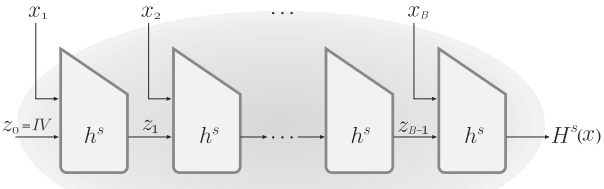
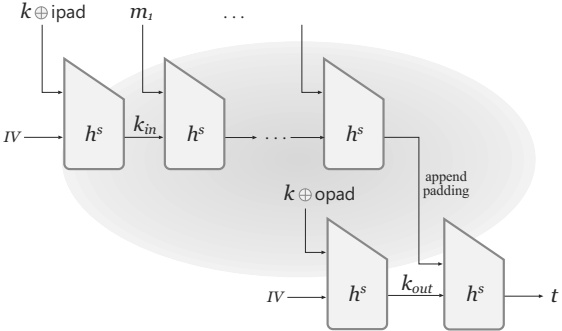
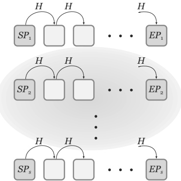
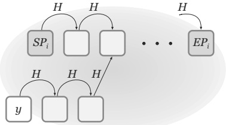
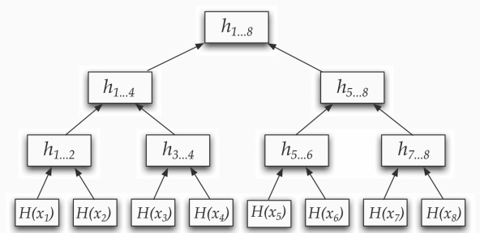

# Chapter 6: Hash Functions and Applications

In this chapter we look beyond the problem of secure communication that has occupied us until now, and consider a cryptographic primitive with many applications: cryptographic hash functions. At the most basic level, a hash function $H$ provides a way to deterministically map a long input string to a shorter output string sometimes called a digest. The primary requirement is that it should be infeasible to find a collision in $H$: namely, two inputs that produce the same digest. As we will see, collision-resistant hash functions have numerous uses, including another approach—standardized as HMAC—for domain extension for message authentication codes.

Hash functions can be viewed as lying between the worlds of private- and public-key cryptography. On the one hand, as we will see in Chapter 7, they are (in practice) constructed using symmetric-key techniques. From a theoretical point of view, however, the existence of collision-resistant hash functions appears to be a qualitatively stronger assumption than the existence of other symmetric-key primitives, while at the same time being weaker than what is needed for public-key encryption. Hash functions have important applications in both the private- and public-key settings.

Hash functions have become ubiquitous in cryptography, and they are often used in scenarios that require properties much stronger than collision resistance. Indeed, it has become common to model cryptographic hash functions as being “completely unpredictable” (a.k.a., random oracles), and we discuss this model—and the controversy that surrounds it—in Section 6.5. In Section 6.6 we touch on a few applications of random oracles; we will encounter the random-oracle model again in the context of public-key cryptography.

## 6.1 Definitions

Hash functions are simply functions that take inputs of some length and compress them into short, fixed-length outputs. The classic use of (non-cryptographic) hash functions is in data structures, where they can be used to build hash tables that enable $\mathcal{O}(1)$ lookup time when storing a set of elements. Specifically, if the range of the hash function $H$ is of size $N$, then element $x$
is stored in row $H(x)$ of a table of size $N$. To retrieve $x$, it suffices to compute $H(x)$ and probe that row of the table for the elements stored there. A “good” hash function for this purpose is one that yields few collisions, where a collision is a pair of distinct elements $x$ and $x^{\prime}$ for which $H(x)=H(x^{\prime})$; in this case we also say that $x$ and $x^{\prime}$ collide. (When a collision occurs, two elements end up being stored in the same cell, increasing the lookup time.)

Collision-resistant hash functions are similar in spirit; again, the goal is to avoid collisions. However, there are fundamental differences. For one, the desire to minimize collisions in the setting of data structures becomes a requirement to avoid collisions in the setting of cryptography. Furthermore, in the context of data structures we assume that the set of elements being hashed is chosen independently of H and without any intention to cause collisions. In the context of cryptography, in contrast, we are faced with an adversary who may select elements with the explicit goal of causing collisions. This means that collision-resistant hash functions are much harder to design.

### 6.1.1 Collision Resistance

Informally, a function $H$ is collision resistant if it is infeasible for any probabilistic polynomial-time algorithm to find a collision in $H$. We will only be interested in hash functions whose domain is larger than their range. In this case collisions must exist, but such collisions should be hard to find.

Formally, we consider keyed hash functions. That is, $H$ is a two-input function that takes as input a key $s$ and a string $x$, and outputs a string $H^s(x) \overset{\mathrm{def}}{=} H(s,x)$. The requirement is that it must be hard to find a collision in $H^s$ for a randomly generated key $s$. We highlight one major difference between keys in this context and the keys we have considered until now: In the present context, the key $s$ is (generally) not kept secret, and collision resistance is required even when the adversary is given $s$. In order to emphasize that the key may not be secret, we superscript the key and write $H^s$ rather than $H_s$.

DEFINITION 6.1 A hash function (with output length $\ell(n)$) is a pair of probabilistic polynomial-time algorithms (Gen, H) satisfying the following:

Gen is a probabilistic algorithm that takes as input a security parameter ${1}^{n}$ and outputs a key $s$. We assume that $n$ is implicit in $s$.

- $H$ is a deterministic algorithm that takes as input a key $s$ and a string $x \in \{0,1\}^*$ and outputs a string $H^s(x) \in \{0,1\}^{\ell(n)}$ (where $n$ is the value of the security parameter implicit in $s$).

If $H^{s}$ is defined only for inputs x of length $\ell^{\prime}(n) > \ell(n)$, then we say that (Gen, H) is a fixed-length hash function for inputs of length $\ell^{\prime}(n)$. In this case, we also call H a compression function.

In the fixed-length case we require that $\ell^{\prime}$ be greater than $\ell$. This ensures that $H^{s}$ compresses its input. In the general case the function takes as input strings of arbitrary length; thus, it also compresses (albeit only inputs of length greater than $\ell(n)$). Note that without compression, collision resistance is trivial (since one can just take the identity function $H^{s}(x)=x$).

We now proceed to define security. As usual, we first define an experiment for a hash function $\mathcal{H} = (\mathsf{Gen}, H)$, an adversary $\mathcal{A}$, and a security parameter $n$:

The collision-finding experiment $\mathsf{Hash-coll}_{A,\mathcal{H}}(n)$:

1. A key $s$ is generated by running $\mathsf{Gen}(1^{n})$.

2. The adversary $\mathcal{A}$ is given $s$, and outputs $x, x^{\prime}$. (If $\mathcal{H}$ is a fixed-length hash function for inputs of length $\ell^{\prime}(n)$, then we require $x, x^{\prime} \in \{0,1\}^{\ell^{\prime}(n)}.$)

3. The output of the experiment is defined to be 1 if and only if $x \neq x^{\prime}$ and $H^{s}(x) = H^{s}(x^{\prime})$. In such a case we say that $\mathcal{A}$ has found a collision.

The definition of collision resistance states that no efficient adversary can find a collision in the above experiment except with negligible probability.

DEFINITION 6.2 A hash function $\mathcal{H} = (\mathsf{Gen}, H)$ is collision resistant if for all probabilistic polynomial-time adversaries $\mathcal{A}$ there is a negligible function $\mathsf{negl}$ such that

$$\Pr\left[\mathsf{Hash-coll}_{\mathcal{A},\mathcal{H}}(n)=1\right]\leq\mathsf{negl}(n).$$

For simplicity, we sometimes refer to $H$ or $H^s$ as a “collision-resistant hash function,” even though technically we should only say that $\mathcal{H} = (\mathsf{Gen}, H)$ is. This should not cause any confusion.

Cryptographic hash functions are designed with the explicit goal of being collision resistant (among other things). We will discuss some design principles for hash functions, along with some commonly used examples, in Chapter 7. In Section 9.4.2 we will see how it is possible to construct hash functions with proven collision resistance based on an assumption about the hardness of a certain number-theoretic problem.

Unkeyed hash functions. Cryptographic hash functions used in practice are generally unkeyed and have a fixed output length (by analogy with block ciphers), meaning that the hash function is just a fixed, deterministic function $H : \{0,1\}^* \to \{0,1\}^\ell$. This is problematic from a theoretical standpoint since for any such function there is always a constant-time algorithm that outputs a collision in $H$: the algorithm simply outputs a colliding pair $(x, x^{\prime})$ hardcoded into the algorithm itself. Using keyed hash functions solves this technical issue since it is impossible to hardcode a collision for every possible key using a reasonable amount of memory (and in an asymptotic setting, it would be impossible to hardcode a collision for every value of the security parameter).

Notwithstanding the above, the (unkeyed) cryptographic hash functions used in the real world are collision resistant for all practical purposes since colliding pairs are unknown (and computationally difficult to find) even though they must exist. Proofs of security for a scheme based on a collision-resistant hash function are still meaningful even when an unkeyed hash function $H$ is used, as long as the proof shows that any efficient adversary “breaking” the primitive can be used to efficiently find a collision in $H$. (All the proofs in this book satisfy that condition.) In this case, the interpretation of the security proof is that if an adversary can break the scheme, then it can be used to find an explicit collision, something that is believed to be difficult.

In this chapter and throughout the rest of the book, we consider keyed hash functions when formally proving results that rely on collision resistance, but generally assume unkeyed hash functions otherwise.

### 6.1.2 Weaker Notions of Security

For some applications, security requirements weaker than collision resistance suffice. Security notions that are sometimes considered include:

Second-preimage resistance: Informally, a hash function is said to be second-preimage resistant if given $s$ and a uniform $x$ it is infeasible for a PPT adversary to find $x^{\prime} \neq x$ such that $H^s(x^{\prime}) = H^s(x)$.

Preimage resistance: Informally, a hash function is preimage resistant if given $s$ and $y = H^{s}(x)$ for a uniform $x$, it is infeasible for a PPT adversary to find a value $x^{\prime}$ (whether equal to $x$ or not) with $H^{s}(x^{\prime}) = y$. (Looking ahead to Chapter 8, this basically means that $H^{s}$ is one-way.)

It is immediate that any hash function that is collision resistant is also second-preimage resistant. It is also true that if a hash function is second-preimage resistant then it is preimage resistant. We do not formally define the above notions or prove these implications, since they are not used in the rest of the book. You are asked to formalize the above in Exercise 6.1.

## 6.2 The Merkle–Damgård Transform

Many applications require "full-fledged" collision-resistant hash functions that can handle very long inputs, or even inputs of arbitrary length. But it is much easier to construct fixed-length hash functions (i.e., compression functions) that only accept "short" inputs—something we will return to in Section 7.3. Fortunately, the Merkle–Damgård transform allows us to convert the latter to the former. This approach for domain extension of hash functions has been used frequently in practice, including for the hash function MD5 and the SHA hash family (cf. Section 7.3). The Merkle–Damgård transform is also interesting from a theoretical point of view since it implies that compressing by a single bit is as easy (or as hard) as compressing by an arbitrary amount.

For concreteness, assume the compression function (Gen, h) takes inputs of length $n + n^{\prime} \geq 2n$, and generates outputs of length $n$. (The construction can be generalized for other input/output lengths, as long as $h$ compresses.) Applying the Merkle–Damgård transform, defined in Construction 6.3 and depicted in Figure 6.1, yields a hash function (Gen, $H$) that maps inputs of arbitrary length to outputs of length $n$.

**CONSTRUCTION 6.3**

Let $(\mathsf{Gen}, h)$ be a compression function for inputs of length $n + n^{\prime} \geq 2n$ with output length $n$. *Fix* $\ell \leq n^{\prime}$ and $IV \in \{0,1\}^n$. *Construct hash function* $(\mathsf{Gen}, H)$ as follows:

Gen: remains unchanged.

- $H$: on input a key $s$ and a string $x \in \{0,1\}^*$ of length $L < 2^\ell$, do:

1. Append a 1 to $x$, followed by enough zeros so that the length of the resulting string is $\ell$ less than a multiple of $n^{\prime}$. Then append $L$, encoded as an $\ell$-bit string. Parse the resulting string as the sequence of $n^{\prime}$-bit blocks $x_1, \ldots, x_B$.

2. Set $z_{0} := IV$.

3. For $i = 1, \ldots, B$, compute $z_i := h^s(z_{i-1} | x_i)$.

4. Output $z_{B}$

**The Merkle–Damgård transform.**

THEOREM 6.4 If (Gen, h) is collision resistant, then so is (Gen, H).

PROOF We show that for any $s$, a collision in $H^s$ yields a collision in $h^s$. Let $x$ and $x^{\prime}$ be two different strings of length $L$ and $L^{\prime}$, respectively, such that $H^s(x) = H^s(x^{\prime})$. Let $x_1, \ldots, x_B$ be the $B$ blocks of the padded $x$, and let $x^{\prime}_1, \ldots, x^{\prime}_{B^{\prime}}$ be the $B^{\prime}$ blocks of the padded $x^{\prime}$. Let $z_0, z_1, \ldots, z_B$ (resp., $z^{\prime}_0, z^{\prime}_1, \ldots, z^{\prime}_{B^{\prime}}$) be the intermediate results during computation of $H^s(x)$ (resp., $H^s(x^{\prime})$). There are two cases to consider:

Case 1: $L \neq L^{\prime}$. In this case, the last step of the computation of $H^{s}(x)$ is $z_{B} := h^{s}(z_{B-1} \| x_{B})$, and the last step of the computation of $H^{s}(x^{\prime})$ is $z_{B^{\prime}}^{\prime} := h^{s}(z_{B^{\prime}-1}^{\prime} \| x_{B^{\prime}}^{\prime})$. Since $H^{s}(x) = H^{s}(x^{\prime})$ we have $h^{s}(z_{B-1} \| x_{B}) = h^{s}(z_{B^{\prime}-1}^{\prime} \| x_{B^{\prime}}^{\prime})$. However, $L \neq L^{\prime}$ and so $x_{B} \neq x_{B^{\prime}}$. (Recall that the last $\ell$ bits of $x_{B}$ encode $L$, and the last $\ell$ bits of $x_{B^{\prime}}^{\prime}$ encode $L^{\prime}$.) Thus, $z_{B-1} \| x_{B}$ and $z_{B^{\prime}-1}^{\prime} \| x_{B^{\prime}}^{\prime}$ are a collision with respect to $h^{s}$.

**FIGURE 6.1: The Merkle–Damgård transform.**

Case 2: $L = L^{\prime}$. This means that $B = B^{\prime}$. Let $I_i \stackrel{\mathrm{def}}{=} z_{i-1} \| x_i \mathrm{~denote~the~i~th~input~to~} h^s$ during computation of $H^s(x)$, and define $I_{B+1} \stackrel{\mathrm{def}}{=} z_B$. Define $I^{\prime}_1, \ldots, I^{\prime}_{B+1}$ analogously with respect to $x^{\prime}$. Let $N$ be the largest index for which $I_N \neq I^{\prime}_N$. Since $|x| = |x^{\prime}|$ but $x \neq x^{\prime}$, there is an $i$ with $x_i \neq x^{\prime}_i$ and so such an $N$ certainly exists. Because

$$I_{B+1}=z_{B}=H^{s}(x)=H^{s}(x^{\prime})=z_{B}^{\prime}=I_{B+1}^{\prime},$$

we have $N \leq B$. By maximality of $N$, we have $I_{N+1} = I_{N+1}^{\prime}$ and in particular $z_N = z_N^{\prime}.$ But this means that $I_N, I^{\prime}_N$ collide under $h^s$.

We leave it as an exercise to turn the above into a proof by reduction.

## 6.3 Message Authentication Using Hash Functions

We have already seen several constructions of message authentication codes for arbitrary-length messages. In this section we will see another approach that relies on collision-resistant hash functions. We then discuss a standardized and widely used scheme called HMAC that can be viewed as a specific instantiation of this approach.

### 6.3.1 Hash-and-MAC

Collision-resistant hash functions can naturally be used for domain extension of message authentication codes. Say we have a fixed-length MAC for $\ell(n)$-bit messages, and a collision-resistant hash function with $\ell(n)$-bit output length. Then we can authenticate an arbitrary-length message $m$ by using the MAC to authenticate the hash of $m$. (See Construction 6.5.) Intuitively, this is secure because the MAC ensures that the attacker cannot authenticate any new hash value, while collision resistance ensures that the attacker will be unable to find any new message that hashes to a previously used hash value.

**CONSTRUCTION 6.5**

Let $\Pi = (\mathrm{Mac}, \mathrm{Vrfy})$ be a MAC for messages of length $\ell(n)$, and let $\mathcal{H} = (\mathrm{Gen}_{H}, H)$ be a hash function with output length $\ell(n)$. Construct a MAC $\Pi^{\prime} = (\mathrm{Gen}^{\prime}, \mathrm{Mac}^{\prime}, \mathrm{Vrfy}^{\prime})$ for arbitrary-length messages as follows:

Gen': on input ${1}^n$, choose uniform $k \in \{0,1\}^n$ and run $\mathsf{Gen}_H(1^n)$ to obtain $s$; output the key $(k,s)$.

- Mac': on input a key $(k, s)$ and a message $m \in \{0,1\}^*$, output $t \leftarrow \mathsf{Mac}_k(H^s(m))$.

- $\operatorname{Vrfy}^{\prime}$: on input a key $(k,s)$, a message $m \in \{0,1\}^*$, and a tag $t$, output 1 if and only if $\operatorname{Vrfy}_k(H^s(m),t) \overset{?}{=} 1$.

The hash-and-MAC paradigm.

A bit more formally, say a sender uses Construction 6.5 to authenticate some set of messages $Q$, and an attacker $\mathcal{A}$ is then able to forge a valid tag on a new message $m^* \notin Q$. There are two possibilities:

Case 1: there is a message $m \in \mathcal{Q}$ such that $H^s(m^*) = H^s(m)$. Then $\mathcal{A}$ has found a collision in $H^s$, contradicting collision resistance of $(\mathrm{Gen}_H, H)$.

Case 2: for every message $m \in \mathcal{Q}$ it holds that $H^s(m^*) \neq H^s(m)$. Let $H^s(\mathcal{Q}) \stackrel{\mathrm{def}}{=} \{H^s(m) \mid m \in \mathcal{Q}\}$. Then $H^s(m^*) \notin H^s(\mathcal{Q})$. In this case, $\mathcal{A}$ has forged a valid tag on the “new message” $h^* = H^s(m^*)$ with respect to the (fixed-length) message authentication code $\Pi$. This contradicts the assumption that $\Pi$ is a secure MAC.

We now turn the above into a formal proof.

THEOREM 6.6 If $\Pi$ is a secure MAC for messages of length $\ell(n)$ and H is collision resistant, then Construction 6.5 is a secure MAC (for arbitrary-length messages).

PROOF Let $\Pi^{\prime}$ denote Construction 6.5, and let $\mathcal{A}^{\prime}$ be a PPT adversary attacking $\Pi^{\prime}$. In an execution of experiment $\mathsf{Mac-forge}_{\mathcal{A}^{\prime},\Pi^{\prime}}(n)$, let $(k,s)$ denote the key (of $\Pi^{\prime}$), let $\mathcal{Q}$ denote the set of messages whose tags were requested by $\mathcal{A}^{\prime}$, and let $(m^*,t)$ be the final output of $\mathcal{A}^{\prime}$. We assume without loss of generality that $m^*\notin\mathcal{Q}$. Define $\mathsf{coll}$ to be the event that, in experiment $\mathsf{Mac-forge}_{\mathcal{A}^{\prime},\Pi^{\prime}}(n)$, there is an $m\in\mathcal{Q}$ for which $H^s(m^*)=H^s(m)$. We have

$$\begin{aligned}&\Pr[\mathsf{Mac-forge}_{\mathcal{A}^{\prime},\Pi^{\prime}}(n)=1]\\ &=\Pr[\mathsf{Mac-forge}_{\mathcal{A}^{\prime},\Pi^{\prime}}(n)=1\land\mathsf{coll}]+\Pr[\mathsf{Mac-forge}_{\mathcal{A}^{\prime},\Pi^{\prime}}(n)=1\land\overline{\mathsf{coll}}]\\ &\leq\Pr[\mathsf{coll}]+\Pr[\mathsf{Mac-forge}_{\mathcal{A}^{\prime},\Pi^{\prime}}(n)=1\land\overline{\mathsf{coll}}].
\end{aligned} \tag{6.1}$$

We show that both terms in Equation (6.1) are negligible, thus completing the proof. Intuitively, the first term is negligible by collision resistance of $\mathcal{H}$, and the second term is negligible by security of $\Pi$.

Consider the following algorithm C for finding a collision in H:

Algorithm C:

The algorithm is given input s (with n implicit).

• Choose uniform $k \in \{0,1\}^{n}$.

- Run $\mathcal{A}^{\prime}(1^n)$. When $\mathcal{A}^{\prime}$ requests a tag on the $i$th message $m_i \in \{0,1\}^*$, compute $t_i \leftarrow \mathsf{Mac}_k(H^s(m_i))$ and give $t_i$ to $\mathcal{A}^{\prime}$.

- When $\mathcal{A}^{\prime}$ outputs $(m^*, t)$, then if there exists an $i$ for which $H^s(m^*) = H^s(m_i)$, output $(m^*, m_i)$.

It is clear that $\mathcal{C}$ runs in polynomial time. Let us analyze its behavior. When the input to $\mathcal{C}$ is generated by running $\mathsf{Gen}_H(1^n)$ to obtain $s$, the view of $\mathcal{A}^{\prime}$ when run as a subroutine by $\mathcal{C}$ is distributed identically to the view of $\mathcal{A}^{\prime}$ in experiment $\mathsf{Mac-forge}_{\mathcal{A}^{\prime},\Pi^{\prime}}(n)$. Thus, the probability that $\mathsf{coll}$ occurs is the same in both cases. Since $\mathcal{C}$ outputs a collision when $\mathsf{coll}$ occurs, we have

$$\Pr[\mathsf{Hash-coll}_{\mathcal{C},\mathcal{H}}(n)=1]=\Pr[\mathsf{coll}].$$

Collision resistance of H thus implies that Pr[coll] is negligible.

We now proceed to prove that the second term in Equation (6.1) is negligible. Consider the following adversary $\mathcal{A}$ attacking $\Pi$ in $\mathsf{Mac-forge}_{\mathcal{A}, \Pi}(n)$:

Adversary A:

The adversary is given ${1}^{n}$ and access to an oracle $\mathrm{Mac}_{k}(\cdot)$.

• Compute $\mathsf{Gen}_{H}(1^{n})$ to obtain s.

- Run $\mathcal{A}^{\prime}(1^n)$. When $\mathcal{A}^{\prime}$ requests a tag on the $i$th message $m_i \in \{0,1\}^*$, then: (1) compute $h_i := H^s(m_i)$; (2) obtain a tag $t_i$ on $h_i$ from the MAC oracle; and (3) give $t_i$ to $\mathcal{A}^{\prime}$.

- When $\mathcal{A}^{\prime}$ outputs $(m^*, t)$, set $h^* := H^s(m^*)$ and then output $(h^*, t)$.

$\mathcal{A}$ runs in polynomial time. If $\mathcal{A}^{\prime}$ outputs $(m^*, t)$ with $\mathsf{Vrfy}_k(H^s(m^*), t) = 1$, and $\mathsf{coll}$ did not occur, then $\mathcal{A}$ outputs a valid forgery. (In that case $t$ is a valid tag on $h^* = H^s(m^*)$ in scheme $\Pi$ with respect to $k$. The fact that $\mathsf{coll}$ did not occur means that $h^*$ was never asked by $\mathcal{A}$ to its own MAC oracle and so this is indeed a forgery.) Moreover, the view of $\mathcal{A}^{\prime}$ when run as a subroutine by $\mathcal{A}$ in experiment $\mathsf{Mac-forge}_{\mathcal{A},\Pi}(n)$ is distributed identically to the view of $\mathcal{A}^{\prime}$ in experiment $\mathsf{Mac-forge}_{\mathcal{A}^{\prime},\Pi^{\prime}}(n)$. We conclude that

$$\Pr[\mathsf{Mac-forge}_{\mathcal{A},\Pi}(n)=1]=\Pr[\mathsf{Mac-forge}_{\mathcal{A}^{\prime},\Pi^{\prime}}(n)=1\land\overline{{\mathsf{coll}}}],$$

and security of $\Pi$ implies that the former probability is negligible. This concludes the proof of the theorem.

### 6.3.2 HMAC

In principle, the hash-and-MAC approach from the previous section could be instantiated by combining an arbitrary collision-resistant hash function with the fixed-length MAC of Construction 4.5. This way of realizing the hash-and-MAC approach has at least two drawbacks in practice. First, it requires implementing two cryptographic primitives: a hash function and a block cipher. (Recall that Construction 4.5 is based on a block cipher, and supports messages of length equal to the block length of the cipher.) This can be a problem, e.g., in constrained devices, where it is desirable to keep the size of the code implementing a cryptographic scheme as small as possible. A more fundamental difficulty is that there is often a mismatch between the output length of hash functions and the block length of block ciphers. (This is in part due to a difference between the parameters needed to achieve security for a block cipher vs. a hash function, as will be explored in the next section.) For example, the block cipher AES has a 128-bit block length, whereas modern hash functions have output lengths of at least 256 bits—and a 128-bit output length would be far too short to ensure meaningful collision resistance.

**CONSTRUCTION 6.7**

Let $(\mathsf{Gen}_H, H)$ be a hash function constructed by applying the Merkle–Damgård transform to a compression function $(\mathsf{Gen}_H, h)$ that takes inputs of length $n + n^{\prime} > 2n + \log n + 2$ and generates output of length $n$. Fix distinct constants $\text{opad}, \text{ipad} \in \{0,1\}^{n^{\prime}}$. Define a MAC as follows:

Gen: on input ${1}^n$, run $\mathsf{Gen}_H(1^n)$ to obtain a key $s$. Also choose uniform $k \in \{0,1\}^{n^{\prime}}$. Output the key $(s,k)$.

Mac: on input a key $(s,k)$ and a message $m \in \{0,1\}^{*}$, output

$$t:=H^{s}\Big((k\oplus\mathsf{opad})\parallel H^{s}\big((k\oplus\mathsf{ipad})\parallel m\big)\Big).$$

- $\mathsf{Vrfy}$: on input a key $(s,k)$, a message $m \in \{0,1\}^*$, and a tag $t$, output 1 if and only if $t \stackrel{?}{=} H^s\left((k \oplus \text{opad}) \parallel H^s\left((k \oplus \text{ipad}) \parallel m\right)\right)$.

**HMAC.**

The above concerns motivated the design of HMAC, a message authentication code for arbitrary-length messages that can be based on any hash function $(\mathsf{Gen}_{H}, H)$ constructed using the Merkle–Damgård transform applied to a compression function $(\mathsf{Gen}_{H}, h)$. See Construction 6.7 for a high-level overview that abstracts out the underlying compression function, and Figure 6.2 for a graphical depiction that makes the compression function explicit.

Referring to Figure 6.2, we see that computation of HMAC on a message $m = m_1, m_2, \ldots$ using key $k$ can be separated into an “inner” hash evaluation and an “outer” hash evaluation.

**FIGURE 6.2: HMAC, pictorially.** The inner hash evaluation involves computing $\hat{m} := H^s((k \oplus \text{ipad})\|m)$, where $\text{ipad}$ is some fixed constant. As per the definition of the Merkle–Damgård transform, the input to $H^s$—which, in this case, is the string $(k \oplus \text{ipad})\|m$—is padded as part of the hash computation; this padding is left implicit in Figure 6.2. The outer hash evaluation involves computation of the tag $t := H^s((k \oplus \text{opad})\| \hat{m})$, where $\text{opad}$ is another fixed constant; note that $k$, $\text{ipad}$, and $\text{opad}$ are all exactly $n^{\prime}$ bits long. Once again, padding is applied to the $(n^{\prime} + n)$-bit input string $(k \oplus \text{opad})\|\hat{m}$ as part of the hash computation; parameters are set such that the padded string is exactly two blocks long. That is, if we let $k_{out} \overset{\mathrm{def}}{=} h^s(IV\|(k \oplus \text{opad}))$ as in the figure, then $t = h^s(k_{out} \|\hat{m}^*)$, where $\hat{m}^*$ is the second block after padding.

Given this perspective, we see that HMAC can be viewed as an instantiation of the hash-and-MAC paradigm from the previous section, where the inner computation corresponds to hashing the message $m$ to an $n^{\prime}$-bit string $\hat{m}^*$ (including the padding), and the outer computation corresponds to computing a fixed-length message authentication code on $\hat{m}^*$. Formally, let $\widetilde{\Pi}^s = (\widetilde{\mathsf{Gen}}^s, \widetilde{\mathsf{Mac}}^s, \widetilde{\mathsf{Vrfy}}^s)$ be the message authentication code in which $\widetilde{\mathsf{Mac}}^{s}_{k_{out}}(\hat{m}^*) = h^s(k_{out} \| \hat{m}^*)$ (We view $s$ here as a fixed, public value.) Intuitively, then, if $(\mathsf{Gen}_H, h)$ is collision resistant and $\widetilde{\Pi}^s$ is secure, HMAC is secure. As a technical matter, though, since the key $k_{out}$ used by the MAC $\widetilde{\Pi}^s$ is derived from an underlying key $k$ that is also used in the inner hash evaluation, we need one additional assumption regarding the “computational independence” of $k_{in} \overset{\mathrm{def}}{=} h^s(IV \| (k \oplus \text{ipad}))$ and $k_{out}$. Specifically, define

$$G^{s}(k)\stackrel{\mathrm{def}}{=}h^{s}\left(IV\|(k\oplus\mathsf{ipad})\right)\|h^{s}\left(IV\|(k\oplus\mathsf{opad})\right)=k_{in}\|k_{out}.$$

Then it is possible to prove:

THEOREM 6.8 Assume $G^{s}$ is a pseudorandom generator, $\widetilde{\Pi}^{s}$ is a secure fixed-length MAC for messages of length $n^{\prime}$, and $(\mathsf{Gen}_{H}, h)$ is collision resistant. Then HMAC is a secure MAC (for arbitrary-length messages).

(We require the first two assumptions in the theorem to hold for all s. Even if $G^{s}$ is not expanding, it is still meaningful to speak of its output as being pseudorandom.) Because of the way the compression function $h$ is typically designed (see Section 7.3.1), the first two assumptions are reasonable.

The roles of ipad and opad. One might wonder why it is necessary to incorporate $k_{in}$ (or $k$ itself) in the “inner” computation at all. In particular, for the hash-and-MAC approach all that is required is for the inner computation to be collision resistant, which does not require any secret key. The reason for including a secret key as part of the inner computation is that this allows security of HMAC to be based on the assumption that $(\mathsf{Gen}_H, H)$ is weakly collision resistant, where (informally) this refers to an experiment in which an attacker needs to find collisions in a secretly keyed hash function. This is a weaker condition than collision resistance, and hence is potentially easier to satisfy. The defensive design strategy of HMAC paid off when it was discovered that the hash function MD5 (see Section 7.3.2) used in HMAC–MD5 was not collision resistant. The attacks on MD5 did not violate weak collision resistance, and so HMAC–MD5 was not broken even though MD5 was. (Despite this, HMAC–MD5 should no longer be used now that weaknesses in MD5 are known.) This gave developers time to replace MD5 in HMAC implementations, without immediate fear of attack.

Ideally, independent keys $k_{in}$, $k_{out}$ should have been used in the inner and outer computations. To reduce the key length of HMAC, a single key $k$ is used to derive $k_{in}$ and $k_{out}$ using ipad and opad. (Moreover, in practice it is typical for the length of $k$ to be much shorter than $n^{\prime}$—in which case $k$ is simply padded with 0s before being XORed with ipad and opad.) If we assume that $G^{s}$ (as defined above) is a pseudorandom generator for any $s$, then $k_{in}$ and $k_{out}$ can be treated as independent, uniform keys when $k$ is uniform.

## 6.4 Generic Attacks on Hash Functions

In the context of the symmetric-key primitives we have studied so far (block ciphers, private-key encryption schemes, etc.), we noted that any scheme using an $n$-bit secret key is vulnerable to a brute-force attack in which an attacker enumerates all ${2}^n$ possible keys until it finds the right one. (Of course, this does not apply to information-theoretic schemes.) Put differently, if we want to achieve security against attackers running in time ${2}^n$ then we need to use secret keys that are at least $n$ bits long.

What can we say about the security of hash functions against brute-force attacks? We show here that a birthday attack allows an attacker to find a collision in any hash function having an $\ell$-bit output length in time ${2}^{\ell/2}$. Thus, if we want to ensure collision resistance against attackers running in time ${2}^n$ we need to use hash functions whose output is at least ${2}n$ bits long—twice the length of secret keys providing comparable security guarantees.

While on the topic of generic attacks (i.e., attacks that apply to arbitrary hash functions), we also consider attacks on preimage resistance, where the attacker's goal is to find an input $x$ that hashes to a given value $y$. Here thequestion is complicated by the attacker's ability to use preprocessing and a large amount of storage to speed up the attack. This has important ramifications in practice when hashing users' passwords, something we touch on in Section 6.6.3.

### 6.4.1 Birthday Attacks for Finding Collisions

Let $H : \{0,1\}^* \to \{0,1\}^\ell$ be a hash function. For any such $H$, there is always a trivial collision-finding attack running in time $\mathcal{O}(2^\ell)$: simply evaluate $H$ on $q = 2^\ell + 1$ distinct inputs; by the pigeonhole principle, two of the outputs must be equal. Is this the best possible attack?

Let us generalize the above algorithm by taking $q$ as a parameter. Say we choose $q$ uniform (distinct) inputs $x_1, \ldots, x_q$, compute $y_i := H(x_i)$ for all $i$, and check whether any of the $\{y_i\}$ are equal. As noted, if $q > 2^\ell$ then there is certainly a collision. When $q \leq 2^\ell$ we can no longer guarantee a collision, but there is clearly some nonzero probability that a collision occurs. It is somewhat difficult to analyze this probability when $H$ is arbitrary, and so we instead consider the idealized case where $H$ is treated as a random function. (It can be shown that this is the worst case, and collisions occur with higher probability if $H$ deviates from random.) That is, for each $i$ we assume that the value $y_i = H(x_i)$ is uniformly distributed in $\{0,1\}^\ell$ and independent of all the other values $\{y_j\}_{j\neq i}$ (recall all the $\{x_i\}$ are distinct). We have thus reduced our problem to the following: if we generate uniform $y_1, \ldots, y_q \in \{0,1\}^\ell$, what is the probability that there exist distinct $i, j$ with $y_i = y_j?$

This question has been extensively studied, and is related to the so-called birthday problem discussed in detail in Appendix A.4; for this reason the collision-finding algorithm described above is one of a class of algorithms called birthday attacks. The birthday problem is this: if $q$ people are in a room, what is the probability that some two of them share a birthday? (Assume birthdays are uniformly and independently distributed among the 365 days of a non-leap year.) This is analogous to our problem: if $y_i$ is the birthday of person $i$, then we have uniform and independent $y_1,\ldots,y_q\in\{1,\ldots,365\}$, and matching birthdays correspond to distinct $i,j$ with $y_i=y_j$ (i.e., matching birthdays correspond to collisions).

In Appendix A.4 we show that when $y_1, \ldots, y_q$ are uniform in $\{1, \ldots, N\}$, then if $q = \Theta(N^{1/2})$ the probability of a collision is roughly ${1}/{2}$. (In the
case of birthdays, once there are only 23 people the probability that some two of them have the same birthday is roughly 51%!) In our setting, this means that when the hash function $H$ has output length $\ell$ (and so has range of size $N = 2^{\ell}$), evaluating $H$ on $q = \Theta(2^{\ell/2})$ inputs yields a collision with probability roughly 1/2. From a concrete-security perspective, this implies that for a hash function $H$ to be collision resistant against attackers running in time ${2}^n$ it is required that $H$ have output at least ${2}n$ bits long. Taking specific parameters: if we want finding collisions to be as difficult as an exhaustive search over 128-bit keys, then we need the output length of the hash function to be at least 256 bits. (We stress that having output this long is only a necessary condition, not a sufficient one.)

Finding meaningful collisions. The birthday attack just described gives a collision that is not necessarily very useful, since the colliding inputs are random. But the same idea can be used to find “meaningful” collisions as well. Assume Alice wishes to find two messages $x$ and $x^{\prime}$ such that $H(x) = H(x^{\prime})$, and furthermore $x$ should be a letter from her employer explaining why she was fired from work, while $x^{\prime}$ should be a flattering letter of recommendation. (This might allow Alice to forge a tag on a letter of recommendation if the hash-and-MAC approach is being used by her employer to authenticate messages.) Note that the birthday attack only requires the hash inputs $x_1, \ldots, x_q$ to be distinct; they do not need to be random. Alice can carry out a birthday attack by generating $q = \Theta(2^{\ell/2})$ messages of the first type and $q$ messages of the second type, and then looking for collisions between messages of the two types. A small change to the analysis from Appendix A.4 shows that this gives a collision between messages of different types with probability roughly ${1}/{2}$. A little thought shows that it is easy to write the same message in many different ways. For example, consider the following:

It is hard/difficult/challenging/impossible to imagine/believe that we will find/locate/hire another employee/person having similar abilities/skills/character as Alice. She has done a great/super job.

Any combination of the italicized words is possible, and expresses the same idea. Thus, the sentence can be written in ${4}\cdot2\cdot3\cdot2\cdot3\cdot2=288$ different ways. This is just one sentence and so it is actually easy to generate a message that can be rewritten in ${2}^{64}$ different ways—all that is needed are 64 words with one synonym each. Alice can prepare ${2}^{\ell/2}$ letters explaining why she was fired and another ${2}^{\ell/2}$ letters of recommendation; with good probability, a collision between the two types of letters will be found.

### 6.4.2 Small-Space Birthday Attacks

The birthday attacks described above require a large amount of memory; specifically, they require the attacker to store all $\Theta(q) = \Theta(2^{\ell/2})$ values $\{y_i\}$, because the attacker does not know in advance which pair of values will yield a collision. This is a significant drawback because memory is, in general, a scarcer resource than time: one can always let a computation run as long as needed, whereas if a program requires more memory than is available then that program will simply halt. Furthermore, memory accesses are typically orders of magnitude slower than executing arithmetic instructions.

We show here a better birthday attack with drastically reduced memory requirements. In fact, it has similar time complexity and success probability as before, but uses only a constant amount of memory. The attack begins by choosing a uniform value $x_0$ and then computing $x_i := H(x_{i-1})$ and $x_{2i} := H(H(x_{2(i-1)}))$ for $i = 1, 2, \ldots$ (Note that $x_i = H^{(i)}(x_0)$ for all $i$, where $H^{(i)}$ refers to $i$-fold iteration of $H$.) In each step the values $x_i$ and $x_{2i}$ are compared; if they are equal then there is a collision somewhere in the sequence $x_0, x_1, \ldots, x_{2i-1}$. (The values $x_{i-1}$ and $x_{2i-1}$ might not be a collision because they may themselves be equal.) The algorithm then finds the least value of $j$ for which $x_j = x_{j+i}$, and outputs $x_{j-1}, x_{j+i-1}$ as a collision. This attack, described formally as Algorithm 6.9 and analyzed below, only requires storage of two hash values in each iteration.

ALGORITHM 6.9
A small-space birthday attack

Output: Distinct $x, x^{\prime}$ with $H(x) = H(x^{\prime})$
$x_0 \leftarrow \{0,1\}^{\ell+1}$
$x^{\prime} := x := x_0$
for $i = 1,2,\ldots$ do:
  $x := H(x)$
  $x^{\prime} := H(H(x^{\prime}))$ // now $x = H^{(i)}(x_0)$ and $x^{\prime} = H^{(2i)}(x_0)$
        if $x = x^{\prime}$ break
$x^{\prime} := x$, $x := x_0$
for $j = 1$ to $i$:
    if $H(x) = H(x^{\prime})$ return $x, x^{\prime}$ and halt
    else $x := H(x)$, $x^{\prime} := H(x^{\prime})$
    // now $x = H^{(j)}(x_0)$ and $x^{\prime} = H^{(j+i)}(x_0)$

How many iterations of the first loop do we expect before $x = x^{\prime}$? Consider the sequence of values $x_1, x_2, \ldots$, where $x_i = H^{(i)}(x_0)$ as before. If we model $H$ as a random function, then each $x_i$ is uniform and independent of $x_1, \ldots, x_{i-1}$ as long as no repeat has yet occurred in this sequence. Thus, we expect a repeat to occur with probability ${1}/{2}$ in the first $q = \Theta(2^{\ell/2})$ elements of the sequence. When there is a repeat in the first $q$ elements, the algorithm finds a repeat in at most $q$ iterations of the first loop:

CLAIM 6.10 Let $x_1, \ldots, x_q$ be a sequence of values with $x_m = H(x_{m-1})$. If $x_I = x_J$ with ${1} \leq I < J \leq q$, then there is an $i < J$ such that $x_i = x_{2i}$.

PROOF The sequence $x_I, x_{I+1}, \ldots$ repeats with period $\Delta \stackrel{\mathrm{def}}{=} J-I$. That is, for all $i \geq I$ and $k \geq 0$ it holds that $x_i = x_{i+k \cdot \Delta}$. Let $i$ be the smallest multiple of $\Delta$ that is also greater than or equal to $I$. We have $i < J$ since the sequence of $\Delta$ values $I, I+1, \ldots, I+(\Delta-1) = J-1$ contains a multiple of $\Delta$. Since $i \geq I$ and ${2}i-i=i$ is a multiple of $\Delta$, it follows that $x_i = x_{2i}$.

Thus, if there is a repeated value in the sequence $x_1, \ldots, x_q$, there is some $i < q$ for which $x_i = x_{2i}$. But then in iteration $i$ of Algorithm 6.9, we have $x = x^{\prime}$ and the algorithm breaks out of the first loop. At that point in the algorithm, we know that $x_i = x_{2i}$. The algorithm then sets $x^{\prime} := x = x_i$ and $x := x_0$, and proceeds to find the smallest $j > 0$ for which $x_j = x_{j+i}$. (Note $x_0 \neq x_i$ because $|x_0| = \ell + 1$.) It outputs $x_{j-1}, x_{j+i-1}$ as a collision.

Finding meaningful collisions. The algorithm just described may not seem amenable to finding meaningful collisions since it has no control over the $\{x_i\}$ values used. Nevertheless, we show that finding meaningful collisions is still possible. The trick is to find a collision in the right function!

Assume, as before, that Alice wants to find a collision between messages of two different “types,” e.g., a letter explaining why she was fired and a flattering letter of recommendation. Alice writes each message so there are $\ell-1$ interchangeable words in each; i.e., there are ${2}^{\ell-1}$ messages of each type. Define the function $g: \{0,1\}^{\ell} \to \{0,1\}^{*}$ such that the first bit of the input selects between messages of type 0 or type 1, and the remaining bits select between options for the interchangeable words in messages of the appropriate type. For example, if $\ell = 4$ we could consider the sentences:

type 0: Alice is a good/great and honest/trustworthy worker/employee.

type 1: Alice is a bad/lousy and annoying/irritating worker/employee.

The function g is then defined on 4-bit inputs, where the first bit determines the sentence type and the final three bits determine the words in the sentence. That is:

$$g(0000)=Alice\;is\;a\;good\;and\;honest\;worker.$$

$$g(1101)=Alice\;is\;a\;lousy\;and\;annoying\;employee.$$

Finally, define $f : \{0,1\}^{\ell} \to \{0,1\}^{\ell}$ by $f(x) \overset{\mathrm{def}}{=} H(g(x))$. Alice can find a collision in $f$ using a variant of the small-space birthday attack shown earlier. Note that any collision $x, x^{\prime}$ in $f$ yields two messages $g(x), g(x^{\prime})$ that collide under $H$. If $x, x^{\prime}$ is a random collision then we expect that with probability ${1}/{2}$ the colliding messages $g(x), g(x^{\prime})$ will be of different types (since $x$ and $x^{\prime}$ will differ in their first bit with probability ${1}/{2}$). If the colliding messages are not of different types, the process can be repeated.

### 6.4.3 \*Time/Space Tradeoffs for Inverting Hash Functions

In this section we consider the question of preimage resistance, i.e., we are interested in algorithms for the problem of function inversion. Here, we have a hash function $H: \{0,1\}^* \to \{0,1\}^{\ell}$; an adversary is given $y = H(x)$ and its goal is to find any $x^{\prime}$ such that $H(x^{\prime}) = y$. (We call such an $x^{\prime}$ a preimage of $y$.) We begin by assuming that $x \in \{0,1\}^{\ell}$ for simplicity (and so view the domain of $H$ as $\{0,1\}^{\ell}$), and consider the more general case at the end.

Finding a preimage of $y = H(x)$ can be done in time $\Theta(2^{\ell})$ via exhaustive search over the domain of $H$, and this is optimal when $H$ is modeled as a random function. However, it ignores the possibility of preprocessing. That is, it may be possible for an algorithm to perform a significant amount of work in an “off-line” preprocessing phase before $y$ is known, and then to find a preimage $x^{\prime}$ in an “on-line” phase after being given $y$, using significantly less than $\Theta(2^{\ell})$ computation. This can be a worthwhile tradeoff if work can be invested in advance, or if the algorithm will be used to find preimages of multiple values (since the same preprocessing can be used for all of them).

In fact, it is trivial to use preprocessing to improve the on-line time of function inversion. All we need to do is evaluate $H$ on every point in $\{0,1\}^{\ell}$ during the preprocessing phase, and store all the pairs $\{(x,H(x))\}$ in a table, sorted by their second entry. Upon receiving a point $y$, a preimage of $y$ can be found easily by using binary search to find a pair in the table with second entry $y$. The drawback here is that we need to allocate memory for storing ${2}^{\ell}$ pairs, which can be prohibitive—if not impossible—for large $\ell$.

Exhaustive search uses constant memory and $\Theta(2^\ell)$ on-line time, while the attack just described stores $\Theta(2^\ell)$ points in memory but enables inversion in essentially constant on-line time. We now show an approach that allows an attacker to trade off time and memory and interpolate between these extremes. Specifically, we show how to store $\mathcal{O}(2^{2\ell/3})$ values and find preimages in time $\mathcal{O}(2^{2\ell/3})$; other trade-offs are also possible.

A warmup. We begin by considering the simple case where the function $H$ defines a cycle, meaning that $x, H(x), H(H(x)), \ldots$ covers all of $\{0,1\}^{\ell}$ for any starting point $x$. (Note that most functions do not define a cycle, but we assume this in order to demonstrate the idea in a very simple case.) For clarity, let $N = 2^{\ell}$ denote the size of the domain and range.

In the preprocessing phase, the attacker simply exhausts the entire cycle, beginning at an arbitrary starting point $x_0$ and computing $x_1 := H(x_0)$, $x_2 := H(H(x_0))$, up to $x_N = H^{(N)}(x_0)$, where $H^{(i)}$ refers to i-fold evaluation of $H$. Let $x_i \overset{\mathrm{def}}{=} H^{(i)}(x_0)$. We imagine partitioning the cycle into $\sqrt{N}$ segments of length $\sqrt{N}$ each, and having the attacker store the points at the beginning and end of each such segment. That is, the attacker stores in a table pairs of the form $(x_{i \cdot \sqrt{N}}, x_{(i+1) \cdot \sqrt{N}})$, for $i = 0$ to $\sqrt{N} - 1$, sorted by the second component of each pair. The resulting table contains $\mathcal{O}(\sqrt{N})$ points.

When the attacker is given a point $y$ to invert in the on-line phase, it checks which of $y$, $H(y)$, $H^{(2)}(y)$, ..., corresponds to the endpoint of a segment. (Each check just involves a table lookup on the second component of the stored pairs.) Since $y$ lies in some segment, this is guaranteed to find an endpoint within $\sqrt{N}$ steps. Once an endpoint $x = x_{(i+1)\cdot\sqrt{N}}$ is identified, the attacker takes the starting point $x^{\prime} = x_{i\cdot\sqrt{N}}$ of the corresponding segment and computes $H(x^{\prime})$, $H^{(2)}(x^{\prime})$, ..., until $y$ is reached; this immediately gives the desired preimage. This takes at most $\sqrt{N}$ additional evaluations of $H$.

In summary, this attack stores $\mathcal{O}(\sqrt{N}) = \mathcal{O}(2^{\ell/2})$ points and finds preimages with probability 1 using $\mathcal{O}(\sqrt{N}) = \mathcal{O}(2^{\ell/2})$ on-line hash computations.

Hellman’s time/space tradeoff. Martin Hellman introduced a more general time/space tradeoff applicable to an arbitrary function $H$ (though the analysis treats $H$ as a random function). Hellman’s attack still stores the starting point and endpoint of several segments, but in this case the segments are “independent” rather than being part of one large cycle. In more detail: let $s, t$ be parameters we will set later. The attacker first chooses $s$ uniform starting points $SP_1, \ldots, SP_s \in \{0, 1\}^\ell$. For each such point $SP_i$, it computes a corresponding endpoint $EP_i := H^{(t)}(SP_i)$ using $t$-fold application of $H$. (See Figure 6.3.) The attacker then stores the values $\{(SP_i, EP_i)\}_{i=1}^{s}$ in a table, sorted by the second entry (i.e., the endpoint) of each pair.

**FIGURE 6.3: Table generation. Only the $(SP_{i}, EP_{i})$ pairs are stored.**

Upon receiving a value $y$ to invert, the attack proceeds as in the simple case discussed earlier. Specifically, it checks if any of $y$, $H(y)$, ..., $H^{(t-1)}(y)$ is equal to the endpoint of some segment (stopping as soon as the first such match is found). It is possible that none of these values is equal to an endpoint (as we discuss below). However, if $H^{(j)}(y) = EP_i = H^{(t)}(SP_i)$ for some $i,j$, then the attacker computes $H^{(t-j-1)}(SP_i)$ and checks whether this is a preimage of $y$. The entire process requires at most $t$ evaluations of $H$.

This seems to work, but there are several subtleties we have ignored. First, it may happen that none of $y$, $H(y)$, ..., $H^{(t-1)}(y)$ is the endpoint of a segment. This can happen if $y$ is not in the collection of at most $s \cdot t$ values (not counting the starting points) obtained during the initial process of generating the table. We can set $s \cdot t \geq N$ in an attempt to include every $\ell$-bit string in the table, but this does not solve the problem since there can be collisions in the table itself—in fact, for $s \cdot t \geq N^{1/2}$ our previous analysis of the birthday problem tells us that collisions are likely—which will reduce the number of distinct points in the collection of values. A second problem, which arises even if $y$ is in the table, is that even if we find a matching endpoint, and so $H^{(j)}(y) = EP_i = H^{(t)}(SP_i)$ for some $i,j$, this does not guarantee that $H^{(t-j-1)}(SP_i)$ is a preimage of $y$. The issue here is that the segment $y$, $H(y)$, ..., $H^{(t-1)}(y)$ might collide with the $i$th segment even though $y$ itself is not in that segment; see Figure 6.4. (Even if $y$ lies in some segment, the first matching endpoint may not be in that segment.) We call this a false positive. One might think this is unlikely to occur if $H$ is collision resistant; again, however, we are dealing with a situation where more than $\sqrt{N}$ points are involved and so collisions actually become likely.

**FIGURE 6.4: Colliding in the on-line phase.**

The problem of false positives can be addressed by modifying the algorithm so that it always computes the entire sequence $y$, $H(y)$, ..., $H^{(t-1)}(y)$, and checks whether $H^{(t-j-1)}(SP_i)$ is a preimage of $y$ for every $i,j$ such that $H^{(j)}(y) = EP_i$. This is guaranteed to find a preimage as long as $y$ is in the collection of values (not including the starting points) generated during preprocessing. A concern now is that the running time of the algorithm might increase, since each false positive incurs an additional $\mathcal{O}(t)$ hash evaluations. One can show that the expected number of false positives is $\mathcal{O}(st^2/N)$. (There are at most $t$ values in the sequence $y$, $H(y)$, ..., $H^{(t-1)}(y)$ and at most $st$ distinct points in the table. Treating $H$ as a random function, the probability that a given point in the sequence equals some point in the table is ${1}/N$.

The expected number of false positives is thus at most $t \cdot st \cdot 1/N = st^2/N$.) So, as long as $st^2 \approx N$, which we will ensure for other reasons below, the expected number of false positives is constant and dealing with false positives is expected to require only $\mathcal{O}(t)$ additional hash computations in total.

Given the above modification, the probability of inverting $y = H(x)$ is at least the probability that $x$ is in the collection of points (not including the endpoints) generated during preprocessing. We now lower bound this probability, taken over the randomness of the preprocessing stage as well as uniform choice of x, treating H as a random function in the analysis. We first compute the expected number of distinct points in the table. Consider what happens when the ith row of the table is generated. The starting point $SP_i$ is uniform and there are at most $(i-1) \cdot t$ distinct points (not including the endpoints) in the table already, so the probability that $SP_i$ is “new” (i.e., not equal to any previous value) is at least ${1} - (i-1) \cdot t/N$. What is the probability that $H(SP_i)$ is new? If $SP_i$ is not new, then almost surely neither is $H(SP_i)$. On the other hand, if $SP_i$ is new then $H(SP_i)$ is uniform (because we treat H as a random function) and so is new with probability at least ${1} - ((i-1) \cdot t + 1)/N$. (We now have the additional point $SP_i$.) Thus, the probability that $H(SP_i)$ is new is at least

$$\begin{aligned}\Pr\left[SP_{i}\text{is new}\right]&\cdot\Pr\left[H(SP_{i})\text{is new}\mid SP_{i}\text{is new}\right]\\&\geq\left(1-\frac{(i-1)\cdot t}{N}\right)\cdot\left(1-\frac{(i-1)\cdot t+1}{N}\right)\\&>\left(1-\frac{(i-1)\cdot t+1}{N}\right)^{2}.\end{aligned}$$

Continuing in this way, the probability that $H^{(t-1)}(SP_{i})$ is new is at least

$$\left(1-\frac{i\cdot t}{N}\right)^{t}=\left[\left(1-\frac{i\cdot t}{N}\right)^{\frac{N}{i\cdot t}}\right]^{\frac{i\cdot t^{2}}{N}}\approx e^{-i t^{2}/N}.$$

The thing to notice here is that when $it^2 \leq N/2$, this probability is at least ${1}/{2}$; on the other hand, once $it^2 > N$ the probability is relatively small. Considering the last row, when $i = s$, this means that we will not gain much additional coverage if $st^2 > N$. A good setting of the parameters is thus $st^2 = N/2$. Assuming this, the expected number of distinct points in the table is

$$\sum_{i=1}^{s}\sum_{j=0}^{t-1}\Pr\left[H^{(j)}(SP_{i})is new\right]\geq\sum_{i=1}^{s}\sum_{j=0}^{t-1}\frac{1}{2}=\frac{st}{2}.$$

The probability that x is “covered” is then at least $\frac{st}{2N} = \frac{1}{4t}$.

This gives a weak time/space tradeoff, in which we can use more space s (and consequently less time t) while increasing the probability of inverting y. But we can do even better by generating $T = 4t$ “independent” tables. (This increases both the space and time by at most a factor of $T$.) As long as we can treat the probabilities of $x$ being in each of these tables as independent, the probability that at least one of these tables contains $x$ is

$${1}-\Pr[\mathrm{no~table~contains~}x]=1-\left(1-\frac{1}{4t}\right)^{4t}\approx1-e^{-1}=0.63.$$

The only remaining question is how to generate an independent table. (Note that generating a table exactly as before is the same as adding $s$ additional rows to our original table, which we have already seen does not help.) We can do this for the $i$th such table by applying some function $f_i$ after every evaluation of $H$, where $f_1, \ldots, f_T$ are all distinct. (A good choice might be to set $f_i(x) = x \oplus c_i$ for some fixed constant $c_i$ that is different for each table.) Let $H_i \stackrel{\mathrm{def}}{=} f_i \circ H$, i.e., $H_i(x) = f_i(H(x))$. Then for the $i$th table we again choose $s$ random starting points, but for each such point we now compute $H_i(SP), H_i^{(2)}(SP)$, and so on. Upon receiving a value $y = H(x)$ to invert, the attacker first computes $y^{\prime} = f_i(y)$ and then checks which of $y^{\prime}, H_i(y^{\prime})$, ..., $H_i^{(t-1)}(y^{\prime})$ corresponds to an endpoint in the $i$th table; this is repeated for $i = 1, \ldots, T$. (We omit further details.) While it is difficult to argue independence formally, this approach leads to good results in practice.

Choosing parameters. Summarizing the above, we see that as long as $st^2 = N/2$ we have an algorithm that stores $\mathcal{O}(s\cdot T) = \mathcal{O}(s\cdot t) = \mathcal{O}(N/t)$ points during a preprocessing phase, and can then invert $y$ with constant probability in time $\mathcal{O}(t\cdot T) = \mathcal{O}(t^2)$. One setting of the parameters is $t = N^{1/3} = 2^{\ell/3}$, in which case we have an algorithm storing $\mathcal{O}(2^{2\ell/3})$ points that finds a preimage with constant probability using $\mathcal{O}(2^{2\ell/3})$ hash computations. If $\ell = 80$, this is feasible in practice.

Handling different domain and range. Consider the more general case where the original preimage $x$ is chosen from a domain $D$ that is different from the range $\{0,1\}^{\ell}$. This situation is quite common. One example is in the context of password cracking (see Section 6.6.3), where an attacker is given $H(pw)$ for a password $pw$ composed of ASCII characters. (Not every bit-string corresponds to ASCII.) While it may be possible to artificially expand the domain, this will not be useful in general: In typical applications we would like to recover a preimage in $D$, but if the domain is artificially expanded then the algorithm above is likely to find a preimage that lies outside of $D$.

We can address this by applying a function $f_i$, as before, between each evaluation of $H$, though now we choose $f_i$ mapping $\{0,1\}^\ell$ to $D$. This ensures that, when constructing the table, the values $f_i(H(SP)),(f_i\circ H)^{(2)}(SP),\ldots$ all lie in the desired domain $D$.

Application to key-recovery attacks. Time/space tradeoffs can lead to attacks on cryptographic primitives other than hash functions. A canonical example—in fact, the application originally considered by Hellman—is a key-recovery attack on an arbitrary block cipher $F$. Define $H(k) \overset{\mathrm{def}}{=} F_k(m)$ where $m$ is some arbitrary input that is used for building the table. If an attacker can subsequently obtain $F_k(m)$ for an unknown key $k$—either via a chosen-plaintext attack or by choosing $m$ such that $F_k(m)$ is likely to be obtained in a known-plaintext attack—then by inverting $H$ the attacker learns (a candidate value for) $k$. Note that it is possible for the key length of $F$ to differ from its block length, but in this case we can use the technique just described for handling $H$ with different domain and range.

## 6.5 The Random-Oracle Model

There are several examples of constructions based on cryptographic hash functions that cannot be proven secure based only on the assumption that the hash function is collision or preimage resistant. (We will see some in the following section.) In many cases, there appears to be no simple and reasonable assumption regarding the hash function that is sufficient for proving the construction secure.

Faced with this situation, there are several options. One is to look for schemes that can be proven secure based on some reasonable assumption about the underlying hash function. This is a good approach, but it leaves open the question of what to do until such schemes are found. Also, provably secure constructions may be significantly less efficient than other existing approaches that have not been proven secure. (This is a major issue we will encounter in the setting of public-key cryptography.)

Another possibility, of course, is to use an existing cryptosystem even if it has no justification for its security other than, perhaps, the fact that the designers tried to attack it and were unsuccessful. This flies in the face of everything we have said about the importance of the rigorous, modern approach to cryptography, and it should be clear that this is unacceptable.

An approach that has been hugely successful in practice, and which offers a “middle ground” between a fully rigorous proof of security on the one hand and no proof whatsoever on the other, is to introduce an idealized model in which to prove the security of cryptographic schemes. Although the idealization may not be an entirely accurate reflection of reality, we can at least derive some measure of confidence in the soundness of a scheme’s design from a proof within the idealized model. As long as the model is reasonable, such proofs are certainly better than no proofs at all.

A popular example of this approach is the random-oracle model, which treats a cryptographic hash function $H$ as a truly random function. (We have already seen an example of this in our discussion of birthday attacks, although there we were analyzing an attack rather than a construction.) More specifically, the random-oracle model posits the existence of a public, random function $H$ that can be evaluated only by “querying” an oracle—which can be thought of as a “black box”—that returns $H(x)$ when given input $x$. (We will discuss how this is to be interpreted in the following section.) To differentiate things, the model we have been using until now (where no random oracle is present) is sometimes called the “standard model,” although at this point the random-oracle model itself is considered quite standard in the literature.

No one claims that a random oracle exists, although there have been suggestions that a random oracle could be implemented in practice using a trusted party (i.e., some server on the Internet). Rather, the random-oracle model provides a formal methodology that can be used to design and validate cryptographic schemes using the following two-step approach:

1. First, a scheme is designed and proven secure in the random-oracle model. That is, we assume the world contains a random oracle, and construct and analyze a cryptographic scheme within this model. Standard cryptographic assumptions of the type we have seen until now may be utilized in the proof of security as well.

2. When we want to implement the scheme in the real world, a random oracle is not available. Instead, the random oracle is instantiated with an appropriately designed cryptographic hash function $\hat{H}$. (We return to this point at the end of this section.) That is, at each point where the scheme dictates that a party should query the oracle for the value $H(x)$, the party instead computes $\hat{H}(x)$ on its own.

The hope is that the cryptographic hash function used in the second step is “sufficiently good” at emulating a random oracle, so that the security proof given in the first step will carry over to the real-world instantiation of the scheme. The difficulty here is that there is no theoretical justification for this hope, and in fact there are (contrived) schemes that can be proven secure in the random-oracle model but are insecure no matter how the random oracle is instantiated in the second step. Furthermore, it is not clear (mathematically or heuristically) what it means for a hash function to be “sufficiently good” at emulating a random oracle, nor is it clear that this is an achievable goal. In particular, no concrete instantiation $\hat{H}$ can ever behave like a random function, since $\hat{H}$ is fixed and its code is known. For these reasons, a proof of security in the random-oracle model should be viewed as providing evidence that a scheme has no “inherent design flaws,” but is not a rigorous proof that any real-world instantiation of the scheme is secure. Further discussion on how to interpret proofs in the random-oracle model is given in Section 6.5.2.

### 6.5.1 The Random-Oracle Model in Detail

Before continuing, let us pin down exactly what the random-oracle model entails. A good way to think about the random-oracle model is as follows: The oracle is simply a “black box” that takes a bit-string as input and returns a bit-string as output. The internal workings of the box are unknown and inscrutable. Everyone—honest parties as well as the adversary—can interact with the box, where such interaction consists of feeding in a binary string x as input and receiving a binary string y as output; we refer to this as querying the oracle on x, and call x a query made to the oracle. Queries to the oracle are assumed to be private so thaif some party queries the oracle on input $x$ then no one else learns $x$, or even learns that this party queried the oracle at all. This makes sense, because calls to the oracle correspond (in the real-world instantiation) to local evaluations of a cryptographic hash function.

An important property of this “box” is that it is consistent. That is, if the box ever outputs y for a particular input x, then it always outputs the same answer y when given the same input x again. This means that we can view the box as implementing a well-defined function $H$; i.e., we define the function H in terms of the input/output characteristics of the box. For convenience, we thus speak of “querying H” rather than querying the box. No one “knows” the entire function $H$ (except the box itself); at best, all that is known are the values of H on the strings that have been explicitly queried thus far.

We have already discussed in Chapter 3 what it means to choose a random function $H$. We only reiterate here that there are two equivalent ways to think about the uniform selection of $H$: either view $H$ as being chosen “in one shot” uniformly from the set of all functions on some specified domain and range, or imagine generating outputs for $H$ “on-the-fly,” as needed. Specifically, in the second case we can view the function as being defined by a table that is initially empty. When the oracle receives a query $x$ it first checks whether $x = x_i$ for some pair $(x_i, y_i)$ in the table; if so, the corresponding value $y_i$ is returned. Otherwise, a uniform string $y \in \{0,1\}^{\ell}$ is chosen (for some specified $\ell$), the answer $y$ is returned, and the oracle stores $(x,y)$ in its table. This second viewpoint is often conceptually easier to reason about, and is also technically easier to deal with if $H$ is defined over an infinite domain (e.g., $\{0,1\}^*$).

When we defined pseudorandom functions in Section 3.5.1, we also considered algorithms having oracle access to a random function. Lest there be any confusion, we note that the usage of a random function there is very different from the usage of a random function here. There, a random function was used as a way of defining what it means for a (concrete) keyed function to be pseudorandom. In the random-oracle model, in contrast, the random function is used as part of a construction itself and must somehow be instantiated in the real world if we want a concrete realization of the construction. A pseudorandom function is not a random oracle because it is only pseudorandom if the key is secret. However, in the random-oracle model all parties need to be able to compute the function; thus there can be no secret key.

#### Definitions and Proofs in the Random-Oracle Model

Definitions in the random-oracle model are slightly different from their counterparts in the standard model because the probability spaces considered in each case are not the same. In the standard model a scheme $\Pi$ is secure if for all PPT adversaries A the probability of some event is below some threshold, where this probability is taken over the random choices of the parties running $\Pi$ and those of the adversary A. Assuming the honest parties who use $\Pi$ in the real world make random choices as directed by the scheme, satisfying a definition of this sort guarantees security for real-world usage of $\Pi$.

In the random-oracle model, in contrast, a scheme $\Pi$ may rely on an oracle $H$. As before, $\Pi$ is secure if for all PPT adversaries $\mathcal{A}$ the probability of some event is below some threshold, but now this probability is taken over random choice of $H$ as well as the random choices of the parties running $\Pi$ and those of the adversary $\mathcal{A}$. When using $\Pi$ in the real world, some (instantiation of) $H$ must be fixed. Unfortunately, security of $\Pi$ is not guaranteed for any particular choice of $H$. This indicates one reason why it is difficult to argue that any concrete instantiation of the oracle $H$ by some fixed function yields a secure scheme. (An additional, technical, difficulty is that once a concrete function $H$ is fixed, the adversary $\mathcal{A}$ is no longer restricted to querying $H$ as an oracle but can instead look at and use the code of $H$ in its attack.)

Proofs in the random-oracle model can exploit the fact that $H$ is chosen at random, and that the only way to evaluate $H(x)$ is to explicitly query $x$ to $H$. Three properties of the random-oracle model are especially useful; we sketch them informally here, and show some simple applications of them in what follows, but caution that a full understanding will likely have to wait until we present formal proofs in the random-oracle model in later chapters.

A first useful property of the random-oracle model is:

If $x$ has not been queried to $H$, then the value of $H(x)$ is uniform.

This may seem superficially similar to the guarantee provided by a pseudo-random generator, but is actually much stronger. If $G$ is a pseudorandom generator then $G(x)$ is pseudorandom to an observer assuming $x$ is chosen uniformly at random and is completely unknown to the observer. If $H$ is a random oracle, however, then $H(x)$ is truly uniform to an observer as long as the observer has not queried $x$. This is true even if $x$ is known, or if $x$ is not uniform but is hard to guess. (For example, if $x$ is an $n$-bit string where the first half of $x$ is known and the last half is random then $G(x)$ might be easy to distinguish from random but $H(x)$ will not be.)

The remaining two properties relate explicitly to proofs by reduction in the random-oracle model. (It may be helpful here to review Section 3.3.2.) As part of the reduction, the random oracle that the adversary A interacts with must be simulated. That is: A will submit queries to, and receive answers from, what it believes to be the oracle, but the reduction itself must now answer these queries. This turns out to give a lot of power. For starters:

**If $\mathcal{A}$ queries $x$ to $H$, the reduction can see this query and learn $x$.**

This is sometimes called “extractability.” (This does not contradict the fact, mentioned earlier, that queries to the random oracle are “private.” While that is true in the random-oracle model itself, here we are using $\mathcal{A}$ as a subroutine within a reduction that is simulating the random oracle for $\mathcal{A}$.) Finally:

The reduction can set the value of $H(x)$ (i.e., the response to query $x$) to a value of its choice, as long as this value is correctly distributed, i.e., uniform.

This is called “programmability.” There is no counterpart to extractability or programmability once H is instantiated with any concrete function.

#### Simple Illustrations of the Random-Oracle Model

At this point some examples may be helpful. The examples given here are relatively simple, and do not use the full power of the random-oracle model; they are intended merely to provide a gentle introduction. In what follows, we assume a random oracle mapping $\ell_{in}$-bit inputs to $\ell_{out}$-bit outputs, where $\ell_{in}, \ell_{out} > n$, the security parameter (so $\ell_{in}, \ell_{out}$ are functions of n).

A random oracle as a pseudorandom generator. We first show that, for $\ell_{out} > \ell_{in}$, a random oracle can be used as a pseudorandom generator. (We do not say that a random oracle is a pseudorandom generator, since a random oracle is not a fixed function.) Formally, we claim that for any PPT adversary A, there is a negligible function $\mathsf{negl}$ such that

$$\left|\Pr[\mathcal{A}^{H(\cdot)}(y)=1]-\Pr[\mathcal{A}^{H(\cdot)}(H(x))=1]\right|\leq\mathsf{negl}(n),$$

where in the first case the probability is taken over uniform choice of $H$, uniform choice of $y \in \{0,1\}^{\ell_{out}(n)}$, and the randomness of $\mathcal{A}$, and in the second case the probability is taken over uniform choice of $H$, uniform choice of $x \in \{0,1\}^{\ell_{in}(n)}$, and the randomness of $\mathcal{A}$. We have explicitly indicated that $\mathcal{A}$ has oracle access to $H$ in each case; once $H$ has been chosen then $\mathcal{A}$ can freely make queries to it.

As a proof sketch, let $S$ denote the set of points on which $\mathcal{A}$ queries $H$; of course, $|S|$ is polynomial in $n$. Observe that in the second case, the probability that $x \in S$ is negligible—this is because $\mathcal{A}$ starts with no information about $x$ (note that $H(x)$ by itself reveals nothing about $x$ because $H$ is a random function), and $S$ is exponentially smaller than $\{0,1\}^{\ell_{in}}$. Moreover, conditioned on $x \notin S$ in the second case, $\mathcal{A}$'s input in each case is a uniform string that is independent of the answers to $\mathcal{A}$'s queries.

A random oracle as a collision-resistant hash function. If $\ell_{out} < \ell_{in}$, a random oracle is collision resistant. That is, the success probability of any PPT adversary $\mathcal{A}$ in the following experiment is negligible:

1. A random function $H$ is chosen.

2. A succeeds if it outputs distinct $x, x^{\prime}$ with $H(x) = H(x^{\prime})$.

To see this, assume without loss of generality that $\mathcal{A}$ only outputs values $x, x^{\prime}$ that it had previously queried to the oracle, and that $\mathcal{A}$ never makes the same query to the oracle twice. Letting the oracle queries of $\mathcal{A}$ be $x_1, \ldots, x_q$, with $q = \mathsf{poly}(n)$, it is clear that the probability that $\mathcal{A}$ succeeds is upper-bounded by the probability that $H(x_i) = H(x_j)$ for some $i \neq j$. But this is exactly equal to the probability that if we pick $q$ strings $y_1, \ldots, y_q \in \{0, 1\}^{\ell_{out}}$ independently and uniformly at random, we have $y_i = y_j$ for some $i \neq j$. This is precisely the birthday problem, and so using the results of Appendix A.4 we see that $\mathcal{A}$ succeeds with negligible probability $\mathcal{O}(q^2/2^{\ell_{out}})$.

Constructing a pseudorandom function from a random oracle. It is also rather easy to construct a pseudorandom function in the random-oracle model. Suppose $\ell_{in}(n) = 2n$ and $\ell_{out}(n) = n$, and define

$$F_{k}(x)\stackrel{\mathrm{def}}{=}H(k\|x),$$

where $|k| = |x| = n$. In Exercise 6.15 you are asked to show that this is a pseudorandom function, namely, for any polynomial-time $\mathcal{A}$ the success probability of $\mathcal{A}$ in the following experiment is ${1}/2 + \mathsf{negl}(n)$:

1. A function $H$ and values $k \in \{0,1\}^{n}$ and $b \in \{0,1\}$ are chosen uniformly.

2. If $b = 0$, the adversary $\mathcal{A}$ is given access to an oracle for $F_k(\cdot) = H(k\|\cdot)$. If $b = 1$, then $\mathcal{A}$ is given access to a random function mapping $n$-bit inputs to $n$-bit outputs. (This random function is independent of $H$)

3. $\mathcal{A}$ outputs a bit $b^{\prime}$, and succeeds if $b^{\prime} = b$.

In step 2, $\mathcal{A}$ can access $H$ in addition to the function oracle provided to it by the experiment. (A pseudorandom function in the random-oracle model must be indistinguishable from a random function that is independent of $H$.)

An interesting aspect of the above results is that they require no assumptions; they hold even for computationally unbounded adversaries as long as those adversaries are limited to making polynomially many queries to the oracle. This has no real-world counterpart, where computational assumptions are (currently) necessary to prove, e.g., the existence of pseudorandom generators.

### 6.5.2 Is the Random-Oracle Methodology Sound?

Schemes designed in the random-oracle model are implemented in the real world by instantiating $H$ with some concrete function. With the mechanics of the random-oracle model behind us, we turn to a more fundamental question:

What do proofs of security in the random-oracle model guarantee as far as security of any real-world instantiation?

This question does not have a definitive answer: there is currently debate within the cryptographic community about how to interpret proofs in the random-oracle model, and active research seeking to determine what, precisely, a proof of security in the random-oracle model implies vis-a-vis the real world. We can only hope to give a flavor of both sides of the debate.

Objections to the random-oracle model. The starting point for arguments against using random oracles is simple: as we have already noted, there is no formal justification for believing that a proof of security for some scheme $\Pi$ in the random-oracle model says anything about the security of $\Pi$ in the real world, once the random oracle $H$ has been instantiated with any particular hash function $\hat{H}$. This is more than just theoretical uneasiness. A little thought shows that no hash function can ever act as a “true” random oracle. For example, in the random-oracle model the value $H(x)$ is “completely random” if $x$ was not explicitly queried. The counterpart would be to require that $\hat{H}(x)$ is random (or pseudorandom) if $\hat{H}$ was not explicitly evaluated on $x$. How are we to interpret this in the real world? It is not even clear what it means to “explicitly evaluate” $\hat{H}$: what if an adversary knows a shortcut for computing $\hat{H}$ that does not involve running the actual code of $\hat{H}$? Moreover, $\hat{H}(x)$ cannot possibly be random (or even pseudorandom) since once the adversary learns the description of $\hat{H}$, the value of $\hat{H}$ on all inputs is immediately determined.

Limitations of the random-oracle model become clearer once we examine the proof techniques introduced earlier. Recall that one proof technique is to use the fact that a reduction can “see” the queries that an adversary $\mathcal{A}$ makes to the random oracle. If we replace the random oracle by a particular hash function $\hat{H}$, this means we must provide a description of $\hat{H}$ to the adversary at the beginning of the experiment. But then A can evaluate $\hat{H}$ on its own, without making any explicit queries, and so a reduction will no longer have the ability to “see” any queries made by A. (In fact, as noted previously, the notion of A performing explicit evaluations of $\hat{H}$ may not be true and certainly cannot be formally defined.) Likewise, proofs of security in the random-oracle model allow the reduction to choose the outputs of H as it wishes, something that is clearly not possible when a concrete function is used.

Even if we are willing to overlook the above theoretical concerns, a practical problem is that we do not currently have a very good understanding of what it means for a concrete hash function to be "sufficiently good" at instantiating a random oracle. For concreteness, say we want to instantiate the random oracle using some appropriate modification of SHA-2. (SHA-2 is a cryptographic hash function discussed in Section 7.3.2.) While for some particular scheme $\Pi$ it might be reasonable to assume that $\Pi$ is secure when instantiated using SHA-2, it is much less reasonable to assume that SHA-2 can take the place of a random oracle in every scheme designed in the random-oracle model. Indeed, as we have said earlier, we know that $\text{SHA-2}$ is not a random oracle. And it is not hard to design a scheme that is secure in the random-oracle model, but is insecure when the random oracle is replaced by $\text{SHA-2}$.

We emphasize that an assumption of the form “SHA-2 acts like a random oracle" is qualitatively different from assumptions such as "SHA-2 is collision resistant" or "AES is a pseudorandom function." The problem lies partly with the fact that there is no satisfactory definition of what the first statement means, while we do have such definitions for the latter two statements.

Because of this, using the random-oracle model to prove security of a scheme is qualitatively different from, e.g., introducing a new cryptographic assumption in order to prove a scheme secure in the standard model. Therefore, proofs of security in the random-oracle model are less satisfying than proofs of security in the standard model.

Support for the random-oracle model. Given all the problems with the random-oracle model, why use it at all? More to the point: why has the random-oracle model been so influential in the development of modern cryptography (especially current practical usage of cryptography), and why does it continue to be so widely used? As we will see, the random-oracle model enables the design of substantially more-efficient schemes than those we know how to construct in the standard model. As such, there are few (if any) public-key cryptosystems used today having proofs of security in the standard model, while there are numerous deployed schemes having proofs of security in the random-oracle model. In addition, proofs in the random-oracle model are almost universally recognized as lending confidence to the security of schemes being considered for standardization.

The fundamental reason for this is the belief that:

A proof of security in the random-oracle model is significantly better than no proof at all.

Although some disagree, we offer the following in support of this assertion:

- A proof of security for a scheme in the random-oracle model indicates that the scheme's design is "sound," in the sense that the only possible attacks on a real-world instantiation of the scheme are those that arise due to a weakness in the hash function used to instantiate the random oracle. Thus, if a "good enough" hash function is used to instantiate the random oracle, we should have confidence in the security of the scheme. Moreover, if a given instantiation of the scheme is successfully attacked, we can simply replace the hash function being used with a "better" one.

- Importantly, there have been no successful real-world attacks on schemes proven secure in the random-oracle model, when the random oracle was instantiated properly. (We remark that great care must be taken in instantiating the random oracle, as discussed next; see also Exercise 6.11.) This gives evidence of the usefulness of the random-oracle model in designing practical schemes.

Nevertheless, the above ultimately represent only intuitive speculation as to the usefulness of proofs in the random-oracle model and—all else being equal—proofs without random oracles are preferable.

#### Instantiating a Random Oracle

Properly instantiating a random oracle is subtle, and a full discussion is beyond the scope of this book. Here we only alert the reader that using an “off-the-shelf” cryptographic hash function without modification is, generally speaking, not a sound approach. For one thing, many cryptographic hash functions are constructed using the Merkle–Damgård transform (cf. Section 6.2), and can be distinguished easily from a random oracle when variable-length inputs are allowed. (See Exercise 6.11.) Also, in some constructions it is necessary for the output of the random oracle to lie in a certain range, which results in additional complications.

## 6.6 Additional Applications of Hash Functions

We conclude this chapter with a brief discussion of some additional applications of cryptographic hash functions in cryptography and computer security.

### 6.6.1 Fingerprinting and Deduplication

If $H$ is a collision-resistant hash function, the hash (or digest) of a file serves as a unique identifier for that file. (If any other file is found to have the same digest, this implies a collision in $H$.) The hash $H(x)$ of a file $x$ can thus serve as a “fingerprint” for $x$, and one can check whether two files are equal by comparing their digests. This simple idea has many applications.

- Virus fingerprinting: Virus scanners identify whether incoming files are potential viruses. Often, this is done not by analyzing the incoming file to determine whether it is malicious, but instead simply by checking whether the file is in a database of previously identified viruses. The observation here is that rather than comparing the file to each virus in the database, it suffices to compare the hash of the file to the hashes (i.e., fingerprints) of known viruses. This can lead to improved efficiency, as well as reduced communication if the database is stored remotely.

- Deduplication: Data deduplication is used to eliminate duplicate copies of data, especially in the context of cloud storage where multiple users rely on a single cloud service to store their data. The key insight is that if multiple users wish to store the same file (e.g., a popular video), then the file only needs to be uploaded and stored once and need not be uploaded and stored separately for each user. Deduplication can be achieved by first having a user upload a hash of the new file they want to store; if a file with this hash is already stored on the server, then the cloud-storage provider can simply add a pointer to the existing file to indicate that this specific user has also stored this file, thus saving both communication and storage. The soundness of this approach follows from collision resistance of the hash function.

- Peer-to-peer (P2P) file sharing: In P2P file-sharing systems, servers store different files and can advertise the files they hold by broadcasting the hashes of those files. Those hashes serve as unique identifiers for the files, and allow clients to easily find out which servers host a particular file (identified by its hash).

It may be surprising that a small digest can uniquely identify every file in the world. But this is the guarantee provided by collision-resistant hash functions, which makes them useful in the above settings.

### 6.6.2 Merkle Trees

Consider a client who uploads a file $x$ to a server. When the client later retrieves x, it wants to make sure the server returns the original, unmodified file. The client could simply store $x$ and check that the retrieved file is equal to x, but that defeats the purpose of using the server in the first place. We are looking for a solution in which the storage of the client is small.

A natural solution is to use the “fingerprinting” idea from the previous section. The client locally stores the short digest $h := H(x)$; when the server returns a candidate file $x^{\prime}$ the client need only check that $H(x^{\prime}) \overset{?}{=} h$.

What happens if we want to extend this solution to multiple files $x_1, \ldots, x_t$? There are two obvious ways of doing this. One is to simply hash each file individually; the client locally stores the digests $h_1, \ldots, h_t$, and verifies retrieved files as before. This has the disadvantage that the client's storage grows linearly in $t$. Another possibility is to hash all the files together. That is, the client computes $h := H(x_1, \ldots, x_t)$ and stores only a single digest $h$. (We assume the client concatenates the files in an unambiguous manner before hashing, so that from the input to $h$ it is possible to determine the original files. This can be done using standard techniques.) The drawback now is that when the client wants to retrieve and verify the $i$th file $x_i$, it needs to retrieve all the files in order to recompute the digest and check the result.

Merkle trees, introduced by Ralph Merkle, give a tradeoff between these extremes. Assume $t$ is a power of two for simplicity. (The idea can be easily extended when this is not the case.) A Merkle tree computed over input values $x_{1},\ldots,x_{t}$ is simply a binary tree of depth $\log t$ in which hashes of the input values are placed at the leaves, and the value at each internal node is the hash of the values of its two children.

Referring to Figure 6.5 where t = 8, for example, each leaf i holds the value $h_i = H(x_i)$; the parent of leaves 3 and 4 holds the value $h_{3...4} = H(h_3, h_4)$; and the parent of the right subtree holds the value

$$h_{5\ldots8}=H(h_{5\ldots6},h_{7\ldots8})=H(H(h_{5},h_{6}),H(h_{7},h_{8})).$$

**FIGURE 6.5: A Merkle tree.**

Fixing some hash function $H$, we denote by $\mathcal{MT}_{t}$ the function that takes $t$ input values $x_{1},\ldots,x_{t}$, computes the resulting Merkle tree, and outputs the value of the root of the tree. (A keyed hash function yields a keyed function $\mathcal{MT}_{t}$ in the obvious way.) We have:

THEOREM 6.11 If $(\mathsf{Gen}_H, H)$ is collision resistant, then $(\mathsf{Gen}_H, \mathcal{MT}_t)$ is collision resistant for any fixed $t$.

Merkle trees thus provide an alternative to the Merkle–Damgård transform for domain extension of collision-resistant hash functions. (As described, however, Merkle trees are not collision resistant if the number of inputs $t$ is allowed to vary. But they can be generalized fairly easily to handle that case.)

Merkle trees yield an efficient solution to our original problem. Specifically, the client will compute $h := \mathcal{MT}_t(x_1, \ldots, x_t)$, upload $x_1, \ldots, x_t$ to the server, and store $h$ (along with the number of files $t$) locally. When the client wants to retrieve the $i$th file, the server sends $x_i$ along with a “proof” $\pi_i$ that this is the correct value. This proof consists of the values of the nodes in the Merkle tree adjacent to the path from the $i$th leaf to the root. From these values the client can recompute the value of the root and verify that it is equal to the stored value $h$. As an example, consider the Merkle tree in Figure 6.5. The client computes $h_{1\ldots8} := \mathcal{MT}_8(x_1, \ldots, x_8)$, uploads $x_1, \ldots, x_8$ to the server, and stores $h_{1\ldots8}$ locally. When the client retrieves $x_3$, the server sends $x_3$ along with $h_4, h_{1\ldots2}$, and $h_{5\ldots8}$. The client computes $h^{\prime}_3 := H(x_3)$, $h^{\prime}_{3\ldots4} := H(h^{\prime}_3, h_4)$, $h^{\prime}_{1\ldots4} := H(h_{1\ldots2}, h^{\prime}_{3\ldots4})$, and $h^{\prime}_{1\ldots8} := H(h^{\prime}_{1\ldots4}, h_{5\ldots8})$, and then verifies that $h^{\prime}_{1\ldots8} \overset{?}{=} h_{1\ldots8}$. If $H$ is collision resistant and the server tries to send an incorrect file $x^{\prime}_3 \neq x_3$, it will be infeasible for the server to send any proof that will cause verification to succeed. Using this approach, the client's local storage is constant (independent of $t$), and the communication overhead is logarithmic in $t$.

### 6.6.3 Password Hashing

One of the most common and important uses of hash functions in computer security is for password protection. Consider a user typing in a password before using their laptop. To authenticate the user, some form of the user's password must be stored somewhere on their laptop. If the user's password is stored in the clear, then an adversary who steals the laptop can read the user's password off the hard drive and then impersonate that user. (It may seem pointless to try to hide one's password from an attacker who can already read the contents of the hard drive. However, files on the hard drive may be encrypted with a key derived from the user's password, and would thus only be accessible after the password is entered. In addition, the user is likely to use the same password for other purposes.)

This risk can be mitigated by storing a hash of the password instead of the password itself. That is, the value $hpw = H(pw)$ is stored on the laptop in a password file; later, when the user enters its password $pw$, the operating system checks whether $H(pw) \overset{?}{=} hpw$ before granting access. The same basic approach is also used for password-based authentication over the web, with a login server holding the password file. Now, if an attacker steals the hard drive (or breaks into the login server), all it obtains is the hash of the password and not the password itself.

If the password is chosen from some relatively small space $D$ of possibilities (e.g., $D$ might be a dictionary of English words, in which case $|D| \approx 80,000$), an attacker can enumerate all possible passwords $pw_1, pw_2, \ldots \in D$ and, for each candidate $pw_i$, check whether $H(pw_i) = hpw$. We would like to claim that an attacker can do no better than this. (This would also ensure that the adversary could not learn the password of any user who chose a strong password from a large domain.) Unfortunately, preimage resistance (i.e., one-wayness) of $H$ is not sufficient to imply what we want. For one thing, preimage resistance only says that $H(x)$ is hard to invert when $x$ is chosen uniformly from a large domain. It says nothing about the hardness of inverting $H$ when $x$ is chosen from a small domain, or when $x$ is chosen according to some other distribution. Moreover, preimage resistance says nothing about the concrete amount of time needed to find a preimage. For example, a hash function $H$ for which recovering $x \in \{0,1\}^n$ from $H(x)$ requires time ${2}^{n/2}$ could still qualify as preimage resistant, yet this would mean that a 32-bit uniform password could be recovered in only ${2}^{16}$ time.

If we model $H$ as a random oracle, though, we can formally prove the security we want: namely, recovering $pw$ from $hpw$ (assuming $pw$ is chosen uniformly from $D$) requires $\mathcal{O}(|D|)$ evaluations of $H$, on average.

The above discussion assumes no preprocessing is done by the attacker. As we have seen in Section 6.4.3, though, preprocessing can be used to generate large tables that enable inversion (even of a random function!) faster than exhaustive search. The tables—called rainbow tables—only need to be generated once, and can be used to recover thousands of passwords in case of a server breach. This is a significant concern in practice: even if a user chooses their password as a random combination of 8 alphanumeric English characters—giving a password space of size $N = 62^8 \approx 2^{47.6}$—there is an attack using time and space $N^{2/3} \approx 2^{32}$ that will be highly effective at recovering the password. Such attacks are routinely carried out in practice.

Mitigation. We briefly describe two mechanisms used to mitigate the threat of password cracking. One technique is to use hash functions that are “moderately hard to compute,” in the sense that they do not add significant overhead when evaluated once (as done by the server when authenticating a user) but are prohibitively expensive to evaluate tens of thousands of times (as would be done by a user in a brute-force attack).

A second mechanism is to introduce a salt. When a user registers their password, the laptop/server will generate a long random value $s$ (a “salt”) unique to that user, and store $(s, hpw = H(s, pw))$ instead of merely storing $H(pw)$ as before. Since $s$ is unknown to the attacker in advance, preprocessing is ineffective and the best an attacker can do is to wait until it obtains the password file and then do a linear-time exhaustive search over the domain $D$. Note also that since a different salt is used for each user, a separate brute-force search is needed to recover each user's password.

### 6.6.4 Key Derivation

Symmetric-key cryptosystems require the secret key to be a uniformly distributed bit-string. Often, however, it is more convenient for two parties to rely on shared information such as a password or biometric data that is not uniformly distributed. (Jumping ahead, in Chapter 11 we will see how parties can interact over a public channel to generate a high-entropy shared secret that is also not necessarily uniformly distributed.) The parties could try to use their nonuniform shared information directly as a secret key, but in general this will not be secure. Moreover, the shared data may not even have the correct format to be used as a secret key (it may be too long, for example).

Truncating the shared secret, or mapping it in some other heuristic way to a string of the correct length, may lose a significant amount of entropy. (We define one notion of entropy more formally below, but for now one can think of entropy as the logarithm of the number of possible shared secrets.) For example, imagine two parties share a password composed of 28 random upper-case English letters, and want to use a cryptosystem with a 128-bit key. Since there are 26 possibilities for each character, there are ${26}^{28} > 2^{130}$ possible passwords. If the password is shared in ASCII format, each character is stored using 8 bits, and so the total length of the password is 224 bits. If the parties truncate their password to the first 128 bits, they will be using only the first 16 characters of their password. Even worse, this will not be a uniformly distributed 128-bit string! The ASCII representations of the letters A–Z lie between 0x41 and 0x5A; in particular, the first 3 bits of every byte are always 010. This means that 37.5% of the bits of the resulting key will be fixed, and the 128-bit key the parties derive will have only about 75 bits of entropy (i.e., there are only ${2}^{75}$ or so possibilities for the key).

What we need is a generic solution for deriving a key of some desired length from a high-entropy (but not necessarily uniform) shared secret. Before continuing, we define the notion of entropy we consider here.

DEFINITION 6.12 A probability distribution $\mathcal{X}$ has $m$ bits of min-entropy if for every fixed value $x$ it holds that $\Pr_{X\leftarrow\mathcal{X}}[X=x]\leq2^{-m}$. In other words, even the most likely outcome occurs with probability at most ${2}^{-m}$.

The uniform distribution over a set of size $S$ has min-entropy $\log S$. A distribution in which one element occurs with probability ${1}/10$ and 90 elements each occur with probability ${1}/100$ has min-entropy $\log 10 \approx 3.3$. The min-entropy of a distribution measures the probability with which an attacker can guess a value sampled from that distribution; the attacker's best strategy is to guess the most likely value, and so if the distribution has min-entropy $m$ the attacker's guess is correct with probability at most ${2}^{-m}$. This explains why min-entropy (rather than other notions of entropy) is useful in our context.

A key-derivation function provides a way to obtain a (close to) uniformly distributed string from any distribution with high min-entropy. It is not hard to see that if we model a hash function $H$ as a random oracle, then $H$ serves as a good key-derivation function. (As a technical point, we require the original distribution to be independent of $H$. This will normally be the case in practice.) Consider an attacker's uncertainty about $H(X)$, where $X$ is sampled from a distribution with min-entropy $m$. Each of the attacker's queries to $H$ can be viewed as a “guess” for the value of $X$; by assumption on the min-entropy of the distribution, an attacker making $q$ queries to $H$ will query $H(X)$ with probability at most $q \cdot 2^{-m}$. As long as the attacker does not query $H(X)$, the value $H(X)$ is uniform from the attacker's point of view.

It is also possible to design key-derivation functions without relying on the random-oracle model, by using keyed hash functions called $(strong)$ extractors. The key for the extractor must be uniform, but need not be kept secret.

### 6.6.5 Commitment Schemes

A commitment scheme allows one party to “commit” to a value $m$ by sending a commitment $\mathsf{com}$, and then to reveal $m$ (by “opening” the commitment) at a later point in time. We require the following properties to hold:

- Hiding: the commitment $\mathsf{com}$ reveals nothing about $m$.

- Binding: it is infeasible for the committer to output a commitment $\mathsf{com}$ that it can later “open” as two different messages $m, m^{\prime}$. (In this sense, $\mathsf{com}$ truly “commits” the committer to at most one value.)

A commitment scheme can be viewed as a digital envelope: sealing a message $m$ in an envelope and giving the envelope to another party hides $m$ (until the envelope is opened) even though the value of $m$ is fixed (since the contents of the envelope cannot be changed).

Formally, a (non-interactive) commitment scheme is defined by an algorithm $\mathsf{Gen}$ that outputs public parameters $\text{params}$, and a randomized algorithm $\mathsf{Com}$ that takes $\text{params}$ and a message $m \in \{0,1\}^n$ and outputs a commitment $\text{com}$; when we make the randomness used by $\mathsf{Com}$ explicit, we denote it by $r$. A sender commits to m by choosing uniform r, computing $\text{com} := \mathsf{Com}(\text{params}, m; r)$, and sending it to a receiver. The sender can later open $\mathsf{com}$ and reveal $m$ by sending $m, r$ to the receiver; the receiver verifies that $m$ is the committed value by checking that $\mathsf{Com}(\text{params}, m; r) \overset{?}{=} \text{com}$.

Hiding means that $\mathsf{com}$ reveals nothing about $m$. This is defined via the following experiment.

#### The commitment hiding experiment $\mathsf{Hiding}_{\mathcal{A},\mathsf{Com}}(n):$

1. Parameters $\text{params} \leftarrow \mathsf{Gen}(1^{n})$ are generated.

2. The adversary $\mathcal{A}$ is given input $\text{params}$, and outputs a pair of messages $m_0, m_1 \in \{0,1\}^n$.

3. A uniform $b \in \{0,1\}$ is chosen and $\text{com} \leftarrow \mathsf{Com}(\text{params}, m_b)$ is computed.

4. The adversary $\mathcal{A}$ is given $\text{com}$ and outputs a bit $b^{\prime}$.

5. The output of the experiment is 1 if and only if $b^{\prime} = b$.

Binding means that it is impossible to output a commitment $\mathsf{com}$ that can be opened in two different ways.

#### The commitment binding experiment $\mathsf{Binding}_{\mathcal{A},\mathsf{Com}}(n):$

1. Parameters $\text{params} \leftarrow \mathsf{Gen}(1^{n})$ are generated.

2. $\mathcal{A}$ is given input $\text{params}$ and outputs $(\text{com}, m, r, m^{\prime}, r^{\prime})$.

3. The output of the experiment is defined to be 1 if and only if $m \neq m^{\prime}$ and $\mathsf{Com}(\text{params}, m; r) = \text{com} = \mathsf{Com}(\text{params}, m^{\prime}; r^{\prime})$.

DEFINITION 6.13 A commitment scheme $\mathsf{Com}$ is secure if for all PPT adversaries $\mathcal{A}$ there is a negligible function $\mathsf{negl}$ such that

$$\Pr\left[\mathsf{Hiding}_{\mathcal{A},\mathsf{Com}}(n)=1\right]\leq\frac{1}{2}+\mathsf{negl}(n)$$

and

$$\Pr\left[\mathsf{Binding}_{\mathcal{A},\mathsf{Com}}(n)=1\right]\leq\mathsf{negl}(n).$$

It is easy to construct a secure commitment scheme from a random oracle $H$. To commit to a message $m$, the sender chooses uniform $r \in \{0,1\}^n$ and outputs $\text{com} := H(m\|r)$. (In the random-oracle model, $\mathsf{Gen}$ and $\text{params}$ are not needed since $H$, in effect, serves as the public parameters of the scheme.) Binding follows immediately from the fact that $H$ is collision resistant. Intuitively, hiding follows from the fact that an adversary queries $H(\star\|r)$ with only negligible probability (since $r$ is a uniform $n$-bit string); if it never makes a query of this form then $\text{com} = H(m\|r)$ reveals nothing about $m$.

Commitment schemes can be constructed without random oracles (in fact, from one-way functions), but the details are beyond the scope of this book.

## References and Additional Reading

Collision-resistant hash functions were formally defined by Damgård [60]. As we have noted, other notions of security for hash functions can also be considered [137, 173]. The Merkle–Damgård transform was introduced independently by Merkle [140] and Damgård [61].

The hash-and-MAC paradigm is folklore. HMAC was introduced and analyzed by Bellare et al. [16], and subsequently standardized [149].

The small-space birthday attack described in Section 6.4.2 relies on a cycle-finding algorithm of Floyd. Related algorithms and results are described at http://en.wikipedia.org/wiki/Cycle_detection. The idea for finding meaningful collisions using the small-space attack is by Yuval [206]. The possibility of parallelizing collision-finding attacks, which can offer significant speedups in practice, is discussed in detail by van Oorschot and Wiener [198]. Time/space tradeoffs for function inversion were introduced by Hellman [95], with practical improvements—not discussed here—given by Rivest (unpublished) and Oechslin [155] (who coined the term “rainbow tables”).

The first formal treatment of the random-oracle model was given by Bellare and Rogaway [24], although the idea of using a “random-looking” function in cryptographic applications had been suggested previously, most notably by Fiat and Shamir [72]. Proper instantiation of a random oracle from cryptographic hash functions is considered in several papers [24, 25, 26, 56]. The seminal negative result concerning the random-oracle model is that of Canetti et al. [47], who show (contrived) schemes that are secure in the random-oracle model but are insecure for any concrete instantiation of the random oracle.

Merkle trees go back at least to the 1980s [138]. Designing hash functions to make password cracking difficult is an active area of research; some popular examples of such hash functions include bcrypt and scrypt. A formal treatment of key derivation is given by Krawczyk [123]. Standardized key-derivation functions include HKDF and PBKDF2.

## Exercises

6.1 Provide formal definitions for second-preimage resistance and preimage resistance. Then:

(a) Prove that any hash function that is collision resistant is second-preimage resistant.

(b) Prove that if a compression function mapping 2n-bit inputs to n-bit outputs is second-preimage resistant then it is preimage resistant.

6.2 Let $(\mathrm{Gen}_1, H_1)$ and $(\mathrm{Gen}_2, H_2)$ be two hash functions. Define $(\mathrm{Gen}, H)$ so that $\mathrm{Gen}$ runs $\mathrm{Gen}_1$ and $\mathrm{Gen}_2$ to obtain keys $s_1$ and $s_2$, respectively. Then define $H^{s_1, s_2}(x) = H_1^{s_1}(x)\|H_2^{s_2}(x)$.

(a) Prove that if at least one of $(\mathrm{Gen}_{1}, H_{1})$ and $(\mathrm{Gen}_{2}, H_{2})$ is collision resistant, then $(\mathrm{Gen}, H)$ is collision resistant.

(b) Determine whether an analogous claim holds for second-preimage resistance and preimage resistance, respectively. Prove your answer in each case.

6.3 Let $(\mathrm{Gen}, H)$ be a collision-resistant hash function. Is $(\mathrm{Gen}, \hat{H})$ defined by $\hat{H}^{s}(x) \stackrel{\mathrm{def}}{=} H^{s}(H^{s}(x))$ necessarily collision resistant?

6.4 Provide a formal proof of Theorem 6.4 (i.e., describe the reduction).

6.5 Generalize the Merkle–Damgård transform to the case where (Gen, h) takes inputs of length $n + 1$ and generates outputs of length $n$. (The hash function you construct should accept inputs of any length $L < 2^n$.) Prove that your transform yields a collision-resistant hash function for arbitrary-length inputs if (Gen, h) is collision resistant.

6.6 Consider the following modification of the Merkle–Damgård transform:

append a 1 to the input x, followed by enough zeros so that the length of the resulting string is n more than a multiple of $n^{\prime}$. Parse the resulting string as $z_0, x_1, \ldots, x_B$, where $|z_0| = n$ and $|x_i| = n^{\prime}$. Then for $i = 1, \ldots, B$, compute $z_i := h^s(z_{i-1} \| x_i)$; output $z_B$.

Show how to find a collision in the resulting hash function when this transform is applied to any compression function (Gen, h).

6.7 Consider the following modification of the Merkle–Damgård transform:

append a 1 to the input x, followed by enough zeros so that the length of the resulting string is a multiple of $n^{\prime}$. Parse the resulting string as the sequence of $n^{\prime}$-bit blocks $x_1, \ldots, x_B$. Set $z_0 := 0^n$. Then for $i = 1, \ldots, B$, compute $z_i := h^s(z_{i-1} \| x_i)$; output $z_B$. Assuming collision-resistant compression functions exist, show that there exists a collision-resistant compression function ( $\mathsf{Gen}, h$) such that this modified transform applied to ( $\mathsf{Gen}, h$) is not collision resistant.

Hint: Let h be such that $h^{s}(0^{n}, 0^{n^{\prime}}) = 0^{n}$ for all s.

6.8 Assume collision-resistant hash functions exist. Show a construction of a fixed-length hash function (Gen, h) that is not collision resistant, but such that the hash function (Gen, H) obtained from applying the Merkle–Damgård transform to (Gen, h) is collision resistant.

6.9 Prove or disprove: if (Gen, h) is preimage resistant, then so is the hash function (Gen, H) obtained by applying the Merkle–Damgård transform to (Gen, h).

6.10 Prove or disprove: if (Gen, h) is second-preimage resistant, then so is the hash function (Gen, H) obtained by applying the Merkle–Damgård transform to (Gen, h).

6.11 Before HMAC, it was common to define a MAC for arbitrary-length messages by $\mathsf{Mac}_k(m) = H(k\|m)$ where $H$ is a collision-resistant hash function.

(a) Prove that this is a secure MAC if H is modeled as a random oracle.

(b) Show that this is not a secure MAC when $H$ is constructed via the Merkle–Damgård transform. ( $Assume k \in \{0,1\}^n$.)

6.12 A student has 3,500 songs on her phone, and chooses songs to play at random. How many songs should the student expect to play before hearing some song twice (with probability at least 50%)?

6.13 Sample uniform $y_1, \ldots, y_q \in \{0,1\}^{\ell}$ and $y^{\prime}_1, \ldots, y^{\prime}_q \in \{0,1\}^{\ell}$. What is the probability that there exist $i,j$ such that $y_i = y^{\prime}_j$?

6.14 Fix $H: \{0,1\}^n \to \{0,1\}^{2n}$, and define the keyed function $F: \{0,1\}^n \times \{0,1\}^n \to \{0,1\}^{2n}$ by $F_k(x) = H(k \oplus x)$. Show that an attacker given oracle access to $F_k(\cdot)$ can recover the $n$-bit key $k$ with constant probability in time $\approx 2^{n/2}$ (which is better than a brute-force attack).

Hint: Use the previous exercise.

6.15 Prove that the keyed function $F$ given in Section 6.5.1 is a pseudorandom function if $H$ is modeled as a random oracle.

6.16 Prove Theorem 6.11.

6.17 Show how to find a collision in the Merkle tree construction if $t$ is not fixed. Specifically, show how to find two sets of inputs $x_1, \ldots, x_t$ and $x^{\prime}_1, \ldots, x^{\prime}_{2t}$ such that $\mathcal{MT}_t(x_1, \ldots, x_t) = \mathcal{MT}_{2t}(x^{\prime}_1, \ldots, x^{\prime}_{2t})$.

6.18 Modify the construction of a Merkle tree so that it is collision resistant even when the number of inputs t may vary.

6.19 Consider the scenario introduced in Section 6.6.2 in which a client stores files on a server and wants to verify that files are returned unmodified.

(a) Provide a formal definition of security for this setting.

(b) Formalize the protocol based on Merkle trees as discussed in Section 6.6.2.

(c) Prove that your construction is secure relative to your definition under the assumption that $(\mathsf{Gen}_{H}, H)$ is collision resistant.

6.20 Prove that the commitment scheme discussed in Section 6.6.5 is secure if H is modeled as a random oracle.
