# Chapter 7: Practical Constructions of Symmetric-Key Primitives

In previous chapters we have demonstrated how secure encryption schemes and message authentication codes can be constructed from cryptographic primitives such as pseudorandom generators (aka stream ciphers), pseudo-random permutations (aka block ciphers), and hash functions. One question we have not yet addressed, though, is how these cryptographic primitives are constructed in the first place, or even whether they exist at all! In the next chapter we will study this question from a theoretical point of view, and show constructions of pseudorandom generators and pseudorandom permutations based on quite weak assumptions. (It turns out that collision-resistant hash functions are more difficult to construct, and appear to require stronger assumptions. We will see a provably secure construction in Section 9.4.2.) In this chapter, our focus will be on comparatively heuristic—but far more efficient—constructions of these primitives that are widely used in practice.

The constructions we will explore in this chapter are heuristic in the sense that they cannot be proven secure based on any weaker assumption. Nevertheless, they are based on a number of sound design principles that can be justified by theoretical analysis. Perhaps more importantly, many of these constructions have withstood years of public scrutiny and attempted cryptanalysis; given this, it is quite reasonable to assume they are secure.

In some sense there is no fundamental difference between assuming, say, that factoring is hard and assuming that AES (a block cipher we will study later in this chapter) is a pseudorandom permutation. There is, however, a significant qualitative difference between these assumptions. $^{1}$ The primary difference is that the former assumption relates to a weaker requirement: the assumption that large integers are hard to factor is arguably simpler and more natural than the assumption that AES with a uniform key is indistinguishable from a random permutation. Other relevant differences are that factoring has been studied much longer than the problem of distinguishing AES from a random permutation, and that factoring was recognized as a hard problem by mathematicians independent of any cryptographic applications. The factoring problem has also been studied for a longer period of time.

**Aims of This Chapter**

The main aims of this chapter are (1) to present some design principles used in the construction of modern cryptographic primitives, and (2) to introduce the reader to some popular schemes used in the real world. We caution that:

- It is not the aim of this chapter to teach readers how to design new cryptographic primitives. On the contrary, we believe that the design of new primitives requires significant expertise and effort, and is not something to be attempted lightly. Those who are interested in developing additional expertise in this area are advised to read the more advanced references included at the end of the chapter.

- It is not our intent to present all the low-level details of the various primitives we discuss here, and our descriptions should not be relied upon for implementation. In fact, our descriptions are sometimes purposefully inaccurate, as we omit certain details that are not relevant to the broader conceptual point we are trying to emphasize.

## 7.1 Stream Ciphers

Recall from Section 3.6.1 that a stream cipher is defined by two deterministic algorithms (Init, Next). The Init algorithm takes as input a key $k$ (sometimes also called a seed) and optionally an initialization vector $IV$, and returns an initial state $st$. The Next algorithm can then be called repeatedly (updating the state after each invocation) to generate an unbounded stream of random-looking bits. A stream cipher that does not take an $IV$ should behave like a pseudorandom generator: namely, when the key $k$ is uniform then the sequence of generated bits should be indistinguishable from a sequence of uniform and independent bits. When a stream cipher takes an $IV$ then it should act like a pseudorandom function; that is, for a uniform key $k$ and distinct (known) initialization vectors $IV_1, IV_2, \ldots, IV_\ell$, the $\ell$ sequences of bits generated using $k$ and each $IV$ should be indistinguishable from $\ell$ sequences of independent, uniform bits. We refer to Section 3.6.1 for formal definitions.

In this section we consider three stream ciphers constructed in very different ways. Trivium is a standardized stream cipher that is very efficient in hardware. It is based on feedback shift registers, a topic of independent interest that we discuss in Sections 7.1.1 and 7.1.2. $\mathsf{RC4}$ is a software-optimized stream cipher developed in 1987 that was widely used for over twenty years. Although several weaknesses in RC4 have been discovered (and it should no longer be used), it is still interesting to study. We end with a discussion of ChaCha20, a modern stream cipher with good performance in software that has been adopted as a replacement for RC4 in several internet standards.

### 7.1.1 Linear-Feedback Shift Registers

We begin by discussing linear-feedback shift registers (LFSRs). These have been used historically for pseudorandom-number generation, as they are extremely efficient to implement in hardware, and generate output with good statistical properties. By themselves, however, they do not give cryptographically strong pseudorandom generators. Nevertheless, LFSRs (and their nonlinear generalizations that we discuss in the next section) can be used as a component of secure stream-cipher designs.

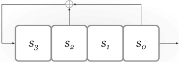

**FIGURE 7.1: A linear-feedback shift register.**

An LFSR consists of an array of $n$ registers $s_{n-1},\ldots,s_0$ along with a feedback loop specified by a set of $n$ boolean feedback coefficients $c_{n-1},\ldots,c_0$. (See Figure 7.1.) The size of the array is called the degree of the LFSR. Each register stores a single bit, and the state $\mathbf{st}$ of an LFSR at any point in time consists of the bits contained in its registers. The state of an LFSR is updated in each of a series of “clock ticks” by shifting the values in all the registers to the right, and setting the new value of the left-most register equal to the XOR of some subset of the current registers determined by the feedback coefficients. That is, if the state at some time $t$ is $s_{n-1}^{(t)},\ldots,s_0^{(t)}$, then the state after the next clock tick is $s_{n-1}^{(t+1)},\ldots,s_0^{(t+1)}$ with

$$\begin{align*}s_{i}^{(t+1)}&:=s_{i+1}^{(t)},\quad&i&=0,\ldots,n-2\\s_{n-1}^{(t+1)}&:=\bigoplus_{i=0}^{n-1}c_{i} s_{i}^{(t)}.\end{align*}$$

Figure 7.1 shows a degree-4 LFSR with $c_0 = c_2 = 1$ and $c_1 = c_3 = 0$.

At each clock tick, the LFSR outputs the value of the right-most register $s_0$. If the initial state of the LFSR is $s_{n-1}^{(0)}, \ldots, s_0^{(0)}$, the first $n$ bits of the output stream are exactly $s_0^{(0)}, \ldots, s_{n-1}^{(0)}$. The next output bit is $s_{n-1}^{(1)} = \bigoplus_{i=0}^{n-1} c_i s_i^{(0)}$. In general, if we denote the output bits by $y_0, y_1, \ldots$, where $y_i = s_0^{(i)}$, then

$$\begin{array}{l l}{y_{i}=s_{i}^{(0)}}&{i=0,\ldots,n-1}\\ {y_{i}=\bigoplus_{j=0}^{n-1}c_{j}y_{i-n+j}}&{i>n-1.}\\ \end{array}$$

As an example using the LFSR from Figure 7.1, if the initial state is $(s_3, s_2, s_1, s_0) = (0, 0, 1, 1)$ then the states for the first five time periods are

| (0,0,1,1) |
| --- |
| (1,0,0,1) |
| (1,1,0,0) |
| (1,1,1,0) |
| (1,1,1,1) |

and the output (which can be read off the right-most column of the above) is the stream of bits 1, 1, 0, 0, 1, ...

A degree-$n$ LFSR can be used to define a stream cipher (Init, Next) in the natural way. Init takes as input an $n$-bit key $k$ and sets the initial state of the LFSR to $k$. Next corresponds to one clock tick, outputting a single bit and updating the state of the LFSR accordingly.

A degree-$n$ LFSR has ${2}^n$ possible states corresponding to the possible values of the bits in its registers. Define the transition graph of an LFSR to be a directed graph with a vertex corresponding to each state, and an edge from one vertex $v$ to another vertex $v^{\prime}$ if updating the state corresponding to $v$ in one clock tick results in the state corresponding to $v^{\prime}$. (Thus, each vertex has a single outgoing edge.) We further label the edges of the graph with the bit that would be output by the LFSR when making the corresponding transition. For example, in the transition graph for the LFSR from Figure 7.1 the vertex $(1,0,0,1)$ has an edge to the vertex $(1,1,0,0)$ labeled with the bit '1.' Choosing a random initial state for the LFSR and then updating the LFSR in a series of clock ticks is thus equivalent to choosing a random initial vertex $v$ and then following the path of directed edges (and outputting the corresponding bits on those edges) beginning at $v$.

A degree-$n$ LFSR will eventually repeat some previous state; once it does, it will then repeatedly cycle among some set of states, and the bits it outputs will begin repeating as well. This corresponds to being in a cycle of the transition graph. The LFSR is $\text{maximum length}$ if it cycles through all ${2}^n - 1$ nonzero states before repeating; i.e., its transition graph contains a cycle through all ${2}^n - 1$ nonzero states. (In the transition graph for any LFSR, the all-0 state has a self-loop. If the all-0 state is ever reached the LFSR remains in that state forever.) If an LFSR is maximum length then, when initialized in any nonzero state, it will cycle through all ${2}^n - 1$ nonzero states. Whether an LFSR is maximum length depends only on its feedback coefficients. It is well understood how to set the feedback coefficients so as to obtain a maximum-length LFSR, although the details are beyond the scope of this book.

Key-recovery attacks on LFSRs. The output of a maximum-length LFSR has good statistical properties; as just one example, the output stream contains roughly an equal number of 0s and 1s. Nevertheless, LFSRs are not secure stream ciphers. If we assume the feedback coefficients of the LFSR are
known (as we should, following Kerckhoffs' principle), then the first $n$ bits of output from a degree-$n$ LFSR reveal the initial state (i.e., the key); once that is known, all future output bits can be computed. One might try to prevent this by using the key to also set the feedback coefficients; even in this case, however, the attacker can learn the entire key after observing at most ${2}n$ output bits. The first $n$ output bits $y_0, \ldots, y_{n-1}$ of the LFSR reveal the entire initial state, as before. Given the next $n$ output bits $y_n, \ldots, y_{2n-1}$, the attacker can set up a system of $n$ linear equations in the $n$ unknown feedback coefficients $c_{n-1}, \ldots, c_0$:

$$y_{n}=c_{n-1}y_{n-1}\oplus\cdots\oplus c_{0}y_{0}$$

$$\displaystyle\cdots$$

$$y_{2n-1}=c_{n-1}y_{2n-2}\oplus\cdots\oplus c_{0}y_{n-1}.$$

One can show that for a maximum-length LFSR the above equations are linearly independent (modulo 2), and so uniquely determine the feedback coefficients. The coefficients can thus be found efficiently using linear algebra. (If the LFSR is not maximum length, then variants of this attack still apply.) With the feedback coefficients and the initial state known, all subsequent output bits of the LFSR can again be easily determined.

### 7.1.2 Adding Nonlinearity

The linear relationships between the output bits of an LFSR enable an easy attack. To thwart such attacks, we must introduce some nonlinearity, i.e., using ANDs/ORs of secret values and not just their XOR. There are several different approaches to doing so, and we only explore some of them here. All the ideas we discuss can also be combined with each other in different ways.

Nonlinear feedback. One obvious way to introduce nonlinearity is to make the feedback loop nonlinear; we refer to the result simply as a feedback shift register (FSR). An FSR will again consist of an array of registers, each containing a single bit. As before, the state of the FSR is updated in each of a series of clock ticks by shifting the values in all the registers to the right; now, however, the new value of the left-most register will be a nonlinear function of the current registers. In other words, if the state at some time $t$ is $s_{n-1}^{(t)}, \ldots, s_0^{(t)}$, then the state after the next clock tick is $s_{n-1}^{(t+1)}, \ldots, s_0^{(t+1)}$ with

$$\begin{aligned}&s_{i}^{(t+1)}:=s_{i+1}^{(t)},\quad i=0,\ldots,n-2\\&s_{n-1}^{(t+1)}:=g(s_{n-1}^{(t)},\ldots,s_{0}^{(t)})\end{aligned}$$

for some arbitrary (nonlinear) function $g$. As before, the FSR outputs the value of the right-most register $s_0$ at each clock tick. For security, $g$ should be balanced in the sense that $\Pr[g(s_{n-1}, \ldots, s_0) = 1] \approx 1/2$, where the probability is over uniform choice of $s_{n-1}, \ldots, s_0$.

Nonlinear output. Another approach is to introduce nonlinearity in the output sequence. In the most basic case, we could have an LFSR as before (where the new value of the left-most register is again computed as a linear function of the current registers), but where the output at each clock tick is a nonlinear function $g$ (called the filter) of the current registers, rather than just the right-most register. This construction is sometimes called a filter generator. As before, $g$ should be balanced so that the output stream will not have any obvious bias.

Combination generators. Yet another possibility is to use more than one LFSR, and to generate the final output stream by combining the outputs of the individual LFSRs in some nonlinear way. This gives what is known as a (nonlinear) combination generator. The individual LFSRs need not have the same degree, and in fact the cycle length of the combination generator will be maximized if they do not have the same degree.

The way in which the output streams of the underlying LFSRs are combined must be done so as to ensure the final output is unbiased; simply computing the AND of the underlying output streams, for example, would result in output bits that are biased toward 0. Care must also be taken to ensure that the final output of the combination generator is not too highly correlated with any of the output streams of the underlying LFSRs, as high correlation can lead to attacks. For example, consider combining three LFSRs $A$, $B$, and $C$ generating output streams $a_0, a_1, \ldots, b_0, b_1, \ldots$, and $c_0, c_1, \ldots$, respectively, by setting the $i$th output bit of the combination generator equal to $y_i := (a_i \land b_i) \oplus c_i$ (where $\land$ denotes binary AND). If the degrees of the individual LFSRs are $n_a, n_b$, and $n_c$, then the overall state has length $n_a + n_b + n_c$ and we might hope that the best attack distinguishing the output of the combination generator from uniform requires time ${2}^{n_a + n_b + n_c}$. But observe that if we treat each bit of each of the underlying output streams as uniform, then $a_i \land b_i$ is equal to 0 with probability ${3}/{4}$, and so $\Pr[c_i = y_i] = 3/4$. Thus, given a long output stream $y_0, y_1, \ldots$ of the combination generator, an attacker can enumerate all ${2}^{n_c}$ possible values of the initial state for LFSR $C$ and compute the output sequence $c_0, c_1, \ldots$ for each one. The correct initial state for $C$ will result in a sequence that agrees with the observed output stream roughly ${3}/{4}$ of the time; moreover, with high probability, no other candidate state will. The allows the attacker to obtain the initial state of $C$ in time ${2}^{n_c}$. Having done so, it can then recover the initial states of LFSRs $A$ and $B$ in time at most ${2}^{n_a + n_b}$. (See Exercise 7.4 for a better attack.)

### 7.1.3 Trivium

To illustrate the ideas from the previous section, we briefly describe the stream cipher Trivium. This stream cipher was selected as part of the portfolio of the eSTREAM project, a European effort completed in 2008 whose goal was to develop new stream ciphers. Trivium was designed to have a simple
description and a compact hardware implementation.

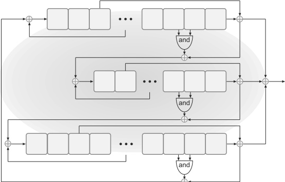

**FIGURE 7.2: A schematic illustration of Trivium with (from top to bottom) three coupled, nonlinear FSRs A, B, and C.**

Trivium uses three coupled, nonlinear FSRs denoted by A, B, and C and having degrees 93, 84, and 111, respectively. (See Figure 7.2.) The state state of Trivium is simply the 288 bits comprising the values in all the registers of these FSRs. At each clock tick, the output of each FSR is the XOR of its right-most register and one additional register; the output of Trivium is the XOR of the output bits of the three FSRs. The FSRs are coupled: at each clock tick, the new value of the left-most register of each FSR is computed as a function of one of the registers in the same FSR and a subset of the registers from a second FSR. The feedback function in each case is nonlinear.

The *Init algorithm* of Trivium accepts an 80-bit key and an 80-bit IV. The key is loaded into the 80 left-most registers of A, and the IV is loaded into the 80 left-most registers of B. The remaining registers are set to 0, except for the three right-most registers of C, which are set to 1. The FSRs are then run for 4·288 clock ticks (with the output discarded), and the resulting state is taken as the initial state.

To date, no cryptanalytic attacks better than exhaustive search are known against Trivium.

### 7.1.4 RC4

LFSRs are efficient when implemented in hardware, but have poor performance in software. For this reason, alternate designs of stream ciphers have been explored. A prominent example is RC4, which was designed by Ron Rivest in 1987. RC4 is remarkable for its speed and simplicity, and resisted serious attack for several years. While RC4 is still occasionally used, recent attacks have shown serious cryptographic weaknesses in RC4 and it is no longer recommended for cryptographic applications.

ALGORITHM 7.1
Init algorithm for RC4

Input: 16-byte key k
Output: Initial state $(S, i, j)$
(Note: All addition is modulo 256)

for i = 0 to 255:
   $S[i] := i$
   $k[i] := k[i \mod 16]$

j := 0

for i = 0 to 255:
   $j := j + S[i] + k[i]$
    Swap $S[i]$ and $S[j]$

i := 0, j := 0

return initial state $(S, i, j)$

ALGORITHM 7.2
Next algorithm for RC4

Input: Current state $(S,i,j)$
Output: Output byte $y$; updated state $(S,i,j)$
(Note: All addition is modulo 256)

$i:=i+1$
$j:=j+S[i]$
Swap $S[i]$ and $S[j]$
$t:=S[i]+S[j]$
$y:=S[t]$
return $y$ and $(S,i,j)$

The state of RC4 consists of a 256-byte array $S$, which always contains a permutation of the elements ${0}, \ldots,255$, along with two values $i, j \in \{0, \ldots,255\}$. For simplicity we assume a 16-byte (128-bit) key $k$, although the algorithm can handle keys 1–256 bytes long. We index the bytes of $S$ as $S[0], \ldots,S[255]$, and the bytes of the key as $k[0], \ldots,k[15]$.

The *Init algorithm* for RC4 is presented as Algorithm 7.1. During initialization, $S$ is first set to the identity permutation (i.e., with $S[i] = i$ for all $i$) and $k$ is expanded to 256 bytes by repeating it as many times as needed. Then each entry of S is swapped at least once with another entry of S at some “pseudorandom” location. The indices i, j are set to 0, and $(S, i, j)$ is output as the initial state.

The initial state is used to generate a sequence of output bytes using the Next algorithm in Algorithm 7.2. Each time Next is called, the index $i$ is simply incremented (modulo 256), and $j$ is changed in some “pseudorandom” way. Entries $S[i]$ and $S[j]$ are swapped, and the value of S at position $S[i] + S[j]$ (again computed modulo 256) is output. Note that each entry of S is swapped with an entry of S (possibly itself) at least once every 256 iterations, ensuring good “mixing” of the permutation S.

RC4 was not designed to take an $IV$ as input; however, in practice an $IV$ is often incorporated by simply concatenating it with the actual key $k^{\prime}$ before initialization. That is, a random $IV$ of the desired length is chosen, $k$ is set equal to the concatenation of $IV$ and $k^{\prime}$ (this can be done by either prepending or appending $IV$), and then $\mathsf{Init}$ is run as in Algorithm 7.1 to generate an initial state. Output bits are then produced using Algorithm 7.2 exactly as before. Assuming RC4 is being used in unsynchronized mode (see Section 3.6.2), the IV would then be sent in the clear to the receiver—who knows the actual key $k^{\prime}$—thus enabling the sender and receiver to generate the same initial state and hence the same output stream. This method of incorporating an IV was used in the Wired Equivalent Privacy (WEP) encryption standard for protecting communications in 802.11 wireless networks.

One should be concerned by this unprincipled way of modifying RC4 to accept an IV. Even if RC4 were secure when used without an IV as originally intended, there is no reason to believe that it should be secure when modified to use an IV as just described. Indeed, contrary to the key, the IV is revealed to an attacker (since it is sent in the clear); furthermore, using different IVs with the same fixed key $k^{\prime}$—as would be done when using RC4 in unsynchronized mode—means that related values $k$ are being used to initialize the state of RC4. As we will see below, both of these issues lead to attacks when RC4 is used in this fashion.

Attacks on RC4. Various attacks on RC4 have been known for several years. Due to this, RC4 should no longer be used; instead, a more modern stream cipher or block cipher should be used in its place. We describe some basic attacks here to give a flavor for the techniques involved.

We begin by demonstrating a simple statistical attack on RC4 that does not rely on the honest parties' using an IV. Specifically, we show that the second output byte of RC4 is (slightly) biased toward 0. Let $S_t$ denote the array $S$ of the RC4 state after $t$ iterations of $\text{Next}$, with $S_0$ denoting the initial array. Treating $S_0$ (heuristically) as a uniform permutation of $\{0, \ldots, 255\}$, with probability ${1}/256 \cdot (1 - 1/255) \approx 1/256$ it holds that $S_0[2] = 0$ and $X \overset{\mathrm{def}}{=} S_0[1] \neq 2$. Assume for a moment that this is the case. Then in the first iteration of $\text{Next}$, the value of $i$ is incremented to 1, and $j$ is set equal to $S_0[i] = S_0[1] = X$. Then entries $S_0[1]$ and $S_0[X]$ are swapped, so that at the end of the iteration we have $S_1[X] = S_0[1] = X$. In the second iteration, $i$ is incremented to 2 and $j$ is assigned the value

$$j+S_{1}[i]=X+S_{1}[2]=X+S_{0}[2]=X,$$

since $S_{0}[2]=0$. Then entries $S_{1}[2]$ and $S_{1}[X]$ are swapped, so that $S_{2}[X]=S_{1}[2]=S_{0}[2]=0$ and $S_{2}[2]=S_{1}[X]=X$. Finally, the value of $S_{2}$ at position $S_{2}[i]+S_{2}[j]=S_{2}[2]+S_{2}[X]=X$ is output; this is exactly the value $S_{2}[X]=0$.

When $S_{0}[2] \neq 0$ the second output byte is uniformly distributed. Overall, then, the probability that the second output byte is 0 is roughly

$$\begin{aligned}\Pr[S_{0}[2]=0 and S_{0}[1]\neq2]+\frac{1}{256}\cdot\Pr[S_{0}[2]\neq0]&=\frac{1}{256}+\frac{1}{256}\cdot\left(1-\frac{1}{256}\right)\\&\approx\frac{2}{256},\end{aligned}$$

or roughly twice what would be expected for a uniform value.

By itself the above might not be viewed as a particularly serious attack, although it does indicate underlying structural problems with RC4. Moreover, statistical biases like the above have been found in other output bytes of RC4, and it has been shown that these biases are sufficiently large to allow for the recovery of plaintext when RC4 is used for encryption.

A more devastating attack against RC4 is possible when an IV is incorporated by prepending it to the key. This attack can be used to recover the key, regardless of its length, and is thus more serious than a distinguishing attack such as the one described above. Importantly, this attack can be used to completely break the WEP encryption standard mentioned earlier, and was influential in getting the standard replaced.

The core of the attack is a way to extend knowledge of the first $n$ bytes of $k$ to knowledge of the first $n+1$ bytes of $k$. Note that when an $IV$ is prepended to the actual key $k^{\prime}$ (so $k = IV\|k^{\prime}$), the first few bytes of $k$ are given to the attacker for free! If the $IV$ is $n$ bytes long, then an adversary can use this attack to first recover the $(n+1)$st byte of $k$ (which is the first byte of the real key $k^{\prime}$), then the next byte of $k$, and so on, until it learns the entire key.

Assume the IV is 3 bytes long, as is the case for WEP. The attacker waits until the first two bytes of the IV have a specific form. The attack can be carried out with several possibilities for the first two bytes of the IV, but we look at the case where the IV takes the form $IV = (3,255,X)$ for X an arbitrary byte. This means, of course, that $k[0] = 3,k[1] = 255$, and $k[2] = X$ in Algorithm 7.1. One can check that after the first four iterations of the second loop of $*Init*$, we have

$$S[0]=3,\quad S[1]=0,\quad S[3]=X+6+k[3].$$

In the next 252 iterations of the *Init* algorithm, $i$ is always greater than 3. So the values of $S[0], S[1]$, and $S[3]$ are not subsequently modified as long as $j$ never takes on the values 0, 1, or 3. If we (heuristically) treat $j$ as taking on a uniform value in each iteration, this means that $S[0], S[1]$, and $S[3]$ are not subsequently modified with probability $(253/256)^{252} \approx 0.05$, or 5% of the time. Assuming this is the case, the first byte output by *Next* will be $S[3] = X + 6 + k[3]$; since $X$ is known, this reveals $k[3]$.

So, the attacker knows that 5% of the time the first byte of the output is related to $k[3]$ as described above. (This is much better than random guessing, which is correct ${1}/256 = 0.4\%$ of the time.) By collecting sufficiently many samples of the first byte of the output—for several IVs of the correct form—the attacker obtains a high-confidence estimate for $k[3]$.

### 7.1.5 ChaCha20

ChaCha20, introduced in 2008, is a stream cipher intended to be extremely efficient in software. It is available as a replacement for RC4 in many systems and—as described in Section 5.3.2—is combined with the Poly1305 message authentication code to construct an authenticated encryption scheme widely used in the TLS protocol. We give a high-level description of ChaCha20 that gives the main ideas of the scheme, but refer elsewhere for the low-level details.

The core of ChaCha20 is a fixed permutation $P$ that operates on 512-bit strings. This permutation is carefully constructed to be both highly efficient and “cryptographically strong.” To improve efficiency, it was designed to rely primarily on only three assembly-level instructions operating on 32-bit words: Addition (modulo ${2}^{32}$), bitwise (cyclic) Rotation, and XOR; $P$ is thus an example of what is called an ARX-based design. From a cryptographic point of view, $P$ is intended to be a suitable instantiation of a “random permutation,” and constructions based on $P$ can be analyzed in the so-called random-permutation model. By analogy with the random-oracle model (see Section 6.5), the random-permutation model assumes that all parties are given access to oracles for a uniform permutation $P$ as well as its inverse $P^{-1}$. In this model, as in the random-oracle model, the only way to compute $P$ (or $P^{-1}$) is to explicitly query those oracles. (We refer to Section 7.3.3 for an example of a proof of security in the random-permutation model.)

In ChaCha20, the permutation P is used to construct a pseudorandom function F taking a 256-bit key and mapping 128-bit inputs to 512-bit outputs. This keyed function F is defined as

$$F_{k}(x)\stackrel{\mathrm{def}}{=}P(\mathsf{const}\|k\|x)\boxplus\mathsf{const}\|k\|x,$$

where const is a 128-bit constant. (Above, ‘$\boxplus$’ denotes word-wise modular addition.) F can be shown to be a pseudorandom function if P is modeled as a random permutation.

The ChaCha20 stream cipher itself is then constructed from $F$ as in Construction 3.30. Specifically, given a 256-bit seed $s$ and an initialization vector $IV \in \{0,1\}^{64}$, the output of the stream cipher is $F_s(IV\|\langle0\rangle)$, $F_s(IV\|\langle1\rangle)$, ..., where the counter values $\langle0\rangle$, $\langle1\rangle$, etc., are encoded as 64-bit integers.

## 7.2 Block Ciphers

Recall from Section 3.5.1 that a block cipher is an efficient, keyed permutation $F: \{0,1\}^n \times \{0,1\}^\ell \to \{0,1\}^\ell$. This means the function $F_k$ defined by $F_k(x) \overset{\mathrm{def}}{=} F(k,x)$ is a bijection (i.e., a permutation), and moreover $F_k$ and its inverse $F_k^{-1}$ are efficiently computable given $k$. We refer to $n$ as the key length and $\ell$ as the block length of $F$, and here we explicitly allow them to differ. The key length and block length are now fixed constants, whereas in Chapter 3 they were viewed as functions of a security parameter. This puts us in the setting of concrete security rather than asymptotic security. $^{2}$ The concrete-security requirements for block ciphers are quite stringent, and a block cipher is generally only considered “secure” if the best known attack (without preprocessing) has time complexity roughly equivalent to a brute-force search for the key. Thus, if a cipher with key length $n = 256$ can be broken in time ${2}^{128}$, the cipher is (generally) considered insecure even though a ${2}^{128}$-time attack is infeasible. (In contrast, in an asymptotic setting an attack of complexity ${2}^{n/2}$ is not considered efficient since it requires exponential time, and thus a cipher where such an attack is possible might still qualify as a pseudorandom permutation.) This is because in the concrete setting we care about the actual complexity of attacks, and not just their asymptotic behavior. Furthermore, there is a concern that existence of a better-than-brute-force attack may indicate some more fundamental weakness in the design of the cipher.

Block ciphers are designed to behave, at a minimum, as (strong) pseudo-random permutations; see Definition 3.27. (Often, block ciphers are designed and assumed to satisfy even stronger security properties, as we discuss in Section 7.3.1.) Modeling block ciphers as pseudorandom permutations allows proofs of security for constructions based on block ciphers, and also makes explicit the necessary requirements of a block cipher. A solid understanding of what block ciphers are supposed to achieve is instrumental in their design. The view that block ciphers should be modeled as pseudorandom permutations has, at least recently, served as a major influence in their design. As an example, the call for proposals for the Advanced Encryption Standard (AES) that we will encounter later in this chapter stated the following evaluation criterion:

The security provided by an algorithm is the most important factor.... Algorithms will be judged on the following factors: ...

- The extent to which the algorithm output is indistinguishable from a random permutation ...

Modern block ciphers are suitable for all the constructions using pseudorandom permutations (or pseudorandom functions) we have seen in this book.

Notwithstanding the fact that block ciphers are not, on their own, encryption schemes, the standard terminology for attacks on a block cipher F is:

- In a known-plaintext attack, the attacker is given pairs of inputs/outputs $\{(x_i, F_k(x_i))\}$ (for an unknown key $k$), with the $\{x_i\}$ outside the attacker's control.

In a chosen-plaintext attack, the attacker is given $\{F_k(x_i)\}$ (again, for an unknown key $k$) for a series of inputs $\{x_i\}$ chosen by the attacker.

In a chosen-ciphertext attack, the attacker is given $\{F_k(x_i)\}$ for $\{x_i\}$ chosen by the attacker, as well as $\{F_k^{-1}(y_i)\}$ for chosen $\{y_i\}$.

A cipher secure against chosen-plaintext attacks corresponds to a pseudorandom permutation, while one secure against chosen-ciphertext attacks corresponds to a strong pseudorandom permutation. In addition to attacks distinguishing $F_{k}$ from a uniform permutation, we will also be interested in key-recovery attacks in which the attacker can recover the key $k$ after interacting with $F_{k}$. (This is stronger than being able to distinguish $F_{k}$ from uniform.)

### 7.2.1 Substitution-Permutation Networks

A secure block cipher (using a random key) must behave like a random permutation. There are ${2}^{\ell}!$ permutations on $\ell$-bit strings, so representing an arbitrary permutation in this case requires $\log({2}^{\ell}!)$ $\approx \ell \cdot 2^{\ell}$ bits. This is impractical for $\ell > 20$ and infeasible for $\ell > 60$. (Looking ahead, modern block ciphers have block lengths $\ell \geq 128$.) The challenge when designing a block cipher is to construct permutations having a concise description (namely, a short key) that behave like random permutations. In particular, just as evaluating a random permutation at two inputs that differ in only a single bit should yield two (almost) independent outputs (they are not completely independent since they cannot be equal), so too changing one bit of the input to $F_k(\cdot)$, where k is uniform and unknown to an attacker, should yield an (almost) independent result. This implies that a one-bit change in the input should “affect” every bit of the output. (Note that this does not mean that all the output bits will be changed—that would be different behavior than one would expect for a random permutation. Rather, we just mean informally that each bit of the output is changed with probability roughly half.) This takes some work to achieve.

**The confusion-diffusion paradigm.**

In addition to his work on perfect secrecy, Shannon also introduced a basic paradigm for constructing concise, random-looking permutations. The basic idea is to construct a random-looking permutation $F$ with a large block length from many smaller random (or random-looking) permutations $\{f_i\}$ with small block length. Let us see how this works on the most basic level. Say we want $F$ to have a block length of 128 bits. We can define $F$ as follows: the key $k$ for $F$ will specify 16 permutations $f_1, \ldots, f_{16}$ that each have an 8-bit (1-byte) block length. $^3$ Given an input $x \in \{0,1\}^{128}$, we parse it as 16 bytes $x_1 \cdots x_{16}$ and then set

$$F_{k}(x)=f_{1}(x_{1})\|\cdots\|f_{16}(x_{16}). \tag{7.1}$$

> $^3$ An arbitrary permutation on 8 bits can be represented using $\log(2^{8}!)$ bits, so the length of the key for F is about $16\cdot\log(2^{8}!)$ bits, or about 3 kbytes. This is much smaller than the $\approx 128\cdot 2^{128}$ bits that would be required to specify an arbitrary permutation on 128 bits.

These round functions $\{f_{i}\}$ are said to introduce confusion into $F$.

It should be immediately clear, however, that $F$ as defined above will not be pseudorandom. Specifically, if $x$ and $x^{\prime}$ differ only in their first bit then $F_k(x)$ and $F_k(x^{\prime})$ will differ only in their first byte (regardless of the key $k$). In contrast, for a truly random permutation changing the first bit of the input would be expected to affect all bytes of the output.

For this reason, a diffusion step is introduced whereby the bits of the output are permuted, or “mixed,” using a mixing permutation. This has the effect of spreading a local change (e.g., a change in the first byte) throughout the entire block. In principle the mixing permutation could depend on the key, but in practice it is carefully designed and fixed.

The confusion/diffusion steps—together called a round—are repeated multiple times. This helps ensure that changing a single bit of the input will affect all the bits of the output. As an example, a two-round block cipher following this approach would operate as follows. First, confusion is introduced by computing the intermediate result $f_1(x_1) \parallel \cdots \parallel f_{16}(x_{16})$ as in Equation (7.1), where we stress again that the $\{f_i\}$ depend on the key. The bits of the result are then “shuffled,” or re-ordered, using a mixing permutation to give $x^{\prime} = x_1^{\prime} \cdots x_{16}^{\prime}$. Then $f_1^{\prime}(x_1^{\prime}) \parallel \cdots \parallel f_{16}^{\prime}(x_{16}^{\prime})$ is computed, using possibly different functions $\{f_i^{\prime}\}$ that again depend on the key, and the bits of the result are again permuted using a mixing permutation to give output $x^{\prime\prime}$.

Substitution-permutation networks. A substitution-permutation network (SPN) can be viewed as a direct implementation of the confusion-diffusion paradigm. The difference is that now the permutations (i.e., the $\{f_i\}, \{f_i^{\prime}\}$) have a particular form rather than being chosen from the set of all possible permutations. Specifically, rather than having (a portion of) the key k specify an arbitrary permutation $f$, we instead fix a public “substitution function” (i.e., permutation) $S$ called an $S$-box, and then let $k$ define the function $f$ given by $f(x) = S(k \oplus x)$. (If $f$ takes 8-bit inputs as before, we have thus reduced the number of possibilities for $f$ from ${2}^8!$ to ${2}^8$.)

To see how this works concretely, consider an SPN with a 64-bit block length based on a collection of 8-bit (1-byte) S-boxes $S_1, \ldots, S_8$. (See Figure 7.3.) Evaluating the cipher proceeds in a series of rounds, where in each round we apply the following sequence of operations to the 64-bit input x of that round (the input to the first round is just the input to the cipher):

1. Key mixing: Set $x := x \oplus k$, where k is the current-round sub-key;

2. Substitution: Set $x := S_1(x_1) \Vert \cdots \Vert S_8(x_8)$, where $x_i$ is the ith byte of $x$;

3. Permutation: Permute the bits of $x$ to obtain the output of the round.

The output of each round is used as input to the next round. After the last round there is a final key-mixing step, and the result is the output of the cipher. (By Kerckhoffs' principle, we assume the S-boxes and the mixing permutation(s) are public and known to any attacker. Without the final key-mixing step, the substitution and permutation steps of the last round would offer no additional security since they do not depend on the key and can be inverted by an attacker.)

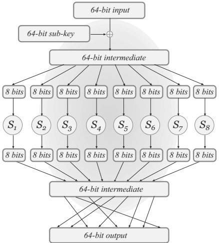

**FIGURE 7.3: A single round of a substitution-permutation network.**

Figure 7.4 shows three rounds of an SPN with a 16-bit block length and a different set of 4-bit S-boxes used in each round.

Different sub-keys (or round keys) are used in each round. The actual key of the block cipher is sometimes called the master key. The round keys are derived from the master key according to a key schedule. The key schedule is often simple and may just use different subsets of the bits of the master key as the various sub-keys, though more complex key schedules can also be defined. An $r$-round SPN has $r$ rounds of key mixing, S-box substitution, and application of a mixing permutation, followed by a final key-mixing step. (This means that an r-round SPN uses $r + 1$ sub-keys.)

Any SPN is invertible (given the key). To see this, it suffices to show that a single round can be inverted; this implies the entire SPN can be inverted by working from the final round back to the beginning. But inverting a single round is easy: the mixing permutation can easily be inverted since it is just a re-ordering of bits. Since the S-boxes are permutations (i.e., one-to-one), these too can be inverted. The result can then be XORed with the appropriate sub-key to obtain the original input. Summarizing:

PROPOSITION 7.3 Let $F$ be a keyed function defined by an SPN in which the S-boxes are all permutations. Then regardless of the key schedule and the number of rounds, $F_k$ is a permutation for any $k$.

input

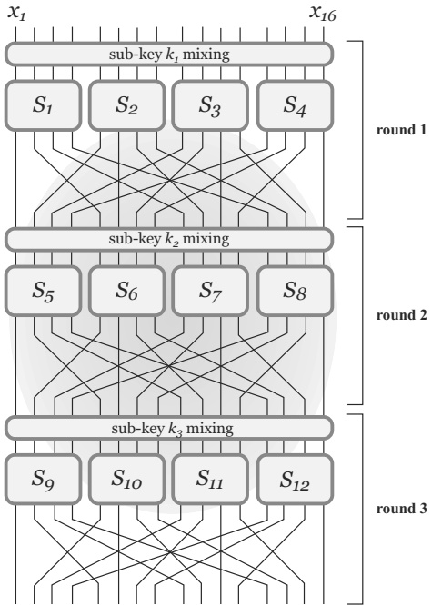

**FIGURE 7.4: Three rounds of a substitution-permutation network.**

The number of rounds, along with the exact choices of the S-boxes, mixing permutations, and key schedule, are what ultimately determine whether a given block cipher is trivially breakable or highly secure. We now discuss a basic principle behind the design of the S-boxes and mixing permutations.

**The avalanche effect.**

As noted repeatedly, an important property in any block cipher is that a small change in the input must “affect” every bit of the output. We refer to this as the avalanche effect. One way to induce the avalanche effect in a substitution-permutation network is to ensure that the following two properties hold (and sufficiently many rounds are used):

1. The S-boxes are designed so that changing a single bit of the input to an S-box changes at least two bits in the output of the S-box.

2. The mixing permutations are designed so that the bits output by any given S-box affect the input to multiple S-boxes in the next round. For
example, in Figure 7.4 the output from $S_{1}$ affects the input to $S_{5}, S_{6}, S_{7}$, and $S_{8}$.

To see how this yields the avalanche effect, at least heuristically, assume the S-boxes are all such that changing a single bit of the input to the S-box results in a change in exactly two bits in the output of the S-box, and that the mixing permutations are chosen as required above. For concreteness, assume the S-boxes have 8-bit input/output length, and that the block length of the cipher is 128 bits. Consider now what happens when the block cipher is applied to two inputs that differ in a single bit:

1. After the first round, the intermediate values differ in exactly two bits. This is because XORing the first-round sub-key maintains the 1-bit difference in the intermediate values, and so the inputs to all the S-boxes except one are identical. In the one S-box where the inputs differ, the output of the S-box causes a 2-bit difference. The mixing permutation applied to the results changes the positions of these differences, but maintains a 2-bit difference.

2. The mixing permutation applied at the end of the first round spreads the two bit-positions where the intermediate results differ into two different S-boxes in the second round. This remains true even after the second-round key mixing is done. So, in the second round there are now two S-boxes that receive inputs differing in a single bit. Thus, at the end of the second round the intermediate values differ in 4 bits.

3. Continuing the same argument, we expect 8 bits of the intermediate value to be affected after the 3rd round, 16 bits to be affected after the 4th round, and all 128 bits to be affected at the end of the 7th round.

The last point is not quite precise and it is certainly possible that there will be fewer differences than expected at the end of some round. (In fact, we want this to be the case because uncorrelated values should not differ in all their bits, either.) This can occur when the mixing permutation maps two bit-positions that differ in some intermediate result to the same S-box in the following round. For this reason, it is customary to use many more than the minimum number of rounds needed. But the above analysis gives a lower bound: if fewer than 7 rounds are used then there must be some set of output bits that are not affected by a single-bit change in the input, implying that it will be possible to distinguish the cipher from a random permutation.

One might expect that the “best” way to design S-boxes would be to choose them at random (subject to the restriction that they are permutations). Interestingly, this turns out not to be the case, at least if we want to satisfy the design criteria mentioned earlier. Consider the case of an S-box operating on 4-bit inputs and let x and $x^{\prime}$ be two distinct values. Let $y = S(x)$, and now consider choosing uniform $y^{\prime} \neq y$ as the value of $S(x^{\prime})$. There are 4 strings that differ from $y$ in only 1 bit, and so with probability 4/15 we will choose $y^{\prime}$
that does not differ from $y$ in two or more bits. The problem is compounded when we consider all pairs of inputs that differ in a single bit. We conclude based on this example that, as a general rule, the S-boxes must be designed carefully rather than being chosen at random. Random S-boxes are also not good for defending against attacks like the ones we will show in Section 7.2.6.

If a block cipher should also be strongly pseudorandom, then the avalanche effect must also apply to its inverse. That is, changing a single bit of the output should affect every bit of the input. For this it is useful if the S-boxes are designed so that changing a single bit of the output of an S-box changes at least two bits of the input to the S-box. Achieving the avalanche effect in both directions is another reason for further increasing the number of rounds.

#### Attacking Reduced-Round SPNs

Experience, along with many years of cryptanalytic effort, indicate that substitution-permutation networks are a good choice for constructing pseudorandom permutations as long as care is taken in the choice of the S-boxes, the mixing permutations, and the key schedule. The Advanced Encryption Standard, described in Section 7.2.5, is similar in structure to a substitution-permutation network as described above, and is widely believed to be a strong pseudorandom permutation.

The strength of a cipher $F$ constructed as an SPN depends heavily on the number of rounds. In order to obtain more insight into substitution-permutation networks, we will demonstrate attacks on SPNs having very few rounds. These attacks are fairly simple, but are worth seeing as they demonstrate conclusively why a large number of rounds is needed.

**A trivial case.**

We first consider a trivial case where $F$ consists of one round and no final key-mixing step. We show that an adversary given only a single input/output pair $(x, y)$ can easily learn the secret key $k$ for which $y = F_k(x)$. The adversary begins with the output value $y$ and then inverts the mixing permutation and the $S$-boxes. It can do this, as noted before, because the full specification of the mixing permutation and the $S$-boxes is public. The intermediate value that the adversary computes is exactly $x \oplus k$ (assuming, without loss of generality, that the master key is used as the sub-key in the only round of the network). Since the adversary also knows the input $x$, it can immediately derive the secret key $k$. This is therefore a complete break.

Although this is a trivial attack, it demonstrates that in any substitution-permutation network there is no security gained by performing S-box substitution or applying a mixing permutation after the last key-mixing step.

Attacking a one-round SPN. Now we have one round followed by a key-mixing step. For concreteness, we assume a 64-bit block length and S-boxes with 8-bit (1-byte) input/output length. We assume independent 64-bit sub-keys $k_1$, $k_2$ are used for the two key-mixing steps, and so the master key $k_1\|k_2$ of the SPN is 128 bits long.

A first observation is that we can extend the attack from the trivial case above to give a key-recovery attack here using much less than ${2}^{128}$ work. The idea is as follows: Given a single input/output pair $(x, y)$ as before, the attacker enumerates over all possible values for the first-round sub-key $k_1$. For each such value, the attacker can compute the first round of the SPN using $k_1$ to get a candidate intermediate value $x^{\prime}$. The only second-round sub-key that is consistent with $k_1$ and output $y$ is $k_2 = x^{\prime} \oplus y$. Thus, for each possible choice of $k_1$ the attacker derives a unique corresponding $k_2$ for which $k_1 \parallel k_2$ might be the master key. In this way, the attacker obtains (in ${2}^{64}$ time) a list of ${2}^{64}$ possibilities for the master key. These can be narrowed down using additional input/output pairs in roughly ${2}^{64}$ additional time.

A better attack is possible by noting that individual bits of the output depend on only part of the sub-keys. Fix some given input/output pair $(x, y)$ as before. Now, the adversary will enumerate over all possible values for the first byte of $k_1$. It can XOR each such value with the first byte of $x$ to obtain a candidate value for the 1-byte input to the first S-box. Evaluating this S-box, the attacker learns a candidate value for the output of that S-box. Since the output of that S-box is XORed with 8 bits of $k_2$ to yield 8 bits of $y$ (where the positions of those bits depend on the mixing permutation but are known to the attacker), this yields a candidate value for 8 bits of $k_2$.

To summarize: for each candidate value for the first byte of $k_1$, there is a unique possible corresponding value for some 8 bits of $k_2$. Put differently, this means that for some 16 bits of the master key, the attacker has reduced the number of possible values for those bits from ${2}^{16}$ to ${2}^8$. The attacker can tabulate all those feasible values in ${2}^8$ time. This can be repeated for each byte of $k_1$, giving 8 lists—each containing ${2}^8$ 16-bit values—that together characterize the possible values of the entire master key. In this way, the attacker has reduced the number of possible master keys to $(2^8)^8 = 2^{64}$, as in the earlier attack; the total time to do this, however, is now ${8} \cdot 2^8 = 2^{11}$, a dramatic improvement.

The attacker can use additional input/output pairs to further reduce the space of possible keys. Importantly, this can be done for each list individually. Consider the list of ${2}^8$ feasible values for some set of 16 bits of the master key. The attacker knows that the correct value from that list must be consistent with any additional input/output pairs the attacker learns, whereas any incorrect value in the list is expected to be consistent with another input/output pair $(x^{\prime}, y^{\prime})$ with probability no better than random. Since a 16-bit value from the list can be used to compute eight bits of the output given the input $x^{\prime}$, an incorrect value will be consistent with the actual output $y^{\prime}$ with probability roughly ${2}^{-8}$. A small number of additional input/output pairs thus suffices to narrow down all the lists to just a single value each, at which point the entire master key is known.

This attack exploits the fact that the effects of different parts of the key can be isolated. Additional rounds are needed to ensure further diffusion, and to make sure that each bit of the key affects all of the bits of the output.

Attacking a two-round SPN. It is possible to extend the above ideas to give a better-than-brute-force attack on a two-round SPN using independent sub-keys in each round; we leave this as an exercise. Here we simply note that a two-round SPN will not be a good pseudorandom permutation, since the avalanche effect does not occur after only two rounds. (Of course, this depends on the block length of the cipher and the input/output length of the S-boxes, but with reasonable parameters this will be the case.) An attacker can distinguish a two-round SPN from a uniform permutation if it learns the result of evaluating the SPN on two inputs that differ in a single bit, since some predictable subset of the output bits will not change.

### 7.2.2 Feistel Networks

Feistel networks offer another approach for constructing block ciphers. An advantage of Feistel networks over substitution-permutation networks is that the underlying functions used in a Feistel network—in contrast to the S-boxes used in SPNs—need not be invertible. A Feistel network thus provides a way to construct an invertible function from non-invertible components. This is important because a good block cipher should have “unstructured” behavior (so it looks random), yet requiring all the components of a construction to be invertible inherently introduces structure. Requiring invertibility also introduces an additional constraint on S-boxes, making them harder to design.

A Feistel network operates in a series of rounds. In each round, a keyed round function is applied in the manner described below. Round functions need not be invertible. They will typically be constructed from components like S-boxes and mixing permutations, but a Feistel network can deal with any round functions irrespective of their design.

In a (balanced) Feistel network with $\ell$-bit block length, the $i$th round function $\hat{f}_i$ takes as input a sub-key $k_i$ and an $\ell/2$-bit string and generates an $\ell/2$-bit output. As in the case of SPNs, a master key $k$ is used to derive sub-keys for each round. When some master key is chosen, thereby determining each sub-key $k_i$, we define $f_i : \{0,1\}^{\ell/2} \to \{0,1\}^{\ell/2}$ via $f_i(R) \overset{\mathrm{def}}{=} \hat{f}_i(k_i, R)$. Note that the round functions $\hat{f}_i$ are fixed and publicly known, but the $f_i$ depend on the master key and so are not known to the attacker.

The $i$th round of a Feistel network operates as follows. The $\ell$-bit input to the round is divided into two halves denoted $L_{i-1}$ and $R_{i-1}$ (the “left” and “right” halves, respectively). The output $(L_i, R_i)$ of the round is

$$L_{i}:=R_{i-1}\quad\mathrm{and}\quad R_{i}:=L_{i-1}\oplus f_{i}(R_{i-1}).$$

In an $r$-round Feistel network, the $\ell$-bit input to the network is parsed as $(L_0, R_0)$, and the output is the $\ell$-bit value $(L_r, R_r)$ obtained after applying all $r$ rounds. A three-round Feistel network is shown in Figure 7.5.

**Inverting a Feistel network.**

A Feistel network is invertible regardless of the $\{f_i\}$ (and thus regardless of the round functions $\{\hat{f}_i\}$). To show this we need only show that each round of the network can be inverted if the $\{f_i\}$ are known. Given the output $(L_i, R_i)$ of the $i$th round, we can compute $(L_{i-1}, R_{i-1})$ as follows: first set $R_{i-1} := L_i$. Then compute

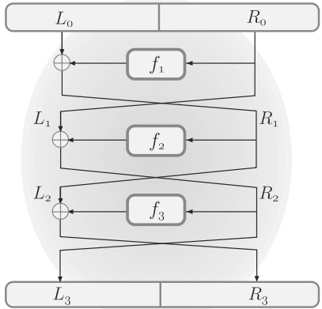

**FIGURE 7.5: A three-round Feistel network.**

$$L_{i-1}:=R_{i}\oplus f_{i}(R_{i-1}). \tag{7.2}$$

This gives the value $(L_{i-1}, R_{i-1})$ that was the input of this round (i.e., it computes the inverse of Equation (7.2)). Note that $f_i$ is evaluated only in the forward direction, so it need not be invertible. We thus have:

PROPOSITION 7.4 Let $F$ be a keyed function defined by a Feistel network. Then regardless of the key schedule, the round functions $\{\hat{f}_i\}$, and the number of rounds, $F_k$ is a permutation for any $k$.

#### Attacking Reduced-Round Feistel Networks

As in the case of SPNs, attacks on Feistel networks are possible when the number of rounds is too low. Although it is not possible to show key-recovery attacks without knowing something about the round functions, we show here that one- and two-round Feistel networks can easily be distinguished from random functions. (In Section 8.6 we show that three- and four-round Feistel networks can be proven secure under certain conditions.)

Attacking a one-round Feistel network. If $F$ is a one-round Feistel network then $F_k(L_0, R_0) = (R_0, f_1(R_0) \oplus L_0)$, where $f_1$ depends in some way on $k$. Although the attacker does not know $f_1$ (because it does not know $k$),
it is clear that $F_k$ (for a uniform key $k$) is easy to distinguish from a random function since the left half of the output of $F_k$ is always equal to the right half of its input. Formally, consider a distinguisher given access to an oracle $g$ that is either equal to $F_k$ (for uniform $k$) or a random permutation. The distinguisher simply queries $g(0^\ell)$ to obtain an output $y$, and then outputs 1 iff the first half of $y$ is equal to ${0}^{\ell/2}$. When $g$ is $F_k$, the distinguisher outputs 1 with probability 1; when $g$ is a random permutation, however, the value $y$ is uniform and so the distinguisher outputs 1 only with probability ${2}^{-\ell/2}$.

Attacking a two-round Feistel network. If $F$ is a two-round Feistel network then

$$F_{k}(L_{0},R_{0})=\left(f_{1}(R_{0})\oplus L_{0},R_{0}\oplus f_{2}(f_{1}(R_{0})\oplus L_{0})\right),$$

where $f_1, f_2$ depend in some way on $k$. If the round functions $\hat{f}_1, \hat{f}_2$ are designed properly, then $f_1, f_2$ may indeed look random when $k$ is unknown, in which case the output $F_k(L_0, R_0)$ for a single input may look random. Nevertheless, there are correlations between the outputs of $F_k$ on related inputs that can be used to distinguish $F_k$ from a random permutation. Specifically, consider evaluating $F_k$ on the inputs $(0^{\ell/2}, 0^{\ell/2})$ and $(1^{\ell/2}, 0^{\ell/2})$. If we let

$$(L_{2},R_{2})\stackrel{\mathrm{def}}{=}F_{k}(0^{\ell/2},0^{\ell/2})\mathrm{and}(L_{2}^{\prime},R_{2}^{\prime})\stackrel{\mathrm{def}}{=}F_{k}(1^{\ell/2},0^{\ell/2}),$$

then a little algebra gives

$$L_{2}\oplus L_{2}^{\prime}=f_{1}(0^{\ell/2})\oplus0^{\ell/2}\oplus f_{1}(0^{\ell/2})\oplus1^{\ell/2}=1^{\ell/2}.$$

This holds regardless of the key. On the other hand, for a random permutation $f$ the probability that the XOR of the left halves of $f(0^{\ell/2},0^{\ell/2})$ and $f(1^{\ell/2},0^{\ell/2})$ is equal ${1}^{\ell/2}$ is roughly ${2}^{-\ell/2}$.

### 7.2.3 DES – The Data Encryption Standard

The Data Encryption Standard, or DES, was developed in the 1970s by IBM (with help from the National Security Agency) and adopted by the US in 1977 as a Federal Information Processing Standard. DES is of great historical significance. It has undergone intensive scrutiny within the cryptographic community, arguably more than any other cryptographic algorithm in history, and the consensus is that DES is an extremely well-designed cipher. Indeed, even after many years, the best attack on DES in practice is an exhaustive search over all ${2}^{56}$ possible keys. (There are important theoretical attacks on DES requiring less computation; however, those attacks assume certain conditions that seem difficult to realize in practice.) In its basic form, though, DES is no longer considered suitable since a 56-bit key is too short, i.e., brute-force attacks running in time ${2}^{56}$ are feasible today. The 64-bit block length of DES is also too small for modern applications. Nevertheless, DES remains in limited use in the strengthened form of triple-DES, described in Section 7.2.4.

In this section, we provide a high-level overview of the main components of DES. We do not provide a full specification, and we have simplified some parts of the design. The reader interested in the low-level details of DES can consult the references at the end of this chapter.

#### The Design of DES

The DES block cipher is a 16-round Feistel network with a block length of 64 bits and a key length of 56 bits. The same round function $\hat{f}$ is used in each of the 16 rounds. The round function takes a 48-bit sub-key and, as expected for a (balanced) Feistel network, a 32-bit input (namely, half a block). The key schedule of DES is used to derive a sequence of 48-bit sub-keys $k_1, \ldots, k_{16}$ from the 56-bit master key. The key schedule of DES is relatively simple, with each sub-key $k_i$ being a permuted subset of 48 bits of the master key. For our purposes, it suffices to note that the 56 bits of the master key are divided into two halves—a “left half” and a “right half”—containing 28 bits each. (This division occurs after an initial permutation is applied to the key, but we ignore this in our description.) The left-most 24 bits of each round sub-key are taken as some subset of the 28 bits in the left half of the master key, and the right-most 24 bits of each round sub-key are taken as some subset of the 28 bits in the right half of the master key. The entire key schedule (including the manner in which the master key is divided into left and right halves, and which bits are used in forming each sub-key $k_i$) is fixed and public, and the only secret is the master key itself.

**The DES round function.**

The DES round function $\hat{f}$—sometimes called the DES mangler function—is constructed using a paradigm we have previously analyzed: it is (basically) a substitution-permutation network! In more detail, computation of $\hat{f}(k_i, R)$ with $k_i \in \{0,1\}^{48}$ and $R \in \{0,1\}^{32}$ proceeds as follows: first, $R$ is expanded to a 48-bit value $R^{\prime}$. This is carried out by simply duplicating half the bits of $R$; we denote this by $R^{\prime} := E(R)$ where $E$ is called the expansion function. Following this, computation proceeds exactly as in our earlier discussion of SPNs: The expanded value $R^{\prime}$ is XORed with $k_i$, which is also 48 bits long, and the resulting value is divided into 8 blocks, each of which is 6 bits long. Each block is passed through a (different) S-box that takes a 6-bit input and yields a 4-bit output; concatenating the output from the 8 S-boxes gives a 32-bit result. A mixing permutation is then applied to the bits of this result to obtain the final output. See Figure 7.6.

One difference as compared to our original discussion of SPNs is that the S-boxes here are not invertible; indeed, they cannot be invertible since their inputs are longer than their outputs. Further discussion regarding the structural details of the S-boxes is given below.

We stress once again that everything in the above description (including the S-boxes themselves as well as the mixing permutation) is publicly known. The only secret is the master key which is used to derive all the sub-keys.

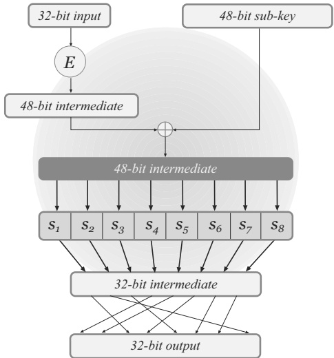

**FIGURE 7.6: The DES mangler function.**

**The S-boxes and the mixing permutation.**

The eight S-boxes that form the “core” of $\hat{f}$ are a crucial element of the DES construction and were very carefully designed. Studies of DES have shown that if the S-boxes were slightly modified, DES would have been much more vulnerable to attack. This should serve as a warning to anyone wishing to design a block cipher: seemingly arbitrary choices are not arbitrary at all, and if not made correctly may render the entire construction insecure.

Recall that each S-box maps a 6-bit input to a 4-bit output. Each S-box can be viewed as a table with 4 rows and 16 columns, where each cell of the table contains a 4-bit entry. A 6-bit input can be viewed as indexing one of the ${2}^6 = 64 = 4 \times 16$ cells of the table in the following way: The first and last input bits are used to choose the table row, and bits 2–5 are used to choose the table column. The 4-bit entry at some position of the table represents the output value for the input associated with that position.

The DES S-boxes have the following properties (among others):

1. Each S-box is a 4-to-1 function. (That is, exactly 4 inputs are mapped to each possible output.) This follows from the properties below.

2. Each row in the table contains each of the 16 possible 4-bit strings exactly once.

3. Changing one bit of any input to an S-box always changes at least two bits of the output.

The DES mixing permutation was also designed carefully. In particular it has the property that the four output bits from any S-box affect the input to six S-boxes in the next round. (This is possible because of the expansion function that is applied in the next round before the S-boxes are computed.)

**The DES avalanche effect.**

The design of the mangler function ensures that DES exhibits a strong avalanche effect. In order to see this, we will trace the difference between the intermediate values in the DES computations of two inputs that differ by just a single bit. Let us denote the two inputs to the cipher by $(L_0, R_0)$ and $(L^{\prime}_0, R^{\prime}_0)$, where we assume that $R_0 = R^{\prime}_0$ and so the single-bit difference occurs in the left half of the inputs (it may help to refer to Equation (7.2) and Figure 7.6 in what follows). After the first round, the intermediate values $(L_1, R_1)$ and $(L^{\prime}_1, R^{\prime}_1)$ still differ by only a single bit, although now this difference is in the right half. In the second round of DES, the right half of each intermediate value is run through $\hat{f}$. Assuming that the bit where $R_1$ and $R^{\prime}_1$ differ is not duplicated in the expansion step, the intermediate values before applying the S-boxes still differ by only a single bit. By property 3 of the S-boxes, the intermediate values after the S-box computation differ in at least two bits. The result is that the intermediate values $(L_2, R_2)$ and $(L^{\prime}_2, R^{\prime}_2)$ differ in three bits: there is a 1-bit difference between $L_2$ and $L^{\prime}_2$ (carried over from the difference between $R_1$ and $R^{\prime}_1$) and a 2-bit difference between $R_2$ and $R^{\prime}_2$.

The mixing permutation spreads the two-bit difference between $R_2$ and $R^{\prime}_2$ such that, in the following round, each of the two differing bits is used as input to a different S-box, resulting in a difference of at least 4 bits in the outputs from the S-boxes. (If either or both of the two bits in which $R_2$ and $R^{\prime}_2$ differ are duplicated by $E$, the difference may be even greater.) There is also now a 2-bit difference in the left halves.

As with a substitution-permutation network, the number of “affected” bits grows exponentially and so after 7 rounds we expect all 32 bits in the right half to be affected, and after 8 rounds we expect all 32 bits in the left half will be affected as well. DES has 16 rounds, and so the avalanche effect occurs very early in the computation. This ensures that the computation of DES on similar inputs yields independent-looking outputs.

#### Attacks on Reduced-Round DES

A useful exercise for understanding more about the DES construction and its security is to look at the behavior of DES with only a few rounds. We show attacks on one-, two-, and three-round variants of DES (recall that DES has 16 rounds). DES variants with three rounds or fewer cannot be pseudorandom functions because three rounds are not enough for the avalanche effect to occur. Thus, we will be interested in demonstrating more difficult

(and more damaging) key-recovery attacks which compute the key $k$ using only a relatively small number of input/output pairs computed using that key. Some of the attacks are similar to those we have seen in the context of substitution-permutation networks; here, however, we will see how they are applied to a concrete block cipher rather than to an abstract design.

The attacks below will be known-plaintext attacks in which the adversary knows some plaintext/ciphertext pairs $\{(x_i, y_i)\}$ computed using some secret key $k$. When we describe the attacks, we will focus on a particular plaintext/ciphertext pair $(x, y)$ and describe the information about the key that the adversary can derive from this pair. Continuing to use the notation developed earlier, we denote the left and right halves of the input $x$ as $L_0$ and $R_0$, respectively, and let $L_i, R_i$ denote the left and right halves of the intermediate result after the $i$th round. Recall that $E$ denotes the DES expansion function, $k_i$ denotes the sub-key used in round $i$, and $f_i(R) = \hat{f}(k_i, R)$ denotes the actual function being applied in the Feistel network in the $i$th round.

One-round DES. Say we are given an input/output pair $(x, y)$. In one-round DES, we have $y = (L_1, R_1)$, where $L_1 = R_0$ and $R_1 = L_0 \oplus f_1(R_0)$. We therefore know an input/output pair for $f_1$: specifically, we know that $f_1(R_0) = R_1 \oplus L_0$. By applying the inverse of the mixing permutation to the output $R_1 \oplus L_0$, we obtain the intermediate value consisting of the outputs from all the S-boxes, where the first 4 bits are the output from the first S-box, the next 4 bits are the output from the second S-box, and so on.

Consider the (known) 4-bit output of the first S-box. Since each S-box is a 4-to-1 function, this means there are exactly four possible inputs to this S-box that would result in the given output, and similarly for all the other S-boxes; each such input is 6 bits long. The input to the S-boxes is simply the XOR of $E(R_0)$ with the sub-key $k_1$. Since $R_0$, and hence $E(R_0)$, is known, we can compute a set of four possible values for each 6-bit portion of $k_1$. This means we have reduced the number of possible keys $k_1$ from ${2}^{48}$ to ${4}^{48/6} = 4^8 = 2^{16}$ (since there are four possibilities for each of the eight 6-bit portions of $k_1$). This is already a small number and so we can just try all the possibilities on a different input/output pair $(x^{\prime}, y^{\prime})$ to find the right key. We thus obtain the key using only two known plaintexts in time roughly ${2}^{16}$.

Two-round DES. In two-round DES, the output y is equal to $(L_{2}, R_{2})$ where

$$\begin{aligned}&L_{1}=R_{0}\\&R_{1}=L_{0}\oplus f_{1}(R_{0})\\&L_{2}=R_{1}=L_{0}\oplus f_{1}(R_{0})\\&R_{2}=L_{1}\oplus f_{2}(R_{1}).\\ \end{aligned}$$

 $L_{0}, R_{0}, L_{2}$, and $R_{2}$ are known from the given input/output pair $(x, y)$, and thus we also know $L_{1} = R_{0}$ and $R_{1} = L_{2}$. This means that we know the input/output of both $f_{1}$ and $f_{2}$, and so the same method used in the attack on one-round DES can be used here to determine both $k_{1}$ and $k_{2}$ in time.

roughly ${2}\cdot2^{16}$. This attack works even if $k_1$ and $k_2$ are completely independent keys, although in fact the key schedule of DES ensures that many of the bits of $k_1$ and $k_2$ are equal (which can be used to further speed up the attack).

Three-round DES. Referring to Figure 7.5, the output value $y$ is now equal to $(L_3, R_3)$. Since $L_1 = R_0$ and $R_2 = L_3$, the only unknown values in the figure are $R_1$ and $L_2$ (which are equal).

Now we no longer have the input/output to any round function $f_i$. For example, the output value of $f_2$ is equal to $L_1 \oplus R_2$, where both of these values are known. However, we do not know the value $R_1$ that is input to $f_2$. Similarly, we can determine the inputs to $f_1$ and $f_3$ but not the outputs of those functions. Thus, the attack we used to break one-round and two-round DES will not work here.

Instead of relying on full knowledge of the input and output of one of the round functions, we will use knowledge of a certain relation between the inputs and outputs of $f_1$ and $f_3$. Observe that the output of $f_1$ is equal to $L_0 \oplus R_1 = L_0 \oplus L_2$, and the output of $f_3$ is equal to $L_2 \oplus R_3$. Therefore,

$$f_{1}(R_{0})\oplus f_{3}(R_{2})=(L_{0}\oplus L_{2})\oplus(L_{2}\oplus R_{3})=L_{0}\oplus R_{3},$$

where both $L_{0}$ and $R_{3}$ are known. That is, the XOR of the outputs of $f_{1}$ and $f_{3}$ is known. Furthermore, the input to $f_{1}$ is $R_{0}$ and the input to $f_{3}$ is $L_{3}$, both of which are known. Summarizing: we can determine the inputs to $f_{1}$ and $f_{3}$, and the XOR of their outputs. We now describe an attack that finds the secret key based on this information.

Recall that the key schedule of DES has the property that the master key is divided into a “left half,” which we denote by $k_L$, and a “right half” $k_R$, each containing 28 bits. Furthermore, the 24 left-most bits of the sub-key used in each round are taken only from $k_L$, and the 24 right-most bits of each sub-key are taken only from $k_R$. This means that $k_L$ affects only the inputs to the first four S-boxes in any round, while $k_R$ affects only the inputs to the last four S-boxes. Since the mixing permutation is known, we also know which bits of the output of each round function come from each S-box.

The idea behind the attack is to separately traverse the key space for each half of the master key, giving an attack with complexity roughly ${2} \cdot 2^{28}$ rather than complexity ${2}^{56}$. Such an attack will be possible if we can verify a guess of half the master key, and we now show how this can be done. Say we guess some value for $k_L$, the left half of the master key. We know the input $R_0$ of $f_1$, and so using our guess of $k_L$ we can compute the input to the first four S-boxes. This means that we can compute half the output bits of $f_1$ (the mixing permutation spreads out the bits we know, but since the mixing permutation is known we know exactly which bits those are). Likewise, we can compute the same locations in the output of $f_3$ by using the known input $L_3$ to $f_3$ and the same guess for $k_L$. Finally, we can compute the XOR of these output values and check whether they match the appropriate bits in the known value of the XOR of the outputs of $f_1$ and $f_3$. If they are not equal, then our guess
for $k_L$ is incorrect. A correct guess for $k_L$ will always pass this test, and so will not be eliminated, but an incorrect guess is expected to pass this test only with probability roughly ${2}^{-16}$ (since we check equality of 16 bits in two computed values). There are ${2}^{28}$ possible values for $k_L$, so if each incorrect value remains a viable candidate with probability ${2}^{-16}$ then we expect to be left with only ${2}^{28} \cdot 2^{-16} = 2^{12}$ possibilities for $k_L$ after the above.

By performing the above for each half of the master key, we obtain in time ${2} \cdot 2^{28}$ approximately ${2}^{12}$ candidates for the left half and ${2}^{12}$ candidates for the right half. Since each combination of the left and right halves is possible, we have ${2}^{24}$ candidate keys overall and can run a brute-force search over this set using an additional input/output pair $(x^{\prime}, y^{\prime})$. (An alternative that is more efficient is to simply repeat the previous attack using the ${2}^{12}$ remaining candidates for each half of the key.) The time for the attack is roughly ${2} \cdot 2^{28} + 2^{24} < 2^{30}$, much less than a ${2}^{56}$-time brute-force attack.

#### Security of DES

After almost 30 years of intensive study, the best known practical attack on DES is still an exhaustive search through its key space. (We discuss some important theoretical attacks in Section 7.2.6. Those attacks require a large number of input/output pairs, which can be difficult to obtain in an attack on any real-world system using DES.) Unfortunately, the 56-bit key length of DES is short enough that an exhaustive search through all ${2}^{56}$ possible keys is now feasible. Already in the late 1970s there were strong objections to using such a short key for DES. Back then the objection was academic, as the computational power needed to search through ${2}^{56}$ keys was generally unavailable. (It has been estimated that in 1977 a computer that could crack DES in one day would cost \$20 million to build.) The practicality of a brute-force attack on DES, however, was demonstrated in 1997 when a DES challenge set up by RSA Security was solved by the DESCHALL project using thousands of computers coordinated across the Internet; the computation took 96 days. A second challenge was broken the following year in just 41 days by the distributed.net project. A significant breakthrough came in 1998 when a third challenge was solved in just 56 hours. This impressive feat was achieved via a special-purpose DES-breaking machine called Deep Crack that was built by the Electronic Frontier Foundation at a cost of \$250,000. In 1999, a DES challenge was solved in just over 22 hours by a combined effort of Deep Crack and distributed.net. The current state-of-the-art is the DES cracking box by PICO Computing, which uses 48 FPGAs and can find a DES key in approximately 26 hours; see https://crack.sh for further details.

The time/space tradeoffs discussed in Section 6.4.3 show that exhaustive key-search attacks can be accelerated using pre-computation and additional memory. Due to the short key length of DES, time/space tradeoffs can be especially effective. Specifically, using pre-processing it is possible to generate a table a few terabytes large that enables recovery of a DES key with high
probability from a single input/output pair using approximately ${2}^{38}$ DES evaluations (which can be computed in under a minute). The bottom line is that the key length of DES is far too short by modern standards, and DES cannot be considered secure for any serious application today.

A second cause for concern is the relatively short block length of DES. A short block length is problematic because the concrete security of many constructions based on block ciphers depends on the block length of the cipher—even if the cipher is otherwise “perfect.” For example, the proof of CTR mode (cf. Theorem 3.33) shows that plaintext information can be leaked to an attacker if an IV repeats. If CTR mode is instantiated using DES, with a block length of only 64 bits, then security is compromised with high probability after encrypting only $\approx 2^{24}$ messages.

The insecurity of DES has nothing to do with its design per se, but rather is due to its short key length (and, to a lesser extent, its short block length). This is a great tribute to the designers of DES, who seem to have succeeded in constructing an almost “perfect” block cipher otherwise. Since DES itself seems not to have significant structural weaknesses, it makes sense to use DES as a building block for constructing block ciphers with longer keys. We discuss this further in Section 7.2.4.

The replacement for DES—the Advanced Encryption Standard (AES), covered later in this chapter—was explicitly designed to address concerns regarding the short key length and block length of DES. AES supports 128-, 192-, and 256-bit keys, and has a 128-bit block length.

### 7.2.4 3DES: Increasing the Key Length of a Block Cipher

The main weakness of DES is its short key. It thus makes sense to try to design a block cipher with a larger key length using DES as a building block. Some approaches to doing so are discussed in this section. Although we refer to DES frequently throughout the discussion, and DES is the most prominent block cipher to which these techniques have been applied, everything we say here applies generically to any block cipher.

Internal modifications vs. “black-box” constructions. There are two general approaches one could take to constructing another cipher based on DES. The first approach would be to somehow modify the internal structure of DES, while increasing the key length. For example, one could leave the round function untouched and simply use a 128-bit master key with a different key schedule (still choosing a 48-bit sub-key in each round). Or, one could change the S-boxes themselves and use a larger sub-key in each round. The disadvantage of such approaches is that by modifying DES—in even the smallest way—we lose the confidence we have gained in DES by virtue of the fact that it has remained resistant to attack for so many years. Cryptographic constructions are very sensitive; even mild, seemingly insignificant changes can render a construction completely insecure. (In fact, various results to this
effect have been shown for DES; e.g., changing the S-boxes or the mixing permutation can make DES much more vulnerable to attack.) Tweaking the internal components of a block cipher is therefore not recommended.

An alternative approach that does not suffer from the above problem is to use DES as a “black box” and not touch its internal structure at all. In following this approach we treat DES as a “perfect” block cipher with a 56-bit key, and construct a new block cipher that only invokes the original, unmodified DES. Since DES itself is not tampered with, this is a much more prudent approach and is the one we will pursue here.

#### Double Encryption

Let $F$ be a block cipher with an $n$-bit key length and $\ell$-bit block length. Then a new block cipher $F^{\prime}$ with a key of length ${2}n$ can be defined by

$$F^{\prime}_{k_{1},k_{2}}(x)\stackrel{\mathrm{def}}{=}F_{k_{2}}(F_{k_{1}}(x)),$$

where $k_1$ and $k_2$ are independent keys. If exhaustive key search were the best available attack, this would mean that the best attack would require time ${2}^{2n}$. Unfortunately, we show an attack on $F^{\prime}$ that runs in time roughly ${2}^n$. This means that $F^{\prime}$ is not any more secure against brute-force attacks than $F$, even though $F^{\prime}$ has a key that is twice as long. $^4$

> $^4$ This is not quite true since a brute-force attack on F can be carried out in time ${2}^n$ and constant memory, whereas the attack we show on $F^{\prime}$ requires ${2}^n$ time and ${2}^n$ memory. Nevertheless, the attack illustrates that $F^{\prime}$ does not achieve the desired level of security.

The attack is called a “meet-in-the-middle attack,” for reasons that will soon become clear. Say the adversary is given a single input/output pair $(x, y)$, where $y = F^{\prime}_{k_1^*, k_2^*}(x) = F_{k_2^*}(F_{k_1^*}(x))$ for unknown $k_1^*, k_2^*$. The adversary can narrow down the set of possible keys in the following way:

1. For each $k_1 \in \{0,1\}^n$, compute $z := F_{k_1}(x)$ and store $(z, k_1)$ in a list $L$.

2. For each $k_2 \in \{0,1\}^n$, compute $z := F_{k_2}^{-1}(y)$ and store $(z, k_2)$ in a list $L^{\prime}$.

3. Call entries $(z_1, k_1) \in L$ and $(z_2, k_2) \in L^{\prime}$ a match if $z_1 = z_2$. For each such match, add $(k_1, k_2)$ to a set $S$. (Matches can be found easily by first sorting the elements in $L$ and $L^{\prime}$ by their first entry.)

See Figure 7.7 for a graphical depiction of the attack. The attack requires ${2} \cdot 2^n$ evaluations of $F$, and uses ${2} \cdot (n + \ell) \cdot 2^n$ bits of memory.

The set S output by this algorithm contains exactly those values $(k_{1}, k_{2})$ for which

$$F_{k_{1}}(x)=F_{k_{2}}^{-1}(y) \tag{7.3}$$

or, equivalently, for which $y = F_{k_1, k_2}^{\prime}(x)$. In particular, $(k_1^*, k_2^*) \in S$. On the other hand, a pair $(k_1, k_2) \neq (k_1^*, k_2^*)$ is (heuristically) expected to satisfy Equation (7.3) with probability

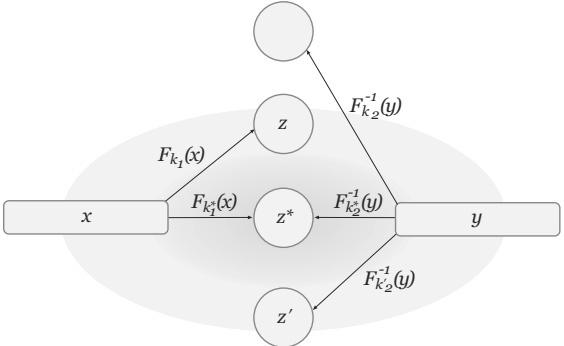

**FIGURE 7.7: A meet-in-the-middle attack.** ${2}^{-\ell}$ if we treat $F_{k_1}(x)$ and $F_{k_2}^{-1}(y)$ as uniform $\ell$-bit strings, and so the expected size of S is ${2}^{2n} \cdot 2^{-\ell} = 2^{2n-\ell}$. Using another few input/output pairs, and taking the intersection of the sets that are obtained, the correct $(k_1^*, k_2^*)$ can be identified with very high probability.

#### Triple Encryption

The obvious generalization of the preceding approach is to apply the block cipher three times in succession. Two variants of this approach are common:

Variant 1: three keys. The most natural thing to do is to choose three independent keys, i.e., to define $F_{k_1,k_2,k_3}^{\prime\prime}(x) \overset{\mathrm{def}}{=} F_{k_3}(F_{k_2}^{-1}(F_{k_1}(x)))$.

Variant 2: two keys. As we explain below, another option is to choose two independent keys and define $F_{k_1,k_2}^{\prime\prime}(x) \overset{\mathrm{def}}{=} F_{k_1}(F_{k_2}^{-1}(F_{k_1}(x)))$.

Note that the middle invocation of $F$ is traditionally reversed. If $F$ is a secure cipher this makes no difference as far as security is concerned (since if $F$ is a strong pseudorandom permutation then $F^{-1}$ is too). This is done for backward compatibility: by setting $k_{3} = k_{2} = k_{1}$, the resulting cipher is equivalent to a single invocation of $F$ using the key $k_{1}$.

Security of the first variant. The key length of the first variant is 3n, and so we might hope that the best attack requires time ${2}^{3n}$. However, the cipher is susceptible to a meet-in-the-middle attack (just as in the case of double encryption) that here requires ${2}^{2n}$ time.

Security of the second variant. The key length of this variant is ${2}n$, and a meet-in-the-middle attack requires time ${2}^{2n}$. Assuming $\ell \geq n$, this is the
best known attack when the adversary is given only a few input/output pairs. (There is a known-plaintext attack using ${2}^t$ input/output pairs that runs in time $\approx 2^{n+\ell-t}$. See Exercise 7.16.)

Triple-DES (3DES). Triple-DES (or 3DES), standardized in 1999, is based on three invocations of DES using two or three keys, as described above. Two-key 3DES (which corresponds to the second variant) is no longer recommended, in part due to the known-plaintext attack mentioned above. Three-key 3DES is still used, though the current recommendation is to phase it out due to its small block length and the fact that it is relatively slow. These drawbacks have led to 3DES to be supplanted in practice by the Advanced Encryption Standard, described in the next section.

### 7.2.5 AES – The Advanced Encryption Standard

In January 1997, the United States National Institute of Standards and Technology (NIST) announced that it would hold a competition to select a new block cipher—to be called the Advanced Encryption Standard, or AES—to replace DES. The competition began with an open call for teams to submit candidate block ciphers for evaluation. A total of 15 different algorithms were submitted from all over the world, including contributions from many of the best cryptographers and cryptanalysts. Each team's candidate cipher was intensively analyzed by members of NIST, the public, and (especially) the other teams. Two workshops were held, one in 1998 and one in 1999, to discuss and analyze the various submissions. Following the second workshop, NIST narrowed the field down to 5 “finalists” and the second round of the competition began. A third AES workshop was held in April 2000, inviting additional scrutiny on the five finalists. In October 2000, NIST announced that the winning algorithm was Rijndael (a block cipher designed by the Belgian cryptographers Vincent Rijmen and Joan Daemen), although NIST conceded that any of the 5 finalists would have made an excellent choice. In particular, no serious security vulnerabilities were found in any of the 5 finalists, and the selection of a “winner” was based in part on properties such as efficiency, performance in hardware, flexibility, etc.

The process of selecting AES was ingenious because any group that submitted an algorithm (and was therefore interested in having its algorithm adopted) had strong motivation to find attacks on the other submissions. This incentivized the world's best cryptanalysts to focus their attention on finding even the slightest weaknesses in the candidate ciphers submitted to the competition. After only a few years each candidate algorithm was already subjected to intensive study, thus increasing confidence in the security of the winner. Of course, the longer AES is used and studied without being broken, the more our confidence in it continues to grow. Today, AES is widely used and no significant security weaknesses have been discovered.

**The AES construction.**

We present the high-level structure of AES. As
with DES, we will not present a full specification and our description should not be used as a basis for implementation. Our aim is only to provide a general idea of how the algorithm works.

The AES block cipher has three variants called AES-128, AES-192, and AES-256 that use 128-, 192-, or 256-bit keys, respectively; they all have a 128-bit block length. The length of the key affects the key schedule (i.e., the way sub-keys are derived from the master key) as well as the number of rounds, but does not affect the high-level structure of each round.

In contrast to DES, which uses a Feistel structure, AES is essentially a substitution-permutation network. During computation of the AES algorithm, a 4-by-4 array of bytes called the state is modified in a series of rounds. The state is initially set equal to the input to the cipher (note that the input is 128 bits, which is exactly 16 bytes). In each round, the following operations are then applied to the state:

Stage 1 – AddRoundKey: A 128-bit sub-key is derived from the master key, and viewed as a 4-by-4 array of bytes. The state array is updated by XORing it with this sub-key.

Stage 2 – SubBytes: In this step, each byte of the state array is replaced by another byte according to a single, fixed lookup table S. This substitution table (or S-box) is a permutation on $\{0,1\}^{8}$.

Stage 3 – ShiftRows: Next, the bytes in each row of the state array are shuffled as follows: the first row of the array is untouched, each byte in the second row is shifted one place to the left, the third row is shifted two places to the left, and the fourth row is shifted three places to the left. (All shifts are cyclic so that, e.g., in the second row the first byte becomes the fourth byte.)

Stage 4 – MixColumns: Finally, an invertible linear transformation is applied to the four bytes in each column. This transformation has the property that if two inputs differ in $b>0$ bytes, then the resulting outputs differ in at least ${5}-b$ bytes.

In the final round, MixColumns is replaced with AddRoundKey. This prevents an adversary from simply inverting the last three stages, which do not depend on the key.

By treating stages 3 and 4 as one step, we see that each round of AES has the structure of a substitution-permutation network: the round sub-key is first XORed with the input to the current round in a key-mixing step; next, an invertible S-box is applied to each byte of the resulting value; finally, the bits of the result are “permuted.” The only difference is that, unlike our previous description of substitution-permutation networks, here the final step does not consist of simply shuffling the bits using a mixing permutation, but is instead carried out using a permutation plus an invertible linear transformation. Nevertheless, the net effect—namely, diffusion—is the same. Note
that, as we have pointed out previously in our discussion of SPNs, a final key-mixing step is done after the last round.

The number of rounds depends on the key length. Ten rounds are used for a AES-128, 12 rounds for AES-192, and 14 rounds for a AES-256.

Security of AES. As we have mentioned, the AES cipher was subject to intense scrutiny during the selection process and has continued to be studied ever since. To date, there are no practical cryptanalytic attacks that are significantly better than an exhaustive search for the key.

We conclude that, as of today, AES constitutes an excellent choice for any cryptographic scheme that requires a (strong) pseudorandom permutation. It is free, standardized, efficient, and highly secure.

### 7.2.6 \*Differential and Linear Cryptanalysis

Block ciphers are relatively complicated, and as such are difficult to analyze. Nevertheless, one should not be fooled into thinking that a complicated cipher is necessarily difficult to break. On the contrary, it is very hard to construct a secure block cipher, and surprisingly easy to find attacks on most constructions (no matter how complicated they appear). This should serve as a warning that non-experts should not try to construct new ciphers. Given the availability of AES, it is hard to justify using anything else.

In this section we describe two tools that are now a standard part of the cryptanalyst's toolbox. Our goal here is to give a taste of some advanced cryptanalysis, as well as to reinforce the idea that designing a secure block cipher involves careful choice of its components.

Differential cryptanalysis. This technique, which can lead to a chosen-plaintext attack on a block cipher, was first presented in the late 1980s by Biham and Shamir, who used it to attack DES in 1993. The basic idea behind the attack is to tabulate specific differences in the input that lead to specific differences in the output with probability greater than would be expected for a random permutation. Specifically, say the differential $\left(\Delta_x, \Delta_y\right)$ occurs in some keyed permutation $G$ with probability $p$ if for uniform inputs $x_1$ and $x_2$ satisfying $x_1 \oplus x_2 = \Delta_x$, and uniform choice of key $k$, the probability that $G_k(x_1) \oplus G_k(x_2) = \Delta_y$ is $p$. For any fixed $\left(\Delta_x, \Delta_y\right)$ and $x_1, x_2$ satisfying $x_1 \oplus x_2 = \Delta_x$, if we choose a uniform function $f : \{0, 1\}^{\ell} \to \{0, 1\}^{\ell}$, we have $\Pr[f(x_1) \oplus f(x_2) = \Delta_y] = 2^{-\ell}$. In a weak block cipher, however, there may be differentials that occur with significantly higher probability. This can be leveraged to give a full key-recovery attack, as we now show for SPNs.

We describe the basic idea, and then work through a concrete example. Let $F$ be an $r$-round SPN with an $\ell$-bit block length, and let $G_k(x)$ denote the intermediate result in the computation of $F_k(x)$ after applying the key-mixing step of the last round. (That is, $G$ excludes the $S$-box substitution and mixing permutation of the last round, as well as the final key-mixing step.) Assume there is a differential $(\Delta_x, \Delta_y)$ in $G$ that occurs with probability $p \gg 2^{-\ell}$. It
is possible to exploit this high-probability differential to learn bits of the final sub-key $k_{r+1}$. The high-level idea is as follows: let $\{(x_1^i, x_2^i)\}_{i=1}^L$ be a collection of $L$ pairs of random inputs with differential $\Delta_x$, i.e., with $x_1^i \oplus x_2^i = \Delta_x$ for all $i$. Using a chosen-plaintext attack, obtain $y_1^i = F_k(x_1^i)$ and $y_2^i = F_k(x_2^i)$ for all $i$. Now, for each possible $k_{r+1}^*\in\{0,1\}^\ell$ do: for each pair $y_1^i, y_2^i$, invert the final key-mixing step using $k_{r+1}^*$, and also invert the mixing permutation and $S$-boxes of round $r$ (which do not depend on the master key) to obtain $\tilde{y}_1^i$, $\tilde{y}_2^i$. Note that when $k_{r+1}^* = k_{r+1}$ we have $\tilde{y}_1^i = G_k(x_1^i)$ and $\tilde{y}_2^i = G_k(x_2^i)$, and in that case we expect that a $p$-fraction of the pairs will satisfy $\tilde{y}_1^i \oplus \tilde{y}_2^i = \Delta_y$. On the other hand, when $k^* \neq k_{r+1}$ we heuristically expect only a ${2}^{-\ell}$-fraction of the pairs to yield this differential. By setting $L$ large enough, the correct value of the final sub-key $k_{r+1}$ can be determined.

This works, but requires enumerating over ${2}^{\ell}$ possible values for the final sub-key. We can do better by guessing portions of $k_{r+1}$ at a time. More concretely, assume the S-boxes in $F$ have 1-byte input/output length, and focus on the first byte of $\Delta_y$. It is possible to verify if the differential holds in that byte by guessing only 8 bits of $k_{r+1}$, namely, the 8 bits that correspond (after the round-r mixing permutation) to the output of the first S-box. Thus, proceeding as above, we can learn these 8 bits by enumerating over all possible values for those bits, and seeing which value yields the desired differential in the first byte with the highest probability. Incorrect guesses for those 8 bits yield the expected differential in that byte with (heuristic) probability ${2}^{-8}$, but the correct guess will give the expected differential with probability roughly $p + 2^{-8}$; this is because with probability $p$ the differential holds on the entire block (so in particular for the first byte), and when this is not the case then we can treat the differential in the first byte as random. Note that different differentials may be needed to learn different portions of $k_{r+1}$.

In practice, various optimizations are performed to improve the effectiveness of the above test or, more specifically, to increase the gap between the probability that an incorrect guess for (bits of) $k_{r+1}$ yields the differential vs. the probability that a correct guess does. One optimization is to use a low-weight differential in which $\Delta_y$ has many zero bytes. Any pairs $\tilde{y}_1, \tilde{y}_2$ satisfy such a differential have equal values entering many of the S-boxes in round $r$, and so will result in output values $y_1, y_2$ that are equal in the corresponding bit-positions (depending on the final mixing permutation). This means that the attacker can simply discard any pairs $(y_1^i, y_2^i)$ that do not agree in those bit-positions (since the corresponding intermediate values $(\tilde{y}_1, \tilde{y}_2)$ cannot possibly satisfy the differential, for any choice of the final sub-key). This significantly improves the effectiveness of the attack.

Once $k_{r+1}$ is known, the attacker can “peel off” the final key-mixing step, as well as the mixing permutation and S-box substitution steps of round $r$ (since these do not depend on the master key), and then apply the same attack—using a different differential—to find the $r$th-round sub-key $k_r$, and so on, until it learns all sub-keys (or, equivalently, the master key). Relations between the sub-keys can be used to improve the efficiency of the attack.

**A worked example. We work through a “toy” example, illustrating also how a good differential can be found. We use a four-round SPN with a block length of 16 bits, based on a single S-box with 4-bit input/output length. The S-box is defined as follows:**

| Input: | 0000 | 0001 | 0010 | 0011 | 0100 | 0101 | 0110 | 0111 |
| --- | --- | --- | --- | --- | --- | --- | --- | --- |
| Output: | 0000 | 1011 | 0101 | 0001 | 0110 | 1000 | 1101 | 0100 |
| Input: | 1000 | 1001 | 1010 | 1011 | 1100 | 1101 | 1110 | 1111 |
| Output: | 1111 | 0111 | 0010 | 1100 | 1001 | 0011 | 1110 | 1010 |

**The mixing permutation, showing where each of the 16 bits in a block is moved, is:**

| In: | 1 | 2 | 3 | 4 | 5 | 6 | 7 | 8 | 9 | 10 | 11 | 12 | 13 | 14 | 15 | 16 |
| --- | --- | --- | --- | --- | --- | --- | --- | --- | --- | --- | --- | --- | --- | --- | --- | --- |
| Out: | 7 | 2 | 3 | 8 | 12 | 5 | 11 | 9 | 10 | 1 | 14 | 13 | 4 | 6 | 16 | 15 |

We first find a differential in the S-box. Let $S(x)$ denote the output of the S-box on input x. Consider the differential $\Delta_x = 1111$. Then, for example, we have $S(0000) \oplus S(1111) = 0000 \oplus 1010 = 1010$ and so in this case a difference of 1111 in the inputs leads to a difference of 1010 in the outputs. Let us see if this relation holds frequently. We have $S(0001) = 1011$ and $S(0001 \oplus 1111) = S(1110) = 1110$, and so here a difference of 1111 in the inputs does not lead to a difference of 1010 in the outputs. However, $S(0100) = 0110$ and $S(0100 \oplus 1111) = S(1011) = 1100$ and so in this case, a difference of 1111 in the inputs yields a difference of 1010 in the outputs. In Figure 7.8 we tabulate results for all possible inputs. We see that half the time a difference of 1111 in the inputs yields a difference of 1010 in the outputs. Thus, (1111, 1010) is a differential in S that occurs with probability ${1}/{2}$.

| x | S(x) | x ⊕ 1111 | S(x ⊕ 1111) | S(x) ⊕ S(x ⊕ 1111) |
| --- | --- | --- | --- | --- |
| 0000 | 0000 | 1111 | 1010 | 1010 |
| 0001 | 1011 | 1110 | 1110 | 0101 |
| 0010 | 0101 | 1101 | 0011 | 0110 |
| 0011 | 0001 | 1100 | 1001 | 1000 |
| 0100 | 0110 | 1011 | 1100 | 1010 |
| 0101 | 1000 | 1010 | 0010 | 1010 |
| 0110 | 1101 | 1001 | 0111 | 1010 |
| 0111 | 0100 | 1000 | 1111 | 1011 |
| 1000 | 1111 | 0111 | 0100 | 1011 |
| 1001 | 0111 | 0110 | 1101 | 1010 |
| 1010 | 0010 | 0101 | 1000 | 1010 |
| 1011 | 1100 | 0100 | 0110 | 1010 |
| 1100 | 1001 | 0011 | 0001 | 1000 |
| 1101 | 0011 | 0010 | 0101 | 0110 |
| 1110 | 1110 | 0001 | 1011 | 0101 |
| 1111 | 1010 | 0000 | 0000 | 1010 |

**FIGURE 7.8: The effect of the input difference $\Delta_x = 1111$ in our S-box.**

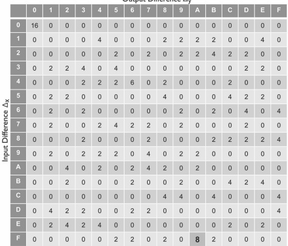

**FIGURE 7.9: Differentials in our S-box.**

The same process can be carried out for all ${2}^4$ input differences $\Delta x$ to calculate the probability of every differential. Namely, for each pair $(\Delta_x, \Delta_y)$ we tabulate the number of inputs $x$ for which $S(x) \oplus S(x \oplus \Delta x) = \Delta_y$. We have done this for our example $S$-box in Figure 7.9. (For conciseness we use hexadecimal notation.) The table should be read as follows: entry $(i, j)$ counts how many inputs with difference $i$ map to outputs with difference $j$. Observe, for example, that there are 8 inputs with difference $\mathtt{0xF} = 1111$ that map to output $\mathtt{0xA} = 1010$, as we have shown above. This is the highest-probability differential (apart from the trivial differential $(\mathtt{0x0}, \mathtt{0x0})$). But there are also other differentials of interest: an input difference of $\Delta x = \mathtt{0x4} = 0100$ maps to an output difference of $\Delta_y = \mathtt{0x6} = 0110$ with probability ${6}/16 = 3/8$, and there are several differentials with probability ${4}/16 = 1/4$.

We now extend this to find a good differential for the first three rounds of the SPN. Consider evaluating the SPN on two inputs that have a differential of 0000 1100 0000 0000, and tracing the differential between the intermediate values at each step of this evaluation. (Refer to Figure 7.10, which shows the first three rounds of the SPN.) The key-mixing step in the first round does not affect the differential, and so the inputs to the second S-box in the first round have differential 1100. We see from Figure 7.9 that a difference of 0xC = 1100 in the inputs to the S-box yields a difference of 0x8 = 1000 in the outputs of the S-box with probability 1/4. So with probability 1/4 the differential in the output of the 2nd S-box after round 1 is a single bit which is moved by the mixing permutation from the 5th position to the 12th position. (The inputs to the other S-boxes are equal, so their outputs are equal and the differential of the outputs is 0000.) Assuming this to be the case, the input difference to the third S-box in the second round is

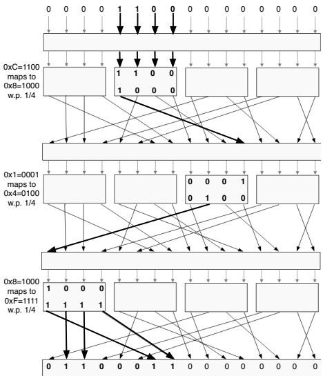

**FIGURE 7.10: Tracing differentials through the first three rounds of an SPN that uses the S-box and mixing permutation given in the text.** $\mathtt{0x1} = 0001$ (once again, the key-mixing step in the second round does not affect the differential); using Figure 7.9 we have that with probability ${1}/{4}$ the output difference from that S-box is $\mathtt{0x4} = 0100$. Thus, once again there is just a single output bit that is different, and it is moved from the 10th position to the first position by the mixing permutation. Finally, consulting Figure 7.9 yet again, we see that an input difference of $\mathtt{0x8} = 1000$ to the S-box results in an output difference of $\mathtt{0xF} = 1111$ with probability ${1}/{4}$. The bits in positions 1, 2, 3, and 4 are then moved by the mixing permutation to positions 7, 2, 3, and 8. Note that the key-mixing step in the fourth round does not affect the output differential.

Overall, then, we see that an input difference of $\Delta_x = 0000\ 1100\ 0000\ 0000$ yields the output difference $\Delta_y = 0110\ 0011\ 0000\ 0000$ after three rounds with probability at least $\frac{1}{4} \cdot \frac{1}{4} \cdot \frac{1}{4} = \frac{1}{64}$. (This is a lower bound on the probability of the differential, since there may be other differences in the intermediate values that result in the same difference in the outputs. We multiply the probabilities since we assume independence of the sub-keys used in each round.) For a random function, the probability that any given differential occurs is just ${2}^{-16} = 1/65536$. Thus, the differential we have found occurs with probability significantly higher than what would be expected for a random function. Observe also that we have found a low-weight differential.

We can use this differential to find 8 bits of the final sub-key $k_5$—namely, the bits at positions 2, 3, 5, 7, 8, 9, 11, and 12. (i.e., the positions that the outputs of the first two S-boxes from the 3rd round get mapped to by the mixing permutation.) As discussed earlier, we begin by letting $\{(x_i^i, x_2^i)\}_{i=1}^L$ be a set of $L$ pairs of random inputs with differential $\Delta_x$. Using a chosen-plaintext attack, we then obtain the values $y_1^i = F_k(x_1^i)$ and $y_2^i = F_k(x_2^i)$ for all $i$. Now, for all possible values of the specified 8 bits of $k_5$, we compute the initial 8 bits of $\tilde{y}_1^i$, $\tilde{y}_2^i$, the intermediate values after the key-mixing step of the 4th round. (We can do this because we only need to invert the two left-most S-boxes of the 4th round in order to derive those 8 bits.) When we guess the correct value for the specified 8 bits of $k_5$, we expect the 8-bit differential 0110 0011 to occur with probability at least 1/64. Heuristically, an incorrect guess yields the expected differential only with probability ${2}^{-8} = 1/256$. By setting $L$ large enough, we can (with high probability) identify the correct value.

Differential attacks in practice. Differential cryptanalysis is very powerful, and has been used to attack real ciphers. A prominent example is FEAL-8, which was proposed as an alternative to DES in 1987. A differential attack on FEAL-8 was found that requires just 1,000 chosen plaintexts. In 1991, it took less than 2 minutes using this attack to find the entire key. Today, any proposed cipher is tested for resistance to differential cryptanalysis.

A differential attack was also the first attack on DES to require less time than a simple brute-force search. While an interesting theoretical result, the attack is not very effective in practice since it requires ${2}^{47}$ chosen plaintexts, and it would be difficult for an attacker to obtain this many chosen plaintext/ciphertext pairs in most real-world applications. Interestingly, small modifications to the S-boxes of DES make the cipher much more vulnerable to differential attacks. Personal testimony of the DES designers (after differential attacks were discovered in the outside world) confirmed that the S-boxes of DES were designed specifically to thwart differential attacks.

Linear cryptanalysis. Linear cryptanalysis was developed by Matsui in the early 1990s. We will only describe the idea underlying the technique. The basic idea is to consider linear relationships between the input, output, and key that hold with high probability. In more detail, assume an $n$-bit key length and $\ell$-bit block length, and let $I, O \subseteq \{1, \ldots, \ell\}$ and $K \subseteq \{1, \ldots, n\}$. For an $\ell$-bit $x$, let $x_I$ denote the XOR of the bits at the positions indicated by $I$; define $k_K$ similarly for $k \in \{0,1\}^n$. We say that $I, O, K$ have linear bias $\varepsilon$ if, for uniform $x$ and $k$, and $y \overset{\mathrm{def}}{=} F_k(x)$, it holds that

$$\left|\Pr[x_{I}\oplus y_{O}\oplus k_{K}=0]-\frac{1}{2}\right|=\varepsilon.$$

If such a bias can be identified, it will clearly be useful for determining bits of the key given a number of plaintext/ciphertext pairs. Besides giving another
method for attacking ciphers, an important feature of this attack compared to differential cryptanalysis is that it uses known plaintexts rather than chosen plaintexts. This is very significant, since an encrypted file can provide a huge amount of known plaintext, whereas obtaining encryptions of chosen plaintexts is much more difficult. Matsui showed that DES can be broken using linear cryptanalysis with just ${2}^{43}$ plaintext/ciphertext pairs.

Impact on block-cipher design. Modern block ciphers are designed and evaluated based, in part, on their resistance to differential and linear cryptanalysis. When constructing a block cipher, designers choose S-boxes and other components so as to minimize differential probabilities and linear biases. It is not possible to eliminate all high-probability differentials in an S-box: any S-box will have some differential that occurs more frequently than others. Still, these deviations can be minimized. Moreover, increasing the number of rounds (and choosing the mixing permutation carefully) can both reduce the differential probabilities as well as make it more difficult for cryptanalysts to find any differentials to exploit.

## 7.3 Compression Functions and Hash Functions

Recall from Chapter 6 that the primary security requirement for a cryptographic hash function $H$ is collision resistance: that is, it should be difficult to find a collision in $H$, i.e., distinct inputs $x, x^{\prime}$ such that $H(x) = H(x^{\prime})$. (We drop mention of any key here, since real-world hash functions are generally unkeyed.) If the hash function has $\ell$-bit output length, then the best we can hope for is that it should be infeasible to find a collision using substantially fewer than ${2}^{\ell/2}$ invocations of $H$. (See Section 6.4.1.)

We describe two approaches for constructing collision-resistant hash functions. In Section 7.3.1, we show how to build a compression function (i.e., a fixed-length hash function) from any block cipher. As we have seen in Section 6.2, any such compression function can be extended to a full-fledged hash function using the Merkle–Damgård transform. This approach has been used to design popular hash functions including MD5, SHA-1, and SHA-2.

In Section 7.3.3 we discuss a more recent approach for constructing hash functions based on the so-called sponge construction. This technique is used by the SHA-3 standard.

### 7.3.1 Compression Functions from Block Ciphers

Perhaps surprisingly, it is possible to build a collision-resistant compression function from a block cipher satisfying strong security properties. There are several ways to do this. One of the most common is via the Davies–Meyer
construction. Let $F$ be a block cipher with $n$-bit key length and $\ell$-bit block length. The Davies–Meyer construction then defines the compression function $h: \{0,1\}^{n+\ell} \to \{0,1\}^{\ell}$ by $h(k,x) \overset{\mathrm{def}}{=} F_k(x) \oplus x$. (See Figure 7.11.)

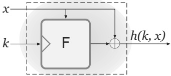

**FIGURE 7.11: The Davies–Meyer construction.**

We do not know how to prove collision resistance of $h$ based only on the assumption that $F$ is a strong pseudorandom permutation, and in fact there are reasons to believe such a proof is not possible. We can, however, prove collision resistance if we are willing to model $F$ as an ideal cipher. The ideal-cipher model is a strengthening of the random-oracle model (see Section 6.5), in which we posit that all parties have access to an oracle for a random keyed permutation $F : \{0,1\}^n \times \{0,1\}^\ell \to \{0,1\}^\ell$ as well as its inverse $F^{-1}$ (i.e., $F^{-1}(k,F(k,x)) = x$ for all $k,x$). Another way to think of this is that each key $k \in \{0,1\}^n$ specifies an independent, uniform permutation $F(k,)$ on $\ell$-bit strings. As in the random-oracle model, the only way to compute $F$ (or $F^{-1}$) is to explicitly query the oracle with $(k,x)$ and receive back $F(k,x)$ (or $F^{-1}(k,x)$). The ideal-cipher model is stronger than the random-permutation model that we encountered briefly in Section 7.1.5.

Analyzing constructions in the ideal-cipher model comes with all the advantages and disadvantages of working in the random-oracle model, as discussed at length in Section 6.5. We only add here that the ideal-cipher model implies the absence of related-key attacks on $F$, in the sense that the permutations $F(k,\cdot)$ and $F(k^{\prime},\cdot)$ must behave independently even if, for example, $k$ and $k^{\prime}$ differ in only a single bit. In addition, there can be no “weak keys” $k$ (say, the all-0 key) for which $F(k,\cdot)$ is easily distinguishable from random. It also means that $F(k,\cdot)$ should “behave randomly” even when $k$ is known. These requirements are not part of the definition of a (strong) pseudorandom permutation. Moreover, these properties do not necessarily hold for real-world block ciphers, and the reader may note that we have not discussed these properties in any of our analysis of block-cipher constructions. (In fact, DES and triple-DES do not satisfy these properties.) Any block cipher being considered for instantiated an ideal cipher must be evaluated with respect to these more stringent requirements.

The following shows that, when F is modeled as an ideal cipher, the Davies–Meyer construction is collision resistant as long as $\ell$ is sufficiently large.

THEOREM 7.5 If $F$ is modeled as an ideal cipher, then any attacker making $q$ queries to $F$ or $F^{-1}$ can find a collision in the Davies–Meyer construction with probability at most $q^2/2^\ell$.

PROOF To be clear, we consider here the probabilistic experiment in which a uniform $F$ is sampled (more precisely, for each $k \in \{0,1\}^n$ the function $F(k, \cdot) : \{0,1\}^\ell \to \{0,1\}^\ell$ is chosen uniformly from the set $\mathsf{Perm}_\ell$ of permutations on $\ell$-bit strings) and then the attacker is given oracle access to $F$ and $F^{-1}$. The attacker then tries to find a colliding pair $(k, x)$, $(k^{\prime}, x^{\prime})$, i.e., for which $F(k, x) \oplus x = F(k^{\prime}, x^{\prime}) \oplus x^{\prime}$. No computational bounds are placed on the attacker other than bounding the number of oracle queries it makes. We assume the attacker never makes the same query more than once, and never queries $F^{-1}(k, y)$ once it has learned that $y = F(k, x)$ (or vice versa). We assume that if the attacker outputs a candidate collision $(k, x)$, $(k^{\prime}, x^{\prime})$ then it has previously made the oracle queries necessary to compute the values $h(k, x)$ and $h(k^{\prime}, x^{\prime})$. All these assumptions are without much loss of generality.

Consider the $i$th query the attacker makes to one of its oracles. A query $(k_i, x_i)$ to $F$ reveals only the hash value $h_i \stackrel{\mathrm{def}}{=} h(k_i, x_i) = F(k_i, x_i) \oplus x_i$; similarly, a query $(k_i, y_i)$ to $F^{-1}$ giving the result $x_i = F^{-1}(k_i, y_i)$ yields only the hash value $h_i \stackrel{\mathrm{def}}{=} h(k_i, x_i) = y_i \oplus F^{-1}(k_i, y_i)$. The key observation is that no matter which kind of query the attacker makes, the hash value $h_i$ it learns is almost uniformly distributed (since the result of the oracle query to $F$ or $F^{-1}$ is almost uniformly distributed—with the only deviation from uniform being that $F(k, x)$ cannot be equal to $F(k, x^{\prime})$ for any $x \neq x^{\prime}$). This makes finding a collision hard since the attacker does not obtain a collision unless $h_i = h_j$ for some $i \neq j$.

In detail: Fix $i, j$ with $i > j$ and consider the probability that $h_i = h_j$. At the time of the $i$th query, the value of $h_j$ is fixed. A collision between $h_i$ and $h_j$ is obtained on the $i$th query only if the attacker queries $(k_i, x_i)$ to $F$ and obtains the result $F(k_i, x_i) = h_j \oplus x_i$, or queries $(k_i, y_i)$ to $F^{-1}$ and obtains the result $F^{-1}(k_i, y_i) = h_j \oplus y_i$. Either event occurs with probability at most ${1}/(2^\ell - (i-1))$ since, for example, $F(k_i, x_i)$ is uniform over $\{0,1\}^\ell$ except that it cannot be equal to any value $F(k_i, x)$ already defined by the attacker's (at most) $i-1$ previous oracle queries using key $k_i$. Assuming $i \leq q < 2^{\ell/2}$ (if not, the theorem is trivially true), the probability that $h_i = h_j$ is at most ${2}/2^\ell$.

Taking a union bound over all $\binom{q}{2} < q^{2}/2$ distinct pairs $i, j$ gives the result stated in the theorem.

Davies–Meyer and DES. As we have mentioned above, one must take care wheninstantiating the Davies–Meyer construction with any concrete block cipher, since the cipher must satisfy additional properties (beyond being a strong pseudorandom permutation) in order for the resulting construction to be secure. In Exercise 7.24 we explore what goes wrong when DES is used in the Davies–Meyer construction.

This should serve as a warning that the proof of security for the Davies–Meyer construction in the ideal-cipher model does not necessarily translate into real-world security when instantiated with a specific cipher. Nevertheless, as we will describe below, this paradigm has been used to construct practical hash functions that have resisted attack (although in those cases the block cipher used was designed specifically for this purpose).

In conclusion, the Davies–Meyer construction is a useful paradigm for constructing collision-resistant compression functions. However, it should not be applied to block ciphers not designed to behave like an ideal cipher.

### 7.3.2 MD5, SHA-1, and SHA-2

Several prominent and widely used hash functions have been constructed by applying the Davies–Meyer construction to some underlying block cipher to obtain a compression function, and then applying the Merkle–Damgård transform. Examples include the hash functions MD5, SHA-1, and SHA-2, which we discuss next.

MD5. MD5 is a hash function with a 128-bit output length. It was designed in 1991 and for some time was believed to be collision resistant. Over a period of several years, various weaknesses began to be found in MD5 but these did not appear to lead to any easy way to find collisions. Shockingly, in 2004 a team of Chinese cryptanalysts presented a new method for finding collisions in MD5 and demonstrated an explicit collision. Since then, the attack has been improved and today collisions in MD5 can be found in under a minute on a desktop PC. In addition, the attacks have been extended so that even “controlled collisions” (e.g., two pdf files) can be found. Due to these attacks, MD5 should not be used anywhere cryptographic security is needed. We mention MD5 only because it is still found in legacy code.

SHA-1. The Secure Hash Algorithms (SHA) refer to a set of cryptographic hash functions standardized by NIST. The hash function SHA-1, standardized in 1995, has a 160-bit output length and was considered secure for many years. Beginning in 2005, theoretical analysis indicated that collisions in SHA-1 could be found using roughly ${2}^{69}$ hash-function evaluations, which is much lower than the ${2}^{80}$ hash-function evaluations that would be needed for a birthday attack. This prompted researchers to recommend migrating away from SHA-1; nevertheless, since even ${2}^{69}$ operations is still significant, an explicit collision in SHA-1 remained out of reach. It was not until 2017 that an improvement in the collision-finding attack, along with tremendous computational resources devoted by Google, enabled researchers to find an explicit collision. The attack required the equivalent of ${2}^{63}$ hash-function evaluations, and took 6,500 CPU years (along with 100 GPU years) to execute on a distributed cluster of machines. As of the time of this writing, more-devastating attacks have been found, and SHA-1 is no longer recommended for use.

SHA-2. The SHA-2 hash family, introduced in 2001, consists of the two related hash functions SHA-256 and SHA-512 with 256- and 512-bit output lengths, respectively. (The outputs can be truncated if smaller hash values are desired.) These hash functions do not currently appear to have the same weaknesses that led to attacks on SHA-1; moreover, because of their long output lengths, it will remain difficult to find collisions even if small weaknesses are discovered. SHA-2, or the more recent standard SHA-3 (see below), are currently recommended when collision-resistant hashing is needed.

### 7.3.3 The Sponge Construction and SHA-3 (Keccak)

In the aftermath of the collision attack on MD5 and the theoretical weaknesses found in SHA-1, NIST announced in 2007 a public competition to design a new cryptographic hash function. As in the case of the AES competition from roughly a decade earlier, the competition was completely open and transparent; anyone could submit an algorithm for consideration, and the public was invited to give their opinions on any of the candidates. The 51 first-round candidates were narrowed down to 14 in December 2008, and these were further reduced to five finalists in 2010. These remaining candidates were subject to intense scrutiny by the cryptographic community over the next two years. In October 2012, NIST announced the selection of Keccak as the winner of the competition. The resulting standard SHA-3, released in 2015, supports 224-, 256-, 384-, and 512-bit output lengths.

The structure of Keccak is very different from the structure of SHA-1 and SHA-2, and in particular it does not use the Merkle–Damgård transform. (Interestingly, this may have been one of the reasons it was chosen.) The core primitive of Keccak is an unkeyed permutation $P$ with a large block length of 1600 bits. $P$ is used to build a hash function directly (i.e., without first building a compression function in an intermediate step) via what is known as the sponge construction. The resulting hash function can be proven to be collision resistant if $P$ is modeled as a random permutation. (We have already seen the random-permutation model in Section 7.1.5.) By analogy with the random-oracle and ideal-cipher models, the random-permutation model assumes that all parties are given access to oracles for a uniform permutation $P$ as well as its inverse $P^{-1}$; the only way to compute $P$ or $P^{-1}$ is to explicitly query those oracles. Note that the random-permutation model is weaker than the ideal-cipher model; indeed, we can easily obtain a random permutation $P$ from an ideal cipher $F$ by defining $P(x) \overset{\mathrm{def}}{=} F(0^n, x)$, i.e., by simply fixing the key for $F$ to any constant value.

We now describe the construction. Fix a permutation $P: \{0,1\}^{\ell} \to \{0,1\}^{\ell}$, and let $r,c,v \geq 1$ be such that $r+c=\ell$ and $v\leq\ell$. The sponge construction accepts as input a sequence of $r$-bit blocks $m_1,\ldots,m_t$. (See Figure 7.12.)

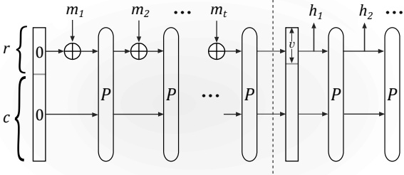

**FIGURE 7.12: The sponge construction. The absorbing phase is to the left of the dashed line, and the squeezing phase is to the right.**

During its computation, the construction maintains an $\ell$-bit state, initialized to zero. This state is modified in an input-dependent way during an “absorbing phase,” and the final state is then used to generate output in a “squeezing phase.” (Hence the name “sponge.”) When processing the $i$th block during the absorbing phase, the state is updated from $y_{i-1}$ to $y_i$ by XORing $m_i$ with the first $r$ bits of $y_{i-1}$ to obtain an intermediate value $x_i$, and then setting $y_i := P(x_i)$. The final state $y_t$ is then used to generate output in the squeezing phase by repeatedly outputting the initial $v$ bits of the state followed by an application of $P$.

The sponge construction can be used for many purposes. In Construction 7.6 we provide a formal description of how to use it to build a hash function. That construction includes a parameter $\lambda \geq 1$ that affects how many times the squeezing step is run, and thus determines the output length of the hash. (Namely, the output is a string of length $\lambda \cdot v$.) The construction also incorporates an initial padding step so that the resulting hash function can accept inputs of arbitrary length.

Hash functions following the sponge construction can be shown to satisfy several security properties when P is modeled as a random permutation. Here we prove collision resistance as long as $r$ and $c$ are sufficiently large, assuming for simplicity that $\lambda = 1$ (which is the case for the SHA-3 standard).

**CONSTRUCTION 7.6**

Fix $P : \{0,1\}^{\ell} \to \{0,1\}^{\ell}$ and constants $r,c,v$ as in the text and $\lambda \geq 1$.

Hash function $H$, on input $\hat{m} \in \{0,1\}^*$, does:

(Padding) Append a 1 to $\hat{m}$, followed by enough zeros so that the length of the resulting string is a multiple of $r$. Parse the resulting string as the sequence of $r$-bit blocks $m_1, \ldots, m_t$.

(Absorbing phase) Set $y_0 := 0^{\ell}$. Then for $i = 1, \ldots, t$ do:

- $x_i := y_{i-1} \oplus (m_i \| 0^c)$.

- $y_i := P(x_i)$.

(Squeezing phase) Set $y_1^* := y_t$, and let $h_1$ be the first $v$ bits of $y_1^*$. Then for $i = 2, \ldots, \lambda$ do

- $y_i^* := P(y_{i-1}^*)$.

- Let $h_i$ be the first $v$ bits of $y_i^*$.

(Output) Output $h_1 \| \cdots \| h_\lambda$.

A hash function based on the sponge construction.

THEOREM 7.7 Let H denote Construction 7.6 with $\lambda = 1$. If P is modeled as a random permutation, then any attacker making q queries to P or $P^{-1}$ can find a collision in H with probability at most $\frac{q^2}{2^v} + \frac{q \cdot (q+1)}{2^c}$.

PROOF Consider an attacker that is given oracle access to a random permutation $P$ and its inverse $P^{-1}$, and then outputs a pair of distinct messages; let $m_1, \ldots, m_t$ and $m^{\prime}_1, \ldots, m^{\prime}_t$, denote the results after padding. (Note that, because of the way padding is done, these padded messages are also distinct.)

We assume the attacker never makes the same query to P or $P^{-1}$ more than once, and never queries $P^{-1}(y)$ once it has learned that $y = P(x)$ (and vice versa). We further assume that by the end of its execution the attacker has made the oracle queries necessary to evaluate H on the messages it outputs.

Define the following three events:

E1: The attacker makes two distinct queries to P whose results agree on their first v bits.

E2: The attacker makes a query to P or $P^{-1}$ whose result has its last c bits equal to ${0}^{c}$.

E3: The attacker makes two distinct queries (to either P or $P^{-1}$) whose results agree on their last c bits.

We show that if the attacker outputs a collision then one of the above events occurs; we complete the proof by bounding the probabilities of these events.

**CLAIM 7.8** If the attacker outputs a collision then E1, E2, or E3 occurs.

PROOF Consider the execution of Construction 7.6 on the padded message $m_1, \ldots, m_t$. Let $y_0, x_1, y_1, \ldots, x_t, y_t$ be the values of the variables during the course of the execution, so that $y_0 = 0^\ell$ and, for $i \geq 1$, the last $c$ bits of $y_{i-1}$ and $x_i$ are equal and $y_i = P(x_i)$. Define $y^{\prime}_0, x^{\prime}_1, y^{\prime}_1, \ldots, x^{\prime}_t, y^{\prime}_{t}$, analogously with respect to the padded message $m^{\prime}_1, \ldots, m^{\prime}_{t^{\prime}}$. If, for some $i$, the attacker queried $P^{-1}(y_i)$ to obtain $x_i$ or queried $P^{-1}(y^{\prime}_i)$ to obtain $x^{\prime}_i$ then we say an inverse query occurred. We consider two cases:

Case 1: An inverse query occurred. Assume without loss of generality an inverse query occurred for the first padded message. Let $i$ be minimal such that the attacker queried $P^{-1}(y_i)$ to obtain $x_i$. If $i = 1$ then the last $c$ bits of $x_1$ are ${0}^c$ and $\mathbf{E2}$ occurred. Otherwise, the last $c$ bits of $y_{i-1} = P(x_{i-1})$ and $x_i = P^{-1}(y_i)$ are equal and so $\mathbf{E3}$ occurred.

Case 2: No inverse query occurred. If $y_t \neq y^{\prime}_{t^{\prime}}$, then the first v bits of $y_t$ and $y^{\prime}_{t^{\prime}}$ are equal (since the attacker output a collision) even though $x_t \neq x^{\prime}_{t^{\prime}}$. Since no inverse query occurred, the attacker must have queried $P(x_t)$ and $P(x^{\prime}_{t^{\prime}})$ and so E1 occurred.

If $y_t = y_{t^{\prime}}^{\prime}$, assume without loss of generality that $t^{\prime} \geq t$. Let $C(z)$ denote the last $c$ bits of an $\ell$-bit string $z$. Take ${0} \leq i \leq t$ maximal such that $(C(y_{t-i}), \ldots, C(y_t)) = (C(y_{t^{\prime}-i}), \ldots, C(y_{t^{\prime}})))$. If $i < t$ then $C(y_{t-i-1}) \neq C(y_{t^{\prime}-i-1})$ and hence $x_{t-i} \neq x_{t^{\prime}-i}$, but

$$C(P(x_{t-i}))=C(y_{t-i})=C(y_{t^{\prime}-i}^{\prime})=C(P(x_{t^{\prime}-i}^{\prime}))$$

and so $\mathbf{E3}$ occurred. If $i = t$ and $t^{\prime} > t$ then $C(P(x^{\prime}_{t^{\prime}-i})) = C(y^{\prime}_{t^{\prime}-i}) = C(y_0) = 0^c$; thus, $\mathbf{E2}$ occurred. If $i = t$ and $t^{\prime} = t$ then we have $(C(y_0), \ldots, C(y_t)) = (C(y^{\prime}_0), \ldots, C(y^{\prime}_t))$. Let $j$ be minimal such that $m_j \neq m^{\prime}_j$ (such a $j$ must exist since the padded messages are distinct). Then $y_{j-1} = y^{\prime}_{j-1}$, but $x_j \neq x^{\prime}_j$, and yet
$$C(P(x_{j}))=C(y_{j})=C(y_{j}^{\prime})=C(P(x_{j}^{\prime}))$$

and so E3 occurred.

CLAIM 7.9 $\Pr[E1 \lor E2 \lor E3] \leq \frac{q^2}{2^v} + \frac{q \cdot (q+1)}{2^c}$.

PROOF We bound the probability of each event; a union bound yields the claim. It is easy to see that $\Pr[\mathbf{E2}] \leq q/2^c$. To bound $\Pr[\mathbf{E1}]$ we use an analysis similar to the one used to prove the birthday bound (cf. Appendix A.4). Let $\mathsf{Coll}_{i,j}$ be the event that the results of the $i$th and $j$th queries of the attacker agree on their first $v$ bits. We have $\Pr[\mathsf{Coll}_{i,j}] \leq 2^{\ell - v}/(2^{\ell} - 1) \leq 2 \cdot 2^{-v}$. (Taking into account that $P$ is a random *permutation*.) So

$$\Pr[\mathbf{E}\mathbf{1}]=\Pr\left[\bigvee_{i<j}\mathsf{Coll}_{i,j}\right]\leq\sum_{i<j}\Pr[\mathsf{Coll}_{i,j}]\leq\binom{q}{2}\cdot2\cdot2^{-v}\leq q^{2}/2^{v}.$$

A similar argument gives $\Pr[\mathbf{E3}] \leq q^2/2^c$.

This concludes the proof of the theorem.

## References and Additional Reading

Lidl and Niederreiter [130] give the standard treatment of LFSRs. Additional information on LFSRs in the context of cryptography can be found in the Handbook of Applied Cryptography [137] or the text by Paar and Pelzl [156]. Further details about eSTREAM, as well as a document describing the design of Trivium, can be found at https://www.ecrypt.eu.org/stream.

The work of AlFardan et al. [9] surveys recent attacks on RC4. ChaCha20 is due to Bernstein [29], and is described in RFC 8439 [154]. It can be analyzed (in the random-permutation model) as an Even-Mansour cipher [70].

The confusion-diffusion paradigm and substitution-permutation networks were introduced by Shannon [177] and Feistel [71]. See the thesis of Heys [98] for further information regarding SPN design. A theoretical analysis of block ciphers based on SPNs has recently been given by Cogliati et al. [52]. We remark that SPNs are useful not only for building ciphers, but also for increasing the block length of an existing cipher.

Feistel networks were first described in 1973 [71]. A theoretical analysis of Feistel networks was given by Luby and Rackoff [132]; see Chapter 8.

More details on DES, AES, and block-cipher constructions in general can be found in the text by Knudsen and Robshaw [117]. The meet-in-the-middle attack on double encryption is due to Diffie and Hellman [66]. The attack on two-key triple encryption mentioned in the text (and explored in Exercise 7.16) is by Merkle and Hellman [141] and has been developed further [197, 144]. Positive results about double/triple encryption are also known [6, 27].

Work of Bhargavan and Leurent [33] demonstrates real-world security implications of using ciphers (like DES or 3DES) with small block length. See https://sweet32.info for further information.

Differential cryptanalysis was introduced by Biham and Shamir [34], and its application to DES is described in a book by those authors [35]. Coppersmith [53] describes design principles of the DES S-boxes in light of the public discovery of differential cryptanalysis. Linear cryptanalysis was discovered by Matsui [134]. For more information on these advanced cryptanalytic techniques, we refer the reader to the tutorial on differential and linear cryptanalysis by Heys [99] or the book by Knudsen and Robshaw [117].

Menezes et al. [137] give further information about MD5 and SHA-1; note, though, that their treatment pre-dates the recent attacks on those hash functions. Various other constructions of compression functions from block ciphers are known [164, 37]. The sponge construction is described and analyzed by Bertoni et al. [32]. For additional details about the SHA-3 competition, see https://csrc.nist.gov/projects/hash-functions/sha-3-project.

The first explicit collision in SHA-1 was found in 2017 by Stevens et al. [192]; improved attacks, which have serious practical security implications, have been shown even more recently [127, 128].

## Exercises

7.1 Consider a degree-6 LFSR where only $c_{5}$ and $c_{0}$ are set to 1.

(a) What are the first 10 bits output by this LFSR if it starts in initial state $(s_{5}, s_{4}, s_{3}, s_{2}, s_{1}, s_{0}) = (1, 1, 1, 1, 1, 1)$?

(b) Is this LFSR maximum length?

7.2 Consider a degree-7 LFSR where only $c_{6}, c_{1}$, and $c_{0}$ are set to 1.

(a) What are the first 10 bits output by this LFSR if it starts in the initial state $(s_6, s_5, s_4, s_3, s_2, s_1, s_0) = (0, 0, 0, 0, 0, 0, 1)$?

(b) Show that this LFSR is not maximum length.

Hint: Find a nonzero state with a self-loop in the transition graph.

7.3 Consider a stream cipher constructed from a degree-$n$ LFSR where the output at each clock tick is not $s_0$, but instead $g(s_{n-1}, \ldots, s_0)$ for some nonlinear function $g$. The $n$-bit key of the stream cipher is used as the initial state of the LFSR. Show that this does not result in a secure stream cipher for the following choices of $g$:

(a) $g(s_{n-1}, \ldots, s_0) = s_0 \land s_1$.

(b) $g(s_{n-1}, \ldots, s_0) = s_2 \oplus (s_1 \land s_0)$.

7.4 Consider a stream cipher constructed from two LFSRs $A$ and $B$ of degrees $n_a$ and $n_b$, respectively, where the output at each clock tick is computed by taking the AND of the outputs of the two LFSRs. The key $k \in \{0,1\}^{n_a+n_b}$ is used to set the initial states of the two LFSRs.

(a) Show that this is never a secure stream cipher.

(b) Show that given a long enough output from this stream cipher, it is possible to recover the key in time $\approx 2^{n_a} + 2^{n_b}$.

7.5 Fix a public, invertible permutation $P$, and define the keyed function $F_k(x) \stackrel{\mathrm{def}}{=} P(\text{const}\|k\|x)$. Show that $F$ is not a pseudorandom function.

7.6 Let $F$ be a block cipher with $n$-bit key length and block length. Say there is a key-recovery attack on $F$ that succeeds with probability 1 using $n$ chosen plaintexts and minimal computational effort. Prove formally that F cannot be a pseudorandom permutation.

7.7 In our attack on a one-round SPN, we considered a block length of 64 bits and 8 S-boxes that each take a 8-bit input. Repeat the analysis for the case of 16 S-boxes, each taking an 4-bit input. What is the complexity of the attack now? Repeat the analysis again with a 128-bit block length and 16 S-boxes that each take an 8-bit input.

7.8 Consider a modified SPN that first applies $r$ rounds of key mixing (using independent sub-keys), then carries out $r$ rounds of substitution (using different $S$-boxes in each round), and finally applies $r$ (different) mixing permutations. Show an attack on this construction.

7.9 In this question we assume a two-round SPN with 64-bit block length.

(a) Assume independent 64-bit sub-keys are used in each round, so the master key is 192 bits long. Show a key-recovery attack using much less than ${2}^{192}$ time.

(b) Assume the first and third sub-keys are equal, and the second sub-key is independent, so the master key is 128 bits long. Show a key-recovery attack using much less than ${2}^{128}$ time.

7.10 What is the output of an r-round Feistel network when the input is $(L_{0}, R_{0})$ in each of the following two cases:

(a) Each round function outputs all 0s, regardless of the input.

(b) Each round function is the identity function.

7.11 Let $\mathsf{Feistel}_{f_1,f_2}(\cdot)$ denote a two-round Feistel network using functions $f_1$ and $f_2$ (in that order). Define $\text{swap}(L,R)=(R,L)$.

(a) Show that if

$$(L_{2},R_{2})=\mathsf{swap}(\mathsf{Feistel}_{f_{1},f_{2}}(L_{0},R_{0}))$$

$$\mathrm{then}(L_{0},R_{0})=\mathsf{swap}(\mathsf{Feistel}_{f_{2},f_{1}}(L_{2},R_{2})).$$

(b) Show that if

$$(L_{16},R_{16})=\mathrm{swap}\left(\mathrm{Feistel}_{f_{15},f_{16}}(\cdots(\mathrm{Feistel}_{f_{1},f_{2}}(L_{0},R_{0}))\cdots)\right)$$

then

$$(L_{0},R_{0})=\mathsf{swap}\left(\mathsf{Feistel}_{f_{2},f_{1}}(\cdots\mathsf{Feistel}_{f_{16},f_{15}}(L_{16},R_{16})\cdots)\right).$$

7.12 For this exercise, rely on the description of DES given in this chapter. However, use the fact that in the actual construction of DES the two halves of the output of the final round of the Feistel network are swapped. That is, if the output of the final round of the Feistel network is $(L_{16}, R_{16})$, then the output of DES is $(R_{16}, L_{16})$.

(a) Show that the only difference between computation of $DES_k$ and $DES_k^{-1}$ is the order in which sub-keys are used. (Rely on the previous exercise.)

(b) Show that when $k = 0^{56}$ then $DES_k(DES_k(x)) = x$ for all x.

Hint: Consider the sub-keys generated from this key.

(c) Find three other DES keys with the same property. These keys are known as weak keys for DES. (Note: the keys you find will differ from the actual weak keys of DES because of differences in our description of the DES key schedule.)

(d) Do these 4 weak keys represent a serious vulnerability in the use of triple-DES as a pseudorandom permutation? Explain.

7.13 (This exercise relies on Exercise 7.12.) Our goal is to show that for any weak key k of DES, it is easy to find an input x such that $DES_k(x) = x$.

(a) Assume we evaluate $DES_{k}$ on input $(L_{0}, R_{0})$, and the intermediate result after 8 rounds of the Feistel network is $(L_{8}, R_{8})$ with $L_{8}=R_{8}$. Show that $(L_{0}, R_{0})=DES_{k}(L_{0}, R_{0})$. (Recall from Exercise 7.12 that DES swaps the two halves of the output of the 16th round of the Feistel network.)

(b) Show how to find an input $(L_{0}, R_{0})$ with the property in part (a).

7.14 Show that DES has the property that $DES_k(x) = \overline{DES_k}(\bar{x})$ for every key $k$ and input $x$ (where $\bar{x}$ denotes the bitwise complement of $x$). (This is called the complementarity property of DES.) Does this represent a serious vulnerability in the use of triple-DES as a pseudorandom permutation? Explain.

7.15 Describe attacks on the following modifications of DES:

(a) Each sub-key is 32 bits long, and the round function simply XORs the sub-key with the input to the round (i.e., $\hat{f}(k, R) = k_i \oplus R$). For this question, the key schedule is unimportant and you can treat the sub-keys $k_i$ as independent keys.

(b) Instead of using different sub-keys in every round, the same 48-bit sub-key is used in every round. Show how to distinguish the cipher from a random permutation using two chosen plaintexts and negligible work.

Hint: Exercises 7.11 and 7.12 may help...

7.16 This question develops an attack on two-key triple encryption. Let $F$ be a block cipher with $\ell$-bit block length and $n$-bit key length (where $\ell \geq n$), and set $F^{\prime}_{k_1,k_2}(x) \overset{\mathrm{def}}{=} F_{k_1}(F_{k_2}(F_{k_1}(x)))$. Assume an attacker is given $N \ll 2^{\ell}$ input/output pairs $\{(x_i, y_i)\}_{i=1}^N$ where the $\{x_i\}$ are uniform and $y_i = F^{\prime}_{k_1,k_2}(x_i)$ for unknown keys $k_1, k_2$.

(a) Assume the attacker knows $z \in \{0,1\}^{\ell}$ such that $F_{k_1}(x_i) = z$ for some $i$. (The attacker does not know $i$).) Show how the attacker can find $k_1, k_2$ using ${2}^{n+1} + \mathcal{O}(N) \approx 2^{n+1}$ evaluations of $F/F^{-1}$.

Hint: Start by computing $\{F_{k}(z)\}$ for all possible keys.

(b) In general, the attacker does not know $z$ as required for part (a). Show how the attacker can nevertheless learn $k_{1}, k_{2}$ using roughly ${2}^{n+\ell+1}/N$ evaluations of $F/F^{-1}$.

Hint: What happens if the attacker chooses a random z?

7.17 Say the key schedule of DES is modified as follows: the left half of the master key is used to derive all the sub-keys in rounds 1–8, while the right half of the master key is used to derive all the sub-keys in rounds 9–16. Show an attack on this modified scheme that recovers the entire key in time roughly ${2}^{28}$.

7.18 Fix arbitrary $G_1, G_2: \{0,1\}^n \to \{0,1\}^{4n}$, and define

$$G(s_{1}||s_{2})=G_{1}(s_{1})\oplus G_{2}(s_{2}).$$

Show how to distinguish the output of $G$ from random in time $\approx 2^{n+1}$.

Hint: Adapt the meet-in-the-middle attack.

7.19 Let $f: \{0,1\}^m \times \{0,1\}^\ell \to \{0,1\}^\ell$ and $g: \{0,1\}^n \times \{0,1\}^\ell \to \{0,1\}^\ell$ be secure block ciphers with $m > n$, and define $F_{k_1,k_2}(x) = f_{k_1}(g_{k_2}(x))$. Show a key-recovery attack on $F$ using time $\mathcal{O}(2^m)$ and space $\mathcal{O}(\ell \cdot 2^n)$.

7.20 Define $DESY_{k,k^{\prime}}(x) = DES_k(x \oplus k^{\prime})$. The key length of $DESY$ is 120 bits. Show a key-recovery attack on $DESY$ taking $\approx 2^{56}$ time and $\mathcal{O}(1)$ memory.

7.21 Choose random S-boxes and mixing permutations for SPNs of different sizes, and develop differential attacks against them. We recommend trying five-round SPNs with 16-bit and 24-bit block lengths, using S-boxes with 4-bit input/output. Write code to compute the differential tables, and to carry out the attack.

7.22 Implement the time/space tradeoff from Section 6.4.3 for a key-recovery attack on 40-bit DES (e.g., fix the first 16 bits of the key to 0). Calculate the time and memory needed, and empirically estimate the probability of success. Experimentally verify the increase in success probability as the number of tables is increased. (Warning: this is a big project!)

7.23 For each of the following constructions of a compression function $h$ from a block cipher $F: \{0,1\}^n \times \{0,1\}^n \to \{0,1\}^n$, either show an attack or prove collision resistance in the ideal-cipher model:

(a) $h(k,x) = F_{k}(x)$.

(b) $h(k,x) = F_{k}(x) \oplus k \oplus x$.

(c) $h(k,x) = F_{k}(x) \oplus k$.

7.24 Let $F$ be a block cipher for which it is easy to find fixed points for some key: namely, there is a key $k$ for which it is easy to find inputs $x$ for which $F_k(x) = x$. Find a collision in the Davies–Meyer construction when applied to $F$. (Consider this in light of Exercise 7.13.)

7.25 Consider using DES to construct a compression function in the following way: Define $h : \{0,1\}^{112} \to \{0,1\}^{64}$ as $h(x_1, x_2) \overset{\mathrm{def}}{=} DES_{x_1}(DES_{x_2}(0^{64}))$ where $|x_1| = |x_2| = 56$.

(a) Write down an explicit collision in h.

Hint: Use Exercise 7.12(a–b).

(b) Show how to find a preimage of an arbitrary value $y$ (that is, $x_1, x_2$ such that $h(x_1 \| x_2) = y$) in roughly ${2}^{56}$ time.

(c) Show a more clever preimage attack that runs in roughly ${2}^{32}$ time and succeeds with high probability.

Hint: Rely on the results of Appendix A.4.

7.26 Say $S_1, \ldots, S_8 : \{0,1\}^n \to \{0,1\}^n$ are modeled as random permutations, and say $P : \{0,1\}^{8n} \to \{0,1\}^{8n}$ is constructed by defining

$$P(x_{1}||\cdots||x_{8})=S_{1}(x_{1})||\cdots||S_{8}(x_{8}).$$

Show that it is easy to find a collision in Construction 7.6 for $\lambda = 1$ and r = c = v = 4n when using this P.
