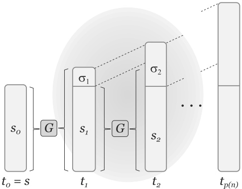
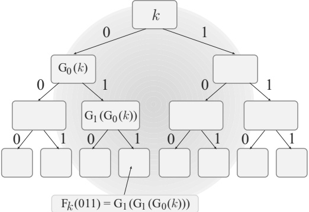
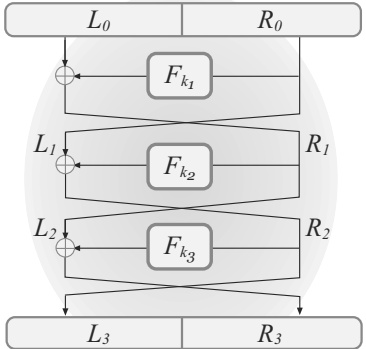

# Chapter 8: Theoretical Constructions of Symmetric-Key Primitives

In Chapter 3 we introduced the notion of pseudorandomness and defined some basic cryptographic primitives including pseudorandom generators, functions, and permutations. We further showed in Chapters 3–5 that these primitives can serve as building blocks for all of private-key cryptography. As such, it is of great importance to understand these primitives from a theoretical point of view. In this chapter we formally introduce the concept of one-way functions—functions that are, informally, easy to compute but hard to invert—and show how pseudorandom generators, functions, and permutations can be constructed under the sole assumption that one-way functions exist. $^{1}$ Moreover, we will see that one-way functions are necessary for “non-trivial” private-key cryptography. That is: the existence of one-way functions is equivalent to the existence of all (non-trivial) private-key cryptography. This is one of the major contributions of modern cryptography.

The constructions we show in this chapter should be viewed as complementary to the constructions of stream ciphers and block ciphers discussed in the previous chapter. The focus of the previous chapter was on how various cryptographic primitives are currently realized in practice, and the intent of that chapter was to introduce some basic approaches and design principles that are used. Somewhat disappointing, though, was the fact that none of the constructions we showed could be proven secure based on any weaker (i.e., more reasonable) assumptions. In contrast, in this chapter we will show constructions that can be proven secure starting from the very mild assumption that one-way functions exist. That assumption is more appealing than assuming, say, that AES is a pseudorandom permutation, both because it is a qualitatively weaker assumption and also because we have a number of candidate, number-theoretic one-way functions that have been studied for many years, even before the advent of cryptography. (See the very beginning of Chapter 7 for further discussion of this point.) The downside, however, is that the constructions we show here are all far less efficient than those of Chapter 7, and thus (currently) have little practical significance. It remains an important challenge for cryptographers to "bridge this gap" and develop provably secure constructions of pseudorandom generators and permutations whose efficiency is comparable to the best available stream ciphers and block ciphers.

Collision-resistant hash functions. Unlike the previous chapter, here we do not consider collision-resistant hash functions. The reason is that constructions of such hash functions from one-way functions are unknown and, in fact, there is evidence suggesting that such constructions are impossible. We will see a provably secure construction of a collision-resistant hash function—based on a specific, number-theoretic assumption—in Section 9.4.2.

A note regarding this chapter. The material in this chapter is somewhat more advanced than the material in the rest of this book. This material is not used explicitly anywhere else in the book, and so can be skipped if desired. Having said this, we have tried to present the material in such a way that it is understandable (with effort) to an advanced undergraduate or beginning graduate student. We encourage all readers to peruse Sections 8.1 and 8.2, which introduce one-way functions and provide an overview of the rest of this chapter. We believe that familiarity with at least some of the topics covered here is important enough to warrant the effort.

## 8.1 One-Way Functions

In this section we formally define one-way functions, and then briefly discuss some candidates that are believed to satisfy this definition. (We will see more examples of conjectured one-way functions in Chapter 9.) We next introduce the notion of hard-core predicates, which can be viewed as encapsulating the hardness of inverting a one-way function and will be used extensively in the constructions that follow in subsequent sections.

### 8.1.1 Definitions

A one-way function $f: \{0,1\}^* \to \{0,1\}^*$ is easy to compute, yet hard to invert. The first condition is easy to formalize: we will simply require that $f$ be computable in polynomial time. Since we are ultimately interested in building cryptographic schemes that are hard for a probabilistic polynomial-time adversary to break except with negligible probability, we will formalize the second condition by requiring that it be infeasible for any probabilistic polynomial-time algorithm to invert $f$—that is, to find a preimage of a given value $y$—except with negligible probability. A technical point is that this probability is taken over an experiment in which $y$ is generated by choosing a uniform element $x$ in the domain of $f$ and then setting $y := f(x)$ (rather than choosing $y$ uniformly from the range of $f$). The reason for this should become clear from the constructions we will see in the remainder of the chapter.

Let $f: \{0,1\}^* \to \{0,1\}^*$ be a function. Consider the following experiment defined for any algorithm $\mathcal{A}$ and any value $n$ for the security parameter:

The inverting experiment $\mathsf{Invert}_{\mathcal{A}, f}(n)$

1. Choose uniform $x \in \{0,1\}^{n}$, and compute $y := f(x)$.

2. $\mathcal{A}$ is given ${1}^{n}$ and $y$ as input, and outputs $x^{\prime}$.

3. The output of the experiment is defined to be 1 if $f(x^{\prime}) = y$, and 0 otherwise.

We stress that $\mathcal{A}$ need not find the original preimage $x$; it suffices for $\mathcal{A}$ to find any value $x^{\prime}$ for which $f(x^{\prime}) = y = f(x)$. The security parameter ${1}^n$ is given to $\mathcal{A}$ in the second step to stress that $\mathcal{A}$ may run in time polynomial in the security parameter $n$, regardless of the length of $y$.

We can now define what it means for a function $f$ to be one-way.

DEFINITION 8.1 A function $f: \{0,1\}^* \to \{0,1\}^*$ is one-way if the following two conditions hold:

1. (Easy to compute:) There exists a polynomial-time algorithm $M_{f}$ computing $f$; that is, $M_{f}(x) = f(x)$ for all $x$.

2. (Hard to invert:) For every probabilistic polynomial-time algorithm A, there is a negligible function $\mathsf{negl}$ such that

$$
\Pr[\mathsf{Invert}_{\mathcal{A},f}(n)=1]\leq\mathsf{negl}(n).
$$

Notation. In this chapter we will often make the probability space more explicit by subscripting (part of) it in the probability notation. For example, we can succinctly express the second requirement in the definition above as follows: For every probabilistic polynomial-time algorithm A, there exists a negligible function $\mathsf{negl}$ such that

$$
\Pr_{x\leftarrow\{0,1\}^{n}}\left[\mathcal{A}(1^{n},f(x))\in f^{-1}(f(x))\right]\leq\mathsf{negl}(n).
$$

(Recall that $x \leftarrow \{0,1\}^n$ means that $x$ is chosen uniformly from $\{0,1\}^n$.) The probability above is also taken over the randomness used by $\mathcal{A}$, which here is left implicit.

Successful inversion of one-way functions. A function that is not one-way is not necessarily easy to invert all the time (or even “often”). Rather, the converse of the second condition of Definition 8.1 is that there exists a probabilistic polynomial-time algorithm $\mathcal{A}$ and a non-negligible function $\gamma$ such that $\mathcal{A}$ inverts $f(x)$ with probability at least $\gamma(n)$ (where the probability is taken over uniform choice of $x \in \{0,1\}^n$ and the randomness of $\mathcal{A}$). This means, in turn, that there exists a positive polynomial $p(\cdot)$ such that for
infinitely many values of $n$, algorithm $\mathcal{A}$ inverts $f$ with probability at least ${1}/{p(n)}$. Thus, if there exists an $\mathcal{A}$ that inverts $f$ with probability $n^{-10}$ for all even values of $n$ (but always fails to invert $f$ when $n$ is odd), then $f$ is not one-way—even though $\mathcal{A}$ only succeeds on half the values of $n$, and only succeeds with probability $n^{-10}$ (for values of $n$ where it succeeds at all).

Exponential-time inversion. Any one-way function can be inverted at any point $y$ in exponential time, by simply trying all values $x \in \{0,1\}^n$ until a value $x$ is found such that $f(x) = y$. Thus, the existence of one-way functions is inherently an assumption about computational complexity and computational hardness. That is, it concerns a problem that can be solved in principle but is assumed to be hard to solve efficiently.

One-way permutations. We will often be interested in one-way functions with additional structural properties. We say a function $f$ is length-preserving if $|f(x)| = |x|$ for all $x$. A one-way function that is length-preserving and one-to-one is called a one-way permutation. If $f$ is a one-way permutation, then any value $y$ has a unique preimage $x = f^{-1}(y)$. Nevertheless, it is still hard to find $x$ in polynomial time.

One-way function/permutation families. The above definitions of one-way functions and permutations are convenient in that they consider a single function over an infinite domain and range. However, most candidate one-way functions and permutations do not fit neatly into this framework. Instead, there is an algorithm generating some set of parameters I that define a function $f_I$; one-wayness here means essentially that $f_I$ should be one-way with all but negligible probability over choice of I. Because each value of I defines a different function, we now refer to families of one-way functions (resp., permutations). We give the definition now, and refer the reader to the next section for a concrete example. (See also Section 9.4.1.)

DEFINITION 8.2 A tuple $\Pi = (\mathsf{Gen}, \mathsf{Samp}, f)$ of probabilistic polynomial-time algorithms is a function family if the following hold:

1. The parameter-generation algorithm Gen, on input ${1}^n$, outputs parameters $I$ with $|I| \geq n$. Each value of $I$ output by Gen defines sets $\mathcal{D}_I$ and $\mathcal{R}_I$ that constitute the domain and range, respectively, of a function $f_I$.

2. The sampling algorithm $\mathsf{Samp}$, on input $I$, outputs a uniformly distributed element of $\mathcal{D}_{I}$.

3. The deterministic evaluation algorithm $f$, on input $I$ and $x \in \mathcal{D}_I$, outputs an element $y \in \mathcal{R}_I$. We write this as $y := f_I(x)$.

 $\Pi$ is a permutation family if for each value of $I$ output by $\mathsf{Gen}(1^n)$, it holds that $\mathcal{D}_I = \mathcal{R}_I$ and the function $f_I : \mathcal{D}_I \to \mathcal{D}_I$ is a bijection.

Let $\Pi$ be a function family. What follows is the natural analogue of the experiment introduced previously.

The inverting experiment $\mathsf{Invert}_{\mathcal{A}, \Pi}(n)$:

1. $\mathsf{Gen}(1^n)$ is run to obtain $I$, and then $\mathsf{Samp}(I)$ is run to obtain a uniform $x \in \mathcal{D}_I$. Finally, $y := f_I(x)$ is computed.

2. A is given I and y as input, and outputs x'.

3. The output of the experiment is 1 if $f_{I}(x^{\prime}) = y$.

DEFINITION 8.3 A function/permutation family $\Pi = (\mathsf{Gen}, \mathsf{Samp}, f)$ is one-way if for all probabilistic polynomial-time algorithms $\mathcal{A}$ there exists a negligible function $\mathsf{negl}$ such that

$$
\Pr[\mathsf{Invert}_{\mathcal{A},\Pi}(n)=1]\leq\mathsf{negl}(n).
$$

Throughout this chapter we work with one-way functions/permutations over an infinite domain (as in Definition 8.1), rather than working with families of one-way functions/permutations. This is primarily for convenience, and does not significantly affect any of the results. (See Exercise 8.7.)

### 8.1.2 Candidate One-Way Functions

One-way functions are of interest only if they exist. We do not know how to prove they exist unconditionally (this would be a major breakthrough in complexity theory), so we must conjecture or assume their existence. Such a conjecture is based on the fact that several natural computational problems have received much attention, yet still are not known to be solvable by any polynomial-time algorithm. Perhaps the most famous such problem is integer factorization, i.e., finding the prime factors of a large integer. It is easy to multiply two numbers and obtain their product, but difficult to take a number and find its factors. This leads us to define the function $f_{\mathsf{mult}}(x, y) = x \cdot y$. If we do not restrict the lengths of $x$ and $y$, however, $f_{\mathsf{mult}}$ is easy to invert: with high probability $x \cdot y$ will be even, in which case $(2, xy/2)$ is an inverse. This issue can be addressed by restricting the domain of $f_{\mathsf{mult}}$ to equal-length primes x and y. We return to this idea in Section 9.2.

Another candidate one-way function, not relying directly on number theory, is based on the subset-sum problem and is defined by

$$
f_{\mathsf{ss}}(x_{1},\ldots,x_{n},J)=\left(x_{1},\ldots,x_{n},\;\left[\textstyle\sum_{j\in J}x_{j}\bmod2^{n}\right]\right),
$$

where each $x_i$ is an $n$-bit string interpreted as an integer, and $J$ is an $n$-bit string interpreted as specifying a subset of $\{1, \ldots, n\}$. Inverting $f_{\mathsf{ss}}$ on an output $(x_1, \ldots, x_n, y)$ requires finding a subset $J^{\prime} \subseteq \{1, \ldots, n\}$ such that

$$
\sum_{j \in J} x_j = y \mod 2^n.
$$

Readers who have studied $\mathcal{NP}$-completeness may recall that this problem is $\mathcal{NP}$-complete. But even $\mathcal{P} \neq \mathcal{NP}$ would not imply that $f_{\mathsf{ss}}$ is one-way: $\mathcal{P} \neq \mathcal{NP}$ would mean that every polynomial-time algorithm fails to solve the subset-sum problem on at least one input, whereas for $f_{\text{ss}}$ to be one-way it is required that every polynomial-time algorithm fails to solve the subset-sum problem (at least for certain parameters) almost always. Thus, our belief that the function above is one-way is based on the lack of known algorithms to solve this problem even with “small” probability on random inputs, and not merely the fact that the problem is $\mathcal{NP}$-complete.

We conclude by showing a family of permutations that is believed to be one-way. Let $\mathsf{Gen}$ be a probabilistic polynomial-time algorithm that, on input ${1}^n$, outputs an $n$-bit prime $p$ along with a special element $g \in \{2, \ldots, p-1\}$. (The element $g$ should be a generator of $\mathbb{Z}_p^*$; see Section 9.3.3.) Let $\mathsf{Samp}$ be an algorithm that, given $p$ and $g$, outputs a uniform integer $x \in \{1, \ldots, p-1\}$. Finally, define

$$
f_{p,g}(x)=[g^{x}\bmod p].
$$

(The fact that $f_{p,g}$ can be computed efficiently follows from the results in Appendix B.2.3.) It can be shown that this function is one-to-one, and thus a permutation. The presumed difficulty of inverting this function is based on the conjectured hardness of the discrete-logarithm problem; we will have much more to say about this in Section 9.3.

Finally, we remark that very efficient one-way functions can be obtained from practical cryptographic constructions such as SHA-2 or AES under the assumption that they are collision resistant or a pseudorandom permutation, respectively; see Exercises 8.4 and 8.5. (Technically speaking, they cannot satisfy the definition of one-wayness since they have fixed-length input/output and so their asymptotic behavior is undefined. Nevertheless, it is plausible to conjecture that they are one-way in a concrete sense.)

### 8.1.3 Hard-Core Predicates

By definition, a one-way function is hard to invert. Stated differently: given $y = f(x)$, the value $x$ cannot be computed in its entirety by any polynomial-time algorithm (except with negligible probability; we ignore this here). One might get the impression that nothing about $x$ can be determined from $f(x)$ in polynomial time. This is not necessarily the case. Indeed, it is possible for $f(x)$ to “leak” a lot of information about $x$ even if $f$ is one-way. For a trivial example, let $g$ be a one-way function and define $f(x_1, x_2) \overset{\mathrm{def}}{=} (x_1, g(x_2))$, where $|x_1| = |x_2|$. It is easy to show that $f$ is also a one-way function (this is left as an exercise), even though it reveals half its input.

For our applications, we will need to identify a specific piece of information about $x$ that is “hidden” by $f(x)$. This motivates the notion of a hard-core predicate. A hard-core predicate $\mathsf{hc} : \{0,1\}^* \to \{0,1\}$ of a function $f$ has the property that $\mathsf{hc}(x)$ is hard to compute with probability significantly better than 1/2 given $f(x)$. (Since hc is a boolean function, it is always possible to compute $\mathsf{hc}(x)$ with probability 1/2 by random guessing.) Formally:

DEFINITION 8.4 A function $\mathsf{hc} : \{0,1\}^* \to \{0,1\}$ is a hard-core predicate of a function $f$ if $\mathsf{hc}$ can be computed in polynomial time, and for every probabilistic polynomial-time algorithm $\mathcal{A}$ there is a negligible function $\mathsf{negl}$ such that

$$
\Pr_{x\gets\{0,1\}^{n}}[\mathcal{A}(1^{n},f(x))=\mathsf{hc}(x)]\leq\frac{1}{2}+\mathsf{negl}(n),
$$

where the probability is taken over the uniform choice of x in $\{0,1\}^{n}$ and the randomness of A.

We stress that $\mathsf{hc}(x)$ is efficiently computable given $x$ (since the function $\mathsf{hc}$ can be computed in polynomial time); the definition requires that $\mathsf{hc}(x)$ is hard to compute given $f(x)$. The above definition does not require f to be one-way; if f is a permutation, however, then it cannot have a hard-core predicate unless it is one-way. (See Exercise 8.13.)

Simple ideas don’t work. Consider the predicate $\mathsf{hc}(x) \overset{\mathrm{def}}{=} \bigoplus_{i=1}^{n} x_i$ where $x_1, \ldots, x_n$ denote the bits of $x$. One might hope that this is a hard-core predicate of any one-way function $f$: if $f$ cannot be inverted, then $f(x)$ must hide at least one of the bits $x_i$ of its preimage $x$, which would seem to imply that the XOR of all of the bits of $x$ is hard to compute. Despite its appeal, this argument is incorrect. To see this, let $g$ be a one-way function and define $f(x) \overset{\mathrm{def}}{=} (g(x), \bigoplus_{i=1}^{n} x_i)$. It is not hard to show that $f$ is one-way. However, it is clear that $f(x)$ does not hide the value of $\mathsf{hc}(x) = \bigoplus_{i=1}^{n} x_i$ because this is part of its output; therefore, $\mathsf{hc}(x)$ is not a hard-core predicate of $f$. Extending this, one can show that for any fixed predicate $\mathsf{hc}$, there is a one-way function $f$ for which $\mathsf{hc}$ is not a hard-core predicate of $f$.

Trivial hard-core predicates. Some functions have “trivial” hard-core predicates. For example, let $f$ be the function that drops the last bit of its input (i.e., $f(x_1\cdots x_n) = x_1\cdots x_{n-1}$). It is hard to determine $x_n$ given $f(x)$ since $x_n$ is independent of the output; thus, $\mathsf{hc}(x) = x_n$ is a hard-core predicate of $f$. However, $f$ is not one-way. When we use hard-core predicates in our constructions, it will become clear why trivial hard-core predicates of this sort are of no use.

## 8.2 From One-Way Functions to Pseudorandomness

In this chapter we show how to construct pseudorandom generators, functions, and permutations from any one-way function/permutation. In this section, we give an overview of these constructions. Details are given in the sections that follow.

A hard-core predicate from any one-way function. The first step is to show that a hard-core predicate exists for any one-way function. Actually, it remains open whether this is true; we show something weaker that suffices for our purposes: Namely, we show that given a one-way function f we can construct another one-way function g along with a hard-core predicate of g.

THEOREM 8.5 (Goldreich–Levin theorem) Assume one-way functions (resp., permutations) exist. Then there exists a one-way function (resp., permutation) $g$ and a hard-core predicate $\mathsf{hc}$ ofg.

Let $f$ be a one-way function. Functions $g$ and $\mathsf{gl}$ are constructed as follows:

Set $g(x,r)\stackrel{\mathrm{def}}{=}(f(x),r)$, for $|x|=|r|$, and define

$$
\mathsf{gl}(x,r)\stackrel{\mathrm{def}}{=}\bigoplus_{i=1}^{n}x_{i}\cdot r_{i},
$$

where $x_i$ (resp., $r_i$) denotes the $i$th bit of $x$ (resp., $r$). Notice that if $r$ is uniform, then $\mathsf{gl}(x, r)$ outputs the XOR of a random subset of the bits of $x$. (When $r_i = 1$ the bit $x_i$ is included in the XOR, and otherwise it is not.) The Goldreich–Levin theorem thus states that if $f$ is a one-way function then $f(x)$ hides the XOR of a random subset of the bits of $x$.

Pseudorandom generators from one-way permutations. The next step is to show how a hard-core predicate of a one-way permutation can be used to construct a pseudorandom generator. (It is known that a hard-core predicate of a one-way function suffices, but the proof is extremely complicated and well beyond the scope of this book.) Specifically, we show:

THEOREM 8.6 Let $f$ be a one-way permutation and let $\mathsf{hc}$ be a hard-core predicate of $f$. Then, $G$ defined by $G(s) \stackrel{\mathrm{def}}{=} f(s) \| \mathsf{hc}(s)$ is a pseudorandom generator with expansion factor $\ell(n) = n + 1$.

As intuition for why $G$ is a pseudorandom generator, note first that the initial $n$ bits of $G(s)$ (i.e., the bits of $f(s)$) are uniformly distributed when $s$ is uniformly distributed, since $f$ is a permutation. Next, the fact that $\mathsf{hc}$ is a hard-core predicate of $f$ means that $\mathsf{hc}(s)$ “looks random”—i.e., is *pseudo*-random—even given $f(s)$ (assuming again that $s$ is uniform). Putting these observations together, we see that the entire output of $G$ is *pseudo*-random.

Pseudorandom generators with arbitrary expansion. The existence of a pseudorandom generator that stretches its seed by even a single bit (as we have just seen) is already highly non-trivial. But for applications (e.g., for efficient encryption of large messages as in Section 3.3), we need a pseudorandom generator that is as large as the original one, a generator with much larger expansion. Fortunately, we can obtain any polynomial expansion factor we like:

THEOREM 8.7 If there exists a pseudorandom generator with expansion factor $\ell(n) = n+1$, then for any polynomial poly there exists a pseudorandom generator with expansion factor $\mathsf{poly}(n)$.

We conclude that pseudorandom generators with arbitrary (polynomial) expansion can be constructed from any one-way permutation.

Pseudorandom permutations from pseudorandom generators. Pseudorandom generators suffice for constructing EAV-secure private-key encryption schemes. For CPA-secure private-key encryption (not to mention message authentication codes), however, we relied on pseudorandom functions. The following result shows that the latter can be constructed from the former:

THEOREM 8.8 If there exists a pseudorandom generator with expansion factor $\ell(n) = 2n$, then there exists a pseudorandom function.

In fact, we can do even more:

THEOREM 8.9 If there exists a pseudorandom function, then there exists a strong pseudorandom permutation.

Combining the above theorems and the results of Chapters 3–5 we have:

COROLLARY 8.10 Assuming the existence of one-way permutations:

- There exist pseudorandom generators with any expansion factor, pseudorandom functions, and strong pseudorandom permutations.

- There exist authenticated encryption schemes and secure message authentication codes.

As noted earlier, even one-way functions suffice.

## 8.3 Hard-Core Predicates from One-Way Functions

In this section, we prove Theorem 8.5 by showing the following:

THEOREM 8.11 Let $f$ be a one-way function and define $g(x, r) \stackrel{\mathrm{def}}{=} (f(x), r)$, where $|x| = |r|$, and $\mathsf{gl}(x, r) \stackrel{\mathrm{def}}{=} \bigoplus_{i=1}^{n} x_i \cdot r_i$. Then $\mathsf{gl}$ is a hard-core predicate of $g$.

Due to the complexity of the proof, we prove three successively stronger results culminating in what is claimed in the theorem.

### 8.3.1 A Simple Case

We first show that if there exists a polynomial-time adversary $\mathcal{A}$ that always correctly computes $\mathsf{gl}(x, r)$ given $g(x, r) = (f(x), r)$, then it is possible to invert $f$ in polynomial time. (Note that such an $\mathcal{A}$ can only possibly exist if $f$ is one-to-one.) Given the assumption that $f$ is a one-way function, it follows that no such adversary $\mathcal{A}$ exists.

PROPOSITION 8.12 Let $f$ and $\mathsf{gl}$ be as in Theorem 8.11. If there exists a polynomial-time algorithm $\mathcal{A}$ such that $\mathcal{A}(f(x), r) = \mathsf{gl}(x, r)$ for all $n$ and all $x, r \in \{0,1\}^n$, then there exists a polynomial-time algorithm $\mathcal{A}^{\prime}$ such that $\mathcal{A}^{\prime}(1^n, f(x)) = x$ for all $n$ and all $x \in \{0,1\}^n$.

PROOF We construct $\mathcal{A}^{\prime}$ as follows. $\mathcal{A}^{\prime}(1^n, y)$ computes $x_i := \mathcal{A}(y, e^i)$ for $i = 1, \ldots, n$, where $e^i$ denotes the $n$-bit string with 1 in the $i$th position and 0 everywhere else. Then $\mathcal{A}^{\prime}$ outputs $x = x_1 \cdots x_n$. Clearly $\mathcal{A}^{\prime}$ runs in polynomial time.

In the execution of $\mathcal{A}^{\prime}(1^n, f(\hat{x}))$, the value $x_i$ computed by $\mathcal{A}^{\prime}$ satisfies

$$
x_{i}=\mathcal{A}(f(\hat{x}),e^{i})=\mathsf{gl}(\hat{x},e^{i})=\bigoplus_{j=1}^{n}\hat{x}_{j}\cdot e_{j}^{i}=\hat{x}_{i}.
$$

Thus, $x_i = \hat{x}_i$ for all $i$ and so $\mathcal{A}^{\prime}$ outputs the correct inverse $x = \hat{x}$.

If $f$ is one-way, it is impossible for any probabilistic polynomial-time algorithm to invert $f$ with non-negligible probability. Thus, we conclude that there is no polynomial-time algorithm that always correctly computes $\mathsf{gl}(x, r)$ from $(f(x), r)$. This is a rather weak result that is very far from our ultimate goal of showing that $\mathsf{gl}(x, r)$ cannot be computed with probability significantly better than ${1}/{2}$ given $(f(x), r)$.

### 8.3.2 A More Involved Case

We now show that it is hard for any probabilistic polynomial-time algorithm $\mathcal{A}$ to compute $\mathsf{gl}(x, r)$ from $(f(x), r)$ with probability significantly better than 3/4. We will again show that any such $\mathcal{A}$ would imply the existence of a polynomial-time algorithm $\mathcal{A}^{\prime}$ that inverts $f$ with non-negligible probability. Notice that the strategy in the proof of Proposition 8.12 fails here because it may be that $\mathcal{A}$ never succeeds when $r = e^i$ (although it may succeed, say, on all other values of $r$). Furthermore, in the present case $\mathcal{A}^{\prime}$ does not know if the result $\mathcal{A}(f(x), r)$ is equal to $\mathsf{gl}(x, r)$ or not; the only thing $\mathcal{A}^{\prime}$ knows is that with high probability, algorithm $\mathcal{A}$ is correct. This further complicates the proof.

PROPOSITION 8.13 Let $f$ and $g$ be as in Theorem 8.11. If there exists a probabilistic polynomial-time algorithm $\mathcal{A}$ and a polynomial $p(\cdot)$ such that

$$
\Pr_{x,r\gets\{0,1\}^{n}}\left[\mathcal{A}(f(x),r)=\mathsf{gl}(x,r)\right]\geq\frac{3}{4}+\frac{1}{p(n)} \tag{8.1}
$$

for infinitely many values of n, then there exists a probabilistic polynomial-time algorithm $A^{\prime}$ such that

$$
\Pr_{x\leftarrow\{0,1\}^n}\left[\mathcal{A}^{\prime}(1^n,f(x))\in f^{-1}(f(x))\right]\geq\frac{1}{4\cdot p(n)}
$$

for infinitely many values of n.

PROOF The main observation underlying the proof of this proposition is that for every $r \in \{0,1\}^n$, the values $\mathsf{gl}(x, r \oplus e^i)$ and $\mathsf{gl}(x, r)$ together can be used to compute the $i$th bit of $x$. (Recall that $e^i$ denotes the $n$-bit string with ${0}s$ everywhere except the $i$th position.) This is true because

$$
\begin{aligned}
\mathsf{gl}(x,r)&\oplus\mathsf{gl}(x,r\oplus e^{i})\\
&=\left(\bigoplus_{j=1}^{n}x_{j}\cdot r_{j}\right)\oplus\left(\bigoplus_{j=1}^{n}x_{j}\cdot(r_{j}\oplus e^{i}_{j})\right)=x_{i}\cdot r_{i}\oplus(x_{i}\cdot\bar{r}_{i})=x_{i},
\end{aligned}
$$

where $\bar{r}_i$ is the complement of $r_i$, and the second equality is due to the fact that for $j \neq i$, the value $x_j \cdot r_j$ appears in both sums and so is canceled out.

The above demonstrates that if $\mathcal{A}$ answers correctly on both $(f(x), r)$ and $(f(x), r \oplus e^i)$, then $\mathcal{A}^{\prime}$ can correctly compute $x_i$. Unfortunately, $\mathcal{A}^{\prime}$ does not know when $\mathcal{A}$ answers correctly and when it does not; $\mathcal{A}^{\prime}$ knows only that $\mathcal{A}$ answers correctly with “high” probability. For this reason, $\mathcal{A}^{\prime}$ will use multiple random values of $r$, using each one to obtain an estimate of $x_i$, and then take the estimate occurring a majority of the time as its final guess for $x_i$.

As a preliminary step, we show that for many $x$'s the probability that $\mathcal{A}$ answers correctly for both $(f(x), r)$ and $(f(x), r \oplus e^i)$, when $r$ is uniform, is sufficiently high. This allows us to fix $x$ and then focus solely on uniform choice of $r$, which makes the analysis easier.

CLAIM 8.14 Let n be such that

$$
\Pr_{x,r\gets\{0,1\}^{n}}\left[\mathcal{A}(f(x),r)=\mathsf{gl}(x,r)\right]\geq\frac{3}{4}+\frac{1}{p(n)}.
$$

Then there exists a set $S_n \subseteq \{0,1\}^n$ of size at least $\frac{1}{2p(n)} \cdot 2^n$ such that for every $x \in S_n$ it holds that

$$
\Pr_{r\leftarrow\{0,1\}^{n}}[\mathcal{A}(f(x),r)=\mathsf{gl}(x,r)]\geq\frac{3}{4}+\frac{1}{2p(n)}.
$$

PROOF Let $\varepsilon(n) = 1/p(n)$, and define $S_n \subseteq \{0,1\}^n$ to be the set of all $x^{\prime}$s for which

$$
\Pr_{r\leftarrow\{0,1\}^{n}}[\mathcal{A}(f(x),r)=\mathsf{gl}(x,r)]\geq\frac{3}{4}+\frac{\varepsilon(n)}{2}.
$$

We have:

$$
\begin{aligned}
\Pr_{x,r\leftarrow\{0,1\}^{n}}\big[\mathcal{A}(f(x),r)=\mathsf{gl}(x,r)\big]&=\frac{1}{2^{n}}\sum_{x\in\{0,1\}^{n}}\Pr_{r\leftarrow\{0,1\}^{n}}\Big[\mathcal{A}(f(x),r)=\mathsf{gl}(x,r)\Big]\\
&=\frac{1}{2^{n}}\sum_{x\in S_{n}}\Pr_{r\leftarrow\{0,1\}^{n}}\Big[\mathcal{A}(f(x),r)=\mathsf{gl}(x,r)\Big]\\
&\quad+\frac{1}{2^{n}}\sum_{x\not\in S_{n}}\Pr_{r\leftarrow\{0,1\}^{n}}\Big[\mathcal{A}(f(x),r)=\mathsf{gl}(x,r)\Big]\\
&\leq\frac{|S_{n}|}{2^{n}}+\frac{1}{2^{n}}\cdot\sum_{x\not\in S_{n}}\left(\frac{3}{4}+\frac{\varepsilon(n)}{2}\right)\\
&\leq\frac{|S_{n}|}{2^{n}}+\left(\frac{3}{4}+\frac{\varepsilon(n)}{2}\right).
\end{aligned}
$$

Since $\frac{3}{4} + \varepsilon(n) \leq \Pr_{x,r \leftarrow \{0,1\}^n}\left[\mathcal{A}(f(x), r) = \mathsf{gl}(x, r)\right]$, straightforward algebra gives $|S_n| \geq \frac{\varepsilon(n)}{2} \cdot 2^n$.

The following is an easy consequence.

**CLAIM 8.15** Let n be such that

$$
\Pr_{x,r\gets\{0,1\}^{n}}\left[\mathcal{A}(f(x),r)=\mathsf{gl}(x,r)\right]\geq\frac{3}{4}+\frac{1}{p(n)}.
$$

Then there exists a set $S_n \subseteq \{0,1\}^n$ of size at least $\frac{1}{2p(n)} \cdot 2^n$ such that for every $x \in S_n$ and every $i$ it holds that

$$
\Pr_{r\leftarrow\{0,1\}^{n}}\left[\mathcal{A}(f(x),r)=\mathsf{gl}(x,r)\wedge\mathcal{A}(f(x),r\oplus e^{i})=\mathsf{gl}(x,r\oplus e^{i})\right]\geq\frac{1}{2}+\frac{1}{p(n)}.
$$

PROOF Let $\varepsilon(n) = 1/p(n)$, and take $S_n$ to be the set guaranteed by the previous claim. Fix any $x \in S_n$. We have:

$$
\Pr_{r\leftarrow\{0,1\}^{n}}[\mathcal{A}(f(x),r)\neq\mathsf{gl}(x,r)]\leq\frac{1}{4}-\frac{\varepsilon(n)}{2}.
$$

Fix any $i \in \{1, \ldots, n\}$. If $r$ is uniform then so is $r \oplus e^i$; thus

$$
\Pr_{r\leftarrow\{0,1\}^{n}}[\mathcal{A}(f(x),r\oplus e^{i})\neq\mathsf{gl}(x,r\oplus e^{i})]\leq\frac{1}{4}-\frac{\varepsilon(n)}{2}.
$$

We are interested in lower-bounding the probability that $\mathcal{A}$ outputs the correct answer for both $\mathsf{gl}(x, r)$ and $\mathsf{gl}(x, r \oplus e^i)$; equivalently, we want to upper-bound the probability that $\mathcal{A}$ fails to output the correct answer in either of these cases. Note that $r$ and $r \oplus e^i$ are not independent, so we cannot just multiply the probabilities of failure. However, we can apply the union bound (see Proposition A.7) and sum the probabilities of failure. That is, the probability that $\mathcal{A}$ is incorrect on either $\mathsf{gl}(x, r)$ or $\mathsf{gl}(x, r \oplus e^i)$ is at most

$$
\left(\frac{1}{4}-\frac{\varepsilon(n)}{2}\right)+\left(\frac{1}{4}-\frac{\varepsilon(n)}{2}\right)=\frac{1}{2}-\varepsilon(n),
$$

and so $\mathcal{A}$ is correct on both $\mathsf{gl}(x,r)$ and $\mathsf{gl}(x,r\oplus e^{i})$ with probability at least ${1}/2+\varepsilon(n)$. This proves the claim.

For the rest of the proof we set $\varepsilon(n) = 1/p(n)$ and consider only those values of n for which

$$
\Pr_{x,r\gets\{0,1\}^{n}}\left[\mathcal{A}(f(x),r)=\mathsf{gl}(x,r)\right]\geq\frac{3}{4}+\varepsilon(n).
$$

The previous claim states that for an $\varepsilon(n)/2$ fraction of inputs $x$, and any $i$, algorithm $\mathcal{A}$ answers correctly on both $(f(x), r)$ and $(f(x), r \oplus e^i)$ with probability at least ${1}/2 + \varepsilon(n)$ over uniform choice of $r$, and from now on we focus only on such values of $x$. We construct a probabilistic polynomial-time algorithm $\mathcal{A}^{\prime}$ that inverts $f(x)$ with probability at least ${1}/{2}$ when $x \in S_n$. This suffices to prove Proposition 8.13 since then, for infinitely many values of $n$,

$$
\begin{aligned}
\Pr_{x\leftarrow\{0,1\}^{n}}&[\mathcal{A}^{\prime}(1^{n},f(x))\in f^{-1}(f(x))]\\
&\geq\Pr_{x\leftarrow\{0,1\}^{n}}[\mathcal{A}^{\prime}(1^{n},f(x))\in f^{-1}(f(x))\mid x\in S_{n}]\cdot\Pr_{x\leftarrow\{0,1\}^{n}}[x\in S_{n}]\\
&\geq\frac{1}{2}\cdot\frac{\varepsilon(n)}{2}=\frac{1}{4p(n)}.
\end{aligned}
$$

Algorithm $\mathcal{A}^{\prime}$, given as input ${1}^{n}$ and y, works as follows:

1. For i = 1, ..., n do:

- Repeatedly choose a uniform $r \in \{0,1\}^n$ and compute $\mathcal{A}(y,r) \oplus \mathcal{A}(y,r \oplus e^i)$ as an “estimate” for the $i$th bit of the preimage of $y$. After doing this sufficiently many times (see below), let $x_i$ be the “estimate” that occurs a majority of the time.

2. Output $x = x_1 \cdots x_n$.

We sketch an analysis of the probability that $\mathcal{A}^{\prime}$ correctly inverts its given input $y$. (We allow ourselves to be a bit laconic, since a full proof for a more difficult case is given in the following section.) Say $y = f(\hat{x})$ and recall that we assume here that $n$ is such that Equation (8.1) holds and $\hat{x} \in S_n$. Fix some $i$. The previous claim implies that the estimate $\mathcal{A}(y, r) \oplus \mathcal{A}(y, r \oplus e^i)$ is equal to $\mathsf{gl}(\hat{x}, e^i)$ with probability at least $\frac{1}{2} + \varepsilon(n)$ over choice of $r$. By obtaining sufficiently many estimates and letting $x_i$ be the majority value, $\mathcal{A}^{\prime}$ can ensure that $x_i$ is equal to $\mathsf{gl}(\hat{x}, e^i)$ with probability at least ${1} - \frac{1}{2n}$. Since $\varepsilon(n) = 1/p(n)$ for some polynomial $p$, and an independent value of $r$ is used for obtaining each estimate, the Chernoff bound (cf. Proposition A.14) shows that polynomially many estimates suffice.

Summarizing, we have that for each $i$ the value $x_i$ computed by $\mathcal{A}^{\prime}$ is incorrect with probability at most $\frac{1}{2n}$. A union bound thus shows that $\mathcal{A}^{\prime}$ is incorrect for some $i$ with probability at most $n \cdot \frac{1}{2n} = \frac{1}{2}$. That is, $\mathcal{A}^{\prime}$ is correct for all $i$—and thus correctly inverts $y$—with probability at least ${1} - \frac{1}{2} = \frac{1}{2}$. This completes the proof of Proposition 8.13.

A corollary of Proposition 8.13 is that if $f$ is a one-way function, then for any polynomial-time algorithm $\mathcal{A}$ the probability that $\mathcal{A}$ correctly guesses $\mathsf{gl}(x,r)$ when given $(f(x),r)$ is at most negligibly more than ${3}/{4}$.

### 8.3.3 The Full Proof

We assume familiarity with the simplified proofs in the previous sections, and build on the ideas developed there. We rely on some terminology and standard results from probability theory discussed in Appendix A.3.

PROPOSITION 8.16 Let $f$ and $g$ be as in Theorem 8.11. If there exists a probabilistic polynomial-time algorithm $\mathcal{A}$ and a polynomial $p(\cdot)$ such that

$$
\Pr_{x,r\leftarrow\{0,1\}^n}\left[\mathcal{A}(f(x),r)=\mathsf{gl}(x,r)\right]\geq\frac{1}{2}+\frac{1}{p(n)}
$$

for infinitely many values of n, then there exists a probabilistic polynomial-time algorithm $\mathcal{A}^{\prime}$ and a polynomial $p^{\prime}(\cdot)$ such that

$$
\Pr_{x\leftarrow\{0,1\}^n}\left[\mathcal{A}^{\prime}(1^n,f(x))\in f^{-1}(f(x))\right]\geq\frac{1}{p^{\prime}(n)}
$$

for infinitely many values of n.

PROOF Once again we set $\varepsilon(n) = 1/p(n)$ and consider only those values of $n$ for which $\Pr_{x,r \leftarrow \{0,1\}^n}\left[\mathcal{A}(f(x), r) = \mathsf{gl}(x, r)\right] \geq \frac{1}{2} + \frac{1}{p(n)}$. The following is analogous to Claim 8.14 and is proved in the same way.

**CLAIM 8.17** Let n be such that

$$
\Pr_{x,r\leftarrow\{0,1\}^{n}}\left[\mathcal{A}(f(x),r)=\mathsf{gl}(x,r)\right]\geq\frac{1}{2}+\varepsilon(n).
$$

Then there exists a set $S_n \subseteq \{0,1\}^n$ of size at least $\frac{\varepsilon(n)}{2} \cdot 2^n$ such that for every $x \in S_n$ it holds that

$$
\Pr_{r\leftarrow\{0,1\}^{n}}[\mathcal{A}(f(x),r)=\mathsf{gl}(x,r)]\geq\frac{1}{2}+\frac{\varepsilon(n)}{2}.
$$

If we start by trying to prove an analogue of Claim 8.15, the best we can claim here is that when $x \in S_n$ we have

$$
\Pr_{r\leftarrow\{0,1\}^{n}}\left[\mathcal{A}(f(x),r)=\mathsf{gl}(x,r)\wedge\mathcal{A}(f(x),r\oplus e^{i})=\mathsf{gl}(x,r\oplus e^{i})\right]\geq\varepsilon(n)
$$

for any $i$. Thus, if we try to use $\mathcal{A}(f(x), r) \oplus \mathcal{A}(f(x), r \oplus e^i)$ as an estimate for $x_i$, all we can claim is that this estimate will be correct with probability at least $\varepsilon(n)$, which may not be any better than taking a random guess! We cannot claim that flipping the result gives a good estimate, either.

Instead, we design $\mathcal{A}^{\prime}$ so that it computes $\mathsf{gl}(x,r)$ and $\mathsf{gl}(x,r\oplus e^i)$ by invoking $\mathcal{A}$ only once. We do this by having $\mathcal{A}^{\prime}$ run $\mathcal{A}(f(x),r\oplus e^i)$, and then simply “guessing” the value $\mathsf{gl}(x,r)$ itself. The naive way to do this would be to choose the $r$'s independently, as before, and to have $\mathcal{A}^{\prime}$ make an independent guess of $\mathsf{gl}(x,r)$ for each value of $r$. But then the probability that all such guesses are correct—which, as we will see, is necessary if $\mathcal{A}^{\prime}$ is to output the correct inverse—would be negligible because polynomials many $r$'s are used.

The crucial observation of the present proof is that $\mathcal{A}^{\prime}$ can generate the $r^{\prime}$s in a pairwise-independent manner and make its guesses in a particular way so that with non-negligible probability all its guesses are correct. Specifically, in order to generate $m$ values of $r$, we have $\mathcal{A}^{\prime}$ select $\ell = \lceil \log(m+1) \rceil$ independent and uniformly distributed strings $s^1, \ldots, s^\ell \in \{0,1\}^n$. Then, for every nonempty subset $I \subseteq \{1, \ldots, \ell\}$, we set $r^I := \oplus_{i \in I} s^i$. Since there are ${2}^\ell - 1$ nonempty subsets, this defines a collection of ${2}^{\lceil \log(m+1) \rceil} - 1 \geq m$ strings. Each such string is uniformly distributed. The strings are not independent, but they are pairwise independent. To see this, notice that for every two subsets $I \neq J$ there is an index $j \in I \cup J$ such that $j \notin I \cap J$. Without loss of generality, assume $j \notin I$. Then the value of $s^j$ is uniform and independent of the value of $r^I$. Since $s^j$ is included in the XOR that defines $r^J$, this implies that $r^J$ is uniform and independent of $r^I$ as well.

We now have the following two important observations:

1. Given $\mathsf{gl}(x, s^1), \ldots, \mathsf{gl}(x, s^\ell)$, it is possible to compute $\mathsf{gl}(x, r^I)$ for every subset $I \subseteq \{1, \ldots, \ell\}$. This is because

$$
\mathsf{gl}(x,r^{I})=\mathsf{gl}(x,\oplus_{i\in I}s^{i})=\oplus_{i\in I}\mathsf{gl}(x,s^{i}).
$$

2. If $\mathcal{A}^{\prime}$ simply guesses the values of $\mathsf{gl}(x, s^{1}), \ldots, \mathsf{gl}(x, s^{\ell})$ by choosing a uniform bit for each, then all these guesses will be correct with probability ${1}/2^{\ell}$. If $m$ is polynomial in the security parameter $n$, then ${1}/2^{\ell}$ is not negligible, and so with non-negligible probability $\mathcal{A}^{\prime}$ correctly guesses all the values $\mathsf{gl}(x, s^{1}), \ldots, \mathsf{gl}(x, s^{\ell})$.

Combining the above yields a way of obtaining $m = \mathsf{poly}(n)$ uniform and pairwise-independent strings $\{r^I\}$ along with correct values for $\{\mathsf{gl}(x, r^I)\}$ with non-negligible probability. These values can then be used to compute $x_i$ in the same way as in the proof of Proposition 8.13. Details follow.

The inversion algorithm $A^{\prime}$. We now provide a full description of an algorithm $A^{\prime}$ that receives inputs ${1}^n$, $y$ and tries to compute an inverse of $y$. The algorithm proceeds as follows:

1. Compute $\ell:=\lceil\log(2n/\varepsilon(n)^{2}+1)\rceil$.

2. Choose uniform, independent $s^1, \ldots, s^\ell \in \{0,1\}^n$ and $\sigma^1, \ldots, \sigma^\ell \in \{0,1\}$.

3. For every nonempty subset $I \subseteq \{1, \ldots, \ell\}$, compute $r^I := \oplus_{i \in I} s^i$ and $\sigma^I := \oplus_{i \in I} \sigma^i$.

4. For i = 1, ..., n do:

(a) For every nonempty subset $I \subseteq \{1, \ldots, \ell\}$, set

$$
x_{i}^{I}:=\sigma^{I}\oplus\mathcal{A}(y,r^{I}\oplus e^{i}).
$$

(b) Set $x_i := \text{majority}_I\{x_i^I\}$ (i.e., take the bit that appeared a majority of the time in the previous step).

5. Output $x = x_1 \cdots x_n$.

It remains to compute the probability that $\mathcal{A}^{\prime}$ outputs $x \in f^{-1}(y)$. As in the proof of Proposition 8.13, we focus only on $n$ as in Claim 8.17 and assume $y = f(\hat{x})$ for some $\hat{x} \in S_n$. Each $\sigma^i$ represents a “guess” for the value of $\mathsf{gl}(\hat{x}, s^i)$. As noted earlier, with non-negligible probability all these guesses are correct; we show that conditioned on this event, $\mathcal{A}^{\prime}$ outputs $x = \hat{x}$ with probability at least ${1}/{2}$.

Assume $\sigma^i = \mathsf{gl}(\hat{x}, s^i)$ for all $i$. Then $\sigma^I = \mathsf{gl}(\hat{x}, r^I)$ for all $I$. Fix an index $i \in \{1, \ldots, n\}$ and consider the probability that $\mathcal{A}^{\prime}$ obtains the correct value $x_i = \hat{x}_i$. For any nonempty $I$ we have $\mathcal{A}(y, r^I \oplus e^i) = \mathsf{gl}(\hat{x}, r^I \oplus e^i)$ with probability at least $\frac{1}{2} + \varepsilon(n)/2$ over choice of $r$; this follows because $\hat{x} \in S_n$
and $r^I \oplus e^i$ is uniformly distributed. Thus, for any nonempty subset $I$ we have $\Pr[x_i^I = \hat{x}_i] \geq \frac{1}{2} + \varepsilon(n)/2$. Moreover, the $\{x_i^I\}_{I \subseteq \{1, \ldots, \ell\}}$ are pairwise independent because the $\{r^I\}_{I \subseteq \{1, \ldots, \ell\}}$ (and hence the $\{r^I \oplus e^i\}_{I \subseteq \{1, \ldots, \ell\}}$) are pairwise independent. Since $x_i$ is defined to be the value that occurs a majority of the time among the $\{x_i^I\}_{I \subseteq \{1, \ldots, \ell\}}$, we can apply Proposition A.13 to obtain

$$
\begin{aligned}
\Pr[x_{i}\neq\hat{x}_{i}]&\leq\frac{1}{4\cdot(\varepsilon(n)/2)^{2}\cdot(2^{\ell}-1)}\\
&\leq\frac{1}{4\cdot(\varepsilon(n)/2)^{2}\cdot(2n/\varepsilon(n)^{2})}\\
&=\frac{1}{2n}.
\end{aligned}
$$

The above holds for all $i$, so by applying a union bound we see that the probability that $x_i \neq \hat{x}_i$ for some $i$ is at most ${1}/{2}$. That is, $x_i = \hat{x}_i$ for all $i$ (and hence $x = \hat{x}$) with probability at least ${1}/{2}$.

Putting everything together: Let $n$ be as in Claim 8.17 and $y = f(\hat{x})$. With probability at least $\varepsilon(n)/2$ we have $\hat{x} \in S_n$. All the guesses $\sigma^i$ are correct with probability at least

$$
\frac{1}{2^{\ell}}\geq\frac{1}{2\cdot(2n/\varepsilon(n)^{2}+1)}>\frac{\varepsilon(n)^{2}}{5n}
$$

for $n$ sufficiently large. Conditioned on both the above, $\mathcal{A}^{\prime}$ outputs $x = \hat{x}$ with probability at least ${1}/{2}$. The overall probability with which $\mathcal{A}^{\prime}$ inverts its input is thus at least $\varepsilon(n)^{3}/20n = 1/(20np(n)^{3})$ for infinitely many $n$. Since ${20}np(n)^{3}$ is polynomial in $n$, this proves Proposition 8.16.

## 8.4 Constructing Pseudorandom Generators

We first show how to construct pseudorandom generators that stretch their input by a single bit, under the assumption that one-way permutations exist. We then show how to extend this to obtain any polynomial expansion factor.

### 8.4.1 Pseudorandom Generators with Minimal Expansion

Let $f$ be a one-way permutation with hard-core predicate $\mathsf{hc}$. This means that $\mathsf{hc}(s)$ “looks random” given $f(s)$, when $s$ is uniform. Furthermore, since $f$ is a permutation, $f(s)$ itself is uniformly distributed. (Applying a permutation to a uniformly distributed value yields a uniformly distributed value.) So if $s$ is a uniform $n$-bit string, the $(n+1)$-bit string $f(s)\|\mathsf{hc}(s)$ consists of a uniform $n$-bit string plus an additional bit that looks uniform even conditioned on the initial $n$ bits; in other words, this $(n+1)$-bit string is pseudorandom. Thus, the algorithm $G$ defined by $G(s) = f(s)\|\mathsf{hc}(s)$ is a pseudorandom generator.

THEOREM 8.18 Let $f$ be a one-way permutation with hard-core predicate $\mathsf{hc}$. Then algorithm $G$ defined by $G(s) = f(s)\|\mathsf{hc}(s)$ is a pseudorandom generator with expansion factor $\ell(n) = n + 1$.

PROOF Let $D$ be a probabilistic polynomial-time algorithm. We prove that there is a negligible function $\mathsf{negl}$ such that

$$
\Pr_{r\leftarrow\{0,1\}^{n+1}}[D(r)=1]-\Pr_{s\leftarrow\{0,1\}^{n}}[D(G(s))=1]\leq\mathsf{negl}(n). \tag{8.2}
$$

A similar argument shows that there is a negligible function $\mathsf{negl}^{\prime}$ for which

$$
\Pr_{s\leftarrow\{0,1\}^{n}}[D(G(s))=1]-\Pr_{r\leftarrow\{0,1\}^{n+1}}[D(r)=1]\leq\mathsf{negl}^{\prime}(n), \tag{8.3}
$$

which completes the proof.

Observe first that

$$
\begin{aligned}
\Pr_{r\leftarrow\{0,1\}^{n+1}}[D(r)=1]&=\Pr_{r\leftarrow\{0,1\}^n,r^{\prime}\leftarrow\{0,1\}}[D\left(r\|r^{\prime}\right)=1]\\
&=\Pr_{s\leftarrow\{0,1\}^n,r^{\prime}\leftarrow\{0,1\}}[D\left(f(s)\|r^{\prime}\right)=1]\\
&=\frac{1}{2}\cdot\Pr_{s\leftarrow\{0,1\}^n}[D\left(f(s)\|\mathsf{hc}(s)\right)=1]\\
&\quad+\frac{1}{2}\cdot\Pr_{s\leftarrow\{0,1\}^n}[D\left(f(s)\|\overline{\mathsf{hc}}(s)\right)=1],
\end{aligned}
$$

using the fact that $f$ is a permutation for the second equality, and that a uniform bit $r^{\prime}$ is equal to $\mathsf{hc}(s)$ with probability exactly ${1}/{2}$ for the third equality. Since

$$
\Pr_{s\leftarrow\{0,1\}^{n}}[D(G(s))=1]=\Pr_{s\leftarrow\{0,1\}^{n}}[D\left(f(s)\|\mathsf{hc}(s)\right)=1]
$$

(by definition of $G$), this means that Equation (8.3) is equivalent to

$$
\frac{1}{2}\cdot\left(\Pr_{s\leftarrow\{0,1\}^{n}}[D\left(f(s)\|\overline{{\mathsf{hc}}}(s)\right)=1]-\Pr_{s\leftarrow\{0,1\}^{n}}[D\left(f(s)\|\mathsf{hc}(s)\right)=1]\right)\leq\mathsf{negl}(n).
$$

Consider the following algorithm $\mathcal{A}$ that is given as input a value $y = f(s)$ and tries to predict the value of $\mathsf{hc}(s)$:

1. Choose uniform $r^{\prime} \in \{0,1\}$.

2. Run $D(y\|r^{\prime})$. If D outputs 0, output $r^{\prime}$; otherwise output $\bar{r}^{\prime}$.

Clearly A runs in polynomial time. By definition of A, we have

$$
\begin{aligned}
&\Pr_{s\leftarrow\{0,1\}^{n}}[\mathcal{A}(f(s))=\mathsf{hc}(s)]\\
&\quad=\frac{1}{2}\cdot\Pr_{s\leftarrow\{0,1\}^{n}}[\mathcal{A}(f(s))=\mathsf{hc}(s)\mid r^{\prime}=\mathsf{hc}(s)]\\
&\quad+\frac{1}{2}\cdot\Pr_{s\leftarrow\{0,1\}^{n}}[\mathcal{A}(f(s))=\mathsf{hc}(s)\mid r^{\prime}\neq\mathsf{hc}(s)]\\
&\quad=\frac{1}{2}\cdot\left(\Pr_{s\leftarrow\{0,1\}^{n}}[D(f(s)\|\mathsf{hc}(s))=0]+\Pr_{s\leftarrow\{0,1\}^{n}}[D(f(s)\|\overline{\mathsf{hc}}(s))=1]\right)\\
&\quad=\frac{1}{2}\cdot\left(\left(1-\Pr_{s\leftarrow\{0,1\}^{n}}[D(f(s)\|\mathsf{hc}(s))=1]\right)+\Pr_{s\leftarrow\{0,1\}^{n}}[D(f(s)\|\overline{\mathsf{hc}}(s))=1]\right)\\
&\quad=\frac{1}{2}+\frac{1}{2}\cdot\left(\Pr_{s\leftarrow\{0,1\}^{n}}[D(f(s)\|\overline{\mathsf{hc}}(s))=1]-\Pr_{s\leftarrow\{0,1\}^{n}}[D\left(f(s)\|\mathsf{hc}(s)\right)=1]\right).
\end{aligned}
$$

Since $\mathsf{hc}$ is a hard-core predicate of $f$, it follows that there exists a negligible function $\mathsf{negl}$ for which

$$
\frac{1}{2}\cdot\left(\Pr_{s\leftarrow\{0,1\}^{n}}[D\left(f(s)\|\overline{{\mathsf{hc}}}(s)\right)=1]-\Pr_{s\leftarrow\{0,1\}^{n}}[D\left(f(s)\|\mathsf{hc}(s)\right)=1]\right)\leq\mathsf{negl}(n),
$$

as desired.

### 8.4.2 Increasing the Expansion Factor

We now show that the expansion factor of a pseudorandom generator can be increased by any desired (polynomial) amount. This means that the previous construction, with expansion factor $\ell(n) = n + 1$, suffices for constructing a pseudorandom generator with arbitrary (polynomial) expansion factor.

THEOREM 8.19 If there exists a pseudorandom generator G with expansion factor $n+1$, then for any polynomial poly there exists a pseudorandom generator $\hat{G}$ with expansion factor $\mathsf{poly}(n)$.

PROOF We first consider constructing a pseudorandom generator $\hat{G}$ that outputs $n + 2$ bits. $\hat{G}$ works as follows: Given an initial seed $s \in \{0,1\}^n$, it computes $t_1 := G(s)$ to obtain $n + 1$ pseudorandom bits. The initial $n$ bits of $t_1$ are then used again as a seed for $G$; the resulting $n+1$ bits, concatenated with the final bit of $t_1$, yield the $(n+2)$-bit output. (See Figure 8.1.) The second application of $G$ uses a pseudorandom seed rather than a random one. The proof of security we give next shows that this does not impact the pseudorandomness of the output.

We now prove that $\hat{G}$ is a pseudorandom generator. Define three sequences of distributions $\{H_n^0\}_{n\in\mathbb{N}}$, $\{H_n^1\}_{n\in\mathbb{N}}$, and $\{H_n^2\}_{n\in\mathbb{N}}$, where each of $H_n^0$, $H_n^1$, and $H_n^2$ is a distribution on strings of length $n+2$. In distribution $H_n^0$, a uniform string $t_0 \in \{0,1\}^n$ is chosen and the output is $t_2 := \hat{G}(t_0)$. In distribution $H_n^1$, a uniform string $t_1 \in \{0,1\}^{n+1}$ is chosen and parsed as $s_1 \|\sigma_1$ (where $s_1$ is the initial $n$ bits of $t_1$ and $\sigma_1$ is the final bit). The output is $t_2 := G(s_1)\|\sigma_1$. In distribution $H_n^2$, the output is a uniform string $t_2 \in \{0,1\}^{n+2}$. We denote by $t_2 \leftarrow H_n^i$ the process of generating an $(n+2)$-bit string $t_2$ according to distribution $H_n^i$.

Fix an arbitrary probabilistic polynomial-time distinguisher $D$. We first claim that there is a negligible function $\mathsf{negl}^{\prime}$ such that

$$
\left|\Pr_{t_{2}\leftarrow H_{n}^{0}}[D(t_{2})=1]-\Pr_{t_{2}\leftarrow H_{n}^{1}}[D(t_{2})=1]\right|\leq\mathsf{negl}^{\prime}(n). \tag{8.4}
$$

To see this, consider the polynomial-time distinguisher $D^{\prime}$ that, on input $t_1 \in \{0,1\}^{n+1}$, parses $t_1$ as $s_1\|\sigma_1$ with $|s_1| = n$, computes $t_2 := G(s_1)\|\sigma_1$, and outputs $D(t_2)$. Clearly $D^{\prime}$ runs in polynomial time. Observe that:

1. If $t_{1}$ is uniform, the distribution on $t_{2}$ generated by $D^{\prime}$ is exactly that of distribution $H_{n}^{1}$. Thus,

$$
\Pr_{t_{1}\gets\{0,1\}^{n+1}}[D^{\prime}(t_{1})=1]=\Pr_{t_{2}\gets H_{n}^{1}}[D(t_{2})=1].
$$

2. If $t_1 = G(s)$ for uniform $s \in \{0,1\}^n$, the distribution on $t_2$ generated by $D^{\prime}$ is exactly that of distribution $H_n^0$. That is,

$$
\Pr_{s\leftarrow\{0,1\}^{n}}[D^{\prime}(G(s))=1]=\Pr_{t_{2}\leftarrow H_{n}^{0}}[D(t_{2})=1].
$$

Pseudorandomness of $G$ implies that there is a negligible function $\mathsf{negl}^{\prime}$ with

$$
\left|\Pr_{s\leftarrow\{0,1\}^{n}}[D^{\prime}(G(s))=1]-\Pr_{t_{1}\leftarrow\{0,1\}^{n+1}}[D^{\prime}(t_{1})=1]\right|\leq\mathsf{negl}^{\prime}(n).
$$

Equation (8.4) follows.

We next claim that there is a negligible function $\mathsf{negl}^{\prime}$ such that

$$
\left|\Pr_{t_{2}\leftarrow H_{n}^{1}}[D(t_{2})=1]-\Pr_{t_{2}\leftarrow H_{n}^{2}}[D(t_{2})=1]\right|\leq\mathsf{negl}^{\prime\prime}(n). \tag{8.5}
$$

To see this, consider the polynomial-time distinguisher $D^{\prime\prime}$ that, on input $w \in \{0,1\}^{n+1}$, chooses uniform $\sigma_1 \in \{0,1\}$, sets $t_2 := w\|\sigma_1$, and outputs $D(t_2)$. If $w$ is uniform then so is $t_2$; thus,

$$
\Pr_{w\leftarrow\{0,1\}^{n+1}}[D^{\prime\prime}(w)=1]=\Pr_{t_{2}\leftarrow H_{n}^{2}}[D(t_{2})=1].
$$

On the other hand, if $w = G(s)$ for uniform $s \in \{0,1\}^n$, then $t_2$ is distributed exactly according to $H_n^1$ and so

$$
\Pr_{s\leftarrow\{0,1\}^{n}}[D^{\prime\prime}(G(s))=1]=\Pr_{t_{2}\leftarrow H_{n}^{1}}[D(t_{2})=1].
$$

As before, pseudorandomness of G implies Equation (8.5).

Putting everything together, we have

$$
\begin{aligned}
&\left|\Pr_{s\leftarrow\{0,1\}^{n}}[D(\hat{G}(s))=1]-\Pr_{r\leftarrow\{0,1\}^{n+2}}[D(r)=1]\right|\\
&=\left|\Pr_{t_{2}\leftarrow H_{n}^{0}}[D(t_{2})=1]-\Pr_{t_{2}\leftarrow H_{n}^{2}}[D(t_{2})=1]\right|\\
&\leq\left|\Pr_{t_{2}\leftarrow H_{n}^{0}}[D(t_{2})=1]-\Pr_{t_{2}\leftarrow H_{n}^{1}}[D(t_{2})=1]\right|\\
&\quad+\left|\Pr_{t_{2}\leftarrow H_{n}^{1}}[D(t_{2})=1]-\Pr_{t_{2}\leftarrow H_{n}^{2}}[D(t_{2})=1]\right|\\
&\leq\mathsf{negl}^{\prime}(n)+\mathsf{negl}^{\prime \prime}(n),
\end{aligned}
$$

using Equations (8.4) and (8.5). Since $D$ was an arbitrary polynomial-time distinguisher, this proves that $\hat{G}$ is a pseudorandom generator.

**FIGURE 8.1: Increasing the expansion of a pseudorandom generator.**

The general case. The same idea as above can be iteratively applied to generate as many pseudorandom bits as desired. Formally, say we wish to construct a pseudorandom generator $\hat{G}$ with expansion factor $n + p(n)$, for some polynomial $p$. On input $s \in \{0,1\}^n$, algorithm $\hat{G}$ does (cf. Figure 8.1):

1. Set $t_0 := s$. For $i = 1, \ldots, p(n)$ do:

(a) Let $s_{i-1}$ be the first $n$ bits of $t_{i-1}$, and let $\sigma_{i-1}$ denote the remaining $i-1$ bits. (When $i=1$, $s_0=t_0$ and $\sigma_0$ is the empty string.)

(b) Set $t_i := G(s_{i-1}) \|\sigma_{i-1}$.

2. Output $t_{p(n)}$

We show that $\hat{G}$ is a pseudorandom generator. The proof uses a common technique known as a hybrid argument. (Actually, even the case of $p(n) = 2$, above, used a simple hybrid argument.) The main difference with respect to the previous proof is a technical one. Previously, we could define and explicitly work with three sequences of distributions $\{H_n^0\}, \{H_n^1\}$, and $\{H_n^2\}$. Here that is not possible since the number of distributions to consider grows with $n$.

For any $n$ and ${0} \leq j \leq p(n)$, let $H_n^j$ be the distribution on strings of length $n+p(n)$ defined as follows: choose uniform $t_j \in \{0,1\}^{n+j}$, then run $\hat{G}$ starting from iteration $j+1$ and output $t_{p(n)}$. (When $j=p(n)$ this means we simply choose uniform $t_{p(n)} \in \{0,1\}^{n+p(n)}$ and output it.) The crucial observation is that $H_n^0$ corresponds to outputting $\hat{G}(s)$ for uniform $s \in \{0,1\}^n$, while $H_n^{p(n)}$ corresponds to outputting a uniform $(n+p(n))$-bit string. Fixing any polynomial-time distinguisher $D$, this means that

$$
\begin{aligned}
&\left|\Pr_{s\leftarrow\{0,1\}^{n}}[D(\hat{G}(s))=1]-\Pr_{r\leftarrow\{0,1\}^{n+p(n)}}[D(r)=1]\right|\\
&=\left|\Pr_{t\leftarrow H^{0}_{n}}[D(t)=1]-\Pr_{t\leftarrow H^{p(n)}_{n}}[D(t)=1]\right|. \tag{8.7}
\end{aligned}
$$

We prove the above is negligible, hence $\hat{G}$ is a pseudorandom generator.

Fix $D$ as above, and consider the distinguisher $D^{\prime}$ that does the following when given a string $w \in \{0,1\}^{n+1}$ as input:

1. Choose uniform $j \in \{1, \ldots, p(n)\}$.

2. Choose uniform $\sigma^{\prime}_j \in \{0,1\}^{j-1}$. (When $j = 1$ then $\sigma^{\prime}_j$ is the empty string.)

3. Set $t_j := w\|\sigma_j^{\prime}$. Then run $\hat{G}$ starting from iteration $j + 1$ to compute $t_{p(n)} \in \{0,1\}^{n+p(n)}$. Output $D(t_{p(n)})$.

Clearly $D^{\prime}$ runs in polynomial time. Analyzing the behavior of $D^{\prime}$ is more complicated than before, although the underlying ideas are the same. Fix $n$ and say $D^{\prime}$ chooses $j = j^{*}$. If $w$ is uniform, then $t_{j^{*}}$ is uniform and so the distribution on $t \overset{\mathrm{def}}{=} t_{p(n)}$ is exactly that of distribution $H_{n}^{j^{*}}$. That is,

$$
\Pr_{w\gets\{0,1\}^{n+1}}[D^{\prime}(w)=1\mid j=j^{*}]=\Pr_{t\gets H_{n}^{j^{*}}}[D(t)=1].
$$

Since each value for j is chosen with equal probability,

$$
\begin{aligned}
\Pr_{w\leftarrow\{0,1\}^{n+1}}[D^{\prime}(w)=1]&=\frac{1}{p(n)}\cdot\sum_{j^{*}=1}^{p(n)}\Pr_{w\leftarrow\{0,1\}^{n+1}}[D^{\prime}(w)=1\mid j=j^{*}]\\
&=\frac{1}{p(n)}\cdot\sum_{j^{*}=1}^{p(n)}\Pr_{t\leftarrow H_{n}^{j^{*}}}[D(t)=1]. \tag{8.8}
\end{aligned}
$$

On the other hand, say $D^{\prime}$ chooses $j = j^*$ and $w = G(s)$ for uniform $s \in \{0,1\}^n$. Defining $t_{j^*-1} = s\|\sigma_{j^*}^{\prime}$, we see that $t_{j^*-1}$ is uniform and so the experiment involving $D^{\prime}$ is equivalent to running $\hat{G}$ from iteration $j^*$ to compute $t_{p(n)}$. That is, the distribution on $t \overset{\mathrm{def}}{=} t_{p(n)}$ is now exactly that of distribution $H_n^{j^*-1}$, and so

$$
\Pr_{s\leftarrow\{0,1\}^{n}}[D^{\prime}(G(s))=1\mid j=j^{*}]=\Pr_{t\leftarrow H_{n}^{j^{*}-1}}[D(t)=1].
$$

Therefore,

$$
\begin{aligned}
\Pr_{s\leftarrow\{0,1\}^{n}}[D^{\prime}(G(s))=1]&=\frac{1}{p(n)}\cdot\sum_{j^{*}=1}^{p(n)}\Pr_{s\leftarrow\{0,1\}^{n}}[D^{\prime}(G(s))=1\mid j=j^{*}]\\
&=\frac{1}{p(n)}\cdot\sum_{j^{*}=1}^{p(n)}\Pr_{t\leftarrow H_{n}^{j^{*}-1}}[D(t)=1]\\
&=\frac{1}{p(n)}\cdot\sum_{j^{*}=0}^{p(n)-1}\Pr_{t\leftarrow H_{n}^{j^{*}}}[D(t)=1]. \tag{8.9}
\end{aligned}
$$

We can now analyze how well $D^{\prime}$ distinguishes outputs of G from random:

$$
\begin{aligned}
&\left|\Pr_{s\leftarrow\{0,1\}^{n}}[D^{\prime}(G(s))=1]-\Pr_{w\leftarrow\{0,1\}^{n+1}}[D^{\prime}(w)=1]\right|\\
&=\frac{1}{p(n)}\cdot\left|\sum_{j^{*}=0}^{p(n)-1}\Pr_{t\leftarrow H_{n}^{j^{*}}}[D(t)=1]-\sum_{j^{*}=1}^{p(n)}\Pr_{t\leftarrow H_{n}^{j^{*}}}[D(t)=1]\right|\\
&=\frac{1}{p(n)}\cdot\left|\Pr_{t\leftarrow H_{n}^{0}}[D(t)=1]-\Pr_{t\leftarrow H_{n}^{p(n)}}[D(t)=1]\right|, \tag{8.10}
\end{aligned}
$$

relying on Equations (8.8) and (8.9) for the first equality. (The second equality holds because the same terms are included in each sum, except for the first term of the left sum and the last term of the right sum.) Since $G$ is a pseudorandom generator, the term on the left-hand side of Equation (8.10) is negligible; because $p$ is polynomial, this implies that Equation (8.7) is negligible, completing the proof that $\hat{G}$ is a pseudorandom generator.

Putting it all together. Let $f$ be a one-way permutation. Taking the pseudorandom generator with expansion factor $n+1$ from Theorem 8.18, and increasing the expansion factor to $n+\ell$ using the approach from the proof of Theorem 8.19, we obtain the following pseudorandom generator $\hat{G}$:

$$
\hat{G}(s)=f^{(\ell)}(s)\parallel\mathsf{hc}(f^{(\ell-1)}(s))\parallel\cdots\parallel\mathsf{hc}(s),
$$

where $f^{(i)}$ refers to i-fold iteration of f. Note that $\hat{G}$ uses $\ell$ evaluations of f, and generates one pseudorandom bit per evaluation using the hard-core predicate hc.

Connection to stream ciphers. Recall from Section 3.6.1 that a stream cipher (without an IV) is defined by algorithms (Init, Next), where Init takes a seed $s \in \{0,1\}^n$ and returns initial state st, and Next takes as input the current state st and outputs a bit $\sigma$ and updated state st'. The construction $\hat{G}$ from the preceding proof fits nicely into this paradigm: take Init to be the trivial algorithm that outputs st = s, and define Next(st) to compute $G(st)$, parse the result as $st^{\prime}\|\sigma$ with $|st^{\prime}| = n$, and output the bit $\sigma$ and updated state st'. (If we use this stream cipher to generate $p(n)$ output bits starting from seed s, then we get exactly the final $p(n)$ bits of $\hat{G}(s)$ in reverse order.) The preceding proof shows that this yields a pseudorandom generator.

Hybrid arguments. A hybrid argument is a basic tool for proving indistinguishability when a primitive is (or several different primitives are) applied multiple times. Somewhat informally, the technique works by defining a series of intermediate “hybrid distributions” that bridge between two “extreme distributions” that we wish to prove indistinguishable. (In the proof above, these extreme distributions correspond to the output of $\hat{G}$ and a random string.) To apply the proof technique, three conditions should hold: First, the extreme distributions should match the original cases of interest. (In the proof above, $H_n^0$ was equal to the distribution induced by $\hat{G}$, while $H_n^{p(n)}$ was the uniform distribution.) Second, it must be possible to translate the capability of distinguishing consecutive hybrid distributions into breaking some underlying assumption. (Intuitively, we showed that distinguishing $H_n^i$ from $H_n^{i+1}$ was equivalent to distinguishing the output of $G$ from random.) Finally, the number of hybrid distributions should be polynomial. See also Theorem 8.31.

## 8.5 Constructing Pseudorandom Functions

We now show how to construct a pseudorandom function from any (length-doubling) pseudorandom generator. Recall that a pseudorandom function is an efficiently computable, keyed function $F$ that is indistinguishable from a truly random function in the sense described in Section 3.5.1. For simplicity, we restrict our attention here to the case where $F$ is length preserving, meaning that for $k \in \{0,1\}^n$ the function $F_k$ maps $n$-bit inputs to $n$-bit outputs.

A length-preserving pseudorandom function can be viewed, informally, as a pseudorandom generator with expansion factor $n \cdot 2^n$; given such a pseudorandom generator $G$ we could define $F_k(i)$ (for ${0} \leq i < 2^n$) to be the $i$th $n$-bit block of $G(k)$. One reason this does not work is that $F$ must be efficiently computable; there are exponentially many blocks, and we need a way to compute the $i$th block without having to compute all other blocks. We show how to do this by computing “blocks” of the output by walking down a binary tree. We exemplify the idea by first showing a pseudorandom function taking 2-bit inputs.

Let $G$ be a pseudorandom generator with expansion factor ${2}n$. If we use $G$ as in the proof of Theorem 8.19 we can obtain a pseudorandom generator $\hat{G}$ with expansion factor ${4}n$ that uses three invocations of $G$. (We produce $n$ additional pseudorandom bits each time $G$ is applied.) If we define $F_{k}^{\prime}(i)$ (where ${0} \leq i < 4$ and $i$ is encoded as a 2-bit binary string) to be the $i$th block of $\hat{G}(k)$, then computation of $F_{k}^{\prime}(0)$ would require computing $\hat{G}$ in its entirety and hence three invocations of $G$. We show how to construct a pseudorandom function $F$ using only two invocations of $G$ on any input.

Let $G_0$ and $G_1$ be functions denoting the first and second halves of the output of $G$; i.e., $G(k) = G_0(k) \parallel G_1(k)$ where $|G_0(k)| = |G_1(k)| = |k|$. Define $F$ as follows:

$$
F_{k}(00)=G_{0}(G_{0}(k))\qquad F_{k}(10)=G_{0}(G_{1}(k))
$$

$$
F_{k}(01)=G_{1}(G_{0}(k))\qquad F_{k}(11)=G_{1}(G_{1}(k)).
$$

We claim that the four strings above are indistinguishable from four uniform, independent n-bit strings. (This suffices to prove that $F$ is pseudorandom.) Intuitively, this is because $G_0(k)\|G_1(k) = G(k)$ is pseudorandom and hence indistinguishable from a uniform ${2}n$-bit string $k_0\|k_1$. But then

$$
G_{0}(G_{0}(k))\parallel G_{1}(G_{0}(k))\parallel G_{0}(G_{1}(k))\parallel G_{1}(G_{1}(k))
$$

is indistinguishable from

$$
G_{0}(k_{0})\parallel G_{1}(k_{0})\parallel G_{0}(k_{1})\parallel G_{1}(k_{1})=G(k_{0})\parallel G(k_{1}).
$$

Since $G$ is a pseudorandom generator, the above is indistinguishable from a uniform 4n-bit string. (A formal proof uses a hybrid argument.)

Generalizing this idea, we can obtain a pseudorandom function on n-bit inputs by defining

$$
F_{k}(x)=G_{x_{n}}(\cdots G_{x_{1}}(k)\cdots),
$$

where $x = x_1 \cdots x_n$; see Construction 8.20. The intuition for why this function is pseudorandom is the same as before, but the formal proof is complicated by the fact that there are now exponentially many inputs to consider.

**CONSTRUCTION 8.20**

Let $G$ be a pseudorandom generator with expansion factor $\ell(n) = 2n$, and define $G_0, G_1$ as in the text. For $k \in \{0,1\}^n$, define the function $F_k : \{0,1\}^n \to \{0,1\}^n$ as:

$$
F_{k}(x_{1}x_{2}\cdots x_{n})=G_{x_{n}}\left(\cdots\left(G_{x_{2}}(G_{x_{1}}(k))\right)\cdots\right).
$$

A pseudorandom function from a pseudorandom generator.

It is useful to view this construction as defining, for each key $k \in \{0,1\}^n$, a complete binary tree of depth $n$ in which each node contains an $n$-bit value. (See Figure 8.2, where $n = 3$.) The root has value $k$, and every non-leaf node with value $v$ has left child with value $G_0(v)$ and right child with value $G_1(v)$. The result $F_k(x)$ for $x = x_1 \cdots x_n$ is defined to be the value on the leaf node reached by traversing the tree according to the bits of $x$, where $x_i = 0$ means “go left” and $x_i = 1$ means “go right.” (The function is only defined for inputs of length $n$, and thus only values at the leaves are ever output.) The size of the tree is exponential in $n$. Nevertheless, to compute $F_k(x)$ the entire tree need not be constructed or stored; only $n$ evaluations of $G$ are needed.

**FIGURE 8.2: Constructing a pseudorandom function.**

THEOREM 8.21 If G is a pseudorandom generator with expansion factor $\ell(n) = 2n$, then Construction 8.20 is a pseudorandom function.

PROOF We first show that for any polynomial $t$ it is infeasible to distinguish $t(n)$ uniform ${2}n$-bit strings from $t(n)$ pseudorandom strings; i.e., for any polynomial $t$ and any PPT algorithm $A$, the following is negligible:

$$
\left|\Pr\left[A\left(r_{1}\|\cdots\|r_{t(n)}\right)=1\right]-\Pr\left[A\left(G(s_{1})\|\cdots\|G(s_{t(n)})\right)=1\right]\right|, \tag{8.11}
$$

where the first probability is over uniform choice of $r_1, \ldots, r_{t(n)} \in \{0,1\}^{2n}$, and the second probability is over uniform choice of $s_1, \ldots, s_{t(n)} \in \{0,1\}^n$.

The proof is by a hybrid argument. Fix a polynomial $t$ and a PPT algorithm $\mathcal{A}$, and consider the following algorithm $\mathcal{A}^{\prime}$:

Distinguisher A':

 $A^{\prime}$ is given as input a string $w \in \{0,1\}^{2n}$.

1. Choose uniform $j \in \{1, \ldots, t(n)\}$.

2. Choose uniform, independent values $r_1, \ldots, r_{j-1} \in \{0,1\}^{2n}$ and $s_{j+1}, \ldots, s_{t(n)} \in \{0,1\}^n$.

3. Output $A\left(r_{1}\|\cdots\|r_{j-1}\|w\|G(s_{j+1})\|\cdots\|G(s_{t(n)})\right)$.

For any $n$ and ${0} \leq i \leq t(n)$, let $G_n^i$ denote the distribution on strings of length ${2}n \cdot t(n)$ in which the first $i$ “blocks” of length ${2}n$ are uniform and the remaining $t(n) - i$ blocks are pseudorandom. Note that $G_n^{t(n)}$ corresponds to the distribution in which all $t(n)$ blocks are uniform, while $G_n^0$ corresponds to the distribution in which all $t(n)$ blocks are pseudorandom. That is,

$$
\begin{aligned}
&\left|\Pr_{y\leftarrow G_{n}^{t(n)}}[A(y)=1]-\Pr_{y\leftarrow G_{n}^{0}}[A(y)=1]\right|\\
&=\left|\Pr[A(r_{1},\ldots,r_{t(n)})=1]-\Pr[A(G(s_{1}),\ldots,G(s_{t(n)}))=1]\right|. \tag{8.12}
\end{aligned}
$$

Say $A^{\prime}$ chooses $j = j^{*}$. If its input $w$ is a uniform ${2}n$-bit string, then $A$ is run on an input distributed according to $G_{n}^{j^{*}}$. If, on the other hand, $w = G(s)$ for uniform $s$, then $A$ is run on an input distributed according to $G_{n}^{j^{*}-1}$. This means that

$$
\Pr_{r\leftarrow\{0,1\}^{2n}}[A^{\prime}(r)=1]=\frac{1}{t(n)}\cdot\sum_{j=1}^{t(n)}\Pr_{y\leftarrow G_{n}^{j}}[A(y)=1]
$$

and

$$
\Pr_{s\leftarrow\{0,1\}^{n}}[A^{\prime}(G(s))=1]=\frac{1}{t(n)}\cdot\sum_{j=0}^{t(n)-1}\Pr_{y\leftarrow G_{n}^{j}}[A(y)=1].
$$

Therefore,

$$
\begin{aligned}
&\left|\Pr_{r\leftarrow\{0,1\}^{2n}}[A^{\prime}(r)=1]-\Pr_{s\leftarrow\{0,1\}^{n}}[A^{\prime}(G(s))=1]\right|\\
&=\frac{1}{t(n)}\cdot\left|\Pr_{y\leftarrow G_{n}^{t(n)}}[A(y)=1]-\Pr_{y\leftarrow G_{n}^{0}}[A(y)=1]\right|.
\end{aligned}
$$

Since $G$ is a pseudorandom generator and $A^{\prime}$ runs in polynomial time, we know that the left-hand side of Equation (8.12) must be negligible; because $t(n)$ is polynomial, this implies that the left-hand side of Equation (8.11) is negligible as well.

Turning to the crux of the proof, we now show that $F$ as in Construction 8.20 is a pseudorandom function. Let $D$ be an arbitrary PPT distinguisher that is given ${1}^n$ as input. We show that $D$ cannot distinguish between the case when it is given oracle access to a function that is equal to $F_k$ for a uniform $k$, or a function chosen uniformly from $\mathsf{Func}_n$. (See Section 3.5.1.) To do so, we use another hybrid argument. Here, we define distributions over $n$-bit values at the leaves of a complete binary tree of depth $n$. By associating each leaf of these binary trees with an $n$-bit input as in Construction 8.20, we can equivalently view these as distributions over functions mapping $n$-bit inputs to $n$-bit outputs. For any $n$ and ${0} \leq i \leq n$, let $H_n^i$ be the following distribution over the values at the leaves of a binary tree of depth $n$: first choose values for the nodes at level $i$ independently and uniformly from $\{0,1\}^n$. Then for every node at level $i$ or below with value $k$, its left child is given value $G_0(k)$ and its right child is given value $G_1(k)$. Note that $H_n^n$ corresponds to the distribution in which all values at the leaves are chosen uniformly and independently, and thus corresponds to choosing a uniform function from $\mathsf{Func}_n$, whereas $H_n^0$ corresponds to choosing a uniform key $k$ in Construction 8.20 since in that case only the value at the root (at level 0) is chosen uniformly. That is,

$$
\begin{aligned}
&\left|\Pr_{k\leftarrow\{0,1\}^{n}}[D^{F_{k}(\cdot)}(1^{n})=1]-\Pr_{f\leftarrow\mathsf{Func}_{n}}[D^{f(\cdot)}(1^{n})=1]\right|\\
&=\left|\Pr_{f\leftarrow H^{0}_{n}}[D^{f(\cdot)}(1^{n})=1]-\Pr_{f\leftarrow H^{n}_{n}}[D^{f(\cdot)}(1^{n})=1]\right|. \tag{8.13}
\end{aligned}
$$

We show that Equation (8.13) is negligible, completing the proof.

Let $t = t(n)$ be a polynomial upper bound on the number of queries D makes to its oracle on input ${1}^n$. Define a distinguisher A that tries to distinguish $t(n)$ uniform 2n-bit strings from $t(n)$ pseudorandom strings, as follows:

**Distinguisher A:**

A is given as input a ${2}n \cdot t(n)$-bit string $w_1 \parallel \cdots \parallel w_{t(n)}$.

1. Choose uniform $j \in \{0, \ldots, n-1\}$. In what follows, $A$ (implicitly) maintains a binary tree of depth $n$ with $n$-bit values at (a subset of) the internal nodes at depth $j+1$ and below.

2. Run $D(1^n)$. When $D$ makes oracle query $x = x_1 \cdots x_n$, look at the prefix $x_1 \cdots x_j$. There are two cases:

If $D$ has never made a query with this prefix before, then use $x_1 \cdots x_j$ to reach a node $v$ on the $j$th level of the tree. Take the next unused ${2}n$-bit string $w$ and set the value of the left child of node $v$ to the first half of $w$, and the value of the right child of $v$ to the second half of $w$.

If $D$ has made a query with prefix $x_{1}\cdots x_{j}$ before, then node $x_{1}\cdots x_{j+1}$ has already been assigned a value.

Using the value at node $x_1 \cdots x_{j+1}$, compute the value at the leaf corresponding to $x_1 \cdots x_n$ as in Construction 8.20, and return this value to $D$.

3. When execution of D is done, output the bit returned by D.

A runs in polynomial time. It is important here that A does not need to store the entire binary tree of exponential size. Instead, it “fills in” the values of at most ${2}t(n)$ nodes in the tree.

Say A chooses $j = j^{*}$. Observe that:

1. If $A$'s input is a uniform ${2}n \cdot t(n)$-bit string, then the answers it gives to $D$ are distributed exactly as if $D$ were interacting with a function chosen from distribution $H_n^{j^{*}+1}$. This holds because the values of the nodes at level $j^{*}+1$ of the tree are uniform and independent.

2. If $A$'s input consists of $t(n)$ pseudorandom strings—i.e., $w_i = G(s_i)$ for uniform seed $s_i$—then the answers it gives to $D$ are distributed exactly as if $D$ were interacting with a function chosen from distribution $H_n^{j^*}$. This holds because the values of the nodes at level $j^*$ of the tree (namely, the $\{s_i\}$) are uniform and independent. (The $\{s_i\}$ are unknown to $A$, but that makes no difference.)

Proceeding as before, one can show that

$$
\begin{aligned}
&\left|\Pr\left[A\left(r_{1}\|\cdots\|r_{t(n)}\right)=1\right]-\Pr\left[A\left(G(s_{1})\|\cdots\|G(s_{t(n)})\right)=1\right]\right|\\
&=\frac{1}{n}\cdot\left|\Pr_{f\leftarrow H^{0}_{n}}\lbrack D^{f(\cdot)}(1^{n})=1\rbrack-\Pr_{f\leftarrow H^{n}_{n}}\lbrack D^{f(\cdot)}(1^{n})=1\rbrack\right|. \tag{8.14}
\end{aligned}
$$

We have shown earlier that Equation (8.14) must be negligible. The above thus implies that Equation (8.13) must be negligible as well.

## 8.6 Constructing (Strong) Pseudorandom Permutations

We next show how pseudorandom permutations and strong pseudorandom permutations can be constructed from any pseudorandom function. Recall from Section 3.5.1 that a pseudorandom permutation is a pseudorandom function that is also efficiently invertible, while a strong pseudorandom permutation is additionally hard to distinguish from a random permutation even by an adversary given oracle access to both the permutation and its inverse.

Feistel networks revisited. A Feistel network, introduced in Section 7.2.2, provides a way of constructing an efficiently invertible permutation from an arbitrary set of functions. A Feistel network operates in a series of rounds. The input to the $i$th round is a string of length ${2}n$, divided into two $n$-bit halves $L_{i-1}$ and $R_{i-1}$ (the “left half” and the “right half,” respectively). The output of the $i$th round is the ${2}n$-bit string $(L_i, R_i)$, where

$$
L_{i}:=R_{i-1}\quad\text{and}\quad R_{i}:=L_{i-1}\oplus f_{i}(R_{i-1})
$$

for some efficiently computable (but not necessarily invertible) function $f_i$ mapping $n$-bit inputs to $n$-bit outputs. We denote by $\mathsf{Feistel}_{f_1,\ldots,f_r}$ the $r$-round Feistel network using functions $f_1,\ldots,f_r$. (That is, $\mathsf{Feistel}_{f_1,\ldots,f_r}(L_0,R_0)$ outputs the ${2}n$-bit string $(L_r,R_r)$.) We saw in Section 7.2.2 that $\mathsf{Feistel}_{f_1,\ldots,f_r}$ is an efficiently invertible permutation regardless of the $\{f_i\}$.

We can define a keyed permutation by using a Feistel network in which the $\{f_i\}$ depend on a key. For example, let $F : \{0,1\}^n \times \{0,1\}^n \to \{0,1\}^n$ be a pseudorandom function, and define the keyed permutation $F^{(1)}$ as

$$
F_{k}^{(1)}(x)\stackrel{\mathrm{def}}{=}\mathsf{Feistel}_{F_{k}}(x).
$$

(Note that $F_k^{(1)}$ has an n-bit key and maps 2n-bit inputs to 2n-bit outputs.) Is $F^{(1)}$ pseudorandom? A little thought shows that it is decidedly not. For any key $k \in \{0,1\}^n$, the first n bits of the output of $F_k^{(1)}$ (that is, $L_1$) are equal to the last n bits of the input (i.e., $R_0$), something that occurs with only negligible probability for a random permutation.

Trying again, define $F^{(2)} : \{0,1\}^{2n} \times \{0,1\}^{2n} \to \{0,1\}^{2n}$ as follows:

$$
F_{k_{1},k_{2}}^{(2)}(x)\stackrel{\mathrm{def}}{=}\mathsf{Feistel}_{F_{k_{1}},F_{k_{2}}}(x). \tag{8.15}
$$

(Note that $k_{1}$ and $k_{2}$ are independent keys.) Unfortunately, $F^{(2)}$ is not pseudorandom either, as you are asked to show in Exercise 8.16.

Given this, it may be somewhat surprising that a three-round Feistel network is pseudorandom. Define the keyed permutation $F^{(3)}$, taking a key of length 3n and mapping 2n-bit inputs to 2n-bit outputs, as follows:

$$
F_{k_{1},k_{2},k_{3}}^{(3)}(x)\stackrel{\mathrm{def}}{=}\mathsf{Feistel}_{F_{k_{1}},F_{k_{2}},F_{k_{3}}}(x) \tag{8.16}
$$

where, once again, $k_{1}, k_{2}$, and $k_{3}$ are independent. We have:

THEOREM 8.22 If F is a pseudorandom function, then $F^{(3)}$ is a pseudorandom permutation.

PROOF In the standard way, we can replace the pseudorandom functions used in the construction of $F^{(3)}$ with functions chosen uniformly at random

**FIGURE 8.3: A three-round Feistel network, as used to construct a pseudorandom permutation from a pseudorandom function.**

instead. Pseudorandomness of $F$ implies that this has only a negligible effect on the output of any probabilistic polynomial-time distinguisher interacting with $F^{(3)}$ as an oracle. We leave the details as an exercise.

Let D be a probabilistic polynomial-time distinguisher. In the remainder of the proof, we show the following is negligible:

$$
\left|\Pr[D^{\mathsf{Feistel}_{f_{1},f_{2},f_{3}}(\cdot)}(1^{n})=1]-\Pr[D^{\pi(\cdot)}(1^{n})=1]\right|,
$$

where the first probability is taken over uniform and independent choice of $f_1, f_2, f_3$ from $\mathsf{Func}_n$, and the second probability is taken over uniform choice of $\pi$ from $\mathsf{Perm}_{2n}$. Fix some value for the security parameter $n$, and let $q = q(n)$ denote a polynomial upper bound on the number of oracle queries made by $D$. We assume without loss of generality that $D$ never makes the same oracle query twice. Focusing on $D$'s interaction with $\mathsf{Feistel}_{f_1, f_2, f_3}(\cdot)$, let $(L_0^i, R_0^i)$ denote the $i$th query $D$ makes to its oracle, and let $(L_1^i, R_1^i)$, $(L_2^i, R_2^i)$, and $(L_3^i, R_3^i)$ denote the intermediate values after rounds 1, 2, and 3, respectively, that result from that query. (See Figure 8.3.) Note that $D$ chooses $(L_0^i, R_0^i)$ and sees the result $(L_3^i, R_3^i)$, but does not directly observe $(L_1^i, R_1^i)$ or $(L_2^i, R_2^i)$.

We say there is a collision at $R_1$ if $R_1^i = R_1^j$ for some distinct $i, j$. We first prove that a collision at $R_1$ occurs with only negligible probability. Consider any fixed, distinct $i, j$. If $R_0^i = R_0^j$ then $L_0^i \neq L_0^j$, but then

$$
R_{1}^{i}=L_{0}^{i}\oplus f_{1}(R_{0}^{i})\neq L_{0}^{j}\oplus f_{1}(R_{0}^{j})=R_{1}^{j}.
$$

If $R_{0}^{i} \neq R_{0}^{j}$ then $f_{1}(R_{0}^{i})$ and $f_{1}(R_{0}^{j})$ are uniform and independent, so

$$
\Pr[R_{1}^{i}=R_{1}^{j}]=\Pr\left[f_{1}(R_{0}^{j})=L_{0}^{i}\oplus f_{1}(R_{0}^{i})\oplus L_{0}^{j}\right]=2^{-n}.
$$

Taking a union bound over all distinct $i,j$ shows that the probability of a collision at $R_1$ is at most $q^2/2^n$.

Say there is a collision at $R_2$ if $R_2^i = R_2^j$ for some distinct $i, j$. We prove that conditioned on no collision at $R_1$, the probability of a collision at $R_2$ is negligible. The analysis is as above: consider any fixed $i, j$, and note that if there is no collision at $R_1$ then $R_1^i \neq R_1^j$. Thus $f_2(R_1^i)$ and $f_2(R_1^j)$ are uniform and independent, and therefore

$$
\Pr\left[L_{1}^{i}\oplus f_{2}(R_{1}^{i})=L_{1}^{j}\oplus f_{2}(R_{1}^{j})\mid\text{no collision at }R_{1}\right]=2^{-n}.
$$

(Note that $f_{2}$ is independent of $f_{1}$, making the above calculation easy.) Taking a union bound over all distinct i, j gives

$$
\Pr[\text{collision at }R_{2}\mid\text{no collision at }R_{1}]\leq q^{2}/2^{n}.
$$

Note that $L_3^i = R_2^i = L_1^i \oplus f_2(R_1^i)$; so, conditioned on there being no collision at $R_1$, the values $L_3^1, \ldots, L_3^q$ are all independent and uniformly distributed in $\{0,1\}^n$. If we additionally condition on the event that there is no collision at $R_2$, then the values $L_3^1, \ldots, L_3^q$ are uniformly distributed among all sequences of $q$ distinct values in $\{0,1\}^n$. Similarly, $R_3^i = L_2^i \oplus f_3(R_2^i)$; thus, conditioned on there being no collision at $R_2$, the values $R_3^1, \ldots, R_3^q$ are all uniformly distributed in $\{0,1\}^n$, independent of each other as well as $L_3^1, \ldots, L_3^q$.

To summarize: when querying $F^{(3)}$ (with uniform round functions) on a series of $q$ distinct inputs, except with negligible probability the output values $(L_3^1, R_3^1), \ldots, (L_3^q, R_3^q)$ are distributed such that the $\{L_3^i\}$ are uniform and independent, but distinct, $n$-bit values, and the $\{R_3^i\}$ are uniform and independent $n$-bit values. In contrast, when querying a random permutation on a series of $q$ distinct inputs, the output values $(L_3^1, R_3^1), \ldots, (L_3^q, R_3^q)$ are uniform and independent, but distinct, ${2}n$-bit values. It can be shown that the best distinguishing attack for $D$, then, is to guess that it is interacting with a random permutation if $L_3^i = L_3^j$ for some distinct $i, j$. But that event occurs with negligible probability even in that case.

 $F^{(3)}$ is not a strong pseudorandom permutation, as you are asked to demonstrate in Exercise 8.17. Fortunately, adding a fourth round does yield a strong pseudorandom permutation. The details are given as Construction 8.23.

THEOREM 8.24 If F is a pseudorandom function, then Construction 8.23 is a strong pseudorandom permutation that maps 2n-bit inputs to 2n-bit outputs (and uses a 4n-bit key).

**CONSTRUCTION 8.23**

Let F be a keyed, length-preserving function. Define the keyed permutation $F^{(4)}$ as follows:

• Inputs: A key $k = (k_1, k_2, k_3, k_4)$ with $|k_i| = n$, and an input $x \in \{0,1\}^{2n}$ parsed as $(L_0, R_0)$ with $|L_0| = |R_0| = n$.

• Computation:

1. Compute $L_1 := R_0$ and $R_1 := L_0 \oplus F_{k_1}(R_0)$.

2. Compute $L_2 := R_1$ and $R_2 := L_1 \oplus F_{k_2}(R_1)$.

3. Compute $L_3 := R_2$ and $R_3 := L_2 \oplus F_{k_3}(R_2)$.

4. Compute $L_4 := R_3$ and $R_4 := L_3 \oplus F_{k_4}(R_3)$.

5. Output $(L_{4}, R_{4})$

A strong pseudorandom permutation from any pseudorandom function.

## 8.7 Assumptions for Private-Key Cryptography

We have shown that (1) if there exist one-way permutations, then there exist pseudorandom generators; (2) if there exist pseudorandom generators, then there exist pseudorandom functions; and (3) if there exist pseudorandom functions, then there exist (strong) pseudorandom permutations. Although we did not prove it here, it is possible to construct pseudorandom generators from one-way functions. We thus have the following fundamental theorem:

THEOREM 8.25 If one-way functions exist, then so do pseudorandom generators, pseudorandom functions, and strong pseudorandom permutations.

All the private-key schemes we have studied in Chapters 3–5 can be constructed from pseudorandom generators/functions. We therefore have:

THEOREM 8.26 If one-way functions exist, then so do authenticated encryption schemes and secure message authentication codes.

That is, one-way functions are sufficient for all private-key cryptography. Here, we show that one-way functions are also necessary.

Pseudorandomness implies one-way functions. We begin by showing that pseudorandom generators imply the existence of one-way functions:

PROPOSITION 8.27 If a pseudorandom generator exists, then so do one-way functions.

PROOF Let $G$ be a pseudorandom generator with expansion factor $\ell(n) = 2n$. (By Theorem 8.19, we know that the existence of a pseudorandom generator implies the existence of one with this expansion factor.) We show that $G$ itself is one-way. Efficient computability is straightforward (since $G$ can be computed in polynomial time). We show that the ability to invert $G$ can be translated into the ability to distinguish the output of $G$ from uniform. Intuitively, this holds because the ability to invert $G$ implies the ability to find the seed used by the generator.

Let $\mathcal{A}$ be an arbitrary probabilistic polynomial-time algorithm. We show that $\Pr[\mathsf{Invert}_{\mathcal{A},G}(n)=1]$ is negligible (cf. Definition 8.1). To see this, consider the following PPT distinguisher $D$: on input a string $w\in\{0,1\}^{2n}$, run $\mathcal{A}(w)$ to obtain output $s$. If $G(s)=w$ then output 1; otherwise, output 0.

We now analyze the behavior of $D$. First consider the probability that $D$ outputs 1 when its input string $w$ is uniform. Since there are at most ${2}^n$ values in the range of $G$ (namely, the values $\{G(s)\}_{s\in\{0,1\}^n}$), the probability that $w$ is in the range of $G$ is at most ${2}^n/{2}^{2n} = {2}^{-n}$. When $w$ is not in the range of $G$, it is impossible for $\mathcal{A}$ to compute an inverse of $w$ and thus impossible for $D$ to output 1. We conclude that $\Pr_{w\leftarrow\{0,1\}^{2n}}[D(w) = 1] \leq 2^{-n}$.

On the other hand, if $w = G(s)$ for a seed $s \in \{0,1\}^n$ chosen uniformly at random then, by definition, $\mathcal{A}$ computes a correct inverse (and so $D$ outputs 1) with probability exactly equal to $\Pr[\mathsf{Invert}_{\mathcal{A},G}(n) = 1]$. Thus,

$$
\left|\Pr_{w\leftarrow\{0,1\}^{2n}}[D(w)=1]-\Pr_{s\leftarrow\{0,1\}^{n}}[D(G(s))=1]\right|\geq\Pr[\mathsf{Invert}_{\mathcal{A},G}(n)=1]-2^{-n}.
$$

Since $G$ is a pseudorandom generator, the above must be negligible. Since ${2}^{-n}$ is negligible, this implies that $\Pr[\mathsf{Invert}_{\mathcal{A},G}(n) = 1]$ is negligible as well and so $G$ is one-way.

Non-trivial private-key encryption implies one-way functions. Proposition 8.27 does not imply that one-way functions are needed for constructing secure private-key encryption schemes, since it may be possible to construct the latter without relying on a pseudorandom generator. Furthermore, it is possible to construct perfectly secret encryption schemes (see Chapter 2), as long as the plaintext is no longer than the key. Thus, a proof that secure private-key encryption implies one-way functions requires more care.

PROPOSITION 8.28 If there exists an EAV-secure private-key encryption scheme that encrypts messages twice as long as its key, then a one-way function exists.

PROOF Let $\Pi = (\mathsf{Enc}, \mathsf{Dec})$ be a private-key encryption scheme that has indistinguishable encryptions in the presence of an eavesdropper and encrypts messages of length ${2}n$ when the key has length $n$. (We assume for simplicity that the key is chosen uniformly.) Let $\ell(n)$ be a bound on the number of random bits used by $\mathsf{Enc}$. Denote the encryption of a message $m$ using key $k$ and randomness $r$ by $\mathsf{Enc}_k(m; r)$.

Define the following function $f$:

$$
f(k,m,r)\stackrel{\mathrm{def}}{=}\mathsf{Enc}_{k}(m;r)\parallel m,
$$

where $|k|=n$, $|m|=2n$, and $|r|=\ell(n)$. We claim that $f$ is a one-way function. Clearly it can be efficiently computed; we show that it is hard to invert. Letting $\mathcal{A}$ be an arbitrary PPT algorithm, we show that $\Pr[\mathsf{Invert}_{\mathcal{A},f}(n)=1]$ is negligible (cf. Definition 8.1).

Consider the following probabilistic polynomial-time adversary $\mathcal{A}^{\prime}$ attacking private-key encryption scheme $\Pi$ (i.e., in experiment $\mathsf{PrivK}_{\mathcal{A}^{\prime},\Pi}^{\mathsf{eav}}(n)$):

Adversary $\mathcal{A}^{\prime}(1^{n})$

1. Choose uniform $m_0, m_1 \leftarrow \{0,1\}^{2n}$ and output them. Receive in return a challenge ciphertext $c$.

2. Run $\mathcal{A}(c \parallel m_0)$ to obtain $(k^{\prime}, m^{\prime}, r^{\prime})$. If $f(k^{\prime}, m^{\prime}, r^{\prime}) = c \parallel m_0$, output 0; else, output 1.

We now analyze the behavior of $\mathcal{A}^{\prime}$. When $c$ is an encryption of $m_0$, then $c\|m_0$ is distributed exactly as $f(k, m_0, r)$ for uniform $k, m_0$, and $r$. Therefore, $\mathcal{A}$ outputs a valid inverse of $c\|m_0$ (and hence $\mathcal{A}^{\prime}$ outputs 0) with probability exactly equal to $\Pr[\mathsf{Invert}_{\mathcal{A},f}(n) = 1]$.

On the other hand, when $c$ is an encryption of $m_1$ then $c$ is independent of $m_0$. For any fixed value of the challenge ciphertext $c$, there are at most ${2}^n$ possible messages (one for each possible key) to which $c$ can correspond. Since $m_0$ is a uniform ${2}n$-bit string, the probability that there exists some key $k$ for which $\mathsf{Dec}_k(c) = m_0$ is at most ${2}^n/{2}^{2n} = {2}^{-n}$. This gives an upper bound on the probability with which $\mathcal{A}$ can possibly output a valid inverse of $c \parallel m_0$ under $f$, and hence an upper bound on the probability with which $\mathcal{A}^{\prime}$ outputs 0 in that case.

Putting the above together, we have:

$$
\begin{aligned}
&\Pr\left[\mathsf{PrivK}_{\mathcal{A}^{\prime},\Pi}^{\mathsf{eav}}(n)=1\right]\\
&=\frac{1}{2}\cdot\Pr\left[\mathcal{A}^{\prime}\text{ outputs }0\mid b=0\right]+\frac{1}{2}\cdot\Pr\left[\mathcal{A}^{\prime}\text{ outputs }1\mid b=1\right]\\
&\geq\frac{1}{2}\cdot\Pr[\mathsf{Invert}_{\mathcal{A},f}(n)=1]+\frac{1}{2}\cdot\left(1-2^{-n}\right)\\
&=\frac{1}{2}+\frac{1}{2}\cdot\left(\Pr[\mathsf{Invert}_{\mathcal{A},f}(n)=1]-2^{-n}\right).
\end{aligned}
$$

Security of $\Pi$ means that $\Pr\left[\mathsf{PrivK}_{\mathcal{A}^{\prime},\Pi}^{\mathsf{eav}}(n)=1\right]\leq\frac{1}{2}+\mathsf{negl}(n)$ for some negligible function $\mathsf{negl}$. This, in turn, implies that $\Pr[\mathsf{Invert}_{\mathcal{A},f}(n)=1]$ is negligible, completing the proof that $f$ is one-way.

Message authentication codes imply one-way functions. It is also true that message authentication codes satisfying Definition 4.2 imply the existence of one-way functions. As in the case of private-key encryption, a proof of this fact is somewhat subtle because unconditional message authentication codes do exist when there is a bound on the number of messages that will be authenticated. (See Section 4.6.) Thus, a proof relies on the fact that Definition 4.2 requires security even when the adversary sees tags for an arbitrary (polynomial) number of messages. The proof is somewhat involved, so we do not give it here.

Discussion. We conclude that the existence of one-way functions is necessary and sufficient for all (non-trivial) private-key cryptography. In other words, one-way functions are a minimal assumption as far as private-key cryptography is concerned. Interestingly, this appears not to be the case for hash functions and public-key encryption, where one-way functions are known to be necessary but are not known (or believed) to be sufficient.

## 8.8 Computational Indistinguishability

The notion of computational indistinguishability is central to the theory of cryptography, and underlies much of what we have seen in Chapter 3 and this chapter. Informally, two probability distributions are computationally indistinguishable if no efficient algorithm can tell them apart (or distinguish them). In more detail, consider two distributions X and Y over strings of some length $\ell$; that is, X and Y each assigns some probability to every string in $\{0,1\}^{\ell}$. When we say that some algorithm D cannot distinguish these two distributions, we mean that D cannot tell whether it is given a string sampled according to distribution X or whether it is given a string sampled according to distribution Y. Put differently, if we imagine D outputting “0” when it believes its input was sampled according to X and outputting “1” if it thinks its input was sampled according to Y, then the probability that D outputs “1” should be roughly the same regardless of whether D is provided with a sample from X or from Y. In other words, we want

$$
\left|\Pr_{s\leftarrow X}[D(s)=1]-\Pr_{s\leftarrow Y}[D(s)=1]\right|
$$

to be small.

This should be reminiscent of the way we defined pseudorandom generators and, indeed, we will soon formally redefine the notion of a pseudorandom generator using this terminology.

The formal definition of computational indistinguishability refers to probability ensembles, which are infinite sequences of probability distributions.

(This formalism is necessary for a meaningful asymptotic approach.) Although the notion can be generalized, for our purposes we consider probability ensembles in which the underlying distributions are indexed by natural numbers. If for every natural number $n$ we have a distribution $X_n$, then $\mathcal{X} = \{X_n\}_{n \in \mathbb{N}}$ is a probability ensemble. It is often the case that $X_n = Y_{t(n)}$ for some function $t$, in which case we write $\{Y_{t(n)}\}_{n \in \mathbb{N}}$ in place of $\{X_n\}_{n \in \mathbb{N}}$.

We will only be interested in *efficiently* sampleable probability ensembles. An ensemble $\mathcal{X} = \{X_n\}_{n \in \mathbb{N}}$ is efficiently sampleable if there is a probabilistic polynomial-time algorithm $S$ such that the random variables $S(1^n)$ and $X_n$ are identically distributed. That is, algorithm $S$ is an efficient way of sampling $\mathcal{X}$.

We can now formally define what it means for two ensembles to be computationally indistinguishable.

DEFINITION 8.29 Two probability ensembles $\mathcal{X} = \{X_n\}_{n \in \mathbb{N}}$ and $\mathcal{Y} = \{Y_n\}_{n \in \mathbb{N}}$ are computationally indistinguishable, denoted $\mathcal{X} \overset{\mathrm{c}}{=} \mathcal{Y}$, if for every probabilistic polynomial-time distinguisher $D$ there exists a negligible function $\mathsf{negl}$ such that:

$$
\left|\Pr_{x\leftarrow X_{n}}[D(1^{n},x)=1]-\Pr_{y\leftarrow Y_{n}}[D(1^{n},y)=1]\right|\leq\mathsf{negl}(n).
$$

In the definition, $D$ is given the unary input ${1}^n$ so it can run in time polynomial in $n$. This is important when the outputs of $X_n$ and $Y_n$ may have length less than $n$. As shorthand in probability expressions, we will sometimes write $X$ as a placeholder for a random sample from distribution $X$. That is, we would write $\Pr[D(1^n, X_n) = 1]$ in place of $\Pr_{x \leftarrow X_n}[D(1^n, x) = 1]$.

Pseudorandomness and pseudorandom generators. Pseudorandomness is just a special case of computational indistinguishability. For any integer $\ell$, let $U_\ell$ denote the uniform distribution over $\{0,1\}^\ell$. We can define a pseudorandom generator as follows:

DEFINITION 8.30 Let $\ell(\cdot)$ be a polynomial and let $G$ be a (deterministic) polynomial-time algorithm where for all $s$ it holds that $|G(s)| = \ell(|s|)$. We say that $G$ is a pseudorandom generator if the following two conditions hold:

1. (Expansion.) For every n it holds that $\ell(n) > n$.

2. (Pseudorandomness.) The ensemble $\{G(U_n)\}_{n \in \mathbb{N}}$ is computationally indistinguishable from the ensemble $\{U_{\ell(n)}\}_{n \in \mathbb{N}}$.

Many of the other definitions and assumptions in this book can also be cast as special cases or variants of computational indistinguishability.

Multiple samples. An important theorem regarding computational indistinguishability is that polynomial$^{1}$ many samples of (efficiently sampleable) computationally indistinguishable ensembles are also computationally indistinguishable.

THEOREM 8.31 Let $\mathcal{X}$ and $\mathcal{Y}$ be efficiently sampleable probability ensembles that are computationally indistinguishable. Then, for every polynomial $t$, the ensemble $\overline{\mathcal{X}} = \{(X_n^{(1)}, \ldots, X_n^{(t(n))})\}_{n \in \mathbb{N}}$ is computationally indistinguishable from the ensemble $\overline{\mathcal{Y}} = \{(Y_n^{(1)}, \ldots, Y_n^{(t(n))})\}_{n \in \mathbb{N}}$.

For example, let $G$ be a pseudorandom generator with expansion factor ${2}n$, in which case the ensembles $\{G(U_n)\}_{n\in\mathbb{N}}$ and $\{U_{2n}\}_{n\in\mathbb{N}}$ are computationally indistinguishable. In the proof of Theorem 8.21 we showed that for any polynomial $t$ the ensembles

$$
\{(\underbrace{G(U_{n}),\ldots,G(U_{n})}_{t(n)})\}_{n\in\mathbb{N}}\quad\text{and}\quad\{(\underbrace{U_{2n},\ldots,U_{2n}}_{t(n)})\}_{n\in\mathbb{N}}
$$

are also computationally indistinguishable. Theorem 8.31 is proved by a hybrid argument in exactly the same way.

## References and Additional Reading

The notion of a one-way function was first proposed by Diffie and Hellman [65] and later formalized by Yao [205]. Hard-core predicates were introduced by Blum and Micali [41], and the fact that there exists a hard-core predicate for every one-way function was proved by Goldreich and Levin [86].

The first construction of pseudorandom generators (under a specific number-theoretic hardness assumption) was given by Blum and Micali [41]. The construction of a pseudorandom generator from any one-way permutation was given by Yao [205], and the result that pseudorandom generators can be constructed from any one-way function was shown by Håstad et al. [93]. Pseudorandom functions were defined and constructed by Goldreich, Goldwasser and Micali [85] and their extension to (strong) pseudorandom permutations was shown by Luby and Rackoff [132]. The fact that one-way functions are a necessary assumption for most of private-key cryptography was shown in [101]. The proof of Proposition 8.28 is from [79].

Our presentation is heavily influenced by Goldreich's book [82], which is highly recommended for those interested in exploring the topics of this chapter in greater detail.

## Exercises

8.1 Prove that if there exists a one-way function, then there exists a one-way function $f$ such that $f(0^n) = 0^n$ for every $n$. Note that for infinitely many values $y$, it is easy to compute $f^{-1}(y)$. Why does this not contradict one-wayness?

8.2 Prove that if $f$ is a one-way function, then the function $g$ defined by $g(x_1, x_2) \stackrel{\mathrm{def}}{=} (f(x_1), x_2)$, where $|x_1| = |x_2|$, is also a one-way function. Observe that $g$ reveals half of its input, but is nevertheless one-way.

8.3 Prove that if there exists a one-way function, then there exists a length-preserving one-way function.

Hint: Let $f$ be a one-way function and let $p(\cdot)$ be a polynomial such that $|f(x)| \leq p(|x|)$. (Justify the existence of such a $p$.) Define $f^{\prime}(x) \stackrel{\mathrm{def}}{=} f(x)\|1\|0^{p(|x|)-|f(x)|}$. Further modify $f^{\prime}$ to get a length-preserving function that remains one-way.

8.4 Let $(\mathsf{Gen}, H)$ be a collision-resistant hash function, where $H$ maps strings of length 2n to strings of length n. Prove that the function family $(\mathsf{Gen}, \mathsf{Samp}, H)$ is one-way (cf. Definition 8.3), where $\mathsf{Samp}$ is the trivial algorithm that samples a uniform string of length 2n.

Hint: Choosing uniform $x \in \{0,1\}^{2n}$ and finding an inverse of $y = H^s(x)$ does not guarantee a collision. But it does yield a collision most of the time...

8.5 Let F be a (length-preserving) pseudorandom permutation.

(a) Show that the function $f(x, y) = F_x(y)$ is not one-way.

(b) Show that the function $f(y) = F_{0^n}(y)$ (where $n = |y|$) is not one-way.

(c) Prove that the function $f(x) = F_x(0^n)$ (where $n = |x|$) is one-way.

8.6 Let $f$ be a length-preserving one-way function, and let $\mathsf{hc}$ be a hard-core predicate of $f$. Define $G$ as $G(x) = f(x)\|\mathsf{hc}(x)$. Is $G$ necessarily a pseudorandom generator? Prove your answer.

8.7 Prove that there exist one-way functions if and only if there exist one-way function families. Discuss why your proof does not carry over to the case of one-way permutations.

8.8 Let $f$ be a length-preserving one-way function. Is $g(x) \overset{\mathrm{def}}{=} f(f(x))$ necessarily one-way? What about $g^{\prime}(x) \overset{\mathrm{def}}{=} f(x)\|f(f(x))$?

8.9 Let $\Pi = (\mathsf{Gen}, \mathsf{Samp}, f)$ be a function family. A function $\mathsf{hc} : \{0,1\}^* \to \{0,1\}$ is a hard-core predicate of $\Pi$ if it is efficiently computable and if for every PPT algorithm $\mathcal{A}$ there is a negligible function $\mathsf{negl}$ such that

$$
\Pr_{\substack{I\leftarrow\mathsf{Gen}(1^{n}),x\leftarrow\mathsf{Samp}(I)}}[\mathcal{A}(I,f_{I}(x))=\mathsf{hc}(I,x)]\le\frac{1}{2}+\mathsf{negl}(n).
$$

Prove a version of the Goldreich–Levin theorem for this setting, namely, if a one-way function (resp., permutation) family $\Pi$ exists, then there exists a one-way function (resp., permutation) family $\Pi^{\prime}$ and a hard-core predicate $\mathsf{hc}$ of $\Pi^{\prime}$.

8.10 Show a construction of a pseudorandom generator from any one-way permutation family. You may use the result of the previous exercise.

8.11 This exercise is for students who have taken a course in complexity theory or are otherwise familiar with $\mathcal{NP}$-completeness.

(a) Show that the existence of one-way functions implies $\mathcal{P} \neq \mathcal{NP}$.

(b) Assume that $\mathcal{P} \neq \mathcal{NP}$. Show that there exists a function $f$ that is: (1) computable in polynomial time, (2) hard to invert in the worst case (i.e., for all probabilistic polynomial-time $\mathcal{A}$, $\Pr_{x\leftarrow\{0,1\}^n}[f(\mathcal{A}(f(x))) = f(x)] \neq 1$), but (3) is not one-way.

8.12 For $x \in \{0,1\}^n$ let $x = x_1 \cdots x_n$. Prove that if there exists a one-way function, then there exists a one-way function $f$ such that for every $i$ there is an algorithm $A_i$ such that

$$
\Pr_{x\leftarrow\{0,1\}^{n}}[A_{i}(f(x))=x_{i}]\geq\frac{1}{2}+\frac{1}{2n}.
$$

(This exercise demonstrates that it is not possible to claim that every one-way function hides at least one specific bit of the input.)

8.13 Show that if an efficiently computable one-to-one function $f$ has a hard-core predicate, then $f$ is one-way.

8.14 Show that if Construction 8.20 is modified in the natural way so that $F_k(x)$ is defined for every nonempty string x of length at most n, then the construction is no longer a pseudorandom function.

8.15 Prove that if there exists a pseudorandom function that, using a key of length n, maps n-bit inputs to single-bit outputs, then there exists a pseudorandom function that maps n-bit inputs to n-bit outputs.

Hint: Use a key of length $n^{2}$, and prove your construction secure using a hybrid argument.

8.16 Prove that a two-round Feistel network using pseudorandom round functions (as in Equation (8.15)) is not a pseudorandom permutation.

8.17 Prove that a three-round Feistel network using pseudorandom round functions (as in Equation (8.16)) is not a strong pseudorandom permutation.

Hint: This is significantly more difficult than the previous exercise. Use a distinguisher that makes two queries to the permutation and one query to its inverse.

8.18 Consider the keyed permutation $F^{*}$ defined by

$$
F_{k}^{*}(x)\stackrel{\mathrm{def}}{=}\mathsf{Feistel}_{F_{k},F_{k},F_{k}}(x).
$$

(Note that the same key is used in each round.) Show that $F^{*}$ is not a pseudorandom permutation.

8.19 Let $\mathcal{X}, \mathcal{Y}, \mathcal{Z}$ be probability ensembles. Prove that if $\mathcal{X} \overset{\mathrm{c}}{=} \mathcal{Y}$ and $\mathcal{Y} \overset{\mathrm{c}}{=} \mathcal{Z}$, then $\mathcal{X} \overset{\mathrm{c}}{=} \mathcal{Z}$.

8.20 Prove Theorem 8.31.

8.21 Let $\mathcal{X} = \{X_n\}_{n \in \mathbb{N}}$ and $\mathcal{Y} = \{Y_n\}_{n \in \mathbb{N}}$ be computationally indistinguishable probability ensembles. Prove that for any probabilistic polynomial-time algorithm $\mathcal{A}$, the ensembles $\{\mathcal{A}(X_n)\}_{n \in \mathbb{N}}$ and $\{\mathcal{A}(Y_n)\}_{n \in \mathbb{N}}$ are computationally indistinguishable.

