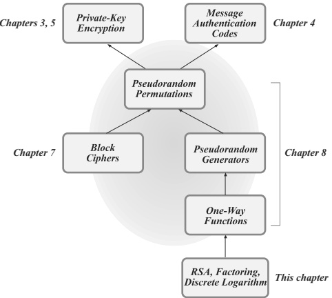
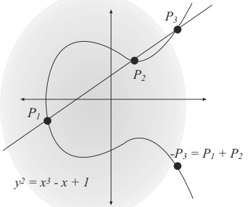

## Part III: Public-Key (Asymmetric) Cryptography

# Chapter 9: Number Theory and Cryptographic Hardness Assumptions

Modern cryptosystems are invariably based on an assumption that some problem is hard. In Chapters 3–5, for example, we saw that private-key cryptography—both encryption schemes and message authentication codes—can be based on the assumption that pseudorandom permutations (a.k.a. block ciphers) exist. On the face of it, the assumption that pseudorandom permutations exist seems quite strong and unnatural, and it is reasonable to ask whether this assumption is true or whether there is any evidence to support it. In Chapter 7 we explored how block ciphers are constructed in practice. The fact that these constructions have resisted attack serves as an indication that the existence of pseudorandom permutations is plausible. Still, it may be difficult to believe that there are no efficient distinguishing attacks on existing block ciphers. Moreover, the current state of our theory is such that we do not know how to prove the pseudorandomness of any of the existing practical constructions relative to any “simpler” or “more reasonable” assumption. All in all, this is not an entirely satisfying state of affairs.

In contrast, as mentioned in Chapter 3 (and investigated in detail in Chapter 8) it is possible to prove that pseudorandom permutations exist based on the much milder assumption that one-way functions exist. (Informally, a function is one-way if it is easy to compute but hard to invert; see Section 9.4.1.) Apart from a brief discussion in Section 8.1.2, however, we have not seen any concrete examples of functions believed to be one-way.

One goal of this chapter is to introduce various problems believed to be “hard,” and to present conjectured one-way functions based on those problems. $^{1}$ As such, this chapter can be viewed as a culmination of a “top down” approach to private-key cryptography. (See Figure 9.1.) That is, in Chapters 3–5 we have shown that private-key cryptography can be based on pseudorandom functions and permutations. We have then seen that the latter can be instantiated in practice using block ciphers, as explored in Chapter 7, or can be provably constructed from any one-way function, as shown in Chapter 8. Here, we take this one step further and show how one-way functions can be based on certain hard mathematical problems.

> $^{1}$ Recall we currently do not know how to prove that one-way functions exist, so the best we can do is base one-way functions on assumptions regarding the hardness of certain problems.

**FIGURE 9.1: Private-key cryptography: a top-down approach.**

The examples we explore are number theoretic in nature, and we therefore begin with a short introduction to number theory. Because we are also interested in problems that can be solved efficiently (even a one-way function must be easy to compute in one direction, and cryptographic schemes must admit efficient algorithms for the honest parties), we also initiate a study of algorithmic number theory. Even the reader who is familiar with number theory is encouraged to read this chapter, since algorithmic aspects are typically ignored in a purely mathematical treatment of these topics.

A second goal of this chapter is to develop the material needed for public-key cryptography, whose study we will begin in Chapter 11. Strikingly, although in the private-key setting there exist efficient constructions of the necessary primitives (both block ciphers and hash functions) without invoking any number theory, in the public-key setting all known constructions rely on hard number-theoretic problems. The material in this chapter thus serves not only as a culmination of our study of private-key cryptography, but also as the foundation for our treatment of public-key cryptography.

## 9.1 Preliminaries and Basic Group Theory

We begin with a review of prime numbers and basic modular arithmetic. Even the reader who has seen these topics before should skim the next two sections since some of the material may be new and we include proofs for most of the stated results.

### 9.1.1 Primes and Divisibility

The set of integers is denoted by $\mathbb{Z}$. For $a, b \in \mathbb{Z}$, we say that $a$ divides $b$, written $a \mid b$, if there exists an integer $c$ such that $ac = b$. If $a$ does not divide $b$, we write $a \nmid b$. (We are primarily interested in the case where $a, b$, and $c$ are all positive, although the definition makes sense even when one or more of them is negative or zero.) A simple observation is that if $a \mid b$ and $a \mid c$ then $a \mid (Xb + Yc)$ for any $X, Y \in \mathbb{Z}$.

If $a \mid b$ and $a$ is positive, we call $a$ a divisor of $b$. If in addition $a \not\in \{1, b\}$ then $a$ is called a nontrivial divisor, or a factor, of $b$. A positive integer $p > 1$ is prime if it has no factors; i.e., it has only two divisors: 1 and itself. A positive integer greater than 1 that is not prime is called composite. By convention, the number 1 is neither prime nor composite.

A fundamental theorem of arithmetic is that every integer greater than 1 can be expressed uniquely (up to ordering) as a product of primes. That is, any positive integer $N > 1$ can be written as $N = \prod_i p_i^{e_i}$, where the $\{p_i\}$ are distinct primes and $e_i \geq 1$ for all $i$; furthermore, the $\{p_i\}$ (and $\{e_i\}$) are uniquely determined up to ordering.

We are familiar with the process of division with remainder from elementary school. The following proposition formalizes this notion.

PROPOSITION 9.1 Let $a$ be an integer and let $b$ be a positive integer. Then there exist unique integers $q, r$ for which $a = qb + r$ and $0 \leq r < b$.

Furthermore, given integers $a$ and $b$ as in the proposition it is possible to compute $q$ and $r$ in polynomial time; see Appendix B.1. (An algorithm's running time is measured as a function of the length(s) of its input(s). An important point in the context of algorithmic number theory is that integer inputs are always assumed to be represented in binary. The running time of an algorithm taking as input an integer $N$ is therefore measured in terms of $\|N\|$, the length of the binary representation of $N$. Note that $\|N\| = \lfloor\log N\rfloor + 1$.)

The greatest common divisor of two integers $a, b$, written $\gcd(a, b)$, is the largest integer $c$ such that $c \mid a$ and $c \mid b$. (We leave $\gcd(0, 0)$ undefined.) The notion of greatest common divisor makes sense when either or both of $a, b$ are negative but we will typically have $a, b \geq 1$; anyway, $\gcd(a, b) = \gcd(|a|, |b|)$. Note that $\gcd(b, 0) = \gcd(0, b) = b$; also, if $p$ is prime then $\gcd(a, p)$ is either equal to 1 or $p$. If $\gcd(a, b) = 1$ we say that $a$ and $b$ are relatively prime.

The following is a useful result:

PROPOSITION 9.2 Let $a, b$ be positive integers. Then there exist integers $X, Y$ such that $Xa + Yb = \gcd(a, b)$. Furthermore, $\gcd(a, b)$ is the smallest positive integer that can be expressed in this way.

PROOF Consider the set $I \stackrel{\mathrm{def}}{=} \{\hat{X}a + \hat{Y}b \mid \hat{X}, \hat{Y} \in \mathbb{Z}\}$. Note that $a, b \in I$, and so $I$ certainly contains some positive integers. Let $d$ be the smallest positive integer in $I$. We show that $d = \gcd(a, b)$; since $d$ can be written as $d = Xa + Yb$ for some $X, Y \in \mathbb{Z}$ (because $d \in I$), this proves the theorem.

To show that $d = \gcd(a, b)$, we must prove that $d \mid a$ and $d \mid b$, and that $d$ is the largest integer with this property. In fact, we can show that $d$ divides every element in $I$. To see this, take an arbitrary $c \in I$ and write $c = X^{\prime}a + Y^{\prime}b$ with $X^{\prime}, Y^{\prime} \in \mathbb{Z}$. Using division with remainder (Proposition 9.1) we have that $c = qd + r$ with $q, r$ integers and $0 \leq r < d$. Then

$$
r=c-qd=X^{\prime}a+Y^{\prime}b-q(Xa+Yb)=(X^{\prime}-qX)a+(Y^{\prime}-qY)b\in I.
$$

If $r \neq 0$, this contradicts our choice of $d$ as the smallest positive integer in $I$ (because $r < d$). So, $r = 0$ and hence $d \mid c$. This shows that $d$ divides every element of $I$.

Since $a \in I$ and $b \in I$, the above shows that $d \mid a$ and $d \mid b$ and so $d$ is a common divisor of $a$ and $b$. It remains to show that it is the greatest common divisor. Assume there is an integer $d^{\prime} > d$ such that $d^{\prime} \mid a$ and $d^{\prime} \mid b$. Then by the observation made earlier, $d^{\prime} \mid Xa + Yb$. Since the latter is equal to $d$, this means $d^{\prime} \mid d$. But this is impossible if $d^{\prime}$ is larger than $d$. We conclude that $d$ is the largest integer dividing both $a$ and $b$, and hence $d = \gcd(a,b)$.

Given $a$ and $b$, the Euclidean algorithm can be used to compute $\gcd(a,b)$ in polynomial time. The extended Euclidean algorithm can be used to compute $X,Y$ (as in the above proposition) in polynomial time as well. See Appendix B.1.2 for details.

The preceding proposition is very useful in proving additional results about divisibility. We show two examples now.

PROPOSITION 9.3 If $c \mid ab$ and $\gcd(a,c)=1$, then $c \mid b$. Thus, if $p$ is prime and $p \mid ab$ then either $p \mid a$ or $p \mid b$.

PROOF Since $c \mid ab$ we have $\gamma c = ab$ for some integer $\gamma$. If $\gcd(a,c) = 1$ then, by the previous proposition, we know there exist integers $X,Y$ such that $1 = Xa + Yc$. Multiplying both sides by $b$, we obtain

$$
b=Xab+Ycb=X\gamma c+Ycb=c\cdot(X\gamma+Yb).
$$

Since $(X\gamma+Yb)$ is an integer, it follows that $c \mid b$.

The second part of the proposition follows from the fact that if $p \nmid a$ and $p$ is prime then $\gcd(a, p) = 1$.

PROPOSITION 9.4 If $a \mid N$, $b \mid N$, and $\gcd(a,b)=1$, then $ab \mid N$.

PROOF Write $ac = N$, $bd = N$, and (using Proposition 9.2) $1 = Xa + Yb$, where $c, d, X, Y$ are all integers. Multiplying both sides of the last equation by $N$ we obtain

$$
N=X a N+Y b N=X a b d+Y b a c=a b(X d+Y c),
$$

showing that $ab \mid N$.

### 9.1.2 Modular Arithmetic

Let $a, b, N \in \mathbb{Z}$ with $N > 1$. We use the notation $[a \bmod N]$ to denote the remainder of $a$ upon division by $N$. In more detail: by Proposition 9.1 there exist unique $q, r$ with $a = qN + r$ and $0 \leq r < N$, and we define $[a \bmod N]$ to be equal to this $r$. Note therefore that $0 \leq [a \bmod N] < N$. We refer to the process of mapping $a$ to $[a \bmod N]$ as reduction modulo $N$.

We say that $a$ and $b$ are congruent modulo $N$, written $a = b \bmod N$, if $[a \bmod N] = [b \bmod N]$, i.e., if the remainder when $a$ is divided by $N$ is the same as the remainder when $b$ is divided by $N$. Note that $a = b \bmod N$ if and only if $N \mid (a - b)$. By way of notation, in an expression such as

$$
a=b=c=\cdots=z\bmod N,
$$

the understanding is that every equal sign in this sequence (and not just the last) refers to congruence modulo $N$.

Note that $a = [b \mod N]$ implies $a = b \mod N$, but not vice versa. For example, $36 = 21 \bmod 15$ but $36 \neq [21 \mod 15] = 6$. On the other hand, $[a \mod N] = [b \mod N]$ if and only if $a = b \mod N$.

Congruence modulo $N$ is an equivalence relation, i.e., it is reflexive ($a = a \bmod N$ for all $a$), symmetric ($a = b \bmod N$ implies $b = a \bmod N$), and transitive (if $a = b \bmod N$ and $b = c \bmod N$, then $a = c \bmod N$). Congruence modulo $N$ also obeys the standard rules of arithmetic with respect to addition, subtraction, and multiplication; so, for example, if $a = a^{\prime}$ $\bmod N$ and $b = b^{\prime}$ $\bmod N$ then $(a + b) = (a^{\prime} + b^{\prime}) \bmod N$ and $ab = a^{\prime}b^{\prime}$ $\bmod N$. A consequence is that we can “reduce and then add/multiply” instead of having to “add/multiply and then reduce,” which can often simplify calculations.

**Example 9.5**

Let us compute $[1093028 \cdot 190301 \mod 100]$. Since $1093028 = 28 \bmod 100$ and $190301 = 1 \bmod 100$, we have

$$
\begin{aligned}
1093028\cdot190301&=\left[1093028\bmod100\right]\cdot\left[190301\bmod100\right]\bmod100\\
&=28\cdot1=28\bmod100.
\end{aligned}
$$

The alternate way of calculating the answer (i.e., computing the product $1093028 \cdot 190301$ and then reducing the result modulo 100) is less efficient.

Congruence modulo $N$ does not (in general) respect division. That is, if $a = a^{\prime} \mod N$ and $b = b^{\prime} \mod N$ then it is not necessarily true that $a/b = a^{\prime}/b^{\prime} \mod N$; in fact, the expression “$a/b \mod N$” is not necessarily well-defined. As a specific example that often causes confusion, $ab = cb \mod N$ does not necessarily imply that $a = c \mod N$.

**Example 9.6**

Take $N = 24$. Then $3 \cdot 2 = 6 = 15 \cdot 2 \mod 24$, but $3 \neq 15 \mod 24$.

In certain cases, however, we can define a meaningful notion of division. If for a given integer $b$ there exists an integer $c$ such that $bc = 1 \mod N$, we say that $b$ is invertible modulo $N$ and call $c$ a (multiplicative) inverse of $b$ modulo $N$. Clearly, $0$ is never invertible. It is also not difficult to show that if $c$ is a multiplicative inverse of $b$ modulo $N$ then so is $[c \mod N]$. Furthermore, if $c^{\prime}$ is another multiplicative inverse of $b$ then $[c \mod N] = [c^{\prime} \mod N]$. When $b$ is invertible we can therefore simply let $b^{-1}$ denote the unique multiplicative inverse of $b$ that lies in the range $\{1, \ldots, N-1\}$.

When $b$ is invertible modulo $N$, we define division by $b$ modulo $N$ as multiplication by $b^{-1}$ (i.e., we define $[a/b \bmod N] \stackrel{\mathrm{def}}{=} [ab^{-1} \bmod N]$.) We stress that division by $b$ is only defined when $b$ is invertible. If $ab = cb \bmod N$ and $b$ is invertible, then we may divide each side of the equation by $b$ (or, really, multiply each side by $b^{-1}$) to obtain

$$
(ab)\cdot b^{-1}=(cb)\cdot b^{-1}\bmod N\quad\Rightarrow\quad a=c\bmod N.
$$

We see that in this case, division works as expected. Thus, invertible integers modulo $N$ are “nicer” to work with, in some sense.

The natural question is: which integers are invertible modulo a given modulus $N$? We can fully answer this question using Proposition 9.2:

PROPOSITION 9.7 Let $b, N$ be integers, with $b \geq 1$ and $N > 1$. Then $b$ is invertible modulo $N$ if and only if $\gcd(b, N) = 1$.

PROOF Assume $b$ is invertible modulo $N$, and let $c$ denote its inverse. Since $bc = 1 \bmod N$, this implies that $bc - 1 = \gamma N$ for some $\gamma \in \mathbb{Z}$. Equivalently, $bc - \gamma N = 1$. Since, by Proposition 9.2, $\gcd(b, N)$ is the smallest positive integer that can be expressed in this way, and there is no positive integer smaller than 1, this implies that $\gcd(b, N) = 1$.

Conversely, if $\gcd(b, N) = 1$ then by Proposition 9.2 there exist integers $X, Y$ such that $Xb + YN = 1$. Reducing each side of this equation modulo $N$ gives $Xb = 1 \bmod N$, and we see that $X$ is a multiplicative inverse of $b$. (In fact, this gives an efficient algorithm to compute inverses.)

**Example 9.8**

Let $b=11$ and $N=17$. Then $(-3)\cdot11+2\cdot17=1$, and so $14=[-3\bmod 17]$ is the inverse of 11. One can verify that $14\cdot11=1\bmod 17$.

Addition, subtraction, multiplication, and computation of inverses (when they exist) modulo $N$ can all be carried out in polynomial time; see Appendix B.2. Exponentiation (i.e., computing $[a^b \bmod N]$ for $b > 0$ an integer) can also be computed in polynomial time; see Appendix B.2.3.

### 9.1.3 Groups

Let $\mathbb{G}$ be a set. A binary operation $\circ$ on $\mathbb{G}$ is simply a function $\circ(\cdot,\cdot)$ that maps two elements of $\mathbb{G}$ to another element of $\mathbb{G}$. If $g,h\in\mathbb{G}$ then instead of using the cumbersome notation $\circ(g,h)$, we write $g\circ h$.

We now introduce the important notion of a group.

DEFINITION 9.9 A group is a set $\mathbb{G}$ along with a binary operation $\circ$ for which the following conditions hold:

- (Closure:) For all $g, h \in \mathbb{G}$, $g \circ h \in \mathbb{G}$.

- (Existence of an identity:) There exists an identity $e \in \mathbb{G}$ such that for all $g \in \mathbb{G}$, $e \circ g = g = g \circ e$.

- (Existence of inverses:) For all $g \in \mathbb{G}$ there exists an element $h \in \mathbb{G}$ such that $g \circ h = e = h \circ g$. Such an $h$ is called an inverse of $g$.

- (Associativity:) For all $g_1, g_2, g_3 \in \mathbb{G}$, $(g_1 \circ g_2) \circ g_3 = g_1 \circ (g_2 \circ g_3)$.

When $\mathbb{G}$ has a finite number of elements, we say $\mathbb{G}$ is finite and let $|\mathbb{G}|$ denote the order of the group (that is, the number of elements in $\mathbb{G}$).

A group $\mathbb{G}$ with operation $\circ$ is abelian if the following holds:

- (Commutativity:) For all $g, h \in \mathbb{G}$, $g \circ h = h \circ g$.

When the binary operation is understood, we simply call the set $\mathbb{G}$ a group.

We will always deal with finite, abelian groups. We will be careful to specify, however, when a result requires these assumptions.

Associativity implies that we do not need to include parentheses when writing long expressions; that is, the notation $g_1 \circ g_2 \circ \cdots \circ g_n$ is unambiguous since it does not matter in what order we evaluate the operation $\circ$.

One can show that the identity element in a group $\mathbb{G}$ is unique, and so we can therefore refer to the identity of a group. One can also show that each element $g$ of a group has a unique inverse. See Exercise 9.1.

If $\mathbb{G}$ is a group, a set $\mathbb{H} \subseteq \mathbb{G}$ is a subgroup of $\mathbb{G}$ if $\mathbb{H}$ itself forms a group under the same operation associated with $\mathbb{G}$. To check that $\mathbb{H}$ is a subgroup, we need to verify closure, existence of identity and inverses, and associativity as per Definition 9.9. (In fact, associativity—as well as commutativity if $\mathbb{G}$ is abelian—is inherited automatically from $\mathbb{G}$.) Every group $\mathbb{G}$ always has the trivial subgroups $\mathbb{G}$ and $\{1\}$. We call $\mathbb{H}$ a strict subgroup of $\mathbb{G}$ if $\mathbb{H} \neq \mathbb{G}$.

In general, we will not use the notation $\circ$ to denote the group operation. Instead, we will use either additive notation or multiplicative notation depending on the group under discussion. This does not imply that the group operation corresponds to integer addition or multiplication; it is merely useful notation. When using additive notation, the group operation applied to two elements $g, h$ is denoted $g + h$; the identity is denoted by 0; the inverse of an element $g$ is denoted by $-g$; and we write $h - g$ in place of $h + (-g)$. When using multiplicative notation, the group operation applied to $g, h$ is denoted by $g \cdot h$ or simply $gh$; the identity is denoted by 1; the inverse of an element $g$ is denoted by $g^{-1}$; and we sometimes write $h/g$ in place of $hg^{-1}$.

At this point, it may be helpful to see some examples.

**Example 9.10**

A set may be a group under one operation, but not another. For example, the set of integers $\mathbb{Z}$ is an abelian group under addition: the identity is the element 0, and every integer $g$ has inverse $-g$. On the other hand, it is not a group under multiplication since, for example, the integer 2 does not have a multiplicative inverse in the integers.

**Example 9.11**

The set of real numbers $\mathbb{R}$ is not a group under multiplication, since 0 does not have a multiplicative inverse. The set of nonzero real numbers, however, is an abelian group under multiplication with identity 1.

The following example introduces the group $\mathbb{Z}_N$ that we will use frequently.

**Example 9.12**

Let $N > 1$ be an integer. The set $\{0, \ldots, N-1\}$ with respect to addition modulo $N$ (i.e., where $a + b \stackrel{\mathrm{def}}{=} [a + b \mod N]$) is an abelian group of order $N$. Closure is obvious; associativity and commutativity follow from the fact that the integers satisfy these properties; the identity is 0; and, since $a + (N - a) = 0 \bmod N$, it follows that the inverse of any element $a$ is $\left[(N - a) \mod N\right]$. We denote this group by $\mathbb{Z}_N$. (We will also sometimes use $\mathbb{Z}_N$ to denote the set $\{0, \ldots, N-1\}$ without regard to any particular group operation.) $\diamondsuit$

We end this section with an easy lemma that formalizes a “cancelation law” for groups.

LEMMA 9.13 Let $\mathbb{G}$ be a group and $a,b,c \in \mathbb{G}$. If $ac = bc$, then $a = b$. In particular, if $ac = c$ then $a$ is the identity in $\mathbb{G}$.

PROOF We know $ac = bc$. Multiplying both sides by the unique inverse $c^{-1}$ of $c$, we obtain $a = b$. In detail:

$$
ac=bc\ \Rightarrow\ (ac)c^{-1}=(bc)\cdot c^{-1}\ \Rightarrow\ a(cc^{-1})=b(cc^{-1})\ \Rightarrow\ a\cdot1=b\cdot1,
$$

i.e., $a = b$.

Compare the above proof to the discussion (preceding Proposition 9.7) regarding a cancelation law for division modulo $N$. As indicated by the similarity, the invertible elements modulo $N$ form a group under multiplication modulo $N$. We will return to this example in more detail shortly.

#### Group Exponentiation

It is often useful to be able to describe the group operation applied $m$ times to a fixed element $g$, where $m$ is a positive integer. When using additive notation, we express this as $m \cdot g$ or $mg$; that is,

$$
mg=m\cdot g\stackrel{\mathrm{def}}{=}\underbrace{g+\cdots+g}_{m\text{ times}}.
$$

Note that $m$ is an integer, while $g$ is a group element. So $mg$ does not represent the group operation applied to $m$ and $g$ (indeed, we are working in a group where the group operation is written additively). Thankfully, however, the notation “behaves as it should”; so, for example, if $g \in \mathbb{G}$ and $m, m^{\prime}$ are integers then $(mg) + (m^{\prime} g) = (m + m^{\prime}) g$, $m(m^{\prime} g) = (mm^{\prime}) g$, and $1 \cdot g = g$. In an abelian group $\mathbb{G}$ with $g, h \in \mathbb{G}$, $(mg) + (mh) = m(g + h)$.

When using multiplicative notation, we express application of the group operation $m$ times to an element $g$ by $g^m$. That is,

$$
g^{m}\stackrel{\mathrm{def}}{=}\underbrace{g\cdots g}_{m\text{ times}}.
$$

The familiar rules of exponentiation hold: $g^m \cdot g^{m^{\prime}} = g^{m+m^{\prime}}$, $(g^m)^{m^{\prime}} = g^{mm^{\prime}}$, and $g^1 = g$. Also, if $\mathbb{G}$ is an abelian group and $g$, $h \in \mathbb{G}$ then $g^m \cdot h^m = (gh)^m$. All these are simply “translations” of the results from the previous paragraph to the setting of groups written multiplicatively rather than additively.

The above notation is extended in the natural way to the case when $m$ is zero or a negative integer. When using additive notation we define $0 \cdot g \stackrel{\mathrm{def}}{=} 0$ (note that the 0 on the left-hand side is the integer 0 while the 0 on the right-hand side is the identity element of the group) and define $(-m) \cdot g \stackrel{\mathrm{def}}{=} m \cdot (-g)$ for $m$ a positive integer. Observe that $-g$ is the inverse of $g$ and, as one would expect, $(-m) \cdot g = -(mg)$. When using multiplicative notation, $g^0 \stackrel{\mathrm{def}}{=} 1$ and $g^{-m} \stackrel{\mathrm{def}}{=} (g^{-1})^m$. Again, $g^{-1}$ is the inverse of $g$, and we have $g^{-m} = (g^m)^{-1}$.

Let $g \in \mathbb{G}$ and $b \geq 0$ be an integer. Then the exponentiation $g^b$ can be computed using polynomially many group operations in $\mathbb{G}$. Thus, if the group operation can be computed in polynomial time then so can exponentiation. This is discussed in Appendix B.2.3.

We now know enough to prove the following remarkable result:

THEOREM 9.14 Let $\mathbb{G}$ be a finite group with $m = |\mathbb{G}|$, the order of the group. Then for any element $g \in \mathbb{G}$, it holds that $g^m = 1$.

PROOF We prove the theorem only when $\mathbb{G}$ is abelian (although it holds for any finite group). Fix arbitrary $g \in \mathbb{G}$, and let $g_1, \ldots, g_m$ be the elements of $\mathbb{G}$. We claim that

$$
g_{1}\cdot g_{2}\cdots g_{m}=(g g_{1})\cdot(g g_{2})\cdots(g g_{m}).
$$

To see this, note that $gg_i = gg_j$ implies $g_i = g_j$ by Lemma 9.13. So each of the $m$ elements in parentheses on the right-hand side is distinct. Because there are exactly $m$ elements in $\mathbb{G}$, the $m$ elements being multiplied together on the right-hand side are simply all elements of $\mathbb{G}$ in some permuted order. Since $\mathbb{G}$ is abelian, the order in which elements are multiplied does not matter, and so the right-hand side is equal to the left-hand side.

Again using the fact that $\mathbb{G}$ is abelian, we can “pull out” all occurrences of $g$ and obtain

$$
g_{1}\cdot g_{2}\cdots g_{m}=(g g_{1})\cdot(g g_{2})\cdots(g g_{m})=g^{m}\cdot(g_{1}\cdot g_{2}\cdots g_{m}).
$$

Appealing once again to Lemma 9.13, this implies $g^{m}=1$.

An important corollary of the above is that we can work “modulo the group order” in the exponent:

COROLLARY 9.15 Let $\mathbb{G}$ be a finite group with $m = |\mathbb{G}| > 1$. Then for any $g \in \mathbb{G}$ and any integer $x$, we have $g^x = g^{[x \mod m]}$.

PROOF Say $x = qm + r$, where $q, r$ are integers and $r = [x \mod m]$. Then

$$
g^{x}=g^{q m+r}=g^{q m}\cdot g^{r}=(g^{m})^{q}\cdot g^{r}=1^{q}\cdot g^{r}=g^{r}
$$

(using Theorem 9.14), as claimed.

**Example 9.16**

Written additively, the above corollary says that if $g$ is an element in a group of order $m$, then $x \cdot g = [x \bmod m] \cdot g$. As an example, consider the group $\mathbb{Z}_{15}$ of order $m = 15$, and take $g = 11$. The corollary says that

$$
152\cdot11=\left[152\bmod15\right]\cdot11=2\cdot11=11+11=22=7\bmod15.
$$

The above agrees with the fact (cf. Example 9.5) that we can “reduce and then multiply” rather than having to “multiply and then reduce.”

Another corollary that will be extremely useful for cryptographic applications is the following:

COROLLARY 9.17 Let $\mathbb{G}$ be a finite group with $m = |\mathbb{G}| > 1$. Let $e > 0$ be an integer, and define the function $f_e : \mathbb{G} \to \mathbb{G}$ by $f_e(g) = g^e$. If $\gcd(e, m) = 1$, then $f_e$ is a permutation (i.e., a bijection). Moreover, if $d = e^{-1} \bmod m$ then $f_d$ is the inverse of $f_e$. (Note by Proposition 9.7, $\gcd(e, m) = 1$ implies $e$ is invertible modulo $m$.)

PROOF Since $\mathbb{G}$ is finite, the second part of the claim implies the first; thus, we need only show that $f_d$ is the inverse of $f_e$. This is true because for any $g \in \mathbb{G}$, we have

$$
f_{d}\left(f_{e}(g)\right)=f_{d}(g^{e})=(g^{e})^{d}=g^{e d}=g^{[e d\bmod m]}=g^{1}=g,
$$

where the fourth equality follows from Corollary 9.15.

### 9.1.4 The Group $\mathbb{Z}_{N}^{*}$

As discussed in Example 9.12, the set $\mathbb{Z}_N = \{0, \ldots, N-1\}$ is a group under addition modulo $N$. Can we define a group with respect to multiplication modulo $N$? In doing so, we will have to eliminate those elements in $\mathbb{Z}_N$ that are not invertible; e.g., we will have to eliminate 0 since it has no multiplicative inverse. Nonzero elements may also fail to be invertible (cf. Proposition 9.7).

Which elements $b \in \{1, \ldots, N-1\}$ are invertible modulo $N$? Proposition 9.7 says that these are exactly the elements $b$ for which $\gcd(b, N) = 1$. We have also seen in Section 9.1.2 that whenever $b$ is invertible, it has an inverse lying in the range $\{1, \ldots, N-1\}$. This leads us to define, for any $N > 1$, the set

$$
\mathbb{Z}_{N}^{*}\stackrel{\mathrm{def}}{=}\left\{b\in\{1,\ldots,N-1\}~\middle|~\gcd(b,N)=1\right\};
$$

i.e., $\mathbb{Z}_N^*$ consists of integers in the set $\{1, \ldots, N-1\}$ that are relatively prime to $N$. The group operation is multiplication modulo $N$; i.e., $ab \stackrel{\mathrm{def}}{=} [ab \bmod N]$.

We claim that $\mathbb{Z}_N^*$ is an abelian group with respect to this operation. Since 1 is always in $\mathbb{Z}_N^*$, the set clearly contains an identity element. The discussion above shows that each element in $\mathbb{Z}_N^*$ has a multiplicative inverse in the same set. Commutativity and associativity follow from the fact that these properties hold over the integers. To show that closure holds, let $a, b \in \mathbb{Z}_N^*$; then $[ab \bmod N]$ has inverse $[b^{-1}a^{-1} \bmod N]$, which means that $\gcd([ab \bmod N], N) = 1$ and so $ab \in \mathbb{Z}_N^*$. Summarizing:

PROPOSITION 9.18 Let $N > 1$ be an integer. Then $\mathbb{Z}_N^*$ is an abelian group under multiplication modulo $N$.

Define $\phi(N) \stackrel{\mathrm{def}}{=} |\mathbb{Z}_N^*|$, the order of the group $\mathbb{Z}_N^*$. ($\phi$ is called the Euler $\phi$ function.) What is the value of $\phi(N)$? First consider the case when $N = p$ is prime. Then all elements in $\{1, \ldots, p-1\}$ are relatively prime to $p$, and so $\phi(p) = |\mathbb{Z}_p^*| = p-1$. Next consider the case that $N = pq$, where $p, q$ are distinct primes. If an integer $a \in \{1, \ldots, N-1\}$ is not relatively prime to $N$, then either $p \mid a$ or $q \mid a$ ($a$ cannot be divisible by both $p$ and $q$ since this would imply $pq \mid a$ but $a < N = pq$). The elements in $\{1, \ldots, N-1\}$ divisible by $p$ are exactly the $(q-1)$ elements $p, 2p, 3p, \ldots, (q-1)p$, and the elements divisible by $q$ are exactly the $(p-1)$ elements $q, 2q, \ldots, (p-1)q$. The number of elements remaining (i.e., those that are neither divisible by $p$ nor $q$) is therefore given by

$$
(N-1)-(q-1)-(p-1)=pq-p-q+1=(p-1)(q-1).
$$

We have thus proved that $\phi(N) = (p - 1)(q - 1)$ when $N$ is the product of two distinct primes $p$ and $q$.

You are asked to prove the following general result (used only rarely in the rest of the book) in Exercise 9.4:

THEOREM 9.19 Let $N = \prod_i p_i^{e_i}$, where the $\{p_i\}$ are distinct primes and $e_i \geq 1$. Then $\phi(N) = \prod_i p_i^{e_i - 1}(p_i - 1)$.

**Example 9.20**

Take $N = 15 = 5 \cdot 3$. Then $\mathbb{Z}_{15}^* = \{1,2,4,7,8,11,13,14\}$ and $|\mathbb{Z}_{15}^*| = 8 = 4 \cdot 2 = \phi(15)$. The inverse of $8$ in $\mathbb{Z}_{15}^*$ is $2$, since $8 \cdot 2 = 16 = 1 \mod 15$.

We have shown that $\mathbb{Z}_N^*$ is a group of order $\phi(N)$. The following are now easy corollaries of Theorem 9.14 and Corollary 9.17:

COROLLARY 9.21 Take arbitrary integer $N > 1$ and $a \in \mathbb{Z}_N^*$. Then

$$
a^{\phi(N)}=1\bmod N.
$$

For the specific case that $N = p$ is prime and $a \in \{1, \ldots, p-1\}$, we have

$$
a^{p-1}=1\bmod p.
$$

COROLLARY 9.22 Fix $N > 1$. For integer $e > 0$ define $f_e: \mathbb{Z}_N^* \to \mathbb{Z}_N^*$ by $f_e(x) = [x^e \bmod N]$. If $e$ is relatively prime to $\phi(N)$ then $f_e$ is a permutation. Moreover, if $d = e^{-1} \bmod \phi(N)$ then $f_d$ is the inverse of $f_e$.

### 9.1.5 \*Isomorphisms and the Chinese Remainder Theorem

Two groups are isomorphic if they have the same underlying structure. From a mathematical point of view, an isomorphism of a group $\mathbb{G}$ provides an alternate, but equivalent, way of thinking about $\mathbb{G}$. From a computational perspective, an isomorphism provides a different way to represent elements in $\mathbb{G}$, which can often have a significant impact on algorithmic efficiency.

DEFINITION 9.23 Let $\mathbb{G},\mathbb{H}$ be groups with respect to the operations $\circ_{\mathbb{G}},\circ_{\mathbb{H}}$, respectively. A function $f:\mathbb{G}\to\mathbb{H}$ is an isomorphism from $\mathbb{G}$ to $\mathbb{H}$ if:

1. $f$ is a bijection, and

2. For all $g_1, g_2 \in \mathbb{G}$ we have $f(g_1 \circ_{\mathbb{G}} g_2) = f(g_1) \circ_{\mathbb{H}} f(g_2)$.

If there exists an isomorphism from $\mathbb{G}$ to $\mathbb{H}$ then we say that these groups are isomorphic and write $\mathbb{G} \simeq \mathbb{H}$.

In essence, an isomorphism from $\mathbb{G}$ to $\mathbb{H}$ is just a renaming of elements of $\mathbb{G}$ as elements of $\mathbb{H}$. Note that if $\mathbb{G}$ is finite and $\mathbb{G} \simeq \mathbb{H}$, then $\mathbb{H}$ must be finite and of the same size as $\mathbb{G}$. Also, if there exists an isomorphism $f$ from $\mathbb{G}$ to $\mathbb{H}$ then $f^{-1}$ is an isomorphism from $\mathbb{H}$ to $\mathbb{G}$. It is possible, however, that $f$ is efficiently computable while $f^{-1}$ is not (or vice versa).

The aim of this section is to use the language of isomorphisms to better understand the group structure of $\mathbb{Z}_N$ and $\mathbb{Z}_N^*$ when $N = pq$ is a product of two distinct primes. We first need to introduce the notion of a direct product of groups. Given groups $\mathbb{G}$, $\mathbb{H}$ with group operations $\circ_{\mathbb{G}}$, $\circ_{\mathbb{H}}$, respectively, we define a new group $\mathbb{G} \times \mathbb{H}$ (the direct product of $\mathbb{G}$ and $\mathbb{H}$) as follows. The elements of $\mathbb{G} \times \mathbb{H}$ are ordered pairs $(g, h)$ with $g \in \mathbb{G}$ and $h \in \mathbb{H}$; thus, if $\mathbb{G}$ has $n$ elements and $\mathbb{H}$ has $n^{\prime}$ elements, $\mathbb{G} \times \mathbb{H}$ has $n \cdot n^{\prime}$ elements. The group operation $\circ$ on $\mathbb{G} \times \mathbb{H}$ is applied component-wise; that is:

$$
(g,h)\circ(g^{\prime},h^{\prime})\stackrel{\mathrm{def}}{=}(g\circ_{\mathbb{G}}g^{\prime},h\circ_{\mathbb{H}}h^{\prime}).
$$

We leave it to Exercise 9.8 to verify that $\mathbb{G} \times \mathbb{H}$ is indeed a group. The above notation can be extended to direct products of more than two groups in the natural way, although we will not need this for what follows.

We may now state and prove the Chinese remainder theorem.

THEOREM 9.24 (Chinese remainder theorem) Let $N = pq$ where $p, q > 1$ are relatively prime. Then

$$
\mathbb{Z}_{N}\simeq\mathbb{Z}_{p}\times\mathbb{Z}_{q}\quad\text{and}\quad\mathbb{Z}_{N}^{*}\simeq\mathbb{Z}_{p}^{*}\times\mathbb{Z}_{q}^{*}.
$$

Moreover, let $f$ be the function mapping elements $x \in \{0, \ldots, N-1\}$ to pairs $(x_p, x_q)$ with $x_p \in \{0, \ldots, p-1\}$ and $x_q \in \{0, \ldots, q-1\}$ defined by

$$
f(x)\stackrel{\mathrm{def}}{=}([x\bmod p],[x\bmod q]).
$$

Then $f$ is an isomorphism from $\mathbb{Z}_N$ to $\mathbb{Z}_p \times \mathbb{Z}_q$, and the restriction of $f$ to $\mathbb{Z}_N^*$ is an isomorphism from $\mathbb{Z}_N^*$ to $\mathbb{Z}_p^* \times \mathbb{Z}_q^*$.

PROOF For any $x \in \mathbb{Z}_N$ the output $f(x)$ is a pair of elements $(x_p, x_q)$ with $x_p \in \mathbb{Z}_p$ and $x_q \in \mathbb{Z}_q$. We claim that if $x \in \mathbb{Z}_N^*$, then $(x_p, x_q) \in \mathbb{Z}_p^* \times \mathbb{Z}_q^*$. Indeed, if $x_p \notin \mathbb{Z}_p^*$ then this means that $\gcd([x \bmod p], p) \neq 1$. But then $\gcd(x, p) \neq 1$. This implies $\gcd(x, N) \neq 1$, contradicting the assumption that $x \in \mathbb{Z}_N^*$. (An analogous argument holds if $x_q \notin \mathbb{Z}_q^*$.)

We now show that $f$ is an isomorphism from $\mathbb{Z}_N$ to $\mathbb{Z}_p \times \mathbb{Z}_q$. (The proof that it is an isomorphism from $\mathbb{Z}_N^*$ to $\mathbb{Z}_p^* \times \mathbb{Z}_q^*$ is similar.) Let us start by proving that $f$ is one-to-one. Say $f(x) = (x_p, x_q) = f(x^{\prime})$. Then $x = x_p = x^{\prime} \bmod p$ and $x = x_q = x^{\prime} \bmod q$. This in turn implies that $(x - x^{\prime})$ is divisible by both $p$ and $q$. Since $\gcd(p, q) = 1$, Proposition 9.4 says that $pq = N$ divides $(x - x^{\prime})$. But then $x = x^{\prime} \bmod N$. For $x, x^{\prime} \in \mathbb{Z}_N$, this means that $x = x^{\prime}$ and so $f$ is indeed one-to-one. Since $|\mathbb{Z}_N| = N = p \cdot q = |\mathbb{Z}_p| \cdot |\mathbb{Z}_q|$, the sizes of $\mathbb{Z}_N$ and $\mathbb{Z}_p \times \mathbb{Z}_q$ are the same. This in combination with the fact that $f$ is one-to-one implies that $f$ is bijective.

In the following paragraph, let $+_N$ denote addition modulo $N$, and let $\boxplus$ denote the group operation in $\mathbb{Z}_p \times \mathbb{Z}_q$ (i.e., addition modulo $p$ in the first component and addition modulo $q$ in the second component). To conclude the proof that $f$ is an isomorphism from $\mathbb{Z}_N$ to $\mathbb{Z}_p \times \mathbb{Z}_q$, we need to show that for all $a, b \in \mathbb{Z}_N$ it holds that $f(a +_N b) = f(a) \boxplus f(b)$.

To see that this is true, note that

$$
\begin{aligned}
f(a+_{N} b)&=\left(\left[(a+_{N} b)\bmod p\right],\left[(a+_{N} b)\bmod q\right]\right)\\
&=\left(\left[(a+b)\bmod p\right],\left[(a+b)\bmod q\right]\right)\\
&=\left(\left[a\bmod p\right],\left[a\bmod q\right]\right)\boxplus\left(\left[b\bmod p\right],\left[b\bmod q\right]\right)=f(a)\boxplus f(b).
\end{aligned}
$$

(For the second equality, above, we use the fact that $[[X \bmod N] \bmod p] = [[X \bmod p] \bmod p]$ when $p \mid N$; see Exercise 9.9.)

An extension of the Chinese remainder theorem says that if $p_1, p_2, \ldots, p_\ell$ are pairwise relatively prime (i.e., $\gcd(p_i, p_j) = 1$ for all $i \neq j$) and $N \stackrel{\mathrm{def}}{=} \prod_{i=1}^\ell p_i$, then

$$
\mathbb{Z}_{N}\simeq\mathbb{Z}_{p_{1}}\times\cdots\times\mathbb{Z}_{p_{\ell}}\quad\text{and}\quad\mathbb{Z}_{N}^{*}\simeq\mathbb{Z}_{p_{1}}^{*}\times\cdots\times\mathbb{Z}_{p_{\ell}}^{*}.
$$

An isomorphism in each case is obtained by a natural extension of the one used in the theorem above.

By way of notation, with $N$ understood and $x \in \{0,1,\ldots,N-1\}$ we write $x \leftrightarrow (x_p, x_q)$ for $x_p = [x \bmod p]$ and $x_q = [x \bmod q]$. That is, $x \leftrightarrow (x_p, x_q)$ if and only if $f(x) = (x_p, x_q)$, where $f$ is as in the theorem above. One way to think about this notation is that it means “$x$ (in $\mathbb{Z}_N$) corresponds to $(x_p, x_q)$ (in $\mathbb{Z}_p \times \mathbb{Z}_q)$.” The same notation is used when dealing with $x \in \mathbb{Z}_N^*$.

**Example 9.25**

Take $15 = 5 \cdot 3$, and consider $\mathbb{Z}_{15}^* = \{1,2,4,7,8,11,13,14\}$. The Chinese remainder theorem says this group is isomorphic to $\mathbb{Z}_5^* \times \mathbb{Z}_3^*$. We can compute

$$
\begin{array}{c}
1\leftrightarrow(1,1)\quad2\leftrightarrow(2,2)\quad4\leftrightarrow(4,1)\quad7\leftrightarrow(2,1)\\
8\leftrightarrow(3,2)\quad11\leftrightarrow(1,2)\quad13\leftrightarrow(3,1)\quad14\leftrightarrow(4,2)
\end{array}
$$

where each pair $(a, b)$ with $a \in \mathbb{Z}_5^*$ and $b \in \mathbb{Z}_3^*$ appears exactly once.

#### Using the Chinese Remainder Theorem

If two groups are isomorphic, then they both serve as representations of the same underlying “algebraic structure.” Nevertheless, the choice of which representation to use can affect the computational efficiency of group operations. We discuss this abstractly, and then in the specific context of $\mathbb{Z}_N$ and $\mathbb{Z}_N^*$.

Let $\mathbb{G}$, $\mathbb{H}$ be groups with operations $\circ_{\mathbb{G}}$, $\circ_{\mathbb{H}}$, respectively, and say $f$ is an isomorphism from $\mathbb{G}$ to $\mathbb{H}$ where both $f$ and $f^{-1}$ can be computed efficiently. Then for $g_1, g_2 \in \mathbb{G}$ we can compute $g = g_1 \circ_{\mathbb{G}} g_2$ in two ways: either by directly computing the group operation in $\mathbb{G}$, or via the following steps:

1. Compute $h_{1} = f(g_{1})$ and $h_{2} = f(g_{2})$;

2. Compute $h = h_1 \circ_{\mathbb{H}} h_2$ using the group operation in $\mathbb{H}$;

3. Compute $g = f^{-1}(h)$.

The above extends in the natural way when we want to compute multiple group operations in $\mathbb{G}$ (e.g., to compute $g^x$ for some integer $x$). Which method is better depends on the relative efficiency of computing the group operation in each group, as well as the efficiency of computing $f$ and $f^{-1}$.

We now turn to the specific case of computations modulo $N$, when $N = pq$ is a product of distinct primes. The Chinese remainder theorem shows that addition, multiplication, or exponentiation (which is just repeated multiplication) modulo $N$ can be “transformed” to analogous operations modulo $p$ and $q$. Building on Example 9.25, we show some simple examples with $N = 15$.

**Example 9.26**

Say we want to compute the product $14 \cdot 13$ modulo 15 (i.e., in $\mathbb{Z}_{15}^*$). Example 9.25 gives $14 \leftrightarrow (4,2)$ and $13 \leftrightarrow (3,1)$. In $\mathbb{Z}_5^* \times \mathbb{Z}_3^*$, we have

$$
(4,2)\cdot(3,1)=([4\cdot3\bmod5],[2\cdot1\bmod3])=(2,2).
$$

Note $(2,2) \leftrightarrow 2$, which is the correct answer since $14 \cdot 13 = 2 \mod 15$.

**Example 9.27**

Say we want to compute $11^{53} \mod 15$. Example 9.25 gives $11 \leftrightarrow (1, 2)$. Notice that $2 = -1 \mod 3$ and so

$$
(1,2)^{53}=([1^{53}\bmod5],[(-1)^{53}\bmod3])=(1,[-1\bmod3])=(1,2).
$$

Thus, $11^{53} \bmod 15 = 11$.

**Example 9.28**

Say we want to compute $[29^{100} \mod 35]$. We first compute the correspondence $29 \leftrightarrow ([29 \mod 5], [29 \mod 7]) = ([-1 \mod 5], 1)$. Using the Chinese remainder theorem, we have

$$
([-1\bmod5],1)^{100}=([(-1)^{100}\bmod5],[1^{100}\bmod7])=(1,1),
$$

and it is immediate that $(1,1)\leftrightarrow 1$. We conclude that $[29^{100}\bmod 35]=1$.

**Example 9.29**

Say we want to compute $[18^{25} \bmod 35]$. We have $18 \leftrightarrow (3,4)$ and so

$$
18^{25}\bmod 35\leftrightarrow(3,4)^{25}=([3^{25}\bmod 5],[4^{25}\bmod 7]).
$$

Since $\mathbb{Z}_5^*$ is a group of order 4, we can “work modulo 4 in the exponent” (cf. Corollary 9.15) and see that

$$
3^{25}=3^{[25\bmod 4]}=3^{1}=3\bmod5.
$$

Similarly,

$$
4^{25}=4^{[25\bmod 6]}=4^{1}=4\bmod7.
$$

Thus, $([3^{25} \bmod 5], [4^{25} \bmod 7]) = (3, 4) \leftrightarrow 18$ and so $[18^{25} \bmod 35] = 18$.

One thing we have not yet discussed is how to convert back and forth between the representation of an element modulo $N$ and its representation modulo $p$ and $q$. The conversion can be carried out efficiently provided the factorization of $N$ is known. Assuming $p$ and $q$ are known, it is easy to map an element $x$ modulo $N$ to its corresponding representation modulo $p$ and $q$: the element $x$ corresponds to $([x \bmod p], [x \bmod q])$, and both the modular reductions can be carried out efficiently (cf. Appendix B.2).

For the other direction, we make use of the following observation: an element with representation $(x_{p}, x_{q})$ can be written as

$$
(x_{p},x_{q})=x_{p}\cdot(1,0)+x_{q}\cdot(0,1).
$$

So, if we can find elements $1_p, 1_q \in \{0, \ldots, N-1\}$ such that $1_p \leftrightarrow (1,0)$ and $1_q \leftrightarrow (0,1)$, then (appealing to the Chinese remainder theorem) we know that

$$
(x_{p},x_{q})\leftrightarrow[(x_{p}\cdot 1_{p}+x_{q}\cdot 1_{q})\bmod N].
$$

Since $p, q$ are distinct primes, $\gcd(p, q) = 1$. We can use the extended Euclidean algorithm (cf. Appendix B.1.2) to find integers $X, Y$ such that

$$
Xp+Yq=1.
$$

Note that $Yq = 0 \bmod q$ and $Yq = 1 - Xp = 1 \bmod p$. This means that $[Yq \bmod N] \leftrightarrow (1,0)$; i.e., $[Yq \bmod N] = 1_p$. Similarly, $[Xp \bmod N] = 1_q$.

In summary, we can convert an element represented as $(x_p, x_q)$ to its representation modulo $N$ in the following way (assuming $p$ and $q$ are known):

1. Compute $X, Y$ such that $Xp + Yq = 1$.

2. Set $1_{p} := [Y q \bmod N]$ and $1_{q} := [X p \bmod N]$.

3. Compute $x := [(x_p \cdot 1_p + x_q \cdot 1_q) \mod N]$.

If many such conversions will be performed, then $1_{p}, 1_{q}$ can be computed once-and-for-all in a preprocessing phase.

**Example 9.30**

Take $p = 5$, $q = 7$, and $N = 5 \cdot 7 = 35$. Say we are given the representation $(4,3)$ and want to convert this to the corresponding element of $\mathbb{Z}_{35}$. Using the extended Euclidean algorithm, we compute

$$
3\cdot5-2\cdot7=1.
$$

Thus, $1_p = [-2 \cdot 7 \mod 35] = 21$ and $1_q = [3 \cdot 5 \mod 35] = 15$. (We can check that these are correct: e.g., for $1_p = 21$ we can verify that $[21 \mod 5] = 1$ and $[21 \mod 7] = 0$.) Using these values, we can then compute

$$
\begin{aligned}
(4,3)&=4\cdot(1,0)+3\cdot(0,1)\\
&\leftrightarrow[4\cdot1_{p}+3\cdot1_{q}\bmod35]\\
&=[4\cdot21+3\cdot15\bmod35]=24.
\end{aligned}
$$

Since $24 = 4 \bmod 5$ and $24 = 3 \bmod 7$, this is indeed the correct result.

## 9.2 Primes, Factoring, and RSA

In this section, we show the first examples of number-theoretic problems that are conjectured to be “hard.” We begin with a discussion of one of the oldest problems: integer factorization or just factoring.

Given a composite integer $N$, the factoring problem is to find integers $p, q > 1$ such that $pq = N$. Factoring is a classic example of a hard problem, both because it is so simple to describe and since it has been recognized as a hard computational problem for a long time (even before its use in cryptography). The problem can be solved in exponential time $\mathcal{O}(\sqrt{N} \cdot \mathsf{polylog}(N))$ using trial division: that is, by exhaustively checking whether $p$ divides $N$ for $p = 2, \ldots, \lfloor \sqrt{N} \rfloor$. (This method requires $\sqrt{N}$ divisions, each one taking $\mathsf{polylog}(N) = \|N\|^c$ time for some constant $c$.) This always succeeds because although the largest prime factor of $N$ may be as large as $N/2$, the smallest prime factor of $N$ can be at most $\lfloor \sqrt{N} \rfloor$. Although algorithms with better running time are known (see Chapter 10), no polynomial-time algorithm for factoring has been demonstrated despite many years of effort.

Consider the following experiment for a given algorithm $\mathcal{A}$ and parameter $n$:

The weak factoring experiment $\mathsf{w\text{-}Factor}_{\mathcal{A}}(n)$:

1. Choose two uniform $n$-bit integers $x_{1}, x_{2}$

2. Compute $N := x_1 \cdot x_2$.

3. $\mathcal{A}$ is given $N$, and outputs $x_{1}^{\prime}, x_{2}^{\prime} > 1$.

4. The output of the experiment is defined to be 1 if $x_1^{\prime} \cdot x_2^{\prime} = N$, and 0 otherwise.

We have just said that the factoring problem is believed to be hard. Does this mean that

$$
\Pr[\mathsf{w\text{-}Factor}_{\mathcal{A}}(n)=1]\leq\mathsf{negl}(n)
$$

is negligible for every PPT algorithm $\mathcal{A}$? Not at all. For starters, the number $N$ in the above experiment is even with probability $3/4$ (this occurs when either $x_1$ or $x_2$ is even); it is, of course, easy for $\mathcal{A}$ to factor $N$ in this case. While we can make $\mathcal{A}$'s job more difficult by requiring $\mathcal{A}$ to output integers $x^{\prime}_1, x^{\prime}_2$ of length $n$, it remains the case that $x_1$ or $x_2$ (and hence $N$) might have small prime factors that can still be easily found. For cryptographic applications, we will need to prevent this.

As this discussion indicates, the “hardest” numbers to factor are those having only large prime factors. This suggests redefining the above experiment so that $x_{1}, x_{2}$ are random $n$-bit primes rather than random $n$-bit integers, and in fact such an experiment will be used when we formally define the factoring assumption in Section 9.2.3. For this experiment to be useful in a cryptographic setting, however, it is necessary to be able to generate random $n$-bit primes efficiently. This is the topic of the next two sections.

### 9.2.1 Generating Random Primes

A natural approach to generating a random $n$-bit prime is to repeatedly choose random $n$-bit integers until we find one that is prime; we repeat this at most t times or until we are successful. See Algorithm 9.31 for a high-level description of the process.

ALGORITHM 9.31
Generating a random prime – high-level outline

Input: Length $n$; parameter $t$

Output: A uniform $n$-bit prime

for $i = 1$ to $t$:
  $p^{\prime} \leftarrow \{0,1\}^{n-1}$
  $p := 1\|p^{\prime}$
  if $p$ is prime return $p$
return fail

Note that the algorithm forces the output to be an integer of length exactly $n$ (rather than length at most $n$) by fixing the high-order bit of $p$ to “1.” Our convention throughout this book is that an “integer of length $n$” means an integer whose binary representation with most significant bit equal to 1 is exactly $n$ bits long.

Given a way to determine whether or not a given integer $p$ is prime, the above algorithm outputs a uniform $n$-bit prime conditioned on the event that it does not output fail. The probability that the algorithm outputs fail depends on $t$, and for our purposes we will want to set $t$ so as to obtain a failure probability that is negligible in $n$. To show that Algorithm 9.31 leads to an efficient (i.e., polynomial-time in $n$) algorithm for generating primes, we need a better understanding of two issues: (1) the probability that a uniform $n$-bit integer is prime and (2) how to efficiently test whether a given integer $p$ is prime. We discuss these issues briefly now, and defer a more in-depth exploration of the second topic to the following section.

The distribution of primes. The prime number theorem, an important result in mathematics, gives fairly precise bounds on the fraction of integers of a given length that are prime. We state a corollary (without proof) that suffices for our purposes:

THEOREM 9.32 For any $n > 1$, the fraction of $n$-bit integers that are prime is at least $1/3n$.

Returning to the approach for generating primes described above, this implies that if we set $t = 3n^2$ then the probability that a prime is not chosen in all $t$ iterations of the algorithm is at most

$$
\left(1-\frac{1}{3n}\right)^{t}=\left(\left(1-\frac{1}{3n}\right)^{3n}\right)^{n}\leq\left(e^{-1}\right)^{n}=e^{-n}
$$

(using Inequality A.2), which is negligible in $n$. Thus, using $\mathsf{poly}(n)$ iterations we obtain an algorithm for which the probability of outputting fail is negligible in $n$. (Tighter results than Theorem 9.32 are known, and so in practice even fewer iterations are needed.)

Testing primality. The problem of efficiently determining whether a given number is prime has a long history. In the 1970s the first efficient algorithms for testing primality were developed. These algorithms were probabilistic and had the following guarantee: if the input $p$ were a prime number, the algorithm would always output “prime.” On the other hand, if $p$ were composite, then the algorithm would almost always output “composite,” but might output the wrong answer (“prime”) with probability negligible in the length of $p$. Put differently, if the algorithm outputs “composite” then $p$ is definitely composite, but if the output is “prime” then it is very likely that $p$ is prime but it is also possible that a mistake has occurred (and $p$ is really composite).

When using a randomized primality test of this sort in Algorithm 9.31 (the prime-generation algorithm shown earlier), the output of the algorithm is a uniform prime of the desired length so long as the algorithm does not output fail and the randomized primality test did not err during the execution of the algorithm. This means that an additional source of error (besides the possibility of outputting fail) is introduced, and the algorithm may now output a composite number by mistake. Since we can ensure that this happens with only negligible probability, this remote possibility is of no practical concern and we can safely ignore it.

A deterministic polynomial-time algorithm for testing primality was demonstrated in a breakthrough result in 2002. That algorithm, although running in polynomial time, is slower than the probabilistic tests mentioned above. For this reason, probabilistic primality tests are still used exclusively in practice for generating large prime numbers.

In Section 9.2.2 we describe and analyze one of the most commonly used probabilistic primality tests: the Miller–Rabin algorithm. This algorithm takes two inputs: an integer $p$ and a parameter $t$ (in unary) that determines the error probability. The Miller–Rabin algorithm runs in time polynomial in $\|p\|$ and $t$, and satisfies:

THEOREM 9.33 If $p$ is prime, then the Miller–Rabin test always outputs “prime.” If $p$ is composite, the algorithm outputs “composite” except with probability at most $2^{-t}$.

Putting it all together. Given the preceding discussion, we can now describe a polynomial-time prime-generation algorithm that, on input $n$, outputs an $n$-bit prime except with probability negligible in $n$; moreover, conditioned on the output $p$ being prime, $p$ is a uniformly distributed $n$-bit prime. The full procedure is described in Algorithm 9.34.

ALGORITHM 9.34
Generating a random prime

Input: Length $n$
Output: A uniform $n$-bit prime

for $i = 1$ to $3n^2$:
  $p^{\prime} \leftarrow \{0,1\}^{n-1}$
  $p := 1\|p^{\prime}$
  run the Miller–Rabin test on input $p$ and parameter $1^n$
  if the output is “prime,” return $p$
return fail

Generating primes of a particular form. It is sometimes desirable to generate a random $n$-bit prime $p$ of a particular form, for example, satisfying $p = 3 \bmod 4$ or such that $p = 2q + 1$ where $q$ is also prime ($p$ of the latter type are called strong primes). In this case, appropriate modifications of the prime-generation algorithm shown above can be used. (For example, in order to obtain a prime of the form $p = 2q + 1$, modify the algorithm to generate a random prime $q$, compute $p := 2q + 1$, and then output $p$ if it too is prime.) While these modified algorithms work well in practice, rigorous proofs that they run in polynomial time and fail with only negligible probability are more complex (and, in some cases, rely on unproven number-theoretic conjectures regarding the density of primes of a particular form). A detailed exploration of these issues is beyond the scope of this book, and we will simply assume the existence of appropriate prime-generation algorithms when needed.

### 9.2.2 \*Primality Testing

We now describe the Miller–Rabin primality test and prove Theorem 9.33. (We rely on the material presented in Section 9.1.5.) This material is not used directly in the rest of the book.

The key to the Miller–Rabin algorithm is to find a property that distinguishes primes and composites. Let $N$ denote the input number to be tested. We start with the following observation: if $N$ is prime then $|\mathbb{Z}_N^*| = N - 1$, and so for any $a \in \{1, \ldots, N-1\}$ we have $a^{N-1} = 1 \mod N$ by Theorem 9.14. This suggests testing whether $N$ is prime by choosing a uniform element $a$ and checking whether $a^{N-1} \overset{?}{=} 1 \mod N$. If $a^{N-1} \neq 1 \mod N$, then $N$ cannot be prime. Conversely, we might hope that if $N$ is not prime then there is a reasonable chance that we will pick $a$ with $a^{N-1} \neq 1 \mod N$, and so by repeating this test many times we can determine whether $N$ is prime or not with high confidence. The above approach is shown as Algorithm 9.35. (Recall that exponentiation modulo $N$ and computation of greatest common divisors can be carried out in polynomial time. Choosing a uniform element of $\{1, \ldots, N-1\}$ can also be done in polynomial time. See Appendix B.2.)

ALGORITHM 9.35
Primality testing – first attempt

Input: Integer $N$ and parameter $1^{t}$
Output: A decision as to whether $N$ is prime or composite

for $i = 1$ to $t$:
  $a \leftarrow \{1, \ldots, N-1\}$
  if $a^{N-1} \neq 1 \bmod N$ return “composite”

return “prime”

If $N$ is prime the algorithm always outputs “prime.” If $N$ is composite, the algorithm outputs “composite” if in any iteration it finds an $a \in \{1, \ldots, N-1\}$ such that $a^{N-1} \neq 1 \bmod N$. Observe that if $a \notin \mathbb{Z}_N^*$ then $a^{N-1} \neq 1 \bmod N$. (If $\gcd(a, N) \neq 1$ then $\gcd(a^{N-1}, N) \neq 1$ and so $[a^{N-1} \mod N]$ cannot equal 1.) For now, we therefore restrict our attention to $a \in \mathbb{Z}_N^*$. We refer to any such $a$ with $a^{N-1} \neq 1 \bmod N$ as a witness that $N$ is composite, or simply a witness. We might hope that when $N$ is composite there are many witnesses, and thus the algorithm finds such a witness with “high” probability. This intuition is correct provided there is at least one witness. Before proving this, we need two group-theoretic lemmas.

PROPOSITION 9.36 Let $\mathbb{G}$ be a finite group, and $\mathbb{H} \subseteq \mathbb{G}$. Assume $\mathbb{H}$ is nonempty, and for all $a, b \in \mathbb{H}$ we have $ab \in \mathbb{H}$. Then $\mathbb{H}$ is a subgroup of $\mathbb{G}$.

PROOF We need to verify that $\mathbb{H}$ satisfies all the conditions of Definition 9.9. By assumption, $\mathbb{H}$ is closed under the group operation. Associativity in $\mathbb{H}$ is inherited automatically from $\mathbb{G}$. Let $m = |\mathbb{G}|$ (here is where we use the fact that $\mathbb{G}$ is finite), and consider an arbitrary element $a \in \mathbb{H}$. Closure of $\mathbb{H}$ means that $\mathbb{H}$ contains $a^{m-1} = a^{-1}$ as well as $a^m = 1$. Thus, $\mathbb{H}$ contains the inverse of each of its elements, as well as the identity.

LEMMA 9.37 Let $\mathbb{H}$ be a strict subgroup of a finite group $\mathbb{G}$ (i.e., $\mathbb{H} \neq \mathbb{G}$). Then $|\mathbb{H}| \leq |\mathbb{G}|/2$.

PROOF Let $\bar{h}$ be an element of $\mathbb{G}$ that is not in $\mathbb{H}$; since $\mathbb{H} \neq \mathbb{G}$, we know such an $\bar{h}$ exists. Consider the set $\bar{\mathbb{H}} \stackrel{\mathrm{def}}{=}\{\bar{h}h \mid h \in \mathbb{H}\}$. We show that (1) $|\bar{\mathbb{H}}| = |\mathbb{H}|$, and (2) every element of $\bar{\mathbb{H}}$ lies outside of $\mathbb{H}$; i.e., the intersection of $\mathbb{H}$ and $\bar{\mathbb{H}}$ is empty. Since both $\mathbb{H}$ and $\bar{\mathbb{H}}$ are subsets of $\mathbb{G}$, these imply $|\mathbb{G}| \geq |\mathbb{H}| + |\bar{\mathbb{H}}| = 2|\mathbb{H}|$, proving the lemma.

For any $h_1, h_2 \in \mathbb{H}$, if $\bar{h}h_1 = \bar{h}h_2$ then, multiplying by $\bar{h}^{-1}$ on each side, we have $h_1 = h_2$. This shows that every distinct element $h \in \mathbb{H}$ corresponds to a distinct element $\bar{h}h \in \bar{\mathbb{H}}$, proving (1).

Assume toward a contradiction that $\bar{h}h \in \mathbb{H}$ for some $h$. This means $\bar{h}h = h^{\prime}$ for some $h^{\prime} \in \mathbb{H}$, and so $\bar{h} = h^{\prime}h^{-1}$. Now, $h^{\prime}h^{-1} \in \mathbb{H}$ since $\mathbb{H}$ is a subgroup and $h^{\prime}, h^{-1} \in \mathbb{H}$. But this means that $\bar{h} \in \mathbb{H}$, in contradiction to the way $\bar{h}$ was chosen. This proves (2) and completes the proof of the lemma.

The following theorem will enable us to analyze the algorithm given earlier.

THEOREM 9.38 Fix $N$. Say there exists a witness that $N$ is composite. Then at least half the elements of $\mathbb{Z}_N^*$ are witnesses that $N$ is composite.

PROOF Let $\mathsf{Bad}$ be the set of elements in $\mathbb{Z}_N^*$ that are not witnesses; that is, $a \in \mathsf{Bad}$ means $a^{N-1} = 1 \mod N$. Clearly, $1 \in \mathsf{Bad}$. If $a, b \in \mathsf{Bad}$, then $(ab)^{N-1} = a^{N-1} \cdot b^{N-1} = 1 \cdot 1 = 1 \mod N$ and hence $ab \in \mathsf{Bad}$. By Lemma 9.36, we conclude that $\mathsf{Bad}$ is a subgroup of $\mathbb{Z}_N^*$. Since (by assumption) there is at least one witness, $\mathsf{Bad}$ is a strict subgroup of $\mathbb{Z}_N^*$. Lemma 9.37 then shows that $|\mathsf{Bad}| \leq |\mathbb{Z}_N^*|/2$, showing that at least half the elements of $\mathbb{Z}_N^*$ are not in $\mathsf{Bad}$ (and hence are witnesses).

Let $N$ be composite. If there exists a witness that $N$ is composite, then there are at least $|\mathbb{Z}_N^*|/2$ witnesses. The probability that we find either a witness or an element not in $\mathbb{Z}_N^*$ in any given iteration of the algorithm is thus at least $1/2$, and so the probability that the algorithm does not find a witness in any of the $t$ iterations (and hence the probability that the algorithm mistakenly outputs “prime”) is at most $2^{-t}$.

The above, unfortunately, does not give a complete solution since there are infinitely many composite numbers $N$ that do not have any witnesses that they are composite! Such values $N$ are known as Carmichael numbers; a detailed discussion is beyond the scope of this book.

Happily, a refinement of the above test can be shown to work for all $N$. Let $N-1=2^r u$, where $u$ is odd and $r\geq1$. (It is easy to compute $r$ and $u$ given $N$. Also, restricting to $r\geq1$ means that $N$ is odd, but testing primality is easy when $N$ is even!) The algorithm shown previously tests only whether $a^{N-1}=a^{2^r u}=1$ mod $N$. A more refined algorithm looks at the sequence of $r+1$ values $a^u$, $a^{2u}$, $\ldots$, $a^{2^r u}$ (all modulo $N$). Each term in this sequence is the square of the preceding term; thus, if some value is equal to $\pm1$ then all subsequent values will be equal to $1$.

Say that $a \in \mathbb{Z}_N^*$ is a strong witness that $N$ is composite (or simply a strong witness) if (1) $a^u \neq \pm 1 \bmod N$ and (2) $a^{2^iu} \neq -1 \bmod N$ for all $i \in \{1, \ldots, r-1\}$. Note that when an element $a$ is not a strong witness then the sequence $(a^u, a^{2u}, \ldots, a^{2^r u})$ (all taken modulo $N$) takes one of the following forms:

$$
\left(\pm1,1,\ldots,1\right)\text{ or }\left(\star,\ldots,\star,-1,1,\ldots,1\right),
$$

where $\star$ is an arbitrary term. If $a$ is not a strong witness then we have $a^{2^{r-1}u} = \pm 1 \bmod N$ and

$$
a^{N-1}=a^{2^{r}u}=\left(a^{2^{r-1}u}\right)^{2}=1\bmod N,
$$

and so $a$ is not a witness that $N$ is composite, either. Put differently, if $a$ is a witness then it is also a strong witness and so there can only possibly be more strong witnesses than witnesses.

We first show that if $N$ is prime then there does not exist a strong witness that $N$ is composite. In doing so, we rely on the following easy lemma (which is a special case of Proposition 15.16 proved subsequently in Chapter 15):

LEMMA 9.39 Say $x \in \mathbb{Z}_N^*$ is a square root of 1 modulo $N$ if $x^2 = 1 \bmod N$. If $N$ is an odd prime then the only square roots of 1 modulo $N$ are $[\pm 1 \bmod N]$.

PROOF Say $x^2 = 1 \bmod N$ with $x \in \{1, \ldots, N-1\}$. Then $0 = x^2 - 1 = (x+1)(x-1) \bmod N$, implying that $N \mid (x+1)$ or $N \mid (x-1)$ by Proposition 9.3. This can only possibly occur if $x = [\pm 1 \bmod N]$.

Let $N$ be an odd prime and fix arbitrary $a \in \mathbb{Z}_N^*$. Let $i \geq 0$ be the minimum value for which $a^{2^{i}u} = 1 \bmod N$; since $a^{2^{r}u} = a^{N-1} = 1 \bmod N$ we know that some such $i \leq r$ exists. If $i = 0$ then $a^u = 1 \bmod N$ and $a$ is not a strong witness. Otherwise,

$$
\left(a^{2^{i-1}u}\right)^{2}=a^{2^{i}u}=1\bmod N
$$

and $a^{2^{i-1}u}$ is a square root of 1. If $N$ is an odd prime, the only square roots of 1 are $\pm1$; by choice of $i$, however, $a^{2^{i-1}u} \neq 1 \bmod N$. So $a^{2^{i-1}u} = -1 \bmod N$, and $a$ is not a strong witness. We conclude that when $N$ is an odd prime there is no strong witness that $N$ is composite.

A composite integer $N$ is a prime power if $N = p^{r}$ for some prime $p$ and integer $r \geq 1$. We now show that every odd, composite $N$ that is not a prime power has many strong witnesses.

THEOREM 9.40 Let $N$ be an odd number that is not a prime power. Then at least half the elements of $\mathbb{Z}_N^*$ are strong witnesses that $N$ is composite.

PROOF Let $\mathsf{Bad} \subseteq \mathbb{Z}_N^*$ denote the set of elements that are not strong witnesses. We define a set $\mathsf{Bad}^{\prime}$ and show that: (1) $\mathsf{Bad}$ is a subset of $\mathsf{Bad}^{\prime}$, and (2) $\mathsf{Bad}^{\prime}$ is a strict subgroup of $\mathbb{Z}_N^*$. This suffices because by combining (2) and Lemma 9.37 we have that $|\mathsf{Bad}^{\prime}| \leq |\mathbb{Z}_N^*|/2$. Furthermore, by (1) it holds that $\mathsf{Bad} \subseteq \mathsf{Bad}^{\prime}$, and so $|\mathsf{Bad}| \leq |\mathsf{Bad}^{\prime}| \leq |\mathbb{Z}_N^*|/2$ as in Theorem 9.38. Thus, at least half the elements of $\mathbb{Z}_N^*$ are strong witnesses. (We stress that we do not claim that $\mathsf{Bad}$ is a subgroup of $\mathbb{Z}_N^*$.)

Note first that $-1 \in \mathsf{Bad}$ since $(-1)^u = -1 \mod N$ (recall $u$ is odd). Let $i \in \{0, \ldots, r-1\}$ be the largest integer for which there exists an $a \in \mathsf{Bad}$ with $a^{2^i u} = -1 \mod N$; alternatively, $i$ is the largest integer for which there exists an $a \in \mathsf{Bad}$ with

$$
(a^{u},a^{2u},\ldots,a^{2^{r}u})=(\underbrace{\star,\ldots,\star,-1}_{i+1\text{ terms}},1,\ldots,1).
$$

Since $-1 \in \mathsf{Bad}$ and $(-1)^{2^0 u} = -1 \bmod N$, some such $i$ exists.

Fix $i$ as above, and define

$$
\mathsf{Bad}^{\prime}\stackrel{\mathrm{def}}{=}\{a\mid a^{2^{i}u}=\pm1\bmod N\}.
$$

We now prove what we claimed above.

CLAIM 9.41 $\mathsf{Bad} \subseteq \mathsf{Bad}^{\prime}$.

Let $a \in \mathsf{Bad}$. Then either $a^u = 1 \bmod N$ or $a^{2^j u} = -1 \bmod N$ for some $j \in \{0, \ldots, r-1\}$. In the first case, $a^{2^i u} = (a^u)^{2^i} = 1 \bmod N$ and so $a \in \mathsf{Bad}^{\prime}$. In the second case, we have $j \leq i$ by choice of $i$. If $j = i$ then clearly $a \in \mathsf{Bad}^{\prime}$. If $j < i$ then $a^{2^i u} = (a^{2^j u})^{2^{i-j}} = 1 \bmod N$ and $a \in \mathsf{Bad}^{\prime}$. Since $a$ was arbitrary, this shows $\mathsf{Bad} \subseteq \mathsf{Bad}^{\prime}$.

CLAIM 9.42 $\mathsf{Bad}^{\prime}$ is a subgroup of $\mathbb{Z}_{N}^{*}$.

Clearly $1 \in \mathsf{Bad}^{\prime}$. Furthermore, if $a, b \in \mathsf{Bad}^{\prime}$ then

$$
(ab)^{2^{i}u}=a^{2^{i}u}b^{2^{i}u}=(\pm1)(\pm1)=\pm1\bmod N
$$

and so $ab \in \mathsf{Bad}^{\prime}$. By Lemma 9.36, $\mathsf{Bad}^{\prime}$ is a subgroup.

CLAIM 9.43 $\mathsf{Bad}^{\prime}$ is a strict subgroup of $\mathbb{Z}_{N}^{*}$.

If $N$ is an odd, composite integer that is not a prime power, then $N$ can be written as $N = N_1 N_2$ with $N_1, N_2 > 1$ odd and $\gcd(N_1, N_2) = 1$. Appealing to the Chinese remainder theorem, let $a \leftrightarrow (a_1, a_2)$ denote the representation of $a \in \mathbb{Z}_N^*$ as an element of $\mathbb{Z}_{N_1}^* \times \mathbb{Z}_{N_2}^*$; that is, $a_1 = [a \bmod N_1]$ and $a_2 = [a \bmod N_2]$. Take $a \in \mathsf{Bad}^{\prime}$ such that $a^{2^i u} = -1 \bmod N$ (such an $a$ must exist by the way we defined $i$), and say $a \leftrightarrow (a_1, a_2)$. Since $-1 \leftrightarrow (-1, -1)$ we have

$$
(a_{1},a_{2})^{2^{i}u}=(a_{1}^{2^{i}u},a_{2}^{2^{i}u})=(-1,-1),
$$

and so

$$
a_{1}^{2^{i}u}=-1\bmod N_{1}\quad\text{and}\quad a_{2}^{2^{i}u}=-1\bmod N_{2}.
$$

Consider the element $b \in \mathbb{Z}_N^*$ with $b \leftrightarrow (a_1, 1)$. Then

$$
b^{2^{i}u}\leftrightarrow(a_{1},1)^{2^{i}u}=([a_{1}^{2^{i}u}\bmod N_{1}],\;1)=(-1,1)\not\leftrightarrow\pm1.
$$

That is, $b^{2^i u} \neq \pm1 \bmod N$ and so we have found an element $b \notin \mathsf{Bad}^{\prime}$. This proves that $\mathsf{Bad}^{\prime}$ is a strict subgroup of $\mathbb{Z}_N^*$ and so, by Lemma 9.37, the size of $\mathsf{Bad}^{\prime}$ (and thus the size of $\mathsf{Bad}$) is at most half the size of $\mathbb{Z}_N^*$.

An integer $N$ is a perfect power if $N = \tilde{N}^e$ for integers $\tilde{N}$ and $e \geq 2$ (here it is not required for $\tilde{N}$ to be prime, although of course any prime power is also a perfect power). Algorithm 9.44 gives the Miller–Rabin primality test. Exercises 9.16 and 9.17 ask you to show that testing whether $N$ is a perfect power, and testing whether a particular $a$ is a strong witness, can be done in polynomial time. Given these results, the algorithm clearly runs in time polynomial in $\|N\|$ and $t$. We can now complete the proof of Theorem 9.33:

ALGORITHM 9.44
The Miller–Rabin primality test

Input: Integer $N > 2$ and parameter $1^{t}$
Output: A decision as to whether $N$ is prime or composite

if $N$ is even, return “composite”
if $N$ is a perfect power, return “composite”
compute $r \geq 1$ and $u$ odd such that $N - 1 = 2^{r}u$
for $j = 1$ to $t$:
  $a \leftarrow \{1, \ldots, N - 1\}$
  if $a^{u} \neq \pm 1 \bmod N$ and $a^{2^{i}u} \neq -1 \bmod N$ for $i \in \{1, \ldots, r-1\}$
    return “composite”
return “prime”

PROOF If $N$ is an odd prime, there are no strong witnesses and so the Miller–Rabin algorithm always outputs “prime.” If $N$ is even or a prime power, the algorithm always outputs “composite.” The interesting case is when $N$ is an odd, composite integer that is not a prime power. Consider any iteration of the inner loop. Note first that if $a \notin \mathbb{Z}_N^*$ then $a^u \neq \pm 1 \bmod N$ and $a^{2^i u} \neq -1 \bmod N$ for $i \in \{1, \ldots, r-1\}$. The probability of finding either a strong witness or an element not in $\mathbb{Z}_N^*$ is at least $1/2$ (invoking Theorem 9.40). Thus, the probability that the algorithm never outputs “composite” in any of the $t$ iterations is at most $2^{-t}$.

### 9.2.3 The Factoring Assumption

Let $\mathsf{GenModulus}$ be a polynomial-time algorithm that, on input $1^n$, outputs $(N, p, q)$ where $N = pq$, and $p$ and $q$ are $n$-bit primes except with probability negligible in $n$. (The natural way to do this is to generate two uniform $n$-bit primes, as discussed previously, and then multiply them to obtain $N$.) Then consider the following experiment for a given algorithm $\mathcal{A}$ and parameter $n$:

The factoring experiment $\mathsf{Factor}_{\mathcal{A},\mathsf{GenModulus}}(n)$:

1. Run $\mathsf{GenModulus}(1^{n})$ to obtain $(N, p, q)$.

2. $\mathcal{A}$ is given $N$, and outputs $p^{\prime}, q^{\prime} > 1$.

3. The output of the experiment is defined to be 1 if $p^{\prime} \cdot q^{\prime} = N$, and 0 otherwise.

Note that if the output of the experiment is 1 then $\{p^{\prime}, q^{\prime}\} = \{p, q\}$, unless $p$ or $q$ are composite (which happens with only negligible probability).

We now formally define the factoring assumption:

DEFINITION 9.45 Factoring is hard relative to $\mathsf{GenModulus}$ if for all probabilistic polynomial-time algorithms $\mathcal{A}$ there exists a negligible function $\mathsf{negl}$ such that

$$
\Pr[\mathsf{Factor}_{\mathcal{A},\mathsf{GenModulus}}(n)=1]\leq\mathsf{negl}(n).
$$

The factoring assumption is the assumption that there exists a $\mathsf{GenModulus}$ relative to which factoring is hard.

### 9.2.4 The RSA Assumption

The factoring problem has been studied for hundreds of years without an efficient algorithm being found. Although the factoring assumption does give a one-way function (see Section 9.4.1), it unfortunately does not directly yield practical cryptosystems. (In Section 15.5.2, however, we show how to construct efficient cryptosystems based on a problem whose hardness is equivalent to that of factoring.) This has motivated a search for other problems whose difficulty is related to the hardness of factoring. The best known of these is a problem introduced in 1978 by Rivest, Shamir, and Adleman and now called the RSA problem in their honor.

Given a modulus $N$ and an integer $e > 2$ relatively prime to $\phi(N)$, Corollary 9.22 shows that exponentiation to the $e$th power modulo $N$ is a permutation. We can therefore define $[y^{1/e} \mod N]$ (for any $y \in \mathbb{Z}_N^*$) as the unique element of $\mathbb{Z}_N^*$ that yields $y$ when raised to the $e$th power modulo $N$; that is, $x = y^{1/e} \mod N$ if and only if $x^e = y \mod N$. The RSA problem, informally, is to compute $[y^{1/e} \mod N]$ for a modulus $N$ of unknown factorization.

Formally, let $\mathsf{GenRSA}$ be a probabilistic polynomial-time algorithm that, on input $1^n$, outputs a modulus $N$ that is the product of two $n$-bit primes, as well as integers $e, d > 0$ with $\gcd(e, \phi(N)) = 1$ and $ed = 1 \bmod \phi(N)$. (Such a $d$ exists since $e$ is invertible modulo $\phi(N)$. The purpose of $d$ will become clear later.) The algorithm may fail with probability negligible in $n$. Consider the following experiment for a given algorithm $\mathcal{A}$ and security parameter $n$:

The RSA experiment $\mathsf{RSA\text{-}inv}_{\mathcal{A},\mathsf{GenRSA}}(n)$:

1. Run $\mathsf{GenRSA}(1^{n})$ to obtain $(N,e,d)$.

2. Choose a uniform $y \in \mathbb{Z}_N^*$.

3. $\mathcal{A}$ is given $N, e, y$, and outputs $x \in \mathbb{Z}_N^*$.

4. The output of the experiment is defined to be 1 if $x^{e} = y \mod N$, and 0 otherwise.

DEFINITION 9.46 The RSA problem is hard relative to $\mathsf{GenRSA}$ if for all probabilistic polynomial-time algorithms $\mathcal{A}$ there exists a negligible function $\mathsf{negl}$ such that $\Pr[\mathsf{RSA\text{-}inv}_{\mathcal{A},\mathsf{GenRSA}}(n) = 1] \leq \mathsf{negl}(n)$.

The RSA assumption is that there exists a $\mathsf{GenRSA}$ algorithm relative to which the RSA problem is hard. A suitable $\mathsf{GenRSA}$ algorithm can be constructed from any algorithm $\mathsf{GenModulus}$ that generates a composite modulus along with its factorization. A high-level outline is provided as Algorithm 9.47, where the only thing left unspecified is how exactly e is chosen. In fact, the RSA problem is believed to be hard for any e that is relatively prime to $\phi(N)$. We discuss some typical choices of e below.

ALGORITHM 9.47

GenRSA – high-level outline

Input: Security parameter $1^{n}$

Output: N, e, d as described in the text

$(N,p,q)\leftarrow\mathsf{GenModulus}(1^{n})$

$\phi(N):=(p-1)(q-1)$

choose $e > 1$ such that $\gcd(e, \phi(N)) = 1$

compute $d := [e^{-1} \bmod \phi(N)]$

return N, e, d

**Example 9.48**

Say $\mathsf{GenModulus}$ outputs $(N, p, q) = (143, 11, 13)$. Then $\phi(N) = 120$. Next, we need to choose an $e$ that is relatively prime to $\phi(N)$; say we take $e = 7$. The next step is to compute $d$ such that $d = [e^{-1} \mod \phi(N)]$. This can be done as shown in Appendix B.2.2 to obtain $d = 103$. (One can check that $7 \cdot 103 = 721 = 1 \mod 120$.) Our $\mathsf{GenRSA}$ algorithm in this case thus outputs $(N, e, d) = (143, 7, 103)$.

As an example of the RSA problem relative to these parameters, take $y = 64$ and so the problem is to compute the 7th root of 64 modulo 143 without knowledge of $d$ or the factorization of $N$.

Computing $e$th roots modulo $N$ becomes easy if $d$, $\phi(N)$, or the factorization of $N$ is known. (As we show in the next section, any of these can be used to efficiently compute the others.) This follows from Corollary 9.22, which shows that $[y^d \bmod N]$ is the $e$th root of $y$ modulo $N$. This asymmetry—namely, that the RSA problem appears to be hard when $d$ or the factorization of $N$ is unknown, but becomes easy when $d$ is known—serves as the basis for applications of the RSA problem to public-key cryptography.

**Example 9.49**

Continuing the previous example, we can compute the 7th root of 64 modulo 143 using the value $d = 103$; the answer is $25 = 64^d = 64^{103} \mod 143$. We can verify that this is the correct solution since $25^e = 25^7 = 64 \mod 143$.

On the choice of $e$. There does not appear to be any difference in the hardness of the RSA problem for different exponents $e$ and, as such, different methods have been suggested for selecting it. One popular choice is to set $e = 3$, since then computing $e$th powers modulo $N$ requires only two multiplications (see Appendix B.2.3). If $e$ is to be set equal to 3, then $p$ and $q$ must be chosen with $p, q \neq 1 \mod 3$ so that $\gcd(e, \phi(N)) = 1$. For similar reasons, another popular choice is $e = 2^{16} + 1 = 65537$, a prime number with low Hamming weight (in Appendix B.2.3, we explain why such exponents are preferable). As compared to choosing $e = 3$, this makes exponentiation slightly more expensive but reduces the constraints on $p$ and $q$, and avoids some “low-exponent attacks” (described at the end of Section 12.5.1) that can result from poorly implemented cryptosystems based on the RSA problem.

Note that choosing $d$ small (that is, changing $\mathsf{GenRSA}$ to choose small $d$ and then compute $e := [d^{-1} \bmod \phi(N)]$) is a bad idea. If $d$ lies in a very small range then a brute-force search for $d$ can be carried out (and, as noted, once $d$ is known the RSA problem can be solved easily). Even if $d$ is chosen so that $d \approx N^{1/4}$, and so brute-force attacks are ruled out, there are known algorithms that can be used to recover $d$ from $N$ and $e$ in this case. For similar reasons, choosing $d$ with low Hamming weight is also not recommended.

### 9.2.5 \*Relating the Factoring and RSA Assumptions

Say $\mathsf{GenRSA}$ is constructed as in Algorithm 9.47. If $N$ can be factored, then we can compute $\phi(N)$ and use this to compute $d := [e^{-1} \bmod \phi(N)]$ for any given $e$ (using Algorithm B.11). So for the RSA problem to be hard relative to $\mathsf{GenRSA}$, the factoring problem must be hard relative to $\mathsf{GenModulus}$. Put differently, the RSA problem cannot be more difficult than factoring; hardness of factoring (relative to $\mathsf{GenModulus}$) can only potentially be a weaker assumption than hardness of the RSA problem (relative to $\mathsf{GenRSA}$).

What about the other direction? That is, is hardness of the RSA problem implied by hardness of factoring? That remains an open question. The best we can show is that computing an RSA private key from an RSA public key (i.e., computing $d$ from $N$ and $e$) is as hard as factoring. We start by proving a slightly more powerful result.

THEOREM 9.50 Fix $N$, and assume there is a subroutine that, given $x \in \mathbb{Z}_N^*$, outputs an integer $k > 0$ with $x^k = 1 \mod N$. Then there is an algorithm that finds a factor of $N$ in time $\mathsf{poly}(\|N\|)$ (counting each call to the subroutine as one step), except with probability negligible in $\|N\|$.

PROOF For simplicity (and because it is most relevant to cryptography) we focus on factoring $N$ that are a product of two distinct, odd primes $p$ and $q$. We use the Chinese remainder theorem (Section 9.1.5), and rely on Proposition 9.36 and Lemma 9.37 as well as the following facts (which follow from more-general results proved in Sections 15.4.2 and 15.5.2):

For $N$ of the above form, 1 has exactly four square roots modulo $N$. Two of these are the “trivial” square roots $\left[\pm1 \bmod N\right]$, and two of these are “nontrivial” square roots. In the Chinese remainder representation, the nontrivial square roots are $(1, -1)$ and $(-1, 1)$.

- Any nontrivial square root of 1 can be used to (efficiently) compute a factor of $N$. This is by virtue of the fact that $y^{2}=1 \bmod N$ implies

$$
0=y^{2}-1=(y-1)(y+1)\bmod N,
$$

and so $N \mid (y-1)(y+1)$. However, $N\nmid(y-1)$ and $N\nmid(y+1)$ because $y \neq \pm1 \bmod N$. So it must be the case that $\gcd(y-1,N)$ is equal to one of the prime factors of $N$.

We use the following strategy to factor $N$: repeatedly choose a uniform $x \in \mathbb{Z}_N^*$, compute $k > 0$ with $x^k = 1 \bmod N$ (using the assumed subroutine for doing so), write $k = 2^s \cdot v$ for $v$ an odd integer, and compute the sequence

$$
x^{v},~x^{2v},~\ldots,~x^{2^{s}v}
$$

modulo $N$. Each term in this sequence is the square of the preceding term, and the final term is 1. Let $j$ be largest with $y \stackrel{\mathrm{def}}{=} [x^{2^{j}v} \bmod N] \neq 1$. (If there is no such $j$, then start again by choosing another $x$.) By choice of $j$, we have $y^{2}=1\bmod N$. If $y\neq-1\bmod N$ we have found a nontrivial square root of $N$, and can then factor $N$ as discussed earlier. All the above can be done in polynomial time, and so it only remains to determine the probability, over choice of $x$, that $y$ exists and is a nontrivial square root of $N$.

We first observe that the probability that the sequence constructed above contains a nontrivial square root of 1 indeed depends only on $x$, and not on $k$. To see this, fix $x$ and let $\lambda$ be the smallest positive integer for which $x^{\lambda} = 1 \mod N$. Write $\lambda = 2^{\alpha} \cdot \beta$ with $\beta$ odd, and assume there is a $j \geq 0$ for which $[x^{2^{j} \beta} \mod N]$ is a nontrivial square root of 1. Without loss of generality, assume $x^{2^{j} \beta} \leftrightarrow (-1, 1)$. Now take any $k > 0$ for which $x^k = 1 \mod N$, and write $k = 2^s \cdot v$ as before. Since $k$ must be a multiple of $\lambda$, we have $v = \beta \cdot \gamma$ for some odd $\gamma$. But then $x^{2^{j} v} = x^{2^{j} \beta \gamma} \leftrightarrow (-1, 1)^{\gamma} = (-1, 1)$, and so $[x^{2^{j} v} \mod N]$ is a nontrivial square root of $N$. A similar argument shows that the implication goes in the other direction as well.

Let $\phi(N) = 2^r \cdot u$ with $u$ odd. We know that $x^{\phi(N)} = x^{2^r u} = 1 \bmod N$ for all $x \in \mathbb{Z}_N^*$. Let $i \in \{0, \ldots, r-1\}$ be the largest integer for which there exists an $x \in \mathbb{Z}_N^*$ such that $x^{2^i u} \neq 1 \bmod N$. (Since $u$ is odd $(-1)^u = -1 \neq 1 \bmod N$, and so the definition is not vacuous.) Then for all $x \in \mathbb{Z}_N^*$, we have $x^{2^{i+1} u} = 1 \bmod N$ and so $[x^{2^i u} \bmod N]$ is a square root of 1. Define

$$
\mathsf{Bad}\stackrel{\mathrm{def}}{=}\{x\mid x^{2^{i}u}=\pm1\bmod N\}.
$$

By the argument above, we know that if our algorithm chooses $x \notin \mathsf{Bad}$ then it finds a nontrivial square root of 1. We show that $\mathsf{Bad}$ is a strict subgroup of $\mathbb{Z}_N^*$; by Lemma 9.37, this implies $|\mathsf{Bad}| \leq |\mathbb{Z}_N^*|/2$. This means that $x \notin \mathsf{Bad}$ (and the algorithm factors $N$) with probability at least $1/2$ in each iteration. Using sufficiently many iterations gives the result of the theorem.

We now prove that $\mathsf{Bad}$ is a strict subgroup of $\mathbb{Z}_N^*$. If $x, x^{\prime} \in \mathsf{Bad}$ then

$$
(x x^{\prime})^{2^{i}u}=x^{2^{i}u}(x^{\prime})^{2^{i}u}=(\pm1)\cdot(\pm1)=\pm1\bmod N,
$$

and so $xx^{\prime} \in \mathsf{Bad}$ and $\mathsf{Bad}$ is a subgroup. To see that $\mathsf{Bad}$ is a strict subgroup, let $x \in \mathbb{Z}_N^*$ be such that $x^{2^iu} \neq 1 \mod N$ (such an $x$ must exist by our definition of $i$). If $x^{2^iu} \neq -1 \mod N$, then $x \notin \mathsf{Bad}$ and we are done. Otherwise, let $x \leftrightarrow (x_p, x_q)$ be the Chinese remainder representation of $x$. Since $x^{2^iu} = -1 \mod N$, we know that

$$
(x_{p},x_{q})^{2^{i}u}=(x_{p}^{2^{i}u},x_{q}^{2^{i}u})=(-1,-1)\leftrightarrow-1.
$$

But then the element corresponding to $(x_{p},1)$ is not in $\mathsf{Bad}$ since

$$
(x_{p},1)^{2^{i}u}=(x_{p}^{2^{i}u},1)=(-1,1)\not\leftrightarrow\pm1.
$$

This completes the proof.

COROLLARY 9.51 There is a probabilistic polynomial-time algorithm that, given as input an integer $N$ and integers $e,d$ with $ed=1\bmod\phi(N)$, factors $N$ except with probability negligible in $\|N\|$.

PROOF Let $k = ed - 1 > 0$ and note that $\phi(N) | k$. Since $x^k = 1 \bmod N$ for all $x \in \mathbb{Z}_N^*$ (cf. Corollary 9.21), we can trivially implement the subroutine needed by the previous theorem by always outputting $k$.

Assuming factoring is hard, the above result rules out the possibility of efficiently solving the RSA problem by first computing $d$ from $N$ and $e$. However, it does not rule out the possibility that there might be some completely different way of attacking the RSA problem that does not involve (or imply) factoring $N$. Thus, based on our current knowledge, the RSA assumption is stronger than the factoring assumption—that is, it may be that the RSA problem can be solved in polynomial time even though factoring cannot. Nevertheless, when $\mathsf{GenRSA}$ is constructed based on $\mathsf{GenModulus}$ as in Algorithm 9.47, the prevailing conjecture is that the RSA problem is hard relative to $\mathsf{GenRSA}$ whenever factoring is hard relative to $\mathsf{GenModulus}$.

## 9.3 Cryptographic Assumptions in Cyclic Groups

In this section we introduce a class of cryptographic hardness assumptions in cyclic groups. We begin with a general discussion of cyclic groups, followed by abstract definitions of the relevant assumptions. We then look at two concrete and widely used examples of cyclic groups in which these assumptions are believed to hold.

### 9.3.1 Cyclic Groups and Generators

Let $\mathbb{G}$ be a finite group of order $m$. For arbitrary $g \in \mathbb{G}$, consider the set

$$
\left\langle g\right\rangle\stackrel{\mathrm{def}}{=}\left\{g^{0},g^{1},\cdots\right\}.
$$

(We warn the reader that if $\mathbb{G}$ is an infinite group, $\langle g \rangle$ is defined differently.) By Theorem 9.14, we have $g^m = 1$. Let $i \leq m$ be the smallest positive integer for which $g^i = 1$. Then the above sequence repeats after $i$ terms (i.e., $g^i = g^0$, $g^{i+1} = g^1$, etc.), and so

$$
\langle g\rangle=\left\{g^{0},\ldots,g^{i-1}\right\}.
$$

We see that $\langle g \rangle$ contains at most $i$ elements. In fact, it contains exactly $i$ elements since if $g^j = g^k$ with $0 \leq j < k < i$ then $g^{k-j} = 1$ and $0 < k - j < i$, contradicting our choice of $i$ as the smallest positive integer for which $g^i = 1$.

It is not hard to verify that $\langle g\rangle$ is a subgroup of $\mathbb{G}$ for any $g$ (see Exercise 9.3); we call $\langle g\rangle$ the subgroup generated by $g$. If the order of the subgroup $\langle g\rangle$ is $i$, then $i$ is called the order of $g$; that is:

DEFINITION 9.52 Let $\mathbb{G}$ be a finite group and $g \in \mathbb{G}$. The order of $g$ is the smallest positive integer $i$ with $g^i = 1$.

The following is a useful analogue of Corollary 9.15 (the proof is identical):

PROPOSITION 9.53 Let $\mathbb{G}$ be a finite group, and $g \in \mathbb{G}$ an element of order $i$. Then for any integer $x$, we have $g^x = g^{[x \bmod i]}$.

We can prove something stronger:

PROPOSITION 9.54 Let $\mathbb{G}$ be a finite group, and $g \in \mathbb{G}$ an element of order $i$. Then $g^x = g^y$ if and only if $x = y \bmod i$.

PROOF If $x = y \bmod i$ then $[x \bmod i] = [y \bmod i]$ and the previous proposition says that

$$
g^{x}=g^{[x\bmod i]}=g^{[y\bmod i]}=g^{y}.
$$

For the more interesting direction, say $g^x = g^y$. Then $1 = g^{x-y} = g^{[x-y \mod i]}$ (using the previous proposition). Since $[x - y \mod i] < i$, but $i$ is the smallest positive integer with $g^i = 1$, we must have $[x - y \mod i] = 0$.

The identity element of any group $\mathbb{G}$ is the only element of order 1, and generates the group $\langle 1 \rangle = \{1\}$. At the other extreme, if there is an element $g \in \mathbb{G}$ that has order $m$ (where $m$ is the order of $\mathbb{G}$), then $\langle g \rangle = \mathbb{G}$. In this case, we call $\mathbb{G}$ a cyclic group and say that $g$ is a generator of $\mathbb{G}$. (A cyclic group may have multiple generators, and so we cannot speak of the generator.) If $g$ is a generator of $\mathbb{G}$ then, by definition, every element $h \in \mathbb{G}$ is equal to $g^x$ for some $x \in \{0, \ldots, m-1\}$, a point we will return to in the next section.

Different elements of the same group $\mathbb{G}$ may have different orders. We can, however, place some restrictions on what these possible orders might be.

PROPOSITION 9.55 Let $\mathbb{G}$ be a finite group of order $m$, and say $g \in \mathbb{G}$ has order $i$. Then $i \mid m$.

PROOF By Theorem 9.14 we know that $g^m = 1 = g^0$. Proposition 9.54 implies that $m = 0 \bmod i$.

The next corollary illustrates the power of this result:

COROLLARY 9.56 If $\mathbb{G}$ is a group of prime order $p$, then $\mathbb{G}$ is cyclic. Furthermore, all elements of $\mathbb{G}$ except the identity are generators of $\mathbb{G}$.

PROOF By Proposition 9.55, the only possible orders of elements in $\mathbb{G}$ are 1 and $p$. Only the identity has order 1, and so all other elements have order $p$ and generate $\mathbb{G}$.

Groups of prime order form one class of cyclic groups. The additive group $\mathbb{Z}_N$, for $N > 1$, gives another example of a cyclic group (the element 1 is always a generator). The next theorem—a special case of Theorem A.21—gives an important additional class of cyclic groups; a proof is outside the scope of this book, but can be found in any standard abstract algebra text.

THEOREM 9.57 If $p$ is prime then $\mathbb{Z}_{p}^{*}$ is a cyclic group of order $p - 1$.

For $p > 3$ prime, $\mathbb{Z}_p^*$ does not have prime order and so the above does not follow from the preceding corollary.

**Example 9.58**

Consider the (additive) group $\mathbb{Z}_{15}$. As we have noted, $\mathbb{Z}_{15}$ is cyclic and the element 1 is a generator since $15\cdot1=0\bmod 15$ and $i\cdot1=i\neq0\bmod 15$ for any $0<i<15$ (recall that in this group the identity is 0).

$\mathbb{Z}_{15}$ has other generators. For example, $\langle 2 \rangle = \{0, 2, 4, \ldots, 14, 1, 3, \ldots, 13\}$ and so 2 is also a generator.

Not every element generates $\mathbb{Z}_{15}$. For example, the element 3 has order 5 since $5 \cdot 3 = 0 \mod 15$, and so 3 does not generate $\mathbb{Z}_{15}$. The subgroup $\langle 3 \rangle$ consists of the 5 elements $\{0, 3, 6, 9, 12\}$, and this is indeed a subgroup under addition modulo 15. The element 10 has order 3 since $3 \cdot 10 = 0 \mod 15$, and the subgroup $\langle 10 \rangle$ consists of the 3 elements $\{0, 5, 10\}$. The orders of the subgroups (i.e., 5 and 3) divide $|\mathbb{Z}_{15}| = 15$ as required by Proposition 9.55.

**Example 9.59**

Consider the (multiplicative) group $\mathbb{Z}_{15}^*$ of order $(5-1)(3-1)=8$. We have $\langle2\rangle=\{1,2,4,8\}$, and so the order of 2 is 4. As required by Proposition 9.55, 4 divides 8.

**Example 9.60**

Consider the (additive) group $\mathbb{Z}_p$ of prime order $p$. We know this group is cyclic, but Corollary 9.56 tells us more: namely, every element except 0 is a generator. Indeed, for any $h \in \{1, \ldots, p-1\}$ and integer $i > 0$ we have $ih = 0 \bmod p$ if and only if $p \mid ih$. But then Proposition 9.3 says that either $p \mid h$ or $p \mid i$. The former cannot occur (since $h < p$), and the smallest positive integer for which the latter can occur is $i = p$. We have thus shown that every nonzero element $h$ has order $p$ (and so generates $\mathbb{Z}_p$), in accordance with Corollary 9.56.

**Example 9.61**

Consider the (multiplicative) group $\mathbb{Z}_7^*$, which is cyclic by Theorem 9.57. We have $\langle 2 \rangle = \{1,2,4\}$, and so 2 is not a generator. However,

$$
\langle3\rangle=\{1,3,2,6,4,5\}=\mathbb{Z}_{7}^{*},
$$

and so 3 is a generator of $\mathbb{Z}_{7}^{*}$.

The following example relies on the material of Section 9.1.5.

**Example 9.62**

Let $\mathbb{G}$ be a cyclic group of order $n$, and let $g$ be a generator of $\mathbb{G}$. Then the mapping $f: \mathbb{Z}_n \to \mathbb{G}$ given by $f(a) = g^a$ is an isomorphism between $\mathbb{Z}_n$ and $\mathbb{G}$. Indeed, for $a, a^{\prime} \in \mathbb{Z}_n$ we have

$$
f(a+a^{\prime})=g^{[a+a^{\prime}\bmod n]}=g^{a+a^{\prime}}=g^{a}\cdot g^{a^{\prime}}=f(a)\cdot f(a^{\prime}).
$$

Bijectivity of f can be proved using the fact that $n$ is the order of $g$.

The previous example shows that all cyclic groups of the same order are isomorphic and thus the same from an algebraic point of view. We stress that this is not true in a computational sense, and in particular an isomorphism $f^{-1} : \mathbb{G} \to \mathbb{Z}_n$ (which we know must exist) need not be efficiently computable. This point should become clearer from the discussion in the sections below as well as Chapter 10.

### 9.3.2 The Discrete-Logarithm/Diffie–Hellman Assumptions

We now introduce several computational problems that can be defined for any class of cyclic groups. We will keep the discussion in this section abstract, and consider specific examples of groups in which these problems are believed to be hard in Sections 9.3.3 and 9.3.4.

We let $\mathcal{G}$ denote a generic, polynomial-time, group-generation algorithm. This is an algorithm that, on input $1^n$, outputs a description of a cyclic group $\mathbb{G}$, its order $q$ (with $\|q\| = n$), and a generator $g \in \mathbb{G}$. The description of a cyclic group specifies how elements of the group are represented as bit-strings; we assume that each group element is represented by a unique bit-string. We require that there are efficient algorithms (namely, algorithms running in time polynomial in $n$) for testing whether a given bit-string represents an element of $\mathbb{G}$, as well as for computing the group operation. This implies efficient algorithms for exponentiation in $\mathbb{G}$ (see Appendix B.2.3), computing inverses (the inverse of $g$ is $g^{q-1}$) and for sampling a uniform element $h \in \mathbb{G}$ (simply choose uniform $x \in \mathbb{Z}_q$ and set $h := g^x$). As discussed at the end of the previous section, although all cyclic groups of a given order are isomorphic, the representation of the group determines the computational complexity of mathematical operations in that group.

If $\mathbb{G}$ is a cyclic group of order $q$ with generator $g$, then $\{g^0, g^1, \ldots, g^{q-1}\}$ is all of $\mathbb{G}$. Equivalently, for every $h \in \mathbb{G}$ there is a unique $x \in \mathbb{Z}_q$ such that $g^x = h$. When the underlying group $\mathbb{G}$ is understood from the context, we call this $x$ the discrete logarithm of $h$ with respect to $g$ and write $x = \log_g h$. (Logarithms in this case are called “discrete” since they take on integer values, as opposed to “standard” logarithms from calculus whose values range over the real numbers.) Note that if $g^{x^{\prime}} = h$ for some arbitrary integer $x^{\prime}$, then $[x^{\prime} \bmod q] = \log_g h$.

Discrete logarithms obey many of the same rules as “standard” logarithms. For example, $\log_g 1 = 0$ (where 1 is the identity of $\mathbb{G}$); for any integer $r$, we have $\log_g h^r = [r \cdot \log_g h \bmod q]$; and $\log_g (h_1 h_2) = [(\log_g h_1 + \log_g h_2) \bmod q]$. The discrete-logarithm problem in a cyclic group $\mathbb{G}$ with generator $g$ is to compute $\log_g h$ for a uniform element $h \in \mathbb{G}$. Consider the following experiment for a group-generation algorithm $\mathcal{G}$, algorithm $\mathcal{A}$, and parameter $n$:

The discrete-logarithm experiment $\mathsf{DLog}_{\mathcal{A},\mathcal{G}}(n)$:

1. Run $\mathcal{G}(1^n)$ to obtain $(\mathbb{G}, q, g)$, where $\mathbb{G}$ is a cyclic group of order $q$ (with $\|q\| = n$), and $g$ is a generator of $\mathbb{G}$.

2. Choose a uniform $h \in \mathbb{G}$.

3. $\mathcal{A}$ is given $\mathbb{G}, q, g, h$, and outputs $x \in \mathbb{Z}_q$.

4. The output of the experiment is defined to be 1 if $g^{x} = h$, and 0 otherwise.

DEFINITION 9.63 We say the discrete-logarithm problem is hard relative to $\mathcal{G}$ if for all probabilistic polynomial-time algorithms $\mathcal{A}$ there exists a negligible function $\mathsf{negl}$ such that $\Pr[\mathsf{DLog}_{\mathcal{A},\mathcal{G}}(n)=1] \leq \mathsf{negl}(n)$.

The discrete-logarithm assumption is simply the assumption that there exists a $\mathcal{G}$ for which the discrete-logarithm problem is hard. The following two sections discuss some candidate group-generation algorithms $\mathcal{G}$ for which this is believed to be the case.

The Diffie–Hellman problems. The so-called Diffie–Hellman problems are related, but not known to be equivalent, to the problem of computing discrete logarithms. There are two important variants: the computational Diffie–Hellman (CDH) problem and the decisional Diffie–Hellman (DDH) problem.

Fix a cyclic group $\mathbb{G}$ and a generator $g \in \mathbb{G}$. Given elements $h_1, h_2 \in \mathbb{G}$, define $\mathsf{DH}_g(h_1, h_2) \stackrel{\mathrm{def}}{=} g^{\log_g h_1 \cdot \log_g h_2}$. That is, if $h_1 = g^{x_1}$ and $h_2 = g^{x_2}$ then

$$
\mathsf{DH}_{g}(h_{1},h_{2})=g^{x_{1}\cdot x_{2}}=h_{1}^{x_{2}}=h_{2}^{x_{1}}.
$$

The CDH problem is to compute $\mathsf{DH}_{g}(h_{1}, h_{2})$ for uniform $h_{1}$ and $h_{2}$. Hardness of this problem can be formalized by the natural experiment; we leave the details as an exercise.

If the discrete-logarithm problem relative to some $\mathcal{G}$ is easy, then the CDH problem is, too: given $h_1$ and $h_2$, first compute $x_1 := \log_g h_1$ and then output the answer $h_2^{x_1}$. In contrast, it is not clear (in general) whether hardness of the discrete-logarithm problem implies that the CDH problem is hard as well.

The DDH problem, roughly speaking, is to distinguish $\mathsf{DH}_g(h_1, h_2)$ from a uniform group element when $h_1, h_2$ are uniform. That is, given uniform $h_1, h_2$ and a third group element $h^{\prime}$, the problem is to decide whether $h^{\prime} = \mathsf{DH}_g(h_1, h_2)$ or whether $h^{\prime}$ was chosen uniformly from $\mathbb{G}$. Formally:

DEFINITION 9.64 We say the DDH problem is hard relative to $\mathcal{G}$ if for all probabilistic polynomial-time algorithms $\mathcal{A}$ there is a negligible function $\mathsf{negl}$ such that

$$
\left|\Pr[\mathcal{A}(\mathbb{G},q,g,g^{x},g^{y},g^{z})=1]-\Pr[\mathcal{A}(\mathbb{G},q,g,g^{x},g^{y},g^{xy})=1]\right|\leq\mathsf{negl}(n),
$$

where in each case the probabilities are taken over the experiment in which $\mathcal{G}(1^n)$ outputs $(\mathbb{G}, q, g)$, and then uniform $x, y, z \in \mathbb{Z}_q$ are chosen. (Note that when $z$ is uniform in $\mathbb{Z}_q$, then $g^z$ is uniformly distributed in $\mathbb{G}$.)

We have already seen that if the discrete-logarithm problem is easy relative to some $\mathcal{G}$, then the CDH problem is too. Similarly, if the CDH problem is easy relative to $\mathcal{G}$ then so is the DDH problem; you are asked to show this in Exercise 9.19. The converse, however, does not appear to be true, and there are examples of groups in which the discrete-logarithm and CDH problems are believed to be hard even though the DDH problem is easy; see Exercise 15.16.

#### Using Prime-Order Groups

There are various (classes of) cyclic groups in which the discrete-logarithm and Diffie–Hellman problems are believed to be hard. There is a preference, however, for cyclic groups of prime order, for reasons we now explain.

One reason for preferring groups of prime order is because, in a certain sense, the discrete-logarithm problem is hardest in such groups. This is a consequence of the *Pohlig–Hellman* algorithm, described in Chapter 10, which shows that the discrete-logarithm problem in a group of order $q$ becomes easier if $q$ has (small) prime factors. This does not necessarily mean that the discrete-logarithm problem is easy in groups of nonprime order; it merely means that the problem becomes easier.

Related to the above is the fact that the DDH problem is easy if the group order $q$ has small prime factors. We refer to Exercise 15.16 for one example of this phenomenon.

A second motivation for using prime-order groups is because finding a generator in such groups is trivial. This follows from Corollary 9.56, which says that every element of a prime-order group (except the identity) is a generator. In contrast, efficiently finding a generator of an arbitrary cyclic group requires the factorization of the group order to be known (see Appendix B.3).

Proofs of security for some cryptographic constructions require computing multiplicative inverses of certain exponents. When the group order is prime, any nonzero exponent will be invertible, making this computation possible. In particular, we have the following useful result:

LEMMA 9.65 Fix a group $\mathbb{G}$ of prime order $q$, and elements $g, h \in \mathbb{G}$ with $g \neq 1$. Given distinct pairs $(x, y), (x^{\prime}, y^{\prime}) \in \mathbb{Z}_q \times \mathbb{Z}_q$ with $g^x h^y = g^{x^{\prime}} h^{y^{\prime}}$, it is possible to efficiently compute $\log_g h$.

PROOF Note that $g$ is a generator of $\mathbb{G}$. Simple algebra gives

$$
g^{x-x^{\prime}}=h^{y^{\prime}-y}. \tag{9.1}
$$

Note that $y^{\prime} - y \neq 0 \bmod q$; otherwise, we would have $x - x^{\prime} = 0 \bmod q$ and then the pairs $(x, y)$ and $(x^{\prime}, y^{\prime})$ would not be distinct. Since $q$ is prime, the inverse $\Delta \stackrel{\mathrm{def}}{=} [(y^{\prime} - y)^{-1} \bmod q]$ exists. Raising each side of Equation (9.1) to this power gives:

$$
g^{(x-x^{\prime})\cdot\Delta}=\left(h^{y^{\prime}-y}\right)^{\Delta}=h^{1}=h.
$$

So $\log_g h = [(x - x^{\prime}) \cdot (y^{\prime} - y)^{-1} \mod q]$, which is easy to compute.

A final reason for working with prime-order groups is relevant in situations when the decisional Diffie–Hellman problem should be hard. Fixing a group $\mathbb{G}$ with generator $g$, the DDH problem boils down to distinguishing between tuples of the form $(h_1, h_2, \mathsf{DH}_g(h_1, h_2))$ for uniform $h_1, h_2$, and tuples of the form $(h_1, h_2, y)$, for uniform $h_1, h_2, y$. A necessary condition for the DDH problem to be hard is that $\mathsf{DH}_g(h_1, h_2)$ by itself (i.e., even without $h_1, h_2$) should be indistinguishable from a uniform group element. One can show that $\mathsf{DH}_g(h_1, h_2)$ is “close” to uniform (in a sense we do not define here) when the group order $q$ is prime, something that is not necessarily true otherwise.

### 9.3.3 Working in (Subgroups of) $\mathbb{Z}_{p}^{*}$

Groups of the form $\mathbb{Z}_p^*$, for $p$ prime, give one class of cyclic groups in which the discrete-logarithm problem is believed to be hard. Concretely, let $\mathcal{G}$ be an algorithm that, on input $1^n$, chooses a uniform $n$-bit prime $p$, and outputs $p$ and the group order $q = p - 1$ along with a generator $g$ of $\mathbb{Z}_p^*$. (Section 9.2.1 discusses efficient algorithms for choosing a random prime, and Appendix B.3 shows how to efficiently find a generator of $\mathbb{Z}_p^*$ given the factorization of $p - 1$.) The representation of $\mathbb{Z}_p^*$ here is the trivial one where elements are represented as integers between 1 and $p - 1$. It is conjectured that the discrete-logarithm problem is hard relative to $\mathcal{G}$ of this sort.

The cyclic group $\mathbb{Z}_p^*$ (for $p > 3$ prime), however, does not have prime order. (The preference for groups of prime order was discussed in the previous section.) More problematic, the decisional Diffie–Hellman problem is, in general, not hard in such groups (see Exercise 15.16), and they are therefore unacceptable for the cryptographic applications based on the DDH assumption that we will explore in later chapters.

These issues can be addressed by using a prime-order subgroup of $\mathbb{Z}_p^*$. Let $p = rq + 1$ where both $p$ and $q$ are prime; $r$ is called the cofactor. We prove that $\mathbb{Z}_p^*$ has a subgroup $\mathbb{G}$ of order $q$ given by the set of $r$th residues modulo $p$, i.e., the set of elements $\{ [h^r \mod p ] \mid h \in \mathbb{Z}_p^* \}$ that are equal to the $r$th power of some $h \in \mathbb{Z}_p^*$.

THEOREM 9.66 Let $p = rq + 1$ with $p, q$ prime. Then

$$
\mathbb{G}\stackrel{\mathrm{def}}{=}\left\{\left[h^{r}\bmod p\right]\mid h\in\mathbb{Z}_{p}^{*}\right\}
$$

is a subgroup of $\mathbb{Z}_{p}^{*}$ of order $q$.

PROOF The proof that $\mathbb{G}$ is a subgroup is straightforward and is omitted. We prove that $\mathbb{G}$ has order $q$ by showing that the function $f_r : \mathbb{Z}_p^* \to \mathbb{G}$ defined by $f_r(g) = [g^r \bmod p]$ is an $r$-to-1 function. (Since $|\mathbb{Z}_p^*| = p - 1$, this shows that $|\mathbb{G}| = (p - 1)/r = q$). To see this, let $g$ be a generator of $\mathbb{Z}_p^*$ so that $g^0, \ldots, g^{p-2}$ are all the elements of $\mathbb{Z}_p^*$. By Proposition 9.54 we have $(g^i)^r = (g^j)^r$ if and only if $ir = jr \bmod (p-1)$ or, equivalently, $p-1 \mid (i-j)r$. Since $p-1 = rq$, this is equivalent to $q \mid (i-j)$. For any fixed $j \in \{0, \ldots, p-2\}$, this means that the set of values $i \in \{0, \ldots, p-2\}$ for which $(g^i)^r = (g^j)^r$ is exactly the set of $r$ distinct values

$$
\left\{j,j+q,j+2q,\ldots,j+(r-1)q\right\},
$$

all reduced modulo $p-1$. (Note that $j+rq=j\bmod(p-1)$.) This proves that $f_r$ is an $r$-to-1 function.

Besides showing existence of an appropriate subgroup, the proof of the theorem also implies that it is easy to generate a uniform element of $\mathbb{G}$ and to test whether a given element of $\mathbb{Z}_p^*$ lies in $\mathbb{G}$. Specifically, choosing a uniform element of $\mathbb{G}$ can be done by choosing a uniform $h \in \mathbb{Z}_p^*$ and computing $[h^r \bmod p]$. Determining whether a given $h \in \mathbb{Z}_p^*$ is also in the subgroup $\mathbb{G}$ can be done by checking whether $h^q \overset{?}{=} 1 \bmod p$. To see that this works, let $h = g^i$ for $g$ a generator of $\mathbb{Z}_p^*$ and $i \in \{0, \ldots, p-2\}$. Then

$h^q = 1 \bmod p \iff g^{iq} = 1 \bmod p \iff iq = 0 \bmod (p-1) \iff rq \mid iq \iff r \mid i$,

using Proposition 9.54. So $h = g^i = g^{cr} = (g^c)^r$ for some $c$, and $h \in \mathbb{G}$.

Algorithm 9.67 encapsulates the above discussion. In the algorithm, we let $n$ denote the length of $q$ (the order of the group), and let $\ell$ denote the length of $p$ (the modulus being used). The relationship between these parameters is discussed below.

ALGORITHM 9.67
A group-generation algorithm $\mathcal{G}$

Input: Security parameter $1^n$, parameter $\ell = \ell(n)$
Output: Cyclic group $\mathbb{G}$, its (prime) order $q$, and a generator $g$
choose $\ell$-bit prime $p$ and $n$-bit prime $q$ such that $q \mid (p-1)$
// we omit the details of how this is done
until $g \neq 1$ do:
  choose uniform $h \in \mathbb{Z}_p^*$
  set $g := [h^{(p-1)/q} \mod p]$
return $p, q, g$    // $\mathbb{G}$ is the order-$q$ subgroup of $\mathbb{Z}_p^*$ generated by $g$

Choosing $\ell$. Let $n = \|q\|$ and $\ell = \|p\|$. Two types of algorithms are known for computing discrete logarithms in order-$q$ subgroups of $\mathbb{Z}_p^*$ (see Section 10.2): those that run in time $\mathcal{O}(\sqrt{q}) = \mathcal{O}(2^{n/2})$ and those that run in time $2^{\mathcal{O}((\log p)^{1/3}\cdot(\log \log p)^{2/3})} = 2^{\mathcal{O}(\ell^{1/3}\cdot(\log \ell)^{2/3})}$. Fixing some desired security parameter $n$, the value of $\ell$ should be chosen so as to balance these times. (If $\ell$ is any smaller, security is reduced; if $\ell$ is any larger, operations in $\mathbb{G}$ will be less efficient without any gain in security.) See also Section 10.4.

In practice, standardized values (e.g., recommended by NIST) for $p$, $q$, and a generator $g$ are used, and there is no need to generate parameters of one's own.

**Example 9.68**

Consider the group $\mathbb{Z}_{11}^{*}$ of order 10. Let us try to find a generator of this group. Consider trying 2:

| Powers of 2 | $2^{0}$ | $2^{1}$ | $2^{2}$ | $2^{3}$ | $2^{4}$ | $2^{5}$ | $2^{6}$ | $2^{7}$ | $2^{8}$ | $2^{9}$ |
| --- | --- | --- | --- | --- | --- | --- | --- | --- | --- | --- |
| Values: | 1 | 2 | 4 | 8 | 5 | 10 | 9 | 7 | 3 | 6 |

(All values above are computed modulo 11.) We got lucky the first time—2 is a generator! Let's try 3:

| Powers of 3 | $3^{0}$ | $3^{1}$ | $3^{2}$ | $3^{3}$ | $3^{4}$ | $3^{5}$ | $3^{6}$ | $3^{7}$ | $3^{8}$ | $3^{9}$ |
| --- | --- | --- | --- | --- | --- | --- | --- | --- | --- | --- |
| Values: | 1 | 3 | 9 | 5 | 4 | 1 | 3 | 9 | 5 | 4 |

We see that 3 is not a generator of the entire group. Rather, it generates a subgroup $\mathbb{G} = \{1, 3, 4, 5, 9\}$ of order 5. Now, let's see what happens with 10:

| Powers of 10: | $10^{0}$ | $10^{1}$ | $10^{2}$ | $10^{3}$ | $10^{4}$ | $10^{5}$ | $10^{6}$ | $10^{7}$ | $10^{8}$ | $10^{9}$ |
| --- | --- | --- | --- | --- | --- | --- | --- | --- | --- | --- |
| Values: | 1 | 10 | 1 | 10 | 1 | 10 | 1 | 10 | 1 | 10 |

In this case we generate a subgroup of order 2.

For cryptographic purposes we want to work in a prime-order group. Since $11 = 2 \cdot 5 + 1$ we can apply Theorem 9.66 with $q = 5$ and $r = 2$, or with $q = 2$ and $r = 5$. In the first case, the theorem tells us that the squares of all the elements of $\mathbb{Z}_{11}^{*}$ should give a subgroup of order 5. This can be easily verified:

| Element: | 1 | 2 | 3 | 4 | 5 | 6 | 7 | 8 | 9 | 10 |
| --- | --- | --- | --- | --- | --- | --- | --- | --- | --- | --- |
| Square: | 1 | 4 | 9 | 5 | 3 | 3 | 5 | 9 | 4 | 1 |

We have seen above that 3 is a generator of this subgroup. (In fact, since the subgroup has prime order, every element of the subgroup besides 1 is a generator of the subgroup.) Taking $q = 2$ and $r = 5$, Theorem 9.66 tells us that taking 5th powers will give a subgroup of order 2. One can check that this gives the order-2 subgroup generated by 10.

Subgroups of finite fields. The discrete-logarithm problem is also believed to be hard in the multiplicative group of a finite field of large characteristic when the polynomial representation is used. (Appendix A.5 provides a brief background on finite fields.) Recall that for any prime $p$ and integer $k \geq 1$ there is a (unique) field $\mathbb{F}_{p^k}$ of order $p^k$; the multiplicative group $\mathbb{F}_{p^k}^*$ of that field is a cyclic group of order $p^k - 1$ (cf. Theorem A.21). If $q$ is a large prime factor of $p^k - 1$, then Theorem 9.66 shows that $\mathbb{F}_{p^k}^*$ has a cyclic subgroup of order $q$. (The only property of $\mathbb{Z}_p^*$ we used in the proof of that theorem was that $\mathbb{Z}_p^*$ is cyclic.) This offers another choice of prime-order groups in which the discrete-logarithm and Diffie–Hellman problems are believed to be hard. Our treatment of $\mathbb{Z}_p^*$ in this section corresponds to the special case $k = 1$. (Appropriate choice of parameters for cryptographic applications when $k > 1$ is outside the scope of this book.)

### 9.3.4 Elliptic Curves

The groups we have concentrated on thus far have all been based directly on modular arithmetic. Another class of groups important for cryptography is given by groups consisting of points on elliptic curves. Such groups are especially interesting from a cryptographic perspective since, in contrast to $\mathbb{Z}_p^*$ or the multiplicative group of a finite field, there are currently no known sub-exponential time algorithms for solving the discrete-logarithm problem in appropriately chosen elliptic-curve groups. (See Section 10.4 for further discussion.) For cryptosystems based on the discrete-logarithm or Diffie–Hellman assumptions, this means that implementations based on elliptic-curve groups can be much more efficient—in terms of both computation and, especially, communication—than implementations based on prime-order subgroups of $\mathbb{Z}_p^*$ at any given level of security. In this section we provide a brief introduction to elliptic-curve cryptography. A deeper understanding of the issues discussed here requires more sophisticated mathematics than we are willing to assume on the part of the reader. Those interested in further exploring this topic are advised to consult the references at the end of this chapter.

Throughout this section, let $p \geq 5$ be a prime.$^{2}$ For our purposes, an elliptic curve is defined by a cubic equation (modulo $p$) in two variables $x$ and $y$; the points on the curve are the solutions to the equation. For example, consider an equation $E$ in the variables $x$ and $y$ of the form

$$
y^{2}=x^{3}+A x+B\bmod p, \tag{9.2}
$$

where $A, B \in \mathbb{Z}_p$ satisfy $4A^3 + 27B^2 \neq 0 \mod p$. (This condition ensures that the equation $x^3 + Ax + B = 0 \mod p$ has no repeated roots.) Equation (9.2) is called the Weierstrass representation of an elliptic curve, and any elliptic curve can be written in this form by applying an invertible affine transformation to the variables $x$ and $y$. Let $E(\mathbb{Z}_p)$ denote the set of pairs $(x, y) \in \mathbb{Z}_p \times \mathbb{Z}_p$ satisfying the above equation along with a special value $\mathcal{O}$ whose purpose we will discuss shortly; that is,

$$
E(\mathbb{Z}_{p})\stackrel{\mathrm{def}}{=}\big\{(x,y)\mid x,y\in\mathbb{Z}_{p},\ y^{2}=x^{3}+A x+B \bmod p\big\}\cup\{\mathcal{O}\}.
$$

The elements $E(\mathbb{Z}_p)$ are called the points on the elliptic curve $E$ defined by Equation (9.2), and $\mathcal{O}$ is called the point at infinity.

> $^{2}$ The theory can be adapted to deal with $p \in \{2, 3\}$ but this introduces additional complications. Elliptic curves can, in fact, be defined over arbitrary fields (cf. Section A.5), and our discussion largely carries over to fields of characteristic not equal to 2 or 3.

**Example 9.69**

An element $y \in \mathbb{Z}_p^*$ is a quadratic residue modulo $p$ if there is an $x \in \mathbb{Z}_p^*$ such that $x^2 = y \mod p$; in that case, we say $x$ is a square root of $y$. If $y$ is not a quadratic residue then we say it is a quadratic non-residue. For $p > 2$ prime, exactly half the elements in $\mathbb{Z}_p^*$ are quadratic residues, and every quadratic residue has exactly two square roots. (See Section 15.4.1.)

Let $f(x) \stackrel{\mathrm{def}}{=} x^3 + 3x + 3$ and consider the curve $E: y^2 = f(x) \bmod 7$. Each value of $x$ for which $f(x)$ is a quadratic residue modulo 7 yields two points on the curve; values $x$ where $f(x)$ is not a quadratic residue have no corresponding point on the curve; values of $x$ for which $f(x) = 0 \bmod 7$ give one point on the curve. This allows us to determine the points on the curve:

- $f(0) = 3 \mod 7$, a quadratic non-residue modulo 7.

- $f(1) = 0 \bmod 7$, so we obtain the point $(1,0) \in E(\mathbb{Z}_7)$.

- $f(2) = 3 \mod 7$, a quadratic non-residue modulo 7.

- $f(3) = 4 \mod 7$, a quadratic residue modulo 7 with square roots 2 and 5. This yields the points $(3,2)$, $(3,5) \in E(\mathbb{Z}_7)$.

- $f(4) = 2 \mod 7$, a quadratic residue modulo 7 with square roots 3 and 4. This yields the points $(4,3)$, $(4,4) \in E(\mathbb{Z}_7)$.

- $f(5) = 3 \mod 7$, a quadratic non-residue modulo 7.

- $f(6) = 6 \mod 7$, a quadratic non-residue modulo 7.

Including the point at infinity $\mathcal{O}$, there are 6 points in $E(\mathbb{Z}_7)$.

A useful way to think about $E(\mathbb{Z}_p)$ is to look at the graph of Equation (9.2) over the reals (i.e., the equation $y^2 = x^3 + Ax + B$ without reduction modulo $p$) as in Figure 9.2. This figure does not correspond exactly to $E(\mathbb{Z}_p)$ because, for example, $E(\mathbb{Z}_p)$ has a finite number of points ($\mathbb{Z}_p$ is, after all, a finite set) while there are an infinite number of solutions to the same equation if we allow $x$ and $y$ to range over all real numbers. Nevertheless, the picture provides useful intuition. In such a figure, one can think of the “point at infinity” $\mathcal{O}$ as sitting at the top of the $y$-axis and lying on every vertical line.

It can be shown that every line intersecting $E(\mathbb{Z}_p)$ at two points must also intersect it at a third point, where (1) a point $P$ is counted twice if the line is tangent to the curve at $P$, and (2) the point at infinity is also counted when the line is vertical. This fact is used to define a binary operation, called “addition” and denoted by $+$, on points of $E(\mathbb{Z}_p)$ in the following way:

- The point $\mathcal{O}$ is defined to be an (additive) identity; that is, for all $P \in E(\mathbb{Z}_p)$ we define $P + \mathcal{O} = \mathcal{O} + P = P$.

- For two points $P_1, P_2 \neq \mathcal{O}$ on $E$, we evaluate their sum $P_1 + P_2$ by drawing the line through $P_1, P_2$ (if $P_1 = P_2$ then draw the line tangent to the curve at $P_1$) and finding the third point of intersection $P_3$ of this line with $E(\mathbb{Z}_p)$; the third point of intersection may be $P_3 = \mathcal{O}$ if the line is vertical. If $P_3 = (x, y) \neq \mathcal{O}$ then we define $P_1 + P_2 \stackrel{\mathrm{def}}{=} (x, -y)$. (Graphically, this corresponds to reflecting $P_3$ in the $x$-axis.) If $P_3 = \mathcal{O}$ then $P_1 + P_2 \stackrel{\mathrm{def}}{=} \mathcal{O}$.

If $P = (x, y) \neq \mathcal{O}$ is a point of $E(\mathbb{Z}_p)$, then $-P \stackrel{\mathrm{def}}{=} (x, -y)$ (which is clearly also a point of $E(\mathbb{Z}_p)$) is the unique inverse of $P$. Indeed, the line through $(x, y)$ and $(x, -y)$ is vertical, and so the addition rule implies that $P + (-P) = \mathcal{O}$. (If $y = 0$ then $P = (x, y) = (x, -y) = -P$ but then the tangent line at $P$ will be vertical and so $P + (-P) = \mathcal{O}$ here as well.) Of course, $- \mathcal{O} = \mathcal{O}$.

**FIGURE 9.2: An elliptic curve over the reals.**

It is straightforward, but tedious, to work out the addition law concretely for an elliptic curve in Weierstrass form. Let $P_1 = (x_1, y_1)$ and $P_2 = (x_2, y_2)$ be two points in $E(\mathbb{Z}_p)$, with $P_1, P_2 \neq \mathcal{O}$ and $E$ as in Equation (9.2). To keep matters simple, suppose $x_1 \neq x_2$ (dealing with the case $x_1 = x_2$ is even more tedious). The slope of the line through these points is

$$
s\stackrel{\mathrm{def}}{=}\left[\frac{y_{2}-y_{1}}{x_{2}-x_{1}}\bmod p\right];
$$

our assumption that $x_1 \neq x_2$ means that the inverse of $(x_2 - x_1)$ modulo $p$ exists. The line passing through $P_1$ and $P_2$ has the equation

$$
y=s\cdot(x-x_{1})+y_{1}\bmod p. \tag{9.3}
$$

To find the third point of intersection of this line with E, substitute the above into the equation for E to obtain

$$
\left(s\cdot\left(x-x_{1}\right)+y_{1}\right)^{2}=x^{3}+Ax+B\bmod p.
$$

The values of $x$ that satisfy this equation are $x_{1}, x_{2}$, and

$$
x_{3}\stackrel{\mathrm{def}}{=}[s^{2}-x_{1}-x_{2}\bmod p].
$$

The first two solutions correspond to the original points $P_{1}$ and $P_{2}$, while the third is the $x$-coordinate of the third point of intersection $P_{3}$. Plugging $x_{3}$ into Equation (9.3) we find that the $y$-coordinate corresponding to $x_{3}$ is $y_{3}=[s\cdot(x_{3}-x_{1})+y_{1}\bmod p]$. To obtain the desired answer $P_{1}+P_{2}$, we flip the sign of the $y$-coordinate to obtain:

$$
(x_{1},y_{1})+(x_{2},y_{2})=\left([s^{2}-x_{1}-x_{2}\bmod p],[s\cdot(x_{1}-x_{3})-y_{1}\bmod p]\right).
$$

We summarize and extend this in the following proposition.

PROPOSITION 9.70 Let $p \geq 5$ be prime and let $E$ be the elliptic curve given by $y^2 = x^3 + Ax + B \bmod p$ where $4A^3 + 27B^2 \neq 0 \bmod p$. Let $P_1, P_2 \neq \mathcal{O}$ be points on $E$, with $P_1 = (x_1, y_1)$ and $P_2 = (x_2, y_2)$.

1. If $x_{1} \neq x_{2}$, then $P_{1} + P_{2} = (x_{3}, y_{3})$ with

$$
x_{3}=[s^{2}-x_{1}-x_{2}\bmod p]\quad\text{and}\quad y_{3}=[s\cdot(x_{1}-x_{3})-y_{1}\bmod p],
$$

where $s=\left[\frac{y_{2}-y_{1}}{x_{2}-x_{1}}\bmod p\right]$.

2. If $x_{1}=x_{2}$ but $y_{1}\neq y_{2}$ then $P_{1}=-P_{2}$ and so $P_{1}+P_{2}=\mathcal{O}$.

3. If $P_{1}=P_{2}$ and $y_{1}\neq0$ then $P_{1}+P_{2}=2P_{1}=(x_{3},y_{3})$ with

$$
x_{3}=[s^{2}-x_{1}-x_{2}\bmod p]\quad\text{and}\quad y_{3}=[s\cdot(x_{1}-x_{3})-y_{1}\bmod p],
$$

where $s=\left[\frac{3x_{1}^{2}+A}{2y_{1}}\bmod p\right]$.

4. If $P_{1}=P_{2}$ and $y_{1}=0$ then $P_{1}+P_{2}=2P_{1}=\mathcal{O}$.

Somewhat amazingly, the set of points $E(\mathbb{Z}_p)$ under the addition rule defined above forms an abelian group, called the elliptic-curve group of $E(\mathbb{Z}_p)$. Commutativity follows from the way addition is defined, $\mathcal{O}$ acts as the identity, and we have already seen that each point in $E(\mathbb{Z}_p)$ has an inverse in $E(\mathbb{Z}_p)$. The difficult property to verify is associativity, which the disbelieving reader can check through tedious calculation. (A more illuminating proof that does not involve explicit calculation relies on algebraic geometry.)

**Example 9.71**

Consider the curve from Example 9.69. We show associativity for three specific points. Let $P_1 = (1,0)$, $P_2 = P_3 = (4,3)$. When computing $P_1 + P_2$ we get $s = [(3-0)\cdot(4-1)^{-1}\bmod7] = 1$ and $[1^2-1-4\bmod7] = 3$. Thus,

$$
Q\stackrel{\mathrm{def}}{=}P_{1}+P_{2}=(3,\ [1\cdot(1-3)-0\bmod7])=(3,5);
$$

note that this is indeed a point on $E(\mathbb{Z}_7)$. If we then compute $Q + P_3$ we get $s = [(3 - 5) \cdot (4 - 3)^{-1} \mod 7] = 5$ and $[5^2 - 3 - 4 \mod 7] = 4$. Thus,

$$
(P_{1}+P_{2})+P_{3}=Q+P_{3}=(4,\ [5\cdot(3-4)-5\bmod7])=(4,4).
$$

If we compute $P_2 + P_3 = 2P_2$ we obtain $s = [(3 \cdot 4^2 + 3) \cdot (2 \cdot 3)^{-1} \mod 7] = 5$ and $[5^2 - 2 \cdot 4 \mod 7] = 3$. Thus,

$$
Q^{\prime}\stackrel{\mathrm{def}}{=}P_{2}+P_{3}=(3,\ [5\cdot(4-3)-3\bmod7])=(3,2).
$$

If we then compute the value $P_1 + Q^{\prime}$ we find $s = [2 \cdot (3 - 1)^{-1} \mod 7] = 1$ and $[1^2 - 1 - 3 \mod 7] = 4$. So

$$
P_{1}+(P_{2}+P_{3})=P_{1}+Q^{\prime}=(4,\ [1\cdot(1-4)-0\bmod7])=(4,4),
$$

and $P_{1}+(P_{2}+P_{3})=(P_{1}+P_{2})+P_{3}$.

Recall that when a group is written additively, “exponentiation” corresponds to repeated addition. Thus, if we fix some point $P$ in an elliptic-curve group, the discrete-logarithm problem becomes (informally) the problem of computing the integer $x$ from $xP$, while the decisional Diffie–Hellman problem becomes (informally) the problem of distinguishing tuples of the form $(aP, bP, abP)$ from those of the form $(aP, bP, cP)$. These problems are believed to be hard in elliptic-curve groups (or subgroups thereof) of large prime order, subject to a few technical conditions we will mention below.

Montgomery representation. The Weierstrass representation is not the only way to define an elliptic curve, and other representations are often used for reasons of efficiency and/or implementation-level security (e.g., better resistance to side-channel attacks). The Montgomery representation involves equations of the form

$$
B y^{2}=x^{3}+A x^{2}+x\bmod p,
$$

where $B \neq 0$ mod $p$ and $A \neq \pm 2$ mod $p$. Once again, given an equation $E$ of the above form we let $E(\mathbb{Z}_p)$ denote the set of points (with coordinates in $\mathbb{Z}_p$) satisfying the equation plus the point at infinity $\mathcal{O}$; it is possible to define addition of these points in a way analogous to before. (Note that the addition law will not take the same form as in Proposition 9.70. Instead, addition is defined geometrically as before, and then the corresponding equations must be derived.) In contrast to the Weierstrass representation, not every curve can be expressed in Montgomery representation; in particular, the order of any elliptic-curve group written in Montgomery form is a multiple of 4.

(Twisted) Edwards representation. The twisted Edwards representation of an elliptic curve involves an equation E of the form

$$
a x^{2}+y^{2}=1+d x^{2}y^{2}\bmod p,
$$

with $a, d \neq 0 \bmod p$ and $a \neq d \bmod p$; the special case where $a = 1$ is called the Edwards representation. The twisted Edwards representation can express the same set of elliptic curves as the Montgomery representation.

$E(\mathbb{Z}_p)$ again denotes the elliptic-curve group containing the points satisfying equation E; interestingly, here there is no need for a “special” point at infinity since one can show that the point $(0,1)$ on the curve is the identity. A nice feature of the twisted Edwards representation is that when $a$ is a quadratic residue modulo $p$, but $d$ is a quadratic non-residue, the addition law is simple: the sum of $P_{1}=(x_{1},y_{1})$ and $P_{2}=(x_{2},y_{2})$ is

$$
(x_{3},y_{3})=\left(\frac{x_{1}y_{2}+x_{2}y_{1}}{1+d x_{1}x_{2}y_{1}y_{2}},\frac{y_{1}y_{2}-a x_{1}x_{2}}{1-d x_{1}x_{2}y_{1}y_{2}}\right).
$$

Here addition is computed using a single equation, rather than having to consider various subcases as in Proposition 9.70. This can greatly simplify the process of writing code for elliptic-curve operations.

Choosing an elliptic-curve group. For cryptographic purposes, we need an elliptic-curve group of large order. Thus, the first question we must address is: how large are elliptic-curve groups? Consider the Weierstrass representation. (Recall that any elliptic curve can be expressed in that way.) As noted in Example 9.69, the equation $y^2 = f(x) \mod p$ has two solutions whenever $f(x)$ is a quadratic residue, and one solution when $f(x) = 0$. Since half the elements in $\mathbb{Z}_p^*$ are quadratic residues, we thus heuristically expect to find $2 \cdot (p - 1)/2 + 1 + 1 = p + 1$ points (including the point at infinity) on the curve. The Hasse bound says that this heuristic estimate is accurate, in the sense that every elliptic-curve group has “almost” this many points.

THEOREM 9.72 (Hasse bound) Let $p$ be prime, and let $E$ be an elliptic curve over $\mathbb{Z}_p$. Then $p+1-2\sqrt{p} \leq |E(\mathbb{Z}_p)| \leq p+1+2\sqrt{p}$.

In other words, we have $|E(\mathbb{Z}_p)| = p + 1 - t$ for $|t| \leq 2\sqrt{p}$. The value $t = p + 1 - |E(\mathbb{Z}_p)|$ is called the trace of the elliptic curve $E$. Efficient algorithms for computing the order (or, equivalently, the trace) of a given elliptic-curve group $E(\mathbb{Z}_p)$ are known, but are beyond the scope of this book.

The Hasse bound implies that it is always easy to find a point on a given elliptic curve $y^2 = f(x) \mod p$: simply choose uniform $x \in \mathbb{Z}_p$, check whether $f(x)$ is 0 or a quadratic residue, and—if so—let $y$ be a square root of $f(x)$. (Algorithms for deciding quadratic residuosity and computing square roots modulo a prime are discussed in Chapter 15.) Since points on the elliptic curve are plentiful, we will not have to try very many values of $x$ before finding a point.

For cryptographic purposes, we want to work in an elliptic-curve (sub)group of prime order. If $|E(\mathbb{Z}_p)|$ is prime, we can simply work in the group $E(\mathbb{Z}_p)$. Otherwise, if $|E(\mathbb{Z}_p)|$ has a large prime factor then we can work in an appropriate subgroup of $E(\mathbb{Z}_p)$. Concretely, say $|E(\mathbb{Z}_p)| = rq$ with $q$ prime and $r < q$ (so, in particular, $\gcd(r, q) = 1)$; $r$ is called the cofactor. Then it is possible to show that

$$
\mathbb{G}\stackrel{\mathrm{def}}{=}\{r P\mid P\in E(\mathbb{Z}_{p})\}\subset E(\mathbb{Z}_{p})
$$

is a subgroup of $E(\mathbb{Z}_p)$ of order $q$. (Note the parallel with Theorem 9.66, although here the larger group $E(\mathbb{Z}_p)$ may not be cyclic.)

Finally, we also want an elliptic-curve group in which the discrete-logarithm problem is as hard as possible, namely, for which the best-known algorithm for computing discrete logarithms in that group is an exponential-time “generic” algorithm. (See Section 10.2 for further discussion.) Several classes of elliptic curves are cryptographically weak and should be avoided. These include curves over $\mathbb{Z}_p$ whose order is equal to $p$ (as discrete logarithms can be computed in polynomial time in that case), as well as curves whose order divides $p^k - 1$ for “small” $k$ (since in that case the discrete-logarithm problem in $E(\mathbb{Z}_p)$ can be reduced to a discrete-logarithm problem in the field $\mathbb{F}_{p^k}$, which can in turn be solved by non-generic algorithms in sub-exponential time).

In practice, standardized curves recommended by NIST or other international standards organizations are used (see below); generating a curve of one's own for cryptographic purposes is not recommended.

#### Practical Considerations

We conclude this section with a brief discussion of some efficiency optimizations when using elliptic curves, and other practical aspects.

Point compression. A useful observation is that the number of bits needed to represent a point on an elliptic curve can be reduced almost by half. We illustrate the idea for curves using the Weierstrass representation. For any $x \in \mathbb{Z}_p$ there are at most two points on the curve with $x$ as their $x$-coordinate: namely, $(x, \pm y)$ for some $y$. (It is possible that $y = 0$ in which case these are the same point.) Thus, we can specify any point $P = (x, y)$ on the curve by its $x$-coordinate and a bit $b$ that distinguishes between the (at most) two possibilities for the value of its $y$-coordinate. One convenient way to do this is to set $b = 0$ if $y$ is even and $b = 1$ if $y$ is odd. Given $x$ and $b$ we can recover $P$ by computing the two square roots $y_1, y_2$ of the equation $y^2 = f(x) \mod p$; since $y_1 = -y_2 \mod p$ and $p$ is odd, either $y_1 = y_2 = 0$ or exactly one of $y_1, y_2$ will be even and the other will be odd.

Projective coordinates. Representing elliptic-curve points as we have been doing until now—in which a point $P$ on an elliptic curve is described by a pair of elements $(x, y)$—is called using affine coordinates. There are alternate ways to represent points using projective coordinates that can offer efficiency improvements. While these alternate representations can be motivated mathematically, we treat them simply as useful computational aids. We continue to assume the Weierstrass representation for the elliptic curve.

Points in projective coordinates are represented using three elements of $\mathbb{Z}_p$. Specifically, a point $P = (x, y) \neq \mathcal{O}$ in affine coordinates is represented using (standard) projective coordinates by any tuple $(X, Y, Z) \in \mathbb{Z}_p^3$ for which $X/Z = x \mod p$ and $Y/Z = y \mod p$. (An interesting feature of using projective coordinates is that each point now has multiple representations.) The point at infinity $\mathcal{O}$ is represented by any tuple $(0, Y, 0)$ with $Y \neq 0$, and these are the only points $(X, Y, Z)$ with $Z = 0$. We can easily translate between coordinate systems: $(x,y) \neq \mathcal{O}$ in affine coordinates becomes $(x,y,1)$ in projective coordinates, and $(X,Y,Z)$ (with $Z \neq 0$) in projective coordinates is mapped to $[X/Z \bmod p]$, $[Y/Z \bmod p]$ in affine coordinates.

The advantage of using projective coordinates is that we can add points without computing inverses modulo $p$. (Adding points in affine coordinates requires computing inverses; see Proposition 9.70. Although computing inverses modulo $p$ can be done in polynomial time, it is more expensive than addition or multiplication modulo $p$.) This is done by exploiting the fact that points have multiple representations. To see this, let us work out the addition law for two points $P_1 = (X_1, Y_1, Z_1)$ and $P_2 = (X_2, Y_2, Z_2)$ with $P_1, P_2 \neq \mathcal{O}$ (so $Z_1, Z_2 \neq 0$) and $P_1 \neq \pm P_2$ (so $X_1/Z_1 \neq X_2/Z_2 \mod p$). (If either $P_1$ or $P_2$ is equal to $\mathcal{O}$, addition is trivial. The case of $P_1 = \pm P_2$ can be handled as well, but we omit details here.) We can express $P_1$ and $P_2$ as $(X_1/Z_1, Y_1/Z_1)$ and $(X_2/Z_2, Y_2/Z_2)$, respectively, in affine coordinates, so (using Proposition 9.70)

$$
\begin{aligned}
P_{3}\stackrel{\mathrm{def}}{=}P_{1}+P_{2}=&\left(s^{2}-X_{1}/Z_{1}-X_{2}/Z_{2},\right.\\
&\left.s\cdot\left(X_{1}/Z_{1}-s^{2}+X_{1}/Z_{1}+X_{2}/Z_{2}\right)-Y_{1}/Z_{1},1\right),
\end{aligned}
$$

where

$$
s=(Y_{2}/Z_{2}-Y_{1}/Z_{1})(X_{2}/Z_{2}-X_{1}/Z_{1})^{-1}=(Y_{2}Z_{1}-Y_{1}Z_{2})(X_{2}Z_{1}-X_{1}Z_{2})^{-1}
$$

and all computations are done modulo $p$. Note we use projective coordinates $(X_3, Y_3, Z_3)$ to represent $P_3$, setting $Z_3 = 1$ above. But using projective coordinates means we are not limited to $Z_3 = 1$. Multiplying each coordinate by $Z_1Z_2(X_2Z_1 - X_1Z_2)^3 \neq 0 \mod p$, we find that $P_3$ can also be represented as

$$
P_{3}=\left(vw,u(v^{2}X_{1}Z_{2}-w)-v^{3}Y_{1}Z_{2},Z_{1}Z_{2}v^{3}\right) \tag{9.4}
$$

where

$$
\begin{aligned}
&u=Y_{2}Z_{1}-Y_{1}Z_{2},\qquad v=X_{2}Z_{1}-X_{1}Z_{2},\\
&w=u^{2}Z_{1}Z_{2}-v^{3}-2v^{2}X_{1}Z_{2}.
\end{aligned} \tag{9.5}
$$

The key observation is that the computations in Equations (9.4) and (9.5) can be carried out without having to perform any modular inversions.

Several other coordinate systems have also been developed, with the goal of minimizing the cost of elliptic-curve operations. Further details are beyond the scope of the book.

When points have multiple representations, some subtleties can arise. (Note that, until now, we have explicitly assumed that group elements have unique representations as bit-strings. That is no longer true when working in projective coordinates.) Specifically, a point expressed in projective coordinates may reveal information about how that point was computed, which may in turn leak some secret information. To address this, affine coordinates should be used for transmitting and storing points, with projective coordinates used only as an intermediate representation during the course of a computation.

Popular elliptic curves. As noted earlier, in practice people typically do not generate their own elliptic curves, but instead use standardized curves that have been carefully selected to ensure both good security and efficient implementation. Some popular choices include:

- The P-256 curve (also known as secp256r1) is an elliptic curve over $\mathbb{Z}_p$ for the 256-bit prime $p = 2^{256} - 2^{224} + 2^{192} + 2^{96} - 1$. The prime was chosen to have this form because it allows for efficient implementation of arithmetic modulo $p$. The curve has the equation $y^2 = x^3 - 3x + B \mod p$ where $B$ is a specified constant; $A = -3$ was chosen to enable optimization of elliptic-curve operations. This curve has prime order (so cannot be represented using Montgomery or twisted Edwards form) that, by the Hasse bound, is of the same magnitude as $p$.

P-384 (secp384r1) and P-521 (secp521r1) are analogous curves defined modulo 384- and 521-bit primes, respectively.

- Curve25519 is an elliptic curve that can be represented in Montgomery form; it can also be represented in twisted Edwards form, where it is known as Ed25519. This curve is defined over $\mathbb{Z}_p$ for the 255-bit prime $p = 2^{255} - 19$, where again the prime was chosen to have this form because it allows for efficient implementation of arithmetic modulo $p$. This elliptic-curve group does not have prime order, but cryptographic operations can be carried out in a subgroup of large prime order.

- The secp256k1 curve is a prime-order curve defined over $\mathbb{Z}_p$ where $p = 2^{256} - 2^{32} - 2^9 - 2^8 - 2^7 - 2^6 - 2^4 - 1$. This is a Koblitz curve with equation $y^2 = x^3 + 7 \mod p$; a Koblitz curve has certain algebraic properties that allow for efficient implementation. This curve is most notable for being used by Bitcoin.

## 9.4 \*Cryptographic Applications

We have spent a fair bit of time discussing number theory and group theory, and introducing computational hardness assumptions that are widely believed to hold. Applications of these assumptions will occupy us for the rest of the book, but we provide some brief examples here.

### 9.4.1 One-Way Functions and Permutations

One-way functions are the minimal cryptographic primitive, and they are both necessary and sufficient for private-key encryption and message authentication codes. A more complete discussion of the role of one-way functions in cryptography appears in Chapter 8; here we only provide a definition of one-way functions and demonstrate that their existence follows from the number-theoretic hardness assumptions we have seen in this chapter.

Informally, a function f is one-way if it is easy to compute but hard to invert. The following experiment and definition, a restatement of Definition 8.1, formalizes this.

The inverting experiment $\mathsf{Invert}_{\mathcal{A},f}(n)$:

1. Choose uniform $x \in \{0,1\}^{n}$ and compute $y := f(x)$.

2. $\mathcal{A}$ is given $1^{n}$ and $y$ as input, and outputs $x^{\prime}$.

3. The output of the experiment is 1 if and only if $f(x^{\prime}) = y$.

DEFINITION 9.73 A function $f: \{0,1\}^* \to \{0,1\}^*$ is one-way if the following two conditions hold:

1. (Easy to compute:) There is a polynomial-time algorithm that on input $x$ outputs $f(x)$.

2. (Hard to invert:) For all PPT algorithms $\mathcal{A}$ there is a negligible function $\mathsf{negl}$ such that $\Pr[\mathsf{Invert}_{\mathcal{A},f}(n) = 1] \leq \mathsf{negl}(n)$.

We now show formally that the factoring assumption implies the existence of a one-way function. Let $\mathsf{Gen}$ be a polynomial-time algorithm that, on input $1^n$, outputs $(N, p, q)$ where $N = pq$ and $p$ and $q$ are $n$-bit primes except with probability negligible in $n$. (We use $\mathsf{Gen}$ rather than $\mathsf{GenModulus}$ here purely for notational convenience.) Since $\mathsf{Gen}$ runs in polynomial time, there is a polynomial upper bound on the number of random bits the algorithm uses. For simplicity, and in order to get the main ideas across, we assume $\mathsf{Gen}$ always uses at most $n$ random bits on input $1^n$. In Algorithm 9.74 we define a function $f_{\mathsf{Gen}}$ that uses its input as the random bits for running $\mathsf{Gen}$. Thus, $f_{\mathsf{Gen}}$ is a deterministic function (as required).

If the factoring problem is hard relative to $\mathsf{Gen}$ then $f_{\mathsf{Gen}}$ is a one-way function. Certainly $f_{\mathsf{Gen}}$ is easy to compute. As for the hardness of inverting this function, note that the following distributions are identical:

1. The modulus $N$ output by $f_{\mathsf{Gen}}(x)$, when $x \in \{0,1\}^n$ is chosen uniformly.

2. The modulus $N$ output by (the randomized algorithm) $\mathsf{Gen}(1^{n})$.

If moduli $N$ generated according to the second distribution are hard to factor, then the same holds for moduli $N$ generated according to the first distribution.

| ALGORITHM 9.74 |
| --- |
| Algorithm computing $f_{\mathsf{Gen}}$ |
| Input: String $x$ of length $n$ |
| Output: Integer $N$ |
| compute $(N,p,q) := \mathsf{Gen}(1^{n}; x)$ |
| // i.e., run $\mathsf{Gen}(1^{n})$ using $x$ as the random tape |
| return $N$ |

Moreover, given any preimage $x^{\prime}$ of $N$ with respect to $f_{\mathsf{Gen}}$ (i.e., an $x^{\prime}$ for which $f_{\mathsf{Gen}}(x^{\prime}) = N$; note that we do not require $x^{\prime} = x$), it is easy to recover a factor of $N$ by running $\mathsf{Gen}(1^n; x^{\prime})$ to obtain $(N, p, q)$ and outputting the factors $p$ and $q$. Thus, finding a preimage of $N$ with respect to $f_{\mathsf{Gen}}$ is as hard as factoring $N$. One can easily turn this into a formal proof.

#### One-Way Permutations

We can also use number-theoretic assumptions to construct a family of one-way permutations. We begin with a restatement of Definitions 8.2 and 8.3, specialized to the case of permutations:

DEFINITION 9.75 A triple $\Pi = (\mathsf{Gen}, \mathsf{Samp}, f)$ of probabilistic polynomial-time algorithms is a family of permutations if the following hold:

1. The parameter-generation algorithm $\mathsf{Gen}$, on input $1^n$, outputs parameters $I$ with $|I| \geq n$. Each value of $I$ defines a set $\mathcal{D}_I$ that constitutes the domain and range of a permutation (i.e., bijection) $f_I: \mathcal{D}_I \to \mathcal{D}_I$.

2. The sampling algorithm $\mathsf{Samp}$, on input $I$, outputs a uniformly distributed element of $\mathcal{D}_{I}$.

3. The deterministic evaluation algorithm $f$, on input $I$ and $x \in \mathcal{D}_I$, outputs an element $y \in \mathcal{D}_I$. We write this as $y := f_I(x)$.

Given a family of functions $\Pi$, consider the following experiment for any algorithm $\mathcal{A}$ and parameter $n$:

The inverting experiment $\mathsf{Invert}_{\mathcal{A},\Pi}(n)$:

1. $\mathsf{Gen}(1^n)$ is run to obtain $I$, and then $\mathsf{Samp}(I)$ is run to choose a uniform $x \in \mathcal{D}_I$. Finally, $y := f_I(x)$ is computed.

2. $\mathcal{A}$ is given $I$ and $y$ as input, and outputs $x'$.

3. The output of the experiment is 1 if and only if $f_{I}(x^{\prime}) = y$.

DEFINITION 9.76 The family of permutations $\Pi = (\mathsf{Gen}, \mathsf{Samp}, f)$ is one-way if for all probabilistic polynomial-time algorithms $\mathcal{A}$ there exists a negligible function $\mathsf{negl}$ such that

$$
\Pr[\mathsf{Invert}_{\mathcal{A},\Pi}(n)=1]\leq\mathsf{negl}(n).
$$

**CONSTRUCTION 9.77**

Let $\mathsf{GenRSA}$ be as before. Define a family of permutations as follows:

- $\mathsf{Gen}$: on input $1^n$, run $\mathsf{GenRSA}(1^n)$ to obtain $(N, e, d)$ and output $I = \langle N, e \rangle$. Set $\mathcal{D}_I = \mathbb{Z}_N^*$.

- $\mathsf{Samp}$: on input $I = \langle N, e \rangle$, choose a uniform element of $\mathbb{Z}_N^*$.

- $f$: on input $I = \langle N, e \rangle$ and $x \in \mathbb{Z}_N^*$, output $[x^e \bmod N]$.

A family of permutations based on the RSA problem.

Given $\mathsf{GenRSA}$ as in Section 9.2.4, Construction 9.77 defines a family of permutations. It is immediate that if the RSA problem is hard relative to GenRSA then this family is one-way. It can similarly be shown that hardness of the discrete-logarithm problem in $\mathbb{Z}_p^*$, with $p$ prime, implies the existence of a one-way family of permutations; see Section 8.1.2.

### 9.4.2 Collision-Resistant Hash Functions

Collision-resistant hash functions were introduced in Section 6.1. Although we have discussed constructions of collision-resistant hash functions used in practice in Section 7.3, we have not yet seen constructions that can be rigorously based on simpler assumptions. We show here a construction based on the discrete-logarithm assumption in prime-order groups. (A construction based on the RSA problem is described in Exercise 9.27.) Although these constructions are less efficient than the hash functions used in practice, they are important since they illustrate the feasibility of achieving collision resistance based on standard and well-studied number-theoretic assumptions.

Let $\mathcal{G}$ be a polynomial-time algorithm that, on input $1^n$, outputs a (description of a) cyclic group $\mathbb{G}$, its order $q$ (with $\|q\| = n$), and a generator $g$. Here we also require that $q$ is prime except possibly with negligible probability. We define a fixed-length hash function $(\mathsf{Gen}, H)$ by choosing a uniform $h \in \mathbb{G}$ as part of the key $s$, and defining $H^s(x_1, x_2) = g^{x_1}h^{x_2}$; see Construction 9.78.

Note that Gen and H can be computed in polynomial time. Before continuing with an analysis of the construction, we make some technical remarks:

- For a given $s = \langle \mathbb{G}, q, g, h \rangle$ with $n = \|q\|$, the function $H^s$ is described as taking elements of $\mathbb{Z}_q \times \mathbb{Z}_q$ as input. However, $H^s$ can be viewed as taking bit-strings of length $2 \cdot (n-1)$ as input if we parse an input $x \in \{0,1\}^{2(n-1)}$ as two strings $x_1, x_2$, each of length $n-1$, and then view $x_1, x_2$ as elements of $\mathbb{Z}_q$ in the natural way.

- The output of $H^{s}$ is similarly specified as being an element of $\mathbb{G}$, but we can view this as a bit-string if we fix some representation of $\mathbb{G}$. To satisfy the requirements of Definition 6.2 (which requires the output length to be fixed as a function of $n$) we can pad the output as needed.

**CONSTRUCTION 9.78**

Let $\mathcal{G}$ be as described in the text. Define a fixed-length hash function $(\mathsf{Gen}, H)$ as follows:

- $\mathsf{Gen}$: on input $1^n$, run $\mathcal{G}(1^n)$ to obtain $(\mathbb{G}, q, g)$ and then select a uniform $h \in \mathbb{G}$. Output $s := \langle \mathbb{G}, q, g, h \rangle$ as the key.

- $H$: given a key $s = \langle \mathbb{G}, q, g, h \rangle$ and input $(x_1, x_2) \in \mathbb{Z}_q \times \mathbb{Z}_q$, output $H^s(x_1, x_2) := g^{x_1} h^{x_2} \in \mathbb{G}$.

A fixed-length hash function.

Given the above, the construction only compresses its input when elements of $\mathbb{G}$ can be represented using fewer than $2n - 2$ bits. A generalization of Construction 9.78 can be used to obtain compression from any $\mathbb{G}$ for which the discrete-logarithm problem is hard, regardless of the number of bits required to represent group elements; see Exercise 9.28.

THEOREM 9.79 Say $\mathcal{G}$ outputs prime-order groups, and the discrete-logarithm problem is hard relative to $\mathcal{G}$. Then Construction 9.78 is a fixed-length collision-resistant hash function (subject to the discussion regarding compression, above).

PROOF Let $\Pi = (\mathsf{Gen}, H)$ be as in Construction 9.78, and let $\mathcal{A}$ be a probabilistic polynomial-time algorithm with

$$
\varepsilon(n)\stackrel{\mathrm{def}}{=}\Pr[\mathsf{Hash-coll}_{\mathcal{A},\Pi}(n)=1]
$$

(cf. Definition 6.2). We show how $\mathcal{A}$ can be used by an algorithm $\mathcal{A}^{\prime}$ to solve the discrete-logarithm problem with success probability $\varepsilon(n)$:

Algorithm $\mathcal{A}^{\prime}$:

The algorithm is given $\mathbb{G}, q, g, h$ as input.

1. Let $s := \langle \mathbb{G}, q, g, h \rangle$. Run $\mathcal{A}(s)$ and obtain output $x$ and $x^{\prime}$.

2. If $x \neq x^{\prime}$ and $H^s(x) = H^s(x^{\prime})$ then parse $x$ as $(x_1, x_2)$ and parse $x^{\prime}$ as $(x_1^{\prime}, x_2^{\prime})$, where $x_1, x_2, x_1^{\prime}, x_2^{\prime} \in \mathbb{Z}_q$. Use Lemma 9.65 to compute $\log_g h$.

Clearly, $\mathcal{A}^{\prime}$ runs in polynomial time. Furthermore, the input $s$ given to $\mathcal{A}$ when run as a subroutine by $\mathcal{A}^{\prime}$ is distributed exactly as in experiment $\mathsf{Hash-coll}_{\mathcal{A},\Pi}$ for the same value of the security parameter $n$. (The input to $\mathcal{A}^{\prime}$ is generated by running $\mathcal{G}(1^n)$ to obtain $\mathbb{G}, q, g$ and then choosing uniform $h \in \mathbb{G}$. This is exactly how $s$ is generated by $\mathsf{Gen}(1^n)$.) So, with probability exactly $\varepsilon(n)$ there is a collision; i.e., $x \neq x^{\prime}$ and $H^s(x) = H^s(x^{\prime})$. Lemma 9.65 implies that whenever there is a collision, $\mathcal{A}^{\prime}$ returns the correct answer $\log_g h$.

In summary, $\mathcal{A}^{\prime}$ correctly solves the discrete-logarithm problem with probability exactly $\varepsilon(n)$. Since, by assumption, the discrete-logarithm problem is hard relative to $\mathcal{G}$, we conclude that $\varepsilon(n)$ is negligible.

## References and Additional Reading

The book by Childs [51] has excellent coverage of the group theory discussed in this chapter (and more), in greater depth but at a similar level of exposition. Shoup [183] gives a more advanced, yet still accessible, treatment of much of this material also, with special focus on algorithmic aspects. Relatively gentle introductions to abstract algebra and group theory that go well beyond what we have space for here are available in the books by Fraleigh [74] and Herstein [97]; the interested reader will have no trouble finding more-advanced algebra texts if they are so inclined.

The first efficient primality test was by Solovay and Strassen [190]. The Miller–Rabin test is due to Miller [143] and Rabin [167]. A deterministic primality test was discovered by Agrawal et al. [5]. See Dietzfelbinger [64] for a comprehensive survey of this area.

The RSA problem was publicly introduced by Rivest, Shamir, and Adleman [171], although it was revealed in 1997 that Ellis, Cocks, and Williamson, three members of the British intelligence agency GCHQ, had explored similar ideas—without fully recognizing their importance—several years earlier, in a classified setting.

The discrete-logarithm and Diffie–Hellman problems were first considered, at least implicitly, by Diffie and Hellman [65] in the group $\mathbb{Z}_p^*$. Current practical guidance for that setting can be found in various standards [15, 150, 151]. Most treatments of elliptic curves require advanced mathematical background; the book by Silverman and Tate [185] is perhaps an exception. As with many books on the subject written for mathematicians, however, that book has little coverage of elliptic curves over finite fields, which is the case most relevant to cryptography. The text by Washington [202], although a bit more advanced, deals heavily (but not exclusively) with the finite-field case. Implementation issues related to elliptic-curve cryptography are covered by Hankerson et al. [91]. Recommended elliptic curves are given by NIST [50].

The collision-resistant hash function based on the discrete-logarithm problem is due to Chaum et al. [49], and an earlier construction based on the hardness of factoring is given by Goldwasser et al. [88] (see also Exercise 9.27).

## Exercises

9.1 Let $\mathbb{G}$ be an abelian group. Prove that there is a unique identity in $\mathbb{G}$, and that every element $g \in \mathbb{G}$ has a unique inverse.

9.2 Show that Proposition 9.36 does not necessarily hold when $\mathbb{G}$ is infinite.

Hint: Consider the set $\{1\} \cup \{2, 4, 6, 8, \ldots\} \subset \mathbb{R}$ under multiplication.

9.3 Let $\mathbb{G}$ be a finite group, and $g \in \mathbb{G}$. Show that $\langle g \rangle$ is a subgroup of $\mathbb{G}$. Is the set $\{g^0, g^1, \ldots\}$ necessarily a subgroup of $\mathbb{G}$ when $\mathbb{G}$ is infinite?

9.4 This question concerns the Euler phi function.

(a) Let $p$ be prime and $e \geq 1$ an integer. Show that $\phi(p^e) = p^{e-1}(p-1)$.

(b) Let $p, q$ be relatively prime. Show that $\phi(pq) = \phi(p) \cdot \phi(q)$. (You may use the Chinese remainder theorem.)

(c) Prove Theorem 9.19.

9.5 Compute the final two (decimal) digits of $3^{1000}$ (by hand).

Hint: The answer is $[3^{1000} \mod 100]$.

9.6 Compute $[101^{4,800,000,002} \bmod 35]$ (by hand).

9.7 Compute $[46^{51} \mod 55]$ (by hand) using the Chinese remainder theorem.

9.8 Prove that if $\mathbb{G}, \mathbb{H}$ are groups, then $\mathbb{G} \times \mathbb{H}$ is a group.

9.9 Let $p, N$ be integers with $p \mid N$. Prove that for any integer $X$,

$$
[\left[X\bmod N\right]\bmod p]=[X\bmod p].
$$

Show that, in contrast, $[[X \bmod p] \bmod N]$ need not equal $[X \bmod N]$.

9.10 This question concerns the group $\mathbb{Z}_{24}$.

(a) List the elements of this group.

(b) Is this group cyclic?

(c) Is 18 a generator of this group? What about 5?

9.11 This question concerns the group $\mathbb{Z}_{21}^{*}$.

(a) How many elements are in this group? List the elements.

(b) What is $\phi(21)$?

(c) Compute $[11^{-1} \bmod 21]$.

(d) Compute $[2^{2403} \bmod 21]$ (by hand).

9.12 This question concerns the group $\mathbb{Z}_{23}^{*}$.

(a) What is the order of this group?

(b) Compute $[3^{46} \bmod 23]$ (by hand).

(c) Is this group cyclic? Is 2 a generator? What about 5?

9.13 This question concerns the group $\mathbb{Z}_{55}^{*}$.

(a) Compute $\phi(55)$.

(b) Is exponentiating to the 3rd power a permutation of $\mathbb{Z}_{55}^{*}$?

(c) Compute $[2^{1/3} \bmod 55]$ (i.e., the 3rd root of 2 modulo 55).

(d) Is exponentiating to the 5th power a permutation of $\mathbb{Z}_{55}^{*}$?

9.14 Corollary 9.21 shows that if $N = pq$ for distinct primes $p$ and $q$, and $ed = 1 \bmod \phi(N)$, then for all $x \in \mathbb{Z}_N^*$, we have $(x^e)^d = x \bmod N$. Show that this holds for all $x \in \{0, \ldots, N-1\}$.

Hint: Use the Chinese remainder theorem.

9.15 Complete the details of the proof of the Chinese remainder theorem, showing that $\mathbb{Z}_N^*$ is isomorphic to $\mathbb{Z}_p^* \times \mathbb{Z}_q^*$.

9.16 This exercise develops an efficient algorithm for testing whether an integer is a perfect power.

(a) Show that if $N = \hat{N}^e$ for some integers $\hat{N}, e > 1$ then $e \leq \|N\|$.

(b) Given $N$ and $e$ with $2 \leq e \leq \|N\| + 1$, show how to determine in $\mathsf{poly}(\|N\|)$ time whether there exists an integer $\hat{N}$ with $\hat{N}^e = N$.

Hint: Use binary search.

(c) Given $N$, show how to test in $\mathsf{poly}(\|N\|)$ time whether $N$ is a perfect power.

9.17 Given $N$ and $a \in \mathbb{Z}_N^*$, show how to test in polynomial time whether $a$ is a strong witness that $N$ is composite.

9.18 Fix $N, e$ with $\gcd(e, \phi(N)) = 1$, and assume there is an adversary $\mathcal{A}$ running in time $t$ for which

$$
\Pr\left[\mathcal{A}\left([x^{e}\bmod N]\right)=x\right]=0.01,
$$

where the probability is taken over uniform choice of $x \in \mathbb{Z}_N^*$. Show that it is possible to construct an adversary $\mathcal{A}^{\prime}$ for which

$$
\Pr\left[\mathcal{A}^{\prime}\left([x^{e}\bmod N]\right)=x\right]=0.99
$$

for all $x$. The running time $t^{\prime}$ of $\mathcal{A}^{\prime}$ should be polynomial in $t$ and $\|N\|$.

Hint: Use the fact that $y^{1/e} \cdot r = (y \cdot r^e)^{1/e} \bmod N$.

9.19 Formally define the CDH assumption. Prove that hardness of the CDH problem relative to $\mathcal{G}$ implies hardness of the discrete-logarithm problem relative to $\mathcal{G}$, and that hardness of the DDH problem relative to $\mathcal{G}$ implies hardness of the CDH problem relative to $\mathcal{G}$.

9.20 This question concerns the cyclic group $\mathbb{Z}_{47}^*$, in which $g = 5$ is a generator. You may use a calculator.

(a) Let $h_{1} = g^{4}$. What is the value of $h_{1}$?

(b) Let $h_{2}=g^{32}$. What is the value of $h_{2}$?

(c) What is the value of $\mathsf{DH}_{g}(h_{1}, h_{2})$?

9.21 Can the following problem be solved in polynomial time? Given a prime $p$, an integer $e \in \mathbb{Z}_{p-1}^*$, and $y := [g^e \bmod p]$ (where $g$ is a uniform value in $\mathbb{Z}_p^*$), find $g$, i.e., compute $y^{1/e} \bmod p$. If your answer is “yes,” give a polynomial-time algorithm. If your answer is “no,” show a reduction to one of the assumptions introduced in this chapter.

9.22 Determine the points on the elliptic curve $E: y^2 = x^3 + 2x + 1$ over $\mathbb{Z}_{11}$. How many points are on this curve?

9.23 Prove the third statement in Proposition 9.70.

9.24 When using the twisted Edwards representation, show that the inverse of a point $(x,y)$ is the point $(-x,y)$.

9.25 Consider the elliptic-curve group from Example 9.69. (See also Example 9.71.) Compute $(1,0)+(4,3)+(4,3)$ in this group by first converting to projective coordinates and then using Equations (9.4) and (9.5).

9.26 Fix $N$, an element $y \in \mathbb{Z}_N^*$, and $e$ with $\gcd(e, \phi(N)) = 1$. Show that given $w \in \mathbb{Z}_N^*$ and an integer $k$ with $\gcd(k, e) = 1$ and $w^e = y^k \bmod N$, it is possible to efficiently compute $x$ such that $x^e = y \bmod N$.

Hint: Apply Proposition 9.2 to $k$, $e$, and express $y^{1}$ as a power of $e$.

9.27 Let $\mathsf{GenRSA}$ be as in Section 9.2.4. Prove that if the RSA problem is hard relative to $\mathsf{GenRSA}$ then Construction 9.80 is a fixed-length collision-resistant hash function.

**CONSTRUCTION 9.80**

Define $(\mathsf{Gen}, H)$ as follows:

- $\mathsf{Gen}$: on input $1^n$, run $\mathsf{GenRSA}(1^n)$ to obtain $N, e, d$, and select $y \leftarrow \mathbb{Z}_N^*$. The key is $s := \langle N, e, y \rangle$.

- $H$: if $s = \langle N, e, y \rangle$, then $H^s$ maps inputs in $\{0,1\}^{3n}$ to outputs in $\mathbb{Z}_N^*$. Let $f_0^s(x) \stackrel{\mathrm{def}}{=} [x^e \bmod N]$ and $f_1^s(x) \stackrel{\mathrm{def}}{=} [y \cdot x^e \bmod N]$. For a $3n$-bit long string $x = x_1 \cdots x_{3n}$, define

$$
H^{s}(x)\stackrel{\mathrm{def}}{=}f_{x_{1}}^{s}\left(f_{x_{2}}^{s}\left(\cdots\left(1\right)\cdots\right)\right).
$$

9.28 Consider the following generalization of Construction 9.78:

**CONSTRUCTION 9.81**

Define a fixed-length hash function $(Gen, H)$ as follows:

(a) $\mathsf{Gen}$: on input $1^n$, run $\mathcal{G}(1^n)$ to obtain $(\mathbb{G}, q, h_1)$ and then select $h_2, \ldots, h_t \leftarrow \mathbb{G}$. Output $s := \langle \mathbb{G}, q, (h_1, \ldots, h_t) \rangle$ as the key.

(b) $H$: given a key $s = \langle \mathbb{G}, q, (h_1, \ldots, h_t) \rangle$ and input $(x_1, \ldots, x_t)$ with $x_i \in \mathbb{Z}_q$, output $H^s(x_1, \ldots, x_t) := \prod_i h_i^{x_i}$.

(a) Prove that if the discrete-logarithm problem is hard relative to $\mathcal{G}$ and $q$ is prime, then for any $t = \mathsf{poly}(n)$ this construction is a fixed-length collision-resistant hash function.

(b) Discuss how this construction can be used to obtain compression regardless of the number of bits needed to represent elements of $\mathbb{G}$ (as long as it is polynomial in $n$).
