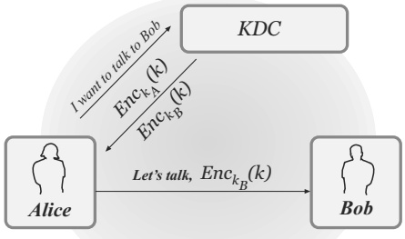
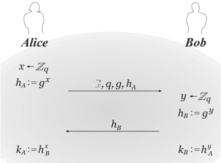

# Chapter 11: Key Management and the Public-Key Revolution

## 11.1 Key Distribution and Key Management

In previous chapters we have seen how private-key cryptography can be used to ensure secrecy and integrity for two parties communicating over an insecure channel, if we are willing to assume those two parties hold a shared, secret key. The question we have deferred since Chapter 1, however, is:

*How can the parties share a secret key in the first place?*

Clearly, the key cannot simply be sent over the insecure communication channel because an eavesdropping adversary would then be able to observe the key and it would no longer be secret. Some other mechanism must be used.

In some situations, the parties may have access to a secure channel that they can use to reliably share a secret key. One common example is when the two parties are physically co-located at some point in time, during which they can share a key. Alternatively, the parties might be able to use a trusted courier service as a secure channel. We stress that even if the parties have access to a secure channel at some point, this does *not* make private-key cryptography useless: in the first example, the parties have a secure channel at one point in time but not later; in the second example, utilizing the secure channel might be slower and more costly than communicating over an insecure channel.

The above approaches have been used to share keys in government, diplomatic, and military settings. As an example, the “red phone” connecting Moscow and Washington in the 1960s was encrypted using a one-time pad, with keys shared by couriers who flew from one country to the other carrying briefcases full of print-outs. Such approaches can also be used in corporations, e.g., to set up a shared key between a central database and a new employee on his/her first day of work. (We return to this example in the next section.)

Relying on a secure channel to distribute keys, however, does not work well in many other situations. For example, consider a large, multinational corporation in which *every pair* of employees might need the ability to communicate securely, with their communication protected from other employees as well. It will be inconvenient, to say the least, for each pair of employees to meet so they can securely share a key; for employees working in different cities, this may even be impossible. Even if the current set of employees could somehow share keys with each other, it would be impractical for them to share keys with new employees who join after this initial sharing is done.

Even assuming these $N$ employees are somehow able to securely share keys with each other, another significant drawback is that each employee would have to manage and store $N-1$ secret keys (one for each other employee in the company). In fact, this may significantly under-count the number of keys stored by each user, because employees may also need keys to communicate securely with remote resources such as databases, servers, printers, and so on. The proliferation of so many secret keys is a significant logistical problem. Moreover, all these keys must be stored securely. The more keys there are, the harder it is to protect them, and the higher the chance of some keys being stolen by an attacker. Computer systems are often infected by viruses, worms, and other forms of malicious software that can steal secret keys and send them quietly over the network to an attacker. Thus, storing keys on employees’ personal computers is not always a safe solution.

To be clear, potential compromise of secret keys is always a concern, irrespective of the number of keys each party holds. When only a few keys need to be stored, however, there are good solutions available for dealing with this threat. A typical solution today is to store keys on secure hardware such as a smartcard. A smartcard can carry out cryptographic computations using the stored secret keys, ensuring that these keys never make their way onto users’ personal computers. If designed properly, the smartcard can be much more resilient to attack than a personal computer—for example, it typically cannot be infected by malware—and so offers a good means of protecting users’ secret keys. Unfortunately, smartcards are typically quite limited in memory, and so cannot store hundreds (or thousands) of keys; they may also be somewhat expensive and difficult to replace if lost.

The concerns outlined above can all be addressed—in principle, even if not in practice—in “closed” organizations consisting of a well-defined population of users, all of whom are willing to follow the same policies for distributing and storing keys. They break down, however, in “open systems” where users have transient interactions, cannot arrange a physical meeting, and may not even be aware of each other’s existence until the time they first want to communicate. This is, in fact, a more common situation than one might initially realize: consider sending credit-card information to an Internet merchant from whom you have never previously purchased anything, or sending email to someone whom you have never met in person. In such cases, private-key cryptography alone simply does not provide a solution, and we must look further for adequate solutions.

To summarize, there are at least three distinct problems related to the use of private-key cryptography. The first is that of key distribution, the second is that of storing and managing large numbers of secret keys, and the third is the inapplicability of private-key cryptography to open systems.

## 11.2 A Partial Solution: Key-Distribution Centers

One way to address some of the concerns from the previous section is to use a key-distribution center (KDC) to establish shared keys. Consider again the case of a large corporation where all pairs of employees must be able to communicate securely. In such a setting, we can leverage the fact that all employees may trust some entity—say, the system administrator—at least with respect to the security of work-related information. This trusted entity can then act as a KDC and help all the employees share pairwise keys.

When a new employee joins, the KDC can share a key with that employee (in person, in a secure location) as part of that employee’s first day of work. At the same time, the KDC could also distribute shared keys between that employee and all existing employees. That is, when the $i$th employee joins, the KDC could (in addition to sharing a key between itself and this new employee) generate $i-1$ keys $k_1, \ldots, k_{i-1}$, give these keys to the new employee, and then send key $k_j$ to the $j$th existing employee by encrypting it using the key that employee already shares with the KDC. Following this, the new employee shares a key with every other employee (as well as with the KDC).

A better approach, which avoids requiring employees to store and manage multiple keys, is to utilize the KDC in an online fashion to generate keys “on demand” whenever two employees wish to communicate securely. As before, the KDC will share a (different) key with each employee, something that can be done securely on each employee’s first day of work. Say the KDC shares key $k_{A}$ with employee Alice, and $k_{B}$ with employee Bob. At some later time, when Alice wishes to communicate securely with Bob, she can simply send the message “I, Alice, want to talk to Bob” to the KDC. (If desired, this message can be authenticated using the key shared by Alice and the KDC.) The KDC then chooses a new, random key—called a session key—and sends this key $k$ to Alice encrypted using $k_{A}$, and to Bob encrypted using $k_{B}$. (This protocol is too simplistic to be used in practice; see further discussion below.) Once Alice and Bob both recover this session key, they can use it to communicate securely. When they are done with their conversation, they can (and should) erase the session key because they can always contact the KDC again if they wish to communicate at some later time.

Consider the advantages of this approach:

1. Each employee needs to store only one long-term secret key (namely, the one they share with the KDC). Employees still need to manage and store session keys, but these are short-term keys that are erased once a communication session concludes.

   The KDC needs to store many long-term keys. However, the KDC can be kept in a secure location and be given the highest possible protection against network attacks.

2. When an employee joins the organization, all that must be done is to set up a key between this employee and the KDC. No other employees need to update the set of keys they hold.

Thus, KDCs can alleviate two of the problems we have seen with regard to private-key cryptography: they can simplify key distribution (since only one new key must be shared when an employee joins, and it is reasonable to assume a secure channel between the KDC and that employee on their first day of work), and can reduce the complexity of key storage (since each employee only needs to store a single key). KDCs go a long way toward making private-key cryptography practical in large organizations where there is a single entity who is trusted by everyone.

There are, however, some drawbacks to relying on KDCs:

1. A successful attack on the KDC will result in a complete break of the system: an attacker can compromise all keys and subsequently eavesdrop on all network traffic. This makes the KDC a high-value target. Note that even if the KDC is well-protected against external attacks, there is always the possibility of an insider attack by an employee who has access to the KDC (for example, the IT manager).

2. The KDC is a single point of failure: if the KDC is down, secure communication is temporarily impossible. If employees are constantly contacting the KDC and asking for session keys to be established, the load on the KDC can be very high, thereby increasing the chances that it may fail or be slow to respond.

A simple solution to the second problem is to replicate the KDC. This works (and is done in practice), but also means that there are now more points of attack on the system. Adding more KDCs also makes it more difficult to add new employees, since updates must be securely propagated to every KDC.

Protocols for key distribution using a KDC. There are a number of protocols in the literature for secure key distribution using a KDC. We mention in particular the Needham–Schroeder protocol, which forms the core of Kerberos, an important and widely used service for performing authentication and supporting secure communication. (Kerberos is used in many universities and corporations, and is the default mechanism for supporting secure networked authentication and communication in Windows and many UNIX systems.) We only highlight one feature of this protocol. When Alice contacts the KDC and asks to communicate with Bob, the KDC does not send the encrypted session key to both Alice and Bob as we have described earlier. Instead, the KDC sends to Alice the session key encrypted under Alice’s key in addition to the session key encrypted under Bob’s key. Alice then forwards the second ciphertext to Bob as in Figure 11.1. The second ciphertext is sometimes called a ticket, and can be viewed as a credential that allows Alice to talk to Bob (and allows Bob to be assured that he is talking to Alice). Indeed, although we have not stressed this point in our discussion, a KDC-based approach can provide a useful means of performing authentication as well. Note also that Alice and Bob need not both be users; Alice might be a user and Bob a resource such as a remote server, a database, or a printer.

**FIGURE 11.1: A general template for key-distribution protocols.**

The protocol was designed in this way to reduce the load on the KDC. In the protocol as described, the KDC does not need to initiate a second connection to Bob, and need not worry whether Bob is on-line when Alice initiates the protocol. Moreover, if Alice retains the ticket (and her copy of the session key), then she can re-initiate secure communication with Bob by simply re-sending the ticket to Bob, without the involvement of the KDC at all. (In practice, tickets expire and eventually need to be renewed. But a session could be re-established within some acceptable time period.)

We conclude by noting that in practice the key that Alice shares with the KDC might be a short, easy-to-memorize password. In this case, many additional security problems arise that must be dealt with. We have also been implicitly assuming an attacker who only passively eavesdrops, rather than one who might actively try to interfere with the protocol. We refer the interested reader to the references at the end of this chapter for more information about how such issues can be addressed.

## 11.3 Key Exchange and the Diffie–Hellman Protocol

KDCs and protocols like Kerberos are used in practice. But these approaches to the key-distribution problem still require, at some point, a private and authenticated channel that can be used to share keys. (In particular, we assumed the existence of such a channel between the KDC and an employee on his or her first day.) Thus, they still cannot solve the problem of key distribution in open systems like the Internet, where there may be no private channel available between two users who wish to communicate.

To achieve private communication without ever communicating over a private channel, a radically different approach is needed. In 1976, Whitfield Diffie and Martin Hellman published a paper with the innocent-looking title “New Directions in Cryptography.” In that work they observed that there is often asymmetry in the world; in particular, there are certain actions that can be easily performed but not easily reversed. For example, padlocks can be locked without a key (i.e., easily), but cannot be reopened. More strikingly, it is easy to shatter a glass vase but extremely difficult to put it back together.

Algorithmically (and more relevant for our purposes), it is easy to multiply two large primes but difficult to recover those primes from their product. (This is exactly the factoring problem discussed in previous chapters.) Diffie and Hellman realized that such phenomena could be used to derive interactive protocols for secure key exchange that allow two parties to share a secret key, via communication over a public channel, by having the parties perform operations that an eavesdropper cannot reverse.

The existence of secure key-exchange protocols is quite amazing. It means that you and a friend could agree on a secret by simply shouting across a room (and performing some local computation); the secret would be unknown to anyone else, even if they had listened to everything that was said. Indeed, until 1976 it was generally believed that secure communication could not be done without first sharing some secret information using a private channel.

The influence of Diffie and Hellman’s paper was enormous. In addition to introducing a fundamentally new way of looking at cryptography, it was one of the first steps toward moving cryptography out of the private domain and into the public one. We quote the first two paragraphs of their paper:

> We stand today on the brink of a revolution in cryptography. The development of cheap digital hardware has freed it from the design limitations of mechanical computing and brought the cost of high grade cryptographic devices down to where they can be used in such commercial applications as remote cash dispensers and computer terminals.

> In turn, such applications create a need for new types of cryptographic systems which minimize the necessity of secure key distribution channels. . . . At the same time, theoretical developments in information theory and computer science show promise of providing provably secure cryptosystems, changing this ancient art into a science.

Diffie and Hellman were not exaggerating, and the revolution they spoke of was due in great part to their work.

In this section we present the Diffie–Hellman key-exchange protocol. We prove its security against eavesdropping adversaries or, equivalently, under the assumption that the parties communicate over a public but authenticated channel (so an attacker cannot interfere with their communication). Security against an eavesdropping adversary is a relatively weak guarantee, and in practice key-exchange protocols must satisfy stronger notions of security that are beyond our present scope. (Moreover, we are interested here in the setting where the communicating parties have no prior shared information, in which case there is nothing that can be done to prevent an adversary from impersonating one of the parties. We return to this point later.)

The setting and definition of security. We consider a setting with two parties—traditionally called Alice and Bob—who run a probabilistic protocol $\Pi$ in order to generate a shared, secret key; $\Pi$ can be viewed as the set of instructions for Alice and Bob in the protocol. Alice and Bob begin by holding the security parameter $1^n$; they then run $\Pi$ using (independent) random bits. At the end of the protocol, Alice and Bob output keys $k_A, k_B \in \{0,1\}^n$, respectively. The basic correctness requirement is that $k_A = k_B$. Since we will only deal with protocols that satisfy this requirement, we will speak simply of the key $k = k_A = k_B$ generated in some honest execution of $\Pi$. (Since $\Pi$ is randomized the key will, in general, be different every time $\Pi$ is run.)

We now turn to defining security. Intuitively, a key-exchange protocol is secure if the key output by Alice and Bob is completely hidden from an eavesdropping adversary. This is formally defined by requiring that an adversary who has eavesdropped on an execution of the protocol should be unable to distinguish the key $k$ generated by that execution (and now shared by Alice and Bob) from a uniform key of length $n$. This is much stronger than simply requiring that the adversary be unable to guess $k$ exactly, and this stronger notion is necessary if the parties will subsequently use $k$ for some cryptographic application (e.g., as a key for a private-key encryption scheme).

Formalizing the above, let $\Pi$ be a key-exchange protocol, $\mathcal{A}$ an adversary, and $n$ the security parameter. We have the following experiment:

The key-exchange experiment $\mathsf{KE}_{\mathcal{A},\Pi}^{\mathsf{eav}}(n)$:

1. Two parties holding $1^{n}$ execute protocol $\Pi$. This results in a transcript trans containing all the messages sent by the parties, and a key $k$ output by each of the parties.

2. A uniform bit $b \in \{0,1\}$ is chosen. If $b = 0$ set $\hat{k} := k$, and if $b = 1$ then choose uniform $\hat{k} \in \{0,1\}^n$.

3. $\mathcal{A}$ is given trans and $\hat{k}$, and outputs a bit $b^{\prime}$.

4. The output of the experiment is defined to be 1 if $b^{\prime} = b$, and 0 otherwise. (In case $\mathsf{KE}_{\mathcal{A},\Pi}^{\mathsf{eav}}(n) = 1$, we say that $\mathcal{A}$ succeeds.)

$\mathcal{A}$ is given trans to capture the fact that $\mathcal{A}$ eavesdrops on the entire execution of the protocol and thus sees all messages exchanged by the parties. In the real world, $\mathcal{A}$ would not be given any key; in the experiment the adversary is given $\hat{k}$ only as a means of defining what it means for $\mathcal{A}$ to “break” the security of $\Pi$. That is, the adversary succeeds in “breaking” $\Pi$ if it can correctly determine whether the key $\hat{k}$ is the real key corresponding to the given execution of the protocol, or whether $\hat{k}$ is a uniform key that is independent of the transcript.

As expected, we say $\Pi$ is secure if the adversary succeeds with probability that is at most negligibly greater than 1/2. That is:

DEFINITION 11.1 A key-exchange protocol $\Pi$ is secure in the presence of an eavesdropper if for all probabilistic polynomial-time adversaries $\mathcal{A}$ there is a negligible function $\mathsf{negl}$ such that

$$\Pr\left[\mathsf{KE}_{\mathcal{A},\Pi}^{\mathsf{eav}}(n)=1\right]\leq\frac{1}{2}+\mathsf{negl}(n).$$

The aim of a key-exchange protocol is almost always to generate a shared key $k$ that will be used by the parties for some further cryptographic purpose, e.g., to encrypt and authenticate their subsequent communication using, say, an authenticated encryption scheme. Intuitively, using a shared key generated by a secure key-exchange protocol should be “as good as” using a key shared over a private channel. It is possible to prove this formally; see Exercise 11.1.

The Diffie–Hellman key-exchange protocol. We now describe the key-exchange protocol that appeared in the original paper by Diffie and Hellman (although they were less formal than we will be here). Let $\mathcal{G}$ be a probabilistic polynomial-time algorithm that, on input $1^n$, outputs a description of a cyclic group $\mathbb{G}$, its order $q$ (with $\|q\| = n$), and a generator $g \in \mathbb{G}$. (See Section 9.3.2.) The Diffie–Hellman key-exchange protocol is described formally as Construction 11.2 and illustrated in Figure 11.2.

**CONSTRUCTION 11.2**

- Common input: The security parameter $1^{n}$

- The protocol:

1. Alice runs $\mathcal{G}(1^{n})$ to obtain $(\mathbb{G}, q, g)$.

2. Alice chooses a uniform $x \in \mathbb{Z}_q$, and computes $h_A := g^x$.

3. Alice sends $(\mathbb{G}, q, g, h_A)$ to Bob.

4. Bob receives $(\mathbb{G}, q, g, h_A)$. He chooses a uniform $y \in \mathbb{Z}_q$, and computes $h_B := g^y$. Bob sends $h_B$ to Alice and outputs the key $k_B := h_A^y$.

5. Alice receives $h_{B}$ and outputs the key $k_{A} := h_{B}^{x}$.

**The Diffie–Hellman key-exchange protocol.**

**FIGURE 11.2: The Diffie–Hellman key-exchange protocol.**

In our description, we have assumed that Alice generates $(\mathbb{G}, q, g)$ and sends these parameters to Bob as part of her first message. In practice, these parameters are standardized and known to both parties before the protocol begins. In that case Alice need only send $h_A$, and Bob need not wait to receive Alice’s message before computing and sending $h_B$.

It is not hard to see that the protocol is correct: Bob computes the key

$$k_{B}=h_{A}^{y}=(g^{x})^{y}=g^{xy}$$

and Alice computes the key

$$k_{A}=h_{B}^{x}=(g^{y})^{x}=g^{xy},$$

and so $k_{A} = k_{B}$. (The observant reader will note that the shared key is a group element, not a bit-string. We will return to this point later.)

Diffie and Hellman did not prove security of their protocol; indeed, the appropriate notions (both the definitional framework as well as the idea of formulating precise assumptions) were not yet in place. Let us see what sort of assumption will be needed in order for the protocol to be secure. A first observation, made by Diffie and Hellman, is that a minimal requirement for security here is that the discrete-logarithm problem be hard relative to $\mathcal{G}$. If not, then an adversary given the transcript (which, in particular, includes $h_A$) can compute the secret value of one of the parties (i.e., $x$) and then easily compute the shared key using that value. So, hardness of the discrete-logarithm problem is necessary for the protocol to be secure. It is not, however, sufficient, as it is possible that there are other ways of computing the key $k_A = k_B$ without explicitly computing $x$ or $y$. The computational Diffie–Hellman assumption—which would only guarantee that the key $g^{xy}$ is hard to compute in its entirety from the transcript—does not suffice either.

What is required by Definition 11.1 is that the shared key $g^{xy}$ should be indistinguishable from uniform for any adversary given $g$, $g^x$, and $g^y$. This is exactly the decisional Diffie–Hellman assumption introduced in Section 9.3.2.

As we will see, a proof of security for the protocol follows almost immediately from the decisional Diffie–Hellman assumption. This should not be surprising, as the Diffie–Hellman assumptions were introduced—well after Diffie and Hellman published their paper—as a way of abstracting the properties underlying the (conjectured) security of the Diffie–Hellman protocol. Given this, it is fair to ask whether anything is gained by defining and proving security here. By this point in the book, hopefully you are convinced the answer is yes. Precisely defining security for key-exchange protocols forces us to think about exactly what security properties we want; specifying a precise assumption (namely, the decisional Diffie–Hellman assumption) means we can study that assumption independently of any particular application and—once we are convinced of its plausibility—construct other protocols based on it; finally, proving security shows that the assumption does, indeed, suffice for the protocol to meet our desired notion of security.

In our proof of security, we use a modified version of Definition 11.1 in which it is required that the shared key be indistinguishable from a uniform element of $\mathbb{G}$ rather than from a uniform $n$-bit string. This discrepancy will need to be addressed before the protocol can be used in practice—after all, group elements are not typically useful as cryptographic keys, and the representation of a uniform group element will not, in general, be a uniform bit-string—and we briefly discuss one standard way to do so following the proof. For now, we let $\widehat{\mathsf{KE}}_{\mathcal{A},\Pi}^{\mathsf{eav}}(n)$ denote a modified experiment where if $b=1$ then $\hat{k}$ is chosen uniformly from $\mathbb{G}$ rather than uniformly from $\{0,1\}^n$.

THEOREM 11.3 If the decisional Diffie–Hellman problem is hard relative to $\mathcal{G}$, then the Diffie–Hellman key-exchange protocol $\Pi$ is secure in the presence of an eavesdropper (with respect to the modified experiment $\widehat{\mathsf{KE}}_{\mathcal{A},\Pi}^{\mathsf{eav}}$).

PROOF Let $\mathcal{A}$ be a PPT adversary. Since $\Pr[b=0] = \Pr[b=1] = 1/2$, we have

$$\begin{aligned}\Pr&\left[\widehat{\mathsf{KE}}_{\mathcal{A},\Pi}^{\mathsf{eav}}(n)=1\right]\\&=\frac{1}{2}\cdot\Pr\left[\widehat{\mathsf{KE}}_{\mathcal{A},\Pi}^{\mathsf{eav}}(n)=1\mid b=0\right]+\frac{1}{2}\cdot\Pr\left[\widehat{\mathsf{KE}}_{\mathcal{A},\Pi}^{\mathsf{eav}}(n)=1\mid b=1\right].\end{aligned}$$

In experiment $\widehat{\mathsf{KE}}_{\mathcal{A},\Pi}^{\mathsf{eav}}(n)$ the adversary $\mathcal{A}$ receives $(\mathbb{G}, q, g, h_A, h_B, \hat{k})$, where $(\mathbb{G}, q, g, h_A, h_B)$ represents the transcript of the protocol execution, and $\hat{k}$ is either the actual key computed by the parties (if $b = 0$) or a uniform group element (if $b = 1$). Distinguishing between these two cases is exactly equivalent to solving the decisional Diffie–Hellman problem. That is

$$\begin{aligned}&\Pr\left[\widehat{\mathsf{KE}}_{\mathcal{A},\Pi}^{\mathsf{eav}}(n)=1\right]\\ &=\frac{1}{2}\cdot\Pr\left[\widehat{\mathsf{KE}}_{\mathcal{A},\Pi}^{\mathsf{eav}}(n)=1\mid b=0\right]+\frac{1}{2}\cdot\Pr\left[\widehat{\mathsf{KE}}_{\mathcal{A},\Pi}^{\mathsf{eav}}(n)=1\mid b=1\right]\\ &=\frac{1}{2}\cdot\Pr[\mathcal{A}(\mathbb{G},q,g,g^{x},g^{y},g^{xy})=0]+\frac{1}{2}\cdot\Pr[\mathcal{A}(\mathbb{G},q,g,g^{x},g^{y},g^{z})=1]\\ &=\frac{1}{2}\cdot\left(1-\Pr[\mathcal{A}(\mathbb{G},q,g,g^{x},g^{y},g^{xy})=1]\right)+\frac{1}{2}\cdot\Pr[\mathcal{A}(\mathbb{G},q,g,g^{x},g^{y},g^{z})=1]\\ &=\frac{1}{2}+\frac{1}{2}\cdot\left(\Pr[\mathcal{A}(\mathbb{G},q,g,g^{x},g^{y},g^{z})=1]-\Pr[\mathcal{A}(\mathbb{G},q,g,g^{x},g^{y},g^{xy})=1]\right)\\ &\leq\frac{1}{2}+\frac{1}{2}\cdot\left|\Pr[\mathcal{A}(\mathbb{G},q,g,g^{x},g^{y},g^{z})=1]-\Pr[\mathcal{A}(\mathbb{G},q,g,g^{x},g^{y},g^{xy})=1]\right|,\end{aligned}$$

where the probabilities are all taken over $(\mathbb{G}, q, g)$ output by $\mathcal{G}(1^n)$, and uniform choice of $x, y, z \in \mathbb{Z}_q$. (Note that since $g$ is a generator, $g^z$ is a uniform element of $\mathbb{G}$ when $z$ is uniformly distributed in $\mathbb{Z}_q$.) If the decisional Diffie–Hellman assumption is hard relative to $\mathcal{G}$, that exactly means that there is a negligible function $\mathsf{negl}$ for which

$$\left|\Pr[\mathcal{A}(\mathbb{G},q,g,g^{x},g^{y},g^{z})=1]-\Pr[\mathcal{A}(\mathbb{G},q,g,g^{x},g^{y},g^{xy})=1]\right|\leq\mathsf{negl}(n).$$

We conclude that

$$\Pr\left[\widehat{\mathsf{KE}}_{\mathcal{A},\Pi}^{\mathsf{eav}}(n)=1\right]\leq\frac{1}{2}+\frac{1}{2}\cdot\mathsf{negl}(n),$$

completing the proof.

Uniform group elements vs. uniform bit-strings. The previous theorem shows that the key output by Alice and Bob in the Diffie–Hellman protocol is indistinguishable (for a polynomial-time eavesdropper) from a uniform group element. In order to use the key for subsequent cryptographic applications—as well as to meet Definition 11.1—the key output by the parties should instead be indistinguishable from a uniform bit-string of the appropriate length. The Diffie–Hellman protocol can be modified to achieve this by having the parties apply an appropriate key-derivation function (cf. Section 6.6.4) to the shared group element $g^{xy}$ they each compute.

Active adversaries. So far we have considered only an eavesdropping adversary. Although eavesdropping attacks are by far the most common (as they are the easiest to carry out), they are by no means the only possible attack. Active attacks, in which the adversary sends messages of its own to one or both of the parties, are also a concern, and any protocol used in practice must be resilient to such attacks as well. When considering active attacks, it is useful to distinguish, informally, between impersonation attacks where the adversary impersonates one party while interacting with the other party, and man-in-the-middle attacks where both honest parties are executing the protocol and the adversary is intercepting and modifying messages being sent from one party to the other. We will not formally define security against either class of attacks, as such definitions are rather involved and cannot be achieved without the parties sharing some information in advance. Nevertheless, it is worth remarking that the Diffie–Hellman protocol is completely insecure against a man-in-the-middle attack. In fact, a man-in-the-middle adversary can act in such a way that Alice and Bob terminate the protocol with different keys $k_{A}$ and $k_{B}$ that are both known to the adversary, yet neither Alice nor Bob can detect that any attack was carried out. We leave the details of this attack as an exercise.

Diffie–Hellman key exchange in practice. The Diffie–Hellman protocol in its basic form is typically not used in practice due to its insecurity against man-in-the-middle attacks, as discussed above. This does not detract in any way from its importance. The Diffie–Hellman protocol served as the first demonstration that asymmetric techniques (and number-theoretic problems) could be used to alleviate the problems of key distribution in cryptography. Furthermore, the Diffie–Hellman protocol is at the core of standardized key-exchange protocols that are resilient to man-in-the-middle attacks and are in wide use today. One notable example is TLS; see Section 13.7.

## 11.4 The Public-Key Revolution

In addition to key exchange, Diffie and Hellman also introduced in their ground-breaking work the notion of public-key (or asymmetric) cryptography. In the public-key setting (in contrast to the private-key setting we have studied until now), a party who wishes to communicate securely generates a pair of keys: a public key that is widely disseminated, and a private key that it keeps secret. (The fact that there are now two different keys is what makes the scheme asymmetric.) Having generated these keys, a party can use them to ensure secrecy for messages it receives using a public-key encryption scheme, or integrity for messages it sends using a digital signature scheme. (See Figure 11.3.) We provide a brief taste of these primitives here, and discuss them in extensive detail in Chapters 12 and 13, respectively.

In a public-key encryption scheme, the public key generated by some party serves as an encryption key; anyone who knows that public key can use it to encrypt messages and generate corresponding ciphertexts. The private key serves as a decryption key and is used by the party who knows it to recover the original message from any ciphertext generated using the matching public key. Furthermore—and it is amazing that something like this exists!—the secrecy of encrypted messages is preserved even against an adversary who knows the public key (but not the private key). In other words, the (public) encryption key is of no use for an attacker trying to decrypt ciphertexts encrypted using that key.

|  | Private-Key Setting | Public-Key Setting |
| --- | --- | --- |
| Secrecy | Private-key encryption | Public-key encryption |
| Integrity | Message authentication codes | Digital signature schemes |

**FIGURE 11.3: Cryptographic primitives in the private-key and the public-key settings.**

To allow for secret communication, then, a receiver can simply send her public key to a potential sender (without having to worry about an eavesdropper who observes it), or publicize her public key on her webpage or in some central database. A public-key encryption scheme thus enables private communication without relying on a private channel for key distribution.$^{1}$

> $^{1}$ For now, however, we do assume an authenticated channel that allows the sender to obtain a legitimate copy of the receiver’s public key. In Section 13.6 we show how public-key cryptography can be used to solve that problem as well.

A digital signature scheme is a public-key analogue of a message authentication code (MAC). Here, the private key serves as an “authentication key” (called a signing key) that enables the party who knows this key to generate “authentication tags” (aka signatures) for messages it sends. The public key acts as a verification key, allowing anyone who knows it to verify signatures issued by the sender. As with MACs, a digital signature scheme can be used to prevent undetected tampering of a message; here, however, security holds even against an adversary who knows the public key. The fact that verification is public (i.e., can be done by anyone who knows the public key of the sender) has far-reaching ramifications, as it makes it possible to take a document signed by Alice and present it to a third party (say, a judge) for verification. This property is called non-repudiation and has extensive applications in e-commerce (e.g., for signing legal documents). Digital signatures are also used for the secure distribution of public keys as part of a public-key infrastructure, as discussed in more detail in Section 13.6.

In their paper, Diffie and Hellman set forth the notion of public-key cryptography but did not give any candidate constructions. A year later, Ron Rivest, Adi Shamir, and Len Adleman proposed the RSA problem and presented the first public-key encryption and digital signature schemes based on the hardness of that problem. Variants of their schemes are now among the most widely used cryptosystems today. In 1985, Taher El Gamal presented an encryption scheme that is essentially a slight twist on the Diffie–Hellman key-exchange protocol, variants of which are now also widely used. Thus, although Diffie and Hellman did not succeed in constructing a (non-interactive) public-key encryption scheme, they came very close.

We conclude by summarizing how public-key cryptography addresses the limitations of the private-key setting discussed in Section 11.1:

1. Public-key cryptography allows key distribution to be done over public (but authenticated) channels. This can simplify the distribution and updating of shared, secret keys.

2. Public-key cryptography reduces the need for users to store many secret keys. Consider again the setting of a large corporation where each pair of employees needs the ability to communicate securely. Using public-key cryptography, it suffices for each employee to store just a single private key (their own) and the public keys of all other employees. Importantly, these latter keys do not need to be kept secret; they could even be stored in some central (public) repository.

3. Finally, public-key cryptography is (more) suitable for open environments where parties who have never previously interacted want the ability to communicate securely. As one commonplace example, a company can post its public key on-line; a user making a purchase can obtain the company’s public key, as needed, when they need to encrypt their credit-card information to send to that company.

The invention of public-key encryption was a revolution in cryptography. It is no coincidence that until the late 1970s and early 1980s, encryption and cryptography in general belonged to the domain of intelligence and military organizations, and only with the advent of public-key techniques did the use of cryptography become widespread.

Why study private-key cryptography? It should be apparent that public-key cryptography is strictly stronger than private-key cryptography; in particular, any public-key encryption scheme could be used as a private-key encryption scheme. (The communicating users can simply share both the public key and the private key. If secrecy for encrypted messages holds even when the eavesdropper knows the public key, then it clearly holds when the public key is kept secret!) So why did we bother studying private-key cryptography at all? The answer is simple: private-key cryptography is much more efficient than public-key cryptography, and should be used in settings where it is appropriate. That is, in cases where it is possible for communicating parties to share a key, private-key cryptography should be used. This includes small-scale, closed systems of users as well as applications like disk encryption. Moreover, as we will see in Sections 12.3 and 13.7, private-key encryption is used in the public-key setting to obtain better efficiency.

## References and Additional Reading

We have only briefly discussed the problems of key distribution and key management. For more information, we recommend looking at textbooks on network security, such as the one by Kaufman et al. [113].

We have not made any attempt to capture the full history of the development of public-key cryptography. Others besides Diffie and Hellman were working on similar ideas in the 1970s. One researcher in particular doing similar and independent work was Ralph Merkle, considered by many to be a co-inventor of public-key cryptography (although he published after Diffie and Hellman). We also mention Michael Rabin, who developed constructions of signature schemes and public-key encryption schemes based on the hardness of factoring about one year after the work of Rivest, Shamir, and Adleman [171]. We highly recommend reading the original paper by Diffie and Hellman [65], and refer the reader to the book by Levy [129] for more on the political and historical aspects of the public-key revolution.

Interestingly, aspects of public-key cryptography were discovered in the intelligence community before being published in the open scientific literature. In the early 1970s, James Ellis, Clifford Cocks, and Malcolm Williamson of the British intelligence agency GCHQ invented the notion of public-key cryptography, a variant of RSA encryption, and a variant of the Diffie–Hellman key-exchange protocol. Their work was not declassified until 1997. Although the underlying mathematics of public-key cryptography may have been discovered before 1976, it is fair to say that the widespread ramifications of this new technology were not appreciated until Diffie and Hellman came along.

## Exercises

11.1 Let $\Pi$ be a key-exchange protocol, and ($\mathsf{Enc}, \mathsf{Dec}$) be a private-key encryption scheme. Consider the following interactive protocol $\Pi^{\prime}$ for encrypting a message: first, the sender and receiver run $\Pi$ to generate a shared key $k$. Next, the sender computes $c \leftarrow \mathsf{Enc}_k(m)$ and sends $c$ to the other party, who decrypts and recovers $m$ using $k$.

(a) Formulate a definition of indistinguishable encryptions in the presence of an eavesdropper (cf. Definition 3.8) appropriate for this interactive setting.

(b) Prove that if $\Pi$ is secure in the presence of an eavesdropper and ($\mathsf{Enc}, \mathsf{Dec}$) has indistinguishable encryptions in the presence of an eavesdropper, then $\Pi^{\prime}$ satisfies your definition.

11.2 Show that, for either of the groups considered in Sections 9.3.3 or 9.3.4, a uniform group element (expressed using the natural representation) is easily distinguishable from a uniform bit-string of the same length.

11.3 Describe a man-in-the-middle attack on the Diffie–Hellman protocol where the adversary shares a key $k_{A}$ with Alice and a (different) key $k_{B}$ with Bob, and Alice and Bob cannot detect that anything is wrong.

11.4 Consider the following key-exchange protocol:

(a) Alice chooses uniform $k, r \in \{0,1\}^n$, and sends $s := k \oplus r$ to Bob.

(b) Bob chooses uniform $t \in \{0,1\}^n$, and sends $u := s \oplus t$ to Alice.

(c) Alice computes $w := u \oplus r$ and sends $w$ to Bob.

(d) Alice outputs $k$ and Bob outputs $w \oplus t$.

Show that Alice and Bob output the same key. Analyze the security of this protocol against a passive eavesdropper.

