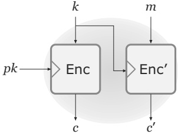
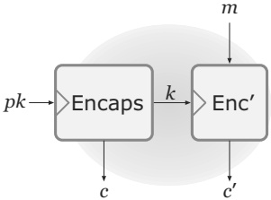
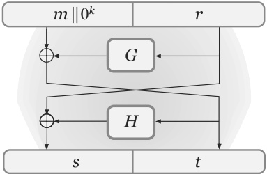

# Chapter 12: Public-Key Encryption

## 12.1 Public-Key Encryption – An Overview

The introduction of public-key encryption marked a revolution in cryptography. Until that time, cryptographers had relied exclusively on shared, secret keys to achieve private communication. Public-key techniques, in contrast, enable parties to communicate privately without having agreed on any secret information in advance. As we have already noted, it is quite amazing and counterintuitive that this is possible: it means that two people on opposite sides of a room who can only communicate by shouting to each other, and have no initial shared secret, can talk in such a way that no one else in the room learns anything about what they are saying!

In the setting of private-key encryption, two parties agree on a secret key that can be used, by either party, for both encryption and decryption. Public-key encryption is asymmetric in both these respects. One party (the receiver) generates a pair of keys $(pk, sk)$, called the public key and the private key, respectively. The public key is used by a sender to encrypt a message; the receiver uses the private key to decrypt the resulting ciphertext.

Since the goal is to avoid the need for two parties to meet in advance to agree on any information, how does the sender learn pk? At an abstract level, there are two ways this can occur. Say Alice is the receiver, and Bob is the sender. In the first approach, when Alice learns that Bob wants to communicate with her, she can at that point generate $(pk, sk)$ (assuming she hasn't done so already) and then send $pk$ to Bob in the clear; Bob can then use $pk$ to encrypt his message. We emphasize that the channel between Alice and Bob may be public, but is assumed to be authenticated, meaning that the adversary cannot modify the public key sent by Alice to Bob (and, in particular, cannot replace pk with its own public key). In Section 13.6 we discuss how public keys can be distributed over unauthenticated channels.

An alternative approach is for Alice to generate her keys $(pk, sk)$ in advance, independently of any particular sender. (In fact, at the time of key generation Alice need not be aware that Bob wants to talk to her, or even that Bob exists.) Alice can widely disseminate her public key pk by, say, publishing it on her webpage, putting it on her business cards, or placing it in a public directory. Now, anyone who wishes to communicate privately with Alice can look up her public key and proceed as above. Multiple senders can communicate multiple times with Alice using the same public key pk for encrypting all their communication.

Note that pk is inherently public—and can thus be learned easily by an attacker—in either of the above scenarios. In the first case, an adversary eavesdropping on the communication between Alice and Bob obtains pk directly; in the second case, an adversary could just as well look up Alice's public key on its own. We see that the security of public-key encryption cannot rely on secrecy of $pk$, but must instead rely on secrecy of $sk$. It is therefore crucial that Alice not reveal her private key to anyone, including the sender Bob.

### Comparison to Private-Key Encryption

Perhaps the most obvious difference between private- and public-key encryption is that the former assumes complete secrecy of all cryptographic keys, whereas the latter requires secrecy only for the private key $sk$. Although this may seem like a minor distinction, the ramifications are huge: in the private-key setting the communicating parties must somehow be able to share the secret key without allowing any third party to learn it, whereas in the public-key setting the public key can be sent from one party to the other over a public channel without compromising security. For parties shouting across a room or, more realistically, communicating over a public WiFi network or the Internet, public-key encryption is the only option.

Another important distinction is that private-key encryption schemes use the same key for both encryption and decryption, whereas public-key encryption schemes use different keys for each operation. That is, public-key encryption is inherently asymmetric. This asymmetry in the public-key setting means that the roles of sender and receiver are not interchangeable as they are in the private-key setting: a single key-pair allows communication in one direction only. (Bidirectional communication can be achieved in a number of ways; the point is that a single invocation of a public-key encryption scheme forces a distinction between one user who acts as a receiver and other users who act as senders.) In addition, a single instance of a public-key encryption scheme enables multiple senders to communicate privately with a single receiver, in contrast to the private-key case where a secret key shared between two parties enables private communication between those two parties only.

Summarizing and elaborating the preceding discussion, we see that public-key encryption has the following advantages relative to private-key encryption:

- Public-key encryption addresses (to some extent) the key-distribution problem, since communicating parties do not need to secretly share a key in advance of their communication. Two parties can communicate secretly even if all communication between them is monitored.

- When a single receiver is communicating with N senders (e.g., an on-line merchant processing credit-card orders from multiple purchasers), it is much more convenient for the receiver to store a single private key $sk$ rather than to share, store, and manage $N$ different secret keys (i.e., one for each sender).

- When using public-key encryption the number and identities of potential senders need not be known at the time of key generation. This allows enormous flexibility in “open systems.”

The fact that public-key encryption schemes allow anyone to act as a sender can be a drawback when a receiver only wants to receive messages from one specific individual. In that case, an authenticated (private-key) encryption scheme would be a better choice than public-key encryption.

The main disadvantage of public-key encryption is that it is roughly $2-3$ orders of magnitude slower than private-key encryption. (It is difficult to give an exact comparison since the relative efficiency depends on the exact schemes under consideration as well as various implementation details.) It can be a challenge to implement public-key encryption in severely resource-constrained devices like smartcards or radio-frequency identification (RFID) tags. Even when a desktop computer is performing cryptographic operations, carrying out thousands of such operations per second (as in the case of a website processing credit-card transactions) may be prohibitive. Thus, when private-key encryption is an option (i.e., if two parties can securely share a key in advance), it should be used.

As we will see in Section 12.3, private-key encryption is used in the public-key setting to improve the efficiency of (public-key) encryption for long messages. A thorough understanding of private-key encryption is therefore crucial for appreciating how public-key encryption is implemented in practice.

### Secure Distribution of Public Keys

In our entire discussion thus far, we have implicitly assumed that the adversary is passive; that is, the adversary only eavesdrops on communication between the sender and receiver but does not actively interfere with the communication. Equivalently, we assume the communication channel between the sender and receiver is authenticated, at least for the initial sharing of the public key. If the adversary has the ability to tamper with all communication between the honest parties, and the honest parties share no keys in advance, then privacy simply cannot be achieved. For example, if a receiver Alice sends her public key $pk$ to Bob but the adversary replaces it with a key $pk'$ of its own (for which it knows the matching private key $sk'$), then even though Bob encrypts his message using $pk'$ the adversary will easily be able to recover the message (using $sk'$). A similar attack works if an adversary is able to change the value of Alice's public key that is stored in some public directory, or if the adversary can tamper with the public key as it is transmitted from the public directory to Bob. If Alice and Bob do not share any information in advance, and are not willing to rely on some mutually trusted third party, there is nothing Alice or Bob can do to prevent active attacks of this sort, or even to tell that such an attack is taking place. $^{1}$

Importantly, our treatment of public-key encryption in this chapter assumes that senders are able to obtain a legitimate copy of the receiver's public key. (This will be implicit in the security definitions we provide.) That is, we assume secure key distribution. This assumption is made not because active attacks of the type discussed above are of no concern—in fact, they represent a serious threat that must be dealt with in any real-world system that uses public-key encryption. Rather, this assumption is made because there exist other mechanisms for preventing active attacks (see, for example, Section 13.6), and it is therefore convenient (and useful) to decouple the study of secure public-key encryption from the study of secure public-key distribution.

## 12.2 Definitions

We begin by defining the syntax of public-key encryption. The definition is very similar to Definition 3.7, with the exception that instead of working with just one key, we now have distinct encryption and decryption keys.

DEFINITION 12.1 A public-key encryption scheme is a triple of probabilistic polynomial-time algorithms (Gen, Enc, Dec) such that:

1. The key-generation algorithm Gen takes as input the security parameter $1^{n}$ and outputs a pair of keys $(pk, sk)$. We refer to the first of these as the public key and the second as the private key. We assume for convenience that $pk$ and $sk$ each has length at least $n$, and that $n$ can be determined from $pk$, $sk$.

The public key $pk$ defines a message space $\mathcal{M}_{pk}$.

2. The encryption algorithm Enc takes as input a public key $pk$ and message $m \in \mathcal{M}_{pk}$, and outputs a ciphertext $c$; we denote this by $c \leftarrow \mathsf{Enc}_{pk}(m)$. (Looking ahead, Enc will need to be probabilistic in order to achieve meaningful security.)

3. The deterministic decryption algorithm Dec takes as input a private key $sk$ and a ciphertext $c$, and outputs a message $m$ or a special symbol $\perp$ denoting failure. We write this as $m := \mathsf{Dec}_{sk}(c)$.

It is required that, except with negligible probability over the randomness of Gen and Enc, we have $\mathsf{Dec}_{sk}(\mathsf{Enc}_{pk}(m)) = m$ for any message $m \in \mathcal{M}_{pk}$.

The important difference from the private-key setting is that the key-generation algorithm Gen now outputs two keys instead of one. The public key $pk$ is used for encryption, while the private key $sk$ is used for decryption. Reiterating our earlier discussion, pk is assumed to be widely distributed so that anyone can encrypt messages for the party who generated this key, but sk must be kept private by the receiver in order for security to possibly hold.

We allow for a negligible probability of decryption error and, indeed, some of the schemes we present will have a negligible error probability (e.g., if a prime needs to be chosen, but with negligible probability a composite is obtained instead). Despite this, we will generally ignore the issue from here on.

For practical usage of public-key encryption, we will want the message space to be bit-strings of some length (and, in particular, to be independent of the public key). When we describe encryption schemes with some message space $\mathcal{M}_{pk}$, we will in such cases also specify how to encode bit-strings as elements of $\mathcal{M}$ (unless it is obvious). This encoding must be both efficiently computable and efficiently reversible, so the receiver can recover the bit-string that was encrypted.

### 12.2.1 Security against Chosen-Plaintext Attacks

We initiate our treatment of security by introducing the “natural” counterpart of Definition 3.8 in the public-key setting. Since extensive motivation for this definition (as well as the others we will see) has already been given in Chapter 3, the discussion here will be relatively brief and will focus primarily on the differences between the private-key and the public-key settings.

Given a public-key encryption scheme $\Pi = (\mathsf{Gen}, \mathsf{Enc}, \mathsf{Dec})$ and an adversary $\mathcal{A}$, consider the following experiment:

The eavesdropping indistinguishability experiment $\mathsf{PubK}_{\mathcal{A},\Pi}^{\mathsf{eav}}(n)$:

1. $\mathsf{Gen}(1^{n})$ is run to obtain keys $(pk, sk)$.

2. Adversary $\mathcal{A}$ is given $pk$, and outputs a pair of equal-length messages $m_0, m_1 \in \mathcal{M}_{pk}$.

3. A uniform bit $b \in \{0,1\}$ is chosen, and then a ciphertext $c \leftarrow \mathsf{Enc}_{pk}(m_b)$ is computed and given to $\mathcal{A}$. We call $c$ the challenge ciphertext.

4. $\mathcal{A}$ outputs a bit $b'$. The output of the experiment is 1 if $b^{\prime} = b$, and 0 otherwise. If $b^{\prime} = b$ we say that $\mathcal{A}$ succeeds.

DEFINITION 12.2 A public-key encryption scheme $\Pi = (\mathsf{Gen}, \mathsf{Enc}, \mathsf{Dec})$ has indistinguishable encryptions in the presence of an eavesdropper if for all probabilistic polynomial-time adversaries $\mathcal{A}$ there is a negligible function $\mathsf{negl}$ such that

$$
\Pr[\mathsf{PubK}_{\mathcal{A},\Pi}^{\mathsf{eav}}(n)=1]\leq\frac{1}{2}+\mathsf{negl}(n).
$$

The main difference between the above definition and Definition 3.8 is that here $\mathcal{A}$ is given the public key $pk$. Furthermore, we allow $\mathcal{A}$ to choose its messages $m_0$ and $m_1$ based on this public key. This is essential when defining security of public-key encryption since, as discussed previously, it makes sense to assume that the adversary knows the public key of the recipient.

The seemingly “minor” modification of giving the adversary $\mathcal{A}$ the public key $pk$ has a tremendous impact: it effectively gives $\mathcal{A}$ access to an encryption oracle for free. (The concept of an encryption oracle is explained in Section 3.4.2.) This is true because the adversary, given pk, can encrypt any message m on its own by simply computing $\mathsf{Enc}_{pk}(m)$. (As always, $\mathcal{A}$ is assumed to know the algorithm $\mathsf{Enc}$.) The upshot is that Definition 12.2 is equivalent to CPA-security (i.e., security against chosen-plaintext attacks), where this is defined in a manner analogous to Definition 3.21 with the only difference being that the attacker is given the public key in the corresponding experiment. We thus have:

PROPOSITION 12.3 If a public-key encryption scheme has indistinguishable encryptions in the presence of an eavesdropper, it is CPA-secure.

This is in contrast to the private-key setting, where there exist schemes that have indistinguishable encryptions in the presence of an eavesdropper but are insecure under a chosen-plaintext attack (see Proposition 3.19). Further differences from the private-key setting that follow almost immediately as consequences of the above are discussed next.

Impossibility of perfectly secret public-key encryption. Perfectly secret public-key encryption could be defined analogously to Definition 2.3 by conditioning on the entire view of an eavesdropper (i.e., including the public key). Equivalently, it could be defined by extending Definition 12.2 to require that for all adversaries A (not only efficient ones), we have:

$$
\Pr[\mathsf{PubK}_{\mathcal{A},\Pi}^{\mathsf{eav}}(n)=1]=\frac{1}{2}.
$$

In contrast to the private-key setting, however, perfectly secret public-key encryption is impossible, regardless of how long the keys are or how small the message space is. In fact, an unbounded adversary given $pk$ and a ciphertext $c$ computed via $c \leftarrow \mathsf{Enc}_{pk}(m)$ can determine $m$ with probability 1 (assuming errorless encryption). A proof of this is left as Exercise 12.1.

Insecurity of deterministic public-key encryption. As noted in the context of private-key encryption, no deterministic encryption scheme can be CPA-secure. The same is true here:

THEOREM 12.4 No deterministic public-key encryption scheme is CPA-secure.

Because Theorem 12.4 is so important, it merits more discussion. The theorem is not an “artefact” of our security definition, or an indication that our definition is too strong. Deterministic public-key encryption schemes are vulnerable to practical attacks in realistic scenarios and should not be used. The reason is that a deterministic scheme not only allows the adversary to determine when the same message is sent twice (as in the private-key setting), but also allows the adversary to recover the message if the set of possible messages is small. For example, consider a professor encrypting students' grades. Here, an eavesdropper knows that each student's grade is one of $\{A, B, C, D, F\}$. If the professor uses a deterministic public-key encryption scheme, an eavesdropper can determine any student's grade by encrypting all possible grades and comparing the results to the corresponding ciphertext.

Although Theorem 12.4 seems deceptively simple, for a long time many real-world systems were designed using deterministic public-key encryption. When public-key encryption was introduced, it is fair to say that the importance of probabilistic encryption was not yet fully realized. The seminal work of Goldwasser and Micali, in which (something equivalent to) Definition 12.2 was proposed and Theorem 12.4 was stated, marked a turning point in the field of cryptography. The importance of pinning down one's intuition in a formal definition and looking at things the right way for the first time—even if seemingly simple in retrospect—should not be underestimated.

### 12.2.2 Multiple Encryptions

As in Chapter 3, it is important to understand the effect of using the same key (in this case, the same public key) for encrypting multiple messages. We could formulate security in such a setting by having an adversary output two lists of plaintexts, as in Definition 3.18. For the reasons discussed in Section 3.4.3, however, we choose instead to use a definition in which the attacker is given access to a “left-or-right” oracle $\mathsf{LR}_{pk,b}$ that, on input a pair of equal-length messages $m_0, m_1$, computes the ciphertext $c \leftarrow \mathsf{Enc}_{pk}(m_b)$ and returns $c$. The attacker is allowed to query this oracle as many times as it likes, and the definition therefore models security when multiple (unknown) messages are encrypted using the same public key.

Formally, consider the following experiment defined for an adversary $\mathcal{A}$ and a public-key encryption scheme $\Pi = (\mathsf{Gen}, \mathsf{Enc}, \mathsf{Dec})$:

The LR-oracle experiment $\mathsf{PubK}_{\mathcal{A},\Pi}^{\mathsf{LR-cpa}}(n)$:

1. $\mathsf{Gen}(1^{n})$ is run to obtain keys (pk, sk).

2. A uniform bit $b \in \{0,1\}$ is chosen.

3. The adversary $\mathcal{A}$ is given input $pk$ and oracle access to $\mathsf{LR}_{pk,b}(\cdot,\cdot)$

4. The adversary $\mathcal{A}$ outputs a bit $b'$.

5. The output of the experiment is defined to be 1 if $b^{\prime} = b$, and 0 otherwise. If $\mathsf{PubK}_{\mathcal{A},\Pi}^{\mathsf{LR-cpa}}(n) = 1$, we say that $\mathcal{A}$ succeeds.

DEFINITION 12.5 A public-key encryption scheme $\Pi = (\mathsf{Gen}, \mathsf{Enc}, \mathsf{Dec})$ has indistinguishable multiple encryptions if for all probabilistic polynomial-time adversaries $\mathcal{A}$ there exists a negligible function $\mathsf{negl}$ such that:

$$
\Pr[\mathsf{PubK}_{\mathcal{A},\Pi}^{\mathsf{LR-cpa}}(n)=1]\leq\frac{1}{2}+\mathsf{negl}(n).
$$

We will show that any CPA-secure scheme automatically has indistinguishable multiple encryptions; that is, in the public-key setting, security for encryption of a single message implies security for encryption of multiple messages. This means if we can prove security of some scheme with respect to Definition 12.2, which is simpler and easier to work with, we may then conclude that the scheme satisfies Definition 12.5, a seemingly stronger definition that more accurately models real-world usage of public-key encryption. A proof of the following theorem is given below.

THEOREM 12.6 If public-key encryption scheme $\Pi$ is CPA-secure, then it also has indistinguishable multiple encryptions.

An analogous result in the private-key setting was stated, but not proved, as Theorem 3.23.

**Encrypting arbitrary-length messages.**

An immediate consequence of Theorem 12.6 is that a CPA-secure public-key encryption scheme for fixed-length messages implies a public-key encryption scheme for arbitrary-length messages satisfying the same notion of security. We illustrate this in the extreme case when the original scheme encrypts only 1-bit messages. Say $\Pi = (\mathsf{Gen}, \mathsf{Enc}, \mathsf{Dec})$ is an encryption scheme for single-bit messages. We can construct a new scheme $\Pi^{\prime} = (\mathsf{Gen}, \mathsf{Enc}^{\prime}, \mathsf{Dec}^{\prime})$ that has message space $\{0,1\}^*$ by defining $\mathsf{Enc}^{\prime}$ as follows:

$$
\mathsf{Enc}_{pk}^{\prime}(m)=\mathsf{Enc}_{pk}(m_{1}),\ldots,\mathsf{Enc}_{pk}(m_{\ell}), \tag{12.1}
$$

where $m = m_1 \cdots m_\ell$. (The decryption algorithm $\mathsf{Dec}^{\prime}$ is constructed in the obvious way.) We have:

**CLAIM 12.7** Let $\Pi$ and $\Pi^{\prime}$ be as above. If $\Pi$ is CPA-secure, then so is $\Pi^{\prime}$.

The claim follows since we can view encryption of the message $m$ using $\Pi^{\prime}$ as encryption of $\ell$ messages $(m_1, \ldots, m_\ell)$ using scheme $\Pi$.

**A note on terminology.**

We have introduced three definitions of security for public-key encryption schemes—indistinguishable encryptions in the presence of an eavesdropper, CPA-security, and indistinguishable multiple encryptions—that are all equivalent. Following the usual convention in the cryptographic literature, we will simply use the term “CPA-security” to refer to schemes meeting these notions of security.

### \*Proof of Theorem 12.6

The proof of Theorem 12.6 is rather involved. We therefore provide some intuition before turning to the details. For this intuitive discussion we assume for simplicity that $\mathcal{A}$ makes only two calls to the LR oracle in experiment $\mathsf{PubK}_{\mathcal{A},\Pi}^{\mathsf{LR-cpa}}(n)$. (In the full proof, the number of calls can be arbitrary.)

Fix an arbitrary PPT adversary $\mathcal{A}$ and a CPA-secure public-key encryption scheme $\Pi$, and consider an experiment $\mathsf{PubK}_{\mathcal{A},\Pi}^{\mathsf{LR-cpa2}}(n)$ where $\mathcal{A}$ can make only two queries to the LR oracle. Denote the queries made by $\mathcal{A}$ to the oracle by $(m_{1,0}, m_{1,1})$ and $(m_{2,0}, m_{2,1})$; note that the second pair of messages may depend on the first ciphertext obtained by $\mathcal{A}$ from the oracle. In the experiment, $\mathcal{A}$ receives either a pair of ciphertexts $(\mathsf{Enc}_{pk}(m_{1,0}), \mathsf{Enc}_{pk}(m_{2,0}))$ (if $b = 0$), or a pair of ciphertexts $(\mathsf{Enc}_{pk}(m_{1,1}), \mathsf{Enc}_{pk}(m_{2,1}))$ (if $b = 1$). We write $\mathcal{A}(pk, \mathsf{Enc}_{pk}(m_{1,0}), \mathsf{Enc}_{pk}(m_{2,0}))$ to denote the output of $\mathcal{A}$ in the first case, and analogously for the second.

Let $\vec{C}_0$ denote the distribution of ciphertext pairs in the first case, and $\vec{C}_1$ the distribution of ciphertext pairs in the second case. To show that Definition 12.5 holds (for $\mathsf{PubK}_{\mathcal{A},\Pi}^{\mathsf{LR-cpa2}}$), we need to prove that $\mathcal{A}$ cannot distinguish between being given a pair of ciphertexts distributed according to $\vec{C}_0$, or a pair of ciphertexts distributed according to $\vec{C}_1$. That is, we need to prove that there is a negligible function $\mathsf{negl}$ such that

$$
\begin{aligned}
&\left|\Pr[\mathcal{A}(pk,\mathsf{Enc}_{pk}(m_{1,0}),\mathsf{Enc}_{pk}(m_{2,0}))=1]\right.\\
&\left.\quad-\Pr[\mathcal{A}(pk,\mathsf{Enc}_{pk}(m_{1,1}),\mathsf{Enc}_{pk}(m_{2,1}))=1]\right|\leq\mathsf{negl}(n).
\end{aligned} \tag{12.2}
$$

(This is equivalent to Definition 12.5 for the same reason that Definition 3.9 is equivalent to Definition 3.8.) To prove this, we will show that

1. CPA-security of $\Pi$ implies that $\mathcal{A}$ cannot distinguish between the case when it is given a pair of ciphertexts distributed according to $\vec{C}_0$, or a pair of ciphertexts ( $\mathsf{Enc}_{pk}(m_{1,0})$, $\mathsf{Enc}_{pk}(m_{2,1})$), which corresponds to encrypting the first message in $\mathcal{A}$'s first oracle query and the second message in $\mathcal{A}$'s second oracle query. (Although this cannot occur in $\mathsf{PubK}_{\mathcal{A},\Pi}^{\mathsf{LR-cpa2}}(n)$, we can still ask what $\mathcal{A}$'s behavior would be if given such a ciphertext pair.) Let $\vec{C}_{01}$ denote the distribution of ciphertext pairs in this latter case.

2. Similarly, CPA-security of $\Pi$ implies that $\mathcal{A}$ cannot distinguish between the case when it is given a pair of ciphertexts distributed according to $\vec{C}_{01}$, or a pair of ciphertexts distributed according to $\vec{C}_{1}$.

The above says that $\mathcal{A}$ cannot distinguish between distributions $\vec{C}_0$ and $\vec{C}_{01}$, nor between distributions $\vec{C}_{01}$ and $\vec{C}_1$. We conclude (using simple algebra) that $\mathcal{A}$ cannot distinguish between distributions $\vec{C}_0$ and $\vec{C}_1$.

The crux of the proof, then, is showing that $\mathcal{A}$ cannot distinguish between being given a pair of ciphertexts distributed according to $\vec{C}_0$, or a pair of ciphertexts distributed according to $\vec{C}_{01}$. (The other case follows similarly.) That is, we want to show that there is a negligible function $\mathsf{negl}$ for which

$$
\begin{aligned}
&\left|\Pr[\mathcal{A}\left(pk,\mathsf{Enc}_{pk}(m_{1,0}),\mathsf{Enc}_{pk}(m_{2,0})\right)=1]\right.\\
&\left.\quad-\Pr[\mathcal{A}\left(pk,\mathsf{Enc}_{pk}(m_{1,0}),\mathsf{Enc}_{pk}(m_{2,1})\right)=1]\right|\leq\mathsf{negl}(n).
\end{aligned} \tag{12.3}
$$

Note that the only difference between the input of the adversary $\mathcal{A}$ in each case is in the second element. Intuitively, indistinguishability follows from the single-message case since $\mathcal{A}$ can generate $\mathsf{Enc}_{pk}(m_{1,0})$ by itself. Formally, consider the following PPT adversary $\mathcal{A}^{\prime}$ running in experiment $\mathsf{PubK}_{\mathcal{A}^{\prime},\Pi}^{\mathsf{eav}}(n)$:

**Adversary $\mathcal{A}'$:**

1. On input $pk$, adversary $\mathcal{A}^{\prime}$ runs $\mathcal{A}(pk)$ as a subroutine.

2. When $\mathcal{A}$ makes its first query $(m_{1,0}, m_{1,1})$ to the LR oracle, $\mathcal{A}^{\prime}$ computes $c_1 \leftarrow \mathsf{Enc}_{pk}(m_{1,0})$ and returns $c_1$ to $\mathcal{A}$ as the response from the oracle.

3. When $\mathcal{A}$ makes its second query $(m_{2,0}, m_{2,1})$ to the LR oracle, $\mathcal{A}^{\prime}$ outputs $(m_{2,0}, m_{2,1})$ and receives back a challenge ciphertext $c_2$. This is returned to $\mathcal{A}$ as the response from the LR oracle.

4. $\mathcal{A}^{\prime}$ outputs the bit $b^{\prime}$ output by $\mathcal{A}$.

Looking at experiment $\mathsf{PubK}_{\mathcal{A}^{\prime},\Pi}^{\mathsf{eav}}(n)$, we see that when $b = 0$ then the challenge ciphertext $c_2$ is computed as $\mathsf{Enc}_{pk}(m_{2,0})$. Thus,

$$
\Pr[\mathcal{A}^{\prime}\left(\mathsf{Enc}_{pk}(m_{2,0})\right)=1]=\Pr[\mathcal{A}\left(\mathsf{Enc}_{pk}(m_{1,0}),\mathsf{Enc}_{pk}(m_{2,0})\right)=1]. \tag{12.4}
$$

(We suppress explicit mention of pk to save space.) In contrast, when $b = 1$ in experiment $\mathsf{PubK}_{\mathcal{A}^{\prime},\Pi}^{\mathsf{eav}}(n)$, then $c_2$ is computed as $\mathsf{Enc}_{pk}(m_{2,1})$ and so

$$
\Pr[\mathcal{A}^{\prime}\left(\mathsf{Enc}_{pk}(m_{2,1})\right)=1]=\Pr[\mathcal{A}\left(\mathsf{Enc}_{pk}(m_{1,0}),\mathsf{Enc}_{pk}(m_{2,1})\right)=1]. \tag{12.5}
$$

CPA-security of $\Pi$ implies that there is a negligible function $\mathsf{negl}$ such that

$$
\left|\Pr[\mathcal{A}^{\prime}(\mathsf{Enc}_{pk}(m_{2,0}))=1]-\Pr[\mathcal{A}^{\prime}(\mathsf{Enc}_{pk}(m_{2,1}))=1]\right|\leq\mathsf{negl}(n).
$$

This, together with Equations (12.4) and (12.5), yields Equation (12.3).

In almost exactly the same way, we can prove that:

$$
\begin{aligned}
&\left|\Pr[\mathcal{A}\left(pk,\mathsf{Enc}_{pk}(m_{1,0}),\mathsf{Enc}_{pk}(m_{2,1})\right)=1]\right.\\
&\left.\quad-\Pr[\mathcal{A}\left(pk,\mathsf{Enc}_{pk}(m_{1,1}),\mathsf{Enc}_{pk}(m_{2,1})\right)=1]\right|\leq\mathsf{negl}(n).
\end{aligned} \tag{12.6}
$$

Equation (12.2) follows by combining Equations (12.3) and (12.6).

The main complication that arises in the general case is that the number of queries to the LR oracle is no longer fixed but may instead be an arbitrary polynomial of n. In the formal proof this is handled using a hybrid argument. (Hybrid arguments were used also in Chapter 8.)

PROOF (of Theorem 12.6) Let $\Pi$ be a CPA-secure public-key encryption scheme and $\mathcal{A}$ an arbitrary PPT adversary in experiment $\mathsf{PubK}_{\mathcal{A},\Pi}^{\mathsf{LR-cpa}}(n)$. Let $t = t(n)$ be a polynomial upper bound on the number of queries made by $\mathcal{A}$ to the $\mathsf{LR}$ oracle, and assume without loss of generality that $\mathcal{A}$ always queries the oracle exactly this many times. For a given public key $pk$ and $0 \leq i \leq t$, let $\mathsf{LR}_{pk}^{i}$ denote the oracle that on input $(m_0, m_1)$ returns $\mathsf{Enc}_{pk}(m_0)$ for the first $i$ queries it receives, and returns $\mathsf{Enc}_{pk}(m_1)$ for the next $t - i$ queries it receives. (That is, for the first $i$ queries the first message in the input pair is encrypted, and for the remaining queries the second message in the input pair is encrypted.) We stress that each encryption is computed using uniform, independent randomness. Using this notation, we have

$$
\Pr\left[\mathsf{PubK}_{\mathcal{A},\Pi}^{\mathsf{LR-cpa}}(n)=1\right]=\frac{1}{2}\cdot\Pr[\mathcal{A}^{\mathsf{LR}_{pk}^{t}}(pk)=0]+\frac{1}{2}\cdot\Pr[\mathcal{A}^{\mathsf{LR}_{pk}^{0}}(pk)=1]
$$

because oracle $\mathsf{LR}_{pk}^{t}$ is equivalent to $\mathsf{LR}_{pk,0}$, and oracle $\mathsf{LR}_{pk}^{0}$ is equivalent to $\mathsf{LR}_{pk,1}$. To prove that $\Pi$ satisfies Definition 12.5, we will show that for any PPT $\mathcal{A}$ there is a negligible function $\mathsf{negl}^{\prime}$ such that

$$
\left|\Pr[\mathcal{A}^{\mathsf{LR}_{pk}^{t}}(pk)=1]-\Pr[\mathcal{A}^{\mathsf{LR}_{pk}^{0}}(pk)=1]\right|\leq\mathsf{negl}^{\prime}(n).
$$

(As before, this is equivalent to Definition 12.5 for the same reason that Definition 3.9 is equivalent to Definition 3.8.)

Consider the following PPT adversary $\mathcal{A}^{\prime}$ that eavesdrops on the encryption of a single message:

Adversary A':

1. $\mathcal{A}^{\prime}$, given pk, chooses a uniform index $i \leftarrow \{1, \ldots, t\}$

2. $\mathcal{A}^{\prime}$ runs $\mathcal{A}(pk)$, answering its jth oracle query $(m_{j,0}, m_{j,1})$ as follows:

(a) For $j < i$, adversary $\mathcal{A}^{\prime}$ computes $c_j \leftarrow \mathsf{Enc}_{pk}(m_{j,0})$ and returns $c_j$ to $\mathcal{A}$ as the response from its oracle.

(b) For $j = i$, adversary $\mathcal{A}^{\prime}$ outputs $(m_{j,0}, m_{j,1})$ and receives back a challenge ciphertext $c_j$. This is returned to $\mathcal{A}$ as the response from its oracle.

(c) For $j > i$, adversary $\mathcal{A}^{\prime}$ computes $c_j \leftarrow \mathsf{Enc}_{pk}(m_{j,1})$ and returns $c_j$ to $\mathcal{A}$ as the response from its oracle.

3. $\mathcal{A}^{\prime}$ outputs the bit $b^{\prime}$ that is output by $\mathcal{A}$.

Consider experiment $\mathsf{PubK}_{\mathcal{A}^{\prime},\Pi}^{\mathsf{eav}}(n)$. Fixing some choice of $i = i^*$, note that if $c_{i^*}$ is an encryption of $m_{i^*,0}$ then the interaction of $\mathcal{A}$ with its oracle is identical to an interaction with oracle $\mathsf{LR}_{pk}^{i}$. Thus,

$$
\begin{aligned}
\Pr[\mathcal{A}^{\prime}\text{ outputs }1\mid b=0]&=\sum_{i^{*}=1}^{t}\Pr[i=i^{*}]\cdot\Pr[\mathcal{A}^{\prime}\text{ outputs }1\mid b=0\land i=i^{*}]\\
&=\sum_{i^{*}=1}^{t}\frac{1}{t}\cdot\Pr\left[\mathcal{A}^{\mathsf{LR}_{pk}^{i^{*}}}(pk)=1\right].
\end{aligned}
$$

On the other hand, if $c_{i^*}$ is an encryption of $m_{i^*,1}$ then the interaction of $\mathcal{A}$ with its oracle is identical to an interaction with oracle $\mathsf{LR}_{pk}^{i^*-1}$, and so

$$
\begin{aligned}
\Pr[\mathcal{A}^{\prime}\text{ outputs }1\mid b=1]&=\sum_{i^{*}=1}^{t}\Pr[i=i^{*}]\cdot\Pr[\mathcal{A}^{\prime}\text{ outputs }1\mid b=1\land i=i^{*}]\\
&=\sum_{i^{*}=1}^{t}\frac{1}{t}\cdot\Pr\left[\mathcal{A}^{\mathsf{LR}_{pk}^{i^{*}-1}}(pk)=1\right]\\
&=\sum_{i^{*}=0}^{t-1}\frac{1}{t}\cdot\Pr\left[\mathcal{A}^{\mathsf{LR}_{pk}^{i^{*}}}(pk)=1\right].
\end{aligned}
$$

Since $\mathcal{A}^{\prime}$ runs in polynomial time, the assumption that $\Pi$ is CPA-secure means that there exists a negligible function $\mathsf{negl}$ such that

$$
\left|\Pr[\mathcal{A}^{\prime}\text{ outputs }1\mid b=0]-\Pr[\mathcal{A}^{\prime}\text{ outputs }1\mid b=1]\right|\leq\mathsf{negl}(n).
$$

But this means that

$$
\begin{aligned}
\mathsf{negl}(n)&\geq\left|\sum_{i^{*}=1}^{t}\frac{1}{t}\cdot\Pr\left[\mathcal{A}^{\mathsf{LR}_{pk}^{i^{*}}}(pk)=1\right]-\sum_{i^{*}=0}^{t-1}\frac{1}{t}\cdot\Pr\left[\mathcal{A}^{\mathsf{LR}_{pk}^{i^{*}}}(pk)=1\right]\right|\\
&=\frac{1}{t}\cdot\left|\Pr\left[\mathcal{A}^{\mathsf{LR}_{pk}^{t}}(pk)=1\right]-\Pr\left[\mathcal{A}^{\mathsf{LR}_{pk}^{0}}(pk)=1\right]\right|,
\end{aligned}
$$

since all but one of the terms in each summation cancel. We conclude that

$$
\left|\Pr\left[\mathcal{A}^{\mathsf{LR}_{pk}^{t}}(pk)=1\right]-\Pr\left[\mathcal{A}^{\mathsf{LR}_{pk}^{0}}(pk)=1\right]\right|\leq t(n)\cdot\mathsf{negl}(n). \tag{12.7}
$$

Because $t$ is polynomial, the function $t \cdot \mathsf{negl}(n)$ is negligible. Since $\mathcal{A}$ was an arbitrary PPT adversary, this shows that Equation (12.7) holds and so completes the proof that $\Pi$ has indistinguishable multiple encryptions.

### 12.2.3 Security against Chosen-Ciphertext Attacks

Chosen-ciphertext attacks, in which an adversary is able to obtain the decryption of arbitrary ciphertexts of its choice (with one technical restriction described below), are a concern in the public-key setting just as they are in the private-key setting. In fact, they are arguably more of a concern in the public-key setting since in that context a receiver expects to receive ciphertexts from multiple senders who are possibly unknown in advance, whereas a receiver in the private-key setting intends to communicate only with a single, known sender using any particular secret key.

Assume an eavesdropper $\mathcal{A}$ observes a ciphertext $c$ sent by a sender $\mathcal{S}$ to a receiver $\mathcal{R}$. Broadly speaking, in the public-key setting there are two ways in which $\mathcal{A}$ might carry out a chosen-ciphertext attack:

- $\mathcal{A}$ might send a modified ciphertext $c^{\prime}$ to $\mathcal{R}$ on behalf of $\mathcal{S}$. (For example, in the context of encrypted e-mail, $\mathcal{A}$ might construct an encrypted e-mail $c^{\prime}$ and forge the “From” field so that it appears the e-mail originated from $\mathcal{S}$.) In this case, although it is unlikely that $\mathcal{A}$ would be able to obtain the entire decryption $m^{\prime}$ of $c^{\prime}$, it might be possible for $\mathcal{A}$ to infer some information about $m^{\prime}$ based on the subsequent behavior of $\mathcal{R}$. Based on this information, $\mathcal{A}$ might be able to learn something about the original message m.

- $\mathcal{A}$ might send a modified ciphertext $c^{\prime}$ to $\mathcal{R}$ in its own name. In this case, $\mathcal{A}$ might obtain the entire decryption $m^{\prime}$ of $c^{\prime}$ if $\mathcal{R}$ responds directly to $\mathcal{A}$. Even if $\mathcal{A}$ learns nothing about $m^{\prime}$, this modified message may have a known relation to the original message $m$ that can be exploited by $\mathcal{A}$; see the third scenario below for an example.

The second class of attacks is specific to the setting of public-key encryption, and has no analogue in the private-key case.

It is not hard to identify a number of realistic scenarios illustrating the above types of attacks:

Scenario 1. Say a user $S$ logs in to her bank account by sending to her bank an encryption of her password $pw$ concatenated with a timestamp. Assume further that there are two types of error messages the bank sends: it returns "password incorrect" if the encrypted password does not match the stored password of S, and "timestamp incorrect" if the password is correct but the timestamp is not.

If an adversary obtains a ciphertext $c$ sent by $\mathcal{S}$ to the bank, the adversary can now mount a chosen-ciphertext attack by sending ciphertexts $c^{\prime}$ to the bank on behalf of $\mathcal{S}$ and observing the error messages that are sent in response. (This is similar to the padding-oracle attack that we saw in Section 5.1.1.) In some cases, this information may be enough to allow the adversary to determine the user's entire password.

Scenario 2. Say $S$ sends an encrypted e-mail $c$ to $\mathcal{R}$, and this e-mail is observed by $\mathcal{A}$. If $\mathcal{A}$ sends, in its own name, an encrypted e-mail $c^{\prime}$ to $\mathcal{R}$, then $\mathcal{R}$ might reply to this e-mail and quote the decrypted text $m^{\prime}$ corresponding to $c^{\prime}$. In this case, $\mathcal{R}$ is essentially acting as a decryption oracle for $\mathcal{A}$ and might potentially decrypt any ciphertext that $\mathcal{A}$ sends it.

Scenario 3. An issue that is closely related to that of chosen-ciphertext security is potential malleability of ciphertexts. We do not provide a formal definition but instead only give the intuitive idea. An encryption scheme is malleable if it has the following property: given an encryption $c$ of some unknown message $m$, it is possible to come up with a ciphertext $c^{\prime}$ that is an encryption of a message $m^{\prime}$ that is related in some known way to m. For example, perhaps given an encryption of m, it is possible to construct an encryption of $m+1$. (Later we will see natural examples of CPA-secure schemes that are malleable; see also Section 15.2.3.)

Now imagine that $\mathcal{R}$ is running an auction, where two parties $\mathcal{S}$ and $\mathcal{A}$ submit their bids by encrypting them using the public key of $\mathcal{R}$. If a malleable encryption scheme is used, it may be possible for an adversary $\mathcal{A}$ to always place the higher bid (without bidding the maximum) by carrying out the following attack: wait until $\mathcal{S}$ sends a ciphertext $c$ corresponding to its bid $m$ (that is unknown to $\mathcal{A}$); then send a ciphertext $c^{\prime}$ corresponding to the bid $m^{\prime} = m + 1$. Note that $m$ (and $m^{\prime}$, for that matter) remain unknown to $\mathcal{A}$ until $\mathcal{R}$ announces the results, and so the possibility of such an attack does not contradict the fact that the encryption scheme is CPA-secure. Schemes secure against chosen-ciphertext attacks, on the other hand, can be shown to be non-malleable and so are not vulnerable to such attacks.

**The definition.**

Security against chosen-ciphertext attacks is defined by suitable modification of the analogous definition from the private-key setting (Definition 5.1). Given a public-key encryption scheme $\Pi$ and an adversary $\mathcal{A}$, consider the following experiment:

**The CCA indistinguishability experiment $\mathsf{PubK}_{\mathcal{A},\Pi}^{\mathsf{cca}}(n)$:**

1. $\mathsf{Gen}(1^{n})$ is run to obtain keys $(pk, sk)$.

2. The adversary $\mathcal{A}$ is given $pk$ and access to a decryption oracle $\mathsf{Dec}_{sk}(\cdot)$. It outputs a pair of messages $m_0, m_1 \in \mathcal{M}_{pk}$ of the same length.

3. A uniform bit $b \in \{0,1\}$ is chosen, and then a ciphertext $c \leftarrow \mathsf{Enc}_{pk}(m_b)$ is computed and given to $\mathcal{A}$.

4. $\mathcal{A}$ continues to interact with the decryption oracle, but may not request a decryption of $c$ itself. Finally, $\mathcal{A}$ outputs a bit $b'$.

5. The output of the experiment is defined to be 1 if $b^{\prime} = b$, and 0 otherwise.

DEFINITION 12.8 A public-key encryption scheme $\Pi = (\mathsf{Gen}, \mathsf{Enc}, \mathsf{Dec})$ has indistinguishable encryptions under a chosen-ciphertext attack (or is CCA-secure) if for all probabilistic polynomial-time adversaries $\mathcal{A}$ there exists a negligible function negl such that

$$
\Pr[\mathsf{PubK}_{\mathcal{A},\Pi}^{\mathsf{cca}}(n)=1]\leq\frac{1}{2}+\mathsf{negl}(n).
$$

The natural analogue of Theorem 12.6 holds for CCA-security as well. That is, if a scheme has indistinguishable encryptions under a chosen-ciphertext attack then it has indistinguishable multiple encryptions under a chosen-ciphertext attack (defined appropriately). Interestingly, however, the analogue of Claim 12.7 does not hold for CCA-security.

As in Definition 5.1, we must prevent the attacker from submitting the challenge ciphertext $c$ to the decryption oracle in order for the definition to be achievable. But this restriction does not make the definition meaningless and, in particular, for each of the three motivating scenarios given earlier one can argue that setting $c^{\prime} = c$ is of no benefit to the attacker:

- In the first scenario involving password-based login, the attacker learns nothing about $\mathcal{S}$'s password by replaying $c$ since in this case it already knows that the error message "timestamp incorrect" will be returned.

- In the second scenario involving encrypted email, sending $c^{\prime} = c$ to the receiver would likely make the receiver suspicious and so it would refuse to respond at all.

- In the final scenario involving an auction, $\mathcal{R}$ could easily detect cheating if the adversary's encrypted bid is identical to the other party's encrypted bid. Even if $\mathcal{R}$ ignores such cheating, all the attacker achieves by replaying $c$ is to submit the same bid as the honest party.

An analogue of authenticated encryption? In the setting of private-key encryption, we introduced the notion of authenticated encryption (cf. Section 5.2) and noted that it was even stronger than CCA-security. This notion cannot be translated directly to the context of public-key encryption, where a single public key is used by many senders to communicate to one receiver (in contrast to the private-key case where a given key is used by only two parties to communicate). Nevertheless, an analogue of authenticated encryption can be considered in the public-key setting; see Section 13.8.

## 12.3 Hybrid Encryption and the KEM/DEM Paradigm

Claim 12.7 shows that any CPA-secure public-key encryption scheme for $\ell$-bit messages can be used to obtain a CPA-secure public-key encryption scheme for messages of arbitrary length. Encrypting an arbitrary-length message using this approach requires $\gamma \stackrel{\mathrm{def}}{=} \lceil |m|/\ell \rceil$ invocations of the original encryption scheme, meaning that both the computation and the ciphertext length are increased by a multiplicative factor of $\gamma$ relative to the underlying scheme.

It is possible to do better by using private-key encryption in tandem with public-key encryption. This improves efficiency because private-key encryption is significantly faster than public-key encryption, and improves bandwidth because private-key schemes have lower ciphertext expansion. The resulting combination is called hybrid encryption and is used extensively in practice. The basic idea is to use public-key encryption to obtain a shared key $k$, and then encrypt the message $m$ using a private-key encryption scheme and key k. The receiver uses its long-term (asymmetric) private key to derive k, and then uses private-key decryption (with key k) to recover the original message. We stress that although private-key encryption is used as a component, this is a full-fledged public-key encryption scheme by virtue of the fact that the sender and receiver do not share any secret key in advance.

**FIGURE 12.1: Hybrid encryption. Enc denotes a public-key encryption scheme, while Enc' is a private-key encryption scheme.**

In a direct implementation of this idea (see Figure 12.1), the sender would share $k$ by (1) choosing a uniform value $k$ and then (2) encrypting $k$ using a public-key encryption scheme. A more direct approach is to use a public-key primitive called a key-encapsulation mechanism (KEM) to accomplish both of these “in one shot.” This is advantageous both from a conceptual point of view and in terms of efficiency, as we will see later.

A KEM has three algorithms similar in spirit to those of a public-key encryption scheme. As before, the key-generation algorithm Gen is used to generate a pair of public and private keys. In place of encryption, we now have an encapsulation algorithm Encaps that takes only a public key as input (and no message), and outputs a ciphertext c along with a key k. A corresponding decapsulation algorithm Decaps is run by the receiver to recover $k$ from the ciphertext $c$ using the private key. Formally:

DEFINITION 12.9 A key-encapsulation mechanism (KEM) is a tuple of probabilistic polynomial-time algorithms (Gen, Encaps, Decaps) such that:

1. The key-generation algorithm Gen takes as input the security parameter $1^{n}$ and outputs a public-/private-key pair $(pk, sk)$. We assume $pk$ and $sk$ each has length at least $n$, and that $n$ can be determined from $pk$.

2. The encapsulation algorithm Encaps takes as input a public key $pk$ (which implicitly defines $n$). It outputs a ciphertext $c$ and a key $k \in \{0,1\}^{\ell(n)}$ where $\ell$ is the key length. We write this as $(c,k) \leftarrow \mathsf{Encaps}_{pk}(1^n)$.

3. The deterministic decapsulation algorithm Decaps takes as input a private key $sk$ and a ciphertext $c$, and outputs a key $k$ or a special symbol $\perp$ denoting failure. We write this as $k := \mathsf{Decaps}_{sk}(c)$.

It is required that all but negligible probability over the randomness of Gen and Encaps, if $\mathsf{Encaps}_{pk}(1^{n})$ outputs $(c,k)$ then $\mathsf{Decaps}_{sk}(c)$ outputs $k$.

In the definition we assume for simplicity that Encaps always outputs (a ciphertext $c$ and) a key of some fixed length $\ell(n)$. One could also consider a more general definition in which Encaps takes $1^{\ell}$ as an addition

Any public-key encryption scheme trivially gives a KEM by choosing a random key $k$ and encrypting it. As we will see, however, dedicated constructions of KEMs can be more efficient.

**FIGURE 12.2: Hybrid encryption using the KEM/DEM approach.**

Using a KEM (with key length $n$), we can implement hybrid encryption as in Figure 12.2. The sender runs $\mathsf{Encaps}_{pk}(1^n)$ to obtain $c$ along with a key $k$; it then uses a private-key encryption scheme to encrypt its message $m$, using $k$ as the key. In this context, the private-key encryption scheme is called a data-encapsulation mechanism (DEM) for obvious reasons. The ciphertext sent to the receiver includes both $c$ and the ciphertext $c^{\prime}$ from the private-key scheme. Construction 12.10 gives a formal specification.

What is the efficiency of the resulting hybrid encryption scheme $\Pi^{hy}$? For some fixed value of $n$, let $\alpha$ denote the cost of encapsulating an $n$-bit key using Encaps, and let $\beta$ denote the cost (per bit of plaintext) of encryption using Enc'. (The formal specification is given in Construction 12.10.)

**CONSTRUCTION 12.10**

Let $\Pi = (\mathsf{Gen}, \mathsf{Encaps}, \mathsf{Decaps})$ be a KEM with key length $n$, and let $\Pi' = (\mathsf{Gen}', \mathsf{Enc}', \mathsf{Dec}')$ be a private-key encryption scheme. Construct a public-key encryption scheme $\Pi^{\mathsf{hy}} = (\mathsf{Gen}^{\mathsf{hy}}, \mathsf{Enc}^{\mathsf{hy}}, \mathsf{Dec}^{\mathsf{hy}})$ as follows:

- $\mathsf{Gen}^{\mathsf{hy}}$: on input $1^{n}$ run $\mathsf{Gen}(1^{n})$ and use the public and private keys $(pk, sk)$ that are output.
- $\mathsf{Enc}^{\mathsf{hy}}$: on input a public key pk and a message $m \in \{0,1\}^{*}$ do:

   1. Compute $(c, k) \leftarrow \mathsf{Encaps}_{pk}(1^n)$.
   2. Compute $c^{\prime} \leftarrow \mathsf{Enc}_{k}^{\prime}(m)$.
   3. Output the ciphertext $\langle c, c^{\prime}\rangle$.

- $\mathsf{Dec}^{\mathsf{hy}}$: on input a private key sk and a ciphertext $\langle c, c^{\prime}\rangle$ do:

   1. Compute $k := \mathsf{Decaps}_{sk}(c)$.
   2. Output the message $m := \mathsf{Dec}_{k}^{\prime}(c^{\prime})$.

Hybrid encryption using the KEM/DEM paradigm.

Assume $|m| > n$, which is the interesting case. Then the cost, per bit of plaintext, of encrypting a message $m$ using $\Pi^{hy}$ is

$$
\frac{\alpha+\beta\cdot|m|}{|m|}=\frac{\alpha}{|m|}+\beta, \tag{12.8}
$$

which approaches $\beta$ for sufficiently long $m$. In the limit of very long messages, then, the cost per bit incurred by the public-key encryption scheme $\Pi^{hy}$ is the same as the cost per bit of the private-key scheme $\Pi^{\prime}$. Hybrid encryption thus allows us to achieve the functionality of public-key encryption at the efficiency of private-key encryption, at least for sufficiently long messages.

A similar calculation can be used to measure the effect of hybrid encryption on the ciphertext length. For some fixed value of $n$, let $L$ denote the length of the ciphertext output by $\mathsf{Encaps}$, and say the private-key encryption of a message $m$ using $\mathsf{Enc}^{\prime}$ results in a ciphertext of length $n + |m|$ (this can be achieved using one of the modes of encryption discussed in Section 3.6; actually, even ciphertext length $|m|$ is possible since, as we will see, $\Pi^{\prime}$ need not be CPA-secure). Then the total length of a ciphertext in scheme $\Pi^{hy}$ is

$$
L+n+\left|m\right|. \tag{12.9}
$$

In contrast, when using block-by-block encryption as in Equation (12.1), and assuming that public-key encryption of an $n$-bit message using $\mathsf{Enc}$ results in a ciphertext of length $L$, encryption of a message $m$ would result in a ciphertext of length $L \cdot \lceil |m|/n \rceil$. The ciphertext length given by Equation (12.9) is a significant improvement for sufficiently long $m$.

We can use some rough estimates to get a sense for what the above results mean in practice. (We stress that these numbers are only meant to give the reader a feel for the improvement; realistic values would depend on a variety of factors.) A typical value for the length of the key $k$ might be $n = 128$. Furthermore, a “base” public-key encryption scheme might yield 256-bit ciphertexts when encrypting 128-bit messages; assume a KEM has ciphertexts of the same length when encapsulating a 128-bit key. Letting $\alpha$, as before, denote the computational cost of public-key encryption/encapsulation of a 128-bit key, we see that block-by-block encryption as in Equation (12.1) would encrypt a 1 Mb ( $\approx 2^{20}$-bit) message with computational cost $\alpha \cdot \lceil 2^{20}/128 \rceil \approx 8200 \cdot \alpha$ and the ciphertext would be 2 MB long. Compare this to the efficiency of hybrid encryption. Letting $\beta$, as before, denote the per-bit computational cost of private-key encryption, a reasonable approximation is $\beta \approx \alpha/2^{11}$. Using Equation (12.8), we see that the overall computational cost for hybrid encryption for a 1 Mb message is

$$
\alpha+2^{20}\cdot\frac{\alpha}{2^{11}}\approx512\cdot\alpha,
$$

and the ciphertext would be only slightly longer than 1 MB. Thus, hybrid encryption improves the computational efficiency in this case by a factor of 16, and the ciphertext length by a factor of 2.

It remains to analyze the security of $\Pi^{hy}$. This, of course, depends on the security of its underlying components $\Pi$ and $\Pi^{\prime}$. In the following sections we define notions of CPA-security and CCA-security for KEMs, and show:

If $\Pi$ is a CPA-secure KEM and the private-key scheme $\Pi^{\prime}$ is EAV-secure, then $\Pi^{\mathrm{hy}}$ is a CPA-secure public-key encryption scheme. Notice that it suffices for $\Pi^{\prime}$ to satisfy a weaker definition of security—which, recall, does not imply CPA-security in the private-key setting—in order for the hybrid scheme $\Pi^{\mathrm{hy}}$ to be CPA-secure. Intuitively, the reason is that a fresh, uniform key $k$ is chosen each time a new message is encrypted. Since each key $k$ is used only once, security of $\Pi^{\prime}$ for a single encryption suffices for CPA-security of the hybrid scheme $\Pi^{\mathrm{hy}}$. This means that basic private-key encryption using a pseudorandom generator (or stream cipher), as in Construction 3.17, suffices.

If $\Pi$ is a CCA-secure KEM and $\Pi^{\prime}$ is a CCA-secure private-key encryption scheme, then $\Pi^{hy}$ is a CCA-secure public-key encryption scheme.

### 12.3.1 CPA-Security

For simplicity, we assume in this and the next section a KEM with key length $n$. We define a notion of CPA-security for KEMs by analogy with Definition 12.2. As there, the adversary here eavesdrops on a single ciphertext $c$. Definition 12.2 requires that the attacker is unable to distinguish whether $c$ is an encryption of some message $m_0$ or some other message $m_1$. With a KEM, there is no message, and we require instead that the encapsulated key $k$ is indistinguishable from a uniform key that is independent of the ciphertext c.

Let $\Pi = (\mathsf{Gen}, \mathsf{Encaps}, \mathsf{Decaps})$ be a KEM and A an arbitrary adversary.

**The CPA indistinguishability experiment $\mathsf{KEM}_{\mathcal{A},\Pi}^{\mathsf{cpa}}(n)$:**

1. $\mathsf{Gen}(1^n)$ is run to obtain keys $(pk, sk)$. Then $\mathsf{Encaps}_{pk}(1^n)$ is run to generate $(c, k)$ with $k \in \{0,1\}^n$.

2. A uniform bit $b \in \{0,1\}$ is chosen. If $b = 0$ set $\hat{k} := k$. If $b = 1$ then choose a uniform $\hat{k} \in \{0,1\}^n$.

3. Give $(pk,c,\hat{k})$ to $\mathcal{A}$, who outputs a bit $b^{\prime}$. The output of the experiment is defined to be 1 if $b^{\prime}=b$, and 0 otherwise.

In the experiment, $\mathcal{A}$ is given the ciphertext $c$ and either the actual key $k$ corresponding to $c$, or an independent, uniform key. The KEM is CPA-secure if no efficient adversary can distinguish between these possibilities.

DEFINITION 12.11 A key-encapsulation mechanism $\Pi$ is CPA-secure if for all probabilistic polynomial-time adversaries $\mathcal{A}$ there exists a negligible function $\mathsf{negl}$ such that

$$
\Pr[\mathsf{KEM}_{\mathcal{A},\Pi}^{\mathsf{cpa}}(n)=1]\leq\frac{1}{2}+\mathsf{negl}(n).
$$

In the remainder of this section we prove the following theorem:

THEOREM 12.12 If $\Pi$ is a CPA-secure KEM and $\Pi^{\prime}$ is an EAV-secure private-key encryption scheme, then $\Pi^{hy}$ as in Construction 12.10 is a CPA-secure public-key encryption scheme.

Before proving the theorem formally, we give some intuition. Let the notation “ $X \overset{c}{\equiv} Y$” mean that no polynomial-time adversary can distinguish between two distributions $X$ and $Y$. (This concept is treated more formally in Section 8.8, although we do not rely on that section here.) For example, let $\mathsf{Encaps}_{pk}^{(1)}(1^n)$ (resp., $\mathsf{Encaps}_{pk}^{(2)}(1^n)$) denote the ciphertext (resp., key) output by $\mathsf{Encaps}$. The fact that $\Pi$ is CPA-secure means that

$$
\left(pk,\mathsf{Encaps}_{pk}(1^{n})\right)\stackrel{\mathrm{c}}{=}\left(pk,\mathsf{Encaps}_{pk}^{(1)}(1^{n}),k^{\prime}\right),
$$

where $pk$ is generated by $\mathsf{Gen}(1^n)$ and $k^{\prime}$ is chosen independently and uniformly from $\{0,1\}^n$. Similarly, the fact that $\Pi^{\prime}$ is EAV-secure means that for any $m_0, m_1$ output by $\mathcal{A}$ we have $\mathsf{Enc}_k^{\prime}(m_0) \stackrel{\mathrm{c}}{\equiv} \mathsf{Enc}_k^{\prime}(m_1)$ if $k$ is chosen uniformly at random.

$$
\begin{array}{l}
\left(pk,\mathsf{Encaps}_{pk}^{(1)}(1^{n}),\mathsf{Enc}_{k}^{\prime}(m_{0})\right)\xleftarrow{\text{(by security of }\Pi\text{)}}\left(pk,\mathsf{Encaps}_{pk}^{(1)}(1^{n}),\mathsf{Enc}_{k}^{\prime}(m_{1})\right)\\
\text{(by transitivity)}\\
\left(pk,\mathsf{Encaps}_{pk}^{(1)}(1^{n}),\mathsf{Enc}_{k^{\prime}}^{\prime}(m_{0})\right)\xleftarrow{\text{(by security of }\Pi^{\prime}\text{)}}\left(pk,\mathsf{Encaps}_{pk}^{(1)}(1^{n}),\mathsf{Enc}_{k^{\prime}}^{\prime}(m_{1})\right)
\end{array}
$$

**FIGURE 12.3: High-level structure of the proof of Theorem 12.12 (the arrows represent indistinguishability).**

In order to prove CPA-security of $\Pi^{hy}$ we need to show that

$$
\left(pk,\mathsf{Encaps}_{pk}^{(1)}(1^{n}),\mathsf{Enc}_{k}^{\prime}(m_{0})\right)\stackrel{\mathrm{c}}{=}\left(pk,\mathsf{Encaps}_{pk}^{(1)}(1^{n}),\mathsf{Enc}_{k}^{\prime}(m_{1})\right) \tag{12.10}
$$

for $m_0, m_1$ output by a PPT adversary $\mathcal{A}$, where $k = \mathsf{Encaps}_{pk}^{(2)}(1^n)$. (Equation (12.10) shows that $\Pi^{\mathrm{hy}}$ has indistinguishable encryptions in the presence of an eavesdropper; by Proposition 12.3 this implies that $\Pi^{\mathrm{hy}}$ is CPA-secure.)

The proof proceeds in three steps. (See Figure 12.3.) First we prove that

$$
\left(pk,\mathsf{Encaps}_{pk}^{(1)}(1^{n}),\mathsf{Enc}_{k}^{\prime}(m_{0})\right)\stackrel{\mathrm{c}}{=}\left(pk,\mathsf{Encaps}_{pk}^{(1)}(1^{n}),\mathsf{Enc}_{k^{\prime}}^{\prime}(m_{0})\right), \tag{12.11}
$$

where on the left $k$ is output by $\mathsf{Encaps}_{pk}^{(2)}(1^n)$, and on the right $k^{\prime}$ is an independent, uniform key. This follows via a fairly straightforward reduction, since CPA-security of $\Pi$ means exactly that $\mathsf{Encaps}_{pk}^{(2)}(1^n)$ cannot be distinguished from a uniform key $k^{\prime}$ even given $pk$ and $\mathsf{Encaps}_{pk}^{(1)}(1^n)$.

Next, we prove that

$$
\left(pk,\mathsf{Encaps}_{pk}^{(1)}(1^{n}),\mathsf{Enc}_{k^{\prime}}^{\prime}(m_{0})\right)\stackrel{\mathrm{c}}{=}\left(pk,\mathsf{Encaps}_{pk}^{(1)}(1^{n}),\mathsf{Enc}_{k^{\prime}}^{\prime}(m_{1})\right). \tag{12.12}
$$

Here the difference is between encrypting $m_0$ or $m_1$ using $\Pi^{\prime}$ and a uniform, independent key $k^{\prime}$. Equation (12.12) follows since $\Pi^{\prime}$ is EAV-secure.

Exactly as in the case of Equation (12.11), we can also show that

$$
\left(pk,\mathsf{Encaps}_{pk}^{(1)}(1^{n}),\mathsf{Enc}_{k}^{\prime}(m_{1})\right)\stackrel{\mathrm{c}}{=}\left(pk,\mathsf{Encaps}_{pk}^{(1)}(1^{n}),\mathsf{Enc}_{k^{\prime}}^{\prime}(m_{1})\right), \tag{12.13}
$$

(where, again, on the left $k$ is output by $\mathsf{Encaps}_{pk}^{(2)}(1^n)$) using CPA-security of $\Pi$. Equations (12.11)–(12.13) imply, by transitivity, the desired result of Equation (12.10). (Transitivity will be implicit in the proof we give below.)

We now present the full proof.

PROOF (of Theorem 12.12) We prove that $\Pi^{hy}$ has indistinguishable encryptions in the presence of an eavesdropper; by Proposition 12.3, this implies it is CPA-secure.

Fix an arbitrary PPT adversary $\mathcal{A}^{\mathsf{hy}}$, and consider experiment $\mathsf{PubK}_{\mathcal{A}^{\mathsf{hy}},\Pi^{\mathsf{hy}}}^{\mathsf{eav}}(n)$. Our goal is to prove that there is a negligible function $\mathsf{negl}$ such that

$$
\Pr[\mathsf{PubK}_{\mathcal{A}^{\mathsf{hy}},\Pi^{\mathsf{hy}}}^{\mathsf{eav}}(n)=1]\leq\frac{1}{2}+\mathsf{negl}(n).
$$

By definition of the experiment, we have

$$
\begin{aligned}
\Pr&[\mathsf{PubK}_{\mathcal{A}^{\mathsf{hy}},\Pi^{\mathsf{hy}}}^{\mathsf{eav}}(n)=1]\\
&=\frac{1}{2}\cdot\Pr[\mathcal{A}^{\mathsf{hy}}(pk,\mathsf{Encaps}_{pk}^{(1)}(1^{n}),\mathsf{Enc}_{k}^{\prime}(m_{0}))=0]\\
&\quad+\frac{1}{2}\cdot\Pr[\mathcal{A}^{\mathsf{hy}}(pk,\mathsf{Encaps}_{pk}^{(1)}(1^{n}),\mathsf{Enc}_{k}^{\prime}(m_{1}))=1],
\end{aligned} \tag{12.14}
$$

where in each case $k$ equals $\mathsf{Encaps}_{pk}^{(2)}(1^n)$. Consider the following PPT adversary $\mathcal{A}_1$ attacking $\Pi$.

Adversary $A_{1}$

1. $A_1$ is given $(pk, c, \hat{k})$.

2. $\mathcal{A}_1$ runs $\mathcal{A}^{\mathsf{hy}}(pk)$ to obtain two messages $m_0, m_1$. Then $\mathcal{A}_1$ computes $c^{\prime} \leftarrow \mathsf{Enc}_{k}^{\prime}(m_0)$, gives ciphertext $\langle c, c^{\prime} \rangle$ to $\mathcal{A}^{\mathsf{hy}}$, and outputs the bit $b^{\prime}$ that $\mathcal{A}^{\mathsf{hy}}$ outputs.

Consider the behavior of $\mathcal{A}_1$ when attacking $\Pi$ in experiment $\mathsf{KEM}_{\mathcal{A}_1,\Pi}^{\mathsf{cpa}}(n)$. When $b=0$ in that experiment, then $\mathcal{A}_1$ is given $(pk,c,\hat{k})$ where $c$ and $\hat{k}$ were both output by $\mathsf{Encaps}_{pk}(1^n)$. This means that $\mathcal{A}^{\mathsf{hy}}$ is given a ciphertext of the form $\langle c,c^{\prime}\rangle=\langle c,\mathsf{Enc}_{k}^{\prime}(m_0)\rangle$, where $k$ is the key encapsulated by $c$. So,

$$
\Pr[\mathcal{A}_{1}\text{ outputs }0\mid b=0]=\Pr[\mathcal{A}^{\mathsf{hy}}(pk,\mathsf{Encaps}_{pk}^{(1)}(1^{n}),\mathsf{Enc}_{k}^{\prime}(m_{0}))=0].
$$

On the other hand, when $b = 1$ in experiment $\mathsf{KEM}_{\mathcal{A}_1,\Pi}^{\mathsf{cpa}}(n)$ then $\mathcal{A}_1$ is given $(pk, c, \hat{k})$ with $\hat{k}$ uniform and independent of $c$. If we denote such a key by $k^{\prime},$ this means $\mathcal{A}^{\mathsf{hy}}$ is given a ciphertext of the form $\langle c, \mathsf{Enc}_{k^{\prime}}^{\prime}(m_0) \rangle$, and

$$
\Pr[\mathcal{A}_{1}\text{ outputs }1\mid b=1]=\Pr[\mathcal{A}^{\mathsf{hy}}(pk,\mathsf{Encaps}_{pk}^{(1)}(1^{n}),\mathsf{Enc}_{k^{\prime}}^{\prime}(m_{0}))=1].
$$

Since $\Pi$ is a CPA-secure KEM, there is a negligible function $\mathsf{negl}_1$ such that

$$
\begin{aligned}
\frac{1}{2}+\mathsf{negl}_{1}(n)&\geq\Pr[\mathsf{KEM}_{\mathcal{A}_{1},\Pi}^{\mathsf{cpa}}(n)=1]\\
&=\frac{1}{2}\cdot\Pr[\mathcal{A}_{1}\text{ outputs }0\mid b=0]+\frac{1}{2}\cdot\Pr[\mathcal{A}_{1}\text{ outputs }1\mid b=1]\\
&=\frac{1}{2}\cdot\Pr[\mathcal{A}^{\mathsf{hy}}(pk,\mathsf{Encaps}_{pk}^{(1)}(1^{n}),\mathsf{Enc}_{k}^{\prime}(m_{0}))=0]\\
&\quad+\frac{1}{2}\cdot\Pr[\mathcal{A}^{\mathsf{hy}}(pk,\mathsf{Encaps}_{pk}^{(1)}(1^{n}),\mathsf{Enc}_{k^{\prime}}^{\prime}(m_{0}))=1]
\end{aligned} \tag{12.15}
$$

where $k$ is equal to $\mathsf{Encaps}_{pk}^{(2)}(1^{n})$ and $k^{\prime}$ is a uniform and independent key.

Next, consider the following PPT adversary $\mathcal{A}^{\prime}$ that eavesdrops on a message encrypted using the private-key scheme $\Pi^{\prime}$.

Adversary A':

1. $\mathcal{A}^{\prime}(1^n)$ runs $\mathsf{Gen}(1^n)$ on its own to generate keys $(pk, sk)$. It also computes $c \leftarrow \mathsf{Encaps}_{pk}^{(1)}(1^n)$.

2. $\mathcal{A}^{\prime}$ runs $\mathcal{A}^{\mathsf{hy}}(pk)$ to obtain two messages $m_0, m_1$. These are output by $\mathcal{A}^{\prime}$, and it is given in return a ciphertext $c^{\prime}$.

3. $\mathcal{A}^{\prime}$ gives the ciphertext $\langle c, c^{\prime} \rangle$ to $\mathcal{A}^{\mathsf{hy}}$, and outputs the bit $b^{\prime}$ that $\mathcal{A}^{\mathsf{hy}}$ outputs.

When $b = 0$ in experiment $\mathsf{PrivK}_{\mathcal{A}^{\prime},\Pi^{\prime}}^{\mathsf{eav}}(n)$, adversary $\mathcal{A}^{\prime}$ is given a ciphertext $c^{\prime}$ which is an encryption of $m_0$ using a key $k^{\prime}$ that is uniform and independent of anything else. So $\mathcal{A}^{\mathsf{hy}}$ is given a ciphertext of the form $\langle c, \mathsf{Enc}_{k^{\prime}}^{\prime}(m_0)\rangle$ where $k^{\prime}$ is uniform and independent of $c$, and

$$
\Pr[\mathcal{A}^{\prime}\text{ outputs }0\mid b=0]=\Pr[\mathcal{A}^{\mathsf{hy}}(pk,\mathsf{Encaps}_{pk}^{(1)}(1^{n}),\mathsf{Enc}_{k^{\prime}}^{\prime}(m_{0}))=0].
$$

On the other hand, when $b = 1$ in experiment $\mathsf{PrivK}_{\mathcal{A}^{\prime},\Pi^{\prime}}^{\mathsf{eav}}(n)$, then $\mathcal{A}^{\prime}$ is given an encryption of $m_1$ using a uniform, independent key $k^{\prime}$. This means $\mathcal{A}^{\mathsf{hy}}$ is given a ciphertext of the form $\langle c, \mathsf{Enc}_{k^{\prime}}^{\prime}(m_1)\rangle$ and so

$$
\Pr[\mathcal{A}^{\prime}\text{ outputs }1\mid b=1]=\Pr[\mathcal{A}^{\mathsf{hy}}(pk,\mathsf{Encaps}_{pk}^{(1)}(1^{n}),\mathsf{Enc}_{k^{\prime}}^{\prime}(m_{1}))=1].
$$

Since $\Pi^{\prime}$ is EAV-secure, there is a negligible function $\mathsf{negl}^{\prime}$ such that

$$
\begin{aligned}
\frac{1}{2}+\mathsf{negl}^{\prime}(n)&\geq\Pr[\mathsf{PrivK}_{\mathcal{A}^{\prime},\Pi^{\prime}}^{\mathsf{eav}}(n)=1]\\
&=\frac{1}{2}\cdot\Pr[\mathcal{A}^{\prime}\text{ outputs }0\mid b=0]+\frac{1}{2}\cdot\Pr[\mathcal{A}^{\prime}\text{ outputs }1\mid b=1]\\
&=\frac{1}{2}\cdot\Pr[\mathcal{A}^{\mathsf{hy}}(pk,\mathsf{Encaps}_{pk}^{(1)}(1^{n}),\mathsf{Enc}_{k^{\prime}}^{\prime}(m_{0}))=0]\\
&\quad+\frac{1}{2}\cdot\Pr[\mathcal{A}^{\mathsf{hy}}(pk,\mathsf{Encaps}_{pk}^{(1)}(1^{n}),\mathsf{Enc}_{k^{\prime}}^{\prime}(m_{1}))=1].
\end{aligned} \tag{12.16}
$$

Proceeding exactly as we did to prove Equation (12.15), one can show there is a negligible function $\mathsf{negl}_2$ such that

$$
\begin{aligned}
\frac{1}{2}+\mathsf{negl}_{2}(n)&\geq\Pr[\mathsf{KEM}_{\mathcal{A}_{2},\Pi}^{\mathsf{cpa}}(n)=1]\\
&=\frac{1}{2}\cdot\Pr[\mathcal{A}_{2}\text{ outputs }0\mid b=0]+\frac{1}{2}\cdot\Pr[\mathcal{A}_{2}\text{ outputs }1\mid b=1]\\
&=\frac{1}{2}\cdot\Pr[\mathcal{A}^{\mathsf{hy}}(pk,\mathsf{Encaps}_{pk}^{(1)}(1^{n}),\mathsf{Enc}_{k}^{\prime}(m_{1}))=1]\\
&\quad+\frac{1}{2}\cdot\Pr[\mathcal{A}^{\mathsf{hy}}(pk,\mathsf{Encaps}_{pk}^{(1)}(1^{n}),\mathsf{Enc}_{k^{\prime}}^{\prime}(m_{1}))=0].
\end{aligned} \tag{12.17}
$$

Summing Equations (12.15)–(12.17) and using the fact that the sum of three negligible functions is negligible, we see there exists a negligible function $\mathsf{negl}$ such that

$$
\begin{aligned}
\frac{3}{2}&+\mathsf{negl}(n)\geq\\
\frac{1}{2}&\cdot\Big(\Pr[\mathcal{A}^{\mathsf{hy}}(pk,c,\mathsf{Enc}_{k}^{\prime}(m_{0}))=0]+\Pr[\mathcal{A}^{\mathsf{hy}}(pk,c,\mathsf{Enc}_{k^{\prime}}^{\prime}(m_{0}))=1]\\
&+\Pr[\mathcal{A}^{\mathsf{hy}}(pk,c,\mathsf{Enc}_{k^{\prime}}^{\prime}(m_{0}))=0]+\Pr[\mathcal{A}^{\mathsf{hy}}(pk,c,\mathsf{Enc}_{k^{\prime}}^{\prime}(m_{1}))=1]\\
&+\Pr[\mathcal{A}^{\mathsf{hy}}(pk,c,\mathsf{Enc}_{k}^{\prime}(m_{1}))=1]+\Pr[\mathcal{A}^{\mathsf{hy}}(pk,c,\mathsf{Enc}_{k^{\prime}}^{\prime}(m_{1}))=0]\Big),
\end{aligned}
$$

where $c = \mathsf{Encaps}_{pk}^{(1)}(1^n)$ in all the above. Note that

$$
\Pr[\mathcal{A}^{\mathsf{hy}}(pk,c,\mathsf{Enc}_{k^{\prime}}^{\prime}(m_{0}))=1]+\Pr[\mathcal{A}^{\mathsf{hy}}(pk,c,\mathsf{Enc}_{k^{\prime}}^{\prime}(m_{0}))=0]=1,
$$

since the probabilities of complementary events always sum to 1. Similarly,

$$
\Pr[\mathcal{A}^{\mathsf{hy}}(pk,c,\mathsf{Enc}_{k^{\prime}}^{\prime}(m_{1}))=1]+\Pr[\mathcal{A}^{\mathsf{hy}}(pk,c,\mathsf{Enc}_{k^{\prime}}^{\prime}(m_{1}))=0]=1.
$$

Therefore,

$$
\begin{aligned}
&\frac{1}{2}+\mathsf{negl}(n)\\
&\geq\frac{1}{2}\cdot\Big(\Pr[\mathcal{A}^{\mathsf{hy}}(pk,c,\mathsf{Enc}_{k}^{\prime}(m_{0}))=0]+\Pr[\mathcal{A}^{\mathsf{hy}}(pk,c,\mathsf{Enc}_{k}^{\prime}(m_{1}))=1]\Big)\\
&=\Pr[\mathsf{PubK}_{\mathcal{A}^{\mathsf{hy}},\Pi^{\mathsf{hy}}}^{\mathsf{eav}}(n)=1]
\end{aligned}
$$

(using Equation (12.14) for the last equality), proving the theorem.

### 12.3.2 CCA-Security

If the private-key encryption scheme $\Pi^{\prime}$ is not itself secure against chosen-ciphertext attacks, then (regardless of the KEM used) neither is the resulting hybrid encryption scheme $\Pi^{hy}$. As a simple, illustrative example, say we take Construction 3.17 as our private-key encryption scheme. Then, leaving the KEM unspecified, encryption of a message $m$ by $\Pi^{hy}$ is done by computing $(c, k) \leftarrow \mathsf{Encaps}_{pk}(1^n)$ and then outputting the ciphertext

$$
\langle c,G(k)\oplus m\rangle,
$$

where $G$ is a pseudorandom generator. Given a ciphertext $\langle c, c^{\prime} \rangle$, an attacker can simply flip the last bit of $c^{\prime}$ to obtain a modified ciphertext that is a valid encryption of $m$ with its last bit flipped.

The natural way to fix this is to use a CCA-secure private-key encryption scheme. But this is clearly not enough if the KEM is susceptible to chosen-ciphertext attacks. Since we have not yet defined this notion, we do so now.

As in Definition 12.11, we require that an adversary given a ciphertext $c$ cannot distinguish the key $k$ encapsulated by that ciphertext from a uniform and independent key $k^{\prime}$. Now, however, we additionally allow the attacker to request decapsulation of ciphertexts of its choice (as long as they are different from the challenge ciphertext).

Formally, let $\mathcal{A}$ be an adversary and let $\Pi = (\mathsf{Gen}, \mathsf{Encaps}, \mathsf{Decaps})$ be a KEM with key length $n$, and consider the following experiment:

**The CCA indistinguishability experiment $\mathsf{KEM}_{\mathcal{A},\Pi}^{\mathsf{cca}}(n)$:**

1. $\mathsf{Gen}(1^n)$ is run to obtain keys $(pk, sk)$. Then $\mathsf{Encaps}_{pk}(1^n)$ is run to generate $(c, k)$ with $k \in \{0,1\}^n$.

2. Choose a uniform bit $b \in \{0,1\}$. If $b = 0$ set $\hat{k} := k$. If $b = 1$ then choose a uniform $\hat{k} \in \{0,1\}^n$.

3. $\mathcal{A}$ is given ($pk$, $c$, $\hat{k}$) and access to an oracle $\mathsf{Decaps}_{sk}(\cdot)$, but may not request decapsulation of $c$ itself.

4. $\mathcal{A}$ outputs a bit $b'$. The output of the experiment is defined to be 1 if $b^{\prime} = b$, and 0 otherwise.

DEFINITION 12.13 A key-encapsulation mechanism $\Pi$ is CCA-secure if for all probabilistic polynomial-time adversaries $\mathcal{A}$ there is a negligible function $\mathsf{negl}$ such that

$$
\Pr[\mathsf{KEM}_{\mathcal{A},\Pi}^{\mathsf{cca}}(n)=1]\leq\frac{1}{2}+\mathsf{negl}(n).
$$

Using a CCA-secure KEM in combination with a CCA-secure private-key encryption scheme results in a CCA-secure public-key encryption scheme.

THEOREM 12.14 If $\Pi$ is a CCA-secure KEM and $\Pi^{\prime}$ is a CCA-secure private-key encryption scheme, then $\Pi^{hy}$ as in Construction 12.10 is a CCA-secure public-key encryption scheme.

A proof is obtained by suitable modification of the proof of Theorem 12.12.

## 12.4 CDH/DDH-Based Encryption

So far we have discussed public-key encryption abstractly, but have not yet seen any concrete examples of public-key encryption schemes (or KEMs). Here we explore some constructions based on the Diffie–Hellman problems. (The Diffie–Hellman problems are introduced in Section 9.3.2.)

### 12.4.1 El Gamal Encryption

In 1985, Taher El Gamal observed that the Diffie–Hellman key-exchange protocol (cf. Section 11.3) could be adapted to give a public-key encryption scheme. Recall that in the Diffie–Hellman protocol, Alice sends a message to Bob and then Bob responds with a message to Alice; based on these messages, Alice and Bob can derive a shared value $k$ which is indistinguishable (to an eavesdropper) from a uniform element of some group $\mathbb{G}$. We could imagine Bob using that shared value to encrypt a message $m \in \mathbb{G}$ by simply sending $k \cdot m$ to Alice; Alice can clearly recover $m$ using her knowledge of $k$, and we will argue below that an eavesdropper learns nothing about $m$.

In the El Gamal encryption scheme we simply change our perspective on the above interaction. We view Alice's initial message as her public key, and Bob's reply (both his initial response and $k \cdot m$) as a ciphertext. CPA-security based on the decisional Diffie–Hellman (DDH) assumption follows fairly easily from security of the Diffie–Hellman key-exchange protocol (Theorem 11.3).

In our formal treatment, we begin by stating and proving a simple lemma that underlies the El Gamal encryption scheme. Let $\mathbb{G}$ be a finite group, and let $m \in \mathbb{G}$ be an arbitrary element. The lemma states that multiplying $m$ by a uniform group element $k$ yields a uniformly distributed group element $c$. Importantly, the distribution of $c$ is independent of $m$; this means that $c$ contains no information about $m$.

LEMMA 12.15 Let $\mathbb{G}$ be a finite group, and let $m \in \mathbb{G}$ be arbitrary. Then choosing uniform $k \in \mathbb{G}$ and setting $c := k \cdot m$ results in a uniformly distributed $c \in \mathbb{G}$. Put differently, for any $\hat{c} \in \mathbb{G}$, we have

$$
\Pr[k\cdot m=\hat{c}]=1/|\mathbb{G}|,
$$

where the probability is taken over uniform choice of $k \in \mathbb{G}$.

PROOF Let $\hat{c} \in \mathbb{G}$ be arbitrary. Then

$$
\Pr[k\cdot m=\hat{c}]=\Pr[k=\hat{c}\cdot m^{-1}].
$$

Since $k$ is uniform, the probability that $k$ is equal to the fixed element $\hat{c} \cdot m^{-1}$ is exactly $1/{|\mathbb{G}|}$.

The above lemma suggests a way to construct a perfectly secret private-key encryption scheme with message space $\mathbb{G}$. The sender and receiver share as their secret key a uniform element $k \in \mathbb{G}$. To encrypt the message $m \in \mathbb{G}$, the sender computes the ciphertext $c := k \cdot m$. The receiver can recover the message from the ciphertext $c$ by computing $m := c/k$. Perfect secrecy follows immediately from the lemma above. In fact, we have already seen this scheme in a different guise—the one-time pad encryption scheme is an instantiation of this approach, with the underlying group $\mathbb{G}$ being the set $\{0,1\}^{\ell}$ under the operation of bit-wise XOR.

We can adapt the above ideas to the public-key setting by providing the parties with a way to generate a shared, “random-looking” value $k$ by interacting over a public channel. This should sound familiar since it is exactly what the Diffie–Hellman protocol achieves. We proceed with the details.

As in Section 9.3.2, let $\mathcal{G}$ be a polynomial-time algorithm that takes as input $1^n$ and (except possibly with negligible probability) outputs a description of a cyclic group $\mathbb{G}$, its order $q$ (with $\|q\| = n$), and a generator $g$. The El Gamal encryption scheme is described in Construction 12.16.

**CONSTRUCTION 12.16**

Let G be as in the text. Define a public-key encryption scheme as follows:

- Gen: on input $1^n$ run $\mathcal{G}(1^n)$ to obtain $(\mathbb{G}, q, g)$. Then choose a uniform $x \in \mathbb{Z}_q$ and compute $h := g^x$. The public key is $\langle \mathbb{G}, q, g, h \rangle$ and the private key is $\langle \mathbb{G}, q, g, x \rangle$. The message space is $\mathbb{G}$.

- Enc: on input a public key $pk = \langle \mathbb{G}, q, g, h \rangle$ and a message $m \in \mathbb{G}$, choose a uniform $y \in \mathbb{Z}_q$ and output the ciphertext

$$
\langle g^{y},~h^{y}\cdot m\rangle.
$$

- Dec: on input a private key $sk = \langle \mathbb{G}, q, g, x \rangle$ and a ciphertext $\langle c_1, c_2 \rangle$, output

$$
\hat{m}:=c_{2}/c_{1}^{x}.
$$

**The El Gamal encryption scheme.**

To see that decryption succeeds, let $\langle c_1, c_2 \rangle = \langle g^y, h^y \cdot m \rangle$ with $h = g^x$. Then

$$
\hat{m}=\frac{c_{2}}{c_{1}^{x}}=\frac{h^{y}\cdot m}{(g^{y})^{x}}=\frac{(g^{x})^{y}\cdot m}{g^{x y}}=\frac{g^{x y}\cdot m}{g^{x y}}=m.
$$

**Example 12.17**

Let $q = 83$ and $p = 2q + 1 = 167$, and let $\mathbb{G}$ denote the group of quadratic residues (i.e., squares) modulo $p$. (Since $p$ and $q$ are prime, $\mathbb{G}$ is a subgroup of $\mathbb{Z}_p^*$ with order $q$. See Section 9.3.3.) Since the order of $\mathbb{G}$ is prime, any element of $\mathbb{G}$ except 1 is a generator; take $g = [2^2 = 4 \bmod 167]$. Say the receiver chooses secret key $37 \in \mathbb{Z}_{83}$ and so the public key is

$$
pk=\langle p,q,g,h\rangle=\langle167,83,4,[4^{37}\bmod167]\rangle=\langle167,83,4,76\rangle,
$$

where we use $p$ to represent $\mathbb{G}$ (it is assumed that the receiver knows that the group is the set of quadratic residues modulo $p$).

Say a sender encrypts the message $m = 65 \in \mathbb{G}$ (note $65 = 30^2 \bmod 167$ and so 65 is an element of $\mathbb{G}$). If $y = 71$, the ciphertext is

$$
\langle[4^{71}\bmod{167}],[76^{71}\cdot65\bmod{167}]\rangle=\langle132,{44}\rangle.
$$

To decrypt, the receiver first computes $124 = [132^{37} \bmod 167]$; then, since $66 = [124^{-1} \bmod 167]$, the receiver recovers $m = 65 = [44 \cdot 66 \bmod 167]$.

We now prove security of the scheme. (The reader may want to compare the proof of the following to the proofs of Theorems 3.16 and 11.3.)

THEOREM 12.18 If the DDH problem is hard relative to G, then the El Gamal encryption scheme is CPA-secure.

PROOF Let $\Pi$ denote the El Gamal encryption scheme. We prove that $\Pi$ has indistinguishable encryptions in the presence of an eavesdropper; by Proposition 12.3, this implies it is CPA-secure.

Let $\mathcal{A}$ be a probabilistic polynomial-time adversary. We want to show that there is a negligible function $\mathsf{negl}$ such that

$$
\Pr[\mathsf{PubK}_{\mathcal{A},\Pi}^{\mathsf{eav}}(n)=1]\leq\frac{1}{2}+\mathsf{negl}(n).
$$

Consider the modified “encryption scheme” $\widetilde{\Pi}$ where $\mathsf{Gen}$ is the same as in $\Pi$, but encryption of a message $m$ with respect to the public key $\langle \mathbb{G}, q, g, h \rangle$ is done by choosing uniform $y, z \in \mathbb{Z}_q$ and outputting the ciphertext

$$
\langle g^{y},~g^{z}\cdot m\rangle.
$$

Although $\widetilde{\Pi}$ is not actually an encryption scheme (as there is no way for the receiver to decrypt), the experiment $\mathsf{PubK}_{\mathcal{A},\widetilde{\Pi}}^{\mathsf{eav}}(n)$ is still well-defined since that experiment depends only on the key-generation and encryption algorithms.

Lemma 12.15 and the discussion that immediately follows it imply that the second component of the ciphertext in scheme $\widetilde{\Pi}$ is a uniformly distributed group element and, in particular, is independent of the message $m$ being encrypted. (Remember that $g^z$ is a uniform element of $\mathbb{G}$ when z is chosen uniformly from $\mathbb{Z}_q$.) The first component of the ciphertext is trivially independent of m. Taken together, this means that the entire ciphertext contains no information about m. It follows that

$$
\Pr[\mathsf{PubK}_{\mathcal{A},\widetilde{\Pi}}^{\mathsf{eav}}(n)=1]=\frac{1}{2}.
$$

Now consider the following PPT algorithm $D$ that attempts to solve the DDH problem relative to $\mathcal{G}$. Recall that $D$ receives $(\mathbb{G}, q, g, h_1, h_2, h_3)$ where $h_1 = g^x$, $h_2 = g^y$, and $h_3$ is either $g^{xy}$ or $g^z$ (for uniform $x, y, z)$; the goal of $D$ is to determine which is the case.

**Algorithm D:**

The algorithm is given $(\mathbb{G}, q, g, h_1, h_2, h_3)$ as input.

- Set $pk = \langle \mathbb{G}, q, g, h_1 \rangle$ and run $\mathcal{A}(pk)$ to obtain two messages $m_0, m_1 \in \mathbb{G}$.

- Choose a uniform bit b, and set $c_1 := h_2$ and $c_2 := h_3 \cdot m_b$.

- Give the ciphertext $\langle c_1, c_2 \rangle$ to $\mathcal{A}$ and obtain an output bit $b^{\prime}$. If $b^{\prime} = b$, output 1; otherwise, output 0.

Let us analyze the behavior of $D$. There are two cases to consider:

Case 1: Say the input to $D$ is generated by running $\mathcal{G}(1^n)$ to obtain $(\mathbb{G}, q, g)$, then choosing uniform $x, y, z \in \mathbb{Z}_q$, and finally setting $h_1 := g^x, h_2 := g^y$, and $h_3 := g^z$. Then $D$ runs $\mathcal{A}$ on a public key constructed as

$$
pk=\langle\mathbb{G},q,g,g^{x}\rangle
$$

and a ciphertext constructed as

$$
\langle c_{1},c_{2}\rangle=\langle g^{y},g^{z}\cdot m_{b}\rangle.
$$

We see that in this case the view of $\mathcal{A}$ when run as a subroutine by $D$ is distributed identically to $\mathcal{A}$'s view in experiment $\mathsf{PubK}_{\mathcal{A},\widetilde{\Pi}}^{\mathsf{eav}}(n)$. Since $D$ outputs 1 exactly when the output $b^{\prime}$ of $\mathcal{A}$ is equal to $b$, we have that

$$
\Pr[D(\mathbb{G},q,g,g^{x},g^{y},g^{z})=1]=\Pr[\mathsf{PubK}_{\mathcal{A},\widetilde{\Pi}}^{\mathsf{eav}}(n)=1]=\frac{1}{2}.
$$

Case 2: Say the input to $D$ is generated by running $\mathcal{G}(1^n)$ to obtain $(\mathbb{G}, q, g)$, then choosing uniform $x, y \in \mathbb{Z}_q$, and finally setting $h_1 := g^x$, $h_2 := g^y$, and $h_3 := g^{xy}$. Then $D$ runs $\mathcal{A}$ on a public key constructed as

$$
pk=\langle\mathbb{G},q,g,g^{x}\rangle
$$

and a ciphertext constructed as

$$
\langle c_{1},c_{2}\rangle=\langle g^{y},g^{x y}\cdot m_{b}\rangle=\langle g^{y},(g^{x})^{y}\cdot m_{b}\rangle.
$$

We see that in this case the view of $\mathcal{A}$ when run as a subroutine by $D$ is distributed identically to $\mathcal{A}$'s view in experiment $\mathsf{PubK}_{\mathcal{A},\Pi}^{\mathsf{eav}}(n)$. Since $D$ outputs 1 exactly when the output $b^{\prime}$ of $\mathcal{A}$ is equal to $b$, we have that

$$
\Pr[D(\mathbb{G},q,g,g^{x},g^{y},g^{x y})=1]=\Pr[\mathsf{PubK}_{\mathcal{A},\Pi}^{\mathsf{eav}}(n)=1].
$$

Under the assumption that the DDH problem is hard relative to $\mathcal{G}$, there is a negligible function $\mathsf{negl}$ such that

$$
\begin{aligned}
\mathsf{negl}(n)&\geq\left|\Pr[D(\mathbb{G},q,g,g^{x},g^{y},g^{z})=1]-\Pr[D(\mathbb{G},q,g,g^{x},g^{y},g^{xy})=1]\right|\\
&=\left|\frac{1}{2}-\Pr[\mathsf{PubK}_{\mathcal{A},\Pi}^{\mathsf{eav}}(n)=1]\right|.
\end{aligned}
$$

This implies $\Pr[\mathsf{PubK}_{\mathcal{A},\Pi}^{\mathsf{eav}}(n)=1]\leq\tfrac{1}{2}+\mathsf{negl}(n)$, completing the proof.

### El Gamal Implementation Issues

We briefly discuss some practical issues related to El Gamal encryption.

Sharing public parameters. Our description of the El Gamal encryption scheme in Construction 12.16 requires the receiver to run $\mathcal{G}$ to generate $\mathbb{G}$, $q, g$. In practice, it is common for these parameters to be generated and fixed “once-and-for-all,” and then shared by multiple receivers. (Of course, each receiver must choose their own secret value $x$ and publish their own public key $h = g^x$.) For example, NIST has published a set of recommended parameters suitable for use in the El Gamal encryption scheme. Sharing parameters in this way does not impact security (assuming the parameters were generated correctly and honestly in the first place). Looking ahead, we remark that this is in contrast to the case of RSA, where parameters cannot safely be shared (see Section 12.5.1).

Choice of group. As discussed in Section 9.3.2, the group order $q$ should be prime. As far as specific groups are concerned, elliptic curves are one increasingly popular choice; an alternative is to let $\mathbb{G}$ be a prime-order subgroup of $\mathbb{Z}_p^*$, for $p$ prime. We refer to Section 10.4 for a tabulation of recommended key lengths for achieving different levels of security.

**The message space.**

An inconvenient aspect of the El Gamal encryption scheme is that the message space is a group $\mathbb{G}$ rather than bit-strings of some specified length. For some choices of the group, it is possible to address this by defining a reversible encoding of bit-strings as group elements. In such cases, the sender can first encode their message $m \in \{0,1\}^{\ell}$ as a group element $\hat{m} \in \mathbb{G}$ and then apply El Gamal encryption to $\hat{m}$. The receiver can decrypt as in Construction 12.16 to obtain the encoded message $\hat{m}$, and then reverse the encoding to recover the original message $m$.

A simpler approach is to use (a variant of) El Gamal encryption as part of a hybrid encryption scheme. For example, the sender could choose a uniform group element $m \in \mathbb{G}$, encrypt this using the El Gamal encryption scheme, and then encrypt their actual message using a private-key encryption scheme and key $H(m)$, where $H : \mathbb{G} \to \{0,1\}^n$ is an appropriate key-derivation function (see the following section). In this case, it would be more efficient to use the DDH-based KEM that we describe next.

### 12.4.2 DDH-Based Key Encapsulation

At the end of the previous section we noted that El Gamal encryption can be used as part of a hybrid encryption scheme by simply encrypting a uniform group element $m$ and using a hash of that element as a key. But this is wasteful! The proof of security for El Gamal encryption shows that $c_1^x$ (where $c_1$ is the first component of the ciphertext, and $x$ is the private key of the receiver) is already indistinguishable from a uniform group element, so the sender/receiver may as well use that to derive a key. Construction 12.19
illustrates the KEM that follows this approach. Note the resulting ciphertext consists of just a single group element. In contrast, if we were to use El Gamal encryption of a uniform group element, the ciphertext would contain two group elements.

**CONSTRUCTION 12.19**

Let G be as in the previous section. Define a KEM as follows:

- Gen: on input $1^n$ run $\mathcal{G}(1^n)$ to obtain $(\mathbb{G}, q, g)$. Choose a uniform $x \in \mathbb{Z}_q$ and set $h := g^x$. Also specify a function $H : \mathbb{G} \to \{0,1\}^{\ell(n)}$ for some function $\ell$ (see text). The public key is $\langle \mathbb{G}, q, g, h, H \rangle$ and the private key is $\langle \mathbb{G}, q, g, x \rangle$.

- Encaps: on input a public key $pk = \langle \mathbb{G}, q, g, h, H \rangle$, choose a uniform $y \in \mathbb{Z}_q$ and output the ciphertext $g^y$ and the key $H(h^y)$.

- Decaps: on input a private key $sk = \langle \mathbb{G}, q, g, x \rangle$ and a ciphertext $c \in \mathbb{G}$, output the key $H(c^x)$.

**An “El Gamal-like” KEM.**

The construction leaves the key-derivation function $H$ unspecified, and there are several options for instantiated it. (See Section 6.6.4 for more on key derivation in general.) One possibility is to choose a function $H : \mathbb{G} \to \{0,1\}^{\ell}$ that is (close to) regular, meaning that for each possible key $k \in \{0,1\}^{\ell}$ the number of group elements that map to $k$ is approximately the same. (Formally, we need a negligible function $\mathsf{negl}$ such that

$$
\frac{1}{2}\cdot\textstyle\sum_{k\in\{0,1\}^{\ell(n)}}\left|\Pr[H(g)=k]-2^{-\ell(n)}\right|\leq\mathsf{negl}(n),
$$

where the probability is taken over uniform $g \in \mathbb{G}$. This means the distribution of the key is statistically close to uniform.) Both the complexity of $H$, as well as the achievable key length $\ell$, depend on the specific group $\mathbb{G}$ used.

A second possibility is to let $H$ be a keyed function, where the (uniform) key for $H$ is included as part of the receiver's public key. This works if $H$ is a strong extractor, as mentioned briefly in Section 6.6.4. Appropriate choice of $\ell$ here (to ensure that the resulting key is statistically close to uniform) will depend on the size of $\mathbb{G}$.

In either of the above cases, a proof of CPA-security based on the decisional Diffie–Hellman (DDH) assumption follows easily by adapting the proof of security for the Diffie–Hellman key-exchange protocol (Theorem 11.3).

THEOREM 12.20 If the DDH problem is hard relative to G, and H is chosen as described, then Construction 12.19 is a CPA-secure KEM.

If one is willing to model $H$ as a random oracle, Construction 12.19 can be proven CPA-secure based on the (weaker) computational Diffie–Hellman (CDH) assumption. We discuss this in the following section.

### 12.4.3 \*A CDH-Based KEM in the Random-Oracle Model

In this section, we show that if one is willing to model $H$ as a random oracle, then Construction 12.19 can be proven CPA-secure based on the CDH assumption. (Readers may want to review Section 6.5 to remind themselves of the random-oracle model.) Intuitively, the CDH assumption implies that an attacker observing $h = g^x$ (from the public key) and the ciphertext $c = g^y$ cannot compute $\mathsf{DH}_g(h, c) = h^y$. In particular, then, an attacker cannot query $h^y$ to the random oracle. But this means that the encapsulated key $H(h^y)$ is completely random from the attacker's point of view. This intuition is turned into a formal proof below.

As indicated by the intuition above, the proof inherently relies on modeling $H$ as a random oracle. $^2$ Specifically, the proof relies on the facts that (1) the only way to learn $H(h^y)$ is to explicitly query $h^y$ to $H$, which would mean that the attacker has solved a CDH instance (this is called “extractability” in Section 6.5.1), and (2) if an attacker does not query $h^y$ to $H$, then the value $H(h^y)$ is uniform from the attacker's point of view. These properties only hold—indeed, they only make sense—if $H$ is modeled as a random oracle.

> $^2$ This is true as long as we wish to rely only on the CDH assumption. As noted earlier, a proof without random oracles is possible if we rely on the stronger DDH assumption.

THEOREM 12.21 If the CDH problem is hard relative to G, and H is modeled as a random oracle, then Construction 12.19 is CPA-secure.

PROOF Let $\Pi$ denote Construction 12.19, and let $\mathcal{A}$ be a PPT adversary. We want to show that there is a negligible function $\mathsf{negl}$ such that

$$
\Pr[\mathsf{KEM}_{\mathcal{A},\Pi}^{\mathsf{cpa}}(n)=1]\leq\frac{1}{2}+\mathsf{negl}(n).
$$

The above probability is also taken over uniform choice of the function $H$, to which $\mathcal{A}$ is given oracle access.

Consider an execution of experiment $\mathsf{KEM}_{\mathcal{A},\Pi}^{\mathsf{cpa}}(n)$ in which the public key is $\langle \mathbb{G}, q, g, h \rangle$ and the ciphertext is $c = g^y$, and let $\mathsf{Query}$ be the event that $\mathcal{A}$ queries $\mathsf{DH}_g(h, c) = h^y$ to $H$. We have

$$
\begin{aligned}
\Pr[\mathsf{KEM}_{\mathcal{A},\Pi}^{\mathsf{cpa}}(n)=1]&=\Pr[\mathsf{KEM}_{\mathcal{A},\Pi}^{\mathsf{cpa}}(n)=1\land\overline{\mathsf{Query}}]\\
&\quad+\Pr[\mathsf{KEM}_{\mathcal{A},\Pi}^{\mathsf{cpa}}(n)=1\land\mathsf{Query}]\\
&\leq\Pr[\mathsf{KEM}_{\mathcal{A},\Pi}^{\mathsf{cpa}}(n)=1\land\overline{\mathsf{Query}}]+\Pr[\mathsf{Query}].
\end{aligned} \tag{12.18}
$$

If $\Pr[\overline{\mathsf{Query}}] = 0$ then $\Pr[\mathsf{KEM}_{\mathcal{A},\Pi}^{\mathsf{cpa}}(n) = 1 \land \overline{\mathsf{Query}}] = 0$. Otherwise,

$$
\begin{aligned}
\Pr[\mathsf{KEM}_{\mathcal{A},\Pi}^{\mathsf{cpa}}(n)=1\land\overline{\mathsf{Query}}]&=\Pr[\mathsf{KEM}_{\mathcal{A},\Pi}^{\mathsf{cpa}}(n)=1\mid\overline{\mathsf{Query}}]\cdot\Pr[\overline{\mathsf{Query}}]\\
&\leq\Pr[\mathsf{KEM}_{\mathcal{A},\Pi}^{\mathsf{cpa}}(n)=1\mid\overline{\mathsf{Query}}].
\end{aligned}
$$

In experiment $\mathsf{KEM}_{\mathcal{A},\Pi}^{\mathsf{cpa}}(n)$, the adversary $\mathcal{A}$ is given the public key and the ciphertext, plus either the encapsulated key $k \overset{\mathrm{def}}{=} H(h^y)$ or a uniform key. If Query does not occur, then $k$ is uniformly distributed from the perspective of the adversary, and so there is no way $\mathcal{A}$ can distinguish between these two possibilities. This means that

$$
\Pr[\mathsf{KEM}_{\mathcal{A},\Pi}^{\mathsf{cpa}}(n)=1\mid\overline{\mathsf{Query}}]=\frac{1}{2}.
$$

Returning to Equation (12.18), we thus have

$$
\Pr[\mathsf{KEM}_{{\mathcal A},\Pi}^{\mathsf{cpa}}(n)=1]\leq\frac{1}{2}+\Pr[\mathsf{Query}].
$$

We next show that $\Pr[\mathsf{Query}]$ is negligible, completing the proof.

Let $t = t(n)$ be a (polynomial) upper bound on the number of queries that $\mathcal{A}$ makes to the random oracle $H$. Define the following PPT algorithm $\mathcal{A}^{\prime}$ for the CDH problem relative to $\mathcal{G}$:

Algorithm A':

The algorithm is given $\mathbb{G}, q, g, h, c$ as input.

- Set $pk := \langle \mathbb{G}, q, g, h \rangle$ and choose a uniform $k \in \{0,1\}^{\ell}$.

- Run $\mathcal{A}(pk, c, k)$. When $\mathcal{A}$ makes a query to $H$, answer it by choosing a fresh, uniform $\ell$-bit string.

- At the end of $\mathcal{A}$'s execution, let $y_1, \ldots, y_t$ be the list of queries that $\mathcal{A}$ has made to $H$. Choose a uniform index $i \in \{1, \ldots, t\}$ and output $y_i$.

We are interested in the probability with which $\mathcal{A}^{\prime}$ solves the CDH problem, i.e., $\Pr[\mathcal{A}^{\prime}(\mathbb{G}, q, g, h, c) = \mathsf{DH}_g(h, c)]$, where the probability is taken over $\mathbb{G}, q, g$ output by $\mathcal{G}(1^n)$, uniform $h, c \in \mathbb{G}$, and the randomness of $\mathcal{A}^{\prime}$. To analyze this probability, note first that event $\mathsf{Query}$ is still well-defined in the execution of $\mathcal{A}^{\prime}$, even though $\mathcal{A}^{\prime}$ cannot detect whether it occurs. Moreover, the probability of event $\mathsf{Query}$ when $\mathcal{A}$ is run as a subroutine by $\mathcal{A}^{\prime}$ is identical to the probability of $\mathsf{Query}$ in experiment $\mathsf{KEM}_{\mathcal{A},\Pi}^{\mathsf{cpa}}(n)$. This follows because the view of $\mathcal{A}$ is identical in both cases until event $\mathsf{Query}$ occurs: in each case, $\mathbb{G}, q, g$ are output by $\mathcal{G}(1^n)$; in each case, $h$ and $c$ are uniform elements of $\mathbb{G}$ and $k$ is a uniform $\ell$-bit string, and in each case queries to $H$ other than $H(\mathsf{DH}_g(h, c))$ are answered with a uniform $\ell$-bit string. (In $\mathsf{KEM}_{\mathcal{A},\Pi}^{\mathsf{cpa}}(n)$, the query $H(\mathsf{DH}_g(h, c))$ is answered with the actual encapsulated key, which is equal to $k$ with probability $1/2$, whereas when $\mathcal{A}$ is run as a subroutine by $\mathcal{A}^{\prime}$ the query $H(\mathsf{DH}_g(h, c))$ is answered with a uniform $\ell$-bit string that is independent of $k$. But when this query is made, event $\mathsf{Query}$ occurs.)

Finally, observe that when $\mathsf{Query}$ occurs then $\mathsf{DH}_g(h,c) \in \{y_1,\ldots,y_t\}$ by definition, and so $\mathcal{A}^{\prime}$ outputs the correct result $\mathsf{DH}_g(h,c)$ with probability at least $1/t$. We therefore conclude that

$$
\Pr[\mathcal{A}^{\prime}(\mathbb{G},q,g,h,c)=\mathsf{DH}_{g}(h,c)]\geq\Pr[\mathsf{Query}]/t,
$$

or $\Pr[\mathsf{Query}] \leq t \cdot \Pr[\mathcal{A}^{\prime}(\mathbb{G}, q, g, h, c) = \mathsf{DH}_g(h, c)]$. Since the CDH problem is hard relative to $\mathcal{G}$ and $t$ is polynomial, this implies that $\Pr[\mathsf{Query}]$ is negligible and completes the proof.

In the next section we will see that Construction 12.19 can even be shown to be secure against chosen-ciphertext attacks based on a stronger variant of the CDH assumption (if we continue to model $H$ as a random oracle).

### 12.4.4 \*Chosen-Ciphertext Security and DHIES/ECIES

The El Gamal encryption scheme is vulnerable to chosen-ciphertext attacks. This follows from the fact that it is malleable. Recall that an encryption scheme is malleable, informally, if given a ciphertext $c$ that is an encryption of some unknown message $m$, it is possible to generate a modified ciphertext $c^{\prime}$ that is an encryption of a message $m^{\prime}$ having some known relation to $m$. In the case of El Gamal encryption, consider an adversary $\mathcal{A}$ who intercepts a ciphertext $c = \langle c_1, c_2 \rangle$ encrypted using the public key $pk = \langle \mathbb{G}, q, g, h \rangle$, and who then constructs the modified ciphertext $c^{\prime} = \langle c_1, c_2^{\prime} \rangle$ where $c^{\prime}_2 = c_2 \cdot \alpha$ for some $\alpha \in \mathbb{G}$. If $c$ is an encryption of a message $m \in \mathbb{G}$ (which may be unknown to $\mathcal{A}$), we have $c_1 = g^y$ and $c_2 = h^y \cdot m$ for some $y \in \mathbb{Z}_q$. But then

$$
c_{1}=g^{y}\quad\text{and}\quad c_{2}^{\prime}=h^{y}\cdot(\alpha\cdot m),
$$

and so $c^{\prime}$ is a valid encryption of the message $\alpha \cdot m$. In other words, $\mathcal{A}$ can transfoan encryption of the (unknown) message $m$ into an encryption of the (unknown) message $\alpha \cdot m$. As discussed in Scenario 3 in Section 12.2.3, this sort of attack can have serious consequences.

The KEM discussed in the previous section might also be malleable depending on the key-derivation function $H$ being used. If $H$ is modeled as a random oracle, however, then such attacks no longer seem possible. In fact, one can prove in this case that Construction 12.19 is CCA-secure (which, as we have noted, implies non-malleability) based on the gap-CDH assumption. Recall the CDH assumption is that given group elements $g^x$ and $g^y$ (for some generator $g$), it is infeasible to compute $g^{xy}$. The gap-CDH assumption says that this remains infeasible even given access to an oracle $\mathcal{O}_y$ such that $\mathcal{O}_y(U, V)$ returns 1 exactly when $V = U^y$. Stated differently, the gap-CDH assumption is that the CDH problem remains hard even given an oracle that solves the DDH problem. (We do not give a formal definition since we do not use the assumption in the rest of the book.) The gap-CDH assumption is believed to hold for all cryptographic groups in which the DDH assumption holds.

A proof of the following is very similar to the proof of Theorem 12.38.

THEOREM 12.22 If the gap-CDH problem is hard relative to G, and H is modeled as a random oracle, then Construction 12.19 is CCA-secure.

It is interesting to observe that the same construction (namely, Construction 12.19) can be analyzed under different assumptions and in different models, yielding different results. Assuming only that the DDH problem is hard (and for $H$ chosen appropriately), the scheme is CPA-secure. If we model $H$ as a random oracle (which imposes more stringent requirements on H), then we obtain CPA-security under the weaker CDH assumption, and CCA-security under the stronger gap-CDH assumption.

**CONSTRUCTION 12.23**

Let $\mathcal{G}$ be as in the text. Let $\Pi_E = (\mathsf{Enc}^{\prime}, \mathsf{Dec}^{\prime})$ be a private-key encryption scheme, and let $\Pi_M = (\mathsf{Mac}, \mathsf{Vrfy})$ be a message authentication code. Define a public-key encryption scheme as follows:

- Gen: On input $1^n$ run $\mathcal{G}(1^n)$ to obtain $(\mathbb{G}, q, g)$. Choose uniform $x \in \mathbb{Z}_q$, set $h := g^x$, and specify a function $H : \mathbb{G} \to \{0,1\}^{2n}$. The public key is $\langle \mathbb{G}, q, g, h, H \rangle$ and the private key is $\langle \mathbb{G}, q, g, x, H \rangle$.

- Enc: On input a public key $pk = \langle \mathbb{G}, q, g, h, H \rangle$, choose a uniform $y \in \mathbb{Z}_q$ and set $k_E \| k_M := H(h^y)$. Compute $c^{\prime} \leftarrow \mathsf{Enc}_{k_E}^{\prime}(m)$, and output the ciphertext $\langle g^y, c^{\prime}, \mathsf{Mac}_{k_M}(c^{\prime}) \rangle$.

- Dec: On input a private key $sk = \langle \mathbb{G}, q, g, x, H \rangle$ and a ciphertext $\langle c, c^{\prime}, t \rangle$, output $\perp$ if $c \notin \mathbb{G}$. Else, compute $k_E \parallel k_M := H(c^x)$. If $\mathsf{Vrfy}_{k_M}(c^{\prime}, t) \neq 1$ then output $\perp$; otherwise, output $\mathsf{Dec}_{k_E}^{\prime}(c^{\prime})$.

**DHIES/ECIES.**

CCA-secure encryption with Construction 12.19. Combining the KEM in Construction 12.19 with any CCA-secure private-key encryption scheme yields a CCA-secure public-key encryption scheme. (See Theorem 12.14.) Instantiating this approach using Construction 5.6 for the private-key component matches what is done in DHIES/ECIES, variants of which are included in the ISO/IEC 18033-2 standard for public-key encryption. (See Construction 12.23.) Encryption of a message $m$ in these schemes takes the form

$$
\langle g^{y},~\mathsf{Enc}_{k_{E}}^{\prime}(m),\mathsf{Mac}_{k_{M}}(c^{\prime})\rangle,
$$

where $\mathsf{Enc}^{\prime}$ denotes a CPA-secure private-key encryption scheme and $c^{\prime}$ denotes $\mathsf{Enc}_{k_E}^{\prime}(m)$. DHIES, the Diffie–Hellman Integrated Encryption Scheme, can be used generically to refer to any scheme of this form, or to refer specifically to the case when the group $\mathbb{G}$ is a cyclic subgroup of a finite field. ECIES, the Elliptic Curve Integrated Encryption Scheme, refers to the case when $\mathbb{G}$ is an elliptic-curve group. We remark that in Construction 12.23 it is critical to check during decryption that $c$, the first component of the ciphertext, is in $\mathbb{G}$. Otherwise, an attacker might request decryption of a malformed ciphertext $\langle c, c^{\prime}, t \rangle$ in which $c \notin \mathbb{G}$; decrypting such a ciphertext (i.e., without returning $\perp$) might leak information about the private key.

By Theorem 5.7, encrypting a message and then applying a (strong) message authentication code yields a CCA-secure private-key encryption scheme. Combining this with Theorem 12.14, we conclude:

COROLLARY 12.24 Let $\Pi_E$ be a CPA-secure private-key encryption scheme, and let $\Pi_M$ be a strongly secure message authentication code. If the gap-CDH problem is hard relative to $\mathcal{G}$, and $H$ is modeled as a random oracle, then Construction 12.23 is a CCA-secure public-key encryption scheme.

## 12.5 RSA-Based Encryption

In this section we turn our attention to encryption schemes based on the RSA assumption defined in Section 9.2.4. We remark that although RSA-based encryption is still in use, there is currently a gradual shift away from using RSA—and toward using CDH/DDH-based cryptosystems relying on elliptic-curve groups—because of the longer key lengths required for RSA-based schemes. We refer to Section 10.4 for further discussion.

### 12.5.1 Plain RSA Encryption

We begin by describing a simple encryption scheme based on the RSA problem. Although the scheme is insecure, it provides a useful starting point for the secure schemes that follow.

Let GenRSA be a PPT algorithm that, on input $1^n$, outputs a modulus $N$ that is the product of two $n$-bit primes, along with integers $e,d$ satisfying $ed=1 \bmod \phi(N)$. (As usual, the algorithm may fail with negligible probability but we ignore that here.) Recall from Section 9.2.4 that such an algorithm can be easily constructed from any algorithm GenModulus that outputs a composite modulus $N$ along with its factorization; see Algorithm 12.25.

ALGORITHM 12.25
RSA key generation GenRSA

Input: Security parameter $1^{n}$
Output: N, e, d as described in the text
$(N, p, q) \leftarrow \mathsf{GenModulus}(1^{n})$
$\phi(N) := (p - 1) \cdot (q - 1)$
choose $e > 1$ such that $\gcd(e, \phi(N)) = 1$
compute $d := [e^{-1} \bmod \phi(N)]$
return $N, e, d$

Let $N, e, d$ be as above, and let $c = m^e \bmod N$ for some $m \in \mathbb{Z}_N^*$. RSA encryption relies on the fact that someone who knows $d$ can recover $m$ from $c$ by computing $[c^d \bmod N]$; this works because

$$
c^{d}=(m^{e})^{d}=m^{e d}=m\bmod N,
$$

as discussed in Section 9.2.4. On the other hand, without knowledge of $d$—even if $N$ and $e$ are known—the RSA assumption (cf. Definition 9.46) implies that it is difficult to recover $m$ from $c$, at least if $m$ is chosen uniformly from $\mathbb{Z}_N^*$. This naturally suggests the public-key encryption scheme shown as Construction 12.26: The receiver runs $\mathsf{GenRSA}$ to obtain $N, e, d$; it publishes $N$ and $e$ as its public key, and keeps $d$ in its private key. To encrypt a message $m \in \mathbb{Z}_N^*$, a sender computes the ciphertext $c := [m^e \bmod N]$. As we have just noted, the receiver—who knows $d$—can decrypt $c$ and recover $m$.

**CONSTRUCTION 12.26**

Let GenRSA be as in the text. Define a public-key encryption scheme as follows:

- Gen: on input $1^{n}$ run $\mathsf{GenRSA}(1^{n})$ to obtain $N, e$, and $d$. The public key is $\langle N, e \rangle$ and the private key is $\langle N, d \rangle$.

- Enc: on input a public key $pk = \langle N, e \rangle$ and a message $m \in \mathbb{Z}_N^*$, compute the ciphertext

$$
c:=[m^{e}\bmod N].
$$

- Dec: on input a private key $sk = \langle N, d \rangle$ and a ciphertext $c \in \mathbb{Z}_N^*$, compute the message

$$
m:=[c^{d}\bmod N].
$$

**The plain RSA encryption scheme.**

The following gives a worked example of the above (see also Example 9.49).

**Example 12.27**

Say GenRSA outputs $(N, e, d) = (391, 3, 235)$. (Note that $391 = 17 \cdot 23$ and so $\phi(391) = 16 \cdot 22 = 352$. Moreover, $3 \cdot 235 = 1 \bmod 352$.) So the public key is $\langle 391, 3 \rangle$ and the private key is $\langle 391, 235 \rangle$.

To encrypt the message $m = 158 \in \mathbb{Z}_{391}^*$ using the public key $(391,3)$, we simply compute $c := [158^3 \bmod 391] = 295$; this is the ciphertext. To decrypt, the receiver computes $[295^{235} \bmod 391] = 158$.

Is the plain RSA encryption scheme secure? The factoring assumption implies that it is computationally infeasible for an attacker who is given the public key to derive the corresponding private key; see Section 9.2.5. This is necessary—but not sufficient—for a public-key encryption scheme to be secure. The RSA assumption implies that if the message $m$ is chosen uniformly from $\mathbb{Z}_N^*$ then an eavesdropper given $N$, $e$, and $c$ (namely, the public key and the ciphertext) cannot recover $m$ in its entirety. But these are weak guarantees, and fall short of the level of security we want. In particular, they leave open the possibility that an attacker can recover the message when it is not chosen uniformly from $\mathbb{Z}_N^*$—and, indeed, when $m$ is chosen from a small range it is easy to see that an attacker can compute $m$ from the public key and ciphertext. In addition, it does not rule out the possibility that an attacker can learn partial information about the message, even when it is uniform. (In fact, this is known to be possible.) Moreover, plain RSA encryption is deterministic and so cannot be CPA-secure, as we have discussed in Section 12.2.1.

### More Attacks on Plain RSA

We have already noted that plain RSA encryption is not CPA-secure. Nevertheless, there may be a temptation to use plain RSA for encrypting “random messages” and/or in situations where leaking a few bits of information about the message is acceptable. We warn against this in general, and provide here a few examples of what can go wrong. (Some of the attacks assume $e = 3$. In several cases the attacks can be extended, at least partially, to larger $e$; in any case, as noted in Section 9.2.4,
 setting $e = 3$ is often done in practice. The attacks should be taken as demonstrating that Construction 12.26 is inadequate, not as indicating that using $e = 3$ is a bad choice in general.)

**A quadratic improvement in recovering $m$.**

Since plain RSA encryption is deterministic, if an attacker knows that $m < B$ then the attacker can determine $m$ from the ciphertext $c = [m^e \bmod N]$ in time $\mathcal{O}(B)$ using the brute-force attack discussed in Section 12.2.1. One might hope, however, that plain RSA encryption can be used if $B$ is large, i.e., if the message is chosen from a reasonably large set of values. One possible scenario where this might occur is in the context of hybrid encryption (cf. Section 12.3), where the “message” is a uniform $n$-bit key and so $B = 2^n$. Unfortunately, there is a clever attack that recovers $m$, with high probability, in time roughly $\mathcal{O}(\sqrt{B})$. This can make a significant difference in practice: a $2^{80}$-time attack (say) is infeasible, but an attack running in time $2^{40}$ is relatively easy to carry out.

A description of the attack is given as Algorithm 12.28. In our description, we assume $B = 2^n$ and let $\alpha \in (\frac{1}{2}, 1)$ denote some fixed constant (see below). Binary search is used in the second-to-last line to check whether there exists an $r$ with $x_r = [s^e \bmod N]$. The time for the attack is dominated by the time to perform $2T = \mathcal{O}(2^{\alpha n})$ exponentiations.

ALGORITHM 12.28
An attack on plain RSA encryption

Input: Public key $\langle N, e \rangle$; ciphertext $c$; bound $2^n$
Output: $m < 2^n$ such that $m^e = c \bmod N$

set $T := 2^{\alpha n}$

for $r = 1$ to $T$:
 $x_r := [c/r^e \bmod N]$

sort the pairs $\{(r, x_r)\}_{r=1}^T$ by their second component
for $s = 1$ to $T$:
    if $[s^e \bmod N] \stackrel{?}{=} x_r$ for some $r$
        return $[r \cdot s \bmod N]$

We now sketch why the attack recovers $m$ with high probability. Let $c = m^e \bmod N$. For appropriate choice of $\alpha \approx \frac{1}{2}$, it can be shown that if $m$ is a uniform $n$-bit integer then with high probability there exist $r, s$ with $1 < r \leq s \leq 2^{\alpha n}$ for which $m = r \cdot s$. (For example, if $n = 64$ and so $m$ is a uniform 64-bit string, then with probability 0.35 there exist $r, s$ of length at most 34 bits such that $m = r \cdot s$. See the references at the end of the chapter for details.) Assuming this to be the case, the above algorithm finds $m$ since

$$
c=m^{e}=(r\cdot s)^{e}=r^{e}\cdot s^{e}\bmod N,
$$

and so $x_r = c/r^e = s^e \bmod N$ with $r, s \leq T$.

**Encrypting short messages using small $e$.**

The previous attack shows how to recover a message $m$ known to be smaller than some bound $B$ in time roughly $\mathcal{O}(\sqrt{B})$. Here we show how to do the same thing in time $\mathsf{poly}(\|N\|)$ if $B \leq N^{1/e}$ (where this means the $e$th root of $N$ as a real number).

The attack relies on the observation that when $m < N^{1/e}$, raising $m$ to the $e$th power modulo $N$ involves no modular reduction; i.e., $[m^e \bmod N]$ is equal to the integer $m^e$. This means that given the ciphertext $c = [m^e \bmod N]$, an attacker can determine $m$ by computing $m := c^{1/e}$ over the integers (i.e., not modulo N); this can be done easily in time $\mathsf{poly}(\|c\|) = \mathsf{poly}(\|N\|)$ since finding $e$th roots is easy over the integers and hard only when working modulo N.

For small $e$ this represents a serious weakness of plain RSA encryption. For example, if we take $e = 3$ and assume $\|N\| \approx 2048$ bits, then the attack works even when $m$ is a uniform 256-bit string; this once again rules out security of plain RSA even when used as part of a hybrid encryption scheme.

**Encrypting a partially known message.**

This attack assumes a sender who encrypts a message, part of which is known to the adversary (something that should not lead to an attack when using a secure scheme). We rely on a powerful theorem due to Coppersmith that we state without proof:

THEOREM 12.29 Let $p(x)$ be a polynomial of degree $e$. Then in time $\mathsf{poly}(\|N\|, e)$ one can find all $m$ such that $p(m) = 0 \bmod N$ and $|m| \leq N^{1/e}$.

Due to the dependence of the running time on $e$, the attack is only practical for small $e$. In what follows we assume $e = 3$ for concreteness.

Assume a sender encrypts a message $m = m_1 \parallel m_2$, where $m_1$ is known but $m_2$ is not. Say $m_2$ is k bits long, so $m = 2^k \cdot m_1 + m_2$. Given the resulting ciphertext $c = [(m_1 \parallel m_2)^3 \bmod N]$, an eavesdropper can define $p(x) \stackrel{\mathrm{def}}{=} (2^k \cdot m_1 + x)^3 - c$, a cubic polynomial. This polynomial has $m_2$ as a root (modulo $N$), and $|m_2| < 2^k$. Theorem 12.29 thus implies that the attacker can compute $m_2$ efficiently as long as $2^k \leq N^{1/3}$. A similar attack works when $m_2$ is known but $m_1$ is not.

**Encrypting related messages.**³ This attack assumes a sender who encrypts two related messages to the same receiver (something that should not result in an attack when using a secure encryption scheme). Assume the sender encrypts both $m$ and $m+\delta$, where the offset $\delta$ is known but $m$ is not. Given the two ciphertexts $c_1 = [m^e \bmod N]$ and $c_2 = [(m+\delta)^e \bmod N]$, an eavesdropper can define the two polynomials $f_1(x) \overset{\mathrm{def}}{=} x^e - c_1$ and $f_2(x) \overset{\mathrm{def}}{=} (x+\delta)^e - c_2$, each of degree $e$. Note that $x = m$ is a root (modulo $N$) of both polynomials, and so the linear term $(x-m)$ is a factor of both. Thus, if the greatest common divisor of $f_1(x)$ and $f_2(x)$ (modulo $N$) is linear, it will reveal $m$. The greatest common divisor can be computed in time $\mathsf{poly}(\|N\|, e)$ using an algorithm similar to the one in Appendix B.1.2; thus, this attack is feasible for small $e$.

> $^3$ This attack relies on some algebra slightly beyond what we have covered in this book.

Sending the same message to multiple receivers.⁴ Our final attack assumes a sender who encrypts the same message to multiple receivers (something that, once again, should not result in an attack when using a secure encryption scheme). Let $e = 3$, and say the same message $m$ is encrypted to three different parties holding public keys $pk_1 = \langle N_1, 3 \rangle$, $pk_2 = \langle N_2, 3 \rangle$, and $pk_3 = \langle N_3, 3 \rangle$, respectively. Assume $\gcd(N_i, N_j) = 1$ for distinct $i, j$ (if not, then at least one of the moduli can be factored immediately and the message $m$ can be easily recovered). An eavesdropper sees

$$
c_{1}=[m^{3}\bmod N_{1}],\quad c_{2}=[m^{3}\bmod N_{2}],\quad\text{and}\quad c_{3}=[m^{3}\bmod N_{3}].
$$

Let $N^* = N_1 N_2 N_3$. An extended version of the Chinese remainder theorem says that there exists a unique non-negative integer $\hat{c} < N^*$ such that

$$
\hat{c}=c_{1}\bmod N_{1}
$$

$$
\hat{c}=c_{2}\bmod N_{2}
$$

$$
\hat{c}=c_{3}\bmod N_{3}.
$$

Moreover, using techniques similar to those shown in Section 9.1.5 it is possible to compute $\hat{c}$ efficiently given the public keys and the above ciphertexts. Note finally that $m^3$ satisfies the above equations, and $m^3 < N^*$ since $m < \min\{N_1, N_2, N_3\}$. This means that $\hat{c} = m^3$ over the integers (i.e., with no modular reduction taking place), and so the message $m$ can be recovered by computing the integer cube root of $\hat{c}$.

> $^4$ This attack relies on the Chinese remainder theorem presented in Section 9.1.5.

### 12.5.2 Padded RSA and PKCS #1 v1.5

Although plain RSA is insecure, it does suggest one general approach to public-key encryption based on the RSA problem: to encrypt a message $m$ using public key $\langle N, e \rangle$, first map $m$ to an element $\hat{m} \in \mathbb{Z}_N^*$; then compute the ciphertext $c := [\hat{m}^e \bmod N]$. To decrypt a ciphertext $c$, the receiver computes $\hat{m} := [c^d \bmod N]$ and then recovers the original message $m$. For the receiver to be able to recover the message, the mapping from messages to elements of $\mathbb{Z}_N^*$ must be (efficiently) reversible. For a scheme following this approach to have a hope of being CPA-secure, the mapping must be randomized so encryption is not deterministic. This is, of course, a necessary condition but not a sufficient one, and security of the encryption scheme depends critically on the specific mapping that is used.

One simple implementation of the above idea is to randomly pad the message before encrypting. That is, to map a message $m$ (viewed as a bit-string) to an element of $\mathbb{Z}_N^*$, the sender chooses a uniform bit-string $r \in \{0,1\}^\ell$ (for some appropriate $\ell$) and sets $\hat{m} := r\|m$; the resulting value can naturally be interpreted as an integer in $\mathbb{Z}_N^*$. (This mapping is clearly reversible.) See Construction 12.30, where the bounds on $\ell(n)$ and the length of $m$ ensure that the integer $\hat{m}$ is less than $N$.

**CONSTRUCTION 12.30**

Let GenRSA be as before, and let $\ell$ be a function with $\ell(n) < 2n$. Define a public-key encryption scheme as follows:

- Gen: on input $1^n$, run $\mathsf{GenRSA}(1^n)$ to obtain $(N, e, d)$. Output the public key $pk = \langle N, e \rangle$, and the private key $sk = \langle N, d \rangle$.

- Enc: on input a public key $pk = \langle N, e \rangle$ and a message $m \in \{0,1\}^{|N|- \ell(n)-1}$, choose a uniform string $r \in \{0,1\}^{\ell(n)}$ and interpret $\hat{m} := r\|m$ as an element of $\mathbb{Z}_N^*$. Output the ciphertext

$$
c:=[\hat{m}^{e}\bmod N].
$$

- Dec: on input a private key $sk = \langle N, d \rangle$ and a ciphertext $c \in \mathbb{Z}_N^*$, compute

$$
\hat{m}:=[c^{d}\bmod N],
$$

and output the $\|N\| - \ell(n) - 1$ least-significant bits of $\hat{m}$.

The padded RSA encryption scheme.

The construction is parameterized by a value $\ell$ that determines the length of the random padding used. Security of the scheme depends on $\ell$. There is an obvious brute-force attack on the scheme that runs in time $2^{\ell}$, so if $\ell$ is too short (in particular, if $\ell(n) = \mathcal{O}(\log n)$), the scheme is insecure. At the other extreme, the result we show in the following section shows that when the padding is as large as possible, and $m$ is just a single bit, then it is possible to prove security based on the RSA assumption. In intermediate cases, the situation is less clear: for certain $\ell$ we cannot prove security based on the RSA assumption but no polynomial-time attacks are known either. We defer further discussion until after our treatment of PKCS #1 v1.5 next.

RSA PKCS #1 v1.5. The RSA Laboratories Public-Key Cryptography Standard (PKCS) #1 version 1.5, issued in 1993, utilizes a variant of padded RSA encryption. For a public key $pk = \langle N, e \rangle$ of the usual form, let $k$ denote the length of $N$ in bytes; i.e., $k$ is the integer satisfying $2^{8(k-1)} \leq N < 2^{8k}$. Messages $m$ to be encrypted are assumed to have length an integer number of bytes ranging from one to $k-11$. Encryption of a D-byte message $m$ is computed as

$$
[\left(\mathtt{0x00}\middle|\mathtt{0x02}\middle|r\middle|\mathtt{0x00}\middle|m\right)^{e}\bmod{N}],
$$

where $r$ is a randomly generated, $(k-D-3)$-byte string with none of its bytes equal to $\mathtt{0x00}$. (This latter condition enables the message to be unambiguously recovered upon decryption.) Note that the maximum allowed length of $m$ ensures that $r$ is at least 8 bytes long.

Unfortunately, PKCS #1 v1.5 as specified is not CPA-secure because it allows using random padding that is too short. This is best illustrated by showing that an attacker can determine the initial portion of a message known to have many trailing 0s. For simplicity, say $m = b \| \underbrace{0 \cdots 0}_{L}$ where $b \in \{0,1\}$ is unknown and $m$ is as long as possible (so $L = 8 \cdot (k - 11) - 1$). Encryption of $m$ gives a ciphertext $c$ with

$$
c=(\mathtt{0x00}\|\mathtt{0x02}\|r\|\mathtt{0x00}\|b\|0\cdots0)^{e}\bmod N.
$$

An attacker can compute $c^{\prime} := c/(2^L)^e \bmod N$; note that

$$
c^{\prime}=\left(\frac{\mathtt{0x00}\|\mathtt{0x02}\|r\|\mathtt{0x00}\|b\|0\cdots0}{10\cdots0}\right)^{e}=(\mathtt{0x02}\|r\|\mathtt{0x00}\|b)^{e}\bmod N.
$$

The integer $\mathtt{0x02}\|r\|\mathtt{0x00}\|b$ is 75 bits long (note that $\mathtt{0x02} = 00000010$, and all the high-order 0-bits don't count), and so an attacker can now apply the “short-message attack,” or the attack based on encrypting a partially known message, from the previous section. To avoid these attacks we need to take $r$ of length at least $\|N\|/e$. Even if $e$ is large, however, the “quadratic-improvement attack” from the previous section shows that $r$ can be recovered, with high probability, in time roughly $2^{\|r\|/2}$.

If we force $r$ to be roughly half the length of $N$, and correspondingly reduce the maximum message length, then it is reasonable to conjecture that the encryption scheme in PKCS #1 v1.5 is CPA-secure. (We stress, however, that no proof of security based on the RSA assumption is known.) Nevertheless, because of a serious chosen-ciphertext attack on the scheme, described briefly in Section 12.5.5, newer versions of the PKCS #1 standard have been introduced and should be used instead.

### 12.5.3 \*CPA-Secure Encryption without Random Oracles

In this section we show an encryption scheme that can be proven to be CPA-secure based on the RSA assumption. We begin by describing a specific hard-core predicate (see Section 8.1.3) for the RSA problem and then show how to use that hard-core predicate to encrypt a single bit. We then extend this scheme to give a KEM.

The schemes described in this section are mainly of theoretical interest and are not used in practice. This is because they are less efficient than alternative RSA-based constructions that can be proven secure in the random-oracle model (cf. Section 6.5). We will see examples of such encryption schemes in the sections that follow.

**A hard-core predicate for the RSA problem.**

Loosely speaking, the RSA assumption says that given $N, e$, and $[x^e \bmod N]$ (for $x$ chosen uniformly from $\mathbb{Z}_N^*$), it is infeasible to recover $x$. By itself, this says nothing about the computational difficulty of computing some specific information about $x$. Can we isolate some particular bit of information about $x$ that is hard to compute from $N, e$ and $[x^e \bmod N]$? The notion of a hard-core predicate captures exactly this requirement. (Hard-core predicates were introduced in Section 8.1.3. The fact that the RSA assumption gives a family of one-way permutations is discussed in Section 9.4.1. Our treatment here, however, is self-contained.) It is possible to show that the least-significant bit of $x$, denoted $\mathsf{lsb}(x)$, is a hard-core predicate for the RSA problem.

Define the following experiment for a given algorithm $\mathsf{GenRSA}$ (with the usual behavior) and algorithm $\mathcal{A}$:

The RSA hard-core predicate experiment $\mathsf{RSA\text{-}lsb}_{A,\mathsf{GenRSA}}(1^{n})$:

1. Run $\mathsf{GenRSA}(1^{n})$ to obtain $(N,e,d)$.

2. Choose a uniform $x \in \mathbb{Z}_N^*$ and compute $y := [x^e \bmod N]$.

3. $\mathcal{A}$ is given $N, e, y$, and outputs a bit $b$.

4. The output of the experiment is 1 if and only if $\mathsf{lsb}(x)=b$.

Observe that $\mathsf{lsb}(x)$ is a uniform bit when $x \in \mathbb{Z}_N^*$ is uniform. $\mathcal{A}$ can guess $\mathsf{lsb}(x)$ with probability $1/2$ by simply outputting a uniform bit $b$. The following theorem states that if the RSA problem is hard, then no efficient algorithm $\mathcal{A}$ can do significantly better than this; i.e., the least-significant bit is a hard-core predicate of the RSA permutation.

THEOREM 12.31 If the RSA problem is hard relative to GenRSA then for all probabilistic polynomial-time algorithms $\mathcal{A}$ there is a negligible function $\mathsf{negl}$ such that $\Pr[\mathsf{RSA\text{-}lsb}_{\mathcal{A},\mathsf{GenRSA}}(n)=1] \leq \frac{1}{2} + \mathsf{negl}(n)$.

A full proof of this theorem is beyond the scope of this book. However, we provide some intuition for the theorem by sketching a proof of a weaker result: that the RSA assumption implies $\Pr[\mathsf{RSA\text{-}lsb}_{\mathcal{A},\mathsf{GenRSA}}(n)=1]<1$ for all probabilistic polynomial-time $\mathcal{A}$. To prove this we show that an efficient algorithm that always correctly computes $\mathsf{lsb}(r)$ from $N,e$, and $[r^e \bmod N]$ can be used to efficiently recover $x$ (in its entirety) from $N,e$, and $[x^e \bmod N]$.

Fix $N$ and $e$, and let $\mathcal{A}$ be an algorithm such that $\mathcal{A}([r^e \bmod N]) = \mathsf{lsb}(r)$. Given $N, e$, and $y = [x^e \bmod N]$, we will recover the bits of $x$ one-by-one, from least to most significant. To determine $\mathsf{lsb}(x)$ we simply run $\mathcal{A}(y)$. There are now two cases:

Case 1: $\mathsf{lsb}(x) = 0$. Note that $y/2^e = (x/2)^e \bmod N$, and because $x$ is even (i.e., $\mathsf{lsb}(x) = 0$), 2 divides the integer x. So $x/2$ is just the right-wise bit-shift of $x$, and $\mathsf{lsb}(x/2)$ is equal to $2\mathsf{sb}(x)$, the 2nd-least-significant bit of $x$. So we can obtain $2\mathsf{sb}(x)$ by computing $y^{\prime} := [y/2^e \bmod N]$ and then running $\mathcal{A}(y^{\prime})$.

Case 2: $\mathsf{lsb}(x) = 1$. Here $[x/2 \bmod N] = (x + N)/2$. So $\mathsf{lsb}([x/2 \bmod N])$ is equal to $2\mathsf{sb}(x + N)$; the latter is equal to $1 \oplus {2}\mathsf{sb}(N) \oplus {2}\mathsf{sb}(x)$ (we have a carry bit in the second position because both $x$ and $N$ are odd). So if we compute $y^{\prime} := [y/2^e \bmod N]$, then $2\mathsf{sb}(x) = \mathcal{A}(y^{\prime}) \oplus 1 \oplus {2}\mathsf{sb}(N)$.

Continuing in this way, we can recover all the bits of x.

**Encrypting one bit.**

We can use the hard-core predicate identified above to encrypt a single bit. The idea is straightforward: to encrypt the message $m \in \{0,1\}$, the sender chooses uniform $r \in \mathbb{Z}_N^*$ subject to the constraint that $\mathsf{lsb}(r) = m$; the ciphertext is $c := [r^e \bmod N]$. See Construction 12.32.

**CONSTRUCTION 12.32**

Let GenRSA be as usual, and define a public-key encryption scheme as follows:

- Gen: on input $1^n$, run $\mathsf{GenRSA}(1^n)$ to obtain $(N,e,d)$. Output the public key $pk=\langle N,e\rangle$, and the private key $sk=\langle N,d\rangle$.

- Enc: on input a public key $pk = \langle N, e \rangle$ and a message $m \in \{0,1\}$, choose a uniform $r \in \mathbb{Z}_N^*$ subject to the constraint that $\mathsf{lsb}(r) = m$. Output the ciphertext $c := [r^e \bmod N]$.

- Dec: on input a private key $sk = \langle N, d \rangle$ and a ciphertext $c$, compute $r := [c^d \bmod N]$ and output $\mathsf{lsb}(r)$.

Single-bit encryption using a hard-core predicate for RSA.

THEOREM 12.33 If the RSA problem is hard relative to GenRSA then Construction 12.32 is CPA-secure.

PROOF Let $\Pi$ denote Construction 12.32. We prove that $\Pi$ has indistinguishable encryptions in the presence of an eavesdropper; by Proposition 12.3, this implies it is CPA-secure.

Let $\mathcal{A}$ be a probabilistic polynomial-time adversary. Without loss of generality, we may assume $m_0 = 0$ and $m_1 = 1$ in experiment $\mathsf{PubK}_{\mathcal{A},\Pi}^{\mathsf{eav}}(n)$. So

$$
\begin{aligned}
\Pr[\mathsf{PubK}_{\mathcal{A},\Pi}^{\mathsf{eav}}(n)=1]=&\frac{1}{2}\cdot\Pr[\mathcal{A}(N,e,c)=0\mid c\text{ is an encryption of }0]\\
&+\frac{1}{2}\cdot\Pr[\mathcal{A}(N,e,c)=1\mid c\text{ is an encryption of }1].
\end{aligned}
$$

Consider running $\mathcal{A}$ in experiment $\mathsf{RSA\text{-}lsb}$. By definition,

$$
\Pr[\mathsf{RSA\text{-}lsb}_{\mathcal{A},\mathsf{GenRSA}}(n)=1]=\Pr[\mathcal{A}\left(N,e,[r^{e}\bmod N]\right)=\mathsf{lsb}(r)],
$$

where $r$ is uniform in $\mathbb{Z}_N^*$. Since $\Pr[\mathsf{lsb}(r) = 1] = 1/2$, we have

$$
\begin{aligned}
\Pr[\mathsf{RSA\text{-}lsb}_{\mathcal{A},\mathsf{GenRSA}}(n)=1]&=\frac{1}{2}\cdot\Pr[\mathcal{A}\left(N,e,[r^{e}\bmod N]\right)=0\mid\mathsf{lsb}(r)=0]\\
&\quad+\frac{1}{2}\cdot\Pr[\mathcal{A}\left(N,e,[r^{e}\bmod N]\right)=1\mid\mathsf{lsb}(r)=1].
\end{aligned}
$$

Noting that encrypting $m \in \{0,1\}$ corresponds exactly to choosing uniform $r$ subject to the constraint that $\mathsf{lsb}(r) = m$, we see that

$$
\Pr[\mathsf{PubK}_{\mathcal{A},\Pi}^{\mathsf{eav}}(n)=1]=\Pr[\mathsf{RSA\text{-}lsb}_{\mathcal{A},\mathsf{GenRSA}}(n)=1].
$$

Theorem 12.31 thus implies that there is a negligible function $\mathsf{negl}$ such that

$$
\Pr[\mathsf{PubK}_{\mathcal{A},\Pi}^{\mathsf{eav}}(n)=1]\leq\frac{1}{2}+\mathsf{negl}(n),
$$

as desired.

Constructing a KEM. We now show how to extend Construction 12.32 so as to obtain a KEM with key length $n$. A naive way of doing this would be to simply choose a uniform, $n$-bit key $k$ and then encrypt the bits of $k$ one-by-one using $n$ invocations of Construction 12.32. This would result in a rather long ciphertext consisting of $n$ elements of $\mathbb{Z}_N^*$.

A better approach is for the sender to apply the RSA permutation (namely, raising to the $e$th power modulo $N$) repeatedly, starting from an initial, uniform value $c_{1}$. That is, the sender will successively compute $c_{1}^{e}$, followed by $(c_{1}^{e})^{e}=c_{1}^{e^{2}}$, and so on, up to $c_{1}^{e^{n}}$ (all modulo $N$). The final value $[c_{1}^{e^{n}}\bmod N]$ will be the ciphertext, and the sequence of bits $\mathsf{lsb}(c_{1}),\mathsf{lsb}(c_{1}^{e}),\ldots,\mathsf{lsb}(c_{1}^{e^{n-1}})$ is the key. To decrypt a ciphertext $c$, the receiver simply reverses this process, successively computing $c^{d},(c^{d})^{d}=c^{d^{2}}$ up to $c^{d^{n}}$ (again, all modulo $N$) to recover the initial value $c_{1}=c^{d^{n}}$ used by the sender. Having recovered $c_{1}$, as well as the intermediate values $c_{1}^{e^{n}},\ldots,c_{1}^{e}$, the receiver can compute the key.

It is possible to implement decryption more efficiently using the fact that the receiver knows the order of the group $\mathbb{Z}_N^*$. At key-generation time, the receiver can pre-compute $d^{\prime} := [d^n \bmod \phi(N)]$ and store $d^{\prime}$ as part of its private key. To decrypt, the receiver can then directly compute $c_1 := [c^{d^{\prime}} \bmod N]$, after which it can compute $c_1^e, \ldots, c_1^{e^n}$. (Exponentiations to the power $e$ are more efficient than exponentiations to the power $d$ since $e \ll d$ in practice.) This works, of course, since

$$
c^{d^{n}}\bmod N=c^{[d^{n} \bmod \phi(N)]}=c^{d^{\prime}}\bmod N.
$$

The above is formally described as Construction 12.34.

**CONSTRUCTION 12.34**

Let GenRSA be as usual, and define a KEM as follows:

- Gen: on input $1^n$, run $\mathsf{GenRSA}(1^n)$ to obtain $(N, e, d)$. Then compute $d^{\prime} := [d^n \bmod \phi(N)]$ (note that $\phi(N)$ can be computed from $(N, e, d)$ or obtained during the course of running GenRSA). Output $pk = \langle N, e \rangle$ and $sk = \langle N, d^{\prime}\rangle$.

- Encaps: on input $pk = \langle N, e \rangle$, choose a uniform $c_1 \in \mathbb{Z}_N^*$. Then for $i = 1, \ldots, n$ do:

   1. Compute $k_i := \mathsf{lsb}(c_i)$.
   2. Compute $c_{i+1} := [c_i^e \bmod N]$.

   Output the ciphertext $c_{n+1}$ and the key $k = k_1 \cdots k_n$.

- Decaps: on input $sk = \langle N, d^{\prime} \rangle$ and a ciphertext $c$, compute $c_1 := [c^{d^{\prime}} \bmod N]$. Then for $i = 1, \ldots, n$ do:

   1. Compute $k_i := \mathsf{lsb}(c_i)$.
   2. Compute $c_{i+1} := [c_i^e \bmod N]$.

   Output the key $k = k_1 \cdots k_n$.

A KEM using a hard-core predicate for RSA.

The construction is reminiscent of the approach used to construct a pseudorandom generator from a one-way permutation toward the end of Section 8.4.2. If we let $f$ denote the RSA permutation relative to some public key $\langle N, e \rangle$ (i.e., $f(x) \overset{\mathrm{def}}{=} [x^e \bmod N]$), then CPA-security of Construction 12.34 is equivalent to pseudorandomness of $\mathsf{lsb}(f^{n-1}(c_1)), \ldots, \mathsf{lsb}(c_1)$ even conditioned on the value $c = f^n(c_1)$. This, in turn, can be proven using Theorem 12.31 and the techniques from Section 8.4.2. (The only difference is that in Section 8.4.2 the value $f^n(c_1)$ was itself a uniform $n$-bit string, whereas here it is a uniform element of $\mathbb{Z}_N^*$. Pseudorandomness of the successive hard-core predicates is independent of the domain of $f$.) Summarizing:

THEOREM 12.35 If the RSA problem is hard relative to GenRSA then Construction 12.34 is a CPA-secure KEM.

Efficiency. Construction 12.34 is reasonably efficient. To be concrete, assume that $n = 128$, the RSA modulus $N$ is 2048 bits long, and the public exponent $e$ is 3 so that exponentiation to the power $e$ modulo $N$ can be computed using two modular multiplications. (See Appendix B.2.3.) Encryption then requires $2n = 256$ modular multiplications. Decryption can be done with one full modular exponentiation (at the cost of approximately $1.5 \cdot 2048 = 3072$ modular multiplications) plus an additional 256 modular multiplications. The cost of decryption is thus only about 8% less efficient than for the plain RSA encryption scheme. Encryption is significantly more expensive than in plain RSA, but in many applications decryption time is more important (since it may be implemented by a server that is performing thousands of decryptions simultaneously).

### 12.5.4 OAEP and PKCS #1 v2

We now consider CCA-security for RSA-based encryption schemes. We begin by showing that all the RSA-based encryption schemes we have seen so far are vulnerable to chosen-ciphertext attacks.

Plain RSA encryption. Plain RSA is not even CPA-secure. But it does ensure that if $m \in \mathbb{Z}_N^*$ is uniform then an attacker who eavesdrops on the encryption $c = [m^e \bmod N]$ of $m$ with respect to the public key $\langle N, e \rangle$ cannot recover $m$. Even this weak guarantee no longer holds in a setting where chosen-ciphertext attacks are possible. As in the case of El Gamal encryption, this is a consequence of the fact that plain RSA is malleable: given the encryption $c = [m^e \bmod N]$ of an unknown message $m$, it is easy to generate a ciphertext $c^{\prime}$ that is an encryption of $[2m \bmod N]$ by setting

$$
\begin{aligned}
c^{\prime}&:=[2^{e}\cdot c\bmod N]\\
&=2^{e}\cdot m^{e}=(2m)^{e}\bmod N.
\end{aligned}
$$

In fact, we have used this observation several times already.

RSA PKCS #1 v1.5. Padded RSA encryption, which is conjectured to be CPA-secure for the right setting of the parameters, is vulnerable to essentially the same attack as plain RSA encryption is. But there is also a more interesting chosen-ciphertext attack on PKCS #1 v1.5 encryption that, in contrast to an attack that exploits malleability, does not require full access to a decryption oracle; it only requires access to a "partial" decryption oracle that indicates whether or not decryption of some ciphertext returns an error. This makes the attack much more practical, as it can be carried out whenever an attacker can distinguish a decryption success from a decryption failure, as in the case of the padding-oracle attack discussed in Section 5.1.1.

Recall that the public-key encryption scheme defined in the PKCS #1 v1.5 standard uses a variant of padded RSA encryption where the padding is done in a specific way. In particular, the two high-order bytes of the padded message are always $\mathtt{0x00}\|\mathtt{0x02}$. When decrypting, the receiver is supposed to check that the two high-order bytes of the intermediate result match these values, and return an error if this is not the case. In 1998, Bleichenbacher developed a chosen-ciphertext attack that exploits the fact that this check is done. Roughly, given a ciphertext $c$ that corresponds to an honest encryption of some unknown message $m$ with respect to a public key $\langle N, e \rangle$, Bleichenbacher's attack repeatedly chooses uniform $s \in \mathbb{Z}_N^*$ and submits the ciphertext $c^{\prime} := [s^e \cdot c \bmod N]$ to the receiver. Say $c = [\hat{m}^e \bmod N]$ where

$$
\hat{m}=\mathtt{0x00}\|\mathtt{0x02}\|r\|\mathtt{0x00}\|m,
$$

as specified by PKCS #1 v1.5. Then decryption of $c^{\prime}$ will give the intermediate result $\hat{m}^{\prime} = [s \cdot \hat{m} \bmod N]$, and the receiver will return an error unless the top two bytes of $\hat{m}^{\prime}$ are exactly 0x00||0x02. (Other checks are done as well, but we ignore those for simplicity.) Thus, whenever decryption succeeds the attacker learns that the top two bytes of $s \cdot \hat{m} \bmod N$ are 0x00||0x02, where $s$ is known. Sufficiently many equations of this type suffice for the attacker to learn $\hat{m}$ and recover all of the original message $m$.

**The CPA-secure KEM.**

In Section 12.5.3 we showed a construction of a KEM that can be proven CPA-secure based on the RSA assumption. That construction is also insecure against a chosen-ciphertext attack; we leave the details as an exercise.

### RSA-OAEP

We explore a construction of CCA-secure encryption from RSA using what is called optimal asymmetric encryption padding (OAEP). The resulting RSA-OAEP scheme follows the idea (used also in Section 12.5.2) of taking a message $m$, mapping it to an element $\hat{m} \in \mathbb{Z}_N^*$, and then letting $c = [\hat{m}^e \bmod N]$ be the ciphertext. The transformation here, however, is more complex than before. A version of RSA-OAEP has been standardized as part of RSA PKCS #1 since version 2.0.

Let $\ell(n)$, $k(n)$ be integer-valued functions with $k(n) = \Theta(n)$, and such that $\ell(n) + 2k(n)$ is less than the bit-length of moduli output by $\mathsf{GenRSA}(1^n)$. Fix $n$, and let $\ell = \ell(n)$ and $k = k(n)$. Let $G : \{0, 1\}^k \to \{0, 1\}^{\ell+k}$ and $H : \{0, 1\}^{\ell+k} \to \{0, 1\}^k$ be two hash functions that will be modeled as independent random oracles. (Although using more than one random oracle was not discussed in Section 6.5.1, we can do so in the natural way.) The transformation defined by OAEP is based on a two-round Feistel network with $G$ and $H$ as round functions; see Figure 12.4. Mapping a message $m \in \{0, 1\}^\ell$ to $\hat{m}$ is done as follows: first set $m^{\prime} := m\|0^k$ and choose a uniform $r \in \{0, 1\}^k$. Then compute

$$
t:=m^{\prime}\oplus G(r)\in\{0,1\}^{\ell+k},\quad s:=r\oplus H(t)\in\{0,1\}^{k},
$$

and set $\hat{m} := s\|t$.

**FIGURE 12.4: The OAEP transformation.**

(The PKCS #1 standard differs from what we have described, but the differences are unimportant for our purposes.) To encrypt a message $m$ with respect to the public key $\langle N, e \rangle$, the sender generates $\hat{m}$ as above and outputs the ciphertext $c := [\hat{m}^e \bmod N]$. (Note that $\hat{m}$, interpreted as an integer, is less than $N$ because of the constraints on $\ell, k$.)

To decrypt, the receiver computes $\hat{m} := [c^d \bmod N]$ and lets $s\|t := \hat{m}$ with $s$ and $t$ of the appropriate lengths. It then inverts the Feistel network by computing $r := H(t) \oplus s$ and $m^{\prime} := G(r) \oplus t$. Importantly, the receiver then verifies that the trailing $k$ bits of $m^{\prime}$ are all 0; if not, the ciphertext is rejected and an error message is returned. Otherwise, the $k$ least-significant 0s of $m^{\prime}$ are discarded, and the remaining $\ell$ bits of $m^{\prime}$ are output as the message. This process is described in Construction 12.36.

RSA-OAEP can be proven to be CCA-secure based on the RSA assumption if $G$ and $H$ are modeled as random oracles. The proof is rather complicated, and we do not give it here; instead, we merely provide some intuition. First consider CPA-security. During encryption the sender computes

$$
m^{\prime}:=m\|0^{k},\quad t:=m^{\prime}\oplus G(r),\quad s:=r\oplus H(t)
$$

for uniform $r$; the ciphertext is $[(s\|t)^{e}\bmod N]$. If the attacker never queries $r$ to $G$ then, since we model $G$ as a random function, the value $G(r)$ is uniform from the attacker's point of view and so $m$ is masked with a uniform string just as in the one-time pad encryption scheme. Thus, if the attacker never queries $r$ to $G$ then no information about the message is leaked.

Can the attacker query $r$ to $G$? The value of $r$ is itself masked by $H(t)$. So the attacker has no information about $r$ unless it first queries $t$ to $H$. If the attacker does not query $t$ to $H$ then the attacker may get lucky and guess $r$ anyway, but if $r$ is sufficiently long the probability of doing so is negligible.

**CONSTRUCTION 12.36**

Let GenRSA be as in the previous sections, and $\ell, k$ be as described in the text. Let $G : \{0,1\}^k \to \{0,1\}^{\ell+k}$ and $H : \{0,1\}^{\ell+k} \to \{0,1\}^k$ be functions. Construct a public-key encryption scheme as follows:

- Gen: on input $1^n$, run $\mathsf{GenRSA}(1^n)$ to obtain $(N,e,d)$. The public key is $\langle N,e\rangle$ and the private key is $\langle N,d\rangle$.

- Enc: on input a public key $\langle N, e \rangle$ and a message $m \in \{0,1\}^{\ell}$, set $m^{\prime} := m\|0^k$ and choose a uniform $r \in \{0,1\}^k$. Then compute

$$
t:=m^{\prime}\oplus G(r),\quad s:=r\oplus H(t)
$$

and set $\hat{m} := s\|t$. Output the ciphertext $c := [\hat{m}^{e} \bmod N]$.

- Dec: on input a private key $\langle N, d \rangle$ and a ciphertext $c \in \mathbb{Z}_N^*$, compute $\hat{m} := [c^d \bmod N]$. If $\|\hat{m}\| > \ell + 2k$, output $\perp$. Otherwise, parse $\hat{m}$ as $s\|t$ with $s \in \{0,1\}^k$ and $t \in \{0,1\}^{\ell+k}$. Compute $r := H(t) \oplus s$ and $m^{\prime} := G(r) \oplus t$. If the $k$ least-significant bits of $m^{\prime}$ are not all 0, output $\perp$. Otherwise, output the $\ell$ most-significant bits of $m^{\prime}$.

**The RSA-OAEP encryption scheme.**

Can the attacker query $t$ to $H$? Doing so would require the attacker to compute $t$ from $(s\|t)^e \bmod N$. Note that doing so does not directly solve the RSA problem, which instead would require computing both $s$ and $t$. Nevertheless, for the right settings of the parameters it is possible to show that recovering $t$ is computationally infeasible if the RSA problem is hard.

Arguing CCA-security involves additional complications, but the basic idea is to show that every decryption-oracle query $c$ made by the attacker falls into one of two categories: either the attacker obtained $c$ by legally encrypting some message $m$ itself (in which case the attacker learns nothing from the decryption query), or else decryption of $c$ returns an error. This is a consequence of the fact that the receiver checks that the $k$ least-significant bits of $m^{\prime}$ are 0 during decryption; if the attacker did not generate the ciphertext $c$ using the prescribed encryption algorithm, the probability that this condition holds is negligible. The formal proof is complicated by the fact that the attacker's decryption-oracle queries must be answered correctly without knowledge of the private key, which means there must be an efficient way to determine whether to return an error or not and, if not, what message to return. This is accomplished by looking at the adversary's queries to the random oracles $G, H$.

Manger's chosen-ciphertext attack on PKCS #1 v2.0. In 2001, James Manger showed a chosen-ciphertext attack against certain implementations of the RSA encryption scheme specified in PKCS #1 v2.0—even though what was specified was a variant of RSA-OAEP! Since Construction 12.36 can be proven to be CCA-secure, how is this possible?

Examining the decryption algorithm in Construction 12.36, note that there are two ways an error can occur: either $\hat{m} \in \mathbb{Z}_N^*$ is too large, or $m^{\prime} \in \{0,1\}^{\ell+k}$ does not have enough trailing 0s. In Construction 12.36, the receiver is supposed to return the same error (denoted $\perp$) in either case. In some implementations, however, the receiver would output different errors depending on which step failed. This single bit of additional information enabled a chosen-ciphertext attack that could recover a message $m$ in its entirety from a corresponding ciphertext using only $\approx \|N\|$ queries to an oracle leaking the type of error upon decryption. This shows the importance of implementing cryptographic schemes exactly as specified, since the resulting proof and analysis may no longer apply if aspects of the scheme are changed.

Note that even if the same error is returned in both cases, an attacker might be able to determine where the error occurs if the time to return the error is different. (This is a great example of how an attacker is not limited to examining the inputs/outputs of an algorithm, but can use side-channel information to attack a scheme.) Implementations should ensure that the time to return an error is identical in either case.

### 12.5.5 \*A CCA-Secure KEM in the Random-Oracle Model

We show here a construction of an RSA-based KEM that is CCA-secure in the random-oracle model; this scheme is included as part of the ISO/IEC 18033-2 standard for public-key encryption. (Recall from Theorem 12.14 that any such construction can be used in conjunction with any CCA-secure private-key encryption scheme to give a CCA-secure public-key encryption scheme.) As compared to the RSA-OAEP scheme from the previous section, the main advantage is the simplicity of both the construction and its proof of security. Its main disadvantage is that it results in longer ciphertexts when encrypting short messages since it requires the KEM/DEM paradigm whereas RSA-OAEP does not. For encrypting long messages, however, RSA-OAEP would also be used as part of a hybrid encryption scheme, and would result in an encryption scheme having similar efficiency to what would be obtained using the KEM shown here.

The public key of the scheme includes $\langle N, e \rangle$ as usual, as well as a specification of a function $H : \mathbb{Z}_N^* \to \{0,1\}^n$ that will be modeled as a random oracle in the analysis. (This function can be based on some underlying cryptographic hash function, as discussed in Section 6.5. We omit the details.) To encapsulate a key, the sender chooses uniform $r \in \mathbb{Z}_N^*$ and then computes the ciphertext $c := [r^e \bmod N]$ and the key $k := H(r)$. To decrypt a ciphertext $c$, the receiver simply recovers $r$ in the usual way and then re-derives the same key $k := H(r)$. See Construction 12.37.

CPA-security of the scheme is immediate. Indeed, the ciphertext $c$ is equal to $[r^e \bmod N]$ for uniform $r \in \mathbb{Z}_N^*$, and so the RSA assumption implies that an eavesdropper who observes $c$ will be unable to compute $r$. This means, in turn, that (except with negligible probability) the eavesdropper will not query $r$ to $H$, and thus the value of the key $k \stackrel{\mathrm{def}}{=} H(r)$ will remain uniform from the attacker's point of view.

**CONSTRUCTION 12.37**

Let GenRSA be as usual, and construct a KEM as follows:

- Gen: on input $1^n$, run $\mathsf{GenRSA}(1^n)$ to compute $(N, e, d)$. The public key is $\langle N, e \rangle$, and the private key is $\langle N, d \rangle$.

As part of key generation, a function $H: \mathbb{Z}_N^* \to \{0,1\}^n$ is specified, but we leave this implicit.

- Encaps: on input public key $\langle N, e \rangle$, choose a uniform $r \in \mathbb{Z}_N^*$. Output the ciphertext $c := [r^e \bmod N]$ and the key $k := H(r)$.

- Decaps: on input private key $\langle N, d \rangle$ and a ciphertext $c \in \mathbb{Z}_N^*$, compute $r := [c^d \bmod N]$ and output the key $k := H(r)$.

A CCA-secure KEM (in the random-oracle model).

In fact, the above extends to show CCA-security as well. This is because answering a decapsulation-oracle query for any ciphertext $\tilde{c} \neq c$ only involves evaluating $H$ at some input $[\tilde{c}^d \bmod N] = \tilde{r} \neq r$. Thus, the attacker's decapsulation-oracle queries do not reveal any additional information about the key $H(r)$ encapsulated by the challenge ciphertext. (A formal proof is slightly more involved since we must show how it is possible to simulate the answers to decapsulation-oracle queries without knowledge of the private key. Nevertheless, this turns out to be not very difficult.)

THEOREM 12.38 If the RSA problem is hard relative to GenRSA and H is modeled as a random oracle, then Construction 12.37 is CCA-secure.

PROOF Let $\Pi$ denote Construction 12.37, and let $\mathcal{A}$ be a probabilistic polynomial-time adversary. For convenience, and because this is the first proof where we use the full power of the random-oracle model, we explicitly describe the steps of experiment $\mathsf{KEM}_{\mathcal{A},\Pi}^{\mathsf{cca}}(n)$:

1. $\mathsf{GenRSA}(1^n)$ is run to obtain $(N, e, d)$. In addition, a random function $H: \mathbb{Z}_N^* \to \{0,1\}^n$ is chosen.

2. Uniform $r \in \mathbb{Z}_N^*$ is chosen, and the ciphertext $c := [r^e \bmod N]$ and key $k := H(r)$ are computed.

3. A uniform bit $b \in \{0,1\}$ is chosen. If $b = 0$ set $\hat{k} := k$. If $b = 1$ then choose a uniform $\hat{k} \in \{0,1\}^n$.

4. $\mathcal{A}$ is given $pk = \langle N, e \rangle$, $c$, and $\hat{k}$, and may query $H(\cdot)$ (on any input) and the decapsulation oracle $\mathsf{Decaps}_{\langle N, d \rangle}(\cdot)$ on any ciphertext $\hat{c} \neq c$.

5. A outputs a bit $b^{\prime}$. The output of the experiment is defined to be 1 if $b^{\prime} = b$, and 0 otherwise.

In an execution of experiment $\mathsf{KEM}_{\mathcal{A},\Pi}^{\mathsf{cca}}(n)$, let $\mathsf{Query}$ be the event that, at any point during its execution, $\mathcal{A}$ queries $r$ to the random oracle $H$. We let $\mathsf{Success}$ denote the event that $b^{\prime} = b$ (i.e., the experiment outputs 1). Then

$$
\begin{aligned}
\Pr[\mathsf{Success}]&=\Pr\left[\mathsf{Success}\land\overline{\mathsf{Query}}\right]+\Pr[\mathsf{Success}\land\mathsf{Query}]\\
&\leq\Pr\left[\mathsf{Success}\land\overline{\mathsf{Query}}\right]+\Pr[\mathsf{Query}],
\end{aligned}
$$

where all probabilities are taken over the randomness used in experiment $\mathsf{KEM}_{\mathcal{A},\Pi}^{\mathsf{cca}}(n)$. We show that $\Pr\left[\mathsf{Success} \wedge \overline{\mathsf{Query}}\right] \leq \frac{1}{2}$ and that $\Pr[\mathsf{Query}]$ is negligible. The theorem follows.

We first argue that $\Pr[\mathsf{Success} \land \overline{\mathsf{Query}}] \leq \frac{1}{2}$. If $\Pr[\mathsf{Query}] = 0$ this is immediate. Otherwise, $\Pr[\mathsf{Success} \land \overline{\mathsf{Query}}] \leq \Pr[\mathsf{Success} \mid \overline{\mathsf{Query}}]$. Now, conditioned on $\overline{\mathsf{Query}}$, the value of the correct key $k = H(r)$ is uniform because $H$ is a random function. Consider $\mathcal{A}$'s information about $k$ in experiment $\mathsf{KEM}_{\mathcal{A}, \Pi}^{\mathsf{cca}}(n)$. The public key $pk$ and ciphertext $c$, by themselves, do not contain any information about $k$. (They do uniquely determine $r$, but since $H$ is chosen independently of anything else, this gives no information about $H(r)$.) Queries that $\mathcal{A}$ makes to $H$ also do not reveal any information about $r$, unless $\mathcal{A}$ queries $r$ to $H$ (in which case $\mathsf{Query}$ occurs); this, again, relies on the fact that $H$ is a random function. Finally, queries that $\mathcal{A}$ makes to its decapsulation oracle only reveal $H(\tilde{r})$ for $\tilde{r} \neq r$. This follows from the fact that $\mathsf{Decaps}_{\langle N, d\rangle}(\tilde{c}) = H(\tilde{r})$ where $\tilde{r} = [\tilde{c}^d \bmod N]$, but $\tilde{c} \neq c$ implies $\tilde{r} \neq r$. Once again, this and the fact that $H$ is a random function mean that no information about $H(r)$ is revealed unless $\mathsf{Query}$ occurs.

The above shows that, as long as $\mathsf{Query}$ does not occur, the value of the correct key $k$ is uniform even given $\mathcal{A}$'s view of the public key, ciphertext, and the answers to all its oracle queries. In that case, then, there is no way $\mathcal{A}$ can distinguish (any better than random guessing) whether $\hat{k}$ is the correct key or a uniform, independent key. Therefore, $\Pr\left[\mathsf{Success}\mid\overline{\mathsf{Query}}\right] = \frac{1}{2}$.

We highlight that nowhere in the above argument did we rely on the fact that $\mathcal{A}$ is computationally bounded, and in fact $\Pr\left[\mathsf{Success} \land \overline{\mathsf{Query}}\right] \leq \frac{1}{2}$ even if no computational restrictions are placed on $\mathcal{A}$. This indicates part of the power of the random-oracle model.

To complete the proof of the theorem, we show

CLAIM 12.39 If the RSA problem is hard relative to GenRSA and H is modeled as a random oracle, then Pr[Query] is negligible.

To prove this, we construct an algorithm $\mathcal{A}^{\prime}$ that uses $\mathcal{A}$ as a subroutine. $\mathcal{A}^{\prime}$ is given an instance $N, e, c$ of the RSA problem, and its goal is to compute $r$ for which $r^e = c \bmod N$. To do so, it will run $\mathcal{A}$, answering its queries to $H$ and Decaps. Handling queries to $H$ is simple, since $\mathcal{A}^{\prime}$ can just return a random value. Queries to Decaps are trickier, however, since $\mathcal{A}^{\prime}$ does not know the private key associated with the effective public key $\langle N, e \rangle$.

On further thought, however, decapsulation queries are also easy to answer since $\mathcal{A}^{\prime}$ can just return a random value here as well. That is, although the query $\mathsf{Decaps}(\tilde{c})$ is supposed to be computed by first computing $\tilde{r}$ such that $\tilde{r}^e = \tilde{c} \bmod N$ and then evaluating $H(\tilde{r})$, the result is just a uniform value. Thus, $\mathcal{A}^{\prime}$ can simply return a random value without performing the intermediate computation. The only “catch” is that $\mathcal{A}^{\prime}$ must ensure consistency between its answers to $H$-queries and $\mathsf{Decaps}$-queries; namely, it must ensure that for any $\tilde{r}$, $\tilde{c}$ with $\tilde{r}^e = \tilde{c} \bmod N$ it holds that $H(\tilde{r}) = \mathsf{Decaps}(\tilde{c})$. This is handled using simple bookkeeping and lists $L_H$ and $L_{\mathsf{Decaps}}$ that keep track of the answers $\mathcal{A}^{\prime}$ has given in response to the respective oracle queries. We now give the details.

**Algorithm $\mathcal{A}'$:**

The algorithm is given $(N, e, c)$ as input.

1. Initialize empty lists $L_H$, $L_{\mathsf{Decaps}}$. Choose a uniform $k \in \{0,1\}^n$ and store $(c,k)$ in $L_{\mathsf{Decaps}}$.

2. Choose a uniform bit $b \in \{0,1\}$. If $b = 0$ set $\hat{k} := k$. If $b = 1$ then choose a uniform $\hat{k} \in \{0,1\}^n$. Run $\mathcal{A}$ on $\langle N,e\rangle$, $c$, and $\hat{k}$.

When $\mathcal{A}$ makes a query $H(\tilde{r})$, answer it as follows:

- If there is an entry in $L_{H}$ of the form $(\tilde{r}, k)$ for some $k$, return $k$.

- Otherwise, let $\tilde{c} := [\tilde{r}^{e} \bmod N]$. If there is an entry in $L_{\mathsf{Decaps}}$ of the form $(\tilde{c}, k)$ for some $k$, return $k$ and store $(\tilde{r}, k)$ in $L_{H}$.

- Otherwise, choose a uniform $k \in \{0,1\}^n$, return $k$, and store $(\tilde{r}, k)$ in $L_H$.

When $\mathcal{A}$ makes a query $\mathsf{Decaps}(\tilde{c})$, answer it as follows:

- If there is an entry in $L_{\mathsf{Decaps}}$ of the form $(\tilde{c}, k)$ for some $k$, return $k$.

- Otherwise, for each entry $(\tilde{r}, k) \in L_H$, check if $\tilde{r}^e = \tilde{c} \bmod N$ and, if so, output k.

- Otherwise, choose a uniform $k \in \{0,1\}^{n}$, return k, and store $(\tilde{c}, k)$ in $L_{\mathsf{Decaps}}$.

3. At the end of $\mathcal{A}$'s execution, if there is an entry $(r,k)$ in $L_H$ for which $r^e = c \bmod N$ then return $r$.

Clearly $\mathcal{A}^{\prime}$ runs in polynomial time, and the view of $\mathcal{A}$ when run as a subroutine by $\mathcal{A}^{\prime}$ in experiment $\mathsf{RSA\text{-}inv}_{\mathcal{A}^{\prime}, \mathsf{GenRSA}}(n)$ is identical to the view of $\mathcal{A}$ in experiment $\mathsf{KEM}_{\mathcal{A},\Pi}^{\mathsf{cca}}(n)$: the inputs given to $\mathcal{A}$ clearly have the right distribution, the answers to $\mathcal{A}^{\prime}$'s oracle queries are consistent, and the responses to all $H$-queries are uniform and independent. Finally, $\mathcal{A}^{\prime}$ outputs the correct solution exactly when Query occurs. Hardness of the RSA problem relative to GenRSA thus implies that $\Pr[\mathsf{Query}]$ is negligible, as required.

It is worth remarking on the various properties of the random-oracle model (see Section 6.5.1) that are used in the above proof. First, we rely on the fact that the value $H(r)$ is uniform unless $r$ is queried to $H$—even if $H$ is queried on multiple other values $\tilde{r} \neq r$. We also, implicitly, use extractability to argue that the attacker cannot query r to H; otherwise, we could use this attacker to solve the RSA problem. Finally, the proof relies on programmability in order to simulate the adversary's decapsulation-oracle queries.

### 12.5.6 RSA Implementation Issues and Pitfalls

We close this section with a brief discussion of some issues related to the implementation of RSA-based schemes, and some pitfalls to be aware of.

**Using Chinese remaindering.**

In implementations of RSA-based encryption, the receiver can use the Chinese remainder theorem (Section 9.1.5) to speed up computation of $e$th roots modulo N during decryption. Specifically, let $N = pq$ and say the receiver wishes to compute the $e$th root of some value $y$ using $d = [e^{-1} \bmod \phi(N)]$. The receiver can use the correspondence $[y^d \bmod N] \leftrightarrow ([y^d \bmod p], [y^d \bmod q])$ to compute the partial results

$$
x_{p}:=[y^{d}\bmod p]=\left[y^{\left[d\bmod(p-1)\right]}\bmod p\right] \tag{12.19}
$$

and

$$
x_{q}:=[y^{d}\bmod q]=\left[y^{[d\bmod(q-1)]}\bmod q\right], \tag{12.20}
$$

and then combine these to obtain $x \leftrightarrow (x_p, x_q)$, as discussed in Section 9.1.5.

Note that $[d \bmod (p-1)]$ and $[d \bmod (q-1)]$ could be pre-computed since they are independent of y.

Why is this better? Assume exponentiation modulo an $\ell$-bit integer takes $\gamma \cdot \ell^3$ operations for some constant $\gamma$. If $p, q$ are each $n$ bits long, then naively computing $[y^d \bmod N]$ takes $\gamma \cdot (2n)^3 = 8\gamma \cdot n^3$ steps (because $\|N\| = 2n$). Using Chinese remainder reduces this to roughly $2 \cdot (\gamma \cdot n^3)$ steps (because $\|p\| = \|q\| = n$), or roughly $1/4$ of the time.

**Example 12.40**

We revisit Example 9.49. Recall that $N = 143 = 11 \cdot 13$ and $d = 103$, and $y = 64$ there. To calculate $[64^{103} \bmod 143]$ we compute

$$
\begin{aligned}
\left(\left[64\bmod11\right],\left[64\bmod13\right]\right)^{103}&=\left(\left[\left(-2\right)^{103}\bmod11\right],\left[\left(-1\right)^{103}\bmod13\right]\right)\\
&=\left(\left[\left(-2\right)^{\left[103\bmod10\right]}\bmod11\right],-1\right)\\
&=\left(\left[-8\bmod11\right],-1\right)=(3,-1).
\end{aligned}
$$

We can compute $1_p = 78 \leftrightarrow (1,0)$ and $1_q = 66 \leftrightarrow (0,1)$, as discussed in Section 9.1.5. (Note these values can be pre-computed, as they are independent of $y$.) Then $(3,-1) \leftrightarrow 3 \cdot 1_p - 1_q = 3 \cdot 78 - 66 = 168 = 25 \bmod 143$, in agreement with the answer previously obtained.

**A fault attack when using Chinese remaindering.**

When using Chinese remaindering as just described, one should be aware of a potential attack that can be carried out if faults occur (or can be induced to occur by an attacker, e.g., by hardware tampering) during the course of the computation.

Consider what happens if $[y^d \bmod N]$ is computed twice: the first time with no error (giving the correct result $x$), but the second time with an error during computation of Equation (12.20) but not Equation (12.19) (the same attack applies in the opposite case). The second computation yields an incorrect result $x^{\prime}$ for which $x^{\prime} = x \bmod p$ but $x^{\prime} \neq x \bmod q$. This means that $p \mid (x^{\prime} - x)$ but $q \not\mid (x^{\prime} - x)$. But then $\gcd(x^{\prime} - x, N) = p$, yielding the factorization of $N$.

One possible countermeasure is to verify correctness of the result before using it, by checking that $x^e = y \bmod N$. (Since $\|e\| \ll \|d\|$, using Chinese remaindering still gives better efficiency.) This is recommended in hardware implementations.

Dependent public keys I. When multiple receivers wish to utilize the same encryption scheme, they should use independent public keys. This and the following attack demonstrate what can go wrong when this is not done.

Imagine a company wants to use the same modulus $N$ for each of its employees. Since it is not desirable for messages encrypted to one employee to be read by any other employee, the company issues different $(e_i, d_i)$ pairs to each employee. That is, the public key of the $i$th employee is $pk_i = \langle N, e_i \rangle$ and their private key is $sk = \langle N, d_i \rangle$, where $e_i \cdot d_i = 1 \bmod \phi(N)$ for all $i$.

This approach is insecure and allows any employee to read messages encrypted to all other employees. The reason is that, as noted in Section 9.2.4, given $N$ and $e_i$, $d_i$ with $e_i \cdot d_i = 1 \bmod \phi(N)$, the factorization of $N$ can be efficiently computed. Given the factorization of $N$, of course, it is possible to compute $d_j := e_j^{-1} \bmod \phi(N)$ for any $j$.

Dependent public keys II. The attack just shown allows any employee to decrypt messages sent to any other employee. This still leaves the possibility that sharing the modulus $N$ is fine as long as all employees trust each other (or, alternatively, as long as confidentiality need only be preserved against outsiders but not against other members of the company). Here we show a scenario indicating that sharing a modulus is still a bad idea, at least when plain RSA encryption is used.

Say the same message $m$ is encrypted and sent to two different (known) employees with public keys $(N, e_1)$ and $(N, e_2)$ where $e_1 \neq e_2$. Assume further that $\gcd(e_1, e_2) = 1$. Then an eavesdropper sees the two ciphertexts

$$
c_{1}=m^{e_{1}}\bmod N\quad\text{and}\quad c_{2}=m^{e_{2}}\bmod N.
$$

Since $\gcd(e_1, e_2) = 1$, there exist integers $X, Y$ such that $X e_1 + Y e_2 = 1$ by Proposition 9.2. Moreover, given the public exponents $e_1$ and $e_2$ it is possible to efficiently compute $X$ and $Y$ using the extended Euclidean algorithm (see Appendix B.1.2). We claim that $m = [c_1^X \cdot c_2^Y \bmod N]$, which can easily be calculated. This is true because

$$
c_{1}^{X}\cdot c_{2}^{Y}=m^{X e_{1}}m^{Y e_{2}}=m^{X e_{1}+Y e_{2}}=m^{1}=m\bmod N.
$$

A similar attack applies when using padded RSA or RSA-OAEP if the sender uses the same transformed message $\hat{m}$ when encrypting to two users.

**Randomness quality in RSA key generation.**

Throughout this book, we always assume that honest parties have access to sufficient, high-quality randomness. When this assumption is violated then security may fail to hold. For example, if an $\ell$-bit string is chosen from some set $S \subset \{0,1\}^{\ell}$ rather than uniformly from $\{0,1\}^{\ell}$, then an attacker can perform a brute-force search (in time $\mathcal{O}(|S|)$) to attack the system.

In some cases the situation may be even worse. Consider in particular the case of RSA key generation, where random bits $r_p$ is used to choose the first prime $p$, and random bits $r_q$ is used to generate the second prime $q$. Assume further that many public/private keys are generated using the same source of poor-quality randomness, in which $r_p, r_q$ are each chosen uniformly from some set $S$ of size $2^s$. After generating roughly $2^{s/2}$ public keys (see Appendix A.4), we expect to obtain two different moduli $N, N^{\prime}$ that were generated using identical randomness $r_p = r_p^{\prime}$ but different randomness $r_q \neq r_q^{\prime}$. These two moduli share a prime factor which can be easily found by computing $\gcd(N, N^{\prime})$. An attacker can attempt to exploit this by scraping the Internet for a large set of RSA public keys, computing their pairwise gcds, and thus hoping to factor some subset of them. Although computing pairwise gcds of $2^{s/2}$ moduli would naively take time $\mathcal{O}(2^s)$, it turns out that this can be significantly improved using a “divide-and-conquer” approach that is beyond the scope of this book. The upshot is that an attacker can factor a small number of public moduli in time less than $2^s$. Note also that the attack works even if the set $S$ is unknown to the attacker.

The above scenario was verified experimentally by two research teams working independently, who carried out exactly the above attack on public keys obtained over the Internet, and were able to successfully factor a significant fraction of the keys they found.

## References and Additional Reading

The idea of public-key encryption was first proposed in the open literature by Diffie and Hellman [65]. Rivest, Shamir, and Adleman [171] introduced the RSA assumption and proposed a public-key encryption scheme based on this assumption. As pointed out in the previous chapter, other pioneers of public-key cryptography include Merkle and Rabin (in academic publications) and Ellis, Cocks, and Williamson (in classified publications).

Definition 12.2 is rooted in the seminal work of Goldwasser and Micali [87], who were also the first to recognize the necessity of probabilistic encryption for satisfying this definition. As noted in Chapter 4, chosen-ciphertext attacks were first formally defined by Naor and Yung [147] and Rackoff and Simon [168]. The expository article by Shoup [180] discusses the importance of security against chosen-ciphertext attacks. Bellare et al. give a unified, modern treatment of various security notions for public-key encryption [18].

A proof of CPA-security for hybrid encryption was first given by Blum and Goldwasser [40]. The case of CCA-security was treated in [63].

Somewhat amazingly, the El Gamal encryption scheme [77] was not suggested until 1984, even though it can be viewed as a direct transformation of the Diffie–Hellman key-exchange protocol (see Exercise 12.4). DHIES was introduced in [2]. The ISO/IEC 18033-2 standard for public-key encryption can be found at http://www.shoup.net/iso.

Plain RSA encryption corresponds to the original scheme introduced by Rivest, Shamir, and Adleman [171]. The attacks on plain RSA encryption described in Section 12.5.1 are due to [186, 62, 92, 55, 44]; see [137, Chapter 8] and [42] for additional attacks and further information. Proofs of Coppersmith's theorem can be found in the original work [54] or several subsequent expositions (e.g., [76, 135]).

The PKCS #1 standards are available as RFCs [107, 108, 145]. For progress toward proving security of the padded RSA encryption scheme, see the work of Smith and Zhang [189]. The chosen-plaintext attack on PKCS #1 v1.5 described here is due to Coron et al. [57]. A description of Bleichenbacher's chosen-ciphertext attack on PKCS #1 v1.5 can be found in the original paper [38]. See the work of Bardou et al. [13] for subsequent improvements.

Proofs of Theorem 12.31, and generalizations, can be found in [8, 94, 73, 7]. See Section 15.1.2 for a general treatment of schemes of this form. Construction 12.37 appears to have been introduced and first analyzed by Shoup [181]. OAEP was introduced by Bellare and Rogaway [25]. The original proof of security for OAEP was later found to be flawed; other proofs have since been given [43, 182, 75]. For details of Manger's chosen-ciphertext attack on implementations of PKCS #1 v2.0, see [133].

The pairwise-gcd attack described in Section 12.5.6 was carried out by Lenstra et al. [125] and Heninger et al. [96].

When using any encryption scheme in practice, the question arises as to what key length to use. This issue should not be taken lightly, and we refer the reader to Section 10.4 and references therein for an in-depth treatment.

The first efficient CCA-secure public-key encryption scheme not relying on the random-oracle model was shown by Cramer and Shoup [58] based on the DDH assumption. Subsequently, Hoffheinz and Kiltz have shown an efficient CCA-secure scheme without random oracles based on the RSA assumption [100].

## Exercises

12.1 Assume a public-key encryption scheme for single-bit messages with no decryption error. Show that, given $pk$ and a ciphertext $c$ computed via $c \leftarrow \mathsf{Enc}_{pk}(m)$, it is possible for an unbounded adversary to determine $m$ with probability 1.

12.2 Show that for any CPA-secure public-key encryption scheme for single-bit messages, the length of the ciphertext must be superlogarithmic in the security parameter.

Hint: If not, the range of possible ciphertexts has polynomial size.

12.3 Say a public-key encryption scheme $(\mathsf{Gen}, \mathsf{Enc}, \mathsf{Dec})$ is one-way if any PPT adversary $\mathcal{A}$ has negligible probability of success in the following experiment:

$\mathsf{Gen}(1^{n})$ is run to obtain keys $(pk, sk)$.

- A uniform message $m$ in the message space is chosen, and a ciphertext $c \leftarrow \mathsf{Enc}_{pk}(m)$ is computed.

- $\mathcal{A}$ is given $pk$ and $c$, and outputs a message $m^{\prime}$. We say $\mathcal{A}$ succeeds if $m^{\prime} = m$.

(a) Construct a CPA-secure KEM in the random-oracle model based on a one-way public-key encryption scheme with message space $\{0,1\}^{n}$.

(b) Can a deterministic public-key encryption scheme be one-way? If not, prove impossibility; if so, give a construction based on any of the assumptions introduced in this book.

12.4 Show that any two-round key-exchange protocol (that is, where each party sends a single message) satisfying Definition 11.1 can be converted into a CPA-secure public-key encryption scheme.

12.5 Show that Claim 12.7 does not hold in the setting of CCA-security.

12.6 Consider the following public-key encryption scheme. The public key is $(\mathbb{G}, q, g, h)$ and the private key is x, generated exactly as in the El Gamal encryption scheme. In order to encrypt a bit b, the sender does the following:

(a) If $b = 0$ then choose a uniform $y \in \mathbb{Z}_q$ and compute $c_1 := g^y$ and $c_2 := h^y$. The ciphertext is $\langle c_1, c_2 \rangle$.

(b) If $b = 1$ then choose independent uniform $y, z \in \mathbb{Z}_q$, compute $c_1 := g^y$ and $c_2 := g^z$, and set the ciphertext equal to $\langle c_1, c_2 \rangle$.

Show that it is possible to decrypt efficiently given knowledge of x. Prove that this encryption scheme is CPA-secure if the decisional Diffie–Hellman problem is hard relative to G.

12.7 Consider the following variant of El Gamal encryption. Let $p = 2q + 1$, let $\mathbb{G}$ be the group of squares modulo $p$ (so $\mathbb{G}$ is a subgroup of $\mathbb{Z}_p^*$ of order $q$), and let $g$ be a generator of $\mathbb{G}$. The private key is $(\mathbb{G}, g, q, x)$ and the public key is $(\mathbb{G}, g, q, h)$, where $h = g^x$ and $x \in \mathbb{Z}_q$ is chosen uniformly. To encrypt a message $m \in \mathbb{Z}_p$, choose a uniform $r \in \mathbb{Z}_q$, compute $c_1 := g^r \bmod p$ and $c_2 := h^r + m \bmod p$, and let the ciphertext be $\langle c_1, c_2 \rangle$. Is this scheme CPA-secure? Prove your answer.

12.8 Consider the following protocol for two parties A and B to flip a fair coin (more complicated versions of this might be used for Internet gambling): (1) a trusted party T publishes her public key pk; (2) then A chooses a uniform bit $b_{A}$, encrypts it using $pk$, and announces the ciphertext $c_{A}$ to B and T; (3) next, B acts symmetrically and announces a ciphertext $c_{B} \neq c_{A}$; (4) T decrypts both $c_{A}$ and $c_{B}$, and the parties XOR the results to obtain the value of the coin.

(a) Argue that even if A is dishonest (but B is honest), the final value of the coin is uniformly distributed.

(b) Assume the parties use El Gamal encryption (where the bit $b$ is encoded as the group element $g^b$ before being encrypted—note that efficient decryption is still possible). Show how a dishonest $B$ can bias the coin to any value he likes.

(c) Suggest what type of encryption scheme would be appropriate to use here. Can you define an appropriate notion of security and prove that your suggestion achieves this definition?

12.9 Prove formally that the El Gamal encryption scheme is not CCA-secure.

12.10 In Section 12.4.4 we showed that El Gamal encryption is malleable, and specifically that given a ciphertext $\langle c_1, c_2 \rangle$ that is the encryption of some unknown message $m$, it is possible to produce a ciphertext $\langle c_1, c^{\prime}_2 \rangle$ that is the encryption of $\alpha \cdot m$ (for known $\alpha$). A receiver who receives both these ciphertexts might be suspicious since both ciphertexts share the first component. Show that it is possible to generate $\langle c^{\prime}_1, c^{\prime}_2 \rangle$ that is the encryption of $\alpha \cdot m$, with $c^{\prime}_1 \neq c_1$ and $c^{\prime}_2 \neq c_2$.

12.11 Prove Theorem 12.22.

12.12 One of the attacks on plain RSA discussed in Section 12.5.1 involves a sender who encrypts two related messages using the same public key. Formulate an appropriate definition of security ruling out such attacks, and show that any CPA-secure public-key encryption scheme satisfies your definition.

12.13 One of the attacks on plain RSA discussed in Section 12.5.1 involves a sender who encrypts the same message to three different receivers. Formulate an appropriate definition of security ruling out such attacks, and show that any CPA-secure public-key encryption scheme satisfies your definition.

12.14 Consider the following modified version of padded RSA encryption: Assume messages to be encrypted have length exactly $\|N\|$/2. To encrypt, first compute $\hat{m} := \mathtt{0x00}\|r\|\mathtt{0x00}\|m$ where $r$ is a uniform string of length $\|N\|/2 - 16$. Then compute the ciphertext $c := [\hat{m}^e \bmod N]$. When decrypting a ciphertext $c$, the receiver computes $\hat{m} := [c^d \bmod N]$ and returns an error if $\hat{m}$ does not consist of 0x00 followed by $\|N\|$/2 - 16 arbitrary bits followed by 0x00. Show that this scheme is not CCA-secure. Why is it easier to construct a chosen-ciphertext attack on this scheme than on PKCS #1 v1.5?

12.15 Consider the RSA-based encryption scheme in which a user encrypts a message $m \in \{0,1\}^{\ell}$ with respect to the public key $\langle N,e\rangle$ by computing $\hat{m} := H(m)\|m$ and outputting the ciphertext $[\hat{m}^{e} \bmod N]$. (Here, let $H : \{0,1\}^{\ell} \to \{0,1\}^{n}$ and assume $\ell + n < \|N\|$.) Is this scheme CPA-secure if $H$ is modeled as a random oracle?

12.16 Show a chosen-ciphertext attack on Construction 12.34.

12.17 Say three users have RSA public keys $\langle N_1, 3 \rangle$, $\langle N_2, 3 \rangle$, and $\langle N_3, 3 \rangle$ (i.e., they all use $e = 3$), with $N_1 < N_2 < N_3$. Consider the following method for sending the same message $m \in \{0,1\}^{\ell}$ to each of these parties: choose a uniform $r \leftarrow \mathbb{Z}_{N_1}^*$, and send to everyone the same ciphertext

$$
\left\langle[r^{3}\bmod N_{1}],[r^{3}\bmod N_{2}],[r^{3}\bmod N_{3}],H(r)\oplus m\right\rangle,
$$

where $H: \mathbb{Z}_{N_1}^* \to \{0,1\}^{\ell}$. Assume $\|N_1\| = \|N_2\| = \|N_3\| = n \ll \ell$.

(a) Show that this is not CPA-secure, and an adversary can recover $m$ from the ciphertext even when H is modeled as a random oracle.

Hint: See Section 12.5.1.

(b) Show a simple way to fix this and get a CPA-secure method that transmits a ciphertext of length $3\ell + \mathcal{O}(n)$.

(c) Show a better approach that is still CPA-secure but with a cipher-text of length $\ell + \mathcal{O}(n)$.

12.18 Let $\Pi = (\mathsf{Gen}, \mathsf{Enc}, \mathsf{Dec})$ be a CPA-secure public-key encryption scheme, and let $\Pi^{\prime} = (\mathsf{Gen}^{\prime}, \mathsf{Enc}^{\prime}, \mathsf{Dec}^{\prime})$ be a CCA-secure private-key encryption scheme. Consider the following construction:

**CONSTRUCTION 12.41**

Let $H: \{0,1\}^n \to \{0,1\}^n$ be a function. Construct a public-key encryption scheme as follows:

- Gen*: on input $1^n$, run $\mathsf{Gen}(1^n)$ to obtain $(pk, sk)$. Output these as the public and private keys, respectively.

- Enc*: on input a public key $pk$ and a message $m \in \{0,1\}^n$, choose a uniform $r \in \{0,1\}^n$ and output the ciphertext

$$
\langle \mathsf{Enc}_{pk}(r), \mathsf{Enc}_{H(r)}^{\prime}(m) \rangle.
$$

- Dec*: on input a private key $sk$ and a ciphertext $\langle c_1, c_2 \rangle$, compute $r := \mathsf{Dec}_{sk}(c_1)$ and set $k := H(r)$. Then output $\mathsf{Dec}_{k}^{\prime}(c_2)$.

Does the above construction have indistinguishable encryptions under a chosen-ciphertext attack, if H is modeled as a random oracle? If yes, provide a proof. If not, where does the approach used to prove Theorem 12.38 break down?

12.19 Consider the following variant of Construction 12.32:

**CONSTRUCTION 12.42**

Let GenRSA be as usual, and define a public-key encryption scheme as follows:

- Gen: on input $1^n$, run $\mathsf{GenRSA}(1^n)$ to obtain $(N, e, d)$. Output the public key $pk = \langle N, e \rangle$, and the private key $sk = \langle N, d \rangle$.

- Enc: on input a public key $pk = \langle N, e \rangle$ and a message $m \in \{0,1\}$, choose a uniform $r \in \mathbb{Z}_N^*$. Output the ciphertext $\langle [r^e \bmod N], \mathsf{lsb}(r) \oplus m\rangle$.

- Dec: on input a private key $sk = \langle N, d \rangle$ and a ciphertext $\langle c, b \rangle$, compute $r := [c^d \bmod N]$ and output $\mathsf{lsb}(r) \oplus b$.

Prove that this scheme is CPA-secure.

12.20 Fix an RSA public key $\langle N, e \rangle$ and assume we have an algorithm $\mathcal{A}$ that always correctly computes $\mathsf{lsb}(x)$ given $[x^e \bmod N]$. Write full pseudocode for an algorithm $\mathcal{A}^{\prime}$ that computes $x$ from $[x^e \bmod N]$.

