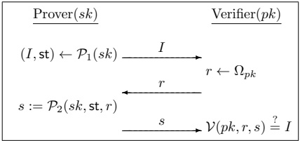
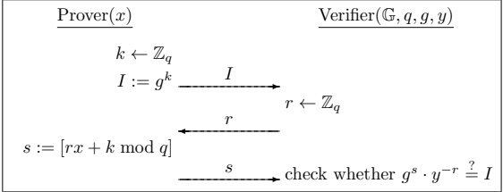

# Chapter 13: Digital Signature Schemes

## 13.1 Digital Signatures – An Overview

In the previous chapter we explored how public-key encryption can be used to achieve secrecy in the public-key setting. Integrity (or authenticity) in the public-key setting is provided using digital signature schemes. These can be viewed as the public-key analogue of message authentication codes although, as we will see, there are several important differences between these primitives.

Signature schemes allow a signer $S$ who has established a public key $pk$ to "sign" a message using the associated private key $sk$ in such a way that anyone who knows $pk$ (and knows that this public key was established by $S$) can verify that the message originated from $S$ and was not modified in transit. (Note that, in contrast to public-key encryption, in the context of digital signatures the owner of the public key acts as the sender.) As a prototypical application, consider a software company that wants to disseminate software updates in an authenticated manner; that is, when the company releases an update it should be possible for any of its clients to verify that the update is authentic, and a malicious third party should never be able to fool a client into accepting an update that was not actually released by the company. To do this, the company can generate a public key $pk$ along with a private key $sk$, and then distribute $pk$ in some reliable manner to its clients while keeping $sk$ secret. (As in the case of public-key encryption, we assume that this initial distribution of the public key is carried out correctly so that all clients have a correct copy of $pk$. In the current example, $pk$ could be bundled with the original software purchased by a client.) When releasing a software update $m$, the company computes a digital signature $\sigma$ on $m$ using its private key $sk$, and sends $(m, \sigma)$ to every client. Each client can verify the authenticity of $m$ by checking that $\sigma$ is a correct signature on $m$ with respect to the public key $pk$.

A malicious party might try to issue a fraudulent update by sending $(m^{\prime}, \sigma^{\prime})$ to a client, where $m^{\prime}$ represents an update that was never released by the company. This $m^{\prime}$ might be a modified version of some previous update, or it might be completely new and unrelated to any prior updates. If the signature scheme is “secure” (in a sense we will define more carefully soon), however, then when the client attempts to verify $\sigma^{\prime}$ it will find that this is an invalid signature on $m^{\prime}$ with respect to $pk$, and will therefore reject the signature. The client will reject even if $m^{\prime}$ is modified only slightly from a genuine update $m$.

The above is not just a theoretical application of digital signatures, but one that is in widespread use today for distributing software updates.

### Comparison to Message Authentication Codes

Both message authentication codes and digital signature schemes are used to ensure the integrity of transmitted messages. Although the discussion in Chapter 11 comparing the public-key and private-key settings focused mainly on encryption, that discussion applies also to message integrity. Using digital signatures rather than message authentication codes simplifies key distribution and management, especially when a sender needs to communicate with multiple receivers as in the software-update example above. By using a digital signature scheme the sender avoids having to establish a distinct secret key with each potential receiver, and avoids having to compute a separate MAC tag with respect to each such key. Instead, the sender need only compute a single signature that can be verified by all recipients.

A qualitative advantage that digital signatures have as compared to message authentication codes is that signatures are publicly verifiable. This means that if a receiver verifies that a signature on a given message is legitimate, then all other parties who receive this signed message will also verify it as legitimate. This feature is not achieved by message authentication codes if the signer shares a separate key with each receiver: in such a setting a malicious sender might compute a correct MAC tag with respect to the key it shares with receiver A but an incorrect MAC tag with respect to the key it shares with a different user B. In this case, A knows that he received an authentic message from the sender but has no guarantee that B will agree.

Public verifiability implies that signatures are transferable: a signature $\sigma$ on a message $m$ by a signer S can be shown to a third party, who can then verify herself that $\sigma$ is a legitimate signature on $m$ with respect to S's public key (here, we assume this third party also knows S's public key). By making a copy of the signature, this third party can then show the signature to another party and convince them that S authenticated m, and so on. Public verifiability and transferability are essential for the application of digital signatures to certificates and public-key infrastructures, as we will discuss in Section 13.6.

Digital signature schemes also provide the very important property of non-repudiation. This means that once $S$ signs a message he cannot later deny having done so (assuming the public key of $S$ is widely publicized and distributed). This aspect of digital signatures is crucial for legal applications where a recipient may need to prove to a third party (say, a judge) that a signer did indeed “certify” a particular message (e.g., a contract): assuming $S$’s public key is known to the judge, or is otherwise publicly available, a valid signature on a message serves as convincing evidence that $S$ indeed signed that message. Message authentication codes simply cannot provide non-repudiation. To see this, say users $S$ and $R$ share a key $k_{SR}$, and $S$
sends a message $m$ to $R$ along with a (valid) MAC tag $t$ computed using this key. Since the judge does not know $k_{SR}$ (indeed, this key is kept secret by $S$ and $R$), there is no way for the judge to determine whether $t$ is valid or not. If $R$ were to reveal the key $k_{SR}$ to the judge, there would be no way for the judge to know whether this is the “actual” key that $S$ and $R$ shared, or whether it is some “fake” key manufactured by $R$. Finally, even if we assume the judge can somehow obtain the actual key $k_{SR}$ shared by the parties, there is no way for the judge to distinguish whether $S$ generated $t$ or whether $R$ did—this is because message authentication codes are a symmetric-key primitive; anything $S$ can do, $R$ can do also.

As in the case of private-key vs. public-key encryption, message authentication codes have the advantage of being shorter and roughly 2–3 orders of magnitude more efficient to generate/verify than digital signatures. Thus, in situations where public verifiability, transferability, and/or non-repudiation are not needed, and the sender communicates primarily with a single recipient (with whom it is able to share a secret key), message authentication codes should be used.

### Relation to Public-Key Encryption

Digital signatures are often mistakenly viewed as the “inverse” of public-key encryption, with the roles of the sender and receiver interchanged. Historically, $^{1}$ in fact, it has been suggested that digital signatures can be obtained by “reversing” public-key encryption, i.e., signing a message $m$ by decrypting it (using the private key) to obtain $\sigma$, and verifying a signature $\sigma$ by encrypting it (using the corresponding public key) and checking whether the result is m. The suggestion to construct signature schemes in this way is completely unfounded: in most cases, it is simply inapplicable, and even in cases where it can be applied it results in signature schemes that are not secure.

## 13.2 Definitions

Digital signatures are the public-key counterpart of message authentication codes, and their syntax and security guarantees are analogous. The algorithm that the sender applies to a message is here denoted Sign (rather than Mac), and the output of this algorithm is now called a signature (rather than a tag).

The algorithm that the receiver applies to a message and a signature in order to check validity is still denoted Vrfy.

DEFINITION 13.1 A (digital) signature scheme consists of three probabilistic polynomial-time algorithms (Gen, Sign, Vrfy) such that:

1. The key-generation algorithm Gen takes as input a security parameter ${1}^{n}$ and outputs a pair of keys (pk, sk). These are called the public key and the private key, respectively. We assume that $pk$ and $sk$ each has length at least $n$, and that $n$ can be determined from $pk$ or sk.

2. The signing algorithm Sign takes as input a private key $sk$ and a message $m$ from some message space (that may depend on pk). It outputs a signature $\sigma$, and we write this as $\sigma \leftarrow \mathsf{Sign}_{sk}(m)$.

3. The deterministic verification algorithm Vrfy takes as input a public key pk, a message m, and a signature $\sigma$. It outputs a bit b, with $b=1$ meaning valid and $b=0$ meaning invalid. We write this as $b:=\mathsf{Vrfy}_{pk}(m,\sigma)$.

It is required that except with negligible probability over (pk, sk) output by $\mathrm{Gen}(1^n)$, it holds that $\mathrm{Vrfy}_{pk}(m, \mathrm{Sign}_{sk}(m)) = 1$ for every (legal) message $m$.

If there is a function $\ell$ such that for every $(pk,sk)$ output by $\mathsf{Gen}(1^n)$ the message space is $\{0,1\}^{\ell(n)}$, then we say that (Gen, Sign, Vrfy) is a signature scheme for messages of length $\ell(n)$.

We call $\sigma$ a valid signature on a message $m$ (with respect to some public key $pk$ understood from the context) if $\mathsf{Vrfy}_{pk}(m, \sigma) = 1$.

A signature scheme is used in the following way. One party $S$, who acts as the sender, runs $\mathsf{Gen}(1^n)$ to obtain keys $(pk, sk)$. The public key $pk$ is then publicized as belonging to $S$; e.g., $S$ can put the public key on its webpage or place it in some public directory. As in the case of public-key encryption, we assume that any other party is able to obtain a legitimate copy of $S$'s public key (see discussion below). When $S$ wants to authenticate a message $m$, it computes the signature $\sigma \leftarrow \mathsf{Sign}_{sk}(m)$ and sends $(m, \sigma)$. Upon receipt of $(m, \sigma)$, a receiver who knows $pk$ can verify the authenticity of $m$ by checking whether $\mathsf{Vrfy}_{\text{pk}}(m, \sigma) \overset{?}{=} 1$. This establishes both that $S$ sent $m$, and also that $m$ was not modified in transit. As in the case of message authentication codes, however, it does not say anything about when $m$ was sent, and replay attacks are still possible (see Section 4.2).

The assumption that parties are able to obtain a legitimate copy of S's public key implies that S is able to transmit at least one message (namely, $pk$ itself) in a reliable and authenticated manner. If S is able to transmit messages reliably, however, then why does it need a signature scheme at all? The answer is that reliable distribution of $pk$ may be difficult and expensive, but using a signature scheme means that such distribution need only be carried out once, after which an unlimited number of messages can subsequently be sent reliably. Furthermore, as we will discuss in Section 13.6, signature schemes themselves are used to ensure the reliable distribution of other public keys. They thus serve as a central tool for setting up a “public-key infrastructure” to address the key-distribution problem.

Security of signature schemes. For a fixed public key pk generated by a signer $S$, a forgery is a message $m$ along with a valid signature $\sigma$, where $m$ was not previously signed by $S$. Security of a signature scheme means that an adversary should be unable to output a forgery even if it obtains signatures on many other messages of its choice. This is the direct analogue of the definition of security for message authentication codes, and we refer the reader to Section 4.2 for motivation and further discussion.

The formal definition of security is essentially the same as Definition 4.2, with the main difference being that here the adversary is given a public key. Let $\Pi = (\mathrm{Gen}, \mathrm{Sign}, \mathrm{Vrfy})$ be a signature scheme, and consider the following experiment for an adversary $\mathcal{A}$ and parameter $n$:

The signature experiment $\mathsf{Sig-forge}_{\mathcal{A},\Pi}(n)$:

1. Gen ${1}^{n}$ is run to obtain keys $(pk, sk)$.

2. Adversary $\mathcal{A}$ is given $pk$ and access to an oracle $\mathsf{Sign}_{sk}(\cdot)$. The adversary then outputs $(m,\sigma)$. Let $\mathcal{Q}$ denote the set of all queries that $\mathcal{A}$ asked its oracle.

3. $\mathcal{A}$ succeeds if and only if (1) $\mathsf{Vrfy}_{pk}(m,\sigma)=1$ and (2) $m\notin\mathcal{Q}$. In this case the output of the experiment is defined to be 1.

DEFINITION 13.2 A signature scheme $\Pi = (\mathrm{Gen}, \mathrm{Sign}, \mathrm{Vrfy})$ is existentially unforgeable under an adaptive chosen-message attack, or just secure, if for all probabilistic polynomial-time adversaries $\mathcal{A}$, there is a negligible function $\mathsf{negl}$ such that:

$$\Pr[\mathsf{Sig-forge}_{\mathcal{A},\Pi}(n)=1]\leq\mathsf{negl}(n).$$

Strong security can be defined analogously to Definition 4.3.

## 13.3 The Hash-and-Sign Paradigm

As in the case of public-key vs. private-key encryption, “native” signature schemes are orders of magnitude less efficient than message authentication codes. Fortunately, as with hybrid encryption (see Section 12.3), it is possible to obtain the functionality of digital signatures at the asymptotic cost of a private-key operation, at least for sufficiently long messages. This can be done using the hash-and-sign approach, discussed next.

The intuition behind the hash-and-sign approach is straightforward. Say we have a signature scheme for messages of length $\ell$, and wish to sign a (longer) message $m \in \{0,1\}^*$. Rather than sign $m$ itself, we can instead use a hash function $H$ to hash the message to a fixed-length digest $H(m)$ of length $\ell$, and then sign the resulting digest. This approach is exactly analogous to the hash-and-MAC approach discussed in Section 6.3.1.

**CONSTRUCTION 13.3**

Let $\Pi = (\mathrm{Gen}, \mathrm{Sign}, \mathrm{Vrfy})$ be a signature scheme for messages of length $\ell(n)$, and let $\Pi_{H} = (\mathrm{Gen}_{H}, H)$ be a hash function with output length $\ell(n)$. Construct signature scheme $\Pi^{\prime} = (\mathrm{Gen}^{\prime}, \mathrm{Sign}^{\prime}, \mathrm{Vrfy}^{\prime})$ as follows:

- Gen': on input ${1}^n$, run $\mathsf{Gen}(1^n)$ to obtain $(pk, sk)$ and run $\mathsf{Gen}_H(1^n)$ to obtain $s$; the public key is $\langle pk, s \rangle$ and the private key is $\langle sk, s \rangle$.

- Sign': on input a private key $\langle sk, s \rangle$ and a message $m \in \{0,1\}^{*}$, output $\sigma \leftarrow \mathsf{Sign}_{sk}(H^{s}(m))$.

- $\operatorname{Vrfy}^{\prime}$: on input a public key $\langle pk, s \rangle$, a message $m \in \{0,1\}^*$, and a signature $\sigma$, output 1 if and only if $\operatorname{Vrfy}_{pk}(H^s(m), \sigma) \stackrel{?}{=} 1$.

The hash-and-sign paradigm.

THEOREM 13.4 If $\Pi$ is a secure signature scheme for messages of length $\ell$ and $\Pi_{H}$ is collision resistant, then Construction 13.3 is a secure signature scheme (for arbitrary-length messages).

The proof of this theorem is almost identical to that of Theorem 6.6.

## 13.4 RSA-Based Signatures

We begin our consideration of concrete signature schemes with a discussion of schemes based on the RSA assumption.

### 13.4.1 Plain RSA Signatures

We first describe a simple, RSA-based signature scheme. Although the scheme is insecure, it serves as a useful starting point.

As usual, let $\mathsf{GenRSA}$ be a PPT algorithm that, on input ${1}^n$, outputs a modulus $N$ that is the product of two $n$-bit primes (except with negligible probability), along with integers $e, d$ satisfying $ed = 1 \bmod \phi(N)$. Key generation in plain RSA involves simply running $\mathsf{GenRSA}$, and outputting $\langle N, e \rangle$ as the public key and $\langle N, d \rangle$ as the private key. To sign a message $m \in \mathbb{Z}_N^*$, the signer computes $\sigma := [m^d \bmod N]$. Verification of a signature $\sigma$ on a message $m$ with respect to the public key $\langle N, e \rangle$ is carried out by checking whether $m \overset{?}{=} \sigma^e \bmod N$. See Construction 13.5.

**CONSTRUCTION 13.5**

Let GenRSA be as in the text. Define a signature scheme as follows:

Gen: on input ${1}^n$ run GenRSA( ${1}^n$) to obtain $(N,e,d)$. The public key is $\langle N,e\rangle$ and the private key is $\langle N,d\rangle$.

- Sign: on input a private key $sk = \langle N, d \rangle$ and a message $m \in \mathbb{Z}_N^*$, compute the signature

$$\sigma:=[m^{d}\bmod N].$$

- Vrfy: on input a public key $pk = \langle N, e \rangle$, a message $m \in \mathbb{Z}_N^*$, and a signature $\sigma \in \mathbb{Z}_N^*$, output 1 if and only if

$$m\stackrel{?}{=}[\sigma^{e}\bmod N].$$

**The plain RSA signature scheme.**

It is easy to see that verification of a legitimately generated signature is always successful since

$$\sigma^{e}=(m^{d})^{e}=m^{[{e d}\bmod\phi(N)]}=m^{1}=m\bmod N.$$

One might expect this scheme to be secure since, for an adversary knowing only the public key $\langle N, e \rangle$, computing a valid signature on a message m seems to require solving the RSA problem (since the signature is exactly the eth root of m). Unfortunately, this reasoning is incorrect. For one thing, the RSA assumption only implies hardness of computing a signature (that is, computing an eth root) of a uniform message m; it says nothing about hardness of computing a signature on a nonuniform m or on some message m of the attacker's choice. Moreover, the RSA assumption says nothing about what an attacker might be able to do once it learns signatures on other messages. The following examples demonstrate that both of these observations lead to attacks on the plain RSA signature scheme.

**A no-message attack.**

The first attack we describe generates a forgery using the public key alone, without obtaining any signatures from the legitimate signer. The attack works as follows: given a public key $pk = \langle N, e \rangle$, choose a uniform $\sigma \in \mathbb{Z}_N^*$ and compute $m := [\sigma^e \bmod N]$. Then output the forgery $(m, \sigma)$. It is immediate that $\sigma$ is a valid signature on $m$, and this is a forgery since no signatures at all were issued by the owner of the public key. We conclude that the plain RSA signature scheme does not satisfy Definition 13.2.

One might argue that this does not constitute a “realistic” attack since the adversary has “no control” over the message m for which it forges a valid signature. This is irrelevant as far as Definition 13.2 is concerned, and we have already discussed (in Chapter 4) why it is dangerous to assume any semantics for messages that are going to be authenticated using any cryptographic scheme. Moreover, the adversary does have some control over m: for example, by choosing multiple, uniform values of $\sigma$ it can (with high probability) obtain an m with a few bits set in some desired way. By choosing $\sigma$ in some specific manner, it may also be possible to influence the resulting message for which a forgery is output.

Forging a signature on an arbitrary message. A more damaging attack on the plain RSA signature scheme requires the adversary to obtain two signatures from the signer, but allows the adversary to output a forged signature on any message of its choice. Say the adversary wants to forge a signature on the message $m \in \mathbb{Z}_N^*$ with respect to the public key $pk = \langle N, e \rangle$. The adversary chooses arbitrary $m_1, m_2 \in \mathbb{Z}_N^*$ distinct from $m$ such that $m = m_1 \cdot m_2 \mod N$. It then obtains signatures $\sigma_1, \sigma_2$ on $m_1, m_2$, respectively. Finally, it outputs $\sigma := [\sigma_1 \cdot \sigma_2 \mod N]$ as a valid signature on $m$. This works because

$$\sigma^{e}=(\sigma_{1}\cdot\sigma_{2})^{e}=(m_{1}^{d}\cdot m_{2}^{d})^{e}=m_{1}^{e d}\cdot m_{2}^{e d}=m_{1}\cdot m_{2}=m\bmod N,$$

using the fact that $\sigma_{1}, \sigma_{2}$ are valid signatures on $m_{1}, m_{2}$.

Being able to forge a signature on an arbitrary message is devastating. Nevertheless, one might argue that this attack is unrealistic since an adversary will not be able to convince a signer to sign the exact messages $m_1$ and $m_2$. Once again, this is irrelevant as far as Definition 13.2 is concerned. Furthermore, it is dangerous to make assumptions about what messages the signer may or may not be willing to sign. For example, a client may use a signature scheme to authenticate to a server by signing a random challenge sent by the server. Here, a malicious server would be able to obtain a signature on any message(s) of its choice. More generally, it may be possible for the adversary to choose $m_1$ and $m_2$ as “legitimate” messages that the signer will agree to sign. Finally, note that the attack can be generalized: if an adversary obtains valid signatures on $q$ arbitrary messages $M = \{m_1, \ldots, m_q\}$, then the adversary can output a valid signature on any of ${2}^q - q$ other messages obtained by taking products of subsets of $M$ (of size different from 1).

### 13.4.2 RSA-FDH and PKCS #1 Standards

One can attempt to prevent the attacks from the previous section by applying some transformation to messages before signing them. That is, the signer will now specify as part of its public key a (deterministic) function $H$ with certain cryptographic properties (described below) mapping messages to $\mathbb{Z}_N^*$; the signature on a message $m$ will be $\sigma := [H(m)^d \bmod N]$, and verification of the signature $\sigma$ on the message $m$ will be done by checking whether $\sigma^e \stackrel{?}{=} H(m) \bmod N$. See Construction 13.6.

**CONSTRUCTION 13.6**

Let GenRSA be as in the previous sections, and construct a signature scheme as follows:

Gen: on input ${1}^n$, run $\mathsf{GenRSA}(1^n)$ to compute $(N, e, d)$. The public key is $\langle N, e \rangle$ and the private key is $\langle N, d \rangle$.

As part of key generation, a function $H: \{0,1\}^* \to \mathbb{Z}_N^*$ is specified, but we leave this implicit.

- Sign: on input a private key $\langle N,d\rangle$ and a message $m\in\{0,1\}^{*}$, compute

$$\sigma:=[H(m)^{d}\bmod N].$$

- Vrfy: on input a public key $\langle N, e \rangle$, a message $m$, and a signature $\sigma$, output 1 if and only if

$$\sigma^{e}\stackrel{?}{=}H(m)\bmod N.$$

**The RSA-FDH signature scheme.**

What properties does $H$ need in order for this construction to be secure?

At a minimum, to prevent the no-message attack it should be infeasible for an attacker to start with $\sigma$, compute $\hat{m} := [\sigma^e \bmod N]$, and then find a message $m$ such that $H(m) = \hat{m}$. This, in particular, means that $H$ should be hard to invert in some sense. To prevent the second attack, we need an $H$ that does not admit “multiplicative relations,” that is, for which it is hard to find three messages $m, m_1, m_2$ with $H(m) = H(m_1) \cdot H(m_2) \bmod N$. Finally, it must be hard to find collisions in $H$: if $H(m_1) = H(m_2)$, then $m_1$ and $m_2$ have the same signature and forgery becomes trivial.

There is no known way to choose $H$ so that Construction 13.6 can be proven secure. However, it is possible to prove security if $H$ is modeled as a random oracle that maps its inputs uniformly onto $\mathbb{Z}_N^*$; the resulting scheme is called the RSA full-domain hash (RSA-FDH) signature scheme. One can check that a random function of this sort satisfies the requirements discussed in the previous paragraph: a random function (with large range) is hard to invert, does not have any easy-to-find multiplicative relations, and is collision resistant. Of course, this informal reasoning does not rule out all possible attacks, but the proof of security below does.

Before continuing, we stress that it is critical for the range of $H$ to be (close to) all of $\mathbb{Z}_N^*$; in particular it does not suffice to simply let $H$ be an “off-the-shelf” cryptographic hash function such as SHA-2. (The output length of SHA-2 is much smaller than the length of RSA moduli used in practice.) Indeed, practical attacks on Construction 13.6 are known if the output length of $H$ is too small (e.g., if the output length is 256 bits as would be the case if a version of SHA-2 were used directly as $H$).

Before turning to the formal proof, we provide some intuition. Our goal is to prove that if the RSA problem is hard relative to GenRSA, then RSA-FDH is secure when $H$ is modeled as a random oracle. We consider first security against a no-message attack, i.e., when the adversary $\mathcal{A}$ cannot request any signatures. Here the adversary is limited to making queries to the random oracle, and we assume without loss of generality that $\mathcal{A}$ always makes exactly $q$ (distinct) queries to $H$ and that if the adversary outputs a forgery $(m, \sigma)$ then it had previously queried $m$ to $H$.

Say there is an efficient adversary $\mathcal{A}$ that carries out a no-message attack and makes exactly $q$ queries to $H$. We construct an efficient algorithm $\mathcal{A}^{\prime}$ solving the RSA problem relative to $\mathsf{GenRSA}$. Given input $(N, e, y)$, algorithm $\mathcal{A}^{\prime}$ runs $\mathcal{A}$ on the public key $pk = \langle N, e \rangle$. Let $m_1, \ldots, m_q$ denote the $q$ (distinct) queries that $\mathcal{A}$ makes to $H$. Our algorithm $\mathcal{A}^{\prime}$ answers these random-oracle queries of $\mathcal{A}$ with uniform elements of $\mathbb{Z}_N^*$ except for one query—say, the $i$th query, chosen uniformly from the oracle queries of $\mathcal{A}$—that is answered with $y$ itself. Note that, from the point of view of $\mathcal{A}$, all its random-oracle queries are answered with uniform elements of $\mathbb{Z}_N^*$ (recall that $y$ is uniform as well, although it is not chosen by $\mathcal{A}^{\prime}$), and so $\mathcal{A}$ has no information about $i$. Moreover, the view of $\mathcal{A}$ when run as a subroutine by $\mathcal{A}^{\prime}$ is identically distributed to the view of $\mathcal{A}$ when attacking the original signature scheme.

If $\mathcal{A}$ outputs a forgery $(m,\sigma)$ then, because $m\in\{m_1,\ldots,m_q\}$, with probability ${1}/q$ we will have $m=m_i$. In that case,

$$\sigma^{e}=H(m)=H(m_{i})=y\bmod N$$

and $\mathcal{A}^{\prime}$ can output $\sigma$ as the solution to its given RSA instance $(N,e,y)$. We conclude that if $\mathcal{A}$ outputs a forgery with probability $\varepsilon$, then $\mathcal{A}^{\prime}$ solves the RSA problem with probability $\varepsilon/q$. Since $q$ is polynomial, we conclude that $\varepsilon$ must be negligible if the RSA problem is hard relative to $\mathsf{GenRSA}$.

Handling the case when the adversary is allowed to request signatures on messages of its choice is more difficult. The complication arises since our algorithm $\mathcal{A}^{\prime}$ above does not know the decryption exponent $d$, yet now has to compute valid signatures on messages queried by $\mathcal{A}$ to its signing oracle. This seems impossible (and possibly even contradictory!) until we realize that $\mathcal{A}^{\prime}$ can correctly compute a signature on a message $m$ as long as it sets $H(m)$ to be equal to $[\sigma^e \bmod N]$ for a known value $\sigma$. (Here we are using the fact that the random oracle is “programmable.”) If $\sigma$ is uniform then $[\sigma^e \bmod N]$ is uniform as well, and so the random oracle is still emulated “properly” by $\mathcal{A}^{\prime}$.

The above intuition is formalized in the proof of the following:

THEOREM 13.7 If the RSA problem is hard relative to $\mathsf{GenRSA}$ and $H$ is modeled as a random oracle, then Construction 13.6 is secure.

PROOF Let $\Pi = (\mathrm{Gen}, \mathrm{Sign}, \mathrm{Vrfy})$ denote Construction 13.6, and let $\mathcal{A}$ be a probabilistic polynomial-time adversary. We assume without loss of generality that if $\mathcal{A}$ requests a signature on a message $m$, or outputs a forgery $(m, \sigma)$, then it previously queried $m$ to $H$. Let $q(n)$ be a polynomial upper bound on the number of queries $\mathcal{A}$ makes to $H$ on security parameter $n$; we assume without loss of generality that $\mathcal{A}$ makes exactly $q(n)$ distinct queries to $H$.

For convenience, we list the steps of experiment $\mathsf{Sig-forge}_{\mathcal{A},\Pi}(n)$:

1. $\mathsf{GenRSA}({1}^{n})$ is run to obtain $(N,e,d)$. A random function $H:\{0,1\}^{*} \to \mathbb{Z}_{N}^{*}$ is chosen.

2. The adversary $\mathcal{A}$ is given $pk = \langle N, e \rangle$, and may query $H$ as well as a signing oracle $\mathsf{Sign}_{\langle N, d \rangle}(\cdot)$ that, on input a message $m$, returns $\sigma := [H(m)^d \bmod N]$.

3. $\mathcal{A}$ outputs $(m,\sigma)$, where it had not previously requested a signature on $m$. The output of the experiment is 1 if and only if $\sigma^{e}=H(m)\bmod N$.

We define a modified experiment $\mathsf{Sig-forge}^{\prime}_{\mathcal{A},\Pi}(n)$ in which a guess is made at the outset as to which message (from among the $q$ messages that $\mathcal{A}$ queries to $H$) will correspond to the eventual forgery (if any) output by $\mathcal{A}$:

1. Choose uniform $j \in \{1, \ldots, q\}$.

2. $\mathsf{GenRSA}({1}^{n})$ is run to obtain $(N,e,d)$. A random function $H:\{0,1\}^{*} \to \mathbb{Z}_{N}^{*}$ is chosen.

3. The adversary $\mathcal{A}$ is given $pk = \langle N, e \rangle$, and may query $H$ as well as a signing oracle $\mathsf{Sign}_{\langle N, d \rangle}(\cdot)$ that, on input a message $m$, returns $\sigma := [H(m)^d \bmod N]$.

4. $\mathcal{A}$ outputs $(m,\sigma)$, where it had not previously requested a signature on $m$. Let $i$ be such that $m=m_i$.^2 The output of the experiment is 1 if and only if $\sigma^e=H(m)\bmod N$ and $j=i$.

> $^2$ Here $m_i$ denotes the $i$th query made to $H$. Recall, by assumption, that if $\mathcal{A}$ requests a signature on a message $m$, then it must have previously queried $m$ to $H$.

Since $j$ is uniform and independent of everything else, the probability that $j = i$ (even conditioned on the event that $\mathcal{A}$ outputs a forgery) is exactly ${1}/q$. Therefore $\Pr[\mathsf{Sig\text{-}forge}^{\prime}_{\mathcal{A},\Pi}(n) = 1] = \frac{1}{q(n)} \cdot \Pr[\mathsf{Sig\text{-}forge}_{\mathcal{A},\Pi}(n) = 1]$.

Now consider the modified experiment $\mathsf{Sig-forge}_{\mathcal{A},\Pi}^{\prime\prime}(n)$ in which the experiment is aborted if $\mathcal{A}$ ever requests a signature on the message $m_j$ (where $m_j$ denotes the $j$th message queried to $H$, and $j$ is the uniform value chosen at the outset). This does not change the probability that the output of the experiment is 1, since if $\mathcal{A}$ ever requests a signature on $m_{j}$ then it cannot possibly output a forgery on $m_{j}$. In words,

$$\begin{aligned}\Pr[\mathsf{Sig-forge}_{\mathcal{A},\Pi}^{\prime \prime}(n)=1]&=\Pr[\mathsf{Sig-forge}_{\mathcal{A},\Pi}^{\prime}(n)=1]\\&=\frac{\Pr[\mathsf{Sig-forge}_{\mathcal{A},\Pi}(n)=1]}{q(n)}.\end{aligned} \tag{13.1}$$

Finally, consider the following algorithm $A^{\prime}$ solving the RSA problem:

Algorithm A':

The algorithm is given $(N, e, y)$ as input.

1. Choose uniform $j \in \{1, \ldots, q\}$.

2. Run $\mathcal{A}$ on input the public key $pk = \langle N, e \rangle$. Store triples $(\cdot, \cdot, \cdot)$ in a table, initially empty. An entry $(m_i, \sigma_i, y_i)$ indicates that $\mathcal{A}^{\prime}$ has set $H(m_i) = y_i$, and $\sigma_i^e = y_i \bmod N$.

3. When $\mathcal{A}$ makes its $i$th random-oracle query $H(m_{i})$, answer it as follows:

- If $i = j$, return $y$ as the answer to the query.

- Else choose uniform $\sigma_i \in \mathbb{Z}_N^*$, compute $y_i := [\sigma_i^e \bmod N]$, return $y_i$ as the answer to the query, and store $(m_i, \sigma_i, y_i)$ in the table.

When $\mathcal{A}$ requests a signature on message $m$, let $i$ be such that $m = m_i$ and answer the query as follows$^3$:

- If $i = j$ then $\mathcal{A}^{\prime}$ aborts.

- If $i \neq j$ then there is an entry $(m_i, \sigma_i, y_i)$ in the table. Return $\sigma_i$ as the answer to the query.

4. At the end of $\mathcal{A}$'s execution, it outputs $(m,\sigma)$. If $m=m_j$ and $\sigma^e=y\bmod N$, then output $\sigma$.

Clearly, $\mathcal{A}^{\prime}$ runs in probabilistic polynomial time. Say the input $(N, e, y)$ to $\mathcal{A}^{\prime}$ is generated by running $\mathsf{GenRSA}(1^n)$ to obtain $(N, e, d)$, and then choosing uniform $y \in \mathbb{Z}_N^*$. The crucial observation is that the view of $\mathcal{A}$ when run as a subroutine by $\mathcal{A}^{\prime}$ is identical to the view of $\mathcal{A}$ in experiment $\mathsf{Sig-forge}_{\mathcal{A}, \Pi}^{\prime\prime}(n)$. In particular, all $\mathsf{Sign-oracle}$ queries are answered correctly, and each of the random-oracle queries of $\mathcal{A}$ when run as a subroutine by $\mathcal{A}^{\prime}$ is answered with a uniform element of $\mathbb{Z}_N^*$:

- The query $H(m_j)$ is answered with $y$, a uniform element of $\mathbb{Z}_N^*$.

- Queries $H(m_i)$ with $i \neq j$ are answered with $y_i = [\sigma_i^e \bmod N]$, where $\sigma_i$ is uniform in $\mathbb{Z}_N^*$. Since exponentiation to the $eth$ power is a one-to-one function, $y_i$ is uniformly distributed as well.

Finally, observe that whenever experiment $\mathsf{Sig-forge}_{\mathcal{A},\Pi}^{\prime\prime}(n)$ would output 1, then $\mathcal{A}^{\prime}$ outputs a correct solution to its given RSA instance. This follows since $\mathsf{Sig-forge}_{\mathcal{A},\Pi}^{\prime\prime}(n) = 1$ implies that $j = i$ and $\sigma^e = H(m_i) \mod N$. Now, when $j = i$, algorithm $\mathcal{A}^{\prime}$ does not abort and in addition $H(m_i) = y$. Thus, $\sigma^e = H(m_i) = y \mod N$, and so $\sigma$ is the desired inverse. Using Equation (13.1), this means that

$$\begin{aligned}\Pr[\mathsf{RSA\text{-}inv}_{\mathcal{A}^{\prime},\mathsf{GenRSA}}(n)=1]&=\Pr[\mathsf{Sig\text{-}forge}^{\prime \prime}_{\mathcal{A},\Pi}(n)=1]\\&=\frac{\Pr[\mathsf{Sig\text{-}forge}_{\mathcal{A},\Pi}(n)=1]}{q(n)}.\end{aligned} \tag{13.2}$$

If the RSA problem is hard relative to GenRSA, there is a negligible function $\mathsf{negl}$ such that $\Pr[\mathsf{RSA-inv}_{\mathcal{A}^{\prime},\mathsf{GenRSA}}(n) = 1] \leq \mathsf{negl}(n)$. Since $q(n)$ is polynomial, we conclude from Equation (13.2) that $\Pr[\mathsf{Sig-forge}_{\mathcal{A},\Pi}(n) = 1]$ is negligible as well. This completes the proof.

RSA PKCS #1 standards. RSA PKCS #1 v1.5 specifies a signature scheme that is very similar to RSA-FDH. A more-complex scheme that can be viewed as a randomized variant of RSA-FDH has been included in the PKCS #1 standard since version 2.1.

## 13.5 Signatures from the Discrete-Logarithm Problem

Signature schemes can be based on the discrete-logarithm assumption as well, although the assumption does not lend itself as readily to signatures as the RSA assumption does. In Sections 13.5.1 and 13.5.2 we describe the Schnorr signature scheme that can be proven secure in the random-oracle model. In Section 13.5.3 we describe the DSA and ECDSA signature schemes; these standardized schemes are widely used even though they have no full proof of security.

### 13.5.1 Identification Schemes and Signatures

The underlying intuition for the Schnorr signature scheme is best explained by taking a slight detour to discuss (public-key) identification schemes. We then describe the Fiat-Shamir transform that can be used to convert identification schemes to signature schemes in the random-oracle model. Finally,
we present the Schnorr identification scheme—and corresponding signature scheme—based on the discrete-logarithm problem.

### Identification Schemes

An identification scheme is an interactive protocol that allows one party to prove its identity (i.e., to authenticate itself) to another. This is a very natural notion, and it is common nowadays to authenticate oneself when logging in to a website. We call the party identifying herself (e.g., the user) the “prover,” and the party verifying the identity (e.g., the web server) the “verifier.” Here, we are interested in the public-key setting where the prover and verifier do not share any secret information (such as a password) in advance; instead, the verifier only knows the public key of the prover. Successful execution of the identification protocol convinces the verifier that it is communicating with the intended prover rather than an imposter.

We will only consider three-round identification protocols of a specific form, where the prover is specified by two algorithms $\mathcal{P}_1$, $\mathcal{P}_2$ and the verifier's side of the protocol is specified by an algorithm V. The prover runs $\mathcal{P}_1(sk)$ using its private key $sk$ to obtain an initial message $I$ along with some state $\mathbf{st}$, and initiates the protocol by sending $I$ to the verifier. In response, the verifier sends a challenge $r$ chosen uniformly from some set $\Omega_{pk}$ defined by the prover's public key $pk$. Next, the prover runs $\mathcal{P}_2(sk, \mathbf{st}, r)$ to compute a response $s$ that it sends back to the verifier. Finally, the verifier computes $\mathcal{V}(pk, r, s)$ and accepts if and only if this results in the initial message $I$; see Figure 13.1. Of course, for correctness we require that if the legitimate prover executes the protocol correctly then the verifier should always accept.

**FIGURE 13.1: A three-round identification scheme.**

For technical reasons, we assume identification schemes that are “non-degenerate,” which intuitively means that there are many possible initial messages I, and none has a high probability of being sent. Formally, a scheme is non-degenerate if for every private key sk and any fixed initial message I, the probability that $\mathcal{P}_1(sk)$ outputs I is negligible. (Any identification scheme can be trivially modified to be non-degenerate by sending a uniform n-bit string along with the initial message.)

The basic security requirement of an identification scheme is that an adversary who does not know the prover's secret key should be unable to fool the verifier into accepting. This should hold even if the attacker is able to passively eavesdrop on multiple (honest) executions of the protocol between the prover and verifier. We formalize such eavesdropping via an oracle $\mathsf{Trans}_{sk}$ that, when called without any input, runs an honest execution of the protocol and returns to the adversary the entire transcript $(I, r, s)$ of the interaction.

Let $\Pi = (\mathrm{Gen}, \mathcal{P}_1, \mathcal{P}_2, \mathcal{V})$ be an identification scheme, and consider the following experiment for an adversary $\mathcal{A}$ and parameter $n$:

The identification experiment $\mathsf{Ident}_{\mathcal{A},\Pi}(n)$:

1. Gen ${1}^{n}$ is run to obtain keys $(pk, sk)$.

2. Adversary $\mathcal{A}$ is given $pk$ and access to an oracle $\mathsf{Trans}_{sk}$ that it can query as often as it likes.

3. At any point during the experiment, $\mathcal{A}$ outputs a message I. A uniform challenge $r \in \Omega_{pk}$ is chosen and given to $\mathcal{A}$, who responds with some s. ($\mathcal{A}$ may continue to query $\mathsf{Trans}_{sk}$ even after receiving r.)

4. The experiment outputs 1 if and only if $\mathcal{V}(pk, r, s) \overset{?}{=} I$.

DEFINITION 13.8 An identification scheme $\Pi = (\mathrm{Gen}, \mathcal{P}_1, \mathcal{P}_2, \mathcal{V})$ is secure against a passive attack, or just secure, if for all probabilistic polynomial-time adversaries $\mathcal{A}$, there exists a negligible function $\mathrm{negl}$ such that:

$$\Pr[{{\mathsf{Ident}}}_{{\mathcal{A}},\Pi}(n)=1]\leq{\mathsf{negl}}(n).$$

It is also possible to consider stronger notions of security, for example, where the adversary can also carry out active attacks on the protocol by impersonating a verifier and possibly sending maliciously chosen values r. We will not need this for our application to signature schemes.

### From Identification Schemes to Signatures

The Fiat-Shamir transform (Construction 13.9) provides a way to convert any (interactive) identification scheme into a (non-interactive) signature scheme. The basic idea is for the signer to act as a prover, running the identification protocol by itself. That is, to sign a message $m$, the signer first computes $I$, and next generates the challenge $r$ by applying some function $H$ to $I$ and $m$. It then derives the correct response $s$. The signature on $m$ is $(r,s)$, which can be verified by (1) recomputing $I := \mathcal{V}(pk, r, s)$ and then (2) checking that $H(I, m) \overset{?}{=} r$.

**CONSTRUCTION 13.9**

Let $(\mathrm{Gen}_{id}, \mathcal{P}_1, \mathcal{P}_2, \mathcal{V})$ be an identification scheme, and construct a signature scheme as follows:

Gen: on input ${1}^n$, simply run $\mathsf{Gen}_{id}(1^n)$ to obtain keys $pk$, $sk$.

The public key $pk$ specifies a set of challenges $\Omega_{pk}$. As part of key generation, a function $H: \{0,1\}^* \to \Omega_{pk}$ is specified, but we leave this implicit.

- Sign: on input a private key $sk$ and a message $m \in \{0,1\}^{*}$, do:

1. Compute $(I, \mathbf{st}) \leftarrow \mathcal{P}_1(sk)$.

2. Compute $r := H(I, m)$.

3. Compute $s := \mathcal{P}_2(sk, \mathbf{st}, r)$.

Output the signature $(r, s)$.

- Vrfy: on input a public key $pk$, a message $m$, and a signature $(r, s)$, compute $I := \mathcal{V}(pk, r, s)$ and output 1 if and only if

$$H(I,m)\stackrel{?}{=}r.$$

The Fiat-Shamir transform.

A signature $(r,s)$ is “bound” to a specific message $m$ because $r$ is a function of both $I$ and $m$; changing $m$ thus results in a completely different $r$. If $H$ is modeled as a random oracle mapping inputs uniformly onto $\Omega_{pk}$, then the challenge $r$ is uniform; intuitively, it will be just as difficult for an adversary (who does not know $sk$) to find a valid signature $(r,s)$ on a message $m$ as it would be to impersonate the prover in an honest execution of the protocol. This intuition is formalized in the proof of the following theorem.

THEOREM 13.10 Let $\Pi$ be an identification scheme, and let $\Pi^{\prime}$ be the signature scheme that results by applying the Fiat-Shamir transform to it. If $\Pi$ is secure and H is modeled as a random oracle, then $\Pi^{\prime}$ is secure.

PROOF Let $\mathcal{A}^{\prime}$ be a probabilistic polynomial-time adversary attacking the signature scheme $\Pi^{\prime}$, with $q = q(n)$ an upper bound on the number of queries that $\mathcal{A}^{\prime}$ makes to $H$. We make a number of simplifying assumptions without loss of generality. First, we assume that $\mathcal{A}^{\prime}$ makes any given query to $H$ only once. We also assume that after being given a signature $(r, s)$ on a message $m$ with $\mathcal{V}(pk, r, s) = I$, the adversary $\mathcal{A}^{\prime}$ never queries $H(I, m)$ (since it knows the answer will be $r$). Finally, we assume that if $\mathcal{A}^{\prime}$ outputs a forged signature $(r, s)$ on a message $m$ with $\mathcal{V}(pk, r, s) = I$, then $\mathcal{A}^{\prime}$ had previously queried $H(I, m)$.

We construct an efficient adversary $\mathcal{A}$ that uses $\mathcal{A}^{\prime}$ as a subroutine and attacks the identification scheme $\Pi$:

**Algorithm $\mathcal{A}$:**

The algorithm is given $pk$ and access to an oracle $\mathsf{Trans}_{sk}$.

1. Choose uniform $j \in \{1, \ldots, q\}$.

2. Run $\mathcal{A}^{\prime}(pk)$. Answer its queries as follows:

When $\mathcal{A}^{\prime}$ makes its $i$th random-oracle query $H(I_{i}, m_{i})$, answer it as follows:

• If $i = j$, output $I_j$ and receive in return a challenge $r$.

Return $r$ to $\mathcal{A}^{\prime}$ as the answer to its query.

If $i \neq j$, choose a uniform $r \in \Omega_{pk}$ and return $r$ as the answer to the query.

When $\mathcal{A}^{\prime}$ requests a signature on $m$, answer it as follows:

(a) Query $\mathsf{Trans}_{sk}$ to obtain a transcript $(I, r, s)$ of an honest execution of the protocol.

(b) Return the signature $(r, s)$

3. If $\mathcal{A}^{\prime}$ outputs a forged signature $(r, s)$ on a message $m$, compute $I := \mathcal{V}(pk, r, s)$ and check whether $(I, m) \overset{?}{=} (I_j, m_j)$. If so, then output $s$. Otherwise, abort.

The view of $\mathcal{A}^{\prime}$ when run as a subroutine by $\mathcal{A}$ in experiment $\mathsf{Ident}_{\mathcal{A},\Pi}(n)$ is almost identical to the view of $\mathcal{A}^{\prime}$ in experiment $\mathsf{Sig-forge}_{\mathcal{A}^{\prime},\Pi^{\prime}}(n)$. Indeed, all the $H$-queries that $\mathcal{A}^{\prime}$ makes are answered with a uniform value from $\Omega_{pk}$, and all the signing queries that $\mathcal{A}^{\prime}$ makes are answered with valid signatures having the correct distribution. The only difference between the views is that when $\mathcal{A}^{\prime}$ is run as a subroutine by $\mathcal{A}$ it is possible for there to be an inconsistency in the answers $\mathcal{A}^{\prime}$ receives from its queries to $H$: specifically, this happens if $\mathcal{A}$ ever answers a signing query for a message $m$ using a transcript $(I,r,s)$ for which $H(I,m)$ is already defined (that is, $\mathcal{A}^{\prime}$ had previously queried $(I,m)$ to $H$) and $H(I,m) \neq r$. However, if $\Pi$ is non-degenerate then this only ever happens with negligible probability. Thus, the probability that $\mathcal{A}^{\prime}$ outputs a forgery when run as a subroutine by $\mathcal{A}$ is $\Pr[\mathsf{Sig-forge}_{\mathcal{A}^{\prime},\Pi^{\prime}}(n)=1] - \mathsf{negl}(n)$ for some negligible function *negl*.

Consider an execution of experiment $\mathsf{Ident}_{\mathcal{A},\Pi}(n)$ in which $\mathcal{A}^{\prime}$ outputs a forged signature $(r,s)$ on a message $m$, and let $I:=\mathcal{V}(pk,r,s)$. Since $j$ is uniform and independent of everything else, the probability that $(I,m)=(I_j,m_j)$ (even conditioned on the event that $\mathcal{A}^{\prime}$ outputs a forgery) is exactly ${1}/q$. (Recall we assume that if $\mathcal{A}^{\prime}$ outputs a forged signature $(r,s)$ on a message $m$ with $\mathcal{V}(pk,r,s)=I$, then $\mathcal{A}^{\prime}$ had previously queried $H(I,m)$. When both events happen, $\mathcal{A}$ successfully impersonates the prover. Indeed, $\mathcal{A}$ sends $I_j$ as its initial message, receives in response a challenge $r$, and responds with $s$. But $H(I_j,m_j)=r$ and (since the forged signature is valid) $\mathcal{V}(pk,r,s)=I$. Putting everything together, we see that

$$\Pr[\mathsf{Ident}_{\mathcal{A},\Pi}(n)=1]\geq\frac{1}{q(n)}\cdot\left(\Pr[\mathsf{Sig-forge}_{\mathcal{A}^{\prime},\Pi^{\prime}}(n)=1]-\mathsf{negl}(n)\right)$$

or

$$\Pr[\mathsf{Sig-forge}_{\mathcal{A}^{\prime},\Pi^{\prime}}(n)=1]\leq q(n)\cdot\Pr[\mathsf{Ident}_{\mathcal{A},\Pi}(n)=1]+\mathsf{negl}(n).$$

If $\Pi$ is secure then $\Pr[\mathrm{Ident}_{\mathcal{A},\Pi}(n)=1]$ is negligible; since $q(n)$ is polynomial this implies that $\Pr[\mathrm{Sig-forge}_{\mathcal{A}^{\prime},\Pi^{\prime}}(n)=1]$ is also negligible. Because $\mathcal{A}^{\prime}$ was arbitrary, this means $\Pi^{\prime}$ is secure.

### 13.5.2 The Schnorr Identification/Signature Schemes

The Schnorr identification scheme is based on hardness of the discrete-logarithm problem. Let $\mathcal{G}$ be a polynomial-time algorithm that takes as input ${1}^n$ and (except possibly with negligible probability) outputs a description of a cyclic group $\mathbb{G}$, its order $q$ (with $\|q\| = n$), and a generator $g$. To generate its keys, the prover runs $\mathcal{G}(1^n)$ to obtain $(\mathbb{G}, q, g)$, chooses a uniform $x \in \mathbb{Z}_q$, and sets $y := g^x$; the public key is $\langle \mathbb{G}, q, g, y \rangle$ and the private key is $x$. To execute the protocol (see Figure 13.2), the prover begins by choosing a uniform $k \in \mathbb{Z}_q$ and setting $I := g^k$; it sends $I$ as the initial message. The verifier chooses and sends a uniform challenge $r \in \mathbb{Z}_q$; in response, the prover computes $s := [rx + k \bmod q]$. The verifier accepts if and only if $g^s \cdot y^{-r} \stackrel{?}{=} I$. Correctness holds because

$$g^{s}\cdot y^{-r}=g^{r x+k}\cdot(g^{x})^{-r}=g^{k}=I.$$

Note that $I$ is uniform in $\mathbb{G}$, and so the scheme is non-degenerate.

Before giving the proof, we provide some high-level intuition. A first important observation is that passive eavesdropping is of no help to the attacker. The reason is that the attacker can simulate transcripts of honest executions on its own, based only on the public key and without knowledge of the private key. To do this, the attacker just reverses the order of the steps: it first chooses uniform and independent $r, s \in \mathbb{Z}_q$ and then sets $I := g^s \cdot y^{-r}$. In an honest transcript $(I, r, s)$, the initial message $I$ is a uniform element of $\mathbb{G}$, the challenge is an independent, uniform element of $\mathbb{Z}_q$, and $s$ is then uniquely determined as $s = \log_g(I \cdot y^r)$.

**FIGURE 13.2: An execution of the Schnorr identification scheme.**

Simulated transcripts constructed by an attacker have the same distribution: $r \in \mathbb{Z}_q$ is uniform and, because $s$ is uniform in $\mathbb{Z}_q$ and independent of $r$, we see that $I$ is uniform in $\mathbb{G}$ and independent of $r$. Finally, $s$ is uniquely determined as satisfying the same constraint as before. Due to this, we may effectively assume that when attacking the identification scheme, an attacker does not eavesdrop on honest executions at all.

So, we have reduced to an attacker who gets a public key $y$, sends an initial message $I$, is given in response a uniform challenge $r$, and then must send a response $s$ for which $g^s \cdot y^{-r} = I$. Informally, if an attacker is able to do this with high probability then it must, in particular, be able to compute correct responses $s_1, s_2$ to at least two different challenges $r_1, r_2 \in \mathbb{Z}_q$. Note

$$g^{s_{1}}\cdot y^{-r_{1}}=I=g^{s_{2}}\cdot y^{-r_{2}},$$

and so $g^{s_1-s_2} = y^{r_1-r_2}$. But this implies that the attacker (who, recall, is able to generate $s_1$ in response to $r_1$, and $s_2$ in response to $r_2$) can implicitly compute the discrete logarithm

$$\log_{g}y=[\left(s_{1}-s_{2}\right)\cdot\left(r_{1}-r_{2}\right)^{-1}\bmod q],$$

contradicting the assumed hardness of the discrete-logarithm problem.

THEOREM 13.11 If the discrete-logarithm problem is hard relative to G, then the Schnorr identification scheme is secure.

PROOF Let $\Pi$ denote the Schnorr identification scheme, and let $\mathcal{A}$ be a PPT adversary attacking the scheme. We construct the following PPT algorithm $\mathcal{A}^{\prime}$ solving the discrete-logarithm problem relative to $\mathcal{G}$:

Algorithm A':

The algorithm is given G, q, g, y as input.

1. Run $\mathcal{A}(pk)$, answering all its queries to $\mathsf{Trans}_{sk}$ as described in the intuition given previously.

2. When $\mathcal{A}$ outputs $I$, choose a uniform $r_1 \in \mathbb{Z}_q$ as the challenge. Give $r_1$ to $\mathcal{A}$, who responds with $s_1$.

3. Run $\mathcal{A}(pk)$ a second time (from the beginning), using the same randomness as before except for uniform and independent $r_2 \in \mathbb{Z}_q$. Eventually, $\mathcal{A}$ responds with $s_2$.

4. If $g^{s_1} \cdot y^{-r_1} = I$ and $g^{s_2} \cdot y^{-r_2} = I$ and $r_1 \neq r_2$ then output $[(s_1 - s_2) \cdot (r_1 - r_2)^{-1} \mod q]$. Else, output nothing.

Considering a single run of $\mathcal{A}$ as a subroutine of $\mathcal{A}^{\prime}$, let $\omega$ denote the randomness used in that execution except for the challenge itself. So, $\omega$ comprises any randomness used by $\mathcal{G}$, the choice of (unknown) private key $x$, any randomness used by $\mathcal{A}$ itself, and the randomness used by $\mathcal{A}^{\prime}$ when answering queries to $\mathsf{Trans}_{sk}$. Define $V(\omega, r)$ to be equal to 1 if and only if $\mathcal{A}$ correctly responds to challenge $r$ when randomness $\omega$ is used in the rest of the execution. For any fixed $\omega$, define $\delta_\omega \stackrel{\mathrm{def}}{=} \Pr_r[V(\omega, r) = 1];$ having fixed $\omega$, this is the probability over choice of the challenge $r$ that $\mathcal{A}$ responds correctly.

Define $\delta(n) \stackrel{\mathrm{def}}{=} \Pr[\mathsf{Ident}_{\mathcal{A},\Pi}(n) = 1]$. Since the simulation of the $\mathsf{Trans}_{sk}$ oracle is perfect, we have

$$\begin{array}{r}{\delta(n)=\Pr_{\omega,r}[V(\omega,r)=1]=\sum_{\omega}\Pr[\omega]\cdot\delta_{\omega}.}\end{array}$$

Moreover, the intuition preceding the proof shows that $\mathcal{A}^{\prime}$ correctly computes the discrete logarithm of $y$ whenever $\mathcal{A}$ succeeds twice and $r_1 \neq r_2$. Thus:

$$\begin{align*}\Pr[\mathsf{DLog}_{\mathcal{A}^{\prime},\mathcal{G}}(n)=1]&=\Pr_{\omega,r_{1},r_{2}}[V(\omega,r_{1})\land V(\omega,r_{2})\land r_{1}\neq r_{2}]\\&\geq\Pr_{\omega,r_{1},r_{2}}[V(\omega,r_{1})\land V(\omega,r_{2})]-\Pr_{\omega,r_{1},r_{2}}[r_{1}=r_{2}]\\&=\sum_{\omega}\Pr[\omega]\cdot(\delta_{\omega})^{2}-1/q\\&\geq\left(\sum_{\omega}\Pr[\omega]\cdot\delta_{\omega}\right)^{2}-1/q\\&=\delta(n)^{2}-1/q,\end{align*}$$

using Jensen’s inequality in the second-to-last step. (Jensen’s inequality says that $\sum_i a_i \cdot b_i^2 \geq (\sum_i a_i)^{-1} \cdot (\sum_i a_i \cdot b_i)^2$ for positive $\{a_i\}$.) If the discrete-logarithm problem is hard relative to $\mathcal{G}$ then $\Pr[\mathsf{DLog}_{\mathcal{A}^{\prime},\mathcal{G}}(n) = 1]$ is negligible. Since ${1}/q$ is negligible (because $\|q\| = n$), this implies that $\delta(n)$ is also negligible, and so $\Pi$ is a secure identification scheme.

The Schnorr signature scheme is obtained by applying the Fiat-Shamir transform to the Schnorr identification scheme. See Construction 13.12.

**CONSTRUCTION 13.12**

Let $\mathcal{G}$ be as described in the text.

- Gen: run $\mathcal{G}(1^n)$ to obtain $(\mathbb{G}, q, g)$. Choose a uniform $x \in \mathbb{Z}_q$ and set $y := g^x$. The private key is $x$ and the public key is $(\mathbb{G}, q, g, y)$. As part of key generation, a function $H : \{0,1\}^* \to \mathbb{Z}_q$ is specified, but we leave this implicit.

- Sign: on input a private key $x$ and a message $m \in \{0,1\}^*$, choose uniform $k \in \mathbb{Z}_q$ and set $I := g^k$. Then compute $r := H(I,m)$, followed by $s := [rx + k \bmod q]$. Output the signature $(r,s)$.

- Vrfy: on input a public key $(\mathbb{G}, q, g, y)$, a message $m$, and a signature $(r, s)$, compute $I := g^s \cdot y^{-r}$ and output 1 if $H(I, m) \overset{?}{=} r$.

EdDSA is an efficient, standardized version of Schnorr signatures that uses a specific elliptic-curve group.

### 13.5.3 DSA and ECDSA

The Digital Signature Algorithm (DSA) and Elliptic Curve Digital Signature Algorithm (ECDSA) are based on the discrete-logarithm problem in different classes of groups. They have been around in some form since 1991, and are both included in the current Digital Signature Standard (DSS) issued by NIST (although in 2019 NIST proposed to deprecate DSA).

Both schemes follow a common template and can be viewed as being constructed from an underlying identification scheme (see the previous section). Let $\mathbb{G}$ be a cyclic group of prime order $q$ with generator $g$. Consider the following identification scheme in which the prover's private key is $x$ and public key is $(\mathbb{G}, q, g, y)$ with $y = g^x$.

1. The prover chooses uniform $k \in \mathbb{Z}_q^*$ and sends $I := g^k$.

2. The verifier chooses and sends uniform $\alpha, r \in \mathbb{Z}_q$ as the challenge.

3. The prover sends $s := [k^{-1} \cdot (\alpha + xr) \mod q]$ as the response.

4. The verifier accepts if $s \neq 0$ and $g^{\alpha s^{-1}} \cdot y^{rs^{-1}} \stackrel{?}{=} I$.

Note $s \neq 0$ unless $\alpha = -xr \bmod q$, which occurs with negligible probability. Assuming $s \neq 0$, the inverse $s^{-1} \bmod q$ exists and

$$g^{\alpha s^{-1}} \cdot y^{r s^{-1}} = g^{\alpha s^{-1}} \cdot g^{x r s^{-1}} = g^{(\alpha+x r)\cdot s^{-1}} = g^{(\alpha+x r)\cdot k\cdot(\alpha+x r)^{-1}}=I.$$

We thus see that correctness holds with all but negligible probability.

One can show that this identification scheme is secure if the discrete-logarithm problem is hard relative to $\mathcal{G}$. We merely sketch the argument, assuming familiarity with the results of the previous section. First of all, transcripts of honest executions can be simulated: to do so, simply choose uniform $\alpha, r \in \mathbb{Z}_q$ and $s \in \mathbb{Z}_q^*$, and then set $I := g^{\alpha s^{-1}} \cdot y^{rs^{-1}}$. (This no longer gives a perfect simulation, but it is close enough.) Moreover, if an attacker outputs an initial message $I$ for which it can give correct responses $s_1, s_2 \in \mathbb{Z}_q^*$ to distinct challenges $(\alpha, r_1), (\alpha, r_2)$ then

$$g^{\alpha s_{1}^{-1}}\cdot y^{r_{1}s_{1}^{-1}}=I=g^{\alpha s_{2}^{-1}}\cdot y^{r_{2}s_{2}^{-1}},$$

and so $g^{\alpha(s_{1}^{-1}-s_{2}^{-1})} = y^{r_{1}s_{1}^{-1}-r_{2}s_{2}^{-1}}$ and $\log_{g} y$ can be computed as in the previous section. The same holds if the attacker gives correct responses to distinct challenges $(\alpha_{1}, r), (\alpha_{2}, r)$.

The DSA/ECDSA signature schemes are constructed by “collapsing” the above identification scheme into a non-interactive algorithm run by the signer. In contrast to the Fiat-Shamir transform, however, the transformation here is carried out as follows (see Construction 13.13):

- Set $\alpha := H(m)$, where $m$ is the message being signed and $H$ is a cryptographic hash function.

- Set $r := F(I)$ for a (specified) function $F : \mathbb{G} \to \mathbb{Z}_q$. Here, $F$ is a “simple” function that is not intended to act like a random oracle.

The function $F$ depends on the group $\mathbb{G}$, which in turn depends on the scheme. In DSA, $\mathbb{G}$ is taken to be an order-$q$ subgroup of $\mathbb{Z}_p^*$, for $p$ prime (cf. Section 9.3.3), and $F(I) \overset{\mathrm{def}}{=} [I \bmod q]$. In ECDSA, $\mathbb{G}$ is an order-$q$ subgroup of an elliptic-curve group $E(\mathbb{Z}_p)$, for $p$ prime.$^4$ Recall from Section 9.3.4 that any element of such a group can be represented as a pair $(x, y) \in \mathbb{Z}_p \times \mathbb{Z}_p$. The function $F$ in this case is defined as $F((x, y)) \overset{\mathrm{def}}{=} [x \bmod q]$.

> $^4$ ECDSA also allows elliptic curves over other fields, but we have only covered the case of prime fields in Section 9.3.4.

**CONSTRUCTION 13.13**

Let $\mathcal{G}$ be as in the text.

Gen: on input ${1}^n$, run $\mathcal{G}(1^n)$ to obtain $(\mathbb{G}, q, g)$. Choose uniform $x \in \mathbb{Z}_q$ and set $y := g^x$. The public key is $\langle \mathbb{G}, q, g, y \rangle$ and the private key is $x$.

As part of key generation, two functions $H: \{0,1\}^* \to \mathbb{Z}_q$ and $F: \mathbb{G} \to \mathbb{Z}_q$ are specified, but we leave this implicit.

- Sign: on input the private key $x$ and a message $m \in \{0,1\}^*$, choose uniform $k \in \mathbb{Z}_q^*$ and set $r := F(g^k)$. Then compute $s := [k^{-1} \cdot (H(m) + xr) \mod q]$. (If $r = 0$ or $s = 0$ then start again with a fresh choice of $k$.) Output the signature $(r,s)$.

- Vrfy: on input a public key $\langle \mathbb{G}, q, g, y \rangle$, a message $m \in \{0,1\}^*$, and a signature $(r,s)$ with $r,s \neq 0 \bmod q$, output 1 if and only if

$$r\stackrel{?}{=}F\left(g^{H(m)\cdot s^{-1}}y^{r\cdot s^{-1}}\right).$$

**DSA and ECDSA—abstractly.**

Assuming hardness of the discrete-logarithm problem, DSA and ECDSA can be proven secure if $H$ and $F$ are modeled as random oracles. As we have discussed above, however, while the random-oracle model may be reasonable for H, it is not an appropriate model for F. No proofs of security are known for the specific choices of F in the standard. Nevertheless, DSA and ECDSA have been used and studied for decades without any attacks being found.

**Proper generation of $k$.**

The DSA/ECDSA schemes specify that the signer should choose a uniform $k \in \mathbb{Z}_q^*$ when computing a signature. Failure to choose $k$ properly (e.g., due to poor random-number generation) can lead to catastrophic results. For starters, if an attacker can predict the value of $k$ used to compute a signature $(r,s)$ on a message $m$, then they can compute the signer's private key. This is true because $s = k^{-1} \cdot (H(m) + xr) \mod q$, and if $k$ is known then the only unknown is the private key $x$.

Even if $k$ is unpredictable, the attacker can compute the signer's private key if the same $k$ is ever used to generate two different signatures. The attacker can easily tell when this happens because then $r$ repeats as well. Say $(r, s_1)$ and $(r, s_2)$ are signatures on messages $m_1$ and $m_2$, respectively. Then

$$\begin{aligned}&s_{1}=k^{-1}\cdot(H(m_{1})+xr)\bmod q\\&s_{2}=k^{-1}\cdot(H(m_{2})+xr)\bmod q.\\ \end{aligned}$$

Subtracting gives $s_1 - s_2 = k^{-1}(H(m_1) - H(m_2)) \bmod q$, from which $k$ can be computed; given $k$, the attacker can determine the private key $x$ as in the previous paragraph. This very attack was used by hackers to extract the master private key from the Sony PlayStation (PS3) in 2010.

## 13.6 Certificates and Public-Key Infrastructures

In this section we briefly discuss one of the primary applications of digital signatures: the secure distribution of public keys. This brings us full circle in our discussion of public-key cryptography. In this and the previous chapter we have seen how to use public-key cryptography once public keys are securely distributed. Now we show how public-key cryptography itself can be used to securely distribute public keys. This may sound circular, but it is not. What we will show is that once a single public key, belonging to a trusted party, is distributed in a secure fashion, that key can be used to "bootstrap" the secure distribution of arbitrarily many other public keys. Thus, at least in principle, the problem of secure key distribution need only be solved once.

The key notion here is a digital certificate, which is simply a signature binding an entity to some public key. To be concrete, say a party Charlie has generated keys ( $pk_C, sk_C$) for a secure digital signature scheme (in this section, we will only be concerned with signature schemes satisfying Definition 13.2). Assume further that another party Bob has also generated keys ( $pk_B, sk_B$) (in the present discussion, these may be keys for either a signature scheme or a public-key encryption scheme), and that Charlie knows that $pk_B$ is Bob's public key. Then Charlie can compute the signature

$$\mathsf{cert}_{C\to B}~{\stackrel{\mathrm{def}}{=}}~\mathsf{Sign}_{sk_C}(\text{``Bob's key is } pk_B\text{''})$$

and give this signature to Bob. We call $\mathsf{cert}_{C \to B}$ a certificate for Bob's key issued by Charlie. In practice a certificate should unambiguously identify the party holding a particular public key and so a more uniquely descriptive term than “Bob” would be used, for example, Bob’s full name and email address, or the URL of Bob’s website.

Now say Bob wants to communicate with some other party Alice who already knows $pk_C$. Bob can send $(pk_B, \mathsf{cert}_{C \to B})$ to Alice, who can then verify that $\mathsf{cert}_{C \to B}$ is indeed a valid signature on the message ‘Bob’s key is $pk_B$, with respect to $pk_C$. Assuming verification succeeds, Alice now knows that Charlie has signed the indicated message. If Alice trusts Charlie, she can accept $pk_B$ as Bob’s legitimate public key.

All communication between Bob and Alice can occur over an insecure and unauthenticated channel. If an active adversary interferes with the transmission of $(pk_B, \mathsf{cert}_{C \to B})$ from Bob to Alice, that adversary will be unable to generate a valid certificate linking Bob to any other public key $pk^{\prime}_B$ unless Charlie had previously signed some other certificate linking Bob with $pk^{\prime}_B$ (in which case this is anyway not much of an attack). This all assumes that Charlie is not dishonest and that his private key has not been compromised.

We have omitted many details in the above description. Most prominently, we have not discussed how Alice learns $pk_{C}$ in the first place; how Charlie can be sure that $pk_{B}$ is Bob's public key; and how Alice decides whether to trust Charlie. Fully specifying such details (and others) defines a public-key infrastructure (PKI) that enables the widespread distribution of public keys. A variety of different PKI models have been suggested, and we mention a few of the more popular ones now. Our treatment here will be kept at a relatively high level, and the reader interested in further details is advised to consult the references at the end of this chapter.

**A single certificate authority.**

The simplest PKI assumes a single certificate authority (CA) who is completely trusted by everybody and who issues certificates for everyone's public key. A certificate authority would not typically be a person, but would more likely be a company whose business it is to certify public keys, a government agency, or perhaps a department within an organization (although in this latter case the CA would likely only be used by people within the organization). Anyone who wants to rely on the services of the CA would have to obtain a legitimate copy of the CA's public key $pk_{CA}$. Clearly, this step must be carried out in a secure fashion since if some party obtains an incorrect version of $pk_{CA}$ then that party may not be able to obtain an authentic copy of anyone else's public key. This means that $pk_{CA}$ must be distributed over an authenticated channel. The easiest way of doing this is via physical means: for example, if the CA is within an organization then any employee can obtain an authentic copy of $pk_{CA}$ directly from the CA on their first day of work. If the CA is a company, then other users would have to go to this company at some point and, say, pick up a USB stick that contains the CA's public key. This inconvenient step need only be carried out once.

A common way for a CA to distribute its public key in practice is to “bundle” this public key with some other software. For example, this occurs today in many popular web browsers: a CA's public key is provided together with the browser, and the browser is programmed to automatically verify certificates as they arrive. (Actually, modern web browsers have public keys of multiple CAs hard-wired into their code, and so more accurately fall into the "multiple CA" model discussed below.)

The mechanism by which a CA issues a certificate to some party Bob must also be very carefully controlled, although the details may vary from CA to CA. As one example, Bob may have to show up in person with a copy of his public key $pk_{B}$ along with identification proving that his name (or his email address) is what he claims. Only then would the CA issue the certificate.

In the model where there is a single CA, parties completely trust this CA to issue certificates only when appropriate; this is why it is crucial that a detailed verification process be used before a certificate is issued. As a consequence, if Alice receives a certificate $\mathsf{cert}_{CA \to B}$ certifying that $pk_B$ is Bob's public key, Alice will accept this assertion as valid, and use $pk_B$ as Bob's public key.

Multiple certificate authorities. While the model in which there is only one CA is simple and appealing, it is not very practical. For one thing, outside of a single organization it is unlikely for everyone to trust the same CA. This need not imply that anyone thinks the CA is corrupt; it could simply be the case that someone finds the CA's verification process to be insufficient (say, the CA asks for only one form of identification when generating a certificate but Alice would prefer that two be used instead). Moreover, the CA is a single point of failure for the entire system. If the CA is corrupt, or can be bribed, or even if the CA is merely lax with the way it protects its private key, the legitimacy of issued certificates may be called into question. It is also inconvenient for all parties who want certificates to have to contact this CA.

One approach to alleviating these issues is to rely on multiple CAs. A party Bob who wants to obtain a certificate on his public key can choose which CA(s) it wants to issue a certificate, and a party Alice who is presented with a certificate, or even multiple certificates issued by different CAs, can choose which CA's certificates she trusts. There is no harm in having Bob obtain a certificate from more than one CA (apart from some inconvenience and expense for Bob), but Alice must be more careful since the security of her communication is ultimately only as good as the least-secure CA that she trusts. That is, say Alice trusts two CAs $CA_{1}$ and $CA_{2}$, and $CA_{2}$ is corrupted by an adversary. Then, although this adversary will not be able to forge certificates issued by $CA_{1}$, it will be able to issue fake certificates in the name of $CA_{2}$ for any identity/public key of its choice. This is a real problem in current systems. As mentioned earlier, operating systems/web browsers typically come pre-configured with many CAs' public keys, and the default setting is for all these CAs to be treated as equally trustworthy. Essentially any company willing to pay, however, can be included as a CA. So the list of pre-configured CAs includes some reputable, well-established companies along with other, newer companies whose trustworthiness cannot be easily established. It is left to the user to manually configure their settings so as to only accept certificates from CAs the user trusts.

Delegation and certificate chains. Another approach which alleviates some of the burden on a single CA (but does not address the security concerns of having a single point of failure) is to use certificate chains. We present the idea for certificate chains of length 2, although it is easy to see that everything we say generalizes to chains of arbitrary length.

Say Charlie, acting as a CA, issues a certificate for Bob as in our original discussion. Assume further that Bob's key $pk_{B}$ is a public key for a signature scheme. Bob, in turn, can issue his own certificates for other parties. For example, Bob may issue a certificate for Alice of the form

$$\mathsf{cert}_{B\to A}~{\stackrel{\mathrm{def}}{=}}~\mathsf{Sign}_{sk_B}(\text{``Alice's key is } pk_A\text{''}).$$

Now, if Alice wants to communicate with some fourth party Dave who knows Charlie's public key (but not Bob's), then Alice can send

$$p k_{A},\mathsf{cert}_{B\to A},p k_{B},\mathsf{cert}_{C\to B},$$

to Dave. What can Dave deduce from this? Well, he can first verify that Charlie, whom he trusts and whose public key is already in his possession, has signed a certificate $\mathsf{cert}_{C \to B}$ indicating that $pk_B$ indeed belongs to someone named Bob. Dave can also verify that this person named Bob has signed a certificate $\mathsf{cert}_{B \to A}$ indicating that $pk_A$ indeed belongs to Alice. If Dave trusts Charlie to issue certificates only to trustworthy people, then Dave may accept $pk_A$ as being the authentic key of Alice.

We highlight that in this example stronger semantics are associated with a certificate $\mathsf{cert}_{C\to B}$. In our prior discussion, a certificate of this form was only an assertion that Bob holds public key $pk_B$. Now, a certificate asserts that Bob holds public key $pk_B$ and Bob is trusted to issue other certificates. When Charlie signs a certificate for Bob having these stronger semantics, Charlie is, in effect, delegating his ability to issue certificates to Bob. Bob can now act as a proxy for Charlie, issuing certificates on Charlie's behalf.

Coming back to a CA-based PKI, we can imagine one “root” CA and $n$ “second-level” CAs $CA_1, \ldots, CA_n$. The root CA can issue certificates for each of the second-level CAs, who can then in turn issue certificates for other principles holding public keys. This eases the burden on the root CA, and also makes it more convenient for parties to obtain certificates (since they may now contact the second-level CA who is closest to them, for example). On the other hand, managing these second-level CAs may be difficult, and their presence means that there are now more points of attack in the system.

**The “web of trust” model.**

The last example of a PKI we will discuss is a fully distributed model, with no central points of trust, called the “web of trust.” A variant of this model is used by the PGP (“Pretty Good Privacy”) email-encryption software for distribution of public keys.

In the “web of trust” model, anyone can issue certificates to anyone else and each user has to make their own decision about how much trust to place in certificates issued by other users. As an example of how this might work, say a user Alice is already in possession of public keys $pk_1, pk_2, pk_3$ for some users $C_1, C_2, C_3$. (We discuss below how these public keys might initially be obtained by Alice.) Another user Bob who wants to communicate with Alice might have certificates $\mathsf{cert}_{C_1 \to B}$, $\mathsf{cert}_{C_3 \to B}$, and $\mathsf{cert}_{C_4 \to B}$, and will send these certificates (along with his public key $pk_B$) to Alice. Alice cannot verify $\mathsf{cert}_{C_4 \to B}$ (since she doesn't have $C_4$'s public key), but she can verify the other two certificates. Now she has to decide how much trust she places in $C_1$ and $C_3$. She may decide to accept $pk_B$ if she unequivocally trusts $C_1$, or if she trusts both $C_1$ and $C_3$ to a lesser extent. (She may, for example, consider it likely that either $C_1$ or $C_3$ is corrupt, but consider it unlikely for them both to be corrupt.)

In this model, as described, users are expected to collect both public keys of other parties, as well as certificates on their own public key. In the context of PGP, this used to be done at “key-signing parties” where PGP users got together (say, at a conference), gave each other authentic copies of their public keys, and issued certificates for each other. In general the users at a key-signing party may not know each other, but they can check a driver’s license, say, before accepting or issuing a certificate for someone’s public key.

Public keys and certificates can also be stored in a central database, and this is done for PGP (see http://pgp.mit.edu). When Alice wants to send an encrypted message to Bob, she can search for Bob's public key in this database; along with Bob's public key, the database will return a list of all certificates it holds that have been issued for Bob's public key. It is also possible that multiple public keys for Bob will be found in the database, and each of these public keys may be certified by certificates issued by a different set of parties. Once again, Alice then needs to decide how much trust to place in any of these public keys before using them.

The web of trust model is attractive because it does not require trust in any central authority. On the other hand, while it may work well for the average user encrypting their email, it does not seem appropriate for settings where security is more critical, or for the distribution of organizational public keys (e.g., for e-commerce on the web). If a user wants to communicate with his bank, for example, it is unlikely that he would trust people he met at a conference to certify his bank's public key, and also unlikely that a bank representative will go to a key-signing party to get the bank's key certified.

### Invalidating Certificates

One important issue we have not yet touched upon at all is the fact that certificates should generally not be valid indefinitely. An employee may leave a company, in which case he or she is no longer allowed to receive encrypted communication from others within the company; a user's private key might also be stolen, at which point the user (assuming they know about the theft) will want to generate a new set of public/private keys and remove the old public key from circulation. In either of these scenarios, we need a way to render previously issued certificates invalid.

Approaches for handling these issues are varied and complex, and we will only mention two relatively simple ideas that, in some sense, represent opposite extremes. (Improving these methods is an active area of real-world network-security research.)

Expiration. One method for preventing certificates from being used indefinitely is to include an expiry date as part of the certificate. A certificate issued by a CA Charlie for Bob's public key might now have the form

$$\mathsf{cert}_{C\to B}\stackrel{\mathrm{def}}{=}\mathsf{Sign}_{sk_C}(\text{``Bob's key is } pk_B\text{''}, \text{date}),$$

where date is some date in the future at which point the certificate becomes invalid. (For example, one year from the day the certificate is issued.) When another user verifies this certificate, they need to know not only $pk_{B}$ but also the expiry date, and they now need to check not only that the signature is valid, but also that the expiry date has not passed. A user who holds a certificate must contact the CA to get a new certificate issued whenever their current one expires; at this point, the CA verifies the identity/credentials of the user again before issuing another certificate.

Using expiry dates provides a very coarse-grained solution to the problems mentioned earlier. If an employee leaves a company the day after getting a certificate, and the certificate expires one year after its issuance date, then this employee can use his or her public key illegitimately for an entire year until the expiry date passes. For this reason, this approach is typically used in conjunction with other methods such as the one we describe next.

Revocation. When an employee leaves an organization, or a user's private key is stolen, we would like the certificates that have been issued for their public keys to become invalid immediately, or at least as soon as possible. This can be achieved by having the CA explicitly revoke the certificate. For simplicity we assume a single CA, but everything we say applies more generally if the user had certificates issued by multiple CAs.

There are many different ways revocation can be handled. One possibility (the only one we will discuss) is for the CA to include a serial number in every certificate it issues; that is, a certificate will now have the form

$$\mathsf{cert}_{C\to B}\overset{\operatorname{def}}{=}\mathsf{Sign}_{sk_C}(\text{``Bob's key is } pk_B\text{''}, \#\#\#),$$

where “###” represents the serial number of this certificate. Each certificate should have a unique serial number, and the CA will store the information (Bob, $pk_B$, ####) for each certificate it generates.

If a user Bob's private key corresponding to a public key $pk_{B}$ is stolen, Bob can alert the CA to this fact. (The CA must verify Bob's identity here,
to prevent another user from falsely revoking a certificate issued to Bob.) The CA will then search its database to find the serial number associated with the certificate issued for Bob and $pk_{B}$. At the end of each day, say, the CA will then generate a certificate revocation list (CRL) with the serial numbers of all revoked certificates, and sign the CRL and the current date. The signed CRL is then widely distributed or otherwise made available to potential verifiers. Verification of a certificate now requires checking that the signature in the certificate is valid, checking that the serial number does not appear on the most current revocation list, and verifying the CA's signature on the revocation list itself.

In this approach the way we have described it, there is a gap of at most one day before a certificate becomes invalid. This offers more flexibility than an approach based only on expiry dates.

## 13.7 Putting It All Together – TLS

The Transport Layer Security (TLS) protocol is used by your web browser every time you securely connect to a website using https. TLS is a standardized protocol based on a precursor called SSL (or Secure Sockets Layer) that was developed by Netscape in the mid-1990s. TLS version 1.0 was released in 1999, and then updated to version 1.1 in 2006, version 1.2 in 2008, and version 1.3 (the current version) in 2018. In this section, we describe the "cryptographic core" of the TLS protocol; this serves as a nice culmination of everything we have covered in the book so far, and also demonstrates the real-world applicability of what we have learned. Our description corresponds roughly to TLS 1.3 but, as usual, we have slightly simplified and abstracted parts of the protocol in order to convey the main point, and our description should not be relied upon for an implementation. (The actual protocol is more complex, and also includes several other interesting features that are outside the scope of this book.) We do not formally define or prove security of the protocol; this is a topic of active research.

The TLS protocol allows a client (e.g., a web browser) and a server (e.g., a website) to agree on a set of shared keys and then use those keys to encrypt and authenticate their subsequent communication. It consists of two parts: a handshake protocol that performs (authenticated) key exchange to establish the shared keys, and a record-layer protocol that uses those shared keys to encrypt/authenticate the parties' communication. Although TLS allows for clients to authenticate to servers, it is primarily used only for authentication of servers to clients because typically only servers have certificates. (After a TLS session is established, client-to-server authentication—if desired—can be done at the application layer by, e.g., having the client send a password.)

**The handshake protocol.**

We describe the basic flow of the handshake protocol in the most typical case. At the outset, the client $C$ holds a set of CAs' public keys $\{pk_1, \ldots, pk_n\}$, and the server $S$ holds keys $(pk_S, sk_S)$ for a digital signature scheme along with a certificate $\mathsf{cert}_{i \to S}$ on $pk_S$ issued by one of the CAs whose public key $C$ knows. The parties run the following steps.

1. $C$ begins by sending to $S$ the initial message of the Diffie–Hellman key-exchange protocol (cf. Section 11.3). This message includes a specification of the underlying group $\mathbb{G}$ being used by the client (along with the group order $q$ and a generator $g$), as well as the value $g^x$ for a random secret value $x$ chosen by the client. The underlying group is selected by the client from a set of standardized options, and can be either a prime-order subgroup of $\mathbb{Z}_p^*$ for some prime $p$ or an elliptic-curve group. The client also sends a uniform value (a “nonce”) $N_C \in \{0,1\}^n$.

This message from $C$ also includes information about which cryptographic algorithms (or ciphersuites) are supported by the client.

2. $S$ completes the Diffie–Hellman key exchange by sending a message to the client containing $g^y$ for a random secret value $y$ chosen by the server. The server also includes its own uniform value $N_S \in \{0,1\}^n$.

At this point, $S$ can compute a shared secret $K = g^{xy}$. It applies a key-derivation function (cf. Section 6.6.4) to $K$ to derive keys $k^{\prime}_S, k^{\prime}_C, k_S, k_C$ for an authenticated encryption (AE) scheme. Supported AE schemes include GCM, CCM, and ChaCha20-Poly1305 (cf. Section 5.3.2).

Finally, $S$ sends its public key $pk_S$ and its certificate $\mathsf{cert}_{i\to S}$, along with a signature $\sigma$ computed by the server (using its long-term key $sk_S$) on the handshake messages exchanged thus far. These values sent by the server are all encrypted using $k^{\prime}_S$.

3. C computes $K$ from the server's response, and also derives the keys $k_{S}^{\prime}$, $k_{C}^{\prime}$, $k_{S}$, and $k_{C}$. It uses $k_{S}^{\prime}$ to recover $pk_{S}$ and the associated certificate, as well as the signature $\sigma$. The client checks whether one of the CA's public keys that it holds matches the CA who issued $S$'s certificate. If so, $C$ verifies the certificate (and also checks that it has not expired or been revoked) and, if this was successful, learns that $pk_{S}$ is indeed $S$'s public key. $C$ then verifies the signature $\sigma$ on the handshake messages with respect to $pk_{S}$, and aborts if verification fails.

Finally, $C$ computes a MAC of the handshake messages exchanged thus far using $k^{\prime}_{C}$. It sends the result back to $S$, who verifies the tag before proceeding to the record-layer protocol.

At the end of the handshake protocol, $C$ and $S$ share session keys $k_C$ and $k_S$ that they can use to encrypt and authenticate their subsequent communication. (The keys $k^{\prime}_C$, $k^{\prime}_S$ are only used for the handshake.)

As some intuition for why the handshake protocol is secure, note first that since $C$ verifies the certificate, it knows that $pk_S$ is the correct public key of the intended server. If the signature $\sigma$ is valid, then $C$ knows it must be communicating with the server because only someone with knowledge of the associated secret key $sk_S$ could have generated a valid signature. (It is important here that the handshake messages being signed have high entropy, so as to prevent a replay attack. This is why the client includes a random nonce $N_C$ as part of its initial message.) Moreover, since the server signs all the messages of the Diffie–Hellman key-exchange protocol, $C$ knows that none of those values were modified in transit as would be the case if an active adversary were carrying out a man-in-the-middle attack (see Section 11.3). Of course, the Diffie–Hellman protocol itself ensures that a passive eavesdropper learns nothing about $K$ (and hence nothing about the derived keys) from the messages exchanged. In summary, then, by the end of the handshake phase $C$ knows that it shares keys $k_C, k_S$ with the legitimate $S$, and that no adversary could have learned anything about those keys.

TLS version 1.2 provided a variant that allowed $C$ and $S$ to agree on shared keys using public-key encryption instead of Diffie–Hellman key exchange. In that variant, the server's long-term keys ( $pk_S$, $sk_S$) corresponded to a public-key encryption scheme, and the client simply chose a key K and encrypted it using $pk_S$. (Several other aspects of the protocol were also different, and in particular the client verified the certificate on the server's public key before encryption was done.) This variant was purposefully eliminated in version 1.3 due to the desire to ensure forward secrecy, i.e., secrecy of previous session keys in the event of a server compromise. Diffie–Hellman key exchange provides forward secrecy since the server's "ephemeral" secret value $y$ used in the handshake protocol can be erased once the handshake is finished; without $y$ an eavesdropper has no way to recover $K$. On the other hand, using public-key encryption as just described does not provide forward secrecy since the server's long-term secret key $sk_S$ cannot be erased; if an adversary obtains it, then it can decrypt ciphertexts from past executions of the handshake protocol and recover the session keys used by the parties involved.

**The record-layer protocol.**

Once keys have been agreed upon by $C$ and $S$, the parties use those keys to encrypt and authenticate all their subsequent communication using an AE scheme. $C$ uses $k_{C}$ for the messages it sends to $S$, whereas $S$ uses $k_{S}$ for the messages it sends to $C$. Sequence numbers are used to prevent replay attacks, as discussed in Section 5.4.

## 13.8 \*Signcryption

To close this chapter, we briefly and informally discuss the issue of joint secrecy and integrity in the public-key setting. While this parallels our treatment from Section 5.2, the fact that we are now in the public-key setting introduces several additional complications.

We consider a setting in which all relevant parties have public/private keys for both encrypting and signing. We let $(ek, dk)$ denote a (public) encryption key and (private) decryption key, and use $(vk, sk)$ for a (public) verification key and (private) signing key. We assume all parties know all public keys.

Informally, our goal is to design a mechanism that allows a sender $S$ to send a message $m$ to a receiver $R$ while ensuring that (1) no other party in the network can learn any information about $m$ (i.e., secrecy) and (2) $R$ is assured that the message came from $S$ (i.e., integrity). We consider both of these security properties even against active (e.g., chosen-ciphertext) attacks by other parties in the system.

Following our discussion in Section 5.2, a natural idea is to use an “encryption-authenticate” approach in which $S$ sends $\langle S, c, \mathsf{Sign}_{sk_S}(c) \rangle$ to $R$, where $c$ is an encryption of $m$ using $R$’s encryption key $ek_R$. (We explicitly include the sender’s identity here for convenience.) However, there is a clever chosen-ciphertext attack here regardless of the encryption scheme used. Having observed a transmission as above, another (adversarial) party $A$ can strip off $S$’s signature and replace it with its own, sending $\langle A, c, \mathsf{Sign}_{sk_A}(c) \rangle$ to $R$. In this case, $R$ would not detect anything wrong, and would mistakenly think that $A$ has sent it the message $m$. If $R$ replies to $A$, or otherwise behaves toward $A$ in a way that depends on the contents of the message, then $A$ can potentially learn the unknown message $m$.

(Another problem with this scheme, although somewhat independent of our discussion here, is that it no longer provides non-repudiation. That is, $R$ cannot easily prove to a third party that $S$ has signed the message $m$, at least not without divulging its own decryption key $dk_{R}$.)

One could instead try an “authenticate-then-encrypt” approach. Here, $S$ would first compute a signature $\sigma \leftarrow \mathsf{Sign}_{sk_S}(m)$ and then send

$$\langle S,\mathsf{Enc}_{e k_{R}}(m||\sigma)\rangle.$$

(Note that this solves the non-repudiation issue mentioned above.) If the encryption scheme is only CPA-secure then problems just like those mentioned in Section 5.2 apply, so let us assume a CCA-secure encryption scheme is used instead. Even then, there is an attack that can be carried out by a malicious $R$. Upon receiving $\langle S, \mathsf{Enc}_{ek_R}(m\|\sigma)\rangle$ from $S$, a malicious $R$ can decrypt to obtain $m\|\sigma$, and then re-encrypt and send $\langle S, \mathsf{Enc}_{ek_{R^{\prime}}}(m\|\sigma)\rangle$ to another receiver $R^{\prime}$. This (honest) receiver $R^{\prime}$ will then think that $S$ sent it the message $m$. This can have serious consequences, e.g., if $m$ is the message “I owe you 100.”

These attacks can be prevented if parties are more careful about how they handle identifiers. When encrypting, a sender should encrypt its own identity along with the message; when signing, a party should sign the identity of the intended recipient along with what is being signed. For example, the second approach would be modified so that $S$ first computes $\sigma \leftarrow \mathsf{Sign}_{sk_S}(m \| R)$, and then sends $\langle S, \mathsf{Enc}_{ek_R}(S\|m\|\sigma)\rangle$ to $R$. When decrypting, the receiver should check that the decrypted value includes the (purported) sender's identity; when verifying, the receiver should check that what was signed incorporates its own identity. When including identities in this way, both authenticate-then-encrypt and encrypt-then-authenticate are secure if a CCA-secure encryption scheme and a strongly secure signature scheme are used.

## References and Additional Reading

Notable early work on signatures includes that of Diffie and Hellman [65], Rabin [165, 166], Rivest, Shamir, and Adleman [171], and Goldwasser, Micali, and Yao [89]. For an extensive treatment of signature schemes beyond what is covered here, see the monograph by Katz [109].

Goldwasser, Micali, and Rivest [88] defined the notion of existential unforgeability under an adaptive chosen-message attack, and also gave the first construction of a stateful signature scheme satisfying this definition.

Plain RSA signatures date to the original RSA paper [171]. RSA-FDH was proposed by Bellare and Rogaway in their paper introducing the random-oracle model [24], although the idea (without proof) of using a cryptographic hash function to prevent algebraic attacks can be traced back to Rabin [166]. A later improvement of RSA-FDH [26] was standardized in PKCS #1 v2.1.

The Fiat-Shamir transform [72] and the Schnorr signature scheme [175] both date to the late-1980s. The proof of Theorem 13.10 is due to Abdalla et al. [1] and the proof of Theorem 13.11 is inspired by Bellare and Neven [22]. The DSA and ECDSA standards are described in [150, 151].

The notion of certificates was first described by Kohnfelder [118] in his undergraduate thesis. Public-key infrastructures are discussed in greater detail in [113, Chapter 15]; see also [3, 69]. The TLS version 1.3 standard is available as an RFC [170]. A formal treatment of combined secrecy and integrity in the public-key setting is given by An et al. [10].

## Exercises

13.1 Show that Construction 4.7 for constructing a variable-length MAC from any fixed-length MAC can also be used (with appropriate modifications) to construct a signature scheme for arbitrary-length messages from any signature scheme for messages of fixed length $\ell(n) \geq n$.

13.2 In Section 13.4.1 we showed an attack on the plain RSA signature scheme in which an attacker forges a signature on an arbitrary message using two signing queries. Show how an attacker can forge a signature on an arbitrary message using a single signing query.

13.3 Assume the RSA problem is hard. Show that the plain RSA signature scheme satisfies the following weak definition of security: an attacker is given the public key $\langle N, e \rangle$ and a uniform message $m \in \mathbb{Z}_N^*$. The adversary succeeds if it can output a valid signature on $m$ without making any signing queries.

13.4 Consider a “padded RSA” signature scheme where the public key is $\langle N, e \rangle$ as usual, and a signature on a message $m \in \{0,1\}^{\ell}$ is computed by choosing uniform $r \in \{0,1\}^{2n-\ell-1}$ and outputting $[(r\|m)^d \bmod N]$.

(a) How can verification be done for this scheme?

(b) Show that this scheme is insecure.

13.5 Another approach (besides hashing) that has been explored to construct secure RSA-based signatures is to encode the message before applying the RSA permutation. Here the signer fixes a public encoding function $\text{enc} : \{0,1\}^\ell \to \mathbb{Z}_N^*$ as part of its public key, and the signature on a message $m$ is $\sigma := [\text{enc}(m)^d \mod N]$.

(a) How is verification performed in such a scheme?

(b) Suggest an appropriate encoding function for $\ell \ll \|N\|$ that heuristically prevents the “no-message attack” described in Section 13.4.1.

(c) Show that encoded RSA is insecure if $\text{enc}(m) = m\|0^{\kappa/10}$ (where $\kappa \stackrel{\mathrm{def}}{=} \|N\|, |m| \stackrel{\mathrm{def}}{=} 4\kappa/5$, and $m$ is not the all-0 message). Assume $e = 3$.

(d) Show that encoded RSA is insecure for $\text{enc}(m) = m\|0\|m$ (where $|m| \stackrel{\mathrm{def}}{=} (\|N\| - 1)/2$ and $m$ is not the all-0 message). Assume $e = 3$.

(e) Show attacks in parts (c) and (d) for arbitrary e.

13.6 Consider a variant of the Fiat–Shamir transform in which the signature is $(I, s)$ rather than $(r, s)$ and verification is changed in the natural way. Show that if the underlying identification scheme is secure, then this variant signature scheme is secure as well.

13.7 Show that ECDSA is not strongly secure. Specifically, show that if $(r, s)$ is a valid signature on a message $m$, then so is $(r, -s)$.

Hint: You will need to consider the representation of elliptic-curve points.

13.8 Consider a variant of DSA in which the message space is $\mathbb{Z}_q$ and $H$ is omitted. (So the second component of the signature is now $s := [k^{-1} \cdot (m + xr) \mod q]$.) Show that this variant is not secure.

13.9 Assume revocation of certificates is handled in the following way: when a user Bob claims that the private key corresponding to his public key $pk_{B}$ has been stolen, the user sends to the CA a statement of this fact signed with respect to $pk_{B}$. Upon receiving such a signed message, the CA revokes the appropriate certificate.

Explain why it is not necessary for the CA to check Bob's identity in this case. In particular, explain why it is of no concern that an adversary who has stolen Bob's private key can forge signatures with respect to $pk_{B}$.
