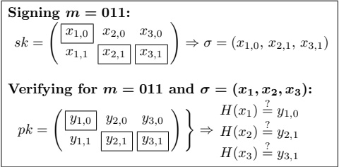
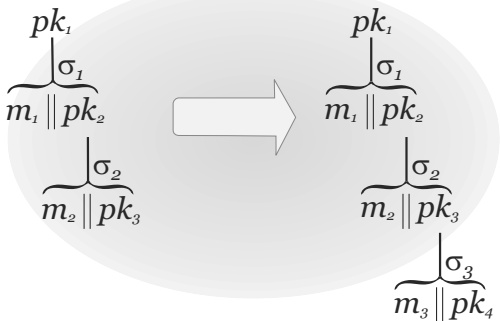
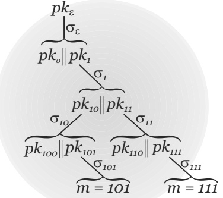

# Chapter 14: *Post-Quantum Cryptography*

So far in this book (cf. Section 3.1.2), we have equated the notion of “efficient adversaries” with adversarial algorithms running in (probabilistic) polynomial-time on a classical computer. Thus, when evaluating the security of our schemes we only considered efficient classical attacks. We did not, however, consider the potential impact of quantum computers—that is, computers that rely in an essential way on the principles of quantum mechanics. As we will see here, quantum algorithms can in some cases be faster than classical algorithms—possibly much faster—and thus quantum computers can have a dramatic impact on the security of cryptosystems.

While the theoretical impact of quantum computing on cryptography has been recognized since the mid-1990s, its potential impact in practice is currently unclear. As of this writing, no large-scale, general-purpose quantum computer has been built, and the timeframe for developing such a computer is uncertain due to the numerous engineering difficulties involved. Even if such computers are one day built, the true cost in time or money of executing quantum algorithms on those computers (as distinguished from the theoretical analysis of the number of steps those algorithms take in theory) is not well understood. Nevertheless, the current consensus is that there is a strong chance that well-funded attackers (e.g., government agencies) will be able to build quantum computers capable of attacking currently deployed cryptosystems in the next 10-15 years. Assuming this to be the case, we cannot wait 10-15 years to worry about the problem: standardizing and deploying new cryptographic algorithms takes time, and there may be messages encrypted now that must remain secret for more than a decade.

The above concerns have motivated an intense research effort over the past several years aimed at designing, analyzing, and developing “post-quantum” cryptosystems that would remain secure even against (polynomial-time) quantum algorithms. This work accelerated in 2017, when NIST announced an effort to evaluate and (eventually) standardize quantum-resistant public-key schemes. As in the case of the earlier AES and SHA-3 competitions, NIST solicited proposals for public-key encryption schemes and signature schemes from cryptographers around the world, eventually receiving 69 candidates; 26 of those made it to the second round in early 2019. In contrast to the AES and SHA-3 process, NIST is not expected to choose a single “winner” in each category; instead, the idea is to identify multiple schemes judged to be secure. NIST is expected to issue a set of draft standards for such schemes by 2024.

The goal of this chapter is to describe the impact of quantum algorithms on the schemes used today, and to offer a glimpse of some schemes offering plausible post-quantum security. We do not assume any background in quantum mechanics or quantum computing, and will not present any quantum algorithms in detail. Rather, we explain what existing quantum algorithms can do (without describing in detail how they do it) and otherwise treat them as “black boxes.” The post-quantum cryptosystems we describe are similar to current leading candidates in the NIST post-quantum standardization effort, but we have simplified them for pedagogical purposes.

Post-quantum cryptography vs. quantum cryptography. Quantum cryptography is related to, but distinct from, post-quantum cryptography as we use the term here. Quantum cryptography refers to cryptosystems that are implemented using quantum computers, quantum-mechanical phenomena, and quantum communication channels; for this reason, they would be difficult to deploy widely over the existing Internet. Post-quantum cryptosystems, on the other hand, are entirely classical—but are intended to ensure security even if an attacker has access to a quantum computer.

Interestingly, quantum cryptosystems can in some cases be proven secure unconditionally (i.e., without any computational assumptions), even against quantum attackers. In contrast, post-quantum cryptosystems—as with the rest of the schemes in this book—rely on assumptions regarding the hardness of certain mathematical problems even for quantum algorithms.

## 14.1 Post-Quantum Symmetric-Key Cryptography

We begin by exploring the impact of quantum computers on symmetric-key cryptography. While there are known quantum attacks that can outperform classical attacks in this setting, the net result is only a polynomial speedup and so the overall impact on symmetric-key cryptography is relatively minor.

### 14.1.1 Grover's Algorithm and Symmetric-Key Lengths

Consider the following abstract problem: Given oracle access to a function $f: D \to \{0,1\}$, find an input $x$ for which $f(x) = 1$. If there is only one such input, chosen uniformly in $D$, then it is not hard to show that any classical algorithm for this problem requires $\mathcal{O}(|D|)$ evaluations of $f$; this effectively corresponds to exhaustive search over the domain $D$ of the function.

In a surprising result published in 1996, Lov Grover showed that quantum algorithms can do better. Specifically, he gave an algorithm that finds $x$ as above using only $\mathcal{O}(|D|^{1/2})$ evaluations of $f$—a quadratic speedup. It was later shown that this is optimal, i.e., no quantum algorithm can do better.

Let us explore the impact this has on the required key length for symmetric-key cryptosystems. For concreteness, consider the case of a block cipher $F: \{0,1\}^n \times \{0,1\}^\ell \to \{0,1\}^\ell$ for which exhaustive search is the best attack, and an attacker whose goal is to determine the key $k \in \{0,1\}^n$ given a constant number of input/output pairs $\{(x_i, y_i)\}$ with $y_i = F_k(x_i)$. Say we want security against attacks running in time ${2}^\kappa$. Classically, it suffices to set $n = \kappa$ (since exhaustive search for $k$ requires time $\approx 2^n$). But if we define

$$f(k)=1\Leftrightarrow F_{k}(x_{i})=y_{i}\text{ for all }i,$$

then Grover's algorithm allows an attacker to find the key using $\mathcal{O}(2^{n/2})$ evaluations of $f$, or equivalently $\mathcal{O}(2^{n/2})$ evaluations of $F$. Thus, to achieve the desired level of security we must set $n = 2\kappa$. Summarizing:

To ensure equivalent security against exhaustive-search attacks in the quantum setting, symmetric-key cryptosystems must use keys that are double the length of keys used in the classical setting.

We stress that the above applies only if exhaustive-search attacks are the best possible; in other cases quantum algorithms may give even larger speedups.

### 14.1.2 Collision-Finding Algorithms and Hash Functions

Consider next the problem of finding a collision in some hash function $H: \{0,1\}^m \to \{0,1\}^n$ (with $m > n$). As we have seen already in Section 6.4.1, this can be done classically via a “birthday attack” using $\mathcal{O}(2^{n/2})$ evaluations of $H$. Is it possible to do better using a quantum algorithm?

It is indeed possible to do better via clever use of Grover’s algorithm. For simplicity in the analysis we will model $H$ as a random function (as we did in Section 6.4.1); the collision-finding algorithm we describe can be adapted for arbitrary $H$ as well. The approach is as follows. Let $\ell \ll 2^n$ be a parameter that we will set later. Let $C, D$ be disjoint subsets of $\{0,1\}^m$ with $|C| = \ell$ and $|D| = \ell^2$; for example, we can let $C$ be the set of all strings whose first $\log \ell$ bits are all 0 and take $D$ to be the set of all strings whose first ${2}\log \ell$ bits are all 1. For $x_i \in C$, set $y_i := H(x_i)$ using $\ell$ evaluations of $H$; define $C^{\prime} = \{y_i\}$. If $y_i = y_j$ for some $i \neq j$ then a collision has already been found. Otherwise, define the function $f: D \to \{0,1\}$ as

$$f(x)=1\Leftrightarrow H(x)\in C^{\prime}.$$

If there is any $x$ with $f(x)=1$, then we can use Grover's algorithm to find such an $x$ using $\mathcal{O}(|D|^{1/2})$ evaluations of $f$, or equivalently $\mathcal{O}(|D|^{1/2})$ evaluations of $H$. The overall number of evaluations of $H$, then, is $\mathcal{O}(\ell+\sqrt{\ell^{2}})=\mathcal{O}(\ell)$.

What is the probability that such an $x$ exists? We only run the second stage of the algorithm if all the $\{y_i\}$ are distinct. Since we model $H$ as a random function, for any particular $x \in D$ the probability that $H(x) \in C^{\prime}$ is $\frac{\ell}{2^n}$, and
so the probability that the hash of some element of $D$ lies in $C^{\prime}$ is

$${1}-\left(1-\frac{\ell}{2^{n}}\right)^{\ell^{2}}\geq1-e^{-\ell^{3}/2^{n}}$$

(using Proposition A.3). We thus see that taking $\ell = \Theta(2^{n/3})$ gives a constant probability of finding a collision using only $\mathcal{O}(2^{n/3})$ evaluations of $H$.

Consider the impact this has on the required output length of a hash function $H: \{0,1\}^m \to \{0,1\}^n$ in order to achieve some desired level of security. As in the previous section, say we want security (i.e., inability to find collisions) against attackers running in time ${2}^\kappa$, and assume there are no structural weaknesses in $H$ so generic attacks are the best possible. Classically, it suffices to set $n = 2\kappa$ (since a birthday attack would then require time $\mathcal{O}(2^{n/2}) = \mathcal{O}(2^\kappa)$). But achieving the same level of security in the quantum setting requires $n = 3\kappa$. Summarizing:

To ensure equivalent security against generic collision-finding attacks in the quantum setting, the output length of a hash function must be 50% larger than the output length in the classical setting.

## 14.2 Shor's Algorithm and its Impact on Cryptography

In the previous section we have seen quantum algorithms that offer a polynomial speedup as compared to the best classical algorithms for the same problems. These improved algorithms necessitate changes in the underlying parameters of symmetric-key schemes, but do not fundamentally render those schemes insecure. Here, in contrast, we discuss quantum algorithms that result in exponential speedups for solving certain number-theoretic problems—in particular, we show polynomial-time quantum algorithms for factoring and computing discrete logarithms. The existence of such algorithms means that all the public-key schemes we have discussed so far in this book are insecure (at least asymptotically) against a quantum attacker.

We begin by discussing an abstract mathematical problem with no explicit connection to cryptography. Let $f : \mathbb{H} \to R$ be a function whose domain $\mathbb{H}$ is an abelian group. (For now, $R$ can be arbitrary.) Assume further that $f$ is periodic, i.e., there is a $\delta \in \mathbb{H}$ (not equal to the identity) called the period such that for all $x \in \mathbb{H}$

$$f(x)=f(x+\delta).$$

(Note that if $\delta$ is a period then so is ${2}\delta$, etc., and so the period is not unique.) The period-finding problem is to find a period, given oracle access to $f$.

Classically, it is not clear how to solve this problem efficiently; even verifying that a given $\delta$ is a period seems difficult given only oracle access to $f$. In
1994, Peter Shor stunned researchers by showing a polynomial-time quantum algorithm for this problem for certain groups $\mathbb{H}$. His result was subsequently generalized by others to handle larger classes of groups. The details of Shor's algorithm lie outside our scope, but we discuss the cryptographic implications of Shor's algorithm below.

Implications for factoring and computing discrete logarithms. Period finding is a powerful tool: in particular, it can be used to factor and compute discrete logarithms! All we need to do is carefully choose the function whose period gives us the solution we are looking for.

First consider the problem of factoring. Fix a composite number $N$ that is the product of two distinct primes. Taking any $x \in \mathbb{Z}_N^*$, define the function $f_{x,N} : \mathbb{Z} \to \mathbb{Z}_N^*$ by

$$f_{x,N}(r)=[x^{r}\bmod N].$$

The key observation is that this function has period $\phi(N)$ since

$$f_{x,N}(r+\phi(N))=[x^{r+\phi(N)}\bmod N]=[x^{r}\cdot x^{\phi(N)}\bmod N]=[x^{r}\bmod N]$$

for any $r$. Thus, for any $x \in \mathbb{Z}_N^*$ of our choice we can run Shor's algorithm to obtain some period of $f_{x,N}$, i.e., a nonzero integer $k$ such that $x^k = 1 \bmod N$. Theorem 9.50 shows that this enables us to factor $N$ using polynomially many calls to Shor's algorithm and polynomial-time classical computation. (Shor's algorithm in this case runs in time polynomial in the logarithm of the smallest period—which is at most $\phi(N)$—and so this gives a quantum algorithm running in polynomial time overall.)

Period finding can also be used to compute discrete logarithms. Fix some cyclic group $\mathbb{G}$ of prime order $q$ with generator $g$, and say we are given some element $h \in \mathbb{G}$. Consider the function $f_{g,h} : \mathbb{Z}_q \times \mathbb{Z}_q \to \mathbb{G}$ given by

$$f(a,b)=g^{a}\cdot h^{-b}.$$

If we let $x = \log_{g} h$, then $f_{g,h}$ has period $(x, 1)$ since

$$f_{g,h}(a+x,b+1)=g^{a+x}h^{-b-1}=g^{a}g^{x}h^{-b}h^{-1}=g^{a}h^{-b}$$

for any $a,b$. Moreover, for any period $(x^{\prime},y^{\prime})$ we have $g^{x^{\prime}}h^{-y^{\prime}} = 1 = g^0h^0$. Lemma 9.65 thus shows that we can use any period to compute $\log_g h$ using classical polynomial-time computation. A quantum polynomial-time algorithm for computing $\log_g h$ follows from the fact that the running time of the period-finding algorithm in this case is polynomial in $\log q$.

Since the hardness of factoring and computing discrete logarithms underlies all the public-key cryptosystems we have seen so far in the book (and, indeed, all public-key algorithms in wide use today), we conclude that
all public-key cryptosystems we have covered thus far can be broken in polynomial time by a quantum computer.

This stark fact highlights the importance of post-quantum cryptography.

## 14.3 Post-Quantum Public-Key Encryption

As noted at the end of the previous section, both the factoring and discrete-logarithm problems become “easy” given a quantum computer. To have any hope of constructing public-key schemes with post-quantum security, then, we need to look for mathematical problems that are computationally hard even for quantum computers. As in the classical case, we generally cannot prove unconditionally that a specific problem is hard for quantum algorithms; all we can do is rely on plausible conjectures about the (quantum) hardness of certain problems. One notable difference from the classical setting is that the problems being considered for post-quantum cryptography have, on the whole, not been studied as long as the factoring and discrete-logarithm problems; thus, in some sense, we have less confidence that they are truly hard.

In this section we introduce one computational problem that has received a lot of attention, and is widely believed to be hard even for quantum algorithms. We then show how to construct a public-key encryption scheme based on the assumed hardness of that problem. We stress that our goal here is merely to provide a taste of recent work on post-quantum cryptography; in particular, we describe the scheme somewhat loosely without including every detail. For pedagogical purposes we also focus on a simple encryption scheme without attempting to optimize its efficiency.

The remainder of this section assumes a very basic knowledge of linear algebra, but can be appreciated even without this background if the reader is willing to accept certain facts on faith.

Throughout this section we let $q$ be an odd prime. We let $\lfloor \cdot \rfloor$ denote the standard “floor” function, so $\lfloor x \rfloor$ is the largest integer less than or equal to $x$. In this section we also change our view of $\mathbb{Z}_q$, equating it with the set

$$\{-\lfloor(q-1)/2\rfloor,\ldots,0,\ldots,\lfloor q/2\rfloor\}$$

(as opposed to $\{0, \ldots, q-1\}$ as we have done until now). This viewpoint is better suited to the present context, where we will say that an element of $\mathbb{Z}_q$ is “small” if it is “close” to 0.

The LWE assumption. Consider the following problem: A matrix $\mathbf{B} \in \mathbb{Z}_q^{m \times n}$ is chosen, along with a vector $^1$ $\mathbf{s} \in \mathbb{Z}_q^n$. We are then given $\mathbf{B}$ and $\mathbf{t} := [\mathbf{B} \cdot \mathbf{s} \bmod q]$ (i.e., all operations are done modulo $q$); the goal is to find any value $\mathbf{s}^{\prime} \in \mathbb{Z}_q^n$ such that $\mathbf{B}\mathbf{s}^{\prime} = \mathbf{t} \bmod q$. This problem is easy and can be solved using standard (efficient) linear-algebraic techniques.

> $^1$ By default, our vectors are column vectors and so we write, e.g., $\mathbf{s}^T$ (the transpose of $\mathbf{s}$) to denote a row vector.

Consider next the following variant of the problem. Choose $\mathbf{B}$ and $\mathbf{s}$ as before, but now also choose a short “error vector” $\mathbf{e} \in \mathbb{Z}_q^m$. (We use the standard Euclidean norm to define the length of vectors. That is, the length of a vector $\mathbf{e} = [e_1, \ldots, e_m]^T$, denoted $\|\mathbf{e}\|$, is simply $\sqrt{\sum_i e_i^2}$. At the moment, we do not quantify what we mean by “short.”) The value $\mathbf{t}$ is now computed as $\mathbf{t} := [\mathbf{B}\mathbf{s} + \mathbf{e} \bmod q]$ and the goal, given $\mathbf{B}$ and $\mathbf{t}$, is to find any $\mathbf{s}^{\prime} \in \mathbb{Z}_q^n$ such that $[\mathbf{t} - \mathbf{B}\mathbf{s}^{\prime} \bmod q]$ is short. For historical reasons, this is called the learning with errors (LWE) problem. When parameters are chosen appropriately, this problem appears to be significantly more difficult than the previous problem (when there are no errors), and efficient algorithms for solving it—even allowing for quantum algorithms—are not known.

For our purposes it is useful to consider a different version of the above called the decisional LWE problem. Here, roughly speaking, the goal is to distinguish whether $\mathbf{t}$ was generated by the process described above, or whether $\mathbf{t}$ was sampled uniformly from $\mathbb{Z}_q^m$. It is possible to show (for certain settings of the parameters) that this problem is hard if and only if the LWE problem itself is hard.

We now formalize the above discussion. Let $m,q$ be deterministic functions of the security parameter $n$ with $m>n$; we leave the dependence on $n$ implicit. Let $\psi$ be an efficient randomized algorithm that takes as input ${1}^n$ and outputs an integer; this $\psi$ represents the distribution on the errors, and we also leave its dependence on $n$ implicit. The following defines what it means for the decisional LWE problem to be (quantum-)hard for some $m,q,\psi$.

DEFINITION 14.1 We say the decisional $\text{LWE}_{m,q,\psi}$ problem is quantum-hard if for all quantum polynomial-time algorithms $\mathcal{A}$ there is a negligible function $\mathsf{negl}$ such that

$$\begin{align*}\left|\Pr[\mathbf{B}\leftarrow\mathbb{Z}_{q}^{m\times n};\mathbf{s}\leftarrow\psi^{n};\mathbf{e}\leftarrow\psi^{m}:\mathcal{A}\left(\mathbf{B},[\mathbf{B}\mathbf{s}+\mathbf{e}\bmod q]\right)=1]\right.\\\left.-\Pr[\mathbf{B}\leftarrow\mathbb{Z}_{q}^{m\times n};\mathbf{t}\leftarrow\mathbb{Z}_{q}^{m}:\mathcal{A}(\mathbf{B},\mathbf{t})=1]\right|\leq\mathsf{negl}(n).\end{align*}$$

(Note that we also choose $\mathbf{s}$ to be short.) Clearly, if the decisional $\text{LWE}_{m,q,\psi}$ problem is hard then so is the decisional $\text{LWE}_{m^{\prime},q,\psi}$ problem for any $m^{\prime} \leq m$. It is only slightly more difficult to show that increasing the length of $\mathbf{s}$ can only make the problem harder. We leave the following as an exercise.

LEMMA 14.2 If the decisional $\operatorname{LWE}_{m,q,\psi}$ problem is quantum-hard, then for all quantum polynomial-time algorithms $\mathcal{A}$ and all functions $m^{\prime}, \ell$ with $m^{\prime}(n) \leq m(n)$ and $\ell(n) \geq n$ there is a negligible function $\mathsf{negl}$ such that

$$\begin{align*}\left|\Pr[\mathbf{B}\leftarrow\mathbb{Z}_{q}^{m^{\prime}\times\ell};\mathbf{s}\leftarrow\psi^{\ell};\mathbf{e}\leftarrow\psi^{m^{\prime}}:\mathcal{A}\left(\mathbf{B},[\mathbf{B}\mathbf{s}+\mathbf{e}\bmod q]\right)=1]\right.&\\\left.-\Pr[\mathbf{B}\leftarrow\mathbb{Z}_{q}^{m^{\prime}\times\ell};\mathbf{t}\leftarrow\mathbb{Z}_{q}^{m^{\prime}}:\mathcal{A}(\mathbf{B},\mathbf{t})=1]\right|&\leq\mathsf{negl}(n).\end{align*}$$

LWE-Based encryption. We motivate the construction of an encryption scheme from the decisional LWE problem by first describing an insecure key-
exchange protocol that can be viewed as a linear-algebraic version of Diffie–Hellman key exchange. Fix $n, q, \psi$, and $m > n$, and consider the following protocol run between two parties Alice and Bob. Alice begins by generating a uniform $\mathbf{B} \in \mathbb{Z}_q^{m \times n}$ and choosing $\mathbf{s} \leftarrow \psi^n$; she then sends $(\mathbf{B}, \mathbf{t}_A := [\mathbf{B} \cdot \mathbf{s} \bmod q])$. Bob chooses $\hat{\mathbf{s}} \leftarrow \psi^m$ and replies with $\mathbf{t}_B^T := [\hat{\mathbf{s}}^T \cdot \mathbf{B} \bmod q]$. Finally, Alice computes $k_A := [\mathbf{t}_B^T \cdot \mathbf{s} \bmod q]$ and Bob computes $k_B := [\hat{\mathbf{s}}^T \cdot \mathbf{t}_A \bmod q]$. Note that

$$\boldsymbol{k}_{A}=\mathbf{t}_{B}^{T}\cdot\mathbf{s}=\hat{\mathbf{s}}^{T}\cdot\mathbf{B}\cdot\mathbf{s}=\hat{\mathbf{s}}^{T}\cdot\mathbf{t}_{A}=k_{B}$$

(where all calculations above are done modulo $q$), and so Alice and Bob have agreed on a shared key!

Of course, the protocol above is not secure since an eavesdropper can use linear algebra to recover $\mathbf{s}$, $\hat{\mathbf{s}}$, or both, and thus compute the key as well. By judiciously adding noise, however (and under the assumption that the decisional LWE problem is hard), it is possible for Alice and Bob to agree on a key while preventing an adversary from learning it. Adapting the resulting protocol to give an encryption scheme (in the same way the Diffie–Hellman protocol is adapted to give El Gamal encryption), we obtain Construction 14.3.

**CONSTRUCTION 14.3**

Let $m, q, \psi$ be as in the text. Define a public-key encryption scheme as follows:

- Gen: on input ${1}^n$ choose uniform $\mathbf{B} \leftarrow \mathbb{Z}_q^{m \times n}$ as well as $\mathbf{s} \leftarrow \psi^n$ and $\mathbf{e} \leftarrow \psi^m$. Set $\mathbf{t} := [\mathbf{B} \cdot \mathbf{s} + \mathbf{e} \bmod q]$. The public key is $\langle \mathbf{B}, \mathbf{t} \rangle$ and the private key is $\mathbf{s}$.

- Enc: on input a public key $pk = \langle \mathbf{B}, \mathbf{t} \rangle$ and a bit $b$, choose $\hat{\mathbf{s}} \leftarrow \psi^m$ and $\hat{\mathbf{e}} \leftarrow \psi^{n+1}$, and output the ciphertext

$$\mathbf{c}^{T}:=\left[\hat{\mathbf{s}}^{T}\cdot[\mathbf{B}\mid\mathbf{t}]+\hat{\mathbf{e}}^{T}+\underbrace{[0,\ldots,0,b\cdot\lfloor q/2\rfloor]}_{n+1}\mod q\right].$$

- Dec: on input a private key $\mathbf{s}$ and a ciphertext $\mathbf{c}^T$, first compute $k := [\mathbf{c}^T \cdot \begin{bmatrix} -\mathbf{s} \\ 1 \end{bmatrix} \bmod q]$. Then output 1 if $k$ is closer to $\lfloor \frac{q}{2} \rfloor$ than to 0 (see text), and 0 otherwise.

An encryption scheme based on the decisional LWE problem.

During decryption, “closeness” of $k$ to $\lfloor \frac{q}{2} \rfloor$ is determined by looking at the absolute value of $[k - \lfloor \frac{q}{2} \rfloor \mod q]$. Here it is important that we use the particular representation of $\mathbb{Z}_q$ described at the beginning of this section.

The construction is somewhat complicated, so it is worth stepping through the process of encryption and decryption to verify that the scheme is correct (at least with high probability) when parameters are set appropriately. Let $\mathbf{c}^{T}$ be an honestly generated ciphertext, so

$$\mathbf{c}^{T}=\hat{\mathbf{s}}^{T}\cdot\left[\mathbf{B}\mid\mathbf{t}\right]+\hat{\mathbf{e}}^{T}+\mathbf{b}^{T},$$

where we let $\mathbf{b}^T = [0, \ldots, 0, b \cdot \lfloor \frac{q}{2} \rfloor]$. (By default from now on, all operations are performed modulo $q$.) During decryption, the receiver computes

$$\begin{aligned}k&=\mathbf{c}^{T}\cdot\begin{bmatrix}-\mathbf{s}\\ 1\end{bmatrix}\\&=(\hat{\mathbf{s}}^{T}\cdot[\mathbf{B}\mid\mathbf{t}]+\hat{\mathbf{e}}^{T}+\mathbf{b}^{T})\cdot\begin{bmatrix}-\mathbf{s}\\ 1\end{bmatrix}\\&=-\hat{\mathbf{s}}^{T}\mathbf{B}\mathbf{s}+\hat{\mathbf{s}}^{T}\mathbf{t}+\hat{\mathbf{e}}^{T}\cdot\begin{bmatrix}-\mathbf{s}\\ 1\end{bmatrix}+b\cdot\lfloor\frac{q}{2}\rfloor\\&=\hat{\mathbf{s}}^{T}\mathbf{e}+\hat{\mathbf{e}}^{T}\cdot\begin{bmatrix}-\mathbf{s}\\ 1\end{bmatrix}+b\cdot\lfloor\frac{q}{2}\rfloor,\end{aligned}$$

using the fact that $\mathbf{t} = \mathbf{B} \cdot \mathbf{s} + \mathbf{e}$. At this point, it is unclear that the receiver recovers the correct bit. However, simple algebra shows that as long as

$$\left|\hat{\mathbf{s}}^{T}\mathbf{e}+\hat{\mathbf{e}}^{T}\cdot\begin{bmatrix}-\mathbf{s}\\ 1\end{bmatrix}\right|<(q-1)/4 \tag{14.1}$$

the receiver will output the same bit $b$ used by the sender. Note that if we let $\hat{\mathbf{s}}^{T} = [\hat{s}_{1}, \ldots, \hat{s}_{m}]$, and similarly for $\mathbf{e}, \hat{\mathbf{e}}$, and $\mathbf{s}$, then we may write Equation (14.1) as

$$\left|\sum_{i=1}^{m}\hat{s}_{i}e_{i}-\sum_{i=1}^{n}\hat{e}_{i}s_{i}+\hat{e}_{n+1}\right|<(q-1)/4,$$

so the left-hand side is a sum of products of integers output by $\psi$. Thus, if the distribution $\psi$ is chosen appropriately—specifically, so that it outputs integers sufficiently small so that Equation (14.1) holds (at least with overwhelming probability)—then correctness of the encryption scheme follows.

We now prove that Construction 14.3 is CPA-secure $^2$ (even for quantum adversaries) if the decisional $\text{LWE}_{m,q,\psi}$ problem is quantum-hard.

> $^2$ One can easily define a notion of CPA-security for quantum adversaries by simply replacing "probabilistic polynomial-time" with "quantum polynomial-time" in Definition 12.2. In doing so, we continue to assume the adversary has only classical access to the encryption oracle in experiment, i.e., it can only request the encryption of classical messages. It is possible to consider stronger notions of security where the attacker is given quantum access to the encryption oracle; this is beyond the scope of our book.

THEOREM 14.4 If the $\operatorname{LWE}_{m,q,\psi}$ problem is quantum-hard, then Construction 14.3 is CPA-secure (even for quantum adversaries).

PROOF Let $\Pi$ denote Construction 14.3. We prove that $\Pi$ has indistinguishable encryptions in the presence of an eavesdropper even for quantum adversaries; as in the classical case, this implies that $\Pi$ is CPA-secure even for quantum adversaries).

Let $\mathcal{A}$ be a quantum polynomial-time adversary. Consider a modified encryption scheme $\widetilde{\Pi}$ in which key generation is done by choosing $\mathbf{B}$ as before, but where $\mathbf{t}$ is chosen uniformly from $\mathbb{Z}_q^m$. (Encryption is done as in $\widetilde{\Pi}$.) Although $\widetilde{\Pi}$ is not actually an encryption scheme (as there is no way for the receiver to decrypt), the experiment $\mathsf{PubK}_{\mathcal{A},\widetilde{\Pi}}^{\mathsf{eav}}(n)$ is still well-defined since that experiment depends only on the key-generation and encryption algorithms.

CLAIM 14.5

$$\begin{array}{r}{\left|\Pr[\mathsf{PubK}_{\mathcal{A},\Pi}^{\mathsf{eav}}(n)=1]-\Pr[\mathsf{PubK}_{\mathcal{A},\widetilde{\Pi}}^{\mathsf{eav}}(n)=1]\right|\text{ is negligible}.}\end{array}$$

PROOF The proof is by a direct reduction to the decisional LWE problem as specified in Definition 14.1. Consider the following algorithm $D$ that attempts to solve the decisional $LWE_{m,q,\psi}$ problem:

Algorithm D:

The algorithm is given $\mathbf{B} \in \mathbb{Z}_q^{m \times n}$ and $\mathbf{t} \in \mathbb{Z}_q^m$ as input.

- Set $pk := \langle \mathbf{B}, \mathbf{t} \rangle$ and run $\mathcal{A}(pk)$ to obtain $m_0, m_1 \in \{0, 1\}$.

• Choose a uniform bit b, and set

$$\mathbf{c}^{T}:=\left[\hat{\mathbf{s}}^{T}\cdot\left[\mathbf{B}\mid\mathbf{t}\right]+\hat{\mathbf{e}}^{T}+\left[0,\ldots,0,m_{b}\cdot\lfloor\frac{q}{2}\rfloor\right]\bmod q\right].$$

• Give the ciphertext $\mathbf{c}^T$ to $\mathcal{A}$ and obtain an output bit $b^{\prime}$. If $b^{\prime} = b$, output 1; otherwise, output 0.

Note that $D$ is a quantum polynomial-time algorithm since $\mathcal{A}$ is.

It is immediate that

$$\begin{align*}\Pr[\mathbf{B}\gets\mathbb{Z}_{q}^{m\times n};\mathbf{s}\gets\psi^{n};\mathbf{e}\gets\psi^{m}:D\left(\mathbf{B},[\mathbf{B}\mathbf{s}+\mathbf{e}\bmod q]\right)=1]\\=\Pr[\mathsf{PubK}_{\mathcal{A},\Pi}^{\mathtt{eav}}(n)=1]\end{align*}$$

and

$$\begin{array}{r}{\Pr[\mathbf{B}\gets\mathbb{Z}_{q}^{m\times n};\mathbf{t}\gets\mathbb{Z}_{q}^{m}:D(\mathbf{B},\mathbf{t})=1]=\Pr[\mathsf{PubK}_{\mathcal{A},\widetilde{\Pi}}^{\mathsf{eav}}(n)=1].}\end{array}$$

Quantum hardness of the $\mathrm{LWE}_{m,q,\psi}$ problem implies the claim.

Consider now a second modified encryption scheme $\widetilde{\Pi}^{\prime}$ in which key generation is done as in $\widetilde{\Pi}$, but encryption of a bit $b$ is done by choosing a uniform $\hat{\mathbf{t}} \in \mathbb{Z}_q^{n+1}$ and outputting the ciphertext

$$\mathbf{c}^{T}:=\hat{\mathbf{t}}^{T}+[0,\ldots,0,b\cdot\lfloor\frac{q}{2}\rfloor].$$

CLAIM 14.6

 $\left|\Pr[\mathsf{PubK}_{\mathcal{A},\widetilde{\Pi}}^{\mathsf{eav}}(n)=1]-\Pr[\mathsf{PubK}_{\mathcal{A},\widetilde{\Pi}^{\prime}}^{\mathsf{eav}}(n)=1]\right|$ is negligible.

PROOF We begin by rewriting the way encryption is done in $\Pi$. Fixing some public key $\langle \mathbf{B}, \mathbf{t} \rangle$, define $\hat{\mathbf{B}} = [\mathbf{B} \mid \mathbf{t}]^T \in \mathbb{Z}_q^{(n+1) \times m}$. Encrypting a bit $b$ in $\tilde{\Pi}$ is then equivalent to choosing $\hat{\mathbf{s}} \leftarrow \psi^m$ and $\hat{\mathbf{e}} \leftarrow \psi^{n+1}$, computing $\hat{\mathbf{t}} := \hat{\mathbf{B}}\hat{\mathbf{s}} + \hat{\mathbf{e}}$, and then outputting the ciphertext

$$\mathbf{c}^{T}:=\hat{\mathbf{t}}^{T}+[0,\ldots,0,b\cdot\lfloor\frac{q}{2}\rfloor].$$

The crucial observation is that $\hat{\mathbf{t}}$ is computed exactly as in the decisional LWE assumption, though with different parameters (namely, $\hat{\mathbf{B}} \in \mathbb{Z}_q^{(n+1) \times m}$ instead of $\mathbf{B} \in \mathbb{Z}_q^{m \times n}$). However, since $m > n$, and hence also $n + 1 \leq m$, Lemma 14.2 shows that the decisional LWE problem is hard for this setting of the parameters as well. The claim can thus be proved similarly to the previous claim.

CLAIM 14.7 $\Pr[\mathsf{PubK}_{\mathcal{A},\widetilde{\Pi}^{\prime}}^{\mathsf{eav}}(n)=1]=\frac{1}{2}.$

PROOF This follows from the fact that, in $\widetilde{\Pi}^{\prime}$, the “message vector” $[0, \ldots, 0, b \cdot \lfloor \frac{q}{2} \rfloor]$ is added to a uniform vector $\hat{\mathbf{t}}^T \in \mathbb{Z}_q^{n+1}$ modulo $q$.

The preceding three claims prove the theorem.

## 14.4 Post-Quantum Signatures

Security of all the signature schemes presented in Chapter 13 required either the hardness of factoring or the hardness of computing discrete logarithms. As we have discussed, constructions from alternate assumptions are needed if we want security in a post-quantum world. While it is possible to construct signature schemes from the LWE assumption introduced in the previous section, such schemes are complex and we explore a different approach here.

Somewhat surprisingly, and in contrast to the case of public-key encryption, it is possible to construct signature schemes based on hash functions, a symmetric-key primitive. Since existing cryptographic hash functions such as SHA-3 are believed to be secure even against quantum algorithms (subject to the increase in parameters discussed in Section 14.1), this provides a promising approach to constructing post-quantum signatures.

Signatures based on hash functions are interesting for several other reasons, as well. First, it is amazing (and perhaps counterintuitive) that signatures can be constructed without any number-theoretic assumptions, unlike public-key encryption schemes. Moreover, as we will see, the ideas developed here can be used to construct signature schemes from the minimal assumption that one-way functions exist. It is also worth noting that the schemes we present here do not rely on random oracles, as opposed to all the constructions we saw in Chapter 13. Finally, signatures based on hash functions can be more efficient than those relying on number-theoretic assumptions.

In the rest of this section, we no longer mention quantum attacks explicitly. However, all security claims hold against such attacks so long as the hash function used is quantum-secure (in the appropriate sense).

### 14.4.1 Lamport's Signature Scheme

We initiate our study of signature schemes based on hash functions by considering the relatively weak notion of one-time signature schemes. Informally, such schemes are “secure” as long as a given private key is used to sign only a single message. Schemes satisfying this notion of security may be appropriate for some applications, and also serve as useful building blocks for achieving stronger notions of security, as we will see in the following section.

Let $\Pi = (\mathsf{Gen}, \mathsf{Sign}, \mathsf{Vrfy})$ be a signature scheme, and consider the following experiment for an adversary $\mathcal{A}$ and parameter $n$:

The one-time signature experiment $\mathsf{Sig-forge}_{\mathcal{A},\Pi}^{1\text{-time}}(n)$:

1. Gen ${1}^{n}$ is run to obtain keys $(pk, sk)$.

2. Adversary $\mathcal{A}$ is given $pk$ and asks a single query $m^{\prime}$ to its oracle $\mathsf{Sign}_{sk}(\cdot)$. $\mathcal{A}$ then outputs $(m,\sigma)$ with $m \neq m^{\prime}$.

3. The output of the experiment is defined to be 1 if and only if $\operatorname{Vrfy}_{pk}(m,\sigma)=1$.

DEFINITION 14.8 Signature scheme $\Pi = (\mathrm{Gen}, \mathrm{Sign}, \mathrm{Vrfy})$ is existentially unforgeable under a single-message attack, or is a one-time signature scheme, if for all probabilistic polynomial-time adversaries $\mathcal{A}$, there exists a negligible function $\mathrm{negl}$ such that:

$$\Pr\left[\mathsf{Sig-forge}_{\mathcal{A},\Pi}^{1-\mathsf{time}}(n)=1\right]\leq\mathsf{negl}(n).$$

Leslie Lamport gave a construction of a one-time signature scheme in 1979. We illustrate the idea for the case of signing 3-bit messages. Let $H$ be a cryptographic hash function. A private key consists of six uniform values $x_{1,0}$, $x_{1,1}$, $x_{2,0}$, $x_{2,1}$, $x_{3,0}$, $x_{3,1} \in \{0,1\}^n$, and the corresponding public key
contains the results obtained by applying H to each of these elements. These keys can be visualized as two-dimensional arrays:

$$\begin{array}{l}p k=\left(\begin{matrix}y_{1,0}&y_{2,0}&y_{3,0}\\ y_{1,1}&y_{2,1}&y_{3,1}\end{matrix}\right)\quad s k=\left(\begin{matrix}x_{1,0}&x_{2,0}&x_{3,0}\\ x_{1,1}&x_{2,1}&x_{3,1}\end{matrix}\right).\end{array}$$

To sign a message $m = m_1 m_2 m_3$ (where $m_i \in \{0, 1\}$), the signer releases the appropriate preimage $x_{i,m_i}$ for each bit of the message; the signature $\sigma$ consists of the three values $(x_{1,m_1}, x_{2,m_2}, x_{3,m_3})$. Verification is carried out in the natural way: presented with the candidate signature $(x_1, x_2, x_3)$ on the message $m = m_1 m_2 m_3$, accept if and only if $H(x_i) \overset{?}{=} y_{i,m_i}$ for ${1} \leq i \leq 3$. This is shown graphically in Figure 14.1, and the general case—for messages of any length $\ell$—is described formally in Construction 14.9.

**FIGURE 14.1: The Lamport scheme used to sign the message m = 011.**

**CONSTRUCTION 14.9**

Let $H: \{0,1\}^* \to \{0,1\}^n$ be a function. Construct a signature scheme for messages of length $\ell = \ell(n)$ as follows:

- Gen: on input ${1}^n$, proceed as follows for $i \in \{1, \ldots, \ell\}$:
  1. Choose uniform $x_{i,0}, x_{i,1} \in \{0,1\}^n$.
  2. Compute $y_{i,0} := H(x_{i,0})$ and $y_{i,1} := H(x_{i,1})$.

The public key $pk$ and the private key $sk$ are

$$pk = \begin{pmatrix} y_{1,0} & y_{2,0} & \cdots & y_{\ell,0} \\ y_{1,1} & y_{2,1} & \cdots & y_{\ell,1} \end{pmatrix} \quad sk = \begin{pmatrix} x_{1,0} & x_{2,0} & \cdots & x_{\ell,0} \\ x_{1,1} & x_{2,1} & \cdots & x_{\ell,1} \end{pmatrix}.$$

- Sign: on input a private key $sk$ as above and a message $m \in \{0,1\}^\ell$ with $m = m_1 \cdots m_\ell$, output the signature $(x_{1,m_1}, \ldots, x_{\ell,m_\ell})$.

- Vrfy: on input a public key $pk$ as above, a message $m \in \{0,1\}^\ell$ with $m = m_1 \cdots m_\ell$, and a signature $\sigma = (x_1, \ldots, x_\ell)$, output 1 if and only if $H(x_i) = y_{i,m_i}$ for all ${1} \leq i \leq \ell$.

The Lamport signature scheme.

After observing a signature on a message, an attacker who wishes to forge a signature on any other message must find a preimage of one of the three “unused” elements in the public key. If $H$ is one-way (see Definition 9.73), then finding any such preimage is computationally difficult.

THEOREM 14.10 Let $\ell$ be any polynomial. If H is a one-way function, then Construction 14.9 is a one-time signature scheme.

PROOF Let $\ell = \ell(n)$ throughout. As noted above, the key observation is this: say an attacker $\mathcal{A}$ requests a signature on a message $m^{\prime}$, and consider any other message $m \neq m^{\prime}$. There must be at least one position $i^* \in \{1, \ldots, \ell\}$ on which $m$ and $m^{\prime}$ differ. Say $m_{i^*} = b \neq m^{\prime}_{i^*}$. Then forging a signature on $m$ requires, at least, finding a preimage (under $H$) of element $y_{i^*,b^*}$ of the public key. Since $H$ is one-way, this is infeasible. We now formalize this intuition.

Let $\Pi$ denote the Lamport scheme, and let $\mathcal{A}$ be a probabilistic polynomial-time adversary. In a particular execution of $\mathsf{Sig-forge}^{1\text{-time}}_{\mathcal{A},\Pi}(n)$, let $m^{\prime}$ denote the message whose signature is requested by $\mathcal{A}$ (we assume without loss of generality that $\mathcal{A}$ always requests a signature on a message), and let $(m, \sigma)$ be the final output of $\mathcal{A}$. We say that $\mathcal{A}$ outputs a forgery at $(i,b)$ if $\mathsf{Vrfy}_{pk}(m,\sigma)=1$ and furthermore $m_{i}\neq m_{i}^{\prime}$ (i.e., messages $m$ and $m^{\prime}$ differ on their $i$th position) and $m_{i}=b\neq m_{i}^{\prime}$. Note that whenever $\mathcal{A}$ outputs a forgery, it outputs a forgery at some $(i,b)$.

Consider the following PPT algorithm I attempting to invert H:

**Algorithm I:**

The algorithm is given ${1}^{n}$ and y as input.

1. Choose uniform $i^* \in \{1, \ldots, \ell\}$ and $b^* \in \{0, 1\}$. Set $y_{i^*, b^*} := y$.

2. For all $i \in \{1, \ldots, \ell\}$ and $b \in \{0,1\}$ with $(i,b) \neq (i^{*},b^{*})$:

• Choose uniform $x_{i,b} \in \{0,1\}^{n}$ and set $y_{i,b} := H(x_{i,b})$.

3. Run $\mathcal{A}$ on input $pk$: $\begin{pmatrix} y_{1,0} & y_{2,0} & \cdots & y_{\ell,0} \\ y_{1,1} & y_{2,1} & \cdots & y_{\ell,1} \end{pmatrix}$.

4. When $\mathcal{A}$ requests a signature on the message $m^{\prime}$:

• If $m^{\prime}_{i^*} = b^{*}$, then $\mathcal{I}$ aborts the execution.

• Otherwise, $\mathcal{I}$ returns the signature $\sigma = (x_{1,m^{\prime}_1}, \ldots, x_{\ell,m^{\prime}_\ell})$.

5. When $\mathcal{A}$ outputs $(m,\sigma)$ with $\sigma=(x_{1},\ldots,x_{\ell})$:

• If $\mathcal{A}$ outputs a forgery at $(i^{*}, b^{*})$, then output $x_{i^{*}}$.

Whenever $\mathcal{A}$ outputs a forgery at $(i^*, b^*)$, algorithm $\mathcal{I}$ succeeds in inverting its given input $y$. We are interested in the probability that this occurs when the input to $\mathcal{I}$ is generated by choosing uniform $x \in \{0,1\}^n$ and setting $y := H(x)$ (cf. Definition 9.73). Imagine a “mental experiment” in which $\mathcal{I}$ is
given $x$ at the outset, sets $x_{i^{*},b^{*}} := x$, and then always returns a signature to $\mathcal{A}$ in step ${4}$ (i.e., even if $m_{i^{*}} = b^{*}$). The view of $\mathcal{A}$ when run as a subroutine by $\mathcal{I}$ in this mental experiment is distributed identically to the view of $\mathcal{A}$ in experiment $\mathsf{Sig-forge}_{\mathcal{A},\Pi}^{1\text{-time}}(n)$. Because $(i^{*}, b^{*})$ was chosen uniformly at the beginning of the experiment, and the view of $\mathcal{A}$ is independent of this choice, the probability that $\mathcal{A}$ outputs a forgery at $(i^{*}, b^{*})$, conditioned on the fact that $\mathcal{A}$ outputs a forgery at all, is at least ${1}/2\ell$. (The easiest way to see this is to simply consider deferring the choice of $(i^{*}, b^{*})$ to the end of the experiment.) We conclude that, in this mental experiment, the probability that $\mathcal{A}$ outputs a forgery at $(i^{*}, b^{*})$ is at least $\frac{1}{2\ell} \cdot \Pr[\mathsf{Sig-forge}_{\mathcal{A},\Pi}^{1\text{-time}}(n) = 1]$.

Returning to the real experiment involving $\mathcal{I}$ as initially described, the key point is that the probability that $\mathcal{A}$ outputs a forgery at $(i^*, b^*)$ is unchanged. This is because the mental experiment and the real experiment coincide if $\mathcal{A}$ outputs a forgery at $(i^*, b^*)$. That is, the experiments only differ if $m_{i^*}^{\prime} = b^*$, but if this happens then it is impossible (by definition) for $\mathcal{A}$ to subsequently output a forgery at $(i^*, b^*)$. So the probability that $\mathcal{A}$ outputs a forgery at $(i^*, b^*)$ is still at least $\frac{1}{2\ell} \cdot \Pr[\mathsf{Sig-forge}_{\mathcal{A},\Pi}^{1-time}(n) = 1]$. In other words,

$$\Pr[\mathsf{Invert}_{\mathcal{I},H}(n)=1]\geq\frac{1}{2\ell}\cdot\Pr[\mathsf{Sig-forge}_{\mathcal{A},\Pi}^{1-\mathsf{time}}(n)=1].$$

Because H is a one-way function, there is a negligible function $\mathsf{negl}$ such that

$$\mathsf{negl}(n)\geq\Pr[\mathsf{Invert}_{\mathcal{I},H}(n)=1].$$

Since $\ell$ is polynomial this implies that $\Pr[\mathsf{Sig-forge}_{\mathcal{A},\Pi}^{1-\text{time}}(n)=1]$ is negligible, completing the proof.

COROLLARY 14.11 If one-way functions exist, then for any polynomial $\ell$ there is a one-time signature scheme for messages of length $\ell$.

### 14.4.2 Chain-Based Signatures

Being able to sign only a single message with a given private key is obviously a significant drawback. We show here an approach based on collision-resistant hash functions that allows a signer to sign arbitrarily many messages, at the expense of maintaining state that must be updated after each signature is generated. In Section 14.4.3 we discuss a more efficient variant of this approach (that still requires state), and then describe how that construction can be made stateless. The result shows that full-fledged signature schemes satisfying Definition 13.2 can be constructed from collision-resistant hash functions.

We first define signature schemes that allow the signer to maintain state that is updated after every signature is produced.

DEFINITION 14.12 A stateful signature scheme is a tuple of probabilistic polynomial-time algorithms (Gen, Sign, Vrfy) satisfying the following:

1. The key-generation algorithm Gen takes as input a security parameter ${1}^{n}$ and outputs $(pk, sk, s_{0})$. These are called the public key, private key, and initial state, respectively. We assume $pk$ and $sk$ each has length at least $n$, and that $n$ can be determined from $pk$, $sk$.

2. The signing algorithm Sign takes as input a private key $sk$, a value $s_{i-1}$, and a message $m \in \{0,1\}^{*}$. It outputs a signature $\sigma$ and a value $s_i$.

3. The deterministic verification algorithm Vrfy takes as input a public key $pk$, a message $m$, and a signature $\sigma$. It outputs a bit $b$.

We require that for every $n$, every $(pk, sk, s_0)$ output by $\mathsf{Gen}(1^n)$, and any messages $m_1, \ldots, m_t \in \{0,1\}^*$, if we iteratively compute $(\sigma_i, s_i) \leftarrow \mathsf{Sign}_{sk, s_{i-1}}(m_i)$ for $i = 1, \ldots, t$, then for every $i \in \{1, \ldots, t\}$, it holds that $\mathsf{Vrfy}_{\text{pk}}(m_i, \sigma_i) = 1$.

We emphasize that the verifier does not need to know the signer's state in order to verify a signature; in fact, in some schemes the state must be kept secret by the signer in order for security to hold. Signature schemes that do not maintain state (as in Definition 13.1) are called stateless to distinguish them from stateful schemes. Clearly, stateless schemes are preferable (although stateful schemes can still potentially be useful). We introduce stateful signatures as a stepping stone to an eventual stateless construction.

Security for stateful signatures schemes is exactly analogous to Definition 13.2, with the only subtleties being that the signing oracle returns only the signature (and not the state), and that the signing oracle updates the state each time it is invoked.

For any polynomial $t = t(n)$, we can easily construct a stateful “t-time-secure” signature scheme. (The definition of security here would be the obvious generalization of Definition 14.8.) We can do this by simply letting the public key (resp., private key) consist of $t$ independently generated public keys (resp., private keys) for any one-time signature scheme; i.e., set $pk := \langle pk_1, \ldots, pk_t \rangle$ and $sk := \langle sk_1, \ldots, sk_t \rangle$ where each $(pk_i, sk_i)$ is an independently generated key-pair for some one-time signature scheme. The state is a counter $i$ initially set to 1. To sign a message $m$ using the private key $sk$ and current state $i \leq t$, compute $\sigma \leftarrow \mathsf{Sign}_{sk_i}(m)$ (that is, generate a signature on $m$ using the private key $sk_i$) and output $(\sigma, i)$; the state is updated to $i := i + 1$. Since the state starts at 1, this means the $i$th message is signed using $sk_i$. Verification of a signature $(\sigma, i)$ on a message $m$ is done by checking whether $\sigma$ is a valid signature on $m$ with respect to $pk_i$. This scheme is secure if used to sign $t$ messages since each private key of the underlying one-time scheme is used to sign only a single message.

As described, signatures have constant length (i.e., independent of $t$), but the public key has length linear in $t$. It is possible to trade off the length of the public key and signatures by having the signer compute a Merkle tree $h := \mathcal{MT}(pk_1, \ldots, pk_t)$ (see Section 6.6.2) over the $t$ underlying public keys from the one-time scheme. That is, the public key will now be $\langle t, h \rangle$, and the signature on the $i$th message will include $(\sigma, i)$, as before, along with the $i$th value $pk_i$ and a proof $\pi_i$ that this is the correct value corresponding to $h$. (Verification is done in the natural way.) The public key now has constant size, and the signature length grows only logarithmically with $t$.

Since $t$ can be an arbitrary polynomial, why don't the previous schemes give us the solution we are looking for? The main drawback is that they require the upper bound $t$ on the number of messages that can be signed to be fixed in advance, at the time of key generation. This is a potentially severe limitation since once the upper bound is reached a new public key would have to be generated and distributed. We would prefer instead to have a single, fixed public key that can be used to sign an unbounded number of messages.

Let $\Pi = (\mathrm{Gen}, \mathrm{Sign}, \mathrm{Vrfy})$ be a one-time signature scheme. In the scheme we have just described (ignoring the Merkle-tree optimization), the signer runs $t$ invocations of $\mathrm{Gen}$ to obtain public keys $pk_1, \ldots, pk_t$, and includes each of these in its actual public key $pk$. The signer is then restricted to signing at most $t$ messages. We can do better by using a “chain-based” scheme in which the signer generates additional public keys on-the-fly, as needed.

In the chain-based scheme, the public key consists of just a single public key $pk_1$ generated using $\mathsf{Gen}$, and the private key is just the associated private key $sk_1$. To sign the first message $m_1$, the signer first generates a new key-pair $(pk_2, sk_2)$ using $\mathsf{Gen}$, and then signs both $m_1$ and $pk_2$ using $sk_1$ to obtain $\sigma_1 \leftarrow \mathsf{Sign}_{sk_1}(m_1\|pk_2)$. The signature that is output includes both $pk_2$ and $\sigma_1$, and the signer adds $(m_1, pk_2, sk_2, \sigma_1)$ to its current state. In general, when it comes time to sign the ith message the signer will have stored $\{(m_j, pk_{j+1}, sk_{j+1}, \sigma_j)\}_{j=1}^i$ as part of its state. To sign the ith message $m_i$, the signer first generates a new key-pair $(pk_{i+1}, sk_{i+1})$ using $\mathsf{Gen}$, and then signs $m_i$ and $pk_{i+1}$ using $sk_i$ to obtain a signature $\sigma_i \leftarrow \mathsf{Sign}_{sk_i}(m_i\|pk_{i+1})$. The actual signature that is output includes $pk_{i+1}$, $\sigma_i$, and also the values $\{m_j, pk_{j+1}, \sigma_j\}_{j=1}^{i-1}$. The signer then adds $(m_i, pk_{i+1}, sk_{i+1}, \sigma_i)$ to its state. See Figure 14.2 for a graphical depiction of this process.

To verify a signature $(pk_{i+1}, \sigma_i, \{m_j, pk_{j+1}, \sigma_j\}_{j=1}^{i-1})$ on a message $m = m_i$ with respect to public key $pk_1$, the receiver verifies each link between a public key $pk_j$ and the next public key $pk_{j+1}$ in the chain, as well as the link between the last public key $pk_i$ and $m$. That is, verification outputs 1 if and only if $\mathsf{Vrfy}_{pk_j}(m_j \| pk_{j+1}, \sigma_j) \overset{?}{=} 1$ for all $j \in \{1, \ldots, i\}$. (Refer to Figure 14.2.)

It is not hard to be convinced—at least on an intuitive level—that this signature scheme is existentially unforgeable under an adaptive chosen-message attack (regardless of how many messages are signed). Informally, this is once again due to the fact that each key-pair $(pk_i, sk_i)$ is used to sign only a single “message,” where in this case the “message” is actually a message/public-key pair $m_i\|pk_{i+1}$. Since we will prove security of a more efficient scheme in the next section, we do not prove security for the chain-based scheme here.

**FIGURE 14.2: Chain-based signatures: the situation before and after signing the third message $m_{3}$.**

In the chain-based scheme, each public key $pk_i$ is used to sign both a message and another public key. Thus, it is essential that the underlying one-time signature scheme $\Pi$ is capable of signing messages longer than the public key. The Lamport scheme presented in Section 14.4.1 does not have this property. However, if we apply the hash-and-sign paradigm from Section 13.3 to the Lamport scheme, we do obtain a one-time signature scheme that can sign messages of arbitrary length. (Although Theorem 13.4 was stated only with regard to signature schemes satisfying Definition 13.2, it is not hard to see that an identical proof works for one-time signature schemes.) Because this result is crucial for the next section, we state it formally. (Note that the existence of collision-resistant hash functions implies the existence of one-way functions; see Exercise 8.4.)

LEMMA 14.13 If collision-resistant hash functions exist, then there exists a one-time signature scheme (for messages of arbitrary length).

The chain-based signature scheme is a stateful signature scheme that is existentially unforgeable under an adaptive chosen-message attack. It has a number of disadvantages, though. For one, there is no immediate way to eliminate the state (recall that our ultimate goal is a stateless scheme satisfying Definition 13.2). It is also not very efficient, in that the signature length, size of the state, and verification time are all linear in the number of messages that have been signed. Finally, each signature reveals all previously signed messages, and this may be undesirable in some contexts.

**FIGURE 14.3: Tree-based signatures (conceptually).**

### 14.4.3 Tree-Based Signatures

The signer in the chain-based scheme of the previous section can be viewed as maintaining a tree of degree 1, rooted at the public key $pk_1$, and with depth equal to the number of messages signed so far (cf. Figure 14.2). A natural way to improve efficiency is to use a binary tree in which each node has degree 2. As before, a signature will correspond to a “signed” path in the tree from a leaf to the root; as long as the tree has polynomial depth (even if it has exponential size!), verification can be done in polynomial time.

Concretely, to sign messages of length $n$ we will work with a binary tree of depth $n$ having ${2}^n$ leaves. As before, the signer will add nodes to the tree “on-the-fly,” as needed. In contrast to the chain-based scheme, however, only leaves (and not internal nodes) will be used for signing messages. Each leaf of the tree will correspond to one of the possible messages of length $n$.

In more detail, we imagine a binary tree of depth $n$ where the root is labeled by $\varepsilon$ (i.e., the empty string), and a node that is labeled with the binary string $w$ (of length less than $n$) has left-child labeled $w0$ and right-child labeled $w1$. This tree is never constructed in its entirety (note that it has exponential size), but is instead built up by the signer as needed.

For every node $w$, we associate a pair of keys $pk_w$, $sk_w$ for a one-time signature scheme $\Pi$. The public key of the root, $pk_\varepsilon$, is the actual public key of the signer. To sign a message $m \in \{0,1\}^n$, the signer does the following:

1. It first generates keys (as needed) for all nodes on the path from the root to the leaf labeled m. (Some of these public keys may have been generated in the process of signing previous messages, and in that case are not generated again.)

2. Next, it “certifies” the path from the root to the leaf labeled $m$ by computing a signature on $pk_{w0} \| pk_{w1}$, using private key $sk_{w}$, for each string w that is a proper prefix of m.

3. Finally, it “certifies” $m$ itself by computing a signature on $m$ using the private key $sk_{m}$.

The final signature on $m$ consists of the signature on $m$ with respect to $pk_{m}$, as well as all the information needed to verify the path from the leaf labeled $m$ to the root; see Figure 14.3. Additionally, the signer updates its state by storing all the keys generated as part of the above signing process. A formal description of this scheme is given as Construction 14.14.

**CONSTRUCTION 14.14**

Let $\Pi = (\mathsf{Gen}, \mathsf{Sign}, \mathsf{Vrfy})$ be a signature scheme. For a binary string $m$, let $m|_{i} \stackrel{\mathrm{def}}{=} m_{1} \cdots m_{i}$ denote the i-bit prefix of $m$ (with $m|_{0} \stackrel{\mathrm{def}}{=} \varepsilon$, the empty string). Construct the scheme $\Pi^* = (\mathsf{Gen}^*, \mathsf{Sign}^*, \mathsf{Vrfy}^*)$ as follows:
- $\mathsf{Gen}^*$: on input ${1}^n$, compute $(pk_{\varepsilon}, sk_{\varepsilon}) \leftarrow \mathsf{Gen}(1^n)$ and output the public key $pk_{\varepsilon}$. The private key and initial state are $sk_{\varepsilon}$.
- $\mathsf{Sign}^*$: on input a message $m \in \{0,1\}^n$, carry out the following.
1. For $i = 0$ to $n - 1$:
   - If $pk_{m|i,0}, pk_{m|i,1}$, and $\sigma_{m|i}$ are not in the state, compute $(pk_{m|i,0}, sk_{m|i,0}) \leftarrow \mathsf{Gen}(1^n)$, $(pk_{m|i,1}, sk_{m|i,1}) \leftarrow \mathsf{Gen}(1^n)$, and $\sigma_{m|i} \leftarrow \mathsf{Sign}_{sk_{m|i}}(pk_{m|i,0} \parallel pk_{m|i,1})$. In addition, add all of these values to the state.
2. If $\sigma_m$ is not yet included in the state, compute $\sigma_m \leftarrow \mathsf{Sign}_{sk_m}(m)$ and store it as part of the state.
3. Output the signature $\left(\{\sigma_{m|i}, pk_{m|i,0}, pk_{m|i,1}\}_{i=0}^{n-1}, \sigma_m\right)$.
- $\mathsf{Vrfy}^*$: on input a public key $pk_{\varepsilon}$, message $m$, and signature $\left(\{\sigma_{m|i}, pk_{m|i,0}, pk_{m|i,1}\}_{i=0}^{n-1}, \sigma_m\right)$, output 1 if and only if:
1. $\mathsf{Vrfy}_{pk_{m|i}}(pk_{m|i,0} \parallel pk_{m|i,1}, \sigma_{m|i}) \stackrel{?}{=} 1$ for all $i \in \{0, \ldots, n-1\}$.
2. $\mathsf{Vrfy}_{pk_m}(m, \sigma_m) \stackrel{?}{=} 1$.

A “tree-based” signature scheme.

Notice that each of the underlying keys in this scheme is used to sign only a single “message.” Each key associated with an internal node signs a pair of public keys, and a key at a leaf is used to sign only a single message. Since each key is used to sign a pair of other keys, we again need the one-time signature scheme $\Pi$ to be capable of signing messages longer than the public
key. Lemma 14.13 shows that such schemes can be constructed based on collision-resistant hash functions.

Before proving security of this tree-based approach, note that it improves on the chain-based scheme in a number of respects. It still allows for signing an unbounded number of messages. (Although there are only ${2}^n$ leaves, the message space contains only ${2}^n$ messages. In any case, ${2}^n$ is eventually larger than any polynomial function of $n$.) In terms of efficiency, the signature length and verification time are now proportional to the message length $n$ but are independent of the number of messages signed. The scheme is still stateful, but we will see how this can be avoided after we prove the following result.

THEOREM 14.15 Let $\Pi$ be a one-time signature scheme. Then Construction 14.14 is a secure signature scheme.

PROOF Let $\Pi^{*}$ denote Construction 14.14. Let $\mathcal{A}^{*}$ be a probabilistic polynomial time adversary, let $\ell^{*}=\ell^{*}(n)$ be a (polynomial) upper bound on the number of signing queries made by $\mathcal{A}^{*}$, and set $\ell=\ell(n)\stackrel{\mathrm{def}}{=}2n\ell^{*}(n)+1$. Note that $\ell$ upper bounds the number of public keys from $\Pi$ that are needed to generate $\ell^{*}$ signatures using $\Pi^{*}$. This is because each signature in $\Pi^{*}$ requires at most ${2}n$ new keys from $\Pi$ (in the worst case), and one additional key from $\Pi$ is used as the actual public key $pk_{\varepsilon}$.

Consider the following PPT adversary $\mathcal{A}$ attacking the one-time signature scheme $\Pi$:

Adversary $\mathcal{A}$:

$\mathcal{A}$ is given as input a public key $pk$ (the security parameter $n$ is implicit).

- Choose a uniform index $i^* \in \{1, \ldots, \ell\}$. Construct a list $pk^1, \ldots, pk^\ell$ of keys as follows:

- Set $pk^{i^{*}} := pk$.

- For $i \neq i^{*}$, compute $(pk^{i}, sk^{i}) \leftarrow \mathrm{Gen}(1^{n})$.

- Run $\mathcal{A}^*$ on input public key $pk_\varepsilon = pk^1$. When $\mathcal{A}^*$ requests a signature on a message $m$ do:

1. For $i = 0$ to $n - 1$:

– If the values $pk_{m|i,0}, pk_{m|i,1}$, and $\sigma_{m|i}$ have not yet been defined, then set $pk_{m|i,0}$ and $pk_{m|i,1}$ equal to the next two unused public keys $pk^j$ and $pk^{j+1}$, and compute a signature $\sigma_{m|i}$ on $pk_{m|i,0} \parallel pk_{m|i,1}$ with respect to $pk_{m|i}$.^3

> $^3$ If $i \neq i^*$ then $\mathcal{A}$ can compute a signature with respect to $pk_i$ by itself. $\mathcal{A}$ can also obtain a (single) signature with respect to $pk_{i^*}$ by making the appropriate query to its signing oracle. This is what is meant here.

2. If $\sigma_{m}$ is not yet defined, compute a signature $\sigma_{m}$ on $m$ with respect to $pk_{m}$ (see footnote 3).

3. Give $\left\{\sigma_{m|i}, pk_{m|i,0}, pk_{m|i,1}\right\}_{i=0}^{n-1}, \sigma_{m}$ to $\mathcal{A}^{*}$.

- Say $\mathcal{A}^*$ outputs a message $m$ (for which it had not previously requested a signature) and a signature $\left(\{\sigma_{m|i}^{\prime}, pk_{m|i,0}^{\prime}, pk_{m|i,1}^{\prime}\}_{i=0}^{n-1}, \sigma_{m}^{\prime}\right)$. If this is a valid signature on $m$, then:

Case 1: Say there exists a $j \in \{0, \ldots, n-1\}$ for which $pk_{m|j,0}^{\prime} \neq pk_{m|j,0}$ or $pk_{m|j,1}^{\prime} \neq pk_{m|j,1}$; this includes the case when $pk_{m|j,0}$ or $pk_{m|j,1}$ were never defined by $\mathcal{A}$. Take the minimal such $j$, and let $i$ be such that $pk^i = pk_{m|j} = pk_{m|j}^{\prime}$ (such an $i$ exists by the minimality of $j$). If $i = i^*$, output $(pk_{m|j,0}^{\prime} \| pk_{m|j,1}^{\prime}, \sigma_{m|j}^{\prime})$.

Case 2: If case 1 does not hold, then $pk^{\prime}_{m} = pk_{m}$. Let i be such that $pk^{i} = pk_{m}$. If $i = i^{*}$, output $(m, \sigma^{\prime}_{m})$.

In experiment $\mathsf{Sig-forge}_{\mathcal{A},\Pi}^{1\text{-time}}(n)$, the view of $\mathcal{A}^*$ being run as a subroutine by $\mathcal{A}$ is distributed identically to the view of $\mathcal{A}^*$ in experiment $\mathsf{Sig-forge}_{\mathcal{A}^*,\Pi^*}(n)$.^4 Thus, the probability that $\mathcal{A}^*$ outputs a forgery is exactly $\delta(n)$ when it is run as a subroutine by $\mathcal{A}$ in this experiment. Given that $\mathcal{A}^*$ outputs a forgery, consider each of the two possible cases described above:

Case 1: Since $i^*$ is uniform and independent of the view of $\mathcal{A}^*$, the probability that $i = i^*$ is exactly ${1}/\ell$. If $i = i^*$ then $\mathcal{A}$ requested a signature on the message $pk_{m|j,0}\|pk_{m|j,1}$ with respect to the public key $pk = pk^{i^*} = pk_{m|j}$ that it was given (and requested no other signatures). Moreover,

$$pk_{m|j,0}^{\prime}\|pk_{m|j,1}^{\prime}\neq pk_{m|j,0}\|pk_{m|j,1}$$

and yet $\sigma_{m|j}^{\prime}$ is a valid signature on $pk_{m|j,0}^{\prime}\|pk_{m|j,1}^{\prime}$ with respect to $pk$. Thus, $\mathcal{A}$ outputs a forgery in this case.

Case 2: Again, since $i^*$ was chosen uniformly at random and is independent of the view of $\mathcal{A}^*$, the probability that $i = i^*$ is exactly ${1}/\ell$. If $i = i^*$, then $\mathcal{A}$ did not request any signatures with respect to the public key $pk = pk^i = pk_m$ and yet $\sigma^{\prime}_m$ is a valid signature on $m$ with respect to $pk$.

We see that, conditioned on $\mathcal{A}^*$ outputting a forgery, $\mathcal{A}$ outputs a forgery with probability exactly ${1}/\ell$. This means that

$$\begin{array}{r}{\Pr[\mathsf{Sig-forge}_{\mathcal{A},\Pi}^{1\mathrm{-time}}(n)=1]=\Pr[\mathsf{Sig-forge}_{\mathcal{A}^{*},\Pi^{*}}(n)=1]/\ell(n).}\end{array}$$

Because $\Pi$ is a one-time signature scheme, there is a negligible function $\mathsf{negl}$ for which

$$\begin{array}{r}{\Pr[\mathsf{Sig-forge}_{\mathcal{A},\Pi}^{1-\mathsf{time}}(n)=1]\leq\mathsf{negl}(n).}\end{array}$$

Since $\ell$ is polynomial, this means $\Pr[\mathsf{Sig-forge}_{\mathcal{A}^*, \Pi^*}(n) = 1]$ is negligible.

> $^4$ As we have mentioned, $\mathcal{A}$ never "runs out" of public keys. A signing query of $\mathcal{A}^*$ uses ${2}n$ public keys; thus, even if new public keys were required to answer every signing query of $\mathcal{A}^*$ (which will in general not be the case), only ${2}n\ell^*(n)$ public keys would be needed by $\mathcal{A}$ in addition to the "root" public key $pk_\varepsilon$.

#### A Stateless Solution

As described, the signer generates state on-the-fly as needed. However, we can imagine having the signer generate the necessary information for all the nodes in the entire tree in advance, at the time of key generation. (That is, at the time of key generation the signer could generate the keys $\{(pk_w, sk_w)\}$ and the signatures $\{\sigma_w\}$ for all binary strings $w$ of length at most $n$.) If key generation were done in this way, the signer would not have to update its state at all; these values could all be stored as part of a (huge) private key, and we would obtain a stateless scheme. The problem with this approach, of course, is that generating all these values would require exponential time, and storing them all would require exponential memory.

An alternative is to store some randomness that can be used to generate the values $\{(pk_w, sk_w)\}$ and $\{\sigma_w\}$, as needed, rather than storing the values themselves. That is, the signer could store a random string $r_w$ for each $w$, and whenever the values $pk_w$, $sk_w$ are needed the signer can compute $(pk_w, sk_w) := \mathsf{Gen}(1^n; r_w)$, where this denotes the generation of a length-$n$ key using random coins $r_w$. Similarly, if the signing procedure is probabilistic, the signer can store $r^{\prime}_w$ and then set $\sigma_w := \mathsf{Sign}_{sk_w}(pk_{w0}||pk_{w1}; r^{\prime}_w)$ (assuming here that $|w| < n$). Generating and storing sufficiently many random strings, however, still requires exponential time and memory.

A simple modification of this alternative gives a polynomial-time solution. Instead of storing random $r_w$ and $r^{\prime}_w$ as suggested above, the signer can store two keys $k, k^{\prime}$ for a pseudorandom function $F$. When needed, the values $pk_w, sk_w$ can now be generated by the following two-step process:

1. Compute $r_w := F_k(w)$^5.

> $^5$ We assume that the output length of F is sufficiently long, and that w is padded to some fixed-length string in a one-to-one fashion. We ignore these technicalities here.

2. Compute $(pk_{w}, sk_{w}) := \mathrm{Gen}(1^{n}; r_{w})$ (as before).

In addition, the key $k^{\prime}$ is used to generate the value $r^{\prime}_w$ that is used to compute the signature $\sigma_w$. This gives a stateless scheme in which key generation (as well as signing and verifying) can be done in polynomial time. Intuitively, this is secure because storing a random function is equivalent to storing all the $r_w$ and $r^{\prime}_w$ values that are needed, and storing a pseudorandom function is “just as good.” We leave it as an exercise to give a formal proof that this modified scheme remains secure.

Since the existence of collision-resistant hash functions implies the existence of one-way functions (cf. Exercise 8.4), and the latter implies the existence of pseudorandom functions (see Chapter 8), we have:

THEOREM 14.16 If collision-resistant hash functions exist, then there exists a (stateless) secure signature scheme.

We remark that it is possible to construct signature schemes satisfying Definition 13.2 from the (minimal) assumption that one-way functions exist; a proof of this result is beyond the scope of this book.

## References and Additional Reading

Quantum computing is covered in the text by Nielsen and Chuang [153], which also describes Grover's algorithm [90] and Shor's algorithm [178]. The collision-finding algorithm in Section 14.1.2 is due to Brassard et al. [46].

For details of the NIST post-quantum cryptography standardization effort, see https://csrc.nist.gov/projects/post-quantum-cryptography. The LWE problem originated in the work of Regev [169]. Several of the candidate public-key encryption schemes submitted to NIST can be viewed as following the approach of the LWE-based scheme presented here (which is also due to Regev [169]), with the most similar being Frodo (see https://frodokem.org).

Lamport’s signature scheme was published in 1979 [124], although it was already described by Diffie and Hellman [65]. A tree-based construction similar in spirit to Construction 14.14 was suggested by Merkle [138, 139], and a tree-based approach was also used in other schemes [88]. Goldreich [81] suggested a way to make the Goldwasser–Micali–Rivest scheme [88] stateless, and we have adapted his ideas in Section 14.4.3. Naor and Yung [146] showed that one-way permutations suffice for constructing one-time signatures that can sign messages of arbitrary length, and this was improved by Rompel [174], who showed that one-way functions are sufficient. (See also [110].) As we have seen in Section 14.4.3, one-time signatures of this sort can be used to construct secure signature schemes, implying that one-way functions suffice for the existence of (stateless) secure signatures. SPHINCS+ (see https://sphincs.org) is a hash-based signature scheme submitted to the NIST post-quantum cryptography standardization effort.

## Exercises

14.1 Prove Lemma 14.2.

14.2 Prove that the existence of a one-time signature scheme for 1-bit messages implies the existence of one-way functions.

14.3 Let $f$ be a one-way permutation. Consider the following signature scheme for messages in the set $\{1, \ldots, \ell\}$:

- To generate keys, choose uniform $x \in \{0,1\}^n$ and set $y := f^{(\ell)}(x)$ (where $f^{(i)}(\cdot)$ refers to $i$-fold iteration of $f$, and $f^{(0)}(x) \overset{\mathrm{def}}{=} x$). The public key is $y$ and the private key is $x$.

- To sign message $i \in \{1, \ldots, \ell\}$, output $f^{(\ell-i)}(x)$.

- To verify signature $\sigma$ on message $i$ with respect to public key $y$, check whether $y \overset{?}{=} f^{(i)}(\sigma)$.

(a) Show that the above is not a one-time signature scheme. Given a signature on a message $i$, for what messages $j$ can an adversary output a forgery?

(b) Prove that no PPT adversary given a signature on $i$ can output a forgery on any message $j > i$ except with negligible probability.

(c) Suggest how to modify the scheme so as to obtain a one-time signature scheme.

Hint: Include two values $y, y^{\prime}$ in the public key.

14.4 A strong one-time signature scheme satisfies the following (informally): given a signature $\sigma^{\prime}$ on a message $m^{\prime}$, it is infeasible to output $(m, \sigma) \neq (m^{\prime}, \sigma^{\prime})$ for which $\sigma$ is a valid signature on $m$ (note that $m = m^{\prime}$ is allowed).

(a) Give a formal definition of strong one-time signatures.

(b) Assuming the existence of one-way functions, show a one-way function for which Lamport's scheme is not a strong one-time signature scheme.

(c) Construct a strong one-time signature scheme based on any assumption used in this book.

Hint: Use a particular one-way function in Lamport's scheme.

14.5 Show an adversary attacking the Lamport scheme who obtains signatures on two messages of its choice and can then forge signatures on any message it likes.

14.6 The Lamport scheme uses ${2}\ell$ values in the public key to sign messages of length $\ell$. Consider the variant in which the private key contains ${2}\ell$ values $x_1, \ldots, x_{2\ell}$ and the public key contains the values $y_1, \ldots, y_{2\ell}$ with $y_i := f(x_i)$. A message $m \in \{0,1\}^{\ell}$ is mapped in a one-to-one fashion to a subset $S_m \subset \{1, \ldots, 2\ell\}$ of size $\ell$. To sign $m$, the signer reveals $\{x_i\}_{i \in S_m}$. Prove that this gives a one-time signature scheme. What is the maximum message length $\ell^{\prime}$ that this scheme supports?

14.7 At the end of Section 14.4.3, we show how a pseudorandom function can be used to make Construction 14.14 stateless. Does a similar approach work for the chain-based scheme described in Section 14.4.2? If so, sketch a construction and proof. If not, explain why and modify the scheme to obtain a stateless variant.

14.8 Prove Theorem 14.16.

