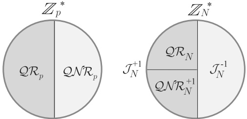

# Chapter 15: *Advanced Topics in Public-Key Encryption*

In Chapter 12 we saw several examples of public-key encryption schemes used in practice. Here, we explore some schemes that are currently more of theoretical interest—although in some cases it is possible that these schemes (or variants thereof) will be used more widely in the future.

We begin with a treatment of trapdoor permutations, a generalization of one-way permutations, and show how to use them to construct public-key encryption schemes. Trapdoor permutations neatly encapsulate the key characteristics of the RSA permutation that make it so useful. As such, they often provide a useful abstraction for designing new cryptosystems.

Next, we present three schemes based on problems related to factoring:

- The Paillier encryption scheme is an example of an encryption scheme that is homomorphic. This property turns out to be useful for constructing more-complex cryptographic protocols, something we touch on briefly in Section 15.3.

- The Goldwasser–Micali encryption scheme is of historical interest as the first scheme to be proven CPA-secure. It is also homomorphic, and uses some interesting number theory that can be applied in other contexts.

- Finally, we discuss the Rabin trapdoor permutation, which can be used to construct a public-key encryption scheme. Although superficially similar to the RSA trapdoor permutation, the Rabin trapdoor permutation is distinguished by the fact that its security is based directly on the hardness of factoring. (Recall from Section 9.2.5 that hardness of the RSA problem appears to be a stronger assumption.)

## 15.1 Encryption from Trapdoor Permutations

In Section 12.5.3 we saw how to construct a CPA-secure public-key encryption scheme based on the RSA assumption. By distilling those properties of

RSA that are used in the construction, and defining an abstract notion that encapsulates those properties, we obtain a general template for constructing secure encryption schemes based on any primitive satisfying the same set of properties. Trapdoor permutations turn out to be the “right” abstraction here.

In the following section we define (families of) trapdoor permutations and observe that the RSA family of one-way permutations (Construction 9.77) satisfies the additional requirements needed to be a family of trapdoor permutations. In Section 15.1.2 we generalize the construction from Section 12.5.3 and show that public-key encryption can be constructed from any trapdoor permutation. These results will be used again in Section 15.5, where we show a second example of a trapdoor permutation, this time based directly on the factoring assumption.

In this section we rely on the material from Section 9.4.1 or, alternately, Chapter 8.

### 15.1.1 Trapdoor Permutations

Recall the definitions of families of functions and families of one-way permutations from Section 9.4.1. In that section, we showed that the RSA assumption naturally gives rise to a family of one-way permutations. The astute reader may have noticed that the construction we gave (Construction 9.77) has a special property that was not remarked upon there: namely, the parameter-generation algorithm Gen outputs some additional information along with I that enables efficient inversion of $f_1$. We refer to such additional information as a trapdoor, and call families of one-way permutations with this additional property families of trapdoor permutations. A formal definition follows.

DEFINITION 15.1 A tuple of polynomial-time algorithms (Gen, Samp, f, Inv) is a family of trapdoor permutations (or a trapdoor permutation) if:

- The probabilistic parameter-generation algorithm Gen, on input ${1}^n$, outputs $(I, \mathsf{td})$ with $|I| \geq n$. Each value of $I$ defines a set $\mathcal{D}_I$ that constitutes the domain and range of a permutation (i.e., bijection) $f_I : \mathcal{D}_I \to \mathcal{D}_I$.

Let $\mathsf{Gen}_{1}$ denote the algorithm that results by running Gen and outputting only I. Then ($\mathsf{Gen}_{1}$, Samp, f) is a family of one-way permutations.

- Let $(I, \mathsf{td})$ be an output of $\mathsf{Gen}(1^n)$. The deterministic inverting algorithm $\mathsf{Inv}$, on input $\mathsf{td}$ and $y \in \mathcal{D}_I$, outputs $x \in \mathcal{D}_I$. We denote this by $x := \mathsf{Inv}_{\mathsf{td}}(y)$. It is required that with all but negligible probability over $(I, \mathsf{td})$ output by $\mathsf{Gen}(1^n)$ and uniform choice of $x \in \mathcal{D}_I$, we have

$$
\mathsf{Inv}_{\mathsf{td}}(f_{I}(x))=x.
$$

As shorthand, we drop explicit mention of $\mathsf{Samp}$ and simply refer to trap-door permutation $(\mathsf{Gen}, f, \mathsf{Inv})$. For $(I, \mathsf{td})$ output by $\mathsf{Gen}$ we write $x \leftarrow \mathcal{D}_I$ to denote uniform selection of $x \in \mathcal{D}_I$ (with the understanding that this is done by algorithm *Samp*).

The second condition above implies that $f_{I}$ cannot be efficiently inverted without td, but the final condition means that $f_{I}$ can be efficiently inverted with td. It is immediate that Construction 9.77 can be modified to give a family of trapdoor permutations if the RSA problem is hard relative to GenRSA, and so we refer to that construction as the RSA trapdoor permutation.

### 15.1.2 Public-Key Encryption from Trapdoor Permutations

We now sketch how a public-key encryption scheme can be constructed from an arbitrary family of trapdoor permutations. The construction is simply a generalization of what was already done for the specific RSA trapdoor permutation in Section 12.5.3.

We begin by (re-)introducing the notion of a hard-core predicate. This is the natural adaptation of Definition 8.4 to our context, and also generalizes our previous discussion of one specific hard-core predicate for the RSA trapdoor permutation in Section 12.5.3.

DEFINITION 15.2 Let $\Pi = (\mathsf{Gen}, f, \mathsf{Inv})$ be a family of trapdoor permutations, and let $\mathsf{hc}$ be a deterministic polynomial-time algorithm that, on input $I$ and $x \in \mathcal{D}_I$, outputs a single bit $\mathsf{hc}_I(x)$. We say that $\mathsf{hc}$ is a hard-core predicate of $\Pi$ if for every probabilistic polynomial-time algorithm $\mathcal{A}$ there is a negligible function $\mathsf{negl}$ such that

$$
\Pr[\mathcal{A}(I,f_{I}(x))=\mathsf{hc}_{I}(x)]\leq\frac{1}{2}+\mathsf{negl}(n),
$$

where the probability is taken over the experiment in which $\mathsf{Gen}(1^{n})$ is run to generate $(I, \mathsf{td})$ and then $x$ is chosen uniformly from $\mathcal{D}_{I}$.

The asymmetry provided by trapdoor permutations implies that anyone who knows the trapdoor $\mathsf{td}$ associated with $I$ can recover $x$ from $f_I(x)$ and thus compute $\mathsf{hc}_I(x)$ from $f_I(x)$. But given only $I$, it is infeasible to compute $\mathsf{hc}_I(x)$ from $f_I(x)$ for a uniform $x$.

The following can be proved by a suitable modification of Theorem 8.5:

THEOREM 15.3 Given a family of trapdoor permutations $\Pi$, there is a family of trapdoor permutations $\widehat{\Pi}$ with a hard-core predicate $\mathsf{hc}$ for $\widehat{\Pi}$.

Given a family of trapdoor permutations $\Pi = (\mathsf{Gen}, f, \mathsf{Inv})$ with hard-core predicate $\mathsf{hc}$, we can construct a single-bit encryption scheme via the following approach (see Construction 15.4 below, and compare to Construction 12.32): To generate keys, run $\widehat{\mathsf{Gen}}(1^n)$ to obtain $(I, \mathsf{td})$; the public key is $I$ and the private key is $\mathsf{td}$. Given a public key $I$, encryption of a message $m \in \{0,1\}$ works by choosing uniform $r \in \mathcal{D}_I$ subject to the constraint that $\mathsf{hc}_I(r) = m$, and then setting the ciphertext equal to $f_I(r)$. In order to decrypt, the receiver uses td to recover $r$ from $f_I(r)$ and then outputs the message $m := \mathsf{hc}_I(r)$.

**CONSTRUCTION 15.4**

Let $\widehat{\Pi} = (\widehat{\mathsf{Gen}}, f, \mathsf{Inv})$ be a family of trapdoor permutations with hard-core predicate $\mathsf{hc}$. Define a public-key encryption scheme as follows:

- Gen: on input ${1}^n$, run $\widehat{\mathsf{Gen}}(1^n)$ to obtain $(I, \mathsf{td})$. Output the public key $I$ and the private key $\mathsf{td}$.

- Enc: on input a public key $I$ and a message $m \in \{0,1\}$, choose a uniform $r \in \mathcal{D}_I$ subject to the constraint that $\mathsf{hc}_I(r) = m$. Output the ciphertext $c := f_I(r)$.

- Dec: on input a private key td and a ciphertext c, compute the value $r := \mathsf{Inv}_{\mathsf{td}}(c)$ and output the message $\mathsf{hc}_I(r)$.

Public-key encryption from any family of trapdoor permutations.

A proof of security follows along the lines of the proof of Theorem 12.33.

THEOREM 15.5 If $\hat{\Pi}$ is a family of trapdoor permutations with hard-core predicate $\mathsf{hc}$, then Construction 15.4 is CPA-secure.

PROOF Let $\Pi$ denote Construction 15.4. We prove that $\Pi$ has indistinguishable encryptions in the presence of an eavesdropper; by Proposition 12.3, this implies it is CPA-secure.

We first observe that hc must be unbiased in the following sense. Let

$$
\delta_{0}(n)\overset{\mathrm{def}}{=}\Pr_{\scriptstyle(I,\mathsf{td})\leftarrow\widehat{\mathsf{Gen}}(1^{n});x\leftarrow\mathcal{D}_{I}}[\mathsf{hc}_{I}(x)=0]
$$

and

$$
\delta_{1}(n)\overset{\mathrm{def}}{=}\underbrace{\Pr}_{(I,\mathsf{td})\leftarrow\widehat{\mathsf{Gen}}(1^{n});x\leftarrow\mathcal{D}_{I}}[\mathsf{hc}_{I}(x)=1].
$$

Then there is a negligible function $\mathsf{negl}$ such that

$$
\delta_{0}(n),\delta_{1}(n)\geq\frac{1}{2}-\mathsf{negl}(n);
$$

if not, then an attacker who simply outputs the more frequently occurring bit would violate Definition 15.2.

Now let $\mathcal{A}$ be a probabilistic polynomial-time adversary. Without loss of generality, we may assume $m_0 = 0$ and $m_1 = 1$ in experiment $\mathsf{PubK}_{\mathcal{A},\Pi}^{\mathsf{eav}}(n)$.

We then have

$$
\begin{aligned}
\Pr[\mathsf{PubK}_{\mathcal{A},\Pi}^{\mathsf{eav}}(n)=1]&=\frac{1}{2}\cdot\Pr[\mathcal{A}(pk,c)=0\mid c\text{ is an encryption of }0]\\
&\quad+\frac{1}{2}\cdot\Pr[\mathcal{A}(pk,c)=1\mid c\text{ is an encryption of }1].
\end{aligned}
$$

But then

$$
\begin{aligned}
&\Pr[\mathcal{A}(I,f_{I}(x))=\mathsf{hc}_{I}(x)]\\
&=\delta_{0}(n)\cdot\Pr[\mathcal{A}(I,f_{I}(x))=0\mid\mathsf{hc}_{I}(x)=0]\\
&\quad+\delta_{1}(n)\cdot\Pr[\mathcal{A}(I,f_{I}(x))=1\mid\mathsf{hc}_{I}(x)=1]\\
&\geq\left(\frac{1}{2}-\mathsf{negl}(n)\right)\cdot\Pr[\mathcal{A}(I,f_{I}(x))=0\mid\mathsf{hc}_{I}(x)=0]\\
&\quad+\left(\frac{1}{2}-\mathsf{negl}(n)\right)\cdot\Pr[\mathcal{A}(I,f_{I}(x))=1\mid\mathsf{hc}_{I}(x)=1]\\
&\geq\frac{1}{2}\cdot\Pr[\mathcal{A}(I,f_{I}(x))=0\mid\mathsf{hc}_{I}(x)=0]\\
&\quad+\frac{1}{2}\cdot\Pr[\mathcal{A}(I,f_{I}(x))=1\mid\mathsf{hc}_{I}(x)=1]-2\cdot\mathsf{negl}(n)\\
&=\Pr[\mathsf{PubK}_{\mathcal{A},\Pi}^{\mathsf{eav}}(n)=1]-2\cdot\mathsf{negl}(n).
\end{aligned}
$$

Since $\mathsf{hc}$ is a hard-core predicate for $\widehat{\Pi}$, there is a negligible function $\mathsf{negl}^{\prime}$ such that $\mathsf{negl}^{\prime}(n) \geq \Pr[\mathcal{A}(I, f_I(x)) = \mathsf{hc}_I(x)]$; this means that

$$
\Pr[\mathsf{PubK}_{\mathcal{A},\Pi}^{\mathsf{eav}}(n)=1]\leq\mathsf{negl}^{\prime}(n)+2\cdot\mathsf{negl}(n),
$$

completing the proof.

**Encrypting longer messages.**

Using Claim 12.7, we know that we can extend Construction 15.4 to encrypt $\ell$-bit messages using ciphertexts $\ell$ times as long. Better efficiency can be obtained by constructing a KEM, following along the lines of Construction 12.34. We leave the details as an exercise.

## 15.2 The Paillier Encryption Scheme

In this section we describe the Paillier encryption scheme, a public-key encryption scheme whose security is based on an assumption related (but not known to be equivalent) to the hardness of factoring. This encryption scheme is particularly interesting because it possesses some nice homomorphic properties, as we will discuss further in Section 15.2.3.

The Paillier encryption scheme utilizes the group $\mathbb{Z}_{N^2}^*$, the multiplicative group of elements in the range $\{1, \ldots, N^2\}$ that are relatively prime to $N$, for $N$ a product of two distinct primes. To understand the scheme it is helpful to first understand the structure of $\mathbb{Z}_{N^2}^*$. A useful characterization of this group is given by the following proposition, which says, among other things, that $\mathbb{Z}_{N^2}^*$ is isomorphic to $\mathbb{Z}_N \times \mathbb{Z}_N^*$ (cf. Definition 9.23) for $N$ of the form we will be interested in. We prove the proposition in the next section. (The reader willing to accept the proposition on faith can skip to Section 15.2.2.)

PROPOSITION 15.6 Let $N = pq$, where $p, q$ are distinct odd primes of equal length. Then:

1. $\gcd(N,\phi(N))=1$

2. For any integer $a \geq 0$, we have $(1 + N)^a = (1 + aN) \mod N^2$.

As a consequence, the order of $(1+N)$ in $\mathbb{Z}_{N^2}^*$ is $N$. That is, $(1+N)^N = 1 \bmod N^2$ and $(1+N)^a \neq 1 \bmod N^2$ for any ${1} \leq a < N$.

3. $\mathbb{Z}_N \times \mathbb{Z}_N^*$ is isomorphic to $\mathbb{Z}_{N^2}^*$, with isomorphism $f\colon \mathbb{Z}_N \times \mathbb{Z}_N^* \to \mathbb{Z}_{N^2}^*$ given by

$$
f(a,b)=\left[(1+N)^{a}\cdot b^{N}\bmod N^{2}\right].
$$

In light of the last part of the above proposition, we introduce some convenient notation. With $N$ understood, and $x \in \mathbb{Z}_{N^2}^*, a \in \mathbb{Z}_N$, $b \in \mathbb{Z}_N^*$, we write $x \leftrightarrow (a,b)$ if $f(a,b) = x$ where $f$ is the isomorphism from the proposition above. One way to think about this notation is that it means “$x$ in $\mathbb{Z}_{N^2}^*$ corresponds to $(a,b)$ in $\mathbb{Z}_N \times \mathbb{Z}_N^*$.” We have used the same notation in this book with regard to the isomorphism $\mathbb{Z}_N^* \simeq \mathbb{Z}_p^* \times \mathbb{Z}_q^*$ given by the Chinese remainder theorem; we keep the notation because in both cases it refers to an isomorphism of groups. Nevertheless, there should be no confusion since the group $\mathbb{Z}_{N^2}^*$ and the above proposition are only used in this section. We remark that here the isomorphism—but not its inverse—is efficiently computable even without the factorization of $N$.

### 15.2.1 The Structure of $\mathbb{Z}_{N^{2}}^{*}$

This section is devoted to a proof of Proposition 15.6. Throughout, we let $N, p, q$ be as in the proposition.

CLAIM 15.7 $\gcd(N,\phi(N))=1$.

PROOF Recall that $\phi(N) = (p-1)(q-1)$. Assume $p > q$ without loss of generality. Since $p$ is prime and $p > p-1 > q-1$, clearly $\gcd(p, \phi(N)) = 1$. Similarly, $\gcd(q, q-1) = 1$. Now, if $\gcd(q, p-1) \neq 1$ then $\gcd(q, p-1) = q$
since $q$ is prime. But then $(p-1)/q \geq 2$, contradicting the assumption that $p$ and $q$ have the same length.

CLAIM 15.8 For $a \geq 0$ an integer, we have $(1 + N)^a = 1 + aN \mod N^2$. Thus, the order of $(1 + N)$ in $\mathbb{Z}_{N^2}^*$ is $N$.

PROOF Using the binomial expansion theorem (Theorem A.1):

$$
(1+N)^{a}=\sum_{i=0}^{a}\binom{a}{i}N^{i}.
$$

Reducing the right-hand side modulo $N^2$, all terms with $i \geq 2$ become 0 and so $(1+N)^a = 1+aN \mod N^2$. The smallest nonzero $a$ such that $(1+N)^a = 1 \bmod N^2$ is therefore $a = N$.

CLAIM 15.9 The group $\mathbb{Z}_N \times \mathbb{Z}_N^*$ is isomorphic to the group $\mathbb{Z}_{N^2}^{*}$, with isomorphism $f\colon \mathbb{Z}_N \times \mathbb{Z}_N^* \to \mathbb{Z}_{N^2}^{*}$ given by $f(a, b) = [(1 + N)^a \cdot b^N \mod N^2]$.

PROOF Note that $(1+N)^{a} \cdot b^{N}$ does not have a factor in common with $N^{2}$ since $\gcd((1+N), N^{2}) = 1$ and $\gcd(b, N^{2}) = 1$ (because $b \in \mathbb{Z}_{N}^{*}$). So $(1+N)^{a} \cdot b^{N} \bmod N^{2}$ lies in $\mathbb{Z}_{N^{2}}^{*}$. We now prove that $f$ is an isomorphism.

We first show that $f$ is a bijection. Since

$$
\begin{aligned}
|\mathbb{Z}_{N^{2}}^{*}|=\phi(N^{2})=p\cdot(p-1)\cdot q\cdot(q-1)&=pq\cdot(p-1)(q-1)\\
&=|\mathbb{Z}_{N}|\cdot|\mathbb{Z}_{N}^{*}|=|\mathbb{Z}_{N}\times\mathbb{Z}_{N}^{*}|
\end{aligned}
$$

(see Theorem 9.19 for the second equality), it suffices to show that $f$ is one-to-one. Say $a_1, a_2 \in \mathbb{Z}_N$ and $b_1, b_2 \in \mathbb{Z}_N^*$ are such that $f(a_1, b_1) = f(a_2, b_2)$. Then:

$$
(1+N)^{a_{1}-a_{2}}\cdot(b_{1}/b_{2})^{N}=1\bmod N^{2}. \tag{15.1}
$$

(Note that $b_2 \in \mathbb{Z}_N^*$ and thus $b_2 \in \mathbb{Z}_{N^2}^*$, and so $b_2$ has a multiplicative inverse modulo $N^2$.) Raising both sides to the power $\phi(N)$ and using the fact that the order of $\mathbb{Z}_{N^2}^*$ is $\phi(N^2) = N \cdot \phi(N)$ we obtain

$$
\begin{aligned}
(1+N)^{(a_{1}-a_{2})\cdot\phi(N)}\cdot(b_{1}/b_{2})^{N\cdot\phi(N)}&=1\bmod N^{2}\\
\Rightarrow(1+N)^{(a_{1}-a_{2})\cdot\phi(N)}&=1\bmod N^{2}.
\end{aligned}
$$

By Claim 15.8, $(1+N)$ has order $N$ modulo $N^2$. Applying Proposition 9.54, we see that $(a_1 - a_2) \cdot \phi(N) = 0 \bmod N$ and so $N$ divides $(a_1 - a_2) \cdot \phi(N)$. Since $\gcd(N, \phi(N)) = 1$ by Claim 15.7, it follows that $N \mid (a_1 - a_2)$. Since $a_1, a_2 \in \mathbb{Z}_N$, this can only occur if $a_1 = a_2$.

Returning to Equation (15.1) and setting $a_1 = a_2$, we thus have $b_1^N = b_2^N \bmod N^2$. This implies $b_1^N = b_2^N \bmod N$. Since $N$ is relatively prime to $\phi(N)$, the order of $\mathbb{Z}_N^*$, exponentiation to the power $N$ is a bijection in $\mathbb{Z}_N^*$ (cf. Corollary 9.17). This means that $b_1 = b_2 \bmod N$; since $b_1, b_2 \in \mathbb{Z}_N^*$, we have $b_1 = b_2$. We conclude that $f$ is one-to-one, and hence a bijection.

To show that $f$ is an isomorphism, we show that $f(a_1,b_1)\cdot f(a_2,b_2)=f(a_1+a_2,b_1\cdot b_2)$. (Note that multiplication on the left-hand side of the equality takes place modulo $N^2$, while addition/multiplication on the right-hand side takes place modulo $N$.) We have:

$$
\begin{aligned}
f(a_{1},b_{1})\cdot f(a_{2},b_{2})&=\left((1+N)^{a_{1}}\cdot b_{1}^{N}\right)\cdot\left((1+N)^{a_{2}}\cdot b_{2}^{N}\right)\bmod N^{2}\\
&=(1+N)^{a_{1}+a_{2}}\cdot(b_{1}b_{2})^{N}\bmod N^{2}.
\end{aligned}
$$

Since $(1+N)$ has order $N$ modulo $N^{2}$ (by Claim 15.8), we can apply Proposition 9.53 and obtain

$$
\begin{aligned}
f(a_{1},b_{1})\cdot f(a_{2},b_{2})&=(1+N)^{a_{1}+a_{2}}\cdot(b_{1}b_{2})^{N}\bmod N^{2}\\
&=(1+N)^{[a_{1}+a_{2}\bmod N]}\cdot(b_{1}b_{2})^{N}\bmod N^{2}.
\end{aligned} \tag{15.2}
$$

We are not yet done, since $b_1b_2$ in Equation (15.2) represents multiplication modulo $N^2$ whereas we would like it to be modulo $N$. Let $b_1b_2 = r + \gamma N$, where $\gamma, r$ are integers with ${1} \leq r < N$ ($r$ cannot be 0 since $b_1, b_2 \in \mathbb{Z}_N^*$ and so their product cannot be divisible by $N$). Note that $r = b_1b_2 \mod N$. We also have

$$
\begin{aligned}
(b_{1}b_{2})^{N}&=(r+\gamma N)^{N}\bmod N^{2}\\
&=\sum_{k=0}^{N}\binom{N}{k}r^{N-k}(\gamma N)^{k}\bmod N^{2}\\
&=r^{N}+N\cdot r^{N-1}\cdot(\gamma N)=r^{N}=([b_{1}b_{2}\bmod N])^{N}\bmod N^{2},
\end{aligned}
$$

using the binomial expansion theorem as in Claim 15.8. Plugging this in to Equation (15.2) we get the desired result:

$$
\begin{aligned}
f(a_{1},b_{1})\cdot f(a_{2},b_{2})&=(1+N)^{[a_{1}+a_{2}\bmod N]}\cdot(b_{1}b_{2}\bmod N)^{N}\bmod N^{2}\\
&=f(a_{1}+a_{2},b_{1}b_{2}),
\end{aligned}
$$

proving that $f$ is an isomorphism from $\mathbb{Z}_N \times \mathbb{Z}_N^*$ to $\mathbb{Z}_{N^2}^*$.

### 15.2.2 The Paillier Encryption Scheme

Let $N = pq$ be a product of two distinct primes of equal length. Proposition 15.6 says that $\mathbb{Z}_N \times \mathbb{Z}_N^*$ is isomorphic to $\mathbb{Z}_{N^2}^*$, with isomorphism given by $f(a, b) = [(1+N)^a \cdot b^N \mod N^2]$. A consequence is that a uniform element $y \in \mathbb{Z}_{N^2}^*$ corresponds to a uniform element $(a, b) \in \mathbb{Z}_N \times \mathbb{Z}_N^*$ or, in other words, an element $(a, b)$ with uniform $a \in \mathbb{Z}_N$ and uniform $b \in \mathbb{Z}_N^*$.

Call $y \in \mathbb{Z}_{N^2}^*$ an $N$th residue modulo $N^2$ if $y$ is an $N$th power, that is, if there exists an $x \in \mathbb{Z}_{N^2}^*$ with $y = x^N \mod N^2$. We denote the set of $N$th residues modulo $N^2$ by $\mathsf{Res}(N^2)$. Let us characterize the $N$th residues in $\mathbb{Z}_{N^2}^*$. Taking any $x \in \mathbb{Z}_{N^2}^*$ with $x \leftrightarrow (a, b)$ and raising it to the $N$th power gives:

$$
[x^{N}\bmod N^{2}]\leftrightarrow(a,b)^{N}=(N\cdot a\bmod N,b^{N}\bmod N)=(0,b^{N}\bmod N).
$$

(Recall that the group operation in $\mathbb{Z}_N \times \mathbb{Z}_N^*$ is addition modulo $N$ in the first component and multiplication modulo $N$ in the second component.) Moreover, we claim that any element $y$ with $y \leftrightarrow (0,b)$ is an $N$th residue. To see this, recall that $\gcd(N, \phi(N)) = 1$ and so $d \stackrel{\mathrm{def}}{=} [N^{-1} \mod \phi(N)]$ exists. So

$$
(a,[b^{d}\bmod N])^{N}=(N a\bmod N,[b^{d N}\bmod N])=(0,b)\leftrightarrow y
$$

for any $a \in \mathbb{Z}_N$. We have thus shown that $\mathsf{Res}(N^2)$ corresponds to the set

$$
\left\{\left(0,b\right)\mid b\in\mathbb{Z}_{N}^{\ast}\right\}.
$$

The above also demonstrates that the number of $N$th roots of any $y \in \mathsf{Res}(N^2)$ is exactly $N$, and so computing $N$th powers is an $N$-to-1 function. As such, if $r \in \mathbb{Z}_{N^2}^*$ is uniform then $[r^N \bmod N^2]$ is a uniform element of $\mathsf{Res}(N^2)$.

The decisional composite residuosity problem, roughly speaking, is to distinguish a uniform element of $\mathbb{Z}_{N^2}^*$ from a uniform element of $\mathsf{Res}(N^2)$. Formally, let $\mathsf{GenModulus}$ be a polynomial-time algorithm that, on input ${1}^n$, outputs $(N, p, q)$ where $N = pq$, and $p$ and $q$ are $n$-bit primes (except with probability negligible in $n$). Then:

DEFINITION 15.10 The decisional composite residuosity problem is hard relative to GenModulus if for all probabilistic polynomial-time algorithms D there is a negligible function negl such that

$$
\left|\Pr[D(N,[r^{N}\bmod N^{2}])=1]-\Pr[D(N,r)=1]\right|\leq\mathsf{negl}(n),
$$

where in each case the probabilities are taken over the experiment in which $\mathsf{GenModulus}(1^n)$ outputs $(N, p, q)$, and then a uniform $r \in \mathbb{Z}_{N^2}^*$ is chosen. (Recall that $[r^N \bmod N^2]$ is a uniform element of $\mathsf{Res}(N^2)$.)

The decisional composite residuosity (DCR) assumption is the assumption that there is a GenModulus relative to which the decisional composite residuosity problem is hard.

As we have discussed, elements of $\mathbb{Z}_{N^2}^*$ have the form $(r^{\prime}, r)$ with $r^{\prime}$ and $r$ arbitrary (in the appropriate groups), whereas $N$th residues have the form $(0, r)$ with $r \in \mathbb{Z}_N^*$ arbitrary. The DCR assumption is that it is hard to distinguish uniform elements of the first type from uniform elements of the second type. This suggests the following abstract way to encrypt a message $m \in \mathbb{Z}_N$ with respect to a public key $N$: choose a uniform $N$th residue $(0, r)$ and set the ciphertext equal to

$$
c\leftrightarrow(m,1)\cdot(0,r)=(m+0,1\cdot r)=(m,r).
$$

Without worrying for now how this can be carried out efficiently by the sender, or how the receiver can decrypt, let us simply convince ourselves (on an intuitive level) that this is secure. Since a uniform $N$th residue $(0, r)$ cannot be distinguished from a uniform element $(r^{\prime}, r)$, the ciphertext as constructed above is indistinguishable (from the point of an eavesdropper who does not know the factorization of $N$) from the ciphertext

$$
c^{\prime}\leftrightarrow(m,1)\cdot(r^{\prime},r)=([m+r^{\prime}\bmod N],r)
$$

for uniform $r^{\prime} \in \mathbb{Z}_N$ and $r \in \mathbb{Z}_N^*$. Lemma 12.15 shows that $[m + r^{\prime} \mod N]$ is uniformly distributed in $\mathbb{Z}_N$ and so, in particular, this ciphertext $c^{\prime}$ is independent of the message $m$. CPA-security follows. A formal proof that proceeds exactly along these lines is given further below.

Before turning to the formal description and proof of security, we show how encryption and decryption can be performed efficiently.

**Encryption.**

We have described encryption above as though it is taking place in $\mathbb{Z}_N \times \mathbb{Z}_N^*$. In fact it takes place in the isomorphic group $\mathbb{Z}_{N^2}^*$. That is, the sender generates a ciphertext $c \in \mathbb{Z}_{N^2}^*$ by choosing a uniform $^1 r \in \mathbb{Z}_N^*$ and then computing

$$
c:=[(1+N)^{m}\cdot r^{N}\bmod N^{2}].
$$

Observe that

$$
c=\left((1+N)^{m}\cdot1^{N}\right)\cdot\left((1+N)^{0}\cdot r^{N}\right)\bmod N^{2}\leftrightarrow(m,1)\cdot(0,r),
$$

and so $c \leftrightarrow (m, r)$ as desired.

> $^1$ We remark that it does not make any difference whether the sender chooses uniform $r \in \mathbb{Z}_N^*$ or uniform $r \in \mathbb{Z}_{N^2}^*$, since in either case the distribution of $[r^N \bmod N^2]$ is the same (as can be verified by looking at what happens in the isomorphic group $\mathbb{Z}_N \times \mathbb{Z}_N^*$).

Decryption. We now describe how decryption can be performed efficiently given the factorization of $N$. For $c$ constructed as above, we claim that $m$ is recovered by the following steps:

- Set $\hat{c} := [c^{\phi(N)} \bmod N^2]$.

- Set $\hat{m} := (\hat{c} - 1)/N$. (Note that this is carried out over the integers.)

- Set $m := [\hat{m} \cdot \phi(N)^{-1} \mod N]$.

To see why this works, let $c \leftrightarrow (m, r)$ for an arbitrary $r \in \mathbb{Z}_N^*$. Then

$$
\begin{aligned}
\hat{c}&\stackrel{\mathrm{def}}{=}\left[c^{\phi(N)}\bmod N^{2}\right]\\
&\leftrightarrow(m,r)^{\phi(N)}\\
&=\left(\left[m\cdot\phi(N)\bmod N\right],\left[r^{\phi(N)}\bmod N\right]\right)\\
&=\left(\left[m\cdot\phi(N)\bmod N\right],1\right).
\end{aligned}
$$

By Proposition 15.6(3), this means that $\hat{c} = (1 + N)^{[m \cdot \phi(N) \bmod N]} \bmod N^2$. Using Proposition 15.6(2), we know that

$$
\hat{c}=(1+N)^{[m\cdot\phi(N)\bmod N]}=(1+[m\cdot\phi(N)\bmod N]\cdot N)\bmod N^{2}
$$

Since ${1}+[m \cdot \phi(N) \mod N] \cdot N$ is always less than $N^2$ we can drop the $\bmod N^2$ at the end and view the above as an equality over the integers. Thus, $\hat{m} \stackrel{\mathrm{def}}{=} (\hat{c} - 1)/N = [m \cdot \phi(N) \bmod N]$ and, finally,

$$
m=[\hat{m}\cdot\phi(N)^{-1}\bmod N],
$$

as required. (Note that $\phi(N)$ is invertible modulo $N$ since $\gcd(N, \phi(N)) = 1$.)

We give a complete description of the Paillier encryption scheme, followed by an example of the above calculations.

**CONSTRUCTION 15.11**

Let $\mathsf{GenModulus}$ be a polynomial-time algorithm that, on input ${1}^{n}$, outputs $(N, p, q)$ where $N = pq$ and $p$ and $q$ are $n$-bit primes (except with probability negligible in $n$). Define the following encryption scheme:

- Gen: on input ${1}^n$ run $\mathsf{GenModulus}({1}^n)$ to obtain $(N, p, q)$. The public key is $N$, and the private key is $\langle N, \phi(N) \rangle$.

- Enc: on input a public key $N$ and a message $m \in \mathbb{Z}_N$, choose a uniform $r \leftarrow \mathbb{Z}_N^*$ and output the ciphertext

$$
c:=\bigl[(1+N)^{m}\cdot r^{N}\bmod N^{2}\bigr].
$$

- Dec: on input a private key $\langle N, \phi(N) \rangle$ and a ciphertext $c$, compute

$$
m:=\left[\frac{[c^{\phi(N)}\bmod N^{2}]-1}{N}\cdot\phi(N)^{-1}\bmod N\right].
$$

The Paillier encryption scheme.

**Example 15.12**

Let $N = 11 \cdot 17 = 187$ (and so $N^2 = 34969$), and consider encrypting the message $m = 175$ and then decrypting the corresponding ciphertext. Choosing $r = 83 \in \mathbb{Z}_{187}^*$, we compute the ciphertext

$$
c:=[(1+187)^{175}\cdot83^{187}\bmod34969]=23911
$$

corresponding to (175,83). To decrypt, note that $\phi(N) = 160$. So we first compute $\hat{c} := [23911^{160} \mod 34969] = 25620$. Subtracting 1 and dividing by 187 gives $\hat{m} := (25620 - 1)/187 = 137$; since ${90} = [160^{-1} \mod 187]$, the message is recovered as $m := [137 \cdot 90 \mod 187] = 175$.

THEOREM 15.13 If the decisional composite residuosity problem is hard relative to GenModulus, then the Paillier encryption scheme is CPA-secure.

PROOF Let $\Pi$ denote the Paillier encryption scheme. We prove that $\Pi$ has indistinguishable encryptions in the presence of an eavesdropper; by Theorem 12.6 this implies that it is CPA-secure.

Let $\mathcal{A}$ be an arbitrary probabilistic polynomial-time adversary. Consider the following PPT algorithm $D$ that attempts to solve the decisional composite residuosity problem relative to $\mathsf{GenModulus}$:

Algorithm $D$:

The algorithm is given $N$, $y$ as input.

- Set $pk = N$ and run $\mathcal{A}(pk)$ to obtain two messages $m_{0}, m_{1}$.

- Choose a uniform bit $b$ and set $c := [(1 + N)^{m_b} \cdot y \bmod N^2]$.

- Give the ciphertext $c$ to $\mathcal{A}$ and obtain an output bit $b^{\prime}$. If $b^{\prime} = b$, output 1; otherwise, output 0.

Let us analyze the behavior of $D$. There are two cases to consider:

Case 1: Say the input to $D$ was generated by running $\mathsf{GenModulus}(1^n)$ to obtain $(N,p,q)$, choosing uniform $r \in \mathbb{Z}_{N^2}^*$, and setting $y := [r^N \bmod N^2]$. (That is, $y$ is a uniform element of $\mathsf{Res}(N^2)$.) In this case,

$$
c=[(1+N)^{m_{b}}\cdot r^{N}\bmod N^{2}]
$$

for uniform $r \in \mathbb{Z}_{N^2}^*$. Recalling that the distribution on $[r^N \bmod N^2]$ is the same whether $r$ is chosen uniformly from $\mathbb{Z}_N^*$ or from $\mathbb{Z}_{N^2}^*$, we see that in this case the view of $\mathcal{A}$ when run as a subroutine by $D$ is distributed identically to $\mathcal{A}$'s view in experiment $\mathsf{PubK}_{\mathcal{A},\Pi}^{\mathsf{eav}}(n)$. Since $D$ outputs 1 exactly when the output $b^{\prime}$ of $\mathcal{A}$ is equal to $b$, we have

$$
\Pr\big[D(N,[r^{N}\bmod N^{2}])=1\big]=\Pr[\mathsf{PubK}_{\mathcal{A},\Pi}^{\mathsf{eav}}(n)=1],
$$

where the first probability is taken over the experiment as in Definition 15.10.

Case 2: Say the input to $D$ was generated by running $\mathsf{GenModulus}(1^n)$ to obtain $(N,p,q)$ and choosing uniform $y \in \mathbb{Z}_{N^2}^*$. We claim that the view of $\mathcal{A}$ in this case is independent of the bit $b$. This follows because $y$ is a uniform element of the group $\mathbb{Z}_{N^2}^*$, and so the ciphertext $c$ is uniformly distributed in $\mathbb{Z}_{N^2}^*$ (see Lemma 12.15), independent of $m$. Thus, the probability that $b^{\prime} = b$ in this case is exactly $\frac{1}{2}$. That is,

$$
\Pr[D(N,r)=1]=\frac{1}{2},
$$

where the probability is taken over the experiment as in Definition 15.10.

Combining the above, we see that

$$
\begin{aligned}
&\left|\Pr\left[D(N,[r^{N}\bmod N^{2}])=1\right]-\Pr[D(N,r)=1]\right|\\
&=\left|\Pr[\mathsf{PubK}_{\mathcal{A},\Pi}^{\mathsf{eav}}(n)=1]-\tfrac{1}{2}\right|.
\end{aligned}
$$

By the assumption that the decisional composite residuosity problem is hard relative to GenModulus, there is a negligible function $\mathsf{negl}$.

$$
\left|\Pr[\mathsf{PubK}_{\mathcal{A},\Pi}^{\mathsf{eav}}(n)=1]-\textstyle\frac{1}{2}\right|\leq\mathsf{negl}(n).
$$

Thus $\Pr[\mathsf{PubK}_{\mathcal{A},\Pi}^{\mathsf{eav}}(n)=1]\leq\tfrac{1}{2}+\mathsf{negl}(n)$, completing the proof.

### 15.2.3 Homomorphic Encryption

The Paillier encryption scheme is useful in a number of settings because it is homomorphic. Roughly, a homomorphic encryption scheme enables (certain) computations to be performed on encrypted data, yielding a ciphertext containing the encrypted result. In the case of Paillier encryption, the computation that can be performed is (modular) addition. Specifically, fix a public key $pk = N$. Then the Paillier scheme has the property that multiplying an encryption of $m_1$ and an encryption of $m_2$ (with multiplication done modulo $N^2$) results in an encryption of $[m_1 + m_2 \mod N]$; this is because

$$
\begin{aligned}
&\left((1+N)^{m_{1}}\cdot r_{1}^{N}\right)\cdot\left((1+N)^{m_{2}}\cdot r_{2}^{N}\right)\\
&\quad=(1+N)^{\left[m_{1}+m_{2}\bmod N\right]}\cdot(r_{1}r_{2})^{N}\bmod N^{2}.
\end{aligned}
$$

Although the ability to add encrypted values may not seem very useful, it suffices for several interesting applications including voting, discussed below.

We present a general definition, of which Paillier encryption is a special case.

DEFINITION 15.14 A public-key encryption scheme $(\mathsf{Gen}, \mathsf{Enc}, \mathsf{Dec})$ is homomorphic if for all $n$ and all $(pk, sk)$ output by $\mathsf{Gen}(1^n)$, it is possible to define groups $\mathcal{M}, \mathcal{C}$ (depending on pk only) such that:

- The message space is $\mathcal{M}$, and all ciphertexts output by $\mathsf{Enc}_{pk}$ are elements of $\mathcal{C}$. For notational convenience, we write $\mathcal{M}$ as an additive group and $\mathcal{C}$ as a multiplicative group.

- For any $m_1, m_2 \in \mathcal{M}$, any $c_1$ output by $\mathsf{Enc}_{pk}(m_1)$, and any $c_2$ output by $\mathsf{Enc}_{pk}(m_2)$, it holds that

$$
\mathsf{Dec}_{sk}(c_{1}\cdot c_{2})=m_{1}+m_{2}.
$$

Moreover, the distribution on ciphertexts obtained by encrypting $m_{1}$, encrypting $m_{2}$, and then multiplying the results is identical to the distribution on ciphertexts obtained by encrypting $m_{1} + m_{2}$.

The last part of the definition ensures that if ciphertexts $c_1 \leftarrow \mathsf{Enc}_{pk}(m_1)$ and $c_2 \leftarrow \mathsf{Enc}_{pk}(m_2)$ are generated and the result $c_3 := c_1 \cdot c_2$ is computed, then the resulting ciphertext $c_3$ contains no more information about $m_1$ or $m_2$ than the sum $m_3$.

The Paillier encryption scheme with $pk = N$ is homomorphic with $\mathcal{M} = \mathbb{Z}_N$ and $\mathcal{C} = \mathbb{Z}_{N^2}$. This is not the first example of a homomorphic encryption scheme we have seen; El Gamal encryption is also homomorphic. Specifically, for public key $pk = \langle \mathbb{G}, q, g, h \rangle$ we can take $\mathcal{M} = \mathbb{G}$ and $\mathcal{C} = \mathbb{G} \times \mathbb{G}$; then

$$
\langle g^{y_{1}},~h^{y_{1}}\cdot m_{1}\rangle\cdot\langle g^{y_{2}},~h^{y_{2}}\cdot m_{2}\rangle=\langle g^{y_{1}+y_{2}},~h^{y_{1}+y_{2}}\cdot m_{1}m_{2}\rangle,
$$

where multiplication of ciphertexts is component-wise. The Goldwasser-Micali encryption scheme we will see later is also homomorphic (see Exercise 15.11).

A nice feature of Paillier encryption is that it is homomorphic over a large additive group (namely, $\mathbb{Z}_N$). To see an application of this, consider the following distributed voting scheme, where $\ell$ voters can vote “no” or “yes” and the goal is to tabulate the number of “yes” votes:

1. A voting authority generates a public key N for the Paillier encryption scheme and publicizes N.

2. Let 0 stand for a “no,” and let 1 stand for a “yes.” Each voter casts their vote by encrypting it. That is, voter $i$ casts her vote $v_i$ by computing $c_i := [(1 + N)^{v_i} \cdot (r_i)^N \mod N^2]$ for a uniform $r_i \in \mathbb{Z}_N^*$.

3. Each voter broadcasts their vote $c_{i}$. These votes are then publicly aggregated by computing

$$
c_{\mathrm{total}}:=\left[\prod_{i=1}^{\ell}c_{i}\bmod N^{2}\right].
$$

4. The authority is given $c_{total}$. (We assume the authority has not been able to observe what goes on until now.) By decrypting it, the authority obtains the vote total

$$
v_{total}\stackrel{\mathrm{def}}{=}\sum_{i=1}^{\ell}v_{i}\bmod N.
$$

If $\ell$ is small (so that $v_{\text{total}} \ll N$), there is no wrap-around modulo $N$ and $v_{\text{total}} = \sum_{i=1}^{\ell} v_i$.

Key features of the above are that no voter learns anyone else's vote, and calculation of the total is publicly verifiable if the authority is trusted to correctly compute $v_{total}$ from $c_{total}$. Also, the authority obtains the correct total without learning any individual votes. (Here, we assume the authority cannot see voters' ciphertexts. In Section 15.3.3 we show a protocol in which votes are kept hidden from authorities even if they see all the communication.) We assume all voters act honestly (and only try to learn others' votes based on information they observe); an entire research area of cryptography is dedicated to addressing potential threats from participants who might be malicious and not follow the protocol.

## 15.3 Secret Sharing and Threshold Encryption

Motivated by the discussion of distributed voting in the previous section, we briefly consider secure (interactive) protocols. Such protocols can be significantly more complicated than the basic cryptographic primitives (e.g., encryption and signature schemes) we have focused on until now, both because they can involve multiple parties exchanging several rounds of messages, as well as because they are intended to realize more-complex security requirements.

The goal of this section is mainly to give the reader a taste of this fascinating area, and no attempt is made at being comprehensive or complete. Although the protocols presented here can be proven secure (with respect to appropriate definitions), we omit formal definitions, details, and proofs and instead rely on informal discussion.

### 15.3.1 Secret Sharing

Consider the following problem. A dealer holds a secret $s \in \{0,1\}^{\ell}$ say, a nuclear-launch code—that it wishes to share among some set of $N$ users $P_1, \ldots, P_N$ by giving each user a share. Any $t$ users should be able to pool their shares and reconstruct the secret, but no coalition of fewer than $t$ users should get any information about $s$ from their collective shares (beyond whatever information they had about $s$ already). We refer to such a sharing mechanism as a $(t, N)$-threshold secret-sharing scheme. Such a scheme ensures that $s$ is not revealed without sufficient authorization, while also guaranteeing availability of $s$ when needed (since any $t$ users can reconstruct it). Beyond their direct application, secret-sharing schemes are also a building block of many cryptographic protocols.

There is a simple solution for the case $t = N$. The dealer chooses uniform $s_1, \ldots, s_{N-1} \in \{0,1\}^\ell$ and sets $s_N := s \oplus \left( \bigoplus_{i=1}^{N-1} s_i \right)$; the share of user $P_i$ is $s_i$. Since $\bigoplus_{i=1}^{N} s_i = s$ by construction, clearly all the users together can recover $s$. However, the shares of any coalition of $N-1$ users are (jointly) uniform and independent of $s$, and thus reveal no information about $s$. This is clear when the coalition is $P_1, \ldots, P_{N-1}$. In the general case, when the coalition includes everyone except for $P_j$ ($j \neq N$), this is true because $s_1, \ldots, s_{j-1}, s_{j+1}, \ldots, s_{N-1}$ are uniform and independent of $s$ by construction, and

$$
s_{N}=s\oplus\left(\bigoplus_{i<N,i\neq j}s_{i}\right)\oplus s_{j};
$$

thus, even conditioned on some fixed values for $s$ and the shares of the other members of the coalition, the share $s_{N}$ of user $P_{N}$ is uniform because $s_{j}$ is uniform and independent of s.

We can extend this to obtain a solution for $t < N$. The basic idea is to replicate the above scheme for each subset $T \subset N$ of size $t$. That is, for each such subset $T = \{P_{i_1}, \ldots, P_{i_t}\}$, we choose uniform shares $s_{T,i_1}, \ldots, s_{T,i_t}$ subject to the constraint that $\oplus_{j=1}^t s_{T,i_j} = s$, and give $s_{T,i_j}$ to user $P_{i_j}$. It is not hard to see that this satisfies the requirements.

Unfortunately, this extension of the original scheme is not efficient. Each user now stores a share $s_{T,i}$ for every subset T of which she is a member. For each user there are $\binom{N-1}{t-1}$ such subsets, which is exponential in N if $t \approx N/2$.

Shamir’s scheme. Fortunately, it is possible to do significantly better using a secret-sharing scheme introduced by Adi Shamir (of RSA fame). This scheme is based on polynomials $^2$ over a finite field $\mathbb{F}$, where $\mathbb{F}$ is chosen so that $s \in \mathbb{F}$ and $|\mathbb{F}| > N$. (See Appendix A.5 for a brief discussion of finite fields.) Before describing the scheme, we briefly review some background related to polynomials over a field $\mathbb{F}$.

> $^2$ A degree-$t$ polynomial $p$ over $\mathbb{F}$ is given by $p(X) = \sum_{i=0}^{t} a_i X^i$, where $a_i \in \mathbb{F}$ and $X$ is a formal variable. (Note that we allow $a_t = 0$ and so we really mean a polynomial of degree at most $t$.) Any such polynomial naturally defines a function mapping $\mathbb{F}$ to itself, given by evaluating the polynomial on its input.

A value $x \in \mathbb{F}$ is a root of a polynomial $p$ if $p(x) = 0$. We use the well-known fact that any nonzero, degree-t polynomial over a field has at most $t$ roots. This implies:

COROLLARY 15.15 Any two distinct degree-$t$ polynomials $p$ and $q$ agree on at most $t$ points.

PROOF If not, then the nonzero, degree-$t$ polynomial $p - q$ would have more than $t$ roots.

Shamir’s scheme relies on the fact that for any $t$ pairs of elements $(x_1, y_1)$, $\ldots$, ( $x_t$, $y_t$ ) from $\mathbb{F}$ (with the $\{x_i\}$ distinct), there is a unique polynomial $p$ of degree $t-1$ such that $p(x_i)=y_i$ for ${1}\leq i\leq t$. We can prove this quite easily. The fact that there exists such a $p$ uses standard polynomial interpolation.

In detail: for $i = 1, \ldots, t$, define the degree- $(t - 1)$ polynomial

$$
\delta_{i}(X)\stackrel{\mathrm{def}}{=}\frac{\prod_{j=1,j\neq i}^{t}(X-x_{j})}{\prod_{j=1,j\neq i}^{t}(x_{i}-x_{j})}.
$$

Note that $\delta_i(x_j) = 0$ for any $j \neq i$, and $\delta_i(x_i) = 1$. So $p(X) \stackrel{\mathrm{def}}{=} \sum_{i=1}^t \delta_i(X) \cdot y_i$ is a polynomial of degree $(t-1)$ with $p(x_i) = y_i$ for ${1} \leq i \leq t$. (We remark that this, in fact, demonstrates that the desired polynomial $p$ can be found efficiently.) Uniqueness follows from Corollary 15.15.

We now describe Shamir’s $(t, N)$-threshold secret-sharing scheme. Let $\mathbb{F}$ be a finite field that contains the domain of possible secrets, and with $|\mathbb{F}| > N$. Let $x_1, \ldots, x_N \in \mathbb{F}$ be distinct, nonzero elements that are fixed and publicly known. (Such elements exist since $|\mathbb{F}| > N$) The scheme works as follows:

Sharing: Given a secret $s \in \mathbb{F}$, the dealer chooses uniform $a_1, \ldots, a_{t-1} \in \mathbb{F}$ and defines the polynomial $p(X) \overset{\mathrm{def}}{=} s + \sum_{i=1}^{t-1} a_i X^i$. This is a uniform degree- $(t-1)$ polynomial with constant term $s$. The share of user $P_i$ is $s_i := p(x_i) \in \mathbb{F}$.

Reconstruction: Say $t$ users $P_{i_1}, \ldots, P_{i_t}$ pool their shares $s_{i_1}, \ldots, s_{i_t}$. Using polynomial interpolation, they compute the unique degree$(t-1)$ polynomial $p^{\prime}$ for which $p^{\prime}(x_{i_j}) = s_{i_j}$ for ${1} \leq j \leq t$. The secret is $p^{\prime}(0)$.

It is clear that reconstruction works since $p^{\prime}=p$ and $p(0)=s$.

It remains to show that any $t-1$ users learn nothing about the secret $s$ from their shares. By symmetry, it suffices to consider the shares of users $P_{1},\ldots,P_{t-1}$. We claim that for any secret $s$, the shares $s_{1},\ldots,s_{t-1}$ are (jointly) uniform. Since the dealer chooses $a_{1},\ldots,a_{t-1}$ uniformly, this follows if we show that there is a one-to-one correspondence between the polynomial $p$ chosen by the dealer and the shares $s_{1},\ldots,s_{t-1}$. But this is a direct consequence of Corollary 15.15.

### 15.3.2 Verifiable Secret Sharing

So far we have considered passive attacks in which $t-1$ users may try to use their shares to learn information about the secret. But we may also be concerned about active, malicious behavior. Here there are two separate concerns: First, a corrupted dealer may give inconsistent shares to the users, i.e., such that different secrets are recovered depending on which t users pool their shares. Second, in the reconstruction phase a malicious user may present a different share from the one given to them by the dealer, and thus affect the recovered secret. (While this could be addressed by having the dealer sign the shares, this does not work when the dealer itself may be dishonest.) Verifiable secret-sharing (VSS) schemes prevent both these attacks.

More formally, we allow any $t-1$ users to be corrupted and to collude with each other and, possibly, the dealer. We require: (1a) at the end of the sharing phase, a secret $s$ is defined such that any set of users that includes $t$ uncorrupted users will successfully recover $s$ in the reconstruction phase; moreover, (1b) if the dealer is honest, then $s$ corresponds to the dealer's secret. In addition, (2) when the dealer is honest then, as before, any set of $t-1$ corrupted users learns nothing about the secret from their shares and any public information the dealer publishes. Since we want there to be $t$ uncorrupted users even if $t-1$ users are corrupted, we require $N \geq t + (t-1)$ or $N > 2t$; in other words, we assume a majority of the users remain uncorrupted.

We describe a VSS scheme due to Feldman that relies on an algorithm $\mathcal{G}$ relative to which the discrete-logarithm problem is hard. For simplicity, we describe it in the random-oracle model and let $H$ denote a function to be modeled as a random oracle. We also assume that some trusted parameters $(\mathbb{G}, q, g)$, generated using $\mathcal{G}(1^n)$, are published in advance, where $q$ is prime and so $\mathbb{Z}_q$ is a field. Finally, we assume that all users have access to a broadcast channel, such that a message broadcast by any user is heard by everyone.

The sharing phase now involves the N users running an interactive protocol with the dealer that proceeds as follows:

1. To share a secret $s$, the dealer chooses uniform $a_0 \in \mathbb{Z}_q$ and then shares $a_0$ as in Shamir's scheme. That is, the dealer chooses uniform $a_1, \ldots, a_{t-1} \in \mathbb{Z}_q$ and defines the polynomial $p(X) \overset{\mathrm{def}}{=} \sum_{j=0}^{t-1} a_j X^j$. The dealer sends the share $s_i := p(i) = \sum_{j=0}^{t-1} a_j \cdot i^j$ to user $P_i$.³

> $^3$ Note that we are now setting $x_i = i$, which is fine since we are using the field $\mathbb{Z}_q$.

In addition, the dealer publicly broadcasts the values $A_0 := g^{a_0}, \ldots$, $A_{t-1} := g^{a_{t-1}}$, and the “masked secret” $c := H(a_0) \oplus s$.

2. Each user $P_{i}$ verifies that its share $s_{i}$ satisfies

$$
g^{s_{i}}\stackrel{?}{=}\prod_{j=0}^{t-1}(A_{j})^{i^{j}}.
$$

If not, $P_{i}$ publicly broadcasts a complaint.

Note that if the dealer is honest, we have

$$
\prod_{j=0}^{t-1}(A_{j})^{i^{j}}=\prod_{j=0}^{t-1}\left(g^{a_{j}}\right)^{i^{j}}=g^{\sum_{j=0}^{t-1}a_{j}\cdot i^{j}}=g^{p(i)}=g^{s_{i}}, \tag{15.3}
$$

and so no honest user will complain. Since there are at most $t-1$ corrupted users, there are at most $t-1$ complaints if the dealer is honest.

3. If more than $t-1$ users complain, the dealer is disqualified and the protocol is aborted. Otherwise, the dealer responds to a complaint from $P_{i}$ by broadcasting $s_{i}$. If this share does not satisfy Equation (15.3) (or if the dealer refuses to respond to a complaint at all), the dealer is disqualified and the protocol is aborted. Otherwise, $P_{i}$ uses the broadcast value (rather than the value it received in the first round) as its share.

In the reconstruction phase, say a group of users (that includes at least $t$ uncorrupted users) pool their shares. A share $s_i$ provided by a user $P_i$ is discarded if it does not satisfy Equation (15.3). Among the remaining shares, any $t$ of them are used to recover $a_0$ exactly as in Shamir's scheme. The original secret is then computed as $s := c \oplus H(a_0)$.

We now argue that this protocol meets the desired security requirements. We first show that, assuming the dealer is not disqualified, the value recovered in the reconstruction phase is uniquely determined by the public information; specifically, the recovered value is $c \oplus H(\log_g A_0)$. (Combined with the fact that an honest dealer is never disqualified, this proves that conditions (1a) and (1b) hold.) Define $a_i := \log_g A_i$ for ${0} \leq i \leq t - 1$; the $\{a_i\}$ cannot be computed efficiently if the discrete-logarithm problem is hard, but they are still well-defined. Define the polynomial $p(X) \overset{\mathrm{def}}{\equiv} \sum_{i=0}^{t-1} a_i X^i$. Any share $s_i$, contributed by party $P_i$, that is not discarded during the reconstruction phase must satisfy Equation (15.3), and hence satisfies $s_i = p(i)$. It follows that, regardless of which shares are used, the parties will reconstruct polynomial $p$, compute $a_0 = p(0)$, and then recover $s = c \oplus H(a_0)$.

It is also possible to show that condition (2) holds for computationally bounded adversaries if the discrete-logarithm problem is hard for $\mathcal{G}$. (In contrast to Shamir's secret-sharing scheme, secrecy here is no longer unconditional. Unconditionally secure VSS schemes are possible, but are beyond the scope of our treatment.) Intuitively, this is because the secret $s$ is masked by the random value $H(a_0)$, and the information given to any $t-1$ users in the sharing phase—namely, their shares and the public values $\{A_i\}$—reveals only $g^{a_0}$, from which it is hard to compute $a_0$. This intuition can be made rigorous, but we do not do so here.

### 15.3.3 Threshold Encryption and Electronic Voting

In Section 15.2.3 we introduced the notion of homomorphic encryption schemes and gave the Paillier encryption scheme as an example. Here we show a different homomorphic encryption scheme that is a variant of El Gamal encryption. Specifically, given a public key $pk = \langle \mathbb{G}, q, g, h \rangle$ as in regular El Gamal encryption, we now encrypt a message $m \in \mathbb{Z}_q$ by setting $M := g^m$, choosing a uniform $y \in \mathbb{Z}_q$, and sending the ciphertext $c := \langle g^y, h^y \cdot M \rangle$. To decrypt, the receiver recovers $M$ as in standard El Gamal decryption and then computes $m := \log_g M$. Although this is not efficient if $m$ comes from a large domain, if $m$ is from a small domain—as it will be in our application—then the receiver can compute $\log_g M$ efficiently using exhaustive search. The advantage of this variant scheme is that it is homomorphic with respect to addition in $\mathbb{Z}_q$. That is,

$$
\langle g^{y_{1}},~h^{y_{1}}\cdot g^{m_{1}}\rangle\cdot\langle g^{y_{2}},~h^{y_{2}}\cdot g^{m_{2}}\rangle=\langle g^{y_{1}+y_{2}},~h^{y_{1}+y_{2}}\cdot g^{m_{1}+m_{2}}\rangle.
$$

Recall that the basic approach to electronic voting using homomorphic encryption has each voter $i$ encrypt her vote $v_i \in \{0,1\}$ to obtain a ciphertext $c_i$. Once everyone has voted, the ciphertexts are multiplied to obtain an encryption of the sum $v_{total} \stackrel{\mathrm{def}}{=} \sum_i v_i \bmod q = \sum_i v_i$. (The value $q$ is, in practice, large enough so that no wrap-around modulo $q$ occurs.) Since ${0} \leq v_{total} \leq \ell$, where $\ell$ is the total number of voters, an authority with the private key can efficiently decrypt the final ciphertext and recover $v_{total}$.

A drawback of this approach is that the authority is trusted, both to (correctly) decrypt the final ciphertext as well as not to decrypt any of the individual voters' ciphertexts. (In Section 15.2.3 we assumed the authority could not see the individual voters' ciphertexts.) We might instead prefer to distribute trust among a set of $N$ authorities, such that any set of $t$ authorities is able to jointly decrypt an agreed-upon ciphertext (this ensures availability even if some authorities are down or unwilling to help decrypt), but no collection of $t-1$ authorities is able to decrypt any ciphertext on their own (this ensures privacy as long as fewer than $t$ authorities are corrupted).

At first glance, it may seem that secret sharing solves the problem. If we share the private key among the $N$ authorities, then no set of $t-1$ authorities learns the private key and so they cannot decrypt. On the other hand, any $t$ authorities can pool their shares, recover the private key, and then decrypt any desired ciphertext.

A little thought shows that this does not quite work. If the authorities reconstruct the private key in order to decrypt some ciphertext, then as part of this process all the authorities learn the private key! Thus, afterward, any authority could decrypt any ciphertext of its choice, on its own.

We need instead a modified approach in which the “secret” (namely, the private key) is never reconstructed in the clear, yet is implicitly reconstructed only enough to enable decryption of one, agreed-upon ciphertext. We can achieve this for the specific case of El Gamal encryption in the following way. Fix a public key $pk = \langle \mathbb{G}, q, g, h \rangle$, and let $x \in \mathbb{Z}_q$ be the private key, i.e., $g^x = h$. Each authority is given a share $x_i \in \mathbb{Z}_q$ exactly as in Shamir’s secret-sharing scheme. That is, a uniform degree- $(t-1)$ polynomial $p$ with $p(0) = x$ is chosen, and the $i$th authority is given $x_i := p(i)$. (We assume a trusted dealer who knows $x$ and securely deletes it once it is shared. It is possible to eliminate the dealer entirely, but this is beyond our present scope.)

Now, say some $t$ authorities $i_1, \ldots, i_t$ wish to jointly decrypt a ciphertext $\langle c_1, c_2 \rangle$. To do so, authority $i_j$ first publishes the value $w_j := c_1^{x_{i_j}}$. Recall from the previous section that there exist publicly computable polynomials $\{\delta_j(X)\}$ (that depend on the identities of these $t$ authorities) such that $p(X) \overset{\mathrm{def}}{=} \sum_{j=1}^{t} \delta_j(X) \cdot x_{i_j}$. Setting $\delta_j \overset{\mathrm{def}}{=} \delta_j(0)$, we see that there exist publicly computable values $\delta_1, \ldots, \delta_t \in \mathbb{Z}_q$ for which $x = p(0) = \sum_{j=1}^{t} \delta_j \cdot x_{i_j}$. Any authority can then compute

$$
M^{\prime}:=\frac{c_{2}}{\prod_{j=1}^{t}w_{j}^{\delta_{j}}}.
$$

(They can then each compute $\log_g M$, if desired.) To see that this correctly recovers the message, say $c_1 = g^y$ and $c_2 = h^y \cdot M$. Then

$$
\prod_{j=1}^{t}w_{j}^{\delta_{j}}=\prod_{j=1}^{t}c_{1}^{x_{i_{j}}\delta_{j}}=c_{1}^{\sum_{j=1}^{t}x_{i_{j}}\delta_{j}}=c_{1}^{p(0)}=c_{1}^{x},
$$

and so

$$
M^{\prime}\stackrel{\mathrm{def}}{=}\frac{c_{2}}{\prod_{j=1}^{t}w_{j}^{\delta_{j}}}=\frac{h^{y}\cdot M}{c_{1}^{x}}=\frac{(g^{x})^{y}\cdot M}{(g^{y})^{x}}=M.
$$

Note that any set of $t-1$ corrupted authorities learns nothing about the private key $x$ from their shares. Moreover, it is possible to show that they learn nothing from the decryption process beyond the recovered value $M$.

Malicious (active) adversaries. Our treatment above assumes that the authorities decrypting some ciphertext all behave correctly. (If they do not, it would be easy for any of them to cause an incorrect result by publishing an arbitrary value $w_j$.) We also assume that voters behave honestly, and encrypt a vote of either 0 or 1. (Note that a voter could unfairly sway the election by encrypting a large value or a negative value.) Potential malicious behavior of this sort can be prevented using techniques beyond the scope of this book.

## 15.4 The Goldwasser–Micali Encryption Scheme

Before we present the Goldwasser–Micali encryption scheme, we need to develop a better understanding of quadratic residues. We first explore the easier case of quadratic residues modulo a prime $p$, and then look at the slightly more complicated case of quadratic residues modulo a composite $N$.

Throughout this section, $p$ and $q$ denote odd primes, and $N = pq$ denotes a product of two distinct, odd primes.

### 15.4.1 Quadratic Residues Modulo a Prime

In a group $\mathbb{G}$, an element $y \in \mathbb{G}$ is a quadratic residue if there exists an $x \in \mathbb{G}$ with $x^2 = y$. In this case, we call $x$ a square root of $y$. An element that is not a quadratic residue is called a quadratic non-residue. In an abelian group, the set of quadratic residues forms a subgroup.

In the specific case of $\mathbb{Z}_p^*$, we have that $y$ is a quadratic residue if there exists an $x$ with $x^2 = y \mod p$. We begin with an easy observation.

PROPOSITION 15.16 Let $p > 2$ be prime. Every quadratic residue in $\mathbb{Z}_{p}^{*}$ has exactly two square roots.

PROOF This follows from Theorem 9.66, but we give a direct proof here. Let $y \in \mathbb{Z}_p^*$ be a quadratic residue. Then there exists an $x \in \mathbb{Z}_p^*$ such that $x^2 = y \bmod p$. Clearly, $(-x)^2 = x^2 = y \bmod p$. Furthermore, $-x \neq x \bmod p$: if $-x = x \bmod p$ then ${2}x = 0 \bmod p$, which implies $p \mid 2x$. Since $p$ is prime, this would mean that either $p \mid 2$ (which is impossible since $p > 2$) or $p \mid x$ (which is impossible since ${0} < x < p$). So, $[x \bmod p]$ and $[-x \bmod p]$ are distinct elements of $\mathbb{Z}_p^*$, and $y$ has at least two square roots.

Let $x^{\prime} \in \mathbb{Z}_p^*$ be a square root of $y$. Then $x^2 = y = (x^{\prime})^2 \mod p$, implying that $x^2 - (x^{\prime})^2 = 0 \mod p$. Factoring the left-hand side we obtain

$$
(x-x^{\prime})(x+x^{\prime})=0\bmod p,
$$

so that (by Proposition 9.3) either $p \mid (x - x^{\prime})$ or $p \mid (x + x^{\prime})$. In the first case, $x^{\prime} = x \mod p$ and in the second case $x^{\prime} = -x \mod p$, showing that $y$ indeed has only $\left[\pm x \mod p\right]$ as square roots.

Let $\mathsf{sq}_p : \mathbb{Z}_p^* \to \mathbb{Z}_p^*$ be the function $\mathsf{sq}_p(x) \overset{\mathrm{def}}{=} [x^2 \bmod p]$. The above shows that $\mathsf{sq}_p$ is a two-to-one function when $p > 2$ is prime. This immediately implies that exactly half the elements of $\mathbb{Z}_p^*$ are quadratic residues. We denote the set of quadratic residues modulo $p$ by $\mathcal{QR}_p$, and the set of quadratic non-residues by $\mathcal{QNR}_p$. We have just seen that for $p > 2$ prime

$$
\left|\mathcal{QR}_{p}\right|=\left|\mathcal{QNR}_{p}\right|=\frac{\left|\mathbb{Z}_{p}^{*}\right|}{2}=\frac{p-1}{2}.
$$

Define $\mathcal{J}_p(x)$, the Jacobi symbol of $x$ modulo $p$, as follows. $^4$ Let $p > 2$ be prime, and $x \in \mathbb{Z}_p^*$. Then

$$
\mathcal{J}_{p}(x)\stackrel{\mathrm{def}}{=}\left\{\begin{matrix}+1 & \text{if } x \text{ is a quadratic residue modulo } p\\ -1 & \text{if } x \text{ is not a quadratic residue modulo } p.\\ \end{matrix}\right.
$$

The notation can be extended in the natural way for any $x$ relatively prime to $p$ by setting $\mathcal{J}_p(x) \overset{\mathrm{def}}{=} \mathcal{J}_p([x \bmod p])$.

> $^4$ For $p$ prime, $\mathcal{J}_p(x)$ is also sometimes called the Legendre symbol of $x$ and denoted by $L_p(x)$; we have chosen our notation to be consistent with notation introduced later.

Can we characterize the quadratic residues in $\mathbb{Z}_p^*$? We begin with the fact that $\mathbb{Z}_p^*$ is a cyclic group of order $p-1$ (see Theorem 9.57). Let $g$ be a generator of $\mathbb{Z}_p^*$. This means that

$$
\mathbb{Z}_{p}^{*}=\{g^{0},g^{1},g^{2},\ldots,g^{\frac{p-1}{2}-1},g^{\frac{p-1}{2}},g^{\frac{p-1}{2}+1},\ldots,g^{p-2}\}
$$

(recall that $p$ is odd, so $p-1$ is even). Squaring each element in this list and reducing modulo $p-1$ in the exponent (cf. Corollary 9.15) yields a list of all the quadratic residues in $\mathbb{Z}_p^*$:

$$
\mathcal{QR}_{p}=\{g^{0},g^{2},g^{4},\ldots,g^{p-3},g^{0},g^{2},\ldots,g^{p-3}\}.
$$

Each quadratic residue appears twice in this list. Therefore, the quadratic residues in $\mathbb{Z}_p^*$ are exactly those elements that can be written as $g^i$ with $i \in \{0, \ldots, p-2\}$ an even integer.

The above characterization leads to a simple way to compute the Jacobi symbol and thus tell whether an element $x \in \mathbb{Z}_p^*$ is a quadratic residue or not.

PROPOSITION 15.17 Let $p > 2$ be a prime. Then $\mathcal{J}_p(x) = x^{\frac{p-1}{2}} \bmod p$.

PROOF Let $g$ be an arbitrary generator of $\mathbb{Z}_p^*$. If $x$ is a quadratic residue modulo $p$, our earlier discussion shows that $x = g^i$ for some even integer $i$. Writing $i = 2j$ with $j$ an integer we then have

$$x^{\frac{p-1}{2}}=\left(g^{2j}\right)^{\frac{p-1}{2}}=g^{(p-1)j}=\left(g^{p-1}\right)^{j}=1^{j}=1\bmod p,$$

and so $x^{\frac{p-1}{2}} = +1 = \mathcal{J}_p(x) \bmod p$ as claimed.

On the other hand, if $x$ is not a quadratic residue then $x = g^{i}$ for some odd integer $i$. Writing $i = 2j + 1$ with $j$ an integer, we have

$$x^{\frac{p-1}{2}}=\left(g^{2j+1}\right)^{\frac{p-1}{2}}=\left(g^{2j}\right)^{\frac{p-1}{2}}\cdot g^{\frac{p-1}{2}}=1\cdot g^{\frac{p-1}{2}}=g^{\frac{p-1}{2}}\bmod p.$$

Now,

$$\left(g^{\frac{p-1}{2}}\right)^{2}=g^{p-1}=1\bmod p,$$

and so $g^{\frac{p-1}{2}} = \pm1 \bmod p$ since $[\pm1 \bmod p]$ are the two square roots of 1 (cf. Proposition 15.16). Since $g$ is a generator, it has order $p - 1$ and so $g^{\frac{p-1}{2}} \neq 1 \bmod p$. It follows that $x^{\frac{p-1}{2}} = -1 = \mathcal{J}_p(x) \bmod p$.

Proposition 15.17 directly gives a polynomial-time algorithm (cf. Algorithm 15.18) for testing whether an element $x \in \mathbb{Z}_p^*$ is a quadratic residue.

ALGORITHM 15.18
Deciding quadratic residuosity modulo a prime

Input: A prime $p$; an element $x \in \mathbb{Z}_p^*$

Output: $\mathcal{J}_p(x)$ (or, equivalently, whether $x$ is a quadratic residue or quadratic non-residue)

$b := \left[ x^{\frac{p-1}{2}} \mod p \right]$

if $b = 1$ return “quadratic residue”

else return “quadratic non-residue”

We conclude this section by noting a nice multiplicative property of quadratic residues and non-residues modulo p.

PROPOSITION 15.19 Let $p > 2$ be a prime, and $x, y \in \mathbb{Z}_p^*$. Then

$$\mathcal{J}_{p}(x y)=\mathcal{J}_{p}(x)\cdot\mathcal{J}_{p}(y).$$

PROOF Using the previous proposition.

 $\mathcal{J}_p(xy) = (xy)^{\frac{p-1}{2}} = x^{\frac{p-1}{2}} \cdot y^{\frac{p-1}{2}} = \mathcal{J}_p(x) \cdot \mathcal{J}_p(y) \mod p.$

Since $\mathcal{J}_{p}(xy), \mathcal{J}_{p}(x), \mathcal{J}_{p}(y) = \pm1$, equality holds over the integers as well.

COROLLARY 15.20 Let $p > 2$ be prime, and say $x, x^{\prime} \in \mathcal{QR}_p$ and $y, y^{\prime} \in \mathcal{QNR}_p$. Then:

1. $[xx^{\prime} \bmod p] \in \mathcal{QR}_p$.

2. $[yy^{\prime} \bmod p] \in \mathcal{QR}_p$.

3. $[xy \bmod p] \in \mathcal{QNR}_p$.

### 15.4.2 Quadratic Residues Modulo a Composite

We now turn our attention to quadratic residues in the group $\mathbb{Z}_N^*$, where $N = pq$. Characterizing the quadratic residues modulo $N$ is easy if we use the results of the previous section in conjunction with the Chinese remainder theorem. Recall that the Chinese remainder theorem says that $\mathbb{Z}_N^* \simeq \mathbb{Z}_p^* \times \mathbb{Z}_q^*$, and we let $y \leftrightarrow (y_p, y_q)$ denote the correspondence guaranteed by the theorem (i.e., $y_p = [y \mod p]$ and $y_q = [y \mod q]$). The key observation is:

PROPOSITION 15.21 Let $N = pq$ with $p, q$ distinct primes, and $y \in \mathbb{Z}_N^*$ with $y \leftrightarrow (y_p, y_q)$. Then $y$ is a quadratic residue modulo $N$ if and only if $y_p$ is a quadratic residue modulo $p$ and $y_q$ is a quadratic residue modulo $q$.

PROOF If $y$ is a quadratic residue modulo $N$ then, by definition, there exists an $x \in \mathbb{Z}_N^*$ such that $x^2 = y \bmod N$. Let $x \leftrightarrow (x_p, x_q)$. Then

$$(y_{p},y_{q})\leftrightarrow y=x^{2}\leftrightarrow(x_{p},x_{q})^{2}=([x_{p}^{2}\bmod p],[x_{q}^{2}\bmod q]),$$

where $(x_p, x_q)^2$ is simply the square of the element $(x_p, x_q)$ in the group $\mathbb{Z}_p^* \times \mathbb{Z}_q^*$. We have thus shown that:

$$y_{p}=x_{p}^{2}\bmod p\quad\text{and}\quad y_{q}=x_{q}^{2}\bmod q \tag{15.4}$$

and $y_{p}, y_{q}$ are quadratic residues (with respect to the appropriate moduli).

Conversely, if $y \leftrightarrow (y_p, y_q)$ and $y_p, y_q$ are quadratic residues modulo $p$ and $q$, respectively, then there exist $x_p \in \mathbb{Z}_p^*$ and $x_q \in \mathbb{Z}_q^*$ such that Equation (15.4) holds. Let $x \in \mathbb{Z}_N^*$ be such that $x \leftrightarrow (x_p, x_q)$. Reversing the above steps shows that $x$ is a square root of $y$ modulo $N$.

The above proposition characterizes the quadratic residues modulo $N$. A careful examination of the proof yields another important observation: each quadratic residue $y \in \mathbb{Z}_N^*$ has exactly four square roots. To see this, let $y \leftrightarrow (y_p, y_q)$ be a quadratic residue modulo $N$ and let $x_p, x_q$ be square roots of $y_p$ and $y_q$ modulo $p$ and $q$, respectively. Then the four square roots of $y$ are given by the elements in $\mathbb{Z}_N^*$ corresponding to:

$$(x_{p},x_{q}),\quad(-x_{p},x_{q}),\quad(x_{p},-x_{q}),\quad(-x_{p},-x_{q}). \tag{15.5}$$

Each of these is a square root of y since

$$\begin{align*}(\pm x_{p},\pm x_{q})^{2}&=\Big([(\pm x_{p})^{2}\bmod p],[(\pm x_{q})^{2}\bmod q]\Big)\\&=([x_{p}^{2}\bmod p],[x_{q}^{2}\bmod q])=(y_{p},y_{q})\leftrightarrow y\end{align*}$$

(where again the notation $(\cdot,\cdot)^2$ refers to squaring in the group $\mathbb{Z}_p \times \mathbb{Z}_q$). The Chinese remainder theorem guarantees that the four elements in Equation (15.5) correspond to distinct elements of $\mathbb{Z}_N^*$, since $x_p$ and $-x_p$ are unique modulo $p$ (and similarly for $x_q$ and $-x_q$ modulo $q$).

**Example 15.22**

Consider $\mathbb{Z}_{15}^*$ (the correspondence given by the Chinese remainder theorem is tabulated in Example 9.25). Element 4 is a quadratic residue modulo 15 with square root 2. Since ${2} \leftrightarrow (2,2)$, the other square roots of 4 are given by

 $\bullet (2, [-2 \mod 3]) = (2, 1) \leftrightarrow 7;$

 $\bullet$ ([-2 mod 5], 2) = (3, 2) $\leftrightarrow$ 8; and

 $\bullet\left([-2\bmod5],[-2\bmod3]\right)=(3,1)\leftrightarrow13.$

One can verify that ${7}^{2} = 8^{2} = 13^{2} = 4 \mod 15$.

Let $\mathcal{QR}_N$ denote the set of quadratic residues modulo $N$. Since squaring modulo $N$ is a four-to-one function, we see that exactly 1/4 of the elements of $\mathbb{Z}_N^*$ are quadratic residues. Alternately, we could note that since $y \in \mathbb{Z}_N^*$ is a quadratic residue if and only if $y_p, y_q$ are quadratic residues, there is a one-to-one correspondence between $\mathcal{QR}_N$ and $\mathcal{QR}_p \times \mathcal{QR}_q$. Thus, the fraction of quadratic residues modulo $N$ is,

$$\frac{|\mathcal{QR}_{N}|}{|\mathbb{Z}_{N}^{*}|}=\frac{|\mathcal{QR}_{p}|\cdot|\mathcal{QR}_{q}|}{|\mathbb{Z}_{N}^{*}|}=\frac{\frac{p-1}{2}\cdot\frac{q-1}{2}}{(p-1)(q-1)}=\frac{1}{4},$$

in agreement with the above.

**FIGURE 15.1: The structure of $\mathbb{Z}_p^*$ and $\mathbb{Z}_N^*$.**

In the previous section, we defined the Jacobi symbol $\mathcal{J}_p(x)$ for $p > 2$ prime. We extend the definition to the case of $N$ a product of distinct, odd primes $p$ and $q$ as follows. For any $x$ relatively prime to $N = pq$,

$$\begin{align*}\mathcal{J}_{N}(x)&\stackrel{\mathrm{def}}{=}\mathcal{J}_{p}(x)\cdot\mathcal{J}_{q}(x)\\&=\mathcal{J}_{p}([x\bmod p])\cdot\mathcal{J}_{q}([x\bmod q]).\end{align*}$$

We define $\mathcal{J}_N^{+1}$ as the set of elements in $\mathbb{Z}_N^*$ having Jacobi symbol +1, and define $\mathcal{J}_N^{-1}$ analogously.

We know from Proposition 15.21 that if $x$ is a quadratic residue modulo $N$, then $[x \bmod p]$ and $[x \bmod q]$ are quadratic residues modulo $p$ and $q$, respectively; that is, $\mathcal{J}_p(x) = \mathcal{J}_q(x) = +1$. So $\mathcal{J}_N(x) = +1$ and we see that:

If $x$ is a quadratic residue modulo $N$, then $\mathcal{J}_{N}(x) = +1$.

However, $\mathcal{J}_N(x) = +1$ can also occur when $\mathcal{J}_p(x) = \mathcal{J}_q(x) = -1$, that is, when both $[x \bmod p]$ and $[x \bmod q]$ are not quadratic residues modulo $p$ and $q$ (and so $x$ is not a quadratic residue modulo $N$). This turns out to be useful for the Goldwasser–Micali encryption scheme, and we therefore introduce the notation $\mathcal{QNR}_{N}^{+1}$ for the set of elements of this type. That is,

$$\begin{array}{r}{\mathcal{QNR}_{N}^{+1}\overset{\mathrm{def}}{=}\left\{x\in\mathbb{Z}_{N}^{*}\Big|\begin{array}{r l}{x\mathrm{~is~not~a~quadratic~residue~modulo~}N,}\\ {\mathrm{but~}\mathcal{J}_{N}(x)=+1}\end{array}\right\}.}\end{array}$$

It is now easy to prove the following (see Figure 15.1):

PROPOSITION 15.23 Let $N = pq$ with $p, q$ distinct, odd primes. Then:

1. Exactly half the elements of $\mathbb{Z}_N^*$ are in $\mathcal{J}_N^{+1}$.

2. $\mathcal{QR}_{N}$ is contained in $\mathcal{J}_{N}^{+1}$.

3. Exactly half the elements of $\mathcal{J}_{N}^{+1}$ are in $\mathcal{QR}_{N}$ (the other half are in $\mathcal{QNR}_{N}^{+1}$).

PROOF We know that $\mathcal{J}_N(x) = +1$ if either $\mathcal{J}_p(x) = \mathcal{J}_q(x) = +1$ or $\mathcal{J}_p(x) = \mathcal{J}_q(x) = -1$. We also know (from the previous section) that exactly half the elements of $\mathbb{Z}_p^*$ have Jacobi symbol +1, and half have Jacobi symbol -1 (and similarly for $\mathbb{Z}_q^*$). Defining $\mathcal{J}_p^{+1}$, $\mathcal{J}_p^{-1}$, $\mathcal{J}_q^{+1}$, and $\mathcal{J}_q^{-1}$ in the natural way, we thus have

$$\begin{align*}\left|\mathcal{J}_{N}^{+1}\right|&=\left|\mathcal{J}_{p}^{+1}\times\mathcal{J}_{q}^{+1}\right|+\left|\mathcal{J}_{p}^{-1}\times\mathcal{J}_{q}^{-1}\right|\\&=\left|\mathcal{J}_{p}^{+1}\right|\cdot\left|\mathcal{J}_{q}^{+1}\right|+\left|\mathcal{J}_{p}^{-1}\right|\cdot\left|\mathcal{J}_{q}^{-1}\right|\\&=\frac{(p-1)}{2}\frac{(q-1)}{2}+\frac{(p-1)}{2}\frac{(q-1)}{2}=\frac{\phi(N)}{2}.\end{align*}$$

So $|\mathcal{J}_{N}^{+1}| = |\mathbb{Z}_{N}^{*} |/2$, proving that half the elements of $\mathbb{Z}_{N}^{*}$ are in $\mathcal{J}_{N}^{+1}$.

We have noted earlier that all quadratic residues modulo $N$ have Jacobi symbol $+1$, showing that $\mathcal{QR}_N \subseteq \mathcal{J}_N^{+1}$.

Since $x \in \mathcal{QR}_N$ if and only if $\mathcal{J}_p(x) = \mathcal{J}_q(x) = +1$, we have:

$$|\mathcal{QR}_{N}|=|\mathcal{J}_{p}^{+1}\times\mathcal{J}_{q}^{+1}|=\frac{(p-1)}{2}\frac{(q-1)}{2}=\frac{\phi(N)}{4},$$

and so $|\mathcal{QR}_N| = |\mathcal{J}_N^{+1}|/2$. Since $\mathcal{QR}_N$ is a subset of $\mathcal{J}_N^{+1}$, this proves that half the elements of $\mathcal{J}_N^{+1}$ are in $\mathcal{QR}_N$.

The next two results are analogues of Proposition 15.19 and Corollary 15.20.

PROPOSITION 15.24 Let $N = pq$ be a product of distinct, odd primes, and $x, y \in \mathbb{Z}_N^*$. Then $\mathcal{J}_N(xy) = \mathcal{J}_N(x) \cdot \mathcal{J}_N(y)$.

PROOF Using the definition of $\mathcal{J}_N(\cdot)$ and Proposition 15.19:

$$\begin{align*}\mathcal{J}_{N}(xy)=\mathcal{J}_{p}(xy)\cdot\mathcal{J}_{q}(xy)&=\mathcal{J}_{p}(x)\cdot\mathcal{J}_{p}(y)\cdot\mathcal{J}_{q}(x)\cdot\mathcal{J}_{q}(y)\\&=\mathcal{J}_{p}(x)\cdot\mathcal{J}_{q}(x)\cdot\mathcal{J}_{p}(y)\cdot\mathcal{J}_{q}(y)=\mathcal{J}_{N}(x)\cdot\mathcal{J}_{N}(y).\end{align*}$$

COROLLARY 15.25 Let $N = pq$ be a product of distinct, odd primes, and say $x, x^{\prime} \in \mathcal{QR}_N$ and $y, y^{\prime} \in \mathcal{QNR}_N^{+1}$. Then:

1. $[xx^{\prime} \bmod N] \in \mathcal{QR}_N$.

2. $[yy^{\prime} \bmod N] \in \mathcal{QR}_N$.

3. $[xy \bmod N] \in \mathcal{QNR}_{N}^{+1}$.

PROOF We prove the final claim; proofs of the others are similar. Since $x \in \mathcal{QR}_N$, we have $\mathcal{J}_p(x) = \mathcal{J}_q(x) = +1$. Since $y \in \mathcal{QNR}_N^{+1}$, we have $\mathcal{J}_p(y) = \mathcal{J}_q(y) = -1$. Using Proposition 15.19,

$$\mathcal{J}_{p}(x y)=\mathcal{J}_{p}(x)\cdot\mathcal{J}_{p}(y)=-1\quad\mathrm{and}\quad\mathcal{J}_{q}(x y)=\mathcal{J}_{q}(x)\cdot\mathcal{J}_{q}(y)=-1,$$

and so $\mathcal{J}_N(xy) = +1$. But $xy$ is not a quadratic residue modulo $N$, since $\mathcal{J}_p(xy) = -1$ and so $[xy \bmod p]$ is not a quadratic residue modulo $p$. We conclude that $xy \in \mathcal{QNR}_{N}^{+1}$.

In contrast to Corollary 15.20, it is not true that $y, y^{\prime} \in \mathcal{QNR}_N$ implies $yy^{\prime} \in \mathcal{QR}_N$. (Instead, as indicated in the corollary, this is only guaranteed if $y, y^{\prime} \in \mathcal{QNR}_N^{+1}$.) For example, we could have $\mathcal{J}_p(y) = +1$, $\mathcal{J}_q(y) = -1$ and $\mathcal{J}_p(y^{\prime}) = -1$, $\mathcal{J}_q(y^{\prime}) = +1$, so $\mathcal{J}_p(yy^{\prime}) = \mathcal{J}_q(yy^{\prime}) = -1$ and $yy^{\prime}$ is not a quadratic residue even though $\mathcal{J}_N(yy^{\prime}) = +1$.

### 15.4.3 The Quadratic Residuosity Assumption

In Section 15.4.1, we showed an efficient algorithm for deciding whether an input $x$ is a quadratic residue modulo a prime p. Can we adapt the algorithm to work modulo a composite number N? Proposition 15.21 gives an easy solution to this problem provided the factorization of N is known. See Algorithm 15.26.

ALGORITHM 15.26
Deciding quadratic residuosity modulo a composite
of known factorization

Input: Composite $N = pq$; the factors $p$ and $q$; element $x \in \mathbb{Z}_N^*$,
Output: A decision as to whether $x \in \mathcal{QR}_N$

compute $\mathcal{J}_p(x)$ and $\mathcal{J}_q(x)$

if $\mathcal{J}_p(x) = \mathcal{J}_q(x) = +1$ return “quadratic residue”
else return “quadratic non-residue”

(As always, we assume the factors of N are distinct odd primes.) A simple modification of the above algorithm allows for computing $\mathcal{J}_{N}(x)$ when the factorization of N is known.

When the factorization of $N$ is unknown, however, there is no known polynomial-time algorithm for deciding whether a given $x$ is a quadratic residue modulo $N$ or not. Somewhat surprisingly, a polynomial-time algorithm is known for computing $\mathcal{J}_{N}(x)$ without the factorization of $N$. (Although the algorithm itself is not that complicated, its proof of correctness is beyond the scope of this book and we therefore do not present the algorithm at all. The interested reader can refer to the references listed at the end of this chapter.) This leads to a partial test of quadratic residuosity: if, for a given input x, it holds that $\mathcal{J}_{N}(x) = -1$, then x cannot possibly be a quadratic residue. (See Proposition 15.23.) This test says nothing when $\mathcal{J}_{N}(x) = +1$, and there is no known polynomial-time algorithm for deciding quadratic residuosity in that case (that does better than random guessing).

We now formalize the assumption that this problem is hard. Let GenModulus be a polynomial-time algorithm that, on input ${1}^n$, outputs $(N, p, q)$ where $N = pq$, and $p$ and $q$ are $n$-bit primes except with probability negligible in $n$.

DEFINITION 15.27 We say deciding quadratic residuosity is hard relative to GenModulus if for all probabilistic polynomial-time algorithms D there exists a negligible function $\mathsf{negl}$ such that

$$\left|\Pr[D(N,\mathsf{qr})=1]-\Pr[D(N,\mathsf{qnr})=1]\right|\leq\mathsf{negl}(n),$$

where in each case the probabilities are taken over the experiment in which $\mathsf{GenModulus}(1^n)$ is run to give $(N, p, q)$, $\mathsf{qr}$ is chosen uniformly from $\mathcal{QR}_N$, and $\mathsf{qnr}$ is chosen uniformly from $\mathcal{QNR}_{N}^{+1}$.

It is crucial in the above that $\mathfrak{qnr}$ is chosen from $\mathcal{QNR}_{N}^{+1}$ rather than $\mathcal{QNR}_{N}$; if $\mathfrak{qnr}$ were chosen from $\mathcal{QNR}_{N}$ then with probability 2/3 it would be the case that $\mathcal{J}_{N}(x) = -1$ and so distinguishing $\mathfrak{qnr}$ from a uniform quadratic residue would be easy. (Recall that $\mathcal{J}_{N}(x)$ can be computed efficiently even without the factorization of $N$.)

The quadratic residuosity assumption is simply the assumption that there exists a GenModulus relative to which deciding quadratic residuosity is hard. It is easy to see that if deciding quadratic residuosity is hard relative to GenModulus, then factoring must be hard relative to GenModulus as well.

### 15.4.4 The Goldwasser–Micali Encryption Scheme

The preceding section immediately suggests a public-key encryption scheme for single-bit messages based on the quadratic residuosity assumption:

- The public key is a modulus N, and the private key is its factorization.

- To encrypt a '0,' send a uniform quadratic residue; to encrypt a '1,' send a uniform quadratic non-residue with Jacobi symbol +1.

- The receiver can decrypt a ciphertext $c$ with its private key by using the factorization of $N$ to decide whether $c$ is a quadratic residue or not.

CPA-security of this scheme follows almost trivially from the hardness of the quadratic residuosity problem as formalized in Definition 15.27.

One thing missing from the above description is a specification of how the sender, who does not know the factorization of $N$, can choose a uniform element of $\mathcal{QR}_N$ (to encrypt a 0) or a uniform element of $\mathcal{QNR}_{N}^{+1}$ (to encrypt a 1). The first of these is easy, while the second requires some ingenuity.

**Choosing a uniform quadratic residue.**

Choosing a uniform element $y \in \mathcal{QR}_N$ is easy: simply pick a uniform $x \in \mathbb{Z}_N^*$ (see Appendix B.2.5) and set $y := x^2 \bmod N$. Clearly $y \in \mathcal{QR}_N$. The fact that $y$ is uniformly distributed in $\mathcal{QR}_N$ follows from the facts that squaring modulo $N$ is a 4-to-1 function (see Section 15.4.2) and that $x$ is chosen uniformly from $\mathbb{Z}_N^*$. In more detail, fix any $\hat{y} \in \mathcal{QR}_N$ and let us compute the probability that $y = \hat{y}$ after the above procedure. Denote the four square roots of $\hat{y}$ by $\pm\hat{x}, \pm\hat{x}^{\prime}$. Then:

$$\begin{aligned}\Pr[y=\hat{y}]&=\Pr[x\text{ is a square root of }\hat{y}]\\&=\Pr\left[x\in\{\pm\hat{x},\pm\hat{x}^{\prime}\}\right]\\&=\frac{4}{\left|\mathbb{Z}_{N}^{*}\right|}=\frac{1}{\left|\mathcal{QR}_{N}\right|}.\end{aligned}$$

Since the above holds for every $\hat{y} \in \mathcal{QR}_N$, we see that $y$ is distributed uniformly in $\mathcal{QR}_N$.

**Choosing a uniform element of $\mathcal{QNR}_N^{+1}$.**

In general, it is not known how to choose a uniform element of $\mathcal{QNR}_N^{+1}$ if the factorization of $N$ is unknown. What saves us in the present context is that the receiver can help by including certain information in the public key. Specifically, we modify the scheme so that the receiver additionally chooses a uniform $z \in \mathcal{QNR}_N^{+1}$ and includes $z$ as part of its public key. (This is easy for the receiver to do since it knows the factorization of $N$; see Exercise 15.7.) The sender can choose a uniform element $y \in \mathcal{QNR}_N^{+1}$ by choosing a uniform $x \in \mathbb{Z}_N^*$ (as above) and setting $y := [z \cdot x^2 \mod N]$. It follows from Corollary 15.25 that $y \in \mathcal{QNR}_N^{+1}$. We leave it as an exercise to show that $y$ is uniformly distributed in $\mathcal{QNR}_N^{+1}$; we do not use this fact directly in the proof of security given below.

We give a complete description of the Goldwasser–Micali encryption scheme, implementing the above ideas, in Construction 15.28.

**CONSTRUCTION 15.28**

Let GenModulus be as usual. Construct a public-key encryption scheme as follows:

Gen: on input ${1}^n$, run $\mathsf{GenModulus}(1^n)$ to obtain $(N, p, q)$, and choose a uniform $z \in \mathcal{QNR}_{N}^{+1}$. The public key is $pk = \langle N, z \rangle$ and the private key is $sk = \langle p, q \rangle$.

- Enc: on input a public key $pk = \langle N, z \rangle$ and a message $m \in \{0,1\}$, choose a uniform $x \in \mathbb{Z}_N^*$ and output the ciphertext

$$c:=[z^{m}\cdot x^{2}\bmod N].$$

- Dec: on input a private key $sk = \langle p,q\rangle$ and a ciphertext $c$, determine whether $c$ is a quadratic residue modulo $N$ using, e.g., Algorithm 15.26. If yes, output 0; otherwise, output 1.

The Goldwasser–Micali encryption scheme.

THEOREM 15.29 If the quadratic residuosity problem is hard relative to GenModulus, then the Goldwasser-Micali encryption scheme is CPA-secure.

PROOF Let $\Pi$ denote the Goldwasser-Micali encryption scheme. We prove that $\Pi$ has indistinguishable encryptions in the presence of an eavesdropper; by Theorem 12.6 this implies that it is CPA-secure.

Let A be an arbitrary probabilistic polynomial-time adversary. Consider the following PPT adversary D that attempts to solve the quadratic residuosity problem relative to GenModulus:

Algorithm D:

The algorithm is given $N$ and $z$ as input, and its goal is to determine if $z \in \mathcal{QR}_N$ or $z \in \mathcal{QNR}_N^{+1}$.

- Set $pk = \langle N, z \rangle$ and run $\mathcal{A}(pk)$ to obtain two single-bit messages $m_0, m_1$.

• Choose a uniform bit $b$ and a uniform $x \in \mathbb{Z}_N^*$, and then set $c := [z^{m_b} \cdot x^2 \bmod N]$.

• Give the ciphertext c to A, who in turn outputs a bit $b^{\prime}$. If $b^{\prime} = b$, output 1; otherwise, output 0.

Let us analyze the behavior of D. There are two cases to consider:

Case 1: Say the input to $D$ was generated by running $\mathsf{GenModulus}(1^n)$ to obtain $(N, p, q)$ and then choosing a uniform $z \in \mathcal{QNR}_N^{+1}$. Then $D$ runs $\mathcal{A}$ on a public key constructed exactly as in $\Pi$, and we see that in this case the view of $\mathcal{A}$ when run as a subroutine by $D$ is distributed identically to $\mathcal{A}$'s view in experiment $\mathsf{PubK}_{\mathcal{A},\Pi}^{\mathsf{eav}}(n)$. Since $D$ outputs 1 exactly when the output $b^{\prime}$ of $\mathcal{A}$ is equal to $b$, we have

$$\Pr[D(N,\mathsf{qnr})=1]=\Pr[\mathsf{PubK}_{\mathcal{A},\Pi}^{\mathsf{eav}}(n)=1],$$

where qnr represents a uniform element of $\mathcal{QNR}_{N}^{+1}$ as in Definition 15.27.

Case 2: Say the input to $D$ was generated by running $\mathsf{GenModulus}(1^n)$ to obtain $(N, p, q)$ and then choosing a uniform $z \in \mathcal{QR}_N$. We claim that the view of $\mathcal{A}$ in this case is independent of the bit $b$. To see this, note that the ciphertext $c$ given to $\mathcal{A}$ is a uniform quadratic residue regardless of whether a 0 or a 1 is encrypted:

- When a 0 is encrypted, $c = [x^2 \mod N]$ for a uniform $x \in \mathbb{Z}_N^*$, and so c is a uniform quadratic residue.

- When a 1 is encrypted, $c = [z \cdot x^2 \mod N]$ for a uniform $x \in \mathbb{Z}_N^*$. Let $\hat{x} \overset{\mathrm{def}}{=} [x^2 \mod N]$, and note that $\hat{x}$ is a uniformly distributed element of the group $\mathcal{QR}_N$. Since $z \in \mathcal{QR}_N$, we can apply Lemma 12.15 to conclude that $c$ is uniformly distributed in $\mathcal{QR}_N$ as well.

Since $\mathcal{A}$'s view is independent of b, the probability that $b^{\prime} = b$ in this case is exactly $\frac{1}{2}$. That is,

$$\Pr[D(N,\mathsf{qr})=1]=\frac{1}{2},$$

where $\mathbf{qr}$ represents a uniform element of $\mathcal{QR}_{N}$ as in Definition 15.27.

Thus,

$$\left|\Pr[D(N,\mathfrak{q}\mathfrak{r})=1]-\Pr[D(N,\mathfrak{q}\mathfrak{n}\mathfrak{r})=1]\right|=\left|\Pr[\mathsf{PubK}_{\mathcal{A},\Pi}^{\mathsf{eav}}(n)=1]-\tfrac{1}{2}\right|.$$

By the assumption that the quadratic residuosity problem is hard relative to GenModulus, there is a negligible function $\mathsf{negl}$.  Let $\varepsilon(n) \stackrel{\mathrm{def}}{=} \Pr[\mathsf{PubK}_{\mathcal{A},\Pi}^{\mathsf{eav}}(n)=1]$. Then

$$\left|\varepsilon(n)-\tfrac{1}{2}\right|\leq\mathsf{negl}(n);$$

thus, $\varepsilon(n) \leq \frac{1}{2} + \mathsf{negl}(n)$. This completes the proof.

## 15.5 The Rabin Encryption Scheme

As mentioned at the beginning of this chapter, the Rabin encryption scheme is attractive because its security is equivalent to the assumption that factoring is hard. An analogous result is not known for RSA-based encryption, and the RSA problem may potentially be easier than factoring. (The same is true of the Goldwasser–Micali encryption scheme, and it is possible that deciding quadratic residuosity modulo N is easier than factoring N.)

Interestingly, the Rabin encryption scheme is (superficially, at least) very similar to the RSA encryption scheme yet has the advantage of being based on a potentially weaker assumption. The fact that RSA is more widely used than the former seems to be due more to historical factors than technical ones; we discuss this further at the end of this section.

We begin with some preliminaries about computing modular square roots. We then introduce a trapdoor permutation that can be based directly on the assumption that factoring is hard. The Rabin encryption scheme (or, at least, one instantiation of it) is then obtained by applying the results from Section 15.1. Throughout this section, we continue to let $p$ and $q$ denote odd primes, and let $N = pq$ denote a product of two distinct, odd primes.

### 15.5.1 Computing Modular Square Roots

The Rabin encryption scheme requires the receiver to compute modular square roots, and so in this section we explore the algorithmic complexity of this problem. We first show an efficient algorithm for computing square roots modulo a prime $p$, and then extend this algorithm to enable computation of square roots modulo a composite $N$ of known factorization. The reader willing to accept the existence of these algorithms on faith can skip to the following section, where we show that computing square roots modulo a composite $N$ with unknown factorization is equivalent to factoring $N$.

Let $p$ be an odd prime. Computing square roots modulo $p$ is relatively simple when $p = 3 \mod 4$, but much more involved when $p = 1 \mod 4$. (The easier case is all we need for the Rabin encryption scheme as presented in Section 15.5.3; we include the second case for completeness.) In both cases, we show how to compute one of the square roots of a quadratic residue $a \in \mathbb{Z}_p^*$. Note that if $x$ is one of the square roots of $a$, then $[ -x \bmod p ]$ is the other.

We tackle the easier case first. Say $p = 3 \mod 4$, meaning we can write $p = 4i + 3$ for some integer $i$. Since $a \in \mathbb{Z}_p^*$ is a quadratic residue, we have $\mathcal{J}_p(a) = 1 = a^{\frac{p-1}{2}} \mod p$ (see Proposition 15.17). Multiplying both sides by $a$ we obtain:

$$a=a^{\frac{p-1}{2}+1}=a^{2i+2}=\left(a^{i+1}\right)^{2}\bmod p,$$

and so $a^{i+1} = a^{\frac{p+1}{4}}$ mod $p$ is a square root of $a$. That is, we obtain a square root of $a$ modulo $p$ by simply computing $x := [a^{\frac{p+1}{4}} \mod p]$.

It is crucial above that $(p+1)/2$ is even because this ensures that $(p+1)/4$ is an integer (this is necessary in order for $a^{\frac{p+1}{4}}$ mod $p$ to be well-defined; recall that the exponent must be an integer). This approach does not succeed when $p=1$ mod 4, in which case $p+1$ is an integer that is not divisible by 4.

When $p = 1 \mod 4$ we proceed slightly differently. Motivated by the above approach, we might hope to find an odd integer $r$ for which it holds that $a^r = 1 \mod p$. Then, as above, $a^{r+1} = a \mod p$ and $a^{\frac{r+1}{2}} \mod p$ would be a square root of $a$ with $(r+1)/2$ an integer. Although we will not be able to do this, we can do something just as good: we will find an odd integer $r$ along with an element $b \in \mathbb{Z}_p^*$ and an even integer $r^{\prime}$ such that

$$a^{r}\cdot b^{r^{\prime}}=1\bmod p.$$

Then $a^{r+1} \cdot b^{r^{\prime}} = a \bmod p$ and $a^{\frac{r+1}{2}} \cdot b^{\frac{r^{\prime}}{2}} \bmod p$ is a square root of $a$ (with the exponents $(r+1)/2$ and $r^{\prime}/2$ being integers).

We now describe the general approach to finding $r, b$, and $r^{\prime}$ with the stated properties. Let $\frac{p-1}{2} = 2^\ell \cdot m$ where $\ell, m$ are integers with $\ell \geq 1$ and $m$ odd. Since $a$ is a quadratic residue, we know that

$$a^{2^{\ell}m}=a^{\frac{p-1}{2}}=1\bmod p. \tag{15.6}$$

This means that $a^{2^{\ell-1}m} \mod p$ is a square root of 1. The square roots of 1 modulo p are $\pm 1 \mod p$, so $a^{2^{\ell-1}m} = \pm 1 \mod p$. If $a^{2^{\ell-1}m} = 1 \mod p$, we are in the same situation as in Equation (15.6) except that the exponent of $a$ is now divisible by a smaller power of 2. This is progress in the right direction: if we can get to the point where the exponent of $a$ is not divisible by any power of 2 (as would be the case here if $\ell = 1$), then the exponent of $a$ is odd and we can compute a square root as discussed earlier. We give an example, and discuss in a moment how to deal with the case when $a^{2^{\ell-1}m} = -1 \bmod p$.

**Example 15.30**

Take $p = 29$ and $a = 7$. Since ${7}$ is a quadratic residue modulo ${29}$, we have ${7}^{14} \mod 29 = 1$ and we know that ${7}^{7} \mod 29$ is a square root of 1. In fact,

$${7}^{7}=1\bmod{29},$$

and the exponent 7 is odd. So ${7}^{(7+1)/2} = 7^4 = 23 \mod 29$ is a square root of 7 modulo 29.

To summarize the algorithm so far: we begin with $a^{2^{\ell} m} = 1 \mod p$ and we pull out factors of 2 from the exponent until one of two things happen: either $a^m = 1 \mod p$, or $a^{2^{\ell^{\prime}} m} = -1 \mod p$ for some $\ell^{\prime} < \ell$. In the first case, since $m$ is odd we can immediately compute asquare root of a as in Example 15.30. In the second case, we will “restore” the +1 on the right-hand side of the equation by multiplying each side of the equation by -1 mod p. However, as motivated at the beginning of this discussion, we want to achieve this by multiplying the left-hand side of the equation by some element b raised to an even power. If we have available a quadratic non-residue $b \in \mathbb{Z}_p^*$, this is easy: since $b^{2^{\ell} m} = b^{\frac{p-1}{2}} = -1 \mod p$, we have

$$a^{2^{\ell^{\prime}}m}\cdot b^{2^{\ell}m}=(-1)(-1)=+1\bmod p.$$

With this we can proceed as before, taking a square root of the left-hand side to reduce the largest power of 2 dividing the exponent of $a$, and multiplying by $b^{2^{\ell} m}$ (as needed) so the right-hand side is always +1. Observe that the exponent of $b$ is always divisible by a larger power of 2 than the exponent of $a$ (and so we can indeed take square roots by dividing by 2 in both exponents). We continue performing these steps until the exponent of $a$ is odd, and can then compute a square root of $a$ as described earlier. Pseudocode for this algorithm, which gives another way of viewing what is going on, is given below in Algorithm 15.31. It can be verified that the algorithm runs in polynomial time given a quadratic non-residue $b$ since the number of iterations of the inner loop is $\ell = \mathcal{O}(\log p)$.

One point we have not yet addressed is how to find $b$ in the first place. In fact, no deterministic polynomial-time algorithm for finding a quadratic non-residue modulo $p$ is known. Fortunately, it is easy to find a quadratic non-residue probabilistically: simply choose uniform elements of $\mathbb{Z}_p^*$ until a
quadratic non-residue is found. This works because exactly half the elements of $\mathbb{Z}_p^*$ are quadratic non-residues, and because a polynomial-time algorithm for deciding quadratic residuosity modulo a prime is known (see Section 15.4.1 for proofs of both these statements). This means that the algorithm we have shown is actually randomized when $p = 1 \mod 4$; a deterministic polynomial-time algorithm for computing square roots in this case is not known.

ALGORITHM 15.31
Computing square roots modulo a prime

Input: Prime $p$, quadratic residue $a \in \mathbb{Z}_p^*$
Output: A square root of $a$

case $p = 3 \mod 4$:
    return $[a^{\frac{p+1}{4}} \mod p]$
case $p = 1 \mod 4$:
    let $b$ be a quadratic non-residue modulo $p$
        compute $\ell \geq 1$ and odd $m$ with ${2}^{\ell} \cdot m = \frac{p-1}{2}$
 $r := 2^{\ell} \cdot m$, $r^{\prime} := 0$
    for $i = \ell \to 1$ {
        // maintain the invariant $a^r \cdot b^{r^{\prime}} = 1 \mod p$
     $r := r/2$, $r^{\prime} := r^{\prime}/2$
        if $a^r \cdot b^{r^{\prime}} = -1 \mod p$
         $r^{\prime} := r^{\prime} + 2^{\ell} \cdot m$
        }
    // now $r = m$, $r^{\prime}$ is even, and $a^r \cdot b^{r^{\prime}} = 1 \mod p$
    return $[a^{\frac{r+1}{2}} \cdot b^{\frac{r^{\prime}}{2}} \mod p]$

**Example 15.32**

Here we consider the “worst case,” when taking a square root always gives -1. Let $a \in \mathbb{Z}_p^*$ be the element whose square root we are trying to compute; let $b \in \mathbb{Z}_p^*$ be a quadratic non-residue; and let $\frac{p-1}{2} = 2^3 \cdot m$ where $m$ is odd.

In the first step, we have $a^{2^{3}m} = 1 \bmod p$. Since $a^{2^{3}m} = \left(a^{2^{2}m}\right)^{2}$ and the square roots of 1 are $\pm1$, this means that $a^{2^{2}m} = \pm1 \bmod p$; assuming the worst case, $a^{2^{2}m} = -1 \bmod p$. So, we multiply by $b^{\frac{p-1}{2}} = b^{2^{3}m} = -1 \bmod p$ to obtain

$$a^{2^{2}m}\cdot b^{2^{3}m}=1\bmod p.$$

In the second step, we observe that $a^{2m} \cdot b^{2^2m}$ is a square root of 1; again assuming the worst case, we thus have $a^{2m} \cdot b^{2^2m} = -1 \mod p$. Multiplying by $b^{2^3m}$ to “correct” this gives

$$a^{2m}\cdot b^{2^{2}m}\cdot b^{2^{3}m}=1\bmod p.$$

In the third step, taking square roots and assuming the worst case (as above) we obtain $a^m \cdot b^{2m} \cdot b^{2^2m} = -1 \mod p$; multiplying by the “correction factor” $b^{2^3m}$ we get

$$a^{m}\cdot b^{2m}\cdot b^{2^{2}m}\cdot b^{2^{3}m}=1\bmod p.$$

We are now where we want to be. To conclude the algorithm, multiply both sides by a to obtain

$$a^{m+1}\cdot b^{2m+2^{2}m+2^{3}m}=a\bmod p.$$

Since $m$ is odd, $(m+1)/2$ is an integer and $a^{\frac{m+1}{2}} \cdot b^{m+2m+2^2m} \mod p$ is a square root of $a$.

**Example 15.33**

Here we work out a concrete example. Let p = 17, a = 2, and b = 3. Note that here $(p - 1)/2 = 2^3$ and m = 1.

We begin with ${2}^{2^3} = 1 \mod 17$. So ${2}^{2^2}$ should be equal to $\pm1 \mod 17$; by calculation, ${2}^{2^2} = -1 \mod 17$. Multiplying by ${3}^{2^3}$ gives ${2}^{2^2} \cdot 3^{2^3} = 1 \mod 17$. Continuing, we know that ${2}^2 \cdot 3^{2^2}$ is a square root of 1 and so must be equal to $\pm1 \mod 17$; calculation gives ${2}^2 \cdot 3^{2^2} = 1 \mod 17$. So no correction term is needed here.

Halving the exponents again we find that ${2} \cdot 3^2 = 1 \mod 17$. We are now almost done: multiplying both sides by 2 gives ${2}^2 \cdot 3^2 = 2 \mod 17$, and so ${2} \cdot 3 = 6 \mod 17$ is a square root of 2.

#### Computing Square Roots Modulo N

It is not hard to see that the algorithm we have shown for computing square roots modulo a prime extends easily to the case of computing square roots modulo a composite $N = pq$ of known factorization. Specifically, let $a \in \mathbb{Z}_N^*$ be a quadratic residue with $a \leftrightarrow (a_p, a_q)$ via the Chinese remainder theorem. Computing the square roots $x_p, x_q$ of $a_p, a_q$ modulo $p$ and $q$, respectively, gives a square root $(x_p, x_q)$ of a (see Section 15.4.2). Given $x_p$ and $x_q$, the representation $x$ corresponding to $(x_p, x_q)$ can be recovered as discussed in Section 9.1.5. That is, to compute a square root of a modulo an integer $N = pq$ of known factorization:

• Compute $a_p := [a \bmod p]$ and $a_q := [a \bmod q]$.

Using Algorithm 15.31, compute a square root $x_{p}$ of $a_{p}$ modulo p and a square root $x_{q}$ of $a_{q}$ modulo q.

- Convert from the representation $(x_p, x_q) \in \mathbb{Z}_p^* \times \mathbb{Z}_q^*$ to $x \in \mathbb{Z}_N^*$ with $x \leftrightarrow (x_p, x_q)$. Output $x$, which is a square root of a modulo $N$.

It is easy to modify the algorithm so that it returns all four square roots of a.

### 15.5.2 A Trapdoor Permutation Based on Factoring

We have seen that computing square roots modulo N can be carried out in polynomial time if the factorization of N is known. We show here that, in contrast, computing square roots modulo a composite N of unknown factorization is as hard as factoring N.

More formally, let $\mathsf{GenModulus}$ be a polynomial-time algorithm that, on input ${1}^{n}$, outputs $(N, p, q)$ where $N = pq$ and $p$ and $q$ are $n$-bit primes except with probability negligible in $n$. Consider the following experiment for a given algorithm $\mathcal{A}$ and parameter $n$:

The square-root computation experiment $\mathsf{SQR}_{\mathcal{A},\mathsf{GenModulus}}(n)$:

1. Run $\mathsf{GenModulus}({1}^{n})$ to obtain output $N, p, q$.

2. Choose a uniform $y \in \mathcal{QR}_N$.

3. $\mathcal{A}$ is given $(N,y)$, and outputs $x\in\mathbb{Z}_{N}^{*}$.

4. The output of the experiment is defined to be 1 if $x^{2} = y \mod N$, and 0 otherwise.

DEFINITION 15.34 We say that computing square roots is hard relative to GenModulus if for all probabilistic polynomial-time algorithms A there exists a negligible function negl such that

$$\Pr[\mathsf{SQR}_{\mathcal{A},\mathsf{GenModulus}}(n)=1]\leq\mathsf{negl}(n).$$

It is easy to see that if computing square roots is hard relative to GenModulus then factoring must be hard relative to GenModulus too: if moduli N output by GenModulus could be factored easily, then it would be easy to compute square roots modulo N by first factoring N and then applying the algorithm discussed in the previous section. Our goal now is to show the converse: that if factoring is hard relative to GenModulus then so is the problem of computing square roots. We emphasize again that an analogous result is not known for the RSA problem or the problem of deciding quadratic residuosity.

The key is the following lemma, which says that two “unrelated” square roots of any element in $\mathbb{Z}_{N}^{*}$ can be used to factor $N$.

LEMMA 15.35 Let $N = pq$ with $p, q$ distinct, odd primes. Given $x, \hat{x}$ such that $x^2 = y = \hat{x}^2 \bmod N$ but $x \neq \pm \hat{x} \bmod N$, it is possible to factor $N$ in time polynomial in $\|N\|$.

PROOF We claim that either $\gcd(N, x + \hat{x})$ or $\gcd(N, x - \hat{x})$ is equal to one of the prime factors of $N$. Since $\gcd$ computations can be carried out in polynomial time (see Appendix B.1.2), this proves the lemma.

If $x^2 = \hat{x}^2 \mod N$ then

$${0}=x^{2}-\hat{x}^{2}=\left(x-\hat{x}\right)\cdot\left(x+\hat{x}\right)\bmod N,$$

and so $N|(x-\hat{x})(x+\hat{x})$. Then $p|(x-\hat{x})(x+\hat{x})$ and so $p$ divides one of these terms. Say $p|(x+\hat{x})$ (the proof proceeds similarly if $p|(x-\hat{x})$). If $q|(x+\hat{x})$ then $N|(x+\hat{x})$, but this cannot be the case since $x\neq-\hat{x}\bmod N$. So $q\nmid(x+\hat{x})$ and $\gcd(N,x+\hat{x})=p$.

An alternative way of proving the above is to look at what happens in the Chinese remaindering representation. Say $x \leftrightarrow (x_p, x_q)$. Then, because x and $\hat{x}$ are square roots of the same value y, we know that $\hat{x}$ corresponds to either $(-x_p, x_q)$ or $(x_p, -x_q)$. (It cannot correspond to $(x_p, x_q)$ or $(-x_p, -x_q)$ since the first corresponds to x while the second corresponds to $[-x \bmod N]$, and both possibilities are ruled out by the assumption of the lemma.) Say $\hat{x} \leftrightarrow (-x_p, x_q)$. Then

$$[x+\hat{x}\bmod N]\leftrightarrow(x_{p},x_{q})+(-x_{p},x_{q})=(0,[2x_{q}\bmod q]),$$

and we see that $x + \hat{x} = 0 \bmod p$ while $x + \hat{x} \neq 0 \bmod q$. It follows that $\gcd(N, x + \hat{x}) = p$, a factor of N.

We can now prove the main result of this section.

THEOREM 15.36 If factoring is hard relative to GenModulus, then computing square roots is hard relative to GenModulus.

PROOF Let A be a probabilistic polynomial-time algorithm computing square roots (as in Definition 15.34). Consider the following probabilistic polynomial-time algorithm $A_{fact}$ for factoring moduli output by GenModulus:

Algorithm $A_{fact}$:

The algorithm is given a modulus $N$ as input.

• Choose a uniform $x \in \mathbb{Z}_N^*$ and compute $y := [x^2 \bmod N]$.

• Run $\mathcal{A}(N,y)$ to obtain output $\hat{x}$.

• If $\hat{x}^2 = y \bmod N$ and $\hat{x} \neq \pm x \bmod N$, then factor $N$ using Lemma 15.35.

By Lemma 15.35, we know that $\mathcal{A}_{\mathsf{fact}}$ succeeds in factoring $N$ exactly when $\hat{x} \neq \pm x \bmod N$ and $\hat{x}^2 = y \bmod N$. That is,

$$\begin{aligned}&\Pr[\mathsf{Factor}_{\mathcal{A}_{\mathsf{fact}},\mathsf{GenModulus}}(n)=1]\\ &=\Pr\left[\hat{x}\neq\pm x\bmod N\land\hat{x}^{2}=y\bmod N\right]\\ &=\Pr\left[\hat{x}\neq\pm x\bmod N\mid\hat{x}^{2}=y\bmod N\right]\cdot\Pr\left[\hat{x}^{2}=y\bmod N\right],\\ \end{aligned} \tag{15.7}$$

where the above probabilities all refer to experiment $\mathsf{Factor}_{\mathcal{A}_{\mathsf{fact}}, \mathsf{GenModulus}}(n)$ (see Section 9.2.3 for a description of this experiment). In the experiment, the modulus $N$ given as input to $\mathcal{A}_{\mathsf{fact}}$ is generated by $\mathsf{GenModulus}(1^n)$, and $y$ is a uniform quadratic residue modulo $N$ since $x$ was chosen uniformly from $\mathbb{Z}_N^*$ (see Section 15.4.4). So the view of $\mathcal{A}$ when run as a subroutine by $\mathcal{A}_{\mathsf{fact}}$ is distributed exactly as $\mathcal{A}$'s view in experiment $\mathsf{SQR}_{\mathcal{A}, \mathsf{GenModulus}}(n)$. Therefore,

$$\Pr\left[\hat{x}^{2}=y\bmod N\right]=\Pr\left[\mathsf{SQR}_{\mathcal{A},\mathsf{GenModulus}}(n)=1\right]. \tag{15.8}$$

Conditioned on the value of the quadratic residue $y$ used in experiment $\mathsf{Factor}_{\mathcal{A}_{\mathsf{fact}},\mathsf{GenModulus}}(n)$, the value $x$ is equally likely to be any of the four possible square roots of $y$. This means that from the point of view of algorithm $\mathcal{A}$ (being run as a subroutine by $\mathcal{A}_{\mathsf{fact}}$), $x$ is equally likely to be each of the four square roots of $y$. This in turn means that, conditioned on $\mathcal{A}$ outputting some square root $\hat{x}$ of $y$, the probability that $\hat{x} = \pm x \bmod N$ is exactly ${1}/{2}$. (We stress that we do not make any assumption about how $\hat{x}$ is distributed among the square roots of $y$, and in particular are not assuming here that $\mathcal{A}$ outputs a uniform square root of $y$. Rather we are using the fact that $x$ is uniformly distributed among the square roots of $y$.) That is,

$$\Pr\left[\hat{x}\neq\pm x\bmod N\big|\ \hat{x}^{2}=y\bmod N\right]=\frac{1}{2}. \tag{15.9}$$

Combining Equations (15.7)–(15.9), we see that

$$\Pr\left[\mathsf{Factor}_{\mathcal{A}_{\mathsf{fact}},\mathsf{GenModulus}}(n)=1\right]=\frac{1}{2}\cdot\Pr\left[\mathsf{SQR}_{\mathcal{A},\mathsf{GenModulus}}(n)=1\right].$$

Since factoring is hard relative to GenModulus, there is a negligible function negl such that

$$\begin{array}{r}{\Pr[\mathsf{Factor}_{\mathcal{A}_{\mathsf{fact}},\mathsf{GenModulus}}(n)=1]\leq\mathsf{negl}(n),}\end{array}$$

which implies $\Pr\left[\mathsf{SQR}_{\mathcal{A},\mathsf{GenModulus}}(n)=1\right]\leq2\cdot\mathsf{negl}(n)$. Since $\mathcal{A}$ was arbitrary, this completes the proof.

The previous theorem leads directly to a family of one-way functions (see Definition 9.76) based on any GenModulus relative to which factoring is hard:

Algorithm Gen, on input ${1}^n$, runs GenModulus( ${1}^n$) to obtain $(N, p, q)$ and outputs $I = N$. The domain $\mathcal{D}_I$ is $\mathbb{Z}_N^*$ and the range $\mathcal{R}_I$ is $\mathcal{QR}_N$.

Algorithm Samp, on input $N$, chooses a uniform element $x \in \mathbb{Z}_N^*$.

- Algorithm $f$, on input $N$ and $x \in \mathbb{Z}_N^*$, outputs $[x^2 \bmod N]$.

The preceding theorem shows that this family is one-way if factoring is hard relative to GenModulus.

We can turn this into a family of one-way permutations by using moduli $N$ of a special form and letting $\mathcal{D}_I$ be a subset of $\mathbb{Z}_N^*$. (See Exercise 15.20 for another way to make this a permutation.) Call $N = pq$ a Blum integer if $p$ and $q$ are distinct primes with $p \equiv q \equiv 3 \bmod 4$. The key to building a permutation is the following proposition.

PROPOSITION 15.37 Let N be a Blum integer. Then every quadratic residue modulo N has exactly one square root that is also a quadratic residue.

PROOF Say $N = pq$ with $p \equiv q \equiv 3 \bmod 4$. Using Proposition 15.17, we see that $-1$ is not a quadratic residue modulo $p$ or $q$. This is because for $p = 3 \mod 4$ it holds that $p = 4i + 3$ for some $i$ and so

$$(-1)^{\frac{p-1}{2}}=(-1)^{2i+1}=-1\bmod p$$

(because ${2}i+1$ is odd). Now let $y \leftrightarrow (y_p, y_q)$ be an arbitrary quadratic residue modulo $N$ with the four square roots

$$(x_{p},x_{q}),\quad(-x_{p},x_{q}),\quad(x_{p},-x_{q}),\quad(-x_{p},-x_{q}).$$

We claim that exactly one of these is a quadratic residue modulo $N$. To see this, assume $\mathcal{J}_{p}(x_{p}) = +1$ and $\mathcal{J}_{q}(x_{q}) = -1$ (the proof proceeds similarly in any other case). Using Proposition 15.19, we have

$$\mathcal{J}_{q}(-x_{q})=\mathcal{J}_{q}(-1)\cdot\mathcal{J}_{q}(x_{q})=+1,$$

and so $(x_p, -x_q)$ corresponds to a quadratic residue modulo $N$ (using Proposition 15.21). Similarly, $\mathcal{J}_p(-x_p) = -1$ and so none of the other square roots of $y$ are quadratic residues modulo $N$.

Expressed differently, the above proposition says that when $N$ is a Blum integer, the function $f_N : \mathcal{QR}_N \to \mathcal{QR}_N$ given by $f_N(x) = [x^2 \bmod N]$ is a permutation over $\mathcal{QR}_N$. Modifying the sampling algorithm $\mathsf{Samp}$ above to choose a uniform $x \in \mathcal{QR}_N$ (which, as we have already seen, can be done easily by choosing uniform $r \in \mathbb{Z}_N^*$ and setting $x := [r^2 \bmod N]$) gives a family of one-way permutations. Finally, because square roots modulo $N$ can be computed in polynomial time given the factorization of $N$, a straightforward modification yields a family of trapdoor permutations based on any $\mathsf{GenModulus}$ relative to which factoring is hard. This is sometimes called the $\text{Rabin}$ family of trapdoor permutations. In summary:

THEOREM 15.38 Let GenModulus be an algorithm that, on input ${1}^{n}$, outputs $(N, p, q)$ where $N = pq$ and $p$ and $q$ are distinct primes (except possibly with negligible probability) with $p \equiv q \equiv 3 \bmod 4$. If factoring is hard relative to GenModulus, then there exists a family of trapdoor permutations.

### 15.5.3 The Rabin Encryption Scheme

We can apply the results of Section 15.1.2 to the Rabin trapdoor permutation to obtain a public-key encryption scheme whose security is based on factoring. To do this, we first need to identify a hard-core predicate for this trapdoor permutation. Although we could appeal to Theorem 15.3, which states that a suitable hard-core predicate always exists, it turns out that the least significant bit $\mathsf{lsb}$ is a hard-core predicate for the Rabin trapdoor permutation just as it is for the case of RSA (see Section 12.5.3). Using this as our hard-core predicate, we obtain the scheme of Construction 15.39.

**CONSTRUCTION 15.39**

Let GenModulus be a polynomial-time algorithm that, on input ${1}^{n}$, outputs $(N, p, q)$ where $N = pq$ and $p$ and $q$ are $n$-bit primes (except with probability negligible in $n$) with $p \equiv q \equiv 3 \bmod 4$. Construct a public-key encryption scheme as follows:

Gen: on input ${1}^{n}$ run GenModulus( ${1}^{n}$) to obtain $(N, p, q)$. The public key is $N$, and the private key is $\langle p, q \rangle$.

- Enc: on input a public-key $N$ and message $m \in \{0,1\}$, choose a uniform $x \in \mathcal{QR}_N$ subject to the constraint that $\mathsf{lsb}(x) = m$. Output the ciphertext $c := [x^2 \bmod N]$.

- Dec: on input a private key $\langle p, q \rangle$ and a ciphertext $c$, compute the unique $x \in \mathcal{QR}_N$ such that $x^2 = c \mod N$, and output $\text{lsb}(x)$.

The Rabin encryption scheme.

Theorems 15.5 and 15.38 imply the following result.

THEOREM 15.40 If factoring is hard relative to GenModulus, then Construction 15.39 is CPA-secure.

#### Rabin Encryption vs. RSA Encryption

It is worthwhile to remark on the similarities and differences between the Rabin and RSA cryptosystems. (The discussion here applies to any cryptographic construction—not necessarily a public-key encryption scheme—based on the Rabin or RSA trapdoor permutations.)

The RSA and Rabin trapdoor permutations appear quite similar, with squaring in the case of Rabin corresponding to taking $e = 2$ in the case of RSA. (Of course, 2 is not relatively prime to $\phi(N)$ and so Rabin is not a special case of RSA.) In terms of the security offered by each construction, hardness of computing modular square roots is equivalent to hardness of factoring, whereas hardness of solving the RSA problem is not known to be implied by the hardness of factoring. The Rabin trapdoor permutation is thus based on a potentially weaker assumption: it is theoretically possible that someone might develop an efficient algorithm for solving the RSA problem, yet computing square roots will remain hard. Or, someone may develop an algorithm that solves the RSA problem faster than known factoring algorithms. Lemma 15.35 ensures, however, that computing square roots modulo $N$ can never be much faster than the best available algorithm for factoring $N$.

In terms of their efficiency, the RSA and Rabin permutations are essentially the same. Actually, if a large exponent $e$ is used in the case of RSA then computing eth powers (as in RSA) is slightly slower than squaring (as in Rabin). On the other hand, a bit more care is required when working with the Rabin permutation since it is only a permutation over a subset of $\mathbb{Z}_N^*$, in contrast to RSA, which gives a permutation over all of $\mathbb{Z}_N^*$.

A “plain Rabin” encryption scheme, constructed in a manner analogous to plain RSA encryption, is vulnerable to a chosen-ciphertext attack that enables an adversary to learn the entire private key (see Exercise 15.18). Although plain RSA is not CCA-secure either, known chosen-ciphertext attacks on plain RSA are less damaging since they recover the message but not the private key. Perhaps the existence of such an attack on “plain Rabin” influenced cryptographers, early on, to reject the use of Rabin encryption entirely.

In summary, the RSA permutation is much more widely used in practice than the Rabin permutation, but in light of the above this appears to be due more to historical accident than to any compelling technical justification.

## References and Additional Reading

The existence of public-key encryption based on arbitrary trapdoor permutations was shown by Yao [205], and the efficiency improvement discussed at the end of Section 15.1.2 is due to Blum and Goldwasser [40].

Childs [51] and Shoup [183] provide further coverage of the (computational) number theory used in this chapter. A good description of the algorithm for computing the Jacobi symbol modulo a composite of unknown factorization, along with a proof of correctness, is given in [64].

The Paillier encryption scheme was introduced in [157]. Shoup [183, Section 7.5] gives a characterization of $\mathbb{Z}_{N^e}^*$ for arbitrary integers $N, e$ (and not just $N = pq$, $e = 2$ as done here).

The problem of deciding quadratic residuosity modulo a composite of unknown factorization goes back to Gauss [78] and is related to other (conjectured) hard number-theoretic problems. The Goldwasser–Micali encryption scheme [87], introduced in 1982, was the first public-key encryption scheme with a proof of security.

Rabin [166] showed that computing square roots modulo a composite is equivalent to factoring. The results of Section 15.5.2 are due to Blum [39]. Hard-core predicates for the Rabin trapdoor permutation are discussed in [8, 94, 7] and references therein.

## Exercises

15.1 Construct and prove CPA-security for a KEM based on any trapdoor permutation by suitably generalizing Construction 12.34.

15.2 Show that the isomorphism of Proposition 15.6 can be efficiently inverted when the factorization of $N$ is known.

15.3 Generalize the Paillier encryption scheme so $(1+N)$ is replaced by any $g \in \mathbb{Z}_{N^2}^*$ of order $N$. I.e., the public key now includes $g$, and encryption of $m$ is done by computing the ciphertext $c := [g^m \cdot r^N \mod N^2]$.

(a) Show how decryption can be done.

(b) Prove CPA-security under the same assumption as in Theorem 15.13.

15.4 Let $\Psi(N^2)$ denote the set $\{(a,1)\mid a\in\mathbb{Z}_N\}\subset\mathbb{Z}_{N^2}^*$. Show that it is not hard to decide whether a given element $y\in\mathbb{Z}_{N^2}^*$ is in $\Psi(N^2)$.

15.5 Let $\mathbb{G}$ be an abelian group. Show that the set of quadratic residues in $\mathbb{G}$ forms a subgroup.

15.6 This question concerns the quadratic residues in the additive group $\mathbb{Z}_N$. (An element $y \in \mathbb{Z}_N$ is a quadratic residue if and only if there exists an $x \in \mathbb{Z}_N$ with ${2}x = y \mod N$.)

(a) Let $p$ be an odd prime. How many elements of $\mathbb{Z}_p$ are quadratic residues?

(b) Let $N = pq$ be a product of two odd primes $p$ and $q$. How many elements of $\mathbb{Z}_N$ are quadratic residues?

(c) Let $N$ be an even integer. How many elements of $\mathbb{Z}_N$ are quadratic residues?

15.7 Let $N = pq$ with $p, q$ distinct, odd primes. Show a PPT algorithm for choosing a uniform element of $\mathcal{QNR}_{N}^{+1}$ when the factorization of $N$ is known. (Your algorithm can have failure probability negligible in $\|N\|$.)

15.8 Let $N = pq$ with $p, q$ distinct, odd primes. Prove that if $x \in \mathcal{QR}_N$ then $[x^{-1} \bmod N] \in \mathcal{QR}_N$, and if $x \in \mathcal{QNR}_N^{+1}$ then $[x^{-1} \bmod N] \in \mathcal{QNR}_N^{+1}$.

15.9 Let $N = pq$ with $p, q$ distinct, odd primes, and fix $z \in \mathcal{QNR}_{N}^{+1}$. Show that choosing uniform $x \in \mathcal{QR}_{N}$ and setting $y := [z \cdot x \mod N]$ gives a $y$ that is uniformly distributed in $\mathcal{QNR}_{N}^{+1}$. That is, for any $\hat{y} \in \mathcal{QNR}_{N}^{+1}$:

$$\begin{array}{r}{\Pr[z\cdot x=\hat{y}\bmod N]=1/|\mathcal{QNR}_{N}^{+1}|,}\end{array}$$

where the probability is taken over uniform choice of $x \in \mathcal{QR}_{N}$.

Hint: Use the previous exercise.

15.10 Let $N$ be the product of 5 distinct, odd primes. If $y \in \mathbb{Z}_N^*$ is a quadratic residue, how many solutions are there to the equation $x^2 = y \mod N?$

15.11 Show that the Goldwasser–Micali encryption scheme is homomorphic if the message space $\{0,1\}$ is viewed as the group $\mathbb{Z}_2$.

15.12 Consider the following variation of the Goldwasser-Micali encryption scheme: $\mathsf{GenModulus}(1^n)$ is run to obtain $(N, p, q)$ where $N = pq$ and $p \equiv q \equiv 3 \bmod 4$, (i.e., $N$ is a Blum integer.) The public key is $N$ and the private key is $\langle p, q \rangle$. To encrypt $m \in \{0,1\}$, the sender chooses uniform $x \in \mathbb{Z}_N$ and computes the ciphertext $c := [(-1)^m \cdot x^2 \mod N]$.

(a) Prove that for $N$ of the stated form, $[-1 \mod N] \in \mathcal{QNR}_{N}^{+1}$.

(b) Prove that the scheme described has indistinguishable encryptions under a chosen-plaintext attack if deciding quadratic residuosity is hard relative to GenModulus.

15.13 Assume deciding quadratic residuosity is hard for GenModulus. Show that this implies the hardness of distinguishing a uniform element of $\mathcal{QR}_N$ from a uniform element of $\mathcal{J}_N^{+1}$.

15.14 Show that plain RSA encryption of a message $m$ leaks $\mathcal{J}_N(m)$.

15.15 Consider the following variation of the Goldwasser-Micali encryption scheme: $\mathsf{GenModulus}(1^n)$ is run to obtain $(N, p, q)$. The public key is $N$ and the private key is $\langle p, q \rangle$. To encrypt a 0, the sender chooses $n$ uniform elements $c_1, \ldots, c_n \in \mathcal{QR}_N$. To encrypt a 1, the sender chooses $n$ uniform elements $c_1, \ldots, c_n \in \mathcal{J}_N^{+1}$. In each case, the resulting ciphertext is $c^* = \langle c_1, \ldots, c_n \rangle$.

(a) Show how the sender can generate a uniform element of $\mathcal{J}_{N}^{+1}$ in polynomial time, where failing with negligible probability.

(b) Suggest a way for the receiver to decrypt efficiently, although with negligible error probability.

(c) Prove that if deciding quadratic residuosity is hard relative to GenModulus, this scheme is CPA-secure.

Hint: Use the previous exercise.

15.16 Let $\mathcal{G}$ be a polynomial-time algorithm that, on input ${1}^n$, outputs a prime $p$ with $\|p\| = n$ and a generator $g$ of $\mathbb{Z}_p^*$. Prove that the DDH problem is not hard relative to $\mathcal{G}$.

Hint: Use the fact that quadratic residuosity can be decided efficiently modulo a prime.

15.17 The discrete logarithm problem is believed to be hard for $\mathcal{G}$ as in the previous exercise. This means that the function (family) $f_{p,g}$ where $f_{p,g}(x) \overset{\mathrm{def}}{=} [g^x \bmod p]$ is one-way. Let $\mathsf{lsb}(x)$ denote the least-significant bit of $x$. Show that $\mathsf{lsb}$ is not a hard-core predicate for $f_{p,g}$.

15.18 Consider the plain Rabin encryption scheme in which a message $m \in \mathcal{QR}_N$ is encrypted relative to a public key $N$ (where $N$ is a Blum integer) by computing the ciphertext $c := [m^2 \mod N]$. Show a chosen-ciphertext attack on this scheme that recovers the entire private key.

15.19 The plain Rabin signature scheme is like the plain RSA signature scheme, except using the Rabin trapdoor permutation. Show an attack on plain Rabin signatures by which the attacker learns the signer's private key.

15.20 Let $N$ be a Blum integer.

(a) Define the set $S \overset{\mathrm{def}}{=} \{x \in \mathbb{Z}_N^* \mid x < N/2 \text{ and } \mathcal{J}_N(x) = +1\}$. Define the function $f_N : S \to \mathbb{Z}_N^*$ by:

$$f_{N}(x)=\left\{\begin{array}{l l}{\left[x^{2}\bmod N\right]}&{\mathrm{~if~}\left[x^{2}\bmod N\right]<N/2}\\ {\left[-x^{2}\bmod N\right]}&{\mathrm{~if~}\left[x^{2}\bmod N\right]>N/2}\end{array}\right.$$

Show that $f_{N}$ is a permutation over S.

(b) Define a family of trapdoor permutations based on factoring using $f_{N}$ as defined above.

15.21 Let $N$ be a Blum integer. Define the function $\mathsf{half}_N : \mathbb{Z}_N^* \to \{0,1\}$ as

$$\mathsf{half}_{N}(x)=\left\{\begin{array}{l l}{-1}&{\mathrm{~if~}x<N/2}\\ {+1}&{\mathrm{~if~}x>N/2}\end{array}\right.$$

Show that the function $f: \mathbb{Z}_N^* \to \mathcal{QR}_N \times \{-1, +1\}^2$ defined as

$$f(x)=\left([x^{2}\bmod N],\mathcal{J}_{N}(x),\mathsf{half}_{N}(x)\right)$$

is one-to-one.
