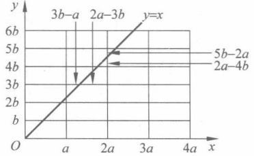

# 基 础 篇

### 第1章

### 整除

在整数集合中，整除是一种重要的二元关系，相关概念和性质包括素数、公因数、欧几里得（Euclid）除法（也称辗转相除法）、算术基本定理等。这些概念和性质又是整数集合中另一种重要的二元关系——同余关系的基础。本章先介绍整除，第2章介绍同余。

本章的重点是 Euclid 除法和 Euclid 算法；难点是扩展的 Euclid 算法。

## 1.1

#### 整除的概念

通常，用 Z 表示整数集合，整数即为  ${0}, \pm1, \pm2, \cdots$。

自然数集合是非负整数集合，用N来表示。

定义 1.1（整除） 设 a, b 是任意两个整数，其中  $b \neq 0$。如果存在一个整数 q，使得等式

$$
a=qb
$$

成立，则称 b 整除 a 或者 a 被 b 整除，记作  $b|a$。b 叫作 a 的因数，a 叫作 b 的倍数。q 写成 a/b 或者  $\frac{a}{b}$；否则，称 b 不能整除 a，或 a 不能被 b 整除，记作  $b\nmid a$。

注意：这里整除的定义是通过乘法运算给出的（而不是通过除法运算定义的）；通过整数 q 的存在性表述整除性。另外，符号  $b|a$ 本身就包含了  $b \neq 0$。

例 1.1 请写出 20 的所有因数。

解答  $\pm1,\pm2,\pm4,\pm5,\pm10,\pm20$

根据定义，有：

0 是任何非零整数的倍数，即  $a \mid 0$，这里  $a \neq 0, a \in \mathbb{Z}$。

1 是任何整数的因数，即  ${1} \mid a, a \in \mathbb{Z}$。

任何非零整数 a 是自己的倍数，也是自己的因数，即  $a \mid a$，这里  $a \neq 0, a \in \mathbb{Z}$。

整除有以下性质。

例 1.2 设 a, b 为整数。若  $b|a$，则  $b|(-a), (-b)|a, (-b)|(-a), |b|\mid|a|$。

证明 由  $b|a$，于是存在整数 q，使得 a=qb。

要证明所需结论，即需要证明存在整数 Q，使得等式  $(-a)=Qb, a=Q(-b), (-a)=Q(-b), |a|=Q|b|$ 成立。

由条件 a=qb 通过简单的推理可以发现，当 Q 分别为 -q, -q, q, |q| 时，上述等式满足。于是可知，相应的整数 Q 存在。

由这个例子可知，可将重点放在正整数的整除上来。

上述证明的思路在于：从已知条件和证明目标同时入手，变换转换，中间相遇。具体而言，由整除的概念得到相应等式，由相应等式推出整数Q的存在性，由整数Q的存在性推出整除性。

由这一思路，可以证明整除的以下性质（请读者自行给出证明并给出实例）。

定理 1.1（传递性）设  $a \neq 0, b \neq 0$，c 是三个整数。若  $a|b, b|c$，则  $a|c$。

定理 1.2 设 a, b,  $c \neq 0$ 是三个整数。若  $c|a, c|b$，则  $c|a \pm b$。

定理 1.3 设 a, b,  $c \neq 0$ 是三个整数。若  $c|a, c|b$，则对任意整数 s, t 有

$$
c\mid sa\pm tb
$$

提示：Q 分别为  $q_{1}q_{2}$， $q_{1}\pm q_{2}$， $sq_{1}\pm tq_{2}$。

例 1.3 设 a, b,  $c \neq 0$ 是三个整数,  $c | a, c | b$, 如果存在整数 s, t, 使得  $sa + tb = 1$, 则  $c = \pm 1$。

证明 因为  $c|a, c|b$，存在整数 s, t，使得  $sa + tb = 1$，于是由定理 1.3，有  $c|sa + tb = 1$，于是  $c = \pm 1$。

由整除和因数的概念，可以根据因数情况对整数进行分类。

定义 1.2 设整数  $n \neq 0, \pm 1$ ，如果除了平凡因数  $\pm 1, \pm n$ 外，n 没有其他因数，那么 n 叫作素数（或质数、不可约数）；否则 n 叫作合数。

当整数  $n \neq 0, \pm 1$ 时，n 和 -n 同为素数或合数。因此，若没有特别声明，素数总是指正整数，通常写成 p。

思考1.1 请写出30以内的素数。

（答案：2，3，5，7，11，13，17，19，23，29）

下面证明每个合数必有素因数。

定理1.4 设 n 是一个正合数，p 是 n 的一个大于 1 的最小正因数，则 p 一定是素数，且  $p \leqslant \sqrt{n}$。

证明 反证法。若 p 不是素数，则存在整数 q， ${1} < q < p$，使得  $q \mid p$，由条件知  $p \mid n$，于是根据定理 1.1，有  $q \mid n$，这与 p 是 n 的大于 1 的最小正因数矛盾。所以 p 是素数。

若  $p > \sqrt{n}$ 成立，则 n 的另一个因数 n/p < n/ $\sqrt{n}$ =  $\sqrt{n}$，于是，n/p 是一个比 p 小的因数，这与 p 是 n 的大于 1 的最小正因数矛盾。证毕。

非正式地说，上述定理说明了两点：素因数可以视为合数的“组成部分”，且这一“组成部分”中必然有一个小于等于 $\sqrt{n}$。

定理 1.4 给出了寻找素数的有效方法。为了求出不超过给定正整数  $x(x>1)$ 的所有素数，只要把从 2 到 x 的所有合数都删去即可。因为不超过 x 的合数 n 必有一个素因子  $p \leqslant \sqrt{n} \leqslant \sqrt{x}$，所以只要先求出  $\sqrt{x}$ 以内的全部素数  $\{p_i, 1 \leqslant i \leqslant k\}$（其中，k 为  $\sqrt{x}$ 以内的素数个数），然后把不超过 x 的  $p_i$ 的倍数（$p_i$ 本身除外）全部删去，剩下的就正好是不超过 x 的全部素数。这种寻找素数的方法称为 Eratosthenes 筛法。

例 1.4 求出不超过 64 的所有素数。

解答 先求出不超过 $\sqrt{64}=8$的所有素数，依次为2，3，5，7，然后从2～64的所有整

数依次删去除了2,3,5,7以外的2的倍数、3的倍数、5的倍数、7的倍数，剩下的即为所求。具体过程如下所示：

| 2 | 3 | 4 | 5 | 6 | 7 | 8 | 9 | 10 | 11 | 12 | 13 | 14 | 15 |
| --- | --- | --- | --- | --- | --- | --- | --- | --- | --- | --- | --- | --- | --- |
| 16 | 17 | 18 | 19 | 20 | 21 | 22 | 23 | 24 | 25 | 26 | 27 |  |  |
| 28 | 29 | 30 | 31 | 32 | 33 | 34 | 35 | 36 | 37 | 38 | 39 |  |  |
| 40 | 41 | 42 | 43 | 44 | 45 | 46 | 47 | 48 | 49 | 50 | 51 |  |  |
| 52 | 53 | 54 | 55 | 56 | 57 | 58 | 59 | 60 | 61 | 62 | 63 | 64 |  |

可见，没有删去的数是2，3，5，7，11，13，17，19，23，29，31，37，41，43，47，53，59，61，这些即为不超过64的所有素数。

依据上述方法可以编写一个算法，输出不超过输入值的所有素数。

一个很自然会想到的问题就是：素数是否可以穷举？下面的证明说明素数的数量有无穷多个。

定理 1.5 素数有无穷多个。

证明 反证法。假设有限个素数，则不妨设它们为  $p_{1}, p_{2}, \cdots, p_{n}$。考虑大于1的整数

$$
N=p_{1}p_{2}\cdots p_{n}+1
$$

容易看到， $p_{1}, p_{2}, \cdots, p_{n}$ 都不能整除 N，于是 N 没有素因数，由定理 1.4 知 N 不是合数，于是 N 为素数。这与有限个素数矛盾。

公元前3世纪古希腊大数学家欧几里得(Euclid)在The Elements(中文译名为《几何原本》)一书中给出该证明方法，成为一种经典的“构造矛盾”的反证法 $^{①}$。

可以看到，本节论述的过程遵循了数学公理化方法，该方法从基本概念和公理出发，通过证明逐步扩充定理和性质。

下面介绍两类特殊的素数。

定理 1.6 设 n>1 是一个正整数，若  $a^{n}-1$ 是素数，则 a=2，且 n 是素数。

证明 若 a>2，则  $a^{n}-1=(a-1)(a^{n-1}+a^{n-2}+\cdots+a+1)$， ${1}<a-1<a^{n}-1$，因此  $a^{n}-1$ 不是素数。与已知矛盾，因此 a=2。

a=2，若 n=kl, k>1, l>1 则  ${2}^{kl}-1=(2^{k})^{l}-1=(2^{k}-1)(2^{k(l-1)}+2^{k(l-2)}+\cdots+2^{k}+1)$， ${1}<2^{k}-1<2^{n}-1$，因此  ${2}^{n}-1$ 不是素数。与已知矛盾，因此，n 是素数。

定义 1.3 设 p 是一个素数，整数  $M_{p}=2^{p}-1$ 称为 Mersenne(梅森)素数。

目前寻找梅森素数成为对计算机运算性能的一种测试，后来诞生了“因特网梅森素数寻找程序”GIMPS项目。该项目是寻找梅森素数的计算机搜索方法，通过分配搜索区间大规模并行搜索，并自动发送搜索报告。通过在GIMPS项目主页下载免费程序，就可以参与该项目。

## 1.2

#### Euclid 算法

前面讨论的是整除的情况，如果不能整除时会如何呢？

定理 1.7 (Euclid 除法，也称为带余除法) 设 a, b 是两个整数，其中 b > 0，则存在唯一的整数 q，r，使得

$$
a=qb+r\quad0\leqslant r<b
$$

证明 先证明存在性。考虑一个整数序列

$$
\cdots,-3b,-2b,-b,0,b,2b,3b,\cdots
$$

它们将实数轴分成长度为 b 的一系列区间，而 a 必定落在其中的一个区间上。因此，存在一个整数 q，使得

$$
qb\leqslant a<(q+1)b
$$

令 r=a-qb，则有

$$
a=qb+r\quad0\leqslant r<b
$$

再证明唯一性。如果分别有  $q_{1}, r_{1}$ 和  $q_{2}, r_{2}$ 满足式(1.1)，则

$$
\begin{aligned}a&=q_{1}b+r_{1}\quad0\leqslant r_{1}<b\\a&=q_{2}b+r_{2}\quad0\leqslant r_{2}<b\end{aligned}
$$

两式相减，有

$$
(q_{1}-q_{2})b=-(r_{1}-r_{2})
$$

当  $q_{1} \neq q_{2}$ 时，左边的绝对值不小于 b，而右边的绝对值小于 b，这是不可能的。于是， $q_{1} = q_{2}, r_{1} = r_{2}$。证毕。

定义 1.4 式(1.1)中的 q 叫作 a 被 b 除所得的不完全商，r 叫作 a 被 b 除所得的余数。

Euclid 除法可以理解成用一个长度为 b 的“尺子”去度量长度 a，度量最后剩下的一段 r 不会大于“尺子”的长度 b。

Euclid 除法的用途是，可以将两个数之间整除关系的判定问题转化为计算问题。判断 a 是否能被非零整数 b 整除的充要条件是 a 被 b 除所得的余数 r=0。

通常， ${0} \leq r < b$，这时 r 叫作最小非负余数；但在有些时候通过“平移”（即调整不完全商的大小），可以将 r 调整为  $|r| \leq b/2$，这时 r 叫作绝对值最小余数，它在后面介绍的 Euclid 算法中（见例 1.8）能起到算法加速的作用。

思考1.2 令 b=7，则最小非负余数为多少？绝对值最小余数为多少？

解答 r=0,1,2,3,4,5,6 为最小非负余数。

r=-3,-2,-1,0,1,2,3为绝对值最小余数。

定义 1.5（公因子）设  $a_{1}\cdots,a_{n}$ 是  $n(n\geqslant2)$ 个整数。若整数 d 是它们中每一个数的因数，那么 d 就叫作  $a_{1},\cdots,a_{n}$ 的一个公约数（也叫公因数）。

d 是  $a_{1}, \cdots, a_{n}$ 的一个公因数的数学表达式为

$$
d\mid a_{1},\cdots,d\mid a_{n}
$$

如果整数  $a_{1}, \cdots, a_{n}$ 不全为零，那么  $a_{1}, \cdots, a_{n}$ 的所有公约数中最大的一个公约数叫作最大公约数（greatest common divisor），记作  $\gcd(a_{1}, \cdots, a_{n})$ 或  $(a_{1}, \cdots, a_{n})$。

特别地，当 $(a_{1},\cdots,a_{n})=1$，称 $(a_{1},\cdots,a_{n})$互素或互质。

下面给出最大公约数的等价定义。

d>0 是  $a_{1},\cdots,a_{n}$ 的最大公约数的数学表达式可以表述如下：

(1)  $d|a_1, \cdots, d|a_n$.

(2) 若  $e|a_{1},\cdots,e|a_{n}$，则  $e|d$。

说明：条件(1)表示 d 是公约数；条件(2)表示 d 在公约数中最大。

下面的定理给出了最大公约数的另一个等价定义。

定理 1.8 a, b 是不全为零的整数, a, b 的最大公约数  $d = (a, b)$ 是集合

$$
\left\{s a+t b\mid s,t\in\mathbf{Z}\right\}
$$

中的最小正整数。

证明 令集合 $\{sa + tb \mid s, t \in \mathbb{Z}\}$中最小的正整数为  $m$。下面证明  $m = d$，方法是先证明  $d \mid m$，再证明  $m \mid d$。

一方面，因为  $d=(a,b)$，于是  $d|a,d|b$，由定理1.3可知， $d|sa+tb,s,t\in\mathbb{Z}$，于是  $d|m$。

另一方面，由带余除法知，存在整数  $q_{1}, q_{2}, r_{1}, r_{2}$，使得

$$
a=q_{1}m+r_{1},b=q_{2}m+r_{2}\quad0\leqslant r_{1},r_{2}<m
$$

易知， $r_1, r_2 \in \{sa + tb \mid s, t \in \mathbb{Z}\}$，由于  $m$ 是该集合中的最小正整数，故  $r_1 = r_2 = 0$，即  $m \mid a, m \mid b$，由最大公约数的定义可知  $m \mid d$。

综合  $d|m,m|d$，且均为正整数，有 m=d。证毕。

定理1.8从线性组合的角度来考察最大公因子。如果从几何的角度来观察，这可以视为 y=x 斜线与格子割线中那个最短的线段。例如，图1.1中斜线下方a上方第一个线段对应的值为a-2b，斜线下方2a上方线段对应的值为2a-4b。因此，(a,b)也可以视为利用长度为a和b的两把“尺子”可以“丈量”的最小长度（精度）。

图1.1 a, b 的线性组合
 

推论 1.1 a, b 是不全为零的整数，a, b 的最大公约数  $ d = (a, b) $，集合

$$
\left\{s a+t b\mid s,t\in\mathbf{Z}\right\}
$$

由 d 的所有倍数组成。

这再一次说明了 d 是长度为 a 和 b 的“尺子”组合起来可以“丈量”的“最小长度单位”。有了这个“单位长度”，则可以“反复”丈量出其他长度。

定理 1.9 设 $a, b$为不全为零的整数，则方程$ax + by = c$有整数解，当且仅当$c \in \{ax + by \mid x, y \in \mathbb{Z}\}$，即当且仅当 $(a, b) \mid c$。

该定理可用于判定二元一次不定方程  $ax + by = c$ ( $a, b, c \in \mathbb{Z}$) 的整数解是否存在。

特别地，若 $(a,b)=1$，则存在整数x,y，使得 $ax+by=1$。

这一特例也说明只有当 a 和 b 互素时， $a x = 1 (\bmod b)$ 才有解。

定理 1.10 设  $a_{1}, \cdots, a_{n}$ 是 n 个不全为零的整数，则

(1) $a_{1},\cdots,a_{n}$与 $\left|a_{1}\right|,\cdots,\left|a_{n}\right|$的公因数相同。

(2) $(a_{1},\cdots,a_{n})=(\left|a_{1}\right|,\cdots,\left|a_{n}\right|)$

这个定理将公因数的讨论转化为在非负数范围内讨论。

定理 1.11 设 b 是任一正整数，则  $(0, b) = b$。

平凡地求两个整数最大公因子的方法是，分别求出两个数的因子，然后挑出它们中最大的公因子。这种方法在两个数比较小的情况下是可行的，但是当两个数比较大时，分解其因子是十分困难的。而且这个方法的效率不高，求两个整数的最大公因子需要寻找更好的办法。

定理 1.12 设 a, b, r 是三个不全为零的整数。如果

$$
a=qb+r
$$

其中 q 是整数，则  $(a,b)=(b,r)$

证明 令  $ d = (a, b) $,  $ d^{\prime} = (b, r) $,  $ d | a $,  $ d | b $，由定理 1.3，得

$$
d\mid a+(-q)b=r
$$

于是 d 是 b, r 的公因数，从而  $d \leq d^{\prime}$。

同理， $d^{\prime}$ 是 a, b 的公因数，从而  $d^{\prime} \leqslant d$。

因此，d=d'。

例 1.5 因为  ${1573}=5\cdot286+143$，所以（1573，286）=（286，143）=143

以上定理的用处是：可以将求两个较大数的公因数转化为求两个较小数的公因数。利用这一思想，可以得到计算求最大公因数的方法。这一算法称为“欧几里得除法”，也称为“辗转相除法”。它可能是世界上最著名的也是最早的算法。

从算法递归调用的角度描述定理 1.12，就是  $\gcd(a, b) = \gcd(b, a \bmod b)$。

算法 1.1 Euclid 算法递归形式：计算两个整数的最大公因子。

输入：两个非负整数 a, b，且  $a \geqslant b$（先将待计算的整数取绝对值）。

输出：a, b 的最大公因子。

GCD(a,b) {
    If b<>0
        Return GCD(b,a mod b);
    Else
        Return a;
}

递归形式便于理解，但不便于了解算法的实际过程。下面给出非递归形式的 Euclid 算法。在给出非递归形式之前，先看一个例子。

例 1.6 计算 gcd(4864,3458)=38 的分解步骤。

解答

$$
\begin{aligned}4&864=1\cdot3458+1406\\3&458=2\cdot1406+646\end{aligned}
$$

$$
1406=2\cdot646+114
$$

$$
646=5\cdot114+76
$$

$$
114=1\cdot76+38
$$

$$
76=2\cdot38+0
$$

算法 1.2 Euclid 算法：计算两个整数的最大公因子。

输入：两个非负整数 a, b，且  $a \geqslant b$（先将待计算的整数取绝对值）。

输出：a, b 的最大公因子。

GCD(a,b) {
While (b≠0) do {
    r←a mod b;
    a←b;
    b←r;
}
Return a;
}

思考1.3 算法1.2有可能是死循环吗？

算法 1.2 中的循环会结束（不会是死循环），因为 r 逐步在减小，最终变为 0（从而退出循环）。

例 1.7 用算法 1.2 计算 gcd(169,121)=1 的分解步骤。

解答

$$
\begin{align*}169&=1\cdot121+48\\121&=2\cdot48+25\\48&=1\cdot25+23\\25&=1\cdot23+2\\23&=11\cdot2+1\\2&=2\cdot1+0\end{align*}
$$

如果利用绝对值最小余数代替最小非负余数，可以对算法1.2进行优化。请看下面的例子。

例 1.8 设 a=46480, b=39423, 计算  $(a, b)$

解答 利用 Euclid 除法。

方法1：使用最小非负余数。

$$
\begin{aligned}&46480=1\cdot39423+7057\\&39423=5\cdot7057+4138\\&\quad7057=1\cdot4138+2919\\&\quad4138=1\cdot2919+1219\\&\quad2919=2\cdot1219+481\\&\quad1219=2\cdot481+257\\ \end{aligned}
$$

$$
481=1\cdot257+224
$$

$$
257=1\cdot224+33
$$

$$
224=6\cdot33+26
$$

$$
33=1\cdot26+7
$$

$$
26=3\cdot7+5
$$

$$
7=1\cdot5+2
$$

$$
5=2\cdot2+1
$$

$$
2=2\cdot1+0
$$

方法2：使用绝对值最小余数。

$$
46480=1\cdot39423+7057
$$

$$
39423=6\cdot7057-2919
$$

$$
7057=2\cdot2919+1219
$$

$$
2919=2\cdot1219+481
$$

$$
1219=3\cdot481-224
$$

$$
481=2\cdot224+33
$$

$$
224=7\cdot33-7
$$

$$
\begin{aligned}33=5\cdot7-2\end{aligned}
$$

$$
7=3\cdot2+1
$$

$$
2=2\cdot1+0
$$

所以（46480，39423）=1。

可以看到，方法2要比方法1运算次数少，所以绝对值最小余数方法可以加快计算，减少计算时间。

## 1.3

#### 扩展的 Euclid 算法

下面的推导给出了 Euclid 算法的一个严格证明。

设 a, b 是任意两个正整数。记  $r_{-2} = a, r_{-1} = b$，反复运用带余除法，有

$$
\begin{aligned}r_{-2}&=q_{0}r_{-1}+r_{0}&0&\leqslant r_{0}<r_{-1}\\r_{-1}&=q_{1}r_{0}+r_{1}&0&\leqslant r_{1}<r_{0}\\r_{0}&=q_{2}r_{1}+r_{2}&0&\leqslant r_{2}<r_{1}\\&\vdots&&&\\r_{n-3}&=q_{n-1}r_{n-2}+r_{n-1}&0&\leqslant r_{n-1}<r_{n-2}\\r_{n-2}&=q_{n}r_{n-1}+r_{n}&0&\leqslant r_{n}<r_{n-1}\\r_{n-1}&=q_{n+1}r_{n}+r_{n+1}&r_{n+1}&=0\end{aligned}
$$

可以看到，随着 n 的增加， $r_{n}$ 减小，由于  $r_{n+1} \geqslant 0$，因此， $r_{n+1} = 0$。

上述过程即从数列  $r_{-2}, r_{-1}, r_{0}, r_{1}, \cdots, r_{n}$ 前两项依次求出第三项，直到最后一项的过程。有

$$
(a,b)=(r_{-2},r_{-1})=(r_{-1},r_{0})=\cdots=(r_{n-1},r_{n})=(r_{n},r_{n+1})=(r_{n},0)=r_{n}
$$

如果将这一过程反方向写出，有

$$
r_{n}=r_{n-2}-q_{n}r_{n-1}
$$

$$
r_{n-1}=r_{n-3}-q_{n-1}r_{n-2}
$$

$$
\cdot \quad \cdot \quad \cdot
$$

$$
r_{2}=r_{0}-q_{2}r_{1}
$$

$$
r_{1}=r_{-1}-q_{1}r_{0}
$$

$$
r_{0}=r_{-2}-q_{0}r_{-1}
$$

即  $r_{n}, r_{n-1}, \cdots, r_{1}, r_{0}$ 中每一项均可以用后两项表示。于是  $r_{n}$ 可以用  $r_{-2}, r_{-1}$ 表示，即可以找到整数 s, t，使得

$$
sa+tb=r_{n}=(a,b)
$$

例 1.9 a=169, b=121, 求整数 s, t, 使得  $sa + tb = (a, b)$.

##### 解答

首先回顾例 1.7 的过程：

$$
169=1\cdot121+48
$$

$$
121=2\cdot48+25
$$

$$
48=1\cdot25+23
$$

$$
25=1\cdot23+2
$$

$$
23=11\cdot2+1
$$

$$
2=2\cdot1+0
$$

将例1.7的过程反过来写，有

$$
\begin{aligned}1&=23-11\cdot2\\&=23-11\cdot(25-1\cdot23)\\&=-11\cdot25+12\cdot23\\&=-11\cdot25+12\cdot(48-1\cdot25)\\&=12\cdot48-23\cdot25\\&=12\cdot48-23\cdot(121-2\cdot48)\\&=-23\cdot121+58\cdot48\\&=-23\cdot121+58\cdot(169-1\cdot121)\\&=58\cdot169-81\cdot121\end{aligned}
$$

因此，整数 s=58,t=-81，满足  $sa+tb=(a,b)$。

下面推导一个算法，用于在给定  $a$ 和  $b$ 情况下计算  $s$ 和  $t$，使得  $sa + tb = (a, b)$。该算法具有重要的应用，如当  $a, b$ 互素时，可求出  $s$ 来，满足  $sa + tb = 1$，即  $sa = 1 \pmod{b}$。第 6 章将介绍， $s$ 在  $\mathbb{Z}_b^*$ 的乘法群中称为  $a$ 的乘法逆元。这一算法通常称为“扩展的欧几里得”（Extended Euclid）算法。

在给出具体算法之前，首先观察和分析计算中可能存在的递推关系。从例1.9中可以观察到，4个数列s，t，r，q在反复计算，其中q由r的数列计算得到，以q为“纽带”，尝试计算s和t的数列。通过尝试和整理，得到如下定理：

定理 1.13 设 a, b 是任意两个正整数，则

$$
s_{n}a+t_{n}b=(a,b)
$$

对于 j=0,1,\cdots,n-1，这里  $s_{j}$,  $t_{j}$ 归纳地定义为

$$
\begin{aligned}&s_{-2}=1,s_{-1}=0,s_{j}=s_{j-2}-q_{j}s_{j-1}\\&t_{-2}=0,t_{-1}=1,t_{j}=t_{j-2}-q_{j}t_{j-1}\quad j=0,1,2,\cdots,n-1,n\\ \end{aligned}
$$

其中  $q_j = [r_{j-2}/r_{j-1}]$ 是式 (1.4) 中的不完全商。设  $x \in \mathbb{R}$， $[x]$ 表示不超过  $x$ 的最大整数，称为实数  $x$ 的整数部分。

证明 只需证明：对于 j = -2, -1, 0, 1,  $\cdots$, n - 1

$$
s_{j}a+t_{j}b=r_{j}
$$

其中  $r_{j}=r_{j-2}-q_{j}r_{j-1}$ 是式(1.5)中的余数。因为  $(a,b)=r_{n}$，所以

$$
s_{n}a+t_{n}b=(a,b)
$$

对 j 用数学归纳法来证明式(1.5)。当 j = -2 时，有  $s_{-2} = 1, t_{-2} = 0$ 以及

$$
s_{-2}a+t_{-2}b=a=r_{-2}
$$

式(1.5)对于 j = -2 成立。

j=-1 时，有  $s_{-1}=0, t_{-1}=1$ 以及

$$
s_{-1}a+t_{-1}b=b=r_{-1}
$$

式(1.5)对于 j = -1 成立。

假设式(1.5)对于 $-2\leqslant j\leqslant k-1$成立，即

$$
s_{j}a+t_{j}b=r_{j}
$$

对于 j=k，有

$$
r_{k}=r_{k-2}-q_{k}r_{k-1}
$$

利用归纳假设，得到

$$
\begin{aligned}r_{k}&=(s_{k-2}a+t_{k-2}b)-q_{k}(s_{k-1}a+t_{k-1}b)\\&=(s_{k-2}-q_{k} s_{k-1})a+(t_{k-2}-q_{k} t_{k-1})b\\&=s_{k} a+t_{k} b\\ \end{aligned}
$$

因此，式(1.5)对于 j=k 成立。

根据数学归纳法，式(1.5)对所有的  $j = -2, -1, 0, 1, \cdots, n-1$ 成立。

有了关于 s 的递推关系  $s_{j}=s_{j-2}-q_{j}s_{j-1}$ 以及关于 t 的递推关系  $t_{j}=t_{j-2}-q_{j}t_{j-1}$，便可以求出最终需要的 s 和 t，即  $s_{n}$ 和  $t_{n}$。

下面根据本节上面的证明设计一个算法：假设 a 和 b 是不全为零的非负整数，计算 s, t 使得  $sa + tb = (a, b)$。

首先，令

$$
\begin{array}{l}r_{-2}=a\quad r_{-1}=b\\s_{-2}=1\quad s_{-1}=0\\t_{-2}=0\quad t_{-1}=1\end{array}
$$

这是因为  $r_{k}=s_{k}a+t_{k}b$ ，所以  $r_{-2}=s_{-2}a+t_{-2}b=1\cdot a+0\cdot b, r_{-1}=s_{-1}a+t_{-1}b=0\cdot a+1\cdot b$ 。

（1）如果 $r_{-1}=0$，则令

$$
\therefore\quad s=s_{-2}\quad t=t_{-2}
$$

否则，计算

$$
q_{0}=\left[r_{-2}/r_{-1}\right]\quad r_{0}=r_{-2}-q_{0}r_{-1}
$$

（2）如果 $r_{0}=0$，则令

$$
s=s_{-1}\quad t=t_{-1}
$$

否则，计算

$$
s_{0}=s_{-2}-q_{0}s_{-1}\quad t_{0}=t_{-2}-q_{0}t_{-1}
$$

以及

$$
q_{1}=\left[r_{-1}/r_{0}\right]\quad r_{1}=r_{-1}-q_{1}r_{0}
$$

（3）如果 $r_{1}=0$，则令

$$
s=s_{0}\quad t=t_{0}
$$

否则，计算

$$
s_{1}=s_{-1}-q_{1}s_{0}\quad t_{1}=t_{-1}-q_{1}t_{0}
$$

以及

$$
q_{2}=\left[r_{0}/r_{1}\right]\quad r_{2}=r_{0}-q_{2}r_{1}
$$

・・・

 $(j+1)$ 如果  $r_{j-1}=0(j\geqslant3)$，则令

$$
s=s_{j-2}\quad t=t_{j-2}
$$

否则，计算

$$
s_{j-1}\;=\;s_{j-3}\;-\;q_{j-1}s_{j-2}\quad t_{j-1}\;=\;t_{j-3}\;-\;q_{j-1}t_{j-2}
$$

以及

$$
\begin{array}{r l}{q_{j}=\left[\boldsymbol{r}_{j-2}/\boldsymbol{r}_{j-1}\right]}&{{}\boldsymbol{r}_{j}=\boldsymbol{r}_{j-2}-\boldsymbol{q}_{j}\boldsymbol{r}_{j-1}}\end{array}
$$

最后，一定有 $r_{n+1}=0$。这时，令

$$
s=s_{n}\quad t=t_{n}
$$

总之，可以找到整数s,t，使得

$$
sa+tb=r_{n}=(a,b)
$$

将上述推导过程写成以下算法。

算法 1.3 Extended Euclid 算法。

输入：两个非负整数 a, b，且  $a \geq b$。

输出： $\gcd(a,b)$，以及满足  $sa+tb=\gcd(a,b)$ 的整数 s, t。

ExtendedEuclid(a,b){
    (R,S,T)←(a,1,0);
    (R',S',T')←(b,0,1);
    While(R'≠0) do {
        q←[R/R'];
        (Temp1,Temp2,Temp3)←(R-qR',S-qS',T-qT');
        (R,S,T)←(R',S',T');
        (R',S',T')←(Temp1,Temp2,Temp3);
    }
    Return R,S,T;
}

算法中的变量与推导中的对应关系写成表格，如表1.1所示。

表1.1 变量与推导的对应关系
 

| q | R | $R^{\prime}$ | S | $S^{\prime}$ | T | $T^{\prime}$ |
| --- | --- | --- | --- | --- | --- | --- |
| q_j | r_j | r_{j+1} | s_{j-1} | s_j | t_{j-1} | t_j |

例 1.10 写出 Extended Euclid 算法的计算过程，设 a=1859, b=1573，计算整数 s, t，使得  $sa + tb = (a, b)$。

解答：将算法写成表1.2，第一列为循环条件判断，第二列为不完全商q数列，其余三列为r，s，t递推数列。

表1.2 例1.10算法表示
 

<table border=1 style='margin: auto; word-wrap: break-word;'><tr><td style='text-align: center; word-wrap: break-word;'>R&#x27;≠0?</td><td style='text-align: center; word-wrap: break-word;'>q</td><td style='text-align: center; word-wrap: break-word;'>R</td><td style='text-align: center; word-wrap: break-word;'>R&#x27;</td><td style='text-align: center; word-wrap: break-word;'>S</td><td style='text-align: center; word-wrap: break-word;'>S&#x27;</td><td style='text-align: center; word-wrap: break-word;'>T</td><td style='text-align: center; word-wrap: break-word;'>T&#x27;</td></tr><tr><td style='text-align: center; word-wrap: break-word;'></td><td style='text-align: center; word-wrap: break-word;'></td><td style='text-align: center; word-wrap: break-word;'>a=1859</td><td style='text-align: center; word-wrap: break-word;'>b=1573</td><td style='text-align: center; word-wrap: break-word;'>1</td><td style='text-align: center; word-wrap: break-word;'>0</td><td style='text-align: center; word-wrap: break-word;'>0</td><td style='text-align: center; word-wrap: break-word;'>1</td></tr><tr><td style='text-align: center; word-wrap: break-word;'>Yes</td><td style='text-align: center; word-wrap: break-word;'>1</td><td style='text-align: center; word-wrap: break-word;'>1573</td><td style='text-align: center; word-wrap: break-word;'>286</td><td style='text-align: center; word-wrap: break-word;'>0</td><td style='text-align: center; word-wrap: break-word;'>1</td><td style='text-align: center; word-wrap: break-word;'>1</td><td style='text-align: center; word-wrap: break-word;'>-1</td></tr><tr><td style='text-align: center; word-wrap: break-word;'>Yes</td><td style='text-align: center; word-wrap: break-word;'>5</td><td style='text-align: center; word-wrap: break-word;'>286</td><td style='text-align: center; word-wrap: break-word;'>143</td><td style='text-align: center; word-wrap: break-word;'>1</td><td style='text-align: center; word-wrap: break-word;'>-5</td><td style='text-align: center; word-wrap: break-word;'>-1</td><td style='text-align: center; word-wrap: break-word;'>6</td></tr><tr><td style='text-align: center; word-wrap: break-word;'>Yes</td><td style='text-align: center; word-wrap: break-word;'>2</td><td style='text-align: center; word-wrap: break-word;'>143</td><td style='text-align: center; word-wrap: break-word;'>0</td><td style='text-align: center; word-wrap: break-word;'>-5</td><td style='text-align: center; word-wrap: break-word;'>11</td><td style='text-align: center; word-wrap: break-word;'>6</td><td style='text-align: center; word-wrap: break-word;'>-13</td></tr><tr><td style='text-align: center; word-wrap: break-word;'>No</td><td colspan="7">返回值</td></tr></table>

因此，s = -5, t = 6，使得

$$
\left(-5\right)\cdot1859+6\cdot1573=143
$$

思考1.4 算法1.2和算法1.3的区别。

算法 1.3 中引入两个关于 s 和 t 的递推关系。在计算 r 的递推关系求出  $(a,b)$ 的同时，也计算了所需要的 s 和 t，因此称其为“扩展的”Euclid 算法。

需要强调的是，在实际中扩展的 Euclid 算法主要用于求乘法逆元。例如，假设  $b < m$，当  $(m, b) = 1$ 时， $sm + tb = (m, b) = 1$，因此， $tb = 1 \pmod{m}$。于是找到了 t，这是 b 在  $\mathbf{Z}_m^*$ 的乘法群中的乘法逆元（第 6 章将介绍群的概念）。为了使表达规整，算法 1.4 中重新使用了不同的变量名和编排。

算法 1.4 Extended Euclid 算法求逆元。

输入：两个非负整数 $m, b, \text{且 } m > b$。
输出：$b$在$\mathbb{Z}_m^*$ 中的乘法逆元。

Extended Euclid (m, b) {
1 $(A_1, A_2, A_3) \leftarrow (1, 0, m)$; $(B_1, B_2, B_3) \leftarrow (0, 1, b)$;
2 If $B_3 = 0$ Return 'No Inverse';
3 If $B_3 = 1$Return$B_2$;
4 $Q \leftarrow [A_3 / B_3]$;
5 $(Temp1, Temp2, Temp3) \leftarrow (A_1 - QB_1, A_2 - QB_2, A_3 - QB_3)$
6 $(A_1, A_2, A_3) \leftarrow (B_1, B_2, B_3)$
7 $(B_1, B_2, B_3) \leftarrow (Temp1, Temp2, Temp3)$
8 Goto 2
}

## 1.4

#### 算术基本定理

在给出算术基本定理之前，首先简单介绍一下最大公约数和最小公倍数的性质。

定理 1.14 设 a, b 是任意两个不全为零的整数：

（1）若 m 是任一正整数，则  $(a m, b m) = (a, b) m$。

（2）若非零整数 d 满足  $d|a, d|b$，则  $(a/d, b/d) = (a, b)/d$。特别地，有

$$
(a/(a,b),b/(a,b))=1
$$

定理 1.15 设  $a_{1}, \cdots, a_{n}$ 是 n 个整数，且  $a_{1} \neq 0$。令

$$
(a_{1},a_{2})=d_{2},(d_{2},a_{3})=d_{3},\cdots,(d_{n-1},a_{n})=d_{n}
$$

则 $(a_{1},\cdots,a_{n})=d_{n}$

该定理说明计算多个整数的公约数可以通过逐个计算得到。

定理 1.16 设 a, b, c 是三个整数,  $b \neq 0$,  $c \neq 0$, 如果  $(a, c) = 1$, 则

$$
(ab,c)=(b,c)
$$

定理 1.17 设 p 是素数，若 p  $\mid$ ab，则 p  $\mid$ a 或 p  $\mid$ b。

定理 1.18 设  $a_{1}, \cdots, a_{n}$ 是 n 个整数。如果  $(a_{i}, c) = 1, 1 \leq i \leq n$，则

$$
(a_{1}\cdots a_{n},c)=1
$$

定义 1.6（最小公倍数，least common multiple）设  $a_{1}, \cdots, a_{n}$ 是 n 个整数。若 m 是这 n 个数的倍数，则 m 叫作这 n 个数的公倍数。 $a_{1}, \cdots, a_{n}$ 的所有公倍数中的最小正整数叫作最小公倍数，记作  $[a_{1}, \cdots, a_{n}]$。

 $m=\left[a_{1},\cdots,a_{n}\right]$的数学描述如下。

(1)  $a_{1}|m,\cdots,a_{n}|m$.

（2）若  $a_{1}|m^{\prime},\cdots,a_{n}|m^{\prime}$，则  $m|m^{\prime}$。

定理 1.19 设 a, b 是两个互素的正整数，则

（1）若  $a|m,b|m$ ，则 ab  $\mid m$ 。

(2) $[a,b]=ab$。

定理 1.20 设 a, b 是两个正整数，则

（1）若  $a|m,b|m$ ，则  $[a,b]|m$

(2) $[a,b]=ab/(a,b)$

定理 1.21 设  $a_{1}, \cdots, a_{n}$ 是 n 个整数，且  $a_{1} \neq 0$。令

$$
[a_{1},a_{2}]=m_{2},[m_{2},a_{3}]=m_{3},\cdots,[m_{n-1},a_{n}]=m_{n}.
$$

则

$$
[a_{1},\cdots,a_{n}]=m_{n}
$$

定理 1.22（算术基本定理）任一整数 n>1 都可以表示成素数的乘积，且在不考虑乘积顺序的情况下，该表达式是唯一的，即

$$
n=p_{1}\cdots p_{s},\quad p_{1}\leqslant\cdots\leqslant p_{s}
$$

其中 $p_{i}$是素数，且若

$$
n=q_{1}\cdots q_{t},\quad q_{1}\leqslant\cdots\leqslant q_{t}
$$

其中 $q_{j}$是素数，则

$$
s=t\quad p_{i}=q_{i}\quad1\leqslant i\leqslant s
$$

算术基本定理的“基本”在于将任意整数用素因子乘积进行了表示，从而将任意整数的性质的研究转化为对其素因子的性质进行研究。这为研究整数的性质提供了一个具有效率的做法。

定理 1.23 任一整数 n>1 可以唯一地表示成

$$
n=p_{1}{}^{\alpha_{1}}\cdots p_{s}{}^{\alpha_{s}}\quad\alpha_{i}>0\quad i=1,\cdots,s
$$

其中  $p_{i}<p_{j}(i<j)$ 是素数。该式叫作整数 n 的标准分解式。

有了算术基本定理，整除、最大公约数、最小公倍数的求解变得直观了。

定理 1.24 设 n 是一个大于 1 的整数，且有标准分解式

$$
n=p_{1}{}^{a_{1}}\cdots p_{s}{}^{a_{s}}\quad\alpha_{i}>0\quad i=1,\cdots,s
$$

则 d 是 n 的正因数当且仅当 d 有因数分解式

$$
d=p_{1}{}^{\beta_{1}}\cdots p_{s}{}^{\beta_{s}}\quad\alpha_{i}\geqslant\beta_{i}\geqslant0\quad i=1,\cdots,s
$$

定理 1.25 设 a, b 是两个正整数，且都有因数分解式

$$
a=p_{1}{}^{a_{1}}\cdots p_{s}{}^{a_{s}},\quad\alpha_{i}\geqslant0\quad i=1,\cdots,s
$$

$$
b=p_{1}{}^{\beta_{1}}\cdots p_{s}{}^{\beta_{s}},\quad\beta_{i}\geqslant0\quad i=1,\cdots,s
$$

则 a, b 的最大公因数和最小公倍数分别有因数分解式

$$
(a,b)=p_{1}^{\min(\alpha_{1},\beta_{1})}\cdots p_{s}^{\min(\alpha_{s},\beta_{s})}
$$

$$
[a,b]=p_{1}^{\max(\alpha_{1},\beta_{1})}\cdots p_{s}^{\max(\alpha_{s},\beta_{s})}
$$

推论 1.2 设 a, b 是两个正整数，则

$$
[a,b](a,b)=ab
$$

因为对任意整数 $\alpha,\beta$，有

$$
\min(\alpha,\beta)+\max(\alpha,\beta)=\alpha+\beta
$$

例 1.11 求解（45，100）和  $[45,100]$。

解答 易知

$$
45=2^{0}\times3^{2}\times5^{1}
$$

$$
100=2^{2}\times3^{0}\times5^{2}
$$

$$
(45,100)=2^{0}\times3^{0}\times5^{1}=5
$$

由定理1.25可知

$$
\left[45,100\right]=2^{2}\times3^{2}\times5^{2}=900
$$

#### 思考题

[1] 证明：若  ${2}|n,5|n,7|n$ ，那么  ${70}|n$ 。

[2] 设  $n \in \mathbb{Z}$，证明： ${6} \mid (n^{3} - n)$。

[3] 对每一个奇数 n，证明： ${8}|(n^{2}-1)$。

[4] 利用类似于定理 1.4（反证法）和定理 1.5（构造法）的方法证明： $ \sqrt{2} $ 为无理数。

[5] 证明：

（1）形如4k-1的素数有无穷多个。

（2）形如6k-1的素数有无穷多个。

（3）证明形如 3k-1,4k-1,6k-1 形式的正整数有同样形式的素因子。

[6] 手动方式求最大公因数(55,85)，(202,282)。编写程序：用 Euclid 除法算法计算 $(a,b)$，并进行验证。

[7] 手动方式求 s, t，使得  $sa + tb = (a, b)$，其中  $(a, b)$ 为  $(202, 282)$， $(1613, 3589)$，编写程序：用扩展的 Euclid 算法求  $sa + tb = (a, b)$，并进行算法验证。

[8] 编写程序：利用 Eratosthenes 筛法产生 10000 以内素数。

[9] 形为  $M_{p}=2^{p}-1$ 的素数叫作 Mersenne 素数（梅森素数），这里 p 为素数。给出一个计算机程序求前 5 个梅森素数。

[10] 形为  $F_{n}=2^{2^{n}}+1$ 的素数为 Fermat 素数（费马素数），给出一个计算机程序证明  $F_{1}, F_{2}, F_{3}, F_{4}$ 都是素数。

提示：可下载纽约大学的 NTL 算法库，关注 GIMPS 网址，http://www.mersenne.org/download/freeware.php，截至 2014 年 2 月，已知的梅森素数共有 48 个。从 1997 年至今，所有新的梅森素数都是由互联网梅森素数大搜索（GIMPS）分布式计算项目发现的。http://zh.wikipedia.org/wiki/梅森素数。

[11] 编写程序对孪生素数的猜想在 10 000 以内进行实验验证。

[12] 编写程序对哥德巴赫猜想在 10 000 以内进行实验验证。

[13] 编写程序对  ${3}x+1$ 猜想在 10 000 以内进行实验验证。

[14] 参考数学实验方面的书籍和期刊（如 Experimental Mathematics，http://www.tandfonline.com/loi/uexm20），思考如何通过数学实验提出自己的猜想，或者验证或发现猜想中的特殊定量关系。
