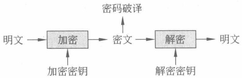

# 第2章

### 同余

本章介绍整数的另一个重要的二元关系——同余。

本章重点是同余类、简化剩余系、欧拉函数，难点是同余的应用。

## 2.1

#### 同余和剩余类

同余的概念是通过整除关系给出的。

定义 2.1 给定一个正整数 m，如果两个整数 a, b 有  $m|a-b$，则 a, b 模 m 同余，记作  $a \equiv b (\bmod m)$；否则，a, b 模 m 不同余，记作  $a \not\equiv b (\bmod m)$。

下面的定理给出了同余关系的等价表达形式，即将同余关系表达成一个等式。

定理 2.1 设 m 是一个正整数, a, b 是两个整数, 则

$$
a\equiv b(\bmod m)
$$

的充要条件是存在一个整数 k，使得  $a = b + km$。

下面的定理说明同余是等价关系。

定理 2.2 设 m 是一个正整数，则模 m 同余是等价关系，即

（1）自反性，对任一整数 $a,a\equiv a\pmod{m}$

(2) 对称性，若  $a \equiv b \pmod{m}$，则  $b \equiv a \pmod{m}$。

(3) 传递性，若  $a \equiv b \pmod{m}, b \equiv c \pmod{m}$，则  $a \equiv c \pmod{m}$。

定理2.3 设 m 是给定的一个正整数， $a_{1}, a_{2}, b_{1}, b_{2}$ 是4个整数，如果

$$
a_{1}\equiv b_{1}(\bmod m)
$$

$$
a_{2}\equiv b_{2}(\bmod m)
$$

则有

$$
a_{1}+a_{2}\equiv b_{1}+b_{2}(\bmod m)
$$

$$
a_{1}a_{2}\equiv b_{1}b_{2}(\bmod m)
$$

该定理说明同余关系对于加法和乘法是“保持”的。

思考2.1 同余关系对于减法和除法还“保持”吗？

定理 2.4 设 m 是一个正整数,  $ad \equiv bd \pmod{m}$, 如果  $(d, m) = 1$, 则

$$
a\equiv b(\bmod m)
$$

该定理说明了同余关系的“消去”原则是消去值与模互素。

定理 2.5 设 m 是一个正整数,  $a \equiv b \pmod{m}$, 如果整数  $d \mid (a, b, m)$, 则

$$
\frac{a}{d}\equiv\frac{b}{d}\left(\bmod\frac{m}{d}\right)
$$

定理 2.6 设 m 是一个正整数， $a \equiv b \pmod{m}$，如果整数 d | m，则

$$
a\equiv b(\bmod d)
$$

上述定理的证明比较简单，留作练习。

例 2.1 时钟指向 4 点，过了 2015 小时后，时钟指向几点？

解答 2015 $\equiv-1$（mod 12），因此，时钟指向3点。

例2.2 已知2015年5月4日是星期一，问从该天算起，第 ${2}^{2015}$天是星期几？

解答  ${2}^{3}=8,8\equiv1\ (\text{mod }7)$，因此，第8天相当于第1天。

2015=3×671+2, ${2}^{2015}=(2^{3})^{671}\times2^{2}\equiv4\pmod{7}$，即第 ${2}^{2015}$天就相当于第4天，为星期五。

因为整数同余关系是一种等价关系，因此全体整数可以按照模 m 是否同余划分成若干两两不相交的集合，使得每一个集合中的任意两个整数模 m 一定同余，而属于不同集合的任意两个整数模 m 不同余。

设 m 是一个正整数，对任意正整数 a，令

$$
C_{a}=\{c\mid c \in \mathbf{Z},c \equiv a (\mathrm{mod} m)\}
$$

 $C_{a}$ 是非空集合，因为  $a \in C_{a}$。

定义 2.2  $C_{a}$ 叫作模 m 的 a 的剩余类。一个剩余类中的任一数叫作该类的剩余或代表元。若  $r_{0}, r_{1}, \cdots, r_{m-1}$ 是 m 个整数，且其中任何两个数都不在同一个剩余类里，则  $r_{0}, r_{1}, \cdots, r_{m-1}$ 叫作模 m 的一个完全剩余系。完全剩余系 0,1,2,\cdots,m-1 称为最小非负完全剩余系。

模 m 的剩余类通常写成

$$
\mathbf{Z}/m\mathbf{Z}=\{C_{0},C_{1},\cdots,C_{m-1}\}=\{C_{a}\mid0\leqslant a\leqslant m-1\}
$$

特别地，当 m=p 为素数时，也写成

$$
\mathbf{F}_{p}=\mathbf{Z}/p\mathbf{Z}=\{C_{0},C_{1},\cdots,C_{p-1}\}=\{C_{a}\mid0\leqslant a\leqslant p-1\}
$$

 $C_{i}$ 也可以记为  $[i]_{m}$

例2.3 取 m=7，则模 m 的剩余类为：

$$
C_{0}=\left[0\right]_{7}=\left\{\cdots,-14,-7,0,7,14,\cdots\right\}
$$

$$
C_{1}=[1]_{7}=\{\cdots,-13,-6,1,8,15,\cdots\}
$$

$$
C_{2}=\left[2\right]_{7}=\left\{\cdots,-12,-5,2,9,16,\cdots\right\}
$$

$$
C_{3}=\left[3\right]_{7}=\left\{\cdots,-11,-4,3,10,17,\cdots\right\}
$$

$$
C_{4}=\left[4\right]_{7}=\left\{\cdots,-10,-3,4,11,18,\cdots\right\}
$$

$$
C_{5}=\left[5\right]_{7}=\left\{\cdots,-9,-2,5,12,19,\cdots\right\}
$$

$$
C_{6}=\left[6\right]_{7}=\left\{\cdots,-8,-1,6,13,20,\cdots\right\}
$$

-14，-6，2，10，18，19，20是模7的一组完全剩余系。0，1，2，3，4，5，6为模7的最小非负完全剩余系。

通常情况下，可用  $Z_{m}$ 表示 m 的最小非负完全剩余系集合，即  $Z_{m}=\{0,1,2,\cdots,m-1\}$。

 $Z_{m}$ 中的加法和乘法都是模 m 意义上的加法和乘法运算。

根据“抽屉原则”，可以得到以下完全剩余系的判定方法。

定理 2.7 设 m 是正整数，则 m 个整数  $a_{1}, a_{2}, \cdots, a_{m}$ 为模 m 的一个完全剩余系的充要条件是它们模 m 两两不同余。

下面给出一个完全剩余系的构造方法。

定理 2.8 设 m 是正整数，整数 a 满足  $(a, m) = 1$，b 是任意整数。若 x 遍历模 m 的一个完全剩余系，则  $ax + b$ 也遍历模 m 的一个完全剩余系。

证明 设  $a_{1}, a_{2}, \cdots, a_{m}$ 为模 m 的完全剩余系，由完全剩余系的定义，这组整数模 m 两两不同余。需要证明的是， $aa_{1} + b, aa_{2} + b, \cdots, aa_{m} + b$ 也是模 m 的一组完全剩余系。只需要证明这 m 个数模 m 两两不同余即可（这里用到“抽屉原则”或“鸽巢原理”）。若存在  $a_{i}$ 和  $a_{j}, i \neq j$，使得

$$
a a_{i}+b\equiv a a_{j}+b(\bmod m)
$$

则有  $m|a(a_{i}-a_{j})$，由于  $(a,m)=1$，所以  $a_{i}\equiv a_{j}(\bmod m)$。这与  $a_{1},a_{2},\cdots,a_{m}$ 模 m 两两不同余矛盾。因此， $aa_{1}+b,aa_{2}+b,\cdots,aa_{m}+b$ 模 m 两两不同余。

定理 2.8 中取特例 b=0，说明  $aa_{1}, aa_{2}, \cdots, aa_{m}$ 也是模 m 的一组完全剩余系。于是， $aa_{i} (\bmod m)$ 必然有且仅有一个数为  ${1} (\bmod m)$。于是可引出如下概念：

定义 2.3 设 m 是一个正整数，a 是一个整数，如果存在整数  $a^{\prime}$ 使得

$$
a a^{\prime}\equiv1(\bmod m)
$$

成立，则 a 叫作模 m 的可逆元， $a^{\prime}$ 叫作 a 的模 m 逆元。

根据定理2.8，在模m的意义下（即m的完全剩余系中）， $a^{\prime}$是存在且唯一的。

#### 简化剩余系、欧拉定理与费马小定理

在模 m 的一个剩余类中，如果有一个数与 m 互素，则该剩余类中所有的数均与 m 互素。

定义 2.4 一个模 m 的剩余类叫作简化剩余类，如果该类中存在一个与 m 互素的剩余，模 m 的简化剩余类的全体所组成的集合写成

$$
(\mathbf{Z}/m\mathbf{Z})^{*}=\{C_{a}\mid0\leqslant a\leqslant m-1,(a,m)=1\}
$$

特别地，当 m=p 为素数时，也写成

$$
\mathbf{F}_{p}^{*}=(\mathbf{Z}/p\mathbf{Z})^{*}=\{C_{1},\cdots,C_{p-1}\}=\{C_{a}\mid0\leqslant a\leqslant p-1\}=\mathbf{F}_{p}\backslash\{C_{0}\}
$$

例2.4 设 m=12，则模 m 的简化剩余类为  $\left\{C_{1},C_{5},C_{7},C_{11}\right\}$。

例2.5 设 m=7，则模 m 的简化剩余类为 $\left\{C_{1},C_{2},C_{3},C_{4},C_{5},C_{6}\right\}$。

定义 2.5 设 m 是一个正整数，在模 m 的所有不同简化剩余类中，从每个类任取一个数组成的整数的集合，叫作模 m 的一个简化剩余系（reduced residue）。有的书籍也称之为既约剩余系、缩剩余系、缩系。

例 2.6 设 m=12，则 1，5，7，11 构成模 12 的简化剩余系。

例 2.7 设 m=7，则 1,2,3,4,5,6 构成模 7 的简化剩余系。

定义 2.6 设 m 是一个正整数，则 m 个整数 0,1,\cdots,m-1 中与 m 互素的整数的个数，记为  $\varphi(m)$，叫作 Euler 函数。

例如， $\varphi(2)=1$，约定  $\varphi(1)=1$。

显然，模 m 的简化剩余类的个数为  $\varphi(m)$，即  $\left|(\mathbf{Z}/m\mathbf{Z})^{*}\right|=\varphi(m)$。模 m 的简化剩余系的元素个数为  $\varphi(m)$。

与定理2.7类似，有以下定理给出简化剩余系的判定方法。

定理 2.9 设 m 是正整数，则  $\varphi(m)$ 个整数  $a_{1}, a_{2}, \cdots, a_{\varphi(m)}$ 为模 m 的一个简化剩余系的充要条件是它们与 m 互素，且模 m 两两不同余。

与定理2.8类似，有以下定理给出简化剩余系的构造方法。

定理 2.10 设 m 是正整数，整数 a 满足  $(a, m) = 1$。若 x 遍历模 m 的一个简化剩余系，则 ax 也遍历模 m 的一个简化剩余系。

证明 因为 $(a,m)=1,(x,m)=1$，于是 $(ax,m)=1$。故 ax 为 m 的简化剩余类的剩余。然后只需要证明  $aa_{1},aa_{2},\cdots,aa_{\varphi(m)}$ 这  $\varphi(m)$ 个数模 m 两两不同余即可。若存在  $a_{i}$ 和  $a_{j},i\neq j$，使得

$$
a a_{i}\equiv a a_{j}(\bmod m)
$$

则有  $m|a(a_{i}-a_{j})$，由于  $(a,m)=1$，所以  $a_{i}\equiv a_{j}(\bmod m)$。这与  $a_{1},a_{2},\cdots,a_{\varphi(m)}$ 模 m 两两不同余矛盾。因此，ax 也遍历模 m 的一个简化剩余系。

例 2.8 设 m=7, a 为与 m 互素的数，x 遍历模 m 的简化剩余系，计算 ax (mod m) 可得到表 2.1。

表2.1 计算 ax (mod m) 的结果
 

| a \ x | 1 | 2 | 3 | 4 | 5 | 6 |
| --- | --- | --- | --- | --- | --- | --- |
| 1 | 1 | 2 | 3 | 4 | 5 | 6 |
| 2 | 2 | 4 | 6 | 1 | 3 | 5 |
| 3 | 3 | 6 | 2 | 5 | 1 | 4 |
| 4 | 4 | 1 | 5 | 2 | 6 | 3 |
| 5 | 5 | 3 | 1 | 6 | 4 | 2 |
| 6 | 6 | 5 | 4 | 3 | 2 | 1 |

从表2.1可见，ax也遍历模m的一个简化剩余系。

定理 2.10 再一次说明了 a 的逆元是存在且唯一的（第 6 章将会看到，这个表也构成了一个乘法群中的运算表）。

下面考察 Euler 函数的性质。

例2.9 若 p 为素数，则  $\varphi(p)=p-1$。

例 2.10 若 p 为素数，且整数  $\alpha \geqslant 1$，则  $\varphi(p^{\alpha}) = p^{\alpha} - p^{\alpha-1} = p^{\alpha}(1 - 1/p)$。

解答 0,1,2,3, $\cdots$,p^{a}-1 与 p^{a}不互素的数只有 p 的倍数，有 p^{a-1} 个，即 0,p,2p,3p, $\cdots$,(p^{a-1}-1)p。

容易看到，其中不互素的数所占比例为1/p，互素的数所占比例为1-1/p。

例 2.11 若 p, q 为不同的素数, n = pq, 则  $\varphi(n) = (p-1)(q-1) = \varphi(p)\varphi(q)$。

解答 0,1, $\cdots$,n-1中 p 的倍数有 q 个，即 0,p,2p, $\cdots$,p(q-1)；同时，q 的倍数有 p 个，即 0,q,2q, $\cdots$, (p-1)q。这其中有重合的，即为 pq 的倍数有 0。因此，与 n 不互素的数有  $q+p-1$ 个，与 n 互素的数有  $n-(p+q-1)=pq-p-q+1=(p-1)(q-1)=\varphi(p)\varphi(q)$ 个。

例 2.12  $\varphi(77)=\varphi(7)\varphi(11)=6\cdot10=60$

下面给出一般的情况。

定理 2.11 设正整数 n 的标准分解式为

$$
n=\prod_{p\mid n}p^{\alpha}=p_{1}^{\alpha_{1}}p_{2}^{\alpha_{2}}\cdots p_{k}^{\alpha_{k}}
$$

则

$$
\varphi(n)=n\prod_{p\mid n}\left(1-\frac{1}{p}\right)=n\Big(1-\frac{1}{p_{1}}\Big)\Big(1-\frac{1}{p_{2}}\Big)\cdots\Big(1-\frac{1}{p_{k}}\Big)
$$

证明 当  $n=p^{\alpha}$ 时，模 n 的完全剩余系  $\{0,1,\cdots,p^{\alpha}-1\}$ 的  $p^{\alpha}$ 个整数中，与 p 不互素的只有 p 的倍数，共有  $p^{\alpha-1}$ 个（即 0,p,2p, $\cdots$， $(p^{\alpha-1}-1)p$），因此，与  $p^{\alpha}$ 互素的数共有  $p^{\alpha}-p^{\alpha-1}$ 个数，即

$$
\varphi(p^{\alpha})=p^{\alpha}-p^{\alpha-1}=p^{\alpha}(1-1/p)
$$

由定理2.11，得出

$$
\begin{align*}\varphi(n)&=\varphi(\mathfrak{p}_{1}^{\alpha_{1}})\varphi(\mathfrak{p}_{2}^{\alpha_{2}})\cdots\varphi(\mathfrak{p}_{k}^{\alpha_{k}})=\mathfrak{p}_{1}^{\alpha_{1}}(1-1/\mathfrak{p}_{1})\mathfrak{p}_{2}^{\alpha_{2}}(1-1/\mathfrak{p}_{2})\cdots\mathfrak{p}_{k}^{\alpha_{k}}(1-1/\mathfrak{p}_{k})\\&=n(1-1/\mathfrak{p}_{1})(1-1/\mathfrak{p}_{2})\cdots(1-1/\mathfrak{p}_{k})\end{align*}
$$

例 2.13 计算  $\varphi(120)$。

解答  ${120}=2^{3}\cdot3\cdot5,\varphi(120)=120\cdot(1-1/2)\cdot(1-1/3)\cdot(1-1/5)=32$

推论2.1 设 m, n 是互素的两个正整数，则

$$
\varphi(mn)=\varphi(m)\varphi(n)
$$

证明 记 m, n 的标准分解式是

$$
m=\prod_{p\mid m}p^{\alpha}=p_{1}^{\alpha_{1}}p_{2}^{\alpha_{2}}\cdots p_{k}^{\alpha_{k}}
$$

$$
n=\prod_{q\mid n}q^{\beta}=q_{1}^{\beta_{1}}q_{2}^{\beta_{2}}\cdots q_{j}^{\beta_{j}}
$$

m, n 互素，于是

$$
\begin{align*}\varphi(mn)&=\varphi(\boldsymbol{p}_{1}^{a_{1}}\boldsymbol{p}_{2}^{a_{2}}\cdots\boldsymbol{p}_{k}^{a_{k}}\boldsymbol{q}_{1}^{b_{1}}\boldsymbol{q}_{2}^{b_{2}}\cdots\boldsymbol{q}_{j}^{b_{j}})\\&=mn\Big(1-\frac{1}{p_{1}}\Big)\Big(1-\frac{1}{p_{2}}\Big)\cdots\Big(1-\frac{1}{p_{k}}\Big)\Big(1-\frac{1}{q_{1}}\Big)\Big(1-\frac{1}{q_{2}}\Big)\cdots\Big(1-\frac{1}{q_{j}}\Big)\\&=m\Big(1-\frac{1}{p_{1}}\Big)\Big(1-\frac{1}{p_{2}}\Big)\cdots\Big(1-\frac{1}{p_{k}}\Big)\cdot n\Big(1-\frac{1}{q_{1}}\Big)\Big(1-\frac{1}{q_{2}}\Big)\cdots\Big(1-\frac{1}{q_{j}}\Big)\\&=\varphi(m)\varphi(n)\end{align*}
$$

例 2.14  $\varphi(30)=\varphi(6)\varphi(5)=\varphi(2)\varphi(3)\varphi(5)=1\cdot2\cdot4=8$。

注意：Euler 函数不是严格的乘性函数 $(f(xy)=f(x)f(y))$，只有在互素情况下才具有乘性。

例 2.15  $\varphi(2\cdot4)=\varphi(8)=8-4=4\neq\varphi(2)\varphi(4)=2$。

$$
\varphi(3\cdot6)=\varphi(3\cdot3\cdot2)=(9-3)\cdot1=6\neq\varphi(3)\varphi(6)=2\cdot2=4。
$$

例 2.16 设 n=pq, p, q 均为素数，则可由  $\varphi(n)$ 和 n 求出 p, q。

解答  $n=pq,\varphi(n)=(p-1)(q-1)=pq-p-q+1=n-p-q+1$ 。于是  $p+q=n+1-\varphi(n)$ 。

由根与系数关系，p,q 是方程

$$
x^{2}-(n+1-\varphi(n))x+n=0
$$

的两个根，因此可以求出 p 和 q。

下面先考察以下例子，看能否用归纳法得出一般规律。

例 2.17 设 m=12, $\varphi(12)=4$。1,5,7,11 构成模 12 的简化剩余系，(5,12)=1，因此， ${5}\cdot1,5\cdot5,5\cdot7,5\cdot11$ 也构成模 12 的简化剩余系。计算可知

$$
\begin{aligned}&5\cdot1\equiv5(mod12)\\&5\cdot5\equiv1(mod12)\\&5\cdot7\equiv11(mod12)\\&5\cdot11\equiv7(mod12)\\ \end{aligned}
$$

将上面4个式子的左边相乘，由定理2.3，可得

$$
(5\cdot1)(5\cdot5)(5\cdot7)(5\cdot11)\equiv5\cdot1\cdot11\cdot7(mod12)
$$

即

$$
{5^{4}}\cdot(1\cdot5\cdot7\cdot11)\equiv5\cdot1\cdot11\cdot7(mod12)
$$

由于 $(1\cdot5\cdot7\cdot11,12)=1$，因此，由定理2.4知， ${5}^{4}\equiv1\pmod{12}$，即

$$
5^{\varphi(12)}\equiv1\pmod{12}
$$

思考 2.2 仔细观察上述计算过程，然后尝试给出其他的例子，看能否归纳出一般的结论。

定理 2.12(Euler 定理) 设 m 是大于 1 的整数，如果 a 是满足  $(a, m) = 1$ 的整数，则

$$
a^{\varphi(m)}\equiv1\ (\bmod\ m)
$$

证明 设  $r_{1}, r_{2}, \cdots, r_{\varphi(m)}$ 是模 m 的一组简化剩余系，根据定理 2.10

$$
ar_{1},ar_{2},\cdots,ar_{\varphi(m)}
$$

也是模 m 的一组简化剩余系，因此

$$
(a r_{1})\cdot(a r_{2})\cdot\cdots\cdot(a r_{\varphi(m)})\equiv r_{1}\cdot r_{2}\cdot\cdots\cdot r_{\varphi(m)}\mathrm{(m o d}m)
$$

即

$$
a^{\varphi(m)}\cdot(r_{1}\cdot r_{2}\cdot\cdots\cdot r_{\varphi(m)})\equiv r_{1}\cdot r_{2}\cdot\cdots\cdot r_{\varphi(m)}(\bmod m)
$$

又 $(r_{1}\cdot r_{2}\cdot\cdots\cdot r_{\varphi(m)},m)=1$，所以

$$
a^{\varphi(m)}\equiv1\ (mod\ m)
$$

推论 2.2 (Fermat 小定理) 设 p 是一个素数，则对于任意整数 a，均有

$$
a^{p}\equiv a\pmod{p}
$$

证明 若  $p \mid a$，则  $a^{p} \equiv 0 \pmod{p}$， $a \equiv 0 \pmod{p}$，所以  $a^{p} \equiv a \pmod{p}$。若  $p \nmid a$，则  $(p, a) = 1$，根据 Euler 定理，有  $a^{\varphi(p)} = a^{p-1} \equiv 1 \pmod{p}$，于是有  $a^{p} \equiv a \pmod{p}$。

推论 2.3 若 p 是素数，a 是整数，且  $p \nmid a$，则  $a \cdot a^{p-2} \equiv 1 \pmod{p}$（即  $a^{p-2}$ 是 a 模 p 的逆元）。

下面先考察以下例子，看能否用归纳法得出一般规律。

例 2.18 设 p=17，是一个素数，观察：

$$
\begin{aligned}&\begin{aligned}\\ &1\cdot2\cdot3\cdot4\cdot5\cdot6\cdot7\cdot8\cdot9\cdot10\cdot11\cdot12\cdot13\cdot14\cdot15\cdot16\\=&(2\cdot9)\cdot(3\cdot6)\cdot(4\cdot13)\cdot(5\cdot7)\cdot(8\cdot15)\cdot(10\cdot12)\cdot(11\cdot14)\cdot(1\cdot16)\\=&1\cdot1\cdot1\cdot1\cdot1\cdot1\cdot1\cdot1\cdot(-1)\\=&-1(mod17)\\ &\end{aligned}\\ \end{aligned}
$$

思考 2.3 仔细观察上述计算过程，然后尝试给出一个类似的例子，看能否归纳出一般情况。

思考2.4 为什么两两“配对”后最后就剩下了一1？

理由见下面的定理。

定理 2.13（Wilson 定理）设 p 是一个素数，则

$$
(p-1)!\equiv-1(mod p)
$$

证明 若 p=2，结论显然成立。

若  $p \geqslant 3$，根据定理 2.10，对于每个整数  $a (1 \leqslant a \leqslant p-1)$，存在唯一的整数  $a^{\prime} (1 \leqslant a^{\prime} \leqslant p-1)$，使得

$$
aa^{\prime}\equiv1\pmod{p}
$$

而  $a=a^{\prime}$ 的充要条件是 a 满足

$$
a^{2}\equiv1\pmod{p}
$$

此时，a=1 或者 p-1。

因此，当  $a \in \{2,3,\cdots,p-2\}$ 时，有  $a^{\prime} \in \{2,3,\cdots,p-2\}$，因此， $\{2,3,\cdots,p-2\}$ 中的  $a$ 和  $a^{\prime}$ 两两配对。于是， ${2} \cdot 3 \cdot \cdots \cdot (p-2) \equiv 1 \pmod{p}$。

$$
(p-1)!\equiv1\cdot2\cdot3\cdot\cdots\cdot(p-2)\cdot(p-1)\equiv1\cdot(p-1)=-1(\bmod p)
$$

图 2.1 给出了证明的示意图。

$$
(p-1)!\equiv1\cdot\boxed{2\cdot3\cdot\cdots\cdot(p-2)}\cdot(p-1)\equiv1\cdot(p-1)\equiv-1(\bmod p)
$$

两两配对，乘积为1

图 2.1 Wilson 定理证明的示意图
 

## 2.3 模运算和同余的应用

### 2.3.1 密码系统的基本概念模型

信息安全中最重要的基础部分是密码学，密码学的最初目的是保密。图2.2给出密码系统的基本概念。

定义 2.7 密码系统（cryptosystem）。

一个密码系统是一个五元组 $<P, C, K, E, D>$，满足：

（1）P 是可能明文的有限集（明文空间）。

图2.2 密码系统
 

（2）C 是可能密文的有限集（密文空间）。

（3）K 是一切可能密钥构成的有限集（密钥空间）。

（4）任意  $k \in K$，有一个加密算法  $e_{k_e} \in E$ 和相应的解密算法  $d_{k_d} \in D$，使得  $e_{k_e} : P \to C$ 和  $d_{k_d} : C \to P$ 分别为加密和解密函数，满足  $d_{k_d}(e_{k_e}(x)) = x$，这里  $x \in P$。

注解：

古典密码体制通常对字符进行运算，26个英文字符常被抽象为0～25间的整数（在计算机发明之后，现代密码体制通常对比特bit进行运算）。

如果  $k_{d}=k_{e}$，即加密密钥等于解密密钥，则称为对称密钥密码体制；否则，称为非对称密钥密码体制（又叫公钥密码体制）。古典方案都是对称密钥密码体制，公钥密码体制是在1976年由W. Diffie和M. Hellman提出的，它的出现是密码学发展史上的一个里程碑。

对称密码按照明文的类型可分为序列密码（又叫流密码，stream cipher）和分组密码（block cipher）。序列密码对明文按照字符或者比特逐位加密，对密文逐位解密。分组密码将明文按照一定的长度分组（block），加密和解密分组进行。

### 2.3.2 移位密码

模运算在古典密码中有较多的应用。这是因为古典密码通常对26个英文字母进行操作。

将26个英文字符从a～z依次分别与0～25的整数建立一一对应关系。

| a | b | c | d | e | f | g | h | i | j | k | l | m | n | o | p | q | r | s | t | u | v | w | x | y | z |
| --- | --- | --- | --- | --- | --- | --- | --- | --- | --- | --- | --- | --- | --- | --- | --- | --- | --- | --- | --- | --- | --- | --- | --- | --- | --- |
| 0 | 1 | 2 | 3 | 4 | 5 | 6 | 7 | 8 | 9 | 10 | 11 | 12 | 13 | 14 | 15 | 16 | 17 | 18 | 19 | 20 | 21 | 22 | 23 | 24 | 25 |

令

$$
P=C=K=Z_{26}\quad x\in P,y\in C,k\in K
$$

定义加密解密算法，即

$$
e_{k}(x)=x+k\bmod{26}
$$

$$
d_{k}(y)=y-k\bmod{26}
$$

例 2.19 Caesar 密码。Caesar 密码是 k=3 的移位密码，若明文为 please，请写出密文。

解答 密文为 sohdvh。

### 2.3.3 Vigenere 密码

维吉尼亚密码(Vigenere cipher)于1586年由法国密码学家B.D.Vigenere提出。

定义 2.8 设 m 为某个固定的正整数，P，C，K 分别为明文空间、密文空间、密钥空间，且  $P = C = K = (Z_{26})^{m}$，对一个密钥  $k = (k_{1}, k_{2}, \cdots, k_{m})$，定义

$$
e_{k}(x_{1},x_{2},\cdots,x_{m})=(x_{1}+k_{1},x_{2}+k_{2},\cdots,x_{m}+k_{m})
$$

$$
d_{k}(y_{1},y_{2},\cdots,y_{m})=(y_{1}-k_{1},y_{2}-k_{2},\cdots,y_{m}-k_{m})
$$

这里 $(x_{1},x_{2},\cdots,x_{m})$为一个明文分组中的m个字母。所有运算在 $Z_{26}$中进行。密钥长度为m，故密钥空间为 ${26}^{m}$。明文是按照长度为m的分组进行加密的。

Vigenere 密码是典型的多表代换，加密中一个字母可被映射到 m 个可能的字母之一（假定密钥包括 m 个不同的字母），所以分析起来比单表代换更困难。

思考2.5 设 m=5，密钥字为“hello”，如何加密“university”？

明文分组为 unive，rsity，明文转化为  $Z_{26}$ 为 20，13，8，21，4 和 17，18，8，19，24。

密钥字实际为  $k=(7,4,11,11,14)$， $Z_{26}$ 表示的密文为 1,17,19,6,18 和 24,22,19,4,12。密文字母为“brtgs,ywtem”。

### 2.3.4 Hill 密码

希尔密码(Hill cipher)由数学家 L. Hill 于 1929 年提出。其基本思想是把 m 个连续的明文字母代换成 m 个连续的密文字母，这个代换由密钥决定，这个密钥是一个变换矩阵，解密时只需要对密文做一次逆变换即可。

定义 2.9 设 $m$ 是某个固定的正整数，$P, C, K$分别为明文空间、密文空间、密钥空间，且$P = C = (Z_{26})^m$，设 $K = (k_{ij})_{m \times m}$是一个$m \times m$可逆矩阵，即行列式$\det(K) \neq 0$，且 $\gcd(26, \det(K)) = 1$。对任意密钥 $k \in K$，定义

$$
\boldsymbol{e}_{k}\left(x\right)=x\boldsymbol{K}
$$

$$
d_{k}(y)=y\mathbf{K}^{-1}
$$

所有运算均在  $Z_{26}$ 中进行。特别地，当 m=1 时，Hill 密码退化成单字母仿射密码。

例 2.20 设 m=2，密钥  $K=\begin{bmatrix}11&8\\ 3&7\end{bmatrix}$，容易计算  $K^{-1}=\begin{bmatrix}7&18\\ 23&11\end{bmatrix}$，设明文为 hill，相应的明文向量为  $[7,8]$ 和  $[11,11]$，于是，相应的密文向量分别为

$$
\left[7,8\right]\begin{bmatrix}{11}&{8} \\{3}&{7}\end{bmatrix}=\left[77+24,56+56\right]=\left[23,8\right]
$$

$$
\left[11,11\right]\begin{bmatrix}{11}&{8} \\{3}&{7}\end{bmatrix}=\left[121+33,88+77\right]=\left[24,9\right]
$$

故密文为 xiyj。

思考2.6 如果明文长度为3如何处理？安全强度如何？

#### 思考题

[1] 2015年3月1日是星期日，问第 ${2}^{20150301}$天是星期几？

[2]（1）3模11的逆；（2）17模10的逆；（3）23模17的逆；（4）19模29的逆。

[3] 判断下列结果是否正确？如果正确，请给出证明；如果不正确，请给出反例。

（1）若  $a \equiv b (\bmod m)$,  $c \equiv d (\bmod m)$，则  $a - c \equiv b - d (\bmod m)$。

(2) 若  $a^{2} \equiv b^{2} (\bmod m)$，则  $a \equiv b (\bmod m)$。

(3) 若  $a^{2} \equiv b^{2} (\bmod m)$，则  $a \equiv b (\bmod m)$ 或  $a \equiv -b (\bmod m)$ 至少有一个成立。

（4）若  $a \equiv b \pmod{m}$，则  $a^{2} \equiv b^{2} \pmod{m^{2}}$。

##### [4] 计算：

（1）写出模9的一个完全剩余系，它的每个数是奇数。

（2）写出模9的一个完全剩余系，它的每个数是偶数。

##### [5] 计算：

（1）写出剩余类7mod17中不超过100的正整数。

（2）写出剩余类6mod15中绝对值不超过90的整数。

[6] 计算欧拉函数值  $\varphi(96)$， $\varphi(143)$， $\varphi(256)$。

[7] 写出 Z/7Z 中的加法表和乘法表。

[8] 运用 Wilson 定理，求  ${8} \cdot 9 \cdot 10 \cdot 11 \cdot 12 \cdot 13$ (mod 7)。

[9] 证明：70!≡61!(mod 71)。

[10] 编写程序实现 Vigenere 密码算法和 Hill 密码算法。
