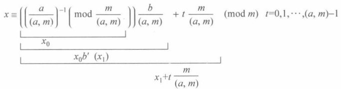
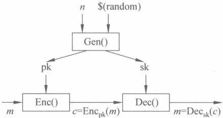
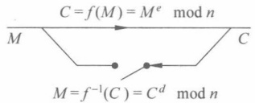

### 第3章

### 同 余 式

第2章引入了同余的概念，本章介绍在模 m 情况下同余式的求解。首先介绍一次同余式的求解，再介绍一次同余式组的求解。

本章的重点是中国剩余定理及其在 RSA 中的应用，难点是模重复平方法。

### 3.1 一次同余式

### 3.1.1 一次同余式的求解

定义 3.1 设 m 是一个正整数， $f(x)$ 为多项式且

$$
f(x)=a_{n}x^{n}+\cdots+a_{1}x+a_{0}
$$

其中  $a_{i}$ 是整数，则

$$
f(x)\equiv0(\bmod m)
$$

称作模 m 同余式。若  $a^n \not\equiv 0 \pmod{m}$，则  $n$ 叫作  $f(x)$ 的次数，记为  $\deg f$。此时叫作模  $m$ 的  $n$ 次同余式。

如果整数 a 使得

$$
f(a)\equiv0(\bmod m)
$$

成立，则 a 叫作同余式的解。

事实上，满足  $x \equiv a \pmod{m}$ 的所有整数都使得该同余式成立。因此，在讨论同余方程的解时，以一个剩余类作为一个解。在模 m 的完全剩余系中，使得同余式成立的剩余的个数叫作同余式的解数。

下面首先考虑一次同余式的求解。

定理 3.1 一次同余方程  $ax \equiv b \pmod{m}$ 有解的充要条件是  $(a, m) \mid b$，且当其有解时，其解数为  $(a, m)$。

在证明之前，回顾定理1.8及其推论1.1，若同余方程有解，即b可以由a，m线性表出，于是 $(a,m)|b$。

证明 先证明必要性。设同余方程  $ax \equiv b \pmod{m}$ 有解，解为  $x_{0}$，则存在整数 k，使得

$$
a x_{0}=k m+b
$$

即

$$
b=a x_{0}-k m
$$

由于 $(a,m)|a,(a,m)|m$，因此

$$
(a,m)\mid ax_{0}-km=b
$$

再证明充分性。

设  $a^{\prime} = \frac{a}{(a, m)}$,  $m^{\prime} = \frac{m}{(a, m)}$,  $b^{\prime} = \frac{b}{(a, m)}$，易知， $a^{\prime}, m^{\prime}, b^{\prime}$ 均为整数。

首先考虑同余方程

$$
a^{\prime}x\equiv1(mod m^{\prime})
$$

因为  $\gcd(a^{\prime}, m^{\prime}) = 1$，可知  $a^{\prime}$ 存在模  $m^{\prime}$ 的乘法逆元  $x_0$（见定义 2.3）。满足  $a^{\prime} x_0 \equiv 1$（mod  $m^{\prime}$），且在模  $m^{\prime}$ 下，逆元是唯一的，即同余方程  $a^{\prime} x \equiv 1 \pmod{m^{\prime}}$ 存在唯一解

$$
x\equiv x_{0}(\bmod m^{\prime})
$$

因此，易知同余方程

$$
a^{\prime}x\equiv b^{\prime}(mod m^{\prime})
$$

也存在唯一解

$$
x\equiv x_{1}\equiv x_{0}b^{\prime}(\bmod m^{\prime})
$$

下面证明这个解也是  $ax \equiv b \pmod{m}$ 的特解。

不妨设  $x = k_1 m^{\prime} + x_0 b^{\prime}$， $k_1 \in \mathbb{Z}$

$$
a x=a k_{1}m^{\prime}+s\quad\frac{b}{q}=a^{\prime}k_{1}m+a^{\prime}x_{0}b
$$

由于  $a^{\prime}x_0 \equiv 1 \pmod{m^{\prime}}$，不妨设  $a^{\prime}x_0 = k_2m^{\prime} + 1, k_2 \in \mathbb{Z}$

$$
\begin{aligned}a^{\prime}x_{0}b&=(k_{2}m^{\prime}+1)b=k_{2}m^{\prime}b+b=k_{2}\frac{m}{(a,m)}b+b=k_{2}mb^{\prime}+b\\&\equiv b(mod m)\end{aligned}
$$

最后， $ax \equiv b \pmod{m}$ 的全部解为

$$
x\equiv x_{1}+t\frac{m}{(a,m)}\pmod{m}\quad t=0,1,\cdots,(a,m)-1
$$

其原因是：如果同时有同余式

$$
ax\equiv b(\bmod m),\quad ax_{1}\equiv b(\bmod m)
$$

成立，两式相减得到

这等价于

$$
x\equiv x_{1}\left(\bmod\frac{m}{(a,m)}\right)
$$

因此，x 只要与  $x_{1}$ 关于  $\frac{m}{(a,m)}$ 同余，即为  $ax \equiv b \pmod{m}$ 的解。

定理 3.1 的证明过程其实给出了一次同余式求解的过程。

定理 3.2 设 m 是一个正整数，a 是满足  $(a, m) \mid b$ 的整数，则一次同余式

$$
a x\equiv b(\bmod m)
$$

的全部解为

$$
x\equiv\left(\left(\frac{a}{(a,m)}\right)^{-1}\left(\bmod\frac{m}{(a,m)}\right)\right)\frac{b}{(a,m)}+t\frac{m}{(a,m)}\pmod m\quad t=0,1,\cdots,(a,m)-1
$$

定理3.2其实给出了一次同余式“根与系数的关系”。定理3.2是定理3.1的充分性证明过程的结果，图3.1给出了解的3个部分与定理3.1的对应关系。为便于记忆，这里将这3个部分简称为“模系收缩求逆元”“逆元扩大求特解”“t变模扩求全解”。“模系收缩”的目的是使得“系数a”和“模m”之间互素，从而可以求“系数a的逆元”。有了“逆元”之后就可以扩大“ $b^{\prime}=\frac{b}{(a,m)}$”求出特解。最后再由特解求全解。

图 3.1 一次同余式“根与系数的关系”示意图
 

由定理3.2可以给出一个求解一次同余式的算法。

例 3.1 求解同余方程  ${6}x \equiv 5 \pmod{8}$。

解答（6,8）∣5，由定理3.1知，同余方程无解。

例 3.2 求解同余方程  ${3}x \equiv 5 \pmod{8}$。

解答（3,8）|5，所以同余方程有解。

先解同余方程  ${3}x \equiv 1 \pmod{8}$，此方程解唯一，易知其解为  $x \equiv 3 \pmod{8}$，则同余方程

$$
3x\equiv5\pmod{8}
$$

也存在唯一解

$$
x\equiv3\cdot5\equiv7(mod8)
$$

即为原方程的解。

例 3.3 求解同余方程  ${6}x \equiv 2 \pmod{8}$。

解答 先判断(6,8) | 2, 所以同余方程有解。

先解同余方程  ${3}x \equiv 1 \pmod{4}$，此方程解唯一，易知其解为

$$
x\equiv3(mod4)
$$

取 $x_{1}=3$，则

$$
x=x_{1}+\frac{8}{2}t=3+4t,\quad(t=0,1)\ (\bmod\ 8)
$$

为原方程的解。原方程的所有解为

$$
x\equiv3\pmod{8}
$$

$$
x\equiv3+4\equiv7(mod8)
$$

例 3.4 求解同余方程  ${6}x \equiv 4 \pmod{8}$。

解答 先判断（6,8）|4，所以同余方程有解。

先解同余方程  ${3}x \equiv 1 \pmod{4}$，此方程解唯一，易知其解为

$$
x\equiv3(\bmod4)
$$

同余方程

$$
3x\equiv2\pmod{4}
$$

也存在唯一解

$$
x\equiv x_{1}\equiv2\cdot3\equiv2(mod4)
$$

取 $x_{1}=2$，则

$$
x=x_{1}+\frac{8}{2}t=2+4t\quad(t=0,1)(\bmod8)
$$

为原方程的解。原方程的所有解为

$$
x\equiv2\pmod{8}
$$

$$
x\equiv6\pmod{8}
$$

### 3.1.2 一次同余式在仿射加密中的应用

仿射密码是一种古典密码，其算法设计时用到的数学基础是模运算和同余方程。上一章曾经介绍过移位密码，由于移位密码的密钥量太小，且移位密码在加密代换后字母的先后次序其实没有改变。仿射密码可以改进上述两个弱点。

定义明文空间  $P = \mathbb{Z}_{26}$、密文空间  $C = \mathbb{Z}_{26}$、密钥空间为

$$
K=\left\{(a,b)\in\mathbf{Z}_{26}\cdot\mathbf{Z}_{26}:\gcd(a,26)=1\right\}
$$

对于

$$
x\in P,y\in C,k=(a,b)\in K
$$

定义加密函数

$$
e_{k}(x)=ax+b\bmod{26}
$$

定义解密函数

$$
d_{k}(y)=a^{-1}(y-b)\bmod26
$$

例 3.5 利用仿射加密, a=3, b=5, 模为 26。

解答 易知，加密函数为  $e(x)=3x+5$ (mod 26)。

加密明文 hello，其在  $Z_{26}$ 表示为 7, 4, 11, 11, 14。

加密密文用  $Z_{26}$，表示为 0，17，12，12，21，即密文为 armmv。

思考3.1 仿射密码中 a 是否有要求。

根据定理 3.1，这里要求  $(a,26)=1$；否则，加密函数就不是一个单射函数。

例如，当  $k=(6,1)$ 时， $(a,26)=(6,26)=2$ 时，对  $x\in\mathbb{Z}_{26}$，有

$$
6(x+13)+1=6x+1\bmod26
$$

于是 x, x+13 都是 6x+1 的明文。

思考3.2 证明(a,26)=1时，仿射密码的解唯一。

证明 设存在  $x_1, x_2 \in \mathbb{Z}_{26}$，使得  $e_k(x) = ax_1 + b = ax_2 + b \mod 26$，于是  $ax_1 = ax_2$

mod 26, 有  ${26}|a(x_1-x_2)$，又因为  $(a,26)=1$，所以  ${26}|(x_1-x_2)$，由于  $x_1,x_2\in\mathbb{Z}_{26}$，得到  $x_1=x_2$。

思考3.3 仿射密码的密钥空间大小，即密钥的数量有多少。

a 的可能性为 12，因为  $a \in \mathbb{Z}_{26}$， $\gcd(a, 26) = 1$，即

$$
a=\varphi(26)=\varphi(2\cdot13)=\varphi(2)\cdot\varphi(13)=1\cdot12=12
$$

 $b \in \mathbb{Z}_{26}$, b 的可能性为 26。

故整个密钥空间大小为  ${12} \times 26 = 312$。

如果密钥空间太小，容易导致穷举所有可能的密钥，然后看能否解密密文的攻击。另外，当a=1时，仿射密码就退化为移位密码。

#### 中国剩余定理

在研究了一次同余式之后，下面考虑一次同余式组。

中国剩余定理（Chinese remainder theorem，CRT），又称孙子定理，最早见于公元5—6世纪，我国南北朝的一部经典数学著作《孙子算经》中的“物不知数”问题：

“今有物不知其数，三三数之剩二，五五数之剩三，七七数之剩二，问物几何？”

这其实是求解一个一次同余方程式组，即

$$
\left\{\begin{array}{l}x\equiv2\bmod{3}\\ x\equiv3\bmod{5}\\ x\equiv2\bmod{7}\end{array}\right.
$$

《孙子算经》中给出了解法，但这只是一个孤立的例子。南宋数学家秦九韶创立的“大衍求一术”一般性地解决了一次同余方程组的求解问题，中国古代这一成果统称为“孙子定理”，在外国文献中常被称为“中国剩余定理”。它可能是最著名的由中国人给出的算法。

在给出 CRT 算法之前，先给出一个逐步尝试（或局部调整）的算法体会一下，可以得到结果，但其时间效率不高。方法是：在模 3 余 2 的数最小为 5，不断增加 3，保持模 3 余 2，使其能够模 5 余 3，刚好是  ${5}+3=8$，然后在保持模 2 余 3 和模 5 余 3 的情况下，不断增加 15（即不改变模 3 和模 5 的余数），使得模 7 余 2，刚好是  ${8}+15=23$。

在给出正式的算法之前，请先思考以下同余式组，即

$$
\left\{\begin{aligned}x&\equiv2\bmod{3}\\ x&\equiv2\bmod{5}\\ x&\equiv2\bmod{7}\end{aligned}\right.,
$$

容易知道，这个容易解决，即  $x \equiv 2 \pmod{105}$，于是  $x = 3 \cdot 5 \cdot 7K + 2, K \in \mathbb{Z}$。问题是，如果余数不再相等，则问题就有点麻烦了，再来看同余式组，即

$$
\left\{\begin{array}{l}x\equiv2\bmod{3}\\ x\equiv3\bmod{5}\\ x\equiv4\bmod{7}\end{array}\right.
$$

设法从  ${3}K_1 + 2,5K_2 + 3,7K_3 + 4(K_1, K_2, K_3 \in \mathbb{Z})$ 中找到同一个数看上去是不容易的。也就是说，找到一个数同时满足这 3 个条件是不容易的。于是，能否换个思路，即能否把  $x$“想象”成由 3 个部分组成。为便于对 CRT 求解过程的理解，下面专门给出一个特别的表述和解释。

写成 3 个部分的好处是：每个部分的条件将“更容易”满足。

令  $x=A+B+C$，若 A, B, C 满足以下条件，则为解。这里  $[a]_{m}$ 表示模 m 与 a 同余。

$$
\boldsymbol{A}=\left[2\right]_{3},\boldsymbol{B}=\left[0\right]_{3},\boldsymbol{C}=\left[0\right]_{3}
$$

$$
\boldsymbol{A}=\left[0\right]_{5},\boldsymbol{B}=\left[3\right]_{5},\boldsymbol{C}=\left[0\right]_{5}
$$

$$
\boldsymbol{A}=[0]_{7},\boldsymbol{B}=[0]_{7},\boldsymbol{C}=[2]_{7}
$$

看最左边一列，A为 ${5}\cdot7$的倍数，且模3余2，这样A就比较容易求解了。A可用以下方法计算。

 $A=(5\cdot7)\cdot(5\cdot7)^{-1}\cdot2$。因为这个表达式中有 $(5\cdot7)$，因此是5和7的倍数。同时这个表达式模3余2。原因是： $(5\cdot7)=35$。 $(5\cdot7)^{-1}$表示 $(5\cdot7)$模3的逆元。35模3的逆元是2。两者相乘必然模3余1。因此，再乘以2后必然模3余2。即 $A=35\cdot2\cdot2=140$模3余2，且为5和7的倍数。

同理，B为 ${3}\cdot7$的倍数，且模5余3，于是，可用以下方法计算： $B=(3\cdot7)\cdot(3\cdot7)^{-1}\cdot3$，这里 $(3\cdot7)^{-1}$表示 $(3\cdot7)$模5的逆元。 ${3}\cdot7=21$，21模5的逆元是1。因此， $B=21\cdot1\cdot3=63$。

同理，C为 ${3}\cdot5$的倍数，且模7余2，于是，可用以下方法计算： $C=(3\cdot5)\cdot(3\cdot5)^{-1}\cdot2$，这里 $(3\cdot5)^{-1}$表示 $(3\cdot5)$模7的逆元。 ${3}\cdot5=15$，15模7的逆元是1。因此， $C=15\cdot1\cdot2=30$。

于是  $x=A+B+C=140+63+30=233$ 。又 233 mod 105=23。因此，所有解为  ${105}K+23$ 。

在程大位著的《算法统要》（1593年），用4句诗给出了上述解答过程的中几个关键数字：

$$
\begin{aligned}& 三人同行古来稀 , 五数梅花廿一枝；\\& 七子团圆正月半 , 除百零五便得之。\end{aligned}
$$

这几个关键的数字是：与模3对应的是70（“古来稀”），即 ${35}\cdot2$；与模5对应的是21（“廿一枝”），即 ${21}\cdot1$；与模7对应的是 ${15}\cdot1=15$（“正月半”）。有了这三个关键数字，只要给出x模3，5，7的余数 $a_{1},a_{2},a_{3}$，即可以计算出结果 $x=a_{1}\cdot70+a_{2}\cdot21+a_{3}\cdot15$（mod105）。结果除去 ${105}=3\cdot5\cdot7$的倍数（“除百零五”）即可以得到答案。

一般地，如果  $m_{1}, m_{2}, m_{3}$ 是两两互素的正整数，对于同余方程组

$$
\left\{\begin{aligned}x&\equiv a_{1}\bmod m_{1}\\ x&\equiv a_{2}\bmod m_{2}\\ x&\equiv a_{3}\bmod m_{3}\end{aligned}\right.
$$

令  $m = \prod_{i=1}^{3} m_{i}$， $M_{i} = m/m_{i}$，则解为

$$
x\equiv\sum_{i=1}^{3}M_{i}\cdot M_{i}^{-1}\cdot a_{i}(\bmod m)
$$

当然，上述解法可以推广到一般情况。

例 3.6 韩信点兵问题：有兵一队，若列成五行纵队，则末行一人，若列成六行纵队，则末行五人；若列成七行纵队，则末行四人；若列成十一行纵队，则末行十人。求兵数。

解答 转化为同余式组

$$
\left\{\begin{aligned}x&\equiv1\bmod5\\ x&\equiv5\bmod6\\ x&\equiv4\bmod7\\ x&\equiv10\bmod11\end{aligned}\right.
$$

应用 CRT,  $m=5\cdot6\cdot7\cdot11=2310$

$$
M_{1}=2310/5=462,M_{1}^{-1}\equiv3(mod5)
$$

$$
M_{2}=2310/6=385,M_{2}^{-1}\equiv1(mod6)
$$

$$
M_{3}=2310/7=330,M_{3}^{-1}\equiv1(mod7)
$$

$$
M_{4}=2310/11=210,M_{4}^{-1}\equiv1(mod11)
$$

$$
\begin{aligned}x&\equiv462\cdot3\cdot1+385\cdot1\cdot5+330\cdot1\cdot4+210\cdot1\cdot10\\ &\equiv6731\equiv2111(mod2310)\end{aligned}
$$

下面给出 CRT 的严格证明。

定理3.3（中国剩余定理）设 $m_{1},m_{2},\cdots,m_{k}$ 是k个两两互素的正整数，令 $m=\prod_{i=1}^{k}m_{i}$， $M_{i}=m/m_{i}(i=1,2,\cdots,k)$，则对任意的整数 $a_{1},a_{2},\cdots,a_{k}$，同余式组

$$
\left\{\begin{aligned}x&\equiv a_{1}\bmod m_{1}\\ x&\equiv a_{2}\bmod m_{2}\\ \vdots&&\\ x&\equiv a_{k}\bmod m_{k}\end{aligned}\right.
$$

有唯一解，即

$$
x\equiv\sum_{i=1}^{k}M_{i}\cdot M_{i}^{-1}\cdot a_{i}(\bmod m)
$$

其中：

$$
M_{i} M_{i}^{-1}\equiv1(\bmod m_{i})
$$

证明 由于 $(m_{i},m_{j})=1,i\neq j$，即得 $(M_{i},m_{i})=1$，由定义2.3和定理2.8知，对每一个 $M_{i}$，有一个 $M_{i}^{-1}$存在，使得 $M_{i}M_{i}^{-1}\equiv1(\bmod m_{i})$。另外，由于 $m=m_{i}M_{i}$，因此， $m_{j}|M_{i}$， $i\neq j$，故

$$
\sum_{i=1}^{k}M_{i}\cdot M_{i}^{-1}\cdot a_{i}\equiv M_{i}\cdot M_{i}^{-1}\cdot a_{i}\equiv a_{i}(\bmod m_{i})\quad i=1,2,\cdots,k
$$

即式 $（3.1）$为式 $（3.2）$的解。

若  $x_{1}, x_{2}$ 是满足式(3.2)的任意两个整数，则  $x_{1} \equiv x_{2} (\bmod m_{i}) (i = 1, 2, \cdots, k)$，因为  $(m_{i}, m_{j}) = 1, i \neq j$，于是  $x_{1} \equiv x_{2} (\bmod m)$，故式(3.1)仅有解式(3.2)。

根据 CRT，可以给出一个求解一次同余式组的算法。

### 3.3 同余式的应用

### 3.3.1 RSA 公钥密码系统

一个公钥密码系统的示意如图3.2所示，具体的描述如下。

图 3.2 公钥加密体制的示意图
 

定义 3.2 一个公钥加密体制是这样的一个 6 元组  $(M, C, K, \mathrm{Gen}(), \mathrm{Enc}_{\mathrm{pk}}(),$  $\mathrm{Dec}_{\mathrm{sk}}())$，满足以下条件。

（1）M 是可能消息的集合。

（2）C 是可能密文的集合。

（3）密钥空间 K 是一个可能密钥的有限集。

（4）密钥生成算法 Gen()：输入安全参数，输出公钥 pk 和私钥 sk。

（5）加密算法 Enc_{pk}()：根据输入的公钥 pk 和明文 m，输出密文 c=Enc_{pk}(m)。

（6）解密算法  $\mathrm{Dec}_{\mathrm{sk}}$（）：根据输入的私钥 sk 和密文 c，输出明文  $m = \mathrm{Dec}_{\mathrm{sk}}(c)$。

注解：

（1）与对称加密体制的一个最大不同是，加密密钥和解密密钥是不同的，且加密密钥可以公开，解密密钥需要保密。

（2）密钥生成算法在对称加密体制中是没有的（或者说是平凡的），而在公钥密码体制中却是不平凡的。密钥生成算法可能是随机生成的密钥。

（3）随机性。加密算法可能是随机的，即在算法中可以使用一个随机数，输出的密文与该随机数有关，这种算法叫作概率加密（如5.4节的ElGamal加密）。

（4）确定性。解密算法一定是确定的。

（5）安全性（单向性）。在已知密文 c 和公钥 pk 的情况下，推出明文 m 在计算上是不可行的。对于任意的  $k \in K$，在已知  $\text{Enc}_{\text{pk}}$（）的情况下推出  $\text{Dec}_{\text{sk}}$（）是计算不可行的。对于任意的  $k \in K$，在已知 pk 的情况下，推出 sk 是计算不可行的。

（6）有效性（实用性）。公钥和私钥的产生，即密钥生成是容易的。即 Gen()是多项式时间内可计算的。已知公钥pk和明文m，计算密文 $c=Enc_{pk}(m)$也是多项式时间可计

算的。

(7) 一致性。对每一个  $k=(\text{pk}, \text{sk}) \in K$，都对应一个加密算法  $\text{Enc}_{\text{pk}}: M \to C$ 和解密算法  $\text{Dec}_{\text{sk}}(): C \to M$，满足对于任意的  $m \in M$，若  $c = \text{Enc}_{\text{pk}}(m)$，则  $\text{Dec}_{\text{sk}}(c) = m$。

（8）陷门性。若已知私钥 sk，存在多项式时间算法可以由密文 c 计算出明文 m，满足  $c = \mathrm{Enc}_{pk}(m)$，其中私钥 sk 称为陷门信息（trapdoor information）。

1977年MIT的Ronald L. Rivest、Adi Shamir、Leonard Adleman在MIT的技术报告中提出RSA方案，正式发表于1978年的Communications of ACM。 $^{①}$

RSA 利用了单向陷门函数的原理，其示意图如图 3.3 所示，陷门信息是解密密钥即私钥 d（与之类似的陷门是 n 的分解，因为如果知道 n 的分解 p 和 q，就可以从公钥求出私钥 d）。

图 3.3 RSA 利用单向陷门函数的原理示意图
 

RSA 公钥密码方案描述如下。

（1）密钥生成：

① 选取两个大素数 p 和 q（如长度都接近 512bit）。

②计算乘积 $n=p\cdot q,\varphi(n)=(p-1)(q-1)$，其中 $\varphi(n)$为n的欧拉函数。

③随机选择整数  $e(1<e<\varphi(n))$，要求满足  $\gcd(e,\varphi(n))=1$，即 e 与  $\varphi(n)$ 互素。

④用扩展的 Euclidean 算法计算私钥 d，以满足  $d \cdot e \equiv 1 \bmod (\varphi(n))$，即  $d \equiv e^{-1} \bmod (\varphi(n))$。

公钥为 e 和 n, d 是私钥（两个素数 p 和 q，可销毁，不能泄露）。

（2）加密过程：

明文先转换为比特串分组，使每个分组对应的十进制数小于 n，即分组长度小于  $\log_{2}n$，然后对每个明文分组  $m_{i}$ 作加密运算，具体过程如下。

① 获得接收公钥 $(e,n)$。

② 把消息 M 分组长度为  $(L < \log_{2} n)$ 的消息分组  $M = m_{1} m_{2} \cdots m_{t}$。

③ 使用加密算法  $c_{i}=m_{i}^{e} \bmod n (1 \leqslant i \leqslant t)$，计算出密文  $c=c_{1}c_{2} \cdots c_{t}$

（3）解密过程：

① 将密文 c 按长度 L 分组得  $c = c_{1}c_{2}\cdots c_{t}$

② 使用私钥 d 和解密算法  $m_{i}=c_{i}^{d} \bmod n (1 \leqslant i \leqslant t)$ 计算  $m_{i}$

③ 得明文消息  $M=m_{1}m_{2}\cdots m_{t}$。

解密算法的正确性证明如下。

$$
c_{i}^{d}\bmod n\equiv m_{i}^{e d}\bmod n\equiv m_{i}^{k\varphi(n)+1}\bmod n
$$

分以下两种情况讨论。

(1)  $\gcd(m_{i}, n)=1$。由Euler定理，得

$$
m_{i}^{\varphi(n)}\equiv1\bmod n,m_{i}^{k\varphi(n)}\equiv1\bmod n,m_{i}^{k\varphi(n)+1}\equiv m_{i}\bmod n
$$

于是  $c_{i}^{d} \bmod n \equiv m_{i} \bmod n$。

(2)  $\gcd(m_i, n) \neq 1$。由于  $n = p \cdot q$,  $\gcd(m_i, n) | n$, 所以  $\gcd(m_i, n) = p$

不妨设  $\gcd(n,m_{i})=p,p\mid m_{i}$，令  $m_{i}=sp,1\leqslant s<q$。

①  $\gcd(m_{i}, q) = 1$，由 Fermat 定理可得  $m_{i}^{q-1} \equiv 1 \bmod q$，于是  $(m_{i}^{q-1})^{k(p-1)} \equiv 1 \bmod q$，即  $m_{i}^{kq(n)} \equiv 1 \bmod q$。

②另外，由 $p|m_{i}$，得 $m_{i}^{ed}\equiv0\equiv m_{i}\bmod p$，故 $m_{i}^{ed}\equiv m_{i}\bmod p$。

由①、②，且  $\gcd(p,q)=1$；由中国剩余定理， $m_{i}^{ed} \equiv m_{i} \bmod n$，于是， $c_{i}^{d} \bmod n \equiv m_{i} \bmod n$。

综合(1)和(2)，有  $c_{i}^{d} \bmod n \equiv m_{i} \bmod n$。又  $m_{i} < n$，故  $m_{i} \bmod n = m_{i}$。

例 3.7 取 p=11, q=13, 那么  $n=p \cdot q=11 \cdot 13 = 143$,  $\varphi(n)=(p-1)(q-1)=120$, 选取 e=17, 满足  $\gcd(e, \varphi(n)) = \gcd(17, 120) = 1$.

使用扩展的 Euclid 算法计算  $d=e^{-1}=113 \bmod 120$，所以公钥为  $(n,e)=(143,17)$，私钥为 d=113。

假设对明文  $m=24$ 进行加密，密文为  $c \equiv m^e \equiv 24^{17} \equiv 7 \mod 143$。密文  $c=7$ 经公开信道发送到接收方后，接收方用私钥  $d=113$ 对密文解密： $m \equiv c^d \equiv 7^{113} \equiv 24 \mod 143$，从而恢复明文。

### 3.3.2 CRT 在 RSA 中的应用

# 1. 利用 CRT 进行运算加速

解密者在计算  $m=c^{d}(\bmod n)$ 的过程中，可以分别计算  $m=c^{d}(\bmod p)$ 和  $m=c^{d}(\bmod q)$。然后利用 CRT 计算出 m。

例 3.8 计算  ${312}^{13}$ (mod 667)。

解答 令  $x=312^{13}$ 解密者知道 667=23·29，所以计算等价于求解同余式组

$$
\begin{cases}x\equiv a_{1}\bmod{23}\\x\equiv a_{2}\bmod{29}\end{cases}
$$

$$
a_{1}=312^{13}\pmod{23}=8,\quad a_{2}=312^{13}\pmod{29}
$$

$$
M_{1}=29,M_{1}^{-1}=4(mod23),M_{2}=23,M_{2}^{-1}=-5(mod29)。
$$

$$
x\equiv4\cdot29\cdot8+(-5)\cdot23\cdot4=468(mod667)
$$

思考3.4 为什么CRT只能对解密加速，不能对加密加速。

解密需要知道 n 的分解，即需要知道 p, q，有 n = pq。只有解密者知道 p, q。

另外，因为解密可以加速，并且加密的速度对用户体验的影响可能更大，所以很多情形下RSA加密密钥e较解密密钥d小。

# 2. 利用 CRT 进行低加密指数攻击

如果加密密钥中加密指数 e 很小，如 e=3，设明文为 m，密文  $c \equiv m^{3} \bmod n$，如果 m 较小，则 c 有可能小于 n，则  $\bmod n$ 操作未起作用，故可对 c 直接开 3 次方得到 m。如果 m 较大， $\bmod n$ 操作起了作用，虽然不能直接开方，仍然有可能得到 m。假设有 3 个用户接收 m，模数分别为  $n_{1}, n_{2}, n_{3}$。设明文为 m，密文分别是

$$
c_{1}\equiv m^{3}\bmod{n_{1}}
$$

$$
c_{2}\equiv m^{3}\bmod{n_{2}}
$$

$$
c_{3}\equiv m^{3}\bmod{n_{3}}
$$

一般地， $\gcd(n_i, n_j) = 1, i \neq j, i, j \in \{1, 2, 3\}$；否则可通过  $\gcd(n_i, n_j)$ 得到  $n_i, n_j$ 的分解（从而泄露了  $p, q$），于是由中国剩余定理，可从三个密文同余式求出  $m^3 \bmod n_1 n_2 n_3$。由于此时  ${0} < m^3 \leqslant n_1 n_2 n_3$，可直接对  $m^3$ 开立方得到  $m$。

推而广之，若加密指数为 e，则得到相同明文的 e 个密文即可由该攻击方法恢复出明文。因此，同一消息加密后发送给多个实体时（若此时的加密指数相同），不要使用小的加密指数。

### 3.3.3 模重复平方算法

RSA 加密和解密时都需要计算模幂。平凡的求模幂方法在幂指数较大时耗时非常大。因此，寻求快速求模幂的算法对于 RSA 的加密解密效率至关重要。模重复平方（也称为平方乘）算法可以加快计算模幂的速度。下面介绍该算法。

要计算  $c = m^{e} \bmod n$，不妨设 e 的二进制表示为

$$
\begin{aligned}\boldsymbol{e}=&\boldsymbol{e}_{k-1}2^{k-1}+\boldsymbol{e}_{k-2}2^{k-2}+\cdots+\boldsymbol{e}_{1}2^{1}+\boldsymbol{e}_{0}\\=&2(2(\cdots(2(2(\boldsymbol{e}_{k-1})+\boldsymbol{e}_{k-2})+\cdots)+\boldsymbol{e}_{1})+\boldsymbol{e}_{0}\end{aligned}
$$

于是

$$
\begin{aligned}c&\equiv m^{e}\bmod n\\&\equiv m^{e_{k-1}2^{k-1}+e_{k-2}2^{k-2}+\cdots+e_{1}2^{1}+e_{0}}\bmod n\\&\equiv((\cdots\underbrace{(m^{e_{k-1}})^{2}}_{}\underbrace{m^{e_{k-2}})^{2}}_{})\cdots m^{e_{2}})^{2}m^{e_{1}})^{2}m^{e_{0}}\bmod n\end{aligned}
$$

从表达式可以看到，如果  $e_{i}=1$，则当前结果与 m 的乘积需要再平方，并且反复进行，因而称为”模重复平方法”。

思考3.5  $e=9,13,m^{e}\bmod n$ 如何计算。

$$
\begin{aligned}m^{9}&=m^{(1001)_{2}}&m^{13}&=m^{(1101)_{2}}\\ &=m^{1\cdot2^{3}+0\cdot2^{2}+0\cdot2^{1}+1}=m^{1\cdot2^{3}+1\cdot2^{2}+0\cdot2^{1}+1}\\ &=((m^{1\cdot2^{3}})m^{0\cdot2^{2}})m^{0\cdot2^{1}})m^{1}=((m^{1\cdot2^{3}})m^{1\cdot2^{2}})m^{0\cdot2^{1}})m^{1}\\ &=((m^{1})^{2}m^{0})^{2}m^{0})^{2}m^{1}=((m^{1})^{2}m^{1})^{2}m^{0})^{2}m^{1}\\ \end{aligned}
$$

根据这一表达式，可以设计计算模幂的快速算法。

算法 3.1 模重复平方（平方乘）算法，计算 c，这里  $c=m^{e} \bmod n$。

输入：m，幂次e，模n。

输出：模幂的结果c。

Square-and-Multiply(m,e,n)
{
    c=1;
    for i=k-1 to 0
    {
        c=c² mod n;
        If (e_i == 1) c ← c · m mod n;
    }
    Return c
}

可以看到，在算法中，当 i=k-1 时，即首次进入循环时，总满足条件  $e_{k-1}=1, c=1 \cdot m \bmod n$。然后，每次进入循环后先平方，从 e 的高位向低位考察，若该位为 1，则乘上 m；否则不乘。最后一次进入循环，i=0 时，若  $e_0=1$，则乘上 m；否则不乘。

例 3.9 计算  ${9726}^{3533}$ mod 11413。

解答  ${3533} = (110111001101)_{2}, m = 9726$，表3.1给出了计算过程。

表3.1 模重复平方法的计算过程
 

| i | $e_i$ | c |
| --- | --- | --- |
| 11 | 1 | ${1}^{2} \times 9726 = 9726$ (mod 11413) |
| 10 | 1 | ${9726}^{2} \times 9726 = 2659$ (mod 11413) |
| 9 | 0 | ${2659}^{2} = 5634$ (mod 11413) |
| 8 | 1 | ${5634}^{2} \times 9726 = 9167$ (mod 11413) |
| 7 | 1 | ${9167}^{2} \times 9726 = 4958$ (mod 11413) |
| 6 | 1 | ${4958}^{2} \times 9726 = 7783$ (mod 11413) |
| 5 | 0 | ${7783}^{2} = 6298$ (mod 11413) |
| 4 | 0 | ${6298}^{2} = 4629$ (mod 11413) |
| 3 | 1 | ${4629}^{2} \times 9726 = 10185$ (mod 11413) |
| 2 | 1 | ${10185}^{2} \times 9726 = 105$ (mod 11413) |
| 1 | 0 | ${105}^{2} = 11025$ (mod 11413) |
| 0 | 1 | ${11025}^{2} \times 9726 = 5761$ (mod 11413) |

思考3.6 计算过程中有几次平方？几次乘法？

模平方运算有 12 次，模乘法运算有 8 次。平均而言，有  $\log_{2}e$ 次模平方运算和约  ${0.5}\log_{2}e$ 次，模平方和模乘法均视为模乘法运算，则总计算次数约为  ${1.5}\log_{2}e$ 次模乘法，

最多不超过  ${2}\log_{2}e$ 次模乘法运算。

算法的效率决定了 RSA 加密和解密是否实用。下面给出一个较严格的算法分析。首先来看几个基本模运算的效率，即在  $Z_{n}$ 中的运算，假定 n 为一个 l 比特的整数 ( $l = \log_{2}n$)， ${0} \leq m_{1}, m_{2} \leq n-1$。设 c 为一个正整数，结果如表 3.2 所示。

表3.2 基本模运算的时间复杂度
 

| 运 算 | 时间复杂度 | 运 算 | 时间复杂度 |
| --- | --- | --- | --- |
| $(m_{1}+m_{2})\bmod n$ | $O(l)$ | $(m_{1}m_{2})\bmod n$ | $O(l^{2})$ |
| $(m_{1}-m_{2})\bmod n$ | $O(l)$ | $(m_{1})^{-1}\bmod n$ | $O(l^{2})$ |

下面分析模重复平方算法(算法3.1)的效率，有 k 次循环(即指数 e 的二进制位数)，每次循环中总要执行一次平方运算(视为模乘)，或者加上一次的模乘，故一次循环执行两次模乘或一次模乘。k 次循环最多 2k 次模乘。根据表3.2所示模乘的时间复杂度为  $O(l^{2})$，l 为模 n 的长度(即  $l=\log_{2}n$)，故总时间复杂度为  $O(kl^{2})$。另外，通常 e<n，故 k<l，于是时间复杂度为  $O(l^{3})=O((\log_{2}n)^{3})$。因此，RSA 的加密(或解密)都是在关于明文(或密文)的比特长度的多项式内完成。

另外，由于模重复平方算法的循环中模乘的次数等于加密密钥 e 的二进制表示中“1”的个数，故选择二进制表示中“1”较少的那种加密密钥 e 将会加快 RSA 加密的速度。例如， $e=2^{16}+1$，循环中只有 2 次模乘。

#### 思考题

[1] 求解同余方程：

(1)

$$
17x\equiv14(\bmod{21})
$$

$$
\text{2)}\ 128x\equiv833\pmod{1001}
$$

(3)

$$
24x\equiv42(\bmod{30})
$$

$$
\text{4)}\ 57x\equiv87\pmod{105}
$$

（5）

$$
90x\equiv21(\bmod{429})
$$

$$
(6)987x\equiv610(\bmod1597)
$$

[2] 求解  ${2}^{x} \equiv x^{2} (\mod 3)$.

[3] 写出一般 $(k,b)\left((k,26)=1\right)$的仿射密码加密解密公式，并对明文 cipher 进行加密解密。

[4] 编写程序实现对明文 cipher 的 k=7, b=6 的仿射加密和解密。

[5] 计算  ${2}^{1000000}$ (mod 1309)（提示：CRT+Euler 定理）。

[6] 求解同余方程组：

(1)

$$
\left\{\begin{aligned}x&\equiv1(\bmod4)\\ x&\equiv2(\bmod3)\\ x&\equiv3(\bmod5)\end{aligned}\right.
$$

（2）

$$
\left\{\begin{array}{l}3x\equiv1(mod11)\\ 5x\equiv7(mod13)\end{array}\right.
$$

（3）

$$
\left\{\begin{aligned}x&\equiv2(\bmod5)\\ x&\equiv1(\bmod6)\\ x&\equiv3(\bmod7)\\ x&\equiv0(\bmod11)\end{aligned}\right.
$$

（4）

$$
\left\{\begin{array}{l}21x\equiv35(mod37)\\ 19x\equiv15(mod29)\\ 13x\equiv25(mod63)\\ 23x\equiv31(mod87)\end{array}\right.
$$

[7] 编写程序实现中国剩余定理(CRT)，以韩信点兵为例（韩信带1500名兵士打仗，战死400～500人，站3人一排，多出2人；站5人一排，多出4人；站7人一排，多出6人。韩信马上说出人数为1049。

[8] 写出计算  ${2}^{32}(\mod 47)$， ${2}^{43}(\mod 71)$ 的过程，并编写模重复平方法程序，输入为 x, n, m，输出为  $x^{n}(\mod m)$。利用该程序对手动计算的结果进行验证。

[9] RSA 加密公钥为 e=53, n=31×37，计算私钥，计算明文 m=(1101) $_{2}$=13 的密文。

[10] 编写程序实现 310 十进制位（约 102bit）RSA 公钥密码系统（可使用纽约大学的函数库 NTL）。
