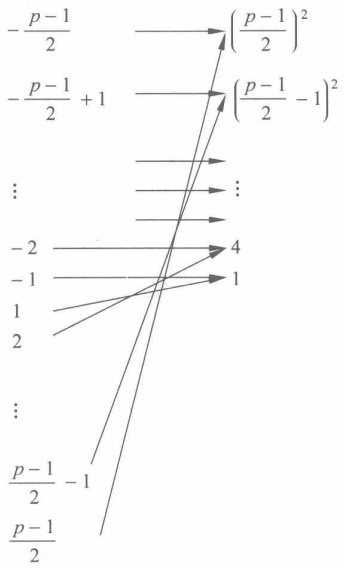
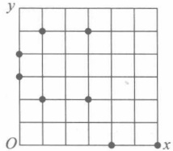
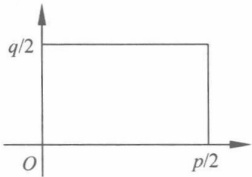
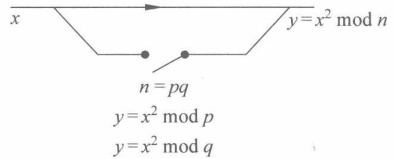

### 第4章

# 二次同余式和平方剩余

第3章讨论了一次同余式，本章讨论二次同余式。

本章重点是平方剩余的判定，Legendre 符号及其计算方法。难点是 Rabin 公钥密码系统。

#### 二次同余式和平方剩余

二次同余式的一般形式为

$$
ax^{2}+bx+c\equiv0(mod m)
$$

其中：

$$
a\not\equiv0(\bmod m)
$$

因为正整数 m 有素因子分解式  $m = p_{1}^{\alpha_{1}} p_{2}^{\alpha_{2}} \cdots p_{k}^{\alpha_{k}}$，所以二次同余式等价于同余式组

$$
\left\{\begin{aligned}&a x^{2}+b x+c\equiv0(\bmod p_{1}^{\alpha_{1}})\\ &\vdots\\ &a x^{2}+b x+c\equiv0(\bmod p_{k}^{\alpha_{k}})\end{aligned}\right.
$$

因此，只需要讨论模为素数幂  $p^{\alpha}$ 的同余式

$$
ax^{2}+bx+c\equiv0\ (\bmod\ p^{a}),\quad p\nmid a
$$

通过配方，可以进一步变形为

$$
(2ax+b)^{2}\equiv b^{2}-4ac\pmod{p^{a}}
$$

令 y=2ax+b，有

$$
y^{2}\equiv b^{2}-4a c(\bmod p^{a})
$$

因此，重点关注以下形式的二次同余式，即

$$
x^{2}\equiv a(\bmod p^{a})
$$

定义 4.1 设 m 为正整数，若同余式

$$
x^{2}\equiv a\pmod{m},(a,m)=1
$$

有解，则称 a 为模 m 的平方剩余（quadratic residue，也叫作二次剩余）；否则称 a 为模 m 的平方非剩余（quadratic non-residue，二次非剩余）。

思考4.1 对于 m=2，判断某个数是否为模2的平方剩余是平凡的。

下面主要考虑模奇素数 p 的平方剩余。

例 4.1 求模 7 的平方剩余。

解答 通过穷举法，可计算出

$$
1^{2}\equiv1\pmod{7}\quad2^{2}\equiv4\pmod{7}\quad3^{2}\equiv2\pmod{7}
$$

$$
4^{2}\equiv2\pmod{7}\quad5^{2}\equiv4\pmod{7}\quad6^{2}\equiv1\pmod{7}
$$

于是，1，2，4 是模 7 的平方剩余，3，5，6 是模 7 的平方非剩余。

通过观察，发现在计算时可以“成对”计算，即只需要计算一半即 $(p-1)/2$个数即可。

$$
1^{2}\equiv1\pmod{7};\quad 2^{2}\equiv4\pmod{7};\quad 3^{2}\equiv2\pmod{7};
$$

$$
6^{2}\equiv(-1)^{2}\equiv1(\bmod7);\quad5^{2}\equiv(-2)^{2}\equiv4(\bmod7);\quad4^{2}\equiv(-3)^{2}\equiv2(\bmod7)。
$$

例 4.2 求模 17 的平方剩余。

解答 结果见表4.1。

表4.1 例4.2用表
 

| x | 1,16 | 2,15 | 3,14 | 4,13 | 5,12 | 6,11 | 7,10 | 8,9 |
| --- | --- | --- | --- | --- | --- | --- | --- | --- |
| $a \equiv x^{2} (\text{mod } 17)$ | 1 | 4 | 9 | 16 | 8 | 2 | 15 | 13 |

模17的平方剩余为1,2,4,8,9,13,15,16；平方非剩余为3,5,6,7,10,11,12,14。

通过观察可以发现，平方剩余的个数是简化剩余系元素个数的一半。

一般地，有以下结论：

定理 4.1 在素数模 p 的一个简化剩余系中，恰有  $(p-1)/2$ 个模 p 的平方剩余， $(p-1)/2$ 个平方非剩余。

在给出证明之前，先看定理示意图（图4.1），左边为简化剩余系，右边为平方。可以看到，由于简化剩余系“成对”计算，计算出的平方剩余个数刚好为简化剩余系元素个数的一半。注意，图4.1只是示意图，映射后的具体位置是分散的，这里主要强调数量为一半。

证明 取模 p 的最小简化剩余系，这里成对放置

$$
-\frac{p-1}{2},-\frac{p-1}{2}+1,\cdots,-2,-1
$$

$$
\frac{p-1}{2},\frac{p-1}{2}-1,\cdots,+2,+1
$$

图4.1 定理4.1的示意图
 

则 a 是模 p 的平方剩余，当且仅当

$$
a\equiv\left(-\frac{p-1}{2}\right)^{2},\left(-\frac{p-1}{2}+1\right)^{2},\cdots,-2,-1,
$$

$$
\left(\frac{p-1}{2}\right)^{2},\left(\frac{p-1}{2}-1\right)^{2},\cdots,2,1,\ (mod\ p)
$$

由于 $(-i)^{2} \equiv i^{2} (\bmod p)$，所以a模p的平方剩余当且仅当

$$
a\equiv1^{2},2^{2},\cdots,\left(\frac{p-1}{2}-1\right)^{2},\left(\frac{p-1}{2}\right)^{2}(\bmod p)
$$

又当  $i \neq j$,  ${1} \leqslant i$,  $j \leqslant (p-1)/2$ 时,  $i^2 \not\equiv j^2 (\bmod p)$, 所以模 p 的平方剩余个数为  $(p-1)/2$, 模 p 的平方非剩余的个数为  $p-1-(p-1)/2 = (p-1)/2$。

根据定理4.1，可以给出一个算法输出奇素数p的平方剩余和平方非剩余。

思考 4.2 如何根据定理 4.1 给出一个算法计算输出奇素数 p 的平方剩余和平方非剩余。

例 4.3 求方程  $E: y^{2} \equiv x^{3} + x + 2 \pmod{7}$ 的 x, y 坐标在  $[0,6]$ 区间的点。

解答 方程 E 其实是一个椭圆曲线方程。由于模为 7，对 x=0,1,2,3,4,5,6，分别求 y。

$$
x=0,y^{2}\equiv2(\bmod7),y=3,4(\bmod7)
$$

$$
x=1,y^{2}\equiv4(\bmod7),y=2,5(\bmod7)
$$

$$
x=2,y^{2}\equiv5(mod7), 无解
$$

$$
x=3,y^{2}\equiv4(\bmod7),y=2,5(\bmod7)
$$

$$
x=4,y^{2}\equiv0(\bmod7),y=0(\bmod7)
$$

$$
x=5,y^{2}\equiv6(mod7), 无解
$$

$$
x=6,y^{2}\equiv0\pmod{7},y=0\pmod{7}
$$

根据该结果，可以画出椭圆曲线图（图4.2），这个看上去像个“围棋盘”的图中，如果 $y\neq0$，则y坐标是关于7/2对称的（关于椭圆曲线密码的详述请见第9章）。思考一下，超过这个“棋盘”的点会是什么样子？

图4.2 椭圆曲线方程  $E: y^{2} \equiv x^{3} + x + 2 \pmod{7}$ 上所有的点
 

例4.1和例4.2对平方剩余的判定主要依靠穷举法，下面给出Euler判定法则，从理论上给出了判别a是否为模p的平方剩余的方法。该方法将平方剩余的判定问题转化成计算问题。

定理4.2(Euler判定法则)设p是奇素数， $(a,p)=1$，则

（1）a 是模 p 的平方剩余的充要条件是

$$
a^{\frac{p-1}{2}}\equiv1(mod p)
$$

（2）a 是模 p 的非平方剩余的充要条件是

$$
a^{\frac{p-1}{2}}\equiv-1(mod p)
$$

当且仅当 a 是模 p 的平方剩余时，二次同余式

$$
x^{2}\equiv a\pmod{p},\quad(a,p)=1
$$

有两个解。

证明 先证明(1)。先证明必要性。假定  $a \equiv y^{2} \bmod p$, a > 0，故  $y \neq 0 \bmod p$。于是根据 Fermat 定理， $(y^{2})^{(p-1)/2} \equiv y^{p-1} \equiv 1 \bmod p$。

再证充分性。假定  $a^{(p-1)/2} \equiv 1 \bmod p$，设 b 为一个模 p 的原根（见第 5 章），于是  $a \equiv b^{i} \bmod p$，对于某个正整数 i 成立。有  $a^{(p-1)/2} \equiv b^{i(p-1)/2} \equiv b^{i(p-1)/2} \bmod p$，由于 b 的阶（见

第5章)为 p-1，因此必有  $(p-1)|(i(p-1)/2)$。因此，i 是偶数，于是 a 的平方根为  $\pm b^{i/2}\bmod p$。

下面证明(2)。由于  $a^{p-1} \equiv 1 \pmod{p}$。 $a^{\frac{p-1}{2}} \equiv 1 \pmod{p}$ 或者  $a^{\frac{p-1}{2}} \equiv -1 \pmod{p}$。由(1)可知(2)成立。

例 4.4 8 是不是模 17 的平方剩余？

解答  ${8}^{(17-1)/2} \equiv 8^{8} \equiv 1 \pmod{17}$，因此，8 是模 17 的平方剩余。

例 4.5 137 是不是模 227 的平方剩余？

解答 计算  ${137}^{(227-1)/2} \equiv 137^{113} (\text{mod } 227)$，利用模重复平方法，得到该值为 -1，因此，137 是模 227 平方非剩余。

推论4.1 设 p 是奇素数， $(a_{1}, p)=1, (a_{2}, p)=1$，则

（1）如果  $a_{1}, a_{2}$ 都是模 p 的平方剩余，则  $a_{1}a_{2}$ 是模 p 的平方剩余。

（2）如果  $a_{1}, a_{2}$ 都是模 p 的平方非剩余，则  $a_{1}a_{2}$ 是模 p 的平方剩余。

（3）如果  $a_{1}$ 是模 p 的平方剩余， $a_{2}$ 是模 p 的平方非剩余，则  $a_{1}a_{2}$ 是模 p 的平方非剩余。

显然，定理4.2可以转换成一个算法。虽然该算法是简单的，但是有利于加深对概念的理解。

算法 4.1 Euler 判定方法计算 a 是否为模 p 的平方剩余。

输入：整数 a， $(a, p)=1$，奇素数 p。

输出：a 是平方剩余或者 a 是平方非剩余。

int Euler(a,p)
{
    int ex=Square-and-Multiply(a,(p-1)/2,p);  //调用模重复平方子函数
    if(ex==1)
    {
        printf("a是平方剩余");
        Return 1;
    }
    else
    {
        printf("a是平方非剩余");
        Return -1;
    }
}

## 4.2 Legendre 符号及其计算方法

当 p 不太大时，可以利用算法 4.1 判定某个数是否为平方剩余。但是，当 p 比较大时，该方法的计算量较大，就不实用了。下面引入 Legendre（勒让德）符号，给出一种判定模 p 平方剩余的更有效方法。

定义 4.2 设 p 是素数，a 是整数，Legendre 符号定义为

$$
\left(\frac{a}{p}\right)=\left\{\begin{aligned}&1,& 若 a 是模 p 的平方剩余 \\ &-1,& 若 a 是模 p 的平方非剩余 \\ &0,& 若 p\mid a\end{aligned}\right.
$$

Legendre 符号可理解成一个判定函数，函数的返回值为 1，-1，0。通过引入 Legendre 符号，然后研究其计算规则，就类似于得到了一些子函数可以调用，从而使整个判定过程简化。

算法 4.2 的 Legendre 函数计算 Legendre 符号的结果，这一计算过程直接从定义给出，是平凡的，主要目的是帮助初学者加深对 Legendre 符号这一概念的理解。

算法 4.2 Legendre 函数计算 Legendre 符号的结果。

输入：整数a，素数p。

输出：Legendre符号的值。

int Legendre(int a, int p)
{
    if (a%p==0) //p|a
        Return 0;
    else
    {
        if (Euler(a,p)==1) //调用Euler判定函数
            Return 1;
        else
            Return -1;
    }
}

其实，如果不要求定理4.2中的 $(a,p)=1$，并且将Legendre符号引入，定理4.2可以叙述如下。

定理 4.3（Euler 判定法则）设 p 是奇素数，则对任意整数 a，有

$$
\left(\frac{a}{p}\right)=a^{\frac{p-1}{2}}(\bmod p)
$$

定理 4.3 有两个好处：将 Legendre 符号的计算转变成模幂计算问题；同时这一计算结果可用来判断 a 是否为模 p 的平方剩余。

算法 4.3 计算 Legendre 符号（由定义给出，通过模幂计算的平凡方法）。

输入：整数a，奇素数p。

输出：Legendre符号的值。

int L(int a, int p)
{
    Return Square-and-Multiply(a, (p-1)/2, p); //调用模重复平方函数
}

下面讨论如何给出 Legendre 符号的快速计算方法。

由定理4.3，可得到以下推论（这些推论有利于Legendre符号的快速计算）。

推论4.2 设 p 是奇素数，则

$$
\left(\frac{1}{p}\right)=1；
$$

$$
(2)\left(\frac{-1}{p}\right)=(-1)^{\frac{p-1}{2}}。
$$

由推论4.2可以给出以下计算子函数的定义，帮助初学者理解。

int L_ONE(const int a=1, int p)
{
    Return 1;
}

int L_MinusOne(const int a=-1, int p)
{
    Return (-1)^{\frac{p-1}{2}};
}

推论4.3 设 p 是奇素数，那么

$$
\left(\frac{-1}{p}\right)=\left\{\begin{aligned}&1,& 若 p\equiv1(mod4)\\ &-1,& 若 p\equiv3(mod4)\end{aligned}\right.
$$

证明 根据 Euler 判别法则，有

$$
\left(\frac{-1}{p}\right)=\left(-1\right)^{\frac{p-1}{2}}
$$

若  $p \equiv 1 \pmod{4}$，则存在正整数 k，使得  $p = 4k + 1$，于是  $(p - 1)/2 = 2k$。从而

$$
\left(\frac{-1}{p}\right)=(-1)^{2k}=(-1)^{2k}=1
$$

若  $p \equiv 3 \pmod{4}$，则存在正整数 k，使得  $p = 4k + 3$，于是  $(p - 1)/2 = 2k + 1$。从而

$$
\left(\frac{-1}{p}\right)=(-1)^{2k+1}=(-1)^{2k+1}=-1
$$

定理4.4 设 p 是奇素数，则

(1)  $\left(\frac{a}{p}\right) = \left(\frac{a+p}{p}\right)$.
(2)  $\left(\frac{ab}{p}\right) = \left(\frac{a}{p}\right)\left(\frac{b}{p}\right)$.

（3）若 $(a,p)=1$，则 $\left(\frac{a^{2}}{p}\right)=1$。

思考4.3 读者能否给出一些例子说明上述定理。

(1) 是因为  $a \equiv a + p \pmod{p}$。

（2）可根据定义得到。

（3）很明显， $x^{2} \equiv a^{2} (\bmod p)$有解。

定理4.5（高斯引理）设p为奇素数， $p \nmid n$，设 $\frac{1}{2}(p-1)$个数 $n,2n,\cdots,\frac{1}{2}(p-1)n$，模p的最小正余数中有m个大于 $\frac{p}{2}$，则 $\left(\frac{n}{p}\right)=(-1)^{m}$。

证明 设  $a_{1}, a_{2}, \cdots, a_{l} \left( l = \frac{1}{2}(p-1)-m \right)$ 表示  $n, 2n, \cdots, \frac{1}{2}(p-1) n$ 中小于  $\frac{p}{2}$ 的所有最小正余数， $b_{1}, b_{2}, \cdots, b_{m}$ 表示  $n, 2n, \cdots, \frac{1}{2}(p-1) n$ 中大于  $\frac{p}{2}$ 的所有最小正余数。因此， $a_{1}, a_{2}, \cdots, a_{l}, p-b_{1}, p-b_{2}, \cdots, p-b_{m}$ 都在  ${1} \sim \frac{1}{2}(p-1)$ 之间，它们是两两互不相等的。这是因为，若  $a_{i} = p - b_{j}$，则  $a_{i} + b_{j} = p$，即存在整数 x, y,  ${1} \leq x, y \leq \frac{1}{2}(p-1)$，使  $x n + y n \equiv 0 \pmod{p}$。由于  $p \nmid n$，故  $p \mid x + y$，这是不可能的。所以

$$
\prod_{i=1}^{l}a_{i}\cdot\prod_{j=1}^{m}(p-b_{j})=\left(\frac{p-1}{2}\right)!
$$

而

$$
\prod_{i=1}^{l}a_{i}\cdot\prod_{j=1}^{m}(p-b_{j})\equiv(-1)^{m}\prod_{k=1}^{\frac{(p-1)}{2}}kn\left(\bmod p\right)\equiv(-1)^{m}\left(\frac{p-1}{2}\right)!\boldsymbol{n}^{\frac{p-1}{2}}\left(\bmod p\right)
$$

故  $n^{\frac{p-1}{2}}=(-1)^{m}(\bmod p)$。因此， $\left(\frac{n}{p}\right)=(-1)^{m}$。

例 4.6 当 p=5, n=8 时，因  ${1} \cdot 8 \equiv 3 \pmod{5}$， ${2} \cdot 8 \equiv 1 \pmod{5}$，故 m=1，所以  $\left(\frac{8}{5}\right) = (-1)^{1} = -1$。

当 p=7, n=2 时，因  ${1} \cdot 2 \equiv 2 (\mathrm{mod} 7)$， ${2} \cdot 2 \equiv 4 (\mathrm{mod} 7)$， ${3} \cdot 2 \equiv 6 (\mathrm{mod} 7)$，故 m=2，所以  $\left(\frac{2}{7}\right) = (-1)^2 = 1$。

定理4.6 设 p 是奇素数，则

$$
\left(\frac{2}{p}\right)=\left(-1\right)^{\frac{p^{2}-1}{8}}
$$

证明 当 n=2 时，下述  $\frac{1}{2}(p-1)$ 个数  ${2},2\cdot2,2\cdot3,\cdots,2\cdot\frac{p-1}{2}$ 落在  ${1}\sim p$ 之间，若  $\frac{p}{2}<2k<p$，则  $\frac{p}{4}<k<\frac{p}{2}$，所以  $m=\left[\frac{p}{2}\right]-\left[\frac{p}{4}\right]$。

设  $p=8a+r, r=1,3,5,7$，则  $m=2a+\left[\frac{r}{2}\right]-\left[\frac{r}{4}\right]\equiv0,1,1,0(\bmod2)$，即当  $p\equiv\pm1(\bmod8)$ 时， $\left(\frac{2}{p}\right)=(-1)^{m}=1=(-1)^{\frac{1}{8}(p^{2}-1)}$；当  $p\equiv\pm3(\bmod8)$ 时， $\left(\frac{2}{p}\right)=(-1)^{m}=-1=(-1)^{\frac{1}{8}(p^{2}-1)}$。

例 4.7 证明 2 是模 17 的平方剩余。

证明 根据定理4.5，有

$$
\left(\frac{2}{17}\right)=(-1)^{\frac{17^{2}-1}{8}}=(-1)^{2\cdot18}=1
$$

因此，2 是模 17 的平方剩余。

由定理4.5可以得到以下子函数（虽然简单，以加深理解）。

int L_TWO(const int a=2, int p)
{
    Return(-1)^{\frac{p^2 - 1}{8}};
}

定理4.7（二次互反律）设p,q是互素的奇素数，则

$$
\left(\frac{p}{q}\right)=(-1)^{\frac{p-1}{2}\cdot\frac{q-1}{2}}\left(\frac{q}{p}\right)
$$

证明 设  $a_{i}(i=1,2,\cdots,l)$,  $b_{j}(j=1,2,\cdots,m)$ 如定理 4.5 证明中所示，令  $a=\sum_{i=1}^{l}a_{i}$,  $b=\sum_{j=1}^{m}b_{j}$, 设 kq = qk,  $p+r_{k}$,  $q_{k}=\left[\frac{kq}{p}\right]$,  ${0}\leqslant r_{k}\leqslant p\left(k=1,2,\cdots,\frac{p-1}{2}\right)$, 则  $\sum_{k=1}^{\frac{p-1}{2}}r_{k}=a+b$。由高斯引理的证明知  $a_{i}$,  $p-b_{j}$ 遍历 ${1},2,\cdots,\frac{1}{2}(p-1)$，故

$$
\frac{1}{8}(p^{2}-1)=1+2+\cdots+\frac{1}{2}(p-1)=\sum_{s=1}^{l}a_{s}+\sum_{j=1}^{m}(p-b_{j})=a+mp-b
$$

又

$$
\frac{p^{2}-1}{8}q=\sum_{k=1}^{(p-1)/2}kq=p\sum_{k=1}^{(p-1)/2}q_{k}+\sum_{k=1}^{(p-1)/2}r_{k}=p\sum_{k=1}^{(p-1)/2}q_{k}+a+b
$$

两式相减得

$$
\frac{p^{2}-1}{8}(q-1)=p\sum_{k=1}^{(p-1)/2}q_{k}-mp+2b
$$

由于  $\frac{1}{8}(p^{2}-1)$ 是整数，q-1 是偶数 (q>2)，所以由上式可得

$$
m\equiv\sum_{k=1}^{(p-1)/2}q_{k}=\sum_{k=1}^{(p-1)/2}\left[\frac{qk}{p}\right](\bmod2)
$$

故

$$
\left(\frac{q}{p}\right)=\left(-1\right)^{m}=\left(-1\right)^{\sum\limits_{k=1}^{(p-1)/2}\left\lbrack\frac{qk}{p}\right\rbrack}
$$

同理， $\left(\frac{p}{q}\right)=(-1)^{\sum_{l=1}^{(q-1)/2}\left[\frac{pl}{q}\right]}$，于是， $\left(\frac{q}{p}\right)\left(\frac{p}{q}\right)=(-1)^{m}=(-1)^{\sum_{k=1}^{(p-1)/2}\left[\frac{qk}{p}\right]+\sum_{s=1}^{(q-1)/2}\left[\frac{pl}{q}\right]}$。

下面证明  $\sum_{k=1}^{(p-1)/2}\left[\frac{qk}{p}\right]+\sum_{l=1}^{(q-1)/2}\left[\frac{pl}{q}\right]=\frac{p-1}{2}\cdot\frac{q-1}{2}$。

事实上，如图4.3所示，平面内以 $(0,0)$， $\left(0,\frac{q}{2}\right)$， $\left(\frac{p}{2},0\right)$， $\left(\frac{p}{2},\frac{q}{2}\right)$为顶点的矩形内整点（两坐标都为整数）个数为 $\frac{p-1}{2}$。 $\frac{q-1}{2}$，而从点 $(0,0)$到点 $\left(\frac{p}{2},\frac{q}{2}\right)$的对角线 $y=\frac{xq}{p}$下方的三角

图4.3 二次互反律
 

形内整点的个数为  $\sum_{k=1}^{(p-1)/2}\left[\frac{qk}{p}\right]$，对角线上方的三角形内整点个数为  $\sum_{l=1}^{(q-1)/2}\left[\frac{pl}{q}\right]$。故上式成立，从而定理得证。

将二次互反律写成一个子函数，可以得到：

int L_MutualInverse(p,q)
{
    Return(-1)^{\frac{p-1}{2} \cdot \frac{q-1}{2}} L_FAST(q,p);
}

二次互反律提供了 Legendre 符号的递归计算方式。这里调用的  $L\_FAST(q,p)$ 是一种快速计算 Legendre 符号的方法，将在下面介绍。

例 4.8 证明 3 是模 17 的平方非剩余。

证明

$$
\left(\frac{3}{17}\right)=(-1)^{\frac{3-1}{2}\cdot\frac{17-1}{2}}\left(\frac{17}{3}\right)=\left(\frac{-1}{3}\right)=(-1)^{\frac{3-1}{2}}=-1
$$

因此，3 是模 17 的平方非剩余。

例 4.9 判断同余式  $x^{2} \equiv 137$ (mod 227) 是否有解。

解答 因为 227 是奇素数，根据定理 4.4，有

$$
\left(\frac{137}{227}\right)=\left(\frac{-90}{227}\right)=\left(\frac{-1}{227}\right)\left(\frac{2\cdot3^{2}\cdot5}{227}\right)=-\left(\frac{2}{227}\right)\left(\frac{5}{227}\right)
$$

$$
\left(\frac{2}{227}\right)=(-1)^{\frac{227^{2}-1}{8}}=(-1)^{\frac{226\cdot228}{8}}=-1
$$

$$
\left(\frac{5}{227}\right)=(-1)^{\frac{5-1}{2}\cdot\frac{227-1}{2}}\left(\frac{227}{5}\right)=\left(\frac{2}{5}\right)=(-1)^{\frac{5^{2}-1}{8}}=-1
$$

因此， $\left(\frac{137}{227}\right)=-1$

故同余式  $x^{2} \equiv 137$ (mod 227) 无解。

由上述的定理和推论，可以得到以下计算 Legendre 符号的快速算法 4.4。

算法 4.4 Legendre 符号的快速计算方法。

算法4.4 Legendre符号的快速计算方法。

输入：奇素数  $p \geqslant 3$，整数  $a$，且  ${0} \leqslant a < p$。

输出：勒让德符号  $\left(\frac{a}{p}\right)$。

int L_FAST(int a, int p)
(1) 如果  $a=0$，则返回 0。
(2) 如果  $a=1$，则返回 1。
(3) 令  $a=2^{e}a_1$，其中， $a_1$ 为奇数（为简化，假设  $a_1$ 为奇素数，否则算法做相应修改即可）。
(4) 如果  $e$ 是偶数，则令  $s \leftarrow 1$；否则，如果  $p=1$ 或  ${7} \pmod{8}$，则令  $s \leftarrow 1$；如果  $p=3$ 或者  ${5} \pmod{8}$，则令  $s \leftarrow -1$。
(5) 如果  $p=3 \pmod{4}$， $a_1=3 \pmod{4}$，则令  $s \leftarrow -s$。
(6) 令  $p_1 \leftarrow p \mod a_1$。
(7) 如果  $a_1=1$，则返回  $s$；否则返回  $s \cdot L_FAST(p_1, a_1)$。

思考4.4

（1）算法4.4中步骤（1）说明了什么情况？（提示： $p|a$）

（2）步骤（4）当 e 为奇数时，为什么当 p 为模 8 余 1 或 7 时，s=1？（提示：定理 4.5）

（3）步骤（5）中为什么要变符号？（提示：由定理4.6，若 $p\equiv3\pmod{4}$， $(p-1)/2=2k+1$）

（4）步骤（7）中返回值说明该算法递归的？（ $s \cdot \left( \frac{p_{1}}{a_{1}} \right)$）

例 4.10 判断下面的同余式是否有解？

$$
x^{2}\equiv-1(\bmod{365})
$$

解答 365 可分解成两个素数的乘积，即 365=5·73，原同余式等价于

$$
\left\{\begin{aligned}x^{2}&\equiv-1(mod5)\\ x^{2}&\equiv-1(mod73)\end{aligned}\right.
$$

因为

$$
\left(\frac{-1}{5}\right)=\left(\frac{-1}{73}\right)=1
$$

故同余式组有解，根据 CRT，同余式组中的每个同余式均有两个解，两个同余式的两个解分别配对，于是产生4个同余式组，4个同余式组的解即为原同余式的解。因此，原同余式的解数为4。

#### Rabin 公钥密码系统

本章前面两节讨论了二次同余式以及平方剩余的判定，它们在密码学中的一个典型应用就是 Rabin 公钥密码系统 $^{①}$。

该公钥密码体制基于一个困难问题，称为平方根问题。

定义 4.3（平方根问题，也称为 SQROOT 问题） 给定一个合数 n 和  $a \in Q_{n}$（模 n 的平方剩余集合），找 a 模 n 的平方根；即找到一个整数 x，使得  $x^{2} = a \bmod n$。

但是，如果知道 n 的因子 p 和 q，那么 SQROOT 问题就很容易求解。方法是先求解 a 模 p 和模 q 的解，然后利用中国剩余定理得到 a 模 n 的平方根。

于是，可考虑将 n 作为公钥，将 p 和 q 为私钥。

图 4.4 给出了这一困难问题的示意图。

图 4.4 Rabin 利用单向陷门函数的原理示意图
 

Rabin 公钥密码系统的描述：

（1）密钥的产生：随机生成两个大的素数 p 和 q，满足  $p \equiv q \equiv 3 \bmod 4$，计算 n = pq。n 为公钥，p, q 作为私钥。

（2）加密： $c=m^{2}\bmod n$

（3）解密：就是求c模n的平方根，即解 $x^{2}\equiv c\bmod n$，该方程等价于方程组

$$
\left\{\begin{aligned}x^{2}&\equiv c(mod p)\\ x^{2}&\equiv c(mod q)\end{aligned}\right.
$$

由于  $p \equiv q \equiv 3 \mod 4$，可容易地求出 c 在模 p 下的两个方程根，即

$$
m\equiv c^{(p+1)/4}\bmod{p};\quad m\equiv p-c^{(p+1)/4}\bmod{p}
$$

和 c 在模 q 下的两个方程根，即

$$
m\equiv c^{(q+1)/4}\bmod q;\quad m\equiv q-c^{(q+1)/4}\bmod q
$$

两两组合联立，可得4个方程组，即

$$
\begin{cases}m\equiv c^{(p+1)/4}\bmod p\\m\equiv c^{(q+1)/4}\bmod q\end{cases}\quad\begin{cases}m\equiv p-c^{(p+1)/4}\bmod p\\m\equiv c^{(q+1)/4}\bmod q\end{cases}
$$

$$
\begin{cases}m\equiv c^{(p+1)/4}\bmod p\\m\equiv q-c^{(q+1)/4}\bmod q\end{cases}\\\begin{cases}m\equiv p-c^{(p+1)/4}\bmod p\\m\equiv q-c^{(q+1)/4}\bmod q\end{cases}
$$

利用中国剩余定理求得4个m，其中必有一个m为明文。通常可以通过在明文中事先引入某些特征（如发送者的身份证号、日期等事先约定的特征）来区分。

对该密码方案的解释如下。

思考 4.5 为什么取  $p \equiv q \equiv 3 \mod 4$？

目的是为了能快速地求出平方根。 $p \equiv 3 \mod 4$ 时， $x^{2} \equiv c \mod p$ 的平方根容易求出。由  $p \equiv 3 \mod 4$，得  $p + 1 = 4k$，即  $(p+1)/4$ 是一个整数。设  $x^{2} \equiv c \mod p$ 的根为 y，即  $y^{2} \equiv c \mod p$。

因 c 是模 p 的二次剩余，故  $c^{(p-1)/2} \equiv (y^{2})^{(p-1)/2} \equiv y^{p-1} \equiv 1 \bmod p$。

于是，有

$$
(c^{\frac{p+1}{4}})^{2}\equiv(y^{\frac{p+1}{2}})^{2}\equiv c^{\frac{p+1}{2}}\equiv c^{(p-1)/2}\cdot c\equiv c\bmod p
$$

故  $c^{(p+1)/4}$ 和  $p-c^{(p+1)/4}$ 是方程  $x^{2} \equiv c \bmod p$ 的两个根。同理， $c^{(q+1)/4}$ 和  $q-c^{(q+1)/4}$ 是方程  $x^{2} \equiv c \bmod q$ 的两个根。

思考4.6 为什么解  $x^{2} \equiv c \mod n$ 方程等价于解方程组  $\left\{\begin{aligned}x^{2} &\equiv c (\text{mod } p)\\ x^{2} &\equiv c (\text{mod } q)\end{aligned}\right.$。

下面证明一个一般的结论：当 p, q 是素数， $n = pq$ 时， $a \equiv b \mod n$ 等价于方程组

$$
\left\{\begin{aligned}a&\equiv b(mod p)\\ a&\equiv b(mod q)\end{aligned}\right.
$$

证明 若  $\left\{\begin{aligned}a&\equiv b\ (\text{mod }p)\\ a&\equiv b\ (\text{mod }q)\end{aligned}\right.$，则  $p\left|(a-b),q\right|(a-b)$，而  $\gcd(p,q)=1$，所以  $pq\left|(a-b)\right|$，即  $a\equiv b\mod pq$。

反之，若  $a \equiv b \mod n$，则  $n|(a-b)$，由  $p|n, q|n$，得  $p|(a-b), q|(a-b)$，即

$$
\left\{\begin{aligned}a&\equiv b(mod p)\\ a&\equiv b(mod q)\end{aligned}\right.
$$

例 4.11 Rabin 方案的举例。假设私钥为  $p=7, q=11$ (p, q 模 4 余 3)，公钥为  $n=pq=77$，明文 m=32，则密文为  $c=m^2 \mod n=32^2 \mod 77=23$。下面分析解密密文 23 的过程。 $m=\sqrt{c} \mod 77$。分别求模 p, q 的平方根。

$$
23^{(7+1)/4}\equiv2^{2}\equiv4\bmod7
$$

$$
23^{(11+1)/4}\equiv1^{2}\equiv1\bmod{11}
$$

23 模 7 和模 11 的平方根是  $\pm 4$ 和  $\pm 1$，然后利用中国剩余定理，计算得到 23 模 77 的 4 个平方根，即  $\pm 10$， $\pm 32$ (mod 77)，4 个可能的明文是 10，32，45，67。在实际中，通过预先在明文中加入识别特征（例如，约定添加特殊标识符号到明文的末尾，或者将明文重复一次再连接后作为新的明文，即  $m^{\prime} = m \parallel m$），可以从 4 个可能的明文中选出正确的明文。

由于 Rabin 加密算法十分简单，下面重点解释解密算法。

定理4.8 设 p, q 是形为  ${4}k+3$ 的不同素数，如果整数 a 满足

$$
\left(\frac{a}{p}\right)=\left(\frac{a}{q}\right)=1
$$

则同余式  $x^{2} \equiv a \pmod{pq}$ 有解，即

$$
\begin{align*}x=&\pm(a^{(p+1)/4}(\bmod p))\cdot(q^{-1}(\bmod p))\cdot q\\\pm&(a^{(q+1)/4}(\bmod q))\cdot(p^{-1}(\bmod q))\cdot p(\bmod pq)\end{align*}
$$

证明 二次同余式  $x^{2} \equiv a \pmod{pq}$ 等价于同余式组，即

$$
\left\{\begin{aligned}x^{2}&\equiv a(mod p)\\ x^{2}&\equiv a(mod q)\end{aligned}\right.
$$

因为 $\left(\frac{a}{p}\right)=\left(\frac{a}{q}\right)=1$，所以由思考4.5，同余式 $x^{2}\equiv a\pmod{p}$有解，其解为

$$
x=\pm a^{(p+1)/4}(\bmod p)
$$

同样地，同余式  $x^{2} \equiv a \pmod{q}$ 有解，其解为

$$
x=\pm a^{(q+1)/4}(\bmod q)
$$

根据中国剩余定理，同余式组的解为

$$
\begin{align*}x=&\pm(a^{(p+1)/4}(\bmod p))\cdot(q^{-1}(\bmod p))\cdot q\\\pm&(a^{(q+1)/4}(\bmod q))\cdot(p^{-1}(\bmod q))\cdot p(\bmod pq)\end{align*}
$$

这即为同余式  $x^{2} \equiv a \pmod{pq}$ 的解。

根据定理4.8给出Rabin解密的算法如下。

算法 4.5 Rabin 解密算法。

输入：密文  $c$，私钥  $p,q(p,q$ 均为  ${4}k+3$ 的素数， $n=pq)$。

输出：明文  $m$。

RabinDecrypt $(c,p,q)$

(1) 利用扩展的欧几里得除法，求整数  $s$， $t$，使得  $sp+tq=1$。

(2) 计算  $u\leftarrow c^{(p+1)/4}$ mod  $p$。

(3) 计算  $v\leftarrow c^{(q+1)/4}$ mod  $q$。

(4) 计算  $m_1\leftarrow (utq+vsp)$ mod  $n$ //  $t$ 即定理 4.8 中  $q^{-1} \pmod{p}$， $s$ 即  $p^{-1} \pmod{q}$。

(5) 计算  $m_2\leftarrow (utq-vsp)$ mod  $n$。

(6) 同余式  $m^2\equiv c \pmod{n}$ 的 4 个根是  $m_1$， $n-m_1,m_2$， $n-m_2$，确定其中哪一个根为明文。

思考4.7 Rabin加密可否视为RSA加密的特例？

其实，Rabin 加密不是 RSA 加密的特例。因为 RSA 加密中的私钥 e 必须有 gcd(e,  $\varphi(n))=1$，而  $\varphi(n)=(p-1)(q-1)$ 为偶数，故 e 必为奇数。但是，Rabin 加密中使用的幂次是 2，为偶数。

#### 思考题

[1] 求模 p=13,23,31,37,47 的平方剩余和平方非剩余。

[2] (1) 分别求解以 n = -2, n = -3 和 n = 5 为二次剩余的素数 p 的一般表达式。

（2）分别求解以 n=-2, n=-3 和 n=5 为二次非剩余的素数 p 的一般表达式。

[3]（1）求以3为其二次剩余，以-3为其二次非剩余的全体素数。

（2）求以-3为其二次剩余，以3为其二次非剩余的全体素数。

（3）求以2为其二次剩余、以3为其二次非剩余的全体素数。

[4] 求满足方程  $E: y^{2} \equiv x^{3} - 3x + 1 \pmod{7}$ 的所有点。

[5] 计算 Legendre 符号  $\left(\frac{17}{37}\right)$， $\left(\frac{151}{373}\right)$， $\left(\frac{191}{397}\right)$， $\left(\frac{911}{2003}\right)$。

[6] 编写程序 Legendre 符号，验证题目 [3] 的结果。

[7] 计算下列同余式的解和解数。
(1)  $x^{5}-3x^{2}+2\equiv0(\mod 7)$。
(2)  ${4}x^{2}+21x-32\equiv0(\mod 141)$。
(3)  $x^{2}+8x-13\equiv0(\mod 28)$。
(4)  ${3}x^{2}+18x-25\equiv0(\mod 28)$。
(5)  ${3}x^{4}-x^{3}+2x^{2}-26x+1\equiv0(\mod 11)$。
(6)  ${3}x^{2}-12x-19\equiv0(\mod 28)$。

[8] 判断同余式是否有解。

$$
x^{2}\equiv7(mod227),\quad x^{2}=2(mod401\cdot281)
$$

[9] 证明：设 p 是一个素数，对于任意整数 a，均有  $a^{p} \equiv a (\bmod p)$。

[10] 编写程序实现  ${2}^{200}$ 位的 Rabin 公钥密码系统。
