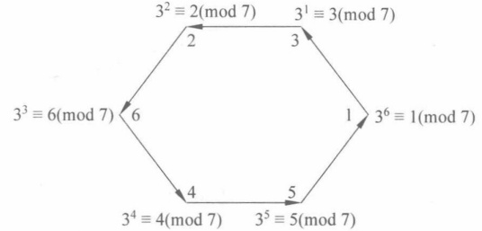
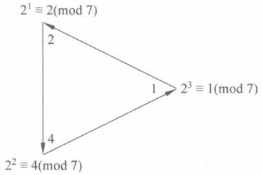
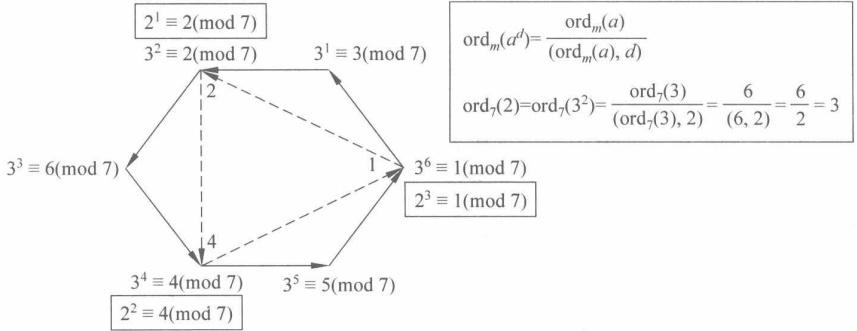
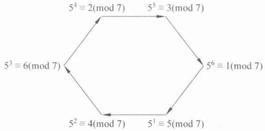
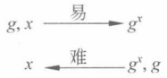
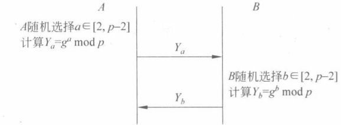
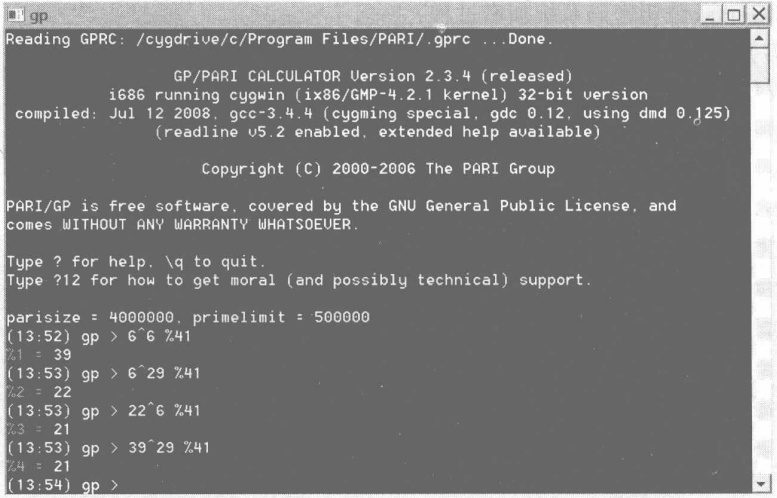
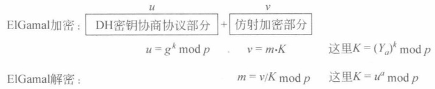
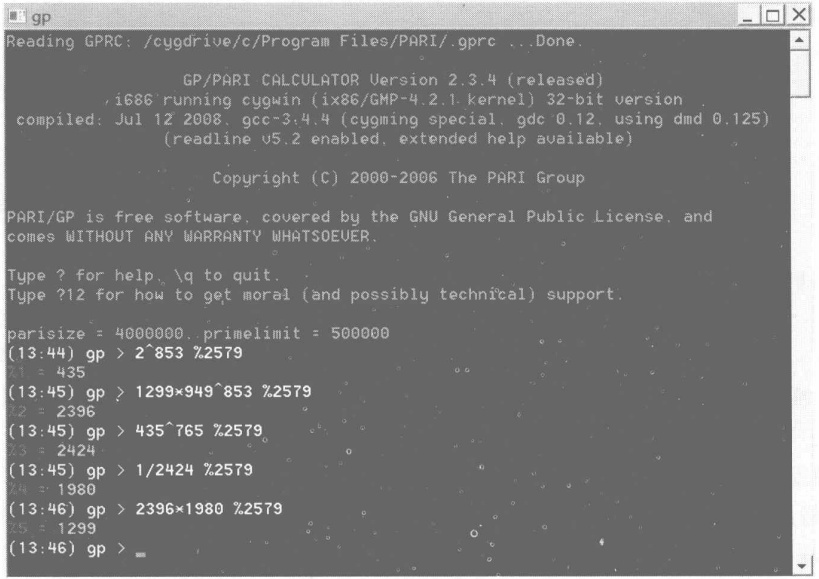

### 第5章

# 原根与指数

在研究了平方（二次）剩余之后，下面讨论 n 次剩余。

讨论使得同余式

$$
a^{n}\equiv1(\bmod m)
$$

成立的整数 n。

这里主要关心最小的正整数 e，因为找到了 e，则 e 的倍数均为上式的解。另外，由 Euler 定理可知，当  $(a, m) = 1$ 时，有  $a^{\varphi(m)} \equiv 1 \pmod{m}$。于是，关心一个问题，就是这个最小的正整数 e 会不会就是  $\varphi(m)$？什么情况下就是  $\varphi(m)$？

本章的重点是原根、阶及其计算方法；难点是 DH 密钥协商和 ElGamal 公钥密码系统。

## 5.1 原根和阶的概念

定义 5.1 设 m>1 是整数，a 是正整数， $(a,m)=1$，则使得

$$
a^{x}\equiv1\pmod{m}
$$

成立的最小正整数 x 叫作 a 模 m 的阶（order）。记为  $\mathrm{ord}_{m}(a)$。

例 5.1 设整数 m=7，计算 a=1,2,3,4,5,6 的阶。

解答  ${1}^{1} \equiv 1 \pmod{7}$;  ${2}^{3} \equiv 1 \pmod{7}$;  ${3}^{6} \equiv 1 \pmod{7}$;

$$
4^{3}\equiv(-3)^{3}\equiv1(\bmod7);5^{6}\equiv(-2)^{6}\equiv1(\bmod7);6^{2}\equiv(-1)^{2}\equiv1(\bmod7).
$$

计算结果见表5.1。

表5.1 例5.1计算结果
 

| a | 1 | 2 | 3 | 4 | 5 | 6 |
| --- | --- | --- | --- | --- | --- | --- |
| $\text{ord}_m(a)$ | 1 | 3 | 6 | 3 | 6 | 2 |

容易看到，由于  $\varphi(m)=\varphi(7)=6$，于是， $\mathrm{ord}_{m}(a)$ 中最大为 6。

定义 5.2（原根，primitive root）如果  $\mathrm{ord}_{m}(a)=\varphi(m)$，则 a 叫作 m 的原根。

思考 5.1 原根的英文可能初学者觉得很难理解，如果称为“生成元（generator）”可能更容易理解这个“本原（primitive）”的含义，即可以生成群中其他所有元素的“本原”元。

容易看到例5.1中，因为3和5的阶为 $\varphi(7)$，所以3和5为原根。

从生成元的角度更加容易理解，但需要群的概念。群 $(\mathbf{Z}/7\mathbf{Z})^{*}$中元素的个数为 $\varphi(7)=6$，因为3和5的阶为 $\varphi(7)$，故3和5可以生成群 $(\mathbf{Z}/7\mathbf{Z})^{*}$中的任意元素（即1～6）。

下面首先考察3（图5.1）

$$
3^{1}\equiv3\pmod{7}\quad3^{2}\equiv2\pmod{7}\quad3^{3}\equiv6\pmod{7}
$$

$$
3^{4}\equiv4\pmod{7}\qquad3^{5}\equiv5\pmod{7}\qquad3^{6}\equiv1\pmod{7}
$$

容易看到这是一个循环群，3可以生成群中的元素1～6。

图 5.1 3 作为生成元生成  $(\mathbf{Z}/7\mathbf{Z})^{*}$ 中所有元素
 

再来考察5。

$$
5^{1}\equiv5\pmod{7}\qquad5^{2}\equiv4\pmod{7}\qquad5^{3}\equiv6\pmod{7}
$$

$$
5^{4}\equiv2\pmod{7}\qquad5^{5}\equiv3\pmod{7}\qquad5^{6}\equiv1\pmod{7}
$$

除了3和5外，其他都不是原根，因为其阶均小于 $\varphi(7)$，即无法生成“所有”元素，“回到原点”1的过程过快，导致只能生成群中的“部分”元素。

考察2（图5.2）。

$$
2^{1}\equiv2{\pmod{7}}\qquad2^{2}\equiv4{\pmod{7}}\qquad2^{3}\equiv1{\pmod{7}}
$$

图5.2 2只能生成 $(Z/7Z)^{*}$中3个元素
 

容易看到，2 无法生成 3,5,6。

看图5.1和图5.2，就容易理解为什么原根的阶为 $\varphi(m)$了。

下面看一个 m 不为素数的例子。

例 5.2 设整数 m=14，计算 a=1,3,5,9,11,13 的阶，指出其中的原根。

$$
解答 \quad1^{1}\equiv1(mod\ 14)\quad3^{3}\equiv-1(mod\ 14)\quad5^{3}\equiv-1(mod\ 14)
$$

$$
9^{3}\equiv1\pmod{14}\qquad11^{3}\equiv1\pmod{14}\qquad13^{2}\equiv1\pmod{14}
$$

计算结果见表5.2。

表5.2 例5.2计算结果
 

| a | 1 | 3 | 5 | 9 | 11 | 13 |
| --- | --- | --- | --- | --- | --- | --- |
| $\text{ord}_m(a)$ | 1 | 6 | 6 | 3 | 3 | 2 |

由于  $\varphi(14)=\varphi(2)\cdot\varphi(7)=\varphi(7)=6$，因此原根为3和5。

下面的定理给出了计算阶的一个算法依据。

定理 5.1 设 m>1 是整数，a 为整数， $(a,m)=1$，则整数 d 使得

$$
a^{d}\equiv1\pmod{m}
$$

成立的充要条件是

$$
ord_{m}(a)\mid d
$$

证明 先证明充分性。如果  $\mathrm{ord}_{m}(a)\mid d$，则存在整数 k，使得  $d=k\cdot\mathrm{ord}_{m}(a)$。因此，有

$$
a^{d}=(a^{\mathrm{ord}_{m}(a)})^{k}\equiv1(\bmod m)
$$

再证明必要性。如果  $\mathrm{ord}_{m}(a)|d$ 不成立，则存在整数 q，r 使得

$$
d=\operatorname{ord}_{m}(a)\cdot q+r\quad0<r<\operatorname{ord}_{m}(a)
$$

从而，有

$$
a^{d}=a^{r}(a^{ord_{m}(a)})^{q}\equiv a^{r}(\bmod m)
$$

又因为

$$
a^{d}\equiv1\pmod{m}
$$

于是有

$$
a^{r}\equiv1\pmod{m}
$$

这与  $\mathrm{ord}_{m}(a)$ 的最小性矛盾。于是有  $\mathrm{ord}_{m}(a)|d$。

推论 5.1 设 m>1 是整数，a 为整数， $(a,m)=1$，则  $\mathrm{ord}_{m}(a)|\varphi(m)$。

证明 根据 Euler 定理，有

$$
a^{\varphi(m)}\equiv1\ (\bmod\ m)
$$

由定理 5.1，于是  $\operatorname{ord}_{m}(a) \mid \varphi(m)$。

由推论5.1可知，可以从 $\varphi(m)$中寻找 $\mathrm{ord}_{m}(a)$。

例 5.3 求整数 5 模 17 的阶  $\mathrm{ord}_{17}(5)$。

解答 因为  $\varphi(17)=16$，只需要对 16 的因数 d=1,2,4,8,16 计算  ${5}^{d}(\bmod 17)$，看是否等于 1。因为

$$
\begin{aligned}&5^{1}\equiv5(mod17)\\&5^{2}\equiv8(mod17)\\&5^{4}\equiv64\equiv13\equiv-4(mod17)\\&5^{8}\equiv(-4)^{2}\equiv16\equiv-1(mod17)\\&5^{16}=(-1)^{2}=1(mod17)\\ \end{aligned}
$$

$$
5^{16}\equiv(-1)^{2}\equiv1\ (\mathrm{m o d}\ 17)
$$

所以5是模17的原根。

有了原根的概念后，可以给出指数(index)的概念。

定义 5.3 设 g 是正整数 m 的原根，若  $\gcd(a, m) = 1$，则称同余式

$$
g^{x}\equiv a(\bmod m)
$$

的唯一整数解  $x(1 \leqslant x \leqslant \varphi(m))$ 为 a 模 m 以 g 为底的指数，也称为指标或离散对数，记为  $\mathrm{Ind}_{g,m}(a)$，或简记为  $\mathrm{Ind}_{g}a$。 $^{①}$

离散对数问题是一个计算上困难的问题，目前还没有找到有效的算法。5.3 节和 5.4 节会给出基于该困难问题构造密码系统。第 11 章会讲解离散对数算法。

例 5.4 设 m=7，由例 5.1 知，3 为原根。计算指数表。

解答 计算指数表见表 5.3。

表5.3 例5.4计算结果
 

| a | 1 | 2 | 3 | 4 | 5 | 6 |
| --- | --- | --- | --- | --- | --- | --- |
| $\mathrm{Ind}_{3}a$ | 6 | 2 | 1 | 4 | 5 | 3 |

思考5.2 “阶”和“指数”的主要区别是什么？

容易看到，阶与模 m 和整数 a 有关，指数则与模 m，整数 a 及底（原根 g）有关。阶可以用来判断原根，指数主要用来计算元素相对于原根的离散对数。

定理 5.2（指数定理） 若 g 是模 m 的一个原根，则  $g^{x} \equiv g^{y} (\bmod m)$ 当且仅当  $x \equiv y (\bmod \varphi(m))$。

证明 假设  $x \equiv y \pmod{\varphi(m)}$，则  $x = y + k\varphi(m), k \in \mathbb{Z}$，所以

$$
\begin{aligned}g^{x}&\equiv g^{y+k\varphi(m)}(\bmod m)\\&\equiv g^{y}(g^{\varphi(m)})^{k}(\bmod m)\\&\equiv g^{y}1^{k}(\bmod m)\\&\equiv g^{y}(\bmod m)\end{aligned}
$$

必要性留作练习。

这个证明和 RSA 的解密过程有相似之处。

定理 5.3 设 g 是模素数 p 的一个原根，且  $\gcd(a, p) = 1$，则  $g^k \equiv a \pmod{p}$ 当且仅当

$$
k\equiv ind_{a}(mod p-1)
$$

定理 5.4 设 m 是有原根 g 的正整数，a 与 b 是与 m 相互素的整数，则

（1）若  $b \equiv a \pmod{m}$，则  $\mathrm{ind}_{g} b \equiv \mathrm{ind}_{g} a \pmod{\varphi(m)}$。

(2)  $\mathrm{ind}_{g}1 \equiv 0\ (\mathrm{mod}\ \varphi(m))$

(3)  $\mathrm{ind}_{g}(a \cdot b) \equiv \mathrm{ind}_{g}a + \mathrm{ind}_{g}b$ ( $\bmod \varphi(m)$).

(4)  $\mathrm{ind}_{g}a^{k}\equiv k\cdot\mathrm{ind}_{g}a\ (\bmod\ \varphi(m))$, k 是一个正整数。

定义 5.4 设 m 是大于 1 的整数，a 是与 m 互素的整数，如果 n 次同余式

$$
x^{n}\equiv a(\bmod m)
$$

有解，则 a 叫作模 m 的 n 次剩余；否则，a 称为模 m 的 n 次非剩余。

定理 5.5 设 m 是大于 1 的整数，g 是模 m 的原根，a 是与 m 互素的整数，则同余式

$$
x^{n}\equiv a(\bmod m)
$$

有解的充要条件是

$$
(n,\varphi(m))\mid\operatorname{ind}_{g}a
$$

且在有解的条件下，解数为 $(n,\varphi(m))$。

证明 由同余式  $x^{n} \equiv a \pmod{m}$ 和  $(a, m) = 1$，可得  $(x, m) = 1$，于是以 g 为底的 x 的对模 m 的指数存在，设为 y，即  $x \equiv g^{y} \pmod{m}$，同余式可转化为

$$
g^{ny}\equiv a\left(\bmod m\right)
$$

由定理5.4知

$$
ny\equiv ind_{g}a(mod\varphi(m))
$$

这是关于 y 的一次同余式，根据定理 3.1，其有解的充要条件是  $(n,\varphi(m))\mid\mathrm{ind}_{g}a$，且解数为  $(n,\varphi(m))$。

例 5.5 求解同余式  ${4}^{x} \equiv 16 \pmod{17}$ 所有解。

解答 两边取底为 5 模 17 的指数，得到

$$
\mathrm{ind}_{5}\left(4^{x}\right)\equiv\mathrm{ind}_{5}16\equiv8\ (\mathrm{mod}\ 16)
$$

即

$$
\mathrm{ind}_{5}(4^{x})\equiv x\cdot\mathrm{ind}_{5}4\equiv12x\equiv8(\bmod16)
$$

因此

$$
12x\equiv8\pmod{16}
$$

利用一次同余式的解法（定理3.1），因为 $(12,16)=4$，因此 ${12}x\equiv8\pmod{16}$有4个不同余的解，为

$$
x\equiv14,2,6,10(mod16)
$$

这即为同余式  ${4}^{x} \equiv 16 \pmod{17}$ 的所有解。

## 5.2 原根与阶的计算

不是所有的模 n 都有原根，下面的定理给出存在原根的条件。

定理 5.6 模 m 的原根存在的充要条件是 m=2,4, $p^{\alpha}$,2 $p^{\alpha}$，其中 p 是奇素数， $\alpha$ 是一个正整数。

定理的证明包括以下几项。

（1）每个素数都有原根。

（2）奇素数的幂都有原根。

（3）2 的幂次中，只有 2 和 4 有原根。

（4）被两个或者更多素数整除的整数中，只有那些奇素数的幂次的2倍的整数才有原根。

定理 5.7 设 m>1, $\varphi(m)$ 的所有不同素因子是  $q_{1},q_{2},\cdots,q_{k}$，则 g 是模 m 的一个原根的充要条件是

$$
g^{\varphi(m)/q_{i}}\not\equiv1(\bmod m)\quad i=1,\cdots,k
$$

证明 先证明必要性。设 g 是模 m 的一个原根，则 g 模 m 的阶是  $\varphi(m)$。但是

$$
0<\varphi(m)/q_{i}<\varphi(m)\quad i=1,\cdots,k
$$

由原根的定义知

$$
g^{\varphi(m)/q_{i}}\not\equiv1(\bmod m)\quad i=1,\cdots,k
$$

再证明充分性。

若 g 模 m 的阶  $e < \varphi(m)$，则根据定理 5.1 的推论，有  $e|\varphi(m)$，于是存在一个素数 q，使得  $q|(\varphi(m)/e)$。于是，根据整除的定义，存在一个整数 u，有

$$
qu=\frac{\varphi(m)}{e}
$$

即

$$
eu=\frac{\varphi(m)}{q}
$$

于是

$$
g^{\varphi(m)/q}=(g^{e})^{u}\equiv1(\bmod m)
$$

这与假设矛盾。

上述定理给出了求原根算法的基础。

例 5.6 求 41 的一个原根。

解答  $\varphi(41)=40=2^{3}\cdot5$，素因子为2和5。 $\varphi(41)/2=20,\varphi(41)/5=8$。因此，只需要验证 $g^{8},g^{20}$模m是否同余于1。对于2，3，…逐个验算：

$$
2^{8}\equiv10\pmod{41}\qquad2^{20}\equiv1\pmod{41}\qquad3^{8}\equiv1\pmod{41}
$$

$$
4^{8}\equiv18\pmod{41}\qquad4^{20}\equiv1\pmod{41}\qquad5^{8}\equiv18\pmod{41}
$$

$$
5^{20}\equiv1\pmod{41}\quad6^{8}\equiv10\pmod{41}\quad6^{20}\equiv40\pmod{41}
$$

因此，6 是模 41 的原根。

定理 5.8 设 m>1 的整数，a 为整数且  $(a,m)=1,d\geqslant0$ 为整数，则

$$
a^{d}\equiv a^{k}(\bmod m)
$$

的充要条件是

$$
d\equiv k(mod or d_{m}(a))
$$

证明 根据 Euclid 除法，存在整数 q, r 和  $q^{\prime}, r^{\prime}$ 有

$$
d=\operatorname{ord}_{m}(a)q+r\quad0\leqslant r<\operatorname{ord}_{m}(a)
$$

$$
k=ord_{m}(a)q^{\prime}+r^{\prime}\quad0\leqslant r^{\prime}<ord_{m}(a)
$$

又  $a^{\text{ord}_m(a)} \equiv 1 \pmod{m}$，于是

$$
a^{d}\equiv a^{\operatorname{ord}_{m}(a)q}a^{r}\equiv a^{r}(\bmod m)
$$

$$
a^{k}\equiv a^{\mathrm{ord}_{m}(a)q^{^{\prime}}}a^{r^{^{\prime}}}\equiv a^{r^{^{\prime}}}(\bmod m)
$$

必要性。若  $a^{d} \equiv a^{k} (\bmod m)$，则  $a^{r} \equiv a^{r} (\bmod m)$，于是  $r = r^{\prime}$，有  $d \equiv k (\bmod \operatorname{ord}_{m}(a))$。以上步步可逆，知充分性。

例 5.7 因为整数 2 模 7 的阶为  $\mathrm{ord}_{7}(2)=3,2015\equiv2(\mathrm{mod}3)$，因此，

$$
2^{2015}\equiv2^{2}(\bmod~7)
$$

在2.1节中例2.2曾经给出一个实际的应用例子。

定理 5.9 设 m>1 的整数，a 为整数且  $(a,m)=1,d\geqslant0$ 为整数，则

$$
\mathrm{ord}_{m}(a^{d})=\frac{\mathrm{ord}_{m}(a)}{(\mathrm{ord}_{m}(a),d)}
$$

思考 5.3 如何利用图 5.1 和图 5.2 给出一个对上述定理的直观解释。

如图5.3所示，通俗地说，以原根3为度量， ${2}\equiv3^{2}(\bmod7)$，视为2“行走”1步相当于3“行走”2步，于是对于2而言，“行走”一周6步就需要 $\frac{6}{2}=3$步，即 $\mathrm{ord}_{7}(2)=3$。

图5.3 帮助初学者理解定理的直观解释
 

推论 5.2 设 m > 1 是整数，g 是模 m 的原根， $d \geqslant 0$ 为整数，则  $g^{d}$ 是模 m 的原根当且仅当  $(d, \varphi(m)) = 1$。

推论 5.3 设 m > 1 是整数，m 有  $\varphi(\varphi(m))$ 个不同的原根。

例如，设素数 p=47，则存在  $\varphi(47-1)=22$ 个模 47 的原根。

目前还没有一种方法可以预知一个给定素数 p 的最小原根，对  $\varphi(p-1)$ 个原根在模 p 的最小剩余系中的分布也知之甚少。

定理 5.9 给出了从一个原根求其他原根的算法基础。

例5.8 已知7是41的原根，求41的所有原根。

解答 由定理 5.9 知， $(d,\varphi(41))=1$ 时， $\mathrm{ord}_{41}(g^{d})=\mathrm{ord}_{41}(g)$，因此，当 d 遍历模  $\varphi(41)=40$ 的简化剩余系，即

$$
\begin{array}{l} 1,3,7,9,11,13,17,19,21,23,27,29,31,33,37,39 \end{array}
$$

共  $\varphi(\varphi(41))=16$ 个数时， ${6}^{d}$ 遍历 41 的所有原根，即

$$
6^{1}\equiv6\ (mod\ 41)\qquad6^{3}\equiv11\ (mod\ 41)\quad6^{7}\equiv29\ (mod\ 41)\quad6^{9}\equiv19\ (mod\ 41)
$$

$$
6^{11}\equiv28(\bmod{41})\quad6^{13}\equiv24(\bmod{41})\quad6^{17}\equiv26(\bmod{41})\quad6^{19}\equiv34(\bmod{41})
$$

$$
6^{21}\equiv35\ (mod\ 41)\quad6^{23}\equiv30\ (mod\ 41)\quad6^{27}\equiv12\ (mod\ 41)\quad6^{29}\equiv22\ (mod\ 41)
$$

$$
6^{31}\equiv13\ (mod\ 41)\quad6^{33}\equiv17\ (mod\ 41)\quad6^{37}\equiv15\ (mod\ 41)\quad6^{39}\equiv7\ (mod\ 41)
$$

综合定理5.7和定理5.9，构成了求原根的算法基础。

算法 5.1 原根算法，输出给定素数的所有原根。

输入：素数模 m 以及 m-1 的素因子分解  $m-1=p_{1}^{e_{1}} p_{2}^{e_{2}} \cdots p_{k}^{e_{k}}$

输出：m 的所有原根。

信息安全数学基础——算法、应用与实践（第2版）

GetPrimitiveRoot()
{
    (1) 随机选择一个数  $a, 2 \leq a \leq m-1$
    (2) 对 i 从 1 到 k 执行以下计算：
        计算  $b \leftarrow a^{(m-1)/p_i} \pmod{m}$；
        如果 b=1 则转到步骤 (1)；
    (3) 对 d 从 1 到 m-1，执行以下计算：
        若  $gcd(d, m-1)=1$，则输出  $a^d \pmod{m}$；
}

思考5.4 根据定理5.9给出求阶表的算法。输入为素数模和原根，输出为阶表。

算法5.2 输出阶表的算法。

输入：素数模 m，原根 a。

输出：阶表。

GetOrder()
{
    对 i 从 1 到 m-1 执行以下计算：
        Return  $a^{i}$ (mod m), (m-1)/gcd(m-1,i);
}

定理 5.10 设 m>1 是整数，a 为整数且  $(a,m)=1$，则：

（1）设 $a^{-1}$使得 $a^{-1}a\equiv1(\bmod m)$，则 $\mathrm{ord}_{m}(a^{-1})=\mathrm{ord}_{m}(a)$。

(2) 若  $b \equiv a \pmod{m}$，则  $\mathrm{ord}_{m}(b) = \mathrm{ord}_{m}(a)$。

证明 （1）因为 $(a^{-1})^{\mathrm{ord}_{m}(a)}\equiv(a^{\mathrm{ord}_{m}(a)})^{-1}\equiv1(\bmod m)$

因此， $\mathrm{ord}_{m}(a^{-1})|\mathrm{ord}_{m}(a)$。

同理可证  $\mathrm{ord}_{m}(a)\mid\mathrm{ord}_{m}(a^{-1})$，于是有  $\mathrm{ord}_{m}(a^{-1})=\mathrm{ord}_{m}(a)$。

(2) 若  $b \equiv a$ (mod  $m$), 则

$$
b^{\mathrm{ord}_{m}(a)}\equiv a^{\mathrm{ord}_{m}(a)}\equiv1(\bmod m)
$$

于是  $\mathrm{ord}_{m}(b)\mid\mathrm{ord}_{m}(a)$。同理可证  $\mathrm{ord}_{m}(a)\mid\mathrm{ord}_{m}(b)$，于是  $\mathrm{ord}_{m}(b)=\mathrm{ord}_{m}(a)$。

该定理结论(1)也可以从图5.3中有直观地解释，3和5互为逆元，5相当于“反着走”了一圈(图5.4)。因为5“走”一步到5，5“走”两步到4，依此类推，5“走”6步到1。所以，5的阶为6。

图5.4 帮助初学者理解的对定理5.10的直观解释
 

同理，2 和 4 互为逆元。读者也可以画个类似的示意图。

下面的定理将原根、阶以及简化剩余系等概念联系到一起。

定理 5.11 设 m>1 是整数，a 为整数且  $(a,m)=1$，则

$$
1=a^{0},a^{1},\cdots,a^{\operatorname{ord}_{m}(a)-1}
$$

模 m 两两不同余。特别地，当 a 是模 m 的原根，即  $\mathrm{ord}_{m}(a)=\varphi(m)$ 时，这  $\varphi(m)$ 个数组成模 m 的简化剩余系。

证明 反证法。如果  $\mathrm{ord}_{m}(a)$ 个数中有两个数模 m 同余，则存在整数  ${0} \leqslant k, l \leqslant \mathrm{ord}_{m}(a)$ 使得

$$
a^{k}\equiv a^{l}(\bmod m)
$$

不妨设 k>l，则由  $(a,m)=1$ 和定理 2.4，得到

$$
a^{k-l}\equiv1\pmod{m}
$$

但是  ${0} \leqslant k, l \leqslant \mathrm{ord}_{m}(a)$，这与  $\mathrm{ord}_{m}(a)$ 的最小性矛盾。因此，原结论成立。

当a为原根时，即 $\mathrm{ord}_{m}(a)=\varphi(m)$时，共有 $\varphi(m)$个数

$$
1=a^{0},a^{1},\cdots,a^{\varphi(m)-1}
$$

且模 m 两两不同余，由定理 2.8 知，这  $\varphi(m)$ 个数组成模 m 的简化剩余系。

在下一章将看到，模 m 的简化剩余系构成一个乘法群，其生成元为 a，a 生成了该群中的所有元素。这个群其实还是一个循环群。

## 5.3 Diffie-Hellman 密钥协商

原根和指数，尤其是循环群的原根，在密码学中有重要的应用。例如，基于离散对数问题的 Diffie-Hellman 密钥协商协议，以及基于 DH 密钥协商协议的 ElGamal 公钥加密系统。

问题的提出：

在定义 2.7 的注解中曾经指出对称密码中加密密钥和解密密钥是相同的，因此，对称密码的困难之处有以下两点。

（1）密钥的管理。对称加密中加密解密双方使用相同的密钥，因此每一对加密方和解密方就需要一个密钥。而且，密钥必须保密，因此对密钥的存储和管理难度增大。

（2）当加密方和解密方在不同地理位置时，通信双方如何确定一个秘密的密钥，或者是通信发送方如何将密钥传递给通信接收方，都不是很容易的事情。

思考5.5 对于共有n个通信方的两两通信，需要多少密钥？

对称密码需要的密钥数量：对单个个体而言，需要保存 n-1 个秘密密钥；对总体而言，需要保存  $n(n-1)/2$ 个秘密密钥。

定义 3.2 曾经指出，公钥密码使用公开的公钥进行加密和保密的私钥进行解密。需要的密钥数量：对单个而言，需要保存 n 个公钥和一个私钥，对总体而言，需要保存 n 个公钥和 n 个私钥。所需密钥的数量减少，而且需要秘密保存的密钥数量大量减少。

因此，需要解决的一个安全问题：在公开信道上如何协商一个秘密密钥，用于后续

的对称密码加密通信。

W. Diffie 与 M. Hellman 利用离散对数问题的困难性，在 1976 年提出了 Diffie-Hellman 密钥协商协议。

首先看离散对数问题中的某种单向性（图5.5）。

设 G 是生成元为 g 的 n 阶循环群，则

图5.5 离散对数问题的单向性示意图
 

（1）给定整数 a，计算元素  $g^{a}=y$ 是容易的。

（2）给定 G 中元素 y，计算整数  $x (1 \leqslant x \leqslant n)$，使得  $g^{x} = y$ 通常被认为是困难的（is believed to be hard）。

“被认为是困难的”是指目前公认是困难的，也就是说，目前没有高效率（如多项式时间复杂性）的算法来解决这一问题，但没有人能够证明其就是困难的。

下面给出一个较严格的定义（需要用到第6章中群的概念）。

定义 5.5 乘法群  $Z_p^*$ 上的离散对数问题 (discrete logarithm problem, DLP): 给定一个素数  $p$，乘法群  $Z_p^*$ 上的生成元  $g$，以及  $Z_p^*$ 上的随机选取的元素  $y$，寻找整数  $x$ ( ${2} \leq x \leq p-2$)，使得  $y = g^x \bmod p$。这个整数  $x$ 记为  $\log_g y$，称为离散对数。易知， $Z_p^*$ 中元素的个数为  $p-1$，即  $\{1, 2, \cdots, p-1\}$。

Diffie-Hellman 密钥协商协议是 2 轮协议，即共有两个消息在信道中传递。每个通信方发送一个消息，并接收一个消息。协议的描述如下，如图 5.6 所示。

图 5.6 Diffie-Hellman 密钥协商过程
 

(1) A 随机选择  $a \in [2, p-2]$，计算  $Y_a = g^a \bmod p$，将  $Y_a$ 发送给 B。

(2) B 随机选择  $b \in [2, p-2]$，计算  $Y_b = g^b \bmod p$，将  $Y_b$ 发送给 A。

协议交互完成后，A方以 $Y_{b}^{a}\bmod p$为密钥，B方以 $Y_{a}^{b}\bmod p$为密钥。A方和B方之间的后续通信可以使用这个密钥进行加密。

例 5.9 p=41 是一个素数， $(Z/41Z)^*$ 是一个乘法循环群，生成元为 6。

实体 A 生成随机整数 a=6，计算  $Y_{a}=6^{6}\bmod41=39$，将  $Y_{a}$ 发送给 B。

实体 B 生成随机整数 b=29，计算  $Y_{b}=6^{29}\bmod 41=22$，将  $Y_{b}$ 发送给 A。

A 用自己的 a 和收到的  $Y_{b}$ 计算： ${22}^{6}(\bmod 41)=21$。

B 用自己的 b 和收到的  $Y_{a}$ 计算： ${39}^{29}(\bmod\ 41)=21$。

协商后的秘密密钥是21。

为了对这个例子有更直观的理解，图5.7给出一个使用计算机代数系统软件PARI作为演示。

思考5.6 为什么 A 方和 B 方可以公开地协商出一个秘密的密钥？

图 5.7 对 Diffie-Hellman 密钥协商（例 5.9）中计算过程的演示
 

A 方计算的  $Y_{b}^{a} \bmod p$ 等于  $Y_{a}^{b} \bmod p$。这是因为

$$
Y_{b^{a}}\bmod p=(g^{b}\bmod p)^{a}\bmod p=(g^{b})^{a}\bmod p
$$

$$
Y_{a^{b}}\bmod p=(g^{a}\bmod p)^{b}\bmod p=(g^{a})^{b}\bmod p
$$

而且，协商的过程是公开的，且这种公开的过程是安全的。这是因为：由于离散对数问题的困难性，敌手即使知道 $Y_{a}$，也不能求出a，即使知道 $Y_{b}$，也不能求出b，没有a或者b，敌手无法计算 $Y_{b}^{a}\bmod p$或者 $Y_{a}^{b}\bmod p$，即最终A和B协商出来的秘密密钥。

思考5.7 为什么是  $a \in [2, p-2]$?

若 a=1，则  $Y_{a}=g^{a}\bmod p=g$，g 是公开的，于是敌手可以从  $Y_{a}$ 推出 a；若 a=p-1，则  $Y_{a}=g^{a}\bmod p=1$，敌手可以从  $Y_{a}$ 推出 a。于是，a 为 1 或者 p-1 均不合适。

### 5.4 ElGamal 公钥密码系统

有了 Diffie-Hellman 密钥协商协议的基础，可以学习 ElGamal 公钥加密系统。ElGamal 公钥密码系统如下。

（1）密钥生成：

用户 A 随机产生一个大素数 p 以及乘法群  $Z_{p}^{*}$ 的生成元 g，随机选择  ${2} \leqslant a \leqslant p-2$ 作为私钥，计算  $Y_{a} = g^{a} \bmod p$。

公钥为 $(p,g,Y_{a})$

私钥为a

（2）ElGamal 公钥密码系统加密过程：

用户 B 用 A 的公钥加密消息 m，得到密文。

B 完成如下过程：

随机选择， ${2} \leq k \leq p-2$

计算  $u = g^{k} \bmod p$,  $v = mY_{a}^{k} \bmod p$

密文为： $(u,v)$

（3）ElGamal 公钥密码系统解密过程：

A 解密密文 $(u,v)$

得到明文： $m = v / u^{a} \bmod p$

思考 5.8 ElGamal 加密与 DH 密钥协商协议之间的“神似之处”在哪里？

ElGamal 加密是一种公钥加密，但其实质上是对称加密中的仿射加密加上 DH 密钥协商。图 5.8 给出了一个示意图。

ElGamal解密：

仿射加密部分为什么K相同？

$$
\begin{aligned}&K=u^{a}\bmod p=(g^{k})^{a}\bmod p\\&K=(Y_{a})^{k}\bmod p=(g^{a})^{k}\bmod p\\ \end{aligned}
$$

图 5.8 ElGamal 加密的两个部分 DH 密钥协商协议和仿射加密
 

解释如下：

ElGamal 加密后密文有两个部分 $(u,v)$，其中 u 部分为 DH 密钥协商协议部分，v 为实质性加密部分。

（1）v实质性加密部分为仿射加密，表示为

$$
v=m\cdot K
$$

这里，令 K 为加密方和解密方 DH 密钥协商产生的密钥，即

$$
K=(Y_{a})^{k}\bmod{p}
$$

 $Y_{a}$ 为解密方的公钥。

（2）u 为 DH 密钥协商协议部分，即

$$
u=g^{k}\bmod p
$$

解密方 A 利用 u 这一部分以及自己的私钥 a，可以生成仿射加密中用到的 K，即

$$
K=u^{a}\bmod{p}
$$

这是因为

$$
K=u^{a}\bmod p=(g^{k})^{a}\bmod p=(g^{a})^{k}\bmod p=(Y_{a})^{k}\bmod p
$$

思考5.9 解密部分的  $v/u^{a}$ mod p 如何计算?

这里，初学者容易误解为“除法”，其实是乘以  $u^{a}$ 的逆元。有

$$
v/u^{a}\bmod p=v\cdot u^{-a}\bmod p=v\cdot u^{(p-1-a)}\bmod p
$$

例 5.10 设 p=2579, g=2, d=765, 公钥为  $Y_{a}=2^{765}$ mod 2579=949。

加密明文 m=1299，秘密选择一个随机整数 k=853。计算  $(u, v)$，其中  $u=2^{853}$ mod 2579=435,  $v=1299\cdot949^{853}$ mod 2579=2396，即密文为 (435,2396)。

解密时，明文为  $m=2396/435^{765}$ mod 2579=1299。

图 5.9 中的实验给出了计算过程，以加深印象。

图 5.9 对 ElGamal 公钥密码系统（例 5.10）中计算过程的演示
 

其实，可以将离散对数问题从乘法群推广到一般循环群（循环群的定义见6.4节）。

定义 5.6（推广的离散对数问题）给定循环群 G，设其阶为 n，生成元为 g，以及 G 上随机选取的元素 y，寻找整数  $x (1 \leqslant x \leqslant n-1)$，使得  $y = g^{x}$。

由推广的离散对数问题可知，ElGamal方案可以推广到一般循环群，如基于椭圆曲线的ElGamal方案。

#### 思 考 题

[1] 计算2,5,10模13的阶。

[2] 求模 47 的所有原根。

[3] 设 p 为素数， $a^p \equiv b^p (\text{mod } p)$。求证： $a^p \equiv b^p (\text{mod } p^2)$。

[4] 设  $p=2^{n}+1$ 为 Fermat 素数，证明 3 为模 p 的原根。

[5] 编写程序实现输出 47 的所有原根。

[6] 编写程序实现输出 1～46 模 47 的阶表。

[7] 求以6为底的模41的指数表。

[8] 编写程序实现 ElGamal 公钥密码系统。

[9] 已知  $\mathrm{ord}_{4447}(9)=3^{2}\cdot13\cdot19$,  $\mathrm{ord}_{4447}(2297)=2\cdot3^{2}\cdot19$, 求整数 a, 使  $\mathrm{ord}_{4447}(a)=\left[\mathrm{ord}_{4447}(9),\mathrm{ord}_{4447}(2297)\right]=\left[3^{2}\cdot13\cdot19,2\cdot3^{2}\cdot19\right]=2\cdot3^{2}\cdot13\cdot19=4446$。

[10] 利用 PARI 软件验证 DH 密钥协商和 ElGamal 公钥密码系统。
