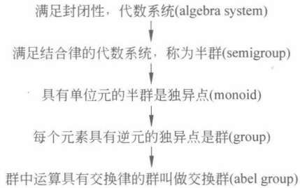
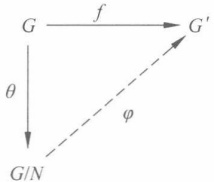
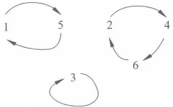
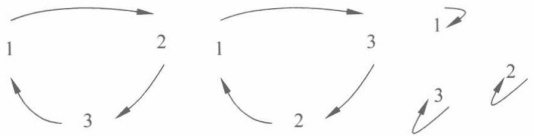
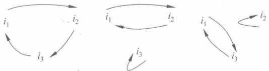
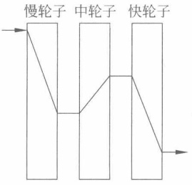
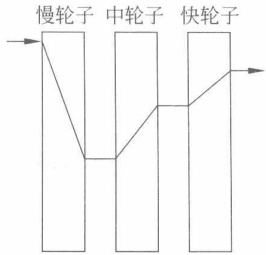
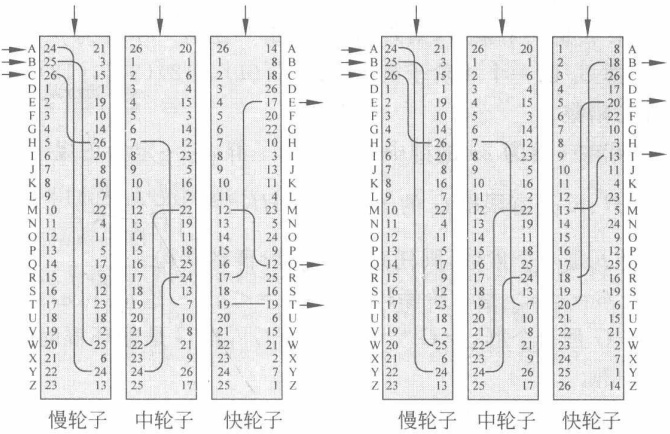

### 第6章

### 群

本章介绍只有一种运算的代数结构——群。

本章的重点是群的相关概念、循环群；难点是置换群。

## 6.1

#### 群的简介

定义 6.1（代数运算） 设 S 是一个非空集合（set），那么  $S \times S \rightarrow S$ 的映射叫作 S 上的代数运算。该代数运算记为 o（operator）。

由映射的定义可知，代数运算的结果必须是唯一确定的。

定义 6.2（封闭性） 对于非空集合 S 以及 S 上的运算 o，S 中任意元素 a 和 b，有  $a \circ b \in S$，则运算 o 具有封闭性（closure）。

对普通加法运算和乘法运算而言，运算均满足封闭性，所以封闭性是最本质的运算性质。代数运算是最一般情况下加法运算和乘法运算的自然推广，因而具备封闭性。

定义 6.3（代数系统） 对于非空集合 S 以及 S 上的运算 o，若运算 o 满足封闭性，则称其为代数系统（algebra system），记为  $\langle S, o \rangle$。

代数系统结构、性质以及其相互关系是计算机学科研究离散对象结构问题的关键所在。常见的代数系统有群、环、域等，这些代数系统是密码学重要的研究对象。

例 6.1 <N, +> 是代数系统, <N, -> 不是代数系统, <Z, -> 是代数系统。

代数系统内的代数运算一般需要运算规则（运算律），运算律用于将代数系统的性质抽象化。不同的运算律下可以定义不同的代数系统。

定义 6.4（结合律） 对于非空集合 S 以及 S 上的运算 o，S 中任意元素 a, b, c，有  $(aob)oc = ao(boc)$，则运算 o 满足结合律 (associative)。

定义 6.5 满足结合律的代数系统称为半群（semigroup）。

例 6.2 <Z, -> 不是半群。<Z, +> 是半群。

例 6.3  $A=\{1,2,3,4\}$，S 为 A 的全部子集构成的集合（即 A 的幂集），则  $\langle S,\cap\rangle$， $\langle S,\cup\rangle$ 均是半群。

定义 6.6（单位元） 设 S 是一个具有运算 o 的非空集合。如果 S 中有一个元素 e 使得

$$
ea=a
$$

对 S 中所有元素 a 都成立，则称元素 e 为 S 中的左单位元。

同理，若有 ae=a 对 S 中所有元素 a 都成立，则称元素 e 为 S 中的右单位元。当左单

位元等于右单位元时，合称为单位元（identity element）。

半群中不一定存在左单位元，也不一定存在右单位元，但是若左、右单位元同时存在，则左、右单位元必定相等且为唯一的单位元。

定义 6.7（独异点） 具有单位元的半群称为独异点（monoid，也叫作幺半群）。

例 6.4 <N, +> 是独异点，单位元为 0。<N, ·> 是独异点，单位元为 1。

逆元概念的引入需要基于单位元的存在性。

定义 6.8（逆元）设 S 是一个具有运算 o 的有单位元的集合，a 是 S 中的一个元素，如果 S 中存在一个元素  $a^{\prime}$，使得

$$
\boldsymbol{a}\boldsymbol{a}^{\prime}=\boldsymbol{a}^{\prime}\boldsymbol{a}=\boldsymbol{e}
$$

$$
a
$$

$$
a^{^{\prime}}
$$

$$
a^{-1}
$$

当运算 o 为加法时，这个  $a^{\prime}$ 叫作 a 的负元，记为 -a。

定义 6.9（群）非空集合 S 中每个元素具有逆元的独异点是群（group）。

一个代数系统是否为群，是由非空集合 S 和 S 上定义的代数运算共同决定的。在相同的非空集合 S 下定义的不同的代数系统，可能为群，也可能不为群。

一个代数系统的单位元、逆元等，也是由非空集合 S 和 S 上定义的代数运算共同决定的。在相同的非空集合下定义的不同的代数系统，其单位元和逆元也可能不相同。

例 6.5 整数集 Z，对于普通加法运算  $\langle Z, + \rangle$ 可以构成一个群，但是对于普通乘法运算，因为除  $\pm 1$ 以外的元素均缺少逆元， $\langle Z, \times \rangle$ 而不能构成群。

例 6.6 $m$ 为合数，$\mathbf{Z}_m = \mathbf{Z}/m\mathbf{Z} = \{0, 1, \cdots, m-1\}$。$\cdot$表示模$m$ 的乘法。$<\mathbf{Z}_m, \cdot >$不是群，但$<\mathbf{Z}_m^*, \cdot >$是群，这里$\mathbf{Z}_m^*$表示模$m$ 的最小非负简化剩余系。

定义 6.10（消去律）设 S 是一个具有运算 o 的非空集合，如果对 S 中任意元素 a、b 和 c，其中 a 非零，当 ab = ac 或 ba = ca 时，一定有 b = c 成立，则称运算 o 具有消去律（cancellation law）。

例 6.7 群一定满足消去律，因为群内任意元素均含有逆元，等式左乘或右乘非零元 a 的逆元，可以直接得到结果。

定义 6.11（交换律） 设 S 是一个具有运算 o 的非空集合，如果对 S 中任意元素 a 和 b，有

$$
a\circ b=b\circ a
$$

则称运算 o 具有交换律（commutative law）。

定义 6.12 群中运算具有交换律的群叫作交换群，或者可换群，或者 Abel 群。

例 6.8 <Z, +> 是交换群。有理数集合 Q、实数集  $\mathbb{R}$、复数集 C 对于通常意义下的加法 + 和乘法 · 而言，<Q $\{0\}$，· >，<R $\{0\}$，· >，<C $\{0\}$，· > 是交换群。

思考6.1  $\pi$ 的逆元是什么？ $a+bi$ 的逆元是什么？ $a+b\sqrt{2}$ 的逆元是什么？

例 6.9 全体实数 R 上的  $n \times n$ 可逆矩阵，对矩阵乘法构成一个群，记为  $\mathrm{GL}_{n}(\mathbb{R})$，称为 n 级“一般线性群”。全体实数域 R 上矩阵行列式为 1 的  $n \times n$ 矩阵，对矩阵乘法构成一个群，记为  $\mathrm{SL}_{n}(\mathbb{R})$，称为“特殊线性群”。这两个群中群元素为矩阵，群中的乘法运算为矩阵乘法。这两个群都不是交换群。

例 6.10 设复数域上 4 个二阶矩阵为

$$
\mathbf{I}=\left(\begin{matrix}{1}&{0}\\ {0}&{1}\\ \end{matrix}\right),\quad\mathbf{A}=\left(\begin{matrix}{\mathrm{i}}&{0}\\ {0}&{-\mathrm{i}}\\ \end{matrix}\right),\quad\mathbf{B}=\left(\begin{matrix}{0}&{1}\\ {-1}&{0}\\ \end{matrix}\right),\quad\mathbf{C}=\left(\begin{matrix}{0}&{\mathrm{i}}\\ {\mathrm{i}}&{0}\\ \end{matrix}\right),
$$

令  $H = \{\pm I, \pm A, \pm B, \pm C\}$，则可证明 H 关于矩阵的乘法构成一个群。事实上，乘法显然适合结合律，而且 H 关于乘法封闭；I 是单位元， $A^{-1} = -A, B^{-1} = -B, C^{-1} = -C$，群 H 称为四元数群，也称为 Hamilton 群，它是非交换的。

读者可以根据矩阵的乘法写出 Hamilton 四元数群的乘法表。

图 6.1 以一种“递进”的方式给出概念间的联系，非正式地说，显示了群定义中类似于“进化完善”的过程，便于理解和记忆。

图 6.1 用“递进”的方式给出概念间的联系便于理解群的“进化完善”过程
 

定义 6.13 若群 G 中含有有限个元素，则称群 G 为有限群；若群 G 中含有无限多个元素，则称群 G 为无限群。一个有限群 G 中的元素个数称为群的阶，记为  $|G|$。无限群的阶被称为无限。

思考6.2 你能给出无限群和有限群的例子吗？

<Z, +> 是无限群, <{0,1,2,⋯,n-1}, +mod n> 是有限群。

例 6.11 设 $n$是一个正整数，集合为$\mathbb{Z}/n\mathbb{Z}=\{0,1,2,\cdots,n-1\}$，集合 $\mathbb{Z}/n\mathbb{Z}$ 上的运算为加法

$$
a\oplus b=(a+b)\pmod{n}
$$

其中  $a \pmod{n}$ 是整数  $a$ 模  $n$ 的最小非负剩余。 $G = \langle \mathbb{Z}/n\mathbb{Z}, \oplus \rangle$ 构成一个交换加群。 $|G| = n$。

例 6.12 设  $n$ 是一个合数，集合  $(\mathbb{Z}/n\mathbb{Z})^* = \{a \mid a \in n\mathbb{Z}, (a,n) = 1\}$，集合  $(\mathbb{Z}/n\mathbb{Z})^*$ 上的运算为乘法

$$
a\odot b=(a\times b)\pmod n
$$

 $G = \langle (\mathbf{Z}/n\mathbf{Z})^{*}, \odot \rangle$ 构成一个交换乘法群。 $|G| = \varphi(n)$。

下面引入幂次的概念。

幂次概念的引入是指数概念的自然推广，因此指数运算规则在群中适用。

定义 6.14 设 n 是正整数，如果  $a_{1}=a_{2}=\cdots=a_{n}=a$，则记  $a_{1}a_{2}\cdots a_{n}=a^{n}$，称之为 a 的 n 次幂，特别地，定义  $a^{0}=e$ 为单位元， $a^{-n}$ 为  $a^{-1}$ 的 n 次幂（即 a 的逆元与自己运算 n 次）。

由群的结合律可以得到，a 是群 G 中的任意元，则对任意的整数 m, n，有

$$
a^{m}a^{n}=a^{m+n}\quad(a^{m})^{n}=a^{mn}
$$

注意：上面 n 虽然写在右上角，对于加法运算而言，其实是“na”，即 0a=e 为单位元（加法群的零元）， $(-n)a=n(-a)$， $ma+na=(m+n)a$， $m(na)=(mn)a$。也就是说，这里的幂次具体如何计算取决于群中的运算。

例 6.13  $ \langle \mathbf{Z}/n\mathbf{Z}, \oplus \rangle $ 中， ${1}^{n} = 0, 1^{-n} = (-1)^{n} = 0, 2^{n} = 0, 2^{-n} = (-2)^{n} = 0$。

其实，对于加法而言， ${1}^{3}=3$， ${1}^{-3}=(-1)^{3}=n-3$。

又如， $\langle \mathbf{Z}, + \rangle$中， ${1}^{n}=n,1^{-n}=(-1)^{n}=-n,2^{n}=2n,2^{-n}=(-2)^{n}=-2n$

下面引入元素的阶(Order)的概念。

元素的阶的概念的引入是用于研究群的周期性质，幂次是研究元素的价的主要工具。

定义 6.15 设  $a \in \text{群 } G$,  $e$ 是  $G$ 的单位元, 若任意  $k \in \mathbb{N}$,  $a^k \neq e$, 则称  $a$ 的阶为无穷大, 记作  $|a| = \infty$, 若存在  $k \in \mathbb{N}$ 使得  $a^k = e$, 则称  $\min\{k |k \in \mathbb{N}, a^k = e\}$ 为  $a$ 的阶。若  $a$ 的阶是  $n$, 则记作  $|a| = n$。

思考6.3 元素的阶和群的阶有什么区别？

例 6.14 群中单位元的阶是 1，其他任何元素的阶都大于 1。 $<\mathbf{Z}/5\mathbf{Z},\oplus>$ 中单位元的阶是 1，其他元素 1,2,3,4 的阶都是 5。 $<\mathbf{Z}/6\mathbf{Z},\oplus>$ 中单位元的阶是 1，1 的阶为 6，2 的阶是 3，3 的阶是 2，4 的阶是 3，5 的阶是 6。

思考 6.4 无限群中元素的阶一定是无限的吗？有限群中元素的阶一定是有限的吗？

例 6.15 集合  $S = \{1, -1, i, -i\}$ 关于乘法构成群，即 4 次单位根群  $G = <S, \cdot >$。群  $|G| = 4$。 $|1| = 1$， $|-1| = 2$， $|i| = |-i| = 4$。

例 6.16 群  $<Z, +>$ 中， $|1| = \infty, |2| = \infty, |0| = 1$。其实，除了 0 外，其余元素阶均为  $\infty$。群  $<Q\setminus\{0\}$， $\cdot >$ 中， $|1| = 1, |-1| = 2$，其余的元素阶均为  $\infty$。

## 6.2 子群、陪集、拉格朗日定理

下面讨论两个群之间的关系（由群中集合的包含关系确定）。

一般情况下，讨论子群是为了通过子群的特征对群进行划分与分类，进而研究群的性质。

定义 6.16 设 H 是群 G 的一个非空子集合，如果对于群 G 的运算，H 成为一个群，则 H 叫作群 G 的子群 (subgroup)，记作  $H \leq G$。

 $H=\{e\}$ 和 H=G 都是群 G 的子群，叫作群 G 的平凡子群。

如果 H 不是群 G 的平凡子群，那么 G 的子群 H 叫作群 G 的真子群或非平凡子群，记作  $H < G$。

例 6.17  ${3}\mathbf{Z}=\{\cdots,-6,-3,0,3,6,\cdots\}$ 是  $\mathbf{Z}$ 的子群。 ${6}\mathbf{Z}=\{\cdots,-12,-6,0,6,12,\cdots\}$ 是  ${3}\mathbf{Z}$ 的子群，即  $<6\mathbf{Z},+>\leq<3\mathbf{Z},+>$。

其实，有$<12\mathbf{Z},+> \leqslant <6\mathbf{Z},+> \leqslant <2\mathbf{Z},+> \leqslant <\mathbf{Z},+>$.

例 6.18 设 n 是一个正整数，则  $<nZ=\{nk|k\in\mathbb{Z}\}$，+> 是 <Z，+> 的子群。

$$
例 6.19\quad<Z,+>\leqslant<Q,+>\leqslant<R,+>\leqslant<C,+>；
$$

$$
\langle \mathbb{Z}, + \rangle \leqslant \langle \mathbb{Q}, + \rangle \leqslant \langle \mathbb{R}, + \rangle \leqslant \langle \mathbb{C}, + \rangle
$$

定理 6.1 设 G 是群，H 是 G 的子群，则 H 中任意元素在 H 中的逆元等于该元素在 G 中的逆元，H 中的单位元就是 G 中的单位元。

证明 记 H 中的单位元为  $e_{1}$，G 中的单位元为  $e_{2}$，a 为 H 中任意一元素， $a_{1}$ 为 a 在 H 中的逆元， $a_{2}$ 为 a 在 G 中的逆元。

因为  $e_{1}e_{1}=e_{1}=e_{1}e_{2}$，根据群的消去律，因为  $e_{1}e_{1}=e_{1}e_{2}$，可以得到  $e_{1}=e_{2}$，故 H 中的单位元就是 G 中的单位元。

因为  $a_{1}a=e_{1}=a_{2}a$ ，根据群的消去律，因为  $a_{1}a=a_{2}a$ ，可以得到  $a_{1}=a_{2}$ 。又因为 a 取值的任意性，故 H 中任意元素在 H 中的逆元等于该元素在 G 中的逆元。

除了用定义来判定外，子群的判定还可以根据以下更为简单的判定定理。

定理 6.2 设  $H$ 是群  $G$ 的一个非空子集合，则  $H$ 是群  $G$ 的子群的充要条件是对任意的  $a, b \in H$，有  $ab^{-1} \in H$。

证明 必然性是显然的，下面证明充分性。

因为  $H$ 非空，所以  $H$ 中有元素  $a$，根据假设，有  $e = aa^{-1} \in H$，因此  $H$ 中有单位元。对于  $e \in H$ 及任意  $a$，再应用假设，有  $a^{-1} = ea^{-1} \in H$，即  $H$ 中每个元素  $a$ 在  $H$ 中均有逆元。对于任意  $a, b \in H$，由  $ab = a(b^{-1})^{-1} \in H$，可知  $H$ 对乘法运算封闭，因此  $H$ 是群  $G$ 的子群。

注意：如果运算为加法，则  $ab^{-1} \in H$ 应视为  $a + (-b) \in H$，或  $a - b \in H$。

例 6.20  ${3}\mathbf{Z}\subset\mathbf{Z}$，任意的  $a,b$ 是对任意的  $a,b\in3\mathbf{Z}$，有  $ab^{-1}\in3\mathbf{Z}$，即不妨设  $a=3m$， $m\in\mathbf{Z}$， $b=-3n,n\in\mathbf{Z}$，于是  $ab^{-1}=3m-3n=3(m-n)\in3\mathbf{Z}$，于是  $<3\mathbf{Z},+>\leq\langle\mathbf{Z},+\rangle$。

下面引入陪集的概念，陪集是群内特殊的子集，陪集的引入主要用于通过对群进行陪集划分来研究群的性质。

定义 6.17 设  $H$ 是群  $G$ 的子群， $a \in G$，则称群  $G$ 的子集  $aH = \{ax | x \in H\}$ 为群  $G$ 关于子群  $H$ 的一个左陪集，称群  $G$ 的子集  $Ha = \{xa | x \in H\}$ 为群  $G$ 关于子群  $H$ 的一个右陪集，同时  $a$ 称为代表元。

例 6.21 Z 关于子群  $H = <3\mathbb{Z}, +>$ 的左陪集。

假设  $a=3$，则  $aH=\{3+x|x\in3\mathbb{Z}\}=\{3k|k\in\mathbb{Z}\}$。 $a=3$ 是代表元。

假设  $a=4$，则  $aH=\{4+x|x\in3\mathbb{Z}\}=\{1+3k|k\in\mathbb{Z}\}$。 $a=4$ 是代表元。

假设  $a=5$，则  $aH=\{5+x|x\in3\mathbb{Z}\}=\{2+3k|k\in\mathbb{Z}\}$。 $a=5$ 是代表元。

假设 a=6，则  $aH=\{6+x|x\in3\mathbb{Z}\}=\{3k|k\in\mathbb{Z}\}$。a=6 是代表元。

Z 关于子群  $H = <3Z, +>^{\prime}$ 的右陪集。

假设 a=3，则  $Ha=\{x+3|x\in3\mathbb{Z}\}=\{3k|k\in\mathbb{Z}\}$。a=3 是代表元。

假设 a=6，则  $Ha=\{x+6|x\in3\mathbb{Z}\}=\{3k|k\in\mathbb{Z}\}$。a=6 是代表元。

例 6.22  $\mathbf{F}_{7}^{*} = \langle (\mathbf{Z}/7\mathbf{Z}) \setminus \{0\}, \cdot \rangle$ 的非平凡子群有  $H_{1} = \{1, 2, 4\}$,  $H_{2} = \{1, 6\}$。 $\mathbf{F}_{7}^{*}$ 关于  $H_{1}$ 的左陪集。

假设 a=1，则  $aH_1=1H_1=\{1 \cdot x \mid x \in H_1\}=\{1 \cdot 1, 1 \cdot 2, 1 \cdot 4\}=\{1, 2, 4\}$。a=1 是代表元。

假设 a=2，则  $aH_1=2H_1=\{2\cdot x|x\in H_1\}=\{2\cdot1,2\cdot2,2\cdot4\}=\{1,2,4\}$。a=2 是

代表元。

假设  $a=4$，则  $aH_1=4H_1=\{4\cdot x|x\in H_1\}=\{4\cdot1,4\cdot2,4\cdot4\}=\{1,2,4\}$。 $a=4$ 是代表元。

假设  $a=3$，则  $aH_1=3H_1=\{3\cdot x|x\in H_1\}=\{3\cdot1,3\cdot2,3\cdot4\}=\{3,5,6\}$。 $a=3$ 是代表元。

假设 a=5，则  $aH_1=5H_1=\{5\cdot x|x\in H_1\}=\{5\cdot1,5\cdot2,5\cdot4\}=\{3,5,6\}$。a=5 是代表元。

假设  $a=6$，则  $aH_1=6H_1=\{6\cdot x|x\in H_1\}=\{6\cdot1,6\cdot2,6\cdot4\}=\{3,5,6\}$。 $a=6$ 是代表元。

 $F_{7}^{*}$ 关于  $H_{2}$ 的右陪集：

假设  $a=3, H_{2}a=H_{2}3=\{x \cdot 3 \mid x \in H_{2}\} = \{1 \cdot 3, 6 \cdot 3\} = \{3, 4\}$。

a=3 是代表元。

假设 a=5，则  $H_{2}a=H_{2}5=\{x\cdot5|x\in H_{2}\}=\{1\cdot5,6\cdot5\}=\{2,5\}$。

a=5 是代表元。

假设 a=6，则  $H_{2}a=H_{2}6=\{x\cdot6|x\in H_{2}\}=\{1\cdot6,6\cdot6\}=\{1,6\}$。

a=6 是代表元。

从上面可以观察到有些右（左）陪集是相等的。下面讨论什么情况下会出现这种情况？

定理 6.3 设 H 是群 G 的子群，则  $\forall a, b \in G, Ha = Hb$ 与下面两个等价。

(1)  $a \in Hb$.

(2)  $ab^{-1} \in H$。

证明 （1） $a \in Hb \to Ha = Hb$。

设  $a \in H_b$，则存在  $h \in H$， $a = hb$，即  $b = h^{-1}a$。

 $\forall x \in Ha$，存在  $h_1 \in H$，使得  $x = h_1 a = h_1 (hb) = (h_1 h) b$。子群  $H$ 对运算封闭，于是  $h_1 h \in H$，于是  $x \in Hb$。故  $Ha \subseteq Hb$。

 $\forall y \in Hb$，存在  $h_2 \in H$，使得  $y = h_2 b = h_2 (h^{-1} a) = (h_2 h^{-1}) a$。同样地，子群  $H$ 对运算封闭，于是  $h_2 h^{-1} \in H$，于是  $y \in Ha$。故  $Hb \subseteq Ha$。

因此，Ha=Hb。

(2)  $Ha = Hb \to ab^{-1} \in H$。

设 Ha=Hb，则  $\forall ha \in Ha$，都存在  $h^{\prime} \in H$，使得 ha=h'b，即  $ab^{-1}=h^{-1}h^{\prime} \in H$。

(3)  $ab^{-1} \in H \to a \in Hb$.

 $ab^{-1} \in H$，则存在  $h \in H$，使得  $ab^{-1} = h$，于是  $a = hb \in Hb$。

综上， $a \in \mathrm{Hb} \to \mathrm{Ha} = \mathrm{Hb} \to ab^{-1} \in \mathrm{H} \to a \in \mathrm{Hb}$，因此，三者等价。

由上述定理中的(1)可以看出，一旦代表元a“落入”代表元b的右陪集，则两个陪集就是一样的（如第2章同余中提到的剩余类中的一个元素可以代表这一类元素）。

定理 6.4 设  $H$ 为群  $G$ 的子群， $a, b \in G$，则

(1)  $a \in Ha$.

(2)  $H_a = H_b$, 或者  $H_a \cap H_b = \varnothing$.

(3)  $G = \bigcup_{a \in G} H a$.

证明（1）H为G的子群，故H中有单位元， $a=ea\in Ha$。

(2)  $Ha \cap Hb \neq \varnothing$，则存在  $x \in Ha \cap Hb$，由  $x \in Ha$，则  $Hx = Ha$，由  $x \in Hb$，则  $Hx = Hb$，于是 Ha = Hb。

（3）由于每个右陪集都是群 G 中集合的子集，这些右陪集的并也是 G 的子集，于是  $G \supseteq \bigcup_{a \in G} Ha$；另外， $g \in G$，由（1）知  $g \in Hg \subseteq \bigcup_{a \in G} Ha$，于是  $G \subseteq \bigcup_{a \in G} Ha$。

综上， $G = \bigcup_{a \in G} H a$。

从上面定理可知以下几点。

（1）每个右陪集的代表元都包含在该右陪集中。

（2）任意两个右陪集要么相等，要么不相交。

（3）将不重复的全部右陪集并起来等于整个群G的集合。

因此，群 G 的所有右陪集构成了 G 的一个分划（partition）。

在相同的群下，不同的子群可以提供不同的陪集分解。

当群 G 是有限群时，陪集分解是有限的；然而，当群 G 是无限群时，陪集分解可能是有限的，也可能是无限的。

例 6.23 <Z, +> 关于  $H = <3Z, +\gt$ 的右陪集  $H3, H4, H5$ 构成了 Z 的一个分划。这里的运算是加法。另外， $H5 = H2, H4 = H1, H3 = H0$。 $H5 \cap H3 = \varnothing$。

同时，以单位元为代表的右陪集是子群 H，其余右陪集都不是 G 的子群。

例 6.24 <Z, +> 关于  $H = <3Z, +\gt$ 的右陪集  $H_2$ 不是 G 的子群，因为没有单位元 0。右陪集  $H_1$ 也不是子群，没有单位元 0。只有  $H_0$ 是子群，即  $H$。

定义 6.18 若 H 为群 G 的子群，则称 H 的右（左）陪集的个数为 H 在 G 中的指数，记为  $[G:H]$。

例 6.25  $G = \langle \mathbf{Z}, + \rangle, H = \langle 3\mathbf{Z}, + \rangle$，则  $[G:H] = 3$。 $G = \langle \mathbf{Z}, + \rangle, H = \langle 5\mathbf{Z}, + \rangle$，则  $[G:H] = 5$。 $G = \langle \mathbf{Z}, + \rangle, H = \langle n\mathbf{Z}, + \rangle$，则  $[G:H] = n$。

引理6.1 设 H 为群 G 的子群，则 H 与 H 的任一个右陪集 Ha 之间都存在双射。

设  $f: H \to H_a$，其中  $\forall h \in H$，有  $f(h) = h a$。

（1）f 是一个映射，因为 h 在 f 下的像 ha 是唯一确定的。

(2)  $\forall h a \in H a$, 有原像 h, 所以 f 是满射。

（3）设  $f(h_{1})=h_{1}a$,  $f(h_{2})=h_{2}a$ ，若  $h_{1}a=h_{2}a$ ，则  $h_{1}aa^{-1}=h_{2}aa^{-1}$ ，即  $h_{1}=h_{2}$ ，所以 f 是单射。

综上，f 是双射。

由上述定理可知，子群不相等的右陪集不相交，且有相同数目的元素。

例 6.26  $G = \langle \mathbf{Z}, + \rangle$ 关于  $H = \langle 3\mathbf{Z}, + \rangle$ 的右陪集为  $H_0 = \{ x \mid x = 3k, k \in \mathbf{Z} \}$， $H_1 = \{ x \mid x = 3k + 1, k \in \mathbf{Z} \}$， $H_2 = \{ x \mid x = 3k + 2, k \in \mathbf{Z} \}$，它们具有相同的元素个数，即  $|H_0| = |H_1| = |H_2|$。

另外， $G = \langle \mathbf{Z}, + \rangle$ 关于  $H = \langle 4\mathbf{Z}, + \rangle$ 的左陪集是  ${0}H, 1H, 2H, 3H$，具有相同的元素个数。

下面引入群论中的一个重要的定理——Lagrange定理。

定理 6.5(Lagrange 定理) 设 H 为有限群 G 的子群,  $|G|=|H|\cdot[G:H]$。

证明 假设  $|G|=N, |H|=n, [G:H]=j$。因为  $[G:H]=j$，即群 G 关于子群 H 的右陪集的个数是 j。

$$
G=H a_{1}\bigcup H a_{2}\bigcup\cdots\bigcup H a_{j}
$$

其中  $Ha_{1}=Ha$

由引理6.1，有

$$
\left|H a_{1}\right|=\left|H a_{2}\right|=\cdots=\left|H a_{j}\right|=n
$$

所以 $|G|=|Ha_{1}|j$，即N=nj。

Lagrange定理将子群的阶和有限群的阶联系起来。它给出判定有限群子群的必要条件，为子群的判定、分类提供新的方法。

例 6.27  $F_7^* = \langle Z/7Z \rangle \{0\}, \cdot >$ 的非平凡子群有  $H_1 = \{1, 2, 4\}$,  $H_2 = \{1, 6\}$。 $F_7^*$ 关于  $H_1$ 的左陪集有两个，即

$$
1H_{1}=\{1\cdot x\mid x\in H_{1}\}=\{1\cdot1,1\cdot2,1\cdot4\}=\{1,2,4\}。
$$

$$
3H_{1}=\left\{3\cdot x\mid x\in H_{1}\right\}=\left\{3\cdot1,3\cdot2,3\cdot4\right\}=\left\{3,5,6\right\}
$$

容易看到， $\left|F_{7}^{*}\right|=6,\left|H_{1}\right|\cdot\left[F_{7}^{*}:H_{1}\right]=3\cdot2=6$

 $F_{7}^{*}$ 关于  $H_{2}$ 的右陪集有 3 个，即

$$
H_{2}3=\{x\cdot3\mid x\in H_{2}\}=\{1\cdot3,6\cdot3\}=\{3,4\}。
$$

$$
H_{2}5=\{x\cdot5\mid x\in H_{2}\}=\{1\cdot5,6\cdot5\}=\{2,5\}。
$$

$$
H_{2}\mathbf{6}=\left\{x\cdot6\mid x\in H_{2}\right\}=\left\{1\cdot6,6\cdot6\right\}=\left\{1,6\right\}。
$$

容易看到， $\left|F_{7}^{*}\right|=6,\left|H_{2}\right|\cdot\left[F_{7}^{*}:H_{2}\right]=2\cdot3=6$

推论 6.1 设 G 为有限群，则  $\forall a \in G$，其阶 m 是  $\left|G\right|$ 的因子，即  $\left|a\right| \mid \left|G\right|$。

证明 由 $a$生成$G$的一个循环子群$H$，由 Lagrange 定理知 $|H| \mid |G|$。$|H|=m$，因此，$m \mid |G|$，即 $|a| \mid |G|$。

即有限群中每个元素的阶是群的阶的因子。

推论6.2 设 H 是有限群 G 的子群，则  $\left|H\right| \mid \left|G\right|$。

推论 6.3 设 G 是 N 阶有限群，则对 G 中任意元素 g，有  $g^{N}=e$。

例 6.28  $G = \langle \mathbf{Z}, + \rangle$ 关于子群  $H = \langle n\mathbf{Z}, + \rangle$ 的代表元为  $a$ 的右陪集为  $n\mathbf{Z} + a$,  $a \in \mathbf{Z}$, 即

$$
n\mathbf{Z} + a=\left\lbrace n k  + a\ \mid\ k\ \in\ \mathbf{Z}\right\rbrace
$$

即为 Z 关于模 n 的剩余类， $[\mathbf{Z}:n\mathbf{Z}]=n,G=H0\cup H1\cup\cdots\cup H(n-1)$，这里  $H i=n\mathbf{Z}+i$。

#### 正规子群、商群、同态

在 6.2 节中陪集概念的引入，提供了对群进行划分的一种方法。然而，陪集对群的划分不能够保证任意陪集内的元素在代数运算后结果依然保持在唯一的陪集中。例如，$\langle Z, + \rangle$ 关于 $\langle 3Z, + \rangle$ 的陪集 H1，H1 中的元素进行代数运算后的结果为 H2，但是，H0 的

元素运算后结果保持在 H0 中。另外，如果将陪集 H0, H1, H2 视为一个集合，如何定义运算，使得它们能构成一个群。

定义 6.19 设 G 是群， $H \leq G$，若对 G 中任一元素 a，均有 aH = Ha，即 a 关于 H 的左、右陪集相等，则称 H 为 G 的正规子群，记为  $H \triangleleft G$。

由正规子群的定义知以下几点。

（1）单位元生成的子群，以及群G本身，是两个平凡的正规子群。

（2）当 G 为 Abel 群时，它的任意子群都是正规子群。

例 6.29 $\langle Z, + \rangle$ 是交换群，$\langle 3Z, + \rangle$ 是正规子群，$\langle 5Z, + \rangle$ 是正规子群，$\langle nZ, + \rangle$ 是正规子群。$\langle Q, + \rangle$ 的任意子群都是正规子群。

正规子群的判断条件如下。

定理 6.6 设 H 是群 G 的正规子群，等价于：

(1)  $\forall a \in G, h \in H, a \cdot ha^{-1} \in H$.

(2)  $\forall a \in G, a H a^{-1} \subset H$.

(3)  $\forall a \in G, a H a^{-1} = H$.

证明 从  $H$ 是群  $G$ 的正规子群，推导(1)：因为  $H \triangleleft G$ 可以得到  $aH = Ha$，所以任取  $H$ 中元素  $h$，可以得到  $ah = ha$。等式两边同乘  $a^{-1}$，得到  $aha^{-1} = h \in H$，即  $aha^{-1} \in H$。

从(1)推导(2)：因为 h 在 H 内取值的任意性，可以得到  $aH a^{-1} \subset H$。

从(2)推导(3)：因为任意 $h_{1}\in H$，均有 $ah_{1}a^{-1}\subset H$，即存在 $h_{2}\in H$，使得 $ah_{1}a^{-1}=h_{2}$，即 $a^{-1}h_{2}a=h_{1}$，因此 $H\subset aHa^{-1}$。所以， $aHa^{-1}=H$得证。

从(3)推导 H 是群 G 的正规子群：因为  $aH a^{-1}=H$，等式两边同时右乘 a，得到  $aH=Ha$，因此， $H\triangleleft G$ 得证。

下面定义一个运算，使得正规子群的陪集集合构成一个群。注意，任取 aH 中两个元素  $a_{1}, a_{2}$，和 bH 中两个元素  $b_{1}, b_{2}$，都有  $a_{1}b_{1}H = a_{2}b_{2}H$，即该运算的定义不依赖于 aH 和 bH 的代表元的选取。

定理 6.7 设  $H \triangleleft G$，令  $G/H = \{aH \mid a \in G\}$ 代表正规子群  $H$ 在群  $G$ 中的全部不同的陪集组成的集合，在  $G/H$ 上定义运算： $(aH) \cdot (bH) = (ab)H$，则  $G/H$ 在该运算下构成一个群。

证明  $G/H = \{aH \mid a \in G\} = \{Ha \mid a \in G\}$，由

$$
a\mathrm{H}\cdot b\mathrm{H}=ab\mathrm{H}\in\mathrm{G}/\mathrm{H}
$$

于是，G/H 对于运算满足封闭性。

由

$$
(a\mathrm{H}\cdot b\mathrm{H})\cdot c\mathrm{H}=ab\mathrm{H}\cdot c\mathrm{H}=abc\mathrm{H}
$$

$$
a H\cdot(b H\cdot c H)=a H\cdot(b c H)=a b c H
$$

知 G/H 对于运算满足结合律。

由

$$
\mathbf{H}\cdot\mathbf{a}\mathbf{H}=\mathbf{a}\mathbf{H}\cdot\mathbf{H}=\mathbf{a}\mathbf{H}.
$$

知 G/H 对于运算的单位元为 H。

由

$$
\begin{array}{l}\mathrm{a}\mathrm{H}\cdot\mathrm{a}^{-1}\mathrm{H}=\mathrm{a}\mathrm{a}^{-1}\mathrm{H}=\mathrm{H}\end{array}
$$

$$
\begin{aligned}a^{-1}H\cdot aH=a^{-1}aH=H\end{aligned}
$$

知 aH 的逆元是  $a^{-1}H$。

综上，G/H 关于运算 · 构成一个群。

定义 6.20 群 G/H 称为 G 关于正规子群 H 的商群。

例 6.30 <Z, +> 关于正规子群 <3Z, +> 的陪集集合为 H0, H1, H2, 即 G/H = {H0, H1, H2}, 在 G/H 上定义运算: (aH) · (bH) = ((a+b) mod 3)H, a, b ∈ {0, 1, 2}, 则 G/H 对于运算 · 构成一个群, 该群的单位元是 H0, H0 的逆元是 H0, H1 的逆元是 H2, H2 的逆元是 H1。

例 6.31  $n\mathbf{Z} \triangleleft \mathbf{Z}$，商群  $\mathbf{Z}/n\mathbf{Z} = \{0 + n\mathbf{Z}, 1 + n\mathbf{Z}, \cdots, (n-1) + n\mathbf{Z}\}$。可分别用  $[0]$， $[1]$， $\cdots$， $[n-1]$ 表示这个 n 个陪集。 $\mathbf{Z}/n\mathbf{Z} = \{[0], [1], \cdots, [n-1]\}$。定义运算

$$
[\scriptstyle a]+[\scriptstyle b]=[\scriptstyle a+b\pmod{n}]
$$

显然，在这个运算下 Z/nZ 构成一个群。

例 6.32 商群 G/H 的单位元是 H，元 Ha 的逆元是  $Ha^{-1}$。

下面讨论群与群之间的两种特殊的映射。

定义 6.21 设 G 和  $G^{\prime}$ 是两个群，f 是 G 到  $G^{\prime}$ 的一个映射，如果对任意的 a, b  $\in G$，都有

$$
f(ab)=f(a)f(b)
$$

那么，f 叫作 G 到  $G^{\prime}$ 的一个同态（homomorphism）。

如果 f 是一对一的(injective)，则称 f 为单同态；如果 f 是满的(surjective)，则称 f 为满同态；如果 f 是一一对应的(bijective)，则称 f 为同构(isomorphism)。

如果存在一个 G 到  $G^{\prime}$ 的同构映射，称 G 和  $G^{\prime}$ 同构，记作  $G \cong G^{\prime}$。

当 $G=G^{\prime}$时，同态f叫作自同态，同构f叫作自同构。

 $\mathrm{Im}(f)=f(G)=\{f(a)\mid a\in G\}$称为群G的同态像。

 $\mathrm{Ker}(f)=\{a\mid a\in G,f(a)=e^{\prime}\}$称为同态f的同态核。

思考6.5 同态映射中的运算是否有区别。

需要注意的是，式(6.1)中左边 ab 之间的运算是 G 群中的运算，右边  $f(a)f(b)$ 之间的运算是  $G^{\prime}$ 群中的运算。

例 6.33 加群 Z 到乘群  $\mathbf{R}^* = \mathbf{R} \setminus \{0\}$ 的映射  $f\colon a \to e^a$ 是 Z 到  $\mathbf{R}^*$ 的一个同态。

例 6.34 加群 Z 到加群  $Z_n = Z/nZ$ 的映射  $f\colon n \to k$ ( $k \in \{0,1,\cdots,n-1\}$) 是 Z 到  $Z_n$ 的一个同态。

定理 6.8（自然同态） G 为一个群， $H \triangleleft G$，则 G 与它的商群 G/H 同态。

证明 设 H 是 G 的正规子群。定义映射  $f: G \to G/H$ 为  $f(a) = aH$。

容易证明  $f(ab)=abH, f(a)f(b)=aH \cdot bH=abH$ 。于是， $f(ab)=f(a)f(b)$

例 6.35 整数加法群 Z 与商群 Z/nZ 是自然同态。

例 6.36 自然同态的核就是正规子群 H。例如，整数加法群 Z 与商群 Z/nZ 是自然同态的核就是 nZ。

定理 6.9（同态基本定理）设 f 是群 G 到  $G^{\prime}$ 的一个满同态映射， $N = \mathrm{Ker}(f)$，则 N 是 G 的一个正规子群，且

$$
G/N\cong G^{\prime}
$$

证明 设 e 是群 G 的单位元， $e^{\prime}$ 是群  $G^{\prime}$ 的单位元。又设 a, b  $\in$ N，则有  $f(a) = f(b) = e^{\prime}$。因此  $f(ab^{-1}) = f(a)f(b^{-1}) = e^{\prime}(e^{\prime})^{-1} = e^{\prime}$，即

$$
\forall a,b\in N\Rightarrow a b^{-1}\in N
$$

于是 N 是 G 的子群。

又  $\forall c\in G, a\in N, f(cac^{-1})=f(c)e^{\prime}(f(c))^{-1}=e^{\prime}$，即

$$
\forall\ c\in G,a\in N\Rightarrow c a c^{-1}\in N
$$

因此，N 是 G 的正规子群。

定义  $\varphi: G/N \to G^{\prime}$ 为

$$
\varphi(aN)=f(a)
$$

这个映射就是 G/N 与  $G^{\prime}$ 之间的同构映射。理由如下。

(1)  $aN = bN \Rightarrow b^{-1}a \in N \Rightarrow e^{\prime} = f(b^{-1}a) = (f(b))^{-1}f(a) \Rightarrow f(a) = f(b)$，即在  $\varphi$ 映射下 G/N 的一个元素只有一个像。

（2）给定 $G^{\prime}$中的任意一个元素 $a^{\prime}$，在G中至少有一个元素a，满足 $f(a)=a^{\prime}$，则有 $\varphi(aN)=f(a)=a^{\prime}$，即 $\varphi$是G/N到 $G^{\prime}$的满射。

$$
a N\neq b N\Rightarrow b^{-1}a\notin N\Rightarrow(f(b))^{-1}f(a)\neq e^{\prime}\Rightarrow f(a)\neq f(b), 即 \varphi
$$

$$
1)a N b N=a b N\Rightarrow\varphi(a N b N)=\varphi(a b N)=f(a b)=f(a)f(b)=\varphi(a N)\varphi(b N)。
$$

综上， $G/N \cong G^{\prime}$。

图 6.2 给出了 3 个映射之间的关系： $f = \varphi\theta$。

图 6.2 自然同态  $\theta\colon G \to G/N, f\colon G \to G^{\prime}, \varphi\colon G/N \to G^{\prime}$
 

### 6.4 循环群

本节讨论循环群，其中很多定理是第5章中定理的一般化和抽象化，第5章研究对象是具体的，如整数，采用归纳的方法，这一节研究对象是抽象的，如群，采用演绎的方法。

定理 6.10 设 G 是一个群， $\{H_{i}\}_{i\in I}$ 是 G 的一族子群，则  $\bigcap_{i\in I}H_{i}$ 是 G 的一个子群。

证明 因为  $e \in H_i$，于是  $\bigcap_{i \in I} H_i$ 非空。若  $a, b \in \bigcap_{i \in I} H_i$，则对任意的  $i, a, b \in H_i$。有  $H_i \leq G$，有  $ab^{-1} \in H_i$，于是  $ab^{-1} \in \bigcap_{i \in I} H_i$。由子群的判定条件知， $\bigcap_{i \in I} H_i$ 是  $G$ 的一个子群。

例 6.37 2Z 是 Z 的子群，3Z 是 Z 的子群。 ${2}Z \cap 3Z = 6Z$ 是 Z 的子群。8Z 是 2Z 的

子群，6Z 是 2Z 的子群，8Z ∩ 6Z = 24Z 是 2Z 的子群。

定理 6.11 设 $G$ 是一个群，$X$是$G$ 的非空子集，$\{H_i\}_{i \in I}$是$G$的包含$X$的所有子群，则$\bigcap_{i \in I} H_i$是$G$的由$X$生成的子群，记为$<X>$。

例 6.38  $X = 6Z$,  $G$ 中包含  $X$ 的所有子群为  ${2}Z, 3Z, 6Z$。 ${2}Z \cap 3Z \cap 6Z = 6Z$,  ${6}Z$ 生成的子群记为  $<6Z>$。

实际上，$\langle X \rangle$ 是 G 中包含 X 的最小子群。

X 的元素称为子群  $<X>$ 的生成元。如果  $X=\{a_{1},\cdots,a_{n}\}$，则记  $\langle X\rangle$ 为  $\langle a_{1},a_{2},\cdots,a_{n}\rangle$。如果  $G=\langle a_{1},a_{2},\cdots,a_{n}\rangle$，则称 G 为有限生成的。特别地，如果  $G=\langle a\rangle$，则称 G 为由 a 生成的循环群 (cyclic group)。

定理 6.12 设 G 是一个群，X 是 G 的非空子集，则由 X 生成的子群为

$$
\langle X\rangle=\left\{a_{1}^{n_{1}}\cdots a_{t}^{n_{t}}\mid t\in N,a_{i}\in G,n_{i}\in\mathbf{Z},1\leqslant i\leqslant t\right\}
$$

特别地，对任意的  $a \in G$，有

$$
\begin{array}{l}<a>=\{a^{n}\mid n\in\mathbf{Z}\}\end{array}
$$

例 6.39 整数加群  $\langle Z, +\rangle$ 是由 1 或 -1 生成的循环群。其中任意正整数  $m = 1^m = (-1)^{-m}$。

例 6.40  $G = <6>$，对于加法而言， $<6> = <-6> = <6\mathrm{Z}, +>.$

例 6.41 整数模群 $(Z_{n}, +)$可由模n的同余类 $[1]$生成，故 $(Z_{n}, + \bmod n)$是一个循环群。

例 6.42 <2,3>=<Z,+>, 任意两个互素的整数可以生成加法群 <Z, +>。

若  $G = \langle a \rangle$，则称 a 是 G 的一个生成元。当  $\mathrm{ord}(a) = m$ 为有限整数时， $G = \{e, a, a^2, \cdots, a^{m-1}\}$；当  $\mathrm{ord}(a) = \infty$ 时， $G = \{\cdots, a^{-k}, \cdots, a^{-2}, a^{-1}, e, a, a^2, \cdots, a^k, \cdots\}$。

例 6.43  $\langle Z_5^*, \cdot \bmod 5 \rangle = \langle 2 \rangle = \{2^0, 2^1, 2^2, 2^3\} = \{1, 2, 3, 4\}$。2 是  $Z_5^*$ 的生成元。

$$
\langle \mathbf{Z}_{5}^{*}, \cdot \bmod 5 \rangle = \langle 4 \rangle =\{4^{0},4^{1},4^{2},4^{3}\}=\{1,4,1,4\}。
$$

例 6.44 对$\langle\mathbf{Z},+\rangle$而言，$\mathrm{ord}(0)=1,\mathrm{ord}(1)=\infty,\mathrm{ord}(-1)=\infty$。

易知，循环群是 Abel 群。若  $G = \langle a \rangle$，则  $\left| G \right| = \mathrm{ord}(a)$。

例 6.45  $\mathbf{Z}_{7}^{*}=<3>=\{3^{1},3^{2},3^{3},3^{4},3^{5},3^{6}\}$  $\left|\mathbf{Z}_{7}^{*}\right|=\mathrm{ord}(3)=6$。

例 6.46 设  $G = \langle g \rangle = \{ g^r \mid g^r \neq 1, 1 \leqslant r < n, g^n = 1 \}$，G 是 n 阶循环群，则

$$
<g^{d}>=\{g^{d k}\mid k\in\mathbf{Z}\}
$$

$$
\mathbf{Z}_{7}^{*}=<3>=\{3^{1},3^{2},3^{3},3^{4},3^{5},3^{6}\}。
$$

$$
\langle 3^{2} \rangle = \langle 2 \rangle =\{2^{1},2^{2},2^{3}\}=\{2,4,1\}。
$$

思考6.6 这一定义和第5章中原根和阶的定义形成了某种“呼应”。

定理 6.13 加群 Z 的每个子群 H 都是循环群，且有  $H = \langle 0 \rangle$ 或者  $H = \langle m \rangle = mZ$，其中 m 是 H 中的最小正整数。如果  $H \neq \langle 0 \rangle$，则 H 是无限的。

例 6.47 加群 Z 的子群  $H = \langle 3 \rangle = 3Z$ 是无限的， $H = \langle 0 \rangle = \langle \{0\}, + \rangle$ 是有限的。

例 6.48 加群 Z 的子群  $H = \langle m \rangle = mZ$ 是无限的，即  $\langle \cdots, -2m, -m, 0, m, 2m, \cdots, + \rangle$ 是无限的。

定理 6.14 每个无限循环群同构于加群 Z，每个阶为 m 的有限循环群同构于加群 Z/mZ。

证明 定义  $f: \mathbb{Z} \to G$ 为  $f(k) = a^k$，则  $f$ 是满射。对于任意整数  $l, n \in \mathbb{Z}$，有

$$
f(l+n)=a^{l+n}=a^{l}a^{n}=f(l)f(n)
$$

于是 f 是一个群同态。

(1) 若  $\mathrm{ord}(a)=\infty, n \in \mathrm{Ker}(f)$，则  $f(n)=a^n=e$，故 n=0，即  $\mathrm{Ker}(f)=\{0\}$。由同态基本定理，有

$$
\mathbf{Z}=\mathbf{Z}/\left\{0\right\}\cong G
$$

(2) 若  $\mathrm{ord}(a)=m, n \in \mathrm{Ker}(f)$，则  $f(n)=a^{n}=e$ 设

$$
n=qm+r\quad0\leqslant r<m
$$

则

$$
e=a^{n}=(a^{m})^{q}a^{r}=a^{r}
$$

由阶的定义，r=0，所以  $m|n$。

反之，若  $m|n$，则有  $a^n = e$。故  $\mathrm{Ker}(f) = \{mk | k \in \mathbb{Z}\} = m\mathbb{Z}$。有同态基本定理，有

$$
\mathbf{Z}_{m}=\mathbf{Z}/m\mathbf{Z}\simeq G
$$

此定理说明，循环群的构造完全取决于它的生成元，当生成元的阶是无限大时，它们互相同构且都与$\langle\mathbf{Z},+\rangle$同构。当生成元的阶是$m$时，它们互相同构且都与$\langle\mathbf{Z}/m\mathbf{Z},+\rangle\bmod m\rangle$同构。因此，从同构的观点看，循环群只有两种，即整数加群和模$m$的剩余类加群。于是，对循环群的研究可转移到对这两个群的研究上来。

接下来由循环子群的阶给出群元素阶的等价定义。

定义 6.22 设 G 是一个群， $a \in G$，则子群  $<a>$ 的阶称为元素 a 的阶，记  $|a|$。

定理 6.15 设 G 是一个群,  $a \in G$。

如果 a 是无限阶，则：

（1） $a^{k}=e$ 当且仅当 k=0 。

（2）元素  $a^k (k \in \mathbb{Z})$ 两两不同。

如果 a 是有限阶 m>0，则：

（3）m 是使得  $a^{m}=e$ 的最小正整数。

（4） $a^{k}=e$ 当且仅当  $m\mid k$。

(5)  $a^r = a^k$ 当且仅当  $r \equiv k$ ( $\mod m$)。

（6）元素  $a^k$ ( $k \in \mathbb{Z}/m\mathbb{Z}$) 两两不同。

(7)  $<a>$ =  $\{a, a^2, \cdots, a^{m-1}, a^m = e\}$.

（8）对任意整数  ${1} \leqslant d \leqslant m$，有  $\left|a^{d}\right| = \frac{m}{(m, d)}$。

例 6.49  $\langle Z_{n}, + \rangle$ 的全部子群为  $H_{d} = \langle d \rangle$，其中  $d \mid n$，且  $\langle d \rangle$ 为  $Z_{n}$ 中唯一的

 $n/(d,n)$ 阶子群，其生成元为与 n 互素的元。事实上，设  $\mathbf{Z}_n = \langle a \rangle$，因为  $\mathbf{Z}_n$ 是有限群，所以必存在整数 k 使得  $ka \equiv 1 \pmod{n}$，于是  $(a, n) = 1$。

例如，$\langle\mathbf{Z}_{8},+>1,2,4,8$ 阶子群各一个。1 阶子群为$<0>$，有一个生成元；2 阶子群为$<4>$，有一个生成元；4 阶子群为$<2>$，$<6>$，有两个生成元；8 阶子群为$<1>$，$<3>$，$<5>$，$<7>$，有4 个生成元。

例 6.50 加法群  $Z_{36}$ 是一个循环群，[1] 是生成元，因为对 n 阶循环群  $G = \langle a \rangle$ 而言，任意正整数 k 都有  $o(a^{k}) = \frac{n}{(k, n)}$，所以 [6] 的阶为  $\frac{36}{(6, 36)} = 6$，[8] 的阶为  $\frac{36}{(8, 36)} = 9$。

例 6.51  $<Z_{12}, +\mathrm{mod} 12>$ 是 12 阶循环群。

<0>=\{0\}, 是1阶子群。

<1>=<5>=<7>=<11>= $Z_{12}$，是12阶子群。

<2>=<10>={0,2,4,6,8,10},是6阶子群。

<3>=<9>={0,3,6,9},是4阶子群。

<4>=<8>={0,4,8},是3阶子群。

<6>=\{0,6\},是2阶子群。

定理 6.16 循环群的子群是循环群。

证明 设  $G = \langle a \rangle$ 是由  $a$ 生成的循环群， $H$ 是  $G$ 的子群，则  $H$ 中的元素都可以表示成  $a^k$ 的形式，且当  $a^k \in H$，有  $a^{-k} \in H$。若  $H = \{e\}$，则结论显然成立；否则设  $r = \min\{k | k > 0, a^k \in H\}$。若  $a^m \in H$，不妨设  $m \geq 0$，令  $m = rq + t$， ${0} \leq t < r$， $t, q \in Z$。如果  $t \neq 0$ 则  $a^t = a^m \cdot (a^r)^{-q} \in H$，这与  $r$ 的选取即  $r$ 是最小的矛盾，所以  $m = rq$，又显然对任意的  $k, a^{rk} \in H$，故  $H = \langle a^r \rangle$。

定理 6.17 设 G 是循环群， $G = \langle a \rangle$，如果 G 是无限的，则 G 的生成元为 a 和  $a^{-1}$，如果 G 是有限阶 m，则  $a^{k}$ 是 G 的生成元当且仅当  $(k, m) = 1$。

思考6.7 这个定理是否“似曾相识”呢？

这个可以视为前面学到的定理 5.10 的一般化。

最后介绍一个寻找循环群的生成元的算法。

算法 6.1 寻找循环群的生成元。

输入：n 阶循环群 G，n 的素因子分解  $n = p_{1}^{e_{1}} p_{2}^{e_{2}} \cdots p_{k}^{e_{k}}$

输出：G 的一个生成元 a。

（1）随机选择一个 G 中的元素 a。

（2）对 i 从 1 到 k 执行以下计算：

计算  $b \leftarrow a^{n/p_1}$。

如果 b=1 则转到步骤(1)。

（3）返回值a。

容易看到，该算法和算法5.1是一样的。

#### 置换群

### 6.5.1 置换群的概念

设 S 是一个非空集合，G 是 S 到自身的所有一一对应的映射组成的集合，则对于映射的复合运算，G 构成一个群，叫作对称群，也称为全置换群。

对称群的单位元是恒等映射。G 中的元素是 S 上的一个置换。

当 S 是 n 元有限集时，G 叫作 n 元对称群，记作  $S_{n}$。

设  $S = \{1, 2, \cdots, n\}$ 及其对称群  $S_{n}$ 中的元素  $\sigma$，有  $\sigma: i \to \sigma(i)$。通常将置换  $\sigma$ 写成

$$
\boldsymbol{\sigma}=\left(\begin{matrix}{1}&{2}&{\cdots}&{n-1}&{n}\\ {\sigma(1)}&{\sigma(2)}&{\cdots}&{\sigma(n-1)}&{\sigma(n)}\\ \end{matrix}\right)=\left(\begin{matrix}{i_{1}}&{i_{2}}&{\cdots}&{i_{n-1}}&{i_{n}}\\ {\sigma(i_{1})}&{\sigma(i_{2})}&{\cdots}&{\sigma(i_{n-1})}&{\sigma(i_{n})}\\ \end{matrix}\right)
$$

例如，

$$
\pmb{\sigma}=\left(\begin{matrix}{1}&{2}&{3}&{4}&{5}&{6}\\ {5}&{4}&{3}&{6}&{1}&{2}\\ \end{matrix}\right)=\left(\begin{matrix}{1}&{5}&{2}&{4}&{6}&{3}\\ {5}&{1}&{4}&{6}&{2}&{3}\\ \end{matrix}\right)
$$

图 6.3 给出了  $\sigma$ 映射的图示。

图 6.3 映射的图示
 

例 6.52 如果 S 是 3 元有限集合，写出  $G, S_{3}$。

解答  $G=\left\{\begin{pmatrix}123\\123\end{pmatrix},\begin{pmatrix}123\\132\end{pmatrix},\begin{pmatrix}123\\213\end{pmatrix},\begin{pmatrix}123\\231\end{pmatrix},\begin{pmatrix}123\\312\end{pmatrix},\begin{pmatrix}123\\321\end{pmatrix}\right\}$。 $S_{3}=<G,o>,o$ 为映射的复合运算。

例 6.53 令  $f_{1}=\begin{pmatrix}123\\ 123\end{pmatrix},f_{2}=\begin{pmatrix}123\\ 132\end{pmatrix},f_{3}=\begin{pmatrix}123\\ 213\end{pmatrix},f_{4}=\begin{pmatrix}123\\ 231\end{pmatrix},f_{5}=\begin{pmatrix}123\\ 312\end{pmatrix}$

 $f_{6}=\begin{pmatrix}123\\ 321\end{pmatrix}$

单位元是什么？ $f_{1}$ 的逆元是什么？计算  $f_{2}of_{3}$？ $f_{4}$ 的逆元是什么？子群是什么？正规子群是什么？

解答 单位元是  $f_{1}, f_{1}$ 的逆元是  $f_{1}$。

$$
f_{2}of_{3}=\binom{123}{132}o\binom{123}{213}=\binom{123}{312}=f_{5}
$$

$$
f_{4}^{-1}=\begin{pmatrix}123\\ 312\end{pmatrix}=f_{5}
$$

注意：通常复合运算先做右边的，后做左边的。另外，容易看到 $|G|=3!=6$。

 $S_{3}$ 的全体子群是  $H_{1}=\{f_{1}\}$， $H_{2}=\{f_{1},f_{2}\}$， $H_{3}=\{f_{1},f_{3}\}$， $H_{4}=\{f_{1},f_{4}\}$， $H_{5}=\{f_{1},f_{5},f_{6}\}$， $H_{6}=G$。平凡子群是  $H_{1}$ 和  $H_{6}$，真子群是  $H_{2}$， $H_{3}$， $H_{4}$。正规子群是  $H_{1}$， $H_{5}$， $H_{6}$，非正规子群是  $H_{2}$， $H_{3}$， $H_{4}$。

例 6.54 设映射  $\sigma = \left( \begin{array}{cccc} 1 & 2 & \cdots & n \\ i_{1} & i_{2} & \cdots & i_{n} \end{array} \right)$，则  $\sigma^{-1} = \left( \begin{array}{cccc} i_{1} & i_{2} & \cdots & i_{n} \\ 1 & 2 & \cdots & n \end{array} \right)$。

例 6.55  $\sigma = \begin{pmatrix} 1 & 2 & 3 & 4 & 5 & 6 \\ 6 & 5 & 4 & 3 & 1 & 2 \end{pmatrix}, \tau = \begin{pmatrix} 1 & 2 & 3 & 4 & 5 & 6 \\ 5 & 6 & 4 & 2 & 3 & 1 \end{pmatrix}$，求  $\sigma\tau, \tau\sigma, \sigma^{-1}$。

解答

$$
\begin{align*}\boldsymbol{\sigma}\boldsymbol{\tau}&=\begin{pmatrix}1&2&3&4&5&6\\6&5&4&3&1&2\end{pmatrix}\begin{pmatrix}1&2&3&4&5&6\\5&6&4&2&3&1\end{pmatrix}\\&=\begin{pmatrix}5&6&4&2&3&1\\1&2&3&5&4&6\end{pmatrix}\begin{pmatrix}1&2&3&4&5&6\\5&6&4&2&3&1\end{pmatrix}=\begin{pmatrix}1&2&3&4&5&6\\1&2&3&5&4&6\end{pmatrix}\end{align*}
$$

$$
\begin{align*}\tau\boldsymbol{\sigma}&=\begin{pmatrix}1&2&3&4&5&6\\5&6&4&2&3&1\end{pmatrix}\begin{pmatrix}1&2&3&4&5&6\\6&5&4&3&1&2\end{pmatrix}\\&=\begin{pmatrix}6&5&4&3&1&2\\1&3&2&4&5&6\end{pmatrix}\begin{pmatrix}1&2&3&4&5&6\\6&5&4&3&1&2\end{pmatrix}=\begin{pmatrix}1&2&3&4&5&6\\1&3&2&4&5&6\end{pmatrix}\end{align*}
$$

$$
\pmb{\sigma}^{-1}=\begin{pmatrix}6&5&4&3&1&2\\1&2&3&4&5&6\end{pmatrix}=\begin{pmatrix}1&2&3&4&5&6\\5&6&4&3&2&1\end{pmatrix}
$$

容易看到不满足交换律。

定理 6.18  $\left|S_{n}\right|=n!$，即 n 元置换全体组成的集合对置换的复合运算构成一个群，其阶为 n!。

证明 置换的复合运算依然是置换，因此满足封闭性、结合律。单位元是恒等置换

 $I=\begin{pmatrix}1&2&\cdots&n\\1&2&\cdots&n\end{pmatrix}$。任意置换  $\sigma=\begin{pmatrix}1&2&\cdots&n\\i_{1}&i_{2}&\cdots&i_{n}\end{pmatrix}$ 有逆元  $\sigma^{-1}=\begin{pmatrix}i_{1}&i_{2}&\cdots&i_{n}\\1&2&\cdots&n\end{pmatrix}$。因此， $S_{n}$ 对置换的复合运算构成群，阶为 n！。

定义 6.23  $S_{n}$ 及其任一子群称为集合 S 上的置换群。

由 n 元置换构成的群叫作 n 元置换群。

例 6.56 设  $\sigma=(1,2,3)$，循环群  $G=\langle\sigma\rangle=\{(1,2,3),(1,3,2),e\}$ 是 3 元置换群。

思考6.8  $\sigma^{2}=?$  $\sigma^{3}=?$

 $\sigma^{2}=(1,3,2),\sigma^{3}=e$，即单位元为恒等置换I。

直观地说，从图6.4中就可以看出， $\sigma^{2}$ 为中图，是左图“步行”两步后的结果， $\sigma^{3}$ 为右图，是左图“步行”3步后的结果。

图 6.4  $\sigma, \sigma^{2}, \sigma^{3}$ 映射的图示
 

如果表示成矩阵形式，则含义更加明显和直观。

$$
\boldsymbol{\sigma}=\begin{pmatrix}0\ 1\ 0\\0\ 0\ 1\\1\ 0\ 0\end{pmatrix},\boldsymbol{\sigma}^{2}=\begin{pmatrix}0\ 1\ 0\\0\ 0\ 1\\1\ 0\ 0\end{pmatrix}\begin{pmatrix}0\ 1\ 0\\0\ 0\ 1\\1\ 0\ 0\end{pmatrix}=\begin{pmatrix}0\ 0\ 1\\1\ 0\ 0\\0\ 1\ 0\end{pmatrix},\boldsymbol{\sigma}^{3}=\begin{pmatrix}0\ 0\ 1\\1\ 0\ 0\\0\ 1\ 0\end{pmatrix}\begin{pmatrix}0\ 1\ 0\\0\ 0\ 1\\1\ 0\ 0\end{pmatrix}=\begin{pmatrix}1\ 0\ 0\\0\ 1\ 0\\0\ 0\ 1\end{pmatrix}
$$

定义 6.24 设  $\sigma \in S_{n}$，若  $\sigma$ 满足  $\sigma(i_{1}) = i_{2}$， $\sigma(i_{2}) = i_{3}$， $\cdots$， $\sigma(i_{k-1}) = i_{k}$， $\sigma(i_{k}) = i_{1}$，其中， ${1} \leqslant k \leqslant n$，且保持其他元素不变，这称置换  $\sigma$ 为 k 循环或者 k 轮换，记为

$$
\sigma=\left(i_{1}i_{2}\cdots i_{k}\right)
$$

当 k=2 时，置换  $(i_{1}i_{2})$ 称为对换。用 I 表示恒等置换。

两个循环置换中如果不存在相同的元素，则称这两个循环置换互不相交。

例 6.57  $\sigma=\left(\begin{array}{lllllll}1&2&3&4&5&6 \\ 6&5&2&1&3&4\end{array}\right)=(1\quad6\quad4)(2\quad5\quad3)$

定理 6.19 任意一个置换都可以表示成一些不相交循环置换的乘积，在不考虑乘积次序的情况下，该表达式是唯一的。

证明 首先证明  $\sigma$ 可以表示为循环置换的乘积。

如果  $\sigma(1)=1$，则取  $\sigma_{1}=(1)$；否则，不妨设  $\sigma(1)=i_{1}$， $\sigma(i_{1})=i_{2}$，…，如此计算下去，由于  $\sigma$ 是 n 元置换，存在一个 k，使得  $\sigma(i_{k})=1$。这样取

$$
\sigma_{2}=(1,i_{1},i_{2},\cdots,i_{k})
$$

这是一个循环置换。如果 k=n-1，则过程结束， $\sigma=\sigma_{2}$；否则，从剩下的元素中取最小的，采用类似方法得到一个循环，依此下去，最终得到所有循环置换，且两两互不相交。

唯一性证明。如果还存在另一个分解，则会出现某个元素映射到不同元素的情况，这与映射的定义矛盾。

该定理可以这样直观的理解：如果通过子图表示置换，则任意一个置换都可以表示成多个子图的集合，每个子图表示一个循环置换，每个子图中的每个节点都是入度为1、出度为1。

定理 6.20 任意置换都可以分解成若干对换的乘积。

证明 由于任意置换都可以表示成不相交的循环置换的乘积，所以只需要证明循环置换可分解为若干对换的乘积即可。

k=3 时，有

$$
(i_{1}i_{3})(i_{1}i_{2})=\binom{i_{1}i_{2}i_{3}}{i_{3}i_{2}i_{1}}\binom{i_{1}i_{2}i_{3}}{i_{2}i_{1}i_{3}}=\binom{i_{1}i_{2}i_{3}}{i_{2}i_{3}i_{1}}=(i_{1}i_{2}i_{3})
$$

依此类推，可以证明 k > 1 时  $(i_{1} i_{2} \cdots i_{k}) = (i_{1} i_{k})(i_{1} i_{k-1}) \cdots (i_{1} i_{3})(i_{1} i_{2})$。

k=1 时， $(i_{1})=(i_{1}i_{2})(i_{1}i_{2})$。

例 6.58  $\sigma=\left(\begin{array}{lllllll}1&2&3&4&5&6 \\ 6&5&2&1&3&4\end{array}\right)=(1\quad6\quad4)(2\quad5\quad3)=(14)(16)(23)(25)$

思考 6.9 你能将 $(i_{1}, i_{3})(i_{1}, i_{2}) = (i_{1}, i_{2}, i_{3})$ 用图形表示出来吗？

如图 6.5 所示，三循环（左图）分解成两个对换（中图）和（右图）的乘积。即中图“步行”一步，然后右图“步行”一步，得到左图。

图 6.5 将三循环分解成两个对换的图示
 

定理 6.21（Cayley 定理）任一群都与某一置换群同构。

证明 设  $G$ 是一个群，任意  $a \in G$，定义  $G$ 上的一个变换  $\tau a$， $\tau a(x) = ax$， $x \in G$。由群的性质容易验证  $\tau a$ 是集合  $G$ 上的双射变换，即  $\tau a \in T(G)$，这里  $T(G)$ 为  $G$ 上全部置换构成的对称群。

定义 G 到  $T(G)$ 的映射  $f\colon f(a)=\tau a, a\in G$。

若  $f(a)=f(b)$，即  $\tau a=\tau b$，所以  $a=ae=\tau a(e)=\tau b(e)=be=b$ （e 为 G 的单位元），即 a=b，从而 f 是单射。

任意  $a, b, x \in G, \tau a \tau b(x) = \tau a(bx) = a(bx) = (ab)x = \tau ab(x)$，所以  $\tau a \tau b = \tau ab$，此即  $f(ab) = f(a)f(b)$。故 f 是一个群同态映射。容易证明 f 的像  $f(G)$ 是对称群  $T(G)$ 的一个子群，从而  $f(G)$ 是一个置换群。因此， $G \cong f(G) \leq T(G)$。

该定理是群论中一个重要定理，它表明了任意抽象的群都可以看成一个“具体”的群。

### 6.5.2 置换群的应用 $^{*}$

群的应用在5.3节和5.4节中已经给出了两个常见的重要应用。第9章将给出循环群在椭圆曲线上的构造以及应用。本节主要讨论置换群在转轮密码机中的应用。

古典密码体制实际上可以分为人工加密和机械加密两种。从19世纪20年代开始，人们逐渐发明各种机械加、解密设备用来处理数据的加、解密运算，最典型的设备是转轮密码机（rotor machine）。转轮密码机由一组布线轮和转轮轴组成的灵巧复杂的机械装置，可以实现长周期的多表代换，且加密和解密的过程由机械自动快速完成。

1918年发明德国发明家Arthur Scherbius发明了名叫ENIGMA的转轮密码机，意为“谜”，后来被德国为了第二次世界大战而装备军队使用，又大大加强了基本设计 $^{①}$。转轮密码机的使用极大地提高了加、解密速度，同时抗攻击性能有很大的提高，在第二次世界大战中有着广泛的应用，是密码学发展史上的一个里程碑。

转轮密码机由一个输入的键盘和一组转轮组成，每个转轮上有26个字母的输入引脚以及26个字母的输出引脚，输入输出关系由内部连线决定。以简化版的转轮密码机为例，假设有3个转轮，从左到右分别为慢轮子、中轮子、快轮子（如通过齿轮控制）。按下某一键时，键盘输入的明文电信号从慢轮子进入转轮密码机，轮子之间传递电信号，最后从快轮子输出密文。每次按键后，快轮子就转动一格，这样就改变了中轮子和快轮子之间的对应关系。两次连续按A键，得到的密文结果不一样，于是形成多表代换关系。图6.6给出其原理的示意图，图6.7给出一个实例。在首次按A键时，输出E，输出后快轮子转动

一格，导致中轮子和快轮子的接触点变化，再通过内部连线，改变了输出。再次按 A 键，输出为 B（快轮子与 24 对应的是 18，18 对应 B）。

(a) 按A键时的状态
 

(b) 按A键后的状态
 

图 6.6 转轮密码机原理
 

图 6.7 转轮密码机的一个实例
 

下面解释其原理。每个转轮相当于一个置换。多个转轮如果转速相同，则相当于一个转轮，还是一个置换的效果。快轮子转动一圈（即26格），中轮子转动一格；中轮子转动一圈（即26格），慢轮子转动一格。由于多个转轮的转速不一样，转轮之间的对应关系在每次按键后均改变，形成了“多表代换”。第二次世界大战期间阿兰·图灵（Alan Turning）参与了英国政府的破译行动，成功利用Enigma使用上的缺陷破译了密码，一定程度上改变了战争的局势。

##### 思考6.10 轮子的转动是在改变代换方式吗？

如果把轮子的转动导致的轮子间映射关系的改变视为代换(substitution)，把轮子内部的连线视为置换(permutation)，则转轮机其实就是后来在DES分组密码中用到的代换置换网络(SP网络)的雏形，可能是Shannon后来提出设计密码的混淆思想和扩散思想的源泉。转轮机中的多个转轮提高了安全性（增大了密钥空间），也可能是后来Shannon提出的乘积密码的源泉。

分组密码（如 DES 和 AES）的设计中，都大量使用了置换操作。

#### 思考题

[1] 正整数集 N 对运算  $a \cdot b = a + b + ab$，是否构成半群、幺半群、群？请说明理由。

[2] 证明：群 G 是交换群的充要条件是对任意  $a, b \in G$，有  $(ab)^{2} = a^{2}b^{2}$。

[3] p=7, 构造乘群  $\mathbf{F}_{p*}=\mathbf{F}_{p}\backslash\{0\}$ 的乘法表和加群  $\mathbf{Z}/(p-1)\mathbf{Z}$ 的加法表。

[4] 证明：在任意群内，下列各组中的元素有相同的阶：

（1）a 与  $a^{-1}$

(2) ab 与 ba 。

(3) a 与  $cac^{-1}$

(4) abc, bca, cab.

[5] 证明：群 G 的两个子群的交集是 G 的子群。

[6] 证明：如果 p 是一个素数，则阶为  $p^{m}$ 的群一定有一个阶为 p 的子群。

[7] 四次对称群  $S_{4}$ 的一个4阶子群为： $H=\left\{(1),(12)(34),(13)(24),(14)(23)\right\}$，试写出 H 的全部左陪集。

[8] 证明：如果在一阶为 2n 的群中有一 n 阶子群，它一定为正规子群。

[9] 证明：设 H、K 是有限群 G 的子群，则  $|HK| = \frac{|H||K|}{|H \cap K|}$。

[10] 证明：设 p 是一个素数，则任意两个 p 阶群都同构。

[11] 证明：设 G=a> 是 n 阶循环群，则 G=<a^{r}>, 这里  $(r,n)=1$。

[12] 证明：若 G 是一个群，令  $G^{(m)} = \{a^m | a \in G\}$，当 G 是循环群时，则对任意正整数  $m, G^{(m)}$ 均是 G 的子群。

[13] 证明：若 G 是一个 n 阶循环群， $k|n$，则 G 有且仅有一个 k 阶子群。

[14] 证明：设 p 是奇素数，则乘群  $\mathbf{F}_{p}^{*}=\mathbf{F}_{p}\backslash\{0\}$ 是同构于加群  $\mathbf{Z}/(p-1)\mathbf{Z}$ 的循环群。

[15] 设 G=a> 为 6 阶循环群，求 G 有几个生成元？几个子群？试写出所有生成元和子群。

[16] 将置换（456）（567）（671）（123）（234）（345）表示为不相交循环乘积。

$$
\left[17\right]\boldsymbol{\sigma}=\binom{1\quad2\quad3\quad4\quad5\quad6}{2\quad3\quad4\quad5\quad6\quad1},\boldsymbol{\tau}=\binom{1\quad2\quad3\quad4\quad5\quad6}{5\quad3\quad4\quad2\quad6\quad1}, 求 \boldsymbol{\sigma}\boldsymbol{\tau},\boldsymbol{\tau}\boldsymbol{\sigma},\boldsymbol{\sigma}^{-}\text{。}
$$
