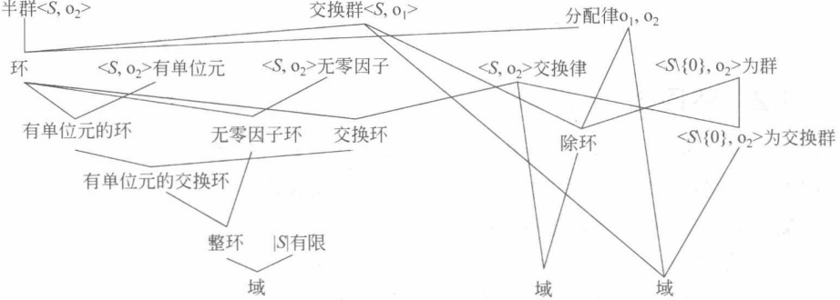
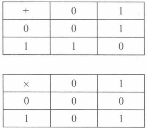
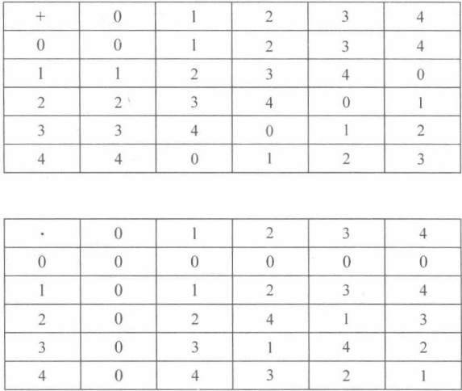
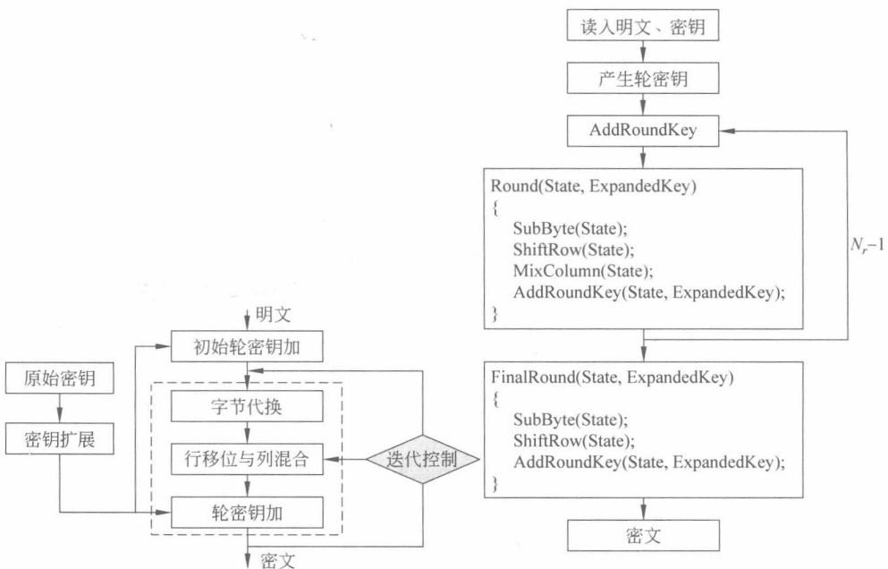
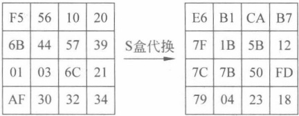
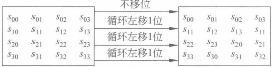

### 环与域

第6章介绍的群是只有一种运算的代数系统，本章考虑具有两种运算的代数系统。本章的重点是环和域的概念，难点是多项式环和多项式域。

### 7.1 环

### 7.1.1 环的概念

定义 7.1 设  $R = \langle S, o_1, o_2 \rangle$，S 是具有两种运算  $(o_1$ 和  $o_2)$ 的非空集合，如果：

（1） $\langle S, o_{1} \rangle $ 构成一个交换群。

(2) $<S, O_{2}>$构成半群。

（3） $O_{1}$， $O_{2}$ 满足分配律（distributive law），即对任意 a，b，c  $\in$ S，有

$$
(a o_{1}b)o_{2}c=a o_{2}c o_{1}b o_{2}c( 右分配律 )
$$

$$
a\ o_{2}(b\ o_{1}\ c)=a\ o_{2}b\ o_{1}a\ o_{2}c( 左  分  配  律 )
$$

则 R 称为环(ring)。

在群中，按照群的不同性质对群进行了分类。下面给出对环的分类（主要考察对第二种运算是否满足交换律、单位元、逆元存在性）。

首先，按照环对  $O_{2}$ 是否满足交换律，可以将环分成可换环和非可换环。

定义 7.2 若环 R 中  $\langle S, o_{2} \rangle$ 构成交换半群，则 R 称为交换环或可换环（communicative ring）。

其次，通过对环内元素是否有限，可以将环分为有限环和无限环。

定义 7.3 只包含有限个元素的环称为有限环，其元素的个数称为该环的阶；否则，称环为无限环。

而通过对环内单位元是否存在进行考察，下面将引入含幺环的概念。

定义 7.4 若环内存在一个元素 e，对环内任意元素 a 均有 ea=a，则称 e 为环 R 的左单位元；同理，若有 ae=a，则称 e 为环 R 的右单位元。当左单位元等于右单位元时，合称该元素 e 为单位元。

定义 7.5 若环 R 中  $\langle S, o_{2} \rangle$ 构成独异点，则 R 称为有单位元的环（也称为含幺环）。

环内可能不存在左单位元，也可能不存在右单位元。但若一个环既有左单位元又有右单位元，则左单位元必然是右单位元。

例 7.1  $<\mathrm{Z}, +, \cdot >$ 是一个有单位元的交换环。 $<\mathrm{Z}, +> $ 是交换加群，零元为 0，a 的负元为 -a。 $+$,  $\cdot$ 满足分配律。 $<\mathrm{Z}, \cdot >$ 是半群。因此， $<\mathrm{Z}, +, \cdot >$ 是一个环。而且， $<\mathrm{Z}, \cdot >$ 具有单位元 1，且  $\cdot$ 满足交换律。因此，是有单位元的交换环。

例 7.2  $<Z, +, \cdot >, <Q, +, \cdot >, <R, +, \cdot >, <C, +, \cdot >$ 分别是整数环、有理数环、实数环、复数环。这 4 个环均由数的集合组成，也称为数环。

例 7.3 设集合  $Z[i] = \{a + bi \mid a, b \in \mathbb{Z}\}$，对加法和乘法运算，构成环，称为高斯整数环。

例 7.4 模 m 剩余类加法和乘法构成一个剩余类环  $\langle Z_{m}, +, \cdot >$。

例 7.5 偶数环  $<2Z, +, \cdot >$ 是交换环，但不是含幺环。

例 7.6 n 是一个偶数， $<nZ, +, \cdot >$ 是交换环，但没有单位元。

例 7.7 数域 F 上的 n 阶方阵的全体关于矩阵的加法和乘法构成一个环，称为 F 上的 n 阶方列环，记为  $M_{n}(F)$。这个环含幺环，单位元为 n 阶单位矩阵，不是交换环。

下面按照零因子是否存在，可以将环分为零因子环和无零因子环。

定义 7.6 设  $R = \langle S, +, \cdot \rangle$ 是一个环，如果存在  $a, b \in S$，满足  $a \neq 0, b \neq 0$，但  $a \cdot b = 0$（0 为加法单位元，即零元），则称环 R 为有零因子环，称 a 为 R 的左零因子（left zero divisor），b 为 R 的右零因子（right zero divisor），否则称 R 为无零因子环。若 a 既是左零因子又是右零因子，则称 a 为零因子（zero divisor）。环内既不为左零因子又不为右零因子的元素，称为正则元。

例 7.8 整数环 $\langle Z, +, \cdot >$、有理数环 $\langle Q, +, \cdot >$、实数环 $\langle R, +, \cdot >$、复数环 $\langle C, +, \cdot >$均为无零因子环。

例 7.9 对于合数 n，模 n 剩余类环  $\langle Z_{n}, +, \cdot >$ 为有零因子环。零因子为 n 的约数或 n 的约数的倍数。

例 7.10 对于素数 p，模 p 剩余类环  $\langle Z_{p}, +, \cdot >$ 为无零因子环。

例 7.11  $<\mathbf{Z}/6\mathbf{Z}=\{0,1,2,3,4,5\}, +(\mod6), \cdot (\mod6)>$ 是一个有零因子环，因为  ${2} \cdot 3 = 0$，左零因子是 2，右零因子是 3。同时， ${3} \cdot 2 = 0$，因此 2 也是右零因子，3 是左零因子。因此，2，3 都是零因子。类似地，4 也是零因子。

例 7.12 若 a 是 R 的左零因子，一般 a 未必同时是 R 的右零因子。例如，特殊矩阵环

$$
R=\left\{\begin{bmatrix}0&a\\ 0&b\end{bmatrix}\mid a,b\in\mathbf{Q}\right\}
$$

对于矩阵乘法运算左零因子未必是右零因子。

例 7.13 若 R 是交换环，则 R 的每个左（或右）零因子都是零因子。

定理 7.1 在无零因子环中，乘法消去律成立，即非空集合中任意  $a, b, c, a \neq 0$，有

$$
a\cdot b=a\cdot c\Rightarrow b=c
$$

$$
b\cdot a=c\cdot a\Rightarrow b=c
$$

证明 因为  $a \cdot b = a \cdot c$，所以  $a \cdot (b - c) = 0$。由于  $a \neq 0$ 且不为零因子，可得 b = c，满足左消去律。同理可得，右消去律也成立。因此，在无零因子环中，乘法消去律成立。

定义 7.7 有单位元的无零因子的交换环叫作整环（integral domain）。

例 7.14 整数环$\langle Z, +, \cdot >$、有理数环$\langle Q, +, \cdot >$、实数环$\langle R, +, \cdot >$、复数环$\langle C, +, \cdot >$都是整环，而${2}Z$（偶数环）虽然无零因子，且可交换，但没有单位元，故不是整环，$Z_n$（$n$为合数）虽然有单位元，可交换，但有零因子，故不是整环。

定义 7.8 当环 R 有以下特征时，环 R 叫作除环。

（1）R 中至少包含一个非零元（即 R 中至少有两个元素）。

（2）R 有单位元。

（3）R 的每一个非零元有逆元。

注意：除环的概念中，没有要求满足乘法交换律。

其实，除环就是指环中非零元在乘法运算下构成群。

下面的例子是历史上的第一个非交换除环，它于1843年首次由哈密顿提出。

例 7.15  $D = \{a \cdot 1 + bi + cj + dk \mid a, b, c, d \in \mathbb{R}\}$，其中  $D$ 中的元素记为四元数。 $G = \{1, i, j, k, -1, -i, -j, -k\} \cdot D$，规定  $G$ 的乘法如下。

| • | 1 | i | j | k |
| --- | --- | --- | --- | --- |
| 1 | 1 | i | j | k |
| i | i | -1 | k | -j |
| j | j | -k | -1 | i |
| k | k | j | -i | -1 |

G 对于上述乘法作成一个群。

在此基础上，对四元数加法与乘法运算作出以下规定。

（1） $a_{1}+a_{2}i+a_{3}j+a_{4}k=b_{1}+b_{2}i+b_{3}j+b_{4}k$ 当且仅当对应系数相等时才成立。

(2)  $(a_{1}+a_{2}i+a_{3}j+a_{4}k)+(b_{1}+b_{2}i+b_{3}j+b_{4}k)=(a_{1}+b_{1})+(a_{2}+b_{2})i+(a_{3}+b_{3})j+(a_{4}+b_{4})k$。

$$
\begin{align*}(3)(a_{1}+a_{2}i+a_{3}j+a_{4}k)\cdot(b_{1}+b_{2}i+b_{3}j+b_{4}k)&=(a_{1}b_{1}-a_{2}b_{2}-a_{3}b_{3}-a_{4}b_{4})+(a_{1}b_{2}+a_{3}b_{4}-a_{4}b_{3})i+(a_{1}b_{3}+a_{3}b_{1}+a_{4}b_{2}-a_{2}b_{4})j+(a_{1}b_{4}+a_{4}b_{1}+a_{2}b_{3}-a_{3}b_{2})k。\end{align*}
$$

根据上述运算规则，D是一个无限非交换四元数除环，单位元为1。

四元数在几何、物理等领域有大量的应用。

下面看看整环和除环的差异。

定理 7.2 除环没有零因子。

证明 假设环 R 是一个除环，a 是 R 中的元素且  $a \neq 0$，若有一元素 b 使得 ab = 0，则  $b = (a^{-1}a)b = a^{-1}(ab) = 0$，故 R 内无零因子。

除环不一定是整环，交换除环是整环，整环不一定是除环。

例 7.16 整数环是整环，非零元除 1 和 -1 外均没有逆元，故不是除环。

定义 7.9 如果交换环  $R$ 对于加法构成一个交换群， $R^* = R \setminus \{0\}$ 对于乘法构成一个交换群，则交换环  $R$ 为一个域。

例 7.17 设 p 是素数，则  $\langle Z_{p}, +(\mod p), \cdot (\mod p) \rangle$ 是域。

例 7.18  $\mathbf{Q}(\sqrt{2}) = \{a + b\sqrt{2} | a, b \in \mathbf{Q}\}$，则  $\langle \mathbf{Q}(\sqrt{2}), +$,  $\cdot\rangle$ 是域。

思考7.1 如何求出  $Q(\sqrt{2})$ 中任意元素的乘法逆元。

下面看看除环与域的差异。

定义 7.10 交换除环叫作域（field）。

例 7.19 哈密顿非交换除环不是域。有理数集 Q、实数集 R、复数集 C 关于数的加法和乘法都构成域。

由上述定义知，除环与域的差异在于乘法（即第二种运算）是否满足交换律。域一定是除环，除环不一定是域，交换除环是域。域可视为除环的特例。

下面看看整环与域的差异。

域一定是整环，整环不一定是域，但有限整环一定是域。

定理 7.3 域一定是整环。

证明 域满足乘法交换律，是交换环，且乘法有单位元，是含幺环，下面主要证明无零因子。

若集合中任意两个元素 ab=0，且  $a \neq 0$，于是 a 存在逆元  $a^{-1}$，有

$$
b=a^{-1}ab=a^{-1}0=0
$$

于是无零因子，故为整环。

上述证明即通过可逆性推出无零因子。

定理 7.4 有限整环一定是域。

证明 设 R 为一个含有 n 个元素的整环，元素为  $a_{1}, a_{2}, \cdots, a_{n}$。设 S 中任一非零元 a，考察  $a a_{1}, a a_{2}, \cdots, a a_{n}$ 这 n 个结果必然两两不同；否则

$$
a a_{i}=a a_{j}
$$

则  $a(a_{i}-a_{j})=0$，R 是整环且  $a\neq0$，于是  $a_{i}-a_{j}=0$，即  $a_{i}=a_{j}$。因此，这个 n 个结果恰好为 R 的全部元素，于是其中必有乘法单位元，即必有  $a_{i}$ 使得  $aa_{i}=1$。这就说明有限整环 R 中的每个非零元都有逆元，故 R 为域。

上述证明主要关注的是整环与域的差异性，即通过元素的有限性推出非零元的乘法逆元存在。域可视为整环的特例。

定义 7.11 只包含有限个元素的域称为有限域，其元素的个数称为该域的阶。有限域又叫伽罗瓦域（Galois field）。

有理数集 Q、实数集 R、复数集 C 关于数的加法和乘法都构成域，但不是有限域。

为了便于理解和记忆，表7.1给出了上述概念之间的递进关系。非正式地，图7.1给出了环概念的“进化完善”过程。

表 7.1 环概念之间的“递进”关系
 

| $\langle S,o_1,o_2\rangle$ | $\langle S,o_1\rangle$ | $\langle S,o_2\rangle$ | $o_1,o_2$ |
| --- | --- | --- | --- |
| 环 | 交换群 | 半群 | 分配律 |
| 交换环 | 交换群 | 交换半群 | 分配律 |
| 有单位元的环 | 交换群 | 独异点 | 分配律 |
| 有单位元的交换环 | 交换群 | 交换独异点 | 分配律 |
| $\langle S,o_1,o_2\rangle $ | $\langle S,o_1\rangle $ | $\langle S,o_2\rangle $ | $o_1,o_2$ |
| 无零因子环 | 交换群 | 无零因子半群 | 分配律 |
| 整环 | 交换群 | 无零因子交换独异点 | 分配律 |
| 除环 | 交换群 | 有非零元，且非零元有逆元的独异点，或者 $\langle S\backslash\{0\},o_2\rangle $为群 | 分配律 |
| 域 | 交换群 | $\langle S\backslash\{0\},o_2\rangle $为交换群 | 分配律 |

环<S, O₁, O₂> = 交换群<S, O₁> + 半群<S, O₂> + 分配律O₁, O₂

交换环<S, O₁, O₂> = 交换群<S, O₁> + 交换半群<S, O₂> + 分配律O₁, O₂

有单位元的环<S, O₁, O₂> = 交换群<S, O₁> + 独异点<S, O₂> + 分配律O₁, O₂

有单位元的交换环<S, O₁, O₂> = 交换群<S, O₁> + 交换独异点<S, O₂> + 分配律O₁, O₂

无零因子环<S, O₁, O₂> = 交换群<S, O₁> + 无零因子半群<S, O₂> + 分配律O₁, O₂

整环<S, O₁, O₂> = 交换群<S, O₁> + 无零因子交换独异点<S, O₂> + 分配律O₁, O₂

除环<S, O₁, O₂> = 交换群<S, O₁> + <S\{O\}, O₂> 为群+ 分配律O₁, O₂

域<S, O₁, O₂> = 交换群<S, O₁> + <S\{O\}, O₂> 为交换群+ 分配律O₁, O₂= 交换除环= 有限整环

交换群 $<S, O_1>$
 

图 7.1 环的“进化完善”过程示意图
 

例 7.20 一个典型的域是 $\langle F_2, +, \cdot >$。 $\langle F_2, + \rangle$为一个交换群。 $\langle F_2 \backslash \{0\}, \cdot \rangle$为一个交换群。图7.2给出了其运算表。

图7.2 域 $<F_{2}, +,\cdot>$的运算表
 

例 7.21 域 $<F_5, +$,  $\cdot$。 $<F_5, +>$为一个交换群。 $<F_5 \setminus \{0\}, \cdot>$为一个交换群。图7.3给出了其运算表。

图7.3 域$\langle\mathbf{F}_{5},+,\cdot\rangle$ 的运算表
 

### 7.1.2 环同态、环同构

同态以及同构概念的引入，是基于建立与代数运算相关联的映射概念。第6章定义了群同态和群同构。下面定义表明，同态概念可以扩展到环。

定义 7.12 设  $R, R^{\prime}$ 是两个环，如果 f 满足下列条件，称映射 f:  $R \to R^{\prime}$ 为环同态。

（1）对任意的  $a, b \in R$，都有  $f(a+b) = f(a) + f(b)$。

(2) 对任意的  $a, b \in R$，都有  $f(ab) = f(a)f(b)$。

如果 f 是一对一的，则称 f 为单同态；如果 f 是满的，则称 f 是满同态；如果 f 是一一对应的，则称 f 为同构。

定义 7.13 设  $R, R^{\prime}$ 是两个环，如果存在一个 R 到  $R^{\prime}$ 的同构，则称 R 与  $R^{\prime}$ 同构。

定义 7.14 设 R 是一个环，如果存在一个最小正整数 n 使得对任意  $a \in R$，都有 na = 0，则称环 R 的特征为 n，记为  $\mathrm{char}(R) = n$；如果不存在这样的正整数，则称环 R 的特征为零，记为  $\mathrm{char}(R) = 0$。

容易看到，环特征概念用于刻画非零元作加法多少次可以得到加法单位元，类似于乘法运算中阶的概念。

例 7.22 在数环中，除 {0} 以外的其余所有元素的特征均为无穷，如  $\operatorname{char}(\mathbf{Z}) = 0$， $\operatorname{char}(\mathbf{Q}) = 0$。模 p 同余类环  $\operatorname{char}(\mathbf{Z}_{p}) = p$。

定理 7.5 设 R 为一整环，则  $\operatorname{char}(R)=0$ 或者  $\operatorname{char}(R)=p$，其中 p 为一素数。

证明 R 为整环，于是  ${1} \in R, <1> \text{为} <R, +> \text{的循环子群}$。

(1) <1> 为无限循环子群。对 R 中任意非零元 a, <a> 也是无限循环子群；否则，若  $|<a>| = m < +\infty$，则

$$
m a=0
$$

即  $m \cdot 1 \cdot a = 0$，由于  $a \neq 0$，且 R 无零因子，故  $m \cdot 1 = 0$，于是  $\mathrm{ord}(1) | m$，这与  $\leq 1 >$ 为无

限循环子群矛盾。故  $|<a>|=+\infty$， $\operatorname{char}(R)=0$。

(2) <1>为有限循环子群。设  $\mathrm{ord}(1)=p$，则 p 为素数；否则，整环 R 中至少有 0 和 1 两个元素，所以  $p \geqslant 2$。若  $p \geqslant 2$ 不是素数，令 $p=jk, 1<j, k<p, j, k \in \mathbb{Z}$，则

$$
0=p\cdot1=(j k)\cdot1=(j\cdot1)(k\cdot1)
$$

由于 R 无零因子， $j \cdot 1 = 0$ 或者  $k \cdot 1 = 0$，于是  $\mathrm{ord}(1) = j$ 或者 k，均小于 p，这与  $\mathrm{ord}(1) = p$ 矛盾。故 p 为素数。

对 R 中的任意非零元 a，有  $p\boldsymbol{a}=(p\cdot1)\cdot\boldsymbol{a}=0\cdot\boldsymbol{a}=0$，于是  $\operatorname{char}(R)=p$。

推论7.1 整环R的加法群中每一非零元的阶或都为无穷，或都为一素数。

推论7.2 整环R的特征即为单位元“1”在R的加法群中的阶。

定理 7.6 设 R 是有单位元的交换环，如果环 R 的特征是素数 p，则对任意 a, b ∈ R，有

$$
(a+b)^{p}=a^{p}+b^{p}
$$

证明  $(a+b)^{p}=a^{p}+\sum_{k=1}^{p-1}\frac{p!}{k!(p-k)!}a^{k}b^{p-k}+b^{p}$

p 为素数， $k=1,2,\cdots,p-1$，因此  $(p,k!(p-k)!) = 1$，于是  $p \big| \frac{p!}{k!(p-k)!}$

### 7.1.3 子环、理想

子群概念的自然推广可以得出子环、扩环的概念。

定义 7.15 设  $R^{\prime}$ 是环 R 集合的非空子集，如果对于环 R 的运算， $R^{\prime}$ 也构成一个环，则  $R^{\prime}$ 叫作 R 的子环，R 叫作  $R^{\prime}$ 的扩环 (extension ring)，记为  $R^{\prime} \leq R$。

根据定义，环内子集成为子环需要满足代数运算的封闭性，这一点与子群类似。下面的定理就是对环内加法和乘法运算封闭性的描述。

例 7.23 整数集 Z 是有理数集 Q 的子环，Q 是实数集 R 的子环，R 是复数集 C 的子环，nZ 是 Z 的子环。

定理 7.7 环 R 的非空子集  $R^{\prime}$ 是子环的充分必要条件是

$$
a,b\in\mathrm{R}^{\prime}\Rightarrow a-b\in\mathrm{R}^{\prime}
$$

$$
a,b\in R^{\prime}\Rightarrow ab\in R^{\prime}
$$

容易看到，由条件1，根据子群判定条件，说明对于加法运算而言， $R^{\prime}$ 是 R 的子群，因而是一个交换群。由条件2，说明乘法运算是封闭的，结合律和分配律显然成立，因此  $R^{\prime}$ 是 R 的子环。

例 7.24  $\mathbf{Q}(\sqrt{2})=\{a+b\sqrt{2}\}$ 是  $(\mathbf{R}, +, \cdot)$ 的子环。

例 7.25 模 6 的剩余类环  $Z_{6}$ 的子环是  $\left\{[0],[2],[4]\right\}$。

例 7.26 模 12 的剩余类环  $Z_{12}$ 关于加法是循环群，其子环关于加法是子循环群，全部子环如下：

$$
S_{1}=\mathbf{Q},S_{2}=\left\{\left[0\right],\left[2\right],\left[4\right],\left[6\right],\left[8\right],\left[10\right]\right\},S_{3}=\left\{\left[0\right],\left[3\right],\left[6\right],\left[9\right]\right\},
$$

$$
S_{4}=\left\{\left[0\right],\left[4\right],\left[8\right]\right\},S_{5}=\left\{\left[0\right],\left[6\right]\right\},S_{6}=\left\{\left[0\right]\right\}
$$

思考7.2 环内单位元的存在性和子环内单位元的存在性之间有关系吗？

事实上，环内单位元是否存在以及取值、子环内单位元是否存在以及取值之间没有关系。所以，即使环与它的子环均具有单位元，单位元也未必相同。

下面引入理想的概念。环内理想可以理解为群内正规子群概念的自然推广。

定义 7.16 设  $R$ 是一个环， $R^{\prime}$ 是环内一个子加群，取  $R$ 内任意元素  $r$，取  $R^{\prime}$ 内任意元素  $r^{\prime}$，如果  $rr^{\prime} \in R^{\prime}$，则称  $R^{\prime}$ 为环  $R$ 的一个左理想（left ideal），此时  $R^{\prime}$ 满足左吸收律。同理，当  $r^{\prime}r \in R^{\prime}$，则称  $R^{\prime}$ 为环  $R$ 的一个右理想，此时  $R^{\prime}$ 满足右吸收律。当左理想等于右理想时，称  $R^{\prime}$ 为环  $R$ 的理想（ideal），记为  $R^{\prime} \triangleleft R$。

在交换环中，若环 R 具有左理想，则左理想一定为右理想。

例 7.27 3Z 是整数环 Z 的理想。

例 7.28  $mZ = \{mk \mid k \in \mathbb{Z}\}$ 是整数环 Z 的理想。

例 7.29 F[x]为数域 F 上的一元多项式环， $I = \{a_1x + a_2x + \cdots + a_nx^n \mid a_i \in \mathbf{F}, n \in \mathbf{N}\}$，即 I 是由所有常数项为 0 的多项式构成的集合，则 I 是 F[x] 的理想。

例 7.30 模 n 剩余类环  $Z_{n}$ 有  $T(n)$ 个理想，其中将 n 分解成  $p_{1}^{k_{1}} p_{2}^{k_{2}} p_{3}^{k_{3}} \cdots p_{n}^{k_{n}}$ 的形式， $T(n) = (k_{1} + 1)(k_{2} + 1)(k_{3} + 1) \cdots (k_{n} + 1)$。容易看到， $T(n)$ 等于 n 的约数的个数。

定义 7.17 在  $|R| > 1$ 的环 R 内，{0} 记为零理想，R 自身记为单位理想。零理想和单位理想统称为平凡理想。不为零理想或者单位理想的理想，记为非平凡理想。

定义 7.18 有且仅有平凡理想的非零环记为单环。

定义 7.19 设 R 是一个环，T 是 R 的一个非空子集，则将 R 中所有包含 T 的理想的交集记为由 T 生成的理想，记为  $\langle T \rangle$。特别地，当  $T = \{a\}$ 时，将  $\langle T \rangle$ 记为  $\langle a \rangle$ 并记为由 a 生成的主理想。

例 7.31 2Z 和 3Z 是 Z 的两个理想， ${2}Z \cap 3Z = 6Z$ 也是 Z 的理想。6Z 和 8Z 是 Z 的两个理想， ${6}Z \cap 8Z = 24Z$ 也是 Z 的理想。

例 7.32 <T> 是 R 中包含 T 的最小理想。

例 7.33 有理数集上的多项式  $\mathbb{Q}[x]$ 中，包含因子  $x^2 - 3$ 的所有多项式构成的集合  $\{(x^2 - 3)p(x) \mid p(x) \in \mathbb{Q}(x)\}$ 是  $\mathbb{Q}[x]$ 的主理想，是  $x^2 - 3$ 生成的理想，即  $<x^2 - 3 > = \{(x^2 - 3)p(x) \mid p(x) \in \mathbb{Q}(x)\}$。

例 7.34  $\mathbb{Q}[x]$ 中，所有常数项为零的多项式构成的集合是  $\mathbb{Q}[x]$ 的主理想，即由  $x$ 生成的， $\langle x\rangle=\{\varphi(x) \mid p(x) \in \mathbb{Q}(x)\}$。

下面对 $a>0$中元素的形式进行考察。

定理 7.8 设  $R$ 是一个环， $a$ 是  $R$ 中任意元素，则  $ <a> = \{(x_1\,ay_1+\cdots+x_ma\,y_m) + sa + at + na | \forall x_i, y_i, s, t \in R, \forall n \in \mathbb{Z}, \forall m \in \mathbb{N}\}$。

例 7.35 由元素 $a$生成的理想$I = <a> = \{ra + na \mid r \in \mathbb{R}, n \in \mathbb{Z}\}$是包含$a$的最小理想。因为包含$a$的理想一定包含所有$a$的倍元$ra$和$\sum \pm a = na$，从而包含所有 $ra + na$，同时，容易验证 $\{ra + na \mid r \in \mathbb{R}, n \in \mathbb{Z}\}$构成$R$ 的一个理想。

例 7.36 当 R 是交换环时， $\langle a\rangle=\left\{ra+na\mid r\in R,n\in Z\right\}$。

例 7.37 当  $R$ 有单位元“1”的交换环时， $<a>=\{ra \mid r \in R\}$。原因是  $ra + na = ra + (n \cdot 1)a = (r + n \cdot 1)a = r^{\prime}a$。

例 7.38 对于整数环  $\mathbb{Z}$，理想  $\langle n \rangle$ 就是由所有  $n$ 的倍数组成。 $\langle n \rangle = n\mathbb{Z} = \{nr | r \in \mathbb{Z}\}$ 是  $\mathbb{Z}$ 的主理想。对于  $\mathbb{F}[x]$ 为数域  $\mathbb{F}$ 上的一元多项式环， $\langle x \rangle = \{a_1 x + a_2 x + \cdots + a_n x^n | a_i \in \mathbb{F}, n \in \mathbb{N}\}$。

定理 7.9 整数环 Z 中任一理想都是主理想。

证明 设  $I$ 是  $\mathbf{Z}$ 的理想，不妨设  $t$ 是  $I$ 中最小的正整数，这是一定存在的。因为  $I$ 是理想，所以对于任意  $l \in I$，有  $-l \in I$，而正整数集合的任意子集必存在最小正整数。任取  $l > 0 \in I$，根据带余除法，有  $l = qt + r$， $q, r \in \mathbf{Z}$， ${0} \leq r < t$，所以  $r = l - qt \in I$。由于  $t$ 是  $I$ 中最小正整数，所以  $r = 0$，即有  $t \mid l$。由此可得， $I = <t> $。

这种证明方法非常常见，通过假设一个最小值，通知证明不存在一个更小的从而得到整除性，后面的证明中又多次用到这个方法。

通过定义运算，群关于正规子群的陪集集合构成了一个新的群，即商群。环是否可以类似地构造一个新的环呢？下面介绍商环的概念和构造。

设 I 是环 R 的理想，则  $(I, +)$ 是  $(R, +)$ 的正规子群，因此有商群  $R/I = \{x + I | x \in R\}$，在 R/I 中的加法为  $(x + I) + (y + I) = (x + y) + I$。R/I 对于第一种运算 + 构成了交换群，下面定义第二种运算（乘法）使得 R/I 满足封闭性、结合律、分配律。

定理 7.10 设 I 是环 R 的理想，在 I 加法商群 R/I 上定义如下的乘法， $(x+I)\cdot(y+I)=(xy)+I$，则上述定义是 R/I 上的一个乘法运算，且 R/I 关于加法、乘法构成一个环。

证明 若  $x_{1}+I=x_{2}+I$,  $y_{1}+I=y_{2}+I$, 则  $x_{1}-x_{2}\in I$,  $y_{1}-y_{2}\in I$, 所以  $x_{1}=x_{2}+r$,  $y_{1}=y_{2}+t$, 其中 r,  $t\in I$。于是  $x_{1}y_{1}=x_{2}y_{2}+ry_{2}+x_{2}t+rt$。由 r 是理想, 得  $ry_{2}+x_{2}t+rt\in I$, 故  $x_{1}y_{1}-x_{2}y_{2}\in I$, 此即  $(x_{1}y_{1})+I=(x_{2}y_{2})+I$, 这证明了乘法定义是合理的, 即乘法运算的定义不依赖于与理想进行计算的元素的选取。

容易验证 R/I 关于上述加法、乘法构成一个环。

环 R/I 称为 R 关于理想 I 的商环。

商环 R/I 中，为方便起见，有时将  $x+I$ 记为  $\bar{x}$

例 7.39  $I = <3>$ 是整数环 Z 的一个理想，商环  $Z/ <3> = \{[0], [1], [2]\}$ 是整数模 3 的剩余类环  $Z_3$。

例 7.40  $I = \langle n \rangle$ 是整数环  $\mathbb{Z}$ 的一个理想，商环  $\mathbb{Z}/ < n> = \{k + <n> \mid k \in \mathbb{Z}\} = \{k + <n> \mid 0 \leq k \leq n - 1\} = \{[0], [1], \cdots, [n - 1]\}$。故商环  $\mathbb{Z}/ < n>$ 是整数模  $n$ 的剩余类环  $\mathbb{Z}_n$。

例 7.41  $<x>$ 是环  $F[x]$ 的理想，则  $F[x]/\langle x\rangle=\left\{f(x)+\langle x\rangle \mid f(x)\in F[x]\right\}=\{a+\langle x\rangle \mid a\in F\}$。

例 7.42 商环  $\mathbb{Z}_6 / <2>$ 是有单位元的交换环。 $\mathbb{Z}_6 = \{0,1,2,3,4,5\} < 2> = \{2r\} r \in \mathbb{Z}_6\} = \{0,2,4\}$， $\mathbb{Z}_6 / <2> = \{<2> + r | r \in \mathbb{Z}_6\} = \{<2> + 0, <2> + 1\}$，零元为  $<2> + 0$，单位元为  $<2> + 1$。

例 7.43 商环  $Z_{6}/<3>,\langle3>=\{0,3\},Z_{6}/<3>=\{<3>+0,<3>+1,<3>+2\}$。 $Z_{6}/<3>$ 的加法表见表 7.2，其乘法表见表 7.3。

表7.2  $Z_{6}/<3>$ 的加法表
 

| + | <3> | <3>+1 | <3>+2 |
| --- | --- | --- | --- |
| <3> | <3> | <3>+1 | <3>+2 |
| <3>+1 | <3>+1 | <3>+2 | <3> |
| <3>+2 | <3>+2 | <3> | <3>+1 |

表7.3  $Z_{6}/<3>$ 的乘法表
 

| • | <3> | <3>+1 | <3>+2 |
| --- | --- | --- | --- |
| <3> | <3> | <3> | <3> |
| <3>+1 | <3> | <3>+1 | <3>+2 |
| <3>+2 | <3> | <3>+2 | <3>+1 |

定理 7.11 除环和域都是单环。

证明 设 R 是一个除环， $R^{\prime}$ 是除环内任意理想且  $R^{\prime} \neq 0$。

任取  $R^{\prime}$ 内非零元素  $r_1$ 均有  $r_1^{-1} \in R$，则  $r_1 r_1^{-1} = 1 \in R^{\prime}$。

任取 R 内元素  $r_2$，均有  $r_2 \cdot 1 = r_2 \in R^{\prime}$。

因此  $R^{\prime} = R$，即 R 只有平凡理想，是单环。域是可换除环，所以域也是单环。

上述定理为后续域的扩张概念的引入提供理论基础，因为域性质无法通过理想来进行研究。

群与环之间概念对比见表7.4。

表7.4 群与环之间概念的对比
 

| 对 比 项 | 群 $\langle S,o_1\rangle $ | 环 $\langle S,o_1,o_2\rangle $ |
| --- | --- | --- |
| 集合的包含关系 | 子群 | 子环 |
| 集合间的映射 | 群同态、群同构 | 环同态、环同构 |
| 非零元的加法阶 | 元素的阶 | 特征 |
| 对集合的同余划分 | 正规子群  $H$ | 理想  $I$ |
| 子集的构成 | 平凡子群 | 平凡理想（零理想，单位理想） |
| 子集与元素的运算 | 左陪集，右陪集 | 左理想，右理想 |
| 抽象构造 | 商群  $G/H$ | 商环  $R/I$ |

定义 7.20 设 P 是环R 的一个理想，若任意  $a, b \in R$，且  $ab \in P$，都有  $a \in P$ 或  $b \in P$，则称 P 是 R 的一个素理想。

定义 7.21 设 M 是环 R 的一个理想，若 R 中任一理想 I，当 I 是 M 的真子集，均有 I = R，则称 M 是 R 的一个极大理想。

例 7.44 设 p 是一个素数， $M = \langle p \rangle$ 是整数环 Z 中由素数 p 生成的理想，则 M 不仅是 Z 的一个素理想，而且是 Z 的一个极大理想。事实上，若  $ab \in \langle p \rangle$，则有整数 r，使

得 $ab = pr$。由于 $p$是素数，可得$p \mid a$或$p \mid b$，即 $a \in 
$或$b \in 
$，故 $M = 
$是素理想。另外，若$I$是$M$的真子集且$I$是$R$的一个理想，则存在整数$r \in I$，$r \notin 
$，故 $(r, p) = 1$，利用辗转相除法，可找到整数 $s$，$t \in \mathbf{Z}$，使得 $rs + pt = 1$。由此可知 ${1} = rs + pt \in I$，从而 $I = R$，故 $
$ 是一个极大理想。

定理 7.12 设 R 是一个有单位元的交换环，I 是 R 的理想。

（1）若 I 是 R 的素理想，则 R/I 是一个整环。

（2）若 I 是 R 的极大理想，则 R/I 是一个域。

证明 （1）若  $I$ 是  $R$ 的素理想， $\bar{a}$， $\bar{b} \in R/I$， $\bar{a} \cdot \bar{b} = \bar{0}$，则  $ab \in I$，由  $I$ 是素理想， $a \in I$ 或  $b \in I$，即  $\bar{a} = \bar{0}$ 或  $\bar{b} = \bar{0}$，故  $R/I$ 没有零因子。显然  $R/I$ 是有单位元的交换环，所以  $R/I$ 是整环。

（2）若 I 是 R 的极大理想， $\bar{a}\in R/I,\bar{a}\neq0$ 则  $a\notin I$ ，考虑 R 的由 a 和 I 生成的理想 M，由于 I 是极大理想，所以 M=R ，故有  $r\in R,s\in I$ 使  ${1}=ar+s$ 。因此，在商环 R/I 中，有  $\bar{1}=\bar{a}\cdot\bar{r}$，即  $\bar{a}$ 在 R/I 中可逆。而 R/I 是交换环，故 R/I 是域。

### 7.1.4 多项式环

定义 7.22 设  $\langle \mathbf{R}, +, \cdot \rangle$ 为整环，记  $n$ 为自然数， $a_i \in \mathbf{R} (1 \leq i \leq n)$， $a_n \neq 0$， $f(x) = a_0 + a_1 x + \cdots + a_n x^n$ 记为多项式。

定义 7.23 设 $\langle\mathbf{R},+,\cdot\rangle$为整环， $\mathbf{R}[X]$为多项式集合， $\mathbf{R}[X]=\{f(x)/g(x)|f(x)\in F[x],g(x)\neq0\}$，则称  $\mathbf{R}[X]$ 为  $\mathbf{R}$ 上的多项式环。

设

$$
f(x)=a_{n}x^{n}+\cdots+a_{1}x+a_{0},g(x)=b_{n}x^{n}+\cdots+b_{1}x+b_{0}\in\mathbf{R}[X]
$$

这里 R 表示系数为实数。

在 $R[X]$上定义加法，即

$$
(f+g)(x)=(a_{n}+b_{n})x^{n}+\cdots+(a_{1}+b_{1})x+(a_{0}+b_{0})
$$

则  $\mathbb{R}[X]$ 对于该加法构成一个交换加群。

零元为0， $f(x)$的负元为 $-f(x)=(-a_{n})x^{n}+\cdots+(-a_{1})x+(-a_{0})$。

设

$$
f(x)=a_{n}x^{n}+\cdots+a_{1}x+a_{0},a_{n}\neq0
$$

$$
g(x)=b_{m}x^{m}+\cdots+b_{1}x+b_{0},b_{m}\neq0
$$

在 $R[X]$上定义乘法，有

$$
(f\cdot g)(x)=c_{n+m}x^{n+m}+\cdots+c_{1}x+c_{0}
$$

其中， $c_{k}=\sum_{i+1=k}a_{i}b_{i}=a_{k}b_{0}+a_{k-1}b_{1}+\cdots+a_{1}b_{k-1}+a_{0}b_{k}\quad(0\leqslant k\leqslant n+m)$，即

$$
c_{n+m}=a_{n}b_{m},c_{n+m-1}=a_{n}b_{m-1}+a_{n-1}b_{m},\cdots,c_{0}=a_{0}b_{0}
$$

则 $R[X]$中的单位元为1。

R[X]对于上述加法运算和乘法运算构成一个整环。

例 7.45 系数为  $\mathrm{F}_{2}$ 上的多项式环记为  $\mathrm{F}_{2}[X]$，其中多项式  $f(x)=x^{2}+x+1$， $g(x)=$

 $x+1$, 求  $g(x)^{2}$,  $f(x)g(x)$

解答  $g(x)^{2}=(x+1)^{2}=x^{2}+1,f(x)g(x)=(x^{2}+x+1)(x+1)=x^{3}+1$

设  $f(x)=a_{n}x^{n}+\cdots+a_{1}x+a_{0}, a_{n}\neq0$ ，则称多项式  $f(x)$ 的次数为 n ，记为  $\deg f=n$ 。

例 7.46 整系数多项式环  $\mathbb{Z}[X]$ 中的 3x+2 的次数为 1， $x^{2}+2x+4$ 的次数为 2， $x^{3}+1$ 的次数为 3。

像整数环一样，引入整除的概念到多项式环中。表7.5给出了概念之间的类比。

表 7.5 多项式环与整数环中整除相关概念和方法间的对照
 

| 多项式环 | 整数环 |
| --- | --- |
| 不可约多项式 | 素数 |
| 可约多项式（合式） | 合数 |
| 多项式 Euclid 除法 | 整数 Euclid 除法 |
| 因式（最大公因式） | 因数（最大公因数） |
| 倍式（最小公倍式） | 倍数（最小公倍数） |
| 不完全商 | 不完全商 |
| 余数 | 余式 |
| 不可约多项式判定检测 deg f 为 n/2 | 素数判定检测上限为根号 n |
| $(f(x),g(x))=(g(x),h(x))$ | $(a,b)=(b,r)$ |
| $s(x)f(x)+t(x)g(x)=(g(x),h(x))$ | $sa+tb=(a,b)$ |

下面依次介绍这些概念和公式，可以通过上述类比进行知识迁移。

定义 7.24 设  $f(x)$,  $g(x)$ 是整环 R 上的任意两个多项式，其中  $g(x) \neq 0$，如果存在一个多项式  $q(x)$，使得等式

$$
f(x)=g(x)q(x)
$$

成立，则称  $g(x)$ 整除  $f(x)$，或者  $f(x)$ 被  $g(x)$ 整除，记作  $g(x)|f(x)$。这时， $g(x)$ 叫作  $f(x)$ 的因式， $f(x)$ 叫作  $g(x)$ 的倍式；否则，称  $g(x)$ 不能整除  $f(x)$，或者  $f(x)$ 不能被  $g(x)$ 整除。

设  $f(x)$,  $g(x)$,  $h(x)$ 是整环 R 上的多项式，满足  $f(x)g(x)=h(x)$，则有

$$
\deg f+\deg g=\deg h
$$

例 7.47 整系数多项式环  $\mathrm{Z}[X]$ 中， ${2}x+3\mid2x^{2}+3x,x^{2}+1\mid x^{4}-1$。

定义 7.25 设  $f(x)$ 是整环 R 上的非常数多项式，如果除了显式因式 1 和  $f(x)$ 外， $f(x)$ 没有其他因式，则  $f(x)$ 叫作不可约多项式；否则， $f(x)$ 叫作可约多项式，或者合式。

注意：多项式是否可约与其所在的环或者域有关。也就是说，具体可约不可约与系数所在的群有关。

例 7.48 多项式  $x^{2}+1$ 在  $\mathbb{Z}[X]$ 中是不可约的，但是在  $\mathbb{F}_{2}[X]$ 中是可约的  $x^{2}+1=(x+1)^{2}$，在复数域 C 上也是可约的， $x^{2}+1=(x+i)(x-i)$。

定理 7.13 给定域 K 上的 n 次多项式  $f(x)$，如果  $p(x)$ 是  $f(x)$ 的次数最小因式，则  $p(x)$ 是域 K 上的不可约多项式，且  $\deg p \leqslant 1/2 \deg f$。

证明 反证法。如果  $p(x)$ 为可约多项式，则存在因式  $p_{1}(x)$， $\deg p_{1} < \deg p$，使得  $p_{1}(x) \mid p(x)$，从而  $p_{1}(x) \mid f(x)$，这与  $p(x)$ 是  $f(x)$ 的次数最小的因式矛盾，所以， $p(x)$ 是不可约多项式。

另外，因为  $f(x)$ 是可约多项式，所以存在多项式  $f_{1}(x)$，使得

$$
f(x)=f_{1}(x)p(x),\quad1\leqslant\deg p\leqslant\deg f_{1}<n
$$

因此， ${2}\deg p \leq \deg f + \deg p = n$，于是， $\deg p \leq 1/2\deg f$。

定理 7.14（多项式 Euclid 除法）设

$$
f(x)=a_{n}x^{n}+\cdots+a_{1}x+a_{0}
$$

$$
g(x)=b_{m}x^{m}+\cdots+b_{1}x+b_{0}
$$

是整环R上的两个多项式，则一定存在多项式 $q(x)$和 $r(x)$使得

$$
f(x)=q(x)g(x)+r(x),\quad deg r(x)<deg g(x)
$$

证明 对  $f(x)$ 的次数  $\deg f = n$ 做数学归纳法。

（1）如果  $\deg f < \deg g$，则取  $q(x) = 0, r(x) = f(x)$，结论成立。

（2）设  $\deg f \geqslant \deg g$，假设结论对  $\deg f < n$ 的多项式成立。

对于  $\deg f = n \geq \deg g$，有

$$
f(x)-a_{n}x^{n-m}g(x)=(a_{n-1}-a_{n}b_{m-1})x^{n-1}+\cdots+(a_{n-m}-a_{n}b_{0})x^{n-m}+
$$

$$
a_{n-m-1}x^{n-m-1}+\cdots+a_{0}
$$

这说明  $f(x)-a_{n}x^{n-m}g(x)$ 是次数不大于 n-1 的多项式，对其运用归纳假设或情形（1），存在多项式  $q_{1}(x)$ 和  $r_{1}(x)$ 使得

$$
f(x)-a_{n}x^{n-m}g(x)=q_{1}(x)g(x)+r_{1}(x)
$$

因此， $q(x)=a_{n}x^{n-m}+q_{1}(x)$， $r(x)=r_{1}(x)$为所求。

根据数学归纳法，结论成立。

注意：多项式是否可约与其所在的环或者域有关，与之类似，多项式 Euclid 除法需要考虑多项式所在的环或者域。

例 7.49 在域  $F_{7}$ 上，有  $x^{3}+x+1=(4x+5)(2x^{2}+x+1)+6x+3$。在有理数域 Q 上，有  $x^{3}+x+1=(1/2x-1/4)(2x^{2}+x+1)+3/4x+5/4$。

定义 7.26 上述定理中  $q(x)$ 叫作  $f(x)$ 被  $g(x)$ 除所得的不完全商， $r(x)$ 叫作  $f(x)$ 被  $g(x)$ 除所得的余式。

推论7.3 设  $f(x)=a_{n}x^{n}+\cdots+a_{1}x+a_{0}$ 是整环R上的多项式， $a\in R$，则一定存在多项式  $q(x)$ 和常数  $c=f(a)$，使得

$$
f(x)=(x-a)q(x)+c
$$

证明 根据定理 7.8，对于  $f(x)$， $g(x)=x-a\in R[x]$，存在多项式  $q(x)$， $r(x)$，使得

$$
f(x)=g(x)q(x)+r(x),\quad deg r<deg g
$$

因为 deg g = 1, degr < deg g, 所以 degr = 0,  $r(x) = c \in R$, 即有

$$
f(x)=(x-a)q(x)+c
$$

特别地，取 x=a，有  $c=f(a)$。

推论7.4 设  $f(x)=a_{n}x^{n}+\cdots+a_{1}x+a_{0}$ 是整环R上的多项式， $a\in R$，则  $x-a|f(x)$ 的充要条件是  $f(a)=0$。

例 7.50 设  $f(x)=x^{4}+x^{3}+x+1$,  $g(x)=x^{2}+x+1$ 是  $\mathrm{F}_{2}[X]$ 中的多项式，求  $q(x)$ 和  $r(x)$ 使得

$$
f(x)=g(x)q(x)+r(x),\quad deg r<deg g
$$

解答 利用竖式除法，逐次消去最高次项

$$
\begin{aligned}x^{2}+x+1\overline{\bigg)\begin{array}{c}x^{2}+1\\ x^{4}+x^{3}+0\cdot x^{2}+x+1\\ x^{4}+x^{3}+x^{2}\end{array}}\\\frac{x^{2}+x+1}{\begin{array}{c}x^{2}+x+1\\ \frac{x^{2}+x+1}{0}\end{array}}\end{aligned}
$$

$$
q(x)=x^{2}+1,r(x)=0.
$$

例 7.51 设  $f(x)=x^{4}+x^{2}+x+1$,  $g(x)=x+1$ 是  $\mathbb{F}_{2}[X]$ 中的多项式，求  $q_{1}(x)$ 和  $r_{1}(x)$ 使得

$$
f(x)=g(x)q_{1}(x)+r_{1}(x),\quad deg r_{1}<deg g
$$

解答 利用竖式除法，逐次消去最高次项

$$
\begin{aligned}x+1\sqrt{\frac{x^{3}+x^{2}+1}{x^{4}+0\cdot x^{3}+x^{2}+x+1}}\\\frac{x^{4}+1\cdot x^{3}}{x^{3}+x^{2}+x+1}\\\frac{x^{3}+x^{2}}{x^{3}+x^{2}}\\\frac{x+1}{x+1}\\0\end{aligned}
$$

$$
q_{1}(x)=x^{3}+x^{2}+1,r_{1}(x)=0.
$$

例 7.52 设  $f(x)=x^{4}+x+1$,  $g(x)=x^{2}+1$ 是  $\mathrm{F}_{2}[X]$ 中的多项式，求  $q_{1}(x)$ 和  $r_{1}(x)$ 使得

$$
f(x)=g(x)q_{1}(x)+r_{1}(x),\quad deg r_{1}<deg g
$$

解答 利用竖式除法，逐次消去最高次项

$$
\begin{aligned}x^{2}+1\sqrt{\begin{array}{c}x^{2}+1\\x^{4}+0\cdot x^{3}+0\cdot x^{2}+x+1\\x^{4}+0\cdot x^{3}+1\cdot x^{2}\end{array}}\\\frac{x^{2}+x+1}{x^{2}+1}\\x\quad\frac{x^{2}+1}{x}\end{aligned}
$$

$$
q_{1}(x)=x^{2}+1,r_{1}(x)=x
$$

根据多项式 Euclid 除法，可以用来判定多项式整除关系。

定理 7.15 设  $f(x)$,  $g(x)$ 是域 K 上两个多项式，则  $f(x)$ 被  $g(x)$ 整除的充要条件是  $f(x)$ 被  $g(x)$ 除的余式  $r(x)$ 为零多项式。

类似于素数的判定，可得以下判定方法。

定理 7.16 设  $f(x)$ 是域 K 上 n 次多项式，如果对于所有的不可约多项式  $p(x)$， $\deg p \leqslant n/2$，都有  $p(x) \nmid f(x)$，则  $f(x)$ 一定是一个不可约多项式。

例 7.53 证明  $f(x)=x^{2}+x+1$ 为  $\mathrm{F}_{2}[X]$ 中的不可约多项式。

证明  $\mathrm{F}_{2}[X]$ 中次数不大于 n/2=1 的不可约多项式有 x, x+1。将  $f(x)$ 和这些不可约多项式做 Euclid 除法，有

$$
f(x)=x(x+1)+1
$$

$$
f(x)=(x+1)+1
$$

都不能整除  $f(x)$，因此， $f(x)$ 为不可约多项式。

例 7.54 证明  $f(x)=x^{3}+x+1$ 是  $\mathrm{F}_{2}[X]$ 中的不可约多项式。

证明  $\mathrm{F}_{2}[X]$ 中次数不大于 n/2=1 的不可约多项式有 x, x+1。将  $f(x)$ 和这些不可约多项式做 Euclid 除法，有

$$
f(x)=x(x^{2}+1)+1
$$

$$
f(x)=(x+1)^{2}x+1
$$

都不能整除  $f(x)$，因此， $f(x)$ 为不可约多项式。

例 7.55 证明  $f(x)=x^{3}+x^{2}+1$ 是  $\mathrm{F}_{2}[X]$ 中的不可约多项式。

证明  $\mathrm{F}_{2}[X]$ 中次数不大于 n/2=1 的不可约多项式有 x, x+1。将  $f(x)$ 和这些不可约多项式做 Euclid 除法，有

$$
f(x)=x^{2}(x+1)+1
$$

$$
f(x)=(x+1)x^{2}+1
$$

都不能整除  $f(x)$，因此， $f(x)$ 为不可约多项式。

类似于整数中的最大公因数和最小公倍数，可以给出多项式环 R[X] 中的最大公因式和最小公倍式。

设  $f(x)$,  $g(x) \in R[X]$,  $d(x) \in R[X]$ 叫作  $f(x)$,  $g(x)$ 的最大公因式，如果：

(1)  $d(x)|f(x),d(x)|g(x)$

（2）若 $h(x)\mid f(x),h(x)\mid g(x)$，则 $h(x)$

$$
f(x),g(x)
$$

$$
(f(x),g(x))
$$

考虑域 K 上的最大公因式时，约定其最高次项系数为 1，则最大公因式是唯一的。

 $f(x)$ 和  $g(x)$ 叫作互素的，如果它们的最大公因式  $(f(x), g(x)) = 1$。

设  $f(x)$,  $g(x) \in R[X]$,  $D(x) \in R[X]$ 叫作  $f(x)$,  $g(x)$ 的最小公倍式，如果：

(1)  $f(x)|D(x), g(x)|D(x)$

(2) 若  $f(x)|h(x)$,  $g(x)|h(x)$，则  $D(x)|h(x)$。

 $f(x), g(x)$ 的最小公倍式记作  $\left[f(x), g(x)\right]$。

与整数除法有类似的以下递推关系。

定理 7.17 设  $f(x)$,  $g(x)$,  $h(x)$ 是域 K 上的三个非零多项式，如果

$$
f(x)=q(x)g(x)+h(x)
$$

其中  $q(x)$ 是域 K 上的多项式，则

$$
(f(x),g(x))=(g(x),h(x))
$$

证明 设  $d(x)=(f(x),g(x)),d^{\prime}(x)=(g(x),h(x))$，则  $d(x)|f(x),d(x)|g(x)$，进而

$$
d(x)\mid f(x)+(-q(x))g(x)=h(x)
$$

因此， $d(x)$ 是  $g(x)$， $h(x)$ 的公因式， $d(x)|d^{\prime}(x)$。

同理， $d^{\prime}(x)$ 是  $f(x)$， $g(x)$ 的公因式， $d^{\prime}(x)|d(x)$。

因此  $d(x)=d^{\prime}(x)$。

与整数除法一样，利用反复 Euclid 除法，可以计算  $(f(x), g(x))$。

设  $f(x)$,  $g(x)$ 是域 K 上的多项式,  $\deg g \geqslant 1$。记  $r_{-2}(x) = f(x)$,  $r_{-1}(x) = g(x)$, 反复运作多项式 Euclid 除法，有

$$
\begin{aligned}&r_{-2}\left(x\right)=q_{0}\left(x\right)r_{-1}\left(x\right)+r_{0}\left(x\right),\quad0\leqslant\mathrm{degr}_{0}\leqslant\mathrm{degr}_{-1}\\&r_{-1}\left(x\right)=q_{1}\left(x\right)r_{0}\left(x\right)+r_{1}\left(x\right),\quad0\leqslant\mathrm{degr}_{1}\leqslant\mathrm{degr}_{0}\\&r_{0}\left(x\right)=q_{2}\left(x\right)r_{1}\left(x\right)+r_{2}\left(x\right),\quad0\leqslant\mathrm{degr}_{2}\leqslant\mathrm{degr}_{1}\\ \end{aligned}
$$

$$
\begin{aligned}&r_{k-4}\left(x\right)=q_{k-2}\left(x\right)r_{k-3}\left(x\right)+r_{k-2}\left(x\right),\quad0\leqslant\deg r_{k-2}\leqslant\deg r_{k-3}\\&r_{k-3}\left(x\right)=q_{k-1}\left(x\right)r_{k-2}\left(x\right)+r_{k-1}\left(x\right),\quad0\leqslant\deg r_{k-1}\leqslant\deg r_{k-2}\\&r_{k-2}\left(x\right)=q_{k}\left(x\right)r_{k-1}\left(x\right)+r_{k}\left(x\right)r_{k}\left(x\right)=0\\ \end{aligned}
$$

经过有限步骤，必然存在 k 使得  $r_{k}(x)=0$，这是因为

$$
0\leqslant\mathrm{degr}_{k}<\mathrm{degr}_{k-1}<\mathrm{degr}_{k-2}<\cdots<\mathrm{degr}_{1}<\mathrm{degr}_{0}<\mathrm{degr}_{-1}=\mathrm{degg}
$$

且 degg 是有限正整数。

定理 7.18 设  $f(x)$,  $g(x)$ 是域 K 上的多项式, deg  $g \geqslant 1$, 则

$$
(f(x),g(x))=r_{k-1}(x)
$$

其中  $r_{k-1}(x)$ 是多项式 Euclid 除法中最后一个非零除式。

证明 根据定理7.11，有

$$
\begin{aligned}(f(x),g(x))&=(r_{-2}(x),r_{-1}(x))\\&=(r_{-1}(x),r_{0}(x))\\&=(r_{0}(x),r_{1}(x))\\&\vdots\\&=(r_{k-2}(x),r_{k-1}(x))\\&=(r_{k-1}(x),0)\\&=r_{k-1}(x)\\ \end{aligned}
$$

将上述过程反过来计算，则可以找到  $s(x)$， $t(x)$ 使得

$$
s(x)f(x)+t(x)g(x)=(f(x),g(x))
$$

例 7.56  $f(x)=x^{7}+x^{5}+x^{2}+1\in\mathbb{F}_{2}[X]$,  $g(x)=x^{4}+x^{2}+x\in\mathbb{F}_{2}[X]$, 求  $(f(x), g(x))$, 并求  $s(x)$,  $t(x)$, 使得

$$
s(x)f(x)+t(x)g(x)=(f(x),g(x))
$$

解答 利用多项式 Euclid 除法以及逆过程，有

$$
\begin{aligned}&x^{7}+x^{5}+x^{2}+1=(x^{3}+1)(x^{4}+x^{2}+x)+(x+1)\\ &x^{4}+x^{2}+x=(x^{3}+x^{2}+1)(x+1)+1\\ &x+1=(x+1)1\\ \end{aligned}
$$

于是 $(f(x),g(x))=1$。

反过来写为

$$
\begin{aligned}1&=x^{4}+x^{2}+x+{(x^{3}+x^{2}+1)}(x+1)\\&=g(x)+{(x^{3}+x^{2}+1)}(f(x)+{(x^{3}+1)}g(x))\\&={(x^{3}+x^{2}+1)}f(x)+{((x^{3}+x^{2}+1)}(x^{3}+1)+1)g(x)\\&={(x^{3}+x^{2}+1)}f(x)+{(x^{6}+x^{5}+x^{2})}g(x)\\ \end{aligned}
$$

于是  $s(x)=x^{3}+x^{2}+1, t(x)=x^{6}+x^{5}+x^{2}$

定理 7.19 设  $f(x)$,  $g(x)$ 是域 K 上的多项式，则

$$
s_{k-1}(x)f(x)+t_{k-1}(x)g(x)=(f(x),g(x))
$$

对于 j=0,1,2,\cdots,k-1，这里  $s_{j}, t_{j}$ 归纳定义为

$$
\begin{aligned}&s_{-2}(x)=1,s_{-1}(x)=0,s_{j}(x)=s_{j-2}(x)-q_{j}(x)s_{j-1}(x)\\&t_{-2}(x)=1,t_{-1}(x)=0,t_{j}(x)=t_{j-2}(x)-q_{j}(x)t_{j-1}(x),\quad j=0,1,2,\cdots,k-1\\ \end{aligned}
$$

其中  $q_{j}(x)$ 是式(7.1)中的不完全商。

证明和整数的情况类似。

由定理 7.18 可得到多项式扩展的 Euclid 除法算法 7.1，该算法在计算最大公因式的同时，也计算出模不可约多项式的乘法逆元。

算法 7.1 多项式 Extended Euclid 算法求逆元。

输入：两个多项式  $m(x)$,  $b(x)$,  $\deg b < \deg m$,  $m(x)$ 是不可约多项式。

输出： $(m(x), b(x))$， $b(x)$在模 $m(x)$中的乘法逆元。

Extended Euclid  $(m(x), b(x))$

(1)  $(A_{1}(x), A_{2}(x), A_{3}(x)) \leftarrow (1, 0, m(x)); (B_{1}, B_{2}, B_{3}) \leftarrow (0, 1, b(x));$

(2) If  $B_{3}(x) = 0$ Return  $A_{3}(x)$, 'No Inverse';

(3) If  $B_{3}(x) = 1$ Return  $B_{3}(x)$,  $B_{2}(x)$;

(4)  $Q \leftarrow A_{3}(x)/B_{3}(x)$;

(5) (Temp1(x), Temp2(x), Temp3(x)) ←

 $(A_{1}(x) - Q(x)B_{1}(x), A_{2}(x) - Q(x)B_{2}(x), A_{3}(x) - Q(x)B_{3}(x))$;

(6)  $(A_{1}(x), A_{2}(x), A_{3}(x)) \leftarrow (B_{1}(x), B_{2}(x), B_{3}(x));$

(7)  $(B_{1}(x), B_{2}(x), B_{3}(x)) \leftarrow (Temp1(x), Temp2(x), Temp3(x));$

(8) Goto 2;
}

容易看到，这个算法和算法1.4是类似的。

定理 7.20 设  $F[x]$ 是域 F 上的一元多项式环， $F[X]$ 中任一理想都是主理想。

证明 设  $I$ 是  $F[X]$ 中的一个理想，若  $I = \{0\}$，则结论成立；否则，设  $d(x)$ 是  $I$ 中次数最低的一个多项式，任一  $f(x) \in I$，有  $q(x), r(x) \in F[X]$，使得  $f(x) = d(x)q(x) + r(x), r(x) = 0$ 或  $\deg r(x) < \deg d(x)$。

由上式, $r(x)=f(x)-d(x)q(x)\in I$，又因为 $d(x)$的次数是 $I(x)$中最低的，故 $r(x)=0$，即 $d(x)|f(x)$。

反之，任意  $f(x)=d(x)q(x)$，都有  $f(x)\in I$，所以  $I=<d(x)>$。

上述证明与整数环Z中任一理想都是主理想是类似的。

设  $f(x), g(x) \in F[X]$，由  $f(x)$ 和  $g(x)$ 生成的理想为  $M = \{m(x)f(x) + n(x)g(x) \mid m(x), n(x) \in F[X]\}$。由上述定理， $M$ 是一个主理想，即存在  $d(x) \in M$，使  $M = <d(x)>$，则  $d(x)$ 是  $f(x)$ 和  $g(x)$ 的最大公因式。这便是多项式辗转相除法得到最大公因式的原因。

定理 7.21 设  $F[X]$ 是域 F 上的一元多项式环， $f(x) \in F[X]$ 是一个次数大于零的不可约多项式，则  $\langle f(x) \rangle$ 是  $F[X]$ 的极大理想，从而  $F[X] / \langle f(x) \rangle$ 是一个域。

证明 设  $I \supset f(x) > 1 \neq f(x)$，是  $F[X]$ 的一个理想，则存在  $g(x) \in I, g(x) \notin f(x) > 1$，由于  $f(x)$ 不可约，故  $f(x)$ 与  $g(x)$ 互素，利用辗转相除法，有  $u(x), f(x) \in F[X], u(x)f(x) + v(x)g(x) = 1$。

故  ${1} \in I$，从而  $I = F[X]$，即  $<f(x)>$ 是  $F[X]$ 的极大理想。

具体而言，设  $I$ 是  $F[X]$ 的任一理想，因为  $F[X]$ 中任一理想都是主理想，则  $f(x) \in F[X]$，使  $I = f(x) >$，对任意  $g(x) \in F[X]$，设  $g(x) = f(x)g(x) + r(x)$， $r(x) = 0$ 或  $\deg r(x) < \deg f(x)$。

所以在商环  $F[X]/I$ 中， $\overline{g(x)} = \overline{f(x)}$，从而  $F[X]/I$ 中任一元均可表示为  $\overline{a_0 + a_1 x + \cdots + a_{n-1} x^{n-1}}$， $n = \deg f(x)$，即  $F[X]/I = \{\overline{a_0 + a_1 x + \cdots + a_{n-1} x^{n-1}} | a_i \in F\}$。其中的加法和乘法分别为

$$
\begin{aligned}\overline{a_{0}+a_{1}x+\cdots+a_{n-1}x^{n-1}}+\overline{b_{0}+b_{1}x+\cdots+b_{n-1}x^{n-1}}&=\overline{(a_{0}+b_{0})+\cdots+(a_{n-1}+b_{n-1})x^{n-1}},\\\overline{a_{0}+a_{1}x+\cdots+a_{n-1}x^{n-1}}\cdot\overline{b_{0}+b_{1}x+\cdots+b_{n-1}x^{n-1}}&=\overline{c_{0}+\cdots+c_{n-1}x^{n-1}}\end{aligned}
$$

这里  $r(x)=c_{0}+c_{1}x\cdots+c_{n-1}x^{n-1}$ 由下式给出。设

$$
k(x)=a_{0}+a_{1}x+\cdots+a_{n-1}x^{n-1},l(x)=b_{0}+b_{1}x+\cdots+b_{n-1}x^{n-1}
$$

$$
k(x)\cdot l(x)=q(x)f(x)+r(x),r(x)=0\quad 或 \quad\deg r(x)<n=\deg f(x)
$$

因此，实际上， $F[X]/I$ 中的元是 F 上的 n 维向量  $(a_{0}, a_{1}, \cdots, a_{n-1}), a_{i} \in F$，加法和乘法如上述定义。

#### 域

前面已经介绍了域的概念——域是可交换的除环，或者有限整环，或者集合对两个运算均为交换群。

在研究环的概念与性质中，引入了理想的概念，理想的引入有利于对环进行划分并生成新环，是研究环性质的重要手段。事实上在7.1.4小节中，已经证明域是单环，即只有平凡理想，因此同态的两个域之间只可能存在零同态与同构关系，这导致无法通过理想研究域的性质。

数域中本身具有扩域现象，有理数域扩张产生实数域，实数域扩张产生复数域等。域的扩张是数域扩张的一种自然推广，也是研究域性质最主要的方法。

### 7.2.1 素域、域的扩张 $^{*}$

类似于子群、子环概念，下面子域、扩域的概念由自然推广可以引入。

定义 7.27 设  $K^{\prime}$ 是域 K 集合的非空子集，如果对于域 K 的运算， $K^{\prime}$ 也构成一个域，则  $K^{\prime}$ 叫作 K 的子域，K 叫作子域  $K^{\prime}$ 的扩域。

例 7.57 复数域为实数域的扩域，实数域为有理数域的扩域，有理数域是实数域的一个子域，实数域是复数域的一个子域。

有理数域扩域可以得到实数域，实数域扩域可以得到复数域，这个过程是不断扩张的。那么，是否存在“最小”的一个域，该域只能成为子域？

下面概念的引入，就是对上述问题的补充。

定义 7.28 如果一个域不含真子域，那么这个域叫作素域。

例 7.58  $\pmb{F}_{p}=\pmb{Z}/p\pmb{Z}$ 是素域，其中 p 为素数。

例 7.59 有理数域 Q 是素域。

一个域包含的最小子域称为素域。例如，复数域、实数域和有理数域的素域都是有理数域， $F_{2}$ 素域是它自己。

由环可以产生域。对于整环 $\langle Z, +, \cdot >$，显然它是有理数域 $\langle Q, +, \cdot >$的一个子环。那么，给定的环R，能否找到一个域F，它包含R作为子环？若一个域F包含环R作为子环，R必须是可交换的、无零因子的环。

定义 7.29 设 R 是一个整环，K 是包含 R 为其子环的一个域，F 是 K 的一个包含 R 为其子环的子域，则 F 是包含 R 的最小域，那么 F 叫作整环的商域。

例 7.60 <Z,+, ·> 是整数环，有理数域 <Q,+, ·> 为 <Z,+, ·> 的商域。

 $Q=\left\{\frac{a}{b}\mid a,b\in\mathbf{Z},b\neq0\right\}$。

例 7.61 设 F 是任一域， $F[X]$ 是 F 上的多项式环，F 上的有理函数域定义为  $F\{x\} = \left\{\frac{f(x)}{g(x)} \mid f(x), g(x) \in F[X], g(x) \neq 0\right\}$。 $F\{x\}$ 是一个域， $F[X]$ 是包含在  $F\{x\}$ 中的一个子环，称  $F\{x\}$ 是  $F[X]$ 的商域（分式域）。

定理 7.22 设 F 是一个素域，如果 F 的特征为  $\infty$，则 F 与 Q 同构。如果 F 的特征为 p 且 p 为素数，则 F 与  $F_{p}$ 同构。

证明 设  $e$ 是  $F$ 上的单位元，取  $Z^{\prime} = \{ne \mid n \in \mathbb{Z} (\mathbb{Z}$ 为整数环）\} 是  $F$ 的一个子环，记  $\varphi$： $n \to ne$ 建立从  $\mathbb{Z}$ 到  $Z^{\prime}$ 的同态满射。

如果 F 的特征为  $\infty$，则  $\varphi$ 是同构映射，即 Z 与  $Z^{\prime}$ 同构。又因为  $Z^{\prime}$ 是整环，所以 Z 和  $Z^{\prime}$ 的商域一定同构。 $Z^{\prime}$ 在素域 F 内的商域是 F，Z 的商域是 Q，因此，F 与 Q 同构。

如果 F 的特征为 p，则  $Z^{\prime}$ 的单位元在  $\varphi$ 下所有逆像构成的集合是由 p 生成的循环群  $\langle p\rangle$，所以  $\mathbf{Z}/\langle p\rangle$ 与  $\mathbf{F}_p$ 同构且  $\mathbf{F}_p$ 与  $Z^{\prime}$ 同构。由  $\mathbf{F}_p$ 是域知  $Z^{\prime}$ 是域。因为 F 是素域，所以  $Z^{\prime}=F$，即 F 与  $\mathbf{F}_p$ 同构。

根据上述定理，在同构意义下，素域有且仅有有理数域 Q 和  $F_{p}$，即任何素域都可以转化成这两类素域进行研究。

推论 7.5 每个域均包含唯一的一个素域。

证明 设  $E$ 是任意的一个域,  $e$ 是  $E$ 上的单位元, 则由  $e$ 生成的素域  $F = \{me/ne | m, n \in \mathbb{Z}, ne \neq 0\}$ 显然包含于  $E$ 内, 即每个域均包含一个素域。

下面证明该素域的唯一性。假设 E 内还有除 F 以外的素域  $F^{\prime}$，因为子域的单位元等于域的单位元，所以  $F = F^{\prime}$，素域的唯一性得证。

推论7.6 设 E 是一个域，如果 E 的特征为  $\infty$，则 E 包含了与 Q 同构的素域。如果 E 的特征为 p，则 E 包含了一个与  $F_{p}$ 同构的素域。

因此，任意一个域可视为素域 $F_{p}$或者Q的一个扩张。

考察到域和素域的关系后，自然地引入思考：从素域的角度研究它的各类扩域的性质，从而将所有域的性质研究清楚。然而，在实际研究中，从素域出发研究所有域的性质并不显得十分轻松，因此，研究方法可以转化为：从任意域出发研究其扩域的性质。

这里引入添加子集于任意域上可生成的域（扩张）的概念。

定义 7.30 假设 F 是某个任意域，E 是 F 的一个扩域，S 是 E 上的非空子集，记  $F(S)$ 是 E 内所有包含  $F \cup S$ 的子域的交集，此时  $F(S)$ 是 E 内包含 F 和 S 的最小子域，记为添加子集 S 于 F 得到的域。

任意取 S 中有限个元素  $\alpha_{i}(1\leqslant i\leqslant n)$，取  $F(S)$ 中元素  $f(\alpha_{1},\alpha_{2},\cdots,\alpha_{n})$ 为系数属于 F 的关于  $\alpha_{1},\alpha_{2},\cdots,\alpha_{n}$ 的任意一个多元多项式。由于  $F(S)$ 是一个域，所以  $f_{1}(\alpha_{1},\alpha_{2},\cdots,\alpha_{n})/f_{2}(\alpha_{1},\alpha_{2},\cdots,\alpha_{n})$ 也是  $F(S)$ 中元素，其中  $f_{2}(\alpha_{1},\alpha_{2},\cdots,\alpha_{n})\neq0$。

当  $\alpha_{i}$ 均在 S 内任意变动时，当 n 的大小任意变动时，所有的  $f_{1}(\alpha_{1},\alpha_{2},\cdots,\alpha_{n})/f_{2}(\alpha_{1},\alpha_{2},\cdots,\alpha_{n})$ 可以组成一个集合，该集合是包含  $F \cup S$ 的子域，即为  $F(S)$。假定  $E = F(S)$，在 S 内任意取定固定的 n 个元素  $\alpha_{1},\alpha_{2},\cdots,\alpha_{n}$，记  $S_{1} = \{\alpha_{1},\alpha_{2},\cdots,\alpha_{n}\}$，则一切形如  $f_{1}(S)/f_{2}(S)$ 的元素也构成域，该域即为添加有限个元素于 F 上得到的扩域，记为  $F(S_{1}) = F(\alpha_{1},\alpha_{2},\cdots,\alpha_{n})$。此时， $E = F(S)$ 是一切添加有限个元素于 F 上得到的扩域的并集。

 $F(S)$ 中的元素具有以下形式，即

$$
\frac{f\left(\alpha_{1},\alpha_{2},\cdots,\alpha_{k}\right)}{g\left(\alpha_{1},\alpha_{2},\cdots,\alpha_{k}\right)}
$$

这里  $\alpha_{1},\alpha_{2},\cdots,\alpha_{k}$ 是 S 中的 k 个元素，f 和 g 是域 F 上的两个 k 元多项式， $g(\alpha_{1},\alpha_{2},\cdots,\alpha_{k})\neq0$，k 是正整数。

例 7.62 设  $F = \mathbf{Q}$， $E = \mathbf{C}, S = \{\sqrt{2}\} \subseteq E$，则  $F(S) = \mathbf{Q}(\sqrt{2}) = \{a + b\sqrt{2} \mid a, b \in \mathbf{Q}\}$。

定理 7.23 设 F 是一个域，E 是 F 上的一个扩域， $S_{1}$ 和  $S_{2}$ 是 E 的两个子集，则  $F(S_{1})(S_{2})=F(S_{2})(S_{1})=F(S_{1}\cup S_{2})$。

证明  $F(S_{1})(S_{2})$ 是包含  $F(S_{1})$ 和  $S_{2}$ 的域， $F(S_{1})$ 是包含 F 和  $S_{1}$ 的域，因此， $F(S_{1})(S_{2})$ 是包含 F， $S_{1}$ 和  $S_{2}$ 的域。因此， $F(S_{1})(S_{2})$ 包含 F 和  $S_{1} \cup S_{2}$，即  $F(S_{1} \cup S_{2}) \in F(S_{1})(S_{2})$。

 $F(S_1 \cup S_2)$是包含  $F$ 和  $S_1 \cup S_2$ 的域，因此， $F(S_1 \cup S_2)$包含  $F, S_1, S_2$，故有  $F(S_1 \cup S_2)$包含  $F(S_1)$和  $S_2$。因为  $F(S_1)(S_2)$是包含  $F(S_1)$和  $S_2$ 的最小子域，所以  $F(S_1)(S_2) \in F(S_1 \cup S_2)$。

综上可知， $F(S_{1})(S_{2})=F(S_{1}\cup S_{2})$。同理可得， $F(S_{2})(S_{1})\in F(S_{1}\cup S_{2})$。

上述定理可以得到推广，从而得到  $F(\alpha_{1},\alpha_{2},\cdots,\alpha_{n})=F(\alpha_{1})(\alpha_{2})\cdots(\alpha_{n})$。

它的意义在于将对添加有限个元素的扩域的讨论归结为对添加一个元素得到的扩域的讨论，确定了对扩域的研究方式。

添加一个元素  $\alpha$ 于域 F 所得到的扩张  $F(\alpha)$ 称为域 F 的一个单扩张。

例 7.63 复数域 C 是实数域 R 添加 i 得到的单扩张。数域 Q(i) = {a + bi | a, b ∈ Q} 是添加 i 于 Q 上所得的单扩张。

例 7.64 设  $f(x)=x^2+x+1\in\mathbb{Z}_2[X]$。 $\mathbb{Z}_2$ 是一个域含有两个元素 0 和 1。由于 0 和 1 都不是  $f(x)$ 的根，所以  $f(x)$ 在  $\mathbb{Z}_2$ 上不可约。故商环  $\mathbb{Z}_2[X]/<f(x)>$ 是一个域。记  $\bar{x}$ 为  $\alpha$，则  $\mathbb{Z}_2[X]/<f(x)>=\{a_0+a_1\alpha|a_i\in\mathbb{Z}_2\}=\{0,1,\alpha,1+\alpha\}=\mathbb{Z}_2[\alpha]$。这是有 4 个元素的域，也是由  $\mathbb{Z}_2$ 添加一个元素  $\alpha$ 的扩张，其运算由表 7.6 给出。

表7.6 例7.64运算
 

| + | 0 | 1 | $\alpha$ | ${1}+\alpha$ |
| --- | --- | --- | --- | --- |
| 0 | 0 | 1 | $\alpha$ | ${1}+\alpha$ |
| 1 | 1 | 0 | ${1}+\alpha$ | $\alpha$ |
| $\alpha$ | $\alpha$ | ${1}+\alpha$ | 0 | 1 |
| ${1}+\alpha$ | ${1}+\alpha$ | $\alpha$ | 1 | 0 |
| $\cdot$ | 0 | 1 | $\alpha$ | ${1}+\alpha$ |
| 0 | 0 | 0 | 0 | 0 |
| 1 | 0 | 1 | $\alpha$ | ${1}+\alpha$ |
| $\alpha$ | 0 | $\alpha$ | ${1}+\alpha$ | 1 |
| ${1}+\alpha$ | 0 | ${1}+\alpha$ | 1 | $\alpha$ |

在扩域中，引入下面的定义是对添加元素的特征进行考察所得。

定义 7.31 设 E 是域  $<F, +$,  $\cdot >$ 的扩域，取 E 中元素  $\alpha$，如果可以取  $F[X]$ 上某一元素  $f(x)$ 使得  $f(\alpha) = 0$ 且  $f(x)$ 不恒为 0，则称  $\alpha$ 是 F 上的代数元；否则称  $\alpha$ 为 F 上的超越元。

定义 7.32 在域 $<F, +, \cdot >$内，当 $F(\alpha)$是包含F和元素 $\alpha$的最小的域， $F(\alpha)$记为F的单扩域。当 $\alpha$是F上的代数元时， $F(\alpha)$记为F的单代数扩域（张），当 $\alpha$是F上的超越元时， $F(\alpha)$记为F的单超越扩域（张）。

定义 7.33 设 F 是一个域，E 为 F 的一个代数扩域，将 E 看成是 F 上的向量空间，如果  $\dim_{F}E=n$，则 E 是 F 上的 n 维向量空间，则称 E 为 F 的 n 次扩域（张）。

例 7.65  $\sqrt{2}$ 是有理数域 Q 上的代数元， $Q(\sqrt{2})$ 是有理数域 Q 上的单代数扩域。

例 7.66  $\pi$ 是有理数域 Q 上的超越元， $Q(\pi)$ 是有理数域 Q 上的单超越扩域。

定义 7.34 在域 $<F, +, \cdot >$ 内， $\alpha$ 是域 F 上的一个代数元，则 F 存在首系数为 1 且有根  $\alpha$、次数最低的多项式，将该多项式记为  $\alpha$ 在 F 上的最小多项式。若  $\alpha$ 的最小多项式次数为 n，则称  $\alpha$ 是 F 上 n 次代数元。

事实上，构造域 F 的单代数扩域，转化为寻找域 F 上的不可约多项式。

例 7.67  $\sqrt{2}$ 在 Q 上的最小多项式是  $x^{2}-2$， $\sqrt{2}$ 是 Q 上的 2 次代数元。i 在有理数域 Q 上的最小多项式为  $x^{2}+1$，是 Q 上的 2 次代数元。 ${1}+\sqrt{2}$ 在 Q 上的最小多项式为  $(x-(1+\sqrt{2}))(x-(1-\sqrt{2}))=x^{2}-2x-1$，是 Q 上的 2 次代数元。

例 7.68 若 p 是一个素数，则  $\sqrt[n]{p}$ 是 Q 上的 n 次代数元，最小多项式为  $x^{n}-p$。

定理 7.24 若  $<F, +, \cdot >$ 是一个域，则 F 上代数元  $\alpha$ 在 F 上最小多项式是唯一的，且该最小多项式在 F 上不可约。若存在 F 上一多项式  $f(x)$ 使得  $f(\alpha) = 0$，则最小多项式可以整除  $f(x)$。

下面定理研究单扩域的构造。

定理 7.25 若  $<F, +, \cdot >$ 是一个域， $F[X]$ 是 F 上未定元 x 的多项式环， $F(x)$ 是  $F[X]$ 商域，当  $\alpha$ 是 F 上超越元时，单扩域  $F(\alpha)$ 与  $F(X)$ 同构；当  $\alpha$ 是 F 上代数元时， $F(\alpha)$ 与  $F(x)/<p(x)>$ 同构，即  $F(\alpha)=F[\alpha]$，其中  $p(x)$ 是  $\alpha$ 是 F 上最小多项式。

定理 7.26 若 $<F, +, \cdot >$是一个域, $\alpha$是 $F$上 $n$次代数元, $F(\alpha)$中每个元素均可以唯一地表成 $a_0 \cdot 1 + a_1 \cdot \alpha + \cdots + a_{n-1} \cdot \alpha^{n-1}$的形式(其中 $a_i \in F$),即 ${1}, \alpha, \cdots, \alpha^{n-1}$是 $F$上 $n$维空间单扩域 $F(\alpha)$的一组基。

定理 7.27 若  $<F, +, \cdot >$ 是一个域， $p(x)$ 是 F 上任意给定的首系数为 1 的不可约多项式，则存在 F 上的单代数扩域  $F(\alpha)$，其中  $p(x)$ 是  $\alpha$ 在 F 上的最小多项式。

引理 7.1（代数基本定理） 任何复系数的 n 次多项式在复数域内都可以分解成 n 个一次因式的乘积。

上述引理是在复数域上对多项式进行分解，下面将复数域进行概念上的自然推广。

定义 7.35 设 E 是一个域，且 E 上每个多项式都可以分解成 E 上的一次多项式的乘积，则将 E 记为代数闭域。

例 7.69 复数域是一个代数闭域。

在代数闭域的前提下，下面对特定多项式在其中分解为一次因子相乘的域进行讨论，引入分裂域的概念。

定义 7.36 设 F 是一个域，E 是 F 的扩域， $f(x)$ 是 F 上一个次数大于 0 的多项式，如果  $f(x)$ 能在 E 上分解为一次因子的乘积，在任何包含 F 但是比 E 小的子域上不能够分解为一次因子的乘积，则称 E 是  $f(x)$ 在 F 上的分裂域。

因此，E 是包含 F 且  $f(x)$ 能在 E 上完全分解为一次因式的乘积的最小域。

例 7.70  $f(x)=x^2-2$ 在实数域上的分裂域是实数域。 $x^2+1$ 是实数域 R 上的多项式，则复数域 C 就是  $x^2+1$ 在 R 上的一个分裂域。如果将  $x^2+1$ 看成有理数域 Q 上的多项式，则  $x^2+1$ 在 Q 上的分裂域为  $\mathbf{Q}(i)=\{a+bi\mid a,b\in\mathbf{Q},i^2=-1\}$。

例 7.71 确定  $x^{4}-2$ 在 Q 上的分裂域。

解答  $x^{4}-2=(x+\sqrt[4]{2}i)(x-\sqrt[4]{2}i)(x+\sqrt[4]{2})(x-\sqrt[4]{2})$，所以  $x^{4}-2$ 在 Q 上的分裂域为  $\mathbf{Q}\left(\sqrt[4]{2},i\right)$。

### 7.2.2 域上多项式

定义 7.37 给定  $R[X]$ 中的一个首一多项式  $m(x)$，两个多项式  $f(x)$， $g(x)$ 模  $m(x)$ 同余，如果  $m(x)|f(x)-g(x)$，记作  $f(x) \equiv g(x) \pmod{m(x)}$；否则叫作模  $m(x)$ 不同余，记作

$$
f(x)\not\equiv g(x)\ (\bmod m(x))
$$

任一多项式  $f(x)$ 都与其被  $m(x)$ 除的余式  $r(x)$ 模  $m(x)$ 同余，余式  $r(x)$ 叫作  $f(x)$ 模  $m(x)$ 的最小余式，记作  $(f(x) \bmod m(x))$。

定理 7.28 设  $f(x) \in F[X]$，当且仅当  $f(x)$ 为域 F 上的不可约多项式，则  $F[X]/f(x)$ 为域。

与  $\mathbb{Z}/n\mathbb{Z}$ 类似， $F[X]/f(x)$ 中的元素即为次数小于  $f(x)$ 次数的所有 F 上的多项式，其中的加法、乘法运算分别为模多项式  $f(x)$ 的加法和乘法运算，若  $F = \mathbb{F}_p$， $\deg f = n$，则  $\left|F_p[X]/f(x)\right| = p^n$。

例 7.72  $(x^{3}+x+1)$ 在  $\mathrm{F}_{2}$ 是不可约的， $\mathrm{F}_{2}[X]/(x^{3}+x+1)$ 为域，元素个数为  ${8}=2^{3}$ 个，即  $\left\{\left[0\right],\left[1\right],\left[x\right],\left[x+1\right],\left[x^{2}\right],\left[x^{2}+1\right],\left[x^{2}+x\right],\left[x^{2}+x+1\right]\right\}$。计算机里可用 3 个比特表示为  $\{000,001,010,011,100,101,110,111\}$。

[x+1]在  $\mathrm{F}_{2}[X]/(x^{3}+x+1)$ 域的逆元是  $[x^{2}+x]$。 $[x^{2}+x]$ 的逆元是  $[x+1]$， $[x^{2}+x+1]$ 的逆元是  $[x^{2}]$。

例 7.73  $(x^{3}+x^{2}+1)$ 在  $F_{2}$ 是不可约的， $\mathrm{F}_{2}[X]/(x^{3}+x^{2}+1)$ 为域，元素个数为  ${8}=2^{3}$ 个，即  $\left\{[0],[1],[x],[x+1],[x^{2}],[x^{2}+1],[x^{2}+x],[x^{2}+x+1]\right\}$。计算机里可用 3 个比特表示为  $\{000,001,010,011,100,101,110,111\}$。

 $[x+1]$在 $\mathrm{F}_{2}[x]/(x^{3}+x^{2}+1)$域的逆元是 $[x^{2}]$。 $[x^{2}+x]$的逆元是 $[x]$， $[x^{2}+x+1]$的逆元是 $[x^{2}+1]$。

上面的例子可看到，不同的域中虽然都是3比特表示方法，但对应的乘法表是不同的。

例 7.74  $(x^{2}+1)$ 在  $F_{2}$ 是不可约的， $\mathrm{F}_{3}[X]/(x^{2}+1)$ 为域，元素个数为  ${9}=3^{2}$ 个，即  $\left\{\left[0\right],\left[1\right],\left[2\right],\left[x\right],\left[x+1\right],\left[x+2\right],\left[2x\right],\left[2x+1\right],\left[2x+2\right]\right\}$。

例 7.75 设  $f(x)=x^2+x+1\in\mathbb{F}_2[X]$，则  $f(x)$ 在  $\mathbb{F}_2$ 上是不可约的， $\mathbb{F}_2[X]/f(x)$ 构成一个具有  $|\mathbb{F}_2[X]/f(x)|=2^2=4$ 个元素的域。 $|\mathbb{F}_2[X]/f(x)|=\{[0],[1],[x],[x+1]\}$。其元素运算表如表 7.7 和表 7.8 所示。

表7.7  $\mathrm{F}_{2}[X]/f(x)$ 的加法表
 

| + | [0] | [1] | [x] | [x+1] |
| --- | --- | --- | --- | --- |
| [0] | [0] | [1] | [x] | [x+1] |
| [1] | [1] | [0] | [x+1] | [x] |
| [x] | [x] | [x+1] | [0] | [1] |
| [x+1] | [x+1] | [x] | [1] | [0] |

表7.8  $\mathrm{F}_{2}[X]/f(x)$ 的乘法表
 

| • | [0] | [1] | [x] | [x+1] |
| --- | --- | --- | --- | --- |
| [0] | [0] | [0] | [0] | [0] |
| [1] | [0] | [1] | [x] | [x+1] |
| [x] | [0] | [x] | [x+1] | [1] |
| [x+1] | [0] | [x+1] | [1] | [x] |

从运算表可以看出，[0]是零元，[1]是单位元。

从前面的例子容易看出，计算加法是比较容易的，计算乘法较为麻烦。下一小节将介绍域的生成元表示方法，使得计算乘法比较容易。

### 7.2.3 有限域

在群、环等概念中了解到，同阶的群、环未必同构，且即使在素域中，有理数域的元素个数是无限，结构性质较差。但是，有限域有着优良的性质。

定义 7.38 只包含有限个元素的域称为有限域，其元素的个数称为该域的阶；否则，称域为无限域。

例 7.76  $<F_{2}, +, \times>,\ <F_{5}, +, \times>$ 是有限域。以素数为模的剩余类环  $Z_{p}$ 是有限域。

定理 7.29 如果域 K 的特征不为零，则其特征必为素数。

证明 设域 K 的特征为 n，如果 n 不是素数，则存在整数  ${1} < n_{1}, n_{2} < n$，使得  $n = n_{1}n_{2}$，从而  $(n_{1}1_{k})(n_{2}1_{k}) = (n_{1}n_{2})1_{k} = 0$，因为域 K 无零因子，所以  $n_{1}1_{k} = 0$ 或者  $n_{2}1_{k} = 0$，这与特征 n 的最小性矛盾。

推论7.7 有限域的特征必为一素数。

考虑代数系统中的加法运算，有限域特征为素数可以保证许多运算可以简化。

定理 7.30 设 F 是特征为 p 的有限域，则任意  $a, b \in F$，均有  $(a+b)^{p} = a^{p} + b^{p}$。

证明 根据二项式定理， $(a+b)^{p}=\sum_{k=0}^{n}C_{p}^{k}a^{k}b^{p-k}$。当  $k \neq 0$ 且  $k \neq p$ 时， $C_{p}^{k}=\frac{p(p-1)\cdots(p-k+1)}{1\cdot2\cdot\cdots\cdot k}=p\cdot\frac{(p-1)\cdots(p-k+1)}{1\cdot2\cdot\cdots\cdot k}$，其中， $C_{p}^{k}$ 为正整数，p 为素数， $\frac{(p-1)\cdots(p-k+1)}{1\cdot2\cdot\cdots\cdot k}$ 为整数，即  $p\mid C_{p}^{k}$，有  $C_{p}^{k}=0 \bmod p$。因此，只有 k=0 或 p 时，即  $C_{p}^{k}=1$ 时，展开式不为 0，即  $(a+b)^{p}=a^{p}+b^{p}$。

例 7.77 设  $\mathbf{F}_p = \mathbf{Z} / p\mathbf{Z}$ 是一个有限域，其中  $p$ 为素数， $p(x)$ 是  $\mathbf{F}_p[X]$ 中的  $n$ 次不可约多项式，则

$$
\mathbf{F}_{p}[\mathbf{X}]/<p(x)>=\{a_{n-1}x^{n-1}+\cdots+a_{1}x+a_{0}\mid a_{i}\in\mathbf{F}\}
$$

记为  $F_{p}$。这个域中元素的个数为  $p^{n}$。

 $F_{p}$ 中的加法和乘法分别是

$$
\begin{aligned}&f(x)+g(x)=((f+g)(x)\ (mod\ p(x))\\&f(x)\cdot g(x)=((fg)(x)\ (mod\ p(x))\\ \end{aligned}
$$

 $F_{q}$ 是  $p^{n}$ 元有限域，其特征 p 为素数。

定理 7.31 设  $F_{q}$ 是 q 元有限域，则其乘法群  $F_{q}^{*}$ 的任意元素的阶整除 q-1。

定义 7.39 如果有限域  $F_{q}$ 的元素 g 是  $F_{q}^{*}$ 的生成元，即阶为 q-1 的元素，那么元素 g 是  $F_{q}$ 的本原元或生成元。当 g 是  $F_{q}$ 的本原元时，有  $F_{q}=\{0\}\cup<g>=\{0,g^{0}=1,g,g^{2},\cdots,g^{q-2}\}$。

有限域的不同表示方式会影响运算的复杂程度。多项式表示法中加法容易计算，本原元表示法乘法容易计算，但加法较为复杂。可以建立两种表示法之间的联系，使得加法

和乘法都容易计算。

定理 7.32 每个有限域都有生成元。如果 g 是  $F_{q}$ 的生成元，则  $g^{d}$ 是  $F_{q}$ 的生成元当且仅当 d 和 q-1 的最大公因数  $(d, q-1)=1$。 $F_{q}$ 有  $\varphi(q-1)$ 个生成元。

类似第5章中模p原根的判定方法，可以得到有限域 $F_{q}$的元素g是否为生成元的一个判定方法。

定理 7.33 设 g 是有限域  $F_{p^{n}}$ 中的元素， $p^{n}-1$ 的所有不同素因数是  $q_{1}, \cdots, q_{k}$，则 g 是有限域  $F_{p^{n}}$ 的一个生成元的充要条件是

$$
g^{(p^{n}-1)/q_{i}}\neq1\quad i=1,2,\cdots,k
$$

上述定理给出了求有限域的生成元的方法。

证明 设 g 是  $F_{p^{n}}$ 的一个本原元，则 g 的阶是  $p^{n}-1$，因为

$$
0<\frac{p^{n}-1}{q_{i}}<p^{n}-1,\quad i=1,\cdots,k
$$

于是， $g^{(p^{n}-1)/q_{i}}\neq1(i=1,\cdots,k)$。

反过来，若 g 满足式  $g^{(p^{n}-1)/q_{i}}\neq1(i=1,2,\cdots,k)$，但 g 的阶  $e=\mathrm{ord}(g)<p^{n}-1$，则  $e|p^{n}-1$。因而存在一个素数  $q_{j}$，使得  $q_{j}|\frac{p^{n}-1}{}$，即

$$
\frac{p^{n}-1}{e}=u\cdot q_{j}
$$

即 $\frac{p^{n}-1}{q_{j}}=u\cdot e$，于是 $g^{\frac{p^{n}-1}{q_{j}}}=(g^{e})^{u}=1$，假设矛盾。

定义 7.40 有限域  $F_{p^{n}}$ 的生成元 g 的定义多项式  $f(x)$ 叫作本原多项式。

注意：设  $f(x)$ 是  $\mathbb{F}_p$ 上的 n 次本原多项式，则使得  $x^{\mathrm{e}} \equiv 1 \pmod{f(x)}$ 的最小正整数  $e = p^n - 1$。

类似于有限域  $F_{p^{n}}$ 的生成元 g 的判定法则，可以给出  $f(x)$ 在  $F_{p}$ 上的 n 次本原多项式的判定方法。

定理 7.34 设 p 是素数，n 为正整数， $f(x)$ 是  $\mathbb{F}_{p}[X]$ 的 n 次多项式，如果

(1)  $x^{p^{n}-1} \equiv 1 \pmod{f(x)}$.

（2） $p^{n}-1$ 的所有不同素因素是  $q_{1}, q_{2}, \cdots, q_{k}$，有

$$
x^{(p^{n}-1)/q_{i}}\not\equiv1(\bmod f(x))\quad i=1,2,\cdots,k
$$

则  $f(x)$ 是 n 次本原多项式。

定理的证明和定理7.29类似。

例 7.78 证明  $f(x)=x^{8}+x^{4}+x^{3}+x^{2}+1$ 是  $\mathrm{F}_{2}[X]$ 中的本原多项式。

证明 因为  $n=8,2^{n}-1=255=3\cdot5\cdot17$，素因子  $q_{1}=17,q_{2}=5,q_{3}=3$，于是  $(2^{n}-1)/q_{1}=15,(2^{n}-1)/q_{2}=51,(2^{n}-1)/q_{3}=85$。根据定理7.30，只需要验证  $x^{255}=1\bmod f(x)$，且

$$
x^{15}\not\equiv1\bmod f(x),\quad x^{51}\not\equiv1\bmod f(x),\quad x^{85}\not\equiv1\bmod f(x)
$$

事实上， $x^{255}\equiv1\ (\text{mod}\ f(x))$

$$
x^{15}\equiv x^{5}+x^{2}+x(\bmod f(x)),
$$

$$
\begin{aligned}&x^{51}\equiv x^{3}+x(mod f(x))\\&x^{85}\equiv x^{7-}+x^{6}+x^{4}+x^{2}+x(mod f(x))\\ \end{aligned}
$$

故  $f(x)$ 是本原多项式。

例 7.79  $\mathrm{F}_{2}[X]$ 中不可约多项式  $x^{2}+x+1$ 是本原多项式；不可约多项式  $x^{4}+x+1$， $x^{4}+x^{3}+1$ 也是本原多项式；但不可约多项式  $x^{4}+x^{3}+x^{2}+x+1$ 不是本原多项式，因为  $x^{5}=1\ (\bmod\ x^{4}+x^{3}+x^{2}+x+1)$。

例 7.80  $x^{2}+x+1$ 是  $F_{2}$ 上不可约多项式，设  $\alpha$ 是  $x^{2}+x+1$ 的根，则  $\mathbf{F}_{2}(\alpha)=\{0,1,\alpha,\alpha+1\}$，又  $\alpha^{2}=\alpha+1,\alpha^{3}=\alpha(\alpha+1)=\alpha^{2}+\alpha=1$，所以  $\alpha$ 是  $F_{2}(\alpha)$ 的本原元。

下面给出有限域的三条结构定理。

定理 7.35 设 F 是一个特征为素数 p 的有限域，则 F 中的元素个数为  $p^{n}$，n 是一个正整数。

证明 设  $F^{\prime}$ 是包含在 F 内的素域，因为有限域 F 的特征为 p，则  $F^{\prime}$ 的特征也为 p。

假设  $F^{\prime}$ 在 F 内的指数为 n，那么取  $F$ 在  $F^{\prime}$ 上的一个基  $\alpha_1, \alpha_2, \cdots, \alpha_n$，则 F 内每个元素均可以唯一地表成  $k_1\alpha_1 + k_2\alpha_2 + \cdots + k_n\alpha_n$ ( $k_i \alpha \in F^{\prime}$)，其中每个  $k_i$ 均有 p 种取法，因此全部系数组合共有  $p^n$ 种取法。因为每种取法唯一地决定 F 内元素，且不同取法得到的 F 内元素互不相同，所以 F 中元素个数为  $p^n$ 个。

思考7.3 是否会存在阶为10的有限域？

定理 7.36（存在性） 对于任何素数 p 和任意正整数 n，都存在一个有限域含有  $p^{n}$ 个元素。

证明 为了证明该定理，只需要找到一个这样的有限域即可，事实上，令  $m=p^{n}$ 时， $x^{m}-x$ 在特征为 p 的素域上的分裂域 E 就是这样的 m 阶有限域，满足条件。下面证明 E 是一个 m 阶有限域。

假设 F 为特征为 p 的一个素域，令  $E=F(\alpha_{1},\alpha_{2},\cdots,\alpha_{q})$ 为  $f(x)=x^{q}-x$ 在 F 上分裂域， $\alpha_{1},\alpha_{2},\cdots,\alpha_{q}$ 是  $f(x)$ 在域 E 内的根。因为 E 的特征为 p，所以  $f^{\prime}(x)=p^{n}x^{q-1}-1=-1$，即  $(f(x),f^{\prime}(x))=1$，从而  $f(x)$ 没有重根，即当  $i\neq j$ 时有  $\alpha_{i}\neq\alpha_{j}$。

令  $F=\left\{\alpha_{1},\alpha_{2},\cdots,\alpha_{q}\right\}$，因为  $\left(\alpha_{i}-\alpha_{j}\right)^{m}=\alpha_{i}^{m}-\alpha_{j}^{m}=\alpha_{i}-\alpha_{j}$ 且  $\left(\alpha_{i}/\alpha_{j}\right)^{m}=\alpha_{i}^{m}/\alpha_{j}^{m}=\alpha_{i}/\alpha_{j}$，所以  $\alpha_{i}-\alpha_{j}$ 和  $\alpha_{i}/\alpha_{j}$ 是  $f(x)$ 的根，即  $\alpha_{i}-\alpha_{j}$ 和  $\alpha_{i}/\alpha_{j}$ 属于 F，所以 F 是 E 的一个子域。

定理 7.37（唯一性） 任意两个  $q=p^{n}$ 元域都同构，即  $p^{n}$ 元域在同构意义下是唯一的。

证明 取 E 和 F 是任意两个  $p^{n}$ 阶域，因此，E 和 F 均有 p 阶的素子域  $E^{\prime}$ 和  $F^{\prime}$，所以 E 和 F 为同阶子域的有限扩张。又因为 E 和 F 是同阶的有限域，所以 E 和 F 的扩张次数相同。因此，可以定义双射函数  $\phi\colon E$ 对  $E^{\prime}$ 的基  $\to F$ 对  $F^{\prime}$ 的基，易见双射函数  $\phi$ 是 E 与 F 之间的同构映射，即 E 与 F 之间同构。由于 E、F 的任意性，所以任意两个  $q=p^{n}$ 元域都同构。

例 7.81  $F_{p}$ 是一个特征为素数 p 的域，且其非零元素  $F_{p}^{*} = \{1, 2, \cdots, p-1\}$ 形成一个 p-1 阶循环群。 $F_{p}$ 不是特征为 p 的唯一域。事实上，任何有限域的乘法群都是循环群，如  $F_{q}^{*}$（这里  $q = p^{n}$）是一个  $p^{n} - 1$ 阶循环群。

例 7.82  $\pmb{F}_{p}[X]$ 中有许多次数为 n 的不可约多项式，但可以证明，由任何两个 n 次不

可约多项式构造的域是同构的。因此，存在唯一的  $p^n$ ( $p$ 是素数， $n \geq 1$) 个元素的有限域，记为  $\mathbf{F}_q^*$（这里  $q = p^n$）。 $n$ 为 1 时， $\mathbf{F}_p$ 与  $\mathbf{Z}_p$ 相同。可以证明，如果存在  $r$ 个元素的有限域，则一定存在某个素数  $p$ 及某个整数  $n \geq 1$，使得  $r = p^n$。

下面的例子给出通过生成元构造有限域的方法。

例 7.83 求  $\mathrm{F}_{2^{4}} = \mathrm{F}_{2}[X] / (x^{4} + x + 1)$ 的生成元  $g(x)$，即  $g(x)^{t}, t = 0, 1, 2, \cdots, 14$ 和所有的生成元。

解答 因为  $\left|F_{2}^{*}\right|=15=3\cdot5$，所以满足

$$
g(x)^{3}\not\equiv1(\bmod x^{4}+x+1),g(x)^{5}\not\equiv1(\bmod x^{4}+x+1)
$$

的元素  $g(x)$ 都是生成元。

对于  $g(x)=x$，有

$$
x^{3}\not\equiv1(\bmod x^{4}+x+1),x^{5}\not\equiv1(\bmod x^{4}+x+1)
$$

所以  $g(x)=x$ 是  $\mathbb{F}_{2}[X]/(x^{4}+x+1)$ 的生成元。

对于  $t=0,1,\cdots,14$ ，计算  $g(x)^{t}(\bmod x^{4}+x+1)$ 如下：

$$
g(x)^{0}=1,g(x)^{1}=x,g(x)^{2}=x^{2},g(x)^{3}=x^{3},
$$

$$
g(x)^{4}=x+1,g(x)^{5}=x^{2}+x,g(x)^{6}=x^{3}+x^{2},g(x)^{7}=x^{3}+x+1,
$$

$$
g(x)^{8}=x^{2}+1,g(x)^{9}=x^{3}+x,g(x)^{10}=x^{2}+x+1,g(x)^{11}=x^{3}+x^{2}+x,
$$

$$
g(x)^{12}=x^{3}+x^{2}+x+1,g(x)^{13}=x^{3}+x^{2}+1,g(x)^{14}=x^{3}+1
$$

容易看到

$$
g(x)^{14}=(x^{3}+1)x=x^{4}+x=1
$$

所有生成元  $g(x)^{t}$，这里  $(t,15)=1$，于是取 t=1,2,4,7,8,11,13,14，计算可得到所有生成元。

例 7.84 用生成元  $g(x)=x$，构造  $\mathrm{F}_{2^{4}}=\mathrm{F}_{2}[X]/(x^{4}+x+1)$ 中的多项式表格，考察求逆、乘法、加法、减法运算，用4位表示运算结果。

解答 元素 0,  $g^{v}$,  $g^{1}$,  $g^{2}$ 和  $g^{3}$ 很容易生成，因为它们是 0、1、 $x^{2}$ 和  $x^{3}$ 的 4 位表示。通过  $g^{14}$ 的元素  $g^{4}$，它表示通过  $x^{14}$ 的  $x^{4}$ 需要被不可约多项式整除，为了避免这个多项式除法，可以使用  $f(g)=g^{4}+g+1=0$ 这个关系。利用这个关系，有  $g^{4}=g+1$。因为在  $F_{2}$ 域中，加法和减法是同一个运算。用这个关系去求出所有作为 4 位字的元素的值。

$$
\begin{array}{l l l l l l l}{0}&{=0}&{=0}&{=0}&{\to}&{0}&{=(0000)}\\ {g^{0}}&{=g^{0}}&{=g^{0}}&{=g^{0}}&{\to}&{g^{0}}&{=(0001)}\\ {g^{1}}&{=g^{1}}&{=g^{1}}&{=g^{1}}&{\to}&{g^{1}}&{=(0010)}\\ {g^{2}}&{=g^{2}}&{=g^{2}}&{=g^{2}}&{\to}&{g^{2}}&{=(0100)}\\ {g^{3}}&{=g^{3}}&{=g^{3}}&{=g^{3}}&{\to}&{g^{3}}&{=(1000)}\\ {g^{4}}&{=g^{4}}&{=g^{4}}&{=g+1}&{\to}&{g^{4}}&{=(0011)}\\ {g^{5}}&{=g(g^{4})}&{=g(g+1)}&{=g^{2}+g}&{\to}&{g^{5}}&{=(0110)}\\ {g^{6}}&{=g(g^{5})}&{=g(g^{2}+g)}&{=g^{3}+g^{2}}&{\to}&{g^{6}}&{=(1100)}\\ {g^{7}}&{=g(g^{6})}&{=g(g^{3}+g)}&{=g^{3}+g+1}&{\to}&{g^{7}}&{=(1011)}\\ {g^{8}}&{=g(g^{7})}&{=g(g^{3}+g+1)}&{=g^{2}+1}&{\to}&{g^{8}}&{=(0101)}\\ \end{array}
$$

$$
g^{9}\quad=g(g^{8})\quad=g(g^{2}+1)\quad=g^{3}+g\quad\Rightarrow\quad g^{9}\quad=(1010)
$$

$$
g^{10}\quad=g(g^{9})\quad=g(g^{3}+g)\quad=g^{2}+g+1\quad\Rightarrow\quad g^{10}\quad=(0111)
$$

$$
g^{11}\quad=g(g^{10})\quad=g(g^{2}+g+1)\quad=g^{3}+g^{2}+g\quad\Rightarrow\quad g^{11}\quad=(1110)
$$

$$
g^{12}\quad=g(g^{11})\quad=g(g^{3}+g^{2}+g)\quad=g^{3}+g^{2}+g+1\quad\Rightarrow\quad g^{12}\quad=(1111)
$$

$$
g^{13}\quad=g(g^{12})\quad=g(g^{3}+g^{2}+g+1)\quad=g^{3}+g^{2}+1\quad\Rightarrow\quad g^{13}\quad=(1101)
$$

$$
g^{14}\quad=g(g^{13})\quad=g(g^{3}+g^{2}+1)\quad=g^{3}+1\quad\Rightarrow\quad g^{14}\quad=(1001)
$$

乘法计算的核心思想是利用关系 $g^{4}=g+1$降次。

例如， $g^{12}=g(g^{11})=g(g^{3}+g^{2}+g)=g^{4}+g^{3}+g^{2}=g^{3}+g^{2}+g+1$

在降次后，可以将幂数转化为 n 比特数，如  $g^{3}+1$ 等价于 1001。

由以上可知乘法很容易计算，同时：

元素的加法逆元是它自身，如 $-g^{3}=g^{3}$。

元素的乘法逆元 $(g^{3})^{-1}=g^{-3}=g^{12}=g^{3}+g^{2}+g+1\rightarrow(1111)$

元素间的加法  $g^{3}+g^{12}+g^{7}=g^{3}+(g^{3}+g^{2}+g+1)+(g^{3}+g+1)=g^{3}+g^{2}\rightarrow(1100)$

元素间的减法  $g^{3}-g^{6}=g^{3}+g^{6}=g^{3}+(g^{3}+g^{2})=g^{2}\rightarrow(0100)$。

有限域在对称加密算法设计中有大量的应用，如在 AES 密码算法中便涉及有限域  $\mathbf{F}_{2}^{8}=\mathbf{F}_{2}\left[X\right]/(x^{8}+x^{4}+x^{3}+x+1)$ 及其生成元  $g(x)=x+1$，在 7.3.2 小节将详述。

#### 环和域在 AES 加密中的应用

1997 年美国 NIST 发起公开征集高级加密标准（Advanced Encryption Standard，AES）算法的活动，目的是寻找一个安全性能更好的分组密码算法替代 DES。AES 的基本要求是安全性能不能低于三重 DES，且执行性能比三重 DES 快。而且分组长度为 128 位，并能支持长度为 128 位、192 位、256 位的密钥。

1998年，NIST召开了第一次AES候选会议，公布了15个满足AES基本要求的算法作为候选算法，并提请公众协助分析这些候选算法。1999年NIST召开了第二次AES获选会议，公布了第一阶段的分析和测试结果，从15个候选算法中选出了5个决赛算法（Mars、RC6、Rijndael、Serpent和Twofish）。2000年，NIST召开第三次AES候选会议，通过对决赛算法的安全性、速度以及通用性等要素的综合评估，最终决定比利时密码学家Joan Daemen和Vincent Rijmen提出的Rijndael数据加密算法修改后作为AES。2001年NIST正式公布AES，并于2002年5月开始生效。

### 7.3.1 AES 的设计思想

# 1. 基本安全参数

分组长度为128位，密钥长度可以独立设置为128位、192位和256位，因此AES有3个版本，即AES-128、AES-192、AES-256。相应的迭代轮数为10、12、14。一般而言，加密轮数 $N_{r}$取决于密钥长度 $l_{K}$，两者之间关系为 $N_{r}=6+l_{K}/32$。表7.9给出两者的关系。

表 7.9 给出了轮数与密钥长度的关系
 

| 版本\n参数 | AES-128 | AES-192 | AES-256 |
| --- | --- | --- | --- |
| 长度 | 128 | 192 | 256 |
| 轮数 | 10 | 12 | 14 |

128 位的输入明文分组为 16B，通常用图形表示为  ${4} \times 4$ 的正方形矩阵，称为状态 (state) 矩阵。例如，对于 128 位的分组，可分成 16B，从左到右为  $s_{00} s_{10} s_{20} s_{30} s_{01} s_{11} s_{21} s_{31} s_{02} s_{12} s_{22} s_{32} s_{03} s_{13} s_{23} s_{33}$。状态矩阵 S 表示为

$$
\mathbf{\textit{S}}=\left[\begin{matrix}{s_{00}}&{s_{01}}&{s_{02}}&{s_{03}}\\ {s_{10}}&{s_{11}}&{s_{12}}&{s_{13}}\\ {s_{20}}&{s_{21}}&{s_{22}}&{s_{23}}\\ {s_{30}}&{s_{31}}&{s_{32}}&{s_{33}}\\ \end{matrix}\right]
$$

AES算法的分组长度固定为128位。Rijndael中分组长度还可为192位或256位，则相应的列数为6列和8列。因此，AES可视为Rijndael算法的子集。

类似地，可从输入密钥构造轮密钥 RoundKey 矩阵。

# 2. 设计思想

Rijndael的设计目标是：抵抗所有已知的攻击；在多个平台上速度快、编码紧凑；设计简单。Rijndael没有采用DES中的Feistel结构，其轮函数是3个不同的可逆变换组成的。轮函数中有三种功能层：①线性混合层，确保多轮之后的扩散；②非线性层，将具有最优的“最坏情况非线性特性”的S盒并行使用；③密钥加层，将轮密钥和每一轮结果进行相加（异或）。

# 3. AES 的总体结构

如图 7.4 所示，Rijndael 加密算法的轮函数采用 SP(Substitution-Permutation) 结构，每一轮字节代换(SubByte)、行移位变换(ShiftRow)、列混合变换(MixColumn)、轮密钥加变换(AddRoundKey)组成。加密过程执行一个“初始轮密钥加”，然后执行  $N_{r}-1$ 次“中间轮变换”以及一个“末轮变换”。

### 7.3.2 AES 中 S 盒的设计

AES 中的字节代换部分是 AES 中的每一轮工作的首要部分。

通常将字节代换的计算结果先制成 S 盒表格，通过利用查表进行快速变换。

如 F5 查表后得到 E6,56 查表后得到 B1 等。

例如，图7.5给出一个输入输出状态矩阵的例子。

问题是 S 盒是如何设计的？

AES 的 S 盒设计不像 DES 的 S 盒设计那么神秘（S 盒的设计方法没有给出具体原因，因此有人担心其中会有后门），而是有严格的数学计算。其设计原理是将一字节非线

图 7.4 AES 总体结构
 

图 7.5 输入输出状态矩阵示例
 

性地变换为另一字节。由两个变换复合而成：一个是求  $F_{2^{8}}$ 上的乘法逆，一个是仿射变换。

# 1. 变换 1: 求逆

令字节  $z(x)=z_{7}x^{7}+z_{6}x^{6}+\cdots+z_{1}x+z_{0}$，先在有限域  $\mathbf{F}_{2}^{8}$ 中求其关于  $m(x)=x^{8}+x^{4}+x^{3}+x+1$ 的乘法逆元，规定“00”的逆为“00”。

也就是说，将  $a \neq 0, a \in \mathbf{F}_{2}^{8}$ 变换到其逆元。即有映射

$$
t\colon\mathbf{F}_{2^{8}}\to\mathbf{F}_{2^{8}},a\mapsto t\left(a\right)
$$

$$
a=0,t(a)=0;a\neq0,t(a)=a^{-1}
$$

# 2. 变换 2: 仿射变换

$$
[\mathbf{\Sigma}_{y_{0}}\mathbf{\Sigma}_{y_{1}}\mathbf{\Sigma}_{y_{2}}\mathbf{\Sigma}_{y_{3}}\mathbf{\Sigma}_{y_{4}}\mathbf{\Sigma}_{y_{5}}\mathbf{\Sigma}_{y_{6}}\mathbf{\Sigma}_{y_{7}}]^{\mathrm{T}}=\mathbf{A}[\mathbf{\Sigma}_{x_{0}}\mathbf{\Sigma}_{x_{1}}\mathbf{\Sigma}_{x_{2}}\mathbf{\Sigma}_{x_{3}}\mathbf{\Sigma}_{x_{4}}\mathbf{\Sigma}_{x_{5}}\mathbf{\Sigma}_{x_{6}}\mathbf{\Sigma}_{x_{7}}]^{\mathrm{T}}\bigoplus[\mathbf{\Sigma}_{0}\mathbf{\Sigma}_{1}\mathbf{\Sigma}_{1}\mathbf{\Sigma}_{0}\mathbf{\Sigma}_{0}\mathbf{\Sigma}_{1}\mathbf{\Sigma}_{1}]^{\mathrm{T}}
$$

这里 A 为一个规定的矩阵。

具体而言，给定  $u(x)=x^{7}+x^{6}+x^{5}+x^{4}+1$， $v(x)=x^{7}+x^{6}+x^{2}+x$，定义映射：

$$
L_{u,v}:\mathbf{F}_{2^{8}}\rightarrow\mathbf{F}_{2^{8}},L_{u,v}(a)=b
$$

对任意的

$$
a=(a_{7}a_{6}a_{5}a_{4}a_{3}a_{2}a_{1}a_{0})\in\mathbf{F}_{2^{8}}
$$

先将 a 表示成多项式，即

$$
a(x)=a_{7}x^{7}+\cdots+a_{2}x^{2}+a_{1}x+a_{0}
$$

然后计算

$$
b(x)=u(x)a(x)+v(x)\bmod(x^{8}+1)
$$

设

$$
b(x)=b_{7}x^{7}+\cdots+b_{2}x^{2}+b_{1}x+b_{0}
$$

则

$$
L_{u,v}(a)=b=(b_{7}b_{6}b_{5}b_{4}b_{3}b_{2}b_{1}b_{0})\in\mathbf{F}_{2^{8}}
$$

仿射变换  $L_{uv}$ 可用矩阵表示为

$$
\begin{bmatrix}b_{0}\\b_{1}\\b_{2}\\b_{3}\\b_{4}\\b_{5}\\b_{6}\\b_{7}\end{bmatrix}=\begin{bmatrix}1&0&0&0&1&1&1&1\\1&1&0&0&0&1&1&1\\1&1&1&0&0&0&1&1\\1&1&1&1&0&0&0&1\\1&1&1&1&1&0&0&0\\0&1&1&1&1&1&0&0\\0&0&1&1&1&1&1&0\\0&0&0&1&1&1&1&1\end{bmatrix}\begin{bmatrix}a_{0}\\a_{1}\\a_{2}\\a_{3}\\a_{4}\\a_{5}\\a_{6}\\a_{7}\end{bmatrix}\oplus\begin{bmatrix}1\\1\\0\\0\\0\\0\\1\\1\\0\end{bmatrix}
$$

从另一个角度来看，满足

$$
b_{i}=a_{i}\oplus a_{(i+4)\bmod8}\oplus a_{(i+5)\bmod8}\oplus a_{(i+6)\bmod8}\oplus a_{(i+7)\bmod8}\oplus c_{i}
$$

 $c_{i}$ 为(63) $_{8}$ = (01100011) $_{2}$ 的第 i 位。

可见，通过上述等式计算可快速进行，且具有混淆的效果。

从一般原理上解释，SubByte 代换可视为  $S_{u,v} = L_{u,v} \cdot t$，即先做逆运算，再做仿射运算。虽然复合变换  $S_{u,v}$ 的两个变换  $L_{u,v}$， $t$ 都是对  $\mathbf{F}_2^8$ 中的元素进行计算，但是却使用了不同的数学结构： $t$ 是在有限域  $\mathbf{F}_2^8 = F_2(x)/m(x)$ 上进行，而  $L_{u,v}$ 却是在环  $\mathbf{F}_2[X]/(x^8 + 1)$ 上进行。尽管  $t$ 和  $L_{u,v}$ 都非常简单，但它们的复合运算却非常复杂。这种集合相同但数学结构不同运算的复合，是 AES 的字节代换具有“非线性性”的保证。这一方法已成为分组密码设计的常用方法。同时，由于这两个变换都是可逆的，故存在逆复合变换。

例 7.85 以 F5 为例说明 S 盒的替代操作。不通过查表，而通过代数运算。首先求解 F5 在  $F_{2^8}$ 上的乘法逆元。输入 F5 对应 11110101，对应多项式  $(x^7 + x^6 + x^5 + x^4 + x^2 + 1)$，求其模  $m(x) = x^8 + x^4 + x^3 + x + 1$ 的逆，即求  $a(x)$ 使得  $(x^7 + x^6 + x^5 + x^4 + x^2 + 1) \cdot a(x) \equiv 1 \bmod m(x)$，通过扩展的 Euclid 算法，求得其逆为  $(x^6 + x^2 + x)$。表示成二进制为 01000110。再进行仿射变换，代入矩阵

$$
\begin{bmatrix}1&0&0&0&1&1&1&1\\1&1&0&0&0&1&1&1\\1&1&1&0&0&0&1&1\\1&1&1&1&0&0&0&1\\1&1&1&1&1&0&0&0\\0&1&1&1&1&1&0&0\\0&0&1&1&1&1&1&0\\0&0&0&1&1&1&1&1\end{bmatrix}\begin{bmatrix}0\\1\\1\\0\\0\\0\\1\\0\end{bmatrix}\oplus\begin{bmatrix}1\\1\\0\\0\\0\\1\\1\\0\end{bmatrix}=\begin{bmatrix}0\\1\\1\\0\\0\\1\\1\\1\end{bmatrix}
$$

得到二进制结果为11100110，对应十六进制结果为E6。

SubByte 用到了 AES 中的第一个基本运算，称为字节运算，即有限域  $\mathbf{F}_{2}^{8}$ 上的运算。 $m(x) \in \mathbf{F}_{2}[X]$ 是一个 8 次不可约多项式，故由  $m(x)$ 可生成一个有限域  $\mathbf{F}_{2}^{8}$。

$$
\begin{aligned}\mathbf{F}_{2^{8}}&=\mathbf{F}_{2}\left[\mathbf{X}\right]/\leq m(x)>\\&=\left\{b_{0}+b_{1}x+b_{2}x^{2}+b_{3}x^{3}+b_{4}x^{4}+b_{5}x^{5}+b_{6}x^{6}+b_{7}x^{7}\mid b_{i}\in\mathbf{F}_{2},i=0,1,\cdots,7\right\}\\&=\left\{\left(b_{7}b_{6}b_{5}b_{4}b_{3}b_{2}b_{1}b_{0}\right)\mid b_{i}\in\mathbf{F}_{2},i=0,1,\cdots,7\right\}\\ \end{aligned}
$$

加法为模2加法，实际上相当于异或。减法其实等于加法，因为-1的逆为1，如 $(x^{6}+x^{4}+x^{2}+x+1)+(x^{7}+x+1)=x^{7}+x^{6}+x^{4}+x^{2}$。

多项式乘以  $x$（也称为 xtime 操作），即左移 1 位。例如，求  $z(x) \cdot x$，若  $z_7 = 0$，则结果为左移 1 位。若  $z_7 = 1$，则左移 1 位后再求模，求模相当于减去模多项式  $m(x)$，由于系数是模 2 的，减去即为加上。例如， $x^8 \bmod m(x) = x^8 + x^4 + x^3 + x + 1 = x^4 + x^3 + x + 1$。这个减去的过程也称为降次。

下面以 $(x^{6}+x^{4}+x^{2}+x+1)(x^{7}+x+1)=x^{7}+x^{6}+1\bmod m(x)$为例说明通过xtime操作如何来加快乘法运算的计算过程。

计算过程等同于计算 $ (57)_{16} \cdot (83)_{16} $。

首先计算一个列表，即左边不断与2相乘（即xtime，也就是不断左移1位，最左位为1时需要减去 $m(x)$，即降次），计算过程如下。

$$
\begin{aligned}&57_{16}\cdot02_{16}=xtime(57_{16})\\&57_{16}\cdot08_{16}=xtime(47_{16})\\&57_{16}\cdot20_{16}=xtime(07_{16})\\&57_{16}\cdot80_{16}=xtime(57_{16})=38_{16}\end{aligned}\begin{aligned}&=ae_{16},57_{16}\cdot04_{16}=xtime(ae_{16})=47_{16}\\&=8e_{16},57_{16}\cdot10_{16}=xtime(8e_{16})=07_{16}\\&=0e_{16},57_{16}\cdot40_{16}=xtime(0e_{16})=1c_{16}\end{aligned}
$$

这一过程到(80) $_{16}$ 即可。

然后从列表中挑选需要的项相加： $(57)_{16} \cdot (83)_{16} = 57_{16} \cdot (01_{16} + 02_{16} + 80_{16}) = 01010111 \oplus 10101110 \oplus 00111000 = 11111001 \oplus 00111000 = 11000001 = C1_{16}$，即 $x^{7} + x^{6} + 1$。

由上例可知， $F_{2}$ 中的乘法可以通过左移位和异或运算完成。

另外，由于  $m(x)$ 是不可约的，故可保证求出（需加密多项式的）的逆元。

### 7.3.3 AES 中列变换的设计

在 AES 的列变换之前，还进行了行移位操作。为了完整性，先介绍行移位。

行移位将状态矩阵中的字节循环左移若干位。将行移位运算表示为  $R_{c}:S\rightarrow R(S)$

第0行不移动，第1行循环左移1位，第2行循环左移2位，第3行循环左移3位，如图7.6所示。

图 7.6 行移位
 

行移位实现了字节在每一行的扩散，很自然地想到字节在列中也需要扩散。

下面重点介绍列变换。

把状态矩阵每列的4个字节表示为  $\mathbf{F}_{2^8}$ 上的多项式  $S(x)$，再将该多项式与固定多项式  $c(x)$ 做模  $x^4 + 1$ 乘法，即  $S^{\prime}(x) = c(x) \otimes S(x) \bmod (x^4 + 1)$，这里， $c(x) = 03^{\prime} x^3 + 01^{\prime} x^2 + 01^{\prime} x + 02^{\prime}$。列混合的映射可以看成

$$
\begin{bmatrix}S_{00}&S_{01}&S_{02}&S_{03}\\S_{10}&S_{11}&S_{12}&S_{13}\\S_{20}&S_{21}&S_{22}&S_{23}\\S_{30}&S_{31}&S_{32}&S_{33}\end{bmatrix}\xrightarrow{}\begin{bmatrix}S_{00}^{\prime}&S_{01}^{\prime}&S_{02}^{\prime}&S_{03}^{\prime}\\S_{10}^{\prime}&S_{11}^{\prime}&S_{12}^{\prime}&S_{13}^{\prime}\\S_{20}^{\prime}&S_{21}^{\prime}&S_{22}^{\prime}&S_{23}^{\prime}\\S_{30}^{\prime}&S_{31}^{\prime}&S_{32}^{\prime}&S_{33}^{\prime}\end{bmatrix}
$$

令

$$
\begin{aligned}&S_{j}(x)=s_{3j}x^{3}+s_{2j}x^{2}+s_{1j}x+s_{0j}\quad0\leqslant j\leqslant3\\&S_{j}^{\prime}(x)=s_{3j}^{\prime}x^{3}+s_{2j}^{\prime}x^{2}+s_{1j}^{\prime}x+s_{0j}^{\prime}\quad0\leqslant j\leqslant3\\ \end{aligned}
$$

于是，有

$$
\mathrm{S}_{j}^{\prime}(x)=c(x)\otimes\mathrm{S}_{j}(x)=c(x)\mathrm{S}_{j}(x)\bmod(x^{4}+1)
$$

由于  $c(x)$ 固定，故可将该乘法写成

$$
\begin{aligned}\begin{bmatrix}s_{0j}^{^{\prime}}\\s_{1j}^{^{\prime}}\\s_{2j}^{^{\prime}}\\s_{3j}^{^{\prime}}\end{bmatrix}&=\begin{bmatrix}02&03&01&01\\01&02&03&01\\01&01&02&03\\03&01&01&02\end{bmatrix}\begin{bmatrix}s_{0j}\\s_{1j}\\s_{2j}\\s_{3j}\end{bmatrix}\quad j=0,1,2,3\end{aligned}
$$

于是，列混合即为矩阵乘法，即

$$
\begin{bmatrix}s_{00}^{^{\prime}}&s_{01}^{^{\prime}}&s_{02}^{^{\prime}}&s_{03}^{^{\prime}}\\ s_{10}^{^{\prime}}&s_{11}^{^{\prime}}&s_{12}^{^{\prime}}&s_{13}^{^{\prime}}\\ s_{20}^{^{\prime}}&s_{21}^{^{\prime}}&s_{22}^{^{\prime}}&s_{23}^{^{\prime}}\\ s_{30}^{^{\prime}}&s_{31}^{^{\prime}}&s_{32}^{^{\prime}}&s_{33}^{^{\prime}}\end{bmatrix}=\begin{bmatrix}02&03&01&01\\ 01&02&03&01\\ 01&01&02&03\\ 03&01&01&02\end{bmatrix}\begin{bmatrix}s_{00}&s_{01}&s_{02}&s_{03}\\ s_{10}&s_{11}&s_{12}&s_{13}\\ s_{20}&s_{21}&s_{22}&s_{23}\\ s_{30}&s_{31}&s_{32}&s_{33}\end{bmatrix}
$$

于是，可记列混合运算为： $M(S)=CS$。这里C为矩阵

$$
\begin{bmatrix}02&03&01&01\\ 01&02&03&01\\ 01&01&02&03\\ 03&01&01&02\end{bmatrix}
$$

MixColumn 用到了 AES 的第二个基本运算——字运算，即系数在有限域  $\mathrm{F}_{2}^{8}$ 上的运算。

令  $R=\{(a_3a_2a_1a_0) \mid a_i \in \mathbb{F}_{2^8}\}$。在  $R$ 中定义加法“+”和乘法“⊗”如下。

加法 $(a_{3}a_{2}a_{1}a_{0})+(b_{3}b_{2}b_{1}b_{0})=(c_{3}c_{2}c_{1}c_{0})$， $c_{i}=a_{i}+b_{i}(i=0,1,2,3)$，即 $F_{2}^{8}$中的加法运算。

乘法 $(a_{3}a_{2}a_{1}a_{0})\otimes(b_{3}b_{2}b_{1}b_{0})=(c_{3}c_{2}c_{1}c_{0})$，其中 $c_{3}x^{3}+c_{2}x^{2}+c_{1}x+c_{0}=(a_{3}x^{3}+a_{2}x^{2}+a_{1}x+a_{0})\cdot(b_{3}x^{3}+b_{2}x^{2}+b_{1}x+b_{0})\bmod(x^{4}+1)$。

由于模  $x^{4}+1$ 不是不可约多项式，所以，R 对以上定义的运算不能构成域，只能是一个环，即字集合和运算构成环  $(R,+\,\otimes)$。

对  $x^{4}+1$ 取模，可将  $x^{4}=1$ 代入幂次高于4次的项以降低幂次（直到低于模的幂次），这是因为  $x^{4}=-1 \bmod x^{4}+1$，又  $-1=1 \bmod x^{4}+1$，即有  $x^{i}=x^{i \bmod 4} \bmod (x^{4}+1)$。

##### 思考7.4 选择  $c(x)$ 的理由是什么？

由于  $x^4 + 1$ 不是  $\mathbf{F}_{2^8}$ 上的不可约多项式，所以一个  $\mathbf{F}_{2^8}$ 上次数小于 4 的多项式未必是可逆的。AES 于是选择了一个有逆元的固定多项式，且系数较小，便于计算。于是取  $c(x) = '03^{\prime} x^3 + '01^{\prime} x^2 + '01^{\prime} x + '02^{\prime}$，其逆元  $c^{-1}(x) = '0b^{\prime} x^3 + '0d^{\prime} x^2 + '09^{\prime} x + '0e^{\prime}$，令

有

$$
\begin{aligned}&=a(x)\otimes b(x),d_{3}x^{3}+d_{2}x^{2}+d_{1}x+d_{0}\\&=(a_{3}x^{3}+a_{2}x^{2}+a_{1}x+a_{0})\otimes(b_{3}x^{3}+b_{2}x^{2}+b_{1}x+b_{0})\\ &\\ &\quad d_{0}=a_{0}b_{0}\oplus a_{3}b_{1}\oplus a_{2}b_{2}\oplus a_{1}b_{3}\\ &\quad d_{1}=a_{1}b_{0}\oplus a_{0}b_{1}\oplus a_{3}b_{2}\oplus a_{2}b_{3}\\ &\quad d_{2}=a_{2}b_{0}\oplus a_{1}b_{1}\oplus a_{0}b_{2}\oplus a_{3}b_{3}\\ &\quad d_{3}=a_{3}b_{0}\oplus a_{2}b_{1}\oplus a_{1}b_{2}\oplus a_{0}b_{3}\\ \end{aligned}
$$

简言之，a，b下标之和模4与d的下标相同。若写成矩阵形式，容易看到是一个循环矩阵。

例 7.86 输入矩阵和输出矩阵如下，验证计算的过程。

$$
\begin{bmatrix} {02}&{03}&{01}&{01} \\ {01}&{02}&{03}&{01} \\ {01}&{01}&{02}&{03} \\ {03}&{01}&{01}&{02} \end{bmatrix} \begin{bmatrix} {E6}&{B1}&{CA}&{B7} \\ {1B}&{5B}&{12}&{7F} \\ {50}&{FD}&{7C}&{7B} \\ {18}&{79}&{04}&{23} \end{bmatrix}=\begin{bmatrix} {B2}&{10}&{C1}&{A C} \\ {38}&{62}&{6E}&{E7} \\ {75}&{80}&{2C}&{5B} \\ {4A}&{9C}&{23}&{80} \end{bmatrix}
$$

检查第一列为 EB, 1B, 50, 18。

 $c_{00}=02\cdot E6\oplus03\cdot1B\oplus50\oplus18=11010111\oplus00101101\oplus01010000\oplus00011000=10110010$ 即为 B2。这里 ·，⊕均为  $\mathbf{F}_{2}^{s}$ 中的乘法和加法。容易看到，混合后每一列的每个字节与原来一列中的每个字节都有关系，这就是“MixColumn”一词的来历。

最后简单介绍 AES 的最后一步轮密钥加。

将状态矩阵和子密钥矩阵对应的  ${4} \times 4 = 16$ 个字节分别相加 ( $F_{2^8}$ 中运算)。将密钥加运算表示为  $A_{k_i}$。

$$
\mathbf{A}_{k_{i}}(\mathbf{S})=\mathbf{S}+k_{i}=\begin{bmatrix}s_{00}&s_{01}&s_{02}&s_{03}\\ s_{10}&s_{11}&s_{12}&s_{13}\\ s_{20}&s_{21}&s_{22}&s_{23}\\ s_{30}&s_{31}&s_{32}&s_{33}\end{bmatrix}\oplus\begin{bmatrix}k_{00}&k_{01}&k_{02}&k_{03}\\ k_{10}&k_{11}&k_{12}&k_{13}\\ k_{20}&k_{21}&k_{22}&k_{23}\\ k_{30}&k_{31}&k_{32}&k_{33}\end{bmatrix}
$$

$$
\begin{aligned}=\begin{bmatrix}s_{00}\oplus k_{00}&s_{01}\oplus k_{01}&s_{02}\oplus k_{02}&s_{03}\oplus k_{03}\\s_{10}\oplus k_{10}&s_{11}\oplus k_{11}&s_{12}\oplus k_{12}&s_{13}\oplus k_{13}\\s_{20}\oplus k_{20}&s_{21}\oplus k_{21}&s_{22}\oplus k_{22}&s_{23}\oplus k_{23}\\s_{30}\oplus k_{30}&s_{31}\oplus k_{31}&s_{32}\oplus k_{32}&s_{33}\oplus k_{33}\end{bmatrix}\end{aligned}
$$

## 7.4 环在 NTRU 密码体制中的应用 $^{*}$

NTRU(number theory research unit)公开密钥算法是一种新的快速公开密钥体制，1996年在Crypto会议上由布朗大学的Hoffstein、Pipher、Silverman三位数学家提出。经过几年的迅速发展与完善，该算法在密码学领域中受到了高度的重视并在实际应用（如嵌入式系统中的加密）中取得了很好的效果。

NTRU 是一种基于多项式环的密码系统，其加密、解密过程基于环上多项式代数运算和对数 $p$和$q$的模约化运算，由正整数$N$、$p$、$q$以及 4 个$N-1$次整系数多项式$(f, g, r, m)$ 集合来构建。$N$ 一般为一个大素数，$p$和$q$在 NTRU 中一般作为模数，这里不需要保证$p$和$q$都是素数，但是必须保证$(p, q) = 1$，而且 $q$比$p$ 要大得多。$R = \mathbb{Z}[X] / (X^N - 1)$为多项式截断环，其元素$f(f \in R)$为$f = a_{N-1} x^{N-1} + \cdots + a_1 x + a_0$。定义 $R$ 上多项式元素加运算为普通多项式之间的加运算，用符号 + 表示，$R$上多项式元素乘法运算为普通多项式的乘法运算，当乘积结果要进行模多项式$x^N - 1$的运算，即两个多项式的卷积运算，称为星乘，用$\otimes$ 表示。$R$上多项式元素模$q$运算就是把多项式的系数作模$q$处理，用$\bmod q$ 表示。

NTRU 密码体制描述：

（1）密钥生成。随机选择两个 N-1 次多项式 f 和 g 来生成密钥。利用扩展的 Euclid 算法对 f 求逆。如果不能求出 f 的逆元，就重新选取多项式 f。用  $F_{p}$， $F_{q}$ 表示 f 对 p 和 q 的乘逆，即  $F_{q} \otimes f \equiv 1 \bmod q$， $F_{p} \otimes f \equiv 1 \bmod p$。

计算： $h \equiv F_q \otimes g \bmod q$

最后得：公钥为 $(N,p,q,h)$，私钥为 $(f,F_{p})$。

这里  $F_{p}$ 可以从 f 容易地计算得到，但仍然作为私钥存储，这是因为在解密时需要使用这个多项式，而  $F_{p}$ 和 q 就不需要存储了。

(2) 加密算法。首先把消息表示成次数小于 N 且系数的绝对值至多为  $(p-1)/2$ 的多项式 m，然后随机选择多项式  $r \in L$，并计算  $c \equiv (pr \otimes h + m) \bmod q$。密文是多项式 c。

（3）解密算法。收到密文c后，可以使用私钥 $(f, F_{p})$对密文c进行解密。依次计算：

$$
a\equiv(f\textcircled{\times}c)\bmod q,\;a\in(-q/2,q/2)
$$

$$
b\equiv a\bmod{p}
$$

$$
m\equiv F_{p}\textcircled{\times}b\bmod p
$$

一致性证明：由于

$$
\begin{aligned}a&\equiv f\otimes c\bmod q\equiv(f\otimes(pr\otimes h+m)\bmod q)\bmod q\\&\equiv(f\otimes pr\otimes h+f\otimes m)\bmod q\\&\equiv(f\otimes pr\otimes F_{q}\otimes g+f\otimes m)\bmod q\\&\equiv(pr\otimes g+f\otimes m)\bmod q\end{aligned}
$$

又因为 $a$的系数在区间$(-q/2, q/2)$，所以 $pr \otimes g + f \otimes m$的系数在区间$(-q/2, q/2)$，故 $pr \otimes g + f \otimes m$模$q$ 后结果不变。因此

$$
\begin{align*}F_{p}\otimes b\bmod p&\equiv(F_{p}\otimes a\bmod p)\bmod p\equiv F_{p}\otimes(pr\otimes g+f\otimes m)\bmod p\\&\equiv(F_{p}\otimes pr\otimes g+F_{p}\otimes f\otimes m)\bmod p\equiv m\bmod p\end{align*}
$$

从而解密成功。

非正式地说，该加密算法的设计思路是：利用随机多项式 r 生成一个“密钥多项式 h”，利用这个密钥多项式进行加密得到密文多项式。解密时利用多项式取模，约去随机多项式 r，利用多项式的逆，解出明文多项式。可见，同一个明文在不同的加密中会产生不同的密文。

例 7.87 设  $(N, p, q) = (5, 3, 16)$，以及  $f = x^{4} + x - 1$ 和  $g = x^{3} - x$，求公钥私钥对以及描述加密解密过程。

解答 由于 $(x^{4}+x-1)\otimes(x^{3}+x^{2}-1)\equiv1\bmod3$，故有 $F_{p}=x^{3}+x^{2}-1$，同理可求得 $F_{q}=x^{3}+x^{2}-1$。又由于 $h\equiv F_{q}\otimes g\bmod16\equiv-x^{4}-2x^{3}+2x^{2}+1$，所以公钥为 $(N,p,q,h)=(5,3,16,-x^{4}-2x^{3}+2x^{2}+1)$；私钥为 $(f,F_{p})=(x^{4}+x-1,x^{3}+x^{2}-1)$。

加密过程：首先将消息 m 表示成多项式  $m = x^2 - x + 1$，然后选取多项式  $r = x - 1$，则密文为  $c \equiv 3r \otimes h + m \equiv -3x^4 + 6x^3 + 7x^2 - 4x - 5 \mod 16$。

解密过程：首先计算  $a \equiv f \otimes c \equiv 4x^4 - 2x^3 - 5x^2 + 6x - 2 \mod 16$，计算  $F_p \otimes a \equiv x^2 - x + 1 \mod 3$，这样就恢复了消息  $m$。

讨论：解密过程有时可能无法恢复出正确的明文，因为：

在解密过程

 $a^{\prime} \equiv (f \otimes c) \bmod q \equiv f \otimes (pr \otimes h + m) \bmod q \equiv (pr \otimes g + f \otimes m) \bmod q$

中，如果多项式  $pr \otimes g + f \otimes m$ 的系数不在区间  $(-q/2, q/2)$，则

$$
f\otimes(p r\otimes h+m)\bmod q\neq p r\otimes g+f\otimes m
$$

设  $f\otimes(pr\otimes h+m)=pr\otimes g+f\otimes m+qu$，u 为多项式，并且 u 的系数不全为 0，计算：

$$
\begin{align*}e^{\prime}&\equiv F_{p}\otimes a^{\prime}\bmod p\equiv F_{p}\otimes(pr\otimes g+f\otimes m+qu)\bmod p\\&\equiv F_{p}\otimes pr\otimes g+F_{q}\otimes f\otimes m+F_{p}\otimes qu\bmod p\end{align*}
$$

由于 p 和 q 互素，所以  $e^{\prime} \equiv m + F_{p} \otimes qu \bmod p \neq m$，故解密失败。

通过选择恰当的参数 N、p、q 就能够避免以上错误，如取  $(N, p, q) = (107, 3, 65)$ 和  $(N, p, q) = (503, 3, 256)$，试验表明解密错误的概率小于  ${5} \times 10^{-5}$，这就是通常能正确解密的原因。

##### 安全性讨论：

NTRU算法的安全性是基于数论中在一个具有非常大维数的格（lattice）中寻找最短向量（shortest vector problem，SVP）是困难的。只要恰当地选择NTRU的参数，其安全

性与 RSA、ECC 等加密算法是一样安全的。同时，NTRU 基于的困难问题没有量子算法可解，也称为后量子时代密码（post-quantum cryptography），或者量子免疫密码（quantum immune cryptography）。

#### 思考题

[1] 设  $F[X]$ 是数域 F 上的一元多项式集合，现对  $F[X]$ 定义乘法“ $\cdot$”为  $f(x)g(x)=f(g(x))$，则  $F[X]$ 关于多项式加法和如上定义的乘法“ $\cdot$”是否构成环？

[2] 设  $\mathbf{Z}[i] = \{a + bi \mid a, b \in \mathbf{Z}, i^2 = -1\}$。证明： $\mathbf{Z}[i]$ 关于复数加法和乘法构成一个环。

[3] 证明：如果环 R 的加法群是循环群，则 R 是交换环。

[4] 试写出  $Z_{26}$ 的所有零因子，单位元。

[5] 试写出  $Z_{6}$ 的所有理想。

[6] 证明：如果 I, J 是环R 的理想， $I + J = \{a + b \mid a \in I, b \in J\}$，则  $I + J$ 是R 的理想。

[7] 设  $Z[X]$ 是整数环上的一元多项式，则理想  $<2, x>$ 由哪些元素组成？ $<a, x>$ 是否是主理想？

[8] 程序实现多项式 Euclid 除法。

[9] 程序实现多项式广义 Euclid 除法。

[10] 证明：如果 E 是 F 的一个 n 次扩张， $\alpha \in E$，且在 F 上的次数为 m，则  $m|n$。

[11] 证明： $x^{4}+x^{3}+1$ 是  $\mathrm{F}_{2}[X]$ 中的不可约多项式，从而  $\mathrm{F}_{2}[X]/(x^{4}+x^{3}+1)$ 是一个  $\mathrm{F}_{2}^{4}$ 域。

[12] 试给出有限域  $F_{9}, F_{17}$ 中所有元素，并给出其本原元。

[13] 证明：设 F 为域，如果  $F_{q}^{*}$ 是循环群，则 F 是有限域。

[14] 求域  $Z_{2}$ 上的全部 3 次不可约多项式。

[15] 计算  $\mathrm{F}_{2}[x]/(x^{2}+1)$ 的加法和乘法表。

[16] 计算  $\mathrm{F}_{2}[x]/(x^{3}+x+1)$ 的加法和乘法表。

[17] 求  $\mathrm{F}_{24}=\mathrm{F}_{2}[x]/(x^{4}+x+1)$ 的生成元  $g(x)$，计算  $g(x)^{\prime}(t=0,1,\cdots,14)$ 和所有生成元。

[18] 编写程序输出 AES 的 S 盒。

[19] 编写程序实现 AES 的列混合计算过程。
