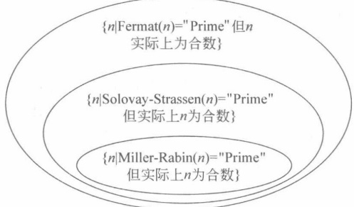

# 第8章

### 素性检测

本章介绍素数的判定方法。重点是 Fermat 测试，难点是 Miller-Rabin 测试。

## 8.1

#### 素数的一些性质

生成合适的 p 和 q 是 RSA 中密钥生成以及 RSA 安全性的关键。素数产生的办法是随机选择一个数，然后测试其是否为素数。这里随机选择比从一个固定的表中选择素数要更加安全。虽然在 2002 年，Agrawal、Kayal 和 Saxena 证明了存在一个素性判断的多项式时间的确定性算法，但是其效率不如概率判定算法。因此在实际应用中，素性检测仍然主要利用概率多项式时间算法。

目前最大的已知素数是梅森(Mersenne)素数 ${2}^{43112609}-1$（此数字位长度是12978189）。梅森数是指形如 ${2}^n-1$的数，记为 $M_n$，如果一个梅森数是素数，那么它称为梅森素数。该数是第47个素数，记为 $M_{43112609}$，它是在2008年8月23日由GIMPS发现。梅森数常用来检验素性检测算法的性能。

思考以下几个问题。

（1）素数会不会用完，即素数是无穷的吗？

定理 1.5 已经证明了素数有无穷多个。

（2）素数在自然数中占的比例如何？是否能够很快找到一个素数？

定理 8.1 素数定理：设  $\pi(x)$ 表示  $\leqslant x$ 的素数的个数，则

$$
\lim_{x\to\infty}\frac{\pi(x)}{x/\ln x}=1
$$

x 充分大时， $\pi(x)\approx x/\ln x$。由素数定理知，对于正整数 N，不超过 N 的素数数目大约为 N/ $\ln N$。即任意一个整数，它小于 N 且是素数的概率为 1/ $\ln N$。假设生成长度为 512 位的素数（首位为 1），则长度为 512 位的素数个数为

$$
\begin{aligned}2^{513}/\ln2^{513}-2^{512}/\ln2^{512}&=2\cdot2^{512}/(513\ln2)-2^{512}/(512\cdot\ln2)\\&\approx0.0028\cdot2^{512}\approx2^{512}/357\approx2^{503.5}\approx10^{151}\end{aligned}
$$

这个数非常大，要知道宇宙中原子的数量也仅仅为 ${10}^{77}$。

任何一个长度为512位的数为素数的概率为 ${2}^{503.5}/(2^{513}-2^{512})\approx1/357$，即平均每357个（长度为512位）的数中就有一个是素数。其中偶数（末尾为二进制的10）不用测试，于是平均测试为 ${357}/2\approx179$次，即为了发现一个长度为512位的素数，平均测试179个长度为512位的数就会发现一个。

一般地，长度为 t 比特的素数大约有

$$
\frac{2^{t+1}}{\ln2^{t+1}}-\frac{2^t}{\ln2^t}=\frac{2^t(t-1)}{t(t+1)\ln2}
$$

（3）如果很多人都选择512比特的p，会不会出现重复？

重复的概率可忽略，因为共有 ${10}^{151}$个数，重复的概率为 $\sqrt{10^{151}}\approx10^{75.5}$（即随机碰撞的概率，如“生日攻击”），这个数非常大。

（4）为什么不建立素数的数据库，利用搜索数据库来尝试分解因子？

将所有512位的素数保存起来，需要 ${512}\cdot2^{503.5}=2^{511.5}$位，如果将10GB( ${2}^{36.3}$位)保存在1g重的存储设备上，需要的存储设备的总重量为 ${2}^{455}t$，这一重量是不可能实现的，将导致系统崩溃，进入黑洞。

下面介绍系统性检测的方法。

一个平凡的方法就是检测任何不大于 $\sqrt{n}$的素数是否能整除n来确定n的素性。显然在实际中需要更高效的算法。

#### Fermat 测试

Fermat 测试的依据是 Fermat 定理。

首先回顾 Fermat 定理：若 n 是素数，且 a 是任何满足  ${1} \leq a \leq n-1$ 的整数，则

$$
a^{n-1}\equiv1\bmod n
$$

因此，给定需要判定素性的数 n，若在区间内能找到一个整数 a 使得  $a^{n-1} \neq 1 \bmod n$，则足以说明 n 是一个合数。

算法 8.1 Fermat 素性测试，测试  $n$
输入：奇数  $n \geq 3$。
输出：测试结果，素数或者合数。

Fermat (n)
{
    随机选择整数  $a, 2 \leq a \leq n-2$。
     $r = a^{n-1} \mod n$;
    If  $r \neq 1$ Return ("Composite");
    Return ("Prime");
}

算法 8.1 的输出为“合数”，则一定为合数，若输出为“素数”，则可能为素数。但是存在这样的合数 n，对所有满足  $\gcd(a, n) = 1$ 的整数 a，均有  $a^{n-1} \equiv 1 \bmod n$，称这样的 n 为 Carmichael 数，有研究表明这种数较稀少。

研究表明，如果算法输出为“Prime”（即通过了素性检测），则 n 确为素数的可能性大于  ${1} - \frac{1}{2}$。如果运行 t 次，算法均输出”Prime”，则 n 确为素数的可能性大于  ${1} - \frac{1}{2^t}$。

#### Solovay-Strassen 测试

Solovay-Strassen 测试是随着 RSA 密码体制而出现并广泛使用的第一种柔性测试。它的原理是基于 Euler 准则。

这里给出 Legendre 符号的推广，即不再限定 p 为素数。

定义 8.1 假定 n 是一个奇正整数，且 n 的素数幂因子分解为  $n = \prod_{i=1}^{n} p_{i}^{e_{i}}$。设 a 为一个整数，那么雅克比 (Jacobi) 符号  $\left(\frac{a}{n}\right)$ 定义为

$$
\left(\frac{a}{n}\right)=\prod_{i=1}^{k}\left(\frac{a}{p_{i}}\right)^{e_{i}}
$$

可见，当 n 为素数时，Jacobi 符号就是 Legendre 符号。

但是，注意 Jacobi 符号  $\left(\frac{a}{n}\right)$ 等于 1，不能推出 a 是模 n 的平方剩余（相比 Legendre 符号， $\left(\frac{a}{p}\right)$ 等于 1，可以推出 a 是模 p 的二次剩余）。

例 8.1 计算 Jacobi 符号  $\left(\frac{6278}{9975}\right)$。

$$
\begin{aligned}\left(\frac{6278}{9975}\right)&=\left(\frac{6278}{3}\right)\left(\frac{6278}{5}\right)^{2}\left(\frac{6278}{7}\right)\left(\frac{6278}{19}\right)\\&=\left(\frac{2}{3}\right)\left(\frac{3}{5}\right)^{2}\left(\frac{6}{7}\right)\left(\frac{8}{19}\right)\\&=(-1)(-1)^{2}(-1)(-1)\\&=-1\end{aligned}
$$

也就是说，如果知道了 n 的因子分解，即可根据因子分解的结果，分别去求 Legendre 符号（即利用平方乘算法求幂）。

但是，在不知道因子分解的情况下，是否可以求出 Jacobi 符号？幸运的是，存在这样的多项式算法。该算法利用了 Jacobi 符号的性质，特别是利用了二次互反律。

Jacobi符号的性质如下。

（1）如果 n 是一个正奇数，且  $m_{1} \equiv m_{2} \bmod n$，则

$$
\left(\frac{m_{1}}{n}\right)=\left(\frac{m_{2}}{n}\right)
$$

（2）如果 n 是一个正奇数，那么

$$
\left(\frac{m_{1}m_{2}}{n}\right)=\left(\frac{m_{1}}{n}\right)\left(\frac{m_{2}}{n}\right)
$$

特别地，若  $m=2^{k}t$，t 为一个奇数，则

$$
\left(\frac{m}{n}\right)=\left(\frac{2}{n}\right)^{k}\left(\frac{t}{n}\right)
$$

（3）如果 n 是一个正奇数，那么

$$
\left(\frac{2}{n}\right)=\left\{\begin{matrix}1,&n\equiv\pm1\bmod8\\ -1,&n\equiv\pm3\bmod8\end{matrix}\right.
$$

（4）如果 m 和 n 是正奇数，则

$$
\left(\frac{m}{n}\right)=\left\{\begin{aligned}&-\left(\frac{n}{m}\right),&&m\equiv n\equiv3\bmod4\\ &\left(\frac{n}{m}\right),&& 其他 \end{aligned}\right.
$$

容易观察到，Jacobi符号和Legendre符号的计算规则是相似的。

这里形象地解释一下，主要是便于初学者记忆和理解。非正式地说，把幂视为“分子”，模视为“分母”，则有以下性质。

（1）性质1 用于将大奇数“分子”转化为小奇数“分子”（计算大奇数的 Jacobi 符号转化为计算小奇数的 Jacobi 符号）。

（2）性质2 把计算偶数“分子”转化为计算奇数“分子”（偶数的 Jacobi 符号转化为计算奇数的 Jacobi 符号）。

（3）性质3 用于计算 $\left(\frac{2}{n}\right)$。

（4）性质4 最重要，称为二次互反律，就是交换“分子”和“分母”的位置，在“分母”比“分子”大时使用。

总之，性质1，2，4是为了化简，性质3为了求值。

使用的顺序一般是性质2→3，或者性质4→1→2→3。序列2→3指先考察“分子”是否为偶数，若是则利用性质2，然后利用性质3求值。如“分子”不是偶数，则使用序列4→1→2→3，即利用性质4使“分母”变小，性质1和性质2使“分子”变小后用性质3求值。

例 8.2 计算例 8.1 中的 Jacobi 符号。

$$
\left(\frac{6278}{9975}\right)=\left(\frac{2}{9975}\right)\left(\frac{3139}{9975}\right)=\left(\frac{3139}{9975}\right)
$$

$$
=-\left(\frac{9975}{3139}\right)=-\left(\frac{558}{3139}\right)
$$

$$
=-\left(\frac{2}{3139}\right)\left(\frac{279}{3139}\right)=\left(\frac{279}{3139}\right)
$$

$$
\begin{aligned}&=-\left(\frac{3139}{279}\right)=-\left(\frac{70}{279}\right)\\&=-\left(\frac{2}{279}\right)\left(\frac{35}{279}\right)=-\left(\frac{35}{279}\right)\\&=\left(\frac{279}{35}\right)=\left(\frac{34}{35}\right)\\&=\left(\frac{2}{35}\right)\left(\frac{17}{35}\right)=-\left(\frac{17}{35}\right)\\&=-\left(\frac{35}{17}\right)=-\left(\frac{1}{17}\right)\\&=-1\end{aligned}
$$

Legendre符号的含义

归纳这4个性质，可知主要的运算是性质2中的取模运算，性质3中的2的幂次分解运算，最终的运算，若n为奇数， $a=2^{e}a_{1}$，其中 $a_{1}$为奇数，有

 $\left(\frac{a}{n}\right)=\left(\frac{2^{e}}{n}\right)\left(\frac{a_{1}}{n}\right)=\left(\frac{2}{n}\right)^{e}\left(\frac{n\bmod a_{1}}{a_{1}}\right)(-1)^{(a_{1}-1)(n-1)/4}$

于是可以设计一个计算 $\left(\frac{a}{n}\right)$的算法，该算法无须分解n的因子，由于在计算中使用了二次互反律，故在程序中使用递归实现更加容易。基本思想是Jacobi $(a,n)=s\cdot Jacobi(n\bmod a_1,a_1)$。

算法 8.2 Jacobi 符号(Legendre 符号)的计算。
输入：奇数  $n \geqslant 3$，整数  $a, 0 \leqslant a \leqslant n-1$。
输出：Jacobi 符号 $\left(\frac{a}{n}\right)$（当 n 为素数时，等同于 Legendre 符号）。

Jacobi(a, n)
{
    If (a=0) Return(0);
    If (a=1) Return(1);
    将 a 表示成  ${2}^{e}a_1$ // a 的 2 的幂次分解运算，其中， $a_1$ 为奇数
    If (IsEvenNumber(e)) s←1; // 性质 2，幂指数 e 为偶数，故幂总为 1
    Else
        {
            If (n = ±1 mod 8) s←1;
            If (n = ±3 mod 8) s←-1;
            }
        // 性质 3
    If (n = 3 mod 4) AND (a_1 = 3 mod 4) s←-s;
    n_1→n mod a_1;
    If (a_1 = 1) Return(s);
    Else
        Return (s · Jacobi(n_1, a_1)); // 递归调用，性质 4
}

算法的时间复杂度为  $O((\log_{2}n)^{2})$。

到此，可以给出 Solovay-Strassen 测试算法，该测试中分别计算  $x \leftarrow \left( \frac{a}{n} \right)$ 和  $y \leftarrow a^{(n-1)/2} \bmod n$，如果 x = y  $\bmod n$，则输出素数；否则，输出合数。合数的结论总是正确的（根据 Euler 准则），但输出素数时不一定是素数。

算法 8.3 测试 $n$ 是否为素数。

输入：奇数 $n$。

输出："Prime"或"Composite"。

Solovay-Strassen ($n$)

{
    随机选取整数 $a$，使得 $a \in [1, n-1]$；
    $x \leftarrow \left( \frac{a}{n} \right)$；
    If ($x=0$) Return ("Composite")；
    y ← $a^{(n-1)/2}$ mod n;
    If (x=y mod n) Return ("Prime");
    Else Return ("Composite");
}

## 8.4

#### Miller-Rabin 测试 $^{*}$

实际中，通常使用的概率素性测试方法是 Miller-Rabin 测试，也称为强伪素性测试。该测试基于以下思想。

回顾 Fermat 测试，需要计算  $a^{n-1} \bmod n$。若结果为 1 则输出“素数”，不为 1 则输出“合数”。一个自然的想法是能不能少计算一点。

下面分析这种可能性：由于 n 是奇数，故 n-1 为偶数，不妨设为 n-1=2t，于是  $a^{n-1}=(a^{t})^{2}$，考查如果  $a^{t}=\pm1 \bmod n$，就直接输出“素数”，没有必要再继续计算了（因为平方后会得到  $a^{n-1}=1 \bmod n$）。这样就节省了计算的时间。

进一步而言，如果  $n-1=2^{k}t(k\geqslant0)$，则

$$
a^{n-1}=(a^{t})^{2^{k}}=\underbrace{(\cdots((a^{t})^{2})^{2}\cdots)^{2}}_{k}
$$

同前面的分析，如果  $a^{t}=\pm1 \bmod n$，则必然有  $a^{n-1}=1 \bmod n$，直接输出“素数”，不用继续计算；否则，如果在 k-1 次平方的过程中，有一个为 -1，则最终也有  $a^{n-1}=1 \bmod n$，输出“素数”，依次计算  $a^{t}$， $(a^{t})^{2}$， $\cdots$， $(a^{t})^{k-1}$，那么最终使得  $a^{n-1}=1 \bmod n$，输出“素数”的计算序列要么是

$$
\begin{aligned}&a^{t},(a^{t})^{2},\cdots,(a^{t})^{2^{k-1}}\\&\pm1,1,\cdots,1\\ \end{aligned}
$$

或者

$$
\begin{aligned}&a^{t},\quad(a^{t})^{2},\cdots,(a^{t})^{i-1},(a^{t})^{i},(a^{t})^{i+1},\cdots,(a^{t})^{k-1}\\&\neq\pm1,\neq\pm1,\cdots,\neq\pm1,-1,\quad1,\quad\cdots,\quad1\\ \end{aligned}
$$

即在第 $i(i=0,1,\cdots,k-1)$次平方后，等于-1。此外，均输出“合数”。

有读者会疑问如果第 i 次平方后等于 1，不也可以使得最后有  $a^{n-1}=1 \bmod n$ 吗？是的，但是这种情况下， ${1} \bmod n$ 的平方根不是  $\pm 1$，说明 n 不是素数。因此，只有两种情况。要么开始为  $\pm 1$，要么在第  $i(i=0,1,\cdots,k-1)$ 次平方计算的过程中出现 -1 即可。

根据上面的分析，可以得到算法如下。

算法 8.4 Miller-Rabin 素性测试。
输入：奇数  $n \geqslant 3$。
输出：对 n 素性的判断。

Miller-Rabin (n)
{ 把 n-1 写成 n-1=2^k t，其中 t 是一个奇数；
随机选取整数 a，使得  ${1} \leqslant a \leqslant n-1$;

$b \leftarrow a^{t} \bmod n$;

If b≡1 mod n Return ("Prime");

For i=0 to k-1

{
    If b≡-1 mod n Return ("Prime");
    Else
    $b \leftarrow b^{2} \bmod n$;
}

Return ("Composite");
}

可以证明 Miller-Rabin 算法的错误概率，即输出“素数”但其实是合数的概率为 1/4，这里不再给出证明。

比较 Fermat 测试，Solovay-Strassen 测试和 Miller-Rabin 测试三者的精确度，有图 8.1 所示的关系。

图 8.1 三种测试精确度的比较
 

可见 Miller-Rabin 精确度最高，错误概率最小。同时计算上也比 Solovay-Strassen 测试简单（Solovay-Strassen 测试需要计算 Jacobi 符号）。

#### 思考题

[1] 计算长度为 300bit 的素数大约有多少个？

[2] 利用 Fermat 素数测试法判别整数 3089 可能为素数，并给出其可能的概率。

[3] 利用 Solovay-Strassen 概率判别法判别 3229 可能为素数，并给出其可能的概率。

[4] 利用 Miller-Rabin 概率判别法判别 3689 可能为素数，并给出其可能的概率。

[5] 实现 Miller-Rabin 素数检测算法，测试并找到一个对你而言最大的梅森素数。

[6] 编写 Fermat 测试、Solovay-Strassen 测试、Miller-Rabin 测试，比较它们的效率。

[7] 编写程序产生  ${2}^{200}$ 左右的大素数。
