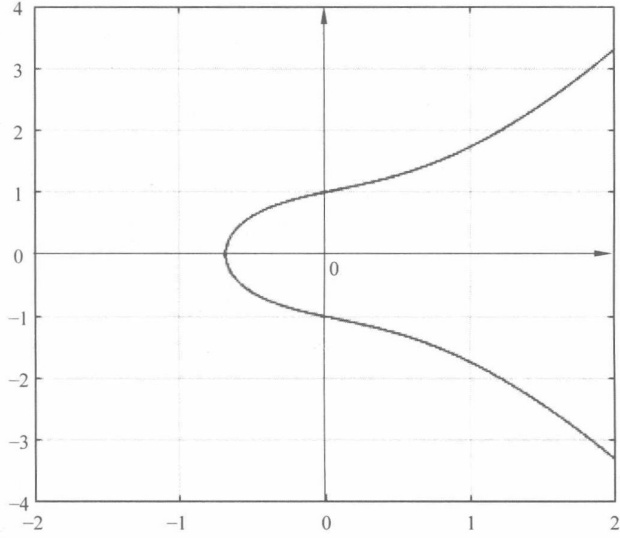
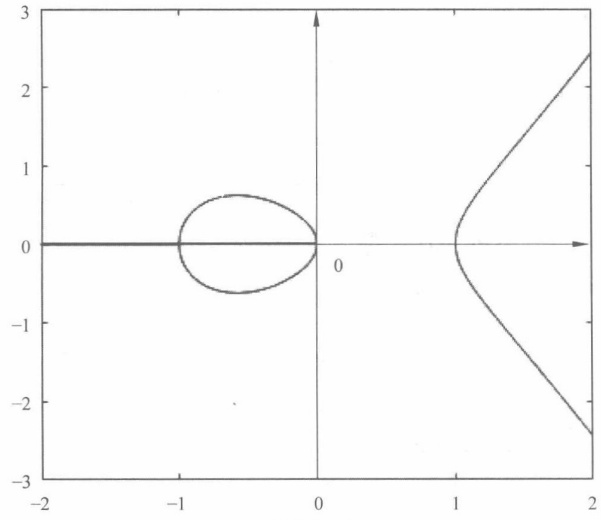
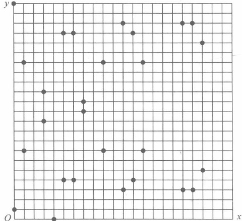
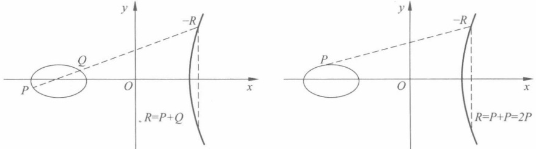
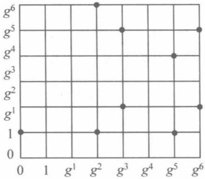

# 高级篇

### 第9章

### 椭圆曲线群

本章介绍在椭圆曲线上构造的群，并基于这种群构造DH密钥协商协议、ElGamal加密。

本章的重点是椭圆曲线群的构造。难点是 ElGamal 椭圆曲线加密方法和椭圆曲线快速标量点乘算法。

#### 椭圆曲线群的概念

# 1. 椭圆曲线的定义

椭圆曲线是指由韦尔斯特拉斯（Weierstrass）方程，即

$$
y^{2}+axy+by=x^{3}+cx^{2}+dx+e
$$

所确定的平面，其中 a, b, c, d 和 e 属于 F，F 是一个域，可以是有理数域、复数域、有限域，密码学中通常采用有限域。椭圆曲线是其上所有点  $(x, y)$ 的集合，外加一个无限远点 O（该点不在椭圆曲线 E 上，记为 O，称此点为无限远点）。

椭圆曲线上可以提供无数的有限 Abel 群，具有丰富的群结构，不同的参数可得到不同的曲线，形成不同的群。而且易于计算，从而可用来构造密码算法。在密码学中，常采用下列形式的椭圆曲线，即

$$
E：y^{2}=x^{3}+ax+b
$$

并要求  ${4}a^{3}+27b^{2}\neq0$, E:  $y^{2}=x^{3}+ax+b$ 可以构成群。

这个要求的原因是： $\Delta=(a/3)^{3}+(b/2)^{2}=(4a^{3}+27b^{2})/108$ 是方程  $E:y^{2}=x^{3}+ax+b$ 的判别式，当  ${4}a^{3}+27b^{2}=0$，则方程有重根，设为  $x_{0}$，则点  $Q_{0}=(x_{0},0)$ 是方程  $y^{2}=x^{3}+ax+b$ 的重根。令  $F(x,y)=y^{2}-x^{3}-ax-b$，则  $\left.\frac{\partial F}{\partial x}\right|_{Q_{0}}=\left.\frac{\partial F}{\partial y}\right|_{Q_{0}}=0$，所以  $\frac{dy}{dx}=-\frac{\partial F}{\partial x}\bigg/\frac{\partial F}{\partial y}$ 在  $Q_{0}$ 点无定义，即曲线  $E:y^{2}=x^{3}+ax+b$ 在  $Q_{0}$ 点的切线无定义，因此在计算  $Q_{0}$ 点的标量乘法运算时无定义。

# 2. 有限域  $F_{p}$ 上的椭圆曲线

密码学中普遍采用的是有限域上的椭圆曲线，就是指椭圆曲线方程定义式中，所有的系数都是某一有限域中的元素。这种有限域可以是  $\mathbf{F}_{q}$，q 通常为一个素数幂，如最常见的情形是 q=p，p 为一个大于  ${2}^{160}$ 的素数，或者  $q=2^{m}(m>160)$（这里介绍第一种情况，第二种情况可以类推进行定义）。

考虑有限域  $\mathbf{F}_p$ 上的椭圆曲线。常见表达式为  $y^2 \equiv x^3 + ax + b \mod p$，其中一个大素数， $a, b, x, y$ 均在有限域  $\mathbf{F}_p$ 中，即从  $\{0, 1, \cdots, p-1\}$ 上取值，且满足  ${4}a^3 + 27b^2 \not\equiv 0 \pmod{p}$，这类椭圆曲线通常用  $E_p(a, b)$ 表示，该椭圆曲线只有有限个点数  $N$（包括无穷远点  $O$）， $N$ 越大，安全性越高（群中元素越多，越能对抗穷举搜索攻击）。于是，一个很自然的问题就是： $N$ 是否足够大。关于  $N$ 的数量有一个估计，即 Hasse 定理。

定理 9.1 (Hasse 定理) 如果 E 是有限域  $\mathbf{F}_p$ 上的椭圆曲线，N 是 E 上的点  $(x, y)$ （其中  $x, y \in \mathbf{Z}_p$）的个数，则  $|N - (p + 1)| \leqslant 2\sqrt{p}$，即

$$
p+1-2\sqrt{p}\leqslant\mid N\mid\leqslant p+1+2\sqrt{p}
$$

例如，若 p=5， $Z_{5}$ 上的椭圆曲线  $y^{2}=x^{3}+ax+b$ 上的点数为 2～10。

## 9.2 椭圆曲线群的构造

# 1. 椭圆曲线群的构造

一般来说， $E_{p}(a,b)$ 由以下方式产生。

（1）对每一 $x\left(0\leqslant x<p,p\right.$为整数），计算 $t=x^{3}+ax+b\bmod p$

（2）判定 t 在模 p 下是否为二次剩余（利用 Euler 准则），如果不是，则曲线上没有与这一 x 相对应的点。如果有，则求出两个平方根（t=0 时只有一个平方根）。

例 9.1 p=23, a=b=1, 方程为  $y^{2}=x^{3}+x+1$,  ${4}a^{3}+27b^{2}=8\neq0$, 图形是连续曲线, 如图 9.1(a) 所示。p=11, a=-1, b=0, 方程为  $y^{2}=x^{3}-x$,  ${4}a^{3}+27b^{2}=-4\neq0$, 如图 9.1(b) 所示。

(a) 椭圆曲线  $y^{2}=x^{3}+x+1$
 

图 9.1 例 9.1 用图
 

(b) 椭圆曲线  $y^{2}=x^{3}-x$
 

图 9.1 (续)
 

主要对第一象限的整数点感兴趣，用  $E_p(a,b)$ 表示该方程定义的点集  $\{(x,y)|0 \leq x < p, 0 \leq y < p, x, y \in \mathbb{Z}\} \cup O$。表 9.1 给出了点集  $E_{23}(1,1)$。

表9.1 点集 $E_{23}(1,1)$
 

| (0,1) | (1,7) | (3,10) | (4,0) | (5,4) | (6,4) | (7,11) |
| --- | --- | --- | --- | --- | --- | --- |
| (0,22) | (1,16) | (3,13) |  | (5,19) | (6,19) | (7,12) |
| (9,7) | (11,3) | (12,4) | (13,7) | (17,3) | (18,3) | (19,5) |
| (9,16) | (11,20) | (12,19) | (13,16) | (17,20) | (18,20) | (19,18) |

图 9.2 给出了这些点的位置。
 

图 9.2 点集  $E_{23}(1,1)$
 

思考9.1 给出点集 $E_{11}(-1,0)$，见表9.2。

表9.2 点集 $E_{11}(-1,0)$
 

| (1,0) | (4,4) | (6,1) | (8,3) | (9,4) | (10,1) |
| --- | --- | --- | --- | --- | --- |
| (0,0) | (4,7) | (6,10) | (8,8) | (9,7) | (10,10) |

# 2. 椭圆曲线在  $F_{p}$ 下的 Abel 群

定理 9.2 椭圆曲线上的点集合  $E_{p}(a,b)$ 对于以下定义的加法规则构成一个 Abel 群。

椭圆曲线上的加法运算定义如下：如果其上的3个点位于同一直线上，那么它们的和为O。

从图形上直观地进行定义和解释如下（图 9.3）。

图 9.3  $P+Q$ 的几何意义（左）和 2P 的几何意义（右）示意图
 

（1）O 是加法单位元，即对于椭圆曲线上任一点 P，其与关于 x 轴的对称点的连线与无穷远点 O 共线。由  $P+(-P)=O$，有  $P+O=P$。

（2）一条与X轴垂直的线和曲线相交于两个点，这两个点的X坐标相同，即 $P_{1}=(x,y)$和 $P_{2}=(x,-y)$。 $P_{1}P_{2}$连线延长到无穷远时，与曲线相交于无穷远点O，因此 $P_{1}P_{2}$，O三点共线，所以 $P_{1}+P_{2}+O=O$， $P_{1}+P_{2}=O$，即 $P_{2}=-P_{1}$，故椭圆曲线的性质决定P与其逆元成对在椭圆曲线上。

（3）横坐标不同的两个点 P 和 Q 相加时， $P+Q$ 的定义如下：先在它们之间画一条直线并求直线与曲线的第三个交点 -R，由  $P+Q-R=O$，得到  $P+Q=R$。

（4）两个相同点 P 相加时，通过该点画一条切线，切线与曲线交于另一点 -R，则  $P + P - R = 2P - R = O$，于是 2P = R。类似地，可以定义  ${3}Q = Q + Q + Q$ 等。

可以证明，以上方法定义的加法运算可以得到一个 Abel 群，即可以得到以下加法规则。

(1) $O+O=O$

(2) 对所有的点  $P(x,y) \in E_{p}(a,b)$，有  $P + O = O + P = P$。

（3）对所有的点  $P(x,y)\in E_{p}(a,b)$，有  $P+(-P)=O$；即点 P 的逆为 -P=(x,-y)。

（4）令 $P=(x_{1},y_{1})\in E_{p}(a,b)$，和 $Q=(x_{2},y_{2})\in E_{p}(a,b)$，且 $P\neq-Q$，则

$$
P+Q=(x_{3},y_{3})\in E_{p}(a,b)
$$

其中： $x_{3}=\lambda^{2}-x_{1}-x_{2},y_{3}=\lambda(x_{1}-x_{3})-y_{1}$

$$
\lambda=\left\{\begin{aligned}&\frac{y_{2}-y_{1}}{x_{2}-x_{1}}&P\neq Q\\ &\frac{3x_{1}^{2}+a}{2y_{1}}&P=Q\end{aligned}\right.
$$

（5）对于所有的点 P 和 Q，满足加法交换律，即  $P + Q = Q + P$。

（6）对于所有的点 P、Q 和 R，满足加法结合律，即  $(P+Q)+R=P+(Q+R)$。

由规则(4)知，加法具有封闭性。规则(2)说明存在单位元O。规则(3)说明任意元素P均存在逆元-P。再加上规则(5)加法满足交换律和(6)加法满足结合律，故 $E_{p}(a,b)$对于椭圆曲线加法构成一个Abel群。规则(4)的计算在GF(p)下进行，即对p取模。

例 9.2 椭圆曲线  $E_{23}(1,1)$，设  $P=(3,10)$， $Q=(9,7)$。求  $P+Q,2P$。

$$
\lambda=\left(7-10\right)/\left(9-3\right)=-3/6\equiv11\bmod23
$$

$$
x_{3}=11^{2}-3-9=109\equiv17\bmod23
$$

$$
y_{3}=11(3-17)-10=-164\equiv20\bmod23
$$

于是， $P+Q=(17,20)$，可见其仍为 $E_{23}(1,1)$中的点。

下面求2P。

$$
\lambda=\left(3\cdot3^{2}+1\right)/\left(2\cdot10\right)=28/20\equiv6\bmod23
$$

$$
x_{3}=6^{2}-3-3=30\equiv7\bmod{23}
$$

$$
y_{3}=6(3-7)-10=-34\equiv12\bmod23
$$

所以  ${2}P=(7,12)$。

乘法规则如下。

（1）如果 k 为整数，则对所有的点  $P \in E_{p}(a, b)$ 而言，有

 $kP = P + P + \cdots + P$, k 个 P 相加

（2）如果 s 和 t 为整数，则对所有的点  $P \in E_{p}(a, b)$ 而言，有

$$
(s+t)P=sP+tP,s(tP)=(st)P
$$

算法 9.1 求椭圆曲线  $E_{p}(a,b)$ 上点的伪代码。

输入：素数模 p，椭圆曲线参数 a 和 b。

输出： $(x,\pm\sqrt{w})$，其中 $w=y^{2}$。

ECPoints(p, a, b)
{
    x←0;
    While(x<p)

{
    w←(x³+ax+b)mod p;
    If(w是Z_p中的完全平方)输出(x,√w)，(x,-√w);
    x←x+1;
}
}

上述介绍的是基于  $F_{p}$ 的椭圆曲线，基于  $F_{2^{n}}$ 的椭圆曲线可以类似构造。

# 3.  $F_{2}$ 的椭圆曲线的构造

椭圆曲线群中的计算可以通过  $F_{2^{n}}$ 域来定义，这个域中集合的元素是 n 比特字符串，这些字符串可以当作带有  $F_{2}$ 中系数的多项式。关于这些元素的加法与乘法与多项式的加法与乘法是相同的。因为域  $F_{2^{n}}$ 的特征为 2，则域  $F_{2^{n}}$ 上椭圆曲线 E 的普通方程可以写为

$$
E：y^{2}+xy=x^{3}+ax^{2}+b
$$

其中， $b \neq 0$，x，y，a，b 的值是代表 n 比特字符串的多项式。

在域  $F_{2^{n}}$ 上定义运算规则如下。

设  $P_{1}=(x_{1},y_{1}), P_{2}=(x_{2},y_{2})$ 是曲线 E 上的两个点，O 为无穷远点，则

$$
(1)\ O+P_{1}=P_{1}+O
$$

(2) $-P_{1}=(x_{1},x_{1}+y_{1})$

（3）如果  $P_{3}=(x_{3},y_{3})=P_{1}+P_{2}\neq O$，则  $\left\{\begin{aligned}x_{3}&=\lambda^{2}+\lambda+x_{1}+x_{2}+a\\y_{3}&=\lambda(x_{1}+x_{3})+x_{3}+y_{1}\end{aligned}\right.$，其中  $\left\{\begin{aligned}\lambda&=\frac{y_{2}+y_{1}}{x_{2}+x_{1}},x_{1}\neq x_{2}\\ \lambda&=\frac{x_{1}^{2}+y_{1}}{x_{1}},x_{1}=x_{2}\end{aligned}\right.$。

例 9.3 用不可约多项式  $f(x)=x^{3}+x+1$ 选择具有元素  $\{0,1,g,g^{2},g^{3},g^{4},g^{5},g^{6}\}$ 的  $\mathbf{F}_{2}^{3}$，这就是说， $g^{3}+g+1=0$ 或  $g^{3}=g+1$，因此可算出 g 的其他幂。

记0为000，1为001，g为010， $g^{2}$为100， $g^{3}=g+1$为011， $g^{4}=g^{2}+g$为110， $g^{5}=g^{2}+g+1$为111， $g^{6}=g^{2}+1$为101。

运用椭圆曲线  $y^{2}+xy=x^{3}+g^{3}x^{2}+1$，有  $a=g^{3}$ 且 b=1，因此可以求出曲线上的点，如图9.4所示。

| (0,1) | (0,1) |
| --- | --- |
| $(g^{2},1)$ | $(g^{2},g^{6})$ |
| $(g^{3},g^{2})$ | $(g^{3},g^{5})$ |
| $(g^{5},1)$ | $(g^{5},g^{4})$ |
| $(g^{6},g)$ | $(g^{6},g^{5})$ |

(a) 坐标椭圆上的点
 

(b) 椭圆曲线上的点
 

图 9.4 基于  $F_{2^{n}}$ 的椭圆曲线上的点 (n=3)
 

例 9.4 求  $R=P+Q$，这里  $P=(0,1)$， $Q=(g^{2},1)$，则  $\lambda=0$， $R=(g^{5},g^{4})$。

例 9.5 求 R=2P，这里  $P=(g^{2},1)$，则  $\lambda=g^{2}+1/g^{2}=g^{2}+g^{5}=g+1, R=(g^{6},g^{5})$。

## 9.3 椭圆曲线密码

### 9.3.1 椭圆曲线上的 DH 密钥协商协议

一个直观的类比是：定义在椭圆曲线群 $(E, +)$上的加法操作对应于 $\mathbf{Z}_{p}^{*}$上的模p乘法操作，多次加法操作对应于模p的指数运算。

# 1. 椭圆曲线离散对数问题（ECDLP）

设 p 为某个大素数，E 是  $\mathbb{F}_p$ 上的椭圆曲线，设 G 是 E 的一个循环子群，P 是 G 的一个生成元， $Q \in G$。已知 P 和 Q，求满足 nP = Q 的唯一整数 n， ${0} \leq n \leq \text{ord}(P) - 1$，称为椭圆曲线离散对数问题。

ECDLP 其实就是 DLP 的椭圆曲线版本，即将原来的  $Z_{p}^{*}$ 群替换成椭圆曲线上 Abel 群。

# 2. 椭圆曲线 Diffie-Hellman 问题（ECDHP）

同 ECDLP 一样，ECDHP 问题就是在 DHP 的椭圆曲线版本。

于是可以得到类似于5.3节介绍的DH密钥交换协议的椭圆曲线版本。描述如下。

（1）假设 Alice 与 Bob 要在他们之间建立一个共享的密钥。Alice 和 Bob 首先选定公共参数：取某个大素数 p，E 是  $F_{p}$ 上的椭圆曲线， $E_{p}$ 是相应的 Abel 群，G 是  $E_{p}$ 中具有较大素数阶 n 的点。

(2) Alice 秘密选定一个整数 a:  ${1} \leq a \leq n-1$，并计算 A = aG。发送 A 给 Bob。

（3）Bob秘密选定一个整数 b:  ${1} \leqslant b \leqslant n-1$，并计算 B = bG。发送 B 给 Alice。

（4）Alice 计算 k=aB。

（5）Bob 计算 k=bA。

容易看到，Alice 和 Bob 计算得到的 k 是相同的，即

$$
a\mathrm{B}=a\left(b\mathrm{G}\right)=\left(ab\right)\mathrm{G}=b\left(a\mathrm{G}\right)=b\mathrm{A}
$$

显然，椭圆曲线上 Diffie-Hellman 密钥交换协议的安全性基于 ECDLP 的困难性。

### 9.3.2 EIGamal 加密的椭圆曲线版本

一个直接构造椭圆曲线上的公钥密码体制的方法是使用某种编码的方法，将明文编码为椭圆曲线上的一个点，然后利用ElGamal的思路，利用DHP的困难性，构造一个共享密钥来加密明文（某个椭圆曲线上的点）。

类比 ElGamal 密码体制（运算从模乘变为椭圆曲线群的加），容易给出一种密码体制如下。

（1）密钥生成算法：

设  $E_{p}$ 是有限域  $\mathbb{F}_{p}$ 上的椭圆曲线，G 是  $E_{p}$ 中具有较大素数阶 n 的一个点。随机选择一个整数 d，使得  ${2} \leqslant d \leqslant n-1$，计算 P = dG。d 是私钥，(P, G, E, n) 是公钥。

##### （2）加密算法：

将明文编码为  $E_{p}$ 中的元素  $P_{m}$ (即椭圆曲线上的一个点)，再选取随机数  $r:1 \leq r \leq n-1$，计算

$$
c_{1}=r\cdot G=(x_{1},y_{1})
$$

$$
c_{2}=P_{m}+r\cdot P=(x_{2},y_{2})
$$

（3）解密算法：

利用私钥 d，计算出  $P_{m}=c_{2}-d\cdot c_{1}$ 。对  $P_{m}$ 解码得到明文 m。

例 9.6 取 p=751, $E_{p}(-1,188)$，即椭圆曲线为  $y^{2}=x^{3}-x+188$, $E_{751}(-1,188)$ 的一个生成元是  $G=(0,376)$，A 的公钥为 P=(201,5)。假定 B 已将要发送给 A 的消息嵌入到椭圆曲线上，即点  $P_{m}=(562,201)$，B 选取随机数 r=386，由 rG=386(0,376)=(676,558), $P_{m}+rP=(562,201)+386(201,5)=(385,328)$。得到的密文为{(676,558)，(385,328)}。

### 9.3.3 椭圆曲线快速标量点乘算法

从密码学应用可以看到，在椭圆曲线群中最重要的运算是标量乘，即对任意正整数 m 及  $E_{p}(a,b)$ 中非零元 P，计算  $m \cdot P$。计算标量乘的方法有很多种，最常用的方法是倍加法，即将乘子 m 表示成系数为 0 或 1 的 2 的多项式，然后反复进行“倍一加”及不同点加的运算。

例 9.7  $E_{17}(-1,5)$ 中  $P=(7,1)$，求 mP。

$$
\begin{aligned}mP&=15(7,1)=2(2(2(7,1)+(7,1))+(7,1))+(7,1)\\&=2(2(11,13)+(7,1))+(7,1))+(7,1)\\&=2(2(8,13)+(7,1))+(7,1)\\&=2((14,7)+(7,1))+(7,1)\\&=2(12,2)+(7,1)\\&=(8,4)+(7,1)\\&=(11,4)\\ \end{aligned}
$$

计算  ${15} \cdot (7,1)$ 需要进行 3 次“倍一加”和 3 次加运算。如果采用符合二元法（符合二元法是指：将乘子表示成系数为 0，1 或 -1 的 2 的多项式，然后再反复进行“倍一加”及不同点加的一种标量乘方法），则只需要 4 次“倍一加”与 1 次加，即

$$
\begin{aligned}mP&=15(7,1)=(2^{4}-1)(7,1)\\&=2(2(2(2(7,1))))-(7,1))\\&=2(2(2(11,13)))-(7,1)\\&=2(2(10,14))-(7,1)\\ \end{aligned}
$$

$$
=2(13,8)-(7,1)
$$

$$
=(7,16)-(7,1)
$$

$$
=(7,16)+(7,16)
$$

$$
=(11,4)
$$

思考9.2 这一算法和RSA中用到的计算模幂的“平方—乘”方法是否构成类比。

其实，类比关系十分明显。在模幂运算中，“乘”为基本运算，椭圆曲线标量乘中“加”为基本运算。“平方”为两次“乘”，“倍”为两次“加”。因此，构成非常明显的类比。

#### 思考题

[1] 设  $x^{3}+ax^{2}+bx+c$ 是根  $\alpha_{1}$、 $\alpha_{2}$、 $\alpha_{3}$ 的三次多项式，证明： $\alpha_{1}+\alpha_{2}+\alpha_{3}=-a$。

[2] 椭圆曲线  $E_{11}(1,6)$ 表示  $y^{2} \equiv x^{3} + x + 6 \bmod{11}$，求其上的所有点。

[3] 已知点  $G=(2,7)$ 在椭圆曲线  $E_{11}(1,6)$ 上，求 2G 和 3G。

[4]  $F_{5}$ 上的椭圆曲线  $E: y^{2}=x^{3}-x$ 的有理点集合为  $\{(0,0),(1,0),(2,1),(2,4),(3,2),(3,3),(4,0),O\}$，计算每个点的阶。

[5] 在有理数域上定义椭圆曲线  $E: y^{2}=x^{3}-2$，验证（3， $\pm5$）是椭圆曲线上的点，并求出在这条曲线上的另外一个点。

[6] 证明：如果点  $P(x,0)$ 是椭圆曲线上的点，则 2P=0。

[7] 证明：如果 P, Q, R 是椭圆曲线上的点，那么  $P + Q + R = 0$ 的充分必要条件是 P, Q, R 共线。

[8] 点  $Q=(10,5)$ 是有限域  $F_{23}$ 上椭圆曲线  $E: y^{2}=x^{3}+13x+22$ 的点，试计算点 Q 的阶以及由 Q 生成的循环子群。

[9] 编写程序实现椭圆曲线快速点乘算法。

[10] 编写程序实现椭圆曲线版本的 ElGamal 加密。
