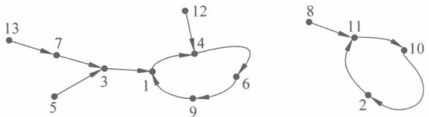

### 第10章

### 大整数分解算法

对 RSA 最直接的攻击就是因子分解。如果能够分解 $n$得到$p$和$q$，便可以得到 $\varphi(n)=(p-1)(q-1)$。根据公钥 $e$求得私钥$d \equiv e^{-1} \bmod \varphi(n)$，便完全攻破。因子分解的平凡办法就是试除法，其基本思想是尝试小于 $\sqrt{n}$的所有素数去除$n$，直到找到一个因子，这种方法当 $n$ 较大时，在现实中是不可行的。

本章的重点是随机平方法，难点是 Pollard p-1 分解算法。

#### Pollard Rho 方法

Rho 方法由 Pollard 于 1975 年提出，用于寻找小因子。基于一种在有限集合中寻找碰撞的思想，其基本原理是：设  $f: s \rightarrow s$ 是一个随机函数，S 是 n 个元素的有限集。设  $x_{0}$ 是 S 中的一个随机元素，考查序列  $x_{0}, x_{1}$，其中  $x_{i+1} = f(x_{i}) (i \geqslant 0)$。由于 S 是有限集，则该序列最终必然出现循环。

例 10.1 函数  $f\colon\{1,2,\cdots,13\}\to\{1,2,\cdots,13\}$。定义如下：

$$
f(1)=4,f(2)=11,f(3)=1,f(4)=6,f(5)=3,f(6)=9,f(7)=3,
$$

$$
f(8)=11,f(9)=1,f(10)=2,f(11)=10,f(12)=4,f(13)=7
$$

容易画出函数图如图 10.1 所示。

图 10.1 随机映射 f 的函数图
 

很明显一个问题是：大概多少步之后出现循环，即出现碰撞需要的步数。

设走到循环开始的位置需要 u 步（也称为尾长度），循环的长度为 v 步（称为圈长），因此，发现碰撞需要的步数为  $u+v$（也称为  $\rho$ 长度， $\rho$ 字母的形状就是由尾和圈组成的， $\rho$ 在希腊字母中叫作 Rho）。关于随机映射或者随机图的研究表明，u 的期望是  $\sqrt{\pi n/8}$，圈长度的期望也是  $\sqrt{\pi n/8}$，于是  $\rho$ 长度为  $\sqrt{\pi n/2}$。Rho 方法在解决离散对数问题中也有应用。

下面给出 Pollard 的 Rho 因子分解算法。

算法 10.1 Pollard 的 Rho 因子分解算法。

输入：合数 n, n 不为某个素数的幂。

输出：n 的非平凡因子 d。

Rho (n)
{
    a←2, b←2;
    For i=1 To…
    {
        a←a^2+1 mod n;
        b←b^2+1 mod n, b←b^2+1 mod n;
        d=gcd(a-b, n);
        If 1<d<n, Return (d);
        If d=n, Return ("Failure");
    }
}

这里的算法在平凡的 Rho 方法的基础上做了一点改进，即计算  $(x_{i}, x_{2i})$ 直到发现两者相当，该方法称为 Floyd 循环查找算法，可节省存储的空间。

#### Pollard p-1 分解算法

这种方法的思想是：设 p 是要分解的数 n 的一个素数因子，p-1 的因子分解中的素数幂次最大为 q，即  $q|p-1$，如果  $q \leqslant B$，那么必有  $(p-1)|B!$。例如，假设 p-1=5280=  ${2}^{5} \cdot 3 \cdot 5 \cdot 11$，素数的幂次最大为  ${2}^{5}=32$，可选择 B=32。

由 Fermat 定理， ${2}^{p-1} \equiv 1 \bmod p$，于是  ${2}^{B!} \equiv 1 \bmod p$，即  $p \mid (2^{B!} - 1)$，又因为  $p \mid n$，所以  $p \mid \gcd(n, 2^{B!} - 1)$。于是可以得到一个 n 的非平凡因子  $\gcd(n, 2^{B!} - 1)$。

下面给出 Pollard p-1 算法，算法中的 B 是一个猜测值，即对 p-1 中最大素数幂的猜测。

算法 10.2 分解 n 的因子。

输入：要分解的合数 n，对 p-1 的因子分解中的素数幂的最大值的猜测 B。

输出：n 的因子。

PollardFactoring(n,B)
{
    a←2;
    For j←2 To B
    {
        a←a^j mod n;
    }
    d←gcd(a-1,n);
    If 1<d<n Return (d);
    Else
    Return ("Failure");
}

另外一种方法也可以得到 p-1 的倍数，可能会缩小计算量，这里先引入光滑（smooth）的概念，简单地说，就是素数因子的上界。

定义 10.1 设 B 是一个正整数。当 n 的所有素数因子不大于 B 时，称整数 n 为 B 光滑的 (B smooth)。

例如，假设  $p-1=5280=2^{5}\cdot3\cdot5\cdot11$，则 p-1 是 11 光滑的（B=11）。

下面考虑如何算出一个数 Q，满足  $(p-1)|Q$ 且计算量较小。一个自然的想法是假设 p-1 是 B 光滑的，那么计算  $Q=\prod_{q\leq B}q$，即小于 B 的素数的乘积，但是，该数可能不满足  $(p-1)|Q$，因为没有考虑 p-1 中素因子可能有幂次。于是，要适当放大 Q。考查某个 p-1 的因子 q，其最大的幂次为  $l$， $q^{l}\leq n$，于是  $l\leq\left|\frac{\ln n}{\ln q}\right|$。这样，令

$$
Q=\prod_{q\leqslant B}q^{\left\lfloor\frac{\ln n}{\ln q}\right\rfloor}
$$

这样，必然有 $(p-1)|Q$，于是 $p|(2^{Q}-1)$， $\gcd(2^{Q}-1,n)$即为n的非平凡因子。下面给出算法。

算法 10.3 分解 n 的因子。

输入：要分解的合数 n，对 p-1 的素因子的最大值的猜测 B。

输出：n 的因子。

PollardFactoring (n, B)
{
    a←2, q←2;
    While (q≤B and q∈Prime)
    {
        a←a^{q^{\left\lfloor\ln n/\ln q\right\rfloor}} mod n;
        q←下一个素数;
    }
    d←gcd(a-1,n);
    If 1<d<n Return (d);
    Else
    Return ("Failure");
}

可见，计算模乘的时间为  $O(B\ln n/\ln B)$。

# 随机平方法

该方法的基本思想是：假如 x 和 y 是整数，且  $x^{2} \equiv y^{2} \mod n$，但  $x \neq \pm y \mod n$。于是 n 整除  $x^{2} - y^{2} = (x + y)(x - y)$，但是 n 不能整除  $(x - y)$ 或者  $(x + y)$。因此  $\gcd(x + y, n)$ （或者说  $\gcd(x - y, n)$）一定是 n 的一个平凡因子。例如， ${10}^{2} \equiv 32^{2} \mod 77$，则  $\gcd(10 + 32, 77) = 7$ 是 77 的一个因子。

通常的策略是随机找几个数，不妨称为 $z_{i}$，这些数的平方模n的素数因子都在一个集合内，这个集合称为因子基B。如果把这些 $z_{i}^{2}$相乘，发现其相同素数因子的幂次为偶数次，即意味着是一个数t的平方。于是找到了两个数 $\left(\prod(z_{i})\right)^{2}=t^{2}$。

例 10.2 假定 n=15770708441，令 B=2,3,5,7,11,13。设法找到几个  $z_{i}$，使得其平方后取模的因子在这个集合中。考虑  $z_{1}=8340935156$， $z_{2}=12044942944$， $z_{3}=2773700011$。

$$
z_{1}^{2}=8340935156^{2}=3\cdot7\bmod n
$$

$$
z_{2}^{2}=12044942944^{2}=2\cdot7\cdot13\bmod n
$$

$$
z_{3}^{2}=2773700011^{2}=2\cdot3\cdot13\bmod n
$$

把它们相乘，得到 $(z_{1}\cdot z_{2}\cdot z_{3})^{2}=(2\cdot3\cdot7\cdot13)^{2}\bmod n$，即 ${9503435785}^{2}=546^{2}\bmod n$。然后计算 $\gcd(9503435785+546,n)$得到n的素数因子。

但问题是如何得到这些  $z_i$，使得它们的素数因子能在集合  $B$ 中。通常集合  $B$ 中的素数因子都不大，这意味着  $z_i^2$ 模  $n$ 比较小，即  $z_i^2$ 和  $n$ 的倍数比较接近。于是一个自然的想法是，令  $z_i = j + \lceil \sqrt{kn} \rceil (j = 0, 1, 2, \cdots; k = 1, 2, \cdots)$。这些数平方后一般是模  $n$ 后大于 0 的。如果取  $z_i = \lfloor \sqrt{kn} \rfloor$，则通常平方模  $n$ 会比  $n$ 小一点。因此，把 -1 也加入到  $B$ 集合中。

例 10.3 假设 n=1829，取 B=-1,2,3,5,7,11,13。计算  $\sqrt{n}=42.8$， $\sqrt{2n}=60.5$， $\sqrt{3n}=74.1$， $\sqrt{4n}=85.5$。假定取 z=42,43,60,61,74,75,85,86。可得到  $z^{2} \bmod n$ 在 B 上的分解。

$$
z_{1}^{2}\equiv42^{2}\equiv-65\equiv(-1)\cdot5\cdot13
$$

$$
z_{2}^{2}\equiv43^{2}\equiv20\equiv2^{2}\cdot5
$$

$$
z_{3}^{2}\equiv61^{2}\equiv63\equiv3^{2}\cdot7
$$

$$
z_{4}^{2}\equiv74^{2}\equiv-11\equiv(-1)\cdot11
$$

$$
z_{5}^{2}\equiv85^{2}\equiv-91\equiv(-1)\cdot7\cdot13
$$

$$
z_{6}^{2}\equiv86^{2}\equiv80\equiv2^{4}\cdot5
$$

如果将这些分解结果用 B 中元素的奇数或者偶次幂的向量表示，则更加清晰。例如，

$$
z_{1}=\left(1,0,0,1,0,0,1\right),z_{2}=\left(0,0,0,1,0,0,0\right),z_{3}=\left(0,0,0,0,1,0,0\right)
$$

$$
z_{4}=\left(1,0,0,0,0,1,0\right),z_{5}=\left(1,0,0,0,1,0,1\right),z_{6}=\left(0,0,0,1,0,0,0\right)
$$

容易观察到  $z_{1}\cdot z_{2}\cdot z_{3}\cdot z_{5}$ 能够使 B 中元素出现的幂次为偶数，即找到一个平方数

 $(42 \cdot 43 \cdot 61 \cdot 85)^2 \equiv (2 \cdot 3 \cdot 5 \cdot 7 \cdot 13)^2 \equiv 901^2 \mod 1829$。于是  $\gcd(1459 + 901, 1829) = 59$ 得到一个非平凡因子 59。

前面介绍了3种先驱算法。实际中大整数因子分解最有效的算法是3种，即Lenstra椭圆曲线因子分解法（Pollard p-1方法用于随机椭圆曲线群）、Pomerance的二次筛法（quadratic sieve）、Pollard数域筛法（number field sieve）（两者都来源于随机平方法）。最近发展起来的是数域筛法，其渐进时间比其他两个算法都要小。

#### 思考题

编写程序实现三种大数分解算法。
