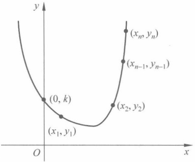

### 第12章

### 其他高级应用 $^{*}$

本章最后给出一些高级应用，如 GM 公钥密码算法和 CRT 在秘密共享中的应用。本章重点是基于 CRT 的秘密共享，难度是 GM 加密算法。

#### 平方剩余在 GM 加密中的应用

针对确定性加密存在的问题，1982年，S. Goldwasser与S. Micali提出了概率公钥密码系统（probabilistic encryption scheme，也有文献称为随机化加密）的概念，简单解释就是加密体制对同一明文进行两次加密得到的密文有可能不同，并提出了一个概率公钥密码系统，称为Goldwasser-Micali公钥密码系统。概率公钥密码体制可达到更严格的安全目标，即语义安全（semantic security）。

定义 12.1（多项式安全）如果一个被动敌手不能在期望的多项式时间内选择两个明文消息  $m_{1}, m_{2}$，且以大于 1/2 的概率正确区分  $m_{1}, m_{2}$ 的加密结果。

定理 12.1 一个公钥加密方案是语义安全的，当且仅当它是多项式安全的。

Goldwasser-Micali 加密体制的安全性是基于平方剩余问题的困难性假设。平方剩余问题是指：如果不知道 n 的素数因子分解，那么要确定模 n 的平方剩余是困难的。

该体制是概率加密，即相同的明文，加密得到的密文是不同的。因为在加密的时候引入了随机数，加密的密文和随机数有关（这一概率加密的思想也应用到第5.4节ElGamal加密方案和第7.4节NTRU加密方案中）。

Goldwasser-Micali 加密体制如下。

密钥生成：随机选定大素数 p 和 q，计算 n=pq。随机选定一个正整数 t 满足： $L(t,p)=L(t,q)=-1$，即 t 是模 p 和 q 的平方非剩余。(n,t) 是公钥，p 和 q 是私钥。这里  $L(t,p)$ 与  $L(t,q)$ 均表示 Legendre 符号。

加密过程：设要加密的明文的二进制表示为  $m = m_1 m_2 \cdots m_s$。对每个明文比特  $m_i$ 随机选择整数  $x_i$， ${1} \leq x_i \leq n-1$，计算：

$$
c_{i}\equiv\left\{\begin{aligned}&tx_{i}^{2}\bmod n,\quad&m_{i}=1\\ &x_{i}^{2}\bmod n,\quad&m_{i}=0\end{aligned}\right.
$$

得到密文  $c=(c_{1},c_{2},\cdots,c_{s})$。

解密过程：待解密的密文  $c=(c_{1},c_{2},\cdots,c_{s})$。对每个密文项  $c_{i}$，先计算出  $L(c_{i},p)$ 以及  $L(c_{i},q)$ 的值，然后令

$$
m_{i}=\left\{\begin{aligned}&1,&L(c_{i},p)=L(c_{i},q)=-1\\ &0,&L(c_{i},p)=L(c_{i},q)=1\end{aligned}\right.
$$

得到解密后的明文  $m=m_{1}m_{2}\cdots m_{s}$。

例 12.1 假设私钥是(5,7)，即 p=5, q=7，选择 t=3，且满足其为 p 和 q 的平方非剩余，即  $L(t, p)=L(t, q)=-1$，公钥为（35,3），明文为  $m=(11010)$，求加密、解密过程。

##### 解答

加密方法为： $c_{i} \equiv \left\{ \begin{aligned} tx_{i}^{2} \mod n, & m_{i} = 1, \\ x_{i}^{2} \mod n, & m_{i} = 0 \end{aligned} \right.$，明文为(11010)，t=3。

加密过程为

$$
c_{1}\equiv3\cdot8^{2}\bmod{35}\equiv17\bmod{35}
$$

$$
c_{2}\equiv3\cdot4^{2}\bmod{35}\equiv13\bmod{35}
$$

$$
c_{3}\equiv3^{2}\bmod{35}\equiv9\bmod{35}
$$

$$
c_{4}\equiv3\cdot6^{2}\bmod{35}\equiv3\bmod{35}
$$

$$
c_{5}\equiv7^{2}\bmod{35}\equiv14\bmod{35}
$$

得到的密文为（17，13，9，3，14）。

下面讲解解密过程。

利用私钥(5,7)和解密算法  $m_{i}=\left\{\begin{aligned}&1,&L(c_{i},p)=L(c_{i},q)=-1\\ &0,&L(c_{i},p)=L(c_{i},q)=1\end{aligned}\right.$

对密文(17,13,9,3,14)进行解密：

$$
L(c_{1},p)=L(17,5)=17^{(5-1)/2}\bmod5=-1
$$

$$
L(c_{1},q)=L(17,7)=17^{(7-1)/2}\bmod7=-1
$$

故  $m_{1}=1$ 。同理可得  $m_{2}=m_{4}=1, m_{3}=m_{5}=0$ ，从而明文为(11010)。

讨论：

如果在选取随机数的时候，恰为 p 或者 q 的倍数，则在解密时得到的 Legendre 值必有一个为 0，这时解出的明文比特视为 1，即当且仅当  $L(c_{i}, p) = L(c_{i}, q) = 1$ 时，返回 0；否则为 1。

##### 效率：

Goldwasser-Micali 的加密方法的主要问题是：由于是逐比特加密，加密后数据扩展了  $\log_{2}n$ 倍（从 1 个比特的明文转变为  $\log_{2}n$ 长的密文），因此应用该密码体制进行加密时运算量大、速度慢，只适用于单个二进制比特的加密和解密。

安全性分析：

首先给出几个事实。

（1）设  $p$ 是一个奇素数， $a$ 是  $\mathbb{Z}_p^*$ 的一个生成元，则  $a \in \mathbb{Z}_p^*$ 为模  $p$ 的平方剩余，当且仅当  $a = a^i \bmod p$，其中  $i$ 是一个偶数，因此  $|Q_p| = (p-1)/2$， $|Q_p| = (p-1)/2$，即  $\mathbb{Z}_p^*$ 中

平方剩余和平方非剩余各占一半。

（2）设 $n$为两个互不相同的素数$p$和$q$的乘积，则$a \in \mathbf{Z}_n^*$是模$n$的平方剩余，当且仅当$a \in Q_p, a \in Q_q$（这里 $Q_p, Q_q$分别表示模$p$和模$q$ 的平方剩余）。因此，$|Q_n| = |Q_p| \cdot |Q_q| = (p-1)(q-1)/4, |Q_n| = 3(p-1)(q-1)/4$。

（3）设  $n \geqslant 3$ 为一个奇整数，并令  $J_{n} = \left\{ a \in \mathbb{Z}_{n}^{*} \mid \left( \frac{a}{n} \right) = 1 \right\}$。模 n 的伪平方集定义为  $J_{n} - Q_{n}$，以  $\widetilde{Q}_{n}$ 表示。

（4）设 n=pq 为两个互不相同的奇素数的乘积，则  $\left|Q_{n}\right|=\left|\widetilde{Q}_{n}\right|=(p-1)(q-1)/4$，即 I 中一半元素为平方剩余，一半元素为伪平方。

由于 x 是从  $Z_{n}^{*}$ 中随机选择的,  $x^{2} \bmod n$ 是模 n 的一个随机平方剩余,  $tx^{2}$ 是模 n 的一个随机伪平方。截获者获取密文  $c_{i}$, 计算雅克比符号  $\left(\frac{c_{i}}{n}\right)=1$。但是, 不论  $m_{i}=0,1$, 均有  $\frac{c_{i}}{n}=1$, 所以截获者得不到关于明文的任何信息, 只能猜测。因此, Goldwasser-Micali 方案是语义安全的。

## 12.2 CRT 在秘密共享中的应用

### 12.2.1 秘密共享的概念

首先思考两个场景：

（1）某个银行有三位出纳，他们每天都要开启保险库，为防止每位出纳可能出现的监守自盗行为，银行规定至少有两位出纳在场才能开启保险库。

（2）核按钮通常掌握在三方手上，总统、国防部长、国防部，只有当三方中的两方在场时才可以是最终控制该按钮。

上述两个问题可以利用秘密共享(secret sharing)方案来实现。秘密分享就是将一个密钥分成许多份额(share，又叫影子 shadow)，然后秘密地分配给一些有关人员，使得某些有关人员在同时拿出他们的份额后可以重建密钥，而另外一些有关人员在同时拿出他们的份额后不能重建密钥。

严格地说，秘密共享技术的基本要求是将秘密 k 分成 n 个份额  $s_{1}, s_{2}, \cdots, s_{n}$。

（1）已知任意 t 个  $s_{i}$ 易于求出 k。

（2）已知任意 t-1 个  $s_{i}$ 或更少的  $s_{i}$，不能确定 k。

因此，这种秘密共享也称为 $(t,n)$门限(threshold)方案 $(t\leqslant n)$。

秘密共享的概念是 Adi Shamir 于 1979 年独自给出的，Shamir 提出的方案是根据 Lagrange 插值公式构造了  $(t \leqslant n)$ 门限方案，即为了重构 t-1 次多项式，该多项式有 t 个未知的多项式系数，需要知道 t 个点才能重构多项式曲线。如果只知道 t-1 个点，则完全无法确定多项式系数，其示意图见图 12.1。

图 12.1 Adi Shamir 秘密共享方案
 

秘密共享技术提供了密钥抗泄露的可靠性，可以与其他密码学技术融合在一起，提供密码学技术的健壮性（提高抗共谋、容错、容入侵等能力）。秘密共享构成了门限密码学（Threshold Cryptography）的基础。

### 12.2.2 基于 CRT 的简单门限方案

基于中国剩余定理可以构造 $(t,n)$门限方案，因为它有着类似于方程组的结构。

（1）参数设置。设  $m_1, m_2, \cdots, m_n$ 是  $n$ 个严格递增的大于 1 的整数，且满足  $\gcd(m_i, m_j) = 1$ ( $\forall i, j, i \neq j$)，以及  $m_n m_{n-1} \cdots m_{n-t+2} < m_1 m_2 \cdots m_t$。这说明， $t-1$ 个  $m_i$ 乘积的最大值，小于  $t$ 个  $m_i$ 乘积的最小值。分发的份额是秘密  $k$ 对这  $n$ 个不同模数的剩余。需要共享的秘密数据  $k$ 满足  $m_n m_{n-1} \cdots m_{n-t+2} < k < m_1 m_2 \cdots m_t$。因此，秘密至少需要  $t$ 个方程才能确定。

(2) 秘密分发。计算  $M = m_1 m_2 \cdots m_n$,  $s_i \equiv k \pmod{m_i}$ ( $i = 1, 2, \cdots, n$)。 $(s_i, m_i, M)$ 是分发的份额。集合  $\{(s_i, m_i, M)\}_{i=1}^n$ 即构成了一个  $(t, n)$ 门限方案的份额集合。

（3）秘密重构。在t个参与者（记为 $i_{1},i_{2},\cdots,i_{t}$）中，每个 $i_{j}$计算

$$
\begin{cases}M_{i_{j}}=M/m_{i_{j}}\\N_{i_{j}}\equiv M_{i_{j}}^{-1}(\bmod m_{i_{j}})\\y_{i_{j}}=s_{i_{j}}M_{i_{j}}N_{i_{j}}\end{cases}
$$

结合起来，根据中国剩余定理可求得

$$
k=\sum_{j=1}^{t}y_{i_{j}}\left(\bmod\prod_{j=1}^{t}m_{i_{j}}\right)
$$

显然，若参与者少于t个，则无法求出秘密k。

例 12.2 设 t=3, n=5,  $m_{1}=97$,  $m_{2}=98$,  $m_{3}=99$,  $m_{4}=101$,  $m_{5}=103$, 秘密数据 k=671875, 满足  ${10403}=m_{4}m_{5}<k<m_{1}m_{2}m_{3}=941094$。

计算  $M=m_{1}m_{2}m_{3}m_{4}m_{5}=9790200882$,  $s_{i} \equiv k(\mod m_{i})$ (i=1,2,\cdots,5) 得  $s_{1}=53$,  $s_{2}=85$,  $s_{3}=61$,  $s_{4}=23$,  $s_{5}=6$。5 个份额为 (53,  $m_{1}=97$, M=9790200882), (85, 98, 9790200882), (61, 99, 9790200882), (23, 101, 9790200882), (6, 103, 9790200882)。

现在假定  $i_{1}, i_{2}, i_{3}$ 联合起来计算 s，分别计算

$$
M_{1}=M/m_{1}=100929906
$$

$$
N_{1}\equiv M_{1}^{-1}(\bmod m_{1})\equiv95
$$

$$
M_{2}=M/m_{2}=99900009
$$

$$
N_{2}\equiv M_{2}^{-1}(\bmod m_{2})\equiv13
$$

$$
\begin{cases}M_{3}=M/m_{3}=98890918\\N_{3}\equiv M_{3}^{-1}(\bmod m_{3})\equiv31\end{cases}
$$

得到

$$
\begin{aligned}k\equiv&s_{1}M_{1}N_{1}+s_{2}M_{2}N_{2}+s_{3}M_{3}N_{3}(\bmod m_{1}m_{2}m_{3})\\ \equiv&53\cdot100929906\cdot95+85\cdot99900009\cdot13\\ &+61\cdot98890918\cdot31(\bmod97\cdot98\cdot99)\\ \equiv&805574312593(\bmod941094)\\ \equiv&671875\end{aligned}
$$

秘密正确。现在假定 $i_{1}, i_{4}, i_{5}$联合起来计算s，分别计算

$$
\begin{aligned}&\left\{\begin{aligned}M_{1}&=M/m_{1}=100929906\\N_{1}&\equiv M_{1}^{-1}(\bmod m_{1})\equiv95\\M_{4}&=M/m_{4}=96932682\\N_{4}&\equiv M_{4}^{-1}(\bmod m_{4})\equiv61\end{aligned}\right.\\&\left\{\begin{aligned}M_{5}&=M/m_{5}=95050494\\N_{5}&\equiv M_{5}^{-1}(\bmod m_{5})\equiv100\end{aligned}\right.\end{aligned}
$$

得到

$$
\begin{aligned}k\equiv&s_{1}M_{1}N_{1}+s_{4}M_{4}N_{4}+s_{5}M_{5}N_{5}\left(\bmod m_{1}m_{4}m_{5}\right)\\\equiv&53\cdot100929906\cdot95+23\cdot96932682\cdot61\\&+6\cdot95050494\cdot100\left(\bmod97\cdot101\cdot103\right)\\\equiv&70120825956\left(\bmod1009091\right)\\\equiv&671875\end{aligned}
$$

秘密正确。现在假定 $i_{1}, i_{4}$联合起来计算k，分别计算

$$
\begin{aligned}k\equiv&s_{1}M_{1}N_{1}+s_{4}M_{4}N_{4}(\bmod m_{1}m_{4})\\ \equiv&53\cdot100929906\cdot95+23\cdot96932682\cdot61(\bmod97\cdot101)\\ \equiv&644178629556(\bmod9797)\\ \equiv&5679\end{aligned}
$$

得到的秘密不正确。其实，原因是发生了“折回”，即671875 mod 9797=5679。

容易发现这一方案的问题是区间 $[m_n m_{n-1} \cdots m_{n-t+2}, m_1 m_2 \cdots m_t]$不够大，可以猜测出k。于是引出了12.2.3节要介绍的方案Asmuth-Bloom秘密共享方案。

### 12.2.3 Asmuth-Bloom 秘密共享方案

有了上一节的铺垫，本节的内容就容易理解了。将上一节的方案进行推广，Asmuth 和 Bloom 于 1980 年提出了基于中国剩余定理  $(t,n)$ 门限方案，同上，份额是由秘密 k 推算

出的数 y 对不同模数  $m_{1}, m_{2}, \cdots, m_{n}$ 的剩余。

（1）参数设置。令 q 是一个大素数， $m_{1}, m_{2}, \cdots, m_{n}$ 是 n 个严格递增的数，且满足下列条件。

① q > k。

②  $\gcd(m_i, m_j) = 1, \forall i, j, i \neq j$。

③  $\gcd(q,m_i)=1,i=1,2,\cdots,n$。

④  $M = \prod_{i=1}^{t} m_{i} > q \prod_{j=1}^{t-1} m_{n-j+1}$

条件①表明秘密 k 必须小于 q；条件②指出 n 个模数两两互素（可构成中国剩余定理的方程）；条件③表示 n 个模数都与 q 互素；条件④指出，t-1 个模数  $m_{i}$ 之积的最大值，即使乘上 q，也没有 t 个模数  $m_{i}$ 之积的最小值 M 大。这是 Asmuth-Bloom 秘密共享方案对上一节方案的主要扩展之处。上一节的方案中 t-1 个模数  $m_{i}$ 之积最大值  $\text{Max}(\Pi^{t-1})$ 与 t 个模数  $m_{i}$ 之积最小值  $\text{Min}(\Pi^{t})$ 之间至少可以容纳一个待共享的秘密，而扩展方案则可以容纳更多的待共享的秘密。

（2）秘密分发。

① 首先，随机选取整数 A 满足  ${0} \leqslant A \leq \lfloor M / q \rfloor - 1$，并公布 q 和 A。

②其次， $y=k+Aq$，则有  $y<q+Aq=(A+1)q\leqslant\lfloor M/q\rfloor\cdot q\leqslant M$，即秘密 k 放大了 Aq。

③ 最后，计算  $y_{i} \equiv y \bmod m_{i} (i=1,2,\cdots,n)$。（ $m_{i}, y_{i}$）即为一个份额，将其分别传送给 n 个用户。

集合 $\left\{(m_{i},y_{i})\mid i=1,2,\cdots,n\right\}$即构成了一个 $(t,n)$门限方案。

（3）秘密重构。当 t 个参与者  $i_{1}, i_{2}, \cdots, i_{t}$ 提供出自己的子份额，由  $\left\{\left(m_{i_{j}}, y_{i_{j}}\right) \mid i=1, 2, \cdots, t\right\}$ 建立方程组

$$
\left\{\begin{array}{l}y\equiv y_{i_{1}}\bmod m_{i_{1}}\\y\equiv y_{i_{2}}\bmod m_{i_{2}}\\\quad\quad\quad\quad\quad\vdots\\y\equiv y_{i_{k}}\bmod m_{i_{k}}\end{array}\right.
$$

根据中国剩余定理可求得

$$
y\equiv y^{\prime}\bmod M^{\prime}
$$

其中， $M^{\prime} = \prod_{j=1}^{t} m_{i_j} \geqslant M$。然后由  $y^{\prime} - A q$ 即得秘密 k。

正确性证明：

因为由 t 个成员的共享计算得到的模满足条件  $y < M \leq M^{\prime}$，所以解出的 y 是唯一的，就是  $y^{\prime} \bmod M^{\prime}$。再由  $y^{\prime} - Aq$ 即得秘密 k。

若仅有 t-1 个参与者提供自己的份额  $(m_i, y_i)$，条件是  $y^{\prime\prime} \equiv y \bmod M^{\prime\prime}$，但只能求得  $y^{\prime\prime} \equiv y \bmod M^{\prime\prime}$，式中  $M^{\prime\prime} = \prod_{j=1}^{k-1} m_{ij}$，y 发生了“折回”（即  $y > M^{\prime\prime}$）。由条件④得  $M^{\prime\prime} < M/q$，即  $M/M^{\prime\prime} > q$。

下面说明这种“折回”至少有 q 次。令  $y = y^{\prime\prime} + \alpha M^{\prime\prime}$，其中  ${0} \leqslant \alpha < \frac{y}{M^{\prime\prime}} < \frac{M}{M^{\prime\prime}}$，由于

 $M/M^{\prime\prime}>q,(M^{\prime\prime},q)=1$，当 $\alpha$在 $[0,q]$之间变化时， $y^{\prime\prime}+\alpha M^{\prime\prime}$都是y的可能取值，共 $q+1$个，因此无法确定哪个是正确的y。

例 12.3 设秘密 k=4，要求构建一个（3，5）门限方案。

（1）参数设置。设选取素数 q=7,5 个模数分别为  $m_{1}=17,m_{2}=19,m_{3}=23,m_{4}=29,m_{5}=31$。容易验证模数满足前3个条件。

又因为  $M=m_{1}\cdot m_{2}\cdot m_{3}=17\cdot19\cdot23=7429>q\cdot m_{4}\cdot m_{5}=7\cdot29\cdot31=6293$，则第4个条件也满足。

（2）秘密分发。在 $\left[0,\left[\frac{7429}{7}\right]-1\right]=\left[0,1060\right]$之间随机取A=117，求得 $y=k+A q=4+117\cdot7=823$，然后计算

$$
y_{1}\equiv y\bmod m_{1}\equiv823\bmod17\equiv7
$$

$$
y_{2}\equiv y\bmod m_{2}\equiv823\bmod19\equiv6
$$

$$
y_{3}\equiv y\bmod m_{3}\equiv823\bmod23\equiv18
$$

$$
y_{4}\equiv y\bmod m_{4}\equiv823\bmod29\equiv11
$$

$$
y_{5}\equiv y\bmod m_{5}\equiv823\bmod31\equiv17
$$

（17，7），（19，6），（23，18），（29，11），（31，17）即构成一个（3，5）门限方案。

（3）秘密重构。若第1、3、4个成员想恢复秘密，则他们提供自己的份额{(17,7)，(23,18),(29,11)}，建立方程组

$$
\left\{\begin{array}{l}y\equiv7\bmod{17}\\ y\equiv18\bmod{23}\\ y\equiv11\bmod{29}\end{array}\right.
$$

由此得

$$
M=17\cdot23\cdot29=11339
$$

$$
M_{1}=23\cdot29=667\qquad M_{1}^{-1}=13
$$

$$
M_{2}=17\cdot29=493\qquad M_{2}^{-1}=7
$$

$$
M_{3}=17\cdot23=391\qquad M_{3}^{-1}=27
$$

由中国剩余定理得

$$
y\equiv(7\cdot667\cdot13+18\cdot493\cdot7+11\cdot391\cdot27)\bmod11339\equiv823
$$

所以，恢复秘密为 k=y-Aq=823-117\cdot7=4。

#### 思考题

[1] 编写程序实现 Goldwasser-Micali 加密体制。

[2] 编写程序实现 Asmuth-Bloom 秘密共享机制。
