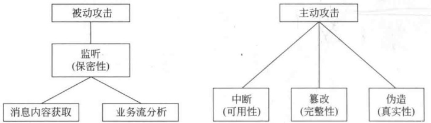
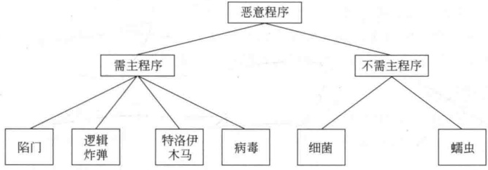
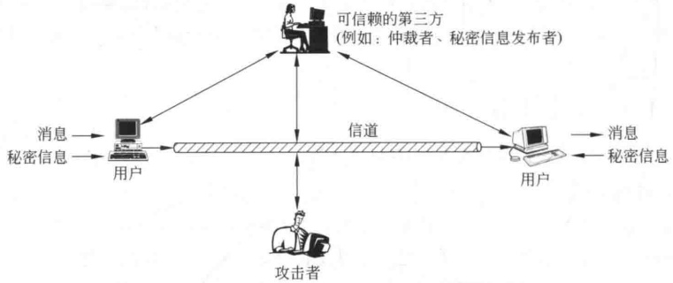
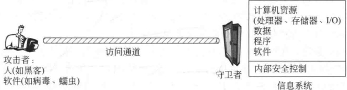
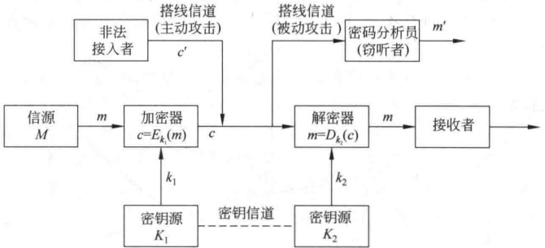

# 第1章 引言

## 1.1 信息安全面临的威胁

### 1.1.1 安全威胁

信息在社会中的地位和作用越来越重要，已成为社会发展的重要战略资源，信息技术改变着人们的生活和工作方式，信息产业已成为新的经济增长点，社会的信息化已成为当今世界发展的潮流和核心。与此同时信息的安全问题也已成为世人关注的社会问题。人们对信息安全的认识随着网络的发展经历了以下一个由简单到复杂的过程。

20世纪70年代，主机时代的信息安全是面向单机的，由于早期的用户主要是军方，因此在安全性方面主要考虑的是信息的保密性。

20世纪80年代，微机和局域网的兴起带来了信息在微机间的传输和用户间的共享问题，丰富了信息安全的内涵，使人们认识到数据完整性、可用性的重要性。安全服务、安全机制等基本框架成为信息安全的重要内容。

20世纪90年代，因特网爆炸性的发展把人类带进了一个新的生存空间。因特网具有高度分布、边界模糊、层次欠清、动态演化，而用户又在其中扮演主角的特点，如何保证这一复杂而巨大系统的安全，成为信息安全的主要问题。由于网络的全球性、开放性、无缝连通性、共享性、动态性发展，使得任何人都可以自由地接入，其中有善者，也有恶者。恶者会采用各种攻击手段进行破坏活动。信息安全面临的攻击有独立的犯罪者、有组织的犯罪集团和国家情报机构。对信息的攻击具有以下新特点：无边界性、突发性、蔓延性和隐蔽性。因此考虑信息安全，就要首先知道信息安全面临哪些威胁。

信息安全面临的威胁来自很多方面，并且随着时间的变化而变化。这些威胁可以宏观地分为人为威胁和自然威胁。

自然威胁可能来自于各种自然灾害、恶劣的场地环境、电磁辐射和电磁干扰、网络设备自然老化等。这些无目的的事件，有时会直接威胁信息的安全，影响信息的存储介质。

我们主要讨论人为威胁，也就是对信息的人为攻击。这些攻击手段都是通过寻找系统的弱点，以便达到破坏、欺骗、窃取数据等目的，造成经济上和政治上不可估量的损失。人为攻击可分为被动攻击和主动攻击，如图1-1所示。

1. 被动攻击

被动攻击即窃听，是对系统的保密性进行攻击，如搭线窃听、对文件或程序的非法复制等，以获取他人的信息。被动攻击又分为两类：一类是获取消息的内容，很容易理解；第二类是进行业务流分析，假如我们通过某种手段，例如加密，使得敌手从截获的消息无法得到消息的真实内容，然而敌手却有可能获得消息的格式、确定通信双方的位置和身份以及通信的次数和消息的长度，这些信息可能对通信双方来说是敏感的，例如公司间的合作关系可能是保密的、电子邮件用户可能不想让他人知道自己正在和谁通信、电子现金的支付者可能不想让别人知道自己正在消费、Web浏览器用户也可能不愿意让别人知道自己正在浏览哪一个站点。

**图 1-1 攻击类型分类**

被动攻击因不对消息做任何修改，因而是难以检测的，所以抗击这种攻击的重点在于预防而非检测。

2. 主动攻击

这种攻击包括对数据流的某些篡改或产生某些假的数据流。主动攻击又可分为以下3类：

（1）中断。中断是对系统的可用性进行攻击，如破坏计算机硬件、网络或文件管理系统。

（2）篡改。篡改是对系统的完整性进行攻击，如修改数据文件中的数据、替换某一程序使其执行不同的功能、修改网络中传送的消息内容等。

（3）伪造。伪造是对系统的真实性进行攻击，如在网络中插入伪造的消息或在文件中插入伪造的记录。

绝对防止主动攻击是十分困难的，因为需要随时随地对通信设备和通信线路进行物理保护，因此抗击主动攻击的主要途径是检测，以及对此攻击造成的破坏进行恢复。

### 1.1.2 入侵者和病毒

信息安全的人为威胁主要来自用户(恶意的或无恶意的)和恶意软件的非法侵入，入侵信息系统的用户也称为黑客，黑客可能是某个无恶意的人，其目的仅仅是破译和进入一个计算机系统；或者是某个心怀不满的雇员，其目的是对计算机系统实施破坏；也可能是一个犯罪分子，其目的是非法窃取系统资源（如窃取信用卡号或非法资金传送），对数据进行未授权的修改或破坏计算机系统。

恶意软件指病毒、蠕虫等恶意程序，分为两类（如图1-2所示）：一类需要主程序，另一类不需要。前者是某个程序中的一段，不能独立于实际的应用程序或系统程序；后者是能被操作系统调度和运行的独立程序。

**图 1-2 恶意程序分类**

对恶意软件也可根据其能否自我复制来进行分类。不能自我复制的是程序段，这种程序段在主程序被调用执行时就可激活。能够自我复制的或者是程序段(病毒)或者是独立的程序(蠕虫、细菌等)，当这种程序段或独立的程序被执行时，可能复制一个或多个自己的副本，以后这些副本可在这一系统或其他系统中被激活。以上仅是大致分类，因为逻辑炸弹或特洛伊木马可能是病毒或蠕虫的一部分。

### 1.1.3 安全业务

安全防护措施也称为安全业务，有以下5种。

1. 保密业务

保护数据以防被动攻击。保护方式可根据保护范围的大小分为若干级，其中，最高级保护可在一定时间范围内保护两个用户之间传输的所有数据，低级保护包括对单个消息的保护或对一个消息中某个特定域的保护。保密业务还有对业务流实施保密，防止敌手进行业务流分析以获得通信的信源、信宿、次数、消息长度和其他信息。

2. 认证业务

认证业务用于保证通信的真实性。在单向通信的情况下，认证业务的功能是使接收者相信消息确实是由它自己所声称的那个信源发出的。在双向通信的情况下，如计算机终端和主机的连接，在连接开始时，认证服务则使通信双方都相信对方是真实的（即的确是它所声称的实体）；其次，认证业务还保证通信双方的通信连接不能被第三方介入，以假冒其中的一方而进行非授权的传输或接收。

3. 完整性业务

和保密业务一样，完整性业务也能应用于消息流、单个消息或一个消息的某一选定域。用于消息流的完整性业务的目的在于保证所接收的消息未经复制、插入、篡改、重排或重放，因而是和所发出的消息完全一样的；这种服务还能对已毁坏的数据进行恢复，所以这种业务主要是针对对消息流的篡改和业务拒绝的。应用于单个消息或一个消息某一选定域的完整性业务仅用来防止对消息的篡改。

4. 不可否认业务

不可否认业务用于防止通信双方中的某一方对所传输消息的否认，因此，一个消息发出后，接收者能够证明这一消息的确是由通信的另一方发出的。类似地，当一个消息被接收后，发出者能够证明这一消息的确已被通信的另一方接收了。

5. 访问控制

访问控制的目标是防止对网络资源的非授权访问，控制的实现方式是认证，即检查欲访问某一资源的用户是否具有访问权。

## 1.2 信息安全模型

**图 1-3 给出了信息安全的基本模型。**

**图 1-3 信息安全的基本模型**

通信双方欲传递某个消息，需通过以下方式建立一个逻辑上的信息通道：首先在网络中定义从发方到收方的一个路由，然后在该路由上共同执行通信协议。

如果需要保护所传信息以防敌手对其保密性、认证性等构成的威胁，则需要考虑通信的安全性。安全传输技术有以下两个基本成分：

（1）消息的安全传输，包括对消息的加密和认证。加密的目的是将消息搞乱以使敌手无法读懂，认证的目的是检查发送者的身份。

（2）通信双方共享的某些秘密信息，如加密密钥。

为获得消息的安全传输，可能还需要一个可信的第三方，其作用可能是负责向通信双方发布秘密信息或者在通信双方有争议时进行仲裁。

安全的网络通信必须考虑以下4个方面：

（1）加密算法：

（2）用于加密算法的秘密信息；

（3）秘密信息的分布和共享；

（4）使用加密算法和秘密信息以获得安全服务所需的协议。

以上考虑的是信息安全的一般模型，然而还有其他一些情况。图1-4表示保护信息系统以防未授权访问的一个模型。

**图 1-4 信息系统的保护模型**

对付未授权访问的安全机制可分为两道防线：第一道称为守卫者，它包括基于通行字的登录程序和屏蔽逻辑程序，分别用于拒绝非授权用户的访问、检测和拒绝病毒；第二道防线由一些内部控制部件构成，用于管理系统内部的各项操作和分析所存有的信息，以检查是否有未授权的入侵者。

上面介绍了信息安全面临的威胁以及信息安全的一般模型。信息安全又分为系统安全（包括操作系统的安全、数据库系统的安全等）、数据安全（包括数据的安全存储、安全传输）和内容安全（包括病毒的防护、不良内容的过滤等）3个层次，是一个综合、交叉的学科领域，要利用数学、电子、信息、通信、计算机等诸多学科的长期知识积累和最新发展成果。信息安全研究的内容很多，它涉及安全体系结构、安全协议、密码理论、信息分析、安全监控、应急处理等，其中，密码技术是保障数据安全的关键技术。

## 1.3 密码学基本概念

### 1.3.1 保密通信系统

通信双方采用保密通信系统可以隐蔽和保护需要发送的消息，使未授权者不能提取信息。发送方将要发送的消息称为明文，明文被变换成看似无意义的随机消息，称为密文，这种变换过程称为加密；其逆过程，即由密文恢复出原明文的过程称为解密。对明文进行加密操作的人员称为加密员或密码员。密码员对明文进行加密时所采用的一组规则称为加密算法。传送消息的预定对象称为接收者，接收者对密文进行解密时所采用的一组规则称为解密算法。加密算法和解密算法的操作通常都是在一组密钥控制下进行的，分别称为加密密钥和解密密钥。传统密码体制所用的加密密钥和解密密钥相同，或实质上等同，即从一个易于得出另一个，称其为单钥密码体制或对称密码体制。若加密密钥和解密密钥不相同，从一个难以推出另一个，则称为双钥密码体制或非对称密码体制。密钥是密码体制安全保密的关键，它的产生和管理是密码学中的重要研究课题。

在信息传输和处理系统中，除了预定的接收者外，还有非授权者，他们通过各种办法（如搭线窃听、电磁窃听、声音窃听等）来窃取机密信息，称其为截收者。截收者虽然不知道系统所用的密钥，但通过分析可能从截获的密文推断出原来的明文或密钥，这一过程称为密码分析，从事这一工作的人称作密码分析员，研究如何从密文推演出明文、密钥或解密算法的学问称作密码分析学。对一个保密通信系统采取截获密文进行分析的攻击称为被动攻击。现代信息系统还可能遭受的另一类攻击是主动攻击，非法入侵者、攻击者或黑客主动向系统窜扰，采用删除、增添、重放、伪造等篡改手段向系统注入假消息，达到利己害人的目的。这是现代信息系统中更为棘手的问题。

保密通信系统可用图 1-5 表示，它由以下几部分组成：明文消息空间  $M$，密文消息空间  $C$，密钥空间  $K_1$ 和  $K_2$，在单钥体制下  $K_1 = K_2 = K$，此时密钥  $K$ 需经安全的密钥信道由发送方传给接收方；加密变换  $E_{k_1}: M \to C$，其中  $k_1 \in K_1$，由加密器完成；解密变换  $D_{k_2}: C \to M$，其中  $k_2 \in K_2$，由解密器实现。称总体  $(M, C, K_1, K_2, E_{K_1}, D_{K_2})$ 为保密通信系统。对于给定明文消息  $m \in M$，密钥  $k_1 \in K_1$，加密变换将明文  $m$ 变换为密文  $c$，即

$$c=f(m,k_{1})=E_{k_{1}}(m)\quad m\in M,k_{1}\in K_{1}$$

**图 1-5 保密通信系统模型**

接收方利用通过安全信道送来的密钥  $k$（单钥体制下）或用本地密钥发生器产生的解密密钥  $k_2 \in K_2$（双钥体制下）控制解密操作  $D$，对收到的密文进行变换得到恢复的明文消息，即

$$m=D_{k_{2}}(c)\quad m\in M,k_{2}\in K_{2}$$

而密码分析者，则用其选定的变换函数 h，对截获的密文 c 进行变换，得到的明文是明文空间中的某个元素，即

$$m^{\prime}=h\left(c\right)$$

一般  $m^{\prime} \neq m$ 。如果  $m^{\prime} = m$ ，则分析成功。

为了保护信息的保密性，抗击密码分析，保密系统应当满足下述要求：

（1）系统即使达不到理论上是不可破的，即 $p\{m^{\prime}=m\}=0$，也应当为实际上不可破的。也就是说，从截获的密文或某些已知明文密文对，要决定密钥或任意明文在计算上是不可行的。

（2）系统的保密性不依赖于对加密体制或算法的保密，而依赖于密钥。这就是著名的Kerckhoff原则。

（3）加密和解密算法适用于密钥空间中的所有元素。

（4）系统便于实现和使用。

### 1.3.2 密码体制分类

密码体制从原理上可分为两大类，即单钥体制和双钥体制。

单钥体制的加密密钥和解密密钥相同。系统的保密性主要取决于密钥的安全性，与算法的保密性无关，即由密文和加解密算法不可能得到明文。换句话说，算法无须保密，需保密的仅是密钥。根据单钥密码体制的这种特性，单钥加解密算法可通过低费用的芯片来实现。密钥可由发方产生，然后再经一个安全可靠的途径（如信使递送）送至收方，或由第三方产生后安全可靠地分配给通信双方。如何产生满足保密要求的密钥以及如何将密钥安全可靠地分配给通信双方是这类体制设计和实现的主要课题。密钥产生、分配、存储、销毁等问题，统称为密钥管理。这是影响系统安全的关键因素，即使密码算法再好，若密钥管理问题处理不好，也很难保证系统的安全保密。

单钥体制对明文消息的加密有两种方式：一种是明文消息按字符（如二元数字）逐位地加密，称为流密码；另一种是将明文消息分组（含有多个字符），逐组地进行加密，称为分组密码。单钥体制不仅可用于数据加密，也可用于消息的认证。

双钥体制是由 Diffie 和 Hellman 于 1976 年首先引入的。采用双钥体制的每个用户都有一对选定的密钥：一个是可以公开的，可以像电话号码一样进行注册公布；另一个则是秘密的。因此双钥体制又称为公钥体制。

双钥密码体制的主要特点是将加密和解密能力分开，因而可以实现多个用户加密的消息只能由一个用户解读，或由一个用户加密的消息而使多个用户可以解读。前者可用于公共网络中实现保密通信，而后者可用于实现对用户的认证。详细介绍参见第3章。

### 1.3.3 密码攻击概述

表1-1是攻击者对密码系统的4种攻击类型，类型的划分由攻击者可获取的信息量决定。其中，最困难的攻击类型是唯密文攻击，这种攻击的手段一般是穷搜索法，即对截获的密文依次用所有可能的密钥试译，直到得到有意义的明文。只要有足够多的计算时间和存储容量，原则上穷搜索法总是可以成功的。但实际中，任何一种能保障安全要求的实用密码都会设计得使这一方法在实际上是不可行的。敌手因此还需对密文进行统计测试分析，为此需要知道被加密的明文的类型，例如英文文本、法文文本、MS-DOS执行文件、Java源列表等。

**表1-1 对密码系统的攻击类型**

| 攻击类型 | 攻击者掌握的内容 |
| --- | --- |
| 唯密文攻击 | • 加密算法 • 截获的部分密文 |
| 已知明文攻击 | • 加密算法 • 截获的部分密文 • 一个或多个明文密文对 |
| 选择明文攻击 | • 加密算法 • 截获的部分密文 • 自己选择的明文消息，及由密钥产生的相应密文 |
| 选择密文攻击 | • 加密算法 • 截获的部分密文 • 自己选择的密文消息，及相应的被解密的明文 |

唯密文攻击时，敌手知道的信息量最少，因此最易抵抗。然而，很多情况下，敌手可能有更多的信息，也许能截获一个或多个明文及其对应的密文，也许知道消息中将出现的某种明文格式。例如，ps格式文件开始位置的格式总是相同的，电子资金传送消息总有一个标准的报头或标题。这时的攻击称为已知明文攻击，敌手也许能够从已知的明文被变换成密文的方式得到密钥。

与已知明文攻击密切相关的一种攻击法称为可能字攻击。例如对一篇散文加密，敌手可能对消息的含义知之甚少。然而，如果对非常特别的信息加密，敌手也许能知道消息中的某一部分。例如，发送一个加密的账目文件，敌手可能知道某些关键字在文件报头的位置。又如，一个公司开发的程序的源代码中，可能在某个标准位置上有该公司的版权声明。

如果攻击者能在加密系统中插入自己选择的明文消息，则通过该明文消息对应的密文，有可能确定出密钥的结构，这种攻击称为选择明文攻击。

选择密文攻击是指攻击者利用解密算法，对自己所选的密文解密出相应的明文。

还有两个概念值得注意：一个加密算法是无条件安全的，如果算法产生的密文不能给出唯一决定相应明文的足够信息，那么此时无论敌手截获多少密文、花费多少时间，都不能解密密文；第二，Shannon指出，仅当密钥至少和明文一样长时，才能达到无条件安全。也就是说，除了一次一密方案外，再无其他的加密方案是无条件安全的。比无条件安全弱的一个概念是计算上安全的，加密算法只要满足以下两条准则之一就称为是计算上安全的：

（1）破译密文的代价超过被加密信息的价值。

（2）破译密文所花的时间超过信息的有用期。

## 1.4 几种古典密码

古典密码的加密是将明文的每一字母代换为字母表中的另一字母，代换前首先将明文字母用等价的十进制数字代替，再以代替后的十进制数字进行运算，字母与十进制数字的对应关系如表1-2所示。

**表 1-2 英文字母和十进制数字的对应关系**

| 字母 | a | b | c | d | e | f | g | h | i | j | k | l | m |
| --- | --- | --- | --- | --- | --- | --- | --- | --- | --- | --- | --- | --- | --- |
| 数字 | 0 | 1 | 2 | 3 | 4 | 5 | 6 | 7 | 8 | 9 | 10 | 11 | 12 |
| 字母 | n | o | p | q | r | s | t | u | v | w | x | y | z |
| 数字 | 13 | 14 | 15 | 16 | 17 | 18 | 19 | 20 | 21 | 22 | 23 | 24 | 25 |

根据代换是对每个字母逐个进行还是对多个字母同时进行，古典密码又分为单表代换密码和多表代换密码。

### 1.4.1 单表代换密码

1. 恺撒密码

恺撒（Caesar）密码的加密代换和解密代换分别为：

$$c=E_{3}(m)\equiv m+3(\bmod26),\quad0\leqslant m\leqslant25$$

$$m=D_{3}(c)\equiv c-3(\bmod26),\quad0\leqslant c\leqslant25$$

其中3是加解密所用的密钥，加密时，每个字母向后移3位（循环移位，字母x移到a，y移到b，z移到c）。解密时，每个字母向前移3位（循环移位）。

2. 移位变换

移位变换的加解密分别是：

$$c=E_{k}(m)\equiv m+k(\bmod26),\quad0\leqslant m,k\leqslant25$$

$$m=D_{k}(c)\equiv c-k(\bmod26),\quad0\leqslant c,k\leqslant25$$

3. 仿射变换

仿射变换的加解密分别是：

$$\begin{aligned}&c=E_{a,b}(m)\equiv am+b(\bmod26)\\&m=D_{a,b}(c)\equiv a^{-1}(c-b)(\bmod26)\\ \end{aligned}$$

其中 $a, b$ 是密钥，为满足 ${0} \leqslant a, b \leqslant 25$ 和 $\gcd(a, 26) = 1$ 的整数。其中 $\gcd(a, 26)$ 表示 $a$ 和 ${26}$ 的最大公因子，$\gcd(a, 26) = 1$ 表示 $a$ 和 ${26}$ 是互素的，$a^{-1}$ 表示 $a$ 的逆元，即 $a^{-1} \cdot a \equiv 1 \bmod 26$。

【例 1-1】设仿射变换的加解密分别是：

$$\begin{aligned}&c=E_{7,21}(m)\equiv7m+21(\bmod26)\\&m=D_{7,21}(c)\equiv7^{-1}(c-21)(\bmod26)\\ \end{aligned}$$

对 security 加密，对 vlxijh 解密。

解

$$\begin{aligned}&s=18,\quad7\cdot18+21(\bmod26)=17,\quad s\Rightarrow r\\&e=4,\quad7\cdot4+21(\bmod26)=23,\quad e\Rightarrow x\\&c=2,\quad7\cdot2+21(\bmod26)=9,\quad c\Rightarrow j\\&u=20\quad7\cdot20+21(\bmod26)=5\quad\Rightarrow f\end{aligned}$$

$$u=20,\quad7\cdot20+21(\bmod 26)=5,\quad u\Rightarrow f$$

$$r=17,\quad7\cdot17+21(\bmod26)=10,\quad r\Rightarrow k$$

$$i=8,\quad7\cdot8+21(\bmod26)=25,\quad i\Rightarrow z$$

$$t=19,\quad7\cdot19+21(\bmod26)=24,\quad t\Rightarrow y$$

$$y=24,\quad7\cdot24+21(\bmod 26)=7,\quad y\Rightarrow h$$

所以，security 对应的密文是 rxjfkzyh。

$$v=21,\quad7^{-1}\cdot(21-21)(\bmod26)=0,\quad v\Rightarrow a$$

$$l=11,\quad7^{-1}\cdot(11-21)(\bmod26)=6,\quad l\Rightarrow g$$

$$x=23,\quad7^{-1}\cdot(23-21)(\bmod26)=4,\quad x\Rightarrow e$$

$$i=8,\quad7^{-1}\cdot(8-21)(\bmod26)=13,\quad i\Rightarrow n$$

$$j=9,\quad7^{-1}\cdot(9-21)(\bmod26)=2,\quad j\Rightarrow c$$

$$h=7,\quad7^{-1}\cdot(7-21)(\bmod26)=24,\quad h\Rightarrow y$$

所以，vlxijh 对应的明文是 agency。

### 1.4.2 多表代换密码

多表代换密码首先将明文 M 分为由 n 个字母构成的分组  $M_{1}, M_{2}, \cdots, M_{j}$，对每个分组  $M_{i}$ 的加密为：

$$C_{i}\equiv\mathbf{A}\mathbf{M}_{i}+\mathbf{B}(\bmod N),\quad i=1,2,\cdots,j$$

其中， $(\boldsymbol{A}, \boldsymbol{B})$ 是密钥， $\boldsymbol{A}$ 是  $n \times n$ 的可逆矩阵，满足  $\gcd(|\boldsymbol{A}|, N) = 1$ （ $|\boldsymbol{A}|$ 是行列式）。 $\boldsymbol{B} = (B_1, B_2, \cdots, B_n)^{\mathrm{T}}$， $\boldsymbol{C} = (C_1, C_2, \cdots, C_n)^{\mathrm{T}}$， $\boldsymbol{M}_i = (m_1, m_2, \cdots, m_n)^{\mathrm{T}}$。对密文分组  $C_i$ 的解密为：

$$\mathbf{M}_{i}\equiv\mathbf{A}^{-1}\left(C_{i}-\mathbf{B}\right)(\bmod N),\quad i=1,2,\cdots,j$$

【例 1-2】设 n=3, N=26,

$$\mathbf{A}=\begin{pmatrix}11&2&19\\5&23&25\\20&7&17\end{pmatrix},\quad\mathbf{B}=\begin{pmatrix}0\\0\\0\end{pmatrix}$$

明文为 YOUR PIN NO IS FOUR ONE TWO SIX.

将明文分成3个字母组成的分组 YOU RPI NNO ISF OUR ONE TWO SIX，由表1-2得

$$\mathbf{M}_{1}=\begin{pmatrix}24\\ 14\\ 20\end{pmatrix},\quad\mathbf{M}_{2}=\begin{pmatrix}17\\ 15\\ 8\end{pmatrix},\quad\mathbf{M}_{3}=\begin{pmatrix}13\\ 13\\ 14\end{pmatrix},\quad\mathbf{M}_{4}=\begin{pmatrix}8\\ 18\\ 5\end{pmatrix}$$

$$\mathbf{M}_{5}=\begin{pmatrix}14\\ 20\\ 17\end{pmatrix},\quad\mathbf{M}_{6}=\begin{pmatrix}14\\ 13\\ 4\end{pmatrix},\quad\mathbf{M}_{7}=\begin{pmatrix}19\\ 22\\ 14\end{pmatrix},\quad\mathbf{M}_{8}=\begin{pmatrix}18\\ 8\\ 23\end{pmatrix}$$

所以

$$\mathbf{C}_{1}=\mathbf{A}\begin{pmatrix}24\\ 14\\ 20\end{pmatrix}=\begin{pmatrix}22\\ 6\\ 8\end{pmatrix},\quad\mathbf{C}_{2}=\mathbf{A}\begin{pmatrix}17\\ 15\\ 8\end{pmatrix}=\begin{pmatrix}5\\ 6\\ 9\end{pmatrix},\quad\mathbf{C}_{3}=\mathbf{A}\begin{pmatrix}13\\ 13\\ 14\end{pmatrix}=\begin{pmatrix}19\\ 12\\ 17\end{pmatrix},$$

$$\mathbf{C}_{4}=\mathbf{A}\begin{pmatrix}8\\ 18\\ 5\end{pmatrix}=\begin{pmatrix}11\\ 7\\ 7\end{pmatrix}\quad\mathbf{C}_{5}=\mathbf{A}\begin{pmatrix}14\\ 20\\ 17\end{pmatrix}=\begin{pmatrix}23\\ 19\\ 7\end{pmatrix},\quad\mathbf{C}_{6}=\mathbf{A}\begin{pmatrix}14\\ 13\\ 4\end{pmatrix}=\begin{pmatrix}22\\ 1\\ 23\end{pmatrix},$$

$$\mathbf{C}_{7}=\mathbf{A}\begin{pmatrix}19\\ 22\\ 14\end{pmatrix}=\begin{pmatrix}25\\ 15\\ 18\end{pmatrix},\quad\mathbf{C}_{8}=\mathbf{A}\begin{pmatrix}18\\ 8\\ 23\end{pmatrix}=\begin{pmatrix}1\\ 17\\ 1\end{pmatrix}$$

密文为 WGI FGJ TMR LHH XTH WBX ZPS BRB。

解密时，先求出

$$\mathbf{A}^{-1}=\begin{pmatrix}{{{11}}}&{{{2}}}&{{{19}}} \\{{{5}}}&{{{23}}}&{{{25}}} \\{{{20}}}&{{{7}}}&{{{17}}}\end{pmatrix}^{-1}=\begin{pmatrix}{{{10}}}&{{{23}}}&{{{7}}} \\{{{15}}}&{{{9}}}&{{{22}}} \\{{{5}}}&{{{9}}}&{{{21}}}\end{pmatrix}$$

再求

$$\mathbf{M}_{1}=\mathbf{A}^{-1}\left(\begin{array}{r}22\\6\\8\end{array}\right)=\left(\begin{aligned}&24\\&14\\&20\end{aligned}\right),\quad\mathbf{M}_{2}=\mathbf{A}^{-1}\left(\begin{aligned}&5\\&6\\&9\end{aligned}\right)=\left(\begin{aligned}&17\\&15\\&8\end{aligned}\right),\quad\mathbf{M}_{3}=\mathbf{A}^{-1}\left(\begin{aligned}&19\\&12\\&17\end{aligned}\right)=\left(\begin{aligned}&13\\&13\\&14\end{aligned}\right)$$

$$\mathbf{M}_{4}=\mathbf{A}^{-1}\begin{pmatrix}11\\7\\7\end{pmatrix}=\begin{pmatrix}8\\18\\5\end{pmatrix},\quad\mathbf{M}_{5}=\mathbf{A}^{-1}\begin{pmatrix}23\\19\\7\end{pmatrix}=\begin{pmatrix}14\\20\\17\end{pmatrix},\quad\mathbf{M}_{6}=\mathbf{A}^{-1}\begin{pmatrix}22\\1\\23\end{pmatrix}=\begin{pmatrix}14\\13\\4\end{pmatrix}$$

$$\boldsymbol{M}_{7}=\boldsymbol{A}^{-1}\begin{pmatrix}25\\ 15\\ 18\end{pmatrix}=\begin{pmatrix}19\\ 22\\ 14\end{pmatrix},\quad\boldsymbol{M}_{8}=\boldsymbol{A}^{-1}\begin{pmatrix}1\\ 17\\ 1\end{pmatrix}=\begin{pmatrix}18\\ 8\\ 23\end{pmatrix}$$

得明文为 YOU RPI NNO ISF OUR ONE TWO SIX.

## 习题

1. 设仿射变换的加密是：

$$E_{11,23}(m)\equiv11m+23(\bmod26)$$

对明文 THE NATIONAL SECURITY AGENCY 加密，并使用解密变换

$$D_{11,23}(c)\equiv11^{-1}(c-23)(\bmod26)$$

验证你的加密结果。

2. 设由仿射变换对一个明文加密得到的密文为

$$edsgickx h u k l z v e q z v k x w k z u k v c u h$$

又已知明文的前两个字符是 if。对该密文解密。

3. 设多表代换密码中

$$\mathbf{A}=\begin{pmatrix}3&13&21&9\\15&10&6&25\\10&17&4&8\\1&23&7&2\end{pmatrix},\quad\mathbf{B}=\begin{pmatrix}1\\21\\8\\17\end{pmatrix}$$

加密为：

$$C_{i}\equiv\mathbf{A}\mathbf{M}_{i}+\mathbf{B}(\bmod26)$$

对明文 PLEASE SEND ME THE BOOK, MY CREDIT CARD NO IS SIX ONE TWO ONE THREE EIGHT SIX ZERO ONE SIX EIGHT FOUR NINE SEVEN ZERO TWO,

用解密变换

$$\mathbf{M}_{i}\equiv\mathbf{A}^{-1}(C_{i}-\mathbf{B})(\bmod26)$$

验证你的结果，其中

$$\boldsymbol{A}^{-1}=\begin{pmatrix}{{{26}}}&{{{13}}}&{{{20}}}&{{{5}}} \\{{{0}}}&{{{10}}}&{{{11}}}&{{{0}}} \\{{{9}}}&{{{11}}}&{{{15}}}&{{{22}}} \\{{{9}}}&{{{22}}}&{{{6}}}&{{{25}}}\end{pmatrix}$$

4. 设多表代换密码  $C_i \equiv AM_i + B \pmod{26}$ 中， $A$ 是  ${2} \times 2$ 矩阵， $B$ 是 0 矩阵，又知明文 don't 被加密为 elni，求矩阵  $A$。

