# 第2章 流密码

## 2.1 流密码的基本概念

流密码的基本思想是利用密钥 k 产生一个密钥流  $z = z_0 z_1 \cdots$，并使用如下规则对明文串  $x = x_0 x_1 x_2 \cdots$ 加密： $y = y_0 y_1 y_2 \cdots = E_{z_0}(x_0)E_{z_1}(x_1)E_{z_2}(x_2) \cdots$。密钥流由密钥流发生器 f 产生： $z_i = f(k, \sigma_i)$，这里  $\sigma_i$ 是加密器中的记忆元件（存储器）在时刻 i 的状态，f 是由密钥 k 和  $\sigma_i$ 产生的函数。

分组密码与流密码的区别就在于有无记忆性（见图2-1）。流密码的滚动密钥 $z_{0}=f(k,\sigma_{0})$由函数f、密钥k和指定的初态 $\sigma_{0}$完全确定。此后，由于输入加密器的明文可能影响加密器中内部记忆元件的存储状态，因而 $\sigma_{i}(i>0)$可能依赖于k, $\sigma_{0},x_{0},x_{1},\cdots,x_{i-1}$等参数。

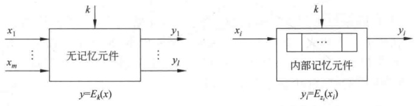

**(a) 分组密码**

**(b) 流密码**

**图 2-1 分组密码和流密码的比较**

### 2.1.1 同步流密码

根据加密器中记忆元件的存储状态  $\sigma_{i}$ 是否依赖于输入的明文字符，流密码可进一步分成同步和自同步两种。 $\sigma_{i}$ 独立于明文字符的称为同步流密码，否则称为自同步流密码。由于自同步流密码的密钥流的产生与明文有关，因而较难从理论上进行分析。目前大多数研究成果都是关于同步流密码的。在同步流密码中，由于  $z_{i}=f(k,\sigma_{i})$ 与明文字符无关，因而此时密文字符  $y_{i}=E_{z_{i}}(x_{i})$ 也不依赖于此前的明文字符。因此，可将同步流密码的加密器分成密钥流产生器和加密变换器两个部分。如果与上述加密变换对应的解密变换为  $x_{i}=D_{z_{i}}(y_{i})$，则可给出同步流密码的模型如图2-2所示。

同步流密码的加密变换  $E_{z_i}$ 可以有多种选择，只要保证变换是可逆的即可。实际使用的数字保密通信系统一般都是二元系统，因而在有限域 GF(2) 上讨论的二元加法流密码（见图 2-3）是目前最为常用的流密码体制，其加密变换可表示为  $y_i = z_i \oplus x_i$。

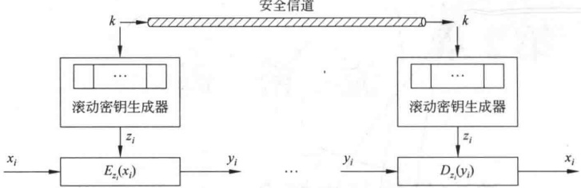

**图 2-2 同步流密码体制模型**

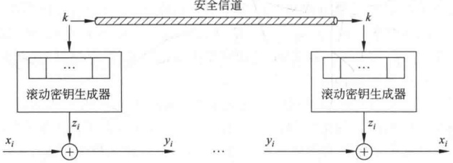

**图 2-3 加法流密码体制模型**

一次一密密码是加法流密码的原型。事实上，如果 $z_{i}=k_{i}$（即密钥用作滚动密钥流），则加法流密码就退化成一次一密密码。在实际使用中，密码设计者的最大愿望是设计出一个滚动密钥生成器，使得密钥k经其扩展成的密钥流序列z具有如下性质：极大的周期、良好的统计特性、抗线性分析、抗统计分析。

### 2.1.2 有限状态自动机

有限状态自动机是具有离散输入和输出（输入集和输出集均有限）的一种数学模型，由以下3部分组成：

(1) 有限状态集  $S = \{s_i | i = 1, 2, \cdots, l\}$;

(2) 有限输入字符集  $A_1 = \{A_j^{(1)} | j = 1, 2, \cdots, m\}$ 和有限输出字符集  $A_2 = \{A_k^{(2)} | k = 1, 2, \cdots, n\}$;

（3）转移函数

$$\boldsymbol{A}_{k}^{(2)}=f_{1}(s_{i},\boldsymbol{A}_{j}^{(1)}),s_{h}=f_{2}(s_{i},\boldsymbol{A}_{j}^{(1)})$$

即在状态为  $s_{i}$，输入为  $A_{j}^{(1)}$ 时，输出为  $A_{k}^{(2)}$，而状态转移为  $s_{h}$。

【例 2-1】 $S=\left\{s_{1},s_{2},s_{3}\right\},A_{1}=\left\{A_{1}^{(1)},A_{2}^{(1)},A_{3}^{(1)}\right\},A_{2}=\left\{A_{1}^{(2)},A_{2}^{(2)},A_{3}^{(2)}\right\}$，转移函数由表2-1给出。

有限状态自动机可用有向图表示，称为转移图。转移图的顶点对应于自动机的状态，若状态  $s_{i}$ 在输入  $A_{i}^{(1)}$ 时转为状态  $s_{j}$，且输出一个字符  $A_{j}^{(2)}$，则在转移图中，从状态  $s_{i}$ 到状态  $s_{j}$ 有一条标有  $(A_{i}^{(1)}, A_{j}^{(2)})$ 的弧线（见图2-4）。

**表2-1 转移函数 $f_{1}$和 $f_{2}$**

| $f_1$ | $A_1^{(1)}$ | $A_2^{(1)}$ | $A_3^{(1)}$ |
| --- | --- | --- | --- |
| $s_1$ | $A_1^{(2)}$ | $A_3^{(2)}$ | $A_2^{(2)}$ |
| $s_2$ | $A_2^{(2)}$ | $A_1^{(2)}$ | $A_3^{(2)}$ |
| $s_3$ | $A_3^{(2)}$ | $A_2^{(2)}$ | $A_1^{(2)}$ |
| $f_2$ | $A_1^{(1)}$ | $A_2^{(1)}$ | $A_3^{(1)}$ |
| $s_1$ | $s_2$ | $s_1$ | $s_3$ |
| $s_2$ | $s_3$ | $s_2$ | $s_1$ |
| $s_3$ | $s_1$ | $s_3$ | $s_2$ |

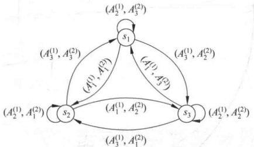

**图 2-4 有限状态自动机的转移图**

例2-1中，若输入序列为 $A_{1}^{(1)}A_{2}^{(1)}A_{1}^{(1)}A_{3}^{(1)}A_{3}^{(1)}A_{1}^{(1)}$，初始状态为 $s_{1}$，则得到状态序列 $s_{1}s_{2}s_{2}s_{3}s_{2}s_{1}s_{2}$

输出字符序列

$$\boldsymbol{A}_{1}^{(2)}\boldsymbol{A}_{1}^{(2)}\boldsymbol{A}_{2}^{(2)}\boldsymbol{A}_{1}^{(2)}\boldsymbol{A}_{3}^{(2)}\boldsymbol{A}_{1}^{(2)}$$

### 2.1.3 密钥流生成器

同步流密码的关键是密钥流生成器。一般可将其看成一个参数为 k 的有限状态自动机，由一个输出符号集 Z、一个状态集  $\Sigma$、两个函数  $\varphi$ 和  $\psi$ 以及一个初始状态  $\sigma_{0}$ 组成（见图 2-5）。状态转移函数  $\varphi$： $\sigma_{i} \to \sigma_{i+1}$，将当前状态  $\sigma_{i}$ 变为一个新状态  $\sigma_{i+1}$，输出函数  $\psi$： $\sigma_{i} \to z_{i}$，当前状态  $\sigma_{i}$ 变为输出符号集中的一个元素  $z_{i}$。这种密钥流生成器设计的关键在于找出适当的状态转移函数  $\varphi$ 和输出函数  $\psi$，使得输出序列 z 满足密钥流序列 z 应满足的几个条件，并且要求在设备上是节省的和容易实现的。为了实现这一目标，必须采用非线性函数。

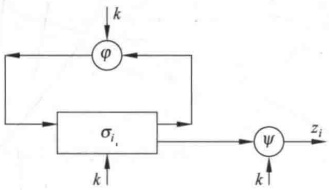

**图 2-5 作为有限状态自动机的密钥流生成器**

由于具有非线性的  $\varphi$ 的有限状态自动机理论很不完善，相应的密钥流生成器的分析工作受到极大的限制。相反地，当采用线性的  $\varphi$ 和非线性的  $\psi$ 时，我们将能够进行深入的分析并可以得到好的生成器。为方便讨论，可将这类生成器分成驱动部分和非线性组合部分（见图2-6）。驱动部分控制生成器的状态转移，并为非线性组合部分提供统计性能好的序列。而非线性组合部分要利用这些序列组合出满足要求的密钥流序列。

目前最为流行和实用的密钥流生成器如图2-7所示，其驱动部分是一个或多个线性反馈移位寄存器。

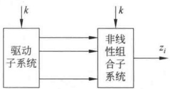

**图 2-6 密钥流生成器的分解**

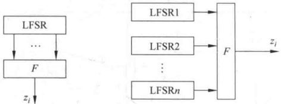

**图 2-7 常见的两种密钥流生成器**

## 2.2 线性反馈移位寄存器

移位寄存器是流密码产生密钥流的一个主要组成部分。GF(2)上一个n级反馈移位寄存器由n个二元存储器与一个反馈函数 $f(a_{1},a_{2},\cdots,a_{n})$组成，如图2-8所示。每一存储器称为移位寄存器的一级，在任一时刻，这些级的内容构成该反馈移位寄存器的状态，每一状态对应于GF(2)上的一个n维向量，共有 ${2}^{n}$种可能的状态。每一时刻的状态可用n长序列

$$a_{1},a_{2},\cdots,a_{n}$$

或n维向量

$$(a_{1},a_{2},\cdots,a_{n})$$

表示，其中， $a_{i}$ 是第 i 级存储器的内容。初始状态由用户确定，当第 i 个移位时钟脉冲到来时，每一级存储器  $a_{i}$ 都将其内容向下一级  $a_{i-1}$ 传递，并根据寄存器此时的状态  $a_{1}, a_{2}, \cdots, a_{n}$ 计算  $f(a_{1}, a_{2}, \cdots, a_{n})$，作为下一时刻的  $a_{n}$。反馈函数  $f(a_{1}, a_{2}, \cdots, a_{n})$ 是 n 元布尔函数，即 n 个变元  $a_{1}, a_{2}, \cdots, a_{n}$ 可以独立地取 0 和 1 这两个可能的值，函数中的运算有逻辑与、逻辑或、逻辑补等运算，最后的函数值也为 0 或 1。

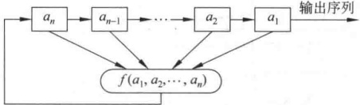

**图 2-8 GF(2) 上的 n 级反馈移位寄存器**

【例 2-2】图 2-9 是一个 3 级反馈移位寄存器，其初始状态为  $(a_{1}, a_{2}, a_{3}) = (1, 0, 1)$

输出可由表2-2求出。

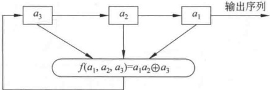

**图 2-9 一个 3 级反馈移位寄存器**

**表2-2 一个3级反馈移位寄存器的状态和输出**

<table border=1 style='margin: auto; word-wrap: break-word;'><tr><td colspan="3">状态 $(a_3,a_2,a_1)$</td><td style='text-align: center; word-wrap: break-word;'>输 出</td><td colspan="3">状态 $(a_3,a_2,a_1)$</td><td style='text-align: center; word-wrap: break-word;'>输 出</td></tr><tr><td style='text-align: center; word-wrap: break-word;'>1</td><td style='text-align: center; word-wrap: break-word;'>0</td><td style='text-align: center; word-wrap: break-word;'>1</td><td style='text-align: center; word-wrap: break-word;'>1</td><td style='text-align: center; word-wrap: break-word;'>1</td><td style='text-align: center; word-wrap: break-word;'>0</td><td style='text-align: center; word-wrap: break-word;'>1</td><td style='text-align: center; word-wrap: break-word;'>1</td></tr><tr><td style='text-align: center; word-wrap: break-word;'>1</td><td style='text-align: center; word-wrap: break-word;'>1</td><td style='text-align: center; word-wrap: break-word;'>0</td><td style='text-align: center; word-wrap: break-word;'>0</td><td style='text-align: center; word-wrap: break-word;'>1</td><td style='text-align: center; word-wrap: break-word;'>1</td><td style='text-align: center; word-wrap: break-word;'>0</td><td style='text-align: center; word-wrap: break-word;'>0</td></tr><tr><td style='text-align: center; word-wrap: break-word;'>1</td><td style='text-align: center; word-wrap: break-word;'>1</td><td style='text-align: center; word-wrap: break-word;'>1</td><td style='text-align: center; word-wrap: break-word;'>1</td><td style='text-align: center; word-wrap: break-word;'>⋮</td><td style='text-align: center; word-wrap: break-word;'>⋮</td><td style='text-align: center; word-wrap: break-word;'>⋮</td><td style='text-align: center; word-wrap: break-word;'>⋮</td></tr><tr><td style='text-align: center; word-wrap: break-word;'>0</td><td style='text-align: center; word-wrap: break-word;'>1</td><td style='text-align: center; word-wrap: break-word;'>1</td><td style='text-align: center; word-wrap: break-word;'>1</td><td style='text-align: center; word-wrap: break-word;'></td><td style='text-align: center; word-wrap: break-word;'></td><td style='text-align: center; word-wrap: break-word;'></td><td style='text-align: center; word-wrap: break-word;'></td></tr></table>

即输出序列为101110111011…，周期为4。

如果移位寄存器的反馈函数  $f(a_1, a_2, \cdots, a_n)$ 是  $a_1, a_2, \cdots, a_n$ 的线性函数，则称为线性反馈移位寄存器（Linear Feedback Shift Register，LFSR）。此时 f 可写为

$$f(a_{1},a_{2},\cdots,a_{n})=c_{n}a_{1}\oplus c_{n-1}a_{2}\oplus\cdots\oplus c_{1}a_{n}$$

其中，常数  $c_{i}=0$ 或 1， $\bigoplus$ 是模2加法。 $c_{i}=0$ 或 1 可用开关的断开和闭合来实现，如图2-10所示。

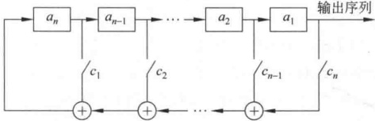

**图 2-10 GF(2) 上的 n 级线性反馈移位寄存器**

输出序列 $\{a_i\}$满足

$$\boldsymbol{a}_{n+t}=\boldsymbol{c}_{n}\boldsymbol{a}_{t}\oplus\boldsymbol{c}_{n-1}\boldsymbol{a}_{t+1}\oplus\cdots\oplus\boldsymbol{c}_{1}\boldsymbol{a}_{n+t-1}$$

其中，t 为非负整数。

线性反馈移位寄存器因其实现简单、速度快、有较为成熟的理论等优点而成为构造密钥流生成器的最重要的部件之一。

【例 2-3】图 2-11 是一个 5 级线性反馈移位寄存器，其初始状态为  $(a_{1}, a_{2}, a_{3}, a_{4}, a_{5}) = (1, 0, 0, 1, 1)$，可求出输出序列为

$$\begin{array}{l} 1001101001000010101110110001111100110\cdots \end{array}$$

周期为31。

在线性反馈移位寄存器中总是假定  $c_{1}, c_{2}, \cdots, c_{n}$ 中至少有一个不为 0，否则  $f(a_{1}, a_{2}, \cdots, a_{n}) \equiv 0$，这样的话，在 n 个脉冲后状态必然是 00…0，且这个状态必将一直持续下去。若只有一个系数不为0，设仅有 $c_{j}$不为0，实际上是一种延迟装置。一般对于n级线性反馈移位寄存器，总是假定 $c_{n}=1$。

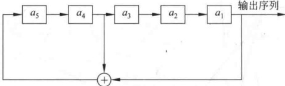

**图 2-11 一个 5 级线性反馈移位寄存器**

线性反馈移位寄存器输出序列的性质完全由其反馈函数决定。n级线性反馈移位寄存器最多有 ${2}^{n}$个不同的状态。若其初始状态为0，则其状态恒为0。若其初始状态非0，则其后继状态不会为0。因此n级线性反馈移位寄存器的状态周期小于或等于 ${2}^{n}-1$。其输出序列的周期与状态周期相等，也小于或等于 ${2}^{n}-1$。只要选择合适的反馈函数便可使序列的周期达到最大值 ${2}^{n}-1$，周期达到最大值的序列称为m序列。

## 2.3 线性移位寄存器的一元多项式表示

设 n 级线性移位寄存器的输出序列  $\{a_{i}\}$ 满足递推关系

$$\boldsymbol{a}_{n+k}=\boldsymbol{c}_{1}\boldsymbol{a}_{n+k-1}\oplus\boldsymbol{c}_{2}\boldsymbol{a}_{n+k-2}\oplus\cdots\oplus\boldsymbol{c}_{n}\boldsymbol{a}_{k}$$

对任何  $k \geqslant 1$ 成立。这种递推关系可用一个一元高次多项式

$$p\left(x\right)=1+c_{1}x+\cdots+c_{n-1}x^{n-1}+c_{n}x^{n}$$

表示，称这个多项式为 LFSR 的特征多项式。

设 $n$ 级线性移位寄存器对应于递推关系 $(2-1)$，由于 $a_i \in \mathrm{GF}(2)(i=1,2,\cdots,n)$，所以共有 ${2}^n$ 组初始状态，即有 ${2}^n$ 个递推序列，其中非恒零的有 ${2}^n-1$ 个，记 ${2}^n-1$ 个非零序列的全体为 $G(p(x))$。

定义 2-1 给定序列  $\{a_{i}\}$，幂级数

$$A\left(x\right)=\sum_{i=1}^{\infty}a_{i}x^{i-1}$$

称为该序列的生成函数。

定理 2-1 设  $p(x)=1+c_{1}x+\cdots+c_{n-1}x^{n-1}+c_{n}x^{n}$ 是  $\mathrm{GF}(2)$ 上的多项式， $G(p(x))$ 中任一序列  $\{a_{i}\}$ 的生成函数  $A(x)$ 满足：

$$A\left(x\right)=\frac{\phi\left(x\right)}{p\left(x\right)}$$

其中

$$\phi\left(x\right)=\sum_{i=1}^{n}\left(c_{n-i}x^{n-i}\sum_{j=1}^{i}a_{j}x^{j-1}\right)$$

证明 在等式

$$a_{n+1}=c_{1}a_{n}\oplus c_{2}a_{n-1}\oplus\cdots\oplus c_{n}a_{1}$$

$$\boldsymbol{a}_{n+2}=\boldsymbol{c}_{1}\boldsymbol{a}_{n+1}\oplus\boldsymbol{c}_{2}\boldsymbol{a}_{n}\oplus\cdots\oplus\boldsymbol{c}_{n}\boldsymbol{a}_{2}$$

两边分别乘以  $x^{n}, x^{n+1}, \cdots$，再求和，可得

$$\begin{aligned}&A\left(x\right)-\left(a_{1}+a_{2}x+\cdots+a_{n}x^{n-1}\right)\\=&c_{1}x\big[A\left(x\right)-\left(a_{1}+a_{2}x+\cdots+a_{n-1}x^{n-2}\right)\big]\\&+c_{2}x^{2}\big[A\left(x\right)-\left(a_{1}+a_{2}x+\cdots+a_{n-2}x^{n-3}\right)\big]+\cdots+c_{n}x^{n}A\left(x\right)\end{aligned}$$

移项整理得

$$\begin{aligned}&\left(1+c_{1}x+\cdots+c_{n-1}x^{n-1}+c_{n}x^{n}\right)A\left(x\right)\\=&\left(a_{1}+a_{2}x+\cdots+a_{n}x^{n-1}\right)+c_{1}x\left(a_{1}+a_{2}x+\cdots+a_{n-1}x^{n-2}\right)\\&+c_{2}x^{2}\left(a_{1}+a_{2}x+\cdots+a_{n-2}x^{n-3}\right)+\cdots+c_{n-1}x^{n-1}a_{1}\end{aligned}$$

即

$$p(x)A(x)=\sum_{i=1}^{n}(c_{n-i}x^{n-i}\sum_{j=1}^{i}a_{j}x^{j-1})=\phi(x)$$

（定理2-1证毕）

注意：在 GF(2) 上有  $a + a = 0$。

定理 2-2  $p(x) \mid q(x)$ 的充要条件是  $G(p(x)) \subset G(q(x))$。

证明 若  $p(x)|q(x)$，可设  $q(x)=p(x)r(x)$，因此

$$A\left(x\right)=\frac{\phi\left(x\right)}{p\left(x\right)}=\frac{\phi\left(x\right)r\left(x\right)}{p\left(x\right)r\left(x\right)}=\frac{\phi\left(x\right)r\left(x\right)}{q\left(x\right)}$$

所以若 $\{a_{i}\}\in G(p(x))$，则 $\{a_{i}\}\in G(q(x))$，即 $G(p(x))\subset G(q(x))$。

反之，若  $G(p(x)) \subset G(q(x))$，则对于多项式  $\phi(x)$，存在序列  $\{a_i\} \in G(p(x))$ 以  $A(x) = \frac{\phi(x)}{p(x)}$ 为生成函数。特别地，对于多项式  $\phi(x) = 1$，存在序列  $\{a_i\} \in G(p(x))$ 以  $\frac{1}{p(x)}$ 为生成函数。由于  $G(p(x)) \subset G(q(x))$，序列  $\{a_i\} \in G(q(x))$，所以存在函数  $r(x)$，使得  $\{a_i\}$ 的生成函数也等于  $\frac{r(x)}{q(x)}$，从而  $\frac{1}{p(x)} = \frac{r(x)}{q(x)}$，即  $q(x) = p(x)r(x)$，所以  $p(x) \mid q(x)$。

（定理2-2证毕）

上述定理说明可用 n 级 LFSR 产生的序列，也可用级数更多的 LFSR 来产生。

定义 2-2 设  $p(x)$ 是  $\mathrm{GF}(2)$ 上的多项式，使  $p(x)|(x^{p}-1)$ 的最小  $p$ 称为  $p(x)$ 的周期或阶。

定理 2-3 若序列  $\{a_{i}\}$ 的特征多项式  $p(x)$ 定义在  $\mathrm{GF}(2)$ 上， $p$ 是  $p(x)$ 的周期，则  $\{a_{i}\}$ 的周期  $r \mid p$。

证明 由  $p(x)$ 周期的定义得  $p(x)|(x^{p}-1)$，因此存在  $q(x)$，使得  $x^{p}-1=p(x)q(x)$，又由  $p(x)A(x)=\phi(x)$，可得  $p(x)q(x)A(x)=\phi(x)q(x)$，所以  $(x^{p}-1)A(x)=\phi(x)q(x)$。因  $p(x)$ 的次数不超过 n，由  $x^{p}-1=p(x)q(x)$ 知  $q(x)$ 的次数不超过 p-n。又知  $\phi(x)$ 的次数不超过 n-1，所以  $(x^{p}-1)A(x)$ 的次数不超过  $(p-n)+(n-1)=p-1$。将  $(x^{p}-1)A(x)$ 写成  $x^{p}A(x)-A(x)$，可看出对于任意正整数 i 都有  $a_{i+p}=a_{i}$。

设  $p = kr + t, 0 \leqslant t < r$ ，则  $a_{i+p} = a_{i+kr+t} = a_{i+t} = a_{i}$，所以 t = 0，即  $r \mid p$。

（定理2-3证毕）

$n$ 级 LFSR 输出序列的周期 $r$ 不依赖于初始条件，而依赖于特征多项式 $p(x)$。我们感兴趣的是 LFSR 遍历 ${2}^n-1$ 个非零状态，这时序列的周期达到最大 ${2}^n-1$，这种序列就是 $m$ 序列。显然对于特征多项式一样，而仅初始条件不同的两个输出序列，一个记为 $\{a_i^{(1)}\}$，另一个记为 $\{a_i^{(2)}\}$，其中一个必是另一个的移位，即存在一个常数 $k$，使得

$$a_{i}^{(1)}=a_{k+i}^{(2)},i=1,2,\cdots$$

下面讨论特征多项式满足什么条件时，LFSR 的输出序列为 m 序列。

定义 2-3 仅能被非 0 常数或自身的常数倍除尽，但不能被其他多项式除尽的多项式称为即约多项式或不可约多项式。

不可约多项式与讨论的域有关，例如  $f(x)=x^{2}+1$，在实数域上是不可约的，在复数域上可分解为  $f(x)=(x+i)(x-i)$。

定理 2-4 设  $p(x)$ 是 n 次不可约多项式，周期为 m，序列  $\{a_i\} \in G(p(x))$，则  $\{a_i\}$ 的周期为 m。

证明 设 $\{a_{i}\}$的周期为r，由定理2-3，有 $r\mid m$，所以 $r\leqslant m$。

设  $A(x)$ 为  $\{a_{i}\}$ 的生成函数， $A(x)=\frac{\varphi(x)}{p(x)}$，即  $p(x)A(x)=\phi(x)\neq0$， $\phi(x)$ 的次数不超过 n-1。而

$$\begin{aligned}A\left(x\right)=&\sum_{i=1}^{\infty}a_{i}x^{i-1}=a_{1}+a_{2}x+\cdots+a_{r}x^{r-1}+x^{r}(a_{1}+a_{2}x+\cdots+a_{r}x^{r-1})+\\&\left(x^{r}\right)^{2}(a_{1}+a_{2}x+\cdots+a_{r}x^{r-1})+\cdots=\frac{a_{1}+a_{2}x+\cdots+a_{r}x^{r-1}}{1-x^{r}}\\=&\frac{a_{1}+a_{2}x+\cdots+a_{r}x^{r-1}}{x^{r}-1}\end{aligned}$$

于是  $A(x)=\frac{a_{1}+a_{2}x+\cdots+a_{r}x^{r-1}}{x^{r}-1}=\frac{\phi(x)}{p(x)}$，即

$$p\left(x\right)\left(a_{1}+a_{2}x+\cdots+a_{r}x^{r-1}\right)=\phi\left(x\right)\left(x^{r}-1\right)$$

因  $p(x)$ 是不可约的且  $\phi(x)$ 的次数不超过 n-1，所以  $\gcd(p(x), \phi(x)) = 1, p(x) \mid (x^r - 1)$，因此  $m \leq r$。

综上 r=m。

（定理2-4证毕）

定理 2-5 n 级 LFSR 产生的序列有最大周期  ${2}^{n}-1$ 的必要条件是其特征多项式为不可约的。

证明 设 n 级 LFSR 产生的序列周期达到最大  ${2}^{n}-1$，除 0 序列外，每一序列的周期由特征多项式唯一决定，而与初始状态无关。设特征多项式为  $p(x)$，若  $p(x)$ 可约，可设为  $p(x)=g(x)h(x)$，其中  $g(x)$ 是不可约多项式，且次数 k<n。由于  $G(g(x))\subset G(p(x))$，而  $G(g(x))$ 中序列的周期一方面不超过  ${2}^{k}-1$，另一方面又等于  ${2}^{n}-1$，这是矛盾的，所以  $p(x)$ 是不可约多项式。

（定理2-5证毕）

该定理的逆不成立，即 LFSR 的特征多项式为不可约多项式时，其输出序列不一定是 m 序列。

【例 2-4】 $f(x)=x^{4}+x^{3}+x^{2}+x+1$ 为 GF(2)上的不可约多项式，这是因为一次多项式 x, x+1 都不能整除  $f(x)$，因此任一三次多项式也不能整除  $f(x)$。而二次多项式有  $x^{2}=x \cdot x, x^{2}+1=(x+1)(x+1)$（在 GF(2) 上  $x+x=0$,  $x^{2}+x=x(x+1)$,  $x^{2}+x+1$ 为二次不可约多项式）。由 x, x+1 都不能整除  $f(x)$ 知  $x^{2}, x^{2}+1, x^{2}+x$ 都不能整除  $f(x)$，二次不可约多项式  $x^{2}+x+1$ 不能整除  $f(x)$ 可直接验证。

以  $f(x)$ 为特征多项式的 LFSR 的输出序列可由

$$a_{k}=a_{k-1}\oplus a_{k-2}\oplus a_{k-3}\oplus a_{k-4},\quad k\geqslant4$$

和给定的初始状态求出，设初始状态为 0001，则输出序列为 000110001100011…，周期为 5，不是 m 序列。

定义 2-4 若 n 次不可约多项式  $p(x)$ 的阶为  ${2}^{n}-1$，则称  $p(x)$ 是 n 次本原多项式。

定理 2-6 设  $\{a_i\} \in G(p(x)), \{a_i\}$ 为  $m$ 序列的充要条件是  $p(x)$ 为本原多项式。

证明 若  $p(x)$ 是本原多项式，则其阶为  ${2}^{n}-1$，由定理2-4得  $\{a_{i}\}$ 的周期等于  ${2}^{n}-1$，即  $\{a_{i}\}$ 为 m 序列。

反之，若 $\{a_{i}\}$为m序列，即其周期等于 ${2}^{n}-1$，由定理2-5知 $p(x)$是不可约多项式。由定理2-3知 $\{a_{i}\}$的周期 ${2}^{n}-1$整除 $p(x)$的阶，而 $p(x)$的阶不超过 ${2}^{n}-1$，所以 $p(x)$的阶为 ${2}^{n}-1$，即 $p(x)$是本原多项式。

（定理2-6证毕）

 $\{a_{i}\}$ 为 m 序列的关键在于  $p(x)$ 为本原多项式，n 次本原多项式的个数为

$$\frac{\varphi(2^{n}-1)}{n}$$

其中， $\varphi$ 为欧拉函数。已经证明，对于任意的正整数 n，至少存在一个 n 次本原多项式。所以对于任意的 n 级 LFSR，至少存在一种连接方式使其输出序列为 m 序列。

【例2-5】设 $p(x)=x^{4}+x+1$，由于 $p(x)|(x^{15}-1)$，但不存在小于15的正整数 l，使得 $p(x)|(x^{l}-1)$，所以 $p(x)$的阶为15。类似于例2-4， $p(x)$的不可约性可由x、 $x+1$、 $x^{2}+x+1$都不能整除 $p(x)$得到，所以 $p(x)$是本原多项式。

若 LFSR 以  $p(x)$ 为特征多项式，则输出序列的递推关系为

$$a_{k}=a_{k-1}\oplus a_{k-4},\quad k\geqslant4$$

若初始状态为1001，则输出为

100100011110101100100011110101…

周期为  ${2}^{4}-1=15$ ，即输出序列为 m 序列。

## 2.4 m 序列的伪随机性

流密码的安全性取决于密钥流的安全性，要求密钥流序列有好的随机性，以使密码分析者对它无法预测。也就是说，即使截获其中一段，也无法推测后面是什么。如果密钥流是周期的，要完全做到随机性是困难的。严格地说，这样的序列不可能做到随机，只能要求截获比周期短的一段时不会泄露更多信息，这样的序列称为伪随机序列。

为讨论 m 序列的随机性，下面首先讨论随机序列的一般特性。

设 $\left\{a_{i}\right\}=\left(a_{1}a_{2}a_{3}\cdots\right)$为0、1序列，例如00110111，其前两个数字是00，称为0的2游程；接着是11，是1的2游程；再下来是0的1游程和1的3游程。

定义 2-5 GF(2) 上周期为 T 的序列  $\{a_{i}\}$ 的自相关函数定义为

$$R\left(\tau\right)=\frac{1}{T}\sum_{k=1}^{T}\left(-1\right)^{a_{k}}\left(-1\right)^{a_{k+\tau}},\quad0\leqslant\tau\leqslant T-1$$

定义中的和式表示序列 $\{a_{i}\}$与 $\{a_{i+\tau}\}$（序列 $\{a_{i}\}$向后平移 $\tau$位得到）在一个周期内对应位相同的位数与对应位不同的位数之差。当 $\tau=0$时， $R(\tau)=1$;当 $\tau\neq0$时，称 $R(\tau)$为异相自相关函数。

Golomb 对伪随机周期序列提出了应满足的如下 3 个随机性公设：

（1）在序列的一个周期内，0与1的个数相差至多为1。

（2）在序列的一个周期内，长为1的游程占游程总数的 $\frac{1}{2}$，长为2的游程占游程总数的 $\frac{1}{2^{2}}$，…，长为i的游程占游程总数的 $\frac{1}{2^{i}}$，…，且在等长的游程中0的游程个数和1的游程个数相等。

（3）异自相关函数是一个常数。

公设(1)说明 $\{a_{i}\}$中0与1出现的概率基本上相同，公设(2)说明0与1在序列中每一位置上出现的概率相同；公设(3)意味着通过对序列与其平移后的序列做比较，不能给出其他任何信息。

从密码系统的角度看，一个伪随机序列还应满足下面的条件：

（1） $\{a_{i}\}$ 的周期相当大

(2)  $\{a_{i}\}$ 的确定在计算上是容易的。

（3）由密文及相应的明文的部分信息，不能确定整个 $\{a_{i}\}$

定理 2-7 说明，m 序列满足 Golomb 的 3 个随机性公设。

定理 2-7 GF(2)上的n长m序列 $\{a_{i}\}$具有如下性质：

（1）在一个周期内，0、1出现的次数分别为 ${2}^{n-1}-1$和 ${2}^{n-1}$。

（2）在一个周期内，总游程数为 ${2}^{n-1}$; 对 ${1}\leq i\leq n-2$，长为i的游程有 ${2}^{n-i-1}$个，且0、1游程各半；长为n-1的0游程一个，长为n的1游程一个。

（3） $\{a_{i}\}$ 的自相关函数为

$$R\left(\tau\right)=\left\{\begin{aligned}&1,&\tau=0\\ &-\frac{1}{2^{n}-1},&0<\tau\leqslant2^{n}-2\end{aligned}\right.$$

证明 （1）在 n 长 m 序列的一个周期内，除了全 0 状态外，每个 n 长状态（共有  ${2}^{n}-1$ 个）都恰好出现一次，这些状态中有  ${2}^{n-1}$ 个在  $a_{1}$ 位是 1，其余  ${2}^{n}-1-2^{n-1}={2}^{n-1}-1$ 个状态在  $a_{1}$ 位是 0。

（2）对 n=1,2，易证结论成立。

对 n>2，当  ${1}\leqslant i\leqslant n-2$ 时，n 长 m 序列的一个周期内，长为 i 的 0 游程数目等于序

列中如下形式的状态数目： ${1}\underbrace{00\cdots0}_{i\uparrow0}1*\cdots*$，其中， $n-i-2$个*可任取0或1。这种状态共有 ${2}^{n-i-2}$个。同理可得长为i的1游程数目也等于 ${2}^{n-i-2}$，所以长为i的游程总数为 ${2}^{n-i-1}$。

由于寄存器中不会出现全0状态，所以不会出现0的n游程，但必有一个1的n游程，而且1的游程不会更大，因为若出现1的 $n+1$游程，就必然有两个相邻的全1状态，但这是不可能的。这就证明了1的n游程必然出现在如下的串中：

$$\underbrace{11\cdots1}_{n 个 1}0$$

当这  $n+2$ 位通过移位寄存器时，便依次产生以下状态：

$${0}\underbrace{11\cdots1}_{n-1 个 1}\quad\underbrace{11\cdots1}_{n 个 1}\quad\underbrace{11\cdots1}_{n-1 个 1}0$$

由于  ${0}\underbrace{11\cdots1}_{n-1 个 1}$、 $\underbrace{11\cdots1}_{n 个 1}$ 这两个状态只能各出现一次，所以不会有 1 的 n-1 游程。

0 的 n-1 游程有一个：

$${1}\underbrace{00\cdots0}_{n-1 个 0}1$$

它产生 ${100}\cdots0$和 ${00}\cdots01$两个状态。

于是在一个周期内，总游程数为：

$${1}+1+\sum_{i=1}^{n-2}2^{n-i-1}=2^{n-1}$$

(3)  $\{a_{i}\}$ 是周期为  ${2}^{n}-1$ 的 m 序列，对于任一正整数  $\tau(0<\tau<2^{n}-1), \{a_{i}\}+\{a_{i+\tau}\}$ 在一个周期内为 0 的位的数目正好是序列  $\{a_{i}\}$ 和  $\{a_{i+\tau}\}$ 对应位相同的位的数目。

设序列 $\{a_{i}\}$满足递推关系：

$$\boldsymbol{a}_{h+n}=\boldsymbol{c}_{1}\boldsymbol{a}_{h+n-1}\oplus\boldsymbol{c}_{2}\boldsymbol{a}_{h+n-2}\oplus\cdots\oplus\boldsymbol{c}_{n}\boldsymbol{a}_{h}$$

故

$$\boldsymbol{a}_{h+n+\tau}=\boldsymbol{c}_{1}\boldsymbol{a}_{h+n+\tau-1}\oplus\boldsymbol{c}_{2}\boldsymbol{a}_{h+n+\tau-2}\oplus\cdots\oplus\boldsymbol{c}_{n}\boldsymbol{a}_{h+\tau}$$

 $a_{h+n} \oplus a_{h+n+\tau} = c_1 (a_{h+n-1} \oplus a_{h+n+\tau-1}) \oplus c_2 (a_{h+n-2} \oplus a_{h+n+\tau-2}) \oplus \cdots \oplus c_n (a_h \oplus a_{h+\tau})$

令  $b_{j}=a_{j}\oplus a_{j+\tau}$，由递推序列  $\{a_{i}\}$ 可推得递推序列  $\{b_{i}\}$， $\{b_{i}\}$ 满足

$$b_{h+n}=c_{1}b_{h+n-1}\oplus c_{2}b_{h+n-2}\oplus\cdots\oplus c_{n}b_{h}$$

 $\{b_{i}\}$也是m序列。为了计算 $R(\tau)$，只要用 $\{b_{i}\}$在一个周期中0的个数减去1的个数，再除以 ${2}^{n}-1$，即

$$R\left(\tau\right)=\frac{2^{n-1}-1-2^{n-1}}{2^{n}-1}=-\frac{1}{2^{n}-1}$$

（定理2-7证毕）

## 2.5 m 序列密码的破译

上面说过，有限域GF(2)上的二元加法流密码（见图2-3）是目前最为常用的流密码体制，设滚动密钥生成器是线性反馈移位寄存器，产生的密钥是m序列。又设 $S_{h}$和 $S_{h+1}$ 是序列中两个连续的 n 长向量，其中

$$\mathbf{S}_{h}=\begin{pmatrix}a_{h}\\a_{h+1}\\\vdots\\a_{h+n-1}\end{pmatrix},\quad\mathbf{S}_{h+1}=\begin{pmatrix}a_{h+1}\\a_{h+2}\\\vdots\\a_{h+n}\end{pmatrix}$$

设序列 $\{a_i\}$满足线性递推关系：

$$a_{h+n}=c_{1}a_{h+n-1}\oplus c_{2}a_{h+n-2}\oplus\cdots\oplus c_{n}a_{h}$$

可表示为

$$\begin{pmatrix}a_{h+1}\\a_{h+2}\\\vdots\\a_{h+n}\end{pmatrix}=\begin{pmatrix}0&1&0&\cdots&0\\0&0&1&\cdots&0\\\vdots&\vdots&\vdots&&\vdots\\c_{n}&c_{n-1}&c_{n-2}&\cdots&c_{1}\end{pmatrix}\begin{pmatrix}a_{h}\\a_{h+1}\\\vdots\\a_{h+n-1}\end{pmatrix}$$

或 $S_{h+1}=M\cdot S_{h}$，其中

$$\begin{align*}\mathbf{M}=\begin{pmatrix}0&1&0&\cdots&0\\0&0&1&\cdots&0\\\vdots&\vdots&\vdots&&\vdots\\c_{n}&c_{n-1}&c_{n-2}&\cdots&c_{1}\end{pmatrix}\end{align*}$$

又设敌手知道一段长为 2n 的明密文对，即已知

$$x=x_{1}x_{2}\cdots x_{2n},\quad y=y_{1}y_{2}\cdots y_{2n}$$

于是可求出一段长为 2n 的密钥序列

$$\mathcal{Z}=\mathcal{Z}_{1}\mathcal{Z}_{2}\cdots\mathcal{Z}_{2n}$$

其中， $z_{i}=x_{i}\oplus y_{i}=x_{i}\oplus(x_{i}\oplus z_{i})$。由此可推出线性反馈移位寄存器连续的 $n+1$个状态：

$$\begin{aligned}&S_{1}=(z_{1}z_{2}\cdots z_{n})\xlongequal{ 记为 }(a_{1}a_{2}\cdots a_{n})\\&S_{2}=(z_{2}z_{3}\cdots z_{n+1})\xlongequal{ 记为 }(a_{2}a_{3}\cdots a_{n+1})\\&\vdots\\&S_{n+1}=(z_{n+1}z_{n+2}\cdots z_{2n})\xlongequal{ 记为 }(a_{n+1}a_{n+2}\cdots a_{2n})\\ \end{aligned}$$

设矩阵

$$\boldsymbol{X}=(\boldsymbol{S}_{1}\boldsymbol{S}_{2}\cdots\boldsymbol{S}_{n})$$

而

$$\begin{aligned}(a_{n+1}a_{n+2}\cdots a_{2n})&=(c_{n}c_{n-1}\cdots c_{1})\begin{pmatrix}a_{1}&\cdots&a_{n}\\ \vdots&&\vdots\\ a_{n}&\cdots&a_{2n-1}\end{pmatrix}\\&=(c_{n}c_{n-1}\cdots c_{1})X\end{aligned}$$

若 X 可逆，则

$$(c_{n}c_{n-1}\cdots c_{1})=(a_{n+1}a_{n+2}\cdots a_{2n})X^{-1}$$

下面证明 X 的确是可逆的。

因为 X 是由  $S_{1}, S_{2}, \cdots, S_{n}$ 作为列向量，要证 X 可逆，只要证明这 n 个向量线性无关。

由序列递推关系：

$$\boldsymbol{a}_{h+n}=\boldsymbol{c}_{1}\boldsymbol{a}_{h+n-1}\oplus\boldsymbol{c}_{2}\boldsymbol{a}_{h+n-2}\oplus\cdots\oplus\boldsymbol{c}_{n}\boldsymbol{a}_{h}$$

可推出向量的递推关系：

$$\mathbf{S}_{h+n}=c_{1}\mathbf{S}_{h+n-1}\oplus c_{2}\mathbf{S}_{h+n-2}\oplus\cdots\oplus c_{n}\mathbf{S}_{h}$$

设  $m(m \leqslant n+1)$ 是使  $S_1, S_2, \cdots, S_m$ 线性相关的最小整数，即存在不全为 0 的系数  $l_1, l_2, \cdots, l_m$，其中，不妨设  $l_1=1$，使得

$$\mathbf{S}_{m}+l_{2}\mathbf{S}_{m-1}+l_{3}\mathbf{S}_{m-2}+\cdots+l_{m}\mathbf{S}_{1}=0$$

即

$$\mathbf{S}_{m}=l_{m}\mathbf{S}_{1}+l_{m-1}\mathbf{S}_{2}+\cdots+l_{2}\mathbf{S}_{m-1}=\sum_{j=1}^{m-1}l_{j+1}\mathbf{S}_{m-j}$$

对于任一整数i，有

$$\begin{aligned}\boldsymbol{S}_{m+i}=&\boldsymbol{M}^{i}\boldsymbol{S}_{m}=\boldsymbol{M}^{i}(l_{m}\boldsymbol{S}_{1}+l_{m-1}\boldsymbol{S}_{2}+\cdots+l_{2}\boldsymbol{S}_{m-1})\\=&l_{m}\boldsymbol{M}^{i}\boldsymbol{S}_{1}+l_{m-1}\boldsymbol{M}^{i}\boldsymbol{S}_{2}+\cdots+l_{2}\boldsymbol{M}^{i}\boldsymbol{S}_{m-1}\\=&l_{m}\boldsymbol{S}_{i+1}+l_{m-1}\boldsymbol{S}_{i+2}+\cdots+l_{2}\boldsymbol{S}_{m+i-1}\end{aligned}$$

由此又推出密钥流的递推关系：

$$a_{m+i}=l_{2}a_{m+i-1}\oplus l_{3}a_{m+i-2}\oplus\cdots\oplus l_{m}a_{i+1}$$

即密钥流的级数小于 m。若  $m \leq n$，则得出密钥流的级数小于 n，矛盾。所以  $m = n + 1$，从而推出矩阵 X 必是可逆的。

【例2-6】设敌手得到密文串101101011110010和相应的明文串011001111111001，因此可计算出相应的密钥流为110100100001011。进一步假定敌手还知道密钥流是使用5级线性反馈移位寄存器产生的，那么敌手可分别用密文串中的前10个比特和明文串中的前10个比特建立如下方程

$$(a_{6}a_{7}a_{8}a_{9}a_{10})=(c_{5}c_{4}c_{3}c_{2}c_{1}) \quad \begin{pmatrix} a_{1}a_{2}a_{3}a_{4}a_{5} \\ a_{2}a_{3}a_{4}a_{5}a_{6} \\ a_{3}a_{4}a_{5}a_{6}a_{7} \\ a_{4}a_{5}a_{6}a_{7}a_{8} \\ a_{5}a_{6}a_{7}a_{8}a_{9} \end{pmatrix}$$

即

$$(01000)=(c_{5},c_{4},c_{3},c_{2},c_{1})\begin{pmatrix}1&1&0&1&0\\1&0&1&0&0\\0&1&0&0&1\\1&0&0&1&0\\0&0&1&0&0\end{pmatrix}$$

而

$$\begin{pmatrix}{{{1}}}&{{{1}}}&{{{0}}}&{{{1}}}&{{{0}}} \\{{{1}}}&{{{0}}}&{{{1}}}&{{{0}}}&{{{0}}} \\{{{0}}}&{{{1}}}&{{{0}}}&{{{0}}}&{{{1}}} \\{{{1}}}&{{{0}}}&{{{0}}}&{{{1}}}&{{{0}}} \\{{{0}}}&{{{0}}}&{{{1}}}&{{{0}}}&{{{0}}}\end{pmatrix}^{-1}=\begin{pmatrix}{{{0}}}&{{{1}}}&{{{0}}}&{{{0}}}&{{{1}}} \\{{{1}}}&{{{0}}}&{{{0}}}&{{{1}}}&{{{0}}} \\{{{0}}}&{{{0}}}&{{{0}}}&{{{0}}}&{{{1}}} \\{{{0}}}&{{{1}}}&{{{0}}}&{{{1}}}&{{{1}}} \\{{{1}}}&{{{0}}}&{{{1}}}&{{{1}}}&{{{0}}}\end{pmatrix}$$

从而得到

$$(c_{5}c_{4}c_{3}c_{2}c_{1})=(01000)\begin{pmatrix}0&1&0&0&1\\1&0&0&1&0\\0&0&0&0&1\\0&1&0&1&1\\1&0&1&1&0\end{pmatrix}$$

所以

$$(c_{5}c_{4}c_{3}c_{2}c_{1})=(10010)$$

密钥流的递推关系为

$$a_{i+5}=c_{5}a_{i}\oplus c_{2}a_{i+3}=a_{i}\oplus a_{i+3}$$

## 2.6 非线性序列

在2.1.3节已介绍密钥流生成器可分解为驱动子系统和非线性组合子系统，如图2-6所示，驱动子系统常用一个或多个线性反馈移位寄存器来实现，非线性组合子系统用非线性组合函数F来实现，如图2-7所示，本节介绍第二部分——非线性组合子系统。

为了使密钥流生成器输出的二元序列尽可能复杂，应保证其周期尽可能大、线性复杂度和不可预测性尽可能高，因此常使用多个LFSR来构造二元序列，称每个LFSR的输出序列为驱动序列，显然密钥流生成器输出序列的周期不大于各驱动序列周期的乘积，因此，提高输出序列的线性复杂度应从极大化其周期开始。

二元序列的线性复杂度指生成该序列的最短 LFSR 的级数，最短 LFSR 的特征多项式称为二元序列的极小特征多项式。

下面介绍 4 种由多个 LFSR 驱动的非线性序列生成器。

### 2.6.1 Geffe序列生成器

Geffe 序列生成器由 3 个 LFSR 组成，其中，LFSR2 作为控制生成器使用，如图 2-12 所示。

当 LFSR2 输出 1 时，LFSR2 与 LFSR1 相连接；当 LFSR2 输出 0 时，LFSR2 与 LFSR3 相连接。若设 LFSRi 的输出序列为  $\{a_{k}^{(i)}\}(i=1,2,3)$，则输出序列  $\{b_{k}\}$ 可以表示为

$$b_{k}=a_{k}^{(1)}a_{k}^{(2)}+a_{k}^{(3)}\overline{a_{k}^{(2)}}=a_{k}^{(1)}a_{k}^{(2)}+a_{k}^{(3)}a_{k}^{(2)}+a_{k}^{(3)}$$

Geffe 序列生成器也可以表示为图 2-13 的形式，其中，LFSR1 和 LFSR3 作为多路复合器的输入，LFSR2控制多路复合器的输出。设LFSRi的特征多项式分别为 $n_{i}$次本原多项式，且 $n_{i}$两两互素，则Geffe序列的周期为

$$T=\prod_{i=1}^{3}\left(2^{n_{i}}-1\right)$$

线性复杂度为

$$\delta=(n_{1}+n_{3})n_{2}+n_{3}$$

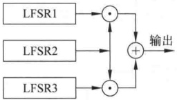

**图 2-12 Geffe 序列生成器**

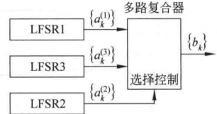

**图 2-13 多路复合器表示的 Geffe 序列生成器**

Geffe 序列的周期实现了极大化，且 0 与 1 之间的分布大体上是平衡的。

### 2.6.2 JK 触发器

JK 触发器如图 2-14 所示，它的两个输入端分别用 J 和 K 表示，其输出  $c_{k}$ 不仅依赖于输入，还依赖于前一个输出位  $c_{k-1}$，即

$$c_{k}=\overline{(x_{1}+x_{2})}c_{k-1}+x_{1}$$

其中， $x_{1}$ 和  $x_{2}$ 分别是 J 和 K 端的输入。由此可得 JK 触发器的真值表，如表 2-3 所示。

**表2-3 JK触发器的真值表**

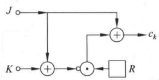

**图 2-14 JK 触发器**

| J | K | $c_{k}$ |
| --- | --- | --- |
| 0 | 0 | $c_{k-1}$ |
| 0 | 1 | 0 |
| 1 | 0 | $\overline{c_{k-1}}$ |
| 1 | 1 | $\overline{c_{k-1}}$ |

利用 JK 触发器的非线性序列生成器见图 2-15，令驱动序列  $\{a_{k}\}$ 和  $\{b_{k}\}$ 分别为 m 级和 n 级 m 序列，则有

$$c_{k}=(a_{k}+b_{k})c_{k-1}+a_{k}=(a_{k}+b_{k}+1)c_{k-1}+a_{k}$$

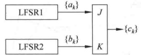

**图 2-15 利用 JK 触发器的非线性序列生成器**

如果令 $c_{-1}=0$，则输出序列的最初3项为

$$c_{0}=a_{0}$$

$$\begin{aligned}&c_{1}=(\boldsymbol{a}_{1}+\boldsymbol{b}_{1}+1)\boldsymbol{a}_{0}+\boldsymbol{a}_{1}\\&c_{2}=(\boldsymbol{a}_{2}+\boldsymbol{b}_{2}+1)((\boldsymbol{a}_{1}+\boldsymbol{b}_{1}+1)\boldsymbol{a}_{0}+\boldsymbol{a}_{1})+\boldsymbol{a}_{2}\\ \end{aligned}$$

当 m 与 n 互素且  $a_{0}+b_{0}=1$ 时，序列  $\{c_{k}\}$ 的周期为  $(2^{m}-1)(2^{n}-1)$。

【例 2-7】令 m=2, n=3，两个驱动 m 序列分别为

$$\{a_{k}\}=0,1,1,\cdots$$

和

$$\{b_{k}\}=1,0,0,1,0,1,1,\cdots$$

于是，输出序列 $\{c_{k}\}$是0,1,1,0,1,0,0,1,1,1,0,1,0,1,0,0,1,0,0,1,0,\cdots其周期为 $(2^{2}-1)(2^{3}-1)=21$。

由表达式  $c_{k}=(a_{k}+b_{k}+1)c_{k-1}+a_{k}$ 可得

$$c_{k}=\left\{\begin{aligned}&a_{k},&c_{k-1}=0\\&\overline{b_{k}},&c_{k-1}=1\end{aligned}\right.$$

因此，如果知道 $\{c_{k}\}$中相邻位的值 $c_{k-1}$和 $c_{k}$，就可以推断出 $a_{k}$和 $b_{k}$中的一个。而一旦知道足够多的这类信息，就可通过密码分析的方法得到序列 $\{a_{k}\}$和 $\{b_{k}\}$。为了克服上述缺点，Pless提出了由多个JK触发器序列驱动的多路复合序列方案，称为Pless生成器。

### 2.6.3 Pless 生成器

Pless 生成器由 8 个 LFSR、4 个 JK 触发器和 1 个循环计数器构成，由循环计数器进行选通控制，如图 2-16 所示。假定在时刻 t 输出第  $t(\text{mod } 4)$ 个单元，则输出序列为

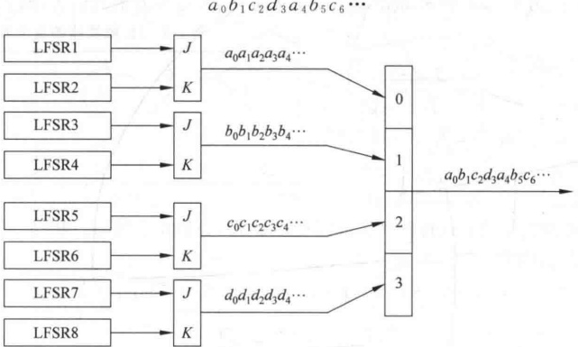

**图 2-16 Pless 生成器**

### 2.6.4 钟控序列生成器

钟控序列最基本的模型是用一个 LFSR 控制另外一个 LFSR 的移位时钟脉冲，如图 2-17 所示。

假设 LFSR1 和 LFSR2 分别输出序列  $\{a_{k}\}$ 和  $\{b_{k}\}$，其周期分别为  $p_{1}$ 和  $p_{2}$。当 LFSR1 输出 1 时，移位时钟脉冲通过与门使 LFSR2 进行一次移位，从而生成下一位。当 LFSR1 输出 0 时，移位时钟脉冲无法通过与门影响 LFSR2。因此 LFSR2 重复输出前一位。

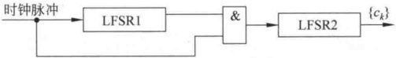

**图 2-17 最简单的钟控序列生成器**

假设钟控序列  $\{c_{k}\}$ 的周期为 p，可得如下关系：

$$p=\frac{p_{1}p_{2}}{\gcd(w_{1},p_{2})}$$

其中， $w_{1}=\sum_{i=0}^{p_{1}-1}a_{i}$

又设 $\{a_{k}\}$和 $\{b_{k}\}$的极小特征多项式分别为GF(2)上的m和n次本原多项式 $f_{1}(x)$和 $f_{2}(x)$，且 $m\mid n$。因此， $p_{1}=2^{m}-1$， $p_{2}=2^{n}-1$。又知 $w_{1}=2^{m-1}$，因此 $\gcd(w_{1},p_{2})=1$，所以 $p=p_{1}p_{2}=(2^{m}-1)(2^{n}-1)$。

此外，也可推导出 $\left\{c_{k}\right\}$的线性复杂度为 $n(2^{m}-1)$，极小特征多项式为 $f_{2}(x^{2^{m}-1})$。

【例 2-8】设 LFSR1 为 3 级 m 序列生成器，其特征多项式为  $f_{1}(x)=1+x+x^{3}$。设初态为  $a_{0}=a_{1}=a_{2}=1$，于是输出序列为  $\{a_{k}\}=1,1,1,0,1,0,0,\cdots$。

又设 LFSR2 为 3 级 m 序列生成器，且记其状态向量为  $\pmb{\sigma}_{k}$，则在图 2-17 的构造下  $\pmb{\sigma}_{k}$ 的变化情况如下：

$$\begin{array}{r c l c r c l c}{{\mathbf{\sigma}_{0}}}&{{\mathbf{\sigma}_{1}}}&{{\mathbf{\sigma}_{2}}}&{{\mathbf{\sigma}_{3}}}&{{\mathbf{\sigma}_{3}}}&{{\mathbf{\sigma}_{4}}}&{{\mathbf{\sigma}_{4}}}&{{\mathbf{\sigma}_{4}}}\\ {{}}&{{\mathbf{\sigma}_{5}}}&{{\mathbf{\sigma}_{6}}}&{{\mathbf{\sigma}_{0}}}&{{\mathbf{\sigma}_{0}}}&{{\mathbf{\sigma}_{1}}}&{{\mathbf{\sigma}_{1}}}&{{\mathbf{\sigma}_{1}}}\\ {{}}&{{\mathbf{\sigma}_{2}}}&{{\mathbf{\sigma}_{3}}}&{{\mathbf{\sigma}_{4}}}&{{\mathbf{\sigma}_{4}}}&{{\mathbf{\sigma}_{5}}}&{{\mathbf{\sigma}_{5}}}&{{\mathbf{\sigma}_{5}}}\\ {{}}&{{\mathbf{\sigma}_{6}}}&{{\mathbf{\sigma}_{0}}}&{{\mathbf{\sigma}_{1}}}&{{\mathbf{\sigma}_{1}}}&{{\mathbf{\sigma}_{2}}}&{{\mathbf{\sigma}_{2}}}&{{\mathbf{\sigma}_{2}}}\\ {{}}&{{\mathbf{\sigma}_{0}}}&{{\mathbf{\sigma}_{1}}}&{{\mathbf{\sigma}_{2}}}&{{\mathbf{\sigma}_{2}}}&{{\mathbf{\sigma}_{3}}}&{{\mathbf{\sigma}_{3}}}&{{\mathbf{\sigma}_{3}}}\\ {{}}&{{\mathbf{\sigma}_{4}}}&{{\mathbf{\sigma}_{5}}}&{{\mathbf{\sigma}_{6}}}&{{\mathbf{\sigma}_{6}}}&{{\mathbf{\sigma}_{0}}}&{{\mathbf{\sigma}_{0}}}&{{\mathbf{\sigma}_{0}}}\end{array}$$

 $\{c_{k}\}$ 的周期为  $(2^{3}-1)^{2}=49$，在它的一个周期内，每个  $\sigma_{k}$ 恰出现 7 次。

设  $f_{2}(x)=1+x^{2}+x^{3}$ 为 LFSR2 的特征多项式，且初态为  $b_{0}=b_{1}=b_{2}=1$，则  $\{b_{k}\}=1,1,1,0,0,1,0,\cdots$。

由  $\sigma_{k}$ 的变化情况得：

$$\begin{aligned}\left\{c_{k}\right\}=&1,1,1,0,0,0,0,0,0,\\&1,0,1,1,1,1,1,\\&1,0,0,0,1,1,1,\\&0,1,1,1,1,1,1,\\&0,0,1,1,0,0,0,\\&1,1,1,1,0,0,0,\\&0,1,0,0,1,1,\cdots\end{aligned}$$

 $\left\{c_{k}\right\}$ 的极小特征多项式为  ${1}+x^{14}+x^{21}$，其线性复杂度为  ${3}\cdot(2^{3}-1)=21$，图2-18是其线性等价生成器。

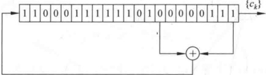

**图 2-18 一个钟控序列的线性等价生成器**

实际应用中，可以用上述最基本的钟控序列生成器构造复杂的模型，具体构造方式读者可参阅有关文献。

设计一个性能良好的序列密码是一项十分困难的任务。最基本的设计原则是“密钥流生成器的不可预测性”，它可分解为下述基本原则：

（1）长周期。

（2）高线性复杂度。

（3）统计性能良好。

（4）足够的“混乱”。

（5）足够的“扩散”。

（6）抵抗不同形式的攻击。

## 习题

1. 3级线性反馈移位寄存器在  $c_{3}=1$ 时可有4种线性反馈函数，设其初始状态为  $(a_{1},a_{2},a_{3})=(1,0,1)$，求各线性反馈函数的输出序列及周期。

2. 设 n 级线性反馈移位寄存器的特征多项式为  $p(x)$，初始状态为  $(a_{1}, a_{2}, \cdots, a_{n}) = (00\cdots01)$，证明输出序列的周期等于  $p(x)$ 的阶。

3. 设  $n=4$,  $f(a_{1},a_{2},a_{3},a_{4})=a_{1}\oplus a_{4}\oplus1\oplus a_{2}a_{3}$，初始状态为  $(a_{1},a_{2},a_{3},a_{4})=(1,0,1)$，求此非线性反馈移位寄存器的输出序列及周期。

4. 设密钥流是由 m=2s 级 LFSR 产生，其前  $m+2$ 个比特是  $(01)^{s+1}$，即  $s+1$ 个 01。问：第  $m+3$ 个比特有无可能是 1？为什么？

5. 设密钥流是由 n 级 LFSR 产生，其周期为  ${2}^{n}-1$，i 是任一正整数，在密钥流中考虑以下比特对

$$(S_{i},S_{i+1}),(S_{i+1},S_{i+2}),\cdots,(S_{i+2^{n}-3},S_{i+2^{n}-2}),(S_{i+2^{n}-2},S_{i+2^{n}-1})$$

问：有多少形如 $(S_{j}, S_{j+1}) = (1, 1)$的比特对？证明你的结论。

6. 已知流密码的密文串1010110110和相应的明文串0100010001，而且还已知密钥流是使用三级线性反馈移位寄存器产生的，试破译该密码系统。

7. 若 GF(2) 上的二元加法流密码的密钥生成器是 n 级线性反馈移位寄存器，产生的密钥是 m 序列。由 2.5 节已知，敌手若知道一段长为 2n 的明密文对就可破译密钥流生成器。如果敌手仅知道长为 2n-2 的明密文对，如何破译密钥流生成器？

8. 设 JK 触发器中  $\{a_{k}\}$ 和  $\{b_{k}\}$ 分别为 3 级和 4 级 m 序列，且

$$\{a_{k}\}=11101001110100\cdots$$

$$\{b_{k}\}=001011011011000001011011011000\cdots$$

求输出序列 $\{c_{k}\}$及周期。

9. 设基本钟控序列产生器中 $\{a_{k}\}$ 和  $\{b_{k}\}$ 分别为2级和3级 m 序列，且

$$\{a_{k}\}=101101\cdots$$

$$\left\{b_{k}\right\}=10011011001101\cdots$$

求输出序列 $\{c_{k}\}$及周期。

