# 第3章 分组密码体制

## 3.1 分组密码概述

在许多密码系统中，单钥分组密码是系统安全的一个重要组成部分，用分组密码易于构造伪随机数生成器、流密码、消息认证码（MAC）和哈希函数等，还可进而成为消息认证技术、数据完整性机制、实体认证协议以及单钥数字签名体制的核心组成部分。实际应用中对于分组密码可能会提出多方面的要求，除了安全性外，还有运行速度、存储量（程序的长度、数据分组长度、高速缓存大小）、实现平台（硬件、软件、芯片）、运行模式等限制条件。这些都需要与安全性要求之间进行适当的折中选择。

分组密码是将明文消息编码表示后的数字序列  $x_0, x_1, \cdots, x_i$，…划分成长为  $n$ 的组  $x = (x_0, x_1, \cdots, x_{n-1})$，各组（长为  $n$ 的矢量）分别在密钥  $k = (k_0, k_1, \cdots, k_{t-1})$ 控制下变换成等长的输出数字序列  $y = (y_0, y_1, \cdots, y_{m-1})$（长为  $m$ 的矢量），其加密函数  $E: V_n \times K \to V_m, V_n$ 和  $V_m$ 分别是  $n$ 维和  $m$ 维矢量空间， $K$ 为密钥空间，如图 3-1 所示。它与流密码的不同之处在于输出的每一位数字不是只与相应时刻输入的明文数字有关，而是与一组长为  $n$ 的明文数字有关。在相同密钥下，分组密码对长为  $n$ 的输入明文组所实施的变换是等同的，所以只须研究对任一组明文数字的变换规则。这种密码实质上是字长为  $n$ 的数字序列的代换密码。

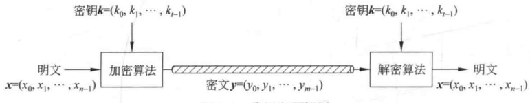

**图 3-1 分组密码框图**

通常取  $m=n$。若  $m>n$，则为有数据扩展的分组密码。若  $m<n$，则为有数据压缩的分组密码。在二元情况下，x 和 y 均为二元数字序列，它们的每个分量  $x_i, y_i \in \mathrm{GF}(2)$。下面主要讨论二元情况。设计的算法应满足下述要求：

（1）分组长度 n 要足够大，使分组代换字母表中的元素个数  ${2}^n$ 足够大，防止明文穷举攻击法奏效。DES、IDEA、FEAL 和 LOKI 等分组密码都采用  $n = 64$，在生日攻击下用  ${2}^{32}$ 组密文成功概率为  ${1}/{2}$，同时要求  ${2}^{32} \times 64\text{bit} = 2^{15}\text{Mbyte}$ 存储，故采用穷举攻击是不现实的。

（2）密钥量要足够大（即置换子集中的元素足够多），尽可能消除弱密钥并使所有密钥同等地好，以防止密钥穷举攻击奏效。但密钥又不能过长，以便于密钥的管理。DES采用56比特密钥，现在看来太短了，IDEA采用128比特密钥。

（3）由密钥确定置换的算法要足够复杂，充分实现明文与密钥的扩散和混淆，没有简单的关系可循，能抗击各种已知的攻击，如差分攻击和线性攻击；有高的非线性阶数，实现复杂的密码变换；使对手破译时除了用穷举法外，无其他捷径可循。

（4）加密和解密运算简单，易于软件和硬件高速实现。如将分组 n 划分为子段，每段长为 8、16 或者 32。在以软件实现时，应选用简单的运算，使作用于子段上的密码运算易于以标准处理器的基本运算，如加、乘、移位等实现，避免使用以软件难以实现的逐比特置换。为了便于硬件实现，加密和解密过程之间的差别应仅在于由秘密密钥所生成的密钥表不同而已。这样，加密和解密就可使用同一器件实现。设计的算法采用规则的模块结构，如多轮迭代等，以便于软件和 VLSI 快速实现。此外，差错传播和数据扩展要尽可能小。

（5）数据扩展尽可能小。一般无数据扩展，在采用同态置换和随机化加密技术时可引入数据扩展。

（6）差错传播尽可能小。

要实现上述几点要求并不容易。首先，要在理论上研究有效而可靠的设计方法，而后进行严格的安全性检验，并且要易于实现。

下面介绍设计分组密码的一些常用方法。

### 3.1.1 代换

如果明文和密文的分组长都为 n 比特，则明文的每一个分组都有  ${2}^{n}$ 个可能的取值。为使加密运算可逆（使解密运算可行），明文的每一个分组都应产生唯一的一个密文分组，这样的变换是可逆的，称明文分组到密文分组的可逆变换为代换。不同可逆变换的个数有  ${2}^{n}$ 个。

图3-2表示 n=4 的代换密码的一般结构，4比特输入产生16个可能输入状态中的一个，由代换结构将这一状态映射为16个可能输出状态中的一个，每一输出状态由4个密文比特表示。加密映射和解密映射可由代换表来定义，如表3-1所示。这种定义法是分组密码最常用的形式，能用于定义明文和密文之间的任何可逆映射。

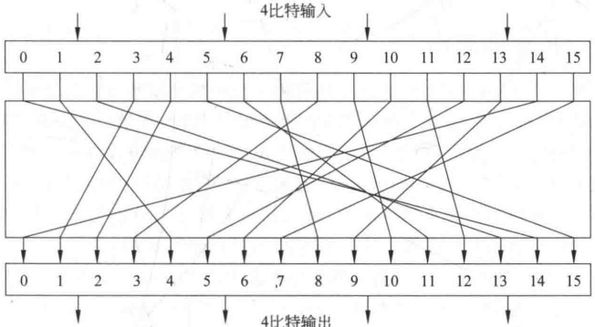

**图 3-2 代换结构**

**表3-1 与图3-2对应的代换表**

| 明文 | 密文 | 明文 | 密文 |
| --- | --- | --- | --- |
| 0000 | 1110 | 1000 | 0011 |
| 0001 | 0100 | 1001 | 1010 |
| 0010 | 1101 | 1010 | 0110 |
| 0011 | 0001 | 1011 | 1100 |
| 0100 | 0010 | 1100 | 0101 |
| 0101 | 1111 | 1101 | 1001 |
| 0110 | 1011 | 1110 | 0000 |
| 0111 | 1000 | 1111 | 0111 |

| 密文 | 明文 | 密文 | 明文 |
| --- | --- | --- | --- |
| 0000 | 1110 | 1000 | 0111 |
| 0001 | 0011 | 1001 | 1101 |
| 0010 | 0100 | 1010 | 1001 |
| 0011 | 1000 | 1011 | 0110 |
| 0100 | 0001 | 1100 | 1011 |
| 0101 | 1100 | 1101 | 0010 |
| 0110 | 1010 | 1110 | 0000 |
| 0111 | 1111 | 1111 | 0101 |

但这种代换结构在实用中还有一些问题需考虑。如果分组长度太小，如 n=4，系统则等价于古典的代换密码，容易通过对明文的统计分析而攻破。这个弱点不是代换结构固有的，只是因为分组长度太短。如果分组长度 n 足够大，而且从明文到密文可有任意可逆的代换，那么明文的统计特性将被隐藏而使以上的攻击不能奏效。

然而，从实现的角度来看，分组长度很大的可逆代换结构是不实际的。仍以表3-1为例，该表定义了n=4时从明文到密文的一个可逆映射，其中，第二列是每个明文分组对应的密文分组的值，可用来定义这个可逆映射。因此从本质上来说，第二列是从所有可能的映射中决定某一特定映射的密钥。在这个例子中，密钥需要64比特。一般，对n比特的代换结构，密钥的大小是 $n\times2^n$比特。如对64比特的分组，密钥大小应是 ${64}\times2^{64}=2^{70}\approx10^{21}$比特，因此难以处理。实际中常将n分成较小的段，例如可选 $n=r\cdot n_0$，其中，r和 $n_0$都是正整数，将设计n个变量的代换变为设计r个较小的子代换，而每个子代换只有 $n_0$个输入变量。一般 $n_0$都不太大，称每个子代换为代换盒，简称为S盒。例如DES中将输入为48比特、输出为32比特的代换用8个S盒来实现，每个S盒的输入端数仅为6比特，输出端数仅为4比特。

### 3.1.2 扩散和混淆

扩散和混淆是由 Shannon 提出的设计密码系统的两个基本方法，目的是抗击敌手对密码系统的统计分析。如果敌手知道明文的某些统计特性，如消息中不同字母出现的频率，或可能出现的特定单词或短语，而且这些统计特性以某种方式在密文中反映出来，敌手就有可能得出加密密钥或其一部分，或包含加密密钥的一个可能密钥集合。在 Shannon 称之为理想密码的密码系统中，密文的所有统计特性都与所使用的密钥独立。图 3-2 讨论的代换密码就是这样的一个密码系统，然而是不实用的。

所谓扩散，就是将明文的统计特性散布到密文中去，实现方式是使得密文中每一位由明文中多位产生。例如，对英文消息  $M=m_{1}m_{2}m_{3}\cdots$ 的加密操作

$$y_{n}=\operatorname{chr}(\sum_{i=1}^{k}\operatorname{ord}(m_{n+i})\pmod{26})$$

其中， $\mathrm{ord}(m_{i})$ 是求字母  $m_{i}$ 对应的序号， $\mathrm{chr}(i)$ 是求序号 i 对应的字母，密文字母  $y_{n}$ 是由明文中 k 个连续的字母相加而得。这时明文的统计特性将被散布到密文，因而每一字母在密文中出现的频率比在明文中出现的频率更接近于相等，双字母及多字母出现的频率也更接近于相等。在二元分组密码中，可对数据重复执行某个置换再对这一置换作用以一个函数，便可获得扩散。

分组密码在将明文分组依靠密钥变换到密文分组时，扩散的目的是使明文和密文之间的统计关系变得尽可能复杂，以使敌手无法得到密钥。混淆是使密文和密钥之间的统计关系变得尽可能复杂，以使敌手无法得到密钥。因此即使敌手能得到密文的一些统计关系，由于密钥和密文之间统计关系复杂化，敌手无法得到密钥。使用复杂的代换算法可得预期的混淆效果，而简单的线性代换函数得到的混淆效果不够理想。

扩散和混淆成功地实现了分组密码的本质属性，因而成为设计现代分组密码的基础。

### 3.1.3 Feistel 密码结构

很多分组密码的结构从本质上说都是基于一个称为 Feistel 网络的结构。Feistel 提出利用乘积密码可获得简单的代换密码，乘积密码指顺序地执行两个或多个基本密码系统，使得最后结果的密码强度高于每个基本密码系统产生的结果，Feistel 还提出了实现代换和置换的方法。其思想实际上是 Shannon 提出的利用乘积密码实现混淆和扩散思想的具体应用。

1. Feistel 加密结构

图 3-3 是 Feistel 网络示意图，加密算法的输入是分组长为 2w 的明文和一个密钥 K。将每组明文分成左右两半  $L_{0}$ 和  $R_{0}$，在进行完 n 轮迭代后，左右两半再合并到一起以产生密文分组。其第 i 轮迭代的输入为前轮输出的函数：

$$L_{i}=R_{i-1}$$

$$R_{i}=L_{i-1}\oplus F(R_{i-1},K_{i})$$

其中， $K_{i}$ 是第 i 轮用的子密钥，由加密密钥 K 得到。一般，各轮子密钥彼此不同而且与 K 也不同。

Feistel 网络中每轮结构都相同，每轮中右半数据被作用于轮函数 F 后，再与左半数据进行异或运算，这一过程就是上面介绍的代换。每轮轮函数的结构都相同，但以不同的子密钥  $K_{i}$ 作为参数。代换过程完成后，再交换左、右两半数据，这一过程称为置换。这种结构是 Shannon 提出的代换-置换网络 (Substitution-Permutation Network, SPN) 的特有形式。

Feistel 网络的实现与以下参数和特性有关：

（1）分组大小。分组越大则安全性越高，但加密速度就越慢。分组密码设计中最为普遍使用的分组大小是64比特。

（2）密钥大小。密钥越长则安全性越高，但加密速度就越慢。现在普遍认为64比特或更短的密钥是不安全的，通常使用128比特长的密钥。

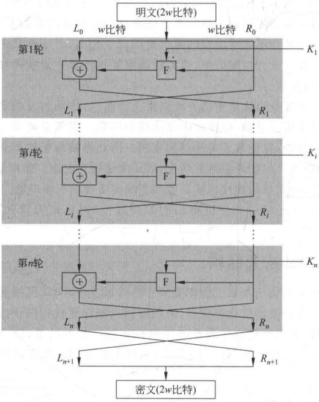

**图 3-3 Feistel 网络**

（3）轮数。单轮结构远不足以保证安全性，多轮结构可提供足够的安全性。典型地，轮数取为16。

（4）子密钥产生算法。该算法的复杂性越高，则密码分析的困难性就越大。

（5）轮函数。轮函数的复杂性越高，密码分析的困难性也越大。

在设计 Feistel 网络时，还要考虑以下两个问题：

（1）快速的软件实现。在很多情况下，算法是被镶嵌在应用程序中，因而无法用硬件实现。此时算法的执行速度是考虑的关键。

（2）算法容易分析。如果算法能被无疑义地解释清楚，就可容易地分析算法抵抗攻击的能力，有助于设计高强度的算法。

2. Feistel 解密结构

Feistel 解密过程本质上和加密过程是一样的，算法使用密文作为输入，但使用子密钥  $K_{i}$ 的次序与加密过程相反，即第一轮使用  $K_{n}$，第二轮使用  $K_{n-1}$，一直下去，最后一轮使用  $K_{1}$。这一特性保证了解密和加密可采用同一算法。

图 3-4 的左边表示 16 轮 Feistel 网络的加密过程，右边表示解密过程，加密过程由上而下，解密过程由下而上。为清楚起见，加密算法每轮的左右两半用  $LE_{i}$ 和  $RE_{i}$ 表示，解密算法每轮的左右两半用  $LD_{i}$ 和  $RD_{i}$ 表示。图 3-4 的右边还标出了解密过程中每一轮的中间值与左边加密过程中间值的对应关系，即加密过程第 i 轮的输出是  $\mathrm{LE}_{i} \parallel \mathrm{RE}_{i}$ （‖表示链接），解密过程第 16-i 轮相应的输入是  $\mathrm{RD}_{i} \parallel \mathrm{LD}_{i}$。

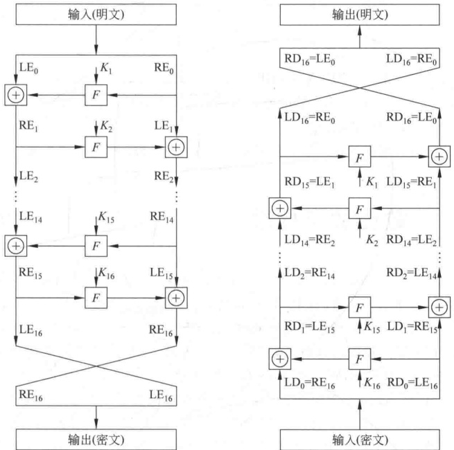

**图 3-4 Feistel 加解密过程**

加密过程的最后一轮执行完后，两半输出再经交换，因此密文是  $RE_{16} \parallel LE_{16}$。解密过程取以上密文作为同一算法的输入，即第一轮输入是  $RE_{16} \parallel LE_{16}$，等于加密过程第16轮两半输出交换后的结果。现在显示解密过程第一轮的输出等于加密过程第16轮输入左右两半的交换值。

在加密过程中：

$$LE_{16}=RE_{15}$$

$$\mathrm{RE}_{16}=\mathrm{LE}_{15}\oplus F(\mathrm{RE}_{15},K_{16})$$

在解密过程中：

$$\begin{aligned}\mathrm{LD}_{1}&=\mathrm{RD}_{0}=\mathrm{LE}_{16}=\mathrm{RE}_{15}\\\mathrm{RD}_{1}&=\mathrm{LD}_{0}\oplus F(\mathrm{RD}_{0},K_{16})=\mathrm{RE}_{16}\oplus F(\mathrm{RE}_{15},K_{16})\\&=\left[\mathrm{LE}_{15}\oplus F(\mathrm{RE}_{15},K_{16})\right]\oplus F(\mathrm{RE}_{15},K_{16})\\&=\mathrm{LE}_{15}\end{aligned}$$

所以解密过程第一轮的输出为  $\mathrm{LE}_{15} \parallel \mathrm{RE}_{15}$，等于加密过程第16轮输入左右两半交换后的结果。容易证明这种对应关系在16轮中每轮都成立。一般，加密过程的第i轮有：

$$LE_{i}=RE_{i-1}$$

$$\mathrm{RE}_{i}=\mathrm{LE}_{i-1}\oplus F(\mathrm{RE}_{i-1},K_{i})$$

因此

$$RE_{i-1}=LE_{i}$$

$$\mathrm{LE}_{i-1}=\mathrm{RE}_{i}\oplus F(\mathrm{RE}_{i-1},K_{i})=\mathrm{RE}_{i}\oplus F(\mathrm{LE}_{i},K_{i})$$

以上两式描述了加密过程中第i轮的输入与第i轮输出的函数关系，由此关系可得图3-4右边显示的 $LD_{i}$和 $RD_{i}$的取值关系。

最后可以看到，解密过程最后一轮的输出是  $RE_0 \parallel LE_0$，左右两半再经一次交换后即得最初的明文。

## 3.2 数据加密标准

DES(Data Encryption Standard)是迄今为止世界上最为广泛使用和流行的一种分组密码算法，它的分组长度为64比特，密钥长度为56比特，它是由美国IBM公司研制的，是早期的称为Lucifer密码的一种发展和修改。DES在1975年3月17日首次被公布在联邦记录中，在做了大量的公开讨论后于1977年1月15日被正式批准并作为美国联邦信息处理标准，即FIPS-46，同年7月15日开始生效。规定每隔5年由美国国家保密局(National Security Agency，NSA)作出评估，并重新批准它是否继续作为联邦加密标准。最后一次评估是在1994年1月，美国决定1998年12月以后不再使用DES。1997年，DESCHALL小组经过近4个月的努力，通过Internet搜索了 ${3}\times10^{16}$个密钥，找出了DES的密钥，恢复出了明文。1998年5月美国EFF(Electronics Frontier Foundation)宣布，他们将一台价值20万美元的计算机改装成的专用解密机，用56小时破译了56比特密钥的DES。美国国家标准和技术协会已征集并进行了几轮评估筛选，产生了称为AES(Advanced Encryption Standard)的新加密标准。尽管如此，DES对于推动密码理论的发展和应用起了重大作用，对于掌握分组密码的基本理论、设计思想和实际应用仍然有着重要的参考价值，下面是这一算法的描述。

### 3.2.1 DES 描述

图 3-5 是 DES 加密算法的框图，其中明文分组长为 64 比特，密钥长为 56 比特。图的左边是明文的处理过程，有 3 个阶段，首先是一个初始置换 IP，用于重排明文分组的 64 比特数据。然后是具有相同功能的 16 轮变换，每轮中都有置换和代换运算，第 16 轮变换的输出分为左右两半，并被交换次序。最后再经过一个逆初始置换 IP $^{-1}$（为 IP 的逆）从而产生 64 比特的密文。除初始置换和逆初始置换外，DES 的结构和图 3-3 所示的 Feistel 密码结构完全相同。

图3-5的右边是使用56比特密钥的方法。密钥首先通过一个置换函数，然后，对加密过程的每一轮，通过一个左循环移位和一个置换产生一个子密钥。其中每轮的置换都相同，但由于密钥被重复迭代，所以产生的每轮子密钥不相同。

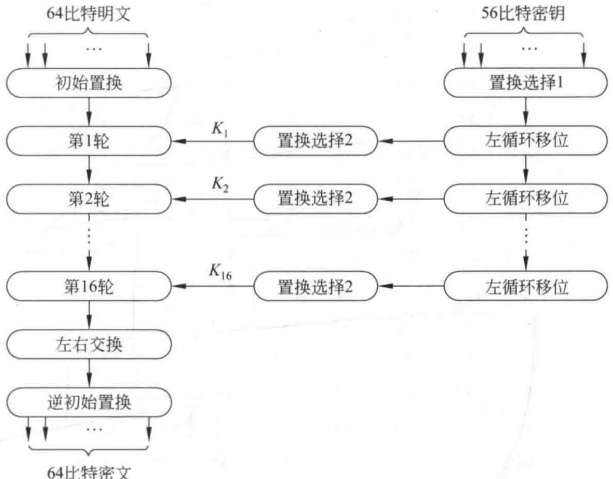

**图 3-5 DES 加密算法框图**

1. 初始置换

表3-2(a)和表3-2(b)分别给出了初始置换和逆初始置换的定义，为了显示这两个置换的确是彼此互逆的，考虑下面64比特的输入M。

**表 3-2 DES 的置换表**

**(a) 初始置换 IP**

| 58 | 50 | 42 | 34 | 26 | 18 | 10 | 2 |
| --- | --- | --- | --- | --- | --- | --- | --- |
| 60 | 52 | 44 | 36 | 28 | 20 | 12 | 4 |
| 62 | 54 | 46 | 38 | 30 | 22 | 14 | 6 |
| 64 | 56 | 48 | 40 | 32 | 24 | 16 | 8 |
| 57 | 49 | 41 | 33 | 25 | 17 | 9 | 1 |
| 59 | 51 | 43 | 35 | 27 | 19 | 11 | 3 |
| 61 | 53 | 45 | 37 | 29 | 21 | 13 | 5 |
| 63 | 55 | 47 | 39 | 31 | 23 | 15 | 7 |

**（b）逆初始置换 $IP^{-1}$**

**(c) 选择扩展运算 E**

| 40 | 8 | 48 | 16 | 56 | 24 | 64 | 32 |
| --- | --- | --- | --- | --- | --- | --- | --- |
| 39 | 7 | 47 | 15 | 55 | 23 | 63 | 31 |
| 38 | 6 | 46 | 14 | 54 | 22 | 62 | 30 |
| 37 | 5 | 45 | 13 | 53 | 21 | 61 | 29 |
| 36 | 4 | 44 | 12 | 52 | 20 | 60 | 28 |
| 35 | 3 | 43 | 11 | 51 | 19 | 59 | 27 |
| 34 | 2 | 42 | 10 | 50 | 18 | 58 | 26 |
| 33 | 1 | 41 | 9 | 49 | 17 | 57 | 25 |

**(d) 置换运算 P**

| 32 | 1 | 2 | 3 | 4 | 5 |
| --- | --- | --- | --- | --- | --- |
| 4 | 5 | 6 | 7 | 8 | 9 |
| 8 | 9 | 10 | 11 | 12 | 13 |
| 12 | 13 | 14 | 15 | 16 | 17 |
| 16 | 17 | 18 | 19 | 20 | 21 |
| 20 | 21 | 22 | 23 | 24 | 25 |
| 24 | 25 | 26 | 27 | 28 | 29 |
| 28 | 29 | 30 | 31 | 32 | 1 |

| 16 | 7 | 20 | 21 |
| --- | --- | --- | --- |
| 29 | 12 | 28 | 17 |
| 1 | 15 | 23 | 26 |
| 5 | 18 | 31 | 10 |
| 2 | 8 | 24 | 14 |
| 32 | 27 | 3 | 9 |
| 19 | 13 | 30 | 6 |
| 22 | 11 | 4 | 25 |

$$\begin{array}{cccc}M_{1}&M_{2}&M_{3}&M_{4}\\&M_{10}&M_{11}&M_{12}\\M_{17}&M_{18}&M_{19}&M_{20}\\M_{25}&M_{26}&M_{27}&M_{28}\\M_{33}&M_{34}&M_{35}&M_{36}\\M_{41}&M_{42}&M_{43}&M_{44}\\M_{49}&M_{50}&M_{51}&M_{52}\\M_{57}&M_{58}&M_{59}&M_{60}\\\end{array}\begin{array}{cccc}M_{5}&M_{6}&M_{7}&M_{8}\\M_{13}&M_{14}&M_{15}&M_{16}\\M_{21}&M_{22}&M_{23}&M_{24}\\M_{29}&M_{30}&M_{31}&M_{32}\\M_{37}&M_{38}&M_{39}&M_{40}\\M_{45}&M_{46}&M_{47}&M_{48}\\M_{53}&M_{54}&M_{55}&M_{56}\\M_{61}&M_{62}&M_{63}&M_{64}\\\end{array}$$

其中， $M_{i}$ 是二元数字。由表3-2(a)，得 X=IP(M) 为

$$\begin{aligned}&M_{58}&M_{50}&M_{42}&M_{34}&M_{26}&M_{18}&M_{10}&M_{2}\\&M_{60}&M_{52}&M_{44}&M_{36}&M_{28}&M_{20}&M_{12}&M_{4}\\&M_{62}&M_{54}&M_{46}&M_{38}&M_{30}&M_{22}&M_{14}&M_{6}\\&M_{64}&M_{56}&M_{48}&M_{40}&M_{32}&M_{24}&M_{16}&M_{8}\\&M_{57}&M_{49}&M_{41}&M_{33}&M_{25}&M_{17}&M_{9}&M_{1}\\&M_{59}&M_{51}&M_{43}&M_{35}&M_{27}&M_{19}&M_{11}&M_{3}\\&M_{61}&M_{53}&M_{45}&M_{37}&M_{29}&M_{21}&M_{13}&M_{5}\\&M_{63}&M_{55}&M_{47}&M_{39}&M_{31}&M_{23}&M_{15}&M_{7}\end{aligned}$$

如果再取逆初始置换  $Y=IP^{-1}(X)=IP^{-1}(IP(M))$，可以看出，M 各位的初始顺序将被恢复。

2. 轮结构

图 3-6 是 DES 加密算法的轮结构，首先看图的左半部分。将 64 比特的轮输入分为各为32比特的左、右两半，分别记为L和R。和Feistel网络一样，每轮变换可由以下公式表示：

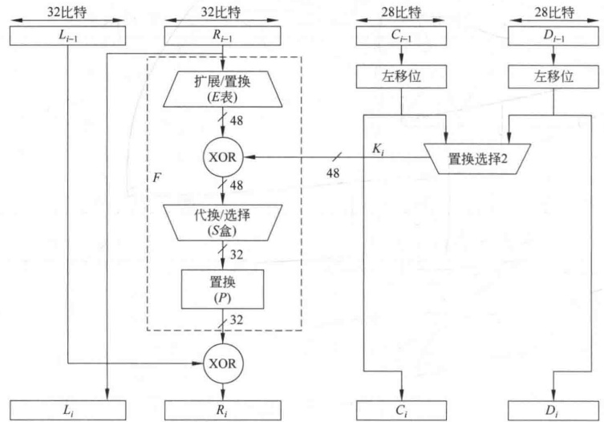

**图 3-6 DES 加密算法的轮结构**

$$L_{i}=R_{i-1}$$

$$\boldsymbol{R}_{i}=\boldsymbol{L}_{i-1}\oplus\boldsymbol{F}(\boldsymbol{R}_{i-1},\boldsymbol{K}_{i})$$

其中，轮密钥  $K_{i}$ 为 48 比特，函数  $F(R,K)$ 的计算如图 3-7 所示。轮输入的右半部分 R 为 32 比特，R 首先被扩展成 48 比特，扩展过程由表 3-2(c) 定义，其中将 R 的 16 个比特各重复一次。扩展后的 48 比特再与子密钥  $K_{i}$ 异或，然后再通过一个 S 盒，产生 32 比特的输出。该输出再经过一个由表 3-2(d) 定义的置换，产生的结果即为函数  $F(R,K)$ 的输出。

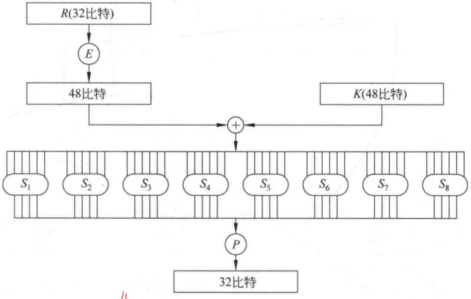

**图 3-7 函数  $F(R,K)$ 的计算过程**

F 中的代换由 8 个 S 盒组成，每个 S 盒的输入长为 6 比特、输出长为 4 比特，其变换关系由表 3-3 定义，每个 S 盒给出了 4 个代换（由一个表的 4 行给出）。

**表3-3 DES的S盒定义**

<table border=1 style='margin: auto; word-wrap: break-word;'><tr><td colspan="2">列 行</td><td style='text-align: center; word-wrap: break-word;'>0</td><td style='text-align: center; word-wrap: break-word;'>1</td><td style='text-align: center; word-wrap: break-word;'>2</td><td style='text-align: center; word-wrap: break-word;'>3</td><td style='text-align: center; word-wrap: break-word;'>4</td><td style='text-align: center; word-wrap: break-word;'>5</td><td style='text-align: center; word-wrap: break-word;'>6</td><td style='text-align: center; word-wrap: break-word;'>7</td><td style='text-align: center; word-wrap: break-word;'>8</td><td style='text-align: center; word-wrap: break-word;'>9</td><td style='text-align: center; word-wrap: break-word;'>10</td><td style='text-align: center; word-wrap: break-word;'>11</td><td style='text-align: center; word-wrap: break-word;'>12</td><td style='text-align: center; word-wrap: break-word;'>13</td><td style='text-align: center; word-wrap: break-word;'>14</td><td style='text-align: center; word-wrap: break-word;'>15</td></tr><tr><td rowspan="4">$S_1$</td><td style='text-align: center; word-wrap: break-word;'>0</td><td style='text-align: center; word-wrap: break-word;'>14</td><td style='text-align: center; word-wrap: break-word;'>4</td><td style='text-align: center; word-wrap: break-word;'>13</td><td style='text-align: center; word-wrap: break-word;'>1</td><td style='text-align: center; word-wrap: break-word;'>2</td><td style='text-align: center; word-wrap: break-word;'>15</td><td style='text-align: center; word-wrap: break-word;'>11</td><td style='text-align: center; word-wrap: break-word;'>8</td><td style='text-align: center; word-wrap: break-word;'>3</td><td style='text-align: center; word-wrap: break-word;'>10</td><td style='text-align: center; word-wrap: break-word;'>6</td><td style='text-align: center; word-wrap: break-word;'>12</td><td style='text-align: center; word-wrap: break-word;'>5</td><td style='text-align: center; word-wrap: break-word;'>9</td><td style='text-align: center; word-wrap: break-word;'>0</td><td style='text-align: center; word-wrap: break-word;'>7</td></tr><tr><td style='text-align: center; word-wrap: break-word;'>1</td><td style='text-align: center; word-wrap: break-word;'>0</td><td style='text-align: center; word-wrap: break-word;'>15</td><td style='text-align: center; word-wrap: break-word;'>7</td><td style='text-align: center; word-wrap: break-word;'>4</td><td style='text-align: center; word-wrap: break-word;'>14</td><td style='text-align: center; word-wrap: break-word;'>2</td><td style='text-align: center; word-wrap: break-word;'>13</td><td style='text-align: center; word-wrap: break-word;'>1</td><td style='text-align: center; word-wrap: break-word;'>10</td><td style='text-align: center; word-wrap: break-word;'>6</td><td style='text-align: center; word-wrap: break-word;'>12</td><td style='text-align: center; word-wrap: break-word;'>11</td><td style='text-align: center; word-wrap: break-word;'>9</td><td style='text-align: center; word-wrap: break-word;'>5</td><td style='text-align: center; word-wrap: break-word;'>3</td><td style='text-align: center; word-wrap: break-word;'>8</td></tr><tr><td style='text-align: center; word-wrap: break-word;'>2</td><td style='text-align: center; word-wrap: break-word;'>4</td><td style='text-align: center; word-wrap: break-word;'>1</td><td style='text-align: center; word-wrap: break-word;'>14</td><td style='text-align: center; word-wrap: break-word;'>8</td><td style='text-align: center; word-wrap: break-word;'>13</td><td style='text-align: center; word-wrap: break-word;'>6</td><td style='text-align: center; word-wrap: break-word;'>2</td><td style='text-align: center; word-wrap: break-word;'>11</td><td style='text-align: center; word-wrap: break-word;'>15</td><td style='text-align: center; word-wrap: break-word;'>12</td><td style='text-align: center; word-wrap: break-word;'>9</td><td style='text-align: center; word-wrap: break-word;'>7</td><td style='text-align: center; word-wrap: break-word;'>3</td><td style='text-align: center; word-wrap: break-word;'>10</td><td style='text-align: center; word-wrap: break-word;'>5</td><td style='text-align: center; word-wrap: break-word;'>0</td></tr><tr><td style='text-align: center; word-wrap: break-word;'>3</td><td style='text-align: center; word-wrap: break-word;'>15</td><td style='text-align: center; word-wrap: break-word;'>12</td><td style='text-align: center; word-wrap: break-word;'>8</td><td style='text-align: center; word-wrap: break-word;'>2</td><td style='text-align: center; word-wrap: break-word;'>4</td><td style='text-align: center; word-wrap: break-word;'>9</td><td style='text-align: center; word-wrap: break-word;'>1</td><td style='text-align: center; word-wrap: break-word;'>7</td><td style='text-align: center; word-wrap: break-word;'>5</td><td style='text-align: center; word-wrap: break-word;'>11</td><td style='text-align: center; word-wrap: break-word;'>3</td><td style='text-align: center; word-wrap: break-word;'>14</td><td style='text-align: center; word-wrap: break-word;'>10</td><td style='text-align: center; word-wrap: break-word;'>0</td><td style='text-align: center; word-wrap: break-word;'>6</td><td style='text-align: center; word-wrap: break-word;'>13</td></tr><tr><td rowspan="4">$S_2$</td><td style='text-align: center; word-wrap: break-word;'>0</td><td style='text-align: center; word-wrap: break-word;'>15</td><td style='text-align: center; word-wrap: break-word;'>1</td><td style='text-align: center; word-wrap: break-word;'>8</td><td style='text-align: center; word-wrap: break-word;'>14</td><td style='text-align: center; word-wrap: break-word;'>6</td><td style='text-align: center; word-wrap: break-word;'>11</td><td style='text-align: center; word-wrap: break-word;'>3</td><td style='text-align: center; word-wrap: break-word;'>4</td><td style='text-align: center; word-wrap: break-word;'>9</td><td style='text-align: center; word-wrap: break-word;'>7</td><td style='text-align: center; word-wrap: break-word;'>2</td><td style='text-align: center; word-wrap: break-word;'>13</td><td style='text-align: center; word-wrap: break-word;'>12</td><td style='text-align: center; word-wrap: break-word;'>0</td><td style='text-align: center; word-wrap: break-word;'>5</td><td style='text-align: center; word-wrap: break-word;'>10</td></tr><tr><td style='text-align: center; word-wrap: break-word;'>1</td><td style='text-align: center; word-wrap: break-word;'>3</td><td style='text-align: center; word-wrap: break-word;'>13</td><td style='text-align: center; word-wrap: break-word;'>4</td><td style='text-align: center; word-wrap: break-word;'>7</td><td style='text-align: center; word-wrap: break-word;'>15</td><td style='text-align: center; word-wrap: break-word;'>2</td><td style='text-align: center; word-wrap: break-word;'>8</td><td style='text-align: center; word-wrap: break-word;'>14</td><td style='text-align: center; word-wrap: break-word;'>12</td><td style='text-align: center; word-wrap: break-word;'>0</td><td style='text-align: center; word-wrap: break-word;'>1</td><td style='text-align: center; word-wrap: break-word;'>10</td><td style='text-align: center; word-wrap: break-word;'>6</td><td style='text-align: center; word-wrap: break-word;'>9</td><td style='text-align: center; word-wrap: break-word;'>11</td><td style='text-align: center; word-wrap: break-word;'>5</td></tr><tr><td style='text-align: center; word-wrap: break-word;'>2</td><td style='text-align: center; word-wrap: break-word;'>0</td><td style='text-align: center; word-wrap: break-word;'>14</td><td style='text-align: center; word-wrap: break-word;'>7</td><td style='text-align: center; word-wrap: break-word;'>11</td><td style='text-align: center; word-wrap: break-word;'>10</td><td style='text-align: center; word-wrap: break-word;'>4</td><td style='text-align: center; word-wrap: break-word;'>13</td><td style='text-align: center; word-wrap: break-word;'>1</td><td style='text-align: center; word-wrap: break-word;'>5</td><td style='text-align: center; word-wrap: break-word;'>8</td><td style='text-align: center; word-wrap: break-word;'>12</td><td style='text-align: center; word-wrap: break-word;'>6</td><td style='text-align: center; word-wrap: break-word;'>9</td><td style='text-align: center; word-wrap: break-word;'>3</td><td style='text-align: center; word-wrap: break-word;'>2</td><td style='text-align: center; word-wrap: break-word;'>15</td></tr><tr><td style='text-align: center; word-wrap: break-word;'>3</td><td style='text-align: center; word-wrap: break-word;'>13</td><td style='text-align: center; word-wrap: break-word;'>8</td><td style='text-align: center; word-wrap: break-word;'>10</td><td style='text-align: center; word-wrap: break-word;'>1</td><td style='text-align: center; word-wrap: break-word;'>3</td><td style='text-align: center; word-wrap: break-word;'>15</td><td style='text-align: center; word-wrap: break-word;'>4</td><td style='text-align: center; word-wrap: break-word;'>2</td><td style='text-align: center; word-wrap: break-word;'>11</td><td style='text-align: center; word-wrap: break-word;'>6</td><td style='text-align: center; word-wrap: break-word;'>7</td><td style='text-align: center; word-wrap: break-word;'>12</td><td style='text-align: center; word-wrap: break-word;'>0</td><td style='text-align: center; word-wrap: break-word;'>5</td><td style='text-align: center; word-wrap: break-word;'>14</td><td style='text-align: center; word-wrap: break-word;'>9</td></tr><tr><td rowspan="4">$S_3$</td><td style='text-align: center; word-wrap: break-word;'>0</td><td style='text-align: center; word-wrap: break-word;'>10</td><td style='text-align: center; word-wrap: break-word;'>0</td><td style='text-align: center; word-wrap: break-word;'>9</td><td style='text-align: center; word-wrap: break-word;'>14</td><td style='text-align: center; word-wrap: break-word;'>6</td><td style='text-align: center; word-wrap: break-word;'>3</td><td style='text-align: center; word-wrap: break-word;'>15</td><td style='text-align: center; word-wrap: break-word;'>5</td><td style='text-align: center; word-wrap: break-word;'>1</td><td style='text-align: center; word-wrap: break-word;'>13</td><td style='text-align: center; word-wrap: break-word;'>12</td><td style='text-align: center; word-wrap: break-word;'>7</td><td style='text-align: center; word-wrap: break-word;'>11</td><td style='text-align: center; word-wrap: break-word;'>4</td><td style='text-align: center; word-wrap: break-word;'>2</td><td style='text-align: center; word-wrap: break-word;'>8</td></tr><tr><td style='text-align: center; word-wrap: break-word;'>1</td><td style='text-align: center; word-wrap: break-word;'>13</td><td style='text-align: center; word-wrap: break-word;'>7</td><td style='text-align: center; word-wrap: break-word;'>0</td><td style='text-align: center; word-wrap: break-word;'>9</td><td style='text-align: center; word-wrap: break-word;'>3</td><td style='text-align: center; word-wrap: break-word;'>4</td><td style='text-align: center; word-wrap: break-word;'>6</td><td style='text-align: center; word-wrap: break-word;'>10</td><td style='text-align: center; word-wrap: break-word;'>2</td><td style='text-align: center; word-wrap: break-word;'>8</td><td style='text-align: center; word-wrap: break-word;'>5</td><td style='text-align: center; word-wrap: break-word;'>14</td><td style='text-align: center; word-wrap: break-word;'>12</td><td style='text-align: center; word-wrap: break-word;'>11</td><td style='text-align: center; word-wrap: break-word;'>15</td><td style='text-align: center; word-wrap: break-word;'>1</td></tr><tr><td style='text-align: center; word-wrap: break-word;'>2</td><td style='text-align: center; word-wrap: break-word;'>13</td><td style='text-align: center; word-wrap: break-word;'>6</td><td style='text-align: center; word-wrap: break-word;'>4</td><td style='text-align: center; word-wrap: break-word;'>9</td><td style='text-align: center; word-wrap: break-word;'>8</td><td style='text-align: center; word-wrap: break-word;'>15</td><td style='text-align: center; word-wrap: break-word;'>3</td><td style='text-align: center; word-wrap: break-word;'>0</td><td style='text-align: center; word-wrap: break-word;'>11</td><td style='text-align: center; word-wrap: break-word;'>1</td><td style='text-align: center; word-wrap: break-word;'>2</td><td style='text-align: center; word-wrap: break-word;'>12</td><td style='text-align: center; word-wrap: break-word;'>5</td><td style='text-align: center; word-wrap: break-word;'>10</td><td style='text-align: center; word-wrap: break-word;'>14</td><td style='text-align: center; word-wrap: break-word;'>7</td></tr><tr><td style='text-align: center; word-wrap: break-word;'>3</td><td style='text-align: center; word-wrap: break-word;'>1</td><td style='text-align: center; word-wrap: break-word;'>10</td><td style='text-align: center; word-wrap: break-word;'>13</td><td style='text-align: center; word-wrap: break-word;'>0</td><td style='text-align: center; word-wrap: break-word;'>6</td><td style='text-align: center; word-wrap: break-word;'>9</td><td style='text-align: center; word-wrap: break-word;'>8</td><td style='text-align: center; word-wrap: break-word;'>7</td><td style='text-align: center; word-wrap: break-word;'>4</td><td style='text-align: center; word-wrap: break-word;'>15</td><td style='text-align: center; word-wrap: break-word;'>14</td><td style='text-align: center; word-wrap: break-word;'>3</td><td style='text-align: center; word-wrap: break-word;'>11</td><td style='text-align: center; word-wrap: break-word;'>5</td><td style='text-align: center; word-wrap: break-word;'>2</td><td style='text-align: center; word-wrap: break-word;'>12</td></tr><tr><td colspan="2">行\n列</td><td style='text-align: center; word-wrap: break-word;'>0</td><td style='text-align: center; word-wrap: break-word;'>1</td><td style='text-align: center; word-wrap: break-word;'>2</td><td style='text-align: center; word-wrap: break-word;'>3</td><td style='text-align: center; word-wrap: break-word;'>4</td><td style='text-align: center; word-wrap: break-word;'>5</td><td style='text-align: center; word-wrap: break-word;'>6</td><td style='text-align: center; word-wrap: break-word;'>7</td><td style='text-align: center; word-wrap: break-word;'>8</td><td style='text-align: center; word-wrap: break-word;'>9</td><td style='text-align: center; word-wrap: break-word;'>10</td><td style='text-align: center; word-wrap: break-word;'>11</td><td style='text-align: center; word-wrap: break-word;'>12</td><td style='text-align: center; word-wrap: break-word;'>13</td><td style='text-align: center; word-wrap: break-word;'>14</td><td style='text-align: center; word-wrap: break-word;'>15</td></tr><tr><td rowspan="4">$S_4$</td><td style='text-align: center; word-wrap: break-word;'>0</td><td style='text-align: center; word-wrap: break-word;'>7</td><td style='text-align: center; word-wrap: break-word;'>13</td><td style='text-align: center; word-wrap: break-word;'>14</td><td style='text-align: center; word-wrap: break-word;'>3</td><td style='text-align: center; word-wrap: break-word;'>0</td><td style='text-align: center; word-wrap: break-word;'>6</td><td style='text-align: center; word-wrap: break-word;'>9</td><td style='text-align: center; word-wrap: break-word;'>10</td><td style='text-align: center; word-wrap: break-word;'>1</td><td style='text-align: center; word-wrap: break-word;'>2</td><td style='text-align: center; word-wrap: break-word;'>8</td><td style='text-align: center; word-wrap: break-word;'>5</td><td style='text-align: center; word-wrap: break-word;'>11</td><td style='text-align: center; word-wrap: break-word;'>12</td><td style='text-align: center; word-wrap: break-word;'>4</td><td style='text-align: center; word-wrap: break-word;'>15</td></tr><tr><td style='text-align: center; word-wrap: break-word;'>1</td><td style='text-align: center; word-wrap: break-word;'>13</td><td style='text-align: center; word-wrap: break-word;'>8</td><td style='text-align: center; word-wrap: break-word;'>11</td><td style='text-align: center; word-wrap: break-word;'>5</td><td style='text-align: center; word-wrap: break-word;'>6</td><td style='text-align: center; word-wrap: break-word;'>15</td><td style='text-align: center; word-wrap: break-word;'>0</td><td style='text-align: center; word-wrap: break-word;'>3</td><td style='text-align: center; word-wrap: break-word;'>4</td><td style='text-align: center; word-wrap: break-word;'>7</td><td style='text-align: center; word-wrap: break-word;'>2</td><td style='text-align: center; word-wrap: break-word;'>12</td><td style='text-align: center; word-wrap: break-word;'>1</td><td style='text-align: center; word-wrap: break-word;'>10</td><td style='text-align: center; word-wrap: break-word;'>14</td><td style='text-align: center; word-wrap: break-word;'>9</td></tr><tr><td style='text-align: center; word-wrap: break-word;'>2</td><td style='text-align: center; word-wrap: break-word;'>10</td><td style='text-align: center; word-wrap: break-word;'>6</td><td style='text-align: center; word-wrap: break-word;'>9</td><td style='text-align: center; word-wrap: break-word;'>0</td><td style='text-align: center; word-wrap: break-word;'>12</td><td style='text-align: center; word-wrap: break-word;'>11</td><td style='text-align: center; word-wrap: break-word;'>7</td><td style='text-align: center; word-wrap: break-word;'>13</td><td style='text-align: center; word-wrap: break-word;'>15</td><td style='text-align: center; word-wrap: break-word;'>1</td><td style='text-align: center; word-wrap: break-word;'>3</td><td style='text-align: center; word-wrap: break-word;'>14</td><td style='text-align: center; word-wrap: break-word;'>5</td><td style='text-align: center; word-wrap: break-word;'>2</td><td style='text-align: center; word-wrap: break-word;'>8</td><td style='text-align: center; word-wrap: break-word;'>4</td></tr><tr><td style='text-align: center; word-wrap: break-word;'>3</td><td style='text-align: center; word-wrap: break-word;'>3</td><td style='text-align: center; word-wrap: break-word;'>15</td><td style='text-align: center; word-wrap: break-word;'>0</td><td style='text-align: center; word-wrap: break-word;'>6</td><td style='text-align: center; word-wrap: break-word;'>10</td><td style='text-align: center; word-wrap: break-word;'>1</td><td style='text-align: center; word-wrap: break-word;'>13</td><td style='text-align: center; word-wrap: break-word;'>8</td><td style='text-align: center; word-wrap: break-word;'>9</td><td style='text-align: center; word-wrap: break-word;'>4</td><td style='text-align: center; word-wrap: break-word;'>5</td><td style='text-align: center; word-wrap: break-word;'>11</td><td style='text-align: center; word-wrap: break-word;'>12</td><td style='text-align: center; word-wrap: break-word;'>7</td><td style='text-align: center; word-wrap: break-word;'>2</td><td style='text-align: center; word-wrap: break-word;'>14</td></tr><tr><td rowspan="4">$S_5$</td><td style='text-align: center; word-wrap: break-word;'>0</td><td style='text-align: center; word-wrap: break-word;'>2</td><td style='text-align: center; word-wrap: break-word;'>12</td><td style='text-align: center; word-wrap: break-word;'>4</td><td style='text-align: center; word-wrap: break-word;'>1</td><td style='text-align: center; word-wrap: break-word;'>7</td><td style='text-align: center; word-wrap: break-word;'>10</td><td style='text-align: center; word-wrap: break-word;'>11</td><td style='text-align: center; word-wrap: break-word;'>6</td><td style='text-align: center; word-wrap: break-word;'>8</td><td style='text-align: center; word-wrap: break-word;'>5</td><td style='text-align: center; word-wrap: break-word;'>3</td><td style='text-align: center; word-wrap: break-word;'>15</td><td style='text-align: center; word-wrap: break-word;'>13</td><td style='text-align: center; word-wrap: break-word;'>0</td><td style='text-align: center; word-wrap: break-word;'>14</td><td style='text-align: center; word-wrap: break-word;'>9</td></tr><tr><td style='text-align: center; word-wrap: break-word;'>1</td><td style='text-align: center; word-wrap: break-word;'>14</td><td style='text-align: center; word-wrap: break-word;'>11</td><td style='text-align: center; word-wrap: break-word;'>2</td><td style='text-align: center; word-wrap: break-word;'>12</td><td style='text-align: center; word-wrap: break-word;'>4</td><td style='text-align: center; word-wrap: break-word;'>7</td><td style='text-align: center; word-wrap: break-word;'>13</td><td style='text-align: center; word-wrap: break-word;'>1</td><td style='text-align: center; word-wrap: break-word;'>5</td><td style='text-align: center; word-wrap: break-word;'>0</td><td style='text-align: center; word-wrap: break-word;'>15</td><td style='text-align: center; word-wrap: break-word;'>10</td><td style='text-align: center; word-wrap: break-word;'>3</td><td style='text-align: center; word-wrap: break-word;'>9</td><td style='text-align: center; word-wrap: break-word;'>8</td><td style='text-align: center; word-wrap: break-word;'>6</td></tr><tr><td style='text-align: center; word-wrap: break-word;'>2</td><td style='text-align: center; word-wrap: break-word;'>4</td><td style='text-align: center; word-wrap: break-word;'>2</td><td style='text-align: center; word-wrap: break-word;'>1</td><td style='text-align: center; word-wrap: break-word;'>11</td><td style='text-align: center; word-wrap: break-word;'>10</td><td style='text-align: center; word-wrap: break-word;'>13</td><td style='text-align: center; word-wrap: break-word;'>7</td><td style='text-align: center; word-wrap: break-word;'>8</td><td style='text-align: center; word-wrap: break-word;'>15</td><td style='text-align: center; word-wrap: break-word;'>9</td><td style='text-align: center; word-wrap: break-word;'>12</td><td style='text-align: center; word-wrap: break-word;'>5</td><td style='text-align: center; word-wrap: break-word;'>6</td><td style='text-align: center; word-wrap: break-word;'>3</td><td style='text-align: center; word-wrap: break-word;'>0</td><td style='text-align: center; word-wrap: break-word;'>14</td></tr><tr><td style='text-align: center; word-wrap: break-word;'>3</td><td style='text-align: center; word-wrap: break-word;'>11</td><td style='text-align: center; word-wrap: break-word;'>8</td><td style='text-align: center; word-wrap: break-word;'>12</td><td style='text-align: center; word-wrap: break-word;'>7</td><td style='text-align: center; word-wrap: break-word;'>1</td><td style='text-align: center; word-wrap: break-word;'>14</td><td style='text-align: center; word-wrap: break-word;'>2</td><td style='text-align: center; word-wrap: break-word;'>13</td><td style='text-align: center; word-wrap: break-word;'>6</td><td style='text-align: center; word-wrap: break-word;'>15</td><td style='text-align: center; word-wrap: break-word;'>0</td><td style='text-align: center; word-wrap: break-word;'>9</td><td style='text-align: center; word-wrap: break-word;'>10</td><td style='text-align: center; word-wrap: break-word;'>4</td><td style='text-align: center; word-wrap: break-word;'>5</td><td style='text-align: center; word-wrap: break-word;'>3</td></tr><tr><td rowspan="4">$S_6$</td><td style='text-align: center; word-wrap: break-word;'>0</td><td style='text-align: center; word-wrap: break-word;'>12</td><td style='text-align: center; word-wrap: break-word;'>1</td><td style='text-align: center; word-wrap: break-word;'>10</td><td style='text-align: center; word-wrap: break-word;'>15</td><td style='text-align: center; word-wrap: break-word;'>9</td><td style='text-align: center; word-wrap: break-word;'>2</td><td style='text-align: center; word-wrap: break-word;'>6</td><td style='text-align: center; word-wrap: break-word;'>8</td><td style='text-align: center; word-wrap: break-word;'>0</td><td style='text-align: center; word-wrap: break-word;'>13</td><td style='text-align: center; word-wrap: break-word;'>3</td><td style='text-align: center; word-wrap: break-word;'>4</td><td style='text-align: center; word-wrap: break-word;'>14</td><td style='text-align: center; word-wrap: break-word;'>7</td><td style='text-align: center; word-wrap: break-word;'>5</td><td style='text-align: center; word-wrap: break-word;'>11</td></tr><tr><td style='text-align: center; word-wrap: break-word;'>1</td><td style='text-align: center; word-wrap: break-word;'>10</td><td style='text-align: center; word-wrap: break-word;'>15</td><td style='text-align: center; word-wrap: break-word;'>4</td><td style='text-align: center; word-wrap: break-word;'>2</td><td style='text-align: center; word-wrap: break-word;'>7</td><td style='text-align: center; word-wrap: break-word;'>12</td><td style='text-align: center; word-wrap: break-word;'>9</td><td style='text-align: center; word-wrap: break-word;'>5</td><td style='text-align: center; word-wrap: break-word;'>6</td><td style='text-align: center; word-wrap: break-word;'>1</td><td style='text-align: center; word-wrap: break-word;'>13</td><td style='text-align: center; word-wrap: break-word;'>14</td><td style='text-align: center; word-wrap: break-word;'>0</td><td style='text-align: center; word-wrap: break-word;'>11</td><td style='text-align: center; word-wrap: break-word;'>3</td><td style='text-align: center; word-wrap: break-word;'>8</td></tr><tr><td style='text-align: center; word-wrap: break-word;'>2</td><td style='text-align: center; word-wrap: break-word;'>9</td><td style='text-align: center; word-wrap: break-word;'>14</td><td style='text-align: center; word-wrap: break-word;'>15</td><td style='text-align: center; word-wrap: break-word;'>5</td><td style='text-align: center; word-wrap: break-word;'>2</td><td style='text-align: center; word-wrap: break-word;'>8</td><td style='text-align: center; word-wrap: break-word;'>12</td><td style='text-align: center; word-wrap: break-word;'>3</td><td style='text-align: center; word-wrap: break-word;'>7</td><td style='text-align: center; word-wrap: break-word;'>0</td><td style='text-align: center; word-wrap: break-word;'>4</td><td style='text-align: center; word-wrap: break-word;'>10</td><td style='text-align: center; word-wrap: break-word;'>1</td><td style='text-align: center; word-wrap: break-word;'>13</td><td style='text-align: center; word-wrap: break-word;'>11</td><td style='text-align: center; word-wrap: break-word;'>6</td></tr><tr><td style='text-align: center; word-wrap: break-word;'>3</td><td style='text-align: center; word-wrap: break-word;'>4</td><td style='text-align: center; word-wrap: break-word;'>3</td><td style='text-align: center; word-wrap: break-word;'>2</td><td style='text-align: center; word-wrap: break-word;'>12</td><td style='text-align: center; word-wrap: break-word;'>9</td><td style='text-align: center; word-wrap: break-word;'>5</td><td style='text-align: center; word-wrap: break-word;'>15</td><td style='text-align: center; word-wrap: break-word;'>10</td><td style='text-align: center; word-wrap: break-word;'>11</td><td style='text-align: center; word-wrap: break-word;'>14</td><td style='text-align: center; word-wrap: break-word;'>1</td><td style='text-align: center; word-wrap: break-word;'>7</td><td style='text-align: center; word-wrap: break-word;'>6</td><td style='text-align: center; word-wrap: break-word;'>0</td><td style='text-align: center; word-wrap: break-word;'>8</td><td style='text-align: center; word-wrap: break-word;'>13</td></tr><tr><td rowspan="4">$S_7$</td><td style='text-align: center; word-wrap: break-word;'>0</td><td style='text-align: center; word-wrap: break-word;'>4</td><td style='text-align: center; word-wrap: break-word;'>11</td><td style='text-align: center; word-wrap: break-word;'>2</td><td style='text-align: center; word-wrap: break-word;'>14</td><td style='text-align: center; word-wrap: break-word;'>15</td><td style='text-align: center; word-wrap: break-word;'>0</td><td style='text-align: center; word-wrap: break-word;'>8</td><td style='text-align: center; word-wrap: break-word;'>13</td><td style='text-align: center; word-wrap: break-word;'>3</td><td style='text-align: center; word-wrap: break-word;'>12</td><td style='text-align: center; word-wrap: break-word;'>9</td><td style='text-align: center; word-wrap: break-word;'>7</td><td style='text-align: center; word-wrap: break-word;'>5</td><td style='text-align: center; word-wrap: break-word;'>10</td><td style='text-align: center; word-wrap: break-word;'>6</td><td style='text-align: center; word-wrap: break-word;'>1</td></tr><tr><td style='text-align: center; word-wrap: break-word;'>1</td><td style='text-align: center; word-wrap: break-word;'>13</td><td style='text-align: center; word-wrap: break-word;'>0</td><td style='text-align: center; word-wrap: break-word;'>11</td><td style='text-align: center; word-wrap: break-word;'>7</td><td style='text-align: center; word-wrap: break-word;'>4</td><td style='text-align: center; word-wrap: break-word;'>9</td><td style='text-align: center; word-wrap: break-word;'>1</td><td style='text-align: center; word-wrap: break-word;'>10</td><td style='text-align: center; word-wrap: break-word;'>14</td><td style='text-align: center; word-wrap: break-word;'>3</td><td style='text-align: center; word-wrap: break-word;'>5</td><td style='text-align: center; word-wrap: break-word;'>12</td><td style='text-align: center; word-wrap: break-word;'>2</td><td style='text-align: center; word-wrap: break-word;'>15</td><td style='text-align: center; word-wrap: break-word;'>8</td><td style='text-align: center; word-wrap: break-word;'>6</td></tr><tr><td style='text-align: center; word-wrap: break-word;'>2</td><td style='text-align: center; word-wrap: break-word;'>1</td><td style='text-align: center; word-wrap: break-word;'>4</td><td style='text-align: center; word-wrap: break-word;'>11</td><td style='text-align: center; word-wrap: break-word;'>13</td><td style='text-align: center; word-wrap: break-word;'>12</td><td style='text-align: center; word-wrap: break-word;'>3</td><td style='text-align: center; word-wrap: break-word;'>7</td><td style='text-align: center; word-wrap: break-word;'>14</td><td style='text-align: center; word-wrap: break-word;'>10</td><td style='text-align: center; word-wrap: break-word;'>15</td><td style='text-align: center; word-wrap: break-word;'>6</td><td style='text-align: center; word-wrap: break-word;'>8</td><td style='text-align: center; word-wrap: break-word;'>0</td><td style='text-align: center; word-wrap: break-word;'>5</td><td style='text-align: center; word-wrap: break-word;'>9</td><td style='text-align: center; word-wrap: break-word;'>2</td></tr><tr><td style='text-align: center; word-wrap: break-word;'>3</td><td style='text-align: center; word-wrap: break-word;'>6</td><td style='text-align: center; word-wrap: break-word;'>11</td><td style='text-align: center; word-wrap: break-word;'>13</td><td style='text-align: center; word-wrap: break-word;'>8</td><td style='text-align: center; word-wrap: break-word;'>1</td><td style='text-align: center; word-wrap: break-word;'>4</td><td style='text-align: center; word-wrap: break-word;'>10</td><td style='text-align: center; word-wrap: break-word;'>7</td><td style='text-align: center; word-wrap: break-word;'>9</td><td style='text-align: center; word-wrap: break-word;'>5</td><td style='text-align: center; word-wrap: break-word;'>0</td><td style='text-align: center; word-wrap: break-word;'>15</td><td style='text-align: center; word-wrap: break-word;'>14</td><td style='text-align: center; word-wrap: break-word;'>2</td><td style='text-align: center; word-wrap: break-word;'>3</td><td style='text-align: center; word-wrap: break-word;'>12</td></tr><tr><td rowspan="4">$S_8$</td><td style='text-align: center; word-wrap: break-word;'>0</td><td style='text-align: center; word-wrap: break-word;'>13</td><td style='text-align: center; word-wrap: break-word;'>2</td><td style='text-align: center; word-wrap: break-word;'>8</td><td style='text-align: center; word-wrap: break-word;'>4</td><td style='text-align: center; word-wrap: break-word;'>6</td><td style='text-align: center; word-wrap: break-word;'>15</td><td style='text-align: center; word-wrap: break-word;'>11</td><td style='text-align: center; word-wrap: break-word;'>1</td><td style='text-align: center; word-wrap: break-word;'>10</td><td style='text-align: center; word-wrap: break-word;'>9</td><td style='text-align: center; word-wrap: break-word;'>3</td><td style='text-align: center; word-wrap: break-word;'>14</td><td style='text-align: center; word-wrap: break-word;'>5</td><td style='text-align: center; word-wrap: break-word;'>0</td><td style='text-align: center; word-wrap: break-word;'>12</td><td style='text-align: center; word-wrap: break-word;'>7</td></tr><tr><td style='text-align: center; word-wrap: break-word;'>1</td><td style='text-align: center; word-wrap: break-word;'>1</td><td style='text-align: center; word-wrap: break-word;'>15</td><td style='text-align: center; word-wrap: break-word;'>13</td><td style='text-align: center; word-wrap: break-word;'>8</td><td style='text-align: center; word-wrap: break-word;'>10</td><td style='text-align: center; word-wrap: break-word;'>3</td><td style='text-align: center; word-wrap: break-word;'>7</td><td style='text-align: center; word-wrap: break-word;'>4</td><td style='text-align: center; word-wrap: break-word;'>12</td><td style='text-align: center; word-wrap: break-word;'>5</td><td style='text-align: center; word-wrap: break-word;'>6</td><td style='text-align: center; word-wrap: break-word;'>11</td><td style='text-align: center; word-wrap: break-word;'>0</td><td style='text-align: center; word-wrap: break-word;'>14</td><td style='text-align: center; word-wrap: break-word;'>9</td><td style='text-align: center; word-wrap: break-word;'>2</td></tr><tr><td style='text-align: center; word-wrap: break-word;'>2</td><td style='text-align: center; word-wrap: break-word;'>7</td><td style='text-align: center; word-wrap: break-word;'>11</td><td style='text-align: center; word-wrap: break-word;'>4</td><td style='text-align: center; word-wrap: break-word;'>1</td><td style='text-align: center; word-wrap: break-word;'>9</td><td style='text-align: center; word-wrap: break-word;'>12</td><td style='text-align: center; word-wrap: break-word;'>14</td><td style='text-align: center; word-wrap: break-word;'>2</td><td style='text-align: center; word-wrap: break-word;'>0</td><td style='text-align: center; word-wrap: break-word;'>6</td><td style='text-align: center; word-wrap: break-word;'>10</td><td style='text-align: center; word-wrap: break-word;'>13</td><td style='text-align: center; word-wrap: break-word;'>15</td><td style='text-align: center; word-wrap: break-word;'>3</td><td style='text-align: center; word-wrap: break-word;'>5</td><td style='text-align: center; word-wrap: break-word;'>8</td></tr><tr><td style='text-align: center; word-wrap: break-word;'>3</td><td style='text-align: center; word-wrap: break-word;'>2</td><td style='text-align: center; word-wrap: break-word;'>1</td><td style='text-align: center; word-wrap: break-word;'>14</td><td style='text-align: center; word-wrap: break-word;'>7</td><td style='text-align: center; word-wrap: break-word;'>4</td><td style='text-align: center; word-wrap: break-word;'>10</td><td style='text-align: center; word-wrap: break-word;'>8</td><td style='text-align: center; word-wrap: break-word;'>13</td><td style='text-align: center; word-wrap: break-word;'>15</td><td style='text-align: center; word-wrap: break-word;'>12</td><td style='text-align: center; word-wrap: break-word;'>9</td><td style='text-align: center; word-wrap: break-word;'>0</td><td style='text-align: center; word-wrap: break-word;'>3</td><td style='text-align: center; word-wrap: break-word;'>5</td><td style='text-align: center; word-wrap: break-word;'>6</td><td style='text-align: center; word-wrap: break-word;'>11</td></tr></table>

对每个盒  $S_{i}$，其6比特输入中，第1个和第6个比特形成一个2位二进制数，用来选择  $S_{i}$ 的4个代换中的一个。在6比特输入中，中间4比特用来选择列。行和列选定后，得到其交叉位置的十进制数，将这个数表示为4位二进制数即得这一S盒的输出。例如， $S_{1}$ 的输入为011001，行选为01（即第1行），列选为1100（即第12列），行列交叉位置的数为9，其4位二进制表示为1001，所以  $S_{1}$ 的输出为1001。

S 盒的每一行定义了一个可逆代换，图 3-2（在 3.1.1 节）表示  $S_{1}$ 第 0 行定义的代换。

3. 密钥的产生

再看图3-5和图3-6，输入算法的56比特密钥首先经过一个置换运算，该置换由表3-4(a)给出，然后将置换后的56比特分为各为28比特的左、右两半，分别记为 $C_{0}$和 $D_{0}$。在第i轮分别对 $C_{i-1}$和 $D_{i-1}$进行左循环移位，所移位数由表3-4(c)给出。移位后的结果作为下一轮求子密钥的输入，同时也作为置换选择2的输入。通过置换选择2产生的48比特的 $K_{i}$，即为本轮的子密钥，作为函数 $F(R_{i-1},K_{i})$的输入。其中，置换选择2由表3-4(b)定义。

**表 3-4 DES 密钥编排中使用的表**

**（a）置换选择1**

<table border=1 style='margin: auto; word-wrap: break-word;'><tr><td colspan="7">PC-1</td></tr><tr><td style='text-align: center; word-wrap: break-word;'>57</td><td style='text-align: center; word-wrap: break-word;'>49</td><td style='text-align: center; word-wrap: break-word;'>41</td><td style='text-align: center; word-wrap: break-word;'>33</td><td style='text-align: center; word-wrap: break-word;'>25</td><td style='text-align: center; word-wrap: break-word;'>17</td><td style='text-align: center; word-wrap: break-word;'>9</td></tr><tr><td style='text-align: center; word-wrap: break-word;'>1</td><td style='text-align: center; word-wrap: break-word;'>58</td><td style='text-align: center; word-wrap: break-word;'>50</td><td style='text-align: center; word-wrap: break-word;'>42</td><td style='text-align: center; word-wrap: break-word;'>34</td><td style='text-align: center; word-wrap: break-word;'>26</td><td style='text-align: center; word-wrap: break-word;'>18</td></tr><tr><td style='text-align: center; word-wrap: break-word;'>10</td><td style='text-align: center; word-wrap: break-word;'>2</td><td style='text-align: center; word-wrap: break-word;'>59</td><td style='text-align: center; word-wrap: break-word;'>51</td><td style='text-align: center; word-wrap: break-word;'>43</td><td style='text-align: center; word-wrap: break-word;'>35</td><td style='text-align: center; word-wrap: break-word;'>27</td></tr><tr><td style='text-align: center; word-wrap: break-word;'>19</td><td style='text-align: center; word-wrap: break-word;'>11</td><td style='text-align: center; word-wrap: break-word;'>3</td><td style='text-align: center; word-wrap: break-word;'>60</td><td style='text-align: center; word-wrap: break-word;'>52</td><td style='text-align: center; word-wrap: break-word;'>44</td><td style='text-align: center; word-wrap: break-word;'>36</td></tr><tr><td style='text-align: center; word-wrap: break-word;'>63</td><td style='text-align: center; word-wrap: break-word;'>55</td><td style='text-align: center; word-wrap: break-word;'>47</td><td style='text-align: center; word-wrap: break-word;'>39</td><td style='text-align: center; word-wrap: break-word;'>31</td><td style='text-align: center; word-wrap: break-word;'>23</td><td style='text-align: center; word-wrap: break-word;'>15</td></tr><tr><td style='text-align: center; word-wrap: break-word;'>7</td><td style='text-align: center; word-wrap: break-word;'>62</td><td style='text-align: center; word-wrap: break-word;'>54</td><td style='text-align: center; word-wrap: break-word;'>46</td><td style='text-align: center; word-wrap: break-word;'>38</td><td style='text-align: center; word-wrap: break-word;'>30</td><td style='text-align: center; word-wrap: break-word;'>22</td></tr><tr><td style='text-align: center; word-wrap: break-word;'>14</td><td style='text-align: center; word-wrap: break-word;'>6</td><td style='text-align: center; word-wrap: break-word;'>61</td><td style='text-align: center; word-wrap: break-word;'>53</td><td style='text-align: center; word-wrap: break-word;'>45</td><td style='text-align: center; word-wrap: break-word;'>37</td><td style='text-align: center; word-wrap: break-word;'>29</td></tr><tr><td style='text-align: center; word-wrap: break-word;'>21</td><td style='text-align: center; word-wrap: break-word;'>13</td><td style='text-align: center; word-wrap: break-word;'>5</td><td style='text-align: center; word-wrap: break-word;'>28</td><td style='text-align: center; word-wrap: break-word;'>20</td><td style='text-align: center; word-wrap: break-word;'>12</td><td style='text-align: center; word-wrap: break-word;'>4</td></tr></table>

**（b）置换选择2**

<table border=1 style='margin: auto; word-wrap: break-word;'><tr><td colspan="6">PC-2</td></tr><tr><td style='text-align: center; word-wrap: break-word;'>14</td><td style='text-align: center; word-wrap: break-word;'>17</td><td style='text-align: center; word-wrap: break-word;'>11</td><td style='text-align: center; word-wrap: break-word;'>24</td><td style='text-align: center; word-wrap: break-word;'>1</td><td style='text-align: center; word-wrap: break-word;'>5</td></tr><tr><td style='text-align: center; word-wrap: break-word;'>3</td><td style='text-align: center; word-wrap: break-word;'>28</td><td style='text-align: center; word-wrap: break-word;'>15</td><td style='text-align: center; word-wrap: break-word;'>6</td><td style='text-align: center; word-wrap: break-word;'>21</td><td style='text-align: center; word-wrap: break-word;'>10</td></tr><tr><td style='text-align: center; word-wrap: break-word;'>23</td><td style='text-align: center; word-wrap: break-word;'>19</td><td style='text-align: center; word-wrap: break-word;'>12</td><td style='text-align: center; word-wrap: break-word;'>4</td><td style='text-align: center; word-wrap: break-word;'>26</td><td style='text-align: center; word-wrap: break-word;'>8</td></tr><tr><td style='text-align: center; word-wrap: break-word;'>16</td><td style='text-align: center; word-wrap: break-word;'>7</td><td style='text-align: center; word-wrap: break-word;'>27</td><td style='text-align: center; word-wrap: break-word;'>20</td><td style='text-align: center; word-wrap: break-word;'>13</td><td style='text-align: center; word-wrap: break-word;'>2</td></tr><tr><td style='text-align: center; word-wrap: break-word;'>41</td><td style='text-align: center; word-wrap: break-word;'>52</td><td style='text-align: center; word-wrap: break-word;'>31</td><td style='text-align: center; word-wrap: break-word;'>37</td><td style='text-align: center; word-wrap: break-word;'>47</td><td style='text-align: center; word-wrap: break-word;'>55</td></tr><tr><td style='text-align: center; word-wrap: break-word;'>30</td><td style='text-align: center; word-wrap: break-word;'>40</td><td style='text-align: center; word-wrap: break-word;'>51</td><td style='text-align: center; word-wrap: break-word;'>45</td><td style='text-align: center; word-wrap: break-word;'>33</td><td style='text-align: center; word-wrap: break-word;'>48</td></tr><tr><td style='text-align: center; word-wrap: break-word;'>44</td><td style='text-align: center; word-wrap: break-word;'>49</td><td style='text-align: center; word-wrap: break-word;'>39</td><td style='text-align: center; word-wrap: break-word;'>56</td><td style='text-align: center; word-wrap: break-word;'>34</td><td style='text-align: center; word-wrap: break-word;'>53</td></tr><tr><td style='text-align: center; word-wrap: break-word;'>46</td><td style='text-align: center; word-wrap: break-word;'>42</td><td style='text-align: center; word-wrap: break-word;'>50</td><td style='text-align: center; word-wrap: break-word;'>36</td><td style='text-align: center; word-wrap: break-word;'>29</td><td style='text-align: center; word-wrap: break-word;'>32</td></tr></table>

**（c）左循环移位位数**

| 轮数 | 1 | 2 | 3 | 4 | 5 | 6 | 7 | 8 | 9 | 10 | 11 | 12 | 13 | 14 | 15 | 16 |
| --- | --- | --- | --- | --- | --- | --- | --- | --- | --- | --- | --- | --- | --- | --- | --- | --- |
| 位数 | 1 | 1 | 2 | 2 | 2 | 2 | 2 | 2 | 1 | 2 | 2 | 2 | 2 | 2 | 2 | 1 |

4. 解密

和 Feistel 密码一样，DES 的解密和加密使用同一算法，但子密钥使用的顺序相反。

### 3.2.2 二重 DES

为了提高 DES 的安全性，并利用实现 DES 的现有软硬件，可将 DES 算法在多密钥下多重使用。

二重 DES 是多重使用 DES 时最简单的形式，如图 3-8 所示。其中，明文为 P，两个加密密钥为  $K_{1}$ 和  $K_{2}$，密文为

$$C=E_{K_{2}}\left[E_{K_{1}}\left[P\right]\right]$$

解密时，以相反顺序使用两个密钥：

$$P=D_{K_{1}}\left[D_{K_{2}}\left[C\right]\right]$$

因此，二重 DES 所用密钥长度为 112 比特，强度极大增加。然而，如果对任意两个密钥  $K_{1}$ 和  $K_{2}$，能够找出另一密钥  $K_{3}$，使得

$$E_{K_{2}}\left[E_{K_{1}}\left[P\right]\right]=E_{K_{3}}\left[P\right]$$

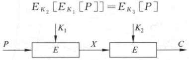

**(a) 加密**

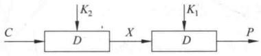

**(b) 解密**

**图 3-8 二重 DES**

那么，二重 DES 以及多重 DES 都没有意义，因为它们与 56 比特密钥的单重 DES 等价。

但上式对 DES 并不成立。将 DES 加密过程 64 比特分组到 64 比特分组的映射看作一个置换，如果考虑  ${2}^{64}$ 个所有可能的输入分组，则给定密钥后，DES 的加密将把每个输入分组映射到一个唯一的输出分组。否则，如果有两个输入分组被映射到同一分组，则解密过程就无法实施。对  ${2}^{64}$ 个输入分组，总映射个数为  $(2^{64})! > (10^{10^{20}})$。

另一方面，对每个不同的密钥，DES 都定义了一个映射，总映射数为  ${2}^{56}<10^{17}$

因此，可假定用两个不同的密钥两次使用 DES，可得一个新映射，而且这一新映射不出现在单重 DES 定义的映射中。这一假定已于 1992 年被证明。所以使用二重 DES 产生的映射不会等价于单重 DES 加密。但对二重 DES 有以下一种称为中途相遇攻击的攻击方案，这种攻击不依赖于 DES 的任何特性，因而可用于攻击任何分组密码。其基本思想如下：

如果有

$$C=E_{K_{2}}\left[E_{K_{1}}\left[P\right]\right]$$

那么

$$X=E_{K_{1}}\left[P\right]=D_{K_{2}}\left[C\right]$$

如果已知一个明文密文对 $(P,C)$，攻击的实施可如下进行：首先，用 ${2}^{56}$个所有可能的 $K_{1}$对P加密，将加密结果存入一个表中并对该表按X排序，然后用 ${2}^{56}$个所有可能的 $K_{2}$对C解密，在上述表中查找与C解密结果相匹配的项，如果找到，则记下相应的 $K_{1}$和 $K_{2}$。最后再用一个新的明文密文对 $(P^{\prime},C^{\prime})$检验上面找到的 $K_{1}$和 $K_{2}$，用 $K_{1}$和 $K_{2}$对 $P^{\prime}$两次加密，若结果等于 $C^{\prime}$，就可确定 $K_{1}$和 $K_{2}$是所要找的密钥。

对已知的明文 P，二重 DES 能产生  ${2}^{64}$ 个可能的密文。而可能的密钥个数为  ${2}^{112}$，所以平均来说，对一个已知的明文，有  ${2}^{112}/{2}^{64}={2}^{48}$ 个密钥可产生已知的密文。而再经过另外一对明文密文的检验，误报率将下降到  ${2}^{48-64}={2}^{-16}$。所以在实施中途相遇攻击时，如果已知两个明文密文对，则找到正确密钥的概率为  ${1}-2^{-16}$。

### 3.2.3 两个密钥的三重 DES

抵抗中途相遇攻击的一种方法是使用3个不同的密钥做3次加密，从而可使已知明文攻击的代价增加到 ${2}^{112}$。然而，这样又会使密钥长度增加到 ${56}\times3=168$比特，因而过于笨重。一种实用的方法是仅使用两个密钥做三次加密，实现方式为加密—解密—加密，简记为EDE(Encrypt-Decrypt-Encrypt)，如图3-9所示，即：

$$C=E_{K_{1}}\left[D_{K_{2}}\left[E_{K_{1}}\left[P\right]\right]\right]$$

第2步解密的目的仅在于使得用户可对一重DES加密的数据解密。

此方案已在密钥管理标准 ANS X.917 和 ISO 8732 中被采用。

### 3.2.4 3个密钥的三重DES

3 个密钥的三重 DES 密钥长度为 168 比特，加密方式为

$$C=E_{K_{3}}\left[D_{K_{2}}\left[E_{K_{1}}\left[P\right]\right]\right]$$

令  $K_{3}=K_{2}$ 或  $K_{1}=K_{2}$，则变为一重 DES。

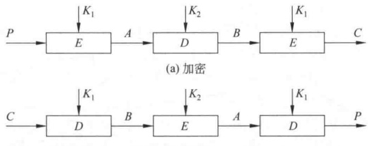

**(a) 加密**

**(b) 解密**

**图 3-9 两个密钥的三重 DES**

3 个密钥的三重 DES 已在因特网的许多应用（如 PGP 和 S/MIME）中被采用。

## 3.3 差分密码分析与线性密码分析

### 3.3.1 差分密码分析

差分密码分析是迄今已知的攻击迭代密码最有效的方法之一，其基本思想是：通过分析明文对的差值对密文对的差值的影响来恢复某些密钥比特。

对分组长度为 n 的 r 轮迭代密码，两个 n 比特串  $Y_{i}$ 和  $Y_{i}^{*}$ 的差分定义为

$$\Delta Y_{i}=Y_{i}\otimes Y_{i}^{*-1}$$

其中， $^{\otimes}$表示 n 比特串集上的一个特定群运算， $Y_{i}^{*}{}^{-1}$表示  $Y_{i}^{*}$在此群中的逆元。

由加密对可得差分序列：

$$\triangle Y_{0},\triangle Y_{1},\cdots,\triangle Y_{r}$$

其中， $Y_{0}$ 和  $Y_{0}^{*}$ 是明文对， $Y_{i}$ 和  $Y_{i}^{*}(1 \leqslant i \leqslant r)$ 是第 i 轮的输出，它们同时也是第  $i+1$ 轮的输入。第 i 轮的子密钥记为  $K_{i}$，F 是轮函数，且  $Y_{i}=F(Y_{i-1},K_{i})$。

定义 3-1 r-轮特征(r-round characteristic) $\Omega$ 是一个差分序列：

$$\alpha_{0},\alpha_{1},\cdots,\alpha_{r}$$

其中， $\alpha_{0}$是明文对 $Y_{0}$和 $Y_{0}^{*}$的差分， $\alpha_{i}(1\leqslant i\leqslant r)$是第i轮输出 $Y_{i}$和 $Y_{i}^{*}$的差分。

定义 3-2 在 r-轮特征  $\Omega = \alpha_{0}, \alpha_{1}, \cdots, \alpha_{r}$ 中，定义

$$p_{i}^{\alpha}=P\left(\Delta F(Y)=\alpha_{i}\mid\Delta Y=\alpha_{i-1}\right)$$

即  $p_{i}^{\alpha}$ 表示在输入差分为  $\alpha_{i-1}$ 的条件下，轮函数 F 的输出差分为  $\alpha_{i}$ 的概率。

定义 3-3  $r$-轮特征  $\Omega = \alpha_{0}, \alpha_{1}, \cdots, \alpha_{r}$ 的概率  $p^{\alpha}$ 定义为

$$p^{a}=\prod_{i=1}^{r}p_{i}^{a}$$

对 r-轮迭代密码的差分密码分析可综述为如下的算法：

（1）找出一个 $(r-1)$-轮特征 $\Omega(r-1)=\alpha_{0},\alpha_{1},\cdots,\alpha_{r-1}$，使得它的概率达到最大或几乎最大。

（2）均匀随机地选择明文 $Y_{0}$并计算 $Y_{0}^{*}$，使得 $Y_{0}$和 $Y_{0}^{*}$的差分为 $\alpha_{0}$，找出 $Y_{0}$和 $Y_{0}^{*}$在实际密钥加密下所得的密文  $Y_{r}$ 和  $Y_{r}^{*}$。若最后一轮的子密钥  $K_{r}$（或  $K_{r}$ 的部分比特）有  ${2}^{m}$ 个可能值  $K_{r}^{j}(1 \leqslant j \leqslant 2^{m})$，设置相应的  ${2}^{m}$ 个计数器  $\Lambda_{j}(1 \leqslant j \leqslant 2^{m})$；用每个  $K_{r}^{j}$ 解密密文  $Y_{r}$ 和  $Y_{r}^{*}$，得到  $Y_{r-1}$ 和  $Y_{r-1}^{*}$，如果  $Y_{r-1}$ 和  $Y_{r-1}^{*}$ 的差分是  $\alpha_{r-1}$，则给相应的计数器  $\Lambda_{j}$ 加 1。

（3）重复步骤（2），直到一个或几个计数器的值明显高于其他计数器的值，输出它们对应的子密钥（或部分比特）。

一种攻击的复杂度可以分为两部分：数据复杂度和处理复杂度。数据复杂度是实施该攻击所需输入的数据量；而处理复杂度是处理这些数据所需的计算量。这两部分主要用来刻画该攻击的复杂度。

差分密码分析的数据复杂度两倍于成对加密所需的选择明文对 $(Y_0, Y_0^*)$的个数。差分密码分析的处理复杂度是从 $(\Delta Y_{r-1}, Y_r, Y_r^*)$找出子密钥 $K_r$（或 $K_r$的部分比特）的计算量，它实际上与 $r$无关，而且由于轮函数是弱的，所以此计算量在大多数情况下相对较小。因此，差分密码分析的复杂度取决于它的数据复杂度。

### 3.3.2 线性密码分析

线性密码分析是对迭代密码的一种已知明文攻击，它利用的是密码算法中的“不平衡（有效）的线性逼近”。

设明文分组长度和密文分组长度都为 $n$ 比特，密钥分组长度为 $m$ 比特。记明文分组为 $P[1], P[2], \cdots, P[n]$，密文分组为 $C[1], C[2], \cdots, C[n]$，密钥分组为 $K[1], K[2], \cdots, K[m]$。定义 $A[i, j, \cdots, k] = A[i] \oplus A[j] \oplus \cdots \oplus A[k]$。

线性密码分析的目标就是找出以下形式的有效线性方程：

$$P\left[i_{1},i_{2},\cdots,i_{a}\right]\oplus C\left[j_{1},j_{2},\cdots,j_{b}\right]=K\left[k_{1},k_{2},\cdots,k_{c}\right]$$

其中， ${1} \leqslant a \leqslant n, 1 \leqslant b \leqslant n, 1 \leqslant c \leqslant m$

如果方程成立的概率  $p \neq \frac{1}{2}$，则称该方程是有效的线性逼近。如果  $\left| p - \frac{1}{2} \right|$ 是最大的，则称该方程是最有效的线性逼近。

设 N 表示明文数，T 是使方程左边为 0 的明文数。如果  $T > \frac{N}{2}$，则令：

$$K\left[k_{1},k_{2},\cdots,k_{c}\right]=\left\{\begin{aligned}&0,&p>\frac{1}{2}\\ &1,&p<\frac{1}{2}\end{aligned}\right.$$

如果  $T < \frac{N}{2}$，则令：

$$K\left[k_{1},k_{2},\cdots,k_{c}\right]=\left\{\begin{aligned}&0,&p<\frac{1}{2}\\ &1,&p>\frac{1}{2}\end{aligned}\right.$$

从而可得关于密钥比特的一个线性方程。对不同的明文密文对重复以上过程，可得关于密钥的一组线性方程，从而确定出密钥。

图3-10中，明文由分组长为64比特的分组序列 $P_{1}, P_{2}, \cdots, P_{N}$ 构成，相应的密文分组序列是 $C_{1}, C_{2}, \cdots, C_{N}$。

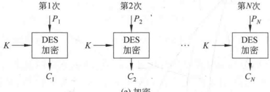

**(a) 加密**

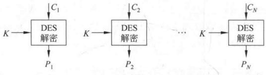

**(b) 解密**

**图 3-10 ECB 模式示意图**

ECB 在用于短数据（如加密密钥）时非常理想，因此如果需要安全地传递 DES 密钥，ECB 是最合适的模式。

ECB 的最大特性是若同一明文分组在消息中重复出现，则产生的密文分组也相同。

ECB 用于长消息时可能不够安全，如果消息有固定结构，密码分析者有可能找出这种关系。例如，如果已知消息总是以某个预定义字段开始，那么分析者就可能得到很多明文密文对。如果消息有重复的元素而重复的周期是 64 的倍数，那么密码分析者就能够识别这些元素。以上这些特性都有助于密码分析者，有可能为其提供对分组的代换或重排的机会。

### 3.4.2 密码分组链接模式

为了解决 ECB 的安全缺陷，可以让重复的明文分组产生不同的密文分组，密码分组链接（Cipher Block Chaining，CBC）模式就可满足这一要求。

图3-11是CBC模式的示意图，它一次对一个明文分组加密，每次加密使用同一密钥，加密算法的输入是当前明文分组和前一次密文分组的异或，因此加密算法的输入不会显示出与这次的明文分组之间的固定关系，所以重复的明文分组不会在密文中暴露出这种重复关系。

解密时，每一个密文分组被解密后，再与前一个密文分组异或，即：

$$\begin{aligned}D_{K}\left[C_{n}\right]\oplus C_{n-1}&=D_{K}\left[E_{K}\left[C_{n-1}\oplus P_{n}\right]\right]\oplus C_{n-1}\\&=C_{n-1}\oplus P_{n}\oplus C_{n-1}=P_{n}\quad( 设 C_{n}=E_{K}\left[C_{n-1}\oplus P_{n}\right])\end{aligned}$$

因而产生出明文分组。

在产生第一个密文分组时，需要有一个初始向量 IV 与第一个明文分组异或。解密时，IV 和解密算法对第一个密文分组的输出进行异或以恢复第一个明文分组。

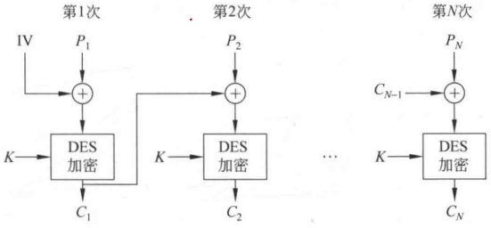

**(a) 加密**

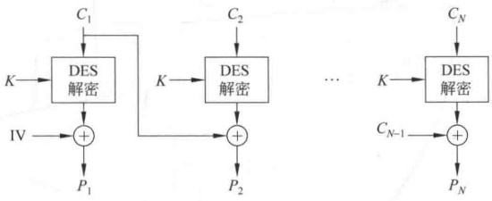

**(b) 解密**

**图 3-11 CBC 模式示意图**

IV 对于收发双方都应是已知的，为使安全性最高，IV 应像密钥一样被保护，可使用 ECB 加密模式来发送 IV。保护 IV 的原因如下：如果敌手能欺骗接收方使用不同的 IV 值，敌手就能够在明文的第一个分组中插入自己选择的比特值，这是因为：

$$C_{1}=E_{K}\left[\mathrm{IV}\bigoplus P_{1}\right]$$

$$P_{1}=\mathrm{IV}\oplus D_{K}[C_{1}]$$

用  $X(i)$ 表示 64 比特分组 X 的第 i 个比特，那么  $P_{1}(i)=\mathrm{IV}(i)\oplus D_{K}[C_{1}](i)$，由异或的性质得：

$$P_{1}\left(i\right)^{\prime}=\mathrm{IV}\left(i\right)^{\prime}\oplus D_{K}\left[C_{1}\right](i)$$

其中，撇号表示比特补。上式意味着如果敌手篡改了 IV 中的某些比特，则接收方收到的  $P_{1}$ 中相应的比特也发生变化。

由于 CBC 模式的链接机制，CBC 模式对加密长于 64 比特的消息非常合适。

CBC 模式除能够获得保密性外，还能用于认证。

### 3.4.3 密码反馈模式

如上所述，DES 是分组长为 64 比特的分组密码，但利用密码反馈（Cipher FeedBack，CFB）模式或 OFB 模式可将 DES 转换为流密码。流密码不需要对消息填充，而且运行是实时的。因此如果传送字母流，可使用流密码对每个字母直接加密并传送。

流密码具有密文和明文一样长这一性质，因此，如果需要发送的每个字符长为8比特，就应使用8比特密钥来加密每个字符。如果密钥长超过8比特，则造成浪费。

图3-12是CFB模式示意图，设传送的每个单元（如一个字符）是j比特长，通常取j=8，与CBC模式一样，明文单元被链接在一起，使得密文是前面所有明文的函数。

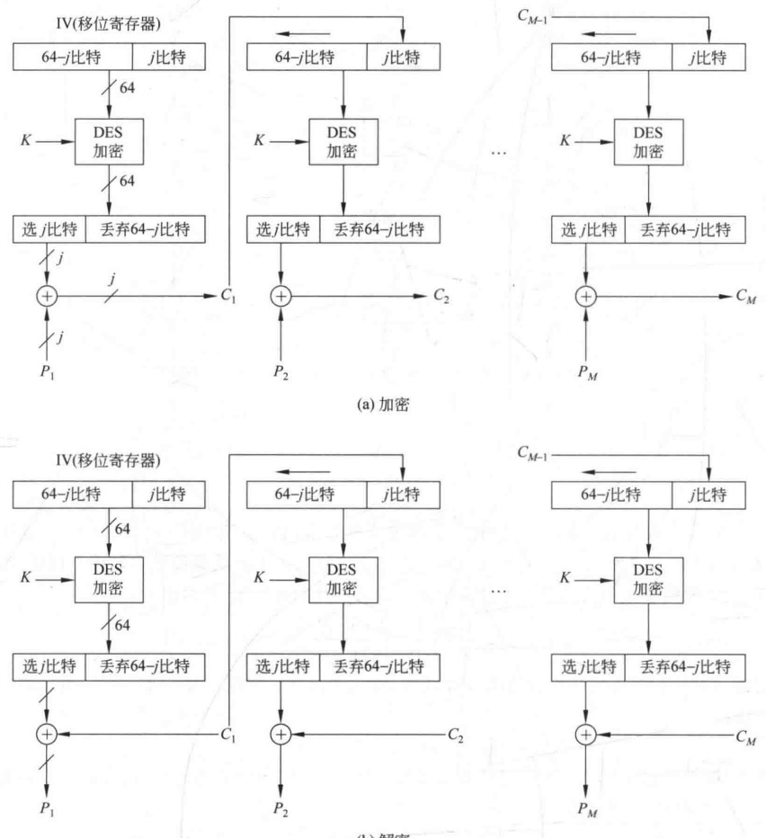

**(a) 加密**

**(b) 解密**

**图 3-12 CFB 模式示意图**

加密时，加密算法的输入是64比特移位寄存器，其初值为某个初始向量IV。加密算法输出的最左（最高有效位）i比特与明文的第一个单元 $P_{1}$异或，产生出密文的第一个单元 $C_{1}$，并传送该单元。然后将移位寄存器的内容左移i位并将 $C_{1}$送入移位寄存器最右边（最低有效位）i位。这一过程继续到明文的所有单元都被加密为止。

解密时，将收到的密文单元与加密函数的输出进行异或。注意这时仍然使用加密算法而不是解密算法，原因如下：

设  $S_{j}(X)$ 是 X 的 j 个最高有效位，那么  $C_{1}=P_{1}\oplus S_{j}(E(IV))$，因此

$$P_{1}=C_{1}\oplus S_{j}\left(E(\mathrm{IV})\right)$$

可证明以后各步也有类似的这种关系。

CFB 模式除能获得保密性外，还能用于认证。

### 3.4.4 输出反馈模式

输出反馈(Output FeedBack, OFB)模式的结构类似于CFB，如图3-13所示。不同之处如下：OFB模式是将加密算法的输出反馈到移位寄存器，而CFB模式是将密文单元反馈到移位寄存器。

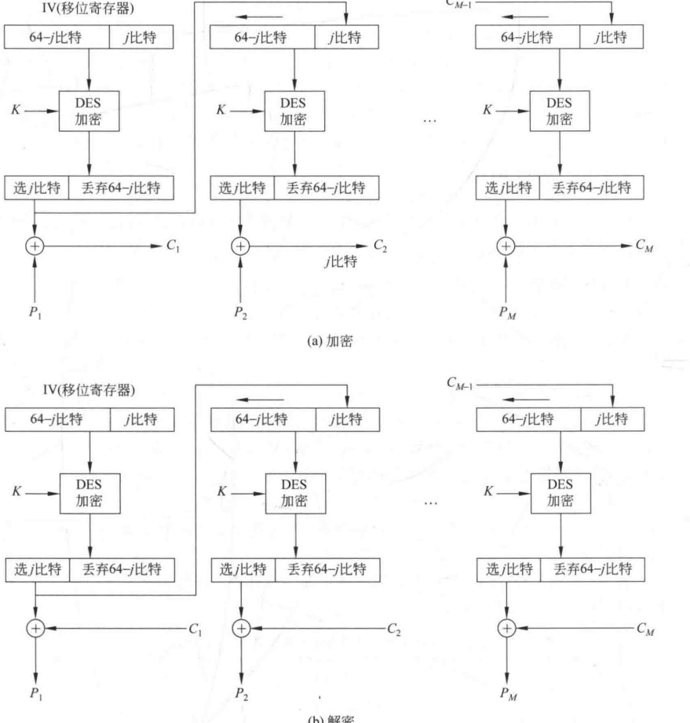

**(a) 加密**

**IV(移位寄存器)**

**(b) 解密**

**图 3-13 OFB 模式示意图**

OFB 模式的优点是传输过程中的比特错误不会被传播。例如， $C_{1}$ 中出现一比特错误，在解密结果中只有  $P_{1}$ 受到影响，以后各明文单元则不受影响。而在 CFB 中， $C_{1}$ 也作为移位寄存器的输入，因此它的一比特错误会影响解密结果中各明文单元的值。

OFB 的缺点是它比 CFB 模式更易受到对消息流的篡改攻击，例如在密文中取 1 比特的补，那么在恢复的明文中相应位置的比特也为原比特的补。因此使得敌手有可能通过对消息校验部分的篡改和对数据部分的篡改，而以纠错码不能检测的方式篡改密文。

## 3.5 IDEA

IDEA (International Data Encryption Algorithm, 国际数据加密算法) 由来学嘉 (X. J. Lai) 和 J. L. Massey 提出，其第一版于 1990 年公布，当时称为 PES (Proposed Encryption Standard, 建议加密标准)。1991 年，在 Biham 和 Shamir 提出差分密码分析之后，设计者推出了改进算法 IPES，即改进型建议加密标准。1992 年，设计者又将 IPES 改名为 IDEA。这是已提出的各种分组密码中一个很成功的方案，已在 PGP 中采用。

### 3.5.1 设计原理

算法中明文和密文分组长度都是64比特，密钥长128比特。其设计原理可从密码强度和实现两方面考虑。

1. 密码强度

密码强度主要是通过有效的混淆和扩散特性而得以保证。

混淆是通过使用以下3种运算而获得，3种运算都有两个16比特的输入和一个16比特的输出：

（1）逐比特异或，表示为⊕。

（2）模 ${2}^{16}$（即65536）整数加法，表示为⊞，其输入和输出作为16位无符号整数处理。

（3）模 ${2}^{16}+1$（即65537）整数乘法，表示为 $\odot$，其输入、输出中除16位全为0作为 ${2}^{15}$处理外，其余都作为16位无符号整数处理。

例如：

$$\begin{array}{l} 0000000000000000 \textcircled{*}10000000000000000=10000000000000001\end{array}$$

这是因为  ${2}^{16} \times 2^{15} \bmod (2^{16} + 1) = 2^{15} + 1$。

表3-6给出了操作数为2比特长时3种运算的运算表。在以下意义下，3种运算是不兼容的：

**表 3-6 IDEA 中的 3 种运算（操作数为 2 比特长）**

<table border=1 style='margin: auto; word-wrap: break-word;'><tr><td colspan="2">X</td><td colspan="2">Y</td><td colspan="2">$X \boxplus Y$</td><td style='text-align: center; word-wrap: break-word;'>$X \odot Y$</td><td style='text-align: center; word-wrap: break-word;'>$X \oplus Y$</td></tr><tr><td style='text-align: center; word-wrap: break-word;'>0</td><td style='text-align: center; word-wrap: break-word;'>00</td><td style='text-align: center; word-wrap: break-word;'>0</td><td style='text-align: center; word-wrap: break-word;'>00</td><td style='text-align: center; word-wrap: break-word;'>0</td><td style='text-align: center; word-wrap: break-word;'>00</td><td style='text-align: center; word-wrap: break-word;'>1 01</td><td style='text-align: center; word-wrap: break-word;'>0 00</td></tr><tr><td style='text-align: center; word-wrap: break-word;'>0</td><td style='text-align: center; word-wrap: break-word;'>00</td><td style='text-align: center; word-wrap: break-word;'>1</td><td style='text-align: center; word-wrap: break-word;'>01</td><td style='text-align: center; word-wrap: break-word;'>1</td><td style='text-align: center; word-wrap: break-word;'>01</td><td style='text-align: center; word-wrap: break-word;'>0 00</td><td style='text-align: center; word-wrap: break-word;'>1 01</td></tr></table>

续表

<table border=1 style='margin: auto; word-wrap: break-word;'><tr><td colspan="2">X</td><td colspan="2">Y</td><td colspan="2">$X \boxplus Y$</td><td colspan="2">$X \odot Y$</td><td style='text-align: center; word-wrap: break-word;'>$X \oplus Y$</td></tr><tr><td style='text-align: center; word-wrap: break-word;'>0</td><td style='text-align: center; word-wrap: break-word;'>00</td><td style='text-align: center; word-wrap: break-word;'>2</td><td style='text-align: center; word-wrap: break-word;'>10</td><td style='text-align: center; word-wrap: break-word;'>2</td><td style='text-align: center; word-wrap: break-word;'>10</td><td style='text-align: center; word-wrap: break-word;'>3</td><td style='text-align: center; word-wrap: break-word;'>11</td><td style='text-align: center; word-wrap: break-word;'>2 10</td></tr><tr><td style='text-align: center; word-wrap: break-word;'>0</td><td style='text-align: center; word-wrap: break-word;'>00</td><td style='text-align: center; word-wrap: break-word;'>3</td><td style='text-align: center; word-wrap: break-word;'>11</td><td style='text-align: center; word-wrap: break-word;'>3</td><td style='text-align: center; word-wrap: break-word;'>11</td><td style='text-align: center; word-wrap: break-word;'>2</td><td style='text-align: center; word-wrap: break-word;'>10</td><td style='text-align: center; word-wrap: break-word;'>3 11</td></tr><tr><td style='text-align: center; word-wrap: break-word;'>1</td><td style='text-align: center; word-wrap: break-word;'>01</td><td style='text-align: center; word-wrap: break-word;'>0</td><td style='text-align: center; word-wrap: break-word;'>00</td><td style='text-align: center; word-wrap: break-word;'>1</td><td style='text-align: center; word-wrap: break-word;'>01</td><td style='text-align: center; word-wrap: break-word;'>0</td><td style='text-align: center; word-wrap: break-word;'>00</td><td style='text-align: center; word-wrap: break-word;'>1 01</td></tr><tr><td style='text-align: center; word-wrap: break-word;'>1</td><td style='text-align: center; word-wrap: break-word;'>01</td><td style='text-align: center; word-wrap: break-word;'>1</td><td style='text-align: center; word-wrap: break-word;'>01</td><td style='text-align: center; word-wrap: break-word;'>2</td><td style='text-align: center; word-wrap: break-word;'>10</td><td style='text-align: center; word-wrap: break-word;'>1</td><td style='text-align: center; word-wrap: break-word;'>01</td><td style='text-align: center; word-wrap: break-word;'>0 00</td></tr><tr><td style='text-align: center; word-wrap: break-word;'>1</td><td style='text-align: center; word-wrap: break-word;'>01</td><td style='text-align: center; word-wrap: break-word;'>2</td><td style='text-align: center; word-wrap: break-word;'>10</td><td style='text-align: center; word-wrap: break-word;'>3</td><td style='text-align: center; word-wrap: break-word;'>11</td><td style='text-align: center; word-wrap: break-word;'>2</td><td style='text-align: center; word-wrap: break-word;'>10</td><td style='text-align: center; word-wrap: break-word;'>3 11</td></tr><tr><td style='text-align: center; word-wrap: break-word;'>1</td><td style='text-align: center; word-wrap: break-word;'>01</td><td style='text-align: center; word-wrap: break-word;'>3</td><td style='text-align: center; word-wrap: break-word;'>11</td><td style='text-align: center; word-wrap: break-word;'>0</td><td style='text-align: center; word-wrap: break-word;'>00</td><td style='text-align: center; word-wrap: break-word;'>3</td><td style='text-align: center; word-wrap: break-word;'>11</td><td style='text-align: center; word-wrap: break-word;'>2 10</td></tr><tr><td style='text-align: center; word-wrap: break-word;'>2</td><td style='text-align: center; word-wrap: break-word;'>10</td><td style='text-align: center; word-wrap: break-word;'>0</td><td style='text-align: center; word-wrap: break-word;'>00</td><td style='text-align: center; word-wrap: break-word;'>2</td><td style='text-align: center; word-wrap: break-word;'>10</td><td style='text-align: center; word-wrap: break-word;'>3</td><td style='text-align: center; word-wrap: break-word;'>11</td><td style='text-align: center; word-wrap: break-word;'>2 10</td></tr><tr><td style='text-align: center; word-wrap: break-word;'>2</td><td style='text-align: center; word-wrap: break-word;'>10</td><td style='text-align: center; word-wrap: break-word;'>1</td><td style='text-align: center; word-wrap: break-word;'>01</td><td style='text-align: center; word-wrap: break-word;'>3</td><td style='text-align: center; word-wrap: break-word;'>11</td><td style='text-align: center; word-wrap: break-word;'>2</td><td style='text-align: center; word-wrap: break-word;'>10</td><td style='text-align: center; word-wrap: break-word;'>3 11</td></tr><tr><td style='text-align: center; word-wrap: break-word;'>2</td><td style='text-align: center; word-wrap: break-word;'>10</td><td style='text-align: center; word-wrap: break-word;'>2</td><td style='text-align: center; word-wrap: break-word;'>10</td><td style='text-align: center; word-wrap: break-word;'>0</td><td style='text-align: center; word-wrap: break-word;'>00</td><td style='text-align: center; word-wrap: break-word;'>0</td><td style='text-align: center; word-wrap: break-word;'>00</td><td style='text-align: center; word-wrap: break-word;'>0 00</td></tr><tr><td style='text-align: center; word-wrap: break-word;'>2</td><td style='text-align: center; word-wrap: break-word;'>10</td><td style='text-align: center; word-wrap: break-word;'>3</td><td style='text-align: center; word-wrap: break-word;'>11</td><td style='text-align: center; word-wrap: break-word;'>1</td><td style='text-align: center; word-wrap: break-word;'>01</td><td style='text-align: center; word-wrap: break-word;'>1</td><td style='text-align: center; word-wrap: break-word;'>01</td><td style='text-align: center; word-wrap: break-word;'>1 01</td></tr><tr><td style='text-align: center; word-wrap: break-word;'>3</td><td style='text-align: center; word-wrap: break-word;'>11</td><td style='text-align: center; word-wrap: break-word;'>0</td><td style='text-align: center; word-wrap: break-word;'>00</td><td style='text-align: center; word-wrap: break-word;'>3</td><td style='text-align: center; word-wrap: break-word;'>11</td><td style='text-align: center; word-wrap: break-word;'>2</td><td style='text-align: center; word-wrap: break-word;'>10</td><td style='text-align: center; word-wrap: break-word;'>3 11</td></tr><tr><td style='text-align: center; word-wrap: break-word;'>3</td><td style='text-align: center; word-wrap: break-word;'>11</td><td style='text-align: center; word-wrap: break-word;'>1</td><td style='text-align: center; word-wrap: break-word;'>01</td><td style='text-align: center; word-wrap: break-word;'>0</td><td style='text-align: center; word-wrap: break-word;'>00</td><td style='text-align: center; word-wrap: break-word;'>3</td><td style='text-align: center; word-wrap: break-word;'>11</td><td style='text-align: center; word-wrap: break-word;'>2 10</td></tr><tr><td style='text-align: center; word-wrap: break-word;'>3</td><td style='text-align: center; word-wrap: break-word;'>11</td><td style='text-align: center; word-wrap: break-word;'>2</td><td style='text-align: center; word-wrap: break-word;'>10</td><td style='text-align: center; word-wrap: break-word;'>1</td><td style='text-align: center; word-wrap: break-word;'>01</td><td style='text-align: center; word-wrap: break-word;'>1</td><td style='text-align: center; word-wrap: break-word;'>01</td><td style='text-align: center; word-wrap: break-word;'>1 01</td></tr><tr><td style='text-align: center; word-wrap: break-word;'>3</td><td style='text-align: center; word-wrap: break-word;'>11</td><td style='text-align: center; word-wrap: break-word;'>3</td><td style='text-align: center; word-wrap: break-word;'>11</td><td style='text-align: center; word-wrap: break-word;'>2</td><td style='text-align: center; word-wrap: break-word;'>10</td><td style='text-align: center; word-wrap: break-word;'>0</td><td style='text-align: center; word-wrap: break-word;'>00</td><td style='text-align: center; word-wrap: break-word;'>0 00</td></tr></table>

（1）3个运算中任意两个都不满足分配律，例如：

$$a\;\oplus\;(b\odot c)\neq(a\;\oplus\;b)\odot(a\;\oplus\;c)$$

（2）3个运算中任意两个都不满足结合律，例如：

$$a\;\oplus\;(b\;\boxplus\;c)\;\neq\;(a\;\oplus\;b)\;\boxplus\;c$$

3 种运算结合起来使用可对算法的输入提供复杂的变换，从而使得对 IDEA 的密码分析比对仅使用异或运算的 DES 更为困难。

算法中扩散是由称为乘加（Multiplication/Addition，MA）结构（见图3-14）的基本单元实现的。该结构的输入是两个16比特的子段和两个16比特的子密钥，输出也为两个16比特的子段。这一结构在算法中重复使用了8次，获得了非常有效的扩散效果。

（1）软件：软件实现采用16比特子段处理，可通过使用容易编程的加法、移位等运算实现算法的3个运算。

IDEA 可方便地通过软件和硬件实现。

2. 实现

（2）硬件：由于加、解密相似，差别仅为使用密钥的方式，因此可用同一器件实现。再者，算法中规则的模块结构，可方便 VLSI 的实现。

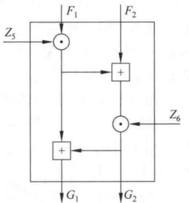

**图 3-14 MA 结构**

### 3.5.2 加密过程

加密过程(见图3-15)由连续的8轮迭代和一个输出变换组成,算法将64比特的明文分组分成4个16比特的子段,每轮迭代以4个16比特的子段作为输入,输出也为4个16比特的子段。最后的输出变换也产生4个16比特的子段,链接起来后形成64比特的密文分组。每轮迭代还需使用6个16比特的子密钥,最后的输出变换需使用4个16比特的子密钥,所以子密钥总数为52。图3-15的右半部分表示由初始的128比特密钥产生52个子密钥的子密钥产生器。

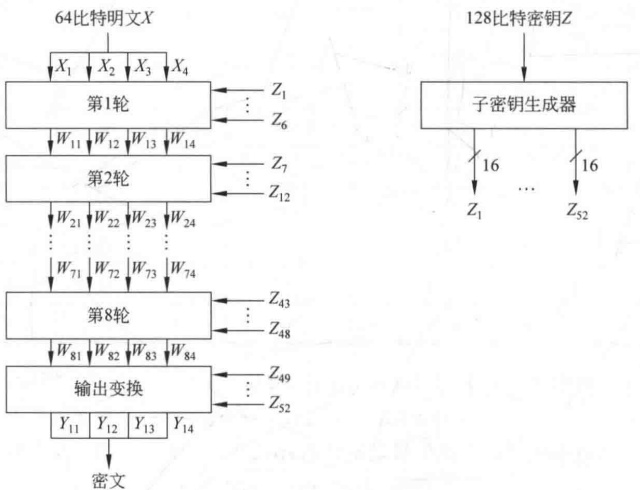

**图 3-15 IDEA 的加密框图**

1. 轮结构

图 3-16 是 IDEA 第一轮的结构示意图，以后各轮也都是这种结构，但所用的子密钥和轮输入不同。从结构图可见，IDEA 不是传统的 Feistel 密码结构。每轮开始时有一个变换，该变换的输入是 4 个子段和 4 个子密钥，变换中的运算是两个乘法和两个加法，输出的 4 个子段经过异或运算形成了两个 16 比特的子段作为 MA 结构的输入。MA 结构也有两个输入的子密钥，输出是两个 16 比特的子段。

最后，变换的4个输出子段和MA结构的两个输出子段经过异或运算产生这一轮的4个输出子段。注意，由 $X_{2}$产生的输出子段和由 $X_{3}$产生的输出子段交换位置后形成 $W_{12}$和 $W_{13}$，目的在于进一步增加混淆效果，使得算法更易抵抗差分密码分析。

算法的第9步是一个输出变换，如图3-17所示。它的结构和每一轮开始的变换结构一样，不同之处在于输出变换的第2个和第3个输入首先交换了位置，目的在于撤销第8轮输出中两个子段的交换。还需注意，第9步仅需要4个子密钥而前面8轮中每轮需要6个子密钥。

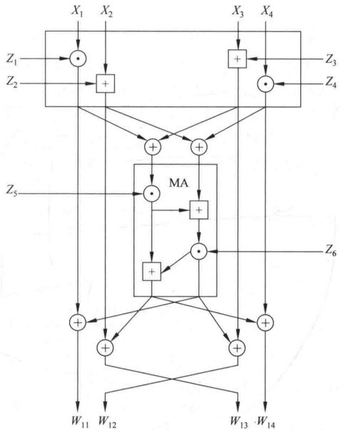

**图 3-16 IDEA 第一轮的轮结构**

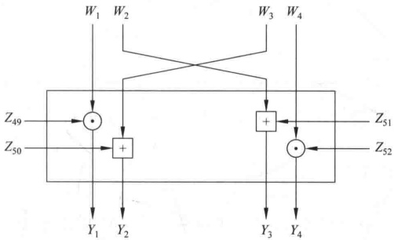

**图 3-17 IDEA 的输出变换**

2. 子密钥的产生

加密过程中52个16比特的子密钥是由128比特的加密密钥按如下方式产生的：前8个子密钥 $Z_{1}, Z_{2}, \cdots, Z_{8}$ 直接从加密密钥中取，即 $Z_{1}$ 取前16比特（最高有效位）， $Z_{2}$ 取下面的16比特，以此类推。然后加密密钥循环左移25位，再取下面8个子密钥 $Z_{9}, Z_{10}, \cdots, Z_{16}$，取法与 $Z_{1}, Z_{2}, \cdots, Z_{8}$ 的取法相同。这一过程重复下去，直到52个子密钥都被产生为止。

3. 解密过程

解密过程和加密过程基本相同，但子密钥的选取不同。解密子密钥 $U_{1}, U_{2}, \cdots, U_{52}$由加密子密钥按如下方式得到（将加密过程最后一步的输出变换当作第9轮）：

（1）第  $i(i=1,\cdots,9)$ 轮解密的前4个子密钥由加密过程第(10-i)轮的前4个子密钥得出：其中，第1和第4个解密子密钥取为相应的第1和第4个加密子密钥的模 ${2}^{16}+1$ 乘法逆元，第2和第3个子密钥的取法为：当轮数i=2,\cdots,8时，取为相应的第3个和第2个加密子密钥的模 ${2}^{16}$ 加法逆元。当i=1和9时，取为相应的第2个和第3个加密子密钥的模 ${2}^{16}$ 加法逆元。

（2）第  $i(i=1,\cdots,8)$ 轮解密的后两个子密钥等于加密过程第  $(9-i)$ 轮的后两个子密钥。

表3-7是对以上关系的总结。其中， $Z_{j}$ 的模  ${2}^{16}+1$ 乘法逆元为  $Z_{j}^{-1}$，满足：

$$Z_{j}\cdot Z_{j}^{-1}=1\bmod(2^{16}+1)$$

**表 3-7 IDEA 加密、解密子密钥表**

<table border=1 style='margin: auto; word-wrap: break-word;'><tr><td style='text-align: center; word-wrap: break-word;'>轮数</td><td style='text-align: center; word-wrap: break-word;'>加密子密钥</td><td colspan="2">解密子密钥</td></tr><tr><td style='text-align: center; word-wrap: break-word;'>1</td><td style='text-align: center; word-wrap: break-word;'>$Z_{1}, Z_{2}, Z_{3}, Z_{4}, Z_{5}, Z_{6}$</td><td style='text-align: center; word-wrap: break-word;'>$U_{1}, U_{2}, U_{3}, U_{4}, U_{5}, U_{6}$</td><td style='text-align: center; word-wrap: break-word;'>$Z_{49}^{-1}, -Z_{50}, -Z_{51}, Z_{52}^{-1}, Z_{47}, Z_{48}$</td></tr><tr><td style='text-align: center; word-wrap: break-word;'>2</td><td style='text-align: center; word-wrap: break-word;'>$Z_{7}, Z_{8}, Z_{9}, Z_{10}, Z_{11}, Z_{12}$</td><td style='text-align: center; word-wrap: break-word;'>$U_{7}, U_{8}, U_{9}, U_{10}, U_{11}, U_{12}$</td><td style='text-align: center; word-wrap: break-word;'>$Z_{43}^{-1}, -Z_{45}, -Z_{44}, Z_{46}^{-1}, Z_{41}, Z_{42}$</td></tr><tr><td style='text-align: center; word-wrap: break-word;'>3</td><td style='text-align: center; word-wrap: break-word;'>$Z_{13}, Z_{14}, Z_{15}, Z_{16}, Z_{17}, Z_{18}$</td><td style='text-align: center; word-wrap: break-word;'>$U_{13}, U_{14}, U_{15}, U_{16}, U_{17}, U_{18}$</td><td style='text-align: center; word-wrap: break-word;'>$Z_{37}^{-1}, -Z_{39}, -Z_{38}, Z_{40}^{-1}, Z_{35}, Z_{36}$</td></tr><tr><td style='text-align: center; word-wrap: break-word;'>4</td><td style='text-align: center; word-wrap: break-word;'>$Z_{19}, Z_{20}, Z_{21}, Z_{22}, Z_{23}, Z_{24}$</td><td style='text-align: center; word-wrap: break-word;'>$U_{19}, U_{20}, U_{21}, U_{22}, U_{23}, U_{24}$</td><td style='text-align: center; word-wrap: break-word;'>$Z_{31}^{-1}, -Z_{33}, -Z_{32}, Z_{34}^{-1}, Z_{29}, Z_{30}$</td></tr><tr><td style='text-align: center; word-wrap: break-word;'>5</td><td style='text-align: center; word-wrap: break-word;'>$Z_{25}, Z_{26}, Z_{27}, Z_{28}, Z_{29}, Z_{30}$</td><td style='text-align: center; word-wrap: break-word;'>$U_{25}, U_{26}, U_{27}, U_{28}, U_{29}, U_{30}$</td><td style='text-align: center; word-wrap: break-word;'>$Z_{25}^{-1}, -Z_{27}, -Z_{26}, Z_{28}^{-1}, Z_{23}, Z_{24}$</td></tr><tr><td style='text-align: center; word-wrap: break-word;'>6</td><td style='text-align: center; word-wrap: break-word;'>$Z_{31}, Z_{32}, Z_{33}, Z_{34}, Z_{35}, Z_{36}$</td><td style='text-align: center; word-wrap: break-word;'>$U_{31}, U_{32}, U_{33}, U_{34}, U_{35}, U_{36}$</td><td style='text-align: center; word-wrap: break-word;'>$Z_{19}^{-1}, -Z_{21}, -Z_{20}, Z_{22}^{-1}, Z_{17}, Z_{18}$</td></tr><tr><td style='text-align: center; word-wrap: break-word;'>7</td><td style='text-align: center; word-wrap: break-word;'>$Z_{37}, Z_{38}, Z_{39}, Z_{40}, Z_{41}, Z_{42}$</td><td style='text-align: center; word-wrap: break-word;'>$U_{37}, U_{38}, U_{39}, U_{40}, U_{41}, U_{42}$</td><td style='text-align: center; word-wrap: break-word;'>$Z_{13}^{-1}, -Z_{15}, -Z_{14}, Z_{16}^{-1}, Z_{11}, Z_{12}$</td></tr><tr><td style='text-align: center; word-wrap: break-word;'>8</td><td style='text-align: center; word-wrap: break-word;'>$Z_{43}, Z_{44}, Z_{45}, Z_{46}, Z_{47}, Z_{48}$</td><td style='text-align: center; word-wrap: break-word;'>$U_{43}, U_{44}, U_{45}, U_{46}, U_{47}, U_{48}$</td><td style='text-align: center; word-wrap: break-word;'>$Z_{7}^{-1}, -Z_{9}, -Z_{8}, Z_{10}^{-1}, Z_{5}, Z_{6}$</td></tr><tr><td style='text-align: center; word-wrap: break-word;'>输出变换</td><td style='text-align: center; word-wrap: break-word;'>$Z_{49}, Z_{50}, Z_{51}, Z_{52}$</td><td style='text-align: center; word-wrap: break-word;'>$U_{49}, U_{50}, U_{51}, U_{52}$</td><td style='text-align: center; word-wrap: break-word;'>$Z_{1}^{-1}, -Z_{2}, -Z_{3}, Z_{4}^{-1}$</td></tr></table>

因  ${2}^{16}+1$ 是一素数，所以每一个不大于  ${2}^{16}$ 的非0整数都有一个唯一的模  ${2}^{16}+1$ 乘法逆元。

 $Z_{i}$ 的模  ${2}^{16}$ 加法逆元为  $-Z_{i}$，满足：

$$-Z_{j}\boxplus Z_{j}=0\bmod(2^{16})$$

下面验证解密过程的确得到了正确的结果。图3-18中左边为加密过程，由上至下；右边为解密过程，由下至上。将每一轮进一步分为两步：第一步是变换，其余部分作为第二步，称为子加密。

从下往上考虑。对加密过程的最后一个输出变换，以下关系成立：

$$\begin{aligned}&Y_{1}=W_{81}\odot Z_{49}\quad Y_{2}=W_{83}\boxplus Z_{50}\\&Y_{3}=W_{82}\boxplus Z_{51}\quad Y_{4}=W_{84}\odot Z_{52}\\ \end{aligned}$$

解密过程中第1轮的第1步产生以下关系：

$$\begin{aligned}&J_{11}=Y_{1}\bigodot U_{1}\quad J_{12}=Y_{2}\bigsqcup U_{2}\\&J_{13}=Y_{3}\bigsqcup U_{3}\quad J_{14}=Y_{4}\bigodot U_{4}\\ \end{aligned}$$

将解密子密钥由加密子密钥表达并将 $Y_{1},Y_{2},Y_{3},Y_{4}$代入以下关系，有：

$$\begin{aligned}\boldsymbol{J}_{11}=&\boldsymbol{Y}_{1}\odot\boldsymbol{Z}_{49}^{-1}=\boldsymbol{W}_{81}\odot\boldsymbol{Z}_{49}\odot\boldsymbol{Z}_{49}^{-1}=\boldsymbol{W}_{81}\\\boldsymbol{J}_{12}=&\boldsymbol{Y}_{2}\boxplus-\boldsymbol{Z}_{50}=\boldsymbol{W}_{83}\boxplus\boldsymbol{Z}_{50}\boxplus-\boldsymbol{Z}_{50}=\boldsymbol{W}_{83}\\\boldsymbol{J}_{13}=&\boldsymbol{Y}_{3}\boxplus-\boldsymbol{Z}_{51}=\boldsymbol{W}_{82}\boxplus\boldsymbol{Z}_{51}\boxplus-\boldsymbol{Z}_{51}=\boldsymbol{W}_{82}\\\boldsymbol{J}_{14}=&\boldsymbol{Y}_{4}\odot\boldsymbol{Z}_{52}^{-1}=\boldsymbol{W}_{84}\odot\boldsymbol{Z}_{52}\odot\boldsymbol{Z}_{52}^{-1}=\boldsymbol{W}_{84}\end{aligned}$$

可见，解密过程第1轮第1步的输出等于加密过程最后一步输入中第2个子段和第3个子段交换后的值。从图3-18，可得以下关系：

$$\begin{aligned}W_{81}&=I_{81}\oplus MA_{R}(I_{81}\oplus I_{83},I_{82}\oplus I_{84})\\W_{82}&=I_{83}\oplus MA_{R}(I_{81}\oplus I_{83},I_{82}\oplus I_{84})\\W_{83}&=I_{82}\oplus MA_{L}(I_{81}\oplus I_{83},I_{82}\oplus I_{84})\\W_{84}&=I_{84}\oplus MA_{L}(I_{81}\oplus I_{83},I_{82}\oplus I_{84})\end{aligned}$$

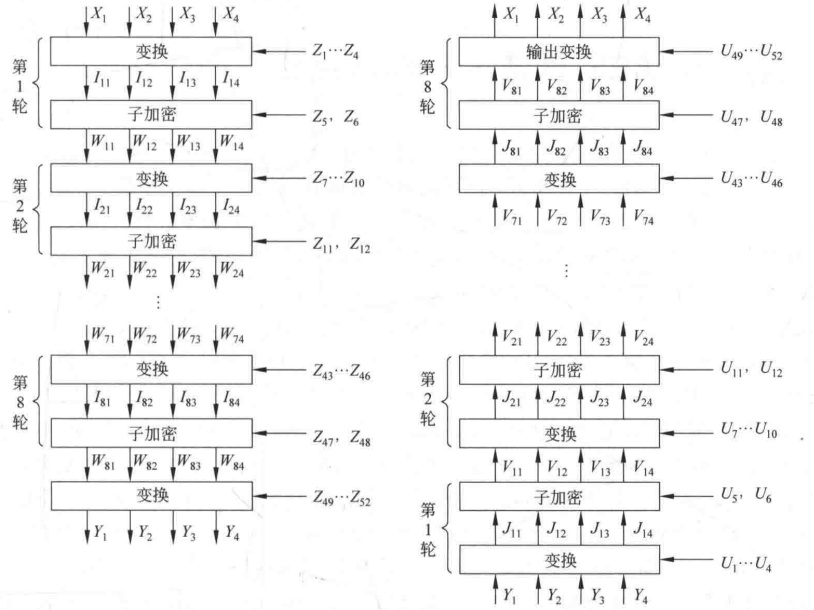

**图 3-18 IDEA 加密和解密框图**

其中， $\mathrm{MA}_{R}(X,Y)$ 是 MA 结构输入为 X 和 Y 时的右边输出， $\mathrm{MA}_{L}(X,Y)$ 是左边输出。则：

$$\begin{aligned}V_{11}=&J_{11}\oplus\mathrm{MA}_{\mathrm{R}}(J_{11}\oplus J_{13},J_{12}\oplus J_{14})\\=&W_{81}\oplus\mathrm{MA}_{\mathrm{R}}(W_{81}\oplus W_{82},W_{83}\oplus W_{84})\\=&I_{81}\oplus\mathrm{MA}_{\mathrm{R}}(I_{81}\oplus I_{83},I_{82}\oplus I_{84})\oplus\mathrm{MA}_{\mathrm{R}}\big[I_{81}\oplus\mathrm{MA}_{\mathrm{R}}(I_{81}\\&\oplus I_{83},I_{82}\oplus I_{84})\oplus I_{83}\oplus\mathrm{MA}_{\mathrm{R}}(I_{81}\oplus I_{83},I_{82}\oplus I_{84}),I_{82}\\&\oplus\mathrm{MA}_{\mathrm{L}}(I_{81}\oplus I_{83},I_{82}\oplus I_{84})\oplus I_{84}\oplus\mathrm{MA}_{\mathrm{L}}(I_{81}\oplus I_{83},I_{82}\oplus I_{84})\big]\end{aligned}$$

$$\begin{aligned}& \quad\\ &\begin{aligned}\\ &=I_{81}\oplus MA_{R}(I_{81}\oplus I_{83},I_{82}\oplus I_{84})\oplus MA_{R}(I_{81}\oplus I_{83},I_{82}\oplus I_{84})\\&=I_{81}\\ &\end{aligned}\\ \end{aligned}$$

类似地，可有：

$$V_{12}=I_{83}\quad V_{13}=I_{82}\quad V_{14}=I_{84}$$

所以解密过程第1轮第2步的输出等于加密过程倒数第2步输入中第2个子段和第3个子段交换后的值。

同理可证图3-18中每步都有上述类似关系，这种关系一直到

$$V_{81}=I_{11}\quad V_{82}=I_{13}\quad V_{83}=I_{12}\quad V_{84}=I_{14}$$

即除了第2个子段和第3个子段交换位置外，解密过程的输出变换与加密过程第1轮第1步的变换完全相同。

所以最后得出整个解密过程的输出等于整个加密过程的输入。

## 3.6 AES 算法——Rijndael

1997年4月15日，美国ANSI发起征集AES(Advanced Encryption Standard)的活动，并为此成立了AES工作小组。此次活动的目的是确定一个非保密的、可以公开技术细节的、全球免费使用的分组密码算法，以作为新的数据加密标准。1997年9月12日，美国联邦登记处公布了正式征集AES候选算法的通告。对AES的基本要求是：比三重DES快、至少与三重DES一样安全、数据分组长度为128比特、密钥长度为128/192/256比特。1998年8月12日，在首届AES候选会议(First AES Candidate Conference)上公布了AES的15个候选算法，任由全世界各机构和个人攻击和评论，这15个候选算法是CAST256、CRYPTON、E2、DEAL、FROG、SAFER+、RC6、MAGENTA、LOKI97、SERPENT、MARS、Rijndael、DFC、Twofish、HPC。1999年3月，在第2届AES候选会议(Second AES Candidate Conference)上经过对全球各密码机构和个人对候选算法分析结果的讨论，从15个候选算法中选出了5个。这5个是RC6、Rijndael、SERPENT、Twofish以及MARS。2000年4月13日至14日，召开了第3届AES候选会议(Third AES Candidate Conference)，继续对最后5个候选算法进行讨论。2000年10月2日，NIST宣布Rijndael作为新的AES。至此，经过3年多的讨论，Rijndael终于脱颖而出。

Rijndael 由比利时的 Joan Daemen 和 Vincent Rijmen 设计，算法的原型是 Square 算法，它的设计策略是宽轨迹策略（Wide Trail Strategy）。宽轨迹策略是针对差分分析和线性分析提出的，它的最大优点是可以给出算法的最佳差分特征的概率及最佳线性逼近的偏差的界；由此，可以分析算法抵抗差分密码分析及线性密码分析的能力。

### 3.6.1 Rijndael 的数学基础和设计思想

1. 有限域  $GF(2^8)$

有限域中的元素可以用多种不同的方式表示。对于任意素数的方幂，都有唯一的一个有限域，因此  $\mathrm{GF}(2^{8})$ 的所有表示是同构的，但不同的表示方法会影响到  $\mathrm{GF}(2^{8})$ 上运算的复杂度，本算法采用传统的多项式表示法。

将  $b_{7}b_{6}b_{5}b_{4}b_{3}b_{2}b_{1}b_{0}$ 构成的字节 b 看成系数在  $\{0,1\}$ 中的多项式

$$b_{7}x^{7}+b_{6}x^{6}+b_{5}x^{5}+b_{4}x^{4}+b_{3}x^{3}+b_{2}x^{2}+b_{1}x+b_{0}$$

例如，十六进制数57对应的二进制为01010111，看成一个字节，对应的多项式为 $x^{6}+x^{4}+x^{2}+x+1$。

在多项式表示中， $\mathrm{GF}(2^{8})$ 上两个元素的和仍然是一个次数不超过7的多项式，其系数等于两个元素对应系数的模2加（比特异或）。

例如， ${57}+83=D4$，用多项式表示为

$$(x^{6}+x^{4}+x^{2}+x+1)+(x^{7}+x+1)=x^{7}+x^{6}+x^{4}+x^{2}$$

用二进制表示为

$${01010111}+10000011=11010100$$

由于每个元素的加法逆元等于自己，所以减法和加法相同。

要计算  $\mathrm{GF}(2^{8})$ 上的乘法，必须先确定一个  $\mathrm{GF}(2)$ 上的8次不可约多项式； $\mathrm{GF}(2^{8})$ 上两个元素的乘积就是这两个多项式的模乘（以这个8次不可约多项式为模）。在Rijndael 密码中，这个8次不可约多项式确定为

$$m\left(x\right)=x^{8}+x^{4}+x^{3}+x+1$$

它的十六进制表示为 11B。

例如， ${57}\cdot83=C1$ 可表示为以下的多项式乘法

$$(x^{6}+x^{4}+x^{2}+x+1)\cdot(x^{7}+x+1)=x^{7}+x^{6}+1(\bmod m(x))$$

乘法运算虽然不是标准的按字节的运算，但也是比较简单的计算部件。

以上定义的乘法满足交换律，且有单位元01。另外，对任何次数小于8的多项式 $b(x)$，可用推广的欧几里得算法得

$$b\left(x\right)a\left(x\right)+m\left(x\right)c\left(x\right)=1$$

即  $a(x) \cdot b(x) = 1 \bmod m(x)$，因此  $a(x)$ 是  $b(x)$ 的乘法逆元。再者，乘法还满足分配律：

$$a\left(x\right)\bullet\left(b\left(x\right)+c\left(x\right)\right)=a\left(x\right)\bullet b\left(x\right)+a\left(x\right)\bullet c\left(x\right)$$

所以，256个字节值构成的集合，在以上定义的加法和乘法运算下，有有限域GF ${2}^{8}$的结构。

GF ${2}^{8}$上还定义了一个运算，称为x乘法，其定义为

$$x\cdot b\left(x\right)=b_{7}x^{8}+b_{6}x^{7}+b_{5}x^{6}+b_{4}x^{5}+b_{3}x^{4}+b_{2}x^{3}+b_{1}x^{2}+b_{0}x\left(\bmod m\left(x\right)\right)$$

如果  $b_{7}=0$，求模结果不变，否则为乘积结果减去  $m(x)$，即求乘积结果与  $m(x)$ 的异或。由此得出 x（十六进制 02）乘 b（x）可以先对 b（x）在字节内左移一位（最后一位补 0），若  $b_{7}=1$ 则再与 1B（其二进制为 00011011）做逐比特异或来实现，该运算记为 b=xtime(a)。在专用芯片中，xtime 只需 4 个异或。x 的幂乘运算可以重复应用 xtime 来实现。而任意常数乘法可以通过对中间结果相加实现。

例如，57·13可实现如下：

$$\begin{aligned}&57\cdot02=xtime(57)=AE\\&57\cdot04=xtime(AE)=47\\&57\cdot08=xtime(47)=8E\\ \end{aligned}$$

$${57}\cdot10=xtime(8E)=07$$

$$\begin{aligned}57\cdot13&=57\cdot(01\oplus02\oplus10)\\&=57\oplus AE\oplus07=FE\end{aligned}$$

2. 系数在  $GF(2^{8})$ 上的多项式

4个字节构成的向量可以表示为系数在GF $(2^{8})$上的次数小于4的多项式。多项式的加法就是对应系数相加；换句话说，多项式的加法就是4字节向量的逐比特异或。

规定多项式的乘法运算必须要取模  $M(x)=x^{4}+1$，这样使得次数小于4的多项式的乘积仍然是一个次数小于4的多项式，将多项式的模乘运算记为 $\otimes$，设  $a(x)=a_{3}x^{3}+a_{2}x^{2}+a_{1}x+a_{0}$， $b(x)=b_{3}x^{3}+b_{2}x^{2}+b_{1}x+b_{0}$， $c(x)=a(x)\otimes b(x)=c_{3}x^{3}+c_{2}x^{2}+c_{1}x+c_{0}$。由于  $x^{j} \bmod(x^{4}+1)=x^{j \bmod 4}$，所以

$$\begin{aligned}c_{0}&=a_{0}b_{0}\oplus a_{3}b_{1}\oplus a_{2}b_{2}\oplus a_{1}b_{3}；\\c_{1}&=a_{1}b_{0}\oplus a_{0}b_{1}\oplus a_{3}b_{2}\oplus a_{2}b_{3}；\\c_{2}&=a_{2}b_{0}\oplus a_{1}b_{1}\oplus a_{0}b_{2}\oplus a_{3}b_{3}；\\c_{3}&=a_{3}b_{0}\oplus a_{2}b_{1}\oplus a_{1}b_{2}\oplus a_{0}b_{3}。\end{aligned}$$

可将上述计算表示为

$$\begin{pmatrix}c_{0}\\c_{1}\\c_{2}\\c_{3}\end{pmatrix}=\begin{pmatrix}a_{0}&a_{3}&a_{2}&a_{1}\\a_{1}&a_{0}&a_{3}&a_{2}\\a_{2}&a_{1}&a_{0}&a_{3}\\a_{3}&a_{2}&a_{1}&a_{0}\end{pmatrix}\begin{pmatrix}b_{0}\\b_{1}\\b_{2}\\b_{3}\end{pmatrix}$$

注意到  $M(x)$ 不是  $\mathrm{GF}(2^{8})$ 上的不可约多项式（甚至也不是  $\mathrm{GF}(2)$ 上的不可约多项式），因此非0多项式的这种乘法不是群运算。不过在 Rijndael 密码中，对多项式  $b(x)$，这种乘法运算只限于乘一个固定的有逆元的多项式  $a(x)=a_{3}x^{3}+a_{2}x^{2}+a_{1}x+a_{0}$。有如下的定理。

定理 3-1 系数在  $\mathrm{GF}(2^{8})$ 上的多项式  $a_{3}x^{3}+a_{2}x^{2}+a_{1}x+a_{0}$ 是模  $x^{4}+1$ 可逆的，当且仅当矩阵

$$\begin{pmatrix}a_{0}&a_{3}&a_{2}&a_{1}\\a_{1}&a_{0}&a_{3}&a_{2}\\a_{2}&a_{1}&a_{0}&a_{3}\\a_{3}&a_{2}&a_{1}&a_{0}\end{pmatrix}$$

在 GF $(2^{8})$ 上可逆。

证明  $a_{3}x^{3}+a_{2}x^{2}+a_{1}x+a_{0}$ 是模  $x^{4}+1$ 可逆的，当且仅当存在多项式  $h_{3}x^{3}+h_{2}x^{2}+h_{1}x+h_{0}$ 使得

$$(a_{3}x^{3}+a_{2}x^{2}+a_{1}x+a_{0})(h_{3}x^{3}+h_{2}x^{2}+h_{1}x+h_{0})=1(\bmod x^{4}+1)$$

因此有

$$\begin{aligned}&(a_{3}x^{3}+a_{2}x^{2}+a_{1}x+a_{0})(h_{2}x^{3}+h_{1}x^{2}+h_{0}x+h_{3})=x(\bmod x^{4}+1)\\&(a_{3}x^{3}+a_{2}x^{2}+a_{1}x+a_{0})(h_{1}x^{3}+h_{0}x^{2}+h_{3}x+h_{2})=x^{2}(\bmod x^{4}+1)\\&(a_{3}x^{3}+a_{2}x^{2}+a_{1}x+a_{0})(h_{0}x^{3}+h_{3}x^{2}+h_{2}x+h_{1})=x^{3}(\bmod x^{4}+1)\end{aligned}$$

将以上关系写成矩阵形式即得

$$\begin{pmatrix}a_{0}&a_{3}&a_{2}&a_{1}\\a_{1}&a_{0}&a_{3}&a_{2}\\a_{2}&a_{1}&a_{0}&a_{3}\\a_{3}&a_{2}&a_{1}&a_{0}\\\end{pmatrix}\begin{pmatrix}h_{0}&h_{3}&h_{2}&h_{1}\\h_{1}&h_{0}&h_{3}&h_{2}\\h_{2}&h_{1}&h_{0}&h_{3}\\h_{3}&h_{2}&h_{1}&h_{0}\\\end{pmatrix}=\begin{pmatrix}1&0&0&0\\0&1&0&0\\0&0&1&0\\0&0&0&1\\\end{pmatrix}$$

（定理3-1证毕）

 $c(x)=x\otimes b(x)$ 定义为 x 与  $b(x)$ 的模  $x^{4}+1$ 乘法，即  $c(x)=x\otimes b(x)=b_{2}x^{3}+b_{1}x^{2}+b_{0}x+b_{3}$ 。其矩阵表示中，除  $a_{1}=01$ 外，其他所有  $a_{i}=00$ ，即

$$\begin{align*}\begin{pmatrix}c_{0}\\c_{1}\\c_{2}\\c_{3}\end{pmatrix}=\begin{pmatrix}00&00&00&01\\01&00&00&00\\00&01&00&00\\00&00&01&00\end{pmatrix}\begin{pmatrix}b_{0}\\b_{1}\\b_{2}\\b_{3}\end{pmatrix}\end{align*}$$

因此，x（或 x 的幂）模乘多项式相当于对字节构成的向量进行字节循环移位。

3. 设计思想

Rijndael 密码的设计力求满足以下 3 条标准：

（1）抵抗所有已知的攻击。

（2）在多个平台上速度快，编码紧凑。

（3）设计简单。

当前的大多数分组密码，其轮函数是Feistel结构，即将中间状态的部分比特不加改变地简单放置到其他位置。Rijndael没有这种结构，其轮函数是由3个不同的可逆均匀变换组成的，称它们为3个“层”。所谓“均匀变换”，是指状态的每个比特都是用类似的方法进行处理的。不同层的特定选择大部分是建立在“宽轨迹策略”的应用基础上的；简单地说，“宽轨迹策略”就是提供抗线性密码分析和差分密码分析能力的一种设计。为实现宽轨迹策略，轮函数3个层中的每一层都有它自己的功能。

（2）线性混合层：确保多轮之上的高度扩散。

（3）密钥加层：单轮子密钥简单地异或到中间状态上，实现一次性掩盖。

（1）非线性层：将具有最优的“最坏情况非线性特性”的 S 盒并行使用。

在第一轮之前，用了一个初始密钥加层，其目的是在不知道密钥的情况下，对最后一个密钥加层以后的任一层（或者是当进行已知明文攻击时，对第一个密钥加层以前的任一层）可简单地剥去，因此初始密钥加层对密码的安全性无任何意义。许多密码的设计中都在轮变换之前和之后用了密钥加层，如IDEA、SAFER和Blowfish。

为了使加密算法和解密算法在结构上更加接近，最后一轮的线性混合层与前面各轮的线性混合层不同，这类似于 DES 的最后一轮不做左右交换一样。可以证明这种设计不以任何方式提高或降低该密码的安全性。

### 3.6.2 算法说明

Rijndael 是一个迭代型分组密码，其分组长度和密钥长度都可变，各自可以独立地指定为128比特、192比特、256比特。

1. 状态、种子密钥和轮数

类似于明文分组和密文分组，算法的中间结果也需分组，称算法中间结果的分组为状态，所有的操作都在状态上进行。状态可以用以字节为元素的矩阵阵列表示，该阵列有4行，列数记为 $N_{b}$， $N_{b}$等于分组长度除以32。

种子密钥类似地用一个以字节为元素的矩阵阵列表示，该阵列有4行，列数记为 $N_{k}$， $N_{k}$等于分组长度除以32。表3-8是 $N_{b}=6$的状态和 $N_{k}=4$的种子密钥的矩阵阵列表示。

**表 3-8  $N_{b}=6$ 的状态和  $N_{k}=4$ 的种子密钥**

| $a_{00}$ | $a_{01}$ | $a_{02}$ | $a_{03}$ | $a_{04}$ | $a_{05}$ |
| --- | --- | --- | --- | --- | --- |
| $a_{10}$ | $a_{11}$ | $a_{12}$ | $a_{13}$ | $a_{14}$ | $a_{15}$ |
| $a_{20}$ | $a_{21}$ | $a_{22}$ | $a_{23}$ | $a_{24}$ | $a_{25}$ |
| $a_{30}$ | $a_{31}$ | $a_{32}$ | $a_{33}$ | $a_{34}$ | $a_{35}$ |

| $k_{00}$ | $k_{01}$ | $k_{02}$ | $k_{03}$ |
| --- | --- | --- | --- |
| $k_{10}$ | $k_{11}$ | $k_{12}$ | $k_{13}$ |
| $k_{20}$ | $k_{21}$ | $k_{22}$ | $k_{23}$ |
| $k_{30}$ | $k_{31}$ | $k_{32}$ | $k_{33}$ |

有时可将这些分组当作一维数组，其每一元素是上述阵列表示中的4字节元素构成的列向量，数组长度可为4、6、8，数组元素下标的范围分别是0～3、0～5和0～7。4字节元素构成的列向量有时也称为字。

算法的输入和输出被看成由8比特字节构成的一维数组，其元素下标的范围是 ${0}\sim(4N_{b}-1)$，因此输入和输出以字节为单位的分组长度分别是16、24和32，其元素下标的范围分别是 ${0}\sim15$、 ${0}\sim23$和 ${0}\sim31$。输入的种子密钥也看成由8比特字节构成的一维数组，其元素下标的范围是 ${0}\sim(4N_{k}-1)$，因此种子密钥以字节为单位的分组长度也分别是16、24和32，其元素下标的范围分别是 ${0}\sim15$、 ${0}\sim23$和 ${0}\sim31$。

算法的输入（包括最初的明文输入和中间过程的轮输入）以字节为单位按  $a_{00}a_{10}a_{20}a_{30}a_{01}a_{11}a_{21}a_{31}\cdots$ 的顺序放置到状态阵列中。同理，种子密钥以字节为单位按  $k_{00}k_{10}k_{20}k_{30}k_{01}k_{11}k_{21}k_{31}\cdots$ 的顺序放置到种子密钥阵列中。而输出（包括中间过程的轮输出和最后的密文输出）也是以字节为单位按相同的顺序从状态阵列中取出。若输入（或输出）分组中第 n 个元素对应于状态阵列的第  $(i,j)$ 位置上的元素，则  $n$ 和  $(i,j)$ 有以下关系：

$$i=n\bmod4;j=\lfloor n/4\rfloor;n=i+4j$$

迭代的轮数记为  $N_{r}$， $N_{r}$ 与  $N_{b}$ 和  $N_{k}$ 有关，表3-9给出了  $N_{r}$ 与  $N_{b}$ 和  $N_{k}$ 的关系。

**表3-9 迭代轮数 N，为  $N_{b}$ 和  $N_{k}$ 的函数**

| $N_{r}$ | $N_{b}=4$ | $N_{b}=6$ | $N_{b}=8$ |
| --- | --- | --- | --- |
| $N_{k}=4$ | 10 | 12 | 14 |
| $N_{k}=6$ | 12 | 12 | 14 |
| $N_{k}=8$ | 14 | 14 | 14 |

2. 轮函数

Rijndael 的轮函数由 4 个不同的计算部件组成，（分别是字节代换（ByteSub）、行移位（ShiftRow）、列混合（MixColumn）、密钥加（AddRoundKey）。

1）字节代换

字节代换(ByteSub)是非线性变换，独立地对状态的每个字节进行。代换表（即S盒）是可逆的，由以下两个变换的合成得到：

（1）首先，将字节看作  $GF(2^{8})$ 上的元素，映射到自己的乘法逆元，00 映射到自己。

（2）其次，对字节做如下的（GF（2）上的，可逆的）仿射变换：

$$\begin{pmatrix}y_{0}\\y_{1}\\y_{2}\\y_{3}\\y_{4}\\y_{5}\\y_{6}\\y_{7}\end{pmatrix}=\begin{pmatrix}1&0&0&0&1&1&1&1\\1&1&0&0&0&1&1&1\\1&1&1&0&0&0&1&1\\1&1&1&1&0&0&0&1\\1&1&1&1&1&0&0&0\\0&1&1&1&1&1&0&0\\0&0&1&1&1&1&1&0\\0&0&0&1&1&1&1&1\end{pmatrix}\begin{pmatrix}x_{0}\\x_{1}\\x_{2}\\x_{3}\\x_{4}\\x_{5}\\x_{6}\\x_{7}\end{pmatrix}+\begin{pmatrix}1\\1\\0\\0\\0\\1\\1\\0\end{pmatrix}$$

上述 S 盒对状态的所有字节所做的变换记为

$$\mathrm{B y t e S u b}(\mathrm{S t a t e})$$

图 3-19 是字节代换示意图。

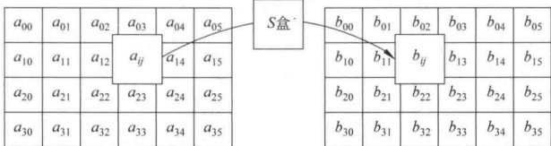

**图 3-19 字节代换示意图**

ByteSub 的逆变换由代换表的逆表做字节代换，可通过如下两步实现：首先进行仿射变换的逆变换，再求每一字节在 GF $(2^{8})$ 上的逆元。

2）行移位

行移位(ShiftRow)是将状态阵列的各行进行循环移位，不同状态行的位移量不同。第0行不移动，第1行循环左移 $C_{1}$个字节，第2行循环左移 $C_{2}$个字节，第3行循环左移 $C_{3}$个字节。位移量 $C_{1}$、 $C_{2}$、 $C_{3}$的取值与 $N_{b}$有关，由表3-10给出。

**表 3-10 对应于不同分组长度的位移量**

| $N_{b}$ | $C_{1}$ | $C_{2}$ | $C_{3}$ |
| --- | --- | --- | --- |
| 4 | 1 | 2 | 3 |
| 6 | 1 | 2 | 3 |
| 8 | 1 | 3 | 4 |

按指定的位移量对状态的行进行的行移位运算记为

图 3-20 是行移位示意图。

| a00 | a01 | a02 | a03 | a04 | a05 | 左移1位 | a00 | a01 | a02 | a03 | a04 | a05 |
| --- | --- | --- | --- | --- | --- | --- | --- | --- | --- | --- | --- | --- |
| a10 | a11 | a12 | a13 | a14 | a15 | 左移2位 | a11 | a12 | a13 | a14 | a15 | a10 |
| a20 | a21 | a22 | a23 | a24 | a25 | 左移3位 | a22 | a23 | a24 | a25 | a20 | a21 |
| a30 | a31 | a32 | a33 | a34 | a35 |  | a33 | a34 | a35 | a30 | a31 | a32 |

**左移0位**

**图 3-20 行移位示意图**

ShiftRow 的逆变换是对状态阵列的后 3 列分别以位移量  $N_{b}-C_{1}$、 $N_{b}-C_{2}$、 $N_{b}-C_{3}$ 进行循环移位，使得第 i 行第 j 列的字节移位到  $(j+N_{b}-C_{i})\bmod N_{b}$。

3）列混合

在列混合(MixColumn)变换中，将状态阵列的每个列视为GF $(2^{8})$上的多项式，再与一个固定的多项式 $c(x)$进行模 $x^{4}+1$乘法。当然要求 $c(x)$是模 $x^{4}+1$可逆的多项式，否则列混合变换就是不可逆的，因而会使不同的输入分组对应的输出分组可能相同。Rijndael的设计者给出的 $c(x)$为(系数用十六进制数表示)：

$$c\left(x\right)=03x^{3}+01x^{2}+01x+02$$

 $c(x)$是与 $x^{4}+1$互素的，因此是模 $x^{4}+1$可逆的。列混合运算也可写为矩阵乘法。设 $b(x)=c(x)\otimes a(x)$，则

$$\begin{pmatrix}b_{0}\\b_{1}\\b_{2}\\b_{3}\end{pmatrix}=\begin{pmatrix}02&03&01&01\\01&02&03&01\\01&01&02&03\\03&01&01&02\end{pmatrix}\begin{pmatrix}a_{0}\\a_{1}\\a_{2}\\a_{3}\end{pmatrix}$$

这个运算需要做  $\mathrm{GF}(2^{8})$ 上的乘法，但由于所乘的因子是 3 个固定的元素 02、03、01，所以这些乘法运算仍然是比较简单的。

对状态 State 的所有列所做的列混合运算记为

$$MixColumn(State)$$

**图 3-21 是列混合运算示意图。**

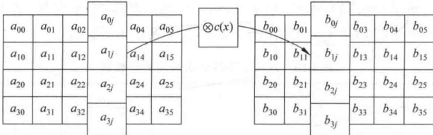

**图 3-21 列混合运算示意图**

列混合运算的逆运算是类似的，即每列都用一个特定的多项式  $d(x)$ 相乘。 $d(x)$ 满足

$$(03x^{3}+01x^{2}+01x+02)\otimes d(x)=01$$

由此可得

$$d(x)=0\mathrm{B}x^{3}+0\mathrm{D}x^{2}+09x+0\mathrm{E}$$

4）密钥加

密钥加(AddRoundKey)是将轮密钥简单地与状态进行逐比特异或。轮密钥由种子密钥通过密钥编排算法得到，轮密钥长度等于分组长度 $N_{b}$。

状态 State 与轮密钥 RoundKey 的密钥加运算表示为

AddRoundKey(State, RoundKey)

图 3-22 是密钥加运算示意图。

$a_{00}$ $a_{01}$ $a_{02}$ $a_{03}$ $a_{04}$ $a_{05}$
$a_{10}$ $a_{11}$ $a_{12}$ $a_{13}$ $a_{14}$ $a_{15}$
$a_{20}$ $a_{21}$ $a_{22}$ $a_{23}$ $a_{24}$ $a_{25}$
$a_{30}$ $a_{31}$ $a_{32}$ $a_{33}$ $a_{34}$ $a_{35}$

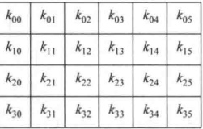

 $b_{00}$  $b_{01}$  $b_{02}$  $b_{03}$  $b_{04}$

 $b_{10}$  $b_{11}$  $b_{12}$  $b_{13}$  $b_{14}$

 $b$  $b_{21}$  $b_{22}$  $b_{23}$  $b_{24}$

 $t$  $b_{31}$  $b_{32}$  $b_{33}$  $b_{34}$

**图 3-22 密钥加运算示意图**

密钥加运算的逆运算是自己。

综上所述，组成Rijndael轮函数的计算部件简洁快速，功能互补。轮函数的伪C代码如下：

Round(State, RoundKey)
{
    ByteSub(State);
    ShiftRow(State);
    MixColumn(State);
    AddRoundKey(State, RoundKey)
}

结尾轮的轮函数与前面各轮不同，将 MixColumn 这一步去掉。

FinalRound(State, RoundKey)
{
    ByteSub(State);
    ShiftRow(State);
    AddRoundKey(State, RoundKey)
}

在以上伪 C 代码记法中，State、RoundKey 可用指针类型，函数 Round、FinalRound、ByteSub、ShiftRow、MixColumn、AddRoundKey 都在指针 State、RoundKey 所指向的阵列上进行运算。

3. 密钥编排

密钥编排是指从种子密钥得到轮密钥的过程，它由密钥扩展和轮密钥选取两部分组成，其基本原则如下：

（1）轮密钥的比特数等于分组长度乘以轮数加1；

（2）种子密钥被扩展成为扩展密钥；

（3）轮密钥从扩展密钥中取，其中第1轮轮密钥取扩展密钥的前 $N_{b}$个字，第2轮轮密钥取接下来的 $N_{b}$个字，如此下去。

1）密钥扩展

扩展密钥是以4字节字为元素的一维阵列，表示为  $W[N_{b} \times (N_{r} + 1)]$，其中，前  $N_{k}$ 个字取为种子密钥，以后每个字按递归方式定义。扩展算法根据  $N_{k} \leq 6$ 和  $N_{k} > 6$ 有所不同。

当 $N_{k}\leq6$时，扩展算法为

KeyExpansion(byte Key[4 * N_k], W[N_b * (N_r + 1)])

{
    For(i = 0; i < N_k; i++)
        W[i] = (Key[4 * i], Key[4 * i + 1], Key[4 * i + 2], Key[4 * i + 3]);
    For(i = N_k; i < N_b * (N_r + 1); i++)
    {
        temp = W[i - 1];
        if (i % N_k == 0)
            temp = SubByte(RotByte(temp)) ^ Rcon[i / N_k];
        W[i] = W[i - N_k] ^ temp;
    }
}

其中，Key $[4 * N_k]$为种子密钥，看作以字节为元素的一维阵列。函数 SubByte() 返回 4 字节字，其中每一个字节都是用 Rijndael 的 S 盒作用到输入字对应的字节得到。函数 RotByte() 也返回 4 字节字，该字由输入的字循环移位得到，即当输入字为  $(a, b, c, d)$ 时，输出字为  $(b, c, d, a)$。

可以看出，扩展密钥的前  $N_k$ 个字即为种子密钥，之后的每个字  $W[i]$ 等于前一个字  $W[i-1]$ 与  $N_k$ 个位置之前的字  $W[i-N_k]$ 的异或；不过当  $i/N_k$ 为整数时，须先将前一个字  $W[i-1]$ 经过以下一系列的变换：

1 字节的循环移位 RotByte→用 S 盒进行变换 SubByte→异或轮常数  $R_{\text{con}}[i/N_k]$。当  $N_k > 6$ 时，扩展算法为

KeyExpansion(byte    Key[4 * N_k], W[N_b * (N_r + 1)])
{
    For (i = 0; i < N_k; i++)
        W[i] = (Key[4 * i], Key[4 * i + 1], Key[4 * i + 2], Key[4 * i + 3]);
    For (i = N_k; i < N_b * (N_r + 1); i++)
    {

temp=W[i-1];
if(i %N_{k}==0)
    temp=SubByte(RotByte(temp))^Rcon[i/N_{k}];
else if(i %N_{k}==4)
    temp=SubByte(temp);
W[i]=W[i-N_{k}]^temp;
}

 $N_k > 6$ 与  $N_k \leq 6$ 的密钥扩展算法的区别在于：当  $i$ 为  $N_k$ 的 4 的倍数时，需先将前一个字  $W[i-1]$ 经过 SubByte 变换。

以上两个算法中，Rcon $[i/N_k]$为轮常数，其值与 $N_k$无关，定义为（字节用十六进制表示，同时理解为GF（2^8）上的元素）：

$$\mathrm{Rcon}[i]=(\mathrm{RC}[i],00,00,00)$$

其中，RC[i] 是 GF(2^{8}) 中值为  $x^{i-1}$ 的元素，因此

RC[1] = 1（即 01）
RC[i] = x（即 02）· RC[i - 1] = x^{i-1}

2）轮密钥选取

轮密钥 i（即第 i 个轮密钥）由轮密钥缓冲字  $W[N_{b} * i]$ 到  $W[N_{b} * (i + 1) - 1]$ 给出，如图 3-23 所示。

<table border=1 style='margin: auto; word-wrap: break-word;'><tr><td style='text-align: center; word-wrap: break-word;'>$W_{0}$</td><td style='text-align: center; word-wrap: break-word;'>$W_{1}$</td><td style='text-align: center; word-wrap: break-word;'>$W_{2}$</td><td style='text-align: center; word-wrap: break-word;'>$W_{3}$</td><td style='text-align: center; word-wrap: break-word;'>$W_{4}$</td><td style='text-align: center; word-wrap: break-word;'>$W_{5}$</td><td style='text-align: center; word-wrap: break-word;'>$W_{6}$</td><td style='text-align: center; word-wrap: break-word;'>$W_{7}$</td><td style='text-align: center; word-wrap: break-word;'>$W_{8}$</td><td style='text-align: center; word-wrap: break-word;'>$W_{9}$</td><td style='text-align: center; word-wrap: break-word;'>$W_{10}$</td><td style='text-align: center; word-wrap: break-word;'>$W_{11}$</td><td style='text-align: center; word-wrap: break-word;'>$W_{12}$</td><td style='text-align: center; word-wrap: break-word;'>$W_{13}$</td><td style='text-align: center; word-wrap: break-word;'>$W_{14}$</td><td style='text-align: center; word-wrap: break-word;'>...</td></tr><tr><td colspan="6">轮密钥0</td><td colspan="6">轮密钥1</td><td colspan="4">...</td></tr></table>

**图 3-23  $N_{b}=6$ 且  $N_{k}=4$ 时的密钥扩展与轮密钥选取**

4. 加密算法

加密算法为顺序完成以下操作：初始的密钥加；(N,-1)轮迭代；一个结尾轮。即

Rijndael(State, CipherKey)
{
    KeyExpansion(CipherKey, ExpandedKey);
    AddRoundKey(State, ExpandedKey);
    For(i=1; i<N_{r}; i++)     Round(State, ExpandedKey+N_{b} * i);
    FinalRound(State, ExpandedKey+N_{b} * N_{r})
}

其中，CipherKey 是种子密钥，ExpandedKey 是扩展密钥。密钥扩展可以事先进行（预计算），且Rijndael 密码的加密算法可以用这一扩展密钥来描述：

Rijndael(State, ExpandedKey)
{
    AddRoundKey(State, ExpandedKey);
    For(i=1; i<N_r; i++)    Round(State, ExpandedKey+N_b * i);
}

FinalRound(State, ExpandedKey+ $N_{b}$ *  $N_{r}$)

5. 加解密的相近程度及解密算法

首先给出以下的结论。

引理 3-1 设字节代换（ByteSub）、行移位（ShiftRow）的逆变换分别为 InvByteSub、InvShiftRow，则组合部件 ByteSub→ShiftRow 的逆变换为 InvByteSub→InvShiftRow。

证明 组合部件 ByteSub→ShiftRow 的逆变换原本为 InvShiftRow→InvByteSub。由于字节代换(ByteSub)是对每个字节进行相同的变换，故 InvShiftRow 与 InvByteSub 两个计算部件可以交换顺序。

（引理3-1证毕）

引理 3-2 设列混合(MixColumn)的逆变换为 InvMixColumn，则列混合部件与密钥加部件(AddRoundKey)的组合部件

MixColumn→AddRoundKey( · , Key)

的逆变换为

InvMixColumn→AddRoundKey( · ， InvKey)

其中，密钥 InvKey 与 Key 的关系为： $InvKey = InvMixColumn(Key)$。

证明 组合部件 MixColumn→AddRoundKey(·, Key) 的逆变换原本为

AddRoundKey(·, Key)→InvMixColumn

设 S 和 K 分别表示状态阵列和轮密钥阵列，由于

 $(S \oplus K) \otimes d(x) = (S \otimes d(x)) \oplus (K \otimes d(x))$

所以

AddRoundKey(•, Key) → InvMixColumn
=InvMixColumn → AddRoundKey(•, InvMixColumn(Key))

（引理3-2证毕）

引理 3-3 将某一轮的后两个计算部件和下一轮的前两个计算部件组成组合部件，该组合部件的程序为

MixColumn(State);
AddRoundKey(State, Key(i));
ByteSub(State);
ShiftRow(State)

则该组合部件的逆变换程序为

InvByteSub(State);
InvShiftRow(State);
InvMixColumn(State);
AddRoundKey(State, InvMixColumn(Key(i)))

证明 这是引理 3-1 和引理 3-2 的直接推论。

应注意，在引理3-3所描述的逆变换中，第2步到第4步在形状上很像加密算法的轮

函数，这将是解密算法的轮函数。注意到结尾轮只有3个计算部件，因此得到以下定理。

定理 3-2 Rijndael 密码的解密算法为顺序完成以下操作：初始的密钥加；(N_{r}-1) 轮迭代；一个结尾轮。其中，解密算法的轮函数为

InvRound(State, RoundKey)
{
    InvByteSub(State);
    InvShiftRow(State);
    InvMixColumn(State);
    AddRoundKey(State, RoundKey)
}

解密算法的结尾轮为

InvFinalRound(State, RoundKey)
{
    InvByteSub(State);
    InvShiftRow(State);
    AddRoundKey(State, RoundKey)
}

设加密算法的初始密钥加、第1轮、第2轮……第 $N_{r}$轮的子密钥依次为

$$k\left(0\right),k\left(1\right),k\left(2\right),\cdots,k\left(N_{r}-1\right),k\left(N_{r}\right)$$

则解密算法的初始密钥加、第1轮、第2轮……第 $N_{r}$轮的子密钥依次为

 $k(N_{r})$, InvMixColumn( $k(N_{r}-1)$), InvMixColumn( $k(N_{r}-2)$),  $\cdots$, InvMixColumn( $k(1)$),  $k(0)$.

证明 这是上述 3 个引理的直接推论。

综上所述，Rijndael 密码的解密算法与加密算法的计算网络都相同，只是将各计算部件换为对应的逆部件。

## 3.7 中国商用密码算法 SM4

SM4算法是用于WAPI的分组密码算法，是2006年我国国家密码管理局公布的国内第一个商用密码算法。

SM4算法是分组密码算法，其中，数据分组长度为128比特，密钥分组长度也为128比特。加密算法与密钥扩展算法都采用32轮迭代结构，以字节（8位）和字（32位）为单位进行数据处理。

1. 基本运算

SM4 密码算法的基本运算有模 2 加和循环移位。

（1）模2加：记为 $\textcircled{+}$，为32位逐比特异或运算。

（2）循环移位： $\ll \ll i$，把32位字循环左移i位。

2. 基本密码部件

1）S盒

S 盒是以字节为单位的非线性替换，其密码学作用是混淆，它的输入和输出都是 8 位的字节。设输入字节为 a，输出字节为 b，则 S 盒的运算可表示为

$$b=S\left(a\right)$$

S 盒的替换规则如表 3-11 所示。例如输入为 EF，则输出为第 E 行与第 F 列交叉处的值 84，即  $S(EF)=84$。

**表 3-11 SM4 密码算法的 S 盒**

<table border=1 style='margin: auto; word-wrap: break-word;'><tr><td rowspan="2" colspan="2"></td><td colspan="16">低 位</td></tr><tr><td style='text-align: center; word-wrap: break-word;'>0</td><td style='text-align: center; word-wrap: break-word;'>1</td><td style='text-align: center; word-wrap: break-word;'>2</td><td style='text-align: center; word-wrap: break-word;'>3</td><td style='text-align: center; word-wrap: break-word;'>4</td><td style='text-align: center; word-wrap: break-word;'>5</td><td style='text-align: center; word-wrap: break-word;'>6</td><td style='text-align: center; word-wrap: break-word;'>7</td><td style='text-align: center; word-wrap: break-word;'>8</td><td style='text-align: center; word-wrap: break-word;'>9</td><td style='text-align: center; word-wrap: break-word;'>A</td><td style='text-align: center; word-wrap: break-word;'>B</td><td style='text-align: center; word-wrap: break-word;'>C</td><td style='text-align: center; word-wrap: break-word;'>D</td><td style='text-align: center; word-wrap: break-word;'>E</td><td style='text-align: center; word-wrap: break-word;'>F</td></tr><tr><td rowspan="16">高 位</td><td style='text-align: center; word-wrap: break-word;'>0</td><td style='text-align: center; word-wrap: break-word;'>D6</td><td style='text-align: center; word-wrap: break-word;'>90</td><td style='text-align: center; word-wrap: break-word;'>E9</td><td style='text-align: center; word-wrap: break-word;'>FE</td><td style='text-align: center; word-wrap: break-word;'>CC</td><td style='text-align: center; word-wrap: break-word;'>E1</td><td style='text-align: center; word-wrap: break-word;'>3D</td><td style='text-align: center; word-wrap: break-word;'>B7</td><td style='text-align: center; word-wrap: break-word;'>16</td><td style='text-align: center; word-wrap: break-word;'>B6</td><td style='text-align: center; word-wrap: break-word;'>14</td><td style='text-align: center; word-wrap: break-word;'>C2</td><td style='text-align: center; word-wrap: break-word;'>28</td><td style='text-align: center; word-wrap: break-word;'>FB</td><td style='text-align: center; word-wrap: break-word;'>2C</td><td style='text-align: center; word-wrap: break-word;'>05</td></tr><tr><td style='text-align: center; word-wrap: break-word;'>1</td><td style='text-align: center; word-wrap: break-word;'>2B</td><td style='text-align: center; word-wrap: break-word;'>67</td><td style='text-align: center; word-wrap: break-word;'>9A</td><td style='text-align: center; word-wrap: break-word;'>76</td><td style='text-align: center; word-wrap: break-word;'>2A</td><td style='text-align: center; word-wrap: break-word;'>BE</td><td style='text-align: center; word-wrap: break-word;'>04</td><td style='text-align: center; word-wrap: break-word;'>C3</td><td style='text-align: center; word-wrap: break-word;'>AA</td><td style='text-align: center; word-wrap: break-word;'>44</td><td style='text-align: center; word-wrap: break-word;'>13</td><td style='text-align: center; word-wrap: break-word;'>26</td><td style='text-align: center; word-wrap: break-word;'>49</td><td style='text-align: center; word-wrap: break-word;'>86</td><td style='text-align: center; word-wrap: break-word;'>06</td><td style='text-align: center; word-wrap: break-word;'>99</td></tr><tr><td style='text-align: center; word-wrap: break-word;'>2</td><td style='text-align: center; word-wrap: break-word;'>9C</td><td style='text-align: center; word-wrap: break-word;'>42</td><td style='text-align: center; word-wrap: break-word;'>50</td><td style='text-align: center; word-wrap: break-word;'>F4</td><td style='text-align: center; word-wrap: break-word;'>91</td><td style='text-align: center; word-wrap: break-word;'>EF</td><td style='text-align: center; word-wrap: break-word;'>98</td><td style='text-align: center; word-wrap: break-word;'>7A</td><td style='text-align: center; word-wrap: break-word;'>33</td><td style='text-align: center; word-wrap: break-word;'>54</td><td style='text-align: center; word-wrap: break-word;'>0B</td><td style='text-align: center; word-wrap: break-word;'>43</td><td style='text-align: center; word-wrap: break-word;'>ED</td><td style='text-align: center; word-wrap: break-word;'>CF</td><td style='text-align: center; word-wrap: break-word;'>AC</td><td style='text-align: center; word-wrap: break-word;'>62</td></tr><tr><td style='text-align: center; word-wrap: break-word;'>3</td><td style='text-align: center; word-wrap: break-word;'>E4</td><td style='text-align: center; word-wrap: break-word;'>B3</td><td style='text-align: center; word-wrap: break-word;'>1C</td><td style='text-align: center; word-wrap: break-word;'>A9</td><td style='text-align: center; word-wrap: break-word;'>C9</td><td style='text-align: center; word-wrap: break-word;'>08</td><td style='text-align: center; word-wrap: break-word;'>E8</td><td style='text-align: center; word-wrap: break-word;'>95</td><td style='text-align: center; word-wrap: break-word;'>80</td><td style='text-align: center; word-wrap: break-word;'>DF</td><td style='text-align: center; word-wrap: break-word;'>94</td><td style='text-align: center; word-wrap: break-word;'>FA</td><td style='text-align: center; word-wrap: break-word;'>75</td><td style='text-align: center; word-wrap: break-word;'>8F</td><td style='text-align: center; word-wrap: break-word;'>3F</td><td style='text-align: center; word-wrap: break-word;'>A6</td></tr><tr><td style='text-align: center; word-wrap: break-word;'>4</td><td style='text-align: center; word-wrap: break-word;'>47</td><td style='text-align: center; word-wrap: break-word;'>07</td><td style='text-align: center; word-wrap: break-word;'>A7</td><td style='text-align: center; word-wrap: break-word;'>FC</td><td style='text-align: center; word-wrap: break-word;'>F3</td><td style='text-align: center; word-wrap: break-word;'>73</td><td style='text-align: center; word-wrap: break-word;'>17</td><td style='text-align: center; word-wrap: break-word;'>BA</td><td style='text-align: center; word-wrap: break-word;'>83</td><td style='text-align: center; word-wrap: break-word;'>59</td><td style='text-align: center; word-wrap: break-word;'>3C</td><td style='text-align: center; word-wrap: break-word;'>19</td><td style='text-align: center; word-wrap: break-word;'>E6</td><td style='text-align: center; word-wrap: break-word;'>85</td><td style='text-align: center; word-wrap: break-word;'>4F</td><td style='text-align: center; word-wrap: break-word;'>A8</td></tr><tr><td style='text-align: center; word-wrap: break-word;'>5</td><td style='text-align: center; word-wrap: break-word;'>68</td><td style='text-align: center; word-wrap: break-word;'>6B</td><td style='text-align: center; word-wrap: break-word;'>81</td><td style='text-align: center; word-wrap: break-word;'>B2</td><td style='text-align: center; word-wrap: break-word;'>71</td><td style='text-align: center; word-wrap: break-word;'>64</td><td style='text-align: center; word-wrap: break-word;'>DA</td><td style='text-align: center; word-wrap: break-word;'>8B</td><td style='text-align: center; word-wrap: break-word;'>F8</td><td style='text-align: center; word-wrap: break-word;'>EB</td><td style='text-align: center; word-wrap: break-word;'>0F</td><td style='text-align: center; word-wrap: break-word;'>4B</td><td style='text-align: center; word-wrap: break-word;'>70</td><td style='text-align: center; word-wrap: break-word;'>56</td><td style='text-align: center; word-wrap: break-word;'>9D</td><td style='text-align: center; word-wrap: break-word;'>35</td></tr><tr><td style='text-align: center; word-wrap: break-word;'>6</td><td style='text-align: center; word-wrap: break-word;'>1E</td><td style='text-align: center; word-wrap: break-word;'>24</td><td style='text-align: center; word-wrap: break-word;'>0E</td><td style='text-align: center; word-wrap: break-word;'>5E</td><td style='text-align: center; word-wrap: break-word;'>63</td><td style='text-align: center; word-wrap: break-word;'>58</td><td style='text-align: center; word-wrap: break-word;'>D1</td><td style='text-align: center; word-wrap: break-word;'>A2</td><td style='text-align: center; word-wrap: break-word;'>25</td><td style='text-align: center; word-wrap: break-word;'>22</td><td style='text-align: center; word-wrap: break-word;'>7C</td><td style='text-align: center; word-wrap: break-word;'>3B</td><td style='text-align: center; word-wrap: break-word;'>01</td><td style='text-align: center; word-wrap: break-word;'>21</td><td style='text-align: center; word-wrap: break-word;'>78</td><td style='text-align: center; word-wrap: break-word;'>87</td></tr><tr><td style='text-align: center; word-wrap: break-word;'>7</td><td style='text-align: center; word-wrap: break-word;'>D4</td><td style='text-align: center; word-wrap: break-word;'>00</td><td style='text-align: center; word-wrap: break-word;'>46</td><td style='text-align: center; word-wrap: break-word;'>57</td><td style='text-align: center; word-wrap: break-word;'>9F</td><td style='text-align: center; word-wrap: break-word;'>D3</td><td style='text-align: center; word-wrap: break-word;'>27</td><td style='text-align: center; word-wrap: break-word;'>52</td><td style='text-align: center; word-wrap: break-word;'>4C</td><td style='text-align: center; word-wrap: break-word;'>36</td><td style='text-align: center; word-wrap: break-word;'>02</td><td style='text-align: center; word-wrap: break-word;'>E7</td><td style='text-align: center; word-wrap: break-word;'>A0</td><td style='text-align: center; word-wrap: break-word;'>C4</td><td style='text-align: center; word-wrap: break-word;'>C8</td><td style='text-align: center; word-wrap: break-word;'>9E</td></tr><tr><td style='text-align: center; word-wrap: break-word;'>8</td><td style='text-align: center; word-wrap: break-word;'>EA</td><td style='text-align: center; word-wrap: break-word;'>BF</td><td style='text-align: center; word-wrap: break-word;'>8A</td><td style='text-align: center; word-wrap: break-word;'>D2</td><td style='text-align: center; word-wrap: break-word;'>40</td><td style='text-align: center; word-wrap: break-word;'>C7</td><td style='text-align: center; word-wrap: break-word;'>38</td><td style='text-align: center; word-wrap: break-word;'>B5</td><td style='text-align: center; word-wrap: break-word;'>A3</td><td style='text-align: center; word-wrap: break-word;'>F7</td><td style='text-align: center; word-wrap: break-word;'>F2</td><td style='text-align: center; word-wrap: break-word;'>CE</td><td style='text-align: center; word-wrap: break-word;'>F9</td><td style='text-align: center; word-wrap: break-word;'>61</td><td style='text-align: center; word-wrap: break-word;'>15</td><td style='text-align: center; word-wrap: break-word;'>A1</td></tr><tr><td style='text-align: center; word-wrap: break-word;'>9</td><td style='text-align: center; word-wrap: break-word;'>E0</td><td style='text-align: center; word-wrap: break-word;'>AE</td><td style='text-align: center; word-wrap: break-word;'>5D</td><td style='text-align: center; word-wrap: break-word;'>A4</td><td style='text-align: center; word-wrap: break-word;'>9B</td><td style='text-align: center; word-wrap: break-word;'>34</td><td style='text-align: center; word-wrap: break-word;'>1A</td><td style='text-align: center; word-wrap: break-word;'>55</td><td style='text-align: center; word-wrap: break-word;'>AD</td><td style='text-align: center; word-wrap: break-word;'>93</td><td style='text-align: center; word-wrap: break-word;'>32</td><td style='text-align: center; word-wrap: break-word;'>30</td><td style='text-align: center; word-wrap: break-word;'>F5</td><td style='text-align: center; word-wrap: break-word;'>8C</td><td style='text-align: center; word-wrap: break-word;'>B1</td><td style='text-align: center; word-wrap: break-word;'>E3</td></tr><tr><td style='text-align: center; word-wrap: break-word;'>A</td><td style='text-align: center; word-wrap: break-word;'>1D</td><td style='text-align: center; word-wrap: break-word;'>F6</td><td style='text-align: center; word-wrap: break-word;'>E2</td><td style='text-align: center; word-wrap: break-word;'>2E</td><td style='text-align: center; word-wrap: break-word;'>82</td><td style='text-align: center; word-wrap: break-word;'>66</td><td style='text-align: center; word-wrap: break-word;'>CA</td><td style='text-align: center; word-wrap: break-word;'>60</td><td style='text-align: center; word-wrap: break-word;'>C0</td><td style='text-align: center; word-wrap: break-word;'>29</td><td style='text-align: center; word-wrap: break-word;'>23</td><td style='text-align: center; word-wrap: break-word;'>AB</td><td style='text-align: center; word-wrap: break-word;'>0D</td><td style='text-align: center; word-wrap: break-word;'>53</td><td style='text-align: center; word-wrap: break-word;'>4E</td><td style='text-align: center; word-wrap: break-word;'>6F</td></tr><tr><td style='text-align: center; word-wrap: break-word;'>B</td><td style='text-align: center; word-wrap: break-word;'>D5</td><td style='text-align: center; word-wrap: break-word;'>DB</td><td style='text-align: center; word-wrap: break-word;'>37</td><td style='text-align: center; word-wrap: break-word;'>45</td><td style='text-align: center; word-wrap: break-word;'>DE</td><td style='text-align: center; word-wrap: break-word;'>FD</td><td style='text-align: center; word-wrap: break-word;'>8E</td><td style='text-align: center; word-wrap: break-word;'>2F</td><td style='text-align: center; word-wrap: break-word;'>03</td><td style='text-align: center; word-wrap: break-word;'>FF</td><td style='text-align: center; word-wrap: break-word;'>6A</td><td style='text-align: center; word-wrap: break-word;'>72</td><td style='text-align: center; word-wrap: break-word;'>6D</td><td style='text-align: center; word-wrap: break-word;'>6C</td><td style='text-align: center; word-wrap: break-word;'>5B</td><td style='text-align: center; word-wrap: break-word;'>51</td></tr><tr><td style='text-align: center; word-wrap: break-word;'>C</td><td style='text-align: center; word-wrap: break-word;'>8D</td><td style='text-align: center; word-wrap: break-word;'>1B</td><td style='text-align: center; word-wrap: break-word;'>AF</td><td style='text-align: center; word-wrap: break-word;'>92</td><td style='text-align: center; word-wrap: break-word;'>BB</td><td style='text-align: center; word-wrap: break-word;'>DD</td><td style='text-align: center; word-wrap: break-word;'>BC</td><td style='text-align: center; word-wrap: break-word;'>7F</td><td style='text-align: center; word-wrap: break-word;'>11</td><td style='text-align: center; word-wrap: break-word;'>D9</td><td style='text-align: center; word-wrap: break-word;'>5C</td><td style='text-align: center; word-wrap: break-word;'>41</td><td style='text-align: center; word-wrap: break-word;'>1F</td><td style='text-align: center; word-wrap: break-word;'>10</td><td style='text-align: center; word-wrap: break-word;'>5A</td><td style='text-align: center; word-wrap: break-word;'>D8</td></tr><tr><td style='text-align: center; word-wrap: break-word;'>D</td><td style='text-align: center; word-wrap: break-word;'>0A</td><td style='text-align: center; word-wrap: break-word;'>C1</td><td style='text-align: center; word-wrap: break-word;'>31</td><td style='text-align: center; word-wrap: break-word;'>88</td><td style='text-align: center; word-wrap: break-word;'>A5</td><td style='text-align: center; word-wrap: break-word;'>CD</td><td style='text-align: center; word-wrap: break-word;'>7B</td><td style='text-align: center; word-wrap: break-word;'>BD</td><td style='text-align: center; word-wrap: break-word;'>2D</td><td style='text-align: center; word-wrap: break-word;'>74</td><td style='text-align: center; word-wrap: break-word;'>D0</td><td style='text-align: center; word-wrap: break-word;'>12</td><td style='text-align: center; word-wrap: break-word;'>B8</td><td style='text-align: center; word-wrap: break-word;'>E5</td><td style='text-align: center; word-wrap: break-word;'>B4</td><td style='text-align: center; word-wrap: break-word;'>B0</td></tr><tr><td style='text-align: center; word-wrap: break-word;'>E</td><td style='text-align: center; word-wrap: break-word;'>89</td><td style='text-align: center; word-wrap: break-word;'>69</td><td style='text-align: center; word-wrap: break-word;'>97</td><td style='text-align: center; word-wrap: break-word;'>4A</td><td style='text-align: center; word-wrap: break-word;'>0C</td><td style='text-align: center; word-wrap: break-word;'>96</td><td style='text-align: center; word-wrap: break-word;'>77</td><td style='text-align: center; word-wrap: break-word;'>7E</td><td style='text-align: center; word-wrap: break-word;'>65</td><td style='text-align: center; word-wrap: break-word;'>B9</td><td style='text-align: center; word-wrap: break-word;'>F1</td><td style='text-align: center; word-wrap: break-word;'>09</td><td style='text-align: center; word-wrap: break-word;'>C5</td><td style='text-align: center; word-wrap: break-word;'>6E</td><td style='text-align: center; word-wrap: break-word;'>C6</td><td style='text-align: center; word-wrap: break-word;'>84</td></tr><tr><td style='text-align: center; word-wrap: break-word;'>F</td><td style='text-align: center; word-wrap: break-word;'>18</td><td style='text-align: center; word-wrap: break-word;'>F0</td><td style='text-align: center; word-wrap: break-word;'>7D</td><td style='text-align: center; word-wrap: break-word;'>EC</td><td style='text-align: center; word-wrap: break-word;'>3A</td><td style='text-align: center; word-wrap: break-word;'>DC</td><td style='text-align: center; word-wrap: break-word;'>4D</td><td style='text-align: center; word-wrap: break-word;'>20</td><td style='text-align: center; word-wrap: break-word;'>79</td><td style='text-align: center; word-wrap: break-word;'>EE</td><td style='text-align: center; word-wrap: break-word;'>5F</td><td style='text-align: center; word-wrap: break-word;'>3E</td><td style='text-align: center; word-wrap: break-word;'>D7</td><td style='text-align: center; word-wrap: break-word;'>CB</td><td style='text-align: center; word-wrap: break-word;'>39</td><td style='text-align: center; word-wrap: break-word;'>48</td></tr></table>

2）非线性变换 $\tau$

非线性变换 $\tau$是以字为单位的非线性替换，它由4个S盒并置构成。设输入为 $A=(a_{0},a_{1},a_{2},a_{3})(4\text{个32位的字})$，输出为 $B=(b_{0},b_{1},b_{2},b_{3})(4\text{个32位的字})$，则

$$\mathrm{B}=\left(b_{0},b_{1},b_{2},b_{3}\right)=\tau(\mathrm{A})=\left(\mathrm{S}\left(a_{0}\right),\mathrm{S}\left(a_{1}\right),\mathrm{S}\left(a_{2}\right),\mathrm{S}\left(a_{3}\right)\right)$$

3）线性变换部件L

线性变换部件 L 是以字为处理单位的线性变换，其输入输出都是 32 位的字，它的密码学作用是扩散。

设 L 的输入为字 B，输出为字 C，则

$$C=L\left(B\right)=B\oplus\left(B<<<2\right)\oplus\left(B<<<10\right)\oplus\left(B<<<18\right)\oplus\left(B<<<24\right)$$

4）合成变换T

合成变换 T 由非线性变换  $\tau$ 和线性变换 L 复合而成，数据处理的单位是字。设输入为字 X，则先对 X 进行非线性  $\tau$ 变换，再进行线性 L 变换。记为

$$T(X)=L\left(\tau(X)\right)$$

由于合成变换 T 是非线性变换  $\tau$ 和线性变换 L 的复合，所以它综合起到混淆和扩散的作用，从而可提高密码的安全性。

3. 轮函数

轮函数由上述基本密码部件构成。设轮函数 F 的输入为 4 个 32 位字  $(X_{0}, X_{1}, X_{2}, X_{3})$，共 128 位，轮密钥为一个 32 位的字 rk。输出也是一个 32 位的字，由下式给出。

$$F(X_{0},X_{1},X_{2},X_{3},\mathbf{r}\mathbf{k})=X_{0}\oplus T(X_{1}\oplus X_{2}\oplus X_{3}\oplus\mathbf{r}\mathbf{k})$$

根据式(3-3)，有

$$F\left(X_{0},X_{1},X_{2},X_{3},\mathbf{r}\mathbf{k}\right)=X_{0}\oplus L\left(\tau\left(X_{1}\oplus X_{2}\oplus X_{3}\oplus\mathbf{r}\mathbf{k}\right)\right)$$

$$\begin{aligned} 记 \boldsymbol{B}=&(X_{1}\oplus X_{2}\oplus X_{3}\oplus\mathbf{r}\mathbf{k}), 根据式 (3-1) 和式 (3-2), 有 \\&\boldsymbol{F}(X_{0},X_{1},X_{2},X_{3},\mathbf{r}\mathbf{k})\\=&X_{0}\oplus\left[\boldsymbol{S}(\boldsymbol{B})\right]\oplus\left[\boldsymbol{S}(\boldsymbol{B})<<<2\right]\oplus\left[\boldsymbol{S}(\boldsymbol{B})<<<10\right]\oplus\\&\left[\boldsymbol{S}(\boldsymbol{B})<<<18\right]\oplus\left[\boldsymbol{S}(\boldsymbol{B})<<<24\right]\end{aligned}$$

轮函数的结构如图3-24所示。

4. 加密算法

加密算法采用32轮迭代结构，每轮使用一个轮密钥。

设输入的明文为4个字 $(X_{0},X_{1},X_{2},X_{3})$（128比特长），输入的轮密钥为 $\mathrm{rk}_{i}(i=0,1,\cdots,31)$，共32个字。输出的密文为4个字 $(Y_{0},Y_{1},Y_{2},Y_{3})$（128比特长）。加密算法可描述如下：

$$\begin{aligned}\boldsymbol{X}_{i+4}=&\boldsymbol{F}(\boldsymbol{X}_{i},\boldsymbol{X}_{i+1},\boldsymbol{X}_{i+2},\boldsymbol{X}_{i+3},\mathbf{r}\mathbf{k}_{i})\\=&\boldsymbol{X}_{i}\oplus\boldsymbol{T}(\boldsymbol{X}_{i+1}\oplus\boldsymbol{X}_{i+2}\oplus\boldsymbol{X}_{i+3}\oplus\mathbf{r}\mathbf{k}_{i})(i=0,1,\cdots,31)\end{aligned}$$

为了与解密算法需要的顺序一致，同时也与人们的习惯顺序一致，在加密算法之后还需要一个反序处理 R：

$$(Y_{0},Y_{1},Y_{2},Y_{3})=(X_{35},X_{34},X_{33},X_{32})=R(X_{32},X_{33},X_{34},X_{35})$$

加密算法的框图如图3-24所示。

5. 解密算法

解密算法与加密算法相同，只是轮密钥的使用顺序相反，解密轮密钥是加密轮密钥的逆序。

算法的输入为密文 $(Y_{0},Y_{1},Y_{2},Y_{3})$和轮密钥 $\mathrm{rk}_{i}(i=31,30,\cdots,1,0)$，输出为明文 $(X_{0},X_{1},X_{2},X_{3})$，则 $(Y_{0},Y_{1},Y_{2},Y_{3})=(X_{35},X_{34},X_{33},X_{32})$。为了便于与加密算法对照，解密算法中仍然用  $X_{i}$ 表示密文。于是可得到如下的解密算法。

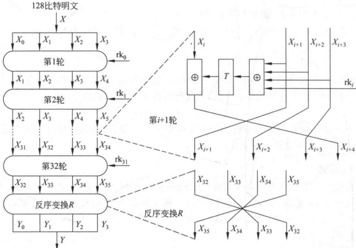

**图 3-24 SM4 算法的加密算法和轮函数结构图**

解密算法：

$$\begin{aligned}\boldsymbol{X}_{i}=&\boldsymbol{F}(\boldsymbol{X}_{i+4},\boldsymbol{X}_{i+3},\boldsymbol{X}_{i+2},\boldsymbol{X}_{i+1},\mathrm{r}\mathrm{k}_{i})\\=&\boldsymbol{X}_{i+4}\oplus\boldsymbol{T}(\boldsymbol{X}_{i+3}\oplus\boldsymbol{X}_{i+2}\oplus\boldsymbol{X}_{i+1}\oplus\mathrm{r}\mathrm{k}_{i})(i=31,30,\cdots,1,0)\end{aligned}$$

与加密算法之后需要一个反序处理同样的道理，在解密算法之后也需要一个反序处理R：

$$(X_{0},X_{1},X_{2},X_{3})=R(X_{3},X_{2},X_{1},X_{0})$$

6. 密钥扩展算法

SM4算法加密时输入128位的密钥，采用32轮迭代结构，每一轮使用一个32位的轮密钥，共使用32个轮密钥。使用密钥扩展算法，从加密密钥产生出32个轮密钥。

1）常数 FK

在密钥扩展中使用如下的常数：

$$\mathrm{FK}_{0}=(\mathrm{A}3\mathrm{B}1\mathrm{B}\mathrm{AC}6),\quad\mathrm{FK}_{1}=(56\mathrm{AA}3350),$$

$$\mathrm{FK}_{2}=\left(677\mathrm{D}9197\right),\quad\mathrm{FK}_{3}=\left(\mathrm{B}27022\mathrm{DC}\right)$$

2）固定参数CK

共使用32个固定参数CK，每个CK，是一个字，其产生规则如下：

设  $\mathrm{ck}_{i,j}$ 为  $CK_i$ 的第  $j$ 字节 ( $i=0,1,\cdots,31; j=0,1,2,3$)，即  $CK_i = (ck_{i,0}, ck_{i,1}, ck_{i,2}, ck_{i,3})$，则  $\mathrm{ck}_{i,j} = (4i + j) \times 7 \pmod{256}$

这 32 个固定参数如下（十六进制）：

$${00070\mathrm{E}15},\quad1\mathrm{C}232\mathrm{A}31,\quad383\mathrm{F}464\mathrm{D},\quad545\mathrm{B}6269$$

$$\begin{array}{l} 70777E85,\quad8C939AA1,\quad A8AFB6BD,\quad C4CBD2D9 \end{array}$$

$$\mathrm{E0E7EEF5},\quad\mathrm{FC030A11},\quad181\mathrm{F262D},\quad343\mathrm{B4249}$$

$${50575\mathrm{E}65},\quad6\mathrm{C}737\mathrm{A}81,\quad888\mathrm{F}969\mathrm{D},\quad\mathrm{A}4\mathrm{A}\mathrm{B}\mathrm{B}2\mathrm{B}9$$

$$C0C7CED5,\quad DCE3EAF1,\quad F8FF060D,\quad141B2229$$

$$A0A7AEB5,\quad BCC3CAD1,\quad D8DFE6ED,\quad F4FB0209$$

$$\begin{array}{r}30373\mathrm{E}45,\quad4\mathrm{C}535\mathrm{A}61,\quad686\mathrm{F}767\mathrm{D},\quad848\mathrm{B}9299\end{array}$$

$${10171\mathrm{E}25},\quad2\mathrm{C}333\mathrm{A}41,\quad484\mathrm{F}565\mathrm{D},\quad646\mathrm{B}7279$$

3）密钥扩展算法

设输入的加密密钥为  $\mathrm{MK} = (\mathrm{MK}_0, \mathrm{MK}_1, \mathrm{MK}_2, \mathrm{MK}_3)$，输出轮密钥为  $\mathrm{rk}_i$ ( $i = 0, 1, \cdots, 30, 31$)，密钥扩展算法可描述如下，其中， $K_i$ ( $i = 0, 1, \cdots, 35$) 为中间数据：

$$(1)\ (K_{0},K_{1},K_{2},K_{3})=(MK_{0}\oplus FK_{0},MK_{1}\oplus FK_{1},MK_{2}\oplus FK_{2},MK_{3}\oplus FK_{3})$$

$$(2)\text{For}i=0,1,\cdots,31\text{Do}$$

$$\mathbf{r}\mathbf{k}_{i}=K_{i+4}=K_{i}\oplus T^{\prime}(K_{i+1}\oplus K_{i+2}\oplus K_{i+3}\oplus\mathbf{C}\mathbf{K}_{i})$$

其中的变换  $T^{\prime}$ 与加密算法轮函数中的 T 基本相同，只将其中的线性变化 L 修改为以下的  $L^{\prime}$:

$$L^{^{\prime}}(B)=B\oplus(B<<13)\oplus(B<<23)$$

密钥扩展算法的结构与加密算法的结构类似，也是采用了32轮的迭代处理。

## 3.8 祖冲之密码

祖冲之密码算法(ZUC)的名字源于我国古代数学家祖冲之，由信息安全国家重点实验室等单位研制，2011年9月被批准成为新一代宽带无线移动通信系统（LTE）的国际标准，即4G的国际标准。

算法以分组密码的方式产生面向字的流密码所用的密钥流，算法的输入是128比特的初始密钥和128比特的初始向量（IV），输出是以32比特长的字（称为密钥字）为单位的密钥流。

### 3.8.1 算法中的符号及含义

1. 数制表示

下面整数如果不加特殊说明都为十进制，如果有前缀 0x，则表示十六进制，如果有下标 2，则表示二进制。

例如，整数 a 可以有以下不同数制表示形式。

$$\begin{aligned}a=&1234567890& 十进制表示 \\=&\mathtt{0x499602D2}& 十六进制表示 \\=&1001001100101100000001011010010_{2}& 二进制表示 \end{aligned}$$

2. 数据位序

下面所有数据的最高位（或字节）在左边，最低位（或字节）在右边。如 a=

1001001100101100000001011010010_{2},a 的最高位为其最左边一位 1,a 的最低位为其最右边一位 0。

3. 运算符号表示

+ 两个整数加
ab 两个整数 a 和 b 相乘
= 赋值运算
mod 整数取模
+ 整数间逐比特异或（模 2 加）
+ 模  ${2}^{32}$ 加
a || b 串 a 和 b 级联
 $a_{H}$ 整数 a 的高（最左）16 位
 $a_{L}$ 整数 a 的低（最右）16 位
 $a \ll k$ a 循环左移 k 位
 $a \gg 1$ a 右移一位

 $(a_{1},a_{2},\cdots,a_{n})\rightarrow(b_{1},b_{2},\cdots,b_{n})\quad a_{i}$ 到  $b_{i}$ 的并行赋值

例如， $a=\mathtt{0x1234}$， $b=\mathtt{0x5678}$， $c=a\mid b=\mathtt{0x12345678}$。

例如，a=1001001100101100000001011010010，则

$$a_{H}=1001001100101100_{2},\quad a_{L}=0000001011010010_{2}$$

例如，a=11001001100101100000001011010010，则

$$a>>1=1100100110010110000000101101001_{2}$$

例如，设  $a_{1}, a_{2}, \cdots, a_{15}, b_{1}, b_{2}, \cdots, b_{15}$ 都是整数， $(a_{1}, a_{2}, \cdots, a_{15}) \to (b_{1}, b_{2}, \cdots, b_{15})$ 意味着  $b_{i} = a_{i} (1 \leq i \leq 15)$。

### 3.8.2 祖冲之密码的算法结构

算法从逻辑上分为上中下3层，如图3-25所示。上层是16级线性反馈移位寄存器（LFSR），中层是比特重组（Bit Reconstruction，BR），下层是非线性函数F。

下面是各层的具体解释。

1. 线性反馈移位寄存器

线性反馈移位寄存器(LFSR)由16个31比特寄存器单元 $s_{0}, s_{1}, \cdots, s_{15}$组成，每个单元在集合

$$\{1,2,3,\cdots,2^{31}-1\}$$

中取值。

线性反馈移位寄存器的特征多项式是有限域GF（2 $^{31}$−1）上的16次本原多项式

$$p\left(x\right)=x^{16}-2^{15}x^{15}-2^{17}x^{13}-2^{21}x^{10}-2^{20}x^{4}-\left(2^{8}+1\right)$$

因此，其输出为有限域  $GF(2^{31}-1)$ 上的 m 序列，具有良好的随机性。

线性反馈移位寄存器的运行模式有两种：初始化模式和工作模式。

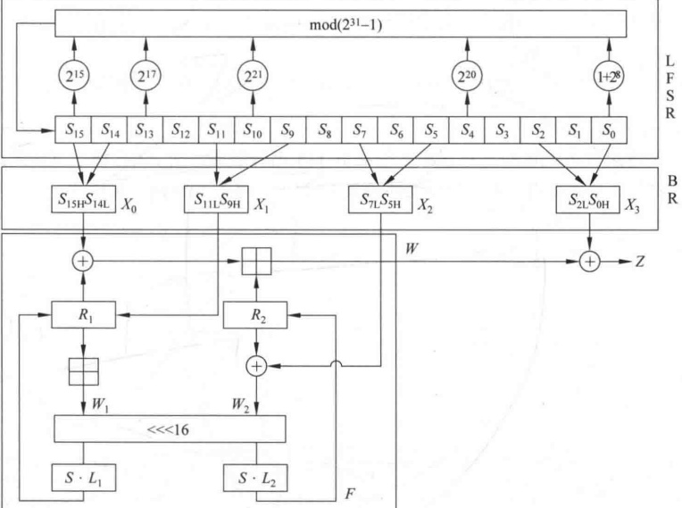

**图 3-25 祖冲之密码算法结构图**

1）初始化模式

在初始化模式中，LFSR 接收一个 31 比特字 u，u 是由非线性函数 F 的 32 比特输出 W 通过舍弃最低位比特得到，即  $u = W \gg 1$。计算过程如下：

LFSRWithInitialisationMode(u)

$$v=2^{15}s_{15}+2^{17}s_{13}+2^{21}s_{10}+2^{20}s_{4}+(1+2^{8})s_{0}\bmod(2^{31}-1);$$

(2)  $s_{16} = (v + u) \mod (2^{31} - 1)$;

（3）如果 $s_{16}=0$，则置 $s_{16}=2^{31}-1$；

$$(4)\quad(s_{1},s_{2},\cdots,s_{15},s_{16})\to(s_{0},s_{1},\cdots,s_{14},s_{15})。$$

2）工作模式

在工作模式下，LFSR 没有输入。计算过程如下：

LFSRWithWorkMode()

$$s_{16}=2^{15}s_{15}+2^{17}s_{13}+2^{21}s_{10}+2^{20}s_{4}+(1+2^{8})s_{0}\bmod(2^{31}-1);$$

（2）如果 $s_{16}=0$，则置 $s_{16}=2^{31}-1$；

$$(3)(s_{1},s_{2},\cdots,s_{15},s_{16})\rightarrow(s_{0},s_{1},\cdots,s_{14},s_{15})$$

比较两种模式，差别在于初始化时需要引入由非线性函数 F 输出的 W 通过舍弃最低位比特得到 u，而工作模式不需要。目的在于，引入非线性函数 F 的输出，使线性反馈移位寄存器的状态随机化。

LFSR 的作用主要是为中层的比特重组(BR)提供随机性良好的输入驱动。

2. 比特重组

比特重组从 LFSR 的寄存器单元中抽取 128 比特组成 4 个 32 比特字  $X_{0}, X_{1}, X_{2}, X_{3}$，其中前 3 个字将用于下层的非线性函数 F，第 4 个字参与密钥流的计算。

具体计算过程如下：

BitReconstruction()
(1)  $X_{0} = s_{15H} \mid |s_{14L}$;
(2)  $X_{1} = s_{11L} \mid |s_{9H}$;
(3)  $X_{2} = s_{7L} \mid |s_{5H}$;
(4)  $X_{3} = s_{2L} \mid |s_{0H}$.

注意：对每个  $i (0 \leqslant i \leqslant 15)$， $s_{i}$ 的比特长是 31，所以  $s_{iH}$ 由  $s_{i}$ 的第 30 到第 15 比特位构成，而不是第 31 到第 16 比特位。

3. 非线性函数 F

非线性函数 F 有 2 个 32 比特长的存储单元  $R_{1}$ 和  $R_{2}$，其输入为来自上层比特重组的 3 个 32 比特字  $X_{0}$、 $X_{1}$、 $X_{2}$，输出为一个 32 比特字 W。因此，非线性函数 F 是一个把 96 比特压缩为 32 比特的一个非线性压缩函数。具体计算过程如下：

$$\begin{aligned}&F(X_{0},X_{1},X_{2})\\&\left\{\right.\\ \end{aligned}$$

(1)  $W = (X_0 \oplus R_1) \oplus R_2$;

(2)  $W_{1}=R_{1}$ ⊕  $X_{1}$;

(3)  $W_2 = R_2 \oplus X_2$;

(4)  $R_1 = S(L_1(W_{1L} \mid W_{2H})))$;

$$\boldsymbol{R}_{2}=\boldsymbol{S}(\boldsymbol{L}_{2}(\boldsymbol{W}_{2L}\mid\mid\boldsymbol{W}_{1H}))\text{。}$$

其中，S 是  ${32} \times 32$ 的 S 盒， $L_{1}$、 $L_{2}$ 是线性变换。S 盒及  $L_{1}$、 $L_{2}$ 的描述如下：

（1）S 盒。 ${32} \times 32$（即输入长和输出长都为 32 比特）的 S 盒 S 由 4 个并置的  ${8} \times 8$ 的 S 盒构成，即

$$\boldsymbol{S}=(\boldsymbol{S}_{0},\boldsymbol{S}_{1},\boldsymbol{S}_{2},\boldsymbol{S}_{3})$$

其中， $S_{2}=S_{0}, S_{3}=S_{1}$，于是有

$$S=(S_{0},S_{1},S_{0},S_{1})$$

 $S_{0}$ 和  $S_{1}$ 的定义分别如表 3-12 和表 3-13 所示。

**表3-12 S盒 $S_{0}$**

|  | 0 | 1 | 2 | 3 | 4 | 5 | 6 | 7 | 8 | 9 | A | B | C | D | E | F |
| --- | --- | --- | --- | --- | --- | --- | --- | --- | --- | --- | --- | --- | --- | --- | --- | --- |
| 0 | 3E | 72 | 5B | 47 | CA | E0 | 00 | 33 | 04 | D1 | 54 | 98 | 09 | B9 | 6D | CB |
| 1 | 7B | 1B | F9 | 32 | AF | 9D | 6A | A5 | B8 | 2D | FC | 1D | 08 | 53 | 03 | 90 |
| 2 | 4D | 4E | 84 | 99 | E4 | CE | D9 | 91 | DD | B6 | 85 | 48 | 8B | 29 | 6E | AC |
| 3 | CD | C1 | F8 | 1E | 73 | 43 | 69 | C6 | B5 | BD | FD | 39 | 63 | 20 | D4 | 38 |
| 4 | 76 | 7D | B2 | A7 | CF | ED | 57 | C5 | F3 | 2C | BB | 14 | 21 | 06 | 55 | 9B |
| 5 | E3 | EF | 5E | 31 | 4F | 7F | 5A | A4 | 0D | 82 | 51 | 49 | 5F | BA | 58 | 1C |
| 6 | 4A | 16 | D5 | 17 | A8 | 92 | 24 | 1F | 8C | FF | D8 | AE | 2E | 01 | D3 | AD |
| 7 | 3B | 4B | DA | 46 | EB | C9 | DE | 9A | 8F | 87 | D7 | 3A | 80 | 6F | 2F | C8 |
| 8 | B1 | B4 | 37 | F7 | 0A | 22 | 13 | 28 | 7C | CC | 3C | 89 | C7 | C3 | 96 | 56 |
| 9 | 07 | BF | 7E | F0 | 0B | 2B | 97 | 52 | 35 | 41 | 79 | 61 | A6 | 4C | 10 | FE |
| A | BC | 26 | 95 | 88 | 8A | B0 | A3 | FB | C0 | 18 | 94 | F2 | E1 | E5 | E9 | 5D |
| B | D0 | DC | 11 | 66 | 64 | 5C | EC | 59 | 42 | 75 | 12 | F5 | 74 | 9C | AA | 23 |
| C | 0E | 86 | AB | BE | 2A | 02 | E7 | 67 | E6 | 44 | A2 | 6C | C2 | 93 | 9F | F1 |
| D | F6 | FA | 36 | D2 | 50 | 68 | 9E | 62 | 71 | 15 | 3D | D6 | 40 | C4 | E2 | 0F |
| E | 8E | 83 | 77 | 6B | 25 | 05 | 3F | 0C | 30 | EA | 70 | B7 | A1 | E8 | A9 | 65 |
| F | 8D | 27 | 1A | DB | 81 | B3 | A0 | F4 | 45 | 7A | 19 | DF | EE | 78 | 34 | 60 |

**表3-13 S盒$S_{1}$**

|  | 0 | 1 | 2 | 3 | 4 | 5 | 6 | 7 | 8 | 9 | A | B | C | D | E | F |
| --- | --- | --- | --- | --- | --- | --- | --- | --- | --- | --- | --- | --- | --- | --- | --- | --- |
| 0 | 55 | C2 | 63 | 71 | 3B | C8 | 47 | 86 | 9F | 3C | DA | 5B | 29 | AA | FD | 77 |
| 1 | 8C | C5 | 94 | 0C | A6 | 1A | 13 | 00 | E3 | A8 | 16 | 72 | 40 | F9 | F8 | 42 |
| 2 | 44 | 26 | 68 | 96 | 81 | D9 | 45 | 3E | 10 | 76 | C6 | A7 | 8B | 39 | 43 | E1 |
| 3 | 3A | B5 | 56 | 2A | C0 | 6D | B3 | 05 | 22 | 66 | BF | DC | 0B | FA | 62 | 48 |
| 4 | DD | 20 | 11 | 06 | 36 | C9 | C1 | CF | F6 | 27 | 52 | BB | 69 | F5 | D4 | 87 |
| 5 | 7F | 84 | 4C | D2 | 9C | 57 | A4 | BC | 4F | 9A | DF | FE | D6 | 8D | 7A | EB |
| 6 | 2B | 53 | D8 | 5C | A1 | 14 | 17 | FB | 23 | D5 | 7D | 30 | 67 | 73 | 08 | 09 |
| 7 | EE | B7 | 70 | 3F | 61 | B2 | 19 | 8E | 4E | E5 | 4B | 93 | 8F | 5D | DB | A9 |
| 8 | AD | F1 | AE | 2E | CB | 0D | FC | F4 | 2D | 46 | 6E | JD | 97 | E8 | D1 | E9 |
| 9 | 4D | 37 | A5 | 75 | 5E | 83 | 9E | AB | 82 | 9D | B9 | 1C | E0 | CD | 49 | 89 |
| A | 01 | B6 | BD | 58 | 24 | A2 | 5F | 38 | 78 | 99 | 15 | 90 | 50 | B8 | 95 | E4 |
| B | D0 | 91 | C7 | CE | ED | 0F | B4 | 6F | A0 | CC | F0 | 02 | 4A | 79 | C3 | DE |
| C | A3 | EF | EA | 51 | E6 | 6B | 18 | EC | 1B | 2C | 80 | F7 | 74 | E7 | FF | 21 |
| D | 5A | 6A | 54 | 1E | 41 | 31 | 92 | 35 | C4 | 33 | 07 | 0A | BA | 7E | 0E | 34 |
| E | 88 | B1 | 98 | 7C | F3 | 3D | 60 | 6C | 7B | CA | D3 | 1F | 32 | 65 | 04 | 28 |
| F | 64 | BE | 85 | 9B | 2F | 59 | 8A | D7 | B0 | 25 | AC | AF | 12 | 03 | E2 | F2 |

设 x 是  $S_{0}$ (或  $S_{1}$) 的 8 比特长输入，将 x 写成两个十六进制数  $x = h \mid \ell$，那么  $S_{0}$ (或  $S_{1}$) 的输出是表 3-12 (或表 3-13) 第 h 行和第  $\ell$ 列交叉位置的十六进制数。

$$S_{0}(\mathtt{0x12})=\mathtt{0xF9},S_{1}(\mathtt{0x34})=\mathtt{0xC0}.$$

设 S 的输入、输出分别为 X (32 比特长) 和  $\dot{Y}(32$ 比特长 $)$，将 X 和 Y 分别表示成 4 个字节  $X=x_{0}\parallel x_{1}\parallel x_{2}\parallel x_{3}$， $Y=y_{0}\parallel y_{1}\parallel y_{2}\parallel y_{3}$，那么  $y_{i}=S_{i}(x_{i})$，(i=0,1,2,3)。

例如，设 X=0x12345678，则

$$Y=\mathrm{S}\left(X\right)=\mathrm{S}_{0}\left(\mathtt{0x12}\right)\mathrm{S}_{1}\left(\mathtt{0x34}\right)\mathrm{S}_{2}\left(\mathtt{0x56}\right)\mathrm{S}_{4}\left(\mathtt{0x78}\right)=0\mathrm{xF}9\mathrm{C}05\mathrm{A}4\mathrm{E}$$

（2）线性变换  $L_{1}$ 和  $L_{2}$ 。 $L_{1}$ 和  $L_{2}$ 为 32 比特线性变换，定义如下：

$$\left\{\begin{aligned}L_{1}\left(X\right)=X\oplus\left(X<<<2\right)\oplus\left(X<<<10\right)\oplus\left(X<<<18\right)\oplus\left(X<<<24\right)\\ L_{2}\left(X\right)=X\oplus\left(X<<<8\right)\oplus\left(X<<<14\right)\oplus\left(X<<<22\right)\oplus\left(X<<<30\right)\end{aligned}\right.$$

其中，符号 a << < n 表示把 a 循环左移 n 位。

与式(3-2)相比可知，式(3-4)中的 $L_{1}(X)$与SM4密码中的线性变换 $L(B)$相同。

在非线性函数 F 中采用非线性变换 S 盒的目的是提供混淆作用，采用线性变换 L 的目的是提供扩散作用。正是混淆和扩散相互配合提高了密码的安全性。

非线性函数 F 输出的 W 与比特重组 (BR) 输出的  $X_{3}$ 异或，形成输出密钥序列 Z。算法结构如图 3-25 所示。

4. 密钥装载

密钥装载过程将128比特的初始密钥k和128比特的初始向量IV扩展为16个31比特长的整数，作为LFSR寄存器单元 $s_{0},s_{1},\cdots,s_{15}$的初始状态。

设 k 和 IV 分别为

$$k=k_{0}\left|\left|k_{1}\right|\right|\cdots\left|\left|k_{15}\right|\right.$$

和

$$\mathbf{I}\mathbf{V}=\mathbf{i}\mathbf{v}_{0}~\left\|~\mathbf{i}\mathbf{v}_{1}~\right\|~\cdots~\left\|~\mathbf{i}\mathbf{v}_{15}\right\|$$

其中， $k_{i}$ 和  $iv_{i}$ 均为 8 比特长字节， ${0} \leq i \leq 15$。密钥装入过程如下：

（1）设D为240比特的常量，可按如下方式分成16个15比特的子串：

$$\boldsymbol{D}=\boldsymbol{d}_{0}\mid\mid\boldsymbol{d}_{1}\mid\mid\cdots\mid\mid\boldsymbol{d}_{15}$$

其中， $d_{i}$ 的二进制表示为

$$\begin{aligned}&d_{0}=100010011010111_{2}\\&d_{1}=010011010111100_{2}\\&d_{2}=110001001101011_{2}\\&d_{3}=001001101011110_{2}\\&d_{4}=101011110001001_{2}\\&d_{5}=011010111100010_{2}\\&d_{6}=111000100110101_{2}\\&d_{7}=000100110101111_{2}\\&d_{8}=100110101111000_{2}\\ \end{aligned}$$

$$d_{9}=010111100010011_{2}$$

$$d_{10}=110101111000100_{2}$$

$$d_{11}=001101011110001_{2}$$

$$d_{12}=101111000100110_{2}$$

$$d_{13}=011110001001101_{2}$$

$$d_{14}=111100010011010_{2}$$

$$d_{15}=100011110101100_{2}$$

（2）对  ${0} \leqslant i \leqslant 15$，取  $s_{i} = k_{i} \mid |d_{i}| \mid \mathrm{iv}_{i}$

### 3.8.3 祖冲之密码的运行

算法的运行有两个阶段：初始化阶段和工作阶段。

1. 初始化阶段

调用密钥装载过程，将128比特的初始密钥k和128比特的初始向量IV装入LFSR的寄存器单元变量 $s_{0}, s_{1}, \cdots, s_{15}$中，作为LFSR的初态，并置非线性函数F中的32比特存储单元 $R_{1}$和 $R_{2}$全为0。

然后重复执行以下过程 32 次：

(1) BitReconstruction();

(2)  $W = F(X_{0}, X_{1}, X_{2})$;

(3) LFSRWithInitialisationMode(u).

2. 工作阶段

初始化阶段以后，执行工作阶段。

首先执行以下过程一次，并将 F 的输出 W 丢弃：

(1) BitReconstruction();

(2) $F(X_{0},X_{1},X_{2});$

(3) LFSRWithWorkMode().

然后进入密钥输出阶段，其中每进行一次循环，执行以下过程一次，输出一个32比特的密钥字Z：

(1) BitReconstruction();

(2)  $Z = F(X_0, X_1, X_2) \oplus X_3$;

(3) LFSRWithWorkMode().

### 3.8.4 基于祖冲之密码的机密性算法 128-EEA3

基于祖冲之密码的机密性算法主要用于4G移动通信中移动用户设备UE和无线网络控制设备RNC之间的无线链路上通信信令和数据的加解密。

1. 算法的输入与输出

算法的输入参数见表3-14，输出参数见表3-15。

**表 3-14 ZUC 机密性算法输入参数表**

| 输入参数 | 比特长度 | 备注 |
| --- | --- | --- |
| COUNT | 32 | 计数器 |
| BEARER | 5 | 承载层标识 |
| DIRECTION | 1 | 传输方向标识 |
| CK | 128 | 机密性密钥 |
| LENGTH | 32 | 明文消息的比特长度 |
| M | LENGTH | 明文消息的比特流 |

**表 3-15 ZUC 机密性算法输出参数表**

| 输出参数 | 比特长度 | 备注 |
| --- | --- | --- |
| C | LENGTH | 输出比特流 |

2. 算法工作流程

加解密算法如图3-26所示。

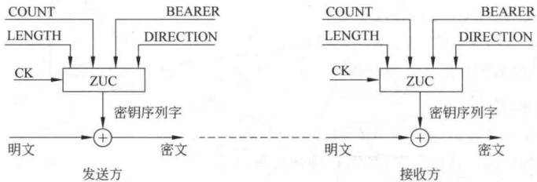

**图 3-26 基于祖冲之密码的机密性算法 128-EEA3**

1）初始化

初始化是指根据机密性密钥 CK 以及其他输入参数（见表 3-14）构造祖冲之算法的初始密钥 k 和初始向量 IV。

把 CK（128 比特长）和 k（128 比特长）分别表示为 16 个字节：

$$\mathrm{C K}=\mathrm{C K}\left[0\right]\mid\mid\mathrm{C K}\left[1\right]\mid\mid\mathrm{C K}\left[2\right]\mid\mid\cdots\mid\mid\mathrm{C K}\left[15\right],$$

$$k=k\left[0\right]\mid\mid k\left[1\right]\mid\mid k\left[2\right]\mid\mid\cdots\mid\mid k\left[15\right]$$

令

$$k\left[i\right]=CK\left[i\right],i=0,1,2,\cdots,15$$

把计数器 COUNT（32 比特长）表示为 4 个字节：

$$COUNT=COUNT[0]||COUNT[1]||COUNT[2]||COUNT[3]$$

把 IV（128 比特长）表示为 16 个字节：

$$\mathrm{I V}=\mathrm{I V}\left[0\right]\vert\vert\mathrm{I V}\left[1\right]\vert\vert\mathrm{I V}\left[2\right]\vert\vert\cdots\vert\vert\mathrm{I V}\left[15\right],$$

$$\left\{IV\left[0\right]=COUNT[0],IV[1]=COUNT[1]\right.$$

$$\mathrm{IV}[2]=\mathrm{COUNT}[2],\mathrm{IV}[3]=\mathrm{COUNT}[3]$$

$$\left|\mathrm{IV}\left[4\right]\right.=BEARER\left|\left|\right.\mathrm{DIRECTION}\left|\left|\right.\right.\right.00_{2}$$

$$\mathrm{IV}[5]=\mathrm{IV}[6]=\mathrm{IV}[7]=00000000_{2}$$

$$\mathrm{IV}[8]=\mathrm{IV}[0],\mathrm{IV}[9]=\mathrm{IV}[1]$$

$$\mathrm{IV}[10]=\mathrm{IV}[2],\mathrm{IV}[11]=\mathrm{IV}[3]$$

$$\mathrm{IV}\left[12\right]=\mathrm{IV}\left[4\right],\mathrm{IV}\left[13\right]=\mathrm{IV}\left[5\right]$$

$$\mathrm{IV}\left[14\right]=\mathrm{IV}\left[6\right],\mathrm{IV}\left[15\right]=\mathrm{IV}\left[7\right]$$

2）密钥流的产生

设消息长为 LENGTH 比特，由初始化算法得到的初始密钥 k 和初始向量 IV，调用 ZUC 密码产生 L 个字（每个 32 比特长）的密钥，其中，L 为

$$L=\left[\begin{array}{l l}\mathrm{L E N G T H/32}\end{array}\right]$$

将生成的密钥流用比特串表示为  $z[0], z[1], \cdots, z[32 \times L - 1]$，其中， $z[0]$ 为 ZUC 算法生成的第一个密钥字的最高位比特， $z[31]$ 为最低位比特，其他以此类推。

3）加解密

密钥流产生之后，数据的加解密就十分简单了。

设长度为 LENGTH 的输入消息的比特流为

$$M=M[0]\mid\mid M[1]\mid\mid M[2]\mid\mid\cdots\mid\mid M[LENGTH-1]$$

则输出的密文比特流为

$$\boldsymbol{C}=\boldsymbol{C}\left[0\right]\mid\mid\boldsymbol{C}\left[1\right]\mid\mid\boldsymbol{C}\left[2\right]\mid\mid\cdots\mid\mid\boldsymbol{C}\left[\text{LENGTH}-1\right]$$

其中， $C[i]=M[i]\oplus z[i],i=0,1,2,\cdots$，LENGTH-1。

## 习题

1.（1）设 $M^{\prime}$是M的逐比特取补，证明在DES中，如果对明文分组和加密密钥都逐比特取补，那么得到的密文也是原密文的逐比特取补，即

$$如果 Y=DES_{K}\left(X\right)$$

$$那么 \begin{aligned}Y^{\prime}=DES_{k^{\prime}}\left(X^{\prime}\right)\end{aligned}$$

提示：对任意两个长度相等的比特串 A 和 B，证明 $(\boldsymbol{A}\oplus\boldsymbol{B})^{\prime}=\boldsymbol{A}^{\prime}\oplus\boldsymbol{B}$。

（2）对 DES 进行穷搜索攻击时，需要在由  ${2}^{56}$ 个密钥构成的密钥空间进行。能否根据（1）的结论减小进行穷搜索攻击时所用的密钥空间？

2. 证明 DES 的解密变换是加密变换的逆。

3. 在 DES 的 ECB 模式中，如果在密文分组中有一个错误，解密后仅相应的明文分组受到影响。然而在 CBC 模式中，将有错误传播。例如，在图 3-11 中， $C_{1}$ 中的一个错误明显地将影响  $P_{1}$ 和  $P_{2}$ 的结果。

（1） $P_{2}$ 后的分组是否受到影响？

（2）设加密前的明文分组  $P_{1}$ 中有一个比特的错误，这一错误将在多少个密文分组中传播？对接收者产生什么影响？

4. 在8比特CFB模式中，如果在密文字符中出现1比特的错误，该错误能传播多远？

5. 在实现 IDEA 时，最困难的部分是模  ${2}^{16}+1$ 乘法运算。以下关系给出了实现模乘法的一种有效方法，其中，a 和 b 是两个 n 比特的非 0 整数：

$$a b\bmod(2^{n}+1)=\left\{\begin{array}{ll}(a b\bmod2^{n})-(a b\operatorname{div}2^{n}),&(a b\bmod2^{n})\geqslant(a b\operatorname{div}2^{n})\\ (a b\bmod2^{n})-(a b\operatorname{div}2^{n})+2^{n}+1,&(a b\bmod2^{n})<(a b\operatorname{div}2^{n})\end{array}\right.$$

注意： $(ab\bmod2^{n})$ 相应于 ab 的 n 个最低有效位， $(ab\operatorname{div}2^{n})$ 是 ab 右移 n 位。

（1）证明存在唯一的非负整数 q 和 r，使得  $ab = q(2^{n} + 1) + r$。

（2）求 q 和 r 的上下界。

（3）证明  $q+r<2^{n+1}$

（4）求 $(ab\ \text{div}\ 2^{n})$关于q的表达式。

（5）求  $(ab \bmod 2^n)$ 关于 q 和 r 的表达式。

（6）用（4）和（5）的结果求 r 的表达式，说明 r 的含义。

6.（1）在IDEA的模乘运算中，为什么将模数取为 ${2}^{16}+1$而不

（2）在 IDEA 的模加运算中，为什么将模数取为  ${2}^{16}$ 而不是

7. 证明 SM4 算法满足对合性，即解密过程和加密过程一样，只是密钥的使用顺序相反。

