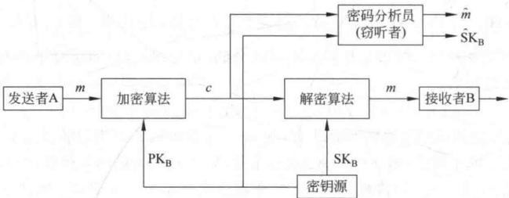
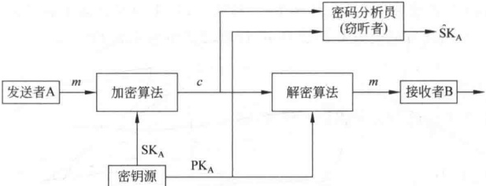
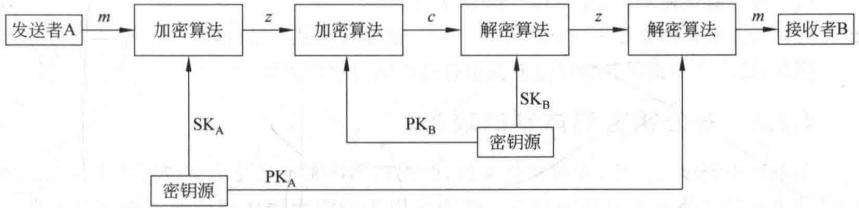
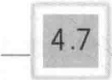
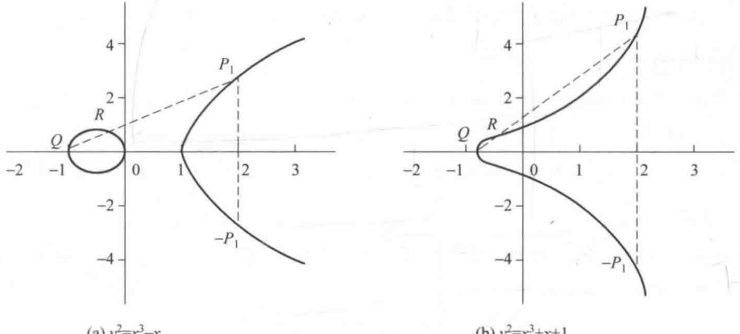
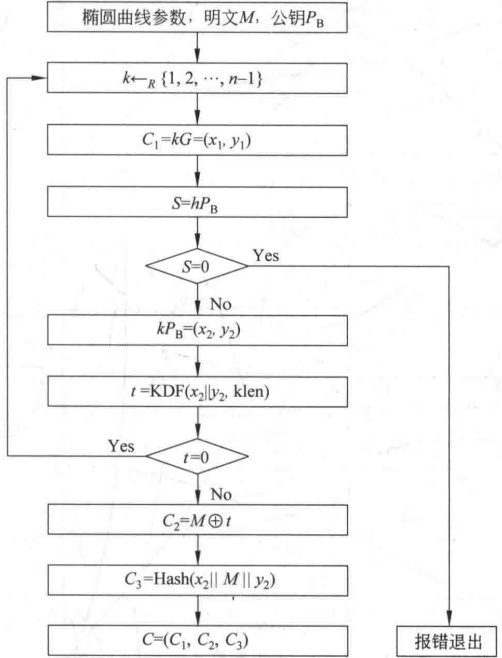
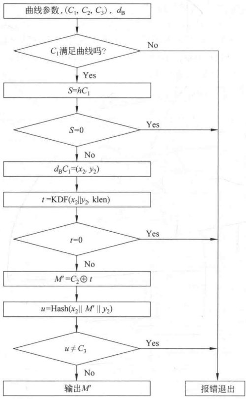

# 第4章 公钥密码

本章首先介绍密码学中常用的一些数学知识，然后介绍公钥密码体制的基本概念和几种重要算法。

## 4.1 密码学中一些常用的数学知识

### 4.1.1 群、环、域

群、环、域都是代数系统（也称代数结构），代数系统是对要研究的现象或过程建立起的一种数学模型，模型中包括要处理的数学对象的集合以及集合上的关系或运算，运算可以是一元的也可以是多元的，可以有一个也可以有多个。

设 * 是集合 S 上的运算，若对  $\forall a, b \in S$，有  $a * b \in S$，则称 S 对运算 * 是封闭的。若 * 是一元运算，对  $\forall a \in S$，有  $a \in S$，则称 S 对运算 * 是封闭的。

若对  $\forall a, b, c \in S$，有  $(a * b) * c = a * (b * c)$，则称 * 满足结合律。

定义 4-1 设 $\langle G, * \rangle$是一个代数系统，* 满足：

（1）封闭性。

（2）结合律。

则称 $\langle G, * \rangle$是半群。

定义 4-2 设 $\langle G, * \rangle$是一个代数系统，* 满足：

（1）封闭性。

（2）结合律。

(3) 存在元素 e，对  $\forall a \in G$，有  $a \cdot e = e \cdot a = a$；e 称为  $\langle G, * \rangle$ 的单位元。

（4）对  $\forall a \in G$，存在元素  $a^{-1}$，使得  $a \cdot a^{-1} = a^{-1} \cdot a = e$；称  $a^{-1}$ 为元素 a 的逆元。则称  $\langle G, * \rangle$ 是群。若其中的运算 * 已明确，有时将  $\langle G, * \rangle$ 简记为  $G$。

如果G是有限集合，则称 $\langle G, * \rangle$是有限群，否则是无限群。有限群中，G的元素个数称为群的阶数。

如果群 $\langle G, * \rangle$中的运算 $*$还满足交换律，即对 $\forall a, b \in G$，有 $a * b = b * a$，则称 $\langle G, * \rangle$为交换群或Abel群。

群中运算 * 一般称为乘法，称该群为乘法群。若运算 * 改为 +，则称为加法群，此时逆元  $a^{-1}$ 写成 -a。

【例4-1】（1）$\langle I,+\rangle$ 是 Abel 群，其中，$I$ 是整数集合。

(2)  $\langle Q, \cdot \rangle$ 是 Abel 群，其中，Q 是有理数集合。

（3）设 A 是任一集合，P 表示 A 上的双射函数集合， $\langle P, \circ \rangle$ 是群，这里  $\circ$ 表示函数的合成，通常这个群不是 Abel 群。

(4)  $\langle Z_{n}, +_{n}\rangle$ 是 Abel 群，其中， $Z_{n} = \{0, 1, \cdots, n-1\}$， $+_{n}$ 是模加， $a + _{n} b$ 等于  $(a+b)\bmod n$， $x^{-1} = n - x$。 $\langle Z_{n}, \times_{n}\rangle$ 不是群，因为 0 没有逆元，这里  $\times_{n}$ 是模乘， $a \times_{n} b$ 等于  $(a \times b)\bmod n$。

定义 4-3 设  $\langle G, * \rangle$ 是一个群， $I$ 是整数集合。如果存在一个元素  $g \in G$，对于每一个元素  $a \in G$，都有一个相应的  $i \in I$，能把  $a$ 表示成  $g^i$，则称  $\langle G, * \rangle$ 为循环群， $g$ 称为循环群的生成元，记  $G = \langle g \rangle = \{g^i \mid i \in I\}$。称满足方程  $a^m = e$ 的最小正整数  $m$ 为  $a$ 的阶，记为  $|a|$。

密码学中使用的群大多为循环群，循环群的性质在4.1.11节和4.1.12节专门介绍。

定义 4-4 若代数系统  $\langle R, +, \cdot \rangle$ 的二元运算 + 和 · 满足：

(1) <R, +> 是 Abel 群；

(2)  $\langle R, \cdot \rangle$ 是半群；

（3）乘法·在加法+上可分配，即对 $\forall a,b,c\in\mathbb{R}$，有

$$\begin{aligned}a\cdot(b+c)=a\cdot b+a\cdot c 和 (b+c)\cdot a=b\cdot a+c\cdot a\end{aligned}$$

则称 $\langle\mathbb{R},+,\cdot\rangle$是环。

【例4-2】（1） $\langle I,+,\cdot\rangle$是环，因为 $\langle I,+\rangle$是Abel群， $\langle I,\cdot\rangle$是半群，乘法·在加法+上可分配。

(2)  $\langle Z_n, +_n, \times_n \rangle$ 是环，因为  $\langle Z_n, +_n \rangle$ 是 Abel 群， $\langle Z_n, \times_n \rangle$ 是半群， $\times_n$ 对  $+_n$ 可分配。

（3）$\langle\mathbf{M}_{n},+,\cdot\rangle$ 是环，这里$\mathbf{M}_{n}$ 是$I$ 上$n\times n$ 方阵集合，+是矩阵加法，·是矩阵乘法。

(4)  $\langle R(x), +, \cdot \rangle$ 是环，这里  $R(x)$ 是所有实系数的多项式集合，+ 和  $\cdot$ 分别是多项式加法和乘法。

定义 4-5 若代数系统  $\langle F, +, \cdot, \rangle$ 的二元运算 + 和 · 满足：

（1）〈F，+〉是 Abel 群；

(2)  $\langle\mathbf{F}-\{0\},\cdot\rangle$ 是 Abel 群，其中 0 是 + 的单位元；

（3）乘法·在加法+上可分配，即对 $\forall a,b,c\in\mathbb{F}$，有

$$\boldsymbol{a}\cdot(\boldsymbol{b}+\boldsymbol{c})=\boldsymbol{a}\cdot\boldsymbol{b}+\boldsymbol{a}\cdot\boldsymbol{c}\quad 和 \quad(\boldsymbol{b}+\boldsymbol{c})\cdot\boldsymbol{a}=\boldsymbol{b}\cdot\boldsymbol{a}+\boldsymbol{c}\cdot\boldsymbol{a}$$

则称 $\langle F, +, \cdot \rangle$是域。

 $\langle Q, +, \cdot, \rangle$、 $\langle R, +, \cdot, \rangle$、 $\langle C, +, \cdot, \rangle$都是域，其中Q、R、C分别是有理数集合、实数集合和复数集合。

有限域是指域中元素个数有限的域，元素个数称为域的阶。若 q 是素数的幂，即  $q=p^{r}$，其中，p 是素数，r 是自然数，则阶为 q 的域称为 Galois 域，记为  $\mathrm{GF}(q)$ 或  $\mathbb{F}_{q}$。

已知所有实系数的多项式集合  $R(x)$ 在多项式加法和乘法运算下构成环。类似地，任意域 F 上的多项式（即系数取自 F）集合  $F(x)$ 在多项式的加法和乘法运算下也构成环。

 $F(x)$中不可约多项式的概念与整数中的素数概念类似，是指在F上仅能被非0常数或自身的常数倍除尽，但不能被其他多项式除尽的多项式。

两个多项式的最高公因式为1时，称它们互素。

多项式的系数取自以素数 p 为模的域 F 时，这样的多项式集合记为  $F_{p}[x]$。若  $m(x)$ 是  $F_{p}[x]$ 上的 n 次不可约多项式， $F_{p}[x]$ 上多项式加法和乘法改为以  $m(x)$ 为模的加法和乘法，此时的多项式集合记为  $F_{p}[x]/m(x)$，集合中元素个数为  $p^{n}$， $F_{p}[x]/m(x)$ 是一个有限域  $\mathrm{GF}(p^{n})$。

### 4.1.2 素数和互素数

1. 因子

设  $a, b (b \neq 0)$ 是两个整数，如果存在另一个整数 m，使得 a = mb，则称 b 整除 a，记为  $b \mid a$，且称 b 是 a 的因子；否则称 b 不整除 a，记为  $b \nmid a$。

整数具有以下性质：

(1)  $a\mid1$ , 那么  $a=\pm1$ ;

(2) a | b 且 b | a，则  $a = \pm b$;

（3）对任一 $b(b\neq0)$， $b\mid0$;

(4)  $b|g, b|h$，则对任意整数 m、n 有  $b|(mg + nh)$。

这里只给出(4)的证明，其他3个性质的证明都很简单。

证(4)：由 $b|g,b|h$知，存在整数 $g_{1},h_{1}$，使得

$$g=b g_{1},\quad h=b h_{1}$$

所以

$$mg+nh=mbg_{1}+nbh_{1}=b\left(mg_{1}+nh_{1}\right)$$

因此， $b\left|\left(mg+nh\right)\right.$

2. 素数

称整数 p (p > 1) 是素数，如果 p 的因子只有  $\pm 1$ 和  $\pm p$。

若 p 不是素数，则称为合数。

任一整数  $a (a > 1)$ 都能唯一地分解为以下形式：

$$a=p_{1}^{a_{1}}p_{2}^{a_{2}}\cdots p_{i}^{a_{i}}$$

其中， $p_{1}<p_{2}<\cdots<p_{t}$ 是素数， $a_{i}>0(i=1,\cdots,t)$。例如

$${91}=7\times13,\quad11011=7\times11^{2}\times13$$

这一性质称为整数分解的唯一性，也可如下陈述：

设 P 是所有素数集合，则任意整数 a (a > 1) 都能唯一地写成以下形式：

$$a=\prod_{p\in P}p^{a_{p}}$$

其中， $a_{p} \geqslant 0$。

等号右边的乘积项取所有的素数，然而大多指数项 $a_{p}$为0。

相应地，任一正整数也可由非0指数列表表示。如：11011可表示为 $\{a_{7}=1,a_{11}=2,a_{13}=1\}$。

两数相乘等价于对应的指数相加，即，由 k=mn 可得：对每一素数 p， $k_{p}=m_{p}+n_{p}$。而由 a  $\mid b$ 可得：对每一素数 p， $a_{p}\leqslant b_{p}$。这是因为  $p^{k}$ 只能被  $p^{j}(j\leqslant k)$ 整除。

3. 互素数

称 c 是两个整数 a、b 的最大公因子，如果

(1) c 是 a 的因子也是 b 的因子，即 c 是 a、b 的公因子。

(2) a 和 b 的任一公因子，也是 c 的因子。

表示为  $c = \gcd(a, b)$。

由于要求最大公因子为正，所以  $\gcd(a,b)=\gcd(a,-b)=\gcd(-a,b)=\gcd(-a,-b)$。一般  $\gcd(a,b)=\gcd(|a|,|b|)$。由任一非 0 整数能整除 0，可得  $\gcd(a,0)=a$。如果将 a、b 都表示为素数的乘积，则  $\gcd(a,b)$ 极易确定。

【例4-3】

$${300}=2^{2}\times3^{1}\times5^{2}$$

$${18}=2^{1}\times3^{2}$$

$$(18,300)=2^{1}\times3^{1}\times5^{0}=6$$

一般由  $c = \gcd(a, b)$ 可得：对每一素数 p,  $c_p = \min(a_p, b_p)$。

如果  $\gcd(a,b)=1$，则称 a 和 b 互素。

称 d 是两个整数 a、b 的最小公倍数，如果

(1) d 是 a 的倍数也是 b 的倍数，即 d 是 a、b 的公倍数；

（2）a 和 b 的任一公倍数，也是 d 的倍数。

表示为  $d = \mathrm{lcm}(a, b)$。

若 a、b 是两个互素的正整数，则  $\mathrm{lcm}(a,b)=ab$。

### 4.1.3 模运算

设 n 是一个正整数，a 是整数，如果用 n 除 a，得商为 q，余数为 r，则

$$a=q n+r,\quad0\leqslant r<n,\quad q=\left\lfloor\frac{a}{n}\right\rfloor$$

其中， $\lfloor x\rfloor$为小于或等于x的最大整数。

用  $a \bmod n$ 表示余数 r，则  $a = \left\lfloor \frac{a}{n} \right\rfloor n + a \bmod n$。

如果 $(a \bmod n) = (b \bmod n)$，则称两整数a和b模n同余，记为 $a \equiv b \bmod n$。称与a模n同余的数的全体为a的同余类，记为 $[a]$，称a为这个同余类的表示元素。

注意：如果  $a \equiv 0 (\bmod n)$，则  $n \mid a$。

同余有以下性质：

(1)  $n|(a-b)$ 与  $a \equiv b \mod n$ 等价。

(2) $(a \bmod n) = (b \bmod n)$，则 $a \equiv b \bmod n$。

(3)  $a \equiv b \mod n$, 则  $b \equiv a \mod n$.

(4)  $a \equiv b \mod n$,  $b \equiv c \mod n$, 则  $a \equiv c \mod n$。

(5) 如果  $a \equiv b \mod n, d \mid n$，则  $a \equiv b \mod d$。

(6) 如果  $a \equiv b \mod n_i$ ( $i = 1, \cdots, k$),  $d = \mathrm{lcm}(n_1, \cdots, n_k)$, 则  $a \equiv b \mod d$。

证明（5）由  $a \equiv b \bmod n$ 及  $d \mid n$，得  $n \mid (a-b)$， $d \mid (a-b)$。

（6）由 $a \equiv b \bmod n_{i}$得， $n_{i} \mid (a-b)$，即a-b是 $n_{1},\cdots,n_{k}$的公倍数，所以 $d \mid (a-b)$。

从以上性质易知，同余类中的每一元素都可作为这个同余类的表示元素。

求余数运算（简称求余运算） $a \bmod n$ 将整数 a 映射到集合  $\{0,1,\cdots,n-1\}$，称求余运算在这个集合上的算术运算为模运算，模运算有以下性质：

$$\left[\left(a\bmod n\right)+\left(b\bmod n\right)\right]\bmod n=\left(a+b\right)\bmod n$$

$$[(a\bmod n)-(b\bmod n)]\bmod n=(a-b)\bmod n.$$

$$[(a\bmod n)\times(b\bmod n)]\bmod n=(a\times b)\bmod n.$$

证(1): 设  $(a \bmod n) = r_a$,  $(b \bmod n) = r_b$, 则存在整数 j, k 使得  $a = jn + r_a$,  $b = kn + r_b$。

因此

$$\begin{aligned}(a+b)\bmod n=&[(j+k)n+r_{a}+r_{b}]\bmod n=(r_{a}+r_{b})\bmod n\\=&[(a\bmod n)+(b\bmod n)]\bmod n\end{aligned}$$

(2)、(3)的证明类似。

【例 4-4】设 $Z_{8}=\{0,1,\cdots,7\}$，考虑 $Z_{8}$上的模加法和模乘法，结果如表4-1所示。

**表4-1 模8运算**

| + | 0 | 1 | 2 | 3 | 4 | 5 | 6 | 7 | $\times$ | 0 | 1 | 2 | 3 | 4 | 5 | 6 | 7 |
| --- | --- | --- | --- | --- | --- | --- | --- | --- | --- | --- | --- | --- | --- | --- | --- | --- | --- |
| 0 | 0 | 1 | 2 | 3 | 4 | 5 | 6 | 7 | 0 | 0 | 0 | 0 | 0 | 0 | 0 | 0 | 0 |
| 1 | 1 | 2 | 3 | 4 | 5 | 6 | 7 | 0 | 1 | 0 | 1 | 2 | 3 | 4 | 5 | 6 | 7 |
| 2 | 2 | 3 | 4 | 5 | 6 | 7 | 0 | 1 | 2 | 0 | 2 | 4 | 6 | 0 | 2 | 4 | 6 |
| 3 | 3 | 4 | 5 | 6 | 7 | 0 | 1 | 2 | 3 | 0 | 3 | 6 | 1 | 4 | 7 | 2 | 5 |
| 4 | 4 | 5 | 6 | 7 | 0 | 1 | 2 | 3 | 4 | 0 | 4 | 0 | 4 | 0 | 4 | 0 | 4 |
| 5 | 5 | 6 | 7 | 0 | 1 | 2 | 3 | 4 | 5 | 0 | 5 | 2 | 7 | 4 | 1 | 6 | 3 |
| 6 | 6 | 7 | 0 | 1 | 2 | 3 | 4 | 5 | 6 | 0 | 6 | 4 | 2 | 0 | 6 | 4 | 2 |
| 7 | 7 | 0 | 1 | 2 | 3 | 4 | 5 | 6 | 7 | 0 | 7 | 6 | 5 | 4 | 3 | 2 | 1 |

从加法结果可见，对每一 x，都有一 y，使得  $x + y \equiv 0 \bmod 8$。如对 2，有 6，使得  ${2} + 6 \equiv 0 \bmod 8$，称 y 为 x 的负数，也称为加法逆元。

对 x，若有 y，使得  $x \times y \equiv 1 \bmod 8$，如  ${3} \times 3 \equiv 1 \bmod 8$，则称 y 为 x 的倒数，也称为乘法逆元。本例可见，并非任一 x 都有乘法逆元。

一般，定义 $Z_{n}$为小于n的所有非负整数集合，即

$$\mathbb{Z}_{n}=\{0,1,\cdots,n-1\}$$

称 $Z_{n}$为模n的同余类集合。其上的模运算有以下性质：

（1）交换律

$$\begin{aligned}&(w+x)\bmod n=(x+w)\bmod n\\&(w\times x)\bmod n=(x\times w)\bmod n\end{aligned}$$

（2）结合律

$$\begin{aligned}&[(w+x)+y]\bmod n=[w+(x+y)]\bmod n\\ &[(w\times x)\times y]\bmod n=[w\times(x\times y)]\bmod n\\ \end{aligned}$$

（3）分配律

$$[\scriptstyle w\times(x+y)]\bmod n=\left[(w\times x)+(w\times y)\right]\bmod n$$

（4）单位元

$$\begin{aligned}&(0+w)\bmod n=w\bmod n\\&(1\times w)\bmod n=w\bmod n\end{aligned}$$

（5）加法逆元。对  $w \in \mathbb{Z}_n$，存在  $z \in \mathbb{Z}_n$，使得  $w + z \equiv 0 \mod n$，记  $z = -w$。此外还有以下性质：

如果 $(a+b)\equiv(a+c)\bmod n$，则 $b\equiv c\bmod n$，称为加法的可约律。

该性质可由 $(a+b)\equiv(a+c)\bmod n$的两边同加上

然而类似性质对乘法却不一定成立。例如， ${6} \times 3 \equiv 6 \times 7 \equiv 2 \mod 8$，但  ${3} \not\equiv 7 \mod 8$。原因是6乘0～7得到的8个数仅为 $Z_8$的一部分，看上例。如果将对 $Z_8$作6的乘法 ${6} \times Z_8$（即用6乘 $Z_8$中每一数）看作 $Z_8$到 $Z_8$的映射的话， $Z_8$中至少有两个数映射到同一数，因此该映射为多到一的，所以对6来说，没有唯一的乘法逆元。但对5来说， ${5} \times 5 \equiv 1 \mod 8$，因此5有乘法逆元5。仔细观察可见，与8互素的几个数1、3、5、7都有乘法逆元。

$$\mathcal{Z}_{n}^{*}=\left\{a\mid0<a<n,\gcd(a,n)=1\right\}。$$

定理 4-1  $Z_{n}^{*}$ 中每一元素都有乘法逆元。

证明 首先证明 $Z_n^*$中任一元素 $a$与 $Z_n^*$中任意两个不同元素 $b,c$（不妨设 $c<b$）相乘，其结果必然不同。否则设 $a\times b\equiv a\times c\mod n$，则存在两个整数 $k_1,k_2$，使得 $ab=k_1n+r$， $ac=k_2n+r$，可得 $a(b-c)=(k_1-k_2)n$，所以 $a$是 $(k_1-k_2)n$的一个因子。又由 $\gcd(a,n)=1$，得 $a$是 $k_1-k_2$的一个因子，设 $k_1-k_2=k_3a$，所以 $a(b-c)=k_3an$，即 $b-c=k_3n$，与 ${0}<c<b<n$矛盾。所以 $|a\times Z_n^*\|=|Z_n^*\|a$。

对  $a \times \mathbb{Z}_n^*$ 中任一元素 ac，由  $\gcd(a, n) = 1$， $\gcd(c, n) = 1$，得  $\gcd(ac, n) = 1$， $ac \in \mathbb{Z}_n^*$，所以  $a \times \mathbb{Z}_n^* \subseteq \mathbb{Z}_n^*$。

由以上两条得  $a \times \mathbb{Z}_n^* = \mathbb{Z}_n^*$。因此对  ${1} \in \mathbb{Z}_n^*$，存在  $x \in \mathbb{Z}_n^*$，使得  $a \times x \equiv 1 \mod n$，即  $x$ 是  $a$ 的乘法逆元。记为  $x = a^{-1}$。

（定理4-1证毕）

证明中用到如下结论：设 A、B 是两个集合，满足  $A \subseteq B$ 且  $|A| = |B|$，则 A = B。

设 p 为一素数，则  $Z_{p}$ 中每一非 0 元素都与 p 互素，因此有乘法逆元。类似于加法可约律，可有以下乘法可约律：

如果 $(a \times b) \equiv (a \times c) \mod n$ 且  $a$ 有乘法逆元，那么对 $(a \times b) \equiv (a \times c) \mod n$ 两边同乘以  $a^{-1}$，即得  $b \equiv c \mod n$。

### 4.1.4 模指数运算

模指数运算是指对给定的正整数 m, n, 计算  $a^{m} \bmod n$。

【例 4-5】 $a=7,n=19$，则易求出  ${7}^{1}\equiv7\mod19$， ${7}^{2}\equiv11\mod19$， ${7}^{3}\equiv1\mod19$。

由于  ${7}^{3+j} = 7^3 \cdot 7^j \equiv 7^j \mod 19$，所以  ${7}^4 \equiv 7 \mod 19$， ${7}^5 \equiv 7^2 \mod 19$， $\cdots$，即从  ${7}^4 \mod 19$ 开始所求的幂出现循环，循环周期为 3。

可见，在模指数运算中，若能找出循环周期，则会使得计算简单。

称满足方程  $a^{m} \equiv 1 \bmod n$ 的最小正整数 m 为模 n 下 a 的阶，记为  $\mathrm{ord}_{n}(a)$。

定理 4-2 设  $\mathrm{ord}_{n}(a)=m$，则  $a^{k} \equiv 1 \bmod n$ 的充要条件是 k 为 m 的倍数。

证明 设存在整数 q，使得  $k = qm$，则  $a^k \equiv (a^m)^q \equiv 1 \mod n$。反之，假定  $a^k \equiv 1 \mod n$，令  $k = qm + r$ 其中  ${0} < r \leq m - 1$，那么

$$a^{k}\equiv(a^{m})^{q}a^{r}\equiv a^{r}\equiv1(\bmod n)$$

与 m 是阶矛盾。

（定理4-2证毕）

### 4.1.5 费尔马定理、欧拉定理、卡米歇尔定理

这3个定理在公钥密码体制中起着重要作用。

1. 费尔马(Fermat)定理

定理 4-3（费尔马定理） 若 p 是素数，a 是正整数且  $\gcd(a, p) = 1$，则  $a^{p-1} \equiv 1 \bmod p$。

证明 在定理 4-1 的证明中知，当  $\gcd(a, p) = 1$ 时， $a \times \mathbb{Z}_p = \mathbb{Z}_p$，其中， $a \times \mathbb{Z}_p$ 表示  $a$ 与  $\mathbb{Z}_p$ 中每一元素做模  $p$ 乘法。又知  $a \times 0 \equiv 0 \mod p$，所以  $a \times \mathbb{Z}_p - \{0\} = \mathbb{Z}_p - \{0\}$， $a \times (\mathbb{Z}_p - \{0\}) = \mathbb{Z}_p - \{0\}$。即

$$\{a\bmod p,2a\bmod p,\cdots,(p-1)a\bmod p\}=\{1,2,\cdots,p-1\}$$

分别将两个集合中的元素连乘，得：

$$\begin{aligned}a\times2a\times\cdots(p-1)a&\equiv[(a\bmod p)\times(2a\bmod p)\times\cdots\times((p-1)a\bmod p)]\bmod p\\ &\equiv(p-1)!\bmod p\end{aligned}$$

另一方面，

$$a\times2a\times\cdots(p-1)a=(p-1)!a^{p-1}$$

因此

$$(p-1)!~a^{p-1}\equiv(p-1)!\mod p$$

由于 $(p-1)$！与p互素，因此 $(p-1)$！有乘法逆元，由乘法可约律得 $a^{p-1}\equiv1\bmod p$。

（定理4-3证毕）

费尔马定理也可写成如下形式：设 p 是素数，a 是任一正整数，则  $a^{p} \equiv a \bmod p$。

2. 欧拉函数

设 n 是一正整数，小于 n 且与 n 互素的正整数的个数称为 n 的欧拉函数，记为  $\varphi(n)$。

【例 4-6】 $\varphi(6)=2,\varphi(7)=6,\varphi(8)=4$

定理 4-4 （1）若 n 是素数，则  $\varphi(n)=n-1$；

（2）若 n 是两个素数 p 和 q 的乘积，则  $\varphi(n)=\varphi(p)\times\varphi(q)=(p-1)\times(q-1)$;

（3）若有标准分解式  $n=p_{1}^{\alpha_{1}}p_{2}^{\alpha_{2}}\cdots p_{t}^{\alpha_{t}}$，则  $\varphi(n)=n\left(1-\frac{1}{p_{1}}\right)\cdots\left(1-\frac{1}{p_{t}}\right)$

证明（1）显然：

(2) 考虑  $Z_n = \{0, 1, \cdots, pq - 1\}$，其中不与  $n$ 互素的数有 3 类：即  $A = \{p, 2p, \cdots, (q-1)p\}$， $B = \{q, 2q, \cdots, (p-1)q\}$， $C = \{0\}$，且  $A \cap B = \varnothing$，否则如果  $ip =$
$jq$, 其中， ${1}\leqslant i\leqslant q-1$, ${1}\leqslant j\leqslant p-1$, 则 $p$ 是 $jq$ 的因子， 因此是 $j$ 的因子， 设 $j=kp$, $k\geqslant1$。则 $ip=kpq$, $i=kq$, 与 ${1}\leqslant i\leqslant q-1$ 矛盾。所以

$$\begin{aligned}\varphi(n)=&\mid Z_{n}\mid-\left[\mid A\mid+\mid B\mid+\mid C\mid\right]=pq-\left[(q-1)+(p-1)+1\right]\\=&(p-1)\times(q-1)=\varphi(p)\times\varphi(q)\end{aligned}$$

（3）当 $n=p^{a}$时， ${1}\sim n$与n不互素的数有 ${1}\cdot p,2\cdot p,\cdots,p^{a-1}\cdot p$，共 $p^{a-1}$个，所以 $\varphi(p^{a})=p^{a}-p^{a-1}$。

当  $n=p_{1}^{a_{1}}p_{2}^{a_{2}}\cdots p_{t}^{a_{t}}$ 时，由(2)得，

$$\begin{align*}\varphi(n)=&\varphi(p_{_{1}}^{^{a_{1}}})\varphi(p_{_{2}}^{^{a_{2}}})\cdots\varphi(p_{_{t}}^{^{a_{t}}})=(p_{_{1}}^{^{a_{1}}}-p_{_{1}}^{^{a_{1}}-1})(p_{_{2}}^{^{a_{2}}}-p_{_{2}}^{^{a_{2}}-1})\cdots(p_{_{t}}^{^{a_{t}}}-p_{_{t}}^{^{a_{t}}-1})\\=&n\left(1-\frac{1}{p_{_{1}}}\right)\cdots\left(1-\frac{1}{p_{_{t}}}\right)\end{align*}$$

（定理4-4证毕）

【例 4-7】 $\varphi(21)=\varphi(3\times7)=\varphi(3)\times\varphi(7)=2\times6=12$

$$\varphi(72)=\varphi(2^{3}3^{2})=72\left(1-\frac{1}{2}\right)\left(1-\frac{1}{3}\right)=24$$

3. 欧拉(Euler)定理

定理 4-5（欧拉定理） 若 a 和 n 互素，则  $a^{\varphi(n)} \equiv 1 \bmod n$。

证明 设  $R = \{x_1, x_2, \cdots, x_{\varphi(n)}\}$ 是由小于 n 且与 n 互素的全体数构成的集合， $a \times R = \{ax_1 \bmod n, ax_2 \bmod n, \cdots, ax_{\varphi(n)} \bmod n\}$，考虑  $a \times R$ 中任一元素  $ax_i \bmod n$，因 a 与 n 互素， $x_i$ 与 n 互素，所以  $ax_i$ 与 n 互素，且  $ax_i \bmod n < n$，因此  $ax_i \bmod n \in R$，所以  $a \times R \subseteq R$。

又因  $a \times R$ 中任意两个元素都不相同，否则  $a x_{i} \bmod n = a x_{j} \bmod n$，由 a 与 n 互素知 a 在 mod n 下有乘法逆元，得  $x_{i} = x_{j}$。所以  $\left| a \times R \right| = \left| R \right|$，得  $a \times R = R$，所以  $\prod_{i=1}^{\varphi(n)}(ax_{i} \bmod n) = \prod_{i=1}^{\varphi(n)} x_{i}$， $\prod_{i=1}^{\varphi(n)} ax_{i} \equiv \prod_{i=1}^{\varphi(n)} x_{i} (\bmod n)$， $a^{\varphi(n)} \cdot \prod_{i=1}^{\varphi(n)} x_{i} \equiv \prod_{i=1}^{\varphi(n)} x_{i} (\bmod n)$，由每一  $x_{i}$ 与 n 互素，知  $\prod_{i=1}^{\varphi(n)} x_{i}$ 与 n 互素， $\prod_{i=1}^{\varphi(n)} x_{i}$ 在 mod n 下有乘法逆元。所以  $a^{\varphi(n)} \equiv 1 \bmod n$。

（定理4-5证毕）

推论  $\operatorname{ord}_{n}(a)|\varphi(n)$

推论说明， $\mathrm{ord}_{n}(a)$ 一定是  $\varphi(n)$ 的因子。如果  $\mathrm{ord}_{n}(a)=\varphi(n)$，则称 a 为 n 的本原根。如果 a 是 n 的本原根，则

$$a\ ,a^{2}\ ,\cdots\ ,a^{\varphi(n)}$$

在  $\mod n$ 下互不相同且都与 n 互素。

特别地，如果 a 是素数 p 的本原根，则

$$a,a^{2},\cdots,a^{p-1}$$

在  $\bmod p$ 下都不相同。

【例 4-8】$n=9$，则 $\varphi(n)=6$，考虑 2 在 mod 9 下的幂 ${2}^1 \bmod 9 \equiv 2$，${2}^2 \bmod 9 \equiv 4$，${2}^3 \bmod 9 \equiv 8$，${2}^4 \bmod 9 \equiv 7$，${2}^5 \bmod 9 \equiv 5$，${2}^6 \bmod 9 \equiv 1$。即 $\mathrm{ord}_9(2) = \varphi(9)$，所以 2 为 9 的本原根。

【例 4-9】n=19, a=3 在 mod 19 下的幂分别为

3,9,8,5,15,7,2,6,18,16,10,11,14,4,12,17,13,1

即  $\mathrm{ord}_{19}(3)=18=\varphi(19)$，所以3为19的本原根。

本原根不唯一。可验证除3外，19的本原根还有2，10，13，14，15。

注意并非所有的整数都有本原根，只有以下形式的整数才有本原根：

$${2},4,p^{a},2p^{a}$$

其中，p 为奇素数。

4. 卡米歇尔定理

对满足  $\gcd(a, n) = 1$ 的所有 a，使得  $a^m \equiv 1 \bmod n$ 同时成立的最小正整数 m，称为 n 的卡米歇尔 (Carmichael) 函数，记为  $\lambda(n)$。

【例 4-10】n=8，与8互素的数有1，3，5，7，即 $\varphi(8)=4$。

 ${1}^{2} \equiv 1 \bmod 8$,  ${3}^{2} \equiv 1 \bmod 8$,  ${5}^{2} \equiv 1 \bmod 8$,  ${7}^{2} \equiv 1 \bmod 8$ 所以  $\lambda(8) = 2$。

从该例看出， $\lambda(n)\leq\varphi(n)$。

定理 4-6 （1）如果  $a|b$，则  $\lambda(a)|\lambda(b)$;

（2）对任意互素的正整数a,b，有 $\lambda(ab)=\mathrm{lcm}(\lambda(a),\lambda(b))$;

$$\lambda\left(n\right)=\left\{\begin{aligned}&\varphi\left(n\right)=1,&&n=1\\&\varphi\left(n\right)=1,&&n=2\\&\varphi\left(n\right)=2,&&n=4\\&\frac{1}{2}\varphi\left(n\right)=2^{\alpha-2},&&n=2^{\alpha},\alpha>2\\&\varphi\left(n\right)=p-1,&&n=p,p 奇素数 \\&\varphi\left(n\right)=p^{\alpha}-p^{\alpha-1},&&n=p^{\alpha},p 奇素数 ,\alpha>1\\&lcm\left(\lambda\left(p_{1}^{\alpha_{1}}\right),\cdots,\lambda\left(p_{t}^{\alpha_{t}}\right)\right),&&n=\prod_{i=1}^{t}p_{i}^{\alpha_{i}}\end{aligned}\right.$$

证明 （1）对满足  $\gcd(x,b)=1$ 的所有  $x,x^{\lambda(b)}\equiv1\bmod b$，由  $a\mid b$ 得， $x^{\lambda(b)}\equiv1\bmod a$。设  $\lambda(b)=k\lambda(a)+r$，其中， ${0}\leqslant r<\lambda(a)$，则  $x^{\lambda(b)}\equiv(x^{\lambda(a)})^{k}x^{r}\equiv x^{r}\equiv1\bmod a$，所以 r=0，即  $\lambda(a)\mid\lambda(b)$。

(2) 由(1)得， $\lambda(a)\left|\lambda(ab)\right|$,  $\lambda(b)\left|\lambda(ab)\right|$, 即  $\lambda(ab)$ 是  $\lambda(a)$ 和  $\lambda(b)$ 的公倍数。又设 d 是  $\lambda(a)$ 和  $\lambda(b)$ 的任一公倍数，由  $\lambda(a)\left|d\right|$,  $\lambda(b)\left|d\right|$ 得  $x^{d} \equiv 1 \bmod a$,  $x^{d} \equiv 1 \bmod b$，其中， $\gcd(x,a) = 1$,  $\gcd(x,b) = 1$，所以  $x^{d} \equiv 1 \bmod ab$，其中， $\gcd(x,ab) = 1$,  $\lambda(ab)\left|d\right|$。所以  $\lambda(ab)$ 是  $\lambda(a)$ 和  $\lambda(b)$ 的最小公倍数。

（3）可由（2）得到。

（定理4-6证毕）

定理 4-7（卡米歇尔定理）若 a 和 n 互素，则  $a^{\lambda(n)} \equiv 1 \bmod n$。

证明 设  $n=p_{1}^{\alpha_{1}}p_{2}^{\alpha_{2}}\cdots p_{i}^{\alpha_{i}}$，下面证明  $a^{\lambda(n)}\equiv1\bmod p_{i}^{\alpha_{i}}(i=1,\cdots,t)$。

如果  $p_{i}^{\alpha_{i}}=2,4$ 或奇素数的幂，由定理 4-6(3)， $\lambda(p_{i}^{\alpha_{i}})=\varphi(p_{i}^{\alpha_{i}})$，所以  $a^{\lambda(p_{i}^{\alpha_{i}})}=a^{\varphi(p_{i}^{\alpha_{i}})}\equiv 1 \bmod p_{i}^{\alpha_{i}}$。又因  $\lambda(p_{i}^{\alpha_{i}})\mid\lambda(n)$，所以  $a^{\lambda(n)}\equiv 1 \bmod p_{i}^{\alpha_{i}}$。

当  $p_{i}^{a_{i}}=2^{a_{i}}(\alpha_{i}>2)$ 时， $\lambda(p_{i}^{a_{i}})=\frac{1}{2}\varphi(2^{a_{i}})=2^{a_{i}-2}$，我们需要证明  $a^{2^{a_{i}-2}}\equiv1\mod2^{a_{i}}$，对  $\alpha_{i}$ 用归纳法。当  $\alpha_{i}=3$ 时， $a^{2}\equiv1\mod8$ 对每一奇整数 a 成立。设  $a^{2^{a_{i}-2}}\equiv1\mod2^{a_{i}}$ 对  $\alpha_{i}$ 成立，即  $a^{2^{a_{i}-2}}=1+t2^{a_{i}}$，t 是一个正整数。则当  $\alpha_{i}+1$ 时， $a^{2^{a_{i}-1}}=(1+t2^{a_{i}})^{2}=1+t2^{a_{i}+1}+t^{2}2^{2a_{i}}\equiv1\mod2^{a_{i}+1}$。由归纳法， $a^{2^{a_{i}-2}}\equiv1\mod2^{a_{i}}$ 对任意  $\alpha_{i}(\alpha_{i}>2)$ 成立。

由  $a^{\lambda(n)} \equiv 1 \bmod p_{i}^{\alpha_{i}}$ ( $i = 1, \cdots, t$)，得  $a^{\lambda(n)} \equiv 1 \bmod d$，其中， $d = \mathrm{lcm}(p_{1}^{\alpha_{1}}, \cdots, p_{t}^{\alpha_{t}}) = p_{1}^{\alpha_{1}} \cdots p_{t}^{\alpha_{t}} = n$，所以  $a^{\lambda(n)} \equiv 1 \bmod n$。

（定理4-7证毕）

### 4.1.6 素性检验

素性检验是指对给定的数检验其是否为素数。

1. 爱拉托斯散(Eratosthenes)筛法

定理 4-8 设 n 是一个正整数，如果对所有满足  $p \leqslant \sqrt{n}$ 的素数 p，都有  $p \nmid n$，那么 n 一定是素数。

基于这个定理，有一个寻找素数的算法，称为爱拉托斯散（Eratosthenes）筛法。要找不大于 $n$ 的所有素数，先将 ${2} \sim n$ 的整数都列出，从中删除小于等于 $\sqrt{n}$ 的所有素数 ${2},3,5,7,\cdots,p_k$（设满足 $p \leqslant \sqrt{n}$ 的素数有 $k$ 个）的倍数，余下的整数就是所要求的所有素数。

【例 4-11】求不超过 n=100 的所有素数。

解 因为 $\sqrt{100}=10$，小于10的素数有2、3、5、7，删除2～100的整数中2的倍数（保留2）得：

|  | 2 | 3 | 4 | 5 | 6 | 7 | 8 | 9 | 10 |
| --- | --- | --- | --- | --- | --- | --- | --- | --- | --- |
| 11 | 12 | 13 | 14 | 15 | 16 | 17 | 18 | 19 | 20 |
| 21 | 22 | 23 | 24 | 25 | 26 | 27 | 28 | 29 | 30 |
| 31 | 32 | 33 | 34 | 35 | 36 | 37 | 38 | 39 | 40 |
| 41 | 42 | 43 | 44 | 45 | 46 | 47 | 48 | 49 | 50 |
| 51 | 52 | 53 | 54 | 55 | 56 | 57 | 58 | 59 | 60 |
| 61 | 62 | 63 | 64 | 65 | 66 | 67 | 68 | 69 | 70 |
| 71 | 72 | 73 | 74 | 75 | 76 | 77 | 78 | 79 | 80 |
| 81 | 82 | 83 | 84 | 85 | 86 | 87 | 88 | 89 | 90 |
| 91 | 92 | 93 | 94 | 95 | 96 | 97 | 98 | 99 | 100 |

删去3的倍数（保留3）得：

| 2 | 3 | 5 | 7 | 9 |
| --- | --- | --- | --- | --- |
| 11 | 13 | 15 | 17 | 19 |
| 21 | 23 | 25 | 27 | 29 |
| 31 | 33 | 35 | 37 | 39 |
| 41 | 43 | 45 | 47 | 49 |
| 51 | 53 | 55 | 57 | 59 |
| 61 | 63 | 65 | 67 | 69 |
| 71 | 73 | 75 | 77 | 79 |
| 81 | 83 | 85 | 87 | 89 |
| 91 | 93 | 95 | 97 | 99 |

再分别删除5的倍数（以“-”表示，保留5）和7的倍数（以“=”表示，保留7）得：

| 2 | 3 | 5 | 7 |  |
| --- | --- | --- | --- | --- |
| 11 | 13 |  | 17 | 19 |
|  | 23 | 25 |  | 29 |
| 31 |  | 35 | 37 |  |
| 41 | 43 |  | 47 | 49 |
|  | 53 | 55 |  | 59 |
| 61 |  | 65 | 67 |  |
| 71 | 73 |  | 77 | 79 |
|  | 83 | 85 |  | 89 |
| 91 |  | 95 | 97 |  |

此时，余下的数就是不超过100的所有素数。

爱拉托斯散筛法在判断 n 是否为素数时，要除以不大于  $\sqrt{n}$ 的所有素数，当 n 很大时，实际上是不可行的。

2. Miller-Rabin 概率检测法

引理 4-1 如果 p 为大于 2 的素数，则方程  $x^{2} \equiv 1 (\bmod p)$ 的解只有  $x \equiv 1$ 和  $x \equiv -1$。

证明 由  $x^{2} \equiv 1 \bmod p$，有  $x^{2} - 1 \equiv 0 \bmod p, (x+1)(x-1) \equiv 0 \bmod p$，因此  $p \mid (x+1)$ 或  $p \mid (x-1)$ 或  $p \mid (x+1)$ 且  $p \mid (x-1)$。

若  $p \mid (x+1)$ 且  $p \mid (x-1)$，则存在两个整数 k 和 j，使得  $x+1=kp$，x-1=jp 两式相减得  ${2}=(k-j)p$，为不可能结果。所以有  $p \mid (x+1)$ 或  $p \mid (x-1)$。

设  $p\mid(x+1)$，则  $x+1=kp$，因此  $x\equiv-1(\bmod p)$。

类似地可得  $x \equiv 1 (\bmod p)$。

（引理4-1证毕）

引理 4-1 的逆否命题为：如果方程  $x^{2} \equiv 1 \bmod p$ 有一解  $x_{0} \notin \{-1, 1\}$，那么 p 不为素数。

【例 4-12】考虑方程  $x^{2} \equiv 1 \pmod{8}$，由 4.1.3 节  $Z_{8}$ 上模乘法的结果得

$${1}^{2}\equiv1\bmod{8},\quad3^{2}\equiv1\bmod{8},\quad5^{2}\equiv1\bmod{8},\quad7^{2}\equiv1\bmod{8}$$

又  ${5} \equiv -3 \mod 8$,  ${7} \equiv -1 \mod 8$, 所以方程的解为 1, -1, 3, -3, 可见 8 不是素数。

下面介绍 Miller-Rabin 的素性概率检测法。其核心部分如下：

WITNESS (a, n)

1. 将 n-1 表示为二进制形式  $b_{k}b_{k-1}\cdots b_{0}$;

2. d←1
for i=k downto 0 do{
    x←d;
    d←(d×d)mod n;
    if d=1 and(x≠1)and(x≠n-1) then return FALSE;
    if b₁=1 then d←(d×a)mod n}
if d≠1 then return FALSE;
return TRUE.

算法有两个输入，n 是待检验的数，a 是小于 n 的整数。如果算法的返回值为 FALSE，则 n 肯定不是素数，如果返回值为 TRUE，则 n 有可能是素数。

for 循环结束后，有  $d \equiv a^{n-1} \bmod n$，由 Fermat 定理知，若 n 为素数，则 d 为 1。因此若  $d \neq 1$，则 n 不为素数，所以返回 FALSE。

因为  $n-1 \equiv -1 \bmod n$，所以  $(x \neq 1)$ and  $(x \neq n-1)$ 意指  $x^{2} \equiv 1 (\bmod n)$ 有不在  $\{-1, 1\}$ 中的根，因此 n 不为素数，返回 FALSE。

该算法有以下性质：对 s 个不同的 a，重复调用这一算法，只要有一次算法返回为 FALSE，就可肯定 n 不是素数。如果算法每次返回都为 TRUE，则 n 是素数的概率至少为  ${1}-2^{-s}$，因此对于足够大的 s，就可以非常肯定地相信 n 为素数。

3. AKS 算法

2002 年，印度数学家 Manindra Agrawal、Neeraj Kayal、Nitin Saxena 给出了一个确定性的素数判别算法，简称 AKS 算法。

设 N 和 I 分别是自然数集合和整数集合，且  $n \in \mathbb{N}$， $a \in \mathbb{I}$， $\gcd(a, n) = 1$，满足

$$a^{k}\equiv1\bmod{n}$$

的最小正整数 k 称为模 n 下 a 的阶，记为  $\mathrm{ord}_{n}(a)$。

算法基于以下引理：

引理 4-2 设  $n \geqslant 2$，且是一个自然数， $a \in \mathbf{I}$， $\gcd(a, n) = 1$，则 n 是素数的充要条件是：

$$(X+a)^{n}\equiv X^{n}+a\pmod{n}$$

证明 对  ${0}<i<n,(X+a)^{n}-(X^{n}+a)$ 中  $X^{i}$ 的系数为  $\binom{n}{i}a^{n-i}$

如果 n 是素数，则  $\binom{n}{i}=0$，所以  $x^{i}(0<i<n)$ 的系数都为 0。

如果 n 是合数，可设 q 是它的一个素数因子且  $q^{k}\mid n$，则  $q^{k}$ 不能除尽  $\binom{n}{q}$，而且  $q^{k}$ 和  $a^{n-q}$ 互素，所以在模 n 下， $X^{q}$ 的系数不为 0， $(X+a)^{n}-(X^{n}+a)\neq0 \bmod n$。

（引理4-2证毕）

引理 4-2 给出了一个素数检验的简单方法，然而要验证等式  $(X + a)^n \equiv X^n + a \pmod{n}$ 是否成立，需计算  $n$ 个系数。为了减少系数的计算，可在等式的两边同时对一个形如  $X^r - 1$ 的多项式取模（其中， $r$ 是一个适当选择的小整数），即将判断等式  $(X + a)^n \equiv X^n + a \pmod{n}$ 是否成立，改为判断

$$(X+a)^{n}\equiv X^{n}+a\pmod{X^{r}-1,n}$$

是否成立。 $(X+a)^n \equiv X^n + a \pmod{X^r - 1}, n$ 表示在环  $\mathbb{Z}_n [X] / (X^r - 1)$ 上， $(X + a)^n = X^n + a$。

算法如下：

输入整数n，

1. 如果  $n = a^b$,  $a \in \mathbb{N}$, b > 1, 输出“合数”；

2. 求满足  $\text{ord}_r(n) > \log^2 n$ 的最小的 r;

3. 如果存在 a, 满足  $a \leq r$ 且  ${1} < \gcd(a, n) < n$, 输出“合数”；

4. 如果  $n \leq r$，输出“素数”；

5. for  $a=1$ to  $\lfloor \sqrt{\varphi(r)} \log n \rfloor$ do

如果  $(X+a)^n \not\equiv X^n + a \pmod{X^r - 1}, n$，输出“合数”；

6. 输出“素数”。

### 4.1.7 欧几里得算法

欧几里得(Euclid)算法是数论中的一个基本技术，是求两个正整数的最大公因子的简化过程。而推广的欧几里得算法不仅可求两个正整数的最大公因子，而且当两个正整数互素时，还可求出其中一个数关于另一个数的乘法逆元。

1. 求最大公因子

欧几里得算法是基于下面一个基本结论：

设 a, b 是任意两个正整数，将它们的最大公因子  $\gcd(a, b)$ 简记为  $(a, b)$。有以下重要结论

$$(a,b)=(b,a\bmod b)$$

证明 b 是正整数，因此可将 a 表示为  $a = kb + r$， $a \bmod b = r$，其中，k 为一整数，所以  $a \bmod b = a - kb$。

设 d 是 a, b 的公因子，即  $d|a, d|b$，所以  $d|kb$。由  $d|a$ 和  $d|kb$ 得  $d|(a \bmod b)$，因此 d 是 b 和  $a \bmod b$ 的公因子。

所以得出 a、b 的公因子集合与 b、a  $\bmod b$ 的公因子集合相等，两个集合的最大值也相等，得证。

在求两个数的最大公因子时，可重复使用以上结论。

【例 4-13】（55,22）=（22,55 mod 22）=（22,11）=（11,0）=11。

【例 4-14】(18,12)=(12,6)=(6,0)=6

$$(11,10)=(10,1)=1$$

欧几里得算法如下：设 a, b 是任意两个正整数，记  $r_{0}=a, r_{1}=b$，反复用上述除法（称为辗转相除法），有：

$$\begin{aligned}&r_{0}=r_{1}q_{1}+r_{2},\quad0\leqslant r_{2}<r_{1}\\&r_{1}=r_{2}q_{2}+r_{3},\quad0\leqslant r_{3}<r_{2}\\&\cdots\\&r_{n-2}=r_{n-1}q_{n-1}+r_{n},\quad0\leqslant r_{n}<r_{n-1}\\&r_{n-1}=r_{n}q_{n}+r_{n+1},\quad r_{n+1}=0\\ \end{aligned}$$

由于  $r_{1}=b>r_{2}>\cdots>r_{n}>r_{n+1}\geqslant0$ ，经过有限步后，必然存在 n 使得  $r_{n+1}=0$ 。可得  $(a,b)=r_{n}$ ，即辗转相除法中最后一个非0余数就是 a 和 b 的最大公因子。这是因为  $(a,b)=(b,r_{2})=(r_{2},r_{3})=\cdots=(r_{n-1},r_{n})=(r_{n},0)=r_{n}$ 。

因 $(a,b)=(\left|a\right|,\left|b\right|)$，因此可假定算法的输入是两个正整数，并设a>b。

EUCLID(a, b)

1. X←a; Y←b;
2. if Y=0 then return X=(a,b);
3. if Y=1 then return Y=(a,b);
4. R=X mod Y;
5. X=Y;
6. Y=R;
7. goto 2.

【例4-15】求（1970，1066）。

$${1970}=1\times1066+904,\quad(1066,904)$$

$${1066}=1\times904+162,\quad(904,162)$$

$${904}=5\times162+94,\quad(162,94)$$

$${162}=1\times94+68,\qquad(94,68)$$

$${94}=1\times68+26,\quad(68,26)$$

$${68}{=}2\times26+16,\qquad(26,16)$$

$${26}=1\times16+10,$$

$${16}=1\times10+6,\qquad(10,6)$$

$${10}=1\times6+4,$$

$${6}=1\times4+2,$$

$$\begin{aligned}4=2 \times 2+0,&(2,0)\end{aligned}$$

因此（1970，1066）=2。

在辗转相除法中，有

$$r_{n}=r_{n-2}-r_{n-1}q_{n-1}$$

$$r_{n-1}=r_{n-3}-r_{n-2}q_{n-2}$$

$$\begin{aligned}&r_{3}=r_{1}-r_{2}q_{2}\\&r_{2}=r_{0}-r_{1}q_{1}\\ \end{aligned}$$

依次将后一项代入前一项，可得  $r_{n}$ 由  $r_{0}=a, r_{1}=b$ 的线性组合表示。因此有如下结论：存在整数 s, t，使得  $sa + tb = (a, b)$，即两个数的最大公因子能由这两个数的线性组合

表示。

2. 求乘法逆元

如果 $(a,b)=1$，则b在mod a下有乘法逆元（不妨设b<a），即存在一个 $x(x<a)$，使得 $bx\equiv1\bmod a$。推广的欧几里得算法先求出 $(a,b)$，当 $(a,b)=1$时，则返回b的逆元。

EXTENDED EUCLID(a, b) (设 b < a)

1.  $(X_{1}, X_{2}, X_{3}) \leftarrow (1, 0, a)$;  $(Y_{1}, Y_{2}, Y_{3}) \leftarrow (0, 1, b)$;

2. if  $Y_{3}=0$ then return  $X_{3}=(a,b)$; no inverse;

3. if  $Y_3 = 1$ then return  $Y_3 = (a, b)$;  $Y_2 = b^{-1} \mod f$;

4.  $Q = \left\lfloor \frac{X_3}{Y_3} \right\rfloor$

5.  $(T_{1}, T_{2}, T_{3}) \leftarrow (X_{1} - QY_{1}, X_{2} - QY_{2}, X_{3} - QY_{3})$;

6.  $(X_{1}, X_{2}, X_{3}) \leftarrow (Y_{1}, Y_{2}, Y_{3})$;

7.  $(Y_{1}, Y_{2}, Y_{3}) \leftarrow (T_{1}, T_{2}, T_{3})$;

算法中的变量有以下关系：

$$a\;T_{1}+b\;T_{2}=T_{3}；a\;X_{1}+b\;X_{2}=X_{3}；a\;Y_{1}+b\;Y_{2}=Y_{3}$$

这一关系可用归纳法证明：设前一轮的变量为 $(T_{1}^{\prime}, T_{2}^{\prime}, T_{3}^{\prime})$、 $(X_{1}^{\prime}, X_{2}^{\prime}, X_{3}^{\prime})$、 $(Y_{1}^{\prime}, Y_{2}^{\prime}, Y_{3}^{\prime})$满足

$$a\;T_{1}^{\prime}+b\;T_{2}^{\prime}=T_{3}^{\prime};\quad a\;X_{1}^{\prime}+b\;X_{2}^{\prime}=X_{3}^{\prime};\quad a\;Y_{1}^{\prime}+b\;Y_{2}^{\prime}=Y_{3}^{\prime}$$

则这一轮的变量 $(T_{1},T_{2},T_{3})$、 $(X_{1},X_{2},X_{3})$、 $(Y_{1},Y_{2},Y_{3})$和前一轮的变量有如下关系：

$$(T_{1},T_{2},T_{3})=(X_{1}^{\prime}-Q^{\prime}Y_{1}^{\prime},X_{2}^{\prime}-Q^{\prime}Y_{2}^{\prime},X_{3}^{\prime}-Q^{\prime}Y_{3}^{\prime})$$

$$(X_{1},X_{2},X_{3})=(Y_{1}^{\prime},Y_{2}^{\prime},Y_{3}^{\prime})$$

$$(Y_{1},Y_{2},Y_{3})=(T_{1},T_{2},T_{3})$$

所以

$$\begin{aligned}aT_{1}+bT_{2}&=a(X^{\prime}_{1}-Q^{\prime}Y^{\prime}_{1})+b(X^{\prime}_{2}-Q^{\prime}Y^{\prime}_{2})\\&=aX^{\prime}_{1}+bX^{\prime}_{2}-Q^{\prime}(aY^{\prime}_{1}+bY^{\prime}_{2})=X^{\prime}_{3}-Q^{\prime}Y^{\prime}_{3}=T_{3}\\aX_{1}+bX_{2}&=aY^{\prime}_{1}+bY^{\prime}_{2}=Y^{\prime}_{3}=X_{3}\\aY_{1}+bY_{2}&=aT_{1}+bT_{2}=T_{3}=Y_{3}\end{aligned}$$

在算法 EUCLID(a,b) 中，X 等于前一轮循环中的 Y，Y 等于前一轮循环中的 X mod Y。而在算法 EXTENDED EUCLID(a,b) 中， $X_{3}$ 等于前一轮循环中的  $Y_{3}$， $Y_{3}$ 等于前一轮循环中的  $X_{3}-QY_{3}$，由于 Q 是  $Y_{3}$ 除  $X_{3}$ 的商，因此  $Y_{3}$ 是前一轮循环中的  $Y_{3}$ 除  $X_{3}$ 的余数，即  $X_{3} \bmod Y_{3}$。可见，EXTENDED EUCLID(a,b) 中的  $X_{3}$、 $Y_{3}$ 与 EUCLID(a,b) 中的 X、Y 作用相同，因此可正确产生  $(a,b)$。

如果 $(a,b)=1$，则在倒数第二轮循环中， $Y_{3}=1$。由 $Y_{3}=1$，可得 $aY_{1}+bY_{2}=Y_{3}$， $aY_{1}+bY_{2}=1$， $bY_{2}=1+(-Y_{1})\times a$， $bY_{2}\equiv1\bmod a$，所以 $Y_{2}\equiv b^{-1}\bmod a$。

【例4-16】求（1769，550）。

解 算法的运行结果及各变量的变化情况如表4-2所示。

**表4-2 求（1769,550）时推广欧几里得算法的运行结果**

| 循环次数 | Q | $X_1$ | $X_2$ | $X_3$ | $Y_1$ | $Y_2$ | $Y_3$ |
| --- | --- | --- | --- | --- | --- | --- | --- |
| 初值 | — | 1 | 0 | 1769 | 0 | 1 | 550 |
| 1 | 3 | 0 | 1 | 550 | 1 | -3 | 119 |
| 2 | 4 | 1 | -3 | 119 | -4 | 13 | 74 |
| 3 | 1 | -4 | 13 | 74 | 5 | -16 | 45 |
| 4 | 1 | 5 | -16 | 45 | -9 | 29 | 29 |
| 5 | 1 | -9 | 29 | 29 | 14 | -45 | 16 |
| 6 | 1 | 14 | -45 | 16 | -23 | 74 | 13 |
| 7 | 1 | -23 | 74 | 13 | 37 | -119 | 3 |
| 8 | 4 | 37 | -119 | 3 | -171 | 550 | 1 |

所以(1769,550)=1, ${550}^{-1}$mod 1769=550。

### 4.1.8 中国剩余定理

中国剩余定理是数论中最有用的一个工具，它有两个用途：一是如果已知某个数关于一些两两互素的数的同余类集，就可重构这个数；二是可将大数用小数表示、大数的运算通过小数实现。

【例 4-17】 $Z_{10}$ 中每个数都可从这个数关于 2 和 5（10 的两个互素的因子）的同余类重构。例如已知 x 关于 2 和 5 的同余类分别是  $[0]$ 和  $[3]$，即  $x \bmod 2 \equiv 0$， $x \bmod 5 \equiv 3$。可知 x 是偶数且被 5 除后余数是 3，所以可得 8 是满足这一关系的唯一的 x。

【例 4-18】假设只能处理 5 以内的数，若要考虑 15 以内的数，可将 15 分解为两个小素数的乘积， ${15}=3\times5$，将 1～15 的数列表表示，表的行号为 0～2，列号为 0～4，将 1～15 的数填入表中，使得其所在行号为该数除 3 得到的余数，列号为该数除 5 得到的余数。如  ${12} \bmod 3=0$， ${12} \bmod 5=2$，所以 12 应填在第 0 行、第 2 列，如表 4-3 所示。

**表4-3 1～15的数**

|  | 0 | 1 | 2 | 3 | 4 |
| --- | --- | --- | --- | --- | --- |
| 0 | 0 | 6 | 12 | 3 | 9 |
| 1 | 10 | 1 | 7 | 13 | 4 |
| 2 | 5 | 11 | 2 | 8 | 14 |

现在就可处理15以内的数了。

例如，求  ${12} \times 13 \, (\text{mod} \, 15)$，因 12 和 13 所在的行号分别是 0 和 1，12 和 13 所在的列号分别是 2 和 3，由  ${0} \times 1 \equiv 0 \mod 3$； ${2} \times 3 \equiv 1 \mod 5$ 得  ${12} \times 13 \, (\text{mod} \, 15)$ 所在的列号和行号分别为 0 和 1，这个位置上的数是 6，所以得  ${12} \times 13 \, (\text{mod} \, 15) \equiv 6$。又因  ${0} + 1 \equiv 1 \mod 3$； ${2} + 3 \equiv 0 \mod 5$，第 1 行、第 0 列为 10，所以  ${12} + 13 \equiv 10 \mod 15$。

以上两例是中国剩余定理的直观应用，下面具体介绍定理的内容。

中国剩余定理最早见于《孙子算经》的“物不知数”问题：今有物不知其数，三三数之有二，五五数之有三，七七数之有二，问物有多少？

这一问题用方程组表示为

$$\begin{cases}x\equiv2\bmod{3}\\x\equiv3\bmod{5}\\x\equiv2\bmod{7}\end{cases}$$

下面给出解的构造过程。首先将3个余数写成和式的形式

$$\begin{aligned}&2+3+2\end{aligned}$$

为满足第一个方程，即模3后，后2项消失，将后2项各乘以3，得：

$$\begin{array}{l}2+3\cdot3+2\cdot3\end{array}$$

为满足第二个方程，即模5后，第一、三项消失，将第一、三项各乘以5，得：

$${2}\bullet5+3\bullet3+2\bullet3\bullet5$$

同理，给前2项各乘以7，得

$$\begin{array}{l} 2\cdot5\cdot7+3\cdot3\cdot7+2\cdot3\cdot5 \end{array}$$

然而，将结果代入第一个方程，得到  ${2} \cdot 5 \cdot 7$，为消去  ${5} \cdot 7$，将结果的第一项再乘以  $(5 \cdot 7)^{-1} \mod 3$，得  ${2} \cdot 5 \cdot 7 \cdot (5 \cdot 7)^{-1} \mod 3 + 3 \cdot 3 \cdot 7 + 2 \cdot 3 \cdot 5$。类似地，将第二项乘以  $(3 \cdot 7)^{-1} \mod 5$，第三项乘以  $(3 \cdot 5)^{-1} \mod 7$，得结果为

$${2}\cdot5\cdot7\cdot(5\cdot7)^{-1}\bmod3+3\cdot3\cdot7\cdot(3\cdot7)^{-1}\bmod5+$$

$${2}\cdot3\cdot5\cdot(3\cdot5)^{-1}\bmod7=233$$

又因为  ${233} + k \cdot 3 \cdot 5 \cdot 7 = 233 + 105k$ (k 为任一整数) 都满足方程组，可取 k = -2，得到小于 105 (= 3  $\cdot$ 5  $\cdot$ 7) 的唯一解 23，所以方程组的唯一解构造如下：

$$\left[2\cdot5\cdot7\cdot(5\cdot7)^{-1}\bmod3+3\cdot3\cdot7\cdot(3\cdot7)^{-1}\bmod5+\right.$$

$$\begin{array}{l} 2\cdot3\cdot5\cdot(3\cdot5)^{-1}\mod7\end{array}\mod(3\cdot5\cdot7)$$

把这种构造法推广到一般形式，就是如下的中国剩余定理。

定理 4-9（中国剩余定理） 设  $m_{1}, m_{2}, \cdots, m_{k}$ 是两两互素的正整数， $M = \prod_{i=1}^{k} m_{i}$，则一次同余方程组

$$\begin{cases}a_{1}(\bmod m_{1})\equiv x\\a_{2}(\bmod m_{2})\equiv x\\\vdots\\a_{k}(\bmod m_{k})\equiv x\end{cases}$$

对模 M 有唯一解：

$$x\equiv\left(\frac{M}{m_{1}}e_{1}a_{1}+\frac{M}{m_{2}}e_{2}a_{2}+\cdots+\frac{M}{m_{k}}e_{k}a_{k}\right)(\bmod M)$$

其中， $e_{i}$ 满足 $\frac{M}{m_{i}}e_{i} \equiv 1(\bmod m_{i})(i=1,2,\cdots,k)$。

证明 设  $M_{i}=\frac{M}{m_{i}}=\prod_{l=1}^{k}m_{l},i=1,2,\cdots,k$，由  $M_{i}$ 的定义得  $M_{i}$ 与  $m_{i}$ 是互素的，可知

 $M_{i}$ 在模  $m_{i}$ 下有唯一的乘法逆元，即满足  $\frac{M}{m_{i}}e_{i} \equiv 1(\bmod m_{i})$ 的  $e_{i}$ 是唯一的。

下面证明对  $\forall i \in \{1,2,\cdots,k\}$，上述  $x$ 满足  $a_i \pmod{m_i} \equiv x$。注意到当  $j \neq i$ 时， $m_i \mid M_j$，即  $M_j \equiv 0 \pmod{m_i}$。所以

$$\begin{align*}(M_{j}\times e_{j}\bmod m_{j})\bmod m_{i}&\equiv((M_{j}\bmod m_{i})\times((e_{j}\bmod m_{j})\bmod m_{i}))\bmod m_{i}\\&\equiv0\end{align*}$$

而

$$(M_{i}\times(e_{i}\bmod m_{i}))\bmod m_{i}\equiv(M_{i}\times e_{i})\bmod m_{i}\equiv1$$

所以  $x(\text{mod } m_{i}) \equiv a_{i}$，即  $a_{i}(\text{mod } m_{i}) \equiv x$。

下面证明方程组的解是唯一的。设 $x^{\prime}$是方程组的另一解，即

$$x^{\prime}\equiv a_{i}(\bmod m_{i}),\quad i=1,2,\cdots,k$$

由  $x \equiv a_i (\bmod m_i)$ 得  $x^{\prime} - x \equiv 0 (\bmod m_i)$，即  $m_i \mid (x^{\prime} - x)$。再根据  $m_i$ 两两互素，有  $M \mid (x^{\prime} - x)$，即  $x^{\prime} - x \equiv 0 (\bmod M)$，所以  $x^{\prime} (\bmod M) = x (\bmod M)$。

（定理4-9证毕）

中国剩余定理提供了一个非常有用的特性，即在模  $M\left(M=\prod_{i=1}^{\pi}m_{i}\right)$ 下可将大数 A 用一组小数  $(a_{1},a_{2},\cdots,a_{k})$ 表达，且大数的运算可通过小数实现。表示为

$$\boldsymbol{A}\leftrightarrow\left(a_{1},a_{2},\cdots,a_{k}\right)$$

其中， $a_{i}=A\bmod m_{i}(i=1,\cdots,k)$，则有以下推论：

推论 如果

$$\begin{array}{l}A\leftrightarrow\left(a_{1},a_{2},\cdots,a_{k}\right),\quad B\leftrightarrow\left(b_{1},b_{2},\cdots,b_{k}\right)\end{array}$$

$$(A+B)\bmod M\leftrightarrow((a_{1}+b_{1})\bmod m_{1},\cdots,(a_{k}+b_{k})\bmod m_{k})$$

$$(A-B)\bmod M\leftrightarrow((a_{1}-b_{1})\bmod m_{1},\cdots,(a_{k}-b_{k})\bmod m_{k})$$

$$(A\times B)\bmod M\leftrightarrow((a_{1}\times b_{1})\bmod m_{1},\cdots,(a_{k}\times b_{k})\bmod m_{k})$$

证明 可由模运算的性质直接得出。

【例 4-18 续】表 4-3 的构造：

设  ${1} \leq x \leq 15$，求  $a \equiv x \mod 3$， $b \equiv x \mod 5$，将 x 填入表的 a 行、b 列。表建立完成后，数 x 可由它的行号 a 和列号 b，按中国剩余定理如下恢复：

$$\begin{aligned}x&\equiv\left[a\cdot5\cdot(5^{-1}\bmod3)+b\cdot3\cdot(3^{-1}\bmod5)\right]\bmod15\equiv\left[a\cdot5\cdot2+b\cdot3\cdot2\right]\bmod15\\ &\equiv\left[10a+6b\right]\bmod15\end{aligned}$$

例如，12 mod  ${3} \equiv 0$，12 mod  ${5} \equiv 2$；13 mod  ${3} \equiv 1$，13 mod  ${5} \equiv 3$。所以12位于表中第0行、第2列，13位于表中第1行、第3列。反之若求表中第0行、第2列的数，将 $a=0$， $b=2$代入 $x=[10a+6b]$mod 15，得x=12。

已知数 x 的行号 a 和列号 b，可将 x 表示为  $(a, b)$。x 的运算用  $(a, b)$ 实现。设  $x_{1} = (a_{1}, b_{1})$， $x_{2} = (a_{2}, b_{2})$，则  $x_{1} + x_{2} = (a_{1} + a_{2}, b_{1} + b_{2})$， $x_{1} \cdot x_{2} = (a_{1} \cdot a_{2}, b_{1} \cdot b_{2})$。例如， ${12} = (0, 2)$， ${13} = (1, 3)$， ${12} + 13 = (0, 2) + (1, 3) = (1, 0)$， ${12} \cdot 13 = (0, 2) \cdot (1, 3) = (0, 1)$，所以  ${12} + 13$ 为 10， ${12} \cdot 13$ 为 6。

【例 4-19】由以下方程组求 x。

$$\begin{cases}x\equiv1\bmod2\\x\equiv2\bmod3\\x\equiv3\bmod5\\x\equiv5\bmod7\end{cases}$$

解  $M=2\cdot3\cdot5\cdot7=210, M_1=105, M_2=70, M_3=42, M_4=30$，易求  $e_1 \equiv M_1^{-1} \bmod 2 \equiv 1$， $e_2 \equiv M_2^{-1} \bmod 3 \equiv 1$， $e_3 \equiv M_3^{-1} \bmod 5 \equiv 3$， $e_4 \equiv M_4^{-1} \bmod 7 \equiv 4$，所以  $x \bmod 210 \equiv (105 \times 1 \times 1 + 70 \times 1 \times 2 + 42 \times 3 \times 3 + 30 \times 4 \times 5) \bmod 210 \equiv 173$，或写成  $x \equiv 173 \bmod 210$。

【例 4-20】为将 973 mod 1813 由模数分别为 37 和 49 的两个数表示，可取

$$x=973,M=1813,m_{1}=37,m_{2}=49。$$

由  $a_{1} \equiv 973 \bmod m_{1} \equiv 11, a_{2} \equiv 973 \bmod m_{2} \equiv 42$ 得，x 在模 37 和模 49 下的表达为 (11, 42)。

若要求 973 mod 1813+678 mod 1813，可先求出

$${678}\leftrightarrow(678\bmod37,678\bmod49)=(12,41)$$

从而可将以上加法表达为 $(11+12)\bmod 37$， $(42+41)\bmod 49$=(23,34)。

### 4.1.9 离散对数

1. 指标

首先回忆一下一般对数的概念，指数函数  $y=a^{x}(a>0,a\neq1)$ 的逆函数称为以 a 为底 x 的对数，记为  $y=\log_{a}(x)$。对数函数有以下性质：

$$\log_{a}(1)=0,\quad\log_{a}(a)=1,\quad\log_{a}(xy)=\log_{a}(x)+\log_{a}(y),\quad\log_{a}(x^{y})=y\log_{a}(x)$$

在模运算中也有类似的函数。设 $p$ 是一素数，$a$ 是 $p$ 的本原根，则 $a, a^2, \cdots, a^{p-1}$ 产生出 ${1} \sim p-1$ 的所有值，且每一值只出现一次。因此对任意 $b \in \{1, \cdots, p-1\}$，都存在唯一的 $i$ (${1} \leq i \leq p-1$)，使得 $b \equiv a^i \bmod p$。称 $i$ 为模 $p$ 下以 $a$ 为底 $b$ 的指标，记为 $i = \mathrm{ind}_{a, p}(b)$。指标有以下性质：

(1)  $\mathrm{ind}_{a,p}(1)=0$;

(2)  $\mathrm{ind}_{a,p}(a)=1$.

这两个性质分别由以下关系可得： $a^{0} \bmod p = 1 \bmod p = 1, a^{1} \bmod p = a$。

以上假定模数 p 是素数，对于非素数也有类似结论，见例4-21
【例 4-21】设 p=9，则  $\varphi(p)=6, a=2$ 是 p 的一个本原根，a 的不同的幂为（模 9 下）

$${2}^{0}\equiv1,\quad2^{1}\equiv2,\quad2^{2}\equiv4,\quad2^{3}\equiv8,\quad2^{4}\equiv7,\quad2^{5}\equiv5,\quad2^{6}\equiv1$$

由此可得 a 的指数表如表 4-4(a) 所示。

**表4-4 指数和指标举例**

**（a）模9下2的指数表**

**（b）与9互素的数的指标**

| 指标 | 0 | 1 | 2 | 3 | 4 | 5 |
| --- | --- | --- | --- | --- | --- | --- |
| 指数 | 1 | 2 | 4 | 8 | 7 | 5 |

| 数 | 1 | 2 | 4 | 5 | 7 | 8 |
| --- | --- | --- | --- | --- | --- | --- |
| 指标 | 0 | 1 | 2 | 5 | 4 | 3 |

重新排列表4-4(a)，可求每一与9互素的数的指标如表4-4(b)所示。

在讨论指标的另两个性质时，需要如下定理：

定理 4-10 若  $a^{z} \equiv a^{q} \bmod p$，其中，p 为素数，a 是 p 的本原根，则有  $z \equiv q \bmod \varphi(p)$。

证明 因 $a$ 和 $p$ 互素，所以 $a$ 在模 $p$ 下存在逆元 $a^{-1}$，在 $a^{z} \equiv a^{q} \bmod p$ 两边同乘以 $(a^{-1})^{q}$，得 $a^{z-q} \equiv 1 \bmod p$。因 $a$ 是 $p$ 的本原根，$a$ 的阶为 $\varphi(p)$，所以存在一个整数 $k$，使得 $z - q \equiv k \varphi(p)$，所以 $z \equiv q \bmod \varphi(p)$。

（定理4-10证毕）

由定理4-10可得指标的以下两个性质：

(3)

$$\mathrm{ind}_{a,p}(xy)=[\mathrm{ind}_{a,p}(x)+\mathrm{ind}_{a,p}(y)]\bmod\varphi(p);$$

(4)

$$\mathrm{ind}_{a,p}(y^{r})=\left[r\times\mathrm{ind}_{a,p}(y)\right]\bmod\varphi(p)$$

证明(3) 设  $x \equiv a^{\mathrm{ind}_{a}, p(x)} \bmod p$,  $y \equiv a^{\mathrm{ind}_{a}, p(y)} \bmod p$,  $xy \equiv a^{\mathrm{ind}_{a}, p(xy)} \bmod p$，由模运算的性质得：

 $a^{\mathrm{ind}_{a,p}(xy)} \bmod p = (a^{\mathrm{ind}_{a,p}(x)} \bmod p)(a^{\mathrm{ind}_{a,p}(y)} \bmod p) = (a^{\mathrm{ind}_{a,p}(x)+\mathrm{ind}_{a,p}(y)})\bmod p$

所以

$$\mathrm{ind}_{a,p}(xy)=[\mathrm{ind}_{a,p}(x)+\mathrm{ind}_{a,p}(y)]\bmod\varphi(p)$$

性质(4)是性质(3)的推广。

从指标的以上性质可见，指标与对数的概念极为相似，将指标称为离散对数，如下所述。

2. 离散对数

设 $p$ 是素数，$a$ 是 $p$ 的本原根，即 $a^1, a^2, \cdots, a^{p-1}$ 在 $\bmod p$ 下产生 ${1} \sim p-1$ 的所有值，所以对 $\forall b \in \{1, \cdots, p-1\}$，有唯一的 $i \in \{1, \cdots, p-1\}$，使得 $b \equiv a^i \bmod p$。称 $i$ 为模 $p$ 下以 $a$ 为底 $b$ 的离散对数，记为 $i \equiv \log_a(b) \pmod{p}$。

当 a、p、i 已知时，用快速指数算法可比较容易地求出 b，但如果已知 a、b 和 p，求 i 则非常困难。目前已知的最快的求离散对数算法的时间复杂度为

$$O(\exp((\ln p)^{\frac{1}{3}}\ln(\ln p))^{\frac{2}{3}})$$

所以当 p 很大时，该算法也是不可行的。

### 4.1.10 平方剩余

设 n 是正整数，a 是整数，满足  $\gcd(a, n) = 1$，称 a 是模 n 的二次剩余，如果方程

$$x^{2}\equiv a\pmod{n}$$

有解，否则称为二次非剩余。

【例 4-22】 $x^{2} \equiv 1 \mod 7$ 有解： $x = 1, x = 6$;

 $x^{2} \equiv 2 \bmod 7$ 有解： $x = 3, x = 4$;

 $x^{2} \equiv 3 \bmod 7$ 无解；

 $x^{2} \equiv 4 \bmod 7$ 有解：x = 2, x = 5;

 $x^{2} \equiv 5 \bmod 7$ 无解；

 $x^{2} \equiv 6 \mod 7$ 无解。

可见共有3个数(1、2、4)是模7的二次剩余，且每个二次剩余都有两个平方根（即例中的x）。

容易证明，若 p 是素数，则模 p 的二次剩余的个数为  $(p-1)/2$，且与模 p 的二次非剩余的个数相等。如果 a 是模 p 的一个二次剩余，那么 a 恰有两个平方根，其中一个的取值范围为  ${0} \sim (p-1)/2$，另一个的取值范围为  $(p-1)/2 + 1 \sim p-1$，且这两个平方根中的一个也是一个模 p 二次剩余。

定义 4-6 设 p 是素数，a 是一整数，符号  $\left(\frac{a}{p}\right)$ 的定义如下：

 $\left(\frac{a}{p}\right)=\left\{\begin{aligned}&0,& 如果 a \text{ 被 } p \text{ 整除}\\ &1,& 如果 a \text{ 是模 } p \text{ 的平方剩余}\\ &-1,& 如果 a \text{ 是模 } p \text{ 的非平方剩余 }\end{aligned}\right.$

称符号 $\left(\frac{a}{p}\right)$为 Legendre 符号。

【例 4-23】 $\left(\frac{1}{7}\right)=\left(\frac{2}{7}\right)=\left(\frac{4}{7}\right)=1,\left(\frac{3}{7}\right)=\left(\frac{5}{7}\right)=\left(\frac{6}{7}\right)=-1$

计算 $\left(\frac{a}{p}\right)$有一个简单公式： $\left(\frac{a}{p}\right)\equiv a^{(p-1)/2}\bmod p$。

【例 4-24】 $p=23, a=5, a^{(p-1)/2} \bmod p \equiv 5^{11} \bmod p = -1$，所以 5 不是模 23 的二次剩余。

Legendre 符号有以下性质：

定理 4-11 设 p 是奇素数，a 和 b 都不能被 p 除尽，则

(1) 若  $a \equiv b \mod p$，则  $\left(\frac{a}{p}\right) = \left(\frac{b}{p}\right)$;

(2) $\left(\frac{ab}{p}\right)=\left(\frac{a}{p}\right)\left(\frac{b}{p}\right)$;

(3) $\left(\frac{a^{2}}{p}\right)=1$;

(4) $\left(\frac{a+p}{p}\right)=\left(\frac{a}{p}\right)$

证明从略。

以下定义的 Jacobi 符号是 Legendre 符号的推广。

定义 4-7 设 n 是正整数，且  $n = p_{1}^{a_{1}} p_{2}^{a_{2}} \cdots p_{k}^{a_{k}}$，定义 Jacobi 符号为

$$\left(\frac{a}{n}\right)=\left(\frac{a}{p_{1}}\right)^{a_{1}}\left(\frac{a}{p_{2}}\right)^{a_{2}}\cdots\left(\frac{a}{p_{k}}\right)^{a_{k}}$$

其中，右端的符号是 Legendre 符号。

当 n 为素数时，Jacobi 符号就是 Legendre 符号。

Jacobi 符号有以下性质：

定理 4-12 设 n 是正合数，a 和 b 是与 n 互素的整数，则

(1) 若  $a \equiv b \mod n$，则  $\left(\frac{a}{n}\right) = \left(\frac{b}{n}\right)$;

(2) $\left(\frac{ab}{n}\right)=\left(\frac{a}{n}\right)\left(\frac{b}{n}\right)$;

(3) $\left(\frac{ab^{2}}{n}\right)=\left(\frac{a}{n}\right)$;

(4) $\left(\frac{a+n}{n}\right)=\left(\frac{a}{n}\right)$

对一些特殊的 a, Jacobi 符号可计算如下：

$$\left(\frac{1}{n}\right)=1,\quad\left(\frac{-1}{n}\right)=(-1)^{\frac{n-1}{2}},\quad\left(\frac{2}{n}\right)=(-1)^{\frac{n^{2}-1}{8}}$$

定理 4-13(Jacobi 符号的互反律) 设 m、n 均为大于 2 的奇数，则

$$\left(\frac{m}{n}\right)=(-1)^{\frac{(m-1)(n-1)}{4}}\left(\frac{n}{m}\right)$$

若  $m \equiv n \equiv 3 \bmod 4$，则  $\left(\frac{m}{n}\right) = -\left(\frac{n}{m}\right)$；否则  $\left(\frac{m}{n}\right) = \left(\frac{n}{m}\right)$。

以上性质表明：为了计算 Jacobi 符号（包括 Legendre 符号作为它的特殊情形），我们并不需要求素因子分解式。例如，105 虽然不是素数，但是在计算 Legendre 符号  $\left(\frac{105}{317}\right)$ 时，可以先把它看作 Jacobi 符号来计算，由上述两个定理得：

$$\left(\frac{105}{317}\right)=\left(\frac{317}{105}\right)=\left(\frac{2}{105}\right)=1$$

一般在计算 $\left(\frac{m}{n}\right)$时，如果有必要，可用 $m \bmod n$代替m，而互反律用以减小 $\left(\frac{m}{n}\right)$中的n。

可见，引入 Jacobi 符号对计算 Legendre 符号是十分方便的，但应强调指出，Jacobi 符号和 Legendre 符号的本质差别是：Jacobi 符号  $\left(\frac{a}{n}\right)$ 不表示方程  $x^{2} \equiv a \bmod n$ 是否有解。例如  $n = p_{1} p_{2}$，a 关于  $p_{1}$ 和  $p_{2}$ 都不是二次剩余，即  $x^{2} \equiv a \bmod p_{1}$ 和  $x^{2} \equiv a \bmod p_{2}$ 都无解，由中国剩余定理知  $x^{2} \equiv a \bmod n$ 也无解。但是，由于  $\left(\frac{a}{p_{1}}\right) = \left(\frac{a}{p_{2}}\right) = -1$，所以  $\left(\frac{a}{n}\right) = \left(\frac{a}{p_{1}}\right) \left(\frac{a}{p_{2}}\right) = 1$。即  $x^{2} \equiv a \bmod n$ 虽无解，但 Jacobi 符号  $\left(\frac{a}{n}\right)$ 却为 1。

【例 4-25】考虑方程  $x^{2} \equiv 2 \bmod{3599}$，由于  ${3599} = 59 \times 61$，所以方程等价于方程组  $\left\{\begin{aligned}x^{2} &= 2 \bmod{59}\\ x^{2} &= 2 \bmod{61}\end{aligned}\right.$

由于 $\left(\frac{2}{59}\right)=-1$，所以方程组无解，但Jacobi符号 $\left(\frac{2}{3599}\right)=(-1)^{\frac{3599^{2}-1}{8}}=1$。

下面考虑公钥密码体制中一个非常重要的问题。

设 $n$ 是两个大素数 $p$ 和 $q$ 的乘积。由上述结论，${1} \sim p - 1$ 有一半数是模 $p$ 的平方剩余（记这些数的集合为 $\mathbb{Q}_p$），另一半是模 $p$ 的非平方剩余（记这些数的集合为 $\mathbb{N}\mathbb{Q}_p$），对 $q$ 也有类似结论（分别记两个集合为 $\mathbb{Q}_q$ 和 $\mathbb{N}\mathbb{Q}_q$）。另一方面，$a$ 是模 $n$ 的平方剩余，当且仅当 $a$ 既是模 $p$ 的平方剩余也是模 $q$ 的平方剩余，即 $a \in \mathbb{Q}_p \cap \mathbb{Q}_q$。所以对满足

$${0}<a<n,\quad\gcd(a,n)=1$$

的 a，有一半满足  $\left(\frac{a}{n}\right)=1\left(a\in Q_{p}\cap Q_{q}\text{ 或 }a\in NQ_{p}\cap NQ_{q}\right)$，另一半满足  $\left(\frac{a}{n}\right)=-1\left(a\in Q_{p}\cap NQ_{q}\text{ 或 }a\in NQ_{p}\cap Q_{q}\right)$。而在满足  $\left(\frac{a}{n}\right)=1$ 的 a 中，有一半满足  $\left(\frac{a}{p}\right)=\left(\frac{a}{q}\right)=1\left(a\in Q_{p}\cap Q_{q}\right)$，这些 a 就是模 n 的平方剩余；另一半满足  $\left(\frac{a}{p}\right)=\left(\frac{a}{q}\right)=-1\left(a\in NQ_{p}\cap NQ_{q}\right)$，这些 a 是模 n 的非平方剩余。

设 $a$ 是模 $n$ 的平方剩余，即存在 $x$ 使得 $x^2 \equiv a \bmod n$ 成立，因 $a$ 既是模 $p$ 的平方剩余，又是模 $q$ 的平方剩余，所以存在 $y, z$，使得 $(\pm y)^2 \equiv a \bmod p, (\pm z)^2 \equiv a \bmod q$，当 $p \equiv q \equiv 3 \bmod 4$ 时，$y$ 和 $z$ 可容易地求出（请参阅 4.5 节）。因此

$$x\equiv\pm y\bmod p,\quad x\equiv\pm z\bmod q$$

由中国剩余定理可求得 x，即为  $a \bmod n$ 的 4 个平方根。

以上结果表明，已知 n 的分解 n = pq，且 a 是模 n 的平方剩余，就可求得  $a \bmod n$ 的 4 个平方根。

下面考虑相反的问题，即已知  $a \bmod n$ 的两个不同的平方根 ( $u \bmod n$ 和  $w \bmod n$，且  $u \not\equiv \pm w \bmod n$)，就可分解 n。

事实上由  $u^{2} \equiv w^{2} \bmod n$ 得  $(u+w)(u-w) \equiv 0 \bmod n$，但 n 既不能整除  $u+w$，也不能整除 u-w，否则由  $n \mid (u+w)$ 或  $n \mid (u-w)$，可得  $u \equiv -w \bmod n$ 或  $u \equiv w \bmod n$。

由 $(u+w)(u-w)\equiv0\bmod n$，得 $p\mid(u+w)(u-w)$及 $q\mid(u+w)(u-w)$，所以必有 $p\mid(u+w)$或 $p\mid(u-w)$且 $q\mid(u+w)$或 $q\mid(u-w)$。

当  $p \mid (u + w)$ 时，必有  $q \nmid (u + w)$，否则  $n = pq \mid (u + w)$。所以当  $p \mid (u + w)$ 时，必有  $q \mid (u - w)$。同理当  $p \mid (u - w)$ 时，必有  $q \mid (u + w)$。

在第一种情况下

$$\gcd(n,u+w)=p,\quad\gcd(n,u-w)=q$$

在第二种情况下

$$\gcd(n,u-w)=p,\quad\gcd(n,u+w)=q$$

因此得到了 n 的两个因子。

将以上讨论总结为如下定理。

定理 4-14 当  $p \equiv q \equiv 3 \bmod 4$ 时，求解方程  $x^{2} \equiv a \bmod n$ 与分解 n 是等价的。

第2个重要结论是：当  $p \equiv q \equiv 3 \mod 4$ 时， $a \mod n$ 的两个不同的平方根  $u$ 和  $w$ 的 Jacobi 符号有如下关系：

$$\left(\frac{u}{n}\right)=-\left(\frac{w}{n}\right)$$

证明 由以上讨论知，u、w 满足

$$p\mid(u+w),\quad q\mid(u-w)$$

或

$$p\mid(u-w),\quad q\mid(u+w)$$

即  $u \equiv -w \bmod p$,  $u \equiv w \bmod q$ 或  $u \equiv w \bmod p$,  $u \equiv -w \bmod q$。

若为第一种情况，

$$\left(\frac{u}{n}\right)=\left(\frac{u}{p}\right)\left(\frac{u}{q}\right)=\left(\frac{-w}{p}\right)\left(\frac{w}{q}\right)=\left(\frac{-1}{p}\right)\left(\frac{w}{p}\right)\left(\frac{w}{q}\right)$$

设  $p=4k+3$，则  $\left(\frac{-1}{p}\right)=(-1)^{(p-1)/2}\bmod p=(-1)^{2k+1}\bmod p=-1$，所以上式等于  $-\left(\frac{w}{p}\right)\left(\frac{w}{q}\right)=-\left(\frac{w}{n}\right)$。

同理可证第二种情况。

### 4.1.11 循环群

定理 4-15（Lagrange 定理） 有限群G的任意子群H的阶整除群的阶，即|H||G|。

证明要用到正规子群及陪集的概念，略去。

定理 4-16 循环群的子群是循环群。

证明 设H是循环群 $\mathbf{G}=\{g^i | i=1,\cdots\}$的子群， $k$是使得 $g^k\in\mathbf{H}$的最小正整数。对任一 $a=g^i\in\mathbf{H}$，令 $i=qk+r$（ ${0}\leqslant r<k$），则 $g^i=(g^k)^q g^r$， $g^r=g^i(g^{qk})^{-1}\in\mathbf{H}$。所以 $r=0$，否则与 $k$的最小性矛盾。所以 $g^i=(g^k)^q$，H是由 $g^k$生成的循环子群。

（定理4-16证毕）

定理 4-17 设 G 是 n 阶有限群，a 是 G 中任一元素，有  $a^{n}=e$。

证明 设  $H = \{e, a, a^2, \cdots, a^{r-1}\}$，其中， $r$ 是  $a$ 的阶，易证  $\langle H, \cdot \rangle$ 是  $\langle G, \cdot \rangle$ 的子群，由 Lagrange 定理， $|H||G|$， $r|n$，存在正整数  $t$，使得  $n = rt$。所以  $a^n = (a^r)^t = e$。

（定理4-17证毕）

定理 4-18 素数阶的群是循环群，且任一与单位元不同的元素是生成元。

证明 设 $\langle G, \cdot \rangle$是群，且 $|G| = p$（ $p$为素数）。任取 $a \in G$， $a \neq e$，构造 $H = \{e, a, a^2, \cdots\}$，易知H是G的子群（同定理4-17）。设 $|H| = n$，则 $n \neq 1$。由Lagrange定理， $n |p$，故 $n = p$， $H = G$。所以G是循环群， $a$是生成元。

（定理4-18证毕）

定理 4-19 设  $a^{r}$ 是 n 阶循环群  $\mathrm{G}=\langle a\rangle$ 中任一元素，  $d=\gcd(n,r)$ 。那么  $\mathrm{ord}_{n}(a^{r})=\frac{n}{d}$

证明 由  $d = \gcd(n, r)$， $d \mid n$ 且  $d \mid r$。设  $n = d q_{1}$， $r = d q_{2}$，其中， $q_{1} = \frac{n}{d}$， $q_{2} = \frac{r}{d}$，且  $\gcd(q_{1}, q_{2}) = 1$。

首先， $(a^{r})^{\frac{n}{d}}=(a^{dq_{2}})^{\frac{n}{d}}=a^{q_{2}n}=(a^{n})^{q_{2}}=e^{q_{2}}=e$。设 $\operatorname{ord}_{n}(a^{r})=k$，则 $k\left|\frac{n}{d}\right|$

其次，由 $(a^{r})^{k}=e$，可得 $n|rk$，两边同除以d，得 $\frac{n}{d}\left|\frac{r}{d}k\right|$，但 $\left(\frac{n}{d},\frac{r}{d}\right)=1$，所以 $\frac{n}{d}\left|k\right.$

所以  $k=\frac{n}{d}$， $\text{ord}_{n}(a^{r})=\frac{n}{d}$。

（定理4-19证毕）

定理 4-20 在 n 阶循环群  $G = \langle a \rangle$ 中， $a^{r}$ 是生成元当且仅当  $\gcd(r, n) = 1$。

证明 设  $\gcd(n,r)=d$。若  $a^{r}$ 是生成元，则有  $\mathrm{ord}_{n}(a^{r})=n$。但由定理4-19， $\mathrm{ord}_{n}(a^{r})=\frac{n}{d}$，所以有  $\frac{n}{d}=n,d=1$，即  $\gcd(n,r)=1$。反之若  $d=\gcd(n,r)=1$，则  $\mathrm{ord}_{n}(a^{r})=\frac{n}{d}=n,a^{r}$ 是生成元。

（定理4-20证毕）

### 4.1.12 循环群的选取

在实际应用中经常需要使用群生成算法产生一系列循环群，群的描述包括一个有限的循环群 $\hat{G}$以及 $\hat{G}$的素数阶的子群 $G$、 $G$的生成元 $g$、 $G$的阶 $q$，用 $\Gamma[\hat{G}, G, g, q]$表示群的描述，其上的运算有：

乘法运算——为确定性的多项式时间算法，输入 $\Gamma[\hat{G},G,g,q]$及 $h_1,h_2\in\hat{G}$，输出 $h_1\cdot h_2\in\hat{G}$。

求逆运算——为确定性的多项式时间算法，输入  $\Gamma[\hat{G}, G, g, q]$ 及  $h \in \hat{G}$，输出  $h^{-1} \in \hat{G}$。

子群判定运算——为确定性的多项式时间算法，输入  $\Gamma[\hat{G}, G, g, q]$ 及  $h \in \hat{G}$，判断是否  $h \in G$。

求生成元及子群的阶——为确定性的多项式时间算法，输入 $\Gamma[\hat{G},G,g,q]$，输出 $g$和 $q$。

有些群不存在求子群的阶的多项式时间算法，例如对合数 n，群 $Z_{n}^{*}$。

实际应用中，经常使用的循环群有以下几类。

（1）设  $l_{1}(\kappa)$,  $l_{2}(\kappa)$ 是安全参数  $\kappa$ 的多项式有界的整数函数，满足  ${1} < l_{1}(\kappa) < l_{2}(\kappa)$， $\Gamma[\hat{G}, G, g, q]$ 由三元组  $(q, p, g)$ 表示，其中

 $q$ 是一个  $l_{1}(\kappa)$ 比特长的随机素数。

p 是一个  $l_{2}(\kappa)$ 比特长的随机素数，满足  $p \equiv 1 \bmod q$。

g 是 G 的随机生成元。

其含义为循环群 $\hat{G}=Z_{p}^{*}$，G是 $\hat{G}$的阶为q的唯一子群。

 $Z_p^*$ 中的元素能用  $l_2(\kappa)$ 长的比特串表示，其上的元素乘法运算可用模  $p$ 乘法运算，求逆运算可使用推广的欧几里得算法，判断元素  $\alpha \bmod p \in Z_p^*$ 是否属于子群  $G$ 可通过判断  $\alpha^q \equiv 1 \bmod p$ 是否成立。

G 的随机生成元 g 可如下产生：产生  $Z_{p}^{*}$ 的随机元素，求它的  $\frac{p-1}{q}$ 次幂，如果求幂后得到  ${1} \bmod p$，则重新选取  $Z_{p}^{*}$ 的另一随机元素，重复上述过程。

（2）除了 $p=2q+1$，其余参数与1的群相同，此时关于 $Z_{p}^{*}$的q阶子群G有以下结论。

定理 4-21 当  $p=2q+1$ 时， $Z_{p}^{*}$ 的 q 阶子群 G 是二次剩余类子群（即其所有元素都是二次剩余）。

证明 若 g 是  $Z_{p}^{*}$ 的生成元，对任一  $a \in G$，存在整数 i，使得  $a \equiv g^{i} \bmod p$。又知  $a^{q} = 1$，所以  $g^{iq} = g^{i\frac{p-1}{2}} = 1$，所以  $p - 1 \big| i \frac{p-1}{2}$，i 一定是偶数，即 a 是二次剩余。

（定理4-21证毕）

因为计算 Legendre 符号  $\left(\frac{a}{p}\right)$ 比求模指数运算  $\alpha^{q} \equiv 1 \bmod p$ 容易，所以判断元素  $\alpha \bmod p \in \mathbb{Z}_{p}^{*}$ 是否属于子群 G，可通过判断  $\left(\frac{a}{p}\right)$ 是否等于 1 完成。

### 4.1.13 双线性映射

设 q 是一大素数， $G_{1}$ 和  $G_{2}$ 是两个阶为 q 的群，其上的运算分别称为加法和乘法。

 $G_{1}$ 到  $G_{2}$ 的双线性映射  $\hat{e}$:  $G_{1} \times G_{1} \rightarrow G_{2}$，满足下面的性质：

（1）双线性。如果对任意  $P, Q, R \in \mathbb{G}_1$ 和  $a, b \in \mathbb{Z}$，有  $\hat{e}(aP, bQ) = \hat{e}(P, Q)^{ab}$，或  $\hat{e}(P + Q, R) = \hat{e}(P, R) \cdot \hat{e}(Q, R)$ 和  $\hat{e}(P, Q + R) = \hat{e}(P, Q) \cdot \hat{e}(P, R)$，那么就称该映射为双线性映射。

（2）非退化性。映射不把 $G_{1}\times G_{1}$中的所有元素对（即序偶）映射到 $G_{2}$中的单位元。由于 $G_{1}$、 $G_{2}$都是阶为素数的群，这意味着：如果P是 $G_{1}$的生成元，那么 $\hat{e}(P,P)$就是 $G_{2}$的生成元。

(3) 可计算性。对任意的  $P, Q \in G_1$，存在一个有效算法计算  $\hat{e}(P, Q)$

Weil 配对和 Tate 配对是满足上述 3 条性质的双线性映射。

第二类双线性映射形如： $\hat{e}\colon G_1\times G_2\to G_T$，其中， $G_1$、 $G_2$ 和  $G_T$ 都是阶为  $q$ 的群， $G_2$ 到  $G_1$ 有一个同态映射  $\psi\colon G_2\to G_1$，满足  $\psi(g_2)=g_1$， $g_1$ 和  $g_2$ 分别是  $G_1$ 和  $G_2$ 上的固定生成元。 $G_1$ 中的元素可用较短的形式表达，因此在构造签名方案时，把签名取为  $G_1$ 中的元素，可得短的签名。在构造加密方案时，把密文取为  $G_1$ 中的元素，可得短的密文。

### 4.1.14 计算复杂性

对一个密码系统来说，应要求在密钥已知的情况下，加密算法和解密算法是“容易的”，而在未知密钥的情况下，推导出密钥和明文是“困难的”。那么如何描述一个计算问题是“容易的”还是“困难的”？可用解决这个问题的算法的计算时间和存储空间来描述。算法的计算时间和存储空间（分别称为算法的时间复杂度和空间复杂度）定义为算法输入数据的长度 n 的函数  $f(n)$。当 n 很大时，通常只关心  $f(n)$ 随着 n 的无限增大是如何变化的，即算法的渐近效率。渐近效率通常使用以下几种：

1. O 记号

O 记号给出的是  $f(n)$ 的渐近上界。如果存在常数 C 和 N，当 n > N 时， $f(n) \leq Cg(n)$，则记  $f(n) = O(g(n))$。所以 O 记号给出的是  $f(n)$ 在一个常数因子内的上界。

例如， $f(n)=8n+10$，则当 n>N=10 时， $f(n)\leqslant9n$，所以  $f(n)=O(n)$。

一般地，若  $f(n)=a_{0}+a_{1}n+\cdots+a_{k}n^{k}$，则  $f(n)=O(n^{k})$。

若算法的时间复杂度为  $T=O(n^{k})$，则称该算法是多项式时间的；若  $T=O(k^{f(n)})$，其中 k 是常数， $f(n)$ 是多项式，就称该算法是指数时间的。

2. O 记号

O 记号给出的渐近上界可能是渐近紧确的，也可能不是。比如  ${2}n^{2}=O(n^{2})$ 是渐近紧确的，但  ${2}n=O(n^{2})$ 却不是。o 记号给出的是  $f(n)$ 的非渐近紧确的上界。如果对任意常数 C，存在常数 N，当 n>N 时， ${0} \leqslant f(n) \leqslant Cg(n)$，则记  $f(n)=o(g(n))$。

例如， ${2}n=o(n^{2})$， ${2}n^{2}\neq o(n^{2})$。

从直观上看，在o表示中，当n趋于无穷时， $f(n)$相对于 $g(n)$来说就不重要了，即 $\lim_{n\to\infty}\frac{f(n)}{g(n)}=0$。

定义 4-8 字母表  $\Sigma$ 是一个有限的符号集合， $\Sigma$ 上的语言 L 是  $\Sigma$ 上的符号构成的符号串的集合。

一个图灵机 M 接受一个语言 L 表示为  $x \in L \Leftrightarrow M(x) = 1$，这里简单地用 1 来表示接受。

有两种类型的计算性问题是比较重要的。第一种是可以在多项式时间内判定的语言集合，表示为  $P$。正式地说， $x \in L$，当且仅当存在图灵机在最多  $p(|x|)(p$ 为某个多项式， $x$ 是图灵机的输入串， $|x|$ 表示  $x$ 的长度）步内接受一个输入  $x$，我们就说语言  $L$ 在  $P$ 中。第二种是 NP 类语言，NP 问题是指可在多项式时间内验证它的一个解的问题。即对语言中的元素存在多项式时间的图灵机可验证该元素是否属于该语言。正式地说，如果存在一个多项式图灵机  $M$，使得  $x \in L$ 当且仅当存在一个串  $w_x$ 使得  $M(x, w_x) = 1$。我们就说语言  $L$ 在 NP 中。 $w_x$ 称为  $x$ 的证据，用于证明  $x \in L$。

因为可在多项式时间内求解就一定可在多项式时间内验证。但反过来不成立，因为求解比验证解更为困难。用 P 表示所有 P 问题的集合，NP 表示所有 NP 问题的集合，则有  $P \subset NP$。在 NP 类中，有一部分可以证明比其他问题困难，这一部分问题称为 NPC 问题。也就是说，NPC 问题是 NP 类中“最难”的问题。

定义 4-9 一个函数  $\varepsilon$： $R \to [0,1]$ 是可忽略的当且仅当对于  $\forall c > 0$，存在一个  $N_c > 0$ 使得对于  $\forall N > N_c$，有  $\varepsilon(N) < 1/N^c$。

直观地， $\varepsilon(\cdot)$ 是可忽略的，当且仅当它的增长速度比任何多项式的逆更慢。一个常见的例子是逆指数  $\varepsilon(k)=2^{-k}$。对于任意的  $c,2^{-k}=O(1/k^{c})$。

称一个机器是概率多项式时间的，如果它的运行步数是安全参数的多项式函数，简记为 PPT。

定义 4-10 设  $\chi = \{X_k\}$ 和  $\gamma = \{Y_k\}$ 是两个分布总体，其中， $X_k$ 和  $Y_k$ 是同一空间上的分布（对于所有的 k）。 $\chi$ 和  $\gamma$ 是计算上不可区分的（记为  $\chi = \gamma$），如果对于所有 PPT 敌手 A，下式是可忽略的：

$$\Pr[x\leftarrow_{R} X_{k};\mathcal{A}(x)=1]-\Pr[y\leftarrow_{R} Y_{k};\mathcal{A}(y)=1]$$

一些符号使用说明：如果 S 是集合，则  $x \leftarrow_{R} S$ 表示从 S 中均匀随机选取元素 x。如果  $A(\cdot)$ 是随机化算法，则  $x \leftarrow A(\cdot)$ 表示运行  $A(\cdot)$（输入是均匀随机的）得到输出 x。 $x = f(\cdot)$ 表示将  $f(\cdot)$ 的值赋值给 x。概率表达式中  $A(x) = 1$ 表示判断  $A(x)$ 是否为 1。

## 4.2 公钥密码体制的基本概念

在公钥密码体制以前的整个密码学史中，所有的密码算法，包括原始手工计算的、由机械设备实现的以及由计算机实现的，都是基于代换和置换这两个基本工具。而公钥密码体制则为密码学的发展提供了新的理论和技术基础，一方面，公钥密码算法的基本工具不再是代换和置换，而是数学函数；另一方面，公钥密码算法以非对称的形式使用两个密钥，两个密钥的使用对保密性、密钥分配、认证等都有着深刻的意义。可以说，公钥密码体制的出现在密码学史上是一个最大的而且是唯一真正的革命。

公钥密码体制的概念是在解决单钥密码体制中最难解决的两个问题时提出的，这两个问题是密钥分配和数字签字。

单钥密码体制在进行密钥分配时（请参阅第5章），要求通信双方或者已经有一个共享的密钥，或者可借助于一个密钥分配中心。对第一个要求，常常可用人工方式传送双方最初共享的密钥，这种方法成本很高，而且还完全依赖于信使的可靠性。第二个要求则完全依赖于密钥分配中心的可靠性。

第二个问题数字签字考虑的是如何为数字化的消息或文件提供一种类似于为书面文件手书签字的方法。

1976 年 W. Diffie 和 M. Hellman 对解决上述两个问题获得了突破，从而提出了公钥密码体制。

### 4.2.1 公钥密码体制的原理

公钥密码算法的最大特点是采用两个相关密钥将加密和解密能力分开，其中一个密钥是公开的，称为公开密钥，简称公开钥，用于加密；另一个密钥是为用户专用，因而是保密的，称为秘密密钥，简称秘密钥，用于解密。因此公钥密码体制也称为双钥密码体制。算法有以下重要特性：已知密码算法和加密密钥，求解密密钥在计算上是不可行的。

图4-1是公钥体制加密的框图，加密过程有以下几步：

（1）要求接收消息的端系统，产生一对用来加密和解密的密钥，如图中的接收者B，产生一对密钥 $PK_{B}$， $SK_{B}$，其中， $PK_{B}$是公开钥， $SK_{B}$是秘密钥。

（2）端系统 B 将加密密钥（如图中的  $PK_{B}$）予以公开。另一密钥则被保密（图中的  $SK_{B}$）。

**图 4-1 公钥体制加密的框图**

（3）A 要想向 B 发送消息 m，则使用 B 的公开钥加密 m，表示为  $c = \mathcal{E}_{\mathrm{PK}_{\mathrm{B}}}[m]$，其中，c 是密文， $\varepsilon$ 是加密算法。

（4）B 收到密文 c 后，用自己的秘密钥  $SK_{B}$ 解密，表示为  $m = D_{SK_{B}} [c]$，其中，D 是解密算法。

因为只有B知道 $SK_{B}$，所以其他人都无法对c解密。

公钥加密算法不仅能用于加、解密，还能用于对发方 A 发送的消息 m 提供认证，如图 4-2 所示。用户 A 用自己的秘密钥  $SK_{A}$ 对 m 加密，表示为

$$c=\mathcal{E}_{\mathrm{SK}_\mathrm{A}}\left[m\right]$$

将 c 发往 B。B 用 A 的公开钥 PK_{A} 对 c 解密，表示为

$$m=\mathcal{D}_{\mathrm{P K}_{\mathrm{A}}}\left[c\right]$$

因为从 m 得到 c 是经过 A 的秘密钥  $SK_{A}$ 加密，只有 A 才能做到。因此 c 可当作 A 对 m 的数字签字。

**图 4-2 公钥密码体制认证框图**

另一方面，任何人只要得不到 A 的秘密钥  $SK_{A}$ 就不能篡改 m，所以以上过程获得了对消息来源和消息完整性的认证。

在实际应用中，特别是用户数目很多时，以上认证方法需要很大的存储空间，因为每个文件都必须以明文形式存储以方便实际使用，同时还必须存储每个文件被加密后的密文形式即数字签字，以便在有争议时用来认证文件的来源和内容。改进的方法是减小文件的数字签字的大小，即先将文件经过一个函数压缩成长度较小的比特串，得到的比特串称为认证符。认证符具有这样一个性质：如果保持认证符的值不变而修改文件这在计算上是不可行的。用发送者的秘密钥对认证符加密，加密后的结果为原文件的数字签字。这一内容将在第7章详细介绍。

在以上认证过程中，由于消息是由用户自己的秘密钥加密的，所以消息不能被他人篡改，但却能被他人窃听。这是因为任何人都能用用户的公开钥对消息解密。为了同时提供认证功能和保密性，可使用双重加、解密，如图4-3所示。

**图 4-3 公钥密码体制的认证、保密框图**

发方首先用自己的秘密钥  $SK_{A}$ 对消息 m 加密，用于提供数字签字。再用收方的公开钥  $PK_{B}$ 第二次加密，表示为

$$c=\mathcal{E}_{\mathrm{P K_{B}}}\left[\mathcal{E}_{\mathrm{S K_{A}}}\left[m\right]\right]$$

$$\begin{array}{r}{m=\mathcal{D}_{\mathtt{P K}_{A}}\left[\mathcal{D}_{\mathtt{S K}_{B}}\left[c\right]\right]}\end{array}$$

解密过程为

即收方先用自己的秘密钥再用发方的公开钥对收到的密文两次解密。

### 4.2.2 公钥密码算法应满足的要求

公钥密码算法应满足以下要求：

（1）接收方 B 产生密钥对（公开钥 PK_B 和秘密钥 SK_B）是计算上容易的。

（2）发方 A 用收方的公开钥对消息 m 加密以产生密文 c，即

$$c=\mathcal{E}_{\mathrm{P K_{B}}}\left[m\right]$$

在计算上是容易的。

（3）收方 B 用自己的秘密钥对 c 解密，即

$$m=\mathcal{D}_{\mathrm{S K_{B}}}\left[c\right]$$

在计算上是容易的。

（4）敌手由 B 的公开钥 PK_{B} 求秘密钥 SK_{B} 在计算上是不可行的。

（5）敌手由密文c和B的公开钥 $\mathrm{PK}_{\mathrm{B}}$恢复明文m在计算上是不可行的。

（6）加、解密次序可换，即

$$\mathcal{E}_{\mathrm{P K}_{\mathrm{B}}}\left[\mathcal{D}_{\mathrm{S K}_{\mathrm{B}}}\left(m\right)\right]=\mathcal{D}_{\mathrm{S K}_{\mathrm{B}}}\left[\mathcal{E}_{\mathrm{P K}_{\mathrm{B}}}\left(m\right)\right]$$

其中最后一条虽然非常有用，但不是对所有的算法都作要求。

以上要求的本质之处在于要求一个陷门单向函数。单向函数是两个集合 X、Y 之间的一个映射，使得 Y 中每一元素 y 都有唯一的一个原像  $x \in X$，且由 x 易于计算它的像 y，由 y 计算它的原像 x 是不可行的。注意这里的易于计算和不可行两个概念与计算复杂性理论中复杂度的概念极为相似，然而又存在着本质的区别。在复杂性理论中，算法的复杂度是以算法在最坏情况或平均情况时的复杂度来度量的。而在此所说的两个概念是指算法在几乎所有情况下的情形。称一个函数是陷门单向函数，是指该函数是易于计算的，但求它的逆是不可行的，除非再已知某些附加信息。当附加信息给定后，求逆可在多项式时间完成。总结为：陷门单向函数是一族可逆函数  $f_k$，满足

（1）当已知 k 和 X 时， $Y = f_{k}(X)$ 易于计算。

（2）当已知 k 和 Y 时， $X = f_{k}^{-1}(Y)$ 易于计算。

（3）当已知 Y 但未知 k 时，求  $X = f_{k}^{-1}(Y)$ 是计算上是不可行的。

因此，研究公钥密码算法就是要找出合适的陷门单向函数。

### 4.2.3 对公钥密码体制的攻击

和单钥密码体制一样，如果密钥太短，公钥密码体制也易受到穷搜索攻击。因此密钥必须足够长才能抗击穷搜索攻击。然而又由于公钥密码体制所使用的可逆函数的计算复杂性与密钥长度常常不是呈线性关系，而是增大得更快。所以密钥长度太大又会使得加解密运算太慢而不实用。因此公钥密码体制目前主要用于密钥管理和数字签字。

对公钥密码算法的第二种攻击法是寻找从公开钥计算秘密钥的方法。到目前为止，对常用公钥算法还都未能够证明这种攻击是不可行的。

还有一种仅适用于对公钥密码算法的攻击法，称为可能字攻击。例如，对56比特的DES密钥用公钥密码算法加密后发送，敌手用算法的公开钥对所有可能的密钥加密后与截获的密文相比较。如果一样，则相应的明文即DES密钥就被找出。因此不管公钥算法的密钥多长，这种攻击的本质是对56比特DES密钥的穷搜索攻击。抵抗方法是在欲发送的明文消息后添加一些随机比特。

## 4.3 RSA 算法

RSA 算法是 1978 年由 R. Rivest、A. Shamir 和 L. Adleman 提出的一种用数论构造的、也是迄今为止理论上最为成熟完善的公钥密码体制，该体制已得到广泛的应用。

### 4.3.1 算法描述

1. 密钥的产生

（1）选两个保密的大素数 p 和 q；

(2) 计算  $n = p \times q, \varphi(n) = (p-1)(q-1)$，其中， $\varphi(n)$ 是 n 的欧拉函数值；

（3）选一整数 e，满足  ${1} < e < \varphi(n)$，且  $\gcd(\varphi(n), e) = 1$；

（4）计算 d，满足

$$d\bullet e\equiv1\bmod\varphi(n)$$

即 d 是 e 在模  $\varphi(n)$ 下的乘法逆元，因 e 与  $\varphi(n)$ 互素，由模运算可知，它的乘法逆元一定存在；

(5) 以  $\{e, n\}$ 为公开钥， $\{d, n\}$ 为秘密钥。

2. 加密

加密时首先将明文比特串分组，使得每个分组对应的十进制数小于 n，即分组长度小于  $\log_{2}n$。然后对每个明文分组 m，作加密运算：

$$c\equiv m^{e}\bmod n$$

3. 解密

对密文分组的解密运算为

$$m\equiv c^{d}\bmod{n}$$

下面证明 RSA 算法中解密过程的正确性。

证明 由加密过程，可知  $c \equiv m^{e} \bmod n$，所以

$$c^{d}\bmod n\equiv m^{e d}\bmod n\equiv m^{k\varphi(n)+1}\bmod n$$

下面分两种情况讨论。

（1）m 与 n 互素，则由 Euler 定理：

$$m^{\varphi(n)}\equiv1\bmod n,\quad m^{k\varphi(n)}\equiv1\bmod n,\quad m^{k\varphi(n)+1}\equiv m\bmod n$$

即  $c^{d} \bmod n \equiv m$。

(2)  $\gcd(m,n) \neq 1$，先看  $\gcd(m,n) = 1$ 的含义，由于  $n = pq$，所以  $\gcd(m,n) = 1$ 意味着 m 不是 p 的倍数也不是 q 的倍数。因此  $\gcd(m,n) \neq 1$ 意味着 m 是 p 的倍数或 q 的倍数，不妨设 m = tp，其中一个正整数。此时必有  $\gcd(m,q) = 1$，否则 m 也是 q 的倍数，从而是 pa 的倍数，与  $m < n = pa$ 矛盾。

由  $\gcd(m,q)=1$ 及 Euler 定理得

$$m^{\varphi(q)}\equiv1\bmod q$$

所以

$$m^{k\varphi(q)}\equiv1\bmod q,\quad[m^{k\varphi(q)}]^{\varphi(p)}\equiv1\bmod q,\quad m^{k\varphi(n)}\equiv1\bmod q$$

因此存在一个整数 r，使得  $m^{k\varphi(n)}=1+rq$，两边同乘以 m=tp 得

$$m^{k\varphi(n)+1}=m+rt\cdot pq=m+rt n$$

即  $m^{k\varphi(n)+1} \equiv m \bmod n$，所以  $c^{d} \bmod n \equiv m$。

【例 4-26】选 p=7, q=17。求  $n=p\times q=119$,  $\varphi(n)=(p-1)(q-1)=96$。取 e=5，满足  ${1}<e<\varphi(n)$，且  $\gcd(\varphi(n),e)=1$。确定满足  $d\cdot e=1\mod96$ 且小于 96 的 d，因为  ${77}\times5=385=4\times96+1$，所以 d 为 77，因此公开钥为  $\{5,119\}$，秘密钥为  $\{77,119\}$。设明文 m=19，则由加密过程得密文为

$$c\equiv19^{5}\bmod{119}\equiv2476099\bmod{119}\equiv66$$

解密为

$${66}^{77}\bmod{119}\equiv19$$

【例 4-27】设  $n = 5515596313 = 71593 \cdot 77041$,  $e = 1757316971$, 满足  ${1} < e < \varphi(n)$, 且  $\gcd(\varphi(n), e) = 1$。确定  $d \equiv e^{-1} \pmod{(71593-1)(77041-1)} \equiv 2674607171$。又设待加密的消息是“Please wait for me”。为了对消息加密，首先将消息的每一字母转换为两位十进制数字，设转换关系由表 4-5 给出。得明文为

$$m=1612050119050023010920000061518001305$$

**表4-5 英文字母和两位十进制数的对应关系**

| 字母 | 一 | a | b | c | d | e | f | g | h | i | j | k | l | m |
| --- | --- | --- | --- | --- | --- | --- | --- | --- | --- | --- | --- | --- | --- | --- |
| 数字 | 00 | 01 | 02 | 03 | 04 | 05 | 06 | 07 | 08 | 09 | 10 | 11 | 12 | 13 |
| 字母 | n | o | p | q | r | s | t | u | v | w | x | y | z |  |
| 数字 | 14 | 15 | 16 | 17 | 18 | 19 | 20 | 21 | 22 | 23 | 24 | 25 | 26 |  |

将明文分成4个分组，最后一个分组的右端补0，得

$$m=(m_{1},m_{2},m_{3},m_{4})=(1612050119\quad0500230109\quad2000061518\quad0013050000)$$

计算密文分组得：

$$c_{1}\equiv1612050119^{1757316971}\equiv763222127(\bmod5515596313)$$

$$c_{2}\equiv0500230109^{1757316971}\equiv1991534528(\bmod5515596313)$$

$$c_{3}\equiv2000061518^{1757316971}\equiv74882553(\bmod5515596313)$$

$$c_{4}\equiv0013050000^{1757316971}\equiv3895624854(\bmod5515596313)$$

得到密文为

$$c=(c_{1},c_{2},c_{3},c_{4})=(763222127,1991534528,74882553,3895624854)$$

解密：

$$m_{1}\equiv763222127^{2674607171}\equiv1612050119(\bmod5515596313)$$

$$m_{2}\equiv1991534528^{2674607171}\equiv0500230109(\bmod5515596313)$$

$$m_{3}\equiv74882553^{2674607171}\equiv2000061518(\bmod5515596313)$$

$$m_{4}\equiv3895624854^{2674607171}\equiv13050000(\bmod5515596313)$$

给第一和第三个分组补0，得明文为

$$m=(m_{1},m_{2},m_{3},m_{4})=(1612050119,0500230109,2000061518,0013050000)$$

再由表4-5，得消息为Please wait for me。

### 4.3.2 RSA 算法中的计算问题

1. 加密和解密

RSA 的加密和解密过程都为求一个整数的整数次幂，再取模。如果按其含义直接计算，则中间结果非常大，有可能超出计算机所允许的整数取值范围。如上例中解密运算  ${66}^{77}$ mod 119，先求  ${66}^{77}$ 再取模，则中间结果就已远远超出了计算机允许的整数取值范围。而用模运算的性质：

$$(a\times b)\bmod n=\left[\left(a\bmod n\right)\times\left(b\bmod n\right)\right]\bmod n$$

就可减小中间结果。

再者，考虑如何提高加密和解密运算中指数运算的有效性。例如求  $x^{16}$，直接计算的话需要做15次乘法。然而如果重复对每个部分结果做平方运算，即求  $x, x^{2}, x^{4}, x^{8}, x^{16}$，则只须做4次乘法。

一般，求 $a^{m}$可如下进行，其中，a、m是正整数：

将 m 表示为二进制形式  $b_{k}b_{k-1}\cdots b_{0}$，即

$$m=b_{k}2^{k}+b_{k-1}2^{k-1}+\cdots+b_{1}2+b_{0}$$

因此

$$a^{m}=(\cdots(((a^{b_{k}})^{2}a^{b_{k-1}})^{2}a^{b_{k-2}})^{2}\cdots a^{b_{1}})^{2}a^{b_{0}}$$

例如， ${19}=1\times2^{4}+0\times2^{3}+0\times2^{2}+1\times2^{1}+1\times2^{0}$，所以

$$a^{19}=(\left(\left(a^{1}\right)^{2}a^{0}\right)^{2}a^{0})^{2}a^{1})^{2}a^{1}$$

可得以下快速指数算法：

$$\begin{aligned}&c=0;\quad d=1\\&for\quad i=k\quad down to0\quad do\quad\{\\&\quad c=2\times c;\\&\quad d=(d\times d)\bmod n;\\&\quad if\quad b_{1}=1\quad then\quad\{\\&\quad\quad c=c+1;\\&\quad\quad d=(d\times a)\bmod n\\&\quad\}\\&\quad\}\\&return\quad d.\end{aligned}$$

其中，d 是中间结果，d 的终值即为所求结果。c 在这里的作用是表示指数的部分结果，其终值即为指数 m，c 对计算结果无任何贡献，算法中完全可将之去掉。

【例 4-28】求  ${7}^{560}$ mod 561。

将560表示为1000110000，算法的中间结果如表4-6所示。

**表4-6 快速指数算法示例**

| i |  | 9 | 8 | 7 | 6 | 5 | 4 | 3 | 2 | 1 | 0 |
| --- | --- | --- | --- | --- | --- | --- | --- | --- | --- | --- | --- |
| b_i |  | 1 | 0 | 0 | 0 | 1 | 1 | 0 | 0 | 0 | 0 |
| c | 0 | 1 | 2 | 4 | 8 | 17 | 35 | 70 | 140 | 280 | 560 |
| d | 1 | 7 | 49 | 157 | 526 | 160 | 241 | 298 | 166 | 67 | 1 |

所以  ${7}^{560}$ mod 561=1。

2. 密钥的产生

产生密钥时，需要考虑两个大素数 p、q 的选取，以及 e 的选取和 d 的计算。

因为 n=pq 在体制中是公开的，因此为了防止敌手通过穷搜索发现 p、q，这两个素数应是在一个足够大的整数集合中选取的大数。如果选取 p 和 q 为  ${10}^{100}$ 左右的大素数，那么 n 的阶为  ${10}^{200}$，每个明文分组可以含有 664 位 ( ${10}^{200} \approx 2^{664}$)，即 83 个 8 比特字节，这比 DES 的数据分组（8 个 8 比特字节）大得多，这时就能看出 RSA 算法的优越性了。因此如何有效地寻找大素数是第一个需要解决的问题。

寻找大素数时一般是先随机选取一个大的奇数（如用伪随机数产生器），然后用素性检验算法检验这一奇数是否为素数，如果不是，则选取另一大奇数，重复这一过程，直到找到素数为止。可见寻找大素数是一个比较烦琐的工作。然而在RSA体制中，只有在产生新密钥时才需执行这一工作。

决定了 p 和 q 之后，下一个需要解决的问题是如何选取满足  ${1} < e < \varphi(n)$ 和  $\gcd(\varphi(n), e) = 1$ 的 e，并计算满足  $d \cdot e \equiv 1 \bmod \varphi(n)$ 的 d。这一问题可由推广的 Euclid 算法完成。

### 4.3.3 一种改进的 RSA 实现方法

利用中国剩余定理，可极大地提高解密运算的速度。方法如下：解密方计算

$$\begin{aligned}&d_{p}\equiv d\bmod(p-1),d_{q}\equiv d\bmod(q-1)\\ &m_{p}\equiv c^{d_{p}}\bmod p,m_{q}\equiv c^{d_{q}}\bmod q\\ &\begin{cases}m_{p}\equiv c^{d_{p}}\bmod p\equiv c^{d}\bmod p\equiv m\bmod p\\m_{q}\equiv c^{d_{q}}\bmod q\equiv c^{d}\bmod q\equiv m\bmod q\end{cases}\\ \end{aligned}$$

由中国剩余定理，解

即得m。

已证明，如果不考虑中国剩余定理的计算代价，则改进后的解密运算速度是原解密运算速度的4倍。若考虑中国剩余定理的计算代价，则改进后的解密运算速度分别是原解密运算速度的3.24倍（模为768比特时）、3.32倍（模为1024比特时）、3.47倍（模为2048比特时）。

### 4.3.4 RSA 的安全性

RSA 的安全性是基于分解大整数的困难性假定，之所以为假定是因为至今还未能证明分解大整数就是 NP 问题，也许有尚未发现的多项式时间分解算法。如果 RSA 的模 n 被成功地分解为  $p \times q$，则立即获得  $\varphi(n) = (p-1)(q-1)$，从而能够确定 e 模  $\varphi(n)$的乘法逆元 d，即  $d \equiv e^{-1} \bmod \varphi(n)$，因此攻击成功。

随着人类计算能力的不断提高，原来被认为是不可能分解的大数已被成功分解。例如，RSA-129（即n为129位十进制数，大约428比特）已在网络上通过分布式计算历时8个月于1994年4月被成功分解，RSA-130已于1996年4月被成功分解，RSA-140已于1999年2月被成功分解，RSA-155（512比特）已于1999年8月被成功分解，得到了两个78位（十进制）的素数。

对于大整数的威胁除了人类的计算能力外，还来自分解算法的进一步改进。分解算法过去都采用二次筛法，如对RSA-129的分解。而对RSA-130的分解则采用了一个新算法，称为推广的数域筛法，该算法在分解RSA-130时所做的计算仅比分解RSA-129多10%，对RSA-140和RSA-155的分解，也采用的是推广的数域筛法。将来也可能还有更好的分解算法，因此在使用RSA算法时对其密钥的选取要特别注意其大小。估计在未来一段比较长的时期，密钥长度介于1024～2048比特的RSA是安全的。

是否有不通过分解大整数的其他攻击途径？下面证明由 n 直接确定  $\varphi(n)$ 等价于对 n 的分解。

设  $n=p \times q$ 中，p > q，由  $\varphi(n) = (p-1)(q-1)$，有

$$p+q=n-\varphi(n)+1$$

以及

$$p-q=\sqrt{(p+q)^{2}-4n}=\sqrt{[n-\varphi(n)+1]^{2}-4n}$$

由此可得，

$$p=\frac{1}{2}[(p+q)+(p-q)]$$

$$q=\frac{1}{2}[(p+q)-(p-q)]$$

所以，由 p、q 确定  $\varphi(n)$ 和由  $\varphi(n)$ 确定 p、q 是等价的。

为保证算法的安全性，还对 p 和 q 提出以下要求：

(1)  $\left|p-q\right|$ 要大。

由 $\frac{(p+q)^{2}}{4}-n=\frac{(p+q)^{2}}{4}-pq=\frac{(p-q)^{2}}{4}$，如果 $\mid p-q\mid$小，则 $\frac{(p-q)^{2}}{4}$也小，因此 $\frac{(p+q)^{2}}{4}$稍大于n， $\frac{p+q}{2}$稍大于 $\sqrt{n}$。可得n的如下分解法：

① 顺序检查大于 $\sqrt{n}$的每一整数x，直到找到一个x使得 $x^{2}-n$是某一整数（记为y）的平方。

②由 $x^{2}-n=y^{2}$，得 $n=(x+y)(x-y)$。

（2）p-1 和 q-1 都应有大素因子。

这是因为 RSA 算法存在着可能的重复加密攻击法。设攻击者截获密文 c，可如下进行重复加密：

$$c^{e}\equiv(m^{e})^{e}\equiv m^{e^{2}}(\bmod n)$$

$$c^{e^{2}}\equiv(m^{e})^{e^{2}}\equiv m^{e^{3}}(\bmod n)$$

$$c^{e^{t-1}}\equiv(m^{e})^{e^{t-1}}\equiv m^{e^{t}}(\bmod n)$$

$$c^{e^{t}}\equiv(m^{e})^{e^{t}}\equiv m^{e^{t+1}}(\bmod n)$$

若  $m^{e^{t+1}} \equiv c(\bmod n)$，即  $(m^{e^t})^e \equiv c(\bmod n)$，则有  $m^{e^t} \equiv m(\bmod n)$，即  $c^{e^{t-1}} \equiv m(\bmod n)$，所以在上述重复加密的倒数第2步就已恢复出明文 $m$，这种攻击法只有在 $t$较小时才是可行的。为抵抗这种攻击， $p, q$的选取应保证使 $t$很大。

设 $m$ 在模 $n$ 下阶为 $k$，由 $m^{e^t} \equiv m(\bmod n)$ 得 $m^{e^{t-1}} \equiv 1(\bmod n)$，所以 $k \mid (e^t - 1)$，即 $e^t \equiv 1(\bmod k)$，$t$ 取为满足上式的最小值（为 $e$ 在模 $k$ 下的阶）。又当 $e$ 与 $k$ 互素时 $t \mid \varphi(k)$。为使 $t$ 大，$k$ 就应大且 $\varphi(k)$ 应有大的素因子。又由 $k \mid \varphi(n)$，所以为使 $k$ 大，$p-1$ 和 $q-1$ 都应有大的素因子。

此外，研究结果表明，如果 e<n 且  $d<n^{\frac{1}{4}}$，则 d 能被容易地确定。

### 4.3.5 对 RSA 的攻击

RSA 存在以下两种攻击，并不是因为算法本身存在缺陷，而是由于参数选择不当造成的。

1. 共模攻击

在实现 RSA 时，为方便，我们可能给每一用户相同的模数 n，虽然加解密密钥不同，然而这样做是不行的。

设两个用户的公开钥分别为  $e_{1}$ 和  $e_{2}$，且  $e_{1}$ 和  $e_{2}$ 互素（一般情况都成立），明文消息是 m，密文分别是

$$c_{1}\equiv m^{\epsilon_{1}}(\bmod n)$$

$$c_{2}\equiv m^{e_{2}}(\bmod n)$$

敌手截获  $c_{1}$ 和  $c_{2}$ 后，可如下恢复 m。用推广的 Euclid 算法求出满足

$$r e_{1}+s e_{2}=1$$

的两个整数 r 和 s，其中一个为负，设为 r。再次用推广的 Euclid 算法求出  $c_{1}^{-1}$，由此得  $(c_{1}^{-1})^{-r}c_{2}^{s} \equiv m(\bmod n)$。

2. 低指数攻击

假定将 RSA 算法同时用于多个用户（为讨论方便，以下假定 3 个），然而每个用户的加密指数（即公开钥）都很小。设 3 个用户的模数分别为  $n_{i}$ ( $i=1,2,3$)，当  $i\neq j$ 时， $\gcd(n_{i},n_{j})=1$，否则通过  $\gcd(n_{i},n_{j})$ 有可能得出  $n_{i}$ 和  $n_{j}$ 的分解。设明文消息是 m，密文分别是

$$\begin{aligned}&c_{1}\equiv m^{3}(\bmod n_{1})\\&c_{2}\equiv m^{3}(\bmod n_{2})\\&c_{3}\equiv m^{3}(\bmod n_{3})\\ \end{aligned}$$

由中国剩余定理可求出  $m^{3}(\bmod n_{1}n_{2}n_{3})$。由于  $m^{3}<n_{1}n_{2}n_{3}$，可直接由  $m^{3}$ 开立方根得到 m。

## 4.4 背包密码体制

设  $\boldsymbol{A} = (a_{1}, a_{2}, \cdots, a_{n})$ 是由 n 个不同的正整数构成的 n 元组，s 是另一已知的正整数。背包问题就是从 A 中求出所有的  $a_{i}$，使其和等于 s。其中，A 称为背包向量，s 是背包的容积。

例如  $A=(43,129,215,473,903,302,561,1165,697,1523),s=3231$ 。由于

$${3231}=129+473+903+561+1165$$

所以从 A 中找出的满足要求的数有 129、473、903、561、1165。

从原则上讲，通过检查 A 的所有子集，总可找出问题的解（如果有解的话）。本例 A 的子集共有  ${2}^{10}=1024$ 个（包括空集）。然而如果 A 中元素个数 n 很大，子集个数  ${2}^{n}$ 将非常大。如 A 中有 300 个元素，A 的子集有  ${2}^{300}$。寻找满足要求的 A 的子集没有比穷搜索更好的算法，因此背包问题是 NPC 问题。

由背包问题构造公钥密码体制同样是要构造一个单向函数  $f$，将  $x(1 \leq x \leq 2^n - 1)$ 写成长为  $n$ 的二元表示  ${0} \cdots 001, 0 \cdots 010, 0 \cdots 011, \cdots, 1 \cdots 111, f(x)$ 定义为  $A$ 中所有  $a_i$ 的和，其中， $x$ 的二元表示的第  $i$ 位为 1，即

$$\begin{aligned}&f(1)=f(0\cdots001)=a_{n}\\&f(2)=f(0\cdots010)=a_{n-1}\\&f(3)=f(0\cdots011)=a_{n-1}+a_{n}\\&\vdots\\&f(2^{n}-1)=f(1\cdots111)=a_{1}+c\\ \end{aligned}$$

$$f(2^{n}-1)=f(1\cdots1111)=a_{1}+a_{2}+\cdots+a_{n}$$

使用向量乘，有  $f(x)=A\cdot B_{x}$，其中， $B_{x}$ 是将 x 的二元表示写成的列向量。

上例中  $f(364)=f(0101101100)=129+473+903+561+1165=3231$，类似地可求出

$$f(609)=2942,\quad f(686)=3584,\quad f(32)=903,\quad f(46)=3326$$

$$f(128)=215,\quad f(261)=2817,\quad f(44)=2629,\quad f(648)=819$$

由 f 的定义可见，已知 x 很容易求  $f(x)$，但已知  $f(x)$ 求 x 就是要解背包问题。当然在实际应用中，n 不能太小，一般至少为 200。

用 f 对明文消息 m 加密时，首先将 m 写成二元表示，再将其分为长为 n 的分组（最后一个分组不够长的话，可在后面填充一些 0），然后求每一分组的函数值，以函数值作为密文分组。

例如，明文消息是英文文本，则可将每个字母用其在字母表中的序号表示，再将该序号转换为二进制形式（5位即可），如表4-7所示，其中，符号_表示空格。

**表4-7 英文字母表及字母的二进制表示**

| 字母 | 序号 | 二进制 | 字母 | 序号 | 二进制 | 字母 | 序号 | 二进制 |
| --- | --- | --- | --- | --- | --- | --- | --- | --- |
| 一 | 0 | 00000 | I | 9 | 01001 | R | 18 | 10010 |
| A | 1 | 00001 | J | 10 | 01010 | S | 19 | 10011 |
| B | 2 | 00010 | K | 11 | 01011 | T | 20 | 10100 |
| C | 3 | 00011 | L | 12 | 01100 | U | 21 | 10101 |
| D | 4 | 00100 | M | 13 | 01101 | V | 22 | 10110 |
| E | 5 | 00101 | N | 14 | 01110 | W | 23 | 10111 |
| F | 6 | 00110 | O | 15 | 01111 | X | 24 | 11000 |
| G | 7 | 00111 | P | 16 | 10000 | Y | 25 | 11001 |
| H | 8 | 01000 | Q | 17 | 10001 | Z | 26 | 11010 |

背包向量仍取上例中的 A，设待加密的明文是 SAUNA AND HEALTH。因为 A 长为 10，所以应将明文分成长为 10 比特（即两个明文字母）的分组

$$SA,UN,A\_{,}AN,D\_{,}HE,AL,TH$$

相应的二元序列为

$${1001100001},\quad1010101110,\quad0000100000,\quad0000101110$$

$${0010000000},\quad0100000101,\quad0000101100,\quad1010001000$$

分别对以上二元序列作用于函数 f，得密文为

$$(2942,3584,903,3326,215,2817,2629,819)$$

解密运算分别以每一密文分组作为背包容积，求背包问题的解。为使接收方能够解密，就需找出单向函数  $f(x)$ 的陷门。为此需引入一种特殊类型的背包向量。

定义 4-11 背包向量  $\boldsymbol{A} = (a_{1}, a_{2}, \cdots, a_{n})$ 称为超递增的，如果

$$a_{j}>\sum_{i=1}^{j-1}a_{i}\quad j=2,\cdots,n$$

超递增背包向量对应的背包问题很容易通过以下算法（称为贪婪算法）求解。

已知 s 为背包容积，对 A 从右向左检查每一元素，以确定是否在解中。若  $s \geqslant a_{n}$，则  $a_{n}$ 在解中，令  $x_{n}=1$；若  $s < a_{n}$，则  $a_{n}$ 不在解中，令  $x_{n}=0$。下面令

$$s=\left\{\begin{array}{ll}s,&s<a_{n}\\s-a_{n},&s\geqslant a_{n}\end{array}\right.$$

对  $a_{n-1}$ 重复上述过程，一直下去，直到检查出  $a_1$ 是否在解中。检查结束后得  $\boldsymbol{x}=(x_1x_2\cdots x_n)$， $\boldsymbol{B}_x=(x_1x_2\cdots x_n)^{\mathrm{T}}$。

然而，敌手如果也知道超递增背包向量，同样也很容易解密。为此可用模乘对 A 进行伪装，模乘的模数 k 和乘数 t 皆取为常量，满足  $k > \sum_{i=1}^{n} a_{i}$， $\gcd(t, k) = 1$，即 t 在模 k 下有乘法逆元。设

$$b_{i}\equiv t\cdot a_{i}\bmod k\quad i=1,2,\cdots,n$$

得到一个新的背包向量  $\boldsymbol{B} = (b_1, b_2, \cdots, b_n)$，记为  $\boldsymbol{B} \equiv t \cdot A \bmod k$，用户以  $\boldsymbol{B}$ 作为自己的公开钥。

【例 4-29】 $\boldsymbol{A} = (1,3,5,11,21,44,87,175,349,701)$ 是一个超递增背包向量，取  $k = 1590, t = 43$， $\mathrm{gcd}(43,1590) = 1$，得  $\boldsymbol{B} = (43,129,215,473,903,302,561,1165,697,1523)$。

在得到 B 后，对明文分组  $x=(x_{1}x_{2}\cdots x_{n})$ 的加密运算为

$$c=f(x)=\mathbf{B}\cdot\mathbf{B}_{x}\equiv t\cdot A\cdot\mathbf{B}_{x}\bmod k$$

对单向函数  $f(x)$,  $t$、 $t^{-1}$ 以及 k 可作为其秘密的陷门信息，即解密密钥。解密时首先由  $s \equiv t^{-1} c \bmod k$，求出 s 作为超递增背包向量 A 的容积，再解背包问题即得  $x = (x_1 x_2 \cdots x_n)$。这是因为  $t^{-1} c \bmod k \equiv t^{-1} t A B_x \bmod k \equiv A B_x \bmod k$，而由  $k > \sum_{i=1}^{n} a_i$，知  $A B_x < k$，所以  $t^{-1} c \bmod k = A B_x$，是唯一的。

【例 4-30】接例 4-29， $\boldsymbol{A} = (1, 3, 5, 11, 21, 44, 87, 175, 349, 701)$ 是一个超递增背包向量， $k = 1590, t = 43$，得  $t^{-1} \equiv 37 \bmod 1590$，设用户收到的密文是（2942，3584，903，3326，215，2817，2629，819），由

37 × 2942 = 734 mod 1590, 37 × 3584 = 638 mod 1590, 37 × 903 = 21 mod 1590, 37 × 3326 = 632 mod 1590, 37 × 215 = 5 mod 1590, 37 × 2817 = 879 mod 1590, 37 × 2629 = 283 mod 1590, 37 × 819 = 93 mod 1590

得(734,638,21,632,5,879,283,93)。取s=734，由734>701，得 $x_{10}=1$；令s=734-701=33，由33<349，得 $x_{9}=0$；重复该过程得第一个明文分组是1001100001，它对应的英文文本是SA；类似地，得其他明文分组，解密结果为SAUNA AND HEALTH。

背包密码体制是 Diffie 和 Hellman 1976 年提出公钥密码体制的设想后的第一个公钥密码体制，由 Merkle 和 Hellman 1978 年提出。然而又过了两年该体制即被破译，破译的基本思想是不必找出正确的模数 k 和乘数 t（即陷门信息），只须找出任意模数  $k^{\prime}$ 和乘数  $t^{\prime}$，使得用  $k^{\prime}$ 和  $t^{\prime}$ 去乘公开的背包向量 B 时，能够产生超递增的背包向量即可。

## 4.5 Rabin 密码体制

对 RSA 密码体制，n 被分解成功，该体制便被破译，即破译 RSA 的难度不超过大整数的分解。但还不能证明破译 RSA 和分解大整数是等价的，虽然这一结论已得到普遍共识。Rabin 密码体制已被证明对该体制的破译与分解大整数是一样困难的。

Rabin 密码体制是对 RSA 的一种修正，它有以下两个特点：

它不是以一一对应的单向陷门函数为基础，对同一密文，可能有两个以上对应的明文。

· 破译该体制等价于对大整数的分解。

RSA 中选取的公开钥 e 满足  ${1} < e < \varphi(n)$，且  $\gcd(e, \varphi(n)) = 1$。Rabin 密码体制则取 e = 2。

1. 密钥的产生

随机选择两个大素数 p, q，满足  $p \equiv q \equiv 3 \bmod 4$，即这两个素数形式为  ${4}k + 3$；计算  $n = p \times q$。以 n 作为公开钥，p, q 作为秘密钥。

2. 加密

$$c\equiv m^{2}\bmod{n}$$

其中，m 是明文分组，c 是对应的密文分组。

3. 解密

解密就是求 c 模 n 的平方根，即解  $x^{2} \equiv c \bmod n$，该方程等价于方程组

$$\left\{\begin{aligned}x^{2}&\equiv c\mod p\\ x^{2}&\equiv c\mod q\end{aligned}\right.$$

由于  $p \equiv q \equiv 3 \mod 4$，下面将看到，方程组的解可容易地求出，其中每个方程都有两个解，即

$$\begin{aligned}&x\equiv y\bmod p,\quad x\equiv-y\bmod p\\&x\equiv z\bmod q,\quad x\equiv-z\bmod q\\ \end{aligned}$$

经过组合可得4个同余方程组

$$\begin{aligned}&\left\{\begin{aligned}&x\equiv y\bmod p,\\&x\equiv z\bmod q,\end{aligned}\right.\quad\left\{\begin{aligned}&x\equiv y\bmod p\\&x\equiv-z\bmod q\end{aligned}\right.\\&\left\{\begin{aligned}&x\equiv-y\bmod p,\\&x\equiv z\bmod q,\end{aligned}\right.\quad\left\{\begin{aligned}&x\equiv-y\bmod p\\&x\equiv-z\bmod q\end{aligned}\right.\end{aligned}$$

由中国剩余定理可解出每一方程组的解，共有4个，即每一密文对应的明文不唯一。为了有效地确定明文，可在m中加入某些信息，如发送者的身份号、接收者的身份号、日期、时间等。

下面证明，当  $p \equiv q \equiv 3 \mod 4$ 时，两个方程

$$x^{2}\equiv c\bmod p,\quad x^{2}\equiv c\bmod q$$

的平方根都可容易地求出。

由  $p \equiv 3 \bmod 4$ 得， $p + 1 = 4k$，即  $\frac{1}{4}(p + 1)$ 是一个整数。因 c 是模 p 的平方剩余，故

$$\left(\frac{c}{p}\right)\equiv c^{(p-1)/2}\equiv1\bmod p$$

设  $x^{2} \equiv c \bmod p$ 的根为 y，即  $y^{2} \equiv c \bmod p$，则

$$(c^{\frac{p+1}{4}})^{2}\equiv(y^{\frac{p+1}{2}})^{2}\equiv(y^{2})^{\frac{p+1}{2}}\equiv c^{\frac{p+1}{2}}\equiv c^{(p-1)/2}\bullet c\equiv c\bmod p$$

所以  $c^{\frac{p+1}{4}}$ 和  $p-c^{\frac{p+1}{4}}$ 是方程  $x^{2} \equiv c \bmod p$ 的两个根。同理， $c^{\frac{q+1}{4}}$ 和  $q-c^{\frac{q+1}{4}}$ 是方程  $x^{2} \equiv c \bmod q$ 的两个根。

由 4.1.10 节知，当  $p \equiv q \equiv 3 \mod 4$ 时，求解方程  $x^2 \equiv a \mod n$ 与分解 n 是等价的，所以破译 Rabin 密码体制的困难程度等价于大整数 n 的分解。

附录 设 p, q 是素数，  $n = p \times q$, 则  $a \equiv b \mod n$ 等价于  $\left\{\begin{aligned}a \equiv b \mod p\\a \equiv b \mod q\end{aligned}\right.$

证明 若  $\left\{\begin{array}{l}a \equiv b \mod p \\ a \equiv b \mod q\end{array}\right.$，则  $p \mid (a-b)$， $q \mid (a-b)$，而  $\gcd(p, q) = 1$，所以  $pq \mid (a-b)$，即  $a \equiv b \mod pq$。

反之，若  $a \equiv b \mod n$，则  $n \mid (a - b)$，由  $p \mid n, q \mid n$，得  $p \mid (a - b), q \mid (a - b)$，即  $\left\{\begin{aligned} a &= b \mod p \\ a &= b \mod q \end{aligned}\right.$。

## 4.6 NTRU 公钥密码系统

NTRU 是一种基于环的公钥密码系统，由 Jeffrey Hoffstein 等人在 1998 年提出，系统的特点是密钥短且容易产生、算法的运算速度快、所需的存储空间小。

系统建立在整系数多项式环上。设 R 表示最高次数不超过 N-1 的所有整系数多项式集合，设

$$a=a_{0}+a_{1}x+\cdots+a_{N-1}x^{N-1},\quad b=b_{0}+b_{1}x+\cdots+b_{N-1}x^{N-1}$$

是 R 上的两个元素，R 上的加法定义为

$$a+b=(a_{0}+b_{0})+(a_{1}+b_{1})x+\cdots+(a_{N-1}+b_{N-1})x^{N-1}$$

乘法定义为

$$a*b=c_{0}+c_{1}x+\cdots+c_{N-1}x^{N-1}$$

其中，k 阶系数  $c_{k}$ 为

$$c_{k}=a_{0}b_{k}+a_{1}b_{k-1}+\cdots+a_{k}b_{0}+a_{k+1}b_{N-1}+a_{k+2}b_{N-2}+\cdots+a_{N-1}b_{k+1}=\sum_{i+j=k(\bmod N)}a_{i}b_{j}$$

容易验证 R 在以上定义的加法运算和乘法运算下构成一个环。

1. 算法的参数

参数包括3个整数 $(N, p, q)$和4个次数为N-1的整系数多项式集合 $L_{f}, L_{g}, L_{\phi}, L_{m}$，其中，p 和 q 不要求是素数，但满足 $\gcd(p, q)=1$且q大于p。

2. 密钥的产生

密钥的产生由接收方完成：随机选取两个多项式  $f, g \in L_g$，其中，多项式  $f$ 在模  $q$ 和模  $p$ 下均可逆，其逆元分别表示为  $F_q$ 和  $F_p$，即： $F_q * f \equiv 1 (\bmod q)$ 和  $F_p * f \equiv 1 (\bmod p)$。计算  $h \equiv F_q * g (\bmod q)$，以  $h$ 作为公开钥， $f$ 作为秘密钥，接方同时还需保存  $F_p$。

3. 加密

设发送方欲将消息  $m \in L_m$ 发送给接收方，可对  $m$ 如下加密：随机选取多项式  $\phi \in L_\phi$，用公钥  $h$ 对消息进行加密

$$e\equiv p\phi*h+m(\bmod q)$$

将 e 发送给接收方。

4. 解密

接收方收到 e 后，使用公开钥 f 对其如下解密。

（1）首先计算  $a \equiv f \cdot e (\bmod q)$，a 的系数选在  $-q/2 \sim q/2$。

（2）将a作为一个整系数多项式，计算 $F_{p} \ast a(\bmod p)$即可恢复明文m。

解密原理：

$$\begin{aligned}a&\equiv f*e\equiv f*p\phi*h+f*m(\bmod q)\\&\equiv f*p\phi*F_{q}*g+f*m(\bmod q)\\&\equiv p\phi*g+f*m(\bmod q)\\&\equiv p\phi*g+f*m\end{aligned}$$

最后一步是由于若选择的参数合适，可保证多项式  $p\phi \times g + f \times m$ 的系数在  $-q/2 \sim q/2$，所以对  $p\phi \times g + f \times m$ 模 q 运算后结果不变。

$$\mathbf{F}_{p}*\mathbf{a}\equiv\mathbf{F}_{p}*\mathbf{p}\mathbf{~\phi~}*\mathbf{g}+\mathbf{F}_{p}*\mathbf{f}*\mathbf{m}(\bmod\mathbf{p})\equiv\mathbf{m}(\bmod\mathbf{p})。$$

## 4.7 椭圆曲线密码体制

4.3 节已经说过，为保证 RSA 算法的安全性，它的密钥长度需一再增大，使得它的运算负担越来越大。相比之下，椭圆曲线密码体制 ECC（Elliptic Curve Cryptography）可用短得多的密钥获得同样的安全性，因此具有广泛的应用前景。ECC 已被 IEEE 公钥密码标准 P1363 采用。

### 4.7.1 椭圆曲线

椭圆曲线并非椭圆，之所以称其为椭圆曲线，是因为它的曲线方程与计算椭圆周长的方程类似。一般地，椭圆曲线的曲线方程是以下形式的三次方程：

$$y^{2}+axy+by=x^{3}+cx^{2}+dx+e$$

其中，a、b、c、d、e 是满足某些简单条件的实数。定义中包括一个称为无穷远点的元素，记为 O。图 4-4 是椭圆曲线的两个例子。

**图 4-4 椭圆曲线的两个例子**

从图可见，椭圆曲线关于 x 轴对称。

椭圆曲线上的加法运算定义如下：如果其上的3个点位于同一直线上，那么它们的和为O。进一步可如下定义椭圆曲线上的加法律（加法法则）：

（1）O为加法单位元，即对椭圆曲线上任一点P，有 $P+O=P$

（2）设 $P_{1}=(x,y)$是椭圆曲线上的一点（见图4-4），它的加法逆元定义为 $P_{2}=-P_{1}=(x,-y)$。

这是因为  $P_{1}$、 $P_{2}$ 的连线延长到无穷远时，得到椭圆曲线上的另一点 O，即椭圆曲线上的 3 点  $P_{1}$、 $P_{2}$、O 共线，所以  $P_{1}+P_{2}+O=O,P_{1}+P_{2}=O$ ，即  $P_{2}=-P_{1}$ 。

由 $O+O=O$，还可得O=-O。

（3）设 Q 和 R 是椭圆曲线上 x 坐标不同的两点， $Q+R$ 的定义如下：画一条通过 Q、R 的直线，与椭圆曲线交于  $P_{1}$（这一交点是唯一的，除非所做的直线是 Q 点或 R 点的切线，此时分别取  $P_{1}=Q$ 和  $P_{1}=R$）。由  $Q+R+P_{1}=O$，得  $Q+R=-P_{1}$。

（4）点 Q 的倍数定义如下：在 Q 点做椭圆曲线的一条切线，设切线与椭圆曲线交于点 S，定义  ${2}Q = Q + Q = -S$ 。类似地，可定义  ${3}Q = Q + Q + Q$，…，等。

以上定义的加法具有加法运算的一般性质，如交换律、结合律等。

### 4.7.2 有限域上的椭圆曲线

密码中普遍采用的是有限域上的椭圆曲线，有限域上的椭圆曲线是指曲线方程式(4-2)中，所有系数都是某一有限域GF(p)中的元素(p为一个大素数)。其中最为常用的是由方程

$$y^{2}=x^{3}+ax+b\quad(a,b\in GF(p),4a^{3}+27b^{2}\neq0)$$

定义的曲线。

因为  $\Delta=\left(\frac{a}{3}\right)^{3}+\left(\frac{b}{2}\right)^{2}=\frac{1}{108}(4a^{3}+27b^{2})$ 是方程  $x^{3}+ax+b=0$ 的判别式，当  ${4}a^{3}+27b^{2}=0$ 时，方程  $x^{3}+ax+b=0$ 有重根，设为  $x_{0}$，则点  $Q_{0}=(x_{0},0)$ 是方程  $y^{2}=x^{3}+ax+b$ 的重根。令  $F(x,y)=y^{2}-x^{3}-ax-b$，则  $\left.\frac{\partial F}{\partial x}\right|_{Q_{0}}=\left.\frac{\partial F}{\partial y}\right|_{Q_{0}}=0$，所以  $\frac{dy}{dx}=-\frac{\partial F}{\partial x}\bigg|_{\partial y}$ 在  $Q_{0}$ 点无定义，即曲线  $y^{2}\equiv x^{3}+ax+b$ 在  $Q_{0}$ 点的切线无定义，因此点  $Q_{0}$ 的倍点运算无定义。

例如，p=23，a=b=1， ${4}a^{3}+27b^{2}=8\neq0$，方程（4-3）为 $y^{2}\equiv x^{3}+x+1$，其图形是连续曲线，如图4-4（b）所示。然而我们感兴趣的是曲线在第一象限中的整数点。设 $E_{p}(a,b)$表示方程（4-3）定义的椭圆曲线上的点集 $\{(x,y)|0\leqslant x<p,0\leqslant y<p\}$，且x，y均为整数}并上无穷远点O。本例中 $E_{23}(1,1)$由表4-8给出，表中未给出O。

**表4-8 椭圆曲线上的点集 $E_{23}(1,1)$**

| (0, 1) | (0, 22) | (1, 7) | (1, 16) | (3, 10) | (3, 13) | (4, 0) | (5, 4) | (5, 19) |
| --- | --- | --- | --- | --- | --- | --- | --- | --- |
| (6, 4) | (6, 19) | (7, 11) | (7, 12) | (9, 7) | (9, 16) | (11, 3) | (11, 20) | (12, 4) |
| (12, 19) | (13, 7) | (13, 16) | (17, 3) | (17, 20) | (18, 3) | (18, 20) | (19, 5) | (19, 18) |

一般来说， $E_{p}(a,b)$ 由以下方式产生：

（1）对每一 $x(0\leqslant x<p$且x为整数），计算 $x^{3}+ax+b\left(\bmod p\right)$

（2）决定(1)中求得的值在模 p 下是否有平方根，如果没有，则曲线上没有与这一 x 相对应的点。如果有，则求出两个平方根（ $y=0$ 时只有一个平方根）。

 $E_{p}(a,b)$上的加法定义如下：

设  $P, Q \in E_p(a, b)$，则

(1)  $P + O = P$

(2) 如果  $P=(x,y)$，那么  $(x,y)+(x,-y)=O$，即  $(x,-y)$ 是 P 的加法逆元，表示为 -P。

由  $E_{p}(a,b)$ 的产生方式知，-P 也是  $E_{p}(a,b)$ 中的点，如上例， $P=(13,7)\in E_{23}(1,1)$， $-P=(13,-7)$，而 -7 mod 23 ≡ 16，所以  $-P=(13,16)$，也在  $E_{23}(1,1)$ 中。

（3）设 $P=(x_{1},y_{1}),Q=(x_{2},y_{2}),P\neq-Q$，则 $P+Q=(x_{3},y_{3})$由以下规则确定：

$$\begin{aligned}&x_{3}\equiv\lambda^{2}-x_{1}-x_{2}(\bmod p)\\&y_{3}\equiv\lambda(x_{1}-x_{3})-y_{1}(\bmod p)\\ \end{aligned}$$

其中

$$\lambda=\left(\begin{aligned}&\frac{y_{2}-y_{1}}{x_{2}-x_{1}},&P\neq Q\\&\frac{3x_{1}^{2}+a}{2y_{1}},&P=Q\end{aligned}\right.$$

【例 4-31】仍以  $E_{23}(1,1)$ 为例，设  $P=(3,10)$， $Q=(9,7)$，则

$$\lambda=\frac{7-10}{9-3}=\frac{-3}{6}=\frac{-1}{2}\equiv11\bmod23$$

$$x_{3}=11^{2}-3-9=109\equiv17\bmod23$$

$$y_{3}=11(3-17)-10=-164\equiv20\bmod23$$

所以  $P + Q = (17, 20)$，仍为  $E_{23}(1, 1)$ 中的点。

若求2P，则

$$\begin{aligned}&\lambda=\frac{3\cdot3^{2}+1}{2\times10}=\frac{5}{20}=\frac{1}{4}\equiv6\bmod23\\&x_{3}=6^{2}-3-3-3=30\equiv7\bmod23\\&y_{3}=6(3-7)-10=-34\equiv12\bmod23\\ \end{aligned}$$

所以  ${2}P=(7,12)$。

倍点运算仍定义为重复加法，如  ${4}P = P + P + P + P$。

从这个例子可以看出，加法运算在  $E_{23}(1,1)$ 中是封闭的，且能验证还满足交换律。对一般  $E_{p}(a,b)$，可证其上的加法运算是封闭的、满足交换律，同样还能证明其上的加法逆元运算也是封闭的，所以  $E_{p}(a,b)$ 是一个 Abel 群。

【例 4-32】已知  $y^{2} \equiv x^{3} - 2x - 3$ 是系数在  $\mathrm{GF}(7)$ 上的椭圆曲线， $P = (3, 2)$ 是其上一点，求  ${10}P$。

解  ${2}P=P+P=(3,2)+(3,2)=(2,6)$

$${3}P=P+2P=(3,2)+(2,6)=(4,2)$$

$${4}P=P+3P=(3,2)+(4,2)=(0,5)$$

$${5}P=P+4P=(3,2)+(0,5)=(5,0)$$

$${6}P=P+5P=(3,2)+(5,0)=(0,2)$$

$${7}P=P+6P=(3,2)+(0,2)=(4,5)$$

$${8}P=P+7P=(3,2)+(4,5)=(2,1)$$

$${9}P=P+8P=(3,2)+(2,1)=(3,5)$$

$${10}P=P+9P=(3,2)+(3,5)=O$$

### 4.7.3 椭圆曲线上的点数

在 4.7.2 节的例子中，GF(23) 上的椭圆曲线  $y^{2} \equiv x^{3} + x + 1$ 在第一象限中的整数点加无穷远点 O 共有 28 个。一般有以下定理：

定理 4-22 GF(p)上的椭圆曲线  $y^2 = x^3 + ax + b$ ( $a, b \in \mathrm{GF}(p)$,  ${4}a^3 + 27b^2 \neq 0$) 在第一象限中的整数点加无穷远点 O 共有

$${1}+p+\sum_{x\in\mathrm{GF}(p)}\left(\frac{x^{3}+ax+b}{p}\right)=1+p+\varepsilon$$

个，其中 $\left(\frac{x^{3}+ax+b}{p}\right)$是Legendre符号。

定理中的 $\varepsilon$由以下定理给出：

定理 4-23 (Hasse 定理)  $\left|\varepsilon\right|\leqslant2\sqrt{p}$

【例 4-33】若 p=5，则  $|\varepsilon| \leqslant 4$。因此 GF(5)上的椭圆曲线  $y^{2}=x^{3}+ax+b$ 上的点数为 2~10。

### 4.7.4 明文消息到椭圆曲线上的嵌入

在使用椭圆曲线构造密码体制前，需要将明文消息镶嵌到椭圆曲线上，作为椭圆曲线上的点。设明文消息是  $m (0 \leq m \leq M)$，椭圆曲线由式(4-2)给出，k 是一个足够大的整数，使得将明文消息镶嵌到椭圆曲线上时，错误概率是  ${2}^{-k}$。实际中，k 可在 30～50 取值。下面取 k=30，对明文消息 m，如下计算一系列 x：

$$x=\{m k+j,j=0,1,2,\cdots\}=\{30m,30m+1,30m+2,\cdots\}$$

直到  $x^{3}+ax+b(\bmod p)$ 是平方根，即得到椭圆曲线上的点  $(x,\sqrt{x^{3}+ax+b})$。因为在  ${0}\sim p$ 的整数中，有一半是模 p 的平方剩余，另一半是模 p 的非平方剩余。所以 k 次找到 x，使得  $x^{3}+ax+b(\bmod p)$ 是平方根的概率不小于  ${1}-2^{-k}$。

反过来，为了从椭圆曲线上的点 $(x,y)$得到明文消息m，只须求 $m=\left\lfloor\frac{x}{30}\right\rfloor$。

【例 4-34】设椭圆曲线为  $y^2 = x^3 + 3x$,  $p = 4177$,  $m = 2174$。则  $x = \{30 \cdot 2174 + j, j = 0, 1, 2, \cdots\}$。当  $j = 15$ 时， $x = 30 \cdot 2174 + 15 = 65235$， $x^3 + 3x = 65235^3 + 3 \cdot 65235 = 1444 \mod 4177 = 38^2$。所以得到椭圆曲线上的点为 (65235, 38)。若已知椭圆曲线上的点 (65235, 38)，则明文消息  $m = \left\lfloor \frac{65235}{30} \right\rfloor = 2174.5$， $j = 2174$。

### 4.7.5 椭圆曲线上的密码

为使用椭圆曲线构造密码体制，需要找出椭圆曲线上的数学困难问题。

在椭圆曲线构成的 Abel 群  $E_p(a, b)$ 上考虑方程  $Q = kP$，其中， $P, Q \in E_p(a, b), k < p$，则由  $k$ 和  $P$ 易求  $Q$，但由  $P, Q$ 求  $k$ 则是困难的，这就是椭圆曲线上的离散对数问题，可应用于公钥密码体制。Diffie-Hellman 密钥交换和 ElGamal 密码体制是基于有限域上离散对数问题的公钥体制，下面考虑如何用椭圆曲线来实现这两种密码体制。

1. Diffie-Hellman 密钥交换

首先取一个素数  $p \approx 2^{180}$ 和两个参数 a, b，则得方程 (4-2) 表达的椭圆曲线及其上面的点构成的 Abel 群  $E_{p}(a, b)$。第二步，取  $E_{p}(a, b)$ 的一个生成元  $G(x_{1}, y_{1})$，要求 G 的阶是一个非常大的素数，G 的阶是满足 nG=O 的最小正整数 n。 $E_{p}(a, b)$ 和 G 作为公开参数。

两用户 A 和 B 之间的密钥交换如下进行：

（1）A 选一小于 n 的整数  $n_{A}$，作为秘密钥，并由  $P_{A}=n_{A}G$ 产生  $E_{p}(a,b)$ 上的一点作为公开钥；

（2）B 类似地选取自己的秘密钥 n_{B} 和公开钥 P_{B}；

（3）A、B分别由 $K=n_{A}P_{B}$和 $K=n_{B}P_{A}$产生出双方共享的秘密钥。

这是因为  $K=n_{A}P_{B}=n_{A}(n_{B}G)=n_{B}(n_{A}G)=n_{B}P_{A}$

攻击者若想获取 K，则必须由  $P_{A}$ 和 G 求出  $n_{A}$，或由  $P_{B}$ 和 G 求出  $n_{B}$，即需要求椭圆曲线上的离散对数，因此是不可行的。

【例 4-35】 $p=211,E_{p}(0,-4)$，即椭圆曲线为  $y^{2}=x^{3}-4,G=(2,2)$ 是  $E_{211}(0,-4)$ 的阶为 241 的一个生成元，即  ${241}G=O$。A 的秘密钥取为  $n_{A}=121$，公开钥为  $P_{A}=121(2,2)=(115,48)$。B 的秘密钥取为  $n_{B}=203$，公开钥为  $P_{B}=203(2,2)=(130,203)$。由此得到的共享密钥为 121（130，203）=203（115，48）=（161，169），即共享密钥是一对数。如果将这一密钥用作单钥加密的会话密钥，则可简单地取其中的一个，如取 x 坐标，或取 x 坐标的某一简单函数。

2. EIGamal 密码体制

其密钥产生过程如下：首先选择一个素数 p 以及两个小于 p 的随机数 g 和 x，计算  $y \equiv g^x \bmod p$。以  $(y, g, p)$ 作为公开密钥，x 作为秘密密钥。

加密过程如下：设欲加密明文消息  $M$，随机选择一个与 p-1 互素的整数 k，计算  $C_1 \equiv g^k \bmod p$， $C_2 \equiv y^k M \bmod p$，密文为  $C = (C_1, C_2)$。

解密过程如下：

$$M=\frac{C_{2}}{C_{1}^{x}}\bmod p$$

这是因为

$$\frac{C_{2}}{C_{1}^{x}}\bmod p=\frac{y^{k}M}{g^{k x}}\bmod p=\frac{y^{k}M}{y^{k}}\bmod p=M\bmod p$$

下面讨论利用椭圆曲线实现 ElGamal 密码体制。

首先选取一条椭圆曲线，并得  $E_{p}(a,b)$，将明文消息 m 嵌入曲线上的点  $P_{m}$，再对点  $P_{m}$ 做加密变换。

取  $E_{p}(a,b)$ 的一个生成元 G,  $E_{p}(a,b)$ 和 G 作为公开参数。

用户 A 选  $n_{A}$ 作为秘密钥，并以  $P_{A}=n_{A}G$ 作为公开钥。任一用户 B 若想向 A 发送消息  $P_{m}$，可选取一个随机正整数 k，产生以下点对作为密文：

$$C_{m}=\{kG,P_{m}+kP_{A}\}$$

A 解密时，以密文点对中的第二个点减去用自己的秘密钥与第一个点的倍乘，即

$$P_{m}+kP_{A}-n_{A} kG=P_{m}+k\left(n_{A} G\right)-n_{A} kG=P_{m}$$

攻击者若想由  $C_{m}$ 得到  $P_{m}$，就必须知道 k。而要得到 k，只有通过椭圆曲线上的两个已知点 G 和 kG，这意味着必须求椭圆曲线上的离散对数，因此不可行。

【例 4-36】取  $p=751, E_{p}(-1,188)$，即椭圆曲线为  $y^{2}=x^{3}-x+188, E_{p}(-1,188)$ 的一个生成元是  $G=(0,376)$，A 的公开钥为  $P_{A}=(201,5)$。假定 B 已将欲发往 A 的消息嵌入椭圆曲线上的点  $P_{m}=(562,201)$，B 选取随机数 k=386，由  $kG=386(0,376)=(676,558), P_{m}+kP_{A}=(562,201)+386(201,5)=(385,328)$，得密文为  $\{(676,558), (385,328)\}$。

与基于有限域上离散对数问题的公钥体制（如 Diffie-Hellman 密钥交换和 ElGamal 密码体制）相比，椭圆曲线密码体制有以下优点：

（1）安全性高。攻击有限域上的离散对数问题有指数积分法，其运算复杂度为  $O(\exp^{\sqrt[3]{(\log p)(\log\log p)^2})}$，其中， $p$ 是模数，为素数。而它对椭圆曲线上的离散对数问题并不是有效的。目前攻击椭圆曲线上的离散对数问题只有适合攻击任何循环群上离散对数问题的大步小步法，其运算复杂度为  $O(\exp(\log\sqrt{p_{\max}}))$，其中， $p_{\max}$ 是椭圆曲线所形成的 Abel 群的阶的最大素因子。因此，椭圆曲线密码体制比基于有限域上的离散对数问题的公钥体制更安全。

（2）密钥量小。由攻击两者的算法复杂度可知，在实现相同的安全性能的条件下，椭圆曲线密码体制所需的密钥量远比基于有限域上的离散对数问题的公钥体制的密钥量小。

（3）灵活性好。有限域  $\mathrm{GF}(q)$ 一定的情况下，其上的循环群（即  $\mathrm{GF}(q) - \{0\}$）就确定了。而  $\mathrm{GF}(q)$ 上的椭圆曲线可以通过改变曲线参数，得到不同的曲线，形成不同的循环群。因此，椭圆曲线具有丰富的群结构和多选择性。

正是由于椭圆曲线具有丰富的群结构和多选择性，并可在保持和 RSA/DSA 体制同样安全性能的前提下大大缩短密钥长度（目前 160 比特足以保证安全性），因而在密码领域有着广阔的应用前景。表 4-9 给出了椭圆曲线密码体制和 RSA/DSA 体制在保持同等安全的条件下各自所需的密钥的长度。

**表 4-9 ECC 和 RSA/DSA 在保持同等安全的条件下所需的密钥长度（单位为比特）**

| RSA/DSA | 512 | 768 | 1024 | 2048 | 21000 |
| --- | --- | --- | --- | --- | --- |
| ECC | 106 | 132 | 160 | 211 | 600 |

## 4.8 SM2 椭圆曲线公钥密码加密算法

SM2 是中国国家密码管理局颁布的中国商用公钥密码标准算法，它是一组椭圆曲线密码算法，其中包含加解密算法、数字签名算法。

SM2 算法与国际标准的 ECC 算法比较：

（1）ECC算法通常采用NIST等国际机构建议的曲线及参数，而SM2算法的参数需要利用一定的算法产生。而由于算法中加入了用户特异性的曲线参数、基点、用户的公钥点信息，故使得SM2算法的安全性明显提高。

（2）在 ECC 算法中，用户可以选择 MD5 或 SHA-1 等国际通用的哈希算法。而 SM2 算法中则使用 SM3 哈希算法，SM3 算法输出为 256 比特，其安全性与 SHA-256 算法基本相当。

SM2算法分为基于素数域和基于二元扩域两种。本节仅介绍基于素数域的SM2算法。

1. 基本参数

基于素数域  $F_{p}$ 的 SM2 算法参数如下：

•  $F_{p}$ 的特征 p 为 m 比特长的素数，p 要尽可能大，但太大会影响计算速度；

长度不小于192比特的比特串SEED；

 $F_{p}$ 上的2个元素 a、b，满足  ${4}a^{3}+27b^{2}\neq0$，定义曲线  $E(F_{p})$： $y^{2}=x^{2}+ax+b$；

基点  $G = (x_{G}, y_{G}) \in E(F_{p}), G \neq O$

· G 的阶 n 为 m 比特长的素数，满足  $n > 2^{191}$ 且  $n > 4\sqrt{p}$;

 $h=\frac{|E(F_{p})|}{n}$ 称为余因子，其中， $\left|E(F_{p})\right|$ 是曲线  $E(F_{p})$ 的点数。

SEED 和 a、b 的产生算法如下：

（1）任意选取长度不小于192比特的比特串SEED；

（2）计算 $H=H_{256}$（SEED），记 $H=(h_{255},h_{254},\cdots,h_{0})$，其中， $H_{256}$表示256比特输出的SM3哈希算法；

(3) 取  $R = \sum_{i=0}^{255} h_i 2^i$;

（4）取 r=R \mod p;

（5）在  $F_{p}$ 上任意选择2个元素 a, b，满足  $rb^{2}=a^{3}\bmod p$；

（6）若  ${4}a^{3}+27b^{2}=0 \bmod p$ ，则转向(1)；

（7）所选择的 $F_{p}$上曲线是 $E(F_{p})$: $y^{2}=x^{2}+ax+b$;

（8）输出(SEED, a, b)。

2. 密钥产生

设接收方为 B, B 的秘密钥取为  $\{1, 2, \cdots, n-1\}$ 中的一个随机数  $d_{B}$，记为  $d_{B} \leftarrow_{R}\{1, 2, \cdots, n-1\}$，其中，n 是基点 G 的阶。

B 的公开钥取为椭圆曲线上的点：

$$P_{B}=d_{B}G$$

其中， $G=G(x,y)$ 是基点。

3. 加密算法

设发送方是 A，A 要发送的消息表示成比特串 M，M 的长度为 klen。加密运算如下：

（1）选择随机数  $k \leftarrow _{R}(1,2,\cdots,n-1)$

（2）计算椭圆曲线点  $C_{1}=kG=(x_{1},y_{1})$，将  $(x_{1},y_{1})$ 表示为比特串；

（3）计算椭圆曲线点  $S=hP_{B}$，若 S 是无穷远点，则报错并退出；

（4）计算椭圆曲线点 $kP_{B}=(x_{2},y_{2})$，将 $(x_{2},y_{2})$表示为比特串；

(5) 计算  $t = KDF(x_2 \parallel y_2, klen)$，若 t 为全 0 的比特串，则返回 (1);

（6）计算  $C_{2}=M\oplus t$

(7) 计算  $C_3 = \text{Hash}(x_2 \parallel M \parallel y_2)$;

（8）输出密文 $C=(C_{1},C_{2},C_{3})$。

其中，第(5)步 KDF( $\cdot$)是密钥派生函数，其本质上就是一个伪随机数产生函数，用来产生密钥，取为密码哈希函数SM3。第(3)步的Hash函数也取为SM3。

图 4-5 是 SM2 加密算法的流程图。

**图 4-5 SM2 加密流程图**

4. 解密算法

B 收到密文后，执行以下解密运算：

（1）从 C 中取出比特串  $C_{1}$，将  $C_{1}$ 表示为椭圆曲线上的点，验证  $C_{1}$ 是否满足椭圆曲线方程，若不满足则报错并退出；

（2）计算椭圆曲线点  $S=hC_{1}$，若 S 是无穷远点，则报错并退出；

（3）计算 $d_{B}C_{1}=(x_{2},y_{2})$，将坐标 $x_{2},y_{2}$表示为比特串；

（4）计算 $t=\mathrm{KDF}(x_{2} \parallel y_{2}, \mathrm{klen})$，若t为全0比特串，则报错并退出；

（5）从 C 中取出比特串  $C_{2}$，计算  $M^{\prime} = C_{2} \oplus t$；

(6) 计算  $u = \text{Hash}(x_2 \parallel M^{\prime} \parallel y_2)$，从 C 中取出  $C_3$，若  $u \neq C_3$，则报错并退出；

（7）输出明文 $M^{\prime}$。

图 4-6 是 SM2 解密算法的流程图。

**图 4-6 SM2 解密流程图**

解密的正确性：因为  $P_{B}=d_{B}G$， $C_{1}=kG=(x_{1},y_{1})$，由解密算法的第（3）步可得

$$d_{\mathrm{B}}C_{1}=d_{\mathrm{B}}kG=k(d_{\mathrm{B}}G)=kP_{\mathrm{B}}=(x_{2},y_{2})$$

所以解密算法第(4)步得到的 t 与加密算法第(5)步得到的 t 相等，由  $C_{2}\oplus t$，便得到明文 M。

## 习题

1. 证明以下关系：

(1)  $(a \bmod n) = (b \bmod n)$，则  $a \equiv b \bmod n$；

(2)  $a \equiv b \mod n$, 则  $b \equiv a \mod n$;

(3)  $a \equiv b \mod n$,  $b \equiv c \mod n$, 则  $a \equiv c \mod n$.

2. 证明以下关系：

(1)  $[(a \mod n)-(b \mod n)] \mod n = (a - b) \mod n$;

(2)  $[(a \bmod n) \times (b \bmod n)] \bmod n = (a \times b) \bmod n$.

3. 用 Fermat 定理求  ${3}^{201}$ mod 11。

4. 用推广的 Euclid 算法求 67 mod 119 的逆元。

5. 求  $\gcd(4655,12075)$。

6. 求解下列同余方程组：

$$\begin{cases}x\equiv2\bmod{3}\\x\equiv1\bmod{5}\\x\equiv1\bmod{7}\end{cases}$$

7. 计算下列 Legendre 符号：

(1) $\left(\frac{2}{59}\right)$; (2) $\left(\frac{6}{53}\right)$; (3) $\left(\frac{65}{107}\right)$.

8. 求 25 的所有本原根。

9. 证明当且仅当 n 是素数时， $\langle Z_{n}, +_{n}, \times_{n} \rangle$ 是域。

10. 设通信双方使用 RSA 加密体制，接收方的公开钥是  $(e, n) = (5, 35)$，接收到的密文是 C = 10，求明文 M。

11. 已知  $c^{d} \bmod n$ 的运行时间是  $O(\log^{3} n)$，用中国剩余定理改进 RSA 的解密运算。如果不考虑中国剩余定理的计算代价，证明改进后的解密运算速度是原解密运算速度的4倍。

12. 设 RSA 加密体制的公开钥是  $(e, n) = (77, 221)$。

（1）用重复平方法加密明文160，得中间结果为

$$\begin{array}{l}160^{2}(mod221)\equiv185\\160^{4}(mod221)\equiv191\\160^{8}(mod221)\equiv16\\160^{16}(mod221)\equiv35\\160^{32}(mod221)\equiv120\end{array}$$

$${160}^{64}(\bmod\,221)\equiv35$$

$${160}^{72}(\bmod\,221)\equiv118$$

$${160}^{76}(\bmod~221)\equiv217$$

$${160}^{77}(\bmod\,221)\equiv23$$

若敌手得到以上中间结果就很容易分解 n，问敌手如何分解 n。

（2）求解密密钥d。

13. 在 ElGamal 加密体制中，设素数 p=71，本原根 g=7，

（1）如果接收方 B 的公开钥是  $y_{B}=3$，发送方 A 选择的随机整数 k=2，求明文 M=30 所对应的密文。

（2）如果 A 选择另一个随机整数 k，使得明文 M=30 加密后的密文是  $C=(59, C_{2})$，求  $C_{2}$。

14. 设背包密码系统的超递增序列为(3,4,9,17,35)，乘数 t=19，模数 k=73，试对 good night 加密。

15. 设背包密码系统的超递增序列为(3,4,8,17,35)，乘数 t=17，模数 k=67，试对密文 25、2、72、92 解密。

16. 已知  $n = pq$,  $p, q$ 都是素数，  $x, y \in \mathbb{Z}_n^*$, 其 Jacobi 符号都是 1, 其中，  $\mathbb{Z}_n^* = \mathbb{Z}_n - \{0\}$, 证明:

(1)  $xy(\mod n)$ 是模 n 的平方剩余，当且仅当 x, y 都是模 n 的平方剩余或 x, y 都是模 n 的非平方剩余。

(2) $x^{3}y^{5}$( $\bmod n$)是模n的平方剩余，当且仅当x,y都是模n的平方剩余或x,y都是模n的非平方剩余。

17. 在 Rabin 密码体制中设 p=53, q=59:

（1）确定1在模n下的4个平方根。

（2）求明文消息2347所对应的密文。

（3）对上述密文，确定可能的4个明文。

18. 椭圆曲线  $E_{11}(1,6)$ 表示  $y^{2} \equiv x^{3} + x + 6 \bmod{11}$，求其上的所有点。

19. 已知点  $G=(2,7)$ 在椭圆曲线  $E_{11}(1,6)$ 上，求 2G 和 3G。

20. 利用椭圆曲线实现 ElGamal 密码体制，设椭圆曲线是  $E_{11}(1,6)$，生成元  $G=(2,7)$，接收方 A 的秘密钥  $n_{A}=7$。

（1）求A的公开钥 $P_{A}$

（2）发送方 B 欲发送消息  $P_{m}=(10,9)$，选择随机数 k=3，求密文  $C_{m}$

（3）显示接收方 A 从密文  $C_{m}$ 恢复消息  $P_{m}$ 的过程。

