# 第5章 密钥分配与密钥管理

## 5.1 单钥加密体制的密钥分配

### 5.1.1 密钥分配的基本方法

两个用户（主机、进程、应用程序）在用单钥密码体制进行保密通信时，首先必须有一个共享的秘密密钥，而且为防止攻击者得到密钥，还必须时常更新密钥。因此，密码系统的强度也依赖于密钥分配技术。两个用户 A 和 B 获得共享密钥的方法有以下几种：

（1）密钥由 A 选取并通过物理手段发送给 B；

（2）密钥由第三方选取并通过物理手段发送给 A 和 B；

（3）如果 A、B 事先已有一密钥，则其中一方选取新密钥后，用已有的密钥加密新密钥并发送给另一方；

（4）如果 A 和 B 与第三方 C 分别有一个保密信道，则 C 为 A、B 选取密钥后，分别在两个保密信道上发送给 A、B。

前两种方法称为人工发送。在通信网中，若只有个别用户想进行保密通信，密钥的人工发送还是可行的。然而如果所有用户都要求支持加密服务，则任一对希望通信的用户都必须有一共享密钥。如果有n个用户，则密钥数目为 $n(n-1)/2$。因此当n很大时，密钥分配的代价非常大，密钥的人工发送是不可行的。

对第三种方法，攻击者一旦获得一个密钥就可获取以后所有的密钥；再者对所有用户分配初始密钥时，代价仍然很大。

第四种方法比较常用，其中的第三方通常是一个负责为用户分配密钥的密钥分配中心。这时每一用户必须和密钥分配中心有一个共享密钥，称为主密钥。通过主密钥分配给一对用户的密钥称为会话密钥，用于这一对用户之间的保密通信。通信完成后，会话密钥即被销毁。如上所述，如果用户数为n，则会话密钥数为 $n(n-1)/2$。但主密钥数却只需n个，所以主密钥可通过物理手段发送。

### 5.1.2 一个实例

图5-1是密钥分配的一个实例。假定两个用户A、B分别与密钥分配中心（Key Distribution Center，KDC）有一个共享的主密钥 $K_{A}$和 $K_{B}$，A希望与B建立一个共享的一次性会话密钥，可通过以下几步：

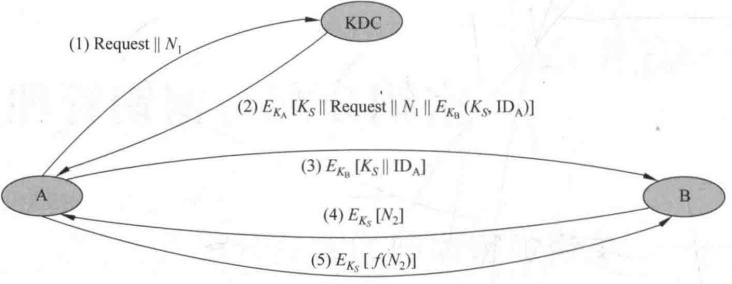

**图 5-1 密钥分配实例**

（1）A 向 KDC 发出会话密钥请求。表示请求的消息由两个数据项组成：一是 A 和 B 的身份；二是这次业务的唯一识别符  $N_{1}$，称  $N_{1}$ 为一次性随机数，可以是时间戳、计数器或随机数。每次请求所用的  $N_{1}$ 都应不同，且为防止假冒，应使敌手对  $N_{1}$ 难以猜测。因此用随机数作为这个识别符最为合适。

（2）KDC为A的请求发出应答。应答是由 $K_{A}$加密的消息，因此只有A才能成功地对这一消息解密，并且A可相信这一消息的确是由KDC发出的。消息中包括A希望得到的两项：

· 一次性会话密钥  $K_{s}$;

· A 在(1)中发出的请求，包括一次性随机数  $N_{1}$，目的是使 A 将收到的应答与发出的请求相比较，看是否匹配。

因此 A 能验证自己发出的请求在被 KDC 收到之前，未被他人篡改。而且 A 还能根据一次性随机数相信自己收到的应答不是重放的过去的应答。

此外，消息中还有 B 希望得到的两项：

· 一次性会话密钥  $K_{s}$;

A 的身份（例如 A 的网络地址）ID_{A}；

这两项由 $K_{B}$加密，将由A转发给B，以建立A、B之间的连接并用于向B证明A的身份。

（3）A 存储会话密钥，并向 B 转发  $E_{K_B}[K_S \parallel ID_A]$。因为转发的是由  $K_B$ 加密后的密文，所以转发过程不会被窃听。B 收到后，可得会话密钥  $K_S$，并从  $ID_A$ 可知另一方是 A，而且还从  $E_{K_B}$ 知道  $K_S$ 的确来自 KDC。

这一步完成后，会话密钥就安全地分配给了 A、B。然而还能继续以下两步：

（4）B用会话密钥 $K_{s}$加密另一个一次性随机数 $N_{2}$，并将加密结果发送给A。

（5）A以 $f(N_{2})$作为对B的应答，其中f是对 $N_{2}$进行某种变换（例如加1）的函数，并将应答用会话密钥加密后发送给B。

这两步可使 B 相信第(3)步收到的消息不是一个重放。

注意：第（3）步就已完成密钥分配，第（4）、（5）两步结合第（3）步执行的是认证功能。

### 5.1.3 密钥的分层控制

网络中如果用户数目非常多而且分布的地域非常广，一个KDC就无法承担为用户分配密钥的重任。问题的解决方法是使用多个KDC的分层结构。例如，在每个小范围（如一个LAN或一个建筑物）内，都建立一个本地KDC。同一范围的用户在进行保密通信时，由本地KDC为他们分配密钥。如果两个不同范围的用户想获得共享密钥，则可通过各自的本地KDC，而两个本地KDC的沟通又需经过一个全局KDC。这样就建立了两层KDC。类似地，根据网络中用户的数目及分布的地域，可建立三层或多层KDC。

分层结构可减少主密钥的分布，因为大多数主密钥是在本地KDC和本地用户之间共享。再者，分层结构还可将虚假KDC的危害限制到一个局部区域。

### 5.1.4 会话密钥的有效期

会话密钥更换得越频繁，系统的安全性就越高。因为敌手即使获得一个会话密钥，也只能获得很少的密文。但另一方面，会话密钥更换得太频繁，又将延迟用户之间的交换，同时还造成网络负担。所以在决定会话密钥的有效期时，应权衡矛盾的两个方面。

对面向连接的协议，在连接未建立前或断开时，会话密钥的有效期可以很长。而每次建立连接时，都应使用新的会话密钥。如果逻辑连接的时间很长，则应定期更换会话密钥。

无连接协议（如面向业务的协议）无法明确地决定更换密钥的频率。为安全起见，用户每进行一次交换，都用新的会话密钥。然而这又失去了无连接协议主要的优势，即对每个业务都有最少的费用和最短的延迟。比较好的方案是在某一固定周期内或对一定数目的业务使用同一会话密钥。

### 5.1.5 无中心的密钥分配

用密钥分配中心为用户分配密钥时，要求所有用户都信任KDC，同时还要求对KDC加以保护。如果密钥的分配是无中心的，则不必有以上两个要求。然而如果每个用户都能和自己想与之建立联系的另一用户安全地通信，则对有n个用户的网络来说，主密钥应多达 $n(n-1)/2$个。当n很大时，这种方案无实用价值，但在整个网络的局部范围却非常有用。

无中心的密钥分配时，两个用户 A 和 B 建立会话密钥需经过以下 3 步，见图 5-2。

**(1) Request ||  $N_{1}$**

**(2)** 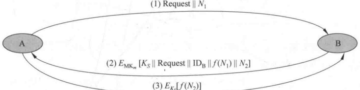

**(3)  $E_{Ks}[f(N_2)]$**

**图 5-2 无中心的密钥分配**

（1）A向B发出建立会话密钥的请求和一个一次性随机数 $N_{1}$。

（2）B用与A共享的主密钥 $MK_{m}$对应答的消息加密，并发送给A。应答的消息中有B选取的会话密钥、B的身份、 $f(N_{1})$和另一个一次性随机数 $N_{2}$。

（3）A 使用新建立的会话密钥  $K_{s}$ 对  $f(N_{2})$ 加密后返回给 B。

### 5.1.6 密钥的控制使用

因为密钥可根据其不同用途分为会话密钥和主密钥两种类型，所以还希望对密钥的使用方式加以某种控制，会话密钥又称为数据加密密钥，主密钥又称为密钥加密密钥。

如果主密钥泄露了，则相应的会话密钥也将泄露，因此主密钥的安全性应高于会话密钥的安全性。一般在密钥分配中心以及终端系统中，主密钥都是物理上安全的，如果把主密钥当作会话密钥注入加密设备，那么其安全性则降低。

单钥体制中的密钥控制技术有：

1. 密钥标签

用于 DES 的密钥控制，将 DES 的 64 比特密钥中的 8 个校验位作为控制使用这一密钥的标签。标签中各比特的含义如下：

· 一个比特表示这个密钥是会话密钥还是主密钥。

一个比特表示这个密钥是否能用于加密。

一个比特表示这个密钥是否能用于解密。

· 其他比特无特定含义，留待以后使用。

由于标签是在密钥之中的，所以在分配密钥时，标签与密钥一起被加密，因此可对标签起到保护。本方案的缺点一是标签的长度被限制为8比特，限制了它的灵活性和功能。二是由于标签是以密文形式传送，只有解密后才能使用，因而限制了对密钥使用的控制方式。

2. 控制矢量

这一方案比上一方案灵活。方案中对每一会话密钥都指定一个相应的控制矢量，控制矢量分为若干字段，分别用于说明在不同情况下密钥是被允许使用还是不被允许使用，且控制矢量的长度可变。控制矢量是在KDC产生密钥时加在密钥之中的，过程由图5-3(a)所示。首先由一个哈希函数将控制矢量压缩到与加密密钥等长，然后与主密钥异或后作为加密会话密钥的密钥，即

$$\begin{aligned}&H=h(CV)\\&K_{in}=K_{m}\oplus H\\&K_{out}=E_{K_{m}\oplus H}[K_{S}]\\ \end{aligned}$$

其中，CV 是控制矢量，h 是哈希函数， $K_{m}$ 是主密钥， $K_{s}$ 是会话密钥。会话密钥的恢复过程由图 5-3(b) 所示，表示为

$$K_{S}=D_{K_{m}\oplus H}\left[E_{K_{m}\oplus H}[K_{S}]\right]$$

KDC 在向用户发送会话密钥时，同时以明文形式发送控制矢量。用户只有使用与 KDC 共享的主密钥以及 KDC 发送来的控制矢量才能恢复会话密钥，因此还必须保留会话密钥与其控制矢量之间的对应关系。

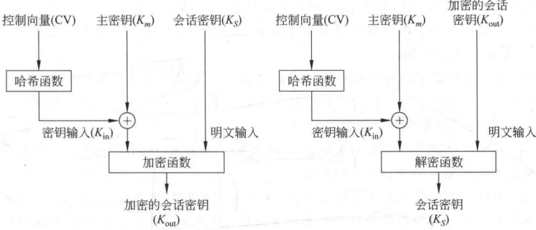

**(a) 结合**

**图 5-3 控制矢量的使用方式**

**(b) 去除**

与使用8比特的密钥标签相比，使用控制矢量有两个优点：第一，控制矢量的长度没有限制，因此可对密钥的使用施加任意复杂的控制；第二，控制矢量始终是以明文形式存在，因此可在任一阶段对密钥的使用施加控制。

## 5.2 公钥加密体制的密钥管理

5.1 节介绍了单钥密码体制中的密钥分配问题，而公钥加密的一个主要用途是分配单钥密码体制使用的密钥。本节介绍两个内容：一是公钥密码体制所用的公开密钥的分配；二是如何用公钥体制来分配单钥密码体制所需的密钥。

### 5.2.1 公钥的分配

公钥的分配方法有以下几类。

1. 公开发布

公开发布指用户将自己的公钥发给每一其他用户，或向某一团体广播。例如，PGP（Pretty Good Privacy）中采用了RSA算法，它的很多用户都是将自己的公钥附加到消息上，然后发送到公开（公共）区域，如因特网邮件列表。

这种方法虽然简单，但有一个非常大的缺点，即任何人都可伪造这种公开发布。如果某个用户假装是用户 A 并以 A 的名义向另一用户发送或广播自己的公开钥，则在 A 发现假冒者以前，这一假冒者可解读所有意欲发向 A 的加密消息，而且假冒者还能用伪造的密钥获得认证。

2. 公用目录表

公用目录表指建立一个公用的公钥动态目录表，目录表的建立、维护以及公钥的分布由某个可信的实体或组织承担，称这个实体或组织为公用目录的管理员。与第一种分配

方法相比，这种方法的安全性更高。该方案有以下一些组成部分：

（1）管理员为每个用户都在目录表中建立一个目录，目录中有两个数据项：一是用户名，二是用户的公开钥。

（2）每一用户都亲自或以某种安全的认证通信在管理者那里为自己的公开钥注册。

（3）用户如果由于自己的公开钥用过的次数太多或由于与公开钥相关的秘密钥已被泄露，则可随时用新密钥替换现有的密钥。

（4）管理员定期公布或定期更新目录表。例如，像电话号码本一样公布目录表或在发行量很大的报纸上公布目录表的更新。

（5）用户可通过电子手段访问目录表，这时从管理员到用户必须有安全的认证通信。

本方案的安全性虽然高于公开发布的安全性，但仍易受攻击。如果敌手成功地获取了管理员的秘密钥，就可伪造一个公钥目录表，以后既可假冒任一用户，又能监听发往任一用户的消息，且公用目录表还易受到敌手的窜扰。

3. 公钥管理机构

如果在公钥目录表中对公钥的分配施加更严密的控制，安全性将会更强。与公用目录表类似，这里假定有一个公钥管理机构来为各用户建立、维护动态的公钥目录，但同时对系统提出以下要求，即：每个用户都可靠地知道管理机构的公开钥，而只有管理机构自己知道相应的秘密钥。公开钥的分配步骤如下（见图5-4）。

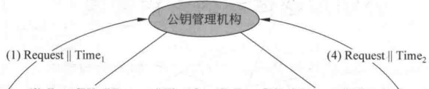

**(4) Request || Time?**

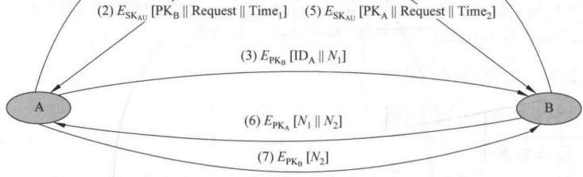

**图 5-4 公钥管理机构分配公钥**

（1）用户 A 向公钥管理机构发送一个带时间戳的消息，消息中有获取用户 B 的当前公钥的请求。

（2）管理机构对 A 的请求作出应答，应答由一个消息表示，该消息由管理机构用自己的秘密钥  $SK_{AU}$ 加密，因此 A 能用管理机构的公开钥解密，并使 A 相信这个消息的确是来源于管理机构。

应答的消息中有以下几项。

B 的公钥  $PK_{B}$，A 可用它对将发往 B 的消息加密。

· A 的请求，用于 A 验证收到的应答的确是对相应请求的应答，且还能验证自己最初发出的请求在被管理机构收到以前未被篡改。

最初的时间戳，以使 A 相信管理机构发来的消息不是一个旧消息，因此消息中的公开钥的确是 B 当前的公钥。

（3）A用B的公开钥对一个消息加密后发往B，这个消息有两个数据项，一是A的身份 $ID_{A}$，二是一个一次性随机数 $N_{1}$，用于唯一地标识这次业务。

（4）、（5）B 以相同方式从管理机构获取 A 的公开钥。这时，A 和 B 都已安全地得到了对方的公钥，所以可进行保密通信。然而，他们也许还希望有以下两步，以认证对方。

（6）B用 $\mathrm{PK}_{A}$对一个消息加密后发往A，该消息的数据项有A的一次性随机数 $N_{1}$和B产生的一个新一次性随机数 $N_{2}$。因为只有B能解密（3）的消息，所以A收到的消息中的 $N_{1}$可使其相信通信的另一方的确是B。

（7）A用B的公开钥对 $N_{2}$加密后返回给B，可使B相信通信的另一方的确是A。

以上过程共发送了7个消息，其中前4个消息用于获取对方的公开钥。用户得到对方的公开钥后存下可供以后使用，这样就不必再发送前4个消息了，然而还必须定期地通过密钥管理中心获取通信对方的公开钥，以免对方的公开钥更新后无法保证当前的通信。

4. 公钥证书

上述公钥管理机构分配公开钥时也有缺点，由于每一用户要想和他人联系都需求助于管理机构，所以管理机构有可能成为系统的瓶颈，而且由管理机构维护的公钥目录表也易被敌手窜扰。

分配公钥的另一方法是公钥证书，用户通过公钥证书相互之间交换自己的公钥而无须与公钥管理机构联系。公钥证书由证书管理机构（Certificate Authority，CA）为用户建立，其中的数据项有与该用户的秘密钥相匹配的公开钥及用户的身份和时间戳等，所有的数据项经CA用自己的秘密钥签字后就形成证书，即证书的形式为 $C_{A}=E_{SK_{CA}}[T,ID_{A},PK_{A}]$，其中， $ID_{A}$是用户A的身份， $PK_{A}$是A的公钥，T是当前时间戳， $SK_{CA}$是CA的秘密钥， $C_{A}$即是为用户A产生的证书。产生过程如图5-5所示。用户可将自己的公开钥通过公钥证书发给另一用户，接收方可用CA的公钥 $PK_{CA}$对证书加以验证，即

$$D_{\mathrm{PK}_{\mathrm{CA}}}\left[C_{\mathrm{A}}\right]=D_{\mathrm{PK}_{\mathrm{CA}}}\left[E_{\mathrm{SK}_{\mathrm{CA}}}\left[T,\mathrm{ID}_{\mathrm{A}},\mathrm{PK}_{\mathrm{A}}\right]\right]=(T,\mathrm{ID}_{\mathrm{A}},\mathrm{PK}_{\mathrm{A}})$$
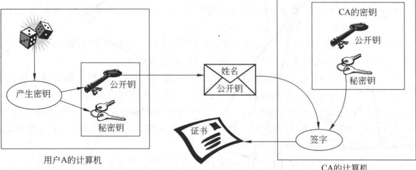
**图 5-5 证书的产生过程**

因为只有用 CA 的公钥才能解读证书，接收方从而验证了证书的确是由 CA 发放的，且也获得了发方的身份  $ID_{A}$ 和公开钥  $PK_{A}$。时间戳 T 为接收方保证了收到的证书的新鲜性，用于防止发方或敌方重放一个旧证书。因此时间戳可被当作截止日期，证书如果过旧，则被吊销。

### 5.2.2 用公钥加密分配单钥密码体制的密钥

公开钥分配完成后，用户就可用公钥加密体制进行保密通信了。然而由于公钥加密的速度过慢，以此进行保密通信不太合适，但用于分配单钥密码体制的密钥却非常合适。

1. 简单分配

图 5-6 表示简单使用公钥加密算法建立会话密钥的过程，如果 A 希望与 B 通信，则可通过以下几步建立会话密钥：

(1)  $\text{PK}_{\text{A}} \parallel \text{ID}_{\text{A}}$

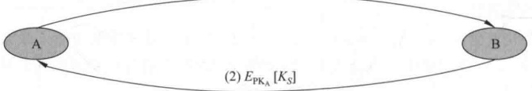

**图 5-6 简单使用公钥加密算法建立会话密钥**

（1）A 产生自己的一对密钥  $\{PK_{A}, SK_{A}\}$，并向 B 发送  $PK_{A} \mid ID_{A}$，其中， $ID_{A}$ 表示 A 的身份。

（2）B 产生会话密钥  $K_{s}$，并用 A 的公开钥  $\mathrm{PK}_{A}$ 对  $K_{s}$ 加密后发往 A。

（3）A 由  $D_{SK_A}[E_{PK_A}[K_S]]$ 恢复会话密钥。因为只有 A 能解读  $K_S$，所以仅 A、B 知道这一共享密钥。

（4）A 销毁  $\{PK_{A}, SK_{A}\}$，B 销毁  $PK_{A}$。

A、B现在可以用单钥加密算法以 $K_{s}$作为会话密钥进行保密通信，通信完成后，又都将 $K_{s}$销毁。这种分配法尽管简单，但却由于A、B双方在通信前和完成通信后，都未存储密钥，因此，密钥泄露的危险性为最小，且可防止双方的通信被敌手监听。

这一协议易受到主动攻击，如果敌手E已接入A、B双方的通信信道，就可以如下不被察觉的方式截获双方的通信：

（1）与上面的（1）相同。

（2）E 截获 A 的发送后，建立自己的一对密钥  $\{PK_{E}, SK_{E}\}$，并将  $PK_{E} \mid ID_{A}$ 发送给 B。

（3）B产生会话密钥 $K_{S}$后，将 $E_{PK_{E}}[K_{S}]$发送出去。

（4）E截获B发送的消息后，由 $D_{SK_{E}}[E_{PK_{E}}[K_{S}]]$解读 $K_{S}$。

（5）E 再将  $E_{PK_A}[K_S]$ 发往 A。

现在 A 和 B 知道  $K_{s}$，但并未意识到  $K_{s}$ 已被 E 截获。A、B 在用  $K_{s}$ 通信时，E 就可以实施监听。

2. 具有保密性和认证性的密钥分配

图 5-7 所示的密钥分配过程具有保密性和认证性，因此既可防止被动攻击，又可防止主动攻击。

$$E_{\mathrm{P K}_{B}}\left[N_{1}|\mathrm{~}|\mathrm{I D}_{A}\right]$$

$$(2)\;E_{\mathrm{P K_{A}}}[N_{1}|\mathrm{~}|N_{2}]$$

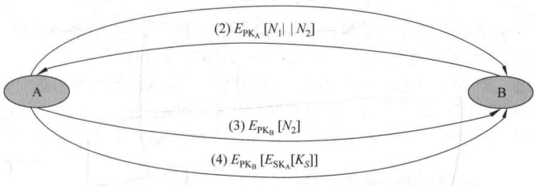

**图 5-7 具有保密性和认证性的密钥分配**

假定 A、B 双方已完成公钥交换，可按以下步骤建立共享会话密钥：

（1）A用B的公开钥加密A的身份 $ID_{A}$和一个一次性随机数 $N_{1}$后发往B，其中， $N_{1}$用于唯一地标识这一业务。

（2）B用A的公开钥 $\mathrm{PK}_{A}$加密A的一次性随机数 $N_{1}$和B新产生的一次性随机数 $N_{2}$后发往A。因为只有B能解读(1)中的加密消息，所以B发来的消息中 $N_{1}$的存在可使A相信对方的确是B。

（3）A用B的公钥 $PK_{B}$对 $N_{2}$加密后返回给B，以使B相信对方的确是A。

（4）A 选取一个会话密钥  $K_{s}$，然后将  $M = E_{PK_{B}}[\boldsymbol{E}_{SK_{A}}[\boldsymbol{K}_{s}]]$ 发给 B，用 B 的公开钥加密是为保证只有 B 能解读加密结果，用 A 的秘密钥加密是保证该加密结果只有 A 能发送。

（5）B 以  $D_{PK_{A}}[D_{SK_{B}}[M]]$ 恢复会话密钥。

### 5.2.3 Diffie-Hellman 密钥交换

Diffie-Hellman 密钥交换是 W. Diffie 和 M. Hellman 于 1976 年提出的第一个公钥密码算法，已在很多商业产品中得到应用。该算法的唯一目的是使得两个用户能够安全地交换密钥，得到一个共享的会话密钥，算法本身不能用于加、解密。

算法的安全性基于求离散对数的困难性。

图 5-8 表示 Diffie-Hellman 密钥交换过程，其中，p 是大素数，a 是 p 的本原根，p 和 a 作为公开的全程元素。用户 A 选择一个保密的随机整数  $X_{A}$，并将  $Y_{A}=a^{X_{A}} \bmod p$ 发送给用户 B。类似地，用户 B 选择一个保密的随机整数  $X_{B}$，并将  $Y_{B}=a^{X_{B}} \bmod p$ 发送给用户 A。然后 A 和 B 分别由  $K=Y_{B}^{X_{A}} \bmod p$ 和  $K=Y_{A}^{X_{B}} \bmod p$ 计算出的就是共享密钥，这是因为

$$\begin{aligned}Y_{_{\mathrm{B}}}^{\mathrm{X_{A}}}\bmod p&=(a^{\mathrm{X_{B}}}\bmod p)^{\mathrm{X_{A}}}\bmod p=(a^{\mathrm{X_{B}}})^{\mathrm{X_{A}}}\bmod p=a^{\mathrm{X_{B}}\mathrm{X_{A}}}\bmod p\\&=(a^{\mathrm{X_{A}}})^{\mathrm{X_{B}}}\bmod p=(a^{\mathrm{X_{A}}}\bmod p)^{\mathrm{X_{B}}}\bmod p=Y_{_{\mathrm{A}}}^{\mathrm{X_{B}}}\bmod p\end{aligned}$$

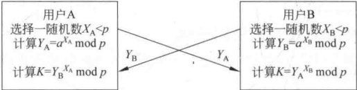

**图 5-8 Diffie-Hellman 密钥交换**

因为  $X_{A}$、 $X_{B}$ 是保密的，敌手只能得到 p、a、 $Y_{A}$、 $Y_{B}$，要想得到 K，则必须得到  $X_{A}$、 $X_{B}$ 中的一个，这意味着需要求离散对数。因此敌手求 K 是不可行的。

【例 5-1】p=97, a=5, A 和 B 分别秘密选  $X_{A}=36$,  $X_{B}=58$, 并分别计算  $Y_{A}=5^{36}$ mod 97=50,  $Y_{B}=5^{58}$ mod 97=44。在交换  $Y_{A}$,  $Y_{B}$ 后，分别计算

$$K=Y_{\mathrm{B}}^{\mathrm{X}_{\mathrm{A}}}\bmod97=44^{36}\bmod97=75,\quad K=Y_{\mathrm{A}}^{\mathrm{X}_{\mathrm{B}}}\bmod97=50^{58}\bmod97=75$$

## 5.3 随机数的产生

随机数在密码学中起着重要的作用。本节首先介绍随机数在密码学中的作用，然后介绍产生随机数的一些方法。

### 5.3.1 随机数的使用

很多密码算法都需使用随机数，例如：

- 相互认证，如在图5-1、图5-2、图5-4和图5-7所示的密钥分配中，都使用了一次性随机数来防止重放攻击。

会话密钥的产生，用随机数作为会话密钥。

- 公钥密码算法中密钥的产生，用随机数作为公钥密码算法中的密钥，如图5-5所示；或以随机数来产生公钥密码算法中的密钥，如图5-8所示。

在随机数的上述应用中，都要求随机数序列满足随机性和不可预测性。

1. 随机性

以下两个准则常用来保障数列的随机性：

（1）均匀分布——数列中每个数出现的频率应相等或近似相等。

（2）独立性——数列中任意一个数都不能由其他数推出。

数列是否满足均匀分布可通过检测得出，而是否满足独立性则无法检测。相反却有很多检测方法能证明数列不满足独立性。通常检测数列是否满足独立性的方法是在对数列进行了足够多次检测后都不能证明不满足独立性，就可比较有把握地相信该数列满足独立性。

在设计密码算法时，由于真随机数难以获得，经常使用似乎是随机的数列，这样的数列称为伪随机数列，这样的随机数称为伪随机数。

2. 不可预测性

在诸如相互认证和会话密钥的产生等应用中，不仅要求数列具有随机性，而且要求对数列中以后的数是不可预测的。对于真随机数列来说，数列中每个数都独立于其他数，因此是不可预测的。对于伪随机数来说，就需要特别注意防止敌手从数列前边的数预测出后边的数。

### 5.3.2 随机数源

真随机数很难获得，物理噪声产生器，如离子辐射脉冲检测器、气体放电管、漏电容等都可作为随机数源，但在网络安全系统中很少采用，一方面是因为数的随机性和精度不够，另一方面这些设备又很难连接到网络系统中。

一种方法是将高质量的随机数作为随机数库编辑成书，供用户使用。然而与网络安全对随机数巨大的需求相比，这种方式提供的随机数数目非常有限。再者，虽然这时的随机数的确可被证明具有随机性，但由于敌手也能得到这个随机数源，而难以保证随机数的不可预测性。

因此网络安全中所需的随机数都借助于安全的密码算法来产生。但由于算法是确定性的，因此产生的数列不是随机的。然而如果算法设计得好，产生的数列就能通过各种随机性检验，这种数就是伪随机数。

### 5.3.3 伪随机数产生器

最为广泛使用的伪随机数产生器是线性同余算法。算法有4个参数：模数 $m(m>0)$、乘数 $a(0\leq a<m)$、增量 $c(0\leq c<m)$和初值即种子 $X_{0}(0\leq X_{0}<m)$；由以下迭代公式得到随机数数列 $\{X_{n}\}$：

$$X_{n+1}=(aX_{n}+c)\bmod m$$

如果 m、a、c、 $X_{0}$ 都为整数，则产生的随机数数列  $\{X_{n}\}$ 也都是整数，且  ${0} \leqslant X_{n} < m$。

a、c 和 m 的取值是产生高质量随机数的关键。例如，取 a = c = 1，则结果数列中每一个数都是前一个数增 1，结果显然不能令人满意。如果 a = 7，c = 0，m = 32， $X_{0} = 1$，则产生的数列为 {7，17，23，1，7，…}，在 32 个可能值中只有 4 个出现，数列的周期为 4，因此结果仍不能令人满意。如果取 a = 7，其他值不变，则产生的数列为 {1，5，25，29，17，21，9，13，1，…}，周期增加到 8。

为使随机数数列的周期尽可能大，m 应尽可能大。普遍原则是选 m 接近等于计算机能表示的最大整数，如接近或等于  ${2}^{31}$。

评价线性同余算法的性能有以下3个标准：

（1）迭代函数应是整周期的，即数列中的数在重复之前应产生出 ${0}\sim m$的所有数。

（2）产生的数列看上去应是随机的。因为数列是确定性产生的，因此不可能是随机的，但可用各种统计检测来评价数列具有多少随机性。

（3）迭代函数能有效地利用32位运算实现。

通过精心选取 a、c 和 m，可使以上 3 个标准得以满足。对第三条来说，为了方便 32 位运算的实现，m 可取为  ${2}^{31}-1$。对第一条来说，如果 m 为素数（${2}^{31}-1$ 即为素数）且 $c=0$，则当 a 是 m 的一个本原根，即满足：

$$\left\{\begin{aligned}&a^{n}\bmod m\neq1,\quad n=1,2,\cdots,m-2\\ &a^{m-1}\bmod m=1\end{aligned}\right.$$

时，产生的数列是整周期的。例如  $a=7^{5}=16\ 807$ 即为  $m=2^{31}-1$ 的一个本原根，由此得到的随机数产生器  $X_{n+1}=(aX_{n})\bmod(2^{31}-1)$ 已被广泛应用。

Knuth 给出了使迭代函数达到整周期的充要条件。

定理 5-1 线性同余算法达到整周期的充要条件是：

(1)  $\gcd(c,m)=1$;

(2) 对所有满足 p | m 的素数 p，有  $a \equiv 1 (\bmod p)$;

(3) 若 m 满足 4 | m，则 a 满足  $a \equiv 1 (\bmod 4)$。

通常，可取  $m=2^{r}$， $a=2^{i}+1$，c=1，其中，r 是一个整数，i<r 也是一个整数，即可满足定理5-1的条件。

线性同余算法除了初值  $X_{0}$ 的选取具有随机性外，算法本身并不具有随机性，因为  $X_{0}$ 选定后，以后的数就被确定性地产生了。这个性质可用于对该算法的密码分析，如果敌手知道正在使用的是线性同余算法并知道算法的参数，则一旦获得数列中的一个数，就可得到以后的所有数。甚至敌手如果只知道正在使用的是线性同余算法以及产生的数列中的极少一部分，就足以确定出算法的参数。假定敌手能确定  $X_{0}$、 $X_{1}$、 $X_{2}$、 $X_{3}$，就可通过以下方程组

$$X_{1}=(aX_{0}+c)\bmod m$$

$$X_{2}=(aX_{1}+c)\bmod m$$

$$X_{3}=(aX_{2}+c)\bmod m$$

解出 a、c 和 m。

改进的方法是利用系统时钟修改随机数数列。一种方法是每当产生N个数后，就利用当前的时钟值模m后作为新种子。另一种方法是直接将当前的时钟值加到每个随机数上（模m加）。

下面考虑随机数产生器  $X_{n+1}=(aX_n)\bmod m$ 的实现。

算法实现时，需解决的主要问题是溢出。溢出产生的原因在于乘积运算在模运算之前，若能颠倒两个运算的顺序，则可避免溢出。将迭代关系写为  $X = f(X) = (aX) \bmod m$，对算法做如下修改：

若 m=aq，则由于  $aX=p \cdot aq+r$，其中， $p=\lfloor aX/aq\rfloor=\lfloor X/q\rfloor$，所以

$$r=a X-p\bullet a q=a(X-p q)=a(X\bmod q)$$

即 $(aX)\bmod m = a$ ( $X\bmod q$)

下设  $m = aq + r$，其中， $q = \lfloor m / a \rfloor$， $r = m \mod a$。当  $r < q$ 时，以下算法可有效地解决溢出。

$$\begin{aligned}f(X)=&(aX)\bmod m=aX-m\cdot\left\lfloor aX/m\right\rfloor=a\left(q\left\lfloor X/q\right\rfloor+X\bmod q\right)-m\cdot\left\lfloor aX/m\right\rfloor\\ =&aq\left\lfloor X/q\right\rfloor+a\left(X\bmod q\right)-m\cdot\left\lfloor aX/m\right\rfloor\\ =&(m-r)\left\lfloor X/q\right\rfloor+a\left(X\bmod q\right)-m\cdot\left\lfloor aX/m\right\rfloor\\ =&a\left(X\bmod q\right)-r\left\lfloor X/q\right\rfloor+m\cdot\left(\left\lfloor X/q\right\rfloor-\left\lfloor aX/m\right\rfloor\right)\end{aligned}$$

$$p_{1}(X)=a\cdot(X\bmod q)-r\cdot\lfloor X/q\rfloor,p_{2}(X)=\lfloor X/q\rfloor-\lfloor aX/m\rfloor$$

$$f(X)=p_{1}(X)+m\cdot p_{2}(X)$$

由 $m, q, r$ 的定义及 $r < q$ 知，当 ${1} \leq X < m$ 时，$a \cdot (X \bmod q)$ 和 $r \cdot \lfloor X/q \rfloor$ 的取值都在 ${0} \sim m-1$，所以 $|p_1(X)| \leq m-1$。容易验证 ${0} \leq X/q - aX/m \leq 1$，所以 $p_2(X) = \lfloor X/q \rfloor - \lfloor aX/m \rfloor = 0$ 或 ${1}$。

 $p_{2}(X)$ 的值可不通过它的定义，而直接由  $p_{1}(X)$ 的值得出。这是因为  ${1} \leqslant f(X) \leqslant m-1$，所以当且仅当  ${1} \leqslant p_{1}(X) \leqslant m-1$ 时， $p_{2}(X) = 0$；当且仅当  $-(m-1) \leqslant p_{1}(X) \leqslant -1$ 时， $p_{2}(X) = 1$。由此得：

$$f(X)=\left\{\begin{aligned}&p_{1}(X),& 如果 1\leqslant p_{1}(X)\leqslant m-1\\ &p_{1}(X)+m,& 如果 -(m-1)\leqslant p_{1}(X)\leqslant-1\end{aligned}\right.$$

算法进一步修改如下：

设  $p_{1}(X)=a\cdot(X\bmod q)$,  $p_{2}(X)=r\cdot\lfloor X/q\rfloor$, 那么

$$f(X)=\left\{\begin{aligned}&p_{1}(X)-p_{2}(X),& 如果 p_{1}(X)>p_{2}(X)\\ &p_{1}(X)+(m-p_{2}(X)),& 否则 \end{aligned}\right.$$

对线性同余算法，有以下一些常用的变形。

1. 幂形式

幂形式的迭代公式为

$$X_{n+1}=(X_{n})^{d}\bmod m,\quad n=1,2,\cdots$$

其中， $(d,m)$ 是参数， $X_{0}(0\leqslant X_{0}<m)$ 是种子。

根据参数的取法，幂形式又分为以下两种。

1）RSA 产生器

若参数取为 RSA 算法的参数，即 m 是两个大素数的乘积，d 是 RSA 的秘密钥，满足  $\gcd(d, \varphi(m)) = 1$，则此时的随机数产生器称为 RSA 产生器。

【例 5-2】p=13, q=23, d=17, m=299,  $\varphi(m)=264$,  $X_{0}=6$, 满足  $\gcd(d, \varphi(m))=1$。RSA 产生器为

$$X_{0}=6$$

$$X_{n+1}=(X_{n})^{17}\bmod299,\quad n=1,2,\cdots$$

2）平方产生器

若 d 取 2, m = pq，而 p、q 是满足  $p \equiv q \equiv 3 (\bmod 4)$ 的大素数，此时的随机数产生器称为平方产生器。其迭代公式为

$$X_{n+1}=(X_{n})^{2}\bmod m,\quad n=1,2,\cdots$$

2. 离散指数形式

离散指数形式的迭代公式为

$$X_{n+1}=g^{X_{n}}\bmod m,\quad n=1,2,\cdots$$

其中， $(g,m)$ 是参数， $X_{0}(0\leqslant X_{0}<m)$ 是种子。

### 5.3.4 基于密码算法的随机数产生器

为了产生密码中可用的随机数，可使用加密算法。本节介绍3个具有代表性的例子。

1. 循环加密

图5-9 是通过循环加密由主密钥产生会话密钥的示意图，其中，周期为 N 的计数器用来为加密算法产生输入。例如，要想产生56比特的DES密钥，可使用周期为 ${2}^{56}$的计数器，每产生一个密钥后，计数器加1。因此本方案产生的伪随机数以整周期循环，输出数列 $X_{0}, X_{1}, \cdots, X_{N-1}$中的每个值都是由计数器中的不同值得到，因此 $X_{0} \neq X_{1} \neq \cdots \neq X_{N-1}$。又因为主密钥是受到保护的，所以知道前面的密钥值想得到后面的密钥在计算上是不可行的。

为进一步增加算法的强度，可用整周期的伪随机数产生器代替计数器作为方案中加密算法的输入。

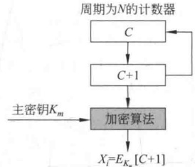

**图 5-9 循环加密产生伪随机数**

2. DES 的输出反馈（OFB）模式

DES 的 OFB 模式（如图 3-13 所示）能用来产生密钥并能用于流加密。加密算法的每一步输出都为 64 比特，其中最左边的 j 个比特被反馈回加密算法。因此加密算法的一个个 64 比特输出就构成了一个具有很好统计特性的伪随机数序列。同样，如此产生的会话密钥可通过对主密钥的保护而得以保护。

3. ANSI X9.17 的伪随机数产生器

ANSI X9.17 的伪随机数产生器是密码强度最高的伪随机数产生器之一，已在包括 PGP 等许多应用过程中被采纳。

图 5-10 是 ANSI X9.17 伪随机数产生器的框图，产生器有 3 个组成部分：

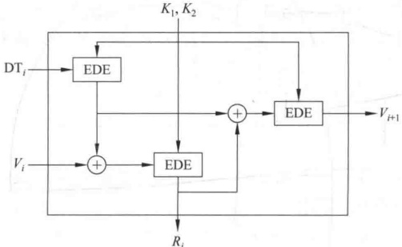

**图 5-10 ANSI X9.17 伪随机数产生器**

（1）输入。输入为两个64比特的伪随机数，其中，DT 表示当前的日期和时间，每产生一个数  $R_{i}$ 后，DT 都更新一次； $V_{i}$ 是产生第 i 个随机数时的种子，其初值可任意设定，以后每次自动更新。

（2）密钥。产生器用了3次三重DES加密，3次加密使用相同的两个56比特的密钥 $K_{1}$和 $K_{2}$，这两个密钥必须保密且不能用做他用。

（3）输出。输出为一个64比特的伪随机数 $R_{i}$和一个64比特的新种子 $V_{i+1}$，其中：

$$R_{i}=\mathrm{EDE}_{K_{1},K_{2}}\left[V_{i}\bigoplus\mathrm{EDE}_{K_{1},K_{2}}\left[\mathrm{DT}_{i}\right]\right]$$

$$\mathrm{V}_{i+1}=\mathrm{EDE}_{\mathrm{K}_{1},\mathrm{K}_{2}}\left[\mathrm{R}_{i}\oplus\mathrm{EDE}_{\mathrm{K}_{1},\mathrm{K}_{2}}\left[\mathrm{DT}_{i}\right]\right]$$

EDE 表示两个密钥的三重 DES。

本方案具有非常高的密码强度，这是因为采用了112比特长的密钥和9个DES加密，同时还由于算法由两个伪随机数输入驱动：一个是当前的日期和时间，另一个是算法上次产生的新种子。而且即使某次产生的随机数 $R_{i}$泄露了，但由于 $R_{i}$又经一次EDE加密才产生新种子 $V_{i+1}$，所以别人即使得到 $R_{i}$，也得不到 $V_{i+1}$，从而得不到新随机数 $R_{i+1}$。

### 5.3.5 随机比特产生器

在某些情况下，需要的是随机比特序列，而不是随机数序列，如流密码的密钥流。下面介绍几个常用的随机比特产生器。

1. BBS(Blum-Blum-Shub)产生器

BBS 产生器是已经过证明的密码强度最强的伪随机数产生器，它的整个过程如下：

首先，选择两个大素数  $p, q$，满足  $p \equiv q \equiv 3 \pmod{4}$，令  $n = p \times q$。再选一个随机数 s，使得 s 与 n 互素。然后按以下算法产生比特序列  $\{B_i\}$：

$$X_{0}=s^{2}\bmod n$$

$$\mathrm{f o r~}i=1\mathrm{~t o~\infty~d o~}\{$$

$$X_{i}=X_{i-1}^{2}\bmod n;$$

$$B_{i}=X_{i}\bmod{2}\}$$

即在每次循环中取  $X_{i}$ 的最低有效位。

【例 5-3】 $n=192\ 649=383\times503$，种子 s=101 355，结果由表 5-1 给出。

**表 5-1 BBS 产生器的一个例子**

| i | $X_i$ | $B_i$ | i | $X_i$ | $B_i$ |
| --- | --- | --- | --- | --- | --- |
| 0 | 20 749 | 1 | 11 | 137 922 | 0 |
| 1 | 143 135 | 1 | 12 | 123 175 | 1 |
| 2 | 177 671 | 1 | 13 | 8630 | 0 |
| 3 | 97 048 | 0 | 14 | 114 386 | 0 |
| 4 | 89 992 | 0 | 15 | 14 863 | 1 |
| 5 | 174 051 | 1 | 16 | 133 015 | 1 |
| 6 | 80 649 | 1 | 17 | 106 065 | 1 |
| 7 | 45 663 | 1 | 18 | 45 870 | 0 |
| 8 | 69 442 | 0 | 19 | 137 171 | 1 |
| 9 | 186 894 | 0 | 20 | 48 060 | 0 |
| 10 | 177 046 | 0 |  |  |  |

BBS 的安全性基于大整数分解的困难性，它是密码上安全的伪随机比特产生器。如如果伪随机比特产生器能通过下一比特检验，则称为密码上安全的伪随机比特产生器，具体定义为：以伪随机比特产生器的输出序列的前 k 个比特作为输入，如果不存在多项式时间算法，能以大于 $\frac{1}{2}$的概率预测第 k+1 个比特。换句话说，已知一个序列的前 k 个比特，不存在实际可行的算法能以大于 $\frac{1}{2}$的概率预测下一比特是 0 还是 1。

2. Rabin 产生器

设  $k \geqslant 2$ 是一个整数，在  $[2^k, 2^{k+1}]$ 均匀选择两个奇素数  $p, q$，满足  $p \equiv q \equiv 3 \pmod{4}$ （这个条件保证 -1 是模  $p$ 和模  $q$ 的非平方剩余），令  $n = p \times q$。迭代公式为

$$X_{i}=\left\{\begin{aligned}&(X_{i-1})^{2}\bmod n,&& 如果 (X_{i-1})^{2}\bmod n<n/2\\ &n-(X_{i-1})^{2}\bmod n,&& 如果 (X_{i-1})^{2}\bmod n\geqslant n/2\end{aligned}\right.$$

取

$$B_{i}=X_{i}\bmod2,\quad i=1,2,\cdots$$

则 $\{B_{i}:i=1,2,\cdots\}$就是产生的随机比特序列。

3. 离散指数比特产生器

设  $k \geqslant 2, m \geqslant 1$ 是两个整数，在  $[2^k, 2^{k+1}]$ 均匀选择一个奇素数  $p$，设  $g$ 是  $p$ 的一个本原根。迭代公式为

$$X_{i}=g^{X_{i-1}}\bmod p,\quad i=1,2,\cdots$$

取 $B_{i}$为 $X_{i}$的最高有效位，

$$B_{i}\equiv\left\lceil\frac{X_{i}}{2^{k}}\right\rceil\pmod{2}$$

其中， $\lceil$为取上整数函数，则 $\{B_{i}:i=1,2,\cdots,k^{m}+m\}$就是产生的随机比特序列。

## 秘密分割

### 5.4.1 秘密分割门限方案

在诸如导弹控制发射、重要场所的通行等情况都必须由两人或多人同时参与才能生效，这时都需要将秘密分给多人掌管，并且必须有一定数目的掌管秘密的人同时到场才能恢复这一秘密。

由此，引入门限方案（Threshold Schemes）的一般概念。

定义 5-1 设秘密 s 被分成 n 个部分信息，每一部分信息称为一个子密钥或影子，由一个参与者持有，使得：

（1）由 k 个或多于 k 个参与者所持有的部分信息可重构 s。

（2）由少于 k 个参与者所持有的部分信息则无法重构 s。

称这种方案为 $(k,n)$-秘密分割门限方案，k称为方案的门限值。

如果一个参与者或一组未经授权的参与者在猜测秘密 s 时，并不比局外人猜秘密时有优势，则称这个方案是完善的，即 $(k,n)$-秘密分割门限方案是完善的，如果：

（3）由少于 k 个参与者所持有的部分信息得不到秘密 s 的任何信息。

下面介绍最具代表性的两个秘密分割门限方案。

### 5.4.2 Shamir 门限方案

Shamir 门限方案是基于多项式的 Lagrange 插值公式的。插值是古典数值分析中的一个基本问题，问题如下：已知一个函数  $\varphi(x)$ 在 k 个互不相同的点的函数值为  $\varphi(x_i)$ ( $i=1,\cdots,k$)，寻求一个满足  $f(x_i)=\varphi(x_i)(i=1,\cdots,k)$ 的函数  $f(x)$，用来逼近  $\varphi(x)$。 $f(x)$ 称为  $\varphi(x)$ 的插值函数， $f(x)$ 可取自不同的函数类，既可为代数多项式，也可为三角多项式或有理分式。若取  $f(x)$ 为代数多项式，则称插值问题为代数插值， $f(x)$ 称为  $\varphi(x)$ 的插值多项式。常用的代数插值有 Lagrange 插值、Newton 插值、Hermite 插值。

Lagrange 插值：已知  $\varphi(x)$ 在 k 个互不相同的点的函数值  $\varphi(x_{i})(i=1,\cdots,k)$，可构造 k-1 次插值多项式为

$$f(x)=\sum_{j=1}^{k}\varphi(x_{j})\prod_{\substack{l=1\\ l\neq j}}^{k}\frac{(x-x_{l})}{(x_{j}-x_{l})}$$

这个公式称为 Lagrange 插值公式。

上述问题也可认为是已知 k-1 次多项式  $f(x)$ 的 k 个互不相同的点的函数值  $f(x_{i})$ ( $i=1,\cdots,k$)，构造多项式  $f(x)$。若把密钥 s 取作  $f(0)$，n 个子密钥取作  $f(x_{i})$ ( $i=1,2,\cdots,n$)，那么利用其中的任意 k 个子密钥可重构  $f(x)$，从而可得密钥 s，这种  $(k,n)$-秘密分割门限方案就是 Shamir 门限方案。

这种方案也可按如下更一般的方式来构造。设  $\mathrm{GF}(q)$ 是一有限域，其中， $q$ 是一个大素数，满足  $q \geqslant n+1$，秘密  $s$ 是在  $\mathrm{GF}(q)\backslash\{0\}$ 上均匀选取的一个随机数，表示为  $s \leftarrow_R \mathrm{GF}(q)\backslash\{0\}$。 $k-1$ 个系数  $a_1, a_2, \cdots, a_{k-1}$ 的选取也满足  $a_i \leftarrow_R \mathrm{GF}(q)\backslash\{0\}(i=1,2,\cdots,k-1)$。在  $\mathrm{GF}(q)$ 上构造一个  $k-1$ 次多项式  $f(x)=a_0+a_1x+\cdots+a_{k-1}x^{k-1}$。

n 个参与者记为  $P_{1}, P_{2}, \cdots, P_{n}, P_{i}$ 分配到的子密钥为  $f(i)$。如果任意 k 个参与者  $P_{i_{1}}, \cdots, P_{i_{k}} (1 \leq i_{1} < i_{2} < \cdots < i_{k} \leq n)$ 想得到秘密 s，可使用  $\{(i_{j}, f(i_{j})) \mid j = 1, \cdots, k\}$ 构造以下线性方程组：

$$\begin{cases}a_{0}+a_{1}(i_{1})+\cdots+a_{k-1}(i_{1})^{k-1}=f(i_{1})\\a_{0}+a_{1}(i_{2})+\cdots+a_{k-1}(i_{2})^{k-1}=f(i_{2})\\\vdots\\a_{0}+a_{1}(i_{k})+\cdots+a_{k-1}(i_{k})^{k-1}=f(i_{k})\end{cases}$$

因为  $i_{1}(1 \leqslant l \leqslant k)$ 均不相同，所以可由 Lagrange 插值公式构造以下多项式：

$$f(x)=\sum_{j=1}^{k}f(i_{j})\prod_{l=1\atop l\neq i}^{k}\frac{(x-i_{l})}{(i_{j}-i_{l})}(\bmod q)$$

从而可得秘密  $s = f(0)$。

然而参与者仅需知道  $f(x)$ 的常数项  $f(0)$，而无须知道整个多项式  $f(x)$，所以仅需以下表达式就可求出 s：

$$s=(-1)^{k-1}\sum_{j=1}^{k}f(i_{j})\prod_{l=1\atop l\neq i}^{k}\frac{i_{l}}{(i_{j}-i_{l})}(\bmod q)$$

如果 k-1 个参与者想获得秘密 s，他们可构造出由 k-1 个方程构成的线性方程组，其中有 k 个未知量。对  $\mathrm{GF}(q)$ 中的任一值  $s_0$，可设  $f(0) = s_0$，这样可得第 k 个方程，并由 Lagrange 插值公式得出  $f(x)$。因此对每一  $s_0 \in \mathrm{GF}(q)$ 都有一个唯一的多项式满足式 (5-1)，所以已知 k-1 个子密钥得不到关于秘密 s 的任何信息，因此这个方案是完善的。

【例 5-4】设 k=3, n=5, q=19, s=11，随机选取  $a_{1}=2$,  $a_{2}=7$，得多项式为

$$f(x)=(7x^{2}+2x+11)\bmod19$$

分别计算

$$f(1)=(7+2+11)\bmod19=20\bmod19=1$$

$$f(2)=(28+4+11)\bmod19=43\bmod19=5$$

$$f(3)=(63+6+11)\bmod19=80\bmod19=4$$

$$f(4)=(112+8+11)\bmod19=131\bmod19=17$$

$$f(5)=(175+10+11)\bmod19=196\bmod19=6$$

得5个子密钥。

如果知道其中的3个子密钥 $f(2)=5,f(3)=4,f(5)=6$，就可按以下方式重构 $f(x)$：

$$\begin{aligned}5\ \frac{(x-3)(x-5)}{(2-3)(2-5)}&=5\ \frac{(x-3)(x-5)}{(-1)(-3)}=5\ \frac{(x-3)(x-5)}{3}\\&=5\cdot(3^{-1}\bmod19)\cdot(x-3)(x-5)\\&=5\cdot13\cdot(x-3)(x-5)=65(x-3)(x-5)\\ \end{aligned}$$

$$\begin{aligned}4\frac{(x-2)(x-5)}{(3-2)(3-5)}&=4\frac{(x-2)(x-5)}{(1)(-2)}=4\frac{(x-2)(x-5)}{-2}\\&=4\bullet((-2)^{-1}\bmod19)\bullet(x-2)(x-5)\\&=4\bullet9\bullet(x-2)(x-5)=36(x-2)(x-5)\\ \end{aligned}$$

$$\begin{aligned}6\ \frac{(x-2)(x-3)}{(5-2)(5-3)}&=6\ \frac{(x-2)(x-3)}{(3)(2)}=6\ \frac{(x-2)(x-3)}{6}\\&=6\cdot(6^{-1}\bmod19)\cdot(x-2)(x-3)\\&=6\cdot16\cdot(x-2)(x-3)=96(x-2)(x-3)\\ \end{aligned}$$

所以

$$\begin{aligned}f(x)=&\left[65(x-3)(x-5)+36(x-2)(x-5)+96(x-2)(x-3)\right]\bmod19\\=&\left[8(x-3)(x-5)+17(x-2)(x-5)+(x-2)(x-3)\right]\bmod19\\=&(26x^{2}-188x+296)\bmod19\\=&7x^{2}+2x+11\end{aligned}$$

从而得秘密为s=11。

### 5.4.3 基于中国剩余定理的门限方案

设  $m_{1}, m_{2}, \cdots, m_{n}$ 是 n 个大于 1 的整数，满足

$$m_{1}\leqslant m_{2}\leqslant\cdots\leqslant m_{n},\quad\gcd(m_{i},m_{j})=1(\forall i,j,i\neq j),$$

$$m_{1}m_{2}\cdots m_{k}>m_{n}m_{n-1}\cdots m_{n-k+2}$$

又设 s 是秘密数据，满足  $m_{n}m_{n-1}\cdots m_{n-k+2}<s<m_{1}m_{2}\cdots m_{k}$。

计算  $M = m_1 m_2 \cdots m_n$,  $s_i \equiv s (\bmod m_i) (i = 1, \cdots, n)$。以  $(s_i, m_i, M)$ 作为一个子密钥，集合  $\{(s_i, m_i, M)\}_{i=1}^n$ 即构成了一个  $(k, n)$ 门限方案。

这是因为，在 k 个参与者（记为  $i_{1}, i_{2}, \cdots, i_{k}$）中，每个  $i_{j}$ 计算

$$\begin{cases}M_{i_{j}}=&\frac{M}{m_{i_{j}}}\\N_{i_{j}}\equiv&M_{i_{j}}^{-1}(\bmod m_{i_{j}})\\y_{i_{j}}=&s_{i_{j}}M_{i_{j}}N_{i_{j}}\end{cases}$$

结合起来，根据中国剩余定理可求得方程组

$$\begin{cases}s\equiv s_{i_{1}}(\bmod m_{i_{1}})\\\vdots\\s\equiv s_{i_{k}}(\bmod m_{i_{k}})\end{cases}$$

的解

$$s=\sum_{j=1}^{k}y_{i_{j}}\left(\bmod\prod_{j=1}^{k}m_{i_{j}}\right)$$

下面证明在方案给出的条件下，式(5-3)得到的 s 的确是方案中被分割的秘密数据，即 s 也是方程组(5-4)的解。

$$\begin{cases}s\equiv s_{1}(\bmod m_{1})\\\vdots\\s\equiv s_{n}(\bmod m_{n})\end{cases}$$

设方程组(5-4)的解为  $s^{\prime}$，显然  $s^{\prime}$ 也满足方程组(5-2)，有  $s^{\prime} - s \equiv 0 (\bmod m_{i_1})$， $\cdots$， $s^{\prime} - s \equiv 0 (\bmod m_{i_k})$，所以  $m_{i_1} | s^{\prime} - s$， $\cdots$， $m_{i_k} | s^{\prime} - s$， $\lceil m(m_{i_1}, \cdots, m_{i_k}) = m_{i_1} \cdots m_{i_k} | s^{\prime} - s$，得  $s^{\prime} \equiv s (\bmod m_{i_1} \cdots m_{i_k})$。又因  $s^{\prime}$， $s < m_1 m_2 \cdots m_k \leq m_{i_1} \cdots m_{i_k}$，所以  $s^{\prime} = s$。

若参与者少于 k 个，不妨设为 k-1，则建立的方程组为

$$\begin{cases}s\equiv s_{i_{1}}(\bmod m_{i_{1}})\\\vdots\\s\equiv s_{i_{k-1}}(\bmod m_{i_{k-1}})\end{cases}$$

方程组的解为  $s^{\prime} = \sum_{j=1}^{k-1} y_{i_j} \pmod{\prod_{j=1}^{k-1} m_{i_j}}$，满足  $s^{\prime} < \prod_{j=1}^{k-1} m_{i_j} < m_n m_{n-1} \cdots m_{n-k+2} < s$，得到不正确的结果。

【例 5-5】设 k=3, n=5,  $m_{1}=97$,  $m_{2}=98$,  $m_{3}=99$,  $m_{4}=101$,  $m_{5}=103$, 秘密数据 s=671 875, 满足  ${10}\ 403=m_{4}m_{5}<s<m_{1}m_{2}m_{3}=941\ 094$。

计算  $M = m_1 m_2 m_3 m_4 m_5 = 9790\,200\,882$,  $s_i \equiv s(\mod m_i) (i=1,\cdots,5)$ 得  $s_1 = 53$,  $s_2 = 85$,  $s_3 = 61$,  $s_4 = 23$,  $s_5 = 6$。5 个子密钥为 (53, 97, 9790200882), (85, 98, 9790200882), (61, 99, 9790200882), (23, 101, 9790200882), (6, 103, 9790200882)。

现在假定  $i_{1}$、 $i_{2}$、 $i_{3}$ 联合起来计算 s，分别计算：

$$\begin{cases}M_{1}=\frac{M}{m_{1}}=100\ 929\ 906\\N_{1}\equiv M_{1}^{-1}(\bmod\ m_{1})\equiv95\end{cases}\begin{cases}M_{2}=\frac{M}{m_{2}}=99\ 900\ 009\\N_{2}\equiv M_{2}^{-1}(\bmod\ m_{2})\equiv13\end{cases}\begin{cases}M_{3}=\frac{M}{m_{3}}=98\ 890\ 918\\N_{3}\equiv M_{3}^{-1}(\bmod\ m_{1})\equiv31\end{cases}$$

得到

$$\begin{aligned}s&\equiv s_{1}M_{1}N_{1}+s_{2}M_{2}N_{2}+s_{3}M_{3}N_{3}(\bmod m_{1}m_{2}m_{3})\\&\equiv53\cdot100\;929\;906\cdot95+85\cdot99\;900\;009\cdot13+\\&\quad61\cdot98\;890\;918\cdot31(\bmod97\cdot98\cdot99)\\&\equiv805\;574\;312\;593(\bmod941\;094)\\&\equiv671\;875\end{aligned}$$

假定  $i_{1}$、 $i_{4}$、 $i_{5}$ 联合起来计算 s，分别计算：

$$\begin{cases}M_{1}=\frac{M}{m_{1}}=100\ 929\ 906\\N_{1}\equiv M_{1}^{-1}(\bmod\ m_{1})\equiv95\end{cases}\begin{cases}M_{4}=\frac{M}{m_{4}}=96\ 932\ 682\\N_{4}\equiv M_{4}^{-1}(\bmod\ m_{4})\equiv61\end{cases}\begin{cases}M_{5}=\frac{M}{m_{5}}=95\ 050\ 494\\N_{5}\equiv M_{5}^{-1}(\bmod\ m_{5})\equiv100\end{cases}$$

得到

$$\begin{aligned}s&\equiv s_{1}M_{1}N_{1}+s_{4}M_{4}N_{4}+s_{5}M_{5}N_{5}(\bmod m_{1}m_{4}m_{5})\\&\equiv53\cdot100\;929\;906\cdot95+23\cdot96\;932\;682\cdot61+\\&\quad6\cdot95\;050\;494\cdot100(\bmod97\cdot101\cdot103)\\&\equiv701\;208\;925\;956(\bmod1\;009\;091)\\&\equiv671\;875\end{aligned}$$

假定  $i_{1}$、 $i_{4}$ 联合起来计算 s，则

$$\begin{aligned}s&\equiv s_{1}M_{1}N_{1}+s_{4}M_{4}N_{4}(\bmod m_{1}m_{4})\\&\equiv53\cdot100\;929\;906\cdot95+23\cdot96\;932\;682\cdot61(\bmod97\cdot101)\\&\equiv644\;178\;629\;556(\bmod9791)\\&\equiv5679\end{aligned}$$

得到一个不正确的结果。

## 习题

1. 在公钥体制中，每一用户 U 都有自己的公开钥 PK_U 和秘密钥 SK_U。如果任意两个用户 A、B 按以下方式通信，A 发给 B 消息  $(E_{\mathrm{PK}_{\mathrm{B}}}(m), A)$，B 收到后，自动向 A 返回消息  $(E_{\mathrm{PK}_{\mathrm{A}}}(m), B)$ 以通知 A，B 确实收到报文 m，

（1）用户 C 怎样通过攻击手段获取报文 m？

（2）若通信格式变为

A 发给 B 消息：$$E_{PK_{B}}(E_{SK_{A}}(m),m,A)$$

B 向 A 返回消息：$$E_{PK_{A}}(E_{SK_{B}}(m),m,B)$$

这时的安全性如何？分析 A、B 这时如何相互认证并传递消息 m。

2. Diffie-Hellman 密钥交换协议易受中间人攻击，即攻击者截获通信双方通信的内容后可分别冒充通信双方，以获得通信双方协商的密钥。详细分析攻击者如何实施攻击。

3. 在 Diffie-Hellman 密钥交换过程中，设大素数 p=11, a=2 是 p 的本原根。

（1）用户 A 的公开钥  $Y_{A}=9$，求其秘密钥  $X_{A}$

（2）设用户B的公开钥 $Y_{B}=3$，求A和B的共享密钥K。

4. 线性同余算法  $X_{n+1}=(aX_{n})\bmod 2^{4}$，问：

（1）该算法产生的数列的最大周期是多少？

(2) a 的值是多少？

（3）对种子有何限制？

5. 在 Shamir 秘密分割门限方案中，设 k=3, n=5, q=17, 5 个子密钥分别是 8、7、10、0、11，从中任选 3 个，构造插值多项式并求秘密数据 s。

6. 在基于中国剩余定理的秘密分割门限方案中，设 k=2, n=3,  $m_{1}=7$,  $m_{2}=9$,  $m_{3}=11$, 3 个子密钥分别是 6、3、4，求秘密数据 s。

