# 第6章 消息认证和哈希函数

第1章曾介绍过信息安全所面临的基本攻击类型，包括被动攻击（获取消息的内容、业务流分析）和主动攻击（假冒、重放、消息的篡改、业务拒绝）。抗击被动攻击的方法是前面已介绍过的加密，本章介绍的消息认证则是用来抗击主动攻击的。消息认证是一个过程，用于验证接收消息的真实性（的确是由它所声称的实体发来的）和完整性（未被篡改、插入、删除），同时还用于验证消息的顺序性和时间性（未重排、重放、延迟）。除此之外，在考虑网络安全时还需考虑业务的不可否认性，即防止通信双方中的某一方对所传输消息的否认。实现消息的不可否认性可通过数字签字，数字签字也是一种认证技术，也可用于抗击主动攻击。

消息认证机制和数字签字机制都有一产生认证符的基本功能，这一基本功能又作为认证协议的一个组成部分。认证符是用于认证消息的数值，它的产生方法又分为消息认证码（Message Authentication Code，MAC）、哈希函数（Hash Function）两大类，下面分别介绍。

## 6.1 消息认证码

### 6.1.1 消息认证码的定义及使用方式

消息认证码是指消息被一个密钥控制的公开函数作用后产生的、用作认证符的、固定长度的数值，也称为密码校验和。此时需要通信双方 A 和 B 共享一密钥 K。设 A 欲发送给 B 的消息是 M，A 首先计算  $\mathrm{MAC}=C_{K}(M)$，其中， $C_{K}(\cdot)$ 是密钥控制的公开函数，然后向 B 发送  $M \parallel MAC$，B 收到后做与 A 相同的计算，求得一个新 MAC，并与收到的 MAC 做比较，如图 6-1(a) 所示。

如果仅收发双方知道 K，且 B 计算得到的 MAC 与接收到的 MAC 一致，则这一系统就实现了以下功能：

（1）接收方相信发方发来的消息未被篡改，这是因为攻击者不知道密钥，所以不能够在篡改消息后相应地篡改 MAC，而如果仅篡改消息，则接收方计算的新 MAC 将与收到的 MAC 不同。

（2）接收方相信发方不是冒充的，这是因为除收发双方外再无其他人知道密钥，因此其他人不可能对自己发送的消息计算出正确的 MAC。

MAC 函数与加密算法类似，不同之处为 MAC 函数不必是可逆的，因此与加密算法相比更不易被攻破。

上述过程中，由于消息本身在发送过程中是明文形式，所以这一过程只提供认证性而未提供保密性。为提供保密性可在 MAC 函数以后（如图 6-1（b）所示）或以前（如图 6-1（c）所示）进行一次加密，而且加密密钥也需被收发双方共享。在图 6-1（b）中，M 与 MAC 链接后再被整体加密，在图6-1(c)中，M先被加密再与MAC链接后发送。通常希望直接对明文进行认证，因此图6-1(b)所示的使用方式更为常用。

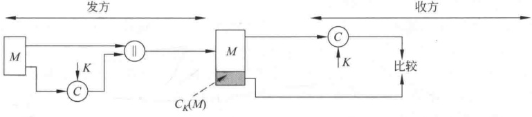

**(a) 消息认证**

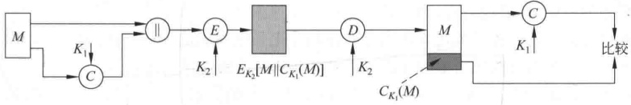

**(b) 认证性和保密性：对明文认证**

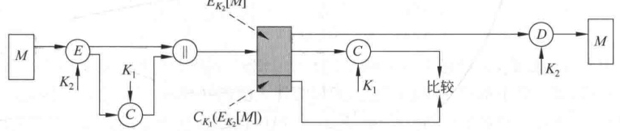

**(c) 认证性和保密性：对密文认证**

**图 6-1 MAC 的基本使用方式**

### 6.1.2 产生 MAC 的函数应满足的要求

使用加密算法（单钥算法或公钥算法）加密消息时，其安全性一般取决于密钥的长度。如果加密算法没有弱点，则敌手只能使用穷搜索攻击以测试所有可能的密钥。如果密钥长为 k 比特，则穷搜索攻击平均将进行  ${2}^{k-1}$ 个测试。特别地，对唯密文攻击来说，敌手如果知道密文 C，则将对所有可能的密钥值  $K_{i}$ 执行解密运算  $P_{i}=D_{K_{i}}(C)$，直到得到有意义的明文。

对 MAC 来说，由于产生 MAC 的函数一般都为多到一映射，如果产生 n 比特长的 MAC，则函数的取值范围即为  ${2}^n$ 个可能的 MAC，函数输入的可能的消息个数  $N \gg 2^n$，而且如果函数所用的密钥为  $k$ 比特，则可能的密钥个数为  ${2}^k$。如果系统不考虑保密性，即敌手能获取明文消息和相应的 MAC，在这种情况下考虑敌手使用穷搜索攻击以获取产生 MAC 的函数所使用的密钥。假定  $k > n$，且敌手已得到  $M_1$ 和  $MAC_1$，其中， $MAC_1 = C_{K_1}(M_1)$，敌手对所有可能的密钥值  $K_i$ 求  $MAC_i = C_{K_i}(M_1)$，直到找到某个  $K_i$ 使得  $MAC_i = MAC_1$。由于不同的密钥个数为  ${2}^k$，因此将产生  ${2}^k$ 个 MAC，但其中仅有  ${2}^n$ 个不同，由于  ${2}^k > 2^n$，所以有很多密钥（平均有  ${2}^k / 2^n = 2^{k-n}$ 个）都可产生出正确的  $MAC_1$，而敌手无法知道进行通信的两个用户用的是哪一个密钥，还必须按以下方式重复上述攻击。

第1轮：已知 $M_{1}$、 $MAC_{1}$，其中 $MAC_{1}=C_{K}(M_{1})$。对所有 ${2}^{k}$个可能的密钥计算

 $\mathrm{MAC}_{i}=C_{K_{i}}\left(M_{1}\right)$，得 ${2}^{k-n}$个可能的密钥。

第2轮：已知 $M_{2}$、 $MAC_{2}$，其中 $MAC_{2}=C_{K}(M_{2})$。对上一轮得到的 ${2}^{k-n}$个可能的密钥计算 $\mathrm{MAC}_{i}=C_{K_{i}}(M_{2})$，得 ${2}^{k-2\times n}$个可能的密钥。

如此下去，如果  $k=\alpha n$，则上述攻击方式平均需要  $\alpha$ 轮。例如，密钥长为 80 比特，MAC 长为 32 比特，则第 1 轮将产生大约  ${2}^{48}$ 个可能密钥，第 2 轮将产生  ${2}^{16}$ 个可能的密钥，第 3 轮即可找出正确的密钥。

如果密钥长度小于 MAC 的长度，则第1轮就有可能找出正确的密钥，也有可能找出多个可能的密钥，如果是后者，则仍需执行第2轮搜索。

所以对消息认证码的穷搜索攻击比对使用相同长度密钥的加密算法的穷搜索攻击的代价还要大。然而有些攻击法却不需要寻找产生 MAC 所使用的密钥。

例如，设  $M=(X_1 \parallel X_2 \parallel \cdots \parallel X_m)$ 是由 64 比特长的分组  $X_i (i=1,\cdots,m)$ 链接得到的，其消息认证码由以下方式得到：

$$\begin{aligned}&\Delta(M)=X_{1}\oplus X_{2}\oplus\cdots\oplus X_{m}\\&C_{K}(M)=E_{K}\begin{bmatrix}\Delta(M)\end{bmatrix}\\ \end{aligned}$$

其中，$\oplus$表示异或运算，加密算法是电码本模式的 DES。因此，密钥长为 56 比特，MAC 长为 64 比特，如果敌手得到 $M \parallel C_K(M)$，则以穷搜索攻击寻找 $K$ 将需做 ${2}^{56}$ 次加密。然而敌手可用以下方式攻击系统，将 $X_1$ 到 $X_{m-1}$ 分别用自己选取的 $Y_1$ 到 $Y_{m-1}$ 替换，求出 $Y_m = Y_1 \oplus Y_2 \oplus \cdots \oplus Y_{m-1} \oplus \Delta(M)$（敌手由 $M$ 易得 $\Delta(M)$），并用 $Y_m$ 替换 $X_m$。因此，敌手可成功伪造一个新消息 $M^{\prime} = Y_1 \oplus \cdots \oplus Y_m$，且 $M^{\prime}$ 的 MAC 与原消息 $M$ 的 MAC 相同。

考虑到 MAC 所存在的以上攻击类型，可得它应满足的以下要求，其中，假定敌手知道函数 C 但不知道密钥 K：

（1）如果敌手得到 M 和  $C_{K}(M)$，则构造一满足  $C_{K}(M^{\prime}) = C_{K}(M)$ 的新消息 M' 在计算上是不可行的；

(2) $C_{K}(M)$在以下意义下是均匀分布的：随机选取两个消息 $M,M^{\prime},P\left[C_{K}(M)=C_{K}(M^{\prime})\right]=2^{-n}$，其中，n为MAC的长。

（3）若  $M^{\prime}$ 是 M 的某个变换，即  $M^{\prime}=f(M)$，例如 f 为插入一个或多个比特，那么  $P\left[C_{K}\left(M\right)=C_{K}\left(M^{\prime}\right)\right]=2^{-n}$。

第一个要求是针对上例中的攻击类型的，即敌手不需要找出密钥K而伪造一个与截获的MAC相匹配的新消息在计算上是不可行的。第二个要求是说敌手如果截获一个MAC，则伪造一个相匹配的消息的概率为最小。第三个要求是说函数C不应在消息的某个部分或某些比特弱于其他部分或其他比特。否则敌手获得M和MAC后就有可能修改M中弱的部分，从而伪造出一个与原MAC相匹配的新消息。

### 6.1.3 数据认证算法

数据认证算法是最为广泛使用的消息认证码中的一个，已作为 FIPS Publication（FIPS PUB 113），并被 ANSI 作为 X9.17 标准。

算法基于 CBC 模式的 DES 算法，其初始向量取为零向量。需被认证的数据（消息、记录、文件或程序）被分为 64 比特长的分组  $D_{1}, D_{2}, \cdots, D_{N}$，其中，如果最后一个分组不够 64 比特，可在其右边填充一些 0，然后按以下过程计算数据认证码（见图 6-2）：

$$O_{1}=E_{K}\left(D_{1}\right)$$

$$O_{2}=E_{K}\left(D_{2}\oplus O_{1}\right)$$

$$O_{3}=E_{K}\left(D_{3}\oplus O_{2}\right)$$

$$\bullet \quad \bullet$$

$$O_{N}=E_{K}\left(D_{N}\oplus O_{N-1}\right)$$

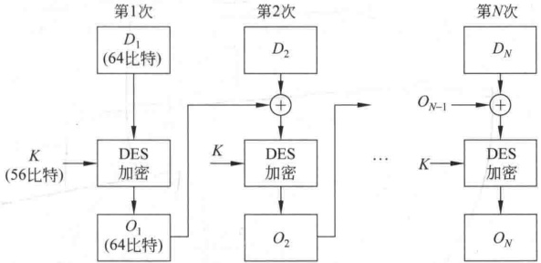

**图 6-2 数据认证算法**

其中，E 为 DES 加密算法，K 为密钥。

数据认证码或者取为 $O_{N}$或者取为 $O_{N}$的最左M个比特，其中， ${16}\leq M\leq64$。

### 6.1.4 基于祖冲之密码的完整性算法 128-EIA3

基于祖冲之密码（见3.8节）的完整性算法128-EIA3是消息认证码（MAC）函数，用于为输入的消息使用完整性密钥IK产生消息认证码（MAC）。

1. 算法的输入与输出

算法的输入参数见表6-1，输出参数见表6-2。

**表6-1 输入参数表**

| 输入参数 | 比特长度 | 备注 |
| --- | --- | --- |
| COUNT | 32 | 计数器 |
| BEARER | 5 | 承载层标识 |
| DIRECTION | 1 | 传输方向标识 |
| IK | 128 | 完整性密钥 |
| LENGTH | 32 | 输入消息的比特长度 |
| M | LENGTH | 输入消息 |

**表6-2 输出参数表**

| 输出参数 | 比特长度 | 备注 |
| --- | --- | --- |
| MAC | 32 | 消息认证码 |

2. 算法工作流程

算法工作流程如图 6-3 所示。

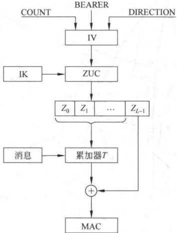

**图 6-3 完整性算法 128-EIA3 计算消息认证码（MAC）的原理框图**

算法原理如下：根据参数 COUNT、BEARER、DIRECTION 按照一定规则产生出初始向量 IV，以完整性密钥 IK 作为 ZUC 算法的密钥，执行 ZUC 算法产生出长度为 L 的 32 位密钥字流  $Z_{0}, Z_{1}, \cdots, Z_{L-1}$。把  $Z_{0}, Z_{1}, \cdots, Z_{L-1}$ 看成二进制比特流，从  $Z_{0}$ 首位开始逐比特向后形成一系列新的 32 位密钥字，并在消息比特流的控制下进行累加，最后再加上  $Z_{L-1}$ 便产生出消息认证码 (MAC)。

1）初始化

初始化是根据完整性密钥 IK 和其他输入参数（见表 6-1）构造 ZUC 算法的初始密钥 k 和初始向量 IV。

把 IK（128 比特长）和 k（128 比特长）分别表示为 16 个字节：

$$\mathbf{I}\mathbf{K}=\mathbf{I}\mathbf{K}[\mathbf{0}]\parallel\mathbf{I}\mathbf{K}[\mathbf{1}]\parallel\mathbf{I}\mathbf{K}[\mathbf{2}]\parallel\cdots\parallel\mathbf{I}\mathbf{K}[\mathbf{15}]$$

$$k=k\left[0\right]\parallel k\left[1\right]\parallel k\left[2\right]\parallel\cdots\parallel k\left[15\right]$$

令

$$k\left[i\right]=IK\left[i\right],i=0,1,2,\cdots,15$$

把 COUNT(32 比特长)表示为 4 个字节：

$$COUNT=COUNT[0]\parallel COUNT[1]\parallel COUNT[2]\parallel COUNT[3]$$

把 IV（128 比特长）表示为 16 个字节：

$$\mathbf{I}\mathbf{V}=\mathbf{I}\mathbf{V}[\mathbf{0}]\parallel\mathbf{I}\mathbf{V}[\mathbf{1}]\parallel\mathbf{I}\mathbf{V}[\mathbf{2}]\parallel\cdots\parallel\mathbf{I}\mathbf{V}[\mathbf{15}]$$

按如下方式产生 IV：

$$\left\{IV\left[0\right]=COUNT[0],IV[1]=COUNT[1]\right\}$$

$$\mathrm{IV}[2]=\mathrm{COUNT}[2],\mathrm{IV}[3]=\mathrm{COUNT}[3]$$

$$\mathrm{IV}\left[4\right]=\mathrm{BEARER}\parallel000_{2},\mathrm{IV}\left[5\right]=00000000_{2}$$

$$\mathrm{IV}[6]=00000000_{2},\mathrm{IV}[7]=00000000_{2}$$

$$\mathrm{IV}[8]=\mathrm{IV}[0]\oplus(\mathrm{DIRECTION}\ll7),\mathrm{IV}[9]=\mathrm{IV}[1]$$

$$\mathrm{IV}[10]=\mathrm{IV}[2],\mathrm{IV}[11]=\mathrm{IV}[3]$$

$$\mathrm{IV}\left[12\right]=\mathrm{IV}\left[4\right],\mathrm{IV}\left[13\right]=\mathrm{IV}\left[5\right]$$

$$\mathrm{IV}[14]=\mathrm{IV}[6]\oplus(\mathrm{DIRECTION}\ll7),\mathrm{IV}[15]=\mathrm{IV}[7]$$

其中，符号 A  $\ll n$ 表示把 A 左移 n 位。

2）产生完整性密钥字流

利用初始密钥  $k$ 和初始向量  $IV$，执行 ZUC 密码算法产生  $L$ 个 32 位的完整性密钥字流，其中， $L = \lceil \text{LENGTH}/32 \rceil + 2$。将生成的密钥字流表示为比特串  $z[0]$， $z[1]$， $\cdots$， $z[32 \times (L-1)]$， $z[0]$ 为 ZUC 算法生成的第一个 32 位密钥字的最高位比特， $z[31]$ 为最低位比特，其他以此类推。

为了计算消息认证码(MAC)，需要把比特串  $z[0]$,  $z[1]$,  $\cdots$,  $z[32 \times (L-1)]$ 重新组合成新的  ${32} \times (L-1) + 1$ 个 32 位密钥字  $z_i$，方法是把  $z[0]$,  $z[1]$,  $\cdots$,  $z[31]$ 表示为  $z_0$，把  $z[1]$,  $z[2]$,  $\cdots$,  $z[32]$ 表示为  $z_1$，以此类推，把  $z[32 \times (L-1)]$,  $z[32 \times (L-1) + 1]$,  $\cdots$,  $z[32 \times (L-1) + 31]$ 表示为  $z_{32 \times (L-1)}$。即

$$\left\{\begin{aligned}z_{i}=&z\left[i\right]\parallel z\left[i+1\right]\parallel\cdots\parallel z\left[i+31\right]\\ i=&0,1,2,\cdots,32\times(L-1)\end{aligned}\right.$$

3）计算 MAC

设需要计算消息验证码的消息比特序列为  $M=m[0], m[1], \cdots, m[LENGTH-1]$。设 T 为一个 32 比特的字变量，于是可如下计算消息验证码（MAC）。

$$MACComputation()$$

（1）置 T=0；

$$For(I=0;I<LENGTH;I++)$$

$$If m[I]=1 Then T=T\oplus z_{I};$$

(3) END For

(4)  $T = T \oplus z_{\text{LENGTH}}$;

(5) MAC =  $T \oplus z_{32 \times (L-1)}$;

## 哈希函数

### 6.2.1 哈希函数的定义及使用方式

哈希函数 H 是一个公开函数，用于将任意长的消息 M 映射为较短的、固定长度的一个值  $H(M)$，作为认证符，称函数值  $H(M)$ 为哈希值或哈希码或消息摘要。哈希码是消息中所有比特的函数，因此提供了一种错误检测能力，即改变消息中任何一个比特或几个比特都会使哈希码发生改变。

图 6-4 表示哈希函数用来提供消息认证的基本使用方式，共有以下 6 种：

（1）消息与哈希码链接后用单钥加密算法加密。由于所用密钥仅为收发双方A、B共享，因此可保证消息的确来自A并且未被篡改。同时由于消息和哈希码都被加密，这种方式还提供了保密性，见图6-4(a)。

（2）用单钥加密算法仅对哈希码加密。这种方式用于不要求保密性的情况，可减少处理负担。注意这种方式和图6-1(a)的MAC结果完全一样，即将 $E_{K}[H(M)]$看作一个函数，函数的输入为消息M和密钥K，输出为固定长度，见图6-4(b)。

（3）用公钥加密算法和发方的秘密钥仅加密哈希码。和（2）一样，这种方式提供认证性，又由于只有发方能产生加密的哈希码，因此这种方式还对发方发送的消息提供了数字签字，事实上这种方式就是数字签字，见图6-4(c)。

（4）消息的哈希值用公钥加密算法和发方的秘密钥加密后与消息链接，再对链接后的结果用单钥加密算法加密，这种方式提供了保密性和数字签字，见图6-4(d)。

（5）使用这种方式时要求通信双方共享一个秘密值 S，A 计算消息 M 和秘密值 S 链接在一起的哈希值，并将此哈希值附加到 M 后发往 B。因 B 也有 S，所以可重新计算哈希值以对消息进行认证。由于秘密值 S 本身未被发送，敌手无法对截获的消息加以篡改，也无法产生假消息。这种方式仅提供认证，见图 6-4(e)。

（6）这种方式是在（5）中消息与哈希值链接以后再增加单钥加密运算，从而又可提供保密性，见图6-4(f)。

由于加密运算的速度较慢，代价较高，而且很多加密算法还受到专利保护，因此在不要求保密性的情况下，方式(2)和(3)将比其他方式更具优势。

### 6.2.2 哈希函数应满足的条件

哈希函数的目的是为需认证的数据产生一个“指纹”。为了能够实现对数据的认证，哈希函数应满足以下性质：

（1）函数的输入可以是任意长。

（2）函数的输出是固定长。

（3）已知 x，求  $H(x)$ 较为容易，可用硬件或软件实现。

（4）已知 h，求使得  $H(x)=h$ 的 x 在计算上是不可行的，这一性质称为函数的单向性，称  $H(x)$ 为单向哈希函数。

（5）已知 x，找出  $y(y \neq x)$ 使得  $H(y) = H(x)$ 在计算上是不可行的。

如果单向哈希函数满足这一性质，则称其为弱单向哈希函数。

（6）找出任意两个不同的输入 x, y，使得  $H(y)=H(x)$ 在计算上是不可行的。

如果单向哈希函数满足这一性质，则称其为强单向哈希函数。

性质(5)、(6)给出了哈希函数无碰撞性的概念，如果哈希函数对不同的输入可产生相同的输出，则称该函数具有碰撞性。

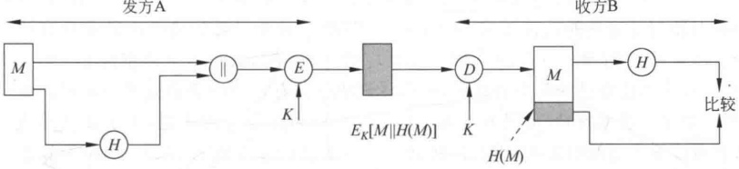

**(a)**

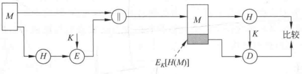

**(b)**

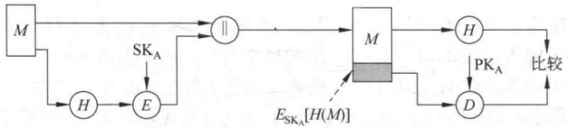

**(c)**

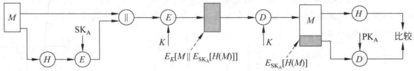

**(d)**

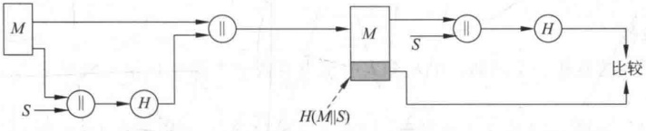

**(e)**

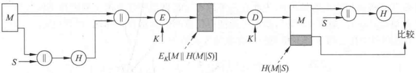

**(f)**

**图 6-4 哈希函数的基本使用方式**

以上6个性质中，前3个是哈希函数能用于消息认证的基本要求。第4个性质（即单向性）则对使用秘密值的认证技术（见图6-4(e)）极为重要。假如哈希函数不具有单向性，则攻击者截获$M$和$C=H(S \parallel M)$后，求$C$的逆$S \parallel M$，就可求出秘密值$S$。第5个性质使得敌手无法在已知某个消息时，找到与该消息具有相同哈希值的另一消息。这一性质用于哈希值被加密时（见图6-4(b)和图6-4(c)）防止敌手的伪造，由于在这种情况下，敌手可读取传送的明文消息$M$，因此能产生该消息的哈希值$H(M)$。但由于敌手不知道用于加密哈希值的密钥，他就不可能既伪造一个消息$M$，又伪造这个消息的哈希值加密后的密文$E_{K}[H(M)]$。然而，如果第5个性质不成立，敌手在截获明文消息及其加密的哈希值后，就可按以下方式伪造消息：首先求出截获的消息的哈希值，然后产生一个具有相同哈希值的伪造消息，最后再将伪造的消息和截获的加密的哈希值发往通信的接收一方。第6个性质用于抵抗生日攻击。

### 6.2.3 生日攻击

1. 相关问题

已知一个哈希函数 H 有 n 个可能的输出， $H(x)$ 是一个特定的输出，如果对 H 随机取 k 个输入，则至少有一个输入 y 使得  $H(y)=H(x)$ 的概率为 0.5 时，k 有多大？

以后为叙述方便，称对哈希函数 H 寻找上述 y 的攻击为第 I 类生日攻击。

因为 H 有 n 个可能的输出，所以输入 y 产生的输出  $H(y)$ 等于特定输出  $H(x)$ 的概率是  $\frac{1}{n}$，反过来说， $H(y) \neq H(x)$ 的概率是  ${1}-\frac{1}{n}$。y 取 k 个随机值而函数的 k 个输出中没有一个等于  $H(x)$，其概率等于每个输出都不等于  $H(x)$ 的概率之积，为  $\left[1-\frac{1}{n}\right]^k$，所以 y 取 k 个随机值得到函数的 k 个输出中至少有一个等于  $H(x)$ 的概率为  ${1}-\left[1-\frac{1}{n}\right]^k$。

由 $(1+x)^{k}\approx1+kx$， $\left|x\right|\ll1$；得

$${1}-\left[1-\frac{1}{n}\right]^{k}\approx1-\left[1-\frac{k}{n}\right]=k/n$$

若使上述概率等于 0.5，则 k=n/2。特别地，如果 H 的输出为 m 比特长，即可能的输出个数  $n=2^{m}$，则  $k=2^{m-1}$。

2. 生日悖论

生日悖论是考虑这样一个问题：在 k 个人中至少有两个人的生日相同的概率大于0.5 时，k 至少多大？

为了回答这一问题，首先定义下述概率：设有 k 个整数项，每一项都在  ${1} \sim n$ 等可能地取值，则 k 个整数项中至少有两个取值相同的概率为  $P(n,k)$。因而生日悖论就是求使得  $P(365,k) \geq 0.5$ 的最小 k，为此首先考虑 k 个数据项中任意两个取值都不同的概率，记为  $Q(365,k)$。如果 k > 365，则不可能使得任意两个数据都不相同，因此假定  $k \leq 365$。k 个数据项中任意两个都不相同的所有取值方式数为

$${365}\times364\times\cdots\times(365-k+1)=\frac{365!}{(365-k)!}$$

即第1个数据项可从365个中任取一个，第2个数据项可在剩余的364个中任取一个，以此类推，最后一个数据项可从 ${365}-k+1$个值中任取一个。如果去掉任意两个都不相同这一限制条件，可得 k 个数据项中所有取值方式数为  ${365}^{k}$ 。所以可得

$$Q(365,k)=\frac{365!}{(365-k)!\ 365^{k}}$$

$$P(365,k)=1-Q(365,k)=1-\frac{365!}{(365-k)! \cdot 365^{k}}$$

当 k=23 时， $P(365,23)=0.5073$，即上述问题只需23人，人数如此之少。若 k 取 100，则  $P(365,100)=0.999\ 999\ 7$，即获得如此大的概率。之所以称这一问题是悖论，是因为当人数 k 给定时，得到的至少有两个人的生日相同的概率比我们想象的要大得多。这是因为在 k 个人中考虑的是任意两个人的生日是否相同，在23个人中可能的情况数为  $C_{23}^{2}=253$。

将生日悖论推广为下述问题：已知一个在 ${1}\sim n$均匀分布的整数型随机变量，若该变量的k个取值中至少有两个取值相同的概率大于0.5，则k至少多大？

与上类似， $P(n,k)=1-\frac{n!}{(n-k)!n^k}$，令 $P(n,k)>0.5$，可得 $k=1.18\sqrt{n}\approx\sqrt{n}$。

若取 n=365，则  $k=1.18\sqrt{365}=22.54$。

3. 生日攻击

生日攻击基于下述结论：设哈希函数 H 有  ${2}^{m}$ 个可能的输出（即输出长 m 比特），如果 H 的 k 个随机输入中至少有两个产生相同输出的概率大于 0.5，则  $k \approx \sqrt{2^{m}} = 2^{m/2}$ 。

称寻找函数 H 的具有相同输出的两个任意输入的攻击方式为第Ⅱ类生日攻击。

第Ⅱ类生日攻击可按以下方式进行：

（1）设用户将用图6-4（c）所示的方式发送消息，即A用自己的秘密钥对消息的哈希值加密，加密结果作为对消息的签字，连同明文消息一起发往接收者。

（2）敌手对 A 发送的消息 M 产生出  ${2}^{m/2}$ 个变形的消息，每个变形的消息本质上的含义与原消息相同，同时敌手还准备一个假冒的消息  $M^{\prime}$，并对假冒的消息产生出  ${2}^{m/2}$ 个变形的消息。

（3）敌手在产生的两个消息集合中，找出哈希值相同的一对消息 $\overrightarrow{M}$和 $\overrightarrow{M}$，由上述讨论可知敌手成功的概率大于0.5。如果不成功，则重新产生一个假冒的消息，并产生 ${2}^{m/2}$个变形，直到找到哈希值相同的一对消息为止。

（4）敌手将M提交给A请求签字，由于M与M的哈希值相同，所以可将A对M的签字当作对M的签字，将此签字连同M一起发给意欲的接收者。

上述攻击中如果哈希值的长为64比特，则敌手攻击成功所需的时间复杂度为 $O(2^{32})$。

将一个消息变形为具有相同含义的另一消息的方法有很多，例如对文件，敌手可在文件的单词之间插入很多 space-space-backspace 字符对，然后将其中的某些字符对替换为 space-backspace-space 就得到一个变形的消息。

### 6.2.4 迭代型哈希函数的一般结构

目前使用的大多数哈希函数（如 MD5、SHA）的结构都是迭代型的，如图 6-5 所示。其中，函数的输入 M 被分为 L 个分组  $Y_{0}, Y_{1}, \cdots, Y_{L-1}$，每一个分组的长度为 b 比特，若最后一个分组的长度不够，需对其做填充。最后一个分组中还包括整个函数输入的长度值，这样一来，将使得敌手的攻击更为困难，即敌手若想成功地产生假冒的消息，就必须保证假冒消息的哈希值与原消息的哈希值相同，而且假冒消息的长度也要与原消息的长度相等。

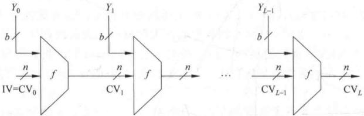

**图 6-5 迭代型哈希函数的一般结构**

算法中重复使用一个压缩函数  $f$（注意，有些书将哈希函数也称为压缩函数，在此用压缩函数表示哈希函数中的一个特定部分）， $f$ 的输入有两项，一项是上一轮（第  $i-1$ 轮）输出的  $n$ 比特值  $CV_{i-1}$，称为链接变量，另一项是算法在本轮（第  $i$ 轮）的  $b$ 比特输入分组  $Y_i$。 $f$ 的输出为  $n$ 比特值  $CV_i$， $CV_i$ 又作为下一轮的输入。算法开始时还需对链接变量指定一个初值 IV，最后一轮输出的链接变量  $CV_L$ 即为最终产生的哈希值。通常有  $b > n$，因此称函数  $f$ 为压缩函数。算法可表达如下：

$$CV_{0}=IV=n\  比特长的初值；$$

$$CV_{i}=f(CV_{i-1},Y_{i-1}),\quad1\leqslant i\leqslant L；$$

$$H\left(M\right)=CV_{L}$$

算法的核心技术是设计无碰撞的压缩函数 f，而敌手对算法的攻击重点是 f 的内部结构，由于 f 和分组密码一样是由若干轮处理过程组成，所以对 f 的攻击需通过对各轮之间的位模式的分析来进行，分析过程常常需要先找出 f 的碰撞。由于 f 是压缩函数，其碰撞是不可避免的，因此在设计 f 时就应保证找出其碰撞在计算上是不可行的。

下面介绍几个重要的迭代型哈希函数。

## 6.3 MD5 哈希算法

MD5 哈希算法的前身 MD4 是由 Ron Rivest 于 1990 年 10 月作为 RFC 提出的，1992 年 4 月公布的 MD4 的改进 (RFC 1320, 1321) 称为 MD5。

### 6.3.1 算法描述

MD5算法采用图6-5描述的迭代型哈希函数的一般结构如图6-6所示。算法的输入为任意长的消息（图中为K比特），分为512比特长的分组，输出为128比特的消息摘要。

处理过程有以下几步：

（1）对消息填充。对消息填充，使得其比特长在模512下为448，即填充后消息的长度为512的某一倍数减64，留出的64比特备第(2)步使用。步骤(1)是必需的，即使消息长度已满足要求，仍需填充。

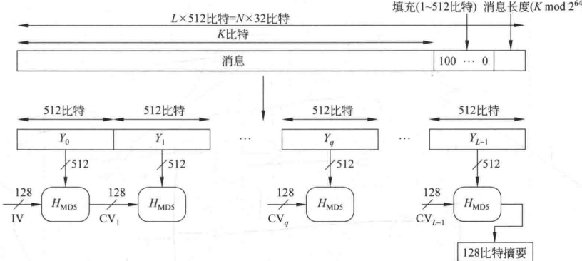

**图 6-6 MD5 的算法框图**

例如，消息长为448比特，则需填充512比特，使其长度变为960，因此填充的比特数大于等于1而小于等于512。

填充方式是固定的：第1位为1，其后各位皆为0。

（2）附加消息的长度。用步骤（1）留出的64比特以小端（little-endian）方式来表示消息被填充前的长度。如果消息长大于 ${2}^{64}$，则以 ${2}^{64}$为模数取模。

小端方式是指按数据的最低有效字节(byte)(或最低有效位)优先的顺序存储数据，即将最低有效字节(或最低有效位)存于低地址字节(或位)。相反的存储方式称为大端(big-endian)方式。

前两步执行完后，消息的长度为512的倍数（设为L倍），则可将消息表示为分组长为512的一系列分组 $Y_{0},Y_{1},\cdots,Y_{L-1}$。而每一分组又可表示为16个32比特长的字，则消息中的总字数为 $N=L\times16$，因此消息又可按字表示为 $M[0,\cdots,N-1]$。

（3）对 MD 缓冲区初始化。算法使用 128 比特长的缓冲区以存储中间结果和最终哈希值，缓冲区可表示为 4 个 32 比特长的寄存器（A，B，C，D），每个寄存器都以小端方式存储数据，其初值取为（以存储方式）A = 01234567，B = 89 ABCDEF，C = FEDCBA98，D = 76543210，实际上为 67452301，EFCDAB89，98BADCFE，10325476。

（4）以分组为单位对消息进行处理。每一分组  $Y_{q}(q=0,\cdots,L-1)$ 都经一压缩函数  $H_{MD5}$ 处理。 $H_{MD5}$ 是算法的核心，其中又有4轮处理过程，如图6-7所示。

 $H_{\text{MD5}}$ 的 4 轮处理过程结构一样，但所用的逻辑函数不同，分别表示为  $F$、 $G$、 $H$、 $I$。每轮的输入为当前处理的消息分组  $Y_q$ 和缓冲区的当前值  $A$、 $B$、 $C$、 $D$，输出仍放在缓冲区中以产生新的  $A$、 $B$、 $C$、 $D$。每轮处理过程还需加上常数表  $T$ 中四分之一个元素，分别为  $T[1..16]$， $T[17..32]$， $T[33..48]$， $T[49..64]$。表  $T$ 有 64 个元素，见表 6-3，第  $i$ 个元素  $T[i]$ 为  ${2}^{32} \times \text{abs}(\sin(i))$ 的整数部分，其中， $\sin$ 为正弦函数， $i$ 以弧度为单位。由于  $\text{abs}(\sin(i))$ 大于 0 小于 1，所以  $T[i]$ 可由 32 比特的字表示。第 4 轮的输出再与第 1 轮的输入  $CV_q$ 相加，相加时将  $CV_q$ 看作 4 个 32 比特的字，每个字与第 4 轮输出的对应的字按模  ${2}^{32}$ 相加，相加的结果即为压缩函数  $H_{\mathrm{MD5}}$ 的输出。

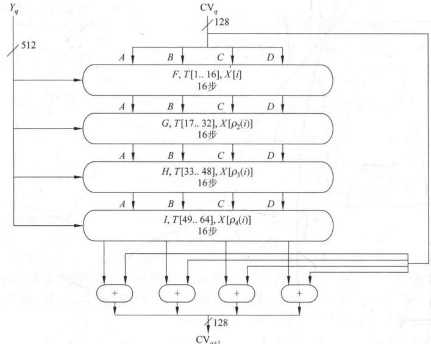

**图 6-7 MD5 的分组处理框图**

**表6-3 常数表T**

| T[1]=D76AA478 | T[17]=F61E2562 | T[33]=FFFA3942 | T[49]=F4292244 |
| --- | --- | --- | --- |
| T[2]=E8C7B756 | T[18]=C040B340 | T[34]=8771F681 | T[50]=432AFF97 |
| T[3]=242070DB | T[19]=265E5A51 | T[35]=699D6122 | T[51]=AB9423A7 |
| T[4]=C1BDCEEE | T[20]=E9B6C7AA | T[36]=FDE5380C | T[52]=FC93A039 |
| T[5]=F57C0FAF | T[21]=D62F105D | T[37]=A4BEEA44 | T[53]=655B59C3 |
| T[6]=4787C62A | T[22]=02441453 | T[38]=4BDECFA9 | T[54]=8F0CCC92 |
| T[7]=A8304613 | T[23]=D8A1E681 | T[39]=F6BB4B60 | T[55]=FFEFF47D |
| T[8]=FD469501 | T[24]=E7D3FBC8 | T[40]=BEBFBC70 | T[56]=85845DD1 |
| T[9]=698098D8 | T[25]=21E1CDE6 | T[41]=289B7EC6 | T[57]=6FA87E4F |
| T[10]=8B44F7AF | T[26]=C33707D6 | T[42]=EAA127FA | T[58]=FE2CE6E0 |
| T[11]=FFFF5BB1 | T[27]=F4D50D87 | T[43]=D4EF3085 | T[59]=A3014314 |
| T[12]=895CD7BE | T[28]=455A14ED | T[44]=04881D05 | T[60]=4E0811A1 |
| T[13]=6B901122 | T[29]=A9E3E905 | T[45]=D9D4D039 | T[61]=F7537E82 |
| T[14]=FD987193 | T[30]=FCEFA3F8 | T[46]=E6DB99E5 | T[62]=BD3AF235 |
| T[15]=A679438E | T[31]=676F02D9 | T[47]=1FA27CF8 | T[63]=2AD7D2BB |
| T[16]=49B40821 | T[32]=8D2A4C8A | T[48]=C4AC5665 | T[64]=EB86D391 |

（5）输出。消息的 L 个分组都被处理完后，最后一个  $H_{MD5}$ 的输出即为产生的消息摘要。

步骤(3)～(5)的处理过程可总结如下：

$$CV_{0}=IV；$$

$$CV_{q+1}=CV_{q}+RF_{I}\left[Y_{q},RF_{H}\left[Y_{q},RF_{G}\left[Y_{q},RF_{F}\left[Y_{q},CV_{q}\right]\right]\right]\right];$$

$$MD=CV_{L}$$

其中，IV 是步骤(3)所取的缓冲区 ABCD 的初值， $Y_{q}$ 是消息的第 q 个 512 比特长的分组，L 是消息经过步骤(1)和步骤(2)处理后的分组数， $\mathrm{CV}_{q}$ 为处理消息的第 q 个分组时输入的链接变量（即前一个压缩函数的输出）， $RF_{x}$ 为使用基本逻辑函数 x 的轮函数，+为对应字的模  ${2}^{32}$ 加法，MD 为最终的哈希值。

### 6.3.2 MD5 的压缩函数

压缩函数  $H_{MD5}$ 中有4轮处理过程，每轮又对缓冲区 ABCD 进行16步迭代运算，每一步的运算形式为（见图6-8）

$$a\leftarrow b+\mathrm{CLS}_{s}(a+\mathrm{g}(b,c,d)+X[k]+T[i])$$

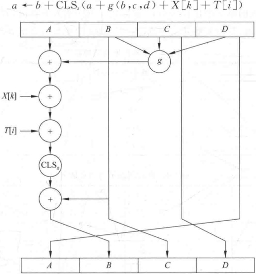

**图 6-8 压缩函数中的一步迭代示意图**

其中，a、b、c、d 为缓冲区的 4 个字，运算完成后再右循环一个字，即得这一步迭代的输出。g 是基本逻辑函数 F、G、H、I 之一。 $CLS_{i}$ 是 32 位存数左循环移 s 位，s 的取值由表 6-4 给出。 $T[i]$ 为表 T 中的第 i 个字，+ 为模  ${2}^{32}$ 加法。 $X[k]=M[q\times16+k]$，即消息第 q 个分组中的第 k 个字（ $k=1,\cdots,16$）。在 4 轮处理过程中，每轮以不同的次序使用 16 个字，在第一轮以字的初始次序使用。第二轮到第四轮，分别对字的次序 i 做置换后得到一个新次序，然后以新次序使用16个字。3个置换分别为

$$\rho_{2}(i)=(1+5i)\bmod16$$

$$\rho_{3}(i)=(5+3i)\bmod16$$

$$\rho_{4}(i)=7i\bmod{16}$$

**表6-4 压缩函数每步左循环移位的位数**

<table border=1 style='margin: auto; word-wrap: break-word;'><tr><td rowspan="2">轮数</td><td colspan="16">步 数</td></tr><tr><td style='text-align: center; word-wrap: break-word;'>1</td><td style='text-align: center; word-wrap: break-word;'>2</td><td style='text-align: center; word-wrap: break-word;'>3</td><td style='text-align: center; word-wrap: break-word;'>4</td><td style='text-align: center; word-wrap: break-word;'>5</td><td style='text-align: center; word-wrap: break-word;'>6</td><td style='text-align: center; word-wrap: break-word;'>7</td><td style='text-align: center; word-wrap: break-word;'>8</td><td style='text-align: center; word-wrap: break-word;'>9</td><td style='text-align: center; word-wrap: break-word;'>10</td><td style='text-align: center; word-wrap: break-word;'>11</td><td style='text-align: center; word-wrap: break-word;'>12</td><td style='text-align: center; word-wrap: break-word;'>13</td><td style='text-align: center; word-wrap: break-word;'>14</td><td style='text-align: center; word-wrap: break-word;'>15</td><td style='text-align: center; word-wrap: break-word;'>16</td></tr><tr><td style='text-align: center; word-wrap: break-word;'>1</td><td style='text-align: center; word-wrap: break-word;'>7</td><td style='text-align: center; word-wrap: break-word;'>12</td><td style='text-align: center; word-wrap: break-word;'>17</td><td style='text-align: center; word-wrap: break-word;'>22</td><td style='text-align: center; word-wrap: break-word;'>7</td><td style='text-align: center; word-wrap: break-word;'>12</td><td style='text-align: center; word-wrap: break-word;'>17</td><td style='text-align: center; word-wrap: break-word;'>22</td><td style='text-align: center; word-wrap: break-word;'>7</td><td style='text-align: center; word-wrap: break-word;'>12</td><td style='text-align: center; word-wrap: break-word;'>17</td><td style='text-align: center; word-wrap: break-word;'>22</td><td style='text-align: center; word-wrap: break-word;'>7</td><td style='text-align: center; word-wrap: break-word;'>12</td><td style='text-align: center; word-wrap: break-word;'>17</td><td style='text-align: center; word-wrap: break-word;'>22</td></tr><tr><td style='text-align: center; word-wrap: break-word;'>2</td><td style='text-align: center; word-wrap: break-word;'>5</td><td style='text-align: center; word-wrap: break-word;'>9</td><td style='text-align: center; word-wrap: break-word;'>14</td><td style='text-align: center; word-wrap: break-word;'>20</td><td style='text-align: center; word-wrap: break-word;'>5</td><td style='text-align: center; word-wrap: break-word;'>9</td><td style='text-align: center; word-wrap: break-word;'>14</td><td style='text-align: center; word-wrap: break-word;'>20</td><td style='text-align: center; word-wrap: break-word;'>5</td><td style='text-align: center; word-wrap: break-word;'>9</td><td style='text-align: center; word-wrap: break-word;'>14</td><td style='text-align: center; word-wrap: break-word;'>20</td><td style='text-align: center; word-wrap: break-word;'>5</td><td style='text-align: center; word-wrap: break-word;'>9</td><td style='text-align: center; word-wrap: break-word;'>14</td><td style='text-align: center; word-wrap: break-word;'>20</td></tr><tr><td style='text-align: center; word-wrap: break-word;'>3</td><td style='text-align: center; word-wrap: break-word;'>4</td><td style='text-align: center; word-wrap: break-word;'>11</td><td style='text-align: center; word-wrap: break-word;'>16</td><td style='text-align: center; word-wrap: break-word;'>23</td><td style='text-align: center; word-wrap: break-word;'>4</td><td style='text-align: center; word-wrap: break-word;'>11</td><td style='text-align: center; word-wrap: break-word;'>16</td><td style='text-align: center; word-wrap: break-word;'>23</td><td style='text-align: center; word-wrap: break-word;'>4</td><td style='text-align: center; word-wrap: break-word;'>11</td><td style='text-align: center; word-wrap: break-word;'>16</td><td style='text-align: center; word-wrap: break-word;'>23</td><td style='text-align: center; word-wrap: break-word;'>4</td><td style='text-align: center; word-wrap: break-word;'>11</td><td style='text-align: center; word-wrap: break-word;'>16</td><td style='text-align: center; word-wrap: break-word;'>23</td></tr><tr><td style='text-align: center; word-wrap: break-word;'>4</td><td style='text-align: center; word-wrap: break-word;'>6</td><td style='text-align: center; word-wrap: break-word;'>10</td><td style='text-align: center; word-wrap: break-word;'>15</td><td style='text-align: center; word-wrap: break-word;'>21</td><td style='text-align: center; word-wrap: break-word;'>6</td><td style='text-align: center; word-wrap: break-word;'>10</td><td style='text-align: center; word-wrap: break-word;'>15</td><td style='text-align: center; word-wrap: break-word;'>21</td><td style='text-align: center; word-wrap: break-word;'>6</td><td style='text-align: center; word-wrap: break-word;'>10</td><td style='text-align: center; word-wrap: break-word;'>15</td><td style='text-align: center; word-wrap: break-word;'>21</td><td style='text-align: center; word-wrap: break-word;'>6</td><td style='text-align: center; word-wrap: break-word;'>10</td><td style='text-align: center; word-wrap: break-word;'>15</td><td style='text-align: center; word-wrap: break-word;'>21</td></tr></table>

4 轮处理过程分别使用不同的基本逻辑函数 F、G、H、I，每个逻辑函数的输入为 3 个 32 比特的字，输出是一个 32 比特的字，其中的运算为逐比特的逻辑运算，即输出的第 n 个比特是 3 个输入的第 n 个比特的函数，函数的定义由表 6-5 给出，其中， $\wedge$、 $\vee$、 $-$、 $\oplus$ 分别是逻辑与、逻辑或、逻辑非和异或运算，表 6-6 是 4 个函数的真值表。

**表6-5 基本逻辑函数的定义**

| 轮 数 | 基本逻辑函数 | g(b,c,d) |
| --- | --- | --- |
| 1 | F(b,c,d) | (b∧c)∨(b̄∧d) |
| 2 | G(b,c,d) | (b∧d)∨(c∧¬d) |
| 3 | H(b,c,d) | b⊕c⊕d |
| 4 | I(b,c,d) | c⊕(b∨¬d) |

**表6-6 基本逻辑函数的真值表**

| b | c | d | F | G | H | I | b | c | d | F | G | H | I |
| --- | --- | --- | --- | --- | --- | --- | --- | --- | --- | --- | --- | --- | --- |
| 0 | 0 | 0 | 0 | 0 | 0 | 1 | 1 | 0 | 0 | 0 | 0 | 1 | 1 |
| 0 | 0 | 1 | 1 | 0 | 1 | 0 | 1 | 0 | 1 | 0 | 1 | 0 | 1 |
| 0 | 1 | 0 | 0 | 1 | 1 | 0 | 1 | 1 | 0 | 1 | 1 | 0 | 0 |
| 0 | 1 | 1 | 1 | 0 | 0 | 1 | 1 | 1 | 1 | 1 | 1 | 1 | 0 |

### 6.3.3 MD5 的安全性

Rivest 猜想作为 128 比特长的哈希值来说，MD5 的强度达到了最大，例如，找出具有相同哈希值的两个消息需执行  $O(2^{64})$ 次运算，而寻找具有给定哈希值的一个消息需要执行  $O(2^{128})$ 次运算。然而，2004 年，山东大学王小云等成功找出了 MD5 的碰撞，发生碰撞的消息是由两个 1024 比特长的串  $M, N_i$ 构成的，设消息  $M \parallel N_i$ 的碰撞是  $M^{\prime} \parallel N^{\prime}_i$，在 IBM P690 上找 M 和  $M^{\prime}$ 花费时间大约一小时，找出 M 和  $M^{\prime}$ 后，则只需 15 秒至 5 分钟就可找出  $N_{i}$ 和  $N_{i}^{\prime}$。

## 6.4 安全哈希算法

安全哈希算法(Secure Hash Algorithm, SHA)由美国NIST设计，于1993年作为联邦信息处理标准(FIPS PUB 180)公布。SHA-0是SHA的早期版本，SHA-0被公布后，NIST很快就发现了它的缺陷，修改后的版本称为SHA-1，简称为SHA。SHA是基于MD4算法的，其结构与MD4非常类似。

### 6.4.1 算法描述

算法的输入为小于 ${2}^{64}$比特长的任意消息，分为512比特长的分组，输出为160比特长的消息摘要。算法的框图与图6-6一样，但哈希值的长度和链接变量的长度为160比特。

算法的处理过程有以下几步：

（1）对消息填充。与 MD5 的步骤（1）完全相同。

（2）附加消息的长度。与MD5的步骤（2）类似，不同之处在于以大端方式表示填充前消息的长度。即步骤（1）留出的64比特当作64比特长的无符号整数。

（3）对 MD 缓冲区初始化。算法使用 160 比特长的缓冲区存储中间结果和最终哈希值，缓冲区可表示为 5 个 32 比特长的寄存器（A，B，C，D，E），每个寄存器都以大端方式存储数据，其初始值分别为 A = 67452301，B = EFCDAB89，C = 98BADCFB，D = 10325476，E = C3D2E1F0。

（4）以分组为单位对消息进行处理。每一分组  $Y_q$ 都经一压缩函数处理，压缩函数由4轮处理过程（如图6-9所示）构成，每一轮又由20步迭代组成。4轮处理过程结构一样，但所用的基本逻辑函数不同，分别表示为  $f_1$、 $f_2$、 $f_3$、 $f_4$。每轮的输入为当前处理的消息分组  $Y_q$ 和缓冲区的当前值  $A$、 $B$、 $C$、 $D$、 $E$，输出仍放在缓冲区以替代  $A$、 $B$、 $C$、 $D$、 $E$ 的旧值，每轮处理过程还需加上一个加法常量  $K_t$， ${0} \leq t \leq 79$ 表示迭代的步数。80个常量中实际上只有4个不同取值，如表6-7所示，其中， $\lfloor x \rfloor$ 为  $x$ 的整数部分。

**表 6-7 SHA 的加法常量**

| 迭代步数 t | 常量  $K_t$（十六进制） | $K_t$（十进制） | 迭代步数 t | 常量  $K_t$（十六进制） | $K_t$（十进制） |
| --- | --- | --- | --- | --- | --- |
| 0≤t≤19 | 5A827999 | $\lfloor 2^{30} \times \sqrt{2} \rfloor$ | 40≤t≤59 | 8F1BBCDC | $\lfloor 2^{30} \times \sqrt{5} \rfloor$ |
| 20≤t≤39 | 6ED9EBA1 | $\lfloor 2^{30} \times \sqrt{3} \rfloor$ | 60≤t≤79 | CA62C1D6 | $\lfloor 2^{30} \times \sqrt{10} \rfloor$ |

第4轮的输出（即第80步迭代的输出）再与第1轮的输入 $CV_{q}$相加，以产生 $CV_{q+1}$，其中，加法是缓冲区中5个字中的每一个字与 $CV_{q}$中相应的字模 ${2}^{32}$相加。

（5）输出。消息的 L 个分组都被处理完后，最后一个分组的输出即为 160 比特的消息摘要。

步骤(3)～(5)的处理过程可总结如下：

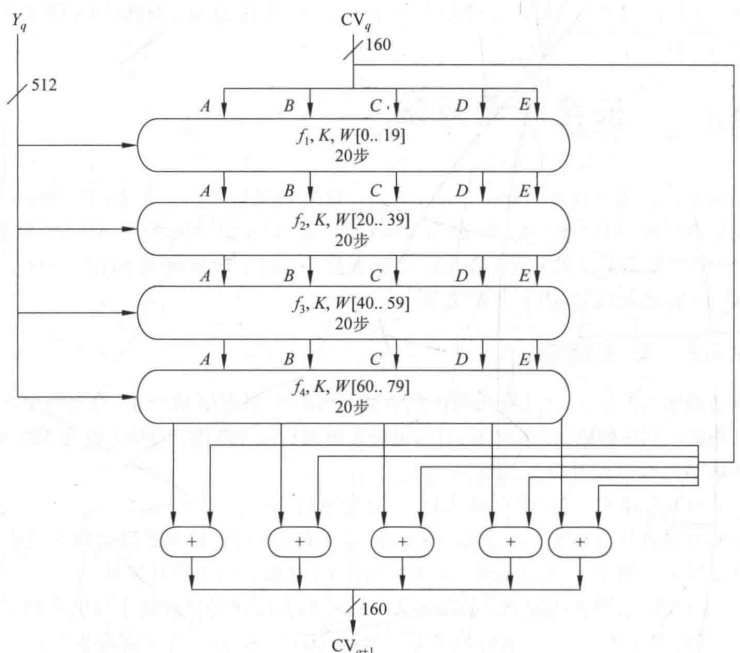

**图 6-9 SHA 的分组处理框图**

$$\begin{aligned}&\mathrm{CV}_{0}=\mathrm{IV}；\\ &\mathrm{CV}_{q+1}=\mathrm{SUM}_{32}(\mathrm{CV}_{q},ABCDE_{q})；\\ &\mathrm{MD}=\mathrm{CV}_{L}\\ \end{aligned}$$

其中，IV 是第(3)步定义的缓冲区 ABCDE 的初值， $ABCDE_{q}$ 是第 q 个消息分组经最后一轮处理过程处理后的输出，L 是消息（包括填充位和长度字段）的分组数， $\text{SUM}_{32}$ 是对应字的模  ${2}^{32}$ 加法，MD 为最终的摘要值。

### 6.4.2 SHA 的压缩函数

如上所述，SHA 的压缩函数由 4 轮处理过程组成，每轮处理过程又由对缓冲区 ABCDE 的 20 步迭代运算组成（见图 6-10），每一步迭代运算的形式为

$$A,B,C,D,E\leftarrow(E+f_{i}(B,C,D)+CLS_{5}(A)+W_{t}+K_{t}),\quad A,CLS_{30}(B),C,D$$

其中，A、B、C、D、E 为缓冲区的 5 个字，t 是迭代的步数（ ${0} \leq t \leq 79$）， $f_t$（B，C，D）是第 t 步迭代使用的基本逻辑函数， $\text{CLS}_s$ 为左循环移 s 位， $W_t$ 是由当前 512 比特长的分组导出的一个 32 比特长的字（导出方式见下面）， $K_t$ 是加法常量，+ 是模  ${2}^{32}$ 加法。

基本逻辑函数的输入为3个32比特的字，输出是一个32比特的字，其中的运算为逐比特逻辑运算，即输出的第n个比特是3个输入的相应比特的函数。函数的定义如表6-8所示。

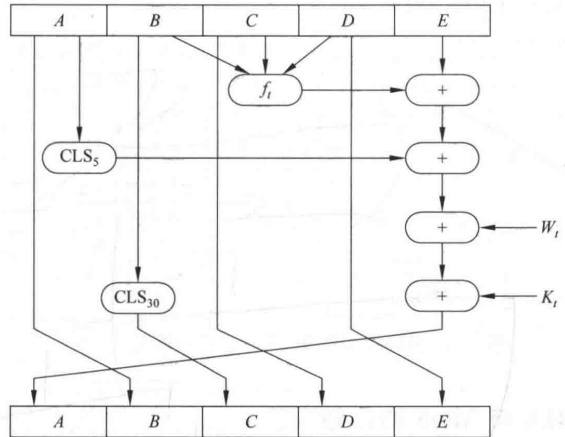

**图 6-10 SHA 的压缩函数中一步迭代示意图**

**表 6-8 SHA 中基本逻辑函数的定义**

| 迭代的步数 | 函数名 | 定义 |
| --- | --- | --- |
| 0≤t≤19 | $f_{1}=f_{t}(B,C,D)$ | $(B\land C)\lor(B\land D)$ |
| 20≤t≤39 | $f_{2}=f_{t}(B,C,D)$ | $B\oplus C\oplus D$ |
| 40≤t≤59 | $f_{3}=f_{t}(B,C,D)$ | $(B\land C)\lor(B\land D)\lor(C\land D)$ |
| 60≤t≤79 | $f_{4}=f_{t}(B,C,D)$ | $B\oplus C\oplus D$ |

其中， $\wedge$、$\vee$、 $-$、 $\oplus$分别是与、或、非、异或4个逻辑运算，函数的真值表如表6-9所示。

**表 6-9 SHA 的基本逻辑函数的真值表**

| B C D | $f_{1}$ | $f_{2}$ | $f_{3}$ | $f_{4}$ | B C D | $f_{1}$ | $f_{2}$ | $f_{3}$ | $f_{4}$ |
| --- | --- | --- | --- | --- | --- | --- | --- | --- | --- |
| 0 0 0 | 0 | 0 | 0 | 0 | 1 0 0 | 0 | 1 | 0 | 1 |
| 0 0 1 | 1 | 1 | 0 | 1 | 1 0 1 | 0 | 0 | 1 | 0 |
| 0 1 0 | 0 | 1 | 0 | 1 | 1 1 0 | 1 | 0 | 1 | 0 |
| 0 1 1 | 1 | 0 | 1 | 0 | 1 1 1 | 1 | 1 | 1 | 1 |

下面说明如何由当前的输入分组(512比特长)导出 $W_{t}$(32比特长)。前16个值(即 $W_{0}, W_{1}, \cdots, W_{15}$)直接取为输入分组的16个相应的字，其余值(即 $W_{16}, W_{17}, \cdots, W_{79}$)取为

$$\mathbf{W}_{t}=\mathrm{CLS}_{1}\left(\mathbf{W}_{t-16}\oplus\mathbf{W}_{t-14}\oplus\mathbf{W}_{t-8}\oplus\mathbf{W}_{t-3}\right)$$

见图6-11。与MD5比较，MD5直接用一个消息分组的16个字作为每步迭代的输入，而SHA则将输入分组的16个字扩展成80个字以供压缩函数使用，从而使得寻找具有相同压缩值的不同的消息分组更为困难。

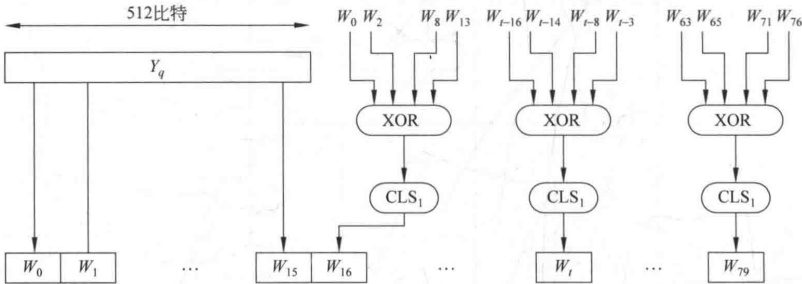

**图 6-11 SHA 分组处理所需的 80 个字的产生过程**

### 6.4.3 SHA 与 MD5 的比较

由于 SHA 与 MD5 都是由 MD4 演化而来的，所以两个算法极为相似。

（1）抗穷搜索攻击的强度：由于SHA和MD5的消息摘要长度分别为160和128，所以用穷搜索攻击寻找具有给定消息摘要的消息分别需做 $O(2^{160})$和 $O(2^{128})$次运算，而用穷搜索攻击找出具有相同消息摘要的两个不同消息分别需做 $O(2^{80})$和 $O(2^{64})$次运算。因此SHA抗击穷搜索攻击的强度高于MD5抗击穷搜索攻击的强度。

（2）抗击密码分析攻击的强度：由于 SHA 的设计准则未被公开，所以它抗击密码分析攻击的强度较难判断，似乎高于 MD5 的强度。

（3）速度：由于两个算法的主要运算都是模  ${2}^{32}$ 加法，因此都易于在32位结构上实现。但比较起来，SHA的迭代步数（80步）多于MD5的迭代步数（64步），所用的缓冲区（160比特）大于MD5使用的缓冲区（128比特），因此在相同硬件上实现时，SHA的速度慢于MD5的速度。

（4）简洁与紧致性：两个算法描述起来都较为简单，实现起来也较为简单，都不需要大的程序和代换表。

（5）数据的存储方式：MD5 使用小端方式，SHA 使用大端方式。两种方式相比看不出哪种更具优势，之所以使用两种不同的存储方式是因为设计者最初实现各自的算法时，使用的机器的存储方式不同。

### 6.4.4 对 SHA 的攻击现状

2004年，Joux找出了SHA-0的碰撞，他的攻击方法需要 ${2}^{251}$次运算。同年Biham等找出了40步的SHA-1的碰撞。2005年，山东大学王小云等提出了对SHA-1的碰撞搜索攻击，该方法用于攻击完全版的SHA-0时，所需的运算次数少于 ${2}^{239}$；攻击58步的SHA-1时，所需的运算次数少于 ${2}^{233}$。他们还分析指出，用他们的方法攻击70步的SHA-1时，所需的运算次数少于 ${2}^{250}$；而攻击80步的SHA-1时，所需的运算次数少于 ${2}^{269}$。

6.1.3 节中曾介绍过一个 MAC 的例子——数据认证算法，该算法反映了传统上构造 MAC 最为普遍使用的方法，即基于分组密码的构造方法。但近年来研究构造 MAC 的兴趣已转移到基于密码哈希函数的构造方法，原因如下：

（1）密码哈希函数（如 MD5、SHA）的软件实现快于分组密码（如 DES）的软件实现。

（2）密码哈希函数的库代码来源广泛。

（3）密码哈希函数没有出口限制，而分组密码即使用于 MAC 也有出口限制。

哈希函数并不是为用于 MAC 而设计的，由于哈希函数不使用密钥，因此不能直接用于 MAC。目前已提出了很多将哈希函数用于构造 MAC 的方法，HMAC 就是其中之一，已作为 RFC2104 被公布，并在 IPSec 和其他网络协议（如 SSL）中得以应用。

### 6.5.1 HMAC 的设计目标

RFC2104 列举了 HMAC 的以下设计目标：

（1）可不经修改而使用现有的哈希函数，特别是那些易于软件实现的、源代码可方便获取且免费使用的哈希函数。

（2）其中镶嵌的哈希函数可易于替换为更快或更安全的哈希函数。

（3）保持镶嵌的哈希函数的最初性能，不因用于 HMAC 而使其性能降低。

（4）以简单方式使用和处理密钥。

（5）在对镶嵌的哈希函数合理假设的基础上，易于分析 HMAC 用于认证时的密码强度。

以上前两个目标是 HMAC 被公众普遍接受的主要原因，这两个目标是将哈希函数当作一个黑盒使用，这种方式有两个优点：一是哈希函数的实现可作为实现 HMAC 的一个模块，这样一来，HMAC 代码中很大一块就可事先准备好，无须修改就可使用；第二个优点是如果 HMAC 要求使用更快或更安全的哈希函数，则只须用新模块代替旧模块，例如用实现 SHA 的模块代替 MD5 的模块。

最后一条设计目标则是 HMAC 优于其他基于哈希函数的 MAC 的一个主要方面，HMAC 在其镶嵌的哈希函数具有合理密码强度的假设下，可证明是安全的，这一问题将在 HMAC 的安全性一节介绍。

### 6.5.2 算法描述

图 6-12 是 HMAC 算法的运行框图，其中，H 为嵌入的哈希函数（如 MD5、SHA），M 为 HMAC 的输入消息（包括哈希函数所要求的填充位）， $Y_{i} (0 \leq i \leq L-1)$ 是 M 的第 i 个分组，L 是 M 的分组数，b 是一个分组中的比特数，n 为由嵌入的哈希函数所产生的哈希值的长度，K 为密钥，如果密钥长度大于 b，则将密钥输入哈希函数中产生一个 n 比特长的密钥， $K^{+}$ 是左边经填充 0 后的 K， $K^{+}$ 的长度为 b 比特，ipad 为  $\frac{b}{8}$ 个 00110110，opad 为 $\frac{b}{8}$个01011010。

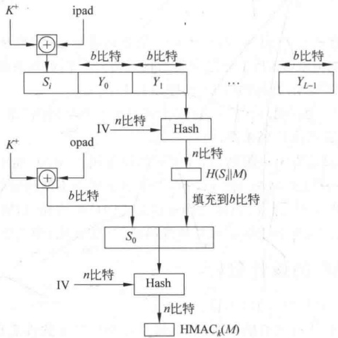

**图 6-12 HMAC 的算法框图**

算法的输出可表达如下：

$$\mathrm{HMAC}_{k}=H\bigl[(K^{+}\oplus\mathrm{opad})\mathbin\Vert H\bigl[(K^{+}\oplus\mathrm{ipad})\mathbin\Vert M\bigr]\bigr]$$

算法的运行过程可描述如下：

（1）K 的左边填充 0 以产生一个 b 比特长的  $K^{+}$（例如，K 的长为 160 比特，b=512，则需填充 44 个零字节 0x00）；

（2） $K^{+}$与ipad逐比特异或以产生b比特的分组 $S_{i}$

（3）将 M 链接到  $S_{i}$ 后；

（4）将 H 作用于第（3）步产生的数据流；

（5） $K^{+}$与 opad 逐比特异或以产生 b 比特长的分组  $S_{0}$;

（6）将第(4)步得到的哈希值链接在 $S_{0}$后；

（7）将 H 作用于第（6）步产生的数据流并输出最终结果。

注意， $K^{+}$与 ipad 逐比特异或和与 opad 逐比特异或其结果是将 K 中的一半比特取反，但两次取反的比特的位置不同。而  $S_{i}$ 和  $S_{0}$ 通过哈希函数中压缩函数的处理，则相当于以伪随机方式从 K 产生两个密钥。

在实现 HMAC 时，可预先求出下面两个量（见图 6-13，虚线以左为预计算）：

$$\begin{aligned}&f(IV,(K^{+}\oplus i p a d))\\&f(IV,(K^{+}\oplus o p a d))\end{aligned}$$

其中， $f(\text{cv}, \text{block})$ 是哈希函数中的压缩函数，其输入是 n 比特的链接变量和 b 比特的分组，输出是 n 比特的链接变量。这两个量的预先计算只须在每次更改密钥时被进行。事实上这两个预先计算的量用于作为哈希函数的初值 IV。

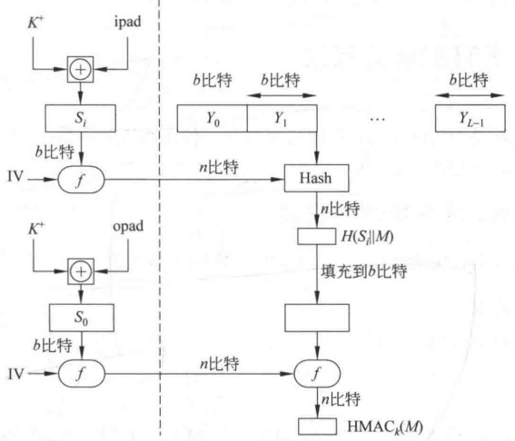

**图 6-13 HMAC 的有效实现**

### 6.5.3 HMAC 的安全性

基于密码哈希函数构造的 MAC 的安全性取决于镶嵌的哈希函数的安全性，而 HMAC 最具吸引人的地方是它的设计者已经证明了算法的强度和嵌入的哈希函数的强度之间的确切关系，证明了对 HMAC 的攻击等价于对内嵌哈希函数的下述两种攻击之一：

（1）攻击者能够计算压缩函数的一个输出，即使 IV 是随机的和秘密的。

（2）攻击者能够找出哈希函数的碰撞，即使IV是随机的和秘密的。

在第一种攻击中，我们可将压缩函数视为与哈希函数等价，而哈希函数的 n 比特长 IV 可视为 HMAC 的密钥。对这一哈希函数的攻击或者可通过对密钥的穷搜索来进行或者可通过第Ⅱ类生日攻击来实施，通过对密钥的穷搜索攻击的复杂度为  $O(2^{n})$，通过第Ⅱ类生日攻击又可归结为上述第二种攻击。

第二种攻击指攻击者寻找具有相同哈希值的两个消息，因此就是第Ⅱ类生日攻击。对哈希值长度为 n 的哈希函数来说，攻击的复杂度为  $O(2^{n/2})$。因此第二种攻击对 MD5 的攻击复杂度为  $O(2^{64})$，就现在的技术来说，这种攻击是可行的。但这是否意味着 MD5 不适合用于 HMAC？回答是否定的，原因如下：攻击者在攻击 MD5 时，可选择任何消息集合后脱线寻找碰撞。由于攻击者知道哈希算法和缺省的 IV，因此能为自己产生的每个消息求出哈希值。然而，在攻击 HMAC 时，由于攻击者不知道密钥 K，从而不能脱线产生消息和认证码对。所以攻击者必须得到 HMAC 在同一密钥下产生的一系列消息，并对得到的消息序列进行攻击。对长 128 比特的哈希值来说，需要得到用同一密钥产生的  ${2}^{64}$ 个分组 ( ${2}^{73}$ 比特)。在 1Gbps 的链路上，需 250 000 年，因此 MD5 完全适合于 HMAC，而且就速度而言，快于SHA作为内嵌哈希函数的HMAC。

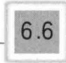

## 6.6 SM3 哈希算法

SM3 哈希算法是中国国家密码管理局颁布的一种密码哈希函数，它也采用了如图 6-5 所示的迭代型哈希算法的一般结构。

### 6.6.1 SM3 哈希算法的描述

算法的输入数据长度为 l 比特， ${1} \leqslant l \leqslant 2^{64}-1$，输出哈希值长度为 256 比特。

1. 常量与函数

算法中使用以下常数与函数。

1）常量

初始值

$$\begin{aligned}IV=&7380166F\ 4914B2B9\ 172442D7\ DA8A0600\ A96F30BC\ 163138AA\\&E38DEE4D\ B0FB0E4E\end{aligned}$$

常量

$$T_{j}=\left\{\begin{aligned}&79CC4519,\quad0\leqslant j\leqslant15\\ &7A879D8A,\quad16\leqslant j\leqslant63\end{aligned}\right.$$

2）函数

布尔函数：

$$FF_{j}(X,Y,Z)=\left\{\begin{aligned}&X\oplus Y\oplus Z,&&0\leqslant j\leqslant15\\ &(X\wedge Y)\vee(X\wedge Z)\vee(Y\wedge Z),&&16\leqslant j\leqslant63\end{aligned}\right.$$

$$\mathrm{G G}_{j}\left(X,Y,Z\right)=\left\{\begin{aligned}&X\oplus Y\oplus Z,&&0\leqslant j\leqslant15\\ &(X\wedge Y)\vee(\overline{X}\wedge Z),&&16\leqslant j\leqslant63\end{aligned}\right.$$

式中 X、Y、Z 为 32 位字，Λ、V、-、⊕ 分别是逻辑与、逻辑或、逻辑非和逐比特异或运算。

置换函数：

$$P_{0}(X)=X\oplus(X<<9)\oplus(X<<17)$$

$$P_{1}(X)=X\oplus(X<<15)\oplus(X<<23)$$

式中 X 为 32 位字，符号 a <<< n 表示把 a 循环左移 n 位。

2. 算法描述

算法对数据首先进行填充，再进行迭代压缩后生成哈希值。

1）填充并附加消息的长度

设消息 m 的长度为 l 比特，这一步与 6.3.1 节介绍的 MD5 算法相同。

2）迭代压缩

将填充后的消息  $m^{\prime}$ 按 512 比特进行分组得  $m^{\prime} = B^{(0)} B^{(1)} \cdots B^{(L-1)}$，对  $m^{\prime}$ 按下列方式迭代压缩：

$$FOR i=0 to L-1\quad V^{(i+1)}=CF(V^{(i)},B^{(i)})$$

其中，CF 是压缩函数， $V^{(0)}$ 为 256 比特初始值 IV， $B^{(i)}$ 为填充后的消息分组，迭代压缩的结果为  $V^{(L)}$， $V^{(L)}$ 即为消息 m 的哈希值。

3）消息扩展

在对消息分组  $B^{(i)}$ 进行迭代压缩之前，首先对其进行消息扩展，步骤如下：

（1）消息分组 $B^{(i)}$划分为16个字 $W_{0}, W_{1}, \cdots, W_{15}$。

(2) FOR $j=16$ to 67

$$\boldsymbol{W}_{j}=\boldsymbol{P}_{1}(\boldsymbol{W}_{j-16}\oplus\boldsymbol{W}_{j-9}\oplus(\boldsymbol{W}_{j-3}<<<15))\oplus(\boldsymbol{W}_{j-13}<<<7)\oplus\boldsymbol{W}_{j-6}$$

(3) FOR j=0 to 63

$$W_{j}^{\prime}=W_{j}\oplus W_{j+4}$$

 $B^{(i)}$ 经消息扩展后得到  $W_{0}, W_{1}, \cdots, W_{67}, W_{0}^{\prime}, W_{1}^{\prime}, \cdots, W_{63}^{\prime}$

4）压缩函数

设 A、B、C、D、E、F、G、H 为字寄存器， $SS_{1}$、 $SS_{2}$、 $TT_{1}$、 $TT_{2}$ 为中间变量，压缩函数  $V^{(i+1)}=CF(V^{(i)},B^{(i)})(0 \leqslant i \leqslant n-1)$ 的计算过程如下：

ABCDEFGH =  $V^{(i)}$;
FOR  $j = 0$ to 63
 $SS_1 \leftarrow ((A<<<12) + E + (T_j<<<j))<<<7$;
 $SS_2 = SS_1 \oplus (A<<<12)$;
 $TT_1 = FF_j(A, B, C) + D + SS_2 + W_j^{\prime}$;
 $TT_2 = GG_j(E, F, G) + H + SS_1 + W_j$;
 $D = C$;
 $C = B<<<9$;
 $B = A$;
 $A = TT_1$;
 $H = G$;
 $G = F<<<19$;
 $F = E$;
 $E = P_0(TT_2)$
ENDFOR
 $V^{(i+1)} = ABCDEFGH \oplus V^{(i)}$

其中，+为模 ${2}^{32}$加运算，字的存储为大端格式。图6-14是压缩函数中一步迭代示意图。

5）输出哈希值

$$ABCDEFGH = V^{(L)}$$

输出 256 比特的哈希值 y=ABCDEFGH。

图 6-15 是 SM3 的整体处理过程。

### 6.6.2 SM3 哈希算法的安全性

压缩函数是哈希函数安全的关键，SM3 的压缩函数 CF 中的布尔函数  $FF_{j}(X,Y,Z)$ 和  $GG_{j}(X,Y,Z)$ 是非线性函数，经过循环迭代后提供混淆作用。

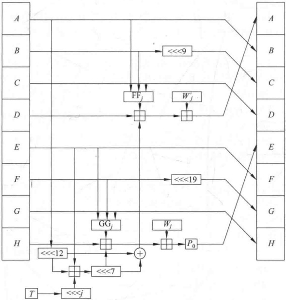

**图 6-14 SM3 压缩函数中一步迭代示意图**

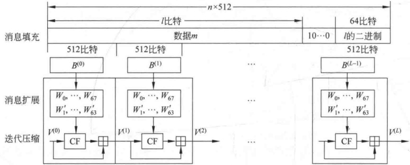

**图 6-15 SM3 产生消息哈希值的处理过程**

置换函数  $P_{0}(X)$ 和  $P_{1}(X)$ 是线性函数，经过循环迭代后提供扩散作用。再加上 CF 中的其他运算的共同作用，压缩函数 CF 具有很高的安全性，从而确保 SM3 具有很高的安全性。

## 习题

1. 6.1.3 节介绍的数据认证算法是由 CBC 模式的 DES 定义的，其中的初始向量取为 0，试说明使用 CFB 模式也可获得相同结果。

2. 有很多哈希函数是由 CBC 模式的分组加密技术构造的，其中的密钥取为消息分组。例如，将消息 M 分成分组  $M_{1}, M_{2}, \cdots, M_{N}, H_{0} =$ 初值，迭代关系为  $H_{i} = E_{M_{i}}(H_{i-1}) \oplus H_{i-1}(i=1,2,\cdots,N)$，哈希值取为  $H_{N}$，E 是分组加密算法。

（1）设 $E$ 为 DES，第 3 章的习题已证明如果对明文分组和加密密钥都逐比特取补，那么得到的密文也是原密文的逐比特取补，即如果 $Y = \text{DES}_K(X)$，那么 $Y^{\prime} = \text{DES}_{K^{\prime}}(X^{\prime})$。利用这一结论证明在上述哈希函数中可对消息进行修改但却保持哈希值不变。

（2）若迭代关系改为 $H_{i}=E_{H_{i-1}}(M_{i})\oplus M_{i}$，证明仍可对其进行上述攻击。

3. 考虑用公钥加密算法构造哈希函数，设算法是 RSA，将消息分组后用公开钥加密第一个分组，加密结果与第二个分组异或后，再对其加密，一直下去。设一个消息被分成两个分组  $B_{1}$ 和  $B_{2}$，其哈希值为  $H(B_{1}, B_{2}) = \text{RSA}(\text{RSA}(B_{1}) \oplus B_{2})$。证明对任一分组  $C_{1}$ 可选  $C_{2}$，使得  $H(C_{1}, C_{2}) = H(B_{1}, B_{2})$。证明用这种攻击法，可攻击上述用公钥加密算法构造的哈希函数。

4. 在图 6-11 中，假定有 80 个 32 比特长的字用于存储每一个  $W_{t}$，因此在处理消息分组前，可预先计算出这 80 个值。为节省存储空间，考虑用 16 个字的循环移位寄存器，其初值存储前 16 个值（即  $W_{0}, W_{1}, \cdots, W_{15}$），设计一个算法计算以后的每一  $W_{t}$。

5. 对 SHA, 计算  $W_{16}$,  $W_{17}$,  $W_{18}$,  $W_{19}$。

6. 设  $a_{1}a_{2}a_{3}a_{4}$ 是 32 比特长的字中的 4 个字节，每一  $a_{i}$ 可看作由二进制表示的 0~255 的整数，在大端方式中，该字表示整数  $a_{1}2^{24}+a_{2}2^{16}+a_{3}2^{8}+a_{4}$，在小端结构中，该字表示整数  $a_{4}2^{24}+a_{3}2^{16}+a_{2}2^{8}+a_{1}$。

（1）MD5 使用小端结构，因消息的摘要值不应依赖于算法所用的结构，因此在 MD5 中为了对以大端方式存储的两个字  $X=x_{1}x_{2}x_{3}x_{4}$ 和  $Y=y_{1}y_{2}y_{3}y_{4}$ 进行模2加法运算，必须对这两个字进行调整，应如何进行？

（2）SHA使用大端方式，问如何对以小端结构存储的两个字X和Y进行模2加法运算。

