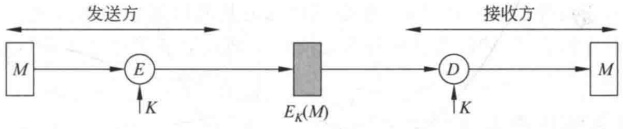
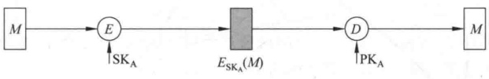
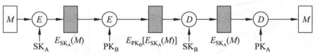
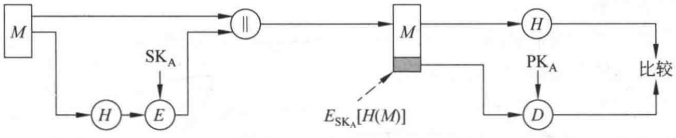
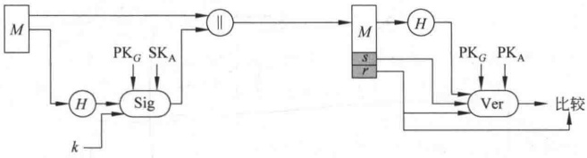
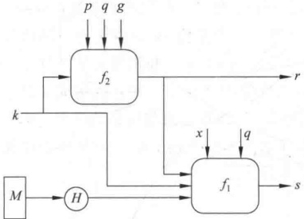
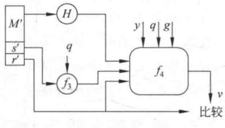
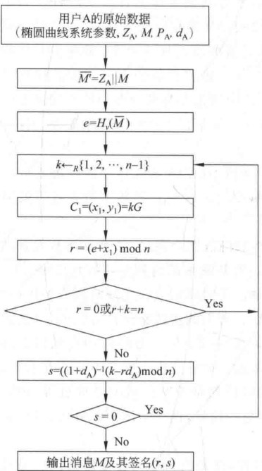
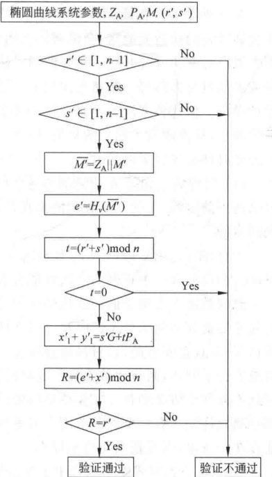

# 第7章 数字签名和认证协议

数字签名由公钥密码发展而来，它在网络安全（包括身份认证、数据完整性、不可否认性以及匿名性等）方面有着重要应用。本章首先介绍数字签名的基本概念和一些常用的数字签名算法，然后介绍认证协议。

## 7.1 数字签名的基本概念

### 7.1.1 数字签名应满足的要求

第6章介绍的消息认证的作用是保护通信双方以防第三方的攻击，然而却不能保护通信双方中的一方防止另一方的欺骗或伪造。通信双方之间也可能有多种形式的欺骗，例如，通信双方A和B（设A为发方，B为收方）使用图6-1所示的消息认证码的基本方式通信，则可能发生以下欺骗：

（1）B伪造一个消息并使用与A共享的密钥产生该消息的认证码，然后声称该消息来自于A。

（2）由于 B 有可能伪造 A 发来的消息，所以 A 就可以对自己发过的消息予以否认。

这两种欺骗在实际的网络安全应用中都有可能发生，例如，在电子资金传输中，收方增加收到的资金数，并声称这一数目来自发方。又如，用户通过电子邮件向其证券经纪人发送对某笔业务的指令，以后这笔业务赔钱了，用户就可否认曾发送过相应的指令。

因此在收发双方未建立起完全的信任关系且存在利害冲突的情况下，单纯的消息认证就显得不够。数字签名技术则可有效解决这一问题。类似于手书签名，数字签名应具有以下性质：

（1）能够验证签名产生者的身份，以及产生签名的日期和时间。

（2）能用于证实被签消息的内容。

（3）数字签名可由第三方验证，从而能够解决通信双方的争议。

由此可见，数字签名具有认证功能。为实现上述3条性质，数字签名应满足以下要求：

（1）签名的产生必须使用发方独有的一些信息以防伪造和否认。

（2）签名的产生应较为容易。

（3）签名的识别和验证应较为容易。

（4）对已知的数字签名构造一个新的消息或对已知的消息构造一个假冒的数字签名在计算上都是不可行的。

### 7.1.2 数字签名的产生方式

数字签名的产生可用加密算法或特定的签名算法。

1. 由加密算法产生数字签名

利用加密算法产生数字签名是指将消息或消息的摘要加密后的密文作为对该消息的数字签名，其用法又根据单钥加密还是公钥加密有所不同。

1）单钥加密

如图7-1(a)所示，发送方A根据单钥加密算法以与接收方B共享的密钥K对消息M加密后的密文作为对M的数字签名发往B。该系统能向B保证所收到的消息的确来自A，因为只有A知道密钥K。再者B恢复出M后，可相信M未被篡改，因为敌手不知道K就知如何通过修改密文而修改明文。具体来说，就是B执行解密运算 $Y=D_{K}(X)$，如果X是合法消息M加密后的密文，则B得到的Y就是明文消息M，否则Y将是无意义的比特序列。

**(a) 单钥加密：保密性和认证性**

**(b) 公钥加密：认证性和签名**

**(c) 公钥加密：保密性、认证性和签名**

**图 7-1 消息加密产生数字签名的基本方式**

2）公钥加密

如图7-1(b)所示，发方A使用自己的秘密钥SK_{A}对消息M加密后的密文作为对M的数字签名，B使用A的公开钥PK_{A}对消息解密，由于只有A才拥有加密密钥SK_{A}，因此可使B相信自己收到的消息的确来自A。然而由于任何人都可使用A的公开钥解密密文，所以这种方案不提供保密性。为提供保密性，A可用B的公开钥再一次加密，如图7-1(c)所示。

下面以 RSA 签名体制为例说明数字签名的产生过程。

（1）体制参数。

选两个保密的大素数 p 和 q，计算  $n = p \times q, \varphi(n) = (p-1)(q-1)$；选一个整数 e 满足  ${1} < e < \varphi(n)$，且  $\gcd(\varphi(n), e) = 1$；计算  $d$，满足  $d \cdot e \equiv 1 \bmod \varphi(n)$；以  $\mathrm{pk} = \{n, e\}$ 为公开钥， $\mathrm{sk} = \{d, n\}$ 为秘密钥。

（2）签名过程。

设消息为 M，对其签名为

$$\sigma\equiv M^{d}\bmod{n}$$

（3）验证过程。

收方在收到消息  $M$ 和签名  $\sigma$ 后，验证  $M \equiv \sigma^{\prime} \bmod n$ 是否成立，若成立，则发方的签名有效。

实际应用时，数字签名是对消息摘要加密产生，而不是直接对消息加密产生，如图 6-3(a)、(b)、(c)、(d) 所示。

由加密算法产生数字签名又分为外部保密方式和内部保密方式，外部保密方式是指数字签名是直接对需要签名的消息生成而不是对已加密的消息生成，否则称为内部保密方式。外部保密方式便于解决争议，因为第三方在处理争议时，需得到明文消息及其签名。但如果采用内部保密方式，第三方必须得到消息的解密密钥后才能得到明文消息。如果采用外部保密方式，接收方就可将明文消息及其数字签名存储下来以备以后万一出现争议时使用。

2. 由签名算法产生数字签名

签名算法（在某一消息空间M）可用多项式时间算法的三元组（SigGen，Sig，Ver）表示。

（1）密钥生成（SigGen）：是一个随机化算法，输入为安全参数  $\kappa$，输出密钥对（vk，sk），其中，sk 是签名密钥，vk 是验证密钥。

（2）签名(Sig)：是一个随机化算法，输入签名密钥 sk 和要签名的消息  $M \in \mathcal{M}$，输出一个签名  $\sigma$（表示为  $\sigma = \text{Sig}_{\text{sk}}(M)$）。

（3）验证(Ver)：是一个确定性算法，输入验证密钥vk、签名的消息 $M\in\mathcal{M}$和签名 $\sigma$，输出True或False（True表示签名有效，False表示无效）。表示为

$$\mathrm{Ver}_{\mathrm{vk}}(\sigma,M)=\left\{\begin{aligned}&\mathrm{True},&\sigma=\mathrm{Sig}_{\mathrm{sk}}(M)\\ &\mathrm{False},&\sigma\neq\mathrm{Sig}_{\mathrm{sk}}(M)\end{aligned}\right.$$

算法的安全性在于从 M 和  $\sigma$ 难以推出密钥 x 或伪造一个消息  $M^{\prime}$ 使  $(\sigma, M^{\prime})$ 可被验证为真。

### 7.1.3 数字签名的执行方式

数字签名的执行方式有两类：直接方式和具有仲裁的方式。

1. 直接方式

直接方式是指数字签名的执行过程只有通信双方参与，并假定双方有共享的秘密钥或接收一方知道发送方的公开钥。

直接方式的数字签名有一个公共弱点，即方案的有效性取决于发送方秘密钥的安全性。如果发送方想对已发出的消息予以否认，就可声称自己的秘密钥已丢失或被盗，因此自己的签名是他人伪造的。可采取某些行政手段，虽然不能完全消除但可在某种程度上减弱这种威胁。例如，要求每一被签的消息都包含有一个时间戳（日期和时间）并要求密钥丢失后立即向管理机构报告。这种方式的数字签名还存在发送方的秘密钥真的被偷的危险，例如，敌手在时刻T偷得发送方的秘密钥，然后可伪造一个消息，用偷得的秘密钥为其签名并加上T以前的时刻作为时间戳。

2. 具有仲裁的方式

上述直接方式的数字签名所具有的威胁都可通过使用仲裁者得以解决。和直接方式的数字签名一样，具有仲裁方式的数字签名也有很多实现方案，这些方案都按以下方式运行：发方X对发往收方Y的消息签名后，将消息及其签名先发给仲裁者A，A对消息及其签名验证完后，再连同一个表示已通过验证的指令一起发往接收方Y。此时由于A的存在，X无法对自己发出的消息予以否认。在这种方式中，仲裁者起着重要的作用并应取得所有用户的信任。

以下是具有仲裁方式数字签名的几个实例，其中，X表示发送方，Y表示接收方，A是仲裁者，M是消息， $X\rightarrow Y$：M表示X给Y发送一个消息M。

【例 7-1】签名过程如下：

$$(1)\mathrm{X}\rightarrow\mathrm{A}\text{：}M\parallel E_{K_{\mathrm{XA}}}\left[\mathrm{ID}_{X}\parallel H(M)\right]$$

$$\left(2\right)\mathrm{A}\rightarrow\mathrm{Y}\text{：}E_{K_{AY}}\left[\mathrm{ID}_{X} \parallel M \parallel E_{K_{XA}}\left[\mathrm{ID}_{X} \parallel H(M)\right] \parallel T\right]$$

其中，E 是单钥加密算法， $K_{XA}$ 和  $K_{AY}$ 分别是 X 与 A 共享的密钥和 A 与 Y 共享的密钥， $H(M)$ 是 M 的哈希值，T 是时间戳， $ID_{X}$ 是 X 的身份。

在(1)中，X 以  $E_{K_{XA}}[\mathrm{ID}_{X} \parallel H(M)]$ 作为自己对 M 的签名，将 M 及签名发往 A。在(2)中，A 将从 X 收到的内容和  $\mathrm{ID}_{X}$、T 一起加密后发往 Y，其中的 T 用于向 Y 表示所发的消息不是旧消息的重放。Y 对收到的内容解密后，将解密结果存储起来以备出现争议时使用。

如果出现争议，Y 可声称自己收到的 M 的确来自 X，并将

$$E_{K_{AY}}\left[\mathrm{ID}_{X} \parallel M \parallel E_{K_{XA}}\left[\mathrm{ID}_{X} \parallel H(M)\right]\right]$$

发给 A，由 A 仲裁，A 由  $K_{AY}$ 解密后，再用  $K_{XA}$ 对  $E_{K_{XA}}[\mathrm{ID}_{X} \parallel H(M)]$ 解密，并对  $H(M)$ 加以验证，从而验证了 X 的签名。

在以上过程中，由于 Y 不知  $K_{XA}$，因此不能直接检查 X 的签名，但 Y 认为消息来自于 A 因而是可信的。所以整个过程中，A 必须取得 X 和 Y 的高度信任：

X 相信 A 不会泄露  $K_{X A}$，并且不会伪造 X 的签名。

Y 相信 A 只有在对  $E_{K_{AY}}[\mathrm{ID}_X \parallel M \parallel E_{K_{XA}}[\mathrm{ID}_X \parallel H(M)] \parallel T]$ 中的哈希值及 X 的签名验证无误后才将之发给 Y。

· X、Y 都相信 A 可公正地解决争议。

如果 A 已取得各方的信任，则 X 就 能相信没有人能伪造自己的签名，Y 就可相信 X 不能对自己的签名予以否认。

本例中消息 M 是以明文形式发送的，因此未提供保密性，下面两个例子可提供保密性。

【例 7-2】签名过程如下：

$$\left(1\right)\mathrm{X}\to\mathrm{A}:\mathrm{ID}_{\mathrm{X}}\left\|\right.E_{K_{\mathrm{XY}}}\left[M\right]\left\|\right.E_{K_{\mathrm{XA}}}\left[\mathrm{ID}_{\mathrm{X}}\left\|\right.H\left(E_{K_{\mathrm{XY}}}\left[M\right]\right)\right]$$

$$\mathbf{A}\rightarrow\mathbf{Y}:\ E_{K_{\mathrm{AY}}}\left[\mathbf{ID}_{\mathrm{X}}\parallel E_{K_{\mathrm{XY}}}\left[\mathbf{M}\right]\parallel E_{K_{\mathrm{XA}}}\left[\mathbf{ID}_{\mathrm{X}}\parallel\boldsymbol{H}\left(E_{K_{\mathrm{XY}}}\left[\mathbf{M}\right]\right)\right]\parallel\boldsymbol{T}\right]$$

其中， $K_{XY}$ 是 X、Y 共享的密钥，其他符号与例 7-1 相同。X 以  $E_{K_{XA}}[\mathrm{ID}_{X}] \parallel H(E_{K_{XY}}[M])$ 作为对 M 的签名，与由  $K_{XY}$ 加密的消息 M 一起发给 A。A 对  $E_{K_{XA}}[\mathrm{ID}_{X}] \parallel H(E_{K_{XY}}[M])$ 解密后通过验证哈希值以验证 X 的签名，但始终未能读取明文 M。A 验证完 X 的签名后，对 X 发来的消息加一个时间戳，再用  $K_{AY}$ 加密后发往 Y。解决争议的方法与例 7-1 一样。

本例虽然提供了保密性，但还存在与例7-1相同的一个问题，即仲裁者可和发送方共谋以否认发送方曾发过的消息，也可和接收方共谋以伪造发送方的签名。这一问题可通过下例所示的采用公钥加密技术得以解决。

【例 7-3】签名过程如下：

$$\begin{aligned}&(1)\mathrm{X}\rightarrow\mathrm{A}:\mathrm{ID}_{\mathrm{X}}\parallel E_{\mathrm{SKX}}\left[\mathrm{ID}_{\mathrm{X}}\parallel E_{\mathrm{PK}_{\mathrm{Y}}}\left[E_{\mathrm{SKX}}\left[M\right]\right]\right]\\&(2)\mathrm{A}\rightarrow\mathrm{Y}:\mathrm{E}_{\mathrm{SKA}}\left[\mathrm{ID}_{\mathrm{X}}\parallel E_{\mathrm{PK}_{\mathrm{Y}}}\left[E_{\mathrm{SKX}}\left[M\right]\right]\parallel\mathrm{T}\right]\end{aligned}$$

其中， $SK_A$ 和  $SK_X$ 分别是 A 和 X 的秘密钥， $PK_Y$ 是 Y 的公开钥，其他符号与前两例相同。第(1)步中，X 用自己的秘密钥  $SK_X$ 和 Y 的公开钥  $PK_Y$ 对消息加密后作为对 M 的签名，以这种方式使得任何第三方（包括 A）都不能得到 M 的明文消息。A 收到 X 发来的内容后，用 X 的公开钥可对  $E_{SK_X} [ID_X \parallel E_{PK_Y} [E_{SK_X} [M]]]$ 解密，并将解密得到的  $ID_X$ 与收到的  $ID_X$ 加以比较，从而可确信这一消息是来自于 X 的（因只有 X 有  $SK_X$）。第(2)步，A 将 X 的身份  $ID_X$ 和 X 对 M 的签名加上一个时间戳后，再用自己的秘密钥加密发往 Y。

与前两种方案相比，第三种方案有很多优点。首先，在协议执行以前，各方都不必有共享的信息，从而可防止共谋。其次，只要仲裁者的秘密钥不被泄露，任何人包括发方就不能发送重放的消息。最后，对任何第三方（包括A）来说，X发往Y的消息都是保密的。

## 7.2 数字签名标准

数字签名标准(Digital Signature Standard, DSS)是由美国NIST公布的联邦信息处理标准FIPS PUB 186，其中采用了第6章介绍的SHA和一种新的签名技术，称为DSA(Digital Signature Algorithm)。DSS最初于1991年公布，在考虑了公众对其安全性的反馈意见后，于1993年公布了其修改版。

### 7.2.1 DSS 的基本方式

首先将 DSS 与 RSA 的签名方式做一个比较。RSA 算法既能用于加密和签名，又能用于密钥交换。与此不同，DSS 使用的算法只能提供数字签名功能。图 7-2 用于比较 RSA 签名和 DSS 签名的不同方式：

**(a) RSA签名**

**(b) DSS签名**

**图 7-2 RSA 签名与 DSS 签名的不同方式**

采用 RSA 签名时，将消息输入一个哈希函数以产生一个固定长度的安全哈希值，再用发送方的秘密钥加密哈希值就形成了对消息的签名。消息及其签名被一起发给接收方，接收方得到消息后再产生出消息的哈希值，且使用发送方的公开钥对收到的签名解密。这样接收方就得了两个哈希值，如果两个哈希值是一样的，则认为收到的签名是有效的。

DSS 签名也利用一个哈希函数产生消息的一个哈希值，哈希值连同一随机数 k 一起作为签名函数的输入，签名函数还需使用发方的秘密钥  $SK_{A}$ 和供所有用户使用的一组参数，这一组参数称为全局公开钥  $PK_{G}$。签名函数的两个输出 s 和 r 就构成了消息的签名  $(s, r)$。接收方收到消息后再产生出消息的哈希值，将哈希值与收到的签名一起输入验证函数，验证函数还需输入全局公开钥  $PK_{G}$ 和发送方的公开钥  $PK_{A}$。验证函数的输出如果与收到的签名成分 r 相等，则验证了签名是有效的。

### 7.2.2 数字签名算法 DSA

DSA 是在 ElGamal 和 Schnorr 两个签名方案（见 7.2.3 节）的基础上设计的，其安全性基于求离散对数的困难性。

算法描述如下：

（1）全局公开钥。

p：满足 ${2}^{L-1}<p<2^{L}$ 的大素数，其中， ${512}\leq L\leq1024$ 且 L 是 64 的倍数。

q: p-1 的素因子，满足  ${2}^{159}<q<2^{160}$，即 q 长为 160 比特。

g:  $g \equiv h^{(p-1)/q} \bmod p$，其中，h 是满足  ${1} < h < p-1$ 且使得  $h^{(p-1)/q} \bmod p > 1$ 的任一整数。

（2）用户秘密钥x。

x 是满足 0 < x < q 的随机数或伪随机数。

（3）用户的公开钥 y。

$$y\equiv g^{x}\bmod{p}。$$

（4）用户为待签消息选取的秘密数 k。

k 是满足 0 < k < q 的随机数或伪随机数。

（5）签名过程。

用户对消息  $M$ 的签名为  $(r, s)$，其中， $r \equiv (g^k \bmod p) \bmod q$， $s \equiv [k^{-1}(H(M) + xr)] \bmod q$， $H(M)$ 是由 SHA 求出的哈希值。

（6）验证过程。

设接收方收到的消息为  $M^{\prime}$，签名为  $(r^{\prime}, s^{\prime})$。计算

$$w\equiv(s^{\prime})^{-1}\bmod q,\quad u_{1}\equiv\left[H(M^{\prime})w\right]\bmod q,$$

$$u_{2}\equiv r^{\prime}w\bmod q,\quad v\equiv[(g^{u_{1}}y^{u_{2}})\bmod p]\bmod q。$$

检查  $v = r^{\prime}$，若相等，则认为签名有效。这是因为若  $(M^{\prime}, r^{\prime}, s^{\prime}) = (M, r, s)$，则

$$\begin{align*}v&\equiv[(g^{H(M)w}g^{x r w})\bmod p]\bmod q\equiv[g^{(H(M)+x r)s^{-1}}\bmod p]\bmod q\\&\equiv(g^{k}\bmod p)\bmod q\equiv r\end{align*}$$

算法的框图如图7-3所示，其中的4个函数分别为

$$s\equiv f_{1}\left[H\left(M\right),k,x,r,q\right]\equiv\left[k^{-1}\left(H\left(M\right)+xr\right)\right]\bmod q$$

$$r=f_{2}(k,p,q,g)\equiv(g^{k}\bmod p)\bmod q;$$

$$w=f_{3}(s^{\prime},q)\equiv(s^{\prime})^{-1}\bmod q;$$

$$v=f_{4}(y,q,g,H(M^{\prime}),w,r^{\prime})\equiv\left[(g^{(H(M^{\prime})w)\bmod q}y^{r^{\prime}w\bmod q})\bmod p]\bmod q\right]$$

**(a) 签名过程**

**(b) 验证过程**

**图 7-3 DSA 的框图**

由于离散对数的困难性，敌手从 r 恢复 k 或从 s 恢复 x 都是不可行的。

还有一个问题值得注意，即签名产生过程中的运算主要是求  $r$ 的模指数运算  $r = (g^k \bmod p) \bmod q$，而这一运算与待签的消息无关，因此能被预先计算。事实上，用户可以预先计算出很多  $r$ 和  $k^{-1}$ 以备以后的签名使用，从而可大大加快产生签名的速度。

## 7.3 其他签名方案

### 7.3.1 基于离散对数问题的数字签名体制

基于离散对数问题的数字签名体制是数字签名体制中最为常用的一类，其中包括ElGamal签名体制、DSA签名体制、Okamoto签名体制等。

1. 离散对数签名体制

ElGamal、DSA、Okamoto 等签名体制都可归结为离散对数签名体制的特例。

1）体制参数

p：大素数；

q: p-1 或 p-1 的大素因子；

g:  $g \leftarrow _R Z_p^*$, 且  $g^q \equiv 1 \pmod{p}$, 其中，  $Z_p^* = Z_p - \{0\}$;

x：用户 A 的秘密钥，1<x<q；

y：用户 A 的公开钥， $y \equiv g^{x} \pmod{p}$。

2）签名的产生过程

对于待签名的消息 m，A 执行以下步骤：

（1）计算 m 的哈希值  $H(m)$

（2）选择随机数 k： ${1} < k < q$，计算  $r \equiv g^{k} (\bmod p)$。

（3）从签名方程  $ak \equiv b + cx \pmod{q}$ 中解出 s。方程的系数 a、b、c 有许多种不同的选择方法，表 7-1 给出了这些可能选择中的一小部分。以  $(r, s)$ 作为产生的数字签名。

**表7-1 参数 a、b、c 可能的置换取值表**

| $\pm r^{\prime}$ | $\pm s$ | H(m) |
| --- | --- | --- |
| $\pm r^{\prime}$H(m) | $\pm s$ | 1 |
| $\pm r^{\prime}$H(m) | $\pm H(m)s$ | 1 |
| $\pm H(m)r^{\prime}$ | $\pm r^{\prime}$s | 1 |
| $\pm H(m)s$ | $\pm r^{\prime}$s | 1 |

3）签名的验证过程

接收方在收到消息 m 和签名  $(r, s)$ 后，可以按照以下验证方程检验：

$$\mathrm{Ver}(y,(r,s),m)=\mathrm{True}\Leftrightarrow r^{a}\equiv g^{b}y^{c}(\bmod p)$$

2. ElGamal 签名体制

1）体制参数

p：大素数；

g： $Z_{p}^{*}$ 的一个生成元；

x：用户 A 的秘密钥， $x \leftarrow_{R} Z_{p}^{*}$

y：用户 A 的公开钥， $y \equiv g^{x} (\bmod p)$。

2）签名的产生过程

对于待签名的消息 m，A 执行以下步骤：

（1）计算 m 的哈希值  $H(m)$

（2）选择随机数  $k: k \leftarrow_{R} Z_{p-1}^{*}$，计算  $r \equiv g^{k} (\bmod p)$。

（3）计算  $s \equiv (H(m) - xr)k^{-1} (\bmod p - 1)$。

以 $(r,s)$作为产生的数字签名。

3）签名验证过程

接收方在收到消息 m 和数字签名  $(r, s)$ 后，先计算  $H(m)$，并按下式验证：

$$\mathrm{Ver}(y,(r,s),H(m))=\mathrm{True}\Leftrightarrow y^{r}r^{s}\equiv g^{H(m)}\left(\bmod p\right)$$

正确性可由下式证明：

$$y^{r}r^{s}\equiv g^{rx}g^{ks}\equiv g^{rx+H(m)-rx}\equiv g^{H(m)}(\bmod p)$$

3. Schnorr 签名体制

1）体制参数

p：大素数， $p \geqslant 2^{512}$；

q：大素数， $q\left|(p-1),q\geqslant2^{160}\right.$

g:  $g \leftarrow_R Z_p^*$, 且  $g^q \equiv 1(\bmod p)$;

x：用户 A 的秘密钥，1<x<q；

y：用户 A 的公开钥， $y \equiv g^{x} (\bmod p)$。

2）签名的产生过程

对于待签名的消息 m，A 执行以下步骤：

① 选择随机数 k: 1 < k < q，计算  $r \equiv g^{k} (\bmod p)$。

② 计算  $e = H(r, m)$

③ 计算  $s \equiv xe + k \pmod{q}$。

以 $(e,s)$作为产生的数字签名。

3）签名验证过程

接收方在收到消息 m 和数字签名  $(e, s)$ 后，先计算  $r^{\prime} \equiv g^s y^{-e} (\text{mod } p)$，然后计算  $H(r^{\prime}, m)$，并按下式验证

$$\mathrm{Ver}(y,(e,s),m)=\mathrm{True}\Leftrightarrow H(r^{\prime},m)=e$$

其正确性可由下式证明：

$$r^{\prime}=g^{s}y^{-e}\equiv g^{x e+k-x e}\equiv g^{k}\equiv r(\bmod p)$$

4. Neberg-Rueppel 签名体制

该体制是一个消息恢复式签名体制，即验证人可从签名中恢复出原始消息，因此签名人不需要将被签消息发送给验证人。

1）体制参数

p：大素数；

q：大素数， $q\mid(p-1)$；

 $g: g \leftarrow _R \mathbb{Z}_p^*$，且  $g^q \equiv 1 (\bmod p)$;

x：用户 A 的秘密钥， $x \leftarrow_{R} Z_{p}^{*}$

y：用户 A 的公开钥， $y \equiv g^{x} (\bmod p)$。

2）签名的产生过程

对于待签名的消息 m，A 执行以下步骤：

（1）计算出  $\widetilde{m}=R(m)$，其中，R 是一个单一映射，并且容易求逆，称为冗余函数。

（2）选择一个随机数  $k (0 < k < q)$，计算  $r \equiv g^{-k} \bmod p$。

（3）计算  $e \equiv \widetilde{m} r (\mod p)$。

（4）计算  $s \equiv xe + k \pmod{q}$。

以 $(e,s)$作为对m的数字签名。

3）签名的验证过程

接收方收到数字签名  $(r,s)$ 后，通过以下步骤来验证签名的有效性：

（1）验证是否 0 < e < p。

（2）验证是否  ${0} \leq s < q$

（3）计算  $v \equiv g^{s}y^{-\epsilon} (\text{mod } p)$。

（4）计算  $m^{\prime} \equiv ve(\mod p)$。

（5）验证是否  $m^{\prime} \in \mathcal{R}(m)$，其中， $\mathcal{R}(m)$ 表示 R 的值域。

（6）恢复出  $m=R^{-1}(m^{\prime})$

这个签名体制的正确性可以由以下等式证明：

 $m^{\prime} = ve(\mod p) \equiv g^sy^{-e}e(\mod p) \equiv g^{xe+k-xe}e(\mod p) \equiv g^ke(\mod p) = \tilde{m}$

5. Okamoto 签名体制

1）体制参数

p：大素数，且  $p \geqslant 2^{512}$;

q：大素数， $q\left|(p-1)\right.$，且 $q\geqslant2^{140}$；

 $g_{1}$、 $g_{2}$：两个与 q 同长的随机数；

 $x_{1}$、 $x_{2}$：用户 A 的秘密钥，两个小于 q 的随机数；

y：用户 A 的公开钥， $y \equiv g_{1}^{-x_{1}} g_{2}^{-x_{2}} (\bmod p)$。

2）签名的产生过程

对于待签名的消息 m，A 执行以下步骤：

（1）选择两个小于 q 的随机数  $k_{1}, k_{2} \leftarrow_{R} Z_{q}^{*}$

（2）计算哈希值： $e \equiv H (g_{1}^{k_{1}} g_{2}^{k_{2}} (\text{mod } p), m)$。

（3）计算： $s_{1}\equiv(k_{1}+ex_{1})(\bmod q)$。

（4）计算： $s_{2}\equiv(k_{2}+ex_{2})(\bmod q)$

以 $(e,s_{1},s_{2})$作为对m的数字签名。

3）签名的验证过程

接收方在收到消息 m 和数字签名  $(e, s_{1}, s_{2})$ 后，通过以下步骤来验证签名的有效性：

（1）计算  $v \equiv g_{1}^{s_{1}} g_{2}^{s_{2}} y^{e} (\text{mod } p)$

（2）计算 $e^{\prime}=H(v,m)$

（3）验证： $\mathrm{Ver}(y,(e,s_{1},s_{2}),m)=\mathrm{True}\Leftrightarrow e^{\prime}=e$

其正确性可通过下式证明：

$$v\equiv g_{1}^{s_{1}}g_{2}^{s_{2}}y^{e}(\bmod p)\equiv g_{1}^{k_{1}+ex_{1}}g_{2}^{k_{2}+ex_{2}}g_{1}^{-x_{1}e}g_{2}^{-x_{2}e}(\bmod p)\equiv g_{1}^{k_{1}}g_{2}^{k_{2}}(\bmod p)$$

### 7.3.2 基于大数分解问题的数字签名体制

设 n 是一个大合数，找出 n 的所有素因子是一个困难问题，这称为大数分解问题。下面介绍的两个数字签名体制都基于这个问题的困难性。

1. Fiat-Shamir 签名体制

1）体制参数

n: n = pq，其中 p 和 q 是两个保密的大素数；

k：固定的正整数。

 $y_{1}, y_{2}, \cdots, y_{k}$：用户 A 的公开钥，对任何  $i (1 \leqslant i \leqslant k)$， $y_{i}$ 都是模 n 的平方剩余：

 $x_{1}, x_{2}, \cdots, x_{k}$ ：用户 A 的秘密钥，对任何  $i (1 \leqslant i \leqslant k)$， $x_{i} \equiv \sqrt{y_{i}^{-1}} (\bmod n)$

2）签名的产生过程

对于待签名的消息 m，A 执行以下步骤：

（1）随机选取一个正整数 t。

（2）随机选取  $t$ 个  ${1} \sim n$ 的数  $r_1, r_2, \cdots, r_t$，并对任何  $j$ ( ${1} \leqslant j \leqslant t$)，计算  $R_j \equiv r_j^2$ ( $\bmod n$)。

（3）计算哈希值  $H(m, R_{1}, R_{2}, \cdots, R_{t})$，并依次取出  $H(m, R_{1}, R_{2}, \cdots, R_{t})$ 的前  $kt$ 个比特值  $b_{11}, \cdots, b_{1t}, b_{21}, \cdots, b_{2t}, \cdots, b_{k1}, \cdots, b_{kt}$。

（4）对任何  $j(1\leqslant j\leqslant t)$，计算  $s_{j}\equiv r_{j}\prod_{i=1}^{k}x_{i}^{b_{ij}}(\bmod n)$。

以 $(b_{11},\cdots,b_{1t},b_{21},\cdots,b_{2t},\cdots,b_{k1},\cdots,b_{kt}),(s_{1},\cdots,s_{t})$作为对 m 的数字签名。

3）签名的验证过程

接收方在收到消息 m 和签名（ $(b_{11}, \cdots, b_{1t}, b_{21}, \cdots, b_{2t}, \cdots, b_{k1}, \cdots, b_{kt}), (s_1, \cdots, s_t)$）后，用以下步骤来验证：

（1）对任何  $j (1 \leqslant j \leqslant t)$，计算  $R_{j}^{\prime} \equiv s_{j}^{2} \cdot \prod_{i=1}^{k} y_{i}^{b_{ij}} (\bmod n)$。

（2）计算 $\boldsymbol{H}(m, R_{1}^{\prime}, R_{2}^{\prime}, \cdots, R_{t}^{\prime})$。

（3）验证  $b_{11}, \cdots, b_{1t}, b_{21}, \cdots, b_{2t}, \cdots, b_{k1}, \cdots, b_{kt}$ 是否依次是  $H(m, R_{1}^{\prime}, R_{2}^{\prime}, \cdots, R_{t}^{\prime})$ 的前  $kt$ 个比特。如果是，则以上数字签名是有效的。

正确性可以由以下算式证明：

$$\begin{aligned}R_{j}^{\prime}&\equiv s_{j}^{2}\bullet\prod_{i=1}^{k}y_{i}^{b_{ij}}(\bmod n)\equiv\left(r_{j}\prod_{i=1}^{k}x_{i}^{b_{ij}}\right)^{2}\bullet\prod_{i=1}^{k}y_{i}^{b_{ij}}\\&\equiv r_{j}^{2}\bullet\prod_{i=1}^{k}(x_{i}^{2}y_{i})^{b_{ij}}\equiv r_{j}^{2}\equiv R_{j}(\bmod n)\end{aligned}$$

2. Guillou-Quisquater 签名体制

1）体制参数

n: n = pq, p 和 q 是两个保密的大素数；

 $v: \gcd(v, (p-1)(q-1)) = 1;$

x：用户 A 的秘密钥， $x \leftarrow_{R} Z_{n}^{*}$

y：用户 A 的公开钥， $y \in \mathbb{Z}_n^*$，且  $x^v y \equiv 1 \pmod{n}$。

2）签名的产生过程

对于待签消息 m，A 进行以下步骤：

（1）随机选择一个数  $k \leftarrow_{R} Z_{n}^{*}$，计算  $T \equiv k^{v} (\bmod n)$。

（2）计算哈希值： $e=H(m,T)$，且使  ${1} \leqslant e < v$；否则返回步骤（1）。

（3）计算  $s \equiv kx^{e} \bmod n$。

以 $(e,s)$作为对 m 的签名。

3）签名的验证过程

接收方在收到消息 m 和数字签名  $(e, s)$ 后，用以下步骤来验证：

（1）计算出 $T^{\prime}\equiv s^{v}y^{e}(\bmod n)$。

（2）计算出 $e^{\prime}=H(m,T^{\prime})$。

（3）验证： $\mathrm{Ver}(y,(e,s),m)=\mathrm{True}\Leftrightarrow e^{\prime}=e$。

正确性可由以下算式证明：

$$\begin{aligned}T^{\prime}&\equiv s^{v}y^{e}(\bmod n)\equiv(kx^{e})^{v}y^{e}(\bmod n)\equiv k^{v}(x^{v}y)^{e}(\bmod n)\\&\equiv k^{v}(\bmod n)=T\end{aligned}$$

### 7.3.3 基于身份的数字签名体制

1. ElGamal 签名体制

1）体制参数

设  $q$ 是大素数， $G_1$、 $G_2$ 分别是阶为  $q$ 的加法群和乘法群， $\hat{e} : G_1 \times G_1 \to G_2$ 是一个双线性映射， $H_1 : \{0,1\}^* \to G_1^*$ 和  $H_2 : G_2 \to \{0,1\}^n$ 是两个哈希函数， $s \leftarrow_R Z_q^*$ 是系统的主密钥， $P$ 是  $G_1$ 的一个生成元。用户 ID 的公开钥和秘密钥分别是  $Q_{\mathrm{ID}} = H_1(\mathrm{ID}) \in G_1^*$ 和  $d_{\mathrm{ID}} = sQ_{\mathrm{ID}}$。

2）签名的产生过程

对于待签名的消息 m，A 执行以下步骤：

（1）选择随机数  $k: k \leftarrow_R Z_q^*$。

（2）计算  $R = kP = (x_{R}, y_{R})$。

（3）计算 $S\equiv(H_{2}(m)P+x_{R}d_{\mathrm{ID}})k^{-1}$

以 $(R,S)$作为产生的数字签名。

3）签名验证过程

接收方在收到消息 m 和数字签名  $(R, S)$ 后，先计算  $H_{2}(m)$，并按下式验证：

$$\mathrm{Ver}(Q_{ID},(R,S),H_{2}(m))=\mathrm{True}\Leftrightarrow\hat{e}(R,S)=\hat{e}(P,P)^{H_{2}(m)}\hat{e}(P_{pub},Q_{ID})^{x_{R}}$$

正确性可由下式证明：

$$\begin{align*}\hat{e}\left(\boldsymbol{R},\boldsymbol{S}\right)=&\hat{e}\left(k P,\left(H_{2}\left(m\right)P+x_{R}d_{\mathrm{ID}}\right)k^{-1}\right)=\hat{e}\left(P,P\right)^{H_{2}\left(m\right)}\hat{e}\left(P,Q_{\mathrm{ID}}\right)^{x_{R}s}\\=&\hat{e}\left(P,P\right)^{H_{2}\left(m\right)}\hat{e}\left(P_{\mathrm{pub}},Q_{\mathrm{ID}}\right)^{x_{R}}\end{align*}$$

2. Schnorr 签名体制

1）体制参数

体制参数与上述 ElGamal 签名体制的参数相同。

2）签名的产生过程

对于待签名的消息 m，A 执行以下步骤：

（1）选择随机数  $k: k \leftarrow_{R} Z_{q}^{*}$，计算  $r = \hat{e}(Q_{ID}, kP) = \hat{e}(Q_{ID}, P)^{k}$。

（2）计算  $c=H_{2}(r,m)$

（3）计算 $S=cd_{ID}+kQ_{ID}=(cs+k)Q_{ID}$

以 $(c,S)$作为产生的数字签名。

3）签名验证过程

接收方在收到消息 m 和数字签名  $(c, S)$ 后，先计算  $r^{\prime} = \hat{e}(S, P) \hat{e}(Q_{\mathrm{ID}}, -c P_{\mathrm{pub}})$，然后计算  $H_{2}(r^{\prime}, m)$，并按下式验证

$$\mathrm{Ver}(\boldsymbol{Q}_{ID},(c,S),\boldsymbol{H}_{2}(r,m))=\mathrm{True}\Leftrightarrow\boldsymbol{H}_{2}(r^{\prime},m)=c$$

其正确性可由下式证明：

$$\begin{aligned}r^{\prime}=&\hat{e}(\boldsymbol{S},\boldsymbol{P})\hat{e}(\boldsymbol{Q}_{\mathrm{ID}},-c\boldsymbol{P}_{\mathrm{pub}})=\hat{e}((\boldsymbol{c}\boldsymbol{s}+\boldsymbol{k})\boldsymbol{Q}_{\mathrm{ID}},\boldsymbol{P})\hat{e}(\boldsymbol{Q}_{\mathrm{ID}},-c\boldsymbol{s}\boldsymbol{P})\\=&\hat{e}(\boldsymbol{Q}_{\mathrm{ID}},\boldsymbol{P})^{c\boldsymbol{s}+k-c\boldsymbol{s}}=\hat{e}(\boldsymbol{Q}_{\mathrm{ID}},\boldsymbol{P})^{k}\end{aligned}$$

## 7.4 SM2 椭圆曲线公钥密码签名算法

SM2 椭圆曲线公钥密码加密算法见 4.8 节，本节介绍 SM2 椭圆曲线公钥密码的数字签名算法。

1. 基本参数

与 4.8 节 SM2 椭圆曲线公钥密码加密算法的参数设置相同。

2. 密钥产生

设签名方是 A，A 的秘密钥/公开钥的产生方式与 4.8 节 SM2 椭圆曲线公钥密码加密算法接收方 B 的产生方式相同，分别记为  $d_{A}$ 和  $P_{A}=(x_{A},y_{A})$。

设 $\mathrm{ID}_{\mathrm{A}}$ 是 A 的长度为 $\mathrm{entlen}_{\mathrm{A}}$ 比特的标识， $\mathrm{ENTL}_{\mathrm{A}}$ 是由 $\mathrm{entlen}_{\mathrm{A}}$ 转换而成的两个字节， A 计算 $Z_{\mathrm{A}}=H_{v}(\mathrm{ENTL}_{\mathrm{A}} \parallel \mathrm{ID}_{\mathrm{A}} \parallel a \parallel b \parallel x_{G} \parallel y_{G} \parallel x_{\mathrm{A}} \parallel y_{\mathrm{A}})$, 其中， a、b 是椭圆曲线方程的参数、$(x_{G}, y_{G})$ 是基点 G 的坐标， $x_{\mathrm{A}}, y_{\mathrm{A}}$ 是 $P_{\mathrm{A}}$ 的坐标。这些值转换为比特串后， 再用 $H_{v}$。验证方 B 验证签名时， 也需计算 $Z_{\mathrm{A}}$。

3. 签名算法

设待签名的消息为 M，A 做以下运算：

（1）取 $\overline{M}=Z_{A}\parallel M$。

（2）计算  $e=H_{v}(\overline{M})$，将 e 转换为整数， $H_{v}$ 是输出为 v 比特长的哈希函数。

（3）用随机数发生器产生随机数  $k \leftarrow_{R}\{1,2,\cdots,n-1\}$。

（4）计算椭圆曲线点  $C_{1}=kG=(x_{1},y_{1})$。

（5）计算  $r = (e + x_1) \mod n$，若 r = 0 或  $r + k = n$，则返回（3）。

（6）计算  $s = ((1 + d_{A})^{-1} \cdot (k - r \cdot d_{A})) \bmod n$，若 s = 0，则返回（3）。

（7）消息 M 的签名为  $(r, s)$。

4. 验证算法

图 7-4 是 SM2 签名算法的流程图。

B 收到消息  $M^{\prime}$ 及其签名  $(r^{\prime}, s^{\prime})$ 后，执行以下验证运算：

（1）检验  $r^{\prime} \in [1, n-1]$ 是否成立，若不成立，则验证不通过。

（2）检验  $s^{\prime} \in [1, n-1]$ 是否成立，若不成立，则验证不通过。

（3）置 $\overline{M}^{\prime}=Z_{A}\parallel M^{\prime}$。

（4）计算 $e^{\prime} = H_{v}(\overline{M}^{\prime})$，将 $e^{\prime}$转换为整数。

（5）计算  $t = (r^{\prime} + s^{\prime}) \mod n$，若 t = 0，则验证不通过。

（6）计算椭圆曲线点 $(x_{1}^{\prime},y_{1}^{\prime})=s^{\prime}G+tP_{A}$

（7）计算  $R = (e^{\prime} + x^{\prime}_1) \mod n$，检验  $R = r^{\prime}$ 是否成立，若成立，则验证通过；否则验证不通过。

图 7-5 是 SM2 签名验证算法流程图。

**图 7-4 SM2 签名算法流程图**

**图 7-5 SM2 签名验证算法流程图**

正确性：如果  $\overline{M}^{\prime}=\overline{M}$， $(r^{\prime},s^{\prime})=(r,s)$，则  $e^{\prime}=e$，要证  $R=r^{\prime}=r$，只需证  $x_{1}^{\prime}=x_{1}$。

$$\begin{aligned}&x^{\prime}_{1}=s^{\prime}x_{G}+tx_{A}=sx_{G}+(r+s)x_{A}=sx_{G}+(r+s)d_{A}x_{G}\\=&(s+rd_{A}+sd_{A})x_{G}=(s(1+d_{A})+rd_{A})x_{G}\\=&(k-rd_{A}+rd_{A})x_{G}=kx_{G}=x_{1}\end{aligned}$$

## 7.5 认证协议

6.1 节介绍过消息认证的基本概念，事实上安全可靠的通信除需进行消息的认证外，还需建立一些规范的协议对数据来源的可靠性、通信实体的真实性加以认证，以防止欺骗、伪装等攻击。本节就网络通信的一个基本问题的解决介绍认证协议的基本含义，这一基本问题陈述如下：A 和 B 是网络的两个用户，他们想通过网络先建立安全的共享密钥再进行保密通信。那么 A(B) 如何确信自己正在和 B(A) 通信而不是和 C 通信呢？这种通信方式为双向通信，因此此时的认证称为相互认证。类似地，对于单向通信来说，认证称为单向认证。

### 7.5.1 相互认证

A、B两个用户在建立共享密钥时需要考虑的核心问题是保密性和实时性。为了防止会话密钥的伪造或泄露，会话密钥在通信双方之间交换时应以密文形式，所以通信双方事先就应有密钥或公开钥。实时性则对防止消息的重放攻击极为重要，实现实时性的一种方法是对交换的每一条消息都加上一个序列号，一个新消息仅当它有正确的序列号时才被接收。但这种方法的困难性在于要求每个用户分别记录与其他每一用户交换的消息的序列号，从而增加了用户的负担，所以序列号方法一般不用于认证和密钥交换。保证消息的实时性常用以下两种方法：

（1）时间戳。如果 A 收到的消息包括一个时间戳，且在 A 看来这一时间戳充分接近自己的当前时刻，A 才认为收到的消息是新的并接受之。这种方案要求所有各方的时钟是同步的。

（2）询问-应答：用户A向B发出一个一次性随机数作为询问，如果收到B发来的消息（应答）也包含一个正确的一次性随机数，A就认为B发来的消息是新的并接收之。

时间戳法不能用于面向连接的应用过程，这是由于时间戳法在实现时固有的困难性。首先是需要在不同的处理器时钟之间保持同步，那么所用的协议必须是容错的，以处理网络错误；并且是安全的，以对付恶意攻击。第二，如果协议中任一方的时钟出现错误而暂时地失去了同步，则将使敌手攻击成功的可能性增加。最后还由于网络本身存在着延迟，因此不能期望协议的各方能保持精确的同步。所以任何基于时间戳的处理过程、协议等都必须允许同步有一个误差范围。考虑到网络本身的延迟，误差范围应足够大，考虑到可能存在的攻击，误差范围又应足够小。

而询问-应答方式则不适合于无连接的应用过程，这是因为在无连接传输以前需经询问-应答这一额外的握手过程，与无连接应用过程的本质特性不符。对无连接的应用程序来说，利用某种安全的时间服务器保持各方时钟同步是防止重放攻击最好的方法。

通信双方建立共享密钥时可采用单钥加密体制和公钥加密体制。

1. 单钥加密体制

正如5.1节所介绍的，采用单钥加密体制为通信双方建立共享的密钥时，需要有一个可信的密钥分配中心KDC，网络中每一用户都与KDC有一个共享的密钥，称为主密钥。KDC为通信双方建立一个短期内使用的密钥，称为会话密钥，并用主密钥加密会话密钥后分配给两个用户。这种分配密钥的方式在实际应用中较为普遍采用，如第10章介绍的Kerberos系统采用的就是这种方式。

5.1 节中图 5-1 所示的采用 KDC 的密钥分配过程，可用以下协议（称为 Needham-Schroeder 协议）来描述：

$$(1)\mathbf{A}\rightarrow\mathbf{KDC}:\quad\mathbf{ID}_{\mathbf{A}}\parallel\mathbf{ID}_{\mathbf{B}}\parallel\mathbf{N}_{1}$$

$$(2)\mathrm{KDC}\rightarrow\mathrm{A}:\quad E_{K_{\mathrm{A}}}[K_{S}\parallel\mathrm{ID}_{\mathrm{B}}\parallel N_{1}\parallel E_{K_{\mathrm{B}}}[K_{S}\parallel\mathrm{ID}_{\mathrm{A}}]]$$

$$(3)\mathrm{A}\rightarrow\mathrm{B}:\quad E_{K_{\mathrm{B}}}[K_{S}\parallel\mathrm{ID}_{\mathrm{A}}]$$

$$(4)\mathrm{B}\rightarrow\mathrm{A}:\quad E_{K_{s}}\left[N_{2}\right]$$

$$(5)\mathrm{A}\rightarrow\mathrm{B}:\quad E_{K_{s}}\left[f(N_{2})\right]$$

其中， $K_{A}$、 $K_{B}$ 分别是 A、B 与 KDC 共享的主密钥。协议的目的是由 KDC 为 A、B 安全地分配会话密钥  $K_{s}$，A 在第(2)步安全地获得了  $K_{s}$，而第(3)步的消息仅能被 B 解读，因此 B 在第(3)步安全地获得了  $K_{s}$，第(4)步中 B 向 A 示意自己已掌握  $K_{s}$， $N_{2}$ 用于向 A 询问自己在第(3)步收到的  $K_{s}$ 是否为一个新会话密钥，第(5)步 A 对 B 的询问作出应答，一方面表示自己已掌握  $K_{s}$，另一方面由  $f(N_{2})$ 回答了  $K_{s}$ 的新鲜性。可见第(4)、(5)两步用于防止一种类型的重放攻击，比如敌手在前一次执行协议时截获第(3)步的消息，然后在这次执行协议时重放，如果双方没有第(4)、(5)两步的握手过程，B 就无法检查出自己得到的  $K_{s}$ 是重放的旧密钥。

然而以上协议却易遭受另一种重放攻击，假定敌手能获取旧会话密钥，则冒充A向B重放第(3)步的消息后，就可欺骗B使用旧会话密钥。敌手进一步截获第(4)步B发出的询问后，可假冒A作出第(5)步的应答。进而，敌手就可冒充A使用经认证过的会话密钥向B发送假消息。

为克服以上弱点，可在第（2）步和第（3）步加上一个时间戳，协议如下：

$$A\rightarrow KDC:\quad ID_{A}\parallel ID_{B}$$

$$(2)\mathrm{KDC}\rightarrow\mathrm{A}:\quad E_{K_{\mathrm{A}}}\left[K_{S}\parallel\mathrm{ID}_{\mathrm{B}}\parallel T\parallel E_{K_{\mathrm{B}}}\left[K_{S}\parallel\mathrm{ID}_{\mathrm{A}}\parallel T\right]\right]$$

(3) A  $\rightarrow$ B:  $E_{K_B}[K_S \parallel ID_A \parallel T]$

$$\mathrm{B}\rightarrow\mathrm{A}:\qquad E_{K_{\mathrm{S}}}\left[N_{1}\right]$$

$$(5)\mathrm{A}\to\mathrm{B}:\quad E_{K_{S}}\left[f(N_{1})\right]$$

其中，T 是时间戳，用于向 A、B 双方保证  $K_{s}$ 的新鲜性。A 和 B 可通过下式检查 T 的实时性：

$$\left|C l o c k-T\right|<\Delta t_{1}+\Delta t_{2}$$

其中，Clock 为用户（A 或 B）本地的时钟， $\Delta t_{1}$ 是用户本地时钟和 KDC 时钟误差的估计值， $\Delta t_{2}$ 是网络的延迟时间。

以上协议中由于 T 是经主密钥加密，所以敌手即使知道旧会话密钥，并在协议过去执行期间截获第(3)步的结果，也无法成功地重放给 B，因 B 对收到的消息可通过时间戳检查其是否为新的。

以上改进还存在以下问题：方案主要依赖网络中各方时钟的同步，这种同步可能会由于系统故障或计时误差而被破坏。如果发送方的时钟超前于接收方的时钟，敌手就可截获发送方发出的消息，等待消息中时间戳接近于接收方的时钟时，再重发这个消息。这种攻击称为等待重放攻击。

抗击等待重放攻击的一种方法是要求网络中各方以KDC的时钟为基准定期检查并调整自己的时钟，另一种方法是使用一次性随机数的握手协议，因为收方向发送方发出询问的随机数是他人无法事先预测的，所以敌手即使实施等待重放攻击，也可被下面的握手协议检查出。

下面的协议可解决 Needham-Schroeder 协议以及改进的协议可能遭受的攻击：

(1) A  $\rightarrow$ B:  $ID_{A} \parallel N_{A}$

$$(2)\mathrm{B}\rightarrow\mathrm{KDC}:\quad\mathrm{ID}_{\mathrm{B}}\parallel N_{\mathrm{B}}\parallel E_{K_{\mathrm{B}}}[\mathrm{ID}_{\mathrm{A}}\parallel N_{\mathrm{A}}\parallel T_{\mathrm{B}}]$$

$$\left(3\right)\mathrm{KDC}\rightarrow\mathrm{A}:\ E_{K_{\mathrm{A}}}\left[\mathrm{ID}_{\mathrm{B}}\parallel N_{\mathrm{A}}\parallel K_{\mathrm{S}}\parallel T_{\mathrm{B}}\right]\parallel E_{K_{\mathrm{B}}}\left[\mathrm{ID}_{\mathrm{A}}\parallel K_{\mathrm{S}}\parallel T_{\mathrm{B}}\right]\parallel N_{\mathrm{B}}$$

$$(4)\mathrm{A}\to\mathrm{B}:\quad E_{K_{\mathrm{B}}}\left[\mathrm{ID}_{\mathrm{A}}\parallel K_{\mathrm{S}}\parallel T_{\mathrm{B}}\right]\parallel E_{K_{\mathrm{S}}}\left[N_{\mathrm{B}}\right]$$

协议的具体含义如下：

（1）A将新产生的一次性随机数 $N_{A}$与自己的身份 $ID_{A}$一起以明文形式发往B, $N_{A}$以后将与会话密钥 $K_{s}$一起以加密形式返回给A，以保证A收到的会话密钥的新鲜性。

（2）B向KDC发出与A建立会话密钥的请求，表示请求的消息包括B的身份，一次性随机数 $N_{B}$以及由B与KDC共享的主密钥加密的数据项。其中， $N_{B}$以后将与会话密钥一起以加密形式返回给B，以向B保证会话密钥的新鲜性，请求中由主密钥加密的数据项用于指示KDC向A发出一个证书，其中的数据项有证书接收者A的身份、B建议的证书截止时间 $T_{B}$、B从A收到的一次性随机数。

（3）KDC 将 B 产生的  $N_{B}$ 连同由 KDC 与 B 共享的密钥  $K_{B}$ 加密的  $ID_{A} \parallel K_{S} \parallel T_{B}$ 一起发给 A，其中， $K_{S}$ 是 KDC 分配的会话密钥， $E_{K_{B}}[\mathrm{ID}_{A} \parallel K_{S} \parallel T_{B}]$ 由 A 当作票据用于以后的认证。KDC 向 A 发出的消息还包括由 KDC 与 A 共享的主密钥加密的  $ID_{B} \parallel N_{A}$  $\parallel K_{S} \parallel T_{B}$，A 用这一消息可验证 B 已收到第（1）步发出的消息（通过  $ID_{B}$），A 还能验证这一接收到的消息是新的（通过  $N_{A}$），这一消息中还包括 KDC 分配的会话密钥  $K_{S}$ 以及会话密钥的截止时间  $T_{B}$。

（4）A 将票据  $E_{K_B}[\mathrm{ID}_A \parallel K_S \parallel T_B]$ 连同由会话密钥加密的一次性随机数  $N_B$ 发往 B，B 由票据得到会话密钥  $K_S$，并由  $K_S$ 得  $N_B$。 $N_B$ 由会话密钥加密的目的是 B 认证了自己收到的消息不是一个重放而的确是来自于 A。

以上协议为 A、B 双方建立共享的会话密钥提供了一个安全有效的手段。再者，如果 A 保留由协议得到的票据，就可在有效时间范围内不再求助于认证服务器而由以下方式实现双方的新认证：

$$\mathrm{(1)}A\rightarrow\mathrm{B}:\;E_{K_{\mathrm{B}}}\left[\mathrm{ID}_{\mathrm{A}}\parallel K_{\mathrm{S}}\parallel T_{\mathrm{B}}\right],N_{\mathrm{A}}^{\prime}$$

(2) B  $\rightarrow$ A:  $N_{B}^{\prime}, E_{K_{S}}\left[N_{A}^{\prime}\right]$

(3) A  $\rightarrow$ B:  $E_{K_S}\left[N_{B}^{\prime}\right]$

B 在第(1)步收到票据后，可通过  $T_{B}$ 检验票据是否过时，而新产生的一次性随机数  $N_{A}^{\prime}$、 $N_{B}^{\prime}$ 则向双方保证了没有重放攻击。

以上协议中时间期限  $T_{B}$ 是 B 根据自己的时钟定的，因此不要求各方之间的同步。

2. 公钥加密体制

第5章曾介绍过使用公钥加密体制分配会话密钥的方法，下面的协议也用于这个目的。

(1) A  $\rightarrow$ AS:  $ID_{A} \parallel ID_{B}$

$$\left(2\right)\mathrm{A S}\rightarrow\mathrm{A}:\quad E_{\mathrm{S K}_{\mathrm{A S}}}\left[\mathrm{ID}_{\mathrm{A}}\parallel\mathrm{P K}_{\mathrm{A}}\parallel T\right]\parallel E_{\mathrm{S K}_{\mathrm{A S}}}\left[\mathrm{ID}_{\mathrm{B}}\parallel\mathrm{P K}_{\mathrm{B}}\parallel T\right]$$

$$\begin{aligned}(3)\mathrm{A}\rightarrow\mathrm{B}:\quad E_{\mathrm{SK}_{\mathrm{AS}}}[\mathrm{ID}_{\mathrm{A}}\parallel\mathrm{PK}_{\mathrm{A}}\parallel T]\parallel E_{\mathrm{SK}_{\mathrm{AS}}}[\mathrm{ID}_{\mathrm{B}}\parallel\mathrm{PK}_{\mathrm{B}}\parallel T]\\ \parallel E_{\mathrm{PK}_{\mathrm{B}}}[E_{\mathrm{SK}_{\mathrm{A}}}[K_{\mathrm{S}}\parallel T]]\end{aligned}$$

其中。SK_{AS}、SK_{A}分别是AS和A的秘密钥，PK_{A}、PK_{B}分别是A和B的公开钥，E为公钥加密算法，AS是认证服务器（Authentication Server）。第（1）步，A将自己的身份及欲通信的对方的身份发送给AS。第（2）步，AS发给A的两个链接的数据项都是由自己的秘密钥加密（即由AS签名），分别作为发放给通信双方的公钥证书。第（3）步，A选取会话密钥并经自己的秘密钥和B的公开钥加密后连同两个公钥证书一起发往B。因会话密钥是由A选取，并以密文形式发送给B，因此包括AS在内的任何第三者都无法得到会话密钥。时间戳T用于防止重放攻击，所以需要各方的时钟是同步的。

下一协议使用一次性随机数，因此不需要时钟的同步：

(1) A→KDC:  $\mathrm{ID}_{\mathrm{A}} \parallel \mathrm{ID}_{\mathrm{B}}$

(2) KDC→A:  $E_{\mathrm{SK}_{\mathrm{AU}}}[\mathrm{ID}_{\mathrm{B}} \parallel \mathrm{PK}_{\mathrm{B}}]$

(3) A→B:  $E_{\mathrm{PK}_{\mathrm{B}}}[N_{\mathrm{A}} \parallel \mathrm{ID}_{\mathrm{A}}]$

(4) B→KDC:  $\mathrm{ID}_{\mathrm{B}} \parallel \mathrm{ID}_{\mathrm{A}} \parallel E_{\mathrm{PK}_{\mathrm{AU}}}[N_{\mathrm{A}}]$

(5) KDC→B:  $E_{\mathrm{SK}_{\mathrm{AU}}}[\mathrm{ID}_{\mathrm{A}} \parallel \mathrm{PK}_{\mathrm{A}}] \parallel E_{\mathrm{PK}_{\mathrm{B}}}[E_{\mathrm{SK}_{\mathrm{AU}}}[N_{\mathrm{A}} \parallel K_{\mathrm{s}} \parallel \mathrm{ID}_{\mathrm{B}}]]$

(6) B→A:  $E_{\mathrm{PK}_{\mathrm{A}}}[E_{\mathrm{SK}_{\mathrm{AU}}}[N_{\mathrm{A}} \parallel K_{\mathrm{s}} \parallel \mathrm{ID}_{\mathrm{B}}] \parallel N_{\mathrm{B}}]$

(7) A→B:  $E_{K_{\mathrm{s}}}[N_{\mathrm{B}}]$

其中，SK_{Au} 和 PK_{Au} 分别是 KDC 的秘密钥和公开钥，第(1)步，A 通知 KDC 他想和 B 建立安全连接；第(2)步，KDC 将 B 的公钥证书发给 A，公钥证书包括经 KDC 签名的 B 的身份和公钥；第(3)步，A 告诉 B 想与他通信，并将自己选择的一次性随机数 N_A 发给 B；第(4)步，B 向 KDC 发出得到 A 的公钥证书和会话密钥的请求，请求中由 KDC 的公开钥加密的 N_A 用于让 KDC 将建立的会话密钥与 N_A 联系起来，以保证会话密钥的新鲜性；第(5)步，KDC 向 B 发出 A 的公钥证书以及由自己的秘密钥和 B 的公开钥加密的三元组 {N_A, K_S, ID_B}，三元组由 KDC 的秘密钥加密，可使 B 验证三元组的确是由 KDC 发来的，由 B 的公开钥加密是防止他人得到三元组后假冒 B 建立与 A 的连接；第(6)步，B 新产生一个一次性随机数 N_B 连同上一步收到的由 KDC 的秘密钥加密的三元组一起经 A 的公开钥加密后发往 A；第(7)步，A 取出会话密钥，再由会话密钥加密 N_B 后发往 B，以使 B 知道 A 已掌握会话密钥。

以上协议可进一步改进：在第(5)、(6)两步出现  $N_{A}$ 的地方加上  $ID_{A}$ 以说明  $N_{A}$ 的确是由 A 产生的而不是其他人产生的，这时  $\{ID_{A}, N_{A}\}$ 就可唯一地识别 A 发出的连接请求。

### 7.5.2 单向认证

电子邮件等网络应用有一个最大的优点就是不要求收发双方同时在线，发送方将邮件发往接收方的信箱，邮件在信箱中存着，直到接收方阅读时才打开。邮件消息的报头必须是明文形式以使SMTP（Simple Mail Transfer Protocol，简单邮件传输协议）或X.400等存储-转发协议能够处理。然而通常都不希望邮件处理协议要求邮件的消息本身是明文形式，否则就要求用户对邮件处理机制的信任。所以用户在进行保密通信时，需对邮件消息进行加密以使包括邮件处理系统在内的任何第三者都不能读取邮件的内容。再者邮件接收者还希望对邮件的来源即发送方的身份进行认证，以防他人的假冒。与双向认证一样，下面仍分为单钥加密和公钥加密两种情况来考虑。

1. 单钥加密

对诸如电子邮件等单向通信来说，图5-2所示的无中心的密钥分配情况不适用。因为该方案要求发送方给接收方发送一请求，并等到接收方发回一个包含会话密钥的应答后，才向接收方发送消息，所以本方案与接收方和发送方不必同时在线的要求不符。在图5-1所示的情况中去掉第(4)步和第(5)步就可满足单向通信的两个要求。协议如下：

$$(1)\mathrm{A}\rightarrow\mathrm{KDC}:\mathrm{ID}_{\mathrm{A}}\parallel\mathrm{ID}_{\mathrm{B}}\parallel N_{1}$$

$$(2)\mathrm{KDC}\rightarrow\mathrm{A}\colon E_{K_{\mathrm{A}}}\left[K_{s}\parallel\mathrm{ID}_{\mathrm{B}}\parallel\mathrm{N}_{1}\parallel E_{K_{\mathrm{B}}}\left[K_{s}\parallel\mathrm{ID}_{\mathrm{A}}\right]\right]$$

$$\mathbf{A}\rightarrow\mathbf{B}\colon\quad E_{K_{B}}\left[\mathbf{K}_{S}\parallel ID_{A}\right]\parallel E_{K_{S}}\left[\mathbf{M}\right]$$

本协议不要求 B 同时在线，但保证了只有 B 能解读消息，同时还提供了对消息的发方 A 的认证。然而本协议不能防止重放攻击，为此需在消息中加上时间戳，但由于电子邮件处理中的延迟，时间戳的作用极为有限。

2. 公钥加密

公钥加密算法可对发送的消息提供保密性、认证性或既提供保密性又提供认证性，为此要求发送方知道接收方的公开钥（保密性），或要求接收方知道发送方的公开钥（认证性），或要求每一方都知道另一方的公开钥。

如果主要关心保密性，则可使用以下方式：

$$\mathbf{A}\rightarrow\mathbf{B}：E_{\mathrm{PK_{B}}}\left[K_{S}\right]\parallel E_{K_{S}}\left[M\right]$$

其中，A用B的公开钥加密一次性会话密钥，用一次性会话密钥加密消息。只有B能够使用相应的秘密钥得到一次性会话密钥，再用一次性会话密钥得到消息。这种方案比简单地用B的公开钥加密整个消息要有效得多。

如果主要关心认证性，则可使用以下方式：

$$\mathrm{A}\rightarrow\mathrm{B}:\;M\parallel E_{\mathrm{SK}_{\mathrm{A}}}\left[H\left(M\right)\right]$$

这种方式可实现对 A 的认证，但不提供对 M 的保密性。如果既要提供保密性又要提供认证性，可使用以下方式：

$$\mathbf{A}\rightarrow\mathbf{B}：E_{\mathrm{PK_{B}}}\left[M\parallel E_{\mathrm{SK_{A}}}\left[H(M)\right]\right]$$

后两种情况要求 B 知道 A 的公开钥并确信公开钥的真实性。为此 A 还需同时向 B 发送自己的公钥证书，表示为

$$\mathbf{A}\rightarrow\mathbf{B}:\ M\parallel E_{\mathrm{SK}_{\mathrm{A}}}\left[H(M)\right]\parallel E_{\mathrm{SK}_{\mathrm{AS}}}\left[T\parallel\mathrm{ID}_{\mathrm{A}}\parallel\mathrm{PK}_{\mathrm{A}}\right]$$

或

$$\mathbf{A}\rightarrow\mathbf{B}:\ E_{\mathrm{PK}_{\mathrm{B}}}\left[M\parallel E_{\mathrm{SK}_{\mathrm{A}}}\left[H(M)\right]\right]\parallel E_{\mathrm{SK}_{\mathrm{AS}}}\left[T\parallel\mathrm{ID}_{\mathrm{A}}\parallel\mathrm{PK}_{\mathrm{A}}\right]$$

其中， $E_{SK_{AS}}[T\parallel ID_{A}\parallel PK_{A}]$ 是认证服务器 AS 为 A 签署的公钥证书。

## 习题

1. 在 DSS 数字签名标准中，取  $p=83=2\times41+1$， $q=41$， $h=2$，于是  $g\equiv2^{2}\equiv4\pmod{83}$，若取  $x=57$，则  $y\equiv g^{x}\equiv4^{57}=77\pmod{83}$。在对消息 M=56 签名时，选择 k=23，计算签名并进行验证。

2. 在 DSA 签名算法中，参数 k 泄露会产生什么后果？

