# 第8章 密码协议

密码协议是指利用密码工具实现与安全相关的协议或函数的计算。本章介绍的密码协议包括数字承诺、不经意传输、零知识证明、安全多方计算。

## 8.1 一些基本协议

### 8.1.1 智力扑克

假设两个人 A 和 B 通过计算机网络进行智力扑克比赛，比赛中不用第三方做裁判。发牌者可由任一方担任，发牌过程应满足以下要求：

（1）任一副牌（即发给参赛人员手中的牌）是等可能的。

（2）发到 A、B 手中的牌是没有重复的。

（3）每人都知道自己手中的牌，但不知对方手中的牌。

（4）比赛结束后，每一方都能发现对方的欺骗行为（如果有）。

为满足这些要求，A、B之间必须以加密形式交换一些信息。在下面的协议中，加密体制可以是单钥密码，也可以是公钥密码。设 $E_{A}$和 $E_{B}$、 $D_{A}$和 $D_{B}$分别表示A和B的加密变换和解密变换，在比赛结束之前，这些变换都是保密的，比赛结束后予以公布以证明比赛的公正性。要求加密变换满足交换律，即对任意消息M有：

$$E_{A}(E_{B}(M))=E_{B}(E_{A}(M))$$

比赛开始前，A、B协商好用消息 $w_{1}, w_{2}, \cdots, w_{52}$表示52张牌，协议中设A为发牌人，并设给每人发5张牌。协议如下：

（1）B先洗牌，然后用 $E_{B}$对52个消息分别加密，将加密结果 $E_{B}(w_{i})$发送给A。

（2）A 从收到的 52 个加密的消息中随机选 5 个  $E_{B}(w_{i})$，并发送给 B，B 用自己的解密变换  $D_{B}$ 对这 5 个值解密，解密后的值作为发给自己的一副牌。因为 B 的加密变换  $E_{B}$ 和解密变换  $D_{B}$ 都是保密的，所以 A 无法知道 B 手中的牌。

（3）A另选5个 $E_{B}(w_{i})$，用 $E_{A}$加密后发送给B。

（4）B用 $D_{B}$对收到的值解密后再发送给A，A用 $D_{A}$对收到的值解密后作为发给自己的一副牌，这是因为B发送给A的值是

$$D_{\mathrm{B}}(E_{\mathrm{A}}(E_{\mathrm{B}}(w_{i})))=D_{\mathrm{B}}(E_{\mathrm{B}}(E_{\mathrm{A}}(w_{i})))=E_{\mathrm{A}}(w_{i})$$

其中用到加密变换的交换律。

下面考虑该协议是否满足发牌过程的4个要求。

对第（2）个要求，B可在协议的第（3）步检查A发来的5个值是否和第（2）步发来的5个值有重复。为满足第(4)个要求，可在比赛结束后公开所有的加密变换和解密变换，双方都可检查对方的牌看是否有欺诈。对第(1)个和第(3)个要求来说，关键在于加密变换 $E_{B}$的强度，由 $E_{B}(w_{i})$可能得不出 $w_{i}$，但有可能得出 $w_{i}$的部分信息。例如， $w_{i}$是一个比特串，则有可能从 $E_{B}(w_{i})$得出 $w_{i}$的最后一个比特，因此A可将52个值 $E_{B}(w_{1})$， $E_{B}(w_{2})$， $\cdots$， $E_{B}(w_{52})$分成两个子集，A在发牌时可将发给B的牌集中在某一子集中，因此使得第(1)个和第(3)个要求无法满足。

### 8.1.2 掷硬币协议

在某些密码协议中，要求通信双方在无第三方协助的情况下产生一个随机序列。因为A、B之间可能存在不信任关系，因此随机序列不能由一方产生再通过电话或网络告诉另一方。这一问题可通过掷硬币协议来实现。掷硬币协议有多种实现方式，下面介绍其中的3种。

1. 采用平方根掷硬币

协议如下：

（1）A 选择两个大素数 p 和 q 将乘积 n = pq 发送给 B。

（2）B在1和n/2之间，随机选择一个整数u，计算 $z \equiv u^{2} \bmod n$，并将z发送给A。

（3）A 计算模 n 下 z 的 4 个平方根  $\pm x$ 和  $\pm y$（因 A 知道 n 的分解，所以可做到）。设  $x^{\prime}$ 是 x mod n 和 -x mod n 中的较小者， $y^{\prime}$ 是 y mod n 和 -y mod n 中的较小者，则由于  ${1} < u < \frac{n}{2}$，所以 u 为  $x^{\prime}$ 和  $y^{\prime}$ 之一。

（4）A 猜测  $u=x^{\prime}$ 或  $u=y^{\prime}$，或者 A 找出最小的 i 使得  $x^{\prime}$ 的第 i 个比特与  $y^{\prime}$ 的第 i 个比特不同，A 猜测 u 的第 i 个比特是 0 还是 1。A 将猜测发送给 B。

（5）B 告诉 A 猜测正确或不正确，并将 u 的值发送给 A。

（6）A 公开 n 的因子。

因 u 是 B 随机选取的，A 不知道 u，所以要猜测 u 只能是计算模 n 下 z 的 4 个平方根，猜中的概率是  $\frac{1}{2}$。再考虑 B 如何能欺骗 A，如果 B 在 A 猜测完后能够改变 u 的值，则 A 的猜测必不正确，A 可通过  $z \overset{?}{=} u^{2} \bmod n$ 检查出 B 是否改变了 u 的值，所以 B 要想改变 u 的值，就只能在  $x^{\prime}$ 和  $y^{\prime}$ 之间进行。而 B 若掌握  $x^{\prime}$ 和  $y^{\prime}$，就可通过  $\gcd(x^{\prime} - y^{\prime}, n)$ 或  $\gcd(x^{\prime} + y^{\prime}, n)$ 求出 p 和 q，说明 B 的欺骗与分解 n 是等价的。

【例 8-1】采用平方根掷硬币。

本例是采用平方根掷硬币的一个具体实现过程：

（1）A取p=3,q=7，将n=21发送给B。

(2) B 在 1 和  $\frac{21}{2}$ 之间，随机选择一个整数 u=2，计算  $z \equiv 2^{2} \mod n \equiv 4$ 并将 z=4 发送给 A。

（3）A 计算模 21 下 z=4 的 4 个平方根为 x=2,-x=19,y=5,-y=16，取  $x^{\prime}=2$,  $y^{\prime}=5$。

（4）A 猜测 u=5 并将猜测发送给 B。

(5) B 告诉 A 猜测不正确，并将 u=2 发送给 A，A 检验 u=2 在 1 和  $\frac{21}{2}$ 之间且满足  ${4} \equiv 2^{2} \bmod 21$，A 知道自己输了。

（6）A 公开 n=21 的因子 p=3, q=7，B 检验 n=pq，知道自己赢了。

2. 利用单向函数掷硬币

设 A、B 都知道某一单向函数  $f(x)$，但都不知道该函数的逆函数。协议如下：

（1）B选择一个随机数x，求 $y=f(x)$并发送给A。

（2）A对x的奇偶性进行猜测，并将结果告诉B。

（3）B 告诉 A 猜测正确或不正确，并将 x 发送给 A。

由于 A 不知道  $f(x)$ 的逆函数，因此无法通过 B 发过来的 y 得出 x，即只能猜测 x 的奇偶性。而 B 若在 A 做出猜测以后改变 x，A 可通过  $y = f(x)$ 检查出来。

3. 利用二次剩余掷硬币

设 $n$ 是两个大素数 $p$ 和 $q$ 的乘积，即 $n = pq$。在 $\mathbb{Z}_n^* = \{a \mid 0 < a < n, \gcd(a, n) = 1\}$ 中，有一半的 $a$，其 Jacobi 符号 $\left(\frac{a}{n}\right) = 1$，而在满足 $\left(\frac{a}{n}\right) = 1$ 的所有 $a$ 中，只有一半是模 $n$ 的二次剩余，而判断 $a$ 是否为模 $n$ 的二次剩余与分解 $n$ 是等价的。协议如下：

（1）B选择 p 和 q，计算 n=pq；再选取满足 $\left(\frac{a}{n}\right)=1$的随机数 a，将 n 和 a 发送给 A。

（2）A 猜测 a 是模 n 的二次剩余或非二次剩余，并将结果告诉 B。

（3）B 告诉 A 猜测正确或不正确，并将 p 和 q 发送给 A。

（4）A 检查 p 和 q 都是素数且 n=pq。

显然，A 猜中的概率是  $\frac{1}{2}$。协议执行完毕，A 根据 p 和 q 可求出  $a \bmod n$ 的 4 个平方根（如果 a 是模 n 的二次剩余），以检查 B 是否在 A 猜测完后将结果做了修改。

### 8.1.3 数字承诺协议

数字承诺协议是指发送方暂时以隐藏的方式向接收方承诺一个值，承诺后不能再对该值进行任何修改。数字承诺协议通常由两步组成：

第1步：承诺，发送方将一个消息锁进一盒中，再将该盒发送给接收方。

第2步：展示，发送方打开盒，以向接收方展示盒中内容。

数字承诺协议必须满足以下两个性质：

（1）隐藏性。上述第1步完成后，接收者无法获得发送者所承诺的值。如果接收者是概率多项式时间的，则称方案是计算上隐藏的。如果接收者有无穷的计算能力，则称方案是完备隐藏的。

（2）捆绑性。上述第2步完成后，发送者只能向接收者展示一个值。类似于隐藏性，捆绑性也分为计算上的和完备的。

1. 基于二次剩余的数字承诺协议

公开参数 n 与 8.1.2 节中利用二次剩余掷硬币协议的选取相同，此外还有一个 x，满足  $x \in \mathbb{Z}_{n}^{*}$， $\left(\frac{x}{n}\right) = 1$，且 x 是模 n 的非二次剩余。

第1步：发送者随机选取 $r\leftarrow_{R}Z_{n}^{*}$，计算 $c\equiv r^{2}x^{b}\bmod n$作为对 $b\in\{0,1\}$的承诺。

第2步：为了展示承诺，发送者将 $(b,r)$发送给接收者；接收者验证 $r^{2}x^{b}\mod n\equiv c$是否成立，如果成立，则接收。

隐藏性：接收者若能从 c 中得出 b=0，则可知 c 是二次剩余；若能得出 b=1，则可知 c 是非二次剩余。与判断 c 是二次剩余还是非二次剩余的困难性矛盾。因此，方案是完备隐藏的。

捆绑性：如果发送者能将某一 c 打开到两组不同值  $(b_{1}, r_{1}) \neq (b_{2}, r_{2})$，必有  $b_{1} \neq b_{2}$， $r_{1} \neq r_{2}$。因此  $r_{1}^{2} x^{b_{1}} \equiv r_{2}^{2} x^{b_{2}} \bmod n$， $\left(\frac{r_{1}}{r_{2}}\right)^{2} \equiv x^{b_{2} - b_{1}} \equiv x$（或  $x^{-1} \bmod n$)，与 x 是非二次剩余矛盾。

2. Pedersen 数字承诺协议

Pedersen 数字承诺协议是基于离散对数困难性假设的。

设 p 和 q 是两个大素数， $q \mid p-1$， $G_{q}$ 是  $Z_{p}^{*}$ 的阶为 q 的子群，g 和 h 是  $G_{q}$ 的生成元，但收发双方都不知道  $\log_{g}(h)$。

第1步：发送者为做对  $x \in \mathbb{Z}_q$ 的承诺，随机选择  $r \leftarrow_R Z_q$，计算  $c \equiv g^x h^r \bmod p$ 并发送给接收者。

第2步：为了展示承诺，发送者将 $(x,r)$发送给接收者，接收者验证 $g^x h^r \bmod p \equiv c$是否成立。若成立，则接收。

隐藏性：已知承诺 $c$，每个 $x^{\prime} \in \mathbb{Z}_q$ 都可能是所承诺的值。也就是说，如果 $c \equiv g^x h^{r^{\prime}} \bmod p$，对任一 $x^{\prime} \in \mathbb{Z}_q$，由 $g^x h^{r^{\prime}} \equiv g^{x^{\prime}} h^{r} \bmod p$，得 $g^{x-x^{\prime}} \equiv h^{r^{\prime}-r} \bmod p$，$x - x^{\prime} \equiv (r^{\prime}-r) \log_g(h) \bmod q$，$r^{\prime} \equiv r + \frac{x - x^{\prime}}{\log_g(h)}(\bmod q)$，即存在 $r^{\prime}$（虽然因不知道 $\log_g(h)$ 而不能计算），满足 $c \equiv g^{x^{\prime}} h^{r^{\prime}} \bmod p$，即 $x^{\prime}$ 也是 $c$ 所承诺的值。所以由 $c$ 不能确定是对哪个 $x \in \mathbb{Z}_q$ 的承诺。

捆绑性：如果发送者能对两组不同的 $(x,r)$和 $(x^{\prime},r^{\prime})$承诺到同一值，则由 $g^{x}h^{r} \equiv g^{x^{\prime}}h^{r^{\prime}}\bmod p$，得 $\log_{g}(h) \equiv \frac{x - x^{\prime}}{r^{\prime} - r} \bmod q$，即发送者能计算 $\log_{g}(h)$，矛盾。

### 8.1.4 不经意传输协议

设 A 有一个秘密，想以  $\frac{1}{2}$ 的概率传递给 B，即 B 有 50% 的机会收到这个秘密，另外 50% 的机会什么也没有收到，协议执行完毕，B 知道自己是否收到了这个秘密，但 A 却不知 B 是否收到了这个秘密。这种协议就称为不经意传输协议。

例如，A 是机密的出售者，A 列举了很多问题，意欲出售各个问题的答案，B 想买其中一个问题的答案，但又不想让 A 知道自己买的是哪个问题的答案。

1. 基于大数分解问题的不经意传输协议

设 A 想通过不经意传输协议传递给 B 的秘密是整数 n（为两个大素数之积）的因数分解。这个问题具有普遍意义，因为任何秘密都可通过 RSA 加密，得到 n 的因数分解就可得到这个秘密。

协议基于如下事实：已知某数在模n下两个不同的平方根，就可分解n。

协议如下：

（1）B随机选取一个数x，将 $x^{2}$mod n发送给A。

(2) A(掌握 n = pq 的分解) 计算  $x^{2} \bmod n$ 的 4 个平方根  $\pm x$ 和  $\pm y$，并将其中之一发送给 B。由于 A 只知道  $x^{2} \bmod n$，并不知道 4 个平方根中哪一个是 B 选的 x。

（3）B检查第(2)步收到的数是否与 $\pm x$在模n下同余，如果是，则B没有得到任何新信息；否则，B就掌握了 $x^{2}\mod n$的两个不同的平方根，从而能够分解n。而A却不知究竟是哪种情况。

显然，B得到n的分解的概率是 $\frac{1}{2}$。

2. 基于离散对数问题的不经意传输协议

下面一个不经意传输协议是非交互的，其中，B 不向 A 发送任何消息。

设系统中所有用户都知道一个大素数  $p$、 $\mathrm{GF}(p) - \{0\}$ 的生成元  $g$ 和另一大素数  $c$，但无人知道  $c$ 的离散对数。假定计算离散对数是不可行的，因此从  $g^x \bmod p$ 和  $g^y \bmod p$ 无法计算  $g^{xy} \bmod p$。协议中所有运算都在  $\mathrm{GF}(p)$ 中进行。

B按如下方式产生公开的加密密钥和秘密的解密密钥：随机选取一个比特i和一个数 $x(0\leqslant x\leqslant p-2)$，计算 $y_{i}=g^{x},y_{1-i}=c(g^{x})^{-1}$，以 $(y_{0},y_{1})$作为公开的加密密钥，以 $(i,x)$作为秘密的解密密钥。由于B不知道c的离散对数，所以他知道 $y_{0}$和 $y_{1}$中一个的离散对数，而A无法知道 $y_{0}$和 $y_{1}$中哪个离散对数是B已知的。A可通过方程 $y_{0}y_{1}=c$来检查B的公开的加密密钥是否正确。

协议中设 A 的两个秘密  $s_{0}$ 和  $s_{1}$ 是二进制数， $\textcircled{+}$ 是异或运算，若进行异或运算的两个数不等长，可在较短数前面补 0。

协议如下：

（1）A在 ${0}\sim p-2$随机取两个整数 $k_{0}$和 $k_{1}$，对j=0,1计算 $c_{j}=g^{k_{j}}$, $d_{j}=y_{j}^{k_{j}}$, $m_{j}=s_{j}\oplus d_{j}$，将 $c_{0}$、 $c_{1}$、 $m_{0}$、 $m_{1}$发送给B。

（2）B用自己的秘密的解密密钥计算 $c_{i}^{x}=g^{xk_{i}}=y_{i}^{k_{i}}=d_{i},s_{i}=m_{i}\oplus d_{i}$。由于B不知道 $y_{1-i}$的离散对数，所以无法得到 $d_{1-i}$和 $s_{1-i}$。

3. “多传一”的不经意传输协议

设 A 有多个秘密，想将其中一个传递给 B，使得只有 B 知道 A 传递的是哪个秘密。设 A 的秘密是  $s_{1}, s_{2}, \cdots, s_{k}$，每一秘密是一比特序列。协议如下：

（1）A 告诉 B 一个单向函数 f，但对  $f^{-1}$ 保密。

（2）设 B 想得到秘密  $s_{i}$，他在 f 的定义域内随机选取 k 个值  $x_{1}, x_{2}, \cdots, x_{k}$，将 k 元组
 $(y_{1},y_{2},\cdots,y_{k})$ 发送给 A，其中

$$y_{j}=\left\{\begin{aligned}&x_{j},&j\neq i\\ &f(x_{j}),&j=i\end{aligned}\right.$$

(3) A 计算  $z_{j}=f^{-1}(y_{j})(j=1,2,\cdots,k)$，并将  $z_{j}\oplus s_{j}(j=1,2,\cdots,k)$ 发送给 B。

（4）由于  $z_{i}=f^{-1}(y_{i})=f^{-1}(f(x_{i}))=x_{i}$，所以 B 知道  $z_{i}$，因此可从  $z_{i}\oplus s_{i}$ 获得  $s_{i}$。由于 B 没有  $z_{j}(j\neq i)$ 的信息，因此无法得到  $s_{j}(j\neq i)$，而 A 不知 k 元组  $(y_{1},y_{2},\cdots,y_{k})$ 中哪个是  $f(x_{i})$，因此无法确定 B 得到的是哪个秘密。

然而，如果 B 不遵守协议，他用 f 对多个  $x_{j}$ 求得  $f(x_{j})$，就可获得多个秘密。B 的欺骗可分为被动欺骗和主动欺骗。被动欺骗是指 B 遵守协议，但却意欲获得比诚实用户更多的信息；主动欺骗是指 B 根本就不遵守协议。显然，这种“多传一”协议中若存在主动欺骗，协议的安全性就很差。因此，总假定这种“多传一”协议中的所有用户都遵守协议。协议的安全性主要考虑防止被动欺骗。

4. 基于大数分解问题的“多传一”不经意传输协议

设 A 有多个秘密，并对自己的每个秘密都使用一个不同的 RSA 体制加密，A 要想向 B 传递其中的一个秘密，就可告诉 B 加密该密钥的 RSA 体制的模数。协议如下：

(1) A 构造 k 个 RSA 加密体制，使得在每个体制中的两个素数  $p_j$ 和  $q_j$ 满足  $p_j \equiv q_j \equiv 3 \mod 4$（因此可保证同一数 a 在模  $n_j = p_j q_j$ 下的两个平方根有相反的 Jacobi 符号），将加密密钥  $(e_j, n_j)$ 及加密后的秘密  $s_i^{e_j} \mod n_j$ ( $j = 1, 2, \cdots, k$) 发送给 B。

（2）B选k个数 $x_{1},x_{2},\cdots,x_{k}$，分别计算Jacobi符号 $\left(\frac{x_{j}}{n_{j}}\right)$和 $x_{j}^{2}\bmod n_{j}$（j=1,2,\cdots,k）。B如果想获得秘密 $s_{i}$，则将 $x_{i}^{2}\bmod n_{i}$和 $-\left(\frac{x_{i}}{n_{i}}\right)$发送给A，而对所有 $j\neq i$，将 $x_{j}^{2}\bmod n_{j}$和 $\left(\frac{x_{j}}{n_{j}}\right)$发送给A。

（3）对每一 j，A 计算  $x_{j}^{2} \bmod n_{j}$ 的平方根和平方根的 Jacobi 符号，比较每一平方根的 Jacobi 符号是否与第（2）步收到的 Jacobi 符号相同，将 Jacobi 符号相同的那一平方根发送给 B。

（4）B现在获得 $x_{i}^{2}$ mod  $n_{i}$ 的两个不同的平方根，因此能够分解 $n_{i}$，求出解密密钥 $d_{i}$，进一步求出 $s_{i}$；而对 $j\neq i$，B在第（3）步收到的平方根是自己已知的，因此无法求出 $n_{j}$ 和 $s_{j}$。

因为 A 不知道 B 选择的是哪个 i，因此不知道 B 获得的是哪个秘密。协议中仍假定 A、B 都遵守协议；否则，如果 B 在第(2)步进行主动欺骗，则 A 仍无法识别。

【例 8-2】在上述协议中，设 A 用于加密某个秘密 s 的 RSA 体制的模数  $n=2773=47\times59$，满足  ${47}\equiv59\equiv3\bmod4$。B 在第(2)步选择的相应 x=2001，计算  $x^{2}\bmod n=2001^{2}\bmod2773=2562$ 及

$$\begin{aligned}\left(\frac{2001}{2773}\right)=&\left(\frac{2773}{2001}\right)=\left(\frac{772}{2001}\right)=\left(\frac{193}{2001}\right)=\left(\frac{2001}{193}\right)=\left(\frac{71}{193}\right)\\=&\left(\frac{193}{71}\right)=\left(\frac{51}{71}\right)=-\left(\frac{71}{51}\right)=-\left(\frac{20}{51}\right)=-\left(\frac{5}{51}\right)\end{aligned}$$

$$=-\left(\frac{51}{5}\right)=-\left(\frac{1}{5}\right)=-1$$

如果 B 想获得 s，则将（2562，1）发送给 A。

第(3)步，A如下计算2562  $mod\ 2773$ 的平方根：

求  ${2562} \bmod 47 = 24$,  ${2562} \bmod 59 = 25$, 求出 24 在  $\bmod 47$ 时的平方根为  $\pm 27$, 25 在  $\bmod 59$ 时的平方根为  $\pm 5$ (求模下的平方根存在有多项式时间的算法， 读者可参考相关文献), 用推广的 Euclid 算法求出  ${59}^{-1} \bmod 47 \equiv 4$,  ${47}^{-1} \bmod 59 \equiv 54$, 由中国剩余定理求出平方根为  $\pm 27 \cdot 59 \cdot 4 \pm 5 \cdot 47 \cdot 54$, 即 349, 772, 2001, 2424。

因 $\left(\frac{349}{2773}\right)=\left(\frac{2424}{2773}\right)=1,\left(\frac{772}{2773}\right)=\left(\frac{2001}{2773}\right)=-1$，A将349或2424发送给B。

第(4)步，B由 $\gcd(2773,349+2001)=47$或 $\gcd(2773,2424-2001)=47$得n的一个因子，从而得到n的分解式 ${47}\times59$。若B不想获得s，则将(2562,-1)发送给A，A将772或2001发送给B，因 ${772}\equiv2001\bmod2773$，所以B未收到任何新信息。

## 8.2 零知识证明

### 8.2.1 交互式证明系统

交互式证明系统由两方参与，分别称为证明者（Prover，简记为P）和验证者（Verifier，简记为V），其中，P知道某一秘密（如公钥密码体制的秘密钥或一个二次剩余x的平方根），P希望使V相信自己的确掌握这一秘密。交互式证明由若干轮组成，在每一轮，P和V可能需根据从对方收到的消息和自己计算的某个结果决定向对方发送的消息。比较典型的方式是在每轮V都向P发出一询问，P向V做出一应答。所有轮执行完后，V根据P是否在每一轮对自己发出的询问都能正确应答，以决定是否接受P的证明。

交互式证明和数学证明的区别是，数学证明的证明者可自己独立地完成证明，相当于笔试；而交互式证明是由P一步一步地产生证明、V一步一步地验证证明的有效性来实现的，相当于口试，因此双方之间通过某种信道的通信是必需的。

交互式证明系统需满足以下要求：

（1）完备性：如果P知道某一秘密，V将接受P的证明。

（2）可靠性：如果 P 能以一定的概率使 V 相信 P 的证明，则 P 知道相应的秘密。

下面两个例子分别是非交互式证明系统和交互式证明系统，用来考虑图之间的同构关系。两个图  $G_1$ 和  $G_2$ 是同构的是指从  $G_1$ 的顶点集合到  $G_2$ 的顶点集合之间存在一个一一映射  $\pi$，当且仅当若  $x$ 和  $y$ 是  $G_1$ 上的相邻点， $\pi(x)$ 和  $\pi(y)$ 是  $G_2$ 上的相邻点，表示为  $G_1 \cong G_2$。同构关系表示为  $\text{ISO} = \{(G_1, G_2): G_1 \cong G_2\}$，非同构关系表示为  $\text{NISO} = \{(G_1, G_2): G_1 \not\cong G_2\}$。

【例 8-3】证明者 P 有两个同构的图 G、H，向验证者证明  $G \cong H$，即从 G 的顶点集合到 H 的顶点集合存在一个一一映射，P 只须向 V 出示这个映射。例如，图 8-1 是两个同构的图，G 的顶点集合到 H 的顶点集合的映射为

 $\pi = \{(1,5),(2,2),(3,1),(4,4),(5,3)\}$

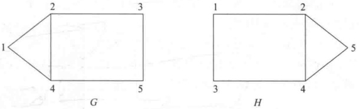

**图 8-1 两个同构的图**

【例 8-4】P 有两个图  $G_{1}$ 和  $G_{2}$， $(G_{1}, G_{2}) \in \mathrm{NISO}$，向验证者证明。

（1）V 随机选取  $\sigma \leftarrow _R \{1,2\}$，再随机选取  $G_{\sigma}$ 顶点上的一个置换  $\pi$，得  $C = \pi(G_{\sigma})$。将 C 发送给 P。

(2) P 收到 C 后，找出  $\tau \in \{1,2\}$，使得  $G_{\tau} \cong C$，将  $\tau$ 发送给 V。

（3）V 判断  $\tau \xlongequal{\quad}$  $\sigma$，若相等，则 V 接受 P 的证明。

如果  $G_{1} \not\cong G_{2}$，则 P 总能正确地区分  $\pi(G_{1})$ 和  $\pi(G_{2})$，因此能正确地执行步骤(2)；如果  $G_{1} \cong G_{2}$，则 P 不能区分  $\pi(G_{1})$ 和  $\pi(G_{2})$，因此只能随机猜测  $\tau$，能正确执行步骤(2)的概率为  $\frac{1}{2}$。

### 8.2.2 交互式证明系统的定义

定义 8-1 称(P, V)（或记为  $\sum = (P, V)$）是关于语言 L、安全参数  $\kappa$ 的交互式证明系统，如果满足

(1) 完备性，即  $\forall x \in L, \Pr[(\mathrm{P}, \mathrm{V})[x] = 1] \geqslant 1 - \varepsilon(\kappa)$;

(2) 可靠性，即  $\forall x \notin L, \forall P^{*}, \Pr[(P^{*}, V)[x]=1] \leqslant \varepsilon(\kappa)$。

其中， $(P,V)[x]$表示当系统的输入是x时系统的输出，输出为1表示V接受P的证明； $\varepsilon(\kappa)$是可忽略的。

在假设检验中（设  $H_{0}$ 为假设），有两类错误：第一类错误（也称为“弃真”）是当  $H_{0}$ 为真而拒绝  $H_{0}$，其概率（也称为弃真率）记为  $\Pr[$ 拒绝  $H_{0}|H_{0}$ 为真 $)$；第二类错误（也称为“取伪”）是当  $H_{0}$ 不真而接受  $H_{0}$，其概率（也称为取伪率）记为  $\Pr[$ 接受  $H_{0}|H_{0}$ 不真 $)$。在交互式证明系统中，完备性意味着弃真率  $\leqslant\varepsilon(\kappa)$，而可靠性则意味着取伪率  $\leqslant\varepsilon(\kappa)$。

在例8-3中， $H_{0}$ 为事件 $(G,H)\in\mathrm{ISO}$，则弃真率为 $\mathrm{Pr}\left[\text{拒绝}H_{0}\mid H_{0}\text{为真}\right]=0$，取伪率为 $\mathrm{Pr}\left[\text{接受}H_{0}\mid H_{0}\text{不真}\right]=0$，完备性和可靠性都满足。在例8-4中， $H_{0}$ 为事件 $(G_{1},G_{2})\in\mathrm{NISO}$，则弃真率为 $\mathrm{Pr}\left[\text{拒绝}H_{0}\mid H_{0}\text{为真}\right]=0$，取伪率为 $\mathrm{Pr}\left[\text{接受}H_{0}\mid H_{0}\text{不真}\right]\leq\frac{1}{2}$。为了减少取伪率，可将协议重复执行多次，设为k次，则取伪率小于 $\left(\frac{1}{2}\right)^{k}$。

### 8.2.3 交互式证明系统的零知识性

零知识证明起源于最小泄露证明。在交互式证明系统中，设P知道某一秘密，并向V 证明自己掌握这一秘密，但又不向 V 泄露这一秘密，这就是最小泄露证明。进一步地，如果 V 除了知道 P 能证明某一事实外，不能得到其他任何信息，则称 P 实现了零知识证明，相应的协议称为零知识证明协议。

【例 8-5】图8-2表示一个简单的迷宫，位置C与D之间有一道门，需要知道秘密口令才能将其打开。P向V证明自己能打开这道门，但又不愿向V泄露秘密口令，可采用如下协议：

（1）V 在协议开始时停留在位置 A；
（2）P一直走到迷宫深处，随机选择位置C或位置D；
（3）P 消失后，V 走到位置 B，然后命令 P 从某个出口返回位置 B；
（4）P 服从 V 的命令，必要时利用秘密口令打开 C 与 D 之间的门；
（5）P 和 V 重复以上过程 n 次。

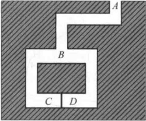

**图 8-2 零知识证明协议示例**

协议中，如果 P 不知道秘密口令，就只能从来路返回 B，而不能走另外一条路。此外，P 每次猜对 V 要求走哪一条路的概率是  $\frac{1}{2}$，因此每一轮中 P 能够欺骗 V 的概率是  $\frac{1}{2}$。假定 n 取 16，则执行 16 轮后，P 成功欺骗 V 的概率是  $\frac{1}{2^{16}} = \frac{1}{65536}$。于是，如果 16 次 P 都能按 V 的要求返回，V 即能证明 P 确实知道秘密口令。还可看出，V 无法从上述证明过程中获取丝毫关于 P 的秘密口令的信息，所以这是一个零知识证明协议。

如何刻画交互式证明系统的零知识性，设交互式证明系统  $\Sigma = (P, V)$ 用于证明  $x \in L$。如果 V 通过和 P 交互得到的所有信息都能仅通过 x 计算得到，这就说明 V 通过交互没有得到多余的信息。下面给出它的数学描述。

设  $\text{VIEW}_{\text{P,V}}$。(x) 是  $V^{*}$ 通过和 P 交互（输入 x）后得到的所有信息，包括从 P 得到的消息和  $V^{*}$ 自己在协议执行期间选用的随机数，称为  $V^{*}$ 的视图。如果  $\text{VIEW}_{\text{P,V}}$。(x) 能在仅知道 x 的情况下，不通过交互而被模拟产生，则说明  $V^{*}$ 通过交互没有得到多余信息。

用$\{\mathrm{VIEW}_{\mathrm{P},\mathrm{V}^{*}}(x)\}_{x\in L}$表示$x\in L$时$\mathrm{VIEW}_{\mathrm{P},\mathrm{V}^{*}}(x)$的概率分布。

定义 8-2 设  $\Sigma = (\mathrm{P}, \mathrm{V})$ 是一个交互式证明系统，如果对任一 PPT 的  $V^*$，存在 PPT 的机器  $S$，使得对  $\forall x \in L$， $\{\mathrm{VIEW}_{\mathrm{p},\mathrm{V}^*\}}(x)\}_{x \in L}$ 和  $\{\mathrm{S}(x)\}_{x \in L}$ 服从相同的概率分布，记为  $\{\mathrm{VIEW}_{\mathrm{p},\mathrm{V}^*}(x)\}_{x \in L} \equiv \{\mathrm{S}(x)\}_{x \in L}$，则称  $\Sigma$ 是完备零知识的；如果  $\{\mathrm{VIEW}_{\mathrm{p},\mathrm{V}^*}(x)\}_{x \in L} \equiv \{\mathrm{S}(x)\}_{x \in L}$，则称  $\Sigma$ 是计算上零知识的。

$$\left\{S\left(x\right)\right\}_{x\in L}$$

图8-3是交互式证明系统的零知识性描述，其中， $r_{2}$ 表示  $V^{*}$ 在协议执行期间选用的随机数， $m_{2}^{1}, \cdots, m_{2}^{t}$ 表示  $V^{*}$ 从 P 得到的消息。

【例 8-6】设 $(G,H)\in\mathrm{ISO}$，P 已知 G 和 H 之间的一个一一映射  $\phi$，满足  $\phi(G)=H$，P 向 V 证明这一事实。协议如下：

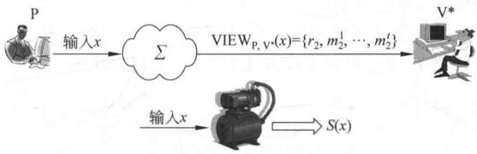

**图 8-3 交互式证明系统的零知识性**

（1）P取一随机置换 $\pi$，计算 $C=\pi(G)$，将C发送给V。

(2) V 随机取  $F \leftarrow_R \{G, H\}$，将 F 发送给 P。

（3）如果 F=G，P 取置换  $\alpha=\pi$；如果 F=H，P 取置换  $\alpha=\pi\cdot\phi^{-1}$，将  $\alpha$ 发送给  $V(\pi_{1}\cdot\pi_{2}$ 是置换  $\pi_{1}$ 和  $\pi_{2}$ 的复合，定义为  $\pi_{1}\cdot\pi_{2}(x)=\pi_{1}(\pi_{2}(x))$。

（4）V验证 $\alpha(F)=C$是否成立，若成立，则接受证明；否则，拒绝证明。

显然，P 和 V 都可在多项式时间内完成，即都是 PPT 的。

完备性：如果  $F=G$，则  $\alpha=\pi,\alpha(F)=\alpha(G)=\pi(G)=C$，即  $\alpha(F)=C$ 成立；如果  $F=H$，则  $\alpha=\pi\cdot\phi^{-1},\alpha(F)=\pi\cdot\phi^{-1}(H)$；如果  $\phi(G)=H$（即  $(G,H)\in\mathrm{ISO}$），则  $\alpha(F)=\pi\cdot\phi^{-1}(\phi(G))=\pi(G)=C$，即  $\alpha(F)=C$ 成立。所以，当  $\alpha(F)=C$ 时，V 接受 P 的证明。

可靠性，如果 G、H 不同构。

（1）当 F=G 时， $\alpha(F)=\pi(F)=\pi(G)=C$;

（2）当 F=H 时， $\alpha(F)=C$ 不成立；否则，由  $\alpha(F)=C$ 得  $\alpha(H)=\pi(G)$， $H=\alpha^{-1}\circ\pi(G)$，即存在 G 到 H 之间的置换  $\alpha^{-1}\circ\pi$，与 G、H 不同构矛盾。

因此，V 将以  $\frac{1}{2}$ 的概率接受一个错误的证明（上述(1)时）。如果协议重复执行 k 次，则取伪率将减少到  $\left(\frac{1}{2}\right)^{k}$。

零知识性：在上述协议中，当输入为  $x$（定义为  $(G, H) \in \text{ISO}$ 时），任一  $V^*$ 的视图为  $\text{VIEW}_{\text{P,V}} \cdot (x) = \{G, H, C, \alpha\}$。下面构造模拟器  $S$。为了模拟  $\text{VIEW}_{\text{P,V}} \cdot (x)$，S 扮演 P 的角色和  $V^*$ 交互，过程如下：

（1）S 取一随机置换  $\beta$，计算  $D = \beta(G)$，将 D 发送给  $V^{*}$

(2) S 若从  $V^{*}$ 收到 G，则输出  $S(x) = \{G, H, D, \beta\}$ 并结束；如果从  $V^{*}$ 收到 H，因它不知  $\phi$，不能像 P 构造  $\alpha = \pi \circ \phi^{-1}$ 那样来构造  $\beta$，因此中断，重新从步骤 (1) 开始。

显然，S 每执行一轮（从(1)到(2)）是多项式时间，以 $\frac{1}{2}$的概率产生输出。S 结束模拟的轮数期望值是2，所以 S 是 PPT 的。

若  $G$ 有  $n$ 个顶点，则其上的置换有  $n!$ 个。因  $\alpha$、 $\beta$ 都是随机选取的，概率分布都是  $\frac{1}{n!}$，而  $C$、 $D$ 都与  $G$ 同构，概率分布也都是  $\frac{1}{n!}$，所以对每一输入  $x((G, H) \in \text{ISO})$， $\{\text{VIEW}_{\text{P},\text{V}} \cdot (x)\}_{x \in L}$ 与  $\{S(x)\}_{x \in L}$ 是同分布的，以上协议是完备零知识的。

以上模拟器的构造是一种假想的实验，称为思维实验（thought experiment）。思维实验是用来考查某种假设、理论或原理的结果而假设的一种实验，这种实验可能在现实中无法做到，也可能在现实中没有必要去做。思维实验和科学实验一样，都是从现实系统出发，建立系统的模型，然后通过模型来模拟现实系统，其过程如图8-4所示。

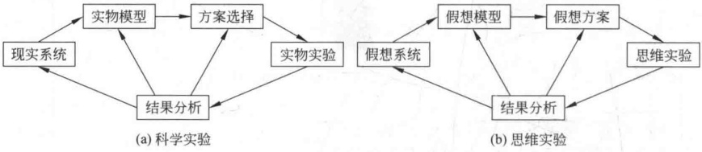

**图 8-4 科学实验与思维实验**

两者的区别主要有两方面：首先所用模型不同，在科学实验中建立的是实物模型，而在思维实验中建立的是假想模型；其次实验手段不同，科学实验通常借助于仪器、设备等具体的物质手段，而思维实验是在思维中实现的。

例如，为了证明空间弯曲，爱因斯坦曾进行了有名的升降机实验。在实验中，他假设升降机处于加速运动，于是垂直于加速度方向的一束光的轨迹在升降机内将是一条抛物线。所以，如果把加速度与引力等效原理推广到电磁现象中，那么光线在引力场中必定是弯曲的。

思维实验的另一个著名例子是薛定谔的猫。薛定谔（E. Schrodinger）是奥地利著名物理学家、量子力学的创始人之一，曾获1933年诺贝尔物理学奖。他在研究原子核的衰变时，设想把一只猫放进一个不透明的盒子里，盒子中有一个原子核和一瓶毒气。如果原子核发生衰变，它将会发射出一个粒子，而发射出的这个粒子将会触发实验装置，打开毒气瓶，从而杀死这只猫，如图8-5所示。实验完成后根据猫的死活就可判断原子核是否发生了衰变，因此这个实验就把一个微观问题转化为一个宏观问题。然而，这个实验仅仅是假想的，因为实验装置必须是真空的、无光的；否则，因为空气中的粒子或光子的能量要大于原子核粒子的能量，原子核粒子可能无法触发这个实验装置。

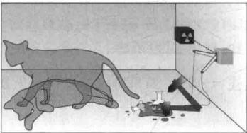

**图 8-5 薛定谔的猫**

在这类实验中，实验者根本无法建立实物模型，只能借助于思维的能动性和逻辑规则建立假想模型。

思维实验在后面的可证明安全性理论中有广泛应用。

### 8.2.4 零知识证明协议的组合

1. 顺序组合

零知识证明协议的顺序组合是指将零知识证明协议顺序执行多次。如此一来，它还是零知识的吗？

例如，在图的同构证明中，一个欺骗的证明者能有一半机会欺骗验证者，如果协议连续执行（如30次），则验证者被欺骗的机会大约是十亿分之一，因此协议的正确性满足。但零知识性还满足吗？如果验证者是恶意的，那么它能够将本轮获得的信息传递给下一轮。如果模拟器不能得到这种先验知识，就不能模拟验证者。因此，必须允许模拟器有能力获得这种先验知识（称为辅助输入）。

协议的零知识性可重新定义如下（其中， $\alpha\in\{0,1\}^{poly(|x|)}$ 是辅助输入）：

 $\forall \mathrm{V}_{\mathrm{PPT}}^{*} \exists S_{\mathrm{PPT}} \forall x \in L \forall \alpha \in \{0,1\}^{\mathrm{poly}(|x|)}, \{VIEW_{\mathrm{P},\mathrm{V}^{*}(\alpha)}(x)\}_{x \in L}$ 和  $\{S(x,\alpha)\}_{x \in L}$ 是同分布的（统计上不可区分的，计算上不可区分的）。

若零知识证明协议在组合后仍是零知识的，则称零知识证明协议关于组合是封闭的。

2. 并行组合

零知识证明协议如图8-6(a)所示，经过并行组合后如图8-6(b)所示。例如，将图同构的零知识证明协议（例8-6） $(G_{1},H_{1}),(G_{2},H_{2}),\cdots,(G_{n},H_{n})\in\mathrm{ISO}$ 经并行组合后，显然它的完备性、正确性 $\left(\frac{1}{2}\right)^{n}$ 仍成立。为了考虑它的零知识性，模拟器的构造如下

| P | a | V $^{*}$ |
| --- | --- | --- |
|  | b |  |
|  | c |  |

**(a) 组合前**

$$a_{1},a_{2},a_{3},\cdots\quad V^{*}$$

$$b_{1},b_{2},b_{3},\cdots$$

**(b) 组合后**

**图 8-6 零知识证明协议的并行组合**

（1）S 取随机置换  $\beta_{1},\cdots,\beta_{n}$，计算  $D_{i}=\beta(G_{i})$，将  $D_{i}$ 发送给  $\mathrm{V}^{*}(i=1,\cdots,n)$。

(2) S 若从  $V^{*}$ 收到  $G_{1}, \cdots, G_{n}$，则输出  $S_{i}(x) = \{G_{i}, H_{i}, D_{i}, \beta_{i}\}$ 并结束；否则，重新从步骤(1)开始。

模拟器成功的概率是 $\left(\frac{1}{2}\right)^{n}$，若 n 稍大，这一概率就太小了，因此并行组合的零知识性不成立。

### 8.2.5 图的三色问题的零知识证明

图的三色问题是指对任意简单（即没有平行边也无自回路）有限图，可用3种颜色为其着色，使得任意两个相邻顶点为不同的颜色。正式地，对于图 $G=(N,E)$，如果存在一个映射 $\phi:N\to\{1,2,3\}$，使得对 $\forall(u,v)\in E,\phi(u)\neq\phi(v)$，则称该图是三色图。在现实中，P很容易地向V证明他掌握一个三色图，首先P请V离开房间，然后对图着色，并将图的每个顶点盖起来，然后请V进来。V随机选图的一边，P将这条边两个顶点的遮盖物去掉，V检查两个顶点的确为不同的颜色。这一过程重复很多次，V最终将相信这个图是三色的。

完备性显然。

可靠性：如果 G 不是三色的，则至少有一边其两个端点为相同颜色，V 检查出的概率至少为 $\frac{1}{|E|}$，因此取伪率至多为 ${1}-\frac{1}{|E|}$。如果 $|E|$很大，则取伪率很大，但协议如果重复 $|E|^{2}$次（即所有边都取到），则取伪率将减少到 $\left(1-\frac{1}{|E|}\right)^{|E|^{2}}$。因为 $\left(1-\frac{1}{|E|}\right)^{|E|}\leq\mathrm{e}^{-1}\approx0.36$，所以取伪率 $\leq0.36^{|E|}$。

零知识性：模拟器 S 的构造有两种方法。

第一种方法：S 先不对图着色，盖住顶点后请 V 进来，V 看见盖住顶点的图，但不知是否已着色。V 选择一边，S 对其顶点用不同的颜色着色，重复下去。

第二种方法：

（1）S 随机地对图着色。

（2）如果 V 选择的两个顶点不同色，则继续协议；否则，S 对这两点重新着色，再继续协议。

下面是该协议的数字实现，这里分别用1、2、3表示“红”“蓝”“绿”，而顶点的遮盖和打开可用数字承诺方法实现。设 $C_s(\sigma)$是使用随机数 $s$对顶点 $\sigma$的承诺。P拥有图 $G=(N,E)$，其中 $|N|=n,N=\{1,\cdots,n\}$，P已知G的三色图表示为 $\psi(G)$，其中，顶点 $i\in N$的着色为 $\psi(i)\in\{1,2,3\}$，P向V证明这一事实，协议如下：

(1) P 随机选择  $\{1,2,3\}$ 上的一个置换  $\pi$，对  $\forall i \in N$，设  $\phi(i) = \pi(\psi(i))$，随机选取  $s_i \in \{0,1\}^{\kappa}$ ( $\kappa$ 是承诺方案的安全参数)，计算  $c_i = C_{s_i}(\phi(i))(i=\{1,\cdots,n\})$，将  $c_1,\cdots,c_n$ 发送给  $V(\pi$ 的作用是在下面第(3)步 P 向 V 展示时，不暴露着色后的实际颜色)。

(2) V 随机选取  $(u, v) \in E$，并将它发送给 P。

(3) P 发送  $(s_{u}, \phi(u))$,  $(s_{v}, \phi(v))$ 给 V。

（4）设 V 收到  $(s, \sigma)$ 和  $(s^{\prime}, \tau)$，V 检查是否  $\sigma \neq \tau$ 且  $c_u = C_s(\sigma)$， $c_v = C_s^{\prime}(\tau)$（其中， $\sigma, \tau \in \{1, 2, 3\}$），如果检查通过，V 接受 P 的证明；否则拒绝证明。

显然，P 和 V 都是 PPT 的。

完备性显然。

可靠性：如果 G 不是三色图，至少有一边  $(u, v) \in E$ 无法用不同的颜色着色，即  $\phi(u) = \phi(v)$，P 在步骤 (1) 虽然可选择  $s_u \neq s_v$，使得  $c_u \neq c_v$，在步骤 (4)，V 收到  $(s_u, \phi(u))$ 和  $(s_v, \phi(v))$，若  $\phi(u) \neq \phi(v)$，则由承诺方案的捆绑性  $C_{s_u}(\phi(u)) = c_u$ 和  $C_{s_v}(\phi(v)) = c_v$ 中至少有一个不成立，即 V 的取伪率至多为  ${1} - \frac{1}{|E|}$。

零知识性：模拟器 S 的构造选上述物理实现的第二种方法。

(1) S 随机选 n 个值  $e_1, \cdots, e_n \in \{1, 2, 3\}$ 作为 n 个顶点的着色（即 S 先对 G 随机地着色），选 n 个随机数  $t_1, \cdots, t_n \in \{0, 1\}^n$，计算  $d_i = C_{t_i}(e_i)(i=1, \cdots, n)$。

(2) 设 S 从 V 收到  $(u, v)$，若  $e_u \neq e_v$，那么协议继续；否则 S 中断。显然，S 也是 PPT 的。由承诺方案的隐藏性，对 V 来说， $c_i = C_{s_i}(\phi(i))$ 与  $d_i = C_{t_i}(e_i)(i=1,\cdots,n)$ 是不可区分的，方案是统计上零知识的。

### 8.2.6 知识证明

知识证明指证明者 P 向验证者 V 证明自己掌握一知识，但又不出示这个知识。例如，P向V证明自己掌握一口令，但不向V出示这个口令。又如，已知一公开钥PK，P向V证明自己知道与PK对应的秘密钥SK。在知识的证明过程中，如果P没有再泄露其他额外的信息，则称该知识证明是零知识的。

在例8-6证明 $(G,H)\in\text{ISO}$的例子中，协议连续执行两次，但在两次执行中，保持P的置换 $\phi$不变，而V在两次执行时分别选择G和H。这样一来V就得到两个置换 $\phi$和 $\phi^{\circ}\pi^{-1}$，从而可得置换 $\pi=(\phi^{\circ}\pi^{-1})^{-1}\circ\phi$。由此可证明P的确知道 $\pi$。

在这种思维实验中引入一个新的概念，叫做“提取器”。提取器和P交互以提取P所声称的值。如果提取器成功，则证明P的确掌握自己所声称的知识。

知识证明可用诸如 PK\{(\alpha): A=g^\alpha\} 的形式表示，其中，PK 表示 Proof of Knowledge，圆括号内( $\alpha$) 表示秘密信息，花括号内的内容是要论证的内容。

【例 8-7】Schnorr 协议。

设G是阶为素数 q 的有限循环群，g 是生成元， $x \in \mathbb{Z}_q$， $y = g^x \in \mathbb{G}$ 是公开的。P 向 V 证明它掌握 x，协议如下：

（1）P 随机选取  $r \leftarrow _R Z_q^*$，计算  $t = g^r \in \mathbb{G}$，将 t 发送给 V。

（2）V 随机选取  $c \leftarrow_{R} Z_{q}$，将 c 发送给 P。

(3) P 计算  $s \equiv xc + r \pmod{q}$，将 s 发送给 V。

（4）V检查 $g^{s}=y^{c} \cdot t$是否成立，若成立，则接受P的证明；否则拒绝。

这种协议称为三步协议，也形象地称为  $\sum$ 协议，因为它有以下3步：

第1步，承诺，P向V通过 $t=g^{r}$做出对r的承诺。

第2步，询问，V向P发出询问c。

第3步，应答，P以s作为对询问c的应答。

协议的完备性和可靠性显而易见。

为了提取 $x$，提取器和 P 交互两次，两次 P 选择的随机数 $r$ 及由 $r$ 得到的 $t$ 保持不变，提取器的两次应答分别取为 $c, c^{\prime}(c \neq c^{\prime})$，因此提取器得到两个方程 $s \equiv xc + r \pmod{q}$，$s^{\prime} \equiv xc^{\prime} + r \pmod{q}$，进一步得到 $x \equiv \frac{s - s^{\prime}}{(c - c^{\prime})^{-1}} \bmod q$。比较一下提取器和模拟器的构造：在模拟器的构造中，模拟器扮演 P 的角色和 V 交互；而在提取器的构造中，提取器扮演 V 的角色和 P 交互。

协议的零知识性：为了证明零知识性，如下构造模拟器 S，

（1）S 随机取  $t \leftarrow_{R} G$，将 t 发送给 V。

(2) S 从 V 收到 c 后，随机选取  $s \leftarrow_{R} Z_{q}$，计算  $t = g^{s} / y^{c}$

（3）S重新与V交互，将新计算的t发送给V。

（4）S从V收到c，将上述s发送给V。

这里假定 V 是诚实的，在相同的运行环境下，它选择的随机数 c 是相同的。 $\mathrm{VIEW}_{\mathrm{P},\mathrm{V}^{*}}(x)=\{t,c,s\}$，其中，t、c、s 分别在 G、 $Z_{q}$、 $Z_{q}$ 上均匀分布，且满足  $g^{s}=y^{c}t$。而 S(x) 的输出记为  $\{t^{\prime},c^{\prime},s^{\prime}\}$，也是均匀随机的。协议是完备零知识的。

第(2)步中，S从V收到c后，因其不知道x，不能像原协议那样求出s后回答V。因此S取随机的s做好了应答V的准备，为了保证s的正确，t应取为 $t=g^{s}/y^{c}$，然后回到协议的第(1)步重新开始。这个过程称为重绕，是 $\sum$协议的零知识性证明中的常用技术。

如果验证者是不诚实的，它可根据收到的不同的t，选择不同的询问c，则上述模拟过程中的第(4)步，S发送给V的s将不满足验证等式。称以上协议是诚实验证者的零知识证明。

以下3例都是诚实验证者的零知识证明。

【例 8-8】 $\mathrm{PK}\left\{(\alpha,\beta):A=g^{\alpha}h^{\beta}\right\}$

已知循环群 $G=\langle g\rangle=\langle h\rangle$， $A=g^x h^y$，P向V证明知道x,y，协议如下：

（1）P 随机选取  $r_1, r_2 \leftarrow_R Z_q$，计算  $t \equiv g^{r_1} h^{r_2} \bmod q$，将 t 发送给  $V$。

（2）V 随机选  $c \leftarrow_{R} Z_{q}$，将 c 发送给 P。

(3) P 计算  $s_{1} \equiv xc + r_{1} (\mathrm{mod} q)$,  $s_{2} \equiv yc + r_{2} (\mathrm{mod} q)$，将  $(s_{1}, s_{2})$ 发送给 V。

（4）V检查 $g^{s_{1}}h^{s_{2}}=A^{c}t$是否成立，若成立，则接受P的证明；否则拒绝。

提取器的构造类似于例8-7，略。

【例 8-9】 $\mathrm{PK}\left\{(\alpha):A=g^{a} \text{ 且 } B=h^{a}\right\}$。

已知循环群 $\mathbf{G} = \langle g \rangle = \langle h \rangle$， $A = g^x$， $B = h^x$，P向V证明知道x且 $(g, h, A, B)$形成DDH元组（即A和B有相同指数x）。

协议如下：

(1) P 随机选取  $r \leftarrow_R Z_q$，计算  $t_1 \equiv g^{\prime} \bmod q$， $t_2 \equiv h^{\prime} \bmod q$，将  $t_1$、 $t_2$ 发送给  $V$。

（2）V 随机选取  $c \leftarrow_{R} Z_{q}$，将 c 发送给 P。

(3) P 计算  $s \equiv xc + r \pmod{q}$，将 s 发送给 V。

（4）V检查 $g^{s}=A^{c}t_{1},h^{s}=B^{c}t_{2}$是否成立，若成立，则接受P的证明；否则拒绝。

与前几例相似，协议证明了 P 知道 x，是否也证明了  $(g, h, A, B)$ 形成 DDH 元组？若  $A = g^x, B = h^{x^{\prime}}, x \neq x^{\prime}$，P 选择  $r_1, r_2 \leftarrow_R Z_q, r_1 \neq r_2$（若  $r_1 = r_2$，则由  $g^s = A^c t_1$ 和  $h^s = B^c t_2$，得  $s \equiv xc + r_1 (\bmod q), s \equiv x^{\prime}c + r_2 (\bmod q)$，所以  $x = x^{\prime}$ 矛盾），计算  $t_1 \equiv g^{r_1} \bmod q, t_2 \equiv h^{r_2} \bmod q$，协议其他部分保持不变。 $g^s = A^c t_1$ 和  $h^s = B^c t_2$ 成立，仅当  $xc + r_1 \equiv x^c + r_2 (\bmod q) \Leftrightarrow c = \frac{r_1 - r_2}{x^{\prime} - x} (\bmod q)$，所以仅当 V 选择  $c = \frac{r_1 - r_2}{x^{\prime} - x} (\bmod q)$ 时，验证方程成立。而 V 选到这个特定值的概率是可忽略的，所以 P 欺骗成功的概率是可忽略的。

【例 8-10】 $\mathrm{PK}\left\{(\alpha,\beta):A=g^{\alpha}\text{ 或 }B=h^{\beta}\right\}$

已知循环群 $\mathbf{G}=\langle g\rangle=\langle h\rangle$及 $A,B,P$向 $V$证明自己知道 $x$使得 $A=g^x$或者知道 $y$，使得 $B=h^y$，但 $V$不知道具体是哪种情况。

协议如下，其中不失一般性假定  $A=g^{x}$，P 知道 x。

(1) P 随机选择  $r_1, c_2, s_2 \leftarrow_R Z_q$，计算  $t_1 \equiv g^{r_1} \bmod q$， $t_2 \equiv h^{s_2} / B^{r_2} \bmod q$，P 将  $t_1, t_2$ 发送给 V。

(2) V 随机选择  $c \leftarrow_{R} Z_{q}$，并发送给 P。

(3) P 计算  $c_{1}=c\oplus c_{2},s_{1}\equiv xc_{1}+r_{1}(\bmod q)$，将  $c_{1},s_{1},c_{2},s_{2}$ 发送给 V。

（4）V检查 $g^{s_{1}}=A^{c_{1}}t_{1},h^{s_{2}}=B^{c_{2}}t_{2}$及 $c=c_{1}\oplus c_{2}$是否成立，若成立，则接受P的证明；否则拒绝。

在以上证明中， $(t_{2},c_{2},s_{2})$ 是对  $B=h^{y}$ 的模拟证明（即使 P 不知道 y）；但因各元素的随机性，V 无法区分 $(t_{1},c_{1},s_{1})$ 和  $(t_{2},c_{2},s_{2})$，即无法区分  $A=g^{x}$ 与  $B=h^{y}$ 哪种情况为真。但  $A=g^{x}$ 与  $B=h^{y}$ 至少有一个为真，因为  $c_{1}$ 由 c 和  $c_{2}$ 决定，在固定 c 和  $c_{2}$ 后，P 无法伪造  $c_{1}$。由 Schnorr 协议的正确性，若  $g^{s_{1}}=A^{c_{1}}t_{1}$ 成立，则  $A=g^{x}$。

### 8.2.7 简化的 Fiat-Shamir 身份识别方案

在很多情况下，用户都需证明自己的身份，如登录计算机系统、存取电子银行中的账目数据库、从自动取款机（Automatic Teller Machine，ATM）取款等。传统的方法是使用密码或个人身份识别号（Personal Identification Number，PIN）来证明自己的身份，这些方法的缺点是检验用户密码或PIN的人或系统可使用用户的通行字或PIN冒充用户。

下面介绍的简化的 Fiat-Shamir 身份识别方案及 Fiat-Shamir 身份识别方案是身份的零知识证明，可使用户在不泄露自己的密码或 PIN 的情况下向他人证实自己的身份。

1. 协议及原理

设 n=pq，其中，p 和 q 是两个不同的大素数，x 是模 n 的二次剩余，y 是 x 的平方根。又设 n 和 x 是公开的，而 p、q 和 y 是保密的。证明者 P 以 y 作为自己的秘密。4.1.10 节已证明，求解方程  $y^{2}=x \bmod n$ 与分解 n 是等价的。因此，他人不知 n 的两个素因子 p 和 q 而计算 y 是困难的。P 和验证者 V 通过交互式证明协议，P 向 V 证明自己掌握秘密 y，从而证明了自己的身份。

协议如下：

（1）P 随机选择  $r(0<r<n)$，计算  $a \equiv r^{2} \bmod n$，将 a 发送给 V。

(2) V 随机选择  $e \leftarrow _{R} \{0,1\}$，将 e 发送给 P。

(3) P 计算  $b \equiv ry^{e} \bmod n$，即 e=0 时，b=r; e=1 时，b=ry  $\bmod n$。将 b 发送给 V。

（4）若 $b^{2}\equiv ax^{\epsilon}\bmod n$，V接受P的证明。

在协议的前3步，P和V之间共交换了3个消息，这3个消息的作用分别是：第一个消息a是P用来声称自己知道a的平方根；第二个消息e是V的询问，如果e=0，P必须展示a的平方根，即r，如果e=1，P必须展示被加密的秘密，即 $ry \bmod n$；第三个消息b是P对V询问的应答。

2. 协议的完备性、可靠性和安全性

1）完备性

如果 P 和 V 遵守协议，且 P 知道 y，则应答  $b \equiv ry^{\prime} \bmod n$ 应是模 n 下  $ax^{\prime}$ 的平方根，在协议的第(4)步 V 接受 P 的证明，所以协议是完备的。

2）可靠性

假冒的证明者 F 可按以下方式以  $\frac{1}{2}$ 的概率骗得 V 接受自己的证明：

（1）F 随机选择  $r(0<r<n)$ 和  $\widetilde{e}\leftarrow_{R}\{0,1\}$，计算  $a\equiv r^{2}x^{-\frac{1}{e}}\bmod n$，将 a 发送给 V。

(2) V 随机选择  $e \leftarrow_{R} \{0,1\}$，将 e 发送给 E。

（3）F 将 r 发送给 V。

根据协议的第(4)步，V 的验证方程是  $r^{2} \equiv ax^{e} \bmod n \equiv r^{2} x^{-\widetilde{e}} x^{e} \bmod n$，当  $\widetilde{e} = e$时，验证方程成立，V 接受 F 的证明，即 F 欺骗成功。因  $\tilde{e}=e$ 的概率是  $\frac{1}{2}$，所以 F 欺骗成功的概率是  $\frac{1}{2}$。另一方面， $\frac{1}{2}$ 是 F 能成功欺骗的最好概率，否则假设 F 以大于  $\frac{1}{2}$ 的概率使 V 相信自己的证明，那么 F 知道一个 a，对这个 a 他可正确地应答 V 的两个询问 e=0 和 e=1，这意味着 F 知道  $b_{1}$ 和  $b_{2}$，满足  $b_{1}^{2} \equiv a \mod n$ 和  $b_{2}^{2} \equiv ax \mod n$，即  $\frac{b_{2}^{2}}{b_{1}^{2}} \equiv x \mod n$，因此 F 由  $\frac{b_{2}}{b_{1}} \mod n$ 即可求得 x 的平方根 y，矛盾。

假冒的证明者 F 欺骗 V 成功的概率是  $\frac{1}{2}$，对 V 来说，这个概率太大了。为减小这个概率，可将协议重复执行多次，设执行 t 次，则欺骗者欺骗成功的概率将减小到  ${2}^{-t}$。

3）零知识性

模拟器的构造如下：

（1）S 随机选择 a，将 a 发送给 V。

(2) S 在收到 V 发来的 e 后，随机选择  $b \leftarrow_{R} Z_{n}$，计算  $a \equiv \frac{b^{2}}{x^{e}} \bmod n$。

（3）S 重新和 V 交互，将第(2)步计算的 a 发送给 V。

(4) S 收到 e 后(如果 V 是诚实的，则两次 e 是相同的)，将第(2)步选择的 b 发送给 V。显然 S 的输出和 V 的输出是同分布的。

4）知识证明性

为了证明 P 的确掌握 y，提取器的构造如下：提取器和 P 交互两次，两次 P 选择的随机数 r 及由 r 得到的 a 保持不变，提取器的两次应答分别取为 b 和  $b^{\prime}(b \neq b^{\prime})$，因此提取器得到两个方程  $b = r y^{e}$， $b^{\prime} = r y^{e^{\prime}}$，显然  $e \neq e^{\prime}$，不妨设 e = 1， $e^{\prime} = 0$，则提取器得到  $y = \frac{b}{b^{\prime}}$。

### 8.2.8 Fiat-Shamir 身份识别方案

1. 协议及原理

在简化的 Fiat-Shamir 身份识别方案中，验证者 V 接受假冒的证明者证明的概率是  $\frac{1}{2}$，为减小这个概率，将证明者的秘密改为由随机选择的 t 个平方根构成的一个向量  $\boldsymbol{y} = (y_1, y_2, \cdots, y_t)$，模数 n 和向量  $\boldsymbol{x} = (x_1, x_2, \cdots, x_t) = (y_1^2, y_2^2, \cdots, y_t^2)$ 是公开的，其中，n 仍是两个不相同的大素数的乘积。

协议如下：

(1) P 随机选择  $r(0 < r < n)$，计算  $a \equiv r^{2} \mod n$，将 a 发送给 V。

(2) V 随机选择  $e=(e_1,e_2,\cdots,e_t)$，其中， $e_i\leftarrow_{R}\{0,1\}(i=1,2,\cdots,t)$，将 e 发送给 P。

(3) P 计算  $b \equiv r \prod_{i=1}^{t} y_{i}^{e_{i}} \bmod n$，将 b 发送给 V。

（4）若 $b^{2}\not\equiv a\prod_{i=1}^{t}x_{i}^{e_{i}}\bmod n$，V拒绝P的证明，协议停止。

（5）P 和 V 重复以上过程 k 次。

2. 协议的完备性、可靠性和安全性

1）完备性

若 P 和 V 遵守协议，则 V 接受 P 的证明。

2）可靠性

如果假冒者 F 欺骗 V 成功的概率大于  ${2}^{-kt}$，则意味着 F 知道一个向量  $\boldsymbol{A} = (a^1, a^2, \cdots, a^k)$，其中， $a^j$ 是第 j 次执行协议时产生的，对这个 A，F 能正确地回答 V 的两个不同的询问  $\boldsymbol{E} = (e^1, e^2, \cdots, e^k)$、 $\boldsymbol{F} = (f^1, f^2, \cdots, f^k)$（每一元素是一个向量）， $\boldsymbol{E} \neq \boldsymbol{F}$。由  $\boldsymbol{E} \neq \boldsymbol{F}$ 可设  $e^j \neq f^j$， $e^j$ 和  $f^j$ 是第 j 次执行协议时 V 的两个不同的询问（为向量），简记为  $e = e^j$ 和  $f = f^j$，这一轮对应的  $a^j$ 简记为  $a$。所以 F 能计算两个不同的应答  $b_1$ 和  $b_2$，满足  $b_1^2 \equiv a \prod_{i=1}^{t} x_i^{e_i} \bmod n$， $b_2^2 \equiv a \prod_{i=1}^{t} x_i^{f_i} \bmod n$，即  $\frac{b_2^2}{b_1^2} \equiv \prod_{i=1}^{t} x_i^{f_i - e_i} \bmod n$，所以 F 可由  $\frac{b_2}{b_1} \bmod n$ 求得  $x \equiv \prod_{i=1}^{t} x_i^{f_i - e_i} \bmod n$ 的平方根，矛盾。

Fiat-Shamir 身份识别方案是对简化的 Fiat-Shamir 身份识别方案的推广，首先将 V 的询问由一比特推广到由 t 比特构成的向量，再者基本协议被执行 k 次。假冒的证明者只有能正确猜测 V 的每次询问，才可使 V 相信自己的证明，成功的概率是  ${2}^{-kt}$。

3）零知识性

模拟器的构造与简化 Fiat-Shamir 身份识别方案类似。也就是说，协议在执行一次时是完备的零知识证明，由零知识证明协议的顺序组合知道协议重复执行 k 次也是零知识的。

4）知识证明性

提取器的构造也与简化 Fiat-Shamir 身份识别方案类似。

## 8.3 非交互式证明系统

8.2 节介绍的是交互式证明系统。如果 P 和 V 不进行交互，证明由 P 产生后直接给 V，V 对证明直接进行验证，这种证明系统称为非交互式证明系统，简称为 NIZK（Non-Interactive Zero-Knowledge）。

非交互式证明系统由三部分组成，分别是密钥生成算法 K、证明者 P、验证者 V。K 产生公开的全程参数  $\sigma$ 称为公共参考串，简称 CRS (Common Reference String)。P 输入  $\sigma$、x 以及  $x \in L$ 的论据 w，产生一个证明或者一个论证  $\pi$。称  $x \in L$ 为论题 (以后直接称 x 为论题)，w 为论据，二元组  $(x, w)$ 构成的集合 R 为关系。V 输入  $(\sigma, x, \pi)$，如果它验证了 P 产生的  $\pi$ 是正确的，则输出 1；否则输出 0。

### 8.3.1 非适应性安全的非交互式零知识证明

定义 8-3 一组多项式时间算法  $(K, P, V)$ 是关于关系 R 的非适应性安全的非交互式零知识论证（证明）系统，如果以下性质成立：

(1) 完备性：对任意  $x(|x|=\kappa)$ 及：

$$\Pr[\sigma\leftarrow K(1^{\kappa});\pi\leftarrow\mathrm{P}(\sigma,x,w):(x,w)\in R\rightarrow\mathrm{V}(\sigma,x,\pi)=1]\geqslant1-\varepsilon(\kappa).$$

其中， $\varepsilon(\kappa)$是可忽略的（下同）， $(x,w)\in R^{\prime} \to V(\sigma,x,\pi)=1$ 是蕴含式，表示如果  $(x,w)\in R$，则  $V(\sigma,x,\pi)=1$。

(2) 可靠性：对于任意  $x(|x|=\kappa)$ 及任意的  $P^{*}$，有：

$$\Pr[\sigma\leftarrow K(1^{\kappa});\pi\leftarrow\mathrm{P}^{*}(\sigma)\colon x\notin\dot{L}\rightarrow\mathrm{V}(\sigma,x,\pi)=1]\leqslant\varepsilon(\kappa)。$$

等价地有：

$$\Pr[\sigma\leftarrow K(1^{\kappa});\pi\leftarrow\mathrm{P}^{*}(\sigma)\colon x\notin L\rightarrow\mathrm{V}(\sigma,x,\pi)=0]=$$

$$\Pr[\sigma\leftarrow K(1^{\kappa});\pi\leftarrow\mathrm{P}^{*}(\sigma)\colon\mathrm{V}(\sigma,x,\pi)=1\rightarrow x\in L]\geqslant1-\varepsilon(\kappa)$$

如果可靠性对于多项式时间的  $P^{*}$ 成立，则称  $(K,P,V)$ 是论证系统。而如果是对计算上无界的  $P^{*}$ 成立，则称  $(K,P,V)$ 是证明系统。

（3）零知识性：已知 $(x,w)\in R$，存在模拟器 $E=(E_{1},E_{2})$，使得对任一多项式时间（计算上无界）的敌手A，
$$\Pr[\mathrm{Exp}_{\mathrm{ZK}-\mathrm{real}}(\kappa)=1]-\Pr[\mathrm{Exp}_{\mathrm{ZK}-\mathrm{sim}}(\kappa)=1]$$
是可忽略的。

实验 ExpZK-real 和 ExpZK-sim 分别为

$$\begin{array}{l}\underline{Exp_{ZK-real}(\kappa)}:\quad\left|\underline{Exp_{ZK-sim}(\kappa)}:\right.\\\left.\sigma\leftarrow K(\kappa)\text{；}\quad(\sigma,\tau)\leftarrow E_{1}(k)\text{；}\right.\\\left.\pi\leftarrow P(\sigma,x,w)\text{；}\quad\pi\leftarrow E_{2}(\sigma,x,\tau)\text{；}\right.\\\left.b\leftarrow A(\sigma,x,\pi)\text{；}\quad b\leftarrow A(\sigma,x,\pi)\text{；}\right.\\\left.\text{返回 }b.\quad\right|\quad\text{返回 }b.\end{array}$$

其中， $\tau$ 表示  $E_{1}$ 为  $E_{2}$ 产生的额外的输入。零知识性说明 K 能被  $E_{1}$ 模拟，P 能被  $E_{2}$ 模拟，敌手 A 不能区分真实的情况与模拟的情况，即敌手从和证明者交互中得到的信息，都可以用多项式时间的模拟器得到。

### 8.3.2 适应性安全的非交互式零知识证明

在定义8-3中论题x是事先给定的，本小节加强这个定义，其中，敌手在看到公共参考串 $\sigma$并与证明者多次（至多多项式次）交互后，适应性地选择论题x（完备性除外）。

定义 8-4 一组多项式时间算法  $(K, P, V)$ 是关于关系 R 的适应性安全的非交互式零知识论证（证明）系统，如果以下性质成立：

（1）完备性：与定义8-3相同。

（2）可靠性：对于任意的 $P^{*}$，有：

$$\Pr[\sigma\leftarrow K(1^{\kappa});(x,\pi)\leftarrow\mathrm{P}^{*}(\sigma)\colon x\notin L\rightarrow\mathrm{V}(\sigma,x,\pi)=1]\leqslant\varepsilon(\kappa)。$$

等价地有：

$$\begin{aligned}&\Pr\begin{bmatrix}\sigma\leftarrow K(1^{\kappa});(x,\pi)\leftarrow P^{*}(\sigma):x\notin L\rightarrow V(\sigma,x,\pi)=0\end{bmatrix}=\\ &\Pr\begin{bmatrix}\sigma\leftarrow K(1^{\kappa});(x,\pi)\leftarrow P^{*}(\sigma):V(\sigma,x,\pi)=1\rightarrow x\in L\end{bmatrix}\geqslant1-\varepsilon(\kappa)\\ \end{aligned}$$

（3）零知识性：存在模拟器 $E=(E_{1},E_{2})$，使得对任一多项式时间（计算上无界）的敌手 A， $\left|\Pr\left[\mathrm{Exp}_{ZK-\mathrm{real}}(\kappa)=1\right]-\Pr\left[\mathrm{Exp}_{ZK-\mathrm{sim}}(\kappa)=1\right]\right|$ 是可忽略的。

实验 $Exp_{ZK-real}$和 $Exp_{ZK-sim}$分别为

$$\begin{array}{l}\underline{\mathrm{Exp}_{ZK-real}\left(\kappa\right)};\\\quad\sigma\leftarrow K\left(\kappa\right);\\\quad b\leftarrow A^{P\left(\sigma,\cdots\right)}\left(\sigma\right);\\ 返回 b.\end{array}\quad\left|\begin{array}{l}\underline{\mathrm{Exp}_{ZK-sim}\left(\kappa\right)};\\ \left(\sigma,\tau\right)\leftarrow E_{1}\left(\kappa\right);\\ b\leftarrow A^{E_{2}^{2}\left(\tau,\cdots\right)}\left(\sigma\right);\\ 返回 b.\end{array}\right.$$

其中， $\tau$ 表示  $E_{1}$ 为  $E_{2}$ 产生的额外的输入， $E_{2}^{\prime}$ 满足： $E_{2}^{\prime}(\tau, x, w) = E_{2}(\tau, x)$，表示  $E_{2}^{\prime}$ 已知 w 时模拟 P 的结果与  $E_{2}$ 未知 w 时模拟 P 的结果一样。零知识性说明 K 能被  $E_{1}$ 模拟，P 能被  $E_{2}$ 模拟，敌手 A 不能区分真实的情况与模拟的情况，即敌手从和证明者交互中得到的信息，都可以用多项式时间的模拟器得到。

### 8.3.3 BGN 密码系统

BGN(Boneh-Goh-Nissim)密码系统是一个具有同态性质的密码系统。它的安全性基于子群判定问题。

子群判定问题。设  $n = pq$， $p$ 和  $q$ 是两个大素数， $G$ 和  $G_1$ 是两个阶为  $n$ 的循环群， $\hat{e}$： $G \times G \to G_1$ 是  $G$ 到  $G_1$ 的双线性映射。又设  $G_{\text{gen}}$ 是群  $G$ 的生成元集合， $G_q$ 是  $G$ 的一个  $q$ 阶子群， $g \leftarrow_R G_{\text{gen}}$。取  $h \leftarrow_R G_{\text{gen}}$，得多元组  $D = (n, G, G_1, \hat{e}, g, h)$。取  $h \leftarrow_R G_q \setminus \{1\}$，得多元组  $R = (n, G, G_1, \hat{e}, g, h)$。

子群判定问题是指多元组 D 和 R 是不可区分的。具体地说，对任一敌手 A，A 区分 D 和 R 的优势  $\mathrm{Adv}_{\mathrm{A}}^{\mathrm{SD}}(\kappa)=|\mathrm{Pr}[A(D)=1]-\mathrm{Pr}[A(R)=1]$ 是可忽略的。

下面令 GroupGen 是一个多项式时间算法，其输入为安全参数  $\kappa$，输出为  $(p, q, G, G_1, \hat{e})$。BGN 密码系统如下。

密钥产生过程：

$$\begin{aligned}&\underline{KeyGen}(\kappa):\\&\quad(p,q,G,G_{1},\hat{e})\leftarrow GroupGen(\kappa);\\&\quad n=pq;\\&\quad g\leftarrow_{R}G_{gen},h\leftarrow_{R}G_{q}\backslash\{1\};\\&\quad pk=(n,G,G_{1},\hat{e},g,h),sk=(p,q).\end{aligned}$$

加密过程（其中， $m \in G$）：

$$\begin{aligned}&\underline{\mathrm{E}_{\mathrm{pk}}\left(m\right):}\\ &\quad r\leftarrow_{R}\mathbb{Z}_{n}^{*};\\ &\quad 输出 c=g^{m}h^{r}.\\ \end{aligned}$$

解密过程：

$$\begin{array}{c}\mathrm{D}_{sk}\left(c\right):\quad\cdot\\c^{q}=g^{mq}h^{rq}=\left(g^{q}\right)^{m};\end{array}$$

按照  $c^{q}$ 对 m 穷搜索。

如果将 h 选为 G 的生成元，则  $h^{q} \neq 1$， $c^{q} = g^{mq}h^{rq}$，得到一个完美隐藏的承诺方案而不是加密系统。按照子群判定性假设，承诺方案和加密系统是不可区分的。

### 8.3.4 BGN 密码系统的非交互式零知识证明

下面是 BGN 加密方案密文被正确形成（对应的明文为 0 或者 1）的非交互式的零知识证明。

证明的思路如下：如果密文 $c$ 是对 0 或者 1 的加密，那么 $c \in \mathrm{G}_q$ 或者 $cg^{-1} \in \mathrm{G}_q$，因此 $\hat{e}(c, cg^{-1})$ 的阶是 $q$。记 $c = g^y$，则有 $\hat{e}(c, cg^{-1}) = \hat{e}(g, g)^{y(y-1)}$。而如果 $\hat{e}(c, cg^{-1})$ 的阶是 $q$，即 $\hat{e}(g, g)^{y(y-1)}q = 1$，那么 $n \mid y(y-1)q, p \mid y(y-1)$，所以 $y = 0 \bmod p$ 或者 $y = 1 \bmod p$。所以只须证明 $\hat{e}(c, cg^{-1})$ 的阶是 $q$。

如果 $(m,r)$满足 $c=g^{m}h^{r}$，则当m=0时，

$$\hat{e}(c,cg^{-1})=\hat{e}(h^{r},g^{-1}h^{r})=\hat{e}(h,(g^{-1}h^{r})^{r});$$

当 m=1 时， $\hat{e}(c,cg^{-1})=\hat{e}(gh^{r},h^{r})=\hat{e}(h,(gh^{r})^{r})$。将两种情况统一写为： $\hat{e}(c,cg^{-1})=\hat{e}(h,(g^{2m-1}h^{r})^{r})$。直接将 h 和  $(g^{2m-1}h^{r})^{r}$ 给验证者，就可以使它相信  $\hat{e}(c,cg^{-1})$ 的阶的确是 q。然而这不是零知识的（验证者得到了 m 和 r 满足的某个关系）。

证明  $\hat{e}(c,cg^{-1})$ 的阶是 q 的非交互式零知识证明的思路如下：选择一个随机的  $\beta$，计算  $\hat{e}(c,cg^{-1})=\hat{e}(h^{\beta},(g^{2m-1}h^{r})^{r\beta^{-1}})$，将  $\pi_{1}=h^{\beta}$ 和  $\pi_{2}=(g^{2m-1}h^{r})^{r\beta^{-1}}$ 给验证者 (m 和 r 的关系被  $\beta$ 隐藏)，并且向他证明第一个元素  $\pi_{1}=h^{\beta}$ 的阶是 q。验证者通过  $\hat{e}(c,cg^{-1})=\hat{e}(\pi_{1},\pi_{2})$ 就可知道  $\pi_{1}$ 的阶是 q。然而证明者还需做出对  $\beta$ 的承诺，为此，需告诉验证者  $\pi_{3}=g^{\beta}$ (即对  $\beta$ 的承诺)。因为  $\hat{e}(\pi_{1},g)=\hat{e}(h^{\beta},g)=\hat{e}(h,g^{\beta})$，所以验证者通过  $\hat{e}(\pi_{1},g)=\hat{e}(h,\pi_{3})$ 就可以知道  $\pi_{1}$ 的指数与  $\pi_{3}$ 的指数相同。

协议具体过程如下：

公共参考串产生过程：

$$\begin{aligned}&\underline{CRSGen}(\kappa):\\&\quad(p,q,G,G_{1},\hat{e}) \leftarrow GroupGen(\kappa)\text{;}\\&n=pq\text{;}\\&g \leftarrow _R G_{gen},h \leftarrow _R G_{q}\backslash\{1\}\text{;}\\&\sigma=(n,G,G_{1},\hat{e},g,h).\end{aligned}$$

论题：

对于  $c \in \mathbb{G}$，存在  $w = (m, r) \in \mathbb{Z}^2$，满足  $m \in \{0,1\}$ 且  $c = g^m h^r$，即  $(c, w) \in \mathbb{R} = \{(c, w) = (c, (m, r)) \mid c = g^m h^r\}$。

证明 输入 $(\sigma,c,(m,r))$

$$\mathrm{Proof}(\sigma,c,(m,r)):$$

检查是否  $c \in \mathbb{G}, m \in \{0,1\}, c = g^m h^r$。如果检查失败，返回 failure； $\beta \leftarrow_R Z_n^*$；

$$\pi_{1}=h^{\beta},\pi_{2}=(g^{2m-1}h^{r})^{r\beta^{-1}},\pi_{3}=g^{\beta};$$

返回  $\pi=(\pi_{1},\pi_{2},\pi_{3})$.

验证：输入 $(\sigma,c,\pi=(\pi_{1},\pi_{2},\pi_{3}))$

Verification $(\sigma, c, \pi=(\pi_1, \pi_2, \pi_3))$:
检查  $c \in G, \pi \in G^3$;
检查  $\hat{e}(c, cg^{-1}) = \hat{e}(\pi_1, \pi_2), \hat{e}(\pi_1, g) = \hat{e}(h, \pi_3)$;
如果以上检查都通过， 返回 1.

下面证明协议的完备性、可靠性及零知识性。

完备性：设  $h = g^x$。如果证明者的论题是正确的，即对于  $c \in \mathbb{G}$，存在  $(m, r) \in \mathbb{Z}^2$，使得  $m \in \{0,1\}$， $c = g^m h^r$。则有

$$\begin{aligned}&\hat{e}\left(c,cg^{-1}\right)=\hat{e}\left(g^{m+xr},g^{m-1+xr}\right)=\hat{e}\left(g,g\right)^{m(m-1)+xr\left(2m-1+xr\right)}=\hat{e}\left(g,g\right)^{\beta x\left(2m-1+xr\right)r\beta^{-1}}=\\ &\hat{e}\left(h^{\beta},\left(g^{2m-1}h^{r}\right)^{r\beta^{-1}}\right)=\hat{e}\left(\pi_{1},\pi_{2}\right)。\quad 再者 \\ &\hat{e}\left(\pi_{1},g\right)=\hat{e}\left(h^{\beta},g\right)=\hat{e}\left(h,g^{\beta}\right)=\hat{e}\left(h,\pi_{3}\right)。\\ \end{aligned}$$

所以 V 接受 P 的证明。

可靠性：首先证明对于任一  $c \in G$，存在  ${0} \leq m < p$ 和  $r \in \mathbb{Z}$，使得  $c = g^m h^r$。

对于  $c \in \mathbb{G}$，存在  ${0} \leq m^{\prime} < n$，使得  $c = g^{m^{\prime}} = g^{m + k p} = g^m (g^p)^k$，其中，第2个等号由p除 $m^{\prime}$得。易知 $g^p$是 $G_q$的生成元，所以存在 ${0} \leq x^{\prime} < q$，使得 $g^p = h^x$，所以 $c = g^m (g^p)^k = g^m h^{x^{\prime}k} = g^m h^r$，其中，最后一个等号中记 $x^{\prime}k = r$。

下面证明当验证过程输出为1时，满足 $c=g^{m}h^{r}$的m一定为0或1。

由  $\hat{e}(\pi_{1}^{q}, g)=\hat{e}(\pi_{1}, g)^{q}=\hat{e}(h, \pi_{3})^{q}=\hat{e}(h^{q}, \pi_{3})=\hat{e}(1, \pi_{3})=1$ 知  $\pi_{1}$ 的阶是 1 或者 q，这意味着存在  $\beta$，使得  $\pi_{1}=h^{\beta}$。因此  $\hat{e}(c, cg^{-1})=\hat{e}(\pi_{1}, \pi_{2})=\hat{e}(h^{\beta}, \pi_{2})$， $\hat{e}(c, cg^{-1})^{q}=\hat{e}(h^{\beta}, \pi_{2})=\hat{e}(1, \pi_{2})=1$。又知  $\hat{e}(c, cg^{-1})=\hat{e}(g, g)^{m(m-1)+xr((2m-1)+xr)},\hat{e}(c, cg^{-1})^{q}=\hat{e}(g, g)^{q[m(m-1)+xr((2m-1)+xr)]}=1$，所以  $n|q[m(m-1)+xr((2m-1)+xr)]$， $|p|[m(m-1)+xr((2m-1)+xr)]$。又由  $h^{q}=1$ 得  $g^{xq}=1$， $n|xq$， $p|x$，所以  $p|m(m-1)$。而由  ${0}\leq m<p$ 可知 m=0 或 1。

零知识性：证明方案的零知识性，即对任一多项式时间（计算上无界）的敌手A，构造模拟器 $E=(E_{1},E_{2})$，使得式（8-1）是可忽略的。

为了达到目标，我们需要构造两个中间游戏 $Exp_{1}$和 $Exp_{2}$来过渡，其中每两个相邻的游戏之间区别很小，一个多项式时间敌手区分相邻两个游戏之间的变化的概率是可忽略的。

•  $\mathrm{Exp}_{1}$：将  $\mathrm{Exp}_{ZK-real}$ 中的公共参考串产生部分改为由模拟器  $E_{1}$ 产生，产生的模拟的公共参考串为  $(\sigma, \tau)$，其中， $\tau$ 是  $E_{1}$ 为  $E_{2}$ 产生的额外的输入，其余部分与  $\mathrm{Exp}_{ZK-real}$ 相同。

 $E_1$ 的构造如下：选择  $h \leftarrow_R G_{\text{gen}}$ 并且令  $g = h^\gamma$，其中， $\gamma \leftarrow_R Z_n^*$。输出  $(\sigma, \tau) = ((n, G, G_1, g, h), \gamma)$。

 $\mathrm{Exp}_{1}$ 与  $\mathrm{Exp}_{ZK-real}$ 的不同之处在于 h 的选择，在  $\mathrm{Exp}_{ZK-real}$ 中，h 是群  $G_{q}$ 一个随机的生成元，而在  $\mathrm{Exp}_{1}$ 中，h 是群 G 的一个生成元。由子群判定问题得
$$\Pr[\mathrm{Exp}_{\mathrm{ZK-real}}(\kappa)=1]-\Pr[\mathrm{Exp}_{\mathrm{EXP}_{1}}(\kappa)=1]$$
是可忽略的。

· Exp₂：将 Exp₁ 中的  $\pi \leftarrow \mathrm{P}(\sigma, c, w)$ 换成  $\pi \leftarrow E_2(\gamma, c)$，其余部分与 Exp₁ 相同。可见 $Exp_{ZK-sim}$就是 $Exp_{2}$。

 $E_{2}$ 输入  $(g, c)$，模拟证明者如下：选择  $r \leftarrow_{R} Z_{n}^{*}$。因为 c 和  $cg^{-1}$ 中有一个（或两个）是群 G 的生成元，如果 c 是生成元，则令  $\pi_{1} = c^{r}, \pi_{2} = (cg^{-1})^{r-1}, \pi_{3} = \pi_{1}^{y}$。如果 c 不是生成元，则令  $\pi_{1} = (cg^{-1})^{r}, \pi_{2} = c^{r-1}, \pi_{3} = \pi_{1}^{y}$。输出  $\pi = (\pi_{1}, \pi_{2}, \pi_{3})$。

这样构造的  $\pi=(\pi_{1},\pi_{2},\pi_{3})$ 满足验证方程：

当 c 是生成元时， $\hat{e}\left(\pi_{1},\pi_{2}\right)=\hat{e}\left(c^{r},\left(cg^{-1}\right)^{r-1}\right)=\hat{e}\left(c,cg^{-1}\right)$

$$\hat{e}\left(h,\pi_{3}\right)=\hat{e}\left(h,\pi_{1}^{\gamma}\right)=\hat{e}\left(h^{\gamma},\pi_{1}\right)=\hat{e}\left(g,\pi_{1}\right).$$

当 c 不是生成元时， $\hat{e}\left(\pi_{1},\pi_{2}\right)=\hat{e}\left(\left(cg^{-1}\right)^{r},c^{r^{-1}}\right)=\hat{e}\left(cg^{-1},c\right)$

$$\hat{e}\left(h,\pi_{3}\right)=\hat{e}\left(h,\pi_{1}^{\gamma}\right)=\hat{e}\left(h^{\gamma},\pi_{1}\right)=\hat{e}\left(g,\pi_{1}\right).$$

当 c 是群 G 的生成元时， $E_{2}$ 产生的  $\pi_{1}=c^{r}$ 也是 G 的一个随机生成元。而当 h（由  $\mathrm{Exp}_{1}$ 产生）的阶为 n 时，P 产生的  $\pi_{1}=h^{\beta}$ 也是 G 的随机生成元。又因  $\pi_{2}$ 和  $\pi_{3}$ 由  $\pi_{1}$ 唯一地确定。所以  $E_{2}$ 产生的  $\pi$ 和 P 产生的  $\pi$ 是不可区分的。即
$$\mathrm{Pr}\left[\mathrm{Exp}_{\mathrm{EXP}_{1}}\left(\kappa\right)=1\right]-\mathrm{Pr}\left[\mathrm{Exp}_{\mathrm{EXP}_{2}}\left(\kappa\right)=1\right]$$
是可忽略的。

类似地证明  $cg^{-1}$ 是 G 的生成元的情况。

由式 $（8-2）$和式 $（8-3）$，得式 $（8-1）$是可忽略的。

## 8.4 zk-SNARK

很多问题的论证能够容易地表达为高级程序语言（如 C 程序），高级语言能被有效地转化为电路表达，如算术电路或布尔电路，而电路又可转化为张成方案，其中算术电路转化为二次算术张成方案（Quadratic Arithmetic Program，QAP），布尔电路转化为平方张成方案（Square Span Program，SSP）。因此问题的证明可转化为证明电路的满足性，而证明电路的满足性又可转化为证明 QAP 或 SSP 的满足性，这可由密码算法实现。zk-SNARK（zero-knowledge Succinct Non-interactive ARguments of Knowledge）意指知识的零知识简洁的非交互论证，用于证明 QAP 或 SSP 的满足性。zk-SNARK 除满足定义 8-3 中的完备性、可靠性、零知识性，还满足简洁性，意指证明长度  $|\pi| = \text{poly}(\kappa)$，即安全参数的多项式。

### 8.4.1 高级语言转化为电路举例

证明存在 x 满足方程  $x^{3}+x+5=y$，转化过程及电路如图 8-7(a) 和图 8-7(b) 所示。

### 8.4.2 算术电路

算术电路是由取值在域 F 的连线及由连线连接的加法门和乘法门构成。布尔电路是算术电路，其中， $F=\{0,1\}$，加法门和乘法门是逻辑门。

用映射  $C: F^n \to F^n$ 表示输入为  $n$ 个值，输出为  $n^{\prime}$ 个值的电路， $C$ 的一个有效指派是一个多元组  $(c_1, c_2, \cdots, c_N) \in F^N$，使得  $C(c_1, \cdots, c_n) = (c_{n+1}, \cdots, c_N)$，其中， $N = n + n^{\prime}$。

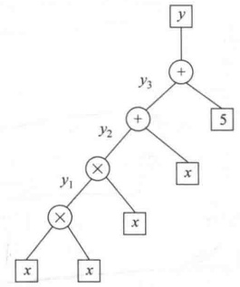

**(a) 转化过程**

**(b) 算术电路**

**图 8-7 转化过程及算术电路**

例如，图8-8是电路C： $\mathrm{F}_{2}^{4}\rightarrow\mathrm{F}_{2}^{1}$， $C(c_{1},c_{2},c_{3},c_{4})=(c_{1}+c_{2})\cdot(c_{3}\cdot c_{4})$，(0,1,1,1,1) $\in\mathrm{F}_{2}^{5}$ 是一个有效指派。

图8-9是电路C： $\mathrm{F}_{11}^{4} \rightarrow \mathrm{F}_{11}^{2}$，其中， $\mathrm{F}_{11} = \mathrm{Z}/11\mathrm{Z}$， $c_{2}$ 输入线上的常量7称为标量值。 $\mathrm{C}(c_{1}, c_{2}, c_{3}, c_{4}) = ((c_{1} + 7c_{2})(c_{2} - c_{3}), (c_{2} - c_{3})(c_{4} + 1)), (0, 1, 1, 1, 0, 0) \in \mathrm{F}_{11}^{6}$ 是一个有效指派。

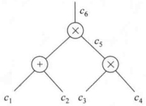

**图 8-8 算术电路示例 1**

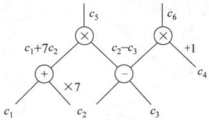

**图 8-9 算术电路示例 2**

### 8.4.3 QAP

二次算术张成方案 QAP 是张成方案(Span Program, SP)的推广，SP 是计算布尔函数的一种线性代数模型，其定义如下。

定义 8-5 设 F 是一有限域，T 是 F 上的一个向量（称为目标向量）， $\mathcal{V} = \{V_1, \cdots, V_m\}$ 是 F 上的向量集合（称为基向量），f 是布尔函数，其输入  $c \in \{0,1\}^m$（称为指派）。如果 T 是  $\mathcal{V}$ 中对应于 c 的向量的线性组合（称为张成），即  $T = c_1V_1 + \cdots + c_mV_m$，其中， $c_i$ ( $i \in [m]$) 是 c 的第 i 位，则  $f(c) = 1$。

QAP 的定义如下。

定义 8-6 有限域 F 上的 QAP Q 是由 F 上的 3 组  $m+1$ 个多项式集合  $\mathcal{V}=\{v_i(x)\}$， $\mathcal{W}=\{w_i(x)\}$， $\mathcal{Y}=\{y_i(x)\}(i=0,\cdots,m)$ 和一个目标多项式  $t(x)$ 组成。设电路  $C:F^n\rightarrow F^{n^{\prime}}$， $c=(c_1,\cdots,c_N)\in\mathrm{F}^N$（其中， $N=n+n^{\prime}$）是 C 的一组有效指派（称为电路的 I/O 元素），当且仅当存在 $(c_{N+1},\cdots,c_{m})$使得 $t(x)$整除 $p(x)$，其中，

$$p\left(x\right)=\left(v_{0}\left(x\right)+\sum_{i=1}^{m}c_{i}v_{i}\left(x\right)\right)\left(w_{0}\left(x\right)+\sum_{i=1}^{m}c_{i}w_{i}\left(x\right)\right)-\left(y_{0}\left(x\right)+\sum_{i=1}^{m}c_{i}y_{i}\left(x\right)\right)$$

称 m 是 Q 的大小， $t(x)$ 的次数是 Q 的次数，记为 d。

将电路的满足性改为布尔函数  $F: F^{N} \rightarrow \{0,1\}$，当且仅当 c 是 C 的一组有效指派时， $F(c) = 1$。

QAP 的定义是将 SP 的定义进行了推广，其中将目标向量改成了多项式，基向量改为三组多项式，目标向量在基向量的张成改为目标多项式的倍式在基多项式的张成。张成中因为有两次张成的乘积，所以称为二次张成方案。

将 QAP 用于证明关系  $(x, w) \in \mathbb{R}$，就是在上述定义中取  $x = c = (c_1, \cdots, c_N) \in \mathbb{F}^N$， $w = (c_{N+1}, \cdots, c_m)$。如果证明了 x 是 C 的一组有效指派，就有  $(x, w) \in \mathbb{R}$。

若算术电路有 d 个乘法门（包括中间乘法门和输出乘法门），n 个输入元素，则可按以下方式构造一个大小为 m=d+n，次数为 d 的 QAP Q，其中，加法门和常数乘法门（即乘法门的输入为常数）对 Q 的大小和次数无贡献。

对乘法门的所有输入线和输出线指定一个指标  $i \in [m]$。

对每个乘法门  $g(g$ 是它的输出线的指标， $g\in[m]$，取任意的  $r_{g}\in\mathrm{F}$ 作为目标多项式  $t(x)$ 的根，定义  $t(x)=\prod_{g}(x-r_{g})$。又设  $I_{g,L}, I_{g,R}$ 分别是 g 的左输入线和右输入线的指标集。

定义 $\nu, W$如下：

对  $i \in [m]$，定义：

$$v_{i}\left(r_{g}\right)=\left\{\begin{aligned}&a_{g,L,i},&&i\in I_{g,L}\\ &0,&& 其他 \end{aligned}\right.$$

其中， $a_{g,L,i}$ 是门 g 的第 i 条左输入线上的标量值。再利用  $v_{i}(x)$ 在各个乘法门 g 的定义值，通过插值法（例如 Lagrange 插值）构造多项式  $v_{i}(x)$。

 $w_{i}(x)$ 的构造类似，其中在右输入集  $I_{g,R}$ 中取右输入线上的标量值  $a_{g,R,i}$。

定义 $\gamma$如下：

对  $i \in [m]$，定义：

$$y_{i}\left(r_{g}\right)=\left\{\begin{aligned}&1,&\text{}&i=g\\ &0,&\text{}& 其他 \end{aligned}\right.$$

同样利用插值法构造多项式  $y_{i}(x)$。

下面证明以上构造的 QAP 满足定义 8-6。

因为对任一乘法门 g，其输出为
$$c_{g}=\left(\sum_{i\in I_{g,L}}c_{i}\bullet a_{g,L,i}\right)\bullet\left(\sum_{i\in I_{g,R}}c_{i}\bullet a_{g,R,i}\right)$$

其中，左括号中的  $c_{i}$ 是 g 的左输入线的输入值，可能是指派，也可能是下一级乘法门的输出。右括号中的  $c_{i}$ 是 g 的右输入线的输入值。

而按照上面定义的 $\nu,W,\gamma$有：

$$v_{c}\left(r_{g}\right)=\left(v_{0}\left(r_{g}\right)+\sum_{i=1}^{m}c_{i}v_{i}\left(r_{g}\right)\right)=\left(\sum_{i\in I_{g},L}c_{i}\cdot a_{g,L,i}\right),$$

$$w_{c}(r_{g})=\left(w_{0}(r_{g})+\sum_{i=1}^{m}c_{i}w_{i}(r_{g})\right)=\left(\sum_{i\in I_{g},R}c_{i}\cdot a_{g,R,i}\right),$$

$$y_{c}(r_{g})=\left(y_{0}(r_{g})+\sum_{i=1}^{m}c_{i}y_{i}(r_{g})\right)=c_{g}$$

所以由式 $（8-5）$得：

$$\begin{align*}p\left(r_{g}\right)=&\left(v_{0}\left(r_{g}\right)+\sum_{i=1}^{m}c_{i}v_{i}\left(r_{g}\right)\right)\left(w_{0}\left(r_{g}\right)+\sum_{i=1}^{m}c_{i}w_{i}\left(r_{g}\right)\right)-\left(y_{0}\left(r_{g}\right)+\sum_{i=1}^{m}c_{i}y_{i}\left(r_{g}\right)\right)\\=&\left(\sum_{i\in I_{g},L}c_{i}\bullet a_{g,L,i}\right)\bullet\left(\sum_{i\in I_{g},R}c_{i}\bullet a_{g,R,i}\right)-c_{g}=0\end{align*}$$

这就证明了对乘法门 g，当且仅当  $c=(c_{1},\cdots,c_{N})$ 是 C 的一组有效指派时， $t(x)$ 的根也是  $p(x)$ 的根，即  $t(x)$ 整除  $p(x)$。

注意：(1)定义及构造中，保证了 $t(x)$的根是 $p(x)$的根，不保证 $p(x)$的根是 $t(x)$的根。(2)由于 $m=d+n$，论据的长为 $m-N=m-(n+n^{\prime})=d-n^{\prime}$，为内部乘法门的个数。

【例 8-11】 构造图 8-8 所示算术电路的 QAP。

解：d=2, n=4, m=d+n=6.

对指标为5的乘法门，随机选取 $r_{5}\in\mathrm{F}$，定义 $v_{3}(r_{5})=1,v_{i}(r_{5})=0$（当 $i\neq3$时）。

对指标为6的乘法门，随机选取 $r_{6}\in\mathrm{F},r_{6}\neq r_{5}$，定义 $v_{1}(r_{6})=v_{2}(r_{6})=1,v_{i}(r_{6})=0$（当 $i\neq1,2$时）。

即  $v_{0}(x)$ 通过 2 个点  $(r_{5},0)$， $(r_{6},0)$，由 Lagrange 插值得  $v_{0}(x)=0$；

 $v_{1}(x)$ 通过 2 个点  $(r_{5},0)$， $(r_{6},1)$，由 Lagrange 插值得
$$v_{1}(x)=\frac{x-r_{6}}{r_{5}-r_{6}}\cdot0+\frac{x-r_{5}}{r_{6}-r_{5}}\cdot1=\frac{x-r_{5}}{r_{6}-r_{5}};$$

同理  $v_{2}(x)$ 通过2个点  $(r_{5},0)$， $(r_{6},1)$，得  $v_{2}(x)=v_{1}(x)=\frac{x-r_{5}}{r_{6}-r_{5}}$;

 $v_{3}(x)$通过2个点 $(r_{5},1)$， $(r_{6},0)$，得 $v_{3}(x)=\frac{x-r_{6}}{r_{5}-r_{6}}\cdot1+\frac{x-r_{5}}{r_{6}-r_{5}}\cdot0=\frac{x-r_{6}}{r_{5}-r_{6}}$;

 $v_{4}(x)$通过2个点 $(r_{5},0),(r_{6},0)$，得 $v_{4}(x)=0$;

 $v_{5}(x)$ 通过 2 个点  $(r_{5},0)$， $(r_{6},0)$，得  $v_{5}(x)=0$;

 $v_{6}(x)$通过2个点 $(r_{5},0),(r_{6},0)$，得 $v_{6}(x)=0$。

类似地，由 $\left\{\begin{aligned}&w_{i}(r_{5})=1,\quad i=4\\&w_{i}(r_{5})=0,\quad i\neq4\end{aligned}\right.\left\{\begin{aligned}&w_{i}(r_{6})=1,\quad i=5\\&w_{i}(r_{6})=0,\quad i\neq5\end{aligned}\right.$

$$w_{0}(x)=w_{1}(x)=w_{2}(x)=w_{3}(x)=w_{6}(x)=0,w_{4}(x)=\frac{x-r_{6}}{r_{5}-r_{6}},w_{5}(x)=\frac{x-r_{5}}{r_{6}-r_{5}}。$$

$$\left\{\begin{aligned}y_{i}(r_{5})&=1,\quad i=5\\ y_{i}(r_{5})&=0,\quad i\neq5\end{aligned}\right.\quad\left\{\begin{aligned}y_{i}(r_{6})&=1,\quad i=6\\ y_{i}(r_{6})&=0,\quad i\neq6\end{aligned}\right.$$

$$y_{0}(x)=y_{1}(x)=y_{2}(x)=y_{3}(x)=y_{4}(x)=0,y_{5}(x)=\frac{x-r_{6}}{r_{5}-r_{6}},y_{6}(x)=\frac{x-r_{5}}{r_{6}-r_{5}}$$

$$\begin{align*}p\left(x\right)=&\left(c_{1}\ \frac{x-r_{5}}{r_{6}-r_{5}}+c_{2}\ \frac{x-r_{5}}{r_{6}-r_{5}}+c_{3}\ \frac{x-r_{6}}{r_{5}-r_{6}}\right)\left(c_{4}\ \frac{x-r_{6}}{r_{5}-r_{6}}+c_{5}\ \frac{x-r_{5}}{r_{6}-r_{5}}\right)-\\&\left(c_{5}\ \frac{x-r_{6}}{r_{5}-r_{6}}+c_{6}\ \frac{x-r_{5}}{r_{6}-r_{5}}\right)\quad.\end{align*}$$

而目标多项式为  $t(x)=(x-r_{5})(x-r_{6})$。

 $x=r_{5}$ 时， $p(r_{5})=c_{3}\cdot c_{4}-c_{5},x=r_{6}$ 时， $p(r_{6})=(c_{1}+c_{2})c_{5}-c_{6}$

 $t(x)$ 整除  $p(x)$ 当且仅当  $t(x)$ 的 2 个根  $r_{5}$、 $r_{6}$ 也是  $p(x)$ 的 2 个根，即  $p(r_{5})=0$， $p(r_{6})=0$。所以一组指派  $(c_{0}, c_{1}, c_{2}, c_{3}, c_{4}, c_{6})$ 是有效的，当且仅当这一组指派满足  $p(r_{5})=p(r_{6})=0$。

由  $p(r_{5})=0$ 得  $c_{3}\cdot c_{4}=c_{5}$，为第1个乘法门的编码。由  $p(r_{6})=0$ 得  $(c_{1}+c_{2})c_{5}=(c_{1}+c_{2})\cdot(c_{3}\cdot c_{4})=c_{6}$，为第2个乘法门的编码。

论据长为 m - N = d - n' = 1,  $c_{5}$ 即为论据。

### 8.4.4 从 QAP 到 zk-SNARK

证明者根据电路求出 QAP Q，即 3 组  $m+1$ 个 d-1 次多项式集合  $\mathcal{V}=\{v_i(x)\}$， $\mathcal{W}=\{w_i(x)\}$， $\mathcal{Y}=\{y_i(x)\}(i=0,\cdots,m)$，然后根据自己掌握的论题  $x=(c_1,\cdots,c_N)$ 及论据  $w=(c_{N+1},\cdots,c_m)$，计算  $v_c(x)=v_0(x)+\sum_{i=1}^{m}c_i v_i(x)$（为 d-1 次多项式）（类似地计算  $w_c(x)$ 和  $y_c(x)$，都是 d-1 次多项式）， $p(x)=v_c(x)w_c(x)-y_c(x)$（为 2d-2 次）以及满足  $t(x)h(x)=p(x)$ 的  $h(x)$（为 d-2 次），将  $v_c(x)$， $w_c(x)$， $y_c(x)$ 及  $h(x)$ 发送给验证者，验证者验证  $t(x)h(x)=v_c(x)w_c(x)-y_c(x)$，其中， $t(x)$ 是公开的。

然而，由于这些多项式次数都很高，发送时效率很低，且验证者验证时效率也很低，所以将多项式发送及整除性的验证改在一个点 s 上进行。但为了防止证明者的伪造，s 应由可信第三方秘密选取，并将其编码值公开，编码方式应具有同构性，以使证明者和验证者能在编码值上进行运算和验证。

例如，g 是 F 的生成元，定义编码为  $E(s)=g^{s}$，具有同构性： $E(s_{1})\cdot E(s_{2})=g^{s_{1}+s_{2}}$。

若第三方对 s 及其幂的编码为  $g^{s}$,  $g^{s^{*}}$,  $\cdots$,  $g^{s^{a-s}}$，证明者的多项式为  $v_{c}(x)=v_{0}+v_{1}x+\cdots+v_{d-1}x^{d-1}$，则可利用  $\prod_{i=0}^{d-1}(g^{s^{i}})^{v_{i}}$ 得  $g^{v_{c}(s)}$。

协议如下：

（1）公开参考串 crs 产生算法： $Gen(\kappa, C) \rightarrow crs$。

设  $\kappa$ 为安全参数，C 为输入、输出数为 N 的电路。算法首先产生 QAP  $Q=(\mathcal{V}, \mathcal{W}, \mathcal{Y}, t(x))$，设 Q 的大小为 m，次数为 d。定义  $I_{mid}=\{N+1, \cdots, m\}$ （为与论据对应的指标），在 F 上随机选取  $\alpha, \beta_{v}, \beta_{w}, \beta_{y}, s$，满足  $t(s) \neq 0$，定义公开参考串 crs 为

$$\mathrm{c r s}=\left(Q,\left\{g^{s^{i}},g^{a s^{i}}\right\}_{i=0}^{d},g^{\beta_{v}},\left\{g^{\beta_{v}v_{i}(s)}\right\}_{i\in\mathrm{l}_{\mathrm{m i d}}},g^{\beta_{w}},\left\{g^{\beta_{w}w_{i}(s)}\right\}_{i\in[m]},g^{\beta_{y}},\left\{g^{\beta_{y}y_{i}(s)}\right\}_{i\in[m]}\right)$$

（2）证明 Prove(crs,u,w)→π。

证明者由论题  $u=(c_{1},\cdots,c_{N})$ 及论据  $w=(c_{N+1},\cdots,c_{m})$，计算  $v_{\mathrm{mid}}(x)=\sum_{i\in\mathrm{1}_{\mathrm{mid}}}c_{i}v_{i}(x),v_{c}(x)=\sum_{i\in[m]}c_{i}v_{i}(x),w_{c}(x)=\sum_{i\in[m]}c_{i}w_{i}(x),y_{c}(x)=\sum_{i\in[m]}c_{i}y_{i}(x)$，

 $p(x)=v_{c}(x)w_{c}(x)-y_{c}(x)$。再求商多项式 $h(x)=\frac{p(x)}{t(x)}$。

因为  $v_i(x), w_i(x), y_i(x)$ ( $i \in [m]$) 都是  $d-1$ 次多项式，证明者可由  $\{g, g^a\} \{g^i\}, g^{as^i}\}_{i=1}^{d-1}$ 求出  $(g^{v_i(s)}, g^{w_i(s)}, g^{y_i(s)})$ 和  $(g^{av_i(s)}, g^{av_i(s)}, g^{ay_i(s)})$ ( $i \in [m]$)。又由于  $v_c(x), w_c(x), y_c(x)$ 都是  $d-1$ 次多项式， $h(x)$ 是  $d-2$ 次多项式，证明者可继续计算：

$$(Y=g^{y_{c}(s)},\hat{Y}=g^{a y_{c}(s)}),\quad(H=g^{h(s)},\hat{H}=g^{a h(s)}),\quad B=g^{\beta_{v}v_{c}(s)+\beta_{w}w_{c}(s)+\beta_{y}y_{c}(s)}。$$

令： $\pi=(V_{mid},\hat{V}_{mid},W,\hat{W},Y,\hat{Y},H,\hat{H},B)$为证明者产生的证明。

（3）验证 Ver(crs, u,  $\pi$)  $\rightarrow$ 0/1。

验证者做以下三步检验：

① 整除性检验：

 $\hat{e}(H,g^{t(s)})=\hat{e}(V,W)/\hat{e}(Y,g)$; 其中， $V=g^{v_{c}(s)}$，因为验证者知道  $u=(c_{1},\cdots,c_{N})$ 和  $V_{mid}$，可求 V。

② 各分量张成的正确性检验：

$$\hat{e}\left(V_{mid},g^{\alpha}\right)=\hat{e}\left(g,\hat{V}_{mid}\right),\hat{e}\left(W,g^{\alpha}\right)=\hat{e}\left(g,\hat{W}\right),\hat{e}\left(Y,g^{\alpha}\right)=\hat{e}\left(g,\hat{Y}\right),\hat{e}\left(H,g^{\alpha}\right)=\hat{e}\left(g,\hat{H}\right)$$

③ 各分量张成的一致性检验：

$$\hat{e}(\boldsymbol{B},\boldsymbol{g})=\hat{e}(\boldsymbol{V},\boldsymbol{g}^{\beta_{v}})\cdot\hat{e}(\boldsymbol{W},\boldsymbol{g}^{\beta_{w}})\cdot\hat{e}(\boldsymbol{Y},\boldsymbol{g}^{\beta_{y}})$$

其中， $\hat{e}$ 是  $(F, \cdot) \rightarrow (F, \cdot)$ 上的双线性映射， $\cdot$ 是 F 上的乘法。

方案的简洁性：证明 $\pi$仅由F上的9个元素组成。

方案的可靠性基于双线性群上的 q 次幂 DH 假定（简记为  $q$-PDH）和 q 次幂指数知识假定（简记为  $q$-PKE）。

双线性群记为 $(p, G, G_T, \hat{e})$，其中， $G$和 $G_T$是阶为 $p$的乘法循环群， $\hat{e}$是 $G \times G$到 $G_T$的双线性映射，满足对 $\forall a, b \in Z_p$，有 $\hat{e}(g^a, g^b) = \hat{e}(g, g)^{ab}$。

已知双线性群 $(p,G,G_{T},\hat{e})$，其上的q-PDH和q-PKE如下：

假定1 如果对任一非均匀的概率多项式时间的敌手A，有 $\Pr[\mathrm{Exp}_{q-\mathrm{PDH}}(\kappa)=1]\leq\varepsilon(\kappa)$（其中， $\kappa$是安全参数），则称 $(p,G,G_T,\hat{e})$上的 $q$-PDH假定成立，其中实验 $\mathrm{Exp}_{q-\mathrm{PDH}}(\kappa)$如下：

$$\begin{aligned}&\underline{\mathrm{Exp}_{q-PDH}\left(\kappa\right):}\\ &\quad g\leftarrow_{R}\mathrm{G},s\leftarrow_{R}\mathrm{Z}_{p};\\ &\quad\sigma\leftarrow(g,g^{s},\cdots,g^{s^{q}},g^{s^{q+2}},\cdots,g^{s^{2q}});\\ &\quad y\leftarrow\boldsymbol{A}\left(\sigma\right);\\ &\quad 近同 \quad_{,q+1}\\ \end{aligned}$$

返回  $y=g^{s^{q+1}}$

假定1说敌手已知 $(g,g^{s},\cdots,g^{s^{q}},g^{s^{q+2}},\cdots,g^{s^{2q}})$，计算 $g^{s^{q+1}}$是困难的。

q 次幂指数知识假定说敌手已知一系列幂  $\left\{g, g^{s}, g^{s^{2}}, \cdots, g^{s^{q}}, g^{a}, g^{as}, \cdots, g^{as^{q}}\right\}$，产生满足  $\hat{c} = c^{a}$ 的  $(c, \hat{c})$ 是不可行的，除非已知满足  $c = \prod_{i=0}^{q} (g^{s^{i}})^{a_{i}}$ 的  $(a_{0}, \cdots, a_{q})$。

假定2 如果对任一非均匀的概率多项式时间的敌手A，有 $\Pr[\mathrm{Exp}_{q-\mathrm{PKE}}(\kappa)=1]\leq\varepsilon(\kappa)$，则称 $(p,G,G_T,\hat{e})$上的 $q$-PKE假定成立，实验 $\mathrm{Exp}_{q-\mathrm{PKE}}(\kappa)$如下：

$$\mathrm{E x p}_{q\mathrm{-P K E}}(\kappa):$$

$$g\leftarrow_{R}G,s\leftarrow_{R}Z_{p};$$

$$\sigma\leftarrow(g,g^{s},\cdots,g^{s^{q}},g^{a},g^{as},\cdots,g^{as^{q}});$$

$$(c,\widehat{c};\left\{a_{i}\right\}_{i=0}^{q})\leftarrow\left(\mathcal{A}\parallel\mathcal{E}_{\mathcal{A}}\right)(\sigma,z);$$

$$返回 \left(\hat{c}=c^{a}\right)\land\left(c\neq\prod_{i=0}^{q}\left(g^{s^{i}}\right)^{a_{i}}\right)$$

其中，z 表示独立于  $\sigma$ 的任何辅助信息。(c,  $\hat{c}$;  $\left\{a_{i}\right\}_{i=0}^{q}$)  $\leftarrow$ ( $\mathcal{A} \parallel \mathcal{E}_{\mathcal{A}}$) 表示如果敌手 A 输出  $(c, \hat{c})$，则存在提取器  $\mathcal{E}_{\mathcal{A}}$，提取出  $\left\{a_{i}\right\}_{i=0}^{q}$。

$$\Pr\left[\left(\hat{c}=c^{a}\right)\land\left(c\neq\prod_{i=0}^{q}\left(g^{s^{i}}\right)^{a_{i}}\right)\right]\leqslant\varepsilon\left(\kappa\right)$$

$$\Pr\left[(\hat{c}=c^{a})\rightarrow c=\prod_{i=0}^{q}(g^{s^{i}})^{a_{i}}\right]\geqslant1-\varepsilon(\kappa)$$

因此上述实验说如果敌手 A 能产生满足  $\hat{c}=c^{\alpha}$ 的  $(c,\hat{c})$，则存在提取器，以  ${1}-\varepsilon(\kappa)$ 的概率可提取出满足  $c=\prod_{i=0}^{q}(g^{s^{i}})^{a_{i}}$ 的  $(a_{0},\cdots,a_{q})$。

假定2即为已知 $(a_{0},\cdots,a_{q})$，使得 $c=\prod_{i=0}(g^{s^{i}})^{a_{i}}$的知识证明，证明成功的概率为 ${1}-\varepsilon(\kappa)$。

整除性验证验证了 $v_{c}(s)w_{c}(s)-y_{c}(s)$能被 $t(s)$整除，即可靠性。

各分量张成的正确性检验中的 $(V_{\mathrm{mid}}, \tilde{V}_{\mathrm{mid}})$ 证明了对证明者而言，如果他不知道  $\alpha$，输出  $(V_{\mathrm{mid}}, \hat{V}_{\mathrm{mid}})$ 是困难的，除非他知道  $v_{mid}$ 的系数  $\{c_{i}\}_{i \in I_{\mathrm{mid}}}$ （即论据），使得  $v_{\mathrm{mid}}(s) = \sum_{i \in I_{\mathrm{mid}}} c_{i} s^{i}$。

各分量张成的正确性检验即为证明者已知  $\omega=(c_{N+1},\cdots,c_{m})$ 的知识证明。

 $(W,\hat{W}),(Y,\hat{Y})$ 和  $(H,\hat{H})$ 类似。

各分量张成的正确性检验仅保证  $v_c(x)$ 是由  $v_i(x)(i \in [m])$、 $w_c(x)$ 是由  $w_i(x)(i \in [m])$、 $y_c(x)$ 是由  $y_i(x)(i \in [m])$ 张成得到的，并没有保证张成的系数相同。各分量张成的一致性检验保证了三者的张成系数相同。如果验证通过，但张成系数不同，就能解决  $d$-PDH（假定 1 中取  $q=d$），证明过程略。

以上协议是计算上零知识的，为了得到完备零知识性，在 $\mathbb{F}$上随机选取 $\delta_{v}, \delta_{w}, \delta_{y}$，构造

$$\begin{aligned}&v^{\prime}_{\mathrm{mid}}(x)=v_{\mathrm{mid}}(x)+\delta_{v}t(x)\\&w^{\prime}_{_{c}}(x)=w_{_{c}}(x)+\delta_{w}t(x)\\&y^{\prime}_{_{c}}(x)=y_{_{c}}(x)+\delta_{y}t(x)\\&h^{\prime}(x)=h(x)+\delta_{v}w_{_{c}}(x)+\delta_{w}v_{_{c}}(x)+\delta_{v}\delta_{w}t(x)-\delta_{y}\\ \end{aligned}$$

代替方案中的  $v_{mid}(x)$,  $w_{c}(x)$,  $y_{c}(x)$,  $h(x)$, 并在 crs 中增加  $\delta_{v}$,  $\delta_{w}$,  $\delta_{y}$ 的编码值，即可实现完备零知识性。

## 8.5 安全多方计算协议

### 8.5.1 安全多方计算问题

假设一组人想确定他们中谁的薪水最高，最简单直接的方法是每人直接说出自己的薪水。但如果大家都不想让他人知道自己的薪水，该如何做出比较？如果存在一个可信的第三方，每个人都可将自己的薪水告诉这个第三方，由第三方比较出结果再告诉大家。这就要求这个第三方首先要被系统中的所有用户所信任，即它能公正地进行比较且不会泄露用户的薪水。现实中可能不存在这种可信第三方，如何在不存在这种可信第三方的情况下解决上述问题，这就是安全多方计算问题，最早由姚期智提出，称为百万富翁问题，即在没有第三方参与的情况下，两个百万富翁比较谁更富有。

上述问题的形式化描述如下：设一组参与者为  $P_{1}, \cdots, P_{n}$，各自有秘密输入  $x_{1}, \cdots, x_{n}$，想联合计算某个多项式时间的函数  $f(x_{1}, \cdots, x_{n}, R) = (y_{1}, \cdots, y_{n})$，但不泄露各自的秘密输入。其中，R 是计算中所有的随机数， $y_{1}, \cdots, y_{n}$ 是各参与者得到的秘密输出值。

为了进行上述计算，各参与者之间可能要交换信息，如图8-10(a)所示，我们称这种计算环境为“真实世界”，而称有可信第三方（记为T）的环境为“理想环境”，如图8-10(b)所示。

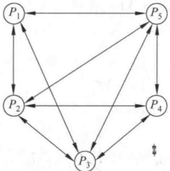

**(a) 真实世界**

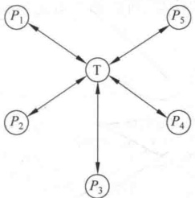

**(b) 理想世界**

**图 8-10 安全多方计算问题的计算环境**

### 8.5.2 半诚实敌手模型

一个参与者称为半诚实的，如果它正确地遵守协议的指令，但记录协议执行期间能得到的所有中间结果，并企图根据中间结果得到额外信息。

下面以两方计算协议为例，给出半诚实模型下协议的安全性定义。如上所述，协议的安全性是指各参与方不泄露自己的输入，因此安全性就是保密性。

定义 8-7 设  $f: \{0,1\}^* \times \{0,1\}^* \to \{0,1\}^* \times \{0,1\}^*$ 是一个函数， $f_1(x,y)$ 和  $f_2(x,y)$ 分别表示  $f(x,y)$ 的第一个元素和第二个元素， $\pi$ 表示计算  $f$ 的两方协议， $\text{VIEW}_1^\pi(x,y) = \{x, r_1, m_1^1, \cdots, m_1^l\}$ 表示第一方的视图，其中， $r_1$ 表示第一方在协议执行期间产生的随机数， $m_{1}^{i}(i=1,\cdots,t)$ 表示它收到的第i个消息；类似地， $\mathrm{VIEW}_{2}^{\pi}(x,y)=\{y,r_{2},m_{2}^{1},\cdots,m_{2}^{t}\}$ 表示第二方的视图。又设 $\mathrm{OUTPUT}_{1}^{\pi}(x,y)$ 和  $\mathrm{OUTPUT}_{2}^{\pi}(x,y)$ 分别表示两个参与方的输出。

确定性情况：若 f 是确定性函数，则说  $\pi$ 安全地计算 f，如果存在两个多项式时间的算法  $S_{1}$ 和  $S_{2}$，使得

$$\left\{S_{1}(x,f_{1}(x,y))\right\}_{x,y\in\{0,1\}}.\quad\equiv\left\{VIEW_{1}^{\pi}(x,y)\right\}_{x,y\in\{0,1\}}.$$

$$\left\{S_{2}(y,f_{2}(x,y))\right\}_{x,y\in\{0,1\}}.\quad\equiv\left\{VIEW_{2}^{\pi}(x,y)\right\}_{x,y\in\{0,1\}}.$$

其中， $\left|x\right|=\left|y\right|\left(\left|x\right|\right)$表示 x 的长度)。

一般情况：若 f 是一般函数，则说  $\pi$ 安全地计算 f，如果存在两个多项式时间的安全算法  $S_{1}$ 和  $S_{2}$，使得

$$\left\{\left(S_{1}(x,f_{1}(x,y)),f_{2}(x,y)\right)\right\}_{x,y\in\{0,1\}}.\quad\equiv\left\{\operatorname{VIEW}_{1}^{\pi}(x,y),\operatorname{OUTPUT}_{2}^{\pi}(x,y)\right\}_{x,y\in\{0,1\}}.$$

$$\left\{\left(f_{1}(x,y),S_{2}(y,f_{2}(x,y))\right)\right\}_{x,y\in\{0,1\}}=\left\{OUTPUT_{1}^{*}(x,y),VIEW_{2}^{*}(x,y)\right\}_{x,y\in\{0,1\}}$$

其中， $\left|x\right|=\left|y\right|$;  $S_{1}$ 和  $S_{2}$ 称为模拟器。

在确定性情况下，式(8-6)表示存在一个模拟器  $S_{1}$， $S_{1}$ 仅知道 x 和  $f_{1}(x,y)$ 时，能模拟第一方的视图，因此第一方除了 x（自己的输入）和  $f_{1}(x,y)$ （应得的输出）外，没有得到其他多余的信息，所以第二方是安全的，见图8-11。这种定义与零知识证明中的零知识性类似。

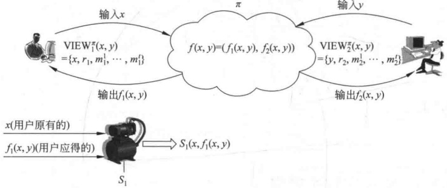

**图 8-11 安全的两方计算及模拟器**

类似地，式(8-7)表达了第一方的安全性。对确定性函数， $f_{i}(x,y)=\text{OUTPUT}_{i}^{\pi}(x,y)$ (i=1,2)，由式(8-8)和式(8-9)分别得到式(8-6)和式(8-7)。而对一般函数，即概率性函数，因为 $f_{i}(x,y)$ 和  $\text{OUTPUT}_{i}^{\pi}(x,y)$ 都是随机变量，虽然服从相同分布，但不一定相等。

【例 8-12】 $OT_{1}^{k}$ 协议。

OT $^{k}_{1}$ 协议是“多传一”的不经意传输协议。设发送方 A 持有  $b_{1}, \cdots, b_{k} \in \{0,1\}$，接收方 B 持有  $i \in \{1, \cdots, k\}$，OT $_{1}^{k}$ 用符号表示如下：

$$\mathrm{OT}_{1}^{k}\left(\left(b_{1},\cdots,b_{k}\right),i\right)=\left(\lambda,b_{i}\right)$$

其中， $\lambda$ 表示 A 没有任何输出。

协议中将用到如下两个概念：

· 陷门置换。置换  $f: D \to D$ 称为陷门置换，如果求它的逆  $f^{-1}$ 是困难的，但如果知道一个陷门，则  $f^{-1}$ 的计算是容易的。

· 陷门置换的核。对置换  $f, X \in D$，f 关于 X 的核是 X 的一个比特，满足：

（1）已知 X，存在一个多项式时间的算法  $b(\cdot)$，输出这个比特，记为  $b(X)$;

（2）已知 X 的置换  $f(X)$，则计算 b(X) 是困难的，即不存在 PPT 算法，以大于  $\frac{1}{2}$ 的概率输出 b(X)。

称函数  $b(\cdot)$ 为核谓词。

协议如下：

（1）A 随机选取一个陷门置换 f： $D \to D$，将 f 发送给 B，但对 f 的陷门保密。

（2）B 随机选取  $e_{1}, \cdots, e_{k} \leftarrow_{R} D$，设  $y_{i} = f(e_{i}), y_{j} = e_{j} (j \neq i)$，将  $(y_{1}, \cdots, y_{k})$ 发送给 A。

（3）在收到 $(y_{1},\cdots,y_{k})$后，A利用f的陷门计算 $x_{j}=f^{-1}(y_{j})(j=1,\cdots,k)$，并将 $(b_{1}\oplus b(x_{1}),b_{2}\oplus b(x_{2}),\cdots,b_{k}\oplus b(x_{k}))$发送给B。其中， $b(\cdot)$是核谓词； $b(x_{j})$是f关于 $x_{j}$的核。

（4）B收到 $(c_{1},\cdots,c_{k})$后计算 $c_{i}\oplus b(e_{i})$。

因为

$$\begin{align*}c_{i}\oplus b(e_{i})&=(b_{i}\oplus b(x_{i}))\oplus b(e_{i})=(b_{i}\oplus b(f^{-1}(f(e_{i}))))\oplus b(e_{i})\\&=(b_{i}\oplus b(e_{i}))\oplus b(e_{i})=b_{i}\end{align*}$$

B 的确收到  $b_{i}$

而对于  $j \neq i$，B 无法计算  $b(f^{-1}(y_{j})) = b(f^{-1}(e_{j}))$，所以得不到  $b_{j}$。

下面证明协议的安全性，因双方的输出为确定性的，所以只须分别构造发送者A的模拟器 $Sim_{A}$和接收者B的模拟器 $Sim_{B}$，满足式（8-1）和式（8-2）。

A 的视图  $\mathrm{VIEW}_{1}^{\pi}=\left\{(b_{1},\cdots,b_{k}),\lambda,(y_{1},\cdots,y_{k})\right\}$，其中， $(y_{1},\cdots,y_{k})$ 是  $D^{k}$ 上均匀分布的（因  $(e_{1},\cdots,e_{k})$ 是  $D^{k}$ 上随机选取的，f 是随机置换， $y_{i}=f(e_{i}),y_{j}=e_{j}(j\neq i)$）。 $\mathrm{Sim}_{\mathrm{A}}$ 的输入为  $((b_{1},\cdots,b_{k}),\lambda)$，它只须在  $D^{k}$ 上均匀选取  $(y_{1}^{\prime},\cdots,y_{k}^{\prime})$，输出  $(b_{1},\cdots,b_{k}),\lambda,(y_{1}^{\prime},\cdots,y_{k}^{\prime})$，则满足式 (8-6)。

B 的视图  $\mathrm{VIEW}_{2}^{\pi}=(i,b_{i},(c_{1},\cdots,c_{k}))$，在  $\mathrm{Sim}_{B}$ 的构造中， $\mathrm{Sim}_{B}$ 扮演 A 的角色和 B 交互。

（1） $\mathrm{Sim}_{B}$ 随机选一个陷门置换  $f^{\prime}\colon D\to D$，将  $f^{\prime}$ 发送给 B。

(2)  $\mathrm{Sim}_{B}$ 从 B 收到  $(y_{1}, \cdots, y_{k})$ 后，计算  $x_{i} = (f^{\prime})^{-1}(y_{i})$ 及  $c_{l}^{\prime} = b_{i} \oplus b(x_{i})$，随机选取  $c^{\prime} \leftarrow_{R} \{0, 1\} (j = 1, \cdots, k, j \neq i)$。

（3） $\mathrm{Sim}_{B}$ 输出 $(i,b_{i},(c_{1}^{\prime},\cdots,c_{k}^{\prime}))$。

因为  $c_{i}=b_{i}\oplus b\left(e_{i}\right)$， $c_{i}^{\prime}=b_{i}\oplus b\left(x_{i}\right)$，对任一区分器 D，即使知道  $e_{i}$ 的置换  $y_{i}= f(e_i), x_i$ 的置换  $f^{\prime}(x_i)$，由函数  $b(·)$ 的性质知，D 不能区分  $b(e_i)$ 和  $b(x_i)$，所以不能区分  $c_i$ 和  $c_i^{\prime}$。而当  $j \neq i$ 时， $c_j = b_j \oplus b(f^{-1}(y_j)) = b_j \oplus b(f^{-1}(e_j))$，D 无法计算  $f^{-1}(e_j)$，不能区分  $b(f^{-1}(e_j))$ 和随机比特，因此不能区分  $c_j$ 和  $c_j^{\prime}$，所以式（8-7）成立。

【例 8-13】逻辑门计算协议。

这里只考虑异或门和与门的计算，并假定每个门只有两个输入端。因此仅考虑这两种门的两方计算协议，其中任一值 v 以一种自然的方式被两个参与方分割（即两个参与者掌握的秘密信息相加等于 v）。

设第一方  $P_{1}$ 持有秘密输入 a，它将 a 自然地分割为  $a_{1}, a_{2}$，即  $a = a_{1} + a_{2}$，将  $a_{2}$ 发送给第二方  $P_{2}$，自己保留  $a_{1}$。又设第二方  $P_{2}$ 持有秘密输入 b，它将 b 自然地分割为  $b_{1}, b_{2}$，即  $b = b_{1} + b_{2}$，将  $b_{1}$ 发送给  $P_{1}$，自己保留  $b_{2}$。

异或门  $c = a + b$ 的实现如下：

因为  $c=a+b=(a_{1}+a_{2})+(b_{1}+b_{2})=(a_{1}+b_{1})+(a_{2}+b_{2})=c_{1}+c_{2}$，所以  $\mathrm{P}_{1}$、 $\mathrm{P}_{2}$ 根据自己掌握的秘密分量分别计算  $a_{1}+b_{1}$ 和  $a_{2}+b_{2}$，即为输出  $a+b$ 的两个分量  $c_{1}$ 和  $c_{2}$，其中的运算在 GF(2) 上进行。

与门 c=ab 的实现：

设协议的双方  $P_{1}$ 和  $P_{2}$ 各自的输出为  $c_{1}$ 和  $c_{2}$，满足

$$c_{1}+c_{2}=ab=(a_{1}+a_{2})(b_{1}+b_{2})=a_{1}b_{1}+a_{1}b_{2}+a_{2}b_{1}+a_{2}b_{2}$$

其中， $c_{1}$ 可由  $P_{1}$ 随机选取； $c_{2}$ 等于  $c_{2}=c_{1}+a_{1}b_{1}+a_{1}b_{2}+a_{2}b_{1}+a_{2}b_{2}$，可分为4种情况：

当 $a_{2}=0,b_{2}=0$时， $c_{2}=c_{1}+a_{1}b_{1}$;

当 $a_{2}=0,b_{2}=1$时， $c_{2}=c_{1}+a_{1}b_{1}+a_{1}=c_{1}+a_{1}(b_{1}+1)$;

当 $a_{2}=1,b_{2}=0$时， $c_{2}=c_{1}+a_{1}b_{1}+b_{1}=c_{1}+(a_{1}+1)b_{1}$

当 $a_{2}=1,b_{2}=1$时， $c_{2}=c_{1}+a_{1}b_{1}+a_{1}+b_{1}=c_{1}+(a_{1}+1)(b_{1}+1)$

 $c_{2}$ 的 4 个值由  $P_{1}$ 为  $P_{2}$ 准备， $P_{2}$ 根据自己掌握的  $a_{2}$ 和  $b_{2}$，计算  ${1} + 2a_{2} + b_{2} \in \{1, 2, 3, 4\}$，并由计算的结果选取 4 个值中的一个。因此，协议可使用  $\mathrm{OT}_{1}^{4}$ 来实现。协议如下（其中的运算在 GF(2) 上进行）：

（1）第一方  $P_{1}$ 随机选择  $c_{1}\in\{0,1\}$。

（2）双方调用$\mathrm{OT}_{1}^{4}$协议，其中$\mathrm{P}_{1}$作为发送者，其输入为$\left(c_{1}+a_{1}b_{1},c_{1}+a_{1}\left(b_{1}+1\right)\right.$，$\left.c_{1}+\left(a_{1}+1\right)b_{1},c_{1}+\left(a_{1}+1\right)\left(b_{1}+1\right)\right)$，$\mathrm{P}_{2}$作为接收者，其输入为${1}+2a_{2}+b_{2}\in\{1,2,3,4\}$。

（3） $P_{1}$ 输出  $c_{1}, P_{2}$ 输出  $\mathrm{OT}_{1}^{4}$ 的输出  $c_{2}$

 $P_{1}$ 的模拟器  $S_{AND}$ 的输入  $(a_{1}, b_{1}), c_{1}$，输出  $((a_{1}, b_{1}), c_{1}, \mathrm{Sim}_{OT})$，其中， $\mathrm{Sim}_{OT}$ 是  $\mathrm{OT}_{1}^{4}$ 协议中  $P_{1}$ 的模拟器的输出。由  $\mathrm{OT}_{1}^{4}$ 的安全性知  $\mathrm{Sim}_{OT}$ 和  $P_{1}$ 在  $\mathrm{OT}_{1}^{4}$ 中的视图是不可区分的，因此  $S_{AND}$ 的输出和  $P_{1}$ 的视图是不可区分的。 $P_{2}$ 的模拟器的构造是类似的。

【例 8-14】布尔电路计算协议。

任何确定性函数都可用布尔电路实现，而任何布尔电路可仅使用与门及异或门构造。若函数的运算在GF（2）上进行，则加法运算对应电路中的异或门，而乘法运算对应与门。

下面考虑任一布尔电路（实现确定性函数）的安全两方计算。

设两方  $P_{1}$、 $P_{2}$ 的输入分别为  $(x_{1}^{1}, \cdots, x_{1}^{n}) \leftarrow_{R} \{0, 1\}^{n}$ 和  $(x_{2}^{1}, \cdots, x_{2}^{n}) \leftarrow_{R} \{0, 1\}^{n}$，对应电路输入线分别被标记为 $(w_{1},\cdots,w_{n})$和 $(w_{n+1},\cdots,w_{2n})$，协议如下：

(1)  $\mathrm{P}_{i}(i=1,2)$ 分割它的每个输入  $x_{i}^{j}(j=1,2,\cdots,n)$：随机选取  $r_{i}^{j} \leftarrow_{R}\{0,1\}$，将  $r_{i}^{j}$ 发送给另一方作为输入线  $w_{(i-1)n+j}$ 的输入分量，而将自己对该输入线的输入分量设置为  $x_{i}^{j}+r_{i}^{j}$。

（2） $P_{1}$ 和  $P_{2}$ 逐个门地计算门输出比特的分量，记  $P_{1}$ 持有  $a_{1}$ 和  $b_{1}$， $P_{2}$ 持有  $a_{2}$ 和  $b_{2}$，其中  $a_{1}$ 和  $a_{2}$ 是输入线  $w_{1}$ 上输入比特的两个分量， $b_{1}$ 和  $b_{2}$ 是输入线  $w_{2}$ 上输入比特的两个分量。

（3）在所有门计算完后，设  $P_1$ 和  $P_2$ 的输出分别为  $(y_1^1, \cdots, y_1^n) \in \{0,1\}^n$ 和  $(y_2^1, \cdots, y_2^n) \in \{0,1\}^n$， $P_1$ 和  $P_2$ 交换所有的输出，即  $P_1$ 得到  $(y_2^1, \cdots, y_2^n)$， $P_2$ 得到  $(y_1^1, \cdots, y_1^n)$，各自计算  $y_1^1 + y_2^1, \cdots, y_1^n + y_2^n$，即为输出的比特串。

方案的安全性：

我们仅考虑  $P_{1}$ 的模拟器  $S_{1}$ 的构造， $P_{2}$ 的模拟器的构造类似。 $S_{1}$ 的输入为  $x_{1}^{1}, \cdots, x_{1}^{n}$ 和  $(y^{1}, \cdots, y^{n}) = (y_{1}^{1} + y_{2}^{1}, \cdots, y_{1}^{n} + y_{2}^{n})$， $S_{1}$ 扮演  $P_{2}$ 的角色和  $P_{1}$ 进行如下交互（为了区分实际协议，模拟实验中的步数用罗马数字表示）：

 $S_{1}$ 随机选取  $r_{1}^{1}, \cdots, r_{1}^{n}$ 和  $r_{2}^{1}, \cdots, r_{2}^{n}$ (其中， $r_{1}^{1}, \cdots, r_{1}^{n}$ 将被用来模拟  $P_{1}$ 产生的随机比特， $r_{2}^{1}, \cdots, r_{2}^{n}$ 将被用来模拟  $P_{1}$ 从  $P_{2}$ 收到的随机比特)， $S_{1}$ 将输入线  $w_{1}, \cdots, w_{n}$ 的输入设置为  $x_{1}^{1} + r_{1}^{1}, \cdots, x_{1}^{n} + r_{1}^{n}$，而将输入线  $w_{n+1}, \cdots, w_{2n}$ 的输入设置为  $r_{2}^{1}, \cdots, r_{2}^{n}$。

ii  $S_{1}$ 和  $P_{1}$ 逐门地计算：

对加法门，各自求自己的输出线上的分量，为输入线上的分量之和。

对于与门，调用  $\text{Sim}_{\text{AND}}$

Ⅲ 对于  $P_{1}$ 的第 j 个输出线， $S_{1}$ 求  $P_{1}$ 的第 j 个输出  $m^{j}$，为自己的第 j 个输出与  $y^{j}$ 的求和。

Ⅳ  $S_{1}$ 输出  $(x_{1}^{1}, \cdots, x_{1}^{n})$,  $(y^{1}, \cdots, y^{n})$,  $(r_{1}^{1}, \cdots, r_{1}^{n})$,  $V^{1}$,  $\mathrm{Sim}_{\mathrm{AND}}, V^{2}$, 其中，  $V^{1} = (r_{2}^{1}, \cdots, r_{2}^{n})$ 对应  $P_{1}$ 在第 (i) 步从  $P_{2}$ 收到的输入分量，  $\mathrm{Sim}_{\mathrm{AND}}$ 是第 ii 步中所有与门的输出，  $V^{2} = (m^{1}, \cdots, m^{n})$ 为  $S_{1}$ 在第 iii 步得到的消息，  $V^{2}$ 模拟的是  $P_{1}$ 从  $P_{2}$ 获得的消息。

 $S_{1}$ 输出的前 4 个元素，即输入  $(x_{1}^{1}, \cdots, x_{1}^{n})$，输出  $(y^{1}, \cdots, y^{n})$，第 i 步产生的随机数  $(r_{1}^{1}, \cdots, r_{1}^{n})$，第 ii 步从  $P_{2}$ 收到的随机数  $V^{1} = (r_{2}^{1}, \cdots, r_{2}^{n})$，与  $P_{1}$ 的视图是同分布的。而由与门的构造知， $\mathrm{Sim}_{\mathrm{AND}}$ 是均匀分布的。第 iii 步得出的  $P_{1}$ 的第 j 个分量与从  $P_{2}$ 收到的第 j 个分量之和为  $y^{j}$，与协议实际执行的情况一样，因此  $V^{2}$ 与实际执行时  $P_{1}$ 从  $P_{2}$ 获得的消息是同分布的。综上， $S_{1}$ 的输出与  $P_{1}$ 的视图是同分布的，以上模拟是完美的。

由上可知，若存在陷门置换，则可实现  $OT_{1}^{k}$ 的安全两方计算，进而实现与门的安全两方计算。由与门的安全两方计算，可实现任意函数的安全两方计算。

### 8.5.3 恶意敌手模型

恶意敌手是指敌手可能任意违背协议的指令。安全多方计算协议对敌手的某些恶意行为是无法阻止的，比如，敌手拒绝参与协议，可能替换自己的输入，可能中断协议的执行。

恶意敌手模型时协议在“理想环境”下的运行如下：

· 输入：各方获得一个输入，表示为 z。

向可信方发送输入：诚实方将z发送给可信方。恶意方根据z，可能中断或发送某个  $z^{\prime} \in \{0,1\}^{|z|}$ 给可信方。

可信方回答第一方：可信方收到输入对 $(x,y)$后，计算 $f(x,y)$，将 $f_{1}(x,y)$发送给第一方；否则，若可信方收到的输入对中只有一个有效，则以“⊥”作为对两方的应答。

可信方回答第二方：如果第一方是恶意的，它可根据自己的输入与可信方的应答，决定是否阻止可信方。若阻止，则可信方向第二方发送“⊥”；否则发送 $f_{2}(x,y)$。

- 输出：诚实方输出自己从可信方收到的消息，恶意方可能从自己最初的输入及从可信方获得的消息，计算一个任意函数（PPT的）的函数值。

设  $f: \{0,1\}^* \times \{0,1\}^* \to \{0,1\}^* \times \{0,1\}^*$ 是一个函数，其中， $f = (f_1, f_2), \overrightarrow{M} = (M_1, M_2)$ 是一对非均匀概率期望多项式机器（表示理想环境中的参与方），如果至少有一个  $i \in \{1,2\}$， $M_i$ 是诚实的，则称  $\overrightarrow{M}$ 是可接受的， $M_1$ 和  $M_2$ 的联合输出记为  $\text{IDEAL}_{f,M}(x,y)$。假设  $M_1$ 是恶意的，如果它总在协议开始时就中断，则以上联合输出为  $(M_1(x,\perp),\perp)$。如果  $M_1$ 不中断协议的执行，则联合输出为  $(M_1(x,f_1(x^{\prime},y)), f_2(x^{\prime},y))$，其中， $x^{\prime} = M_1(x)$ 为  $M_1$ 给可信方的输入。

协议的安全性定义如下：

定义 8-8 设  $f, \pi$ 如上，如果对于真实环境下任意一对可接受的非均匀概率期望多项式时间的机器  $\overline{A} = (A_1, A_2)$，在理想环境下存在一对可接受的非均匀概率期望多项式时间的机器  $\overline{B} = (B_1, B_2)$，使得  $\{\mathrm{IDEAL}_{f, \overline{B}}(x, y)\}_{x, y} \stackrel{c}{\equiv} \{\mathrm{REAL}_{\pi, \overline{A}}(x, y)\}_{x, y}$，则称  $\pi$ 安全地计算  $f$，其中， $|x| = |y|$。

【例 8-15】掷币入井协议。该协议用于为两个参与方产生一个随机比特，用函数表示为 $(1^n, 1^n) \to (b, b)$，其中  ${1}^n$ 是安全参数， $b \leftarrow_R \{0, 1\}$ 均匀分布。

协议如下，其中， $C_{s}(\sigma)$ 是通过随机数 s 对  $\sigma$ 的数字承诺。

输入：安全参数 ${1}^{n}$

(1) P_{1} 随机选择  $\sigma \leftarrow_{R} \{0,1\}, s \leftarrow_{R} \{0,1\}^{n}$，发送  $c = C_{s}(\sigma)$ 给  $P_{2}$

(2)  $P_{2}$ 随机选择  $\sigma^{\prime}\leftarrow_{R}\left\{0,1\right\}$，将  $\sigma^{\prime}$ 发送给  $P_{1}$

（3） $P_{1}$ 计算  $b=\sigma\oplus\sigma^{\prime}$，将 $(\sigma,s)$ 发送给  $P_{2}$

(4)  $P_{2}$ 检查  $c = C_{s}(\sigma)$ 是否成立，若不成立，则中断；否则计算  $b = \sigma \oplus \sigma^{\prime}$。

输出： $P_{1}$ 总输出 b， $P_{2}$ 的输出或为 b 或为  $\perp$。

安全性证明分两种情况：在第一种情况中， $P_{1}$ 是诚实的，设表示  $P_{1}$、 $P_{2}$ 的机器分别为  $A_{1}$、 $A_{2}$，则理想环境中模拟  $A_{1}$ 的机器  $B_{1}$ 是确定的。为了构造  $B_{2}$， $B_{2}$ 扮演  $A_{1}$ 的角色和  $A_{2}$ 交互，过程如下：

 $B_{2}$ 将  ${1}^{n}$ 发送给可信方，从可信方获得 b。

Ⅱ  $B_{2}$ 循环执行以下过程至多 n 次：

a. 随机选择  $\sigma \leftarrow _R \{0,1\}, s \leftarrow _R \{0,1\}^n$，发送  $c = C_s(\sigma)$ 给  $A_2$。

b. 在收到  $A_2$ 反馈的  $\sigma^{\prime} \in \{0,1\}$ 后，检查  $\sigma\oplus\sigma^{\prime}=b$ 是否成立，若成立，则以  $A_2$ 的输出作为自己的输出；否则进行下一循环。

若 n 次循环都不成功，则输出 ⊥。

因为  $A_{2}$ 反馈的  $\sigma^{\prime}$ 是  $A_{2}$ 在  $\{0,1\}$ 上随机选取的， $\sigma^{\prime} \neq b \oplus \sigma$ 的概率为  $\frac{1}{2}$，即一次循环不成功的概率为  $\frac{1}{2}, n$ 次循环不成功的概率为  $\left(\frac{1}{2}\right)^{n}$，是可忽略的。

下面证明上述模拟过程满足 $\left\{\mathrm{IDEAL}_{f,\overline{B}}(1^n,1^n)\right\}_{n\in N}\equiv\left\{\mathrm{REAL}_{r,\overline{A}}(1^n,1^n)\right\}_{n\in N}$。事实上，该式左右两边的随机变量是统计上不可区分的。两个随机变量都为 $(b,A_2(C_s(\sigma),(\sigma,s)))$的形式，其中 $b=\sigma\oplus A_2(C_s(\sigma))$，所以两个随机变量都是由 $(\sigma,s)$对决定的。在 $\mathrm{REAL}_{\pi,\overline{A}}(1^n,1^n)$中，所有 $(\sigma,s)$是等可能的，概率为 ${2}^{-(n+1)}$。定义 $S_b=\{(x,y)\in\{0,1\}\times\{0,1\}^n:x\oplus A_2(C_y(x))=b\}$，其中， $b$从第 $i$步获得， $S_b$中元素对满足步骤 $i$的 $b$中的检查。因 $b$由可信方在 $i$中随机选取， $i$的 $b$中 $\sigma\oplus\sigma^{\prime}=b$成立的概率为 $\frac{1}{2}$，所以满足 $\sigma\oplus\sigma^{\prime}=b$的 $(\sigma,s)$的概率为 $\frac{1}{2\left|S_s\oplus A_s(C_s(x))\right|}$，又由

$$\begin{align*}\Pr_{\sigma,s}\big[A_{2}(C_{s}(\sigma))=b\oplus\sigma\big]&=\frac{1}{2}\Pr\big[A_{2}(C_{s}(0))=b\big]+\frac{1}{2}\big[A_{2}(C_{s}(1))=b\oplus1\big]\\&=\frac{1}{2}+\frac{1}{2}(\Pr\big[A_{2}(C_{s}(0))=b\big]-\Pr\big[A_{2}(C_{s}(1))=b\big])\\&=\frac{1}{2}\pm\varepsilon(n)\end{align*}$$

其中，最后一个等式由承诺方案的性质得到， $\varepsilon(n)$ 是可忽略的。又

$$\Pr_{\sigma,s}\left[A_{2}(C_{s}(\sigma))=b\oplus\sigma\right]=\frac{|S_{b}|}{2^{n+1}}$$

所以

$$S_{b}\mid=\left(\frac{1}{2}\pm\varepsilon(n)\right)2^{n+1}=\frac{1}{2}(1\pm2\varepsilon(n))2^{n+1}$$

得

$$\frac{1}{2\mid S_{\sigma\oplus A_{2}(C_{s}(\sigma))-1}}=\frac{1}{1\pm2\varepsilon(n)}2^{-(n+1)}\approx2^{-(n+1)}$$

即

$$REAL_{\pi,\overline{A}}(1^{n},1^{n})\quad 和 \quad IDEAL_{f,\overline{B}}(1^{n},1^{n})$$

是统计上不可区分的。

第二种情况  $P_{2}$ 是诚实的，则理想环境中模拟  $A_{2}$ 的机器  $B_{2}$ 是确定的，为了构造  $B_{1}$， $B_{1}$ 扮演  $A_{2}$ 的角色和  $A_{1}$ 交互，过程如下：

（Ⅰ） $B_{1}$ 输入  ${1}^{n}$，从  $A_{1}$ 收到 c，c 可能是 C(0) 或 C(1)。

（Ⅱ） $B_{1}$ 模拟第（2）、（3）步：

a.  $B_{1}$ 给  $A_{1}$ 发送 0，记录  $A_{1}$ 的应答。 $A_{1}$ 的应答可能是  $\perp$ 或  $(\sigma_{0}, s_{0})$，若  $c \neq C_{s_{0}}(\sigma_{0})$，则中断。

b.  $B_{1}$ 重新和  $A_{1}$ 交互，给  $A_{1}$ 发送 1，记录  $A_{1}$ 的应答， $A_{1}$ 的应答可能是  $\perp$ 或  $(\sigma_{1}, s_{1})$，若  $c \neq C_{s_{1}}(\sigma_{1})$，则中断。

若 a 和 b 都中断，则 $B_{1}$ 输出 $A_{1}(1^{n}, \sigma^{\prime})$，$\sigma^{\prime}$ 从 $\{0,1\}$ 中随机选取且中断。否则 $B_{1}$ 继续以下过程，其中分两种情况：

情况1：在(Ⅱ)的(a)、(b)中仅一个得到正确应答（即非⊥，且非中断），对应的 $\sigma_{0}$（或 $\sigma_{1}$）定义为 $\sigma$，而 $B_{1}$发送给A的0或1定义为 $\sigma^{\prime}$。

情况2：在(Ⅱ)的(a)、(b)中两个都得到正确应答（即非⊥，且非中断），此时 $\sigma_{0}=\sigma_{1}$。这是因为 $c=C_{s_{0}}(\sigma_{0})=C_{s_{1}}(\sigma_{1})$，由承诺方案的捆绑性得 $\sigma_{0}=\sigma_{1}$。定义 $\sigma=\sigma_{0}=\sigma_{1}$。

（Ⅲ） $B_{1}$ 向可信方发送  ${1}^{n}$，并从可信方收到  $b\in\{0,1\}$。此时可信方还没有应答  $A_{2}$， $B_{1}$ 可阻止可信方对  $A_{2}$ 的应答。

（Ⅳ）在情况1下， $B_{1}$ 判断  $b=\sigma\oplus\sigma^{\prime}$ 是否成立，若不成立，则阻止可信方向  $A_{2}$ 发送 b；

在情况2下， $B_{1}$ 取  $\sigma^{\prime} = b \oplus \sigma$，且允许可信方向  $A_{2}$ 发送 b。

在两种情况下， $B_{1}$ 将  $\sigma^{\prime}$ 反馈给  $A_{1}$ 。注意在两种情况下，如果可信方向  $A_{2}$ 发送了 b，则  $\sigma\oplus\sigma^{\prime}=b$ 一定成立。

（V） $B_{1}$ 输出  $A_{1}$ 的输出，表示为  $\boldsymbol{A}_{1}(1^{n},\sigma^{\prime})$。

下面显示  $IDEAL_{f,\bar{B}}(1^n,1^n)$ 和  $REAL_{\pi,\bar{A}}(1^n,1^n)$ 是同分布的。

首先，当  $A_{1}$ 从未中断时（因此  $B_{1}$ 也从未中断），IDEAL_{ $f, \bar{B}$} ( ${1}^{n}, 1^{n}$) = ( $A_{1}$ ( ${1}^{n}, \sigma \oplus b$), b)，REAL_{ $n, \bar{A}$} ( ${1}^{n}, 1^{n}$) = ( $A_{1}$ ( ${1}^{n}, \sigma^{\prime}$),  $\sigma \oplus \sigma^{\prime}$)，其中， $\sigma^{\prime}$ 和 b 在 {0, 1} 上均匀分布，而  $\sigma$ 由 c 决定 ( $\sigma = C^{-1}(c)$)， $\sigma$ 和  $\sigma^{\prime}$ 是独立的，所以  $\sigma \oplus \sigma^{\prime}$ 在 {0, 1} 上均匀分布，所以 ( $A_{1}$ ( ${1}^{n}, \sigma \oplus b$), b) 和 ( $A_{1}$ ( ${1}^{n}, \sigma^{\prime}$),  $\sigma \oplus \sigma^{\prime}$) 是同分布的。

若  $B_{1}$ 中断，则两个随机变量都为  $(A_{1}(1^{n},\sigma^{\prime}),\underline{\quad})$，其中， $\sigma^{\prime}$ 是随机的，因此是同分布的。

若在第(3)步， $P_{1}$ 只能正确回答一个  $\sigma^{\prime}$ （第(2)步收到），则真实执行时，协议不中断的概率是  $\frac{1}{2}$ 。而理想情况对应第(Ⅱ)步的情况下，此时仅当可信方发送的 b 满足  $b = \sigma \oplus \sigma^{\prime}$ 时（概率为  $\frac{1}{2}$），协议不中断。在协议不中断情况下，两个模型的输出都是  $(A_{1}(1^{n}, \sigma^{\prime}), \sigma \oplus \sigma^{\prime})$，在协议中断的情况下，两个模型的输出都是  $(A_{1}(1^{n}, \sigma^{\prime} \oplus 1), \bot)$ 。

## 习题

1. 假设你知道一个背包问题的解，试设计一个协议，以零知识证明方式证明你的确知道问题的解。

2. 在 8.1.4 节，基于大数分解问题的“多传一”不经意传输协议中为什么要求  $p_{j} \equiv q_{j} \equiv 3 \bmod 4$？设  $n_{j} = 55 = 5 \times 11$，B 选择  $x_{j} = 2$，且想获得 A 的秘密  $s_{j}$，分析 B 是否能成功获得。

3. 设  $p$ 是素数，群  $\mathbb{Z}_p^*$ 的元素  $g$ 是群  $\mathbb{Z}_p^*$ 的生成元，当且仅当对每一  $h \in \mathbb{Z}_p^*$，存在一整数  $x$，使得  $h \equiv g^x \bmod p$。

（1）在 $Z_{p}^{*}$中均匀、随机选取一个元素h，证明：如果g不是 $Z_{p}^{*}$的生成元，则存在一整数 x，使得  $h \equiv g^{x} \bmod p$ 成立的概率至多是  $\frac{1}{2}$

（2）给出 g 是  $Z_{p}^{*}$ 的生成元的零知识证明。

（3）在（2）中的零知识证明中，证明者能否在多项式时间内完成证明，为什么？

4. 设  $n$ 是两个未知大素数  $p$ 和  $q$ 的乘积， $x_0, x_1 \in \mathbb{Z}_n^*$ 且其中至少一个是模  $n$ 的二次剩余。又设  $x_0, x_1$ 模  $n$ 的 Jacobi 符号都为 1，考虑下面交互证明系统，其中， $x_0, x_1$ 和  $n$ 作为输入， $P$ 为证明者， $V$ 为验证者：

（1）P 随机选择  $i \leftarrow_R \{0,1\}$， $v_b$， $v_{1-b} \leftarrow_R Z_n^*$，计算  $y_b \equiv v_b^2 \bmod n$ 及  $y_{1-b} \equiv v_{1-b}^2 (x_{1-b}^{i})^{-1} \bmod n$，将  $y_0, y_1$ 发送给 V。

(2) V 随机选择  $c \leftarrow_{R} \{0,1\}$，将 c 发送给 P。

（3）P 计算  $z_{b} \equiv u^{i\oplus c} v_{b} \bmod n$,  $z_{1-b} \equiv v_{1-b}$，将  $z_{0}$、 $z_{1}$ 发送给 V。

（4）V检查 $z_{0}^{2}=y_{0}\bmod n$和 $z_{1}^{2}=x_{1}^{c}y_{1}\bmod n$是否成立，或者 $z_{0}^{2}=x_{0}y_{0}\bmod n$和 $z_{1}^{2}=x_{1}^{1-c}y_{1}\bmod n$是否成立。如果不成立，则拒绝并终止。

以上过程重复  $\log_{2}(v)$ 次。

（1）证明以上协议证明了 $x_{0}$， $x_{1}$中至少有一个是模n的二次剩余。

（2）证明以上协议是完备的。

5. 构造如图 8-9 所示的算术电路的 QAP。

