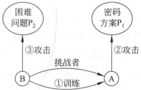
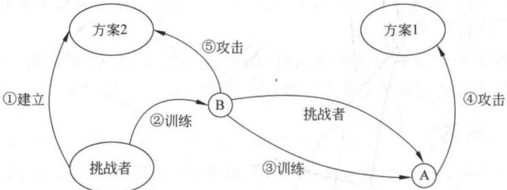
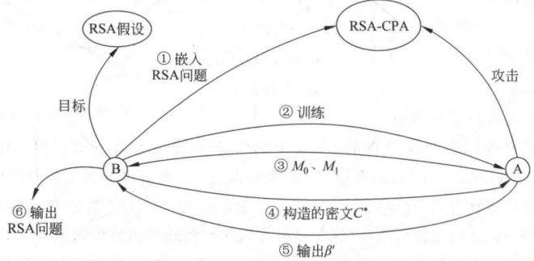
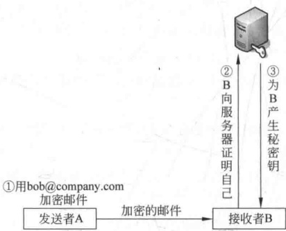
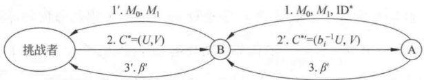
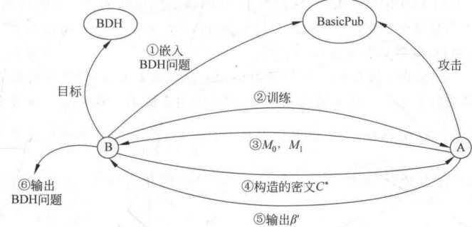
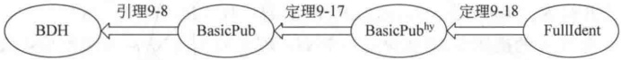
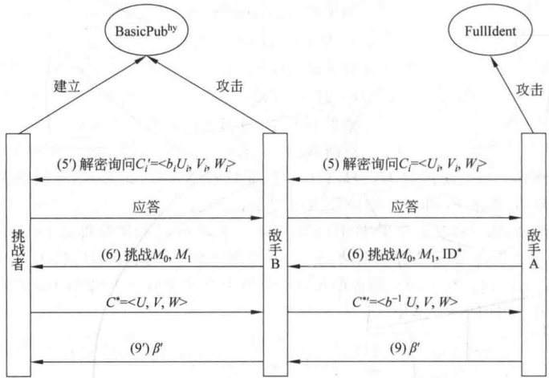
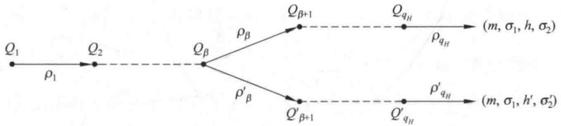

# 第9章 可证明安全

## 9.1 语义安全的公钥密码体制的定义

若定义公钥加密方案的安全性为：如果敌手已知某个随机明文所对应的密文，不能得出明文的完整信息，那么这种定义是一个很弱的安全概念，因为敌手虽然不能得出明文的完整信息，但有可能得到明文的部分信息。一个安全的加密方案应使敌手通过密文得不到明文的任何部分信息，即使是1比特的信息。这就是加密方案语义安全的概念。此概念由Goldwasser和Micali于1984年提出，这一概念的提出开创了可证明安全性领域的先河，奠定了现代密码学理论的数学基础，将密码学从一门艺术变为一门科学。

加密方案语义安全的概念由不可区分性(Indistinguishability)游戏(简称IND游戏)来刻画，这种游戏是一种思维实验，其中有两个参与者：一个称为挑战者(challenger)，另一个是敌手。挑战者建立系统，敌手对系统发起挑战，挑战者接受敌手的挑战。加密方案语义安全的概念根据敌手的模型具体又分为在选择明文攻击下的不可区分性、在选择密文攻击下的不可区分性、在适应性选择密文攻击下的不可区分性。

### 9.1.1 选择明文攻击下的不可区分性

1. 选择明文攻击下的不可区分性定义

公钥加密方案在选择明文攻击(Chosen Plaintext Attack, CPA)下的 IND 游戏(称为 IND-CPA 游戏)如下：

（1）初始化。挑战者产生系统 II，敌手（表示为A）获得系统的公开钥。

（2）敌手产生明文消息，得到系统加密后的密文（可多项式有界次）。

（3）挑战。敌手输出两个长度相同的消息 $M_{0}$和 $M_{1}$。挑战者随机选择 $\beta\leftarrow_{R}\{0,1\}$，将 $M_{\beta}$加密，并将密文 $C^{*}$（称为目标密文）给敌手。

（4）猜测。敌手输出 $\beta^{\prime}$，如果 $\beta^{\prime}=\beta$，则敌手攻击成功。

敌手的优势定义为参数 $\kappa$的函数：

$$\mathrm{Adv}_{\pi,\mathrm{A}}^{\mathrm{CPA}}(\kappa)=\left|\Pr[\beta^{\prime}=\beta]-\frac{1}{2}\right|$$

其中， $\kappa$ 是安全参数，用来确定加密方案密钥的长度。因为任一个不作为的敌手 A，都能通过对  $\beta$ 做随机猜测，而以  $\frac{1}{2}$ 的概率赢得 IND-CPA 游戏。而  $\left|\Pr[\beta^{\prime}=\beta]-\frac{1}{2}\right|$ 是敌手通过努力得到的，故称为敌手的优势。

因为

$$\begin{aligned}\left|\Pr[\beta^{\prime}=\beta]-\frac{1}{2}\right|&=\left|\Pr[\beta=0]\Pr[\beta^{\prime}=\beta\mid\beta=0]+\Pr[\beta=1]\Pr[\beta^{\prime}=\beta\mid\beta=1]-\frac{1}{2}\right|\\&=\left|\Pr[\beta=0]\Pr[\beta^{\prime}=0\mid\beta=0]+\Pr[\beta=1]\Pr[\beta^{\prime}=1\mid\beta=1]-\frac{1}{2}\right|\\&=\left|\frac{1}{2}[1-\Pr[\beta^{\prime}=1\mid\beta=0]]+\frac{1}{2}\Pr[\beta^{\prime}=1\mid\beta=1]-\frac{1}{2}\right|\\&=\frac{1}{2}\left|\Pr[\beta^{\prime}=1\mid\beta=1]-\Pr[\beta^{\prime}=1\mid\beta=0]\right|\\ \end{aligned}$$

敌手的优势也可定义为：

$$\mathrm{Adv}_{\pi,\mathrm{A}}^{\mathrm{CPA}}(\kappa)=\mid\Pr[\beta^{\prime}=1\mid\beta=1]-\Pr[\beta^{\prime}=1\mid\beta=0]$$

只不过这种定义的优势是式(9-1)的2倍。

上述IND-CPA游戏可形式化地描述如下，其中，公钥加密方案是三元组 $\Pi=(\mathrm{KeyGen},E,D)$，游戏的主体是挑战者。

$$\begin{aligned}&\underline{\mathrm{Exp}_{\pi,\mathrm{A}}^{\mathrm{CPA}}(\kappa)}：\\&\quad(\mathrm{pk},\mathrm{sk})\leftarrow\operatorname{KeyGen}(\kappa)；\\&\quad(M_{0},M_{1})\leftarrow\mathrm{A}(\mathrm{pk}), 其中 ,\mid M_{0}\mid=\mid M_{1}\mid；\\&\beta\leftarrow_{R}\left\{0,1\right\},C^{*}=E_{\mathrm{pk}}(M_{\beta})；\\&\beta^{\prime}\leftarrow\mathrm{A}(\mathrm{pk},C^{*})；\\ \end{aligned}$$

如果  $\beta^{\prime} = \beta$，则返回 1；否则返回 0.

敌手的优势定义为

$$\mathrm{Adv}_{\pi,\mathrm{A}}^{\mathrm{CPA}}(\kappa)=\left|\Pr[\mathrm{Exp}_{\pi,\mathrm{A}}^{\mathrm{CPA}}(\kappa)=1]-\frac{1}{2}\right|$$

或者，在 $\beta^{\prime}\leftarrow\mathrm{A}(\mathrm{pk},C^{*})$后，返回 $\beta^{\prime}$，则优势按式（9-2）定义。

定义 9-1 如果对任何多项式时间的敌手 A，存在一个可忽略的函数  $\varepsilon(\kappa)$，使得  $\text{Adv}_{\Pi,A}^{\text{CPA}}(\kappa) \leqslant \varepsilon(\kappa)$，那么就称这个加密算法  $\Pi$ 是语义安全的，或者称为在选择明文攻击下具有不可区分性，简称为 IND CPA 安全。

如果敌手通过  $M_{\beta}$ 的密文能得到  $M_{\beta}$ 的一个比特，就有可能区分  $M_{\beta}$ 是  $M_{0}$ 还是  $M_{1}$，因此 IND 游戏刻画了语义安全的概念。

定义中需要注意以下几点：

（1）定义中敌手是多项式时间的，否则因为它有系统的公开钥，可得到  $M_{0}$ 和  $M_{1}$ 的任意多个密文，再和目标密文逐一进行比较，即可赢得游戏。

（2） $M_{0}$ 和  $M_{1}$ 是等长的，否则由密文，有可能区分  $M_{\beta}$ 是  $M_{0}$ 还是  $M_{1}$

（3）如果加密方案是确定的，如RSA算法、Rabin密码体制等，每个明文对应的密文只有一个，敌手只须重新对 $M_{0}$和 $M_{1}$加密后，与目标密文进行比较，即赢得游戏。因此语义安全性不适用于确定性的加密方案。

（4）与确定性加密方案相对的是概率性的加密方案，在每次加密时，首先选择一个随机数，再生成密文。因此同一明文在不同的加密中得到的密文不同，如 ElGamal 加密算法。

2. 群上的离散对数问题

群上的离散对数问题如下：给定群G的生成元 $g$和G中的随机元素 $h$，计算 $\log_g(h)$。这个问题在许多群中都被认为是“困难的”，称其为群上的离散对数假设。下面令GroupGen是一个多项式时间算法，其输入为安全参数 $\kappa$，输出为一个阶等于q的循环群G的描述（G的描述包括它的阶 $q$， $|q|=\kappa$且 $q$不一定是素数）以及一个生成元 $g \in G$。GroupGen的离散对数假设定义如下：

定义 9-2 GroupGen 的离散对数问题是困难的，如果对于所有的 PPT 算法 A，下式是可忽略的：

$$\Pr\left[\left(\mathbb{G},g\right)\leftarrow GroupGen(\kappa);h\leftarrow_{R}\mathbb{G};x\leftarrow A(\mathbb{G},g,h)\right. 使得 g^{x}=h]$$

如果 GroupGen 的离散对数问题是困难的，且 G 是一个由 GroupGen 输出的群，则称离散对数问题在 G 中是困难的。

例如，令 GroupGen 输入为  $\kappa$，输出一个长度为  $\kappa$ 的随机素数  $q$（可通过一个随机化算法有效地实现），令  $G = Z_q^*$，则  $G$ 是一个阶为  $q-1$ 的循环群，其上的离散对数即为 4.1.9 节介绍的离散对数问题，离散对数假设成立。

ElGamal 加密算法是 IND CPA 安全的。算法如下。

密钥产生过程：

$$\begin{aligned}&\underline{KeyGen}(\kappa):\\&\quad(G,g)\leftarrow GroupGen(\kappa);\\&\quad x\leftarrow_{R}\mathbb{Z}_{q},y=g^{x};\\&\quad pk=(G,g,y),sk=x.\end{aligned}$$

加密过程（其中， $M \in G$）：

$$\begin{array}{c}\underline{E_{pk}(M)}：\\r\leftarrow_{R}Z_{q};\end{array}$$

$$输出 (g^{r},y^{r}M).$$

解密过程：

$$\underline{D_{sk}(A,B)}：$$

$$输出 \frac{B}{A^{x}}.$$

这是因为 $\frac{B}{A^{x}}=\frac{y^{r}M}{(g^{r})^{x}}=\frac{y^{r}M}{(g^{x})^{r}}=\frac{y^{r}M}{y^{r}}=M$。

离散对数问题意味着给定公开钥，没有敌手能确定秘密钥。然而，这不足以保证方案是 IND CPA 安全的。实际上，我们能找到一个特殊的群，其上的离散对数假设成立，但建立在其上的 ElGamal 加密方案却不是 IND CPA 安全的。例如群  $Z_p^*(p$ 为素数）上的离散对数假定是成立的，但在多项式时间内可判定  $Z_p^*$ 中的元素是否为二次剩余。而且， $Z_p^*$ 中的生成元  $g$ 不可能是二次剩余，否则  $Z_p^*$ 中的元素都是二次剩余。这会导致针对 ElGamal 方案的一种直接攻击：敌手产生两个等长的消息  $(M_0, M_1)$ 使得  $M_0$ 是二次剩余， $M_1$ 是非二次剩余。给定密文  $(A, B)$，则存在  $r$，使得  $A = g^r$， $B = y^r M_\beta$。敌手可以在多项式时间内判定  $y^r$ 是否为二次剩余，例如  $A$ 是二次剩余，则存在一个  $a \in \mathbb{Z}_p^*$，使得  $a^2 = A$，将  $a$ 写成生成元  $g$ 的幂  $g^a$，那么  $A = g^{2a}$，所以  $r \equiv 2a \bmod (p-1)$。如果  $A$ 或  $y$ 是二次剩余，则  $x, r$ 至少有一个为偶数，所以  $y^r = g^{rr}$ 也是一个二次剩余。通过观察  $B$，敌手就能判定  $M_\beta$ 是否为二次剩余：如果  $y^r$ 是二次非剩余且  $B$ 是二次剩余，则  $M_\beta$ 必定是一个二次非剩余。进而就可以判断出加密的是哪个消息。

因此，为了证明 ElGamal 加密方案的语义安全性，需要一个更强的假设。

3. 判定性 Diffie-Hellman（DDH）假设

判定性 Diffie-Hellman(Decisional Diffie-Hellman, DDH)假设指的是区分元组 $(g, g^x, g^y, g^{xy})$和 $(g, g^x, g^y, g^z)$是困难的，其中， $g$是生成元， $x, y, z$是随机的。

定义 9-3 设G 是阶为大素数 q 的群，g 为G 的生成元， $x, y, z \leftarrow _R Z_q$。则以下两个分布：

随机四元组  $R = (g, g^x, g^y, g^z) \in \mathbb{G}^4$;

• 四元组  $D = (g, g^x, g^y, g^{xy}) \in \mathbb{G}^4$（称为 Diffie-Hellman 四元组）。是计算上不可区分的，称为 DDH 假设。

具体地说，对任一敌手 A，A 区分 R 和 D 的优势  $\mathrm{Adv}_{\mathrm{A}}^{\mathrm{DDH}}(\kappa)=\left|\operatorname{Pr}\left[\mathrm{A}(R)=1\right]-\operatorname{Pr}\left[\mathrm{A}(D)=1\right]\right|$ 是可忽略的。

定理 9-1 在 DDH 假设下，ElGamal 加密方案是 IND CPA 安全的。

证明（这里真正指的是如果 DDH 假设对于 GroupGen 成立，且该算法用于 ElGamal 加密方案的密钥生成阶段，则 ElGamal 加密方案的特定实例是 IND CPA 安全的。）

假设一个 PPT 敌手 A 攻击 ElGamal 加密方案的 IND CPA 安全性。这意味着 A 输出等长消息  $M_{0}$ 和  $M_{1}$，得到  $M_{\beta}$ 的密文，输出猜测  $\beta^{\prime}$。若  $\beta^{\prime} = \beta$，则 A 成功（用 Succ 来表示该事件）。

下面构造一个敌手B，B利用A来攻击DDH假设。设B的输入为四元组 $T=(g_{1}, g_{2}, g_{3}, g_{4})$，群G及其生成元g是公开的。B的构造如下：

$$\begin{aligned}&\underline{B(T)}：\\&\mathrm{pk}=(g_{1},g_{2})；\\&(M_{0},M_{1})\leftarrow A(\mathrm{pk})；\\&\beta\leftarrow_{R}\{0,1\}；\\&C^{*}=(g_{3},g_{4}M_{\beta})；\\&\beta^{\prime}\leftarrow A(\mathrm{pk},C^{*})；\\& 如果 \beta^{\prime}=\beta 则输出 1\end{aligned}$$

当输出为1时，B猜测输入的四元组 $T=(g_{1},g_{2},g_{3},g_{4})$是DH四元组，输出为0时，B猜测输入的四元组 $T=(g_{1},g_{2},g_{3},g_{4})$是随机四元组。

令 R 表示事件： $(g_{1}, g_{2}, g_{3}, g_{4})$ 是随机四元组；D 表示事件： $(g_{1}, g_{2}, g_{3}, g_{4})$ 是 DH 四元组。

首先证明  $\Pr[B(T)=1|\mathbf{R}]=\frac{1}{2}$。已知  $g_4$ 在 G 中均匀分布，独立于  $g_1, g_2, g_3$。所以密文的第二部分在G中均匀分布，独立于被加密的消息（即独立于 $\beta$）。因此，A没有 $\beta$的任何信息，即不能以超过1/2的概率来猜测 $\beta$。而B输出1当且仅当A成功，所以 $\Pr[B(T)=1|R]=\frac{1}{2}$。

再证明  $\Pr[B(T)=1|D]=\Pr[Succ]$。因为事件 D 发生时， $g_2=g_1^x$， $g_3=g_1^r$， $g_4=g_1^{rr}=g_2^r$（ $x$ 和  $r$ 是随机选取的）。而公开钥和密文的分布与 ElGamal 加密方案在实际执行是一样的，所以 B 输出 1 当且仅当 A 成功。

$$
\mathrm{Pr}[\mathrm{B}(T)=1]=\mathrm{Pr}[\mathrm{D}]\mathrm{Pr}[\mathrm{B}(T)=1|\mathrm{D}]+\mathrm{Pr}[\mathrm{R}]\mathrm{Pr}[\mathrm{B}(T)=1|\mathrm{R}]=\frac{1}{2}\mathrm{Pr}[\mathrm{Succ}]+\frac{1}{2}\cdot\frac{1}{2},\mathrm{Pr}[\mathrm{B}(T)=0]=\mathrm{Pr}[\mathrm{D}]\mathrm{Pr}[\mathrm{B}(T)=0|\mathrm{D}]+\mathrm{Pr}[\mathrm{R}]\mathrm{Pr}[\mathrm{B}(T)=0|\mathrm{R}]=\frac{1}{2}[1-\mathrm{Pr}[\mathrm{Succ}]]+\frac{1}{2}\cdot\frac{1}{2},
$$

所以

$$
\left|\mathrm{Pr}[\mathrm{B}(T)=1]-\mathrm{Pr}[\mathrm{B}(T)=0]\right|=\left|\mathrm{Pr}[\mathrm{Succ}]-\frac{1}{2}\right|.
$$

即如果A能以某个不可忽略的优势$\varepsilon(\kappa)$攻击ElGamal加密方案，则B可以相同的优势攻击DDH假设。

注意两个事件 B(T)=0 与 B( $\overline{T}$)=1 一样，所以  $\left|\Pr[B(T)=1]-\Pr[B(T)=0]\right|$ 与定义 9-3 中优势的定义一致。 （定理 9-1 证毕）

### 9.1.2 公钥加密方案在选择密文攻击下的不可区分性

IND CPA 安全仅保证敌手是完全被动的情况时（即仅做监听）的安全，不能保证敌手是主动情况时（例如向网络中注入消息）的安全。

例如，在 ElGamal 加密方案中，敌手收到密文为  $\mathrm{CT}=(C_{1}, C_{2})$，构造新的密文  $\mathrm{CT}^{\prime}=(C_{1}, C_{2}^{\prime})$，其中， $C_{2}^{\prime} = C_{2}M^{\prime}$，解密询问后得到  $M^{\prime\prime} = MM^{\prime}$。或者构造新的密文  $\mathrm{CT}^{\prime\prime} = (C_{1}, C_{2}^{\prime})$，其中， $C_{1}^{\prime} = C_{1}g^{k^{\prime}}$， $C_{2}^{\prime} = C_{2}y^{k^{\prime}}$，此时

$$C^{\prime \prime}_{1}=g^{k}g^{k^{\prime \prime}}=g^{k+k^{\prime \prime}},\quad C^{\prime \prime}_{2}=y^{k}My^{k^{\prime \prime}}M^{\prime}=y^{k+k^{\prime \prime}}MM^{\prime}$$

解密询问后仍得到  $M^{\prime\prime} = MM^{\prime}$。再由  $\frac{M^{\prime\prime}}{M^{\prime}} \mod p$，得到 CT 的明文 M。

可见，ElGamal加密算法不能抵抗主动攻击。

再看一例，假如在密封递价拍卖中使用 ElGamal 加密方案。密封递价拍卖就是竞价人把自己的竞价加密后公开发给拍卖人，由拍卖人比较所有竞价，价高者获胜。这样的拍卖方式不允许竞价人看到别人的价格之后加价，而是自己给出自己的评估价格，避免恶意竞争。

假设拍卖者的公钥是  $\mathrm{pk}=(g,y=g^{x})$，第一个竞价人发送的竞价为 M，使用 ElGamal 加密方案加密后公开发送给拍卖者，那么只要第二个竞价人看到第一个竞价人的密文，他可以提交如下的密文来竞价：

| 竞价人1 | C←(g^r,y^r·M) | C=(C_1,C_2)→ | 拍卖人解密得到M |
| --- | --- | --- | --- |
| 竞价人2 | C&#x27;=(C_1,C_2·α) | C&#x27;→ | 拍卖人解密得到M&#x27;=M·α |

这样的话，即使第二个竞价人不知道第一个竞价人的价格，只要 $\alpha>1$，他就能保证自己的竞价大于第一个竞价人的竞价。

再比如使用 ElGamal 加密方案的信用卡验证系统，设用户的信用卡号为  $C_{1}, C_{2}, \cdots, C_{48}$（每个  $C_{i}$ 表示一个比特），用商家的公开钥 pk 逐比特加密：

$$E_{\mathrm{pk}}(C_{1}),E_{\mathrm{pk}}(C_{2}),E_{\mathrm{pk}}(C_{3}),\cdots,E_{\mathrm{pk}}(C_{48})$$

将密文发送给商家，然后商家回复接受或者拒绝，表示这个信用卡是否有效。敌手要获得信用卡号，只需要把第一个密文换成 $E_{pk}(0)$，然后提交给商家，商家如果接受，就说明第一位就是0；如果拒绝，就说明第一位是1。如此继续，就可以得到整个卡号。

为了描述敌手的主动攻击，1990年Naor和Yung提出了（非适应性）选择密文攻击（Chosen Ciphertext Attack，CCA）的概念，其中敌手在获得目标密文以前，可以访问解密谕言机（Oracle）。敌手获得目标密文后，希望获得目标密文对应的明文的部分信息。

IND 游戏（称为 IND-CCA 游戏）如下：

（1）初始化。挑战者产生系统 II，敌手获得系统的公开钥。

（2）训练。敌手向挑战者（或解密谕言机）做解密询问（可为多项式有界次），即取密文CT给挑战者，挑战者解密后，将明文给敌手。

（3）挑战。敌手输出两个长度相同的消息  $M_{0}$ 和  $M_{1}$，再从挑战者接收  $M_{\beta}$ 的密文，其中随机值  $\beta \leftarrow _{R}(0,1)$。

（4）猜测。敌手输出 $\beta^{\prime}$，如果 $\beta^{\prime}=\beta$，则敌手攻击成功。

以上攻击过程也称为“午餐时间攻击”或“午夜攻击”，相当于有一个执行解密运算的黑盒，掌握黑盒的人在午餐时间离开后，敌手能使用黑盒对自己选择的密文解密。午餐过后，给敌手一个目标密文，敌手试图对目标密文解密，但不能再使用黑盒了。

第(2)步可以形象地看作敌手发起攻击前对自己的训练(自学)，这种训练可通过挑战者，也可通过解密谕言机进行。谕言机也称为神谕、神使或传神谕者，神谕是古代希腊的一种迷信活动，由女祭祀代神传谕，解答疑难者的叩问，她们被认为是在传达神的旨意。因为在IND-CCA游戏中，除了要求敌手是多项式时间的，不能对敌手的能力做任何限制，敌手除了自己有攻击IND-CCA游戏的能力外，可能还会借助外力，这个外力是谁？是他人还是神，我们不知道，所以统称为谕言机。

敌手的优势定义为安全参数 $\kappa$的函数：

$$\mathrm{Adv}_{\pi,\mathrm{A}}^{\mathrm{CCA}}(\kappa)=\left|\Pr[\beta^{\prime}=\beta]-\frac{1}{2}\right|$$

上述IND-CCA游戏可形式化地描述如下，其中，公钥加密方案是三元组 $\Pi=(\mathrm{KeyGen},E,D)$。

$$\begin{aligned}&\underline{\mathrm{Exp}_{n,\mathrm{A}}^{CCA}(\kappa)}：\\&\text{(pk,sk)}\leftarrow\operatorname{KeyGen}(\kappa)；\\&\left(M_{0},M_{1}\right)\leftarrow\mathrm{A}^{D_{sk}(\cdot)}(\mathrm{pk}), 其中 ,\left|M_{0}\right|=\left|M_{1}\right|；\\&\beta\leftarrow_{R}\left\{0,1\right\},C^{*}=E_{pk}\left(M_{\beta}\right)；\\&\beta^{\prime}\leftarrow\mathrm{A}(pk,C^{*})；\end{aligned}$$

如果  $\beta^{\prime} = \beta$，则返回 1；否则返回 0.

敌手的优势定义为

$$\mathrm{Adv}_{\pi,\mathrm{A}}^{\mathrm{CCA}}(\kappa)=\left|\Pr[\mathrm{Exp}_{\pi,\mathrm{A}}^{\mathrm{CCA}}(\kappa)=1]-\frac{1}{2}\right|$$

游戏中 $(M_{0}, M_{1}) \leftarrow A^{D_{sk}(\cdot)}$ (pk)表示敌手的输入是pk，在访问解密谕言机 $D_{sk}(\cdot)$后，输出 $(M_{0}, M_{1})$。

定义 9-4 如果对任何多项式时间的敌手 A，存在一个可忽略的函数  $\varepsilon(\kappa)$，使得  $\mathrm{Adv}_{\Pi,A}^{\mathrm{CCA}}(\kappa) \leqslant \varepsilon(\kappa)$，那么就称这个加密算法  $\Pi$ 在选择密文攻击下具有不可区分性，或者称为 IND-CCA 安全的。

### 9.1.3 公钥加密方案在适应性选择密文攻击下的不可区分性

1991年，Dolev、Dwork、Naor以及Sahai提出了适应性选择密文攻击（Adaptive Chosen Ciphertext Attack，CCA2）的概念，敌手获得目标密文后，可以向网络中注入消息（可以和目标密文相关），然后通过和网络中的用户交互，获得与目标密文相应的明文的部分信息。

IND 游戏（称为 IND-CCA2 游戏）如下：

（1）初始化。挑战者产生系统 II，敌手获得系统的公开钥。

（2）训练阶段1。敌手向挑战者（或解密谕言机）做解密询问（可为多项式有界次），即取密文CT给挑战者，挑战者解密后，将明文给敌手。

（3）挑战。敌手输出两个长度相同的消息  $M_{0}$ 和  $M_{1}$，再从挑战者接收  $M_{\beta}$ 的密文  $C^{*}$，其中，随机值  $\beta \leftarrow _{R}\{0,1\}$。

（4）训练阶段2。敌手继续向挑战者（或解密谕言机）做解密询问（可为多项式有界次），即取密文CT给挑战者 $(CT \neq C^{*})$，挑战者解密后将明文给敌手。

（5）猜测。敌手输出 $\beta^{\prime}$，如果 $\beta^{\prime}=\beta$，则敌手攻击成功。

敌手的优势定义为安全参数 $\kappa$的函数：

$$\mathrm{Adv}_{\mathrm{II},\mathrm{A}}^{\mathrm{CCA2}}(\kappa)=\left|\Pr[\beta^{\prime}=\beta]-\frac{1}{2}\right|$$

上述IND-CCA2游戏可形式化地描述如下，其中，公钥加密方案是三元组 $\Pi=\left(\text{KeyGen},E,D\right)$。

$$\begin{array}{l}\underline{\mathrm{Exp}_{\pi,\mathrm{A}}^{\mathrm{CCA2}}(\kappa)}:\quad\\ (\mathrm{p k},\mathrm{s k})\leftarrow\operatorname{KeyGen}(\kappa);\end{array}$$

$$(M_{0},M_{1})\leftarrow\mathrm{A}^{D_{sk}(\cdot)}(\mathrm{pk}), 其中 ,\mid M_{0}\mid=\mid M_{1}\mid；$$

$$\beta\leftarrow_{R}\left\{0,1\right\},C^{*}=E_{pk}\left(M_{\beta}\right);$$

$$\beta^{\prime}\leftarrow\mathrm{A}^{D_{\mathrm{sk}}\neq C^{*}}\left(\mathrm{p k},C^{*}\right);$$

如果 $\beta^{\prime}=\beta$，则返回1；否则返回0.

其中  $D_{sk,\neq C^{*}}(\cdot)$ 表示敌手不能向解密谕言机  $D_{sk}(\cdot)$ 询问  $C^{*}$ 。敌手的优势定义为

$$\mathrm{Adv}_{\pi,\mathrm{A}}^{\mathrm{CCA2}}(\kappa)=\left|\Pr[\mathrm{Exp}_{\pi,\mathrm{A}}^{\mathrm{CCA2}}(\kappa)=1]-\frac{1}{2}\right|$$

定义 9-5 如果对任何多项式时间的敌手 A，存在一个可忽略的函数  $\varepsilon(\kappa)$，使得

 $\mathrm{Adv}_{\Pi,\mathrm{A}}^{\mathrm{CCA2}}(\kappa)\leqslant\varepsilon(\kappa)$，那么就称这个加密算法 $\Pi$在适应性选择密文攻击下具有不可区分性，或者称为IND-CCA2安全的。

在设计抗击主动敌手的密码协议时（如数字签名、认证、密钥交换、多方计算等），IND-CCA2安全的密码系统是有力的密码原语 $^{①}$。

### 9.1.4 归约

归约是复杂性理论中的概念，如果一个问题  $P_{1}$ 归约到问题  $P_{2}$，且已知解决问题  $P_{1}$ 的算法  $M_{1}$，我们能构造另一算法  $M_{2}$， $M_{2}$ 可以用  $M_{1}$ 作为子程序，用来解决问题  $P_{2}$。把归约方法用在密码算法或安全协议的安全性证明，可把敌手对密码算法或安全协议（问题 $P_{1}$）的攻击归约到一些已经得到深入研究的困难问题（问题 $P_{2}$）。即如果敌手A能够对算法或协议发起有效的攻击，就可以利用A构造一个算法B来攻破困难问题，如图9-1所示，从而得出矛盾。根据反证法，敌手能够对算法或协议发起有效攻击的假设不成立。注意和反证法的区别，反证法是确定性的，而归约一般是概率性的。

**图 9-1 密码方案到困难问题的归约**

归约的效率问题：如果问题  $P_{1}$ 到问题  $P_{2}$ 有两种归约方法，而归约一的概率大于归约二的概率，则称归约一比归约二紧。“紧”是一个相对的概念。

一般地，为了证明方案1的安全性，我们可将方案1归约到方案2，即如果敌手A能够攻击方案1，则敌手B能够攻击方案2，其中方案2是已证明安全的，或是一困难问题，或是一密码本原 $^{②}$。

证明过程还是通过思维实验来描述，首先由挑战者建立方案2，方案2中的敌手用B表示，方案1中的敌手用A表示。B为了攻击方案2，它利用A作为子程序来攻击方案1。B为了利用A，它必须模拟A的挑战者对A加以训练，因此B又称为模拟器。过程如图9-2所示。

具体步骤如下：

（1）挑战者产生方案2的系统。

（2）敌手 B 为了攻击方案 2，接受挑战者的训练。

（3）B为了利用敌手A，对A进行训练，即作为A的挑战者。

（4）A 攻击方案 1 的系统。

（5）B利用A攻击方案1的结果，攻击方案2。

对于加密算法来说，图9-2中的方案1取为加密算法，如果其安全目标是语义安全，即敌手A攻击它的不可区分性，敌手B模拟A的挑战者，和A进行IND游戏。称此时A对方案1的攻击为模拟攻击。在这个过程中，B为了达到自己的目标，而利用A，A也许不愿意被 B 利用。但如果 B 的模拟使得 A 不能判别是和自己的挑战者交互还是和模拟的挑战者交互，则称 B 的模拟是完备的。

**图 9-2 两个方案之间的归约**

对于其他密码算法或密码协议来说，首先要确定它要达到的安全目标，如签名方案的不可伪造性等，然后构造一个形式化的敌手模型及思维实验，再利用概率论和计算复杂性理论，把对密码算法或密码协议的攻击归约到对已知困难问题的攻击。这种方法就是可证明安全性。

可证明安全性是密码学和计算复杂性理论的天作之合。过去几十年，密码学的最大进展是将密码学建立在计算复杂性理论之上，并且正是计算复杂性理论将密码学从一门艺术发展成为一门严格的科学。

## 9.2 语义安全的 RSA 加密方案

在 RSA 加密方案中，如果消息  $M$ 是  $Z_n^*$ 中均匀随机的，用公开钥  $(n,e)$ 对  $M$ 加密，则敌手不能恢复  $M$。然而如果敌手发起选择密文攻击，以上性质不再成立。例如，敌手截获密文  $CT \equiv M^e \bmod n$ 后，选择随机数  $r \leftarrow_R Z_n^*$，计算密文  $CT^{\prime} \equiv r^e \cdot CT \bmod n$，将  $CT^{\prime}$ 给挑战者，获得  $CT^{\prime}$ 的明文  $M^{\prime}$ 后，可由  $M \equiv M^{\prime} r^{-1} \bmod n$ 恢复  $M$，这是因为

$$M^{\prime}r^{-1}\equiv(CT^{\prime})^{d}r^{-1}\equiv(r^{e}M^{e})^{d}r^{-1}\equiv r^{e d}M^{e d}r^{-1}\equiv r M r^{-1}\equiv M\bmod n$$

为使 RSA 加密方案可抵抗敌手的选择明文攻击和选择密文攻击，需对其加以修改。

### 9.2.1 RSA 问题和 RSA 假设

RSA 问题：已知大整数  $n, e, y \leftarrow_{R} Z_n^*$，满足  ${1} < e < \varphi(n)$ 且  $\gcd(\varphi(n), e) = 1$，计算  $y^{\frac{1}{e}} \bmod n$。

RSA 假定：没有概率多项式时间的算法解决 RSA 问题。

### 9.2.2 选择明文安全的 RSA 加密

设 GenRSA 是 RSA 加密方案的密钥产生算法，它的输入为  $\kappa$，输出为模数 n（为 2 个κ 比特素数的乘积）、整数 e、d 满足  $ed \equiv 1 \bmod \varphi(n)$。又设  $H: \{0,1\}^{2\kappa} \to \{0,1\}^{l(\kappa)}$ 是一个哈希函数，其中， $l(\kappa)$ 是一个任意的多项式。

加密方案Ⅱ（称为RSA-CPA方案）如下：

密钥产生过程：

$$\begin{aligned}&\underline{KeyGen}(\kappa):\\ &\quad(n,e,d)\leftarrow GenRSA(\kappa);\\ \end{aligned}$$

$$\mathrm{pk}=(n,e),\mathrm{sk}=(n,d).$$

加密过程（其中  $M \in \{0,1\}^{l(\kappa)}$）：

$$E_{\mathrm{p k}}(M):$$

$$r\xleftarrow[R]{}\mathbb{Z}_{n}^{*};$$

$$输出 (r^{e}\bmod n,\ H(r)\textcircled{+}M).$$

解密过程：

$$\underline{D_{sk}(C_{1},C_{2})}$$

$$r=C_{1}^{d}\bmod n;$$

$$输出 H(r)\textcircled{+}C_{2}.$$

解密过程的正确性是显然的。

在对方案进行安全性分析时，将其中的哈希函数视为随机谕言机。随机谕言机（Random Oracle）是一个魔盒，对用户（包括敌手）来说，魔盒内部的工作原理及状态都是未知的。用户能够与这个魔盒交互，方式是向魔盒输入一个比特串x，魔盒输出比特串y（对用户来说，y是均匀分布的）。这一过程称为用户向随机谕言机的询问。

因为这种哈希函数工作原理及内部状态是未知的，因此不能用通常的公开哈希函数。在安全性的归约证明中（见图9-2），敌手A需要哈希函数值时，只能由敌手B为他产生。之所以以这种方式使用哈希函数，是因为B要把欲攻击的困难问题嵌入哈希函数值中。这种安全性称为随机谕言机模型下的。如果不把哈希函数当作随机谕言机，则安全性称为标准模型下的。

定理 9-2 设 H 是一个随机谕言机，如果与 GenRSA 相关的 RSA 问题是困难的，则 RSA-CPA 方案  $\Pi$ 是 IND-CPA 安全的。

具体来说，假设存在一个 IND-CPA 敌手 A 以  $\varepsilon(\kappa)$ 的优势攻破 RSA-CPA 方案  $\Pi$，那么一定存在一个敌手 B 至少以

$$\mathrm{A d v}_{\mathrm{B}}^{\mathrm{R S A}}(\kappa)\geqslant2\varepsilon(\kappa)$$

的优势解决 RSA 问题。

证明  $\Pi$ 的 IND-CPA 游戏如下：

$$\begin{aligned}&\underline{\mathrm{Exp}_{\pi,\mathrm{A}}^{\mathrm{RSA-CPA}}(\kappa)}:\\&\quad(n,e,d)\leftarrow GenRSA(\kappa);\\&\quad\mathrm{pk}=(n,e),\mathrm{sk}=(n,d);\\&\quad H\leftarrow_{R}\left\{H:\left\{0,1\right\}^{2\kappa}\rightarrow\left\{0,1\right\}^{l(\kappa)}\right\};\end{aligned}$$

 $(M_{0},M_{1})\leftarrow\mathrm{A}^{H(\cdot)}(\mathrm{pk})$，其中， $\mid M_{0}\mid=\mid M_{1}\mid=l(\kappa)$;

$$\beta\leftarrow_{R}\left\{0,1\right\},r\leftarrow_{R}\mathbb{Z}_{n}^{*},C^{*}=(r^{e}\bmod n,H(r)\oplus M_{\beta});$$

$$\beta^{\prime}\leftarrow\mathrm{A}^{H(\cdot)}(\mathrm{p k},C^{*});$$

如果  $\beta^{\prime} = \beta$，则返回 1；否则返回 0

其中， $\{H:\{0,1\}^{2\kappa}\to\{0,1\}^{l(\kappa)}\}$ 表示  $\{0,1\}^{2\kappa}$ 到  $\{0,1\}^{l(\kappa)}$ 的哈希函数族。敌手的优势定义为安全参数  $\kappa$ 的函数：

$$\mathrm{Adv}_{\pi,\Lambda}^{\mathrm{RSA-CPA}}(\kappa)=\left|\Pr\left[\mathrm{Exp}_{\pi,\Lambda}^{\mathrm{RSA-CPA}}(\kappa)=1\right]-\frac{1}{2}\right|$$

下面证明 RSA-CPA 方案可归约到 RSA 假设。

敌手 B 已知  $(n, e, \hat{c}_1)$，以 A（攻击 RSA-CPA 方案）作为子程序，进行如下过程（见图 9-3），目标是计算  $\hat{r} \equiv (\hat{c}_1)^{\frac{1}{e}} \bmod n$。

**图 9-3 RSA-CPA 方案到 RSA 的归约**

（1）选取一个随机串 $\hat{h}\leftarrow_{R}\left\{0,1\right\}^{l(\kappa)}$，作为对 $H(\hat{r})$的猜测值（但是实际上B并不知道 $\hat{r}$）。将公开钥 $(n,e)$给A。

（2）H 询问：B 建立一个表  $H^{\text{list}}$（初始为空），元素类型  $(x_{i}, h_{i})$，A 在任何时候都能发出对  $H^{\text{list}}$ 的询问，B 做如下应答（设询问为 x）：

如果 x 已经在  $H^{list}$，则以  $(x,h)$ 中的 h 应答；

如果  $x^{\prime} \equiv \hat{c}_{1} \bmod n$，以  $\hat{h}$ 应答，将  $(x, \hat{h})$ 存入表中，并记下  $\hat{r} = x$。

否则随机选择  $h \leftarrow_{R} \{0,1\}^{l(\kappa)}$，以 h 应答，并将  $(x,h)$ 存入表中。

（3）挑战：A 输出两个要挑战的消息  $M_{0}$ 和  $M_{1}$，B 随机选择  $\beta\leftarrow_{R}\{0,1\}$，并令  $\hat{c}_{2}=\hat{h}\oplus M_{\beta}$，将  $(\hat{c}_{1},\hat{c}_{2})$ 给 A 作为密文。

（4）在 A 执行结束后（在输出其猜测  $\beta^{\prime}$ 之后），B 输出第（2）步记下的  $\hat{r}=x$

设H表示事件：在模拟中A发出 $H(\hat{r})$询问，即 $H(\hat{r})$出现在 $H^{list}$中。

断言9-1 在以上模拟过程中，B的模拟是完备的。

证明 在以上模拟中，A 的视图与其在真实攻击中的视图是同分布的。这是因为

（1）A的H询问中的每一个都是用随机值来回答的。而在A对 $\Pi$的真实攻击中，A得到的是H的函数值，由于假定H是随机谕言机，所以A得到的H的函数值是均匀的。

（2） $\hat{h}\oplus M_{\beta}$ 对 A 来说，为  $\hat{h}$ 对  $M_{\beta}$ 做一次一密加密。由  $\hat{h}$ 的随机性， $\hat{h}\oplus M_{\beta}$ 对 A 来说是随机的。

所以两种视图不可区分。

（断言9-1证毕）

断言 9-2 在上述模拟攻击中  $\Pr[\mathcal{H}] \geqslant 2\varepsilon$。

证明 显然有  $\Pr[\mathrm{Exp}_{\mathcal{H},A}^{\mathrm{RSA-CPA}}(\kappa)=1|\neg\mathcal{H}]=\frac{1}{2}$。又由 A 在真实攻击中的定义，可知 A 的优势大于等于  $\varepsilon$，得 A 在模拟攻击中的优势也为  $\left|\Pr[\mathrm{Exp}_{\mathcal{H},A}^{\mathrm{RSA-CPA}}(\kappa)=1]-\frac{1}{2}\right|\geqslant\varepsilon$。

$$\begin{aligned}&\Pr[\mathrm{Exp}_{\varPi,\mathrm{A}}^{\mathrm{RSA-CPA}}(\kappa)=1]\\ &=\Pr[\mathrm{Exp}_{\varPi,\mathrm{A}}^{\mathrm{RSA-CPA}}(\kappa)=1\mid\lnot\mathcal{H}]\Pr[\lnot\mathcal{H}]+\Pr[\mathrm{Exp}_{\varPi,\mathrm{A}}^{\mathrm{RSA-CPA}}(\kappa)=1\mid\mathcal{H}]\Pr[\mathcal{H}]\\ &\leqslant\Pr[\mathrm{Exp}_{\varPi,\mathrm{A}}^{\mathrm{RSA-CPA}}(\kappa)=1\mid\lnot\mathcal{H}]\Pr[\lnot\mathcal{H}]+\Pr[\mathcal{H}]=\frac{1}{2}\Pr[\lnot\mathcal{H}]+\Pr[\mathcal{H}]\\ &=\frac{1}{2}(1-\Pr[\mathcal{H}])+\Pr[\mathcal{H}]\\ &=\frac{1}{2}+\frac{1}{2}\Pr[\mathcal{H}]\\ \end{aligned}$$

又知：

$$\begin{aligned}\Pr[\mathrm{Exp}_{\mathcal{H},\mathrm{A}}^{\mathrm{RSA-CPA}}(\kappa)=1]\geqslant&\Pr[\mathrm{Exp}_{\mathcal{H},\mathrm{A}}^{\mathrm{RSA-CPA}}(\kappa)=1|\neg\mathcal{H}]\Pr[\neg\mathcal{H}]\\ =&\frac{1}{2}(1-\Pr[\mathcal{H}])=\frac{1}{2}-\frac{1}{2}\Pr[\mathcal{H}]\end{aligned}$$

所以  $\varepsilon \leqslant \left| \Pr[\mathrm{Exp}_{\mathcal{H},A}^{\mathrm{CPA}}(\kappa)=1] - \frac{1}{2} \right| \leqslant \frac{1}{2} \Pr[\mathcal{H}]$，即模拟攻击中  $\Pr[\mathcal{H}] \geqslant 2\varepsilon$。

（断言9-2证毕）

由以上两个断言，在上述模拟过程中 $\hat{r}$以至少 ${2}\varepsilon$的概率出现在 $H^{\text{list}}$。若 $\mathcal{H}$发生，则B在第(2)步可找到 $x$满足 $x^e = \hat{c}_1 \bmod n$，即 $x \equiv \hat{r} \equiv (\hat{c}_1)^{\frac{1}{e}} \bmod n$。所以B成功的概率与 $\mathcal{H}$发生的概率相同。（定理9-2证毕）

定理 9-2 已证明 $\Pi$ 是 IND-CPA 安全的，然而它不是 IND-CCA 安全的。敌手已知密文 $\mathrm{CT}=(C_{1}, C_{2})$，构造 $\mathrm{CT}^{\prime}=(C_{1}, C_{2} \oplus M^{\prime})$，给解密谕言机，收到解密结果为 $M^{\prime\prime} = M \oplus M^{\prime}$，再由 $M^{\prime\prime} \oplus M^{\prime}$ 即获得 CT 对应的明文 $M$。

### 9.2.3 选择密文安全的 RSA 加密

因为选择密文安全的单钥加密方案的构造较容易，本节利用选择密文安全的单钥加密方案构造选择密文安全的公钥加密方案。

单钥加密方案  $\Pi=\left(\text{PrivGen},\text{Enc},\text{Dec}\right)$ 的选择密文安全性由以下 IND-CCA 游戏来刻画。

$$\frac{\mathrm{Exp}_{\mathcal{II},\mathrm{A}}^{\mathrm{Priv-CCA}}(\kappa)}{k_{\mathrm{priv}}\leftarrow\mathrm{PrivGen}(\kappa)};$$

$$(M_{0},M_{1})\leftarrow\mathrm{A}^{\mathrm{Enc}_{k\mathrm{priv}}(\cdot),\mathrm{Dec}_{k\mathrm{priv}}(\cdot)}, 其中 ,|M_{0}|=|M_{1}|=l(\kappa);$$

$$\beta\leftarrow_{R}\left\{0,1\right\},C^{*}=Enc_{k_{priv}}\left(M_{\beta}\right);$$

$$\beta^{\prime}\leftarrow\mathrm{A}^{\mathrm{Enc}_{k_{\mathrm{priv}}}^{(*)}, \mathrm{Dec}_{k_{\mathrm{priv}}}\neq C^{\star}}(C^{\star});$$

如果 $\beta^{\prime}=\beta$，则返回1；否则返回0.

其中， $\mathrm{Dec}_{k_{\mathrm{priv}}, \neq C^{*}}(\cdot)$ 表示敌手不能对  $C^{*}$ 访问  $\mathrm{Dec}_{k_{\mathrm{priv}}}(\cdot)$。敌手的优势可定义为安全参数  $\kappa$ 的函数：

$$\mathrm{Adv}_{\mathrm{II},\mathrm{A}}^{\mathrm{Priv-CCA}}(\kappa)=\left|\Pr[\mathrm{Exp}_{\mathrm{II},\mathrm{A}}^{\mathrm{Priv-CCA}}(\kappa)=1]-\frac{1}{2}\right|$$

单钥加密方案  $\Pi$ 的安全性定义与定义 9-1、定义 9-4、定义 9-5 类似。

设 GenRSA 及 H 如前， $\Pi=(\mathrm{PrivGen},\mathrm{Enc},\mathrm{Dec})$ 是一个密钥长度为  $\kappa$，消息长度为  $l(\kappa)$ 的 IND-CCA 安全的单钥加密方案。

选择密文安全的 RSA 加密方案  $\Pi^{\prime} = (\text{KeyGen}, E, D)$（称为 RSA-CCA 方案）构造如下：

密钥产生过程：

$$\begin{aligned}&\underline{KeyGen(\kappa)}:\\&\quad(n,e,d)\leftarrow GenRSA(\kappa);\\&\quad pk=(n,e),sk=(n,d).\end{aligned}$$

加密过程（其中， $M \in \{0,1\}^{l(\kappa)}$）：

$$E_{\mathrm{p k}}(M):$$

$$r\xleftarrow[R]{}\mathbb{Z}_{n}^{*}\;;$$

$$h=H\left(r\right);$$

$$输出 (r^{e}\bmod n,Enc_{h}(M)).$$

解密过程：

$$\begin{aligned}&\underline{D_{sk}(C_{1},C_{2})：}\\ &\quad r=C_{1}^{d}\bmod n；\\ &\quad h=H(r)；\\ &\quad 输出 Dec_{h}(C_{2}).\\ \end{aligned}$$

定理 9-3 设 H 是随机谕言机，如果与 GenRSA 相关的 RSA 问题是困难的，且  $\Pi$ 是 IND-CCA 安全的，则 RSA-CCA 方案  $\Pi^{\prime}$ 是 IND-CCA 安全的。

具体来说，假设存在一个 IND-CCA 敌手 A 以  $\varepsilon(\kappa)$ 的优势攻破 RSA-CCA 方案  $\Pi^{\prime}$，那么一定存在一个敌手 B 至少以

$$\mathrm{Adv}_{\mathrm{B}}^{\mathrm{RSA}}(\kappa)\geqslant2\varepsilon(\kappa)$$

的优势解决 RSA 问题。

证明  $\Pi^{\prime}$ 的 IND-CCA 游戏如下：

$$\begin{aligned}&\underline{\mathrm{Exp}_{\pi^{\prime},\mathrm{A}}^{\mathrm{RSA-CCA}}(\kappa)}：\\ &\left(n,e,d\right)\leftarrow GenRSA(\kappa)；\\ &\mathrm{pk}=\left(n,e\right),\mathrm{sk}=\left(n,d\right)；\\ &H\leftarrow_{R}\left\{H:\left\{0,1\right\}^{2\kappa}\rightarrow\left\{0,1\right\}^{l(\kappa)}\right\};\\ \end{aligned}$$

$$(M_{0},M_{1})\leftarrow\mathrm{A}^{D_{sk}(\cdot),H(\cdot)}(\mathrm{pk}), 其中 \mid M_{0}\mid=\mid M_{1}\mid=l(\kappa)；$$

$$\beta\leftarrow_{R}\left\{0,1\right\},r\leftarrow_{R}\mathbb{Z}_{n}^{*},C^{*}=(r^{e}\bmod n,\operatorname{E n c}_{H(r)}^{\prime}(M_{\beta}));$$

$$\beta^{\prime}\leftarrow\mathrm{A}^{D_{\mathrm{sk},\neq C^{*}}(\bullet),H(\bullet)}(\mathrm{pk},C^{*});$$

如果 $\beta^{\prime}=\beta$，则返回1；否则返回0.

其中， $D_{sk,\neq C}$。（·）表示敌手不能对  $C^{*}$ 访问  $D_{sk}(\cdot)$。敌手的优势定义为安全参数  $\kappa$ 的函数：

$$\mathrm{Adv}_{\pi^{\prime},\mathrm{A}}^{\mathrm{RSA-CCA}}(\kappa)=\left|\Pr[\mathrm{Exp}_{\pi^{\prime},\mathrm{A}}^{\mathrm{RSA-CCA}}(\kappa)=1]-\frac{1}{2}\right|$$

下面证明 RSA-CCA 方案可归约到 RSA 问题。

敌手 B 已知  $(n, e, \hat{c}_1)$，以 A（攻击 RSA-CCA 方案  $\Pi^{\prime}$）作为子程序，执行以下过程（在图 9-3 中，将 RSA-CPA 改为 RSA-CCA），目标是计算  $\hat{r} \equiv (\hat{c}_1)^{\frac{1}{e}} \bmod n$。

(1) 选取一个随机串  $\hat{h} \leftarrow_R \{0,1\}^{l(\kappa)}$，作为对  $H(\hat{r})$ 的猜测（但实际上 B 并不知道  $\hat{r}$）。将公开钥  $pk = (n, e)$ 给 A。

(2) H 询问：B 建立一个  $H^{\text{list}}$，元素类型为三元组  $(r, c_1, h)$，初始值为  $(*,\hat{c}_1,\hat{h})$，其中，* 表示该分量的值目前未知。A 在任何时候都能对  $H^{\text{list}}$ 发出询问。设 A 的询问是 r，B 计算  $c_1 \equiv r^e \bmod n$ 并做如下应答：

如果  $H^{list}$ 中有一项  $(r, c_{1}, h)$，则以 h 应答。

如果  $H^{\mathrm{list}}$ 中有一项  $(*, c_{1}, h)$，则以 h 应答并在  $H^{\mathrm{list}}$ 中以  $(r, c_{1}, h)$ 替换  $(*, c_{1}, h)$。

否则，选取一个随机数  $h \leftarrow _{R}\{0,1\}^{n}$，以 h 应答并在表中存储  $(r,c_{1},h)$。

（3）解密询问：

A向B发起询问 $\left(\bar{c}_{1},\bar{c}_{2}\right)$时，B应答如下：

如果  $H^{\text{list}}$ 中有一项，其第二元素为  $\bar{c}_{1}$（即该项为  $(\bar{r}, \bar{c}_{1}, \bar{h})$，其中， $\bar{r}^{e} \equiv \bar{c}_{1} \bmod n$，或者为  $(*, \bar{c}_{1}, \bar{h})$），则以  $\mathrm{Dec}_{\bar{h} (\bar{c}_{2})}$ 应答。

否则，选取一个随机数 $\bar{h} \leftarrow_R \{0,1\}^n$，以 $\mathrm{Dec}_{\bar{h}}(\bar{c}_2)$应答，并在 $H^{\mathrm{list}}$中存储 $(*, \bar{c}_1, \bar{h})$。

(4) 挑战：A 输出消息  $M_0, M_1 \in \{0,1\}^{l(k)}$。B 随机选取  $\beta \leftarrow_R \{0,1\}$，计算  $\hat{c}_2 = \mathrm{Enc}_{\hat{h}}(M_\beta)$。以  $(\hat{c}_1, \hat{c}_2)$ 应答 A。继续回答 A 的 H 询问和解密询问 (A 不能询问  $(\hat{c}_1, \hat{c}_2)$)。

（5）猜测：A 输出猜测  $\beta^{\prime}$。B 检查  $H^{list}$，如果有项  $(\hat{r}, \hat{c}_{1}, \hat{h})$，则输出  $\hat{r}$。

设H表示事件：在模拟中A发出 $H(\hat{r})$询问，即 $H(\hat{r})$出现在 $H^{list}$中。

断言9-3 在以上模拟过程中，B的模拟是完备的。

证明 在以上模拟中，A 的视图与其在真实攻击中的视图是同分布的。这是因为：

（1）A 的 H 询问中的每一个都是用随机值来回答的。

（2）B对A的解密询问的应答是有效的。B对 $\left(\bar{c}_{1},\bar{c}_{2}\right)$的应答为 $\mathrm{Dec}_{\bar{c}}\left(\bar{c}_{2}\right)$，根据 $H^{\mathrm{list}}$的构造， $\bar{h}$对应的 $\bar{r}$满足 $\bar{r}^{e}\equiv\bar{c}_{1}\bmod n$及 $\bar{h}=H(\bar{r})$，因而 $\mathrm{Dec}_{\bar{c}}\left(\bar{c}_{2}\right)$是有效的。

所以两种视图不可区分。

（断言9-3证毕）

断言 9-4 在上述攻击中  $\Pr[\mathcal{H}] \geqslant 2\varepsilon$。

证明 在上述攻击中，如果  $H(\hat{r})$ 不出现在  $H^{\text{list}}$ 中，则 A 未能得到  $\hat{h}$，由  $\hat{c}_2 = \text{Enc}_h(M_\beta)$ 及 Enc 的 IND-CCA 安全性，得  $\text{Pr}[\beta^{\prime} = \beta \mid \neg \mathcal{H}] = \frac{1}{2}$。其余部分与断言 9-2 的证明相同。

（断言9-4证毕）

由以上两个断言，在上述模拟过程中 $\hat{r}$以至少 ${2}\varepsilon$的概率出现在 $H^{\mathrm{list}}$，B在第(5)步逐一检查 $H^{\mathrm{list}}$中的元素，所以B成功的概率等于H的概率。（定理9-3证毕）

## 9.3 Paillier 公钥密码系统

9.2 节介绍的方案，其安全性证明是在随机谕言机模型下进行的，即把其中的哈希函数看成随机谕言机。但这种证明不能排除敌手可能不通过攻击方案所基于的困难性问题而攻击方案，或者不通过找出哈希函数的某种缺陷而攻击方案。下面介绍的 Paillier 公钥密码系统和 Cramer-Shoup 公钥密码系统，它们的安全性证明不使用随机谕言机模型，这种证明模型称为标准模型。

Paillier 公钥密码系统基于合数幂剩余类问题，即构造在模数取为  $n^{2}$ 的剩余类上，其中， $n=pq, p, q$ 为两个大素数。

设 CP 是一类问题集合，如果 CP 中的任一实例可在多项式时间内归约到另一实例或另外多个实例，就称 CP 是随机自归约的。CP 中问题的平均复杂度和最坏情况下的复杂度相同（相差多项式因子）。

### 9.3.1 合数幂剩余类的判定

定义 9-6 设  $n = pq$, p, q 为两个大素数，对  $z \leftarrow_R Z_{n^2}^*$，如果存在  $y \in Z_{n^2}^*$，使得  $z \equiv y^n \bmod n^2$，则  $z$ 称为模  $n^2$ 的  $n$ 次剩余。

引理9-1

（1）n 次剩余构成的集合 C 是  $Z_{n}^{*}{}_{\alpha}$ 的一个阶为  $\varphi(n)$ 的乘法子群；

（2）每一个n次剩余z有n个根，其中只有一个严格小于n；

（3）单位元1的n次根为 $(1+n)^{t}\equiv1+tn(\mod n^{2})(t=0,1,\cdots,n-1)$

（4）对任一  $w \in \mathbb{Z}_{n^{2}}^{*}$， $w^{n\lambda} \equiv 1 \bmod n^{2}$，其中， $\lambda$ 是 n 的卡米歇尔函数  $\lambda(n)$ 的简写。

证明 (1) 设  $z_1, z_2 \in C$，则存在  $y_1, y_2 \in \mathbb{Z}_{n_2^*}^*,$ 使得  $z_1 \equiv y_1^n \mod n^2, z_2 \equiv y_2^n \mod n^2$。因为  $y_2^{-1} \in \mathbb{Z}_{n_2^*}^*$,  $y_1 y_2^{-1} \in \mathbb{Z}_{n_2^*}^*$，所以  $z_1 z_2^{-1} \equiv (y_1 y_2^{-1})^n \mod n^2 \in C$，所以  $C$ 是  $\mathbb{Z}_{n_2^*}^*$ 的子群。又设  $y(y < n)$ 是  $z \equiv y^n \mod n^2$ 的解，那么  $y + t n(t = 0, \cdots, n-1)$ 都是  $z \equiv y^n \mod n^2$ 的解，这是因为

$$(y+tn)^{n}=y^{n}+ny^{n-1}tn=y^{n}+y^{n-1}tn^{2}\equiv y^{n}\bmod n^{2}\equiv z$$

所以 C 中每一元素有 n 个根，

$$\left|C\right|=\frac{1}{n}\left|\mathbb{Z}_{n^{2}}^{*}\right|=\frac{1}{n}\varphi(n^{2})=\frac{1}{n}n^{2}\left(1-\frac{1}{p}\right)\left(1-\frac{1}{q}\right)=(p-1)(q-1)=\varphi(n)$$

（2）在(1)的证明中已得。

(3) 易证  $(1+tn)^{n}=1+tn^{2}+\cdots\equiv1\bmod n^{2}$

（4）因为  $w^{\lambda} \equiv 1 \bmod n$,  $w^{\lambda} = 1 + tn$, t 为某个整数。

$$w^{n\lambda}=(1+tn)^{n}=1+tn^{2}+\cdots\equiv1\bmod n^{2}$$

（引理9-1证毕）

合数幂剩余类的判定问题是指区分模  $n^2$ 的  $n$ 次剩余与  $n$ 次非剩余，用  $\mathrm{CR}[n]$ 表示。 $\mathrm{CR}[n]$ 是随机自归约的：设  $z_1 \equiv y_1^n \mod n^2$， $z_2 \equiv y_2^n \mod n^2$，那么  $z_2 \equiv (y_2 y_1^{-1})^n z_1 \mod n^2$。所以如果  $z_1$ 是  $n$ 次剩余，则  $z_2$ 也是  $n$ 次剩余，即任意两个实例都是多项式等价的。

与素数剩余类的判定类似，判定合数幂剩余类也是困难的。

猜想 CR[n] 是困难的。

这个假设称为判定合数幂剩余类假设 DCRA（Decisional Composite Residuosity Assumption）。由于随机自归约性，DCRA 的有效性仅依赖于 n 的选择。

### 9.3.2 合数幂剩余类的计算

设  $g \in \mathbb{Z}_{n^2}^*, \phi_g$ 是如下定义的整型值函数：

$$\left\{\begin{aligned}&\mathcal{Z}_{n}\times\mathcal{Z}_{n}^{*}\mapsto\mathcal{Z}_{n^{2}}^{*}\\ &(x,y)\mapsto g^{x}\cdot y^{n}\bmod n^{2}\end{aligned}\right.$$

引理 9-2 如果 g 的阶是 n 的非零倍，则  $\psi_{g}$ 是双射。

证明 因为  $\left|Z_{n}\times Z_{n}^{*}\right|=\left|Z_{n^{2}}^{*}\right|=n\varphi(n)$，所以只须证明  $\psi_{g}$ 是单射。

假设  $g^{x_1} y_1^n \equiv g^{x_2} y_2^n \mod n^2$，那么  $g^{x_2 - x_1} \cdot \left( \frac{y_2}{y_1} \right)^n \equiv 1 \mod n^2$，两边同时取  $\lambda$ 次方，由引理 9-1(4)，得  $g^{\lambda(x_2 - x_1)} = 1 \mod n^2$，因此有  $\text{ord}_n^2 g \mid \lambda (x_2 - x_1)$，进而  $n \mid \lambda (x_2 - x_1)$，又知当  $n = pq$ 时， $(\lambda, n) = 1$，所以  $n \mid (x_2 - x_1)$。由  $x_1, x_2 \in \mathbb{Z}_n$， $|x_2 - x_1| < n$，所以  $x_1 = x_2$。 $g^{x_2 - x_1} \cdot \left( \frac{y_2}{y_1} \right)^n \equiv 1 \mod n^2$ 变为  $\left( \frac{y_2}{y_1} \right)^n \equiv 1 \mod n^2$，又由引理 9-1(3)，模  $n^2$ 下单位元 1 的根在  $\mathbb{Z}_n^*$ 上是唯一的，为 1，所以在  $\mathbb{Z}_n^*$ 上， $\frac{y_2}{y_1} = 1$，即  $y_1 = y_2$。综上， $\psi_g$ 是双射。

（引理9-2证毕）

设  $B_{\alpha} \subset Z_{n^2}^*$ 表示阶为  $n\alpha$ 的元素构成的集合，B 表示  $B_\alpha$ 的并集，其中， $\alpha=1,\cdots,\lambda$。

定义 9-7 设  $g \in B$，对于  $w \in \mathbb{Z}_{n^2}^*$，如果存在  $y \in \mathbb{Z}_n^*$ 使得  $\psi_g(x, y) = w$，则称  $x \in \mathbb{Z}_n$ 为  $w$ 关于  $g$ 的  $n$ 次剩余，记作  $[[w]]_g$。

引理9-3

(1)  $[[w]]_{g}=0$ 当且仅当 w 是模  $n^{2}$ 的 n 次剩余；

（2）对任意  $w_1, w_2 \in \mathbb{Z}_{n^2}^*$，有  $[[w_1 w_2]]_g \equiv[[w_1]]_g +[[w_2]]_g \bmod n$，即对于任意的  $g \in B$，函数  $w \mapsto[[w]]_g$ 是从  $(\mathbb{Z}_{n^2}^*, \times)$ 到  $(\mathbb{Z}_n, +)$ 的同态。

证明 证明很简单，略去。

已知  $w \in \mathbb{Z}_{n}^{s}$，求  $[[w]]_{g}$，称为基为 g 的 n 次剩余类问题，表示为 Class[n, g]。

引理 9-4 Class[n,g] 关于  $w \in \mathbb{Z}_{n}^{*}{}_{\alpha}$ 是随机自归约的。

证明 对于 Class $[n,g]$ 的任一实例  $w \in \mathbb{Z}_{n^2}^*$，在  $Z_n$ 上均匀随机选取  $\alpha, \beta$ ( $\beta \notin \mathbb{Z}_n^*$ 的概率是可忽略的)，构造  $w^{\prime} \equiv w g^\alpha \beta^n \mod n^2$，则将  $w \in \mathbb{Z}_{n^2}^*$ 转换为另一实例  $w^{\prime} \in \mathbb{Z}_{n^2}^*$，求出  $[[w^{\prime}]]_g$ 后，可计算出  $[[w]]_g = [[w^{\prime}]]_g - \alpha \bmod n$。 （引理 9-4 证毕）

引理 9-5 Class[n,g] 关于  $g \in B$ 是随机自归约的，即

$$g_{1},g_{2}\in B,\operatorname{Class}[n,g_{1}]\equiv\operatorname{Class}[n,g_{2}]$$

其中，符号  $P_{1} \equiv P_{2}$ 表示问题  $P_{1}$ 和  $P_{2}$ 在多项式时间内等价。

证明 已知  $w \in \mathbb{Z}_{n^2}^*, g_2 \in B$，存在  $y_1 \in \mathbb{Z}_n^*$，使得  $w = g_2^{[[w]]_{g_2}} \cdot y_1^n$。同理对于  $g_1$， $g_2 \in B$，存在  $y_2 \in \mathbb{Z}_n^*$， $g_2 = g_1^{[[g_2]]_{g_1}} \cdot y_2^n$。得  $w = g_1^{[[w]]_{g_2}} \cdot [[g_2]]_{g_1} \cdot (y_2^{[[w]]_{g_2}} y_1)^n$，即  $[[w]]_{g_1} =[[w]]_{g_2} \cdot[[g_2]]_{g_1} \bmod n$ (9-3)

即由 $[w]_{\alpha_2}$ 可求 $[w]_{\alpha_1}$，所以 Class $[n,g_1] \Leftarrow Class[n,g_2]$。

再由 $[[g_1]]_{g_1}=1$，将 $w=g_1$代入 $[[w]]_{g_2}\equiv[[w]]_{g_2}\left[[g_2]\right]_{g_1}\bmod n$，得 $[[g_1]]_{g_2}\left[[g_2]\right]_{g_1}\equiv1\bmod n$，即 $[[g_1]]_{g_2}=[[g_2]]_{g_1}^{-1}$， $[[w]]_{g_2}\equiv[[w]]_{g_1}\left[[g_2]\right]_{g_1}^{-1}\bmod n$。所以 $\mathrm{Class}[n,g_2]\Leftarrow\mathrm{Class}[n,g_1]$。(引理9-5证毕)

引理 9-5 说明 Class[n, g] 的复杂性与 g 无关，因此可将它看成仅依赖于 n 的计算问题。

定义 9-8 称 Class[n]问题为计算合数幂剩余类问题，即已知  $w \in \mathbb{Z}_{n^2}^*, g \in B$，计算  $[w]]_{g}$。

设  $S_{n}=\{u<n^{2}\mid u\equiv1\bmod n\}$，在其上定义函数 L 如下：

$$\mathrm{对}任一 u\in S_{n},L(u)=\frac{u-1}{n}$$

显然函数 L 是良定的。

引理 9-6 对任一  $w \in \mathbb{Z}_{n^2}^*, L(w^\lambda \bmod n^2) \equiv \lambda [[w]]_{1+n} \bmod n$。

证明 因为  ${1} + n \in B$，所以存在唯一的  $(a, b) \in \mathbb{Z}_n \times \mathbb{Z}_n^*$，使得  $w = (1 + n)^a b^n \bmod n^2$，即  $a = \left[\left[w\right]\right]_{1+n}$。由引理 3-1(4)， $b^{n\lambda} \equiv 1 \bmod n^2$，所以  $w^{\lambda} = (1 + n)^{a\lambda} b^{n\lambda} \equiv 1 + a\lambda n \bmod n^2$， $L\left(w^{\lambda} \bmod n^2\right) = \lambda a \equiv \lambda \left[\left[w\right]\right]_{1+n} \bmod n$。

（引理 9-6 证毕）

定理 9-4 Class[n] ← Fact[n]。

证明 因为  $[[g]]_{1+n} \equiv [[1+n]]_{g}^{-1} \bmod n$ 是可逆的，由引理 9-6 可知  $L(g^{\lambda} \bmod n^2) \equiv \lambda[[g]]_{1+n} \bmod n$ 可逆。已知  $n$ 的因子分解可求  $\lambda$ 的值。因此，对于任意的  $g \in B$ 和  $w \in Z_{n^2}^*$，可以计算：

$$\frac{L\left(w^{\lambda}\bmod n^{2}\right)}{L\left(g^{\lambda}\bmod n^{2}\right)}=\frac{\lambda\left[\left[w\right]\right]_{1+n}}{\lambda\left[\left[g\right]\right]_{1+n}}=\frac{\left[\left[w\right]\right]_{1+n}}{\left[\left[g\right]\right]_{1+n}}\equiv\left[\left[w\right]\right]_{g}\bmod n$$

其中，最后一步由式 $（9-1）$得。

（定理9-4证毕）

$$RSA[n,e]$$

$$w\equiv y^{\prime}\bmod{n}$$

定理 9-5 Class[n]←RSA[n,n]。

证明 由引理 9-5 可知，Class[n,g]关于  $g \in B$ 是随机自归约的，且  ${1}+n \in B$，因此，只须证明：Class[n,1+n]  $\Leftarrow$ RSA[n,n]。

假设敌手 A 能解 RSA[n, n] 问题，对于给定的  $w \in \mathbb{Z}_{n}^{*}{}^{*}, A$ 的目标是求  $x \in \mathbb{Z}_n$ 使得  $w = (1 + n)^x y^n \mod n^2$。由  $(1 + n)^x = 1 \mod n$，得  $w \equiv y^n \mod n$，A 由此可求出 y，进一步
步由下式可求出  $x:\frac{w}{y^{n}}=(1+n)^{x}\equiv1+xn\bmod n^{2}$

（定理9-5证毕）

定理 9-6 设 D-Class[n]是与 Class[n]相关的判定问题，即已知  $w \in \mathbb{Z}_{n^{*}}^{*}$， $g \in B$ 和  $x \in \mathbb{Z}_{n}$，判定 x 是否等于  $[[w]]_{g}$，那么下面关系成立：

$$\mathrm{C R}[n]\equiv\mathrm{D-C l a s s}[n]\Leftarrow\mathrm{C l a s s}[n]$$

证明 因为验证解比计算解容易，D-Class[n]⇄Class[n]显然。

下面证明 CR $[n]\equiv\mathrm{D}-\mathrm{Class}[n]$。

“$\Rightarrow$”已知$w\in\mathbb{Z}_{n^2}^*, g\in B$和$x\in\mathbb{Z}_n$，要判断$x$是否等于$[[w]]_g$，即判断$x$是否满足$w\equiv g^x \cdot y^n \bmod n^2$，改为判断$wg^{-x} \equiv y^n \bmod n^2$，即判断$wg^{-x} \bmod n^2$是否为模$n^2$下的$n$次剩余。所以敌手A若能解决$\mathrm{CR}[n]$问题，就能解决D-Class[n]问题。

“⇐”即证明若敌手A能解D-Class[n]问题，则能够判定w是否为n次剩余。

任取  $g \in B$，将  $(g, w, x=0)$ 给 A，A 能解 D-Class[n] 问题，即能判断是否  $\left[\left[w\right]\right]_{g} = x = 0$。如果是，A 则得出 w 是 n 次剩余。否则，w 不是 n 次剩余。（定理 9-6 证毕）表 9-1 是以上各关系的小结。

**表9-1 与合数幂相关的困难问题**

| 问 题 | 描 述 |
| --- | --- |
| Fact[n] | 分解 n |
| RSA[n,e] | 已知  $w \equiv y^{e} \bmod n$，求 y |
| Class[n] | 已知  $w \equiv g^{x} \cdot y^{n} \bmod n^{2}$，求 x |
| D-Class[n] | 已知  $w \in Z_{n}^{2}$， $g \in B$ 和  $x \in Z_{n}$，判定 x 是否等于[[w]]_{g} |
| CR[n] | 对  $w \in Z_{n}^{2}$，判断是否存在  $y \in Z_{n}^{2}$，使得  $w \equiv y^{n} \bmod n^{2}$ |

它们之间的归约关系为

$$\mathrm{CR}[n]\equiv\mathrm{D}-\mathrm{Class}[n]\leftrightarrow\mathrm{Class}[n]\leftrightarrow\mathrm{RSA}[n,n]\leftrightarrow\mathrm{Fact}[n]$$

其中，除了在 D-Class[n] 和 CR[n] 之间存在等价关系外，其他问题之间是否存在等价关系还存在质疑。

猜想 不存在求解合数幂剩余类问题的概率多项式时间算法，即 Class[n] 是困难问题。

这一猜想称为计算合数剩余类假设(Computational Composite Residuosity Assumption, CCRA)。它的随机自归性意味着CCR $_A$的有效性仅依赖于 $n$的选择。显然，假如DCRA是正确的，那么CCR $_A$也是正确的。但是反过来，仍然是一个公开问题。

### 9.3.3 基于合数幂剩余类问题的概率加密方案

以下加密方案简称为 Paillier 方案 1。

密钥产生过程：

$$\frac{KeyGen(\kappa)}{n=pq；}$$

$$g\leftarrow_{R}B\text{ 满 }\left(L\left(g^{\lambda}\bmod n^{2}\right),n\right)=1;$$

$$\mathrm{pk}=(n,g),\mathrm{sk}=(p,q)( 或 \mathrm{sk}=\lambda).$$

加密过程（其中， $M<n$）：

$$\underline{E_{pk}(M)}：$$

$$r\leftarrow_{R}\left\{1,\cdots,n\right\};$$

$$输出 g^{M}r^{n}\bmod n^{2}.$$

解密过程（其中， $CT < n^{2}$）：

$$\underline{D_{sk}(CT)}:\begin{aligned}&\underline{L(CT^{\lambda}\bmod n^{2})}\\ &\frac{L(g^{\lambda}\bmod n^{2})}{L(g^{\lambda}\bmod n^{2})}\bmod n\equiv M.\end{aligned}$$

Paillier 方案 1 的正确性由定理 9-4 证明过程中的式 (9-2) 给出。加密函数是用  $\lambda$（等价于 n 的因子）作为陷门的陷门函数，其单向性基于 Class[n] 是困难的。

定理 9-7 Paillier 方案 1 是单向的当且仅当 Class[n] 是困难的。

证明 方案中由密文计算明文即是 Class[n] 问题。

定理 9-8 Paillier 方案 1 是语义安全的当且仅当 CR[n] 是困难的。

证明 充分性：反证，假设  $M_0, M_1$ 是两个已知消息， $C^*$ 是其中一个（设为  $M_\beta$）的密文，即  $C^* \equiv g^{M_\beta} \cdot r^n \mod n^2$，因此  $C^* g^{-M_\beta} \equiv r^n \mod n^2$ 是  $n$ 次剩余，而  $C^* g^{-M_1-\beta} \equiv g^{M_\beta-M_1-\beta} r^n \mod n^2$ 是  $n$ 次非剩余。因此敌手能够区分  $C^*$ 对应哪个消息，就能区分  $n$ 次剩余和  $n$ 次非剩余，与  $\mathrm{CR}[n]$ 是困难的矛盾。

必要性的证明类似。

（定理9-8证毕）

### 9.3.4 基于合数幂剩余类问题的单向陷门置换

以下方案是 $Z_{n^{2}}^{*}\mapsto Z_{n^{2}}^{*}$的单向陷门置换，简称为Paillier方案2。

密钥的产生过程：

同 9.3.3 节的密钥产生过程。

加密过程（其中， $M<n^{2}$）：

$$E_{pk}(M):$$

$$M=M_{1}+n M_{2};$$

$$输出 g^{M_{1}}M_{2}^{n}\bmod n^{2}.$$

其中， $M=M_{1}+nM_{2}$ 是将 M 分成两部分  $M_{1}, M_{2}$ （例如，可用欧几里得除法）。

解密过程（其中， $CT < n^{2}$）：

$$D_{sk}(CT):$$

$$\begin{align*}&\frac{\partial\operatorname{sgn}(C\tau)}{\partial\tau};\\&M_{1}\equiv\frac{L(\operatorname{CT}^{\lambda}\bmod n^{2})}{L(g^{\lambda}\bmod n^{2})}\bmod n;\\&c^{\prime}\equiv\operatorname{CT}\cdot g^{-M_{1}}\bmod n;\\&M_{2}\equiv(c^{\prime})^{n^{-1}\bmod\lambda}\bmod n;\end{align*}$$

返回  $M = M_{1} + nM_{2}$

方案的正确性：解密过程中的第1步得到 $M_{1}\equiv M\bmod n$，第2步恢复出 $M_{2}^{n}\bmod n$

第3步是公开钥为 e=n 的 RSA 解密，最后一步重组得到原始 M。

方案2为置换是由于 $\psi_{g}$是双射。置换的陷门是n的因子。

定理 9-9 Paillier 方案 2 是单向的当且仅当  $RSA[n, n]$ 是困难的。

证明 充分性：充分性的证明是将 RSA[n, n]归约到 Paillier 方案 2，即若 RSA[n, n]是可解的，则 Paillier 方案 2 是可求逆的。若敌手 A 可解 RSA[n, n]问题，则可解 Class[n]问题，A 由  $CT \equiv g^{M_1} M_2^n \bmod n^2$ 能得出  $M_1$ 及  $\frac{CT}{g^{M_1}} \equiv M_2^n \bmod n^2$。由 RSA[n, n]可解，A 由  $M_2^n \bmod n^2$ 可得  $M_2$。

必要性：必要性的证明是将 Paillier 方案 2 归约到  $\mathrm{RSA}[n, n]$，即若 Paillier 方案 2 是可求逆的，则  $\mathrm{RSA}[n, n]$ 是可解的。设敌手 A 已知  $w \equiv y_0^n \mod n$，其目标是求  $y_0$。又设 A 可求 Paillier 方案 2 的逆，即 A 可求出 x、y 及 a、b，使得  $w \equiv g^x \cdot y^n \mod n^2$ 及  ${1} + n \equiv g^a \cdot b^n \mod n^2$。若  $x_0$ 是  $n$ 的倍数，则  $(1 + n)^{x_0} = 1 + x_0 n \equiv 1 \mod n^2$。

$$w=y_{0}^{n}=(1+n)^{x_{0}}y_{0}^{n}=(g^{a}b^{n})^{x_{0}}y_{0}^{n}=g^{ax_{0}}(b^{x_{0}}y_{0})^{n}\equiv g^{ax_{0}\bmod n}(g^{ax_{0}\bmod n}b^{x_{0}}y_{0})^{n}\bmod n^{2}$$

$$ax_{0}=(ax_{0}\operatorname{div}n)n+ax_{0}\bmod n$$

因  $\psi_{g}$ 是双射，所以  $ax_{0} \bmod n = x$， $g^{ax_{0}divn}b^{x_{0}}y_{0} = y$。 $x_{0} = x (a^{-1} \bmod n)$， $y_{0} = y (g^{ax_{0}divn}b^{x_{0}})^{-1}$，即 A 已求出  $y_{0}$。

（定理 9-9 证毕）

注意：由  $\psi_g$ 的定义，Paillier 方案 2 要求  $M_2 \in \mathbb{Z}_n^*$，若  $M_2 \notin \mathbb{Z}_n^*$，即  $M_2$ 与  $n$ 不互素，可能会导致  $M_2 \bmod n \equiv 0$，得密文为 0；或者由  $M_2$ 的因子可能会分解  $n$。因此 Paillier 方案 2 不能用来加密小于  $n$ 的短消息。

数字签名：用  $h: N \mapsto \{0, 1\}^{*} \subset \mathbb{Z}_{n}^{*}{}^{\prime}$ 表示哈希函数，可以得到如下的数字签名方案：

给定消息 M，签名者计算签名 $(s_{1}, s_{2})$为

$$s_{1}\equiv\frac{L\left(h\left(M\right)^{\lambda}\bmod n^{2}\right)}{L\left(g^{\lambda}\bmod n^{2}\right)}\bmod n,s_{2}\equiv\left(h\left(M\right)g^{-s_{1}}\right)^{1/n\bmod\lambda}\bmod n$$

验证者检查： $h(M) \equiv g^{s_1} s_2^n \mod n^2$。

推论（定理 9-9 之推论）在随机谕言机模型中，如果 RSA $[n,n]$ 是困难的，那么该签名方案在适应性选择消息攻击下，是存在性不可伪造的。

### 9.3.5 Paillier 密码系统的性质

Paillier 密码系统除了具有随机自归约性外，还有如下两个性质。

1. 加法同态性

加密函数  $M \mapsto g^M r^n \mod n^2$ 在  $\mathbb{Z}_n$ 上具有加同态，即对任意  $M_1, M_2 \in \mathbb{Z}_n$，任意  $k \in \mathbb{N}$，以下等式成立：

$$\begin{aligned}&D\left(E\left(M_{1}\right)E\left(M_{2}\right)\bmod n^{2}\right)\equiv M_{1}+M_{2}\bmod n\\&D\left(E\left(M\right)^{k}\bmod n^{2}\right)\equiv kM\bmod n\\&D\left(E\left(M_{1}\right)g^{M_{2}}\bmod n^{2}\right)\equiv M_{1}+M_{2}\bmod n\\&D\left(E\left(M_{1}\right)^{M_{2}}\bmod n^{2}\right)\\&D\left(E\left(M_{2}\right)^{M_{1}}\bmod n^{2}\right)\Big\{\equiv M_{1}M_{2}\bmod n\\ \end{aligned}$$

这些性质在电子选举、门限加密方案、数字水印、秘密共享方案及安全的多方计算等领域有重要应用。

2. 重加密

已知一个公钥加密方案 $(E,D)$，重加密RE（re-encryption）是指已知 $(E,D)$的一个密文CT，在不改变CT对应的明文的前提下，将CT变为另一密文 $CT^{\prime}$，表示为 $CT^{\prime}=RE(CT,r,pk)$，其中，pk是公开钥，r是随机数。

Paillier 密码系统满足这一性质。

对任一  $M \in \mathbb{Z}_n$ 和  $r \in N$,  $E(M) = E(M)E(0) \equiv E(M)r^n \mod n^2$。因此  $D(E(M)) r^n \mod n^2) \equiv M$。

## 9.4 Cramer-Shoup 密码系统

### 9.4.1 Cramer-Shoup 密码系统的基本机制

设G是阶为大素数q的群， $g_{1},g_{2}$为G的生成元，明文消息是群G的元素，使用单向哈希函数将任意长度的字符映射到 $Z_{q}$中的元素。Cramer-Shoup密码系统（记为 $\Pi$）如下：

密钥产生过程（其中H是哈希函数集合）：

$$\begin{aligned}&\underline{KeyGen}(\kappa):\\&\quad g_{1},g_{2}\leftarrow_{R} G;\\&\quad x_{1},x_{2},y_{1},y_{2},z_{1},z_{2}\leftarrow_{R} Z_{q};\\&\quad c=g_{1}^{x_{1}}g_{2}^{x_{2}},d=g_{1}^{y_{1}}g_{2}^{y_{2}},h=g_{1}^{\pi_{1}}g_{2}^{\pi_{2}};\\&\quad H\leftarrow_{R}\mathcal{H};\\&\quad sk=(x_{1},x_{2},y_{1},y_{2},z_{1},z_{2}),pk=(g_{1},g_{2},c,d,h,H).\end{aligned}$$

加密过程（其中， $M \in \mathbb{G}$）：

$$\begin{aligned}&\underline{E_{pk}(M)}：\\&\quad r\leftarrow_{R}\mathbb{Z}_{q}；\\&\quad u_{1}=g_{1}^{r},u_{2}=g_{2}^{r},e=h^{r}M,\alpha=H(u_{1},u_{2},e),v=c^{r}d^{ra}；\\&\quad 输出 (u_{1},u_{2},e,v)。\end{aligned}$$

解密过程：

$$\frac{D_{sk}(u_{1},u_{2},e,v)}{\alpha=H(u_{1},u_{2},e);}$$

如果  $u_{1}^{x_{1}+y_{1}\alpha}u_{2}^{x_{2}+y_{2}\alpha}\neq v$，返回上；否则返回  $\frac{e}{u_{1}^{z_{1}}u_{2}^{z_{2}}}$

方案的正确性：

由  $u_{1}=g_{1}^{r}, u_{2}=g_{2}^{r}$ 可知  $u_{1}^{x_{1}} u_{2}^{x_{2}} = g_{1}^{rx_{1}} g_{2}^{rx_{2}} = c^{r}, u_{1}^{y_{1}} u_{2}^{y_{2}} = d^{r}$ 。所以

$$u_{1}^{x_{1}+y_{1}a}u_{2}^{x_{2}+y_{2}a}=u_{1}^{x_{1}}u_{2}^{x_{2}}(u_{1}^{y_{1}}u_{2}^{y_{2}})^{a}=c^{r}d^{ra}=v$$

验证等式成立。又因为  $u_{1}^{z_{1}}u_{2}^{z_{2}}=h^{r}$，所以  $\frac{e}{u_{1}^{z_{1}}u_{2}^{z_{2}}}=\frac{e}{h^{r}}=M$。

方案中，明文是群G中的元素，限制了方案的应用范围。如果允许明文是任意长的比特串，则方案的应用范围更广。

### 9.4.2 Cramer-Shoup 密码系统的安全性证明

设  $g_2 = g_1^w$，则  $h = g_1^{\pi_1 + wz_2} = g_1^{\pi^{\prime}_2}$。解密时  $u_1^{\pi_1} u_2^{\pi_2} = g_1^{\pi_1} g_2^{\pi_2} = g_1^{\tau(z_1 + wz_2)} = h^r$。所以加密过程中的  $(u_1, e)$ 是以秘密钥  $z^{\prime} = z_1 + wz_2$、公开钥  $h = g_1^{z^{\prime}}$ 的 ElGamal 加密算法对消息  $m$ 的加密。由 9.1.1 节知，在 DDH 假设下 ElGamal 加密算法是 IND-CPA 安全的，所以 Cramer-Shoup 密码系统也是 IND-CPA 安全的。密文中的  $(u_2, v)$ 则用于数据的完整性检验，以防止敌手不通过加密算法伪造出有效的密文，因而获得了 IND-CCA2 的安全性。安全性的具体分析如下。

方案的安全性基于9.1.1节介绍的Diffie-Hellman判定性假设（简称为DDH假设）。DDH假设的另一种描述：没有多项式时间的算法能够区分以下两个分布：

随机四元组  $R=(g_1, g_2, u_1, u_2) \in \mathbb{G}^4$ 的分布；

· 四元组  $D=(g_1, g_2, u_1, u_2) \in \mathbb{G}^4$，其中， $u_1 = g_1^r, u_2 = g_2^r, r \leftarrow_R Z_q$。

设 $R_{DH}$是R构成的集合， $P_{DH}$是D构成的集合。

定理 9-10 设哈希函数 H 是防碰撞的，群 G 上的 DDH 假设成立，则 Cramer-Shoup 密码系统  $\Pi$ 是 IND-CCA2 安全的。

具体来说，假设存在一个 IND-CCA2 敌手 A 以  $\varepsilon(\kappa)$ 的优势攻破 Cramer-Shoup 密码系统  $\Pi$，那么一定存在一个敌手 B 以

$$\mathrm{A d v}_{\mathrm{B}}^{\mathrm{D D H}}(\kappa)\approx\frac{1}{2}\varepsilon(\kappa)$$

的优势解决 DDH 假设。

证明 下面证明 Cramer-Shoup 密码系统可归约到 DDH 假设。

设敌手 B 已知四元组  $T = (g_1, g_2, u_1, u_2) \in \mathbb{G}^4$，以 A（攻击 Cramer-Shoup 密码系统）作为子程序，目标是判断  $T \in \mathcal{R}_{\mathrm{DH}}$ 还是  $T \in \mathcal{P}_{\mathrm{DH}}$。过程如下：

$$\begin{aligned}&\underline{\mathrm{Exp}_{\pi,\mathrm{A}}^{\mathrm{CSCAZ}}(T)}：\\ &\begin{aligned}x_{1},x_{2},y_{1},y_{2},z_{1},z_{2}\leftarrow_{R}Z_{q},H\leftarrow_{R}\mathcal{H};\\c=g_{1}^{x_{1}}g_{2}^{x_{2}},d=g_{1}^{y_{1}}g_{2}^{y_{2}},h=g_{1}^{z_{1}}g_{2}^{z_{2}};\\ sk=(x_{1},x_{2},y_{1},y_{2},z_{1},z_{2}),\mathrm{pk}=(g_{1},g_{2},c,d,h,H).\ (M_{0},M_{1})\leftarrow\mathrm{A}^{D_{sk}(.)}(\mathrm{pk}), 其中 |M_{0}|=|M_{1}|;\\\beta\leftarrow_{R}\left\{0,1\right\},e=u_{1}^{z_{1}}u_{2}^{z_{2}}M_{\beta},\alpha=H(u_{1},u_{2},e),v=u_{1}^{x_{1}+y_{1}a}u_{2}^{x_{2}+y_{2}a};\\C^{*}=(u_{1},u_{2},e,v);\\\beta^{\prime}\leftarrow\mathrm{A}^{D_{sk},\neq C^{*}}(.)(\mathrm{pk},C^{*});\end{aligned}\\ \end{aligned}$$

如果 $\beta^{\prime}=\beta$，则返回1；否则返回0.

其中， $D_{\mathrm{sk}, \neq C^*}(\cdot)$ 表示敌手不能对  $C^*$ 访问  $D_{\mathrm{sk}}(\cdot)$。如果  $\exp_{\pi, A}^{\mathrm{CS-CCA2}}(T) = 1$，B 认为  $T \in \mathcal{P}_{\mathrm{DH}}$。如果  $\exp_{\pi, A}^{'_{\mathrm{CS-CCA2}}}(T) = 0$，B 认为  $T \in \mathcal{R}_{\mathrm{DH}}$。

A 的优势定义为安全参数  $\kappa$ 的函数：

$$\mathrm{Adv}_{\pi,\mathrm{A}}^{\mathrm{CS-CCA2}}(\kappa)=\left|\Pr[\beta^{\prime}=\beta]-\frac{1}{2}\right|$$

B 的优势定义为  $\mathrm{Adv}_{\mathrm{B}}^{\mathrm{DDH}}(\boldsymbol{\kappa})=\left|\operatorname{Pr}\left[\operatorname{Exp}_{\mathcal{H},A}^{\mathrm{CS-CCA2}}(T)=1\right]-\frac{1}{2}\right|$，显然  $\mathrm{Adv}_{\mathrm{B}}^{\mathrm{DDH}}(\boldsymbol{\kappa})=\mathrm{Adv}_{\mathcal{H},A}^{\mathrm{CS-CCA2}}(\boldsymbol{\kappa})$。

断言 9-5 如果 $(g_1, g_2, u_1, u_2) \in \mathcal{P}_{\mathrm{DH}}$，则 B 的模拟是完备的。

证明 若 $(g_1, g_2, u_1, u_2) \in \mathcal{P}_{\mathrm{DH}}$，则有  $u_1 = g_1^r$ 和  $u_2 = g_2^r$。 $u_1^{x_1} u_2^{x_2} = c^r$， $u_1^{y_1} u_2^{y_2} = d^r$ 和  $u_1^{z_1} u_2^{z_2} = h^r$，所以 B 对任意消息 M 以  $(g_1, g_2, c, d, h, H)$ 为公开钥加密得到  $e = M h^r$， $v = c^r d^{r\alpha}$，以  $(x_1, x_2, y_1, y_2, z_1, z_2)$ 为秘密钥可正确解密，B 的模拟是完备的。

（断言9-5证毕）

断言 9-6 如果 $(g_1, g_2, u_1, u_2) \in \mathcal{R}_{\mathrm{DH}}$，则 A 在上述模拟中的优势是可忽略的。

证明 该断言由以下两个断言得到。

断言 9-6' 当 $(g_1, g_2, u_1, u_2) \in \mathcal{R}_{\mathrm{DH}}$ 时，B 以不可忽略的概率拒绝所有的无效密文。

证明 考虑秘密钥 $(x_1, x_2, y_1, y_2) \in \mathbb{Z}_q^4$，假设敌手 A 此时有无限的计算能力，可求  $\log_{g_1}(c)$、 $\log_{g_1}(d)$ 以及  $\log_{g_1}(v)$，那么 A 可从公开钥  $(g_1, g_2, c, d, h, H)$ 和挑战密文  $(u_1, u_2, e, v)$ 建立如下方程组：

$$\begin{aligned}\int\log_{g_{1}}\left(c\right)=x_{1}+wx_{2}\end{aligned}$$

$$\log_{g_{1}}(d)=y_{1}+w y_{2}$$

$$\log_{g_{1}}(v)=r_{1}x_{1}+wr_{2}x_{2}+\alpha r_{1}y_{1}+\alpha wr_{2}y_{2}$$

其中， $w=\log_{g_{1}}(g_{2})$。

假设敌手提交了一个无效密文 $(u_{1}^{\prime}, u_{2}^{\prime}, e^{\prime}, v^{\prime}) \neq (u_{1}, u_{2}, e, v)$，这里 $u_{1}^{\prime} = g_{1}^{r_{1}^{\prime}}, u_{2}^{\prime} = g_{2}^{r_{2}^{\prime}}, r_{1}^{\prime} \neq r_{2}^{\prime}, \alpha^{\prime} = H(u_{1}^{\prime}, u_{2}^{\prime}, e^{\prime})$。

下面分3种情况来讨论：

情况1， $(u_{1}^{\prime},u_{2}^{\prime},e^{\prime})=(u_{1},u_{2},e)$。此时 $\alpha^{\prime}=\alpha$，但 $v^{\prime}\neq v$，因此B将拒绝。

情况2， $(u_{1}^{\prime},u_{2}^{\prime},e^{\prime})\neq(u_{1},u_{2},e)$，且 $\alpha^{\prime}=\alpha$

与哈希函数的抗碰撞性矛盾。

情况 3， $(u_{1}^{\prime}, u_{2}^{\prime}, e^{\prime}) \neq (u_{1}, u_{2}, e)$，且  $\alpha^{\prime} \neq \alpha$。

此时 B 将拒绝，否则 A 可建立另一方程

$$\log_{g_{1}}(v^{^{\prime}})=r_{1}^{^{\prime}}x_{1}+w r_{2}^{^{\prime}}x_{2}+\alpha r_{1}^{^{\prime}}y_{1}+\alpha w r_{2}^{^{\prime}}y_{2}$$

因为

$$\det\begin{pmatrix}1&w&0&0\\0&0&1&w\\r_{1}&wr_{2}&\alpha r_{1}&\alpha wr_{2}\\r_{1}^{\prime}&wr_{2}^{\prime}&\alpha^{\prime}r_{1}^{\prime}&\alpha^{\prime}wr_{2}^{\prime}\end{pmatrix}=w^{2}(r_{2}-r_{1})(r_{2}^{\prime}-r_{1}^{\prime})(a-a^{\prime})\neq0$$

所以方程组（9-5）、（9-6）、（9-7）、（9-8）有唯一解，即 A 可求出秘密钥  $(x_{1}, x_{2}, y_{1}, y_{2})$。

所以即使 A 有无限的计算能力，他提交无效的密文使得 B 接受的概率是可忽略的。

（断言9-6'证毕）

断言9-6”若在模拟过程中B拒绝所有的无效密文，则A的优势是可忽略的。

证明 考虑秘密钥 $(z_1, z_2) \in \mathbb{Z}_q^2$，A 可从公开钥 $(g_1, g_2, c, d, h, H)$建立关于 $(z_1, z_2)$的方程（仍然假定 A 有无限的计算能力）

$$\log_{g_{1}}(h)=z_{1}+w z_{2}$$

如果 B 仅解密有效密文  $(u_{1}^{\prime}, u_{2}^{\prime}, e^{\prime}, v^{\prime})$，则由于  $(u_{1}^{\prime})^{z_{1}}(u_{2}^{\prime})^{z_{2}} = g_{1}^{r_{1}^{\prime}z_{1}} g_{2}^{r_{2}^{\prime}z_{2}} = h^{r^{\prime}}$，A 通过  $(u_{1}^{\prime}, u_{2}^{\prime}, e^{\prime}, v^{\prime})$ 得到的方程  $r^{\prime} \log_{g_{1}}(h) = r^{\prime} z_{1} + r^{\prime} w z_{2}$ 仍是式 (9-9)。因此没有得到关于  $(z_{1}, z_{2})$ 的更多信息。

在 B 输出的挑战密文  $(u_{1}, u_{2}, e, v)$ 中，有  $e = \gamma M_{\beta}$，其中， $\gamma = u_{1}^{z_{1}} u_{2}^{z_{2}}$，由此建立的方程为

$$\log_{g_{1}}(\gamma)=r(z_{1}+w z_{2})$$

显然式(9-9)和式(9-10)是线性无关的，对 A 来说  $\gamma$ 是均匀分布的。换句话说， $e = \gamma M_{\beta}$ 是用  $\gamma$ 对  $M_{\beta}$ 所做的一次一密，A 猜测  $\beta$ 是完全随机的。

（断言9-6"证毕）（断言9-6证毕）

设事件 D 和 R 分别表示事件  $(g_1, g_2, u_1, u_2) \in \mathcal{P}_{\mathrm{DH}}$ 和  $(g_1, g_2, u_1, u_2) \in \mathcal{R}_{\mathrm{DH}}$。

由 A 的优势及断言 9-5、断言 9-6，得  $\left| \Pr[\beta^{\prime} = \beta \mid \mathbf{D}] - \frac{1}{2} \right| = \varepsilon(k)$， $\left| \Pr[\beta^{\prime} = \beta \mid \mathbf{R}] - \frac{1}{2} \right| = \text{negl}(k)$。其中  $\text{negl}(k)$ 是可忽略的。所以

$$\begin{aligned}\Pr[\boldsymbol{\beta}^{\prime}=\boldsymbol{\beta}]=&\Pr[\mathbf{D}]\Pr[\boldsymbol{\beta}^{\prime}=\boldsymbol{\beta}\mid\mathbf{D}]+\Pr[\mathbf{R}]\Pr[\boldsymbol{\beta}^{\prime}=\boldsymbol{\beta}\mid\mathbf{R}]\\=&\frac{1}{2}\bigg(\frac{1}{2}\pm\varepsilon(\kappa)\bigg)+\frac{1}{2}\bigg(\frac{1}{2}\pm\mathrm{n e g l}(\kappa)\bigg)=\frac{1}{2}\pm\frac{1}{2}\varepsilon(\kappa)\pm\frac{1}{2}\mathrm{n e g l}(\kappa)\end{aligned}$$

$$\mathrm{Adv}_{\pi,\Lambda}^{\mathrm{CS-CCA2}}(\kappa)=\left|\Pr[\beta^{\prime}=\beta]-\frac{1}{2}\right|=\frac{1}{2}\left|\varepsilon(\kappa)\pm\mathrm{negl}(\kappa)\right|\approx\frac{1}{2}\varepsilon(\kappa)$$

得 B 的优势为  $\mathrm{Adv}_{\mathrm{B}}^{\mathrm{DDH}}(\kappa) \approx \frac{1}{2} \varepsilon (\kappa)$

（定理9-10证毕）

## 9.5 RSA-FDH 签名方案

### 9.5.1 RSA 签名方案

签名方案的基本概念见7.1节，其语义安全性见定义9-9。

定义 9-9 一个签名方案(SigGen, Sig, Ver)称为在适应性选择消息攻击下具有存在性不可伪造性(Existential Unforgeability Against Adaptive Chosen Messages Attacks, EUF-CMA)，简称为 EUF-CMA 安全，如果对任何多项式有界时间的敌手 A 在以下试验中的优势是可忽略的：

$$\begin{aligned}&\underline{Exp^{EUF}_{Sig,\mathrm{A}}(\kappa)}：\\ &\text{(vk,sk)}\leftarrow SigGen(\kappa)；\\ &(M,\sigma)\leftarrow\mathrm{A}^{Sig_{sk}(\cdot)}(\mathrm{vk})；\\ \end{aligned}$$

设 Q 表示 A 访问签名谕言机 Sig_{sk}(·) 的消息集合；

如果  $\mathrm{Ver}_{vk}(M,\sigma)=\mathrm{True}$ 且  $M\notin Q$，返回1；否则返回0.

其中，A可多项式有界次访问签名谕言机Sig_{sk}( $\cdot$)。

A 的优势定义为： $\mathrm{Adv}_{\mathrm{Sig,A}}^{\mathrm{EUF}}(\kappa)=\left|\operatorname{Pr}\left[\operatorname{Exp}_{\mathrm{Sig,A}}^{\mathrm{EUF}}(\kappa)=1\right]\right|$。

RSA 作为加密算法见 4.3 节，RSA 用于签名算法见 7.1.2 节，它的形式化描述如下。密钥产生过程：

GenRSA( $\kappa$):
 $p, q \leftarrow \text{GenPrime}(\kappa)$;
 $n = pq, \varphi(n) = (p - 1)(q - 1)$;
选 e，满足  ${1} < e < \varphi(n)$ 且  $\gcd(\varphi(n), e) = 1$;
计算 d，满足  $d \cdot e \equiv 1 \mod \varphi(n)$
 $\text{pk} = (n, e)$,  $\text{sk} = (n, d)$.

签名：___

$$\frac{\operatorname{Sig}_{\mathrm{sk}}(M)}{\sigma=M^{d}\bmod n.}$$

验证：

$$\mathrm{Ver}_{\mathrm{pk}}\left(M,\sigma\right):$$

如果  $\sigma^{\prime}=M\bmod n$ 返回 True; 否则返回 False.

但 RSA 签名体制不是 EUF-CMA 安全的，它的 EUF 游戏如下：

（1）初始阶段。挑战者产生系统的密钥对  $\mathrm{pk}=(e,n)$， $\mathrm{sk}=(d,n)$，将 pk 发送给敌手 A 但保密 sk。

（2）阶段1（签名询问）。A执行以下的多项式 $q=q(\kappa)$有界次适应性询问。

A 提交  $M_{i}$，其中某个  $M_{l}=r^{e} \cdot M$，挑战者计算  $s_{i} \equiv M_{i}^{d} \bmod n$ (i=1,\cdots,q) 并返回给 A。

(3) 输出。A 输出  $(M, \sigma) = (M, \frac{-r}{r})$，因为  $s_l \equiv (r^e M)^d \mod n \equiv r M^d \mod n$，所以  $\frac{s_l}{r} \equiv M^d \mod n$，即为 M 的签名。M 不出现在阶段 1 且  $\text{Ver}_{pk}(M, \sigma) = \text{True}$。

### 9.5.2 RSA-FDH 签名方案的描述

RSA 签名方案中使用模指数运算，如果哈希函数的输出比特长度和模数的比特长度相等，则称该哈希函数为全域哈希函数（Full Domain Hash，FDH）。使用全域哈希函数的 RSA 签名方案，简称为 RSA-FDH 签名方案，在适应性选择消息攻击下具有存在性不可伪造性，即为 EUF-CMA 安全的。

方案（记为 $\Pi$）如下：

设 GenRSA 如前，函数  $H:\{0,1\}^{*} \rightarrow \{0,1\}^{2\kappa}$， $\kappa$ 为安全参数。

密钥产生过程：

$$\begin{aligned}&\underline{SignGen}(\kappa):\\&\quad(n,e,d)\leftarrow GenRSA(\kappa);\\&\quad pk=(n,e);\\&\quad sk=(n,d).\end{aligned}$$

签名过程（其中， $M \in \{0,1\}^{*}$）：

$$\frac{\mathrm{Sig}_{\mathrm{sk}}\left(M\right)}{h=H\left(M\right)};$$

$$输入 \sigma=h^{d}\bmod n.$$

验证过程：

$$\mathrm{Ver}_{pk}(M,\sigma):$$

$$h=H(M);$$

如果  $\sigma^{e}=h\bmod n$ 返回 True; 否则返回 False.

定理 9-11 设 H 是一个随机谕言机，如果与 GenRSA 相关的 RSA 问题是困难的（见 9.2.1 节），则 RSA-FDH 方案是 EUF-CMA 安全的。

具体来说，假设存在一个 EUF-CMA 敌手 A 以  $\varepsilon(\kappa)$ 的优势攻破 RSA-FDH 方案，A 最多进行  $q_{H}$ 次 H 询问，那么一定存在一个敌手 B 至少以

$$\mathrm{Adv}_{\mathrm{B}}^{\mathrm{RSA}}(k)\geqslant\frac{\varepsilon(\kappa)}{\mathrm{eq}_{H}}$$

的优势解决 RSA 问题，其中，e 是自然对数的底。

证明  $\Pi$ 的 EUF 游戏如下：

（1）挑战者运行 GenRSA( $\kappa$) 得到  $(n,e,d)$，选取一个随机函数 H。敌手 A 得到公开钥  $(n,e)$。

（2）敌手 A 可以向挑战者询问  $H(\cdot)$ 和对消息的签名，当 A 请求消息 M 的签名时，挑战者向 A 返回  $\sigma \equiv H(M)^{d} \bmod n$。

（3）A 输出一个对  $(M, \sigma)$，A 之前没有请求过消息 M 的签名。如果  $\sigma^{e} \equiv H(M) \bmod n$，则敌手攻击成功。

下面证明 RSA-FDH 方案可归约到 RSA 问题。

敌手 B 已知  $(n,e,y^{*})$，其中， $y^{*}$ 是  $Z_{n}^{*}$ 上均匀随机的。以 A（攻击 RSA-FDH 方案）作为子程序，目标是计算  $(y^{*})^{\frac{1}{r}} \bmod n$。

分析：B 若能得到某个  $\sigma$，使得  $\sigma^e = y^* \bmod n$，则  $\sigma \equiv (y^*)^{\frac{1}{e}} \bmod n$。由  $\sigma^e \equiv y^* \bmod n$ 知，若  $y^*$ 是某个消息 M 的哈希函数值，则  $\sigma$ 为这个消息的签名。（M， $\sigma$）由敌手 A 产生，但 H(M) 由 B 产生，B 可设  $H(M) = y^*$。B 在将  $y^*$ 取为某个消息的哈希值时，并不知道 A 对哪个消息产生伪造的签名，所以 B 要做猜测（A 的第 j 次 H 询问对应着 A 最终的伪造结果）。

为了简化，且不失一般性，假设：

（1）A不会对 $H(M)$发起两次相同的询问；

（2）如果 A 请求消息 M 的一个签名，则它之前已经询问过  $H(M)$;

（3）如果 A 输出  $(M,\sigma)$，则它之前已经询问过  $H(M)$。

归约过程如下：

(1) B 将公开钥  $(n, e)$ 给 A 且随机选择  $j \leftarrow_{R} \{1, \cdots, q_H\}$。j 是 B 的一个猜测值：A 的第 j 次 H 询问对应着 A 最终的伪造结果。

（2）H 询问（最多进行  $q_{H}$ 次）。B 建立一个  $H^{list}$，初始为空，元素类型为三元组  $(M_{i}, \sigma_{i}, y_{i})$，表示 B 已经设置  $H(M_{i}) = y_{i}, \sigma_{i}^{e} \equiv y_{i} \bmod n$。当 A 发起第 i 次询问（设询问值为  $M_{i}$）时，B 回答如下：

如果 i=j，返回  $y^{*}$

否则，选取一个随机值  $\sigma_i \leftarrow_R Z_n^*$，计算  $y_i \equiv \sigma_i^e \bmod n$，以  $y_i$ 作为对该询问的应答，并在表中存储  $(M_i, \sigma_i, y_i)$。

（3）签名询问（最多进行 $q_{H}$次）。当A请求消息M的一个签名时，设i满足 $M=M_{i},M_{i}$表示第i次H询问的询问值。B如下回答该询问：

如果  $i \neq j$，则  $H^{\text{list}}$ 中有一个三元组  $(M_{i}, \sigma_{i}, y_{i})$，返回  $\sigma_{i}$

如果 i=j，则中断。

（4）输出。A 输出 $(M,\sigma)$。如果  $M\neq M_{j}$，B 中断；否则如果  $M=M_{j}$ 且  $\sigma^{e}\equiv y^{*}\bmod n$，则 B 输出  $\sigma$。

断言9-7在以上过程中，如果B不中断，则B的模拟是完备的。

证明 当 B 猜测正确时，A 在上述归约中的视图与其在真实攻击中的视图是同分布的。这是因为

（1）A 的  $q_{H}$ 次 H 询问中的每一个都是用随机值来回答的：

对  $M_{i}$ 的询问是用  $y^{*}$ 来应答的，其中， $y^{*}$ 是  $Z_{n}^{*}$ 中均匀分布的。

对  $M_i (i \neq j)$ 的询问是用  $y_i \equiv \sigma_i^e \bmod n$ 来应答的，其中， $\sigma_i$ 是从  $Z_n^*$ 中均匀随机选取的， $y_i$ 在  $Z_n^*$ 中也是均匀分布的。

在真实攻击中，H 被视为随机谕言机。所以 A 的 H 询问的应答和真实攻击中的应答是同分布的。

(2) A 对  $M_i (i \neq j)$ 的签名询问得到的应答  $\sigma_i$ 满足  $\sigma_i^e \bmod n \equiv y_i \equiv H(M_i) \bmod n$，是有效的。

所以 A 在上述归纳中的视图与其在真实攻击中的视图是同分布的，即 B 的模拟是完备的。（断言 9-7 证毕）

若 B 的猜测是正确的，且 A 输出一个伪造，则 B 就解决了给定的 RSA 实例，这是因为  $\sigma^{e} \equiv y^{*} \mod n, \sigma$ 即为  $(y^{*})^{\frac{1}{e}} \mod n$。

B 的成功由以下 3 个事件决定。

 $E_{1}$: B 在 A 的签名询问中不中断；

 $E_{2}$: A 产生一个有效的消息-签名对  $(M, \sigma)$;

 $E_{3}$:  $E_{2}$ 发生且 M 对应的三元组  $(M_{i}, \sigma_{i}, y_{i})$ 中下标 i=j

$$\Pr[E_{1}]=\left(1-\frac{1}{q_{H}}\right)^{q_{H}},\Pr[E_{2}\mid E_{1}]=\varepsilon(\kappa),\Pr[E_{3}\mid E_{1}E_{2}]=\Pr[i=j\mid E_{1}E_{2}]=\frac{1}{q_{H}}$$

所以 B 的优势为  $\Pr[E_1E_3] = \Pr[E_1] \Pr[E_2 \mid E_1] \Pr[E_3 \mid E_1E_2] = \left(1 - \frac{1}{q_H}\right)^{q_H} \frac{1}{q_H} \varepsilon(\kappa) \approx \frac{1}{eq_H} \varepsilon(\kappa)$。

（定理9-11证毕）

### 9.5.3 RSA-FDH 签名方案的改进

对方案的改进考虑的是归约的效率，定理9-12给出了一种更紧的归约。

定理 9-12 设 H 是一个随机谕言机，如果与 GenRSA 相关的 RSA 问题是困难的，则 RSA-FDH 方案是 EUF-CMA 安全的。

具体来说，假设存在一个 EUF-CMA 敌手 A 以  $\varepsilon(\kappa)$ 的优势攻破 RSA-FDH 方案，A 最多进行  $q_{H}$ 次 H 询问、 $q_{s}$ 次签名询问，那么一定存在一个敌手 B，至少以

$$\mathrm{Adv}_{\mathrm{B}}^{\mathrm{RSA}}(k)\geqslant\frac{\varepsilon(\kappa)}{\mathrm{eq}_{s}}$$

的优势解决 RSA 问题。

证明 归约过程修改如下：

（1）B将公开钥 $(n,e)$给A。

（2）H 询问（最多进行  $q_{H}$ 次）。B 建立一个  $H^{list}$，初始为空，元素类型为四元组  $(M_{i}, \sigma_{i}, y_{i}, c_{i})$，表示 B 已经设置  $H(M_{i}) = y_{i}, \sigma_{i}^{e} \equiv y_{i} \bmod n$。当 A 发起一次询问（设询问值为 M）时，B 回答如下：

① 如果  $H^{list}$ 中已有与 M 对应的项  $(M_{i},\sigma_{i},y_{i},c_{i})$，则以  $y_{i}$ 应答。

② 否则，B 随机选择一个  $c_{i}\leftarrow_{R}\{0,1\}$ 并设 $\Pr[c_{i}=0]=\delta$（$\delta$ 的值待定），

如果 $c_{i}=0$，返回 $y^{*}$。

否则，选取一个随机值  $\sigma_{i} \leftarrow_{R} Z_{n}^{*}$，计算  $y_{i} \equiv \sigma_{i}^{e} \bmod n$，以  $y_{i}$ 作为对该询问的应答，并在表中存储  $(M_{i}, \sigma_{i}, y_{i}, c_{i})$。

（3）签名询问（最多进行 $q_{s}$次）。当A请求消息M的一个签名时，B在 $H^{list}$查找项 $(M_{i},\sigma_{i},y_{i},c_{i})$，使得 $M_{i}=M$

如果 $c_{i}\neq0$，则返回 $\sigma_{i}$

如果 $c_{i}=0$，则中断。

（4）输出。A 输出 $(M,\sigma)$。B 在  $H^{list}$ 中查找 M 对应的四元组  $(M,\sigma,y,c)$，如果  $c\neq0$，B 中断；否则 B 输出  $\sigma$。

在上述归约过程中， $c_{i}$ 就是 B 的猜测： $c_{i}=0$ 对应的四元组中的 M 是 A 最终要伪造签名的消息， $c_{i}$ 在四元组  $(M_{i}, \sigma_{i}, y_{i}, c_{i})$ 中的作用就是一个标识符。

B 的成功由以下 3 个事件决定。

 $E_{1}$: B 在 A 的签名询问中不中断；

 $E_{2}$: A 产生一个有效的消息-签名对  $(M, \sigma)$;

 $E_{3}$:  $E_{2}$ 发生且 M 对应的四元组  $(M,\sigma,y,c)$ 中 c=0。

$$
\mathrm{Pr}[E_{1}]=(1-\delta)^{q_{s}},\mathrm{Pr}[E_{2}\mid E_{1}]=\varepsilon(\kappa),\text{而}\mathrm{Pr}[E_{3}\mid E_{1}E_{2}]=\mathrm{Pr}[c=0\mid E_{1}E_{2}]=\delta.
$$

所以B成功的概率为

$$
\mathrm{Pr}[E_{1}E_{3}]=\mathrm{Pr}[E_{1}]\mathrm{Pr}[E_{2}\mid E_{1}]\mathrm{Pr}[E_{3}\mid E_{1}E_{2}]=(1-\delta)^{q_{s}}\varepsilon\delta.
$$

将$(1-\delta)^{q_{s}}\varepsilon\delta$看作$\delta$的函数，可求出$\delta=\frac{1}{q_{s}+1}$时，$(1-\delta)^{q_{s}}\varepsilon\delta$达到最大，最大值为$\frac{\varepsilon(\kappa)}{\mathrm{e}(q_{s}+1)}\approx\frac{\varepsilon(\kappa)}{\mathrm{e}q_{s}}$。

（定理9-12证毕）

通常  $q_{s}\ll q_{H}$，所以  $\frac{\varepsilon(\kappa)}{eq_{s}}\gg\frac{\varepsilon(\kappa)}{eq_{H}}$。定理 9-12 的归约要比定理 9-11 的归约紧。

## 9.6 BLS 短签名方案

RSA 和 DSA 是最常用的两个签名方案，但二者的签名长度过大。例如当使用一个1024 比特长的模数时，RSA 的签名长度为1024 比特，DSA 的签名长度为320 比特，DSA 在椭圆曲线上的实现其签名长度也是320 比特，320 比特的签名对于人工输入来说太长了。本节介绍的 BLS 短签名方案的签名长度大约是170 比特，但它的安全性与 DSA 320 比特长签名的安全性是相同的。

### 9.6.1 BLS 短签名方案所基于的安全性假设

BLS 短签名方案的安全性基于循环乘法群上的 CDH 问题的困难性假设。

设 $G=\langle g\rangle$是阶为素数q的循环群，g是G的生成元。

G 上双线性映射  $\hat{e}$ 的双线性为：对于  $a, b \in \mathbb{Z}_q^*$，有  $\hat{e}(g^a, g^b) = \hat{e}(g, g)^{ab}$。

DDH 问题的另一种描述：已知四元组  $D = (g_1, g_2, u_1, u_2) \in \mathbb{G}^4$，其中， $g_1, g_2$ 为 G 的生成元， $u_1 = g_1^\alpha$， $u_2 = g_2^\beta$（ $\alpha, \beta \in \mathbb{Z}_q$），判断是否  $\alpha = \beta$。

如果  $\alpha=\beta$，则称四元组  $D=(g_{1},g_{2},u_{1},u_{2})$ 为 DH 四元组。

利用G上的双线性映射 $\hat{e}$可容易地解决DDH问题：已知 $D=(g_{1},g_{2},u_{1},u_{2})\in\mathbb{G}^{4}$，则

$$\alpha=\beta\Leftrightarrow\hat{e}(g_{1},u_{2})=\hat{e}(g_{2},u_{1})$$

CDH 问题：已知  $D=(g,g^{a},h)\in\mathbb{G}^{3}$，计算  $h^{a}$。

如果G上的DDH问题是容易的，但CDH问题是困难的，G就称为间隙群。

注：仅当G是超奇异椭圆曲线上的点群时， $\hat{e}$才可构造，从而使得G上的DDH问题变得容易；否则，G上的DDH问题仍是困难的，见9.1.1节。

### 9.6.2 BLS 短签名方案描述

设G是间隙群， $H:\{0,1\}^{*} \rightarrow G$ 是全域哈希函数。

密钥产生过程：

$$\begin{aligned}&\underline{\mathrm{SignGen}(\kappa)}：\\ &\quad x\leftarrow_{R}\mathbb{Z}_{q}；\\ &\quad y=g^{x}\in\mathbb{G}；\\ &\quad\mathrm{sk}=x,\mathrm{pk}=y.\\ \end{aligned}$$

签名过程（其中， $M \in \{0,1\}^{*}$）：

$$\frac{\operatorname{Sig}_{\mathrm{sk}}\left(M\right)}{h}=H\left(M\right);$$

输出  $\sigma = h^x \in \mathbb{G}$.

验证过程：

$$\mathrm{Ver}_{\mathrm{pk}}\left(M,\sigma\right):$$

$$h=H\left(M\right);$$

如果 $(g,h,y,\sigma)$为DH四元组，返回True；否则返回False.

定理 9-13 设 H 是一个随机谕言机，如果 G 是一个间隙群，则 BLS 短签名方案 Sig 是 EUF-CMA 安全的。

具体来说，假设存在一个 EUF-CMA 敌手 A 以  $\varepsilon(\kappa)$ 的优势攻破短签名方案，A 最多进行  $q_{H}$ 次 H 询问，那么一定存在一个敌手 B 至少以

$$\mathrm{Adv}_{\mathrm{B}}^{\mathrm{CDH}}(\kappa)\geqslant\frac{\varepsilon(\kappa)}{\mathrm{eq}_{H}}$$

的优势解决 CDH 问题。

证明 Sig 的 EUF 游戏与 RSA-FDH 的 EUF 游戏类似。

下面证明 BLS 短签名方案可归约到群 G 上的 CDH 问题。

敌手 B 已知  $(g, u = g^{a}, h)$，以 A（攻击 BLS 短签名方案）作为子程序，目标是计算  $h^{a}$

与 RSA-FDH 相同，假设：

（1）A不会对随机谕言机发起两次相同的询问；

（2）如果 A 请求消息 M 的一个签名，则它之前已经询问过  $H(M)$;

（3）如果 A 输出  $(M,\sigma)$，则它之前已经询问过  $H(M)$。

分析：B 将  $u = g^{a}$ 看作自己的公开钥，a 为秘密钥（B 其实不知 a），则  $h^{a}$ 为 B 对某一消息的签名，即  $\sigma = H(M) = h^{a}$，其中， $(M, \sigma)$ 由 A 伪造产生。B 可将 h 作为某一消息  $M_{j}$ 的哈希函数值，但 B 并不知道 A 对哪个消息伪造签名，所以要猜测。

实际证明时，B希望将问题实例 $(g,u=g^{a},h)$隐藏起来，所以先选一个随机数r，以 $u\cdot g^{r}$作为公开钥发送给A。

归约过程如下：

(1) B 将群 G 的生成元 g 和公开钥  $u \cdot g^r \in \mathbb{G}$ 发送给 A，其中， $r \leftarrow_R Z_q$， $u \cdot g^r = g^{a+r}$ 对应的秘密钥是  $a + r$。此外随机选择  $j \leftarrow_R \{1, \cdots, q_H\}$ 作为它的一个猜测值：A 的这次 H 询问对应着 A 最终的伪造结果。

（2）H 询问（最多进行  $q_{H}$ 次）。B 建立一个  $H^{list}$，初始为空，元素类型为三元组  $(M_{i}, y_{i}, b_{i})$。当 A 发起第 i 次询问（设询问值为  $M_{i}$）时，B 回答如下：

① 如果  $H^{list}$ 中已有  $M_{i}$ 对应的项  $(M_{i}, y_{i}, b_{i})$，则以  $y_{i}$ 应答。

② 否则，B 随机选择一个  $b_{i}\leftarrow_{R}Z_{q}$

如果 i=j，则计算  $y_i = h g^{b_i} \in \mathbb{G}$。

· 否则，计算  $y_{i}=g^{b_{i}}\in\mathbb{G}$

以  $y_{i}$ 作为对该询问的应答，并在表中存储  $(M_{i}, y_{i}, b_{i})$ 。

（3）签名询问（最多进行 $q_{H}$次）。当A请求消息M的一个签名时，设i满足 $M=M_{i},M_{i}$表示第i次H询问的询问值。B回答如下：

如果  $i \neq j$，则  $H^{\text{list}}$ 中有一个三元组  $(M_i, y_i, b_i)$，计算  $\sigma_i = (ug^r)^{b_i}$ 并以  $\sigma_i$ 应答 A。因为  $\sigma_i = (ug^r)^{b_i} = g^{b_i(a+r)} = y_i^{(a+r)}$，所以  $\sigma_i$ 为以秘密钥  $a + r$ 对  $M_i$ 的签名。

如果 i=j，则中断。

（4）输出。A 输出 $(M,\sigma)$。如果  $M\neq M_{j}$，B 中断；否则 B 输出  $\frac{\sigma}{h^{r}u^{b_{j}}g^{b_{j}r}}$ 作为  $h^{a}$。这是因为  $\sigma=y_{j}^{(a+r)}=(hg^{b_{j}})^{a+r}=h^{a+r}g^{b_{j}(a+r)}=h^{a}h^{r}(g^{a})^{b_{j}}g^{b_{j}r}=h^{a}h^{r}u^{b_{j}}g^{b_{j}r}$。

断言9-8 在以上过程中，如果B不中断，则B的模拟是完备的。

证明 当 B 猜测正确时，A 在上述归约中的视图与其在真实攻击中的视图是同分布的。这是因为

（1）A 的  $q_{H}$ 次 H 询问中的每一个都是用随机值来回答的，对  $M_{i}(i=1,\cdots,q_{H})$ 的应答如下：

当 i=j 时是用  $y_{i}=hg^{b_{i}}\in G$ 来应答的，由  $b_{i}$ 的随机性，知  $y_{i}$ 是 G 中均匀分布的。

当  $i \neq j$ 时是用  $y_i = g^b_i \in G$ 来应答的，同样  $y_i$ 也是 G 中均匀分布的。

在真实攻击中，H 被视为随机谕言机。所以 A 的 H 询问的应答和真实攻击中的应答是同分布的。

(2) A 对  $M_{i}(i \neq j)$ 的签名询问得到的应答，是由公开钥  $u \cdot g^{r} = g^{a+r}$ (A 已获得) 所对应的秘密钥  $a + r$ 签名的，所以 A 得到的签名应答是有效的（相对于它得到的公开钥而言）。

所以 A 在上述归约中的视图与其在真实攻击中的视图是同分布的，即 B 的模拟是完备的。

（断言 9-8 证毕）

若 B 的猜测是正确的，且 A 输出一个伪造，则 B 就在第(4)步解决了给定的 CDH 实例。B 的优势与定理 9-11 的证明相同。（定理 9-13 证毕）

### 9.6.3 BLS 短签名方案的改进—

对方案的第一种改进考虑的是归约的效率，定理9-14给出了一种更紧的归约。

定理 9-14 设 H 是一个随机谕言机，如果 G 是一个间隙群，则 BLS 短签名方案 Sig 是 EUF-CMA 安全的。

具体来说，假设存在一个 EUF-CMA 敌手 A 以  $\varepsilon(\kappa)$ 的优势攻破短签名方案，A 最多进行  $q_{H}$ 次 H 询问、 $q_{s}$ 次签名询问，那么一定存在一个敌手 B 至少以

$$\mathrm{Adv}_{\mathrm{B}}^{\mathrm{CDH}}(\kappa)\geqslant\frac{\varepsilon(\kappa)}{\mathrm{eq}_{s}}$$

的优势解决 CDH 问题。

证明 改进方法与定理 9-12 类似。

### 9.6.4 BLS 短签名方案的改进二

为了获得短签名，需要使用第二类双线性映射（见4.1.12节）

第二类双线性映射形如： $\hat{e}\colon \mathbb{G}_1\times\mathbb{G}_2\to\mathbb{G}_T$，其中 $\mathbb{G}_1$、 $\mathbb{G}_2$和 $\mathbb{G}_T$都是阶为 $q$的群， $\mathbb{G}_2$到 $\mathbb{G}_1$有一个同态映射 $\psi:\mathbb{G}_2\to\mathbb{G}_1$，满足 $\psi(g_2)=g_1$，其中 $g_1$和 $g_2$分别是 $\mathbb{G}_1$和 $\mathbb{G}_2$上的固定生成元。 $\mathbb{G}_1$中的元素可用较短的形式表达。因此在构造签名方案时，把签名取为 $\mathbb{G}_1$中的元素，可得短的签名。

其上的 DDH 问题（称为协 DDH 问题，简称为 co-DDH 问题）如下：已知  $g_{2}, g_{2}^{a} \in$
 $G_2, h, h^\beta \in G_1$，判断是否  $\alpha = \beta$。如果  $\alpha = \beta$，则称四元组  $(g_2, g_2^\alpha, h, h^\beta)$ 为 co-DDH 元组。

利用 $G_{1}\times G_{2}$双线性映射 $\hat{e}$可容易地解决co-DDH问题：已知 $(g_{2},g_{2}^{a},h,h^{\beta})$，则

$$\alpha=\beta\Longleftrightarrow\hat{e}\left(h,g_{2}^{a}\right)=\hat{e}\left(h^{\beta},g_{2}\right)$$

其上的 CDH 问题（称为协 CDH 问题，简称为 co-CDH 问题）如下：已知  $g_2, g_2^a \in G_2$ 及  $h \in G_1$，计算  $h^a \in G_1$。

如果 $G_{1}\times G_{2}$上的co-DDH问题是容易的，但co-CDH问题是困难的， $G_{1}\times G_{2}$就称为间隙群组。

设 $G_{1}\times G_{2}$是间隙群组， $H:\{0,1\}^{*}\rightarrow G_{1}$是全域哈希函数。改进后的方案如下：

密钥产生过程：

$$\begin{aligned}&\underline{\mathrm{SigGen}(\kappa)}：\\ &\quad x\leftarrow_{R}\mathbb{Z}_{q}；\\ &\quad y=g_{2}^{x}\in\mathbb{G}_{2}；\\ &\quad\mathrm{sk}=x,\mathrm{pk}=y.\\ \end{aligned}$$

签名过程（其中， $M \in \{0,1\}^{*}$）：

$$\underline{\operatorname{Sig}_{\mathrm{sk}}\left(M\right)}：\begin{aligned}h=H\left(M\right)\in\mathbb{G}_{1};\end{aligned}$$

$$输出 \sigma=h^{x}\in\mathbb{G}_{1}.$$

验证过程：

$$\frac{Ver_{pk}(M,\sigma)}{h=H(M)\in\mathbb{G}_{1}};$$

如果 $(g_{2},y,h,\sigma)$为co-DH四元组，返回True；否则返回False.

因为签字  $\sigma$ 是  $G_{1}$ 中的元素，而  $G_{1}$ 可以使用 168 比特长的椭圆曲线实现，因此获得了短签名。

方案的安全性证明与定理9-12、定理9-13、定理9-14类似。

## 9.7 基于身份的密码体制

### 9.7.1 基于身份的密码体制定义和安全模型

1. 基于身份的密码体制简介

1984年，Shamir提出了一种基于身份的加密方案（Identity-Based Encryption，IBE）的思想，并征询具体的实现方案，方案中不使用任何证书，直接将用户的身份作为公钥，以此来简化公钥基础设施（Public Key Infrastructure，PKI）中基于证书的密钥管理过程。例如，用户A给用户B发送加密的电子邮件，B的邮件地址是bob@company.com，A只要将bob@company.com作为B的公开钥来加密邮件即可。当B收到加密的邮件后，向服务器证明自己，并从服务器获得解密用的秘密密钥，再解密就可以阅读邮件。该过程如图9-4所示。

**图 9-4 基于身份的加密方案示例**

与基于证书的安全电子邮件相比，即使 B 还未建立他的公钥证书，A 也可以向他发送加密的邮件。因此这种方法避免了公钥密码体制中公钥证书从生成、签发、存储、维护、更新、撤销这一复杂的生命周期过程。自 Shamir 提出这种新思想以后，由于没有找到有效的实现工具，其实现一直是一个公开问题。直到 2001 年，Boneh 和 Franklin 获得了数学上的突破，提出了第一个实用的基于身份的公钥加密方案。

一个 IBE 方案由以下 4 个算法组成：

1）初始化

为随机化算法，输入是安全参数，输出为系统参数 params 和主密钥 msk。表示为 (params, msk) ← Init( $\kappa$)。

2）加密

为随机化算法，输入是消息 M、系统参数 params 以及接收方的身份 ID，输出密文 CT，仅当接收方具有相同身份 ID 时，才能解密。表示为  $CT = E_{ID}(M)$。

3）密钥产生

为随机化算法，输入是系统参数 params、接收方的身份 ID 以及主密钥 msk，输出会话密钥 sk。表示为 sk←IBEGen(ID)。

4）解密

为确定性算法，输入会话密钥 sk 及密文 CT，输出消息 M。表示为  $M = D_{sk}(CT)$。

Boneh 和 Franklin 的方案使用椭圆曲线上的双线性映射（称为 Weil 配对和 Tate 配对），将用户的身份映射为一对公开钥/秘密钥对。方案的安全性证明使用随机谕言机模型。

2. 选择明文安全的 IBE

要定义 IBE 的语义安全，应允许敌手根据自己的选择进行秘密钥询问，即敌手可根据自己的选择询问公开钥 ID 对应的秘密钥，以此来加强标准定义。

记 IBE 方案为  $\Pi$， $\Pi$ 的 IND 游戏（称为 IND-ID-CPA 游戏）如下：

（1）初始化。挑战者输入安全参数 $\kappa$，产生公开的系统参数params和保密的主密钥。

（2）阶段1（训练）。敌手发出对ID的秘密钥产生询问。挑战者运行秘密钥产生算法，产生与ID对应的秘密钥d，并把它发送给敌手，这一过程可重复多项式有界次。

（3）挑战。敌手输出两个长度相等的明文  $M_0$、 $M_1$ 和一个意欲挑战的公开钥  $ID^*$。唯一的限制是  $ID^*$ 不在阶段 1 中的任何秘密钥询问中出现。挑战者随机选取一个比特值  $\beta \leftarrow_R \{0,1\}$，计算  $C^* = E_{ID^*} (M_\beta)$，并将  $C^*$ 发送给敌手。

（4）阶段2（训练）。敌手发出对另外ID的秘密钥产生询问，唯一的限制是 $ID\neq ID^{*}$，挑战者以阶段1中的方式进行回应，这一过程可重复多项式有界次。

(5) 猜测。敌手输出猜测  $\beta^{\prime} \in \{0,1\}$，如果  $\beta^{\prime} = \beta$，则敌手攻击成功。

敌手的优势定义为安全参数 $\kappa$的函数：

$$\mathrm{Adv}_{\mathrm{II},\mathrm{A}}^{\mathrm{ID-CPA}}(\kappa)=\left|\Pr[\beta^{\prime}=\beta]-\frac{1}{2}\right|$$

IND-ID-CPA 游戏的形式化描述如下：

$$\begin{aligned}&\underline{\mathrm{Exp}_{II,\mathrm{A}}^{\mathrm{IND-ID-CPA}}(\kappa):}\\ &\quad\text{(params,msk)}\leftarrow\mathrm{Init}(\kappa);\\ &\quad\text{(}M_{0},M_{1},\mathrm{ID}^{*})\leftarrow\mathrm{A}^{\mathrm{IBEGen}(\cdot)}(\text{params});\\ &\quad\beta\leftarrow\{0,1\},C^{*}=E_{\mathrm{ID}^{*}}(M_{\beta});\\ &\quad\beta^{\prime}\leftarrow\mathrm{A}^{\mathrm{IBEGen}\neq\mathrm{ID}^{*}}(\cdot)\text{(}C^{*});\\ \end{aligned}$$

如果 $\beta^{\prime}=\beta$，则返回1；否则返回0.

其中，IBEGen(·)表示敌手A向挑战者做身份的秘密钥询问，IBEGen≠ID·(·)表示敌手A向挑战者做除ID*外的身份的秘密钥询问。

敌手的优势为

$$\mathrm{Adv}_{\mathrm{II},\mathrm{A}}^{\mathrm{IND}-\mathrm{ID}-\mathrm{CPA}}(\kappa)=\left|\Pr[\mathrm{Exp}_{\mathrm{II},\mathrm{A}}^{\mathrm{IND}-\mathrm{ID}-\mathrm{CPA}}(\kappa)=1]-\frac{1}{2}\right|$$

定义 9-10 如果对任何多项式时间的敌手 A，存在一个可忽略的函数  $\varepsilon(\kappa)$，使得  $\text{Adv}_{\Pi,\Lambda}^{\text{IND-ID-CPA}}(\kappa) \leqslant \varepsilon(\kappa)$，那么就称这个加密算法  $\Pi$ 在选择明文攻击下具有不可区分性，或者称为 IND-ID-CPA 安全的。

3. 选择密文安全的 IBE 方案

在 IBE 体制中需加强标准 CCA 安全的概念，因为在 IBE 体制中，敌手攻击公钥 ID $^{*}$（即获取与之对应的秘密钥）时，他可能已有所选用户 ID 的秘密钥（多项式有界个），因此选择密文安全的定义就应允许敌手获取与其所选身份（但不是 ID $^{*}$）相应的秘密钥，我们把这一要求看作对密钥产生算法的询问。

一个 IBE 加密方案  $\Pi$ 在适应性选择密文攻击下具有不可区分性，如果不存在多项式时间的敌手，它在下面的 IND 游戏（称为 IND-ID-CCA 游戏）中有不可忽略的优势。

（1）初始化。挑战者输入安全参数 $\kappa$，产生公开的系统参数params和保密的主密钥。

（2）阶段1（训练）。敌手执行以下询问之一（多项式有界次）：

对 ID 的秘密钥产生询问。挑战者运行秘密钥产生算法，产生与 ID 对应的秘密钥 d，并把它发送给敌手。

对(ID,C)的解密询问。挑战者运行秘密钥产生算法，产生与ID对应的秘密钥d，再运行解密算法，用d解密C，并将所得明文发送给敌手。

上面的询问可以自适应地进行，是指执行每个询问时可以依赖于以前询问得到的询问结果。

（3）挑战。敌手输出两个长度相等的明文  $M_0$、 $M_1$ 和一个意欲挑战的公开钥  $ID^*$。唯一的限制是  $ID^*$ 不在阶段 1 中的任何秘密钥询问中出现。挑战者随机选取一个比特值  $\beta \leftarrow_R \{0,1\}$，计算  $C^* = E_{ID^*} (M_\beta)$，并将  $C^*$ 发送给敌手。

（4）阶段2（训练）。敌手产生更多的询问，每个询问为下面询问之一：

对 ID 的秘密钥产生询问（ID≠ID*）。挑战者以阶段 1 中的方式进行回应。

对(ID,C)的解密询问((ID,C)≠(ID $^{*}$,C $^{*}$))。挑战者以阶段1中的方式进行回应。

(5) 猜测。敌手输出猜测  $\beta^{\prime} \in \{0,1\}$，如果  $\beta^{\prime} = \beta$，则敌手攻击成功。

敌手的优势定义为安全参数 $\kappa$的函数：

$$\mathrm{Adv}_{\mathrm{II},\mathrm{A}}^{\mathrm{ID-CCA}}(\kappa)=\left|\Pr[\beta^{\prime}=\beta]-\frac{1}{2}\right|$$

IND-ID-CCA 游戏的形式化描述如下：

$$\begin{align*}&\frac{\mathrm{Exp}_{\mathcal{II},\mathrm{A}}^{\mathrm{IND-ID-CCA}}(\kappa)}{(\text{params},\text{msk}) \leftarrow \text{Init}(\kappa)};\\&\quad(M_{0},M_{1},\mathrm{ID}^{*}) \leftarrow \mathrm{A}^{\mathrm{IBEGen}(\cdot),\mathrm{D}(\cdot)}(\text{params});\\&\quad\beta \leftarrow \{0,1\},C^{*}=E_{\mathrm{ID}^{*}}(M_{\beta});\\&\quad\beta^{\prime} \leftarrow \mathrm{A}^{\mathrm{IBEGen}\neq\mathrm{ID}^{*}}(\cdot),D\neq(\mathrm{ID}^{*},C^{*})(\cdot)(C^{*});\end{align*}$$

如果  $\beta^{\prime} = \beta$，则返回 1；否则返回 0.

其中，IBEGen(·)表示敌手向挑战者做身份的秘密钥询问，D(·)表示敌手向挑战者做解密询问：挑战者先运行秘密钥产生算法 IBEGen(·)，再运行解密算法，用 IBEGen(·)产生的秘密钥对询问的密文解密。IBEGen≠ID·(·)表示敌手向挑战者做除 ID*以外的身份的秘密钥询问， $D_{\neq(ID*,\mathcal{C}*)}(\cdot)$表示敌手向挑战者做除(ID*,C*)以外的解密询问。询问可以自适应地进行，是指执行每个询问时可以依赖于执行前面询问时得到的询问结果。

敌手的优势定义为安全参数 $\kappa$的函数：

$$\mathrm{Adv}_{\mathrm{II},\mathrm{A}}^{\mathrm{IND}-\mathrm{ID}-\mathrm{CCA}}(\kappa)=\left|\Pr[\mathrm{Exp}_{\mathrm{II},\mathrm{A}}^{\mathrm{IND}-\mathrm{ID}-\mathrm{CCA}}(\kappa)=1]-\frac{1}{2}\right|$$

定义 9-11 如果对任何多项式时间的敌手 A，存在一个可忽略的函数  $\varepsilon(\kappa)$，使得  $\text{Adv}_{\Pi,\Lambda}^{\text{IND-ID-CCA}}(\kappa) \leqslant \varepsilon(\kappa)$，那么就称这个加密算法  $\Pi$ 在选择密文攻击下具有不可区分性，或者称为 IND-ID-CCA 安全的。

### 9.7.2 随机谕言机模型下的基于身份的密码体制

1. BF 方案所基于的困难问题

本节介绍 Boneh 和 Franklin 提出的 IBE，简称为 BF 方案。

1）椭圆曲线上的DDH问题

设 $G_{1}$是一个阶为q的群（椭圆曲线上的点群）， $G_{1}$中的DDH（Decision Diffie-Hellman)问题是指已知  $P, aP, bP, cP$，判定  $c \equiv ab \mod q$ 是否成立，其中， $P$ 是  $G_1^*$ 中的随机元素， $a, b, c$ 是  $Z_q^*$ 中的随机数。

由双线性映射的性质可知：

$$\begin{aligned}c\equiv ab\mod q\Leftrightarrow\hat{e}(P,cP)=\hat{e}(aP,bP)\end{aligned}$$

因此可将判定  $c \equiv ab \bmod q$ 是否成立转变为判定  $\hat{e}(P, cP) = \hat{e}(aP, bP)$ 是否成立，所以  $G_1$ 中的 DDH 问题是简单的。

2）椭圆曲线上的  $CDH$ 问题

 $G_{1}$（仍是椭圆曲线上的点群）中的计算性 Diffie-Hellman 问题，简称 CDH（Computational Diffie-Hellman）问题是指已知 P、aP、bP，求 abP，其中，P 是  $G_{1}$ 中的随机元素，a、b 是  $Z_{q}$ 中的随机数。

与 $G_{1}$中的DDH问题不同， $G_{1}$中的CDH问题不因引入双线性映射而解决，因此它仍是困难问题。

3）BDH 问题和 BDH 假设

由于 $G_{1}$中的DDH问题简单，那么就不能用它来构造 $G_{1}$中的密码体制。BF方案的安全性是基于CDH问题的一种变形，称为计算性双线性DH假设。

计算性双线性 DH 问题，简称为 BDH (Bilinear Diffie-Hellman) 问题，是指给定 (P、aP、bP、cP) (a, b, c)  $\in \mathbb{Z}_q^*$，计算  $w = \hat{e}(P, P)^{abc} \in \mathbb{G}_2$，其中， $\hat{e}$ 是一个双线性映射，P 是  $\mathbb{G}_1$ 的生成元， $\mathbb{G}_1$、 $\mathbb{G}_2$ 是阶为素数 q 的两个群。设算法 A 用来解决 BDH 问题，其优势定义为  $\tau$，如果

$$\Pr\mid A(P,aP,bP,cP)=\hat{e}(P,P)^{abc}\mid\geqslant\tau$$

目前还没有有效的算法解决 BDH 问题，因此可假设 BDH 问题是一个困难问题，这就是 BDH 假设。

2. BF 方案描述

下面用 $Z_q$表示在 $\operatorname{mod} q$加法下的群 $\{0,\cdots,q-1\}$。对于阶为素数的群 $G$，用 $G^*$表示集合 $G-\{O\}$，这里 $O$为 $G$中的单位元素。用 $Z^+$表示正整数集。

下面描述的 BF 方案是基本方案，称为 BasicIdent。

令  $\kappa$ 是安全参数，G 是 BDH 参数生成算法，其输出包括素数 q，两个阶为 q 的群  $G_1$、 $G_2$，一个双线性映射  $\hat{e}$： $G_1 \times G_1 \to G_2$ 的描述。 $\kappa$ 用来确定 q 的大小，例如可以取 q 为  $\kappa$ 比特长。

1）初始化

$$\begin{aligned}&\underline{Init(\kappa)}:(\\ &\quad(q,\mathbb{G}_{1},\mathbb{G}_{2},\hat{e})\leftarrow\mathbb{G};\\ &\quad P\leftarrow_{R}\mathbb{G}_{1};\\ &\quad s\leftarrow_{R}\mathbb{Z}_{q}^{*},P_{pub}=sP；\\ &\quad 选 H_{1}:\{0,1\}^{*}\rightarrow\mathbb{G}_{1}^{*},H_{2}:\mathbb{G}_{2}\rightarrow\{0,1\}^{n}；\\ &\quad params=(q,\mathbb{G}_{1},\mathbb{G}_{2},\hat{e},n,P,P_{pub},H_{1},H_{2}),msk=s.\\ \end{aligned}$$

其中，P 是 $G_{1}$的一个生成元，s 作为主密钥， $H_{1}$、 $H_{2}$ 是两个哈希函数，n 是待加密的消息的长度。消息空间为 $\{0,1\}^{n}$，密文空间为 $C=G_{1}^{*}\times\{0,1\}^{n}$，系统参数params $=(q,G_{1},G_{2},\hat{e},n,P,P_{\text{pub}},H_{1},H_{2})$是公开的，主密钥s是保密的。

2）加密（用接收方的身份ID作为公开钥，其中， $M\in\{0,1\}^{n}$）

$$\begin{array}{l}\underline{E_{\mathrm{ID}}(M):}\\ \quad Q_{\mathrm{ID}}=H_{1}(\mathrm{ID})\in\mathbb{G}_{1}^{*};\\ \quad r\leftarrow_{R}\mathbb{Z}_{q}^{*};\\ \quad CT=(rP,M\oplus H_{2}(g_{\mathrm{ID}}^{r})).\\ \end{array}$$

其中， $g_{ID}=\hat{e}(Q_{ID},P_{pub})\in\mathbb{G}_{2}^{*}$， $\oplus$是异或运算。

3）密钥产生（其中 ID∈{0,1}。）

$$\begin{aligned}&\underline{IBEGen}(s,ID):\\&\quad Q_{ID}=H_{1}(ID)\in\mathbb{G}_{1}^{*};\\&\quad d_{ID}=sQ_{ID}.\end{aligned}$$

4）解密（其中  $\mathrm{CT} = (U, V) \in \mathcal{C}$）

$$\frac{D_{d_{ID}}(CT):}{ 返回 V\textcircled{+}H_{2}(\hat{e}(d_{ID},U))}.$$

这是因为

$$\hat{e}(d_{\mathrm{I D}},U)=\hat{e}(s Q_{\mathrm{I D}},r P)=\hat{e}(Q_{\mathrm{I D}},P)^{s r}=\hat{e}(Q_{\mathrm{I D}},P_{\mathrm{p u b}})^{r}=g_{\mathrm{I D}}^{r}.$$

3. BF 方案的安全性

定理 9-15 在 BasicIdent 中，设哈希函数  $H_{1}$、 $H_{2}$ 是随机谕言机，如果 BDH 问题在 g 生成的群上是困难的，那么 BasicIdent 是 IND-ID-CPA 安全的。

具体来说，假设存在一个 IND-ID-CPA 敌手 A 以  $\varepsilon(\kappa)$ 的优势攻破 BasicIdent 方案，A 最多进行  $q_{E}>0$ 次密钥提取询问、 $q_{H_{2}}>0$ 次  $H_{2}$ 询问，那么一定存在一个敌手 B 至少以

$$\mathrm{Adv}_{g,\mathrm{B}}^{\mathrm{BDH}}(\kappa)\geqslant\frac{2\varepsilon(\kappa)}{\mathrm{e}(1+q_{E})q_{H_{2}}}$$

的优势解决 g 生成的群中的 BDH 问题，其中，e 是自然对数的底。

定理 9-15 是将 BasicIdent 归约到 BDH 问题，为了证明这个归约，先将 BasicIdent 归约到一个非基于身份的加密方案 BasicPub，再将 BasicPub 归约到 BDH 问题，归约的传递性是显然的。

BasicPub 加密方案定义如下：

1）密钥产生

这一步将初始化和密钥产生两步合在一起。

$$\begin{aligned}&\underline{IBEGen(\kappa):}\\ &\quad(q,\mathbb{G}_{1},\mathbb{G}_{2},\hat{e})\leftarrow g；\\ &\quad P\leftarrow_{R}\mathbb{G}_{1}；\\ &\quad s\leftarrow_{R}\mathbb{Z}_{q}^{*},P_{pub}=sP；\\ &\quad Q_{ID}\leftarrow_{R}\mathbb{G}_{1}^{*},d_{ID}=sQ_{ID}；\\ &\quad 选 H_{2}:\mathbb{G}_{2}\rightarrow\{0,1\}^{n}；\\ \end{aligned}$$

$$params=(q,\mathbb{G}_{1},\mathbb{G}_{2},\hat{e},n,P,P_{pub},H_{1},H_{2}),msk=s.$$

其中， $P$ 是 $\mathbf{G}_1$的一个生成元， $s$ 作为主密钥， $d_{\text{ID}}$作为秘密钥， $H_2$是哈希函数， $n$是待加密的消息的长度。系统参数 $\text{params} = (q, \mathbf{G}_1, \mathbf{G}_2, \hat{e}, n, P, P_{\text{pub}}, \mathbf{Q}_{\text{ID}}, H_2)$是公开的，主密钥 $s$是保密的。

2）加密（用接收方的身份ID作为公开钥，其中， $M \in \{0,1\}^{n}$）

$$\begin{aligned}&\underline{E_{\mathrm{ID}}(M):}\\&\quad r\leftarrow_{R}\mathbb{Z}_{q}^{*};\\&\quad CT=(rP,M\oplus H_{2}(g^{r}_{\mathrm{ID}})).\end{aligned}$$

其中， $g_{ID} = \hat{e}(Q_{ID}, P_{pub}) \in \mathbb{G}_{2}^{*}$， $\oplus$是异或运算。

3）解密（其中  $\mathrm{CT} = (U, V) \in \mathcal{C}$）

$$\begin{aligned}\frac{D_{d_{ID}}(CT):}{ 返回 V\textcircled{+}H_{2}(\hat{e}(d_{ID},U)).}\end{aligned}$$

在 BasicIdent 中， $Q_{ID}$ 是根据用户的身份产生的。而在 BasicPub 中  $Q_{ID}$ 是随机选取的一个固定值，因此它与用户的身份无关。

首先证明 BasicIdent 到 BasicPub 的归约。

引理 9-7 设  $H_1$ 是从  $\{0,1\}^*$ 到  $G_1^*$ 的随机谕言机，A 是 IND-ID-CPA 游戏中以优势  $\varepsilon(\kappa)$ 攻击 BasicIdent 的敌手。假设 A 最多进行  $q_E > 0$ 次密钥提取询问，那么存在一个 IND-CPA 敌手 B 以最少  $\frac{\varepsilon(\kappa)}{\mathrm{e}(1+q_E)}$ 的优势成功攻击 BasicPub。

证明 挑战者先建立 BasicPub 方案，敌手 B 攻击 BasicPub 方案时，以 A 为子程序，过程如图 9-7 所示，其中方案 1 为 BasicIdent，方案 2 为 BasicPub。

具体过程如下：

（1）初始化。挑战者运行 BasicPub 中的密钥产生算法生成公开钥  $K_{pub} = (q, G_1, G_2, \hat{e}, n, P, P_{pub}, Q_{ID}, H_2)$，保留秘密钥  $d_{ID} = sQ_{ID}$。B 获得公开钥。

下面(2)～(6)步，B模拟A的挑战者和A进行IND游戏。

（2）B 的初始化。

B 发送 BasicIdent 的公开钥  $K_{pub}=(q,G_{1},G_{2},\hat{e},n,P,P_{pub},H_{1},H_{2})$，给 A。

因 BasicPub 中的公开钥无  $H_{1}$，所以 B 为了承担 A 的挑战者，需要构造一个  $H_{1}$ 列表  $H_{1}^{\text{list}}$，它的元素类型是四元组  $(ID_{i}, Q_{i}, b_{i}, \text{coin})$。

（3） $H_{1}$ 询问。设 A 询问  $ID_{i}$ 的  $H_{1}$ 值，B 应答如下：

① 如果 ID_{i} 已经在  $H_{1}^{list}$ 中，B 以  $Q_{i} \in G_{1}^{*}$ 作为  $H_{1}$ 的值应答 A。

② 否则，B 随机选择一个  $\text{coin}\leftarrow_R\{0,1\}$ 并设  $\text{Pr}[\text{coin}=0]=\delta(\delta$ 的值待定）。B 再选择随机数  $b_i\leftarrow_R Z_q^*$，

如果 coin=0，计算  $Q_{i}=b_{i}Q_{ID}\in G_{1}$;

· 否则，计算  $Q_i = b_i P \in G_1$;

B 将 $(ID_{i}, Q_{i}, b_{i}, \text{coin})$ 加入  $H_{1}^{\text{list}}$，并以  $H_{1}(ID_{i}) = Q_{i}$ 回应 A。

这里的 coin 作为 B 的猜测：coin=0 表示 A 将对这次询问的 ID_{i} 发起攻击。

（4）密钥提取询问-阶段1（最多进行 $q_{E}$次）。设 $ID_{i}$是A向B发出的密钥提取询问。

① 如果 coin=0，B 报错并退出（此时，B 原打算利用 A 对 BasicIdent 的攻击来攻击 BasicPub，此时 B 无法利用 A，所以对 BasicPub 的攻击失败）。

② 否则 B 从  $H_{1}^{list}$ 取出  $(\mathrm{ID}_{i}, Q_{i}, b_{i}, \mathrm{coin})$，求  $d_{i}=b_{i}P_{pub}$，并将  $d_{i}$ 作为  $ID_{i}$ 对应的 BasicIdent 的秘密钥给 A。

这是因为  $d_{i}=sQ_{i}=s(b_{i}P)=b_{i}(sP)=b_{i}P_{pub}$

注意： $d_{ID}=sQ_{ID}$ 是 BasicPub 中的秘密钥； $d_{i}=sQ_{i}=b_{i}P_{pub}$ 是 BasicIdent 中的秘密钥。

（5）A 发出挑战。

设 A 的挑战是 ID $^{*}$、 $M_{0}$、 $M_{1}$，B 在  $H^{list}$ 查找项（ID $_{i}$，Q $_{i}$，b $_{i}$，coin），使得 ID $_{i}$=ID $^{*}$。

① 如果 coin=1, B 报错并退出。

② 否则 coin=0，B 将  $M_{0}, M_{1}$ 给自己的挑战者，挑战者随机选  $\beta \leftarrow_{R} \{0, 1\}$，以 BasicPub 方案加密  $M_{\beta}$ 得  $C^{*} = (U, V)$（BasicPub 密文）作为对 B 的应答。B 则以  $C^{*}{}^{\prime} = (b_{i}^{-1} U, V)$（BasicIdent 密文）作为对 A 的应答。这是因为  $ID^{*}$ 对应的秘密钥  $d^{*} = sQ_{i} = sb_{i}Q_{ID} = b_{i}sQ_{ID} = b_{i}d_{ID}$，即 BasicIdent 秘密钥  $d^{*}$ 是 BasicPub 秘密钥  $d_{ID}$ 的  $b_{i}$ 倍。

$$\hat{e}\left(d^{*},b_{i}^{-1}U\right)=\hat{e}\left(b_{i}d_{\mathrm{ID}},b_{i}^{-1}U\right)=\hat{e}\left(d_{\mathrm{ID}},U\right)$$

挑战过程如图9-5所示。

**图 9-5 BasicIdent 到 BasicPub 归约过程中的挑战阶段**

（6）密钥提取询问-阶段2，与密钥提取询问-阶段1相同。

（7）猜测。A 输出猜测  $\beta^{\prime}$，B 也以  $\beta^{\prime}$ 作为自己的猜测。

断言9-9 在以上归约过程中，如果B不中断，则B的模拟是完备的。

证明 在以上模拟中，当 B 猜测正确时，A 的视图与其在真实攻击中的视图是同分布的。这是因为：

① A 的  $H_{1}$ 询问中的每一个都是用随机值来应答的。

coin=0 时是用  $Q_{i}=b_{i}Q_{ID}$ 来应答的；

对 coin=1 时是用  $Q_{i}=b_{i}P$ 来应答的。

由  $b_{i}$ 的随机性，知  $Q_{i}$ 是随机均匀的。而在 A 对 BasicIdent 的真实攻击中，A 得到的是  $H_{1}$ 的函数值，由于假定  $H_{1}$ 是随机谕言机，所以 A 得到的  $H_{1}$ 的函数值是均匀的。

② B 对 A 的密钥提取询问的应答  $d_{i}=b_{i}P_{pub}$ 等于  $sQ_{i}$，因而是有效的。

（断言9-9证毕）

所以两种视图不可区分。

继续引理 9-7 的证明：由断言 9-9 知，A 在模拟攻击中的优势  $\mathrm{Adv}_{\mathrm{Sim}, A}^{\mathrm{IND}-\mathrm{ID}-\mathrm{CPA}}(\kappa) = \left|\Pr\left[\mathrm{Exp}_{\mathcal{H}, A}^{\mathrm{IND}-\mathrm{ID}-\mathrm{CPA}}(\kappa) = 1\right] - \frac{1}{2}\right|$ 与真实攻击中的优势  $\mathrm{Adv}_{\mathcal{H}, A}^{\mathrm{IND}-\mathrm{ID}-\mathrm{CPA}}(\kappa)$ 相等，至少为  $\varepsilon$。

若 B 的猜测是正确的，且 A 在第(7)步成功攻击了 BasicIdent 的不可区分性，则 B 就成功攻击了 BasicPub 的不可区分性。

因为 B 在第(4)(6)步不中断的概率为  $(1-\delta)^{q_{E}}$，在第(5)步不中断的概率为  $\delta$，因此 B 不中断的概率为  $(1-\delta)^{q_{E}}\delta$，B 的优势为

$$(1-\delta)^{q_{E}}\cdot\delta\cdot\mathrm{A d v}_{\mathrm{S i m},A}^{\mathrm{I N D-I D-C P A}}(\kappa)=(1-\delta)^{q_{E}}\cdot\delta\cdot\varepsilon(\kappa)$$

类似于定理 9-12,  $\delta = \frac{1}{q_{E} + 1}$ 时，  $(1 - \delta)^{q_{E}} \cdot \delta \cdot \varepsilon(\kappa)$ 达到最大， 最大值为  $\frac{\varepsilon(\kappa)}{\mathrm{e}(q_{E} + 1)}$。

（引理9-7证毕）

下面证明 BasicPub 到 BDH 问题的归约。

引理 9-8 设  $H_2$ 是从  $G_2$ 到  $\{0,1\}^n$ 的随机谕言机，A 是以  $\varepsilon(k)$ 的优势攻击 BasicPub 的敌手，且 A 最多对  $H_2$ 询问  $q_{H_2} > 0$ 次，那么存在一个敌手 B 能以至少  $\frac{2\varepsilon(k)}{q_{H_2}}$ 的优势解决  $g$ 上的 BDH 问题。

证明 为了证明 BasicPub 到 BDH 问题的归约，即 B 已知  $(P, aP, bP, cP) = (P, P_1, P_2, P_3)$，想通过 A 对 BasicPub 的攻击，求  $D = \hat{e}(P, P)^{abc} \in \mathbb{G}_2$。B 在以下思维实验中作为 A 的挑战者建立 BasicPub 方案，B 设法要把 BDH 问题嵌入到 BasicPub 方案，过程如图 9-6 所示。图中的步数和下面证明中的步数不对应。

**图 9-6 BasicPub 到 BDH 问题的归约**

(1) B 生成 BasicPub 的公钥  $K_{\text{pub}} = (q, G_1, G_2, \hat{e}, n, P, P_{\text{pub}}, Q_{\text{ID}}, H_2)$，其中  $P_{\text{pub}} = P_1, Q_{\text{ID}} = P_2$。由于  $P_{\text{pub}} = sP = P_1 = aP$，所以  $s = a, d_{ID} = sQ_{ID} = aQ_{ID} = abP$。 $H_2$ 的建立在第(2)步。

（2） $H_{2}$ 询问。B 建立一个  $H_{2}^{\text{list}}$（初始为空），元素类型为  $(X_{i}, H_{i})$，A 在任何时候都能发出对  $H_{2}^{\text{list}}$ 的询问（最多  $q_{H_{2}}$ 次），B 做如下应答：

如果  $X_{i}$ 已经在  $H_{2}^{list}$，以  $H_{2}(X_{i}) = H_{i}$ 应答。

否则随机选择  $H_{i}\leftarrow_{R}\{0,1\}^{n}$，以  $H_{2}(X_{i})=H_{i}$ 应答，并将  $(X_{i},H_{i})$ 加入  $H_{2}^{list}$。

（3）挑战。A 输出两个要挑战的消息  $M_{0}$ 和  $M_{1}$，B 随机选择  $\Phi \leftarrow_{R} \{0,1\}^{n}$，定义  $C^{*} = (P_{3}, \Phi)$， $C^{*}$ 的解密应为  $\Phi \oplus H_{2}(\hat{e}(d_{\mathrm{ID}}, P_{3})) = \Phi \oplus H_{2}(D)$，即 B 已将 BDH 问题的解 D 埋入  $H_{2}^{\mathrm{list}}$。

（4）猜测。算法 A 输出猜测  $\beta^{\prime}_{R}\{0,1\}$。同时，B 从  $H_{2}^{list}$ 中随机取  $(X_{j},H_{j})$，把  $X_{j}$ 作为 BDH 的解。

下面证明 B 能以至少  ${2}\varepsilon(\kappa)/q_{H_{2}}$ 的概率输出 D。

设H表示事件：在模拟中A发出 $H_{2}(D)$询问，即 $H_{2}(D)$出现在 $H_{2}^{list}$中。由B建立 $H_{2}^{list}$的过程知，其中的值是B随机选取的。下面的证明显示，如果 $H_{2}^{list}$没有 $H_{2}(D)$，即A得不到 $H_{2}(D)$，A就不能以 $\varepsilon$的优势赢得上述第(4)步的猜测。

断言9-10在以上模拟过程中，B的模拟是完备的。

证明 在以上模拟中，A 的视图与其在真实攻击中的视图是同分布的。这是因为：

（1）A 的  $q_{H_{2}}$ 次  $H_{2}$ 询问中的每一个都是用随机值来应答的，而在 A 对 BasicPub 的真实攻击中，A 得到的是  $H_{2}$ 的函数值，由于假定  $H_{2}$ 是随机谕言机，所以 A 得到的  $H_{2}$ 的函数值是均匀的。

（2）由 R 的随机性，不论 A 是否询问到  $H_{2}(D)$，A 得到的密文  $R\oplus H_{2}(D)$ 对 A 来说是完全随机的。

所以两种视图不可区分。

（断言9-10证毕）

断言 9-11 在上述模拟攻击中  $\Pr[\mathcal{H}] \geqslant 2\varepsilon$。

证明与9.2.2节的断言9-2一样。

由断言 9-11 知在模拟结束后，D 以至少  ${2}\varepsilon$ 的概率出现在  $H_{2}^{list}$。又由引理 9-8 的假定，A 对  $H_{2}$ 的询问至少有  $q_{H_{2}}>0$ 次，B 建立的  $H_{2}^{list}$ 至少有  $q_{H_{2}}$ 项，所以 B 在  $H_{2}^{list}$ 随机选取一项作为 D，概率至少为  ${2}\varepsilon(\kappa)/q_{H_{2}}$。(引理 9-8 证毕)

定理 9-15 的证明：设存在一个 IND-ID-CPA 敌手 A 以  $\varepsilon(\kappa)$ 的优势攻破 BasicIdent 方案，A 最多进行了  $q_{E}>0$ 次密钥提取询问，对随机谕言机  $H_{2}$ 至多  $q_{H_{2}}>0$ 次询问。

由引理 9-7，存在 IND-CPA 敌手 B' 以最少  $\varepsilon_{1}=\frac{\varepsilon(k)}{e(1+q_{E})}$ 的优势成功攻击 BasicPub。由引理 9-8，存在 B 能以至少  ${2}\varepsilon_{1}/q_{H_{2}}=\frac{2\varepsilon(\kappa)}{e(1+q_{E})q_{H_{2}}}$ 的优势解决 G 生成的群中的 BDH 问题。（定理 9-15 证毕）

4. 选择密文安全的 BF 方案

类似于 9.2.2 节，虽然 BasicIdent 是 IND-ID-CPA 安全的，但不是 IND-ID-CCA 安全的。

构造 CCA 安全的密码体制通常是先构造 CPA 安全的密码体制，再将其转换为 CCA 安全的。Fujisaki-Okamoto 给出了一种在随机谕言机模型下由 CPA 安全的密码体制转换为 CCA 安全的密码体制的方法：以  $E_{\mathrm{pk}}(M, r)$ 表示用随机数 r 在公钥 pk 下加密 M 的公钥加密算法，如果  $E_{\mathrm{pk}}$ 是单向加密的，则  $E_{\mathrm{pk}}^{\mathrm{hv}} = (E_{\mathrm{pk}}(\sigma; H_{3}(\sigma, M)), H_{4}(\sigma) \oplus M)$ 在随机谕言机模型下是 IND-CCA 安全的，其中， $\sigma$ 是随机产生的比特串， $H_{3}$、 $H_{4}$ 是哈希函数。

单向加密粗略地讲就是对一个给定的随机密文，敌手无法获得明文。单向加密是一个弱安全概念，这是因为它没有阻止敌手获得明文的部分比特值。

修改后的加密方案（称为 FullIdent 方案）如下：

1）初始化

和 BasicIdent 的 Init( $\kappa$) 相同，此外还需选取两个哈希函数  $H_3: \{0,1\}^n \times \{0,1\}^n \rightarrow Z_q^*$ 和  $H_4: \{0,1\}^n \rightarrow \{0,1\}^n$，其中， $n$ 是待加密消息的长度。

2）加密（用接收方的身份ID作为公开钥，其中， $M\in\{0,1\}^{n}$）

$$\begin{aligned}&\underline{E_{\mathrm{ID}}(M):}\\ &\quad Q_{\mathrm{ID}}=H_{1}(\mathrm{ID})\in\mathbb{G}_{1}^{*};\\ &\quad\sigma\xleftarrow[R]{}\{0,1\}^{n};\\ &\quad r=H_{3}(\sigma,M);\\ &\quad\mathrm{CT}=(rP,\sigma\oplus H_{2}(g_{\mathrm{ID}}^{r}),M\oplus H_{4}(\sigma)).\\ \end{aligned}$$

其中， $g_{\mathrm{ID}}=\hat{e}(Q_{\mathrm{ID}},P_{\mathrm{pub}})\in\mathbb{G}_{2}^{*}$

3）密钥产生

和 BasicIdent 中的 IBEGen(ID) 相同。

4）解密（其中 $\mathrm{CT}=(U,V,W)$）

$$\begin{aligned}&\underline{D_{d_{ID}}(CT)}：\\&\quad 如果 U\notin\mathbb{G}_{1}^{*}, 返回 \bot；\\&\quad\sigma=V\oplus H_{2}\left(\hat{e}\left(d_{ID},U\right)\right)；\\&\quad M=W\oplus H_{4}\left(\sigma\right)；\\&\quad r=H_{3}\left(\sigma,M\right)；\\&\quad 如果 U\neq rP, 返回 \bot；\\&\quad 返回 M.\\ \end{aligned}$$

定理 9-16 设哈希函数  $H_{1}$、 $H_{2}$、 $H_{3}$、 $H_{4}$ 是随机谕言机，如果 BDH 问题在 G 生成的群上是困难的，那么 FullIdent 是 IND-ID-CCA 安全的。

具体来说，假设存在一个 IND-ID-CCA 敌手 A 以  $\varepsilon(\kappa)$ 的优势攻击 FullIdent 方案，A 分别做了至多  $q_E$ 次密钥提取询问，至多  $q_D$ 次解密询问，对随机谕言机  $H_2$、 $H_3$、 $H_4$ 至多做了  $q_{H_2}$、 $q_{H_3}$、 $q_{H_4}$ 次询问。那么存在另一个敌手 B 至少以  $\text{Adv}_{\mathcal{G},\text{B}}^{\text{BDH}}(\kappa)$ 的优势解决  $\mathcal{G}$ 生成的群中的 BDH 问题。其中

$$\mathrm{A d v}_{\mathcal{G},\mathrm{B}}^{\mathrm{B D H}}(\kappa)\geqslant2\mathrm{F O}_{\mathrm{a d v}}\left(\frac{\varepsilon(\kappa)}{\mathrm{e}(1+q_{E}+q_{D})},q_{H_{4}},q_{H_{3}},q_{D}\right)\bigg/q_{H_{2}}$$

函数  $FO_{adv}$ 的定义见定理 9-17。

设将  $E^{hy}$ 作用于 BasicPub，得到的方案为 BasicPub^hy。下面用符号  $P_2 \Leftarrow P_1$ 表示问题  $P_1$ 可在多项式时间内归约到问题  $P_2$。为了证明  $BDH \Leftarrow FullIdent$，根据归纳的传递性，首先证明 BasicPub^hy \Leftarrow FullIdent，再证明 BasicPub \Leftarrow BasicPub^hy，最后证明  $BDH \Leftarrow BasicPub$，如图 9-7 所示。其中  $BDH \Leftarrow BasicPub$ 已由引理 9-8 证明，BasicPub \Leftarrow BasicPub^hy 由下面定理 9-17 给出。BasicPub^hy \Leftarrow FullIdent 由定理 9-18 给出。

**图 9-7 FullIdent 方案到 BDH 问题的归约**

定理 9-17 （Fujisaki-Okamoto）：BasicPub $^{hy}$到BasicPub的归约。

假设存在一个 IND-CCA 敌手 A 以  $\varepsilon(\kappa)$ 的优势攻击 BasicPub $^{hy}$ 方案，A 分别做了至多  $q_D$ 次解密询问，对随机谕言机  $H_3$、 $H_4$ 至多做了  $q_{H_3}$、 $q_{H_4}$ 次询问。那么存在一个 IND-CPA 敌手 B 至少以  $\varepsilon_1(\kappa)$ 的优势攻击 BasicPub 方案：

$$\begin{align*}\varepsilon_{1}(\kappa)\geqslant&\mathrm{FO}_{\mathrm{adv}}(\varepsilon(\kappa),q_{H_{4}},q_{H_{3}},q_{D})\\=&\frac{1}{2(q_{H_{4}}+q_{H_{3}})}[(\varepsilon(\kappa)+1)(1-2/q)^{q_{D}}-1]\end{align*}$$

其中，q 是群的阶，n 是消息长度。

定理 9-18 FullIdent 方案到 BasicPub $^{hy}$ 的归约。

假设存在一个 IND-ID-CCA 敌手 A 以  $\varepsilon(\kappa)$ 的优势攻击 FullIdent 方案，A 最多进行  $q_E > 0$ 次密钥提取询问、 $q_D > 0$ 次解密询问。那么存在一个 IND-CCA 敌手 B 至少以  $\frac{\varepsilon(\kappa)}{\mathrm{e}(1+q_E+q_D)}$ 的优势攻击 BasicPub^{hy}。

证明 B 利用攻击 FullIdent 的敌手 A，如图 9-8 所示。

**图 9-8 FullIdent 方案到 BasicPub $^{by}$ 的归约**

（1）初始化。挑战者运行 BasicPub $^{by}$ 的密钥产生算法生成公钥  $K_{pub} = (q, G_1, G_2, \hat{e}, n, P, P_{pub}, Q_{ID}, H_2, H_3, H_4)$，将  $K_{pub}$ 给敌手 B，保留秘密钥  $d_{ID} = sQ_{ID}$。

下面(2)～(8)步，B模拟A的挑战者和A进行IND游戏。

（2）B 的初始化。

B 将公开钥  $K_{pub}=(q,G_{1},G_{2},\hat{e},n,P,P_{pub},H_{1},H_{2},H_{3},H_{4})$ 给 A。

B 为了充当 A 的挑战者，需要构造一个  $H_{1}$ 列表  $H_{1}^{list}$，它的元素类型是四元组  $(ID_{i}, Q_{i}, b_{i}, coin_{i})$。

（3） $H_{1}$ 询问，与引理9-7相同。

（4）密钥提取询问-阶段1，与引理9-7相同。

（5）解密询问-阶段1。设A询问 $(\mathrm{ID}_{i}, C_{i})$（注意：FullIdent 密文），其中 $C_{i} = (U_{i}, V_{i}, W_{i})$。B在 $H_{1}^{list}$中查找与 $ID_{i}$对应的四元组 $(\mathrm{ID}_{i}, Q_{i}, b_{i}, \mathrm{coin}_{i})$，然后应答如下：如果 $\mathrm{coin}_{i} = 1$，运行密钥提取询问，获得密钥后做解密询问应答；

如果 $\text{coin}_i=0$，则 $Q_{i}=b_{i}Q_{ID}$。

求 $C_{i}^{\prime}=(b_{i}U_{i},V_{i},W_{i})$（注意：BasicPub $^{by}$密文）；

向挑战者做 $C_{i}^{\prime}$的解密询问，将挑战者的应答转发给A。

（6）A 发出挑战。设 A 的挑战是  $ID^{*}$， $M_{0}$， $M_{1}$。B 在  $H^{list}$ 查找项（$ID_{i}, Q_{i}, b_{i}, coin_{i}$），使得 $ID_{i}=ID^{*}$。B 应答如下：

如果 $\mathrm{coin}_i=1$，B报错并退出（B对BasicPub $^{hy}$的攻击失败）；

如果  $\text{coin}_i = 0$，将  $M_0, M_1$ 给自己的挑战者，挑战者随机选  $\beta \leftarrow_R \{0, 1\}$，以 BasicPub $^by$ 加密  $M_\beta$ 得  $C^* = (U, V, W)$ 作为对 B 的应答；B 则以  $C^{*}{}^{\prime} = (b_i^{-1}U, V, W)$ 作为对 A 的应答。

证明与引理9-7相同。

（7）密钥提取询问-阶段2，与密钥提取询问-阶段1相同。

（8）解密询问-阶段2，与解密询问-阶段1相同。然而，如果B得到的密文与挑战密文 $C^{*}=(U,V,W)$相同，B报错并退出（B对BasicPub $^{by}$的攻击失败）。

（9）猜测。A 输出猜测  $\beta^{\prime}$，B 也以  $\beta^{\prime}$ 作为自己的猜测。

断言9-12在以上过程中，如果B不中断，则B的模拟是完备的。

证明 在以上模拟中，当 B 猜测正确时，A 的视图与其在真实攻击中的视图是同分布的。这是因为：

① A 的  $q_{H_{1}}$ 次  $H_{1}$ 询问中的每一个都是用随机值来应答的（同断言 9-9）。

② B 对 A 的密钥提取询问的应答是有效的（同断言 9-9）。

③ B 对 A 的解密询问的应答是有效的。

如果  $\min_{i}=1$，因为密钥提取询问是有效的，B 所做的解密是有效的；

如果  $\text{coin}_i = 0$，设  $d_i = sQ_i$ 是 FullIdent 与  $\text{ID}_i$ 相对应的秘密钥，则在 FullIdent 中使用  $d_i$ 对  $C_i = (U_i, V_i, W_i)$ 的解密与在 BasicPub^{hy} 中使用  $d_{\text{ID}}$ 对  $C^{\prime}_i = (b_i U_i, V_i, W_i)$ 的解密相同，这是因为：

$$\hat{e}(d_{\mathrm{ID}},b_{i}U_{i})=\hat{e}(sQ_{\mathrm{ID}},b_{i}U_{i})=\hat{e}(sb_{i}Q_{\mathrm{ID}},U_{i})=\hat{e}(sQ_{i},U_{i})=\hat{e}(d_{i},U_{i})$$

所以 B 所转发的挑战者的解密是有效的。

（断言9-12证毕）

下面考虑在以上过程中 B 不中断的概率。

引起 B 中断有 3 种可能情况：

（1）阶段1、2中的密钥提取询问（当 $\mathrm{coin}_{i}=0$）。

（2）挑战时 A 发出的身份 ID $^{*}$ 对应的  $(ID_{i}, Q_{i}, b_{i}, coin_{i})$，使得 coin_{i}=1。

（3）阶段2的解密询问时，A发出的密文与以前的挑战密文相同

在第(3)种情况下，设 A 发出的密文  $C_{i}=(U_{i},V_{i},W_{i})$ 与它的挑战密文  $C^{*}=(b_{i}^{-1}U,V,W)$ 相同，则  $U=b_{i}U_{i},V=V_{i},W=W_{i}$ 。B 将  $C_{i}$ 转发给挑战者前做变换得  $C_{i}^{\prime}=(b_{i}U_{i},V_{i},W_{i})$ ，得到的结果与 B 得到的挑战密文  $C^{*}=(U,V,W)$ 相同。当且仅当  $\mathrm{coin}_{i}=0$ 时这种情况发生。

在第(1)种情况下，B不中断的概率为 $(1-\delta)^{q_{E}}$；在第(2)种情况下，B不中断的概率为 $\delta$；在第(3)种情况下，B不中断的概率为 $(1-\delta)^{q_{D}}$。

所以整个过程中 B 不中断的概率为  $(1-\delta)^{q_{E}}\delta(1-\delta)^{q_{D}}=(1-\delta)^{q_{E}+q_{D}}\delta$。类似于定理 9-12 的证明，当  $\delta=\frac{1}{q_{E}+q_{D}+1}$ 时， $(1-\delta)^{q_{E}+q_{D}}\delta$ 达到最大，最大值为  $\frac{1}{e(q_{E}+q_{D}+1)}$。

由断言 9-12 知，A 在模拟攻击中的优势  $\mathrm{Adv}_{\mathrm{Sim},A}^{\mathrm{IND}-\mathrm{ID}-\mathrm{CCA}}(\kappa)=\left|\operatorname{Pr}\left[\beta=\beta^{\prime}\right]-\frac{1}{2}\right|$ 与真实攻击中的优势  $\mathrm{Adv}_{V_{H,A}}^{\mathrm{IND}-\mathrm{ID}-\mathrm{CCA}}(\kappa)$ 相等，至少为  $\varepsilon(\kappa)$。

B 的优势为

$$\frac{1}{e(1+q_{E}+q_{D})}Adv_{Sim,A}^{IND-ID-CCA}(\kappa)=\frac{\varepsilon(\kappa)}{e(1+q_{E}+q_{D})}$$

（定理9-18证毕）

定理 9-16 的证明：

参见图9-7。假定敌手攻击 FullIdent 的优势为  $\varepsilon$，则由定理9-18，存在另一攻击 BasicPub $^{by}$ 的敌手，其优势为  $\varepsilon_{1}=\frac{\varepsilon}{\mathrm{e}(1+q_{E}+q_{D})}$。由定理9-17，存在另一攻击 BasicPub 的敌手，其优势为

$$\varepsilon_{2}\left(\kappa\right)\geqslant\mathrm{F O}_{\mathrm{a d v}}\left(\varepsilon_{1}\left(\kappa\right),q_{H_{4}},q_{H_{3}},q_{D}\right)=\mathrm{F O}_{\mathrm{a d v}}\left(\frac{\varepsilon}{\mathrm{e}\left(1+q_{E}+q_{D}\right)},q_{H_{4}},q_{H_{3}},q_{D}\right)$$

由引理9-8，存在另一攻击BDH的敌手，其优势为

$$\varepsilon_{3}\geqslant\frac{2\varepsilon_{2}}{q_{H_{2}}}=2\mathrm{F O}_{\mathrm{a d v}}\left(\frac{\varepsilon(\kappa)}{\mathrm{e}(1+q_{E}+q_{D})},q_{H_{4}},q_{H_{3}},q_{D}\right)/q_{H_{2}}$$

（定理9-16证毕）

## 9.8 分叉引理

9.5 节和 9.6 节介绍的签名方案，在其安全性证明中，挑战者利用敌手的一次成功伪造，就可以破解困难问题。在下面介绍的签名方案中，挑战者利用敌手的一次成功伪造，不足以破解困难问题，这时需要两个甚至多个有特定关系的成功伪造才能破解困难问题。在这种方案中，签名结果为四元组  $(m,\sigma_{1},h,\sigma_{2})$ 形式，其中：

m 为待签名的消息；

 $\sigma_{1}$ 为对某个随机选取的整数 r 的承诺；

• h 是消息 m 和  $\sigma_{1}$ 的哈希值；

 $\sigma_{2}$ 由 r、 $\sigma_{1}$、m 及 h 产生。

这种形式的签名方案包括 Fiat-Shamir 方案、Schnorr 方案等许多方案，其安全性证明需要以下分叉引理。

定理 9-19（分叉引理） 在四元组 $(m,\sigma_{1},h,\sigma_{2})$ 形式的签名方案中，设哈希函数 H 是随机谕言机，敌手A至多进行 $q_{H}$次H询问。如果A能以 $\varepsilon(\kappa)(\kappa$是安全参数)的优势输出一个有效的签名 $(m,\sigma_{1},h,\sigma_{2})$，那么A能以 $(1-e^{-1})\frac{\varepsilon(\kappa)}{q_{H}}$的概率输出两个有效的签名 $(m,\sigma_{1},h,\sigma_{2})$和 $(m,\sigma_{1},h^{\prime},\sigma_{2}^{\prime})$，其中， $h\neq h^{\prime}$。

证明 设  $Q_{1}=(m_{1},\sigma^{(1)}),\cdots,Q_{q_{H}}=(m_{q_{H}},\sigma^{(q_{H})})$ 是 A 对 H 所做的  $q_{H}$ 次询问， $\rho_{1},\cdots,\rho_{q_{H}}$ 是 H 的  $q_{H}$ 次应答。又设 A 在询问-应答完成后，以  $\varepsilon(k)$ 的概率输出一个有效的签名  $(m,\sigma_{1},h,\sigma_{2})$。由于  $H(m,\sigma_{1})$ 是随机的， $(m,\sigma_{1})$ 等于某个询问（设为  $Q_{\beta}$）的概率等于  $\frac{1}{q_{H}}$。

又设 A 仍以  $Q_{1}=(m_{1},\sigma^{(1)}),\cdots,Q_{q_{H}}=(m_{q_{H}},\sigma^{(q_{H})})$ 询问 H，但得到的应答是  $\rho_{1}^{\prime}$， $\cdots,\rho_{q_{H}}^{\prime}$。A 以  $\varepsilon(k)$ 的概率输出另一个有效的签名  $(m^{\prime},\sigma_{1}^{\prime},h^{\prime},\sigma_{2}^{\prime})$，其中， $h\neq h^{\prime}$， $(m^{\prime},\sigma_{1}^{\prime})$ 等于某个询问（设为  $Q_{\beta^{\prime}}$）。

若 $(m,\sigma_{1})$等于 $Q_{\beta}$且 $\beta^{\prime}=\beta$（此时 $(m^{\prime},\sigma_{1}^{\prime})=(m,\sigma_{1})$），则在询问-应答链表上找到一个分叉，如图9-9所示。

**图 9-9 分叉引理示意图**

设以下3个事件：

 $E_{1}$—— $(m,\sigma_{1})$等于 $Q_{\beta}$;

 $E_{2}$—— $\beta^{\prime}=\beta$，为H的一个碰撞；

E——找到一个分叉。

则

$$\begin{aligned}\Pr[E]=&\Pr[E_{1}E_{2}]=\Pr[E_{1}]\Pr[E_{2}\mid E_{1}]\\ =&\frac{1}{q_{H}}\big[1-\left(1-\frac{1}{q_{H}}\right)^{q_{H}}\big]\\ \approx&\left(1-\mathrm{e}^{-1}\right)\frac{1}{q_{H}}\end{aligned}$$

所以 A 至少以  $(1 - e^{-1})\frac{\varepsilon(\kappa)}{q_{H}}$ 的概率获得两个有效签名，即  $(m, \sigma_{1}, h, \sigma_{2})$ 和  $(m, \sigma_{1}, h^{\prime}, \sigma_{2}^{\prime})$，使得  $h \neq h^{\prime}$。

（定理 9-19 证毕）

例如，利用分叉引理可证明7.3.1节中的ElGamal签名体制和7.3.2节中的Fiat-Shamir签名体制，在适应性选择消息攻击下具有存在性不可伪造性，即为EUF-CMA安全的。

定理 9-20 如果求解离散对数问题是困难的，则 ElGamal 签名体制是 EUF-CMA 安全的。

具体来说，假设存在一个 EUF-CMA 敌手 A 至多进行  $q_{H}$ 次 H 询问，以  $\varepsilon(\kappa)$ 的优势攻破 ElGamal 签名体制，那么一定存在一个敌手 B 至少以

$$\mathrm{A d v}_{\pi,\mathrm{B}}(\kappa)\geqslant(1-\mathrm{e}^{-1})\frac{\varepsilon(\kappa)}{q_{H}}$$

的优势求解一个离散对数问题的实例。

证明 设 B 意欲求解  $y(\equiv g^x \mod p)$ 的离散对数，根据分叉引理 A 能以  $(1 - e^{-1})$  $\frac{\varepsilon(\kappa)}{q_H}$ 的概率获得以 y 作为公开钥的两个签名  $(m, r, e, s)$ 和  $(m, r, e^{\prime}, s^{\prime})$，其中， $e \neq e^{\prime}$。B 建立方程  $y^r r^s \equiv g^{e} (\mod p)$ 和  $y^r r^s \equiv g^{e^{\prime}} (\mod p)$。由于 g 是  $Z_p^*$ 的生成元，所以存在某个整数  $l < p-1$，使得  $r \equiv g^l (\mod p)$，同时由  $y \equiv g^x (\mod p)$，B 获得方程组

$$\left\{\begin{aligned}x r+l s&\equiv e(\bmod p-1)\\ x r+l s^{\prime}&\equiv e^{\prime}(\bmod p-1)\end{aligned}\right.$$

-1)，可得

$$l\equiv\frac{e-e^{\prime}}{s-s^{\prime}}(\bmod p-1)$$

由于 r 的随机性， $\gcd(r,p-1)\neq1$ 的概率是可忽略的，所以 B 得到  $x\equiv\frac{e-ls}{r}$ (mod p-1)。B 获胜的概率为  $(1-\mathrm{e}^{-1})\frac{\varepsilon(\kappa)}{a_{u}}$。 (定理 9-20 证毕)

定理 9-21 如果分解大整数问题是困难的，则 Fiat-Shamir 签名体制是 EUF-CMA 安全的。

具体来说，假设存在一个 EUF-CMA 敌手 A 至多进行  $q_{H}$ 次 H 询问，以  $\varepsilon(\kappa)$ 的优势攻破 Fiat-Shamir 签名体制，那么一定存在一个敌手 B 至少以

$$\mathrm{A d v}_{\mathrm{II},\mathrm{B}}(\kappa)\geqslant(1-\mathrm{e}^{-1})\frac{\varepsilon(\kappa)}{2q_{\mathrm{H}}}$$

的优势求解一个大整数分解问题的实例。

证明 设 $n$ 是 B 意欲分解的大整数，B 随机选择 $u \in \mathbb{Z}_n^*$，计算 $u^{-1}(\bmod n)$ 的最小平方根 $v$ 作为秘密钥。如果敌手 A 能够攻破 Fiat-Shamir 签名体制，根据分叉引理 A 能以 $(1 - e^{-1}) \frac{\epsilon(\kappa)}{q_H}$ 的概率获得两个签名 $(m, \sigma_1, h, \sigma_2)$ 和 $(m, \sigma_1, h^{\prime}, \sigma_2^{\prime})$，使得 $h = (e_1, \cdots, e_k) \neq h^{\prime} = (e^{\prime}_1, \cdots, e^{\prime}_k)$。设 $e_i \neq e^{\prime}_i, i \in \{1, \cdots, k\}$，不妨设 $e_i = 0, e^{\prime}_i = 1$，B 得到 $s_i \equiv r_i (\bmod n)$，$s^{\prime}_i \equiv r_i v (\bmod n)$，设 $z \equiv s^{-1}_i s^{\prime}_i \bmod n$，则 $z^2 \equiv u^{-1} \equiv v^2 \bmod n$。因为 $\gcd(z - v, n)$ 以 $\frac{1}{2}$ 的概率等于 $n$ 的因子，所以 B 以 $(1 - e^{-1}) \frac{\epsilon(\kappa)}{2q_H}$ 的概率得到 $n$ 的因子。

（定理9-21证毕）

## 习题

1. 解释语义安全的概念，这一概念可用于抵抗如下攻击吗？

（1）被动的多项式时间有界的敌手：

（2）被动的多项式时间无界的敌手；

（3）主动的多项式时间有界的敌手。

2. Rabin 密码体制是 IND-CPA 安全的吗？是 IND-CCA 安全的吗？是 IND-CCA2 安全的吗？

3. 计算性 Diffie-Hellman 问题 (Computational Diffie-Hellman, CDH 问题) 是已知  $(g, g^x, g^y)$，计算  $g^{xy}$。离散对数问题 (Discrete Logarithm 问题， DL 问题) 是已知  $(g, g^x)$，计算 x。证明如下关系：

$$DL\Leftarrow CDH\Leftarrow DDH$$

4. 设  $\Pi^{\prime} = (\mathrm{Enc}^{\prime}, \mathrm{Dec}^{\prime})$ 是单钥加密方案，将 9.2.2 节中的加密方案修改如下：

输入公开钥 $(n,e)$和消息 $m\in\{0,1\}^{\ell(k)}$，选择一个随机数 $r\leftarrow_{R}Z_{n}^{*}$，输出密文

$$(r^{\prime}\bmod n,\operatorname{Enc}_{k}^{\prime}(m))$$

证明如果 RSA 问题是困难的，则修改后的加密方案是 IND-CPA 安全的公钥加密方案。

5. Cramer-Shoup 密码体制也使用哈希函数，其安全性证明为什么不是随机谕言机模型？

6.（1）在 Paillier 方案 1 中，设  $n=5\times7, g=13$，在对 m=23 加密时，取 r=19，计算密文，并验证解密过程。

（2）在 Paillier 方案 2 中，设  $n=5 \times 7, g=13$ ，计算 m=1178 的密文，并验证解密过程。

