# 第10章 网络加密与认证

## 10.1 网络通信加密

### 10.1.1 开放系统互连和 TCP/IP 分层模型

1. 开放系统互连参考模型

开放系统互连(Open Systems Interconnection, OSI)参考模型描述信息如何从一台计算机的应用层软件通过网络媒体传输到另一台计算机的应用层软件。它是由7层协议组成的概念模型，每一层都说明了特定的网络功能。

OSI 参考模型把网络中计算机之间的信息传递分成 7 个较小的易于管理的层，它的7层协议中的每一层协议分别执行一个（或一组）任务，各层间相互独立，互不影响。7层由低至高分别为物理层、链路层、网络层、传输层、会话层、表示层、应用层。如图10-1所示，其中左边数字表示层次，右边表示可将7层继续分为高层和低层两类，其中高层论述的是应用问题，通常用软件实现。最高层（应用层）最接近用户，用户和应用层通过通信应用软件相互作用。在参考模型中，上层意指某一层之上的任何层。

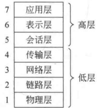

**图 10-1 OSI 参考模型的层次划分**

低层负责处理数据传输问题，其中的物理层和链路层由硬件和软件共同实现，而其他层通常只是用软件来实现。最底层（物理层）最接近物理网络介质（如网络电缆），其职责是将信息放置到介质上。下面给出各层的具体含义。

物理层：物理层定义了用于执行、维护、终止物理链路所需要的电子、机械、过程及功能的规则。

链路层：链路层通过物理网络链路提供可靠的数据传输。不同的链路层定义了不同的网络和协议特性，其中包括物理编址、网络拓扑结构、错误校验、帧序列以及流控。

网络层：用于提供路由选择及其相关的功能，网络层为高层协议提供面向连接的服务和无连接服务。网络层协议一般都是路由选择协议，但其他类型的协议也可在网络层上实现。

传输层：用于实现向高层可靠地传输数据的服务。传输层的功能一般包括流控、多路传输、虚电路管理及差错校验和恢复。

会话层：用于建立、管理和终止表示层与实体之间的通信会话，通信会话包括发生在不同网络设备的应用层之间的服务请求和服务应答，这些请求和应答通过会话层的协议实现。

表示层：提供多种用于应用层数据的编码和转换功能，以确保从一个系统应用层发送的信息可以被另一系统的应用层识别。

应用层：是最接近终端用户的 OSI 层，这就意味着 OSI 应用层与用户之间是通过软件直接相互作用的。应用层的功能一般包括标识通信伙伴、定义资源的可用性和同步通信。

OSI 模型系统间的通信方式如下：信息从一个计算机系统的应用层软件传输到另一个计算机系统的应用层软件，必须经过 OSI 参考模型的每一层。例如，系统 A 的应用层软件要将信息传送到系统 B 的应用层软件，那么系统 A 的应用程序先把该信息传送到 A 的应用层（第7层），然后应用层又把信息传送到表示层（第6层），表示层再把信息传送到会话层（第5层），依次下去，直到信息传送到物理层（第1层）。在物理层，信息被放置到物理网络介质上，并通过介质发送到系统 B。系统 B 的物理层从物理介质上获取信息，然后把信息从物理层传送到链路层（第2层），链路层再把信息传送到网络层（第3层），依次上去，直到信息传送到系统 B 的应用层（第7层）。最后，B 的应用层再把信息传送到接收应用程序中，这样便完成了整个通信过程。

2. TCP/IP 分层模型

TCP/IP 是因特网(Internet)的基本协议，它是“传输控制协议(Transmission Control Protocol, TCP)和网际协议(Internet Protocol, IP)”的简称。事实上，TCP/IP 是个协议系统，是由一系列支持网络通信的协议组成的集合。本节仅介绍 TCP/IP 的分层模型，对具体的协议不做介绍。

TCP/IP 可以采用与 OSI 结构相同的分层方法来建立模型，其模型分为 4 层，分别称为应用层、传输层、IP 层和接口层。

（1）应用层：这一层将OSI高层（应用层、表示层和会话层）的功能合并为一层。

（2）传输层：在功能上，这一层等价于OSI的传输层。

（3）IP 层：在功能上，这一层等价于 OSI 的网络层。

（4）接口层：在功能上，这一层等价于OSI的链路层和物理层。

其中在传输层上的协议有两个：TCP 和 UDP（User Datagram Protocol，用户数据报协议），TCP 是一个面向连接的传输协议，是为在无连接的网络业务上运行面向连接的业务而设计的。UDP 是一个无连接传输协议，它与 OSI 的无连接传输协议相对应。

### 10.1.2 网络加密方式

1. 基本方式

为了将数据在网络中传送，需要在数据前面加上它的目的地址，称加在数据前面的目的地址为报头，用户数据加上报头称为数据报。加强网络通信安全性的最有效且最常用的方法是加密。网络加密的基本方式有两种：链路加密和端端加密。

链路加密是指每个易受攻击的链路两端都使用加密设备进行加密，因此整个通信链路上的传输都是安全的。缺点是数据报每进入一个分组交换机后都需要一次解密，原因是交换机必须读取数据报报头以便为数据报选择路由。因此，在交换机中数据报易受到攻击。

链路加密时，每一链路两端的一对节点都应共享一个密钥，不同节点对共享不同的密钥，因此需提供很多密钥，每个密钥仅分配给一对节点。

端端加密是指仅在一对用户的通信线路两端（即源节点和终端节点）进行加密，因此数据是以加密的形式通过网络由源节点传送到目标节点，目标节点用与源节点共享的密钥对数据解密。所以，端端加密可防止对网络上链路和交换机的攻击。

端端加密还能提供一定程度的认证，因为源节点和终端节点共享同一密钥，所以终端节点相信自己收到的数据报的确是由源节点发来的。链路加密方式不具备这种认证功能。

端端加密也有自己的缺点。由于只有目标节点能对加密结果解密，所以如果对整个数据报加密，则分组交换节点收到加密结果后无法读取报头，从而无法为该数据报选择路由。因此，主机只能对数据报中的用户数据部分加密而报头则以明文形式传送。这样，虽然用户数据部分是安全的，但却容易受业务流量分析的攻击。

为提高安全性，可将两种加密方式结合起来使用，如图10-2所示。其中主机用端端加密密钥加密数据报中用户的数据部分，然后用链路加密密钥对整个数据报再加密一次。当被加密的数据报在网络中传送时，每一交换机都使用链路加密密钥解密数据报以读取报头，然后再用下一链路的链路加密密钥加密整个数据报并发往下一交换机。所以，当两种加密方式结合起来使用时，除了在每个交换机内部数据报报头是明文形式外，其他整个过程数据报都是密文形式。

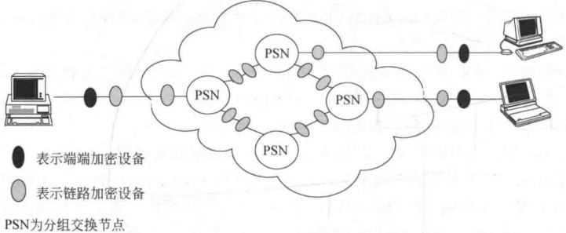

**图 10-2 分组交换网中的加密**

2. 端端加密的逻辑位置

端端加密的逻辑位置是指将加密功能放在OSI参考模型的哪一层。可有几种选择，其中最低层的加密可在网络层进行，这时被保护的实体数目与网络中终端数目一样，任意两个终端如果共享同一密钥，就可进行保密通信。一终端系统若想和另一终端系统进行保密通信，则两个端系统用户的所有处理程序和应用程序都将使用同一加密方案和同一密钥。

在端端协议中利用加密功能，可为通信业务提供端端的安全性。然而这种方案不能为穿过互联网的通信业务（如电子邮件、电子数据交换（EDI）、文件传输）提供这种端端的安全性。如图10-3所示，该图表示用电子邮件网关沟通两个互联网，其中一个是使用OSI结构，另一个是使用TCP/IP结构。这时在两个互联网之间的应用层以下不存在端端协议，从一个端系统发出的传输和连接到邮件网关后即终止，邮件网关再建立一个新的传输并连接到另一端系统。即使邮件网关连接的两个互联网使用同一结构，传输过程也是如此。因此，对诸如电子邮件这种具有存储转发功能的应用，只有在应用层才有端端加密功能。

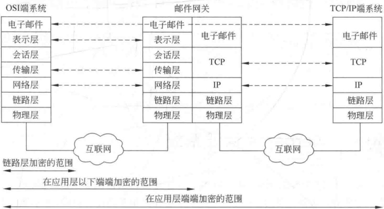

**图 10-3 存储转发通信的加密范围**

应用层加密的缺点是需考虑的实体数目将显著增加，比如网络中有数百个主机，则需考虑的实体（用户和进程）可能有数千个，不同的一对实体需产生一个不同的密钥，因此需要产生和分布更多的密钥。改进的方法是在分层结构上，越往上层则加密越少的内容。图10-4以TCP/IP结构为例说明这种改进方法，其中应用层网关指在应用层上操作的存储转发设备，阴影部分表示加密。图10-4（a）表示在应用层加密，这时仅对TCP数据段中的用户数据部分加密，而TCP报头、IP报头、网络层报头、链路层报头以及链路层报尾则是明文形式。图10-4（b）表示在TCP层加密，其中对端端连接，用户数据和TCP报头被加密，而IP报头则是明文形式，这是因为路由器需要为IP数据报选择从源节点到目标节点的路由。然而，如果数据报通过网关，则终止TCP连接，并为下一跳建立一个新的传输连接，这时IP也将网关当作目标节点。因此，在网关，数据单元又被解密。如果下一跳又连接到TCP/IP网络上，用户数据和TCP报头在传输以前又将被加密。图10-4（c）表示在链路层加密，在每个链路上除了链路层报头外，所有数据单元都被加密，但在路由器和网关之中所有数据单元都是明文形式。

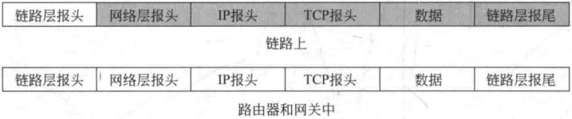

**(c) 链路层加密**

**图 10-4 不同层次的加密方案**

## 10.2 Kerberos 认证系统

Kerberos 是 MIT 作为 Athena 计划的一部分开发的认证服务系统。Kerberos 系统建立了一个中心认证服务器，用于向用户和服务器提供相互认证。目前，该系统已有 5 个版本，其中，V1～V3 是内部开发版；V4 是 1988 年开发的，现已得到广泛应用；而 V5 则进一步对 V4 中的某些安全缺陷做了改进，已于 1994 年作为 Internet 标准（草稿）公布（RFC 1510）。

系统的目的是解决以下问题：在开放的分布式环境中，用户希望访问网络中的服务器，而服务器则要求能够认证用户的访问请求并仅允许那些通过认证的用户访问服务器，以防未授权用户得到服务和数据。下面以 Kerberos V4 为例介绍该系统（系统使用的协议是基于第7章介绍的 Needham-Schroeder 认证协议）。

### 10.2.1 Kerberos V4

如果网络环境未加任何保护手段，则任一用户都可获取任一服务器（V）提供的服务。这时明显的安全威胁是假冒，即敌手可假装是一客户以获取访问服务器的特权。为防止这种假冒，服务器应能够确定要求服务的客户的身份，但在开放环境中则给服务器增加了过重的负担。为此引入一个称为认证服务器（Authentication Server，AS）的第三方来承担对用户的认证。AS知道每个用户的口令，并将口令存在一个中心数据库。用户如果想访问某一服务器，要首先向AS发出请求（其中包括用户的口令），AS将收到的用户口令和中心数据库存储的口令相比较以验证用户的身份。如果验证通过，AS则向用户发放一个允许用户得到服务器服务的票据，用户则根据这一票据去获取服务器V的服务。

如果用户需多次访问同一服务器或不同服务器，则为了避免每次都重复以上获取票据的过程，再引入另一新服务器，称为票据许可服务器（Ticket-Granting Server，TGS）。TGS 向已经过 AS 认证的客户发放用于获取服务器 V 的服务的票据。为此用户应改为首先向 AS 获取访问 TGS 的票据  $Ticket_{tgs}$（称为票据许可票据）存起来以后可反复使用。用户每次欲获得服务器 V 的服务时，将  $Ticket_{tgs}$ 出示给 TGS，TGS 再向用户发放获得服务器 V 服务的许可票据  $Ticket_{v}$（称为服务许可票据）。

现在还有两个问题需加以解决。一是票据许可票据  $Ticket_{tgs}$ 的有效期限。如果有效期过短，用户就需频繁地向 AS 输入自己的口令。如果过长，则遭受敌手攻击的可能性就会增大。敌手通过对网络监听以获得用户的  $Ticket_{tgs}$，然后冒充合法用户向 TGS 申请获取服务器的服务。类似地，敌手也可截获服务许可票据  $Ticket_{v}$。所以，除了需对两个票据都加上合理的时间限制外，还需保证客户持有的票据的确是发放给他的真实的票据。第二个需要解决的问题是服务器也应该向用户证明自己，否则敌手通过破坏网络结构而使用户发往服务器的消息到达另一假冒的服务器，假冒的服务器获取用户的信息后再拒绝对用户提供服务。

以上是 Kerberos V4 认证过程的简要描述，详细过程分为以下 3 个阶段，共 6 步（见图 10-5）。

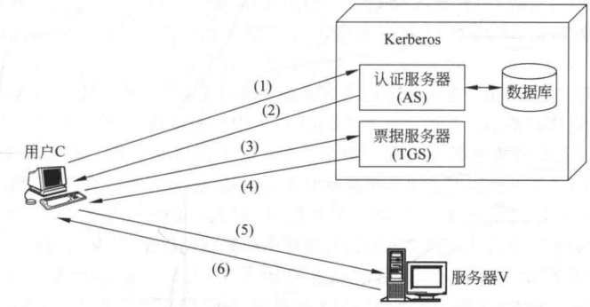

**图10-5 Kerberos V4 的认证过程**

认证系统中的符号如下：

C—客户机，AS—认证服务器，V—服务器，IDc—客户机用户的身份，TGS—票据许可服务器，IDv—服务器V的身份，IDtgs—TGS的身份，ADc—C的网络地址，Pc—C上用户的口令，TSi—第i个时间戳，lifetimei—第i个有效期限，Kc—由用户口令导出的用户和AS的共享密钥，Kc,tgs—C与TGS的共享密钥，Kv—TGS与V的共享密钥，Ktgs—AS与TGS的共享密钥，Kc,v—C与V的共享密钥。

协议如下：

第Ⅰ阶段（认证服务交换）用户从 AS 获取票据许可票据：

(1) C  $\rightarrow$ AS: ID $_{C}$ || ID $_{tgs}$ || TS $_{1}$.

(2) AS→C:  $E_{K_C}[K_{C,\text{tgs}} \parallel ID_{\text{tgs}} \parallel TS_2 \parallel lifetime_2 \parallel \text{Ticket}_{\text{tgs}}]$。

其中， $\text{Ticket}_{\text{tgs}} = E_{K_{\text{tgs}}}[K_{C,\text{tgs}} \parallel ID_C \parallel AD_C \parallel ID_{\text{tgs}} \parallel TS_2 \parallel lifetime_2]$

第Ⅱ阶段（票据许可服务交换）用户从 TGS 获取服务许可票据：

(3) C  $\rightarrow$ TGS: ID $_{V}$ || Ticket $_{tgs}$ || Authenticator $_{C}$.

(4) TGS→C:  $E_{K_{C,\mathrm{tgs}}}\left[K_{C,\mathrm{V}} \parallel ID_{\mathrm{V}} \parallel TS_{4} \parallel \mathrm{Ticket}_{v}\right]$

Ticket $_{tgs}$ =  $E_{K_{tgs}}$  $[K_{C,tgs}\parallel ID_{C}\parallel AD_{C}\parallel ID_{tgs}\parallel TS_{2}\parallel lifetime_{2}]$

$$\mathrm{T i c k e t}_{\mathrm{v}}=\mathrm{E}_{\mathrm{K}_{\mathrm{V}}}\left[\mathrm{K}_{\mathrm{C},\mathrm{V}}\parallel\mathrm{I D}_{\mathrm{C}}\parallel\mathrm{A D}_{\mathrm{C}}\parallel\mathrm{I D}_{\mathrm{V}}\parallel\mathrm{T S}_{\mathrm{4}}\parallel\mathrm{l i f e t i m e}_{\mathrm{4}}\right]$$

$$\mathrm{Authenticator_{C}}=E_{K_{C,\mathrm{trs}}}\left[\mathrm{ID_{C}}\parallel\mathrm{AD_{C}}\parallel\mathrm{TS_{3}}\right]$$

第Ⅲ阶段（客户机-服务器的认证交换）用户从服务器获取服务：

(5) C→V: Ticket_V || Authenticator_C
(6) V→C:  $E_{K_{C,V}}[\text{TS}_5 + 1]$
其中， $\text{Ticket}_V = E_{K_V}[K_{C,V} \parallel ID_C \parallel AD_C \parallel ID_V \parallel TS_4 \parallel lifetime_4]$
 $\text{Authenticator}_C = E_{K_{C,V}}[\text{ID}_C \parallel AD_C \parallel TS_5]$

具体解释如下：

（1）客户机向 AS 发出访问 TGS 的请求，请求中的时间戳用以向 AS 表示这一请求是新的。

（2）AS 向 C 发出应答，应答由从用户的口令导出的密钥  $K_{C}$ 加密，使得只有 C 能解读。应答的内容包括 C 与 TGS 会话所使用的密钥  $K_{C,tgs}$、用于向 C 表示 TGS 身份的  $ID_{tgs}$、时间戳  $TS_{2}$、AS 向 C 发放的票据许可票据  $Ticket_{tgs}$ 以及这一票据的截止期限 lifetime $_{2}$。

（3）C向TGS发出一个由请求提供服务的服务器的身份、第（2）步获得的票据以及一个认证符构成的消息。其中认证符中包括C上用户的身份、C的地址及一个时间戳。与票据不同，票据可重复使用且有效期较长，而认证符只能使用一次且有效期很短。TGS用与AS共享的密钥 $K_{tgs}$解密票据后知道C已从AS处得到与自己会话的会话密钥 $K_{C,tgs}$，票据 $Ticket_{tgs}$在这里的含义事实上是“使用 $K_{C,tgs}$的人就是C”。TGS也使用 $K_{C,tgs}$解读认证符，并将认证符中的数据与票据中的数据加以比较，从而可相信票据的发送者的确是票据的实际持有者，这时认证符的含义实际上是“在时间 $TS_{3}$，C使用 $K_{C,tgs}$”。注意，这时的票据不能证明任何人的身份，只是用来安全地分配密钥，而认证符则是用来证明客户的身份。因为认证符仅能被使用一次且其有效期限很短，所以可防止敌手对票据和认证符的盗取使用。

（4）TGS向C应答的消息由TGS和C共享的会话密钥加密后发往C，应答中的内容有C和V共享的会话密钥 $K_{c,v}$，V的身份ID $_{v}$，服务许可票据Ticket $_{v}$及票据的时间戳。而票据中也包括应答中的上述数据项。

（5）C向服务器V发出服务许可票据Ticketv和认证符Authenticator。服务器解密票据后得到会话密钥 $K_{c,v}$，并由 $K_{c,v}$解密认证符，以验证C的身份。

（6）服务器 V 向 C 证明自己的身份。V 对从认证符得到的时间戳加 1，再由与 C 共享的密钥加密后发给 C，C 解密后对增加的时间戳加以验证，从而相信增加时间戳的一方的确是 V。

整个过程结束以后，客户机和服务器 V 之间就建立起了共享的会话密钥，以后可用来加密通信或者交换新的会话密钥。

### 10.2.2 Kerberos 区域与多区域的 Kerberos

Kerberos 的一个完整服务范围由一个 Kerberos 服务器、多个客户机和多个服务器构成，并且满足以下两个要求：

（1）Kerberos 服务器必须在它的数据库中存有所有用户的 ID 和口令的哈希值，所有用户都已向 Kerberos 服务器注册。

（2）Kerberos 服务器必须与每一服务器有共享的密钥，所有服务器都已向 Kerberos 服务器注册。

满足以上两个要求的 Kerberos 的一个完整服务范围称为 Kerberos 的一个区域。网络中隶属于不同行政机构的客户机和服务器则构成不同的区域。一个区域的用户如果希望得到另一区域中的服务器的服务，则还需满足以下要求：每个区域的 Kerberos 服务器必须和其他区域的服务器有共享的密钥，且两个区域的 Kerberos 服务器已彼此注册。

多区域的 Kerberos 服务还要求在两个区域间，第一个区域的 Kerberos 服务器信任第二个区域的 Kerberos 服务器对本区域中用户的认证，而且第二个区域的服务器也应信任第一个区域的 Kerberos 服务器。

图 10-6 是两个区域的 Kerberos 服务示意图，其中，区域 A 中的用户希望得到区域 B 中服务器的服务，为此用户通过自己的客户机首先向本区域的 TGS 申请一个访问远程 TGS（即区域 B 中的 TGS）的票据许可票据，然后用这个票据许可票据向远程 TGS 申请获得服务器服务的服务许可票据。具体描述如下：

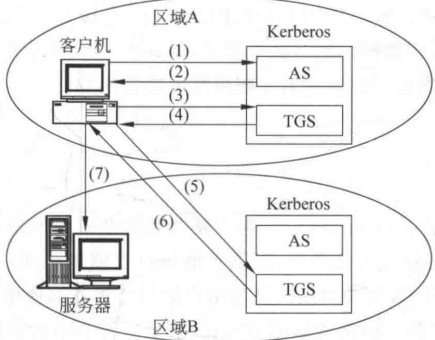

**图 10-6 两个区域的 Kerberos 服务**

（1）客户机向本地 AS 申请访问本区域 TGS 的票据：

$$C\rightarrow AS：ID_{C}\parallel ID_{tgs}\parallel TS_{1}$$

（2）AS向客户发放访问本区域TGS的票据：

$$AS\to C\colon E_{K_{C}}[K_{C,\mathrm{t g s}}\parallel ID_{\mathrm{t g s}}\parallel TS_{2}\parallel lifetime_{2}\parallel Ticket_{\mathrm{t g s}}]$$

（3）客户机向本地 TGS 申请访问远程 TGS 的票据许可票据：

$$C\rightarrow TGS:\;ID_{tgsrem}\parallel Ticket_{tgs}\parallel Authenticator_{C}$$

（4）TGS向客户机发放访问远程TGS的票据许可票据：

$$\mathrm{T G S}\to\mathrm{C}\colon E_{K_{\mathrm{C},\mathrm{t g s}}}\left[K_{\mathrm{C},\mathrm{t g s r e m}}\parallel\mathrm{I D}_{\mathrm{t g s r e m}}^{\prime}\parallel\mathrm{T S}_{4}\parallel\mathrm{T i c k e t}_{\mathrm{t g s r e m}}\right]$$

（5）客户机向远程 TGS 申请获得服务器服务的服务许可票据：

$$\mathrm{C}\rightarrow\mathrm{T G S}_{\mathrm{r e m}}:\mathrm{I D}_{\mathrm{v r e m}}\parallel\mathrm{T i c k e t}_{\mathrm{t g s r e m}}\parallel\mathrm{A u t h e n t i c a t o r}_{\mathrm{c}}$$

（6）远程 TGS 向客户机发放服务许可票据：

$$\mathrm{T G S}\to\mathrm{C}\colon E_{K_{\mathrm{C},\mathrm{t g s r e m}}}\left[K_{\mathrm{C},\mathrm{v r e m}}\parallel\mathrm{I D}_{\mathrm{v r e m}}\parallel\mathrm{T S}_{6}\parallel\mathrm{T i c k e t}_{\mathrm{v r e m}}\right]$$

（7）客户申请远程服务器的服务：

$$\mathrm{C}\rightarrow\mathrm{V}_{\mathrm{rem}}\colon\mathrm{Ticket}_{\mathrm{vrem}}\parallel Authenticator_{\mathrm{C}}$$

对有很多个区域的情况来说，以上方案的扩充性不好，因为如果有 N 个区域，则必须有  $N(N-1)/2$ 次密钥交换才可使每个 Kerberos 区域和其他所有的 Kerberos 区域能够互操作，所以当 N 很大时，方案变得不现实。

## 10.3 X.509 认证业务

X.509 作为定义目录业务的 X.509 系列的一个组成部分，是由 ITU-T 建议的。这里所说的目录实际上是维护用户信息数据库的服务器或分布式服务器集合，其中的用户信息包括用户名到网络地址的映射和用户的其他属性。X.509 定义了 X.500 目录向用户提供认证业务的一个框架，目录的作用是存放用户的公钥证书。X.509 还定义了基于公钥证书的认证协议。由于 X.509 中定义的证书结构和认证协议已被广泛应用于 S/MIME、IPSec、SSL/TLS 以及 SET 等诸多应用过程，因此 X.509 已成为一个重要的标准。

X.509 的基础是公钥密码体制和数字签名，但其中未特别指明使用哪种密码体制（建议使用 RSA），也未特别指明数字签名中使用哪种哈希函数。

### 10.3.1 证书

1. 证书的格式

用户的公钥证书是 X.509 的核心问题。证书由某个可信的证书发放机构 CA 建立，并由 CA 或用户自己将其放入目录中，以供其他用户方便地访问。目录服务器本身并不负责为用户建立公钥证书，其作用仅仅是为用户访问公钥证书提供方便。

X.509 中公钥证书的一般格式如图 10-7(a) 所示。证书中的数据域有：

（1）版本号。默认为第1版；如果证书中需有发放者唯一识别符或主体唯一识别符，则版本号一定是2；如果有一个或多个扩充项，则版本号为3。

（2）顺序号。为一整数，由同一CA发放的每一证书的顺序号是唯一的。

（3）签名算法识别符。签署证书所用的算法及相应的参数。

（4）发放者名称。指建立和签署证书的 CA 名称。

（5）有效期。包括证书有效期的起始时间和终止时间两个数据项。

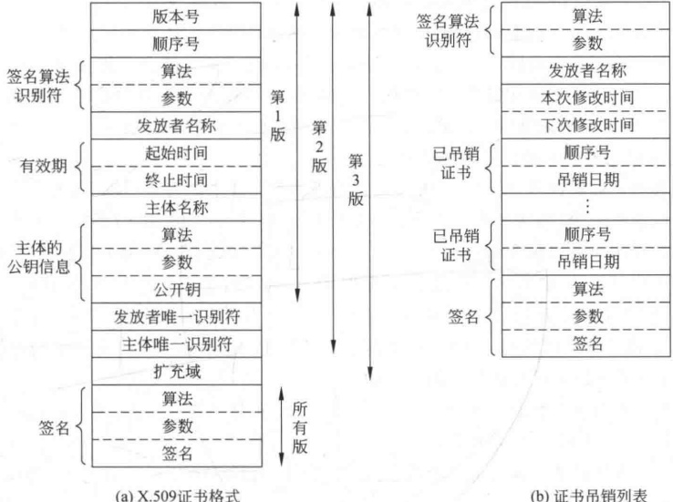

**图 10-7 X.509 的证书格式和证书吊销列表**

（6）主体名称。指证书所属用户的名称，即这一证书用来证明持有秘密钥用户的相应公开钥。

（7）主体的公开钥信息。包括主体的公开钥、使用这一公开钥算法的标识符及相应的参数。

（8）发放者唯一识别符。这一数据项是可选用的，当发放者(CA)的名称被重新用于其他实体时，则用这一识别符来唯一标识发放者。

（9）主体唯一识别符。这一数据项也是可选用的，当主体的名称被重新用于其他实体时，则用这一识别符来唯一地标识主体。

（10）扩充域。其中包括一个或多个扩充的数据项，仅在第3版中使用。

（11）签名。CA 用自己的秘密钥对上述域的哈希值签名的结果，此外这个域还包括签名算法标识符。

X.509 中使用以下表示法来定义证书：

$$CA\ll A\gg=CA\left\{V,SN,AI,CA,T_{A},A,A_{p}\right\}$$

其中，Y《X》表示证书发放机构 Y 向用户 X 发放的证书，Y{I}表示 I 链接上 Y 对 I 的哈希值的签名。

2. 证书的获取

CA 为用户产生的证书应有以下特性：

（1）其他任一用户只要得到 CA 的公开钥，就能由此得到 CA 为该用户签署的公开钥。

（2）除 CA 以外，任何其他人都不能以不被察觉的方式修改证书的内容。

因为证书是不可伪造的，因此放在目录后无须对目录施加特别的保护措施。

如果所有用户都由同一CA为自己签署证书，则这一CA就必须取得所有用户的信任。用户证书除了能放在目录中以供他人访问外，还可以由用户直接发给其他用户。用户B得到用户A的证书后，可相信用A的公开钥加密的消息不会被他人获悉，还可相信用A的秘密钥签署的消息是不可伪造的。

如果用户数量极多，则仅一个CA负责为用户签署证书就有点不现实，因为每一用户都必须以绝对安全（指完整性和真实性）的方式得到CA的公开钥，以验证CA签署的证书。因此在用户数目极多的情况下，应有多个CA，每一CA仅为一部分用户签署证书。

设用户 A 已从证书发放机构  $X_{1}$ 处获取了公钥证书，用户 B 已从  $X_{2}$ 处获取了证书。如果 A 不知  $X_{2}$ 的公开钥，他虽然能读取 B 的证书，但却无法验证  $X_{2}$ 的签名，因此 B 的证书对 A 来说是没有用处的。然而，如果两个 CA  $X_{1}$ 和  $X_{2}$ 彼此间已经安全地交换了公开钥，则 A 可通过以下过程获取 B 的公开钥：

（1）A从目录中获取由 $X_{1}$签署的 $X_{2}$的证书，因A知道 $X_{1}$的公开钥，所以能验证 $X_{2}$的证书，并从中得到 $X_{2}$的公开钥。

（2）A 再从目录中获取由  $\mathrm{X}_{2}$ 签署的 B 的证书，并由  $\mathrm{X}_{2}$ 的公开钥对此加以验证，然后从中得到 B 的公开钥。

以上过程中，A 是通过一个证书链来获取 B 的公开钥，证书链可表示为

$$X_{1}\ll X_{2}\gg X_{2}\ll B\gg$$

类似地，B能通过相反的证书链获取A的公开钥，表示为

$$X_{2}\ll X_{1}\gg X_{1}\ll A\gg$$

以上证书链中有两个证书，N个证书的证书链可表示为

$$X_{1}\ll X_{2}\gg X_{2}\ll X_{3}\gg\cdots\ll X_{N}\ll B\gg$$

此时任意两个相邻的 CA  $X_{i}$ 和  $X_{i+1}$ 已被此间为对方建立了证书，对每一 CA 来说，由其他 CA 为这一 CA 建立的所有证书都应存放于目录中，并使用户知道所有证书相互之间的连接关系，从而可获取另一用户的公钥证书。X.509 建议将所有 CA 以层次结构组织起来。

图 10-8 是 X.509 的 CA 层次结构的一个例子，其中的内部节点表示 CA，叶节点表示用户。

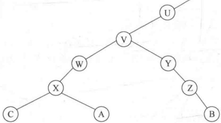

**图 10-8 X.509 的层次结构**

用户 A 可从目录中得到相应的证书以建立到 B 的以下证书链：

$$\mathrm{X}\ll\mathrm{W}\gg\mathrm{W}\ll\mathrm{V}\gg\mathrm{V}\ll\mathrm{Y}\gg\mathrm{Y}\ll\mathrm{Z}\gg\mathrm{Z}\ll\mathrm{B}≃$$

并通过该证书链获取 B 的公开钥。

类似地，B可建立以下证书链以获取A的公开钥：

$$\mathbf{Z}\ll\mathbf{Y}\gg\mathbf{Y}\ll\mathbf{V}\gg\mathbf{V}\ll\mathbf{W}\gg\mathbf{W}\ll\mathbf{X}\gg\mathbf{X}\ll\mathbf{A}\gg$$

3. 证书的吊销

每一证书都有一个有效期，然而有些证书还未到截止日期就会被发放该证书的CA吊销，这是由于用户的秘密钥有可能已被泄露，或者该用户不再由该CA来认证，或者CA为该用户签署证书的秘密钥有可能已泄露。为此，每一CA还必须维护一个证书吊销列表（Certificate Revocation List，CRL），见图10-7（b），其中存放所有未到期而被提前吊销的证书，包括该CA发放给用户和发放给其他CA的证书。CRL还必须经该CA签名，然后存放于目录以供他人查询。

CRL 中的数据域包括发放者 CA 的名称、建立 CRL 的日期、计划公布下一 CRL 的日期以及每一被吊销的证书数据域，而被吊销的证书数据域包括该证书的顺序号和被吊销的日期。因为对一个 CA 来说，他发放的每一证书的顺序号是唯一的，所以可用顺序号来识别每一证书。

所以每一用户收到他人消息中的证书时，都必须通过目录检查这一证书是否已被吊销。为避免搜索目录引起的延迟以及由此而增加的费用，用户自己也可维护一个有效证书和被吊销证书的局部缓存区。

### 10.3.2 认证过程

X.509 有 3 种认证过程以适应不同的应用环境。3 种认证过程都使用公钥签名技术，并假定通信双方都可从目录服务器获取对方的公钥证书，或对方最初发来的消息中包括的公钥证书，即假定通信双方都知道对方的公钥。3 种认证过程如图 10-9 所示。

1. 单向认证

单向认证指用户 A 将消息发往 B，以向 B 证明：A 的身份；消息是由 A 产生的；消息的意欲接收者是 B；消息的完整性和新鲜性。

为实现单向认证，A发往B的消息应由A的秘密钥签署的若干数据项组成。数据项中应至少包括时间戳 $t_{A}$、一次性随机数 $r_{A}$、B的身份，其中，时间戳又有消息的产生时间（可选项）和截止时间，以处理消息传送过程中可能出现的延迟，一次性随机数用于防止重放攻击。 $r_{A}$在该消息未到截止时间以前应是这一消息唯一所有的，因此B可在这一消息的截止时间以前一直存有 $r_{A}$，以拒绝具有相同 $r_{A}$的其他消息。

如果仅为了单纯认证，则 A 发往 B 的上述消息就可作为 A 提交给 B 的凭证。如果不单纯为了认证，则 A 用自己的秘密钥签署的数据项还可包括其他信息 sgnData，将这个信息也包括在 A 签署的数据项中可保证该信息的真实性和完整性。数据项中还可包括由 B 的公开钥 PK_B 加密的双方意欲建立的会话密钥 K_AB。

$$1.\mathrm{A}\left\{t_{\mathrm{A}},r_{\mathrm{A}},\mathrm{B},\mathrm{sgn}\mathrm{Data},E_{\mathrm{PK}_{\mathrm{B}}}\left[K_{\mathrm{AB}}\right]\right\}$$

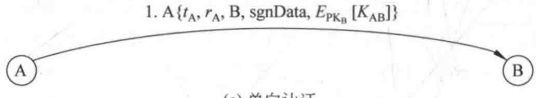

**(a) 单向认证**

$$1.\mathrm{A}\left\{t_{\mathrm{A}},r_{\mathrm{A}},\mathrm{B},\mathrm{sgn}\mathrm{Data},E_{\mathrm{PK}_{\mathrm{B}}}\left[K_{\mathrm{AB}}\right]\right\}$$

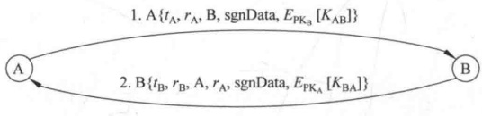

**(b) 双向认证**

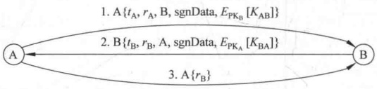

**(c) 三向认证**

**图 10-9 X.509 的认证过程**

2. 双向认证

双向认证是在上述单向认证的基础上，B再向A作出应答，以证明：B的身份；应答消息是由B产生的；应答的意欲接收者是A；应答消息是完整的和新鲜的。

应答消息中包括由 A 发来的一次性随机数  $r_{A}$（以使应答消息有效），由 B 产生的时间戳  $t_{B}$ 和一次性随机数  $r_{B}$。与单向认证类似，应答消息中也可包括其他附加信息和由 A 的公开钥加密的会话密钥。

3. 三向认证

在上述双向认证完成后，A 再对从 B 发来的一次性随机数签名后发往 B，即构成第三向认证。三向认证的目的是双方将收到的对方发来的一次性随机数又都返回给对方，因此双方不需检查时间戳而只需检查对方的一次性随机数即可检查出是否有重放攻击。在通信双方无法建立时钟同步时，就需使用这种方法。

## 10.4 PGP

PGP(Pretty Good Privacy)是目前最为普遍使用的一种电子邮件系统。该系统能为电子邮件和文件存储应用过程提供认证业务和保密业务。

本节分别介绍 PGP 的运行方式、密钥的产生和存储以及公钥的管理。

### 10.4.1 运行方式

PGP 有 5 种业务：认证性、保密性、压缩、电子邮件的兼容性、分段。表 10-1 是这 5 种业务的总结。其中，CAST-128 是一种分组密码，算法具有传统 Feistel 网络结构，采用16 轮迭代，明文分组长度为 64 比特，密钥长以 8 比特为增量，从 40 比特到 128 比特可变。

**表 10-1 PGP 的业务**

| 功 能 | 所 用 算法 | 描 述 |
| --- | --- | --- |
| 数字签名 | DSS/SHA 或 RSA/SHA | 发方使用 SHA 产生消息摘要，再用自己的秘密钥按 DSS 算法或 RSA 算法对消息摘要签名 |
| 消息加密 | CAST 或 IDEA 或三个密钥的三重 DES/ElGamal 或 RSA | 消息由用户产生的一次性会话密钥按 CAST-128 或 IDEA 或三重 DES 加密，会话密钥用收方的公开钥按 ElGamal 或 RSA 加密 |
| 压缩 | ZIP | 消息经 ZIP 算法压缩后存储或传送 |
| 电子邮件的兼容性 | 基数 64 变换 | 使用基数 64 变换将加密的消息转换为 ASCII 字符串，以提供电子邮件应用系统的透明性 |
| 分段 |  | 对消息进行分段和重组以适应 PGP 对消息最大长度的限制 |

图 10-10 是 PGP 的认证业务和保密业务示意图。其中， $K_s$ 为分组加密算法所用的会话密钥；EC 和 DC 分别为分组加密算法和解密算法；EP 和 DP 分别为公钥加密算法和解密算法； $SK_A$ 和  $PK_A$ 分别为发方的秘密钥和公开钥； $SK_B$ 和  $PK_B$ 分别为收方的秘密钥和公开钥；H 表示哈希函数； $\parallel$ 表示链接；Z 为 ZIP 压缩算法；R64 表示基数 64 变换。

1. 认证业务

图 10-10(a) 表示 PGP 中通过数字签名提供认证的过程，分为 5 步：

（1）发方产生消息 M。

（2）用 SHA 产生 160 比特长的消息摘要  $H(M)$。

（3）发方用自己的秘密钥 SK_按 RSA 算法对  $H(M)$ 加密，并将加密结果  $EP_{SK_A}[H(M)]$ 与 M 链接后发送。

（4）收方用发方的公开钥对  $\mathrm{EP}_{\mathrm{SK}_{A}}\left[\mathrm{H}\left(\mathrm{M}\right)\right]$ 解密得  $\mathrm{H}\left(\mathrm{M}\right)$。

（5）收方对收到的 M 计算消息摘要，并与（4）中的  $H(M)$ 比较。如果一致，则认为 M 是真实的。

过程中结合使用了SHA和RSA算法，类似地也可结合使用DSS算法和SHA算法。

以上过程将消息的签名与消息链接后一起发送或存储，但在有些情况中却将消息的签名与消息分开发送或存储。例如，将可执行程序的签名分开存储，以后可用来检查程序是否有病毒感染。再如，多人签署同一文件（如法律合同），每人的签名都应与被签文件分开存放；否则，第一个人签完字后将消息与签名链接在一起，第二人签名时既要签消息，又要签第一人的签名，因此就形成了签名的嵌套。

2. 保密业务

PGP 的另一业务是为传输或存储的文件提供加密的保密性业务。加密算法用 CAST-128，也可用 IDEA 或三重 DES，运行模式为 64 比特 CFB 模式。加密算法的密钥为一次性的，即每加密一个消息时都需产生一个新的密钥，称为一次性会话密钥，且新密钥也需用接收方的公开钥加密后与消息一起发往收方，整个过程如下[见图10-10(b)]：

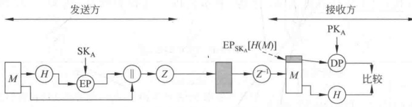

**(a) 仅有认证性**

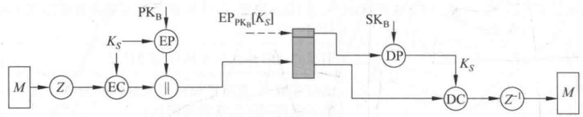

**(b) 仅有保密性**

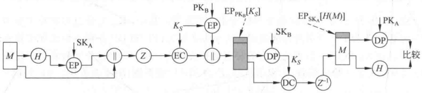

**(c) 既有保密性又有认证性**

**图 10-10 PGP 的认证业务和保密业务**

（1）发送方产生消息 M 及一次性会话密钥  $K_{s}$

（2）用密钥  $K_{s}$ 按 CAST-128（或 IDEA 或 3DES）加密 M。

（3）用接收方的公开钥 PK_{B} 按 RSA 算法加密一次性会话密钥 K_{s}，将（2）、（3）中的两个加密结果链接起来发往收方。

（4）接收方用自己的秘密钥按 RSA 算法恢复一次性会话密钥。

（5）接收方用一次性会话密钥恢复分发来的消息。

PGP 还为加密一次性会话密钥提供了 ElGamal 算法以供选用。

以上方案有以下几个优点：第一，由于分组加密速度远快于公钥加密速度，因此使用分组加密算法加密消息、使用公钥加密算法加密一次性会话密钥可比单纯使用公钥算法大大地减少加密时间。第二，因为会话密钥是一次性的，因此没有必要使用会话密钥的交换协议。同时，由于电子邮件的存储转发特性，也无法使用握手交换协议。本方案使用公钥加密算法来传送一次性会话密钥，保证了仅接收方能得到。第三，一次性会话密钥的使用进一步加强了本来就很强的分组加密算法，因此只要公钥加密算法是安全的，整个方案就是安全的。PGP可允许用户选择的密钥长度为768～3072比特，而若使用DSS，则其密钥限制为1024比特。

3. 保密性与认证性

如果对同一消息同时提供保密性与认证性，可使用图10-10（c）的方式。发送方首先用自己的秘密钥对消息签名，将明文消息和签名链接在一起，再使用一次性会话密钥按CAST-128（或IDEA或3DES）对其加密，同时用ElGamal算法对会话密钥加密，最后将两个加密结果一同发往接收方。在这一过程中，先对消息签名再对签名加密。这一顺序优于先加密再对加密结果签名。这是因为将签名与明文消息在一起存储比与密文消息在一起存储会带来很多方便，同时也给第三方对签名的验证带来方便。

4. 压缩

图 10-10 中 Z 表示 ZIP 压缩算法， $Z^{-1}$ 表示解压算法。压缩的目的是为邮件的传输或文件的存储节省空间。压缩运算的位置是在签名以后、加密以前。

（1）压缩前产生签名的原因有二：

对不压缩的消息签名，可便于以后对签名的验证。如果对压缩后的消息签名，则为了以后对签名的验证，需存储压缩后的消息或在验证签名时对消息重做压缩。

- 即使用户愿意对压缩后的消息签名且愿意验证时对原消息重做压缩，实现起来也极为困难，这是因为 ZIP 压缩算法是不确定性的，该算法在不同的实现中会由于在运行速度和压缩率之间产生不同的折中，因而产生出不同的压缩结果（虽然解压结果相同）。

（2）对消息压缩后再进行加密可加强其安全性，这是因为消息压缩后比压缩前的冗余度要小，因此会使得密码分析更为困难。

5. 电子邮件的兼容性

PGP 在如图 10-10 所示的 3 种业务中，传输的消息都有被加密的部分（也许是所有部分），这些部分构成了任意 8 比特位组串。然而许多电子邮件系统只允许使用 ASCII 文本串，为此 PGP 提供了将 8 比特位串转换为可打印的 ASCII 字符的服务。转换方法是使用基数 64 变换，将每 3 个 8 比特位组的二元数据映射为 4 个 ASCII 字符。基数 64 变换可将被变换的消息扩展 33%，但由于扩展是对会话密钥和消息的签名部分进行，而这一部分又是比较紧凑的，所以对明文消息的压缩足以弥补基数 64 变换所引起的扩展。有实例显示，ZIP 的平均压缩率大约为 2.0，因此如果不考虑相对小的签名和密钥部分，对长度为 X 的文件来说，压缩和扩展的总体效果为 ${1}.33 \times 0.5 \times X = 0.665 \times X$，即总体上有三分之一的压缩。

PGP 变换具有“盲目性”，即不管输入变换的消息内容是否是 ASCII 文件，都将变换为基数 64 格式。因此在图 10-10 所示的仅提供认证的服务中，对消息及其签名进行基数 64 变换，变换后的结果对不经意的观察者来说是不可读的，从而可提供一定程度的保密性。作为一种配置选择，PGP 可以只将消息的签名部分转换为基数 64 格式，从而使得接收方不使用 PGP 就可阅读消息，但对签名的验证仍然需要使用 PGP。

图 10-11 分别是发送方和接收方对消息的处理过程框图，发方首先对消息的哈希值签名（如果需要），然后明文消息及其签名（如果有）再经压缩函数压缩。如果要求保密性，则用一次性会话密钥按分组加密算法加密压缩结果，同时用公钥加密算法加密一次性会话密钥。将两个加密结果链接在一起后，再经基数64变换转换为基数64格式。

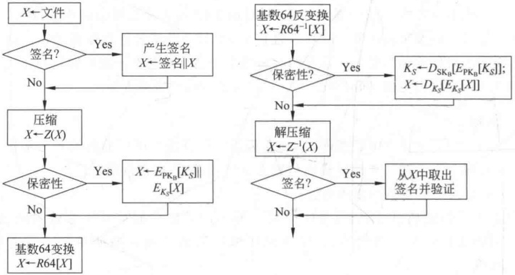

**(a) 发送方处理框图**

**(b) 接收方处理框图**

**图 10-11 PGP 的消息处理框图**

收方首先将接收到的结果由基数64格式转换为二元数字串。然后，如果消息是密文，则恢复一次性会话密钥，由一次性会话密钥恢复加密的消息，并对之解压缩。如果消息还经过签名，则从上一步恢复的消息中取出消息的哈希值，并与自己计算的消息的哈希值进行比较。

6. 分段与重组

电子邮件通常都对最大可用的消息长度有所限制，如果消息长度大于最大可用长度，则将消息分为若干子段并分别发送。分段是在图10-11(a)基数64变换以后进行的，因此会话密钥报头和签名报头仅在第一子段的开头处出现一次。接收方在图10-11(b)的处理过程以前，首先去掉第一子段开头处的报头再将各子段拼装在一起。

### 10.4.2 密钥和密钥环

PGP 所用的密钥有 4 类：分组加密算法所用的一次性会话密钥和基于密码短语的密钥，公钥加密算法所用的公开钥和秘密钥。为此 PGP 必须满足以下 3 个要求：

能够产生不可猜测的会话密钥。

用户可有多个公开钥-秘密钥对，这是因为用户可能希望随时更换自己的密钥对，另一方面用户可能希望在同一时间和多个通信方同时通信时分别使用不同的密钥对，或者用户可能希望通过限制一个密钥加密的内容的数量来增加安全性。所以用户和他的密钥对不是一一对应的关系，必须采取某一方式对密钥加以识别。

- PGP 的每一用户都必须对存储自己密钥对的文件加以维护，同时还需对存储所有通信对方公钥的文件加以维护。

1. 会话密钥的产生

会话密钥的使用是一次性的，其中，CAST-128 和 IDEA 所用会话密钥长为 128 比特，三重 DES 所用的会话密钥长为 168 比特。下面以 CAST-128 为例介绍其密钥的生成。

产生 CAST-128 密钥的随机数产生器仍由 CAST-128 加密算法构成（构成方式略），其输入为一个 128 比特的密钥和两个 64 比特的明文，采用 CFB 模式，对两个明文分组加密，再将得到的两个 64 比特密文分组链接在一起即形成所要产生的 128 比特密钥。其中，两个 64 比特（即 128 比特）的明文分组由用户随机地从键盘输入而得，将输入的一个字符表示成 8 比特的数值，共随机输入 12 个字符，得 96 比特长的数值，剩下 32 比特则用来表示键盘输入所用的时间。随机数产生器输入的 128 比特长的密钥则取为它上一次输出的 128 比特长的会话密钥。

2. 密钥识别符

如前所述，PGP 在对消息加密的同时，还需用接收方的公开钥对一次性会话密钥加密，从而使得只有接收方能恢复会话密钥，进而恢复加密的消息。如果接收方只有一个密钥对（即公开钥-秘密钥对），就可直接恢复会话密钥。然而，接收方通常都有多个密钥对，他怎么知道会话密钥是用他的哪个公开钥加密的？一种解决办法是发送方将所用的接收方的公开钥一起发给接收方，但这种方法对空间的浪费太多，因为 RSA 的公开钥其长度可达数百位十进制数。另一种办法是对每一用户的每一公开钥都指定一个唯一的识别符，称为密钥 ID，因此发送方用接收方的哪个公开钥就将这个公开钥的 ID 发给接收方。但使用这种方法必须考虑密钥 ID 的存储和管理，且收发双方都必须能够从密钥 ID 得到对应的公开钥，从而引起不必要的负担。PGP 采用的方法是用公开钥中 64 个最低有效位表示该密钥的 ID，即公开钥 PK_A 的 ID 是 PK_A mod 2^{64}。由于 64 位已足够长，因而不同密钥的 ID 相重的概率非常小。

PGP 在数字签名时也需对密钥加上识别符，这是因为发送方签名时可能有很多秘密钥可供使用，接收方必须知道使用发送方的哪一个公开钥来验证数字签名。PGP 用签名中的 64 比特来表示相应公开钥的 ID。

3. PGP 的消息格式

图 10-12 表示 PGP 中发送方 A 发往接收方 B 的消息格式。其中， $E_{PK_B}$ 表示用接收方 B 的公开钥加密； $E_{SK_A}$ 表示用发送方 A 的秘密钥加密（即 A 的签名）； $E_{K_S}$ 表示用一次性会话密钥  $K_S$ 的加密；ZIP 是压缩算法；R64 是基数 64 变换。

PGP 的消息由 3 部分组成：消息、消息的签名（可选）、会话密钥（可选）。

消息部分包括被存储或被发送的实际数据、文件名以及时间戳。

签名部分包括以下成分：

（1）时间戳。产生签名的时间。

（2）消息摘要。消息摘要是由 SHA 对签名的时间戳链接上消息本身后求得的 160 比特输出，再由发送方用秘密钥签名。求消息摘要时以签名时间戳作为输入的一部分的目的是防止重放攻击，而不以消息的文件名和产生消息的时间戳作为输入的一部分的目的是使得对无报头域的实际数据计算的签名与作为前缀而附加在消息前的签名完全一样。

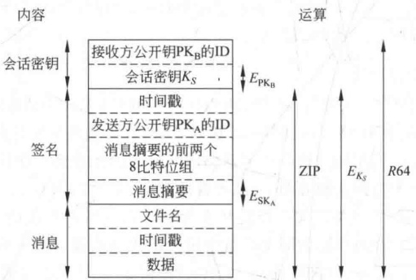

**图 10-12 PGP 的消息格式**

（3）消息摘要的前两个8比特位组：接收方用于与解密消息摘要后得到的前两个8比特位组进行比较，以确定自己在验证发送方的数字签名时是否正确地使用了发送方的公开钥。消息摘要的前两个8比特位组，也可用作消息的16比特帧校验序列。

（4）发送方公开钥的ID。用于标识解密消息摘要（即验证签名）的公开钥，相应地也标识了签名的秘密钥。

消息部分和签名部分经 ZIP 算法压缩后再用会话密钥加密。

会话密钥部分包括会话密钥和接收方公开钥标识符，标识符用于识别发送方加密会话密钥时使用接收方的哪个公开钥。

发送消息前，对整个消息作基数64变换。

4. 密钥环

为了有效存储、组织密钥，同时也为了便于用户的使用，PGP为每个节点（即用户）都提供了两个表型数据结构：一个用于存储用户自己的密钥对（即公开钥/秘密钥），另一个用于存储该用户所知道的其他各用户的公开钥。这两个数据结构分别称为秘密钥环和公钥环，如表10-2所示，其中带*的字段可作为标识字段。

在秘密钥环中，每行表示该用户的一个密钥对，其数据项有：产生密钥对的时间戳、密钥ID、公开钥、被加密的秘密钥、用户ID，其中，密钥ID和用户ID可作为该行的标识符。用户ID可用用户的邮件地址，用户也可以为一个密钥对使用多个不同的用户ID，还可以在不同的密钥对中使用相同的用户ID。

秘密钥环由用户自己存储，仅供用户自己使用，而且为使秘密钥尽可能地安全，秘密钥是通过 CAST-128（或 IDEA 或 3DES）加密后以密文形式存储，加密过程为：用户首先选择一个密码短语作为 SHA 的输入，产生出一个 160 比特的哈希值后销毁通行字短语，再用哈希值的 128 比特作为密钥按 CAST-128 对秘密钥加密，加密完成后再销毁哈希值。以后若要取出秘密钥，必须重新输入密码短语，PGP 产生出通行字的哈希值，并以此哈希值为秘密钥按 CAST-128 解密被加密的秘密钥。

**表10-2 密钥环**

**（a）秘密钥环**

| 时间戳 | 密钥 ID $^{{*}}$ | 公开钥 | 被加密的秘密钥 | 用户 ID $^{{*}}$ |
| --- | --- | --- | --- | --- |
| $\vdots$ | $\vdots$ | $\vdots$ | $\vdots$ | $\vdots$ |
| $T_{{i}}$ | PK $_{{i}}$ mod 2^{64} | PK $_{{i}}$ | $E_{{H}(P_{{i}})}[\text{{SK}}_{{i}}]$ | 用户 i |
| $\vdots$ | $\vdots$ | $\vdots$ | $\vdots$ | $\vdots$ |

**（b）公钥环**

| 时间戳 | 密钥 ID $^{{*}}$ | 公开钥 | 拥有者可信字段 | 用户 ID $^{{*}}$ | 密钥合法性字段 | 签名 | 签名可信字段 |
| --- | --- | --- | --- | --- | --- | --- | --- |
| $\vdots$ | $\vdots$ | $\vdots$ | $\vdots$ | $\vdots$ | $\vdots$ | $\vdots$ | $\vdots$ |
| $T_{{i}}$ | PK $_{{i}}$ mod 2^{{64}} | PK $_{{i}}$ | trust_flag $_{{i}}$ | 用户 i | trust_flag $_{{i}}$ | $\vdots$ | $\vdots$ |
| $\vdots$ | $\vdots$ | $\vdots$ | $\vdots$ | $\vdots$ | $\vdots$ | $\vdots$ | $\vdots$ |

从加密秘密钥的过程可见，秘密钥的安全性取决于所用密码的安全性，所以用户使用的密码应是易于自己记住的但又是不易被他人猜出的。

公钥环中每行存储的是该用户所知道的其他用户的公开钥，其数据项包括：时间戳（表示这一行产生的时间）、密钥ID（指这一行的公开钥）、公开钥、用户ID（指该公开钥的属主），其中密钥ID和用户ID可作为该行的标识符，还有其他几个数据项以后再介绍。

下面介绍消息传输和接收时密钥环是如何使用的。为简单起见，下面的过程中省略了压缩过程和基数64变换过程。

假定消息既要被签名，也要被加密，则发送方 A 需执行以下过程（见图 10-13，其中，RNG 是随机数产生器，其他符号和图 10-10 相同）：

1）签署消息

（1）PGP 使用 A 的用户 ID 作为索引（即关键字）从 A 的秘密钥环中取出 A 的秘密钥。如果用户 ID 为默认值，则从秘密钥环中取出第一个秘密钥。

（2）PGP 提示用户输入密码短语用于恢复被加密的秘密钥。

（3）由 A 的秘密钥产生消息的签名。

2）加密消息

（1）PGP 产生一个会话密钥，并由会话密钥对消息及签名加密。

（2）PGP 使用接收方 B 的用户 ID 作为关键字，从公钥环中取出 B 的公开钥。

（3）PGP用B的公开钥加密会话密钥以形成发送消息中的会话密钥部分。

接收方 B 执行以下过程（见图 10-14）：

1）解密消息

（1）PGP 从接收到的消息中的会话密钥部分取出接收方 B 的密钥 ID，并以此作为关键字从 B 的秘密钥环中取出相应的被加密的秘密钥。

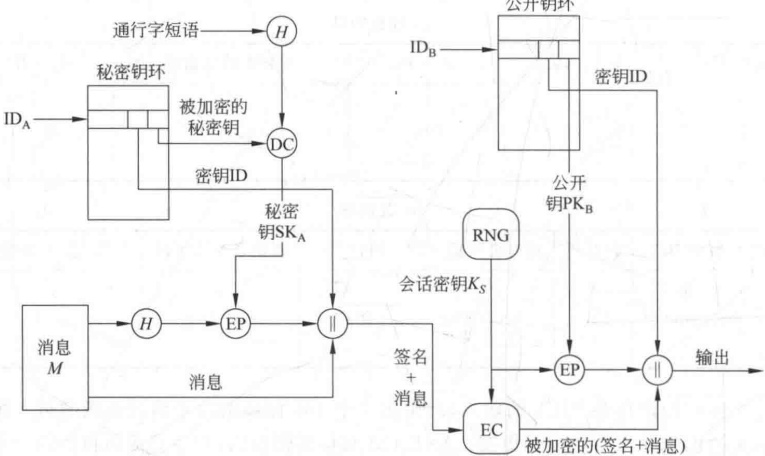

**图 10-13 PGP 的消息产生过程**

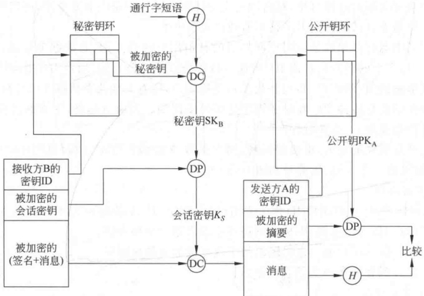

**图 10-14 PGP 的消息接收过程**

（2）PGP 提示 B 输入通行字短语以恢复秘密钥。

（3）PGP 用秘密钥恢复出会话密钥，并进而解密消息。

2）认证消息

（1）PGP 从收到的消息中的签名部分取出发送方 A 的密钥 ID，并以此作为关键字从发送方的公钥环中取出发送方的公开钥。

（2）PGP用发送方的公开钥恢复消息摘要。

（3）对收到的消息重新求消息摘要，并与恢复出的消息摘要进行比较。

### 10.4.3 公钥管理

如何保护公钥不被他人篡改是公钥密码体制中最为困难的问题，也是公钥密码体制的一个薄弱环节，很多软件复杂性高都是因这一问题而引起的。

PGP 由于可用于各种环境，所以未建立严格的公钥管理方案，而是提供了一种解决公钥管理问题的结构，其中有好几种建议选择可供选用。

1. 公钥管理方法

用户 A 为了使用 PGP 和其他用户通信，必须建立一个公钥环，用于存放其他用户的公开钥。如果 A 的公钥环中有一个公开钥表明是属于 B 的，但实际上是属于 C 的，例如，A 是通过 B 发布公开钥的公告牌系统（Bulletin Board System，BBS）获取 B 的公开钥，但在 A 获取之前，C 就已将 B 的公开钥给替换了，就可能有以下两种危险：第一，C 可以假冒 B 对伪造的消息签名，再发给 A，A 收到 C 发来的消息却以为是 B 发来的；第二，A 发给 B 的任何加密的消息都被 C 解读。

所以，必须采取措施以减小用户公钥环中包含虚假公钥的危险。用户 A 可采取以下措施获取用户 B 的可靠公开钥：

（1）物理手段。B可将自己的公开钥存在一张软盘中，亲手交给A。这个方法最为安全，但受实际应用限制。

（2）通过电话验证。如果 A 能在电话中识别 B，就可要求 B 以基数 64 的格式在电话中口述自己的公开钥。更实际的方法是 B 通过电子邮件向 A 发送自己的公开钥，A 通过 PGP 产生公开钥的 160 比特的摘要，并以十六进制格式显示，称其为公开钥的指纹。然后 A 要求 B 在电话中口述公开钥的指纹，如果两个指纹一致，B 的公开钥就得以验证。

（3）通过 A、B 都信赖的第三方，即介绍人 D。D 首先建立一个证书，其中包括 B 的公开钥、公开钥建立的时间、公开钥的有效期，然后用 SHA 求出证书的数字摘要，并用自己的秘密钥为数字摘要签名，再将签名链接在证书后由 B 或 D 发给 A，或在 BBS 中发布。因为其他人不知道 D 的秘密钥，所以即使能够伪造 B 的公开钥也无法伪造 D 的签名。

（4）通过可信的证书发放机构，方法同（3）。

后两种措施中，A为获取B的公开钥，得首先获取可信赖的第三方或可信赖的证书发放机构的公开钥，并相信该公开钥的有效性。所以最终还取决于A对第三方或证书发放机构的信任程度。

2. PGP 中的信任关系

PGP 中虽然未对建立证书发放机构或建立可信赖机构做任何说明，但却提供了一种方便的方法来使用 PGP 中的信任关系，建立用户对公开钥的信任程度。

PGP建立信任关系的基本方法是用户在建立公钥环时，以一个公钥证书作为公钥环中的一行。其中有3个数据项用来表示对该公钥证书的信任程度（见表10-2）。

（1）密钥合法性字段（key legitimacy field）：表示 PGP 以多大程度信任这一公开钥是用户的有效公开钥，该字段是由 PGP 根据这一证书的签名可信字段计算的。

（2）签名可信字段（signature trust field）：拥有该公开钥的用户可收集0个或多个为该公钥证书的签名，而每一签名后面都有一签名可信字段，用来表示该用户对签名者的信任程度。

（3）拥有者可信字段（owner trust field）：用于表示用这一公开钥签署其他公钥证书的可信程度，这一字段由用户自己指定。

以上3个字段的取值是用来表示信任程度的标志。标志的具体含义在此不再赘述。假定用户A已有一个公钥环，PGP对公钥环的信任处理过程如下：

（1）当 A 在公钥环中插入一新的公开钥时，PGP 必须为拥有者可信字段指定一个标志。如果 A 插入的新公开钥是自己的，则也将被插入 A 的秘密钥环，PGP 自动地指定标志为 ultimate trust（绝对可信）；否则 PGP 要求 A 为该字段指定一个标志。A 指定的标志可以是 unknown、untrusted、marginally trusted、completely trusted 中的一个，其含义分别为不相识（与该公开钥的拥有者）、不信任、勉强信任、完全信任。

（2）当新公开钥插入公钥环时，新公钥可能已有一个或多个签名，以后可能还会为这一公钥搜集多个签名。当为该公钥插入一新签名时，PGP将在公钥环中查看签名产生者是否在已知的公钥拥有者中。如果在，则将拥有者可信字段中的标志赋值给签名可信字段；如果不在，则为签名可信字段赋值 $\underline{\text{unknown user}}$。

（3）密钥合法性字段的取值是由它的各签名可信字段的取值计算的。如果签名可信字段中至少有一个标志为 ultimate，则将密钥合法性字段的标志取为 complete；否则，为其赋值为各签名可信字段的加权和。其中，签名可信字段标志值为 always trusted 的权取为  $\frac{1}{X}$；标志值为 usually trusted 的权取为  $\frac{1}{Y}$；X、Y 分别是标志为 always trusted 和 usually trusted 的签名的个数。

由于在公钥环中既可插入新的公开钥，又可插入新的签名，因此为了保持公钥环中的一致性，PGP都将定期地对其从上到下进行处理。对每个拥有者可信字段，PGP将找出该拥有者的所有签名，并将签名可信字段的值修改为拥有者可信字段中的值。

图10-15是一个信任关系与密钥合法性之间关系的示例。图中圆节点表示密钥，圆节点旁边的字母表示密钥的拥有者。图的结构反映了标记为You的用户的公钥环。最顶层的节点是用户You自己的公开钥，它自然是合法的且拥有者可信字段的标志为ultimate，其他节点的拥有者可信字段的标志由用户You指定，如果未指定则设置为undefined。例如，用户D、E、F、L的密钥（图中黑色节点表示）的拥有者可信字段指定为always trusts，意指You信任这4个密钥签署其他密钥，而用户A、B的密钥（图中灰色节点表示）的拥有者可信字段指定为partially trusts，意即You部分信任这两个密钥签署其他密钥。

图的树结构表示哪个密钥已经被其他用户所签。例如，G的密钥被用户A签署，则用一个由G指向A的箭头表示。如果一个密钥被一个其密钥不在公钥环中的用户签署，如R，则用一个由R指向一个问号的箭头表示，问号表示签名者对用户You来说是未知的。

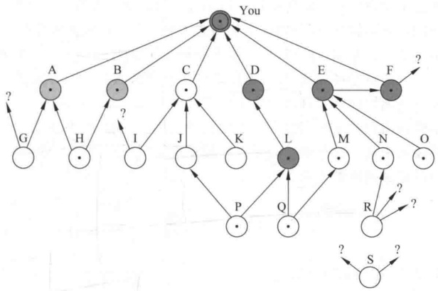

**图 10-15 PGP 信任关系示例**

图 10-15 可说明以下几个问题：

（1）所有被 You 信任的用户（包括完全信任和部分信任）的公开钥都被 You 签署，节点 L 除外。这种签名并不总是有必要的。但实际中大多数用户都愿意为他们信任的用户的公开钥签名。例如，E 的公开钥已被 F 签署，但 You 仍直接为 E 的公开钥签名。

（2）两个被部分信任的签名可用于证明其他密钥。例如，A 和 B 被 You 部分信任，则 PGP 认为 A 和 B 同时签署的 H 的公开钥是合法的。

（3）由一个完全可信的或两个部分可信的签名者签署的公开钥被认为是合法的，但这一公开钥的拥有者可能不被信任签署其他公开钥。例如，由于E是You完全可信的，You认为E为N签署的公开钥是合法的，但N却不被信任签署其他公开钥。所以R的公开钥虽然被N签名，但PGP却不认为R的公开钥是合法的。这种情况具有实际意义。例如，如果想向某一用户发送一个保密消息，则不必在各方面都信任这一用户，只要确信这一用户的公开钥是正确的即可。

（4）图中 S 是一个孤立节点，具有两个未知的签名者。这种公开钥可能是 You 从公钥服务器中得到的。PGP 不能由于这个公钥服务器的信誉好就简单地认为这个公开钥是合法的。

最后需指出的是，同一公开钥可能有多个用户ID。这是因为用户可能改过自己的名字（即ID）或者在多个ID名下申请了同一公开钥的签名，例如同一用户可能以自己的多个邮件地址作为自己的ID名。所以，可将具有多用户ID的同一公开钥以树结构组织起来，其中树根为这个公开钥，根的每一儿子是公开钥在一个ID下所获得的签名。对这个公开钥签署其他公开钥的信任程度取决于这一公开钥在不同ID下所获得的各个签名。

3. 公钥的吊销

用户如果怀疑与公开钥相应的秘密钥已被泄露，或者仅为避免使用同一密钥对的时间过长，就可吊销自己当前正使用的公开钥。这里所说的泄露指敌手从用户的秘密钥环和密码短语恢复了用户经加密的秘密钥。吊销公开钥可通过发放一个经自己签名的公开钥吊销证书，证书的格式与前述公钥证书的格式一样，但多了一个标识符，用来表示该证书的目的是吊销这一公开钥。注意，用户签署 $\underline{\text{公钥}}$吊销证书的秘密钥是与被吊销的公开钥相对应的。用户还需尽可能快、尽可能广泛地散发自己的公开钥吊销证书，以使自己的各通信对方都尽可能快地更新自己的公钥环。

敌手如果得到用户的秘密钥也可以发放这种公钥吊销证书，从而使敌手自己和其他用户都不能继续使用这一公开钥。敌手以这种方式使用用户的秘密钥显然比以其他恶意方式使用用户的秘密钥所带来的危险小得多。

## 习题

1. 下面是 X.509 三向认证的最初版本

$$\begin{aligned}&A\rightarrow B:A\{t_{A},r_{A},B\}\\&B\rightarrow A:B\{t_{B},r_{B},A,r_{A}\}\\&A\rightarrow B:A\{r_{B}\}\\ \end{aligned}$$

假定协议不使用时间戳，可在其中将所有时间戳设置为0，则攻击者C如果截获A、B以前执行协议时的消息，就可假冒A和B，以使A(B)相信通信的对方是B(A)。请提出一种不使用时间戳的、防中间人欺骗的简单方法。

2. 在 PGP 中，若用户有 N 个公开钥，则密钥 ID 至少有两个重复的概率有多大？

3. 在 PGP 中，先对消息签名再对签名加密，请详细说明这一顺序为什么优于先加密再对加密结果签名。

4. 在 PGP 的消息格式中，消息摘要的前两个 8 比特位组以明文形式传输。

（1）说明这种形式对哈希函数的安全性有多大程度的影响。

（2）接收方用消息摘要的前两个8比特位组，确定自己在验证发送方的数字签名时是否正确地使用了发送方的公开钥，其可信程度有多大？

5. 在表10-2中，公钥环中的每一项都有一个拥有者可信字段，用于表示这一公钥的属主（即拥有这一公钥的用户）的可信程度。这一字段能否充分表达PGP对这一公钥的信任？如果不能，则如何实现PGP对这一公钥的信任？

