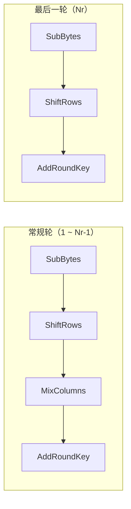
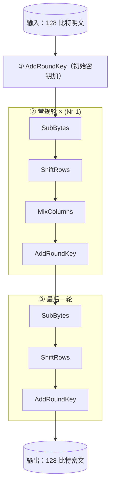

# P10 [2.3.1] AES 算法

> **课程**：西安电子科技大学 · 现代密码学（杨波第四版）
> **主讲人**：陈晓峰 · 网络与信息安全学院
> **章节**：第二讲 · 私钥密码学 · 2.3.1 AES 算法（先进的加密标准）

---

## 一、标准的重要性（拓展）

在讲 AES 之前，先谈谈"标准"的重要性：

> **一流企业做标准，二流企业做技术，三流企业做产品。**

- 如果算法被作为标准，别人用到你的算法就绕不开——用一次交一次钱
- 如果不掌握标准，就永远受制于人
- 例如 **WAPI**（中国无线网络安全标准），当时中美激烈博弈：中国先推为**国家标准**，再逐步推向国际

> **SM 系列算法**（SM2、SM3、SM4 等）也是这个道理——中国要有自己的密码标准，才能不受制于人。

---

## 二、AES 的征集与评选

### 2.1 历史背景

| 时间           | 事件                                                            |
| -------------- | --------------------------------------------------------------- |
| 1997.4         | NIST 发出征集 AES 标准的公告                                    |
| **要求** | 分组长度**128 比特**，支持 **128/192/256 比特**密钥 |
| 1998.8         | 第一次 AES 候选大会，公布**15 个**候选算法                |
| 2000.10        | 选出**5 个**最终候选算法                                  |
| 2001.10        | 宣布**Rijndael** 获胜，成为 AES 标准                      |

### 2.2 五个最终候选算法

| 算法                       | 设计者                    |
| -------------------------- | ------------------------- |
| **Mars**             | IBM                       |
| **RC6**              | RSA 实验室                |
| **Rijndael**（获胜） | Daemen & Rijmen（比利时） |
| **Serpent**          | Anderson, Biham, Knudsen  |
| **Twofish**          | Schneier 等               |

> 当时很多人（包括西电实验室）猜测 **Twofish** 会获胜——因为它是美国人设计的，
> 以为美国会偏向自己人。但最后评选非常公正，**Rijndael** 胜出，
> 因为它**在软硬件上综合表现最佳**，甚至在 **8 位单片机**上都能高效实现。

### 2.3 公布当天

AES 公布当天，西电的王老师和肖老师就带领学生开讨论班讲 Rijndael——展现了科研工作者的敏锐和热忱。

---

## 三、AES 的设计原则

| 原则                | 说明                       |
| ------------------- | -------------------------- |
| ① 抵抗所有已知攻击 | 能抵抗差分攻击、线性攻击等 |
| ② 实现速度快       | 在各种平台上均能高效实现   |
| ③ 设计简洁         | 数学原理清晰，易于分析     |

---

## 四、AES 基本参数

### 4.1 分组与密钥的可变组合

| 参数           | 取值                 |
| -------------- | -------------------- |
| 分组长度（Nb） | 128 / 192 / 256 比特 |
| 密钥长度（Nk） | 128 / 192 / 256 比特 |
| 组合数         | 9 种                 |
| 轮数（Nr）     | 取决于 Nb 和 Nk      |

**轮数对照表**：

|  Nb=4（128）  |  Nb=6（192）  |  Nb=8（256）  |
| :-----------: | :-----------: | :-----------: |
| Nk=4 → Nr=10 | Nk=4 → Nr=12 | Nk=4 → Nr=14 |
| Nk=6 → Nr=12 | Nk=6 → Nr=12 | Nk=6 → Nr=14 |
| Nk=8 → Nr=14 | Nk=8 → Nr=14 | Nk=8 → Nr=14 |

### 4.2 状态（State）

AES 的中间计算结果用**状态矩阵**表示：

- 矩阵为 **4 行**，列数 Nb = 分组长度 ÷ 32
- 每个元素为 **1 字节**（8 比特）
- 128 比特分组 → 4×4 矩阵（16 字节）

**种子密钥矩阵**类似：4 行，列数 Nk = 密钥长度 ÷ 32

---

## 五、AES 轮函数（核心）

AES 的轮函数由 **4 个部件**组成：



### 5.1 ① 字节代换（SubBytes）— S 盒

**作用**：非线性变换（混淆）

**数学原理**：

1. 在 **GF(2⁸)** 上求乘法逆元
2. 对结果进行 **GF(2) 上的仿射变换**

**对比 DES 的 S 盒**：

| 特性   | DES S 盒                 | AES S 盒                            |
| ------ | ------------------------ | ----------------------------------- |
| 设计   | **黑盒**（未公开） | **白盒**（完全公开）          |
| 计算   | 只能查表                 | 可自行计算（有限域求逆 + 仿射变换） |
| 可信度 | 存疑                     | 公开透明                            |

> AES 的 S 盒有明确的数学公式，不是黑盒子。但在实际实现中通常也**预先计算为查表**（256 字节的替换表），以提高效率。

### 5.2 ② 行移位（ShiftRows）

将状态矩阵的各行进行**循环左移**：

|  行号  | Nb=4（128 比特） | Nb=6（192 比特） | Nb=8（256 比特） |
| :-----: | :--------------: | :--------------: | :--------------: |
| 第 0 行 |       不移       |       不移       |       不移       |
| 第 1 行 |   左移 1 字节   |   左移 1 字节   |   左移 1 字节   |
| 第 2 行 |   左移 2 字节   |   左移 2 字节   |   左移 3 字节   |
| 第 3 行 |   左移 3 字节   |   左移 3 字节   |   左移 4 字节   |

### 5.3 ③ 列混合（MixColumns）

将状态矩阵的**每一列**作为一个整体，进行线性变换：

- 将每列视为 **GF(2⁸) 上的多项式**
- 与固定多项式 $c(x) = \mathtt{03}x^3 + \mathtt{01}x^2 + \mathtt{01}x + \mathtt{02}$ 相乘
- 模 $x^4 + 1$

矩阵形式：

$$
\begin{bmatrix}
b_0 \\ b_1 \\ b_2 \\ b_3
\end{bmatrix}
=
\begin{bmatrix}
02 & 03 & 01 & 01 \\
01 & 02 & 03 & 01 \\
01 & 01 & 02 & 03 \\
03 & 01 & 01 & 02
\end{bmatrix}
\begin{bmatrix}
a_0 \\ a_1 \\ a_2 \\ a_3
\end{bmatrix}
$$

> 注意：这里的乘法和加法都在 **GF(2⁸)** 上进行。

### 5.4 ④ 密钥加（AddRoundKey）

将**轮密钥矩阵**与状态矩阵进行 **逐比特异或**（XOR）。

---

## 六、密钥编排（Key Expansion）

### 6.1 基本原理

从种子密钥生成每一轮的轮密钥（共 Nr+1 轮密钥）。

以 **128 比特密钥**（Nb=4, Nk=4, Nr=10）为例：

- 需要密钥总比特数：${128} \times (10 + 1) = 1408$ 比特
- 初始 4 个字：W₀, W₁, W₂, W₃
- 扩展为 **44 个字**（W₀ ~ W₄₃）

### 6.2 扩展规则

```
W[i] = W[i-4] ⊕ T(W[i-1])   当 i 是 4 的倍数
W[i] = W[i-4] ⊕ W[i-1]      当 i 不是 4 的倍数
```

### 6.3 T 函数

T 函数包含三部分：

1. **字循环**（RotWord）：循环左移 1 字节（ABCD → BCDA）
2. **字节代换**（SubWord）：用 S 盒对每个字节代换
3. **轮常数加**（Rcon）：与轮常数 $\text{RC}[i]$ 异或（$\text{RC}[1] = \mathtt{01}, \text{RC}[2] = \mathtt{02}, \dots$）

---

## 七、AES 加密总流程



---

## 八、AES 与 DES 对比

| 特性     | DES                 | AES                           |
| -------- | ------------------- | ----------------------------- |
| 分组长度 | 64 比特             | 128 比特                      |
| 密钥长度 | 56 比特（固定）     | 128/192/256 比特（可变）      |
| 结构     | Feistel 网络        | SPN（代换-置换网络）          |
| 轮数     | 16                  | 10/12/14                      |
| S 盒     | 黑盒（未公开）      | 白盒（有限域求逆 + 仿射变换） |
| 设计者   | IBM + NSA           | Daemen & Rijmen（比利时）     |
| 当前状态 | 已淘汰（可用 3DES） | 广泛使用                      |

---

> **下一节预告**：P11 将介绍中国的 **SM4 算法**，这是中国自己的分组密码标准。
