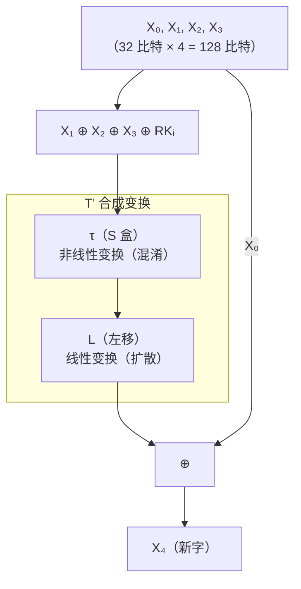

# P11 [2.4.1] SM4 算法

> **课程**：西安电子科技大学 · 现代密码学（杨波第四版）
> **主讲人**：陈晓峰 · 网络与信息安全学院
> **章节**：第二讲 · 私钥密码学 · 2.4.1 SM4 算法（中国商用密码算法）

---

## 一、中国商用密码标准体系

SM 系列算法由**国家商用密码管理办公室**制定：

| 算法 | 类型 | 用途 |
|:----:|:----:|:----:|
| **SM1** | 对称加密 | 分组密码（硬件实现，未公开算法细节） |
| **SM2** | 非对称加密 | 椭圆曲线公钥密码（类似 ECDSA） |
| **SM3** | 哈希函数 | 密码杂凑算法 |
| **SM4** | 对称加密 | 分组密码（**本讲内容**） |
| **SM7** | 对称加密 | 分组密码（非接触式 IC 卡） |
| **SM9** | 非对称加密 | 基于身份的密码体制 |
| **ZUC（祖冲之算法）** | 流密码 | 4G/LTE 国际标准 |

> **为什么要制定自己的标准？**
> - 如果一直采用别人的标准，就要受制于人
> - 别人可能对我们出口**安全级别受限**的算法
> - 掌握标准才能不被"卡脖子"
> - 先推为**国家标准**，再逐步推向国际——WAPI 就是典型例子

---

## 二、SM4 算法概述

### 2.1 发展背景

- SM4 主要用于 **WAPI**（无线局域网鉴别与保密基础结构）
- 当时 WAPI 与 IEEE 802.11 标准竞争激烈
- 最终中国先推为**国家标准**，逐步在国际上获得认可

### 2.2 基本参数

| 参数 | 值 |
|:----:|:---:|
| 算法类型 | 分组密码 |
| 分组长度 | **128 比特** |
| 密钥长度 | **128 比特**（固定，不像 AES 支持多种组合） |
| 轮数 | **32 轮** |
| 结构 | **非线性迭代**（类似 Feistel 但并非标准 Feistel） |
| 处理单位 | 字节（8 比特）和字（32 比特） |

> 与 AES 相比，SM4 的密钥和分组只有一种固定组合（128+128），安全性强度单一。

---

## 三、SM4 的基本运算

| 运算 | 说明 |
|:----:|:----:|
| ⊕（比特异或） | 32 位字的逐比特异或 |
| ⋘ i（循环左移） | 32 位字循环左移 i 位 |

---

## 四、SM4 的轮函数

### 4.1 总体结构

SM4 每组将 128 比特分为 **4 个 32 位字**：$X_0, X_1, X_2, X_3$

加密过程（以 $X_4$ 的推导为例）：



**轮函数公式**：
$$X_{i+4} = X_i \oplus T^{\prime}(X_{i+1} \oplus X_{i+2} \oplus X_{i+3} \oplus RK_i)$$

其中 $T^{\prime}$ 为**合成变换**，包含两部分：
- **τ**（非线性变换）：S 盒代换
- **L**（线性变换）：循环左移

### 4.2 ① 非线性变换 τ（S 盒）

- 由 **4 个 S 盒并行**构成
- 每个 S 盒：**8 比特输入 → 8 比特输出**
- S 盒是一个**固定查找表**（16×16）

**查表方式**：
```
输入 A = EF（十六进制）
行号 = E，列号 = F
查表 → S(EF) = 84（十六进制）
```

> 与 DES 类似，SM4 的 S 盒也是通过**查表**实现。与 AES 不同的是，SM4 的 S 盒设计原理没有像 AES 那样完全公开为有限域运算。

### 4.3 ② 线性变换 L

以 **32 位字**为处理单元，作用是**扩散**。

输入 B，输出 C = L(B)：

$$C = L(B) = B \oplus (B \lll 2) \oplus (B \lll 10) \oplus (B \lll 18) \oplus (B \lll 24)$$

即对输入进行**多次循环左移后异或**。

---

## 五、SM4 加解密流程

### 5.1 加密

```plaintext
输入：X₀, X₁, X₂, X₃（128 比特明文）

轮函数迭代（i = 0 → 31）：
    Xᵢ₊₄ = Xᵢ ⊕ T'(Xᵢ₊₁ ⊕ Xᵢ₊₂ ⊕ Xᵢ₊₃ ⊕ RKᵢ)

反序处理：
    Y₀ = X₃₅, Y₁ = X₃₄, Y₂ = X₃₃, Y₃ = X₃₂

输出：Y₀, Y₁, Y₂, Y₃（128 比特密文）
```

> **反序处理**（将最后四字倒序输出）是为了使**加解密结构相同**。

### 5.2 解密

解密与加密使用**相同算法**，只是将轮密钥 **逆序使用**：
$$RK^{\prime}_i = RK_{31-i}$$

---

## 六、密钥编排（Key Expansion）

### 6.1 基本流程

种子密钥 MK₀, MK₁, MK₂, MK₃ → 每轮 32 比特的轮密钥 RK₀ ~ RK₃₁

**步骤**：

```plaintext
// 初始化：系统参数 FK₀, FK₁, FK₂, FK₃
K₀ = MK₀ ⊕ FK₀
K₁ = MK₁ ⊕ FK₁
K₂ = MK₂ ⊕ FK₂
K₃ = MK₃ ⊕ FK₃

// 迭代生成 32 个轮密钥
for i = 0 to 31:
    Kᵢ₊₄ = Kᵢ ⊕ T''(Kᵢ₊₁ ⊕ Kᵢ₊₂ ⊕ Kᵢ₊₃ ⊕ CKᵢ)
    RKᵢ  = Kᵢ₊₄

输出：RK₀, RK₁, ..., RK₃₁（各 32 比特）
```

### 6.2 常量说明

| 常量 | 说明 |
|:----:|:----:|
| **FK₀~FK₃** | 系统参数常量（固定值） |
| **CK₀~CK₃₁** | 32 个固定密钥参数，按特定规则生成 |
| **T''** | 与加密的 T' 类似，但其中的 L 变为 L'（略有不同） |

### 6.3 T'' 中的 L' 变换

与加密中的 L 不同，密钥扩展中使用的线性变换：

$$L^{\prime}(B) = B \oplus (B \lll 13) \oplus (B \lll 23)$$

---

## 七、SM4 与 AES 对比

| 特性 | AES | SM4 |
|:----:|:---:|:---:|
| 分组长度 | **128/192/256** 比特 | 128 比特（固定） |
| 密钥长度 | **128/192/256** 比特 | 128 比特（固定） |
| 轮数 | 10/12/14 | **32** |
| 结构 | SPN | 非线性迭代 |
| S 盒 | **白盒**（有限域运算） | 查表（设计原理未完全公开） |
| 标准性质 | 国际标准 | **中国国家标准** |
| 应用 | 全球通用 | WAPI 等中国标准 |

---

> **下一节预告**：P12 将介绍**分组密码的工作模式**（ECB、CBC、CFB、OFB、CTR 等）。
