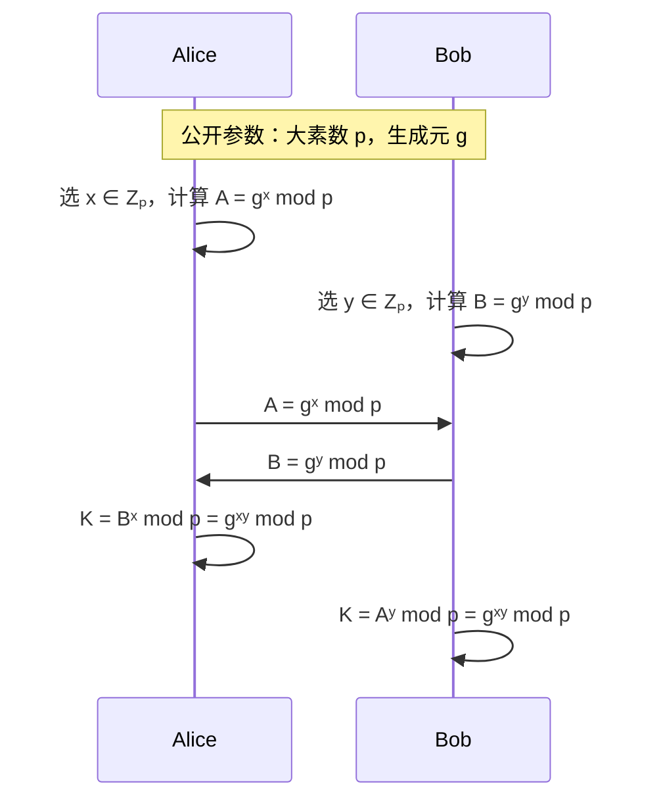
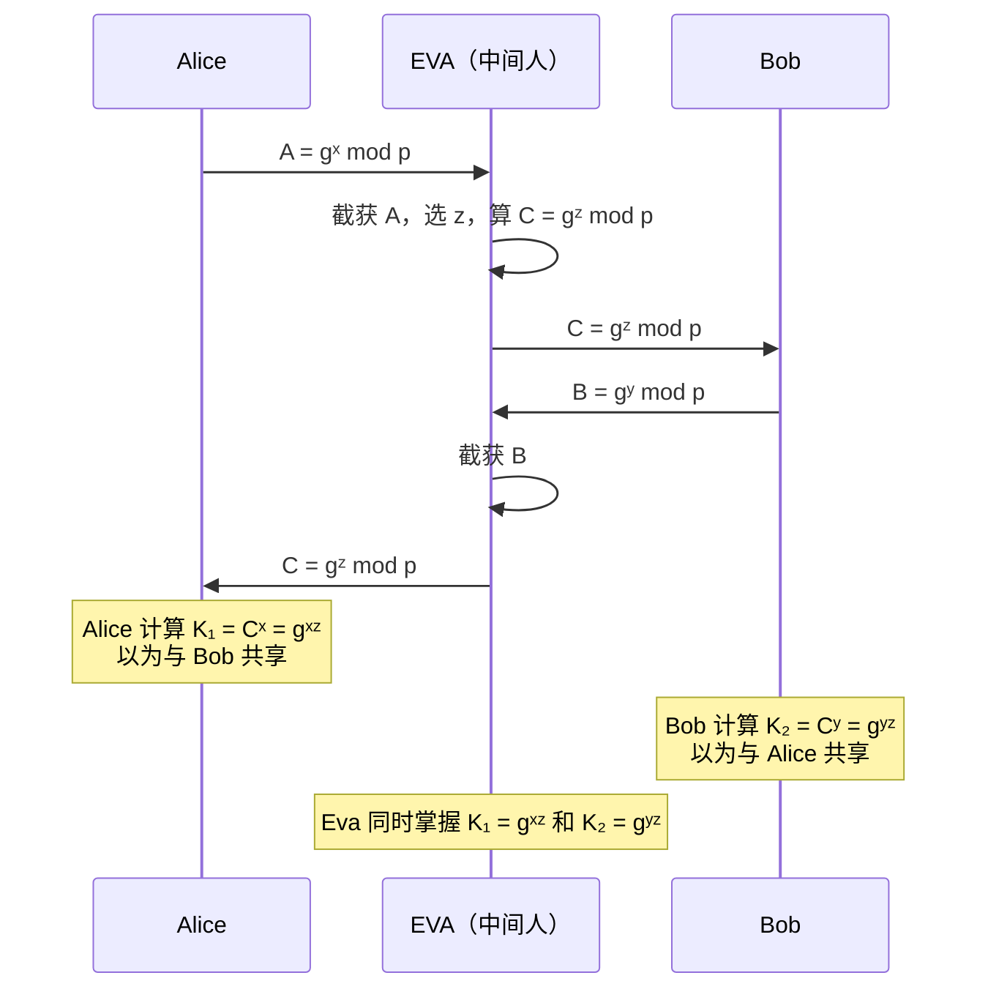

# P13 [3.1.1] 概述

> **课程**：西安电子科技大学 · 现代密码学（杨波第四版）
> **主讲人**：陈晓峰 · 网络与信息安全学院
> **章节**：第三讲 · 公钥加密技术 · 3.1.1 概述

---

## 一、为什么需要公钥密码？

### 1.1 对称密码的根本问题

在 1976 年之前，人类使用的全是**对称密码体制**，其核心问题在于：

**加密密钥 = 解密密钥**（或可相互推导）

这意味着：

- 加密者和解密者**必须共享一个密钥**
- 密钥分发必须通过**安全可靠的方式**（面对面、可信信使等）
- 这在网络时代几乎做不到

### 1.2 密钥管理困境

在一个有 $N$ 个用户的网络中：

- 任意两方需要**不同的密钥**（否则第三方就能窃听他人通信）
- 所需密钥总数 = $C_N^2 = \frac{N(N-1)}{2} \approx O(N^2)$
- 当 $N=10000$ 时，需要**约 5000 万个密钥**——管理、生成、保管、销毁极为困难

### 1.3 信任问题

> **密码学的本质是要解决信任问题。**

但在对称密码中，要么需要通过可信信使传递密钥（**无条件的信任**），要么需要一个可信的密钥分配中心（KDC）——这两个方法在网络中都很难实现。

---

## 二、公钥密码学的诞生

### 2.1 划时代的论文

|      时间      |              人物              | 事件                                                       |
| :------------: | :-----------------------------: | :--------------------------------------------------------- |
| **1976** |   **Diffie & Hellman**   | 发表《New Directions in Cryptography》，奠定公钥密码学基础 |
|      1977      | Rivest, Shamir & Adleman（MIT） | 提出**RSA 算法**                                     |
|                |                                | 获**图灵奖**（公钥密码学的贡献）                     |

### 2.2 历史的另一面（被保密的先驱）

实际上，在 1970 年代早期，英国军方通信部门有三位研究人员：

- **James Ellis**（提出公钥概念）
- **Clifford Cocks**（发明了 RSA 的一个特例）
- **Malcolm Williamson**（发明了密钥协商协议）

但他们因在军方工作，成果一直**保密**，直到 **1997 年**才对外公开。

> 按公开文献，**Diffie 和 Hellman 仍然是公钥密码学之父**。但历史的真相是：公钥密码学实际上由这三名英国的密码学家独立发明得更早。

### 2.3 更早的思想萌芽

**1874 年**，Jevons 在其著作中就描述了**单向函数与密码学的关系**，并讨论了**整数分解问题**——后来被 RSA 系统所用。

---

## 三、公钥密码的核心思想

### 3.1 加密能力与解密能力分离

|   特性   |      对称密码      |           公钥密码           |
| :------: | :----------------: | :--------------------------: |
| 加密密钥 |     = 解密密钥     |         ≠ 解密密钥         |
| 加密能力 | 能加密 → 也能解密 | 能加密 →**不能解密** |
| 密钥管理 |     需共享密钥     | **公钥公开，私钥自保** |

### 3.2 一对多通信

- 对称密码：**一对一**（两人需要共享一个密钥）
- 公钥密码：**一对多**（所有人可用同一个公钥加密，只有私钥持有者可解密）

### 3.3 密钥数量对比

|   体制   |         N 个用户的密钥数量         |
| :------: | :--------------------------------: |
| 对称密码 |             $O(N^2)$             |
| 公钥密码 | $O(N)$（每人只需保管自己的私钥） |

---

## 四、Diffie-Hellman 密钥协商协议

### 4.1 协议流程

两个从未见过面的人如何安全协商密钥？（**公开信道**上完成）

**结果**：ALICE 和 BOB 共享了秘密 $K = g^{xy} \bmod p$。

### 4.2 安全性基础

窃听者可以获得 $g^x$ 和 $g^y$，但**无法计算** $g^{xy}$：

- 这就是 **计算性 Diffie-Hellman 假设（CDH）**
- 基于**离散对数问题**的困难性

> **注意**：不同教科书写法不同。当在有限域乘法群中讨论时，有模 p；当在**一般群**中讨论时，不需要模——因为群运算就是抽象定义的。

### 4.3 局限：无法抵抗中间人攻击

DH 密钥协商协议**只能抵抗被动攻击**（窃听），**不能抵抗主动攻击**（中间人攻击）。

**中间人攻击**流程：

- ALICE 以为在和 BOB 通信，实际上在和 EVA 通信
- BOB 也以为在和 ALICE 通信，实际上也在和 EVA 通信
- EVA 可以解密所有消息，再加密转发

> **原因**：DH 协议中没有**身份认证**机制。

---

## 五、公钥加密体制的形式化定义

一个公钥加密方案由**三个多项式时间算法**组成：

### 5.1 算法定义

|           算法           |          输入          |           输出           |         性质         |
| :----------------------: | :---------------------: | :----------------------: | :------------------: |
|  **Setup** (生成)  |     安全参数${1}^n$     | 公钥$PK$ + 私钥 $SK$ |   **概率性**   |
| **Encrypt** (加密) | 公钥$PK$ + 明文 $m$ |        密文$C$        | 一般**概率性** |
| **Decrypt** (解密) | 私钥$SK$ + 密文 $C$ |        明文$m$        |   **确定性**   |

### 5.2 安全要求

- **公钥 $PK$**：可被任何人知道（像电话本一样公开）
- **私钥 $SK$**：必须由接收者**严格保密**
- 由 $SK$ 推导 $PK$：**容易**
- 由 $PK$ 推导 $SK$：**计算上不可行**（单向性）

> 公钥的安全由 **PKI（公钥基础设施）** 保护：CA 签发证书，将用户身份与公钥绑定。

---

## 六、目前安全实用的公钥体制

经过几十年的研究和实践，目前安全实用的公钥密码体制只有**两大类**：

|           类型           |         困难问题         |             代表算法             |
| :----------------------: | :----------------------: | :------------------------------: |
| **基于大整数分解** |      大整数分解问题      |          **RSA**          |
|  **基于离散对数**  | 离散对数问题 / CDH / DDH | **ElGamal**, **ECC** |

其他候选（仍在研究中）：

- **格密码**（Lattice-based，后量子密码候选）
- **NTRU**
- **多变元密码**

---

> **下一节预告**：P14 深入讲解 **陷门单向函数**——公钥密码的数学基础。
