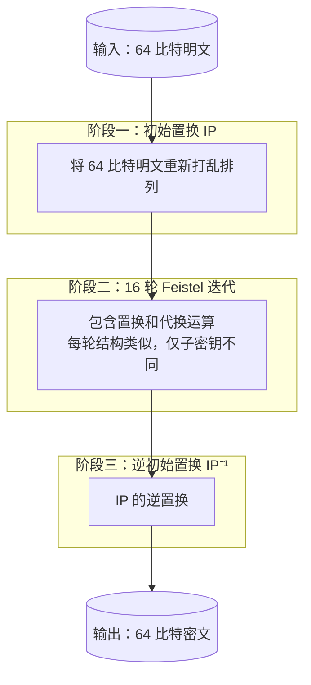
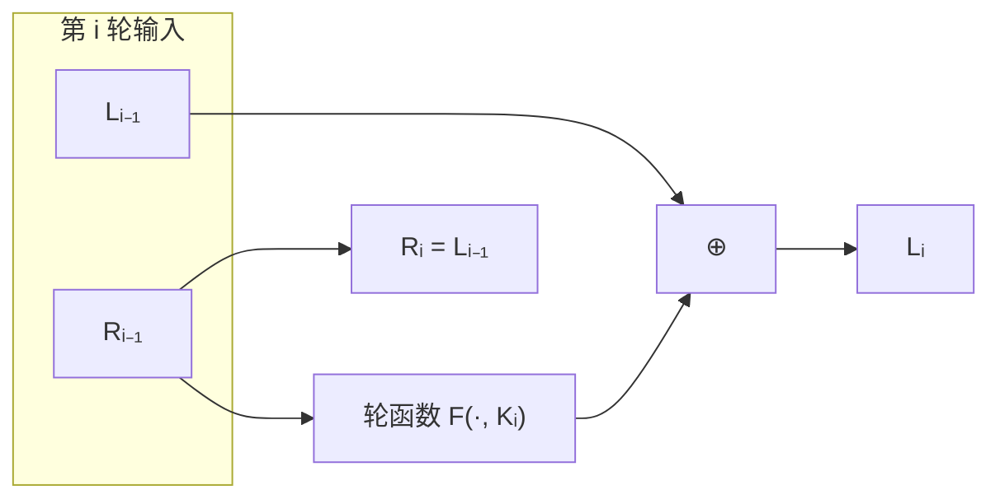

# P8 [2.2.1] DES 算法 (1)

> **课程**：西安电子科技大学 · 现代密码学（杨波第四版）
> **主讲人**：陈晓峰 · 网络与信息安全学院
> **章节**：第二讲 · 私钥密码学 · 2.2.1 DES 算法（上）

---

## 一、DES 的背景与历史

### 1.1 美国数据加密标准的制定（1973–1974）

1973 年，美国国家标准局（NBS，后更名为 NIST）公开征求数据加密标准提案，1974 年再次公告，提出了以下要求：

| #  | 要求                                                                         |
| -- | ---------------------------------------------------------------------------- |
| ① | 加密算法要**完全确定**，没有含混之处                                   |
| ② | 算法要有足够高的安全水准，能检测到威胁；恢复密钥所需运算的时间或代价要足够大 |
| ③ | **保护方法必须只依赖密钥的保密**（即 Kerckhoff 原则）                  |
| ④ | 对任何用户或产品的供应者不加区分（不歧视）                                   |

> **关于原则③**：这正体现了 Kerckhoff 原则——算法可以公开，唯一需要保密的是密钥。DES 在这方面走对了路，AES 更是如此。
>
> **关于原则④**：虽然 NBS 嘴上这么说，但美国对其他国家（尤其是中国）出口的 DES 算法实际上要弱一些——"科学是无国界的，但科学家是有国界的"。

### 1.2 DES 的诞生与演化

- **研发团队**：IBM 公司，由 **Feistel 博士**领导的一个四人小组，后来成立新的密码体制小组，设计了 **Feistel 网络结构**
- **前身**：1971 年完成的 **Lucifer（路西法）密码**——64 比特分组，128 比特密钥
- **演化**：在 Lucifer 基础上演变为 DES

> 注意：Lucifer 最初设计时使用 **128 比特密钥**，说明当时已经意识到密钥太短会有问题。
> 但 DES 公布时密钥被缩短为 **64 比特**（其中 8 比特校验位，实际有效密钥 **56 比特**，
> 密钥空间 ${2}^{56}$）。

### 1.3 DES 的发展时间线

| 时间   | 事件                                                    |
| ------ | ------------------------------------------------------- |
| 1973   | NBS 公开征求数据加密标准                                |
| 1975.3 | NBS 公布 DES 算法作为联邦信息处理标准，征集意见         |
| 1977   | DES 正式成为联邦标准（FIPS PUB 46）                     |
| 1981   | 成为美国 ANSI 标准（称 DEA）                            |
| 1983   | ISO 将其作为国际标准                                    |
| 1990s  | 计算机计算能力提升，DES 安全性受到挑战                  |
| 1997   | NIST 启动 AES 征集                                      |
| 1998   | 不再批准 DES 作为联邦数据加密标准（DES 最终被暴力破解） |

### 1.4 DES 的历史地位

- 迄今为止 **得到最广泛应用** 的加密算法
- **最具代表性** 的分组加密体制
- 在公钥密码领域，RSA 具有类似的地位

> **注意**：DES 的历史意义不仅在于算法本身，更在于它遵循了 **算法公开** 的原则——算法全部公开后，全世界的密码学家都可以来破译和评估，这才是 Kerckhoff 原则的真正体现。

---

## 二、EES（Escrowed Encryption Standard）的弯路

### 2.1 背景

- 1993 年，克林顿政府提出一项新的加密技术标准 —— **EES（托管加密标准）**
- 由 NSA 负责，**算法不公开**，仅由五个人的小组评估
- 算法属于美国政府 **秘密级**

### 2.2 问题

- 违背了 Kerckhoff 原则——算法保密，不走公开破译的路线
- 1995 年，贝尔实验室的 **Blum 博士** 在 PC 机上仅用 **45 分钟** 就成功伪造了一个 ID 码
- 公众对这个体制丧失了信心

### 2.3 结论

> **教训**：密码学的发展史证明——算法公开、全球评估是确保安全的正道。迷信权威、将算法保密起来是"大错而特错"的。

---

## 三、DES 算法概述

### 3.1 基本参数

| 参数     | 值                                                                     |
| -------- | ---------------------------------------------------------------------- |
| 算法类型 | 分组密码（Block Cipher）                                               |
| 分组长度 | **64 比特**                                                      |
| 密钥长度 | **56 比特**（声明为 64 比特，其中 8 比特为校验位，与安全性无关） |
| 密钥空间 | ${2}^{56}$                                                             |
| 结构     | **Feistel 网络结构**（16 轮迭代）                                |

> 注：DES 中存在一些**弱密钥（Weak Keys）** 和**半弱密钥（Semi-Weak Keys）**，在使用时需要注意。

### 3.2 加密流程（三个阶段）



#### 阶段一：初始置换（IP）

- 将 64 比特明文按一定规律重新打乱
- 具体做法：按列写入（每列相差 8 位），偶数位移到上方，奇数位移到下方，再逆序排列
- 本质上是一个已知的一一对应映射，**对密码安全性贡献不大**
- 实际使用中可以通过**查表**实现

#### 阶段二：16 轮迭代变换（核心）

- 每一轮包含**置换（Permutation）** 和**代换（Substitution）** 运算
- 16 轮结构**非常类似**，只是每一轮使用的**子密钥不同**
- 第 16 轮变换的输出分为左右两半，**交换次序**

#### 阶段三：逆初始置换（IP⁻¹）

- IP 的逆变换
- 同样对密码安全性没有太大帮助

> **理解**：DES 的核心是 **16 轮 Feistel 迭代**。只要搞清一轮的结构，就可以理解全部 16 轮。

### 3.3 Feistel 网络结构

DES 所依赖的核心结构称为 **Feistel 网络（Feistel Network）**，由 **Horst Feistel** 设计。

基本思想：将数据分为左右两半，每轮用密钥控制的轮函数处理右半部分，再与左半部分异或，然后交换位置。



加密结构保证了**加解密可以用同一套算法**，只需将子密钥的使用顺序反转即可——这是 Feistel 网络的一个重大优势。

---

## 四、初始置换 IP 详解

### 4.1 IP 置换表的作用

IP 置换将输入的 64 比特明文按固定规则重新排列位置。其规律：

1. 按列写入（8 列 × 8 行），列中元素位置号相差为 8
2. 将偶数列元素全部放到上方
3. 将奇数列元素全部放到下方
4. 逆序排列

### 4.2 举例说明

假设明文分组为 64 比特编号 1, 2, 3, ..., 64：

```
原始排列（按行）：
 1  2  3  4  5  6  7  8
 9 10 11 12 13 14 15 16
17 18 19 20 21 22 23 24
...                     → 64
```

经过 IP 置换后，偶数列排到上面，奇数列排到下面，再逆序排列，得到新的排列顺序。

### 4.3 密码学意义

> **IP 和 IP⁻¹ 主要是为了打破明文中的 ASCII 码划分关系**，在密码学意义上作用不大，因为输入与输出是已知的一一对应，可以通过查表实现。**DES 的安全性完全依赖于 16 轮 Feistel 迭代**。

---

## 五、DES 的安全性与后续发展

### 5.1 DES 的安全性

- 56 比特密钥在 1970 年代是安全的
- 随着计算机计算能力的增长，${2}^{56}$ 的密钥空间变得可以穷举
- 1998 年，DES 被 **暴力破解（穷举攻击）** 成功，因此不再被批准为联邦标准

### 5.2 修补方案：三重 DES（3DES / Triple DES）

在 DES 被破解后，一种修补方案是 **Triple DES**（三重 DES）：

- 使用三个 56 比特密钥（或两个密钥），进行三次 DES 加密
- 有效密钥长度提高至 112 或 168 比特

### 5.3 新标准：AES（Advanced Encryption Standard）

- 1997 年，NIST 启动 **AES（先进加密标准）** 的制定
- 全球征集算法，遵循公开评估原则
- 1998.8：从候选方案中选出 **15 个**
- 2000 年：最终评选出 **Rijndael**（由比利时密码学家 Daemen 和 Rijmen 设计）作为 AES
- AES 的获胜过程公正透明，标志着密码学公开竞争模式的成熟

> 值得一提的是，当时呼声很高的 **Twofish**（由 Bruce Schneier 等人设计）
> 并未胜出，但最终评选是公正的，Rijndael 因其在软硬件上的综合优势胜出。

---

## 六、本节小结

| 要点       | 内容                                                  |
| ---------- | ----------------------------------------------------- |
| DES 背景   | 1973–1977 年由 NBS 制定，IBM 设计，源自 Lucifer 密码 |
| 核心结构   | **Feistel 网络**，16 轮迭代                     |
| 加密三阶段 | IP 置换 → 16 轮 Feistel 迭代 → IP⁻¹ 逆置换        |
| 密钥       | 56 比特有效（64 比特含 8 校验位）                     |
| 分组       | 64 比特                                               |
| 历史教训   | EES 走弯路 → 算法公开和全球评估才是正道              |
| 后续发展   | DES → 3DES → AES（Rijndael）                        |
| 历史地位   | 迄今为止最广泛使用、最具代表性的分组密码算法          |

---

> **下一节预告**：P9 继续深入 DES 算法的轮函数细节，包括 S 盒、扩展置换、P 置换等核心部件。
