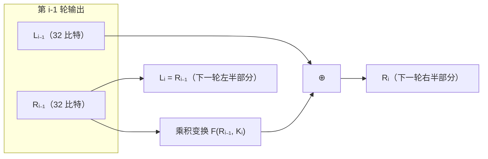
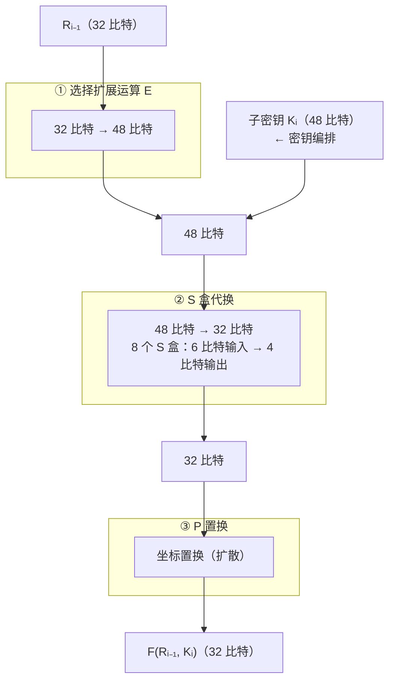
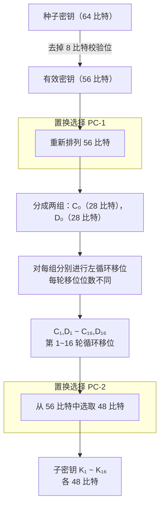
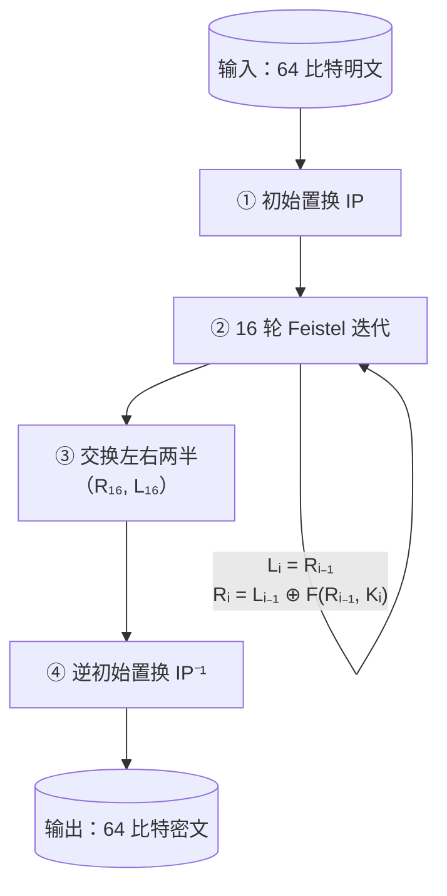

# P9 [2.2.2] DES 算法 (2)

> **课程**：西安电子科技大学 · 现代密码学（杨波第四版）
> **主讲人**：陈晓峰 · 网络与信息安全学院
> **章节**：第二讲 · 私钥密码学 · 2.2.2 DES 算法（下）——轮函数详解

---

## 一、Feistel 网络结构（回顾）

DES 的核心是 **16 轮迭代的 Feistel 网络结构**，每轮结构相同，仅子密钥不同。

### 1.1 一轮的结构



**关键观察**：

- **右半部分直接赋值**给下一轮的左半部分（Lᵢ = Rᵢ₋₁）
- **左半部分**先经过 **乘积变换 F**（以 Rᵢ₋₁ 和子密钥 Kᵢ 为输入），再与 Lᵢ₋₁ 异或得到下一轮的右半部分（Rᵢ = Lᵢ₋₁ ⊕ F(Rᵢ₋₁, Kᵢ)）
- 只需把 **乘积变换 F** 搞明白，就理解了 DES 一轮的核心

---

## 二、乘积变换 F（核心）详解

F 函数将 32 比特输入变换为 32 比特输出，包含四个步骤：



---

## 三、① 选择扩展运算 E（Expansion）

### 3.1 作用

将 **32 比特**输入扩展为 **48 比特**（增加 16 比特）。

### 3.2 扩展规则

- 将 32 比特分为 8 组，每组 4 比特
- 每组**两端各扩展 1 比特**（复制相邻组的边界比特）
- 具体：每个 4 比特组扩展为 6 比特

**示例**（位置编号）：

```
原始：1  2  3  4 | 5  6  7  8 | 9  10 11 12 | ...
扩展：4  1  2  3  4  5 | 8  5  6  7  8  9 | 12 9  10 11 12 13 | ...
```

即每个组的第 1 个比特前面补上**前一组的最后 1 比特**，后面补上**后一组的第 1 个比特**，形成 6 比特。

### 3.3 目的

- 使 S 盒的输入与密钥位产生**多次重叠**
- 实现 **雪崩效应**：明文或密钥的微小变化引起密文的剧烈变化

---

## 四、② S 盒代换（选择压缩运算）

### 4.1 概览

| 项目          | 值                          |
| ------------- | --------------------------- |
| S 盒数量      | **8 个**（S₁ ~ S₈） |
| 每个 S 盒输入 | **6 比特**            |
| 每个 S 盒输出 | **4 比特**            |
| 总输入        | 48 比特（8 × 6）           |
| 总输出        | 32 比特（8 × 4）           |

### 4.2 S 盒的查找方式

每个 S 盒是一个 **4 行 × 16 列** 的查找表，数值范围为 0~15（4 比特表示）。

给定 6 比特输入 $b_1 b_2 b_3 b_4 b_5 b_6$：

```
b₁ b₂ b₃ b₄ b₅ b₆
│                │
行号 = b₁b₆（2 比特，取值 0~3）
列号 = b₂b₃b₄b₅（4 比特，取值 0~15）
       │
       ▼
查表 → 输出一个 0~15 的整数 → 二进制展开为 4 比特
```

**示例**：

- 输入 6 比特：`11 1001 1`（b₁=1, b₂=1, b₃=1, b₄=0, b₅=0, b₆=1）
- 行 = b₁b₆ = `11` = **第 3 行**
- 列 = b₂b₃b₄b₅ = `1001` = **第 9 列**
- 查 S 盒表 → 输出数值 **11** → 二进制 **1011**（4 比特）

### 4.3 DES S 盒的问题——"黑盒子"

| 特性     | DES S 盒                        | AES S 盒                                |
| -------- | ------------------------------- | --------------------------------------- |
| 设计原理 | **未公开**（黑盒子）      | **公开**（有限域求逆 + 仿射变换） |
| 可计算性 | 只能查表，无法自行计算          | 有明确的数学公式                        |
| 争议     | 怀疑 NSA 可能留有**后门** | 公开透明，全球验证                      |

> **历史教训**：DES 的 S 盒直到现在（算法已被淘汰）也**未公开设计原理**，
> 被认为可能是 NSA 故意设置为黑盒子，甚至可能留有后门。
> 而 AES 的 S 盒完全公开，有明确的数学表达式，体现了 Kerckhoff 原则的真正精神。

### 4.4 S 盒的作用——混淆（Confusion）

- S 盒是 DES 中**唯一的非线性部件**
- 对应 Shannon 提出的**混淆**概念：使密文与密钥之间的关系变得复杂
- 没有 S 盒，整个 DES 就是线性的，极易被破译

---

## 五、③ P 置换（Permutation）

### 5.1 作用

将 S 盒输出的 32 比特进行**坐标置换**（重新排列位置）。

### 5.2 实现

- 固定置换表（查表实现）
- 同样有确定规则，但设计原理未详细解释

### 5.3 作用——扩散（Diffusion）

- 对应 Shannon 提出的**扩散**概念
- 使明文的每一位影响到密文的尽可能多位
- 将 S 盒的输出比特**分散**到下一轮的多个位置

---

## 六、密钥编排（Key Schedule）

### 6.1 概述

从 **64 比特种子密钥**（含 8 比特校验位）生成 **16 轮各 48 比特的子密钥**。

### 6.2 流程



### 6.3 循环移位位数

| 轮次        | 左移位数       |
| ----------- | -------------- |
| 1, 2, 9, 16 | **1 位** |
| 其余轮次    | **2 位** |

### 6.4 为什么要输出 48 比特？

因为 **选择扩展运算 E** 将 32 比特扩展为 48 比特后，需要与 **48 比特**的子密钥进行异或运算——所以子密钥必须是 48 比特。

---

## 七、DES 加密过程总结



**解密**：使用相同的算法，但将子密钥 **逆序使用**（K₁₆ → K₁），由于 Feistel 网络的结构特性，加解密可以共用同一算法。

---

## 八、DES 的安全性分析

### 8.1 密钥太短（核心问题）

| 参数           | 值                | 说明               |
| -------------- | ----------------- | ------------------ |
| DES 密钥长度   | **56 比特** | 实际有效           |
| Lucifer 原设计 | 128 比特          | IBM 最初提交       |
| IBM 建议方案   | 112 比特          | 被 NSA 拒绝        |
| 最终 DES 标准  | 56 比特           | **故意缩短** |

> **争议**：NSA 故意限制 DES 密钥长度——对自己国家用强版本，对其他国家出口弱版本。

### 8.2 穷举攻击成本演变

| 时间  | 攻击方式                      | 所需时间            |
| ----- | ----------------------------- | ------------------- |
| 1970s | 通用微处理器（100μs/次加密） | 约**2 亿年**  |
| 1990s | 最快 LC 器件                  | 约**11 万年** |
| 1998  | 专用解密机（\$100 万美元）    | **3.5 小时**  |

> 1998 年，EFF（电子前沿基金会）用 **\$250,000** 制造的 **Deep Crack** 专用机在 **56 小时** 内破解了 DES。之后更快的专用机只需 **3.5 小时**。

### 8.3 改进方案

| 方案                       | 方法                             | 有效密钥长度     |
| -------------------------- | -------------------------------- | ---------------- |
| **三重 DES（3DES）** | 加密 → 解密 → 加密（三个密钥） | 112 或 168 比特  |
| **AES**              | 全新设计，推倒重来               | 128/192/256 比特 |

### 8.4 其他攻击方法

- **差分密码分析**（Biham & Shamir, 1990）
- **线性密码分析**（Matsui, 1993）
- 这些分析方法理论上可将 DES 的破译复杂度降低，但**穷举攻击**仍是实际中最有效的

---

## 九、核心概念对照表

| 概念                        | Shannon 术语                  | DES 中的实现                            |
| --------------------------- | ----------------------------- | --------------------------------------- |
| **混淆**（Confusion） | 使密文与密钥关系复杂          | **S 盒**（非线性代换）            |
| **扩散**（Diffusion） | 明文/密钥影响尽可能多的密文位 | **扩展运算 E** + **P 置换** |
| **乘积变换**          | 交替进行代换与置换            | 扩展 ⊕ 子密钥 → S 盒 → P 置换        |

---

> **下一节预告**：P10 将讲解 **AES 算法**（先进的加密标准，DES 的继任者）。
