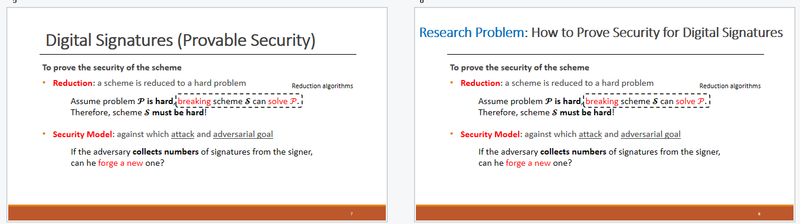
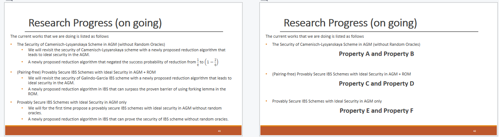
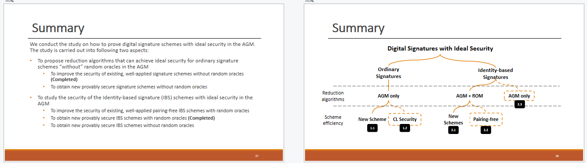
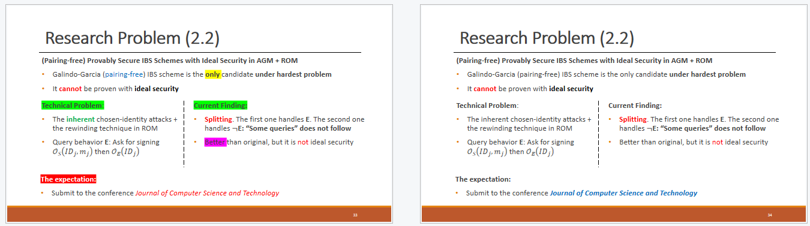
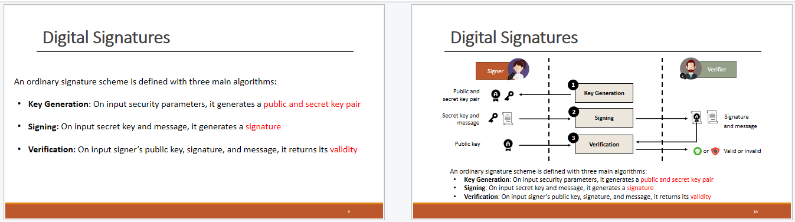

# SCIT-RPR: How to Prepare a Professional Presentation

> 源文件：`scit-rpr.pdf`（PDF 原文保留，本文由 OCR 识别生成）
>
> Fuchun Guo, Willy Susilo, Casey Chow, Hoa Dam, Nan Li — School of Computing and Information Technology (SCIT), University of Wollongong, Australia. Nov 2024 (3rd Edition).

## Abstract

A research proposal review (RPR) is an evaluation or assessment of a research proposal by experts or a committee to determine its quality, feasibility, and suitability for research. It is a crucial step in the research process, especially when seeking approval for conducting research. Besides submitting an RPR report, a higher degree research (HDR) student must deliver a presentation that outlines the research questions, aims, significance, approaches, plan, progress, and originality of the project.

However, during the RPR presentation in the School of Computing and Information Technology (SCIT), we found that many candidates lack basic skills for preparing the RPR presentation. In this article, based on samples from SCIT, we have provided this guideline for facilitating the preparation of professional presentation slides. This guideline includes three parts: (1) understanding what the panel expects from the presentation; (2) the components in your slides; and (3) good-and-bad slide examples. Our guideline captures most of the research directions in the computer sciences and IT.

## 1 Introduction

According to the [RESEARCH PROPOSAL REVIEW GUIDELINES](https://documents.uow.edu.au/about/policy/UOW238026.html) provided by the University of Wollongong (UOW), the research proposal review (RPR) presentation should allow the RPR Panel Committee to assess the candidate's capacity:

- to clearly articulate their research question (What the candidate wants to research, i.e. the aims);
- to explain the significance of the research (Why the candidate wants to research these);
- to explain how they will do the research (How the aims will be achieved);

Eventually, higher degree research (HDR) candidates are expected to be able to respond to questions about their research and the above What-Why-How parts.

In each RPR presentation, a HDR candidate has 15-mins to present the three parts mentioned above (What, Why, How). In addition, the panel will want to see other things. In the next section, we will introduce the panel's expectations. But an initial reminder is that the panel is composed of academic staff who might not be familiar with the candidate's research direction. For example, a HDR candidate is working in security (cryptology) but one panel member is a professor working in AI who has limited knowledge of cryptology.

## 2 The Panel's Expectations

In short, through the presentation, the panel needs to be able to determine whether

- This HDR candidate is on the right track for doing research: They know the research problems and why they are important; They have gained an understanding of how to solve these problems.
- The panel believes that they can successfully graduate from UOW with a HDR degree.

To convey this information to the panel, the HDR candidate must show sufficient "evidence" during the presentation and in the presentation slides.

### 2.1 Right Track

To show that the HDR candidate is on the right track, they must provide convincing content in the presentation slides. At least, the logic must be sound. How to create sound logic? We provide the following self-check questions.

- **Self-Check Question 1** You claim that this is a problem. But what application scenario has this problem? And also, why do we need to care about this application scenario? (You should explain why it is important)
- **Self-Check Question 2** You claim that we need a solution using tool X. But why is using this particular tool important? For example, why not simply use tool Y to solve it. It seems easier using tool Y. (You should explain the benefits of using X that do not exist when using Y)
- **Self-Check Question 3** You claim that you are going to solve it using tool X. But why do we need to continue finding solutions after already having a solution from X as shown in the related work? (You should clearly show the research gap between the current solution and your aims)
- **Self-Check Question 4** You claim that you are going to design a solution from tool X with a feature called A. But why do we need to have a solution X with property A? (You should explain the benefits of having this property)
- **Self-Check Question 5** You claim that you are going to design a solution from tool X with a feature called A and you plan to achieve this by using the method introduced in reference [R]. It is okay, but what is your contribution here? (There is no need to do research if the solution from [R] is straightforward.)

If the HDR candidate cannot understand why the panel may ask the above questions, it is better to learn more about the philosophy of research. Based on the description from [Research Philosophy of Modern Cryptography](https://eprint.iacr.org/2023/715), a research philosophy that may be suitable for SCIT in general is called **above and beyond**. The former represents benefits and the latter represents novelty. When we try to propose a solution more advanced than trivial solutions or existing solutions, more precisely,

- (Above) The solution being proposed brings more benefits than trivial solutions or existing solutions proposed in the literature, and
- (Beyond) The solution being proposed brings more benefits because of some novel knowledge in the proposed solution.

Research is to advance human knowledge. Benefits are proof of showing novelty in the knowledge contribution. The HDR candidate must explain in the slides why having this kind of solution will produce more benefits. Sometimes, this is not easy.

### 2.2 The Panel Believes

To convince the panel that the HDR candidate can successfully graduate from UOW and obtain sufficient research capability, a clear plan and some early research results are both important. We provide the following self-check questions.

- **Self-Check Question 6** You claim that you are going to solve three important research problems and have three research outcomes (three papers). But wait, what will happen if you fail in one of the problems? This means you will not be able to have a thesis with sufficient materials.
- **Self-Check Question 7** You claim that you are going to solve ten research problems and have ten research outcomes (10 papers). But wait! It seems that solving each problem is easy and your research is trivial! If all these problems are hard, then we don't believe that you can achieve all research outcomes within the limited time frame.
- **Self-Check Question 8** You claim that you have confidence in solving these problems and completing the thesis. But wait, it has been more than one year and you have not produced any research outcome yet. How can we believe you can complete the research within your candidature?
- **Self-Check Question 9** Your research is related to critical resources, such as device, network, dataset, and ethical approval. If any of those are not available, what should you do?

In summary, if the plan is not reasonable and there is no solid evidence (a submitted/accepted paper), it is hard for the candidate to convince the panel.

It is worth noting that answers to the panel's questions during the question phase can change the panel's opinion. "All answers to my questions were wrong", "The candidate lacks confidence", "The candidate could not explain what X is in the proposed solution", "The candidate doesn't even know what research is", or some good impression such as "wow, the answers to my questions were brief and sharp!" and "The candidate really understands what he/she is talking about".

## 3 Components in Slides

In this section, we introduce essential components to be included in slides via a framework. Unfortunately, students cannot simply import content into the framework and be done with. This is nearly impossible because (1) there is no unified presentation template especially for different research disciplines, and (2) the panel will be disinterested if all presentations feel the same (Yes, this is very important especially when the candidate wants to give a memorable presentation). We suggest that the candidate discuss with their supervisors what is suitable to use from our proposed framework.

Here, we explain the logic behind this framework.

- A HDR candidate only has 15 mins. It is impossible for the candidate to present all content from the RPR report. So, only the most important information should be presented. The slide content should be used as evidence to convince the panel that the candidate is on the right track and the candidate can complete their HDR degree within their candidature.
- The number of slides depends on how deep the candidate intends to introduce their research. If there are many slides, be sure not to quickly speed through the slides in a manner that the panel cannot keep up. If there are not many slides, make sure the candidate can convince the panel that they really know the research area.

Our proposed framework for presentation slides is described below.

- **Title Slide**
- **Outline Slide**
- **Background Slides**（1~3 张）：introduce the research background and research problems (solving these problems for this application will bring benefits). Here, the research problems can be a bit high-level to show the directions.
- **Literature Review Slide**（1~3 张）：summarize related preliminary and related solutions to clearly show the research gap (current solutions are not good enough and we can contribute more benefits). Perhaps highlight the gap by identifying strengths and weaknesses of major related work. The research gap can be a bit high level and include the research gap for each of your research problems. For example, all existing solutions in a particular application scenario are not efficient enough, and therefore not practical. Here, efficiency is the general and high-level research gap.
- **Mapping Slides**（1 张）：summarize the aims you want to achieve (a mapping of your aims to the respective research problem). The following assumes that you have four related research problems. Explain what research you will conduct in each problem (to have one chapter per research problem in your thesis)
  - **First.** Use 1~2 slides to introduce the first research question (research motivation, or research gap), related solution, your aim, your proposed solution, and its difficulty.
  - **Second.** Use 1~2 slides to introduce the second research question (research motivation, or research gap), related solution, your aim, your proposed solution, and its difficulty.
  - **Third.** Use 1~2 slides to introduce the third research question (research motivation, or research gap), related solution, your aim, your proposed solution, and its difficulty.
  - **Fourth.** Use 1~2 slides to introduce the fourth research question (research motivation, or research gap), related solution, your aim, your proposed solution, and its difficulty.
  - Note that the planned solution and its difficulty might be rough outlines based on your preliminary investigation (also based on your supervisors' experience). Eventually, when you actually conduct the research, different solutions may be required to solve the problems. This is acceptable. The proposed solutions and their difficulty here are to convince the panel that the candidate has studied this problem deeply and understands its difficulty.
- **Plan Slide**（1 张）：present the timeline (what you want to do in each quarter) from enrollment to thesis submission. In research, it may be difficult to follow the timeline exactly, but this timeline will help you to review whether you can solve all mentioned problems and submit the thesis on time.
- **Progress Slide**（1~3 张）：present the progress of the research outcomes so far, including what stage you are at, a brief overview of how you solved one or more of the problems, briefly summarize the research outcomes, and where the research result was submitted or accepted for publication. Avoid presenting too much technical detail in this part.
- **Conclusion Slide**（1 张）：revisit the timeline based on your current progress and present additional information you want the panel to be aware of.

## 4 Research Questions

A research question is a specific, focused question that a study aims to answer. It guides the investigation and sets boundaries for what the research seeks to explore. A well-defined research question is essential because it clarifies the purpose of the study, shapes the research design, and determines the methods for data collection and analysis.

In general, a good research question in an RPR representation should have the following two characteristics:

1. It should be as concise as possible, fitting within a slide title or within two lines of text in a presentation.
2. It should highlight both the key terms related to the research problem and the intended benefits.

For example, a research question with the following structure is clear:

> X (research direction or research problem) with Y (something new to be contributed).

There are plenty of good examples around you, such as the titles of published papers in top conferences.

It's important to note that: (1) A research question doesn't have to be an interrogative sentence ending with a "?" but can be a declarative sentence ending with a ".". (2) Y doesn't need to be an entirely new concept, but achieving Y in the context of X hasn't been done yet.

**Bad Examples:**

- X with $Y_1, Y_2, Y_3, Y_4, Y_5, Y_6$ properties. This looks unattractive, as it gives the impression you're merely trying to generate papers or solutions without a clear, focused story or motivation.
- What is machine learning? This is too broad and lacks a specific research focus.
- Is blockchain good for the future? This lacks specificity and a clear objective, making it more of an opinion than a research question.

## 5 Good-and-Bad Examples

In the previous three sections, we introduced the type of content to present, and how to organise the content in a logically manner. However, we have yet to cover how to prepare professional slides. This is important because the way in which the HDR candidate presents the content significantly affects the panel's understanding, and it is not easy to create professional slides. In this section, we highlight good-and-bad examples when creating slides.

- **Good-Bad Example 1** It is good to show the Title (and even Sub-Title) of each slide. This will at least help the panel know where they are, especially when they are lost. The title or sub-title should contain those keywords such as background, research problems, related solutions, research problem 1, and research timeline.
- **Good-Bad Example 2** It is bad to over clutter slides with too many words, as it will be difficult for the panel to catch key information.
- **Good-Bad Example 3** It is also bad to have too few words, as the slides are not self explanatory, and the panel will have to listen to what you say very carefully. For example, a slide that only contains three keywords (What? Who? Why?) cannot be understood without somebody to explain it.
- **Good-Bad Example 4** Generally, dot points are used in slides because we need to present a concept with lots of related information. It is bad if you include too many dot points on a slide. For example, if a slide contains more than 10 dot points, it is difficult to identify key information.

- **Good-Bad Example 5** Consider using colours, e.g., red or blue, to highlight key points on a slide. However, it is bad if you over use colours, as this can make the text uncomfortable to read.
- **Good-Bad Example 6** It is good to consider using pictures/diagrams to depict key information. Pictures/diagrams can make complex concepts easier to understand. For example, the system you want to introduce is very complicated and composed of lots of entities. A picture showing the relations of these entities is really helpful.
- **Good-Bad Example 7** The PPT animation function is very attractive and useful when you want to introduce something important (to catch the panel's attentions). However, it is bad if you over use animations.
- **Good-Bad Example 8** It is good if you can put related content on the same slide. Don't test the panel's memory. For example, if you want to cite an important paper in your introduction, it is good to put the reference as a footnote on that slide. Similarly, if you have lots of related content to present but they cannot fit on one slide, you should repeat some important information on the next slide to link the content.
- **Good-Bad Example 9** During your presentation, it is bad if you just read the text on the slide. Elaborate on the content in the slides to convince the panel that you know what you are talking about. For example, if you want to say 100 words on a slide, put about 60 words on the slide while orally explaining some key information with another 40 words.
- **Good-Bad Example 10** Consistency is important. Check the consistency of your slide deck. For example, it is good to use 2~3 font types in slide deck instead of using 10 different fonts. Another example is layout consistency, especially when introducing the four research problems.

- **Good-Bad Example 11** IT IS BAD TO USE ALL CAPITAL LETTERS IN YOUR PRESENTATION SLIDES. THIS WILL HINDER THE PANEL FROM QUICKLY UNDERSTANDING THE CONTENT ESPECIALLY WHEN THEY ARE NOT FAMILIAR WITH YOUR RESEARCH. YOU CAN EXPERIENCE THIS YOURSELF FROM THIS EXAMPLE.

## 6 Question and Answer Advice (QAA)

Through the Q&A session, the panel expects you to demonstrate an in-depth knowledge and understanding of your topic of research, your research questions and proposed approaches, and your research communities (e.g. reputable research groups, conference and journal venues). Therefore, no matter how excellent the slides are, the panel will definitely ask you some questions. In this section, we introduce how to provide clear and straight answers to the questions from the panel.

- **QAA 1** You may be nervous and fail to understand the questions the panel asked. It is good if you can rephrase the question based on your understanding and confirm with the panel before answering the question. It is really bad if you pick some keywords from the questions and explain what they are.
- **QAA 2** If a question is "Yes or Not (True or False)", you must give your answer first and then explain why you choose this as your answer.
- **QAA 3** If your answer will be long, it is better that you give a brief conclusion first and then expand it into detail. The brief conclusion will help the panel follow what you are going to say.
- **QAA 4** You can admit and say "I don't know" if you really don't know how to answer a panel member's question. This is because even professors cannot answer all questions in their research areas. The panel concerns more about "what you should do next". For example, will you just ignore this question or present what to do to convince the panel that you will eventually solve the related issue.
- **QAA 5** The questions from the panel will probably be general questions and not related to advanced knowledge. Try to use general words to answer the questions while not assuming a certain background.
- **QAA 6** Try to keep your answer specific and direct to the question asked, but prepare to elaborate on the research details (with facts or examples to support your answer) wherever necessary.
- **QAA 7** Practice your presentation with your supervisors and friends multiple times (practice, practice and practice!). You can also prepare a list of potential questions and brainstorm how you would answer them.

Here, we provide several questions and reasons from HDR RPR 2024 presentations.

1. **What do you really want to research?** This question arises because you didn't present a clear roadmap to the panel. For instance, the panel cannot see the structure of your research as X (direction) with Y (properties) for Z (benefits) from the outset of your presentation.
2. **What is the motivation of your research?** This question arises because the benefits of your research are not clearly illustrated.
3. **What is the challenge in your solution to the X research problem?** This question arises because your solution seems to be addressed in a very short period or appears simple, relying on existing solutions, as presented in your slides.
4. **How are you going to solve the challenge?** This question arises because you haven't shown clear milestones or potential solution ideas in your research plan.
5. **How can you obtain the ideal data for your research?** This question arises because your solution requires structured data, but most data are unstructured.
6. **What is the relationship between the first and third research problems?** This question arises because your research lacks consistency or coherence. You need to ensure that all detailed research problems can be derived from the thesis title or the key statement X (direction) with Y (properties) for Z (benefits).
7. **What are the potential risks in your research?** This question arises because your research may require specific resources or applications, but it is unclear how and when these resources will be available.
8. **What are you going to achieve?** This question arises because you have repeatedly emphasized the publication of five papers in your slides, but your achievements should encompass more than just papers. This question asks: What significant or important problems have you solved for humanity?

## 7 Conclusion

It is the HDR candidate's turn to start creating professional slides. Academic research is about advancing human knowledge and contributing novel outcomes that will eventually benefit humanity. Consider this when creating your RPR presentation slides. We strongly encourage the candidates to think about how to create attractive slides beyond what we have shared in this article and surprise the panel. Good luck in your research.

## Acknowledgment

We would like to thank Jason Loh for allowing us to use his presentation slides. We would also like to thank Steven Dung for his advice about reference presentation and Yizhen Wu for collecting questions in 2024 RPR.

## Latest Version of this Article

We will update this article as needed and publish it here: http://www.uow.edu.au/~fuchun
